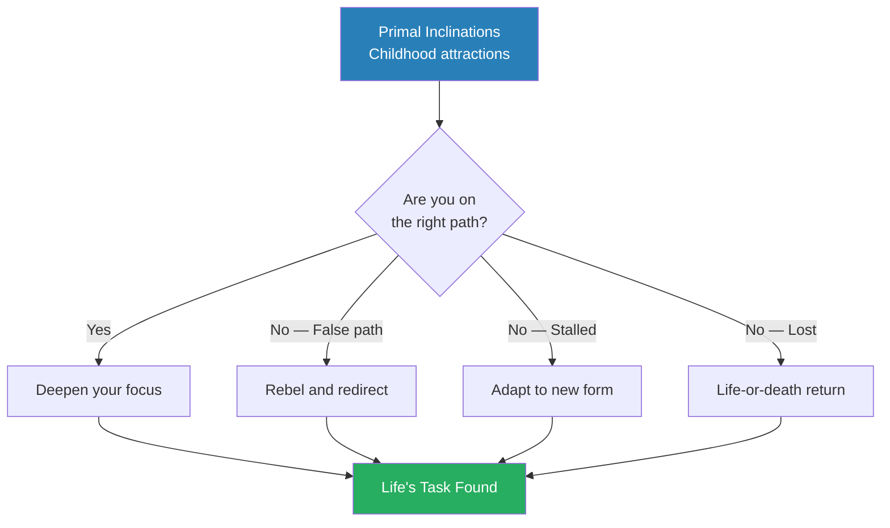
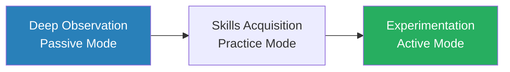
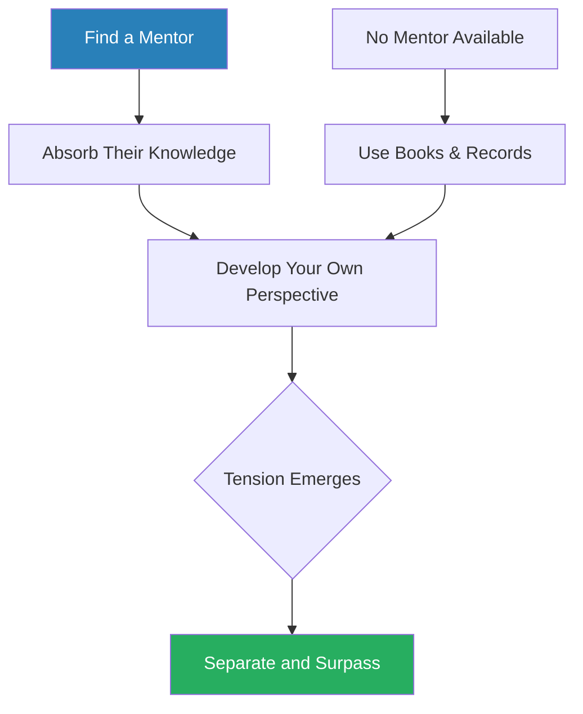
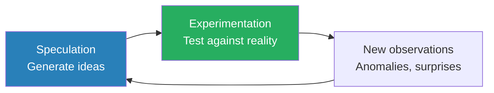
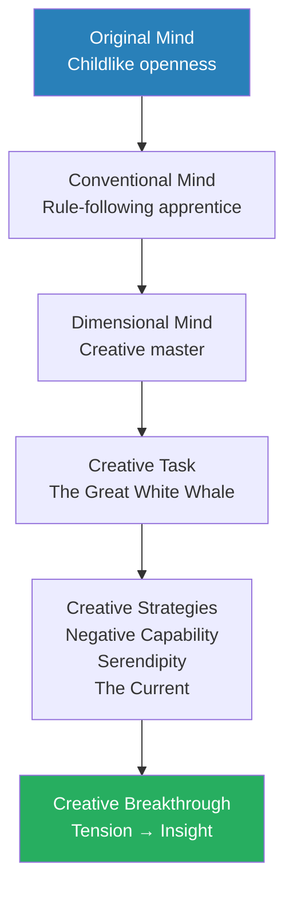
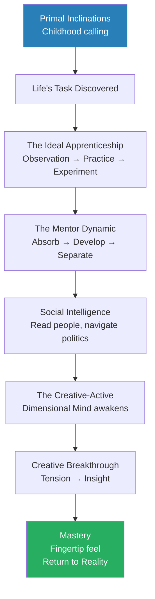

# Mastery — Robert Greene

> Mastery is not a function of genius or talent. It is a function of time and intense focus applied to a particular field of knowledge. Everyone has access to a higher form of intelligence — one that can allow us to see more of the world, anticipate trends, and respond with speed and accuracy to any circumstance. Robert Greene traces the path to mastery through the lives of history's greatest figures — Leonardo da Vinci, Darwin, Mozart, Einstein, Faraday, Franklin, Proust — and reveals that the process follows a universal pattern: discover your calling, submit to a rigorous apprenticeship, absorb the power of mentors, develop social intelligence, awaken your creative powers, and finally fuse intuition with rationality. The result is a form of intelligence that operates beyond the reach of ordinary thinking — what Greene calls "the fingertip feel."

---

## About the Author

Robert Greene is the author of six internationally bestselling books on power, strategy, seduction, war, and human nature. Before writing, he worked over fifty jobs — from Hollywood screenwriter to translator in Paris — an experience that gave him an unusually broad view of how power and mastery operate across different fields. His works draw on 3,000 years of history, philosophy, and psychology. *Mastery* (2012) is his fifth book, and he has described it as the most personal — an attempt to demystify the process by which ordinary people become extraordinary, using the biographical method he refined across his previous works. Greene studied classical studies at the University of California, Berkeley, and the University of Wisconsin at Madison.

---

## The Big Idea

- Greene's central argument is deceptively simple: <b style="color: #27ae60">mastery is not a gift bestowed on the fortunate few — it is a process available to anyone willing to follow it</b>
- The word "genius" has been mystified throughout history, turned into something divine or genetic, but Greene insists that when you study the lives of the greatest Masters — Leonardo da Vinci, Darwin, Einstein, Mozart, Faraday — you find not supernatural talent but a common pattern of intense focus, deep practice, and relentless commitment to a calling
- The path to mastery unfolds in three broad phases:
  - **The Apprenticeship** — where you submit to reality, acquire foundational skills, and transform yourself through disciplined practice
  - **The Creative-Active** — where you begin to apply your accumulated knowledge in original ways, experimenting and pushing boundaries
  - **Mastery itself** — where years of immersion produce an intuitive grasp of your field so deep that it feels almost like a sixth sense
- What makes this book distinctive in Greene's canon is its optimism — where *The 48 Laws of Power* and *The Laws of Human Nature* map the darker territories of human behaviour, *Mastery* maps the luminous potential within every person
- Greene grounds his argument in neuroscience (mirror neurons, brain plasticity, mnemonic networks) and evolutionary biology (our ancestors' development of focused attention), but the real force of the book comes from its biographical studies — nine contemporary Masters and dozens of historical figures whose stories illuminate every stage of the journey
- The enemy of mastery is not lack of talent but <b style="color: #e74c3c">passivity — the willingness to accept a conventional life, to follow paths chosen by others, to let comfort and security override the inner voice calling you toward your Life's Task</b>
- Greene estimates the journey at roughly 10,000 hours for deep competence and 20,000 hours for true mastery — not as a rigid formula but as a rough indicator of the time required for the brain to fully internalize a field

---

## Key Concepts at a Glance

| Concept | One-line summary |
|---------|-----------------|
| **Life's Task** | The unique calling encoded in your DNA and childhood inclinations |
| **The Ideal Apprenticeship** | A three-mode process of observation, practice, and experimentation |
| **The Mentor Dynamic** | Absorbing a master's knowledge through personal interaction, then surpassing them |
| **Social Intelligence** | Reading people realistically to conserve energy for your real work |
| **The Seven Deadly Realities** | Universal negative traits (envy, conformism, rigidity, etc.) that derail mastery |
| **The Dimensional Mind** | A fluid, creative mind that makes connections across domains |
| **Negative Capability** | The ability to tolerate ambiguity and uncertainty without grasping for answers |
| **The Current** | Alternating between absorbing knowledge (speculation) and testing it (experiment) |
| **The Creative Breakthrough** | Tension and pressure that produce sudden insight after long incubation |
| **Fingertip Feel** | High-level intuition gained from 20,000+ hours of immersed practice |
| **The Return to Reality** | The Master's ability to perceive the interconnected wholeness of life |

---

## The Path to Mastery — Overview

Greene's six chapters trace a sequential journey from self-discovery to the heights of human intelligence — each phase building on the last.

---

# Introduction: The Ultimate Power

*Greene opens with a provocative claim: there exists a form of power and intelligence that represents the absolute peak of human potential — and it is accessible to all of us.*

## The Nature of Mastery

- Most people have glimpsed this power in moments of intense focus — facing a deadline, solving an urgent problem, working on a project that fully absorbs them
- In these moments, ideas seem to spring from the unconscious, other people become less resistant to our influence, and we feel we can determine events rather than merely react to them
- Greene calls this <b style="color: #2980b9">mastery</b> — not just expertise, but a qualitatively different form of intelligence:
  - It combines rational analysis with intuitive grasp
  - It allows the Master to see patterns invisible to others
  - It produces what feels like a sixth sense — an ability to anticipate and respond with uncanny accuracy
- This power is not magical or genetic — it is the natural result of following a specific process over many years
- Greene uses three terms to describe this intelligence at its peak:
  - **High-level intuition** — the ability to grasp the essence of a situation instantly, without step-by-step reasoning
  - **The fingertip feel** — a term borrowed from the German *Fingerspitzengefühl*, describing the tactile, almost physical sense Masters develop for their domain
  - **The Dynamic** — the Master's perception of reality as a living, interconnected whole rather than a collection of separate parts
- The book is structured around six chapters, each corresponding to a stage in the journey:
  - I. Discover Your Calling (Life's Task)
  - II. Submit to Reality (Apprenticeship)
  - III. Absorb the Master's Power (Mentorship)
  - IV. See People as They Are (Social Intelligence)
  - V. Awaken the Dimensional Mind (Creative-Active)
  - VI. Fuse the Intuitive with the Rational (Mastery)
- Each chapter opens with a detailed biographical study of a Master, followed by "Keys to Mastery" (Greene's framework), then multiple strategies illustrated by additional biographical examples, and finally a "Reversal" that complicates or nuances the chapter's thesis

---

## The Evolution of Mastery

*Greene traces our capacity for mastery back to our earliest ancestors, arguing that it is literally wired into our brains.*

- Our primitive ancestors were physically vulnerable — no claws, no fangs, no speed
- What they developed instead was <b style="color: #27ae60">the ability to detach from the immediate environment and think</b>:
  - They could observe animal behaviour patterns over weeks and months
  - They could craft tools and coordinate hunts with social intelligence
  - They developed **mirror neurons** — brain cells that fire both when performing an action and when observing someone else perform it — enabling learning through observation
- The human brain evolved as a multiuse, immensely flexible instrument:
  - Capable of visual, spatial, mechanical, and linguistic thinking simultaneously
  - Designed not for narrow specialisation but for deep, sustained focus on a chosen domain
  - Equipped with plasticity — the ability to physically reshape itself through practice
- <b style="color: #2980b9">The 10,000-hour threshold</b>: Greene draws on the research of Anders Ericsson (later popularised by Malcolm Gladwell) to argue that approximately 10,000 hours of deliberate practice produces competence in any field — and that 20,000 hours approaches true mastery
  - This is not mere repetition but engaged, challenging practice that pushes the boundaries of current ability
  - The brain physically rewires during this process — neural pathways become hardwired, freeing up mental resources for higher-order thinking
- Greene also addresses the modern dismissal of mastery:
  - Our culture celebrates the quick fix, the shortcut, the overnight success
  - We are told that technology will replace the need for deep skill — that AI and algorithms will do the hard work for us
  - Greene argues this is precisely wrong: in a world flooded with information and superficial expertise, <b style="color: #27ae60">deep mastery becomes more valuable, not less</b>
  - The person who has spent 20,000 hours mastering a domain can see what no algorithm can — the subtle patterns, the hidden connections, the solutions that emerge only from lived experience
- The role of desire in mastery:
  - Raw talent without desire produces nothing
  - Intense desire without discipline produces frustration
  - <b style="color: #27ae60">The combination of deep desire and disciplined practice produces mastery</b>
  - Greene argues that desire is the more important of the two — you can develop discipline, but you cannot manufacture genuine passion
- Greene draws on the Chuang Tzu story of the cook who carves an ox with supernatural grace:
  - The cook explains that he no longer sees the ox as a whole — he perceives the inner structure so deeply that his knife finds the spaces between joints effortlessly
  - He has cut thousands of oxen over nineteen years, and his knife is still sharp because it never meets resistance
  - This is mastery in its purest form — so much practice that the work becomes an expression of nature itself, not effort
- Greene also draws on the concept of **social intelligence** as an evolutionary driver:
  - Our early hominid ancestors lived in groups, and survival depended not just on individual skill but on the ability to read and influence others
  - The development of mirror neurons allowed early humans to learn by watching — a child could observe a parent making a tool and replicate the movements without verbal instruction
  - This capacity for observational learning was the foundation of all apprenticeship — and it remains the mechanism by which mentors transmit tacit knowledge today
  - The evolution of the frontal cortex — the brain region responsible for planning, abstraction, and impulse control — gave humans a unique advantage: the ability to delay gratification
  - An animal acts on impulse; a human can resist the impulse, plan a strategy, and execute it over weeks or months
  - This capacity for delay is the neurological foundation of the apprenticeship phase — the ability to endure years of tedious practice for a distant reward
- The three phases of mastery correspond roughly to evolutionary stages:
  - **Phase 1 (Apprenticeship)** — the absorption phase, analogous to the long childhood of humans compared to other primates
  - **Phase 2 (Creative-Active)** — the integration phase, where absorbed knowledge is recombined into original forms
  - **Phase 3 (Mastery)** — the transcendence phase, where intuition and rationality fuse into a single instrument

> [!tip] Core Insight
> Mastery is not a quality you are born with. It is a form of intelligence your brain was literally designed to attain — if you follow the process long enough and with enough intensity.

---

## Keys to Mastery — The Darwin Model

*Greene uses Charles Darwin as the archetype for the entire journey to mastery.*

> [!example] Charles Darwin's Path to Mastery
> - As a child, Darwin had one overriding passion — collecting biological specimens
> - His father, a successful doctor, wanted him to study medicine; Darwin was a mediocre student at Edinburgh
> - Despairing, his father chose a career in the church for him
> - A former professor told Darwin the HMS Beagle needed a ship's biologist to sail around the world
> - Despite his father's protests, Darwin took the job — something in him was drawn to the voyage
> - Suddenly his passion for collecting found its perfect outlet — in South America he accumulated an astounding array of specimens
> - He could connect his interest in the variety of life with major questions about the origins of species
> - After five years at sea, he returned to England and devoted the rest of his life to elaborating his theory of evolution
> - He endured eight years of studying barnacles, developed refined social skills to handle Victorian prejudice, and sustained it all through intense love of his subject
> **The lesson:** Darwin's story contains every element of the mastery journey — discovering a calling, submitting to apprenticeship, navigating social obstacles, and achieving a creative breakthrough.

- Greene identifies the common traits of all great Masters:
  - An intense connection to a subject discovered early in life
  - A willingness to undergo years of disciplined practice
  - The ability to endure tedium, setbacks, and social resistance
  - A refusal to be deflected from their path by convention or comfort
  - A deep sense of purpose that sustains them through the inevitable dark periods
- What people call "genius" is almost always the result of this process, not its cause:
  - Mozart practised obsessively from age four — by the time he composed his first truly original work (*The Marriage of Figaro*, when he was thirty), he had accumulated well over 10,000 hours of practice and composition
  - Einstein was not a prodigy — he was a middling student who spent years as a patent clerk, thinking deeply about physics in his spare time; his "miracle year" of 1905 was preceded by a decade of intense private study
  - Leonardo da Vinci was an illegitimate child with no formal education who taught himself through relentless observation and experimentation; his notebooks reveal not effortless genius but decades of painstaking work
  - Faraday was the son of a blacksmith, barely educated, who became one of the greatest experimental physicists in history through pure apprenticeship and self-teaching
- Greene is not arguing that talent doesn't exist:
  - Some people clearly have natural advantages — better spatial reasoning, faster processing speed, stronger working memory
  - But these advantages are small compared to the effect of sustained, focused practice
  - The person with modest natural talent who practises intensely for 20,000 hours will far surpass the naturally gifted person who coasts on their abilities
  - <b style="color: #27ae60">Desire and discipline are the multipliers that turn modest talent into extraordinary achievement</b>
- The concept of **brain plasticity** is central to Greene's argument:
  - Until the late twentieth century, neuroscientists believed the brain was essentially fixed after childhood
  - Modern neuroscience has demolished this view: the brain remains plastic throughout life, capable of forming new neural connections, growing new dendrites, and even generating new neurons in some regions
  - This means that intense practice doesn't just improve performance — it literally reshapes the brain
  - The more you practise, the more neural real estate is devoted to your domain of expertise
  - London taxi drivers, who must memorise thousands of street routes, have measurably larger hippocampi than bus drivers, who follow fixed routes
  - This plasticity is the neurological foundation of mastery — your brain adapts to what you demand of it
- The danger of passivity:
  - Greene warns that the modern world conspires against mastery in subtle ways
  - We are surrounded by distractions — social media, entertainment, the constant stream of information that feels productive but isn't
  - We are told that "following your passion" is naive, that practical concerns should take priority
  - We are socialised to fit in, to follow established paths, to avoid the risk of pursuing something unconventional
  - The result is what Greene calls a "death of the spirit" — a gradual dimming of the inner fire that could have led to mastery
  - <b style="color: #e74c3c">The greatest threat to your potential is not failure but the passive acceptance of a life that doesn't challenge you</b>

---

# Chapter I — Discover Your Calling: The Life's Task

*Greene argues that within each person lies a force — a unique set of inclinations — that, if followed, leads inevitably toward a life of deep fulfilment and mastery.*

## The Hidden Force — Leonardo da Vinci

> [!example]- Leonardo da Vinci and the Power of Inclination (1452–1519)
> - Born the illegitimate son of a notary in the Tuscan town of Vinci, Leonardo was barred from attending university or entering any of the established professions
> - Left to his own devices, he wandered the countryside, developing an intense fascination with nature — the flight of birds, the movement of water, the anatomy of plants
> - At age twelve, his father arranged an apprenticeship with the great Florentine artist Andrea del Verrocchio
> - In Verrocchio's workshop, Leonardo absorbed painting, sculpture, engineering, and mechanics — but always with his own peculiar twist, bringing his obsessive nature observation into his art
> - Verrocchio ran one of the finest workshops in Florence — a true Renaissance bottega where apprentices learned not just painting but goldsmithing, sculpting, casting bronze, and engineering
> - Leonardo threw himself into every discipline available, but he always returned to what fascinated him most: capturing the living quality of nature itself
> - When he painted an angel's face in Verrocchio's *The Baptism of Christ*, the result was so lifelike — so infused with his direct study of nature — that Verrocchio reportedly put down his brush, saying his student had surpassed him
> - Leonardo went on to fill thousands of notebook pages with observations, inventions, and anatomical studies — a uniquely restless, cross-disciplinary mind that refused to stay within any single domain
> - He would spend years on a single painting because he insisted on understanding the underlying reality — the muscles beneath the skin, the physics of light, the mathematics of perspective
> - His "deficiency" — his illegitimate birth, which barred conventional paths — became his greatest asset, forcing him onto the unconventional path of direct observation and hands-on experimentation
> **The lesson:** Leonardo's calling was not painting or engineering or science — it was the deep investigation of reality itself. His illegitimate birth, which barred conventional paths, forced him onto the unconventional path that became his greatest strength.

## Keys to Mastery — The Life's Task

- Greene defines the <b style="color: #2980b9">Life's Task</b> as the unique calling that each person possesses:
  - It is encoded in your DNA and in the experiences of your early childhood
  - It manifests as a deep, almost inexplicable attraction to certain activities, subjects, or ways of thinking
  - Many of the greatest Masters — Napoleon, Socrates, Goethe, Einstein — have described sensing a force or voice guiding them
- This is not mystical — it is eminently practical:
  - Each person is born with a unique combination of genetics, experiences, and neural wiring
  - This combination creates a set of **primal inclinations** — natural affinities that feel compelling even before we understand them
  - When we follow these inclinations, we learn faster, endure more, and produce more original work
  - When we ignore them — choosing careers for money, status, or parental approval — we feel a persistent emptiness that no external reward can fill
- The modern world actually makes following your Life's Task easier than ever:
  - In the past, rigid class and guild structures blocked most people from their true callings
  - Today, the barriers are largely internal — <b style="color: #e74c3c">the greatest obstacles are our own fears, our desire for comfort, and the pressure to conform</b>
- Greene distinguishes the Life's Task from a mere career choice:
  - A career is a job you do for money and status
  - A Life's Task is an expression of who you are — it gives your work a sense of purpose that sustains you through decades of difficulty
  - Many people choose careers that seem practical or prestigious but that have no connection to their deepest interests — these are <b style="color: #2980b9">false paths</b>
  - The result is a life of quiet frustration — you may achieve external success but feel an internal emptiness that no promotion or pay rise can fill
- The concept of **vocation**:
  - The word comes from the Latin *vocare* — "to call"
  - Greene quotes the philosopher Jose Ortega y Gasset: among the various possible beings each person could become, there is always one that is "genuine and authentic" — and the voice that calls you to that authentic being is your vocation
  - Most people, Ortega warns, "devote themselves to silencing that voice"
  - They "make a noise within themselves" to drown it out, substituting a "false course of life" for the real one
- The Romans had a concept for this — the **daemon**, an inner guiding spirit unique to each individual:
  - Socrates claimed to be guided by a daemon — an inner voice that told him when he was going astray; it never told him what to do, only what *not* to do, acting as a kind of internal compass
  - Goethe described his daemon as a force that pushed him relentlessly toward his calling, even when he resisted; he felt that ignoring it produced illness and depression, while following it produced vitality
  - Napoleon felt guided by a "star" — a sense of destiny that gave him supreme confidence even in dire circumstances; he could feel when he was aligned with this force and when he was not
  - Greene argues these are not delusions but intuitive recognitions of the Life's Task — a force that is real even if its origins are mysterious
- Greene uses the concept of the **seed** to describe how the Life's Task develops:
  - Each person carries a seed of uniqueness — a combination of traits, inclinations, and potentials that no one else shares
  - Like a physical seed, it contains the blueprint for what you can become — but it requires the right conditions to germinate and grow
  - The conditions are: awareness (recognising the seed), courage (following it despite opposition), and discipline (doing the daily work required to nurture it)
  - Many people carry seeds that never germinate — not because the seeds are defective but because the conditions were never right
  - The modern world provides unprecedented conditions for seed-germination: access to information, freedom of career choice, the ability to connect with mentors anywhere in the world
  - The obstacles are largely internal: fear, conformity, the seduction of comfort, the pressure to follow established paths

- The quest for your Life's Task requires active effort — it will not simply announce itself:
  - You must examine your past for clues — what activities absorbed you as a child? What subjects could you read about for hours without boredom?
  - You must experiment — trying different domains, paying attention to what energises you and what drains you
  - You must be honest about what you genuinely love versus what you think you *should* love
  - Some people discover their Life's Task early (Einstein at five, Martha Graham as a teenager); others take decades (Buckminster Fuller at thirty-two)
  - The timing matters less than the commitment — once you find it, everything changes
  - Greene warns against two common errors in the search:
    - **The error of imitation**: choosing a Life's Task because someone you admire has chosen it, not because it genuinely calls to *you*
    - **The error of rebellion**: choosing a Life's Task purely to oppose your parents or your culture, rather than because it connects to your deepest inclinations
  - Both errors produce false paths — paths that may look authentic but that lack the deep personal connection necessary to sustain decades of effort
  - The test is simple: does this path energise you or drain you? Do you lose track of time when engaged with it, or do you watch the clock?
  - Genuine inclinations produce energy; false paths consume it
  - After years on a genuine path, you will feel richer, more alive, more capable
  - After years on a false path, you will feel depleted, brittle, and vaguely resentful — even if you have achieved external success
- Greene offers a thought experiment for testing whether you are on the right path:
  - Imagine you have been told you have five years to live — would you continue doing what you are doing?
  - If the answer is no, you are almost certainly on a false path
  - If the answer is yes — if you would keep doing this work even with limited time — then you have found your Life's Task
  - This test cuts through all the rationalisations, obligations, and practical concerns that usually cloud the question
  - It reveals the naked truth about what matters to you
  - Greene notes that many of the Masters he profiles faced exactly this kind of test — Fuller at the edge of Lake Michigan, Mozart deciding whether to stay in Vienna, Coltrane getting clean in 1957
  - In each case, the confrontation with mortality or crisis produced extraordinary clarity about what mattered
  - You do not need to wait for a crisis — you can perform this thought experiment deliberately, at any time, and use the answer to guide your decisions

> [!tip] Core Insight
> Your Life's Task is not something you invent — it is something you discover by paying attention to what has always drawn you, even in childhood.

---

## Strategies for Finding Your Life's Task

### Strategy 1: Return to Your Origins — The Primal Inclination Strategy

- Look back to your childhood for clues about your deepest inclinations
- These early attractions are the purest signals — uncorrupted by social pressure or practical concerns

> [!example] Albert Einstein and the Compass (c. 1884)
> - At age four or five, Einstein was shown a compass by his father
> - He was mesmerised — not by the object itself but by the invisible force that moved the needle
> - This fascination with invisible forces and the hidden workings of nature never left him
> - Years later, as a young patent clerk in Bern, he would spend his lunch hours and evenings thinking about the deepest problems in physics — driven by the same childlike wonder about the invisible forces governing the universe
> - His work on relativity was not an intellectual exercise — it was the adult expression of a four-year-old's astonishment at an invisible force
> **The lesson:** The interests that captivate you as a child — before the world teaches you what you "should" care about — are the truest compass for your Life's Task.

> [!example] Marie Curie's Childhood Laboratory
> - Growing up in Warsaw under Russian occupation, the young Marie Sklodowska was drawn to her father's physics laboratory equipment
> - She would stare at the instruments for hours, fascinated by the idea that they could reveal hidden truths about nature
> - Her father, a physics teacher, noticed her rapt attention and encouraged her, though the family had almost no money
> - Years later, in her cramped Paris laboratory, she pursued the anomaly of radioactivity with the same childhood intensity — a force invisible to the eye but measurable through instruments
> - The connection was direct: the little girl entranced by instruments that could detect hidden forces became the woman who spent her life using instruments to unlock nature's deepest secrets
> **The lesson:** Curie's primal inclination was not "science" in the abstract — it was the specific thrill of using instruments to detect hidden forces.

- Other examples Greene cites:
  - **Ingmar Bergman** — captivated by a toy projector at age nine, which sparked his lifelong obsession with cinema and the manipulation of images to evoke emotion; he would later say that his entire career was an elaboration of the feelings that toy projector stirred in him
  - **Martha Graham** — saw Ruth St. Denis perform as a teenager and knew instantly that movement was her language; she was not interested in the dance itself but in the capacity of the body to express things words could not
  - **John Coltrane** — heard jazz on the radio as a boy and felt a physical pull toward the saxophone that no other activity could match; his obsession was not with "music" in general but with the specific sound of the saxophone
  - **Daniel Everett** — grew up on the Mexican border, fascinated by the indigenous languages he heard around him; this childhood fascination eventually led him to live among the Piraha in the Amazon
- Greene's key mechanism:
  - These early inclinations are not arbitrary preferences — they reflect something deep in your neurological and genetic makeup
  - A child drawn to machines is not randomly attracted to machines — their brain is wired in a way that makes mechanical reasoning pleasurable and effective
  - Following these inclinations feels effortless because you are working *with* your brain's natural architecture, not against it
  - Ignoring them feels like swimming upstream — you can do it, but it requires constant effort and produces diminishing returns
- The practical challenge:
  - Most adults have buried their childhood inclinations under layers of practical concerns, social conditioning, and habit
  - Greene's advice: look back — what fascinated you before anyone told you what you should care about?
  - The answer may not point to a specific career, but it will reveal a *type of activity* — working with your hands, solving puzzles, reading about people, building things, performing for others
  - Your Life's Task is the adult expression of that childhood impulse
  - Greene identifies a critical distinction: the childhood inclination points to a *type of engagement*, not a specific career
  - Einstein's fascination with the compass pointed to "understanding invisible forces" — not "becoming a physicist"
  - Martha Graham's fascination with Ruth St. Denis pointed to "expressing emotion through the body" — not "becoming a dancer"
  - The Life's Task is broader and more flexible than any single career title
  - This flexibility is important because it allows for the adaptation that Strategy 4 (Let Go of the Past) describes — when one specific form is blocked, the underlying inclination can find another

---

### Strategy 2: Occupy the Perfect Niche — The Darwinian Strategy

- In nature, species that thrive are those that find a niche — a specific environment where their unique traits give them an advantage
- The same principle applies to your Life's Task:
  - <b style="color: #27ae60">Do not try to compete on the same terrain as everyone else — find or create a niche that suits your unique combination of skills and interests</b>
  - This often means combining two or more fields in a way nobody else has

> [!example]- V. S. Ramachandran's Neurological Niche
> - As a young medical student in India, Ramachandran found himself drawn to two seemingly unrelated things: the visual system (particularly optical illusions) and the detective-story quality of solving puzzles
> - Rather than following the mainstream of brain imaging and laboratory research, he carved out a niche studying bizarre neurological conditions — phantom limbs, synesthesia, apotemnophilia
> - His approach was unfashionably low-tech — simple mirrors and cotton swabs rather than expensive fMRI machines
> - He noticed something that more established researchers missed: patients with phantom limbs felt pain in arms that no longer existed, and this pain responded to visual feedback
> - He devised a simple mirror box that "showed" the brain a reflection of the intact limb in place of the missing one — and the phantom pain vanished
> - This cheap, elegant experiment overturned decades of assumptions about how the brain processes pain
> - By occupying this neglected territory — bizarre conditions that "serious" neuroscientists ignored — he made discoveries that transformed the field
> **The lesson:** The richest intellectual territory is often the territory nobody else wants.

> [!example] Yoky Matsuoka's Cross-Pollination Niche
> - Matsuoka was a competitive tennis player in Japan who dreamed of building a robot that could play tennis with her
> - She pursued degrees in electrical engineering and neuroscience at MIT and then a PhD in robotics
> - Rather than choosing between robotics and neuroscience, she fused both fields — creating a niche in neurobotics that barely existed
> - She studied under the legendary roboticist Rodney Brooks, absorbing his philosophy of embodied intelligence — the idea that robots should learn from their physical interaction with the world, not from abstract programming
> - She designed robotic hands that could replicate the dexterity of the human hand by studying the neuroscience of how the brain controls fingers
> - Her unique combination attracted attention from Google, where she helped found Google X (the company's experimental division)
> - Matsuoka's childhood dream of a tennis-playing robot led her, through a circuitous path, to the frontier of artificial intelligence
> **The lesson:** The most powerful niches are those that combine two or more existing fields in a way that nobody else has thought to combine them.

- Greene draws an explicit analogy to Darwin's theory of natural selection:
  - In nature, the species that occupies a unique ecological niche faces less competition and has more resources
  - The same is true in human careers — if you are competing in the same space as thousands of others, your chances of standing out are slim
  - But if you occupy a niche that fits your unique combination of skills and interests, you face almost no competition
  - <b style="color: #27ae60">The goal is not to be the best at what everyone else does — it is to be the only one who does what you do</b>

---

### Strategy 3: Avoid the False Path — The Rebellion Strategy

- A false path is one chosen for the wrong reasons — money, fame, parental approval, or the need for attention
- The danger is that it *seems* right at first — the external rewards are real, even if the internal satisfaction is hollow

> [!example]- Wolfgang Amadeus Mozart's Rebellion (1777–1781)
> - From age four, Mozart was trained by his father Leopold — a talented musician who quickly recognised his son's genius
> - Leopold took Wolfgang on tour across Europe's royal courts, earning money from the child's performances
> - Wolfgang willingly submitted — he owed everything to his father, and the attention from royal audiences was intoxicating
> - But as he entered adolescence, something stirred within him: was it the music he loved, or simply the attention? He felt confused
> - His father insisted he write conventional pieces that pleased royal audiences and brought in money
> - The city of Salzburg, where they lived, was provincial and bourgeois — Mozart yearned for something else
> - Yet Leopold's control was absolute — as the patriarch, he demanded total obedience even though it was young Wolfgang who was supporting the family
> - Mozart accepted a dull position as court organist in Salzburg, feeling increasingly stifled with each passing year
> - Finally, in a flash of clarity, he realised his true calling was not performing but composing — specifically opera, the form that combined music, drama, and spectacle
> - His father was not merely an obstacle but was actively (perhaps unconsciously) stifling his progress out of jealousy — Leopold had given up his own composing ambitions to manage his son's career
> - In 1781, on a trip to Vienna, Mozart made the fateful decision to stay — he would never return to Salzburg
> - Leopold never forgave him; the rift was permanent and deeply painful for both
> - Feeling he had lost years under his father's thumb, Mozart composed at a furious pace — his greatest operas pouring out of him as if released from a dam
> **The lesson:** Sometimes the person most invested in your success is also the person most threatened by your independence. You must recognise and rebel against forces — even loving ones — that push you away from your true path.

- Greene's key insight: <b style="color: #e74c3c">if you sense that your current path was chosen for someone else's reasons, the sooner you break away, the better — before your confidence erodes further</b>
- The false path is particularly dangerous because it involves genuine rewards — money, status, attention — that make it hard to leave
- But these rewards are hollow because they do not connect to your deepest inclinations
- The longer you stay on a false path, the harder it becomes to leave — your identity becomes entangled with the path, and abandoning it feels like abandoning yourself
- Greene identifies several warning signs that you are on a false path:
  - You feel a persistent sense of dissatisfaction that no achievement can resolve
  - You daydream about doing something completely different
  - You feel energised on weekends and drained during the workweek — a sign that your real inclinations are not being engaged by your work
  - You envy people in other fields — not their success but their *engagement* — they seem to care about what they do in a way you cannot
  - You find yourself going through the motions — doing competent work without passion, meeting expectations without exceeding them
- The moment of rebellion — when you finally break away from the false path — is terrifying:
  - You are giving up known rewards (salary, status, security) for unknown ones
  - People around you will question your sanity — especially those who are themselves on false paths and need your conformity to validate their own choices
  - Mozart's father called him ungrateful; Fuller's family thought he was losing his mind; Coltrane's fellow musicians worried he was destroying his career
  - <b style="color: #27ae60">The pain of rebellion is real but temporary; the pain of remaining on a false path is dull but permanent</b>

---

### Strategy 4: Let Go of the Past — The Adaptation Strategy

*Your Life's Task is not fixed — it evolves as you evolve. The key is to adapt your core inclinations to new circumstances rather than clinging to a form that no longer serves you.*

> [!example]- Freddie Roach's Reinvention (1980s–1990s)
> - Groomed for boxing from age six by his fighter father, Roach discovered a genuine passion for the sport — but the catalyst was his mother's doubting words: "You can't fight"
> - He trained under the legendary Eddie Futch and showed great promise, but in actual bouts his emotions overwhelmed his technique — he would revert to wild brawling when provoked
> - Futch saw the problem clearly: Roach had the knowledge and the will, but something in his emotional makeup prevented him from executing in the ring what he understood intellectually
> - After years of accumulating damage — both physical and psychological — Futch told him to retire
> - Roach took a telemarketing job and drank heavily, sinking into depression; everything he had worked for seemed wasted
> - Almost in spite of himself, he returned to Futch's gym to help a friend prepare for a fight — and discovered his true calling was not fighting but *training*
> - He could see fighters' weaknesses with uncanny clarity, and he could communicate corrections in real time
> - He adapted Futch's techniques to a revolutionary new system: the padded mitt work, which allowed trainers to spar with fighters in real time, devising entire strategies through physical interaction rather than verbal instruction
> - Within years he became the most successful boxing trainer of his generation, training champions including Manny Pacquiao
> **The lesson:** Your Life's Task is a living organism. When circumstances force a change, resist the temptation to mourn what was — adapt your core inclinations to a new direction.

- Greene's mechanism for adaptation:
  - The core inclination remains constant — Roach's deep love of boxing never changed
  - What changed was the *form* through which he expressed it — from fighter to trainer
  - This flexibility is essential because life rarely unfolds as planned
  - The rigid person who clings to one specific form of their calling will break when circumstances change
  - The flexible person who can adapt their calling to new forms will find that each adaptation deepens their understanding
  - Greene argues that the Life's Task is like water — it always flows toward the sea, but it adapts its course to the terrain
  - The person who insists on a single specific form ("I must be a concert pianist") rather than the underlying inclination ("I must express myself through music") will shatter when circumstances prevent the specific form
  - Roach could not be a fighter — but the same love of boxing, the same intensity and understanding, found a new and arguably more powerful form in training
  - The adaptation was not a compromise but a deepening — as a trainer, Roach could see boxing more clearly than he ever had as a fighter, because he was no longer blinded by the fog of his own emotions in the ring

---

### Strategy 5: Find Your Way Back — The Life-or-Death Strategy

> [!example]- Buckminster Fuller's Moment at the Lake (1927)
> - Fuller was born with extreme nearsightedness, which gave him a tactile, non-visual form of intelligence — he experienced the world primarily through touch and spatial reasoning
> - As a child, he was endlessly resourceful — he invented an oar modelled on jellyfish propulsion and built structures from scraps — but he couldn't adapt to formal education; Harvard expelled him twice
> - He bounced from job to job, failing at business, losing investors' money, and falling into despair
> - His young daughter died of polio and spinal meningitis, and he blamed himself — convinced that his failures had contributed to the poor living conditions that weakened her
> - One evening he walked to Lake Michigan, intending to drown himself — his insurance would provide for his family better than he could
> - At the water's edge, he heard a voice (whether external or internal, he couldn't say): "You do not belong to you. You belong to Universe"
> - He turned away from the water and reassessed his entire life with brutal honesty
> - He realised his "failures" were the world telling him he'd been following the wrong path — trying to fit into a world of conventional business where he didn't belong
> - He swore to listen only to his own experience and instincts, and began designing radical new forms of transportation and shelter
> - This led to the Dymaxion car, the Dymaxion house, and the geodesic dome — inventions that changed architecture forever
> - Fuller understood that his unconventional way of thinking — spatial, tactile, structural — was not a deficiency but his greatest asset
> **The lesson:** Deviation from your true path produces hidden pain proportional to the distance of the deviation. The way back requires sacrifice and patience — but the rewards are genuine and lasting.

- Greene draws a striking parallel:
  - The pain of living a false life is real but often unrecognised — it manifests as depression, addiction, irritability, and a vague sense of emptiness
  - Many people numb this pain rather than addressing its source — the numbing becomes the problem, obscuring the underlying cause
  - The "life-or-death" moment comes when the pain becomes impossible to ignore — a crisis, a breakdown, a moment of absolute clarity
  - For some, like Fuller, it is literally a brush with death; for others, it is a quieter but equally decisive turning point
  - <b style="color: #e74c3c">The farther you have strayed from your true path, the more painful — but also the more necessary — the return becomes</b>
- Greene notes that Fuller's unconventional intelligence — spatial, tactile, structural — was considered a deficiency by the educational system:
  - Harvard was designed for verbal and mathematical intelligence; Fuller's intelligence was neither
  - His repeated expulsions were not signs of stupidity but of misalignment between his type of mind and the institution's definition of intelligence
  - Once he stopped trying to fit himself into institutions designed for other types of minds, his unconventional intelligence became an enormous advantage
  - The geodesic dome, his most famous invention, was a product of exactly the kind of spatial-structural thinking that Harvard could not measure or value
  - Fuller's story illustrates a crucial point about the Life's Task: the institutions and systems around you may actively work against your natural inclinations, not out of malice but because they are designed for a different type of mind

---

### Reversal: Temple Grandin — Working with Deficiencies

> [!example]- Temple Grandin and the Power of Different (1950–present)
> - Diagnosed with autism at age three, Grandin couldn't speak and was expected to be institutionalised for life
> - A speech therapist slowly taught her language, but her mind still worked differently — she thought in images, not words
> - She retreated to her two comforts: interacting with animals and building things with her hands
> - At age eleven, visiting her aunt's ranch in Arizona, she saw cattle placed in a squeeze chute — and asked to be placed in it herself
> - The deep pressure calmed her profoundly — she felt, for the first time, a physical sensation that quieted her anxious mind
> - She later built her own version of the squeeze machine at home, enduring ridicule from classmates and scepticism from doctors
> - Her obsession with cattle, squeeze chutes, and the effect of pressure on the nervous system drove her to develop research skills
> - She began visiting feedlots and slaughterhouses, noticing things that neurotypical observers missed — the way cattle reacted to shadows, reflections, and dangling chains
> - She could see the world through the animals' eyes because her visual, detail-oriented mind processed the environment the way theirs did
> - She carved out a unique career designing humane cattle chutes and slaughterhouses, eventually becoming a professor, author, and world-renowned lecturer on both animals and autism
> - Her "deficiency" turned out to be a form of intelligence that no neurotypical researcher could replicate
> **The lesson:** Your Life's Task can appear in the guise of your deficiencies. Like a lotus flower, your skills expand outward from a centre of strength. Do not envy the naturally gifted — it is often a curse, because they never develop the hunger that drives mastery.

---

Greene presents five strategies for discovering your calling — each suited to a different starting position.

---

# Chapter II — Submit to Reality: The Ideal Apprenticeship

*Greene argues that after discovering your calling, you enter the most critical and dangerous phase of your life — a second, practical education that will either forge you into an independent thinker or break you with insecurities and false confidence.*

## The First Transformation — Charles Darwin

> [!example]- Charles Darwin's Apprenticeship on the Beagle (1831–1836)
> - Darwin's father called him a disgrace — "You care for nothing but shooting, dogs, and rat-catching"
> - Offered the chance to sail on the HMS Beagle as ship's biologist, Darwin took it despite his father's protests
> - The first weeks were miserable — constant seasickness, cramped quarters, and the daunting Captain FitzRoy, who had a volcanic temper and an aristocrat's sense of superiority
> - Darwin adopted a strategy of quiet observation — he muted his colours, studied the crew's dynamics, and submitted to the reality of shipboard life
> - He quickly realised that his university education had taught him almost nothing useful — the skills he needed (taxidermy, geology, specimen preservation) could only be learned through practice
> - In South America he discovered his true element — collecting specimens with an energy and focus that amazed the crew
> - He moved from passive observation to active skills acquisition — learning geology from reading Charles Lyell's *Principles of Geology* and testing its theories against the landscapes he observed
> - He developed the habit of making detailed notes every evening, recording not just observations but his own tentative theories and questions
> - By the voyage's final years, he had moved into experimentation — forming preliminary theories about the origins of species, testing them against new findings at each port of call
> - At the Galapagos Islands, he noticed that finches on different islands had differently shaped beaks — an observation that would later become a cornerstone of evolutionary theory, though he didn't fully grasp its significance at the time
> - He returned to England a transformed person — no longer the aimless young man his father had despaired of, but a disciplined scientist with a revolutionary theory taking shape in his mind
> **The lesson:** The apprenticeship is not merely about acquiring skills — it is about transforming yourself into a new kind of person, one capable of independent thought and creative work.

---

## The Three Modes of the Ideal Apprenticeship

Greene's apprenticeship framework moves through three sequential modes, each building on the last.

### Mode 1: Deep Observation — The Passive Mode

*The first months in any new environment are crucial — and your instincts will lead you astray. Everything in you wants to prove yourself, to show your value, to make an impression. Greene argues this is precisely wrong.*

- When you enter a new environment, your first task is to <b style="color: #27ae60">observe and absorb its reality as deeply as possible</b>
- Resist the urge to impress, prove yourself, or stand out:
  - Mute your colours and stay in the background
  - Drop all preconceptions about how things should work
  - Study the rules — both written and unwritten
  - Map the power relationships — who holds real influence, who is merely posturing
  - Observe the emotional dynamics — the jealousies, alliances, and unspoken tensions
- <b style="color: #e74c3c">The greatest mistake in the initial months is imagining you need to get attention</b> — any positive attention you receive at this stage is deceptive and will turn against you
- The goal is to understand the environment so thoroughly that you can navigate it without resistance
- Darwin exemplified this perfectly on the Beagle:
  - He studied Captain FitzRoy's moods and learned when to approach him and when to stay away
  - He observed the crew's hierarchies and found his place within them without challenging anyone
  - Only after months of this quiet observation did he begin to assert himself — and by then, he had earned enough respect to be heard
- The observation phase has a specific duration that varies by field:
  - Greene suggests roughly 3-6 months for most environments
  - During this period, you are building a mental map of the terrain — who holds real power, what the unwritten rules are, where the opportunities and dangers lie
  - People who skip this phase and jump straight to action almost always make costly mistakes — they step on toes they didn't know existed, violate norms they didn't know were sacred, and make enemies they could have avoided
  - The information you gather during the observation phase is strategic intelligence — it will guide every decision you make during the practice and experimentation phases
  - Think of yourself as a spy in a foreign country: your first task is not to act but to understand the landscape so completely that when you do act, every move is calculated

---

### Mode 2: Skills Acquisition — The Practice Mode

- This is the core of the apprenticeship — the long, often tedious process of acquiring <b style="color: #2980b9">tacit knowledge</b>:
  - Tacit knowledge is knowledge that cannot be transmitted through books or lectures — it must be gained through practice and direct experience
  - It is the difference between reading about how to ride a bicycle and actually riding one
  - Michael Polanyi, the philosopher who coined the term, argued that tacit knowledge is the foundation of all expertise — and that it can only be acquired through doing
- Greene draws on the medieval apprenticeship system as a model:
  - Apprentices spent 5-7 years under a master craftsman
  - They began with the most menial tasks — cleaning the workshop, preparing materials, watching the master work
  - Gradually they took on more complex work — first simple repairs, then components, then complete projects
  - Only after years of this progression were they considered journeymen — qualified to practise independently
  - The system produced an extraordinary level of skill — the cathedrals of Europe were built by craftsmen trained this way
  - Greene argues this system understood something that modern education has forgotten: <b style="color: #27ae60">real skill cannot be taught in a classroom — it must be built through years of hands-on practice</b>
- The neuroscience of skill acquisition:
  - When you first learn a task, it requires intense conscious attention — the prefrontal cortex is heavily engaged
  - Every movement, every decision, must be made deliberately — this is exhausting and slow
  - With repeated practice, the task begins to migrate from the prefrontal cortex to lower brain regions — the basal ganglia, the cerebellum
  - The task becomes automated — handled by regions that operate below conscious awareness
  - This is the <b style="color: #2980b9">cycle of accelerated returns</b>: as basic skills become automated, you can layer more complex skills on top of them
  - The freed-up prefrontal cortex can now focus on higher-order problems — strategy, creativity, innovation
  - Eventually, what once required laborious conscious effort becomes instinctive — and this is when real mastery begins to emerge
- The importance of the hand-eye connection:
  - Greene emphasises that physical skills — working with your hands, building things, manipulating objects — are not inferior to intellectual skills
  - In fact, the hand-eye connection has been central to human evolution:
    - Our ancestors' ability to make tools required the precise coordination of hand and eye
    - This coordination involved large portions of the brain — not just motor cortex but visual, spatial, and planning centres
  - When you practise a physical skill, you are engaging more of your brain than when you read a book about the same skill
  - This is why apprenticeship traditions in every culture have emphasised hands-on practice over theoretical instruction
  - Greene notes that many contemporary Masters confirm this: surgeons develop their skill through hands-on practice, not textbooks; software engineers learn by writing code, not by studying theory; musicians learn by playing, not by reading about music
  - The modern educational system, with its emphasis on lectures, readings, and exams, has it precisely backwards — it prioritises explicit knowledge (what can be stated in words) over tacit knowledge (what can only be demonstrated through action)
  - The apprentice who understands this imbalance has an enormous advantage: while peers accumulate theoretical knowledge in classrooms, the apprentice accumulates practical skill in the workshop, the laboratory, the studio

- The emotional challenge:
  - The practice phase is inherently tedious — there is no way around this
  - <b style="color: #e74c3c">You must embrace the tedium, not resist it</b> — resistance only prolongs the pain
  - The pleasure comes from sensing your own improvement, from the slow accumulation of competence
  - Greene compares this to the runner's high — the initial miles are painful, but eventually a kind of euphoria sets in as the body adapts
  - The same happens with skills: after the initial frustration, a deep satisfaction emerges from the feeling of growing mastery
- Greene offers specific advice for surviving the tedium:
  - **Set micro-goals** — break the larger apprenticeship into small, achievable targets that give you a sense of progress
  - **Track your improvement** — keep records of your performance so you can see the trajectory even when daily progress seems invisible
  - **Find the pleasure in repetition** — the Japanese concept of *kaizen* (continuous improvement) emphasises finding satisfaction in the tiny increments of progress that accumulate over time
  - **Remember the purpose** — connect each tedious practice session to your Life's Task; the tedium has meaning because it serves something larger
  - **Avoid shortcuts** — every shortcut you take leaves a gap in your foundation that will haunt you later; the person who practises properly for five years will surpass the person who takes shortcuts for ten

### Mode 3: Experimentation — The Active Mode

- After months or years of observation and practice, you begin to assert yourself:
  - You take on projects with greater responsibility
  - You test your own ideas and approaches
  - You make mistakes — and learn from them more rapidly because of your solid foundation
- This mode is about gradually moving from following rules to bending them:
  - You understand the rules well enough to know *why* they exist
  - You begin to see where they can be improved or adapted
  - You develop your own style — not from ignorance of convention but from deep understanding of it
- The transition from Practice Mode to Active Mode is psychologically the most difficult:
  - You have spent months or years being passive, following instructions, suppressing your ego
  - Now you must reverse that — asserting yourself, taking risks, tolerating the possibility of failure
  - Many people get stuck at this transition — they become permanent practitioners, technically competent but never original
  - Greene warns that <b style="color: #e74c3c">comfort in the Practice Mode can become a trap</b> — at some point you must push yourself into the Active Mode or your development will stall
- Greene cites numerous examples of people who remained permanently in Practice Mode:
  - Talented musicians who play other people's compositions perfectly but never write their own
  - Skilled engineers who execute designs brilliantly but never conceive original ones
  - Excellent students who become mediocre professionals because they never learned to think independently
  - The common denominator: fear — the fear that independent work will reveal inadequacies that comfortable practice conceals
  - The apprentice who never experiments never fails — but they also never discover what they are capable of creating
- The key to successful experimentation:
  - Start small — minor variations on established methods, not radical departures
  - Pay close attention to the results — what works, what doesn't, and *why*
  - Be willing to fail — every failed experiment teaches you something that passive practice cannot
  - Gradually increase the scope of your experiments as your confidence grows
- Greene emphasises that the three modes are not strictly sequential — they overlap and interact:
  - Even in the Active Mode, you continue observing and practising
  - Even in the Practice Mode, you are always observing
  - The process is more like a spiral than a staircase — each cycle takes you deeper into the domain

> [!tip] Core Insight
> The apprenticeship is not about following instructions forever — it is about building a foundation so solid that you can eventually break the rules with authority and purpose.

---

### The Apprenticeship in the Modern World

- Greene acknowledges that the modern world has largely abandoned formal apprenticeship:
  - We no longer spend seven years learning a craft under a single master
  - Most education is theoretical, classroom-based, and disconnected from practice
  - Many people enter their careers with degrees but no real skills — they are educated but not trained
- This creates both a challenge and an opportunity:
  - The challenge: you must design your own apprenticeship, often without guidance
  - The opportunity: because so few people undertake a genuine apprenticeship, <b style="color: #27ae60">those who do have an enormous competitive advantage</b>
  - In a world of superficial knowledge and quick credentials, deep skill stands out immediately
- Greene argues that the principles of apprenticeship apply to any field:
  - Whether you are learning to code, to write, to manage, to design, or to lead — the three modes of observation, practice, and experimentation remain the same
  - The timelines may vary — some fields require longer apprenticeships than others — but the underlying process is universal
  - The key is to approach your learning with the seriousness and commitment of a medieval apprentice, even in a world that has largely forgotten what that means
- Greene identifies the modern obstacles to genuine apprenticeship:
  - **The credential trap**: people accumulate degrees and certifications as substitutes for genuine skill — the degree signals competence without necessarily producing it
  - **The comfort trap**: well-paying entry-level jobs remove the hunger that drives deep learning — you settle for comfort before you've built the foundation for mastery
  - **The technology trap**: digital tools create the illusion of competence — you can produce professional-looking work without the deep understanding that would make it genuinely excellent
  - **The attention trap**: social media and constant connectivity fracture the sustained focus that apprenticeship requires
  - The common thread: all four traps involve substituting surface accomplishment for deep learning
  - <b style="color: #e74c3c">The person who collects credentials, earns a comfortable salary, uses the latest tools, and has a strong social media presence may have accomplished nothing of genuine depth</b>
  - The person who has spent five years in quiet, focused practice may look less impressive on paper but will prove incomparably more capable in practice
- Greene draws on the distinction between **dead time** and **alive time**:
  - Dead time is time spent passively — consuming, being entertained, going through the motions without engagement
  - Alive time is time spent actively — learning, practising, observing, building skills
  - The same job can be dead time or alive time depending on your approach
  - Franklin turned a manual printing job into alive time by using it as a writing laboratory
  - Einstein turned a routine patent office job into alive time by using it as a physics laboratory
  - The modern apprentice must develop the same ability: whatever your current situation, find the alive time within it — the opportunities for learning, observation, and practice that exist in every environment if you are willing to look

---

## Strategies for the Ideal Apprenticeship

### Strategy 1: Value Learning over Money

> [!example]- Benjamin Franklin's Self-Designed Apprenticeship (1718)
> - At twelve, Franklin's father wanted him to apprentice in the family candle-making business
> - Franklin threatened to run away to sea if he couldn't choose his own apprenticeship
> - To everyone's surprise, he chose his brother James's printing shop — harder work, longer apprenticeship (nine years instead of seven), and a notoriously fickle business
> - What Franklin hadn't told his father: he was determined to become a writer
> - He manoeuvred to oversee the printing of English newspapers, giving him the chance to study their prose style in detail
> - He developed a method of teaching himself to write: he would read a passage from *The Spectator*, put it aside for a few days, and then try to recreate it from memory — then compare his version to the original
> - He discovered his weaknesses — vocabulary, logical arrangement, rhythm — and devised specific exercises for each
> - He turned a manual labour job into the most efficient writing apprenticeship imaginable
> - The printing trade also taught him business, social networking, and the mechanics of public opinion — skills that would serve him throughout his extraordinary career
> **The lesson:** Choose the path that offers the richest learning, even if it pays less or seems riskier. The skills you acquire will be worth more than any salary.

- Greene's principle: <b style="color: #27ae60">in the early stages of your career, the currency that matters most is not money but knowledge and skills</b>
- Jobs that pay well but teach nothing are traps — they make you comfortable but leave you vulnerable
- Greene cites additional examples:
  - **Albert Einstein** deliberately chose a position at the Swiss Patent Office rather than a more prestigious academic post — the patent job gave him time to think, while an academic position would have forced him into the conventional research agenda of a senior professor
  - **Martha Graham** took a teaching position that paid almost nothing because it allowed her to develop her own dance vocabulary — a more lucrative performance career would have locked her into existing choreographic styles
  - **Freddie Roach** returned to the gym unpaid, working for free while keeping his telemarketing job, because he sensed that the learning opportunity was more valuable than any salary
- The underlying logic:
  - Money provides comfort now but does not compound
  - Skills compound — each skill you master becomes a platform for acquiring the next
  - After 5-10 years of deep learning, the money comes naturally because you have something genuinely valuable to offer
  - <b style="color: #e74c3c">The person who optimises for salary in their twenties often finds themselves stuck in their forties</b> — they have comfort but no deep expertise, and comfort can be taken away
- Greene acknowledges the obvious objection: not everyone can afford to work for free
  - He doesn't argue for poverty — he argues for prioritising learning *within* whatever constraints you face
  - Franklin's printing apprenticeship paid almost nothing, but it was a real job — he simply chose it for learning rather than money
  - Einstein's patent office paid a modest salary — but it gave him something more valuable: time and intellectual freedom
  - The point is not to starve but to make learning the primary criterion for career decisions, especially in the early years
  - Even within a well-paying job, you can seek out projects and assignments that maximise learning rather than visibility or short-term advancement
  - The question to ask yourself is not "What will this job pay?" but "What will this job teach me?"
  - The answer to the second question predicts your long-term earning potential far more accurately than the first
  - Greene uses the metaphor of investment: choosing learning over money in your twenties is like investing in compound interest — the returns seem small at first but become enormous over decades
  - The person who chooses salary over learning is like the person who spends their investment income instead of reinvesting it — they enjoy a comfortable present at the cost of a diminished future

> [!tip] Core Insight
> In the first decade of your career, learning is the most valuable currency. Every skill you acquire compounds. After ten years of disciplined learning, the money will follow — because you will have something genuinely rare and valuable to offer.

---

### Strategy 2: Keep Expanding Your Horizons

> [!example]- Zora Neale Hurston's Expansive Apprenticeship (1920s–1930s)
> - Hurston arrived at Howard University with almost no formal education and a burning desire to write
> - She didn't limit herself to literature — she studied anthropology under Franz Boas at Columbia, travelled through the American South collecting folklore, and immersed herself in voodoo practices in Haiti
> - Boas taught her that anthropology was not about judging cultures from above but about immersing yourself so completely that you could see the world through others' eyes
> - Each new domain enriched her writing with a depth and authenticity that set her apart from her contemporaries — she could write dialogue that sounded like real people because she had spent years listening to real people
> - Her novel *Their Eyes Were Watching God* wove together literary technique, anthropological insight, and the oral traditions she had absorbed firsthand
> - While the Harlem Renaissance writers debated politics and theory, Hurston was in the field — collecting, listening, absorbing
> **The lesson:** Resist the temptation to narrow too early. A broad apprenticeship creates richer connections between ideas — connections that produce originality.

- Greene's mechanism:
  - The brain creates richer neural networks when it is exposed to diverse experiences
  - Cross-domain knowledge creates unexpected connections — the anthropological insight that enriches the novel, the engineering skill that transforms the architecture
  - <b style="color: #e74c3c">Premature narrowing produces competence without originality</b> — you become skilled at reproducing what already exists but incapable of creating something new
  - The paradox is that broadening your apprenticeship *feels* like wasting time — you could be deepening your core skill instead of learning something seemingly unrelated
  - But the connections between fields are where originality lives — the architect who understands biology, the programmer who studied painting, the novelist who studied anthropology
  - Greene warns against the modern pressure to specialise immediately — this produces technicians, not Masters
  - The Apprenticeship should feel somewhat chaotic and exploratory in its early stages; the narrowing comes later, after you have gathered enough raw material for the Dimensional Mind to work with
  - Hurston's career trajectory proves the point: had she limited herself to literature, she would have been a competent writer in a crowded field; by incorporating anthropology, folklore, and cross-cultural experience, she became a unique voice that no one could replicate
  - The lesson for modern apprentices: in your twenties and early thirties, explore broadly; in your late thirties and forties, synthesise and focus
  - This timeline aligns with Greene's broader framework: the exploration phase builds the raw material that the Dimensional Mind will later synthesise into original work

> [!tip] Core Insight
> The breadth of your apprenticeship determines the originality of your mastery. The more domains you absorb, the more connections your Dimensional Mind can make — and connections between domains are where true originality lives.

---

### Strategy 3: Revert to a Feeling of Inferiority

- When entering a new domain, cultivate a sense of inferiority — not self-hatred but genuine humility:
  - Recognise how much you don't know
  - This openness accelerates learning — you absorb more because you're not filtering information through ego
  - <b style="color: #e74c3c">The moment you feel you've "figured it out" is the moment your learning slows dramatically</b>

> [!example]- Daniel Everett Among the Piraha (1977)
> - When the linguist Daniel Everett arrived in the Amazon to study the Piraha people, he had a PhD and extensive training in linguistics
> - His theoretical knowledge was sophisticated — he was a student of Noam Chomsky's universal grammar theory and arrived confident that the Piraha language would fit the established framework
> - But the Piraha language broke every rule he had been taught: no numbers, no colour terms, no recursion, no creation myths, no concept of history beyond living memory
> - Everett realised he had to abandon his sense of intellectual superiority and approach the Piraha language as a complete beginner
> - He sat with the Piraha for hours, pointing at objects and listening, like a child learning to speak for the first time
> - He ate their food, hunted their game, and eventually thought in their language — a process that took years, not months
> - This deliberate regression to a state of inferiority — uncomfortable for a credentialed academic — was precisely what allowed him to make discoveries that more confident linguists had missed
> - His findings eventually challenged Chomsky's universal grammar, making him one of the most controversial and influential linguists of his generation
> **The lesson:** Expertise in one domain can become a barrier in another. The willingness to feel stupid is the price of genuine learning.

---

### Strategy 4: Trust the Process

> [!example] Cesar Rodriguez and the Fighter Pilot's Apprenticeship
> - Rodriguez entered US Air Force flight training knowing that becoming a fighter pilot required absolute trust in a lengthy, gruelling process
> - For months he practised basic manoeuvres — repetitive, exhausting, seemingly pointless drills that bore no resemblance to actual combat
> - The "golden boys" — naturally talented pilots who picked up skills quickly — often grew bored and complacent during this phase; some washed out entirely
> - Rodriguez was not a natural; he compensated with sheer determination and an almost religious trust in the training programme
> - He trusted that the tedium served a purpose: hardwiring fundamental skills so deeply that in combat they would be instinctive
> - In the Gulf War, when enemy aircraft appeared on his radar, he didn't think — he *reacted* with a speed and accuracy that stunned even experienced pilots
> - He became the last American fighter ace — the most accomplished air-to-air combat pilot of his generation
> - The golden boys who had seemed more gifted during training often froze or hesitated in actual combat — their natural talent had never been tested by the kind of deep, repetitive practice that builds genuine mastery
> **The lesson:** The moments that define your mastery are built in the thousands of hours of tedious practice that precede them.

---

### Strategy 5: Move Toward Resistance and Pain

- Most people instinctively move away from what is difficult and toward what is comfortable
- Masters do the opposite — <b style="color: #27ae60">they deliberately practise the skills they are worst at</b>

> [!example] Bill Bradley's Deliberate Weakness Training (1960s)
> - As a college basketball player at Princeton, Bradley had a weak left hand and limited peripheral vision
> - Instead of compensating by favouring his right, he spent hours dribbling only with his left hand, wearing blinders to force himself to see the court without looking directly at the ball
> - He practised in complete darkness to develop a spatial sense of the court
> - He would go to an empty gym and practise the same shot from the same spot hundreds of times until it was automatic — then move to another spot
> - The result: a level of court awareness that seemed almost supernatural — he could pass to teammates he wasn't even looking at
> - Other players found his game almost impossible to defend because he had no weak side — every direction was equally dangerous
> **The lesson:** The areas where you feel the most resistance are precisely the areas where the most growth awaits.

- Greene also cites the poet **John Keats**, who endured savage criticism of his early work — *Endymion* was brutally reviewed — but rather than retreating, he used the criticism as fuel:
  - He deliberately wrote in styles that pushed beyond his comfort zone
  - He sought out the most demanding classical forms and attempted to master them
  - Within just three years, he produced some of the greatest poetry in the English language — *Ode to a Nightingale*, *Ode on a Grecian Urn*, *To Autumn*
  - The pain of criticism had become his training ground
  - Keats died at twenty-five — but the work he produced in those three years of intense, pain-driven practice has endured for two centuries
  - His trajectory from mediocre to immortal in three years is one of the most dramatic examples of accelerated mastery in history
- The principle extends beyond individual skills:
  - Emotional resistance is also a signal — the project that makes you anxious, the conversation you are avoiding, the feedback you don't want to hear
  - Masters learn to read these signals as invitations, not warnings
  - <b style="color: #27ae60">The discomfort you feel at the edge of your competence is the feeling of growth</b> — if you are never uncomfortable, you are never expanding

> [!abstract] The Resistance-Seeking Protocol
> 1. Identify the skill or activity you most want to avoid
> 2. Commit to practising it for a fixed period (30 minutes daily)
> 3. Track your progress — improvement will come faster than you expect
> 4. When the resistance fades (as it will), find the next area of discomfort
> 5. Repeat: the areas of greatest resistance are the areas of greatest potential growth

---

### Strategy 6: Apprentice Yourself in Failure

> [!example]- Henry Ford's Education Through Failure (1890s–1900s)
> - Before founding the Ford Motor Company, Henry Ford failed repeatedly
> - His first automobile company collapsed because he was too focused on perfection and too slow to market — he spent months refining a racing car while investors demanded a commercial product
> - His second venture, the Henry Ford Company, failed for similar reasons — investors lost patience with his obsessive tinkering and forced him out
> - A lesser person would have been destroyed by these failures, but Ford treated each one as a laboratory:
>   - From the first failure he learned that perfection must yield to practical deadlines
>   - From the second he learned that he needed to control his own company, not answer to impatient investors
>   - From both he learned that the market wanted something specific: an affordable car for ordinary people, not a luxury machine for the wealthy
> - When he launched the Ford Motor Company in 1903, he had internalised every lesson — he moved fast, focused on affordability, and revolutionised manufacturing with the assembly line
> - The Model T, introduced in 1908, was the product of years of failure distilled into a single, brilliantly conceived machine
> **The lesson:** Failure is not the opposite of mastery — it is a component of it. Each failure narrows the field of possible errors until only the right approach remains.

---

### Strategy 7: Combine the "How" and the "What"

> [!example]- Santiago Calatrava's Dual Apprenticeship
> - Calatrava trained first as an architect at the Polytechnic University of Valencia (learning the "what" — form, aesthetics, vision) and then earned a second degree in civil engineering at the ETH in Zurich (learning the "how" — structures, forces, materials)
> - Most architects and engineers view each other with mutual incomprehension — the architect dreams of beautiful forms while the engineer worries about whether they'll stand up
> - The divide was not just professional but temperamental: architects were artists, engineers were technicians, and neither understood the other's language
> - By mastering both domains, Calatrava could conceive structures that were simultaneously breathtaking and structurally sound
> - His design process began not with blueprints but with emotions and images — he would sketch hundreds of drawings, each evolving organically
> - He studied natural forms — bird wings, human bones, the spirals of shells — and translated their structural principles into architecture
> - His buildings — the Turning Torso in Malmo, the Milwaukee Art Museum with its moveable sunscreen that opens and closes like a bird's wing — seem to defy gravity because they are engineered from the inside out
> - Other architects could dream of such forms but lacked the engineering knowledge to make them real; other engineers could have built them but lacked the artistic vision to conceive them
> **The lesson:** Knowing the "what" without the "how" produces empty visions. Knowing the "how" without the "what" produces competent mediocrity. Combining both produces mastery.

---

### Strategy 8: Advance Through Trial and Error

> [!example]- Paul Graham's Hacker Apprenticeship
> - Graham drifted through Harvard's computer science PhD programme, then studied painting at the Rhode Island School of Design and at the Accademia di Belle Arti in Florence
> - He returned broke but with an unusual combination: deep programming skill and artistic sensibility
> - He couldn't identify a conventional apprenticeship in his life — instead, he had learned through constant trial and error, accumulating what he called "cheesy hacks" that taught him what to avoid
> - His approach to programming was aesthetic — he cared about elegance, clarity, and simplicity in code the way a painter cares about composition
> - This hacker approach — patching things together, figuring out what works by doing it, learning from broken prototypes — eventually led him to co-found Viaweb (sold to Yahoo for $49 million) and later Y Combinator, the most influential startup accelerator in the world
> - At Y Combinator, he applied the same trial-and-error philosophy to mentoring entrepreneurs — start small, ship fast, learn from users, iterate
> - His unconventional apprenticeship — art school and hacking — produced a perspective that no conventional computer scientist or business school graduate could match
> **The lesson:** Not all apprenticeships follow a clean linear path. Some are assembled from fragments — but the principle is the same: learn by doing, fail fast, and iterate.

| Apprenticeship Strategy | Core Principle | Key Figure |
|------------------------|---------------|------------|
| Value learning over money | Choose knowledge over salary | Benjamin Franklin |
| Keep expanding horizons | Resist premature narrowing | Zora Neale Hurston |
| Revert to inferiority | Stay humble and open | Daniel Everett |
| Trust the process | Embrace tedium for mastery | Cesar Rodriguez |
| Move toward resistance | Practise your weaknesses | Bill Bradley |
| Apprentice in failure | Extract lessons from every loss | Henry Ford |
| Combine how and what | Master both form and function | Santiago Calatrava |
| Advance through trial and error | Learn by doing, iterate fast | Paul Graham |

### Reversal: Mozart and Einstein — The Apprenticeship You Don't See

- Greene closes the apprenticeship chapter with a reversal that reinforces his central thesis:
  - Both Mozart and Einstein are typically presented as examples of innate genius — people who just *had* it
  - But when you examine their lives closely, you find rigorous apprenticeships hidden beneath the mythology
  - Mozart's "childhood genius" was the product of a father who was both a talented musician and a systematic teacher — by the time young Wolfgang composed anything original, he had been practising for over a decade under intensive instruction
  - His early compositions, celebrated as proof of genius, were actually quite derivative — skilled arrangements of other composers' ideas, not original works
  - His first truly mature composition — the Piano Concerto No. 9, composed at twenty-one — came after seventeen years of relentless practice and study
  - Einstein's "miracle year" of 1905 — when he published four papers that transformed physics — was preceded by seven years as a patent clerk, during which he spent every spare hour reading, thinking, and corresponding with physicists about the deepest problems in the field
  - He had spent years immersed in the work of Maxwell, Lorentz, and Mach — absorbing their ideas so completely that he could see where they broke down
  - The lesson is not that Mozart and Einstein were ordinary — they clearly had natural gifts — but that <b style="color: #27ae60">even the most gifted people in history required years of deep apprenticeship before their gifts could flower</b>
  - If Mozart needed 10,000 hours, it is unreasonable to expect that you or I will need fewer

---

# Chapter III — Absorb the Master's Power: The Mentor Dynamic

*Greene makes the case that life is too short to learn everything through direct experience alone — the right mentor can compress decades of learning into a few years.*

## The Alchemy of Knowledge — Michael Faraday

> [!example]- Michael Faraday's Transformation (1791–1831)
> - Born into extreme poverty in London, the son of a blacksmith who could barely provide food for the family, Faraday received almost no formal education
> - At fourteen he was apprenticed to a bookbinder named George Riebau — and used the position to devour every book that passed through the shop
> - One book in particular changed his life: Jane Marcet's *Conversations on Chemistry*, a popular science book that made complex ideas accessible to ordinary readers
> - He became obsessed with science, particularly the work of the chemist Sir Humphry Davy, who was the most celebrated scientist in England
> - When Davy gave a series of public lectures at the Royal Institution, Faraday attended all four, took meticulous notes, illustrated them with diagrams, bound them beautifully in leather, and sent them to Davy as a kind of calling card
> - Davy was impressed enough to hire Faraday as his laboratory assistant — essentially a glorified servant who cleaned equipment, prepared demonstrations, and ran errands
> - Faraday endured years of menial work and even Davy's growing jealousy as his assistant's brilliance became apparent
> - On a tour of European scientific institutions, Davy forced Faraday to act as his personal valet — a humiliation Faraday bore in silence because the intellectual exposure was priceless
> - He absorbed everything Davy knew — not just scientific knowledge but his experimental method, his way of framing problems, his intuitions about where fertile ground lay
> - He also absorbed Davy's weaknesses — noting his mentor's tendency toward self-promotion and resolving to let the work speak for itself
> - Eventually Faraday surpassed his mentor, making fundamental discoveries about electromagnetism that transformed physics — including the discovery of electromagnetic induction, which made possible the electric motor and the generator
> - Davy reportedly said that his greatest discovery was Michael Faraday — though he also tried to block Faraday's election to the Royal Society
> - The knowledge transfer was like alchemy — Faraday took Davy's lead and turned it into gold
> **The lesson:** A great mentor gives you more than knowledge — they give you their *way of thinking*. But you must eventually surpass them, and they may resist this.

- Greene unpacks the Faraday story to reveal the deeper dynamics of the mentor relationship:
  - Davy initially valued Faraday because the young man's enthusiasm rekindled Davy's own passion for science — mentors often see their younger selves in their proteges
  - As Faraday's independent brilliance emerged, the dynamic shifted — Davy began to feel threatened, as if his protege's rise implied his own decline
  - The jealousy was not a sign of Davy's personal weakness — Greene argues it is a universal pattern in mentor-protege relationships, driven by the same emotional forces that govern parent-child dynamics
  - The protege's task is to navigate this transition with maximum sensitivity and minimum confrontation — absorbing everything possible before the inevitable separation
  - Faraday managed this beautifully: he never publicly challenged Davy, never claimed credit he wasn't given, and always expressed gratitude — even as he quietly surpassed his mentor in every dimension
  - The result: Faraday got the knowledge he needed, and when Davy died in 1829, Faraday was free to pursue his own research without the shadow of his mentor's jealousy

## Keys to the Mentor Dynamic

- The value of a mentor is not just what they *tell* you but what they *show* you:
  - Through personal interaction, you absorb their intuitions, their problem-solving approaches, their tacit knowledge
  - This is knowledge that cannot be found in books — it must be transmitted person to person
  - <b style="color: #2980b9">Mirror neurons</b> make this possible — by observing a master at work, your brain literally fires the same patterns as theirs
  - You internalise not just what they do but *how* they think — the way they frame problems, the order in which they consider variables, the instincts they trust
- The ideal mentor-protege relationship:
  - The mentor chooses to invest in the protege because they see their younger self — or because the protege's enthusiasm rekindles their own passion
  - The protege absorbs everything with genuine humility and gratitude
  - Over time, the protege begins to develop their own perspective — and tension emerges
  - <b style="color: #27ae60">The protege must eventually separate from the mentor</b> — remaining in their shadow indefinitely stunts growth
- Historical precedent: Alexander the Great studied under Aristotle, absorbing his method of rigorous analysis, then surpassed his teacher by applying that method to the conquest of an empire
  - Aristotle taught Alexander to think systematically — to analyse situations, weigh evidence, and act decisively
  - Alexander applied these intellectual tools to warfare and statecraft, achieving things Aristotle could never have imagined
  - The knowledge transfer was genuine but incomplete — Alexander took what he needed and transformed it into something his teacher would not have recognised
- The value of personal interaction cannot be overstated:
  - Books transmit explicit knowledge — facts, theories, methods
  - Mentors transmit tacit knowledge — the subtle judgments, the instinctive decisions, the ways of seeing that cannot be articulated in words
  - By working alongside a mentor, you absorb their rhythm of thinking — how they approach a problem, what they notice first, what they dismiss, when they push forward and when they pause
  - This kind of knowledge is invisible and would take years to accumulate through trial and error alone
  - The mentor compresses decades of learning into a few years of intense personal interaction
- Finding a mentor in the modern world:
  - Greene acknowledges that formal mentorship has largely disappeared in modern culture
  - But the principle still applies — you can seek out mentors informally, by offering your services, demonstrating genuine enthusiasm, and making yourself useful
  - The key is to approach the potential mentor with humility and a genuine desire to learn — not with entitlement or flattery
  - Faraday's approach — the beautifully bound lecture notes sent to Davy — is the model: demonstrate that you have already invested effort, that you are serious, and that you bring value
  - In return, the mentor gains the energy and enthusiasm of youth — a reminder of why they entered the field in the first place

---

## Strategies for the Mentor Relationship

### Strategy 1: Choose the Mentor According to Your Needs

- Do not choose the most famous mentor or the most accessible one — choose the one whose strengths complement your weaknesses
- The mentor should feel slightly beyond your current level — not so far ahead that their methods are incomprehensible, not so close that they have nothing to teach you

> [!example]- Frank Lloyd Wright and Louis Sullivan (1888)
> - When the twenty-one-year-old Wright arrived in Chicago, he could have sought apprenticeship with any of the city's prominent architects
> - He chose Louis Sullivan — not the most famous but the one whose organic philosophy of architecture resonated most deeply with Wright's own sensibility
> - Sullivan believed that form should follow function and that buildings should grow organically from their purpose, like plants from their roots
> - Wright worked in Sullivan's firm for six years, absorbing not just architectural technique but a way of *seeing* buildings as living organisms
> - He watched Sullivan fight against the prevailing fashion for copying European classical styles — and learned that originality requires courage as well as skill
> - Wright absorbed this philosophy completely — then extended it far beyond what Sullivan had imagined, creating the Prairie House style that revolutionised American architecture
> - The buildings seemed to grow from the landscape itself — low, horizontal, with open floor plans that echoed the Midwestern prairies
> - Sullivan was proud of his protege but also unsettled — Wright had taken his ideas further than Sullivan himself ever had
> **The lesson:** Choose your mentor not for their prestige but for the alignment between their approach and your own deepest inclinations.

- **Carl Jung** chose Sigmund Freud because Freud's framework gave him a foundation for understanding the unconscious — but Jung eventually broke with Freud when he realised that Freud's dogmatic insistence on sexuality as the root of all neurosis was too narrow for what Jung wanted to explore
  - The break was devastating for both men — Freud saw Jung as his intellectual heir, and Jung had genuinely revered Freud
  - But the separation was necessary: Jung's analytical psychology — with its archetypes, collective unconscious, and individuation — could never have emerged from within Freud's framework
- **V. S. Ramachandran** sought out the neurologist Oliver Sacks — not for formal mentorship but as a model for how to combine rigorous science with compelling storytelling about the brain's mysteries
- **Yoky Matsuoka** studied under the legendary roboticist Rodney Brooks at MIT, absorbing his philosophy of embodied intelligence — the idea that robots should learn from their physical interaction with the world, not from abstract programming

---

### Strategy 2: Gaze Deep into the Mentor's Mirror

> [!example]- Hakuin Zenji and the Harsh Mirror (18th century Japan)
> - The young Zen monk Hakuin believed he had achieved enlightenment after years of meditation and was eager for confirmation
> - He sought out the master Shoju Rojin, known for his uncompromising standards
> - Shoju was brutal — he told Hakuin his understanding was shallow, called his enlightenment "dead," and gave him impossible koans to solve
> - Hakuin sank into despair, questioning everything — his practice, his understanding, even Shoju himself
> - Shoju would not relent — when Hakuin offered answers to the koans, Shoju grabbed him by the nose and flung him off the porch
> - One day, lost in thought while begging in a village, a woman attacked him with a broom, knocking him to the ground
> - When he came to, he suddenly understood Shoju's koan from the inside out — "everything fell into place"
> - He screamed with delight, realising that Shoju's harshness had been essential — it had shattered his complacent self-image and forced him to genuine understanding
> - Hakuin went on to become perhaps the greatest Zen master in Japanese history, and he adopted Shoju's rigorous methods with his own students
> **The lesson:** The best mentors are often the harshest. They hold up a mirror that shows you as you really are — not as you wish to be. This is painful but transformative.

---

### Strategy 3: Transfigure Their Ideas

> [!example]- Glenn Gould's Transformation of Bach
> - The Canadian pianist Glenn Gould was trained in the Romantic tradition at the Royal Conservatory of Music in Toronto
> - His teachers emphasised emotional expression, rubato, and the sweeping gestures of nineteenth-century pianism
> - Through deep study of Bach, Gould developed a radically different interpretive approach — one that rejected everything his teachers had valued
> - Rather than imitating his teachers' readings of Bach, Gould stripped away centuries of accumulated convention and reimagined the music from scratch
> - He played Bach on the modern piano as if it were a harpsichord — dry, precise, crystalline, with almost no pedal and minimal emotional inflection
> - His 1955 recording of the *Goldberg Variations* was unlike anything audiences had heard — stark, brilliant, almost mathematical in its clarity, yet somehow deeply moving
> - Critics were divided — some called it revelatory, others called it perverse
> - He had absorbed his mentors' knowledge thoroughly enough to know exactly what to reject — and his rejection was not ignorant rebellion but informed transformation
> - Gould returned to the *Goldberg Variations* in 1981, recording a completely different interpretation — slower, more contemplative, demonstrating that his mastery allowed him to inhabit the music in multiple ways
> **The lesson:** The goal of mentorship is not to reproduce your teacher's work — it is to internalise their knowledge so completely that you can transform it into something entirely your own.

---

### Strategy 4: Create a Back-and-Forth Dynamic

- The ideal mentor relationship is not one-directional — <b style="color: #27ae60">both parties should benefit</b>
- The protege brings fresh energy, new perspectives, and the latest developments in the field
- The mentor provides depth, experience, and the ability to frame problems correctly
- **Freddie Roach** learned everything from Eddie Futch, but when he developed the mitt-work technique, he contributed something Futch had never conceived:
  - Futch's training method was verbal — he would watch a fighter from the corner and give instructions between rounds
  - Roach's mitt-work was physical — he could spar with a fighter in real time, correcting technique through physical interaction
  - This was not a rejection of Futch's approach but an extension of it — a true back-and-forth exchange where the protege added a dimension the mentor had never imagined

---

### Reversal: Thomas Edison — The Self-Directed Path

- Not everyone needs or can find a mentor:
  - Thomas Edison was largely self-taught — he used books as surrogate mentors
  - As a boy he read voraciously, treating each author as a teacher from whom he could extract specific knowledge
  - He developed his experimental method through relentless trial and error — testing thousands of materials for lightbulb filaments, famously declaring that he had not failed but had found ten thousand ways that didn't work
  - The key: he was *deeply active* in his self-education, not passively reading — he always tested what he learned against reality
- Greene's nuance: even without a personal mentor, you can study the work and methods of Masters through their books, recordings, and documented approaches
  - The crucial requirement is that you engage actively with the material — questioning it, testing it, arguing with it — rather than passively absorbing it
  - Edison read voraciously, but he always tested what he read against reality — if a book claimed that a certain material had certain properties, he would go to his laboratory and verify it himself
  - This active engagement with books is fundamentally different from the passive reading that most people do — it transforms a book from a source of information into a conversation partner
- Greene also notes that the self-directed path has certain advantages over traditional mentorship:
  - No mentor means no mentor's biases, blind spots, or ego to navigate
  - The self-taught person develops a fiercely independent perspective because they have never been shaped by anyone else's framework
  - Edison's lack of formal training meant he had no preconceptions about what was "impossible" — he tried things that trained scientists would have dismissed as foolish, and some of them worked
- <b style="color: #e74c3c">What you must not do is use the absence of a mentor as an excuse for passivity</b>

The mentor dynamic follows a natural arc: absorption, tension, and eventual separation.

---

### The Mentor as Father Figure

- Greene explores the psychological dynamics of the mentor-protege relationship:
  - The mentor often functions as a substitute parent — providing the guidance, structure, and validation that the protege needs during the apprenticeship
  - This creates a powerful emotional bond that is both the relationship's greatest strength and its greatest danger
  - The strength: the emotional connection motivates both parties — the mentor invests deeply because they see their younger self, the protege absorbs deeply because they feel seen and valued
  - The danger: like a parent-child relationship, it can become possessive, controlling, or codependent
- The transition from dependence to independence is the critical moment:
  - The protege must eventually challenge the mentor — not out of ingratitude but out of the need to develop their own voice
  - This challenge often triggers the mentor's ego — they may react with anger, jealousy, or withdrawal
  - The protege must navigate this emotional minefield with sensitivity but also firmness
  - <b style="color: #e74c3c">Remaining in the mentor's shadow indefinitely is one of the most common obstacles to mastery</b>
  - Many gifted people spend their entire careers as disciples, producing competent but derivative work, because they cannot bear the emotional cost of separation
- Greene identifies the psychological dynamics that make separation difficult:
  - The protege often feels genuine love and gratitude toward the mentor — the separation feels like betrayal
  - The mentor may have sacrificed time, energy, and opportunities to train the protege — the protege feels obligated to remain loyal
  - The shared history creates a bond that feels irreplaceable — the thought of going it alone is terrifying
  - The protege may unconsciously fear that their ability exists only in relation to the mentor — that without the mentor's guidance, they will be exposed as inadequate
  - All of these feelings are natural, but none of them should prevent the separation — the protege's growth demands it
- Greene's examples:
  - **Faraday** had to endure Davy's growing jealousy and even active obstruction as his own brilliance became apparent — Davy reportedly tried to block Faraday's election to the Royal Society, an act of petty sabotage from a mentor who could not accept being surpassed
  - **Jung** broke with Freud in a rupture that was personally devastating for both men — Jung suffered a prolonged psychological crisis in the years following the break — but it freed Jung to develop analytical psychology, his own distinctive contribution
  - **Mozart** severed ties with his father Leopold — a break that left deep emotional scars but liberated his creative voice; the music he composed after the break was incomparably richer than anything produced under his father's supervision
- The pattern is consistent: <b style="color: #27ae60">the most productive separations from mentors are painful but necessary, and the work that follows the separation is almost always the protege's best</b>

---

# Chapter IV — See People as They Are: Social Intelligence

*Greene argues that the greatest obstacle to mastery is often not technical but social — the emotional drain of dealing with other people's resistance, envy, and manipulation.*

## Thinking Inside — Benjamin Franklin

> [!example]- Benjamin Franklin's Social Education (1720s–1730s)
> - As a young man, Franklin was brilliant but socially clumsy — he argued aggressively, corrected people publicly, and alienated those who could have been allies
> - His older brother James, under whom he apprenticed, resented his talent and treated him harshly — and young Benjamin responded with arrogance, writing anonymous satirical letters (under the pseudonym Silence Dogood) mocking Boston's establishment
> - The Silence Dogood letters were published and became popular — but when James discovered his brother was the author, he was furious and the relationship deteriorated further
> - Franklin's first instinct was always to fight — to demonstrate his intellectual superiority through argument and wit
> - He was nearly run out of Boston for his provocations and arrived in Philadelphia at seventeen, alone and almost penniless
> - In Philadelphia he realised that his social clumsiness was his greatest vulnerability — it didn't matter how clever he was if he kept making enemies
> - He began to study people with the same methodical intensity he applied to everything else
> - He dismantled what Greene calls the "Naive Perspective" — the tendency to project our own feelings and motivations onto others — and replaced it with careful observation
> - He learned to listen more than he spoke, to conceal his cleverness, and to make others feel that good ideas were their own
> - He developed the "Junto" — a weekly discussion club — which gave him a laboratory for practising social skills while building a network of allies
> - This social intelligence became the foundation of his extraordinary career — diplomat, politician, scientist, publisher — all of which required the ability to navigate complex human dynamics
> - In later life, when representing American interests at the French court, his social skills were indistinguishable from his intellectual abilities — the two had merged into a single instrument
> **The lesson:** Social intelligence is not manipulation — it is the ability to see people as they actually are, not as you wish they were. Without it, even the most brilliant work will be undermined.

---

## Specific Knowledge: Reading People

- Greene begins with a fundamental observation: humans are the supreme social animal
  - We evolved in groups, and our brains are wired for social interaction — the capacity for language, for reading emotions, for detecting deception are all evolutionary adaptations
  - But these capacities can be overridden by our emotions — when we are anxious, angry, or infatuated, our social perception becomes distorted
  - The Naive Perspective is essentially an emotional override — our feelings about how people *should* behave prevent us from seeing how they *actually* behave
  - Developing social intelligence means learning to separate your emotional reactions from your perceptions — to see people clearly even when your feelings are engaged

- Greene identifies the key skills for reading people accurately:
  - **Pay attention to nonverbal cues** — body language, tone of voice, facial micro-expressions reveal far more than words
    - People can control what they say but rarely control their micro-expressions — the fleeting flashes of emotion that cross the face before the social mask reasserts itself
    - Tone of voice carries emotional information that words alone do not — a person saying "I'm fine" in a strained tone is communicating the opposite
  - **Look for common emotional patterns** — despite surface differences, people are driven by the same basic emotions: insecurity, ambition, desire for approval, fear of being exposed
    - The powerful executive and the entry-level intern are both motivated by the same fundamental needs — the executive has simply learned to disguise them more effectively
  - **Be wary of first impressions** — people present a curated version of themselves; the real person emerges over time through actions, not words
    - Greene warns against the common error of judging someone's character from a single encounter — charm is easy to maintain for an hour; character reveals itself over months
  - **Observe patterns of behaviour** — a single incident tells you little; repeated patterns tell you everything
    - If someone betrays a colleague once, it might be a mistake; if they do it three times, it is their nature
  - **Read people intuitively** — after enough practice, you develop a "feel" for people's true motivations, much as you develop a feel for any skill
    - This is social intelligence in its mature form — not a set of rules to follow but an instinctive grasp of the emotional dynamics in any room
- Greene's <b style="color: #2980b9">Naive Perspective</b>:
  - Most of us carry a perspective shaped in childhood — we assume others think and feel the way we do
  - We project our own motivations onto others and then are shocked when they behave differently
  - The first step in developing social intelligence is to recognise and dismantle this naive perspective
  - Replace it with a realistic assessment: people are complex, often contradictory, driven by forces they may not even understand themselves
  - Franklin had to learn this the hard way — his early assumption that people valued truth and intellectual honesty above all was shattered by the reality that most people value their own ego above everything
- Greene identifies two types of social knowledge:
  - **Specific knowledge** — the ability to read individual people in real time: their body language, tone, micro-expressions, and hidden motivations
  - **General knowledge** — understanding the universal patterns of human behaviour that recur across all social environments: envy, conformism, the desire for status, passive aggression
  - Both types are necessary — specific knowledge helps you navigate individual relationships, general knowledge helps you anticipate patterns before they emerge
  - The Master combines both: they can read a room intuitively while also understanding the deeper dynamics at play
- Social intelligence is not separate from mastery — it is integral to it:
  - Every creative breakthrough must survive contact with other people — colleagues, bosses, critics, audiences
  - The most brilliant idea in the world is useless if you cannot navigate the social environment well enough to protect and promote it
  - Greene argues that many of history's forgotten geniuses were people who had the creative intelligence but lacked the social intelligence to bring their ideas to fruition

---

## General Knowledge: The Seven Deadly Realities

*Greene identifies seven universal negative traits that, in a group setting, can become destructive — and that you must learn to recognise and navigate.*

| Deadly Reality | What It Looks Like | How to Handle It |
|---------------|-------------------|-----------------|
| **Envy** | Disguised as praise or friendly competition; surfaces as sabotage when you succeed | Never flaunt your success; make envious people feel included |
| **Conformism** | Pressure to think and act like everyone else; punishment for deviation | Conform outwardly while maintaining inner independence |
| **Rigidity** | Hostile resistance to new ideas or methods; entrenched ways of doing things | Present innovations gradually; frame them as extensions of existing practice |
| **Self-obsessiveness** | People who turn every conversation back to themselves; inability to see others' perspectives | Don't compete for attention; listen and redirect |
| **Laziness** | Colleagues who want credit without doing the work; free-riding | Protect your contributions without open confrontation |
| **Flightiness** | People who shift loyalties, interests, and alliances constantly | Don't invest too deeply in their commitments |
| **Passive Aggression** | Indirect attacks disguised as helpfulness or compliance; the smile that hides the knife | Recognise the pattern early and create distance |

Passive aggression and envy score highest for destructive potential because both operate covertly — you are often destroyed before you recognise the attack.

- These traits exist in everyone to some degree — the danger comes from people who possess them in extreme form
- <b style="color: #e74c3c">The greatest mistake is to be blindsided — reacting emotionally to behaviour you should have anticipated</b>
- The Master's approach: understand these realities dispassionately, as a scientist studies natural phenomena, and navigate around them
- Greene's key insight about social dynamics and mastery:
  - Many brilliant people fail not because of lack of talent but because they cannot navigate the social environment
  - They alienate colleagues, trigger envy, or get drawn into political conflicts that drain their energy
  - Social intelligence is not a luxury or a distraction from "real work" — it is a prerequisite for real work
  - <b style="color: #27ae60">The energy you save by handling people well is energy you can invest in your Life's Task</b>
  - Benjamin Franklin understood this perfectly — his social skills were not separate from his achievements but the foundation that made them possible
- Greene makes an important distinction between social intelligence and manipulation:
  - Manipulation seeks to exploit people for personal advantage — it treats others as instruments
  - Social intelligence seeks to understand people accurately — it treats others as complex beings worthy of careful observation
  - The manipulator works against people; the socially intelligent person works *around* them
  - Franklin did not manipulate the people he dealt with — he understood them, adapted to them, and found ways to align their interests with his own
  - This is an ethical distinction that matters: social intelligence serves your Life's Task by reducing friction, not by exploiting others
  - The Master who manipulates will eventually be exposed and isolated; the Master who demonstrates genuine social intelligence will build lasting alliances that support their work for decades

---

## Strategies for Social Intelligence

### Strategy 1: Speak Through Your Work

> [!example]- Ignaz Semmelweis vs. William Harvey — Two Approaches to Revolutionary Ideas
> - **Semmelweis** (1840s) discovered that hand-washing dramatically reduced deaths from childbed fever in Vienna's hospitals
>   - He was right — the data was overwhelming: mortality rates dropped from 12% to under 2% in wards where doctors washed their hands
>   - But his approach was catastrophic: he publicly shamed doctors, called them murderers, and wrote angry letters to medical authorities across Europe
>   - He could not understand why people resisted such obvious evidence — and his frustration turned to rage
>   - The medical establishment closed ranks against him; he was dismissed from the Vienna hospital, fell into depression, and died in an asylum at age forty-seven
> - **William Harvey** (1620s) discovered that blood circulated through the body, contradicting centuries of medical dogma
>   - He was equally right, but his approach was the opposite: he published his findings carefully in a scholarly book, presented evidence methodically, and cultivated allies among powerful patrons
>   - He allowed the work itself to make his case, rather than attacking those who disagreed
>   - He anticipated objections and addressed them in his writing before critics could raise them
>   - Within a generation, his theory was universally accepted
> **The lesson:** Being right is not enough. How you present your ideas — and how you navigate the social landscape — determines whether they survive.

- Greene draws a sharp distinction:
  - <b style="color: #e74c3c">Semmelweis let his frustration turn him into a crusader — and was destroyed</b>
  - <b style="color: #27ae60">Harvey let his work do the persuading — and triumphed</b>
  - The difference was not talent or correctness but social intelligence
  - Semmelweis had a naive belief that truth speaks for itself — it doesn't; it must be communicated strategically
- Greene draws a broader lesson from this contrast:
  - Revolutionary ideas inevitably threaten the established order — the people who benefit from the current system have every incentive to resist change
  - The question is not whether you will face resistance but how you will handle it
  - Semmelweis treated resistance as a moral failing — he couldn't understand why doctors wouldn't accept evidence that saved lives
  - Harvey treated resistance as a predictable human response — he understood that people need time, evidence, and a face-saving way to change their minds
  - The Master who lacks social intelligence may be right about everything and still achieve nothing — because being right is a necessary but insufficient condition for changing the world

---

### Strategy 2: Craft the Appropriate Persona

> [!example]- Teresita Fernandez and the Artist's Mask
> - Fernandez, a Cuban-American sculptor, realised early that the art world was full of people who judged artists as much by their persona as by their work
> - She observed how other artists destroyed themselves through social drama — feuds, provocations, public controversies that generated attention but drained creative energy
> - The art world rewarded spectacle and personality — but Fernandez noticed that the artists who lasted, who produced the most enduring work, were those who protected their creative space from social noise
> - She deliberately crafted an image of quiet intensity — serious, focused, slightly mysterious
> - She dressed simply, spoke carefully, and kept her personal life private
> - This persona gave her space to do her actual work without being drawn into the political games that consumed many of her peers
> - She understood that the persona is not dishonesty — it is a strategic tool that protects your inner life from the demands of the social world
> - The result: while her peers burned out in social conflicts, Fernandez built a body of work that earned her a MacArthur Fellowship and a presidential appointment to the US Commission of Fine Arts
> **The lesson:** You are allowed — even required — to present a carefully crafted version of yourself to the world. This is not deception but self-preservation.

- Greene connects this to the broader concept of social intelligence:
  - Most people present themselves "authentically" — which often means impulsively, without thought for how they are perceived
  - The Master understands that <b style="color: #27ae60">strategic self-presentation is a form of social intelligence, not a form of dishonesty</b>
  - You have a finite amount of social energy — spending it on unnecessary conflicts, explanations, and self-justifications leaves less for your real work
  - The appropriate persona is one that minimises social friction while protecting your inner creative space

---

### Strategy 3: See Yourself as Others See You

- Most people have a distorted self-image — they see themselves as more charming, more competent, or more victimised than they actually are
- Temple Grandin's autism forced her to *study* social behaviour consciously — she couldn't rely on instinct:
  - She watched people's reactions to her and catalogued the patterns
  - She developed a database of social rules that most people follow unconsciously
  - She learned that when people said "How are you?" they didn't actually want to know — it was a ritual, not a question
  - She studied body language by watching television with the sound off, forcing herself to read emotional states from physical cues alone
  - This conscious approach, born of necessity, actually made her *more* accurate in reading social situations than many neurotypical people
  - She could see the rules precisely because she had to learn them deliberately — neurotypical people follow the rules unconsciously and are often blind to them
- Greene draws a broader lesson from Grandin's experience:
  - The ability to see yourself as others see you is one of the rarest and most valuable forms of intelligence
  - Most people live inside their own narrative — they know what they *intend* but not how they *come across*
  - The gap between intention and reception is where most social disasters occur — you meant to be helpful but came across as condescending, you meant to be confident but came across as arrogant
  - Grandin's method — systematic observation of other people's reactions — is available to everyone, not just autistic people
  - Keep a mental log of how people respond to you — when do they lean in, when do they pull away? When do they smile genuinely, when do they smile politely?
  - Over time, these observations build a realistic self-image that replaces the distorted one you carry in your head

---

### Strategy 4: Suffer Fools Gladly

> [!example]- Goethe's Social Strategy at Weimar (1775–1832)
> - Johann Wolfgang von Goethe, Germany's greatest writer, spent most of his adult life at the small court of Weimar
> - The court was full of petty rivalries, jealous nobles, and mediocrities who resented his brilliance
> - Rather than confronting them or withdrawing in disgust, Goethe treated everyone — from the Duke to the lowliest courtier — with unfailing courtesy and patience
> - When people attacked his ideas, he did not argue; he simply continued working
> - When people tried to draw him into political disputes, he deflected with charm and diplomacy
> - He understood that alienating fools creates enemies who can undermine your work from unexpected angles
> - A petty courtier who feels slighted today might become the person who blocks your appointment tomorrow
> - His tolerance was not weakness but strategy — it conserved his energy for what mattered: his writing, his scientific studies, his art
> - The result: he survived sixty years at court with his reputation and his creative output intact — producing *Faust*, *Wilhelm Meister*, and the *Theory of Colours* while lesser men burned themselves out in political conflicts
> **The lesson:** You will encounter many people who are petty, envious, or simply dull. Antagonising them wastes energy that should go toward your Life's Task. Be pleasant, be patient, and save your intensity for your work.

- Greene also cites **Josef von Sternberg**, the film director, who suffered fools in the Hollywood studio system:
  - Studio executives were often philistines who cared only about profit, but Sternberg needed their money to make his films
  - He learned to present his artistic visions in the language of commerce — framing creative choices as commercial decisions
  - He tolerated their interference because fighting them would only have prevented him from making the films he cared about
- And **Daniel Everett**, who had to navigate the hostility of fellow linguists who attacked his revolutionary findings about the Piraha language:
  - Chomsky's followers were particularly aggressive, viewing Everett's findings as an existential threat to universal grammar theory
  - Everett chose to let his research speak for itself rather than engage in academic warfare
  - He continued publishing, continued returning to the Piraha, and allowed the evidence to accumulate until it became impossible to dismiss

> [!tip] Core Insight
> Social intelligence is not about being liked — it is about seeing people clearly and navigating around their irrationalities so that you can focus on mastery.

---

### Reversal: Paul Graham — Knowing When to Fight

- Greene's reversal in this chapter complicates the advice to "suffer fools gladly":
  - Paul Graham, after his success with Viaweb and Y Combinator, began writing essays that challenged the orthodoxies of the technology industry
  - His essays were provocative, sometimes abrasive, and frequently offended people in positions of power
  - But Graham had reached a point in his career where he could afford to fight — his reputation was secure, his financial independence was assured, and his provocations actually served his creative purpose
  - The key distinction: Graham fought *strategically*, not reactively
  - He chose his battles carefully, fought them in writing (where he had maximum advantage), and never let personal feuds distract him from his real work
  - <b style="color: #27ae60">The reversal is not a contradiction but a refinement: suffer fools gladly during your apprenticeship, when you are vulnerable — but once you have attained mastery, strategic confrontation can serve your creative purpose</b>
- Greene adds a crucial caveat to this reversal:
  - Even at the mastery level, most confrontations are still wasteful — save your fight for battles that truly matter
  - Graham chose to fight with ideas, not personalities — his essays attacked beliefs, not individuals
  - He fought in a medium (writing) where he had maximum advantage and his opponents had minimum recourse
  - He never let a fight distract him from his primary work — the essays were a complement to Y Combinator, not a substitute
  - The lesson: confrontation at the mastery level is a surgical instrument, not a bludgeon — use it precisely, deliberately, and rarely

---

### The Social Intelligence Continuum

- Greene's four strategies form a continuum from maximum restraint to selective confrontation:

| Strategy | Approach | When to Use |
|----------|----------|-------------|
| Speak through your work | Let results do the talking | When your work is strong enough to speak for itself |
| Craft the appropriate persona | Control how you are perceived | When the social environment is volatile or competitive |
| See yourself as others see you | Correct your self-image | Always — this is a continuous practice |
| Suffer fools gladly | Tolerate irritation for strategic gain | During apprenticeship and whenever fighting would waste energy |

- The common thread: all four strategies serve the same purpose — <b style="color: #27ae60">conserving energy for your Life's Task by minimising social friction</b>
- The socially intelligent Master is not passive — they are strategic, choosing their battles with the same care they bring to their creative work
- Greene's final observation about social intelligence connects it back to the larger journey:
  - Social intelligence is not a separate skill from the others in this book — it is woven into every phase of the journey
  - During the apprenticeship, it protects you from political disasters that could derail your learning
  - During the mentor relationship, it helps you navigate the delicate dynamics of dependence, growth, and eventual separation
  - During the Creative-Active phase, it ensures that your innovations survive contact with the social world
  - During mastery, it gives you the ability to lead, teach, and inspire others — multiplying the impact of your work
  - A Master without social intelligence is like a brilliant engine without a transmission — powerful but unable to translate power into motion

---

# Chapter V — Awaken the Dimensional Mind: The Creative-Active

*Greene traces the arc from apprentice to creator — the phase where accumulated knowledge transforms into original expression.*

## The Second Transformation — Wolfgang Amadeus Mozart

> [!example]- Mozart's Creative Awakening (1781–1791)
> - After breaking free of his father's control and settling in Vienna, Mozart entered a period of extraordinary creative output
> - He had spent over 10,000 hours practising and composing under Leopold's direction — his technical mastery was absolute
> - But now something new emerged: a desire to write music that was *his*, not his father's, not the court's
> - He became obsessed with opera — the form that combined music, drama, and spectacle in a way that engaged his entire personality
> - Opera was the supreme creative challenge: it required mastery of orchestration, vocal writing, dramatic structure, libretto collaboration, and the ability to create characters as psychologically complex as any in literature
> - *The Marriage of Figaro* (1786) was his first masterpiece — a work that fused comic and tragic elements with unprecedented sophistication
>   - The characters were not stock figures but recognisable human beings — the Count's jealousy, Susanna's wit, the Countess's melancholy were all drawn from Mozart's observation of real people
> - *Don Giovanni* (1787) went further — a work of almost terrifying psychological depth, oscillating between comedy and tragedy with a freedom that shocked audiences
>   - The final scene, in which the stone statue drags Don Giovanni to hell, combined musical and dramatic power in a way that had never been achieved before
> - *The Magic Flute* (1791) synthesised everything — popular entertainment, Masonic symbolism, fairy tale, and some of the most sublime music ever written
> - Mozart didn't just compose operas — he reinvented the form by bringing his full personality and decades of absorbed knowledge to bear
> - His output was staggering: in his final decade he produced over 600 works, many of them masterpieces by any standard
> - His personal life was chaotic — money problems, health problems, difficult relationships — but his creative output was astonishing in both quantity and quality
> - He died at thirty-five — exhausted, impoverished, but having produced a body of work that arguably surpasses any other in the history of Western music
> - In his final months, he composed the *Requiem* — left unfinished at his death — music of such devastating beauty that it seems to come from a place beyond ordinary human experience
> **The lesson:** The Creative-Active phase requires years of absorbed knowledge as fuel — but the spark comes from daring to apply that knowledge in your own unique way.

---

## Keys to Mastery — The Three Minds

- Greene introduces a framework for understanding creative development:

| Mind | Characteristics | Stage |
|------|----------------|-------|
| **The Original Mind** | Childlike openness, curiosity, no conventions, everything is new and fascinating | Before apprenticeship |
| **The Conventional Mind** | Follows rules, absorbs existing knowledge, fits in, suppresses individuality | During apprenticeship |
| **The Dimensional Mind** | Combines mastery of rules with original thinking, sees connections across domains | Creative-Active phase |

- <b style="color: #2980b9">The Dimensional Mind</b> is not a rejection of convention but a *transcendence* of it:
  - You cannot break the rules productively until you have thoroughly internalised them
  - The Dimensional Mind sees connections between domains that the Conventional Mind cannot perceive
  - It recovers the curiosity and openness of the Original Mind but applies it with the depth and rigour gained through apprenticeship
- <b style="color: #e74c3c">The great danger is that many people never progress beyond the Conventional Mind</b> — they become so comfortable with following rules that they lose the ability (or the courage) to think independently
- The paradox of mastery and creativity:
  - You must first submit completely to the rules and conventions of your field — this is the Apprenticeship
  - But then you must rebel against those same rules — this is the Creative-Active
  - The rebellion only works if the submission was genuine — you cannot break rules you never understood
  - <b style="color: #27ae60">The Master doesn't ignore convention — they transcend it, having internalised it so deeply that they can reshape it from within</b>
- Greene quotes Nietzsche's idea of the three metamorphoses of the spirit:
  - The Camel — bearing the weight of tradition and convention
  - The Lion — rebelling against that weight
  - The Child — creating freely, with the openness of a beginner but the depth of a master
  - These correspond roughly to Greene's three minds: Conventional, transitional rebellion, and Dimensional
- The Dimensional Mind has several distinguishing characteristics:

The Dimensional Mind recovers the Original Mind's curiosity and playfulness but adds the Conventional Mind's depth — it is not a rejection of convention but a transcendence of it, carrying the best of both earlier stages forward.
  - **Fluidity** — it moves easily between different domains and perspectives, making connections that more rigid minds cannot perceive
  - **Comfort with contradiction** — it can hold opposing ideas simultaneously without needing to resolve them immediately (this is Keats's Negative Capability)
  - **Integration** — it synthesises rational analysis with intuitive insight, rather than treating them as separate faculties
  - **Playfulness** — despite the seriousness of its pursuits, it retains the child's capacity for play, experimentation, and delight in the unexpected
  - **Independence** — it has internalised the rules so deeply that it no longer needs to follow them consciously — it can bend, break, or reinvent them as the situation demands
- The practical challenge is that most educational and professional systems reward the Conventional Mind:
  - Schools test rule-following, not originality
  - Corporations reward compliance, not creativity
  - Professional bodies enforce standards, not innovation
  - The person with a Dimensional Mind often feels out of place in these environments — not because they lack ability but because their abilities are not valued by the system
  - Greene argues that this is precisely why so many Masters had unconventional paths — they couldn't fit into conventional systems and were forced to find their own way

---

## Step One: The Creative Task

- You must choose a creative task that has an obsessive element — what Greene calls <b style="color: #2980b9">the Great White Whale</b>:
  - Like Captain Ahab in Melville's *Moby-Dick*, you need a task that consumes you
  - It must connect to something deep within you — your Life's Task
  - With such obsession, you can withstand setbacks, drudgery, and criticism
  - Without it, you will abandon the project at the first sign of difficulty
- How to find your Great White Whale:
  - Look for the problem or question that keeps returning to your mind — the one you can't stop thinking about even when you try
  - It should feel slightly too large for your current abilities — if it doesn't frighten you a little, it's not big enough
  - It should connect to your Life's Task — not a random challenge but one that aligns with your deepest inclinations
  - It should be concrete enough to work on daily — a specific project, not a vague ambition
  - The obsession is the fuel: when the work gets hard (and it will), the obsession is what keeps you going

- Greene's <b style="color: #2980b9">Primary Law of the Creative Dynamic</b>:
  - The quality of your creative output depends directly on the quality of the problem you choose to attack
  - Choose a problem that matters deeply to you and that stretches your abilities to their limits
  - Edison didn't just tinker — he chose to create an entire system of electric power for cities
  - Rembrandt didn't just paint portraits — he attempted to capture the inner life of his subjects, their souls, through light and shadow
  - Proust didn't just write — he attempted to capture the entirety of human memory and experience in a single novel
  - The greater the challenge, the greater the creative energy it mobilises — a project that is too easy will never engage your deepest resources
- Greene identifies a crucial paradox: the Creative Task must be simultaneously obsessive and realistic
  - Too modest a task fails to engage your full powers
  - Too grandiose a task overwhelms and paralyses
  - The ideal task stretches you to your absolute limits but does not break you
  - Edison did not try to create unlimited energy — he chose the specific, achievable goal of electric lighting for cities
  - Proust did not try to capture all of human experience — he chose the specific frame of memory and lost time
  - The specificity of the task is crucial: a vague ambition ("I want to change the world") produces nothing; a specific obsession ("I want to understand how memory works") produces mastery
  - The Creative Task should also have an element of rebellion — a sense that the existing approach to the problem is inadequate:
    - Darwin felt that the prevailing explanation for the diversity of species (divine creation) was insufficient
    - Proust felt that the conventional novel (linear plot, external action) failed to capture the reality of human consciousness
    - Graham felt that classical ballet failed to express the full range of human emotion
    - The rebellion provides emotional fuel — the sense that something needs to be set right, that the world needs what only you can provide
    - Without this rebellious edge, the task may be interesting but it will not be obsessive — and without obsession, the Creative-Active phase cannot sustain itself through years of struggle

---

## Step Two: Creative Strategies

### A. Cultivate Negative Capability

- The term comes from the poet John Keats, who defined it as the ability to remain "in uncertainties, mysteries, doubts, without any irritable reaching after fact and reason"
- <b style="color: #27ae60">Most people, when confronted with ambiguity, rush to resolve it — the Master learns to sit with it</b>:
  - Premature closure shuts down possibilities
  - Tolerating uncertainty allows the unconscious mind to process information and make connections
  - The answer often emerges precisely when you stop grasping for it
- Examples:
  - **Einstein** spent years holding contradictory ideas about light in his mind simultaneously — the wave theory and the particle theory both seemed true, yet they contradicted each other. He refused to resolve the paradox prematurely, trusting that the right framework would eventually emerge. When it did, it was neither wave nor particle but something entirely new
  - **Shakespeare** never committed to a single moral or philosophical position — Hamlet is both noble and indecisive, Shylock is both villain and victim. His plays hold multiple perspectives in tension, which is why they remain endlessly rich after four centuries
  - **Faraday** approached every experiment with humility — willing to be proven wrong, open to whatever the evidence showed, never forcing results to fit his expectations. His lack of mathematical training, which could have been a weakness, became an asset: he couldn't retreat into elegant equations and was forced to stay close to observable reality
  - **Mozart** could hold the entire structure of a symphony in his mind simultaneously — the theme, its development, the counterpoint, the orchestration — and sense intuitively when something was wrong before he could articulate why
  - **Bach** composed fugues of such structural complexity that they seem almost mathematical — yet the music feels spontaneous and alive because Bach's mastery allowed him to hear the entire architecture at once
- The practical application:
  - When you encounter a problem that resists solution, resist the urge to force an answer
  - Sit with the discomfort — let your unconscious process the information
  - The answer often arrives when you least expect it — in the shower, while walking, in the moment before sleep
  - <b style="color: #e74c3c">Premature closure is the enemy of creative thinking</b> — the first plausible answer is rarely the best one
- Greene identifies several historical examples of Negative Capability producing breakthrough results:
  - **Keats himself** — despite dying at twenty-five, he produced poetry of extraordinary depth because he refused to simplify the contradictions of human experience; he could write simultaneously about beauty and death, joy and suffering, without resolving them into a neat thesis
  - **Darwin's twenty-year delay** in publishing *On the Origin of Species* was not procrastination but Negative Capability in action — he sat with his theory for two decades, testing it, refining it, considering every objection before committing it to print
  - The contrast with Alfred Russel Wallace, who arrived at a similar theory and published quickly, is instructive: Wallace's version was simpler, less developed, and less convincing — precisely because he had not sat with the idea long enough
  - <b style="color: #27ae60">The capacity to delay, to sit with uncertainty, to resist the pressure for quick answers — this is not weakness but the highest form of intellectual courage</b>

---

### B. Allow for Serendipity

- <b style="color: #2980b9">Serendipity</b> — the fortunate accident — is not truly accidental:
  - It occurs most often in minds that are deeply prepared and broadly curious
  - The brain operates as a dual processing system — conscious and unconscious
  - When you immerse yourself in a problem, your unconscious continues working even when your conscious attention is elsewhere
- Louis Pasteur: "Chance favours only the prepared mind"
- Greene identifies specific strategies for cultivating serendipity:
  - **Maintain broad interests** — read widely outside your field; the connection you need may come from an unexpected domain
  - **Follow hunches** — when something catches your attention for no clear reason, pursue it; your unconscious may be sensing a connection your conscious mind hasn't yet identified
  - **Keep notes on everything** — ideas that seem irrelevant today may become crucial tomorrow; Leonardo's notebooks are the supreme example
  - **Change your routine** — new environments and experiences stimulate new neural connections
  - William James called this **mental momentum** — the mind, once set in motion by deep engagement with a problem, generates energy that carries over into unexpected areas
  - The novelist Anthony Burgess would deliberately read in fields far removed from whatever he was writing about — the random connections enriched his fiction in ways he could not have predicted
  - The artist Max Ernst developed "frottage" — rubbing pencil over textured surfaces — as a technique for generating random visual patterns that his mind could then interpret and develop into finished artworks
  - Galileo used analogical thinking — comparing the motion of planets to the motion of pendulums — to arrive at insights that pure observation alone could not have produced
- Greene identifies the physiological basis for serendipity:
  - When you are deeply engaged with a problem, your brain enters a state of heightened receptivity — it becomes a kind of antenna, picking up signals from the environment that it would normally filter out
  - This is why creative breakthroughs so often come during walks, showers, or the moments before sleep — the conscious mind relaxes its grip, and the unconscious is free to make connections
  - The more deeply engaged you are with the problem, the more powerful this effect becomes — casual interest produces no serendipity; obsessive engagement produces it constantly
  - Greene argues that serendipity is not random but proportional to preparation — the more you know and the more intensely you care, the more "accidents" you will notice
  - The practical implication: if you want more serendipity in your creative work, the solution is not to wait for luck but to deepen your engagement and broaden your knowledge
  - Read widely, explore unfamiliar domains, talk to people outside your field, and pay attention to everything that catches your eye — even if you cannot yet see how it connects to your current project
  - The connections will emerge — not from your conscious mind but from the vast unconscious network that is constantly processing, comparing, and synthesising everything you absorb

> [!example] Thomas Edison and the Phonograph (1877)
> - Edison was working on improvements to the telegraph and telephone — not sound recording
> - While experimenting with a diaphragm attached to a stylus, he noticed it could etch vibrations into moving paper
> - A lesser mind would have noted this as a curiosity and moved on — an interesting anomaly, nothing more
> - Edison's deeply prepared mind immediately saw the possibility: if vibrations could be recorded, they could be played back — a machine that could reproduce human speech
> - Within weeks he had built the first phonograph — a device that no one had imagined possible
> - The "accident" was only possible because Edison's brain had been primed by years of immersion in sound, vibration, and electrical communication
> **The lesson:** Serendipity is not luck — it is preparation meeting opportunity. The broader your knowledge and the deeper your engagement, the more "accidents" you will notice.

---

### C. Alternate the Mind Through "The Current"

- <b style="color: #2980b9">The Current</b> is Greene's term for the ideal creative rhythm — an alternation between two modes of thinking:
  - **Speculation** — generating ideas, making connections, theorising freely
  - **Experimentation** — testing those ideas against reality, gathering evidence, building prototypes

The Current is not a linear process but a continuous loop — each round of testing generates new questions that feed back into speculation.

- Darwin exemplified this perfectly:
  - He would theorise about evolution, then spend years testing his ideas through painstaking observation
  - His eight-year study of barnacles was not a diversion — it was the experimental phase of The Current, building the empirical foundation for *On the Origin of Species*
  - Each observation generated new questions, which sent him back to speculation, which generated new experiments
  - The process was agonisingly slow — twenty years from initial theory to publication — but each cycle deepened and refined his understanding
- **Buckminster Fuller** used physical artifacts — models, prototypes, structures — as the experimental phase, constantly building and testing his ideas in three dimensions
  - He would take an abstract concept (like maximum structural strength from minimum material) and build it — the geodesic dome was the result of hundreds of physical experiments
  - The artifacts themselves generated new ideas — a model that failed in unexpected ways suggested new theoretical directions
- <b style="color: #e74c3c">The danger is spending too long in either mode</b>:
  - Too much speculation without testing produces fantasy — beautiful theories disconnected from reality
  - Too much experimentation without theorising produces aimless data collection — you accumulate facts but never connect them
  - The Current keeps both tendencies in check, grounding theory in practice and elevating practice through theory

---

### D. Alter Your Perspective

Greene identifies five habitual thinking patterns that block creativity, with strategies for breaking each:

**1. Looking at the "what" instead of the "how"**
- Most people focus on what things are rather than *how they work*
- Shift your attention to processes, relationships, and dynamics
- Focus on the structure beneath the surface — not the finished product but the forces that produced it

**2. Rushing to generalities and ignoring details**
- The temptation is to move quickly to broad conclusions
- Darwin countered this by spending eight years studying nothing but barnacles — his micro-study of a single organism revealed patterns invisible at the macro level
- Leonardo da Vinci's paintings were revolutionary because of his obsessive attention to micro-detail — the way light fell on a cheek, the exact curl of a wave, the subtle gradations of shadow on human skin
- The lesson: let details guide you — the big picture often emerges from immersion in the small

**3. Confirming paradigms and ignoring anomalies**
- We tend to see what confirms our existing beliefs and dismiss what contradicts them
- The greatest discoveries often begin with anomalies — data points that don't fit

> [!example] Marie Curie and the Anomaly of Radioactivity (1896)
> - When Henri Becquerel noticed that uranium emitted rays without any external energy source, most physicists dismissed it as a curiosity — an interesting laboratory oddity with no theoretical significance
> - Curie seized on this anomaly — if uranium could emit energy spontaneously, the entire Newtonian framework of energy conservation might need revision
> - She devoted years to isolating radium, guided by an anomaly that others had dismissed
> - The anomaly turned out to be a window into an entirely new domain of physics — radioactivity — that transformed science and medicine
> **The lesson:** Anomalies are not noise — they are often the signal. Train yourself to notice what doesn't fit.

- Greene also cites the founders of Google: Larry Page and Sergey Brin noticed an anomaly in how search engines ranked web pages — most focused on the content of pages, ignoring the pattern of links between them. This "anomaly" became the foundation of Google's PageRank algorithm.
- The history of science is littered with anomalies that were ignored for decades before someone paid attention:
  - Penicillin grew as an anomalous mould on Alexander Fleming's petri dishes — he almost threw them away before noticing that bacteria wouldn't grow near the mould
  - X-rays were discovered when Wilhelm Roentgen noticed an anomalous glow on a screen in his laboratory — most physicists would have dismissed it as a malfunction
  - The pattern is consistent: <b style="color: #27ae60">anomalies are doorways to discovery, but only for minds prepared and willing to walk through them</b>

**4. Fixating on what is present, ignoring what is absent**
- Sherlock Holmes solved crimes by noticing what *didn't* happen — the dog that didn't bark in the night was the clue that the intruder was someone the dog knew
- Greene cites the biochemist Gowland Hopkins, who noticed that laboratory mice fed a supposedly complete synthetic diet still became sick — the absence of something (vitamins, as it turned out) was more important than what was present
- Henry Ford noticed what *wasn't* available — affordable cars for ordinary people — and built the assembly line to fill that absence
- The practical application:
  - When analysing any situation, ask not only "What is here?" but "What is missing?"
  - The unfulfilled need, the unmet demand, the problem nobody is solving — these are where the greatest opportunities hide
  - <b style="color: #27ae60">The creative mind sees gaps where others see only the landscape</b>

**5. Confirming your emotional perspective**
- We tend to interpret events through our current emotional state
- When things go badly, we see only problems; when things go well, we see only opportunities
- Reverse this: when you suffer a setback, deliberately look for the hidden opportunity
- When you succeed, deliberately look for the hidden danger
- This emotional reversal prevents both despair and complacency — two of the greatest enemies of creative work
- Greene argues that this reversal is a skill that can be developed through practice — not a natural disposition but a trained response
- Every time you catch yourself in an emotional rut (seeing only problems, or seeing only opportunities), deliberately flip the lens
- Over time, this reversal becomes automatic — a built-in correction mechanism that keeps your perception calibrated to reality rather than distorted by mood

---

### E. Revert to Primal Forms of Intelligence

- Our ancestors thought in images, spatial relationships, and physical sensations — not words
- Language, while powerful, can also be a prison:
  - It forces experience into categories that may not match reality
  - It privileges verbal-logical thinking over visual, spatial, and embodied thinking
  - Grammar imposes a linear structure (subject-verb-object) that may not reflect the actual relationships between things
- Masters often think beyond language:
  - Einstein visualised problems as images — riding a beam of light, falling in an elevator; he said his thinking was primarily visual and muscular, not verbal
  - Nikola Tesla could build entire machines in his imagination, test them mentally, and identify design flaws before touching a single piece of metal
  - Michael Faraday, with almost no mathematical training, visualised electromagnetic fields as physical forces flowing through space — an image that turned out to be more accurate than the mathematical abstractions of his better-educated contemporaries
  - The poet Schiller kept rotten apples in his desk drawer — the smell stimulated a form of synaesthetic thinking that connected odour to words
  - Samuel Johnson composed his *Dictionary* while pacing, using physical movement to stimulate verbal invention
- Greene argues that modern culture's emphasis on verbal-logical intelligence is dangerously narrow:
  - Schools test verbal and mathematical ability almost exclusively
  - Professional success is typically measured by verbal fluency — the ability to articulate ideas, write reports, give presentations
  - But many of the greatest breakthroughs in history came from non-verbal thinking — Einstein's visual thought experiments, Faraday's spatial intuitions, Tesla's mental prototyping
  - <b style="color: #27ae60">The creative mind must learn to use all its faculties — visual, spatial, musical, kinaesthetic — not just the verbal-logical mode that school rewards</b>
  - Practical strategies for engaging non-verbal intelligence:
    - Sketch your ideas — even if you can't draw well, the act of translating concepts into visual form activates different neural networks
    - Build models — physical prototypes engage the hand-eye connection that is central to human intelligence
    - Use movement — walking, pacing, or working with your hands can break through mental blocks that sitting and thinking cannot
    - Listen to music — the patterns and structures of music engage non-verbal processing that can enrich any creative task

> [!abstract] Five Strategies for Altering Perspective
> 1. Focus on the "how" — study processes, not just objects
> 2. Go micro — resist the urge to generalise; let details guide you
> 3. Chase anomalies — what doesn't fit the paradigm is where discovery lives
> 4. Notice what's absent — the dog that didn't bark, the product that doesn't exist
> 5. Reverse your emotional lens — see setbacks as opportunities, comfort as danger

---

## Step Three: The Creative Breakthrough — Tension and Insight

- After months or years of work on a creative task, there comes a period of intense frustration:
  - All the pieces are in place but the solution won't come together
  - The pressure builds — deadlines loom, confidence wavers
  - Many people give up at this point, not realising they are on the threshold of breakthrough
- <b style="color: #27ae60">The breakthrough almost always comes through letting go</b>:
  - After maximum effort, the conscious mind exhausts itself
  - The unconscious, which has been processing the problem all along, finally surfaces with the answer
  - The experience feels like a flash of insight — sudden, complete, and certain

> [!example] Einstein and the Discovery of Relativity (1905)
> - For years Einstein had been wrestling with contradictions between Maxwell's laws of electromagnetism and Newtonian mechanics
> - He had tried every approach he could think of — mathematical, experimental, conceptual — and all had failed
> - He was stuck on a specific problem: what would happen if you could ride a beam of light? Maxwell's equations and Newton's mechanics gave contradictory answers
> - One evening, after an exhausting conversation with his friend Michele Besso about the nature of time, he went to bed in despair
> - The next morning, he woke up and the answer was simply *there* — time was not absolute but relative; it was the speed of light that was constant
> - The solution had been assembling itself in his unconscious for years; it surfaced only when his conscious mind finally let go
> - Within six weeks he had written the paper that became the special theory of relativity
> **The lesson:** The creative breakthrough is not a gift from the gods — it is the product of sustained, intense engagement followed by a moment of release.

> [!example] Richard Wagner and the Dream of *Das Rheingold* (1853)
> - Wagner had been struggling for years with the opening of his massive opera cycle *The Ring of the Nibelung*
> - He knew what he wanted — a musical evocation of the primordial Rhine River, a sound that captured the beginning of the world — but could not find the right musical form
> - One afternoon in La Spezia, Italy, exhausted from months of fruitless effort and suffering from dysentery, he fell into a half-sleep on a sofa
> - In this state between waking and dreaming, he heard a sustained chord — E-flat major — that seemed to swell from silence into a rushing torrent of sound
> - He woke up and realised this was the opening he had been seeking: a single sustained chord that would build over 136 bars into the sound of creation itself
> - The entire prelude to *Das Rheingold* was completed in a burst of inspired writing — the product of years of preparation released in a single moment of letting go
> **The lesson:** The breakthrough often comes not through more effort but through a release of effort — the unconscious delivers what the conscious mind could not force.

> [!example] Evariste Galois's Night of Genius (1832)
> - The twenty-year-old French mathematician Galois had been working on abstract algebra for years
> - Twice rejected by the Ecole Polytechnique, imprisoned for his political activities, and frustrated at every turn by the mathematical establishment
> - The night before a duel that he suspected would kill him, he sat down and wrote furiously — pouring out mathematical insights that would take other mathematicians decades to fully understand
> - In the margins he scrawled: "I have not time, I have not time" — aware that his life was ending before his work was complete
> - The pressure of imminent death compressed years of incubation into a single night of explosive creativity
> - He was shot and killed the next morning at age twenty; his papers revolutionised mathematics, founding what became known as Galois theory
> **The lesson:** Extreme pressure can trigger the breakthrough — but only if the foundation of deep knowledge is already in place. Galois's "night of genius" was actually the culmination of years of preparation.

- Greene also discusses Thomas Edison's deliberate manufacture of pressure:
  - Edison would publicly announce inventions before they existed — creating a deadline that forced his team to deliver
  - He understood that creative pressure is a tool: <b style="color: #27ae60">tension and deadlines do not create creativity, but they can accelerate the breakthrough when the groundwork has been laid</b>
  - The key is that the pressure must come *after* deep immersion in the problem — pressure without preparation produces panic, not insight

---

## Emotional Pitfalls of the Creative Phase

| Pitfall | Description | Antidote |
|---------|------------|----------|
| **Complacency** | Resting on your laurels after initial success | Set new challenges before comfort sets in |
| **Conservatism** | Clinging to what worked before, afraid to risk failure | Force yourself into unfamiliar territory |
| **Dependency** | Relying on others' approval or support for motivation | Cultivate internal standards of excellence |
| **Impatience** | Wanting results faster than the process allows | Trust the 10,000-hour timeline; remember Darwin's twenty years |
| **Grandiosity** | Believing your talent exempts you from hard work | Remember that mastery is a process, not a gift |
| **Inflexibility** | Refusing to adapt when circumstances change | Maintain the fluid mind of the Dimensional thinker |

- Greene warns that these pitfalls are most dangerous precisely when you are making progress:
  - Early success triggers complacency and grandiosity
  - Fear of losing what you've gained triggers conservatism
  - The desire for validation triggers dependency
  - Frustration with the pace of progress triggers impatience
  - <b style="color: #e74c3c">The Creative-Active phase is emotionally the most treacherous period in the journey to mastery</b>
  - The antidote to all six pitfalls is the same: maintain the spirit of the apprentice even as you exercise the powers of the creator
  - Keep your standards internal, not external — judge your work by its quality, not by the world's response
  - Stay connected to the tedium of practice — even at the highest levels, mastery requires daily work that is often unglamorous
  - Remember that the Creative-Active phase is not a destination but a transition — the goal is not creativity for its own sake but the fusion of creativity with the intuitive intelligence that characterises true mastery

---

## Strategies for the Creative-Active Phase

### Strategy 1: The Authentic Voice — John Coltrane

> [!example]- John Coltrane's Ten-Year Absorption (1947–1957)
> - Coltrane began playing alto saxophone as a teenager in North Carolina, drawn to the instrument with an intensity that alarmed his family
> - For his first decade as a professional musician, he absorbed — almost obsessively — every style of jazz he could find
>   - He studied under Dizzy Gillespie, learning the harmonic complexities of bebop
>   - He played alongside Johnny Hodges, absorbing the smooth lyricism of the swing era
>   - He immersed himself in the hard bop of Miles Davis's quintet
>   - He studied Indian ragas, African rhythms, and the scales of Middle Eastern music
>   - He practised so intensely that other musicians called him "a human saxophone" — he seemed to eat, sleep, and breathe the instrument
> - He experimented with drugs and alcohol — heroin nearly destroyed him — before getting clean in 1957 after a profound spiritual experience
> - Then something remarkable happened: all those years of absorption crystallised into a completely original voice
>   - His album *Giant Steps* (1960) introduced harmonic innovations — "Coltrane changes" — that stunned the jazz world; no one had heard chord progressions move with such speed and complexity
>   - *My Favorite Things* (1961) took a Broadway show tune and transformed it into a modal meditation that lasted over thirteen minutes
>   - *A Love Supreme* (1965) was a spiritual masterwork that transcended jazz entirely — a prayer in four movements that combined the technical mastery of his apprenticeship with the emotional depth of his spiritual awakening
> - Audiences at his live performances described the experience as overwhelming — he would play for forty-five minutes straight, exploring a single idea with an intensity that bordered on the ecstatic
> - Coltrane had not invented from nothing — he had absorbed ten years' worth of influences so thoroughly that they fused into something no one had heard before
> **The lesson:** Originality is not about rejecting what came before — it is about absorbing so deeply that what emerges is unmistakably yours.

---

### Strategy 2: The Fact of Great Yield — V. S. Ramachandran

- Ramachandran's principle: find the single experiment or observation that yields the maximum insight with the minimum resources
- His study of phantom limbs using a simple $2 mirror produced more neuroscientific insight than millions of dollars' worth of brain imaging:
  - The mirror box was embarrassingly simple — a box with a mirror down the centre
  - The patient placed their intact hand on one side and their stump on the other
  - Looking in the mirror, the brain "saw" two intact hands — and the phantom pain vanished
  - This cheap, elegant experiment revealed that the brain's body map is far more plastic than anyone had imagined — it could be "tricked" by visual feedback
- <b style="color: #27ae60">Creativity is not about resources — it is about choosing the right problem and attacking it with the right tool</b>
- The principle applies beyond neuroscience: the most creative solutions are often the simplest — the ones that require the least brute force and the most insight

---

### Strategy 3: Mechanical Intelligence — The Wright Brothers

> [!example]- The Wright Brothers and the Invention of Flight (1899–1903)
> - Unlike Samuel Langley, who had government funding, a large team, and the backing of the Smithsonian Institution, the Wrights worked in a bicycle shop in Dayton, Ohio, with minimal resources
> - Their advantage was not money but *mechanical intelligence* — they understood machines from the inside out
> - They approached the problem of flight as engineers, not theorists:
>   - They built a wind tunnel from an old starch box and tested over 200 wing designs, generating data that corrected errors in the published aeronautical tables of the day
>   - They studied bird flight — not for romantic inspiration but for hard data on lift, drag, and control
>   - They solved the problem of control (how to steer a plane in three dimensions) before the problem of power (how to fly faster) — a crucial insight that Langley had missed entirely
>   - They invented "wing warping" — a control mechanism inspired by watching how buzzards twisted their wing tips to turn in the air
> - Langley's approach was top-down: design the theoretically perfect aircraft, build it with the best materials, and launch it
> - The Wrights' approach was bottom-up: build cheap prototypes, test them, learn from failures, iterate
> - Langley's well-funded machine crashed into the Potomac River twice; nine days after the second crash, the Wrights flew at Kitty Hawk
> - The bicycle shop mechanics had outperformed the Secretary of the Smithsonian Institution — because mechanical intelligence trumped institutional resources
> **The lesson:** Deep mechanical understanding — the "how" rather than the "what" — is a form of intelligence that no amount of money or theory can replace.

---

### Strategy 4: Natural Powers — Santiago Calatrava

- Calatrava's creative process followed nature's own logic:
  - Projects began with an emotion or image — not a brief or blueprint
  - He would sketch hundreds of drawings, each one evolving organically from the last
  - He studied natural forms — bird wings, human bones, the spirals of shells — and translated their structural principles into architecture
  - His design for the Milwaukee Art Museum's moveable sunscreen was inspired directly by the wing of a bird — it opens and closes like a great white heron spreading its wings
  - His Turning Torso in Malmo was inspired by the twisting form of the human spine
  - His buildings look alive because their design process mirrored the way living things grow — organic, adaptive, responsive to environment
- Greene emphasises that Calatrava's dual training was essential to this process:
  - An architect without engineering knowledge would have conceived beautiful but unbuildable forms
  - An engineer without artistic vision would have built structurally sound but uninspiring buildings
  - Calatrava's unique power came from the fusion — he could feel the structural forces within a form the way a musician feels the harmonic tensions within a chord
  - His sketches were not just drawings but explorations of force — he could sense intuitively whether a form would stand up, because his engineering knowledge had become so deeply internalised that it operated below consciousness
- As the years passed, Calatrava realised that his creative process felt as if it came from outside him:
  - It was nature itself that had guided him to this organic, effective process
  - Projects would take root in his mind with some emotion or idea and slowly grow through the drawings, always alive and fluid, like the stages of a plant leading to a flower
  - The process itself felt natural and inevitable — not forced or manufactured but organic, like the growth of a tree from seed to flower
- Greene argues that Calatrava's example shows the ideal relationship between the Creative-Active and the Apprenticeship phases:
  - The years of dual training (architecture + engineering) were the soil in which the creative process could take root
  - Without the engineering knowledge, the organic forms would have remained beautiful sketches — unrealisable dreams
  - Without the artistic vision, the engineering knowledge would have produced competent but uninspiring buildings
  - The fusion of both, developed over years of apprenticeship, produced a creative process that was not just effective but inevitable — the natural expression of a mind that had internalised two complementary disciplines

---

### Strategy 5: The Open Field — Martha Graham

- Graham created modern dance by deliberately moving away from the established forms:
  - Classical ballet was about weightlessness and ethereal beauty — the dancer appeared to float above the stage, defying gravity
  - Graham's teacher, Ruth St. Denis, had created an exotic form of dance that drew on Asian and Middle Eastern imagery
  - Graham initially absorbed the Denishawn method, mastering it thoroughly — but she felt something was missing
  - She made dance about gravity, weight, and raw emotion — the dancer's relationship to the earth, not escape from it
  - She invented an entirely new movement vocabulary — **contraction and release** — based on the rhythm of breathing
  - Contraction was the inward pull — the moment of tension, fear, or grief
  - Release was the outward expansion — the moment of freedom, joy, or surrender
  - This simple binary became the foundation for an entire art form
- Her key insight: <b style="color: #27ae60">the most fertile creative territory is often the territory that established practitioners have deliberately avoided</b>
  - Ballet avoided ugliness; Graham embraced it
  - Ballet floated above the ground; Graham plunged into it
  - Ballet told stories through mime and gesture; Graham told stories through the body's own emotional language
  - By going where ballet refused to go, she created an art form with an emotional power that ballet could not match
- Graham's trajectory exemplifies Greene's broader principle about the Creative-Active phase:
  - She first mastered the existing tradition thoroughly — studying the Denishawn method for years
  - Only after internalising the conventions could she transcend them — her rebellion was not ignorant rejection but informed transformation
  - Her first dance company performances shocked audiences — critics called her work "ugly" and "grotesque"
  - But she persisted, and within a decade her movement vocabulary had become the foundation of an entirely new art form
  - Today, virtually every modern dancer in the world trains in some variation of the technique Graham invented
  - <b style="color: #27ae60">The open field strategy requires courage — you must be willing to be misunderstood for years before the world catches up to what you are doing</b>

---

### Strategy 6: The High End — Yoky Matsuoka

- Matsuoka exemplified the strategy of pushing toward the highest, most ambitious expression of your field:
  - After years of studying how the human brain controls hand movements, she set herself the ultimate challenge: building a robotic hand that could match the dexterity of the human hand
  - This was a problem that no roboticist had solved — the human hand has twenty-seven degrees of freedom, controlled by a neural system of staggering complexity
  - Rather than simplifying the problem (as most roboticists did, building hands with fewer fingers or less dexterity), Matsuoka pushed toward the high end — the full complexity of human hand function
  - This ambitious target forced her to integrate neuroscience, mechanical engineering, computer science, and materials science at the highest level
  - <b style="color: #27ae60">By aiming at the most difficult version of the problem, she forced creative solutions that would never have emerged from a simpler challenge</b>
  - Her work attracted attention not because it was easy but because it was impossible — and she was making progress
- Greene connects this to the broader principle of creative ambition:
  - Most people instinctively choose problems they know they can solve — this produces competent but unremarkable work
  - Masters choose problems that seem impossible — and the impossibility itself becomes a creative engine
  - The struggle with the impossible problem forces you to develop new tools, new perspectives, new ways of thinking
  - Even partial success on an impossible problem is more valuable than complete success on an easy one
  - Edison chose to electrify entire cities; Proust chose to capture the totality of human consciousness; Matsuoka chose to replicate the human hand
  - None of them fully succeeded — but the attempt produced work of extraordinary originality

---

### Strategy 7: The Evolutionary Hijack — Paul Graham

> [!example] Paul Graham and the Art of the Hijack
> - Graham's company Viaweb was built by hijacking an existing technology — the web browser — for a purpose its creators never intended
> - Web browsers were designed to display static pages; Graham saw that they could be used as the interface for software applications running on remote servers
> - This "hijack" — taking a technology designed for one purpose and redirecting it to another — was Graham's creative signature
> - Viaweb was one of the first web-based applications — software that ran on a server and was accessed through a browser, rather than installed on each user's computer
> - The technical establishment dismissed the idea as impractical — serious software had to run locally, they believed
> - Graham saw what they couldn't: browsers were becoming universal, and if you could deliver software through a browser, you could update it instantly for all users simultaneously
> - He later hijacked the concept of venture capital itself with Y Combinator: instead of large investments in a few companies, he made tiny investments in many, creating a portfolio approach that traditional VCs considered absurd
> - The pattern was consistent: Graham found existing systems, recognised their latent potential, and redirected them toward new purposes
> - This is what Greene calls an "evolutionary hijack" — borrowing a structure that evolved for one function and adapting it for another, the way birds' feathers originally evolved for warmth but were hijacked for flight
> **The lesson:** You do not always need to invent from scratch. Sometimes the most creative act is recognising that an existing tool, technology, or framework can be redirected toward a purpose no one has imagined.

---

### Strategy 8: Dimensional Thinking — Jean-Francois Champollion

> [!example]- Champollion and the Rosetta Stone (1822)
> - For decades, scholars had tried to decipher Egyptian hieroglyphics using the Rosetta Stone — a tablet inscribed with the same text in hieroglyphics, demotic script, and Greek
> - Most scholars assumed hieroglyphics were purely symbolic — each picture representing a word or concept; this assumption seemed natural because the symbols were, after all, pictures
> - The Englishman Thomas Young had made progress, identifying some phonetic elements, but he couldn't let go of the assumption that hieroglyphics were primarily symbolic
> - Champollion took a different approach: he was fluent in Coptic (the last surviving form of ancient Egyptian) and deeply versed in Egyptian culture, history, and religion
> - He had studied ancient Egypt obsessively since childhood — his knowledge was not just linguistic but cultural, historical, and archaeological
> - He discovered that hieroglyphics were a mixed system — partly symbolic, partly phonetic — a combination that no other scholar had been willing to consider
> - This breakthrough required holding two contradictory ideas simultaneously: that the pictures were both symbols and sounds
> - The decipherment unlocked an entire civilisation — suddenly, the inscriptions on temples, tombs, and papyri could be read for the first time in over a thousand years
> - No other scholar had the combination of linguistic knowledge, cultural immersion, and intellectual flexibility to make the connection
> **The lesson:** The most creative breakthroughs often come from combining knowledge that no one else has thought to combine.

---

### Strategy 9: Alchemical Creativity and the Unconscious — Teresita Fernandez

> [!example]- Teresita Fernandez's Creative Process
> - Fernandez, a Cuban-American sculptor, developed a creative method that consciously engaged the unconscious mind
> - She had always been fascinated by alchemy — the medieval practice of attempting to transform base metals into gold
> - She saw alchemy as a metaphor for the creative process: combining disparate elements to produce something that transcended any single ingredient
> - She would begin each project by immersing herself in research — reading about geology, astronomy, optics, landscape theory — with no clear idea of how it would relate to her sculpture
> - She would then allow the materials themselves — glass, graphite, bamboo, gold leaf — to suggest forms and relationships
> - The process was deliberately non-linear: she would follow hunches, abandon failed experiments, and let the work evolve organically
> - She trusted that her unconscious mind was processing the research and the material experiments simultaneously, making connections her conscious mind could not force
> - The result was sculpture that felt almost alive — surfaces that seemed to shift and change as the viewer moved around them
> - Her piece *Eruption* used thousands of pieces of reflective material to create a surface that seemed to contain fire within it
> - Fernandez described the process as "alchemical" — combining disparate elements (research, materials, intuition, technical skill) to produce something that transcended any single ingredient
> **The lesson:** Creativity is not a linear process of planning and execution — it is an alchemical process of combining conscious research with unconscious insight, discipline with play, control with surrender.

---

### Reversal: The Dangers of Creative Ecstasy — Coltrane and Strindberg

- Greene closes the creative chapter with a warning: the Creative-Active phase can become dangerous if taken to extremes
  - John Coltrane pushed his musical explorations so far in his later years that many listeners — and even fellow musicians — could no longer follow him
  - His late albums (*Ascension*, *Meditations*) were so intense, so far beyond conventional jazz, that they alienated much of his audience
  - The energy that had produced *A Love Supreme* could, when unchecked, produce work that was more cathartic than communicative
  - He died at forty, his body destroyed by years of excess and the sheer physical intensity of his playing
- **August Strindberg** took creative experimentation into literally dangerous territory:
  - After his literary successes, he became obsessed with alchemy — not as a metaphor but as a literal practice
  - He spent years conducting chemical experiments, believing he could synthesise gold
  - The experiments produced toxic fumes that damaged his health and pushed him toward madness
  - His creativity, unmoored from discipline and social reality, became self-destructive
- <b style="color: #e74c3c">The reversal is essential: creative energy without discipline becomes destructive — to the work and to the creator</b>
- The Dimensional Mind must remain grounded in reality — connected to an audience, to practical constraints, to the physical world
- Mastery is not about losing yourself in ecstatic creation but about fusing creative energy with the discipline acquired during apprenticeship
- The pattern Greene identifies is instructive:
  - Coltrane's late work divided audiences — some heard transcendence, others heard chaos
  - The distinction matters: if your creative exploration takes you so far from your audience that no one can follow, you have lost the communicative function of your art
  - The Master must balance internal exploration with external communication — pushing boundaries far enough to discover new territory, but not so far that the territory becomes uninhabitable
  - Strindberg crossed the line entirely — his alchemy experiments were not metaphorical creativity but literal delusion
  - The lesson is not to avoid creative extremes but to maintain the grounding that prevents extremes from becoming self-destructive
  - Social intelligence, developed in the earlier phase of the journey, serves as this grounding — it keeps the Creator connected to reality and to an audience

---

The evolution from apprentice to creator follows a predictable arc — from open curiosity through disciplined absorption to original expression.

---

# Chapter VI — Fuse the Intuitive with the Rational: Mastery

*Greene's final chapter reveals what mastery actually looks and feels like — and argues that it is the natural endpoint of the process, not a mysterious gift reserved for the chosen few.*

## The Third Transformation — Marcel Proust

> [!example]- Marcel Proust's Journey to Mastery (1871–1922)
> - Proust was born frail and sickly — he nearly died in infancy and suffered from severe asthma throughout his life
> - His mother doted on him obsessively; he grew up hypersensitive, socially awkward, and seemingly destined for nothing in particular
> - As a young man, he moved through Parisian high society, attending salons and gathering impressions with an almost supernatural attentiveness
>   - He noticed everything — the way a duchess tilted her head, the precise shade of blue in a summer sky, the exact quality of a laugh heard across a garden
>   - He was widely dismissed as a dilettante — a rich man's son who attended parties and wrote occasional criticism
> - He spent years writing criticism, short stories, and a sprawling, unfinished novel — *Jean Santeuil* — that went nowhere
> - He also undertook a massive translation and commentary on the works of the English art critic John Ruskin — an apprenticeship in prose style that most observers considered a waste of time
> - By his mid-thirties, Proust seemed like a failure: a dilettante, a hypochondriac, a man who had squandered his potential
> - Then, in 1909, something crystallised — all those years of observation, social immersion, and failed writing coalesced into a vision of extraordinary clarity
> - He conceived *In Search of Lost Time* (originally *Remembrance of Things Past*) — a novel that would capture not events but the texture of consciousness itself
>   - The taste of a madeleine dipped in tea would unlock entire worlds of memory
>   - Time would flow not chronologically but psychologically — the way it actually feels to live
>   - Characters would be revealed gradually, the way we actually come to know people — through accumulation of small observations over years
> - He retreated to a cork-lined room in his Paris apartment, blocked out all light and sound, and wrote obsessively for the final thirteen years of his life
> - The result was arguably the greatest novel ever written — seven volumes, 3,000 pages, a work that redefined what literature could do
> - Every element of his "wasted" life — the salons, the failed novel, the Ruskin translations, the years of observation — had been preparation
> - His "dilettantism" was actually the most rigorous apprenticeship in literature that anyone had ever undertaken
> **The lesson:** What looks like wasted time is often deep incubation. Proust's mastery emerged not despite his years of apparent failure but because of them — his brain had been processing and connecting experiences all along.

- Greene draws several important lessons from Proust's trajectory:
  - **The incubation effect**: the brain continues processing experiences long after the conscious mind has moved on — years of seemingly idle observation were being silently organised into the vast architecture of *In Search of Lost Time*
  - **The late bloomer advantage**: Proust's maturity gave him a depth of understanding that a younger writer could not have achieved — he understood jealousy, love, social ambition, and the nature of memory because he had lived through them for decades
  - **The failed experiment as foundation**: *Jean Santeuil*, the novel that never worked, taught Proust what *not* to do — its failure narrowed the field of possibilities and pointed him toward the approach that would succeed
  - **The Ruskin translations as apprenticeship**: translating Ruskin taught Proust how to write long, complex sentences that remained clear and beautiful — a technical skill he could not have developed through original writing alone
  - **The social life as research**: the salons Proust attended were not distractions but field studies — he was collecting the raw material (characters, social dynamics, emotional textures) that would fill his novel
- Proust's story is Greene's most powerful example of a principle that runs through the entire book: <b style="color: #27ae60">nothing is wasted on the path to mastery, as long as you are paying attention</b>

---

## Keys to Mastery — Intuitive Intelligence

- <b style="color: #2980b9">The fingertip feel</b> is Greene's term for the highest form of intelligence — the intuitive grasp that comes from 20,000+ hours of immersed practice:
  - It is not mystical or irrational — it is the product of so many experiences and memory networks that the brain can process information below the level of consciousness
  - The Master doesn't need to reason through problems step by step — the answer arrives with a feeling of immediacy and certainty
  - This is what chess grandmasters experience when they "see" the right move instantly, what surgeons feel when they sense a complication before the instruments show it, what generals know when the battlefield "tells" them where to strike

### The Neuroscience of Mastery

- According to psychologist Kenneth Bowers, whenever we encounter a problem, <b style="color: #2980b9">mnemonic networks</b> in the brain activate:
  - These networks are built through years of experience — every observation, every mistake, every success creates new neural pathways
  - The more experiences you have, the more connections form between networks
  - When confronted with a high-level problem, the Master's brain searches in hundreds of directions simultaneously, below conscious awareness
  - Guided by an intuitive sense of where the answer might lie, all kinds of networks become activated — ideas and solutions suddenly rising to the surface
  - Those that seem particularly fruitful stick in memory and are acted upon
  - The network is so vast and so well-connected that the search process takes on the dimensions and feel of reality itself
- The process works at low levels in everyday life — recognising faces, recalling names, sensing that something is wrong in a familiar environment
- The sheer density of the Master's mnemonic networks means that their brain can process vastly more information simultaneously than a novice's:
  - A beginning chess player sees individual pieces; a grandmaster sees the entire board as a single pattern
  - A beginning doctor sees symptoms; a Master diagnostician sees the patient as a unified system
  - A beginning writer sees words; a Master writer sees the rhythm, tone, and architecture of a paragraph as a single gestalt
- At the Master level, it operates at a qualitatively different scale:
  - The chess grandmaster's brain searches through thousands of stored game patterns in milliseconds
  - The experienced surgeon's brain detects subtle physiological changes that no instrument has yet registered
  - The veteran detective's brain connects seemingly unrelated evidence into a coherent narrative before the conscious mind has even formulated a hypothesis
- <b style="color: #27ae60">Bobby Fischer</b> exemplified this:
  - By the time he became world chess champion, he had studied and internalised so many thousands of games that he could see patterns instantly
  - He didn't need to calculate moves step by step — the right move simply *appeared* in his mind
  - Other players couldn't perceive these patterns even with hours of analysis
  - Fischer's "genius" was not innate — it was the product of thousands of hours of study compressed into an intuitive network so dense that it operated at the speed of perception
- The relationship between intuition and rationality:
  - At the mastery level, these are not opposites but two aspects of the same intelligence
  - Rational analysis provides the raw material — the observations, the data, the logical frameworks
  - Intuition provides the synthesis — the ability to see how all those pieces fit together in a way that logic alone cannot achieve
  - The Master moves fluidly between the two modes — using analysis when precision is needed, trusting intuition when speed or holistic judgment is required
  - This fusion is what produces the seemingly supernatural abilities of Masters — the chess grandmaster who "sees" the winning sequence, the surgeon who senses a complication before instruments detect it, the general who knows where to strike before the battle begins
- Greene draws an important distinction between genuine mastery intuition and mere gut feeling:
  - Gut feelings are often just emotional reactions disguised as wisdom — they reflect your biases, not your expertise
  - Mastery intuition is the product of thousands of hours of deliberate engagement — it is informed by experience, tested by reality, and refined by failure
  - The person with 200 hours of experience who "trusts their gut" is usually just trusting their ego
  - The person with 20,000 hours of experience who trusts their intuition is drawing on a vast reservoir of internalised knowledge that operates below conscious awareness
  - <b style="color: #e74c3c">The crucial error is to trust your intuition before you have earned it — intuition must be built, not assumed</b>

> [!tip] Core Insight
> Intuition at the mastery level is not the opposite of rationality — it is rationality operating at a speed and scale that transcends conscious thought. It is the *fusion* of the intuitive and the rational.

---

## The Roots of Masterly Intuition

- Greene connects mastery back to our evolutionary origins:
  - Our ancestors' survival depended on rapid, accurate pattern recognition — sensing danger, reading animal behaviour, navigating unfamiliar terrain
  - This capacity for intuitive intelligence is hardwired into the human brain — it is not a recent development but a fundamental feature of our species
  - Modern Masters are simply reactivating a latent power — applying ancestral pattern recognition to their chosen domain
  - The Ammophila wasp, which Greene uses as a counter-example, operates on pure instinct — complex behaviour but no ability to adapt or learn; it will perform the same routine even when circumstances change
  - Humans evolved beyond instinct to intuition — a form of intelligence that is flexible, learnable, and responsive to new situations
- The key ingredients:
  - **Depth** — thousands of hours of immersed practice in a single domain
  - **Breadth** — exposure to related fields and diverse experiences that enrich the network
  - **Engagement** — active, challenging practice that builds complexity tolerance
  - **Time** — there are no shortcuts; the brain needs years to build the required networks
- Greene also discusses the relationship between mastery and aging:
  - Contrary to the myth that creativity belongs to the young, many of the greatest achievements in history have come from people in their forties, fifties, and sixties
  - The young have energy and boldness, but they lack the vast mnemonic networks that come from decades of experience
  - Greene cites research showing that in many fields, peak creative output comes not in the twenties but in the forties and fifties:
    - In physics, the average age of Nobel Prize-winning work is in the late thirties
    - In literature, the greatest novels are typically written by authors in their forties and fifties
    - In business, the most successful entrepreneurs tend to be in their forties, not their twenties — the average age of founders of the fastest-growing companies is forty-five
    - Even in fields traditionally associated with youth, like mathematics and music, the deepest and most enduring work often comes later — Godel's most important work was done in his forties, and many composers produced their masterworks late in life
  - The ideal is what Greene calls **youthful intelligence in an experienced mind** — maintaining the curiosity and openness of youth while building the depth that only time can provide
  - Darwin published *On the Origin of Species* at 50; Proust began *In Search of Lost Time* at 38; Goethe worked on *Faust* for over sixty years; Benjamin Franklin was at his most productive in his seventies
  - The Spanish filmmaker Luis Bunuel made some of his finest work after the age of seventy
  - Benjamin Franklin was at his most diplomatically brilliant in his seventies, representing American interests at the French court with a sophistication that younger diplomats could not match
  - <b style="color: #27ae60">Mastery is not a destination you arrive at in your twenties — it is a process that deepens throughout your entire life</b>
- The danger of worshipping youth:
  - Our culture's obsession with youthful achievement — the tech prodigy, the child genius, the overnight success — distorts our understanding of how mastery actually works
  - Most of the examples celebrated by the media are not cases of mastery but of precocity — the ability to perform well at a young age is not the same as the deep intelligence that comes from decades of practice
  - The young prodigy who burns out at thirty was never a Master — they were a talented performer who ran out of depth
  - The true Master often appears unremarkable in their twenties and thirties — Darwin was considered a dilettante, Proust a socialite, Franklin a tradesman — because mastery takes time to develop
  - The payoff comes later, and it lasts: the work produced by the mature Master endures in a way that precocious achievement rarely does
  - Greene's message to anyone who feels they have "missed the window": you haven't — the window is open for your entire life, and the view from it gets better the longer you look through it
  - The brain's plasticity does not disappear with age — it slows, but it never stops; the person who begins serious study at fifty can still achieve a form of mastery that would be impossible without the accumulated life experience of those fifty years

---

## The Return to Reality

- Greene ends the book with a sweeping vision that connects the process of mastery to the deepest questions about human existence:
  - As Masters deepen their understanding, they begin to perceive the interconnectedness of all things
  - Leonardo da Vinci saw the same patterns in water, air, blood, and sound waves — the spiral was a universal form that appeared at every scale of nature
  - Darwin saw the unity of all life through a single evolutionary process — every organism on earth, from bacteria to blue whales, connected by a single branching tree of descent
  - Einstein perceived the equivalence of matter and energy, space and time — what appeared to be fundamentally different categories were revealed as aspects of a single underlying reality
  - Goethe saw the unity of art, science, and nature — for him, a poem and a plant were both expressions of the same creative force
  - Faraday perceived the invisible lines of force that connected magnets, electricity, and light — a perception that led directly to the unification of electromagnetism and changed the world

> [!example] Leonardo da Vinci's Notebooks — The Master's Perception
> - Leonardo's notebooks are perhaps the most complete record of a Master's perception ever created
> - Over 7,000 pages document his observations of anatomy, botany, geology, optics, mechanics, hydraulics, and dozens of other subjects
> - What makes them extraordinary is not the breadth of subjects but the connections Leonardo drew between them:
>   - He saw the same branching pattern in the arteries of the human body, the channels of a river delta, and the limbs of a tree
>   - He saw the same spiral form in water flowing past an obstacle, hair curling around a face, and air swirling in a vortex
>   - He saw the same principles of force and resistance in the flight of a bird, the arch of a bridge, and the movement of a human limb
> - These connections were not abstract analogies — they were genuine structural insights that allowed him to transfer knowledge from one domain to another
> - His painting technique was enriched by his study of anatomy; his engineering designs were enriched by his study of bird flight; his understanding of water was enriched by his study of blood flow
> **The lesson:** The Master's perception sees the same principles operating across different domains — this is the Return to Reality in its most concrete form.

- This is what Greene calls <b style="color: #2980b9">the Return to Reality</b>:
  - Most people live in a simplified mental model of the world — filtered through language, convention, and habit
  - We divide reality into categories — "art" and "science," "mind" and "body," "self" and "world" — that do not actually exist in nature
  - The Master breaks through these artificial divisions and perceives reality as it actually is — fluid, interconnected, alive
  - This is not mysticism — it is the natural result of stripping away layers of abstraction through decades of direct engagement with a domain
  - The Master does not learn new facts about reality — they learn to *perceive* reality with fewer filters, fewer distortions, fewer preconceptions
  - This is why Masters in different fields often describe similar experiences: the chess grandmaster, the master surgeon, the great novelist, and the theoretical physicist all report moments of seeing "the whole" — because the underlying process (stripping away filters through deep engagement) is the same regardless of the domain

- Greene connects this to the broader arc of human evolution:
  - Our earliest ancestors perceived the world directly — through their senses, without the filter of language or theory
  - Language gave us the power to abstract, categorise, and communicate — but it also created a distance between us and the raw experience of reality
  - The Master's journey is, in a sense, a return to that original directness — but enriched by all the knowledge and skill accumulated along the way
  - <b style="color: #27ae60">The Return to Reality is both the endpoint of mastery and the beginning of a new way of seeing the world</b>
- Greene uses the metaphor of a journey from the valley to the mountaintop:
  - In the valley (before apprenticeship), you see only what is immediately around you — your perception is direct but narrow
  - On the slopes (during apprenticeship and the Creative-Active phase), you are climbing — you can see more, but you are focused on the path, on the next step
  - At the summit (mastery), you see the entire landscape at once — the connections between things that were invisible from below
  - The view from the summit is not abstract — it is concrete, vivid, and overwhelming in its richness
  - This is what Greene means by "the Dynamic" — the Master's perception of reality as it actually is, in its full complexity and interconnection
- The Masters who achieve this level of perception often describe it in strikingly similar terms:
  - Leonardo spoke of seeing the unity of nature — the same spiral form appearing in water, wind, hair, and the growth patterns of plants
  - Einstein described his insight into relativity as a physical sensation — "the happiest thought of my life"
  - Goethe described moments of perception in which the boundaries between art, science, and nature dissolved entirely
  - These are not mystical experiences — they are the natural consequences of decades of deep engagement with reality
  - Anyone who follows the path long enough will begin to perceive these connections — this is Greene's most optimistic claim, and the one on which the entire book rests
- The practical implications of the Return to Reality:
  - The Master's perception is not just philosophically interesting — it produces tangible advantages
  - Leonardo's perception of the unity of nature allowed him to paint with a realism no other artist could match
  - Darwin's perception of the unity of life allowed him to construct a theory that explained the entire diversity of living things
  - Einstein's perception of the equivalence of matter and energy produced the most famous equation in physics
  - In each case, the perception of interconnection was not abstract wisdom but a tool for producing real-world results
  - The Return to Reality is not mysticism — it is the ultimate competitive advantage, available to anyone who follows the process long enough

---

## The Master and Time

*Greene closes with reflections on the relationship between mastery and mortality — the finite nature of human life that gives the journey its urgency.*

- The journey to mastery takes time — roughly 20,000 hours, or about ten years of full-time focused practice
- This is a large investment, but it is not an impossible one:
  - If you begin at twenty, you can reach mastery by thirty
  - If you begin at thirty (after a career change), you can reach mastery by forty
  - If you begin at forty, you can reach mastery by fifty — and you will still have decades of productive life ahead
  - Greene emphasises that it is never too late to begin — the brain remains plastic throughout life, and the capacity for deep learning does not diminish with age as much as our culture assumes
- The danger is not lack of time but lack of intensity:
  - 20,000 hours of distracted, unfocused practice may never produce mastery
  - 20,000 hours of intense, deliberate practice almost certainly will
  - The variable is not time but focus — the same hours can produce vastly different results depending on the quality of attention you bring to them
- Greene argues that the awareness of mortality is itself a tool for mastery:
  - When you recognise that your time is finite, every hour becomes precious
  - The awareness of death sharpens focus, eliminates trivia, and clarifies priorities
  - The Masters who achieved the most were often those who felt time pressing on them most urgently
  - Galois, facing death at twenty, compressed years of mathematical insight into a single night
  - Proust, knowing his health was failing, wrote with an intensity that produced one of the longest and greatest novels ever written
  - Mozart, sensing his own mortality, composed at a pace that seems almost superhuman — over 600 works in thirty-five years
  - <b style="color: #e74c3c">The tragedy of passivity is not just that you fail to achieve mastery — it is that you waste the one irreplaceable resource you possess: time</b>
- Greene's final image is striking:
  - Imagine yourself at eighty, looking back on your life
  - If you followed the path to mastery, you see a life of purpose, growth, and deepening engagement with reality — a life that was not always comfortable but was always alive
  - If you chose passivity, you see a life of comfort, distraction, and gradually dimming potential — a life that was pleasant on the surface but empty at the core
  - The choice is not between happiness and unhappiness but between two kinds of happiness:
    - The shallow happiness of comfort, entertainment, and external validation
    - The deep happiness of purpose, mastery, and connection to your true self
  - Greene argues that the second kind of happiness is not only deeper but more durable — it does not depend on circumstances, it does not fade with age, and it cannot be taken away by the world
  - The path to mastery is not easy — but it is, in Greene's telling, the most authentically human thing you can do
  - Your ancestors survived ice ages, crossed oceans in small boats, and built civilisations from nothing — they did this not through comfort but through intense focus, adaptation, and the relentless pursuit of mastery
  - You carry their brain, their capacity, their evolutionary heritage
  - The question is not what you are capable of — the question is whether you will claim that capability or let it atrophy
  - Greene's closing lines echo throughout the book: the clock is ticking, the potential is real, and the choice is yours

---

## Strategies for Attaining Mastery

### Strategy 1: Connect to Your Environment — Primal Powers

> [!example]- The Caroline Islanders and Intuitive Navigation
> - The indigenous navigators of the Caroline Islands in the Pacific could cross hundreds of miles of open ocean without instruments — no compass, no charts, no GPS
> - They used a system of knowledge accumulated over centuries:
>   - Star positions — not just individual stars but complex relationships between constellations at different times of night and year
>   - Wave patterns — the way ocean swells reflected off distant islands created distinctive interference patterns that a trained navigator could read
>   - Cloud formations — certain types of clouds formed over islands, visible long before the island itself appeared on the horizon
>   - The behaviour of birds and marine life — certain species of birds flew specific routes, certain fish gathered in particular waters
>   - They could feel the direction of currents through the hull of their canoe
> - They held a complete mental map of the ocean that encompassed hundreds of variables simultaneously
> - Western sailors with modern instruments could not replicate their accuracy
> - Their skill was not magical — it was the product of an apprenticeship that began in childhood and lasted a lifetime
> - Young navigators spent years learning from masters, gradually building the vast mnemonic network that made intuitive navigation possible
> - The skill was so deeply internalised that experienced navigators could not fully explain what they were doing — they simply *felt* where they were
> **The lesson:** The deepest form of mastery comes from total immersion in your environment — not studying it from the outside but feeling it from within.

---

### Strategy 2: Play to Your Strengths — Supreme Focus

- Mastery does not require being good at everything — it requires being extraordinary at one thing:
  - **Einstein** was notoriously poor at mathematics compared to his colleagues — his friend Marcel Grossmann had to help him with the mathematical formalisations of general relativity
  - But Einstein's visual-spatial intuition for physics was unmatched — he could visualise physical scenarios (riding a beam of light, falling in an elevator) with a clarity that no amount of mathematical skill could replace
  - His weakness in mathematics actually forced him to think more clearly about the *physics* — he couldn't hide behind elegant equations, so he had to understand the phenomena directly
  - **Temple Grandin** could not navigate social situations or understand abstract concepts — but her visual thinking gave her an almost telepathic understanding of how animals experience the world
  - She could walk through a slaughterhouse and instantly see what was frightening the cattle — a shadow, a reflection, a dangling chain — because she literally saw the world through their eyes
  - No neurotypical researcher could match her because they processed the environment through language and abstraction, not through direct visual experience
- <b style="color: #27ae60">The Master identifies their unique strengths and builds their entire approach around them</b>
- Weaknesses are not ignored — they are managed, delegated, or worked around — but it is the strength that produces mastery
- Greene's insight: most self-improvement advice focuses on fixing weaknesses, but <b style="color: #e74c3c">the path to mastery runs through strengths, not weaknesses</b>
  - You will never be great at something you are mediocre at — but you can be transcendent at something you are naturally drawn to
  - This does not mean ignoring weaknesses entirely — it means investing 80% of your energy in deepening your strengths and 20% in managing your weaknesses
  - Einstein hired mathematicians; Grandin developed workaround strategies for social situations; both directed their core energy toward what they did best

---

### Strategy 3: Transform Yourself Through Practice — The Fingertip Feel

> [!example]- Cesar Rodriguez in Air Combat
> - In the Gulf War, Rodriguez encountered enemy aircraft in conditions of extreme chaos — radar warnings, multiple threats, split-second decisions with life-and-death consequences
> - His thousands of hours of training had hardwired his responses so deeply that he didn't think — he *acted*
> - In one engagement, he detected an enemy aircraft on radar, manoeuvred into firing position, and launched a missile — all within seconds
> - After the engagement, he couldn't fully explain what he had done or why — the decisions had been made below the level of conscious thought
> - His conscious mind was like a passenger watching his body perform with a precision and speed that verbal reasoning could never match
> - His "fingertip feel" for aerial combat was not instinct — it was years of deliberate practice compressed into automatic responses
> - The golden boys from his training days — the ones who had seemed more naturally gifted — often froze or hesitated in actual combat, because their skills had never been tested by enough repetitive practice to become truly automatic
> - Rodriguez's career illustrates a paradox of mastery: in training, he looked mediocre compared to the golden boys; in combat, he was incomparably superior
> **The lesson:** The fingertip feel is not born — it is built through thousands of hours of practice so intense that conscious thought becomes superfluous.

- Greene identifies the key characteristics of the fingertip feel:
  - **Speed**: responses occur faster than conscious thought allows — the Master reacts before they can articulate why
  - **Accuracy**: the responses are not random but precisely calibrated — built on thousands of stored experiences
  - **Confidence**: the Master trusts their intuitive responses because they have been validated by years of experience
  - **Inexplicability**: the Master often cannot explain their decisions in the moment — the knowledge is embedded in networks below conscious awareness
  - **Domain specificity**: the fingertip feel operates only within the Master's domain of expertise — a chess grandmaster has no special intuition about cooking, and a master chef has no special intuition about chess
  - The fingertip feel is not transferable — it must be built separately in each domain through the same process of deep, sustained practice
- Greene connects the fingertip feel to the concept of **flow** (as described by psychologist Mihaly Csikszentmihalyi):
  - Flow is the state of complete absorption in an activity — time seems to stop, self-consciousness disappears, and performance reaches its peak
  - The fingertip feel is what makes flow possible at the mastery level — the skills are so deeply automated that the conscious mind can fully engage with the challenge at hand, without being distracted by the mechanics of execution
  - The beginner cannot experience flow because too much of their attention is consumed by basic mechanics
  - The intermediate practitioner experiences flow occasionally, when the challenge perfectly matches their current skill level
  - The Master lives in a state of near-constant flow — because their automated skills are so vast that almost any challenge can be met without conscious effort, freeing the mind for deep engagement
  - This is why Masters often describe their work as effortless despite its extraordinary difficulty — the effort is real but invisible, having been invested years ago during the apprenticeship

---

### Strategy 4: Internalize the Details — The Life Force

> [!example]- Leonardo da Vinci's Obsessive Detail (1470s–1519)
> - Leonardo's paintings took years — sometimes decades — to complete because he insisted on understanding every detail from reality itself
> - To paint the human body, he dissected over thirty corpses, mapping every muscle, bone, and tendon — working at night by candlelight in the morgues of Florence and Milan
> - To paint water, he spent years observing and drawing its movement — its spirals, its eddies, its behaviour when striking rocks
> - To paint light, he studied optics and the physics of reflection and refraction, conducting experiments with mirrors and lenses
> - To paint expressions, he studied human psychology — watching people's faces in different emotional states and cataloguing the specific muscle movements that produced each expression
> - Other painters of his era relied on convention — they painted bodies, water, and light the way they had been taught, reproducing formulas passed down from master to apprentice
> - Leonardo painted them the way they actually were — and the difference was immediately visible to anyone who looked closely
> - His *Mona Lisa* seems to breathe because it is built on an understanding of anatomy, light, and psychology that no other painter possessed
> - His technique of *sfumato* — the subtle blending of tones that creates a hazy, atmospheric quality — was not a trick but the result of his understanding of how the human eye actually perceives depth and distance
> - His notebooks — over 7,000 pages of observations, drawings, and inventions — reveal a mind that refused to accept secondhand knowledge about anything
> **The lesson:** The life force in a Master's work comes from the depth of their engagement with reality. Surface knowledge produces surface results. Deep knowledge produces work that feels alive.

---

### Strategy 5: Widen Your Vision — The Global Perspective

- As Freddie Roach's career as a trainer progressed, he developed the ability to see fights holistically:
  - Early in his training career, he focused on individual techniques — a fighter's jab, their footwork, their defensive stance
  - Over years of watching and analysing thousands of fights, his perception shifted: he could watch a bout and perceive not just individual punches but the entire strategic pattern unfolding
  - He could anticipate what would happen three or four exchanges in advance — not through calculation but through pattern recognition developed over decades
  - He began poring over videos of opposing fighters before bouts, studying their tendencies and devising counter-strategies
  - His mitt-work sessions became strategic laboratories — he could rehearse entire fight plans in real time, adjusting strategies on the fly
  - With Manny Pacquiao, his greatest fighter, the connection became almost telepathic — Roach could sense what Pacquiao needed between rounds without either of them articulating it verbally
- <b style="color: #27ae60">The Master sees the whole where others see only parts</b> — this is the practical manifestation of high-level intuition
- The global perspective is not a gift — it is the inevitable product of enough immersion in a domain
- It cannot be taught directly — it must emerge from the accumulation of thousands of individual observations that gradually coalesce into a unified vision
- Greene connects this to the concept of **the Dynamic** — his term for the Master's perception of reality as a living, interconnected whole:
  - The beginner sees static elements — individual punches, isolated data points, separate variables
  - The Master sees a dynamic system — forces in motion, patterns unfolding, cause and effect rippling through interconnected networks
  - Roach's global perspective was not limited to individual fighters — he could see the entire sport of boxing as a system, anticipating where styles and strategies were evolving before the changes became obvious
  - This is why Masters often seem prophetic — they are not predicting the future so much as perceiving the trajectory of the present with a clarity that ordinary observation cannot match
- Greene illustrates the global perspective with additional examples:
  - **Bobby Fischer** in chess could see not just the next move but the shape of the game twenty moves ahead — he perceived the entire strategic landscape as a unified system
  - **Proust** in literature could see the connections between a taste, a smell, a social interaction, and a philosophical insight — his novel is built on the perception that everything is connected to everything
  - **Leonardo** in painting could see the connections between anatomy, physics, optics, and emotion — his paintings are alive because they are built on a perception of the whole
  - In every case, the global perspective produced work of extraordinary power — because the Master saw connections that others missed, their work captured something that felt more real, more complete, more alive than ordinary work
- The development of the global perspective follows a predictable timeline:
  - **Years 1-5**: You see individual elements — specific techniques, isolated facts, separate skills
  - **Years 5-10**: You begin to see relationships between elements — how techniques connect, how facts interact, how skills complement each other
  - **Years 10-15**: You see larger patterns — trends, dynamics, systemic forces that connect seemingly unrelated phenomena
  - **Years 15-20+**: You see the whole — the entire landscape as a unified system, with every element connected to every other
  - This progression cannot be rushed — each stage requires the neural networks built in the previous stage
  - Patience is not just a virtue on the path to mastery — it is a requirement; the brain needs time to build the connections that make the global perspective possible

---

### Strategy 6: Submit to the Other — The Inside-Out Perspective

> [!example]- Daniel Everett Among the Piraha (1977–present)
> - Everett, a Christian missionary-turned-linguist, went to live with the Piraha people in the Amazon to translate the Bible into their language
> - He discovered that their language defied every theory in modern linguistics:
>   - No numbers — not even words for "one" or "two"
>   - No colour terms — they described colours by comparison to objects
>   - No recursion — the embedding of clauses within clauses that Chomsky considered the defining feature of all human language
>   - No creation myths, no fiction, no stories about events that the speaker had not personally witnessed
> - Most researchers would have tried to force the Piraha into existing theoretical frameworks — finding hidden recursion, redefining what counted as a number, explaining away the anomalies
> - Everett did the opposite: he submitted to their reality completely
>   - He learned their language by immersion, not by analysis — living with them for months at a time over thirty years
>   - He adopted their way of life, hunting and fishing alongside them
>   - He let their worldview reshape his understanding of language itself
>   - He came to see their language not as deficient but as perfectly adapted to their culture — a people who lived entirely in the present had no need for numbers, abstract categories, or stories about the distant past
> - This "inside-out" approach led him to revolutionary insights about the relationship between language and culture
> - It also cost him his faith — the Piraha's happiness and groundedness without any concept of God forced him to question his own beliefs
> - He lost his wife, who could not follow him into this transformation — the price of his mastery was steep and personal
> **The lesson:** The deepest understanding comes not from studying something from the outside but from submitting to it so completely that you perceive it from within.

- Greene draws a broader principle from Everett's story:
  - Most experts study their subjects from a position of intellectual distance — they observe, categorise, and theorise without ever truly *entering* the reality they are studying
  - The Master dissolves this distance — they submit to the subject so completely that the boundary between observer and observed begins to blur
  - Faraday submitted to electricity; Darwin submitted to nature; Proust submitted to memory; Everett submitted to the Piraha
  - In each case, the submission produced insights that no amount of external observation could have generated
  - <b style="color: #27ae60">The price of this submission is high — it demands that you give up your existing framework of understanding and allow a new one to form from direct experience</b>
  - Everett gave up his faith; Darwin gave up his comfortable assumptions about the natural world; Proust gave up his social life
  - But what they gained in return was a depth of understanding that no one who remained at a safe distance could ever achieve

---

### Strategy 7: Synthesize All Forms of Knowledge — The Universal Man/Woman

> [!example]- Johann Wolfgang von Goethe as the Universal Mind (1749–1832)
> - Goethe was not content to be merely a great writer — he pursued science, philosophy, art, politics, and the study of nature with equal intensity
> - He described a force within himself — his **daemon** — that drove him relentlessly toward broader and deeper engagement with reality
> - As a young man, his novel *The Sorrows of Young Werther* (1774) made him the most famous writer in Europe — but fame did not satisfy the daemon
> - He moved to Weimar and accepted a position as government minister, managing the duchy's finances, mines, and road construction — practical work that most writers would have considered beneath them
> - But Goethe understood that practical engagement with the physical world kept him grounded in reality — it prevented the kind of abstract theorising that he saw destroying other intellectuals
> - He developed his own theory of colour (challenging Newton), arguing that colour was not merely a property of light but a phenomenon that arose from the interaction of light and darkness — an insight that anticipated later developments in perception psychology
> - He studied plant morphology, proposing that all plant organs were transformations of a single archetypal form — the leaf — an insight that anticipated evolutionary biology
> - He collected minerals, studied anatomy, drew and painted, composed music, and conducted scientific experiments
> - He did not see these pursuits as separate — they were all expressions of a single desire to understand reality in its totality
> - His literary masterwork *Faust* — which he worked on for over sixty years — is the product of a mind that encompassed more of the world than perhaps any other individual's
> - It synthesises philosophy, science, mythology, politics, and the deepest questions of human existence into a single dramatic poem
> - Even in his eighties, he continued learning — studying Persian poetry, Chinese philosophy, and the latest scientific discoveries
> - Goethe embodied what Greene calls the ideal endpoint of mastery: not narrow expertise but a broad, integrated understanding that sees the connections between all domains of knowledge
> **The lesson:** The ultimate Master is not a specialist but a synthesiser — someone who brings together multiple forms of knowledge into a unified vision. Goethe's breadth did not dilute his depth — it enriched it.

---

## Reversal: The False Self and the True Self

- Greene closes the book by returning to its central premise with characteristic force:
  - Everyone possesses a unique combination of inclinations, abilities, and experiences
  - This combination constitutes your "true self" — the person you are meant to become
  - Most people never discover this true self because they are living as a "false self":
    - Following paths chosen by others
    - Pursuing money or status instead of meaning
    - Conforming to social expectations instead of listening to their inner voice
    - Accepting the comfortable and familiar over the challenging and uncertain
- The false self produces a recognisable pattern:
  - A vague sense of dissatisfaction that no external achievement can resolve
  - A tendency to distract yourself — with entertainment, substances, busyness, anything that prevents you from confronting the emptiness
  - A growing rigidity — as you invest more in the false path, you become more defensive about it, less open to change
  - Eventually, the gap between who you are and who you could have been becomes too wide to bridge — and the result is bitterness, regret, and what Thoreau called "quiet desperation"
- The true self, by contrast, is characterised by:
  - A deep sense of purpose — you know *why* you are doing what you are doing
  - Resilience in the face of setbacks — because the work itself sustains you, not the external rewards
  - Continuous growth — because following your inclinations keeps you engaged and curious
  - A quality of aliveness — your work feels like an extension of who you are, not an imposition
- <b style="color: #e74c3c">The tragedy is not that mastery is impossible — it is that most people never try</b>
- Greene's final message is characteristically theatrical but deeply sincere:
  - The potential for mastery lies dormant in every person, waiting to be awakened by the decision to follow one's true inclinations with discipline, patience, and courage
  - You have a finite amount of time on this planet — perhaps 75 or 80 years, of which perhaps 50 are productive
  - The question is not whether you have the talent for mastery but whether you have the courage to pursue it
  - "The time that leads to mastery is dependent on the intensity of our focus" — if you apply yourself with full intensity, the path is shorter than you think
  - The first step is always the same: look inward, find your calling, and begin
- Greene's final paragraphs are an exhortation — a call to arms dressed in the language of evolutionary biology:
  - The same brain that allowed our ancestors to track animals across the savannah, to build tools from stone, to navigate by the stars — that brain is sitting inside your skull right now
  - It was designed for mastery — for the kind of deep, sustained focus that transforms ordinary perception into extraordinary insight
  - The only question is whether you will use it for that purpose, or let it atrophy in the pursuit of comfort, distraction, and security
  - The clock is ticking — the 20,000 hours won't accumulate themselves
  - But the journey itself is the reward: the sense of purpose, the satisfaction of growing mastery, the deepening perception of reality — these are not distant goals but daily companions for anyone who commits to the path
  - Greene quotes Proust: "The real voyage of discovery consists not in seeking new landscapes, but in having new eyes"
  - Mastery gives you new eyes — and the world you see through them is richer, more vivid, and more alive than anything you can imagine from the outside

---

## The Master's Journey — Complete Map

The complete journey from childhood inclination to mastery — a path that takes roughly 20,000 hours but is available to anyone who commits to following it.

- Greene's map is not prescriptive — not every Master follows every step in this exact order
- But the underlying pattern is remarkably consistent across fields, cultures, and historical periods
- The journey begins with self-knowledge (who are you? what calls you?) and ends with a return to reality (perceiving the world as it actually is, with all its interconnections)
- Between these two endpoints lies the long, disciplined work of building the skills, relationships, and creative powers that transform potential into mastery
- The map is a compass, not a GPS — it shows you the direction, but you must find your own path through the terrain
- What makes the pattern universal is that it is grounded not in any particular culture or tradition but in the structure of the human brain itself

---

## Key Biographical Figures — Cross-Reference Table

| Figure | Chapter(s) | Key Contribution to Greene's Argument |
|--------|-----------|--------------------------------------|
| **Leonardo da Vinci** | I, VI | The archetypal Master — following inclination, internalising details |
| **Charles Darwin** | Intro, II, V | The model apprenticeship; The Current; barnacle micro-study |
| **Albert Einstein** | I, II, V, VI | Primal inclination; Negative Capability; the relativity breakthrough |
| **Wolfgang Amadeus Mozart** | I, V | Rebellion against false path; the Creative-Active transformation |
| **Benjamin Franklin** | II, IV | Valuing learning over money; social intelligence |
| **Michael Faraday** | III | The mentor dynamic; self-education; surpassing the master |
| **Marcel Proust** | VI | The Third Transformation; deep incubation; mastery through apparent failure |
| **John Coltrane** | I, V | Primal inclination; the authentic voice; ten-year absorption |
| **Temple Grandin** | I, IV, VI | Working with deficiencies; seeing yourself as others see you; visual thinking |
| **Freddie Roach** | I, II, III, VI | Adaptation; back-and-forth mentoring; the global perspective |
| **Buckminster Fuller** | I, V | Life-or-death return; using artifacts in The Current |
| **Santiago Calatrava** | II, V | Combining how and what; natural creative process |
| **Daniel Everett** | I, II, VI | Expanding horizons; feeling of inferiority; inside-out perspective |
| **V. S. Ramachandran** | I, V | The Darwinian niche; the fact of great yield |
| **Goethe** | IV, VI | Suffering fools gladly; the universal mind |
| **Wright Brothers** | V | Mechanical intelligence; hands-on problem-solving |
| **Jean-Francois Champollion** | V | Dimensional thinking; holding contradictions |
| **Hakuin Zenji** | III | The mentor's harsh mirror; shattering complacency |
| **Paul Graham** | II, IV, V | Trial-and-error apprenticeship; strategic confrontation; evolutionary hijack |
| **Yoky Matsuoka** | I, V | Cross-pollination niche; the high end strategy |
| **Teresita Fernandez** | IV, V | Crafted persona; alchemical creativity |
| **Zora Neale Hurston** | II | Expansive apprenticeship; cross-domain enrichment |

The force network reveals that Greene's biographical figures are not isolated examples but a connected web — Darwin's patience connects to Einstein's negative capability, Faraday's self-education mirrors Franklin's, and the principle of absorption-then-departure links Coltrane to Faraday to Roach.

---

## The Mastery Timeline

| Phase | Hours | What Happens | Key Danger |
|-------|-------|-------------|------------|
| **Discovery** | 0 | Find your Life's Task | Choosing a false path |
| **Early Apprenticeship** | 0–5,000 | Observation and basic skills | Impatience; seeking attention |
| **Deep Apprenticeship** | 5,000–10,000 | Tacit knowledge; automation of skills | Complacency; comfort |
| **Creative-Active** | 10,000–15,000 | Original expression; Dimensional Mind | Conservatism; grandiosity |
| **Approaching Mastery** | 15,000–20,000 | Intuitive grasp deepens | Inflexibility; losing hunger |
| **Mastery** | 20,000+ | Fingertip feel; Return to Reality | Isolation; belief in own myth |

As deliberate practice hours accumulate, conscious effort steadily declines while intuitive grasp rises — the crossover point around 10,000 hours marks the transition from competence to the Creative-Active phase where original output accelerates.

- Greene emphasises that this timeline is approximate, not absolute:
  - The hours vary by field — some domains (surgery, flying) may require more; others (writing, teaching) may require fewer
  - The quality of practice matters more than the quantity — 10,000 hours of deliberate, focused practice is worth more than 20,000 hours of unfocused repetition
  - The emotional engagement matters as much as the intellectual — the person who loves their subject will learn faster than the person who merely tolerates it
  - Individual variation is real — some people move through the phases faster than others, depending on the quality of their mentors, the intensity of their focus, and the alignment between their inclinations and their chosen field
  - But the underlying pattern is universal: discovery, apprenticeship, mentorship, social navigation, creative expression, and finally the fusion of intuition with rationality
  - <b style="color: #27ae60">The path is long but the direction is clear — and every hour invested brings you closer to the summit</b>

---

# The Verdict

Greene's greatest contribution in *Mastery* is the demystification of genius. By tracing the lives of figures like Darwin, Leonardo, Einstein, and Coltrane with meticulous biographical detail, he demonstrates that what we call genius is almost always the product of a process — a long, often gruelling journey through apprenticeship, mentorship, creative struggle, and deep practice. The book's central insight — that mastery is not a gift but a form of intelligence that the human brain was literally evolved to attain — is both scientifically grounded and emotionally galvanising. Greene gives the reader permission to believe that extraordinary achievement is possible, not through wishful thinking but through a clear-eyed understanding of what the journey actually requires.

The book's weaknesses are real but not fatal. Greene's biographical method, while compelling, is inherently selective — he tells the stories of people who succeeded, not the many who followed similar paths and failed. Survivorship bias runs through the entire argument: for every Darwin who followed his calling to glory, there were thousands who followed theirs to obscurity. We never hear about the aspiring naturalists who sailed on other ships and came home with nothing, or the would-be Edisons who tinkered in their workshops for decades and never produced anything useful. The 10,000-hour and 20,000-hour thresholds, borrowed from Anders Ericsson's research, are presented with more certainty than the underlying science warrants — Ericsson himself later complained that his research was being oversimplified, and subsequent studies have found that deliberate practice explains a variable (and sometimes modest) percentage of performance differences in many domains. Greene also glosses over structural barriers — poverty, discrimination, disability, and sheer bad luck — that prevent many people from following their inclinations regardless of desire or discipline. Temple Grandin's story is inspiring, but she had access to education, mentorship, and institutions that most autistic people in her era did not. Mozart's rebellion against his father was possible because he already had a decade of elite training behind him — most young musicians do not have that foundation to rebel from. And Greene's evolutionary psychology, while fascinating, sometimes veers into just-so storytelling that is hard to falsify — we cannot go back in time and verify what our ancestors' brains were actually doing.

The reader who benefits most from *Mastery* is the person who feels a calling but doubts whether they have the "talent" to pursue it. If you have ever wondered whether your fascination with a subject is a sign of genuine potential or mere daydreaming, this book provides a framework for turning that fascination into something real. Greene's central message — that mastery is a process, not a gift — can be genuinely liberating for people trapped in the belief that they lack the innate ability to excel. It is equally valuable for people in the early stages of a career change — Greene's strategies for apprenticeship, mentorship, and social intelligence are immediately actionable, and the biographical examples provide concrete models for how the transition works. For those already deep into a field, the chapters on creativity and intuitive intelligence offer tools for breaking through plateaus — the concepts of Negative Capability, The Current, and the Dimensional Mind are frameworks that can unlock new levels of creative output. The book is less useful for those facing genuine structural barriers — Greene's advice to "follow your calling" rings hollow when the calling requires resources or opportunities that are simply unavailable. But even for those readers, the strategies for apprenticeship and social intelligence contain practical wisdom that can be applied within any circumstance.

Among Greene's own works, *Mastery* sits closest to [[The Laws of Human Nature - Robert Greene]] in its psychological depth and biographical method, but it is the most optimistic book in his canon — a celebration of human potential rather than a warning about human darkness. It pairs naturally with [[The 48 Laws of Power - Robert Greene]] (which covers the social and political dimensions Greene only touches here) and with Cal Newport's [[Deep Work - Cal Newport]] and Anders Ericsson's [[Peak - Anders Ericsson]], which provide more rigorous frameworks for the deliberate practice Greene advocates. Where Newport is methodical and Ericsson is empirical, Greene is theatrical — and for many readers, it is that theatrical energy that turns abstract principles into burning motivation. David Epstein's [[Range - David Epstein]] provides an important counterpoint, arguing that broad exploration and late specialisation often outperform early focus — a perspective that actually aligns with much of what Greene advocates in his chapters on expanding horizons and the Dimensional Mind, even though Epstein positions himself as challenging the "10,000 hours" framework. Read together, Greene and Epstein complement each other more than they conflict.

---

## Related Reading

- [[The 48 Laws of Power - Robert Greene]] — The political and social skills that Greene touches on in the Social Intelligence chapter
- [[The Laws of Human Nature - Robert Greene]] — Deeper exploration of the psychological dynamics Greene introduces in the Seven Deadly Realities
- [[The 33 Strategies of War - Robert Greene]] — Strategic thinking applied to conflict and competition
- [[Deep Work - Cal Newport]] — The mechanics of sustained, focused practice
- [[Peak - Anders Ericsson]] — The scientific research behind deliberate practice and the 10,000-hour rule
- [[So Good They Can't Ignore You - Cal Newport]] — A complementary argument about building "career capital" through skill
- [[Mindset - Carol S. Dweck]] — The growth mindset that underpins Greene's entire framework
- [[Range - David Epstein]] — A counterpoint to early specialisation, arguing for the value of broad exploration
- [[Essentialism - Greg McKeown]] — The discipline of focusing on what matters most
- [[The 50th Law - 50 Cent & Robert Greene]] — Greene's earlier exploration of fearlessness and self-reliance
- [[Grit - Angela Duckworth]] — The psychology of perseverance that sustains the long journey to mastery
- [[Flow - Mihaly Csikszentmihalyi]] — The optimal experience that accompanies deep engagement with a challenging task
- [[Outliers - Malcolm Gladwell]] — The popularised version of the 10,000-hour rule that Greene develops more rigorously
- [[Creativity - Mihaly Csikszentmihalyi]] — The creative process studied through interviews with Nobel laureates, artists, and scientists
- [[Talent Is Overrated - Geoff Colvin]] — Another exploration of deliberate practice and the myth of innate talent
