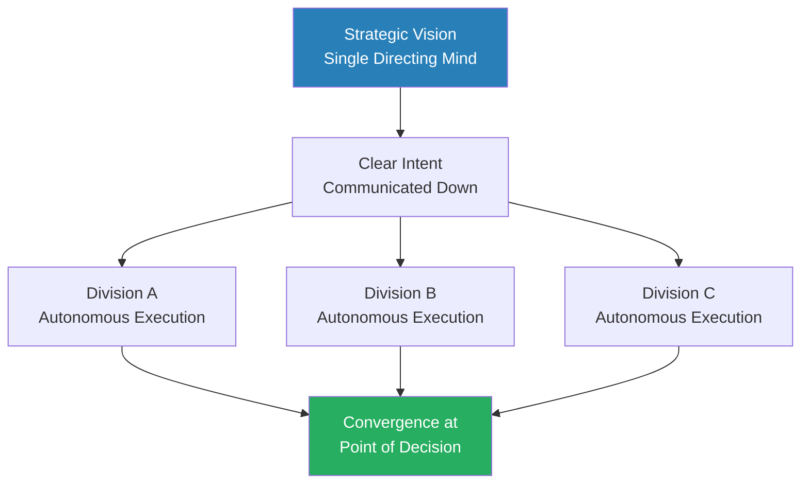
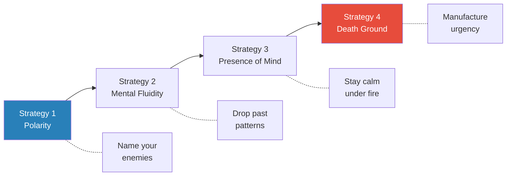
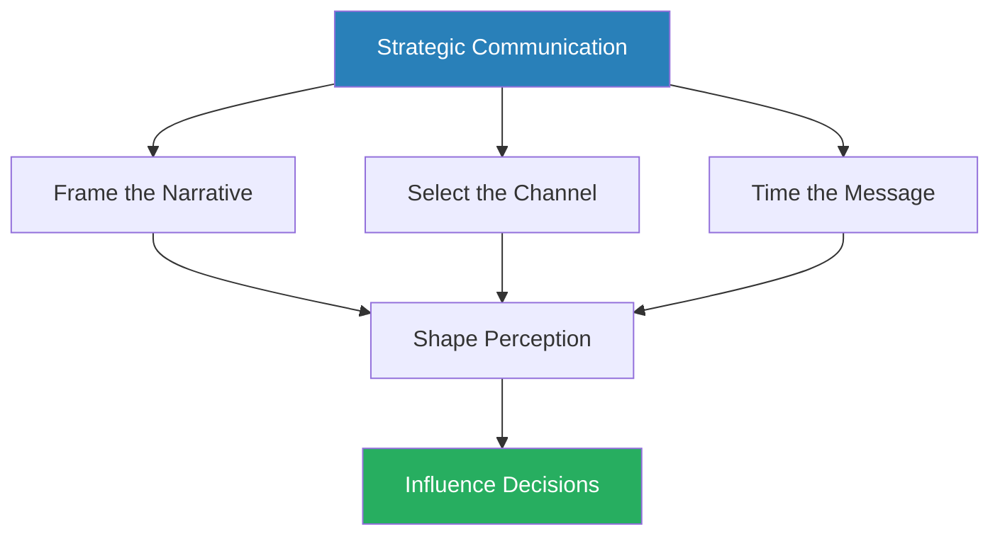

# The 33 Strategies of War — Robert Greene

> Robert Greene's most structurally ambitious work transposes three thousand years of military strategy into a unified system for navigating conflict, competition, and human resistance. His thesis: we are trained for peace but live in perpetual war — in boardrooms, negotiations, creative rivalries, and the invisible politics of everyday life. Those who refuse to acknowledge this are not peaceful; they are losing. Greene synthesises Sun Tzu, Napoleon, Clausewitz, Musashi, John Boyd, and dozens of other military minds into 33 strategies organised across five domains — from mastering yourself, to leading teams, to defending your position, to attacking with precision, to winning through unconventional means. The strategic ideal is not the brute force of **Ares** but the intelligent, indirect manoeuvre of **Athena** — winning with minimum bloodshed and maximum psychological impact. This is Greene at his most systematic: a complete strategic education in one volume.

---

## About the Author

Robert Greene studied classical literature at Berkeley and the University of Wisconsin-Madison.
Before writing, he worked over fifty jobs — Hollywood screenwriter, magazine editor, translator — accumulating the cross-domain pattern recognition that defines his work.
*The 33 Strategies of War* is his third book, following *The 48 Laws of Power* and *The Art of Seduction*, and represents his most direct engagement with military history as a lens for understanding all conflict.
Where his first two books drew primarily on court politics and romantic manipulation, this one draws on a wider canvas: the campaigns of Napoleon and Frederick the Great, the guerrilla philosophies of Mao and Ho Chi Minh, the aerial combat theories of John Boyd, and the ancient wisdom of Sun Tzu, Musashi, and Thucydides.
Greene spent several years researching this book, reading deeply in military history from Thucydides' *History of the Peloponnesian War* through Clausewitz's *On War* to Boyd's briefings on manoeuvre warfare.
The result is his most researched and structurally sophisticated work — a book that functions simultaneously as military history, strategic theory, and practical philosophy.
Each of the 33 strategies is structured identically: an opening historical narrative, the principle distilled, several supporting examples from different eras and domains, and practical discussion of when the strategy applies and when it does not.
This consistency gives the book a reference-manual quality that Greene's other works lack — you can open to any strategy and find a self-contained treatment.

## The Big Idea

- Greene's central argument is deceptively simple: <b style="color: #27ae60">strategy is a way of seeing, not a set of recipes</b>
- It is not a checklist to follow or a formula to apply but a fundamental orientation of the mind — a habitual way of perceiving situations, identifying dynamics, and responding to events that becomes second nature through practice and study
- The greatest strategists — Musashi, Napoleon, John Boyd — did not succeed by memorising principles
- They succeeded by cultivating this cast of mind: the ability to stay present, adapt to circumstances, see the hidden structure beneath surface events, and think several moves ahead while others react emotionally to the immediate situation

---

- The book's deeper thesis — largely implicit but present on nearly every page — is that <b style="color: #27ae60">mastery of strategy is a life skill, not a situational toolkit</b>
- Unlike wealth, position, or reputation — all of which can be taken — the strategic mind is a permanent possession
- The person who internalises strategic thinking gains an advantage that no setback, restructure, betrayal, or reversal of fortune can take away
- Stripped of everything external, the strategic thinker retains the one thing that matters: the ability to read a situation accurately and respond effectively
- "If your mind is armed with the art of war, there is no power that can take that away."

---

- Most people are **tacticians** — they react to the immediate battle, optimising for local wins
- <b style="color: #2980b9">Strategists</b> elevate above the battlefield, connecting every tactical decision to long-term objectives
- "Tactical people are heavy and stuck in the ground; strategists are light on their feet and can see far and wide."
- This elevation from tactical to strategic thinking is the single most important mental shift the book demands
- Greene does not treat this as a natural gift but as a trainable discipline — something acquired through study, practice, and above all, the relentless willingness to subordinate emotional impulse to rational assessment

The five-part structure mirrors a natural progression that Greene argues is not arbitrary but necessary:

- You must master yourself before you can lead others, learn to defend before you attack, and understand conventional warfare before deploying unconventional tactics
- Each domain builds on the previous one — and each is prerequisite to what follows:
  - The self-directed strategies (Part I) develop the internal qualities without which all external strategy fails
  - The organisational strategies (Part II) scale those individual qualities to groups
  - The defensive strategies (Part III) teach the patience and economy that prevent premature offensive action
  - The offensive strategies (Part IV) provide the tools for taking the initiative once the foundations are in place
  - The unconventional strategies (Part V) crown the entire structure with the psychological and political arts that operate in the shadows of conventional conflict
- The book is not a collection of isolated tips; it is an integrated curriculum whose sequence matters
- <b style="color: #e74c3c">The reader who skips to the offensive strategies without first internalising the self-directed and organisational foundations will find themselves wielding tools they cannot control</b>

---

- Greene draws on a remarkably diverse roster of strategic thinkers across cultures and centuries:
  - **Western tradition:** Clausewitz (the center of gravity, the fog of war, the relationship between war and politics), Napoleon (manoeuvre, speed, the decisive battle), Frederick the Great (economy of force, the oblique approach), and Grant (relentless pressure, grand strategy)
  - **Eastern tradition:** Sun Tzu (deception, intelligence, winning without fighting), Musashi (presence of mind, adaptability, the guerrilla war of the mind), and Mao Zedong (morale, communication warfare, trading space for time)
  - **Modern strategic theory:** John Boyd (the OODA loop, the tempo of decision-making) and various guerrilla and counter-insurgency thinkers
- The book's implicit argument is that strategic wisdom is universal — the same principles discovered independently by a Japanese swordsman, a Prussian theorist, and an American fighter pilot point to enduring truths about human conflict that transcend any single tradition

## Key Concepts at a Glance

| Concept | One-line summary |
|---------|-----------------|
| **The Polarity Strategy** | Name your enemies specifically to focus energy and escape vague anxiety |
| **Guerrilla War of the Mind** | Drop attachment to past methods — fight the present war, not the last one |
| **Presence of Mind** | Maintain rational calm under pressure; register emotions without being driven by them |
| **The Death-Ground Strategy** | Cut off retreat to manufacture the urgency that comfort destroys |
| **Command and Control** | Retain unified strategic authority while creating the appearance of participation |
| **Controlled Chaos** | Segment forces into autonomous units coordinated by shared intent |
| **The Morale Strategy** | Connect the fight to a cause larger than self-interest to multiply commitment |
| **Perfect Economy** | Match ambition to actual resources; fight only battles worth winning |
| **The Counterattack** | Let the aggressor overextend, then strike when they are depleted and exposed |
| **Deterrence** | Make yourself costly to attack — reputation is cheaper than war |
| **Nonengagement** | When outmatched, trade space for time; refuse to give the enemy a target |

### Quick Lookup Table

| # | Strategy | Part |
|---|----------|------|
| 1 | Declare War on Your Enemies — The Polarity Strategy | [I. Self-Directed Warfare](#part-i--self-directed-warfare) |
| 2 | Do Not Fight the Last War — Guerrilla War of the Mind | [I. Self-Directed Warfare](#part-i--self-directed-warfare) |
| 3 | Amidst the Turmoil, Do Not Lose Your Presence of Mind — Counterbalance | [I. Self-Directed Warfare](#part-i--self-directed-warfare) |
| 4 | Create a Sense of Urgency and Desperation — The Death-Ground Strategy | [I. Self-Directed Warfare](#part-i--self-directed-warfare) |
| 5 | Avoid the Snares of Groupthink — Command and Control | [II. Organisational Warfare](#part-ii--organisational-warfare) |
| 6 | Segment Your Forces — Controlled Chaos | [II. Organisational Warfare](#part-ii--organisational-warfare) |
| 7 | Transform Your War into a Crusade — Morale | [II. Organisational Warfare](#part-ii--organisational-warfare) |
| 8 | Pick Your Battles Carefully — Perfect Economy | [III. Defensive Warfare](#part-iii--defensive-warfare) |
| 9 | Turn the Tables — The Counterattack Strategy | [III. Defensive Warfare](#part-iii--defensive-warfare) |
| 10 | Create a Threatening Presence — Deterrence | [III. Defensive Warfare](#part-iii--defensive-warfare) |
| 11 | Trade Space for Time — The Nonengagement Strategy | [III. Defensive Warfare](#part-iii--defensive-warfare) |
| 12 | Lose Battles but Win the War — Grand Strategy | [IV. Offensive Warfare](#part-iv--offensive-warfare) |
| 13 | Know Your Enemy — The Intelligence Strategy | [IV. Offensive Warfare](#part-iv--offensive-warfare) |
| 14 | Overwhelm Resistance with Speed and Suddenness — Blitzkrieg | [IV. Offensive Warfare](#part-iv--offensive-warfare) |
| 15 | Control the Dynamic — The Forcing Strategy | [IV. Offensive Warfare](#part-iv--offensive-warfare) |
| 16 | Hit Them Where It Hurts — Center of Gravity | [IV. Offensive Warfare](#part-iv--offensive-warfare) |
| 17 | Defeat Them in Detail — Divide and Conquer | [IV. Offensive Warfare](#part-iv--offensive-warfare) |
| 18 | Expose and Attack the Soft Flank — The Turning Strategy | [IV. Offensive Warfare](#part-iv--offensive-warfare) |
| 19 | Envelop the Enemy — The Annihilation Strategy | [IV. Offensive Warfare](#part-iv--offensive-warfare) |
| 20 | Manoeuvre Them into Weakness — Ripening for the Sickle | [IV. Offensive Warfare](#part-iv--offensive-warfare) |
| 21 | Negotiate While Advancing — The Diplomatic-War Strategy | [IV. Offensive Warfare](#part-iv--offensive-warfare) |
| 22 | Know How to End Things — The Exit Strategy | [IV. Offensive Warfare](#part-iv--offensive-warfare) |
| 23 | Weave a Seamless Blend of Fact and Fiction — Misperception | [V. Unconventional Warfare](#part-v--unconventional-warfare) |
| 24 | Take the Line of Least Expectation — Ordinary-Extraordinary | [V. Unconventional Warfare](#part-v--unconventional-warfare) |
| 25 | Occupy the Moral High Ground — The Righteous Strategy | [V. Unconventional Warfare](#part-v--unconventional-warfare) |
| 26 | Deny Them Targets — The Void Strategy | [V. Unconventional Warfare](#part-v--unconventional-warfare) |
| 27 | Seem to Work for the Interests of Others — The Alliance Strategy | [V. Unconventional Warfare](#part-v--unconventional-warfare) |
| 28 | Give Your Rivals Enough Rope to Hang Themselves — One-Upmanship | [V. Unconventional Warfare](#part-v--unconventional-warfare) |
| 29 | Take Small Bites — The Fait Accompli Strategy | [V. Unconventional Warfare](#part-v--unconventional-warfare) |
| 30 | Penetrate Their Minds — The Communication Strategy | [V. Unconventional Warfare](#part-v--unconventional-warfare) |
| 31 | Destroy from Within — The Inner-Front Strategy | [V. Unconventional Warfare](#part-v--unconventional-warfare) |
| 32 | Dominate While Seeming to Submit — Passive Aggression | [V. Unconventional Warfare](#part-v--unconventional-warfare) |
| 33 | Sow Uncertainty and Panic — The Chain-Reaction Strategy | [V. Unconventional Warfare](#part-v--unconventional-warfare) |

### Five Key Frameworks

**1. The Athena vs Ares Dichotomy**

*Every strategic actor falls on a spectrum between two ancient Greek war gods — and Greene leaves no doubt which one you should emulate.*

- All strategic actors fall on a spectrum between two ancient Greek deities who both presided over war but embodied opposing philosophies of how to wage it:
  - <b style="color: #e74c3c">Ares</b> represents direct force, emotional aggression, and brute confrontation — the warrior who charges headlong, relying on strength and rage
  - <b style="color: #27ae60">Athena</b> represents indirect manoeuvre, intelligence, foresight, and psychological warfare — the strategist who wins through positioning, deception, and economy of force

- Greene's entire framework privileges Athena:
  - The Ares approach creates enemies, wastes resources, and exposes your intentions
  - It feels decisive in the moment but leaves wreckage — burning political capital, hardening opposition, revealing your strategy to anyone watching
  - The Athena approach preserves optionality and relationships
  - It wins with minimal expenditure and maximum psychological impact, often before the opponent even realises the contest has occurred

---

- This is not a binary choice but a spectrum:
  - There are moments when Ares energy is appropriate — when decisiveness and visible force are the only language the situation understands
  - But Greene argues these moments are far rarer than most people believe
  - The instinct to confront directly is almost always emotional rather than strategic
  - The disciplined strategist defaults to Athena and deploys Ares only when indirect methods have been exhausted or when overwhelming force will end the contest so quickly that the costs of confrontation are trivial

- The dichotomy runs through every strategy in the book:
  - When Greene praises a commander for patience, indirection, psychological manipulation — he is praising Athena
  - When he critiques a commander for emotional escalation, frontal assault against prepared positions, confusing aggression with strength — he is critiquing Ares
  - Understanding which god you are serving in any given moment is the book's foundational diagnostic question

| Approach | Philosophy | Strengths | Weaknesses |
|----------|-----------|-----------|------------|
| **Ares** | Direct force, emotional aggression | Decisive, simple, immediately satisfying | Creates enemies, wastes resources, reveals intentions |
| **Athena** | Indirect manoeuvre, intelligence | Preserves options, economical, psychologically devastating | Requires patience, discipline, long-term thinking |

Greene's verdict is clear: default to Athena, deploy Ares only as a last resort.

Athena dominates on every dimension except speed — which is precisely why most people default to Ares: the emotional payoff of immediate action masks the strategic superiority of patient manoeuvre.

---

**2. The Strategic vs Tactical Distinction**

*The single most important mental shift the book demands is rising above the immediate battle to connect every decision to the war's ultimate objective.*

- <b style="color: #2980b9">Tacticians</b> optimise for the current battle
- <b style="color: #2980b9">Strategists</b> subordinate every battle to the war
- The ability to rise above the immediate conflict and connect each decision to a long-term vision is, in Greene's view, the single most important capability the book teaches

- Greene draws this distinction from Clausewitz but extends it further:
  - A tactician sees a setback and feels defeat
  - A strategist sees a setback and asks whether it changes the campaign — and if not, absorbs it without emotional disruption
  - A tactician wins a battle and celebrates
  - A strategist wins a battle and asks whether the victory served the long-term objective — and if not, recognises it as a distraction or even a liability

- The elevation from tactical to strategic thinking is difficult because it requires overriding powerful emotional responses:
  - Losing feels bad; the tactician's instinct is to avoid loss at any cost
  - But the strategist understands that some losses are investments — they reveal the opponent's strength, conserve resources for the decisive engagement, and create overconfidence in the enemy that can be exploited later
  - Scipio Africanus endured years of Roman defeats against Hannibal without despair, because he understood that the campaign to defeat Carthage did not require defeating Hannibal's army directly

- This framework applies far beyond warfare:
  - Any domain where short-term impulses conflict with long-term objectives — negotiation, creative work, organisational politics, personal development — benefits from the strategic elevation Greene describes
  - The person who can hold the long view while absorbing short-term turbulence possesses an advantage that compounds over years

---

**3. The Present-Moment Principle**

*The greatest strategists share one paradoxical trait: they study the past obsessively but respond only to what is actually in front of them.*

- The greatest strategists — Musashi, Napoleon, Boyd — share one trait: the ability to drop preconceived notions and respond to the present moment
- Strategy is adaptive intelligence, not formula application
- "The greatest danger you face is your mind growing soft and settling into static patterns."

- Greene introduces this through Musashi's philosophy of the sword:
  - Musashi insisted that every duel was unique
  - He refused to develop a "style" because a style is a pattern, and a pattern can be predicted and countered
  - Instead, he trained himself to see each encounter fresh — to read the specific terrain, the specific opponent, the specific moment — and respond to what was actually happening rather than what had happened before

- Napoleon displayed the same quality on a larger scale:
  - His genius lay not in his battle plans (which were often simple) but in his real-time adaptability
  - When circumstances changed mid-battle — a division arrived late, a flank was exposed, the weather shifted — Napoleon adjusted faster than anyone in the opposing command structure could process the new information
  - His opponents made plans; he made decisions

- Boyd formalised this into the <b style="color: #2980b9">OODA loop</b> (Observe, Orient, Decide, Act), arguing that the side which cycles through this loop faster gains a compounding advantage:
  - But Greene warns against treating the OODA loop as a mere speed contest
  - The critical step is Orient — the ability to perceive the present situation accurately, free from the distortions of doctrine, ego, wishful thinking, and past experience
  - "More books, theories, and thinking only make the problem worse" when they disconnect you from the reality in front of you

---

**4. The Center-of-Gravity Model**

*Every power structure has a hidden support — find it and strike there, and the entire edifice collapses more efficiently than any frontal assault could achieve.*

- Every power structure has a hidden support — its <b style="color: #2980b9">center of gravity</b>, a term Greene borrows from Clausewitz
- Identifying and striking this center collapses the entire structure more efficiently than attacking the visible front
- The center is often not what it appears: it may be public opinion, a key relationship, a funding source, a single decision-maker, or a psychological dependency

- Clausewitz used the term in its physics sense — the point at which a body's entire weight seems to concentrate:
  - In strategic terms, it is the single element on which the entire system depends for coherence and function
  - Remove it, and the structure does not merely weaken — it collapses, because every other element was defined by its relationship to this center

- The difficulty is that the center of gravity is almost never the most visible element:
  - The visible front — the army, the spokesperson, the formal authority — exists precisely to draw attention away from the true center
  - Scipio understood that Hannibal's invincible army in Italy was not Carthage's center of gravity; Carthage's commercial wealth was
  - Giap understood that America's military might was not its center of gravity in Vietnam; American public opinion was
  - The strategic discipline is peeling away layers of apparent strength to find the true source of an opponent's power — and then striking there, where they are least defended and most vulnerable

> [!tip] Core Insight
> The center of gravity is almost never the most visible element. The visible front exists precisely to draw attention away from the true source of power. Strike the hidden support, and the entire structure collapses.

- <b style="color: #e74c3c">Greene warns that misidentifying the center of gravity is one of the costliest strategic errors:</b>
  - Napoleon marched to Moscow expecting the capture of Russia's capital to break the Czar's will
  - But Moscow was not Russia's center of gravity — the Czar's willingness to sacrifice territory was effectively unlimited
  - Napoleon captured a city and found himself holding an empty symbol while the real power — the Russian will to resist — remained intact

---

**5. The Controlled-Chaos Command Model**

*The art of leadership is achieving centralised vision with decentralised execution — and it depends entirely on the people you select.*

- Effective leadership in complex environments requires indirect control:
  - Select and groom people who share your vision
  - Streamline communication ruthlessly
  - Cut waste
  - Lead by example rather than micromanagement
- Greene draws this primarily from George C. Marshall's transformation of the American War Department in the lead-up to World War II

- Marshall inherited a bloated, politicised bureaucracy:
  - Promotions based on seniority rather than talent
  - Communication passed through labyrinthine channels
  - Strategic initiative smothered by process
- He rebuilt the entire structure:
  - Promoted talented officers (including the then-unknown Eisenhower) over the heads of their seniors
  - Eliminated unnecessary layers of command
  - Created direct reporting lines
  - Made himself the singular point of strategic coherence while delegating tactical execution completely

- The model's genius is that it achieves the benefits of both approaches simultaneously:
  - Centralised command: strategic coherence, bold decision-making
  - Decentralised execution: speed, adaptability, initiative at the edges
- Marshall did not micromanage — he selected people whose judgement he trusted, communicated his strategic intent clearly, and then let them execute
- This is what modern military doctrine calls <b style="color: #2980b9">mission-type tactics</b> (Auftragstaktik): tell people what to achieve, not how to achieve it

- Napoleon practised a version of this earlier, breaking his army into self-contained divisions — each capable of independent action, all coordinated by a central strategic mind:
  - This created what Greene calls <b style="color: #2980b9">controlled chaos</b>: the enemy could never predict where the next blow would fall, because each division could strike independently while remaining coherent with the larger campaign design
  - The model requires exceptional subordinates, shared values, and clear communication of intent — without these preconditions, decentralisation produces actual chaos rather than the controlled variety

The Controlled-Chaos model achieves strategic coherence through a single directing mind while pushing tactical execution to autonomous units that converge only at the decisive moment.

---

## Part I — Self-Directed Warfare

*Before you can fight external battles, you must master yourself — and Greene believes most people are defeated by their own psychology long before any opponent arrives.*

- Greene begins the book here because he believes most people are defeated before they ever engage an opponent — not by external enemies but by their own psychology:
  - Vague anxiety diffuses energy
  - Mental rigidity locks them into outdated strategies

The Sankey diagram reveals that offensive initiative — the book's ultimate goal — draws from every preceding domain: self-mastery feeds emotional control, defensive patience feeds strategic timing, and all converge into the ability to take decisive action.
  - Emotional reactivity causes them to make decisions they later regret
  - Complacency prevents them from acting when the moment demands it

- These four strategies address these internal enemies directly:
  - They are the foundation on which everything else in the book rests
  - A strategist who cannot control their own mind, who cannot name their obstacles, who cannot stay present under pressure, and who cannot manufacture urgency when comfort beckons — such a person has no business attempting the offensive and unconventional strategies that follow
  - Greene's implicit message is severe: most people fail not because they lack intelligence or resources, but because they have never done the internal work of becoming someone capable of thinking and acting strategically

- Greene draws heavily on the martial arts tradition in this section:
  - Particularly on Musashi's *Book of Five Rings* and the Zen Buddhist concept of <b style="color: #2980b9">mushin</b> (no-mind) — the state of complete present-moment awareness free from thought, distraction, and self-consciousness
  - The samurai warrior who has achieved mushin does not think about the fight; he simply responds to it, his training expressing itself without the interference of conscious deliberation
  - This is the ideal toward which all four strategies in Part I aim: a mind so thoroughly trained in strategic thinking that strategy becomes instinct rather than calculation

The four self-directed strategies form a progression: first identify what you are fighting, then free your mind from past patterns, then maintain composure under pressure, and finally harness urgency to overcome complacency.

---

### Strategy 1: Declare War on Your Enemies — The Polarity Strategy

*Most intelligent people fail not because they lack resources but because their energy is scattered across a hundred unnamed discomforts — the remedy is to name the enemy and focus.*

- You cannot fight effectively without identifying your enemies clearly
- Most people operate in a fog of vague anxiety, frustrated by obstacles they cannot name and threatened by forces they cannot articulate
- Greene argues that this diffusion of energy is the primary reason intelligent people fail to act strategically:
  - They have the capability, the resources, and often the position to achieve their objectives
  - But their energy is scattered across a hundred unnamed discomforts rather than focused on the specific obstacles that actually matter
  - The world feels hostile, but the hostility has no shape — and energy directed at nothing accomplishes nothing
- Greene traces this problem to a cultural preference for harmony and the avoidance of conflict: we are taught that identifying enemies is aggressive, hostile, unenlightened
- <b style="color: #e74c3c">The result is not peace but paralysis</b>

---

- The remedy is <b style="color: #2980b9">polarity</b> — declaring internal war on specific, named adversaries:
  - The adversary need not be a person; it can be a structural barrier, a cultural pattern, an internal weakness, a systemic injustice, or even a specific aspect of yourself
  - But it must be specific — named, defined, and clearly distinguished from everything else
  - Energy directed at a defined target is exponentially more effective than energy dispersed across nameless discomforts
- <b style="color: #27ae60">Polarity transforms passive frustration into directed strategy — it gives you focus, and focus gives you power</b>
- Vague ambition ("I want to be more successful") produces vague effort
- Specific polarity ("This particular obstacle is preventing my advancement, and I will direct my strategy at overcoming it") produces focused, sustained, and effective action

> [!tip] Core Insight
> Energy directed at a defined target is exponentially more effective than energy dispersed across nameless discomforts. Name the enemy — not to create hostility, but to create focus.

> [!example] Lincoln's Sharpening Focus (1861-1863)
> - Abraham Lincoln's effectiveness as a wartime leader increased dramatically once he stopped fighting the vague concept of "rebellion"
> - He identified the Confederacy's specific ideology — and its institutional supports — as the enemy
> - Earlier, Lincoln had tried to hold the Union together through compromise and reconciliation, treating the conflict as a misunderstanding rather than an existential struggle
> - Once he named the enemy clearly, his entire strategic approach sharpened: the Emancipation Proclamation, the promotion of aggressive generals like Grant, the targeting of the South's economic infrastructure
> **The lesson:** Polarity gave Lincoln clarity, and clarity gave him the war's most effective strategy.

> [!example] France's Diffused Anxiety Before 1940
> - The French military establishment before 1940 could not identify its enemy
> - Was the threat external (Germany) or internal (communism)? Was the danger military or political?
> - The diffusion of anxiety across multiple unnamed threats produced a defensive mentality that tried to address everything and effectively addressed nothing
> - The Maginot Line was the architectural expression of a nation that could not name its enemy clearly enough to develop a strategy against it
> **The lesson:** Without polarity, resources scatter and defences become monuments to indecision.

> [!example] Xenophon and the March of the Ten Thousand (401 BC)
> - When the Greek mercenaries found themselves stranded deep in hostile Persian territory after the death of Cyrus, their generals murdered by treachery, the army began to dissolve into panic and recrimination
> - Xenophon rallied them not with hope but with polarity — naming the specific threats (the Persian army behind them, the terrain ahead, the winter approaching) and assigning each a response
> - The march of the Ten Thousand succeeded because Xenophon converted a shapeless catastrophe into a series of named enemies that could be fought one at a time
> **The lesson:** Even in total crisis, naming specific threats restores the capacity for action.

- The nuance Greene acknowledges:
  - <b style="color: #e74c3c">Over-personalising enemies creates paranoia and blinds you to potential allies</b>
  - Not every obstacle is an adversary, and not every slow-moving institution is hostile
  - The discipline is distinguishing genuine opposition from bureaucratic inertia or simple indifference
  - The goal is focused energy, not persecution thinking

> [!example] Thatcher's Internal Enemy (1975-1979)
> - Margaret Thatcher identified her enemy not as the Labour opposition (the obvious target) but as the moderates within her own party — the "wets" whose consensus-seeking politics she believed had produced national decline
> - By naming this internal enemy, she gave her faction the polarity it needed to organise, act, and ultimately transform the party and the country
> - Her enemies were specific, her energy was directed, and the transformation was complete
> **The lesson:** Sometimes the most important enemy is inside your own camp.

---

### Strategy 2: Do Not Fight the Last War — Guerrilla War of the Mind

*Your greatest strategic liability is not your weakness — it is your attachment to the methods that produced your past success.*

- Your greatest strategic liability is not your weakness — it is your strength
- Or rather, it is your attachment to the methods that produced your past success:
  - What worked before becomes doctrine, then orthodoxy, then prison
- Greene frames this as the universal military disease, observable across every era and every culture:
  - Every army that wins a great victory becomes psychologically bound to the methods that produced it
  - Unable to recognise when the world has moved on
  - <b style="color: #e74c3c">The victors of one war become the victims of the next</b>, defeated by methods they could not foresee because their attention was locked on the methods they already knew

> [!example] The Prussians at Jena (1806)
> - The Prussians were destroyed because they fought Napoleon using Frederick the Great's fifty-year-old tactics
> - Frederick had won his wars through precise formation marching, rigid discipline, and geometric manoeuvre
> - The Prussian officer corps, still worshipping at Frederick's altar half a century later, marched in perfect formation into a world that had moved on
> - Napoleon's army, faster, more flexible, and organised into independent divisions, shattered them in a single afternoon
> **The lesson:** The Prussians were not defeated by an inferior strategy — they were defeated by a newer one, because they could not see past their own history.

> [!example] Musashi's Sixty Duels (1604-1634)
> - Musashi, Japan's legendary swordsman, won over sixty duels by doing something his opponent had never seen
> - He arrived late to unnerve his opponents
> - He used unconventional weapons — in his most famous duel, against Sasaki Kojiro on Ganryu Island, he carved a wooden sword from an oar during the boat ride
> - He changed his stance mid-fight
> - His opponents studied his previous duels; he made each one unique
> **The lesson:** He was fighting the present war while they were fighting the last one.

- The mechanism is clear: <b style="color: #27ae60">success creates mental rigidity</b>
  - The very strategies that brought you to your current position form habits that become liabilities when circumstances change
  - Environments evolve faster than habits
  - A strategy optimised for past conditions becomes a vulnerability the moment conditions shift
- Greene introduces the <b style="color: #2980b9">Present-Moment Principle</b> here: the ability to drop preconceived notions and respond to what is actually happening, rather than what happened before

---

- The nuance is equally important:
  - Constant reinvention without retaining lessons is equally dangerous — it produces chaos rather than adaptation
  - The target is tactical rigidity, not principled consistency
  - Some principles endure — the meta-strategy of adaptability is itself permanent
  - The discipline is knowing which elements of your past success are timeless principles and which are contextual tactics that have outlived their usefulness

> [!example] The Maginot Line (1929-1940)
> - Having won the First World War through static trench warfare and fortification, France invested massively in the Maginot Line — an impregnable chain of fortresses along the German border
> - The strategy was perfectly optimised for 1918
> - By 1940, warfare had changed utterly
> - The Germans simply drove around the Maginot Line through the Ardennes, rendering the entire investment strategically worthless in a matter of days
> - France had fought the last war with the most expensive and most useless fortification in military history
> **The lesson:** A perfect answer to the previous question is worthless when the question has changed.

---

### Strategy 3: Amidst the Turmoil, Do Not Lose Your Presence of Mind — The Counterbalance Strategy

*The single quality that separates the great from the merely competent is the capacity to remain calm under extreme pressure — not by suppressing emotion, but by refusing to let it drive the response.*

- In the heat of conflict, the mind wants to race ahead or retreat into panic
- The great strategist maintains <b style="color: #2980b9">presence of mind</b> — the ability to stay rational and observant when everyone around them is losing control
- Greene argues that this single quality — the capacity to remain calm under extreme pressure — separates the great from the merely competent

- The mechanism is what Greene calls the <b style="color: #2980b9">counterbalance</b>:
  - When the emotional pull toward panic, rage, or euphoria becomes strongest, you must exert an equal and opposite force of rational detachment
  - This is not the suppression of emotion — a Stoic blank that pretends feelings do not exist
  - It is something more sophisticated: the refusal to let emotion dictate action while still using emotion as intelligence
- How emotions function as intelligence rather than override:
  - Fear tells you something real about the danger you face
  - Anger tells you something real about what you value and what has been violated
  - Excitement tells you something real about the opportunity in front of you
  - <b style="color: #27ae60">The counterbalance does not silence these signals; it prevents them from hijacking the decision-making process</b>
  - The emotions are registered, understood, and factored in — but they are not permitted to drive the strategic response

> [!example] Napoleon at Marengo (1800)
> - Napoleon was losing badly by midday — his army was being pushed back, his left flank was collapsing
> - Lesser commanders would have ordered a retreat
> - Instead, Napoleon assessed the situation with cold clarity, repositioned his reserves, and waited for Desaix's corps to arrive
> - The counterattack that afternoon turned a near-defeat into one of his most celebrated victories
> **The lesson:** The reversal was made possible only because Napoleon's mind stayed clear when the battlefield situation was at its worst.

> [!example] Nelson at Copenhagen (1801)
> - Ordered by his superior, Admiral Hyde Parker, to disengage from a battle that was going badly, Nelson famously raised his telescope to his blind eye and said, "I really do not see the signal"
> - This was not recklessness — Nelson had assessed the battle correctly from close range
> - Parker, safe aboard a distant flagship and unable to see the actual state of the engagement, had panicked at the sight of damaged ships
> - Nelson's presence of mind — his ability to trust his own assessment of reality over the emotional reaction of a superior — turned potential defeat into decisive victory
> - The Danish fleet surrendered within hours
> **The lesson:** Presence of mind sometimes means trusting your own clear-eyed assessment over the panic of those above you.

> [!example] Grant at the Wilderness (1864)
> - After two days of savage, confused fighting in dense forest — with his army taking horrific casualties and several generals urging retreat — Grant sat on a log, calmly whittling a stick
> - He then issued orders to advance further south
> - His officers expected retreat (every previous Union commander had retreated after a bloodying by Lee)
> - Grant's presence of mind allowed him to see that the strategic situation, despite the tactical setback, still favoured continued offensive action
> **The lesson:** The strategist who stays calm sees options that the panicked mind cannot perceive.

---

- <b style="color: #27ae60">Presence of mind is a trained skill, not a personality trait</b>:
  - It comes from exposing yourself to pressure repeatedly and practising the counterbalance until it becomes instinctive
  - Greene draws on the samurai tradition: the warrior who meditates on death daily is not morbid but prepared — when the crisis comes, the mind has already rehearsed staying calm in extremis
  - "Everything in life can be taken away from you except one thing: the freedom to choose your response."

- The Stoic philosophers — Marcus Aurelius writing his *Meditations* while commanding Roman armies on the frozen Danube frontier — exemplify the same principle in a different tradition:
  - Stoicism, as Greene reads it, is not passivity or indifference but the ultimate form of the counterbalance
  - Training the mind to maintain rational clarity regardless of external circumstances
  - The Stoic warrior does not pretend that danger does not exist; he acknowledges it fully while refusing to let it dictate his response
  - This is the deepest form of presence of mind — not calm despite the storm, but calm *because* the storm has been acknowledged and accepted

---

### Strategy 4: Create a Sense of Urgency and Desperation — The Death-Ground Strategy

*The greatest single enemy of achievement is not opposition but comfort — and the only reliable cure is the elimination of retreat.*

- When your back is against the wall, you fight with maximum intensity
- Conversely, comfort breeds complacency
- The strategic move is to deliberately place yourself on <b style="color: #2980b9">death ground</b> — cut off retreat, manufacture urgency, force yourself into action
- Greene argues that the greatest single enemy of achievement is not opposition but comfort — the warm embrace of a tolerable status quo

- The concept originates with Sun Tzu: "Place your army in deadly peril, and it will survive."
  - Soldiers who know they cannot retreat will fight to the death, not because they are brave but because they have no alternative
  - <b style="color: #27ae60">The elimination of options paradoxically produces the maximum effort that creates new options</b>

> [!example] Cortes Burns His Ships (1519)
> - Cortes, arriving in Mexico with a small force of roughly six hundred men facing an empire of millions, burned his ships
> - His men had two choices: conquer or die
> - The decision seems insane — destroying your only means of escape in hostile territory
> - But Cortes understood that his men, if given the option to retreat, would eventually use it
> - Only the complete elimination of that option could produce the desperate courage needed to prevail against overwhelming odds
> - They conquered
> **The lesson:** Sometimes the path to victory runs through the destruction of every alternative.

> [!example] Dostoevsky's Mock Execution (1849)
> - As a young man, Dostoevsky was arrested for involvement with a revolutionary circle, tried, and sentenced to death
> - He was led to the execution grounds, blindfolded, and heard the rifles being loaded
> - At the last moment, a messenger arrived with a commutation from the Czar — the entire execution had been staged
> - But the psychological death ground was real
> - From that day forward, Dostoevsky wrote with an intensity and urgency that transformed him from a talented but unremarkable writer into one of the greatest novelists in history
> - The proximity to death had burned away everything trivial
> **The lesson:** Death ground need not be physical — psychological proximity to extinction can produce the same transformative urgency.

> [!example] The Spartans at Thermopylae (480 BC)
> - The ancient Spartans institutionalised death ground as a cultural practice
> - Spartan mothers reportedly sent their sons to war with the words "Come back with your shield or on it" — return victorious or return dead
> - There was no third option
> - This cultural death ground produced soldiers of extraordinary ferocity precisely because retreat was not merely strategically foreclosed but socially impossible
> - The Spartans at Thermopylae did not fight because they had a chance of winning (they knew they would die); they fought because the culture had placed them on death ground before the battle even began
> **The lesson:** When retreat is culturally impossible, ferocity becomes the only option — and often proves sufficient.

---

- The mechanism is clear:
  - Human decision-making defaults to inertia
  - Given a comfortable option — a safe job, a stable relationship, a tolerable status quo — most people will take it indefinitely, even when they know that a better outcome requires action and risk
  - The gravitational pull of the status quo is the most powerful force in human psychology, stronger than ambition, stronger than logic, stronger than the knowledge that time is running out
  - <b style="color: #27ae60">Only genuine perceived urgency — the visceral sense that inaction will produce catastrophe — overcomes this gravitational pull</b>
- By removing the option of retreat — whether from a commitment, a negotiation, or a creative project — you force maximum effort:
  - The paradox of death ground is that the elimination of choice produces better choices
  - Freed from the temptation of the easy way out, the mind focuses with an intensity that comfort would never permit
  - "In the back of your mind, keep the thought of death."

> [!abstract] The Death-Ground Technique
> 1. Identify where comfort is breeding complacency in your situation
> 2. Find the retreat route you are unconsciously preserving
> 3. Eliminate it — make a public commitment, burn a bridge, create a deadline with real consequences
> 4. Ensure there is a genuine path to victory before you burn the ships
> 5. Channel the resulting urgency into focused, strategic action

- <b style="color: #e74c3c">The nuance is critical and must not be overlooked:</b>
  - Artificial death ground can create real death — if you cut off retreat and then lose, there is no recovery
  - The urgency must be credible, not theatrical — genuine desperation motivates, but perceived manipulation demoralises
  - You must always ensure there is a genuine path to victory before you burn the ships
  - Recklessness is not strategy, and self-destruction is not courage
  - The difference between Cortes and a fool who burns his ships is that Cortes had a plan that could actually work

- Greene notes that death ground operates on organisations as well as individuals:
  - Companies facing bankruptcy often produce their most innovative work — the discipline of imminent extinction focuses minds and eliminates the comfortable option of doing nothing
  - Apple in 1997, weeks from insolvency, produced the iMac
  - The constraints of death ground — no money, no margin for error, no time — paradoxically liberated the creativity that comfort had suppressed
  - <b style="color: #27ae60">The most dangerous position is not the difficult one but the comfortable one</b>, because comfort breeds the complacency that makes genuine catastrophe possible
  - The strategist who understands this will periodically manufacture death ground for themselves — not to create genuine danger, but to maintain the sharpness of mind that only urgency can sustain

---

## Part II — Organisational Warfare

*The transition from individual brilliance to collective action is where most strategists fail — because the skills that make you a great solo operator can become liabilities when you must coordinate the actions of many.*

- The shift from Part I to Part II mirrors the shift from individual contributor to leader — and Greene argues that this transition is where most strategists fail:
  - The skills that make you a brilliant individual operator (self-reliance, personal adaptability, solo decision-making) can become liabilities when you must coordinate the actions of many

- These strategies address the challenge of translating individual strategic intelligence into collective action:
  - How do you maintain unity of command without appearing dictatorial?
  - How do you create autonomous execution without losing strategic coherence?
  - How do you bind people to a cause larger than their own self-interest?
- Greene's answers draw on some of the most consequential leadership examples in military history — from Napoleon's revolutionary division system to Marshall's transformation of the American military bureaucracy to Henry V's speech at Agincourt

---

- The underlying tension throughout this section is between <b style="color: #2980b9">control and autonomy</b>:
  - Too much control produces rigidity — the centralised army that cannot adapt because every decision must pass through headquarters
  - Too much autonomy produces chaos — the decentralised force that degenerates into a collection of independent units pursuing their own objectives
  - The art of organisational warfare is finding the precise balance — achieved not through systems or processes but through the quality of the people you select and the clarity of the vision you communicate

- Greene makes a subtle but important distinction between *managing* and *leading*:
  - Managers control through process, hierarchy, and oversight — they ensure that people do what they are told
  - Leaders control through vision, culture, and example — they ensure that people *want* to do what needs to be done
  - The strategies in Part II are all leadership strategies, not management strategies

| Approach | Method | Outcome |
|----------|--------|---------|
| **Managing** | Process, hierarchy, oversight | Compliance — people do what they are told |
| **Leading** | Vision, culture, example | Commitment — people want to do what needs doing |

- Marshall did not manage the War Department; he led it
- Napoleon did not manage his divisions; he inspired them
- Henry V did not manage his army at Agincourt; he transformed it through the force of his personal conviction
- <b style="color: #27ae60">The organisational warrior leads in such a way that the organisation functions effectively even in the leader's absence</b> — because the vision has been so thoroughly internalised that every subordinate can make decisions consistent with it

---

### Strategy 5: Avoid the Snares of Groupthink — The Command-and-Control Strategy

*Divided leadership is the cause of the greatest military defeats in history — when strategic authority is shared, the result is not balance but paralysis.*

- Divided leadership is the cause of the greatest military defeats in history
- When strategic authority is shared, diluted, or contested, the result is not balance but paralysis — or worse, the alternation between incompatible strategies that produces the worst features of both and the advantages of neither

> [!example] The Roman Disaster at Cannae (216 BC)
> - The Roman Republic, facing Hannibal's invasion of Italy, appointed two consuls — Varro and Paullus — to command the largest army Rome had ever assembled
> - The consuls rotated command daily — a constitutional arrangement designed to prevent tyranny that, on the battlefield, produced strategic incoherence
> - Varro was aggressive and reckless; Paullus was cautious and methodical
> - The army lurched between their opposing philosophies like a ship with two captains pulling the tiller in different directions
> - On Varro's day of command, he advanced the army directly into Hannibal's trap
> - Approximately seventy thousand Romans killed in a single afternoon
> **The lesson:** Divided command produced the most devastating tactical defeat in Western military history.

> [!example] American Command Fragmentation in Vietnam (1964-1975)
> - Authority was fragmented across military commanders, intelligence agencies, political chains of command, and civilian advisory groups
> - Each had different objectives, different information, and different metrics of success
> - No single mind held the strategic thread
> - The result was not one catastrophic defeat but something worse: a decade of incoherent strategy, where tactical victories accumulated without producing strategic progress
> **The lesson:** Without unified command, tactical success and strategic failure can coexist indefinitely.

---

- Greene's model — drawn heavily from George C. Marshall — argues that the effective leader must retain strategic vision as their sole prerogative while creating the *appearance* of participation and consultation:
  - This is not cynicism; it is a practical recognition that good strategy cannot emerge from committee but that good execution requires buy-in
  - The leader must thread a needle: making subordinates feel heard and valued while ensuring that the strategic direction remains coherent and under a single directing intelligence
- <b style="color: #27ae60">Rule indirectly</b>: select people who share your vision, communicate through streamlined channels, cut waste ruthlessly, and lead by example rather than decree

- Marshall's transformation of the War Department:
  - He inherited an American equivalent of the Prussian bureaucracy Napoleon had shattered — bloated, political, and sclerotic
  - He rebuilt it by promoting talent ruthlessly (including the unknown Eisenhower over hundreds of more senior officers)
  - Eliminated layers of command
  - Made himself the singular point of strategic coherence while trusting his subordinates to execute

- The mechanism is clear:
  - Groups are inherently political and prone to groupthink
  - Letting the group make strategy leads to cautious, unimaginative, lowest-common-denominator decisions
  - The <b style="color: #2980b9">Controlled-Chaos Command Model</b> achieves control without dictatorship
  - Marshall actively sought ideas from subordinates, but the final strategic direction always came from one mind

> [!example] Frederick the Great in the Seven Years' War (1756-1763)
> - Frederick fought a coalition of five major powers — Austria, France, Russia, Sweden, and Saxony — with a single kingdom's resources
> - His survival depended entirely on unity of command
> - While his enemies passed orders through committees, consulted allies, and debated strategy in councils of war, Frederick made decisions alone and acted immediately
> - His speed of decision-making — a direct product of unified command — repeatedly allowed him to concentrate his smaller forces against one enemy before the others could coordinate a response
> **The lesson:** Unity of command creates speed, and speed compensates for inferior resources.

> [!tip] Core Insight
> Good strategy cannot emerge from committee, but good execution requires buy-in. The art is retaining singular strategic authority while creating the appearance of participation.

- The nuance:
  - <b style="color: #e74c3c">Unity of command amplifies both brilliance and folly</b>
  - A single leader with bad judgement is worse than a committee
  - The strategy depends entirely on the quality of the mind at the top
  - Marshall's genius was recognising this himself — which is why he spent so much effort selecting and developing the people who would execute his vision
  - The lesson is not "put one person in charge" but "put the right person in charge and give them the authority to act"

---

### Strategy 6: Segment Your Forces — The Controlled-Chaos Strategy

*Napoleon's most revolutionary contribution to warfare was not a battle or a weapon — it was an organisational structure that made his enemies unable to predict where the next blow would fall.*

- The traditional army of the eighteenth century moved as one ponderous mass:
  - A single formation, advancing or retreating together, incapable of independent action at any level below the commanding general
  - Orders flowed from the top down through rigid hierarchies
  - Initiative at the unit level was not merely discouraged but actively punished
  - The army was a machine, and the general was the only person allowed to operate it
- Napoleon's revolutionary insight was to break this machine into self-contained divisions:
  - Each with its own infantry, cavalry, and artillery
  - Each capable of fighting independently
  - All coordinated by a central strategic mind
  - This was not merely an organisational reform; it was a paradigm shift in how armies operated

- This created <b style="color: #2980b9">controlled chaos</b>:
  - The enemy could never predict where the next blow would fall, because each division could march independently, engage independently, and reinforce independently
  - While the Austrians and Prussians moved their single massive army along a single predictable axis, Napoleon's divisions spread across the landscape like a net, converging only at the moment of battle
  - The enemy was forced to respond to multiple threats simultaneously, never knowing which was the feint and which was the main attack

---

- The mechanism extends beyond mere organisation:
  - In complex environments, centralised control creates rigidity
  - The leader cannot process information fast enough to direct every unit
  - The solution is to push decision-making to the edges while maintaining strategic coherence at the centre
  - Give each unit a clear mission, the autonomy to pursue it, and the training to make good decisions independently

- This is the origin of what modern military doctrine calls <b style="color: #2980b9">mission-type tactics</b> (Auftragstaktik) — tell people *what* to achieve, not *how* to achieve it:
  - John Boyd later refined this into his concept of the <b style="color: #2980b9">OODA loop</b> (Observe, Orient, Decide, Act), arguing that the side that can cycle through decisions faster wins
  - Napoleon's divisional system gave the French army a faster OODA loop than any opponent
  - Decisions could be made at the division level without waiting for orders from above
  - This meant the French army could adapt to changing circumstances in hours while its opponents required days

> [!example] The German Wehrmacht and Auftragstaktik (1939-1945)
> - The German Wehrmacht took the principle of mission-type tactics further than any military in history, developing Auftragstaktik into a formal doctrine
> - German junior officers were trained to exercise independent judgement within the framework of the commander's stated intent
> - A German lieutenant, encountering an unexpected opportunity, was expected to seize it without waiting for orders — provided it served the larger objective
> - This gave the German army an extraordinary tactical flexibility that repeatedly confounded opponents who operated under more rigid command structures
> - The British and Soviet armies, by contrast, required detailed orders from above for any significant action — and the time required to generate those orders gave the Germans a consistent speed advantage
> **The lesson:** Pushing decision-making to the edges creates speed that centralised command structures cannot match — but only when subordinates are trained to think within the commander's intent.

- <b style="color: #e74c3c">The nuance Greene emphasises: controlled chaos requires exceptional training and shared values</b>
  - Without both, decentralisation produces actual chaos
  - The units must be good enough to trust, and they must understand the commander's intent well enough to act without detailed instructions
  - Napoleon spent years building his army before he trusted it to fight in independent divisions
  - The model cannot be imposed on an organisation that lacks the culture to sustain it

---

### Strategy 7: Transform Your War into a Crusade — The Morale Strategy

*Morale is not a soft concept — it is the most powerful force multiplier in warfare, more potent than numbers, technology, or terrain.*

- An army fights for its cause, not its commander
- The greatest leaders do not demand loyalty — they inspire it by connecting the fight to something larger than any individual's self-interest
- Greene frames morale not as a soft, feel-good concept but as the most powerful force multiplier in warfare — more potent than numbers, technology, or terrain

- The mechanism is straightforward but its implications are profound:
  - People are willing to endure extraordinary hardship and risk when they believe they are fighting for a righteous cause
  - <b style="color: #27ae60">Morale transforms the calculus of individual self-interest — it overrides the survival instinct itself</b>
  - A soldier fighting for pay will run when the odds turn; a soldier fighting for a cause will die on their feet
  - This is why guerrilla forces throughout history — poorly equipped, outnumbered, lacking every material advantage — have repeatedly defeated conventional armies that possessed every quantifiable superiority
  - Belief compensates for what logistics cannot provide
- Greene argues that morale is not merely one factor among many but the decisive factor in warfare — the variable that tips the balance when material conditions are roughly equal, and the force multiplier that creates victories when material conditions are overwhelmingly unfavourable

> [!example] Henry V at Agincourt (1415)
> - The English army was outnumbered, exhausted from weeks of marching, ravaged by dysentery, and deep in enemy territory
> - By every material calculation, they should have collapsed
> - Henry's speech — immortalised by Shakespeare as "We few, we happy few, we band of brothers" — transformed a desperate situation into a crusade
> - He told his men that those who survived would remember this day for the rest of their lives, that their scars would be their badges of honour, that the very smallness of their force made their fight more glorious
> - The English fought with a ferocity that shattered a French force three to five times their size
> **The lesson:** A leader who transforms desperation into meaning can overcome any material disadvantage.

- Greene also draws extensively on the guerrilla movements of the twentieth century:
  - The Viet Cong, Mao's Red Army, Castro's revolutionaries — where poorly equipped fighters defeated vastly superior conventional forces because they believed absolutely in their cause
  - Mao understood this mechanism explicitly: his writings on revolutionary warfare treat morale not as a byproduct of good leadership but as the primary weapon
  - "Weapons are an important factor in war, but not the decisive factor; it is people, not things, that are decisive."

---

- <b style="color: #e74c3c">The nuance is sharp: the crusade mentality is dangerous when it blinds the leader to reality</b>
  - True believers can march into catastrophe while cheering
  - The Children's Crusade, the Charge of the Light Brigade, the Japanese kamikaze — all represent morale divorced from strategic sense
  - The strategic leader must inspire crusade-level commitment while retaining cold-eyed strategic assessment — a difficult balance
  - The best morale is built on genuine conviction, not manufactured enthusiasm; and the best leader is one who can inspire belief without losing the capacity for doubt

> [!example] Alexander the Great's Cult of Personality (336-323 BC)
> - Alexander's army followed him across the known world — from Greece to Egypt to Persia to India — not because of a political or religious cause but because of the cult of personality Alexander deliberately cultivated
> - He fought at the front of every battle, shared every hardship, and demonstrated through personal example that the fight was worth the risk
> - His soldiers' morale was not ideological but personal: they fought for Alexander
> - This model creates extraordinary short-term commitment but carries an inherent fragility — it collapses the moment the leader is removed
> - Alexander's empire disintegrated within a decade of his death because the crusade had been the man, not the cause
> **The lesson:** Personal charisma is a powerful but fragile basis for morale — it dies with the leader. Build the crusade around a cause, not a personality.

---

## Part III — Defensive Warfare

*Defence is the most misunderstood domain of strategy — most people equate it with passivity, but the best defensive strategies are among the most aggressive acts in warfare.*

- Greene opens this section by arguing that defence is the most misunderstood domain of strategy:
  - Most people equate defence with passivity, retreat, or weakness
  - In reality, the best defensive strategies are among the most aggressive acts in warfare — they simply express that aggression through patience, economy, and the strategic exploitation of the attacker's inevitable overextension

- The four strategies in this section teach:
  - When not to fight
  - How to make yourself costly to attack
  - How to turn an opponent's aggression against them
  - How to trade space for time when outmatched
- Together, they form a philosophy of <b style="color: #27ae60">strategic patience</b>: the understanding that the opponent who attacks first often gives the defender a decisive advantage:
  - The attacker must expend energy, commit to a direction, and reveal their strategy
  - The defender who absorbs this pressure without breaking gains critical intelligence and waits for the moment when the balance shifts

- Greene traces this philosophy through a lineage that runs from Fabius Maximus through Kutuzov to Muhammad Ali — warriors who understood that the ability to absorb punishment without breaking is itself a devastating weapon

---

### Strategy 8: Pick Your Battles Carefully — The Perfect-Economy Strategy

*The greatest strategists begin not with dreams but with reality — assessing their actual resources and letting goals emerge from what is genuinely possible.*

- Know your limits
- Consider the hidden costs of every conflict: time lost, goodwill squandered, embittered enemies created
- "Even if you are wealthy, act poor."
- The greatest strategists begin with their means and let strategy emerge from reality, not from dreams

- The mechanism Greene identifies is a reversal of how most people think about strategy:
  - <b style="color: #e74c3c">Dreamers start with goals and try to force reality to comply</b>
  - <b style="color: #27ae60">Strategists start with reality</b> — their actual resources, their actual constraints, their actual position — and let goals emerge from what is genuinely possible
  - Hannibal's genius was beginning with the givens: his army's composition (strong cavalry, weaker infantry), the terrain (the Italian peninsula), morale (high from the Alps crossing), and weather (Italian summer)
  - Every tactical decision grew from these realities, not from abstract ambition

- Greene warns of two opposite failures that bracket the ideal of economy:

| Failure Mode | Description | Example |
|-------------|-------------|---------|
| **Overextension** | Fighting on too many fronts, spending capital on every skirmish | Ali-Frazier trilogy — both men destroyed by refusing to disengage |
| **Under-investment** | Being so cautious that you miss windows of opportunity | Gallipoli 1915 — bold concept killed by timid, incremental execution |

- The Ali-Frazier trap:
  - The trilogy produced three of the most brutal fights in boxing history
  - Each man destroying the other through sheer refusal to stop
  - Both men's careers and health were shortened catastrophically because neither had the strategic discipline to disengage
- The Gallipoli trap:
  - The Gallipoli campaign of 1915 was a bold strategic concept (knock Turkey out of the war and open a supply route to Russia) killed by timid, incremental execution
  - The British committed too little, too slowly, and lost everything

> [!tip] Core Insight
> The ideal of economy lies between two extremes: overextension (fighting every battle) and under-investment (fighting none). The strategist must match ambition precisely to available resources.

> [!example] Bismarck's Calculated Wars (1864-1871)
> - Bismarck fought only weak, isolated opponents first: Denmark in 1864, then Austria in 1866, then France in 1870
> - Each war was more ambitious than the last, but always within his calculated means
> - He never fought a battle he was not confident of winning
> - Crucially, he stopped the moment his strategic objective was achieved
> - After defeating Austria, he offered generous peace terms, recognising that a humiliated Austria would be a permanent enemy while a respected Austria could become an ally
> - After defeating France, he took Alsace-Lorraine and stopped — over the objections of his generals, who wanted to march on Paris
> - Bismarck understood that every additional mile of conquest was an additional mile of resentment
> **The lesson:** Perfect economy means knowing when to stop — the most disciplined moment in warfare is the one where you could take more but choose not to.

> [!example] Elizabeth I's Forty-Five-Year Economy (1558-1603)
> - Facing threats from Spain, France, the Papacy, and internal Catholic dissent simultaneously, Elizabeth never fought a battle she could avoid
> - She used delay, negotiation, ambiguity, and the threat of marriage alliances to keep her enemies off balance for decades
> - She committed England's limited resources only when absolutely necessary
> - When she finally confronted Spain directly (the Armada in 1588), it was because all other options had been exhausted and the threat was existential
> - She fought one great battle instead of a dozen small ones — and won
> **The lesson:** Economy is not timidity — it is the discipline of saving your strength for the fight that actually matters.

- The nuance:
  - Economy does not mean stinginess — it means matching ambition to available resources and honestly assessing what those resources are
  - <b style="color: #e74c3c">Do not use "economy" as a rationalisation for avoiding necessary confrontation</b>
  - Sometimes the economical move is the bold one, because delay allows the opponent to grow stronger

---

### Strategy 9: Turn the Tables — The Counterattack Strategy

*The counterattack is often more powerful than the initial strike — it combines informational advantage (you have watched the attack), physical advantage (the attacker is exhausted), and psychological advantage (the attacker is unprepared for reversal).*

- The counterattack is often more powerful than the initial strike
- Let the opponent commit, overextend, and exhaust their momentum — then strike when they are off-balance
- Greene argues that this principle is one of the most consistently validated in all of military history, from Cannae to Austerlitz to the Rumble in the Jungle

- The mechanism works on multiple levels — physical, psychological, and informational:
  - The aggressor has the initiative but also the burden
  - They must expend energy, reveal their strategy, commit to a direction, and invest resources that cannot easily be recovered
  - Each step forward extends their supply lines, narrows their options, and reveals more about their capabilities, intentions, and weaknesses
- The defender who absorbs this initial pressure without breaking gains critical intelligence about the attacker's method, timing, and vulnerabilities:
  - Every punch the attacker throws reveals something about their technique — their favourite combinations, their stamina, their emotional triggers
  - <b style="color: #27ae60">The counterattack exploits all of this accumulated intelligence at the moment when the attacker is most depleted and most overextended</b>
- This is why Greene considers the counterattack one of the most reliable strategies in all warfare:
  - It combines informational advantage (you have watched the attack) with physical advantage (the attacker is exhausted) with psychological advantage (the attacker, having expected victory, is psychologically unprepared for the reversal)

> [!example] Ali's Rope-a-Dope vs Foreman — The Rumble in the Jungle (1974)
> - Ali was widely expected to lose — Foreman was younger, stronger, and had demolished every opponent with raw power
> - Instead of trying to outfight Foreman (an Ares approach that would have played to Foreman's strength), Ali adopted a radically defensive posture
> - He leaned against the ropes, covered up, and absorbed Foreman's devastating punches for seven rounds
> - The strategy seemed suicidal — Ali's corner was screaming at him to move
> - But Ali had seen what no one else had: Foreman was exhausting himself, throwing punches at a man who was absorbing them without breaking
> - In the eighth round, with Foreman spent, Ali struck with precise combinations and knocked him out
> **The lesson:** Patience, absorption, and then the devastating counter — the perfect metaphor for this strategy.

> [!example] Wellington at Torres Vedras (1810-1811)
> - Facing the seemingly unstoppable advance of Marshal Massena's French army, Wellington retreated behind a series of fortified defensive lines he had spent a year secretly constructing
> - Massena's army, having advanced deep into Portugal expecting a decisive battle, instead found an impregnable defensive position
> - Unable to break through and unable to sustain themselves (Wellington had ordered a scorched-earth retreat), the French starved for months before retreating in disorder
> - Wellington had absorbed the attack, let the aggressor exhaust himself, and then counterattacked into a retreating, demoralised enemy
> **The lesson:** The prepared defender who can absorb the initial blow turns the attacker's own momentum into a weapon against them.

- The nuance:
  - The counterattack requires the ability to absorb punishment without breaking
  - If the initial assault is too strong, you may not survive to counter
  - Not every position can withstand the pressure of deliberate absorption
  - <b style="color: #e74c3c">Know the difference between strategic patience and passive victimhood</b> — the first is chosen; the second is suffered

---

> [!example] Napoleon's Masterpiece at Austerlitz (1805)
> - Napoleon deliberately appeared weak, abandoning the Pratzen Heights and pulling back his right flank to invite the Allies to attack what they believed was a vulnerable position
> - The Allied army, led by the overconfident Czar Alexander, lunged forward to exploit the apparent weakness — and in doing so, stretched their line and exposed their centre
> - Napoleon's counterattack through the Pratzen Heights split the Allied army in two and produced one of the most decisive victories in military history
> - The Allies had been baited into overextending by a commander who understood the devastating power of a properly prepared counterattack
> **The lesson:** The supreme form of the counterattack is to manufacture the overextension you intend to exploit — to bait the enemy into the trap.

---

### Strategy 10: Create a Threatening Presence — The Deterrence Strategy

*The best defence is making attacks on you not worth the cost — uncertainty is more powerful than overt threat.*

- The best defence is making attacks on you not worth the cost
- Build a reputation for being difficult to fight — unpredictable, resilient, capable of devastating retaliation
- <b style="color: #27ae60">Uncertainty is more powerful than overt threat</b>
- The rational actor avoids fights with uncertain and potentially high costs

- The mechanism operates on the opponent's cost-benefit calculation before any engagement occurs:
  - Before committing to a fight, every rational adversary estimates the likely cost against the expected gain
  - This calculation is not purely material — it includes:
    - Psychological costs (the stress and uncertainty of conflict)
    - Reputational costs (how others will perceive the aggressor)
    - Opportunity costs (what else could be accomplished with the same resources)
  - If you can raise the perceived cost across any of these dimensions — through demonstrated capability, unpredictable behaviour, a track record of fierce retaliation, or simply an aura of danger — you change this calculation in your favour before any blow is struck
- <b style="color: #27ae60">You do not need to fight; you need others to believe that fighting you would be expensive, unpredictable, and ultimately not worth the prize</b>
- The deterrent is not the fight itself but the shadow of the fight — the anticipated cost that prevents the decision to engage

> [!example] John Boyd in the Pentagon (1960s-1980s)
> - Boyd — a fighter pilot turned military theorist — was the driving force behind the F-15 and F-16 programmes
> - The Pentagon's defence contractors desperately wanted to kill his designs in favour of their own, more expensive, less capable alternatives
> - Boyd created an extraordinarily effective deterrence through strategic eccentricity
> - Shabby suits, foul cigars, a wild look — he masked total mastery of budgetary and technical detail behind an eccentric exterior
> - When contractors attacked his programmes in committee, he would listen politely, sometimes for hours, then demolish their numbers with devastating, line-by-line precision
> - After several public humiliations, people learned to avoid challenging him
> - He had transformed himself into a porcupine: no animal wants the cost of attacking one
> **The lesson:** Deterrence can be personal — master your domain so thoroughly that challenging you becomes visibly costly.

> [!example] Spartan Military Reputation (8th-4th Century BC)
> - Spartan society was organised entirely around military excellence
> - Every male citizen trained for war from age seven
> - The Spartans were not the largest Greek army or the wealthiest Greek state — but their reputation was so fearsome that most opponents surrendered or fled before battle was joined
> - Thermopylae, where three hundred Spartans held a mountain pass against the Persian Empire, cemented a reputation that deterred aggression for generations
> **The lesson:** The Spartans understood that reputation is cheaper than war.

- The Cold War concept of <b style="color: #2980b9">Mutually Assured Destruction (MAD)</b> is the deterrence strategy elevated to civilisational scale:
  - Both the United States and the Soviet Union invested enormous resources in nuclear arsenals whose sole purpose was to make attack unthinkable
  - Neither side ever fired a nuclear weapon in anger — the deterrent worked
  - But the cost of maintaining the deterrent was staggering, and the strategy's success depended on the assumption that both sides were rational actors
  - Greene notes this as both the triumph and the fragility of deterrence: it works perfectly against rational opponents and fails catastrophically against irrational ones

- The nuance Greene identifies:
  - <b style="color: #e74c3c">Deterrence must be backed by actual capability</b> — reputation without substance collapses on first test
  - Being feared creates enemies — over-reliance on intimidation can escalate conflicts and isolate you
  - The porcupine is respected, not loved
  - Deterrence is a defensive strategy; it creates a fortress, not a campaign
  - Those who rely on it exclusively may find themselves safe but alone

---

### Strategy 11: Trade Space for Time — The Nonengagement Strategy

*When you are outmatched, the most psychologically demanding — and often most effective — response is to refuse to fight at all.*

- When you are outmatched, do not fight
- Withdraw, trade space for time, refuse to give the enemy a target
- Let them chase you while you regroup, gather intelligence, and wait for the moment when the balance shifts
- This strategy requires the most psychologically difficult of all strategic virtues: the willingness to appear weak

- The mechanism is the inverse of the forcing strategy, and it is the most psychologically demanding of all defensive postures:
  - <b style="color: #e74c3c">Engagement on unfavourable terms is the most common strategic error in history</b> — and the most emotionally satisfying one, because it provides the illusion of action, of courage, of "doing something" even when that something is self-destructive
  - The emotional pull toward "standing your ground" or "fighting honourably" causes people to accept battles they cannot win, wars they cannot sustain, and commitments they cannot honour
- The nonengagement strategy requires swallowing pride and retreating — not as defeat, but as preparation for a future offensive on your terms:
  - This distinction is crucial: <b style="color: #27ae60">strategic retreat is an active, purposeful manoeuvre with a clear objective</b> (preservation of force, acquisition of time, exhaustion of the enemy), not a passive flight from danger
  - Every mile of retreat, if managed correctly, stretches the enemy's supply lines, dilutes their concentration, and increases the distance between their army and their sources of strength

> [!example] Russia Against Napoleon (1812)
> - Marshal Kutuzov refused to give Napoleon the decisive battle he craved
> - The Russians retreated, burned their own crops, destroyed their own villages, and let the vast geography of Russia devour the Grande Armee
> - Napoleon entered Moscow triumphantly in September — and found it empty, then burning
> - Without a battle to win or a functioning capital to conquer, he had no strategy
> - The retreat from Moscow destroyed his army more completely than any Russian offensive could have
> - Of the roughly 600,000 troops who entered Russia, fewer than 100,000 returned
> **The lesson:** Russia won by refusing to fight — the most devastating victory through nonengagement in military history.

> [!example] Mao Zedong's Long March (1934-1935)
> - Facing encirclement by Chiang Kai-shek's vastly superior Nationalist forces, Mao's Communist army retreated over six thousand miles across some of China's most inhospitable terrain
> - The march was devastating — only a fraction of those who began it survived
> - But it preserved the core of the Communist movement, toughened its survivors, and allowed Mao to rebuild in the remote northwest of China, beyond the reach of Nationalist power
> - A decade later, Mao's forces conquered the entire country
> - The Long March, which looked like a catastrophic defeat at the time, was the strategic withdrawal that made eventual victory possible
> **The lesson:** A retreat that preserves the core is not a defeat — it is an investment in future victory.

> [!tip] Core Insight
> The most dangerous temptation in warfare is the urge to "stand and fight" on unfavourable terms. Strategic retreat is not cowardice — it is the discipline of choosing when and where to engage.

- The nuance:
  - Nonengagement only works if you have space to trade and time on your side
  - It is not suitable when the opponent can win simply by occupying your position
  - <b style="color: #e74c3c">Perpetual retreat, without an eventual counterstrike, is not strategy — it is surrender in slow motion</b>
  - The discipline is knowing when the retreat has accomplished its purpose and the moment for counterattack has arrived

> [!example] Washington's Revolutionary Strategy (1775-1783)
> - Washington understood that the Continental Army could not defeat the British in a conventional pitched battle — the British were better trained, better equipped, and better led at the tactical level
> - Instead, Washington retreated, avoided decisive engagement, and kept his army in existence
> - As long as the Continental Army survived, the Revolution survived
> - Time was on America's side: the longer the war dragged on, the more expensive it became for Britain, and the more likely French intervention became
> - Washington's patience — his willingness to endure criticism, to appear weak, to avoid the glorious but suicidal decisive battle that his officers craved — won the war
> - He lost more battles than he won, and it did not matter
> **The lesson:** When time is your ally, the goal is not to win battles but to survive — existence itself becomes the strategy.

---

## Part IV — Offensive Warfare

*Greene's largest and most intellectually demanding section shifts from preservation to initiative — eleven strategies for seizing control and shaping outcomes through manoeuvre, not brute force.*

- This is the book's most complex section — eleven strategies for taking the fight to the opponent
- <b style="color: #27ae60">Offence is about manoeuvre, not force</b> — the best offensive victories come from positioning opponents into dilemmas where every option is bad, then striking at the point of maximum vulnerability
- The strategies range from the grand-strategic (connecting every battle to the war's ultimate objective) to the tactical (exploiting a specific weakness in a specific moment)
- They are organised in a rough progression:
  - First, think about the war as a whole (Grand Strategy)
  - Then, gather intelligence
  - Then, choose your method of attack — speed, forcing, centre-of-gravity strikes, division, flanking, envelopment, manoeuvre into weakness
  - Finally, manage the political dimensions (negotiation, exit)

---

- This section contains the book's most sophisticated thinking
- The offensive strategies require not just courage but the intellectual capacity to see the board from above — to identify structural weaknesses, create dilemmas, and control the dynamic of engagement
- They demand everything developed in Parts I through III: self-mastery, organisational competence, and defensive patience
- <b style="color: #e74c3c">Without these foundations, the offensive strategies become reckless aggression — Ares, not Athena</b>

The historical figures who dominate this section — Scipio, Napoleon, Frederick, Grant, Sherman — share a common trait:

- They were students of war who spent years absorbing its principles before they ever commanded in the field
- Scipio studied Hannibal's methods for a decade before devising the strategy to defeat him
- Napoleon spent his youth reading every military text he could find
- Grant's memoirs reveal a mind that was constantly analysing, constantly connecting tactical events to strategic implications
- <b style="color: #e74c3c">The offensive strategies are not tools for amateurs</b> — they are instruments that require a lifetime of preparation to wield effectively

The book's weight is overwhelmingly offensive and unconventional — 22 of 33 strategies deal with taking initiative — but Greene insists that the 11 foundational strategies (self-directed, organisational, defensive) are prerequisites without which the offensive tools become reckless aggression.

---

### Strategy 12: Lose Battles but Win the War — Grand Strategy

*The hardest mental shift in the book: subordinating every tactical win or loss to the war's ultimate objective — and having the emotional discipline to accept short-term pain for long-term dominance.*

- <b style="color: #2980b9">Grand strategy</b> is the art of looking beyond the current battle to the ultimate goal
- Let others get caught up in tactical wins and losses
- The grand strategist accepts short-term setbacks that serve the long-term vision and refuses short-term victories that compromise it
- This is the overarching framework within which every other offensive strategy operates

The distinction between strategy and tactics:

- <b style="color: #27ae60">Tacticians optimise locally — they fight to win each engagement, measuring success by the immediate outcome</b>
- Grand strategists optimise globally — they evaluate each engagement against the war's ultimate objective and willingly sacrifice tactical advantage when it serves the larger design
- The grand strategist may deliberately lose a battle to gain a strategic advantage, may abandon a valuable position to draw the enemy into a trap, may accept a humiliating negotiation result today to preserve the ability to dictate terms tomorrow
- This requires emotional detachment of the highest order: the willingness to lose a skirmish — and to endure the criticism that follows — when winning it would compromise the campaign
- It also requires the intellectual capacity to see connections between events that others perceive as separate: the grand strategist understands that the battle in the east, the negotiation in the west, and the alliance forming in the south are all elements of a single campaign

> [!tip] Core Insight
> The grand strategist connects every tactical decision to the war's ultimate objective — willingly losing battles that serve the larger design and refusing victories that compromise it.

> [!example] Scipio Africanus Defeats Carthage Without Fighting Hannibal (218-202 BC)
> - For fifteen years, Rome had tried to defeat Hannibal's army in Italy — and lost battle after battle, each more devastating than the last
> - Scipio, rather than attacking Hannibal's seemingly invincible army directly, struck at Carthage's economic base in Spain, severing the flow of reinforcements and resources
> - Then he invaded Africa itself, threatening Carthage directly
> - Hannibal was forced to leave Italy to defend his homeland — ending the Italian campaign not through military defeat but through strategic irrelevance
> - Scipio never defeated Hannibal's army in Italy; he made it irrelevant
> - At the Battle of Zama in 202 BC, Scipio finally met Hannibal on African soil, under Roman strategic conditions, with Hannibal's army weakened and demoralised
> **The lesson:** Strike the system that sustains the threat, not the threat itself.

> [!example] Sherman's March Through Georgia (1864)
> - Rather than engaging the Confederate armies directly, Sherman targeted the South's economic and psychological infrastructure
> - He burned plantations, destroyed railways, liberated slaves, and demonstrated to the Southern population that their government could not protect them
> - Sherman's army suffered minimal casualties while inflicting strategic damage that no number of tactical victories could have achieved
> - The march broke the South's will to fight more effectively than any battle
> **The lesson:** Grand strategy targets the will to fight, not the capacity to fight.

> [!example] Queen Elizabeth I's Forty-Five-Year Grand Strategy
> - For decades, her grand strategy was to keep England independent, Protestant, and solvent while surrounded by Catholic powers that individually and collectively outmatched her
> - She achieved this not through military victory but through a sustained campaign of diplomatic ambiguity, strategic delay, and the careful husbanding of resources
> - She lost numerous tactical engagements (the Mary Queen of Scots crisis dragged on for twenty years) but won the war
> - England emerged from her reign as a major European power, secure in its independence and identity
> **The lesson:** The grand strategist accepts the cost of tactical messiness in exchange for strategic coherence.

**Nuance and limitations:**

- Grand strategy requires accurate long-term vision — a brilliant campaign toward the wrong objective is still failure
- Over-attachment to a grand plan can blind you to present-moment opportunities that demand tactical deviation
- <b style="color: #e74c3c">The grand strategist holds the vision firmly enough to resist distraction but lightly enough to adapt when reality provides better options</b>

---

### Strategy 13: Know Your Enemy — The Intelligence Strategy

*Greene argues that the most valuable intelligence is not informational but psychological — understand the mind running the opposing operation, and you hold the key to predicting and manipulating every response.*

- Target the mind of the person running the opposing operation, not the operation itself
- If you understand how that mind works — its biases, fears, vanities, and decision patterns — you have the key to predicting and manipulating its responses
- <b style="color: #27ae60">Read people by what they do, not what they say</b>
- "Judge people by their actions."

The mechanism rests on a simple but powerful insight:

- All strategic decisions are ultimately made by human minds with predictable biases, fears, and desires
- Words are cheap and strategically deployed — people say what serves their interests, what they want you to believe, what makes them look good
- Behaviour, by contrast, reveals true priorities, true fears, and true decision-making patterns
- The intelligence strategy requires systematic observation: tracking patterns in people's decisions, their instinctive reactions under pressure, the gap between their stated values and their actual choices

Greene distinguishes between two types of intelligence:

| Type | What It Reveals | Strategic Value |
|------|----------------|-----------------|
| **Informational** | Resources, capabilities, position | Shows what the opponent *can* do |
| **Psychological** | Biases, fears, desires, decision patterns | Shows what the opponent *will* do |

The informational is necessary but insufficient. The psychological is the master key.

> [!tip] Core Insight
> An opponent's material capabilities tell you what they can do; their psychology tells you what they will do. The strategist who understands both holds the decisive advantage.

> [!example] General Giap Defeats America Through Psychological Intelligence
> - Giap recognised that America's true centre of gravity in Vietnam was not its military strength — which was effectively unlimited — but its public opinion
> - The American public's tolerance for war was the single resource that could be exhausted
> - By targeting the American mind — through media coverage, through the shocking scale of the Tet Offensive (1968), through the steady accumulation of casualties without visible progress — Giap defeated the world's most powerful military
> - The Tet Offensive was a military disaster for the North Vietnamese; it was a psychological triumph because it shattered the American public's belief that the war was being won
> **The lesson:** Find the mind behind the machine, and you find the weakness no armour can protect.

> [!example] Ali's Psychological Warfare Against Sonny Liston
> - Before the first Liston fight, Ali (then Cassius Clay) deliberately cultivated the persona of an unhinged loudmouth — screaming at Liston at press conferences, showing up at his house at night, calling him an "ugly bear"
> - Liston, a genuinely dangerous man who had intimidated every previous opponent into mental submission, did not know how to process an opponent who seemed immune to fear
> - Ali had read Liston's mind: Liston's power came from the fear he inspired, and an opponent who refused to be afraid was an opponent Liston had never faced
> - The psychological destabilisation was complete before the first bell rang
> **The lesson:** Identify the psychological foundation of an opponent's power, then refuse to play the role they need you to play.

> [!example] Hannibal's Intelligence Operation at Cannae (216 BC)
> - Before every major engagement, Hannibal gathered detailed intelligence about the Roman commanders — their temperaments, their political pressures, their personal rivalries
> - At Cannae, he knew that Varro was aggressive and overconfident while Paullus was cautious and reluctant
> - He crafted his battle plan specifically to exploit Varro's psychology: the weakened centre was designed to invite exactly the kind of headlong charge that Varro's temperament demanded
> - The trap at Cannae was not just a tactical formation — it was a psychological mechanism calibrated to a specific mind
> **The lesson:** The best battle plans are designed to exploit a specific commander's psychology, not just a generic military weakness.

**Nuance and limitations:**

- <b style="color: #e74c3c">People can surprise you — over-confidence in your psychological model leads to catastrophic misjudgement</b>
- Intelligence gathering must be continuous, not a one-time assessment
- It must leave room for the possibility that the model is incomplete
- The best intelligence is gathered with humility — the awareness that you are building a model, not reading a script, and that your model may be wrong

---

### Strategy 14: Overwhelm Resistance with Speed and Suddenness — The Blitzkrieg Strategy

*Speed is not just a tactical advantage — it is a weapon that shatters the opponent's ability to process reality, creating a cascading collapse of their entire decision-making apparatus.*

- <b style="color: #27ae60">Speed is a force multiplier</b> — when you strike with overwhelming speed, the enemy cannot process information fast enough to respond
- They are still reacting to your first move when your third move hits them
- The result is not defeat in detail but a cascading collapse of the opponent's entire decision-making apparatus

<b style="color: #2980b9">John Boyd's OODA loop</b> (Observe, Orient, Decide, Act) provides the theoretical foundation:

- Every actor — every individual, every organisation, every army — cycles through this loop continuously
- If you can complete your OODA loop faster than your opponent, you act on reality while they are still processing an outdated picture
- Repeatedly doing this creates a cascading collapse:
  - The opponent falls further and further behind
  - Their decisions become increasingly disconnected from actual conditions
  - Their responses arrive too late and create new problems of their own

> [!tip] Core Insight
> The side that cycles through the OODA loop faster does not merely outpace the opponent — it shatters their ability to make coherent decisions at all.

> [!example] Rommel's Ghost Division in France (1940)
> - While the French high command was still debating where the German attack would come, Rommel's 7th Panzer Division had already punched through the Ardennes and was racing across the French countryside
> - Rommel moved so fast that his own command often did not know where he was
> - The French were never defeated in a single decisive battle — they were overwhelmed by the sheer speed of events
> - Their carefully constructed Maginot Line, their methodical planning, their superior numbers on paper — all were rendered irrelevant by an opponent who moved faster than their decision-making system could process
> **The lesson:** Speed renders preparation irrelevant when it exceeds the opponent's capacity to adapt.

> [!example] Napoleon's Italian Campaign (1796-1797)
> - A young, unknown general given command of a demoralised, undersupplied French army
> - Napoleon fought and won battle after battle against Austrian and Sardinian forces that outnumbered him substantially — but never all at once
> - By marching faster than his opponents could coordinate, he arrived at each engagement with local superiority, defeated one force before the other could arrive, then turned to face the next
> - The Austrians were always one step behind, their plans rendered obsolete by Napoleon's latest movement before the orders to counter it could even be issued
> **The lesson:** Speed converts numerical inferiority into local superiority — fight each enemy before the others can arrive.

> [!example] Israel's Six-Day War (1967)
> - Facing a coalition of Arab states that collectively outnumbered Israeli forces by more than two to one
> - Israel launched a pre-emptive air strike that destroyed the Egyptian, Syrian, and Jordanian air forces on the ground within hours
> - With air superiority secured, Israeli ground forces advanced so rapidly that Arab command structures could not coordinate a coherent response
> - In six days, Israel had captured the Sinai Peninsula, the West Bank, the Golan Heights, and Jerusalem
> - The speed of the victory was the victory — it was so fast that the international community could not organise a ceasefire before the strategic objectives were achieved
> **The lesson:** When speed itself becomes the strategy, even the political environment cannot react fast enough to intervene.

**Nuance and limitations:**

- <b style="color: #e74c3c">Speed without direction is chaos</b> — the blitzkrieg only works when the rapid action serves a clear strategic objective
- Moving fast in the wrong direction merely accelerates your own defeat
- Speed demands logistics — outrunning your supply lines is how Napoleon lost Russia and how Rommel's Afrika Korps ground to a halt
- Boyd himself warned that the OODA loop advantage is about the quality of orientation, not merely the speed of the cycle — acting fast on a wrong assessment is worse than acting slowly on a right one

---

### Strategy 15: Control the Dynamic — The Forcing Strategy

*The side that sets the agenda forces the opponent into permanent reaction — and an opponent consumed by responding to your moves has no capacity left to pursue their own.*

- Seize the initiative and maintain it
- Force your opponents into a reactive posture where they are always responding to you, never acting on their own terms
- <b style="color: #27ae60">The side that controls the dynamic controls the outcome</b>

The mechanism works through sustained pressure and the asymmetry between initiative and reaction:

- When you set the agenda, your opponent must respond — and responding is always harder than initiating
- The initiator chooses the time, the place, and the terms; the reactor must assess, decide, and act under conditions someone else has defined
- Each response costs the reactor time and energy, and forces them further from their own preferred strategy
- <b style="color: #2980b9">The forcing strategy</b> is about sustained initiative — not a single bold move, but a relentless sequence that keeps the other side permanently off-balance
- Over time, this dynamic becomes self-reinforcing:
  - The more they react, the further they fall behind
  - The further behind they fall, the more desperately they react

> [!tip] Core Insight
> Controlling the dynamic is not about winning each exchange — it is about ensuring your opponent never has the initiative to fight on their own terms.

> [!example] Grant's Relentless Advance Against Lee (1864)
> - Previous Union generals had attacked Lee, been repulsed, and retreated to regroup — sometimes for months
> - This pattern gave Lee the rhythm he needed: absorb the attack, punish the attacker, wait for the next general to try
> - Grant attacked, was repulsed — and *advanced further south*
> - He never gave Lee a moment's rest, never allowed the initiative to shift
> - After the bloodbath of the Wilderness, Grant's officers expected the familiar retreat northward — instead, Grant marched south toward Spotsylvania
> - Lee's army, for the first time in the war, had to race to get ahead of a Union force that was advancing, not retreating
> - Lee won nearly every tactical engagement that followed — Cold Harbor was a slaughter of Union troops — and lost the war, because Grant controlled the dynamic
> - Lee's army slowly bled to death in the trenches of Petersburg, unable to manoeuvre, unable to seize the initiative
> **The lesson:** You can lose every battle and still win the war if you never relinquish the initiative.

> [!example] Rommel in North Africa
> - Rommel kept the British constantly off-balance through unpredictable movements, sudden attacks, and rapid repositioning
> - British commanders, accustomed to methodical planning and scheduled offensives, could never establish their own rhythm because Rommel kept changing the tempo
> - Even when Rommel was outnumbered and outgunned, his control of the dynamic gave him the appearance of strength
> **The lesson:** Controlling the tempo can compensate for inferiority in material resources.

> [!example] Napoleon's 1805 Campaign — Boulogne to Austerlitz
> - In September, Napoleon's army was camped at Boulogne, ostensibly preparing to invade England
> - In six weeks, that army marched across Europe, encircled the Austrians at Ulm, captured 30,000 prisoners, occupied Vienna, and destroyed a Russo-Austrian army at Austerlitz
> - At no point did Napoleon's opponents seize the initiative
> - The entire campaign was a masterclass in controlling the dynamic — the Allies were perpetually reacting, perpetually one step behind
> **The lesson:** When you control the dynamic from start to finish, even a six-week campaign can reshape the map of Europe.

**Nuance and limitations:**

- <b style="color: #e74c3c">Controlling the dynamic is exhausting</b> — if your resources are limited, the forcing strategy can drain you as fast as it drains your opponent
- Grant had the full industrial might of the North behind him; a commander without that depth would have collapsed
- Sustainable initiative requires deep reserves — of energy, resources, and patience

---

### Strategy 16: Hit Them Where It Hurts — The Center-of-Gravity Strategy

*Every power structure depends on a hidden support — its centre of gravity. Strike that single point, and the entire structure collapses more efficiently than any frontal assault could achieve.*

- <b style="color: #2980b9">The centre of gravity</b> — a term Greene borrows from Clausewitz — is the hidden support on which every power structure depends
- Attacking this centre collapses the entire structure more efficiently than frontal assault
- The centre is often not visible: it may be public opinion, a funding source, a key relationship, or a single decision-maker

The mechanism works through the structure of dependency:

- Power structures are not monoliths — they are networks in which every element depends on other elements for support, resources, legitimacy, or direction
- The centre of gravity is the node on which most other nodes depend — the single point of maximum leverage within the entire system
- Striking this centre produces disproportionate results because the collapse propagates through the dependency chain
- <b style="color: #27ae60">The strategic discipline is twofold: first, peeling away layers of apparent power to identify the true source; and second, resisting the temptation to attack the visible front</b>
- The visible front is usually the most defended and least important element
- Strike the true source, and everything that depends on it falls

> [!tip] Core Insight
> The visible front exists to draw attention away from the true centre. The strategist who attacks what they can see rather than what actually matters will exhaust themselves against the strongest defences while the real source of power remains untouched.

> [!example] Scipio Strikes Carthage's Economic Base
> - Scipio saw that Hannibal's invincible army in Italy depended on reinforcements from Spain, which depended on Carthage's wealth, which depended on its commercial empire
> - Rather than fighting the army — which Rome had been doing for fifteen years, losing catastrophically each time — Scipio struck the economic base
> - He conquered Spain first, cutting off reinforcements, then invaded Africa, threatening the commercial empire directly
> - The entire chain of dependency collapsed: Hannibal was recalled, Carthage sued for peace
> - The army that had terrorised Italy for sixteen years was neutralised without a single battle against it on Italian soil
> **The lesson:** Trace the chain of dependency to its source — the army is not the centre; the wealth that feeds the army is.

> [!example] Dali Bypasses the Art World's Critics
> - In the 1930s, the art world's apparent centre of gravity was the critic — the gallery reviewer, the academic, the tastemaker
> - Young artists courted critics desperately, hoping for a favourable notice
> - Dali ignored the critics entirely and recognised that the real centre of gravity for fame and wealth was American mass media and popular culture
> - He courted journalists, appeared on magazine covers, staged outrageous publicity stunts, and turned himself into a celebrity
> - The critics despised him; the public adored him; and the money that flowed from his public fame made the critics' disapproval irrelevant
> **The lesson:** Identify the true centre of gravity and strike it while your rivals are still fighting over the wrong target.

**Nuance and limitations:**

- <b style="color: #e74c3c">Misidentifying the centre of gravity wastes effort on the wrong target</b> — Napoleon targeted Moscow instead of the Czar's will to fight and found an empty, burning city while Russian resolve remained unbroken
- Against decentralised opponents with multiple centres of gravity, no single strike will suffice — you must disrupt the communication between nodes rather than seeking a single decisive point
- The centre of gravity is always, ultimately, political — it is the thing that gives the enemy the *will* to fight
- Destroy the will, and the material capability becomes irrelevant
- Japan in 1945 retained millions of soldiers and thousands of aircraft when it surrendered; its centre of gravity — the Emperor's willingness to continue the war — had been struck

---

### Strategy 17: Defeat Them in Detail — The Divide-and-Conquer Strategy

*Coalitions are inherently fragile — held together by a common threat but riddled with competing interests, jealousies, and divergent ambitions that a skilled strategist can exploit to shatter the alliance before it can concentrate its strength.*

- When facing a coalition or a complex opponent, break them apart
- Attack each element separately before they can combine their strength
- <b style="color: #27ae60">A unified enemy of ten is more dangerous than ten enemies of one</b>
- Greene argues this is one of the oldest and most reliable principles in all of strategic thought

The mechanism exploits the inherent fragility of coalitions:

- Every coalition is a compromise between parties who have agreed to cooperate temporarily against a common threat
- The members have different interests, different timelines, different risk tolerances, and different definitions of what victory looks like
- These differences are suppressed while the common threat remains paramount, but they never disappear
- <b style="color: #2980b9">Find the fault lines</b> — the jealousies, the competing priorities, the simmering resentments, the divergent post-victory ambitions — and exploit them
- A well-placed wedge splits an alliance faster than any frontal assault

> [!example] Philip II of Macedon Conquers Greece Through Diplomacy (338 BC)
> - Philip conquered Greece not by defeating the Greek city-states in open battle but by playing them against each other with diplomatic brilliance
> - He allied with Thebes against Athens, then with Athens against Thebes, ensuring that no stable coalition could form against him
> - He bribed some city-states, threatened others, and cultivated proxies within each
> - By the time the Greeks finally united at Chaeronea, Philip had already absorbed so many of them individually that the remaining coalition was fatally weakened
> - The battle confirmed what Philip's diplomacy had already decided
> **The lesson:** Diplomatic division is more efficient than military conquest — defeat them before they can unite.

> [!example] Napoleon Splits the Alliance at Austerlitz (1805)
> - Napoleon defeated a Russo-Austrian coalition by exploiting the divergent objectives and mutual distrust of the Russian and Austrian commands
> - The Allies had different goals (Austria wanted territory; Russia wanted prestige), different timelines (Austria was desperate; Russia was patient), and different levels of confidence
> - Napoleon deliberately appeared weak, abandoning the Pratzen Heights to tempt the Allies into attacking his right flank — knowing the momentum would separate the Russian and Austrian contingents
> - When the gap opened, Napoleon struck through the Pratzen Heights and split the Allied army in two — each half destroyed in detail
> **The lesson:** Exploit the divergent interests within a coalition to create the physical gap that enables defeat in detail.

> [!example] Caesar's Conquest of Gaul (58-50 BC)
> - Gaul was not a single nation but a patchwork of dozens of tribes, each with its own rivalries and grievances
> - Caesar exploited these divisions systematically — allying with one tribe against another, using client tribes as buffers and intelligence sources
> - When Vercingetorix finally united the Gallic tribes in 52 BC, it was too late — Caesar had already absorbed so many of them that the remaining coalition was fatally weakened
> - At Alesia, Caesar besieged Vercingetorix while simultaneously fending off a massive relief army — a feat possible only because years of dividing Gallic loyalties had prevented effective coordination
> **The lesson:** Systematic division over years prevents the grand alliance that could overwhelm you.

**Nuance and limitations:**

- <b style="color: #e74c3c">Divide and conquer creates lasting resentment</b> — the divided parties may eventually realise what was done to them and reunite with redoubled fury
- Philip's manipulation of the Greek states produced a surface submission that collapsed the moment his successor, Alexander, was perceived as weak
- Use this strategy for its tactical advantage, but be prepared for the political aftermath

---

### Strategy 18: Expose and Attack the Soft Flank — The Turning Strategy

*Direct attack stiffens resistance — the most powerful strikes are the ones the target never sees coming, delivered to the side they left unguarded because they were watching the front.*

- Direct attack stiffens resistance
- <b style="color: #27ae60">Distract your opponents' attention to the front, then attack from the side where they least expect it</b>
- Bait people into exposing their weakness, then exploit it
- Greene frames this as one of the most elegant principles in all strategic thought

The mechanism works through the psychology of ego and commitment:

- People's stated positions — their public commitments, their declared values, their explicit arguments — form a defended "front"
- They have invested emotional capital in these positions; their identity is bound up with them; their reputation depends on defending them
- <b style="color: #e74c3c">Attacking the front triggers defensive escalation</b> — they dig in, fight harder, become more stubborn, rally support
- It is a law of human psychology that direct opposition strengthens the very position it seeks to weaken
- The flank — their vanity, their assumptions, their unexamined dependencies — is undefended
- Energy applied to the flank meets no resistance and achieves disproportionate effect because the target does not even recognise it as an attack until it is too late

> [!tip] Core Insight
> Direct opposition strengthens the very position it seeks to weaken. The flank — vanity, assumptions, unexamined dependencies — is where real change is possible.

> [!example] The Countess de Castiglione and Napoleon III
> - The Countess, planted by Piedmontese King Victor-Emmanuel to influence Napoleon III, used her extraordinary beauty to hold Napoleon's attention to the "front" — the romantic pursuit, the flattery, the social spectacle
> - From the side, she subtly planted ideas about Italian unification and the crowning of Victor-Emmanuel as king of Italy
> - "Had she suggested the crowning in so many words, not only would she have failed, but she would have pushed the emperor in the opposite direction"
> - Napoleon III, believing the idea to be his own, supported Italian unification — precisely the outcome Victor-Emmanuel had engineered
> **The lesson:** The indirect approach accomplishes what no army or diplomat could — because the target never recognises it as an attack.

> [!example] Stonewall Jackson's Shenandoah Valley Campaign (1862)
> - With barely 17,000 men, Jackson tied down over 60,000 Union troops by marching up and down the Shenandoah Valley
> - He struck unexpectedly at isolated Union detachments and then disappeared before superior forces could concentrate against him
> - The Union command, fixated on defending Washington (the "front"), kept pulling troops away from McClellan's peninsular campaign against Richmond
> - Jackson never intended to attack Washington — his entire campaign was a flanking manoeuvre that disrupted the Union's main offensive without ever engaging its main army
> **The lesson:** A small force on the flank can neutralise a far larger force fixated on the front.

> [!example] The Battle of Chancellorsville (1863)
> - Lee, facing a Union army twice his size under General Hooker, made the audacious decision to split his already outnumbered force
> - He sent Stonewall Jackson with 28,000 men on a twelve-mile flanking march through dense forest to strike the Union right flank — the XI Corps, resting and cooking dinner, completely unaware
> - Jackson's attack, launched at dusk, rolled up the Union flank like a carpet
> - Hooker's army, which had begun the battle with every advantage — numbers, position, initiative — was suddenly fighting for survival
> **The lesson:** The most devastating attack arrives where the opponent is not looking — but flanking carries its own risks (Jackson was mortally wounded by friendly fire during the confusion).

**Nuance and limitations:**

- Overly indirect approaches can fail to register at all — sometimes people need to hear the direct message
- The art is reading the situation: when is indirection powerful, and when is it simply timid?
- Flanking carries its own risks — Jackson's march left Lee dangerously exposed

---

### Strategy 19: Envelop the Enemy — The Annihilation Strategy

*Attack from all sides simultaneously — the feeling of being surrounded destroys morale and decision-making capacity far more efficiently than any direct blow.*

- Attack from all sides simultaneously
- The enemy, unable to determine the main threat, is overwhelmed psychologically before they are overwhelmed physically
- <b style="color: #2980b9">Envelopment</b> is as much a psychological strategy as a physical one — the feeling of being surrounded destroys morale and decision-making capacity far more efficiently than direct force

The mechanism works through cognitive overload and the collapse of morale:

- When surrounded or attacked from multiple directions, the mind fractures
- Decision-making collapses because there is no single threat to prioritise — every response to one direction of attack creates an opening in another
- The encircled force, even if numerically strong, loses first the ability to coordinate, then the ability to communicate, and finally the ability to fight as a coherent unit
- <b style="color: #27ae60">Panic replaces discipline, and panic in an encircled force is far more devastating than in an open one</b>, because there is no direction of escape toward which the panicked soldiers can flee
- The psychological effect — the feeling of being trapped — is often more destructive than the physical encirclement itself

> [!example] Cannae — The Perfect Battle (216 BC)
> - Hannibal deliberately weakened his centre, placing his least reliable Gallic infantry there, and invited the massive Roman army to push through it
> - The Romans advanced eagerly, sensing breakthrough
> - As they pressed deeper into the concave Carthaginian line, Hannibal's flanks — his veteran African infantry — closed around them like a jaw
> - Simultaneously, his cavalry, having routed the Roman horsemen on both wings, swept behind the Roman formation, completing the encirclement
> - Seventy thousand Romans died — not because they were outfought individually, but because they were packed so tightly by the encirclement that they could not even swing their swords
> **The lesson:** Physical encirclement produces psychological collapse, and psychological collapse produces annihilation.

> [!example] Shaka Zulu's "Horns of the Bull" Formation
> - The Zulu impis employed a tactical formation called the **impondo zenkomo** that was essentially a mobile envelopment doctrine
> - The "chest" (isifuba) engaged the enemy frontally while the "horns" (izimpondo) swept around both flanks to encircle them
> - The "loins" (umuva) waited in reserve
> - The psychological effect was as devastating as its tactical effectiveness — enemies who saw the horns closing knew what was coming and often broke before contact
> **The lesson:** When the encirclement is visible and understood, the psychological collapse precedes the physical one.

| Envelopment Component | Zulu Term | Function |
|----------------------|-----------|----------|
| **Centre / Chest** | *Isifuba* | Pin the enemy frontally |
| **Flanking Horns** | *Izimpondo* | Sweep around both sides |
| **Reserve / Loins** | *Umuva* | Exploit gaps and reinforce |

This three-element structure — pin, flank, reserve — recurs in envelopment doctrine across cultures and centuries, from Cannae to the Zulu wars to modern armoured warfare.

**Nuance and limitations:**

- <b style="color: #e74c3c">If your encirclement has gaps, the enemy escapes</b> — and an enemy that has escaped an attempted encirclement is both angry and aware of your tactics
- An attempted envelopment that fails can leave your own forces dangerously exposed and divided
- This is a high-reward, high-risk strategy that demands precise timing and reliable subordinate commanders
- The German encirclement of Soviet forces in Operation Barbarossa (1941) produced some of the largest encirclements in history — at Kiev alone, over 600,000 Soviet soldiers were captured — but the scale of tactical success actually undermined the strategic campaign
- Envelopment works brilliantly at the scale it was designed for; scaling it up introduces complications the original principle does not account for

---

### Strategy 20: Manoeuvre Them into Weakness — Ripening for the Sickle

*Greene considers this the most sophisticated offensive concept in the book — the pinnacle of Athena's art: create dilemmas where every option the opponent has is bad, and victory is decided by geometry before a blow is struck.*

- Before the battle even begins, find ways to put opponents in positions of such weakness that victory is easy and quick
- <b style="color: #2980b9">Create dilemmas</b> — devise situations that give them a choice of responses, all of them bad
- Greene considers this the most sophisticated offensive concept in the book — the pinnacle of Athena's art

The mechanism inverts the traditional relationship between force and victory:

- Rather than attacking strength head-on, you manoeuvre the opponent into a position where their own responses work against them
- <b style="color: #27ae60">The dual-dilemma is the highest expression</b> — whatever the opponent chooses, you benefit
  - Option A serves your interests
  - Option B also serves your interests
  - There is no Option C
- This is the chess fork translated into grand strategy
- The opponent is not defeated in combat — they are defeated by geometry, placed in a position where combat is unnecessary because the outcome is already determined

> [!tip] Core Insight
> The supreme art of war is to subdue the enemy without fighting. When the manoeuvre is complete and the opponent faces only bad options, combat becomes unnecessary. The sickle does not need to be sharp when the fruit is ripe.

> [!example] Napoleon's Ulm Campaign (1805)
> - Through a series of brilliant forced marches — the Grande Armee covering nearly two hundred miles in less than three weeks — Napoleon swung his entire army around the Austrian flank
> - He placed himself between General Mack's army at Ulm and the approaching Russian reinforcements
> - Mack, who had been expecting Napoleon to advance from the west, suddenly found the French arriving from the east — behind him
> - Cut off from reinforcement, surrounded on three sides, and facing an impossible choice (fight and be destroyed, or surrender), Mack surrendered an entire army of 30,000 without a major battle
> - Napoleon had won through manoeuvre, not through combat
> **The lesson:** The sickle reaps what the marching has ripened — when positioning is complete, the battle is already won.

> [!example] Frederick the Great at Leuthen (1757)
> - Facing an Austrian army twice his size, Frederick used the oblique approach — concentrating his strength against the Austrian left flank while maintaining a visible presence across the entire front
> - The Austrians, believing they were facing a conventional frontal assault, committed their reserves to the wrong position
> - By the time they recognised the oblique attack, they could not redeploy fast enough
> - Frederick's concentrated force shattered the Austrian left, then rolled up the entire line
> **The lesson:** Manoeuvre the opponent into facing your strongest attack at their weakest point — before the decisive blow falls.

**Nuance and limitations:**

- <b style="color: #e74c3c">Opponents who recognise the dilemma may find a creative third option you have not anticipated</b> — the truly dangerous opponent refuses to choose from the options you have presented and changes the terms entirely
- Do not create dilemmas so brutal that the opponent would rather destroy the relationship (or the entire game) than choose — leave a face-saving option
- The goal is to channel their decision, not to humiliate them into desperation

Greene draws a connection to Sun Tzu's dictum: "The supreme art of war is to subdue the enemy without fighting." Mack surrendered at Ulm not because he was a coward but because Napoleon had placed him in a position where fighting was irrational.

---

### Strategy 21: Negotiate While Advancing — The Diplomatic-War Strategy

*The negotiation table is not separate from the battlefield — it is an extension of it. The side that keeps advancing while talking changes the baseline from which all concessions are measured.*

- Before and during negotiations, keep advancing
- Create relentless pressure compelling the other side to settle on your terms
- The more you take, the more you can give back in meaningless concessions
- <b style="color: #27ae60">The negotiation table is not separate from the battlefield — it is an extension of it</b>

The mechanism works through the psychology of the baseline:

- A negotiator who keeps advancing demonstrates resolve
- Each day that passes without agreement, the advancing side takes more
- The "generous concession" of giving back what you have just taken costs you nothing while appearing magnanimous
- This transforms the negotiation dynamic fundamentally:
  - The other side is not negotiating for gain but to minimise loss
  - The longer they delay, the worse their position becomes
- The advancing negotiator also builds <b style="color: #2980b9">manufactured leverage</b> — the physical reality of advancement creates facts on the ground that shift the negotiation's parameters regardless of what the formal discussions produce

This cycle shows how advancing while negotiating creates a self-reinforcing loop: each advance shifts the baseline, making each "concession" cost less while appearing generous — and each acceptance resets the cycle.

> [!example] De Gaulle Manufactures Leverage from Nothing
> - De Gaulle — weak, exiled, commanding no troops, representing a conquered nation — presented himself as the sole legitimate leader of Free France and refused to compromise
> - Churchill and Roosevelt cursed him, threatened him, and tried to replace him with more pliable French leaders
> - But de Gaulle's absolute conviction manufactured leverage from nothing — the cost of deposing him always exceeded the cost of accommodating him
> - He advanced politically during every negotiation, taking more authority with each concession he wrung from the Allies
> - By the liberation of Paris, de Gaulle had manoeuvred himself into the undisputed leadership of France — not through military power but through relentless refusal to stop advancing diplomatically
> **The lesson:** Conviction, when absolute and sustained, manufactures leverage that material weakness cannot provide.

"Let us always carry the sword in one hand and the olive branch in the other, always ready to negotiate but negotiating only while advancing."

> [!example] Metternich at the Congress of Vienna (1814-1815)
> - Austria, militarily weakened by two decades of Napoleonic wars, should have been a junior partner at Vienna
> - Instead, Metternich manoeuvred himself into the chair and systematically advanced Austrian interests while appearing to serve as an honest broker
> - Each "compromise" he brokered happened to advance Austrian strategic interests
> - Each concession he offered was something Austria did not actually need
> - He negotiated while advancing so subtly that the other powers congratulated themselves on the fairness of the outcome
> **The lesson:** The grandest strategic victory is one where the other side believes they have won.

**Nuance and limitations:**

- <b style="color: #e74c3c">Advancing too far creates embittered enemies</b> — the Versailles Treaty (1919), a punitive "negotiation" that humiliated Germany while advancing Allied interests to the maximum, planted the seeds of World War II
- In ongoing relationships, negotiating while advancing can destroy the trust needed for future cooperation
- Know the difference between advancing and overreaching
- The grandest strategic victory is one where the other side does not realise they have lost — or, better still, believes they have won

---

### Strategy 22: Know How to End Things — The Exit Strategy

*Greene argues that the ability to end well is as important as the ability to begin boldly — and that most strategic catastrophes result not from bad openings but from the inability to stop.*

- You are judged by how well you bring things to an end
- "The height of strategic wisdom is to avoid all conflicts and entanglements from which there are no realistic exits."
- <b style="color: #e74c3c">A messy ending reverberates for years</b> — destroying reputation, creating enemies, and foreclosing future options

The mechanism is rooted in the sunk cost fallacy operating at the scale of nations:

- Without defined success criteria, the natural tendency is to escalate commitment to justify past costs — the logic of "we have invested too much to stop now"
- Every escalation makes withdrawal harder, commitment deeper, and the eventual collapse more catastrophic
- The sunk cost trap is especially dangerous because it is invisible to those inside it:
  - Each individual escalation seems small and justified
  - But the cumulative effect is entrapment
- <b style="color: #27ae60">The exit strategy must be defined before engagement begins</b> — not because you plan to exit, but because the knowledge of what "done" looks like prevents the slow drift into entrapment
- The question "what does victory look like?" must be answered before the first commitment is made

> [!abstract] Exit Strategy Checklist
> 1. Define what "done" looks like before you begin
> 2. Establish measurable success criteria, not aspirational goals
> 3. Set review points where honest reassessment is mandatory
> 4. Distinguish between strategic patience and sunk-cost escalation
> 5. Preserve the ability to withdraw with dignity at every stage

> [!example] The Soviet Invasion of Afghanistan (1979-1989)
> - The Soviets entered with a ten-year modernisation plan, no exit criteria, and the comfortable assumption that the Afghan population would embrace socialism
> - Each year, the situation deteriorated; each year, withdrawal became harder to justify politically
> - Admitting failure was unacceptable, so the commitment deepened
> - Ten years later, the Soviets left in humiliation, their army broken and their empire crumbling behind them
> - Afghanistan had been a war without an exit — and the cost was not just the war itself but the cascading consequences that followed
> **The lesson:** A war without exit criteria is not a war — it is a trap.

> [!example] Sherman's March — A Clean Exit
> - Sherman had a clear objective (destroy the South's economic capacity to sustain war), a defined endpoint (link up with Grant's forces at the coast), and a clean exit
> - He accomplished his mission and stopped
> - There was no drift, no escalation, no entrapment — because Sherman knew what "done" looked like before he began
> **The lesson:** Define "done" before you start, and stop when you get there.

> [!example] Bismarck's Generous Peace After Defeating Austria (1866)
> - After defeating Austria, Bismarck's generals and the Prussian king wanted to march on Vienna and impose a punitive peace
> - Bismarck refused — he had achieved his strategic objective (removing Austria from the competition for German leadership) and any further advance would create an embittered enemy
> - He offered generous peace terms, preserved Austrian dignity, and stopped
> - Six years later, Austria was a Prussian ally
> **The lesson:** Knowing how to end things is as important to grand strategy as knowing how to begin them.

**Nuance and limitations:**

- Over-planning exits can prevent full commitment to the current engagement
- Sometimes the right exit strategy is patience — not every slow situation is Afghanistan
- The discipline is defining "done" clearly enough to recognise it, without letting exit-planning become an excuse for half-commitment
- Some of the greatest strategic achievements required a willingness to continue when exit seemed rational — Churchill in 1940 refused to exit a war that every rational calculation suggested was unwinnable

The American experience in Vietnam provides a third cautionary example: graduated escalation — each step slightly larger than the last, each justified by the previous investment — dragged the United States deeper into a war with no defined end state. Without that definition, there was no mechanism for stopping — only for continuing.

---

## Part V — Unconventional Warfare

*The book's final section reveals Greene's intellectual debt to Sun Tzu and Machiavelli most clearly — eleven strategies for winning through perception management, hidden alliances, and the exploitation of the gap between appearance and reality.*

- The political and psychological dark arts
- In a world where overt aggression is punished — where frontal attack creates enemies, invites retaliation, and exposes your intentions — <b style="color: #27ae60">the most effective strategies are indirect, hidden, and deniable</b>
- The unconventional warrior wins by controlling perception, building alliances, accumulating power in small unnoticed increments, and exploiting the gap between appearance and reality

These eleven strategies are the most dangerous in the book — both to deploy and to face:

- They require the highest degree of self-control (the mask must never slip)
- The most sophisticated understanding of human psychology (you are manipulating perception, not just positioning forces)
- The greatest tolerance for ambiguity (the outcomes are less predictable than conventional strategies)

---

- Greene treats this section as the culmination of the book's progression
- <b style="color: #e74c3c">You cannot deploy unconventional strategies effectively without having mastered yourself (Part I), built a coherent organisation (Part II), established a defensible position (Part III), and developed offensive capabilities (Part IV)</b>
- Unconventional warfare without conventional capability is bluffing — and bluffs, once called, are catastrophic

Sun Tzu's influence is most pronounced in this section:

- His philosophy — that the highest form of warfare is to win without fighting, through deception, psychological manipulation, and the exploitation of the enemy's own assumptions — runs through every one of these eleven strategies
- Greene treats Sun Tzu not as an ancient curiosity but as the most modern of all strategic thinkers
- Sun Tzu understood what later Western military theorists often forgot: that the mind of the enemy is the ultimate battlefield, and that whoever controls the mind controls the outcome

---

### Strategy 23: Weave a Seamless Blend of Fact and Fiction — The Misperception Strategy

*The best deception is built on a foundation of truth — because the target verifies the true elements, then accepts the embedded falsehood without independent verification.*

- People see what they expect to see
- Exploit this by feeding them a mixture of truth and falsehood so expertly blended that they cannot separate one from the other
- <b style="color: #27ae60">The best deception is built on a foundation of truth</b>

The mechanism exploits <b style="color: #2980b9">confirmation bias</b>:

- The universal human tendency to accept information that confirms existing beliefs and reject information that contradicts them
- This bias is not a flaw in reasoning; it is a feature of how human minds process information under uncertainty
- Pure lies are fragile — one contradicting fact collapses them
- But a lie wrapped in layers of genuine truth is nearly undetectable:
  - The target verifies the truthful elements — which check out, because they are true
  - Then accepts the embedded falsehood without independent verification
  - Their own cognitive biases do the rest

> [!tip] Core Insight
> The target's own expectations do most of the work. The deceiver merely provides enough material for those expectations to crystallise into false certainty.

> [!example] Operation Bodyguard — The D-Day Deception
> - The Allies created an entire fictitious army group — FUSAG, the First United States Army Group — under General Patton, complete with inflatable tanks, fake radio traffic, and real headquarters buildings
> - Because Patton was a real and feared general, because some intercepted intelligence was genuine, and because German high command already expected the invasion at the Pas-de-Calais, the deception locked perfectly into existing beliefs
> - The Germans believed the Normandy landings were a feint and held their panzer reserves in place, waiting for the "real" invasion at Calais — an invasion that never came
> - By the time they recognised the truth, the Allies had secured the beachhead
> **The lesson:** The most effective deception does not fight the target's expectations — it feeds them.

> [!example] Haile Selassie's Dual Persona
> - Selassie cultivated an international persona of gentle moral authority — the dignified African leader resisting Italian aggression
> - Domestically, he operated a ruthlessly efficient intelligence apparatus that monitored, manipulated, and when necessary eliminated opposition
> - The international perception and the domestic reality were seamlessly blended — neither contradicted the other because each audience saw only the truth intended for them
> **The lesson:** Different audiences can receive different truths simultaneously, as long as the truths never collide.

Sun Tzu placed deception at the very foundation of warfare: "All warfare is based on deception." But Greene notes this is frequently misunderstood:

- The deception is not about lying — it is about controlling perception
- The general who appears weak when strong, disordered when organised, far away when near — these are not lies in the conventional sense
- They are the strategic management of what the opponent is allowed to see

**Nuance and limitations:**

- <b style="color: #e74c3c">Deception is a one-shot weapon in any given relationship</b> — once people realise they have been deceived, they distrust everything, including your genuine communications
- The cost of a discovered deception is always higher than the benefit of a successful one
- Use sparingly, and only when the stakes justify the risk

---

### Strategy 24: Take the Line of Least Expectation — The Ordinary-Extraordinary Strategy

*Lull opponents into complacency with ordinary, expected behaviour — then strike with something completely unexpected. The contrast between the ordinary and the extraordinary magnifies the impact of the surprise.*

- <b style="color: #2980b9">The ordinary-extraordinary principle</b>: surprise is not merely a tactical advantage but a psychological weapon — the shock of the unexpected paralyses the mind

The mechanism works through the psychology of pattern recognition:

- <b style="color: #27ae60">Expectation creates blindness</b> — one of the most reliable principles in human cognition
- When people believe they understand your pattern, they stop paying close attention
- Their mental model of you becomes a substitute for actual observation
- The longer you maintain the ordinary pattern, the more deeply embedded the model becomes — and the more devastating the extraordinary break
- The surprise is not just a tactical shock; it is a psychological one:
  - The opponent must process the unexpected action
  - *And* the collapse of the mental model they had built
  - This double processing overload creates a window of paralysis

> [!example] Musashi's Pattern-Breaking Duels
> - Musashi would adopt conventional stances, fight predictably for several exchanges, establishing a rhythm his opponent could track
> - Then, without warning, he would change everything — his grip, his distance, his timing, his weapon
> - His opponents, mentally committed to the pattern they had observed, could not adjust fast enough
> - The surprise was not in the move itself but in the contrast with the established pattern
> **The lesson:** The extraordinary is most devastating when it follows a long ordinary baseline.

> [!example] Scipio at Ilipa (206 BC)
> - For several days before the battle, Scipio deployed his forces in the same formation: Roman legions in the centre, allied Spanish troops on the wings
> - The Carthaginians matched him symmetrically each time — their best troops in the centre against his best troops
> - On the day of the actual battle, Scipio reversed the formation entirely: his best Roman legions on the wings, his weaker allied troops in the centre
> - He also advanced at dawn, hours earlier than on previous days, catching the Carthaginians before they had eaten breakfast
> - The Carthaginians, conditioned by the days of routine, deployed in their habitual formation — and found their strongest troops facing the weakest Roman formation while the powerful Roman legions crushed their flanks
> **The lesson:** Days of deliberate routine create the expectation that makes the break devastating.

> [!example] Pearl Harbor — Power and Limits of the Ordinary-Extraordinary (1941)
> - Japanese diplomats maintained ordinary diplomatic activity in Washington right up to the moment of the attack
> - The attack itself was devastatingly extraordinary: the American Pacific Fleet was caught completely by surprise
> - But the strategy ultimately failed because the extraordinary move, while tactically brilliant, was strategically disastrous — it unified American public opinion and committed the full industrial might of the United States to a war Japan could not sustain
> **The lesson:** The extraordinary break must serve a viable strategic objective, not just produce a spectacular tactical result.

**Nuance and limitations:**

- The extraordinary move only works if the ordinary baseline has been established convincingly
- <b style="color: #e74c3c">Surprise for its own sake, without strategic purpose, is merely erratic behaviour</b> — confusing to your opponent but equally confusing to yourself
- The discipline is maintaining the patience to establish the pattern while holding the nerve to break it at precisely the right moment

---

### Strategy 25: Occupy the Moral High Ground — The Righteous Strategy

*When you fight for "justice" or "principle," you recruit the sympathy of onlookers, demoralise opponents, and make it psychologically costly for anyone to oppose you — transforming the conflict from a contest of force to a contest of legitimacy.*

- Frame your conflict as a moral crusade
- <b style="color: #2980b9">The moral high ground</b> is a strategic position — perhaps the most powerful one available — because it transforms the dynamics of the conflict from a contest of force to a contest of legitimacy

The mechanism exploits a deep human need:

- People do not merely prefer to be moral — they need to *feel* moral
- They will adjust their perception of facts, reinterpret ambiguous evidence, and even ignore contradictory information to maintain that feeling
- <b style="color: #27ae60">By claiming the moral high ground first, you harness this powerful psychological need</b>
- Your opponent is forced into the position of the aggressor, the bully, the unjust
- Every action they take from that position is interpreted through the moral frame you have established
- The side that holds the moral high ground fights with the force of righteousness; the side that opposes it fights against the current of public sympathy

> [!example] Gandhi's Nonviolent Resistance Against the British Empire
> - By consistently framing the conflict as moral — peaceful, unarmed protesters versus armed colonial oppressors — Gandhi made it impossible for Britain to use force without looking monstrous
> - Every act of British violence against unarmed Indians amplified Gandhi's moral position
> - The Salt March, the hunger strikes, the willingness to accept beatings and imprisonment without retaliation — each created a spectacle that the international press broadcast to an increasingly sympathetic global audience
> - Gandhi won not by overpowering the Empire but by making its power self-defeating: the more force Britain applied, the weaker its position became
> **The lesson:** When the moral framing is strong enough, the opponent's own strength becomes their greatest vulnerability.

> [!example] Martin Luther King Jr. and the American Civil Rights Movement
> - King deliberately staged nonviolent protests in locations where he knew the white authorities would respond with violence
> - The images of police dogs and fire hoses turned against peaceful marchers did more to advance the civil rights cause than any amount of direct political lobbying
> - King understood, as Gandhi did, that the moral high ground converts the opponent's strength into weakness
> **The lesson:** When your moral framing resonates even with your opponent's own people, you have achieved the highest form of this strategy.

Greene points out that the moral high ground can be used offensively as well as defensively:

- The Crusades framed territorial conquest as religious duty, recruiting volunteers who would never have fought for mere territory
- The American Revolution succeeded partly because the colonists' framing — taxation without representation, the rights of freeborn Englishmen — recruited sympathy in Britain itself, weakening the mother country's resolve

**Nuance and limitations:**

- <b style="color: #e74c3c">The moral high ground is a strategic position, not an ethical guarantee</b> — cynical use collapses catastrophically when exposed
- The strategy works best when the moral claim is genuine, or at least genuinely defensible
- Hypocrisy discovered destroys not just the specific moral claim but the claimant's entire credibility
- The moral high ground is brittle: a single act of hypocrisy can destroy decades of moral capital overnight

---

### Strategy 26: Deny Them Targets — The Void Strategy

*Become formless, elusive, impossible to pin down. The opponent swings at air, exhausting themselves against nothing — and in their frustration, they create the very vulnerabilities you can exploit.*

- When attacked, do not present a target
- Greene borrows from both Sun Tzu ("Be like water") and the Taoist concept of <b style="color: #2980b9">wu wei</b> — achieving results through apparent non-action

The mechanism works through the psychology of frustration:

- Aggressors need something to hit — a target, a position, a response they can counter
- When the target dissolves — refuses to engage, absorbs attacks without response, declines to defend a fixed position — the aggressor's energy dissipates into emptiness
- <b style="color: #27ae60">Frustration replaces strategy</b>
- The attacker, unable to provoke a response, often escalates recklessly and creates their own vulnerabilities
- The void does not defeat the attacker; the attacker defeats themselves against the absence of resistance

> [!tip] Core Insight
> The void does not defeat the attacker — the attacker defeats themselves against the absence of resistance. This is the Taoist principle of wu wei translated into strategic doctrine.

> [!example] Fabius Maximus Against Hannibal (After Cannae)
> - Fabius refused to fight — he shadowed Hannibal's army at a safe distance, harassed supply lines, picked off isolated foraging parties, and declined every invitation to battle
> - The Roman public was furious — they called Fabius "the Delayer" (Cunctator) as an insult, accusing him of cowardice and incompetence
> - But Hannibal, unable to force a decisive engagement and unable to sustain his army indefinitely without a battle that would yield plunder and supplies, slowly lost momentum
> - When Rome finally returned to the offensive under Scipio years later, it was against an enemy that Fabius's strategy of the void had weakened almost beyond recovery
> **The lesson:** The void requires enduring public contempt while the strategy quietly works — the hardest test of strategic conviction.

> [!example] Ali's Elusiveness Against Joe Frazier
> - Frazier's fighting style depended on his opponent standing and trading punches
> - Ali became elusive — dancing, circling, refusing to engage on Frazier's terms
> - Frazier, desperate to land his punishing hooks, exhausted himself chasing a target that was never quite there
> **The lesson:** Deny the opponent the fight they have prepared for, and their preparation becomes a liability.

> [!example] Ethiopian Guerrilla Resistance Against Italian Occupation (1936-1941)
> - After the conventional Ethiopian army was defeated, resistance fighters did not attempt to hold territory or fight pitched battles
> - They became the void — striking Italian patrols, disappearing into the mountains, refusing to present a target
> - The Italians, unable to find an enemy to defeat, responded with escalating brutality against civilians — which only deepened popular support for the guerrillas
> - The void strategy, combined with the moral outrage generated by Italian atrocities, eventually made the occupation untenable
> **The lesson:** The void forces the aggressor into escalation, and escalation against civilians converts military frustration into political defeat.

**Nuance and limitations:**

- <b style="color: #e74c3c">The void is psychologically the most difficult strategy in the entire book</b> — it feels like weakness
- Others will criticise your lack of "courage"
- You must endure not only the opponent's pressure but the judgement of spectators who cannot distinguish strategic patience from passivity
- The strategy requires enormous inner discipline and the confidence to endure criticism while waiting for the moment to strike

---

### Strategy 27: Seem to Work for the Interests of Others — The Alliance Strategy

*The master of alliances appears generous while accumulating power — making each ally believe they are the primary beneficiary, while the asymmetry remains invisible.*

- Create a shifting network of alliances where others compensate for your deficiencies and do your heavy lifting
- Help them in time of need to blind them to the asymmetry and put them under subtle obligation
- <b style="color: #27ae60">The master of alliances appears generous while accumulating power</b>

The mechanism rests on the fundamental scarcity of resources:

- No individual or state has sufficient resources to fight on all fronts simultaneously
- The strategist who attempts self-sufficiency will be outmatched by the strategist who concentrates on core strengths and allies with others to cover everything else
- Alliances convert others' resources into your leverage:
  - Their armies fight your wars
  - Their political capital advances your interests
  - Their expertise fills your gaps
  - Their reputation provides your cover
- <b style="color: #e74c3c">The asymmetry must remain invisible</b> — the moment an ally perceives they are being used, the alliance collapses and the backlash is severe

> [!example] Louis XI of France and the Swiss (1477)
> - Louis — seemingly weak, peasant-like, averse to warfare — meticulously cultivated the Swiss as allies
> - His rival Charles the Bold of Burgundy spent lavishly on military spectacle and aggressive expansion
> - When Charles overextended — attacking the Swiss directly — Louis manoeuvred the Swiss into fighting his war for him
> - Charles was defeated and killed at the Battle of Nancy, not by French troops but by Swiss ones
> - Then Louis signed treaties that served French interests while appearing to be generous concessions
> - Each ally thought Louis was serving their cause
> **The lesson:** Use others' strength to achieve your objectives while conserving your own — let them believe they are the beneficiary.

> [!example] The Roman Republic's Alliance Empire
> - Rome did not conquer most of its territory through direct military force — it absorbed communities through a network of graduated alliances (socii, foederati, clientelae)
> - Each ally believed it was receiving Rome's protection and support
> - By the time the "allies" recognised the asymmetry, they were so deeply embedded in the Roman system that independence was no longer viable
> - The Social War (91-88 BC), when Rome's Italian allies finally revolted, demonstrated both the power and the limits: Rome won the war but had to grant the allies citizenship
> **The lesson:** Alliance-building at scale can create an empire — but the exploited allies eventually recognise the asymmetry.

> [!example] Britain's Balance-of-Power Foreign Policy (18th-19th Centuries)
> - Britain consistently allied with the second-strongest power on the European continent against the strongest
> - Allying with Austria against France, then with Prussia against Austria, then with France against Germany — shifting partnerships as the balance required
> - Britain rarely fought its own land wars; it used allies to do the heavy fighting while the Royal Navy controlled the seas
> - The result: an empire that spanned the globe, built not primarily on British military conquest but on the strategic deployment of alliances
> **The lesson:** The grandest alliance strategy is one that reshapes the entire balance of power while appearing merely to preserve it.

**Nuance and limitations:**

- Allies have their own agendas — the alliance is only as reliable as the alignment of interests
- When interests diverge, the alliance collapses — and dependence on allies becomes a critical vulnerability
- <b style="color: #e74c3c">Never build a strategy entirely dependent on one ally's continued loyalty</b>
- The wisest alliance strategy maintains multiple allies, none of whom is individually indispensable

---

### Strategy 28: Give Your Rivals Enough Rope to Hang Themselves — The One-Upmanship Strategy

*Instead of fighting your opponents directly, give them the space and encouragement to pursue their own worst instincts — their overreach, arrogance, and incompetence will defeat them more thoroughly than any attack you could mount.*

- Do not fight your opponents directly
- Give them the space, the resources, and the encouragement to pursue their own worst instincts
- <b style="color: #2980b9">The one-upmanship strategy</b> is the judo of interpersonal conflict: use the opponent's own momentum against them

The mechanism exploits a fundamental asymmetry between self-knowledge and self-presentation:

- People reveal their weaknesses when given freedom — when the constraints that normally keep their worst impulses in check are removed
- Competent rivals are constrained rivals
- Give them the spotlight, the resources, the authority, and the encouragement to follow their instincts — and many will overextend, make visible mistakes, and alienate their own supporters
- <b style="color: #27ae60">Instead of pushing back (which creates resistance and makes them look sympathetic), step aside and let them fall forward</b>
- The fall looks like their own fault — because it is

> [!example] Napoleon's Enemies Underestimate Him
> - The Austrian and Prussian aristocrats maintained their contempt, their elaborate court protocols, and their outdated military doctrines — even as Napoleon dismantled their armies one after another
> - Their condescension blinded them to his capabilities
> - Napoleon, rather than correcting their misperceptions, encouraged them — he presented himself as a rough-hewn artillery officer, beneath their notice
> - When they finally engaged him on the battlefield with full seriousness, they were still fighting the previous century's wars
> **The lesson:** Their arrogance was the rope; Austerlitz and Jena were the gallows.

> [!example] Octavian Gives Antony the East (30s BC)
> - Rather than opposing Antony directly — Antony was a brilliant general with massive popular support — Octavian gave Antony the eastern half of the Roman world
> - He made no objection as Antony pursued his affair with Cleopatra, adopted Egyptian court customs, and increasingly alienated Roman public opinion
> - Each step Antony took toward Cleopatra was a step away from Rome
> - Octavian merely waited, publicising Antony's most outrageous eastern excesses to the Roman public
> - By the time Octavian declared war, he was not attacking a popular Roman general — he was defending Roman values against a traitor who had abandoned them
> **The lesson:** Antony hanged himself with the rope Octavian had patiently supplied.

> [!example] Lyndon Johnson in the United States Senate
> - Rather than opposing ambitious colleagues directly, Johnson would encourage their most extreme proposals
> - He helped them secure committee assignments beyond their competence and watched as they overextended and alienated the moderate senators whose support they needed
> - The rivals never saw Johnson as an enemy — he was the helpful colleague who had given them exactly what they asked for
> - That the gifts happened to be poisoned was not apparent until the damage was done
> **The lesson:** The most effective opposition looks like enthusiastic support — until the consequences arrive.

**Nuance and limitations:**

- This strategy requires patience and the ability to tolerate watching rivals succeed temporarily
- <b style="color: #e74c3c">If the rival is genuinely competent, giving them rope gives them power</b>
- Only use this when you have good reason to believe their weaknesses will surface — and when you can afford to wait
- The risk is misjudging your opponent: the rival you assumed would hang themselves may instead use the rope to climb

---

### Strategy 29: Take Small Bites — The Fait Accompli Strategy

*Overt power grabs create envy and suspicion. The safer path is to accumulate power in small, unnoticed increments — each individual bite below the threshold of reaction — until the cumulative effect is irreversible.*

- <b style="color: #e74c3c">Overt power grabs create envy and suspicion</b>
- The safer path is to accumulate power in small, unnoticed increments
- Each individual bite is below the threshold of reaction — too small to justify opposition, too trivial to warrant a formal response
- "Before people realise it, you have accumulated an empire."

The mechanism exploits a fundamental asymmetry in human attention:

- People are calibrated to notice sudden changes, not gradual ones
- A dramatic move triggers opposition — defensive alliances form, resistance organises
- But a series of tiny moves, each below the threshold of reaction, accumulates invisibly:
  - No single acquisition is worth opposing
  - The effort of opposition always exceeds the value of the individual item at stake
  - By the time the cumulative effect becomes visible, it is too late to reverse
- <b style="color: #2980b9">The fait accompli</b> is the strategic equivalent of boiling the frog — extraordinarily effective precisely because the defence against it requires a vigilance that most people and institutions cannot sustain

> [!tip] Core Insight
> The fait accompli works because each individual bite is too small to justify the cost of opposition — and by the time the cumulative effect is visible, reversal would cost more than acceptance.

> [!example] The Expansion of the Roman Republic
> - Rome did not announce an empire — it absorbed one territory at a time
> - Each acquisition was presented as defensive ("we were protecting an ally"), humanitarian ("we were restoring order"), or incidental ("the territory fell to us through treaty")
> - No single acquisition was large enough to alarm the Mediterranean world
> - By the time Rome's neighbours recognised the pattern, Rome was already unchallengeable
> **The lesson:** An empire built one small bite at a time over centuries is invisible until it is unstoppable.

> [!example] Philip II of Macedon's Border Absorptions
> - Before his more dramatic conquests, Philip used the fait accompli to absorb the small kingdoms and tribal territories on Macedon's borders
> - Each absorption was individually insignificant: a border town here, a mining region there, a treaty concession elsewhere
> - Athens and Thebes, the great powers of Greece, barely noticed
> - By the time they recognised Philip as a threat, he controlled the gold mines of Thrace, the timber of the northern forests, and the strategic passes into central Greece
> **The lesson:** An empire built from scraps that no one thought worth defending is the hardest to challenge.

> [!example] Augustus Caesar's Accumulation of Power
> - After the chaos of the civil wars, Augustus did not declare himself emperor
> - Instead, he accumulated powers one at a time:
>   - Command of the legions in troubled provinces (a temporary emergency measure)
>   - The tribunician power (to protect the people)
>   - The right to speak first in the Senate (a mark of respect, nothing more)
> - Each individual grant was modest, defensible, and temporary
> - Taken together, they made Augustus the most powerful man in the history of the world
> - By the time anyone might have objected, the accumulation was irreversible — and Rome, exhausted by civil war, was grateful for the stability
> **The lesson:** The most successful power grab does not look like a power grab — it looks like a series of reasonable accommodations.

**Nuance and limitations:**

- The fait accompli requires patience and is not suitable when windows of opportunity are narrow
- In fast-moving environments, small bites may mean arriving too late
- Sometimes the bold, visible move is necessary — and the accumulated small bites serve as justification for it rather than as a substitute

---

### Strategy 30: Penetrate Their Minds — The Communication Strategy

*Warfare is ultimately a contest of minds, not bodies. The most devastating weapon is not force but the ability to shape how people think, what they believe, and what they perceive as reality.*

- The most devastating weapon is communication — the ability to shape how people think, what they believe, and what they perceive as reality
- Greene frames this not as propaganda (which implies crude manipulation) but as <b style="color: #2980b9">the sophisticated art of influencing the mental environment</b> in which decisions are made

The mechanism:

- <b style="color: #27ae60">Control the narrative, and you control the outcome</b>
- Every communication is simultaneously a transmission of information and an act of persuasion
- What you say matters; what you omit matters more
- The tone you use, the channel you choose, the timing you select, the audience you address — each is a strategic decision
- The communication strategy treats every interaction as an opportunity to shape the opponent's perception:
  - Their perception of you (strong or weak, reasonable or extreme)
  - Of themselves (threatened or safe, winning or losing)
  - Of the situation (urgent or routine, simple or complex)
  - Of their options (many or few, good or bad)
- The goal is not to deceive but to <b style="color: #2980b9">frame</b> — to present reality in the way that produces the response you desire
- Framing is more powerful than deception because it does not require falsehood — it merely requires the strategic selection of which truths to emphasise

Strategic communication works through the convergence of narrative, channel, and timing — all three must align to shape perception effectively and influence the decisions that follow.

> [!example] Mao Zedong's Communication Warfare During the Chinese Civil War
> - Mao understood that the peasant population was the true centre of gravity — and that whoever won the peasants' minds would win the war
> - While Chiang Kai-shek focused on military operations, Mao focused on communication: land reform promises, revolutionary theatre performed in villages, carefully crafted messaging
> - Communist cadres were trained not just as fighters but as communicators, spending as much time talking to villagers as they did drilling
> - The communication won the war before the decisive battles did
> **The lesson:** Win the minds first, and the military victory follows.

> [!example] Roosevelt's Fireside Chats
> - Roosevelt understood that the American public's confidence was a strategic resource that could be built or destroyed through communication
> - His radio addresses were carefully crafted not to inform but to frame: to make the Depression feel manageable, the New Deal feel inevitable, the war effort feel personal
> - The fireside chats did not describe reality — they shaped the mental framework through which millions of Americans interpreted reality
> **The lesson:** The leader who controls the frame through which people interpret events controls the events themselves.

> [!example] Napoleon's Battlefield Bulletins
> - His bulletins — sent back to Paris and published in the newspapers — were as important to his campaigns as his troop movements
> - They were not mere reports; they were carefully crafted narratives designed to shape French public opinion, intimidate enemies, and maintain the mystique of Napoleonic invincibility
> - When he lost battles, the bulletins minimised the losses; when he won, they magnified the victory
> - The French public experienced the war not as it was but as Napoleon narrated it — and that narration sustained the morale and political support that kept the armies marching
> **The lesson:** The narrative of the war can be as strategically important as the war itself.

**Nuance and limitations:**

- <b style="color: #e74c3c">Communication warfare is corrosive when overused</b> — if everything you say is calculated for effect, people eventually sense the manipulation and distrust everything
- The strategic communicator must be capable of authenticity, not just performance
- The most effective communication strategy is one where the strategic framing and the genuine belief are aligned — where you are not lying about your message but selecting which truth to emphasise

---

### Strategy 31: Destroy from Within — The Inner-Front Strategy

*The most impregnable fortress can be taken if you can place an ally inside it — because internal pressure fractures cohesion without triggering the defensive reflex that external attack provokes.*

- Infiltration — getting your people, your ideas, or your influence inside the opponent's structure — achieves what no external attack can
- Greene treats this as one of the most powerful strategies in unconventional warfare — and one of the most dangerous

The mechanism exploits a reliable phenomenon in group psychology:

- <b style="color: #27ae60">External attacks stiffen resistance and unify the target</b> — the rally-around-the-flag reflex means that outside pressure often strengthens the very structure it seeks to weaken
- This is why embargoes, sanctions, and public confrontation often backfire: they give the target a visible external enemy that suppresses internal dissent
- <b style="color: #2980b9">Internal pressure</b>, by contrast, fractures cohesion without triggering this defensive reflex:
  - An insider can shift opinions subtly
  - Leak information selectively
  - Undermine morale gradually
  - Open gates at the critical moment
- The target never identifies the threat because the threat wears its own uniform

> [!example] The Cambridge Five — Decades of Invisible Erosion
> - Philby, Burgess, Maclean, Blunt, and Cairncross — Soviet agents who penetrated the highest levels of British intelligence and operated for decades undetected
> - Their value was not in any single piece of intelligence but in the sustained, invisible erosion of British strategic confidence
> - Every British intelligence assessment during their period of activity was potentially compromised
> - Even after they were discovered, the damage continued — British intelligence could never be certain which assessments had been tainted and which had not
> - The inner front's greatest damage was not the information lost but the trust destroyed
> **The lesson:** The most devastating infiltration does not steal secrets — it destroys the institution's ability to trust its own judgement.

> [!example] The Double Cross (XX) System — Turning the Inner Front Around
> - The British identified, captured, and turned every German spy in Britain
> - Those who cooperated transmitted carefully crafted disinformation back to Berlin, believing (or pretending to believe) that they were still serving the Fatherland
> - The British had infiltrated Germany's intelligence network using Germany's own agents
> **The lesson:** The inner-front strategy can be reversed — the infiltrators become the infiltrated.

> [!example] The Enlightenment Philosophers — Ideological Infiltration
> - The Enlightenment philosophers did not storm the Bastille — they infiltrated the French aristocracy's salons
> - They planted ideas about liberty and reason, and watched as those ideas slowly eroded the ideological foundations of the old regime from within
> - By the time the Revolution arrived, the aristocracy had already been intellectually conquered
> - The ideas had done what no army could: they had destroyed the ruling class's belief in its own legitimacy
> **The lesson:** Ideas can infiltrate where armies cannot — and ideological conquest is more thorough than military conquest.

**Nuance and limitations:**

- <b style="color: #e74c3c">Infiltration discovered is catastrophic</b> — the betrayal of trust is the one thing organisations and individuals never fully forgive
- The damage extends far beyond the spies themselves to every colleague, friend, and institution that trusted them
- The inner-front strategy offers extraordinary rewards but demands perfection
- There is no partial success — you are either undetected or destroyed

---

### Strategy 32: Dominate While Seeming to Submit — The Passive-Aggression Strategy

*The most effective aggression is invisible — go along outwardly, offer no resistance, mirror their energy and values, while subtly redirecting their actions to serve your agenda.*

- In a political world, the most effective aggression is invisible
- Go along with people outwardly — offer no resistance, mirror their energy and values — while subtly redirecting their actions to serve your agenda
- <b style="color: #27ae60">The target believes they are getting their way while you quietly steer the outcome</b>

The mechanism exploits the psychology of compliance:

- Direct opposition triggers resistance and escalation — <b style="color: #2980b9">reactance</b>, the well-documented phenomenon where the harder you push against someone's position, the more firmly they defend it
- Compliance disarms this defensive reflex entirely:
  - When you agree, nod, mirror, and support, the target's psychological defences drop
  - They stop watching for threat
  - This creates space for subtle redirection — steering the conversation, reframing the options, introducing new information
- <b style="color: #e74c3c">The aggressive component must remain completely invisible</b> — if the target ever perceives they are being manipulated, the strategy collapses and the backlash is far worse than open opposition

> [!tip] Core Insight
> Compliance disarms the defensive reflex that opposition triggers. When people believe they are getting their way, they stop watching for threat — and that is when subtle redirection becomes possible.

> [!example] Metternich versus Czar Alexander at Troppau (1820)
> - Alexander was pushing a radical plan to intervene militarily in any country where revolution threatened — extending Russian influence across the entire continent
> - Metternich could not oppose Alexander directly; Austria was too weak
> - Instead, he agreed with everything — he flattered the Czar's moral fervour, praised his Christian vision, and organised the very congress Alexander wanted
> - Then, through hours of private meetings and carefully staged discussions, he subtly redirected Alexander's crusading energy
> - The radical interventionist plan was transformed, step by step, into a conservative counter-revolutionary framework that served Austrian interests — the exact opposite of Alexander's original intention
> **The lesson:** "This was the real achievement of Metternich's policy, that it had killed Russian liberalism in the guise of submitting to him."

> [!example] Augustus Caesar — The Republic That Was an Empire
> - After decades of civil war, Augustus understood that the Roman political class would never accept an overt monarchy
> - He maintained every form of the Republic — the Senate, the elections, the magistracies, the speeches about Roman liberty — while holding all real power himself
> - He "submitted" to Republican traditions while dominating through accumulated military authority, control of the treasury, and personal loyalties
> - The Republic was dead; Augustus merely declined to announce it
> - The Senate voted him power while believing it was preserving its own
> **The lesson:** The most durable dominance is the kind that never announces itself — where the dominated believe they are free.

> [!example] Talleyrand — Serving Five Regimes While Serving Himself
> - Talleyrand served every French regime from the Ancien Regime through the Revolution, the Directory, the Consulate, the Empire, and the Restoration
> - He appeared to submit to each while consistently advancing his own vision of a stable European order
> - He served Napoleon loyally while secretly undermining the Emperor's most reckless expansionism
> - He welcomed the Bourbons back while ensuring the Restoration preserved the Revolution's fundamental changes
> - His entire career was an exercise in dominating while seeming to submit
> - The fact that he died in his bed at age eighty-four, wealthy and honoured, after serving five regimes that each destroyed its predecessor, is the most compelling advertisement for the strategy's effectiveness
> **The lesson:** The ultimate practitioner outlasts every regime by appearing to serve each one — while quietly ensuring his own vision prevails.

**Nuance and limitations:**

- <b style="color: #e74c3c">If discovered, passive aggression destroys trust permanently</b>
- It is also morally and psychologically corrosive if overused — you risk losing yourself in the performance, forgetting where the mask ends and the self begins
- Greene warns that this strategy, more than any other, can damage the practitioner as much as the target
- Use sparingly and only when direct opposition would be genuinely counterproductive

---

### Strategy 33: Sow Uncertainty and Panic — The Chain-Reaction Strategy

*A small, well-placed disruption can trigger a cascade of failures in a complex system — the initial spark is small, but the explosion propagates through the system's own interconnections. This is the book's most extreme strategy: the deliberate creation of chaos as a weapon.*

- <b style="color: #2980b9">The chain reaction</b> is the strategic equivalent of lighting a fuse — the initial spark is small, but the explosion propagates through the system's own interconnections
- This is the final strategy in the book, and Greene positions it as the most extreme: the deliberate creation of chaos as a weapon

The mechanism exploits the paradox of complex systems:

- Complex systems — armies, organisations, economies, political alliances — are tightly coupled
- Their strength comes from the interdependence of their components: each element supports and is supported by every other
- But interdependence means that a failure in one component propagates to connected components, each failure amplifying the next
- <b style="color: #27ae60">The more tightly coupled the system, the more devastating the cascade</b>
- The strategic application:
  - Identify the weakest link — the most fragile, most stressed, most overloaded node
  - Apply precise pressure there
  - The system's own structure amplifies the disruption far beyond the initial push
- You do not need to destroy the system; you merely need to start the chain reaction — the system destroys itself

> [!example] The Collapse of France (1940)
> - The German breakthrough at Sedan was not, in itself, a decisive event — it was a localised penetration by a relatively small force
> - But French command-and-control was so rigid, so dependent on centralised orders, that the local failure propagated with devastating speed
> - Panic spread faster than the German tanks
> - Units that had not been attacked abandoned their positions because units next to them had broken
> - Officers who had not received orders froze because the chain of command had been disrupted
> - Within six weeks, the French army — the largest in Europe, defending prepared positions, with every material advantage — had ceased to exist as a fighting force
> **The lesson:** The chain reaction converted a tactical setback into a strategic catastrophe because the system's own rigidity amplified every failure.

> [!example] The Assassination of Archduke Franz Ferdinand (1914)
> - The initial event — the murder of one man — was small in military terms
> - But the system of interlocking alliances, mobilisation timetables, and mutual obligations meant this single spark ignited a chain reaction that consumed the entire continent
> - Each mobilisation triggered the next; each ultimatum produced a counter-ultimatum; each ally's commitment activated another ally's commitment
> - Within weeks, a localised Balkan incident had become a world war that killed seventeen million people
> **The lesson:** The chain reaction, once started, could not be stopped because the system's own structure amplified every response beyond any participant's ability to control it.

> [!example] The Fall of the Berlin Wall (1989)
> - The East German government allowed a minor relaxation of travel restrictions — not intended as a fundamental policy change
> - The announcement was misinterpreted by a spokesman at a press conference as immediate, unconditional opening of the border
> - Crowds gathered at the Wall; border guards, receiving no orders, eventually stood aside
> - Within hours, the Wall was being dismantled by hand; within months, East Germany ceased to exist
> - A minor bureaucratic adjustment had triggered a chain reaction that destroyed one of the two great power blocs of the twentieth century
> **The lesson:** Nobody planned it — the system's own rigidity amplified a small disruption into a civilisational earthquake.

> [!tip] Core Insight
> You do not need to destroy a complex system — you merely need to start the chain reaction. The system's own interconnections will do the rest.

**Nuance and limitations:**

- <b style="color: #e74c3c">Chain reactions are inherently unpredictable</b> — once the cascade begins, you cannot control it
- The disruption may propagate in directions you did not anticipate, creating problems for your own position as readily as for your opponent's
- The spark that lights one fuse may ignite others
- Use this strategy only when you are confident you can survive the chaos you create — and even then, prepare for consequences you cannot foresee
- Greene positions this as the final strategy for a reason: it is the most powerful and the most dangerous, the ultimate expression of the unconventional warrior's willingness to unleash forces that exceed any individual's capacity to control

---

## Key Quotes

- "If your mind is armed with the art of war, there is no power that can take that away."
- "Tactical people are heavy and stuck in the ground; strategists are light on their feet."
- "The greatest danger you face is your mind growing soft and settling into static patterns."
- "In the back of your mind, keep the thought of death."
- "Everything in life can be taken away from you except one thing: the freedom to choose your response."
- "Even if you are wealthy, act poor."
- "Had she suggested the crowning in so many words, not only would she have failed, but she would have pushed the emperor in the opposite direction."
- "The height of strategic wisdom is to avoid all conflicts and entanglements from which there are no realistic exits."

---

## The Verdict

- *The 33 Strategies of War* is Robert Greene's most structurally ambitious and intellectually rigorous book
- Where *[[The 48 Laws of Power - Robert Greene|The 48 Laws of Power]]* provides isolated tactical laws — powerful but disconnected — and *The Art of Seduction* narrows the lens to interpersonal manipulation, *33 Strategies* offers an integrated system: inner mastery leads to team leadership, which enables defence, which supports offence, which culminates in unconventional warfare
- The five-part structure mirrors a genuine developmental arc — you must master yourself before you can lead, defend before you attack, and learn conventional play before you deploy the unconventional
- This structural ambition distinguishes it from every other Greene book: it is not a collection of laws or types but a curriculum whose sequence matters
- The progression from self-mastery through team leadership through defence through offence through unconventional warfare mirrors the actual development of strategic capability:
  - A strategist who attempts passive aggression (Strategy 32) without presence of mind (Strategy 3) will be exposed by their own emotional reactions
  - A leader who attempts the forcing strategy (Strategy 15) without unity of command (Strategy 5) will exhaust their disorganised forces
- The book's architecture is itself a strategic argument about the necessity of building capability in the right order

---

- The book's greatest intellectual contribution is the cluster of offensive strategies (12-22), which provide a vocabulary for thinking about competitive dynamics that most people navigate only by instinct
- Concepts like the centre of gravity, the ripening-for-the-sickle dilemma, negotiate-while-advancing, and grand strategy are genuinely powerful lenses for understanding any competitive situation — from military campaigns to business negotiations to creative rivalries to institutional politics
- The Athena-versus-Ares dichotomy alone is worth the price of the book: the insight that indirect manoeuvre beats direct force is simple to state and transformative to internalise
- When you see someone winning a confrontation through patience and positioning rather than aggression, you are watching Athena — and this book gives you the vocabulary to understand and replicate what they are doing

---

- The book's weakness is its relentless warfare framing, which it shares with all of Greene's work but is most pronounced here
- The warfare metaphor is seductive because it is clarifying — it strips away ambiguity, assigns clear roles (attacker, defender, ally, enemy), and makes every interaction feel significant
- But not every human interaction is a battle, and treating it as one fosters a corrosive paranoia:
  - Seeing threats where there is merely inertia
  - Enemies where there are potential allies
  - Calculated positioning where there is simply someone having a bad day
- Greene's historical examples are curated to support each strategy, with no systematic analysis of when the same strategy failed
- Survivorship bias runs through all of Greene's work:
  - He shows you the commanders who adapted and won but not the ones who adapted and lost
  - The counterattacks that succeeded but not the ones that merely delayed the inevitable
  - The death-ground plays that produced victory but not the ones that produced exactly the death they were named after
- The reader must supply their own counter-examples and failure cases — a significant burden given the book's rhetorical power

---

- The unconventional strategies (especially 30-32) are genuinely powerful in the right circumstances but carry enormous downside risk:
  - Deception, infiltration, and passive aggression all produce catastrophic, relationship-ending blowback when detected
  - Greene acknowledges these risks but perhaps underweights them — his historical examples come from contexts where the stakes were existential
  - The historical figures who employed these strategies often operated with the sovereign authority of kings and emperors, which provided a margin of error that most people do not enjoy
  - A king exposed as a manipulator retains his throne; a colleague exposed as a manipulator loses everything
- The reader must calibrate accordingly: the unconventional strategies are tools for extraordinary circumstances, not everyday tactics

---

- **Who benefits most?** The reader who already operates in competitive environments — politics, business, creative industries, institutional hierarchies — and wants a vocabulary for the dynamics they sense intuitively but cannot name
- The strategies are most valuable as lenses:
  - When you see someone employing the forcing strategy against you, you can name it, understand its mechanism, and choose a counter
  - When you are facing a complex competitive situation, you can scan Greene's taxonomy and identify which dynamics are in play
- The book is less valuable as a recipe book — the reader who mechanically applies "Strategy 18: Attack the Soft Flank" to every interpersonal challenge will quickly find themselves exhausted and friendless
- The ideal reader treats these strategies as a diagnostic toolkit for reading situations, not a prescriptive manual for creating them

The heatmap reveals that each strategic domain demands a different skill profile — defensive warfare requires extreme patience while unconventional warfare demands mastery of deception, confirming that the five parts are not interchangeable but form a progressive curriculum.

---

- Compared to Greene's other works, *33 Strategies* occupies a unique position:
  - *[[The 48 Laws of Power - Robert Greene|The 48 Laws of Power]]* is broader but shallower — each law gets a chapter, but the laws are disconnected
  - *The Art of Seduction* is narrower, focused entirely on interpersonal dynamics
  - *[[The Laws of Human Nature - Robert Greene|The Laws of Human Nature]]* is deeper psychologically but less actionable tactically
  - *33 Strategies* is the one Greene book that functions as a complete curriculum: read in order, it builds capability systematically
- Supplement Greene's zero-sum framework with a theory of trust and genuine collaboration that the book conspicuously lacks, and you have one of the most powerful strategic educations available in a single volume

---

## Related Reading

- [[The 48 Laws of Power - Robert Greene|The 48 Laws of Power]] — Greene's tactical encyclopaedia of power, focused on individual laws rather than integrated strategy
- [[The Laws of Human Nature - Robert Greene|The Laws of Human Nature]] — Greene's deepest work, focused on understanding character and motivation rather than competitive manoeuvre
- [[The 50th Law - 50 Cent & Robert Greene|The 50th Law]] — applies Greene's philosophy to modern resilience, co-authored with 50 Cent
