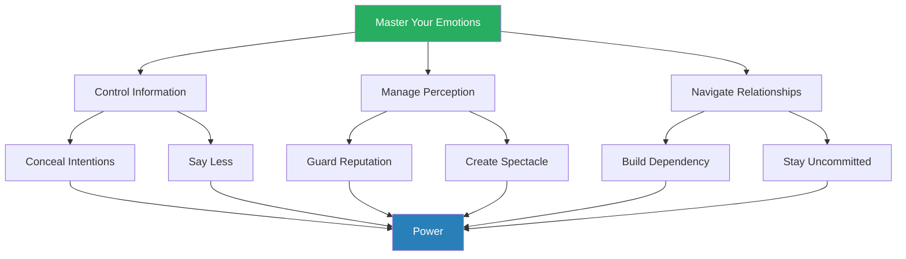
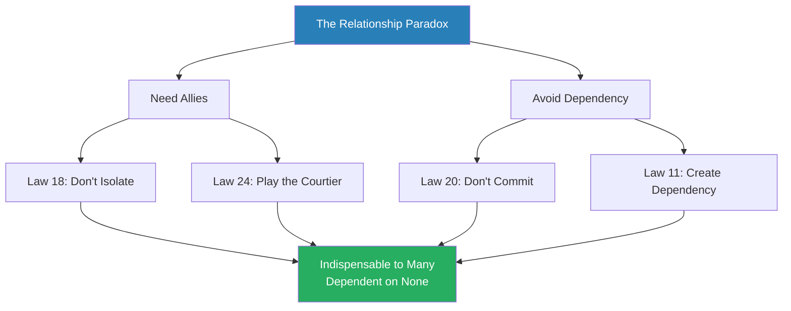
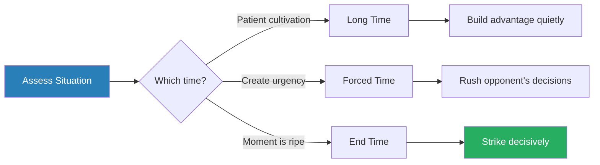

# The 48 Laws of Power — Robert Greene

> Robert Greene's debut is a ruthless encyclopaedia of power drawn from 3,000 years of history. His thesis is simple and uncomfortable: power governs all human interaction, the rules have not changed since the courts of Louis XIV, and those who refuse to learn them are not virtuous — they are victims. Each of the 48 laws is illustrated with historical stories of those who mastered the law and those who were destroyed by ignoring it. Greene draws on Machiavelli, Sun Tzu, Bismarck, Louis XIV, con artists, and Renaissance courtiers to build the most comprehensive tactical manual for navigating hierarchies, politics, and competition ever assembled in one volume. Love it or hate it, it is the book that made "power" a subject you could discuss openly.

---

## About the Author

Robert Greene studied classical literature at the University of California, Berkeley, and later at the University of Wisconsin at Madison, where he received a degree in classical studies.
He worked over fifty jobs — including as a Hollywood screenwriter, magazine editor, translator, and writer at various magazines — before writing *The 48 Laws of Power* at age 36.
That breadth of experience gave him something most authors in the power genre lack: personal acquaintance with failure, exploitation, and the feeling of powerlessness.
He was not writing from the heights of success but from the bottom of the ladder, looking up and asking how the game really worked.

The book was co-created with Joost Elffers, a Dutch book packager known for his visually striking productions.
The distinctive design — bold red and black, heavy typography, marginal annotations like a Renaissance manuscript — was itself a power move, making the object impossible to ignore on a shelf.
It became an underground classic, passed hand to hand in prisons, corporate offices, and music studios.
50 Cent, who later co-authored *The 50th Law* with Greene, has said it was the most influential book he read during his rise to fame.
The book was banned in some prisons, which only increased its allure — forbidden knowledge being the most attractive kind.

## The Big Idea

*Greene argues that power is not a moral question but a structural one — and that every human institution, ancient or modern, is a court where the same dynamics play out.*

- Greene's central argument is that <b style="color: #27ae60">power is a game</b>
  - It is not a moral question but a practical one
  - It operates by laws as predictable as those in physics
- Every workplace, social circle, and institution is a <b style="color: #2980b9">court</b> — a system where people compete for favour, influence, and position
  - The courtiers of Louis XIV managed exactly the same dynamics that modern professionals face:
    - How to please those above you without threatening them
    - How to outmanoeuvre rivals without making enemies
    - How to project strength while concealing your intentions

- The uncomfortable truth Greene forces you to confront is that <b style="color: #e74c3c">refusing to play the game does not exempt you from it</b>
  - "Any man who tries to be good all the time is bound to come to ruin among the great number who are not good," Machiavelli wrote, and Greene agrees
  - The 48 laws are his distillation of how the game actually works — not how we wish it worked
  - The person who claims to be "above" politics is not virtuous; they are defenceless

---

- Half of mastery, Greene argues, comes from what you choose *not* to do
  - Emotional reactions, premature commitments, and the urge to prove yourself right are far more dangerous than any rival
  - The book's deepest lesson is not any single law but the meta-principle that runs through all of them: <b style="color: #27ae60">master your emotions, or they will master you</b>
  - "An emotional response to a situation is the single greatest barrier to power," he writes in the preface — and every law that follows is, at some level, a variation on this theme

- The second great meta-principle is that <b style="color: #2980b9">power requires deception</b> — not as a moral failing but as a civilisational art
  - Greene writes that "all human interaction requires deception on many levels," and he means this literally
  - Politeness is a form of deception; diplomatic language is deception; the smile you wear at work when you would rather scream is deception
  - Greene argues that what separates humans from animals is not our capacity for truth but our capacity for strategic untruth — and that those who master this capacity hold the keys to power

- The third meta-principle is structural: Greene treats the book's preface as a manifesto for the <b style="color: #2980b9">court dynamic</b>, which he considers the universal model for human organisations
  - Every institution, from a Renaissance palace to a modern corporation, is a court
  - "Today we face a peculiarly similar paradox to that of the courtier," he writes
  - Everything must appear civilised and fair — but those who play by those rules too strictly are crushed by those who do not
  - The courtier must serve the master while protecting themselves from rivals, project loyalty while pursuing self-interest, and navigate all of it without ever breaking the illusion of effortless cooperation

---

- The structure is distinctive — each law follows a rigid template:
  - A pithy law statement and a "Judgment" paragraph
  - Historical anecdotes illustrating <b style="color: #2980b9">observance</b> (someone who followed the law successfully) and <b style="color: #2980b9">transgression</b> (someone who violated it and suffered)
  - An "Interpretation" section and "Keys to Power" (the practical core)
  - An "Image" (a visual metaphor) and an "Authority" quote from a historical figure
  - A "Reversal" section acknowledging when the law does not apply
- The Reversals are what save the book from dogma — Greene is honest about the limits of each law, which is more intellectual integrity than most self-help authors muster

Greene's three meta-principles — emotional mastery, strategic deception, and court awareness — feed into every one of the 48 laws, making this less a list of rules and more an interconnected system of power dynamics.

## Key Concepts at a Glance

| Concept | One-line summary |
|---------|-----------------|
| **The Court Dynamic** | Every institution is a court — learn its rules or be crushed by them |
| **Emotional Mastery** | The single greatest barrier to power is an emotional response |
| **Reputation** | Perception IS reality — guard your reputation as your most valuable asset |
| **Strategic Deception** | Conceal intentions, say less, use selective honesty as a weapon |
| **Sprezzatura** | Make the difficult look effortless — conceal all toil and calculation |
| **Dependency** | Make others need you more than you need them |
| **Non-Commitment** | Stay uncommitted so others compete for your allegiance |
| **The Thumbscrew** | Everyone has a weakness — find it and you gain leverage |
| **Unpredictability** | Break patterns to destabilise opponents and prevent preparation |
| **Absence & Scarcity** | What is rare is valued — strategic withdrawal increases your worth |
| **Spectacle & Symbol** | Visual drama bypasses rational resistance and projects power |
| **Self-Re-Creation** | Identity is a project you construct, not a fixed thing you discover |

The laws distribute remarkably evenly across domains — Greene's system is not about any single dimension of power but about mastering all six simultaneously, with Reputation and Strategic Action receiving the most attention.

### Quick Lookup Table

| # | Law | Theme |
|---|-----|-------|
| 1 | Never Outshine the Master | [Reputation & Image](#reputation--image) |
| 2 | Never Put Too Much Trust in Friends; Learn How to Use Enemies | [Relationships & Leverage](#relationships--leverage) |
| 3 | Conceal Your Intentions | [Information & Deception](#information--deception) |
| 4 | Always Say Less Than Necessary | [Information & Deception](#information--deception) |
| 5 | So Much Depends on Reputation — Guard It with Your Life | [Reputation & Image](#reputation--image) |
| 6 | Court Attention at All Cost | [Reputation & Image](#reputation--image) |
| 7 | Get Others to Do the Work for You, but Always Take the Credit | [Power Structures & Systems](#power-structures--systems) |
| 8 | Make Other People Come to You — Use Bait if Necessary | [Strategic Action](#strategic-action) |
| 9 | Win Through Your Actions, Never Through Argument | [Strategic Action](#strategic-action) |
| 10 | Infection: Avoid the Unhappy and Unlucky | [Relationships & Leverage](#relationships--leverage) |
| 11 | Learn to Keep People Dependent on You | [Relationships & Leverage](#relationships--leverage) |
| 12 | Use Selective Honesty and Generosity to Disarm Your Victim | [Information & Deception](#information--deception) |
| 13 | When Asking for Help, Appeal to People's Self-Interest | [Relationships & Leverage](#relationships--leverage) |
| 14 | Pose as a Friend, Work as a Spy | [Information & Deception](#information--deception) |
| 15 | Crush Your Enemy Totally | [Strategic Action](#strategic-action) |
| 16 | Use Absence to Increase Respect and Honour | [Reputation & Image](#reputation--image) |
| 17 | Keep Others in Suspended Terror: Cultivate Unpredictability | [Information & Deception](#information--deception) |
| 18 | Do Not Build Fortresses — Isolation Is Dangerous | [Relationships & Leverage](#relationships--leverage) |
| 19 | Know Who You're Dealing With — Do Not Offend the Wrong Person | [Emotional Mastery](#emotional-mastery) |
| 20 | Do Not Commit to Anyone | [Relationships & Leverage](#relationships--leverage) |
| 21 | Play a Sucker to Catch a Sucker — Seem Dumber Than Your Mark | [Information & Deception](#information--deception) |
| 22 | Use the Surrender Tactic: Transform Weakness into Power | [Strategic Action](#strategic-action) |
| 23 | Concentrate Your Forces | [Strategic Action](#strategic-action) |
| 24 | Play the Perfect Courtier | [Relationships & Leverage](#relationships--leverage) |
| 25 | Re-Create Yourself | [Reputation & Image](#reputation--image) |
| 26 | Keep Your Hands Clean | [Power Structures & Systems](#power-structures--systems) |
| 27 | Play on People's Need to Believe to Create a Cultlike Following | [Power Structures & Systems](#power-structures--systems) |
| 28 | Enter Action with Boldness | [Strategic Action](#strategic-action) |
| 29 | Plan All the Way to the End | [Strategic Action](#strategic-action) |
| 30 | Make Your Accomplishments Seem Effortless | [Reputation & Image](#reputation--image) |
| 31 | Control the Options: Get Others to Play with the Cards You Deal | [Strategic Action](#strategic-action) |
| 32 | Play to People's Fantasies | [Power Structures & Systems](#power-structures--systems) |
| 33 | Discover Each Man's Thumbscrew | [Relationships & Leverage](#relationships--leverage) |
| 34 | Be Royal in Your Own Fashion: Act Like a King to Be Treated Like One | [Reputation & Image](#reputation--image) |
| 35 | Master the Art of Timing | [Strategic Action](#strategic-action) |
| 36 | Disdain Things You Cannot Have: Ignoring Them Is the Best Revenge | [Emotional Mastery](#emotional-mastery) |
| 37 | Create Compelling Spectacles | [Reputation & Image](#reputation--image) |
| 38 | Think as You Like but Behave Like Others | [Emotional Mastery](#emotional-mastery) |
| 39 | Stir Up Waters to Catch Fish | [Emotional Mastery](#emotional-mastery) |
| 40 | Despise the Free Lunch | [Power Structures & Systems](#power-structures--systems) |
| 41 | Avoid Stepping into a Great Man's Shoes | [Power Structures & Systems](#power-structures--systems) |
| 42 | Strike the Shepherd and the Sheep Will Scatter | [Power Structures & Systems](#power-structures--systems) |
| 43 | Work on the Hearts and Minds of Others | [Emotional Mastery](#emotional-mastery) |
| 44 | Disarm and Infuriate with the Mirror Effect | [Emotional Mastery](#emotional-mastery) |
| 45 | Preach the Need for Change, but Never Reform Too Much at Once | [Power Structures & Systems](#power-structures--systems) |
| 46 | Never Appear Too Perfect | [Reputation & Image](#reputation--image) |
| 47 | Do Not Go Past the Mark You Aimed For; In Victory, Learn When to Stop | [Emotional Mastery](#emotional-mastery) |
| 48 | Assume Formlessness | [Emotional Mastery](#emotional-mastery) |

---

## Reputation & Image

*These laws reveal that in the world of power, perception is not merely important — it IS reality, and managing your image is as critical as any tactical manoeuvre.*

- The laws in this cluster deal with how you are perceived — your reputation, your image, your public persona
- Greene's core insight is that <b style="color: #27ae60">perception IS reality in the world of power</b>
  - It does not matter what you are; it matters what people believe you are
  - A strong reputation multiplies every action you take; a weak one undermines even genuine achievements
- These laws teach you to manage perception as deliberately as you manage any other strategic resource — because in the courts that Greene describes, what is unseen counts for nothing

The treemap reveals that the most consequential laws cluster around reputation management and emotional mastery — the foundational domains that amplify or undermine every other tactical move.

### Law 1: Never Outshine the Master

*The most dangerous mistake in any hierarchy is making the person above you feel inferior — even unintentionally.*

- Those above you must always feel comfortably superior
- <b style="color: #27ae60">Make your masters appear more brilliant than they are, and you rise</b>
- <b style="color: #e74c3c">Outshine them, and you trigger an insecurity so primal that no amount of talent can save you</b>

> [!example] Nicolas Fouquet's Fatal Party (1661)
> - Fouquet, France's finance minister, threw a lavish party at his estate Vaux-le-Vicomte to honour Louis XIV
> - The gardens were designed by Le Notre, the entertainment orchestrated by Moliere, the food prepared by Vatel — the greatest talents in France
> - The architecture, the fireworks, the sheer opulence — all more magnificent than anything the king possessed
> - Fouquet intended it as flattery, a display of devotion
> - Louis received it as humiliation — a subject who lived better than the sovereign
> - Within three weeks, Fouquet was arrested by d'Artagnan (the real musketeer) and spent the remaining twenty years of his life in prison
> - Louis then hired every artist and craftsman who had worked on Vaux-le-Vicomte to build Versailles
> **The lesson:** Never display superiority over those who hold power over you — even in the guise of flattery.

> [!example] Galileo's Medicean Stars
> - Galileo faced the same problem from the opposite direction — a man of towering genius who needed the patronage of powerful but mediocre rulers
> - When Galileo discovered Jupiter's moons, he named them the "Medicean Stars" after the Medici family
> - The discovery was Galileo's, but the glory belonged to his patrons
> - Cosimo II responded by giving Galileo a lifetime appointment and the freedom to pursue his research
> - The moons are no longer called the Medicean Stars, but Galileo died in his own bed, not in a prison cell
> **The lesson:** Channel your brilliance through the master's brand — credit costs nothing to give and buys everything in return.

> [!tip] Core Insight
> Insecurity is the most dangerous emotion in hierarchies. The solution is not to diminish yourself but to make the master shine — channel your brilliance through their brand.

- **The mechanism** — insecurity in hierarchies:
  - When subordinates display superior talents, masters feel threatened at a primal level
  - They cannot admit this even to themselves, so they find rational-sounding reasons to punish you — your attitude is wrong, your loyalty is questionable, your methods are reckless
  - The real reason is always the same: <b style="color: #e74c3c">you made them feel small</b>
  - The solution is not to diminish yourself but to make the master shine — credit costs nothing to give and buys everything in return

---

- There is a deeper mechanism at work beyond simple insecurity:
  - Greene argues that masters need to feel they are the <b style="color: #2980b9">source of good fortune</b> for those beneath them
  - When a subordinate demonstrates that their success is self-generated — that they would shine regardless of the master's patronage — the master's role is undermined
  - This is why flattery that attributes your success to the master's mentorship or vision is so effective: it reaffirms the hierarchy rather than threatening it

- **When it applies and when it doesn't:**
  - This law applies most strongly with insecure leaders — and insecure leaders are the rule, not the exception
  - Genuinely secure ones who celebrate subordinate brilliance exist, but they are rarer than we want to believe
  - When in doubt, err on the side of making those above you look good
  - The exception Greene acknowledges in the Reversal: if the master is already falling, outshining them may be exactly the move that positions you as the successor
  - But timing this wrong is catastrophic, because if the master recovers, you have made a permanent enemy of someone who still holds power over you

---

### Law 5: So Much Depends on Reputation — Guard It with Your Life

*Your reputation arrives before you enter the room, shapes how every action is interpreted, and multiplies or undermines everything you do.*

- <b style="color: #2980b9">Reputation</b> is the cornerstone of power
  - It arrives before you enter the room, shapes how every action is interpreted, and multiplies (or undermines) everything you do
- "Make your reputation unassailable," Greene writes
- A single crack in it, and you are vulnerable

> [!example] Chuko Liang's Empty City (Three Kingdoms Period)
> - Chuko Liang, the legendary strategist of ancient China's Three Kingdoms period, had a reputation so fearsome it could win battles on its own
> - When an enemy force of over 150,000 soldiers approached a city Liang was defending with only a handful of troops, he did something audacious
> - He opened the city gates, sat on the walls in full view playing a lute, and smiled
> - The enemy commander, Sima Yi, knew Liang's reputation for devastating ambushes and cunning traps
> - Seeing the open gates, he concluded it must be an elaborate deception — that the city was full of hidden soldiers waiting to spring
> - He ordered a full retreat
> - The city was saved by reputation alone, without a single sword drawn
> **The lesson:** A reputation powerful enough can substitute for actual strength.

> [!example] Reputation Weaponised Against a Rival
> - When facing a rival whose reputation for cowardice was already circulating, Liang simply amplified the whispers
> - Before a single engagement, the rival's own troops had lost confidence in him
> - The battle was won before it began
> **The lesson:** Attack a reputation and you attack the foundation of power itself.

- **The mechanism** — narrative filtering:
  - People filter reality through existing narratives
  - A strong reputation means your actions are interpreted charitably — even mistakes become "bold experiments"
  - A damaged reputation means even genuine achievements are viewed with suspicion
  - <b style="color: #27ae60">Reputation is not a passive quality that accumulates on its own; it must be actively cultivated and aggressively defended</b>

---

- **Offensive use of reputation:**
  - A reputation, once damaged, is almost impossible to repair — attacking an opponent's reputation is one of the most effective offensive moves in the power game
  - <b style="color: #e74c3c">But Greene warns against doing so carelessly</b> — the target will fight back with the desperate energy of someone defending their most valuable possession
  - Better to subtly undermine than to openly attack — a well-placed question, a strategic expression of concern, a rumour that reaches the right ears at the right time

- **Building your reputation:**
  - Reputation must be backed by substance — without it, the reputation is a bubble that will burst spectacularly under scrutiny
  - But capability without reputation is invisible — you can be the most talented person in the room and receive none of the credit
  - You need both
  - The first step, Greene argues, is to establish a reputation for <b style="color: #2980b9">one distinctive quality</b> — generosity, cunning, reliability, efficiency — and to build your identity around it
  - Once established, that quality becomes a lens through which all your actions are interpreted
  - The person known for reliability gets the benefit of the doubt when something goes wrong; the person with no reputation gets none

### Law 6: Court Attention at All Cost

*In the world of power, what is unseen counts for nothing — you must stand out or be forgotten.*

- Everything is judged by its appearance — what is unseen counts for nothing
- You must stand out
- Make yourself a magnet of attention by appearing larger, more colourful, more mysterious than the bland masses around you

Greene distinguishes between two kinds of attention, each with its own dynamic:

| Type of Attention | Mechanism | Master Practitioner |
|-------------------|-----------|---------------------|
| **Spectacle** | Bold actions that make people notice you | P.T. Barnum |
| **Mystery** | Cultivating an air of the unknowable | Mata Hari |

> [!example] P.T. Barnum's Brick Man
> - When Barnum's American Museum was struggling to attract visitors, he hired a man to lay bricks in a peculiar pattern on the streets of New York
> - The man walked silently from one designated spot to another, then entered the museum
> - Crowds gathered to watch this bizarre behaviour, followed the man inside, and paid admission
> - Barnum understood that even negative attention was better than no attention — controversy, mystery, and sheer spectacle were all currencies of power
> - He once advertised a "Free Grand Buffalo Hunt" that turned out to feature scrawny, half-tamed calves, provoking outrage in the press
> - But the outrage was the point: it kept his name in the papers for weeks
> **The lesson:** Attention — even negative attention — is a currency of power. The worst fate is to be ignored.

- The second kind of attention is <b style="color: #2980b9">mystery</b> — cultivating an air of the unknowable:
  - When you are too easily understood, you are taken for granted
  - When you are slightly enigmatic, people project their fantasies onto you
  - Mata Hari wielded mystery like a weapon, constructing an exotic persona — she claimed to be a Javanese princess raised in sacred temple dances — that captivated everyone from soldiers to diplomats
  - The persona was almost entirely fabricated, but it was consistent, compelling, and impossible to fully penetrate

- <b style="color: #e74c3c">There is a fine line between attracting attention and becoming a spectacle of ridicule</b>
  - The attention must be controlled — you direct the narrative, or it directs you
  - Greene warns that bad attention from a position of weakness is simply destructive
  - This law operates from a position where you can absorb scrutiny

---

### Law 16: Use Absence to Increase Respect and Honour

*Once you have established value, the most powerful move is to withdraw — scarcity creates longing, and longing creates power.*

- The more you are seen and heard, the more common you appear
- If you are already established in a group, temporary withdrawal makes you more talked about, even more admired
- <b style="color: #27ae60">What is rare is valued; what is abundant is not</b>

> [!example] Deioces, the Mede Judge-King
> - Deioces, the Mede leader described by Herodotus, built his power initially by being the most accessible and fair judge in the kingdom
> - Once his value was firmly established, he withdrew entirely, refusing to settle disputes
> - The resulting chaos made the people beg him to return
> - This time, he returned as king
> **The lesson:** Establish value first, then withdraw — the vacuum you create will be filled by others' desperation for your return.

> [!example] Coriolanus's Fatal Return
> - After being exiled from Rome, Coriolanus's absence initially increased his legend
> - Romans who had called for his exile began to miss the security his military prowess had provided
> - Had he waited, he might have been recalled in triumph
> - Instead, consumed by rage, he allied with Rome's enemies and marched on the city
> - He destroyed the mystique his absence had created and confirmed every accusation his enemies had made
> - Absence enhanced him; action destroyed him
> **The lesson:** Absence can magnify your legend — but acting from bitterness can destroy it overnight.

- **The mechanism** — <b style="color: #2980b9">scarcity</b>:
  - "Too much circulation makes the price go down," Greene writes
  - Once people take your presence for granted, they stop valuing it
  - A well-timed absence reminds them what they are missing
  - Napoleon understood this in exile on Elba: his absence from the French political scene did not diminish him but made him mythic, allowing his eventual return

- **When it applies and when it doesn't:**
  - This only works if you have already established value
  - <b style="color: #e74c3c">Disappearing before people know you exist is not mysterious — it is irrelevant</b>
  - Absence must be temporary; permanent withdrawal leads to replacement, not longing
  - The art is calibrating the length: long enough to be felt, short enough that you have not been written off

---

### Law 25: Re-Create Yourself

*Identity is not a fixed thing you discover — it is a project you construct, and the most powerful people in history understood this instinctively.*

- Do not accept the roles that society foists on you
- <b style="color: #27ae60">Forge a new identity — one that commands attention and serves your purposes</b>
- Be the master of your own image rather than letting others define it for you

> [!example] Caesar Augustus's Transformation
> - Born Gaius Octavius, the grandnephew of Julius Caesar, he was a sickly teenager with no military reputation when Caesar was assassinated
> - No one expected him to amount to anything
> - But Octavian systematically constructed a new identity:
>   - He adopted Caesar's name and claimed his divine legacy
>   - He wrapped himself in the symbolism of Rome's founders
>   - He adopted the imagery and rituals of the Republic
>   - He crafted a persona so compelling that it became reality
> - By the time he took the name Augustus, the transformation was complete: a callow youth had become a figure of mythic authority who ruled Rome for over forty years
> - He did not wait to be recognised as great — he created the spectacle of greatness and people internalised it
> **The lesson:** Do not wait for the world to recognise what you are — construct the identity you want and project it with total conviction.

> [!example] George Sand's Self-Invention
> - The artist formerly known as Aurore Dupin re-created herself as George Sand
> - By adopting a male pen name, wearing men's clothing, and smoking cigars in public, she did not merely transgress — she constructed a persona that was so compelling, so consistently performed, that it became more real than the identity she was born with
> - Her notoriety was not accidental; it was designed
> **The lesson:** A deliberately constructed identity, performed with consistency, becomes indistinguishable from reality.

- **The mechanism** — <b style="color: #2980b9">identity as performance</b>:
  - "Do not accept the roles that society foists on you," Greene writes
  - The most powerful people in history did not simply present themselves; they performed themselves
  - They chose a role, rehearsed it, refined it, and projected it with the consistency and conviction of a great actor
  - The role became indistinguishable from the person — not because it was authentic in the therapeutic sense, but because it was performed so completely that the performance became reality

- **Grounding in substance:**
  - The new identity must have some grounding in real capability
  - <b style="color: #e74c3c">Pure fabrication collapses under scrutiny</b> — the person who claims expertise they do not possess will be exposed in the first serious test
  - But capability alone, without conscious image-crafting, leaves you at the mercy of other people's narratives — and other people's narratives rarely serve your interests
  - The act of re-creation is not dishonesty; it is strategic emphasis
  - You choose which truths to lead with, which qualities to develop and display, and which aspects of your history to foreground or quietly set aside

---

### Law 30: Make Your Accomplishments Seem Effortless

*The highest art is making the difficult look easy — concealing the machinery behind the magic.*

- Conceal the toil, practice, and clever tricks behind your actions
- When you act, act effortlessly
- "Resistance and friction" make everything seem harder; smoothness and ease suggest unlimited reserves of power

> [!example] Houdini's Hidden Labour
> - Harry Houdini spent years researching lock mechanisms, training his body to endure freezing water and extreme physical stress, and meticulously preparing every escape down to the smallest detail
> - But he never revealed his methods
> - The mystery multiplied his power — audiences attributed supernatural abilities to him because they could not see the work
> - When he escaped from a locked milk can filled with water, the audience saw magic; what they did not see was the months of practice, the specially constructed can, and the pre-arranged signal with his assistant
> **The lesson:** Concealing the effort behind your achievements makes them appear miraculous.

> [!example] Sen no Rikyu's Fallen Leaves
> - A tea master expecting a visit from a patron meticulously cleaned and arranged his garden
> - Then at the last moment he shook a tree so that a few leaves fell randomly on the path
> - The result looked perfectly natural — which was, of course, the point
> **The lesson:** The appearance of effortless naturalness is itself the product of enormous hidden effort.

- **The mechanism** — <b style="color: #2980b9">sprezzatura</b>:
  - The Italian Renaissance concept coined by Baldassare Castiglione in *The Book of the Courtier*
  - It means studied carelessness: the art of making difficult things look easy
  - The Japanese tea master Sen no Rikyu taught that the appearance of naturalness was the highest art in the tea ceremony
  - But achieving that appearance of effortless naturalness required enormous hidden effort — every movement choreographed, every object placed with precise intention, all designed to look spontaneous

- **When it applies and when it doesn't:**
  - In cultures that explicitly value hard work, some visible effort is expected
  - The art is making the outcome seem natural while showing just enough effort to seem committed — never so much that you appear to be struggling
  - <b style="color: #e74c3c">Revealing your tricks and toil invites people to question your competence</b>: if they can see how the trick works, the magic disappears

---

### Law 34: Be Royal in Your Own Fashion

*How you carry yourself determines how others treat you — self-belief is contagious, and people default to the subject's own self-valuation.*

- How you carry yourself determines how others treat you
- If you project dignity and confidence, people will grant you authority
- If you ask for less, you receive less
- "The trick is simple: be overcome by your self-belief," Greene writes

> [!example] Columbus's Outrageous Demands
> - Christopher Columbus demanded titles of nobility, the rank of Admiral, and ten per cent of all revenues from any lands he discovered
> - These demands were outrageous for an unknown navigator from Genoa — a man with no noble blood, no military rank, and an unproven theory about reaching Asia by sailing west
> - Precisely because they were outrageous, the Spanish court took him seriously
> - Queen Isabella and King Ferdinand could have dismissed him as a fantasist, but his audacity signalled unshakeable conviction
> - A man who asks for so much, they reasoned, must believe profoundly in what he offers
> - He received everything he asked for
> **The lesson:** Ask for what you believe you are worth — audacity signals conviction, and conviction commands respect.

> [!example] Louis-Philippe's Fatal Modesty (1830-1848)
> - Louis-Philippe, who became King of France after the revolution of 1830, committed the opposite error
> - In an effort to seem democratic and approachable, he walked the streets of Paris in an ordinary suit, carrying an umbrella like a common bourgeois
> - He shook hands with shopkeepers and insisted on being addressed as "citizen king"
> - The public initially found this charming, then ridiculous, then contemptible
> - A king who acts like a commoner will be treated like one
> - Louis-Philippe was overthrown in the revolution of 1848, derided by the very people he had tried to charm
> **The lesson:** Diminishing yourself does not make people respect you more — it gives them permission to respect you less.

> [!tip] Core Insight
> Self-belief is contagious. People lack independent criteria for judging status — they default to the subject's own self-valuation.

- **The mechanism** — the self-fulfilling prophecy of bearing:
  - <b style="color: #27ae60">If you believe you deserve power, others begin to believe it too</b>
  - If you shrink, they shrink their estimate of you to match
  - Count Lustig carried himself with such regal bearing — impeccable suits, perfect manners, an air of unshakeable calm — that everyone he met assumed he was genuine aristocracy
  - He was not, but his projection of status was so convincing that people treated him as what he appeared to be, which in turn made the appearance even more convincing

- **Nuance and limits:**
  - In egalitarian cultures, the art is projecting quiet authority rather than loud self-promotion
  - The principle is not about arrogance — it is about refusing to diminish yourself
  - Columbus did not boast; he stated his terms as a matter of fact
  - There is a distinction between asking for what you are worth and posturing beyond it — the first commands respect, the second invites exposure
  - Louis-Philippe fell because he confused approachability with accessibility — there is a version of royal bearing that is warm, dignified, and inviting without being common

---

### Law 37: Create Compelling Spectacles

*Visual symbols bypass rational resistance — words can be argued with, but images cannot.*

- Striking imagery and grand symbolic gestures create the aura of power
- Audiences are captivated by appearances and symbols, and they rarely look behind them

> [!example] Diane de Poitiers's Tournament
> - Diane de Poitiers, mistress to King Henri II of France, staged a tournament in which the king charged into the lists wearing her colours rather than the queen's
> - The visual spectacle — the king of France fighting for his mistress in front of the entire court — communicated her power more eloquently than any title or position could
> - Every courtier understood the message: the queen may wear the crown, but Diane wears the king
> **The lesson:** A single compelling image can communicate power more effectively than any argument.

- **The mechanism** — visual symbols bypass rational resistance:
  - <b style="color: #27ae60">Words can be argued with; images cannot</b>
  - A compelling spectacle overwhelms the senses and creates an emotional response that logic cannot easily undo
  - Greene points to the pageantry of the Roman triumphs, the staging of the Nuremberg rallies, and the theatrics of religious ceremonies as evidence that spectacle has been used to consolidate power throughout history
  - The common thread is that all of them used visual drama to make abstract power feel tangible and unchallengeable

- **Spectacle in less theatrical contexts:**
  - When Louis XIV received ambassadors, every detail of the room — the height of his throne, the distance guests had to walk, the lighting, the music — was calculated to project overwhelming authority before a single word was spoken
  - The spectacle was the message
  - In modern contexts, the equivalent is the carefully staged product launch, the annual report designed to impress investors, or the office that communicates authority through its very layout
  - <b style="color: #2980b9">Symbols do the work that arguments cannot</b>

---

### Law 46: Never Appear Too Perfect

*Appearing too perfect creates silent envy — and silent enemies are the most dangerous kind.*

- Appearing too perfect creates silent envy
- It is wise to occasionally display small defects, admit minor shortcomings, and attribute some of your success to luck
- <b style="color: #e74c3c">Envy creates "silent enemies," and there is no defence against it once it crystallises</b>

> [!example] Joe Orton and Kenneth Halliwell (1960s)
> - Joe Orton, the brilliant British playwright, and Kenneth Halliwell started as equals — both aspiring writers, both broke, both living in a tiny London flat
> - But Orton's plays became sensations while Halliwell's work was rejected everywhere
> - Orton, oblivious to the growing resentment, flaunted his success — the interviews, the celebrity friends, the sexual adventures
> - He left Halliwell to feel increasingly invisible, a footnote to someone else's story
> - The resentment built until Halliwell bludgeoned Orton to death with a hammer and then took his own life
> **The lesson:** Flaunting success in front of those close to you can provoke envy so corrosive it becomes lethal.

- **The mechanism** — the psychology of envy:
  - Human beings can tolerate others' success as long as they do not feel diminished by it
  - Display success too visibly, especially to those close to you, and you trigger an envy that is silent, corrosive, and ultimately deadly
  - <b style="color: #27ae60">Deflect envy by occasionally downplaying your advantages, admitting to struggle, and attributing success partly to fortune</b>
  - The master of this technique makes others feel that their success is replicable — that luck, timing, and circumstance played their part
  - The moment people conclude that your success comes from some inherent superiority, they stop admiring and start resenting

---

## Information & Deception

*Greene's position is unambiguous: transparency is a luxury of the powerless — those who control the flow of information control the game itself.*

- These laws govern what you reveal, what you conceal, and how to control the information environment
- <b style="color: #27ae60">Those who share their plans freely give their opponents time to prepare defences</b>
- Those who share their feelings freely give their opponents weapons
- The laws in this cluster teach the art of <b style="color: #2980b9">strategic opacity</b> — revealing only what serves your purposes, concealing everything else, and using selective honesty as the most potent form of deception

- Greene's view of information is deeply influenced by Sun Tzu:
  - The general who knows his opponent's dispositions while concealing his own has already won the war
  - In the modern world, information is the primary currency of power
  - The person who knows more — about others' intentions, weaknesses, plans, and fears — while revealing less about their own holds an advantage that no title or position can match
- These laws are about controlling that <b style="color: #2980b9">information asymmetry</b>

### Law 3: Conceal Your Intentions

*The moment people can read your plans, they can prepare their defences — so never let them read your plans.*

- Keep people off-balance by never revealing the purpose behind your actions
- Dangle false goals and red herrings to prevent others from preparing defences
- "If at any point in the deception you practice you are discovered," Greene writes, "all is lost"

> [!example] Bismarck's False Peace Speech (1850)
> - Bismarck gave an impassioned speech in the Prussian parliament in favour of peace with Austria — so eloquent and apparently sincere that the Prussian king appointed him to the cabinet as a man of moderation
> - Once in power, Bismarck waged the very wars he had publicly opposed
> - He had been planning Prussian expansion through military conquest all along
> - His false sincerity was so effective because it gave people exactly what they wanted to hear: reassurance
> - The court wanted peace; Bismarck promised peace; they stopped looking for his real intentions
> - By the time his true objectives became clear, he was already too powerful to stop
> **The lesson:** Give people what they want to hear, and they will stop looking for what you are actually doing.

> [!example] Haile Selassie's Banquet Trap
> - Selassie, the future emperor of Ethiopia, needed to disarm the powerful regional governor Balcha
> - Rather than confront Balcha directly, Selassie invited him to a grand banquet — a gesture of respect and reconciliation
> - While Balcha feasted inside, enjoying the lavish hospitality, Selassie's agents were outside systematically bribing Balcha's soldiers
> - By the time the evening ended, Balcha emerged to find that his army had dissolved
> - He was powerless, and the transition of power happened without a single sword drawn
> - The banquet was the smoke screen; the real operation happened where no one was looking
> **The lesson:** The most effective deceptions distract the target with something pleasant while the real move happens elsewhere.

> [!example] Ninon de Lenclos's Open Candour
> - Ninon de Lenclos, the famous seventeenth-century French courtesan, spoke with apparent candour about trivial matters — her social engagements, her opinions on fashion, her views on poetry
> - She was known for her charming directness
> - This reputation for openness made people assume she was incapable of concealment
> - Behind that disarming transparency, she conducted the most intricate political and romantic intrigues in Paris
> **The lesson:** The person who seems to have nothing to hide is the person nobody investigates.

> [!tip] Core Insight
> The most effective concealment is not silence — it is the appearance of total transparency about things that do not matter.

Greene offers two techniques for concealment:

| Technique | Method | Effect |
|-----------|--------|--------|
| <b style="color: #2980b9">Smoke screen</b> | Announce one intention loudly and pursue the real one quietly | Misleads opponents into defending the wrong position |
| <b style="color: #2980b9">Open, bland exterior</b> | Be disarmingly transparent about trivial matters | Makes people assume you have nothing deeper to hide |

- **Costs and limits of concealment:**
  - In relationships requiring deep trust, excessive concealment destroys the bond — the ally who discovers you have been hiding intentions will never trust you again
  - The art is knowing which relationships require transparency and which benefit from strategic opacity
  - Greene is clear that concealment is a tool, not a default — applied universally, it creates paranoia around you and isolates you from genuine allies
  - The most effective operators conceal their intentions from rivals while being genuinely transparent with their inner circle
  - The <b style="color: #2980b9">segregation of audiences</b> — knowing who gets truth and who gets smoke screens — is itself one of the highest arts of power
  - <b style="color: #e74c3c">A single misclassification — treating an ally like a rival, or a rival like an ally — can be fatal</b>

---

### Law 4: Always Say Less Than Necessary

*Words are power expenditure — once spoken, they cannot be retrieved, and the person who speaks least in a room is often perceived as the most powerful.*

- The more you say, the more common you appear and the less in control
- "Powerful people impress and intimidate by saying less"
- Short answers and deliberate silences make others uncomfortable — they rush to fill the gap, revealing more than they intended

> [!example] Louis XIV's Four Words
> - Louis XIV was the master of this law
> - When a minister finished a lengthy proposal, the Sun King would simply respond: "I shall see"
> - Four words that kept everyone guessing, committed him to nothing, and projected absolute authority
> - His courtiers spent hours analysing those four words, debating what the king really thought, and jockeying to position themselves favourably before the king's decision was announced
> - Louis said almost nothing and controlled everything
> **The lesson:** Silence is not absence of power — it is the purest projection of it.

> [!example] Coriolanus's Self-Destructive Tongue
> - A brilliant Roman general who conquered the city of Corioli, Coriolanus could not stop talking about his own achievements
> - His endless self-promotion — in the Senate, in the streets, to anyone who would listen — turned admiration into resentment
> - He was eventually exiled, and his story became Shakespeare's cautionary tale about the danger of failing to control your tongue
> **The lesson:** Talking too much about your achievements transforms admiration into resentment.

- **The mechanism** — words as power expenditure:
  - Once spoken, they cannot be retrieved
  - <b style="color: #27ae60">Silence forces others to interpret, and they typically project their own hopes and fears</b> — both of which give you valuable intelligence
  - The person who speaks least in a room is often perceived as the most powerful, because silence suggests that you are thinking rather than reacting, evaluating rather than performing

- Andy Warhol, in a very different era, practised this same law with remarkable discipline:
  - In interviews, he would give monosyllabic answers — "yes," "no," "maybe," "I don't know" — that infuriated journalists but made him seem infinitely mysterious
  - The less he revealed, the more the media projected onto him
  - His silence became his brand

- **When it applies and when it doesn't:**
  - In contexts requiring active persuasion — a negotiation, a pitch, a crisis — calculated eloquence is necessary
  - But even then, the discipline of saying less applies: three powerful points land harder than fifteen mediocre ones
  - In any conversation where intelligence is more valuable than persuasion, <b style="color: #2980b9">the person who speaks least and listens most walks away with the most information</b> — and information, as Greene argues throughout the book, is the currency of power

---

### Law 12: Use Selective Honesty and Generosity to Disarm

*One sincere gesture of honesty can cover the tracks of dozens of deceptions — because people are starved for genuine-seeming integrity.*

- One sincere gesture of honesty or generosity can cover the tracks of dozens of deceptions
- Open-hearted gestures bring down the guard of even the most suspicious people

> [!example] Count Lustig's Long Con on Al Capone
> - Count Victor Lustig, one of the most accomplished con artists in history, approached Al Capone with a proposition and was given $50,000 to invest
> - Instead of running off with the money — which Capone fully expected — Lustig returned it in full after a few weeks, saying the deal had fallen through
> - Capone, disarmed by this apparent honesty, gave Lustig a generous cash tip for his trouble
> - Which was what Lustig had wanted all along
> - The entire scheme was designed around a single moment of apparent integrity
> **The lesson:** A dramatic display of honesty creates a halo effect that blinds people to your real manoeuvres.

> [!example] Yellow Kid Weil's Generous Dinners
> - The con artist Yellow Kid Weil would take potential marks to expensive restaurants, tip lavishly, and demonstrate apparent wealth and generosity
> - The open-handedness was the smoke screen
> - Once the mark was convinced of Weil's sincerity and prosperity, the real con — a fraudulent investment — was almost impossible to refuse
> - The generosity had created a psychological obligation and an assumption of trustworthiness that no amount of rational analysis could overcome
> **The lesson:** Generosity creates psychological obligation — and obligation blinds judgement.

- **The mechanism** — the <b style="color: #2980b9">halo effect</b> of honesty:
  - People are starved for honesty in a world where everyone has an angle
  - A single genuine-seeming act creates a halo effect that colours everything else you do
  - The key word is *selective* — the honesty must be well-timed, dramatic enough to be memorable, and strategically placed to conceal the moves that follow it
  - A person who establishes themselves as honest early in a relationship has licence to operate with far less scrutiny later

- <b style="color: #e74c3c">Greene is clear that this technique is not about being honest — it is about using honesty as a tool</b>
  - The gesture must feel spontaneous and generous, never calculated
  - If people sense the calculation behind the honesty, the effect reverses catastrophically — they feel manipulated, and the resulting mistrust is deeper than if you had never attempted the honest gesture at all

---

### Law 14: Pose as a Friend, Work as a Spy

*Social situations are intelligence-gathering opportunities — the key is to ask indirect questions and let others fill the silence.*

- Knowing your rival's intentions and weaknesses is critical
- Use social situations — friendly gatherings, casual conversations — to gather intelligence
- "Give people the opportunity to reveal themselves," Greene advises

> [!example] Talleyrand's Conversational Intelligence
> - Talleyrand, Napoleon's foreign minister and one of the great political survivors of all time, mastered the art of conversational intelligence
> - At dinner parties and diplomatic receptions, his seemingly idle conversation extracted critical intelligence while revealing nothing of his own position
> - He asked oblique questions — never direct inquiries, which would raise suspicion, but tangential curiosities that led people to volunteer exactly what he wanted to know
> - He listened more than he spoke, remembered everything, and drew connections that others missed
> **The lesson:** The best intelligence is gathered through indirect questions in comfortable settings — never through direct interrogation.

> [!example] Joseph Duveen's Indirect Intelligence Network
> - Joseph Duveen, the legendary art dealer, did not pitch millionaire collectors directly
> - He befriended their servants, their secretaries, their interior decorators — the people who surrounded the target
> - Through these relationships, he learned his clients' tastes, insecurities, and buying patterns before ever entering the room
> - By the time he met the client, he already knew exactly what to offer and how to frame it
> **The lesson:** Intelligence gathered from the periphery is often more valuable than information from the target themselves.

- **The mechanism** — comfort breeds disclosure:
  - People are most unguarded when they feel comfortable
  - The friendly dinner, the casual walk, the social event — these are intelligence-gathering opportunities
  - The key is to ask indirect questions and let others fill the silence
  - <b style="color: #27ae60">People who feel they are in a safe social environment will reveal things they would never share in a formal setting</b>

---

### Law 17: Cultivate an Air of Unpredictability

*When you are predictable, you give others power over you — break the pattern and their sense of control collapses.*

- Humans are creatures of habit who desperately seek patterns in others' behaviour
- <b style="color: #e74c3c">When you are predictable, you give others power over you</b> — they can anticipate your moves and prepare responses
- When you are deliberately unpredictable, you keep them off-balance, anxious, and unable to plan

> [!example] Bobby Fischer's Psychological Warfare (1972)
> - Before his legendary 1972 chess match against Boris Spassky in Reykjavik, Fischer made a series of demands so bizarre they seemed irrational
> - He complained about the lighting, demanded changes to the chairs, insisted on different camera angles, arrived late, threatened to withdraw entirely
> - He behaved so erratically that the world press labelled him unstable
> - Spassky, a model of Soviet discipline and psychological control, had no framework for dealing with such behaviour
> - He had prepared for Fischer's chess — but not for Fischer's chaos
> - By the time the first game began, Spassky was already off-balance, second-guessing himself
> - Fischer's unpredictability was itself a weapon — it destabilised his opponent before a single piece was moved
> **The lesson:** Unpredictability is a weapon that destabilises opponents before the real contest even begins.

- **The mechanism** — pattern disruption:
  - Once people believe they understand your pattern, they feel in control
  - Break the pattern and their sense of control collapses, triggering anxiety that impairs their judgement
  - The key is that unpredictability must come from a position of established credibility — the surprise is powerful precisely because it violates expectations built over time

- **Unpredictability as the weapon of the weaker party:**
  - When you cannot match an opponent in resources or position, destabilising their expectations is one of the few levers available
  - The guerrilla fighter, the startup disrupting an industry, the underdog in any competition — all rely on unpredictability to neutralise the advantages of the stronger party
  - If the weaker party is predictable, the stronger party simply prepares and crushes them
  - <b style="color: #2980b9">If the weaker party is unpredictable, the stronger party must prepare for everything — which means they are prepared for nothing</b>

- **When it doesn't apply:**
  - Unpredictability can also make you seem unreliable
  - In environments that reward consistency — long-term partnerships, stable institutions — excessive unpredictability damages trust
  - This law works best tactically, against opponents, not strategically, with allies who need to be able to count on you

---

### Law 21: Play a Sucker to Catch a Sucker

*Intelligence is the quality people are least willing to admit they lack — exploit their vanity by making them feel cleverer than you.*

- No one likes feeling stupider than the next person
- The trick is to make your targets feel smart — and to conceal your own intelligence
- Once they believe they are the clever ones, they drop their guard and become easy to manoeuvre

- Greene's key insight is about <b style="color: #2980b9">ego</b>:
  - Intelligence is the quality people are least willing to admit they lack
  - By making others feel intellectually superior, you eliminate their defensiveness and gain their trust
  - The shrewd operator hides their sharpness behind a mask of agreeable dullness

> [!example] The Card Sharp's Deliberate Losses
> - Certain card sharps would deliberately lose small hands early, appearing clumsy and inexperienced
> - This was the con artist's bread and butter — the "mark" who believes they are outsmarting the con man is the easiest to deceive
> - Their own vanity blinds them
> - The mark, convinced they were playing against a fool, bet aggressively — and lost everything
> **The lesson:** Let the target feel clever, and their vanity does the rest of the work for you.

> [!example] Young Bismarck's Boorish Mask
> - The young Otto von Bismarck cultivated a reputation as a wild, unsophisticated Junker — a rural aristocrat more interested in hunting and drinking than in policy
> - His opponents in the Prussian parliament dismissed him as a boor
> - By the time they realised he was the most sophisticated political operator of his generation, he had already outmanoeuvred them all
> **The lesson:** Being underestimated is one of the most powerful advantages in politics.

- **The danger:**
  - Some people will take your apparent stupidity at face value and never revise their opinion upward
  - <b style="color: #e74c3c">If you play the sucker too convincingly, you risk being permanently typecast</b>
  - The art is appearing just naive enough to be underestimated, not so naive that you are dismissed

---

## Relationships & Leverage

*Every relationship is a dynamic system of mutual need, mutual suspicion, and mutual calculation — and the master of relationships reads these dynamics more accurately than anyone else.*

- These laws govern how you manage the people around you — allies, enemies, subordinates, and patrons
- Greene's view of relationships is instrumental but not heartless:
  - He recognises that all power is social
  - That isolation is death (Law 18)
  - That the person who navigates relationships most skilfully holds the strongest position
- The laws in this cluster teach you to choose your allies carefully, create dependency without breeding resentment, maintain freedom of movement, and read the hidden dynamics beneath the surface of every relationship

- Greene's fundamental insight about relationships is that <b style="color: #27ae60">they are never static</b>:
  - Every relationship is a dynamic system of mutual need, mutual suspicion, and mutual calculation
  - The friend who is loyal today may be envious tomorrow
  - The enemy who is dangerous now may be a valuable ally once the balance of power shifts
  - The master of relationships is not the person who collects the most friends but the person who reads these dynamics most accurately and adapts to them fastest

---

- Several of these laws contain a deeper theme that Greene states but does not fully develop: the <b style="color: #2980b9">paradox of dependence and independence</b>:
  - You need allies (Law 18 — do not isolate), but you must not depend on any single ally (Law 20 — do not commit)
  - You must make others depend on you (Law 11), but you must never become so dependent on them that their departure destroys you
  - The ideal position — genuinely indispensable to many, genuinely dependent on none — is the master game of this entire cluster

The ideal power position in relationships is the intersection of maximum indispensability and minimum dependency — a balance that requires constant recalibration as circumstances shift.

### Law 2: Never Put Too Much Trust in Friends; Learn How to Use Enemies

*The most dangerous person in your inner circle is not the former enemy but the lifelong friend who has never had to prove their loyalty.*

- <b style="color: #e74c3c">Friends are more likely to betray you because they are prone to envy</b>
- Hire a former enemy and they will be more loyal than a friend, because they have more to prove

> [!example] Michael III and Basilius of Byzantium
> - Michael III of Byzantium trusted his closest friend, Basilius, so completely that he gave him power, position, wealth, and unrestricted access to the imperial court
> - Basilius had been a stable hand — Michael plucked him from poverty and made him co-emperor
> - But the more Basilius received, the more he resented the fact that it had to be given rather than earned
> - His gratitude curdled into entitlement, then resentment, then ambition
> - Eventually Basilius murdered Michael and seized the throne for himself
> - He became Basil I, founder of the Macedonian dynasty — and one of the most effective Byzantine emperors, proving that his capabilities were genuine but his loyalty was not
> **The lesson:** Gratitude given too much room curdles into entitlement, then resentment, then betrayal.

> [!example] Lincoln's Cabinet of Rivals
> - Lincoln stuffed his cabinet with former rivals — Seward, Chase, Stanton — men who had opposed him bitterly during the election
> - Each worked harder than any friend would have, driven by the knowledge that their position was not guaranteed and that they needed to prove themselves
> - Greene argues that the former enemy, once pardoned, becomes the most diligent servant
> **The lesson:** Former rivals who have been gracefully co-opted become the most reliable allies — they know the cost of opposition.

> [!tip] Core Insight
> In positions of authority, friendship clouds judgement — you overlook a friend's failures, resent having to discipline them, and create resentment among others who see favouritism.

- **The mechanism** — friendship and expectation:
  - Friendship creates expectations of special treatment
  - When those expectations are not met, the friend's disappointment is sharper than a stranger's
  - An enemy who has been won over, by contrast, is acutely aware of the fragility of their new position and works harder to maintain it

- **Nuance:**
  - Greene does not say to abandon friends — he says to be wary of mixing friendship with professional power
  - In business and politics, former rivals who have been gracefully co-opted often become the most reliable allies — precisely because they know the cost of opposition and the value of their new position
  - The paradox Greene identifies is counterintuitive but historically robust: <b style="color: #27ae60">the most dangerous person in your inner circle is not the former enemy but the lifelong friend who has never had to prove their loyalty</b>

---

### Law 10: Infection: Avoid the Unhappy and Unlucky

*Emotional states are as contagious as diseases — you cannot fix someone's character by proximity, but they can infect yours.*

- <b style="color: #e74c3c">Emotional states are as contagious as diseases</b>
- Associate with the happy and fortunate, and their energy lifts you
- Associate with the chronically miserable, and you will drown trying to save them

> [!example] Lola Montez's Trail of Destruction (19th Century)
> - Lola Montez, a woman of extraordinary beauty and charisma, left a trail of destruction across nineteenth-century Europe
> - Every man who became entangled with her saw his life ruined:
>   - King Ludwig I of Bavaria lost his throne
>   - Alexander Dujarier, a newspaper editor who became her lover, was killed in a duel provoked by her entourage
> - Not through malice on Montez's part, but through the sheer gravitational pull of her turbulence
> - She was chaos incarnate, and everyone who entered her orbit was pulled into the vortex
> **The lesson:** Some people are walking disasters — their chaos is gravitational, and proximity is enough to destroy you.

> [!example] Cassius's Corrosive Bitterness
> - Cassius, one of Julius Caesar's assassins, was known for his perpetually sour temperament
> - His bitterness infected everyone around him, drawing them into conspiracies and resentments that ultimately destroyed the Roman Republic
> **The lesson:** Chronic bitterness does not stay contained — it radiates outward and poisons everyone nearby.

- **The mechanism** — <b style="color: #2980b9">emotional contagion</b>:
  - A well-documented psychological phenomenon that Greene understood intuitively decades before it became mainstream science
  - Chronic misfortune often stems from character, not circumstance — a pattern of bad decisions, an inability to learn, or a temperament that creates conflict wherever it goes
  - You cannot fix someone's character by proximity, but they can infect yours
  - The infector draws you in with sympathy, flattery, or the illusion of shared victimhood, and before you recognise the pattern, their problems have become your problems

- **The reverse is equally true:**
  - Associate with the fortunate and their energy elevates you
  - Greene argues that this is not mystical thinking but practical observation
  - Successful people create networks, opportunities, and positive associations — their presence in your life opens doors
  - The chronically miserable, by contrast, drain energy, consume time, and attract the attention of others who associate you with their failures

---

### Law 11: Learn to Keep People Dependent on You

*The more you are relied upon, the more freedom you have — indispensability is the strongest armour in any hierarchy.*

- To maintain independence, make others need you
- <b style="color: #27ae60">The more you are relied upon, the more freedom you have</b>
- Do not teach people enough that they can do without you

> [!example] Bismarck's Indispensability
> - Bismarck made himself so essential to the Prussian king and later to Kaiser Wilhelm I that, despite deep personal friction and repeated political clashes, he was never dismissed during Wilhelm's lifetime
> - He possessed a combination of diplomatic skill, political cunning, and institutional knowledge that no one else could replicate
> - Other ministers rose and fell; Bismarck endured for decades
> - His indispensability was his armour
> **The lesson:** When no one can replace you, even hostile superiors must keep you.

> [!example] Renaissance Masters and Their Secrets
> - In Renaissance Italy, the artist who knew the secret of a particular glaze or the architect who alone understood a building's structural logic held power that no title could match
> - Killing them would destroy the knowledge; replacing them was impossible
> **The lesson:** Unique, irreplaceable knowledge is the purest form of power.

- **The mechanism** — rational self-interest as protection:
  - Rational self-interest forces even hostile masters to retain indispensable servants
  - But the key word is *indispensable through ongoing value creation* — not through hoarding information or creating bottlenecks
  - <b style="color: #e74c3c">Knowledge-hoarding generates resentment and eventually inspires the system to route around you</b>
  - True indispensability comes from possessing a skill or judgement that others cannot easily replicate, and from continuously demonstrating its value

- **Limits:**
  - If your indispensability becomes a visible bottleneck that slows the organisation, leadership will eventually restructure to eliminate the dependency — even at significant cost
  - <b style="color: #2980b9">The art is being essential without being obstructive</b>

---

### Law 13: Appeal to Self-Interest, Never to Mercy

*People respond to incentives — not reliably to gratitude, loyalty, or moral obligation.*

- When you need something from others, show them what they stand to gain
- People respond to incentives
- <b style="color: #e74c3c">They do not respond reliably to gratitude, loyalty, or moral obligation</b>

> [!example] The Corcyrans' Strategic Appeal to Athens
> - When the Corcyrans needed Athens's military help against Corinth, they did not appeal to justice, past favours, or moral duty
> - They argued that Athens's strategic interests *required* the alliance — that a Corinthian victory would shift the balance of naval power against Athens
> - Athens agreed, not out of charity, but out of rational self-interest
> - Had the Corcyrans appealed to gratitude instead, the Athenians would have congratulated themselves on their generosity and done nothing
> **The lesson:** Frame every request as a mutual opportunity — appeal to what the other side stands to gain.

> [!example] The Dutch Replace the Portuguese in Japan (17th Century)
> - The Portuguese lost their Japan trade monopoly in the early seventeenth century because they mixed commerce with religious proselytising
> - The Dutch replaced them by offering pure commercial value — trade without strings
> - The Japanese shogunate did not care about European theological disputes; they cared about profit
> - The Dutch understood this and the Portuguese did not
> **The lesson:** Offer pure value without strings attached — self-interest is the universal language.

> [!example] Yelu Ch'u-Ts'ai Saves Millions of Lives
> - When the Mongols conquered northern China, the generals wanted to exterminate the population and turn the farmland into pasture for horses
> - Yelu Ch'u-Ts'ai, the Khitan advisor to Genghis Khan and his successor Ogadai Khan, did not appeal to compassion or the sanctity of life — appeals that would have meant nothing to the Mongol warlords
> - Instead, he made a detailed calculation of the tax revenue a living Chinese population would generate and presented it to Ogadai
> - The Khan, seeing his self-interest, spared the population
> - Millions of lives were saved not by moral argument but by an appeal to self-interest
> **The lesson:** When moral arguments will not work, reframe the issue in terms your audience values — lives were saved by a tax calculation, not a plea for mercy.

- **The principle:**
  - "Do not be subtle," Greene advises
  - <b style="color: #27ae60">Frame every request as a mutual opportunity</b>
  - The person you are asking should walk away feeling that *they* benefited from saying yes
  - The appeal to self-interest is not cynical — it is respectful
  - It treats the other person as a rational agent with their own goals, not as a charity case waiting to dispense favours

- **The exception:**
  - Some people genuinely prefer to exercise charity — for them, Greene notes in the Reversal, frame the request as an opportunity to display generosity
  - But this is the exception, not the rule

---

### Law 18: Do Not Build Fortresses — Isolation Is Dangerous

*The fortress seems safe, but it cuts you off from intelligence, allies, and the ability to respond to changing circumstances — isolation is the most dangerous position of all.*

- The fortress seems safe, but it cuts you off from intelligence, allies, and the ability to respond to changing circumstances
- <b style="color: #27ae60">Power depends on social circulation</b>

> [!example] Louis XIV's Versailles Trap
> - Louis XIV built Versailles not as a retreat but as a trap — a glittering cage that forced the entire French nobility to live under his direct surveillance
> - The nobles believed they were receiving a great honour by being invited to court
> - In reality, they were being imprisoned in luxury
> - By drawing everyone close, Louis maintained total informational control:
>   - He knew who was talking to whom
>   - Who was plotting what
>   - Who could be trusted
> - The nobles, removed from their provincial power bases, became dependent on the king for everything — housing, status, entertainment, purpose
> **The lesson:** The master move is not to retreat into a fortress but to turn your court into a cage for everyone else.

> [!example] Ch'in Shih Huang Ti's Paranoid Isolation
> - Ch'in Shih Huang Ti, the first emperor of China, became so paranoid that he retreated into a vast palace complex with secret tunnels and hidden chambers
> - He executed anyone who revealed his location
> - He spent his final years in terrified isolation, dying alone while his ministers concealed his death and forged his edicts
> - The fortress did not protect him — it consumed him
> **The lesson:** Isolation does not create safety — it creates a prison where threats multiply unseen.

- **The mechanism** — isolation vs. circulation:
  - The recluse loses touch with reality
  - <b style="color: #e74c3c">Enemies can operate freely when you cannot see them</b>
  - Information dries up because your network atrophies
  - Allies drift away because relationships require maintenance
  - The fortress becomes a prison of your own making

- **The strategy of circulating:**
  - Greene contrasts isolation with the deliberate choice to remain visible, accessible, and embedded in social networks
  - The circulator hears the rumours, senses the shifts, and detects threats long before they mature
  - They maintain relationships that provide early warning, alternative options, and social proof of their relevance
  - <b style="color: #2980b9">Isolation strips all of this away</b>

---

### Law 20: Do Not Commit to Anyone

*By staying uncommitted, you become the master — others compete for your allegiance rather than taking it for granted.*

- Maintain your independence by refusing to commit fully to any side or cause but yourself
- <b style="color: #27ae60">By staying uncommitted, you become the master — others compete for your allegiance rather than taking it for granted</b>

> [!example] Elizabeth I's Suitor Game (1558-1603)
> - Queen Elizabeth I played her suitors against each other for over two decades with extraordinary skill
> - The Duke of Anjou, the King of Spain, Philip's various ambassadors, the Earl of Essex — each believed at various points that he was the favourite, that the marriage was imminent
> - Elizabeth encouraged every one of them:
>   - She exchanged love letters, accepted gifts, staged private audiences, sent tokens of affection — all without ever committing
> - By never marrying, she maintained England's independence as a diplomatic asset
> - Every European power courted her alliance because no one possessed it
> - She extracted concessions, trade agreements, and military support from rivals who were each trying to outbid the other for her hand
> **The lesson:** Non-commitment turns your allegiance into a prize that everyone competes to win.

> [!example] Alcibiades's Pathological Switching
> - Alcibiades, the brilliant Athenian general and politician, committed fully to Athens, then defected to Sparta, then fled to Persia, then returned to Athens
> - He switched allegiances so often that ultimately no one trusted him
> - His non-commitment was not strategic; it was pathological
> - He ended up assassinated, betrayed by every side he had played
> **The lesson:** Non-commitment is a tactic with a shelf life — at some point, commitment is necessary to consolidate gains.

- **The mechanism** — <b style="color: #2980b9">scarcity drives demand</b>:
  - The uncommitted person becomes a prize that everyone wants to win
  - But non-commitment must be balanced with enough warmth to sustain hope — pure indifference drives people away
  - Elizabeth never said no; she said "perhaps," "soon," "when the time is right" — keeping the flame alive without ever letting it consume her

- **Limits:**
  - Perpetual non-commitment can leave you isolated — valued by everyone, possessed by no one, trusted by none
  - The skill is knowing *when* to commit — and committing fully once you do, since <b style="color: #e74c3c">half-hearted commitment is worse than none</b>

---

### Law 24: Play the Perfect Courtier

*The courtier is always performing — but the performance must never look like a performance.*

- This is Greene's meta-law — a complete guide to navigating hierarchies
- It is less a single principle than a curriculum, condensing the behaviours that successful courtiers have practised from the courts of Urbino to the boardrooms of the twenty-first century

- Baldassare Castiglione's *The Book of the Courtier* (1528) is the foundational text:
  - Written as a series of dialogues among the courtiers of the Duke of Urbino
  - It describes the ideal courtier as someone who displays <b style="color: #2980b9">sprezzatura</b> — "a certain nonchalance which conceals all artistry and makes whatever one says or does seem uncontrived and effortless"
  - The courtier must be a warrior, a scholar, a musician, and a wit — but must make all of it look natural, as though excellence requires no effort

> [!abstract] The Courtier's Essential Behaviours
> 1. Practise nonchalance — conceal all effort
> 2. Be frugal with flattery — make it seem subtle rather than desperate
> 3. Arrange to be noticed without demanding attention
> 4. Alter your style and language for each audience
> 5. Never be the bearer of bad news directly
> 6. Never affect friendliness with your master — maintain respectful distance
> 7. Never criticise superiors openly
> 8. Be self-observant and aware of the impression you create
> 9. Master your emotions
> 10. Fit the spirit of the times rather than fighting it
> 11. Above all, be a source of pleasure — people return to those who make them feel good

> [!tip] Core Insight
> "A man who knows the court is master of his gestures, of his eyes and of his face." The courtier is always performing — but the performance must never look like a performance.

- **The danger:**
  - This law can produce a hollow person — all surface, no substance
  - Greene addresses this in the Reversal: the courtier who has no genuine ability beneath the polish will eventually be exposed
  - <b style="color: #27ae60">Sprezzatura must rest on a foundation of real competence</b>
  - The perfect courtier is not someone who fakes excellence — they are someone who IS excellent and who also understands that excellence alone, without the social intelligence to deploy it wisely, is wasted
  - This law is not about learning to perform; it is about learning that <b style="color: #2980b9">performance is an inescapable part of professional life</b>, and that those who perform it consciously perform it better than those who perform it unconsciously

---

### Law 33: Discover Each Man's Thumbscrew

*Everyone has a weakness — a button that, once pressed, gives you leverage over them.*

- Everyone has a weakness — a button that, once pushed, gives you leverage
- Find it and you can turn people like a key in a lock

- The <b style="color: #2980b9">thumbscrew</b> might be an insecurity, an uncontrollable emotion, a secret pleasure, or a deeply held need
- Greene outlines methods for discovery:
  - Pay attention to what people talk about obsessively — their fixations reveal their needs
  - Watch for emotional reactions disproportionate to the trigger — these betray the wound beneath
  - Look for childhood patterns that still govern adult behaviour
  - Find the gap between the public persona and private desires — the person who projects supreme confidence may be covering profound insecurity

> [!example] Richelieu and Louis XIII's Dependency
> - Cardinal Richelieu discovered that King Louis XIII's thumbscrew was his deep, almost pathological dependence on trusted advisors
> - Louis was an indecisive man who craved the security of a strong counsellor
> - By making himself the king's emotional anchor — the one person Louis felt he could not function without — Richelieu wielded near-absolute power over France for over eighteen years
> - He effectively ran the country while the king provided legitimacy
> **The lesson:** Identify the emotional need that drives a person, and position yourself as the one who fulfils it.

> [!example] The Countess de Polignac and Marie Antoinette
> - The Countess de Polignac identified Marie Antoinette's thumbscrew: her desperate need for genuine friendship in the stifling artificiality of Versailles
> - By offering what seemed like authentic warmth and companionship — something no other courtier dared to provide — the Countess became the queen's most trusted confidante
> - She wielded enormous influence over appointments, patronage, and policy
> **The lesson:** In a world of calculation, offering what appears to be genuine warmth is the most powerful currency of all.

- **Strengths as weaknesses:**
  - Greene also describes how the thumbscrew can be a positive quality exploited negatively
  - A person's greatest strength — their generosity, their loyalty, their need for approval — is often their greatest weakness when turned against them:
    - The generous person can be manipulated through guilt
    - The loyal person can be exploited through obligation
    - The approval-seeker can be controlled through strategic withholding of praise
  - "Everyone has a weakness," Greene writes, "a gap in the castle wall"

- **The art of subtlety:**
  - <b style="color: #e74c3c">If the target realises you have identified their weakness, they will guard it fiercely and resent you for seeing it</b>
  - The thumbscrew must be pressed gently — the target should feel that you are fulfilling a need, not exploiting one
  - The information must be gathered indirectly: through observation, through casual conversation, through third parties — never through direct interrogation, which alerts the target to your intentions

---
## Strategic Action

*These laws govern the how of power — when to strike, when to wait, how to fight, and how to ensure every confrontation happens on your terms rather than your opponent's.*

- Greene's strategic philosophy is closer to Sun Tzu than to Clausewitz: <b style="color: #27ae60">the ideal victory is the one achieved without fighting</b>, through superior positioning, timing, and control of the environment
- Direct confrontation is the least efficient form of power; the master strategist wins by making confrontation unnecessary — or, when it is necessary, by ensuring it happens on their terms
- The common thread running through these laws is <b style="color: #2980b9">control</b> — not control of people, but control of the situation
- The person who controls when the confrontation happens (Law 35), where it happens (Law 8), what options exist (Law 31), and when it ends (Law 29) has already won before the first move is made
- These are the laws of the chess player, not the brawler — every move is calculated not for its immediate impact but for the position it creates three moves ahead

Emotional Mastery offers the highest long-term payoff with the lowest risk — confirming Greene's meta-principle that mastering your own reactions is the single most reliable path to power.

---

### Law 8: Make Other People Come to You

*Aggressive pursuit exhausts you and reveals your hand — the true strategist creates conditions where others walk willingly into terrain of their choosing.*

- When you force others to act, you control the situation
- Aggressive pursuit exhausts you and reveals your intentions
- <b style="color: #27ae60">Making others come to you conserves energy and puts you in command</b>

> [!example] Talleyrand Baits Napoleon (1814–1815)
> - Talleyrand, one of the supreme political survivors of the eighteenth and nineteenth centuries, employed this law to destroy Napoleon — not with armies, but with patience
> - After Napoleon's first exile to Elba, Talleyrand calculated that a direct attempt to eliminate Napoleon would make him a martyr
> - He ensured that the conditions on Elba were just intolerable enough to tempt Napoleon into escaping
> - When Napoleon took the bait and returned to France for the Hundred Days, the result was exactly what Talleyrand intended
> - Napoleon overreached, Europe united against him, and the resulting defeat at Waterloo was permanent
> - Talleyrand never lifted a sword — he baited the trap, waited, and let his enemy destroy himself
> **The lesson:** Make your opponent come to you, and they will arrive on ground you have already prepared.

> [!example] Brunelleschi's Strategic Illness (1420s)
> - When his rival Lorenzo Ghiberti was appointed co-architect of Florence's great dome — a political appointment Brunelleschi considered an insult — he did not argue or protest
> - Instead, he feigned illness
> - Without Brunelleschi's engineering genius, the project stalled
> - Ghiberti, exposed as incompetent, was quietly removed
> - Brunelleschi returned to sole command
> **The lesson:** Create a vacuum only you can fill, and they will come to you on your terms.

- The mechanism: <b style="color: #e74c3c">the aggressor expends energy and reveals intentions; the one who waits conserves both</b>
- Use bait — the lure of easy gain, the irresistible opportunity — to draw people onto your terrain, where you control the rules of engagement

> [!example] Pericles Refuses Battle (431 BC)
> - During the Peloponnesian War, Pericles refused to meet the Spartan army in open battle despite enormous public pressure to fight
> - He knew that Athens's strength was its navy and its walls, not its infantry
> - By refusing to engage on Sparta's terms, he forced the Spartans to exhaust themselves besieging a city they could not take
> - The strategy was deeply unpopular — the Athenians wanted the emotional satisfaction of battle — but it was strategically sound
> **The lesson:** Make the enemy come to you, on terrain that favours your strengths.

> [!tip] Core Insight
> "The essence of power is the ability to keep the initiative, to get others to react to your moves."

- When time is against you and the enemy is weak, swift strikes can be more effective than patience
- Excessive passivity can also look like weakness — the person who never initiates can be perceived as fearful rather than strategic
- But in most situations, <b style="color: #27ae60">the person who controls the location and timing of the engagement holds the advantage</b>

---

### Law 9: Win Through Actions, Never Through Argument

*Arguments engage ego defences and create enemies — demonstrations bypass resistance entirely and provide irrefutable proof without creating a loser.*

- Any momentary triumph gained through argument is a Pyrrhic victory
- The resentment you stir up outlasts any change of opinion
- <b style="color: #27ae60">Demonstrate, do not explicate</b>

> [!example] The Roman Engineer's Fatal Argument
> - A Roman military engineer argued with the consul Mucianus about the correct diameter of a battering ram for a siege
> - The engineer was right — the evidence supported his specification
> - But being right did not save him — Mucianus had him flogged to death
> - The engineer had committed a sin worse than being wrong: he had made a powerful man look foolish in public
> **The lesson:** Being right is worthless if you humiliate the person who is wrong.

> [!example] Michelangelo and Soderini's Nose
> - When the Soderini, the head of the Florentine Republic, criticised the nose of a statue Michelangelo was carving, the artist climbed the scaffolding with a handful of marble dust
> - He pretended to chisel while letting the dust fall — he changed nothing
> - Soderini, seeing the dust, pronounced the nose perfect
> - Michelangelo won not by arguing but by giving Soderini the experience of being right
> **The lesson:** Let people feel they have corrected you, even when they have not.

- The mechanism: arguments engage ego defences
  - When you tell someone they are wrong, their first response is not to evaluate your evidence — it is to protect their self-image
  - The harder you push the argument, the harder they resist
  - Demonstrations, by contrast, bypass the ego entirely — they provide irrefutable proof without creating a loser
- Greene's deeper argument is about the relationship between words and ego:
  - Words are processed through the lens of self-interest: the listener asks not "is this true?" but "does this threaten me?"
  - A demonstration removes the ego from the equation entirely
  - No one feels threatened by a beautiful sculpture, a successful project, or a problem solved — the results speak for themselves without impugning anyone's intelligence
- <b style="color: #e74c3c">The engineer who was flogged to death was not wrong about the battering ram — he was wrong about the forum</b>
- In contexts requiring active persuasion — negotiations, strategy meetings, crisis decisions — verbal advocacy is necessary
  - But even then, the discipline of demonstration applies: show the evidence, present the results, let the data argue for you

---

### Law 15: Crush Your Enemy Totally

*Half-measures against opponents create the worst of all outcomes — the wounded enemy, with nothing left to lose and burning with resentment, is far more dangerous than the enemy at full strength.*

- A feared enemy must be crushed completely
- <b style="color: #e74c3c">Leave even a single ember smouldering and it will eventually reignite</b>
- More is lost through stopping halfway than through total annihilation

> [!example] Hsiang Yu's Ruinous Mercy
> - Hsiang Yu of China was one of the most brilliant military commanders of his era
> - He defeated his rival Liu Pang in battle after battle — routing his armies, capturing his territory, humiliating him repeatedly
> - But each time, Hsiang Yu showed mercy — he spared Liu Pang's life, released prisoners, offered truces
> - Each time, Liu Pang retreated, licked his wounds, rebuilt his forces, and came back
> - Eventually, after years of patient recovery, Liu Pang destroyed Hsiang Yu completely and became the first emperor of the Han Dynasty
> **The lesson:** Hsiang Yu's mercy was not noble — it was the most expensive strategic error of his career.

> [!example] Cesare Borgia at Sinigaglia (1502)
> - When Borgia's condottieri — the mercenary captains who served as his military commanders — conspired against him, he did not wage a war of attrition
> - He invited the conspirators to a meeting at Sinigaglia under the pretence of reconciliation
> - Once they arrived, trusting his word, he had them all arrested
> - That night, two were strangled
> - The conspiracy, which had threatened to destroy everything Borgia had built, evaporated in a single decisive stroke
> - Machiavelli, who witnessed the event, called it a "magnificent deceit"
> **The lesson:** Decisive, total action eliminates a threat before it can regroup.

- "Crushing" in a modern context means <b style="color: #2980b9">making the opponent structurally irrelevant</b> — not literal destruction
- But the principle holds: half-measures against opponents create the worst of all outcomes
- The wounded enemy, with nothing left to lose and burning with resentment, is far more dangerous than the enemy at full strength
- The Chinese strategist Wu Qi argued that showing mercy to a defeated enemy was not compassion but negligence:
  - The enemy you spare today remembers the humiliation and plots their return
  - They know your methods from having been defeated by them, and they will prepare specifically for those methods next time
  - <b style="color: #e74c3c">The spared enemy is a more dangerous opponent than a fresh one, because their defeat has educated them</b>
- In interconnected environments, leaving a visible trail of destroyed rivals creates collateral enemies — the destroyed person's allies remember and wait
- Sometimes neutralisation through co-option (absorbing the enemy into your own structure) or structural marginalisation (removing their platform) is wiser than annihilation
- But whatever form it takes, the action must be decisive and must eliminate the opponent's ability to retaliate

---

### Law 22: Use the Surrender Tactic

*Fighting from weakness drains your resources and gives your opponent exactly what they want — tactical surrender denies them that satisfaction, preserves your strength, and buys time for the counter-attack.*

- When you are weaker, do not fight for honour — surrender
- <b style="color: #27ae60">Surrender gives you time to recover, torments your opponent, and waits for their power to wane</b>
- "The reed that bends survives the storm; the oak that resists is uprooted"
- Fighting from weakness:
  - Drains your resources
  - Exposes your vulnerabilities
  - Gives your opponent the visible, satisfying victory they crave

> [!example] The Young Kangxi Emperor and Oboi
> - The future Kangxi Emperor of China, as a child, was surrounded by a powerful regent named Oboi
> - Oboi controlled the court, the army, and the bureaucracy — a direct confrontation would have been suicidal
> - The young emperor affected submission — deferring to Oboi in all matters, praising his wisdom publicly, giving every appearance of a pliable youth content to be a figurehead
> - Meanwhile, he quietly cultivated a personal guard of loyal young nobles, trained in wrestling and martial arts
> - When Oboi arrived at court one day expecting the usual submission, the young emperor's guards seized him
> - The years of apparent surrender had been the preparation for a single decisive strike
> **The lesson:** Surrender can be the most aggressive form of strategy — buying time for the blow that cannot be absorbed.

> [!example] Brecht Before the Committee (1947)
> - Berthold Brecht, called before the House Un-American Activities Committee during the McCarthy era, did not fight
> - He did not invoke the Fifth Amendment, as the "Hollywood Ten" had done — a gesture of defiance that led to their imprisonment
> - Instead, Brecht was evasive, charming, and utterly compliant, answering questions with vague platitudes that committed him to nothing
> - The committee, unable to provoke a confrontation, dismissed him
> - He flew to East Berlin the next day — the Hollywood Ten went to prison; Brecht went free
> **The lesson:** The person who surrenders tactically often escapes while the one who fights on principle is destroyed.

> [!tip] Core Insight
> The key question is always: "Am I surrendering to buy time for a counter-move, or am I surrendering because I have given up?" The first is strategy; the second is defeat disguised as wisdom.

- Surrender only works if you genuinely use the time gained to build strength, not simply to avoid conflict indefinitely
- <b style="color: #2980b9">Strategic surrender</b> is a temporary tactic, not a permanent posture
- Repeated surrender without a recovery plan becomes habitual passivity and damages your reputation beyond repair

---

### Law 23: Concentrate Your Forces

*Dispersion of effort creates mediocrity — a person who is adequate at ten things is less powerful than a person who is exceptional at one.*

- Conserve your energy and resources by focusing them on a single source of power — one patron, one area of expertise, one rich mine of influence
- <b style="color: #27ae60">Intensity defeats extensity</b>

> [!example] The Rothschild Financial Empire
> - The Rothschild family built the most powerful financial dynasty in European history not by diversifying into dozens of industries but by concentrating ruthlessly on one thing: finance
> - Within that domain, they concentrated further — on government bonds and international lending
> - They placed family members in the five most important financial centres of Europe (London, Paris, Frankfurt, Vienna, Naples) and connected them through a private courier network faster than any government's
> - This intense focus made them indispensable to every major European power
> - When governments needed to finance wars, they came to the Rothschilds — there was no alternative
> **The lesson:** Concentrated mastery of a single domain creates indispensability that no generalist can match.

- The mechanism: dispersion of effort creates mediocrity
  - A person who is adequate at ten things is less powerful than a person who is exceptional at one
  - The concentrated force can break through where the dispersed force is repelled
- The Wu Kingdom provides the transgression:
  - When the ruler of Wu diversified his military campaigns across multiple fronts — attacking in the north, the west, and the south simultaneously — his forces were spread so thin that each campaign stalled
  - His concentrated rivals defeated him piecemeal
- Greene acknowledges the risk: concentration on a single patron or skill makes you vulnerable if that patron falls or that skill becomes obsolete
- The counter is to <b style="color: #2980b9">concentrate intensely within a domain broad enough to survive individual losses</b> — like the Rothschilds, who concentrated on finance but diversified within it across five countries

---

### Law 28: Enter Action with Boldness

*Timidity creates more problems than it solves — hesitation signals weakness and invites the very opposition it hopes to avoid.*

- If you are unsure of a course of action, do not attempt it — your doubts will become visible and undermine execution
- But once you have decided, <b style="color: #27ae60">enter with full commitment</b>
- "Audacity separates you from the herd"
- Bold action commands respect even when it fails — people admire the audacity even as they condemn the result
- Hesitation, by contrast, signals weakness and invites opposition

> [!example] Count Lustig Sells the Eiffel Tower (1925)
> - Con artists understand boldness intuitively — the bold lie is always more believable than the tentative one
> - Count Lustig sold the Eiffel Tower not once but twice
> - The sheer audacity of the scheme was what made it work: no one imagined that someone would attempt something so outrageous, so they did not think to question it
> - Had Lustig approached his marks hesitantly, they would have investigated immediately
> **The lesson:** Audacity disarms suspicion — people assume that no one would dare attempt the impossible.

> [!example] Ivan the Terrible's Abdication Gambit (1564)
> - When the boyars (Russian nobility) challenged his authority, Ivan did not negotiate or compromise
> - He abdicated — dramatically, publicly, and completely — and left Moscow
> - Without the tsar, the government collapsed
> - The boyars, terrified of the chaos, begged him to return on any terms
> - He returned with absolute power, having transformed a position of weakness into one of total authority through a single bold stroke
> **The lesson:** A bold move from weakness can reverse the entire balance of power.

- The risk of boldness is real — bold action that fails spectacularly can end careers
- But Greene's argument is that <b style="color: #e74c3c">timid action fails more often and more insidiously</b>, because it invites the very opposition it hopes to avoid
- "The timid are fearful before they have even begun," and their fear communicates itself to everyone around them
- People follow boldness instinctively, because boldness implies knowledge and conviction
- Whether that conviction is justified is almost irrelevant — the perception of certainty is itself a form of power

---

### Law 29: Plan All the Way to the End

*Most people fail not from bad tactics but from failure to think past the immediate move to the second, third, and fourth consequences.*

- The ending is everything
- By planning to the final outcome, you will not be overwhelmed by circumstances
- You will know when to stop
- <b style="color: #27ae60">"Gently guide fortune by thinking far ahead"</b>

> [!example] Bismarck's Three Wars (1864–1871)
> - Bismarck planned three wars — against Denmark (1864), Austria (1866), and France (1870) — as sequential steps toward German unification
> - Each war served a precise strategic purpose:
>   - Denmark secured Schleswig-Holstein
>   - Austria eliminated the rival claimant to German leadership
>   - France created the external threat that unified the remaining German states under Prussian leadership
> - After the third war, he stopped — resisting calls from generals and politicians to march on Paris or seize more territory
> - He had achieved German unification — his objective — and he knew that further conquest would create enemies he could not manage
> - He spent the next twenty years as chancellor, masterfully maintaining the peace he had won through war
> **The lesson:** Plan your endpoint before your first move, and hold to it when success tempts you to continue.

> [!example] Athens's Sicilian Disaster (415 BC)
> - The Athenians launched an expedition to Sicily driven by vague dreams of glory and imperial expansion
> - They had no defined endpoint, no clear criteria for success, and no plan for what would happen after they won
> - The expedition consumed their best troops, their treasury, and their morale
> - When it failed — catastrophically — it marked the beginning of Athens's terminal decline
> **The lesson:** They had planned only for the glorious beginning and never asked what the ending looked like.

- "The most ordinary cause of people's mistakes," Cardinal de Retz wrote, "is their being too much frightened at the present danger, and not enough so at that which is remote"
- Greene also draws on Cesare Borgia, who planned his conquest of the Romagna not just as a military campaign but as a complete political project:
  - Conquest, pacification, administration, and legitimation — all planned before the first soldier marched
  - Each stage was designed to serve the one that followed
  - The brutality of de Orco's pacification (Law 26) was itself part of the plan — Borgia needed order restored quickly, and he needed someone to blame for the methods
  - De Orco's execution was not an improvisation; it was the planned final act of a multi-stage strategy
- Plans must include contingencies — <b style="color: #e74c3c">rigidity is as dangerous as vagueness</b>
- But the discipline of explicitly defining the desired end state, before taking the first step, prevents the most common failure mode: improvisation under pressure, when emotions cloud judgement and short-term relief obscures long-term damage

---

### Law 31: Control the Options

*The most powerful form of control is the kind that is never perceived as control — structure the choices so that every path leads to your preferred outcome.*

- The best deceptions give people a choice — but all the options serve *your* purpose
- The target feels they have free will while you control the outcome

> [!example] Kissinger's Three Options
> - Henry Kissinger would reportedly present President Nixon with three options on any foreign policy question: one too aggressive, one too passive, and one that was Kissinger's preferred course
> - Nixon felt he was making the decision
> - Kissinger always got what he wanted
> - The genius was that Nixon never felt manipulated — he believed he was exercising independent judgement
> **The lesson:** The person who frames the options controls the decision without appearing to.

Greene describes several variations of <b style="color: #2980b9">option control</b>:

| Technique | How It Works | Effect |
|-----------|-------------|--------|
| **Horns of a Dilemma** | Force the target to choose between two options, both of which serve your purpose | Win-win for the controller |
| **Lesser Evil** | Present one option so terrible that the target gratefully chooses the other | Target feels relieved, not manipulated |
| **Brothers in Crime** | Draw the target into a small, harmless complicity, then use it as leverage | Gradual escalation of commitment |
| **Fait Accompli** | Present the decision as already made | Target accepts what they believe they cannot change |

- The mechanism: <b style="color: #e74c3c">people who feel they have no choice resist fiercely</b>
- People who feel they have chosen freely commit wholeheartedly
- By structuring the options so that every path leads to your preferred outcome, you eliminate resistance while preserving the target's sense of autonomy

---

### Law 35: Master the Art of Timing

*Patience signals strength; impatience signals desperation — the person who can genuinely wait holds a structural advantage over everyone who cannot.*

- Never seem to be in a hurry — hurrying betrays a lack of control
- Learn to stand back when the time is not right, and to strike fiercely when the moment has arrived

Greene distinguishes <b style="color: #2980b9">three kinds of time</b>, each requiring different treatment:

| Type of Time | Definition | Example |
|-------------|-----------|---------|
| **Long Time** | Patient, years-long cultivation of a plan — enduring setbacks while working toward a distant goal | Joseph Fouche, who survived every regime change from the Revolution through Napoleon to the Restoration |
| **Forced Time** | Making your opponents hurry — creating deadlines, artificial crises, and time pressure that force premature decisions | The Athenians, who used ultimatums to rush rivals into unfavourable concessions |
| **End Time** | Recognising the moment when everything comes together and acting decisively — the harvest after the long planting | The decisive strike after patient preparation |

> [!example] The Dutch Displace the Portuguese (1600s)
> - The Dutch waited for over a century to displace the Portuguese from the East Indies trade
> - They studied Portuguese methods, built their own trading infrastructure, and cultivated relationships with local rulers
> - They moved into one market after another — not in a single dramatic campaign, but in a slow, patient accumulation of advantage that the Portuguese barely noticed until it was too late
> - Long time is not passivity; it is the patient construction of overwhelming advantage
> **The lesson:** The master of long time thinks in decades while others think in days.

- The mechanism: most people lose by moving too early
- <b style="color: #27ae60">Patience signals strength; impatience signals desperation</b>
- The person who can wait — genuinely wait, without anxiety leaking through — holds a structural advantage over everyone who cannot
- The art of timing is knowing which kind of time the situation demands: the patience to wait, the skill to force, or the decisiveness to harvest

Greene's three kinds of time form a complete temporal toolkit — the master strategist shifts between them as the situation demands, never locked into a single tempo.

---

## Emotional Mastery

*Greene's most underappreciated insight is that power depends not on what you do to others but on what you do with yourself — the person who controls their emotions controls the room.*

- "An emotional response to a situation is the single greatest barrier to power," Greene writes in the preface
- These laws flesh out what that means in practice
- The person who controls their emotions controls the room
- <b style="color: #e74c3c">The person who loses control of their emotions has already lost, regardless of their position, title, or talent</b>

---

### Law 19: Know Who You're Dealing With

*People are not interchangeable — the same stimulus produces radically different reactions depending on character, and the cost of misjudging someone far exceeds the cost of studying them first.*

- Not everyone reacts the same way
- Some people will spend a lifetime seeking revenge for an offence you thought trivial
- <b style="color: #27ae60">Before making any move, study the character of the people involved</b>

Greene's <b style="color: #2980b9">Five Dangerous Types</b> is one of the book's most practically useful frameworks:

| Type | Behaviour | Danger |
|------|----------|--------|
| **The Arrogant and Proud** | Overreacts to any slight with overwhelming, disproportionate force | Cannot tolerate feeling disrespected — will escalate far beyond what the situation warrants |
| **The Hopelessly Insecure** | Does not explode but simmers | Revenge comes as slow, persistent nibbling — gossip, obstruction, passive sabotage |
| **Mr. Suspicion** | Sees the worst in everything and everyone | Easy to deceive (looking for threats where none exist), but dangerous if suspicion focuses on you — will find confirming evidence whether it exists or not |
| **The Serpent with a Long Memory** | Cold, calculating, patient | Will wait years if necessary, exacting revenge when they finally reach a position of power — the most dangerous because you cannot see the attack coming |
| **The Plain, Unassuming** | Too literal-minded to be deceived effectively | Not dangerous but frustrating — wastes your time because they do not respond to subtlety |

> [!example] The Shah of Khwarezm's Fatal Miscalculation (1218)
> - The Shah received ambassadors from Genghis Khan — at that point a distant Mongol chieftain the Shah had never heard of
> - The Shah insulted the ambassadors and murdered a group of Mongol merchants
> - He saw a barbarian nuisance to be swatted away
> - What he got was the total annihilation of one of the largest empires in the Islamic world
> - Genghis Khan descended on Khwarezm with an army that destroyed every city, massacred millions, and erased the Shah's dynasty from history
> **The lesson:** The Shah had failed the most basic test of this law — he did not bother to find out who he was dealing with.

> [!example] Con Artists vs. Henry Ford
> - Con artists who targeted Henry Ford — the "plain, unassuming man" type — found him too literal-minded and too unimaginative to be effectively deceived
> - Ford did not engage with the con; he simply failed to understand it
> - The con artists wasted months of effort and came away with nothing
> **The lesson:** Not every target is worth the effort — read the character before committing resources.

> [!tip] Core Insight
> "There are many different kinds of people in the world, and you can never assume that everyone will react to your strategies in the same way."

- Greene's broader point is that <b style="color: #e74c3c">people are not interchangeable</b>
  - The con artist who cannot read character is quickly destroyed
  - The diplomat who treats every counterpart the same way will offend half of them
- The effort of studying character before acting is not paranoia — it is the most basic form of strategic intelligence
- The information is always available — in their patterns of reaction, their reputation, their history
- The cost of intelligence-gathering is trivial compared to the cost of offending the wrong person

---

### Law 36: Disdain Things You Cannot Have

*When you show desire for something out of reach, you reveal weakness — when you show indifference, you maintain your power and often find the desired thing comes to you, drawn by your apparent lack of need.*

- By acknowledging a petty problem, you give it existence and credibility
- The more attention you pay to an enemy or a setback, the stronger you make it
- <b style="color: #27ae60">The best response to things you cannot have is lofty disdain</b>
- This is the psychological principle of <b style="color: #2980b9">sour grapes</b> elevated to a strategic tool

> [!example] Louis XIV and the Minor Courtier
> - When Louis XIV was insulted by a minor courtier, he did not retaliate — he simply behaved as though the courtier did not exist
> - The courtier, denied the satisfaction of provoking a response, became invisible
> - Had Louis responded, he would have elevated the courtier to the status of someone worth fighting
> **The lesson:** Ignoring a minor enemy denies them the only currency they possess — your attention.

> [!example] The Panther and the Porcupine
> - A panther scratched its paw on a porcupine's quill
> - Enraged, the panther attacked the porcupine — embedding dozens more quills in its face
> - Each subsequent attack drove the quills deeper
> - The panther died of infection
> **The lesson:** A minor irritation, treated as a major threat, became lethal. Sometimes the most powerful response is no response at all.

- The danger: if the thing you disdain is actually important, your indifference must be performed, not felt
- <b style="color: #e74c3c">Genuine indifference to real threats is not strategic — it is negligent</b>
- The art is choosing which problems deserve attention and which are best starved of it:
  - Small enemies, petty insults, and minor setbacks are almost always best ignored
  - Large threats require engagement but should never be publicly acknowledged as threatening

---

### Law 38: Think as You Like but Behave Like Others

*Visible nonconformity makes people uncomfortable — it makes them feel judged, as though your originality is an implicit criticism of their choices.*

- Flaunting unconventional ideas makes people uncomfortable
- <b style="color: #27ae60">"Think with the few and speak with the many"</b> — Baltasar Gracian
- Blend in publicly and save your originality for tolerant friends and private moments

> [!example] Socrates's Execution (399 BC)
> - Socrates was executed not because his ideas were wrong — many were profoundly right
> - His visible nonconformity made the powerful feel threatened
> - His gadfly posture, his refusal to show deference, his habit of making prominent Athenians look foolish in public dialogue — all accumulated into a political charge that was really about social deviance, not impiety
> **The lesson:** Being right is no protection when your rightness humiliates the powerful.

> [!example] Campanella's Twenty-Seven Years in Prison
> - Campanella, an Italian philosopher, was imprisoned for twenty-seven years for his unorthodox ideas
> - He was not wrong about many things — but he was conspicuously, provocatively, theatrically wrong about the social conventions of his era
> - His originality was genuine; his mistake was displaying it where it could be punished
> **The lesson:** The same idea expressed privately is brilliance; expressed publicly to the wrong audience, it is self-destruction.

- The lesson is not to abandon independent thinking — it is to <b style="color: #2980b9">conceal it behind a mask of conventional behaviour</b>
  - Your private thoughts are your own; your public behaviour must meet social expectations
  - The person who blends in publicly while thinking independently in private has the best of both worlds: the freedom of the heretic and the safety of the conformist
- In genuinely innovative environments, some heterodoxy is expected and rewarded
- But even in those environments, there are unspoken orthodoxies — and violating them carries the same risks as anywhere else

---

### Law 39: Stir Up Waters to Catch Fish

*Anger narrows vision — an angry person focuses on the source of their rage and loses sight of the broader strategic picture, making them predictable and exploitable.*

- Anger and emotion are strategically counterproductive — in your opponents
- <b style="color: #27ae60">If you can make your rivals angry while staying calm yourself, you gain an enormous advantage</b>
- Angry people make mistakes

> [!example] Napoleon at Austerlitz (1805)
> - Napoleon was a master of deliberate provocation
> - Before battles, he would send insulting messages to enemy commanders, stage provocative troop movements, and exploit cultural sensitivities
> - At the Battle of Austerlitz, he deliberately made his position look weak, baiting the Russian and Austrian armies into an aggressive attack on ground of his choosing
> - His opponents, eager to exploit what they saw as vulnerability, rushed forward — directly into the trap
> **The lesson:** Provoke the enemy into attacking where you are strongest.

> [!example] Talleyrand at the Congress of Vienna (1815)
> - At the Congress of Vienna, where the great powers were redrawing the map of Europe after Napoleon's defeat, Talleyrand — representing defeated France — needed to split the allied coalition
> - Rather than arguing for France's interests directly, he made subtle, provocative suggestions that inflamed existing tensions between Russia and Britain
> - While the allies argued with each other, Talleyrand quietly advanced France's position
> - He stirred the waters without appearing to hold the rod
> **The lesson:** The best provocation is invisible — create situations where the target's own temperament does the work.

- The mechanism:
  - Anger narrows vision — the angry person focuses on the source of their rage and loses sight of the broader strategic picture
  - Their actions become predictable — they will attack the source of provocation, which means you can prepare for exactly that attack
  - Stay calm, provoke your opponent, and exploit their resulting mistakes
- Haile Selassie used calm as a weapon throughout his long career — when rivals attempted to provoke him, he responded with studied tranquillity, striking only when cold calculation could guide the blow
- <b style="color: #e74c3c">The danger: if you are perceived as the provocateur, you become the villain</b>
- The art is provoking without appearing to provoke

---

### Law 43: Work on Hearts and Minds

*The distinction between compliance and commitment is the distinction between fragile power and durable power — coercion creates resentment that eventually undermines your position, while seduction creates willing followers who fight harder than any conscript.*

- Coercion creates resentment that eventually undermines your position
- Seduction — working on people's emotions, their desires, their fears — creates willing followers
- The distinction is between <b style="color: #2980b9">compliance</b> and <b style="color: #2980b9">commitment</b>:
  - A person who obeys because they must will betray you at the first opportunity
  - A person who follows because they *want* to will fight for you voluntarily — and fight harder than any coerced follower ever would
- To win hearts and minds, Greene advises playing on specific emotions:
  - Mirror people's values so they see you as one of their own
  - Address their deepest anxieties so they see you as a protector
  - Give them something to believe in — a cause, a vision, a narrative that makes their sacrifice feel meaningful

> [!example] Mao vs. Chiang Kai-shek
> - Chiang Kai-shek ruled China through fear and coercion — and lost it to Mao Zedong, who won the peasants' hearts
> - Mao's forces were smaller, less well-equipped, and less well-funded
> - But they treated villagers with respect, paid for food instead of confiscating it, and offered a vision of a new China that addressed the peasants' deepest grievances
> - The Nationalist armies, by contrast, looted, conscripted, and terrorised the civilian population
> - The military mismatch was irrelevant — hearts and minds won the war
> **The lesson:** Hearts and minds outweigh hardware when the struggle is prolonged.

> [!tip] Core Insight
> This is the law that separates the tyrant from the leader. Fear is brittle — it breaks suddenly and completely. Emotional connection is elastic — it stretches under pressure rather than snapping.

- Even the most cynical power-holders understand this distinction:
  - Augustus spent enormous energy cultivating the hearts of the Roman people — distributing grain, building public works, staging games, projecting the image of a benevolent father
  - He did not do this out of genuine benevolence; he did it because he understood that <b style="color: #27ae60">popular affection was the most durable form of power</b>
  - Senators could conspire against him, generals could challenge him, but as long as the people loved him, his position was unassailable

---

### Law 44: Disarm and Infuriate with the Mirror Effect

*The mirror exploits the deepest human narcissism — the belief that the way we see the world is the way the world is.*

Greene identifies four types of <b style="color: #2980b9">mirror effects</b>, each operating on a different psychological principle:

| Mirror Type | Mechanism | Effect |
|------------|-----------|--------|
| **The Neutralising Effect** | Mirror your opponent's strategy to cancel it | Mirrored aggression creates a standoff that frustrates their plans |
| **The Narcissus Effect** | Reflect people's own psychology back at them | People are irresistibly drawn to their own reflection — they feel understood and drop their guard |
| **The Moral Effect** | Give people a taste of their own medicine | The mirrored treatment is twice as infuriating because they recognise their own tactics |
| **The Hallucinatory Effect** | Create perfect copies to deceive | Forgeries, imitations, decoys — so perfect the target cannot distinguish them from reality |

> [!example] Dr. Milton Erickson's Narcissus Effect
> - Dr. Milton Erickson, the legendary hypnotherapist, used the Narcissus Effect to reach patients who resisted conventional treatment
> - Rather than confronting their resistance, Erickson would mirror their language, their posture, even their breathing patterns
> - The patient, seeing their own psychology reflected back, felt an unconscious rapport that bypassed their conscious defences
> - Once rapport was established, Erickson could guide them toward change they would have resisted from any other source
> **The lesson:** When you reflect someone's worldview back at them, they feel validated and safe — and become open to influence they would otherwise reject.

- The mirror is powerful because it exploits the belief that the way we see the world is the way the world is
- When you reflect that worldview back, the target feels validated and safe
- When you use their own tactics against them, they feel the unfairness they never noticed when they were the ones deploying it
- <b style="color: #27ae60">The mirror is both weapon and shield</b> — it can seduce, neutralise, punish, or deceive, depending on which of the four effects you deploy

---

### Law 47: Do Not Go Past the Mark You Aimed For

*The moment of triumph is precisely when you are most vulnerable — drunk on success, certain of your invincibility, convinced that more is always better.*

- In the heat of victory, arrogance and overconfidence can push you past the goal you originally aimed for
- <b style="color: #e74c3c">The moment of triumph is precisely when you are most vulnerable</b>

> [!example] Cyrus the Great and Queen Tomyris
> - Cyrus the Great, founder of the Persian Empire, conquered territory after territory with stunning success — each victory emboldened him further
> - When he turned his attention to the Massagetae, a fierce nomadic people ruled by Queen Tomyris, he was riding a wave of victories that had lasted years
> - Tomyris sent a message warning him to be content with what he had — good advice he ignored
> - He crossed into Massagetae territory, won an initial engagement through a ruse, and pushed deeper
> - Tomyris rallied her forces with the desperate energy of someone defending their homeland
> - Cyrus was killed — his head was placed in a skin bag filled with blood, Tomyris's message about the bloodlust that had driven him past his mark
> **The lesson:** The conqueror who does not know when to stop becomes the conquered.

> [!example] Bismarck Stops at the Mark (1871)
> - After the Franco-Prussian War, Bismarck's generals wanted to march through Paris, annex more French territory, and continue the momentum
> - Bismarck refused — he had achieved German unification, his objective for two decades
> - Further conquest would have created a coalition of enemies he could not manage
> - He stopped precisely at the mark he had aimed for, and spent the next twenty years maintaining what he had won
> **The lesson:** The discipline to stop at the pre-set goal is rarer and more valuable than the boldness to pursue it.

- "The powerful learn early in life that they must set goals and stop when they reach them"
- The historical graveyard is full of people who won everything and then lost it by going one step further:
  - Napoleon invading Russia
  - Athens invading Sicily
  - Alexander's generals fighting over an empire none of them could hold alone
- The psychological mechanism is what Greene calls the <b style="color: #2980b9">delirium of success</b>:
  - The intoxicating feeling of momentum that makes you believe you cannot fail
  - It is precisely at this moment that judgement is most impaired
  - Victory narrows vision: you see only the path forward, not the growing list of enemies behind you, the overextended supply lines, the exhausted allies, the accumulating resentment
- The antidote is the <b style="color: #27ae60">discipline of the pre-set goal</b> — deciding *before* the campaign where you will stop, and holding to that decision regardless of how much further you feel you could go

---

### Law 48: Assume Formlessness

*Rigidity is death; adaptability is power — the person who commits absolutely to a single plan has given their enemies a fixed target, while the person who remains formless cannot be defeated, only outlasted.*

- By taking a shape, by having a visible plan, you open yourself to attack
- Instead of giving your enemies something to push against, be fluid
- <b style="color: #27ae60">"Use the fluid, formless power of water as your model"</b>
- Water adapts to any container, wears down the hardest rock over time, and cannot be grasped or pinned
- The formless strategy has no fixed pattern for enemies to study, no position to attack, no predictable next move

> [!example] Sparta's Rigidity and Epaminondas's Innovation (371 BC)
> - The Spartan army was the most rigid military machine in the ancient world — and its rigidity ultimately destroyed it
> - Sparta could fight one kind of war brilliantly, but when circumstances changed, it could not adapt
> - The Theban general Epaminondas defeated Sparta at the Battle of Leuctra by inventing a new tactical formation that Spartan rigidity could not respond to
> - Sparta never recovered
> **The lesson:** The most disciplined system in the world is vulnerable to an opponent who refuses to play by its rules.

- Guerrilla fighters throughout history have embodied formlessness:
  - The Viet Cong, the Spanish guerrillas against Napoleon, Mao's insurgents
  - They had no fixed positions, no permanent bases, no visible structure for the enemy to target
  - They appeared, struck, and dissolved — fluid, unpredictable, and ultimately unstoppable

> [!tip] Core Insight
> The 48 laws are not a rigid system to be applied mechanically but a fluid repertoire to be adapted to the moment. Formlessness is the meta-law that governs how all the other laws are applied.

- This is the ultimate expression of the book's meta-principle: <b style="color: #e74c3c">rigidity is death; adaptability is power</b>
- The person who commits absolutely to a single plan, a single identity, a single approach has given their enemies a fixed target
- The person who remains formless — adapting strategy to circumstance, shifting shape as the situation demands — cannot be defeated, only outlasted
- The master of power is not the person who memorises rules but the person who reads situations and responds with whatever the situation demands — sometimes boldness, sometimes surrender, sometimes concealment, sometimes spectacle
- The laws are tools, not chains

---

## Power Structures & Systems

*While the other clusters deal with individual relationships and personal mastery, these laws zoom out to the level of systems — how groups form, how leaders maintain control, and how institutions can be steered.*

The force network reveals that emotional mastery sits at the center of Greene's system — every other domain depends on it, confirming his meta-principle that mastering your emotions is the single most important prerequisite for power.

- These laws address the structural and systemic dimensions of power — how to operate within organisations, manage followers, navigate institutional dynamics, and understand the invisible architecture that determines who really holds influence
- Greene's view is that <b style="color: #27ae60">power is not just personal — it is structural</b>
- The person who understands how organisations work as systems, how credit flows, how blame is distributed, and how change is absorbed or rejected holds a different kind of advantage from the person who only understands individual psychology
- These are the laws of the architect, not just the courtier
- Understanding them is what separates the person who can navigate a single relationship from the person who can shape an entire organisation

---

### Law 7: Get Others to Do the Work, but Take the Credit

*Credit flows to the person who controls the narrative, not necessarily to the person who does the work — history remembers the promoter, not the inventor.*

- Use the wisdom, knowledge, and legwork of others to further your own cause
- Such assistance saves you valuable time and gives you an aura of efficiency and speed
- <b style="color: #2980b9">Your helpers will eventually be forgotten; you will be remembered</b>

> [!example] Edison and Tesla
> - Thomas Edison employed dozens of brilliant researchers — most famously Nikola Tesla — whose inventions he patented and profited from
> - Tesla contributed fundamental insights to Edison's direct-current power systems and later invented alternating current, the far superior technology
> - Edison understood that credit flows to the person who controls the narrative
> - He was not the greatest inventor in his laboratory, but he was the greatest self-promoter — and history remembers the promoter, not the inventor
> **The lesson:** Positioning matters more than production — the person at the centre of the narrative absorbs the credit.

> [!example] Rubens's Painting Factory
> - In the Renaissance, the great patrons of art rarely acknowledged the workshop assistants who painted large portions of the "master's" works
> - Rubens operated what amounted to a painting factory: he sketched the composition, painted the faces and hands, and left the rest to his team of highly skilled assistants
> - The paintings bore Rubens's name; the assistants were invisible
> **The lesson:** The orchestrator absorbs the credit while contributors remain nameless.

- Shakespeare himself borrowed plots, characters, and sometimes entire scenes from earlier writers — Holinshed's chronicles, Plutarch's lives, Italian novellas
  - He did not invent his stories; he polished them into works of genius
  - The sources are forgotten; Shakespeare endures
  - "The vulture is the wisest of birds," Greene quotes from a Polish proverb
- This is one of Greene's most controversial laws because <b style="color: #e74c3c">in collaborative environments, blatant credit-stealing creates lasting enemies</b>
- The subtler application is to orchestrate — assemble talent, direct efforts, and ensure that the final product is identified with your leadership rather than any individual contributor's labour
- The leader who says "my team delivered" takes the credit while seeming generous
- Greene's point is not that you should steal credit cruelly, but that you should understand how credit flows — and position yourself where it accumulates

---

### Law 26: Keep Your Hands Clean

*A leader who is seen doing dirty work is diminished by it, regardless of whether the work was necessary — use cat's-paws and scapegoats to maintain your unblemished appearance.*

- You must maintain an unblemished appearance
- Never do the dirty work yourself — use <b style="color: #2980b9">cat's-paws</b> (others who do the dirty work for you) and <b style="color: #2980b9">scapegoats</b> (who take the blame when things go wrong)

> [!example] Cesare Borgia and Remirro de Orco
> - Borgia appointed the ruthless Remirro de Orco to pacify the violent Romagna region, a territory rife with feuding barons and lawlessness
> - De Orco succeeded — through brutal measures that terrified the population: public executions, confiscations, exemplary punishments
> - Order was restored, but the people loathed de Orco
> - Once stability was established, Borgia had de Orco publicly executed — his body cut in two and displayed in the town square
> - Borgia blamed de Orco for the very brutality Borgia himself had ordered
> - The people loved Borgia for ridding them of the tyrant — his hands were clean
> **The lesson:** Use others to do the necessary but reputation-damaging work, then distance yourself from the methods.

> [!example] Cleopatra's Invisible Betrayals
> - When Cleopatra needed to betray allies who had become inconvenient, she arranged for the betrayal to appear to come from someone else — a subordinate, a rival, an external force
> - The pattern was always the same: the dirty work was done, the blame fell elsewhere, and Cleopatra's reputation for loyalty remained intact
> **The lesson:** The most effective betrayal is one that cannot be traced back to the betrayer.

- The mechanism: <b style="color: #27ae60">people judge by appearances</b>
  - A leader who is seen doing dirty work is diminished by it, regardless of whether the work was necessary
  - A leader whose subordinates handle the unsavoury tasks maintains their aura of authority and benevolence
- The cat's-paw has a secondary function beyond doing dirty work: it creates plausible deniability
  - When the action produces backlash, you can point to the cat's-paw as the decision-maker
  - When it produces success, you absorb the credit as the benevolent leader who corrected the excess
- Greene cites how presidents and CEOs routinely use advisors as cat's-paws — the advisor makes the unpopular recommendation, takes the political heat, and is quietly rewarded later
- <b style="color: #e74c3c">The danger: if the cat's-paw or scapegoat reveals the truth, the backlash is severe</b> — not just for the act itself, but for the deception of hiding behind others
  - Borgia's technique only worked because de Orco was dead and could not tell his side
  - In modern environments where people can speak publicly, the cat's-paw strategy requires the operator's genuine loyalty — maintained through incentives, not just fear

---

### Law 27: Play on People's Need to Believe

*The charlatan, the cult leader, and the genuinely visionary leader all use the same techniques — the difference lies in what they deliver, not in how they acquire followers.*

- People have an overwhelming need to believe in something — a cause, a saviour, a better future
- Become the focal point for that desire, and they will give you power voluntarily

> [!abstract] Greene's Five Steps to a Cultlike Following
> 1. Keep your words vague and grand — specifics can be argued with, but grand visions cannot
> 2. Emphasise enthusiasm over rational thinking — emotion commits, reason deliberates
> 3. Create rituals and symbols that bind followers together and distinguish them from outsiders
> 4. Offer an us-versus-them dynamic that defines the group's identity by what it opposes
> 5. Ask followers to make sacrifices — which paradoxically increases their commitment, because people who sacrifice for a cause must believe it was worth it

> [!example] Bragadino the Alchemist (1590s)
> - The seventeenth-century Italian charlatan known as Bragadino convinced the Venetian nobility that he could multiply gold through alchemy
> - He never produced the gold
> - Instead, he maintained an air of mystery, performed elaborate rituals, kept his patrons waiting for the "final stage" of the process, and lived lavishly on their advances
> - The longer the nobles invested — financially and emotionally — the harder it became for them to admit they had been duped
> - Their own sunk costs became the strongest argument for continuing to believe
> **The lesson:** Once people have invested in a belief, the cost of admitting they were wrong becomes greater than the cost of continuing to believe.

- This law describes the mechanics of <b style="color: #2980b9">charismatic authority</b> — power that does not derive from position, wealth, or force, but from the ability to fill a psychological void
- <b style="color: #e74c3c">The same psychology that creates a devoted following for a genuine cause is the psychology exploited by demagogues and con artists</b>
- Understanding the mechanism is not an endorsement of manipulation — it is insurance against being manipulated yourself

---

### Law 32: Play to People's Fantasies

*People will endure enormous suffering as long as they have hope — strip away the fantasy and they collapse into despair or turn on the person who robbed them of their illusions.*

- The truth is often ugly and painful
- <b style="color: #27ae60">People who can conjure fantasy and offer a vision of a better reality hold enormous power</b>
- Never appeal to truth and reality unless you are prepared for the backlash
- Charlatans and mountebanks have always thrived not because people are stupid, but because the desire for transformation — for miracles, for escape from the grinding reality of daily life — is one of the deepest human needs

> [!example] Cagliostro Sweeps Through Europe (1770s–1780s)
> - The Italian Ponzi-precursor Giuseppe Balsamo reinvented himself as "Count Alessandro di Cagliostro" and swept through the courts of Europe offering miraculous cures, occult knowledge, and the secret of eternal youth
> - Educated aristocrats, military officers, and even members of the French royal court fell under his spell
> - Not because they lacked intelligence, but because the fantasy he offered was more appealing than any truth a rational person could provide
> - They wanted to believe, and Cagliostro gave them permission
> **The lesson:** The person who offers a compelling fantasy is more powerful than the person who offers an uncomfortable truth.

- The mechanism:
  - People will endure enormous suffering as long as they have hope
  - Strip away the fantasy, replace it with stark reality, and they collapse into despair — or turn on the person who robbed them of their illusions
- The wise power-holder feeds the fantasy while managing the reality behind the scenes
- This is not cynicism — it is an acknowledgement that <b style="color: #2980b9">human beings are storytelling animals</b> who need narrative, meaning, and the possibility of transformation to function

---

### Law 40: Despise the Free Lunch

*When you pay your own way, you owe nothing — when you accept gifts, you become beholden, creating an invisible chain that can be invoked at any time.*

- What is offered for free is dangerous — it usually involves a trick or a hidden obligation
- What has worth is worth paying for
- <b style="color: #27ae60">Generosity is a sign of power, but accepting generosity creates debt</b>

Greene distinguishes several types of financial and emotional manipulation:

| Type | Behaviour | Danger |
|------|----------|--------|
| **The Greedy Fish** | Baited by the promise of easy money | Desire for something for nothing overrides judgement — the con artist's standard prey |
| **The Bargain Demon** | Obsesses over paying less | Loses more in the long run through inferior quality, damaged relationships, and a reputation for cheapness |
| **The Sadistic Paymaster** | Uses money as a control mechanism | Doles out rewards and withholds them to keep subordinates anxious and dependent |
| **The Indiscriminate Giver** | Uses generosity as a weapon of obligation | Creates debts that can be called in at any time |

> [!example] The Duchess of Marlborough and Queen Anne
> - The Duchess, once Anne's closest confidante, gradually lost favour
> - In part because her years of devoted service had created an obligation that Anne could never repay
> - The longer Anne owed the Duchess gratitude, the more she resented the debt
> - Eventually, the resentment outweighed the friendship, and the Duchess was cast out
> **The lesson:** Receiving gifts and services without the ability to reciprocate creates not gratitude but humiliation — and humiliation curdles into hostility.

- The deeper principle is about <b style="color: #2980b9">independence</b>: when you pay your own way, you owe nothing
- When you accept gifts, you become beholden — the free lunch creates an invisible chain, a sense of obligation that can be invoked at any time
- The Rothschild family understood this dynamic perfectly:
  - They spent lavishly when entertaining and were scrupulously generous with favours, because generosity created debts, and debts created power
  - But they never accepted favours they could not reciprocate — because that would have reversed the dynamic
  - <b style="color: #27ae60">The person who gives is always more powerful than the person who receives</b>
- As Nietzsche wrote — and Greene quotes — "The value of a thing sometimes lies not in what one attains with it, but in what one pays for it — what it costs us"

---

### Law 41: Avoid Stepping into a Great Man's Shoes

*The successor's greatest enemy is not the predecessor's achievements — it is the instinct to continue them.*

- What happens first always appears better and more original than what comes after
- If you succeed a great person, you will have to accomplish double their achievement to outshine them
- <b style="color: #e74c3c">Do not get lost in their shadow</b> — establish your own name and identity by changing course

> [!example] Alexander's Successors — The Diadochi
> - Alexander the Great's successors — Ptolemy, Seleucus, Antigonus, Cassander — spent decades fighting over his empire and none matched his legend
> - All were able generals, but they inherited Alexander's territory without his charisma
> - The comparison crushed them all — they spent their energy fighting each other for pieces of what Alexander had built, unable to create anything new
> - The empire fractured, and each fragment was a monument to inadequacy
> **The lesson:** Trying to continue a legendary predecessor's programme invites a comparison you cannot win.

> [!example] Louis XV in the Shadow of the Sun King
> - Louis XV succeeded Louis XIV and ruled France for fifty-nine years — longer than any other French monarch
> - But he could never escape the comparison
> - Everything he did was measured against the greatest reign in French history, and everything fell short
> - By trying to continue the same programme rather than charting a new direction, he became a faded copy of the original
> **The lesson:** The person who tries to fill the same shoes will always seem smaller.

- The solution: when you follow someone remarkable, <b style="color: #27ae60">move in a completely different direction</b>
  - Make it impossible for people to compare you
  - Alexander himself followed his father Philip II of Macedon, a formidable military genius — but Alexander chose a path so radically different (the conquest of the entire Persian Empire) that comparison was meaningless
  - He did not try to be a better Philip; he became something Philip never imagined
- The key insight: the person who tries to fill the same shoes will always seem smaller — the person who throws the shoes away and walks a new path cannot be compared at all

---

### Law 42: Strike the Shepherd and the Sheep Will Scatter

*Most groups are held together by one or two key individuals — remove the centre and the movement collapses, because the followers were caught in the gravitational pull of a single personality, not genuinely committed to the cause.*

- Trouble in a group often traces back to a single individual — the ringleader, the instigator, the source of dissatisfaction
- <b style="color: #27ae60">Neutralise this person and the opposition dissolves</b>
- Do not waste time addressing the group's individual complaints; strike at the source

> [!example] Athenian Ostracism
> - In Athens, the practice of ostracism — the annual vote to exile one citizen for ten years — was explicitly designed for this purpose
> - The Athenians understood that a single charismatic troublemaker could poison an entire community
> - Removing them was less disruptive than trying to address the unrest they created
> - The exiled individual's followers, deprived of their leader, invariably dispersed
> **The lesson:** The followers are not genuinely committed — they are caught in the gravitational pull of a single personality.

- The mechanism:
  - Most groups are held together by one or two key individuals
  - The remaining members are followers who drift without direction once the centre is removed
  - Addressing the followers' grievances individually is exhausting, ineffective, and grants legitimacy to complaints that may be manufactured
  - Removing the shepherd is decisive and efficient
- The nuance: in modern institutional contexts, <b style="color: #2980b9">"striking the shepherd"</b> means removing their platform, their influence, or their access to the group — not destroying them personally
- The subtlest application is to co-opt the shepherd rather than confront them, turning the agitator into an ally and leaving their former followers without a cause

---

### Law 45: Preach Change, but Never Reform Too Much at Once

*People do not resist change itself — they resist the feeling of having change imposed upon them. Make them feel it is their idea, or at least a natural evolution, and resistance evaporates.*

- People understand the need for change in the abstract but are creatures of habit
- <b style="color: #e74c3c">Too much innovation at once is traumatic</b>
- Make change feel like a gentle improvement on the past, not a revolution

> [!example] Augustus Preserves the Republic's Forms (27 BC)
> - Augustus preserved every outward form of the Roman Republic while building an empire
> - The Senate still met, elections still occurred, traditional titles were used — but all real power belonged to Augustus
> - Because the forms were preserved, there was no backlash
> - The Roman public, and even many senators, could tell themselves that the Republic still existed
> **The lesson:** Augustus understood that people need the comfort of continuity even when the substance has changed completely.

> [!example] Reformers Destroyed by Their Own Speed
> - Thomas Cromwell dissolved the monasteries and restructured the English church with stunning speed — and was beheaded when the backlash became too dangerous for even Henry VIII to ignore
> - Robespierre attempted to remake French society from scratch during the Terror — and was guillotined by the very revolution he had championed
> - Both were competent administrators whose crime was pace, not direction
> **The lesson:** Even objectively beneficial reforms trigger destruction when they move too fast.

- Mao Zedong, despite his later radicalism, initially followed this law with precision:
  - When the Communists took control of Chinese cities, they did not immediately abolish private enterprise or impose collectivisation
  - They preserved existing structures, retained experienced administrators, and made changes gradually — each step presented as a natural development of the previous one
  - It was only after power was fully consolidated that the radical reforms began — by then, resistance was impossible

This sequence — from preservation of forms through gradual change to deep reform — is the master reformer's playbook, used from Augustus to Mao.

- The mechanism: <b style="color: #27ae60">human attachment to the familiar is stronger than rational assessment of change quality</b>
  - Even objectively beneficial reforms trigger resistance if they move too fast, because speed signals disrespect for what came before
  - The master reformer changes everything while appearing to change nothing — wrapping revolution in the comfortable language of tradition

---

## The Verdict

*The 48 Laws of Power* is the most comprehensive tactical guide to interpersonal power ever written in a single volume. Its greatest contribution is not any single law but the *framework* — the foundational idea that power operates by discoverable, repeatable rules, that every organisation is a court, and that those who understand the game have an insurmountable advantage over those who pretend it does not exist. The court dynamic metaphor, once internalised, permanently changes how you read organisational behaviour. You begin to see the courtier dynamics in every meeting, the patron-client relationships behind every promotion, and the invisible power games that determine outcomes far more reliably than merit alone. Greene's historical case studies are genuinely illuminating; his gift is finding the recurring pattern beneath wildly different eras and cultures — the dynamic between Fouquet and Louis XIV is the same dynamic between the overeager subordinate and the insecure boss, separated by 350 years but governed by identical psychology.

- **The book's greatest weakness is selection bias, and it is pervasive:**
  - Every law is illustrated by cases that confirm it, but there is no systematic analysis of when following the law failed
  - Thousands of people have concealed their intentions (Law 3) and been found out; thousands have tried to crush their enemies totally (Law 15) and created vengeful successors; thousands have played the perfect courtier (Law 24) and been dismissed as empty suits
  - Greene does not examine these failures because they do not serve the argument
  - The Reversals — the sections acknowledging exceptions — partially compensate, but they are brief and often feel like afterthoughts rather than genuine engagement with counter-evidence
- **A second weakness is the book's implicit assumption that power operates in a zero-sum environment:**
  - Many of Greene's laws assume adversarial dynamics where one person's gain is another's loss
  - In genuinely collaborative environments — research teams, creative partnerships, high-trust organisations — several of these laws would be destructive if applied literally
  - Law 7 (take the credit) would poison a collaborative team
  - Law 14 (pose as a friend, work as a spy) would destroy genuine friendships
  - Law 33 (find the thumbscrew) would make you a feared manipulator rather than a trusted colleague
  - Greene never adequately addresses this — he treats all environments as courts and all relationships as power contests, which is sometimes accurate and sometimes deeply misleading
- **A third weakness is the book's treatment of ethics:**
  - Greene adopts a studied amorality — presenting the laws as tools without moral content, like physics
  - But physics does not require people to trust you
  - In many professional environments, a reputation for integrity is itself a power asset — perhaps the most important one — and following Greene's more Machiavellian laws (3, 7, 12, 14) risks destroying that reputation permanently
  - The reader must supply their own ethical framework, because Greene conspicuously refuses to provide one

---

- The reader who benefits most from this book is the one who treats it as a *diagnostic* manual rather than an instruction manual
  - Use it to read situations, understand others' moves, and protect yourself from manipulation — not as a step-by-step recipe for Machiavellian scheming
  - The person who follows every law literally will become paranoid, manipulative, and exhausting to be around — exactly the kind of person the laws are supposed to help you defeat
  - The person who uses the laws as lenses — asking "what power dynamic is operating here?" and "who benefits from this situation?" — gains genuine insight without becoming a caricature
- It is especially valuable for people navigating competitive, hierarchical environments — politics, business, law, academia — where power dynamics are real but rarely discussed openly
  - If you work in a genuinely egalitarian, trust-based environment with minimal political manoeuvring, many of these laws will seem paranoid
  - If you work in an environment where promotions are political, credit is contested, and alliances shift beneath the surface, this book will feel like someone has written down the rules you have been learning the hard way
  - It is especially valuable for people who have been told that "doing good work" is sufficient for advancement and have discovered, painfully, that it is not

---

- Compared to other books in the power and politics genre, Greene occupies a unique position:
  - Jeffrey Pfeffer's [[Power]] provides the empirical evidence for why politics works the way it does — the social science research, the data on what actually predicts career success — but lacks Greene's tactical repertoire and historical colour
  - Oliver James McIntyre's *Office Politics* provides a diagnostic framework for identifying political environments, but offers fewer concrete moves
  - David D'Alessandro's *Career Warfare* focuses on reputation management but is narrower in scope
  - Brendon Reid's *Stealing the Corner Office* is more practically focused on promotion mechanics
  - Greene is the most theatrical, the most comprehensive, and the most historically grounded — but also the most dangerous to take literally
  - Read alongside the others, *The 48 Laws of Power* becomes one lens among several, and a powerful one
  - Read alone, it risks distorting your view of human nature toward a cynicism that is as strategically limiting as the naivete it replaces
  - The ideal approach: read Greene for the pattern recognition, read Pfeffer for the evidence, and use both to navigate your own court with your eyes fully open

A final note on the book's enduring appeal. *The 48 Laws of Power* was published in 1998 and has never gone out of print. It has sold millions of copies in dozens of languages. It is read in prisons and boardrooms, by rappers and politicians, by people who feel powerless and people who feel powerful. The breadth of its audience tells you something about the breadth of its insight: the dynamics Greene describes are genuinely universal. Courts change; courtiers do not. The tools of power evolve; the psychology that drives their use remains constant. Whether you read this book as a manual, a mirror, or a warning, it will change how you see the world — and once you see the game, you cannot unsee it.

---

## Related Reading

- [[The Laws of Human Nature - Robert Greene|The Laws of Human Nature]] — Greene's deepest and most mature work, focusing on understanding people's character and motivations rather than tactical manoeuvring
- [[The 33 Strategies of War - Robert Greene|The 33 Strategies of War]] — extends the power framework into competitive strategy, with more focus on offensive and defensive campaigns
- [[The 50th Law - 50 Cent & Robert Greene|The 50th Law]] — applies Greene's philosophy to modern resilience, co-authored with 50 Cent
- [[The Daily Laws - Robert Greene|The Daily Laws]] — curated highlights from all Greene's works plus previously unpublished material
