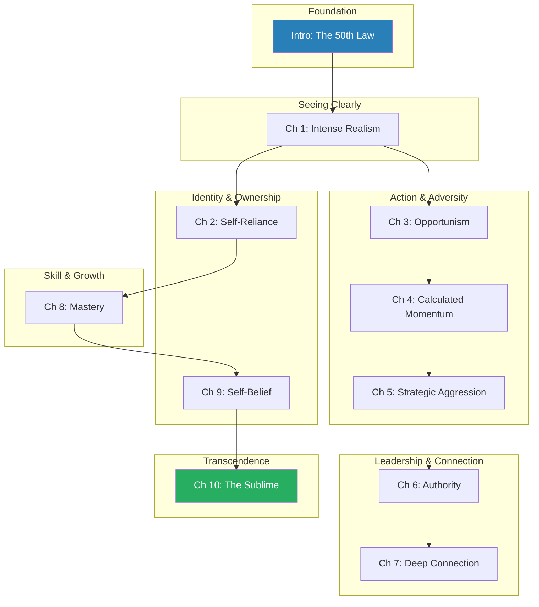
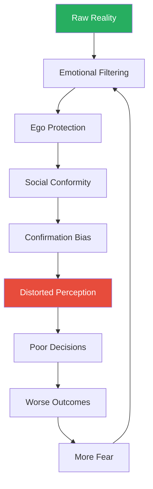
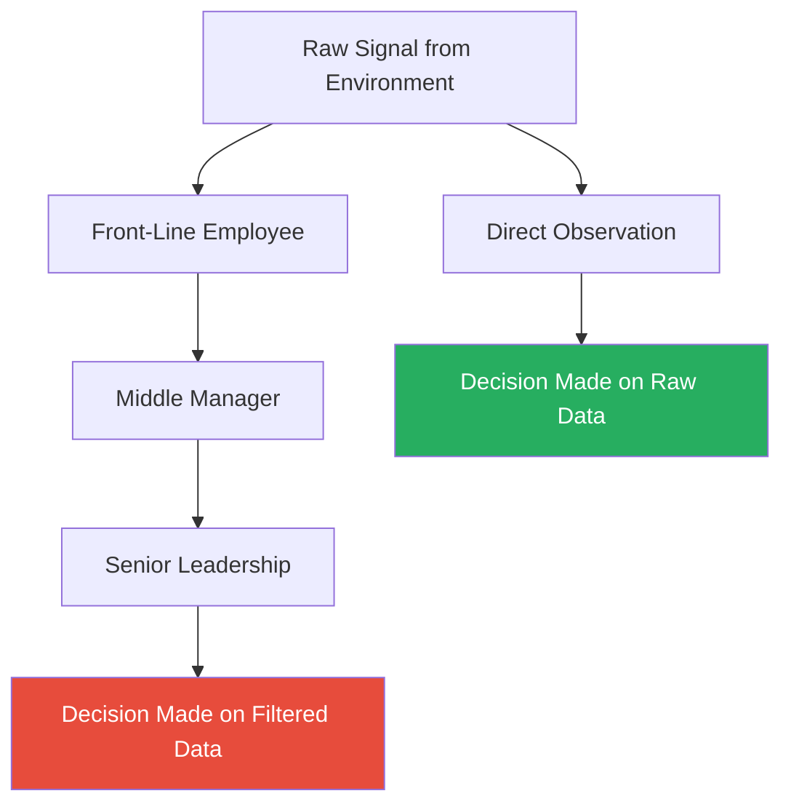
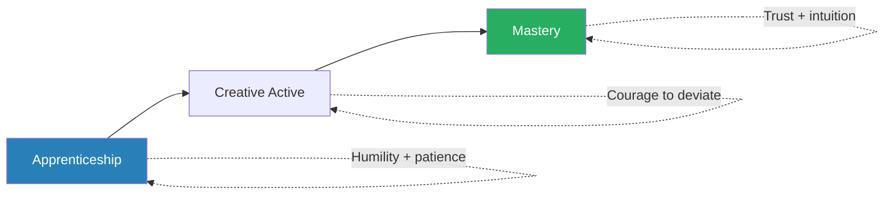
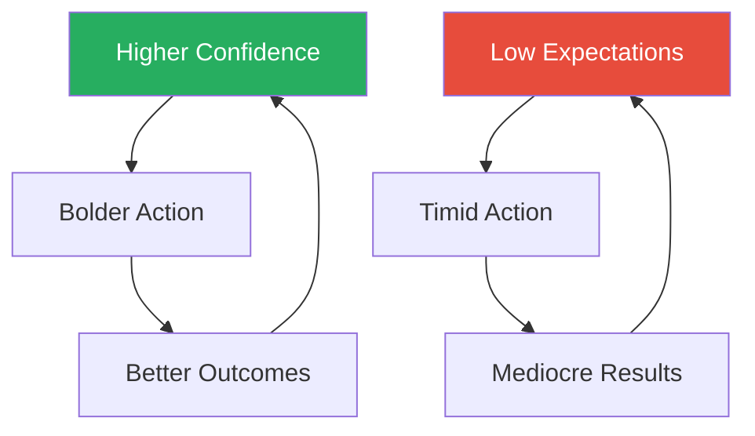
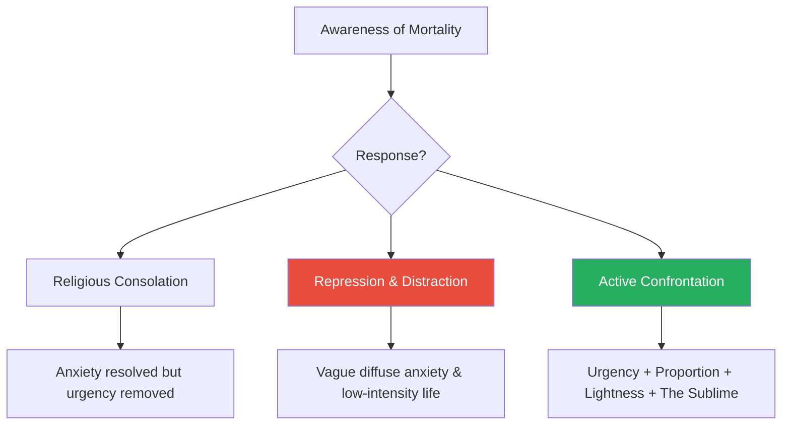
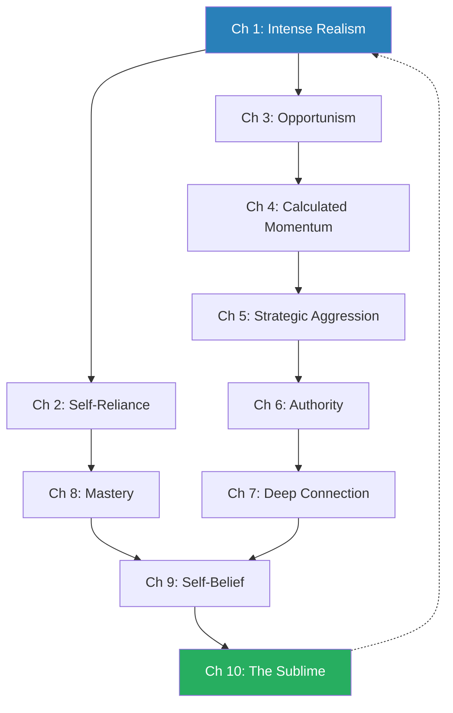

# The 50th Law — 50 Cent & Robert Greene

> Robert Greene teams up with Curtis "50 Cent" Jackson to argue that fear is the single greatest obstacle to power. Using 50 Cent's trajectory from orphaned street hustler to business mogul as the narrative spine — layered with Napoleon, Lincoln, Frederick Douglass, Malcolm X, Seneca, and dozens more — they map ten specific fears to ten specific powers. The thesis is deceptively simple: each fear you confront converts into its opposite. Fear of reality becomes intense realism. Fear of adversity becomes opportunism. Fear of death becomes urgency. This is not a self-help book about positive thinking. It is a philosophical argument that fearlessness is the root operating system beneath every other form of power, and that the street hustler who has nothing left to lose understands this more clearly than any boardroom executive or tenured professor. Greene's usual historical grandeur is grounded by 50 Cent's biography — a man who was orphaned at eight, hustling by eleven, and shot nine times at twenty-four, then built an empire worth hundreds of millions. The result is Greene's most personal and visceral book.

---

## About the Authors

**Robert Greene** is the author of *The 48 Laws of Power*, *The 33 Strategies of War*, *The Art of Seduction*, *The Laws of Human Nature*, and *Mastery*. He studied classical literature at Berkeley and held over fifty jobs — including stints as a translator, Hollywood screenwriter, and hotel manager — before writing his first book at age 36. His work draws on 3,000 years of history to identify recurring patterns in how power, strategy, and human nature operate. For *The 50th Law*, Greene embedded himself in 50 Cent's world for over a year, shadowing him through business meetings, recording sessions, and deal negotiations to understand how the rapper's street-forged philosophy operated in real time.

**Curtis "50 Cent" Jackson** grew up in Southside Queens, New York, raised by a grandmother after his mother — a drug dealer named Sabrina — was murdered when he was eight. He was hustling crack by eleven, surviving by his wits in one of America's most dangerous neighbourhoods. In his early twenties he pivoted to rap music, landing a deal with Columbia Records that was terminated after he was shot nine times outside his grandmother's house in 2000. The shooting transformed him: he channelled the fearlessness of having survived death into a relentless work ethic, launching a mix-tape campaign that flooded New York's underground market, caught Eminem's attention, and led to a deal with Interscope Records. His debut album *Get Rich or Die Tryin'* sold over 12 million copies worldwide. He then built a business empire spanning Vitamin Water (a stake that netted him over $100 million when Coca-Cola acquired the parent company), G-Unit clothing, film production, video games, and publishing.

The collaboration is deliberate: Greene provides the historical depth and philosophical architecture; 50 Cent provides the lived proof. Where most of Greene's historical exemplars are long dead, 50 Cent is a walking case study — someone whose biography can be verified, challenged, and questioned in the present tense.

---

## The Big Idea

*Greene and 50 Cent make the case that fear is not merely an emotion — it is the invisible operating system governing most human behaviour, and dismantling it unlocks every other form of power.*

- Fear is not just a feeling — it is an <b style="color: #2980b9">operating system</b> that governs how most people make decisions, avoid risks, and settle for less than they want
- For our distant ancestors, fear served a clear biological purpose:
  - It triggered fight-or-flight when a predator appeared or a rival tribe attacked
  - The signal was acute, specific, and temporary
  - Once the danger passed, the fear subsided

---

- In the modern world, we are rarely in physical danger — instead, fear has **generalised**:
  - We fear offending people, standing out, losing what we have
  - We fear confrontation, boredom, being judged, failure
  - We ultimately fear death — not as an immediate threat but as background radiation colouring everything
- This generalised anxiety creates a <b style="color: #e74c3c">self-fulfilling prison</b>:
  - The more you avoid what you fear, the smaller your world becomes
  - Each avoidance reinforces the neural pathway that says "this is dangerous"
  - The next avoidance becomes even more automatic
  - Over time, you are not choosing your life — fear is choosing it for you

> [!tip] Core Insight
> The 50th Law is the antidote: **fear nothing**. Not through denial or recklessness, but through active confrontation. When you stop organising your life around the avoidance of discomfort, you unlock boldness, creativity, and an urgency that timid people cannot match.

- Enter the arenas you shy away from
- Make the decisions you have been postponing
- Think for yourself instead of deferring to others
- Seek out the discomfort that signals growth

---

The book's structural insight is the <b style="color: #2980b9">Fear-to-Power Reversal Model</b>: every specific fear, when confronted directly, converts into a specific power:

- Fear of reality becomes **intense realism**
- Fear of independence becomes **self-reliance**
- Fear of adversity becomes **opportunism**
- Fear of change becomes **calculated momentum**
- Fear of confrontation becomes **strategic aggression**
- Fear of responsibility becomes **authority**
- Fear of criticism becomes **deep connection**
- Fear of boredom becomes **mastery**
- Fear of failure becomes **self-belief**
- Fear of death becomes **the Sublime**

The fear-to-power reversal is cyclical: each fear confronted builds the courage to confront the next, creating an upward spiral of increasing boldness and capability.

---

- The deeper philosophical claim — drawn from Seneca, the Stoics, and the street — is that <b style="color: #27ae60">the fear of death is the root of all lesser fears</b>:
  - Fear of failure is fear of a kind of death (of reputation, of identity)
  - Fear of confrontation is fear of social death
  - Fear of change is fear of the death of the familiar
- Confront mortality honestly and every other fear loses its grip
- 50 Cent's near-death experience is the book's proof of concept:
  - After surviving nine bullets, he stopped caring about what he might lose
  - That liberation became the engine of everything he built

---

## Key Concepts at a Glance

### Quick Lookup Table — The 10 Laws of Fearlessness

| Ch | Fear Confronted | Power Gained | Thematic Cluster | Core Idea |
|----|----------------|--------------|------------------|-----------|
| Intro | All fear | Fearless attitude | Foundation | The 50th Law: fear nothing |
| 1 | Reality | Intense realism | Seeing Clearly | See the world as it is, not as you wish it were |
| 2 | Independence | Self-reliance | Identity & Ownership | Own your time, energy, and creative freedom |
| 3 | Adversity | Opportunism | Action & Adversity | Convert setbacks into raw material |
| 4 | Change | Calculated momentum | Action & Adversity | Stay fluid; rigidity is death |
| 5 | Confrontation | Strategic aggression | Action & Adversity | Know when to fight and how to fight dirty |
| 6 | Responsibility | Authority | Leadership & Connection | Lead by example from the front line |
| 7 | Criticism | Deep connection | Leadership & Connection | Stay close to your environment; absorb feedback |
| 8 | Boredom | Mastery | Skill & Growth | Endure the apprenticeship; respect the process |
| 9 | Failure | Self-belief | Identity & Ownership | Push past the identity others assign you |
| 10 | Death | The Sublime | Transcendence | Mortality awareness as the ultimate liberation |

### Other Key Concepts

| Concept | One-line summary |
|---------|-----------------|
| **The Hustler's Eye** | Six-part framework for maintaining strategic clarity through curiosity, terrain knowledge, root-cause thinking, long-term vision, behavioural observation, and self-assessment (Ch. 1) |
| **The Empire Model** | Four-step progression toward ownership: reclaim dead time, create little empires, move up the food chain, make it fully yours (Ch. 2) |
| **The Reversal of Perspective** | Seeing obstacles not as things that happen TO you but as things that happen FOR you, converting each setback into an asset (Ch. 3) |
| **The Mortality-as-Fuel Framework** | Three responses to death awareness — religious consolation, repression, or active confrontation — with only the third producing genuine power (Ch. 10) |
| **The Walk-Away Principle** | Willingness to leave any situation (deal, relationship, position) as the ultimate source of leverage (recurring theme) |
| **Architectural Self-Belief** | Self-belief connected to reality but not limited by it — accurate assessment PLUS conviction you can exceed it (Ch. 9) |
| **Flexible Morality** | Everyone operates with flexible morality around their self-interest; the question is whether you do so consciously (Ch. 5) |
| **Surface vs. Deep Knowledge** | Surface knowledge (from reading, seminars) is fragile; deep knowledge (from practice) adapts to novel conditions (Ch. 8) |

The radar reveals the average person's profile is most deficient in strategic aggression, opportunism, and mortality confrontation — the three dimensions that require walking directly into discomfort rather than around it.

---

### Thematic Clusters

The ten chapters form a progressive arc: you begin with accurate perception (Ch. 1), build independence and skill (Ch. 2, 8), learn to act in adversity (Ch. 3, 4, 5), lead and connect (Ch. 6, 7), define your own identity (Ch. 9), and ultimately transcend fear altogether through mortality awareness (Ch. 10).

---

## The Foundation: Fearlessness as Operating System

### The 50th Law (Introduction)

*Greene opens with the question that structures the entire book: what did Napoleon, Frederick Douglass, FDR, and a kid from Southside Queens all share — and why did that single quality matter more than intelligence, connections, or luck?*

- The book opens with a question: what quality did Napoleon, Frederick Douglass, FDR, and a kid from Southside Queens all share?
  - Not intelligence — plenty of brilliant people live small, cautious lives
  - Not connections — Douglass was born into slavery and Napoleon was a Corsican outsider in the French aristocracy
  - Not luck — 50 Cent was orphaned and shot and left for dead
- The answer: <b style="color: #27ae60">fearlessness</b>
  - Each operated in a world that should have crushed them
  - Each responded by refusing to let fear dictate their choices
  - The fearlessness was not the absence of fear but the refusal to let it govern action

---

- Greene's argument is structural, not motivational:
  - Fear is not a feeling to be overcome through willpower or a pep talk
  - It is a **pattern of behaviour** — avoidance, hedging, over-caution, deference to authority, reflexive people-pleasing — that can be systematically identified and reversed
- The <b style="color: #2980b9">50th Law</b> is the meta-principle:
  - When you organise your life around what you **want** rather than what you are **afraid of**, the entire calculus of action changes
  - You stop avoiding confrontation and start seeking it
  - You stop clinging to safety and start creating opportunity
  - You stop deferring to others and start thinking for yourself
  - You stop protecting what you have and start building what you want

---

- Greene identifies a paradox about fear and safety:
  - The cautious person believes they are being prudent — avoiding risk, maintaining stability, protecting what they have
  - In reality, the cautious person is taking the greatest risk of all: the risk of irrelevance
  - The world does not stand still while you protect your position
  - Markets shift, technologies change, competitors advance, time passes
  - The person who is too afraid to move is the person most likely to be swept away by forces they did not see coming because they were too busy guarding their castle to look at the horizon

> [!example] 50 Cent — Forged by the Streets (1975–2000)
> - Curtis Jackson was born on July 6, 1975, in Southside Queens, New York
> - His mother, Sabrina, was a cocaine dealer who had him at fifteen
> - When Curtis was eight, Sabrina was murdered — most likely by a rival in the drug trade
> - He was raised by his grandmother in a cramped house filled with other children she cared for
> - There was no safety net, no institutional support, no reason to believe the world would treat him fairly
> - By eleven, he was selling crack on the streets, learning the hustler's code: trust no one, keep your eyes open, never show weakness
> - He watched older hustlers make and lose fortunes, get arrested, get killed
> - That absence of security became, paradoxically, his greatest asset:
>   - With nothing to protect, he had nothing to fear losing
>   - The streets gave him what a sheltered upbringing never could: a total comfort with risk
>   - He developed a sixth sense for reading people, situations, and danger
>   - He learned that hesitation on the streets meant death, and that lesson hardwired into him a bias toward action
> **The lesson:** When you have nothing to lose, fear loses its grip — and that liberation becomes an engine.

---

> [!example] FDR — Fearlessness Through Polio (1921–1945)
> - Franklin Delano Roosevelt was born into one of America's most privileged families
> - At thirty-nine, polio destroyed his ability to walk — a catastrophe that would have ended most political careers
> - Instead, the disease created something harder to break than the legs it took
> - He developed a willingness to lead from a wheelchair in an era that considered disability disqualifying
> - He took on the Great Depression with programmes his own party called reckless
> - He took on the Second World War with a boldness that bewildered his cautious advisors
> - His famous line — "the only thing we have to fear is fear itself" — is not a platitude in Greene's reading
> - It is a precise strategic observation: fear causes more damage than the things we fear
> - FDR's personal confrontation with catastrophe gave him a clarity that the privileged and comfortable could not match
> **The lesson:** Confronting personal catastrophe can produce a fearlessness that privilege alone never generates.

> [!example] 50 Cent — The Abandoned Hospital Recovery (2000)
> - After the shooting, 50 Cent's recovery was not the sanitised, supported affair that a celebrity might expect
> - Columbia Records had dropped him; his management was in disarray; the people who had promised to support his career evaporated the moment his situation became dangerous
> - He rehabilitated himself with a single-mindedness that Greene calls "the street version of a monk's discipline"
> - He could not speak properly for months — the bullet in his cheek had damaged his jaw and distorted his diction
> - Rather than waiting for the speech to return on its own, he spent hours every day doing vocal exercises, retraining his mouth to form words around the injury
> - He turned the resulting slur — the slightly distorted pronunciation that became one of his vocal signatures — from a disability into a brand asset
> - He also began an intense physical training regimen, building the muscular physique that would become part of his public image
> - Every aspect of the recovery was converted into a resource:
>   - The physical transformation made him look invulnerable in photographs and videos
>   - The vocal distortion made his delivery distinctive and immediately recognisable
>   - The story of the recovery itself became narrative fuel for his music and his public persona
> - Greene argues that the recovery period was where the 50th Law crystallised in 50 Cent's consciousness — the moment he understood, at a cellular level, that every obstacle contains raw material for the person willing to extract it
> **The lesson:** Recovery itself can be converted into an asset — the process of rebuilding can produce capabilities that the original, undamaged version never possessed.

> "Your fears are a kind of prison that confines you."

- The introduction establishes the book's crucial nuance: <b style="color: #e74c3c">fearlessness without judgement is recklessness</b>
  - The entire book pairs fearlessness with a specific cognitive discipline — realism, mastery, environmental awareness, strategic thinking
  - The point is not to be blind to danger but to refuse to let danger paralyse you
- The hustler who charges into a gunfight without reading the situation is not fearless — he is dead
- The hustler who reads the situation clearly, understands the odds, and still acts boldly — that is the 50th Law in action
- Greene calls this the difference between <b style="color: #2980b9">animal courage</b> and <b style="color: #2980b9">conscious fearlessness</b>:
  - Animal courage is blind, instinctive, and often fatal
  - Conscious fearlessness is informed by reality and directed by strategy
  - Every chapter that follows adds a specific discipline to the fearless operating system

| Courage Type | Source | Limitation | Outcome |
|-------------|--------|------------|---------|
| **Animal courage** | Instinct, desperation, ignorance of consequences | Blind to risk; often suicidal | Short-lived: wins one battle, loses the war |
| **Conscious fearlessness** | Choice, informed by reality and strategy | Requires constant self-monitoring | Sustainable: builds power across time |

The book's project is to develop conscious fearlessness — fear overcome by choice, guided by clarity, and sustained by discipline.

- Greene draws the distinction between the two sources of fearlessness he has observed:
  - **Street fearlessness** — forged by deprivation; you have nothing to lose, so you act without hesitation; this is 50 Cent's origin story
  - **Philosophical fearlessness** — forged by contemplation; you have examined what you fear, found it less terrible than you imagined, and freed yourself through understanding; this is Seneca's path
- Both routes arrive at the same destination, but the philosophical path is available to anyone, while the street path requires suffering that no sane person would choose
- The book's implicit promise is that you can achieve the street hustler's fearlessness through the philosopher's method — by systematically confronting each fear through understanding rather than trauma

> [!example] The Contrast — Two Responses to Danger
> - Greene contrasts two people who grew up in similarly dangerous environments
> - One — 50 Cent — used the danger to develop fearlessness, reading situations, building networks, and ultimately escaping the streets through strategic action
> - The other — unnamed but representative of thousands — responded to the same danger with paralysis, retreating into drugs, denial, or simple inaction
> - The external environment was identical; the internal response was opposite
> - Greene's point: fearlessness is not a product of the environment; it is a product of the response to the environment
> - The environment provides the stimulus; the individual provides the transformation
> **The lesson:** The same fire that melts butter hardens steel — what matters is not what happens to you but what you are made of when it happens.

> [!example] Hannibal Barca — The Oath of Eternal Fearlessness (247–183 BC)
> - At nine years old, Hannibal's father Hamilcar made the boy place his hand on a ritual sacrifice and swear an oath of eternal hatred toward Rome
> - The oath was more than political indoctrination — it was a psychological inoculation against fear
> - By binding his identity to a confrontation that most of the ancient world considered suicidal, Hamilcar ensured that his son would never be governed by caution
> - Hannibal spent his teenage years on campaign with his father in Spain, learning warfare not from textbooks but from the mud, blood, and chaos of the front line
> - When he marched his army — including war elephants — across the Alps in 218 BC, his generals considered the crossing impossible
> - Hannibal had already decided that impossibility was irrelevant: the only question was whether the action served his strategic vision
> - He lost nearly half his men and most of his elephants in the crossing — and still arrived in Italy with enough force to destroy every Roman army sent against him for fifteen years
> - Greene argues that Hannibal's fearlessness was forged by the same process that forged 50 Cent's: early exposure to danger, a mentor who refused to soften reality, and the understanding that fear of death was more dangerous than death itself
> **The lesson:** Fearlessness can be forged deliberately — not just by surviving hardship, but by being oriented toward confrontation from the earliest age.

---

## Seeing Clearly

### Chapter 1: See Things for What They Are — Intense Realism

*Greene argues that the fear of reality — the tendency to see what you want to see — is the most fundamental weakness, because every other power in the book depends on accurate perception.*

- <b style="color: #e74c3c">The fear of reality</b> is the tendency to see what you want to see rather than what is actually there:
  - People construct comforting narratives, ignore disconfirming evidence, and surround themselves with those who validate their illusions
  - Greene calls this "going soft" — the mind retreating from uncomfortable truths into fantasy
  - It happens to individuals, organisations, and entire civilisations
  - The mind naturally drifts toward comfort, and comfort means filtering out the painful, the ugly, and the threatening
- This perceptual distortion operates at every scale:
  - The entrepreneur who ignores declining numbers because they do not fit the growth narrative
  - The employee who does not see that her department is about to be restructured because she has not been reading the signals
  - The empire that does not recognise its own decline because the indicators are uncomfortable to discuss
  - The romantic partner who does not see the warning signs because seeing them would require painful action

---

- When you confront the fear of reality — when you train yourself to look at the world without flinching — you gain <b style="color: #27ae60">intense realism</b>:
  - A relentless commitment to seeing people's true motives, environmental trends, and your own limitations with unflinching clarity
  - This is the most fundamental power in the book, because every other chapter depends on it
  - You cannot convert adversity into opportunity if you cannot accurately see what you are facing
  - You cannot lead from the front if you are operating on false assumptions
  - You cannot read your environment if you have already decided what it looks like
  - Realism is the bedrock — every other power is built on top of it

> [!tip] Core Insight
> Most people's perception is distorted by three forces: their emotions (which colour everything), their ego (which protects them from self-knowledge), and their social environment (which rewards conformity over truth-telling). The result is a "bubble of perception" — a small, comfortable world where everything confirms what you already believe.

- Breaking out of this bubble requires deliberate, uncomfortable work:
  - Seeking out disconfirming evidence — actively searching for information that contradicts your current beliefs
  - Listening to critics rather than sycophants — the people who tell you what you do not want to hear are more valuable than those who confirm your illusions
  - Periodically reassessing your own assumptions about yourself — what you believed about your strengths and weaknesses a year ago may no longer be accurate
  - Treating your own certainties as hypotheses to be tested rather than truths to be defended
  - Building relationships with people who will give you honest feedback, not polite encouragement

- Greene traces the historical pattern of reality avoidance:
  - Every great civilisation that declined did so not because of external threats but because its leaders stopped seeing those threats clearly
  - The Roman Empire in its final centuries was governed by emperors who refused to acknowledge the disintegration of their borders
  - The French aristocracy before 1789 could not see the revolution coming because seeing it would have required them to acknowledge that their privileges were unjust
  - The pattern is always the same: success creates comfort, comfort creates insulation, insulation creates blindness, and blindness creates catastrophe
  - Greene argues that the same pattern operates at the individual level — the comfortable professional who stops questioning their assumptions is the one most likely to be blindsided by change

---

- Greene identifies the specific mechanisms that distort perception:
  - **Emotional filtering** — when you are afraid, everything looks threatening; when you are elated, nothing looks dangerous; both states are equally distorting
  - **Ego protection** — the mind has an elaborate defence system against self-knowledge; it rationalises failures, exaggerates successes, and constructs a self-image that is systematically more flattering than reality
  - **Social conformity** — the people around you have their own motives for presenting a distorted picture; sycophants tell you what you want to hear; rivals present reality in ways that serve their interests; even well-meaning friends often prioritise your comfort over your accuracy
  - **Confirmation bias** — once you have formed an opinion, your mind actively seeks evidence that supports it and filters out evidence that contradicts it
- These four forces operate simultaneously and reinforce each other, creating a compound distortion that grows worse over time

The distortion cycle is self-reinforcing: poor decisions based on distorted perception create worse outcomes, which generate more fear, which further distorts perception. The only way to break the cycle is at the beginning — by forcing yourself to see reality before the filtering begins.

---

> [!abstract] The Hustler's Eye — Six Practices for Strategic Clarity
> 1. **Curiosity** (openness) — approach every situation with Socratic not-knowing, as if you have never seen it before; drop your assumptions at the door
> 2. **Terrain knowledge** (expansion) — map the complete environment, not just the corner you occupy; understand the full landscape of forces, players, and trends
> 3. **Root-cause thinking** (depth) — dig beneath symptoms to structural causes, asking "why" repeatedly until you reach the foundation
> 4. **Long-term vision** (proportion) — let the big picture override short-term anxiety; what seems like a crisis today may be trivial in six months
> 5. **Behavioural observation** (sharpness) — read people's deeds, not their words; actions reveal motives, words conceal them
> 6. **Self-assessment** (detachment) — periodically step outside your own ego and evaluate yourself as a stranger would; be your own harshest critic before someone else is

The <b style="color: #2980b9">Hustler's Eye</b> is Greene's framework for the discipline that makes realism operational — not just seeing clearly once, but maintaining clarity as a continuous practice. Each of the six components addresses a specific distortion: curiosity combats assumption, terrain knowledge combats tunnel vision, root-cause thinking combats superficiality, long-term vision combats panic, behavioural observation combats naivety, and self-assessment combats ego.

- Greene argues that the Hustler's Eye must be practised daily, like a muscle:
  - On the streets, 50 Cent's survival depended on reading the environment accurately every single day
  - There was no vacation from awareness — a single day of inattention could be fatal
  - In less extreme environments, the stakes are lower, but the principle is the same: the moment you stop actively practising the Hustler's Eye, your perception begins to drift toward comfort, assumption, and distortion
  - The discipline must be maintained even when things are going well — especially when things are going well, because success is the most powerful distortion agent of all
- The six components work together as a system:
  - Curiosity opens the door (you are willing to look)
  - Terrain knowledge expands the field (you see the full landscape)
  - Root-cause thinking deepens the analysis (you understand the underlying mechanics)
  - Long-term vision provides proportion (you distinguish signal from noise)
  - Behavioural observation adds human intelligence (you read people accurately)
  - Self-assessment closes the loop (you apply the same rigour to yourself that you apply to everything else)
- Removing any one component weakens the others:
  - Curiosity without root-cause thinking produces superficial knowledge
  - Root-cause thinking without long-term vision produces analysis paralysis
  - Long-term vision without behavioural observation misses the human element
  - Behavioural observation without self-assessment leads to projection (seeing your own biases in others)

---

> [!example] 50 Cent Reads the Music Industry's Decline (Early 2000s)
> - While other rappers clung to the old model — record deals, label support, album sales as the primary revenue stream — 50 Cent saw that the internet was destroying the traditional music business
> - File-sharing was decimating album revenues; labels were haemorrhaging money
> - The artists who depended entirely on their record deals were watching their income evaporate and did not understand why
> - Rather than complaining or clinging to the old model, 50 Cent looked at the situation with the Hustler's Eye:
>   - He observed the terrain (the music industry's financial collapse) without emotional distortion
>   - He identified the root cause (digital distribution, not piracy per se, was fundamentally changing how music was consumed)
>   - He applied long-term vision (the album-sales model was not temporarily struggling; it was permanently dying)
> - He pivoted: invested his money and attention in business ventures outside of music — Vitamin Water, G-Unit clothing, film production, video games
> - When the album-sales model finally collapsed, he had already built a diversified empire while his peers were still arguing about Napster
> **The lesson:** Realism is not cynicism — it is accurate perception that enables decisive action while others are still in denial.

> [!example] Lincoln's Superhuman Realism (1861–1865)
> - Lincoln's capacity to assess situations without ideological distortion was nearly superhuman
> - He was willing to work with former enemies — appointing his political rivals to his Cabinet, as Doris Kearns Goodwin documented in *Team of Rivals*
> - He changed his position on slavery as circumstances evolved — not out of weakness, but because his commitment to reality outweighed his commitment to consistency
> - He tolerated incompetent generals longer than his advisors wanted because he saw the full picture:
>   - There were no better replacements available
>   - Premature action would make things worse
>   - The political cost of appearing indecisive was less than the military cost of appointing the wrong commander
> - He endured brutal personal attacks from the press and his own party without losing his clarity of judgement
> - His almost painful commitment to seeing reality as it was — including the reality of his own limitations — was the foundation of the judgement that held the Union together
> **The lesson:** Realism means subordinating consistency, ego, and ideology to the facts on the ground.

---

> [!example] Socrates and Radical Honesty (5th Century BC)
> - Socrates made himself the most hated man in Athens by asking questions that exposed comfortable illusions
> - The politicians, poets, and craftsmen he questioned all believed they possessed knowledge they did not actually have
> - He did not claim to have answers; he claimed only to know what he did not know
> - This radical honesty about the limits of his own understanding was itself the deepest form of realism
> - The Oracle at Delphi declared him the wisest man in Athens — not because he knew the most, but because he alone knew how little he knew
> - Athens eventually executed him for it: the marketplace of ideas turned out to have a very limited appetite for honest self-assessment
> **The lesson:** The deepest realism begins with acknowledging the boundaries of your own knowledge — and society often punishes this honesty.

> [!example] 50 Cent Reads People on the Street (1986–1994)
> - On the streets of Southside Queens, 50 Cent developed the habit of watching people's behaviour rather than listening to their words
> - Older hustlers would talk about loyalty and brotherhood — then betray their partners the moment money was on the table
> - Police would promise protection to informants — then expose them when it served their case
> - Customers would claim to be regular buyers — then disappear with product they had not paid for
> - From these observations, 50 Cent developed an almost clinical ability to read micro-behaviours:
>   - Shifts in eye contact that signalled deception
>   - Changes in spending patterns that signalled financial trouble (and therefore unreliability)
>   - The subtle body language of someone who was wearing a wire
> - He called this "seeing through people" — and it became the foundation of the Hustler's Eye
> **The lesson:** The streets are an accelerated course in behavioural observation because the penalty for misreading someone is not embarrassment — it is death.

> [!example] Bismarck — Realpolitik as Institutional Realism (1860s–1890s)
> - Otto von Bismarck, the Prussian chancellor who unified Germany, was the supreme practitioner of political realism in the nineteenth century
> - He coined the term **Realpolitik** — politics based on practical realities rather than ideological abstractions
> - While other European statesmen debated grand principles of nationalism and liberalism, Bismarck asked a single question: what does Germany need, and what is the most efficient way to get it?
> - He provoked wars he knew he could win (against Denmark, Austria, and France) and avoided wars he knew he could not
> - He formed alliances with nations he despised when those alliances served Prussian interests
> - He abandoned those alliances the moment they ceased to be useful — without sentiment, without guilt
> - His realism extended to self-assessment: he knew when to advance and, crucially, when to stop
>   - After defeating France in 1871, he resisted the temptation to annex more territory than Germany could digest
>   - He understood that over-reach would create the very coalition of enemies that could destroy what he had built
> - Greene draws the parallel to 50 Cent's business realism: both men refused to let ideology, sentiment, or ego distort their perception of what was actually possible
> **The lesson:** Realpolitik is not cynicism — it is the refusal to let wishful thinking substitute for accurate assessment of the landscape.

> "The greatest danger you face is your mind going soft."

---

- **The nuance:** Realism without ambition becomes passive observation
  - The <b style="color: #2980b9">Hustler's Eye</b> is a tool for seeing; it must be paired with the willingness to act on what you see
  - The person who sees reality clearly but does nothing about it is no better off than the person who never looked
  - Lincoln did not merely observe the deteriorating situation — he acted on what he saw, often against the advice of everyone around him
  - <b style="color: #27ae60">The complete principle is not just "see clearly" but "see clearly and then move"</b>
- There is also a risk of cynicism:
  - Realism pushed too far becomes paranoia — seeing threats everywhere, trusting no one, treating every relationship as a transaction
  - Greene warns that the Hustler's Eye must be balanced with the capacity for genuine connection (Chapter 7)
  - The goal is not to become suspicious of everyone but to see everyone — including yourself — with accuracy rather than distortion

- Greene identifies signs that your perception is going soft:
  - You have not heard a genuinely critical perspective on your plans in weeks
  - You surround yourself with people who agree with you — not because they genuinely agree, but because agreement is what you reward
  - You explain away negative data rather than investigating it
  - You feel defensive when someone questions your assumptions
  - You spend more time with your narrative about reality than with reality itself
- When you notice these signs, the Hustler's Eye must be deliberately reactivated:
  - Seek out the smartest person who disagrees with you and listen without defending
  - Look at the data you have been avoiding
  - Ask yourself: "What would I do differently if I were starting from scratch today?"
  - The discomfort of honest self-assessment is the price of accurate perception

> [!example] 50 Cent — Reading Eminem's True Motives (2002)
> - When Eminem first approached 50 Cent about signing to Interscope through Shady Records, most unsigned artists would have been so grateful for the opportunity that they would have accepted any terms
> - 50 Cent applied the Hustler's Eye:
>   - He studied Eminem's business history, not just his music career
>   - He observed how Eminem had handled previous artists on his label — what he promised versus what he delivered
>   - He assessed Eminem's true motivation: Eminem needed a credible street artist to validate his own position in hip-hop, which meant 50 Cent had more leverage than a typical unsigned act
> - Rather than signing immediately, 50 Cent negotiated from a position of informed strength
> - He understood that Eminem's interest was not charity — it was strategic, and that understanding allowed him to secure terms that protected his long-term independence
> - He also read the power dynamics within Interscope itself:
>   - Jimmy Iovine ran the label; Eminem was a powerful artist but not the decision-maker
>   - Dr. Dre's endorsement carried a different kind of weight than Eminem's
>   - The relationships between these power centres could be navigated to 50 Cent's advantage if he understood them clearly
> - Greene argues that this was the Hustler's Eye applied to the music industry's power structure — the same skill 50 Cent had used to read drug-trade hierarchies as a teenager, now deployed in a conference room
> **The lesson:** The Hustler's Eye is domain-independent — the skill of reading people and power structures transfers from the street to the boardroom without modification.

> [!example] The Kodak Blindness — Institutional Reality Distortion
> - Greene references the pattern of Kodak, which invented the digital camera in 1975 but suppressed the technology because it threatened the company's film business
> - Kodak's leadership could see the digital revolution coming — they had literally invented the technology — but they chose not to see it because seeing it required accepting that their core business was dying
> - This is institutional reality distortion at its most extreme: the evidence was not ambiguous; the company's own engineers were telling leadership what was coming
> - But leadership had built their careers, their identities, and their compensation packages around the film business
> - Seeing reality would have required dismantling everything they were
> - By the time Kodak finally acknowledged the digital revolution, it was too late to compete with companies that had been building digital capabilities for years
> **The lesson:** The most dangerous form of the fear of reality is when seeing clearly would require you to dismantle the identity that makes you comfortable.

---

## Identity and Ownership

### Chapter 2: Make Everything Your Own — Self-Reliance

*Greene argues that the most comfortable prison is dependency — on institutions, bosses, or relationships that provide security at the cost of autonomy — and that the only reliable alignment of incentives is with yourself.*

- <b style="color: #e74c3c">The fear of independence</b> is the comfort of dependency:
  - On institutions, on bosses, on relationships that provide security at the cost of autonomy
  - Dependency is the most dangerous prison because it is the most comfortable one
  - The person chained to a wall knows they are imprisoned
  - The person who depends on a comfortable salary, a stable institution, or a powerful patron may not realise they are imprisoned until:
    - The salary is cut
    - The institution collapses
    - The patron's interests shift
  - By then it is often too late — the skills required for independence have atrophied from disuse

- Greene makes an important observation about modern dependency:
  - Contemporary society has created an unprecedented number of dependency traps:
    - The corporate job that provides health insurance, retirement benefits, and social identity — all of which evaporate if you leave
    - The social media platform that provides your audience — an audience you do not own and cannot take with you
    - The relationship that provides emotional stability — stability that may come at the cost of personal growth
    - The subscription model that provides convenience — convenience that eliminates the skills you would otherwise develop
  - Each of these dependencies is individually rational: why would you refuse health insurance, or abandon a social media following, or leave a stable relationship?
  - But collectively, they create a web of dependency so thick that most people cannot imagine life without it
  - The person who has never had to function without institutional support does not know whether they can

---

- When you confront the fear of independence and take ownership of your life, you gain <b style="color: #27ae60">self-reliance</b>:
  - The progressive ownership of your time, energy, creative output, and freedom of movement
  - Self-reliance is not isolation; it is the condition of not needing any single external source so completely that its withdrawal would destroy you
  - The self-reliant person may have partners, allies, and mentors — but if any one of them disappeared tomorrow, they would adapt and survive rather than collapse

- The argument is rooted in the **alignment of incentives**:
  - Everyone — employers, partners, patrons, even friends — is governed by their own priorities
  - Those priorities will inevitably diverge from yours, often at the worst possible moment:
    - The boss who promises a promotion will retract it when budgets tighten
    - The partner who supports your ambitions will resent them when they require sacrifice
    - The institution that values your contribution will restructure you out of a job when the market shifts
  - The only reliable alignment is with yourself

---

- Greene identifies a crucial psychological mechanism that keeps people dependent — what he calls the <b style="color: #2980b9">comfort-competence trade-off</b>:
  - Every day you spend in a dependent position, you gain a small increment of comfort
  - Every day you spend in a dependent position, you lose a small increment of independent competence
  - The trades are individually invisible — no single day makes a noticeable difference
  - But compounded over years, the effect is devastating: the person who has been comfortably dependent for a decade has traded thousands of small increments of competence for thousands of small increments of comfort
  - The result is a person who is deeply comfortable and deeply incapable — a combination that produces intense anxiety about any change, because they know (at some level) that they cannot function without the institution they depend on
  - This is why corporate restructuring produces such disproportionate panic: it is not the loss of income that terrifies people (they could find another job); it is the sudden exposure of the competence gap that years of comfortable dependency have created
  - The antidote is to practice independence while you are still in the dependent position — to build skills, relationships, and resources that would allow you to function alone, even while you are choosing to function within an institution

- Greene traces the dependency trap through stages:
  - **Stage 1: Comfort** — the dependent person enjoys the security of someone else handling the difficult parts (earning clients, making strategic decisions, navigating uncertainty)
  - **Stage 2: Atrophy** — the skills required for independence — risk assessment, self-direction, creative initiative — wither from disuse
  - **Stage 3: Anxiety** — a vague awareness that the safety is not permanent, but no capacity to do anything about it
  - **Stage 4: Crisis** — the external support is withdrawn, and the dependent person discovers they have no idea how to function alone
  - The tragedy is that each stage makes the next more likely: the more comfortable you are, the more your independence muscles atrophy, the more anxious you feel about leaving, the more devastating the eventual crisis becomes

> [!abstract] The Empire Model — Four Steps to Ownership
> 1. **Reclaim dead time** — stop wasting the hours you control; treat every moment as capital to be invested in your own development
> 2. **Create little empires** — build projects, skills, and domains of excellence within your current situation, so you are not merely executing someone else's vision but creating something of your own
> 3. **Move up the food chain** — transition from executing others' visions to shaping your own; from employee to entrepreneur, from subordinate to leader
> 4. **Make it yours** — build something that reflects your individuality, not someone else's template; own the means of production, not just the labour

The <b style="color: #2980b9">Empire Model</b> is Greene's roadmap for progressive independence — not a sudden leap but a strategic escalation from dependency to ownership. Each step builds the skills and resources needed for the next.

---

> [!example] 50 Cent — From Bagger to Owner
> - In the drug trade, there is a clear hierarchy:
>   - At the bottom are the "baggers" — people who package the product for sale, interchangeable, expendable, paid poorly
>   - Above them are the dealers who control territory
>   - Above them are the suppliers
>   - At the top are the people who own the operation
> - 50 Cent started at the bottom, bagging product for older dealers
> - He quickly recognised that the bagger's position was a trap: you did the dangerous work, took the legal risk, and kept almost none of the profit
> - He resolved to move up the chain — not through violence but through hustle, reliability, and the systematic study of how the business worked
> - He watched how the older dealers managed territory, handled suppliers, and dealt with competitors
> - By his mid-teens he was running his own operation, applying the lessons he had learned as a bagger
> - Greene draws the explicit parallel to the music industry:
>   - Most artists are "baggers" — they produce the creative product but own none of the business
>   - The label owns the masters, the distribution, the brand
>   - 50 Cent refused to remain a bagger; he negotiated ownership stakes rather than accepting flat fees
>   - His Vitamin Water deal was not a celebrity endorsement — it was an equity position
>   - When Coca-Cola acquired Glaceau in 2007, 50 Cent's stake was worth over $100 million
> **The lesson:** Understand the hierarchy you are in, identify where the real ownership sits, and build toward it systematically.

> [!example] Cornelius Vanderbilt — "Never Be a Minion" (1810s–1870s)
> - Vanderbilt's motto — "never be a minion, always be an owner" — guided a progression from ferryman on the Staten Island ferry to steamship owner to railroad baron
> - At every stage, he refused comfortable dependency in favour of the risk and reward of ownership
> - When he worked for Thomas Gibbons as a steamship captain, he studied every aspect of the business — not just navigation but finance, logistics, legal strategy, competitive tactics
> - He was using the position as an apprenticeship (Chapter 8's principle), but with a specific end goal: to own his own fleet
> - Other captains were content with their wages; Vanderbilt was learning how to make wages irrelevant
> - When he launched his own steamship line, he knew every aspect of the operation because he had built the knowledge systematically while others coasted
> - He then applied the same pattern to railroads: learned the business from the inside, then acquired ownership
> **The lesson:** Use every position of dependency as a covert apprenticeship for eventual ownership.

---

> [!example] Rubin "Hurricane" Carter — Psychological Sovereignty in Prison (1966–1985)
> - Carter, the middleweight boxer, was wrongfully convicted of triple murder in 1966
> - Imprisoned for nearly twenty years, he refused to let the prison system define him
> - He would not wear a prison uniform, would not eat prison food, would not participate in the prison's institutional rituals
> - He declared himself "not a prisoner" despite being physically behind bars
> - He maintained an internal empire — his mind, his dignity, his sense of self — that no external authority could touch
> - The prison tried to break him through isolation, punishment, and psychological pressure
> - He responded by going deeper into his own self-reliance, reading voraciously, training his mind as he had once trained his body
> - When he was finally exonerated and released, he had not been broken by two decades of incarceration because he had never surrendered the one thing that was truly his — his mind
> **The lesson:** Self-reliance is not physical freedom but psychological sovereignty — the refusal to let anyone else's definition of you become your own.

> [!example] Harriet Tubman — Freedom as a Non-Negotiable (1849–1860s)
> - Born into slavery, Tubman escaped in 1849 and could have lived safely in the North
> - Instead, she returned to the South repeatedly — at least thirteen trips — to lead other enslaved people to freedom through the Underground Railroad
> - Each trip was a capital offence; she risked recapture and execution every time
> - Her self-reliance was absolute: she trusted her own judgement over every authority that told her to stop
> - She planned her own routes, made her own tactical decisions, and carried a pistol she was willing to use
> - She reportedly never lost a single passenger on these trips
> - Greene argues that Tubman's self-reliance was the product of having nothing left to fear: she had already been enslaved, she had already escaped, and the worst the world could do to her was something she had already endured
> **The lesson:** True self-reliance is not the absence of danger but the willingness to navigate danger on your own terms.

> [!example] 50 Cent — Reclaiming Dead Time After the Shooting (2000–2002)
> - During his recovery from the nine gunshot wounds, 50 Cent was effectively blacklisted from the music industry
> - No label would sign him; no studio would book him; no radio station would play him
> - Most artists in this position would have waited — waited for the industry to come around, waited for a powerful patron to rescue them, waited for the situation to change
> - 50 Cent refused to wait
> - He reclaimed every available hour:
>   - He wrote prolifically — sometimes completing two or three songs a day, building a catalogue that would eventually become his mix-tape arsenal
>   - He studied the business side of music with the intensity of someone cramming for an exam that would determine whether they lived or died
>   - He mapped the underground distribution networks that the major labels had never bothered to understand
>   - He built relationships with bootleggers, DJ networks, and street-level distributors who could get his music to the people who mattered — the listeners themselves
> - By the time Eminem heard his mix-tapes and offered him a deal with Interscope, 50 Cent had already built the infrastructure for an independent career
> - The Interscope deal was an accelerant, not a foundation — the foundation was built during those "dead" years that the industry had written off as wasted
> **The lesson:** Dead time is only dead if you let it be — the hours between setback and recovery are where empires are designed.

> "When it is yours to lose, you are more motivated, creative, and alive."

---

- **The nuance:** Pure self-reliance can become isolation
  - Strategic dependencies — mentors, temporary alliances, collaborative relationships — are not weaknesses when you plan for eventual independence
  - Vanderbilt worked for Gibbons for years; the dependency was real but temporary, and he used it strategically
  - <b style="color: #27ae60">The danger is not in accepting help; it is in needing it so fundamentally that you cannot function without it</b>
  - The self-reliant person may have partners, allies, and mentors — but if any one of them disappeared tomorrow, they would adapt and survive rather than collapse
- There is also a risk that Greene underplays: the modern economy is deeply collaborative
  - Many of the most valuable things in the world are built by teams, not individuals
  - The challenge is finding the right balance between self-reliance (so you are not trapped) and collaboration (so you are not limited to what one person can do alone)
  - Greene's ideal is not the lone wolf but the sovereign collaborator: someone who works with others by choice, not by necessity, and who can walk away from any collaboration without losing their capacity to function

The Empire Model is not a journey from collaboration to isolation — it is a journey from forced dependency to chosen collaboration, where every partnership is entered from a position of strength rather than need.

---

- Greene identifies the **psychological wages of dependency** — the hidden rewards that keep people trapped:
  - **Identity through association** — "I work for Google" or "I report to the VP" provides a sense of importance borrowed from the institution; losing the position means losing the identity
  - **Reduced decision load** — when someone else sets the strategy, determines the priorities, and defines the metrics of success, you are freed from the cognitive burden of those decisions; the freedom feels liberating but is actually a form of infantilisation
  - **Risk outsourcing** — if the company fails, it is not your fault; if the project collapses, you were just following instructions; dependency provides an alibi for mediocrity
  - **Social belonging** — institutions provide a ready-made social world; leaving means rebuilding your social infrastructure from scratch
- These psychological wages are real — they provide genuine comfort, genuine belonging, genuine relief from the burden of decision-making
- But they come at a price: you are trading agency for comfort, and the exchange rate worsens over time
- The longer you stay, the more your independent capabilities atrophy, the more your identity is defined by the institution, and the more catastrophic the eventual separation becomes
- Greene's advice is not "quit your job tomorrow" — it is "start building the capabilities for independence today, so that when the moment comes, you are ready"

> [!example] Frederick Douglass — Owning His Own Voice (1845–1860s)
> - When Douglass first joined the abolitionist movement, the American Anti-Slavery Society (led by William Lloyd Garrison) wanted to control his message
> - They told him what to say, how to say it, and even suggested he should "sound more like a slave" because audiences found his eloquence suspicious
> - For a time, Douglass accepted this dependency — the Society provided his platform, his audience, and his livelihood
> - But he recognised the trap: he was exchanging one form of bondage for another
> - He broke with Garrison, started his own newspaper (*The North Star*), and crafted his own message — one that was more radical, more intellectually sophisticated, and ultimately more influential than anything the Society had scripted for him
> - The break was painful: he lost friends, financial support, and the safety of an established organisation
> - But he gained something more valuable: the ability to speak in his own voice, on his own terms, accountable only to his own conscience
> **The lesson:** Even well-intentioned dependencies can become cages — the person who controls your platform controls your message.

---

## Action and Adversity

### Chapter 3: Turn Shit into Sugar — Opportunism

*Greene introduces his most counterintuitive argument: that adversity is not an interruption to the plan but the raw material for a better one, and that the most powerful people in history were built by the very obstacles that should have destroyed them.*

- <b style="color: #e74c3c">The fear of adversity</b> is the belief that setbacks are purely destructive:
  - Most people treat negative events as interruptions to their plans — obstacles that must be endured before normal life can resume
  - Greene argues this is exactly backwards
  - Adversity is not an interruption to the plan; it is the raw material for a better one
  - The distinction is profound: the first mindset produces a victim; the second produces an opportunist

- Greene identifies a spectrum of responses to setback that maps directly onto the ten chapters:
  - The person who fears reality (Ch. 1) will deny the setback: "It's not that bad," "It will fix itself," "The numbers are misleading"
  - The person who fears independence (Ch. 2) will wait for someone to rescue them: "My boss will figure it out," "The government will intervene," "Someone will help"
  - The person who fears confrontation (Ch. 5) will blame others without acting: "This is their fault," "I was betrayed," "The system is rigged"
  - The person who fears death (Ch. 10) will catastrophise: "This is the end," "I'll never recover," "My life is over"
  - The opportunist does none of these — they accept the reality of the setback (Ch. 1), take personal responsibility for their response (Ch. 2), confront the situation directly (Ch. 5), and maintain the long-term perspective that this is survivable (Ch. 10)
  - Opportunism, Greene argues, is not a single skill but the integration of every other power in the book, applied to the specific problem of adversity
  - This is why he places the Adversity chapter early in the sequence: it is the first test of whether you have internalised the preceding chapters
  - The implication is clear: if you cannot convert adversity, you have not truly confronted the fears that precede it in the book's architecture
  - Adversity is the crucible in which the earlier powers are tested — and the test is pass-or-fail

- Greene roots this argument in Stoic philosophy:
  - Marcus Aurelius wrote: "The impediment to action advances action. What stands in the way becomes the way."
  - This is not a motivational slogan — it is a precise observation about how obstacles create opportunities that would not exist without them
  - The Stoics did not argue that adversity was pleasant or desirable — they argued that your response to it was entirely within your control, and that the correct response was always to look for the advantage hidden inside the obstacle
  - Greene argues that the street hustler arrives at the same insight through experience rather than philosophy:
    - The hustler who gets arrested learns the legal system from the inside
    - The hustler who loses territory learns to adapt his business model
    - The hustler who is betrayed learns to read people with greater precision
    - Each disaster, properly processed, becomes education

---

- When you confront the fear of adversity and learn to see obstacles as ingredients, you gain <b style="color: #27ae60">opportunism</b>:
  - The ability to convert negatives into raw material for advancement
  - The opportunist does not merely survive setbacks — they emerge from them in a stronger position than they held before
  - This is not optimism or positive thinking — it is a structural reorientation of how you process events
  - It is also not a coping mechanism — it is a competitive advantage
  - The opportunist does not tell themselves "everything happens for a reason" as emotional comfort; they examine each setback with clinical precision, looking for material they can use

- Greene points to a remarkable pattern in 50 Cent's career: the quality of his creative output was consistently higher during periods of adversity than during periods of comfort:
  - The mix-tapes produced while he was blacklisted were rawer, more authentic, and more commercially successful than many of the albums produced after he had label support
  - The business decisions made under financial pressure (the Vitamin Water equity stake, the early G-Unit ventures) were more innovative than those made when cash was abundant
  - The confrontational, urgent energy that made *Get Rich or Die Tryin'* a cultural event was partly a product of the adversity that preceded it
- This pattern — adversity producing better work than comfort — is not unique to 50 Cent:
  - Greene traces it across history: artists, entrepreneurs, and leaders consistently do their best work when the stakes are highest and the resources are lowest
  - The mechanism is the same one that drives the Reversal of Perspective: when easy paths are closed, the only remaining paths require creativity, intensity, and originality
  - Comfort, by contrast, provides so many easy paths that the hard, creative ones never get explored

- Greene identifies the psychology behind the fear of adversity:
  - Most people are raised to expect fairness — to believe that effort should be rewarded, good behaviour should be acknowledged, and bad things should not happen to good people
  - When adversity strikes, this expectation produces a sense of injustice: "I did not deserve this"
  - That sense of injustice is paralysing because it directs energy toward mourning what should have been rather than working with what is
  - The opportunist has no expectation of fairness — they expect difficulty, and when it arrives, they are not surprised
  - The lack of surprise gives them a crucial head start: while everyone else is processing the emotional shock, the opportunist is already scanning the wreckage for useful material

---

- The mechanism is structural, not psychological — the <b style="color: #2980b9">Reversal of Perspective</b>:
  - Constraints force creativity because they eliminate easy paths and demand novel solutions
  - When all your comfortable options disappear, the only remaining options are the creative ones — the ones you would never have considered if the comfortable paths were still available
  - This is why some of history's greatest innovations emerged from crisis conditions
  - It is not that crisis makes people more creative in the abstract; it is that crisis physically removes the uncreative options, leaving only the inventive ones standing

---

> [!example] Edison — The Factory Fire and the "Beautiful Spectacle" (1914)
> - In December 1914, a massive fire destroyed Thomas Edison's factory complex in West Orange, New Jersey
> - The blaze consumed ten buildings and years of work — including irreplaceable prototypes, records, and equipment
> - The estimated loss was roughly $7 million (over $200 million in today's terms), and much of it was uninsured
> - Edison was sixty-seven years old — for most people, a fire of this magnitude at that age would be the end
> - According to his son Charles, Edison watched the fire and said: "Go get your mother and all her friends. They'll never see a fire like this again"
> - The next morning, surveying the wreckage, Edison said: "There is great value in disaster. All our mistakes are burned up. Thank God we can start anew"
> - Within three weeks, the factory was operating again in temporary structures
> - Within a year, the complex was rebuilt and producing more revenue than before the fire
> - Greene uses Edison as a pure example of the Reversal of Perspective: the ability to look at devastation and see, simultaneously, the raw material for something better
> - Edison did not deny the loss — he acknowledged it and immediately began scanning the wreckage for usable material
> - The "beautiful spectacle" comment was not callousness; it was the Alchemist's response — the refusal to let the emotional weight of disaster prevent the practical work of conversion
> **The lesson:** The speed of the reversal matters — the faster you shift from mourning to mining, the more material you can extract before the window closes.

- There is a second mechanism at work — the **narrative advantage**:
  - Losing a battle lets you reframe yourself as the underdog, and the underdog enjoys disproportionate public sympathy and attention
  - Being denied resources forces you to build something leaner and more original than the well-funded alternative
  - Being attacked creates a martyr narrative that attracts allies
  - The adversity itself becomes a strategic asset — not despite being painful but because it is painful
- And a third mechanism — **forced adaptation**:
  - When the environment changes in your favour, you have no reason to evolve
  - When it changes against you, you must either evolve or die
  - The people who are forced to evolve develop capabilities that the comfortable never acquire
  - These capabilities become competitive advantages when conditions stabilise

> [!tip] Core Insight
> Before you mourn a setback, examine whether it contains material you can use. The obstacle is not blocking the path — it may BE the path.

---

> [!example]- 50 Cent — The Shooting That Built an Empire (2000)
> - In 2000, Curtis Jackson was ambushed outside his grandmother's house in Queens
> - The assailant fired nine rounds into him at close range — hitting his hand, arm, hip, legs, chest, and face
> - A bullet lodged in his cheek, leaving a permanent slur in his speech
> - He was rushed to hospital and spent thirteen days recovering
> - Columbia Records, his label at the time, dropped him immediately — they could not risk the liability
> - No major label would touch him — the industry considered him a target who would bring violence and lawsuits
> - His career was, by any rational assessment, finished
> - Instead of retreating, 50 Cent converted the assassination attempt into the most valuable asset in hip-hop:
>   - The name "50 Cent" became synonymous with indestructible toughness
>   - He walked with a limp and talked with a slur and wore both as badges of authenticity
>   - The Columbia rejection forced him into the mix-tape underground, where he had complete creative control and direct access to the streets
>   - He flooded New York with mix-tapes — dozens of them, sold on street corners and passed hand-to-hand
>   - The grassroots following he built was so large that when Eminem eventually signed him to Interscope, the audience was already waiting
> - Every element that should have destroyed him became fuel:
>   - The shooting became his brand story
>   - The label rejection became creative freedom
>   - The street-level distribution became authentic connection with his audience
> **The lesson:** Being dropped was the best thing that happened to his career — it forced him into a channel that the major-label system could never have provided.

> [!example] 50 Cent — Turning Attacks into Brand Fuel
> - When the music industry attacked him — other rappers dissing him, labels trying to freeze him out, media painting him as violent and dangerous — he converted every attack into publicity
> - The feuds with Ja Rule and other rappers were not merely ego conflicts; they were marketing opportunities
> - Every diss track generated headlines; every public beef drove album sales
> - He released dis tracks that were catchy enough to play on their own — weaponised entertainment
> - 50 Cent understood that in the attention economy, even negative attention has value if you control the narrative
> - He became a master at converting attacks into brand fuel:
>   - Attacked for being violent? He leaned into the image and sold more records
>   - Accused of being a bad person? He released "many men wish death upon me" and turned the threat into an anthem
>   - Dropped by a label? He told the story so many times it became the founding myth of his empire
> **The lesson:** In an attention economy, your enemies' attacks can be repurposed as your marketing budget.

---

> [!example] Malcolm X — Prison as University (1946–1952)
> - Imprisoned as a young man for burglary, Malcolm Little could have emerged as just another ex-con — angry, uneducated, and unemployable
> - Instead, he converted the experience into an education
> - He read voraciously — copying the entire dictionary by hand, then moving to encyclopedias, history, philosophy
> - He taught himself the intellectual foundations he had been denied by poverty and racism
> - He joined the Nation of Islam and began developing the oratorical skills that would make him one of the most formidable public intellectuals of the twentieth century
> - The prison that was supposed to destroy him became his university
> - He even called it "my Alma Mater" — a deliberate reversal of the expected narrative
> - When he emerged, he was more dangerous to the established order than he had ever been as a street criminal
> **The lesson:** Malcolm X's response to prison was the decisive variable — not the prison itself.

> [!example] The African-American Cultural Response — Art from Adversity
> - Greene traces the broader pattern in African-American history:
>   - Slavery, Jim Crow, and systemic oppression created the conditions for some of America's most powerful cultural innovations — jazz, blues, gospel, hip-hop
>   - These art forms did not emerge despite adversity but because of it
>   - The constraint of having almost no institutional resources forced creative solutions that well-funded artists would never have attempted
>   - Blues emerged from the work songs of enslaved people; jazz from the intersection of African rhythms and European instruments in New Orleans; hip-hop from block parties in the South Bronx where DJs could not afford full bands
>   - Each form was a Reversal of Perspective — taking the raw material of oppression and converting it into cultural power
> **The lesson:** Entire civilisations, not just individuals, can practise the Reversal of Perspective.

---

- Greene identifies a hierarchy of adversity responses that determines whether a setback becomes fuel or poison:

| Response Level | Behaviour | Outcome |
|---------------|-----------|---------|
| **Victim** | Blames others, waits for rescue, treats the setback as proof that the world is unfair | Paralysis; the setback defines you |
| **Survivor** | Endures the setback, recovers to baseline, resumes the previous plan | Recovery; the setback is absorbed but not used |
| **Opportunist** | Examines the setback for usable material, converts constraints into creative fuel | Growth; you emerge stronger than before |
| **Alchemist** | Actively seeks out adversity because you understand its transformative power | Acceleration; you outpace competitors who avoid difficulty |

50 Cent operated at the Alchemist level — not merely converting the adversity he encountered but deliberately entering difficult situations because he understood they would produce capabilities that comfortable paths could not.

---

> [!example] Ulysses S. Grant — From Failure to Greatness (1854–1865)
> - Before the Civil War, Grant was a failure by every conventional measure
> - He had resigned from the Army under a cloud of alcoholism, failed at farming, failed at real estate, and was working as a clerk in his father's leather goods store — a man in his late thirties with no prospects
> - When the war broke out, he rejoined the military and discovered that the very qualities that had made him a failure in peacetime — his tolerance for chaos, his indifference to appearances, his stubborn refusal to quit — made him devastating in combat
> - He won victories at Fort Henry, Fort Donelson, Shiloh, and Vicksburg through sheer relentlessness
> - Lincoln, when told that Grant was a drunkard, reportedly replied: "Find out what whiskey he drinks and send a barrel to each of my other generals"
> - Grant's failure had not been wasted: the years of struggle had burned away pretension, taught him humility, and given him a comfort with adversity that his more polished colleagues could not match
> **The lesson:** Sometimes you cannot see the use in adversity until years later — but the capability it builds compounds invisibly until the moment demands it.

- **The nuance:** <b style="color: #e74c3c">Not all adversity is equally convertible</b>
  - Some situations are genuinely destructive and require retreat, recovery, or simply survival
  - The principle is not that everything bad is secretly good — that is toxic positivity
  - The principle is that before you mourn a setback, examine whether it contains material you can use
  - Often it does — but sometimes the appropriate response to a catastrophe is to grieve, heal, and rebuild rather than to immediately hunt for a silver lining
  - Greene implicitly acknowledges this when he discusses 50 Cent's recovery from the shooting — there was a thirteen-day hospital stay before the conversion began
  - There is also a question of scale: a person who loses a job can convert it into entrepreneurship; a person who loses their health may not have the physical capacity to convert anything
  - Greene's framework is most powerful in the middle range of adversity — setbacks that are painful but survivable
  - For extreme adversity (catastrophic illness, the death of a child, systemic oppression that eliminates all options), the Stoic framework may still apply philosophically, but the practical conversion Greene describes requires resources — internal and external — that extreme circumstances may have destroyed

> [!example] 50 Cent — The "Get Rich or Die Tryin'" Title as Alchemy
> - The title of 50 Cent's debut album was itself an act of adversity conversion
> - "Get Rich or Die Tryin'" was not a marketing slogan created by a label's branding department — it was a literal description of 50 Cent's life equation
> - He had nearly died trying; the alternative was to get rich from what the dying had taught him
> - The title reframed his entire biography as a hero's journey:
>   - The orphaned childhood was the origin story
>   - The street hustle was the training montage
>   - The shooting was the near-death transformation
>   - The album was the triumphant return
> - This narrative framing was not incidental — it was strategic
> - By naming his album after the adversity itself, 50 Cent ensured that every interview, every review, every mention of the album would retell the story of the shooting and the comeback
> - The adversity became the marketing campaign — it did not merely inform the music; it WAS the music's selling proposition
> - The album sold 872,000 copies in its first four days and over 12 million worldwide
> **The lesson:** When adversity becomes your brand, every retelling of the obstacle becomes free advertising for the empire built on top of it.

> [!example] Marcus Aurelius — The Philosopher-Emperor Under Siege (161–180 AD)
> - Marcus Aurelius became Roman Emperor at a time when the Empire was under attack on multiple fronts
> - The Parthians invaded from the east; Germanic tribes pressed from the north; a devastating plague swept through the population
> - Rather than retreating into the comfort of the palace, Marcus spent years on the northern frontier, personally commanding troops in difficult conditions
> - His *Meditations* — the private journal he kept during these campaigns — is one of history's great documents of adversity conversion:
>   - Every obstacle he faced became an opportunity to practise Stoic virtue
>   - Every setback became a lesson in patience, courage, or perspective
>   - He did not enjoy the difficulty — the *Meditations* are full of exhaustion and frustration — but he systematically converted each difficulty into something useful
> - He wrote: "Choose not to be harmed — and you won't feel harmed. Don't feel harmed — and you haven't been"
> - This is the Reversal of Perspective stated with philosophical precision: the event itself is neutral; your interpretation of it determines whether it destroys you or builds you
> **The lesson:** The Reversal of Perspective is not denial — it is a deliberate choice to process adversity as material rather than as punishment.

---

### Chapter 4: Keep Moving — Calculated Momentum

*Greene draws on military strategy and 50 Cent's serial reinventions to show why rigidity — clinging to what worked yesterday — is the most dangerous posture in a world of constant change.*

- <b style="color: #e74c3c">The fear of change</b> is the impulse to cling to what has worked before:
  - The successful formula, the familiar territory, the identity that brought past victories
  - In a world of constant change, rigidity is the most dangerous posture of all
  - The person who successfully defended a fixed position yesterday is the person most likely to be outflanked tomorrow
  - They are now psychologically invested in a strategy that the world has already moved past
- Greene identifies two forms this fear takes:
  - **Defensive rigidity** — holding onto a position, strategy, or identity because change feels threatening
  - **Success paralysis** — the more successful you are, the more you have to lose, and the more terrified you become of any move that might jeopardise what you have built

---

- When you confront the fear of change and embrace fluidity, you gain <b style="color: #27ae60">calculated momentum</b>:
  - The ability to let go, adapt, and channel chaos toward your objectives
  - Fixed positions create predictability, and predictability is a form of vulnerability
  - When your opponents know what you will do next, they can prepare
  - When you are fluid — willing to abandon yesterday's strategy, pivot to new opportunities, and reinvent yourself — you become impossible to pin down

- Greene draws on military strategy to explain why momentum trumps position:
  - In warfare, the army that stays in one place — defending a fortress, holding a line — eventually gets flanked, starved, or simply bypassed
  - The army that moves — striking unpredictably, retreating when necessary, attacking from unexpected directions — maintains the initiative
  - The same logic applies to careers, businesses, and creative endeavours:
  - The person who clings to a single identity, a single skill set, or a single market is eventually overtaken by someone who moves faster
  - The company that defends its core product instead of cannibalising it allows competitors to cannibalise it instead
  - The artist who repeats their successful formula produces diminishing returns until the audience moves on
  - The professional who "specialises" in a single methodology is devastated when that methodology is automated or superseded

- Greene identifies a hidden cost of success that makes calculated momentum so difficult — the <b style="color: #2980b9">identity investment trap</b>:
  - When something works, you do not merely enjoy the success — you begin building your identity around it
  - The rapper who sells millions becomes "a platinum-selling artist"; the identity is now fused with the method
  - The entrepreneur whose first business succeeds becomes "a tech founder"; the identity is now fused with the industry
  - The manager whose team delivers results becomes "an expert in X methodology"; the identity is now fused with the approach
  - Each success deepens the identity investment, making any change feel like an existential threat rather than a strategic adjustment
  - This is why the most successful people are often the least adaptive: they have invested so much of their self-concept in what worked that they cannot see past it
  - 50 Cent's willingness to abandon successful identities repeatedly — hustler to rapper to businessman to producer — was possible because he understood, from the streets, that identity is a tool, not a permanent self
  - On the streets, the hustler who became too attached to a particular method (a territory, a product, a customer base) was the one who got caught when conditions changed
  - That lesson — hold identities lightly, treat them as costumes — gave 50 Cent a psychological flexibility that most people in stable environments never develop

- Greene uses the metaphor of water — drawn from martial arts philosophy and Taoist thinking:
  - Water is the most powerful force in nature not because it is hard but because it is fluid
  - It goes around obstacles, fills every available space, and over time wears away the hardest rock
  - The person who moves like water — adapting to the shape of the container, flowing around obstacles, finding the path of least resistance — has a strategic advantage over the person who behaves like a stone wall
  - The stone wall is impressive and strong — until someone finds a way around it or brings a bigger hammer
  - The flowing water cannot be outflanked because it has no fixed position to defend
  - Bruce Lee famously said: "Be water, my friend" — and Greene argues that this is not a metaphor but a strategic instruction

---

- There is a deeper psychological mechanism at work — <b style="color: #2980b9">attachment</b>:
  - Success creates attachment to the thing that produced the success
  - You identify with it — "I am a rapper," "I am a hustler," "I am an expert in X"
  - That identification becomes a cage because it limits your willingness to try anything outside the identity
  - Greene argues that the fearless person holds identities lightly, treating them as costumes to be worn and discarded rather than as permanent selves
- Greene observes that 50 Cent's career demonstrates the paradox of attachment in its purest form:
  - At the height of G-Unit's dominance — with *Get Rich or Die Tryin'* selling millions, G-Unit clothing generating massive revenue, and his name on everything from video games to films — 50 Cent began detaching
  - He did not wait for the empire to crumble before building the next thing
  - He was psychologically preparing to leave his most successful identity while still living inside it
  - This is the hardest version of calculated momentum: not pivoting in response to failure (which is reactive) but pivoting in response to success (which is proactive and deeply counterintuitive)
  - Most people only change when forced to — when the market collapses, the product fails, or the audience disappears
  - 50 Cent changed when things were going well, precisely because he understood that the peak of success is the moment of maximum danger — the moment when attachment is strongest and the temptation to defend the status quo is most intense

- The mechanism has a neurological dimension:
  - The brain prefers familiar patterns because they require less cognitive energy to process
  - New situations demand conscious attention, which is metabolically expensive
  - The brain's natural tendency is to gravitate toward the known, even when the known is no longer working
  - Overriding this tendency requires conscious effort — the kind of effort that only comes from understanding why change is necessary
- Greene identifies the **three-stage death of momentum**:
  - **Stage 1: Success** — you find something that works and build your identity around it
  - **Stage 2: Defence** — you begin investing more energy in protecting the successful formula than in exploring alternatives
  - **Stage 3: Rigidity** — the formula has become so central to your identity that questioning it feels like questioning yourself; at this point, change requires not just strategic adjustment but existential courage
- The transition from Stage 2 to Stage 3 is where most people and organisations get trapped:
  - They know, intellectually, that the world is changing
  - But the emotional cost of abandoning what has worked — of accepting that the identity built on that success must be dismantled — is too high
  - So they defend the indefensible, often with increasing aggression, until the market or the environment forces the change upon them in the most destructive way possible

> [!tip] Core Insight
> The fearless person holds identities lightly — treating them as costumes to be worn and discarded rather than permanent selves. The moment you say "I am X" and mean it as a permanent statement, you have built a cage.

---

> [!example]- 50 Cent — The Serial Reinventor
> - 50 Cent's entire career is a study in calculated momentum
> - Hustler became rapper, and he did not look back
> - Rapper became businessman, and he did not mourn the transition
> - Businessman became investor, and he did not cling to the previous model
> - At each transition, he let go of the identity that had brought him success:
>   - The street hustler identity could have kept him trapped in the drug trade
>   - The rapper identity could have kept him chasing album sales as the industry collapsed
>   - The celebrity businessman identity could have kept him doing endorsement deals instead of equity positions
> - The most striking example: at the height of his fame, with albums still selling and the label willing to throw money at him, 50 Cent walked away from Interscope Records
>   - He saw that the album-sales model was dying and that staying at the label would tie him to a sinking ship
>   - Rather than milking the relationship for a few more years of diminishing returns, he moved on — into business ventures, film, television, and independent music distribution
> - His willingness to cannibalise his own past — to risk the known for the unknown — kept him ahead of competitors who were still defending territories he had already abandoned
> - Each reinvention required enduring a period of uncertainty:
>   - The rapper leaving the label had no guaranteed income from music
>   - The businessman entering new industries had no track record outside entertainment
>   - But 50 Cent preferred the discomfort of uncertainty to the slow death of irrelevance
> **The lesson:** The willingness to abandon a winning position before it becomes a losing one is the essence of calculated momentum.

> [!example]- Napoleon — Master and Victim of Momentum
> - Napoleon's greatest victories — Austerlitz, Jena, Marengo — were won not through superior firepower but through speed, surprise, and the ability to concentrate force at unexpected points
> - His opponents, the coalitions of European monarchies, were ponderous and predictable
> - They held fixed positions, followed established doctrines, and expected Napoleon to do the same — he never did
> - He moved faster than they thought possible, appeared where they did not expect him, and struck before they had finished preparing
> - His speed was not reckless — every move was calculated — but his willingness to abandon a position the moment it no longer served him was what made him terrifying
> - At Austerlitz (1805), he deliberately weakened his right flank to lure the Allied forces into a trap
>   - Conventional wisdom said you defend your weak points; Napoleon exploited his weakness as bait
>   - The Allies fell for it, overextending their lines, and Napoleon drove through the centre with devastating force
> - **The cautionary reversal:**
>   - After years of victory, Napoleon himself fell prey to the very rigidity he had exploited in his enemies
>   - He began to believe in his own invincibility, refused to adapt to changing conditions
>   - The invasion of Russia (1812) was a catastrophic example: he clung to his plan long past the point where strategic retreat would have preserved his army
>   - He refused to accept that the Russians would not fight the decisive battle he wanted; they kept retreating, drawing him deeper into a landscape that would destroy him
>   - His fall was caused by the same attachment to fixed positions that he had punished in others
> **The lesson:** Even the master of momentum can become its victim when attachment to past glory replaces strategic flexibility.

---

> [!example] The Resistance Artists — Fluidity as Creative Survival
> - Greene references several artists who survived by staying fluid:
>   - Miles Davis reinvented jazz multiple times — from bebop to cool jazz to fusion — because he refused to let any one style define him
>   - David Bowie adopted and discarded personas (Ziggy Stardust, the Thin White Duke, the Berlin period) with a fearlessness that kept him relevant for decades
>   - Both were attacked by fans and critics at each transition, accused of "selling out" or "losing their way"
>   - Both understood that the true betrayal was not change — it was stagnation
> **The lesson:** Artistic survival, like strategic survival, depends on the willingness to kill your darlings and move on.

> [!example] 50 Cent — The Vitamin Water Pivot
> - While other hip-hop moguls launched clothing lines, record labels, and fragrance deals — all extensions of the rapper identity — 50 Cent made a move that baffled the industry: he invested in a flavoured water company
> - Glaceau's Vitamin Water was not a "hip-hop brand" — it was a health-conscious beverage in a market that had nothing to do with street credibility or rap music
> - His peers thought he had lost his mind; the business press did not take the partnership seriously
> - 50 Cent saw what they missed:
>   - The beverage market was exploding; health-conscious consumers were abandoning soda
>   - His celebrity could introduce the brand to demographics that Glaceau could not reach on its own
>   - An equity stake rather than an endorsement fee aligned his incentives with the company's long-term growth
> - When Coca-Cola acquired Glaceau for $4.1 billion in 2007, 50 Cent's stake was reportedly worth over $100 million
> - The rappers who had mocked his "water deal" were still negotiating flat-fee endorsements worth a fraction of that amount
> - Greene argues this was calculated momentum in action: 50 Cent moved when others stayed put, entered a market that had no connection to his established identity, and reaped the reward of being first
> **The lesson:** The most profitable pivots often look foolish to those who are still defending yesterday's territory.

> "In a world of constant change, what is dangerous is standing still."

- **The nuance:** <b style="color: #e74c3c">Momentum without direction is chaos</b>
  - The "calculated" part matters as much as the "momentum" part
  - Every move must serve a long-term vision, even if that vision itself evolves over time
  - The person who changes direction constantly without strategic intent is not fluid — they are lost
  - There is also a timing dimension that Greene somewhat underplays: sometimes the wisest move is to stay put and let the world come to you
  - Patience can be its own form of calculated momentum — the coiled spring is motionless but full of potential energy
  - The key question is always: am I staying still because it serves my strategy, or because I am afraid to move?

> [!example] 50 Cent — From G-Unit Records to Television Producer (2010s)
> - By the early 2010s, 50 Cent had already pivoted from rapper to businessman
> - But the most surprising reinvention was yet to come: he transformed himself into a television producer
> - When the music industry continued its decline, and even the Vitamin Water windfall was in the past, 50 Cent studied the entertainment landscape and identified the emerging dominance of premium cable and streaming television
> - He did not attempt to produce reality television — the easy, expected move for a celebrity — but scripted drama
> - His show *Power*, which premiered on Starz in 2014, became one of the network's highest-rated programmes
> - It drew directly on his biographical knowledge of the drug trade, the streets, and the complex power dynamics of the criminal underworld — but translated through the lens of prestige television rather than hip-hop braggadocio
> - The show ran for six seasons and spawned multiple spin-offs, establishing 50 Cent as a legitimate force in Hollywood production
> - Greene would recognise this as calculated momentum taken to its logical extreme:
>   - The hustler identity gave him the raw material (street knowledge)
>   - The rapper identity gave him the platform (fame and cultural credibility)
>   - The businessman identity gave him the financial discipline (to invest in long-form production)
>   - The producer identity synthesised all three into something none of them could have produced alone
> - Each previous identity was not abandoned but absorbed — folded into the next version like layers in tempered steel
> **The lesson:** The most powerful reinventions do not discard previous identities — they synthesise them, creating something that could not exist without the entire history behind it.

- Greene identifies the signs that rigidity has set in:
  - You defend your current approach by pointing to past successes rather than future relevance
  - You dismiss emerging competitors or technologies as "fads" without seriously investigating them
  - Your language is full of "we've always done it this way" and "if it ain't broke, don't fix it"
  - You spend more energy protecting your territory than exploring new territory
  - You surround yourself with people who share your assumptions rather than people who challenge them
- The antidote is deliberate, periodic reinvention:
  - Ask yourself every year: "If I were starting from scratch today, would I make the same choices I made three years ago?"
  - If the answer is no, the gap between where you are and where you should be is growing — and every day you delay closing it, the gap widens
  - The pain of reinvention is always less than the pain of obsolescence

> [!example] The Music Industry — Collective Rigidity (1999–2010)
> - Greene uses the entire music industry as a case study in collective rigidity
> - When Napster launched in 1999, the major labels' response was denial and legal action:
>   - They sued Napster, then individual file-sharers — including teenagers and grandmothers
>   - They invested millions in digital rights management (DRM) technology designed to prevent copying
>   - They lobbied Congress for harsher piracy penalties
> - What they did not do: ask why millions of people were choosing a free, illegal product over the paid alternative
> - The answer was obvious to anyone willing to see it: the paid alternative was overpriced, inconvenient, and bundled songs people did not want into albums they had to buy whole
> - Apple saw the reality and built iTunes; later, Spotify saw the next evolution and built streaming
> - The labels, clinging to the album-sales model, watched their revenue collapse by over 50% in a decade
> - 50 Cent, by contrast, had moved his money out of album sales and into business ventures years before the collapse was complete
> - He was practising calculated momentum while the industry was practising suicidal rigidity
> **The lesson:** Entire industries can fall prey to the fear of change — and the individuals who see it coming and move first capture disproportionate advantage.

---

### Chapter 5: Know When to Be Bad — Strategic Aggression

*Greene tackles the most uncomfortable power in the book: the necessity of being willing to fight, deceive, and retaliate when the situation demands it — and the price of being too "nice" to protect your own interests.*

- <b style="color: #e74c3c">The fear of confrontation</b> is the desire to be liked, to avoid conflict, to maintain harmony at all costs:
  - Greene argues that this fear is one of the most common sources of powerlessness
  - People who cannot bring themselves to fight — to say no, to make demands, to punish betrayal, to compete ferociously — are perpetually exploited by those who have no such compunction
  - The person who is always "nice" becomes the person others take for granted
  - <b style="color: #e74c3c">Niceness without the capacity for aggression is weakness disguised as virtue</b>

---

- When you confront the fear of confrontation, you gain <b style="color: #27ae60">strategic aggression</b>:
  - The ability to deploy force, deception, or hardball tactics when the situation demands it
  - The emphasis is on "strategic" — not aggression for its own sake, but the willingness to be ruthless when the stakes require it
  - The person feared for their willingness to fight is paradoxically the person least often challenged

- Greene traces the evolution of this insight through 50 Cent's biography:
  - On the streets, the hierarchy was explicitly violent — the person who could not defend themselves was robbed, exploited, or killed
  - In the music industry, the violence became symbolic — the person who could not fight commercially was marginalised, underpaid, or forgotten
  - In the business world, the violence became structural — the person who could not negotiate aggressively was given unfavourable terms, excluded from opportunities, or outmanoeuvred by partners
  - The forms changed; the underlying dynamic did not: in every arena, the willingness to fight was a prerequisite for survival
  - 50 Cent understood this intuitively because the street had taught him the lesson at its most brutal — and he carried that lesson into every subsequent arena

- Greene draws on evolutionary psychology:
  - Every human being has an aggressive side — a capacity for competition, domination, and even cruelty that civilisation has taught us to suppress
  - The suppression itself is not the problem — no functional society can tolerate unrestrained aggression
  - The problem is when the suppression becomes so complete that a person loses access to their own capacity for force:
    - Unable to negotiate hard
    - Unable to fire underperformers
    - Unable to confront people who are taking advantage of them
    - Unable to compete when competition is necessary
    - Unable to say "no" when saying "yes" means being exploited

---

- Greene's key insight on <b style="color: #2980b9">flexible morality</b>:
  - Everyone — including the most ostensibly ethical people — operates with flexible morality around their self-interest
  - The CEO who gives inspiring speeches about fairness will fight like a cornered animal when her position is threatened
  - The colleague who is always warm and collaborative will take credit for your work if the incentive is strong enough
  - The friend who preaches loyalty will disappear when associating with you becomes costly
  - The question is not whether people play power games — they do, universally — but whether you do so consciously or allow others to do it to you unconsciously
- Greene identifies three modes of aggression:

| Mode | When to Use | Risk |
|------|------------|------|
| **Deterrence** | Before a conflict begins — demonstrate willingness to fight | May escalate tension unnecessarily |
| **Surgical strike** | When a specific betrayal or threat demands a targeted response | Must be proportionate; excessive force creates enemies |
| **Total war** | When survival is at stake and half-measures will not suffice | Burns bridges; cannot be undone |

The art is matching the mode to the situation — using deterrence most of the time, surgical strikes occasionally, and total war almost never.

---

> [!tip] Core Insight
> The ideal position is to be known as someone who CAN fight viciously — so that you rarely have to. The person who is feared for their willingness to fight is, paradoxically, the person least often challenged.

> [!example] 50 Cent — The Ja Rule War
> - The feud with Ja Rule is the most famous example of 50 Cent's strategic aggression
> - What started as a relatively minor personal conflict — a dispute over a piece of jewelry — escalated into a full-scale war of diss tracks, public humiliation, and commercial competition
> - 50 Cent turned the rivalry into a marketing campaign — his attacks on Ja Rule generated enormous publicity, and every counter-attack from Ja Rule only amplified the signal
> - He framed every conflict as a test of authenticity: the real street rapper versus the manufactured one
> - He timed his attacks to coincide with Ja Rule's album releases, siphoning attention at the moment Ja Rule needed it most
> - Ja Rule's career never recovered — his album sales declined precipitously, his credibility crumbled, and his label support evaporated
> - Greene's argument is not that 50 Cent was "right" in any moral sense — it is that his willingness to be aggressive, combined with his ability to channel that aggression strategically, was a form of power that his more cautious peers could not match
> **The lesson:** Strategic aggression is not about being angry — it is about being willing to fight and knowing how to make each fight serve your larger objectives.

---

> [!example] 50 Cent — Business Wars and Deterrence
> - When business partners tried to renegotiate deals after the terms were set, 50 Cent responded with overwhelming force — not rage, but surgical counter-strikes
> - He would publicly expose the betrayal, use his media platform to damage the other party's reputation, and ensure that the cost of breaking a deal with him was visibly catastrophic
> - He ensured that future potential partners heard the message: honouring deals with 50 Cent is wise; breaking them is catastrophic
> - This was not ego-driven revenge — it was strategic deterrence
> - By making one example, he prevented dozens of future betrayals
> - The logic is identical to nuclear deterrence: you do not build the weapon because you want to use it; you build it because its existence prevents the conflict you wish to avoid
> **The lesson:** Visible retaliation against betrayal creates a deterrence structure that protects future deals.

> [!example] Cesare Borgia — The Price of Going Soft (1502–1507)
> - Borgia, the Renaissance prince whose ruthlessness Machiavelli admired, understood that being feared was more reliable than being loved
> - Not because fear is inherently superior, but because in a world where everyone is pursuing their own interests, the person who demonstrates the capacity to punish betrayal creates a more stable structure of loyalty than the person who relies on affection alone
> - Borgia sent his lieutenant Remirro de Orco to pacify the Romagna through brutal efficiency
> - When de Orco's methods generated too much hatred, Borgia had him arrested, killed, and displayed in the public square — simultaneously removing the source of resentment and demonstrating that no one was beyond Borgia's reach
> - Machiavelli was astonished by the calculation: Borgia used another man's cruelty to achieve his goals, then sacrificed that man to absorb the people's goodwill
> - **The reversal:** Borgia's mistake was not his ruthlessness but his failure to maintain it after his father (Pope Alexander VI) died
> - He went soft at the worst possible moment — trusting the new Pope, Julius II, who was his enemy — and his enemies destroyed him
> **The lesson:** Ruthlessness maintained is power; ruthlessness abandoned at the critical moment is death.

---

> [!example] Daimyo Takeda Shingen — The Gentle Warrior (16th Century Japan)
> - Greene references the Japanese feudal lord Takeda Shingen, who was known for treating defeated enemies with generosity
> - After winning battles, Shingen would offer the losing side fair terms rather than slaughter or humiliation
> - But this generosity was built on a foundation of overwhelming military capability
> - Everyone in feudal Japan knew that Shingen could destroy them if he chose to — his kindness was therefore read as strength, not weakness
> - A weak lord who offered the same terms would have been ignored or exploited
> - The aggression had to come first; the mercy was effective only because the capacity for destruction was established
> **The lesson:** Generosity without the demonstrated capacity for force is read as weakness; with it, generosity becomes a form of power.

> [!example] 50 Cent vs. The Game — Controlled Escalation (2005)
> - When The Game, a rapper 50 Cent had mentored and helped sign to Interscope, began making public statements disrespecting G-Unit, 50 Cent faced a delicate strategic choice
> - The Game owed his career to 50 Cent's patronage — without 50 Cent's endorsement, The Game would never have secured his record deal
> - A less strategic operator might have absorbed the insult to preserve the relationship, or erupted in uncontrolled rage
> - 50 Cent chose a calibrated middle path:
>   - He publicly expelled The Game from G-Unit, making the consequences of disloyalty visible to everyone in the industry
>   - He released targeted diss tracks that undermined The Game's credibility without escalating to physical violence
>   - He controlled the narrative, framing the split as a matter of principle rather than personal grudge
> - The message to the rest of G-Unit and the wider industry was unmistakable: 50 Cent would invest in your career, but betrayal carried a public and professional cost
> - The controlled nature of the escalation was the key — enough force to establish the principle, not so much that it consumed his attention or made him look petty
> **The lesson:** The most effective aggression is proportionate — visible enough to establish deterrence, controlled enough to avoid being consumed by the conflict.

- **The nuance:** Aggression has a cost
  - Every confrontation burns social capital
  - The art is knowing when the stakes justify the expenditure and when the smarter move is to absorb a small loss in silence
  - <b style="color: #e74c3c">Gratuitous aggression creates enemies and destroys the very alliances you need for long-term success</b>
  - Strategic aggression creates respect and deterrence
  - The line between the two is often a matter of proportion: responding to a slight with total war is gratuitous; responding to a genuine threat with decisive force is strategic

- Greene introduces a deeper psychological dimension to strategic aggression — the concept of <b style="color: #2980b9">shadow integration</b>:
  - Carl Jung argued that every person has a "shadow" — the repressed, aggressive, competitive side of themselves that society teaches them to hide
  - People who deny their shadow entirely become passive, easily exploited, and resentful — the aggression does not disappear; it goes underground, emerging as passive-aggression, gossip, and sabotage
  - People who integrate their shadow — acknowledging their capacity for aggression while choosing when and how to deploy it — are more psychologically whole and more strategically effective
  - The integrated person can be kind without being weak, because their kindness is a choice made from a position of strength, not a default caused by the inability to be anything else
- This connects directly to Machiavelli's famous insight from *The Prince*:
  - "A prince must know how to use both the nature of the beast and the nature of the man"
  - The person who can only be the man — civilised, diplomatic, agreeable — is at the mercy of those who can be both
  - The person who has access to both natures can choose the appropriate response in any situation

> [!example] The Nice Guy Trap — A Pattern Greene Identifies
> - Greene describes a recurring pattern he has observed:
>   - A person builds a reputation for being "nice" — agreeable, accommodating, easy to work with
>   - Others begin to take advantage of this reputation, knowing the "nice" person will not fight back
>   - Small impositions grow larger: credit is stolen, boundaries are violated, contributions are minimised
>   - The "nice" person grows resentful but cannot express it directly because their entire identity is built on being nice
>   - Eventually the resentment erupts in an uncontrolled explosion — a disproportionate response to a minor trigger — that damages relationships and reputation
>   - Or it never erupts, and the person lives with chronic bitterness, wondering why the world treats them unfairly
> - The alternative: calibrated aggression from the beginning
>   - Set clear boundaries early
>   - Respond to the first imposition — not with rage, but with firmness
>   - Build a reputation as someone who is fair but not exploitable
> **The lesson:** The person who deploys small amounts of aggression strategically avoids the catastrophic eruptions that plague those who suppress all aggression indefinitely.

---

## Leadership and Connection

### Chapter 6: Lead from the Front — Authority

*Greene distinguishes between the borrowed power of a title and the earned power of visible, front-line leadership — and argues that only the latter produces the kind of loyalty that survives real pressure.*

- <b style="color: #e74c3c">The fear of responsibility</b> is the temptation to delegate, to hide behind process, to let others take the risks while you manage from a safe distance:
  - Greene argues that this fear is endemic in modern institutions
  - Layers of bureaucracy exist partly to diffuse responsibility so that no single person can be blamed when things go wrong
  - The result is a world of managers who make decisions from corner offices, insulated from the consequences of those decisions
  - Real authority — the kind that inspires genuine loyalty — comes only from visible, front-line leadership

- Greene identifies the modern manifestations of the fear of responsibility:
  - **Decision by committee** — spreading responsibility across a group so that no individual can be blamed
  - **Over-reliance on data** — using analytics to justify decisions rather than making judgement calls, because data provides cover if the decision fails ("the data told us to do it")
  - **Excessive delegation** — pushing difficult decisions downward so that junior people bear the consequences
  - **Process worship** — hiding behind procedures and protocols rather than exercising personal judgement
  - **Consensus-seeking** — waiting until everyone agrees before acting, which ensures that bold moves are never made because bold moves never achieve consensus
- Each of these behaviours has a rational justification — but collectively, they produce organisations that move slowly, think conventionally, and inspire no loyalty beyond the contractual

---

- When you confront the fear of responsibility and step to the front, you gain <b style="color: #27ae60">authority</b>:
  - Not the positional kind granted by a title, but the earned kind that comes from demonstrating skin in the game
  - People follow those who share their dangers
  - The leader who has been seen in the trenches commands a different quality of loyalty than the leader who is only seen in the boardroom

| Authority Type | Source | Durability | Mechanism |
|---------------|--------|------------|-----------|
| **Positional authority** | Title, rank, formal role | Fragile — evaporates when the position is lost | Borrowed from the institution |
| **Earned authority** | Demonstrated competence, courage, commitment | Durable — travels with you | Built through visible front-line action |

<b style="color: #2980b9">Earned authority</b> is what Greene argues you must build: leaders who work harder than their teams, hold themselves to higher standards, and take personal risks alongside their people create a bond that no motivational speech can replicate.

---

- The psychology is primitive and deep:
  - Humans are wired to follow those who demonstrate that they will put themselves on the line
  - This wiring predates language, civilisation, and formal hierarchy
  - The leader who says "I would never ask you to do something I wouldn't do myself" and means it — who has been seen doing it — commands a loyalty that the distant manager can never access
  - It is not about words or policies; it is about what people have witnessed with their own eyes
- Greene identifies the specific behaviours that build earned authority:
  - **Shared hardship** — enduring the same conditions as your team
  - **Visible risk** — being present at the point of maximum danger
  - **Personal accountability** — claiming responsibility for failures rather than distributing blame
  - **Higher standards for yourself** — working longer, demanding more of yourself, holding yourself to a stricter code than you apply to others
  - **Competence across domains** — understanding the work your team does well enough to earn their professional respect

- Greene traces the erosion of front-line leadership in modern organisations:
  - In the military tradition from which the concept originates, officers led from the front because there was no alternative — communication technology did not allow remote command
  - As technology improved (telegraph, radio, satellite), leaders could command from further and further behind the lines
  - The same pattern played out in business: as organisations grew and reporting structures became more sophisticated, executives moved further from the front line
  - The result is a leadership class that is institutionally incentivised to stay at the rear:
    - Board members reward executive stability (do not put yourself at risk)
    - Insurance policies cover the company's liability (but not if the CEO was personally involved in the dangerous activity)
    - Legal departments advise against personal involvement (it creates personal liability)
  - Greene argues that all of these rational incentives produce a deeply irrational outcome: leaders who cannot lead because they have no credibility with the people they are leading

> [!tip] Core Insight
> The principle is not "do all the work yourself" — it is "never ask others to do what you would not do, and make sure they see you doing it." There is a crucial difference between leading from the front and being unable to delegate.

---

> [!example] 50 Cent — Front-Line Distribution (2002–2003)
> - 50 Cent did not hire others to build his brand while he collected royalties
> - During the mix-tape era, he personally led the distribution effort
> - He was on the streets, in the clubs, at the bootleg stands, handing out CDs and talking to fans
> - He personally oversaw product development for his business ventures — visiting the Vitamin Water production facilities, testing flavours, approving designs
> - He personally engaged with his audience on early social media platforms
> - When he later built G-Unit and assembled a team, his team members had seen him in the trenches:
>   - They had watched him stand on street corners in the cold, selling his own music
>   - They had watched him work eighteen-hour days, recording, promoting, and meeting with business partners
>   - They had watched him take the biggest risks — putting his own money into projects, accepting the personal liability for ventures that could have failed
> - They followed him because they knew he would never ask them to do something he had not already done himself
> - The G-Unit team was remarkably loyal during the early years — loyalty earned by witnessing their leader's visible commitment
> **The lesson:** Authority is not claimed through titles — it is earned through visible effort, and the team that has seen you in the trenches will follow you anywhere.

> [!example]- Napoleon — The Bridge at Arcole (1796)
> - At the Battle of Arcole, French forces needed to cross a bridge under devastating Austrian fire
> - Multiple attempts had failed; soldiers were refusing to advance
> - Napoleon personally grabbed a flag and led a charge across the bridge
> - He was knocked from the bridge into the mud below, bullets flying around him
> - His soldiers, who moments before had been retreating, surged forward
> - They did not do this because they were ordered to; they did it because they saw their commander literally risking his life alongside them
> - Napoleon also slept in the same conditions as his troops, ate the same food, and made decisions at the front line rather than from a distant headquarters
> - When he crossed the Alps on the way to Marengo, he rode a mule alongside his soldiers rather than taking a comfortable carriage through a safer route
> - These were not symbolic gestures — they were the foundation of the fanatical loyalty that allowed Napoleon to attempt campaigns that any rational assessment would have deemed impossible
> - Greene contrasts Napoleon with the later European monarchs who opposed him:
>   - Men who led from palaces, surrounded by courtiers, making decisions based on reports from the field
>   - Their soldiers fought because they were paid or compelled to; Napoleon's soldiers fought because they loved him
>   - The difference in motivation produced a difference in performance that no amount of strategic planning could overcome
> **The lesson:** Soldiers — and teams of any kind — fight differently for a leader they have seen risk everything alongside them.

---

> [!example] Shaka Zulu — The Warrior-King Who Fought Alongside His Men (Early 19th Century)
> - Shaka, the Zulu king who transformed his tribe from a small chieftainship into a regional empire, was the ultimate front-line leader
> - He personally redesigned Zulu military tactics:
>   - He replaced the traditional long throwing spear with the short stabbing spear (the iklwa), which required close-quarters combat
>   - He implemented the "horns of the buffalo" formation — a pincer movement that encircled enemies
>   - He trained his warriors to fight barefoot for speed across rough terrain
> - Crucially, he did not design these innovations from a command tent — he demonstrated them personally
> - He fought in the front ranks, using the weapons and tactics he had designed, proving that they worked with his own body before asking anyone else to risk theirs
> - His warriors revered him not because of his title but because they had seen him bleed
> - Greene draws the parallel to 50 Cent's front-line distribution work: both leaders understood that authority is earned in the trenches, not inherited from a title
> **The lesson:** The leader who personally demonstrates the tactics they demand from others commands a loyalty that no distant commander can replicate.

> [!example] George Washington — The Irreplaceable Leader (1775–1783)
> - Washington's military record was middling at best — he lost more battles than he won
> - But his presence on the battlefield was irreplaceable: he rode within musket range, his horse was shot from under him multiple times, and he shared the freezing conditions at Valley Forge with his starving troops
> - His soldiers endured horrific conditions — no food, no shoes, no pay for months — and yet they did not desert en masse
> - Why? Because their commander was enduring the same conditions alongside them
> - Washington's authority was not positional (the Continental Congress could have replaced him) but earned (his troops would have mutinied for anyone else)
> - When officers at Newburgh threatened a coup against Congress in 1783, it was Washington's personal authority — built over eight years of front-line leadership — that talked them down
> **The lesson:** Earned authority can hold an army together when every rational incentive says it should fall apart.

> [!example] 50 Cent — The Recording Sessions as Leadership Theatre
> - Greene observed 50 Cent's leadership style firsthand during the year he spent embedded in 50 Cent's world
> - In the recording studio, 50 Cent did not sit in the producer's booth giving instructions while others performed — he was in the booth himself, recording take after take, often staying in the studio past midnight when everyone else wanted to go home
> - When G-Unit members recorded their own tracks, 50 Cent was there listening, offering feedback, sometimes jumping on a track himself to elevate it
> - He treated every G-Unit album release as if it were his own — because in his mind, anything that carried the G-Unit name carried his reputation
> - When business meetings ran late, he did not delegate the remaining items to an assistant — he stayed until the last detail was resolved
> - His team saw a leader who outworked everyone in the room, every time, without exception
> - Greene notes that this relentlessness came at a personal cost — 50 Cent slept little, socialised less, and maintained a schedule that would have destroyed most people's health
> - But the authority it built was unshakeable: no one in his organisation could claim they were working harder than the boss
> **The lesson:** The most powerful form of leadership communication is not what you say in meetings — it is what people see you do when they are watching.

- **The nuance:** <b style="color: #e74c3c">Front-line leadership must be balanced with strategic delegation</b>
  - The leader who does everything personally becomes a bottleneck
  - Napoleon himself fell prey to this: as his empire grew, he tried to maintain personal control over too many fronts simultaneously, and the quality of his decisions deteriorated because he was exhausted and overwhelmed
  - Washington, by contrast, learned to delegate more effectively as the war progressed — trusting officers like Lafayette and Knox to execute his strategy while he maintained strategic oversight
  - The ideal balance: lead from the front often enough to build credibility, delegate regularly enough to build capacity in others

- Greene contrasts the earned authority model with what he calls <b style="color: #e74c3c">bureaucratic authority</b> — the kind of leadership that depends entirely on process, procedure, and positional power:
  - The bureaucratic leader makes decisions by committee, communicates through memos, and is known to the team primarily as a name on an org chart
  - This leader may be intelligent, well-intentioned, and even strategically competent — but they have no personal bond with the people they lead
  - When a crisis hits, the bureaucratic leader discovers that their team's loyalty is contractual, not personal:
    - People will do what they are paid to do — but not more
    - They will follow instructions — but not into danger
    - They will stay as long as the job is secure — but will leave the moment a better offer appears
  - The front-line leader, by contrast, has built a bond that transcends the contractual:
    - People will go beyond their job description because they feel personally connected to the leader
    - They will tolerate uncertainty because they trust the leader's judgement from personal observation
    - They will stay through difficulty because leaving would feel like personal betrayal, not just professional change
  - Greene argues that in an era of increasing employee mobility and declining institutional loyalty, earned authority is the only kind that actually holds teams together

- Greene identifies the specific moments when front-line leadership matters most:
  - **Crises** — when the situation is dangerous or uncertain, the team needs to see their leader present and engaged; this is when absent leadership causes the most damage
  - **Transitions** — when the organisation is changing direction, the leader must be visibly committed to the new path; otherwise the team reads the change as something imposed from above rather than led from the front
  - **Launches** — when a new product, project, or initiative is being introduced, the leader's visible involvement signals that this matters
  - **Failures** — when something goes wrong, the leader who takes personal responsibility (rather than distributing blame) builds more credibility in defeat than in victory
- The leader who is present at these four moments can delegate everything else without losing earned authority

> [!example] Alexander the Great — The Wound Catalogue (334–323 BC)
> - Alexander the Great was wounded in nearly every major battle he fought
> - At the siege of Multan in India, he leapt over the wall of the city alone, ahead of his troops, and was struck by an arrow that punctured his lung
> - His soldiers, watching their king fight for his life inside the enemy fortress, fought with desperate fury to rescue him
> - Greene argues that Alexander's willingness to be wounded was itself a form of leadership:
>   - Every scar was visible proof that he shared the risks he asked others to take
>   - No soldier in Alexander's army could say "the king sends us to die while he stays safe"
>   - The result was an army that crossed deserts, mountains, and rivers that any rational assessment would have declared impassable
> - Alexander's generals later tried to lead the same army after his death — and could not, because they had not earned the same wound-catalogue of front-line credibility
> **The lesson:** The leader's scars are their credentials — each one is proof that they have earned the right to ask others to take risks.

---

### Chapter 7: Know Your Environment from the Inside Out — Deep Connection

*Greene argues that the most dangerous form of ignorance is not stupidity but insulation — when layers of reporting, comfort, and status separate you from the raw signals of your environment.*

- <b style="color: #e74c3c">The fear of criticism</b> is the impulse to insulate yourself from negative feedback:
  - To surround yourself with agreeable people and operate from assumptions rather than direct observation
  - This isolation is fatal — not immediately, but gradually
  - The gap between your mental model of the world and the actual world widens until a crisis exposes the disconnect
  - By then, the gap is often too large to close

- Greene traces the fear of criticism to its psychological roots:
  - We are social animals, wired to maintain group belonging
  - Criticism feels like a threat to belonging — and in evolutionary terms, expulsion from the group meant death
  - This wiring makes us instinctively avoid feedback that challenges our self-image or our standing in the group
  - The instinct was adaptive in small tribal settings where group cohesion was essential for survival
  - In modern environments, it produces leaders who surround themselves with yes-men, artists who avoid audience contact, and professionals who mistake comfort for competence
- Greene argues that the fear of criticism has intensified in the modern era:
  - Social media exposes people to criticism at unprecedented scale and speed
  - A single negative comment can feel as threatening as a tribal expulsion
  - The natural response is to retreat into echo chambers — environments where everyone agrees with you
  - This retreat feels protective but is actually fatal to the deep connection that accurate perception requires

---

- When you confront the fear of criticism and open yourself to your environment, you gain <b style="color: #27ae60">deep connection</b>:
  - An intimate, ground-level understanding of your audience, your market, or your community
  - This enables faster adaptation than any competitor who is operating from reports and assumptions
  - The person with deep connection can feel shifts in sentiment before they show up in data

- The mechanism is <b style="color: #2980b9">information quality</b>:
  - Formal reporting structures filter reality
  - By the time information reaches you through official channels, it has been sanitised, summarised, and distorted by every intermediary's incentives:
    - The salesperson softens the customer complaint because she does not want to look bad
    - The middle manager frames the project delay as a minor setback because he does not want to alarm leadership
    - The consultant tells you what you want to hear because his contract renewal depends on your satisfaction
    - The data analyst chooses metrics that make the picture look good because no one gets promoted for delivering bad news
  - The result is a world-picture that is comforting but inaccurate
  - You are making decisions based on a fiction that your own organisation has written for you

---

The information quality gap widens with each intermediary. Direct observation bypasses the filtering chain and gives you access to the raw signals that formal reports systematically obscure.

---

- Direct environmental connection provides intelligence that no report can match:
  - Talking to customers, walking the floor, reading the raw signals, seeking out the harshest critics
  - The person who maintains this connection can detect shifts weeks or months before those shifts show up in official metrics
  - They are reading the **leading indicators** (individual conversations, shifts in tone, emerging dissatisfaction) rather than the **lagging ones** (quarterly numbers, survey results, NPS scores)

> [!tip] Core Insight
> The best practitioners absorb environmental intelligence and then filter it through an original perspective — using the raw data of what people say they want to inform, but not dictate, what they actually create.

> [!example]- 50 Cent — Digital Pioneer (Early 2000s)
> - 50 Cent was one of the first major artists to recognise the power of the internet and social media for maintaining direct connection with his audience
> - While other rappers treated the internet as a threat (because it enabled file-sharing and piracy), 50 Cent treated it as the most powerful feedback mechanism ever invented
> - He used his website to post unreleased tracks and gauge fan reaction before committing to them for albums
> - He monitored online discussions about his music to understand what resonated and what did not
> - He engaged directly with fans on message boards and early social platforms, cutting out the intermediaries (record labels, radio stations, music journalists)
> - This gave him an information advantage his competitors could not match:
>   - While other artists waited months for album-sales data, 50 Cent had real-time feedback
>   - He could test ideas, iterate rapidly, and adapt his output to actual demand rather than executive assumptions
>   - He could identify emerging trends in his audience's preferences before those trends showed up in any industry report
> - When MySpace emerged, he was one of the first major artists to build a presence there, gaining direct access to millions of fans
> - This was Chapter 1's Hustler's Eye applied to the digital landscape — seeing what was actually there, not what the industry assumed was there
> **The lesson:** Cut out the intermediaries between you and your audience — raw, direct feedback beats filtered reports every time.

> [!example] 50 Cent — The Twitter Revolution (2009–2012)
> - As social media evolved beyond MySpace, 50 Cent was again among the first major entertainers to recognise and exploit the next platform
> - He built one of the largest Twitter followings in entertainment, treating it not as a broadcast channel but as a two-way communication system
> - He posted provocative content deliberately designed to generate responses — not because he craved attention, but because every response was a data point
> - He studied which types of posts generated the most engagement:
>   - Controversial opinions drove retweets
>   - Behind-the-scenes content from his business ventures drove sustained follower growth
>   - Direct interactions with fans — responding to individual tweets — generated loyalty that translated into commercial support
> - He used Twitter to pre-test business ideas, floating concepts and gauging the reaction before committing capital
> - When he launched a new headphone line, he tested the concept and branding on social media before investing in manufacturing
> - Greene argues that 50 Cent's social media strategy was the Hustler's Eye applied at digital scale — the same principles of environmental observation and direct feedback, now operating at the speed of the internet
> **The lesson:** The platforms change; the principle of direct environmental connection remains constant.

---

> [!example] The Disconnected Corporation — A Recurring Pattern
> - Greene tells the cautionary story of several corporations that lost touch with their customers and paid catastrophic prices
> - The common pattern:
>   - A company achieves success through understanding its market
>   - Its leaders move into comfortable offices far from the factory floor or sales counter
>   - Layers of management accumulate between decision-makers and customers
>   - Market research replaces direct contact; focus groups replace real conversations
>   - Eventually the organisation is operating on a mental model of its market that is years out of date
> - When a competitor arrives — one that is closer to the ground, faster to adapt, more attuned to what customers actually want — the incumbent is blindsided
> - This is not a failure of strategy or intelligence; it is a failure of connection
> - The leaders stopped feeling their environment and started reading about it
> - By the time the reports caught up to reality, it was too late
> **The lesson:** Disconnection is a gradual disease — you never notice the gap widening until it is too wide to cross.

> [!example] The Ethnographer's Method — Fieldwork as Strategy
> - Greene references the anthropological tradition of fieldwork:
>   - The practice of living inside a community to understand it, rather than studying it from the outside
>   - Margaret Mead in Samoa, Bronislaw Malinowski in the Trobriand Islands — these researchers gained insights that no survey or questionnaire could have produced
>   - They did not ask people what they did; they watched what people did, noting the gap between stated behaviour and actual behaviour
> - Greene argues that the same principle applies to any domain:
>   - The person who is embedded in their environment will always out-perceive the person who is observing it from a distance
>   - The street hustler who lives in his neighbourhood has an informational advantage over the sociologist who studies it from a university
>   - The founder who still answers customer calls has an advantage over the executive who reads customer satisfaction surveys
> **The lesson:** Information gathered through immersion is qualitatively different from — and superior to — information gathered through observation.

---

- **The nuance:** Environmental sensitivity must be balanced with independent vision
  - Pure market-following produces mediocrity — you become a mirror of what already exists rather than a creator of what could exist
  - Steve Jobs famously refused to rely on focus groups, arguing that customers do not know what they want until you show it to them
  - <b style="color: #27ae60">The best practitioners absorb the raw signal from their environment and then filter it through original vision</b>
  - Henry Ford's line — "If I had asked people what they wanted, they would have said faster horses" — captures the same idea
  - The environment tells you what people need; your vision tells you how to fulfill that need in a way they could not have imagined

- Greene argues that deep connection is particularly important in the age of data-driven decision-making:
  - Modern organisations have more data than any previous generation — and in many cases, less understanding
  - The problem is not insufficient data but insufficient context
  - Data tells you what is happening; it does not tell you why — and the "why" is what determines what will happen next
  - The person who combines quantitative data with qualitative environmental immersion has a compound advantage:
    - They can feel the shift before the data confirms it
    - When the data arrives, they already have a hypothesis about what it means
    - They can act faster because they do not need to wait for the data to explain itself
  - The person who relies on data alone is always one step behind: they see the change after it has happened, interpret it after the opportunity to respond has narrowed, and act after the competitors with deeper connection have already moved
  - 50 Cent's career is a case study in this compound advantage — he combined the raw environmental intelligence of the streets with the quantitative data available through digital platforms, and the combination gave him a speed of adaptation that neither source alone could have provided

- Greene identifies three levels of environmental connection:

| Level | Method | Information Quality | Risk |
|-------|--------|-------------------|------|
| **Report-based** | Read surveys, metrics, reports written by others | Low — heavily filtered, delayed, distorted by intermediary incentives | High — you are making decisions on fiction |
| **Observational** | Visit the field, watch customers, attend events | Medium — you see real behaviour but through your own filters | Medium — your presence may change what you observe |
| **Immersive** | Live inside the environment, participate in its rhythms, build relationships with its members | High — you feel shifts before they show up in any data | Low — but requires significant time investment |

The ideal approach combines all three levels: immersive connection provides the raw signal, observation provides pattern recognition, and reports provide the quantitative scaffolding that helps you track what you have already sensed intuitively.

---

> [!example] 50 Cent — The Streets as Focus Group (1986–2000)
> - Growing up in Southside Queens, 50 Cent did not have the luxury of observing his environment from a distance — he was embedded in it
> - He knew his neighbourhood the way a predator knows its ecosystem: every corner, every personality, every pattern of movement, every source of danger and opportunity
> - When he transitioned to music, he carried this immersive knowledge with him
> - He did not need to hire a market research firm to understand what young men in urban America wanted to hear — he was one of them
> - His first mix-tapes resonated because they were not marketed AT his audience; they were created FROM inside his audience
> - This is the difference between empathy (imagining what someone else feels) and experience (feeling it yourself)
> - Greene argues that 50 Cent's street background gave him an informational advantage that no amount of market research could replicate: he did not need to study his audience because he WAS his audience
> **The lesson:** The deepest form of environmental connection is membership — not observing the community but being part of it.

> [!example] 50 Cent — Reading the Room at Interscope (2003–2007)
> - Even after signing with a major label, 50 Cent maintained his connection to the street
> - He noticed that Interscope executives — intelligent, experienced people — were making decisions based on data that was months old
> - Sales reports told them what had already happened; 50 Cent could feel what was about to happen
> - He noticed shifts in what his audience was listening to, talking about, and wearing weeks before those shifts appeared in any report
> - He used this informational advantage to time album releases, singles drops, and marketing pushes with a precision that his label's data could not replicate
> - When executives pushed back on his instincts, citing data that contradicted his gut, he would challenge them: "When were you last on the street? When did you last talk to someone who actually buys this music?"
> - More often than not, his instincts proved correct — because they were based on raw, unfiltered signal rather than processed, delayed data
> **The lesson:** The person embedded in the environment will always see changes before the person reading reports about the environment.

---

## Skill and Growth

### Chapter 8: Respect the Process — Mastery

*Greene dismantles the myth of overnight success and shows why the slow, boring grind of apprenticeship is the only path to competence that cannot be faked, stolen, or undermined.*

- <b style="color: #e74c3c">The fear of boredom</b> is the impatience that makes people seek shortcuts, skip foundational work, and chase quick wins over deep competence:
  - In a culture that celebrates overnight success and viral fame, the slow grind of genuine skill-building feels like wasted time
  - Greene argues that this impatience is one of the most destructive forms of fear
  - It leads people to build on sand — constructing impressive-looking careers and businesses that collapse the moment conditions change
  - The culture amplifies this fear:
    - Social media celebrates results, not process — you see the finished product but never the years of boring repetition that produced it
    - The myth of the "natural talent" suggests that great performers were born great, not made great through thousands of hours of deliberate practice
    - The startup culture celebrates "disruption" and "pivoting" — as if constantly changing direction is superior to patiently deepening expertise in one direction

- Greene connects this chapter directly to Chapter 1 (Intense Realism):
  - One of the most common forms of unrealism is the belief that you can achieve mastery without enduring the apprenticeship
  - The person who thinks they can skip the boring parts is not seeing reality — they are seeing what they wish were true
  - The Hustler's Eye, applied to yourself, reveals an uncomfortable truth: you are not as skilled as you think you are, and the gap between your current level and mastery can only be closed through thousands of hours of work that you do not want to do

---

- When you confront the fear of boredom and submit to the apprenticeship process, you gain <b style="color: #27ae60">mastery</b>:
  - Deep competence that cannot be faked, stolen, or undermined
  - The master can improvise because they have internalised the fundamentals so thoroughly that they can recombine them in novel ways
  - The amateur who skipped the foundations can only follow scripts — and when the script does not apply, they are lost
  - Mastery is the one power that cannot be stolen, undermined, or revoked by external forces:
    - A title can be taken away
    - An audience can be lost
    - A fortune can be spent
    - But deep competence, once acquired, belongs to you permanently

---

- The mechanism — why apprenticeship cannot be bypassed:
  - The brain requires thousands of hours of practice to develop the neural pathways that constitute genuine skill
  - There are no shortcuts to this process — no app, no seminar, no hack
  - You can accelerate it through intensity and focus, but you cannot eliminate it
  - The apprenticeship phase — hours of practice, drudgery of foundational exercises, tedium of learning someone else's system before building your own — is where real capability is forged
  - What makes it painful is precisely what makes it valuable: the boredom and frustration signal that the brain is doing the hard work of rewiring itself

---

> [!tip] Core Insight
> Greene distinguishes between **surface knowledge** (the kind from reading summaries, attending seminars, watching tutorials — fragile, breaks when conditions change) and **deep knowledge** (the kind that comes from years of doing the work — adaptive, handles novel situations because you understand the underlying principles). The master owns deep knowledge. The dilettante owns surface knowledge and does not know the difference.

| Knowledge Type | How Acquired | Strength | Weakness |
|---------------|-------------|----------|----------|
| **Surface knowledge** | Summaries, seminars, tutorials, podcasts | Quick to acquire; lets you talk about a subject | Fragile — breaks the moment conditions change or someone asks a hard question |
| **Deep knowledge** | Years of hands-on practice and deliberate struggle | Adaptive — handles novel situations via underlying principles | Slow; requires tolerating boredom, frustration, and the feeling of being bad at something |

Deep knowledge is what separates the master who improvises under pressure from the amateur who freezes when the script runs out.

---

- Greene identifies three phases of the mastery process:
  - **Phase 1: Apprenticeship** — submit to the process, learn the rules, absorb the fundamentals through repetition and imitation
  - **Phase 2: Creative Active** — begin bending and breaking the rules you have internalised, finding your own voice and approach
  - **Phase 3: Mastery** — the rules have become so deeply internalised that they are invisible; you operate on intuition that is actually the product of thousands of hours of conscious practice
- Each phase requires a different psychology:
  - Phase 1 requires humility and patience — the willingness to be a beginner
  - Phase 2 requires courage — the willingness to deviate from established patterns
  - Phase 3 requires lightness — the willingness to trust the skills you have built

The three phases are sequential and cannot be skipped: apprenticeship builds the foundation, creative experimentation builds the voice, and mastery emerges when the two fuse into intuitive expertise.

---

> [!example] 50 Cent at Interscope — Treating a Label Deal as School (2002–2005)
> - Most new artists treat a major label deal as the finish line — they have arrived, and now the machine will make them famous
> - 50 Cent treated it as a school
> - He studied every aspect of the music business with obsessive thoroughness:
>   - Production techniques — he sat in on studio sessions and learned how tracks were built from scratch
>   - Marketing strategy — he studied how albums were promoted and which tactics actually moved copies
>   - Distribution logistics — he learned how physical and digital distribution worked, where the bottlenecks were, and where the margins lived
>   - Contract law — he read contracts himself rather than relying entirely on lawyers
>   - Branding psychology — he studied how other artists had built (and destroyed) their brands
> - He sat in on meetings he was not required to attend
> - He asked questions that executives found surprising from an artist — questions about royalty structures, manufacturing costs, and territory-by-territory sales data
> - He learned how the money actually flowed, where the profit margins were, and how artists systematically got exploited by not understanding the business side
> - When he eventually built his own empire, he could make informed decisions in every domain because he had done the unglamorous work of learning each one from the inside
> **The lesson:** Treat every position — even a successful one — as an apprenticeship for the next level.

> [!example] 50 Cent's Mix-Tape Grind (Late 1990s)
> - While more talented rappers waited for their "big break," 50 Cent was releasing mix-tape after mix-tape
> - He honed his craft, learned what audiences responded to, tested different styles and delivery methods
> - The volume was staggering: dozens of tracks, distributed by hand, sold on street corners and passed through networks
> - Each one was a repetition in the apprenticeship — a chance to practise, fail, adjust, and practise again
> - He experimented with different flows, different topics, different production styles
> - He learned what worked by watching people's faces as they listened, noting which tracks got replayed and which were skipped
> - By the time *Get Rich or Die Tryin'* launched, he had already put in the hours that his "overnight success" story obscured
> - The debut album felt fully formed because it was: it was the culmination of thousands of hours of deliberate practice, not a lucky first attempt
> **The lesson:** Volume is the hidden ingredient behind every "overnight success."

---

> [!example] Mozart — The Prodigy Myth Dismantled
> - Popular culture treats Mozart as a child prodigy — pure natural genius that arrived fully formed
> - Greene argues this misses the crucial context: Mozart's father, Leopold, was one of Europe's leading music educators
> - He subjected young Wolfgang to an apprenticeship regime that would be considered extreme by any era's standards:
>   - Formal composition training from age five
>   - Daily practice sessions lasting hours
>   - Touring performances across Europe that served as both income and education
>   - Exposure to every major musical style and tradition of the era
> - By the time Mozart was composing his early masterpieces, he had already accumulated more hours of focused practice than most professional musicians achieve in a lifetime
> - His "genius" was built on a foundation of relentless process — but the process was invisible to audiences who only saw the result
> - Greene argues that calling someone a "genius" is often a way of avoiding the uncomfortable truth: that extraordinary ability is usually the product of extraordinary effort
> **The lesson:** What the world calls genius is usually the invisible residue of an extreme apprenticeship.

> [!example] The Samurai and Musashi — Process as Way of Life (17th Century Japan)
> - Miyamoto Musashi, Japan's most famous swordsman, won over sixty duels before the age of thirty
> - He then retired from duelling and spent the rest of his life refining his art through practice, writing, and teaching
> - His masterwork, *The Book of Five Rings*, is not a manual for winning fights — it is a meditation on the process of mastery itself
> - Musashi argued that the way you do anything is the way you do everything: the swordsman who is sloppy in his daily habits will be sloppy in combat
> - He trained not just his sword arm but his calligraphy, his painting, his gardening — treating every activity as an extension of the mastery process
> - Greene uses Musashi to argue that mastery is not a destination but a way of relating to the process of improvement itself
> **The lesson:** Mastery is not a level to reach but a relationship with the process — one of constant refinement, never completion.

> [!example] 50 Cent — Learning the Drug Trade as Apprenticeship (1986–1994)
> - Greene draws an uncomfortable but revealing parallel between 50 Cent's drug-trade apprenticeship and any traditional craft apprenticeship
> - The young Curtis Jackson did not begin as a dealer — he began as an observer and a bagger
> - He watched the older hustlers and studied their methods with the same intensity a Renaissance apprentice would bring to a master painter's studio:
>   - How they managed inventory (never carry too much product at once — it increases both legal risk and robbery risk)
>   - How they managed customers (identify the reliable regulars, cut off the unpredictable ones)
>   - How they managed competitors (know your territory, know your neighbours, know when to fight and when to negotiate)
>   - How they managed law enforcement (learn the patrol patterns, identify the undercover officers, never establish a routine that could be surveilled)
> - He noticed which hustlers survived long-term and which ones got caught or killed, and he identified the common patterns:
>   - The survivors were disciplined, methodical, and restrained
>   - The casualties were impulsive, flashy, and unable to resist the temptation to show off their success
> - He applied these lessons when he transitioned to music and business — the specific product changed, but the underlying discipline of mastery remained the same
> **The lesson:** Apprenticeship is apprenticeship regardless of the domain — the discipline of patient observation and methodical skill-building transfers across every field.

> "It is not about what you achieve but who you become."

---

> [!example] John Coltrane — Mastery Through Obsessive Practice (1950s–1960s)
> - Coltrane, one of the most influential jazz musicians in history, was not a prodigy — he was a grinder
> - In his twenties, he practiced for ten to twelve hours a day, sometimes falling asleep with the saxophone still in his mouth
> - His bandmates described finding him in his room, practicing scales for hours — the same scales, over and over, pushing for fractional improvements in tone, timing, and fluidity
> - When he joined Miles Davis's legendary quintet, he was initially the weakest member technically — a fact that drove him to practice with even greater intensity
> - By the time he recorded *A Love Supreme* in 1964, he had accumulated so many hours of deliberate practice that his improvisation seemed to come from another dimension
> - But it was not divine inspiration — it was the invisible residue of thousands of hours of boring, repetitive, unglamorous work
> - Greene draws the parallel to 50 Cent's mix-tape grind: both men achieved what looked like effortless mastery through a volume of practice that the public never saw
> - The difference between Coltrane and a thousand forgotten saxophonists was not talent — it was the willingness to endure the boredom of practice long after everyone else had stopped
> **The lesson:** The master's effortlessness is an illusion produced by effort so extreme that it has become invisible.

- **The nuance:** <b style="color: #e74c3c">Apprenticeship must be time-bounded and strategic</b>
  - There is a difference between respecting the process and hiding inside it
  - Some people use the language of apprenticeship — "I'm still learning," "I'm not ready yet," "I need more preparation" — as a shield against the risk of independence
  - At some point, you must graduate from learning to owning
  - The question is always: am I still building genuine capability, or am I using "apprenticeship" as an excuse to avoid the risk of stepping out on my own?
  - Greene acknowledges that the timing of this transition is one of the hardest judgements a person must make
  - Move too early and you lack the foundation; move too late and you have wasted years in someone else's system
  - The signal that it is time to move: when you start seeing better ways to do things than your mentors or employers, and the frustration of not implementing your ideas outweighs the comfort of the apprentice position

- Greene identifies the enemies of mastery — the forces that pull people away from the apprenticeship process:
  - **Impatience** — the desire for quick results in an age of viral fame and overnight success stories
  - **Ego** — the belief that you are too talented or too smart to do the grunt work that mastery requires
  - **Comparison** — looking at peers who appear to be advancing faster (often through shortcuts that will not last)
  - **Boredom** — the genuine tedium of repetitive practice, which the brain instinctively resists
  - **Social pressure** — friends and family who do not understand why you are spending years on a process that has not yet produced visible results
- Each of these enemies is a form of the fear of boredom wearing a different mask
- The antidote to all of them is the same: remember that the process IS the destination

> [!example] Leonardo da Vinci — The Eternal Apprentice (1466–1519)
> - Da Vinci entered Verrocchio's workshop in Florence at age fourteen and spent six years as an apprentice
> - Even after he had surpassed his master — famously painting an angel in Verrocchio's *Baptism of Christ* that was so superior that Verrocchio allegedly put down his brushes — da Vinci continued to study
> - He dissected corpses to understand anatomy, studied water flow to understand physics, designed machines that would not be built for centuries
> - He never stopped being an apprentice because he understood that mastery was not a destination but a relationship with learning itself
> - His notebooks — thousands of pages of observations, sketches, and questions — are the visible record of a mind that treated every day as an opportunity to learn something new
> - Greene uses da Vinci to argue that the highest form of mastery is the perpetual apprenticeship: the master who has arrived but continues to learn as if they have just begun
> **The lesson:** The true master never graduates — they simply transfer the apprentice mentality to ever-higher levels of complexity.

---

## Identity and Transcendence

### Chapter 9: Push Beyond Your Limits — Self-Belief

*Greene makes a crucial distinction between delusional self-belief (disconnected from reality) and architectural self-belief (connected to reality but not limited by it) — and shows how the second kind rewrites what is possible.*

- <b style="color: #e74c3c">The fear of failure</b> is the tendency to set low expectations, conform to others' assessments of your potential, and play it safe:
  - Greene argues that your sense of who you are determines what you get
  - If you see your reach as limited, you receive the little you expect — not because the universe is mystically responding to your vibrations, but because:
    - Low expectations produce timid action
    - Timid action produces mediocre results
    - Mediocre results confirm the low expectations
    - The cycle spirals downward
  - This is not mystical — it is mechanical

---

- When you confront the fear of failure and cultivate radical self-belief, you gain <b style="color: #27ae60">freedom from imposed identities</b>:
  - The ability to define yourself rather than accepting the definitions others assign to you
  - This is not mere confidence; it is the architectural capacity to envision a future self and then build toward it with specificity and certainty

- Greene identifies a critical distinction:
  - <b style="color: #e74c3c">Delusional self-belief</b> is disconnected from reality — the person who believes they are great without evidence, practice, or self-assessment
  - <b style="color: #27ae60">Architectural self-belief</b> is connected to reality but not limited by it — the person who sees themselves clearly AND believes they can exceed their current state

The self-belief mechanism operates as two opposing cycles: the positive spiral (confidence leads to bold action leads to results leads to more confidence) and the negative spiral (low expectations lead to timid action leads to mediocrity leads to confirmed low expectations). The difference between them is often just the initial input.

---

| Self-Belief Type | Connection to Reality | Outcome | Example |
|-----------------|----------------------|---------|---------|
| **Delusional self-belief** | Disconnected — no practice, no evidence | Embarrassment (Dunning-Kruger effect) | Believing you are a great singer without ever having practised |
| **Architectural self-belief** | Connected but not limited — accurate assessment PLUS conviction you can exceed it | Blueprint for achievement | Douglass knew he was a slave; he also knew he was not merely a slave |

<b style="color: #2980b9">Architectural self-belief</b> is the kind Greene advocates: see yourself clearly AND believe you can exceed what you currently are, provided you put in the work. This chapter must be read alongside Chapter 1 (Intense Realism): the combination of clear-eyed assessment and expansive vision is what separates the delusional from the transformative.

> [!tip] Core Insight
> Self-belief without self-assessment becomes delusion. This chapter must be read alongside Chapter 1 (Intense Realism). The combination is what matters: see yourself clearly AND believe you can exceed what you currently are. Douglass knew he was a slave; he also knew he was not merely a slave. The realism and the ambition coexisted, and neither weakened the other.

---

- Greene identifies several mechanisms through which self-belief operates:
  - **Cognitive priming** — when you believe you can succeed, your brain starts noticing opportunities that it would otherwise filter out
  - **Social signalling** — people treat you according to the signals you emit; if you signal confidence and capability, others respond with deference and cooperation; if you signal doubt, others respond with doubt
  - **Risk tolerance** — the person who believes they will recover from failure is willing to take bigger, smarter risks than the person who sees failure as permanent
  - **Contagion** — self-belief, when communicated with enough specificity and certainty, infects the people around you; their belief becomes an additional resource
  - **Identity as blueprint** — architectural self-belief creates a mental blueprint of the person you are becoming; that blueprint guides daily decisions in the direction of the envisioned self

- Greene identifies the forces that systematically erode self-belief:
  - **Social conditioning** — from childhood, most people are told who they are and what they are capable of by parents, teachers, and peers; these definitions become internalised limits
  - **Failure interpretation** — in most cultures, failure is treated as evidence of permanent limitation ("you are not good enough") rather than as feedback ("you need to adjust your approach")
  - **Comparison** — constant exposure to other people's highlight reels (amplified by social media) creates a chronic sense of inadequacy
  - **Institutional flattening** — most organisations treat individuals as interchangeable components, systematically discouraging the kind of radical self-definition that would disrupt the hierarchy
  - **Comfort** — the person who is comfortable enough has no reason to question whether they could be more; comfort is the enemy of ambition
- The antidote to all of these is the conscious, deliberate construction of an identity that exceeds what the environment has assigned to you
- This is what Greene means by "pushing beyond your limits" — not physical endurance but psychological expansion

---

> [!example]- Frederick Douglass — Radical Self-Definition Against an Entire System (1830s–1850s)
> - Born into slavery — a system designed at every level to convince him that he was property, not a person
> - The law said he was property; the church said God ordained his bondage; the culture said he was subhuman
> - Douglass taught himself to read by persuading white children in the neighbourhood to give him lessons, trading bread for literacy
> - In a world where the entire institutional apparatus insisted that he was subhuman, he maintained an inner identity that was incompatible with his external circumstances
> - He did not merely learn to read; he used literacy to develop the rhetorical and intellectual skills that would make him one of the most powerful orators in American history
> - When Douglass escaped slavery and began speaking publicly, audiences could not believe that a former slave could speak with such power and sophistication
> - Some accused him of being a fraud — surely no slave could be this articulate
> - His response was not to dim his light but to intensify it:
>   - He wrote his autobiography, naming names and places
>   - He provided evidence that would allow his former owner to attempt recapture
>   - In doing so, he demonstrated a fearlessness that was itself the most persuasive argument for his humanity
> - His self-belief was not delusional — he knew exactly what he was risking — but it was radical, in the sense that it went to the root of what it meant to define yourself against the world's definition
> **The lesson:** The most powerful form of self-belief is not ignoring reality but refusing to let reality's current configuration become the ceiling of your identity.

> [!example] 50 Cent — The Vision Shared with the Wolves
> - Long before he had a record deal, long before anyone outside of Queens knew his name, 50 Cent described the empire he intended to build to his closest associates — the small group he called his "wolves"
> - He did not speak in vague terms — "I want to be rich" or "I want to be famous"
> - He described specific revenue streams, specific business ventures, specific milestones:
>   - A clothing line with projected revenue targets
>   - Film deals with specific studios in mind
>   - Brand extensions that leveraged his persona into consumer products
> - He talked about these as if they were inevitable — not fantasies but architectural plans waiting for execution
> - This specificity was the crucial difference between self-belief and daydreaming
> - He was not imagining success; he was planning it, and the confidence of his planning made his wolves believe too
> - Their belief became a resource — a team that worked with intensity driven by shared conviction rather than mere employment
> - The specificity also served as a self-accountability mechanism: vague dreams cannot be measured; specific plans create pressure to deliver
> **The lesson:** Architectural self-belief is contagious — when you plan with enough specificity and certainty, other people's belief becomes a resource you can deploy.

---

> [!example] Joan of Arc — Contagious Certainty (1429)
> - A teenage peasant girl from Domremy, Joan convinced the French court that she had been chosen by God to lead the army against the English
> - She had no military training, no political connections, no basis for her claim except the absolute certainty with which she made it
> - The Dauphin (the uncrowned King Charles VII) was desperate enough to try anything — France was losing the Hundred Years' War
> - Joan then actually won battles — not through military genius but through the sheer force of certainty that inspired soldiers who had been losing for years to fight as if they could not be defeated
> - At Orleans, she transformed a demoralized siege force into an army that liberated the city in nine days
> - Her self-belief was so total that it became contagious — it rewrote what thousands of soldiers believed was possible
> **The lesson:** Self-belief at sufficient intensity does not merely motivate the believer — it transforms everyone around them.

> [!example] Amelia Earhart — Self-Belief Made Visible
> - Earhart pushed against every definition that her era assigned to women — not through argument but through action
> - She did not debate whether women could fly; she flew
> - She did not argue that women could cross the Atlantic alone; she crossed it
> - Each record she broke was an act of radical self-belief made visible
> - The visibility itself expanded what other women believed was possible for them
> - Greene notes that Earhart understood the power of precedent: each "impossible" thing she did made the next "impossible" thing seem slightly more plausible
> - She deliberately chose symbolic feats — firsts, records, crossings — because she knew that symbols change beliefs faster than arguments
> **The lesson:** Action is the most persuasive form of self-belief — it rewrites the limits that argument alone cannot touch.

> [!example] 50 Cent — Redefining "Rapper" (2003–2009)
> - When 50 Cent entered the music industry, the archetype of the successful rapper was narrow: you made albums, you toured, you maybe launched a clothing line or a record label, and you hoped your fame lasted long enough to sustain you
> - 50 Cent rejected this template entirely
> - He did not want to be the biggest rapper — he wanted to be a mogul who happened to rap
> - This was architectural self-belief applied to an entire career:
>   - He saw the rapper identity as a platform, not a ceiling
>   - He envisioned himself as a brand that could be extended across industries — beverages, film, television, publishing, gaming
>   - He studied the careers of moguls outside of music — people like Richard Branson and Oprah Winfrey — who had used fame in one domain to build empires across many
> - His peers thought he was delusional: rappers did not become beverage moguls; rappers did not produce television shows; rappers stayed in their lane
> - 50 Cent's response was the same as Douglass's, the same as Earhart's, the same as Joan of Arc's: he did not argue with the definition; he shattered it through action
> - Within five years of his debut album, he had a beverage empire, a clothing line, a video game, a film, and a book deal — the kind of diversified portfolio that the music industry had never seen from a hip-hop artist
> **The lesson:** The most radical act of self-belief is refusing to accept the category the world puts you in — and building something that makes the old categories obsolete.

---

- **The nuance:** Self-belief without self-assessment is dangerous
  - Greene is careful to distinguish his position from New Age "manifestation" thinking
  - He is not arguing that believing makes things true
  - He is arguing that believing makes things more likely because it changes the quality of your actions, the intensity of your effort, and the way other people respond to you
  - But belief alone — without the skill-building of Chapter 8 (Mastery), the realism of Chapter 1, and the strategic thinking of Chapters 4-5 — produces the Dunning-Kruger effect: supreme confidence backed by zero competence
  - The delusional person fails spectacularly and blames the world
  - The architectural believer succeeds because their belief is connected to effort, strategy, and self-assessment

- Greene identifies a spectrum of self-belief intensity and its relationship to outcomes:

| Intensity Level | Internal Experience | External Effect | Risk |
|----------------|-------------------|-----------------|------|
| **Self-doubt** | "I probably can't" | Timid action, defensive posture | Chronic underperformance |
| **Moderate confidence** | "I think I can" | Standard effort, conventional approach | Adequate results, no breakthroughs |
| **Architectural self-belief** | "I will, and here is exactly how" | Bold action, original approach, contagious energy | Some failures, but outsized successes |
| **Delusional certainty** | "I am destined" without evidence | Reckless action, refusal to adapt | Spectacular failure (Dunning-Kruger) |

The sweet spot is architectural self-belief — the third level — where conviction is connected to a specific plan and grounded in honest self-assessment, but not limited by the current evidence. It requires the realism of Chapter 1 (you see your starting position clearly) combined with the ambition of Chapter 9 (you refuse to let the starting position define the destination).

- Greene connects this chapter to the broader theme of identity:
  - Most people inherit their identity from their environment — parents, teachers, peers, culture tell them who they are and what they are capable of
  - These inherited identities are almost always smaller than the person's actual potential
  - The act of radical self-belief is fundamentally an act of authorship: refusing to let others write your story and picking up the pen yourself
  - This is why Greene pairs self-belief with self-reliance (Chapter 2) — you cannot believe in a self that you do not own

> [!example] Napoleon — Self-Belief as Strategic Weapon (1796–1805)
> - When the twenty-six-year-old Napoleon was given command of the French Army of Italy in 1796, his senior officers openly despised him
> - He was short, thin, and spoke French with a Corsican accent — hardly the figure they expected to lead them to glory
> - Several of his generals were older, more experienced, and more physically imposing
> - Napoleon did not try to win them over through charm or deference — he simply acted as if his authority were beyond question
> - In his first meeting with his generals, he projected such certainty that the men who had planned to defy him found themselves obeying instead
> - One general, Augereau, entered the meeting intending to challenge the boy commander — and left saying he could not explain why he had been intimidated by "that little bastard"
> - Greene argues that Napoleon's self-belief functioned as a strategic weapon:
>   - It was architectural — backed by genuine military knowledge, intense preparation, and a clear vision for the Italian campaign
>   - It was contagious — his certainty infected his officers and then their men, transforming a demoralised, poorly supplied army into the most feared force in Europe
>   - It was self-fulfilling — because he believed he would win, he planned as if victory were certain, which meant his plans were more audacious and more creative than those of cautious commanders who planned for the possibility of defeat
> - Within a year, that demoralised army had defeated every force the Austrians sent against it and conquered most of northern Italy
> **The lesson:** Self-belief at sufficient intensity rewrites the expectations of everyone around you — and those rewritten expectations change what becomes possible.

> [!example] Muhammad Ali — "I Am the Greatest" (1960s–1970s)
> - Ali declared himself "the greatest" long before the record supported the claim
> - Boxing experts dismissed him: his style was unorthodox, his defence was unorthodox, and his mouth was the most unorthodox thing about him
> - But Ali's self-declaration was not empty boasting — it was architectural self-belief in action:
>   - The declaration created a standard he had to live up to, pushing him to train harder than his opponents
>   - The declaration intimidated opponents before they stepped into the ring — they were fighting both Ali and the myth of Ali
>   - The declaration attracted media attention that made him the most famous athlete on earth, which in turn gave him leverage in negotiations, cultural influence, and financial power
> - When Ali refused military induction during the Vietnam War, his self-belief faced its ultimate test: he was stripped of his title, banned from boxing for three years, and faced imprisonment
> - He did not waver — his identity was not dependent on the title or the establishment's approval
> - When he returned and defeated George Foreman in the "Rumble in the Jungle" (1974), the architectural blueprint he had drawn years earlier was finally built
> **The lesson:** Declaring what you intend to become — publicly, specifically, and before the evidence supports it — creates a gravitational field that pulls reality toward the declaration.

---

### Chapter 10: Confront Your Mortality — The Sublime

*In the book's philosophical climax, Greene reveals the root fear beneath all the others — the fear of death — and shows how confronting it produces not despair but the most intense aliveness a person can experience.*

- <b style="color: #e74c3c">The fear of death</b> is the root fear — the one that generates all the others:
  - Fear of failure is fear of a kind of death (of reputation, of identity)
  - Fear of confrontation is fear of social death
  - Fear of change is fear of the death of the familiar
  - Fear of independence is fear of dying alone, unsupported
  - Fear of boredom is fear of the death of stimulation
- Greene argues that all ten chapters ultimately trace back to this one:
  - Confront mortality directly and every other fear loses its grip
  - Because once you have accepted the worst possible outcome (your own death), nothing lesser can hold power over you

---

- When you confront the fear of death — fully, without flinching — you gain what Greene calls <b style="color: #27ae60">the Sublime</b>:
  - A heightened state of awareness, urgency, and aliveness that comes from accepting the finitude of your time
  - This is not depression or nihilism — it is the opposite
  - The recognition that because life ends, every moment matters
  - The recognition itself produces a kind of joy that the person who avoids thinking about death can never access

- Greene distinguishes between three kinds of death awareness that people experience:
  - **Abstract knowledge** — you know intellectually that you will die someday, but the knowledge has no emotional weight; it is like knowing the sun will eventually burn out — true but irrelevant to daily life
  - **Emotional confrontation** — a near-death experience, a terminal diagnosis, the death of someone close; suddenly the abstraction becomes visceral, and the urgency hits like a physical force
  - **Sustained integration** — the daily practice of keeping mortality present without being overwhelmed by it; this is the Stoic path, and it is what Greene recommends for those who have not had (and do not want) a near-death experience
- Most people live at the level of abstract knowledge — they know they will die but do not feel it, and therefore do not act with the urgency that genuine awareness would produce
- The goal of this chapter is to move readers from abstract knowledge to sustained integration

Greene's <b style="color: #2980b9">Mortality-as-Fuel Framework</b> identifies three possible responses to the awareness of death, with only the third — active confrontation — producing genuine power and aliveness.

---

| Response | Mechanism | Result |
|----------|-----------|--------|
| **Religious consolation** | Believe in an afterlife; defer the problem | Anxiety resolved but urgency removed — if you have eternity, what is the rush? |
| **Repression & distraction** | Bury the awareness under entertainment, consumption, busyness | Vague, diffuse anxiety; life lived at low intensity, without urgency or meaning |
| **Active confrontation** | Accept death fully; let the acceptance transform how you live | Urgency, proportion, lightness, and the Sublime |

Active confrontation produces four specific effects:

- **Urgency** — every day matters because there are a finite number of them; procrastination becomes absurd when measured against a deadline that is both absolute and unknown
- **Proportion** — petty concerns fall away when measured against the ultimate deadline; the grudge, the status competition, the minor humiliation all shrink to their true size; you stop wasting energy on things that will not matter in a year, let alone at the end of your life
- **Lightness** — when you have accepted the worst that can happen, nothing lesser can weigh you down; the fear of embarrassment, rejection, financial loss all feel trivially small by comparison
- **The Sublime** — a sense of awe and connection that comes from seeing life as evanescent and therefore precious; the tree, the conversation, the afternoon light all become more vivid when you understand that you will not always be here to see them

---

> [!tip] Core Insight
> You do not need to be shot nine times to gain the clarity that mortality awareness provides. You need only to stop pretending that you are immortal.

> [!example]- 50 Cent — The Transformation After the Shooting (2000)
> - Before being shot, Curtis Jackson was talented but unfocused
> - He had ability and ambition, but he also had the young hustler's illusion of unlimited time — the sense that there would always be another opportunity, another day, another chance to get serious
> - The shooting destroyed that illusion
> - Lying in hospital with bullets in his body, unable to speak properly because of the slug in his cheek, he confronted his own mortality with an intimacy that most people never experience
> - He was twenty-four years old; he had nearly died; there was no guarantee he would not be targeted again
> - The central fact that emerged from that confrontation: he had been wasting time
> - The transformation was immediate and total:
>   - He eliminated every distraction from his life
>   - He stopped hanging out with people who did not serve his vision
>   - He stopped pursuing relationships that drained his energy
>   - He developed an almost monastic work ethic, spending every available hour on music, business, or self-education
>   - He developed the willingness to walk away from anything — deals, friendships, entire business lines — because he had already walked away from death and nothing else could compare
> - Greene argues that the shooting was not what made 50 Cent powerful — it was his response to the shooting
> - Other people survive violence and are destroyed by it; 50 Cent used it as fuel
> - The difference was his willingness to confront the fact of his mortality rather than repress it
> **The lesson:** The nearness of death burned away everything inessential and left only what mattered — and that clarity became the engine behind everything he built.

---

> "Think of it as a kind of deadline."

> [!example] Seneca — The Stoic Practice of Mortality (1st Century AD)
> - Seneca practiced what he called **premeditatio malorum** — the daily exercise of imagining the worst that could happen:
>   - Loss of fortune, exile, the death of loved ones, his own death
>   - He would mentally rehearse these catastrophes in vivid detail
> - This was not morbid wallowing; it was a disciplined mental exercise designed to strip catastrophe of its power to surprise and paralyse
> - By mentally rehearsing disaster, Seneca made himself immune to the shock of disaster
> - When bad things actually happened — and they did; Nero eventually ordered his death — he had already lived through them in his imagination and found they were survivable
> - Seneca also practiced **memento mori** — the deliberate, daily reminder that death is coming
> - He wrote: "Let us prepare our minds as if we had come to the very end of life"
> - The purpose was not to create despair but clarity:
>   - When you know your time is limited, you stop wasting it on things that do not matter
>   - Petty grudges, status competitions, and social anxieties all shrink when measured against the ultimate deadline
>   - Every hour spent on what does not matter is an hour stolen from what does
> - Greene argues that Seneca offers the accessible version of 50 Cent's near-death experience: you can approximate the liberating effect through deliberate, daily practice rather than requiring an actual brush with death
> **The lesson:** You can approximate the liberating effect of a near-death experience through deliberate, daily contemplation of your own finitude.

> [!example] Hemingway — Near-Death and Artistic Clarity (1918)
> - Hemingway was badly wounded by mortar fire on the Italian front at age eighteen
> - The experience — the flash of light, the sensation of being lifted out of his body, the absolute certainty that he was dying — haunted and enriched his work for the rest of his life
> - His spare, precise prose style was itself a kind of mortality awareness: every word earned its place because there was no time for waste
> - He cut adjectives, he cut adverbs, he cut everything that did not carry its weight
> - The result was prose that felt as immediate and urgent as the experience that shaped it
> - Greene connects Hemingway's literary minimalism to his battlefield experience: the man who had faced death developed an intolerance for anything that wasted time — including unnecessary words
> **The lesson:** Proximity to death can sharpen artistic vision to an almost unbearable clarity.

---

> [!example] The Samurai Death Meditation — Bushido and Daily Practice
> - The samurai tradition required warriors to contemplate their own death every morning
> - The purpose was not to create fatalism but to produce total commitment
> - A warrior who has already accepted that today might be his last day fights without hesitation, acts without reservation, and wastes nothing
> - The *Hagakure*, written by samurai Yamamoto Tsunetomo around 1716, opens with the famous line: "The way of the warrior is found in death"
> - This was not a death wish — it was a life philosophy
> - By accepting death as a present reality rather than a future abstraction, the samurai freed themselves from the hesitation, caution, and half-commitment that plague those who cling to survival
> - Greene draws the explicit parallel to 50 Cent: the streets of Southside Queens and the feudal battlefields of Japan produced the same insight through different means
> **The lesson:** Daily contemplation of mortality produces not depression but liberation — a life lived with the urgency and commitment that only comes from accepting its finitude.

> [!example] 50 Cent — Living with the Target on His Back (2000–2005)
> - After the shooting, 50 Cent knew he remained a target
> - The person who had ordered the hit was never caught; the threat was ongoing and real
> - Most people in this situation would have retreated — hired bodyguards, stayed home, reduced their public visibility, and lived in constant anxiety
> - 50 Cent did the opposite: he became more visible, more public, more confrontational
> - He released music that named his enemies and dared them to act
> - He walked through neighbourhoods where he knew he was unwelcome
> - He lived as if the threat did not exist — not because he was unaware of it, but because he had already made peace with the possibility of death
> - Greene argues that this was the Sublime in action: having confronted mortality at its most visceral, 50 Cent lost the paralysing caution that governs most people's lives
> - The target on his back became, paradoxically, a source of freedom — because the worst had already almost happened, and he had survived
> - His competitors, who had not confronted death so intimately, operated with the low-grade anxiety that the 50th Law identifies as the universal prison
> - 50 Cent operated without it — and the difference in boldness was visible in everything he did
> **The lesson:** The person who has genuinely confronted death operates on a different plane of boldness — not because they are braver by nature, but because they have already accepted the worst, and everything else feels manageable by comparison.

---

- Greene references the Japanese concept of <b style="color: #2980b9">mono no aware</b> — the bittersweet awareness of the transience of all things:
  - The medieval Japanese writer Kenko, in his *Essays in Idleness*, argued that beauty is inseparable from impermanence
  - The cherry blossom is beautiful precisely because it falls
  - A life is precious precisely because it ends
  - The person who truly understands this lives with a heightened aesthetic awareness — every moment is richer because it will not last
  - This is the Sublime: not a philosophical concept but a lived experience of the beauty inherent in transience

- Greene identifies a paradox at the heart of the Sublime: <b style="color: #27ae60">the confrontation with death produces not heaviness but lightness</b>
  - The person who has accepted their mortality does not walk around in a state of grim seriousness — they walk around in a state of heightened appreciation
  - Everything is more vivid, more present, more valued because it is understood to be temporary
  - 50 Cent, after the shooting, described a period where colours seemed brighter, food tasted better, and conversations felt more significant
  - This is not a mystical experience — it is a neurological one: when the brain processes the reality of death, it recalibrates the value it assigns to ordinary experience
  - The coffee is not objectively better after a near-death experience — but the brain's appreciation of it is dramatically heightened because the brain now understands, at a visceral level, that there are a finite number of coffees remaining
  - This heightened appreciation is what Greene means by the Sublime: the beauty that emerges from the intersection of awareness and impermanence
  - It is available to anyone willing to confront the fact that they are mortal — you do not need to be shot; you need only to stop pretending

- **The nuance:** Trauma responses vary
  - Some people emerge from near-death experiences more fearful, not less
  - PTSD is a real condition, and Greene's framework implicitly assumes that confronting mortality produces liberation — an assumption that is not universal
  - Hemingway himself is a cautionary example: the near-death experience that sharpened his prose also contributed to alcoholism, depression, and eventual suicide
  - What is more broadly applicable is the Stoic practice — the deliberate, meditative contemplation of finitude — which can approximate the effect of a near-death experience without requiring an actual brush with death
  - The Stoic version is slower and less dramatic, but also safer and more sustainable

- Greene connects mortality awareness to creative output with a startling claim: <b style="color: #27ae60">the awareness of death is the single greatest intensifier of creative vision</b>
  - Artists who have confronted mortality — Hemingway, Tolstoy (after his near-breakdown at Arzamas), Beethoven (composing through deafness with death approaching) — produce work of a different order than those who have not
  - The mechanism is not mystical but practical:
    - Mortality awareness strips away vanity: you stop caring about what critics think because you know their opinions will outlive you by minutes, not centuries
    - It strips away procrastination: you cannot defer the work to next year when you are not certain next year exists
    - It strips away timidity: the fear of creative failure is trivial compared to the certainty of death
    - It strips away compromise: you stop producing what the market wants and start producing what you believe matters, because there is not enough time left to waste on anything less
  - Greene argues that this is why so many artists produce their greatest work in the shadow of mortality — not because dying makes you creative, but because the awareness of dying removes the psychological barriers that prevent creativity in normal life
  - 50 Cent's most intense creative period — the mix-tape explosion of 2000–2003 — occurred in the immediate aftermath of his near-death experience
  - The shooting did not make him more talented; it made him less afraid of using the talent he already had

- Greene identifies the practical effects of mortality awareness on daily decision-making:
  - **The urgency filter** — before committing to any activity, ask: "If I had one year to live, would I still do this?" Activities that fail this test are candidates for elimination
  - **The proportion filter** — before worrying about any problem, ask: "Will this matter on my deathbed?" Problems that fail this test are candidates for deprioritisation
  - **The regret filter** — before avoiding any risk, ask: "Will I regret not trying this?" Risks that pass this test are candidates for immediate action
  - **The meaning filter** — before accepting any comfortable arrangement, ask: "Does this contribute to a life I would be proud of?" Arrangements that fail this test are candidates for renegotiation

> [!abstract] The Mortality Practice — Daily Exercise
> 1. Each morning, remind yourself: "This could be my last day"
> 2. Review your schedule through the urgency filter — eliminate anything you would not do if time were short
> 3. Identify the one thing you have been avoiding out of fear — the confrontation, the conversation, the risk — and commit to taking the first step today
> 4. In the evening, review: did you spend the day on what matters, or did fear redirect your energy toward what is comfortable?
> 5. Repeat tomorrow — the practice compounds over time

Greene draws this exercise from Seneca's writings and 50 Cent's lived philosophy, arguing that the daily repetition is what transforms mortality awareness from an abstract concept into an operational filter for decision-making.

Whether through philosophical practice, warrior discipline, or forced confrontation, the effect is consistent — mortality awareness strips away the trivial and produces a ruthless clarity about what genuinely matters.

---

> [!example] Montaigne — The Tower and the Skull (1570s–1590s)
> - Michel de Montaigne, the French essayist, retreated to a tower in his estate after the death of his closest friend, Etienne de La Boetie
> - He kept a skull on his desk as a daily reminder of mortality — a physical memento mori that he could not ignore
> - His *Essays* — the literary form he invented — were themselves an exercise in mortality awareness:
>   - Each essay was an attempt to think clearly about one subject, as if it were the last thing he would ever write
>   - The prose is intimate, honest, and stripped of pretension because Montaigne wrote as a man who knew he was dying (even if the death was not imminent)
> - He wrote: "To study philosophy is to learn to die"
> - Greene connects Montaigne to the broader tradition of mortality-as-fuel:
>   - Seneca practiced it through deliberate meditation
>   - The samurai practiced it through morning rituals
>   - 50 Cent experienced it through a near-death encounter
>   - Montaigne practiced it through the daily visual reminder of the skull on his desk
> - The method varies; the effect is consistent: an intensification of focus, a clearing away of the trivial, and a commitment to using what time remains on what genuinely matters
> **The lesson:** You do not need a near-death experience to gain mortality awareness — a daily reminder is sufficient, provided you take it seriously.

> [!example] Steve Jobs — Death as the Ultimate Advisor (2005)
> - In his famous Stanford commencement speech, Jobs described the moment he was diagnosed with pancreatic cancer
> - He had been told he had three to six months to live
> - A biopsy later revealed a rare, treatable form — but for one day, he had believed he was dying
> - Jobs described death as "the single best invention of life" because it clears away everything inessential
> - He said he asked himself every morning: "If today were the last day of my life, would I want to do what I am about to do today?"
> - When the answer was "no" too many days in a row, he knew something needed to change
> - Greene connects this to 50 Cent's post-shooting transformation: both men confronted mortality, both men emerged with a ruthless clarity about what mattered, and both built empires by refusing to waste time on anything that did not
> **The lesson:** Mortality awareness is not morbid — it is the most powerful prioritisation tool available to any human being.

---

## The Walk-Away Principle (Recurring Theme)

*One principle recurs across multiple chapters with enough force that it deserves its own section: the willingness to walk away — from any deal, relationship, position, or identity — as the ultimate source of leverage.*

- Greene argues that <b style="color: #27ae60">the willingness to walk away from any situation is the ultimate source of power</b>:
  - In any negotiation or relationship, the party who needs the arrangement less has more power
  - When you demonstrate — genuinely, not as a bluff — that you are willing to leave, the other party must suddenly reckon with what they stand to lose
  - The dynamic shifts

The walk-away principle only works when the willingness is authentic — backed by concrete alternatives rather than empty threats.

---

- 50 Cent demonstrated this principle repeatedly:
  - Walked away from Interscope Records at the height of his commercial success — because he saw the album model dying
  - Walked away from business partnerships when partners tried to renegotiate terms after signing — because he refused to reward bad faith
  - Walked away from longtime friends and associates who made demands that did not align with his vision — because loyalty without alignment is a chain
  - Each departure was painful — walking away always costs something — but each one also strengthened his position
  - People learned that 50 Cent could not be taken for granted
  - The reputation for walking away became its own form of deterrence: potential partners approached him with better terms because they knew he would leave if the terms were bad

> "Whenever he felt he had too much to lose and held on out of fear of the alternative, he ended up losing a lot more."

---

- The principle's power depends entirely on its authenticity:
  - A bluff — the threat to walk away without the genuine willingness to follow through — is worse than no threat at all
  - <b style="color: #e74c3c">If you walk away and immediately come back, you have revealed that your threat was empty, and your negotiating position is permanently weakened</b>
  - The walk-away must be real: you must have genuine alternatives, and you must be genuinely prepared to exercise them
  - This is why 50 Cent's business strategy always involved multiple ventures: if any single deal fell through, he had others to fall back on
  - The alternative was not hypothetical; it was concrete — and that concreteness is what gave the walk-away its force
- Greene connects the Walk-Away Principle to Chapter 2 (Self-Reliance) and Chapter 10 (The Sublime):
  - Self-reliance provides the material foundation for walking away — you can leave because you have other options
  - Mortality awareness provides the psychological foundation — you can leave because you know life is too short to stay in arrangements that do not serve you
  - Together, they create a person who cannot be trapped: materially independent and psychologically free

> [!example] The Walk-Away in Action — 50 Cent and Glaceau
> - When negotiating his involvement with Glaceau (the makers of Vitamin Water), 50 Cent insisted on an equity stake rather than a flat endorsement fee
> - The company initially resisted — celebrity endorsement deals were traditionally structured as flat payments or royalties, not equity positions
> - 50 Cent was willing to walk away from the deal entirely rather than accept the standard arrangement
> - His willingness was authentic: he had other business ventures, other income streams, and no need for this particular deal
> - Glaceau, recognising that 50 Cent's star power was worth the equity concession, agreed to his terms
> - When Coca-Cola acquired Glaceau in 2007 for $4.1 billion, 50 Cent's equity stake was worth an estimated $100 million or more
> - Had he accepted the standard endorsement deal, his payout would have been a fraction of that amount
> - The walk-away power was not a negotiating tactic; it was a structural advantage built on genuine independence
> **The lesson:** The walk-away is not a bluff technique — it is a life architecture that makes you ungovernable in any negotiation.

> [!example] 50 Cent — Walking Away from G-Unit Members
> - One of the most painful applications of the Walk-Away Principle was 50 Cent's willingness to sever ties with G-Unit members who were no longer aligned with his vision
> - The men he walked away from were not strangers — they were childhood friends, people he had known on the streets, people who had been with him through the shooting and the recovery
> - But 50 Cent recognised a pattern that Greene documents across history:
>   - Loyalty forged in adversity does not automatically translate into loyalty in prosperity
>   - The qualities that make someone a great ally when you are fighting for survival (toughness, street smarts, willingness to take risks) are not the same qualities you need when you are building an empire (discipline, professionalism, strategic thinking)
>   - Some of his associates could not make the transition from the streets to the boardroom — they carried habits and attitudes that were adaptive in one environment but destructive in another
> - He did not abandon them out of cruelty or ingratitude — he walked away because staying connected to people whose behaviour undermined his vision was a form of the fear of confrontation (Chapter 5) dressed up as loyalty
> - The departures cost him emotionally and sometimes publicly — former associates publicly criticised him, calling him disloyal
> - But the cost of staying — of allowing sentimentality to override strategic judgement — would have been higher
> - Greene argues that this is the Walk-Away Principle at its most demanding: walking away from people you love because the alignment has broken
> **The lesson:** The hardest walk-aways are not from enemies or strangers — they are from allies whose direction has diverged from yours.

- Greene argues that the Walk-Away Principle connects to every chapter in the book:
  - You can only walk away if you see reality clearly (Ch. 1) — otherwise you do not know when walking away is the right move
  - You can only walk away if you are self-reliant (Ch. 2) — otherwise you have nowhere to go
  - You can only walk away if you can convert adversity into opportunity (Ch. 3) — otherwise the loss of the current arrangement destroys you
  - You can only walk away if you embrace change (Ch. 4) — otherwise you cling to the familiar
  - You can only walk away if you are willing to fight (Ch. 5) — otherwise you capitulate under pressure
  - The Walk-Away Principle is the practical synthesis of all ten powers: it requires every one of them to function

---

## The Architecture of Fearlessness — How the 10 Laws Interconnect

*The ten chapters are not independent principles — they form a coherent system where each power reinforces and depends on the others.*

The system is circular: mortality awareness (Ch. 10) feeds back into intense realism (Ch. 1), because confronting death strips away the emotional distortions that cloud perception. The entire architecture rests on the foundation of accurate perception and culminates in the transcendent clarity that comes from accepting mortality.

---

| Dependency | Why It Matters |
|-----------|---------------|
| Realism → Everything | You cannot convert adversity, read environments, or assess yourself without seeing clearly first |
| Self-Reliance → Mastery | You cannot commit to apprenticeship if you are dependent on someone who might redirect your efforts |
| Mastery → Self-Belief | Self-belief without deep skill is delusion; mastery provides the foundation that makes self-belief architectural rather than delusional |
| Authority → Deep Connection | Leading from the front gives you direct access to environmental signals; leading from behind insulates you |
| Opportunism → Momentum | Converting adversity into advantage requires the willingness to change direction when the converted opportunity points elsewhere |
| Strategic Aggression → Authority | The capacity to fight protects the position from which you lead |
| The Sublime → Realism | Mortality awareness strips away the ego, emotion, and social pressure that distort perception |

The Sublime (mortality confrontation) scores highest on both difficulty and impact — the hardest fear to face unlocks the most transformative power, which is why Greene positions it as the culminating chapter.

---

- Greene's implicit argument is that these ten powers are not a menu from which you select your favourites — they are a **system** that works only when all components are active:
  - Realism without self-belief produces cynicism (you see clearly but do not believe you can change what you see)
  - Self-belief without mastery produces delusion (you believe but lack the skills to execute)
  - Strategic aggression without deep connection produces gratuitous conflict (you fight without understanding the terrain)
  - Authority without calculated momentum produces rigidity (you lead but cannot adapt)
  - Opportunism without realism produces wishful thinking (you try to convert adversity but misread the situation)
- The complete fearless person operates all ten powers simultaneously, shifting emphasis as the situation demands
- This is why the book is structured as a progressive arc rather than an independent list: each chapter builds on the ones before it, and the final chapter (mortality awareness) circles back to the first (realism) to complete the system

> [!tip] Core Insight
> The 50th Law is not a collection of ten independent principles — it is one principle (fear nothing) expressed through ten specific domains. Master any single domain and you gain an advantage. Master all ten and you gain an entirely different operating system.

---

### 50 Cent's Biography as Through-Line

*Greene uses 50 Cent's life as a narrative through-line that demonstrates all ten powers in sequence.*

| Life Phase | Age | Chapters Demonstrated | Key Event |
|-----------|-----|----------------------|-----------|
| Childhood | 0–8 | Intro (Fearlessness) | Mother's murder; orphaned |
| Street hustling | 8–18 | Ch. 1 (Realism), Ch. 2 (Self-Reliance) | Learned to read people; moved from bagger to operator |
| Music emergence | 18–24 | Ch. 8 (Mastery), Ch. 9 (Self-Belief) | Honed craft through mix-tapes; shared vision with wolves |
| The shooting | 24 | Ch. 3 (Opportunism), Ch. 10 (The Sublime) | Shot nine times; converted catastrophe into brand |
| Mix-tape era | 24–27 | Ch. 4 (Momentum), Ch. 6 (Authority) | Flooded streets with music; led distribution personally |
| Interscope years | 27–30 | Ch. 5 (Aggression), Ch. 7 (Connection) | Ja Rule war; digital audience engagement |
| Business empire | 30+ | Ch. 2 (Self-Reliance), Walk-Away Principle | Vitamin Water, G-Unit, independence from labels |

The heatmap reveals that the shooting at age 24 was the transformative event — it simultaneously activated realism, opportunism, self-belief, and the sublime, creating the foundation for everything that followed.

The biographical through-line is what distinguishes *The 50th Law* from Greene's other works: instead of drawing on dozens of historical figures for each principle, Greene shows one life demonstrating all ten principles in sequence.

- Greene notes that 50 Cent's biography also reveals the **compounding nature** of fearlessness:
  - Each fear confronted early in life made the next confrontation easier
  - The child who survived his mother's murder developed the psychological resilience to survive the streets
  - The teenager who survived the streets developed the nerve to enter the music industry
  - The rapper who survived the shooting developed the clarity to build a business empire
  - Each layer built on the one beneath it, creating a cumulative fearlessness that no single experience could have produced
- This compounding effect is Greene's answer to the question: "How do I become fearless if I have not been shot nine times?"
  - Start small — confront a minor fear (a difficult conversation, a professional risk, a creative vulnerability)
  - The confrontation builds a small amount of courage
  - Use that courage to confront a slightly larger fear
  - The process compounds over time, just as it did for 50 Cent — the difference is one of scale and speed, not of kind
  - The person who begins this process at thirty and practices it daily will, within a few years, have built a level of fearlessness that fundamentally changes their capacity for action

> [!abstract] The Fearlessness Compounding Protocol
> 1. Identify the smallest fear currently governing your behaviour — the conversation you are avoiding, the risk you are deferring, the feedback you are not seeking
> 2. Confront it directly — not next week, today
> 3. Notice: the feared outcome was either less terrible than you imagined, or it taught you something you could not have learned without the confrontation
> 4. Use the resulting courage to identify and confront the next fear — one step larger
> 5. Repeat daily — fearlessness compounds like interest; the gains are invisible at first but transformative over time

---

## The Verdict

*The 50th Law* is Greene's most personal and most philosophical book. Where *The 48 Laws of Power* is a tactical encyclopaedia and *The 33 Strategies of War* is a competitive playbook, this is something closer to a philosophy of life — an attempt to identify the single quality that underlies all other forms of power and to show how it can be cultivated. Its central contribution is the <b style="color: #2980b9">Fear-to-Power Reversal Model</b>: the structural insight that every fear, when confronted, converts into its opposite. This gives the reader a diagnostic tool for any situation where they feel stuck: identify the fear that is governing your behaviour, then walk directly into it. The power is on the other side. This alone makes the book worth reading — not as inspiration but as a practical framework for understanding why you are not doing what you know you should be doing.

The collaboration between Greene and 50 Cent is surprisingly effective. In lesser hands, the pairing of a bookish intellectual and a streetwise rapper could have felt gimmicky — a celebrity co-authorship designed to sell copies. Instead, the two voices complement each other genuinely. Greene provides the historical depth, the philosophical framework, the 3,000-year perspective. 50 Cent provides the visceral reality check — the proof that these principles are not merely theoretical but operational, tested in the most unforgiving environments. His biography gives the book a rawness and immediacy that Greene's other works, for all their brilliance, sometimes lack. When Greene talks about Napoleon's fearlessness at Arcole, it is grand and instructive. When 50 Cent talks about standing on a street corner in Queens at age twelve, deciding whether to run or stand his ground, it is something you feel in your chest. The combination of the grand and the visceral is what makes this book unique in Greene's canon.

There is a structural elegance to the book that elevates it above the typical "fearless mindset" genre. Most books on fearlessness treat it as a single-dimensional quality — you either have courage or you do not. Greene and 50 Cent argue that fearlessness is multi-dimensional, and that each dimension must be cultivated independently:
- You can be fearless in confrontation (Chapter 5) but paralysed by the fear of change (Chapter 4)
- You can be fearless in creative self-expression (Chapter 9) but terrified of genuine environmental feedback (Chapter 7)
- You can be fearless in taking risks (Chapter 3) but unable to submit to the boring discipline of mastery (Chapter 8)
- The truly fearless person — the one who operates at the level of the 50th Law — has confronted and converted ALL ten fears, not just the ones that come naturally
- This multi-dimensional framework is the book's most useful diagnostic tool: when you feel stuck, the question is not "Am I fearless?" but "Which specific fear is governing my behaviour right now?" — and the answer points you directly to the chapter that addresses it

The book's greatest weakness is **survivorship bias**. Greene builds his case on winners — 50 Cent, Napoleon, Douglass, Lincoln, FDR, Joan of Arc. But for every fearless hustler who built an empire, thousands ended up dead or imprisoned. For every Napoleon, there is a Marshal Ney who was equally bold and equally doomed. For every Frederick Douglass, there were millions of enslaved people who maintained radical self-belief and were killed for it. The book systematically ignores the fearless types who crashed, which means its principles are necessary but not sufficient conditions for success. Fearlessness without judgement, timing, and luck is just recklessness with better branding. Greene implicitly acknowledges this by pairing fearlessness with realism (Chapter 1) and mastery (Chapter 8), but he never confronts the survivorship problem directly. The reader must supply the caveat that Greene does not: fearlessness increases your odds, it does not guarantee your outcome.

The second weakness is the translation gap between street and institution. Greene draws a direct line from Southside Queens to any competitive environment, and the metaphor is powerful but the translation is lossy. On the streets, the feedback loop is immediate — someone threatens you, you respond, and you know within hours whether your response worked. In most professional, creative, and institutional settings, the feedback loop is delayed and obscured. You might execute a "fearless" move and not feel the consequences for months or years. The book could do more to address this temporal difference and its implications for how the principles are applied in slower-moving environments. Additionally, the street code of absolute self-reliance and willingness to fight can be counterproductive in collaborative environments where trust, vulnerability, and interdependence are not weaknesses but essential features.

The reader who benefits most from this book is the one who recognises that their own caution has become a cage. If you find yourself consistently avoiding confrontation, deferring to authority, clinging to the familiar, or settling for less than you want because the alternative feels dangerous — this book is a direct challenge to that pattern. It will not give you a twelve-step plan for becoming fearless. What it will give you is a philosophical framework for understanding that your fears are not protecting you. They are confining you. And the walls are thinner than you think.

How does it compare to Greene's other works? *[[The 48 Laws of Power - Robert Greene|The 48 Laws of Power]]* gives you the moves; *The 50th Law* gives you the mindset that makes the moves possible. *[[The Laws of Human Nature - Robert Greene|The Laws of Human Nature]]* provides a deeper, more nuanced understanding of the psychological forces that *The 50th Law* treats as obstacles to be overcome. The mastery chapter here is a compressed version of what *Mastery* explores across an entire book. *[[The 33 Strategies of War - Robert Greene|The 33 Strategies of War]]* expands on Chapters 4 and 5 — calculated momentum and strategic aggression — with a military-strategic precision that *The 50th Law* does not attempt.

There is a third limitation worth noting: the book's treatment of collaboration and vulnerability is thin. Greene's model of power is fundamentally individualistic — the fearless person stands alone, relies on themselves, and walks away when necessary. This framework is powerful in competitive, zero-sum environments (the streets, the music industry, deal negotiations). It is less adequate in environments where the most valuable outcomes require trust, mutual vulnerability, and sustained interdependence — a marriage, a research partnership, a creative collaboration, a team building something no individual could build alone. The 50th Law has little to say about the fearlessness required to be genuinely vulnerable with another person — the courage to admit weakness, to ask for help, to depend on someone not out of necessity but out of chosen trust. This is arguably the hardest form of fearlessness, and its absence from the book is a significant gap.

Read together, they form a coherent intellectual project: understand human nature (*Laws of Human Nature*), develop deep skill (*Mastery*), cultivate fearlessness as your operating system (*The 50th Law*), and deploy tactical brilliance in the pursuit of power (*48 Laws*, *33 Strategies*). *The 50th Law* is the keystone — the book that provides the psychological foundation without which the tactical books are merely interesting rather than actionable. Without fearlessness, you will know the moves but not make them. This book is Greene's answer to the question his readers asked most often after *The 48 Laws of Power*: "I understand the laws, but I cannot bring myself to apply them — what do I do about that?"

| Greene Book | What It Provides | Relationship to *The 50th Law* |
|------------|-----------------|-------------------------------|
| *The 48 Laws of Power* | Tactical moves for acquiring and maintaining power | The 50th Law provides the fearless mindset needed to actually execute the laws |
| *The 33 Strategies of War* | Strategic frameworks for competitive situations | The 50th Law provides the psychological courage to enter the competition |
| *The Art of Seduction* | Understanding attraction, influence, and desire | The 50th Law removes the fear of rejection that prevents seduction |
| *The Laws of Human Nature* | Deep understanding of psychological patterns | The 50th Law uses that understanding to overcome the fears human nature creates |
| *Mastery* | The apprenticeship-to-mastery journey | The 50th Law provides the patience (overcoming boredom) to endure the journey |

---

## Related Reading

- [[The 48 Laws of Power - Robert Greene|The 48 Laws of Power]] — Greene's debut tactical encyclopaedia of power, providing the law-by-law mechanics that *The 50th Law* treats as a unified philosophy
- [[The 33 Strategies of War - Robert Greene|The 33 Strategies of War]] — extends the power framework into competitive strategy, with focus on offensive and defensive campaigns
- [[The Laws of Human Nature - Robert Greene|The Laws of Human Nature]] — Greene's deepest work, focusing on understanding character and motivation rather than tactical manoeuvring
- [[Mastery - Robert Greene|Mastery]] — a full-length exploration of the apprenticeship-to-mastery arc that *The 50th Law* covers in Chapter 8
- [[The Daily Laws - Robert Greene|The Daily Laws]] — curated highlights from all Greene's works plus previously unpublished material
- [[Discourses - Epictetus|Discourses (Epictetus)]] — the Stoic philosophy that underpins much of Chapter 10's argument about mortality and freedom
- [[Man's Search for Meaning - Viktor Frankl|Man's Search for Meaning]] — Frankl's argument that meaning can be found in any circumstance, including the most extreme suffering, parallels Greene's thesis about adversity
- [[Antifragile - Nassim Nicholas Taleb|Antifragile]] — Taleb's concept of systems that gain from disorder provides a theoretical framework for the Reversal of Perspective that Greene and 50 Cent describe through narrative
- [[Deep Work - Cal Newport|Deep Work]] — Newport's argument for sustained, focused effort complements Chapter 8's treatment of mastery through patient apprenticeship
