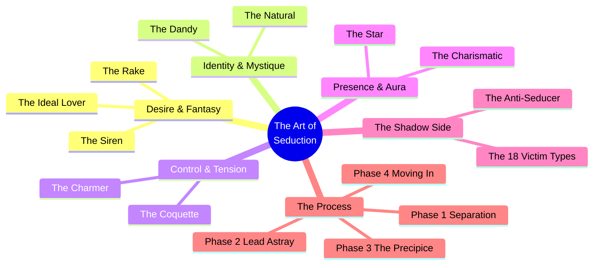
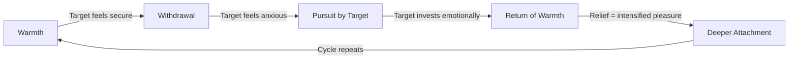
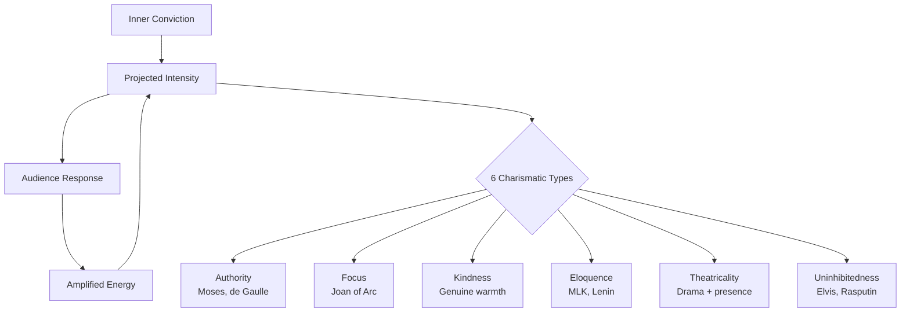
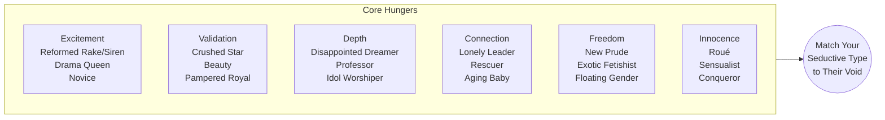
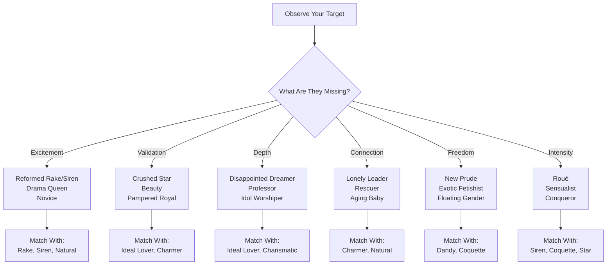
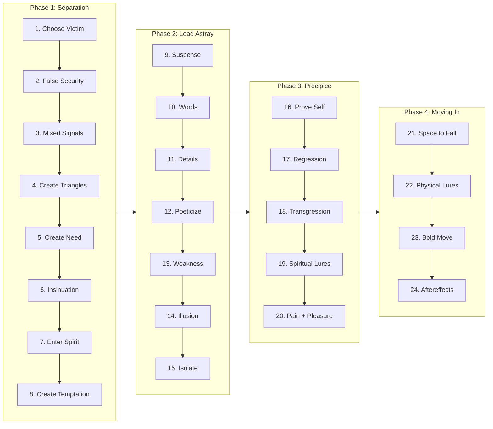
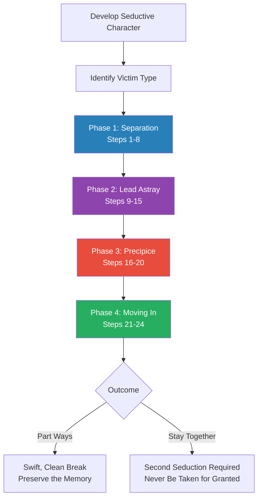
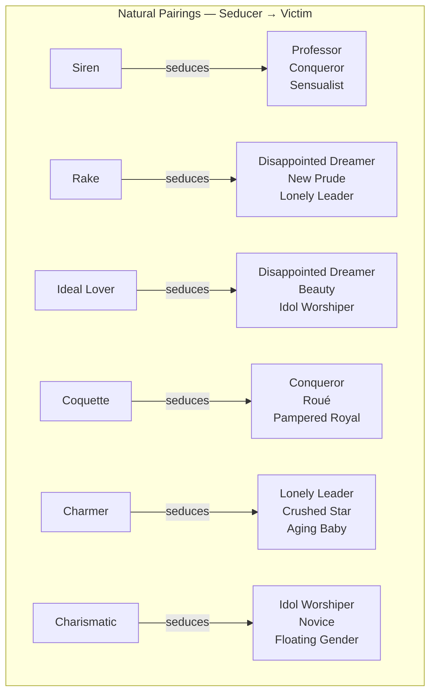
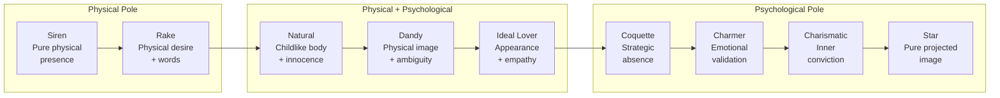
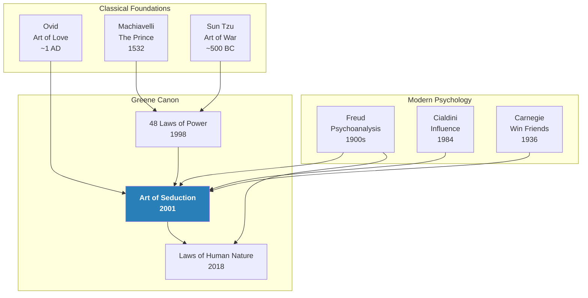

## About the Author

- *Robert Greene* (born 1959) is an American author known for his books on strategy, power, and human nature. A graduate of the University of California, Berkeley with a degree in classical literature, he worked over fifty jobs before finding his calling as a writer
- The Art of Seduction (2001) is his second book, following the international bestseller [[The 48 Laws of Power - Robert Greene|The 48 Laws of Power]] (1998). He went on to write [[The Laws of Human Nature - Robert Greene|The Laws of Human Nature]] (2018), completing a trilogy on power, seduction, and psychology
- Greene's method combines voracious historical research with practical psychological insight, drawing from thousands of years of history across all civilizations to identify patterns of human behavior that remain constant across time and culture
- He lives in Los Angeles and has consulted with business leaders, athletes, rappers, and military strategists on applying the principles from his books

---

# The Art of Seduction — Robert Greene

> *The book that reveals the hidden mechanics behind every great romance, every political rise, and every mass cultural movement — seduction as the supreme art of human influence.*

---

## At a Glance

| Dimension | Detail |
|---|---|
| **Core thesis** | Seduction is the most effective form of power — it works through pleasure rather than force, penetrating the mind before the body |
| **Structure** | Part One: 9 Seducer Types + Anti-Seducer + 18 Victim Types; Part Two: 24-step Seductive Process across 4 phases |
| **Key mechanism** | Create desire → stir fantasy → isolate from reality → move in for surrender |
| **Applicable to** | Romance, politics, sales, leadership, social influence, mass persuasion |
| **Companion to** | [[The 48 Laws of Power - Robert Greene]] (strategy through force) and [[The Laws of Human Nature - Robert Greene]] (understanding psychology) |

---

## How to Use This Summary

> *This summary is designed for three reading depths, matching the book's own seductive structure.*

### The 30-Second Scan
- Read **At a Glance** and **The Big Idea** for the core thesis
- Scan the **Quick Lookup Table** for the complete taxonomy at a glance

### The 5-Minute Review
- Read the **Quick Lookup Table** (all three tables)
- Read the **Thematic Cluster Map** (mermaid diagram)
- Read the **24 Steps — Quick Reference Summary**
- Read the **Key Quotes to Remember**

### The Full Read
- Work through each cluster and process phase in order
- Pay special attention to the historical examples, which bring the theory to life
- Use the **Seductive Character Assessment** and **Anti-Seducer Self-Audit** for personal development
- Explore the **Principles in Practice** and **Practical Exercises** sections for application
- Cross-reference with the **Related Reading** table for deeper exploration of specific topics

---

## The Big Idea

- *Seduction is not about beauty or luck — it is a learnable craft rooted in psychology.* Greene argues that the first seductresses — Cleopatra, Bathsheba, Helen of Troy — invented seduction as a weapon against male physical dominance
- The <b style="color: #2980b9">core insight</b> is deceptively simple: people secretly want to be seduced because they are <b style="color: #e74c3c">bored, constrained, and starved for pleasure</b>
- The seducer provides <b style="color: #27ae60">escape from the prison of daily life</b> — transforming mundane existence into theater, fantasy, and heightened experience
- Where [[The 48 Laws of Power - Robert Greene|The 48 Laws of Power]] treats influence as warfare, this book treats it as art — the art of making people surrender willingly
- The book divides seduction into two halves: first, <b style="color: #2980b9">who you are</b> (the seductive character — your persona), and second, <b style="color: #2980b9">what you do</b> (the seductive process — your 24-step campaign)
- Greene's historical range is staggering — from ancient Egypt to Hollywood, from Casanova's bedrooms to Lenin's revolutionary rallies — all to prove one point: the same psychological principles work everywhere

---

## Key Concepts at a Glance

| # | Concept | Description |
|---|---|---|
| 1 | **Seduction as Counter-Force** | Originated when women discovered that pleasure could make men dependent in ways force never could |
| 2 | **The Constructed Self** | Every seductive quality can be learned and performed; Monroe's walk, Cleopatra's costumes were deliberate constructions |
| 3 | **Psychology Over Physicality** | Cleopatra was not the most beautiful woman in Alexandria, yet she enslaved Caesar and Antony through psychological mastery |
| 4 | **Pleasure as Weapon** | People will follow anyone who offers genuine pleasure; the seducer is a "provider of pleasure" |
| 5 | **The Theater of Life** | All of life is performance; seducers treat every interaction as a stage |
| 6 | **Emotional Oscillation** | The greatest seductions swing between hope and fear, pleasure and pain, presence and absence |
| 7 | **The Willing Victim** | Seduction works because targets collaborate in their own enchantment — they want the fantasy |

---

## Quick Lookup Table — The Complete Seduction Taxonomy

### The 9 Seductive Characters

| # | Type | Core Power | Thematic Cluster |
|---|---|---|---|
| 1 | **The Siren** | Overwhelming sexual allure + theatrical presence | Desire & Fantasy |
| 2 | **The Rake** | Urgent, focused desire that sweeps women off their feet | Desire & Fantasy |
| 3 | **The Ideal Lover** | Mirrors your deepest fantasies back to you | Desire & Fantasy |
| 4 | **The Dandy** | Gender-fluid, self-created persona that hints at freedom | Identity & Mystique |
| 5 | **The Natural** | Childlike spontaneity that disarms all defenses | Identity & Mystique |
| 6 | **The Coquette** | Hot/cold mastery — self-sufficiency that forces pursuit | Control & Tension |
| 7 | **The Charmer** | Makes others feel better about themselves — seduction without sex | Control & Tension |
| 8 | **The Charismatic** | Radiates inner intensity — confidence, vision, purpose | Presence & Aura |
| 9 | **The Star** | Dreamlike image that invites projection and fantasy | Presence & Aura |

### The 18 Victim Types

| # | Type | Core Void | Best Seduced By |
|---|---|---|---|
| 1 | The Reformed Rake/Siren | Secretly bored with settled life | Rekindling old wildness |
| 2 | The Disappointed Dreamer | Let down by reality | Becoming their ideal |
| 3 | The Pampered Royal | Craves ever-more attention | Worship + novelty |
| 4 | The New Prude | Secretly desires transgression | Forbidden pleasures |
| 5 | The Crushed Star | Overlooked after past glory | Restoring their spotlight |
| 6 | The Novice | Excited by anything new | Fresh experiences |
| 7 | The Conqueror | Wants challenge and resistance | Playing hard to get |
| 8 | The Exotic Fetishist | Drawn to the foreign/different | Being the outsider |
| 9 | The Drama Queen | Needs emotional stimulation | Creating emotional peaks |
| 10 | The Professor | Intellectually overdeveloped, physically starved | Physical overwhelm |
| 11 | The Beauty | Worshipped for looks, lonely inside | Intellectual validation |
| 12 | The Aging Baby | Refuses to grow up | Being the indulgent adult |
| 13 | The Rescuer | Needs to feel needed | Playing the vulnerable one |
| 14 | The Roué | Worldly hedonist who covets innocence | Youthful purity |
| 15 | The Idol Worshiper | Bigger emptiness than most; needs something to adore | Becoming their idol |
| 16 | The Sensualist | Overactive senses, responsive to environment | Sensory overwhelm |
| 17 | The Lonely Leader | Powerful but isolated | Genuine, blunt connection |
| 18 | The Floating Gender | Fluid identity | Mirroring their ambiguity |

### The 24-Step Seductive Process

| Phase | Steps | Goal |
|---|---|---|
| **Phase 1: Separation** | 1–8 | Stir interest and desire — separate target from their world |
| **Phase 2: Lead Astray** | 9–15 | Create pleasure and confusion — make them dependent |
| **Phase 3: The Precipice** | 16–20 | Deepen the effect through extreme emotional measures |
| **Phase 4: Moving In** | 21–24 | Create surrender — the final conquest and its aftermath |

The Sankey diagram reveals that the seductive process is essentially a funnel — each phase narrows the target's emotional options until surrender becomes not a choice but an inevitability, with the Precipice phase creating the crisis that makes Phase 4 possible.

---

## Thematic Cluster Map

---

## Part One: The Seductive Character

### Cluster 1 — Desire & Fantasy: The Siren, The Rake, The Ideal Lover

> *These three types work by becoming the object of desire itself — embodying fantasies that the target cannot resist. The Siren offers sexual transcendence, the Rake offers passionate pursuit, and the Ideal Lover offers the dream made flesh.*

---

### Type 1: The Siren

- *The most ancient seductress — her prototype is Aphrodite herself, and her power has not diminished in millennia.* The Siren represents the ultimate male fantasy: a woman of <b style="color: #2980b9">heightened sexual allure</b> combined with a <b style="color: #2980b9">theatrical, larger-than-life presence</b> who offers total release from the constraints of masculine responsibility
- Greene identifies two subspecies of Siren — the <b style="color: #2980b9">Spectacular Siren</b> (Cleopatra) who overwhelms through drama, variety, and spectacle, and the <b style="color: #e74c3c">Sex Siren</b> (Marilyn Monroe) who operates through raw physical magnetism mixed with a disarming innocence
- The critical revelation: <b style="color: #27ae60">it is not beauty that makes a Siren but theatrical ability</b> — Cleopatra was not the most beautiful woman in Alexandria, yet she enslaved both Caesar and Antony through constant transformation, intoxicating voice, and the ability to never be the same woman twice

> [!example] Cleopatra's Carpet
> - In 48 B.C., exiled Queen Cleopatra had herself smuggled into Caesar's presence rolled inside a carpet
> - When the merchant unrolled it, she rose up half-clothed before Caesar and his generals like Venus emerging from the waves
> - The daring theatricality — risking everything on a single bold gesture — enchanted Caesar more than any beauty could
> - He stayed in Egypt for months, neglecting Rome, while Cleopatra led him on a lavish Nile expedition in a towering 54-foot barge
> - Years later she repeated the performance for Mark Antony — arriving on a gold barge with purple sails, posed as Aphrodite surrounded by cupids, while ethereal music played

- The Siren's instruments are specific and learnable: the <b style="color: #2980b9">voice</b> (lilting, intoxicating — "people remembered not what she said but how she said it"), the <b style="color: #2980b9">physical presence</b> (makeup, costume, movement carefully designed to suggest a goddess come to life), and the <b style="color: #2980b9">emotional variety</b> (warmth followed by coldness, intimacy followed by distance)
- Monroe's story illustrates that every element of the Siren is a construction — she spent years developing her breathy voice, her famous walk, her makeup technique; she could go unrecognized in bars without her glamorous presentation
- The Siren operates most powerfully on the rigid masculine type — soldiers, leaders, intellectuals — because their tightly controlled lives make them crave the chaos and release she represents

- The Siren's construction is deliberate and learnable. Greene breaks it down into specific components:
  - **Voice** — the most underrated seductive instrument; Cleopatra's voice cast a spell on everyone who heard it; Monroe transformed hers from a girl's squeak to a breathy whisper through deliberate practice
  - **Physical Adornment** — makeup, costume, and accessories designed to create a heightened, goddesslike appearance; not beauty per se, but a sense of the extraordinary
  - **Movement** — Monroe invented her famous walk, a blend of Mae West and Bo Peep; Cleopatra's ceremonial entrances were choreographed theatrical events
  - **Emotional Variety** — the Siren is never the same twice; warmth followed by coldness, intimacy followed by theatricality; this variety prevents boredom and creates addictive unpredictability

- The <b style="color: #27ae60">two critical illusions</b> the Siren must maintain: first, that her allure is natural rather than constructed (Monroe could go unrecognized in bars without her costume), and second, that she is simultaneously accessible and unattainable (you feel you could possess her, but you never quite do)
- The Siren's symbol is <b style="color: #2980b9">The Shipwreck</b> — men are lured by beauty and crash upon the rocks. But the metaphor also captures the Siren's strange dual nature: she is both the beautiful song and the hidden reef, both the promise of pleasure and the certainty of destruction

> [!tip] The Siren Principle
> The Siren's power comes not from beauty but from the ability to embody fantasy. Create a heightened presence — voice, appearance, movement — that transports others from their mundane reality into a world of pure sensory experience. Never be the same twice.

---

### Type 2: The Rake

- *If the Siren is the female fantasy incarnate, the Rake is her male counterpart — a man whose desire is so focused, so urgent, and so reckless that it sweeps everything before it.* Where the Siren overwhelms through <b style="color: #2980b9">what she is</b>, the Rake overwhelms through <b style="color: #2980b9">what he feels</b>
- The Rake's power lies in his single-minded intensity — when he desires a woman, he will go to the ends of the earth for her, risk his reputation, break every social rule. This total focus is intoxicating to women who feel <b style="color: #e74c3c">chronically under-desired</b> in a world of distracted, unresponsive men
- Greene distinguishes between the <b style="color: #2980b9">Ardent Rake</b> (the Duke de Richelieu — verbal brilliance, poetry, theatrical declarations of love) and the <b style="color: #e74c3c">Demonic Rake</b> (Errol Flynn — reckless danger, the thrill of the forbidden, an aura of sin)
- Language is the Rake's primary weapon — "as promiscuous with words as he is with women" — creating a narcotic effect through constant verbal attention, love letters, poetry, and declarations that fill the woman's mind entirely

> [!example] The Duke de Richelieu's Campaigns
> - The Duke operated in 18th-century France with a method of overwhelming verbal intensity
> - He would write letter after letter — passionate, witty, self-deprecating — filling a woman's waking hours with his presence even when physically absent
> - His reputation as a rake actually helped — women wanted to be the one who finally captured him
> - Each affair was conducted as if it were his first and last great love, with complete sincerity in the moment
> - His secret: he genuinely felt the desire he expressed, at least in the moment; this sincerity made his otherwise outrageous behavior forgivable

- The key psychological mechanism: the Rake never worries about consequences. His abandon is liberating — it gives women permission to abandon their own inhibitions. In a world of caution and calculation, <b style="color: #27ae60">reckless desire feels like a force of nature</b>
- The Rake's fatal flaw is his very promiscuity — he cannot be faithful. But paradoxically, this makes each affair feel more intense: the woman knows her time is limited, which heightens every moment

> [!example] Gabriele D'Annunzio — The Demonic Rake
> - D'Annunzio arrived in Roman high society in the 1880s as a short, stocky, splotchy-complexioned journalist — men considered him so ugly they gladly left their wives with him
> - Yet alone with women, D'Annunzio transformed: his voice was liquid music, his words were poetry, his attention was so focused that each woman felt she was the only person on earth
> - He had mastered the art of individualized flattery — one woman was a "goddess of nature," another an "incomparable artist in the making," a third a "romantic figure from a novel"
> - The morning after meeting him, each woman would receive a poem that seemed written specifically for her (in fact he wrote dozens of similar poems, lightly tailored)
> - His conquests included duchesses, marchionesses, the great actress Eleanor Duse, and the dancer Isadora Duncan — who said his face became "Apollo's" when he spoke to a woman he desired
> - Two ladies once fought a pistol duel over him, one seriously wounded

- The Rake's power extends beyond romance. D'Annunzio became Italy's most decorated war hero, then led an army to seize the city of Fiume — a political seduction that worked on the same principles: passionate intensity, reckless courage, hypnotic oratory that made crowds feel part of a grand drama
- <b style="color: #2980b9">The Rake's core paradox</b>: his desire must be genuine to be effective, but it is also — by its very nature — temporary. The Ardent Rake solves this: he genuinely feels overpowering desire in the moment, and the target senses this sincerity, which makes his later departure forgivable
- Greene identifies a key practical insight: <b style="color: #27ae60">show no hesitation, abandon all restraint</b>. The moment you seem to be calculating, the spell breaks. The Rake's power depends on seeming to be overwhelmed by forces beyond his control

#### The Rake's Method — A Detailed Breakdown

| Rake Principle | Description | Why It Works |
|---|---|---|
| **Intense focus** | When desiring someone, make them the center of the universe | Women rarely experience this level of focused attention |
| **Verbal mastery** | Use language as narcotic — poetic, flattering, suggestive | Words fill the imagination more than actions |
| **Recklessness** | Take risks, break rules, show willingness to sacrifice | Proves desire is genuine, not calculated |
| **Persistence** | Never accept rejection as final | Persistence communicates value (up to a point) |
| **Impudence** | Be bold, slightly shocking, unafraid of social norms | Breaks the target out of routine and convention |
| **Promiscuity** | Past conquests increase rather than decrease desirability | Social proof + the thrill of "taming" the untamable |

- The Rake represents a <b style="color: #2980b9">fundamental truth about desire</b>: it is not the person who is restrained, careful, and considerate who creates the most intense attraction, but the person who burns with a passion so visible and so reckless that it overwhelms all rational assessment
- The Duchess d'Orléans, Richelieu's bitter enemy, admitted: "If I believed in sorcery I should think that the Duke possessed some supernatural secret, for I have never known a woman to oppose the very least resistance to him"

---

### Type 3: The Ideal Lover

- *Most people carry broken dreams — fantasies of romance, adventure, spiritual communion that reality has crushed.* The Ideal Lover studies these fantasies and <b style="color: #2980b9">becomes their living embodiment</b>, reflecting back to targets exactly what they have always wanted but never found
- This is the most empathetic of the seducer types — the Ideal Lover's primary skill is observation. They study their target's psychology, identify the gap between what that person has and what they dream of, then fill that gap so perfectly it feels like destiny
- Casanova is the archetype: far from a crude seducer, he approached each woman as a unique puzzle, studying her situation, her unfulfilled desires, her specific fantasy, then becoming that fantasy with meticulous care. With a lonely woman he was the devoted companion; with an adventurous woman he was the daring rogue; with an intellectual woman he quoted philosophy

> [!example] Madame de Pompadour and Louis XV
> - By the 1740s, Louis XV was the most powerful man in Europe — and the most bored
> - Every pleasure had been offered to him; every courtier fawned and flattered; nothing surprised him
> - Jeanne Poisson (later Madame de Pompadour) studied the king for years before they met, learning his every taste, his patterns of boredom, his secret longings
> - When she finally engineered a meeting, she seemed to be everything the court was not — fresh, natural, endlessly surprising
> - She organized constant novelty: private theaters, masked balls, new art, botanical gardens, intellectual salons — always one step ahead of his boredom
> - She became indispensable not through sex (which eventually faded) but through her ability to continually reinvent the experience of being with her

- The Ideal Lover's danger is exhaustion — maintaining the illusion requires constant effort. The moment you stop studying your target and begin to coast, the spell breaks
- <b style="color: #27ae60">The political Ideal Lover is equally powerful</b> — JFK embodied America's idealized self-image (youthful, vigorous, cultured, daring), and an entire nation fell under his spell because he reflected their collective fantasy back to them

> [!example] Casanova — The Master of Individual Fantasy
> - Casanova's reputation as a crude womanizer obscures his real genius: he was the most attentive student of human psychology of his age
> - Before pursuing any woman, he would spend days observing her — her tastes, her situation, her relationships, her unfulfilled longings — building a complete psychological portrait
> - For a lonely woman he became the devoted, tender companion who hung on her every word; for an adventurous woman he was the daring rogue with plans for midnight escapades; for a pious woman he was the spiritual seeker wrestling with questions of faith
> - He was meticulous about environment — the right restaurant, the right flowers, the right conversation topic — because he understood that seduction is an experience, not an event
> - His memoirs reveal the key: he genuinely found something unique and beautiful in every woman he pursued, and this authentic appreciation — not pretended but cultivated — was what separated him from ordinary seducers
> - Women who had been with Casanova rarely spoke ill of him afterward; many remained friends for life, because the experience had felt not like manipulation but like being truly seen

- The Ideal Lover teaches a lesson that extends far beyond romance: <b style="color: #2980b9">the most powerful form of influence is showing people the best version of themselves</b>. When someone makes you feel that your deepest dreams are possible, you become psychologically dependent on their presence — not because they control you, but because without them, the dream fades
- Greene identifies the Ideal Lover as especially effective in eras of <b style="color: #e74c3c">mass disenchantment</b> — when cynicism is widespread and people have stopped believing in romantic ideals. In such moments, the person who revives hope becomes irresistible

#### The Ideal Lover's Method — A Detailed Breakdown

| Ideal Lover Principle | Description | Practical Application |
|---|---|---|
| **Deep observation** | Study the target before approaching | Learn their history, tastes, dreams, disappointments |
| **Fantasy identification** | Discover what they've always wanted but never had | Listen for wistful statements, stories of "what might have been" |
| **Mirror creation** | Become the living embodiment of their fantasy | Adapt your behavior, interests, and presentation to match their ideal |
| **Aesthetic attention** | Create beautiful, memorable experiences | Design environments, choose gifts, plan encounters as an artist would |
| **Sustained illusion** | Never break character; never reveal the ordinary self | Maintain the heightened reality even in private moments |
| **Emotional depth** | Connect on the level of meaning, not just pleasure | Engage with their values, their purpose, their deepest concerns |

- The <b style="color: #e74c3c">danger unique to the Ideal Lover</b>: burnout. Of all nine types, the Ideal Lover demands the most sustained effort. While a Coquette can seduce through strategic withdrawal (which requires less energy) and a Star can seduce through curated distance, the Ideal Lover must be actively engaged, constantly studying, perpetually performing. Casanova's remarkable stamina — conducting dozens of affairs over decades — was the exception, not the rule
- The <b style="color: #27ae60">modern Ideal Lover</b> can leverage technology: social media provides unprecedented access to a target's interests, tastes, and psychology before you've even met. The person who arrives at a first meeting already knowing their target's favorite book, their ideal vacation, and the achievement they're most proud of has done the Ideal Lover's foundational work before the interaction even begins

---

### Cluster 2 — Identity & Mystique: The Dandy, The Natural

> *Where Cluster 1 types work through desire, these two types work through identity itself — the Dandy by shattering expectations of who a person should be, the Natural by dissolving the armor of adulthood. Both offer liberation from the self.*

---

### Type 4: The Dandy

- *Most people feel trapped within the roles the world assigns them — gender, class, profession, personality.* The Dandy breaks free from all of these, creating an <b style="color: #2980b9">entirely self-fashioned persona</b> that hints at a freedom everyone secretly craves
- The Dandy's power is rooted in ambiguity — particularly <b style="color: #2980b9">gender ambiguity</b>. By blending masculine and feminine qualities, the Dandy becomes impossible to categorize, and what cannot be categorized becomes fascinating. Rudolph Valentino electrified audiences not because he was conventionally masculine but because he was attentive, graceful, and sensual in ways men were not supposed to be
- Greene traces the Dandy lineage from Beau Brummell (who turned personal style into a form of aristocratic rebellion) to Lou Andreas-Salomé (who combined feminine beauty with fierce intellectual dominance, captivating Nietzsche, Rilke, and Freud)

> [!example] Rudolph Valentino — The Masculine Dandy
> - In the 1920s, Valentino became Hollywood's first male sex symbol — not through machismo but through its opposite
> - On screen he played men who were attentive listeners, tender in love, graceful in movement — traits audiences had only seen in female stars
> - Women went wild because he embodied a fantasy no real man provided: total emotional presence combined with physical beauty
> - Men initially mocked him as effeminate, but many secretly envied his effect on women and began imitating his style
> - His androgynous quality created a new template for male attractiveness that persists to this day

- The Dandy's strategy extends far beyond clothing or grooming. It is about <b style="color: #27ae60">psychological self-creation</b> — refusing to be defined by any external category. Oscar Wilde made his entire life a performance, treating conversation as art and society as his stage
- The female Dandy is equally powerful: Lou Andreas-Salomé reversed the expected dynamic by being the intellectual superior in every relationship she entered. She offered men the thrill of a woman who was not just an object of desire but a genuine challenge — a mind to match and exceed their own
- In politics, the Dandy finds expression in leaders like JFK whose personal style — the youthful elegance, the cultural sophistication, the easy humor — set them apart from the gray conformity of their peers

> [!example] Lou Andreas-Salomé — The Female Dandy as Intellectual Force
> - Born in Russia in 1861, Lou Andreas-Salomé became one of the most fascinating women in European intellectual history — not through beauty or social position but through sheer force of mind and personality
> - At 21, she captivated the 38-year-old Friedrich Nietzsche, who proposed marriage; she refused, preferring intellectual companionship to domestic life
> - She later became the intimate of the poet Rainer Maria Rilke, who fell so deeply under her spell that he changed his name, his handwriting, and his entire approach to poetry under her influence
> - Finally, at age 50, she entered the inner circle of Sigmund Freud, becoming one of the first female psychoanalysts and one of Freud's most trusted confidants
> - In each relationship, she reversed the expected dynamic: the men were the ones who were emotionally dependent, creatively inspired, and ultimately abandoned when she moved on
> - Her power was the female Dandy's power: she combined feminine attractiveness with masculine intellectual authority, creating a persona that defied categorization and fascinated everyone she met
> - Nietzsche said of her: "She is as shrewd as an eagle and brave as a lion, and yet still an utterly feminine child"

> [!example] Beau Brummell — Style as Revolution
> - In early 19th-century England, Beau Brummell transformed personal style from an aristocratic birthright into a democratic art form
> - He had no title, no fortune, and no particular beauty — but he dressed with such exquisite precision and carried himself with such confident indifference that he became the arbiter of taste for an entire generation
> - His method was pure Dandy: he elevated personal presentation to the level of art, treating each outfit and each social interaction as a performance
> - He was famously insolent — once, when asked if he liked a painting of the countryside, he turned to his valet and asked, "Do I like the country?"
> - His influence extended from dress to manners to speech — he created the template of the modern gentleman, demonstrating that self-creation through style is a form of power that requires no other credential
> - The lesson: the Dandy's insolence is not rudeness but freedom — the refusal to be impressed by anything except quality, including one's own

- <b style="color: #e74c3c">The Dandy's vulnerability</b>: the same insolence and self-sufficiency that make them magnetic can curdle into narcissism. If the Dandy forgets to pay attention to others and becomes entirely self-absorbed, the seductive power inverts into repulsion

> [!tip] The Dandy Principle
> Create a persona that defies categorization. Blend qualities that aren't supposed to go together — sensitivity with strength, elegance with danger, intellect with sensuality. The freedom you project will draw others who feel imprisoned by their own conformity.

---

### Type 5: The Natural

- *Childhood is the golden paradise we spend our lives trying to recapture.* The Natural taps into this universal nostalgia by embodying the qualities of youth — <b style="color: #2980b9">spontaneity, sincerity, unpretentiousness, playful wonder</b> — in an adult body. In their presence, people feel transported back to a time before cynicism, before responsibility, before the loss of innocence
- Greene identifies five subtypes of Natural, each drawing on a different dimension of childhood: the <b style="color: #2980b9">Innocent</b> (Charlie Chaplin's Little Tramp — helpless vulnerability that triggers protective instincts), the <b style="color: #e74c3c">Imp</b> (the mischief-maker whose naughtiness is endearing because it's so transparent), the <b style="color: #2980b9">Wonder</b> (wide-eyed curiosity that makes everything feel new), the <b style="color: #27ae60">Undefensive</b> (open vulnerability with no walls), and the <b style="color: #2980b9">Spontaneous</b> (unrehearsed freshness that makes everything feel authentic)

> [!example] Josephine Baker — The Wild Natural
> - Baker arrived in Paris in 1925 as a young African-American woman with virtually nothing
> - On stage she moved with a freedom and physicality that Parisians had never seen — uninhibited, joyful, wild
> - She was not technically the best dancer, but her spontaneity was so complete that audiences felt they were watching a force of nature rather than a performance
> - Offstage she was equally natural — laughing loudly, saying exactly what she felt, keeping exotic pets, living with infectious abandon
> - Paris fell in love because she represented everything their sophisticated, mannered culture had suppressed: the pure joy of unself-conscious physical existence

- The Natural's deepest power comes from <b style="color: #27ae60">the absence of self-consciousness</b>. In a world where everyone is performing, calculating, and managing their image, the person who seems to have no filter and no agenda is instantly refreshing. People lower their defenses because there appears to be nothing to defend against
- Charlie Chaplin built an empire on this quality — the Little Tramp was a grown man with a child's innocence, stumbling through a hostile world with wide-eyed bewilderment and stubborn hope. Audiences didn't just laugh; they felt protective, tender, moved. The same dynamic works in private seductions: seeming genuinely innocent and helpless triggers powerful parental instincts

> [!example] Charlie Chaplin — The Innocent Natural
> - Growing up in London poverty, Chaplin had his childhood stolen — orphanages, destitution, a mother committed to an asylum
> - In Hollywood, struggling for work against physically superior comedians like Buster Keaton, he stumbled on his breakthrough: a costume of oversized pants, derby hat, enormous boots on the wrong feet, a walking cane, and a pasted-on mustache
> - The costume created a character — the Little Tramp — who saw the world through a child's eyes: guileless, brave, perpetually surprised by adult cruelty
> - In film after film he cast himself opposite physically larger actors, positioning them as bullies and himself as the helpless child — a visual metaphor the audience read instantly and responded to with fierce protectiveness
> - Offscreen, Chaplin's Natural quality proved equally seductive — three of his four wives were teenagers when he married them, drawn to his boyish energy and apparent emotional openness
> - A review of his first film captured the magic: "a comedian of the first water, who acts like one of Nature's own naturals"

- Cora Pearl, the famous 19th-century Parisian courtesan, used a different Natural strategy — childlike naughtiness. She would commit outrageous acts (once having herself served naked on a silver platter at a dinner party) with such gleeful mischief that no one could be offended. Her behavior was scandalous but so transparently playful that it charmed rather than repelled
- Greene identifies a spectrum within the Natural type that runs from <b style="color: #2980b9">innocent vulnerability</b> (Chaplin) through <b style="color: #2980b9">wild freedom</b> (Baker) to <b style="color: #e74c3c">mischievous naughtiness</b> (Cora Pearl) — each drawing on a different dimension of childhood, but all producing the same disarming effect
- <b style="color: #e74c3c">The Natural's danger</b>: the strategy requires genuine spontaneity, which is paradoxically difficult to fake. If people sense calculation behind the innocence, the spell breaks instantly and the Natural looks manipulative. Also, the Natural's childlike quality can become tiresome if not balanced with flashes of adult depth
- The practical lesson: <b style="color: #27ae60">adopt the Natural's openness selectively</b>. You don't need to become childlike in every interaction, but in moments where others expect calculation and defensiveness, showing unexpected openness and spontaneity can be devastatingly effective

---

### Cluster 3 — Control & Tension: The Coquette, The Charmer

> *These types master the dynamics of control — the Coquette through strategic withdrawal that forces others to chase, the Charmer through generous attention that makes others feel valued. Both create powerful dependencies, but through opposite mechanisms.*

---

### Type 6: The Coquette

- *The ability to delay satisfaction is the ultimate art of seduction.* The Coquette is the grandmaster of this game, orchestrating an endless back-and-forth between <b style="color: #2980b9">hope and frustration</b>, <b style="color: #e74c3c">heat and cold</b>, advancing and retreating in a rhythm that keeps targets perpetually off-balance and desperately wanting more
- The Coquette's core power is <b style="color: #2980b9">self-sufficiency</b> — they genuinely do not seem to need anyone. This self-contained quality is hypnotic in a world of needy, grasping people. The Coquette never fully gives in, never completely surrenders, and this permanent elusiveness turns every interaction into a challenge that the target cannot walk away from
- Napoleon Bonaparte — conqueror of Europe, master strategist, man of iron will — was reduced to a lovesick wreck by the Coquette tactics of Josephine de Beauharnais. Her strategy was devastatingly simple: she alternated between passionate warmth and icy indifference, between devoted letters and calculated silences

> [!example] Josephine Bonaparte — The Supreme Coquette
> - When Napoleon first fell for Josephine, she was a 32-year-old widow with two children and a reputation for affairs — hardly the obvious choice for the most ambitious man in France
> - Her weapon was timing: she would shower Napoleon with attention, then suddenly grow cold and distant just as he was most attached
> - While Napoleon was fighting campaigns in Italy and Egypt, she conducted affairs back in Paris — and when word reached him, rather than turning him against her, it drove him to even more desperate pursuit
> - She understood that Napoleon was a conqueror by nature: the thing he could never conquer was the thing he would never stop wanting
> - Even after he discovered her infidelity, the pattern held — he raged, threatened divorce, then came crawling back, more enslaved than before

- Andy Warhol demonstrates that the Coquette strategy transcends gender and romance entirely. His emotional unavailability — the blank stare, the deflected questions, the refusal to reveal anything personal — made him the center of the most vibrant social scene in 1960s New York. People projected their fantasies onto his blankness and competed frantically for his attention precisely because he seemed not to need theirs

> [!example] Andy Warhol — The Cold Coquette
> - Warhol perfected what Greene calls the "Cold Coquette" — someone whose power comes not from alternating warmth and coldness but from a consistent, fascinating blankness
> - At the Factory, New York's most famous art studio, celebrities, artists, and socialites competed desperately for Warhol's attention and approval
> - But Warhol gave nothing: no praise, no criticism, no emotional response of any kind. He simply observed and occasionally pointed his camera
> - This blank surface became the ultimate projection screen — each person saw in Warhol whatever they most wanted to see: a genius, a rebel, a kindred spirit, a guru
> - The result was a kind of mass seduction: everyone at the Factory was in love with Warhol, but Warhol was in love with no one, which only intensified the collective desire to be the exception
> - His art mirrored his personal strategy: by reducing celebrity images (Marilyn, Elvis, Mao) to flat, repetitive silkscreens, he made them into blank surfaces for projection — exactly what he did with his own persona
> - The danger: Valerie Solanas, who fell deeply under Warhol's spell and then felt rejected, shot him three times in 1968 — demonstrating that the Cold Coquette's emotional games can trigger violent reactions in unstable targets

- The <b style="color: #27ae60">psychological mechanism</b> is rooted in the human response to scarcity: we value what we cannot easily obtain, and we pursue most intensely what seems about to slip away. The Coquette manufactures scarcity of themselves — their attention, their affection, their approval — creating an emotional economy where supply never meets demand

#### The Coquette's Oscillation Pattern

- <b style="color: #e74c3c">The Coquette's danger</b>: push the cold side too far, and targets may give up entirely. The art lies in calibrating the oscillation — enough warmth to maintain hope, enough coldness to maintain hunger. It is a high-wire act that requires constant attention to the target's emotional state
- The Coquette also faces a unique long-term risk: the pattern can become tiresome over time. Madame Mao used coquettish tactics to capture Mao Tse-tung, but after a decade the quarreling and emotional manipulation became irritating rather than alluring. Josephine was more skillful — she adapted her strategy over time, sometimes spending an entire year without playing coy, keeping Napoleon guessing about which version of her he would encounter

---

### Type 7: The Charmer

- *Charm is seduction without sex — the art of making people feel better about themselves.* While other seducer types create desire or tension, the Charmer creates <b style="color: #2980b9">comfort, pleasure, and a warm glow of validation</b> that makes their targets feel more intelligent, more attractive, and more important than they did before the Charmer arrived
- The Charmer's method is deceptively simple: deflect all attention away from yourself and focus it entirely on the other person. Understand their spirit, feel their pain, adapt to their moods. In the presence of a Charmer, you feel <b style="color: #27ae60">understood and appreciated</b> in a way that almost no one else provides
- Benjamin Disraeli mastered political charm by making Queen Victoria feel that she was the fascinating one, not him. While his rival Gladstone talked brilliantly about himself and his policies, Disraeli asked Victoria questions, listened to her answers with apparent rapture, and made her feel like the most intelligent woman in England. Victoria's famous distinction captures the Charmer's art perfectly: she said that Gladstone spoke to her as if she were a public meeting, but Disraeli spoke to her as if she were a woman

> [!example] Zhou Enlai — The Diplomatic Charmer
> - As Premier of China from 1949 to 1976, Zhou Enlai had to navigate between Mao's revolutionary extremism and the demands of international diplomacy
> - His method was pure charm: he listened intently, remembered personal details, adapted his manner to each person's culture and temperament
> - Western diplomats who met him expecting a cold ideologue were disarmed by his warmth, his humor, his apparent vulnerability
> - Henry Kissinger, no easy mark, described Zhou as the most impressive diplomat he had ever encountered
> - Zhou's charm was strategic — it created trust that allowed China to achieve diplomatic goals that force or bluster never could

> [!example] Disraeli and Queen Victoria — Charm as Political Genius
> - In the 1870s, Queen Victoria had withdrawn from public life after the death of Prince Albert, bored by politics and convinced of her own inadequacy
> - Her prime minister, William Gladstone, was brilliant but deeply anti-seductive: he lectured Victoria as if she were a public meeting, delivered long speeches about policy, and never asked her opinion
> - Benjamin Disraeli took the opposite approach: he asked Victoria questions, listened to her answers with apparent fascination, and treated every observation she made as deeply insightful
> - He sent her flowers with handwritten notes, called her "the Faery Queen" in his letters, and made her feel that governing was not a burden but an adventure they were sharing
> - Victoria's famous verdict: "Mr. Gladstone speaks to me as if I were a public meeting; Mr. Disraeli speaks to me as if I were a woman"
> - The result: Disraeli secured Victoria's passionate support for his policies, including the purchase of the Suez Canal — a bold geopolitical move that Gladstone would never have gotten past her
> - The deeper lesson: Disraeli's charm was not superficial flattery but a sophisticated understanding of what Victoria needed — to feel intelligent, valued, and central to great events. He gave her that experience, and in exchange, she gave him power

- Pamela Harriman provides another model of the Charmer in action. The daughter-in-law of Winston Churchill, she became one of the most influential women of the 20th century not through conventional power or beauty but through <b style="color: #2980b9">an extraordinary ability to make every man feel he was the center of her world</b>. Her lovers and husbands included some of the most powerful men of the century, and each one believed she genuinely cared for them above all others

> [!example] Pamela Harriman — The Social Charmer
> - Born Pamela Digby, she married Winston Churchill's son Randolph at 19 — gaining access to the most powerful circles in the Allied war effort
> - After her divorce, she embarked on a series of relationships with extraordinarily powerful men: Averell Harriman (diplomat and Governor of New York), Gianni Agnelli (Fiat chairman), Elie de Rothschild (banking heir), and various Hollywood producers
> - Her method was pure Charmer: she made every man feel that he was the most fascinating person she had ever met
> - She remembered everything — their favorite wines, their political concerns, the names of their children, the details of their business deals — and referenced this knowledge with casual precision
> - She was not the most beautiful woman in any room, but she was invariably the one men wanted to talk to, because she gave them something more valuable than beauty: the feeling of being completely understood
> - She eventually married Averell Harriman, became a major political fundraiser, and was appointed U.S. Ambassador to France — a career built entirely on the Charmer's ability to create devoted allies through focused, individualized attention

- The Charmer's power is uniquely versatile — it works on everyone regardless of gender, age, or social position. Unlike the Siren or Rake, whose appeal depends on sexual tension, the Charmer can seduce a business partner, a political rival, or an elderly monarch with equal effectiveness
- The five key Charmer skills are: <b style="color: #2980b9">focused listening</b> (making others feel heard), <b style="color: #2980b9">strategic flattery</b> (sincere-seeming praise aimed at real insecurities), <b style="color: #2980b9">emotional mirroring</b> (matching the other's mood before gently shifting it), <b style="color: #2980b9">non-confrontation</b> (never arguing or making others feel wrong), and <b style="color: #2980b9">gentle humor</b> (disarming tension without mockery)

#### The Charmer's Method — A Detailed Breakdown

| Charmer Principle | Description | Practical Application |
|---|---|---|
| **Make the target the center** | Deflect all attention from yourself to them | Ask questions; remember details; reference previous conversations |
| **Be a source of pleasure** | Never complain; bring energy and lightness | Distract from problems; offer humor and encouragement |
| **Bring antagonism into harmony** | Never argue; yield to aggression | Let opponents have small victories; plant ideas indirectly |
| **Lull into ease and comfort** | Mirror their moods and values | Match body language; share their perspective before gently shifting |
| **Show calm in adversity** | Poise under pressure demonstrates mastery | Never show anger, frustration, or vengefulness in public |
| **Make yourself useful** | Follow through on promises; connect people | Build a network; be the person who makes things happen |

- <b style="color: #e74c3c">The Charmer's limitation</b>: charm lacks the depth and intensity of more dramatic seductive types. People may enjoy the Charmer's company enormously but never feel the obsessive pull that a Coquette or Siren creates. For lasting power, the Charmer may need to incorporate elements of other types — a flash of Dandy unpredictability or Natural spontaneity

---

### Cluster 4 — Presence & Aura: The Charismatic, The Star

> *These types seduce not through what they do for you, but through what they are. The Charismatic radiates an inner intensity that electrifies, while the Star projects an ethereal image that invites fantasy. Both create a kind of worship — one through heat, the other through luminous distance.*

---

### Type 8: The Charismatic

- *Charisma is a presence that excites us — an inner quality of self-confidence, sexual energy, sense of purpose, and contentment that most people lack and desperately want.* This quality radiates outward, permeating every gesture and making the Charismatic seem extraordinary and superior to normal mortals
- Greene identifies charisma not as a single quality but as a family of related powers. He catalogs <b style="color: #2980b9">six types of charismatic aura</b>: the Authority (Moses — divine mission and commanding certainty), the Focus (Joan of Arc — single-minded devotion to a cause), the Kindness (genuine warmth that melts resistance), the Eloquence (transformative speech that moves crowds), the Theatricality (dramatic self-presentation), and the Uninhibitedness (wild animal energy that liberates those around it)
- The common thread across all types is <b style="color: #2980b9">inner intensity projected outward while maintaining detachment</b>. The Charismatic burns with conviction but is not consumed by it — this combination of fire and control is what separates charisma from mere enthusiasm

> [!example] Joan of Arc — Saintly Charisma
> - In 1429, a 17-year-old illiterate peasant girl convinced the French king to give her command of his army — a feat that would be remarkable in any era
> - Joan's power was entirely charismatic: she radiated such absolute certainty in her divine mission that hardened soldiers wept in her presence
> - She never wavered, never showed doubt, never compromised — and this unwavering conviction in an age of cynicism and defeat was like water in a desert
> - Soldiers who had been demoralized for years suddenly fought like lions under her command — not because her strategy was brilliant, but because her presence transformed their psychology
> - Her trial and execution only amplified her charisma: by dying for her conviction, she achieved the martyrdom that seals a Charismatic's legend forever

- <b style="color: #2980b9">Lenin's cold charisma</b> provides a contrasting model. Where Joan burned with saintly passion, Lenin projected an icy certainty — a sense that he had seen the future and knew exactly how to get there. His speeches were not emotionally moving in the traditional sense; they were logically devastating, delivered with such detached confidence that listeners felt history itself was speaking through him
- Elvis Presley embodied the Uninhibited Charismatic — his raw animal energy on stage in the 1950s was so powerful precisely because it broke every rule of polite society. In an era of buttoned-up conformity, his gyrating hips and sensual voice offered <b style="color: #27ae60">permission to feel</b>, and millions responded with an intensity that terrified the establishment

> [!example] Elvis Presley — The Body as Revolution
> - When Elvis appeared on the Ed Sullivan Show in 1956, the cameras famously filmed him only from the waist up — his lower body was considered too scandalous for television
> - This censorship perfectly illustrates the Uninhibited Charismatic's power: in a culture that suppresses physical expression, the person who moves freely becomes an object of desperate fascination
> - Elvis's charisma was not intellectual or spiritual — it was purely physical: the way he moved, the way his voice broke on certain notes, the way sweat glistened on his face during performances
> - He gave an entire generation permission to inhabit their bodies — to feel desire, to move with abandon, to reject the stiff propriety of the 1950s
> - His fall — the weight gain, the prescription drugs, the Vegas spectacle — demonstrates the Charismatic's vulnerability: without the energy that fuels the aura, the spell breaks, and the audience moves on

> [!example] Charles de Gaulle — The Authority Charismatic
> - De Gaulle combined absolute conviction with theatrical self-presentation to create a unique form of political charisma
> - Standing 6'5", with a commanding physical presence, he projected an aura of France itself — as if the nation's destiny had taken human form
> - His method was pure Authority type: he never wavered, never showed doubt, never compromised. His certainty was so complete that it became contagious — even when France was at its weakest, his conviction that it was still great made others believe it too
> - During the Algerian crisis of 1958, when France teetered on the edge of civil war, de Gaulle appeared on television and simply said: "I have taken charge of the Republic." The calm certainty of his voice quelled a nation's panic
> - His distance was as important as his conviction — he remained aloof, mysterious, never fully accessible, forcing people to project their hopes and fears onto him

- The <b style="color: #e74c3c">dangerous paradox</b> of charisma: it requires an audience. The Charismatic feeds off the energy of followers, and followers feed off the energy of the Charismatic — a feedback loop that can spiral into cult dynamics. Every great Charismatic leader walks the line between inspiration and demagoguery

- Greene offers practical instruction for developing charisma: cultivate a <b style="color: #2980b9">sense of mission</b> (believe deeply in something larger than yourself), develop your <b style="color: #2980b9">gaze</b> (direct, intense eye contact that makes each person feel singled out), practice <b style="color: #2980b9">oratory</b> (rhythmic, repetitive, emotionally charged speech), and maintain <b style="color: #2980b9">mystery</b> (never fully explain yourself; let people fill in the gaps with their imagination)

> [!tip] The Charismatic Principle
> Charisma comes from inner conviction, not outer polish. Find something you believe in with genuine intensity, and let that conviction radiate through your presence. The key paradox: you must burn with passion while remaining strategically detached — consumed by the cause, but always in control of its effect on others.

---

### Type 9: The Star

- *Daily life is harsh, and most of us constantly seek escape in fantasies and dreams.* The Star feeds on this hunger by standing out from the crowd through a <b style="color: #2980b9">distinctive and appealing image</b> — then maintaining enough distance and vagueness to let people project their own fantasies onto that image
- Where the Charismatic overwhelms through intensity, the Star seduces through <b style="color: #2980b9">luminous distance</b>. Stars are ethereal, slightly unreal — you can look but never quite touch. Their dreamlike quality works on the unconscious, and this is what makes the Star's power so durable: it bypasses rational assessment entirely
- Marlene Dietrich is Greene's primary exemplar. She crafted a screen image — cold, mysterious, sexually ambiguous — that was so compelling people projected entire psychologies onto her blank, beautiful face. Offscreen, she was a shrewd, practical woman who controlled every aspect of her image with meticulous attention to lighting, camera angles, and costume

> [!example] Marlene Dietrich — The Manufactured Dream
> - In the 1930 film The Blue Angel, Dietrich created an image so powerful it would define her for half a century
> - She played a cold, mysterious cabaret singer — beautiful but inaccessible, desired but never possessed
> - Offscreen, she meticulously studied lighting and camera angles, insisting on specific setups that created the otherworldly glow around her face
> - She understood that a Star is not a real person but a carefully curated illusion — and she never broke character in public
> - As she aged, she reinvented the image rather than clinging to youth: becoming the sophisticated European, the world-weary chanteuse, the living legend
> - The secret of her longevity was constant renewal without losing the core mystery — people never felt they had figured her out

- The Star is a <b style="color: #2980b9">creation of modern cinema</b>, and this is no coincidence. Film operates in the dark, in a semi-dreaming state; it creates larger-than-life images that stimulate the unconscious. The Star does the same thing in real life — projecting a heightened, slightly unreal version of themselves that triggers the same dream-response
- <b style="color: #27ae60">The political Star</b> operates on identical principles: JFK's carefully crafted image — youthful, athletic, cultured, tragically handsome — worked on the American electorate the same way a movie star works on an audience. People projected their hopes and fantasies onto him, and the distance of the presidency only enhanced the illusion

> [!example] JFK — The Political Star
> - The 1960 presidential campaign was, in many ways, the first political seduction conducted through visual media
> - Kennedy was young, photogenic, and culturally sophisticated in an era of gray, middle-aged politicians — he stood out like a Technicolor figure in a black-and-white world
> - His team understood the Star principle instinctively: they controlled his image meticulously, presenting him in carefully staged photographs and television appearances that emphasized his vitality and charisma
> - The famous Nixon debate illustrated the Star dynamic perfectly: those who heard it on radio (words only) thought Nixon won on substance; those who watched on television (image included) overwhelmingly chose Kennedy — proving that the Star's visual impact overrides rational assessment
> - Once in office, Kennedy created "Camelot" — a mythological frame for his presidency that made the White House feel like a court of romance and adventure rather than a seat of government
> - Jackie Kennedy was a co-Star — her fashion, her cultural sophistication, her mysterious reserve all contributed to the dreamlike image that made the Kennedy presidency feel like a fairy tale
> - The assassination sealed the Star's ultimate power: by dying young and tragically, Kennedy achieved the mythic status that no living politician can attain — forever frozen in his most glamorous moment, immune to the aging and scandal that would have eventually dimmed his star

> [!example] Dietrich's Lighting Obsession
> - Marlene Dietrich's commitment to her Star image went far beyond costume and makeup
> - She studied cinematography so thoroughly that she could tell a cameraman exactly where to place the key light to create the mysterious shadows on her face that became her signature
> - She insisted on specific camera angles, knowing that a 15-degree tilt created the otherworldly glow that separated her from mere beauty and entered the realm of the mythic
> - In her stage shows later in life, she designed the entire lighting rig herself — every spotlight, every shadow, every angle calculated to maintain the illusion at 60 that she had created at 30
> - The lesson: the Star's image is not an accident but an engineering project. Every element — light, angle, distance, timing — is deliberate

- The Star must constantly renew their image or face oblivion — nothing is more fatal than becoming predictable or outdated. At the same time, they cannot become too accessible or familiar. The art lies in <b style="color: #e74c3c">calibrating distance</b>: close enough to fascinate, far enough to preserve the mystery
- The <b style="color: #27ae60">paradox of the Star</b>: they must seem effortlessly luminous while working harder than anyone on their image. Dietrich's hours of lighting design, Monroe's morning-to-night makeup sessions, JFK's carefully staged photo opportunities — all were invisible labor designed to create the illusion of natural, inevitable stardom

---

### Cluster 5 — The Shadow Side: The Anti-Seducer and The 18 Victim Types

> *Before Greene turns to the seductive process, he examines its negation (the Anti-Seducer) and its raw material (the 18 types of people most susceptible to seduction). Together these chapters form the bridge between who you are and what you do.*

---

### The Anti-Seducer

- *The Anti-Seducer is the shadow figure of this entire book — the walking embodiment of everything that repels rather than attracts.* Where seducers radiate outward focus, generosity, and adaptability, Anti-Seducers are <b style="color: #e74c3c">insecure, self-absorbed, and utterly unable to read other people</b>
- Greene catalogs eight distinct species of Anti-Seducer, each defined by a different manifestation of the same root cause — <b style="color: #e74c3c">crippling insecurity</b> that makes genuine engagement with others impossible:

| Anti-Seducer Type | Core Flaw | Telltale Sign |
|---|---|---|
| **The Brute** | Impatient, selfish — concerned only with own pleasure | Rushes through everything; cannot wait |
| **The Suffocator** | Falls in love before knowing you — inner void demands filling | Declares devotion immediately; clings |
| **The Moralizer** | Projects insecurities as moral superiority | Lectures, judges, makes you feel guilty |
| **The Tightwad** | Ungenerosity with money signals inability to give emotionally | Cheapness in every interaction |
| **The Bumbler** | Self-conscious to the point of paralysis | Draws attention to own discomfort |
| **The Windbag** | Talks endlessly about self, never listens | Monologues; every topic leads back to them |
| **The Reactor** | Oversensitive — turns everything into a personal drama | Cannot handle ambiguity or teasing |
| **The Vulgarian** | Crude, insensitive to nuance and atmosphere | Destroys mood; oblivious to subtlety |

- The most dangerous Anti-Seducers are the ones who <b style="color: #e74c3c">cannot be detected immediately</b>. The Suffocator, for instance, initially seems flattering — their intense early devotion can feel like genuine passion. Only later do you realize it has nothing to do with you; they would have attached to anyone who stood still long enough
- The critical lesson: <b style="color: #27ae60">root out anti-seductive qualities in yourself</b>. Almost everyone carries at least one Anti-Seducer tendency — perhaps a habit of talking too much when nervous, or a reflex toward judgment when feeling insecure. The first step to becoming seductive is eliminating these repellent traits

#### Anti-Seducer Deep Dive — Recognizing the Patterns

- The <b style="color: #e74c3c">Suffocator</b> is perhaps the most deceptive type because their initial behavior mimics genuine passion. They fall for you instantly, shower you with attention, declare their love with breathtaking speed — and it all feels wonderful at first. But the key diagnostic: <b style="color: #e74c3c">their devotion has nothing to do with you specifically</b>. They would have attached to anyone who stood still long enough. Their inner void is so vast that it sucks up all available emotional energy, leaving the target feeling drained and trapped
- The <b style="color: #e74c3c">Moralizer</b> disguises insecurity as moral superiority. They judge others — their choices, their lifestyle, their values — as a way of avoiding self-examination. In a seductive context, the Moralizer makes the target feel guilty for having desires, for seeking pleasure, for being human. This is the exact opposite of seduction, which is about giving permission to feel and desire
- The <b style="color: #e74c3c">Tightwad</b> reveals through their wallet what they cannot express in words: an inability to give. Greene notes that ungenerosity with money almost always signals ungenerosity with emotion, with time, with attention. In seduction, generosity — of spirit, of effort, of presence — is fundamental
- The <b style="color: #e74c3c">Bumbler</b> is destroyed by self-consciousness. Where the Natural is entirely unselfconscious (which is what makes them attractive), the Bumbler is consumed by awareness of how they appear — and this awareness communicates itself to everyone around them, making them uncomfortable too. The irony: by trying so hard not to be awkward, the Bumbler ensures their own awkwardness

> [!example] The Suffocator Pattern in Practice
> - You meet someone who seems perfect: they call constantly, declare deep feelings within days, plan your future together within weeks
> - But pay attention to the details: they ask few questions about you; their "love" is generic rather than specific; they react with panic rather than grace to the slightest hint of distance
> - The diagnosis is clear: this is not love but need. The Suffocator's attachment is not to you but to the idea of attachment itself
> - The exit strategy: create distance gradually and firmly. Do not engage with guilt trips. The Suffocator will transfer their attachment to the next available target

> [!example] The Moralizer in the Wild
> - The Moralizer appears in professional contexts as the colleague who judges everyone's work-life balance, diet, or political views
> - In romantic contexts, they criticize your friends, your hobbies, your past — all under the guise of "caring about you" or "having high standards"
> - The underlying dynamic: by making you feel inadequate, they maintain a position of superiority that compensates for their own deep insecurity
> - The antidote: the Charmer — someone who makes others feel good about themselves rather than guilty for being themselves

---

### The Seducer's Victims — Expanded Analysis

#### The Drama Queen — Seduction Through Emotional Intensity

- Drama Queens are among the most interesting victim types because they <b style="color: #2980b9">actively participate in their own seduction</b>. They need constant emotional stimulation — highs, lows, crises, reconciliations — and will create drama where none exists if their seducer fails to provide it
- The strategy: give them the emotional rollercoaster they crave, but control the ride. Create crises and resolutions on your schedule, not theirs. This keeps them stimulated while maintaining your position as the director of the experience
- The danger: Drama Queens can exhaust their seducers. Their need for emotional intensity is bottomless, and if you falter, they will create their own drama — which may include flirtations with rivals, public scenes, or sudden departures designed to provoke chase behavior

#### The Crushed Star — Reviving Former Glory

- Crushed Stars were once the center of attention — the popular kid, the prom queen, the rising executive — and have since lost their spotlight. The void they carry is specific: <b style="color: #2980b9">they know what it feels like to be adored, and they miss it desperately</b>
- The seduction strategy: restore their spotlight. Make them feel fascinating, desired, central. Pay them the kind of attention they received in their glory days and have been missing since
- The advantage: Crushed Stars are deeply grateful for the attention you provide, because they remember what it felt like and know how rare it has become. They can become extremely devoted

#### The Exotic Fetishist — The Lure of the Other

- Some people are drawn specifically to the different, the foreign, the unfamiliar. They may have lived their lives in a single culture or community and feel a powerful pull toward whatever is most unlike their everyday experience
- If you represent something exotic to the target — a different culture, a different social world, a different way of thinking — you have an automatic advantage. The novelty itself is seductive
- The danger: the Exotic Fetishist may be in love with the idea of difference rather than with you specifically. Once the novelty fades and familiarity sets in, their attention may shift to the next exotic experience

#### The Floating Gender — Ambiguity Meets Ambiguity

- This type is drawn to people who refuse clear gender categories — who blend masculine and feminine qualities in unexpected and intriguing ways
- The Dandy is their natural seducer: someone whose self-presentation defies conventional categorization creates an irresistible fascination in the Floating Gender, who recognizes a kindred spirit
- This type is increasingly common in contemporary culture, where traditional gender roles are being actively questioned and reimagined

#### Matching Seducer Type to Victim Type — A Quick Guide

> [!tip] The Matching Principle
> The most powerful seductions occur when seducer type and victim void are perfectly matched. Use this as a diagnostic: identify the target's type, then deploy the seductive character best suited to fill their specific void.

- **If your target is a Reformed Rake/Siren:** They miss excitement → deploy Rake or Siren energy to rekindle their wild side
- **If your target is a Disappointed Dreamer:** They've given up on ideals → become their Ideal Lover, reviving the dream they thought was dead
- **If your target is a Pampered Royal:** They crave ever-more attention → deploy the Charmer's total focus, but add Coquette elements to prevent them from becoming complacent
- **If your target is a New Prude:** They secretly crave transgression → deploy Rake boldness to give them permission to break their own rules
- **If your target is a Professor:** They're trapped in their minds → deploy Siren or Natural energy to overwhelm their intellect with sensation
- **If your target is a Beauty:** They're worshipped for looks but lonely inside → deploy the Ideal Lover's appreciation for their mind and character
- **If your target is a Lonely Leader:** They're surrounded by sycophants → deploy genuine Charmer honesty; be the one person who doesn't flatter
- **If your target is a Conqueror:** They want the thrill of the chase → deploy Coquette tactics; the more you withdraw, the harder they pursue
- **If your target is an Idol Worshiper:** They need something to believe in → deploy Charismatic conviction and Star mystique; become their object of devotion
- **If your target is a Sensualist:** They crave sensory experience → deploy Siren or Charmer energy with intense attention to environmental detail

---

### The Seducer's Victims — The Eighteen Types

- *Every person has a void, a missing piece, a dormant desire.* The art of victim selection is the art of reading these voids and recognizing which ones you are equipped to fill
- Greene's taxonomy of victims is organized not by personality type but by <b style="color: #2980b9">what they lack</b> — the specific hunger that makes them vulnerable to a seduction that offers to satisfy it
- The key insight connecting all eighteen types: <b style="color: #27ae60">seduction is not something you do to people — it is something they participate in</b> because it offers them something they genuinely need

- Among the most practically useful types: the <b style="color: #2980b9">Disappointed Dreamer</b> (idealistic people let down by reality — become their ideal and they'll follow you anywhere), the <b style="color: #e74c3c">New Prude</b> (apparently strict people who secretly crave transgression — the tighter the lid, the more explosive the release), and the <b style="color: #2980b9">Lonely Leader</b> (powerful people surrounded by sycophants who long for genuine connection — be blunt and honest where everyone else flatters)
- The <b style="color: #2980b9">Professor</b> type is especially interesting: intellectually overdeveloped people who are physically starved and secretly masochistic. They long to be overwhelmed by someone with physical presence who can shut down their overactive minds. The seduction here is not intellectual but sensory — you offer escape from thought itself
- The <b style="color: #2980b9">Conqueror</b> presents a counterintuitive challenge: these people want resistance, not compliance. Playing hard to get is the only way to keep their interest; surrender too easily and they lose respect and move on
- Greene emphasizes that most people are composites — primarily one type with secondary characteristics of others. The skilled seducer learns to read the dominant void and calibrate accordingly

#### Detailed Victim Profiles

- The <b style="color: #2980b9">Reformed Rake/Siren</b> is someone who once lived wildly but has settled into domestic or professional respectability. Beneath the surface, they miss the excitement. The seduction strategy: rekindle what they've repressed. Give them permission to be their former self again, and they will abandon their reformed life with alarming speed. The deeper the repression, the more explosive the release

- The <b style="color: #2980b9">Disappointed Dreamer</b> carries the remains of youthful idealism — a belief in romantic love, artistic greatness, spiritual transcendence — that reality has battered but not destroyed. They are waiting for someone to revive the dream. Become their ideal, speak to the part of them that still believes, and they will project an entire fantasy world onto you. These are among the most devoted victims because the seduction satisfies their deepest psychological need

- The <b style="color: #e74c3c">New Prude</b> is perhaps the most counterintuitive type: someone whose apparent moral strictness is actually a reaction formation — the stricter the exterior, the more powerful the repressed desires beneath. These people are not genuinely conservative; they are people who have learned to suppress their appetites, and the suppression has only made those appetites stronger. The seduction must happen gradually — small transgressions that incrementally expand the boundary of what they'll permit

> [!example] The New Prude Pattern
> - Greene describes a repeating historical pattern: the most rigidly moral societies produce the most spectacular falls from grace
> - Puritan England gave way to the libertinism of the Restoration; Victorian propriety concealed an underground world of sexual transgression
> - On the individual level, the same dynamic operates: the person who most vocally condemns pleasure is often the one most vulnerable to it
> - The seduction strategy for the New Prude: never directly challenge their morality — instead, create situations where transgression happens "accidentally" and where they can maintain the fiction that they were swept away by forces beyond their control

- The <b style="color: #2980b9">Conqueror</b> wants the thrill of the chase above all. These people lose interest the moment resistance disappears — surrender is the end of desire, not its fulfillment. The only way to keep a Conqueror's attention is to provide <b style="color: #e74c3c">ongoing resistance</b>: barriers to overcome, challenges to meet, territories to claim. Playing hard to get is not a tactic here; it is a permanent strategy

- The <b style="color: #2980b9">Professor</b> type deserves special attention because it is so common in intellectual and professional circles. These are people whose minds have been overdeveloped at the expense of their bodies and senses. They analyze everything, including their own emotions, which prevents them from ever fully experiencing those emotions. Deep down, they long for someone who can <b style="color: #27ae60">shut down their overactive minds</b> and force them into pure physical experience. The seduction here is not intellectual (which only activates their competitive instincts) but sensory — overwhelming them with physical presence, beauty, tactile experience, until their analytical apparatus simply stops working

- The <b style="color: #2980b9">Lonely Leader</b> presents a unique opportunity: these are powerful people surrounded by sycophants, and the one thing they never receive is honesty. Everyone flatters, everyone agrees, everyone has an angle. The way to seduce a Lonely Leader is to be <b style="color: #27ae60">blunt and genuine</b> — treat them as an equal or even challenge them. This approach carries risk (the powerful can be dangerous when offended), but it also stands out so dramatically from their usual experience that it cuts through their defenses like nothing else can

- The <b style="color: #2980b9">Sensualist</b> is the easiest type to seduce and the hardest to hold. Their overactive senses make them respond strongly to beauty, texture, scent, taste, and sound — but the same sensitivity means they habituate quickly and need constant variety. Cleopatra kept Mark Antony, an inveterate Sensualist, enthralled for years through endless sensory innovation — new spectacles, new flavors, new costumes, new adventures

- The <b style="color: #2980b9">Floating Gender</b> is drawn to people who mirror their own ambiguity — those who combine masculine and feminine qualities in unexpected ways. The Dandy is their natural seducer

#### The Art of Victim Selection

---

## Part Two: The Seductive Process

> *With your seductive character established and your victim identified, Greene now lays out the 24-step campaign — a choreographed sequence moving from initial contact to final surrender. Like a military campaign, each phase builds on the last, and skipping steps leads to failure.*

---

### Phase One: Separation — Stirring Interest and Desire

> *The goal of Phase One is deceptively modest: separate the target from their everyday world and make them aware of you as something different, intriguing, and slightly destabilizing. You are planting seeds that will only flower later.*

---

#### Step 1: Choose the Right Victim

- *Everything depends on the target of your seduction.* Greene opens the process with the most strategic decision of all: whom to pursue. The right victim is someone for whom you can <b style="color: #2980b9">fill a void</b> — someone who sees in you something exotic, different, or desperately needed
- The completely contented person is <b style="color: #e74c3c">nearly impossible to seduce</b>. Look instead for signs of isolation, unhappiness, unfulfilled longing, or restless boredom. The target should have a quality that inspires genuine emotion in you as well — a seduction without real feeling is mechanical and easily detected
- The perfect victim also allows for the <b style="color: #27ae60">perfect chase</b> — someone whose resistance is real enough to create tension but not so entrenched that it becomes impenetrable. The art is matching your seductive type to their specific vulnerability
- Greene's practical advice: pay attention to the signs — people who are recently divorced, newly arrived in a city, going through a career transition, or experiencing any kind of upheaval are in a state of openness that makes them particularly susceptible

> [!example] Kierkegaard's Johannes and the Art of Selection
> - In "The Seducer's Diary," Kierkegaard's fictional seducer Johannes spots a young woman named Cordelia and spends weeks observing her before making any approach
> - He studies her habits, her tastes, her social circle, her temperament — building a complete psychological map
> - Only when he understands exactly what she is missing (adventure, intellectual stimulation, escape from a predictable life) does he engineer their first "accidental" meeting
> - The selection process itself is the first act of seduction: by choosing someone whose needs perfectly match what you can offer, you ensure that the chemistry will feel natural rather than forced

#### Step 2: Create a False Sense of Security — Approach Indirectly

- *If you are too direct early on, you risk stirring a resistance that will never be lowered.* The seduction must begin at an angle — through a third party, through a seemingly neutral friendship, through casual proximity that appears accidental
- The key principle: <b style="color: #2980b9">there must be nothing of the seducer in your initial manner</b>. You are a friend, a colleague, an interesting stranger — anything but a pursuer. This approach lulls the target into lowering their natural defenses
- Only when the target feels completely safe in your presence do you begin the shift from friend to something more. By then, their emotional investment in the relationship makes it psychologically difficult to push you away
- Greene draws on the strategies of the greatest historical seducers: Valmont in Laclos's novel approaches his target through charity work and intellectual conversation; Casanova would often spend weeks establishing himself as a helpful friend before revealing any romantic interest

> [!example] The Indirect Approach in Practice
> - Madame de Maintenon spent years as a governess in Louis XIV's household, appearing to want nothing from the king
> - She was helpful, discreet, reliable — the opposite of the ambitious courtiers who surrounded him
> - By the time Louis noticed her as a woman rather than a servant, she had become so emotionally indispensable that the transition from caretaker to companion to secret wife felt natural and inevitable
> - The indirection was both strategic and genuine: she truly had no grand seductive plan, which made her non-threatening presence all the more effective

#### Step 3: Send Mixed Signals

- *Most people are much too obvious — instead, be hard to figure out.* Once you've established a presence in the target's life, the next move is to become <b style="color: #2980b9">enigmatic</b> — projecting contradictory qualities that suggest hidden depth
- Be both tough and tender, spiritual and earthly, innocent and knowing. A mix of qualities fascinates even as it confuses, because it suggests a complex inner life that demands investigation
- Greene draws on Kierkegaard's "The Seducer's Diary" as a model: the protagonist Johannes deliberately sends contradictory signals to his target Cordelia — seeming intellectual one moment and passionate the next — until she becomes obsessed with understanding him
- The psychological principle at work: <b style="color: #2980b9">the human brain is wired to seek patterns</b>. When it encounters contradictory information, it cannot rest until it has resolved the contradiction. Mixed signals create a cognitive itch that the target can only scratch by paying more attention to you

#### Step 4: Appear to Be an Object of Desire — Create Triangles

- *Few are drawn to the person whom others avoid.* This step leverages social proof — the powerful human tendency to want what others want. By creating the impression that you are <b style="color: #2980b9">desired by many</b>, you make yourself more valuable in the target's eyes
- The "triangle" strategy involves subtly introducing a third party — a rival, a past lover, an admirer — into the dynamic. Jealousy and competition are among the most powerful accelerants of desire
- The practical application: let your target see you receiving attention from others. Never explicitly create jealousy (which looks petty), but allow it to emerge naturally through your obvious desirability
- Greene connects this to the broader principle from [[Influence - Robert Cialdini|Cialdini's work on social proof]]: we trust the judgment of the crowd. If someone is desired by many, there must be a reason — and we want to discover that reason for ourselves

#### Step 5: Create a Need — Stir Anxiety and Discontent

- *A perfectly satisfied person cannot be seduced.* If the target has no void, you must <b style="color: #e74c3c">create one</b> — stirring feelings of inadequacy, discontent, and dissatisfaction with their current life. This is the dark art of seduction: manufacturing the very problem you will then offer to solve
- The technique must be subtle enough that the target doesn't realize what you're doing. Offhand comments about what they're missing, comparisons to more exciting lives, gentle exposure to possibilities they hadn't considered — all of these plant seeds of restlessness
- <b style="color: #27ae60">Pain and anxiety are the proper precursors to pleasure</b> — without them, pleasure has no contrast and no intensity
- This principle has obvious applications in advertising and politics: every successful ad campaign begins by making you feel a lack you didn't know you had, then offers the product as the solution. Every successful political movement begins by articulating a dissatisfaction its audience already feels but has not yet named

#### Step 6: Master the Art of Insinuation

- *There is no known defense against insinuation.* Where direct statements can be argued with and explicit proposals can be rejected, <b style="color: #2980b9">insinuation slips past every mental barrier</b> because it operates below the level of conscious awareness
- The technique: bold statements followed by retraction and apology, ambiguous comments that could mean anything, banal conversation punctuated by alluring glances. These mixed signals enter the unconscious and take root there, often emerging days later as ideas the target believes are their own
- Greene draws on Madame de Maintenon, who insinuated herself into Louis XIV's life through years of subtle positioning — never making an overt play for his attention, but always being present, always slightly intriguing, until the king found himself depending on her without understanding why
- The key to effective insinuation: <b style="color: #27ae60">never be explicit about what you want</b>. The moment you state your intention clearly, the target's rational mind activates and begins evaluating. But a vague suggestion, a half-completed thought, an ambiguous smile — these bypass the evaluation process entirely

#### Step 7: Enter Their Spirit

- *Most people are locked in their own worlds, making them stubborn and hard to persuade.* The solution is not to force your way in but to <b style="color: #2980b9">enter their world voluntarily</b> — playing by their rules, enjoying what they enjoy, adapting to their moods
- This strategic mirroring strokes the target's deep-rooted narcissism. When someone seems to understand you perfectly — to share your tastes, feel your emotions, appreciate your uniqueness — the effect is powerfully disarming
- The key: give them nothing to react against or resist. If there is no friction, there is no reason to push you away, and you gradually become indispensable
- This echoes the approach described in [[How to Win Friends and Influence People - Dale Carnegie|Carnegie's classic]]: genuine interest in others, expressed through deep listening and empathetic engagement, creates bonds that persuasion and argument never can

#### Step 8: Create Temptation

- *Lure the target deep into your seduction by creating the proper temptation.* This is the culminating move of Phase One — you offer a <b style="color: #2980b9">glimpse of forbidden pleasure</b> that awakens a desire the target cannot control
- Like the serpent tempting Eve with the promise of forbidden knowledge, you identify the target's secret fantasy — the thing they want but have never dared pursue — and hint that you can lead them toward it
- The critical technique: <b style="color: #27ae60">keep it vague</b>. A detailed promise can be evaluated and rejected; a vague suggestion of future pleasure bypasses the rational mind and speaks directly to desire. Stimulate curiosity stronger than the doubts and anxieties that accompany it
- The temptation must feel like something they are choosing, not something being offered. The art is creating conditions where the target feels they are discovering the possibility on their own — a desire that seems to emerge from within rather than being planted from outside

---

### Phase Two: Lead Astray — Creating Pleasure and Confusion

> *Phase One planted the seeds of desire. Phase Two cultivates them through an intoxicating combination of pleasure and confusion that makes the target increasingly dependent on you as their primary source of emotional stimulation.*

---

#### Step 9: Keep Them in Suspense — What Comes Next?

- *The moment people feel they know what to expect from you, your spell is broken.* Predictability is the death of seduction — and of interest more broadly. To maintain your power, you must create <b style="color: #2980b9">calculated surprise</b> at every turn
- Do something they never expected — a sudden gift, a change of mood, an unexpected revelation. Each surprise reinforces the feeling that you are endlessly interesting and slightly dangerous
- The psychological principle: the brain is wired to habituate to patterns. Only novelty triggers the dopamine response that keeps attention locked. The skilled seducer is a novelty machine
- Cleopatra was the grandmaster of suspense — one night she would entertain Caesar with philosophical conversation, the next she would appear as the goddess Isis surrounded by opulence, the next she would organize a raucous party. Caesar, who had conquered most of the known world, found himself constantly off-balance and fascinated

> [!example] Cleopatra's Strategy of Perpetual Surprise
> - Caesar expected a frightened girl begging for his help; instead a half-clothed queen emerged from a carpet with the confidence of a goddess
> - Mark Antony expected an obedient client queen; instead she arrived on a gold barge dressed as Aphrodite, making him come to her
> - Every day in her presence brought something new: mock battles, expeditions, elaborate costume changes, intellectual debates, wild parties
> - Her targets never knew which Cleopatra would appear — and this unpredictability was more addictive than any single quality she possessed
> - The lesson: the most dangerous moment in any relationship is when the other person thinks they have figured you out

#### Step 10: Use the Demonic Power of Words to Sow Confusion

- *It is hard to make people listen; they are consumed with their own thoughts.* The trick is to say what they want to hear — filling their ears with whatever is pleasant and flattering, <b style="color: #2980b9">inflaming emotions with loaded phrases</b> and sweet promises
- Seductive language is not about meaning but about <b style="color: #2980b9">music</b> — the rhythm, the tone, the feeling the words create. Flattery, comfort for insecurities, promises of future pleasure — these bypass rational thought and speak directly to the emotional brain
- The greatest literary seducers — Ovid, Valmont, Casanova — all understood that words are the primary instrument of seduction. A well-crafted letter or a perfectly timed whispered confession can accomplish more than weeks of strategic maneuvering
- D'Annunzio's voice was described as "church bells in the distance" — soft, low, each syllable articulated with musical precision. Women who spent an evening with him could not remember what he had said, only how it made them feel. This is the essence of demonic language: <b style="color: #27ae60">the content is irrelevant; the effect is everything</b>

> [!example] The Seductive Letter
> - Ovid, in his Art of Love, advised writing letters of such passion that the reader would blush — and such ambiguity that they could never be used as evidence
> - Casanova maintained dozens of simultaneous correspondences, each letter tailored to its recipient's specific insecurities and fantasies
> - Napoleon, despite being a soldier, wrote some of history's most passionate love letters to Josephine — their raw, almost incoherent intensity proved that the most powerful man in Europe was powerless before her
> - The lesson: the written word is more seductive than speech because it is permanent, can be re-read, and allows the reader to project their own fantasies into the gaps between sentences

#### Step 11: Pay Attention to Detail

- *Lofty words and grand gestures can be suspicious — why are you trying so hard?* It is the <b style="color: #2980b9">small, offhand details</b> that reveal genuine attention and care: a gift that shows you've been listening, an observation that proves you see them as an individual, a thoughtful gesture timed perfectly
- Greene argues that detail-orientation is the single most reliable indicator of seductive ability because it demonstrates the one thing most people desperately want: <b style="color: #27ae60">individualized attention</b> in a world that treats everyone generically
- Mesmerized by the accumulation of small pleasures, the target will not notice what you are really up to — the details serve as both proof of devotion and distraction from strategy
- Casanova was legendary for his attention to detail: he would research his target's favorite flowers, her preferred wines, the music that moved her, the books she had mentioned in passing — and then casually incorporate these discoveries into their encounters, as if the alignment were mere coincidence

#### Step 12: Poeticize Your Presence

- *Important things happen when your targets are alone.* The slightest feeling of relief that you are not there, and the seduction is over. But constant presence breeds familiarity and contempt. The solution: <b style="color: #2980b9">alternate an exciting presence with calculated absences</b>
- Associate yourself with poetic images and experiences — beautiful settings, memorable moments, symbolic objects. When you are gone, these associations keep working in your target's imagination, gradually transforming you from a real person into an idealized figure
- The technique of calculated absence is critical: <b style="color: #e74c3c">leave before they want you to</b>. Each departure should feel slightly premature, creating hunger rather than satisfaction
- The Coquette uses this technique instinctively — Josephine's absences drove Napoleon into a frenzy of letter-writing; her silences were louder than any other woman's words. But any seducer can learn the rhythm of presence and absence that keeps desire at a constant simmer

> [!example] The Poetry of Absence
> - The troubadour tradition was built on this principle: the beloved was idealized precisely because she was distant and unattainable
> - In Proust's great novel, Swann's love for Odette deepens not through their time together but through the agony of her absences
> - Practically: leave a party or a date while the energy is still high; end a conversation at its most interesting point; cancel a plan occasionally without explanation
> - Each absence creates a vacuum that the target fills with idealized memories and intensified desire

#### Step 13: Disarm Through Strategic Weakness and Vulnerability

- *Too much maneuvering on your part may raise suspicion.* The best cover for a calculated campaign is to seem <b style="color: #2980b9">vulnerable and unable to control yourself</b> — tears, bashfulness, visible emotional struggle, confessions of helplessness
- When you appear weak, the target feels strong and superior, which lowers their guard. It also makes your actions look spontaneous rather than strategic — who would suspect manipulation from someone who seems so emotionally overwhelmed?
- The transformation of sympathy into love is one of seduction's oldest mechanisms. The target begins by feeling protective and superior; gradually, the intimacy of that dynamic shifts into something more charged
- This technique is particularly effective for men, who are generally expected to be strong and controlled. A man who shows genuine vulnerability — a crack in the armor, a moment of real emotion — can be devastatingly seductive because the display is so rare and unexpected

#### Step 14: Confuse Desire and Reality — The Perfect Illusion

- *People spend enormous time daydreaming about a future full of adventure, success, and romance.* If you can create the illusion that through you they can <b style="color: #2980b9">live out those daydreams in reality</b>, you will have them at your mercy
- Aim at the secret wishes that have been thwarted or repressed — desires so deep the target may not even be fully conscious of them. By stirring these uncontrollable emotions, you cloud their powers of reason
- Lead them to a point of confusion where <b style="color: #e74c3c">they can no longer distinguish between what they desire and what is actually happening</b> — this is the perfect illusion, and it is where resistance finally collapses
- Greene connects this to the broader psychology of fantasy: people do not actually want reality — they want <b style="color: #2980b9">a heightened, slightly unreal version of reality</b> that feels more meaningful, more dramatic, and more alive than ordinary existence. The seducer who provides this illusion is providing something genuine: a more vivid experience of being alive

> [!example] The Illusion in Action
> - The film industry is built on this principle: movies create experiences more vivid than real life, and people become addicted to that heightened reality
> - Political seduction works the same way: JFK created an illusion of a new American Camelot that was more appealing than actual political reality
> - Casanova created miniature worlds for each affair — the perfect dinner, the moonlit gondola ride, the spontaneous adventure — that felt like stepping into a novel
> - The target doesn't care that it's an illusion; they care that it feels real in the moment, and that someone cared enough to create it

#### Step 15: Isolate the Victim

- *An isolated person is weak.* By gradually removing targets from their normal support systems — friends, family, familiar environments — you make them <b style="color: #e74c3c">entirely dependent on you</b> for emotional sustenance
- The isolation need not be physical (though it helps). Psychological isolation works just as well: creating an "us against the world" dynamic, making the target feel that only you truly understand them, subtly undermining their other relationships
- Once isolated, the target has no outside perspective to anchor them, no friend to point out what's happening. In this state of limbo, they are maximally susceptible to whatever comes next
- Cleopatra used literal isolation — luring both Caesar and Antony to Egypt, far from Rome and their political allies, into a world of luxury and pleasure where Roman values and Roman obligations felt distant and irrelevant. In Egypt, they were in her world, playing by her rules

---

### Phase Three: The Precipice — Deepening the Effect Through Extreme Measures

> *The target is hooked but not yet fully surrendered. Phase Three pushes them to the emotional edge — the precipice — through escalating intensity, regression to primal states, transgression, and the alchemical mixture of pleasure with pain. These are the most psychologically powerful chapters in the book.*

---

#### Step 16: Prove Yourself

- *Most people want to be seduced. If they resist your efforts, it is probably because you have not gone far enough to allay their doubts.* Doubt — about your sincerity, about your depth of feeling, about your willingness to sacrifice — is the final barrier between Phase Two's confusion and Phase Three's total emotional capture
- One <b style="color: #2980b9">well-timed, self-sacrificing action</b> can dispel all remaining doubt in a single stroke. Do something that shows how far you are willing to go — something reckless, generous, or even slightly foolish — and the target's rational defenses will crumble under the weight of emotion
- Greene points to the troubadour tradition where knights performed dangerous feats to prove their love. The modern equivalent need not be physical — it might be a career risk taken on the target's behalf, a public declaration that costs you socially, or a sacrifice of time and resources that proves your commitment is not mere words
- The key principle: <b style="color: #27ae60">actions at a cost to yourself are more convincing than any words</b>. The cost is what makes the proof real — if it were easy or painless, it would prove nothing

> [!example] The Count de Grammont's Gamble
> - In 17th-century France, the Count de Grammont pursued a woman of high standing who had many suitors
> - Rather than competing through flattery or gifts — the usual approach — he risked his entire fortune on a wager at cards, playing with reckless disregard, just to demonstrate the intensity of his devotion
> - The woman was moved not by the wager itself but by what it signified: a man willing to risk everything proved his feelings were real in a world of calculated courtship
> - The recklessness itself was the proof — no strategist would gamble everything unless something more powerful than reason was driving them

> [!example] D'Annunzio's War — Proving Yourself on the National Stage
> - At 52, with no military experience, the poet D'Annunzio joined the Italian army and flew dangerous combat missions
> - He was not proving himself to any single woman — he was proving himself to an entire nation
> - His decorated heroism transformed him from a seductive writer into a beloved national figure, amplifying his personal charisma to a mass scale
> - When he later led an army to seize Fiume, a general sent to stop him wept and joined his cause instead — the ultimate proof that actions of self-sacrifice can overwhelm even military discipline

#### Step 17: Effect a Regression

- *The deepest and most pleasurable memories are from earliest childhood.* This chapter reveals Greene's most psychologically sophisticated strategy: <b style="color: #2980b9">trigger an unconscious regression</b> in the target by recreating the emotional dynamics of their earliest attachments
- By positioning yourself in the "oedipal triangle" — becoming a parental figure who provides unconditional love, comfort, and security — you tap into the most powerful emotional circuitry in the human brain. The target will not understand why they feel so deeply attached; the cause is buried in their unconscious
- The technique requires reading the target's relationship with their parents: a person who had an overprotective mother may crave freedom (offer it); one who had a distant father may crave validation (provide it). In either case, you are <b style="color: #e74c3c">replaying childhood dynamics with an adult twist</b> — and this combination of familiarity and novelty creates an attachment of extraordinary depth
- The regression need not be Freudian in the clinical sense. Even creating environments reminiscent of childhood — playful activities, comforting rituals, a sense of safety and wonder — can trigger the same effect. The target feels, without knowing why, that they have come home
- This is perhaps the most <b style="color: #e74c3c">ethically fraught</b> technique in the entire book. Deliberately triggering childhood attachments creates powerful dependencies that can be difficult to break and painful to lose. Greene presents it as a tool; the reader must decide whether to use it

> [!example] The Psychology of Regression
> - Freud observed that adults in love often regress to childlike states — becoming more playful, more trusting, more emotionally open
> - The seducer who understands this can accelerate the process: create a "safe space" that mimics the unconditional acceptance of early childhood, and the target's adult defenses will dissolve
> - Practically: pay attention to what your target tells you about their childhood. Every nostalgia, every complaint about parents, every story about early life contains a map to their deepest emotional needs
> - The target who says "my father never listened to me" is telling you exactly what they need: someone who listens with total attention

#### Step 18: Stir Up the Transgressive and Taboo

- *There are always social limits on what one can do — and people yearn to cross them.* This chapter addresses the <b style="color: #e74c3c">seductive power of the forbidden</b>: by making the target feel that you are leading them past the boundaries of acceptable behavior, you create an excitement that nothing within those boundaries can match
- The shared transgression — whether sexual, social, or moral — creates a <b style="color: #2980b9">bond of complicity</b> that is almost unbreakable. Two people who have crossed a line together are bound by mutual knowledge and mutual guilt, creating an intimacy that conventional relationships cannot achieve
- Greene traces this dynamic from the Biblical story of Eden (the apple's appeal was precisely that it was forbidden) to the aristocratic libertines of 18th-century France who made the violation of every social norm into an art form
- The key: the transgression must feel genuinely risky, not staged. If it seems like a performance, the thrill evaporates. But if the target truly feels they are crossing a threshold into dangerous territory, the adrenaline rush fuses with romantic desire to create an overwhelmingly powerful emotional experience
- The modern application is broader than the sexual: any experience that breaks the routine of ordinary life — an unexpected adventure, a secret shared, a rule broken together — creates the same bonding effect

> [!example] The Byronic Effect
> - Lord Byron's seductive power in early 19th-century England came partly from his poetry but largely from his aura of transgression
> - Rumors of scandalous affairs, dark moods, and forbidden pleasures surrounded him like a cloud
> - Women who entered his orbit felt they were participating in something society condemned — and this sense of shared sin created bonds far more intense than conventional courtship
> - Byron understood instinctively that people's desire to be good coexists with a powerful desire to be bad — and that offering an outlet for the second desire creates an almost addictive attraction

> [!example] The Forbidden as Political Tool
> - Revolutionary movements throughout history have used the thrill of transgression to recruit followers
> - The secret meeting, the banned book, the outlawed idea — all become more attractive precisely because they are forbidden
> - Lenin, Mao, and countless other political seducers understood that making their followers feel like members of a secret, transgressive brotherhood created bonds stronger than any ideology

#### Step 19: Use Spiritual Lures

- *Everyone has doubts and insecurities about their body, their self-worth, their sexuality.* If your seduction appeals exclusively to the physical, you will stir up these insecurities. The solution: <b style="color: #2980b9">lure them out of self-consciousness through spiritual elevation</b>
- A religious experience, a sublime work of art, the mystique of the occult — any of these can lift the target out of their mundane anxieties and into a state of <b style="color: #27ae60">uninhibited lightness</b>. In this elevated state, the usual barriers to intimacy dissolve because the experience feels transcendent rather than merely physical
- The ultimate move: make the sexual culmination feel like a <b style="color: #2980b9">spiritual union of two souls</b>. By wrapping physical desire in spiritual language and imagery, you eliminate guilt and transform the act from something base into something sacred
- Greene points to the long historical tradition of seduction through spirituality — from the medieval troubadours who elevated courtly love to a quasi-religious experience, to Rasputin whose apparent spiritual power gave him sexual access to the Russian aristocracy
- The connection to the Charismatic type is clear: charismatics like Joan of Arc and Martin Luther King used spiritual intensity to create followers who would do anything. The same dynamic, applied in personal seduction, creates targets who feel the relationship has cosmic significance

> [!example] Rasputin's Spiritual Seduction
> - The Siberian mystic arrived at the Russian court with nothing but an intense gaze and a reputation for healing
> - He seduced the Tsarina — and through her, gained influence over the entire Russian Empire — not through conventional attractiveness but through the appearance of spiritual power
> - Women who entered his orbit described feeling lifted out of their ordinary concerns into a realm of spiritual intensity
> - The physical element was masked beneath the spiritual — making it feel not sinful but sacred
> - His example demonstrates that spiritual charisma can be more seductive than physical beauty

#### Step 20: Mix Pleasure with Pain

- *The greatest mistake in seduction is being too nice.* This is perhaps the most counterintuitive chapter: Greene argues that <b style="color: #e74c3c">inflicting measured pain</b> — guilt, jealousy, insecurity, withdrawal — is essential to creating the emotional peaks that make seduction irresistible
- The psychological mechanism is simple: without lows, there are no highs. A person who receives only kindness grows comfortable, then complacent, then bored. But a person who experiences sudden withdrawal after warmth, coldness after heat, criticism after praise, becomes <b style="color: #e74c3c">addicted to the emotional rollercoaster</b>
- This is the principle behind every great love story: the obstacles, the separations, the misunderstandings, the jealousies are not impediments to love but its essential fuel. Remove them and you have not love but friendship — pleasant enough, but lacking the intensity that makes people lose themselves
- The practical application: periodically instigate small crises — a hint of interest in someone else, a sudden unexplained distance, a flash of displeasure. Then return to warmth, and the relief your target feels will be so intense it registers as profound love
- The connection to [[Thinking in Bets - Annie Duke|behavioral psychology]] is clear: intermittent reinforcement — reward that comes unpredictably — creates the strongest behavioral patterns. The person who is sometimes warm and sometimes cold is more addictive than the person who is consistently warm, because the brain keeps seeking the pattern and the dopamine hit comes with each return of warmth

> [!tip] The Pain-Pleasure Principle
> Never be uniformly kind. Consistent niceness becomes invisible; calculated variation in emotional temperature creates the peaks and valleys that define passionate experience. The lower the lows you create, the greater the highs that follow.

---

### Phase Four: Moving In for the Kill

> *The target has been stirred, confused, regressed, and pushed to the emotional edge. Phase Four is the endgame — creating the conditions for final surrender and managing its aftermath. These chapters are about timing, boldness, and the recognition that seduction has consequences.*

---

#### Step 21: Give Them Space to Fall — The Pursuer Is Pursued

- *If you have been the aggressor throughout, the target has given less of their own energy, and the tension slackens.* This step reverses the dynamic: <b style="color: #2980b9">step back and let them come to you</b>
- Hint that you are growing bored or interested in someone else. The sudden absence of your attention, after they have become dependent on it, creates panic — and from panic comes action. They will begin pursuing you, and in doing so will commit emotionally in ways that passive reception never achieves
- The genius of this move: by making the target the pursuer, you create the <b style="color: #27ae60">illusion that they chose you freely</b>. People who feel they've pursued and won their desire value it far more than those who simply received it. This reframing transforms the entire dynamic from manipulation into what feels like authentic mutual desire
- This is the Coquette's natural domain. Josephine's calculated silences and apparent indifference drove Napoleon to write letters of increasingly desperate passion. She understood instinctively that the withdrawal of attention, after establishing emotional dependency, creates a craving far more intense than any show of devotion
- The practical technique: after a period of warmth and attention, become slightly unavailable. Don't return calls immediately. Mention plans that don't include them. Show interest in a conversation with someone else at a party. These small withdrawals, if properly timed, will trigger pursuit behavior that deepens the target's emotional investment

> [!example] Napoleon and Josephine — The Reversal
> - During the Italian campaign, Napoleon wrote Josephine letters of frantic passion — sometimes multiple letters per day — while she remained in Paris
> - Her replies were infrequent, cool, and brief. She was conducting affairs with other men
> - Napoleon's aides were baffled: the greatest military mind of the age was making himself a slave to a woman who seemed barely interested
> - But Josephine understood the mechanism: by providing just enough warmth to maintain hope, and enough coldness to maintain hunger, she created an addiction that military genius could not resist
> - When Napoleon finally confronted her about her affairs, she wept and played vulnerable — transforming his anger into guilt, his accusations into renewed devotion
> - The lesson: whoever needs the other person less controls the relationship

#### Step 22: Use Physical Lures

- *Targets with active minds are dangerous — if they see through your manipulations, doubts develop.* The solution is to <b style="color: #2980b9">bypass the mind entirely</b> by awakening the dormant senses
- Combine a nonchalant, nondefensive attitude with a charged sexual presence — your words say one thing (calm, friendly, unthreatening) while your body says another (desire, heat, invitation). This contradiction short-circuits rational thought
- The approach must never be forced — force triggers resistance. Instead, <b style="color: #27ae60">infect the target with heat</b> through proximity, glances, voice, and bearing. Morality, judgment, and concern for consequences will melt away as the body takes over from the mind
- The critical distinction: physical seduction is not about beauty but about <b style="color: #2980b9">presence</b> — the way you carry yourself, the way you use space, the way your voice drops when you're close. These are signals the unconscious mind reads long before the conscious mind catches up
- Greene points to Cleopatra, who was not the most beautiful woman in Alexandria, and D'Annunzio, who was short, bald, and objectively ugly — yet both had devastating physical seductive power because they understood how to project desire through their presence rather than their appearance

#### Step 23: Master the Art of the Bold Move

- *A moment has arrived: the target clearly desires you but is not ready to admit it.* This is the moment for decisive action — <b style="color: #e74c3c">throw aside hesitation and overwhelm them</b> with boldness
- Don't give the victim time to consider consequences. Showing hesitation or awkwardness at this point signals self-consciousness — you are thinking of yourself when you should be overwhelmed by desire for them. The bold move must feel inevitable, as if some force larger than both of you is driving the moment
- Greene is explicit: someone must take the offensive, and waiting too long is worse than acting too early. Timidity at the crucial moment undoes everything that came before it
- The bold move is not just physical — it can be a declaration, a proposal, a dramatic gesture. The key element is <b style="color: #27ae60">decisiveness without hesitation</b>. In the moment of the bold move, there is no calculation, no hedging, no escape route. This all-or-nothing quality is what makes it so exciting

> [!example] The Art of Timing
> - Casanova described his method of "the bold move" not as recklessness but as precise timing
> - He would read his target's emotional state with the attentiveness of a chess master — waiting for the exact moment when resistance was at its lowest and desire at its peak
> - When that moment came, he moved with complete confidence and no hesitation
> - The key was that he had done the preparatory work — the previous 22 steps — so thoroughly that the bold move felt not like an imposition but like a natural conclusion to what had been building for weeks or months

> [!example] Cleopatra's Bold Move
> - Cleopatra's entire entrance into Caesar's presence — smuggled in a carpet, unrolled at his feet — was one of history's great bold moves
> - She risked her life on a single dramatic gesture: if it failed, she would likely have been killed
> - But the boldness itself was the seduction — it demonstrated a fearlessness and theatrical flair that no amount of conventional diplomacy could have achieved
> - Caesar, a man of action himself, was captivated precisely because she had acted with the same audacity he valued in his generals

#### Step 24: Beware the Aftereffects

- *Danger follows in the aftermath of a successful seduction.* After emotions have reached their peak, they often <b style="color: #e74c3c">swing violently in the opposite direction</b> — toward lassitude, distrust, disappointment, even resentment. The person who was enchanted yesterday may feel used today
- If you are to part, <b style="color: #2980b9">make the separation swift and clean</b>. Lingering departure invites bitterness and recrimination. A clean break preserves the positive memory and leaves the door open for future encounters
- If you intend to stay in a relationship, the danger is different: <b style="color: #e74c3c">familiarity and routine</b> will gradually erode the fantasy you worked so hard to create. The solution is a second seduction — and a third, and a fourth. Use absence to recreate mystery, create small conflicts to maintain tension, and never let the other person take you for granted
- Greene's final warning: seduction creates powerful emotions, and powerful emotions have real consequences. The ethical dimension is not something Greene dwells on, but the implication is clear: the art of seduction is the art of playing with fire, and you must be prepared for the heat
- This is the most important chapter for long-term application: <b style="color: #27ae60">every relationship requires periodic re-seduction</b>. The principles that created the initial attraction don't stop being relevant once the attraction is established — they become more important, not less, as familiarity threatens to extinguish the spark

> [!example] The Second Seduction
> - Madame de Pompadour understood this principle better than anyone: she held Louis XV's attention for twenty years not through sex (which eventually faded) but through constant reinvention
> - Every time the king showed signs of boredom, she created a new entertainment, a new aesthetic experience, a new version of herself
> - She turned the relationship itself into an ongoing seduction — never letting it settle into routine, never allowing the king to feel he had fully possessed her
> - The lesson for all relationships: the greatest enemy of love is not conflict but complacency

---

## The Appendices

### Appendix A: Seductive Environment / Seductive Time

- *The physical setting of a seduction is not neutral — it actively shapes the experience.* Greene argues that <b style="color: #2980b9">environment is the silent partner</b> in every seduction, either amplifying or undermining your efforts
- Key principles: create spaces that are <b style="color: #2980b9">theatrical and sensory-rich</b> — dim lighting, evocative music, unusual locations, beautiful objects. Remove anything that reminds the target of their everyday life
- Time manipulation is equally important: slow the pace, eliminate urgency, create a feeling of suspended time. In the seductive space, the clock seems to stop — and in that timelessness, normal rules and obligations feel distant and unreal
- The lesson extends beyond romance: any environment designed to persuade — a showroom, a campaign rally, a religious ceremony — uses these same principles of sensory manipulation and temporal suspension

#### The Architecture of Seductive Space

- Greene identifies several principles for creating seductive environments:

| Principle | Description | Example |
|---|---|---|
| **Sensory richness** | Engage multiple senses simultaneously | Dim lighting + music + fragrance + beautiful objects |
| **Unusual setting** | Take the target out of their routine environment | A restaurant in an unexpected neighborhood; a rooftop; a garden at night |
| **Theatrical touches** | Create moments of visual or experiential surprise | Candles, flowers, unexpected views, curated playlists |
| **Temporal suspension** | Remove all reminders of time and obligation | No clocks; no phone interruptions; no mentions of "I have to leave by..." |
| **Privacy** | Create a sense of being in a world apart | Intimate corners; private dining rooms; secluded locations |
| **Memory anchoring** | Associate yourself with memorable sensory experiences | A distinctive perfume; a specific song; a particular taste |

- Cleopatra understood this instinctively: her Nile barge was a floating seductive environment — towering 54 feet, with multiple terraced levels, a temple to Dionysus, and music playing constantly. In this setting, the normal rules of Roman politics dissolved entirely
- Casanova was equally meticulous: he would research his target's favorite restaurant, arrange a private room, order wines she had mentioned in passing, and create an atmosphere so perfectly tailored that it felt like destiny rather than planning
- The modern application: restaurants with low lighting and intimate seating are designed as seductive environments. Luxury hotels, spas, and resorts all create "seductive time" — spaces where the normal rules of daily life feel suspended and pleasure becomes the organizing principle
- The lesson for any persuasive context: <b style="color: #27ae60">control the environment and you control the emotional context</b>. A negotiation conducted in your office is different from one conducted on neutral ground; a pitch made in a beautiful space lands differently from one made in a conference room

#### Seductive Time

- <b style="color: #2980b9">Time in seduction operates differently from time in daily life.</b> The seducer creates a pocket of altered time — slower, richer, more textured — where the target feels freed from the usual pressures
- The principle of "seductive time" has practical applications:
  - Never rush an encounter — let conversations develop naturally; let silences exist without awkwardness
  - Create experiences that feel timeless — a walk with no destination, a conversation with no agenda, a night with no curfew
  - Use the passage of time strategically — the slow build of a multi-week seduction is more powerful than a single-evening sprint because it allows emotions to deepen through anticipation

### Appendix B: Soft Seduction — How to Sell Anything to the Masses

- *The principles of personal seduction apply with full force to mass persuasion.* This appendix extends the book's framework into politics, advertising, and cultural influence — showing that <b style="color: #2980b9">the same psychological mechanics that seduce individuals can seduce entire populations</b>
- Key techniques of soft seduction: appealing to emotions rather than reason, creating spectacle and theater, offering escape from daily reality, building a "brand" that functions exactly like a Star's image — distinctive, aspirational, and slightly unreal
- Greene examines political seducers (Napoleon's ability to make the masses fall in love with him through spectacle and emotional rhetoric) and commercial seducers (the advertising industry's use of desire-creation and fantasy-construction)
- The warning: mass seduction is the most powerful and the most dangerous form — it can elevate a nation or destroy one, sell a product or sell a war

#### Soft Seduction Principles

| Principle | Personal Seduction Equivalent | Mass Application |
|---|---|---|
| **Appeal to emotion over reason** | Create desire through fantasy (Step 14) | Political speeches that move rather than persuade |
| **Create spectacle** | Theatrical presence (Siren, Charismatic) | Campaign rallies, product launches, cultural events |
| **Build a mythology** | Star image creation | Brand narratives; founding myths; national mythology |
| **Use insinuation** | Step 6 — plant ideas indirectly | Advertising that suggests rather than states |
| **Create scarcity** | Coquette withdrawal | Limited editions; exclusive access; waitlists |
| **Leverage social proof** | Step 4 — create triangles | Celebrity endorsements; "everyone is buying this" |

---

## Seduction and Gender — Greene's Perspective

> *Greene explicitly rejects the idea that seduction is gendered. While certain types have historical gender associations, the psychological principles are universal.*

### Historical Gender Dynamics

- The book opens by noting that seduction was invented by women as a counterforce to male physical dominance. Women like Cleopatra, Bathsheba, and Hsi Shi created seduction because they had no other weapon
- In the 17th century, men began adopting seductive techniques traditionally associated with women — the Duke de Lauzun and the various Don Juans learned to use pleasure, subtlety, and psychological manipulation rather than force
- By the 20th century, seduction had become fully de-gendered: Warhol's Coquette tactics, JFK's Star magnetism, and Disraeli's Charm operated on identical principles regardless of gender

### Contemporary Application

- Greene's types are gender-neutral in principle: a man can be a Siren (through magnetic physical presence), a woman can be a Rake (through focused passionate pursuit), and anyone can be a Charmer, Star, or Coquette
- The <b style="color: #2980b9">Dandy type explicitly plays with gender</b> — Valentino's androgynous masculinity and Lou Salomé's feminine intellectualism both demonstrate that gender ambiguity is itself seductive
- The 18 victim types are also gender-neutral: the Professor, the Lonely Leader, the Rescuer, and the Drama Queen exist in all genders
- Greene's framework suggests that <b style="color: #27ae60">the most effective seducers transcend gender expectations</b> rather than conforming to them — a man who shows unexpected vulnerability or a woman who displays unexpected boldness creates the mixed signals that fascinate

---

## Phase-by-Phase Key Takeaways

### Phase 1: Separation — What to Remember

> [!note] Phase 1 Summary
> - **Goal:** Stir interest and separate the target from their everyday world
> - **Duration:** Days to weeks
> - **Emotional register:** Subtle — curiosity, intrigue, mild fascination
> - **Key danger:** Being too direct, too eager, or too obvious
> - **Success indicator:** The target thinks about you when you're not there
> - **Critical steps:** Choose the right victim (everything depends on this); approach indirectly (never reveal intent early); create temptation (the hook that draws them in)

### Phase 2: Lead Astray — What to Remember

> [!note] Phase 2 Summary
> - **Goal:** Create pleasure and confusion that makes the target dependent on you
> - **Duration:** Weeks to months
> - **Emotional register:** Intense — pleasure, confusion, desire, anxiety
> - **Key danger:** Becoming predictable; letting the target see through the strategy
> - **Success indicator:** The target prioritizes you over other relationships; their world begins to revolve around you
> - **Critical steps:** Keep them in suspense (novelty is oxygen); pay attention to detail (proves genuine care); poeticize presence (calculated absence intensifies desire); isolate the victim (remove competing influences)

### Phase 3: The Precipice — What to Remember

> [!note] Phase 3 Summary
> - **Goal:** Push the target to the emotional edge through extreme measures
> - **Duration:** Days to weeks
> - **Emotional register:** Extreme — devotion, regression, transgression, spiritual intensity, pain and pleasure
> - **Key danger:** Going too far; creating genuine harm; triggering rejection
> - **Success indicator:** The target is emotionally overwhelmed and ready to surrender
> - **Critical steps:** Prove yourself (one decisive action dispels all doubt); mix pleasure with pain (emotional oscillation creates the highest peaks); stir transgression (shared rule-breaking creates unbreakable bonds)

### Phase 4: Moving In — What to Remember

> [!note] Phase 4 Summary
> - **Goal:** Create the conditions for final surrender and manage the aftermath
> - **Duration:** Days
> - **Emotional register:** Decisive — reversal, physical intensity, boldness, resolution
> - **Key danger:** Hesitation at the crucial moment; neglecting the aftereffects
> - **Success indicator:** The target pursues you; physical and emotional surrender
> - **Critical steps:** Give them space to fall (the reversal is essential — they must feel they chose you); the bold move (one moment of decisive action that resolves everything); beware the aftereffects (the work doesn't end with conquest — it begins again)

---

## The Seduction Architecture — Full Process Map

---

## The Verdict

- *The Art of Seduction is Robert Greene's most psychologically sophisticated book — a comprehensive atlas of desire, persuasion, and the theater of human attraction.* Where [[The 48 Laws of Power - Robert Greene|The 48 Laws of Power]] mapped the mechanics of dominance, this book maps the mechanics of enchantment — the softer, subtler, and ultimately more powerful form of influence

### What Makes It Exceptional

- **The taxonomy is genuinely useful** — the nine seducer types and eighteen victim types provide a framework for understanding attraction dynamics that holds up across cultures and centuries
- **The historical range is staggering** — Cleopatra, Casanova, Monroe, JFK, Elvis, Warhol, Napoleon, Joan of Arc, Rasputin, Byron, Disraeli, and dozens more, all woven into a coherent theory of human desire
- **The process chapters are actionable** — the 24-step sequence, while extreme in its Machiavellian completeness, contains real insights about how attraction, interest, and emotional attachment actually develop
- **The writing quality** — Greene is at his best here, balancing historical storytelling with psychological analysis in a way that makes each chapter both entertaining and instructive

### Where to Be Cautious

- **The ethical dimension is largely absent** — Greene treats seduction as an amoral art, but the techniques described can cause real harm when applied without conscience
- **The framework assumes a competitive model** — seduction as warfare, victims as targets — which may not suit those who prefer collaborative models of relationship
- **Some historical examples are romanticized** — the darker consequences of certain seductions (Cleopatra's political chaos, Byron's trail of broken lives) are treated as footnotes rather than central concerns

### The Lasting Insight

- <b style="color: #2980b9">Seduction is the art of understanding what people secretly want and offering it to them in a way that bypasses their rational defenses.</b> Whether applied to romance, politics, leadership, or sales, this principle — that people are moved by desire, not reason — is the most reliable lever of human influence ever identified
- The book's deepest wisdom is not about manipulation but about <b style="color: #27ae60">attention</b>: the seducer's ultimate power is simply the willingness to study another person so carefully that they can provide exactly what that person needs. In a world of generic interaction and distracted communication, individualized attention remains the rarest and most seductive gift of all

---

## Related Reading

| Book | Connection |
|---|---|
| [[The 48 Laws of Power - Robert Greene]] | Greene's companion work — power through force and strategy rather than enchantment |
| [[The Laws of Human Nature - Robert Greene]] | Deep psychology of human behavior — the character analysis that underlies all seduction |
| [[Influence - Robert Cialdini]] | The science behind persuasion — reciprocity, scarcity, social proof are seduction mechanics by another name |
| [[The Charisma Myth - Olivia Fox Cabane]] | Modern, research-based approach to developing the Charismatic type |
| [[How to Win Friends and Influence People - Dale Carnegie]] | The Charmer's playbook — practical techniques for making people feel valued |
| [[Pre-Suasion - Robert Cialdini]] | The psychology of framing and environment that parallels Greene's Phase One |
| [[Like Switch - Jack Schafer]] | FBI agent's guide to rapport — the science behind "Enter Their Spirit" |
| [[Games People Play - Eric Berne]] | The transactional dynamics that underlie many of Greene's seduction scenarios |
| [[What Every Body Is Saying - Joe Navarro]] | Reading body language — the physical intelligence that complements Greene's psychological framework |
| [[The Art of Reading Minds - Henrik Fexeus]] | Understanding others' mental states — the empathic skill that powers the Ideal Lover |

---

## The Nine Seductive Characters Compared

> *Each type operates through a different mechanism and appeals to a different psychological need. Understanding the distinctions helps you identify your natural type and develop complementary skills.*

### Character Comparison Matrix

| Type | Primary Weapon | Target's Need | Emotional Register | Gender Affinity | Historical Exemplar |
|---|---|---|---|---|---|
| **Siren** | Sexual presence + theater | Release from constraint | Overwhelm | Primarily targets men | Cleopatra |
| **Rake** | Focused, urgent desire | Feeling deeply desired | Intensity | Primarily targets women | Casanova / D'Annunzio |
| **Ideal Lover** | Mirror of fantasies | Fulfillment of dreams | Tenderness | Universal | Madame de Pompadour |
| **Dandy** | Ambiguous self-creation | Freedom from categories | Fascination | Universal | Valentino / Lou Salomé |
| **Natural** | Childlike spontaneity | Return to innocence | Delight | Universal | Chaplin / Josephine Baker |
| **Coquette** | Hot/cold oscillation | The thrill of pursuit | Frustration + hope | Universal | Josephine Bonaparte |
| **Charmer** | Focused attention on other | Feeling valued | Comfort | Universal | Disraeli / Zhou Enlai |
| **Charismatic** | Inner intensity projected | Belonging to something larger | Awe | Mass appeal | Joan of Arc / Elvis |
| **Star** | Dreamlike image | Escape into fantasy | Wonder | Mass appeal | Dietrich / JFK |

Each seductive type occupies a distinct psychological niche — the Siren dominates through physical overwhelm while the Ideal Lover works through mirroring, and the Coquette's power lies precisely in its volatility.

### How the Types Combine

- The most powerful seducers in history typically combined two or three types. <b style="color: #2980b9">Cleopatra</b> was primarily a Siren but also an Ideal Lover (she studied each man's specific fantasy) and a Star (she maintained an ethereal, larger-than-life image)
- <b style="color: #2980b9">JFK</b> combined Star qualities (the mythic image) with Charismatic power (the oratory and vision) and Ideal Lover instincts (he embodied what America wanted to see in itself)
- <b style="color: #2980b9">Casanova</b> was an Ideal Lover by primary type but incorporated Rake intensity (genuine desire) and Charmer technique (making each woman the center of attention)
- The lesson: identify your dominant type, develop it fully, then selectively add elements of complementary types to create depth and unpredictability

The heatmap reveals that no single type dominates all dimensions — the Siren owns sexual power but lacks psychological depth, while the Ideal Lover excels at sustainability but has limited mass appeal, explaining why history's greatest seducers always combined multiple types.

As the process unfolds, emotional intensity rises while the target's free will steadily erodes — the seducer's control is almost complete by Phase 3, making Phase 4 less a conquest than a formality.

### Type Interaction Dynamics

---

## Greene's Historical Gallery

> *Greene draws on dozens of historical figures throughout the book. These are the key exemplars whose stories illuminate the theory of seduction most vividly.*

### The Great Seductresses

| Figure | Era | Type | Signature Move |
|---|---|---|---|
| **Cleopatra** | 1st century BC | Siren + Ideal Lover | Theatrical entrances; constant reinvention; making rulers feel they were participating in something mythic |
| **Josephine Bonaparte** | Late 18th century | Coquette | Hot/cold oscillation that drove the most powerful man in Europe to desperate submission |
| **Madame de Pompadour** | 18th century | Ideal Lover | Studied Louis XV's psychology for years; provided endless novelty to the most bored man alive |
| **Marilyn Monroe** | 20th century | Sex Siren | Constructed an image of sexual innocence so potent it transcended individual encounters and became cultural mythology |
| **Lou Andreas-Salomé** | Late 19th century | Dandy (female) | Intellectual dominance combined with feminine allure; captivated Nietzsche, Rilke, and Freud |
| **Madame de Maintenon** | 17th century | Charmer | The ultimate indirect seduction — years as a governess before becoming Louis XIV's secret wife |

### The Great Seducers

| Figure | Era | Type | Signature Move |
|---|---|---|---|
| **Casanova** | 18th century | Ideal Lover + Rake | Individualized attention — each woman received a unique seduction tailored to her specific psychology |
| **Duke de Richelieu** | 18th century | Ardent Rake | Overwhelming verbal intensity; letters of such passion that women abandoned all resistance |
| **Gabriele D'Annunzio** | Early 20th century | Demonic Rake | Voice of liquid music; transformed from ugly journalist into Italy's most seductive man through pure verbal art |
| **Rudolph Valentino** | 1920s | Dandy | Androgynous masculinity — attentive, graceful, emotionally present in ways no other male star offered |
| **Benjamin Disraeli** | 19th century | Charmer | Made Queen Victoria feel intelligent and fascinating; charmed his way to the Prime Ministership |
| **Lord Byron** | Early 19th century | Demonic Rake + Star | The aura of transgression — his scandalous reputation made every encounter feel like an adventure into the forbidden |

### The Political Seducers

| Figure | Era | Type | Technique |
|---|---|---|---|
| **John F. Kennedy** | 1960s | Star + Charismatic | Created a mythic image (Camelot) that made America fall in love with an idealized version of itself |
| **Lenin** | Early 20th century | Cold Charismatic | Icy certainty projected through devastating logic; made followers feel they were instruments of historical destiny |
| **Joan of Arc** | 15th century | Focused Charismatic | Absolute conviction in divine mission; transformed demoralized soldiers into an invincible army through pure presence |
| **Elvis Presley** | 1950s | Uninhibited Charismatic | Raw animal energy that gave a repressed generation permission to feel; the body as revolutionary instrument |
| **Marlene Dietrich** | 1930s-60s | Star | Manufactured a cold, mysterious image so compelling that people projected entire personalities onto her blank beauty |

---

## Principles in Practice — Applying Greene's Framework

> *Greene's framework is comprehensive but abstract. Here are the key principles distilled into their most actionable forms, with application guidance for different domains.*

### Principle 1: Seduction Begins with Character, Not Technique

- Before learning any technique, identify which of the nine types most naturally aligns with your personality. Trying to be a type that contradicts your nature will feel forced and transparent
- Develop your natural type first — take its qualities to their fullest expression — then add secondary type elements for depth
- The Anti-Seducer qualities are more urgent than the positive types: <b style="color: #e74c3c">eliminate all repellent traits before trying to add attractive ones</b>

### Principle 2: Study the Target More Than Yourself

- The greatest seducers spend 80% of their energy studying others and 20% on self-presentation. Most people do the reverse
- Before any important interaction — a sales meeting, a job interview, a first date, a negotiation — invest time understanding the other person's psychology, needs, and vulnerabilities
- The 18 victim types provide a practical diagnostic framework: what is this person missing? What void can you fill?

### Principle 3: Indirection Is Always More Powerful Than Directness

- Direct approaches trigger resistance; indirect approaches bypass defenses
- This applies to persuasion in general — never tell people what you want directly. Instead, create conditions where they arrive at the desired conclusion on their own
- Insinuation is the master technique: plant seeds through hints, ambiguity, and suggestion, then let the target's own imagination do the work

### Principle 4: Create Emotional Peaks and Valleys

- Consistency is the enemy of intensity. The human emotional system responds to change, not to steady states
- In any long-term relationship — personal or professional — deliberate variation in emotional temperature prevents stagnation
- The pattern: warmth → slight withdrawal → renewed warmth (experienced as relief and intensified pleasure)

### Principle 5: Attention Is the Ultimate Currency

- In a world of distraction, <b style="color: #2980b9">focused, individualized attention is the rarest and most seductive gift</b>
- The Charmer, Ideal Lover, and Rake all share this quality — they make the other person feel like the only person in the world
- Practical application: put away your phone, remember details from previous conversations, notice things about people that no one else notices

### Principle 6: Mystery Must Be Maintained

- The Star and the Coquette teach the same lesson from different angles: <b style="color: #2980b9">the moment you are fully known, you lose your power</b>
- Never reveal everything about yourself. Leave gaps that others fill with their fantasies
- Calculated absence, strategic silence, and deliberate ambiguity are not manipulative — they are the maintenance of productive mystery

### Principle 7: Transgression Creates Bonds

- Shared experiences outside normal boundaries — whether social, intellectual, or emotional — create connections of unusual depth
- This need not involve anything immoral. Simply creating experiences that break the routine of daily life — unexpected adventures, unusual conversations, moments of genuine vulnerability — produces the same bonding effect
- The key insight from Step 18: people who cross a line together are bound by mutual complicity

### Application by Domain

| Domain | Key Seduction Principles | Types Most Applicable |
|---|---|---|
| **Romance** | Full 24-step process; emotional oscillation; physical lures | All nine types |
| **Sales & Marketing** | Create need (Step 5); attention to detail (Step 11); create triangles (Step 4) | Charmer, Ideal Lover, Star |
| **Leadership** | Enter their spirit (Step 7); prove yourself (Step 16); charismatic projection | Charismatic, Charmer, Star |
| **Negotiation** | Approach indirectly (Step 2); insinuation (Step 6); strategic weakness (Step 13) | Charmer, Natural, Coquette |
| **Social Influence** | Mixed signals (Step 3); poeticize presence (Step 12); create suspense (Step 9) | Star, Dandy, Coquette |
| **Public Speaking** | Demonic power of words (Step 10); charismatic intensity; theatrical presence | Charismatic, Siren, Star |

### Common Seduction Mistakes — What Not to Do

> *Greene identifies recurring failures that plague would-be seducers. Here are the most destructive, drawn from historical examples throughout the book.*

#### Mistake 1: Being Too Direct Too Early

- The number-one failure of aspiring seducers: revealing your intentions before the target is emotionally ready
- Directness feels honest and efficient, but in seduction it triggers resistance. The target's defenses go up, and once raised, they are difficult to lower again
- The historical example: countless suitors who approached Cleopatra or Pompadour with direct declarations of love were dismissed before they even began. Only those who approached indirectly — through friendship, service, or neutral proximity — gained access

#### Mistake 2: Being Too Nice

- Greene returns to this theme repeatedly: consistent niceness is anti-seductive because it creates no emotional variation
- The person who is always agreeable, always accommodating, always smiling provides no peaks and valleys — and without peaks and valleys, there is no excitement
- The correction: be genuinely kind, but unpredictably so. Let there be moments of distance, moments of challenge, moments where the target is unsure of your feelings. This uncertainty creates the tension that niceness eliminates

#### Mistake 3: Talking Too Much About Yourself

- The Windbag is the most common Anti-Seducer. In a world where everyone wants to feel special, the person who talks exclusively about themselves is broadcasting the most repellent possible message: "I am not interested in you"
- The Charmer's antidote: redirect every conversation back to the other person. Ask questions. Listen to the answers. Remember details. Make the target feel that they are the most interesting person you have ever met

#### Mistake 4: Moving Too Fast

- The Brute and the Suffocator share this failure: they skip the process and rush to the outcome
- Seduction is not an event but a campaign — it unfolds over time, building through cumulative effect. Each step creates the conditions for the next. Skip a step, and the foundation collapses
- The correction: <b style="color: #27ae60">slow down</b>. Let the tension build. The delay itself is part of the pleasure — for both parties

#### Mistake 5: Being Predictable

- Predictability kills seduction faster than almost anything else. The brain habituates to patterns; once the target knows what to expect, the dopamine response flatlines
- Cleopatra understood this instinctively: she was never the same woman twice. Monroe created surprise in every encounter. Casanova tailored every affair to be unique
- The correction: cultivate variety in every dimension — emotional register, conversation topic, physical presentation, relationship dynamic

#### Mistake 6: Neglecting the Aftereffects

- Many successful seductions are destroyed by what happens after the climax. Emotions swing to their opposite; the enchanted target wakes up feeling used, confused, or disappointed
- The correction: either part cleanly and swiftly, or immediately begin the second seduction — maintaining mystery, creating new experiences, never letting the relationship settle into routine

### Seduction and Influence — A Cross-Reference with Key Texts

> *The Art of Seduction exists within a broader literature of influence and persuasion. Here's how Greene's framework connects to other essential texts.*

#### Robert Cialdini's Influence

- Cialdini's six principles of influence map directly onto Greene's framework:
  - **Reciprocity** → the Charmer gives attention and kindness, creating an obligation to reciprocate
  - **Scarcity** → the Coquette creates scarcity of self; Step 12 uses absence to increase value
  - **Authority** → the Charismatic projects authority through conviction and presence
  - **Social Proof** → Step 4 (Create Triangles) is social proof applied to desire
  - **Liking** → the Charmer and Natural create liking through warmth and openness
  - **Commitment/Consistency** → Step 21 (Space to Fall) leverages the target's own pursuit as self-commitment

#### Dale Carnegie's How to Win Friends and Influence People

- Carnegie's approach is essentially the Charmer's playbook: make others feel important, listen actively, never argue, and express genuine interest
- Greene extends Carnegie by adding what Carnegie omits: the role of mystery, tension, and controlled withdrawal in maintaining long-term influence. Carnegie's approach creates warm relationships; Greene's creates passionate ones

#### Machiavelli's The Prince

- Machiavelli treated power as the domain of force and cunning. Greene argues that seduction is a third path — <b style="color: #2980b9">power through enchantment</b> — that is often more effective than either
- Where Machiavelli's prince rules through fear and strategic calculation, Greene's seducer rules through desire and emotional manipulation. The result is a power base that is more fragile (emotions are volatile) but also more complete (a person in love surrenders more totally than a person in fear)

#### Sun Tzu's Art of War

- Sun Tzu's principle of winning without fighting has a direct parallel in seduction: the greatest seduction is one where the target believes they chose freely, that no manipulation occurred
- Sun Tzu's emphasis on understanding the enemy before engaging parallels Greene's insistence on studying the victim before beginning the process
- Both thinkers share the conviction that <b style="color: #27ae60">the outcome of any conflict is determined before the first engagement</b> — by preparation, intelligence, and psychological understanding

---

### The Seduction Spectrum

> *Greene's nine types can be arranged along a spectrum from most physical to most psychological, revealing the book's hidden progression from outer to inner seductive power.*

- This spectrum suggests a developmental path: you might begin with physical types (easier to construct) and progress toward psychological types (more subtle, more powerful, more durable)
- The most effective seducers in history — Cleopatra, Casanova, JFK — combined elements from both poles, creating a total experience that engaged body, mind, and spirit simultaneously

---

## The Seduction Toolkit — Key Techniques Organized by Difficulty

### Beginner: Foundation Skills

| Technique | Source Chapter | Core Skill |
|---|---|---|
| Listen deeply | Charmer + Step 7 | Focus entirely on the other person; ask questions; remember details |
| Eliminate anti-seductive traits | Anti-Seducer | Audit yourself for neediness, self-absorption, talkativeness, impatience |
| Create comfort | Step 2 + Charmer | Make others feel safe before revealing any agenda |
| Be a source of pleasure | Charmer | Lighthearted energy; never complain; bring fun rather than problems |

### Intermediate: Strategic Skills

| Technique | Source Chapter | Core Skill |
|---|---|---|
| Send mixed signals | Step 3 | Project contradictory qualities that suggest hidden depth |
| Create triangles | Step 4 | Let targets see you desired by others — social proof in action |
| Poeticize your presence | Step 12 | Alternate presence with calculated absence; leave while energy is high |
| Strategic vulnerability | Step 13 | Show a crack in the armor at precisely the right moment |
| Individualized attention | Step 11 + Ideal Lover | Tailor every interaction to the specific person's psychology |

### Advanced: Master Skills

| Technique | Source Chapter | Core Skill |
|---|---|---|
| Create a need | Step 5 | Manufacture the void that only you can fill |
| Effect a regression | Step 17 | Trigger unconscious childhood dynamics |
| Mix pleasure with pain | Step 20 | Calibrate emotional oscillation — the lower the lows, the higher the highs |
| Confuse desire and reality | Step 14 | Create experiences so vivid that the target cannot distinguish fantasy from life |
| The bold move | Step 23 | Act with decisive confidence at the moment of maximum receptivity |

---

## The Seduction Process Through Time — A Narrative View

> *To understand how the 24 steps work together as a coherent campaign, it helps to see them as a story unfolding over time.*

### Act One: The Approach (Steps 1-4, typically days to weeks)

- You have identified your target and begun the indirect approach — appearing in their world as a neutral, non-threatening presence. You are a friend, an interesting acquaintance, someone who asks good questions and remembers the answers
- Meanwhile, you are sending mixed signals that make the target curious but not alarmed. You are also letting them see that others find you desirable — creating the competitive dynamic that will accelerate their interest
- By the end of Act One, the target is <b style="color: #2980b9">aware of you and intrigued</b> without understanding quite why

### Act Two: The Deepening (Steps 5-8, typically weeks)

- Now you begin the darker work: creating dissatisfaction with their current life, planting seeds of desire through insinuation, and entering their psychological world so thoroughly that they begin to depend on your presence
- The climax of Act Two is the creation of temptation — you hint at a forbidden pleasure, a secret possibility, a door that could be opened if they only dared. The target is now <b style="color: #e74c3c">actively drawn toward you</b> and beginning to think about you when you're not there

### Act Three: The Enchantment (Steps 9-15, typically weeks to months)

- The longest act: you keep the target in a state of pleasurable confusion through constant novelty, seductive language, obsessive detail, calculated absences, strategic vulnerability, and the creation of illusions so vivid they blur into reality
- Gradually, you isolate the target from their normal world, making yourself their primary source of emotional experience. By the end of Act Three, the target is <b style="color: #2980b9">emotionally dependent</b> on you

### Act Four: The Crisis (Steps 16-20, typically days to weeks)

- You push the relationship to its extreme: proving yourself through self-sacrifice, triggering unconscious regressions, crossing taboo boundaries, introducing spiritual dimensions, and mixing pleasure with pain to create emotional peaks of unprecedented intensity
- The target is now at the <b style="color: #e74c3c">emotional precipice</b> — overwhelmed, confused, desperate for resolution

### Act Five: The Resolution (Steps 21-24, typically days)

- You pull back, creating space for the target to become the pursuer. The dynamic reverses. Physical lures bring the mind-body connection to a fever pitch. The bold move provides the resolution both parties crave
- The aftermath requires its own strategy: either a clean break that preserves the fantasy, or a second seduction that prevents the inevitable post-climax disillusionment

---

## The Ethics of Seduction — A Framework for Judgment

- Greene does not engage deeply with ethics, but the reader must. The techniques in this book are powerful, and <b style="color: #e74c3c">power without ethical judgment is dangerous</b>
- Three principles for ethical seduction:
  1. **Mutual benefit** — the best seductions leave both parties feeling enriched; Casanova's former lovers remained friends precisely because the experience had been genuinely pleasurable
  2. **Genuine feeling** — the Ardent Rake succeeds because his desire, however temporary, is real. Seduction without any authentic feeling is not seduction but predation
  3. **Awareness of consequences** — Step 24 (Beware the Aftereffects) is the most important chapter in the book for ethical seducers; powerful emotions have real consequences, and the seducer who ignores them becomes a destroyer rather than an enchanter

---

## The Seduction Paradox

- *The deepest irony of The Art of Seduction is that the most effective seductive quality is genuine interest in others.* All the technique, all the strategy, all the historical examples ultimately point to a single truth: <b style="color: #2980b9">people are seduced by the feeling of being truly seen, truly understood, and truly valued</b>
- The Siren's power comes from understanding male fantasy. The Rake's power comes from making women feel desired. The Ideal Lover's power comes from identifying and fulfilling dreams. The Charmer's power comes from focused attention. The Charismatic's power comes from making people feel part of something meaningful
- Strip away the Machiavellian framework and what remains is a profound insight about human connection: <b style="color: #27ae60">the greatest gift you can give another person is the experience of being the sole focus of someone's passionate attention</b>. In a distracted world, this gift is so rare that it has become, in itself, an almost irresistible form of power

---

## Key Quotes to Remember

> *"Seduction is a form of deception, but people want to be led astray."*

> *"Never be forceful or direct; instead, use pleasure as bait."*

> *"The seducer sees the world as his or her bedroom."*

> *"The greatest mistake in seduction is being too nice."*

> *"Falling in love is a matter not of magic but of psychology."*

> *"Most virtue is a demand for greater seduction."* — Natalie Barney

> *"Talk to a man about himself and he will listen for hours."* — Benjamin Disraeli (quoted by Greene)

> *"Technique is the secret. Charioteer, sailor, oarsman — all need it. Technique can control Love himself."* — Ovid (quoted by Greene)

> *"People are dying to be overwhelmed — by another person, by an experience."*

> *"What people lack in life is not more reality but illusion, fantasy, play."*

> *"A person in love is emotional, pliable, and easily misled."*

> *"The harder you try to resist the lure of seduction — as an idea, as a form of power — the more you will find yourself fascinated."*

---

## Seduction as a Theory of Communication

> *Read at a higher level of abstraction, The Art of Seduction is a comprehensive theory of human communication — perhaps the most honest one ever written.*

### The Communication Model

- Most communication theory assumes that the goal is to transmit information accurately. Greene's model assumes something radically different: <b style="color: #2980b9">the goal of communication is to create an experience in the receiver</b>
- Information is a vehicle for experience, not the other way around. The words you say matter less than how they make the receiver feel. The content of your message matters less than the context in which it is received
- This explains why the most "effective" communicators in history — the great seducers, the great leaders, the great salespeople — are rarely the most articulate or the most logical. They are the ones who understand that communication is fundamentally an emotional transaction

### Implications for Everyday Communication

- **In conversation:** The Charmer's approach — focusing entirely on the other person, listening deeply, adapting to their emotional state — is not just seductive technique; it is the foundation of effective communication. Most conversations fail because both parties are broadcasting rather than receiving
- **In presentation:** The Charismatic's approach — projecting inner conviction through voice, gesture, and presence — transforms a mundane presentation into a memorable experience. The content may be identical; the delivery makes the difference
- **In writing:** The Rake's approach to language — words as music, as narcotic, as sensory experience — applies to any form of written communication. The most effective emails, proposals, and even text messages are the ones that create an emotional response, not the ones that convey the most information
- **In leadership:** The Star's approach to image — distinctive, aspirational, slightly mysterious — is the foundation of executive presence. Leaders who project a clear, compelling image inspire more confidence than those who are competent but unremarkable

### The Ultimate Communication Principle

- Greene's deepest communication insight: <b style="color: #27ae60">people do not respond to what you say or do; they respond to how you make them feel about themselves</b>
- The Charmer makes you feel intelligent. The Ideal Lover makes you feel understood. The Siren makes you feel desired. The Charismatic makes you feel part of something important. In each case, the seductive power comes not from the seducer's qualities but from the experience those qualities create in the target
- This is why attention — genuine, focused, individualized attention — is the ultimate seductive tool. It says to the other person: <b style="color: #2980b9">you matter to me, specifically, individually, in a way that no one else matters</b>. In a world of generic interaction and mass communication, this message is so rare that it amounts to a kind of magic

---

## The Seduction Test — Questions Greene Would Ask

> *If Robert Greene were coaching you through a seduction — personal, professional, or political — these are the questions he would ask at each stage.*

### Before You Begin
- What is your natural seductive type? What comes effortlessly?
- What Anti-Seducer tendencies do you need to eliminate?
- Who is your target? What type are they? What is their deepest void?

### During Phase 1 (Separation)
- Have you approached indirectly, or did you reveal your intentions too early?
- Are you creating mystery, or are you too transparent?
- Have you stirred a genuine sense of need, or is the target still comfortable?
- Is the temptation you're offering vague enough to stimulate imagination?

### During Phase 2 (Lead Astray)
- Are you maintaining novelty, or has the target begun to predict your behavior?
- Are your words creating an emotional effect, or just conveying information?
- Are you using absence strategically, or are you always available?
- Is the target becoming dependent on you, or do they still have strong alternative sources of emotional satisfaction?

### During Phase 3 (Precipice)
- Have you proven yourself through action, not just words?
- Have you created moments of genuine transgression and shared complicity?
- Are you mixing pleasure with measured pain, or are you being uniformly nice?
- Is the target at the emotional precipice — overwhelmed and ready to surrender?

### During Phase 4 (Moving In)
- Have you created space for the target to become the pursuer?
- Are you prepared to act boldly at the decisive moment?
- Do you have a plan for managing the aftermath — whether departing or staying?
- If staying, how will you prevent the relationship from settling into routine?

---

## Reading Paths

**If you want to understand seductive character types:**
- Start with Part One; focus on whichever type resonates most; then read the Anti-Seducer chapter as a self-audit

**If you want to understand influence and persuasion:**
- Read the Charmer and Charismatic chapters, then Phase One (Steps 1-8) of the process; pair with [[Influence - Robert Cialdini]]

**If you want to understand relationship dynamics:**
- Read the Coquette chapter, then Steps 5, 12, 20, and 24; pair with [[Games People Play - Eric Berne]]

**If you want to understand political persuasion:**
- Read the Charismatic and Star chapters, then Appendix B (Soft Seduction); pair with [[The 48 Laws of Power - Robert Greene]]

**If you want the full experience:**
- Read cover to cover; Greene designed the book as a progressive journey, and the cumulative effect is part of the seduction

---

## Seduction in the Modern World

> *Greene wrote The Art of Seduction in 2001, but its principles have only become more relevant in the decades since. The digital age has transformed the landscape of human attention in ways that amplify every dynamic Greene describes.*

### The Attention Economy and Seductive Power

- In a world of infinite distraction — smartphones, social media, streaming entertainment, constant notifications — <b style="color: #2980b9">human attention has become the scarcest resource</b>. This means the person who can command and hold attention has more power than ever
- The Siren, Rake, and Charismatic all depend on capturing attention through heightened presence. In a digital world where most interactions are filtered through screens and reduced to text, the person who creates a vivid, sensory experience in real life stands out dramatically
- The Coquette's strategy of calculated absence becomes even more powerful when everyone else is constantly available via text and social media. The person who is sometimes unreachable, who doesn't immediately respond, who maintains mystery in an age of radical transparency, creates a vacuum that drives pursuit

### Social Media and the Star

- Social media has turned everyone into a potential Star — curating images, building personal brands, projecting carefully crafted personas
- But Greene's analysis reveals why most social media presence fails to be genuinely seductive: it is too <b style="color: #e74c3c">accessible and too obvious</b>. The Star's power comes from distance, vagueness, and the invitation to project fantasies. Most social media is the opposite — overexposed, overexplained, overshared
- The truly seductive social media presence uses Greene's Star principles: create a distinctive aesthetic, maintain strategic absence (don't post constantly), leave gaps for imagination, and never fully reveal yourself

### Digital Communication and the Power of Words

- Step 10 (the demonic power of words) has a new dimension in the age of texting and messaging. Written communication — once the province of love letters — is now the primary medium of daily interaction
- This creates both opportunity and danger: the right text at the right moment can be devastatingly effective (brevity, suggestion, ambiguity are natural to the format), but the wrong text can destroy weeks of careful seduction (too eager, too available, too explicit)
- The seductive principle for digital communication: <b style="color: #27ae60">less is always more</b>. A short, ambiguous message that the recipient spends hours interpreting is infinitely more powerful than a long, explicit one that leaves nothing to the imagination

### The Anti-Seducer Online

- The digital world has multiplied the opportunities for Anti-Seductive behavior. The Suffocator becomes the person who texts twenty times a day; the Windbag becomes the sender of endless voice notes; the Reactor becomes the person who creates social media drama
- Perhaps the most common digital Anti-Seducer trait is <b style="color: #e74c3c">excessive availability</b>. In a world where everyone is constantly reachable, the person who is always online, always responding immediately, always eager, broadcasts neediness — the most anti-seductive quality of all

### Seduction in Professional Life

- The book's principles apply with full force in professional contexts — sales, leadership, negotiation, public speaking — where the ability to captivate and influence is directly linked to success
- The Charmer's approach (make others feel valued; focus attention on them) is the single most effective professional seduction strategy. In meetings, negotiations, and presentations, the person who listens most attentively and responds most individually wields enormous influence
- The Charismatic's approach (project inner conviction and purpose) is the foundation of leadership presence. Leaders who radiate belief in their mission create followers; those who seem uncertain or calculating struggle to inspire
- Step 11 (attention to detail) is arguably more important in professional seduction than personal — remembering a client's preferences, a colleague's concerns, a boss's priorities demonstrates the individualized attention that builds loyalty and trust

### The Seduction of Organizations

- Appendix B (Soft Seduction) anticipated the rise of brand experience and experiential marketing. Modern companies that succeed at "seducing" consumers do so by applying Greene's principles at scale:
  - **Apple** functions as a corporate Star — distinctive aesthetic, mysterious product launches, an aura of elevated taste
  - **Tesla** and Elon Musk operate through Charismatic seduction — a sense of grand mission (saving the planet) that makes customers feel part of something larger
  - **Luxury brands** universally employ Coquette tactics — artificial scarcity, waitlists, the sense that the product is pursuing you less than you are pursuing it

---

## Connections Across the Robert Greene Canon

> *The Art of Seduction is the second book in Greene's trilogy of power (with The 48 Laws of Power and The Laws of Human Nature). Understanding how the three books relate deepens the value of each.*

### The 48 Laws of Power — Strategy and Force

- [[The 48 Laws of Power - Robert Greene|The 48 Laws]] deals with power acquired through strategic thinking, intimidation, and manipulation of social dynamics
- The Art of Seduction deals with power acquired through attraction, pleasure, and the creation of desire
- The relationship: <b style="color: #2980b9">the 48 Laws tell you how to hold power; the Art of Seduction tells you how to make people want to give you power</b>
- Many laws have seductive equivalents: Law 4 ("Always Say Less Than Necessary") parallels the Coquette's strategic silence; Law 6 ("Court Attention at All Costs") parallels the Star's image management; Law 16 ("Use Absence to Increase Respect and Honor") parallels Step 12 (Poeticize Your Presence)

| 48 Laws Concept | Art of Seduction Equivalent | Shared Principle |
|---|---|---|
| Court attention | Star image creation | Visibility is power |
| Use absence | Poeticize presence (Step 12) | Scarcity increases value |
| Say less than necessary | Coquette's silence | Mystery generates interest |
| Make others come to you | Give them space to fall (Step 21) | The pursued has power over the pursuer |
| Play on people's need to believe | Use spiritual lures (Step 19) | Faith can be directed |
| Be royal in your fashion | Dandy self-creation | Self-presentation is a lever |

### The Laws of Human Nature — Understanding Psychology

- [[The Laws of Human Nature - Robert Greene|Laws of Human Nature]] provides the psychological foundation that both previous books assume
- Understanding narcissism (covered in Laws of Human Nature) explains why mirroring (Step 7) and flattery (Charmer) are so effective — every person has a deep narcissistic core that craves validation
- Understanding the shadow self (covered in Laws of Human Nature) explains why transgression (Step 18) and the forbidden are so seductive — people want to explore the parts of themselves that society forces them to suppress
- Understanding envy and desire (covered in Laws of Human Nature) explains why social proof (Step 4) and triangles work — desire is fundamentally mimetic; we want what others want

### Practical Synergies

- **For leadership:** Combine the Charismatic type with Law 27 ("Play on People's Need to Believe") and the Law of Human Nature about radiating purpose — this creates a comprehensive framework for inspiring followers
- **For negotiation:** Combine the Charmer type with Step 7 (Enter Their Spirit) and the Law of Human Nature about understanding others' perspectives — this creates an approach that disarms opponents through empathic engagement
- **For personal relationships:** Combine the Coquette's oscillation with Step 20 (Mix Pleasure with Pain) and the Law of Human Nature about emotional variety — this creates the dynamic tension that prevents relationship stagnation

---

## Symbols and Imagery

> *Greene assigns each seducer type a symbol that captures its essential quality. These images function as mnemonics and as meditation objects for developing each type's energy.*

| Type | Symbol | Meaning |
|---|---|---|
| **The Siren** | The Shipwreck | Beauty lures men to destruction; the Siren is both the song and the reef |
| **The Rake** | The Flame | Moths drawn to fire; the Rake burns with desire that consumes resistance |
| **The Ideal Lover** | The Portrait Painter | Captures and reflects idealized beauty; shows you as you wish to be |
| **The Dandy** | The Orchid | Exotic, impossible to categorize; beauty that defies natural order |
| **The Natural** | The Lamb | Innocence that disarms; trust without calculation |
| **The Coquette** | The Shadow | Chase it and it flees; turn your back and it follows |
| **The Charmer** | The Mirror | Reflects what others want to see; the viewer is the subject |
| **The Charismatic** | The Lamp | Illuminates and draws all toward its light; warmth and brightness |
| **The Star** | The Idol | A carved stone filled with life by worshippers' imagination |

---

## The Anti-Seducer Self-Audit

> *Before developing any positive seductive quality, eliminate the negative ones. Use this checklist honestly.*

- [ ] **Brute tendencies** — Do I rush through interactions? Am I impatient with others' pace?
- [ ] **Suffocator tendencies** — Do I declare strong feelings too quickly? Do I cling when someone creates distance?
- [ ] **Moralizer tendencies** — Do I lecture people? Do I make others feel judged?
- [ ] **Tightwad tendencies** — Am I generous with my time, energy, and resources? Does cheapness signal emotional stinginess?
- [ ] **Bumbler tendencies** — Am I self-conscious to the point of awkwardness? Do I draw attention to my own discomfort?
- [ ] **Windbag tendencies** — Do I talk more than I listen? Does every conversation lead back to me?
- [ ] **Reactor tendencies** — Do I overreact to ambiguity or perceived slights? Do I create drama from minor incidents?
- [ ] **Vulgarian tendencies** — Am I attuned to mood and atmosphere? Do I notice and respect subtlety?

---

## The Seductive Character Assessment

> *Identify your primary type by honestly assessing which qualities come most naturally to you.*

### Self-Assessment Questions

- **Siren indicators:** Do people comment on your physical presence? Does your appearance create a strong reaction? Do you enjoy the theatrical aspects of self-presentation?
- **Rake indicators:** When you desire someone, does everything else become irrelevant? Do you express desire with unusual intensity? Do you have a gift for passionate language?
- **Ideal Lover indicators:** Are you a natural observer of others' psychology? Can you sense what people need? Do you enjoy tailoring experiences to specific individuals?
- **Dandy indicators:** Do you resist conventional categories? Do you play with gender, style, or social expectations? Does your self-presentation provoke curiosity?
- **Natural indicators:** Do people describe you as spontaneous, open, or childlike? Do you disarm others' defenses easily? Do you retain a sense of wonder and play?
- **Coquette indicators:** Are you naturally self-sufficient? Do you alternate between warmth and distance? Do people pursue you more than you pursue them?
- **Charmer indicators:** Do you instinctively make others feel good about themselves? Are you a skilled listener? Do you adapt easily to different social contexts?
- **Charismatic indicators:** Do you have a strong sense of purpose or mission? Does your conviction inspire others? Do people describe your presence as intense or magnetic?
- **Star indicators:** Have you cultivated a distinctive personal style? Do people project qualities onto you that you may not possess? Do you maintain a sense of distance and mystery?

---

## The Seduction Process Summary Table

| Step | Name | Phase | Core Action | Key Danger |
|---|---|---|---|---|
| 1 | Choose the Right Victim | Separation | Study targets; find the void | Choosing someone who cannot be seduced |
| 2 | False Sense of Security | Separation | Approach indirectly; be a friend first | Being too direct too early |
| 3 | Send Mixed Signals | Separation | Be enigmatic; project contradictions | Being too obvious or too confusing |
| 4 | Create Triangles | Separation | Leverage social proof; provoke jealousy | Creating jealousy that turns to resentment |
| 5 | Create a Need | Separation | Stir dissatisfaction you can fill | Being too heavy-handed; seeming cruel |
| 6 | Art of Insinuation | Separation | Plant ideas below conscious awareness | Leaving too obvious a trail |
| 7 | Enter Their Spirit | Separation | Mirror their world; stroke narcissism | Losing yourself in the mirroring |
| 8 | Create Temptation | Separation | Glimpse of forbidden pleasure | Promising more than you can deliver |
| 9 | Keep Them in Suspense | Lead Astray | Calculated surprise; constant novelty | Becoming chaotic rather than intriguing |
| 10 | Power of Words | Lead Astray | Seductive language; fill ears with pleasure | Overdoing flattery; seeming insincere |
| 11 | Attention to Detail | Lead Astray | Small gestures that prove attention | Becoming a servant rather than a seducer |
| 12 | Poeticize Your Presence | Lead Astray | Alternate presence with absence | Withdrawing too far; losing connection |
| 13 | Strategic Weakness | Lead Astray | Show vulnerability to disarm suspicion | Seeming genuinely pathetic |
| 14 | Confuse Desire/Reality | Lead Astray | Create experiences that blur into fantasy | Losing control of the illusion |
| 15 | Isolate the Victim | Lead Astray | Remove them from support systems | Creating resentment rather than dependency |
| 16 | Prove Yourself | Precipice | Self-sacrificing action that dispels doubt | Looking foolish rather than passionate |
| 17 | Effect a Regression | Precipice | Trigger childhood emotional dynamics | Creating unhealthy dependency |
| 18 | Transgression and Taboo | Precipice | Cross social boundaries together | Going too far; creating genuine harm |
| 19 | Spiritual Lures | Precipice | Elevate the experience to transcendence | Seeming false or manipulative |
| 20 | Mix Pleasure with Pain | Precipice | Emotional oscillation; create peaks/valleys | Inflicting too much pain; driving them away |
| 21 | Space to Fall | Moving In | Withdraw; let them become the pursuer | Withdrawing too far; losing them entirely |
| 22 | Physical Lures | Moving In | Bypass mind; awaken senses | Being too aggressive; triggering resistance |
| 23 | Bold Move | Moving In | Decisive action at peak receptivity | Mistiming; acting too early or too late |
| 24 | Aftereffects | Moving In | Manage the aftermath; re-seduce or depart | Letting the relationship stagnate |

---

## Final Reflections

### Lessons from the Master Seducers — What the Greatest Have in Common

> *Across three thousand years and dozens of historical figures, certain patterns recur. These are the meta-lessons that transcend any individual type or technique.*

#### Lesson 1: Authenticity Is Overrated — Performance Is Underrated

- The modern cult of "being yourself" would horrify every great seducer in history. Cleopatra was not "being herself" when she emerged from a carpet dressed as Venus; she was <b style="color: #2980b9">performing a version of herself designed for maximum impact</b>
- Monroe spent years constructing her persona — voice, walk, makeup, image — and could pass unrecognized without it. The "real" Norma Jean was not seductive; the constructed Marilyn was irresistible
- The lesson is not that you should be fake, but that your most seductive qualities are ones you choose to develop and present strategically, not ones you leave to chance
- As Greene puts it: there is no point in being timid with a seductive quality. We are charmed by an unabashed Rake and excuse his excesses, but a halfhearted Rake gets no respect

#### Lesson 2: The Target's Psychology Matters More Than Your Strategy

- Every failed seduction in history shares a single root cause: insufficient understanding of the target's psychology
- Casanova succeeded because he spent more time studying his targets than performing for them. The Duke de Richelieu succeeded because he identified each woman's specific vulnerability. Disraeli succeeded because he understood what Victoria needed better than she understood it herself
- The practical implication: <b style="color: #27ae60">invest at least as much time in understanding others as you do in presenting yourself</b>. Listen more than you speak. Observe more than you perform. The information you gather will be worth more than any technique

#### Lesson 3: Emotional Variety Is the Key to Sustained Attention

- Every master seducer creates emotional variation — peaks and valleys, warmth and distance, surprise and familiarity
- Cleopatra was never the same woman twice. Josephine alternated passionate devotion with icy indifference. Casanova tailored every encounter to create a unique emotional experience
- The brain habituates to constant stimuli and responds to change. A person who provides uniform warmth becomes invisible; a person who provides unpredictable emotional experiences becomes addictive
- The principle applies far beyond romance: the most compelling leaders, speakers, and entertainers all create emotional variation. A speech that maintains one tone is forgettable; one that oscillates between humor and gravity, hope and fear, is unforgettable

#### Lesson 4: Power Flows to the One Who Needs the Other Less

- The Coquette's fundamental insight applies universally: <b style="color: #e74c3c">the person with less need has more power</b>
- Josephine's power over Napoleon came from her apparent self-sufficiency — she seemed not to need him, while he was desperate for her. This dynamic gave her enormous leverage despite having no political power, no army, and no conventional authority
- Warhol's power at the Factory came from the same source: his emotional unavailability made everyone compete for a response he almost never gave
- The practical application: cultivate genuine self-sufficiency. Develop a rich inner life, maintain diverse relationships, pursue your own passions. The person who has a full life is naturally more attractive than the person whose happiness depends entirely on someone else

#### Lesson 5: Environment Shapes Seduction More Than We Realize

- Cleopatra's Nile barge, Casanova's candlelit dinners, Pompadour's theatrical gardens — every master seducer understood that <b style="color: #2980b9">the setting is not neutral but active</b>
- Beautiful environments lower defenses. Unusual environments create the feeling of being transported to another world. Sensory-rich environments bypass rational thought and speak directly to emotion
- The modern application: pay attention to where you meet people, where you conduct business, where you have important conversations. A proposal made in a fluorescent-lit conference room will have a different effect than one made over dinner in a beautiful restaurant — not because the content is different, but because the environment shapes the emotional context in which the content is received

#### Lesson 6: Seduction Is an Act of Generosity

- This is the book's deepest and most paradoxical lesson: <b style="color: #27ae60">the greatest seducers are great givers</b>
- Casanova genuinely enriched the lives of his targets. Disraeli genuinely made Victoria feel intelligent and valued. Pompadour genuinely transformed Louis XV's experience of daily life from boredom to delight
- The seducers who leave destruction in their wake — the Byronic figures who use and discard — are ultimately less effective than those who create genuine pleasure. People sense the difference between someone who wants something from them and someone who wants to give something to them
- The irony: the most Machiavellian-sounding advice in the book ultimately reduces to the most humane principle: <b style="color: #2980b9">give people the experience of being truly seen, truly desired, and truly valued, and they will give you anything in return</b>

### The Book's Hidden Structure

- *The Art of Seduction appears to be organized as a taxonomy followed by a process, but it actually has a deeper structure: a progression from outer to inner.*
- Part One moves from the most external type (the Siren — pure physical presence) through increasingly psychological types (Charmer, Charismatic) to the most internal (the Star — pure projected image)
- Part Two moves from the most strategic steps (choosing victims, creating false security) to the most psychological (regression, transgression) to the most physical (bold move, physical lures)
- The hidden message: <b style="color: #2980b9">true seduction moves from the outside in</b> — starting with surface attraction and ending in the deepest chambers of the psyche
- This mirror Greene's broader philosophical project: beneath the surface of strategic advice lies a profound meditation on human desire, loneliness, and the universal hunger for connection and transcendence

---

- *The Art of Seduction stands as perhaps the most comprehensive treatment of human attraction ever written.* Its 480 pages span three thousand years of history, dozens of historical figures, and a psychological framework of startling depth and practical utility

- Greene's fundamental insight — that <b style="color: #2980b9">seduction is the art of giving people what they secretly want</b> — transcends the romantic context in which it is presented. The principles of attention, mystery, emotional variation, and individualized focus apply wherever one person seeks to influence another

- The book's greatest value may not be in its techniques but in its taxonomy. By identifying nine seductive types, eighteen victim types, and eight anti-seductive patterns, Greene provides a <b style="color: #27ae60">diagnostic framework for understanding human attraction</b> that is as useful for self-knowledge as it is for strategy

- Like all of Greene's work, The Art of Seduction demands that the reader accept an uncomfortable truth: <b style="color: #e74c3c">human interaction is not purely rational, and pretending it is puts you at a disadvantage</b>. Desire, fantasy, and emotional need drive behavior far more than logic and self-interest. The person who understands this — and responds to it with skill and sensitivity — holds a form of power that no amount of argument or force can match

- The book ends where it began: with the recognition that seduction is the original form of power, invented by those who had no other weapon. In a world that has become more complex but not more rational, that ancient art remains the most effective — and the most human — form of influence we possess

---

## Seduction as Applied Psychology

> *Beneath the historical anecdotes and strategic advice, The Art of Seduction contains a sophisticated psychological theory. Here are the key psychological principles that drive the entire framework.*

### The Psychology of Desire

- Greene's model of desire draws on psychoanalytic theory (Freud), social psychology (Cialdini), and evolutionary psychology. The central insight: <b style="color: #2980b9">desire is not a response to what we have but to what we lack</b>
- Every victim type is defined by a void — something missing from their life that creates a vacuum into which the seducer can flow. The Reformed Rake lacks excitement; the Professor lacks physical experience; the Lonely Leader lacks genuine connection
- This model explains why the perfectly contented person is impossible to seduce: without a void, there is nothing for the seducer to fill. It also explains why periods of upheaval (divorce, job change, relocation) make people more susceptible: upheaval creates new voids

### The Psychology of Projection

- The Star and the Coquette both rely on the same psychological mechanism: <b style="color: #2980b9">projection</b> — the tendency to see in others what we want to see, rather than what is actually there
- When someone is deliberately vague or ambiguous (the Star's ethereal image, the Coquette's mixed signals), the target's mind fills in the gaps with their own fantasies. The target essentially creates the seducer's appeal in their own imagination
- This is why the most effective seduction techniques often involve doing less rather than more: the less you reveal, the more the target projects, and the more they project, the more invested they become in the version of you they've created

### The Psychology of Intermittent Reinforcement

- Step 20 (Mix Pleasure with Pain) and the Coquette's oscillation pattern both rely on what behavioral psychologists call <b style="color: #e74c3c">intermittent reinforcement</b> — the most powerful schedule of behavioral conditioning
- When rewards come unpredictably, the brain enters a heightened state of alertness, constantly scanning for the next reward. This creates an addictive pattern: the person becomes obsessed with obtaining the reward precisely because they can never be sure when it will come
- Slot machines operate on this principle. So do abusive relationships. And so does skillful seduction: the alternation between warmth and coldness, between attention and withdrawal, creates a variable reward schedule that hijacks the brain's dopamine system

### The Psychology of Regression

- Step 17 (Effect a Regression) draws on attachment theory and psychoanalytic concepts of transference. The insight: <b style="color: #2980b9">our earliest emotional experiences create templates that we spend our lives unconsciously replaying</b>
- When someone recreates the emotional dynamics of your earliest attachments — the feeling of unconditional love, the sense of safety, the experience of being seen and valued by a parental figure — it triggers a response of extraordinary depth and intensity
- This explains why people often fall in love with partners who resemble a parent, and why the seducer who reads these patterns can create attachment of almost unbreakable strength

### The Psychology of Social Proof

- Step 4 (Create Triangles) relies on the well-documented psychological principle that <b style="color: #2980b9">we want what others want</b>
- René Girard called this "mimetic desire" — the idea that desire is not autonomous but imitative. We do not desire objects or people directly; we desire what someone else desires, because their desire validates the object's value
- In seduction, this means that being seen as desirable by others is often more effective than any direct display of attractive qualities. The seducer who is visibly desired by many creates a competitive dynamic that accelerates attraction

### The Psychology of Transgression

- Step 18 (Stir Up the Transgressive and Taboo) draws on Freud's concept of the return of the repressed and on social psychology's understanding of reactance — <b style="color: #e74c3c">the human tendency to desire what is forbidden</b>
- Every prohibition creates its own temptation. The more strongly a desire is suppressed, the more powerful it becomes when finally released. This is why the most rigidly moral periods of history (Puritanism, Victorianism) produce the most spectacular eruptions of libertinism
- The seducer who offers an outlet for repressed desires provides something no one else in the target's life can provide: freedom from the internal censor

---

## The Seduction of Mass Audiences — Expanding on Appendix B

> *Greene's appendix on "Soft Seduction: How to Sell Anything to the Masses" extends the book's framework into the realms of politics, advertising, and cultural influence. The principles are identical to personal seduction but applied at scale.*

### The Mechanics of Mass Seduction

- Mass seduction works through <b style="color: #2980b9">spectacle rather than intimacy</b>. Where personal seduction creates a private world for two, mass seduction creates a shared fantasy for millions
- The key tool is <b style="color: #2980b9">emotion rather than reason</b>. Just as personal seduction bypasses the target's rational mind through pleasure and fantasy, mass seduction bypasses the public's rational analysis through emotional appeal, visual spectacle, and the creation of collective desire

### Political Seduction

- Napoleon understood that conquering a nation's heart was more important than conquering its territory. His propagandistic bulletins, his dramatic appearances, his spectacles and celebrations all used seductive principles to create mass devotion
- JFK's presidential campaign was essentially a Star seduction performed for an entire nation. His televised debates with Nixon demonstrated the power of appearance over substance: those who listened on radio thought Nixon won; those who watched on television — who could see JFK's cool, handsome presence compared to Nixon's sweating, five-o'clock-shadowed discomfort — overwhelmingly chose Kennedy
- The lesson for political communication: <b style="color: #27ae60">people vote for feelings, not policies</b>. The politician who makes voters feel hopeful, proud, and part of something larger will defeat the one who presents better arguments every time

### Advertising as Seduction

- Modern advertising operates on pure seductive principles:
  - **Create a need** (Step 5) — every ad begins by making you aware of a lack you didn't know you had
  - **Create temptation** (Step 8) — the product is presented not as a solution to a problem but as a gateway to a desirable experience
  - **Use the power of words** (Step 10) — advertising language is designed to bypass rational evaluation and speak directly to desire
  - **Create triangles** (Step 4) — celebrity endorsements leverage social proof; "limited edition" products create competitive desire
  - **Poeticize presence** (Step 12) — luxury brands use absence (limited availability, exclusive access) to increase desire

### Cultural Seduction

- The most seductive cultural products — films, music, fashion — operate on the same principles as personal seduction. They create <b style="color: #2980b9">an experience more vivid than ordinary life</b>, offering escape into a world of heightened emotion and beauty
- Hollywood is essentially a Siren factory: it creates images of beauty and desire designed to transport audiences from their mundane reality into a world of pure pleasure and fantasy
- The music industry depends on Charismatic and Star dynamics: the most successful musicians are not necessarily the most talented but the ones who project the most compelling personas and create the strongest emotional experiences

---

## The Book's Greatest Stories — A Quick Reference

> *These are the most powerful and memorable narratives in the book, organized by the principle they illustrate.*

| Story | Chapter/Type | Principle Illustrated |
|---|---|---|
| **Cleopatra's carpet entrance** | The Siren | The power of bold, theatrical first impressions |
| **Cleopatra's gold barge** | The Siren | Creating spectacle that overwhelms the senses |
| **Monroe's sweater day** | The Siren | The moment of discovering one's seductive power |
| **D'Annunzio's voice** | The Rake | Words as primary seductive instrument |
| **Duke de Richelieu's ménage** | The Rake | Audacity as seductive technique |
| **Casanova's individualized approach** | The Ideal Lover | Studying targets to become their specific fantasy |
| **Pompadour vs. royal boredom** | The Ideal Lover | The art of perpetual novelty |
| **Valentino's androgynous appeal** | The Dandy | Gender ambiguity as magnetic force |
| **Brummell's style revolution** | The Dandy | Self-creation through personal presentation |
| **Lou Salomé and Nietzsche** | The Dandy | The female Dandy as intellectual force |
| **Chaplin's Little Tramp** | The Natural | Childlike innocence as universal seductive quality |
| **Josephine Baker in Paris** | The Natural | Wild spontaneity in a mannered culture |
| **Josephine and Napoleon** | The Coquette | Hot/cold oscillation driving a conqueror to despair |
| **Warhol at the Factory** | The Coquette | The Cold Coquette — blankness as projection screen |
| **Disraeli and Victoria** | The Charmer | Making others feel intelligent and valued |
| **Zhou Enlai's diplomacy** | The Charmer | Charm as strategic tool in international relations |
| **Joan of Arc's command** | The Charismatic | Conviction so absolute it transforms reality |
| **Elvis on Ed Sullivan** | The Charismatic | The body as revolutionary instrument |
| **Dietrich's manufactured image** | The Star | Meticulous image control creating a dream persona |
| **Rasputin at the Russian court** | Step 19 | Spiritual charisma as sexual access |
| **Byron's transgressive aura** | Step 18 | The forbidden as irresistible lure |
| **Napoleon's desperate letters** | Step 21 | The dynamic of pursuer and pursued |

---

## The 24 Steps — Quick Reference Summary

> *Each step in one sentence, for rapid review.*

| # | Step | One-Sentence Summary |
|---|---|---|
| 1 | Choose the Right Victim | Select targets whose voids match your strengths |
| 2 | Create False Security | Approach indirectly through friendship before revealing intent |
| 3 | Send Mixed Signals | Be enigmatic — contradictions create fascination |
| 4 | Create Triangles | Let them see you desired by others |
| 5 | Create a Need | Stir dissatisfaction only you can resolve |
| 6 | Master Insinuation | Plant ideas below conscious awareness |
| 7 | Enter Their Spirit | Mirror their world until they cannot imagine life without you |
| 8 | Create Temptation | Hint at forbidden pleasures you could unlock |
| 9 | Keep in Suspense | Never be predictable — novelty maintains the spell |
| 10 | Demonic Words | Use language as music that bypasses rational thought |
| 11 | Attention to Detail | Small, thoughtful gestures prove genuine attention |
| 12 | Poeticize Presence | Alternate presence with absence to intensify desire |
| 13 | Strategic Weakness | Show vulnerability to disarm suspicion |
| 14 | Confuse Desire/Reality | Blur the line between fantasy and lived experience |
| 15 | Isolate the Victim | Remove them from outside influences |
| 16 | Prove Yourself | One self-sacrificing action dispels all doubt |
| 17 | Effect a Regression | Trigger childhood emotional patterns |
| 18 | Stir Transgression | Cross boundaries together to create complicity |
| 19 | Spiritual Lures | Elevate the experience above the merely physical |
| 20 | Pleasure with Pain | Emotional oscillation creates the highest peaks |
| 21 | Space to Fall | Step back and let them become the pursuer |
| 22 | Physical Lures | Bypass the mind; awaken the dormant senses |
| 23 | The Bold Move | Act decisively at the moment of maximum receptivity |
| 24 | Aftereffects | Manage the aftermath — re-seduce or part cleanly |

---

## The Nine Types — Character Development Guide

> *For each type, here is the core quality to develop, the key practice, and the warning sign that you've gone too far.*

| Type | Core Quality to Develop | Daily Practice | Warning Sign |
|---|---|---|---|
| **Siren** | Heightened physical presence | Study your voice, movement, and appearance as theatrical instruments | Becoming pure surface with no substance |
| **Rake** | Passionate intensity of desire | Express desire boldly and without hesitation | Becoming a predator who uses people |
| **Ideal Lover** | Empathic observation of others | Study people's dreams, needs, and psychology before every interaction | Exhaustion from constant performance |
| **Dandy** | Self-creation beyond categories | Experiment with your image; refuse to be defined | Narcissistic isolation |
| **Natural** | Spontaneous openness | Drop your guard; respond with childlike authenticity | Seeming immature or unreliable |
| **Coquette** | Self-sufficient detachment | Practice strategic silence and selective unavailability | Driving people away permanently |
| **Charmer** | Focus on others' wellbeing | Listen more than you speak; make others the center of every interaction | Becoming a people-pleaser without substance |
| **Charismatic** | Inner conviction and purpose | Commit deeply to something you believe in and let it radiate | Becoming a demagogue |
| **Star** | Distinctive, dreamlike persona | Curate your image carefully; maintain productive mystery | Losing touch with reality |

---

## Seduction Through the Ages — Historical Timeline

| Era | Key Figure | Seductive Innovation |
|---|---|---|
| **Ancient Egypt** | Cleopatra | The Spectacular Siren — theater and spectacle as seductive weapons |
| **Ancient Rome** | Ovid | First written handbook on seduction (Art of Love) |
| **Medieval Europe** | Troubadours | Courtly love — elevated seduction to spiritual art |
| **Renaissance Italy** | Castiglione | The Book of the Courtier — social charm as refinement |
| **17th Century France** | The Libertines | Seduction as intellectual game; Laclos's Dangerous Liaisons |
| **18th Century** | Casanova | Individualized seduction — each target gets a custom approach |
| **19th Century** | Lord Byron | Transgressive romance — scandal as seductive fuel |
| **Early 20th Century** | D'Annunzio | Voice and words as primary seductive instruments |
| **1920s Hollywood** | Valentino | Androgynous masculinity through cinema |
| **1950s America** | Elvis / Monroe | Physical liberation through popular culture |
| **1960s** | JFK / Warhol | Political charisma and the Cold Coquette |
| **Modern Era** | Social Media Stars | Mass seduction through curated digital personas |

---

## Closing Meditation

> *"Thousands of years ago, power was mostly gained through physical violence and maintained with brute strength. There was little need for subtlety. Then seduction was invented — the art of gaining power through pleasure rather than force, through the mind rather than the body, through enchantment rather than intimidation. In a world that has become more complex but no less competitive, seduction remains the most sophisticated and the most human form of influence."*
> — Adapted from Robert Greene's Preface

---

## Greene's Philosophical Framework

> *Beneath the strategic advice, The Art of Seduction articulates a coherent philosophical worldview about human nature, desire, and the role of illusion in human life.*

### The Primacy of Desire

- Greene's philosophy begins with a claim about human nature: <b style="color: #2980b9">we are driven primarily by desire, not reason</b>. Our rational faculties are servants of our emotional needs, not the other way around
- This view has deep roots in Western philosophy — from Plato's description of the soul as a chariot pulled by horses of appetite, to Schopenhauer's "will to life," to Freud's concept of the unconscious drives that shape all behavior
- The practical implication: if you want to influence someone, appeal to their desires, not their logic. Arguments persuade the mind but leave the will untouched; seduction moves the will and the mind follows

### The Necessity of Illusion

- Greene argues that people do not actually want reality — they want <b style="color: #2980b9">a heightened version of reality</b> that feels more meaningful, more beautiful, and more alive than ordinary existence
- This is not a cynical observation but an empirical one: from religion to cinema, from fashion to politics, human civilization is built on shared illusions that we collectively maintain because they enrich our experience
- The seducer is not a deceiver in the simple sense. They are an artist of experience — someone who creates moments of heightened reality that satisfy a genuine human need. The "deception" of seduction is welcome because it provides something the target genuinely wants

### The Theater of Self

- Perhaps Greene's most radical claim: <b style="color: #e74c3c">there is no authentic self to "be true to"</b>. Identity is performance — always has been, always will be
- Cleopatra performed the role of goddess; Monroe performed the role of sex symbol; JFK performed the role of American myth. None of these were "faking it" — they were creating themselves through deliberate artistry, which is what all of us do, whether we acknowledge it or not
- The seducer simply does this more consciously and more skillfully. The difference between a seducer and an ordinary person is not sincerity vs. deception — it is conscious artistry vs. unconscious habit

### The Democratization of Power

- Greene's deepest political point: seduction was invented by the powerless as a weapon against the powerful. Women without physical force, minorities without institutional power, individuals without social status — all have used seductive techniques to gain influence
- This makes seduction <b style="color: #27ae60">the most democratic form of power</b>. It requires no birthright, no wealth, no institutional position — only the willingness to study human psychology and apply what you learn with skill and sensitivity
- The book is ultimately an empowerment manual: it says that anyone, regardless of their starting position, can develop the ability to attract, influence, and enchant others. This is not a small claim — it is a radical assertion of individual agency in a world that often seems to favor the already-powerful

---

## Seduction and Power Dynamics — A Critical Analysis

> *Any honest engagement with Greene's work must address the power dynamics inherent in seduction. Who benefits, who is harmed, and what are the ethical boundaries?*

### The Consent Question

- Greene's framework raises important questions about consent. If seduction works by bypassing rational thought and manipulating emotions, can the target's "surrender" be considered freely chosen?
- Greene's answer is implicit: seduction works because people <b style="color: #2980b9">want to be seduced</b>. The target is not a passive victim but an active participant who collaborates in their own enchantment. If they didn't want the experience, the seduction would fail
- The counterargument: wanting something doesn't make it good for you. People also "want" addictive substances. The question is whether the seduction serves the target's genuine interests or merely exploits their vulnerabilities
- The ethical resolution may be: seduction is ethical when it creates genuine pleasure for both parties, and unethical when it serves only the seducer's interests while causing harm to the target

### The Power Imbalance

- Seduction, like all forms of influence, involves power asymmetry: the person who understands the dynamic has power over the person who does not
- Greene acknowledges this implicitly by framing the process in military language — "victims," "targets," "campaigns," "sieges." This language reveals the adversarial nature of the enterprise
- But the imbalance is not permanent. As Greene notes, the most successful seductions end with the target becoming the pursuer — the power dynamic reverses, creating a more equal (if still volatile) relationship
- The best seductions, historically, were those where both parties gained something valuable. Casanova's former lovers remained friends; Pompadour gave Louis cultural enrichment; Disraeli gave Victoria a sense of purpose. The worst were those where one party was merely used

### The Social Function of Seduction

- Greene makes a subtle argument that seduction serves a positive social function: <b style="color: #27ae60">it brings pleasure, excitement, and emotional depth to a world that desperately needs them</b>
- Without seducers, he suggests, life would be flatter, grayer, less alive. The seducer is a social artist who creates experiences that enrich the emotional lives of everyone they touch
- This is perhaps the most charitable reading of the book's project: not a manual for exploitation but a guide to creating the kinds of intense, meaningful, beautiful experiences that most people crave but few know how to produce

---

## The Art of Seduction in Context — Where It Fits in the Literature of Influence

> *A map of the major works on human influence, showing where Greene's contribution fits.*

---

## The Book's Place in Greene's Development

- The Art of Seduction represents a significant evolution from The 48 Laws of Power. Where the earlier book was organized as a collection of discrete, largely independent laws, The Art of Seduction presents an integrated system — a taxonomy of types connected to a sequential process
- The writing is more psychologically sophisticated. Greene moves beyond historical anecdote into genuine psychological analysis, drawing on Freud, attachment theory, and behavioral psychology
- The historical range is broader: while The 48 Laws drew primarily from European political history, The Art of Seduction incorporates mythology, literature, cinema, and cultural criticism
- The book also shows Greene developing the empathic understanding of human nature that would reach its fullest expression in The Laws of Human Nature. The 48 Laws treats people as obstacles or tools; The Art of Seduction treats them as complex beings with deep psychological needs

---

## Who Should Read This Book

| Reader Type | What They'll Gain | Recommended Sections |
|---|---|---|
| **Students of human nature** | A comprehensive framework for understanding attraction, desire, and emotional dynamics | Part One (all types) + Victim Types |
| **Leaders and managers** | Insights into inspiring teams and building loyal followings | Charismatic + Charmer + Phase 1 |
| **Sales professionals** | The psychology of creating desire and overcoming resistance | Steps 5, 7, 10, 11 + Charmer + Ideal Lover |
| **Writers and artists** | Rich character templates and narrative structures for stories about desire and power | All types + historical examples |
| **Self-improvement seekers** | Anti-Seducer audit; understanding your natural type; developing personal magnetism | Anti-Seducer + Type self-assessment |
| **Relationship builders** | Understanding emotional dynamics; preventing stagnation; re-seduction techniques | Steps 12, 20, 24 + Coquette + Charmer |
| **Students of history** | Some of the most vivid historical portraits in popular non-fiction | Cleopatra, Casanova, Monroe, JFK, D'Annunzio |

---

## A Note on Greene's Sources

- Greene draws from an extraordinary range of sources: Ovid's Art of Love, Kierkegaard's Seducer's Diary, Laclos's Dangerous Liaisons, Murasaki Shikibu's Tale of Genji, Casanova's memoirs, Baudrillard's Seduction, and dozens of biographies
- The historical figures include seducers (Cleopatra, Casanova, Monroe), their targets (Caesar, Antony, Napoleon, Louis XV), theorists of seduction (Ovid, Kierkegaard, Baudrillard), and fictional seducers (Valmont, Don Juan, Prince Genji)
- The bibliography reveals Greene's method: he reads voraciously across centuries and cultures, then synthesizes patterns that others have missed. The Art of Seduction is less a how-to manual than a work of comparative psychology — a study of what remains constant in human desire across radically different times and places
- The book also draws on Greene's own observation and experience. Unlike purely academic treatments of seduction, The Art of Seduction has the feel of hard-won practical wisdom — the advice of someone who has not only read about seduction but practiced and studied it in the real world

---

## Practical Exercises — Developing Your Seductive Skills

> *For those who want to move from reading to practice, here are structured exercises drawn from the book's principles.*

### Exercise 1: The Anti-Seducer Audit (Week 1)

- Spend one week observing your own behavior in social interactions. After each significant conversation, note:
  - Did I talk more than I listened?
  - Did I make the other person the focus, or did I redirect attention to myself?
  - Did I show genuine curiosity about the other person's life?
  - Did I rush the interaction, or did I let it develop at a natural pace?
  - Did I judge, lecture, or moralize?
- After seven days, identify your top 2-3 Anti-Seducer tendencies and create a plan to eliminate them
- This is the most important exercise because <b style="color: #e74c3c">removing repellent qualities matters more than adding attractive ones</b>

### Exercise 2: The Type Identification (Week 2)

- Review the nine seductive characters and the self-assessment questions
- Identify your primary type based on which qualities come most naturally
- Spend the week deliberately emphasizing your natural type — if you're a Natural, be more spontaneous; if you're a Charmer, focus even more intensely on making others feel valued
- Note the reactions you get. Do people respond more positively when you lean into your natural type?

### Exercise 3: The Victim Reading (Week 3)

- In every significant interaction, try to identify which of the 18 victim types you're dealing with
- What is this person missing? What void do they carry? What would they most want that they don't currently have?
- Don't act on these observations yet — simply practice the skill of reading others. This is the foundation skill that all seductive technique depends on

### Exercise 4: The Attention Experiment (Week 4)

- Choose one person per day and give them your complete, focused attention for the duration of an interaction
- Put away your phone. Make eye contact. Ask follow-up questions. Remember specific details from previous conversations and reference them
- Note the effect: does the person respond differently when they receive genuine, undivided attention?
- This exercise develops the Charmer's core skill and is applicable to every seductive type

### Exercise 5: The Calculated Absence (Ongoing)

- If you tend to be always available — responding to texts immediately, accepting every invitation, never creating mystery — practice strategic withdrawal
- Let a text sit for a few hours before responding. Decline an invitation occasionally without explanation. Leave a gathering while the energy is still high
- Observe the effect on others' behavior toward you. Do they pursue you more when you're less available?

### Exercise 6: The Environmental Design (For Special Occasions)

- Before an important meeting, dinner, or encounter, deliberately design the environment
- Consider: lighting, music, seating arrangement, visual beauty, privacy, sensory richness
- Ask: does this space create a feeling of being transported from ordinary life? Does it engage multiple senses?

### Exercise 7: The Mixed Signal (Advanced)

- In conversation, deliberately project contradictory qualities: be playful about serious topics and serious about trivial ones; be tough in your opinions but tender in your manner; be intellectually rigorous but emotionally expressive
- The goal is to become slightly hard to read — enigmatic enough to provoke curiosity without being confusing
- This exercise develops Step 3's principle and adds depth to whatever primary type you embody

---

## Seduction Types in Popular Culture — A Recognition Guide

> *Once you understand Greene's taxonomy, you begin recognizing the types everywhere in film, television, and public life.*

| Character/Figure | Type | Why |
|---|---|---|
| James Bond (Sean Connery) | Rake + Dandy | Focused desire + distinctive self-created style |
| Scarlett O'Hara (Gone with the Wind) | Coquette + Siren | Hot/cold mastery + theatrical presence |
| Don Draper (Mad Men) | Star + Charmer | Mysterious image + ability to make others feel understood |
| Hannibal Lecter (Silence of the Lambs) | Charismatic + Ideal Lover | Magnetic intensity + uncanny ability to read others' psychology |
| Holly Golightly (Breakfast at Tiffany's) | Natural + Coquette | Childlike spontaneity + elusive unavailability |
| Jay Gatsby (The Great Gatsby) | Ideal Lover + Star | Creates a fantasy world tailored to Daisy's dreams |
| Daenerys Targaryen (Game of Thrones) | Charismatic + Siren | Inner conviction + commanding presence |
| Tony Stark/Iron Man | Rake + Dandy | Reckless desire + self-created persona |
| Amélie Poulain (Amélie) | Natural + Charmer | Childlike wonder + selfless attention to others' happiness |
| Frank Underwood (House of Cards) | Charmer + Charismatic | Focused attention on targets + burning ambition |
| Villanelle (Killing Eve) | Coquette + Dandy | Hot/cold mastery + gender-fluid self-creation |
| Steve Jobs (real life) | Star + Charismatic | Carefully curated image + messianic vision |
| Oprah Winfrey (real life) | Charmer + Charismatic | Makes others feel valued + radiates purpose |
| David Bowie (real life) | Dandy + Star | Constant reinvention + enigmatic image |

---

## The Book's Enduring Relevance

- Published in 2001, The Art of Seduction has only become more relevant with time. The rise of social media has made image management (the Star) a daily practice for millions. The attention economy has made the Charmer's skill of focused listening more valuable than ever. The culture of constant availability has made the Coquette's strategic absence more powerful than ever
- The book's historical perspective also grows more valuable as culture becomes more ahistorical. By grounding contemporary behavior in patterns that span millennia — from Cleopatra to Instagram influencers — Greene provides a framework for understanding desire that transcends the fashions of any particular moment
- Perhaps most importantly, the book's central insight — that <b style="color: #2980b9">people are moved by feeling, not by argument</b> — has been validated by decades of behavioral science research since its publication. The work of Kahneman, Cialdini, Ariely, and others has confirmed what Greene intuited from historical study: human decision-making is fundamentally emotional, and anyone who understands this has an enormous advantage in every domain of life

---

## Summary of Key Numbers

| Dimension | Count |
|---|---|
| Seductive character types | 9 |
| Anti-Seducer types | 8 |
| Victim types | 18 |
| Process steps | 24 |
| Process phases | 4 |
| Appendices | 2 |
| Historical figures referenced | 50+ |
| Centuries of history covered | ~30 |

---

## The Seductive Process in One Page

> *For quick reference: the entire 24-step process distilled to its essential logic.*

### The Core Logic

- **You cannot seduce someone who is content** — find the void (Step 1)
- **You cannot seduce someone who is on guard** — approach indirectly (Step 2)
- **You cannot hold attention without mystery** — be enigmatic (Steps 3, 9, 12)
- **You cannot create desire without scarcity** — be desired by others; withdraw strategically (Steps 4, 21)
- **You cannot deepen desire without pain** — create need, stir anxiety, mix pleasure with pain (Steps 5, 20)
- **You cannot maintain the illusion without detail** — attention to small things proves genuine care (Step 11)
- **You cannot achieve surrender without boldness** — someone must take the offensive (Step 23)
- **You cannot sustain what you've built without renewal** — re-seduce or depart (Step 24)

### The Emotional Arc

### The Four Fundamental Skills

1. **Observation** — The ability to read others' psychology, needs, and vulnerabilities. Without this, all technique is blind
2. **Patience** — The willingness to let the process unfold over time rather than rushing to the outcome. Seduction is a slow art
3. **Adaptability** — The capacity to change your approach based on the target's responses. No plan survives contact with reality
4. **Boldness** — The courage to act decisively at the critical moment. All preparation is worthless without the willingness to move

### The Three Cardinal Sins

1. **Directness** — Revealing your intentions too early triggers resistance that may never lower
2. **Predictability** — Once the target knows what to expect, the spell is broken forever
3. **Neediness** — The person who needs the other more has less power. Genuine self-sufficiency is the foundation of all seductive strength

---

## The Greene Method — How the Book Was Written

- Greene spent approximately three years researching and writing The Art of Seduction, reading hundreds of historical accounts, memoirs, novels, and psychological studies
- His method: immerse himself in a historical figure's world — reading their letters, their contemporaries' accounts, visiting the places they lived — until he could see the seductive dynamic from the inside
- He then distilled each story down to its essential psychological mechanism and organized these mechanisms into his taxonomy and process framework
- The result is a book that reads like a novel but is structured like a textbook — each historical anecdote serving as both entertainment and evidence for a psychological principle
- Greene's acknowledgment reveals an important detail: he credits Anna Biller not only for research but for "her knowledge of the art of seduction, of which I have been the happy victim on numerous occasions." The book was not purely academic — it was informed by lived experience

---

## Alphabetical Index of Key Concepts

| Concept | Location in Summary |
|---|---|
| Anti-Seducer types | Cluster 5 — The Shadow Side |
| Bold Move | Phase 4, Step 23 |
| Calculated Absence | Phase 2, Step 12 |
| Charisma types (6) | Cluster 4, Type 8 |
| Coquette oscillation pattern | Cluster 3, Type 6 |
| Emotional oscillation | Phase 3, Step 20 |
| Ideal Lover method | Cluster 1, Type 3 |
| Insinuation | Phase 1, Step 6 |
| Intermittent reinforcement | Psychology section |
| Isolation | Phase 2, Step 15 |
| Projection psychology | Psychology section |
| Regression | Phase 3, Step 17 |
| Seductive environment | Appendices section |
| Self-sufficiency as power | Coquette + Lesson 4 |
| Siren construction | Cluster 1, Type 1 |
| Social proof / Triangles | Phase 1, Step 4 |
| Soft seduction (mass) | Appendix B |
| Spiritual lures | Phase 3, Step 19 |
| Star image management | Cluster 4, Type 9 |
| Strategic weakness | Phase 2, Step 13 |
| Transgression | Phase 3, Step 18 |
| Victim types (18) | Cluster 5 |

---

## One Final Thought

- *The Art of Seduction is, in the end, a book about attention — the most precious gift one human being can give another.* In a world of infinite distraction, the person who learns to give and withhold attention with skill, sensitivity, and genuine human interest holds a form of power that no technology can replicate and no algorithm can compete with. The art of seduction is, at its deepest level, the art of making other people feel alive.
