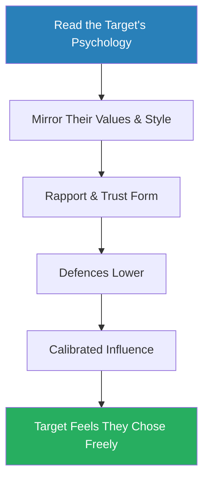
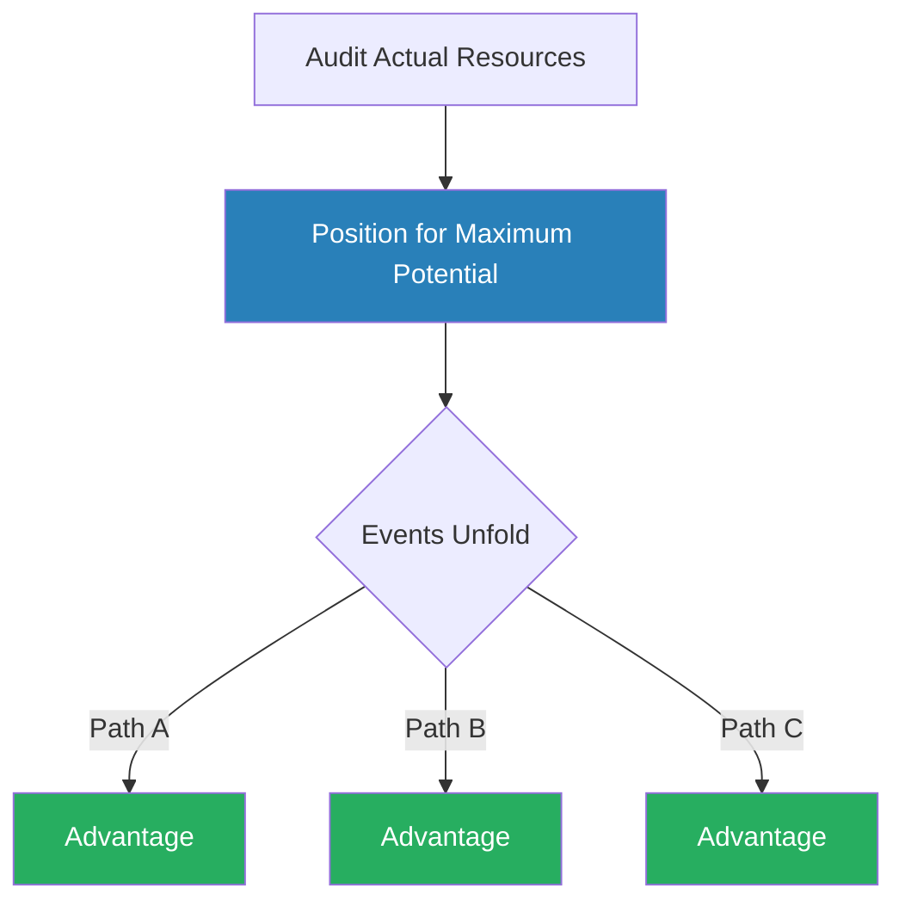
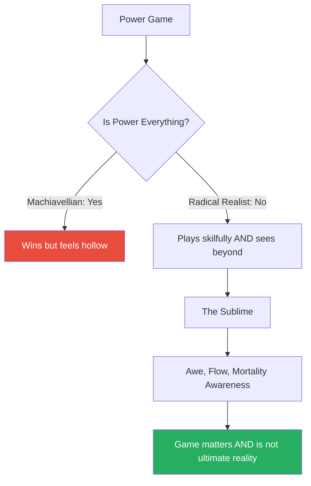

# The Daily Laws — Robert Greene

> Robert Greene's sixth book is a curated compilation: 366 daily meditations drawn from all five of his previous works plus previously unpublished material from an abandoned project called *The Law of the Sublime*. Organised into twelve monthly themes, the book traces a deliberate arc from discovering your purpose (January) through navigating social power (April-June), developing offensive capability in persuasion and strategy (July-September), and arriving at the deepest questions of self-knowledge and mortality (October-December). It is Greene's attempt to distil his life's work into a single unified philosophy he calls **radical realism** — the discipline of seeing human nature as it actually operates, stripped of comforting illusions. For readers already familiar with his canon, the value lies in the synthesis and in the December material on the Sublime, which appears nowhere else. For newcomers, it is the best single entry point into Greene's thinking.

---

## About the Author

Robert Greene studied classical literature at Berkeley and Madison before working over fifty jobs — screenwriter, translator, magazine editor — that gave him firsthand exposure to power dynamics across industries and social strata. He published *The 48 Laws of Power* at thirty-six, followed by *The Art of Seduction*, *The 33 Strategies of War*, *The 50th Law* (with 50 Cent), *Mastery*, and *The Laws of Human Nature*. *The Daily Laws* is his attempt to unify these into a single operating philosophy. He has spoken openly about working on a book called *The Law of the Sublime* — a meditation on mortality, transcendence, and the limits of the power framework — that was never published independently. Fragments of that work appear here for the first time, making December the book's most original chapter.

---

## The Big Idea

- Greene's central argument across all his books reduces to a single claim: <b style="color: #27ae60">most people are naive about how the world works</b>, and this naivety is not innocence but a liability that guarantees suffering
- Culture installs false beliefs about fairness, merit, and human goodness during childhood
- These beliefs persist into adulthood because they are comforting, and because challenging them is socially punished

The antidote is what Greene calls <b style="color: #2980b9">radical realism</b> — not cynicism, but the discipline of seeing human nature clearly:

- Self-interested, status-seeking, emotionally driven
- Yet capable of remarkable achievement when those forces are understood and channelled rather than denied

---

To structure this, *The Daily Laws* introduces a taxonomy Greene calls the <b style="color: #2980b9">Three Types</b>:

| Type | Core Belief | Strength | Fatal Flaw |
|------|------------|----------|------------|
| **Deniers** | Power dynamics don't exist | Moral clarity | Blindsided by politics they refuse to see |
| **Machiavellians** | Only power matters | Rise fast through manipulation | Hit a ceiling that requires trust and empathy |
| **Radical Realists** | Power is real AND empathy matters | Combine strategic awareness with genuine connection | None — this is Greene's aspirational type |

The Radical Realist dominates across nearly every dimension — combining the Denier's empathy with the Machiavellian's strategic awareness while avoiding both types' fatal flaws.

Two subtypes of Deniers are worth noting:

- **Genuine idealists** — often marginalised but at peace with their position
- **Passive-aggressors** — play the power game while loudly denying it; <b style="color: #e74c3c">the most dangerous type, because they disguise manipulation as virtue</b>

---

The distinction between Deniers and Radical Realists is the philosophical engine of the entire book:

- The **Denier** looks at a workplace and sees colleagues, missions, and shared goals
- The **Machiavellian** looks at the same workplace and sees targets, leverage, and exploitable weakness
- The **Radical Realist** sees both — the genuine human connections AND the power dynamics running underneath — and navigates accordingly
- <b style="color: #27ae60">Only the third posture produces lasting success</b>:
  - The Denier is eventually blindsided by politics they refuse to see
  - The Machiavellian is eventually destroyed by the trust they refuse to build

The twelve months trace what Greene presents as the <b style="color: #2980b9">Mastery Arc</b>: discover your purpose, submit to an apprenticeship, develop creative mastery, learn to navigate social power, master persuasion and strategy, understand your own emotional patterns, cultivate rationality, and finally confront mortality — which, paradoxically, makes everything preceding it more urgent and more alive.

---

## Key Concepts at a Glance

| Concept | One-line summary |
|---------|-----------------|
| **Life's Task** | Your unique calling, rooted in childhood inclinations before socialisation reshaped your desires |
| **The Ideal Apprenticeship** | Three-phase process (Deep Observation → Skills Acquisition → Experimentation) turning raw talent into capability |
| **The Dimensional Mind** | Fused rational-intuitive intelligence that emerges after years of deliberate practice |
| **Sprezzatura** | The Renaissance art of concealing effort, making the difficult appear natural |
| **Character Over Circumstance** | Behavioural patterns across time predict future actions more reliably than words or reputation |
| **The Conviction Bias** | People who overperform a quality (honesty, confidence, outrage) are often compensating for its opposite |
| **The Flanking Manoeuvre** | Indirect approaches bypass the psychological defences that direct confrontation triggers |
| **Controlled Options** | Present choices where every option serves your purpose, giving others the experience of free will |
| **Mood Infection** | Emotional contagion, and the strategic projection of deliberate emotional states |
| **Tactical Hell vs Grand Strategy** | Reactive short-term thinking versus deliberately connecting daily actions to long-term campaigns |
| **Shih** | Chinese concept of positional advantage — placing yourself where stored potential can release in any direction |
| **Death Ground** | Sun Tzu's principle that people fight hardest when retreat is impossible |
| **The Shadow** | Jungian concept of repressed traits that, when denied, express through projection and compulsion |
| **The Guerrilla Mind** | Refusing fixed intellectual positions, treating all beliefs as provisional and updating continuously |
| **The Cosmic Sublime** | Awe and self-transcendence that dissolve ego and reconnect you to something larger than personal narrative |

December's Sublime material scores highest for originality because it draws on unpublished work — making it the primary reason existing Greene readers should pick up this compilation.

---

## Structure: The Twelve Months

- *The Daily Laws* is organised as a calendar — each month corresponds to a theme, each day offers a short meditation (typically a principle, a historical example, and a reflection question)
- The material is adapted (sometimes verbatim, sometimes reworked) from Greene's previous books, with the exception of December, which contains genuinely new writing

The arc is deliberate: January through March builds the inner foundation, April through June navigates the social battlefield, July through September develops offensive capability, and October through December returns inward at a higher level — Greene's bildungsroman, compressed into a single calendar year.

---

### January: Your Life's Task

*Before socialisation teaches you what to want, your mind naturally gravitates toward certain subjects — and those early fascinations are the most reliable guide to your Life's Task.*

*Sources: Mastery, Laws of Human Nature*

- January opens with what Greene considers the foundation of everything that follows: the discovery of your <b style="color: #2980b9">Life's Task</b> — the unique calling that gives direction to all other decisions
- His argument is rooted in a specific psychological claim:
  - Before the age of twelve, before socialisation teaches you to want what others want, your mind naturally gravitates toward certain subjects, activities, and problems
  - These early fascinations are not random — they reflect genuine cognitive wiring
  - They are the most reliable guide to what you should spend your life doing

> [!example] Robert Greene's Sixty Jobs
> - Before writing *The 48 Laws of Power*, Greene drifted through more than sixty jobs across multiple industries: screenwriting, translation, magazine editing, hotel concierge work
> - To outside observers, his twenties and thirties looked like aimless failure
> - But a thread connected all those roles — a fascination with the mechanics of power, with why some people rise while others stagnate
> - He was not aimlessly job-hopping; he was unconsciously gathering raw material for the books that would define his life's work
> - The sixty jobs were not wasted years — they were an extended apprenticeship in human observation
> **The lesson:** What looks like failure from outside may be raw material gathering for your true calling.

> [!example] Marie Curie's Laboratory Instruments
> - As a young girl in Warsaw, Curie was mesmerised by her father's laboratory instruments — the glass tubes, the mechanical scales, the precision of scientific measurement
> - This was not a childish phase — it was a signal from her deepest cognitive preferences
> - When she finally gained access to a laboratory as an adult, everything clicked
> - The fascination that had been dormant for decades activated with explosive force, producing discoveries that reshaped physics and chemistry
> **The lesson:** Early fascinations are signals, not phases — they reveal what your brain is built to engage with.

---

The January meditations walk through a process for recovering these buried inclinations:

- Recall what captivated you before the age of twelve
- Identify the thread that connects those fascinations
- Test current pursuits against that thread
- Where the thread aligns, energy flows naturally
- Where it does not, motivation degrades into dependence on external rewards — money, status, approval — which produce diminishing returns over time

Greene is particularly sharp on what he calls <b style="color: #e74c3c">false paths</b> — careers chosen for money, status, or parental approval rather than intrinsic fascination:

- The warning signs are specific:
  - Declining energy that no amount of rest fixes
  - Creeping envy of people in other fields (a signal that your unconscious mind knows where it wants to be)
  - The need for ever-larger external rewards to sustain motivation
- <b style="color: #e74c3c">A false path does not announce itself with dramatic unhappiness — it erodes you gradually, like water wearing down stone</b>

Mastery and The 48 Laws of Power contribute the most material, but December's unpublished Sublime content makes that month the book's single most valuable chapter for readers already familiar with Greene's published works.

---

The month also introduces <b style="color: #2980b9">amor fati</b> — borrowed from Nietzsche, filtered through Greene's pragmatism:

- Setbacks are not obstacles to the Life's Task but raw material for it
- Greene's own sixty-job wandering is the primary illustration

> [!example] Temple Grandin's Transformation
> - Grandin transformed the perceptual differences caused by autism into a unique professional advantage in animal behaviour
> - What looked like a limitation became the source of her distinctive insight
> **The lesson:** Every apparent limitation can become the source of unique advantage.

"Every negative is a positive," Greene writes, quoting 50 Cent — not as naive optimism, but as a discipline of extracting intelligence from adversity rather than indulging in grievance.

> [!example] John Coltrane Hears Charlie Parker
> - As a young musician, Coltrane heard Charlie Parker play and experienced what Greene describes as a primal recognition — this was the Life's Task calling
> - Coltrane did not immediately become a great musician
> - He spent years in obscurity, practising with a ferocity that struck even other jazz musicians as excessive
> - But the direction was set by that single moment of recognition, and every subsequent decision was filtered through it
> **The lesson:** The Life's Task often announces itself in a single moment of recognition — but fulfilment requires years of disciplined follow-through.

> [!tip] Core Insight
> Your Life's Task is encoded in your childhood fascinations — the things that captivated you before the world told you what to want. Excavate them, and you have your compass.

For the full treatment of purpose, mastery, and the Life's Task framework, see [[greene_mastery|Mastery]].

---

### February: The Ideal Apprenticeship

*Having identified the Life's Task, how do you actually become good enough to fulfil it? Greene's answer is non-negotiable: the apprenticeship.*

*Source: Mastery*

- Having identified the Life's Task in January, February addresses the next question: <b style="color: #27ae60">how do you become good enough to fulfil it?</b>
- Greene's answer is the <b style="color: #2980b9">Ideal Apprenticeship</b> — a period of deliberate submission, observation, and skill-building that he considers non-negotiable, regardless of talent

The apprenticeship has three distinct stages:

---

**Stage 1 — Deep Observation:**

- When you enter a new field, organisation, or role, the temptation is to immediately start contributing — to prove your intelligence, demonstrate your value, make your mark
- <b style="color: #e74c3c">This is almost always a mistake</b> — the first priority is to watch
- Not just the formal processes, but the informal ones:
  - Who actually holds power (as opposed to who holds the title)
  - What behaviours are rewarded versus punished
  - What the unwritten rules are that nobody teaches you directly

> [!example] Darwin Aboard the Beagle
> - Darwin spent months simply observing and cataloguing before attempting any theoretical synthesis
> - The quality of his later insights was directly proportional to the patience of his earlier observation
> **The lesson:** The depth of your later contribution depends on the patience of your early observation.

---

**Stage 2 — Skills Acquisition:**

- This is the grind phase — the thousands of hours of repetitive practice that build the foundational toolkit
- Greene draws on neuroscience, arguing that deliberate practice physically restructures the brain through <b style="color: #2980b9">myelination</b> (the strengthening of neural pathways through repetition)
- There are no shortcuts to this process — it is biological
- The only variable is intensity of focus: "The time that leads to mastery is dependent on the intensity of our focus"
- The critical psychological challenge is boredom:
  - The work is repetitive by design — that is how neural pathways strengthen
  - The apprentice who cannot tolerate boredom, who constantly seeks novelty and stimulation, will never build the deep competence that mastery requires

> [!example] Benjamin Franklin's Writing Exercises
> - As a young printer, Franklin set himself the tedious exercise of deconstructing and reconstructing published essays, sentence by sentence
> - The goal was to internalise the mechanics of good prose
> - It was painfully boring work
> - It was also the foundation of Franklin's later genius as a writer and diplomat
> **The lesson:** Mastery-level skill is built through repetitive practice that most people find too tedious to sustain.

---

**Stage 3 — Experimentation:**

- The transition point where the apprentice begins testing their emerging capabilities against real problems
- Mistakes become valuable here — not as failures, but as feedback
- The apprentice who has built a solid foundation of observation and skill can experiment productively because they have enough competence to learn from their errors rather than being overwhelmed by them

> [!tip] Core Insight
> The modern temptation is to skip the apprenticeship entirely — to go straight from inspiration to expression. Social media amplifies this by making overnight success visible while keeping the invisible years of preparation hidden.

- <b style="color: #e74c3c">The result is a culture of shallow competence: people who can talk about their field but cannot perform in it under pressure</b>
- The critical insight running through February is that the apprenticeship requires suppressing ego:
  - The natural desire to express yourself, to prove your intelligence, to distinguish yourself — all must be postponed
  - The apprentice who tries to shine too early triggers defensiveness in those above them
  - Superiors interpret premature brilliance not as a gift but as a threat — and they respond accordingly

For the full treatment, see [[greene_mastery|Mastery]].

---

### March: The Master at Work

*After the apprenticeship comes the Creative-Active Phase — where accumulated skill enables original contribution and eventually produces a qualitatively different kind of thinking.*

*Source: Mastery*

- March covers the transition from apprentice to master — what Greene calls the <b style="color: #2980b9">Creative-Active Phase</b>
- Greene's central claim is that mastery produces a qualitatively different kind of thinking: the <b style="color: #2980b9">Dimensional Mind</b>
- After tens of thousands of hours of practice:
  - Rational analysis and intuitive pattern recognition merge into a single mode of cognition
  - The master perceives patterns that novices cannot see
  - Makes connections across domains that specialists miss
  - Responds to novel situations with an intuition that feels instinctive but is actually grounded in deep experience

---

- This is not mystical, Greene insists — it is neurological:
  - Sustained practice physically restructures the brain, creating dense networks of associations that fire automatically in response to familiar patterns
  - A chess grandmaster does not calculate every possible move; they *see* the board — the patterns leap out because their neural architecture has been shaped by millions of previous positions
  - A master surgeon does not consciously plan each cut; their hands know what to do because the movements have been embedded in motor memory

Greene uses the metaphor of the <b style="color: #2980b9">cycle of accelerated returns</b>:

- Each skill you learn makes the next skill slightly easier to acquire, because you now have a richer base of associations
- Early learning is painfully slow; later learning compounds
- This is why the apprenticeship phase feels so unrewarding at the time — you are investing in a compounding curve whose returns are invisible until they are suddenly, dramatically obvious

---

The key paradox of mastery is that it appears sudden to outside observers:

- The "overnight success" is the most persistent myth in creative and professional life
- "The time of the apprenticeship is not wasted but is the very ground from which the tree of mastery grows"

> [!example] Mozart's Ten Thousand Hours
> - Mozart did not simply emerge as a genius
> - He was trained by his father from the age of three, with a rigour and intensity that few modern children would tolerate
> - By the time he began producing his mature compositions, he had already accumulated more than ten thousand hours of deliberate practice
> - Outside observers see the breakthrough; they do not see the decade of preparation that made it possible
> **The lesson:** Every "overnight success" is the visible peak of an invisible mountain of preparation.

Greene also addresses the danger of mastery's opposite: the <b style="color: #e74c3c">dead hand of convention</b>:

- As fields mature, they develop orthodoxies — established ways of doing things that become self-reinforcing
- The master who merely replicates these orthodoxies, no matter how skilfully, has not truly achieved mastery
- <b style="color: #27ae60">Genuine mastery always involves a creative break with convention</b> — not for the sake of novelty, but because the master's deep understanding reveals limitations in the established approach that others cannot see

For the full treatment, see [[greene_mastery|Mastery]].

---

### April: The Perfect Courtier

*Every workplace, social circle, and institution operates as a court — the question is not whether you are in one, but whether you navigate it consciously or stumble through it blind.*

*Source: The 48 Laws of Power*

- April marks the book's pivot from internal development to social navigation
- The central concept is the <b style="color: #2980b9">court</b> — Greene's metaphor for any hierarchy where people compete for favour, influence, and position
- Every workplace, social circle, and institution operates as a court, whether it admits it or not
- The question is not whether you are in a court; the question is whether you navigate it consciously or stumble through it blind

The month draws heavily on Law 24 of *The 48 Laws of Power* (Play the Perfect Courtier) and the Renaissance concept of <b style="color: #2980b9">sprezzatura</b>:

- The term comes from Baldassare Castiglione's *The Book of the Courtier* (1528)
- Defined as "a certain nonchalance which conceals all artistry and makes whatever one does or says appear to be without effort"
- It is the art of making the difficult look natural

---

Greene unpacks sprezzatura across several days of meditation:

- The courtier who visibly labours — who displays how hard they work, how many hours they put in — diminishes the impact of the result
- Visible effort invites scrutiny: "If it took them that long, how talented can they really be?"
- <b style="color: #27ae60">Concealed effort creates an aura of natural ability that disarms competitors and delights superiors</b>

> [!example] Michelangelo's Closed Workshop
> - Michelangelo famously forbade popes from visiting his workshop while he was painting
> - He understood that watching the messy, incremental process of creation would destroy the illusion of divine talent
> - The finished product had to appear as though it had emerged fully formed — a gift from God, not the result of thousands of hours of aching labour on scaffolding
> **The lesson:** Control the audience's access to the process — let them see only the polished result.

---

The ideal courtier has several defining traits:

- Never demand attention but arrange to receive it — through timing, positioning, and the strategic deployment of results at moments of maximum visibility
- Adapt their style and language to each audience:
  - The language of power to the powerful
  - The language of collaboration to peers
  - The language of mentorship to subordinates
- Master their emotions so thoroughly that composure becomes their default state, not their performance

The essential courtier prohibitions:

- <b style="color: #e74c3c">Never outshine those above you</b> — this is Law 1 of *48 Laws*, and arguably the most violated law in professional life
- The subordinate who publicly demonstrates superiority over their superior does not earn admiration; they earn enmity

> [!example] Nicolas Fouquet's Fatal Party (1661)
> - Louis XIV's finance minister, Nicolas Fouquet, threw a party at his estate Vaux-le-Vicomte
> - The event was so lavish, so obviously superior to anything the king himself had produced, that Louis was humiliated
> - Within weeks, Fouquet was arrested on trumped-up charges of embezzlement
> - He spent the rest of his life in prison
> **The lesson:** Those who hold power cannot tolerate being outshone — their retaliation is often disproportionate to the offence.

---

Other courtier rules:

- <b style="color: #e74c3c">Never bear bad news directly</b> — let others deliver it while you position yourself as the bearer of solutions
- <b style="color: #e74c3c">Never criticise superiors in public</b> — even when the criticism is correct, especially when the criticism is correct
- Never affect false friendliness with those who hold power over you — maintain respectful distance rather than attempting premature intimacy

Greene contrasts the courtier's approach with the common belief that merit speaks for itself:

- It does not
- Merit that is invisible is merit that does not exist, politically speaking
- The courtier does not fabricate achievements — fabrication is eventually discovered and is fatal
- But they ensure that real achievements are visible to the right people at the right moments

> [!tip] Core Insight
> The courtier does not create false merit — they make real merit visible. The common belief that "good work speaks for itself" is a comfortable illusion that costs careers.

For the full treatment of all 48 laws, see [[The 48 Laws of Power - Robert Greene|The 48 Laws of Power]].

---

### May: Toxic Types & Disguised Power

*Greene turns defensive — teaching you to identify the people in the court who will try to destroy you, before they can do damage.*

*Sources: The 48 Laws of Power, Laws of Human Nature*

- May focuses on reading character — specifically, on identifying people who are dangerous before they can do damage
- This is the defensive complement to April's courtier advice:
  - April teaches you how to navigate the court
  - May teaches you how to identify the people in the court who will try to destroy you
- Greene's core principle: <b style="color: #27ae60">character over circumstance</b> — people's behavioural patterns across time are far more reliable predictors of future actions than their words, reputation, or stated intentions
- "Character is destiny," Greene quotes Heraclitus — and he means it literally

---

> [!example] Howard Hughes's Myth of Genius
> - Hughes maintained a public myth of business genius for decades — the daring aviator, the innovative filmmaker, the bold industrialist
> - But anyone who examined his actual business decisions would have seen a different pattern: nearly every venture he personally managed lost money
> - His aviation company survived on government contracts, not on Hughes's business acumen
> - His film productions were financial disasters that happened to produce occasional artistic successes
> - The myth of genius was a presentation layer — consciously constructed and rigorously maintained
> - The behavioural pattern underneath told a completely different story
> **The lesson:** Look at actions over time, not image — the pattern is always visible to anyone willing to look.

The month introduces several taxonomies of dangerous people. From *48 Laws*, the <b style="color: #2980b9">Five Dangerous Types</b>:

| Type | Core Pattern | The Danger |
|------|-------------|------------|
| **The Arrogant & Proud** | Cannot tolerate any slight | Seek disproportionate revenge |
| **The Hopelessly Insecure** | Interpret neutral actions as attacks | Respond with paranoid aggression |
| **The Paranoid** | See conspiracies everywhere | Create the very enemies they feared |
| **The Serpent with a Long Memory** | Appear to forgive | Nurse grudges for years, strike when forgotten |
| **The Plain & Literal-Minded** | Cannot process irony or subtlety | Misinterpret everything you say |

---

From *Laws of Human Nature*, Greene introduces the <b style="color: #2980b9">conviction bias</b> — one of his most practically useful concepts:

- When people defend themselves or promote ideas with disproportionate energy — excessive charm, righteous anger, performative conviction — they are often compensating for weakness or concealing manipulation
- "Authentic confidence is quiet"
- The person who loudly proclaims their honesty is often concealing dishonesty
- The person who aggressively displays confidence is often masking doubt
- <b style="color: #27ae60">The signal is in the intensity, not the content</b>
- The most dangerous manipulators in any organisation are the ones who perform moral virtue most loudly — the "supposed nonplayers" who flaunt their above-it-all integrity while being the most adept political operators in the room

---

The most practically useful concept in May is the distinction between <b style="color: #2980b9">false alliances</b> and <b style="color: #2980b9">true alliances</b>:

| | False Alliances | True Alliances |
|---|----------------|----------------|
| **Formed from** | Emotional need — shared grievances, personal chemistry, crisis intimacy | Mutual benefit — both parties gain something concrete and independently valuable |
| **Effect on identity** | Require you to sacrifice parts of your identity to maintain the bond | Preserve autonomy because neither party needs the other to feel complete |
| **Under pressure** | Collapse, because they were never grounded in rational self-interest | Endure, because the mutual benefit persists regardless of circumstances |

The test Greene proposes is simple:

- Does the alliance survive when one party's circumstances change?
- If your friendship with a colleague would evaporate the moment one of you changed departments — it was a false alliance, held together by proximity
- If it would endure because both parties continue to benefit regardless of organisational structure — it is a true alliance

---

Greene also explores <b style="color: #2980b9">micro-signals of character</b> — the small, seemingly insignificant behaviours that reveal deep patterns:

- How someone treats waiters, receptionists, and people who cannot help them
- Whether they are chronically late (a subtle assertion of dominance — their time is more important than yours)
- How they behave when they believe they are unobserved
- These moments, because they are unguarded, are more honest than any carefully managed professional presentation

> [!tip] Core Insight
> Watch what people do when they think no one is watching, and how they treat people who can do nothing for them. These unguarded moments reveal character more reliably than any presentation.

For the full treatment, see [[The 48 Laws of Power - Robert Greene|The 48 Laws of Power]] and [[The Laws of Human Nature - Robert Greene|The Laws of Human Nature]].

---

### June: Indirection & Manipulation

*Direct action almost always meets resistance. Indirect action bypasses defences entirely — at every scale from conversations to geopolitical strategy.*

*Sources: The 48 Laws of Power, The Art of Seduction, The 33 Strategies of War*

- June is the most tactically aggressive month in the book
- Its central thesis: <b style="color: #27ae60">direct action almost always meets resistance, while indirect action bypasses defences entirely</b>
- This principle operates at every scale — interpersonal conversations, organisational politics, military campaigns, and geopolitical strategy

The <b style="color: #2980b9">flanking manoeuvre</b> — from *33 Strategies of War* — is the military expression of this idea:

- People invest psychologically in their frontal position: their stated beliefs, their public image, the organisational structures they have built
- Attacking that position directly — arguing against someone's beliefs, publicly challenging their authority — stiffens resistance:
  - They dig in
  - They fight harder
  - They rally allies
- Attacking the exposed flank — the angle they have not defended, the assumption they have not examined — creates maximum impact with minimum opposition

---

> [!example] Napoleon's Manoeuvre Sur Les Derrieres
> - In battle after battle, Napoleon engaged the enemy frontally with half his army — just enough to hold their attention, just enough to make them believe the main attack was coming from the front
> - Meanwhile, the other half of his army circled behind the enemy position
> - The moment of *turning* — when the enemy suddenly realises the real threat is behind them — is the point of maximum psychological vulnerability
> - They are forced to reorient their entire position under pressure, and the resulting confusion is far more devastating than any frontal assault could produce
> **The lesson:** Hold attention at the front while the real move comes from behind — confusion at the moment of turning is more destructive than brute force.

From *48 Laws*, Greene revisits:

- **Law 3 (Conceal Your Intentions)** — creating smokescreens using false signals, red herrings, and apparent transparency to disguise actual objectives
- **Law 12 (Use Selective Honesty to Disarm)** — subtler and more dangerous: a single act of genuine honesty or generosity creates a halo of trust that makes subsequent deception much easier
  - Greene does not present this as ethical advice; he presents it as a description of how influence actually works, for good and ill

---

From *The Art of Seduction*, Greene draws the principle that <b style="color: #27ae60">influence works best when the target does not realise they are being influenced</b>:

- The seducer's agenda must be invisible, operating through charm, attention, and apparent generosity
- People resist being told what to think
- They do not resist feeling understood, appreciated, and delighted — and these feelings, once established, make them receptive to ideas they would reject if presented as arguments

The month also introduces <b style="color: #2980b9">controlled options</b> — one of Greene's most practically relevant tactical ideas:

- Instead of asking people to agree to your preferred course of action (which triggers their need for autonomy and control), present them with a set of choices where every available option serves your purpose
- The target experiences free will — they are choosing, not being directed — while you control the outcome regardless of which option they select

> [!example] Louis XIV's "Choices"
> - Louis XIV was expert at presenting his ministers with "choices" that all led to the same policy outcome
> - The ministers felt empowered — they were making decisions
> - Louis got what he wanted — every path led to the same destination
> **The lesson:** Give people the experience of choosing while you shape the menu.

---

Greene draws a critical distinction between manipulation and influence:

- **Manipulation** forces outcomes through deception
- **Influence** creates conditions where people voluntarily choose what you want them to choose
- <b style="color: #27ae60">The master of indirection does not lie — lying is crude and eventually discovered</b>
- They *arrange the environment* so that the desired outcome feels natural, inevitable, and chosen rather than imposed

> [!tip] Core Insight
> The difference between manipulation and influence: manipulation forces; influence arranges. The master of indirection shapes the environment so the desired outcome feels like the target's own idea.

For the full treatments, see [[The 48 Laws of Power - Robert Greene|The 48 Laws of Power]] and [[The 33 Strategies of War - Robert Greene|The 33 Strategies of War]].

---

### July: The Seductive Character

*Seduction is not primarily sexual — it is the ability to draw people toward you by fulfilling their unmet psychological needs.*

*Sources: The Art of Seduction, Laws of Human Nature*

- July shifts from tactical manipulation to something subtler and more enduring: the cultivation of personal magnetism
- Where June was about specific moves, July is about *who you become* — the development of a personality that naturally draws people in
- Greene's argument: <b style="color: #27ae60">seduction is not primarily sexual — it is the ability to draw people toward you by fulfilling their unmet psychological needs</b>
- Everyone walks around with a gap between how they see themselves and how the world sees them
- The person who closes that gap — who sees others as they wish to be seen — becomes irresistible
- This is not flattery, which is transparent and eventually insulting
- It is the disciplined application of genuine attention and empathy

---

The key concept is <b style="color: #2980b9">confirming people's self-opinion</b>:

- People's deepest psychological need is to have their self-image validated
- A person who believes themselves to be brilliant wants to be treated as brilliant — not praised generically, but engaged with in a way that assumes and reflects their intelligence
- A person who sees themselves as compassionate wants their compassion noticed and valued
- A person who prides themselves on their independence wants their autonomy respected
- The seductive character reads these self-images and mirrors them back, creating a feeling of being profoundly understood

Greene catalogues several <b style="color: #2980b9">seductive character types</b>, each embodying a different way of fulfilling others' needs:

| Type | Core Offer | Archetype |
|------|-----------|-----------|
| **The Siren** | Pure sensory pleasure and fantasy — escape from the mundane | Cleopatra |
| **The Rake** | Wild, reckless devotion — someone will shatter all boundaries for you | Duke de Richelieu |
| **The Ideal Lover** | Whatever is missing in the target's life | Casanova |
| **The Dandy** | Nonconformity — the freedom most people crave but lack courage to pursue | Oscar Wilde, David Bowie |
| **The Natural** | Childlike spontaneity and lack of self-consciousness | Charlie Chaplin, Josephine Baker |
| **The Coquette** | Uncertainty and emotional volatility that generates obsessive attachment | — |
| **The Charmer** | Warmth, comfort, and the feeling of being valued | — |
| **The Charismatic** | Almost religious intensity of conviction that sweeps people up | — |

---

> [!example] Cleopatra's Atmospheric Seduction
> - Cleopatra was not conventionally beautiful, by most historical accounts
> - But she was so intensely focused on creating an atmosphere of exotic pleasure that both Caesar and Antony were captivated
> - Her power was not in her appearance but in the total sensory environment she constructed around each encounter
> **The lesson:** Seductive power lies in the atmosphere you create, not the qualities you display.

> [!example] The Duke de Richelieu's Reckless Devotion
> - An eighteenth-century French nobleman, Richelieu was not handsome or especially intelligent
> - But his willingness to go to absurd lengths in pursuit of a woman — climbing walls, bribing servants, fighting duels — made him the most desired man in France
> - Women responded not to his physical qualities but to the *intensity* of his attention
> **The lesson:** The depth of attention matters more than the qualities of the person giving it.

The unifying thread across all these types:

- Seductive power flows from attention to others, not from self-display
- The person who walks into a room and tries to impress everyone with their own qualities repels
- <b style="color: #27ae60">The person who walks into a room and makes each person feel like the most interesting person present attracts</b>
- "People are the most vulnerable to seduction when they feel something is missing in their lives"

> [!tip] Core Insight
> Seduction is not about displaying your qualities — it is about making others feel seen, understood, and valued. Attention to others is magnetic; self-display is repellent.

For the full treatment, see [[greene_art-of-seduction|The Art of Seduction]].

---

### August: The Master Persuader

*Persuasion is not a generic skill — it must be bespoke, tailored to the specific psychology of the person you are trying to influence.*

*Sources: Laws of Human Nature, The Art of Seduction*

- August deepens the July material into a more systematic treatment of persuasion — not the broad magnetism of the seductive character, but the specific mechanics of how one person changes another person's mind

The central insight is <b style="color: #2980b9">mood infection</b> — Greene's term for the phenomenon of emotional contagion:

- Emotions spread through social groups like viruses
- When someone enters a room in a state of panic, the panic propagates — people catch it without consciously deciding to
- When someone maintains unshakeable calm in a crisis, the calm spreads too
- This is not metaphorical; it is neurological — mirror neurons fire in response to observed emotional states, creating involuntary emotional synchronisation

---

The practical implication:

- The person who controls their own emotional state and projects it deliberately — calm confidence, enthusiasm, quiet authority, deliberate urgency — is, in effect, <b style="color: #27ae60">controlling the emotional state of everyone around them</b>
- This is not acting — acting is transparent and eventually exhausting
- It is the genuine cultivation of internal emotional discipline, so that the projected state is real, not performed

Greene also explores the mechanics of influence through <b style="color: #2980b9">mirroring</b>:

- Reflecting people's values, communication style, and self-image back at them
- This creates instant rapport because people are irresistibly drawn to their own reflection
- When someone mirrors your speech patterns, your posture, your vocabulary, your values:
  - You feel understood
  - You feel safe
  - You lower your defences
- And once the defences are down, influence becomes exponentially easier

---

Greene's persuasion model is sequential: read first, mirror second, then influence — always calibrated to the individual, never applied from a template.

- The month connects persuasion to the earlier material on character reading: you cannot persuade someone whose psychology you do not understand
- The generic persuasion tactics taught in most communication courses fail precisely because they are generic — they treat all audiences as identical
- <b style="color: #27ae60">Persuasion must be bespoke — tailored to the specific psychology of the person you are trying to influence</b>

---

Greene draws on the concept of the <b style="color: #2980b9">noble gesture smokescreen</b>:

- Apparent generosity often conceals strategic self-interest
- An act of kindness creates a debt
- An unsolicited favour creates an obligation
- The person who gives without being asked positions themselves as benefactor, and the recipient as dependent
- Greene does not argue that all generosity is strategic — but he insists that strategic generosity exists, that it is very effective, and that the ability to recognise it is essential

The month also introduces the idea that persuasion has a temporal dimension:

- The same argument that fails when presented too early succeeds when presented at the right moment
  - After the target has been emotionally prepared
  - After competing arguments have been neutralised
  - After the relationship has been established
- <b style="color: #27ae60">Timing is not just important; it is often more important than content</b>

> [!tip] Core Insight
> You cannot persuade someone whose psychology you do not understand. Read first, mirror second, then influence — always calibrated to the individual.

---

### September: The Grand Strategist

*Most people are trapped in Tactical Hell — reacting to each conflict as an isolated event. The grand strategist connects daily skirmishes to a larger campaign.*

*Source: The 33 Strategies of War*

- September is the book's most operationally dense month, and arguably the one where Greene's thinking is at its most original and useful
- Its central framework is the distinction between <b style="color: #2980b9">Tactical Hell</b> and <b style="color: #2980b9">Grand Strategy</b>

**Tactical Hell:**

- Most people are trapped in reactive, emotional, short-term thinking
- They respond to each conflict, setback, or opportunity as an isolated event
- They win a battle and feel elated; they lose a battle and feel devastated
- They respond to provocations with immediate emotional reactions
- They make decisions based on what feels urgent rather than what serves long-term objectives
- <b style="color: #e74c3c">You can be extremely competent at the tactical level and still lose your life — your career, your relationships, your sense of direction — because you never connected the individual skirmishes to a larger campaign</b>

**Grand Strategy:**

- Requires deliberate elevation: stepping back from the immediate emotional reaction
- Connecting daily actions to long-term objectives
- Maintaining emotional detachment from individual battles
- Thinking in terms of *campaigns* rather than skirmishes
- The key question that separates the tactician from the strategist: <b style="color: #27ae60">"Does this battle serve my larger war?"</b>

---

> [!example] Clinton vs Lincoln — Tactician vs Strategist
> - Bill Clinton was a master tactician who could win any individual political skirmish but lacked strategic depth, lurching from crisis to crisis without a coherent long-term vision
> - Abraham Lincoln endured individual defeats with patience because he understood that each battle was a move in a larger campaign
> - Lincoln lost engagements, lost generals, lost public support for months at a time — but he never lost sight of the objective, and he subordinated every tactical decision to it
> **The lesson:** Tactical brilliance without strategic vision produces crisis management, not progress.

The month introduces the Chinese concept of <b style="color: #2980b9">shih</b> — positional advantage:

- True strategy is not executing a predetermined sequence of steps
- It is placing yourself in positions of stored potential energy, where multiple options remain open depending on how events unfold
- "Like a boulder perched on a hilltop" — the energy is stored; the direction of release depends on the situation
- The boulder does not commit to rolling east or west
- It simply occupies a position of maximum potential, and when the moment comes, the accumulated energy is released in whatever direction circumstances dictate

---

This is a profound critique of conventional planning:

- Plans fail on contact with reality — Clausewitz called this <b style="color: #2980b9">friction</b>, the accumulated effect of countless small unpredictable variables
- Positional thinking survives friction because it does not depend on a single predicted outcome
- <b style="color: #27ae60">Instead of planning your way to a goal, position yourself so that multiple paths lead to advantage, then respond to events as they unfold</b>

Positional thinking (shih) differs from rigid planning by keeping multiple paths to advantage open simultaneously.

---

Greene also covers the <b style="color: #2980b9">death ground strategy</b> — Sun Tzu's principle that people fight with maximum intensity when retreat is impossible:

- The military version is literal: burn your boats, destroy the bridges, make your army's survival depend on victory
- The psychological version is more subtle: manufactured urgency, where inaction carries genuine consequences, is the most reliable motivator for producing extraordinary effort

> [!example]- Dostoyevsky's Mock Execution (1849)
> - In 1849, Dostoyevsky was arrested and sentenced to death by firing squad
> - He was led to the execution ground, blindfolded, and heard the rifles being loaded
> - Then, at the last moment, a messenger arrived with a reprieve — the tsar had commuted the sentence to hard labour in Siberia
> - The experience transformed Dostoyevsky permanently
> - Having genuinely believed he was about to die, he emerged with a creative intensity and a sense of life's preciousness that never left him
> - His greatest works — *Crime and Punishment*, *The Brothers Karamazov* — were written by a man who had stared at death and been sent back
> **The lesson:** The death ground experience produced a lifetime of urgency that no amount of self-discipline could have replicated.

---

Other September concepts:

- <b style="color: #2980b9">Means-first strategy</b> — the principle that you should audit your actual resources before dreaming goals:
  - Most people start with a desired outcome and then scramble for the means to achieve it
  - The strategist starts with an honest inventory of what they actually have — skills, relationships, assets, time — and asks what those resources make possible
  - This inversion avoids the most common cause of strategic failure: the gap between ambition and capacity

- <b style="color: #2980b9">Consequential thinking</b> — the discipline of tracing causal chains beyond the first link:

> [!example] The Caesar Assassination's Unintended Consequences
> - Brutus and the conspirators thought in a single causal step: kill Caesar, the Republic returns
> - They did not trace the chain further
> - What actually happened: Caesar's death created a power vacuum → the vacuum produced civil war → the civil war produced Octavian → Octavian became Augustus, the first Emperor
> - The very outcome the conspirators tried to prevent was the outcome they produced
> **The lesson:** If they had thought A to B to C to D, they would have seen that removing Caesar without a plan for what came next would produce something worse.

> [!tip] Core Insight
> Strategy means thinking in campaigns, not skirmishes. The key question: "Does this battle serve my larger war?" If not, disengage — even if you could win.

For the full treatment, see [[The 33 Strategies of War - Robert Greene|The 33 Strategies of War]].

---

### October: The Emotional Self

*Having spent six months on social navigation, Greene now confronts the reader's own psychology — the emotional patterns that operate beneath conscious awareness and sabotage even the most sophisticated strategy.*

*Source: Laws of Human Nature*

- October turns inward
- Having spent six months on social navigation and offensive capability, Greene now confronts a more difficult subject: the reader's own psychology
- The central claim: <b style="color: #27ae60">emotions are not obstacles to rationality but intelligence about what matters</b>:
  - **Anger** reveals blocked desire — something you want is being thwarted
  - **Envy** reveals unfulfilled ambition — you are watching someone else live the life you want
  - **Anxiety** reveals perceived threats — your unconscious has detected danger that your conscious mind has not yet processed
  - **Frustration** reveals violated expectations — something is not working the way you believed it should

---

The discipline Greene advocates is not the suppression of these signals but their *reading*:

- Most people react to emotions automatically — anger produces aggression, anxiety produces avoidance, envy produces resentment
- <b style="color: #27ae60">The emotionally intelligent person pauses between the stimulus and the response, reads the emotion for the information it contains, and then *chooses* a response</b> rather than being hijacked by a compulsion

Greene introduces the concept of the <b style="color: #2980b9">Shadow</b>, drawing on Carl Jung's psychology:

- The Shadow is everything about yourself that you have repressed because it conflicts with your self-image:
  - The person who prides themselves on their kindness has a Shadow full of aggression
  - The person who prides themselves on their rationality has a Shadow full of unprocessed emotion
  - The person who prides themselves on their moral integrity has a Shadow full of appetites they refuse to acknowledge

---

The Shadow does not disappear when denied. It expresses itself through three mechanisms:

| Mechanism | How It Works | Example |
|-----------|-------------|---------|
| **Projection** | You see in others the qualities you refuse to acknowledge in yourself | The person who loudly accuses others of selfishness is projecting their own selfish impulses |
| **Compulsive behaviour** | The repressed quality erupts in uncontrolled bursts | The calm person who explodes in disproportionate rage; the self-controlled person who periodically binges |
| **Emotional overreaction** | Responses wildly out of proportion to the triggering event | A small provocation activates a much deeper, unacknowledged conflict |

- <b style="color: #27ae60">Integrating the Shadow — acknowledging your own capacity for envy, aggression, manipulation, and selfishness — is, paradoxically, the path to emotional stability</b>
- You cannot manage what you refuse to see
- The person who knows their own Shadow is less likely to be controlled by it, because awareness creates the space between stimulus and response that automatic reaction destroys

---

The month also revisits the <b style="color: #2980b9">conviction bias</b> from May at greater depth:

- The tendency to overperform qualities you feel insecure about is itself a Shadow phenomenon
- People who loudly proclaim their honesty are performing the virtue they fear they lack
- People who aggressively display confidence are masking the doubt they refuse to acknowledge
- The signal is always in the intensity, not the content
- When someone's performance of a quality seems disproportionate to the situation, they are managing their self-image, not expressing their actual character

Greene draws on his observation that many of the most destructive leaders in history were people with massive, unintegrated Shadows:

- Men and women whose public personas of virtue concealed internal worlds of cruelty, insecurity, and unprocessed rage
- The Shadow material did not disappear because it was denied — it shaped policy, destroyed relationships, and produced suffering on a scale proportional to the power of the person denying it
- <b style="color: #e74c3c">The higher your position, the more dangerous your unintegrated Shadow becomes — because you have more power with which to act out your unacknowledged impulses</b>

> [!tip] Core Insight
> Emotions are not noise — they are intelligence. Anger, envy, anxiety, and frustration each carry specific information about blocked desires, unfulfilled ambitions, perceived threats, and violated expectations. Read them; don't suppress them.

For the full treatment, see [[The Laws of Human Nature - Robert Greene|The Laws of Human Nature]].

---

### November: The Rational Human

*Rationality is not the absence of emotion — it is the disciplined management of emotion, so that focused attention crowds out anxiety and belief becomes a tool rather than a possession.*

*Sources: Laws of Human Nature, Mastery*

- November builds on October's self-awareness toward what Greene calls <b style="color: #2980b9">rational authority</b> — the capacity to think clearly under emotional pressure
- Not the absence of emotion, but the disciplined management of it

> [!example]- The Tea Master's Duel
> - A Japanese tea master — a man whose entire life had been devoted to the delicate ritual of the tea ceremony — was challenged to a sword duel by a samurai offended by some minor slight
> - The tea master had never held a sword in his life and was terrified
> - He went to a sword master and begged for instruction — not enough to win (that was impossible in a single lesson) but enough to die with dignity
> - The sword master's advice was unexpected: approach the duel exactly as you would approach the tea ceremony — the same focused attention, the same calm hands, the same total presence in the moment
> - When the morning of the duel arrived, the tea master walked to the appointed place with the same measured steps he used when entering the tea room
> - He removed his outer garment with the same deliberate grace he used when preparing for the ceremony
> - He drew his sword and raised it above his head with absolute composure — the stance of a man who had accepted death and was no longer afraid
> - The samurai, watching this display of perfect calm, assumed he was facing a master swordsman and backed down
> **The lesson:** Focused attention crowds out anxiety. The tea master was genuinely calm — not pretending — because his attention was so absorbed in the ritual of composure that there was no cognitive space left for fear.

---

Greene's point is not that confidence is a trick. His point is mechanistic:

- <b style="color: #27ae60">You do not eliminate fear; you redirect attention so completely that fear cannot find a foothold</b>
- The tea master was not pretending to be calm
- He was genuinely calm — because his attention was so completely absorbed in the ritual of composure that there was no cognitive space left for fear

The month also introduces <b style="color: #2980b9">imagination discipline</b>:

- Anxiety, Greene argues, is not a disorder — it is imagination uncontrolled
- The anxious mind is generating vivid, detailed scenarios of future catastrophe
- The same cognitive faculty that produces anxiety also produces creative solutions, strategic foresight, and artistic vision
- The problem is not that the imagination is active; the problem is that it is directing itself
- The discipline is to take conscious control of the faculty — to direct imagination toward productive scenarios rather than allowing it to default to catastrophic ones

---

Greene also covers the <b style="color: #2980b9">Guerrilla Mind</b> — the refusal to adopt fixed intellectual positions:

- Attachment to past theories, past successes, and past identities is the cognitive equivalent of fighting the last war
- Military history is full of generals who won one war and then applied the same tactics to the next one, failing catastrophically because the conditions had changed
- The same pattern operates in professional and personal life:
  - The person who built their identity around being "the technical expert" struggles when the role demands strategic thinking
  - The person who succeeded through bold action struggles when the situation demands patience
  - The person who made their reputation with a specific approach clings to that approach long after it has stopped working

---

- The rational human, in Greene's formulation, treats their own beliefs as provisional:
  - They update beliefs when evidence changes
  - They maintain the psychological flexibility to abandon yesterday's certainty without experiencing it as ego damage
  - This is extraordinarily difficult because most people experience their beliefs as part of their identity — to change a belief feels like losing a part of yourself
- <b style="color: #27ae60">The Guerrilla Mind treats beliefs as tools, not possessions — when a tool stops working, you discard it without mourning</b>

Greene connects this to the mastery framework from earlier months:

- The master has deep expertise, but they hold that expertise lightly
- They know enough to know that their current understanding is incomplete
- They maintain the openness to be surprised — to encounter evidence that contradicts their model and to revise the model rather than deny the evidence
- This combination of deep knowledge and intellectual humility is, for Greene, the highest form of rationality

> [!tip] Core Insight
> Rationality is not the elimination of emotion but the redirection of attention. The Guerrilla Mind holds all beliefs provisionally — ready to update when reality shifts.

---

### December: The Cosmic Sublime

*December is the book's most original chapter — drawing on unpublished material from The Law of the Sublime to argue that strategic awareness without the capacity for awe produces a diminished life.*

*Sources: Laws of Human Nature, The Law of the Sublime (unpublished)*

- December is the book's most original and philosophically ambitious chapter
- Much of its material comes from *The Law of the Sublime* — a work Greene researched extensively but never published as a standalone book
- This makes December the primary reason for existing Greene readers to pick up *The Daily Laws*
- Where the earlier months synthesise and curate existing material, December genuinely extends Greene's thinking into territory his previous books only gestured toward

---

#### The Core Argument

- Human beings have a natural capacity for what Greene calls <b style="color: #2980b9">the Sublime</b> — experiences of awe, vastness, and self-transcendence that dissolve the ego's usual preoccupations
- This capacity is not a luxury or a weekend hobby for the spiritually inclined
- It is, Greene argues, a fundamental human need — as essential to a well-lived life as food, shelter, and meaningful work
- <b style="color: #e74c3c">It is being systematically suppressed by modern life, which encourages distraction, comfort-seeking, and the reduction of all experience to the quantifiable and the consumable</b>

The Sublime, in Greene's usage, draws on a philosophical tradition stretching back through the Romantics, through Kant, through Longinus in the first century. But Greene is not writing philosophy — he is writing practically:

- People who lose access to the Sublime become small:
  - Their concerns shrink to the immediate and the personal
  - They become consumed by petty rivalries, status anxieties, and the accumulation of comforts that never satisfy
  - They live in what Greene calls a state of <b style="color: #e74c3c">sleepwalking</b> — going through the motions of life without ever feeling fully alive
- People who cultivate the Sublime develop a perspective that makes everything else — including the power dynamics that dominated the previous eleven months — more manageable and less consuming
- <b style="color: #27ae60">They play the game without being enslaved by it</b>

The force diagram reveals the year's circular architecture — December's Sublime feeds back into January's Life's Task, creating an annual spiral where each cycle deepens the previous one's insights.

---

#### Mortality Awareness

- The meditations on death are the most emotionally charged material in the entire book, and Greene presents them not as morbid but as profoundly functional
- His argument is precise: <b style="color: #27ae60">conscious awareness of mortality is the single most powerful tool for collapsing the distance between what you know is important and what you actually do</b>
- Most people live as though they have unlimited time:
  - This assumption is never stated explicitly — no one would defend it if challenged
  - But it operates as the default setting of daily life
  - And this default produces a characteristic pattern: procrastination, trivial pursuits, the indefinite postponement of the things that matter most

The person who holds death in active awareness — not as an abstract philosophical concept but as a felt, visceral reality — does not have this luxury:

- "It is as if a veil has been lifted"
- The veil is the assumption of permanence — the unconscious belief that time is inexhaustible
- When the veil lifts, every day becomes genuinely finite
- That finitude sharpens priorities with a precision that no goal-setting framework, no productivity system, no motivational seminar can match

---

Greene draws on the Stoic tradition — Marcus Aurelius meditating on death each morning, Seneca's letters urging awareness of life's brevity. But he goes further by connecting mortality awareness to creativity and intensity:

- The person who knows they will die does not merely prioritise better — they *experience* more intensely:
  - Colours are brighter
  - Conversations matter more
  - Work carries urgency
  - The mundane becomes charged with significance because it is no longer assumed to be repeatable

> [!example] Dostoyevsky's Transformation Through Death (1849)
> - Dostoyevsky's mock execution, also used in September, reappears here in a different register
> - In September, it was an illustration of the death ground strategy — manufactured urgency producing extraordinary performance
> - In December, it is something larger: an illustration of how the confrontation with death permanently transforms consciousness
> - Dostoyevsky did not simply become more motivated — he became more alive
> - His perception of the world changed at a fundamental level
> - The experience produced not just better novels but a qualitatively different relationship with existence itself
> **The lesson:** Confrontation with death does not merely sharpen priorities — it transforms the quality of perception itself.

Greene also references the Japanese samurai tradition of <b style="color: #2980b9">bushido</b>:

- The warrior begins each day by meditating on the various ways they might die — in battle, by drowning, by fire, by illness
- The purpose is not fatalism — it is liberation
- <b style="color: #27ae60">The warrior who has already accepted death is free from the fear that constrains everyone else</b>
- They can act with total commitment because they are not hedging against the possibility of loss

---

#### The Night Sky and the Natural World

- Greene draws on the Romantic and Kantian traditions of the Sublime — the experience of standing before something so vast that the mind's usual categories of understanding break down:
  - The ocean
  - A mountain range in storm
  - The night sky in a place free from light pollution, where the Milky Way is visible as a physical structure stretching across the sky

Kant distinguished between the <b style="color: #2980b9">beautiful</b> and the <b style="color: #2980b9">sublime</b>:

| | The Beautiful | The Sublime |
|---|--------------|-------------|
| **Effect** | Pleasing and harmonious | Overwhelms and even terrifies |
| **Sensation** | Comfort | Mixed fear and exhilaration |
| **Result** | Appreciation | Awareness that you are small — and paradoxically, relief |

- The beautiful makes you comfortable
- The Sublime makes you aware that you are small — and paradoxically, this awareness of smallness produces not depression but relief
- The burden of self-importance lifts, and what remains is a clearer, less encumbered perception of what actually matters

---

- Greene argues that the experience of natural vastness is not an escape from strategic thinking but a necessary corrective to it:
  - Without periodic confrontation with scale, the strategist becomes consumed by their own game
  - They mistake the game for reality
  - They lose the perspective that makes the game worth playing
- The night sky does not make power dynamics irrelevant — it makes them proportional:
  - Important enough to navigate skilfully
  - But not important enough to devour your entire consciousness

Greene describes the experience of watching a sunset over the ocean:

- The play of light across water, the slow descent of the sun, the gradual shift from gold to red to purple to darkness
- When fully attended to, this experience produces a state qualitatively different from anything the strategic mind can generate:
  - The ego quiets
  - The internal monologue — the constant narration of worries, plans, grievances, and ambitions — pauses
  - What replaces it is a direct encounter with existence itself, unmediated by thought

---

He connects this to the Romantic tradition:

- Wordsworth standing before the Alps
- Caspar David Friedrich painting solitary figures dwarfed by vast landscapes
- Thoreau at Walden describing the experience of watching the pond surface in the early morning
- These were not sentimental nature lovers — they were people who had discovered that the natural world provided something that social life could not: a perspective from which the human drama looked both beautiful and small

#### Deep Absorption

- Greene connects the Sublime to the mastery framework from earlier months
- The state of total absorption in a craft — what psychologists call <b style="color: #2980b9">flow</b> — is itself a form of self-transcendence:
  - The ego dissolves
  - The boundary between self and activity disappears
  - The chess player does not think "I am moving this piece" — the piece moves as an extension of thought
  - The musician does not think "I am playing this note" — the music flows through them as though the boundary between player and instrument has dissolved

---

- This is not relaxation but the opposite — it is the most intense form of concentration available to a human being
- And yet it produces both the highest quality work and the deepest form of satisfaction
- <b style="color: #27ae60">The Sublime is not always grandiose — sometimes it is found in the workshop, the studio, the laboratory, wherever skill meets challenge at the precise level where absorption becomes total</b>

He draws a connection between the flow state and the mastery arc that opened the book in January:

- The Life's Task is not merely a career strategy — it is the vehicle through which deep absorption becomes a regular experience
- The person who has found their Life's Task and developed mastery has access to the Sublime on a daily basis — in the form of work so absorbing that the ego temporarily ceases to exist
- This daily contact with self-transcendence is what prevents the master from becoming a Machiavellian — a person consumed entirely by the power game
- The master has something richer, something that the game cannot provide

---

#### The Reversal of Power Logic

*Having spent eleven months teaching the reader to navigate power, Greene now argues that the entire power framework is itself limited — and that the Sublime is what makes the game worth playing.*

- This is December's most provocative and structurally important move
- Having spent eleven months teaching the reader to navigate power dynamics, read people's character, and think strategically, Greene now argues that all of this operates within a framework that is itself limited

The Sublime is the experience of seeing the board from above — recognising that the game matters *and* that it is not ultimate reality.

- This is not a contradiction of the earlier material — it is a completion of it
- Greene's Three Types taxonomy, introduced in the book's opening pages, anticipates this moment:
  - The **Machiavellian** (Type 2) understands power but lacks the Sublime — they play the game brilliantly but are consumed by it; every relationship is instrumental, every interaction is a move; they win, and their winning feels hollow
  - The **Radical Realist** (Type 3) combines strategic awareness with the capacity for awe, self-transcendence, and genuine connection — they play the game skilfully because they understand how the world works, but they are not enslaved by it because they have access to experiences larger than the game

---

- <b style="color: #27ae60">This is the most mature articulation of Greene's philosophy</b>, and it implicitly challenges the reading of his earlier works that treats them as manuals for manipulation:
  - *The 48 Laws of Power* is about power
  - *The Laws of Human Nature* is about understanding
  - *The Daily Laws*, read through December's lens, is about using power and understanding in the service of a life that transcends both

#### Confrontation with Limits

- Greene draws on his own experience of surviving a stroke in 2018 to argue that physical vulnerability — the body's betrayal of the mind's ambitions — is itself a gateway to the Sublime
- The stroke left him partially paralysed for months:
  - He could not write
  - He could not research
  - He was stripped of the activities that defined his identity
  - He was left with nothing but the experience of being a person in a body that no longer obeyed him

---

- He does not sentimentalise this — he presents it as brutal and clarifying in equal measure:
  - The experience of helplessness, stripped of the usual defences of competence and control, forces a reckoning with what actually matters
  - When you cannot do the things that give you status, achievement, and social value, you discover what remains
  - What remained, Greene found, was a raw, stripped-down awareness of being alive that was more vivid and more precious than anything he had experienced in full health

- This is the Sublime at its most uncomfortable:
  - Not the majestic night sky or the flowing absorption of mastery
  - But the confrontation with your own fragility
  - The body will fail; the mind may follow
  - Everything you have built — the reputation, the skills, the strategic position — can be swept away by a single biological event
  - <b style="color: #27ae60">And yet this confrontation does not produce despair — it produces clarity</b>
  - Stripped of illusions about permanence and control, you see what matters with an honesty that comfort cannot provide

He connects this to the broader Stoic tradition:

- Epictetus, a former slave whose philosophy was shaped by the experience of having no control over his body or his circumstances
- Epictetus argued that the only real freedom is the freedom of the mind to choose its response to whatever happens
- Greene's stroke gave him a visceral understanding of what Epictetus meant — not as abstract philosophy but as lived experience

---

#### The Connection to Purpose

- December circles back to January's Life's Task, but at a higher altitude
- The Life's Task, viewed through the lens of mortality, is not a career strategy but an answer to the question of what to do with a finite life
- The urgency that death awareness creates is the fuel that prevents the Life's Task from remaining an abstraction — a nice idea that you will get around to eventually, when the conditions are right

"Understand: you are one of a kind," Greene writes. "Your character traits are a kind of code that you must decipher."

- The code metaphor is significant:
  - It implies that the Life's Task is not something you invent but something you discover
  - It already exists, encoded in your earliest inclinations and deepest fascinations, waiting to be decoded and acted upon
- And the Sublime provides the urgency: if life is finite, if death is real, if the veil of assumed permanence is just that — a veil — then the decoded message demands action now, not later

---

The December material represents Greene at his most philosophical — influenced by Marcus Aurelius, Seneca, Kant, the Romantics, the samurai tradition, and his own mortality:

- It is the section that most clearly distinguishes *The Daily Laws* from a mere greatest-hits compilation
- Where the earlier months synthesise and curate, December genuinely extends Greene's thinking — into a territory where power and transcendence are not opposites but complements
- <b style="color: #27ae60">The fully realised human being is not the one who wins the game but the one who plays it well while seeing beyond it</b>

#### The Sublime and the Modern World

- Greene's final meditations address why the Sublime is so difficult to access in contemporary life
- The culprit is not malice but design: modern environments are engineered for comfort, convenience, and constant stimulation:
  - Screens provide an endless stream of micro-entertainments that occupy attention without ever engaging it deeply
  - Urban environments insulate people from the natural world that historically provided the most accessible gateway to awe
  - The pace of contemporary work leaves no space for the silence and solitude that the Sublime requires

---

The result is a population that is busier than ever but less alive — chronically stimulated but rarely moved:

- Greene draws a distinction between <b style="color: #2980b9">stimulation</b> and <b style="color: #2980b9">encounter</b>:
  - **Stimulation** is passive and consumable — social media, endless scrolling, background noise
  - **Encounter** is active, uncomfortable, and transformative — standing alone at the edge of the ocean at dawn
  - The difference is not aesthetic preference — it is the difference between consuming experience and being changed by it

> [!abstract] Greene's Sublime Practice
> 1. Regular time in nature — not recreational, but attentive and solitary
> 2. Meditation on mortality — holding death in active awareness, not as abstract concept but as felt reality
> 3. Deep absorption in craft — pursuing flow states through the Life's Task
> 4. Silence and solitude — creating space free from stimulation
> 5. These are not luxuries for the privileged — they are survival necessities for anyone who wants to remain fully human

> [!tip] Core Insight
> The Sublime is not an escape from the power game — it is what prevents the power game from consuming you. Without periodic contact with awe, mortality, and deep absorption, the strategist mistakes the game for reality.

---

## Key Quotes

- "Your Life's Task is a living, breathing organism." (January)
- "Character is destiny." (May, quoting Heraclitus)
- "The time that leads to mastery is dependent on the intensity of our focus." (February)
- "It is as if a veil has been lifted." (December, on mortality awareness)
- "Every negative is a positive." (January, quoting 50 Cent)
- "Understand: you are one of a kind. Your character traits are a kind of code that you must decipher." (December)
- "People are the most vulnerable to seduction when they feel something is missing in their lives." (July)
- "Authentic confidence is quiet." (May, on the conviction bias)

---

## The Verdict

*The Daily Laws* occupies an unusual position in Greene's bibliography. It is simultaneously the best entry point for newcomers and the least essential purchase for readers who already own the source works.

- Nine of its twelve months are competent adaptations of material available in fuller, richer form in *Mastery*, *48 Laws*, *The Art of Seduction*, *33 Strategies*, and *Laws of Human Nature*
- The daily-meditation format compresses Greene's greatest strength — the layered historical examples, the extended case studies, the gradual build of an argument across chapters — into aphorisms and abbreviated stories that lack the persuasive weight of the originals
- Readers who want the full force of any given idea should go to the source work

What justifies the book's existence is threefold:

- **First, the synthesis.** Greene's individual books contain genuine tensions — *48 Laws* advocates ruthless self-interest; *Laws of Human Nature* advocates empathy; *The 50th Law* advocates fearless authenticity. These are not contradictions born of sloppy thinking; they are tensions that reflect the genuine competing demands of real life. *The Daily Laws* resolves these into a unified philosophy of radical realism that is more coherent than any single work achieves alone. Whether this coherence is genuine or imposed is debatable, but the attempt is illuminating — and it reveals Greene as a more integrated thinker than any individual title suggests.
- **Second, the arc.** The twelve-month structure tells a story that none of the individual books tell: from inner purpose, through social mastery, to existential reckoning. The January-to-December progression is a bildungsroman — the education of a human being from naive idealism through strategic awareness to something resembling wisdom. This arc is the book's structural achievement, and it makes *The Daily Laws* more than the sum of its compiled parts.
- **Third, and most importantly, December.** The material on the Cosmic Sublime is genuinely new, philosophically ambitious, and represents Greene's most mature thinking. It is the only place in his published work where he directly confronts the limits of the power framework and argues that strategic awareness, without the capacity for awe and self-transcendence, produces a diminished life. The Sublime material elevates the entire project from "how to win at office politics" to "how to live a fully conscious human life." For this chapter alone, the book earns its place on the shelf.

---

The book's principal weakness is depth:

- The daily-meditation format forces each idea into a single page, which is simply not enough space for Greene's characteristically layered argumentation
- A law that gets twenty pages of historical case studies in *48 Laws* gets a paragraph here
- A principle that unfolds across an entire chapter in *Laws of Human Nature* is compressed into an aphorism
- The trade-off is breadth for depth — and for readers already familiar with the source works, the breadth was never the problem

**Bottom line:** Read December first. If the Sublime material resonates, read January and September for the Life's Task and Grand Strategy frameworks. Use the rest as a quick-reference index to Greene's thinking, and follow the cross-references to the source works for depth.

---

## Related Reading

- [[The 48 Laws of Power - Robert Greene|The 48 Laws of Power]] — the foundational text on interpersonal power, from which April, May, and June draw heavily
- [[The Laws of Human Nature - Robert Greene|The Laws of Human Nature]] — Greene's deepest work on character, emotion, and self-knowledge; the primary source for May, July, August, October, and November
- [[The 33 Strategies of War - Robert Greene|The 33 Strategies of War]] — the competitive strategy framework behind June and September
- [[greene_mastery|Mastery]] — the full treatment of Life's Task, apprenticeship, and the mastery arc covered in January through March
- [[greene_art-of-seduction|The Art of Seduction]] — the source for July and August's material on personal magnetism and persuasion
- [[The 50th Law - 50 Cent & Robert Greene|The 50th Law]] — the fearlessness and resilience framework referenced throughout
