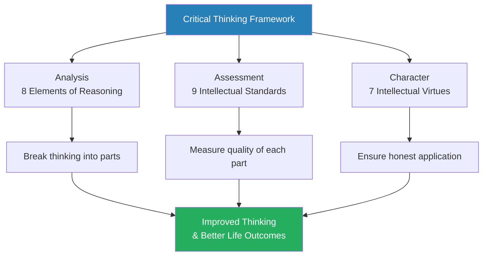
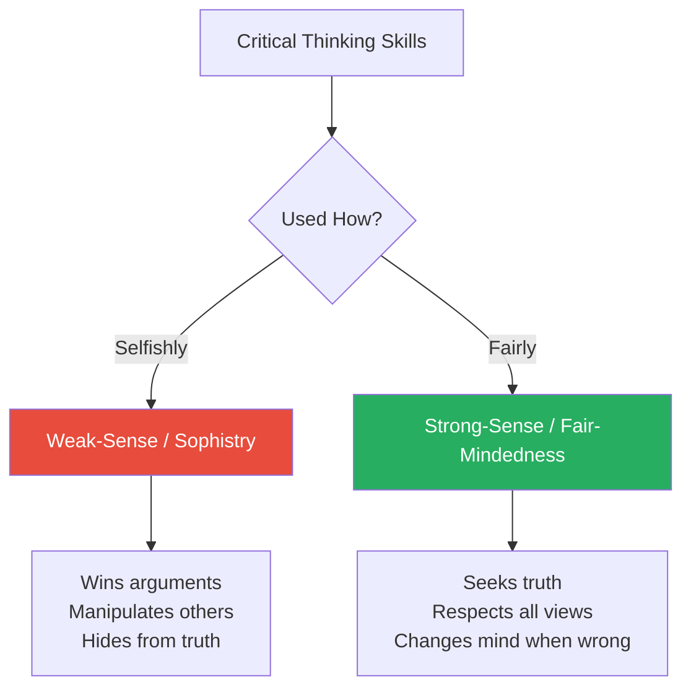
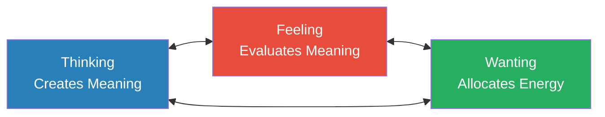
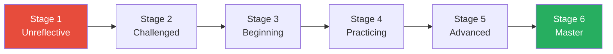
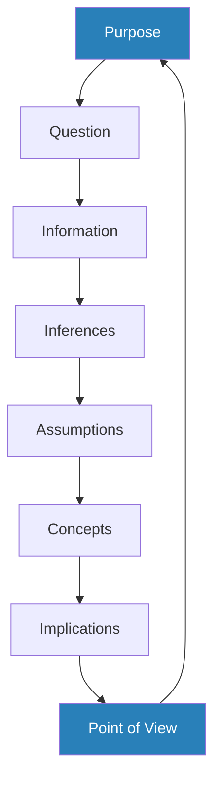
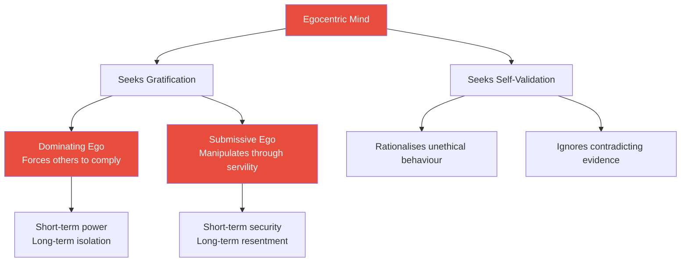
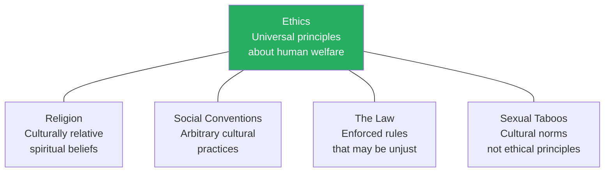
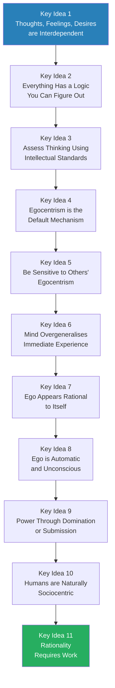

# Critical Thinking — Richard W. Paul & Linda Elder

> **You are what you think.** Richard Paul and Linda Elder argue that the quality of everything in your life — your decisions, relationships, emotions, and success — is determined by the quality of your thinking. Yet almost nobody studies their own thinking. We inherit bad habits of mind from childhood, absorb the biases of our culture, and mistake egocentric impulses for rational judgment — all without noticing. This book provides a comprehensive framework for analysing, assessing, and improving the thinking that runs your life. It introduces eight elements present in all reasoning, nine standards for judging that reasoning, and seven intellectual virtues that distinguish a fair-minded thinker from a self-serving sophist. Most powerfully, it exposes the two great enemies of sound thought — egocentrism and sociocentrism — and shows how they operate invisibly to distort everything we believe.

---

## About the Author

Richard W. Paul (1937-2015) was a leading authority on critical thinking and the founder of the Foundation for Critical Thinking. He spent over thirty years developing frameworks for teaching reasoning skills and authored more than two hundred articles and eight books on the subject. His co-author, Linda Elder, is an educational psychologist and president of the Foundation for Critical Thinking who has worked extensively on applying Paul's frameworks in professional and educational settings. Together, they created what has become one of the most widely used models of critical thinking instruction in the world.

---

## The Big Idea

- The central premise of this book is deceptively simple: <b style="color: #27ae60">if you take charge of your thinking, you take charge of your life</b>
- Most people never examine how they think — they simply think, assuming that whatever crosses their mind is reasonable, true, and justified
- This assumption is catastrophically wrong, and the consequences play out in every domain of life — from failed relationships and poor career decisions to national policies built on propaganda and self-deception
- Paul and Elder offer a structured system for thinking about thinking — what philosophers call **metacognition** — and they insist it is a learnable, practicable skill, no different from learning tennis or playing the piano

The book rests on three pillars:

- **Analysis:** Every act of reasoning can be broken into eight universal elements — purpose, question, information, inference, assumption, concept, implication, and point of view — and examining these parts reveals where thinking goes wrong
- **Assessment:** Nine intellectual standards — clarity, accuracy, precision, relevance, depth, breadth, logicalness, significance, and fairness — provide the criteria for evaluating whether reasoning is sound
- **Character:** Seven intellectual virtues — humility, courage, empathy, integrity, perseverance, confidence in reason, and autonomy — distinguish a thinker who uses these tools honestly from one who uses them to manipulate

The book's most provocative claim is that the two greatest barriers to rational thought are not ignorance or lack of intelligence but <b style="color: #e74c3c">egocentrism</b> (the mind's tendency to see everything from a self-serving perspective) and <b style="color: #e74c3c">sociocentrism</b> (the tendency to uncritically adopt the beliefs and biases of the groups to which we belong). Until we learn to identify and combat these forces, even the smartest person remains a prisoner of their own mind.

The three pillars are interdependent — analysis without standards produces aimless thinking, standards without virtues produce sophisticated manipulation, and virtues without analytical tools produce well-meaning confusion.

The radar chart shows how each of Paul's nine intellectual standards improves as a thinker moves from unreflective (red) through practising (blue) to mastery (green) — the shape expands uniformly because all standards must develop together.

Egocentrism dominates the "Barriers" block, reflecting Paul's argument that it is the single greatest obstacle to sound reasoning — occupying more mental territory than all intellectual virtues combined in the untrained mind.

---

## Key Concepts at a Glance

| Concept | One-line summary |
|---------|-----------------|
| **Elements of Reasoning** | Eight universal components present in every act of thinking |
| **Intellectual Standards** | Nine criteria for assessing whether reasoning is good or bad |
| **Intellectual Virtues** | Seven character traits required for fair-minded thinking |
| **Weak vs. Strong Critical Thinking** | Using reasoning skills selfishly (sophistry) vs. fairly |
| **Egocentrism** | The mind's default tendency to see the world from a self-serving perspective |
| **Sociocentrism** | Uncritical conformity to the beliefs and norms of one's group |
| **Dominating Ego** | Getting what you want by controlling and intimidating others |
| **Submissive Ego** | Getting what you want by pleasing and manipulating those in power |
| **Stages of Thinker Development** | Six stages from unreflective to master thinker |
| **Activated Ignorance** | False beliefs treated as truth that generate real-world harm |
| **Activated Knowledge** | True understanding that generates further knowledge |
| **Inert Information** | Facts memorised but never truly understood |
| **Egocentric Immediacy** | Overgeneralising immediate feelings to all of life |
| **Three Functions of the Mind** | Thinking, feeling, and wanting — always interrelated |
| **Logic of a Discipline** | Every subject has a structure that can be analysed and mastered |

---

## Part I: Foundations — Why Critical Thinking Matters

### Chapter 1: Thinking in a World of Accelerating Change

*Paul opens with a challenge: the world is changing faster than our ability to think about it, and the consequences of poor thinking are becoming more dangerous by the year.*

- The post-industrial world confronts us with problems that are simultaneously complex, interconnected, and urgent:
  - Pollution, terrorism, surveillance, economic instability, information overload
  - Each problem involves multiple levels of government, competing interests, and incomplete information
  - Traditional methods of learning — memorise, repeat, apply — are inadequate for this environment
- <b style="color: #27ae60">The power of the mind to command itself will increasingly determine the quality of our work, our lives, and perhaps our survival</b>
- Yet critical thinking is not valued as a social practice in any society:
  - Short-term thinking and quick-fix solutions dominate political and corporate discourse
  - Great power is wielded by minds that have never been trained to examine themselves
  - Schools teach facts and procedures but rarely teach students how to think about thinking
- The gap between what our challenges demand and what our thinking delivers is widening:
  - Technology amplifies the reach of bad thinking — a single poorly reasoned decision can now affect millions
  - Information abundance does not produce wisdom — it often produces the illusion of understanding
  - The speed of change means that knowledge acquired today may be obsolete tomorrow, making the capacity to think critically more valuable than any particular body of knowledge

> [!tip] Core Insight
> The world demands thinking that is complex, adaptable, and self-correcting — but we are equipped with minds designed for routine, habit, and automation.

- Paul distinguishes between **routine problems** and **non-routine problems:**
  - Routine problems can be solved by applying established procedures — they require training, not thinking
  - Non-routine problems require the thinker to figure out what the problem actually is, what information is relevant, and what criteria should govern the solution
  - The modern world increasingly presents non-routine problems — yet our educational systems are designed almost exclusively for routine ones
- The result is a population that feels informed but thinks poorly:
  - They confuse having opinions with having reasoned judgements
  - They confuse being articulate with being right
  - They confuse emotional conviction with evidential support
- Paul makes an important distinction between **training** and **education:**
  - Training prepares you to follow established procedures — it is adequate for routine problems
  - Education prepares you to think independently — it is necessary for non-routine problems
  - Most of what passes for education is actually training — memorise the textbook, pass the exam, receive the credential
  - Genuine education produces people who can think critically in situations they have never encountered before
  - The modern world requires educated citizens, but our institutions produce trained ones

> [!example] The Engineer and the Unforeseen Problem
> - An engineer is trained to build bridges according to established specifications
> - She encounters a site with unusual soil conditions that no specification covers
> - Her training tells her nothing — the manual does not have a chapter on this situation
> - What she needs is the ability to think through a novel problem from first principles — to identify the relevant variables, gather new information, consider multiple approaches, and evaluate the implications of each
> - This is critical thinking, not training — and it is the difference between an engineer who can follow instructions and an engineer who can solve problems
> **The lesson:** Training prepares you for the expected. Critical thinking prepares you for the unexpected. In a rapidly changing world, the unexpected is the norm.

---

### Chapter 2: Becoming a Critic of Your Thinking

*Paul argues that improving your thinking requires treating it as a skill — one that demands the same deliberate practice as sport, music, or dance.*

- <b style="color: #2980b9">Critical thinking</b> is the disciplined art of ensuring you use the best thinking you are capable of in any set of circumstances
- The general goal of all thinking is to "figure out the lay of the land" — to understand what is really going on in order to make good choices
- Most people have never studied their own thinking:
  - They cannot describe how their intellectual processes work
  - They have no conscious standards for distinguishing good thinking from poor thinking
  - They have never discovered a significant problem in their thinking and changed it by a conscious act of will
  - They assume their thinking is basically sound because it "feels right" to them

> [!example] The Monkey Analogy
> - Paul compares our situation to monkeys who never study what "monkeying around" actually involves
> - We go through life thinking without watching ourselves think
> - A rare person who begins to observe their own reasoning is like a monkey who finally understands what monkeying around is all about
> - That self-awareness is the beginning of all improvement
> **The lesson:** You cannot fix what you cannot see.

- The analogy between physical and intellectual development is central to the book:
  - Just as a tennis player improves by studying films of excellent players and then practising, a thinker improves by studying the structures of excellent thinking and then practising
  - "No intellectual pain, no intellectual gain"
  - Unlike sport, thinking is invisible — you cannot watch a film of someone sitting in a chair thinking — yet it is the most important thing about us
  - This invisibility is precisely why most people never improve — they have no way to observe what they are doing wrong

---

- <b style="color: #e74c3c">The world will not help you become a critical thinker</b>
- Family, schools, employers, and acquaintances all have agendas that are not focused on the value of critical thinking:
  - Most people have multiple problems in their own thinking — prejudices, biases, misconceptions, ideological rigidity
  - Few can help us improve ours
  - If we act out of keeping with what is expected, we encounter the "school of hard knocks"
- The solution is to become a critic of your own thinking — not to negate yourself, but to improve yourself:
  - Discover your thinking, see its structure, observe its implications, recognise its basis and vantage point
  - Learn about your bad habits of thought and what you are striving for
- Paul identifies two essential commitments:
  - **Commitment to understanding your own thinking:** This means learning the vocabulary of thinking (elements, standards, virtues) and applying it to yourself
  - **Commitment to changing your thinking:** Understanding alone is not enough — you must be willing to alter beliefs, habits, and behaviours when your analysis reveals they are flawed

> [!example] The College Student Who Cannot Study
> - A student complains she cannot concentrate on her studies
> - She wants good grades but cannot sit still long enough to do the work
> - Her thinking tells her: "Studying is boring. I deserve to have fun. I'll do it later."
> - Her feeling follows: restlessness, irritation, desire to escape
> - Her wanting follows: she wants entertainment, distraction, anything but study
> - She has never analysed this chain — she simply experiences it as "I can't study"
> - By tracing the feeling to its root in her thinking, she can challenge the premises: "Is studying actually boring? Is immediate fun more valuable than long-term success?"
> **The lesson:** What feels like a problem of willpower is usually a problem of unexamined thinking.

---

### Chapter 3: Becoming a Fair-Minded Thinker

*Paul draws the crucial distinction between using critical thinking skills selfishly and using them fairly — and introduces the seven intellectual virtues that make fair-mindedness possible.*

- Critical thinking skills can serve two incompatible ends:
  - <b style="color: #e74c3c">Weak-sense critical thinking</b> (sophistry): using reasoning skills to defend one's own position and attack opposing views, without genuinely considering whether the opposing view might be correct
  - <b style="color: #27ae60">Strong-sense critical thinking</b> (fair-mindedness): using reasoning skills to honestly examine all views, including one's own, and to change one's mind when the evidence warrants it
- Sophists are everywhere — unethical lawyers, manipulative politicians, corporate spin doctors — and they are often "successful" by worldly measures
- The book's mission is to develop strong-sense critical thinkers who can expose intellectual games played at the expense of the innocent

This diagram shows that the same intellectual skills can serve radically different ends depending on the character of the person wielding them.

---

#### The Seven Intellectual Virtues

Fair-mindedness requires a constellation of interdependent intellectual virtues. No single virtue is sufficient — they must all work together.

| Virtue | Definition | Opposite |
|--------|-----------|----------|
| **Intellectual Humility** | Awareness of the limits of one's knowledge | Intellectual Arrogance |
| **Intellectual Courage** | Willingness to challenge beliefs, including one's own | Intellectual Cowardice |
| **Intellectual Empathy** | Ability to enter into the viewpoints of others | Intellectual Self-Centeredness |
| **Intellectual Integrity** | Holding yourself to the same standards you demand of others | Intellectual Hypocrisy |
| **Intellectual Perseverance** | Working through complexity and frustration | Intellectual Laziness |
| **Confidence in Reason** | Faith that well-reasoned conclusions are worth pursuing | Intellectual Distrust of Reason |
| **Intellectual Autonomy** | Thinking for yourself rather than conforming to group pressure | Intellectual Conformity |

These seven traits are deeply interdependent — and Paul explains exactly how:

- To become aware of the limits of your knowledge (**humility**), you need the **courage** to face your own prejudices
- To discover your prejudices, you must **empathise** with points of view you oppose
- To empathise with opposing views, you need **perseverance**, because truly entering another worldview takes sustained effort
- That effort will not seem justified unless you have **confidence in reason** — faith that you will not be "corrupted" by considering the opposing view
- And none of this works unless you feel a responsibility to be **fair** — intellectual **integrity**
- Finally, **autonomy** ensures you arrive at your own conclusions rather than simply swapping one group's orthodoxy for another

---

##### Intellectual Humility — In Depth

- <b style="color: #2980b9">Intellectual humility</b> means recognising that you should not claim more than you actually know
- It involves awareness that your beliefs may be wrong, that your evidence may be incomplete, and that your reasoning may be flawed
- This is not the same as intellectual timidity or lack of confidence — the humble thinker states what they believe clearly, but holds it provisionally
- The opposite — **intellectual arrogance** — manifests as:
  - Claiming certainty where there is only probability
  - Dismissing alternative views without understanding them
  - Treating one's own perspective as self-evidently true
  - Confusing confidence with correctness

> [!example] The Asbestos Manufacturers
> - For years, companies manufactured and sold asbestos for use in homes and schools
> - They knew it was carcinogenic — their own internal studies confirmed it
> - But they continued, reaping large profits, by ignoring the viewpoint and welfare of innocent users
> - They hid behind "meeting federal regulations" to avoid confronting the ethical reality
> - Their intellectual arrogance and lack of empathy made fair-mindedness impossible
> **The lesson:** When self-interest is at stake, the mind easily ignores evidence — especially evidence about harm to others.

---

##### Intellectual Courage — In Depth

- <b style="color: #2980b9">Intellectual courage</b> means being willing to face and fairly assess ideas, beliefs, or viewpoints toward which you have strong negative emotions
- It involves recognising that ideas considered "dangerous" or "absurd" by your group sometimes prove justified:
  - Galileo was punished for asserting the earth revolves around the sun
  - Abolitionists were attacked for opposing slavery
  - Whistleblowers face retaliation for exposing wrongdoing
- <b style="color: #e74c3c">The penalty for intellectual courage can be severe</b> — rejection, ridicule, loss of employment, even imprisonment
- But the alternative — intellectual cowardice — means accepting ideas uncritically because the social cost of challenging them feels too high
- The courageous thinker does not seek conflict for its own sake but refuses to abandon conclusions that are well-supported simply because they are unpopular

---

##### Intellectual Empathy — In Depth

- <b style="color: #2980b9">Intellectual empathy</b> means the capacity to put yourself in someone else's place in order to genuinely understand them
- This is not sympathy (feeling sorry for someone) or agreement — it is the ability to reconstruct how another person sees the world:
  - What assumptions do they bring?
  - What experiences have shaped their viewpoint?
  - What would make their position feel reasonable if you were standing where they stand?
- Most people never do this — they assume their viewpoint is the only reasonable one and that anyone who disagrees is either ignorant or irrational
- Genuine empathy requires sustained effort and intellectual humility — you must be willing to discover that the other person's reasoning has merits you had not considered

> [!example] The Israel-Palestine Example
> - Paul notes that few Americans can articulate the Palestinian perspective on the Middle East conflict
> - Most adopt the viewpoint of their own country's media without question
> - An intellectually empathetic thinker would study both sides deeply enough to present either position to someone who holds the other
> - This does not mean you must agree with both — it means you must understand both before judging either
> **The lesson:** You cannot judge fairly what you do not understand, and you cannot understand what you refuse to consider.

---

##### Intellectual Integrity — In Depth

- <b style="color: #2980b9">Intellectual integrity</b> means holding yourself to the same rigorous standards of evidence and reasoning that you demand of others
- It requires you to be true to your own thinking — to admit inconsistencies between what you profess and what you practise
- The opposite — **intellectual hypocrisy** — is disturbingly common:
  - Demanding evidence from others while accepting your own claims without evidence
  - Criticising opponents for exactly the behaviour you engage in yourself
  - Applying different rules of logic depending on whether the conclusion is one you like
- Paul argues that most people maintain double standards unconsciously — they genuinely believe they are being fair while applying wildly different criteria to their own views versus others'

---

##### Intellectual Perseverance — In Depth

- <b style="color: #2980b9">Intellectual perseverance</b> means willingness to struggle with complexity and confusion rather than retreating to simplistic answers
- Important problems are almost never simple — they require sustained inquiry, tolerance of ambiguity, and willingness to revise earlier conclusions
- The opposite — **intellectual laziness** — drives people to:
  - Accept the first plausible answer rather than investigating further
  - Adopt slogans and soundbites as substitutes for genuine understanding
  - Give up when a problem proves more difficult than expected
- Paul notes that intellectual perseverance is closely linked to the other virtues — you need humility to admit you do not yet understand, courage to face what you might discover, and confidence in reason to believe the effort is worthwhile

---

##### Confidence in Reason and Intellectual Autonomy — In Depth

- <b style="color: #2980b9">Confidence in reason</b> means believing that, in the long run, one's own interests and those of humanity are best served by giving the freest play to reason
- It means having faith that people can learn to think for themselves, form rational viewpoints, and arrive at reasonable conclusions — if encouraged and given the tools
- <b style="color: #2980b9">Intellectual autonomy</b> means thinking for yourself rather than uncritically accepting the views of others
- Together, these two virtues ensure that the critical thinker does not simply trade one set of inherited beliefs for another:
  - Autonomous thinkers form their own conclusions based on their own analysis
  - They do not seek the approval of authority figures or peer groups for their views
  - They are willing to stand alone when the evidence supports them

> [!tip] Core Insight
> You cannot judge fairly what you do not understand, and you cannot understand what you refuse to consider. Fair-mindedness requires genuinely entering viewpoints you disagree with.

---

#### Natural vs. Critical Thinking

Paul closes Chapter 3 with a powerful set of contrasts that crystallise the difference between how we naturally think and how we should aspire to think:

| As Humans We... | As Critical Thinkers We... |
|-----------------|---------------------------|
| Think egocentrically | Expose the egocentric roots of our thinking to scrutiny |
| Are drawn to unworthy standards of thought | Replace inappropriate standards with sound ones |
| Live in systems of meaning that entrap us | Learn to raise thinking to conscious examination |
| Use logical systems whose structures are hidden from us | Develop tools for explicating and assessing those systems |
| Live with the illusion of intellectual freedom | Take explicit command of who we are and where our lives are heading |
| Are governed by our thoughts | Learn to govern the thoughts that govern us |

---

### Chapter 4: Self-Understanding

*Paul reveals the three basic functions of the mind and how they interrelate — then shows how egocentrism hijacks all three.*

- <b style="color: #2980b9">The mind has three basic functions</b> — thinking, feeling, and wanting — that are intimately interconnected:
  - **Thinking** creates meaning: "This is what is going on"
  - **Feeling** evaluates meaning: "This is how you should feel about what is going on"
  - **Wanting** allocates energy: "This is what is worth pursuing"
- These three functions are in constant interplay:
  - When we think we are being threatened, we feel fear and want to flee
  - When we think a meeting will be a waste of time, we feel bored and want to avoid it
  - When we think we have been insulted, we feel anger and want to retaliate
  - Change the thinking and you change the feeling and the wanting

The three functions of the mind are always operating together. By taking command of your thinking, you gain indirect command over your feelings and desires.

---

> [!example] Two Employees, Same Task
> - A manager asks two employees to improve office procedures to increase productivity
> - Employee A experiences resentment — she defines the task as unnecessary, time-consuming, and beneath her
> - Employee B welcomes the opportunity — she defines it as a chance to be creative and think independently
> - The task is identical; the emotions and motivation are completely different
> - The difference lies entirely in how each person's thinking defines the situation
> **The lesson:** Your interpretation of events — not the events themselves — determines how you feel and what you do.

- The practical insight: <b style="color: #27ae60">by taking command of your thinking, you take command of all three functions of the mind</b>
- If you are frustrated, ask: "What is the thinking that is leading to this frustration?"
- If you are anxious, ask: "What assumptions am I making that are generating this anxiety?"
- If you are angry, ask: "What interpretation of events is producing this anger? Is that interpretation the only possible one?"
- This simple practice of questioning your own thinking is the gateway to self-understanding

> [!example] The Angry Commuter
> - A driver cuts you off in traffic and you feel rage
> - Your thinking: "That person is selfish and inconsiderate — they could have caused an accident"
> - Your feeling: fury, indignation, desire for revenge
> - Alternative thinking: "That person may be rushing to a hospital. They may not have seen me. Their driving says nothing about my worth"
> - Alternative feeling: mild annoyance that dissipates quickly
> - The event was identical — only the thinking changed
> **The lesson:** We do not react to events — we react to our interpretation of events.

---

- Paul identifies five egocentric standards that people unconsciously use to justify their beliefs:
  - "It's true because **I believe it**" — innate egocentrism
  - "It's true because **we believe it**" — innate sociocentrism
  - "It's true because **I want to believe it**" — innate wish fulfilment
  - "It's true because **I have always believed it**" — innate self-validation
  - "It's true because **it is in my selfish interest to believe it**" — innate selfishness
- These are not logical standards — they are psychological impulses masquerading as reasoning
- The critical thinker learns to catch themselves applying these false standards and replace them with the nine intellectual standards

> [!example] The Five False Standards in a Boardroom
> - A CEO proposes a risky acquisition
> - "This will work because I've been in this industry for thirty years" — innate egocentrism (I believe it, so it's true)
> - "Everyone on the board agrees this is the right move" — innate sociocentrism (we believe it, so it's true)
> - "This acquisition will transform us into a market leader" — innate wish fulfilment (I want it to be true, so it's true)
> - "We've always grown through acquisition" — innate self-validation (we've always believed it, so it's true)
> - "If this goes through, my compensation package triples" — innate selfishness (it's in my interest to believe it, so it's true)
> - None of these are reasons — they are psychological drives dressed in the language of reasoning
> **The lesson:** The most dangerous beliefs are those held for emotional or self-serving reasons but presented as if they were the product of careful analysis.

---

### Chapter 5: The Six Stages of Thinker Development

*Paul maps out the journey from unconscious incompetence to mastery — and warns that most people never make it past the first stage.*

- Development in thinking is gradual, requiring plateaus of learning and hard work
- It is not possible to become an excellent thinker by simply reading one book — changing habits of thought takes years
- Paul draws a parallel to learning chess: you can learn the rules in an hour, but becoming a good player takes years of deliberate practice against increasingly skilled opponents

| Stage | Name | Defining Feature |
|-------|------|-----------------|
| 1 | **Unreflective Thinker** | Unaware of the role thinking plays in life |
| 2 | **Challenged Thinker** | Aware that thinking has problems, but unsure how to fix them |
| 3 | **Beginning Thinker** | Actively decides to take up the challenge; starts practising |
| 4 | **Practicing Thinker** | Recognises the necessity of regular practice and adopts a regimen |
| 5 | **Advanced Thinker** | Progresses in accordance with sustained practice |
| 6 | **Master Thinker** | Skilled thinking becomes second nature |

Most people remain at Stage 1 their entire lives. The transition from Stage 2 to Stage 3 — deciding to actually work on your thinking rather than merely acknowledging its flaws — is the hardest step.

---

- <b style="color: #e74c3c">Most people are unreflective thinkers and die that way</b>
  - They have no useful conception of what thinking entails
  - Their beliefs feel reasonable, so they believe them with confidence
  - They walk about the world confident that things really are the way they appear
  - They are skilled at rationalising — constructing post-hoc justifications for beliefs they hold for entirely different reasons
- The greatest danger at Stage 2 is self-deception — reverting to the comfort of "My thinking is fine":
  - "If everyone were to think like me, this would be a fine world" is the dominant view
  - Unreflective thinkers are found at all levels of education and in all professions
  - There is no evidence that schooling correlates with reflectiveness
  - A PhD can be just as unreflective as a high school dropout — they simply rationalise more eloquently

> [!example] The Brilliant Professor Who Cannot Listen
> - A tenured professor is widely regarded as an expert in his field
> - He publishes prolifically and speaks at prestigious conferences
> - Yet in departmental meetings, he dismisses colleagues' ideas without consideration
> - He applies rigorous standards to others' work but excuses sloppy reasoning in his own
> - He believes his expertise makes him immune to the biases he teaches students about
> - His intellectual arrogance prevents him from progressing beyond Stage 2 — he is aware that thinking matters but has never seriously examined his own
> **The lesson:** Expertise in a subject does not guarantee expertise in thinking. Knowledge and critical thinking are different skills.

---

> [!abstract] The Practicing Thinker's Game Plan
> 1. Use "wasted" time — reflect on your thinking during idle moments
> 2. Handle a problem a day — systematically think through one problem each morning
> 3. Internalise intellectual standards — focus on one standard per week (clarity, accuracy, etc.)
> 4. Keep an intellectual journal — describe emotionally significant situations and analyse your thinking
> 5. Practice intellectual strategies — work through the strategic approaches in Chapters 15-16
> 6. Reshape your character — focus on one intellectual virtue per month
> 7. Deal with your ego — daily, observe your egocentric thinking in action
> 8. Redefine the way you see things — turn negatives into positives, dead-ends into new beginnings
> 9. Get in touch with your emotions — trace every negative emotion to its source in your thinking
> 10. Analyse group influences — examine the beliefs your groups require and forbid

---

## Part II: The Mechanics of Thinking

### Chapter 6: The Parts of Thinking — The Eight Elements of Reasoning

*Paul introduces the most important analytical framework in the book: eight elements that are present whenever and wherever reasoning occurs.*

- Whenever you reason, you do so within a structure that can be broken into eight interdependent parts
- These elements are not optional — they are present in every act of reasoning, from choosing what to eat for breakfast to deciding national policy
- The power of this framework is that it gives you specific questions to ask about any piece of reasoning — your own or anyone else's

The eight elements form a circular, interdependent system. Your purpose shapes your questions, your questions shape the information you seek, and so on around the circle.

Assumptions and point of view are the most commonly neglected elements — precisely because they operate beneath conscious awareness, making them the silent saboteurs of reasoning quality.

---

#### Element 1: Purpose

- <b style="color: #2980b9">Purpose</b> is the goal or objective of your thinking — what you are trying to accomplish
- All reasoning has a purpose, whether or not the thinker is aware of it
- Problems arise when:
  - The purpose is unclear — you do not know what you are actually trying to achieve
  - The purpose is self-contradictory — you want incompatible things simultaneously
  - The purpose shifts without your awareness — you start trying to solve one problem and end up addressing a different one
  - The purpose is unrealistic — you are trying to achieve something that is impossible given the constraints
- Key questions to ask:
  - What am I trying to accomplish?
  - Is this purpose realistic?
  - Is this purpose fair to all parties involved?
  - Am I pursuing multiple purposes that conflict with each other?

> [!example] The Hidden Purpose in a "Fact-Finding" Meeting
> - A department head calls a meeting to "gather input" on a proposed reorganisation
> - Her stated purpose is collaborative — she wants the team's honest feedback
> - Her actual purpose is validation — she has already decided on the reorganisation and wants the meeting to create the appearance of consensus
> - Team members who challenge the proposal find their concerns acknowledged but not addressed
> - The meeting ends with the reorganisation proceeding exactly as planned
> - The stated purpose (gather input) and the actual purpose (validate a decision already made) were in direct conflict — and everyone sensed it
> **The lesson:** When stated and actual purposes diverge, trust erodes and thinking quality collapses. The critical thinker examines not just what purpose is declared but what purpose is actually being served.

---

#### Element 2: Question at Issue

- <b style="color: #2980b9">The question at issue</b> is the problem you are trying to solve or the issue you need to resolve
- The quality of your thinking is determined by the quality of the questions you ask:
  - Vague questions produce vague answers
  - Biased questions produce biased answers
  - Complex questions require complex answers — but people routinely try to answer them with simple ones
- Paul distinguishes three types of questions:
  - **Questions with one right answer** (matters of fact): "What is the boiling point of water?"
  - **Questions that are matters of opinion** (personal preference): "Which flavour of ice cream is best?"
  - **Questions requiring reasoned judgement** (multiple legitimate perspectives): "What should be done about climate change?"
- <b style="color: #e74c3c">The most common intellectual error is treating questions of judgement as if they were questions of fact or mere opinion</b>

> [!example] Jack and Jill at the Party
> - Jack and Jill are in a romantic relationship and attend a party together
> - Jack spends most of the evening talking with Susan
> - On the way home, Jill accuses Jack of "flirting"; Jack insists he was "being friendly"
> - Jill escalates: "When a man sits very close to a woman, looks at her romantically, and touches her casually, that is flirting"
> - Jack retaliates: "When a woman spends her whole evening collecting evidence like a prosecutor, that is paranoia"
> - Both see themselves as victims; both see themselves as blameless
> - **Analysis using the elements:**
>   - **Purpose:** Both want a successful relationship (shared)
>   - **Problem:** Jack sees "Jill's paranoia"; Jill sees "Jack's flirtation" (different)
>   - **Assumptions:** Jack assumes he is not self-deceived about his motives; Jill assumes his behaviour is incompatible with ordinary friendliness
>   - **Concepts:** Four key concepts in play — flirtation, friendliness, paranoia, male ego
>   - **Point of view:** Both may be seeing through gender-based bias
> **The lesson:** The same raw facts, interpreted through different elements of thought, produce entirely different conclusions.

---

#### Element 3: Information

- <b style="color: #2980b9">Information</b> includes all the facts, data, evidence, and experiences you draw on when reasoning
- Problems arise when:
  - The information is inaccurate — you are reasoning from false premises
  - The information is incomplete — you are missing critical data
  - The information is biased — it has been selected to support a predetermined conclusion
  - The thinker cannot distinguish between information and interpretation
- Paul emphasises that information is not self-interpreting:
  - Raw data does not tell you what to conclude — humans impose meaning on information
  - The same data can support different conclusions depending on the assumptions and concepts brought to bear
  - Two doctors can look at the same test results and reach different diagnoses because they bring different conceptual frameworks
- <b style="color: #e74c3c">One of the most common failures is treating interpretation as if it were information</b>:
  - "She looked angry" is an interpretation, not information — the information is "Her brow was furrowed and her voice was raised"
  - "The economy is bad" is an interpretation — the information is specific data about unemployment, GDP, and inflation
  - Conflating the two means we argue about our interpretations as if they were facts

---

#### Three Types of Information in the Mind

- <b style="color: #2980b9">Inert Information:</b> Things we have memorised but do not truly understand
  - Example: "Democracy is government of the people, by the people, for the people" — most people can recite this but cannot explain the difference between "of," "by," and "for"
  - Much schooling produces inert information that masquerades as knowledge
  - Students pass exams by reciting definitions they cannot apply — and mistake this for understanding
- <b style="color: #e74c3c">Activated Ignorance:</b> False beliefs that we actively use as if they were true
  - Descartes believed animals had no feelings and performed painful experiments on them — their cries were "mere noises"
  - The Nazi belief that Germans were the master race is activated ignorance that led to genocide
  - Everyone carries some activated ignorance — the question is how much harm it causes
  - Activated ignorance is more dangerous than simple ignorance because the person acts on it with confidence
- <b style="color: #27ae60">Activated Knowledge:</b> True information that, when understood, generates further knowledge
  - The scientific method is activated knowledge — it produces reliable conclusions that lead to more knowledge
  - The principles of critical thinking are themselves activated knowledge
  - The mark of activated knowledge is that it compounds — each understanding opens doors to further understanding

> [!tip] Core Insight
> An educated person is one who has learned that information almost always turns out to be at best incomplete and very often false, misleading, or dead wrong.

---

#### Element 4: Inferences

- An <b style="color: #2980b9">inference</b> is a step of the mind by which you conclude that something is true based on something else being true
  - You see dark clouds and infer rain
  - Your boss walks past without saying hello and you infer she is angry
  - A well-dressed person enters a room and you infer she is successful
  - You hear scratching at the door and infer the cat wants to come in
- We make hundreds of inferences daily, and most of them are unconscious
- Critical thinkers learn to:
  - Notice when they are making an inference (rather than stating a fact)
  - Question whether the inference is justified by the evidence
  - Consider alternative inferences that could be drawn from the same evidence
  - Test inferences against the intellectual standards (clarity, accuracy, relevance, etc.)

---

#### Element 5: Assumptions

- An <b style="color: #2980b9">assumption</b> is something you take for granted — a prior belief that enables the inference
  - You assume dark clouds usually bring rain
  - You assume your boss always says hello when she is not angry
  - You assume well-dressed people are successful
  - You assume only the cat makes that scratching noise
- We make hundreds of assumptions daily without knowing it — most are justified, some are not
- Different people make different inferences from the same situation because they bring different assumptions

> [!example] The Man in the Gutter
> - Two people see a man lying in a gutter
> - Person A infers: "There's a drunken bum"
> - Person B infers: "There's a man in need of help"
> - Person A assumes: "Only drunks are found in gutters"
> - Person B assumes: "People lying in gutters need help"
> - Person A believes people are responsible for what happens to them
> - Person B believes people's problems are often caused by forces beyond their control
> - Same raw facts — completely different conclusions driven by different assumptions
> **The lesson:** Our assumptions shape our inferences, and our inferences shape our experience of reality.

- The critical thinker learns to separate raw experience from interpretation, to notice the assumptions driving their inferences, and to question whether those assumptions are sound
- Paul distinguishes between **justified assumptions** (well-supported by evidence and experience) and **unjustified assumptions** (based on prejudice, habit, or wishful thinking)

---

#### Element 6: Concepts

- <b style="color: #2980b9">Concepts</b> are the ideas, theories, principles, and definitions we use to interpret information and make sense of the world
- Every discipline has its own concepts — science uses "hypothesis" and "theory," law uses "precedent" and "due process," medicine uses "diagnosis" and "prognosis"
- Problems arise when:
  - We use concepts without understanding what they mean
  - We apply concepts from one domain where they do not belong
  - We mistake our concepts for reality itself — forgetting that concepts are tools for understanding, not perfect mirrors of the world
- Paul notes that some of the most destructive thinking in history has resulted from distorted concepts:
  - "Manifest destiny" justified territorial expansion at the expense of indigenous peoples
  - "The master race" justified genocide
  - "The free market" can be used to justify any degree of inequality
- The critical thinker learns to:
  - Identify the key concepts in any piece of reasoning
  - Define those concepts precisely — "What exactly do I mean by 'freedom'? 'Justice'? 'Success'?"
  - Question whether the concepts are being used accurately and consistently
  - Recognise when a concept is being used ideologically — to serve an agenda rather than to illuminate reality

> [!example] The Concept of "Terrorism"
> - A government labels certain acts of violence "terrorism" and others "legitimate military action"
> - The label "terrorist" immediately removes the labelled group from moral consideration — they become evil by definition
> - Meanwhile, identical acts of violence committed by one's own side are described using concepts like "collateral damage," "pre-emptive action," or "national security"
> - The same physical acts — killing civilians, destroying infrastructure, creating fear — are described with different concepts depending on who performs them
> - The concepts do not describe reality — they construct it
> **The lesson:** Concepts are not neutral — they carry assumptions, values, and political agendas. The critical thinker examines concepts as carefully as they examine facts.

---

#### Element 7: Implications

- <b style="color: #2980b9">Implications</b> are the consequences that follow from your reasoning
- Paul emphasises three categories of implications to watch for:
  - **Possible** implications — things that might happen (you might have an accident every time you drive)
  - **Probable** implications — things likely to happen given the circumstances (driving drunk on a crowded highway in rain)
  - **Necessary** implications — things that must happen (brake failure + car ahead stopping = crash)
- We reserve the word "consequences" for what actually occurs — good thinkers try to anticipate implications before they become consequences
- <b style="color: #27ae60">Tracing the implications of your reasoning is one of the most powerful habits a thinker can develop</b>
- Most bad decisions are bad not because the reasoning is internally inconsistent but because the thinker failed to trace its implications far enough

---

#### Element 8: Point of View

- <b style="color: #2980b9">Point of view</b> is the perspective from which you see and interpret the world
- Every human being reasons from a particular vantage point — shaped by culture, experience, profession, age, gender, economic class, and countless other factors
- The critical thinker:
  - Recognises that their point of view is one of many
  - Actively seeks out alternative viewpoints
  - Tries to understand the strengths and weaknesses of each viewpoint, including their own
  - Avoids confusing their viewpoint with "the truth"
- Point of view is the element most likely to be invisible to the thinker:
  - We do not experience ourselves as having a "point of view" — we experience ourselves as simply seeing "the way things are"
  - A fish does not know it is in water — a thinker does not know they are in a perspective
  - The first step toward intellectual humility is recognising that your point of view is a point of view, not a direct window onto reality

> [!example] The Landlord and the Tenant
> - A landlord raises the rent by 15%, citing property taxes, maintenance costs, and market rates
> - From the landlord's point of view, this is a reasonable business decision — costs have risen and the rent must keep pace
> - From the tenant's point of view, this is a threat to their housing security — they cannot afford the increase and may be forced to move
> - From an economist's point of view, this is a market correction — supply and demand are setting the price
> - From a social worker's point of view, this is a contributor to homelessness and housing instability
> - Each perspective is internally consistent — and each reveals something the others miss
> - No single viewpoint captures the full picture
> **The lesson:** Every situation looks different depending on where you stand. The critical thinker deliberately moves between viewpoints rather than assuming their own is sufficient.

> [!abstract] The Elements Checklist
> When analysing any piece of reasoning, ask:
> 1. What is the **purpose**?
> 2. What **question** is being addressed?
> 3. What **information** is being used?
> 4. What **inferences** are being drawn?
> 5. What **assumptions** underlie the reasoning?
> 6. What **concepts** are being employed?
> 7. What are the **implications** if the reasoning is followed?
> 8. From what **point of view** is the reasoning conducted?

---

### Chapter 7: The Standards for Thinking — Nine Intellectual Standards

*Paul introduces the measuring stick against which all thinking should be assessed: nine standards that distinguish sound reasoning from poor reasoning.*

- <b style="color: #2980b9">The Nine Intellectual Standards:</b>

| Standard | Key Questions |
|----------|--------------|
| **Clarity** | Can you elaborate? Give an example? Illustrate with an analogy? |
| **Accuracy** | Is that really true? How could we check? |
| **Precision** | Can you give more details? Be more specific? |
| **Relevance** | How does this bear on the issue? How is it connected? |
| **Depth** | How does your answer address the complexities in the question? |
| **Breadth** | Do we need to consider another point of view? |
| **Logicalness** | Does all of this fit together? Does it make sense? |
| **Significance** | Which is the most important information here? |
| **Fairness** | Is my thinking justified given the evidence? Am I being self-serving? |

- The key principle is that we apply standards to elements — we assess our **purpose** for **clarity** and **fairness**, our **information** for **accuracy** and **relevance**, our **conclusions** for **logicalness**, and so on

---

#### Standard 1: Clarity

- <b style="color: #27ae60">Clarity is the gateway standard</b> — if a statement is unclear, you cannot determine whether it is accurate, relevant, or anything else
  - "What can be done about the education system in America?" is unclear
  - "What can educators do to ensure students learn skills that help them function successfully?" is clearer and more useful
- Ways to test for clarity:
  - Can you elaborate on what you mean?
  - Can you give an example?
  - Can you illustrate what you mean with an analogy?
- If a speaker cannot do any of these, they probably do not fully understand what they are saying

---

#### Standard 2: Accuracy

- A statement can be clear but inaccurate: "Most dogs weigh more than 300 pounds"
- Accuracy asks: Is this statement consistent with reality? How could we verify or falsify it?
- Testing for accuracy:
  - What evidence supports this claim?
  - How could we check whether this is true?
  - What source is this information coming from, and is that source reliable?

---

#### Standard 3: Precision

- A statement can be clear and accurate but imprecise: "Jack is overweight" (by how much? According to what standard?)
- Precision asks: Can you be more specific? Can you give more detail?
- Precision matters because vague claims are impossible to evaluate or act upon
- Paul gives a telling example:
  - "We need to cut costs" is clear and possibly accurate — but what costs? By how much? Over what timeframe?
  - Without precision, people interpret the statement to suit their own interests — each department assumes the cuts will fall elsewhere
  - The lack of precision turns a reasonable directive into a source of confusion and political manoeuvring

---

#### Standard 4: Relevance

- A statement can be clear, accurate, and precise but irrelevant to the question at hand
- Relevance asks: How does this connect to the problem we are trying to solve?
- Students often produce answers that are accurate but irrelevant — demonstrating knowledge they possess rather than addressing the question asked
- In organisational settings, irrelevance is used strategically:
  - A manager asked why a project is behind schedule responds with a detailed account of how hard the team has been working
  - The response is clear, accurate, and possibly precise — but it does not answer the question
  - This kind of irrelevant response can be either unintentional (the manager does not see the distinction) or strategic (the manager wants to deflect accountability)

> [!example] The Student Who Answers the Wrong Question
> - A history exam asks: "Why did the Roman Empire fall?"
> - A student writes a detailed, accurate essay about the rise of the Roman Empire — its military conquests, its engineering achievements, its legal system
> - Every fact in the essay is correct, but none of it answers the question asked
> - The student earns a high mark for effort and knowledge but has demonstrated a failure of relevance
> - In the real world, this happens constantly — people address the question they want to answer rather than the question that was asked
> **The lesson:** Relevance is the standard most easily violated by intelligent people who know a lot but fail to connect what they know to the specific question at issue.

---

#### Standard 5: Depth

- A statement can be clear, accurate, precise, and relevant but superficial — lacking depth
- Depth asks: Does this treatment address the complexities of the issue?
- <b style="color: #e74c3c">Superficial thinking about complex problems is one of the most common and dangerous forms of poor reasoning</b>
- Depth requires acknowledging that most important questions involve layers of complexity:
  - Multiple causes rather than a single cause
  - Competing values that cannot all be satisfied simultaneously
  - Unintended consequences that are not visible from a simple analysis
  - Historical context that changes the meaning of current events

> [!example] The "Just Say No" Problem
> - The slogan "Just say no" was used for years to discourage drug use among children
> - It is clear, accurate, precise, and relevant
> - But it utterly lacks depth — it does not address the psychology of addiction, the economics of the drug trade, the history of drug policy, or the social conditions that foster drug use
> - Policies based on this superficial thinking led to the world's largest prison system — 400,000 people locked up on drug offences by 2002, up from 50,000 in 1980
> - Treatment centres that could have helped were gutted during the "crack years" of the 1980s
> **The lesson:** Superficial thinking about complex problems produces policies that make things worse.

---

#### Standard 6: Breadth

- Breadth asks: Are we considering all relevant viewpoints?
- A thinker who examines a question from only one perspective — no matter how deeply — is reasoning without breadth
- The combination of depth and breadth is what produces truly comprehensive thinking:
  - Depth without breadth is tunnel vision
  - Breadth without depth is superficiality spread wide
- Paul argues that breadth is the standard most closely connected to intellectual empathy:
  - You cannot achieve breadth without being willing to enter viewpoints you find uncomfortable or wrong
  - A conservative who has never seriously studied liberal arguments lacks breadth
  - A liberal who has never seriously studied conservative arguments lacks breadth equally
  - Both may have great depth within their own perspective — but without breadth, that depth produces sophisticated one-sidedness

> [!example] The Corporate Restructuring
> - A CEO decides to restructure the company, eliminating two layers of management
> - Her analysis is deep — she has studied the cost savings, the efficiency gains, the competitive advantages
> - But she has not considered the perspective of the employees who will lose their jobs, the middle managers whose expertise will be lost, or the customers who relied on those managers as points of contact
> - Her thinking is deep but narrow — she has examined the question from only one perspective (shareholder value)
> - The restructuring saves money but destroys institutional knowledge and damages morale — consequences she did not foresee because she did not think broadly
> **The lesson:** Deep thinking within a narrow frame often produces decisions that fail in ways the thinker cannot see.

---

#### Standard 7: Logicalness

- Logicalness asks: Does this reasoning make sense? Do the conclusions follow from the evidence?
- Two key tests:
  - **Internal consistency:** Do the parts of the argument fit together without contradiction?
  - **Inferential validity:** Do the conclusions actually follow from the premises?
- When people discover contradictions in their thinking, they often respond with rationalisation rather than revision — this is where intellectual integrity becomes essential
- Common failures of logicalness:
  - "I believe in free speech, but certain views should not be allowed to be expressed" — internal contradiction
  - "Crime is increasing, therefore we need harsher penalties" — the conclusion does not necessarily follow from the premise (harsher penalties may not reduce crime)
  - "She is successful, therefore she must be ethical" — success and ethics are independent variables

---

#### Standard 8: Significance

- Significance asks: Is this the most important issue? Are we focusing on what matters most?
- People often get lost in trivia while ignoring the central question
- In any situation, some information is more important than other information — significance asks the thinker to prioritise
- Failures of significance are endemic in modern life:
  - News media devote enormous attention to celebrity gossip while underreporting systemic issues like poverty, education policy, and environmental degradation
  - Organisations spend hours debating the colour of a new logo while neglecting to examine whether their core strategy is sound
  - Individuals obsess over minor social slights while ignoring major patterns of self-destructive behaviour
- Paul argues that significance is closely related to purpose — if you are clear about what you are trying to achieve, you can more easily distinguish significant information from trivial information
- The question "So what?" is one of the most powerful tools in a critical thinker's repertoire:
  - It forces the speaker to explain why their point matters
  - It exposes information that is interesting but not relevant to the issue at hand
  - It redirects attention to what is genuinely important

---

#### Standard 9: Fairness

- Fairness asks: Am I being influenced by self-interest? Am I considering others' perspectives?
- This is the standard most resistant to honest application because <b style="color: #e74c3c">unfair thinkers rarely see themselves as unfair</b>
- Fairness connects directly to the intellectual virtues — only a thinker with humility, empathy, and integrity can consistently apply this standard

> [!example] The Doctor and the Pharmaceutical Rep
> - A doctor believes she prescribes medication based purely on medical evidence
> - But pharmaceutical representatives have taken her to conferences in resort locations, provided free samples, and given her office staff gifts
> - Studies consistently show that these practices influence prescribing patterns — even among doctors who believe they are immune
> - The doctor's thinking fails the fairness standard — she is being influenced by self-interest (comfort, convenience, social obligation) while believing she is being purely rational
> **The lesson:** Fairness is the hardest standard to apply because our self-serving biases operate below conscious awareness.

---

## Part III: Applying Critical Thinking to Life

### Chapter 8: Design Your Life

*Paul argues that you can design your life rather than merely react to it — but only if you understand the dual logic of experience and resist the forces that shape your thinking without your awareness.*

- Many people live as if their lives were pre-determined — as passive learners who seek only to confirm existing beliefs and "get by"
- <b style="color: #27ae60">Active learners use thinking as a tool for continually bridging the gap between what is and what could be</b>
- There is a large difference between passive and active learning:
  - **Passive learners** seek confirmation of their present beliefs, judgements, and behaviour patterns — they want a way to defend the status quo
  - **Active learners** see learning as establishing habits of continual improvement — always reaching for the next level of skill, ability, and insight
- Experience has two dimensions:
  - **Objective:** What happens outside our skin — things we did not generate
  - **Subjective:** The meaning we give to those happenings — the interpretation our mind creates
- The mind acts as a screen that records and gives meaning to only a part of what happens around us — and the meaning it gives is often shaped by egocentric fears, desires, and prejudices

---

- <b style="color: #2980b9">Self-deception, insight, and analysed experience</b>
  - The human mind is subject to powerful, self-deceptive, unconscious egocentricity — what Freud called "defence mechanisms"
  - Each defence mechanism represents a way to falsify, distort, twist, or deny reality
  - We rarely subject our experience to critical analysis — we rarely take our experiences apart to judge their truth value
  - Our unanalysed experiences are some combination of rational and irrational thoughts — only through critical analysis can we isolate and reduce the irrational dimensions
- Paul identifies a pattern that repeats throughout life:
  - We have an experience
  - We give it a meaning (usually unconsciously)
  - We feel emotions based on that meaning
  - We act based on those emotions
  - We then use the outcomes of our actions to confirm our original interpretation
  - This self-reinforcing cycle can trap us in deeply irrational patterns for decades

---

- <b style="color: #e74c3c">The mass media exert enormous influence on how we conceptualise the world</b>
  - They tell us who to trust and who to fear, what is significant and what is trivial
  - They create friend and enemy, define crime and punishment, and shape our understanding of sexuality, violence, and morality
  - Much of this influence is one-sided, superficial, and misleading
  - Billions are spent to create and shape this process
- We cannot be critical thinkers and accept the influence that mass media continually foster — regardless of whether our viewpoint is conservative or liberal, religious or secular
- We must decide for ourselves what we think, feel, and want
- We must seek out alternative views, read widely, and think broadly

> [!abstract] Reading Backward
> One of the most powerful antidotes to media-induced sociocentrism is to read books from the past — 10, 50, 100, 500, even 2000 years ago. This provides:
> 1. Multiple perspectives that enable you to see the present more clearly
> 2. Recognition that many "obvious" truths of the present were unknown or rejected in the past
> 3. Awareness that people in every era had misconceptions they could not see — and so do we
> 4. A sense of what is universal and what is merely fashionable

---

- Paul provides a brief history of critical thinking from Socrates (2400 years ago) through Bacon, Descartes, the Enlightenment thinkers, and into the 20th century:
  - Socrates discovered that most leaders could not rationally justify their claims to knowledge — and was executed for exposing this
  - Francis Bacon identified four "Idols" (sources of systematic error) in human thought
  - Descartes argued for systematic doubt — every part of thinking should be questioned, doubted, and tested
  - William Graham Sumner documented in 1906 that schools serve primarily as instruments of social indoctrination, producing orthodoxy rather than independent thought

> [!example] Francis Bacon's Four Idols (1620)
> - **Idols of the Tribe:** The ways our mind naturally tends to trick itself — built-in biases shared by all humans
> - **Idols of the Cave:** Our tendency to see things from our own individual, often distorted, perspective
> - **Idols of the Marketplace:** The ways we misuse concepts and words in our associations with others
> - **Idols of the Theatre:** Our tendency to become trapped in conventional and dogmatic systems of thought
> - Bacon argued that if left to its own devices, the human mind develops "bad habits of thought" that lead us to believe what is unworthy of belief
> **The lesson:** The recognition that the mind cannot be trusted to think well on its own is not new — it is over 400 years old.

---

### Chapter 9: The Art of Making Intelligent Decisions

*Paul applies the critical thinking framework to everyday decision-making — and reveals the patterns of irrationality that produce bad choices across every life stage.*

- To live is to act. To act is to decide. Everyday life is an endless sequence of decisions
- <b style="color: #27ae60">Rational decisions maximise the quality of one's life without violating the rights or harming the well-being of others</b>
- The most important decision we make is how and what to think — because that determines how we feel and act
- There are as many domains of decision-making as there are of thinking:
  - We decide what to think, feel, and do as parents, professionals, citizens, friends, and consumers
  - The thinking in one domain is influenced by thinking in others — all domains overlap

---

- Common patterns of irrational decision-making:
  - Deciding to behave in ways that undermine our own welfare (unhealthy eating, smoking, avoiding exercise)
  - Deciding not to engage in activities that contribute to our long-term welfare
  - Deciding to behave in ways that undermine another's welfare
  - Deciding to associate with people who encourage us to act against our own or others' welfare
- The general explanation: <b style="color: #e74c3c">immediate gratification and short-term gain</b>
  - The mind is "wired" for short-term reward
  - Taking the long view requires reflection — raising behaviour to the level of conscious realisation
- When we identify a pattern of irrational decision-making, we have discovered a **bad habit**
  - When we replace it with a rational pattern, we replace a bad habit with a good one
  - Because habits account for thousands of decisions over time, replacing even one bad habit has enormous cumulative effect

---

- There are two kinds of "big" decisions to watch for:
  - Those with **obvious** long-term consequences — career, marriage, core values, parenting philosophy
  - Those whose long-term consequences must be **discovered** — daily habits of eating, exercise, media consumption, and thought
- The most dangerous decisions are the "un-thought" ones — decisions that creep into our lives unnoticed and unevaluated

> [!abstract] The Four Keys to Sound Decision-Making
> 1. **Recognise** that you face an important decision
> 2. **Identify** the alternatives accurately
> 3. **Evaluate** the alternatives logically
> 4. Have the **self-discipline** to act on the best alternative

- Two rules Paul recommends:
  - **Rule One:** There's always a way
  - **Rule Two:** There's always another way
- If you can think of only one or two options, you are probably thinking too narrowly

---

- Paul traces decision-making across life stages:
  - **Childhood (2-11):** Dominated by the immediate, highly egocentric, shaped by peer groups and parental control
  - **Adolescence (12-17):** Seeks independence but resists responsibility; "party-line" of peer groups dominates; love, sexuality, and worldview are understood superficially through media
  - **Early Adulthood (18-35):** Hasty decisions about marriage, career, and the future; still heavily influenced by peer groups and mass media
- The decisions and habits formed during these years shape us for a lifetime — conscious intervention is needed as soon as possible

> [!example] The Dangerous Logic of Adolescent Media
> - Media-created heroes achieve their status through violence against those presented as evil
> - In this worldview, everything is black or white — good guys vs. bad guys
> - Love in adolescent media is automatic, irrational, and at first sight, with no relationship to character
> - Virtually no media heroes achieve their status through rational use of their mind
> - Adolescents who internalise these models make decisions about relationships, conflict, and identity based on fundamentally distorted images of reality
> **The lesson:** Poor decision-making patterns learned in youth often persist for decades because they were never examined.

> [!example] The Marriage Decided on Feelings Alone
> - A couple meets, feels intense attraction, and decides to marry within months
> - Neither has examined their own patterns in relationships, their expectations of a partner, or the compatibility of their values and life goals
> - Their "reasoning" consists entirely of feelings — "I feel strongly, therefore this is right"
> - Three years later, they discover they have fundamentally different views on money, children, career priorities, and conflict resolution
> - The decision to marry was not irrational because it was based on feelings — it was irrational because it was based on feelings alone, with no examination of the assumptions underlying those feelings
> **The lesson:** Emotions are essential data, but they are not sufficient grounds for major life decisions. The feeling must be examined through the lens of the elements and standards.

---

## Part IV: The Great Barriers — Egocentrism and Sociocentrism

### Chapter 10: Taking Charge of Your Irrational Tendencies

*This is the book's most important chapter. Paul provides a comprehensive anatomy of egocentric thinking — the primary enemy of sound reasoning — and introduces the dominating and submissive ego functions.*

- Humans routinely engage in irrational behaviour:
  - We fight, start wars, kill, are petty and vindictive
  - We rationalise, project, stereotype, contradict and deceive ourselves
  - We act inconsistently, ignore evidence, jump to conclusions
  - <b style="color: #e74c3c">We are our own worst enemy</b>
- The ultimate motivating force behind this irrationality is <b style="color: #2980b9">egocentrism</b> — the natural tendency to view everything in relationship to oneself
- Paul is careful to distinguish egocentrism from selfishness:
  - Selfishness is a deliberate choice to prioritise one's own interests
  - Egocentrism is an unconscious orientation of the mind — it operates beneath awareness and disguises itself as reason

---

#### How Egocentric Thinking Works

- Egocentric thinking results from the fact that humans do not naturally consider the rights and needs of others, appreciate their point of view, or recognise the limitations of their own perspective
- It functions subconsciously, like "a mind within the mind that we deny we have"
- Its ultimate goals are **gratification** and **self-validation**
- When we are thinking egocentrically:
  - We see ourselves as right and just
  - We see those who disagree as wrong and unjustified
  - We experience negative emotions when we don't get our way
  - We rationalise our behaviour with great sophistication
  - We apply different standards to ourselves than to others
  - We remember selectively — emphasising evidence that supports our view and forgetting what contradicts it

The egocentric mind pursues two goals — getting what it wants (gratification) and maintaining its self-image (validation) — through two strategies: domination and submission. Both strategies produce short-term gains and long-term damage.

Paul's central claim is quantified here: egocentrism and sociocentrism together account for roughly 60% of all reasoning failures — dwarfing the logical fallacies that traditional logic courses focus on.

---

#### The Dominating Ego

- When operating in dominating mode, we are concerned first and foremost with getting others to do precisely what we want, using power over them:
  - Physical force, verbal intimidation, coercion, authority, aggression
  - The fundamental belief: "If others resist me, I can force them to comply"
- Domination generates feelings of power, self-importance, and self-righteousness
- The dominator sees control as "for the good" of the person being dominated
- Domination is widespread in every sphere of life:
  - Parents who control children through fear rather than reason
  - Managers who use threats rather than persuasion
  - Partners who use emotional manipulation to get their way
  - Nations that use military force to impose their will

> [!example] Max and Maxine at the Video Store
> - Every Friday, Max and Maxine go to rent movies — he wants action, she wants romance
> - Max generates endless reasons why his choice is better: his movies are thrilling, award-winning, universally liked
> - All the reasons camouflage the real motivation: he simply wants what he wants
> - He cannot see how his thinking affects Maxine
> - His egocentrism works — until Maxine rebels
> - Then he feels anger and indignation, with no insight into his own unfairness
> **The lesson:** Egocentric domination works until it doesn't — and even then, the dominator blames the other person.

- The dominating ego imposes higher standards on others than on itself:
  - In traffic: "No one should cut me off" (but I cut off others when I need to)
  - At work: "My employees should meet perfection" (while ignoring my own blatant flaws)
  - In debate: "You must provide evidence for your claims" (while asserting my own claims as self-evident)

---

#### The Submissive Ego

- The submissive ego gains power not through direct struggle but through strategic subservience
- It submits to the will of powerful others to get those others to act in its own selfish interest
- To succeed, the submissive person must become a skilled actor — appearing genuinely interested in the well-being of the powerful person while actually pursuing their own agenda
- This bad faith almost always produces resentment over time

> [!example] The Teenage Girlfriend Who Pretends to Love Fishing
> - A young woman pretends to enjoy fishing because her boyfriend likes it
> - She submits to his desires to secure his attention, his commitment, his affection
> - Once she has secured the relationship, she resents having pretended
> - The submissive strategy worked in the short term but created long-term dysfunction
> - If this pattern takes root, she might marry a financially secure man for security while deceiving herself into believing she loves him
> **The lesson:** Submissive strategies appear selfless but are actually self-serving — and they breed resentment.

- The submissive ego is driven by unconscious beliefs:
  - "I must go along with this decision or I won't be accepted"
  - "Since I'm not very smart, I must rely on others"
  - "Since I'm not powerful, I must use manipulation"
- These beliefs require self-deception — if the submissive person fully recognised what they were doing, they would see it as absurd
- Paul emphasises that most people use both strategies depending on context:
  - Dominating with subordinates, submissive with superiors
  - Dominating with family, submissive with friends
  - The critical thinker learns to recognise which mode they are operating in at any given moment

---

#### Eight Pathological Tendencies of the Egocentric Mind

| Pathology | Description |
|-----------|------------|
| **Egocentric Memory** | "Forgetting" evidence that contradicts our views; "remembering" evidence that supports them |
| **Egocentric Myopia** | Thinking in an absolutistic way within an overly narrow point of view |
| **Egocentric Righteousness** | Feeling superior because we are confident we possess the truth |
| **Egocentric Hypocrisy** | Ignoring inconsistencies between our professed beliefs and actual behaviour |
| **Egocentric Oversimplification** | Ignoring real complexities because acknowledging them would require changing our beliefs |
| **Egocentric Blindness** | Not noticing facts that contradict our favoured beliefs |
| **Egocentric Immediacy** | Overgeneralising immediate feelings — one bad event makes all of life seem bad |
| **Egocentric Absurdity** | Failing to notice that our thinking has absurd consequences |

- Each pathology has a correction:
  - Correct egocentric memory by actively seeking evidence against your position
  - Correct egocentric myopia by routinely reading thinkers you disagree with
  - Correct egocentric righteousness by listing the unanswered questions surrounding your knowledge
  - Correct egocentric hypocrisy by comparing the standards you apply to others with those you apply to yourself
  - Correct egocentric oversimplification by deliberately listing the complexities you are tempted to ignore
  - Correct egocentric blindness by asking: "What facts would change my mind? Am I willing to look for them?"
  - Correct egocentric immediacy by asking: "Will this matter in five years?"
  - Correct egocentric absurdity by tracing your reasoning to its logical conclusion and checking whether the result is one you would publicly defend

> [!example] Egocentric Memory in Action
> - A manager receives feedback that her team finds her unapproachable
> - She "remembers" three times she was warm and supportive — evidence that disproves the feedback
> - She "forgets" dozens of occasions when she cut people off, dismissed concerns, or responded with impatience
> - The selective memory allows her to reject the feedback entirely: "They're wrong — I'm very approachable"
> - She cannot see that her memory has been curated by her ego to protect her self-image
> **The lesson:** We do not remember reality — we remember the version of reality that makes us look best.

> [!tip] Core Insight
> If, after what you consider a serious search, you find no egocentric absurdity in your life — think again. You are probably developing a more sophisticated level of self-deception.

---

### Chapter 11: Monitoring Your Sociocentric Tendencies

*Paul extends the analysis from the individual ego to the group ego — showing how groups enforce conformity, distort language, and use the mass media to maintain their self-serving worldview.*

- <b style="color: #2980b9">Sociocentrism</b> is egocentrism raised to the level of the group
- Every group creates:
  - A name that defines who and what they are
  - A set of friends and enemies
  - Expected behaviours and taboos
  - A hierarchy of power
  - Conditions of acceptance and grounds for expulsion
- Most people conform to these requirements automatically, without noticing
- The process begins before we can reason about it — children absorb their group's beliefs as naturally as they absorb their group's language

> [!example] Piaget's Children — "My Country Is Better"
> - Piaget interviewed children from different countries for a UNESCO study
> - Michael (age 9, Swiss): "The French are very serious and dirty. The Russians are bad, always wanting to make war. The English are nice."
> - Maurice (age 8, Swiss): "The Swiss are nicer. The Swiss are more intelligent. Switzerland is always better."
> - Marina (age 7, Italian): "The Italians are more intelligent. I was right because I chose Italy."
> - None of these children could explain why their country was better — they simply had no doubt
> - They had been indoctrinated before they were old enough to think critically about it
> **The lesson:** Sociocentric conditioning begins before we can reason about it, and most people never question it.

---

- Sociocentric thinking is potentially more dangerous than egocentric thinking because it carries the sanction of a social group:
  - The Spanish Inquisition executed thousands
  - The Nazis murdered millions
  - The "founders" of the Americas enslaved, murdered, and tortured indigenous peoples and Africans
  - In each case, the group's self-serving ideology made these acts seem justified
  - Individuals who might never have committed these acts on their own participated willingly because the group sanctioned them

---

- **Sociocentric use of language:** Groups use concepts and words to justify unjust acts:
  - Europeans called indigenous Americans "savages" to justify enslaving them while calling themselves "civilised"
  - The word "terrorism" is applied only to enemies — similar violence by one's own group is called "defence" or "security"
  - Capitalism, socialism, communism, democracy — all are used ideologically rather than by their dictionary definitions
  - William Graham Sumner documented this phenomenon in 1902: "When Caribs were asked whence they came, they answered, 'We alone are people.' The meaning of the name Kiowa is 'real or principal people.'"
- <b style="color: #2980b9">Social stratification</b> — all modern societies are stratified, with groups ranked hierarchically:
  - Groups with more power maintain relatively permanent positions in the hierarchy
  - They have differential control of economic and political power
  - They are separated by cultural distinctions that maintain social distance
  - An overarching ideology provides a rationale for why things are the way they are
  - Critical thinkers ask: Who has power? How do they keep it? What ideology justifies the arrangement?

> [!example] The Language of "Discovery"
> - European explorers are said to have "discovered" the Americas
> - But the Americas were already inhabited by millions of people with complex civilisations
> - The word "discovery" erases the existence of indigenous peoples and frames the European arrival as a heroic achievement rather than an invasion
> - Similarly, European colonisers called their settlements "civilisation" and the existing societies "wilderness" — regardless of how sophisticated those societies actually were
> - This linguistic framing persists in textbooks and public discourse centuries later
> **The lesson:** The words we use to describe the past reveal the sociocentric biases of the groups who write the history.

---

- <b style="color: #e74c3c">The mass media foster sociocentric thinking</b>
  - Events involving allies are presented in the most favourable light; negative events are downplayed
  - Events involving enemies receive the opposite treatment — negatives are highlighted and distorted
  - The U.S. has stood virtually alone in voting against UN resolutions seeking to ban chemical weapons, condemning apartheid, and affirming education and health care as basic human rights — yet few Americans know this because the media do not report it
  - The media routinely validate the view that one's own country is "right" and ethical in its dealings in the world — this cultivates one-sided nationalistic thinking

> [!example] Chile and Korea — What the Media Hid
> - In 1973, the CIA helped overthrow the democratically elected president of Chile, Salvador Allende
> - For 27 years, the U.S. media presented the official denial of involvement as truth
> - The coup leaders were presented favourably — as a force against communism
> - Only in 1999 did declassified documents reveal that the CIA had detailed reports of widespread human rights abuses "almost immediately" after the coup
> - Similarly, during the Korean War, U.S. soldiers were ordered to fire on civilian refugees — orders that military law experts called "patently illegal"
> - These facts were kept quiet for 25 years
> - A retired colonel commented: "The American public seems to take the side of the war criminal if he's an American"
> **The lesson:** Sociocentric bias in the media can conceal serious ethical violations for decades — and even when the truth emerges, it rarely changes the dominant narrative.

- Freedom from sociocentric thought is the beginning of genuine conscience:
  - We must distinguish sociocentric thinking from ethical thinking
  - Only then can we develop a conscience that is not merely a product of social conditioning
  - This requires identifying acts that are unethical in-and-of themselves — slavery, genocide, torture, denial of due process, racism, sexism, fraud, deceit, intimidation
- Paul identifies a key mechanism by which sociocentrism maintains itself — **group taboos:**
  - Every group has topics that cannot be discussed, questions that cannot be asked, and conclusions that cannot be reached
  - These taboos are enforced not by formal rules but by social pressure — ridicule, ostracism, loss of status
  - The taboos protect the group's self-serving beliefs from critical examination
  - Anyone who violates a taboo is labelled disloyal, naive, dangerous, or crazy
  - The critical thinker must be willing to violate intellectual taboos when reason demands it — which is why intellectual courage is indispensable
- <b style="color: #27ae60">The ultimate test of sociocentric freedom is whether you can articulate the strongest arguments against the beliefs of your own group</b>
  - If you cannot, you have not examined those beliefs — you have merely inherited them
  - If you can, you hold those beliefs (if you still hold them) as reasoned conclusions rather than as sociocentric reflexes

---

### Chapter 12: Developing as an Ethical Reasoner

*Paul distinguishes genuine ethics from its counterfeits — religion, law, social convention — and identifies egocentrism and sociocentrism as the primary obstacles to ethical reasoning.*

- The ultimate basis for ethics is clear: <b style="color: #27ae60">human behaviour has consequences for the welfare of others, and we are capable of understanding when we are helping or harming</b>
- The main problem is not deciding what is helpful or harmful but our natural propensity to be egocentric:
  - Few people think deeply about the consequences of their selfish pursuit of money, power, and prestige
  - Most give lip service to ethical principles but few act consistently upon them
- Three intellectual tasks are essential to ethical reasoning:
  - Mastering basic ethical concepts (honesty, integrity, justice, equality, respect)
  - Distinguishing ethics from other domains it is commonly confused with
  - Identifying when egocentrism and sociocentrism are impeding ethical judgement

---

- Ethics must be distinguished from:
  - **Religion:** Religious beliefs vary across cultures and contain many non-ethical elements; ethics applies to all persons regardless of religious belief
  - **Social conventions:** Practices that are culturally relative (how to dress, when to eat) are not ethical issues
  - **The law:** Laws can be unethical (slavery was legal); ethics can require what the law does not
  - **Sexual taboos:** Many societies confuse sexual conventions with ethical principles

Ethics is frequently confused with these four domains. Fair-minded thinkers learn to distinguish genuine ethical principles from the beliefs and conventions of their particular group.

- Sound ethical reasoning requires three competencies:
  - Mastery of the basic ethical concepts — honesty, integrity, justice, equality, respect
  - The ability to distinguish ethics from its counterfeits — religion, law, social convention, ideology
  - The ability to identify when egocentrism and sociocentrism are distorting ethical judgement
- Paul points to the Universal Declaration of Human Rights (1948) as an example of ethical principles that transcend any particular culture, religion, or political system — and notes that every nation on Earth has signed it, even though many routinely violate it
- The practical test for whether an issue is genuinely ethical:
  - Does the behaviour in question have the potential to help or harm another person?
  - If yes, it is an ethical issue — regardless of what religion, law, or social convention says about it
  - If no (e.g., how you style your hair, what food you prefer), it is a matter of social convention or personal taste

> [!tip] Core Insight
> The most dangerous ethical failures occur when people confuse ethics with the norms of their group. Slavery was legal. The Holocaust was government policy. Apartheid was the law of the land. In every case, sociocentric thinking made the unethical appear normal.

> [!example] The Slavery-Was-Legal Problem
> - For centuries, slavery was legal in much of the world
> - Slaveholders were often considered upstanding members of their communities — church-going, law-abiding, civic-minded
> - They used the law as evidence that slavery was ethical: "It's legal, therefore it's right"
> - They used religion as justification: various passages were cited as divine sanction for slavery
> - They used social convention as proof: "Everyone does it — it's the way things have always been"
> - Yet by any genuinely ethical standard — respect for human dignity, equality, freedom from cruelty — slavery is profoundly wrong
> - The slaveholders' error was confusing law, religion, and social convention with ethics
> **The lesson:** When law, religion, and social convention all support a practice, it becomes nearly impossible for people within that society to see it as unethical. Only independent ethical reasoning can break through.

---

## Part V: Professional Knowledge and Institutional Thinking

### Chapter 13: Thinking in Corporate and Organizational Life

*Paul identifies three obstacles to critical thinking within organisations and shows how bureaucratic structures, power struggles, and group conformity systematically undermine sound reasoning.*

- Critical thinking can lead to incremental improvement in any organisation — but powerful forces resist it
- Three core obstacles:

**Obstacle 1: The covert struggle for power**
- <b style="color: #e74c3c">Individuals and departments compete for resources, status, and influence</b> — and this competition distorts the thinking of everyone involved
- People in organisations frequently pursue hidden agendas while publicly claiming to serve the organisation's mission
- The result is that reasoning about "what is best for the organisation" is contaminated by reasoning about "what is best for me"
- This is egocentric thinking wearing an institutional mask

**Obstacle 2: Group definitions of reality**
- <b style="color: #e74c3c">Organisations develop shared assumptions about "how things are" that go unquestioned</b>
- These assumptions function like a filter — only information that fits the group's definition of reality is taken seriously
- Dissenting voices are marginalised, and "groupthink" prevails
- This is sociocentric thinking operating within an institutional context

**Obstacle 3: The problem of bureaucracy**
- <b style="color: #e74c3c">Bureaucratic structures create rules and procedures that take on a life of their own</b>
- The rules end up serving the bureaucracy rather than the organisation's stated mission
- Max Weber documented this tendency extensively — bureaucratic thinking dominates large organisations in ways that undermine their original purposes
- People within bureaucracies learn to "play the game" rather than to think critically about whether the rules make sense
- The bureaucratic mindset privileges procedure over purpose:
  - "We've always done it this way" replaces "Is this the best way to achieve our goal?"
  - Compliance with the process becomes more important than the quality of the outcome
  - Innovation is stifled because new approaches do not fit existing categories
  - The original purpose of the organisation is gradually forgotten — the rules become the purpose
- Paul draws a parallel between bureaucratic thinking and sociocentric thinking:
  - Both involve uncritical conformity to established norms
  - Both punish dissent and reward compliance
  - Both create an illusion of rationality (the procedures exist, therefore they must be reasonable)
  - Both resist change even when the evidence for change is overwhelming

> [!example] The Problem of Misleading Success
> - Some organisations appear successful by conventional measures (profit, market share) while their internal thinking is deeply flawed
> - They succeed despite their poor thinking — perhaps because competitors are even worse, or because market conditions are favourable
> - When conditions change, these organisations are unable to adapt because they never developed the capacity for self-correction
> - Their previous "success" masked the need for critical examination of their assumptions
> **The lesson:** Success is no guarantee of sound thinking — it may merely be concealing problems that will surface when conditions change.

> [!example] The Meeting Where No One Disagrees
> - A senior executive presents a new strategy to her team
> - Everyone around the table nods in agreement
> - No one asks about the assumptions underlying the strategy, the evidence supporting it, or the implications if it fails
> - Two people privately think the strategy is flawed — but neither speaks up because doing so would be "political suicide"
> - One person submits to the executive's authority (submissive ego); another simply does not care enough to fight (intellectual laziness)
> - The strategy proceeds unchallenged — and fails spectacularly six months later
> **The lesson:** Organisations that punish dissent guarantee they will make avoidable mistakes.

---

### Chapter 14: The Power and Limits of Professional Knowledge

*Paul examines the gap between what academic disciplines promise and what they actually deliver — in mathematics, science, social science, and the humanities.*

- Every profession promises more than it delivers, and the gap between ideal and real is often enormous:
  - Mathematics instruction is supposed to produce quantitatively literate citizens — yet most people cannot use math effectively in daily life, and many who fail at school math suffer lasting damage to their self-esteem and opportunities
  - Science instruction is supposed to produce scientifically thinking citizens — yet many graduates cannot distinguish astronomy from astrology, cannot explain the role of theory in science, and have never designed a single experiment
  - Social science instruction is supposed to produce people who think historically, sociologically, and psychologically — yet most students leave with little insight into their own social indoctrination and continue to conform to the mores and taboos of their groups
  - Arts and humanities instruction is supposed to elevate taste and provide insight into beauty — yet most people, even after college, prefer the products of popular media to those of the artistic community
- The core insight: <b style="color: #27ae60">there is always a gap between the ideal of a profession and its actual practice</b>, and recognising this gap is essential to thinking critically about professional claims
- Two key principles guide this analysis:
  - All professional knowledge is based in academic disciplines and is subject to human fallibility
  - The teaching of all professions occurs within a culture and is influenced by the pursuit of power and vested interest within that culture
- Paul argues that each discipline has a **logic** — a structure of purposes, questions, information, concepts, assumptions, inferences, implications, and points of view — and that understanding this logic is more valuable than memorising any particular set of facts within the discipline

> [!example] The Logic of Science vs. the Teaching of Science
> - The logic of science involves: formulating testable hypotheses, designing experiments, collecting data, analysing results, revising theories in light of evidence, and subjecting all claims to peer scrutiny
> - The teaching of science typically involves: memorising facts, definitions, and formulas; passing exams by reproducing what the textbook says; and accepting the authority of the teacher
> - These two activities have almost nothing in common
> - A student can ace every science exam without ever understanding the logic of scientific inquiry
> - They leave school believing they "know science" when they have only memorised its conclusions without understanding the process that produced them
> **The lesson:** Learning the conclusions of a discipline is not the same as learning to think within the discipline. Most education teaches the former while claiming to teach the latter.

- Paul recommends that for any professional domain, the critical thinker should ask:
  - What is the **purpose** of this profession?
  - What **questions** does it claim to answer?
  - What **information** does it rely on, and how reliable is that information?
  - What **assumptions** does it make that are rarely questioned?
  - What **concepts** does it use, and are those concepts clearly defined?
  - What are the **implications** of its typical recommendations?
  - From what **point of view** does it operate, and what perspectives does it exclude?

---

## Part VI: Strategic Thinking

### Chapters 15-16: Eleven Key Ideas for Strategic Thinking

*The final two chapters present eleven strategic ideas for putting critical thinking into daily practice — each pairing an insight about how the mind works with a concrete strategy for improving it.*

The eleven key ideas build sequentially — from understanding the basic architecture of the mind to mastering the strategies needed to combat egocentrism and sociocentrism.

---

#### Key Idea #1: Thoughts, Feelings, and Desires Are Interdependent

- Your thinking generates your feelings, and your feelings drive your desires
- By intervening at the level of thinking, you can change how you feel and what you want
- This is not merely a philosophical point — it has immediate practical implications:
  - If you feel anxious before a presentation, examine the thinking producing the anxiety
  - If you feel resentful toward a colleague, examine the interpretation generating the resentment
  - If you want something you know is harmful, examine the beliefs that make it seem desirable
- **Strategy:** When experiencing a negative emotion, ask: "What thinking is leading to this feeling? Is this thinking justified?"

---

#### Key Idea #2: There Is a Logic to Everything, and You Can Figure It Out

- Every person you interact with has purposes, questions, information, assumptions, concepts, conclusions, implications, and a point of view
- By assuming that there is always a logic to what happens, you are empowered to question superficial explanations and seek deeper ones
- This applies to:
  - People's behaviour (even behaviour that seems irrational has a logic from the actor's perspective)
  - Organisations (every corporate policy has a logic, even if the logic serves someone's ego rather than the mission)
  - Historical events (nothing "just happens" — there are always causes, assumptions, and interested parties)
- **Strategy:** Use the eight elements of reasoning to analyse the logic of any situation or any person's behaviour

> [!example] The Logic of a Simple Life
> - Paul describes a person who lives by simple pleasures — gardening, walking, reading, listening to music
> - She avoids conflict, social causes, and political engagement
> - Her reasoning: "You can't fight city hall. Those who do unjust acts will suffer natural consequences."
> - **Positive implications:** She enjoys life far more than most people, finding delight in ordinary moments
> - **Negative implications:** She assumes no ethical responsibility for anything beyond her immediate family
> - Her concept of "natural consequences" is illogical — many people behave unethically and suffer no consequences at all
> **The lesson:** Every way of life has a logic, and every logic has both positive and negative implications. By examining the logic, we can see what we are gaining and what we are giving up.

---

#### Key Idea #3: For Thinking to Be of High Quality, We Must Routinely Assess It

- **Strategy:** Systematically apply intellectual standards to your own thinking:
  - Am I being clear? Accurate? Precise? Relevant?
  - Am I thinking logically? Deeply? Broadly?
  - Is my thinking justified?
- This is not a one-time exercise but a daily practice — like checking your mirrors while driving
- The standards should become habitual — you should notice clarity failures, accuracy problems, and relevance gaps automatically

---

#### Key Idea #4: Our Native Egocentrism Is a Default Mechanism

- The human mind has an instinctive tendency toward irrationality and a native capacity for rationality
- If we don't activate the rational capacity, the egocentric default takes over
- <b style="color: #e74c3c">If we don't control egocentrism, it controls us</b>
- The egocentric default is not a character flaw — it is a built-in feature of human cognition that evolved for survival in a different environment
- In a world where snap judgements meant the difference between life and death, egocentric thinking was adaptive
- In a complex modern world, it is frequently maladaptive
- **Strategy:** Develop the habit of analysing the logic of your own thinking using the eight elements, specifically asking at each step: "Am I being self-serving here?"

---

#### Key Idea #5: We Must Become Sensitive to the Egocentrism of Those Around Us

- Because most people are unaware of their own egocentrism, we may be interacting with their egocentric mind rather than their rational mind
- When we interact with egocentric people, our own egocentrism is easily triggered — "ego meets ego in a struggle for power"
- Recognising egocentrism in others is not about judging them — it is about understanding the dynamics of the interaction so you can respond rationally rather than react egocentrically
- **Strategy:**
  - Do not take for granted that others are relating to you in good faith
  - Avoid highly egocentric people when possible
  - When disengagement is impossible, minimise stimulating their ego
  - Anticipate egocentric reactions by understanding the conditions that trigger them: threat, humiliation, or challenge to self-image

---

#### Key Idea #6: The Mind Tends to Overgeneralise Immediate Experience

- <b style="color: #2980b9">Egocentric immediacy</b> — discovered by Piaget in children but equally present in adults — causes us to blow individual events out of proportion
  - One bad thing happens and the whole world looks bad
  - One good thing happens and we are irrationally optimistic
  - A single failure feels like proof of permanent inadequacy
  - A single success feels like proof of permanent competence

> [!example] Chamberlain at Munich (1938)
> - Neville Chamberlain returned from Munich holding Hitler's agreement and declared "Peace in our times!"
> - The entire nation was transformed into euphoria — one positive event overrode years of evidence that Hitler broke every promise
> - Churchill's rational, long-term perspective was dismissed as alarmist
> - Within a year, the illusion was shattered
> **The lesson:** Egocentric immediacy can stampede an entire nation — rational voices are thrust aside when the mob is feeling good.

- **Strategy:** Develop a comprehensive "big picture" perspective and call upon it when immediate events threaten to overwhelm your thinking
- Ask: "Is this event actually as significant as it feels right now? What would I think about this in a year?"

---

#### Key Idea #7: Egocentric Thinking Appears to the Mind as Rational

- When we are most irrational, we feel most righteous
- We see no reason to question our thinking because it seems perfectly justified
- This is perhaps the most dangerous feature of egocentric thinking — it comes with its own built-in defence system
- **Strategy:** Learn to recognise the signs of ego-driven thinking:
  - Shutting down and not really listening to those who disagree
  - Stereotyping those who disagree
  - Ignoring relevant evidence
  - Reacting emotionally rather than thoughtfully
  - Rationalising — constructing justifications that have little to do with actual motivation
  - Feeling certainty about things you have never seriously examined

---

#### Key Idea #8: The Egocentric Mind Is Automatic in Nature

- Egocentric thinking operates in a highly automatic, unconscious, impulsive manner
- It fights, flees, denies, represses, rationalises, distorts, negates, and scapegoats — all in the blink of an eye
- By the time you become aware of your egocentric reaction, it has already shaped your feelings and begun to influence your behaviour
- **Strategy:** Become an interested observer of the mechanical moves your own mind makes — raise unconscious patterns to conscious awareness, even if it is after the fact
- Keep a journal of egocentric reactions — over time, you will begin to catch them earlier and earlier in the process

---

#### Key Idea #9: We Often Pursue Power Through Dominating or Submissive Behaviour

- Power is not bad in itself — we all need some power to fulfil our needs
- But egocentrism drives us to pursue power irrationally:
  - The dominating ego: "I can get what I want by fighting my way to the top"
  - The submissive ego: "I can get what I want by pleasing those on top"
- Most people use both strategies depending on the context — dominating with those they see as weaker, submitting to those they see as stronger
- **Strategy:** Observe your own behaviour to determine when you are irrationally dominating or submitting; study these patterns in the people around you

---

#### Key Idea #10: Humans Are Naturally Sociocentric Animals

- Groups offer security in exchange for conformity — we internalise their rules without noticing
- Growing up, we learn to conform to many groups, and peer groups especially dominate our lives
- The unconscious standard: "It's true if we believe it"
- Not only do we accept group belief systems, we act on them — sometimes in deeply harmful ways
- In capitalist societies, the dominant thinking is that people should strive to make as much money as possible — a form of sociocentrism that encourages acceptance of massive inequality as "right and normal"
- **Strategy:** Identify the groups you belong to and examine what beliefs, behaviours, and taboos they enforce; ask whether these are rationally justified or merely products of social conditioning

---

#### Key Idea #11: Developing Rationality Requires Work

- Rationality does not come naturally — it must be cultivated through sustained effort
- There are no shortcuts — development as a thinker takes years of deliberate practice
- We can counteract our natural tendencies:
  - Counter intellectual arrogance with intellectual humility
  - Counter being trapped in our own point of view by learning to enter others' perspectives
  - Counter jumping to conclusions by testing our conclusions for validity
  - Counter domination and submission by recognising when we are engaging in them
  - Counter sociocentric conformity by examining the beliefs your groups impose
- **Strategy:** Commit to the long-term project of becoming a better thinker, knowing that there will be setbacks and that the process never ends

> [!tip] Core Insight
> The race is to the tortoise, not the hare. The solid, steady steps you take every day are what determine where you ultimately end up as a thinker.

---

## The Verdict

Paul and Elder have written what amounts to a comprehensive owner's manual for the human mind — one that exposes its factory defects (egocentrism, sociocentrism, activated ignorance) and provides the tools to correct them (the elements of reasoning, intellectual standards, intellectual virtues). The book's greatest contribution is its unflinching diagnosis of the mind's self-deceptive tendencies. The eight pathological tendencies of the egocentric mind — memory, myopia, righteousness, hypocrisy, oversimplification, blindness, immediacy, and absurdity — constitute a checklist that, if honestly applied, would improve the thinking of anyone who uses it. The dominating/submissive ego framework is equally powerful: once you see these patterns, you cannot unsee them in yourself or others. The three-pillar system of elements, standards, and virtues provides a vocabulary for thinking about thinking that is remarkably versatile — applicable equally to personal decisions, professional judgements, and political analysis.

The book's weaknesses are real but do not undermine its core message. It is repetitive — the same ideas appear in slightly different form across multiple chapters, and the "Test the Idea" exercises interrupt the flow without adding enough variety. The political examples are dated to the early 2000s and lean in a particular ideological direction that may alienate some readers, though the sociocentric analysis of media bias is just as applicable to any nation or political orientation. Most significantly, the book draws almost entirely on philosophical argument and illustrative examples rather than empirical evidence from cognitive science — a surprising omission given the rich research tradition on cognitive biases, motivated reasoning, and self-deception that was already well-established by 2002. Readers familiar with Kahneman's work on System 1 and System 2, or with the extensive literature on confirmation bias and motivated reasoning, will notice that Paul and Elder arrive at many of the same conclusions from a philosophical rather than empirical direction — which is both a strength (the arguments stand on their own without depending on particular studies) and a weakness (the claims feel less grounded than they could be).

The reader who will benefit most from this book is anyone who suspects that their thinking has blind spots but has never had a systematic way to find and fix them. Managers, parents, educators, lawyers, and anyone who must make high-stakes decisions will find the Elements + Standards framework immediately useful. The book is particularly valuable for people in positions of authority, who face the constant temptation of the dominating ego and rarely receive honest feedback about their reasoning. It is less suited for readers who want quick, actionable techniques — this is a book about changing the way you think over the long term, not a book of mental tricks.

Compared to other books on reasoning and decision-making, Paul and Elder occupy a distinctive niche. Where [[Thinking in Bets - Annie Duke]] focuses on probabilistic thinking and [[Noise - Cass R. Sunstein]] on judgment error, Paul and Elder go deeper into the character of the thinker — arguing that you cannot reason well unless you are also fair-minded, humble, and courageous. Where [[You Are Not So Smart - David McRaney]] catalogues biases entertainingly, Paul and Elder provide a framework for systematically combating them. Where [[Seeking Wisdom - Peter Bevelin]] compiles insights from many sources, Paul and Elder build an integrated system. And where [[The Sociopath Next Door - Martha Stout]] examines the dominating ego without conscience, Paul and Elder show that the dominating ego operates in all of us, not just pathological cases. For sheer comprehensiveness — covering analysis, assessment, character, egocentrism, sociocentrism, ethics, professional knowledge, and strategic practice in a single integrated framework — this book stands alone.

---

## Related Reading

- [[Seeking Wisdom - Peter Bevelin]] — Complementary frameworks for rational thinking from multiple disciplines
- [[Thinking in Bets - Annie Duke]] — Probabilistic decision-making under uncertainty
- [[You Are Not So Smart - David McRaney]] — Accessible catalogue of cognitive biases and self-deception
- [[Noise - Cass R. Sunstein]] — Why judgments vary and how to reduce unwanted variability
- [[Influence - Robert Cialdini]] — The persuasion techniques that exploit weak-sense critical thinking
- [[Antifragile - Nassim Nicholas Taleb]] — Thriving in uncertainty by embracing what you don't know
- [[The Sociopath Next Door - Martha Stout]] — The dominating ego without conscience
- [[Essentialism - Greg McKeown]] — Disciplined thinking about what truly matters
