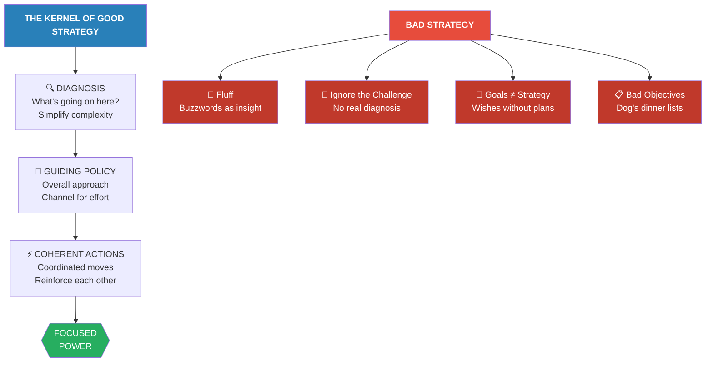
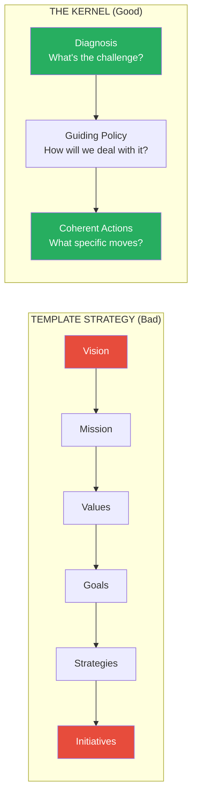
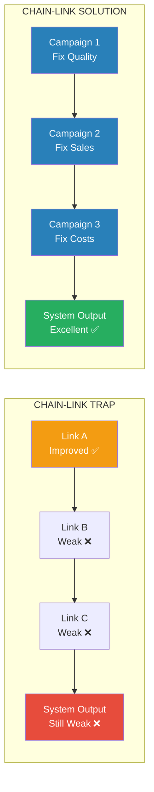
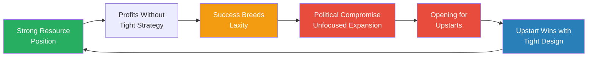
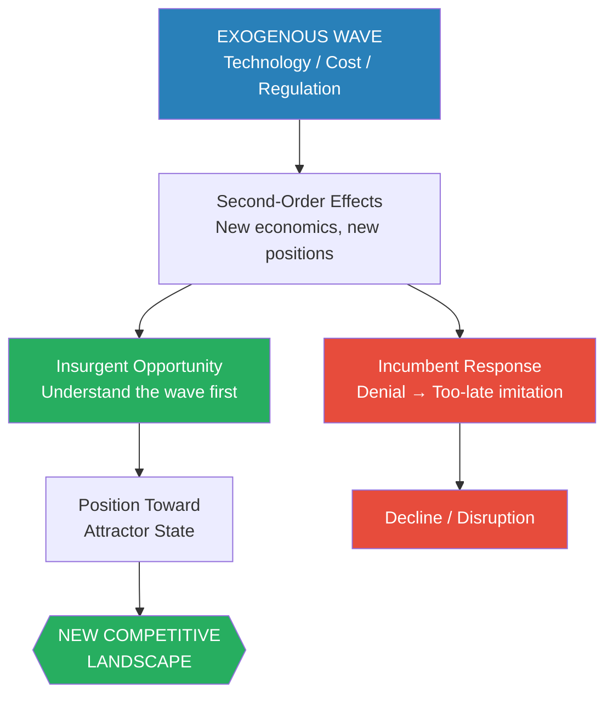
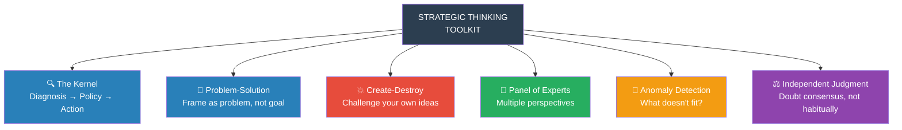

# Good Strategy Bad Strategy — Richard Rumelt

> Richard Rumelt is one of the world's most respected strategy thinkers, and he has a problem with your strategy. It's probably not a strategy at all. It's a list of goals dressed up in buzzwords, a set of ambitions with no plan to achieve them, or a vision statement that would embarrass a fortune cookie. Rumelt has spent forty years as a professor at UCLA Anderson, a consultant to governments and corporations, and an advisor to some of the sharpest strategic minds in business and defense. What he's learned is devastatingly simple: most organizations don't have a strategy — they have a performance wish list. **Good strategy is rare because it requires doing what most leaders refuse to do: diagnose the real challenge, make painful choices about what not to do, and design a coherent set of actions that focus energy where it will have the most effect.** The book's central framework — the "kernel" of diagnosis, guiding policy, and coherent action — is so elegant that once you see it, you cannot unsee the absence of strategy everywhere you look.

---

## About the Author

Richard Rumelt is the Harry and Elsa Kunin Professor of Business and Society at UCLA's Anderson School of Management, where he has taught since 1976. Trained as an electrical engineer before earning his doctorate at Harvard Business School, Rumelt brings an engineer's intolerance for vagueness to a field drowning in it. McKinsey's internal journal rated him among the top twenty-five most influential management thinkers in the world. He has consulted for organizations ranging from the Pentagon to Samsung to the National Security Council. His earlier academic work established the resource-based view of the firm and the concept of "isolating mechanisms" — the barriers that protect competitive advantage. What distinguishes Rumelt from most strategy writers is his willingness to tell people their strategy is bad — to their faces, with specific reasons why. His academic contributions have shaped how scholars think about competitive advantage, but this book — written for practitioners, not academics — distills four decades of consulting and research into principles that anyone can apply.

---

## The Big Idea

*Rumelt's master argument is that strategy is not about ambition, vision, or goals — it is a coherent response to a specific challenge, built from a diagnosis of reality, a guiding policy for dealing with it, and a set of coordinated actions that carry it out.*

- Most of what passes for strategy in business, government, and military organizations is <b style="color: #e74c3c">not strategy at all</b> — it is a mixture of goals, wishes, slogans, and buzzwords that creates the illusion of direction without the substance
- Good strategy has a recognizable structure Rumelt calls <b style="color: #2980b9">the kernel</b>: three interlocking elements that form the irreducible core of any real strategy
  - **Diagnosis** — a clear-eyed judgment about what's really going on, what challenge you actually face
  - **Guiding policy** — an overall approach for dealing with the diagnosed challenge, a channel for effort
  - **Coherent actions** — a coordinated set of moves that carry out the guiding policy, reinforcing each other
- Bad strategy is not simply the absence of good strategy — it is <b style="color: #e74c3c">an identifiable pathology</b> with four telltale hallmarks: fluff (buzzwords masquerading as insight), failure to face the challenge, mistaking goals for strategy, and bad strategic objectives
- The book's most radical claim: <b style="color: #27ae60">good strategy is inherently surprising</b> — not because it relies on secrecy, but because most organizations are incapable of the focused, coherent action that strategy demands
  - When Steve Jobs returned to Apple in 1997 and cut the product line from dozens to four, the strategy was "Business 101" — and yet it shocked the industry
  - When Schwarzkopf's Desert Storm plan turned out to be "Plan A" from the Army's own field manual, it worked because nobody expected a complex organization to actually execute a focused plan
- The sources of strategic power — leverage, proximate objectives, chain-link systems, design, focus, advantage, dynamics — are all variations on the same theme: <b style="color: #27ae60">concentrate force at the decisive point</b>

*The kernel is not a template — it is a test. Any purported strategy that lacks one of the three elements is incomplete. Any strategy that contains all three is at least coherent.*

The collapsed radar of "bad strategy" reveals Rumelt's core argument — most organisations score near zero on every dimension because they substitute goals and buzzwords for actual strategic content.

The treemap reveals an asymmetry: bad strategy clusters around four easily identifiable pathologies, while good strategy draws from a richer palette of six distinct power sources — diagnosing bad is simpler than designing good.

- The book operates on **three levels simultaneously**: as a diagnostic tool (learn to spot bad strategy instantly), as a design framework (build good strategy from the kernel), and as a thinking discipline (overcome the cognitive traps that produce bad strategy)
- Rumelt draws case studies from an extraordinary range: Nelson at Trafalgar, Hannibal at Cannae, the Cold War, Apple, Walmart, Nvidia, Crown Cork & Seal, Continental Airlines, NASA's moon landing, and his own consulting experiences
- The unifying thread: in every domain, <b style="color: #2980b9">the people and organizations that win are those who diagnose the real problem, choose where to focus, and coordinate their actions</b> — and the ones that lose are those who substitute ambition for analysis
- The book's structure mirrors its argument:
  - **Part I** (Chapters 1-5) establishes the distinction between good and bad strategy through vivid examples
  - **Part II** (Chapters 6-15) identifies ten sources of strategic power — the building blocks of effective strategy
  - **Part III** (Chapters 16-18) addresses how to think strategically — a rare and valuable addition to the strategy literature
- Each section builds on the last: you must understand what bad strategy looks like before you can avoid it; you must understand the sources of power before you can design strategy that harnesses them; you must understand how your own mind sabotages strategic thinking before you can overcome its limitations

> [!tip] The Core Test
> Ask any leader: "What is the biggest challenge your organization faces?" Then ask: "What is your strategy for dealing with it?" If the second answer doesn't directly address the first — if instead you hear goals, visions, or buzzwords — you've found bad strategy. This two-question test works in any organization, at any level, in any industry.

---

## Key Concepts at a Glance

| Concept | One-line summary |
|---------|-----------------|
| **The Kernel** | Diagnosis + guiding policy + coherent actions — the irreducible core of strategy |
| **Bad Strategy's Four Hallmarks** | Fluff, ignoring the challenge, goals-as-strategy, bad objectives |
| **Three Pathways to Bad Strategy** | Inability to choose, template-style planning, positive-thinking doctrine |
| **Strategic Leverage** | Anticipation + pivot points + concentration of force |
| **Proximate Objectives** | Goals close enough to be feasible — absorb complexity for the organization |
| **Chain-Link Systems** | Weakest link determines system strength; incremental fixes don't work |
| **Design-Type Strategy** | Tight integration of parts substitutes for resources |
| **The Arc of Enterprise** | Resources → laxity → decline → upstart disruption → cycle repeats |
| **Focus** | Coordination of policies for extra power, applied to the right target |
| **Growth Is Not Strategy** | Healthy growth is a reward for advantage, not a goal to engineer |
| **Competitive Advantage** | Asymmetry in cost or value, protected by isolating mechanisms |
| **Riding Waves** | Exploit second-order effects of exogenous shifts in technology and cost |
| **Attractor States** | Envision the industry's future stable state and position toward it |
| **Inertia** | Routine, culture, and proxy profit streams resist strategic change |
| **Entropy** | Without active management, organizations drift toward disorder |
| **Being Strategic** | Being less myopic than your undeliberative self |

---

## Part 1 — Good Strategy Is Unexpected

*Rumelt opens with a provocation: the single most surprising thing about good strategy is that it exists at all — because the vast majority of organizations don't have one.*

### Why Coherence Shocks the World

- The reason good strategy surprises people is not that it requires genius or secret knowledge — it is that <b style="color: #2980b9">focused, coherent action from a complex organization is genuinely rare</b>
- Most organizations are pulled in a dozen directions at once by competing interests, political compromises, and the natural human reluctance to say no
- When an organization actually focuses — cuts the noise, concentrates resources, coordinates action — the effect is disproportionately powerful because competitors don't expect it
- This is Rumelt's foundational insight, and it reverses the conventional wisdom about strategy:
  - **Conventional view:** strategy is about being smarter, seeing further, having better data, or being more creative
  - **Rumelt's view:** strategy is about being more focused, more coherent, and more willing to choose — qualities that are rare not because they're difficult to understand, but because they're difficult to execute politically
  - The CEO who can articulate a brilliant strategy but can't enforce it against internal resistance doesn't have a strategy — they have a speech
  - The CEO who enforces a mediocre strategy with total coherence will outperform the one with a brilliant strategy and no discipline to execute it

> [!example] Steve Jobs Returns to Apple (1997)
> - Apple was weeks from bankruptcy when Jobs returned as interim CEO
> - The company had fifteen desktop models, multiple portable lines, printers, peripherals, Newton PDAs, and dozens of software projects
> - Jobs's strategy was brutal simplification: cut to one desktop, one laptop, one for consumers, one for professionals — four products total
> - He drew a simple 2x2 grid on a whiteboard: Consumer/Professional across the top, Desktop/Portable down the side — and told the company that's all they would make
> - He eliminated printers, peripherals, and Newton entirely — each of which had its own team, budget, and internal advocates
> - Moved manufacturing to Taiwan, cutting inventory by 80%
> - Negotiated a deal with Microsoft to continue developing Office for Mac — swallowing his pride to ensure the platform survived
> - When a reporter asked about his long-term strategy, Jobs answered: "I am going to wait for the next big thing"
> - The strategy was what Rumelt calls "Business 101" — and yet it shocked the industry because nobody expected that level of ruthless focus from a complex organization
> - The result: within two years, Apple returned to profitability. Within a decade, it became the most valuable company in the world.
> **The lesson:** The strategy was obvious in hindsight. But the willingness to actually execute it — to kill profitable products, fire people, and refuse to hedge — is what made it rare and powerful.

- An electronics industry study revealed the depth of the problem: 26 executives could articulate their competitors' strategies with precision, but when asked about their own, they described what Rumelt calls "doorknob polishing" — incremental operational improvements with no strategic direction
- <b style="color: #e74c3c">The gap between knowing what strategy looks like and actually having one is enormous</b>
- This is because real strategy requires painful choices, and most leaders prefer the comfort of doing a little bit of everything
- Rumelt's term "doorknob polishing" is deliberately unflattering: it describes the tendency of organizations to obsessively refine what they're already doing — polishing the details — rather than asking whether they're doing the right thing at all
  - Better quality control. Better customer service training. Better project management. Better performance reviews.
  - Each initiative is sensible in isolation. Together they create the appearance of strategic activity without any strategic direction.
  - The problem isn't that these activities are bad — it's that they substitute for the harder work of asking "what should we be doing differently?"
  - <b style="color: #2980b9">Doorknob polishing feels productive because it is productive — just not strategic</b>
- The distinction matters because doorknob polishing consumes the same management attention and organizational energy that strategic work requires
  - An organization that spends all its strategic planning time on operational improvements has no bandwidth left for actual strategy
  - The ten-percent improvement in customer service response time feels like progress — but it may be irrelevant to the existential challenge the organization faces
  - Operational excellence and strategic clarity are both necessary — but they are different activities, requiring different thinking, and most organizations confuse the two

> [!example] Schwarzkopf's Left Hook — Desert Storm (1991)
> - The U.S.-led coalition faced Saddam Hussein's army dug into fortified positions along the Kuwait border
> - Schwarzkopf's plan was textbook: a frontal feint by Marines to pin the Iraqis, while secretly shifting 250,000 troops hundreds of miles west for a massive flanking envelopment
> - The plan was literally "Plan A" from the U.S. Army's own field manual FM 100-5 — the classic envelopment maneuver
> - It worked spectacularly: the ground war lasted 100 hours. Coalition casualties were minimal
> - The surprise was not the maneuver itself — it was that a massive, complex military bureaucracy actually executed it with coherent focus
> **The lesson:** Good strategy doesn't require originality. It requires the discipline to actually do what the textbook says — which is harder than inventing something new.

### The Diagnosis

- Rumelt argues that the deepest strategic thinking involves <b style="color: #2980b9">discovering a source of strength that others have overlooked</b> — finding asymmetric advantage where conventional analysis sees none
- The David and Goliath story is the archetype: a traditional SWOT analysis would overwhelmingly favor Goliath, but David discovered that a sling could deliver lethal force at a distance that neutralized every advantage of size
- The strategic lesson: <b style="color: #27ae60">don't accept the conventional framing of strength and weakness</b> — look for hidden leverage that redefines the contest
- Most strategic analysis begins with an assessment of strengths and weaknesses — but this assessment is only as good as the framework used to define "strength" and "weakness"
  - In conventional warfare, size and armor are strengths. But David fought an unconventional battle.
  - In conventional retail, population density is strength. But Walton built a network that redefined "store."
  - In conventional Cold War strategy, matching the enemy tank for tank is strength. But Marshall and Roche found a way to impose costs without matching.
  - The pattern: <b style="color: #2980b9">the greatest strategic insights come from redefining what counts as strength in the specific contest you're in</b>

> [!example] Walmart's Network Insight
> - Conventional wisdom in the 1960s: a discount store requires a town of at least 100,000 people to generate sufficient traffic
> - Sam Walton didn't break this rule — he redefined what a "store" meant
> - The unit of management wasn't the individual store — it was a network of 150 stores sharing logistics, data systems, and management talent across a region
> - Each individual store might serve a town of 30,000, but the network collectively served millions
> - The network enabled capabilities no individual store could achieve: real-time inventory data, cross-docking logistics that eliminated warehouse storage, bulk purchasing that reduced costs, and management talent that could be shared across locations
> - Kmart, by contrast, decentralized each store as an independent unit — they couldn't capture network effects even when they were larger
> - Breaking with the doctrine of decentralization was harder than adopting any new technique — it required rethinking the fundamental unit of business
> **The lesson:** The most powerful strategic insights come not from doing the same thing better, but from redefining the unit of analysis entirely.

- The Cold War provides a national-security example of the same principle: in 1976, Andrew Marshall and consultant James Roche developed a competitive strategy against the Soviet Union that exploited asymmetry rather than matching strength for strength

> [!example] Marshall and Roche's Competitive Strategy vs. the Soviets (1976)
> - For decades, U.S. military strategy against the Soviet Union was based on matching: more tanks to counter their tanks, more nuclear weapons to counter their weapons, more troops to counter their troops
> - This approach was enormously expensive and played to Soviet strengths — the USSR excelled at producing large quantities of conventional military hardware
> - Andrew Marshall at the Pentagon's Office of Net Assessment, working with consultant James Roche, proposed a radically different approach: instead of matching Soviet strengths, exploit U.S. strengths to impose disproportionate costs on the Soviet economy
> - The principle: invest in technologies that are expensive for the Soviets to counter but that don't increase Soviet offensive capability
>   - Precision-guided munitions — cheap to produce but require massive defensive investment to counter
>   - Stealth aircraft — invisible to Soviet radar, making their entire air defense network potentially obsolete
>   - Advanced sensors and communications — leveraging the U.S. advantage in electronics and software
> - Each investment forced the Soviet Union to spend far more on defense than the U.S. spent on offense — a deliberate strategy of economic attrition through asymmetric investment
> - This approach contributed to the Soviet overextension that led to economic collapse and the end of the Cold War
> **The lesson:** The most powerful competitive strategies don't play the opponent's game — they change the game to one where your strengths create disproportionate costs for the opponent. This principle applies equally to business: don't match the competitor's strength; invest where your strength imposes costs they can't efficiently absorb.
- <b style="color: #27ae60">The principle: good strategy exploits asymmetry</b> — press where you're strong and your opponent is weak, rather than competing head-to-head where they expect you

---

## Part 2 — Nelson at Trafalgar: The Archetype of Good Strategy

*Before diagnosing bad strategy, Rumelt opens the book with the single most vivid illustration of what good strategy looks like — a naval battle that changed the course of European history.*

### The Battle That Defined Strategy

- On October 21, 1805, Admiral Horatio Nelson faced a combined Franco-Spanish fleet of 33 ships with only 27 of his own — a meaningful numerical disadvantage in the era of line-of-battle engagements
- The conventional approach would have been to form a single line and trade broadsides with the enemy — fighting on equal terms where the larger fleet would likely prevail
- Nelson's strategy was radically different: he split his fleet into two columns and drove them perpendicularly into the enemy line, cutting it into three isolated segments
  - The rear third of the Franco-Spanish fleet would be unable to turn back in time to help
  - Nelson's ships would achieve <b style="color: #27ae60">local numerical superiority</b> at each point of contact, even though they were outnumbered overall
- The risk was real — during the approach, Nelson's ships would be exposed to raking fire with no ability to respond — but he judged that the Franco-Spanish gunners would be too unskilled to exploit this window
  - This is a critical point about strategy: <b style="color: #2980b9">all good strategy involves calculated risk</b> — the diagnosis identified the enemy's weakness (poor gunnery), the policy exploited that weakness (close-range melee), and the risk (approach under fire) was accepted as the price of concentrating force at the decisive point
- The result: the British lost zero ships; the enemy lost twenty-two. Nelson was killed by a sniper, but his strategy had already won the battle before he fell
- The engagement lasted approximately five hours. The French and Spanish fleets never again challenged British naval supremacy. The strategic consequences lasted for more than a century.
- This is the kernel in its purest form:
  - **Diagnosis:** the enemy fleet is large but poorly trained and poorly coordinated
  - **Guiding policy:** break the enemy line and fight in isolated clusters where British gunnery and seamanship will dominate
  - **Coherent actions:** two-column approach, target the rear segment, accept the approach risk, exploit close-quarters superiority

> [!tip] Nelson's Lesson
> Good strategy does not require numerical advantage. It requires concentrating strength at a decisive point where your advantage — skill, speed, training, morale — can be brought to bear before the enemy's overall superiority becomes relevant.

---

## Part 3 — The Four Hallmarks of Bad Strategy

*Bad strategy is not merely the absence of good strategy. It is an active pathology — a set of identifiable symptoms that, once learned, you will see everywhere.*

### Hallmark 1: Fluff

- Fluff is the use of abstruse words and concepts to create the illusion of high-level thinking — <b style="color: #e74c3c">buzzwords inflated to sound like expertise</b>
- Rumelt's test: if you can strip away the jargon and the statement says nothing specific, it is fluff
  - "Our strategy is customer-centric intermediation" translates to "we are a bank"
  - "A comprehensive plan to leverage our core competencies for synergistic value creation" translates to "we will try to do well"
  - "We are committed to being the preferred provider of innovative solutions in our space" translates to "we exist"
- Fluff is so pervasive in corporate communications that most people have become immune to it — they hear buzzwords and nod, without noticing that nothing has been said
- The strategic danger: <b style="color: #e74c3c">fluff doesn't just fail to communicate — it actively blocks communication</b> by creating the illusion that a strategy exists when it doesn't
- Fluff works by using Sunday-morning words for Saturday-night activities — making the mundane sound profound so no one questions it
- The danger is not just that fluff wastes time — it is that <b style="color: #e74c3c">it actively prevents the hard thinking that strategy requires</b> by creating the satisfying illusion that thinking has already occurred
- Rumelt's fluff detector is simple: take any strategic statement and try to imagine its opposite:
  - "We are committed to excellence" → Can you imagine a company committed to mediocrity? No. The statement conveys zero information.
  - "We will focus on customer needs" → Can you imagine a company that deliberately ignores customers? No. Still zero information.
  - "We will target the short-run packaging market through rapid technical response" → Can you imagine the opposite? Yes — "We will target the long-run commodity market through scale." Now you have an actual strategic choice.
- <b style="color: #27ae60">If the opposite of your strategy statement is nonsensical, your statement is fluff</b>
- This "opposite test" is one of the most immediately useful tools in the book — it can be applied in any meeting, to any document, in under ten seconds
  - Next time someone presents a strategy, mentally construct the opposite
  - If the opposite sounds absurd ("We will not delight our customers"), the original statement is empty
  - If the opposite sounds like a viable alternative strategy ("We will compete on price rather than service"), the original is a real strategic choice
  - This test alone can save hours of strategic planning meetings that would otherwise produce fluff
  - Try it on your own organization's mission and strategy statements — you may be alarmed at how many fail the test

### Hallmark 2: Failure to Face the Challenge

- A strategy that doesn't diagnose the actual problem it needs to solve is not a strategy — it is a wish list floating free of reality
- The diagnosis is the foundation: without it, you cannot evaluate whether the guiding policy makes sense or whether the actions are coherent

> [!example] International Harvester's Elephant in the Room (1979)
> - International Harvester was one of America's largest industrial companies, manufacturing trucks, farm equipment, and construction machinery
> - In 1979, its strategic planning department produced a detailed plan full of financial projections, market share goals, and operational targets
> - The plan was professionally formatted, rigorously quantified, and thoroughly reviewed
> - It addressed manufacturing efficiency, product development, market expansion, and financial management
> - The plan addressed everything — except the company's fundamental problem: grossly inefficient work organization and the worst labor relations in American industry
> - Workers routinely shut down plants over trivial disputes; management and unions were locked in mutual hostility
> - Absenteeism was so high that production schedules were unreliable; grievance procedures consumed management time that should have gone to customers
> - The plan's silence about this issue was deafening — it was the one thing that could destroy the company, and everyone in the organization knew it
> - By 1985, International Harvester had lost over $3 billion, closed 35 of its 42 plants, and sold off everything except its truck division (renamed Navistar)
> - The labor problem that the plan refused to diagnose was the primary cause of destruction
> **The lesson:** A strategy that fails to address the central challenge is worse than no strategy at all — it creates a false sense of progress while the real problem destroys the organization. The most dangerous strategies are the ones that look thorough but avoid the one topic that matters.

- Rumelt contrasts this with DARPA (Defense Advanced Research Projects Agency), which begins every program by explicitly stating the challenge it aims to overcome — not goals, but the specific technical or operational obstacle that must be solved

### Hallmark 3: Mistaking Goals for Strategy

- The most common form of bad strategy: stating what you want to achieve without any plan for achieving it
- <b style="color: #e74c3c">Goals are not strategy</b> — they are desires. Strategy is the bridge between where you are and where you want to be, and that bridge must be built from specific actions

> [!example] Chad Logan's 20/20 Plan — Goals Masquerading as Strategy
> - A CEO Rumelt calls "Chad Logan" presented his company's "key strategies" at a board retreat
> - Strategy 1: achieve 20% revenue growth. Strategy 2: achieve 20% profit margin
> - When Rumelt pointed out these were goals, not strategies, Logan quoted Jack Welch about "reaching for what appears to be the impossible"
> - When Rumelt pressed further — asking what specific actions would produce 20% growth in a mature market — Logan had no answer
> - Logan then hired a "Visioning" consultant who had the management team "think twice as big" — doubling the targets to 40/40
> - The consultant's method: get the team excited about bigger numbers, create emotional commitment to the targets, and assume that motivation would somehow produce results
> - There was no diagnosis of the competitive landscape, no guiding policy, no plan of action — just bigger numbers and more enthusiasm
> - Rumelt draws a devastating parallel to Passchendaele (1917), where British commanders sent waves of soldiers into machine guns, believing that motivation and willpower could substitute for competent strategy
>   - At Passchendaele, 400,000 British soldiers were killed or wounded advancing five miles through mud
>   - The problem was not insufficient motivation — the soldiers were extraordinarily brave
>   - The problem was that leadership substituted determination for strategy — and strategy's absence is not compensated by willpower
> **The lesson:** Ambition without analysis is not strategy — it is hope dressed in a business suit. And hope, as a planning methodology, has a body count. The gap between "we want 20% growth" and "here is how we will achieve 20% growth" is the entire discipline of strategy.

### Hallmark 4: Bad Strategic Objectives

- Even when organizations attempt to specify actions, they often produce what Rumelt calls a <b style="color: #e74c3c">"dog's dinner"</b> — a long, incoherent list of disconnected initiatives that diffuse effort rather than concentrate it
  - One organization produced 47 "strategies" and 178 "action items" — a list so long that no coordination was possible
  - Blue-sky objectives set impossible goals without regard to feasibility: the Los Angeles Unified School District declared its strategy was to achieve "transformational leadership" in a district with 33,000 teachers, thousands of bureaucrats, and a governance structure designed to prevent change
- Good strategic objectives are <b style="color: #27ae60">proximate</b> (close enough to be feasible) and <b style="color: #27ae60">coherent</b> (reinforcing each other rather than competing for resources)
- The distinction between a "dog's dinner" list and a coherent set of objectives:
  - A dog's dinner is a list compiled by asking every stakeholder what they want, then including everything — the result is comprehensive and useless
  - A coherent set of objectives is compiled by asking "given our diagnosis and guiding policy, what actions reinforce each other?" — the result is focused and powerful
  - The dog's dinner gives everyone something to point to; the coherent set gives the organization something to do
- The LAUSD example is particularly devastating because it shows how blue-sky objectives can seem inspirational while being operationally meaningless:
  - In a district where basic literacy was failing, the strategy aspired to "transformational leadership"
  - This sounds bold but provides zero guidance: which schools? Which programs? Which teachers? What changes? How measured?
  - A proximate alternative: "Raise third-grade reading scores in the bottom-performing 10% of schools by implementing structured phonics programs and providing additional reading specialists"
  - This is less inspiring but infinitely more useful — every word tells someone what to do

| Bad Strategy Hallmark | What It Looks Like | The Test |
|---|---|---|
| **Fluff** | Buzzwords, jargon, Sunday words for Saturday activities | Strip the jargon — does it say anything specific? |
| **Failure to face the challenge** | Plan ignores the central obstacle | Does the strategy address the biggest problem? |
| **Goals as strategy** | Revenue targets, market share wishes, vision statements | Is there an action plan, or just a destination? |
| **Bad objectives** | Dog's dinner lists, blue-sky fantasies | Are objectives feasible and mutually reinforcing? |

### Bad Strategy in the Wild: Extended Examples

*Rumelt doesn't just define bad strategy abstractly — he names specific organizations and leaders, giving the book an unusual intellectual honesty that most business authors lack.*

- **Arthur Andersen and Enron:** Andersen's consulting presentations for Enron's bandwidth trading business were pure fluff — dense slides filled with jargon that obscured the absence of any viable business model. The consultants themselves may not have understood what they were selling, but the language created an aura of sophistication that kept everyone nodding.

- **The LAUSD disaster:** The Los Angeles Unified School District — a sprawling bureaucracy with 33,000 teachers, 700+ schools, and a governance structure designed to prevent change — declared its strategic goal was "transformational leadership." This is a blue-sky objective: it sounds inspiring and is completely disconnected from what the organization could actually achieve. A proximate objective might have been "improve reading scores in the bottom 50 schools by restructuring their reading programs" — specific, achievable, and addressable.

- **Lehman Brothers' "risk appetite":** In the years before its 2008 collapse, Lehman's strategy documents discussed the firm's "risk appetite" as if appetite were a strategy. It was a description of how much risk the firm was willing to take — not a diagnosis of the market, not a policy for managing risk, and not a set of coherent actions for navigating the housing bubble.

- **The Web 2.0 CEO:** At a conference, a young technology CEO was asked about his strategy. His answer: "Strategy is never quitting until you win." This confuses persistence (a character trait) with strategy (a coherent response to a challenge). Persistence without strategy is just stubbornly running in the wrong direction.

- **The corporate balloon retreat:** Rumelt describes a corporate retreat where the facilitator had executives write their hopes on balloons and release them. The imagery was meant to symbolize letting go of limitations. By the end of the retreat, the executives had generated "vision" and "values" statements — but zero strategy. They returned to the office feeling inspired and continued doing exactly what they had been doing before.

> [!example] The Electronics Industry Study — The Mirror Test
> - Rumelt conducted a study of 26 senior executives in the electronics industry
> - Each executive could describe their competitors' strategies with remarkable clarity: "They are trying to seize windows of opportunity in emerging markets"
> - But when asked about their own strategies, the same executives described what Rumelt calls "doorknob polishing" — operational improvements, efficiency programs, quality initiatives
> - None could articulate a coherent strategy that distinguished their company from competitors
> - The gap was invisible to them — they genuinely believed that "improve execution" was a strategy
> - Rumelt calls this the mirror test: can you describe your own strategy with the same clarity you use for your competitors'?
> **The lesson:** If your strategy sounds like something any company in your industry could say, it's not a strategy — it's operational management dressed in strategic clothing.

---

## Part 4 — Why Bad Strategy Is So Common

*If bad strategy is so easy to spot, why is it everywhere? Rumelt identifies three root causes — and argues that the third is the most insidious because it masquerades as wisdom.*

### Pathway 1: The Inability to Choose

- Strategy requires saying no — to people, projects, divisions, and ambitions that don't serve the chosen focus
- Most leaders find this politically impossible because every "no" creates an enemy inside the organization
  - The result is a <b style="color: #e74c3c">compromise that tries to do everything</b> — which is another way of saying it does nothing with strategic force
- Rumelt is blunt about this: the inability to choose is not a failure of analysis or intelligence — it is a failure of courage
  - Most leaders understand that focus would produce better results
  - What they fear is the political cost of focus — the meetings with angry executives, the loss of organizational allies, the risk that the chosen direction turns out to be wrong
  - The compromise feels safer because blame is diffused — if everything fails, no single decision can be identified as the cause
  - But the compromise is actually riskier because it guarantees mediocrity across all fronts instead of risking concentrated excellence on one
  - <b style="color: #e74c3c">The irony of strategic compromise: it feels like the safe choice but is actually the most dangerous one</b>
  - The compromise guarantees that no direction receives enough resources to succeed, while consuming all available resources on mediocre efforts across multiple fronts
  - A focused bet on the wrong direction can be recognized and corrected; a diffused compromise rarely surfaces as a clear failure — it just slowly underperforms until the organization has exhausted its options

> [!example] DEC's Three-Way Paralysis
> - Digital Equipment Corporation (DEC) was the world's second-largest computer company in the late 1980s, behind only IBM
> - Three senior executives each proposed a different strategic direction:
>   - **Boxes:** compete with IBM and the emerging PC makers by selling hardware — servers, workstations, desktop computers
>   - **Solutions:** move upstream to selling integrated systems and consulting — custom-configured solutions for enterprise customers
>   - **Chips:** leverage DEC's Alpha processor technology to become a semiconductor company — selling the industry's fastest chip to other manufacturers
> - Each direction had genuine merit. Each executive had a constituency of engineers, salespeople, and loyal customers
> - CEO Ken Olsen could not choose — and more importantly, would not choose — because choosing any one direction meant telling two powerful executives that their vision was wrong
> - The "strategy" became a diplomatic compromise: fund all three directions, with the understanding that each executive would pursue their vision within their division
> - Without focused investment in any one direction, DEC couldn't compete effectively in any of them: the Boxes division lacked the scale of IBM or Compaq, the Solutions division lacked the consulting depth of Andersen or EDS, and the Chips division lacked the manufacturing focus of Intel
> - The company collapsed, acquired by Compaq in 1998 for a fraction of its peak value
> - The ultimate irony: by trying to keep everyone happy, Olsen ensured that everyone lost everything
> **The lesson:** A strategy that accommodates everyone's interests is not a strategy — it is a political settlement. And political settlements do not concentrate force. Sometimes the most important act of leadership is choosing which two-thirds of the organization to disappoint.

### Pathway 2: Template-Style Strategy

- The modern strategy industry has created a fill-in-the-blanks approach: start with a vision, derive a mission statement, list your values, set strategic goals, define strategies, then action items
- This template emerged from the charismatic leadership literature of the 1980s and 1990s — the idea that leaders should inspire through compelling visions
- The problem: <b style="color: #e74c3c">the template substitutes ritual for thinking</b>
  - A vision statement is not a diagnosis
  - A mission statement is not a guiding policy
  - A list of values does not produce coherent action
- The template makes strategy feel complete without any actual analysis of the challenge — it is the organizational equivalent of filling out a form and calling it medicine

*The template approach (top) produces six boxes of feel-good language that never connect to reality. The kernel (bottom) has only three elements, but each directly addresses the challenge.*

- The template's most insidious feature is that it <b style="color: #e74c3c">makes everyone feel like they've done strategic work</b> — the retreat is over, the binder is thick, the slides are polished — when in fact no hard choices have been made and no real analysis has been conducted

### Pathway 3: The Power of Positive Thinking

- The deepest root of bad strategy is the doctrine that believing in success creates success — a philosophy Rumelt traces from Emerson's transcendentalism through Norman Vincent Peale to modern motivational speakers
- This doctrine makes strategy seem unnecessary: if all you need is a bold vision and unwavering belief, then diagnosing problems and designing solutions is negative thinking
- <b style="color: #e74c3c">The New Thought doctrine treats analysis as pessimism</b> — and in doing so, it protects bad strategy from the criticism that would expose it
- The lineage of this thinking is surprisingly traceable:
  - Ralph Waldo Emerson (1840s): the idea that thought shapes reality
  - Norman Vincent Peale (1952): *The Power of Positive Thinking* — a massive bestseller that taught millions that belief creates outcomes
  - Modern motivational speakers and corporate retreats that treat strategic analysis as "negativity" and critical thinking as "not being a team player"
- The New Thought doctrine has become so embedded in corporate culture that questioning a strategy is often treated as questioning the leader — a career-limiting move that suppresses exactly the critical thinking strategy requires
- Rumelt connects this directly to the 2008 financial crisis: the collective unwillingness to question the housing bubble was partly a manifestation of the positive-thinking culture that equated skepticism with disloyalty
  - Analysts who raised red flags were told they "didn't get it" or were "too negative"
  - Charles Prince, CEO of Citigroup, captured the culture perfectly: "As long as the music is playing, you've got to get up and dance"
  - The positive-thinking doctrine created an environment where the most important strategic analysis — "this cannot continue" — was culturally impossible
- The irony: <b style="color: #e74c3c">the positive-thinking doctrine doesn't just coexist with bad strategy — it actively produces it</b> by making the hard work of diagnosis feel like failure of faith

### How to Distinguish Real Strategy From New Thought Disguised as Strategy

| Feature | Real Strategy | New Thought Disguised as Strategy |
|---|---|---|
| **Starting point** | Diagnosis of a specific challenge | Vision of a desired future |
| **Language** | Concrete, specific, testable | Inspirational, abstract, unfalsifiable |
| **Attitude toward problems** | Names them directly, analyzes them | Reframes them as "opportunities" or ignores them |
| **Attitude toward failure** | Expects it, plans for it, learns from it | Treats it as evidence of insufficient belief |
| **Basis for confidence** | Analysis and evidence | "If you believe it, you can achieve it" |
| **Response to criticism** | Engages with the substance | Dismisses the critic as "negative" |

> [!tip] Three Roots of Bad Strategy
> Whenever you encounter bad strategy, it traces to one of three causes: (1) the leader couldn't make the hard choices that focus requires, (2) the organization substituted a planning template for genuine analysis, or (3) a culture of positive thinking made critical diagnosis feel like disloyalty.

The inability to choose dominates because it is the most psychologically comfortable failure mode — keeping all options open feels like prudence but is actually strategic paralysis.

---

## Part 4 — The Kernel of Good Strategy

*Having demolished bad strategy, Rumelt builds his alternative: the kernel — three elements that form the irreducible core of any genuine strategy.*

### Element 1: The Diagnosis

- The diagnosis answers the question "What's going on here?" — it is a <b style="color: #2980b9">judgment that simplifies the overwhelming complexity of reality</b> by identifying the critical aspects of the situation
- A diagnosis is not a proven fact — it is a considered judgment, a frame through which you choose to see the world
  - The same situation can yield different diagnoses, each opening different action domains
  - For Starbucks in 2008: is the problem overexpansion? Eroding brand? Search for new platforms? Each diagnosis leads to a completely different strategy
- The power of diagnosis is that it <b style="color: #2980b9">replaces the overwhelming complexity of everything that's happening with a simpler story</b> that identifies the one or two critical factors

| Possible Diagnosis | Implied Strategy | Resulting Actions |
|---|---|---|
| Starbucks has overexpanded | Retrenchment | Close stores, cut costs, refocus on core markets |
| Starbucks' advantage is eroding | Defend the moat | Reinvest in quality, training, and in-store experience |
| Starbucks needs new platforms | Innovation | Launch new products, enter adjacent categories, pursue digital |

- The table illustrates Rumelt's key insight about diagnosis: <b style="color: #2980b9">the diagnosis determines which actions even make sense to consider</b> — change the diagnosis and you change the entire strategic landscape

> [!example] George Kennan's Long Telegram (1946)
> - U.S. policymakers after WWII were struggling with how to deal with the Soviet Union — was it a normal great power that could be negotiated with, or something different?
> - George Kennan, a career diplomat in Moscow, sent an 8,000-word telegram diagnosing the situation: the Soviet Union was not an ordinary nation-state — its antagonism toward the West was foundational to the regime's legitimacy
> - Soviet leaders needed an external enemy to justify internal repression — no amount of goodwill or concession would change this
> - This diagnosis — which reframed the USSR from potential partner to inherent adversary — led directly to the containment policy that guided U.S. strategy for forty years
> - Kennan's genius was not in proposing containment itself, but in the diagnosis that made containment the obvious response
> **The lesson:** The most powerful part of strategy is often the diagnosis — a reframing of reality that makes the right response obvious.

- Lou Gerstner at IBM provides a business counterpart: when Gerstner arrived in 1993, the conventional diagnosis was that IBM was "too integrated" — it should be broken into independent units
  - Gerstner reversed the diagnosis: IBM was <b style="color: #27ae60">"uniquely integrated"</b> — the only company that could offer complete IT solutions
  - This single reframing shifted IBM from a hardware company headed for breakup into an IT consulting powerhouse

> [!example] Gerstner at IBM — The Power of Re-Diagnosis
> - When Lou Gerstner was hired as IBM's CEO in 1993, the company was losing billions and the board was preparing to break it into independent units
> - The consensus diagnosis: IBM was too big, too integrated, too slow — it needed to be split into nimble independent companies that could compete in specific segments
> - Gerstner spent months talking to customers before offering his counter-diagnosis: customers didn't want twelve different IBM companies selling them twelve different products — they wanted one company that could solve their entire IT problem
> - The real diagnosis: IBM's integration was not a liability — it was its most valuable asset, because no other company could offer end-to-end IT solutions
> - The guiding policy that followed: position IBM as the world's leading IT consulting and integration company, with hardware as a component of the solution rather than the product itself
> - The coherent actions: invest in services and consulting, maintain the integrated product line, build industry-specific solution teams, de-emphasize the hardware-first culture
> - Within five years, IBM had been transformed from a failing hardware company into the world's leading IT services firm
> - The strategy was not a new idea — it was a new diagnosis of the same reality that produced a fundamentally different response
> **The lesson:** The most powerful strategic move is often not a new action but a new diagnosis. Gerstner didn't invent new technology or discover new markets — he reframed IBM's central characteristic (integration) from liability to asset, and the entire strategy followed.

### Element 2: The Guiding Policy

- The guiding policy is the overall approach chosen to deal with the diagnosed challenge — it <b style="color: #2980b9">channels effort in a particular direction without specifying every action</b>
- It is not a goal — it is a method, an approach, a way of dealing with the situation
  - Wells Fargo's vision of being "the premier financial services company" is a goal
  - Wells Fargo's policy of cross-selling multiple products to existing customers is a guiding policy
  - The difference: the policy tells you what to do, the goal only tells you what to want
- A guiding policy is like a highway guardrail — it doesn't tell you exactly where to drive, but it keeps you from going off the cliff
  - Stephanie's grocery store: "serve the busy professional with little time to cook" — this policy immediately tells employees what to stock, how to organize the store, and what services to offer, without specifying every detail
- The guiding policy must be <b style="color: #27ae60">directly connected to the diagnosis</b> — if the diagnosis identifies price competition as the challenge, a guiding policy of "differentiate through premium quality" makes sense; a guiding policy of "cut costs" makes different sense; a guiding policy of "grow revenue 20%" addresses nothing
- Many organizations confuse values with guiding policy:
  - "Integrity, excellence, customer focus" are values — they don't tell you what to do differently than your competitors
  - A guiding policy creates asymmetry — it pushes effort in a direction that your competitors are not going, or cannot easily follow

### Element 2.5: What a Guiding Policy Is NOT

| What Leaders Call "Strategy" | Why It's Not a Guiding Policy |
|---|---|
| "Be the market leader" | Goal, not method — doesn't say how |
| "Delight our customers" | Value statement — every competitor claims this |
| "Grow revenue 20% annually" | Financial target — no diagnosis, no approach |
| "Innovate relentlessly" | Slogan — doesn't channel effort in any specific direction |
| "Leverage synergies across business units" | Fluff — sounds strategic but specifies nothing |

- A real guiding policy sounds less impressive but is far more useful: "Focus on the residential renovation market in the Southeast, using our permit-processing speed as the differentiator" — this immediately tells everyone in the organization what to do and what not to do

### The Guardrail Test

- Rumelt uses a vivid metaphor to explain how a guiding policy works: it is like a <b style="color: #2980b9">highway guardrail</b>
  - It doesn't tell you exactly where to drive — you still need judgment for that
  - But it keeps you from going off the cliff — it constrains the range of acceptable actions
  - A guiding policy of "serve the busy professional with little time to cook" doesn't specify every product on the shelf, but it prevents stocking items that don't fit the profile
  - A guiding policy of "win through technical service on short runs" tells Crown Cork & Seal not to pursue long-run commodity contracts — even if those contracts look profitable in isolation
- The guardrail test for any guiding policy: <b style="color: #27ae60">does it rule things out?</b>
  - If your guiding policy is compatible with every possible action, it's not channeling effort — it's a platitude
  - A good guiding policy should make some employees uncomfortable because it tells them that something they want to do is outside the strategic direction
  - If no one is uncomfortable, no one has been told "no" — and a strategy that says "no" to nothing says "yes" to nothing

### Element 3: Coherent Actions

- Coherent actions are the specific, coordinated steps that carry out the guiding policy — they are <b style="color: #2980b9">the punch in strategy</b>
- The key word is coherent: the actions must reinforce each other, not compete for resources or work at cross-purposes
- Without coordinated action, diagnosis and policy are academic exercises
- Rumelt emphasizes that coordination is <b style="color: #27ae60">unnatural</b> — left to their own devices, units within an organization will optimize locally, not strategically
  - The sales team will pursue the easiest revenue, not the most strategic customers
  - Engineering will build what's technically interesting, not what the guiding policy demands
  - Finance will cut costs everywhere equally, not selectively invest in the areas the policy prioritizes
  - Marketing will chase the broadest audience, not the specific segment the diagnosis identified
  - HR will hire for general competence, not for the specific capabilities the strategy requires
- Each of these local optimizations is individually rational — and collectively catastrophic for strategic coherence
- Strategic coordination must therefore be imposed through centralized direction — it is an act of leadership, not an emergent property of decentralized decision-making
- This is why Rumelt insists that <b style="color: #2980b9">the leader's primary strategic function is imposing coherence</b> — not inspiring, not motivating, not visioning, but ensuring that the organization's actions reinforce each other rather than compete

> [!example] The European Business Group — Nine Months to Act
> - A division of a major corporation created a "Pan-European" initiative to coordinate operations across national boundaries
> - After nine months of meetings, presentations, and discussions, nothing had actually changed — no reorganization, no new reporting lines, no reassignment of resources
> - When Rumelt confronted the division head, the response was telling: "We would do that only if it were really important"
> - The division had a guiding policy (pan-European coordination) but no coherent action — the strategy existed only on paper
> - The gap between announcing a direction and actually reorganizing to pursue it is where most strategies die
> **The lesson:** Coherent action is the hardest part of strategy because it requires making real changes — moving people, reallocating budgets, killing projects — not just declaring intentions.

> [!example] FDR's WWII Strategy — Coordination as Command
> - When the United States entered World War II, Roosevelt imposed a clear strategic framework: Europe first, Pacific second
> - American production capacity would be used to support the Soviet Union's ground war against Germany while the U.S. built up forces for the invasion of France
> - This was not an emergent consensus — it was centralized direction that overrode the Navy's preference for a Pacific-first approach and the Army Air Corps' desire for independent strategic bombing
> - The coherence of this coordination — every major resource decision aligned to a single framework — was what gave the Allied strategy its power
> **The lesson:** Coordination is not natural. It must be imposed through leadership because decentralized decisions will always drift toward local optimization, not strategic coherence.

- Ford provides the counterexample of incoherence: the company bought Jaguar and Volvo specifically for their brand value, then put both on a common Ford platform — <b style="color: #e74c3c">destroying the very brand distinctiveness they had paid billions to acquire</b>
  - Two policies in direct conflict: "leverage brand value" and "reduce costs through platform sharing"
  - The Jaguar S-Type shared a platform with the Lincoln LS — customers paying premium prices for British distinctiveness discovered they were driving a re-skinned Lincoln
  - Coherent strategy would have required choosing one — and Ford chose neither
  - This is one of the most common forms of strategic incoherence in large companies: two individually plausible policies that together destroy each other

---

## Part 5 — Sources of Power: Leverage, Proximate Objectives, and Chain-Link Systems

*Having established the kernel, Rumelt turns to the question: where does strategic power actually come from? Part II of the book identifies ten sources. The first three — leverage, proximate objectives, and chain-link systems — are about focusing force on the right point.*

### Using Leverage

- Strategic leverage is the ability to <b style="color: #2980b9">apply a relatively small effort to create a disproportionately large effect</b> — it is the multiplier that turns modest resources into decisive outcomes
- Leverage is not about working harder — it is about working at the right point, at the right time, with the right concentration
- Most organizations spread their effort evenly across many fronts — this is the opposite of leverage. Strategic leverage means finding the one place where a push creates disproportionate movement.
- Leverage has three components that work together:

| Component | What It Means | Example |
|-----------|--------------|---------|
| **Anticipation** | Foreseeing what others will do or what will happen | Toyota investing $1B in hybrids before fuel economy pressure materialized |
| **Pivot points** | Identifying the one factor where force will have the greatest effect | 7-Eleven Japan identifying micro-location as the key to convenience retail |
| **Concentration** | Focusing all available resources on the pivot point | Harold Williams at the Getty Trust — pour everything into becoming a world presence in art |

- Anticipation is not prediction — it is <b style="color: #27ae60">educated judgment about the direction of change</b> that lets you prepare while others react
  - Toyota's hybrid investment was not a bet that fuel prices would spike — it was a preparation for the inevitable tightening of fuel economy standards
  - Iraqi insurgents anticipated that media coverage of U.S. casualties would erode American public support — they even had an Arabic translation of Black Hawk Down as a training manual
- Pivot points are the <b style="color: #2980b9">fulcrum where small actions create large consequences</b>
  - Pierre Wack at Shell anticipated the oil crisis by identifying OPEC pricing as the pivot point for the entire global energy system — a single decision by OPEC ministers could reshape every industry on earth
  - 7-Eleven Japan identified micro-location as the pivot point for convenience retail — the difference between profit and failure was often a few hundred meters of foot traffic
  - The Brandenburg Gate became the pivot for German reunification — a single symbolic location around which historical momentum gathered
  - In each case, the pivot point was not where the most activity was happening, but where a small change would create the largest ripple
  - <b style="color: #27ae60">Finding the pivot point is the strategic equivalent of finding the fulcrum</b> — it's where you place your lever to move the world
  - The discipline of finding pivot points requires understanding the system well enough to know where it's most sensitive to change — which is usually not where the most activity is happening
- Concentration means refusing to spread resources across many objectives — what Harold Williams did when the Getty Trust received a massive endowment and he resisted pressure to fund everything from education to medical research, focusing solely on art
  - The Getty Trust's endowment was so large that it could have become a mediocre player in a dozen fields
  - Williams chose instead to become the dominant player in one field — art acquisition and museum development
  - This decision was politically costly: every interest group argued that the endowment should fund their priorities
  - But concentration produced results that diversification never could: the Getty became one of the world's foremost art institutions
  - <b style="color: #2980b9">Concentration is the discipline of abundance</b> — it is hardest when resources are plentiful, because the temptation to spread them is strongest when they seem inexhaustible
  - Paradoxically, concentration is easier for resource-constrained organizations — they have no choice. The organizations most vulnerable to diffusion are the ones with the most resources, because they can afford to fund everything and therefore lack the pressure to choose

> [!example] Toyota's Anticipation — The Billion-Dollar Bet on Hybrids
> - In the early 1990s, when gasoline was cheap and SUVs dominated American highways, Toyota invested over $1 billion in hybrid vehicle technology
> - This was not a prediction that fuel prices would spike — it was a judgment that fuel economy regulations would inevitably tighten
> - When the Prius launched in 1997, competitors dismissed it as a niche curiosity
> - When fuel prices finally did spike and regulations tightened, Toyota had a decade-long head start in the technology that everyone suddenly needed
> - The anticipation was not about timing the market — it was about preparing for a direction of change that was virtually certain, even if the timing was not
> **The lesson:** Strategic anticipation is not prediction — it is preparation for the direction of change that is foreseeable, even when the timing is not.

### Proximate Objectives

- A proximate objective is a goal that is <b style="color: #2980b9">close enough to be feasible</b> — a target the organization can actually hit, given its skills and current position
- The leader's job is to <b style="color: #27ae60">absorb complexity</b> — to take the overwhelming confusion of the situation and hand the organization a problem it can solve
- This is one of Rumelt's most important and most overlooked insights: the leader's primary strategic contribution is not visionary thinking but complexity absorption
  - The world presents infinite complexity — markets shifting, competitors moving, technology changing, customers evolving, regulators acting, employees turning over, supply chains disrupting
  - The organization cannot process this complexity — it needs a clear, achievable objective to work toward
  - The leader's job is to stand between the world's complexity and the organization's need for clarity, absorbing the former and producing the latter
  - This is why the best leaders often seem to have a talent for simplification — they don't simplify because they think simply, they simplify because they understand deeply enough to know what can be ignored
- What counts as "proximate" depends entirely on the organization's current capabilities — what's proximate for a Fortune 500 company may be impossible for a startup, and vice versa

> [!example] Kennedy's Moon Landing — The Most Proximate "Impossible" Goal
> - Kennedy's 1961 declaration that America would land a man on the moon within a decade appears to be the ultimate example of a big, hairy, audacious goal
> - But Rumelt shows it was actually a brilliantly proximate objective: Wernher von Braun had analyzed the technical requirements and judged the moon landing feasible
> - The key insight: reaching the moon required a 10x increase in rocket size — so large that neither the U.S. nor the Soviet Union had existing advantages
> - The Soviets led in heavy rockets, but the moon required rockets so much larger that the playing field was effectively leveled
> - Kennedy's seemingly audacious goal was actually the most carefully judged objective available — it was "audacious" only to those who hadn't done the engineering analysis
> **The lesson:** The best proximate objectives look bold from the outside but are grounded in careful analysis of what's actually achievable.

> [!example] Phyllis Buwalda's Lunar Surface Specification
> - NASA engineers couldn't design a lunar lander without knowing what the moon's surface was like — hard rock? Dust? Quicksand?
> - The ambiguity threatened to paralyze the entire program
> - Phyllis Buwalda, a geologist at JPL, wrote a specification describing the lunar surface as similar to the desert of the American Southwest — firm enough to land on, with some dust
> - When challenged, she replied: "If it turns out to be much more difficult than this, we aren't going to be spending much time on the moon anyway"
>   - This single act of judgment absorbed the ambiguity that was blocking hundreds of engineers
> **The lesson:** Leaders absorb ambiguity so others can act. Buwalda didn't eliminate uncertainty — she made a judgment that allowed work to proceed. The perfect is the enemy of the good, and the strategist's job is to provide "good enough" clarity so the organization can move. Waiting for perfect information is itself a decision — a decision to do nothing.

- The helicopter pilot metaphor captures the layered nature of proximate objectives:
  - A military pilot named PJ explained to Rumelt: you must make flying automatic before you can fly at night; you must fly at night before you can fly in formation; you must fly in formation before you can land on a rolling ship deck
  - Each skill layer depends on mastering the one below it — <b style="color: #2980b9">what is proximate depends on which rungs you've already climbed</b>
  - A startup that can't reliably deliver its core product has no business setting "expand to Europe" as a strategic objective
  - An organization that hasn't mastered basic execution shouldn't be pursuing "transformational innovation"
  - The hierarchy principle applies universally:
    - In personal development: master the basics before attempting advanced techniques
    - In business: achieve product-market fit before scaling
    - In military operations: secure the base before launching the offensive
    - In education: learn arithmetic before calculus
    - In organizational change: build credibility with small wins before attempting transformation
    - In software: ship the minimum viable product before adding features
    - In career strategy: become excellent at your current role before pursuing promotion
  - <b style="color: #27ae60">The most common strategic mistake is attempting a high-rung objective before mastering the lower rungs</b> — it looks ambitious but is actually reckless
  - Rumelt's advice: if you're unsure what's proximate, start lower than you think you should — a proximate objective that's achieved builds capability and confidence for the next objective, while a too-ambitious objective that fails demoralizes and depletes resources
- In dynamic, rapidly changing environments, objectives must be <b style="color: #27ae60">more proximate, not less</b>
  - In chess: "improve my position" is a better objective than "checkmate in twelve moves" because the situation will change unpredictably
  - The more turbulence, the shorter the planning horizon should be

> [!example] The Business School Exercise — Forced Proximity
> - Rumelt asked a group of executives to develop a strategy for a struggling business school
> - Their first instinct was to list grand objectives: "become a top-twenty program," "attract world-class faculty," "build a global brand"
> - When forced to pick one feasible, proximate objective, they chose: "get our students into better jobs"
> - This proximate objective immediately clarified everything: identify ten target employers, understand what they want in graduates, redesign the curriculum to deliver it, build relationships with hiring managers
> - Each step was concrete and achievable — a dramatic contrast with the original wish list
> - The grand objectives might eventually be reached, but only as a consequence of executing the proximate one
> **The lesson:** When you force a group to choose one achievable objective, the strategy clarifies instantly. The proximate objective absorbs the complexity and converts vague ambition into actionable work.

### Chain-Link Systems

- A chain-link system is one where <b style="color: #e74c3c">performance is limited by the weakest link</b> — strengthening any other link provides zero benefit until the bottleneck is addressed
- The Challenger disaster is the defining example: the O-ring was the weakest link in the solid rocket booster system. No amount of excellence in other components could compensate for that single failure
  - The O-rings were known to be vulnerable at low temperatures. Engineers warned against launching in cold weather. Management overrode the warnings.
  - The lesson is not just about O-rings — it is about chain-link systems: the most expensive, sophisticated, and carefully engineered system in the world is only as good as its weakest component
  - <b style="color: #2980b9">In a chain-link system, the critical strategic question is always: what is the weakest link?</b> — everything else is secondary
- Chain-link logic creates a trap: <b style="color: #e74c3c">incremental improvement doesn't pay</b>
  - If you manage one link in a chain and improve it, but the other links remain weak, your improvement generates no visible benefit
  - This creates a vicious cycle: no one invests in improvement because improvement doesn't seem to work — the classic "stuck" organization
  - GM from 1980 to 2008: engineering might produce a better transmission, but if the knobs still fall off, the interior feels cheap, and the dealer experience is hostile, the customer experience doesn't improve
  - The insidious part: each individual link can blame the others for the lack of progress ("We improved our link — it's the other departments that are the problem")
  - This blame dynamic makes chain-link traps extremely stable — the organization is stuck not because anyone lacks motivation, but because the system structure makes individual improvement futile
  - <b style="color: #2980b9">The only escape is centralized, sequential improvement of all links — which requires the authority to override individual unit incentives</b>

> [!example] Marco Tinelli's Chain-Link Turnaround
> - A machine-tool company in Lombardy was stuck in a low-quality equilibrium — poor machines, poor sales force, high costs
> - New owner Marco Tinelli recognized the chain-link trap: improving any one element wouldn't help because the other links would drag it down
> - His solution was three sequential campaigns, each requiring centralized direction:
>   - **Campaign 1: Quality** — shut down normal performance measurement, focus entirely on improving machine quality
>   - **Campaign 2: Sales** — once quality was credible, rebuild the sales force to match
>   - **Campaign 3: Cost** — only after quality and sales were strong, attack cost structure
> - The order mattered: cutting costs first would have undermined quality; improving sales before quality would have created promises the company couldn't keep
> - Tinelli shut down the normal measurement and reward systems during each campaign to prevent the organization from reverting to old habits
> **The lesson:** Chain-link systems cannot be fixed incrementally. They require a centralized, sequential campaign that addresses each link in the right order.

- IKEA represents the flip side of chain-link logic: when a system achieves excellence across all links simultaneously, it becomes <b style="color: #27ae60">extremely difficult for competitors to replicate</b>
  - A competitor would need to match IKEA's flat-pack design, self-service warehouse format, global sourcing, in-store experience, and logistics system all at once
  - Matching one or two links provides no competitive benefit — you must match them all
  - This is why chain-link excellence, once achieved, is one of the most durable forms of competitive advantage

> [!example] IKEA — Why Nobody Can Copy It
> - IKEA's competitive advantage is not any single element but the interlocking system:
>   - **Flat-pack design** reduces shipping costs and enables self-service → which enables **warehouse-format stores** → which enables **low prices** → which attract **high volume** → which enables **global sourcing scale** → which further reduces costs → which funds the **in-store experience** (restaurants, childcare, showrooms) → which increases time in store → which increases purchases
> - Each element depends on and reinforces the others — remove any one and the system degrades
> - Competitors have tried to copy individual elements: other furniture stores have tried flat-pack, or warehouse format, or low prices
> - But none have achieved IKEA's results because they copied elements in isolation rather than the system as a whole
> - This is the chain-link advantage: the system is more than the sum of its parts, and to match it, you must match all parts simultaneously
> **The lesson:** The most unassailable competitive advantages are chain-link systems where every element reinforces every other. Competitors can copy any single element but cannot replicate the system.

*In a chain-link system, improving one link while others remain weak produces no benefit (top). The solution requires sequential, centralized campaigns that fix each link in the right order (bottom).*

---

## Part 6 — Sources of Power: Design, Focus, and the Growth Trap

*The next three sources of strategic power — design, focus, and the proper understanding of growth — all revolve around a single theme: tight integration of parts creates more value than the sum of the parts, and the pursuit of growth without advantage destroys it.*

### Using Design

- Rumelt draws a deep analogy between strategy and engineering design: both involve <b style="color: #2980b9">finding the "sweet spot" among dozens of interacting parameters</b> — not choosing from a menu, but making mutual adjustments until the whole system works
- This analogy is not casual — it reflects Rumelt's engineering background and his conviction that strategy is closer to design than to planning:
  - A planner selects from existing options; a designer creates new configurations
  - A planner optimizes within constraints; a designer reshapes the constraints themselves
  - A planner produces a sequence of steps; a designer produces an integrated system where every element interacts with every other
  - <b style="color: #2980b9">Good strategy is design, not planning</b> — and the difference between the two is the difference between filling in a template and creating something new
- A BMW is not built by selecting the "best" engine, the "best" suspension, and the "best" body — it is designed so that forty or fifty parameters interact to produce a specific driving experience
- Strategy is the same: the diagnosis, guiding policy, and actions must fit together as a designed system, not a collection of independent "best practices"

> [!example] Hannibal at Cannae (216 BC) — The Father of Strategy
> - The Roman army outnumbered Hannibal's Carthaginian forces roughly two to one at Cannae
> - Hannibal arranged his weakest troops — Gallic and Spanish infantry — in the center, with his best African infantry on the flanks and cavalry on the wings
> - As the Romans attacked, the weak center deliberately gave ground, drawing the Romans deeper into a U-shaped pocket
> - The African infantry on both flanks then pivoted inward, and the cavalry returned from routing the Roman horse to close the rear
> - The result was a double envelopment that killed over 50,000 Romans in a single day — one of the deadliest battles in history
> - Every element was premeditated: the weak center was designed to bend, the strong flanks were designed to close, and the cavalry was designed to seal the trap
> - The Romans, despite their superior numbers, were compressed so tightly that most soldiers couldn't swing their swords — the very size advantage that should have saved them became the instrument of their destruction
> **The lesson:** The archetype of design-type strategy — every piece purposefully positioned so that the whole achieves what no part could alone. The Roman commanders thought they were winning as the center gave way — their own success was the trap.

- The Voyager spacecraft provides a modern example: with a strict 1,200-pound weight constraint, JPL engineers couldn't afford any excess — every component had to serve multiple functions, and every interaction had to be accounted for
  - This is systems engineering in its purest form: <b style="color: #2980b9">holding all the interactions in your mind at once</b>
  - The weight constraint forced creative integration that would never have emerged in a resource-rich environment — the constraint was the enabler, not the obstacle
  - This is why startups with limited resources often produce tighter strategies than large corporations with abundant resources — the constraint forces design excellence
- Rumelt identifies a fundamental trade-off at the heart of design-type strategy:

| Resource Level | Integration Required | Example |
|:---:|:---:|---|
| **Abundant** | Low — can afford redundancy and slack | Large incumbent with market dominance |
| **Scarce** | High — every element must serve multiple purposes | Startup competing against established players |

- Resources and tight integration are <b style="color: #27ae60">partial substitutes</b>: more resources mean you can get away with less-than-perfect design; fewer resources mean you need brilliantly tight integration
- This creates the **Arc of Enterprise** — a cycle that repeats across industries:
  1. An organization achieves a powerful resource position (brand, scale, patents, network effects)
  2. The resource position generates profits without requiring tight strategy
  3. Success breeds laxity — political compromises, unfocused expansion, organizational entropy
  4. Laxity creates an opening for upstarts who compensate for fewer resources with tighter strategic design
  5. The upstart displaces the incumbent, and the cycle begins again

*The Arc of Enterprise: a self-reinforcing cycle where success breeds laxity, laxity creates openings, and upstarts with tighter design-type strategies exploit those openings — only to eventually become the next lax incumbent.*

> [!example] Paccar Trucks — Holding the High Ground Through Design
> - Paccar (maker of Kenworth and Peterbilt trucks) competed against much larger manufacturers in a commodity market
> - Rather than competing on price, Paccar focused on the owner-operator segment — independent truckers who buy their own rigs and treat them as both workplace and personal statement
> - Paccar offered custom-built trucks with higher quality, smaller plants, and direct relationships with drivers
> - Each plant served multiple customer segments, creating the same bargaining-power advantage Crown Cork & Seal enjoyed in cans
> - The result: 16% return on equity versus a 12% industry average — not through revolutionary innovation but through classic "hold the high ground" positioning
> - Paccar's advantage was not any single element but the tight fit between its customer focus, manufacturing approach, and distribution model
> **The lesson:** Design-type strategy doesn't require invention. It requires finding the "sweet spot" where your capabilities, your customers, and your competitive position fit together in a way that's difficult to replicate.

> [!tip] The Design Trade-Off
> If you have overwhelming resources, you can afford a mediocre strategy. If your resources are limited, your strategy must be brilliant. The most dangerous position is moderate resources with moderate strategy — you're too big to be agile and too small to be dominant.

### Using Focus

- Focus is not simply "doing fewer things" — it is <b style="color: #2980b9">the coordination of multiple policies to create extra power, directed at the right target</b>
- Crown Cork & Seal provides Rumelt's most detailed illustration of how focus works in practice

> [!example] Crown Cork & Seal — The Power of Short Runs
> - The conventional explanation for Crown's success was that it focused on "hard-to-hold" applications — aerosol cans and beverages that stress the container
> - But Rumelt shows the real strategy was far more subtle: Crown focused on **short production runs**
> - Working backward from Crown's actual policies reveals the coherence:
>   - **Technical assistance to customers** → attracted smaller businesses with custom needs
>   - **Rapid response and rush-order capability** → served customers whose orders were too small for the majors
>   - **Smaller plants with multiple customers** → each plant served several buyers, not one dominant customer
> - The result: instead of one huge customer dictating terms to competing suppliers (the majors' position), Crown had multiple smaller customers per plant — **reversing the bargaining power dynamic**
> - Crown's price per can was 40-50% higher than the majors, but customers paid willingly because Crown solved problems the majors wouldn't touch
> - Crown was 50-60% more profitable than American Can or Continental Group
> - The majors couldn't easily respond: their entire operation was optimized for long runs — retooling their plants for short runs would have destroyed their cost advantage on the long-run business that represented the bulk of their revenue
>   - This is the hallmark of a great competitive strategy: it creates a position where the competitor's rational response is to do nothing
> **The lesson:** Focus doesn't just mean doing fewer things. It means arranging your policies so they reinforce each other and create a position where you capture more value than competitors who spread themselves thin. The ultimate test of a focused strategy: does it make competitors worse off by responding to it?

- Focus has two distinct meanings that work together:
  1. **Coordination** — multiple policies aligned to create extra power (Crown's technical service + rapid response + small plants)
  2. **Application** — directing that coordinated power at the right competitive target (short runs where bargaining power is reversed)
- Most companies that claim to be "focused" only have the second meaning — they've picked a market segment but haven't coordinated their policies to create extra power within it
- True focus, in Rumelt's sense, requires both: <b style="color: #27ae60">the policies must reinforce each other (coordination), and the resulting power must be aimed at a target where it creates disproportionate value (application)</b>
- This dual definition explains why "focus" is both obvious advice and rarely followed:
  - Everyone agrees that focus is good — but real focus requires painful policy coordination that most organizations resist
  - It's easy to pick a segment; it's hard to redesign your entire operation to dominate that segment
  - Crown Cork & Seal didn't just choose "small customers" — they rebuilt their manufacturing, sales, technical service, and plant structure around short runs. That's operational focus, not just market focus.

### The Growth Trap

- <b style="color: #e74c3c">Growth is not a strategy</b> — it is a reward for having one
- Healthy growth is what happens when an organization creates genuine value: customers want more of what it offers, and market share rises alongside superior profitability
- Unhealthy growth is what happens when leaders chase size for its own sake — through acquisitions, market expansion, or capacity building that dilutes competitive advantage
- The distinction is visible in the numbers: <b style="color: #27ae60">healthy growth shows up as market share gain simultaneous with superior profitability</b> — if market share rises but profitability falls, you're buying growth, not earning it

### The Commodity Industry Trap

- Growth in commodity industries is especially dangerous because profits in these industries are largely an illusion:
  - When a commodity industry grows, all firms invest in new capacity
  - The capital invested in capacity comes from profits — so profits are plowed back into the business
  - When growth slows, the capacity investments stop — and the profits they were funding disappear
  - Firms without genuine competitive advantages (cost or quality) discover that their "profits" were really just growth capital cycling through the income statement
- <b style="color: #e74c3c">Only firms with real advantages — genuine cost advantages or genuine quality premiums — retain profits when industry growth slows</b>
- This is why growth-by-acquisition in commodity industries is a recipe for destruction: you're buying revenue that comes with no advantage, and the cost of the acquisition destroys the value that did exist

> [!example] Crown Cork & Seal Under William Avery — Growth Destroys Advantage
> - After Crown's legendary CEO John Connelly died in 1990, new CEO William Avery inherited one of the most profitable companies in the packaging industry
> - Connelly had spent three decades building Crown's competitive advantage through the short-run focus strategy — technical service, rapid response, multiple customers per plant
> - Avery saw the company differently: Crown was "too small" and needed to grow to compete with the majors
> - He doubled the company's size through a series of acquisitions, buying companies in markets where Crown had no competitive advantage — long-run commodity packaging, international markets with different competitive dynamics
> - The acquisitions moved Crown away from the short-run niche where its entire advantage resided
> - The larger company required a different management approach — less personal attention to customers, more bureaucratic coordination, longer decision cycles
> - Crown's stock price fell from $55 to $5 — destroying billions in shareholder value
> - The competitive advantage that had made Crown 50-60% more profitable than its rivals was abandoned — not because it stopped working, but because the new CEO found growth more exciting than discipline
>   - Connelly's genius had been in saying no — no to long runs, no to commodity markets, no to bigness. Avery's failure was in saying yes to everything Connelly had refused.
> **The lesson:** Growth that abandons competitive advantage is not growth — it is dilution. Size without advantage is just a bigger target. The most destructive thing a new leader can do is dismantle the strategy that made the organization successful in pursuit of growth that looks impressive but destroys value. Avery's Crown illustrates a common pattern: the new leader who sees the previous strategy as "limiting" rather than "focusing" and dismantles it in pursuit of "growth" and "vision."

- The Morgan Stanley "economies of mass" anecdote captures the absurdity of growth-for-growth's-sake: an investment banker justified merging Telecom Italia with Cable & Wireless using the invented concept of "economies of mass"
  - When Rumelt pressed him on what this meant, the banker admitted: "With more cash flow you can do a bigger deal"
  - <b style="color: #e74c3c">Fee-driven advice masquerading as strategy</b> — the banker's incentive was the deal fee, not the client's competitive advantage
  - This anecdote captures a broader problem: much of what passes for strategic advice in the corporate world is driven by the advisor's incentives, not the client's interests
  - Investment bankers earn fees on deals — so they recommend deals. Consultants earn fees on projects — so they recommend projects. Strategy vendors earn fees on frameworks — so they sell frameworks.
  - <b style="color: #2980b9">The first question to ask about any strategic recommendation: who benefits if this advice is followed?</b>
  - If the advisor benefits more than the client, scrutinize the advice with extreme care — and find an advisor whose incentives align with yours

---

## Part 7 — Sources of Power: Advantage and Dynamics

*The final sources of strategic power address two questions: what is competitive advantage really made of, and how do you ride the waves of change that reshape entire industries?*

### Using Advantage

- Competitive advantage, stripped of jargon, means one of two things: you can produce at <b style="color: #2980b9">lower cost</b> than competitors, or you can deliver <b style="color: #2980b9">more perceived value</b> — or some combination of both
- There is no third type of competitive advantage — every sustainable business advantage ultimately reduces to some form of cost leadership, value differentiation, or both
- The simplicity of this formulation is itself a diagnostic tool: when someone claims a "competitive advantage" that doesn't map to cost or value, they probably don't have one
  - "We have great people" → advantage only if those people produce lower costs or higher value that competitors cannot replicate
  - "We have strong relationships" → advantage only if those relationships translate to customer retention (value) or lower acquisition costs (cost)
  - "We have proprietary technology" → advantage only if the technology delivers lower cost or higher perceived value to customers
- But having an advantage is not the same as benefiting from one — Rumelt introduces the "silver machine" puzzle to make this point:
  - Imagine a machine that turns lead into silver — that's a competitive advantage, but lead-to-silver conversion alone doesn't make you richer over time
  - To benefit, you must either <b style="color: #27ae60">deepen the advantage</b> (make the machine faster, more efficient — the bricklaying metaphor of building skill upon skill) or <b style="color: #27ae60">broaden it</b> (use the capability in new domains — the Disney model of extending brand from films to theme parks to merchandise)
  - Merely having an advantage and sitting on it is a recipe for eventual decline — competitors will eventually find a way around it

> [!example] Wrestling the Gorilla — Know Your Advantage
> - A textile start-up team came to a venture capitalist with a proposal: they had developed a superior fabric technology and wanted to use it to build a clothing company
> - The VC's response was devastating: "You've won gold in the 1,500-meter run. Now you want to switch to wrestling gorillas"
> - The team's advantage was in textile technology — fiber science, manufacturing processes, material innovation
> - Building a clothing company meant competing in fashion, branding, retail distribution, and marketing — domains where they had zero advantage and faced entrenched competitors
> - The right strategy would have been to deepen or broaden their textile advantage — license to fashion houses, develop industrial applications, build a materials platform
> **The lesson:** Advantage is specific to a domain. Extending into domains where you have no advantage is not growth — it is diversification into weakness.

- Sustainability of advantage requires **isolating mechanisms** — barriers that prevent competitors from copying your position:

| Isolating Mechanism | How It Works | Example |
|---|---|---|
| **Patents / IP** | Legal exclusion from copying | Pharmaceutical compounds |
| **Reputation / Brand** | Trust built over time, expensive to replicate | Apple's design reputation |
| **Network effects** | Value increases with user count | Facebook's social graph |
| **Scale economies** | Cost advantages from volume | Walmart's logistics |
| **Tacit knowledge** | Embedded expertise that can't be written down | Toyota's production system |
| **Switching costs** | Pain of changing to a competitor | Enterprise software lock-in |

> [!example] Stewart Resnick — Finding Where Advantage Lives
> - Resnick is a serial entrepreneur who made his fortune not through one big idea but through a pattern: he looks for businesses that are "interesting"
> - His definition of interesting: a business where you can see specific ways to increase value that others haven't exploited
> - He bought into nut farming (pistachios and almonds) when no one considered agriculture "interesting"
> - His insight: at sufficient scale, a nut farming operation could invest in demand development — marketing, health research, consumer branding — that individual farmers couldn't afford
> - The Resnicks built POM Wonderful by funding research into the health benefits of pomegranate juice, then marketing the results to create consumer demand for a product they dominated
> - They spent millions on clinical studies linking pomegranate antioxidants to cardiovascular health — and then marketed those findings directly to health-conscious consumers
> - They created the demand for a product they already controlled the supply of — a textbook example of deepening and broadening advantage simultaneously
> - The strategy had three interlocking elements: own the supply (pomegranate orchards), create the demand (health research and marketing), control the brand (POM Wonderful) — each reinforced the others
> **The lesson:** Advantage isn't static. The most powerful strategists don't just exploit existing advantages — they invest in expanding them. The Resnicks didn't wait for consumers to discover pomegranate juice — they funded the science that created the demand for a product they already dominated.

> [!example] The Afghanistan Paradox — When Advantage Is Irrelevant
> - The U.S. military, the most powerful conventional fighting force in human history, spent $1 million per year per deployed soldier in Afghanistan
> - Against this force stood the Taliban, whose fighters earned virtually nothing, used improvised weapons, and had no technology to speak of
> - But the Taliban possessed an advantage that no amount of American spending could neutralize: patience, insensitivity to casualties, and an inexhaustible supply of motivated fighters willing to wait decades
> - The U.S. military's advantages — precision weapons, air superiority, intelligence surveillance — were designed for a different type of contest
> - In the specific contest of outlasting a guerrilla insurgency in Central Asia, these advantages were largely irrelevant
> **The lesson:** Advantage is always relative to the specific contest. Overwhelming strength in one domain can be worthless in another. The strategist's first job is to understand what contest they are actually in.

- The Afghanistan example provides a sobering counter-lesson: <b style="color: #e74c3c">advantage is always relative to the specific contest</b> — overwhelming strength in one type of competition can be irrelevant in another

### Using Dynamics

- The most powerful strategic opportunities arise when <b style="color: #2980b9">exogenous waves of change</b> — shifts in technology, cost structures, regulation, or buyer behavior — reshape entire industries
- The strategist's job is not to cause the wave but to understand it deeply enough to position for its second-order effects
  - First-order effects are obvious and everyone sees them: "The Internet will change retail"
  - Second-order effects are where the strategic opportunities live: "The Internet will collapse the cost of comparison shopping, which will destroy margins for undifferentiated retailers, which will create opportunities for companies that can offer either extreme convenience (Amazon) or irreplaceable in-store experience (Apple Stores)"
  - <b style="color: #27ae60">Competitive advantage from wave-riding comes from understanding second-order effects before competitors do</b>
- Rumelt provides historical perspective: the changes of 1875-1925 (electricity, automobile, airplane, telephone, radio) were more transformative than anything in recent decades — people routinely overestimate the novelty of the present
  - The automobile destroyed the horse-drawn economy, created suburbs, enabled mass tourism, and restructured retail — all within thirty years
  - Electricity transformed manufacturing (from steam-belt factories to individually powered machines), created entire new industries, and made cities habitable after dark
  - These were more disruptive than anything since — and yet the principles of riding these waves remain exactly the same as riding today's technology waves
  - The lesson: <b style="color: #2980b9">don't be seduced by the novelty of the present</b> — the dynamics of change repeat across eras, and understanding past waves prepares you for current ones

> [!example] Cisco's Three Successive Waves
> - Cisco's genius was not riding one wave but positioning to ride three in succession, each leveraging the position gained from the last:
> - **Wave 1: Enterprise Networking (late 1980s)** — as businesses connected their computers into local networks, Cisco's routers became essential infrastructure. The software at the heart of those routers — 100,000 lines of skillfully written code — was the core advantage
> - **Wave 2: Internet Infrastructure (1990s)** — when the Internet exploded, the same routing technology that connected corporate networks scaled to connect the global Internet. Cisco's position from Wave 1 gave it an insurmountable head start
> - **Wave 3: Voice-over-IP (2000s)** — as voice communication migrated from dedicated telephone networks to Internet protocols, Cisco's dominance of Internet infrastructure positioned it to capture voice traffic as well
> - Each wave required different products and customers, but the underlying capability — writing and deploying networking software — carried forward
> - Competitors who tried to enter at Wave 2 or Wave 3 found that Cisco's cumulative experience, customer relationships, and installed base made catching up virtually impossible
> **The lesson:** The most powerful wave-riding strategies are cumulative — each wave builds on the position gained from the previous one. The strategist who sees three waves ahead will outperform the one who sees only one.

> [!example] Cisco's Software Insight — The Heart of a Router
> - When Rumelt met with Jean-Bernard Lévy of Matra (a French telecommunications company), Lévy wanted to understand Cisco's competitive advantage
> - Rumelt's epiphany: the heart of Cisco's router was not the hardware but approximately 100,000 lines of very skillfully written software code, produced by a small team of exceptional programmers
> - This insight reframed the economics of the entire networking industry: software's advantage comes from the rapidity of the development cycle — the cost of finding and fixing mistakes, not the cost of engineers
> - A small team that can iterate quickly will outperform a large team with longer cycles — this is why Cisco (small, fast) beat AT&T and IBM (large, slow) in networking
> - Cisco then rode three successive waves: enterprise networking, Internet infrastructure, and voice-over-IP, each time leveraging the position gained from the previous wave
> **The lesson:** When the source of competitive advantage shifts (from hardware scale to software speed), the organizations that understand the new source first gain an insurmountable lead.

- The microprocessor exemplifies wave dynamics: by putting intelligence into individual components, it made systems integration trivially simple
  - Before microprocessors, building a computer required deep systems integration — only vertically integrated companies like IBM could do it
  - After microprocessors, specialist firms could make and sell individual components that snapped together
  - This "de-construction" of the computer industry destroyed incumbents who relied on integration and created openings for specialists
  - The same pattern recurs in industry after industry: when a key component becomes "smart enough" to function independently, the integrated system that contained it becomes unnecessary
  - <b style="color: #2980b9">The strategist's job is to recognize when this de-construction is happening</b> — and to position as a specialist in the new landscape rather than defending the old integrated model
  - The pattern has repeated in industry after industry since Rumelt wrote the book:
    - Music: when digital files made physical distribution unnecessary, the integrated record label model decomposed — production, distribution, and promotion became separable functions
    - Banking: when mobile payments and digital lending made branch networks unnecessary for basic transactions, integrated retail banking began decomposing into specialized fintech services
    - Media: when the Internet made distribution essentially free, the integrated newspaper (combining local news, national news, classifieds, sports, and entertainment) decomposed into specialized digital services
    - The strategist watching any industry should always ask: is a key component becoming "smart enough" to function independently? If so, the integrated model is at risk

**Guideposts for Identifying Waves:**

| Guidepost | What to Look For | Strategic Implication |
|---|---|---|
| **Rising fixed costs** | When fixed costs rise, only larger players can compete | Industry consolidation — acquire or be acquired |
| **Deregulation** | When regulations change, protected positions become exposed | New entry opportunities; incumbent complacency |
| **Predictable biases** | Incumbents tend toward denial, then too-late imitation | Windows of opportunity during the delay |
| **Attractor states** | The future configuration the industry must eventually reach | Position toward the endpoint, not the current state |

### Attractor States

- An attractor state is <b style="color: #2980b9">the future configuration that an industry must eventually reach</b>, even if the exact path is unpredictable
- You don't need to predict whether the transition will take five years or fifteen — you need to identify the stable endpoint and position toward it
- The concept comes from physics: a ball rolling in a bowl will eventually reach the bottom, regardless of where you drop it — the bottom is the attractor state
- In industry dynamics, attractor states emerge from the fundamental economics of the situation:
  - If an industry has high fixed costs and low marginal costs, it will consolidate — that's the attractor
  - If network effects are strong, the industry will tend toward one or two dominant platforms — that's the attractor
  - If quality requires expensive expertise, the industry will polarize into premium and budget tiers — that's the attractor
- The strategic implication: <b style="color: #27ae60">figure out where the ball must end up, and start positioning there now</b> — while competitors are still debating which path the ball will take

> [!example] The New York Times and Digital News
> - In the mid-2000s, the newspaper industry was in chaos — advertising revenue was migrating online, readership was declining, and no one knew what the business model would be
> - Most newspapers responded with panic: slashing costs, chasing web traffic, experimenting with paywalls then removing them
> - But an attractor-state analysis suggested a clear endpoint: a small number of authoritative digital news sources, funded by subscription revenue, would dominate
> - The reasoning:
>   - Quality journalism is expensive to produce — it requires reporters, editors, and investigative resources
>   - Advertising revenue would not support this cost in a digital world where inventory is infinite and prices approach zero
>   - Therefore, the survivors would be those who could charge readers directly — and readers will only pay for genuinely authoritative content
>   - The number of news sources people are willing to pay for is small — perhaps five or ten globally
> - The path from here to there was uncertain, but the destination was foreseeable
> - The New York Times positioned toward this attractor state — investing heavily in digital capabilities, building a subscription model, and maintaining quality even when short-term economics argued for cutting costs
> - By the 2020s, the Times had become the dominant digital news subscription, while many competitors who chased free traffic or cut costs into irrelevance had collapsed
> **The lesson:** You don't need to predict the future perfectly. You need to envision the stable endpoint and start moving toward it before your competitors do. The competitor who positions for the attractor state early gains advantages that compound over time.

### How to Identify Attractor States

- Rumelt offers practical guidance for attractor-state analysis:
  - **Look at fundamental economics:** what does the cost structure of the industry require? If fixed costs are high and marginal costs are low, consolidation is inevitable
  - **Follow the customer value chain:** what do customers actually need, stripped of current industry conventions? The stable configuration will be the one that serves this need most efficiently
  - **Identify what's unsustainable:** if the current model depends on subsidies, regulation, or customer ignorance, it won't last. The attractor state is what emerges when these props are removed
  - **Examine analogous transitions:** has a similar industry undergone a similar shift? What endpoint did it reach? Industry transitions often follow similar patterns even in very different domains
  - **Test for stability:** would any major player want to change the envisioned endpoint? If all major players would prefer to stay in the endpoint configuration, it's likely a true attractor state

*Waves of change create second-order effects. Incumbents respond predictably (denial, then too-late imitation). Insurgents who understand the wave and position toward the attractor state capture the new high ground.*

---

## Part 8 — Inertia, Entropy, and the Forces That Kill Strategy

*Even good strategy faces two relentless enemies from within: inertia (the organization's resistance to change) and entropy (its natural drift toward disorder). Rumelt argues that understanding these forces is essential to both creating and sustaining strategic advantage.*

### The Three Forms of Inertia

- <b style="color: #e74c3c">Inertia of routine</b> — organizations develop standard procedures that persist long after the conditions that created them have changed
  - Continental Airlines in the 1990s was running on routines designed for a regulated era — rigid schedules, complex fare structures, adversarial labor relations
  - When Gordon Bethune took over, he literally burned the employee policy manual and replaced it with a focus on one metric: on-time performance
  - The old routines weren't defended by anyone — they persisted because no one had thought to question them
  - This is the most common and most fixable form of inertia — it requires only awareness and courage

> [!example] Continental Airlines — Burning the Policy Manual
> - Continental Airlines had been through two bankruptcies and was ranked last among major U.S. carriers in every performance metric
> - CEO Gordon Bethune diagnosed the problem: the airline was suffocating under procedures and policies designed for a different era
> - His first act was symbolic and substantive: he took the employee policy manual to the parking lot and set it on fire in front of the staff
> - He replaced hundreds of pages of rules with a simple framework: get the planes to their destinations on time, and employees would receive bonus checks
> - Within months, Continental went from last to first in on-time performance among major carriers
> - The old routines were not defended — they simply hadn't been challenged
> **The lesson:** Routine inertia is the easiest form to overcome because no one is actively protecting the old ways. They persist by default, not by design.

- <b style="color: #e74c3c">Inertia of culture</b> — the deepest and most resistant form, where the organization's values, beliefs, and personality type resist change
  - AT&T after deregulation could not transition from a regulated utility culture to a competitive market because decades of hiring and promotion had selected for a specific personality type
  - The people who thrived in regulated AT&T — careful, process-oriented, risk-averse — were exactly wrong for competitive telecommunications
  - Cultural inertia cannot be solved by training or reorganization — it requires changing the people, which is politically devastating
  - This is why cultural inertia is the most dangerous form: the very people who need to change are the ones deciding whether change happens

> [!example] AT&T After Deregulation — A Culture That Couldn't Compete
> - For decades, AT&T operated as a regulated monopoly — every aspect of the business was governed by regulators, and the company's role was to provide reliable service, not to compete
> - This environment selected for a specific type of employee and leader: careful, process-oriented, risk-averse, comfortable with bureaucracy, skilled at navigating regulatory relationships
> - These traits were perfectly adapted to the regulated environment — they were virtues, not weaknesses
> - When deregulation in the 1980s forced AT&T to compete in open markets, the cultural mismatch became devastating
> - The skills that had made AT&T successful — regulatory expertise, process compliance, risk avoidance — were liabilities in a competitive market that rewarded speed, innovation, and risk-taking
> - AT&T tried training programs, reorganizations, and new hires — but the cultural mass was too great
> - The company that had once been the most valuable in America gradually lost its position, was acquired, and eventually reconstituted under a different corporate parent
> **The lesson:** Cultural inertia is not a failure of will or intelligence — it is a structural problem. An organization optimized for one environment cannot easily adapt to a fundamentally different one, because the optimization is embedded in the people, not the procedures.

- <b style="color: #e74c3c">Inertia by proxy</b> — existing profitable businesses mask the decline of core capabilities
  - PSFS, a Philadelphia savings bank, continued paying dividends from its profitable investment portfolio while its core savings business deteriorated — the healthy proxy hid the sick patient
  - Telephone companies delayed DSL rollout because their profitable voice revenue made the urgency invisible — the existing cash flow acted as anesthesia
  - This is the most insidious form because it creates a false sense of health:
    - Leaders point to the profitable proxy business as evidence that everything is fine
    - The strategic challenge — that the core business is eroding — remains invisible behind the cash flow from the proxy
    - By the time the proxy business itself declines, the core business has deteriorated beyond recovery

| Inertia Type | Mechanism | Fix | Difficulty |
|---|---|---|:---:|
| **Routine** | Old procedures persist by default | Challenge and replace — burn the manual | Low |
| **Cultural** | Organization selects for wrong personality type | Change the people, not just the process | Very High |
| **Proxy** | Profitable legacy masks declining core | Separate measurement of core vs. proxy | Medium |

> [!tip] Diagnosing Inertia
> When an organization fails to respond to a clear threat, don't assume leaders are stupid. Ask which form of inertia is at work: are old routines running on autopilot (routine)? Does the organizational culture select against the people who would drive change (culture)? Or is a profitable legacy business masking the erosion of core capability (proxy)?

### Entropy: The Silent Killer

- <b style="color: #e74c3c">Entropy in organizations works the same way it does in physics</b> — without the constant input of energy and attention, systems drift toward disorder
- This is not a metaphor — it is a literal description of what happens when management stops actively maintaining coherence:
  - Standards slip, exceptions accumulate, coordination degrades, each unit optimizes locally at the expense of the whole
  - The organization doesn't collapse suddenly — it slowly loses its edge, one small compromise at a time

> [!example] Denton's Restaurant Chain — The Hump Chart
> - A restaurant chain operator named Denton showed Rumelt a chart tracking each outlet's performance over time
> - Every location followed the same pattern: strong opening, gradual peak, then slow decline — creating a "hump" shape
> - The decline wasn't caused by competition or market changes — it was caused by entropy
> - Without constant management attention, each restaurant slowly degraded: service slipped, cleanliness declined, menu execution became inconsistent
> - Denton's strategy was to open new restaurants faster than old ones declined — running to stand still
> **The lesson:** Entropy is not a crisis — it is a constant. Organizations that don't actively fight it will decline even in the absence of competitive pressure.

- GM represents entropy at corporate scale: across decades, divisions that were once distinct (Chevrolet, Pontiac, Oldsmobile, Buick, Cadillac) drifted toward sameness, bureaucracy accumulated, and the coordination that once made GM great dissolved into internal politics

> [!example] General Motors — Entropy Across Decades
> - In the 1920s, Alfred Sloan designed GM as a masterpiece of coordinated differentiation: Chevrolet for the entry buyer, Pontiac for the slightly more affluent, Oldsmobile for the middle class, Buick for the upper-middle, and Cadillac for the top
> - Each brand had a distinct identity, a distinct price point, and a distinct customer — the whole system was designed so that a customer would "move up" through GM brands as their income grew
> - Over the following decades, without active strategic management of differentiation, the brands drifted toward each other
> - Chevrolets grew more expensive and feature-rich; Cadillacs shared more components with Buicks; Oldsmobiles and Pontiacs became virtually indistinguishable
> - By the 1990s, you could buy a Cadillac Cimarron that was essentially a rebadged Chevrolet Cavalier — the most visible symbol of brand entropy in automotive history
> - Meanwhile, bureaucracy accumulated: each division maintained its own engineering, its own dealer network, its own marketing — redundant structures that added cost without adding differentiation
> - The coordination that Sloan had imposed — the designed system of differentiated brands — dissolved as each unit pursued its own local interests
> - GM's market share declined from over 50% in the 1960s to below 20% — not because of any single strategic failure, but because of the relentless, gradual erosion of entropy
> **The lesson:** Entropy doesn't announce itself. It accumulates silently through thousands of small compromises, each individually reasonable, collectively devastating. Organizations that don't actively fight it will wake up one day to find that their carefully designed system has dissolved into an incoherent mess.

- <b style="color: #27ae60">Renewal requires breaking old routines</b> — which is painful, politically costly, and guaranteed to generate resistance from everyone who benefits from the current disorder
- The fundamental insight: <b style="color: #2980b9">management is not just about making good decisions — it is about maintaining the coherence of the system against the natural force of entropy</b>
  - Every meeting that doesn't address coordination, every budget that doesn't enforce priorities, every hire that doesn't serve the strategy is a small concession to entropy
  - The leader's job is not just to set strategy but to defend it — daily, relentlessly, against the gravitational pull of organizational disorder

### The Interaction of Inertia and Entropy

- Inertia and entropy are distinct forces that compound each other:
  - **Inertia** prevents the organization from responding to external change — it holds the organization in its current shape even when the environment demands a different shape
  - **Entropy** degrades the organization's internal coherence — it dissolves the coordination and discipline that make the current strategy work
  - Together, they create a double bind: the organization can't change direction (inertia) and it's simultaneously losing effectiveness at its current direction (entropy)
- This double bind explains why organizational decline is so often gradual and invisible:
  - The inertia maintains the appearance of normalcy — the organization still looks like it always has
  - The entropy erodes the substance — the quality, coordination, and discipline that made it successful are slowly degrading
  - By the time the decline becomes visible, both forces have accumulated to the point where recovery requires heroic intervention — the Gordon Bethune moment of burning the manual and starting over
- <b style="color: #27ae60">The strategic implication: leaders must simultaneously fight two forces</b> — actively challenging routines and cultural assumptions (against inertia) while actively maintaining coordination and discipline (against entropy)
  - This is exhausting work, which is why leadership burnout is often a precursor to organizational decline
  - It also explains why organizations often decline after the departure of a strong leader: the leader was personally fighting both forces, and when they leave, both forces resume their natural work
  - Apple's near-death after Jobs' departure in 1985, and revival when he returned in 1997, illustrates this pattern vividly

---

## Part 9 — Putting It All Together: The Nvidia Case Study

### Nvidia's Rise (1993-2007) — Design + Focus + Dynamics + Chain-Link in Action

*Rumelt devotes an entire chapter to Nvidia because its rise from a failed startup to Forbes' "Company of the Year" (2007) illustrates virtually every source of strategic power working in concert — diagnosis, guiding policy, coherent action, leverage, design, focus, dynamics, and chain-link systems.*

### The Diagnosis

- In the early 1990s, Nvidia's founders diagnosed the PC industry's next performance frontier: <b style="color: #2980b9">3-D graphics processing</b>
- While most chipmakers focused on general CPU performance (faster processing of the same tasks), Nvidia identified that the visual experience — games, simulations, video, and eventually professional visualization — would drive the next wave of consumer demand and willingness to pay
- Their first product failed commercially, but the diagnosis was correct — and they redesigned their entire approach around it
- The failed first product is itself instructive: <b style="color: #27ae60">a correct diagnosis can survive a failed first attempt</b> — what matters is whether the organization learns from the failure and refines its approach, or abandons the diagnosis entirely

### The Guiding Policy

- Push graphics pipeline integration faster than Moore's Law, with a <b style="color: #2980b9">six-month product release cycle</b> — three times faster than the industry standard of eighteen months
- Bet on Microsoft's DirectX standard rather than pursuing a proprietary API (as competitor 3dfx did with Glide)

### The Coherent Actions

- **Three overlapping development teams** — each team worked on an eighteen-month development cycle, but the three were staggered so that Nvidia released a new chip every six months
  - This was a chain-link system: all three teams had to execute with precision for the six-month cadence to work
- **Massive investment in emulation** — Nvidia spent heavily on chip logic verification, electrical simulation, and driver development before the physical chips existed
  - This shortened the debug cycle and allowed software development to proceed in parallel with hardware
- **Unified driver architecture** — all Nvidia chips used the same driver software, regardless of model
  - This simplified the user experience and, crucially, took control of the customer relationship away from board makers like Diamond Multimedia
  - In the graphics card industry, board makers traditionally controlled drivers — and therefore controlled the customer experience
  - Nvidia's unified driver architecture was a strategic move to disintermediate board makers and own the customer relationship directly
  - This is an example of coherent action: the driver architecture decision reinforced the rapid release cycle (new chips were automatically supported by existing drivers) and enabled the Dell partnership (Dell didn't need to worry about driver compatibility)
- **Bypassed retail channels via Dell** — by partnering with Dell as a direct buyer, Nvidia circumvented board makers' retail distribution and gained access to the highest-volume PC maker

### Why Competitors Failed

| Competitor | Strategy | Why It Failed |
|---|---|---|
| **3dfx** | Proprietary standard (Glide API) | Couldn't match Nvidia's release cadence; proprietary standard lost to DirectX as games went mainstream. 3dfx's initial success with Voodoo cards created overconfidence in proprietary approach — they tried to vertically integrate by manufacturing their own boards, diluting focus |
| **Intel (i740, Larrabee)** | Twice attempted discrete graphics chips | Intel's chip design culture optimized for cost reduction and manufacturing efficiency, not raw performance — the values that made Intel great at CPUs made it mediocre at GPUs |
| **ATI** | Direct competitor in graphics | Eventually acquired by AMD; could match individual products but not Nvidia's integrated system of overlapping teams + emulation + unified drivers. ATI's products were often technically competitive but lacked the system-level coherence |

> [!example] Nvidia's Design-Type Integration
> - Nvidia's strategy was not a collection of independent good decisions — it was a tightly integrated system where each element reinforced the others
> - The three-team structure enabled the six-month cadence. The emulation investment made the three-team structure feasible. The unified driver architecture made rapid releases manageable for customers. The Dell partnership made the volume possible. DirectX made the whole ecosystem accessible
> - A competitor would have to replicate not just one element but the entire system simultaneously — a chain-link barrier to imitation
> **The lesson:** Nvidia didn't win by being better at any single thing. It won by integrating multiple sources of power into a coherent system that was more than the sum of its parts.

> [!tip] The Nvidia Test
> When evaluating a strategy, ask: do the actions reinforce each other as a system? Could a competitor match one element without matching them all? If the actions are independent rather than interdependent, you have a list — not a strategy.

---

## Part 10 — Thinking Like a Strategist

*In the final section, Rumelt turns from what strategy is to how to think strategically — a rare move for a strategy book, and arguably the most valuable section for practitioners.*

### Strategy as Science

- Rumelt draws a provocative parallel: <b style="color: #2980b9">good strategy operates like the scientific method</b> — it is a hypothesis about what will work, tested against reality, revised in response to evidence
- This analogy is deeper than it first appears:
  - A scientist doesn't commit to a theory emotionally — they commit to it intellectually while remaining open to disconfirming evidence
  - A strategist should do the same: commit to the strategy fully in execution, but remain alert to signals that the underlying hypothesis is wrong
  - The difference between a scientist and a true believer is that the scientist specifies in advance what evidence would change their mind
  - <b style="color: #2980b9">The strategist who can't articulate what would make them abandon their strategy has crossed from hypothesis into dogma</b>
- The scientific parallel also suggests a different relationship with failure:
  - In science, a failed experiment is informative — it tells you something about the world
  - In strategy, a failed initiative should be equally informative — but most organizations treat failure as something to be hidden or excused rather than learned from
  - Rumelt argues that organizations that treat strategy as hypothesis — testable, revisable, and sometimes falsifiable — will outperform those that treat it as vision — inspirational, unchangeable, and protected from criticism
- Howard Schultz at Starbucks illustrates this perfectly:
  - While visiting Milan, Schultz noticed that Italians treated espresso bars as community gathering places — not just caffeine delivery systems
  - His hypothesis: this social experience could be transplanted to America, where coffee culture was purely functional
  - He tested this hypothesis with a single store, learned from the results, and refined the concept
  - Starbucks' success was not the result of a grand vision — it was the result of a strategic hypothesis that was tested and iterated

> [!example] Howard Schultz's Strategic Experiment
> - In 1983, Schultz visited Milan on a buying trip for Starbucks (then a small coffee bean retailer)
> - He noticed something that didn't fit his understanding of coffee: Italians didn't buy beans and go home — they lingered in espresso bars, socializing, reading newspapers, conducting business
> - The espresso bar was a "third place" between home and work — a social institution, not a caffeine transaction
> - Schultz's hypothesis: Americans would embrace this social coffee experience if someone created it — the fact that American coffee was weak and functional was a symptom, not a cause
> - He tested this hypothesis by opening a single Italian-style espresso bar in Seattle. It worked.
> - The anomaly (why do Americans drink terrible coffee?) led to the insight (because no one has offered them anything better in a social context)
> - This is strategy as science: observation → anomaly → hypothesis → test → iterate
> **The lesson:** The most valuable strategic insights come from anomalies — observations that don't fit the prevailing story. Schultz's insight wasn't that Americans like good coffee — it was that the entire American coffee experience was built on a false assumption.

- This scientific framing has a crucial implication: <b style="color: #27ae60">strategy should be held with the tenacity of a hypothesis, not the certainty of a belief</b>
  - You act on it with full commitment, but you remain open to evidence that it's wrong
  - The opposite — treating strategy as revealed truth — is how organizations ride bad strategies into the ground

### Anomalies Drive Insight

- In science, the most important discoveries come from anomalies — observations that don't fit the current theory
- Schultz's insight came from an anomaly: why do Americans drink such weak, terrible coffee? If coffee is just caffeine delivery, weak coffee makes sense. But if coffee is a social experience, the American version is impoverished.
- <b style="color: #2980b9">The strategist who notices anomalies</b> — facts that don't fit the prevailing story — has access to insights invisible to those who only see what they expect
- Anomaly-spotting is a learnable skill:
  - Ask "why?" when everyone else accepts the status quo
  - Look for markets where customer satisfaction is low but no one is addressing it
  - Notice when the conventional explanation for success or failure doesn't quite add up
  - Pay attention to the things that "everyone knows" but no one has tested

### Using Your Head: Mind Tools for Strategy

- Rumelt offers four practical thinking tools for improving strategic judgment — rare in a strategy book, which typically discusses what to think about rather than how to think:

**Tool 1: The Kernel**
- Force yourself to articulate a diagnosis, a guiding policy, and coherent actions — and check that each element connects to the others
- If you can't state the diagnosis, you haven't done the strategic work
- This is the most basic and most powerful tool: the act of writing down the kernel exposes gaps in your thinking that remain invisible when the strategy lives only in your head

**Tool 2: The Problem-Solution Framework**
- Most strategic situations are better framed as problems to be solved than goals to be achieved
- Framing the situation as a problem forces diagnosis; framing it as a goal invites wishful thinking
- "How do we grow revenue 20%?" is a goal question — it leads to brainstorming fantasies
- "Why are customers choosing competitors over us?" is a problem question — it leads to diagnosis

**Tool 3: Create-Destroy**
- Systematically challenge your own ideas: after generating a strategy, deliberately try to destroy it
- Ask: what would have to be true for this to fail? What am I assuming that might be wrong? What would a smart competitor do to counter this?
- This is the strategist's equivalent of a scientist trying to disprove their own hypothesis
- Most executives skip this step because it's psychologically uncomfortable — questioning your own creation feels like self-sabotage
- But the create-destroy discipline catches fatal flaws before they become fatal mistakes

**Tool 4: Panel of Experts**
- Imagine how different experts would approach the problem — an economist, an engineer, a historian, a customer, a competitor
- Each perspective highlights different aspects of the situation and reveals blind spots in your own thinking
- The economist asks about incentive structures; the engineer asks about failure modes; the historian asks what happened last time; the customer asks "why should I care?"
- You don't need actual experts — the mental exercise of adopting different perspectives is itself the tool
- The value of this tool is that it breaks the narrowness of your own professional training:
  - Engineers see design problems; MBAs see financial problems; marketers see communication problems — but the actual problem may not fit neatly into any of these categories
  - The panel of experts forces you to look at the same problem through multiple lenses, increasing the chance that you'll see the aspect that actually matters

> [!example] The TiVo Exercise — How Executives Sabotage Their Own Thinking
> - Rumelt asked a group of 17 executives to develop a strategy for TiVo (the digital video recorder company)
> - Every single executive grabbed the first idea that popped into their head and committed to it immediately
> - When Rumelt pushed them to consider alternatives, they resisted — the discomfort of returning to uncertainty (what he calls "choppy waters") was more painful than settling for a potentially mediocre answer
> - This is the most common cognitive failure in strategy: **quick closure on the first insight** — the brain's desire to resolve ambiguity overrides the discipline of exploring alternatives
> **The lesson:** Being strategic means being less myopic than your undeliberative self. The discipline isn't in having better ideas — it's in resisting the impulse to stop thinking after the first one.

> [!example] Fred Fletcher's "Most Useful Conversation"
> - A business leader named Fred Fletcher told Rumelt that their conversation was "the most useful I've had all year"
> - Rumelt was baffled — he had only asked basic questions: What is your biggest challenge? What are you doing about it? Why that approach?
> - Fletcher's insight: the act of being forced to articulate his priorities and justify his choices — to make his implicit strategy explicit — was itself the most valuable strategic exercise
> - Most leaders carry their strategy in their heads as a vague collection of intuitions, never subjected to the discipline of explicit articulation
> **The lesson:** The most powerful strategic tool is the question that forces explicit articulation. As Frederick Taylor told Andrew Carnegie: "Make a list of the ten most important things you can do. Then start doing number one." The value was in constructing the list — not the list itself. The act of ranking forces choices; the act of starting with number one forces focus; and both together produce more strategic clarity than any framework or template.

### The Taylor-Carnegie Principle in Practice

- Rumelt argues that the Taylor-Carnegie method is the simplest and most effective strategic tool available to any leader:
  - Write down the ten most important things you could do
  - The act of writing forces explicitness — vague ideas must become concrete
  - The act of limiting to ten forces prioritization — you can't include everything, and the act of excluding forces you to confront what you value most
  - The act of ranking forces choice — you must decide what matters most
  - The act of starting with number one forces focus — you can't hide behind parallel tracks
  - The simplicity of this method is deceptive: it's not a trivial exercise. It's often the first time a leader has been forced to explicitly rank their priorities — and the ranking reveals the strategy (or its absence) more clearly than any framework
- Most leaders resist this exercise because it requires confronting uncomfortable truths:
  - Some items on the list will be politically dangerous to prioritize
  - Some items will reveal that current activities are low-priority
  - The ranked list makes the leader's choices visible — and visible choices can be questioned
- <b style="color: #27ae60">This discomfort is the sign that the exercise is working</b> — if the list feels comfortable, you haven't been honest enough
- The Taylor-Carnegie method is not a strategic framework — it is a strategic discipline. The difference is that a framework tells you what categories to fill in; a discipline forces you to think.

### Keeping Your Head: Independent Judgment

- The final chapter addresses the hardest strategic skill: <b style="color: #2980b9">maintaining independent judgment in the face of social consensus</b>
- This means doubting the crowd without becoming a contrarian crank — the goal is accurate thinking, not systematic disagreement
- Rumelt identifies the specific cognitive traps that undermine independent judgment:
  - **Inside view:** evaluating a situation based only on its specific features, ignoring the base rate of similar situations (every housing project looks reasonable individually; the system-level risk is invisible from inside)
  - **Social herding:** following the crowd because social proof feels safer than independent analysis (when everyone is buying, selling feels lonely)
  - **Survivorship bias:** learning only from successes, ignoring the many failures that followed similar strategies (we study Apple's focus but not the dozens of companies whose focus led to failure)
  - **Recency bias:** overweighting recent events and underweighting historical patterns (this time is different — except it rarely is)
- <b style="color: #27ae60">The antidote is not cynicism but historical awareness</b> — knowing that the patterns of boom and bust, overextension and collapse, hype and disillusion have repeated throughout human history
- The independent thinker doesn't need to be smarter than the crowd — they need to be more historically literate. The patterns of strategic failure are remarkably consistent across centuries and domains.

> [!example] Global Crossing — The Fiber Optic Bubble
> - In the late 1990s, Global Crossing raised billions to build a transatlantic fiber optic cable
> - The investment pitch was seductive: "Build the cable for $1.5 billion, sell capacity for $8 billion"
> - The arithmetic looked compelling — a 5x return on investment
> - But the analysis ignored a fundamental structural problem: fiber optic cable has virtually zero marginal cost of capacity once laid
> - Once one company builds a cable, the incremental cost of transmitting additional data is near zero
> - This means that when multiple companies build cables (which they did — Level 3, Williams Communications, 360networks, and many others), the price of capacity collapses toward the marginal cost: essentially zero
> - The $8 billion revenue projection assumed that prices would stay high — but the industry structure guaranteed they would collapse
> - Anyone who understood basic economics of zero-marginal-cost industries could have predicted this — but the bubble euphoria made critical analysis seem like pessimism
> - Global Crossing went bankrupt in 2002 with $12.4 billion in debt
> **The lesson:** When everyone is making money and the consensus is bullish, look for the structural flaw that no one wants to discuss. The most important strategic analysis is often the one that the culture makes impossible to say out loud.

- The 2008 financial crisis reinforces the point: the pattern of extend credit in booms, crash when the music stops had repeated in 1819, 1837, 1873, 1893, 1929, and many times since
  - It was <b style="color: #e74c3c">not a "black swan"</b> — it was a recurring pattern that inside-view thinking and social herding rendered invisible
  - Inside view: each individual mortgage looked reasonable; the system-level risk was invisible from inside
  - Social herding: when everyone is making money, questioning the consensus feels like disloyalty — and career suicide
  - Rumelt invokes Gödel's incompleteness theorems as a metaphor: just as mathematics contains true statements that cannot be proven within the system, financial markets contain risks that cannot be seen from inside the system's assumptions
  - The 2008 crisis was not an anomaly — it was a predictable consequence of ignoring a pattern that any student of financial history could have identified
  - The people who saw it coming — Michael Burry, Nouriel Roubini, Nassim Taleb — were treated as eccentrics and pessimists until the crash proved them right
  - <b style="color: #2980b9">Their advantage was not superior intelligence but independent judgment</b> — the willingness to trust their own analysis over the consensus
  - What all three had in common was a systematic approach to questioning assumptions:
    - They asked: "What is everyone assuming?" (that housing prices only go up)
    - Then asked: "What happens if that assumption is wrong?" (the entire financial system is exposed)
    - Then asked: "Is anyone pricing in the possibility that it's wrong?" (no — the market is priced as if the assumption is certain)
    - The opportunity existed precisely because the consensus was so overwhelming that questioning it seemed irrational

> [!example] The Engineering Margin of Safety
> - Engineers design bridges to bear loads many times greater than expected — this margin of safety accounts for unusual events, material fatigue, and the unknown
> - In the years before 2008, the financial system consumed its margin of safety — leverage ratios climbed, capital buffers shrank, risk models assumed the recent past (rising house prices) would continue
> - The margin of safety wasn't removed in one dramatic moment — it was eroded gradually, invisibly, as each actor took "reasonable" risks that collectively eliminated the system's ability to absorb shocks
> - When the shock came, there was no buffer left
> - This pattern — the gradual, invisible consumption of safety margins — is not unique to finance. It appears wherever short-term incentives reward risk-taking while long-term consequences are invisible:
>   - Infrastructure: deferred maintenance invisibly consumes structural safety margins
>   - Healthcare: cost-cutting invisibly consumes quality-of-care margins
>   - Technology: moving fast and breaking things invisibly consumes reliability margins
>   - Organizations: political compromises invisibly consume strategic coherence margins
> **The lesson:** Look for institutions that are consuming their margin of safety — whether financial, operational, or reputational. The crisis won't come from the thing everyone is watching; it will come from the buffer everyone has stopped maintaining.

- The key discipline: <b style="color: #27ae60">be skeptical of consensus, especially when everyone is making money</b> — look for the engineering margin of safety that is being consumed
- This does not mean being a permanent contrarian — it means maintaining the discipline to ask: "What would have to go wrong for this to fail? And has anyone checked whether it's going wrong?"
- Rumelt's counsel is not cynicism but realism with the courage to act on it:
  - When the data says one thing but the social environment says another, trust the data
  - When historical patterns suggest a recurring danger but the current consensus says "this time is different," bet on the pattern
  - When your own analysis disagrees with the experts, don't automatically defer — experts have incentives, biases, and blind spots too
  - When everyone around you is making money from the same bet, that's not evidence the bet is safe — it's evidence the margin of safety is being consumed
  - The independent thinker's advantage is not superior intelligence but <b style="color: #2980b9">the willingness to be wrong alone rather than wrong together</b>

*Rumelt's six mind tools for strategic thinking — four for generating and testing ideas, one for noticing what others miss, and one for resisting the crowd.*

---

## Part 11 — How to Apply Rumelt's Framework

*Taking Rumelt's principles out of the book and into practice requires a structured approach. Here is a synthesis of his method, distilled into a repeatable process.*

### Step 1: Start With the Challenge

- Before anything else, answer the question: <b style="color: #2980b9">"What is the biggest challenge this organization faces?"</b>
- Not "what do we want to achieve" or "where do we want to be" — but what is the obstacle, the problem, the constraint that stands between the current reality and a better position?
- If you can't articulate the challenge, you are not ready to strategize
- Be specific: "declining market share" is vague; "customers are switching to competitor X because their delivery time is half ours" is a diagnosis

### Step 2: Diagnose — What's Really Going On?

- Frame the challenge as a diagnosis — a judgment about the critical aspects of the situation
- Test your diagnosis by asking:
  - Does it simplify the complexity into something actionable?
  - Does it identify the one or two factors that matter most?
  - Would a different diagnosis lead to a completely different strategy?
  - Can you defend this diagnosis to a skeptic?
- Remember: the diagnosis is a judgment, not a proven fact — you are choosing a frame, and that choice has consequences

### Step 3: Set a Guiding Policy

- Choose an overall approach that directly addresses the diagnosed challenge
- Test your guiding policy by asking:
  - Does it say what you will do, not just what you want?
  - Does it channel effort — ruling out some actions and prioritizing others?
  - Could a competitor describe a different policy that addresses the same challenge differently?
  - Is it connected to the diagnosis, or could it float free of any particular challenge?

### Step 4: Design Coherent Actions

- Specify the coordinated moves that carry out the guiding policy
- Test your actions by asking:
  - Do they reinforce each other, or compete for resources?
  - Could you explain to every employee how their work connects to the overall strategy?
  - Are the actions feasible given current capabilities (proximate)?
  - Would removing any one action weaken the others (chain-link coherence)?

### Step 5: Challenge Your Own Strategy

- Apply the create-destroy tool: try to kill your strategy before reality does
- Ask:
  - What assumptions are we making? Which are tested and which are hopes?
  - What would a smart competitor do in response?
  - What external change would make this strategy irrelevant?
  - Are we seeing the world as it is, or as we wish it were?

| Step | Key Question | Red Flag |
|---|---|---|
| 1. Challenge | What's the biggest obstacle? | Can't articulate it — you don't understand your situation |
| 2. Diagnose | What's really going on? | Diagnosis is vague or doesn't simplify complexity |
| 3. Guiding Policy | How will we deal with it? | Policy is a goal, not a method |
| 4. Coherent Actions | What specific moves? | Actions compete instead of reinforcing |
| 5. Challenge | What could go wrong? | Nobody has tried to break the strategy |

### Common Traps in Application

- **The diagnosis trap:** Leaders often state their diagnosis in terms that sound analytical but are actually empty — "our challenge is execution" or "we need to be more innovative." These are symptoms, not diagnoses. Push deeper: *why* is execution failing? *What specific capability* is missing?

- **The guiding policy trap:** The most common error is writing a guiding policy that is actually a goal. Test: does your guiding policy tell people what to do differently tomorrow morning? If it only tells them what to want, it's a goal.

- **The coherent action trap:** Actions feel coherent because the same person wrote them, but they may actually compete for resources. Test: if you could only do one of your listed actions, which would you choose? If you can't answer, they're probably not coherent — they're a list.

- **The political trap:** The hardest moment in strategy is when the diagnosis names a problem that a powerful person controls. The temptation is to rewrite the diagnosis to avoid the confrontation. Rumelt's entire career is an argument that this temptation must be resisted.

- **The premature-closure trap:** As the TiVo exercise showed, executives grab the first good idea and commit to it. The discipline is to generate at least three viable strategies, use the create-destroy tool on each, and only then choose. The discomfort of remaining in uncertainty is the price of good strategy.

---

## The Complete Strategic Framework

*Bringing together all of Rumelt's arguments, the full framework connects diagnosis through action to the sources of power that make strategy effective.*

### Rumelt's Diagnostic Questions

*These are the questions Rumelt uses — and teaches his students to use — to evaluate any purported strategy.*

**Testing for Bad Strategy:**
1. Can you state the organization's central challenge in one sentence? If not → failure to face the challenge
2. Strip away the buzzwords — does the strategy say anything specific? If not → fluff
3. Does the "strategy" describe desired outcomes or an approach for achieving them? If outcomes → goals-as-strategy
4. Are the strategic objectives feasible and mutually reinforcing? If not → bad strategic objectives
5. Can you imagine the opposite of the strategy statement? If not → it's too vague to be a strategy

**Testing for Good Strategy:**
1. Is there a clear diagnosis of the most important challenge?
2. Does the guiding policy directly address that diagnosis?
3. Do the actions carry out the guiding policy?
4. Do the actions reinforce each other (coherent) or compete for resources (incoherent)?
5. Is the strategy specific enough that different people would make similar decisions based on it?
6. Does it identify what the organization will NOT do?

| Phase | Key Question | Output |
|-------|-------------|--------|
| **Diagnose** | What's really going on here? What is the critical challenge? | A simplified model of reality that identifies the decisive factor |
| **Set guiding policy** | What overall approach addresses this challenge? | A direction for effort — not a goal, but a method |
| **Design coherent actions** | What coordinated moves carry out the policy? | Specific, mutually reinforcing actions |
| **Source power** | Where does leverage come from? | Anticipation, pivot points, focus, design, advantage, dynamics |
| **Test and iterate** | Is this hypothesis working? What anomalies appear? | Revised diagnosis and adjusted actions |

### What Good Strategy Looks Like vs. What Bad Strategy Looks Like

| Dimension | Good Strategy | Bad Strategy |
|---|---|---|
| **Starting point** | Diagnosis of the real challenge | Vision statement or performance goal |
| **Core logic** | Coherent response to diagnosed problem | Collection of unrelated ambitions |
| **Choices** | Painful trade-offs — things you won't do | Accommodates all interests |
| **Actions** | Coordinated, mutually reinforcing | Independent initiatives, "dog's dinner" |
| **Language** | Specific, concrete, testable | Fluff, buzzwords, abstract |
| **Effect** | Concentrates force at decisive point | Diffuses effort across many fronts |
| **Test** | Can you explain how diagnosis → policy → action connect? | Does it feel good without saying anything specific? |
| **Emotional tone** | Uncomfortable — trade-offs hurt | Comfortable — everyone's interests are accommodated |
| **Opposite test** | The opposite is a coherent alternative strategy | The opposite is nonsensical |
| **Time horizon** | Proximate — achievable given current capabilities | Blue-sky — aspirational regardless of feasibility |
| **Intellectual work** | Hard — requires analysis, judgment, choice | Easy — requires only enthusiasm and consensus |

---

## The Verdict

*Good Strategy Bad Strategy* is the single most important book on strategy for practitioners — not because it offers a revolutionary new framework, but because it demolishes the bad habits, templates, and illusions that prevent most organizations from thinking strategically at all. Rumelt's kernel (diagnosis + guiding policy + coherent actions) is so simple it can be explained in thirty seconds and so powerful it can transform how you evaluate any strategic situation. The four hallmarks of bad strategy — fluff, failure to face the challenge, goals-as-strategy, and bad objectives — will change what you hear in every meeting for the rest of your career. The book's greatest contribution is not a theory of how to win, but a discipline of how to think — and a demonstration, through vivid case studies from Nelson to Jobs to Nvidia, that the discipline works. If you read only one book on strategy, this should be it.

---

## Related Reading

- [[Thinking in Bets - Annie Duke]] — Duke's distinction between decision quality and outcome quality maps directly to Rumelt's argument that strategy quality is independent of luck
- [[The Art of War - Sun Tzu]] — Sun Tzu's emphasis on deception, asymmetry, and concentrated force parallels Rumelt's sources of power
- [[Essentialism - Greg McKeown]] — McKeown's discipline of "less but better" is the personal-productivity version of Rumelt's argument that focus and saying no are the heart of strategy
- [[Antifragile - Nassim Nicholas Taleb]] — Rumelt's 2008 crisis analysis echoes Taleb's critique of fragility hidden by complexity
- [[Strategy A History - Lawrence Freedman]] — Freedman's intellectual history contextualizes Rumelt's military examples (Clausewitz, Kennan, containment)
- [[Predatory Thinking - Dave Trott]] — Trott's reframing and upstream thinking parallel Rumelt's emphasis on diagnosis as the most powerful strategic act
- [[The Checklist Manifesto - Atul Gawande]] — Gawande's chain-link thinking about failure maps directly to Rumelt's chain-link systems
- [[Seeking Wisdom - Peter Bevelin]] — Bevelin's mental models and cognitive bias frameworks connect to Rumelt's chapter on overcoming myopia
- [[How to Measure Anything - Douglas Hubbard]] — Hubbard's approach to reducing ambiguity through measurement connects to Rumelt's proximate objectives absorbing complexity
- [[Deep Work - Cal Newport]] — Newport's argument that focused concentration is rare and valuable parallels Rumelt's argument that strategic focus is rare and powerful
- [[Making Numbers Count - Chip Heath]] — Heath's approach to making data concrete and comprehensible maps to Rumelt's insistence that strategy must be specific and testable, not abstract
- [[Sapiens - Yuval Noah Harari]] — Harari's account of how shared fictions coordinate human action connects to Rumelt's argument that coordination must be imposed through centralized design

---

## What Makes This Book Different

*In a field drowning in frameworks, templates, and inspirational platitudes, Rumelt's contribution stands apart for several reasons.*

### It Defines What Strategy Is NOT

- Most strategy books focus on what strategy should be — Rumelt spends equal time on what it is not
- This is the book's most practical contribution: once you can spot the four hallmarks of bad strategy (fluff, failure to face the challenge, goals-as-strategy, bad objectives), you can diagnose problems in any organization within minutes
- The "doorknob polishing" observation — executives who can articulate competitors' strategies but not their own — is a diagnostic tool that works in any industry, any context, any conversation

### It Names Names

- Rumelt identifies specific leaders, specific companies, and specific decisions as examples of bad strategy — including clients he has personally consulted for
- Chad Logan, International Harvester, DEC, LAUSD, Lehman Brothers, the Morgan Stanley banker — these are not anonymized case studies but direct identifications of strategic failure
- This intellectual honesty gives the book unusual credibility: Rumelt is not trying to sell you a framework that works for everyone — he is showing you, with specific evidence, how strategy succeeds and fails

### It Addresses How to Think, Not Just What to Think About

- The final chapters on strategic thinking — the create-destroy tool, the panel of experts, the TiVo exercise, the discipline of independent judgment — address a gap that most strategy books ignore
- Most strategy books give you frameworks for analyzing situations; Rumelt gives you tools for improving the quality of your own thinking
- The TiVo exercise is particularly devastating: every executive grabbed the first idea and committed to it immediately — demonstrating that the main obstacle to good strategy is not analytical frameworks but cognitive discipline

### It Connects Military, Business, and Government

- Rumelt draws case studies from Nelson at Trafalgar, Hannibal at Cannae, Desert Storm, the Cold War, NASA, and dozens of businesses
- The universality of his examples demonstrates that strategy is not a business concept applied to war — or a military concept applied to business — but a universal human capability that manifests in any domain where resources must be focused against challenges
  - This breadth gives the book's principles unusual durability: a framework that works for both Apple's product line and Kennedy's moon landing is more likely to be fundamental than one that only works for tech startups

### The Kernel Is Irreducibly Simple

- Diagnosis → Guiding Policy → Coherent Actions
- Three elements. No sub-frameworks, no 2x2 matrices, no acronyms
- The kernel's power is that it is a test, not a template — it doesn't tell you what to think, it tells you whether you've finished thinking
- If you can't articulate all three elements and explain how they connect, your strategy is incomplete — regardless of how many slides you've produced or retreats you've attended

### What the Critics Say — And Why They're Partly Right

- **"It's too focused on diagnosis, not enough on creation."** Rumelt excels at tearing apart bad strategy and explaining what good strategy looks like, but offers less guidance on the creative leap that generates novel strategic insights. How did Jobs know the next big thing would be music? How did Schultz see the espresso bar? Rumelt would say these came from anomaly-spotting and hypothesis-testing, but the creative process remains somewhat mysterious.

- **"The case studies are dated."** Cisco's 1990s rise, DEC's 1980s collapse, Continental Airlines' 1990s turnaround — these are not contemporary examples. However, the principles they illustrate (chain-link systems, inertia, design-type integration) are as relevant as ever. The examples may be old; the physics are timeless.

- **"It offers no systematic process."** Rumelt explicitly rejects templates and processes, arguing that strategy requires judgment, not formulas. Critics point out that this leaves practitioners without a structured way to develop strategy — "think harder" is accurate advice but not very helpful. The counter-argument: any process that can be codified can be mimicked without understanding, which produces exactly the template-style strategy Rumelt criticizes.

- **"It's written from the perspective of a lone strategist."** Rumelt says little about how strategy develops in teams, how to build strategic capability in an organization, or how to sustain strategic thinking over time. The book addresses the individual thinker — the leader or consultant — more than the organizational process.

- **"The Sources of Power section lacks integration."** Part II reads as ten loosely connected chapters rather than a tightly integrated framework. Each source of power (leverage, proximate objectives, chain-link, design, focus, growth, advantage, dynamics, inertia, entropy) is compelling individually, but the relationships among them could be more systematically developed. The Nvidia chapter (Ch. 15) attempts this integration but arrives late in the book. A reader looking for a unified theory of strategic power will need to construct the integration themselves.

Despite these limitations, the book remains the single most useful practical guide to strategic thinking — precisely because its principles are robust enough to survive the criticism. A framework that works for Nelson at Trafalgar, Hannibal at Cannae, Steve Jobs at Apple, and Nvidia in the GPU wars is unlikely to be fundamentally wrong. The test of a strategy book is whether you think differently after reading it — and Rumelt passes that test decisively. You will never hear "our strategy is to grow 20%" the same way again.

---

## Rumelt's Fifteen Principles of Strategy

*Distilled from across the entire book, these principles represent the core logic of Rumelt's strategic thinking.*

| # | Principle | Implication |
|:---:|---|---|
| 1 | Good strategy is unexpected — because coherent focus is rare | If your strategy doesn't surprise anyone, it may not be a strategy |
| 2 | Strategy means choosing, and choosing means saying no | If you haven't killed anything, you haven't strategized |
| 3 | A diagnosis is a judgment, not a proven fact | Don't wait for certainty — the diagnosis is a bet you make to enable action |
| 4 | The guiding policy is not the strategy — it needs diagnosis and action | A direction without diagnosis is arbitrary; without action, it's academic |
| 5 | Coordination is the most basic source of advantage | Unnatural, imposed by design — the leader's primary strategic act |
| 6 | Proximate objectives absorb complexity | Pass solvable problems to the organization, not impossible dreams |
| 7 | Chain-link systems get stuck — incremental fixes don't work | You need centralized, sequential campaigns to break the trap |
| 8 | Tight integration substitutes for resources | The upstart's advantage: less money, more clever design |
| 9 | Focus creates bargaining power | Coordination of policies + application to the right target = asymmetric value capture |
| 10 | Growth is not a strategy — it's a reward | Chase growth without advantage and you dilute what made you strong |
| 11 | Advantage is rooted in asymmetry | Press where you're strong, sidestep where you're not |
| 12 | Software's advantage is the speed of the development cycle | The cost of finding mistakes, not the cost of engineers |
| 13 | Inertia has three forms: routine, culture, and proxy | Each requires a different intervention; culture is the hardest |
| 14 | Entropy is constant — fight it or decline | Without active management, organizations drift toward disorder |
| 15 | Being strategic means being less myopic than others | Overcome your own cognitive limitations before addressing competitors |

---

## Closing Reflection

*Richard Rumelt's most subversive argument is also his simplest: strategy is not hard because it requires genius — it is hard because it requires honesty.*

- The diagnosis demands that you face the real challenge, not the comfortable one
  - This means acknowledging problems that powerful people don't want discussed — International Harvester's labor relations, DEC's inability to choose, AT&T's cultural mismatch
  - The leader who can't name the elephant in the room cannot create strategy
- The guiding policy demands that you choose — and choosing means telling powerful people no
  - Jobs killed Newton, printers, and fifteen desktop models — each cut eliminated someone's project, someone's team, someone's identity
  - DEC's Olsen couldn't make these cuts, and the company died
- The coherent actions demand that you coordinate — and coordination means overriding the natural tendency of every unit to optimize locally
  - FDR imposed "Europe first" over the Navy's objections — centralized direction is inherently political
  - The European Business Group spent nine months avoiding the reorganization their policy required
- <b style="color: #2980b9">Most organizations fail at strategy not because the problems are too complex, but because the politics are too painful</b>
- The book's ultimate lesson: if you can honestly answer "What is the biggest challenge we face?" and "What are we going to do about it?" — and the second answer directly addresses the first — you are ahead of most organizations on Earth
- Rumelt ends where he began: good strategy is rare, and that rarity is itself a source of power for anyone willing to do the hard work of creating it
- The rarity creates opportunity: in a world where most organizations mistake goals for strategy, buzzwords for analysis, and growth for advantage, <b style="color: #27ae60">an organization that actually diagnoses its challenge, focuses its resources, and coordinates its actions has an enormous head start</b>
- This is the paradox of strategy: the concepts are simple, the frameworks are elegant, and the principles are well-established — but the execution requires a kind of intellectual courage that most leaders lack
  - The courage to face ugly truths rather than comfortable fictions
  - The courage to choose, knowing that every choice creates losers as well as winners
  - The courage to coordinate, knowing that centralized direction will be resisted by every unit that loses autonomy
  - The courage to maintain independent judgment when the crowd is headed confidently in the wrong direction
- <b style="color: #27ae60">The discipline of strategy is the discipline of seeing clearly, choosing honestly, and acting coherently</b> — and in a world drowning in fluff, goals-as-strategy, and positive thinking, that discipline is the ultimate competitive advantage

### The Final Question

- Rumelt's book can be reduced to a single diagnostic question — one that every leader should ask regularly, and that every organization should be forced to answer:

> **"What is the biggest challenge we face — and does our strategy directly address it?"**

- If the answer to the second part is yes, you have the beginnings of good strategy — a diagnosis connected to a policy connected to action
- If the answer is no — if the strategy is a list of goals, a collection of buzzwords, a political compromise, or a feel-good vision statement — you have bad strategy, and the organization is flying blind
- The question is simple. The honesty required to answer it is not. And that honesty is what separates the strategists from the dreamers.

> *"A strategy is a way through a difficulty, an approach to overcoming an obstacle, a response to a challenge. If the challenge is not defined, it is difficult or impossible to assess the quality of the strategy."* — Richard Rumelt
