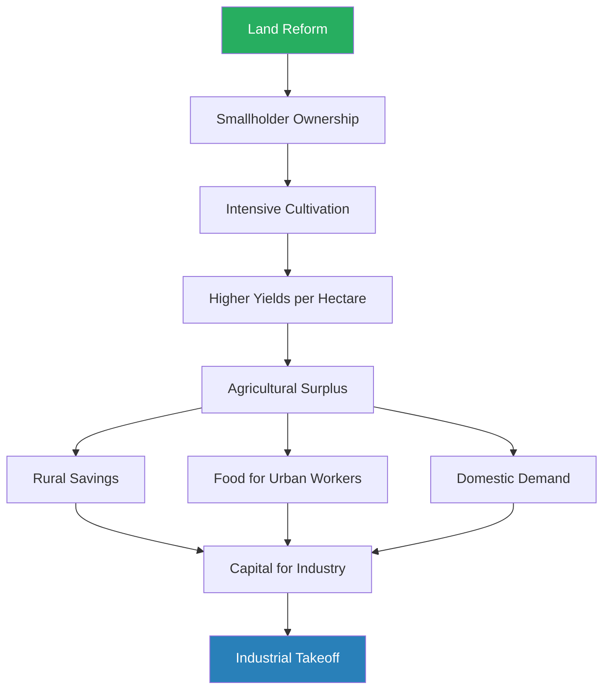
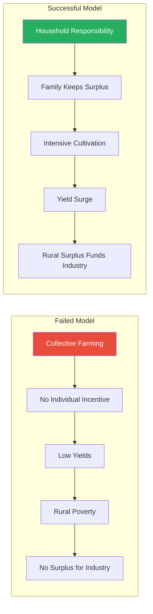
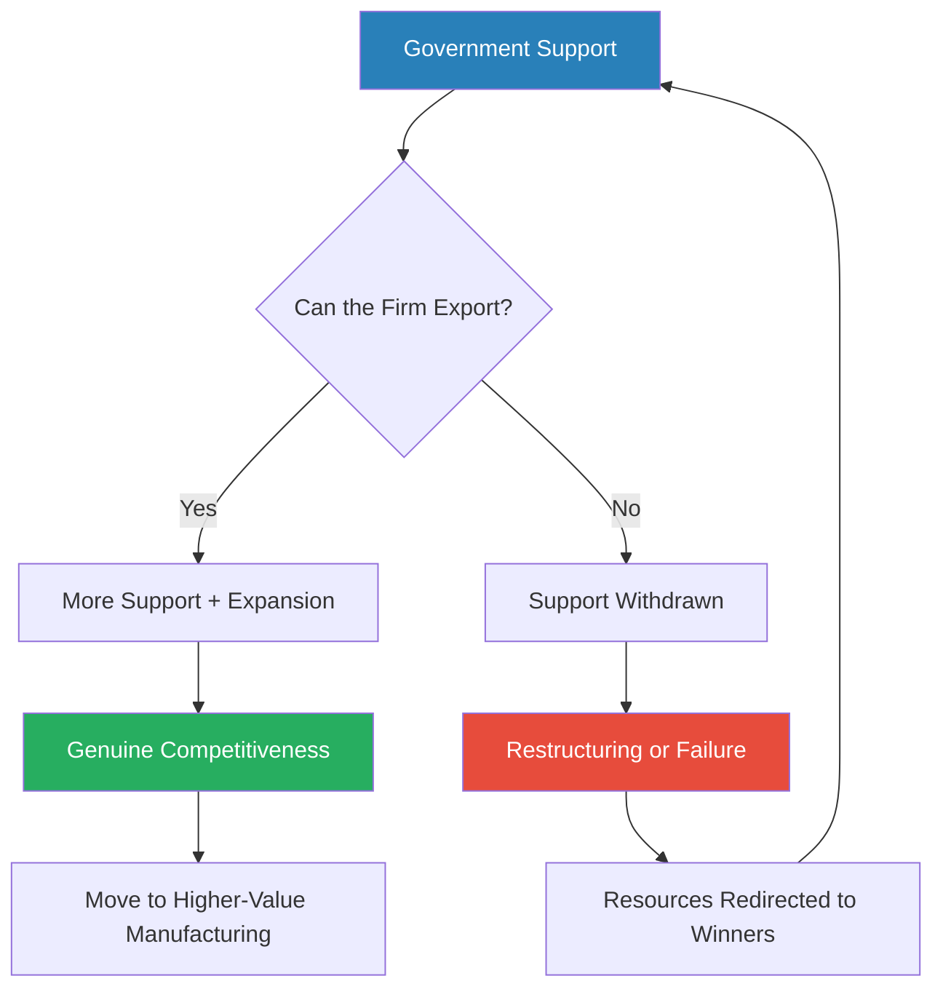
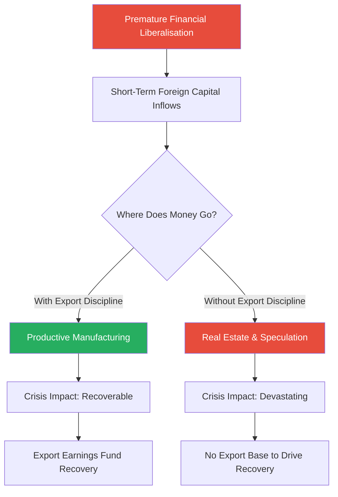
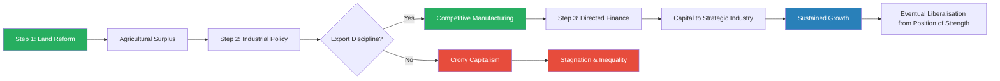
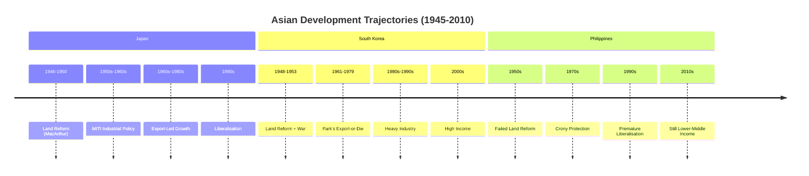

# How Asia Works — Joe Studwell

> Joe Studwell spent over two decades living in and reporting on Asia, and this book distils what he learned into an uncomfortable argument: the countries that got rich — Japan, South Korea, Taiwan, China — did so by following a specific three-step recipe that flatly contradicts the free-market advice Western institutions have been giving developing nations for decades. Step one: redistribute land to smallholder farmers to maximise agricultural output. Step two: pour capital into manufacturing and force companies to compete in export markets — subsidise them, but punish them if they fail to sell abroad. Step three: keep the financial system on a tight leash, directing cheap credit to strategic industries rather than letting capital flow wherever it pleases. The countries that failed — the Philippines, Indonesia, Thailand — either skipped steps or did them in the wrong order. *How Asia Works* is the single most convincing explanation of why some poor countries industrialise and others stay poor, and it is a devastating critique of the Washington Consensus that shaped global development policy for thirty years.

---

## About the Author

Joe Studwell is a British journalist and author who spent more than twenty years based in East and Southeast Asia. He founded the magazine *China Economic Quarterly* and has written extensively on the political economy of the region. His earlier book, *The China Dream* (2002), examined the gap between Western expectations of the Chinese market and reality — a gap Studwell attributed to wishful thinking and ignorance of how Asian economies actually function. Studwell holds a degree in languages from the University of Manchester and studied at the School of Oriental and African Studies in London. His work is shaped by deep fieldwork — he has interviewed farmers, factory owners, bankers, and politicians across the region — giving *How Asia Works* a granular, on-the-ground quality that separates it from most development economics literature. Bill Gates called it one of the most important books he read in 2014, and it has become required reading in several development economics courses worldwide.

---

## The Big Idea

- Between 1945 and 2013, several Asian economies achieved something historically remarkable: they went from desperately poor, war-ravaged, largely agrarian societies to wealthy, technologically advanced industrial powerhouses in a single generation
- Japan, South Korea, Taiwan, and (more recently) China all followed variations of the same playbook
- Other Asian countries — the Philippines, Indonesia, Thailand, Malaysia — started from similar positions but failed to replicate the feat, despite often receiving more natural resource wealth and more foreign aid

Studwell's central argument:

- <b style="color: #27ae60">Successful development follows a specific, sequential, three-intervention recipe — and the order matters</b>
- **Step 1 — Land reform:** Redistribute farmland to smallholders to maximise agricultural yields and generate the rural surplus that funds everything else
- **Step 2 — Industrial policy with export discipline:** Channel capital into manufacturing, protect infant industries, but ruthlessly condition government support on export performance
- **Step 3 — Financial repression:** Keep the banking system subordinate to industrial policy — direct cheap credit to strategic sectors rather than allowing free-market capital allocation

---

- The recipe is not ideological — it is pragmatic
- It was discovered empirically by Japan in the Meiji era, refined after World War II, and then copied (with local variations) by South Korea, Taiwan, and China
- <b style="color: #e74c3c">The countries that failed did not lack resources, intelligence, or ambition — they lacked the political will to execute painful reforms, especially land redistribution</b>
- And critically, they were often talked out of these interventions by Western economists and international institutions who genuinely believed free markets were the answer

The book is a direct challenge to the <b style="color: #2980b9">Washington Consensus</b> — the package of free-market policies (deregulation, privatisation, trade liberalisation, free capital flows) promoted by the IMF, World Bank, and US Treasury as the universal path to prosperity:

- Studwell argues the Washington Consensus gets the prescription backwards
- The successful developers all used heavy state intervention, protectionism, and financial repression during their growth phase
- They liberalised only after they were rich, not before
- The advice to liberalise early is not just wrong — it is actively destructive to developing economies

---

## Key Concepts at a Glance

| Concept | One-line summary |
|---------|-----------------|
| **The three-intervention recipe** | Land reform, then export-disciplined industry, then directed finance — in that order |
| **Gardening vs. farming** | Smallholder intensive cultivation dramatically outproduces large-scale mechanised agriculture in developing economies |
| **Export discipline** | The mechanism that turns industrial policy from crony capitalism into genuine competitiveness |
| **Infant industry protection** | Temporary shielding of domestic manufacturers from foreign competition while they learn |
| **Financial repression** | Keeping interest rates artificially low and directing bank lending to strategic sectors |
| **Washington Consensus** | The free-market policy package Studwell argues has failed developing countries |
| **Household Responsibility System** | China's 1978 land reform that launched its economic transformation |
| **Developmental state** | A government that actively directs economic development rather than leaving it to markets |
| **Technology transfer** | The process by which developing countries acquire and master advanced manufacturing techniques |
| **Premature liberalisation** | Opening markets and financial systems before domestic institutions are ready — the cardinal sin |
| **Inverse farm size-productivity relationship** | Smaller farms produce more output per hectare in labour-rich, capital-poor economies |
| **Resource curse** | Natural resource wealth that enables governments to avoid the hard work of industrialisation |

---

## Part One: Land

### Chapter 1 — The Lesson of the Soil

*Studwell begins with a counter-intuitive claim that overturns decades of agricultural economics: small farms are more productive than big ones, and land reform is not charity — it is the foundation of every successful Asian industrialisation.*

- The conventional wisdom in Western economics holds that large-scale, mechanised agriculture is more efficient than smallholder farming
- Studwell argues this is true for rich countries with expensive labour — but dangerously wrong for poor countries with cheap labour and scarce capital
- In a developing economy, the binding constraint is not labour but land
- <b style="color: #27ae60">When you give a poor family a small plot of their own land, they farm it with an intensity that no hired labourer or plantation worker can match</b>
- Studwell calls this the distinction between <b style="color: #2980b9">gardening</b> (intensive, smallholder, high-yield-per-hectare cultivation) and <b style="color: #2980b9">farming</b> (extensive, mechanised, high-yield-per-worker cultivation)

---

The economics behind this:

- A smallholder family applies labour with extraordinary intensity because they capture every marginal gain themselves
  - They weed more carefully, plant more densely, tend crops more attentively
  - They use intercropping, multiple harvests per year, and every square metre of land
  - They experiment with new techniques when they have reason to believe improvements will reward them directly
- A plantation worker or tenant farmer has no such incentive — they are paid a wage or owe a share of the crop regardless of effort
  - The classic **principal-agent problem** in economics: the person doing the work does not capture the benefit
  - Tenant farmers who owe 50-60% of the harvest to a landlord have little reason to work harder — extra effort enriches the landlord, not the farmer
- The result: across developing Asia, smallholder plots consistently produced **higher yields per hectare** than large estates
  - This is the <b style="color: #2980b9">inverse farm size-productivity relationship</b> — a well-documented phenomenon in development economics
  - Smaller farms produce more food per unit of land, even if they produce less per unit of labour
  - The relationship holds across countries, crops, and time periods — it is one of the most robust findings in agricultural economics

> [!tip] Core Insight
> In a labour-rich, capital-poor economy, maximising output per hectare (gardening) matters far more than maximising output per worker (farming). Land reform unlocks this by aligning incentives.

---

Why this matters for industrialisation:

- Agricultural surplus is the economic fuel for everything that follows
  - It feeds the urban workforce that will staff the factories
  - It generates the savings that fund industrial investment
  - It creates the rural demand that gives domestic manufacturers their first customers
  - It provides export earnings (agricultural commodities) during the early phase before manufacturing becomes competitive
- <b style="color: #e74c3c">Without land reform, rural populations remain trapped in subsistence — there is no surplus, no savings, no domestic demand, and no foundation for industrial takeoff</b>
- Every successful Asian developer understood this — Japan, South Korea, Taiwan, and China all made land reform their first major economic intervention
- The political dimension is equally important:
  - Land reform destroys the landlord class that would otherwise block industrial policy
  - A powerful landed elite has every incentive to keep the economy agrarian — their wealth depends on controlling land and the people who work it
  - Eliminating this class clears the political path for the second and third interventions

Land reform creates a virtuous cycle: smallholder ownership drives intensity, intensity drives surplus, and surplus funds the transition from agriculture to industry.

---

### Chapter 2 — Land Reform in Practice

*The history of Asian land reform reveals an uncomfortable pattern: it works brilliantly when it actually happens, but the political obstacles are enormous — which is why most countries never manage it.*

The political economy of land reform:

- Land reform is not a technical problem — it is a political one
- In every country, the landlord class is the dominant political force
  - They control local government, courts, and often national legislatures
  - They have every incentive to block redistribution and every tool to do so
  - They frame reform as communism, as theft of property rights, as economically destructive — and in many societies, they control the media that shapes public opinion
- <b style="color: #e74c3c">Land reform only succeeds when the reforming government is either unconstrained by the landlord class (because it is an external occupier or a revolutionary government) or strong enough to override landlord resistance</b>
- This is why the success stories all involved unusual political circumstances:
  - Japan: US military occupation — MacArthur could override any domestic opposition
  - South Korea: war-driven destruction of the old order
  - Taiwan: an outsider government (KMT) with no ties to the local elite
  - China: a revolutionary government that had already destroyed the landlord class

---

#### Japan's Land Reform (1946-1950)

> [!example] MacArthur's Radical Redistribution
> - After Japan's surrender in 1945, the US occupation under General Douglas MacArthur imposed one of history's most sweeping land reforms
> - Before reform, nearly half of Japan's farmland was cultivated by tenants paying crippling rents to landlords — often 50-60% of the harvest
> - MacArthur's team, influenced by New Deal reformers like Wolf Ladejinsky, set strict limits on land ownership and forced landlords to sell excess land at fixed (and effectively confiscatory) prices
> - Post-war inflation made the compensation nearly worthless — landlords received a fraction of their land's real value
> - Within four years, tenancy dropped from 46% to less than 10%
> - Millions of Japanese farm families became owner-operators overnight
> - The irony: American Cold War policymakers imposed a reform in Japan more radical than anything they would have tolerated at home
> **The lesson:** Land reform requires either external force (occupation) or extraordinary domestic political will — the landlord class never gives up land voluntarily.

- The results were transformative:
  - Rice yields per hectare surged as new owner-operators invested in their land
  - Rural incomes rose, creating demand for manufactured goods
  - Agricultural taxation funded Japan's early industrial investment
  - The social structure of the countryside was fundamentally restructured — the old landlord elite lost their economic base
  - Japan's rural population became a politically conservative, stable force — prosperous smallholders who supported the government's industrial programme

---

#### South Korea's Land Reform (1948-1950)

> [!example] Park Chung-hee and the Destruction of the Landlord Class
> - South Korea's land reform happened in two stages
> - The first stage (1948-49) was carried out by the new Syngman Rhee government, partly to undercut Communist appeal — North Korea had already redistributed land
> - But the reform was incomplete — landlords used political connections to retain holdings and circumvent redistribution
> - The Korean War (1950-53) completed the job: the chaos and displacement of war destroyed the remaining landlord power structure
> - By the time Park Chung-hee took power in a 1961 coup, the old landed elite had been effectively eliminated
> - Park could then direct the economy without the political opposition of a landlord class blocking reform
> **The lesson:** Land reform cleared the political path for industrial policy — without it, the landlords would have blocked everything that followed.

- South Korea's agricultural transformation:
  - Yields rose sharply after redistribution
  - The government invested in irrigation, rural infrastructure, and agricultural extension services
  - The <b style="color: #2980b9">Saemaul Undong</b> (New Village Movement) in the 1970s further modernised rural Korea
    - Government provided materials (cement, rebar) and villages that used them productively received more
    - A microcosm of the export discipline principle: state support conditioned on performance
  - Rural surplus and rural savings were channelled into industrial investment through a state-directed banking system

---

#### Taiwan's Land Reform (1949-1953)

> [!example] The KMT's Accidental Advantage
> - Taiwan's land reform was one of the most successful in history — and it happened partly because the reformers were outsiders
> - When Chiang Kai-shek's Kuomintang (KMT) fled mainland China in 1949, they arrived in Taiwan as a government-in-exile with no local power base and no ties to the Taiwanese landlord class
> - The KMT had learned a bitter lesson: their failure to carry out land reform on the mainland had driven peasants to support Mao's Communists
> - Determined not to repeat the mistake, the KMT implemented a three-stage land reform:
>   - 1949: Rent reduction (capped at 37.5% of harvest, down from 50-70%)
>   - 1951: Sale of public lands to tenants
>   - 1953: "Land-to-the-tiller" programme — compulsory purchase and redistribution
> - Landlords were compensated with shares in state-owned enterprises — pushing them from land into business and industry
> - The reform succeeded precisely because the KMT had no loyalty to Taiwanese landlords and every incentive to create rural stability
> **The lesson:** Political outsiders can sometimes execute reforms that insiders never would — the KMT's lack of local ties was an asset, not a liability.

- Taiwan's smallholder agriculture became legendarily productive
- The surplus funded Taiwan's industrial development — first textiles and light manufacturing, then electronics
- Taiwan's path was distinctive: instead of South Korea's giant chaebol, Taiwan developed a dense network of small and medium enterprises (SMEs)
- The landlord compensation mechanism was particularly clever:
  - Landlords received 70% of their compensation in land bonds and 30% in shares of state-owned enterprises
  - This effectively forced the old landlord class into becoming the new business class
  - Many of Taiwan's early industrialists were former landlords redirected into manufacturing — a social transformation engineered by policy
  - The mechanism served a dual purpose: it neutralised potential political opposition while simultaneously creating a domestic entrepreneurial class

---

#### The Philippines — What Failure Looks Like

> [!example] The Philippines' Broken Promise (1950s-present)
> - The Philippines has attempted land reform repeatedly — under Magsaysay in the 1950s, Marcos in the 1970s, and Aquino in the 1980s
> - Every attempt was undermined by the same force: the sugar and coconut plantation owners who dominated Philippine politics
> - Under Marcos, the Comprehensive Agrarian Reform Programme existed on paper but was riddled with exemptions and loopholes
> - Landlords reclassified agricultural land as commercial or industrial; they transferred titles to relatives; they used courts to delay redistribution for decades
> - The Cojuangco family (Corazon Aquino's own relatives) controlled vast sugar estates that were never meaningfully redistributed
> - Result: the Philippines entered the 21st century with one of the most unequal land distributions in Asia, rural poverty rates above 40%, and an agricultural sector that lagged far behind its neighbours
> **The lesson:** Without genuine land reform, the entire development sequence never gets started — the Philippines is the proof.

- <b style="color: #e74c3c">The Philippine failure is not a story of bad luck or insufficient resources — it is a story of elite capture</b>
- The landlord class controlled the political system and blocked any reform that threatened their holdings
- The result was chronic rural poverty, low agricultural productivity, and an economy permanently stuck in the lower-middle-income range
- The Philippines remains, in Studwell's analysis, the single clearest example of what happens when Step 1 is skipped

---

> [!tip] Core Insight
> Land reform is politically brutal but economically essential. No Asian country has industrialised successfully without first redistributing land. The Philippines proves the negative case — skip this step and everything else fails.

---

| Country | Land Reform | Timing | Outcome |
|---------|-----------|--------|---------|
| **Japan** | Radical redistribution under US occupation | 1946-1950 | Tenancy fell from 46% to <10%; agricultural productivity surged |
| **South Korea** | Redistribution + war-driven destruction of landlord class | 1948-1953 | Rural surplus funded industrial takeoff |
| **Taiwan** | Three-stage reform by outsider KMT government | 1949-1953 | Highly productive smallholder agriculture; SME-driven industry |
| **China** | Household Responsibility System | 1978-1984 | Grain output rose ~35% in five years; rural surplus funded SEZs |
| **Philippines** | Repeated attempts, all blocked by landlord elite | 1950s-present | Persistent rural poverty; no industrial takeoff |
| **Indonesia** | Never seriously attempted | — | Resource extraction dominated; manufacturing lagged |

The pattern is stark: every success story starts with land reform; every failure story either skipped it or faked it.

The bar chart makes Studwell's central argument visual: countries that scored high across all three interventions became rich; those that skipped steps remained poor — with the Philippines as the starkest failure case.

The Sankey diagram traces Studwell's causal chain: land reform generates three streams of surplus (savings, labour, demand) that converge into industrial policy, which — when filtered through export discipline — produces the competitive manufacturing base that drives sustained growth.

---

### Chapter 3 — China's Agricultural Revolution

*China's land reform under Deng Xiaoping was not redistribution in the traditional sense — it was a return to family farming after the catastrophic failure of collectivisation, and it unleashed the most dramatic agricultural productivity surge in human history.*

- Mao's collectivisation of agriculture had been a disaster
  - The Great Leap Forward (1958-1962) resulted in the worst famine in recorded history — an estimated 30-45 million deaths
  - Collective farms destroyed the incentive structure that makes smallholder agriculture productive
  - Farmers had no reason to work harder because extra effort produced no personal benefit
  - Output quotas were set centrally by officials who had no understanding of local conditions
  - Local cadres reported inflated production figures to please superiors — creating a cascading fiction that left millions without food

> [!example] Deng Xiaoping and the Household Responsibility System (1978)
> - After Mao's death in 1976, Deng Xiaoping rose to power and pragmatically reversed course
> - The **Household Responsibility System** allowed individual families to farm their own plots and keep surplus production after meeting state quotas
> - The reform did not begin as central policy — it started with a quiet experiment in Xiaogang village, Anhui province, where eighteen farmers secretly divided collective land among families
> - When their yields doubled, local officials turned a blind eye; when word reached Deng, he endorsed and expanded the practice
> - By 1984, the system had spread to the entire country
> - The results were staggering: China's grain output rose approximately 35% between 1978 and 1984
> - This was not new technology or new seeds — it was the same land, farmed by the same people, with different incentives
> - The surplus freed hundreds of millions of rural labourers to move into Township and Village Enterprises (TVEs) and later into the coastal Special Economic Zones
> **The lesson:** Incentives matter more than technology. The same people, farming the same land, produced dramatically more food simply because they could keep what they grew.

- <b style="color: #27ae60">China's agricultural reform was functionally equivalent to land reform — it gave families effective control over their land and let them capture the gains from their own effort</b>
- The result: a massive agricultural surplus that funded China's industrial revolution
- Rural labourers displaced by higher productivity became the workforce for China's export manufacturing sector
- The sequence was identical to Japan, South Korea, and Taiwan: agricultural productivity first, industrial takeoff second
- The scale was unprecedented — no country had ever moved so many people from subsistence farming to factory work so quickly

---

China's reform demonstrated the principle in its purest form: same land, same people, different incentive structure — dramatically different outcomes.

---

## Part Two: Industry

### Chapter 4 — The Manufacturing Imperative

*Studwell's second intervention is the most controversial: governments must actively direct capital into manufacturing and protect domestic industry from foreign competition — but with a crucial caveat that most critics of industrial policy ignore.*

- Once land reform generates an agricultural surplus, the next question is: what do you invest in?
- The free-market answer: whatever the market decides — comparative advantage will guide capital to its most productive use
- Studwell's answer, drawn from the Asian evidence: <b style="color: #27ae60">the state must deliberately channel capital into manufacturing, because manufacturing is the only sector that reliably creates the learning, scale, and technological upgrading that leads to sustained prosperity</b>

Why manufacturing specifically:

- Manufacturing has unique economic properties that agriculture and services do not:
  - <b style="color: #2980b9">Learning curves</b> — the more you produce, the better and cheaper you get at it; each doubling of cumulative output reduces costs by a predictable percentage
  - <b style="color: #2980b9">Scale economies</b> — larger production volumes reduce per-unit costs dramatically; a factory producing one million units has radically lower costs than one producing one thousand
  - <b style="color: #2980b9">Technology spillovers</b> — skills and knowledge developed in one industry transfer to others; engineers trained in textiles can learn electronics
  - <b style="color: #2980b9">Backward and forward linkages</b> — a steel mill creates demand for iron ore (backward) and enables car manufacturing (forward); these linkages multiply the economic impact of every factory
- Agriculture faces diminishing returns — you can only squeeze so much food from a hectare
- Services (at least in developing economies) tend to be low-productivity and non-tradeable
- Manufacturing is the escalator: countries that get on it move up; countries that do not stay where they are

---

> [!tip] Core Insight
> Manufacturing is not just one economic sector among many — it is the only sector with the combination of learning curves, scale economies, and technology spillovers that transforms a poor country into a rich one.

---

The case for <b style="color: #2980b9">infant industry protection</b>:

- New domestic manufacturers cannot immediately compete with established foreign firms
  - They lack the scale, the skills, the technology, and the brand recognition
  - If exposed to full foreign competition from day one, they will be destroyed before they can learn
  - The metaphor in Studwell's title is literal — infant industries need protection the way infant children do, and for the same reason: they are not yet capable of surviving on their own
- Therefore, the government must temporarily protect them — through tariffs, import quotas, subsidies, cheap credit, or some combination
- This idea is not new — it goes back to Alexander Hamilton and Friedrich List in the 18th and 19th centuries
  - The United States, Germany, and Britain all used infant industry protection during their own industrialisation
  - <b style="color: #e74c3c">The irony: the countries that now preach free trade to developing nations all used protectionism when they were developing</b>

> [!example] Friedrich List and the "Kicking Away the Ladder" (1841)
> - German economist Friedrich List observed that Britain preached free trade to other nations while having industrialised behind high tariff walls
> - He called this "kicking away the ladder" — once you have climbed to the top, you remove the ladder so others cannot follow
> - List argued that developing countries needed temporary protection to build their own manufacturing capacity
> - His ideas were adopted by Bismarck's Germany, Meiji Japan, and later by South Korea and Taiwan
> - Ha-Joon Chang, the Cambridge economist, revived List's argument in his influential 2002 book *Kicking Away the Ladder*
> - The United States in the 19th century had higher tariffs than most developing countries today — yet American economists now advise poor nations to liberalise
> **The lesson:** Free trade is the policy of the already-rich — developing countries that followed free-trade advice before they had competitive manufacturing remained poor.

---

### Chapter 5 — Export Discipline: The Missing Ingredient

*This is the chapter that makes Studwell's argument distinctive. Many countries have tried infant industry protection and failed — the difference between success and failure is not whether you protect, but whether you discipline.*

- <b style="color: #27ae60">The critical mechanism is not protection itself — it is what Studwell calls export discipline</b>
- Protection without discipline produces crony capitalism: companies receive government support, face no foreign competition, and have no incentive to improve
- The result is bloated, inefficient firms that survive only because of political connections — exactly what critics of industrial policy warn about
- Studwell's insight is that the critics are right about undisciplined protection — but wrong to conclude that all industrial policy fails

The innovation of the successful Asian developers was to combine protection with fierce performance requirements:

- Companies received government subsidies, cheap credit, and domestic market protection
- In return, they were required to export — to sell their products in competitive international markets
- <b style="color: #2980b9">Export performance</b> was the test: if a company could sell in the US, European, or Japanese market, it was genuinely becoming competitive
- If it could not, government support was withdrawn — the company was restructured, merged, or allowed to fail
- This created a form of <b style="color: #2980b9">Darwinian selection within a protected system</b>: firms were shielded from import competition at home but forced to prove themselves in export markets abroad
- The brilliance of the mechanism is its objectivity — export sales cannot be faked or politically negotiated; either the foreign customer buys or they do not

Export discipline creates a feedback loop: government support flows to firms that prove competitive in world markets, and is withdrawn from those that do not — preventing industrial policy from becoming permanent subsidy.

---

> [!example] Park Chung-hee's Export-or-Die System (1960s-1970s)
> - When Park Chung-hee seized power in South Korea in 1961, the country was poorer than many sub-Saharan African nations
> - Park directed the chaebol (large conglomerates like Samsung, Hyundai, LG) to move into heavy industry: steel, shipbuilding, chemicals, automobiles, electronics
> - He provided them with massive government support: subsidised credit from state-controlled banks, protection from imports, tax breaks, and infrastructure
> - But the support came with iron conditions: **export targets**
> - Park held monthly export-promotion meetings where chaebol heads reported progress personally to the president
> - Companies that hit their targets received more support; companies that missed them faced consequences — loss of credit, loss of licences, even arrest of executives
> - The result: South Korean exports grew from $33 million in 1960 to over $17 billion by 1980
> - The chaebol that survived this Darwinian pressure became genuinely world-class competitors
> **The lesson:** Industrial policy works not because of protection, but because of discipline — the willingness to reward winners and punish losers.

---

> [!example] Samsung's Forced Evolution
> - Samsung began as a trading company dealing in dried fish and noodles in the 1930s
> - Under Park's industrial policy, Samsung was directed into textiles, then sugar refining, then electronics
> - Lee Byung-chul, Samsung's founder, was initially reluctant to enter semiconductor manufacturing — it required enormous capital investment and the technology gap with Japan was vast
> - The government's combination of cheap credit and export pressure left Samsung no choice but to invest and compete
> - Samsung's early chips were inferior to Japanese competitors — but the export requirement forced constant improvement
> - Engineers were sent to Silicon Valley to learn; production lines were rebuilt around the clock to close the quality gap
> - By the 1990s, Samsung had overtaken most Japanese competitors in memory chips
> - Today Samsung is one of the world's largest technology companies — a transformation that would never have happened without both the state support and the state pressure
> **The lesson:** World-class companies are often made, not born — but only when government support is combined with relentless competitive pressure.

---

The contrast with failure:

- <b style="color: #e74c3c">The Philippines, Indonesia, and (to a degree) Malaysia all attempted industrial policy without export discipline — and the results were catastrophically different</b>
- In the Philippines under Marcos:
  - Cronies received import protection and subsidised credit for manufacturing ventures
  - But there were no export requirements and no consequences for failure
  - Protected firms produced shoddy goods at high prices for the captive domestic market
  - They had no incentive to improve because they faced no competition
  - The result: a manufacturing sector that never became competitive and an economy that fell further behind its neighbours

> [!example] The Philippines' Protected Mediocrity
> - Under Marcos, politically connected industrialists received tariff protection, cheap credit, and government contracts
> - Roberto Benedicto, a Marcos crony, controlled the sugar and rum industries behind protective tariffs
> - Eduardo Cojuangco dominated the coconut industry through a government-mandated levy
> - Neither had to export; neither faced competitive pressure; neither improved
> - When tariffs were eventually reduced in the 1990s, these industries collapsed — they had never become competitive
> - Decades of protection had produced nothing but enriched cronies and impoverished consumers who paid above-world-market prices
> **The lesson:** Protection without discipline is not industrial policy — it is theft from consumers to enrich the politically connected.

---

| Element | South Korea | Philippines |
|---------|------------|-------------|
| **Government support** | Massive — cheap credit, tariffs, infrastructure | Moderate — tariffs and selected subsidies |
| **Export requirement** | Mandatory — monthly targets enforced by president | None — firms sold to captive domestic market |
| **Consequences of failure** | Severe — loss of credit, restructuring, executive arrest | None — political connections protected firms |
| **Result** | World-class exporters (Samsung, Hyundai, POSCO) | Uncompetitive cronies dependent on protection |
| **Manufacturing share of GDP (2010)** | ~30% | ~22% |
| **Per capita income (2010)** | ~$20,000 | ~$2,000 |

The comparison is stark: both countries used industrial policy, but only one used export discipline — and the outcomes diverged by an order of magnitude.

---

### Chapter 6 — Learning to Make Things

*Technology transfer — the process by which poor countries acquire and master advanced manufacturing techniques — does not happen automatically. It requires a deliberate, staged strategy that Studwell traces through the experience of Japan, Korea, and Taiwan.*

- Successful technology transfer follows a consistent sequence:
  1. **Licensing and imitation** — buy the technology, copy it, learn to manufacture it
  2. **Incremental improvement** — make small improvements to the imported technology
  3. **Independent innovation** — develop your own products and processes
- This sequence typically takes 15-30 years per industry
- <b style="color: #27ae60">The key insight is that countries must move through ALL three stages — and most developing countries get stuck at stage one because they lack the institutions and discipline to push through</b>

A critical distinction Studwell draws is between <b style="color: #2980b9">licensing</b> and <b style="color: #2980b9">foreign direct investment (FDI)</b>:

- **Licensing** means a domestic company pays a foreign firm for the right to use its technology — the domestic company learns to manufacture the product itself
  - Control remains with the domestic firm
  - The domestic firm builds its own capabilities
  - Knowledge transfers to the local workforce and supply chain
- **FDI** means a foreign company sets up its own factory in the developing country
  - Control remains with the foreign firm
  - The most valuable knowledge (design, R&D, marketing) stays at the foreign headquarters
  - The host country gets jobs but not the deep learning that builds industrial capacity
  - The foreign firm has no incentive to train local competitors
- Japan and South Korea strongly preferred licensing over FDI — they wanted the technology, not the foreign factory
- The Philippines and Indonesia were more open to FDI — and as a result, their economies remained dependent on foreign firms rather than developing their own

---

> [!example] Japan's Steel Industry: From Copycat to World Leader
> - In the 1950s, Japan's steel industry was small, technologically backward, and dependent on licensed technology from the United States and Europe
> - MITI (Ministry of International Trade and Industry) orchestrated a systematic programme:
>   - Japanese firms were required to license foreign technology rather than rely on foreign direct investment (which would have left control in foreign hands)
>   - Engineers were sent abroad to study in American and European steel mills
>   - The government subsidised capital investment in state-of-the-art equipment
>   - Firms were pushed to export, which exposed them to world-class competition
> - By the 1970s, Japanese steelmakers (Nippon Steel, JFE) were producing higher-quality steel at lower cost than their American teachers
> - By the 1980s, the US steel industry was in crisis — undercut by the Japanese firms it had trained
> **The lesson:** Technology transfer is a deliberate process, not a market outcome — it requires government coordination, forced learning, and export pressure.

---

The role of <b style="color: #2980b9">MITI</b> (Ministry of International Trade and Industry) in Japan:

- MITI was the archetype of the <b style="color: #2980b9">developmental state</b> bureaucracy
- It did not run companies — it steered them:
  - Selected which industries to promote (steel, shipbuilding, cars, electronics, semiconductors)
  - Allocated cheap credit through the banking system
  - Coordinated technology licensing to prevent wasteful duplication
  - Set export targets and monitored performance
  - Orchestrated mergers when too many firms competed in the same space
- MITI's power came from control of the financial system — banks lent where MITI directed
- Chalmers Johnson's influential 1982 book *MITI and the Japanese Miracle* documented this system in detail
- The MITI model was studied and adapted by South Korea's Economic Planning Board and Taiwan's Council for Economic Planning and Development

> [!example] Toyota's Long Road to Competitiveness
> - In 1950, Toyota nearly went bankrupt — it was a small, inefficient truck manufacturer
> - The Japanese government protected the domestic auto market from imports while Toyota learned
> - Toyota studied American mass-production techniques (particularly Ford's River Rouge plant) and then systematically improved them
> - Taiichi Ohno developed the **Toyota Production System** (lean manufacturing, just-in-time, kaizen) — which would later revolutionise manufacturing worldwide
> - It took Toyota thirty years (1950s-1980s) to go from protected domestic also-ran to global competitor
> - If Japan had followed free-trade principles, Toyota would have been destroyed by General Motors and Ford in the 1950s
> **The lesson:** Some of the world's most competitive companies exist only because their governments gave them time and space to learn — but also forced them to keep improving.

---

The shipbuilding example reinforces the same pattern:

> [!example] South Korea's Shipbuilding Conquest
> - In the early 1970s, Chung Ju-yung, founder of Hyundai, decided to enter shipbuilding — despite having never built a ship
> - The Korean government backed the venture with cheap credit and infrastructure (the Ulsan shipyard)
> - Chung famously secured his first order from a Greek shipping magnate by showing him a picture of a 500-won banknote featuring a traditional Korean turtle ship — as proof that Koreans had been building ships for centuries
> - Hyundai's early ships were mediocre — built largely from licensed European designs
> - But the combination of government support, cheap labour, and export pressure drove relentless improvement
> - By the 1990s, South Korea had overtaken Japan as the world's largest shipbuilder
> - By the 2000s, Korean yards were building the most technologically advanced vessels in the world
> **The lesson:** A country with zero shipbuilding expertise became the world leader in thirty years — not through free markets but through deliberate, state-backed, export-disciplined industrial policy.

---

The <b style="color: #2980b9">stages of industrial upgrading</b> followed a consistent pattern across all the successful developers:

| Stage | Industries | Characteristics | Timeframe |
|-------|-----------|----------------|-----------|
| **1. Labour-intensive** | Textiles, garments, toys, shoes | Low skill, low capital, high employment | First 10-15 years |
| **2. Heavy industry** | Steel, chemicals, cement, shipbuilding | Capital-intensive, scale economies | Years 10-25 |
| **3. Complex manufacturing** | Automobiles, machinery, electronics | High skill, deep supply chains | Years 15-30 |
| **4. Advanced technology** | Semiconductors, aerospace, biotech | R&D-intensive, frontier innovation | Years 25+ |

Each stage builds on the capabilities developed in the previous one — the learning is cumulative and cannot be skipped.

---

> [!tip] Core Insight
> Technology transfer requires three things: access to foreign technology (through licensing, not FDI), time to learn (through protection), and pressure to improve (through export discipline). Remove any one of these and the process stalls.

---

## Part Three: Finance

### Chapter 7 — Financial Repression as Development Tool

*Studwell's third intervention is the most heretical by modern standards: successful developers all kept their financial systems on a tight leash, deliberately suppressing interest rates and directing credit to strategic industries — the exact opposite of what the IMF and World Bank prescribe.*

- <b style="color: #2980b9">Financial repression</b> means the government keeps interest rates below the market rate and directs bank lending toward strategic sectors
- In practice:
  - Savings earn below-market returns (a hidden tax on savers)
  - Loans to strategic industries are available at below-market rates (a hidden subsidy to borrowers)
  - Capital controls prevent money from flowing abroad to seek higher returns
  - The state owns or controls the major banks and uses them as instruments of industrial policy

---

Why this works for developing economies:

- In a poor country, private capital markets are weak, shallow, and short-term-oriented
  - Private investors seek quick returns, not long-term industrial investment
  - Financial markets are prone to speculation, asset bubbles, and capital flight
  - Left to their own devices, private banks in developing countries lend to real estate, consumption, and politically connected insiders — not to the patient, risky industrial investment that development requires
- <b style="color: #27ae60">The developmental state redirects capital from short-term speculation to long-term industrial investment</b>
- This is costly — savers receive lower returns, and some directed loans inevitably go to bad projects
- But the payoff, when combined with export discipline, is rapid industrialisation
  - The bad loans are the cost of learning; the export discipline ensures that enough winners emerge to justify the cost
  - Studwell frames this as "the cost of development" — every country that industrialised paid it in some form

---

> [!example] South Korea's State-Directed Banking
> - Park Chung-hee nationalised South Korea's commercial banks in the early 1960s
> - The government then used the banking system as a tool of industrial policy:
>   - Banks lent at low interest rates to chaebol pursuing government-designated industries
>   - Companies that met export targets received continued access to cheap credit
>   - Companies that failed lost access — their loans were not renewed
> - This system was not efficient by free-market standards — there were bad loans, wasted investments, and political favouritism
> - But the overall result was one of the most successful industrialisations in history
> - South Korea went from a per-capita income below Ghana's in 1960 to one above Spain's by 2000
> **The lesson:** Development banking is messy and wasteful at the micro level, but spectacularly effective at the macro level — provided it is disciplined by export requirements.

---

The contrast with free-market finance:

| Feature | Developmental Finance | Free-Market Finance |
|---------|---------------------|-------------------|
| **Interest rates** | Below market (state-set) | Market-determined |
| **Credit allocation** | Directed to strategic sectors | Wherever returns are highest |
| **Bank ownership** | State-owned or state-controlled | Private |
| **Capital controls** | Yes — prevent capital flight | No — free capital flows |
| **Time horizon** | Long-term (10-30 year industrial projects) | Short-term (quarterly returns) |
| **Risk of waste** | High (some bad loans inevitable) | Lower per-loan, but prone to speculation |
| **Historical result in Asia** | Japan, S. Korea, Taiwan, China: rapid industrialisation | Philippines, Indonesia pre-reform: stagnation |

Studwell's point is not that developmental finance is "better" in absolute terms — it is that free-market finance is inappropriate for the specific task of industrialising a poor country.

---

### Chapter 8 — The 1997 Asian Financial Crisis

*The 1997 crisis serves as Studwell's most powerful case study: a catastrophe caused not by too much government intervention but by premature financial liberalisation — the very policy the IMF had been urging on Asian governments for years.*

- In the early 1990s, several Asian countries — Thailand, Indonesia, South Korea, Malaysia — were pressured by the IMF and international creditors to liberalise their financial systems:
  - Remove capital controls
  - Deregulate banking
  - Allow free capital flows
  - Float their currencies
- <b style="color: #e74c3c">The result was a flood of short-term foreign capital seeking high returns — hot money that flowed in during good times and fled at the first sign of trouble</b>
- The distinction between productive and speculative capital was critical:
  - Long-term investment in factories, infrastructure, and equipment creates real economic capacity
  - Short-term bank lending and portfolio investment create fragility — they can be withdrawn overnight

---

> [!example] Thailand's Currency Collapse (July 1997)
> - Thailand had pegged the baht to the US dollar and liberalised its financial system in the early 1990s
> - Foreign capital flooded in — much of it short-term bank lending denominated in dollars
> - The money went largely into real estate speculation and consumption, not productive manufacturing
> - When confidence wobbled in mid-1997, foreign creditors demanded repayment simultaneously
> - Thailand's central bank burned through its foreign reserves trying to defend the baht peg
> - On July 2, 1997, the baht was floated and immediately lost more than 50% of its value
> - The crisis spread to Indonesia, Malaysia, South Korea, and beyond
> - Millions of people were thrown into poverty; decades of economic progress were wiped out in months
> **The lesson:** Premature financial liberalisation exposes developing economies to the full volatility of international capital flows before they have the institutions to manage it.

---

> [!example] Indonesia's Implosion Under Suharto
> - Indonesia's crisis was the most devastating: GDP contracted by 13% in 1998
> - Suharto's regime had combined industrial policy without export discipline with premature financial deregulation
> - Indonesian conglomerates (many controlled by Suharto's family and cronies) had borrowed heavily in foreign currencies
> - When the rupiah collapsed, their dollar-denominated debts became unpayable
> - The banking system imploded — the cost of the bailout exceeded 50% of GDP
> - Suharto was forced from power after 32 years, but the economic damage persisted for a decade
> - The IMF's response — demanding austerity, further deregulation, and tight monetary policy — arguably made the crisis worse
> - The humiliation of Suharto signing the IMF agreement while IMF Managing Director Michel Camdessus stood over him with folded arms became an iconic image of the crisis
> **The lesson:** Financial liberalisation without strong institutions, transparent governance, and competitive industry is a recipe for catastrophe.

---

Studwell's analysis of the crisis reveals a crucial distinction:

- **South Korea** had strong export-oriented manufacturing built over decades of disciplined industrial policy
  - It recovered relatively quickly because its firms were genuinely competitive — they could earn foreign currency through exports
  - Samsung, Hyundai, POSCO, and LG emerged from the crisis stronger
  - The crisis actually accelerated restructuring — the weakest chaebol (Daewoo) were allowed to fail while the strongest consolidated
- **Indonesia and Thailand** had weaker manufacturing bases and more speculative investment
  - Their recovery was slower and more painful because there was less productive capacity to drive export earnings
  - Without competitive exporters, these economies had no mechanism to earn back the foreign currency that had fled
- <b style="color: #27ae60">The countries that had followed Studwell's recipe most faithfully (export-disciplined manufacturing + directed finance) were most resilient to the crisis — even when they too had liberalised prematurely</b>

The 1997 crisis demonstrated that the sequence matters: countries that had built strong manufacturing before liberalising could weather financial storms; countries that liberalised without a strong industrial base were devastated.

---

> [!tip] Core Insight
> Financial liberalisation is not inherently good or bad — it is a matter of timing. Liberalise after you have built a competitive manufacturing base and strong institutions, and the economy can absorb the volatility. Liberalise before, and you are inviting catastrophe.

---

### Chapter 9 — Keeping Finance on a Leash

*Studwell concludes his analysis of finance by examining how China managed its financial system — and why China's refusal to follow IMF advice may have been its smartest policy decision.*

- China watched the 1997 crisis and drew a clear lesson: do not liberalise prematurely
- <b style="color: #27ae60">China maintained capital controls, kept its currency non-convertible, and retained state ownership of its major banks</b>
- Western economists and the IMF criticised these policies relentlessly:
  - China's banks were said to be loaded with bad loans
  - State-directed lending was called inefficient and corrupt
  - Capital controls were described as distortionary and unsustainable
- Studwell acknowledges these criticisms have some validity — China's banks did carry enormous non-performing loans
- But the macro result was undeniable:
  - China's economy grew at approximately 10% per year for three decades
  - It became the world's largest manufacturer and exporter
  - It lifted over 800 million people out of poverty
  - It was largely unscathed by the 1997 crisis and weathered the 2008 global financial crisis better than most developed economies

---

> [!example] China's Special Economic Zones (SEZs)
> - Deng Xiaoping established the first SEZs in 1980 — Shenzhen, Zhuhai, Shantou, and Xiamen
> - The SEZs were laboratories for export-oriented manufacturing within a controlled environment
> - Foreign companies were invited to invest, but the government maintained strict controls:
>   - Technology transfer requirements (foreign firms had to share know-how with Chinese partners)
>   - Domestic content requirements (a rising share of components had to be locally produced)
>   - Capital controls prevented profits from being freely repatriated
> - The SEZs allowed China to learn manufacturing techniques while maintaining control over its financial system
> - Shenzhen grew from a fishing village of 30,000 in 1980 to a manufacturing metropolis of over 10 million by 2010
> **The lesson:** You can open to the world selectively — inviting foreign technology and investment on your own terms while maintaining control over your financial system.

---

China's approach to financial repression had distinctive features:

- The "Big Four" state-owned banks (Industrial and Commercial Bank of China, China Construction Bank, Agricultural Bank of China, Bank of China) dominated the financial system
  - They lent where the government directed — primarily to state-owned enterprises and export-oriented manufacturers
  - Interest rates on deposits were kept low, creating a massive implicit subsidy from household savers to industrial borrowers
- <b style="color: #27ae60">Chinese households saved at extraordinarily high rates — above 30% of income — and those savings were channelled through state banks into industrial investment</b>
- The cost was borne by ordinary savers, who earned below-inflation returns on their deposits
- The benefit accrued to the economy as a whole: cheap capital funded the world's fastest industrial build-out
- The trade-off was stark but conscious: household consumption was suppressed to fund industrial capacity — a choice that created enormous economic growth but also contributed to China's domestic consumption deficit

> [!example] China's WTO Accession Strategy (2001)
> - When China joined the World Trade Organisation in 2001, many Western observers expected it to liberalise rapidly
> - Instead, China used WTO membership strategically:
>   - It gained access to Western markets for its exports while maintaining domestic protections where possible
>   - It used WTO dispute resolution selectively — complying where convenient, delaying where not
>   - It maintained capital controls, currency management, and state-directed lending despite WTO commitments
> - The result: China's exports surged from $266 billion in 2001 to over $2 trillion by 2012
> - Western firms gained access to the Chinese market, but on China's terms — often through joint ventures that required technology sharing
> **The lesson:** International agreements can be tools for development — the key is to use them strategically, not to treat them as binding constraints on policy.

---

Taiwan's financial system operated differently from South Korea's but achieved similar results:

- Taiwan relied less on giant conglomerates and more on small and medium enterprises (SMEs)
- State-owned banks provided credit to SMEs through relationship-based lending
- The <b style="color: #2980b9">keiretsu</b>-style networks that characterised Japan and the chaebol system of South Korea were less prominent in Taiwan
- Instead, dense networks of small firms, often family-owned, competed fiercely in export markets
- The government's role was to provide infrastructure, cheap credit, and technology assistance through organisations like the <b style="color: #2980b9">Industrial Technology Research Institute (ITRI)</b>
- ITRI developed semiconductor technology and then spun it out to private firms — including TSMC, which would become the world's most important chip manufacturer

> [!example] TSMC and the ITRI Model
> - In 1973, the Taiwanese government established ITRI to develop advanced manufacturing technology
> - In 1976, ITRI negotiated a technology transfer deal with RCA to learn semiconductor manufacturing
> - Taiwanese engineers were sent to the US for training; they returned and built Taiwan's first chip fabrication facility
> - In 1987, Morris Chang — a Taiwanese-American executive from Texas Instruments — was recruited to spin out a commercial chip company
> - The result was Taiwan Semiconductor Manufacturing Company (TSMC), which pioneered the "foundry" model: manufacturing chips designed by other companies
> - TSMC is now the world's most valuable semiconductor company, producing the majority of the world's most advanced chips
> - The entire chain — from government research institute to technology transfer to commercial spinoff — is a textbook case of state-directed industrial development
> **The lesson:** Government-funded research institutes can be powerful engines of technology transfer, bridging the gap between foreign technology and domestic commercial capability.

---

## The Complete Recipe

*Studwell's argument culminates in a unified model: the three interventions are not independent policies but a sequential, mutually reinforcing system.*

The three interventions form a sequential system: each step creates the preconditions for the next, and skipping any step undermines the entire chain.

---

> [!abstract] Studwell's Three-Step Development Recipe
> 1. **Redistribute land** to smallholder farmers — maximise agricultural output per hectare, generate rural surplus, destroy the landlord class
> 2. **Direct capital into manufacturing** — protect infant industries from imports, but condition all government support on export performance
> 3. **Keep finance subordinate** — state-controlled banks, below-market interest rates for strategic sectors, capital controls to prevent flight
> 4. **Sequence matters** — do them in order; each step creates preconditions for the next
> 5. **Liberalise last** — free markets and open capital accounts are the reward for successful development, not the means to achieve it

---

The recipe in full:

- **Step 1 — Land reform** creates the agricultural surplus that funds everything else
  - It also destroys the landlord class that would otherwise block industrial policy
  - It generates rural demand for manufactured goods
  - It frees surplus labour for factory work
- **Step 2 — Export-disciplined industrial policy** transforms surplus into competitive manufacturing
  - Protection gives firms time to learn
  - Export requirements ensure they actually do learn
  - The combination creates a Darwinian selection mechanism
- **Step 3 — Directed finance** channels capital to strategic industries rather than speculation
  - State-controlled banks serve as instruments of industrial policy
  - Capital controls prevent savings from fleeing to foreign markets
  - The financial system is the servant of the real economy, not its master

---

## The Failure Cases in Detail

### The Philippines

*The Philippines is Studwell's most detailed failure case — a country that had every natural advantage and squandered each one through elite capture of the political system.*

- The Philippines had advantages that Japan, Korea, and Taiwan lacked:
  - Rich agricultural land and abundant natural resources
  - Early American influence brought widespread English and democratic institutions
  - A large, educated diaspora that sent billions in remittances
  - A head start — in the 1950s, the Philippines was one of the wealthiest countries in Asia
- Yet by 2010, the Philippines had a per-capita income roughly one-tenth of South Korea's — despite starting from a similar base in the 1960s

The failure at each step:

- <b style="color: #e74c3c">Land reform: blocked by the sugar and coconut plantation elite</b>
  - The Marcos, Cojuangco, and other powerful families controlled vast agricultural estates
  - Every land reform programme was undermined by political influence, legal challenges, and outright corruption
  - Without land reform, the agricultural surplus never materialised
  - Rural poverty remained entrenched, depriving the economy of both surplus and demand
- <b style="color: #e74c3c">Industrial policy: protection without discipline</b>
  - Philippine manufacturers received tariff protection but no export requirements
  - Cronies like Eduardo Cojuangco and Roberto Benedicto used protection to extract rents, not build competitive firms
  - The manufacturing sector never became internationally competitive
- <b style="color: #e74c3c">Finance: premature liberalisation</b>
  - The Philippines was among the first Asian countries to deregulate its banking system, under pressure from the IMF
  - Capital flowed into real estate and consumption rather than productive manufacturing
  - The result was a financial system that served the elite, not the economy

---

### Indonesia Under Suharto

- Indonesia's failure is a variation on the Philippines' theme — with the added complication of <b style="color: #2980b9">the resource curse</b>
- Indonesia is rich in oil, gas, timber, and minerals
- This wealth allowed the Suharto regime to avoid the hard work of building competitive manufacturing:
  - Resource extraction generated revenue without requiring the institutional capacity that manufacturing demands
  - The political economy of resource wealth favoured extraction and rent-seeking over industrialisation
  - When oil prices fell, the underlying weakness of the non-resource economy was exposed
- Suharto's family and cronies controlled vast business empires built on resource concessions, monopoly licences, and government contracts
- When Suharto did attempt industrial policy (automobiles, aircraft, petrochemicals), it was without export discipline:
  - His son Tommy Suharto's Timor car project received massive government support but produced uncompetitive vehicles for the protected domestic market
  - B.J. Habibie's ambitious aircraft manufacturing programme (IPTN) consumed enormous resources but never achieved commercial viability

> [!example] Tommy Suharto's National Car Fiasco (1996)
> - In 1996, President Suharto declared his son Hutomo "Tommy" Suharto's Timor car a "national car" project
> - The Timor was essentially a rebadged Kia assembled in Indonesia with massive tax exemptions
> - Tommy received import duty waivers that gave him a 60% price advantage over competitors
> - The WTO ruled the programme illegal; the 1997 crisis destroyed it entirely
> - The Timor never became competitive — it was industrial policy as personal enrichment, not national development
> **The lesson:** Industrial policy without export discipline becomes a vehicle for corruption, not development.

---

### Malaysia's Mixed Record

- Malaysia falls between the success stories and the outright failures
- It achieved significant economic growth, but arguably underperformed relative to its potential:
  - <b style="color: #2980b9">Proton</b>, the national car company, received massive protection but struggled to become competitive
  - Malaysia's heavy industry push under Mahathir produced mixed results
  - The country's resource wealth (palm oil, petroleum, rubber) partially masked the weaknesses in its manufacturing strategy
  - Malaysia's electronics sector was more successful, but relied heavily on FDI-driven assembly rather than domestic technology development
- Mahathir's response to the 1997 crisis — imposing capital controls against IMF advice — was arguably vindicated:
  - Malaysia recovered faster than Thailand and Indonesia, which followed the IMF prescription
  - This supported Studwell's argument that capital controls protect developing economies from financial volatility

> [!example] Malaysia's Proton and the Limits of Protection Without Discipline
> - In 1983, Prime Minister Mahathir Mohamad launched Proton, Malaysia's national car company, as a joint venture with Mitsubishi
> - Proton received massive tariff protection — import duties on foreign cars exceeded 300%
> - But unlike South Korean automakers, Proton was never required to export competitively
> - The result: Proton dominated the captive domestic market with mediocre vehicles while failing to develop genuine technological capabilities
> - When ASEAN trade agreements eventually reduced tariff barriers, Proton struggled against Toyota, Honda, and even Hyundai
> - By the 2010s, Proton had been partially sold to China's Geely — effectively an admission that decades of protection had not created a competitive automaker
> **The lesson:** Malaysia followed the protection half of Studwell's recipe but not the discipline half — and the result was exactly what the theory predicts.

---

> [!example] Mahathir's Capital Controls (September 1998)
> - As the 1997 crisis spread, the IMF prescribed its standard medicine: austerity, deregulation, high interest rates
> - Thailand and Indonesia accepted the IMF programme; Malaysia's Mahathir refused
> - On September 1, 1998, Mahathir imposed capital controls: the ringgit was pegged to the US dollar, foreign investors were prevented from withdrawing funds for twelve months, and the central bank cut interest rates
> - The move was condemned by Western economists and the financial press as reckless and authoritarian
> - But Malaysia recovered faster and with less social damage than Thailand or Indonesia
> - Nobel laureate Paul Krugman later acknowledged that Mahathir's capital controls had worked better than the IMF prescription
> **The lesson:** Defying the IMF can be the right policy choice — especially when the IMF's prescription contradicts the evidence from Asia's own development experience.

---

## Challenging the Washington Consensus

### The Intellectual Battle

*Studwell devotes significant attention to explaining why mainstream economics got it so wrong — and why the Washington Consensus has been so resistant to the Asian evidence.*

- The <b style="color: #2980b9">Washington Consensus</b> — a term coined by economist John Williamson in 1989 — prescribed ten policy reforms for developing countries:
  - Fiscal discipline, tax reform, market-determined interest rates
  - Trade liberalisation, openness to foreign direct investment
  - Privatisation, deregulation, secure property rights
  - Competitive exchange rates, redirected public spending

Why mainstream economists resisted the Asian evidence:

- **Ideological commitment to free markets** — the economics profession, particularly in the United States, was deeply committed to the efficiency of markets and suspicious of government intervention
  - Many influential economists had built careers on proving the superiority of market-based allocation
  - Acknowledging that state direction had outperformed markets in Asia would have undermined decades of academic work
- **Survivor bias** — economists focused on the failures of industrial policy (Latin America, Africa) while treating the Asian successes as anomalies or "special cases"
- **The wrong counterfactual** — when Japan, Korea, and Taiwan succeeded, economists attributed the success to market forces rather than to the policies that directed those forces
  - "They succeeded despite government intervention, not because of it" became the standard dismissal
- **Institutional interests** — the IMF, World Bank, and US Treasury had built their institutional identity around the Washington Consensus
  - Acknowledging that the Asian evidence contradicted their prescriptions would have undermined their authority and their raison d'etre
  - Staff who questioned the orthodoxy faced career consequences

---

> [!tip] Core Insight
> The Washington Consensus was not wrong about rich-country economics — but it was disastrously wrong as a prescription for poor countries trying to industrialise. What works after development is not what works during development.

---

Studwell's critique is not that free markets are bad — it is that they are premature:

- <b style="color: #27ae60">Free markets, open capital accounts, and trade liberalisation are the outcome of successful development, not the means to achieve it</b>
- Japan liberalised in the 1970s-80s — after it was already rich
- South Korea liberalised in the 1990s-2000s — after it had world-class manufacturers
- Taiwan followed a similar pattern

```mermaid
flowchart TD
    subgraph "What the Washington Consensus Prescribed"
    W1[Liberalise Early] --> W2[Free Markets Allocate Capital]
    W2 --> W3[Comparative Advantage Drives Growth]
    W3 --> W4[Prosperity]
    end
    subgraph "What Actually Worked in Asia"
    A1[Land Reform] --> A2[Directed Industrial Policy]
    A2 --> A3[Export Discipline]
    A3 --> A4[Financial Repression]
    A4 --> A5[Sustained Growth]
    A5 --> A6[Liberalise After Development]
    end
    style W1 fill:#e74c3c,color:#fff
    style A1 fill:#27ae60,color:#fff
    style A6 fill:#2980b9,color:#fff
```

- <b style="color: #e74c3c">The countries that liberalised early — at the urging of the IMF — paid a devastating price</b>

The gap between prescription and practice reveals one of the most consequential intellectual errors of the late 20th century.

---

## Studwell's Country Scorecard

| Country | Land Reform | Export Discipline | Directed Finance | Overall Outcome |
|---------|-----------|------------------|-----------------|----------------|
| **Japan** | Yes (1946-50, US-imposed) | Yes (MITI-directed) | Yes (state-guided banks) | High-income industrial power |
| **South Korea** | Yes (1948-53) | Yes (Park's export-or-die) | Yes (nationalised banks) | High-income industrial power |
| **Taiwan** | Yes (1949-53, KMT-imposed) | Yes (SME-driven) | Yes (state banks + ITRI) | High-income industrial power |
| **China** | Yes (1978, HRS) | Yes (SEZs, export zones) | Yes (state-owned banks) | Rapid industrialisation, largest manufacturer |
| **Malaysia** | Partial | Partial (Proton mixed) | Partial | Upper-middle income, underperformed potential |
| **Thailand** | Partial | Weak | Premature liberalisation | Middle income, 1997 crisis devastation |
| **Indonesia** | No | No (crony capitalism) | Premature liberalisation | Lower-middle income, 1997 crisis devastation |
| **Philippines** | No (blocked by elites) | No (protection without discipline) | Premature liberalisation | Lower-middle income, persistent poverty |

The table reads like a checklist: the more steps a country completed, the richer it became.

The timeline starkly contrasts Japan and South Korea's sequential execution of all three steps with the Philippines' failure to complete even the first — explaining the divergence from similar starting points to radically different outcomes.

---

## Nuance and Limitations

*Studwell's argument is powerful, but it is not without gaps and fair criticisms.*

- **Political preconditions:** Studwell acknowledges that his recipe requires either authoritarian government (Park, Deng, Chiang) or external force (MacArthur in Japan) — he has less to say about how democratic countries can execute these reforms against the resistance of entrenched elites
  - The uncomfortable implication: development may sometimes require overriding democratic preferences in the short term
  - Studwell does not fully grapple with this tension
  - The human cost of authoritarian development — political repression, labour exploitation, suppressed freedoms — receives less attention than the economic outcomes

- **Corruption and waste:** Directed finance and industrial policy inevitably produce corruption and waste — Studwell argues the macro benefits outweigh the micro costs, but he may understate the severity of the waste
  - South Korea's chaebol system produced spectacular successes (Samsung, Hyundai) but also spectacular failures (Daewoo's collapse in 1999)
  - Not every country that tries this recipe will get the balance right
  - The quality of the bureaucracy matters enormously — Japan's MITI was staffed by elite civil servants, but most developing countries lack comparable institutional capacity

- **Replication challenges:** The global trade environment that allowed Japan, Korea, and Taiwan to pursue export-led industrialisation may no longer exist
  - WTO rules restrict many of the tools (tariffs, subsidies, local content requirements) that the successful developers used
  - The United States and Europe are less willing to absorb developing-country exports than they were during the Cold War
  - China's sheer scale may make it impossible for other countries to replicate its manufacturing-led growth path
  - Automation and AI are reducing the advantage of cheap labour, potentially undermining the first rung of the industrial ladder

- **Services economy:** Studwell says relatively little about whether the recipe applies in an era where services (software, finance, digital platforms) are increasingly central to economic growth
  - India's IT services sector grew rapidly without land reform or manufacturing-led industrialisation
  - This does not invalidate Studwell's argument, but it raises questions about alternative paths
  - Whether services can provide the same learning curves, scale economies, and technology spillovers as manufacturing remains an open question

- **Environmental costs:** The intensive agriculture and rapid industrialisation Studwell advocates came with severe environmental damage in Japan, Korea, and China
  - Studwell focuses on economic growth and has relatively little to say about sustainability
  - Any country attempting to follow the recipe today would face far greater environmental constraints and scrutiny

---

## The Verdict

Studwell's greatest contribution is clarity. Development economics is notoriously muddled — a field where ideological commitments masquerade as empirical findings and where the same data supports opposite conclusions depending on who is reading it. Studwell cuts through the fog with a simple, testable proposition: successful Asian development followed a specific recipe, failed Asian development did not, and the differences are not explained by culture, geography, natural resources, or luck. The evidence he marshals is extensive and the pattern he identifies is striking. After reading this book, you will never again accept the lazy explanation that some countries are rich because of "good institutions" or "free markets" without asking what specific policies created those institutions and when markets were actually freed.

The book's weakness is its selective framing. Studwell is making an argument, not writing a balanced survey, and he chooses his evidence accordingly. Japan's stagnation since 1990, South Korea's chronic labour strife and inequality, China's environmental devastation and political repression — these receive glancing mentions rather than the sustained analysis they deserve. The implication that authoritarian regimes are better at development than democracies is never quite stated but hangs over every chapter. And the claim that manufacturing is uniquely important sits uneasily alongside India's growth through services, which Studwell largely ignores. A sceptical reader will note that the recipe looks cleaner in retrospect than it did in real time, when each country's path involved considerable improvisation, mistakes, and luck.

The reader who benefits most from this book is anyone trying to understand why some countries are rich and others are poor — and especially anyone who has absorbed the conventional wisdom that free markets and open trade are the universal answer. Studwell does not argue that markets are bad; he argues that markets are a destination, not a starting point. For policymakers, investors, and students of development economics, this reframing is invaluable. For anyone doing business in or with developing Asian economies, the framework explains patterns that would otherwise seem contradictory or arbitrary.

In the landscape of development economics, *How Asia Works* sits alongside Ha-Joon Chang's *Bad Samaritans* and *Kicking Away the Ladder*, Chalmers Johnson's *MITI and the Japanese Miracle*, Alice Amsden's *Asia's Next Giant*, and Daron Acemoglu and James Robinson's *Why Nations Fail* (which argues the opposite case). Studwell is more accessible than any of these — he writes as a journalist, not an academic — and his comparative framework across multiple countries gives the argument a force that single-country studies lack. It is, simply, the best single book on Asian economic development for a general audience, and its lessons extend far beyond Asia to any country wrestling with the question of how to get rich.

---

## Related Reading

- [[Thinking in Systems - Donella H. Meadows]] — systems thinking illuminates why Studwell's sequential model works: each step creates feedback loops that enable the next
- [[Antifragile - Nassim Nicholas Taleb]] — export discipline is an antifragile mechanism: it uses competitive stress to make firms stronger
- [[The Lean Startup - Eric Ries]] — the build-measure-learn loop parallels export discipline: test in real markets, learn from feedback, iterate
- [[The Psychology of Money - Morgan Housel]] — patience, compounding, and the long-term orientation that development requires
- [[Seeking Wisdom - Peter Bevelin]] — mental models for understanding complex systems and avoiding ideological traps
- [[The Checklist Manifesto - Atul Gawande]] — Studwell's recipe is essentially a development checklist: skip a step and the outcome degrades
- [[The Effective Executive - Peter Drucker]] — the developmental state as effective executive: focus on what matters, measure results, redirect resources from non-performers
