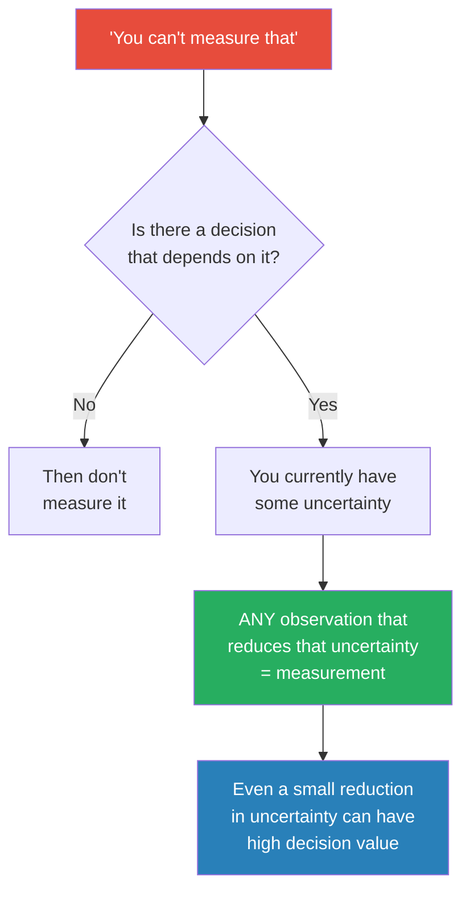
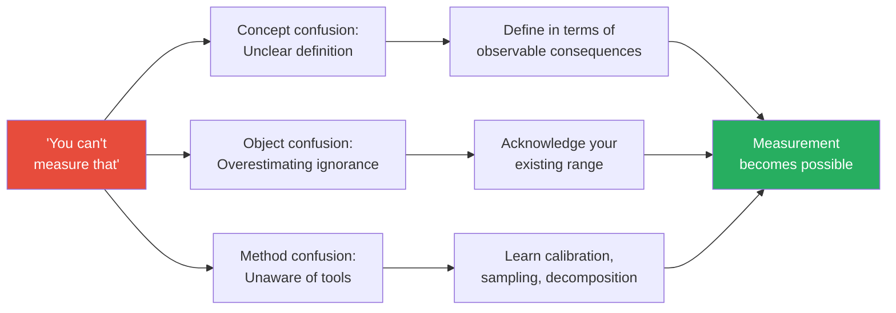
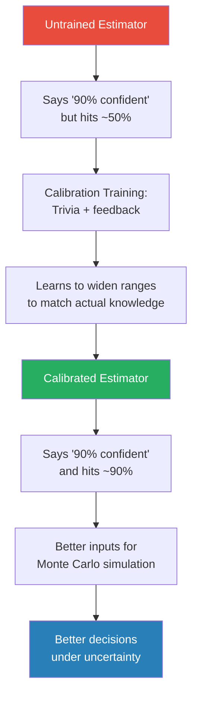
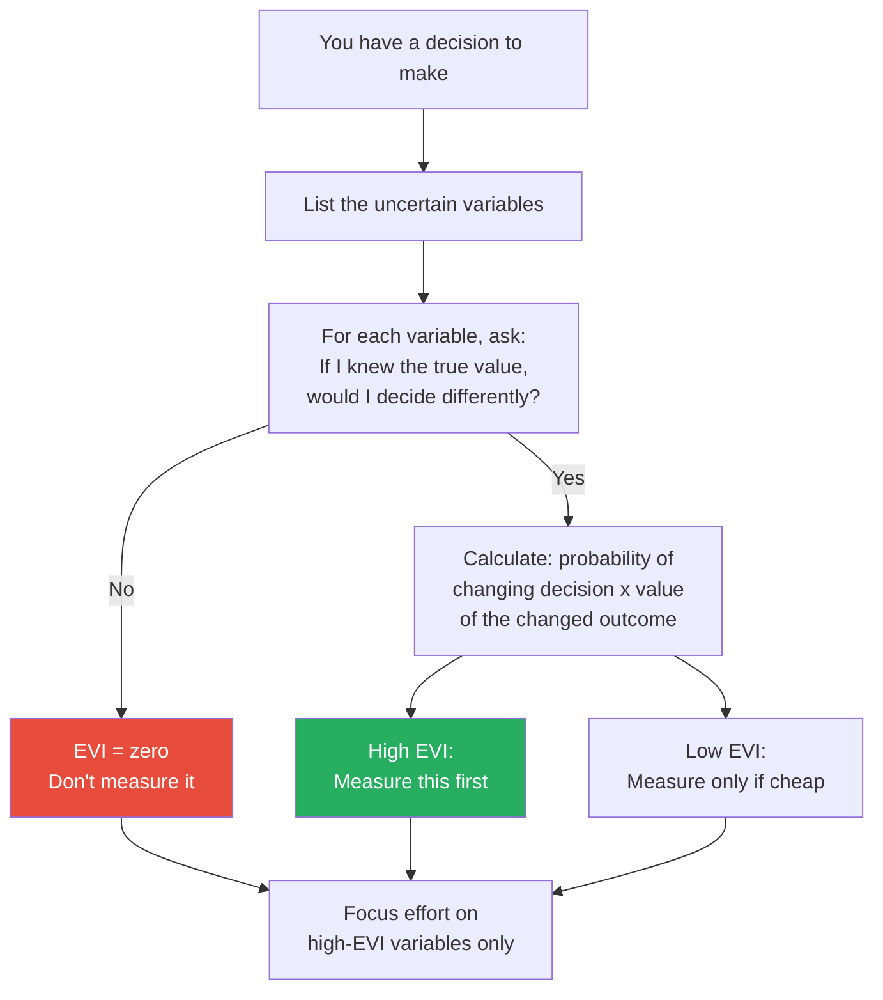
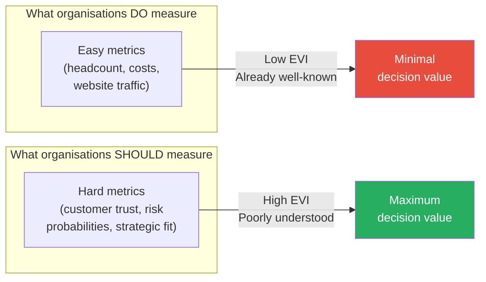
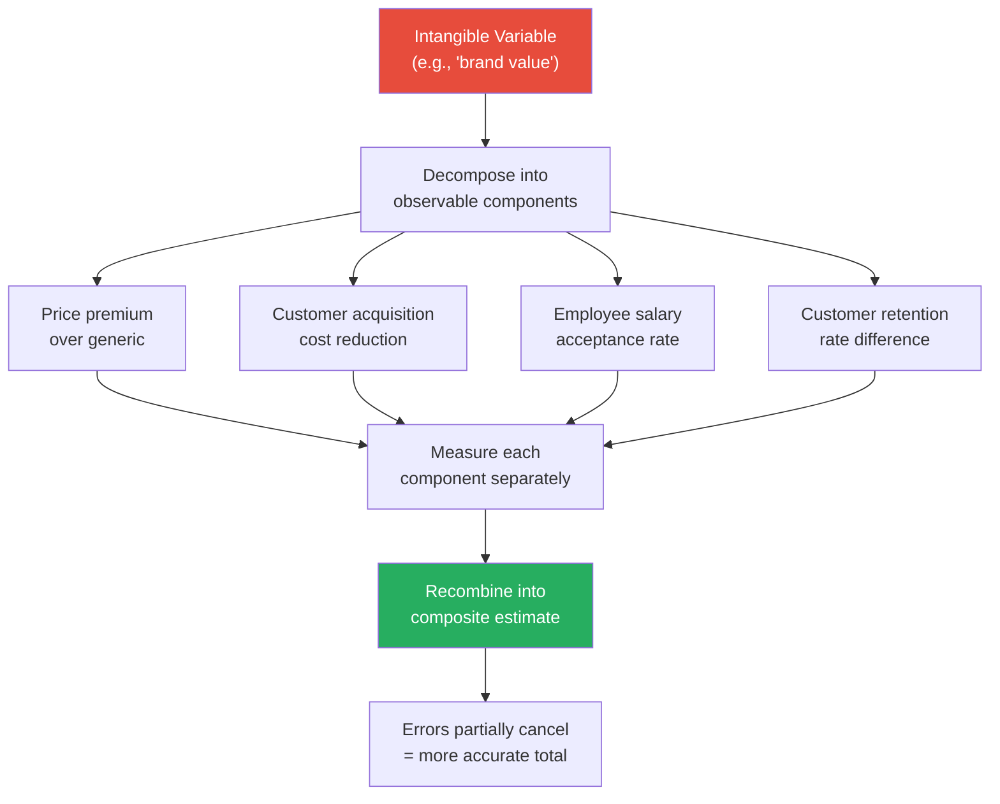
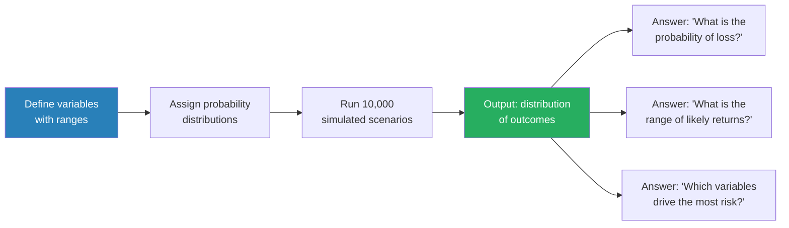
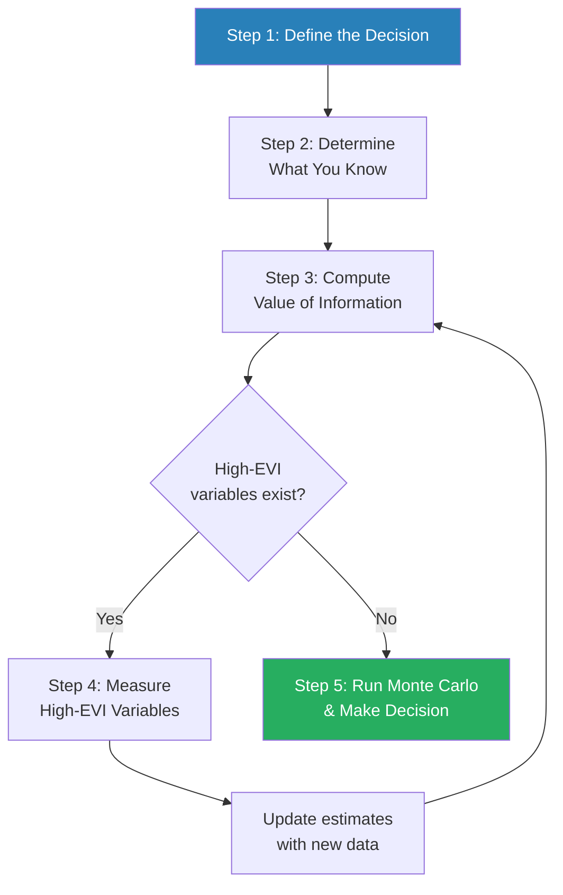
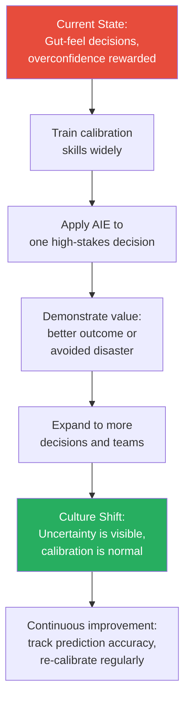
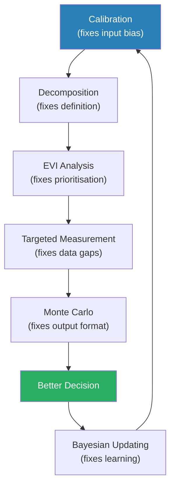

# How to Measure Anything — Douglas W. Hubbard

> Douglas Hubbard's core provocation is this: when someone says "you can't measure that," what they really mean is "I don't know how to measure that."
> Everything is measurable — not in the sense of pinpointing an exact number, but in the sense of reducing your uncertainty about it.
> If you knew absolutely nothing about employee morale and now you know it's somewhere between 3 and 8 on a 10-point scale, you've measured it.
> The book provides a systematic framework — Applied Information Economics — for identifying what to measure, how much measurement is worthwhile, and how to make better decisions even with imperfect data.
> Hubbard has tested this framework with the US Department of Defense, NASA, Fortune 500 companies, and dozens of government agencies — and it consistently outperforms both gut feeling and conventional analysis.
> It is the antidote to both gut-feeling management and analysis paralysis.

---

## About the Author

Douglas Hubbard is a management consultant and the inventor of the Applied Information Economics (AIE) framework. He has consulted for the US Department of Defense, NASA, major banks, and dozens of Fortune 500 companies on how to quantify "intangible" risks and values. His background is in quantitative decision analysis, and his mission — pursued across three editions of this book and several follow-ups — is to destroy the myth that certain important things can't be measured. Before developing AIE, he worked in information technology and noticed that the biggest investment decisions were routinely made with the least data, while trivial decisions drowned in spreadsheets.

---

## The Big Idea

- <b style="color: #2980b9">Measurement = an observation that quantitatively reduces uncertainty</b> — it does not mean "exact number," "perfect precision," or "scientific certainty"
- If you care enough about something to make a decision about it, you care enough to measure it — and you can
- The things organisations claim are "immeasurable" (morale, brand value, cybersecurity risk, innovation pipeline quality) are often the things that matter most to the decisions they face
- <b style="color: #27ae60">You don't need perfect precision — you need less uncertainty than you had before</b>
- Most organisations measure the wrong things: they over-invest in easy metrics and ignore the uncertain variables that actually drive decisions
- The entire methodology rests on a chain of reasoning:
  - You have a decision to make
  - That decision depends on variables you're uncertain about
  - Any observation that reduces that uncertainty — even slightly — is a measurement
  - The value of that measurement depends on how much it could change your decision
  - Therefore, you should measure the variables where your uncertainty is highest and the decision stakes are greatest

This flowchart captures Hubbard's entire argument in miniature — the cascade from "impossible" to "valuable" happens the moment you redefine what measurement actually means.

Every slice of this chart represents a variable that organisations routinely declare "unmeasurable" — yet Hubbard has measured each one in his consulting practice, proving that the real obstacle is ignorance of method, not impossibility.

The heatmap implements Hubbard's Measurement Inversion principle: the highest-value measurements sit in the upper-right corner where uncertainty and decision stakes are both high — precisely the variables most organisations declare "unmeasurable."

---

## Key Concepts at a Glance

| Concept | One-line summary |
|---------|-----------------|
| **Measurement redefined** | Not precision — just less uncertainty than before |
| **The intangibles problem** | The things you think can't be measured are where measurement matters most |
| **Calibrated estimation** | Training yourself to give honest 90% confidence intervals |
| **The Rule of Five** | 5 random observations give a 93.75% chance of containing the median |
| **Expected Value of Information** | Measure only what would actually change your decision |
| **Measurement Inversion** | The variables you resist measuring most are the ones worth measuring most |
| **Applied Information Economics** | Five-step framework from decision to measurement to action |
| **Monte Carlo simulation** | Run thousands of scenarios with probability distributions instead of single estimates |
| **Decomposition** | Break intangibles into observable components that can be measured separately |
| **Bayesian updating** | Start with a prior estimate, update it as new observations arrive |
| **Sampling methods** | Small, clever samples often beat large, expensive surveys |
| **Proxy measurements** | When you can't measure the target directly, measure something that correlates |
| **Calibrated human judges** | Trained humans are legitimate measurement instruments, not inferior substitutes |
| **Prediction markets** | Aggregate many estimates into a single calibrated forecast via market mechanisms |

---

## Part One: The Measurement Problem

### Why This Matters Now

- The modern economy runs on decisions about intangibles — intellectual property, brand equity, customer loyalty, cybersecurity, employee engagement
- <b style="color: #e74c3c">The more intangible the economy becomes, the more critical measurement becomes — and the worse most organisations are at it</b>
- Physical assets are easy to count: how many widgets, how many trucks, how many buildings
- But the assets that drive most of the value in modern organisations — knowledge, relationships, reputation, innovation — are the ones that get declared "unmeasurable" and managed by instinct
- Hubbard's argument: this is not just inefficient, it is systematically dangerous, because the decisions with the highest stakes are being made with the least information
- The knowledge economy has inverted the measurement problem:
  - In the industrial era, the hard-to-measure things (morale, innovation) were secondary to the easy-to-measure things (output, inventory, costs)
  - In the knowledge era, the hard-to-measure things ARE the primary value drivers
  - Yet measurement practice has not caught up — organisations still pour resources into counting the easy things and ignoring the hard ones
- Consider the relative difficulty of measurement across eras:
  - **1950s factory:** What matters? Output per hour, defect rate, inventory. All easy to count.
  - **2020s tech company:** What matters? Employee engagement, innovation rate, customer trust, cybersecurity resilience. All declared "unmeasurable."
  - The irony: the economies that need measurement most are the ones that practise it least
  - <b style="color: #e74c3c">The gap between what matters and what gets measured has never been wider</b>

---

### Chapter 1 — Intangibles and the Challenge

*Hubbard opens by demolishing the most common excuse in management: "You can't measure that." He shows that this phrase is never about impossibility — it's about ignorance of method.*

- Every time Hubbard has encountered a supposedly "immeasurable" variable in his consulting work, he has found a way to measure it
- The pattern is consistent across industries — IT security, environmental policy, military logistics, pharmaceutical R&D, public education
- <b style="color: #e74c3c">The phrase "you can't measure that" is almost always a confession, not a fact</b> — it means "I personally don't know how to measure that"
- Hubbard catalogues the most common "immeasurable" items organisations claim they cannot quantify:
  - Management effectiveness
  - Employee morale
  - The value of information
  - Environmental impact
  - Brand equity
  - Cybersecurity risk
  - The quality of strategic alignment
- Every single one of these has been measured — many by Hubbard's own clients using surprisingly simple methods
- The claim of immeasurability carries a hidden cost:
  - If something is declared unmeasurable, it becomes invisible in cost-benefit analysis
  - If it's invisible in cost-benefit analysis, it loses every fight against measurable alternatives
  - <b style="color: #27ae60">The things declared unmeasurable are not just ignored — they are systematically deprioritised in every resource allocation decision</b>

> [!example] The "Immeasurable" IT Security Risk
> - A large financial institution told Hubbard that cybersecurity risk was fundamentally unmeasurable
> - Their reasoning: the threats are too varied, the attack surface too complex, and the consequences too unpredictable
> - Hubbard asked them a simple question: "Do you spend money to reduce this risk?"
> - They did — tens of millions of dollars per year
> - His follow-up: "If you're spending money on it, you've already implicitly estimated its value — you just haven't written it down"
> - He walked them through basic probability modelling: what is the range of potential losses per year? What is the probability of a breach in a given year?
> - Within hours, they had a rough but useful model — one that immediately revealed they were over-investing in low-impact threats and under-investing in high-impact ones
> **The lesson:** If you're already making decisions about something, you're already measuring it — just badly.

> [!tip] Core Insight
> The question is never "can we measure this?" The question is "how much do we need to reduce our uncertainty, and what's the cheapest way to do it?"

> [!example] The Cost of "Immeasurable" Decisions
> - Hubbard catalogues the cumulative cost of organisations declaring important variables unmeasurable
> - One major bank avoided measuring customer trust for a decade because it was "too soft"
> - During that decade, customer trust eroded steadily — visible only in retrospect through declining retention rates and falling Net Promoter Scores
> - By the time the erosion was undeniable, the bank had lost an estimated $400 million in lifetime customer value
> - A simple annual measurement programme — even one as crude as 50 random customer interviews — would have flagged the trend years earlier
> - The cost of the measurement: perhaps $20,000 per year. The cost of not measuring: 20,000 times that.
> **The lesson:** The cost of declaring something "unmeasurable" is not zero. It's the cost of the decisions you make badly because you chose ignorance.

Hubbard's running tally across his consulting career is striking: he has been told more than 100 times that a particular variable was unmeasurable, and in every single case, his team found a practical way to measure it. Not with perfect precision — but with enough uncertainty reduction to improve the decision at hand.

The pattern he identifies is remarkably consistent across domains:
- Step 1: Client declares variable X unmeasurable
- Step 2: Hubbard asks "what do you mean by X?" and "what decision depends on X?"
- Step 3: Clarification reveals that X is either poorly defined or that existing data already partially measures it
- Step 4: A simple measurement method (often calibrated estimation or Rule of Five) provides a useful range
- Step 5: The client's reaction is almost always: "That was easier than I thought"
- This five-step pattern has repeated itself across cybersecurity, environmental policy, military logistics, healthcare, education, and financial services

---

### Chapter 2 — An Intuitive Measurement Habit

*Before introducing his formal framework, Hubbard shows that measurement is something humans have always done — often with remarkable ingenuity and minimal tools.*

- Measurement is not a modern invention requiring expensive instruments and trained scientists
- Throughout history, people have found clever ways to observe and reduce uncertainty about things that seemed impossible to quantify
- <b style="color: #2980b9">Eratosthenes measured the circumference of the Earth in 240 BC</b> using nothing but shadows, a well, and basic geometry — and got within 3% of the correct answer
- The key insight: he didn't need a spaceship or a satellite. He needed a clever observation strategy and a willingness to reason from indirect evidence
- Hubbard uses these historical examples not as curiosities but as proof of principle: if ancient scholars could measure the planet with sticks and shadows, modern managers can certainly measure employee morale or brand equity

> [!example] Eratosthenes and the Earth's Circumference (240 BC)
> - Eratosthenes, the chief librarian at Alexandria, heard that in the city of Syene (modern Aswan), the sun shone directly to the bottom of a deep well at noon on the summer solstice — meaning it was directly overhead
> - On the same day in Alexandria, about 800 km north, the sun cast a shadow at an angle of about 7.2 degrees
> - He reasoned: if the Earth is a sphere, that angle represents 1/50th of a full circle (360 / 7.2 = 50)
> - Therefore the Earth's circumference is approximately 50 times the distance between Syene and Alexandria
> - His answer: roughly 40,000 km — remarkably close to the modern measurement of 40,075 km
> **The lesson:** You don't need sophisticated instruments. You need a clever question and the willingness to reason from what you can observe.

> [!example] The Lens-Crafting Monks
> - Medieval monks who ground lenses for reading glasses were effectively measuring refractive error centuries before the field of optics had formal measurement standards
> - They tested lenses by trial and error — holding them up, checking clarity, adjusting the grind
> - They had no theory of optics, no formal units, no instruments beyond their eyes and their hands
> - Yet they produced lenses that measurably improved vision — meaning they were quantitatively reducing uncertainty about the correct lens shape for a given person
> **The lesson:** Measurement does not require theory or instruments. It requires observation that reduces uncertainty.

- Hubbard argues that the modern reluctance to measure "intangibles" is actually a step backwards from this ancient tradition of practical ingenuity
- <b style="color: #27ae60">Humans have always measured what mattered — the modern excuse that something is "too complex" or "too intangible" would have baffled Eratosthenes</b>

> [!example] Enrico Fermi and the Atomic Blast (1945)
> - At the Trinity nuclear test in July 1945, physicist Enrico Fermi wanted to estimate the blast's energy yield
> - While others waited for instrument readings, Fermi tore small pieces of paper and dropped them during the shockwave
> - By measuring how far the shockwave carried the paper scraps, he estimated the yield at about 10 kilotons
> - The instrument-based measurement, calculated hours later, was 18.6 kilotons
> - Fermi's napkin estimate — made with scraps of paper in seconds — was within the right order of magnitude
> - He called these "Fermi estimates": rough calculations using easily observable proxies
> **The lesson:** A rough measurement made quickly with no budget is almost always better than no measurement at all. Perfection is not the standard. Reduction of uncertainty is.

<b style="color: #2980b9">Fermi estimation</b> as a concept deserves extra attention because it recurs throughout the book:
- A Fermi estimate breaks an unknown quantity into smaller, estimable components
- "How many piano tuners are in Chicago?" becomes: how many pianos, how often do they need tuning, how many can one tuner service per day, how many working days per year?
- Each component can be estimated with reasonable confidence, and the product gives a useful estimate of the whole
- This is exactly the decomposition principle Hubbard formalises later — Fermi was doing it instinctively decades before AIE existed
- The power of Fermi estimation: it transforms "I have absolutely no idea" into "I can reason my way to a useful range"

> [!example] Fermi Estimation — Piano Tuners in Chicago
> - Fermi would pose this famous question to physics students as a demonstration
> - Chicago population: roughly 3 million people, about 1 million households
> - Fraction with pianos: maybe 1 in 20, so about 50,000 pianos
> - Each piano needs tuning roughly twice a year: 100,000 tunings per year
> - A tuner can do about 4 per day, works 250 days per year: 1,000 tunings per tuner per year
> - Therefore: roughly 100 piano tuners in Chicago
> - The actual number from the Chicago Yellow Pages at the time: about 83
> - A back-of-the-envelope calculation with no data at all produced an answer within 20% of reality
> **The lesson:** You know more than you think you do. Decompose, estimate the parts, and multiply.

Hubbard uses this tradition of practical measurement ingenuity to set up his central argument: if ancient Greeks could measure the Earth with shadows, and mid-century physicists could estimate atomic yields with paper scraps, then surely modern organisations can measure employee morale or brand value.

The common thread across all these examples is the same: the measurer did not have perfect information, did not use expensive instruments, and did not achieve exact precision. What they achieved was uncertainty reduction — they knew more after the measurement than before. That is the standard Hubbard applies to every measurement challenge in the rest of the book.

> [!tip] Core Insight
> Measurement has never required perfection. Eratosthenes was off by 3%. Fermi was off by a factor of two. Both measurements were enormously valuable because they replaced total ignorance with useful ranges.

---

### Chapter 3 — The Illusion of Intangibles

*Hubbard identifies three reasons people believe something is unmeasurable — and shows that all three are based on misunderstanding.*

The three reasons people say "you can't measure that":

1. **Concept confusion** — they haven't clearly defined what they mean
2. **Object confusion** — they don't realise how much they already know
3. **Method confusion** — they don't know about methods that would work

<b style="color: #2980b9">Concept confusion</b> is the most common:
- People say "we need to measure strategic alignment" without defining what they mean by "strategic alignment"
- When pressed, they can't articulate what would look different if alignment were high versus low
- The fix is simple: <b style="color: #27ae60">define the intangible in terms of observable consequences</b>
- "Strategic alignment" might mean "the percentage of project budgets that map to the top three strategic priorities"
- Once you define it in observable terms, the measurement path becomes clear
- Hubbard's diagnostic test: if you can't describe what you would observe if the thing were present versus absent, you don't have a measurement problem — you have a definition problem

<b style="color: #2980b9">Object confusion</b> means they underestimate what they already know:
- People say "we have no idea how much this will cost" — but when pushed, they can always give a range
- "Is it more than $1 million? Less than $100 million?" — usually they can narrow it down significantly
- The gap between "we know nothing" and "we know the answer exactly" is vast, and most people are somewhere in the middle
- <b style="color: #e74c3c">Claiming total ignorance when you actually have a rough range is a form of intellectual laziness</b>
- Object confusion is particularly costly because it prevents people from recognising that even their rough intuitions are informative starting points for formal analysis

<b style="color: #2980b9">Method confusion</b> means they simply don't know the available tools:
- They assume measurement requires expensive studies, massive sample sizes, or perfect data
- They don't know about the Rule of Five, calibrated estimation, or decomposition
- Once introduced to these methods, the "impossible" measurement often becomes trivial
- The gap between "how people think measurement works" (lab coats, massive datasets, peer review) and "how measurement actually works" (clever observations, small samples, calibrated ranges) is the gap that generates method confusion

This diagram maps the three barriers to measurement and the corresponding solution for each — every "intangible" falls into at least one of these categories.

> [!abstract] The Clarification Chain
> When someone says "you can't measure that," ask:
> 1. What do you mean by [the thing]? — forces concept clarity
> 2. What would you observe if it were high? If it were low? — converts abstractions to observables
> 3. How much do you currently know? Can you give a range? — reveals existing knowledge
> 4. What decision depends on this? — establishes the stakes
> 5. What would change your decision? — identifies the threshold that matters

> [!example] The "Unmeasurable" Quality of Management
> - A government agency had been debating how to measure "management quality" for over a year with no progress
> - The committee had tried several approaches: 360-degree reviews, balanced scorecards, competency frameworks
> - Each approach generated intense debate about methodology and was eventually abandoned
> - Hubbard's intervention was simply to ask: "If one department had great management and another had terrible management, what specific things would you observe?"
> - Within 30 minutes the group identified: employee retention rates, time to fill open positions, frequency of escalations to senior leadership, project on-time completion rates, and employee satisfaction survey scores
> - Every one of these was already being tracked somewhere in the agency's systems
> - The "impossible" measurement was actually a problem of assembling existing data in a new way
> **The lesson:** When you can't measure an abstraction, decompose it into concrete observables. The data usually already exists.

---

## Part Two: Before You Measure

### The Measurement Mindset

Before diving into specific methods, Hubbard emphasises a mindset shift that must come first:

- <b style="color: #27ae60">Stop asking "can we measure this?" and start asking "how much could we reduce our uncertainty about this?"</b>
- The first question is binary and usually gets a "no" for intangibles
- The second question is continuous and almost always gets a "yes, at least somewhat"
- This reframe is the single most important intellectual move in the entire book — everything else follows from it
- Once you accept that measurement is about uncertainty reduction (not precision), the psychological barrier to measuring "soft" things disappears
- The mindset shift also changes how you evaluate measurement proposals:
  - Old question: "Is this measurement accurate enough?"
  - New question: "Does this measurement reduce uncertainty enough to be worth its cost?"
  - These are fundamentally different questions — the first demands perfection, the second demands value

---

### Chapter 4 — Clarifying the Measurement Problem

*Hubbard argues that the biggest obstacle to measurement is not data scarcity — it's that people haven't clearly defined what they're trying to measure or why.*

- Before reaching for a tool, you must answer three questions:
  1. **What is the decision this measurement supports?** — if no decision depends on it, don't measure it
  2. **What do you mean, precisely, by the thing you want to measure?** — "quality" is not a measurement target; "percentage of customer support tickets resolved on first contact" is
  3. **Why does it matter?** — what would you do differently if the number were high versus low?
- <b style="color: #27ae60">The single most important step in measurement is the definition step</b> — get this wrong and all subsequent effort is wasted
- Hubbard repeatedly finds that workshops focused solely on clarifying definitions solve 30-40% of measurement problems instantly
- Once the definition is clear, the measurement method often suggests itself
- There is a reason definition matters so much: vague definitions allow everyone in the room to believe they agree when they actually don't
  - "We all want to improve quality" — but one person means defect rates, another means customer satisfaction, and a third means design elegance
  - Until you define the term, you cannot measure it, and you cannot even have a productive argument about it
  - <b style="color: #e74c3c">Vague measurement targets are consensus traps — they create the illusion of agreement where none exists</b>

The definition process follows a specific pattern Hubbard calls the <b style="color: #2980b9">measurement clarification chain</b>:
- Start with the vague concept (e.g., "innovation")
- Ask: what do you mean by that? (e.g., "we want to know how innovative we are")
- Ask: what would you observe? (e.g., "more new products, faster time-to-market, more patents")
- Ask: what decision depends on this? (e.g., "whether to increase R&D budget by 20%")
- Ask: what value would change your decision? (e.g., "if fewer than 3 new products launched this year, we'd increase the budget")
- Now you have a measurement target: count new product launches. You may also want time-to-market data and patent filings. All measurable.

> [!example] "Measuring" Management Effectiveness
> - A government agency asked Hubbard to help them measure "management effectiveness" — a concept they'd been debating for months without progress
> - He asked: "If management were more effective, what would you observe?"
> - After discussion, they identified specific observables: lower employee turnover in well-managed departments, faster project completion, fewer escalations, higher scores on internal satisfaction surveys
> - Each of these was already being tracked or could be tracked cheaply
> - The "impossible" measurement turned out to be a composite of four existing metrics — the problem had never been measurement, it had been definition
> **The lesson:** Most "measurement problems" are actually definition problems in disguise.

> [!example] Defining "Environmental Impact" for a Manufacturer
> - A manufacturing company wanted to measure the "environmental impact" of its operations but stalled because the concept felt too broad
> - Hubbard's team asked: "What decisions depend on this number?"
> - Answer: whether to invest $5 million in new pollution control equipment
> - Follow-up: "What specific environmental outcomes would that equipment change?"
> - Answer: tonnes of CO2 emitted per year, volume of wastewater discharge, particulate emissions
> - Each of these had regulatory reporting requirements — meaning the data already existed in compliance files
> - The "unmeasurable" environmental impact turned out to be three numbers that were already reported to the government quarterly
> **The lesson:** Ask what decision you're trying to make. The answer almost always reveals that the measurement is simpler than you assumed.

> [!tip] Core Insight
> If you can't measure it, you probably can't define it. And if you can't define it, you certainly can't manage it.

---

### Chapter 5 — Calibrated Estimates

*Hubbard introduces his most immediately practical tool: the art and science of making better estimates by training yourself to be honest about what you don't know.*

- Most people are terrible at estimating uncertainty — not because they're stupid, but because they've never been trained
- <b style="color: #e74c3c">When asked to give a 90% confidence interval, typical managers hit about 50%</b> — meaning they are dramatically overconfident
- They give ranges that are too narrow, because wide ranges feel like "admitting ignorance"
- This overconfidence is not harmless — it leads to plans that don't account for realistic variation, budgets that blow up, and schedules that slip
- Hubbard's research shows this pattern is remarkably consistent across industries, roles, and experience levels:
  - Senior executives are no more calibrated than junior staff
  - Domain experts are often less calibrated than generalists (their expertise breeds confidence that outpaces their actual accuracy)
  - The only group consistently well-calibrated: professional forecasters and weather meteorologists, who get daily feedback on their predictions

<b style="color: #2980b9">Calibration training</b> is the fix:
- Through repeated practice and feedback, you learn to give honest confidence ranges
- A calibrated person who says "I'm 90% confident the answer is between X and Y" is right 90% of the time
- This is a trainable skill, not a talent — Hubbard's data shows most people calibrate well within half a day of practice
- The training process involves answering trivia questions with confidence intervals, getting immediate feedback, and adjusting
- After calibration, people still don't know more facts — but they know what they don't know, which is far more valuable

| Before Calibration | After Calibration |
|-------------------|-------------------|
| "I'm 90% sure" but actually right ~50% of the time | "I'm 90% sure" and actually right ~90% of the time |
| Confident but inaccurate | Accurate about own accuracy |
| Narrow ranges that miss the truth | Wider but honest ranges that contain the truth |
| Surprised by outcomes frequently | Surprised only the expected ~10% of the time |
| Plans based on overconfident assumptions | Plans that account for real uncertainty |
| Expert confidence indistinguishable from actual knowledge | Confidence proportional to actual knowledge |

> [!abstract] Calibration Training Protocol
> 1. Answer 20-30 factual questions by giving a range (e.g., "What year was the Eiffel Tower completed? 90% CI: 1880-1895")
> 2. Score your results — if you said 90% confident and only got 12 out of 20 right, you're overconfident
> 3. Identify your bias direction — most people are overconfident (ranges too narrow)
> 4. Repeat with wider ranges and re-score
> 5. Continue until your stated confidence matches your actual hit rate
> 6. Most people achieve good calibration within 2-4 rounds
> 7. Test at multiple confidence levels — 50%, 75%, 90% — to verify consistency
> 8. Periodically re-test to maintain calibration (skills can drift)

> [!example] The Calibration Experiment
> - Hubbard ran calibration training with hundreds of managers across different industries
> - Before training, the average "hit rate" for 90% confidence intervals was about 50% — catastrophically overconfident
> - After just a few hours of practice with feedback, most participants moved to 80-90% accuracy
> - The improvement was immediate and durable — calibration training sticks
> - One participant admitted: "I've been giving my boss estimates for 20 years and never once acknowledged how uncertain I really was"
> - Follow-up testing six months later showed that calibration gains persisted — this was not a temporary effect
> **The lesson:** You don't need to know more to make better estimates. You need to be honest about how much you don't know.

The psychology behind overconfidence is worth understanding:
- Humans evolved to project certainty — in tribal environments, the confident leader attracted followers, the uncertain one did not
- Modern organisations amplify this bias: bosses reward confident answers and punish hedging
- <b style="color: #e74c3c">The organisational incentive structure actively punishes calibration</b> — the person who says "I'm 60% sure" sounds weak next to the person who says "I'm certain"
- Calibration training does not just improve estimation accuracy — it requires a kind of intellectual courage: the willingness to say "I don't know precisely, but here is my honest range"

There are two distinct types of miscalibration:
- **Overconfidence** (ranges too narrow): by far the most common, accounting for roughly 90% of miscalibration in Hubbard's data
- **Underconfidence** (ranges too wide): occasionally seen in people who have been burned by past overconfidence and overcorrect, giving ranges so wide they are uninformative
- The goal is neither confidence nor humility — it is accuracy about your own accuracy

This diagram shows the pipeline from uncalibrated estimator to better decisions — calibration is the linchpin that makes every subsequent method work.

> [!example] The Software Project That Proved the Point
> - A software company asked its project managers to estimate how long 30 upcoming projects would take
> - Before calibration training, their 90% confidence intervals contained the actual completion time only 40% of the time
> - Projects routinely ran 50-200% over estimate, causing budget blowouts and client frustration
> - After calibration training, the same managers' 90% intervals contained the actual result 85% of the time
> - Critically, their point estimates didn't improve much — they still couldn't predict exact durations
> - What improved was their honesty about uncertainty — they gave wider ranges that actually reflected reality
> - This allowed the company to set realistic client expectations and budget adequate contingency for the first time
> **The lesson:** Better estimation isn't about knowing more. It's about being honest about how little you know — and planning accordingly.

---

### Anchoring and Adjusting

*Within the calibration chapter, Hubbard addresses the cognitive biases that sabotage good estimation.*

- <b style="color: #2980b9">Anchoring</b> is the most dangerous bias in estimation:
  - Once you hear a number — any number, even a random one — it drags your estimate toward it
  - If someone says "Do you think this project costs more or less than $10 million?" your subsequent estimate will be pulled toward $10 million regardless of the facts
  - Calibrated estimators learn to recognise and resist anchoring effects
  - Anchoring is not just a mild tendency — research shows it can shift estimates by 30-50% even when the anchor is transparently arbitrary
- <b style="color: #e74c3c">The overconfidence bias</b> is universal:
  - Experts are often worse than laypeople — their confidence grows faster than their accuracy
  - Doctors, lawyers, engineers, and executives all show systematic overconfidence in controlled studies
  - The fix is not humility as a personality trait — it's structured feedback on prediction accuracy
- <b style="color: #2980b9">Availability bias</b> also distorts estimation:
  - Recent events, vivid events, and personally experienced events get overweighted
  - If a colleague's project just failed spectacularly, you'll overestimate the risk of your own project failing
  - Calibrated estimators learn to ask: "Am I basing this range on base rates, or on a vivid recent memory?"

> [!example] Anchoring in Real Estimates
> - In a controlled experiment, Hubbard asked two groups to estimate the population of a city
> - Group A was first asked: "Is it more or less than 5 million?"
> - Group B was first asked: "Is it more or less than 500,000?"
> - Both groups then gave their best estimate
> - Group A's estimates averaged significantly higher than Group B's — despite having the same information
> - The arbitrary anchor number pulled both groups in its direction
> **The lesson:** Be aware of the first number you hear in any estimation context. It is shaping your judgement whether you realise it or not.

> [!example] The Vendor's Anchoring Trick
> - A consulting firm noticed that technology vendors consistently opened pricing discussions with an extremely high "list price" before offering "discounts"
> - The list price served as an anchor — even after heavy discounting, the final negotiated price was significantly higher than it would have been without the initial anchor
> - When the firm trained its procurement team to generate their own independent estimates before hearing the vendor's number, negotiated prices dropped by an average of 18%
> - The intervention cost nothing — it just required awareness that the first number on the table shapes everything that follows
> **The lesson:** Generate your own estimate before hearing anyone else's. The anchor you set for yourself will be more rational than the anchor someone else sets for you.

---

### Chapter 6 — Quantifying Risk and Uncertainty

*Hubbard shows how to convert fuzzy fears into concrete probability statements — the foundation for every measurement that follows.*

- Risk is not a feeling — it is a quantity: <b style="color: #2980b9">the probability of an event multiplied by its impact</b>
- Most people talk about risk as if it's binary: "it's risky" or "it's safe"
- Hubbard insists on specificity: "There is a 15% chance of a loss exceeding $2 million in the next 12 months" — that is a risk statement
- <b style="color: #27ae60">Converting risk from a vague feeling to a specific number is itself a measurement</b>

The components of risk quantification:
- **Probability**: What is the likelihood? Express as a percentage, not as "likely" or "unlikely"
- **Impact**: If it happens, what is the consequence? Express in dollars, time, or another concrete unit
- **Timeframe**: Over what period? A 5% annual risk is very different from a 5% lifetime risk
- **Existing controls**: What's already in place that reduces the probability or impact?

Hubbard is particularly critical of the common "risk matrix" approach:
- <b style="color: #e74c3c">The typical 5x5 risk matrix (likelihood vs. impact, both on qualitative scales) is worse than useless</b> — it creates an illusion of analysis while hiding the actual numbers
- "High probability, medium impact" tells you nothing about whether a risk is worth spending $100,000 or $10 million to mitigate
- The fix is simple but requires a cultural shift: replace qualitative labels with actual numbers (even rough ones)
- "There's a 30% chance of losing between $1M and $5M" is infinitely more useful than "high likelihood, moderate impact"

| Qualitative Risk Assessment | Quantitative Risk Assessment |
|---------------------------|----------------------------|
| "High probability" | "30% chance per year" |
| "Significant impact" | "Loss between $2M and $8M" |
| "Risk level: Orange" | "Expected annual loss: $1.5M" |
| Cannot compare across risk types | Can rank all risks by expected value |
| Cannot calculate ROI of mitigation | Can calculate exact break-even for mitigation investment |
| Debates about colour coding consume meetings | Debates focus on assumptions and evidence |

The shift from qualitative to quantitative risk assessment is one of Hubbard's most practical contributions — it transforms risk management from a bureaucratic exercise into a decision tool.

> [!abstract] Risk Quantification Template
> For any risk, answer these four questions:
> 1. What specifically could go wrong? (Define the event clearly)
> 2. What is the probability of it happening in [timeframe]? (Express as a range: "between 5% and 20%")
> 3. If it happens, what is the cost? (Express as a range: "between $500K and $5M")
> 4. What's our expected loss? (Multiply midpoint probability by midpoint impact)
> 5. What would we spend to mitigate it? (Compare against expected loss)
> 6. Is the mitigation investment worth it? (Spend only when mitigation cost < expected loss reduction)

> [!example] Risk Matrices vs. Real Numbers at a Healthcare Company
> - A healthcare company used a standard 5x5 risk matrix to evaluate compliance risks
> - Their matrix showed 47 risks, 12 of them coloured "red" (high probability, high impact)
> - When Hubbard's team replaced the matrix with actual probability and impact estimates, the picture changed dramatically
> - Three of the "red" risks had expected annual losses under $50,000 — barely worth tracking
> - Two "yellow" risks (medium probability, medium impact) had expected annual losses over $3 million — they had been systematically deprioritised because of their colour coding
> - The risk matrix was not just imprecise — it was actively misleading, directing resources away from the biggest threats
> **The lesson:** A risk matrix gives you colours. Quantified risk assessment gives you numbers you can act on. Colours don't tell you how much to spend on mitigation. Numbers do.

---

### Chapter 7 — Quantifying the Value of Information

*This is the chapter that separates Hubbard from every other measurement thinker. He doesn't just ask "can we measure this?" — he asks "should we?"*

- <b style="color: #2980b9">Expected Value of Information (EVI)</b> answers the question: how much is it worth to reduce your uncertainty about this variable?
- The calculation is elegant:
  - You have a decision to make (e.g., invest $10 million in a new system)
  - Your decision depends on uncertain variables (will it save us money? how much?)
  - If you had perfect information about a variable, would it change your decision?
  - If the answer is "no" — the variable's EVI is zero. Don't measure it.
  - If the answer is "yes" — the EVI equals the probability of changing your decision times the value of that change
- <b style="color: #27ae60">Most measurement effort in organisations has near-zero EVI</b> — they measure things that would never change any decision, no matter what the result turned out to be

Why most measurement effort has zero EVI:
- Consider a company deciding whether to invest $10M in a project
- They know the implementation cost is between $8M and $12M
- Even if the cost turns out to be $12M (the worst case), the project still passes the ROI threshold
- Therefore, measuring implementation cost more precisely has zero EVI — no result would change the decision
- But the same company is uncertain about customer adoption rate (somewhere between 5% and 40%)
- If adoption is below 15%, the project fails; if above 15%, it succeeds
- That adoption rate variable has high EVI because realistic results could cross the decision threshold

The EVI calculation in more detail:
- **Expected Value of Perfect Information (EVPI)** is the theoretical maximum value of removing all uncertainty about a variable
  - Calculate: what is the expected outcome of your decision now? What would it be if you knew the variable's true value?
  - The difference is the EVPI
  - No measurement can be worth more than the EVPI — it sets the ceiling for measurement investment
- **Expected Value of Imperfect Information (EVII)** is the more realistic version
  - Most measurements don't give you perfect information — they reduce uncertainty partially
  - The EVII is always less than the EVPI but often still substantial
  - This is what you actually compare against measurement cost

> [!tip] Core Insight
> The value of a measurement is not about the accuracy of the number. It is about whether that number could change what you do. If no result would change your decision, the measurement is worthless — even if it's perfectly precise.

This diagram shows Hubbard's decision tree for whether a measurement is worth taking — the pivot point is always "would it change what you do?"

> [!example] The $10 Million IT System Decision
> - A company was evaluating a $10 million IT infrastructure upgrade
> - They had a long list of things they wanted to measure before deciding: implementation cost, training time, productivity gains, system reliability, vendor risk, etc.
> - Hubbard's team ran the EVI analysis and found that only two variables had high information value: the expected productivity gain and the probability of a major integration failure
> - All other variables — training cost, license fees, vendor history — were already known well enough that no realistic measurement result would change the go/no-go decision
> - Instead of spending months measuring everything, they focused two weeks on the two high-EVI variables
> - The result: a better decision in less time with less expense
> **The lesson:** Measure less, but measure the right things.

> [!example] The EPA and the Value of Migratory Birds
> - The US Environmental Protection Agency needed to quantify the value of migratory bird populations for cost-benefit analysis of environmental regulations
> - Conventional wisdom: "You can't put a dollar value on nature"
> - Hubbard's approach: people already implicitly value migratory birds — they spend money on birdwatching, they support conservation organisations, they travel to see migrations
> - By decomposing "the value of migratory birds" into observable economic behaviours (tourism spending, willingness to pay for conservation, ecosystem services), the EPA arrived at an estimate of approximately $1 billion per year
> - The number wasn't perfect — but it was enormously more useful than "priceless" when making regulatory trade-off decisions
> **The lesson:** "Priceless" and "immeasurable" are not the same thing. Even nature has a measurable economic footprint.

> [!example] The Hospital That Measured Everything Except What Mattered
> - A regional hospital system spent over $2 million annually on quality metrics: patient satisfaction surveys, bed utilisation rates, average length of stay, medication error counts, and dozens more
> - When Hubbard's team ran an EVI analysis, they found that the vast majority of these metrics had zero information value — no realistic result would change any operational decision
> - Bed utilisation was already consistently at 85-90%, and the hospital's response was the same whether it was 85% or 90%
> - However, one critical variable — the probability of a major malpractice lawsuit — was not being measured at all
> - A crude estimate (based on historical lawsuit frequency and settlement data) suggested that a $200,000 intervention in surgical checklists could reduce expected malpractice losses by $3 million per year
> - The hospital was spending millions measuring things that didn't matter and zero measuring the one thing that could save them millions
> **The lesson:** EVI analysis reveals not just what to measure, but what to stop measuring. Most measurement budgets are wasted on low-value metrics.

---

### The Measurement Inversion

*Hubbard's most counterintuitive finding deserves its own section: the variables people resist measuring the most tend to be the ones where measurement has the highest payoff.*

- <b style="color: #2980b9">The Measurement Inversion</b>: organisations systematically over-measure low-value variables and under-measure high-value ones
- Why this happens:
  - Easy-to-measure things feel productive — you can count them, chart them, put them in dashboards
  - Hard-to-measure things feel uncomfortable — they involve uncertainty, judgement, and the admission that you don't know
  - <b style="color: #e74c3c">The result is a kind of "measurement theatre" where organisations collect vast amounts of meaningless data while ignoring the uncertainties that actually drive their decisions</b>
- The inversion is mathematically inevitable:
  - If you already know something precisely, measuring it further gives you little new information
  - If you know almost nothing about something critical, even a crude measurement is enormously valuable
  - Therefore the highest-value measurements are always in the areas of greatest uncertainty — which are exactly the areas people avoid
- Hubbard provides quantitative evidence from his consulting work:
  - In the majority of business cases he has analysed, the single highest-EVI variable was something the organisation had never attempted to measure
  - Conversely, the variables with the most elaborate measurement systems usually had near-zero EVI

This diagram illustrates the measurement inversion — effort flows to low-value measurements while high-value measurements are neglected.

> [!example] Millions on Metrics, Zero on Decisions
> - Hubbard describes a pattern he's seen in dozens of organisations: they invest heavily in measuring things like website traffic, employee headcount, and project milestone completion
> - These numbers fill dashboards and quarterly reports
> - But when he asked executives "Would any realistic change in this number cause you to make a different decision?" the answer was almost always no
> - Meanwhile, the truly uncertain variables — "Will our customers adopt this new product?" "What is the probability of a regulatory change?" — received no measurement attention at all
> - These were the variables that actually determined whether the organisation would succeed or fail
> **The lesson:** If your measurement effort is concentrated on things you already understand well, you are measuring to feel productive, not to make better decisions.

---

## Part Three: Measurement Methods

### Chapter 8 — The Transition from "What" to "How"

*Having established why we should measure and what to focus on, Hubbard now turns to the practical toolkit — starting with the surprising power of small samples.*

- The leap from "I should measure this" to "here's how I measure this" is where most people give up
- Hubbard's argument: you don't need a statistics degree or a massive budget
- The tools are simpler than you think, and the required sample sizes are smaller than you think
- <b style="color: #27ae60">The key principle: you're not trying to achieve scientific certainty. You're trying to reduce uncertainty enough to make a better decision.</b>
- This distinction between "scientific measurement" and "decision-supporting measurement" is crucial:
  - Science demands replicability, peer review, and statistical significance
  - Decision support demands only that you know more after measuring than before
  - Confusing the two standards causes most measurement paralysis — organisations demand scientific rigour for what is fundamentally a decision support task

---

### Chapter 9 — Sampling Reality

*Hubbard demolishes the myth that you need large sample sizes to learn anything useful, introducing the Rule of Five and other surprisingly powerful small-sample methods.*

- <b style="color: #2980b9">The Rule of Five</b> is Hubbard's signature statistical insight:
  - Take a random sample of 5 from any population
  - There is a **93.75% chance** that the median of the entire population falls between the smallest and largest values in your sample
  - This is a mathematical fact, not a heuristic — it follows from basic probability theory
  - It works regardless of the population's distribution — normal, skewed, bimodal, uniform, anything
- The mathematics behind it:
  - The probability that any single random observation falls above the median is 50%
  - The probability that ALL five observations fall above the median is 0.5^5 = 3.125%
  - The probability that ALL five fall below the median is also 3.125%
  - Therefore the probability that at least one is above AND at least one is below (containing the median) is 1 - 2(3.125%) = 93.75%
- Why this matters:
  - You don't need to survey 1,000 employees to know something about morale — ask 5 random employees and you'll have a 93.75% confidence range for the median
  - You don't need a year of data to understand a process — observe 5 random instances
  - <b style="color: #27ae60">The Rule of Five means that measurement is almost always cheaper and faster than you think</b>

> [!abstract] The Rule of Five — How It Works
> 1. Define the population you care about (e.g., all customer support calls)
> 2. Draw 5 members at random (truly random — not the 5 most convenient)
> 3. Measure the thing you care about for each (e.g., call duration)
> 4. Your 93.75% confidence interval for the population median is: [smallest value, largest value]
> 5. This range is often wide — but it's almost always narrower than "we have no idea"
> 6. If you need a tighter range, add more observations — but 5 gets you started immediately
> 7. Critical requirement: the sample must be genuinely random, not cherry-picked

> [!example] Five Random Employees
> - A mid-sized company wanted to understand how much time employees spent in meetings per week
> - The HR department proposed a company-wide survey — estimated cost: $50,000 and three months
> - Hubbard suggested: pick 5 employees at random and look at their calendars for last week
> - The five values were: 8 hours, 12 hours, 14 hours, 19 hours, 23 hours
> - 93.75% confidence interval for the median: somewhere between 8 and 23 hours per week
> - That range was already enough to confirm that the meeting problem was real and worth addressing — no $50,000 survey needed
> **The lesson:** Five data points won't give you precision. But they'll give you range — and range is usually all you need to decide.

The Rule of Five extends naturally to larger samples:
- With 8 observations, the confidence that the median is contained rises to 99.6%
- With 12 observations, you can construct a 96% confidence interval using the 2nd smallest and 2nd largest values (trimming outliers)
- The point is not that 5 is a magic number — it's that useful information arrives much sooner than most people expect
- <b style="color: #e74c3c">The common belief that "you need a statistically significant sample" to learn anything is wrong and harmful</b> — it prevents people from doing quick, cheap measurements that would immediately improve their decisions
- Hubbard is careful to distinguish between decision support and scientific research:
  - If you're publishing a medical journal paper, yes, you need statistical significance and large samples
  - If you're deciding whether to investigate a meeting-time problem, you need 5 data points
  - Most business decisions are in the second category, not the first
  - Holding every measurement to the scientific standard is like requiring a full environmental impact study before deciding where to eat lunch

> [!example] Five Data Centres and a Surprising Discovery
> - An IT company with 40 data centres was planning a $20 million energy efficiency upgrade across all facilities
> - Before committing, Hubbard suggested they measure energy waste at just 5 randomly selected data centres
> - The five measurements revealed something unexpected: energy waste varied enormously — from 8% to 47% of total consumption
> - This variation was not on anyone's radar — the company had assumed waste was roughly uniform
> - The discovery changed the entire investment strategy: instead of upgrading all 40 centres equally, they prioritised the highest-waste facilities
> - The revised plan achieved 80% of the energy savings at 40% of the cost
> **The lesson:** Even crude measurements can reveal variation you didn't know existed. And discovering variation is often more valuable than knowing the average.

---

### Decomposition

*When a variable seems impossible to measure directly, Hubbard's next tool is to break it apart into components that can be measured.*

- <b style="color: #2980b9">Decomposition</b> means taking an "intangible" and splitting it into concrete, observable parts
- Example: "brand value" sounds immeasurable. But break it down:
  - Price premium customers will pay for your brand versus a generic
  - Customer acquisition cost reduction due to brand recognition
  - Employee willingness to accept lower salary to work for a prestigious brand
  - Each of these is measurable with standard methods
- The act of decomposition often reveals that you know more than you thought — many of the components already have data
- <b style="color: #27ae60">Decomposition turns one "impossible" measurement into five "easy" measurements</b>
- There is also a mathematical benefit:
  - Estimation errors in decomposed components tend to be independent
  - Independent errors partially cancel out when you recombine the components
  - So the combined estimate from decomposed parts is often more accurate than a single holistic estimate
  - This is why Fermi estimation works: even if each component estimate is rough, the product is surprisingly close

> [!example] Decomposing "Quality of Life"
> - A healthcare organisation needed to measure "quality of life" improvement for patients in a new programme
> - "Quality of life" as a single concept seemed hopelessly vague
> - Decomposed, it became: mobility (can you walk to the shops?), pain level (how many pain-free hours per day?), social engagement (how many times per week do you see friends?), independence (can you dress yourself?)
> - Each component was measurable through simple observation or patient self-report
> - The composite gave a much richer picture than a single "quality of life" score ever could
> **The lesson:** When something seems unmeasurable, you haven't broken it down far enough.

> [!example] Decomposing "Innovation Pipeline Health"
> - A technology company's board wanted to know whether their innovation pipeline was healthy enough to sustain growth
> - "Innovation pipeline health" was the kind of phrase that generated heated debate but zero measurement
> - Decomposed into five observable components:
>   - Number of new product ideas entering the pipeline per quarter
>   - Percentage of ideas that advance past initial evaluation
>   - Average time from idea to prototype
>   - Revenue from products launched in the last 3 years as a percentage of total revenue
>   - Number of patents filed per year
> - Each component was already tracked or could be tracked with minimal effort
> - The composite picture revealed a clear problem: plenty of ideas were entering the pipeline, but the conversion rate from idea to prototype had dropped 60% in two years — a bottleneck in the engineering organisation, not a creativity problem
> **The lesson:** Decomposition doesn't just make measurement possible — it reveals the specific location of the problem, which a single aggregate metric would have hidden.

Decomposition transforms "we can't measure brand value" into four tractable measurement problems, each of which has established methods — and the recombined estimate benefits from error cancellation.

---

### Chapter 10 — Bayes and Beyond

*Hubbard introduces Bayesian thinking as the natural framework for updating beliefs as new evidence arrives — the mathematical engine behind calibrated estimation.*

- <b style="color: #2980b9">Bayesian updating</b> is the formal method for doing what calibrated estimators do intuitively:
  - Start with a prior: your current belief expressed as a probability distribution
  - Observe new data
  - Update your belief proportionally to the strength of the evidence
  - The result is a posterior: your revised belief
- This is not just a statistical technique — it's a philosophy of knowledge:
  - You never have "zero knowledge" — you always have some prior belief
  - You never achieve "perfect knowledge" — you always have some remaining uncertainty
  - <b style="color: #27ae60">Knowledge is a spectrum, and every observation moves you along it</b>
- Hubbard shows that Bayesian reasoning naturally avoids two common mistakes:
  - Ignoring prior knowledge (starting from scratch when you already know something)
  - Ignoring new evidence (sticking with your prior when data contradicts it)
- The Bayesian framework connects directly to calibration:
  - A well-calibrated prior is an honest starting point
  - Calibration training teaches you to set priors that accurately reflect your actual state of knowledge
  - Without calibration, Bayesian updating starts from a biased foundation and produces biased results

| Traditional Approach | Bayesian Approach |
|---------------------|-------------------|
| "We don't have enough data to say anything" | "We have a prior — let's quantify it and update" |
| Waits for perfect data before acting | Acts on current best estimate, updates continuously |
| Binary: "we know" or "we don't know" | Continuous: degrees of certainty from 0% to 100% |
| Ignores expert intuition | Formally incorporates expert judgement as priors |
| Large expensive studies | Small observations that update existing knowledge |
| One-shot: study, conclude, stop | Iterative: update as each new piece of data arrives |

> [!abstract] Bayesian Updating — Step by Step
> 1. State your prior belief as a probability (e.g., "I think there's a 40% chance this drug works")
> 2. Define what data you could observe that would be relevant
> 3. For each possible observation, estimate how likely it would be if the hypothesis were true vs. false (the likelihood ratio)
> 4. Observe the data
> 5. Multiply your prior by the likelihood ratio to get the posterior
> 6. The posterior becomes the prior for the next round of evidence
> 7. Repeat as more data arrives — each observation sharpens the estimate

> [!example] Bayesian Updating in Practice — Drug Development
> - A pharmaceutical company was evaluating whether to continue developing a drug candidate
> - Before clinical trials, experts estimated a 40% chance of success based on the mechanism of action and animal studies
> - Preliminary Phase I data came in: mixed results, some positive signals but also some unexpected side effects
> - Rather than declaring the trial "failed" or "succeeded," the Bayesian approach updated the prior: the new estimate was 25% chance of success
> - That 25% was enough to justify one more round of testing, but not enough to justify a full Phase III trial
> - The eventual outcome aligned with the Bayesian estimate — the drug worked for a subset of patients but not broadly enough for full approval
> **The lesson:** Bayesian thinking lets you make proportional decisions at every stage, rather than waiting for a binary "yes or no" answer that may never come cleanly.

> [!example] Bayesian Reasoning in Insurance Underwriting
> - An insurance company used Bayesian updating to price policies for a new type of cyber insurance
> - They had almost no claims history for this specific product — traditional actuarial methods required decades of data
> - Their Bayesian approach: start with a prior based on general cybersecurity incident data (public breach reports, industry surveys)
> - Update the prior as their own claims data accumulated — even a few claims per quarter shifted the estimates significantly
> - After 18 months (far less than the 5-10 years traditional methods would have required), their pricing was competitive and profitable
> - The key insight: they didn't wait for "enough" data. They started with what they had and refined continuously.
> **The lesson:** Bayesian reasoning lets you start with imperfect knowledge and improve continuously. You don't need to wait for the "right" amount of data.

### When Bayesian Updating Goes Wrong

- Hubbard acknowledges the risks of Bayesian thinking done badly:
  - If your prior is strongly held (high confidence) and based on thin evidence, you may be slow to update even when strong data contradicts it
  - <b style="color: #e74c3c">Overconfident priors are the Bayesian equivalent of stubbornness</b> — they resist evidence
  - The fix: always express your prior as a range, not a point estimate, and always ask yourself "how much evidence would it take to change my mind?"
  - Good calibration training naturally corrects this — calibrated people have appropriately wide priors
- There's also the problem of choosing what to observe:
  - Bayesian updating is only as good as the data you feed it
  - If you seek out confirming evidence and ignore disconfirming evidence, your posterior will be biased
  - This is confirmation bias wearing a Bayesian hat — and it's surprisingly common among people who think they're being "data-driven"
- A third failure mode: using the wrong model entirely
  - Bayesian updating assumes you have the right hypothesis in your set of possibilities
  - If the true explanation is something you never considered, no amount of updating will find it
  - This is why decomposition and creative hypothesis generation matter alongside the mechanical updating process

Hubbard's practical recommendation for Bayesian updating in organisations:
- You don't need to do the formal mathematics — the principle is what matters
- "I started thinking X, then I observed Y, and now I think X is somewhat less likely" — that's Bayesian updating in plain English
- The formal calculation helps when the stakes are high enough to justify precision
- For everyday decisions, the habit of updating beliefs proportionally to evidence is the key skill
- <b style="color: #27ae60">The opposite of Bayesian thinking is binary thinking: "I believe this" → "I now believe the opposite"</b> — proportional updating avoids these dramatic reversals

---

### Chapter 11 — Other Sampling Methods and Tools

*Beyond the Rule of Five, Hubbard catalogues a toolkit of measurement methods — many of them surprisingly cheap and simple.*

Hubbard's measurement toolkit includes:

- **Small random samples** — the Rule of Five and its extensions
- **Controlled experiments** — even small ones (A/B tests with 30 participants can be informative)
- **Proxy measurements** — when you can't measure X directly, measure Y that correlates with X
  - Employee morale is hard to measure directly; voluntary turnover rate is a useful proxy
  - Innovation pipeline quality is abstract; number of patents filed or prototypes built is a proxy
- **Surveys and self-reports** — cheaper than most people assume, especially with modern tools
- **Direct observation** — physically watching a process for a short period
- **Data mining existing records** — often the data you need already exists, buried in systems nobody checks
- **Lens scoring** — having multiple calibrated judges independently rate the same thing, then comparing their ratings for consistency

<b style="color: #e74c3c">The most common measurement failure is not using the wrong tool — it's not using any tool at all</b>

| Method | Cost | Speed | Best For |
|--------|------|-------|----------|
| Calibrated estimation | Near zero | Minutes | Quick initial range when no data exists |
| Rule of Five | Minimal | Hours | Rough range for any measurable population |
| Controlled experiment | Moderate | Days-weeks | Testing causal relationships |
| Proxy measurement | Varies | Varies | When direct measurement is impractical |
| Data mining | Minimal | Hours-days | When relevant data already exists somewhere |
| Survey | Low-moderate | Days | Attitudes, preferences, self-reported behaviour |
| Direct observation | Low | Hours-days | Process understanding, time studies |
| Prediction market | Moderate | Ongoing | Aggregating distributed knowledge |

> [!abstract] Choosing a Measurement Method
> - If you need a quick estimate: **calibrated estimation** (minutes, no cost)
> - If you need a rough range: **Rule of Five random sample** (hours, minimal cost)
> - If you need to understand a relationship: **controlled experiment** (days to weeks, moderate cost)
> - If you can't measure directly: **proxy measurement** (varies by context)
> - If the data already exists: **data mining** (hours, minimal cost)
> - If you need probabilistic forecasts: **Monte Carlo simulation** (hours, requires spreadsheet skills)
> - If you need to aggregate many opinions: **prediction market** (moderate setup, high ongoing value)

---

### Proxy Measurements — A Deeper Look

*When you can't observe the thing itself, observe something else that moves with it.*

- A <b style="color: #2980b9">proxy measurement</b> measures something correlated with the target variable when the target can't be measured directly
- The key requirement: the proxy must have a known (or estimable) relationship with the target
- Examples that Hubbard provides:
  - **Employee engagement** → voluntary turnover rate, number of internal job applications, attendance at optional events
  - **Software quality** → defect rate per thousand lines of code, customer-reported bugs, time between failures
  - **Innovation pipeline health** → number of experiments run per quarter, percentage of revenue from products launched in the last three years
- The proxy doesn't have to be perfect — it just has to be informative
- <b style="color: #27ae60">A proxy that captures 60% of the variation in the target variable is infinitely better than measuring nothing</b>
- The mathematical basis is straightforward:
  - If proxy Y correlates with target X at r = 0.7, observing Y explains about 49% of the variation in X (r-squared)
  - That 49% reduction in uncertainty may be more than enough to support the decision

Hubbard cautions against two proxy pitfalls:
- **The lazy proxy**: picking something easy to measure that has a weak or unknown relationship to the target (e.g., using "hours worked" as a proxy for "productivity")
- **The fossilised proxy**: a proxy that once correlated with the target but no longer does because conditions changed
- The fix for both: periodically test whether the proxy still tracks the target, and be willing to switch proxies when it doesn't

> [!example] The Proxy That Backfired
> - A tech company used "lines of code written" as a proxy for developer productivity
> - For years, this seemed to work — high-performing teams wrote more code
> - Then the company adopted a new architecture that emphasised code reuse and simplification
> - The best developers started writing fewer lines of code while producing better software
> - The proxy now actively penalised the most productive people
> - The company switched to "features shipped per sprint" — a better proxy for the actual target (value delivered to customers)
> **The lesson:** Proxies are powerful but not permanent. Always ask: does this proxy still correlate with what I actually care about?

> [!example] Using Satellite Imagery as a Proxy for Economic Activity
> - Researchers needed to estimate economic output in countries with unreliable GDP statistics
> - Direct measurement (auditing every business) was impossible
> - They used satellite imagery of nighttime light emissions as a proxy for economic activity
> - The correlation between light intensity and GDP was remarkably strong (r > 0.9 in most regions)
> - This proxy revealed that several countries were significantly under-reporting their economic output
> - The proxy cost a fraction of what a traditional economic survey would have cost and covered areas that were physically inaccessible to surveyors
> **The lesson:** The best proxy is often something you'd never think to look at. The question is not "what's the obvious measurement?" but "what observable thing correlates with what I care about?"

---

## Part Four: Beyond the Basics

### Chapter 12 — The Ultimate Measurement Instrument: Human Judges

*Hubbard makes the counterintuitive case that trained human judges — properly calibrated — are legitimate measurement instruments, not inferior substitutes for "real" data.*

- In many domains, human observation is the only feasible measurement instrument
- <b style="color: #e74c3c">The objection is always the same: "That's just subjective"</b>
- Hubbard's response: a thermometer is also "just" a physical process that responds to stimuli and produces a reading — so is a calibrated human
- The question is not "is this subjective?" but "is this consistent and informative?"
- A calibrated expert who gives a 90% confidence interval and is right 90% of the time is a measurement instrument — full stop

Why human judges work:
- Humans can assess complex, multi-dimensional situations that no single instrument can capture
- A doctor's "clinical judgement" about a patient's condition integrates dozens of subtle cues — skin colour, breathing pattern, affect, gait — in a way no single test replicates
- The key is calibration: an uncalibrated human is unreliable; a calibrated human is a precision instrument
- <b style="color: #27ae60">The act of calibrating a human judge is no different in principle from calibrating a thermometer — you expose it to known standards and adjust until its readings are accurate</b>

How to maximise human judge reliability:
- Use multiple independent judges and compare their estimates (inter-rater reliability)
- Calibrate each judge individually before using their estimates
- Ensure judges estimate independently — group discussion before estimation introduces anchoring and conformity bias
- Average independent estimates — the average of several calibrated judges is usually more accurate than any individual judge
- Periodically test judge accuracy against known outcomes and re-calibrate as needed

> [!example] Military Intelligence and Calibrated Estimation
> - Hubbard describes cases where the US military found that calibrated human estimators outperformed expensive sensor and satellite systems for certain types of intelligence assessment
> - Trained analysts who gave honest confidence intervals about enemy troop movements were more useful than multi-million-dollar surveillance systems that produced precise but context-free data
> - The sensors could count vehicles; the analysts could assess intent
> - The combination was ideal, but when forced to choose, the calibrated humans often provided higher decision value per dollar
> **The lesson:** Don't dismiss human judgement — calibrate it. A trained human is a surprisingly powerful measurement instrument.

> [!example] Wine Judges and the Limits of Expert Consensus
> - Hubbard references research on wine judging competitions where the same wine received wildly different scores from different expert judges
> - In some competitions, the same wine was rated both "gold" and "below average" by different panels
> - This is not evidence that wine quality is unmeasurable — it's evidence that uncalibrated judges produce unreliable measurements
> - When judges were calibrated (given feedback on consistency, trained to anchor on specific criteria), their agreement improved dramatically
> - The wine didn't change — the measurement instrument (the human judge) was refined
> **The lesson:** The problem with subjective measurement is not subjectivity itself. It is uncalibrated subjectivity. Train the instrument and the measurements improve.

---

### Chapter 13 — New Measurement Methods for the New Era

*Hubbard surveys modern tools — from internet-based experiments to big data analysis — and shows how they supercharge the basic measurement framework.*

- The internet has made some measurements trivially cheap:
  - A/B testing: run two versions, see which performs better — sample sizes of thousands at near-zero marginal cost
  - Online surveys: reach thousands of respondents in hours
  - Prediction markets: aggregate many calibrated estimates into a single forecast
- <b style="color: #2980b9">Prediction markets</b> are a particular focus:
  - Rather than relying on one expert's estimate, create a market where many informed people can bet on outcomes
  - The market price becomes a calibrated probability estimate
  - Companies like Google and HP have used internal prediction markets to forecast product launch success, project timelines, and competitive moves
  - The results consistently beat both individual expert judgement and traditional committee-based planning
- The theoretical basis for prediction markets comes from the <b style="color: #2980b9">wisdom of crowds</b> effect:
  - When many independent estimators contribute, their individual biases tend to cancel out
  - The average of many independent estimates is typically more accurate than any individual estimate
  - Markets harness this effect by giving participants a financial incentive to reveal their true beliefs
  - The price signal aggregates distributed information that no single person possesses

> [!example] HP's Internal Prediction Market
> - Hewlett-Packard created an internal market where employees could trade on predictions about future quarterly revenue
> - The market aggregated hundreds of individual estimates into a single price signal
> - HP's prediction market beat the official corporate forecast 75% of the time
> - Employees who were closest to customers and operations had information that never reached the boardroom through formal channels
> - The market surfaced this distributed knowledge automatically
> **The lesson:** The best estimate is often not in any single person's head — it's distributed across many people. Markets aggregate it.

> [!example] Google's Prediction Markets
> - Google ran internal prediction markets on a wide range of topics: product launch dates, user adoption rates, competitor moves, even the probability that certain features would ship on time
> - The markets consistently outperformed both individual expert estimates and management consensus
> - Critically, the markets also provided useful "surprise signals" — when the market price moved sharply against the official company view, it was often an early warning that something had changed in the competitive landscape
> - The cost of running the markets was negligible compared to the decision value they provided
> **The lesson:** Prediction markets don't just aggregate existing knowledge — they surface early warning signals that hierarchical organisations would otherwise miss.

---

### Chapter 14 — Monte Carlo Simulation

*Hubbard introduces the most powerful tool in the AIE toolkit — and shows it's far more accessible than its intimidating name suggests.*

- <b style="color: #2980b9">Monte Carlo simulation</b> replaces single-point estimates with probability distributions:
  - Instead of "this project will cost $5 million," you say "there's a 90% chance it costs between $3 million and $8 million, with the most likely value around $5 million"
  - The computer then runs 10,000 simulated scenarios, each drawing random values from those distributions
  - The output is not a single answer but a distribution of outcomes — showing you the range of what could happen and how likely each outcome is

Why this matters:
- Traditional analysis says "the expected ROI is 15%"
- Monte Carlo says "there's a 70% chance the ROI is positive, a 20% chance it exceeds 30%, and a 10% chance you lose money"
- <b style="color: #27ae60">The second answer is enormously more useful for decision-making because it quantifies the downside, not just the expected case</b>
- You can make decisions like "given our risk tolerance, is a 10% chance of losing money acceptable?" — that's impossible with a single-point estimate

The types of distributions Hubbard uses most frequently:

| Distribution | Shape | When to Use | Example |
|-------------|-------|-------------|---------|
| **Normal** | Bell curve | Variable clusters around a known average | Employee productivity scores |
| **Uniform** | Flat | All values in a range are equally likely | "Somewhere between $1M and $5M, no idea where" |
| **Triangular** | Triangle | You have a minimum, maximum, and most likely value | Project completion time |
| **Lognormal** | Right-skewed | Variable is always positive, can be very large | Cost overruns, insurance claims |
| **Binary** | Two values | Event either happens or doesn't | "30% chance of regulatory change" |

The Monte Carlo workflow converts uncertain inputs into actionable probability statements about outcomes.

> [!abstract] Running a Basic Monte Carlo Simulation
> 1. List all uncertain variables in your decision (cost, revenue, timeline, probability of failure, etc.)
> 2. For each variable, assign a probability distribution based on your calibrated estimate
>    - Normal distribution: when you expect a bell curve around a central value
>    - Uniform distribution: when all values in a range are equally likely
>    - Triangular distribution: when you have a minimum, maximum, and most likely value
>    - Lognormal distribution: when the variable is always positive and right-skewed
> 3. Build a model that combines these variables into an outcome (e.g., Profit = Revenue - Cost)
> 4. Run 10,000 iterations — each draws a random value from each distribution
> 5. Plot the results: histogram of outcomes, cumulative probability curve
> 6. Read off the answers: "There's an X% chance of profit exceeding Y"
> 7. Identify the key drivers: which variables have the most impact on outcome variance?
> 8. Can be done in a spreadsheet — no specialised software required

Hubbard emphasises that Monte Carlo simulation is surprisingly accessible:
- You don't need specialised software — Excel or Google Sheets can do it
- The RAND() function generates random numbers; combine it with inverse distribution functions to draw from any distribution
- A basic model with 5 variables and 10,000 iterations runs in seconds on any modern computer
- The real skill is not in the computation — it's in choosing the right distributions for each variable, which is where calibration training pays off

Common mistakes when building Monte Carlo models:
- **Ignoring correlations** — if two variables tend to move together (e.g., market demand and pricing power), treating them as independent produces overly optimistic diversification effects
- **Using normal distributions for everything** — many real-world variables (costs, project durations, insurance claims) are right-skewed; using a symmetric bell curve underestimates the probability of large values
- **Too few iterations** — 100 iterations might show a smooth curve by accident; 10,000 is the minimum for stable results; 100,000 is better for tail-risk analysis
- **Confusing input uncertainty with model uncertainty** — even if your input distributions are perfect, the model structure (how inputs combine into outputs) might be wrong
- <b style="color: #e74c3c">The most dangerous mistake: running a Monte Carlo simulation with uncalibrated inputs</b> — garbage distributions in, garbage distributions out, but now with an impressive-looking histogram attached

> [!example] The IT Infrastructure Decision — Monte Carlo in Action
> - Returning to the $10 million IT upgrade decision, Hubbard's team built a Monte Carlo model
> - Key variables: implementation cost (range $7M-$15M), annual productivity gain (range $1M-$5M), probability of major failure (5-20%), recovery cost if failure occurs ($2M-$8M)
> - After 10,000 simulations: 72% chance of positive five-year ROI, 15% chance of exceeding 50% ROI, 12% chance of a net loss
> - The distribution also revealed a sensitivity insight: the single biggest driver of risk was the probability of major integration failure — not the cost or the productivity gain
> - This focused the team's risk mitigation efforts on integration testing — a $200K investment that dramatically reduced the risk of the scenario that mattered most
> **The lesson:** Monte Carlo simulation doesn't just give you a better answer — it tells you which variable to worry about.

> [!example] Monte Carlo for Pharmaceutical R&D Portfolio Decisions
> - A pharmaceutical company used Monte Carlo simulation to evaluate a portfolio of 15 drug candidates at various development stages
> - For each drug, calibrated experts estimated: probability of regulatory approval, time to market, peak annual revenue, development cost remaining
> - The simulation revealed that the portfolio as a whole had a 95% chance of producing at least 2 successful drugs — but only a 30% chance of producing more than 4
> - More importantly, the simulation identified a dangerous correlation: three of the most promising candidates all targeted the same biological pathway, meaning if one failed due to pathway-related issues, all three were likely to fail
> - This "correlated risk" was invisible in traditional project-by-project analysis but obvious in the Monte Carlo output
> - The company adjusted its portfolio to diversify across pathways, reducing the probability of catastrophic portfolio failure from 8% to 2%
> **The lesson:** Monte Carlo simulation reveals portfolio-level risks that project-by-project analysis cannot see. Correlated risks are invisible without simulation.

> [!abstract] Sensitivity Analysis — Finding What Matters
> After running a Monte Carlo simulation, identify which input variables drive the most output variance:
> 1. Run the simulation with all variables varying
> 2. Then freeze each variable at its expected value (one at a time) and re-run
> 3. The variable that reduces output variance the most when frozen is the most important driver
> 4. This variable is where you should invest your measurement effort — because reducing its uncertainty will have the greatest impact on your decision confidence
> 5. This is the quantitative version of EVI — it tells you exactly where measurement has the highest payoff

---

### Chapter 15 — The Surprising Things You Can Measure

*Hubbard devotes an entire chapter to case studies of "impossible" measurements that turned out to be perfectly achievable once the right method was applied.*

- This chapter serves as a gallery of proof: if these things can be measured, so can whatever you're struggling with
- <b style="color: #27ae60">The consistent pattern: the measurement that seemed impossible was actually just undefined or approached with the wrong method</b>

> [!example] Measuring the Value of a Human Life
> - Economists and policy makers routinely need to quantify the value of a human life for cost-benefit analysis — how much should we spend on a safety regulation that saves X lives per year?
> - The "you can't put a value on human life" objection is emotionally compelling but operationally useless
> - Economists use revealed preferences: how much extra do people demand to accept risky jobs (the "wage premium" for dangerous work)?
> - This method consistently produces estimates in the $7-10 million range per statistical life
> - The number is used to evaluate everything from car safety standards to environmental regulations
> - It's uncomfortable. It's also far better than the alternative: making those same decisions with no quantitative input at all
> **The lesson:** Even the most ethically fraught "intangibles" have measurable dimensions — and the alternative to measuring them is not respecting their value, it's ignoring it.

> [!example] Measuring "Flexibility" in Military Systems
> - The US military asked Hubbard to help them quantify the "flexibility" of different weapons system designs — a concept that had resisted measurement for decades
> - Flexibility was decomposed into: number of different mission types the system can support, time required to reconfigure between missions, performance degradation when used outside primary role
> - Each component was measurable through testing or expert estimation
> - The composite "flexibility score" allowed the military to compare system designs on a dimension that had previously been handled entirely by committee debate and political lobbying
> **The lesson:** Decomposition can crack even the most abstract-sounding measurement problems.

> [!example] Measuring "Public Trust in Government"
> - A state government agency needed to measure public trust — a variable the political leadership had declared "basically a vibe, not a number"
> - Hubbard's team decomposed trust into components: perceived competence (does the government do what it promises?), perceived integrity (does it act honestly?), perceived benevolence (does it care about citizens?)
> - Each component was measured through a combination of small random surveys (Rule of Five applied to different demographics) and proxy data (complaint rates, participation in public consultations, response times to citizen enquiries)
> - The composite trust score was tracked quarterly for two years
> - It revealed a clear trend: trust was declining faster in rural areas than urban ones, driven primarily by response time disparities
> - This led to a targeted improvement in rural service delivery — something that would never have been identified by the "trust is just a vibe" approach
> **The lesson:** "Vibes" become visible when you decompose them into observable parts.

> [!example] Measuring the "Information Value" of an IT System
> - A company wanted to quantify the business value of a proposed data warehouse — a system that would make information more accessible but had no direct revenue impact
> - Traditional analysis stalled because "the value of information" was considered unmeasurable
> - Hubbard's approach: identify the decisions that would be made differently (or faster) with better information access
> - Decomposed into: reduction in time-to-decision for key business processes, reduction in "information scavenging" (employees searching for data), improvement in forecast accuracy
> - Each component was measurable: time studies for decision speed, activity sampling for information scavenging, historical forecast accuracy records
> - The total estimated value: $4.2 million per year in better decisions and saved employee time — easily justifying the $1.5 million system investment
> **The lesson:** "The value of information" sounds philosophical. Decomposed into specific decision improvements, it becomes a concrete number.

---

## Part Five: Applied Information Economics in Full

### The AIE Framework — Step by Step

*Hubbard's complete methodology, assembled from all the pieces introduced so far.*

<b style="color: #2980b9">Applied Information Economics (AIE)</b> is Hubbard's five-step framework for making better decisions under uncertainty:

> [!abstract] The Five Steps of AIE
> 1. **Define the decision** — What are you trying to decide? What would you do differently if you had perfect information? What are the possible actions and their consequences?
> 2. **Determine what you know now** — Model your current uncertainty with calibrated ranges for each variable. Use decomposition to break intangibles into observables.
> 3. **Compute the value of additional information** — Use EVI to figure out which variables are worth measuring further. Most will have low EVI — ignore them.
> 4. **Measure where it matters most** — Focus measurement effort on the high-EVI variables only. Use the simplest method that gives you enough uncertainty reduction.
> 5. **Make the decision and act** — Run a Monte Carlo simulation with your updated estimates. Decide based on the probability distribution of outcomes, not a single "best guess."

This diagram shows the AIE loop — note that Steps 3 and 4 iterate until no high-value measurements remain, at which point you have the best possible basis for your decision.

The inversion is striking: organisations typically pour 50% of effort into measuring (Step 4) before determining what is worth measuring — Hubbard's framework front-loads the thinking steps (defining the decision and computing EVI) to avoid measuring the wrong things.

Each step deserves more detail:

**Step 1 — Define the Decision:**
- This seems obvious but is routinely skipped
- "Should we invest in this system?" is not specific enough
- "Should we invest $10 million in System X, given that the alternative is to continue with the current system for 3 more years and then replace it with System Y?" — that is a defined decision
- The decision must have at least two alternatives, each with quantifiable consequences
- If you can't articulate what the alternatives are, you don't have a decision — you have a discussion topic

**Step 2 — Determine What You Know:**
- List every variable that affects the decision outcome
- For each variable, have calibrated estimators provide a 90% confidence interval
- Decompose any variable that feels "immeasurable" into observable components
- The output is a list of variables, each with a probability distribution
- This step usually reveals that you know far more than you thought

**Step 3 — Compute the Value of Information:**
- For each variable, calculate the EVI (or at least estimate it qualitatively)
- The high-EVI variables are those where realistic measurement results could change your decision
- <b style="color: #27ae60">In Hubbard's experience, typically only 2-4 variables out of 20+ have high EVI</b> — the rest are already known well enough
- This step is the key to efficiency: it prevents you from wasting time and money measuring things that don't matter

**Step 4 — Measure Where It Matters:**
- Apply the cheapest measurement method that gives you adequate uncertainty reduction
- Start with calibrated estimation, then Rule of Five, then more expensive methods only if needed
- After each measurement, update your probability distributions and re-check EVI
- Stop when no remaining variable has EVI high enough to justify further measurement

**Step 5 — Make the Decision:**
- Run a Monte Carlo simulation with your updated distributions
- The output tells you: probability of each outcome, range of likely results, which variables drive the most risk
- Decide based on this probability distribution, not a single "best guess"
- Document your assumptions and estimates — they become the baseline for future updates

---

### Why AIE Beats Traditional Analysis

- Traditional cost-benefit analysis uses single-point estimates: "The expected cost is $5M, the expected benefit is $8M, the ROI is 60%"
- <b style="color: #e74c3c">This is dangerously misleading because it hides the uncertainty behind a false precision</b>
- AIE explicitly models uncertainty, identifies where that uncertainty matters most, and reduces it efficiently before deciding

| Traditional Analysis | Applied Information Economics |
|---------------------|-------------------------------|
| Single-point estimates | Probability distributions |
| Measures everything equally | Measures only high-EVI variables |
| Treats uncertainty as a problem to eliminate | Treats uncertainty as information to manage |
| Final answer: a number | Final answer: a probability distribution |
| "The ROI is 15%" | "There's a 70% chance of positive ROI and a 12% chance of loss" |
| All variables measured equally | Resources focused on what actually matters |
| Expensive and slow | Lean and iterative |
| Linear process: analyse, then decide | Iterative loop: analyse, measure, update, decide |

> [!tip] Core Insight
> AIE doesn't ask "what is the right answer?" It asks "how wrong could we be, and does it matter?" That shift in framing is the key to better decisions.

---

### AIE in Practice: Case Studies

> [!example] Department of Defense: Measuring Cybersecurity ROI
> - The US Department of Defense asked Hubbard's team to evaluate the return on investment of a proposed cybersecurity initiative
> - Traditional analysis had stalled: the costs were measurable ($200M over five years) but the benefits were declared "intangible"
> - AIE Step 1: the decision was whether to fund the initiative or allocate the budget elsewhere
> - AIE Step 2: calibrated experts estimated the probability and cost of various cyber attack scenarios, with and without the proposed initiative
> - AIE Step 3: EVI analysis revealed that the single most important variable was the probability of a "catastrophic" breach (defined as >$1B in damage) — everything else was secondary
> - AIE Step 4: they measured the catastrophic breach probability by studying historical data on military cyber incidents and expert estimation
> - AIE Step 5: Monte Carlo simulation showed an 80% probability of positive ROI, with the initiative paying for itself if it prevented even one major incident every 15 years
> - The decision: fund the initiative
> **The lesson:** "Intangible benefits" is not a reason to skip analysis — it's a reason to use better analysis.

> [!example] A Fortune 500 Company: Prioritising IT Investments
> - A large company had 40 proposed IT projects competing for a limited budget
> - Traditional approach: score each project on multiple criteria, weight the criteria, add up the scores — a process that took months and produced constant arguments
> - AIE approach: for each project, calibrated estimators gave probability distributions for costs and benefits. Monte Carlo simulation ranked projects by probability-weighted ROI.
> - The result: 8 projects clearly dominated the others, 12 were clearly not worth funding, and 20 were in a middle zone where additional measurement could change the ranking
> - Instead of months of committee debate, the team had a clear portfolio decision in three weeks
> - For the 20 "middle zone" projects, EVI analysis identified which specific measurements would resolve the remaining uncertainty — focusing effort where it could actually change outcomes
> **The lesson:** When you model uncertainty explicitly, the "right" answer often becomes obvious — and the remaining disagreements become focused and productive.

> [!example] A State Government: Evaluating Infrastructure Investments
> - A state transportation department needed to prioritise $500 million in infrastructure spending across 200+ potential projects
> - Traditional approach: political lobbying, geographic equity formulas, and engineering estimates with no uncertainty ranges
> - AIE approach: for each project, calibrated engineers estimated construction cost (range), traffic impact (range), safety improvement (range), and economic development effect (range)
> - Monte Carlo simulation ranked projects by expected benefit-to-cost ratio, with uncertainty bands
> - The results surprised everyone: several politically popular projects had negative expected returns, while several overlooked rural projects had enormous expected returns
> - The political reality meant the AIE ranking wasn't followed exactly — but it shifted the conversation from "who lobbies hardest" to "what evidence supports this allocation"
> - Over three years, the state estimated that AIE-informed allocation saved approximately $80 million compared to the traditional approach
> **The lesson:** Even when politics inevitably influences decisions, quantifying uncertainty shifts the debate toward evidence and away from pure advocacy.

---

## Part Six: Common Objections and Pitfalls

### Objection: "Our Situation Is Too Unique"

*Hubbard addresses the most common pushback — and the most intellectually lazy.*

- Organisations routinely claim their situation is "too unique" or "too complex" for measurement methods to apply
- Hubbard's response: <b style="color: #e74c3c">every situation is unique in some ways and similar to others in some ways — that's not an argument against measurement, it's the human condition</b>
- The question is not "is our situation identical to a previous one?" — it's "can we reduce our uncertainty about it?"
- The answer is always yes, because you never start from zero knowledge and you always have some capacity to observe
- Hubbard notes that the "uniqueness" objection is self-defeating:
  - If your situation is truly unique, that means you have maximum uncertainty about it
  - Maximum uncertainty is exactly where measurement has the highest value (the Measurement Inversion)
  - So uniqueness is an argument FOR measurement, not against it

---

### Objection: "The Data Would Be Too Unreliable"

- People worry that any measurement of an "intangible" would be too imprecise to be useful
- Hubbard's reframe: compared to what?
- <b style="color: #27ae60">If your current state is "total guess," then even an imprecise measurement is an improvement</b>
- The standard is not "perfect accuracy" — it's "better than what we're doing now"
- And what organisations are usually doing now is making gut-feel decisions while pretending they're not
- Hubbard's data shows that even rough measurements improve decision quality:
  - A calibrated estimate with a wide range beats an overconfident point estimate
  - A Rule of Five sample beats "we have no data"
  - A proxy measurement with 50% explained variance beats no measurement at all
- He frames this as the <b style="color: #2980b9">"compared to what?" test</b>:
  - Before dismissing a measurement as unreliable, ask: "What are we currently using to make this decision?"
  - If the answer is "nothing" or "gut feeling," then almost any measurement is an improvement
  - If the answer is "an existing measurement that works well," then the new measurement needs to be better than the existing one
  - The bar for useful measurement is almost always lower than people assume

> [!example] The "Unreliable" Customer Satisfaction Estimate
> - A retail company rejected a proposal to measure customer satisfaction through a brief exit survey because "the data would be unreliable — people lie on surveys"
> - Hubbard asked what they were currently using to make decisions about customer experience
> - Answer: the personal impressions of three regional managers who visited stores sporadically
> - He pointed out that the "unreliable" survey data would still be more systematic, more representative, and less biased than three people's occasional impressions
> - The survey was implemented. Within six months it revealed a consistent pattern that the regional managers had completely missed: satisfaction scores dropped sharply at stores where checkout wait times exceeded 4 minutes
> - A targeted staffing adjustment at the worst-performing stores increased repeat visits by 12%
> **The lesson:** "The data might be unreliable" is only a valid objection if you have something more reliable. Usually, you don't.

---

### Objection: "We Don't Have Enough Data"

- This objection assumes that measurement requires large datasets
- Hubbard's counter-examples:
  - The Rule of Five: 5 observations give you a 93.75% confidence range
  - Calibrated estimation: you can start with zero data and still produce a useful probability range
  - Bayesian updating: even one data point can significantly shift your posterior estimate
  - Decomposition: you may not have data on the whole, but you have data on the parts
- <b style="color: #e74c3c">The real objection is not "we don't have enough data" — it's "we don't have enough data to eliminate uncertainty entirely." And that's not the goal.</b>

---

### Objection: "People Will Game the Metrics"

- A more sophisticated objection: if you measure something, people will optimise for the measurement rather than the underlying goal
- Hubbard acknowledges this is real — Goodhart's Law ("when a measure becomes a target, it ceases to be a good measure") is well-documented
- His response:
  - Gaming is a problem with poorly designed metrics, not with measurement itself
  - Use multiple measures that are hard to game simultaneously
  - Measure outcomes, not activities — it's hard to game "customer retention rate" the way you can game "number of customer calls made"
  - Rotate metrics periodically so gaming strategies can't be perfected
  - Use surprise audits: occasionally verify that the metric reflects reality
  - The risk of gaming is real but manageable — <b style="color: #27ae60">the risk of not measuring at all is usually worse</b>
  - The solution to bad metrics is better metrics, not no metrics
  - Goodhart's Law applies to all systems with incentives — not just measurement. Refusing to measure doesn't eliminate gaming; it just makes gaming invisible.
- Think of it this way: employees already game the implicit metrics their bosses use (looking busy, sending late-night emails, volunteering for visible projects). Explicit metrics at least make the game visible and adjustable.

---

### Objection: "Quantifying This Would Be Reductionist"

*Hubbard tackles the philosophical objection that reducing complex phenomena to numbers loses their essential meaning.*

- This objection comes most often from people in creative, educational, or humanitarian fields
- Hubbard's response has two parts:
  - First, measurement does not reduce a thing to a number — it reduces your uncertainty about one aspect of it
  - Measuring employee morale does not mean morale IS a number. It means you now know more about morale than you did before.
  - Second, the alternative to measurement is not "respecting complexity" — it's making decisions about complex things while deliberately staying ignorant about them
  - When a school district refuses to measure educational outcomes because "education is too complex to quantify," the result is not respect for complexity — it's that funding decisions get made based on politics and lobbying instead of evidence
  - <b style="color: #e74c3c">Refusing to measure is not intellectually humble — it's operationally reckless</b>

---

### Common Pitfalls

| Pitfall | Description | Fix |
|---------|-------------|-----|
| **Measuring the easy stuff** | Focusing on what's convenient rather than what matters | Run EVI analysis first |
| **Overconfidence** | Giving ranges that are too narrow | Calibration training |
| **Anchoring** | Letting the first number you hear distort your estimate | Practice anchor-awareness; generate your own estimate first |
| **Confirmation bias** | Seeking data that confirms what you already believe | Design measurements to test, not confirm |
| **Analysis paralysis** | Waiting for perfect data before deciding | Use AIE to determine when you have "enough" |
| **Precision theatre** | Reporting false precision ($5,000,000.00 instead of "roughly $5M") | Always communicate uncertainty ranges |
| **Metric fixation** | Worshipping the number while losing sight of the decision | Always tie metrics back to decisions |
| **Proxy fossilisation** | Continuing to use a proxy after it stops correlating with the target | Periodically validate proxy relationships |
| **Distribution neglect** | Using single-point estimates instead of ranges | Default to Monte Carlo with distributions |
| **Sunk cost attachment** | Continuing to measure something because you've always measured it | Regularly re-evaluate the EVI of existing metrics |
| **Precision without accuracy** | Getting a very precise wrong answer | Prioritise calibration over instrument precision |

> [!tip] Core Insight
> The biggest pitfall is not any individual bias — it is the combination of measuring the wrong things precisely while ignoring the right things entirely. EVI analysis is the antidote: it tells you where to point the telescope.

---

## Part Seven: Making It Work in Organisations

### Building a Measurement Culture

*Hubbard closes with practical guidance on embedding AIE into organisational decision-making — the hardest part, because it requires changing how people think.*

- The biggest barrier to better measurement is not technical — it's cultural
- <b style="color: #e74c3c">Organisations reward confidence, not calibration</b> — the person who says "I'm 100% sure" gets promoted; the person who says "I'm 70% sure" gets questioned
- Building a measurement culture requires:
  - **Rewarding calibration over confidence** — praise people who accurately communicate their uncertainty
  - **Training widely** — calibration is a skill that should be as common as spreadsheet proficiency
  - **Starting small** — pick one decision, apply AIE, show the value, then expand
  - **Making uncertainty visible** — use ranges and distributions in presentations, not single-point estimates
  - **Celebrating useful "failures"** — when a measurement reveals that a planned initiative won't work, that's a success, not a failure
  - **Building shared vocabulary** — when everyone understands terms like "90% confidence interval," "EVI," and "calibrated estimate," conversations improve

This diagram maps the path from gut-feel culture to measurement culture — it starts with one successful demonstration.

The cultural challenge is deeper than it appears:
- Calibration training asks people to admit ignorance publicly — something most organisations punish
- Monte Carlo simulation produces ranges instead of single numbers — and many executives view ranges as "hedging" rather than honesty
- EVI analysis sometimes reveals that the metrics an entire department is built around have zero decision value — a politically dangerous finding
- <b style="color: #e74c3c">Implementing AIE is not a technical challenge. It is a political challenge dressed in technical clothing.</b>
- Hubbard's experience suggests that the most effective champions are not statisticians but senior leaders who have personally experienced a bad decision caused by overconfidence or measurement theatre

> [!tip] Core Insight
> The goal is not to turn every manager into a statistician. The goal is to create a culture where "I don't know" is followed by "but here's how we could find out" — instead of being followed by silence.

> [!example] The Cultural Shift at a Government Agency
> - A US government agency adopted AIE for evaluating major technology investments
> - Initially, the pushback was intense: "This isn't how we do things." "Our decisions are too political for numbers." "You can't model what Congress will do."
> - Hubbard's team started with one high-profile decision — a $50 million infrastructure upgrade — and ran the full AIE process alongside the traditional analysis
> - The AIE analysis identified two critical risks the traditional analysis had missed entirely
> - When one of those risks materialised during implementation, the AIE team's contingency plan saved an estimated $12 million
> - After that, resistance dropped. Other departments requested AIE training.
> - Within two years, calibrated estimation and Monte Carlo simulation were standard tools across the agency
> **The lesson:** The best way to change a measurement culture is to demonstrate value on a single high-stakes decision. Theory convinces nobody. Results convince everybody.

### Getting Buy-In from Sceptics

Hubbard provides specific tactics for overcoming resistance to AIE:

- **Start with a sceptic's own problem** — don't preach the framework abstractly; apply it to something they personally care about
- **Use the "what would change your mind?" test** — ask the sceptic what evidence would convince them that measurement was possible. Then provide exactly that.
- **Show the implicit measurement** — every budget allocation, every hiring decision, every risk acceptance is an implicit measurement. Point this out: "You already measured it when you decided to spend $2 million. You just didn't write down your estimate."
- **Demonstrate calibration training** — most sceptics become converts after seeing their own overconfidence exposed and corrected in real time
- <b style="color: #27ae60">The most effective conversion tool is a live demonstration on a real decision the sceptic cares about</b>
- **Avoid jargon in early conversations** — "Monte Carlo simulation" sounds intimidating; "running a bunch of what-if scenarios in a spreadsheet" is the same thing in plain English
- **Frame uncertainty as an asset, not a weakness** — the ability to say "here is exactly how uncertain we are" is more valuable than false confidence that turns out to be wrong

Hubbard identifies four stages of organisational adoption:

| Stage | Characteristics | Signs of Progress |
|-------|----------------|-------------------|
| **Awareness** | A few individuals learn about AIE | People start using the word "calibration" |
| **Pilot** | One team applies AIE to a real decision | A successful outcome from the AIE pilot |
| **Expansion** | Multiple teams request training | Decision memos include probability ranges |
| **Integration** | AIE becomes the standard decision framework | Overconfident point estimates are challenged automatically |

Most organisations stall at Stage 2 — they run a successful pilot but fail to institutionalise the approach. Hubbard's recommendation: executive sponsorship is essential for the transition from pilot to expansion.

> [!example] Converting a Sceptical CFO
> - A Fortune 500 CFO dismissed AIE as "academic nonsense" and insisted that his 30 years of experience were a better guide than "playing with spreadsheets"
> - Hubbard challenged him to a calibration test: 20 factual questions, each answered with a 90% confidence interval
> - The CFO scored 6 out of 20 — dramatically overconfident
> - He was visibly shaken. His self-image as a seasoned, reliable decision-maker had been challenged by data
> - After calibration training (about 2 hours), he retook the test and scored 17 out of 20
> - He became one of AIE's strongest internal champions, mandating calibration training for all senior leaders
> **The lesson:** Don't argue with sceptics about whether measurement works. Test their calibration. The data does the convincing.

> [!example] The Board Presentation That Changed Everything
> - A division VP had been presenting single-number forecasts to the board for years: "We expect $42 million in revenue next quarter"
> - After AIE training, she started presenting probability distributions: "We estimate a 70% chance of revenue between $35M and $50M, with a 15% chance of falling below $30M"
> - The board's initial reaction was uncomfortable — they were used to confident single numbers
> - But when the actual result came in at $37M (within the range but well below the old-style point estimate of $42M), the VP was the only one not surprised
> - More importantly, her team had prepared contingency plans for the lower-revenue scenario — plans that saved the division $3M in unnecessary commitments
> - The board now requires all presentations to include uncertainty ranges
> **The lesson:** Communicating uncertainty is not a sign of weakness. It is a sign of honest analysis — and it enables better planning.

---

### The Ethics of Measurement

- Hubbard briefly addresses the ethical dimensions of measuring "everything":
  - Measuring something is not the same as reducing it to a number — measurement reduces uncertainty, it doesn't define value
  - <b style="color: #27ae60">The refusal to measure is not a moral stance — it's an abdication of responsibility</b>
  - When regulators refuse to put a dollar value on human life, they don't protect human dignity — they make it impossible to evaluate life-saving regulations rationally
  - When organisations refuse to measure employee wellbeing, they don't respect employees — they ensure that wellbeing is never prioritised against measurable financial goals
  - The ethical case for measurement is that it makes invisible things visible — and invisible things get ignored
- There is also an ethical obligation in how you communicate measurements:
  - Always report uncertainty — presenting a single number without ranges is a form of dishonesty
  - Acknowledge the limitations of your methods
  - Be transparent about assumptions — others should be able to challenge your model
  - Never use measurement precision as a rhetorical weapon — a precise number is not automatically a correct number

> [!example] The Ethics of Not Measuring — Clean Water Regulation
> - Hubbard describes a case where a state water quality regulator refused to quantify the health benefits of a proposed clean water standard
> - The reasoning: "You can't put a dollar value on clean water"
> - The consequence: without a quantified benefit, the regulation was defeated by industry lobbyists who could quantify the compliance costs precisely
> - The cost of the regulation was $50 million per year. The health benefit, when eventually estimated by an independent team, was approximately $400 million per year in reduced healthcare costs and lost productivity
> - The regulation was delayed by four years because of the refusal to quantify its benefits
> - During those four years, an estimated 200,000 people were exposed to contaminated water that could have been cleaned up
> **The lesson:** Refusing to measure something doesn't protect its value. It guarantees that its value will be invisible when decisions are made — and invisible values always lose.

---

### The Practitioner's Summary

*A distillation of the entire methodology for quick reference.*

> [!abstract] The AIE Practitioner's Checklist
> 1. **Define the decision** — What am I trying to decide? What are my alternatives?
> 2. **List the uncertainties** — What variables affect the outcome? Which ones am I uncertain about?
> 3. **Calibrate your estimates** — For each uncertain variable, give an honest 90% confidence interval
> 4. **Decompose intangibles** — Any variable that feels "unmeasurable"? Break it into observable parts
> 5. **Calculate EVI** — Which variables, if measured, could change the decision? Focus only on those
> 6. **Measure the high-EVI variables** — Use the cheapest method that gives adequate uncertainty reduction
> 7. **Update and re-check** — After measuring, update your estimates and re-check EVI. Repeat if needed.
> 8. **Run Monte Carlo** — Simulate 10,000+ scenarios with your calibrated distributions
> 9. **Decide on probabilities** — What is the probability of each outcome? Is the risk acceptable?
> 10. **Document and track** — Record your assumptions. Compare outcomes to predictions. Learn.

---

## Key Quotes

Hubbard's writing is more workmanlike than literary, but several lines crystallise his ideas perfectly:

- "If a thing can be observed at all, it lends itself to some type of measurement method" — the book's thesis in one sentence
- "Your problem is not information overload. It is information underuse" — on why organisations drown in data but remain ignorant about what matters
- "The first thing to know about measuring anything: you probably already have some data" — on object confusion
- "No measurement is exact. Every measurement has residual uncertainty. That's OK" — the liberating reframe
- "The value of information is measured by the decisions it changes" — the EVI principle distilled
- "If you think you can't measure something, you probably just need to define it better" — on concept confusion
- "Calibration is a learnable skill, not a personality trait" — the most empowering line in the book
- "Anything that matters enough to be managed matters enough to be measured" — the closing argument

These quotes share a common DNA: they all reframe measurement from something requiring expertise and equipment to something requiring only honesty and a willingness to observe. Taken together, they form a manifesto for practical quantitative thinking.

---

## Connecting the Ideas

*How the book's concepts reinforce each other in a single coherent system.*

The genius of Hubbard's framework is that each component addresses a specific failure mode, and together they form a complete system:

- **Calibration** fixes the input problem — without it, every subsequent method operates on biased data
- **Decomposition** fixes the definition problem — without it, intangibles remain abstract and unmeasurable
- **EVI** fixes the prioritisation problem — without it, measurement effort is wasted on low-value variables
- **Monte Carlo simulation** fixes the output problem — without it, decisions are based on false precision rather than honest probability ranges
- **Bayesian updating** fixes the learning problem — without it, organisations never improve their estimates over time

This diagram shows how AIE's components form a reinforcing cycle — each tool addresses a specific failure mode, and the system as a whole improves with each iteration.

---

## The Verdict

*How to Measure Anything* is one of those rare books that changes a fundamental mental model. Hubbard's central insight — that measurement is about reducing uncertainty, not achieving precision — is genuinely liberating. It means you don't need a perfect study, a massive budget, or a statistics PhD. You need five data points, a calibrated sense of your own uncertainty, and a clear picture of what decision you're trying to make. The Applied Information Economics framework is elegant and practical: define the decision, find the high-value variables, measure just enough, decide. Anyone who adopts this approach will make measurably better decisions — pun intended.

The book's greatest contribution is the Expected Value of Information concept. Most books on measurement tell you how to measure things. Hubbard is the only author who systematically asks whether you should measure them at all — and provides a quantitative framework for answering that question. The Measurement Inversion finding alone (that the variables most worth measuring are the ones organisations most resist measuring) is worth the price of the book. It reframes the entire measurement conversation from "how" to "where" — which matters more.

The book's weaknesses are real but forgivable. It can feel repetitive — Hubbard hammers the same core argument from multiple angles, and by the third example of someone saying "you can't measure that" and being proven wrong, the pattern is clear. The middle chapters on Monte Carlo methods and Bayesian updating can read like a textbook, and readers without quantitative backgrounds may find themselves skimming. The case studies, while compelling, lean heavily on IT and government contexts — readers in creative industries or early-stage startups may need to extrapolate. And Hubbard's confidence in his own framework occasionally tips into the same overconfidence he warns against in others — he rarely acknowledges cases where AIE failed or produced worse results than alternative approaches.

The ideal reader is anyone who makes decisions under uncertainty — which is everyone, but especially managers, analysts, policy makers, and executives who regularly face "intangible" variables. If you've ever sat in a meeting where someone declared a critical factor "unmeasurable" and everyone nodded along, this book will arm you with the tools and the confidence to push back. It's particularly valuable for people in data-light environments (government, non-profit, early-stage companies) where the temptation to rely on gut feeling is strongest.

Compared to other books in the decision-making space, Hubbard occupies a unique niche. [[Thinking in Bets - Annie Duke|Thinking in Bets]] covers probabilistic thinking but not measurement methodology. [[Noise - Cass R. Sunstein|Noise]] diagnoses the problem of inconsistent judgement but doesn't offer Hubbard's practical toolkit. [[Antifragile - Nassim Nicholas Taleb|Antifragile]] addresses decision-making under uncertainty but from a philosophical rather than practical angle. [[The Checklist Manifesto - Atul Gawande|The Checklist Manifesto]] shares Hubbard's love of simple tools that produce outsized results, but focuses on execution rather than measurement. Hubbard's book is the most practical of the bunch — the one you reach for when you need to actually measure something, not just think about measuring it.

The book's lasting impact is its redefinition of measurement itself. Before reading Hubbard, most people think measurement means precision, expensive instruments, and large datasets. After reading him, they understand that measurement means uncertainty reduction — and that a five-minute conversation with the right question can be a more valuable measurement than a six-month study. That conceptual shift, once absorbed, changes how you approach every decision you make. It is not an exaggeration to say that this single reframe — measurement as uncertainty reduction — is one of the most useful intellectual tools available to anyone who makes decisions under conditions of incomplete information, which is to say, everyone.

---

## Related Reading

- [[Noise - Cass R. Sunstein|Noise]] — How inconsistent human judgement undermines measurement and decisions
- [[Storytelling with Data - Cole Nussbaumer Knaflic|Storytelling with Data]] — Once you've measured it, you need to communicate it clearly
- [[Thinking in Bets - Annie Duke|Thinking in Bets]] — Calibrated confidence intervals as a form of thinking in probabilities
- [[Antifragile - Nassim Nicholas Taleb|Antifragile]] — Why some systems benefit from the uncertainty that measurement tries to reduce
- [[The Checklist Manifesto - Atul Gawande|The Checklist Manifesto]] — Simple tools that improve complex decisions, a complementary philosophy to AIE
- [[Seeking Wisdom - Peter Bevelin|Seeking Wisdom]] — Mental models and cognitive biases that calibration training helps correct
- [[The Psychology of Money - Morgan Housel|The Psychology of Money]] — How human psychology distorts financial decision-making under uncertainty
- [[You Are Not So Smart - David McRaney|You Are Not So Smart]] — Cognitive biases that Hubbard's calibration training is designed to counteract
- [[How to Measure Anything in Cybersecurity Risk - Douglas Hubbard|How to Measure Anything in Cybersecurity Risk]] — Hubbard's follow-up applying AIE specifically to cybersecurity, one of the most "intangible" domains
