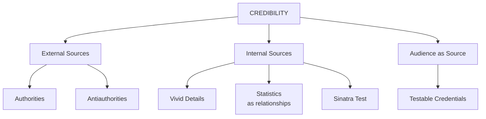
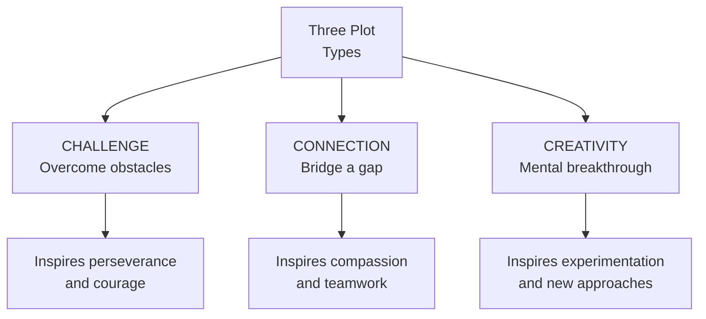
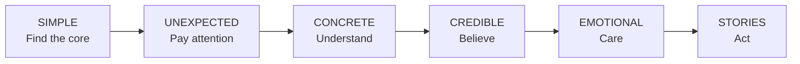
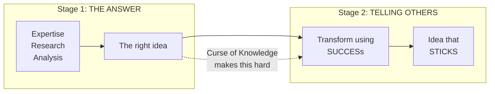

# Made to Stick — Chip Heath & Dan Heath

> *Why do some ideas survive while others die — and how do you engineer an idea to stick?*

---

## At a Glance

- **One-sentence summary:** Sticky ideas — those that are understood, remembered, and change behaviour — share six traits (SUCCESs: Simple, Unexpected, Concrete, Credible, Emotional, Stories), and the main obstacle to creating them is the Curse of Knowledge.
- **Key framework:** The <b style="color: #2980b9">SUCCESs checklist</b> — six principles that function as a diagnostic tool for any message
- **The villain:** The <b style="color: #e74c3c">Curse of Knowledge</b> — once you know something, you can't imagine not knowing it
- **Core insight:** Creativity isn't mystical — <b style="color: #27ae60">sticky ideas follow learnable templates</b>, and spotting great ideas is as powerful as creating them

---

## About the Author

- *Chip Heath* is a professor of organisational behaviour at Stanford Graduate School of Business who spent over a decade studying why some ideas win in the marketplace while others fail — examining urban legends, conspiracy theories, proverbs, and folk remedies
- He conducted more than 40 experiments with over 1,700 participants and teaches a Stanford course called "How to Make Ideas Stick"
- *Dan Heath* co-founded Thinkwell, a start-up textbook company that worked with some of America's most effective professors — discovering that while each had a unique style, their underlying methods were almost identical
- The brothers realised in 2004 that they had been approaching the same question from different angles: Chip the researcher, Dan the practitioner
- Together they also wrote *Switch*, *Decisive*, *The Power of Moments*, and *[[Making Numbers Count - Chip Heath]]* — all applying behavioural science to practical communication challenges

---

## The Big Idea

- <b style="color: #2980b9">Sticky ideas are not born — they are made.</b> The six principles (SUCCESs) are not rules for creative geniuses; they are a checklist for anyone.
- The primary villain is the <b style="color: #e74c3c">Curse of Knowledge</b> — the expertise that helps you find the right answer makes you terrible at communicating it
- The six principles map to a communication pipeline: get attention (Unexpected), ensure understanding (Concrete), create belief (Credible), generate caring (Emotional), inspire action (Stories) — with Simple telling you WHAT to say
- The most counter-intuitive finding: 89% of award-winning ads fit just six templates, but only 2% of non-award-winners did — creativity is more predictable than non-creativity

---

## Key Concepts at a Glance

| Concept | Definition | Example |
|---|---|---|
| **SUCCESs** | Six-principle checklist for sticky ideas | Every chapter of this book |
| **Curse of Knowledge** | Once you know something, you can't imagine not knowing it | Tappers predict 50%; achieve 2.5% |
| **Commander's Intent** | A crisp statement of the plan's goal that survives chaos | "Have Third Battalion on Hill 4305" |
| **Forced Prioritisation** | Choosing ONE core message above all others | "If you say three things, you say nothing" |
| **Schema** | Pre-recorded information in memory; enables compact communication | "Pomelo = supersized grapefruit" |
| **Generative Analogy** | Metaphor that creates a platform for novel thinking | Disney's "cast members" |
| **Gap Theory of Curiosity** | Curiosity = pain of missing knowledge | Saturn's rings mystery |
| **Velcro Theory of Memory** | More hooks = more sticking | Blue eyes/brown eyes simulation |
| **Sinatra Test** | One example that proves credibility in a domain | "If you can make it there…" |
| **Testable Credentials** | Let the audience verify for themselves | "Where's the beef?" |
| **Mother Teresa Effect** | Individuals drive action; abstractions don't | Rokia $2.38 vs. statistics $1.14 |
| **Maslow's Basement** | We wrongly assume others are motivated by base needs | Floyd Lee: "I'm in charge of morale" |
| **Identity Model** | Decisions based on "What do people like me do?" | "Don't Mess with Texas" |
| **Springboard Story** | A story that helps people see how a problem might change | Zambia health worker at World Bank |
| **Three Plots** | Challenge, Connection, Creativity — templates for inspiring stories | Jared, Good Samaritan, Drag Test |

---

## The 30-Second Version

- *Every sticky idea you've ever encountered — from urban legends to JFK's moon speech — follows a common pattern.*
- The six traits: **Simple** (find the core), **Unexpected** (break guessing machines), **Concrete** (sensory and specific), **Credible** (let the audience verify), **Emotional** (make people care), **Stories** (simulate and inspire action)
- The enemy is the <b style="color: #e74c3c">Curse of Knowledge</b> — experts hear a song in their head that their audience can't hear
- You don't need to be a creative genius; you need a checklist and the discipline to use it

---

## The 5-Minute Version

### The Problem: Why Good Ideas Fail

- *A friend of a friend woke up in a bathtub full of ice, missing a kidney.* That story has circulated for decades with zero marketing budget. Meanwhile, most corporate memos die before the end of the meeting.
- The difference isn't that some ideas are "naturally interesting" — it's that <b style="color: #2980b9">sticky ideas are constructed differently</b>
- Art Silverman at the Center for Science in the Public Interest proved this: "37 grams of saturated fat" in movie popcorn meant nothing to people. But "more artery-clogging fat than a bacon-and-eggs breakfast, a Big Mac and fries, and a steak dinner — combined" made front-page news and collapsed popcorn sales nationwide

### The Villain: Curse of Knowledge

- *In 1990, Stanford PhD student Elizabeth Newton ran an experiment:* "Tappers" tapped out well-known songs while "listeners" tried to guess them
- Tappers predicted listeners would guess correctly <b style="color: #e74c3c">50% of the time</b>. Actual success rate: <b style="color: #e74c3c">2.5%</b> — one in forty
- The tappers couldn't imagine what it was like NOT to hear the song playing in their heads
- This is the curse: CEOs can't un-know their 30 years of business context. Teachers can't un-know mitosis.

### The Framework: SUCCESs

```mermaid
flowchaflowchart LR
    S["Simple<br/>Find the core"] --> U["Unexpected<br/>Break patterns"]
    U --> C1["Concrete<br/>Sensory & specific"]
    C1 --> C2["Credible<br/>Let them verify"]
    C2 --> E["Emotional<br/>Make them care"]
    E --> St["Stories<br/>Simulate & inspire"]
    St --> A(("Idea<br/>that STICKS"))
```

- The checklist maps to how audiences process ideas:
  - **Unexpected** → Gets attention
  - **Concrete** → Makes them understand and remember
  - **Credible** → Makes them believe
  - **Emotional** → Makes them care
  - **Stories** → Makes them act
  - **Simple** tells you what to say in the first place


The radar exposes why an urban legend with zero marketing budget outperforms professional communication — it scores high on nearly every SUCCESs dimension, while the typical corporate memo flatlines across the board.


The force diagram shows how the Curse of Knowledge (red) blocks the pipeline at Simple and Concrete, while each SUCCESs principle (blue) maps to a specific audience outcome (green) — attention, understanding, belief, caring, and action.

### The Evidence: Templates Beat Genius

- *An Israeli research team studied 200 award-winning ads.* 89% fit six basic templates. Only 2% of non-award-winners did.
- Novices trained on templates for just two hours produced ads rated <b style="color: #27ae60">50% more creative</b> with <b style="color: #27ae60">55% more positive attitudes</b> toward the products

---

## Full Summary

---

# Introduction: The Stickiness Gap

*A gang of organ thieves has better communications than most Fortune 500 companies.*

- The Kidney Heist urban legend has spread for decades with no marketing team, no budget, no strategy — yet it is understood, remembered, and retold perfectly by anyone who hears it
- Most workplace communication gravitates toward the "nonprofit pole" — abstract, jargon-filled, and instantly forgettable

### The Popcorn That Changed an Industry

> [!example] Art Silverman's Popcorn Campaign (1992)
> - Art Silverman at the CSPI knew movie popcorn had 37 grams of saturated fat — nearly two days' worth
> - Saying "37 grams of saturated fat" caused eyes to glaze over
> - His solution: lay out a bacon-and-eggs breakfast, a Big Mac and fries, and a steak dinner on a table — then say all that fat is in ONE bag of popcorn
> - Result: CBS, NBC, ABC, CNN, USA Today, LA Times, Washington Post all covered it
> - Major theater chains (United Artists, AMC, Loews) stopped using coconut oil

### The Curse of Knowledge: Meet the Tappers

- *Elizabeth Newton's 1990 experiment at Stanford* is the perfect illustration of why communication fails
- Tappers tapped out songs like "Happy Birthday" — they could HEAR the melody in their heads
- Listeners heard only "bizarre Morse Code"
- Tappers were flabbergasted when listeners failed: "How could you be so stupid?"

> [!tip] The Curse of Knowledge Defined
> Once we know something, we find it hard to imagine what it was like not to know it. Our knowledge has "cursed" us — and it becomes difficult to share our knowledge with others, because we can't re-create their state of mind.

- The tapper/listener dynamic plays out everywhere: CEO to frontline employee, teacher to student, marketer to customer
- Only two ways to beat it: don't learn anything, or <b style="color: #27ae60">transform your ideas using the SUCCESs checklist</b>

### Halloween Candy: How a Myth Changed a Nation

> [!example] The Candy Tampering That Never Was
> - In the 1960s-70s, rumours spread about sadists putting razor blades in apples and booby-trapping candy
> - By 1985: 60% of parents worried their children might be victimised. Hospitals X-rayed candy bags. Schools opened for safe trick-or-treating.
> - Researchers Joel Best and Gerald Horiuchi studied every reported incident since 1958
> - Finding: ZERO instances of strangers causing life-threatening harm through candy tampering
> - Two children did die on Halloween — one found his uncle's heroin stash; the other's father contaminated his candy with cyanide for insurance money
> - The best social science evidence: taking candy from strangers is perfectly safe. It's your family you should worry about.
> - The myth had changed laws in California and New Jersey — special penalties for candy tamperers
> - Why did it stick? Unexpected (danger in a fun activity), concrete (razor blade in an apple), emotional (fear for children), simple (check your candy)

- The Halloween candy story shares traits with the CSPI popcorn campaign and the Kidney Heist:
  - Both highlight unexpected danger in a common activity (eating candy, eating popcorn, accepting drinks)
  - Both call for simple action (examine candy, avoid popcorn, don't accept drinks)
  - Both use vivid, concrete images (razor blade in apple, table of greasy food, ice-filled bathtub)
  - Both tap into emotion (fear, disgust, suspicion)
- Over and over, the same themes appear: the six principles are NOT random — they are features of how the human mind works
- Sticky ideas draw from a common set of traits, much like great basketball players share traits like height, speed, and court sense
- Not every great player has ALL traits (some great guards are five-ten and scrawny), but having more traits improves the odds

### JFK vs. The Generic CEO

- JFK (1961): "Put a man on the moon and return him safely by the end of the decade"
  - Simple ✓ Unexpected ✓ Concrete ✓ Credible (source) ✓ Emotional ✓ Story (in miniature) ✓
- Had JFK been a CEO: "Our mission is to become the international leader in the space industry through maximum team-centred innovation and strategically targeted aerospace initiatives"
  - Simple ✗ Unexpected ✗ Concrete ✗ Emotional ✗ Story ✗
- JFK's idea motivated millions for a decade. The CEO version would motivate a PowerPoint committee for an afternoon.

### Six Principles at a Glance

| Principle | Core Question | Key Technique | Sticky Example |
|---|---|---|---|
| **Simple** | What's the core? | Commander's Intent, forced prioritisation | "THE low-fare airline" |
| **Unexpected** | Will they pay attention? | Break guessing machines, open gaps | "There will be no school next Thursday" |
| **Concrete** | Will they understand? | Specific people, sensory language | Blue eyes/brown eyes simulation |
| **Credible** | Will they believe? | Antiauthorities, testable credentials | Pam Laffin, "Where's the beef?" |
| **Emotional** | Will they care? | Individuals, identity, leave the basement | "Don't Mess with Texas" |
| **Stories** | Will they act? | Challenge/Connection/Creativity plots | Jared's Subway diet |

### The Myth of Creative Genius

- The Israeli research team's finding shattered the assumption that creativity is idiosyncratic
- 89% of award-winning ads fit six templates; untrained novices' ads were rated "annoying"
- Two hours of template training transformed novice output — like Tolstoy's happy families, all creative ads resemble one another
- But each LOSER is uncreative in its own way
- Most templates relate to the principle of unexpectedness — e.g., the Extreme Consequences template
- "Loose Lips Sink Ships" (WWII), "This is your brain on drugs" (eggs sizzling in a frying pan), Newton's apple — all fit templates
- The implication: if creativity in advertising can be taught, creativity in IDEAS can be taught
- This book won't make you Michael Jordan of sticky ideas — but the premise is that stickiness can be learned
- You don't need to invent new rules; you need to work within the rules that have allowed other ideas to succeed

### Who Needs Sticky Ideas?

- When asked how often they need to make an idea stick, people say 12 to 52 times per year
- For managers: big ideas about new strategic directions and guidelines for behaviour
- For teachers: themes and ways of thinking that endure long after factoids fade
- For nonprofit leaders: persuading volunteers and donors to contribute
- For columnists: changing readers' opinions on policy issues
- For religious leaders: sharing spiritual wisdom
- Given the importance of stickiness, it's surprising how little attention is paid to it
- Most communication advice concerns delivery (make eye contact, use hand gestures) or structure (tell 'em what you're going to tell 'em)
- The most common refrain: repetition, repetition, repetition
- But if you have to tell someone the same thing ten times, the idea probably wasn't well designed
- No urban legend needs to be repeated ten times

---

# Principle 1: SIMPLE — Find the Core, Then Share It

*If you argue ten points, when the jury gets back to the room they won't remember any.*

---

## The Army's Solution: Commander's Intent

- *Every Army operation begins with a staggering cascade of planning* — from the president to the Joint Chiefs to individual soldiers
- The plans are meticulous — "scheme of maneuver," "concept of fires," equipment, munitions
- There's just one problem: <b style="color: #e74c3c">the plans are often useless</b>

> [!example] Commander's Intent at West Point
> - Colonel Tom Kolditz: "No plan survives contact with the enemy"
> - In the 1980s, the Army invented Commander's Intent (CI) — a crisp, plain-talk statement of the plan's goal
> - High-level CI: "Break the will of the enemy in the Southeast region"
> - Tactical CI: "Have Third Battalion on Hill 4305, cleared of enemy, to protect the flank of Third Brigade"
> - Two questions to arrive at CI: "If we do nothing else, we must ___." "The single most important thing is ___."

- When people know the destination, they're free to improvise en route
- CI aligns behaviour without play-by-play instructions — mechanics know to support roads, artillery knows to fire smoke cover
- The civilian parallels: <b style="color: #2980b9">no sales plan survives contact with the customer; no lesson plan survives contact with teenagers</b>

## Southwest Airlines: THE Low-Fare Airline

> [!example] Herb Kelleher's Decision Compass
> - Herb Kelleher: "I can teach you the secret to running this airline in thirty seconds. We are THE low-fare airline."
> - Test case: Tracy from marketing suggests a chicken Caesar salad on the Houston-Las Vegas flight
> - Answer: "Will adding that chicken Caesar salad make us THE low-fare airline? If not, we're not serving any damn chicken salad."
> - This single idea guided Southwest's employees for more than 30 years of consistent profitability

- Joking on the P.A. about a flight attendant's birthday? Fine. Throwing confetti? No — extra cleanup = higher fares.
- A well-thought-out simple idea can be amazingly powerful in shaping behaviour

## Forced Prioritisation: "If You Say Three Things, You Don't Say Anything"

- *James Carville* wrote three phrases on a whiteboard for Clinton's 1992 campaign
- One became the core: <b style="color: #2980b9">"It's the economy, stupid"</b>
- Clinton wanted to talk about everything, including balanced budgets
- Carville had to stop Clinton from burying the lead: "There has to be message triage"
- The word "stupid" was added as a taunt to the campaign workers themselves — "I was trying to say, let's don't be too clever here"
- The need for focus extended to Clinton himself — at one point he was frustrated that Ross Perot was getting positive attention for balanced-budget talk
- Carville had to tell him: "There has to be message triage. If you say three things, you don't say anything."
- "It's the economy, stupid" was the LEAD of the Clinton story — and it was a good one, because the 1992 economy was mired in recession
- If "It's the economy, stupid" is the lead, then balanced budgets can't ALSO be the lead — there's only one
- Carville's challenge is the same as every communicator's: forced prioritisation is painful because smart people see nuance and multiple perspectives

### Decision Paralysis: The Enemy of Action

- *Tversky and Shafir:* Students who passed an exam wanted Hawaii (57%). Failed: also wanted Hawaii (54%). Didn't know results: 61% paid $5 to wait. Irrelevant uncertainty paralyses.
- Even choosing between two GOOD options creates paralysis — students given two alternatives to studying were LESS likely to choose either
- Core messages rescue people from this quicksand

## Simple = Core + Compact

- The goal isn't sound bites — it's proverbs: compact AND profound
- "A bird in the hand" — variants in Swedish, Spanish, Polish, Russian, Romanian, Italian, Portuguese, German, Icelandic. Traces to Aesop (570 BC). No advertising budget required.
- The Golden Rule: compact enough to be sticky, meaningful enough to influence a lifetime

### Schemas: Borrowed Complexity

- A pomelo explained as "basically a supersized grapefruit with a very thick and soft rind" — instant understanding by calling up the grapefruit schema
- Six months later, people remember "grapefruit-like" (useful) rather than "citrus fruit" (vague)
- Good teachers use schemas constantly — economics starts with: "You grow apples, I grow oranges. Should we trade?"

> [!tip] Accuracy vs. Usability
> Herb Kelleher could tell a flight attendant to "maximize shareholder value" — but it doesn't help her decide whether to serve chicken salad. An accurate but useless idea is still useless.

### Hollywood's High-Concept Pitches

- *Speed* was "Die Hard on a bus." *Alien* was "Jaws on a spaceship."
- Five words pour breathtaking meaning into a nonexistent concept
- The production designer of *Alien* instantly knew: the ship should be dingy, oppressive, sweaty — not the pristine Enterprise

### Disney's "Cast Members" vs. Subway's "Sandwich Artists"

- Disney: employees *audition* for *roles*; visitors are *guests*; jobs are *performances*; uniforms are *costumes*
- This metaphor is generative — you can predict behaviour in undiscussed situations
- Subway's "sandwich artists": utterly useless. No "individual expression" is actually permitted.

| Compact Idea | Why It Works |
|---|---|
| "THE low-fare airline" | Forces prioritisation of every decision |
| "It's the economy, stupid" | Keeps campaign focused despite temptation |
| "Names, names, and names" | Makes local focus concrete and actionable |
| "Pocketable radio" | Visual proverb that fights feature creep |
| "Die Hard on a bus" | Pours entire movie concept into five words |
| "Cast members" | Generates correct behaviour in novel situations |

### The Dunn Daily Record: Names, Names, and Names

> [!example] Hoover Adams and 112% Penetration
> - The Daily Record in Dunn, North Carolina (pop. 14,000) achieves 112% market penetration
> - Publisher Hoover Adams's mantra: "Names, names, and names"
> - He'd "happily hire two more typesetters and add two more pages" for more names
> - His friend Ralph Delano: "If an atomic bomb fell on Raleigh, it wouldn't be news in Benson unless some debris fell on Benson"

- A photographer who hears "names" knows to shoot the boring committee meeting, not the gorgeous sunset
- By finding the core and communicating it clearly, Adams made himself everywhere

### Idea Clinics: Before and After

- Throughout the book, the Heaths present "Idea Clinics" — practical before-and-after examples showing how to make a message stickier
- Like weight-loss before-and-after photos: visible evidence that the diet works
- Sun exposure clinic: Original buried the lead in "tanning as status symbol." Fixed version led with "skin damage is cumulative and irreversible — like aging"
- Foreign aid clinic: Original led with billions in numbers nobody would remember. Fixed version: "If everyone in the United States gave up one soft drink a month, we could double our current aid to Africa"
- Fund-raising clinic: Original force-fed facts in logical order. Fixed version posed a mystery: "Why do people under thirty-five, who make up 40% of our audience, provide only 10% of our donations?"
- The point is not to show creative genius — it's to model the process of making ideas stickier

### The Two Steps of Making Ideas Stick

- **Step 1:** Find the core — strip the idea to its most critical essence
- **Step 2:** Translate the core using the SUCCESs checklist
- That's the whole book in two sentences
- Finding the core is like writing the Commander's Intent — discarding great insights to let the most important one shine
- Antoine de Saint-Exupéry: "A designer knows he has achieved perfection not when there is nothing left to add, but when there is nothing left to take away"

### Clinic: Sun Exposure — Unburying the Lead

> [!example] Before and After
> - **Before:** Opens with "a golden, bronze tan is often considered a status symbol" — interesting red herring
> - Paragraphs 2-4: superfluous mechanics about melanin, UVA vs. UVB
> - Paragraph 5 (buried at the bottom): "Skin damage is cumulative and cannot be reversed"
> - **After:** Opens with: "Skin damage from sun is like getting older: cumulative and irreversible"
> - New subtitle: "How to Get Old Prematurely"
> - Added insight: "Sunburns disappear, but the underlying damage persists"
> - Eliminated the melanin details. The core shines through.
> - Lesson: Don't start with something interesting but irrelevant. Make the core itself interesting.

### Clinic: Foreign Aid — Making Numbers Human

> [!example] Soft Drinks vs. B-2 Bombers
> - Original message: walls of text with billions in aid figures, $7 billion military, $8 billion economic
> - Good element: "All of sub-Saharan Africa receives about the cost of a B-2 bomber"
> - Problem: does anyone have a gut feel for what a B-2 costs?
> - **After:** "The public thinks we spend 10-15% of the budget on foreign aid. The truth: less than 1%."
> - "If everyone gave up one soft drink a month, we could double our aid to Africa. One movie a year: double aid to Africa AND Asia."
> - Soft drinks and movies are tangible, frivolous — the contrast with critical human needs is powerful

### Key Statistics From This Book

| Statistic | Source | Significance |
|---|---|---|
| Tappers predicted 50% success; achieved 2.5% | Newton (1990) | The Curse of Knowledge quantified |
| 89% of award-winning ads fit 6 templates | Israeli study (1999) | Creativity is systematic |
| Novice template training: +50% creativity | Same study | Two hours changes output dramatically |
| Asian math: 61% context-based vs. 31% US | 1993 study | Concreteness in teaching is measurable |
| Rokia $2.38 vs. statistics $1.14 | Carnegie Mellon | Individuals outperform abstractions |
| Analytical priming: $2.34 → $1.26 | Same study | Calculation suppresses compassion |
| Truth: 66% less likely to smoke | AJPH (2002) | Identity beats rational appeals |
| Don't Mess with Texas: 72% litter reduction | Syrek | Identity campaigns outperform fear |
| 63% remember stories, 5% remember stats | Stanford class | Stories obliterate statistics |
| Mental practice: ~2/3 of physical practice | Meta-analysis (35 studies) | Simulation works |
| Case-study accounting: +12 points two years later | Georgia State | Concreteness has lasting power |

### The Palm Pilot Wood Block

- Jeff Hawkins carried a wooden block the size of the Palm Pilot to fight feature creep
- Whenever someone suggested another feature, he pulled out the block and asked where it would fit
- The product succeeded "almost because it was defined more in terms of what it was not"
- There is a striking parallel between the Palm Pilot and the Clinton campaign — both teams were composed of people with the capability and desire to do many different things, yet both needed a simple reminder to resist the temptation to do too much
- <b style="color: #2980b9">When you say three things, you say nothing. When your remote has fifty buttons, you can't change the channel.</b>

### Using What's There: The JFK Letter Exercise

- Study these letters for 15 seconds: J F K F B I N A T O U P S N A S A I R S — most people remember 7-10 letters
- Now try: JFK FBI NATO UPS NASA IRS — suddenly you remember all of them
- Why? Each acronym is a pointer to massive pre-existing knowledge in your brain
- You're posting one flag on your mental terrain instead of three separate flags
- To make a profound idea compact: <b style="color: #27ae60">use flags — tap existing memory terrain</b>

### Complexity From Simplicity: How Experts Build

- Economics teachers start with stripped-down examples: "You grow apples, I grow oranges. Should we trade?"
- Students learn basic trade, then the schema is stretched: "What if you get better at growing apples?"
- The solar system model of the atom: electrons orbit the nucleus like planets orbit the sun
- Physicists know this isn't literally true (electrons move in "probability clouds") — but should you tell a sixth-grader about probability clouds?
- If a message can't be used to make predictions or decisions, it is without value, no matter how accurate
- People are tempted to tell you everything right up front, when they should give just enough info to be useful, then a little more, then a little more

---

# Principle 2: UNEXPECTED — Surprise Gets Attention, Curiosity Keeps It

*Flight-safety announcements might be labeled a tough message environment. No one cares.*

---

## Getting Attention: The Power of Surprise

- The most basic way to get attention: <b style="color: #2980b9">break a pattern</b>
- Humans adapt incredibly fast to consistent patterns — the hum of an air conditioner, the smell of a candle
- We notice these things only when something changes

> [!example] Karen Wood's Flight Safety Announcement
> - On a Dallas-to-San Diego flight, attendant Karen Wood broke the monotony:
> - "If you haven't been in an automobile since 1965, the proper way to fasten your seat belt is to slide the flat end into the buckle"
> - "As the song goes, there might be fifty ways to leave your lover, but there are only six ways to leave this aircraft"
> - "Red and white disco lights along the floor of the aisle. Made ya look!"
> - When she finished: scattered applause — for a safety announcement

### The Surprise Brow and Schema Violations

- *Paul Ekman and Wallace Friesen:* The "surprise brow" — eyebrows curved and high, wider field of vision
- Jaws drop, muscles go slack — the body ensures we're absorbing, not talking
- Surprise is an emergency override when guessing machines fail
- Unexpected ideas stick because <b style="color: #2980b9">surprise makes us pay attention AND think</b>

### The Enclave Ad: Schema Violation Done Right

> [!example] The Ad Council's "Didn't See That Coming?"
> - A TV commercial opens: the new Enclave minivan, kids climbing in, cup holders everywhere
> - Dad pulls into an intersection — a speeding car broadsides the minivan. Terrifying collision.
> - Screen fades to black: "Didn't see that coming?" Then: "No one ever does."
> - There is no Enclave minivan — this was the U.S. Department of Transportation's safety campaign
> - The ad violates our schema for car commercials AND our schema for neighbourhood driving

### Avoiding Gimmickry: PHRAUG vs. HENSION

- During the 2000 Super Bowl, an ad showed wolves chasing a marching band. Memorable? Absolutely. What was it advertising? Nobody knows.
- PHRAUG looks unfamiliar but sounds like FROG — surprise WITH insight (the "Oh!" moment)
- HENSION seems like a word you should know but isn't — surprise WITHOUT insight (frustration)
- <b style="color: #e74c3c">Gimmicky surprise is HENSION. Meaningful surprise is PHRAUG.</b>
- To avoid gimmickry: ensure your surprise targets the guessing machine that relates to your core message

### The Three-Step Process for Unexpectedness

- (1) Identify the central message — find the core
- (2) Figure out what is counterintuitive about it — why isn't it already happening?
- (3) Break the audience's guessing machines along that dimension — then help them rebuild
- Common sense is the enemy of sticky messages
- If it sounds like something people already "get," it floats in one ear and out the other
- The danger: what SOUNDS like common sense often ISN'T — as with Hoover Adams's radical commitment to names
- Your job as a communicator: expose the parts of your message that are uncommon sense

### The Availability Bias: A Testable Surprise

- Which kills more people: homicide or suicide? Floods or tuberculosis? Tornadoes or asthma?
- Most people pick homicide, floods, tornadoes — all wrong
- There are 50% more deaths from suicide than homicide, 9x more from tuberculosis than floods, 80x more from asthma than tornadoes
- The availability bias: we judge probability by how easily we recall examples, not by actual frequency
- This format — make a prediction, then reveal you're wrong — is a testable credential combined with surprise
- The version that says "subjects in a study thought..." is far less powerful than experiencing the bias yourself

## Nordstrom: Uncommon Sense in Action

> [!example] The Nordie Stories
> - The Nordie who ironed a shirt for a customer who needed it for an afternoon meeting
> - The Nordie who cheerfully gift-wrapped products bought at Macy's
> - The Nordie who warmed customers' cars in winter while they finished shopping
> - The Nordie who refunded money for tire chains — even though Nordstrom doesn't sell tire chains

- These stories attack unspoken assumptions: service stops at the store door; don't waste time on non-buyers
- New employees' guessing machines break — Nordstrom's schema replaces the old one

## Nora Ephron's Journalism Teacher

> [!example] "There Will Be No School Next Thursday"
> - First day of journalism class: the teacher reels off facts about a faculty trip to Sacramento
> - Students wrote leads reordering the facts: "Governor Pat Brown, Margaret Mead will address..."
> - The teacher paused: "The lead to the story is 'There will be no school next Thursday.'"
> - Nora Ephron: "In that instant I realized journalism was not just about regurgitating facts but about figuring out the point"
> - This idea rewrote her schema and changed her career — thirty years later

---

## Keeping Attention: The Gap Theory of Curiosity

- *Robert Cialdini* studied passages where scientists wrote for non-scientists — the best ones all began with a mystery

> [!example] The Mystery of Saturn's Rings
> - An astronomer began: "How can we account for the rings of Saturn?"
> - Cambridge said gas. MIT said dust. Cal Tech said ice crystals.
> - The answer unfolded like a detective plot — leads, dead ends, clues. After 20 pages: ice-covered dust.
> - Cialdini: "I don't care about dust. But that writer had me turning pages like a speed-reader."
> - He started using mysteries in class. One day the bell rang before the reveal: "No one moved. I was pelted with protests."

### Loewenstein's Gap Theory (1994)

- *George Loewenstein, Carnegie Mellon:* Curiosity happens when we feel a <b style="color: #2980b9">gap in our knowledge</b>
- Gaps cause pain — like an itch we need to scratch
- We sit through bad movies because it's too painful NOT to know how they end
- This explains fanatical interest in certain domains:
  - Movies: "What will happen?"
  - Mysteries: "Who did it?"
  - Sports: "Who will win?"
  - Crossword puzzles: "What is a six-letter word for 'psychiatrist'?"
  - Pokémon cards: "Which characters am I missing?"
- Critical implication: we need to <b style="color: #27ae60">open gaps BEFORE we close them</b>
- Our tendency is to dump facts — but first, people must realise they NEED those facts
- The trick: highlight some specific knowledge that people are MISSING

### Robert McKee and Screenwriting Curiosity

- Robert McKee, the screenwriting guru whose students have written ER, Hill Street Blues, The X-Files, and directed Forrest Gump
- McKee: "Curiosity is the intellectual need to answer questions and close open patterns. Story plays to this universal desire by doing the OPPOSITE — posing questions and opening situations."
- In Trading Places: Billy Ray Valentine (Eddie Murphy), the street con artist, is turned into a commodities trader by two elderly businessmen — how will the con man fare?
- "Each Turning Point hooks curiosity. The audience wonders, 'What will happen next?' The answer won't arrive until the Climax"
- McKee notes the "How will it turn out?" question is powerful enough to keep us watching BAD movies
- McKee and Cialdini independently discovered the same principle: opening questions sustains attention

### Clinic: Fund-Raising — Mystery vs. Summary

> [!example] Before and After
> - **Before:** "This year we targeted support from theatergoers under thirty-five. Response rate was almost 20%." Safe, logical, nonsticky.
> - **After:** "This year we set out to answer a question: Why do people under thirty-five, who make up 40% of our audience, provide only 10% of our donations?"
> - "Our theory was that they didn't realize how much we rely on donations. Before I tell you what happened, let me remind you how we set up the program."
> - The mystery format is inherently appealing — our minds are incredibly generous when it comes to mysteries
> - The improvement is driven by STRUCTURE, not content. This isn't a particularly interesting mystery. But the FORMAT is irresistible.
> - Key shift: from "What information do I need to convey?" to "What questions do I want my audience to ask?"

### Gaps Start With Knowledge

- Someone who knows 47 of 50 state capitals focuses on the 3 they DON'T know
- To create curiosity about something unfamiliar, first fill in enough knowledge to create a gap (not an abyss)
- Human-interest stories work because we know what it's like to be human but don't know what it's like to have dramatic experiences — how does it feel to win an Olympic medal? Win the lotto?
- Gossip works because we know a lot about someone but crave the missing pieces — quirks, romantic struggles, secret vices
- We don't gossip about passing acquaintances — we need enough knowledge for a gap to form

### Overconfidence: Why Gaps Are Hidden

- People tend to think they know a lot — participants predicted they'd identified 75% of parking solutions when they'd actually missed 70%
- If people believe they know everything, the gap theory can't work
- Strategies against overconfidence:
  - Make them commit to a prediction (Ephron's teacher made students write their leads before revealing the real one)
  - Eric Mazur's "concept testing" at Harvard: students vote publicly, then discover peers disagree
  - Create disagreements: students in disagreement groups stayed for a special film during recess at 45% vs. 18% for consensus groups
  - Nancy Lowry and David Johnson: students who achieved easy consensus were less interested and less likely to visit the library
- The thirst to fill a knowledge gap can be more powerful than slides and jungle gyms

> [!example] Roone Arledge and NCAA Football (1960s)
> - ABC needed to make Texans care about Michigan vs. Ohio State
> - Twenty-nine-year-old Roone Arledge: "We are going to take the viewer to the game!"
> - He showed the campus, fans, local colour, what the game meant to both schools
> - Same philosophy later: Wide World of Sports, Monday Night Football, 20/20, Nightline — 36 Emmys

## Unexpected Ideas That Lasted Years


- Both created surprise, insight, and knowledge gaps — big enough to drive action, not so big as to paralyse
- Kennedy didn't propose "man on Mercury"; Ibuka didn't propose "implantable radio" — each was audacious but not paralysing
- Any engineer who heard the "man on the moon" speech must have begun brainstorming immediately
- The vision of a pocketable radio sustained a company through a tricky growth period and led it to become internationally recognised
- The vision of a man on the moon sustained tens of thousands of individuals, in dozens of organisations, for nearly a decade
- These are big, powerful, sticky ideas — and they should give us hope when we worry about our ability to get people's attention

### The Power of Sequencing

- Treasure maps show a few key landmarks and a big X — the adventurer knows just enough to find the first landmark
- If treasure maps were produced on MapQuest, with door-to-door directions, it would kill the adventure genre
- There is value in sequencing information — dropping a clue, then another clue, then another
- This method of communication resembles <b style="color: #2980b9">flirting more than lecturing</b>
- Unexpected ideas mark a big red X on something that needs to be discovered but don't tell you how to get there

### News Teasers and the Cable TV in Tempe Principle

- Local news teasers: "Which famous local restaurant was cited — for slime in the ice machine?"
- These work because they tease you with something you didn't know — and didn't care about until you found out you didn't know it
- A little dollop of this approach makes any communication more interesting
- The key shift: from "What information do I need to convey?" to "What questions do I want my audience to ask?"

---

# Principle 3: CONCRETE — The Universal Language

*Aesop's "sour grapes" has survived 2,500 years. "Don't be such a bitter jerk when you fail" wouldn't have lasted a generation.*

---

## Why Abstraction Kills Ideas

- Abstraction makes ideas harder to understand, remember, and coordinate around
- If you can examine something with your senses, it's concrete
- Concreteness boils down to <b style="color: #2980b9">specific people doing specific things</b>

## The Nature Conservancy: Acres to Eco-Celebrities

> [!example] Making Conservation Tangible
> - TNC's "bucks and acres" strategy: donors loved "results you could walk around on"
> - 2002: 40% of California needed protection — far too much to buy
> - Solution: define 50 "landscapes" instead of millions of acres
> - Named an oak savanna "The Mount Hamilton Wilderness"
> - The Packard Foundation gave a large grant; other groups started campaigning
> - TNC staff: "We see other people's documents talking about the Mount Hamilton Wilderness. We say, 'You know we made that up.'"

## Asian Math Classrooms: Concrete Foundations

| Technique | Japan/Taiwan | United States |
|---|---|---|
| Computing in Context (real-world problems) | 61% of lessons | 31% of lessons |
| Conceptual Knowledge (visual/manipulative) | 37% Japan, 20% Taiwan | 2% of lessons |

- Trying to teach abstraction without concrete foundations is like <b style="color: #e74c3c">building a roof in the air</b>

## The Velcro Theory of Memory

- Memory is not like a filing cabinet — it's like <b style="color: #2980b9">Velcro</b>
- One side has thousands of tiny hooks, the other thousands of tiny loops
- When pressed together, a huge number of hooks snag inside loops — that's what makes Velcro seal
- Your brain hosts a truly staggering number of loops
- The more hooks an idea has, the better it clings
- Your childhood home has a gazillion hooks — smells, sounds, textures, spatial layout, emotional memories
- A credit card number has one hook. If it's lucky.
- Great teachers multiply the hooks in an idea — Jane Elliott's simulation hooked into visual memory, emotional memory, social memory, spatial memory, and identity

### David Rubin's Memory Exercise

- *Remember the capital of Kansas* — abstract, effortful (unless you live in Topeka)
- *Remember the first line of "Hey Jude"* — you hear Paul McCartney's voice and piano
- *Remember the Mona Lisa* — instant visual of the enigmatic smile
- *Remember your childhood home* — flood of smells, sounds, sights; you might feel yourself running through it
- *Remember the definition of "truth"* — no pre-formulated answer; you have to create one on the fly
- *Remember the definition of "watermelon"* — sense memories hit first (green rind, red fruit, sweet smell, heft), then you try to encapsulate them
- Each command triggers completely different mental activity — different systems, different filing cabinets
- Concrete ideas hook into multiple systems simultaneously; abstract ideas hook into one, if they're lucky

## Jane Elliott: Prejudice Made Concrete

> [!example] Blue Eyes, Brown Eyes (1968)
> - Day after MLK assassination: third-grade teacher divides class by eye colour
> - Brown-eyed kids declared superior — extra recess, front seats
> - Blue-eyed kids wore collars, sat in back. Within hours: friendships dissolved.
> - Next day reversed: blue-eyed kids shouted with glee
> - Phonics test: 5.5 minutes when "inferior," 2.5 when "superior"
> - Studies 10 and 20 years later: significantly less prejudiced than peers

- The hooks: a friend's sneer, a collar around your neck, despair of inferiority, your own eyes in the mirror
- <b style="color: #27ae60">Decades later, it could not be forgotten</b>

## Blueprint vs. Machine: Curse of Knowledge in Action

- *Beth Bechky:* Engineers fixed problems by making drawings MORE elaborate and abstract
- Manufacturers wanted them on the factory floor pointing to the actual machine
- The universal language is always concrete

## Concreteness Enables Coordination

- Boeing 727: "Seat 131, fly nonstop Miami to NYC, land on Runway 4-22 at La Guardia"
- Thousands of experts coordinated; impossible with "the best passenger plane in the world"

## The White Things Exercise and Kaplan's Portfolio

> [!example] Kaplan's Portfolio at Kleiner Perkins (1987)
> - No business plan, no slides. He tossed a leather portfolio onto the table.
> - "Here is a model of the next step in the computer revolution"
> - Partners began brainstorming; Kaplan barely had to speak
> - Days later: $4.5 million investment in a company that didn't yet exist

- The portfolio transformed a grill session into a brainstorm — a shared concrete object focused everyone's knowledge

## People, Not Data

> [!example] Hamburger Helper and Saddleback Sam
> - Melissa Studzinski got three "death binders" of data. The team visited actual homes instead.
> - Key insight: moms valued predictability, not 11 pasta shapes. Sales jumped 11%.
> - Saddleback Church created "Saddleback Sam" — a concrete persona. 50,000 members aligned.

### UNICEF's James Grant: A Bag of Salt and Sugar

> [!example] Oral Rehydration Therapy
> - Over a million children die annually from dehydration caused by diarrhea
> - PSI's description: scientific language about electrolytes, fluid loss, intestinal wall compromise
> - James Grant, UNICEF director, always traveled with a packet of salt and sugar
> - Meeting with prime ministers: "This costs less than a cup of tea and can save hundreds of thousands of children's lives in your country"
> - You can't see that bag and NOT start brainstorming about possibilities

### The Kris and Sandy Accounting Soap Opera

> [!example] Making Accounting Concrete
> - Georgia State professors taught accounting with a semester-long case study
> - Two imaginary sophomores, Kris and Sandy, launch a GPS product called Safe Night Out
> - Students became their accountant — Is the business feasible? How many units to cover tuition?
> - A court wants to LEASE the device. Kris and Sandy bounce a check despite record sales — profitability vs. cash flow becomes real.
> - High-GPA students were MORE likely to major in accounting afterward
> - C-average students scored 12 points higher on the NEXT course's first exam — two years later

- Concreteness is the easiest trait to embrace and possibly the most effective
- The barrier is simply forgetfulness — we slip into abstract-speak without noticing

### The Soap-Opera Accounting Revisited

- The Kris and Sandy case was so rich it encompassed a semester's worth of material in one narrative thread
- Every accounting concept was not so much defined as DISCOVERED — fixed costs and variable costs emerged from real business decisions
- When your friends are pouring tuition money into a start-up, the distinction between fixed and variable costs MATTERS
- The case proved that concreteness has lasting power: C-average students scored 12 points higher on exams two years later
- The high-GPA students were more likely to major in accounting — concreteness made the most capable students WANT to become accountants

### The HP Ferrari Simulation: Beyond PowerPoint

> [!example] Turning Abstract Research into a Living, Breathing Experience
> - HP's engineers had brilliant research that never translated into tangible products
> - Stone Yamashita built a 6,000-square-foot exhibit following a fictitious family through Disney World
> - HP technology helped them buy tickets, speed entry, minimise wait times, schedule dinner
> - Back in the hotel room: a digital picture frame had automatically downloaded a photo of them on a roller coaster
> - Disney's execs (the novices) were shown in tangible terms what HP's technology could do
> - HP's engineers (the experts) were energised — the exhibit stayed up for 3-4 months
> - One observer: "Did you see that great thing the labs team did? Did you know we could do this?"
> - A diverse group of engineers took abstract ideas and turned them into a family picture on a roller-coaster ride
> - The exhibit put hooks into the idea of e-services — an intense sensory experience replaced abstract concepts

---

# Principle 4: CREDIBLE — Make People Believe

*A thirty-year-old internist in Perth couldn't get anyone to believe his Nobel-worthy insight — so he drank a glass of bacteria.*

---

## The Ulcer Revolution Nobody Believed

> [!example] Barry Marshall and H. pylori
> - Barry Marshall and Robin Warren discovered ulcers are caused by bacteria, not stress or spicy food
> - Three credibility problems: (1) stomach acid should kill bacteria; (2) Marshall was a 30-year-old trainee in (3) Perth, Australia
> - They couldn't get papers accepted. Scientists snickered.
> - In 1984, Marshall drank a billion H. pylori — "It tasted like swamp water"
> - Within days: pain, nausea, inflamed stomach. He cured himself with antibiotics.
> - 2005: Marshall and Warren received the Nobel Prize in medicine

- The significance was enormous: if ulcers are caused by bacteria, they can be CURED — within days, by antibiotics
- But the medical world did not rejoice. No celebrations. No one believed them.
- Common sense: stomach acid can dissolve a nail — how could bacteria survive? It would be like finding an igloo in the Sahara.
- Source: a trainee in Perth — medical breakthroughs are expected from PhDs at major research centres
- Location: Perth is to medical research what Mississippi is to physics
- They couldn't even get a paper accepted. Marshall's conference presentations were met with snickering.
- One researcher commented that Marshall "simply didn't have the demeanor of a scientist"
- The story teaches: even Nobel-worthy, world-changing insights must climb the same credibility hurdles as mundane ideas
- Marshall showed perseverance — knowing when it was time to draw on a different credibility well
- The most obvious sources (external validation, statistics) aren't always the best
- A few vivid details might be more persuasive than a barrage of statistics
- An antiauthority might work better than an authority
- A single Sinatra Test story might overcome a mountain of skepticism

## The Three Wellsprings of Credibility



## External: Authorities and Antiauthorities

- The obvious: experts (Stephen Hawking) and celebrities (Michael Jordan)
- The alternative: <b style="color: #2980b9">antiauthorities</b> — credibility from honesty, not status

> [!example] Pam Laffin: Antismoking Antiauthority
> - 29-year-old mother with emphysema since age 24. Started smoking at 10.
> - Massachusetts filmed her enduring a bronchoscopy, showed surgical scars
> - "I started smoking to look older and I'm sorry to say it worked"
> - She died at 31, three weeks before a second lung transplant
> - Her credibility came from experience, not credentials

- The Doe Fund sent Dennis, a formerly homeless man, to drive potential donors — "He was living proof"
- Every homeless man entering the program is matched with a mentor who was in the same situation two years before
- The modern citizen is constantly inundated with messages, developing skepticism about sources
- <b style="color: #27ae60">Honesty and trustworthiness</b>, not status, make antiauthorities work

### Flesh-Eating Bananas: When Fake Authority Fools People

- Around 1999, an email claimed bananas from Costa Rica were infected with flesh-eating bacteria
- Attributed to the "Manheim Research Institute" and "verified by the CDC"
- The Institute and the CDC lent an air of authority to claims that should have been instantly dismissed
- Later versions added: "This message has been verified by the Centers for Disease Control"
- If it circulated long enough, it would eventually be "approved by the Dalai Lama"
- External authority is a double-edged sword — it can prop up lies as easily as truth

## Internal: Details, Statistics, Sinatra Test

### Vivid Details

> [!example] Jurors and the Darth Vader Toothbrush
> - Shedler & Manis (1986): simulated trial about a mother's fitness
> - Vivid version added: "He uses a Star Wars toothbrush that looks like Darth Vader"
> - Details were designed to be IRRELEVANT to the judgment
> - Jurors who heard favourable vivid details: 5.8/10. Unfavourable: 4.3/10.
> - Irrelevant vivid details swayed judgment by 1.5 points

- The Liz Lerman Dance Exchange claimed "diversity." Everyone was skeptical.
- "Our longest-term member is Thomas Dwyer, seventy-three years old, no previous dance experience"
- That single detail silenced every skeptic in the room

### Statistics: Relationships, Not Numbers

> [!example] Beyond War's BBs in a Bucket
> - One BB dropped into a metal bucket: "This is the Hiroshima bomb"
> - 10 BBs: "One nuclear submarine's firepower"
> - Close your eyes. 5,000 BBs poured in. "The roar went on and on. Afterward: dead silence."
> - No one remembered the number — they remembered the visceral awareness

- The **human-scale principle:** "Throwing a rock from NYC to LA, accurate within 2/3 of an inch" (83% impressed) vs. "sun to earth, within 1/3 of a mile" (58%). Same accuracy.
- Stephen Covey: "If a soccer team had these scores, only 4 of 11 would know which goal is theirs"
- Cisco: "$500/employee/year" sounds expensive. "Increase productivity by 1-2 minutes a day and you've paid it back" — our intuition works at this scale
- We can easily simulate scenarios where employees save a few minutes from wireless access — e.g., sending a request for a forgotten document during a critical meeting
- The lesson: statistics aren't inherently helpful — it's the SCALE and CONTEXT that make them so
- Not many people have intuition about whether wireless networking generates $500 of marginal value per employee per year
- The right scale changes everything — like concreteness, the human-scale principle lets people bring their intuition to bear
- Art Silverman's movie popcorn: he could have cited "37 grams of saturated fat" — instead he laid out a table of greasy foods
- What if Silverman had been a sleazebag? "One bag of popcorn has the fat of 712,000 lollipops!" (Lollipops are fat-free)
- Statistics provide lucrative employment for untold numbers of issue advocates on both sides
- The Heaths' best advice: use statistics as INPUT (to make up your mind), not OUTPUT (to persuade after deciding)
- If you use statistics to decide, you'll be in a great position to share the pivotal numbers with others

### The Sinatra Test

- If one example alone establishes credibility in a domain: <b style="color: #2980b9">"If you can make it there, you can make it anywhere"</b>

> [!example] Safexpress Wins a Bollywood Studio
> - Safexpress delivered every Harry Potter book to every Indian bookstore — all by 8 AM on release day
> - "We also delivered the examination papers for your brother's high school boards"
> - Two months later: deal signed

- Bill McDonough's textile factory: 38 of 8,000 chemicals passed safety testing; Swiss inspectors thought instruments were broken because outgoing water was cleaner than incoming drinking water; manufacturing costs dropped 20%

### Shark Attacks: Statistics That Fight Stories

> [!example] Deer vs. Shark
> - Every few years, the media goes frothy over shark attacks — featuring terrifying stories like 13-year-old Bethany Hamilton losing her arm to a tiger shark
> - How do you combat these vivid stories with truth?
> - "You're more likely to drown at a beach protected by a lifeguard than be attacked by a shark" — okay but not great
> - Better: "Which is more likely to kill you — a shark or a deer? Answer: the deer. It's 300 TIMES more deadly."
> - The absurdity is funny — and humour is a nice antidote to fear
> - People know they don't fear deer, so why should they fear sharks?

### Bill McDonough's Edible Textile Factory

> [!example] A Story That Passes Every Credibility Test
> - In 1993, McDonough was hired to create a toxic-chemical-free textile manufacturing process — "impossible" said the industry
> - He needed a chemical partner; 60 chemical companies turned him down. Ciba-Geigy's chairman said okay.
> - Of 8,000 chemicals commonly used in textiles, only 38 passed safety criteria — but those 38 were "safe enough to eat"
> - Using just 38 chemicals, they created every colour but black
> - Swiss inspectors tested outgoing water and got zero readings — they thought equipment was broken
> - The factory water was actually CLEANER on exit than the Swiss drinking water on entry
> - Manufacturing costs shrank 20% — workers no longer needed protective clothing
> - Scraps went from hazardous waste exported to Spain to crop insulation sold to Swiss farmers
> - Vivid details + statistics + Sinatra Test = unassailable credibility
- If McDonough approaches any business with a suggestion for a greener process, this story gives him enormous credibility
- The impossible mission. The 38 survivors out of 8,000. The instruments that "broke." Scraps transformed from hazardous waste to crop insulation. Fabric "safe enough to eat."
- And the happy business result — workers safer AND costs down 20%
- This is what internal credibility at its finest looks like: you don't need Stephen Hawking or Michael Jordan when you have a story this concrete

## Audience Credibility: Testable Credentials

- The most powerful source: <b style="color: #27ae60">"See for yourself"</b>

> [!example] Wendy's "Where's the Beef?" (1984)
> - 80-year-old Clara Peller: "Where's the beef?"
> - The ads challenged customers to verify: compare our burgers to McDonald's
> - Belief that Wendy's Single was larger: up 47% in two months. Revenue: up 31%.

- Ronald Reagan: "Are you better off today than four years ago?" — outsourced credibility to voters
- The PCA's Emotional Tank exercise: coaches easily find ten insults, struggle for one consolation — they experience the bias firsthand

### Snapple and the KKK: When Testable Credentials Backfire

- In the 1990s, rumours claimed Snapple supported the KKK
- "Evidence": a picture of a ship on every Snapple bottle, and a K inside a circle
- Rumormongers said: "See for yourself!" People looked — and found the ship and the K
- The ship was from an engraving of the Boston Tea Party. The K meant "kosher."
- The "see for yourself" step was valid — the conclusion was completely invalid
- This is a bait-and-switch version of testable credentials — valid observation, invalid leap

> [!example] NBA Rookie Orientation
> - Female fans staked out the hotel bar. Lots of flirting. Plans were made.
> - Next morning: the women appeared at the front of the orientation room
> - "Hi, I'm Sheila and I'm HIV positive." "Hi, I'm Donna and I'm HIV positive."
> - The talk about AIDS clicked — being fooled yourself beats hearing about someone else being fooled

---

# Principle 5: EMOTIONAL — Make People Care

*Mother Teresa: "If I look at the mass, I will never act. If I look at the one, I will."*

---

## The Mother Teresa Effect

| Version | Content | Average Donation |
|---|---|---|
| Statistics | "3 million children in Malawi face food shortages" | $1.14 |
| Individual (Rokia) | "Rokia is a 7-year-old girl from Mali" | $2.38 |
| Both combined | Statistics + Rokia together | $1.43 |

- People who read about ONE girl gave more than twice as much as those who read statistics about millions
- Giving people BOTH reduced donations — statistics shifted people into analytical mode
- Priming people with math before Rokia: $1.26. Priming with feelings: $2.34.
- <b style="color: #e74c3c">The mere act of calculation reduced charity</b>


The bar chart reveals Heath's most counterintuitive finding: combining statistics WITH an emotional story actually reduces donations compared to the story alone — analytical thinking literally suppresses the empathy that drives action.

## The Truth vs. Think: An Anti-Smoking Horse Race

> [!example] Two Campaigns Head-to-Head
> - **Truth** (American Legacy Foundation): teens stacking body bags outside tobacco HQ
> - **"Think. Don't Smoke"** (Philip Morris): launched simultaneously
> - Truth: 22% spontaneous recall; Think: 3% (though 70% recognised both when prompted)
> - Truth: 66% LESS likely to smoke. Think: 36% MORE likely to smoke.
> - In Florida: high school smoking dropped 18%, middle school 40%

- "Think" put on the Analytical Hat. Truth tapped <b style="color: #27ae60">anti-authority resentment</b> — the classic teenage emotion
- Once teens smoked to rebel. Now they rebel by NOT smoking.

## Semantic Stretch: When Words Lose Power

- *Every powerful word gets overused until it's hollow*
- Movie reviewers link films to "relativity" for an aura of profundity — Einstein protested in 1929: "Philosophers play with the word, like a child with a doll"
- "Unique" usage increased 73% in newspapers over 20 years; "unusual" declined — what we used to call unusual, we now stretch and call unique
- The superlatives of each generation — groovy, awesome, cool, phat — fade because they're associated with too many things
- When your finance professor starts using "dude," the word is dead
- Using associations is an arms race — if he's "unique," you've got to be "super-unique"
- For communicators: if everyone taps the same emotional association, you must shift to new turf or find distinctive associations

> [!example] Honoring the Game
> - Jim Thompson reframed sportsmanship as "Honoring the Game" — sports patriotism
> - Lance Armstrong waiting for rival Jan Ullrich after a crash: that's Honoring the Game
> - Dallas basketball: technical fouls from 1-per-15-games to 1-per-52-games
> - Northern California baseball: 90% reduction in ejections, 20% more players enrolling

- Thompson's fantasy: "I'm watching the World Series and a manager berates an umpire. Bob Costas says, 'That's really too bad to see the manager dishonoring the game of baseball that way.'"
- Sportsmanship was once a powerful idea but had been stretched to mean "don't be a total jerk"
- Armstrong wasn't "being a good sport" — he was Honoring the Game
- The term implied the Game's integrity is LARGER than any participant — it's dishonorable to mess with an institution
- Thompson doesn't want to change just youth sports — he wants to change the culture of ALL sports
- The lesson: when emotional associations get diluted, shift to new turf rather than fighting the arms race

## Maslow's Basement: Where We Wrongly Think Others Live

- Abraham Maslow's 1954 framework: Physical, Security, Belonging, Esteem, Learning, Aesthetic, Self-actualization, Transcendence
- Subsequent research: the hierarchy is bogus — people pursue all levels simultaneously
- There's no question that starving men would rather eat than transcend — but there's an awful lot of overlap in the middle
- The real problem: when we think about motivating OTHERS, we assume they live in the basement
  - "Which $1,000 bonus framing appeals to YOU?" — Most say recognition/esteem (No. 3)
  - "Which appeals to OTHER people?" — Most say spending money (No. 1 and 2)
  - "Which job pitch motivates YOU?" — Most say Learning ("unique opportunity to learn how the company really works")
  - "Which motivates OTHERS?" — Most say Security and Esteem
- We think WE'RE motivated by higher ideals; we think OTHERS need down payments
- This chasm explains almost everything about how incentives are structured in large organisations
- To focus on base needs exclusively robs us of the chance to tap more profound motivations

> [!example] Floyd Lee's Pegasus Mess Hall in Baghdad
> - Same supplies, same 21-day menu as every other mess hall
> - But: sports banners, green tablecloths, ceiling fans, chef hats
> - Sunday prime rib marinated two days. A pastry chef called her strawberry cake "sexual and sensual"
> - Soldiers drove from the Green Zone along one of the most dangerous roads in Iraq just to eat there
> - Lee's mission: "I am not just in charge of food service; I am in charge of morale"

- Serving food is a job. Improving morale is a mission. <b style="color: #27ae60">Missions generate creativity; jobs require a ladle.</b>

### Appealing to Self-Interest: WIIFY

- *John Caples (1925):* "They Laughed When I Sat Down at the Piano … But When I Started to Play!"
- His rule: get self-interest into every headline. Use "you" language.
- Jerry Weissman coined WIIFY — "What's in it for you" — the centre of every speech

> [!example] Cable TV in Tempe, Arizona (1982)
> - Group 1 was told about cable benefits abstractly: "A person can plan in advance..."
> - Group 2 was asked to IMAGINE: "Take a moment and imagine how CATV will provide YOU..."
> - One month later: Group 1 subscribed at 20%. Group 2: 47%.
> - Tangibility of benefits matters more than magnitude

### The Popcorn Popper and Identity Decisions

> [!example] Firefighters Reject a Gift
> - A marketer offered firefighters a popcorn popper to review a safety film — no strings attached
> - Self-interest says: take the free popper. Identity says: "We don't need bribery to care about safety"
> - Reaction: "Do you think we'd review a fire safety program because of some popcorn popper?!"

- *Donald Kinder (Michigan, 1998)* reviewed 30 years: self-interest is "trifling" in predicting political views
- The unemployed don't preferentially support economic distress policies
- Group interest and principles predict far better than self-interest

## The Identity Model

- *James March (Stanford):* two decision models — consequences vs. identity (Who am I? What do people like me do?)

> [!example] "Don't Mess with Texas" (1986)
> - Target: 18-to-35-year-old pickup-driving male. Hated authority. "Saying 'please' falls on deaf ears."
> - Dan Syrek's insight: convince Bubba that PEOPLE LIKE HIM don't litter
> - TV spots: Ed "Too-Tall" Jones, Randy White, Willie Nelson — all famous TEXANS
> - Message: "Texans don't litter"
> - 73% recalled the campaign within months. Visible litter decreased 72% in five years.
> - A planned $1M enforcement program was abandoned — identity appeal made fear unnecessary

- The message was NOT "litter is bad" — it was <b style="color: #2980b9">"Texans don't litter"</b>
- The celebrities weren't garden-variety endorsements — Schwarzenegger is macho but doesn't evoke Texanness
- Even people who dislike Willie Nelson's music can appreciate his quality of Texan-ness
- During the first five years, cans along Texas roads dropped 81%
- Texas had less than half the trash of other states that had run antilitter programs for comparable periods
- Even if a second-rate copywriter had written "Don't Disrespect Texas," the campaign would still have worked — the IDEA mattered more than the slogan

### IDEO and the Hospital Patient Video

> [!example] Creating Empathy Through Simulation
> - IDEO was asked to improve a hospital's workflow — but first had to get staff to care about problems
> - They created a video shot from the patient's perspective going to the ER for a leg fracture
> - Long stretches of ceiling. Disembodied voices. Foreign medical tongue. Long idle pauses.
> - Staff reaction: "Oh, I never REALIZED..."
> - IDEO's Jane Fulton Suri liked the word "realized" — before the video, the problem wasn't quite REAL
> - "There's an immediate motivation to fix things. It's no longer just some problem on a problem list."
> - Role-playing: "Imagine you are French and trying to locate your father in the hospital, but you don't speak English"
> - "The world of business tends to emphasize the pattern over the particular. The intellectual aspects of the pattern prevent people from caring."

- Empathy emerges from the particular, not the pattern — back to Mother Teresa: "If I look at the one, I will act"
- How do we make people care about our ideas? We get them to take off their Analytical Hats.
- We create empathy for specific individuals. We show how our ideas connect to things people already care about.
- We appeal to their self-interest, but also to their identities — not just who they are now but who they want to be
- And we stay clear of Maslow's basement — "what's in it" for our audience might be aesthetic motivation or transcendence, not a $250 bonus
- Floyd Lee: "I am not just in charge of food service; I am in charge of morale." Who wouldn't want a leader like Floyd Lee?

### The Three Whys

> [!example] The Duo Piano Foundation
> - Purpose statement: "We exist to protect, preserve, and promote the music of duo piano"
> - Someone asked: "Why would the world be a less rich place if duo piano disappeared?"
> - One attendee admitted he immediately thought of "dueling pianos" in touristy bars, with people drunkenly singing "Piano Man"
> - Some thought the death of duo piano should not be prevented but hastened
> - After 10 minutes of "Why?" questions: "The piano puts the entire orchestra under one performer's control. Two pianos together: the sound of the orchestra but the intimacy of chamber music."
> - Surprise brows went up. Audible murmur of approval.
> - The people in the room suddenly UNDERSTOOD why the Murray Dranoff team was committed

- Why did it take ten minutes? They knew better than anyone on earth why duo piano was worth preserving
- The Curse of Knowledge prevented them from expressing it
- The mission was effective inside the organisation but opaque outside
- Toyota has a "Five Whys" process for getting to the bottom of production problems — use as many as needed
- Asking "Why?" moves from WHAT you're doing to WHY it matters — from tactics to emotional truth
- This is one of the most practical tools in the entire book for bypassing the Curse of Knowledge

### The Save the Children Experiment: Details That Haunt

- The researchers didn't stop at Rokia vs. statistics — they ran a second study
- They primed some people to think analytically: "If an object travels at five feet per minute, how many feet in 360 seconds?"
- Others were primed for feelings: "Write one word for how you feel when you hear 'baby'"
- Both groups then read the Rokia letter
- Feeling-primed: $2.34 (same as before). Analytically-primed: $1.26.
- The act of doing MATH — just thinking about numbers — reduced compassion by nearly half
- This finding haunts every presentation that opens with a wall of statistics before getting to the human story
- The implication for communicators: lead with the individual, not the data. The Analytical Hat, once donned, is hard to remove.
- This is why charities have you "sponsor a child" rather than donate to "African poverty"
- At Farm Sanctuary, donors can "adopt a chicken" ($10/month), a goat ($25), or a cow ($50)
- No one wants to donate to the General Administrative Fund — it's hard to generate passion for office supplies

### A Summary of What Makes People Care

- Take off the Analytical Hat
- Create empathy for specific individuals (Rokia, Pam Laffin, Jared)
- Show how your ideas connect to things people already care about (Honoring the Game)
- Appeal to self-interest — but spell it out with "you" language (Cable TV in Tempe)
- Appeal to identity — "What do people like me do?" (Don't Mess with Texas)
- Get out of Maslow's basement — aesthetic, learning, transcendence motivations exist (Floyd Lee)
- When emotional associations are stretched thin, shift to new turf (sportsmanship → Honoring the Game)

---

# Principle 6: STORIES — Flight Simulators for the Brain

*The right stories make people act. Simulation teaches HOW. Inspiration gives the energy.*

---

## Stories as Simulation

### The Day the Heart Monitor Lied

> [!example] A Nurse Saves a Baby's Life
> - In the neonatal ICU, a baby turned deep blue-black. The team assumed a collapsed lung.
> - The nurse suspected pneumopericardium — air filling the sac around the heart
> - The team pointed to the monitor: 130 beats per minute, perfectly normal
> - The nurse pushed their hands away, lowered a stethoscope: no sound. The heart was NOT beating.
> - She started compressions. When the neonatologist burst in: "Stick the heart."
> - The X-ray confirmed her diagnosis. The baby was saved.
> - The monitor measured electrical activity, not actual heartbeats — nerves fired but air prevented pumping

- Collected by Gary Klein, who studies decision-making in high-pressure environments
- Klein spends time with firefighters, air-traffic controllers, power-plant operators, and ICU workers
- He says stories are told and retold because they contain wisdom
- Stories show how context can mislead people to make wrong decisions
- Stories illustrate causal relationships people hadn't recognised before
- Stories highlight unexpected, resourceful ways people have solved problems
- The story teaches medical lessons AND human lessons: courage to override consensus, a nurse telling a chief neonatologist the right diagnosis
- A life hinged on her willingness to step out of her "proper place" in the hierarchy

### Shop Talk at Xerox

- *Julian Orr* found copier repairmen constantly swapping stories over lunch
- A misleading E053 error code sent two repairmen on a four-hour chase — the real problem was a burned-out dicorotron
- The story format let lunch partners mentally test how THEY would have handled it
- An email warning about "misleading E053 indicators" is NOT the same — a story is a <b style="color: #27ae60">flight simulator</b>

### The Science of Mental Simulation

- *Readers track objects spatially* — when a character left a sweatshirt behind, readers took LONGER to process later references to it
- We don't just visualise stories — we simulate them with spatial relationships
- <b style="color: #2980b9">There's no such thing as a passive audience</b>

### Event Simulation Beats Outcome Simulation

- *UCLA study:* Students dealing with real-life stressors were divided into three groups
- Event simulators (visualise how the problem unfolded) beat outcome simulators (picture the relief of solving it) on every dimension
- <b style="color: #e74c3c">Pop psychology's "visualise success" misses the point</b> — replay the steps, don't just picture the finish line
- No one has ever been cured of a phobia by imagining how happy they'll be when it's gone
- Mental simulations also help with mundane planning: imagining a grocery trip reminds you to drop off dry cleaning at the store in the same shopping centre
- Picturing an argument with your boss leads to having the right words ready — and avoiding the wrong ones
- Research suggests mental rehearsal can prevent relapse into smoking, drinking, overeating — a recovering alcoholic benefits from mentally rehearsing Super Bowl Sunday: how to respond when someone gets up for beers

### Mental Practice: Two-Thirds of Reality

- 35 studies, 3,214 participants: <b style="color: #2980b9">mental practice alone produced ~2/3 the benefits of physical practice</b>
- Welding, darts, trombone, figure skating — all improved from mental rehearsal alone
- Brain scans: imagining a flashing light activates visual areas; imagining a tap activates tactile areas
- People imagining words starting with "b" can't resist subtle lip movements

> [!tip] Stories = Flight Simulators
> The right kind of story is, effectively, a simulation. Stories are like flight simulators for the brain. Hearing the nurse's story isn't like being there, but it's the next best thing.

---

## Stories as Inspiration: The Tale of Jared

> [!example] Jared Fogle and the Subway Diet
> - 425 pounds, XXXXXXL shirts, 60-inch waist. Roommate diagnosed edema. Father warned he might not live past 35.
> - Invented his own Subway diet: foot-long veggie sub lunch, six-inch turkey dinner
> - Lost 245 pounds over months, eventually reaching 180
> - Indiana Daily Student article → Men's Health blurb → franchise owner Bob Ocwieja spotted it → called the ad agency
> - National marketing director rejected it: "Fast food can't do healthy." Lawyers said it couldn't be done.
> - Agency president Barry Krause made the ad FOR FREE — first time in his career
> - Aired January 1, 2000. Next day: USA Today, ABC, Fox, Oprah called.
> - 1999: sales flat. 2000: up 18%. 2001: up 16%.

- The ad first ran on New Year's Day — just in time for the annual epidemic of diet-related resolutions
- It showed Jared in front of his home, holding up his old 60-inch-waist pants
- The announcer described his meal plan, then added every disclaimer: "We're not saying this is for everyone. You should check with your doctor."
- Barry Krause: "I've talked to a lot of marketers who wanted media attention. No one ever succeeded with Oprah. With Jared, Oprah called US."
- At the time, Subway was struggling against Schlotzsky's and Quiznos growing at about 7% per year
- The Jared campaign didn't just outperform "7 Under 6" — it dramatically outperformed the entire industry
- Look at how many people had to work hard to make this happen:
  - A franchise owner proactive enough to call the agency (would YOUR frontline people do this?)
  - A creative director savvy enough to invest in what could have been a fruitless errand
  - An agency president willing to make a commercial for free
  - A national marketing team willing to swallow its pride after initially rejecting the idea
- How many Jareds are sitting on bulletin boards right now, pinned up as amusing anecdotes instead of being recognised as campaign-changing stories?

- Jared vs. "7 Under 6" on the SUCCESs checklist:

| Trait | Jared Story | "7 Under 6" Campaign |
|---|---|---|
| Simple | Eat subs, lose weight, change your life | We've got low-fat sandwiches |
| Unexpected | Lost weight eating FAST FOOD | Not very surprising |
| Concrete | 60-inch pants, specific sandwiches | Numbers aren't concrete |
| Credible | Antiauthority — the 60-inch-pants guy giving diet advice | Low bar, not much needed |
| Emotional | Individual story, self-actualisation | Not emotional |
| Story | Challenge plot — massive odds overcome | Not a story |

- Any reader of this book could have chosen the winning campaign in advance

### The Art of Spotting

- You don't always need to CREATE sticky ideas — <b style="color: #27ae60">spotting them is often easier and more useful</b>
- Put on "Core Idea Glasses" — like shopping for Dad's Christmas gift, maintain a filter
- The Jared story required a franchise owner, a creative director, and an agency president all willing to take risks
- How many great ideas die because someone in the middle dropped the ball?

## The Three Inspirational Plots



### Challenge Plot

- David vs. Goliath, rags-to-riches, triumph of sheer willpower
- Key element: obstacles must seem DAUNTING — Jared losing 245 lbs is a Challenge plot; his neighbour losing an inch is not
- Rose Blumkin: Russian immigrant who finagled past a border guard at 23, started a furniture store with $500
- Hit $100M in annual revenue. At 100, still on the floor seven days a week. She postponed her birthday until the store was closed.
- When competitors sued her for prices "too low to be profitable," she demonstrated she could sell profitably at a huge discount — and sold the judge $1,400 worth of carpet
- Other examples: American hockey team (1980 Olympics), Rosa Parks, Seabiscuit, Star Wars, Lance Armstrong, the Alamo
- Challenge plots inspire perseverance and courage — after hearing about Rose Blumkin, it's somehow easier to clean out your garage
- Best for: project kickoffs, strategy rallies, motivational speeches

### Connection Plot

- People developing relationships across a gap — racial, class, religious, demographic
- The Good Samaritan: a Samaritan helping a Jew was like an "atheist biker gang member" helping an enemy — at the time, tremendous hostility between the groups
- Romeo and Juliet, Titanic (top-grossing film at the time of writing)
- Mean Joe Greene's Coke commercial — scrawny white fan and towering black athlete connected by a bottle of Coke
- Connection plots make us want to help others, be more tolerant, work together, love others
- The most common type in Chicken Soup for the Soul (over 4.3 million books sold, 37 titles)
- Best for: Christmas parties, team-building, community events

### Creativity Plot

- Mental breakthroughs, solving puzzles, innovative approaches — the MacGyver plot
- Ingersoll-Rand's "Drag Test": development cycle typically four years — one frustrated employee said it took longer to introduce a product than to fight WWII
- The team tied plastic and metal samples to a rental car bumper, drove around a parking lot until police stopped them — verdict: plastic holds up. Decision made in minutes.
- The Drag Test reinforced a new culture: "We still need the right data. We just need to get it a lot quicker."
- Shackleton's creative solution: assigned complainers to sleep in his own tent — minimising negative influence through constant presence
- Creativity plots make us want to experiment and try new approaches
- Best for: innovation teams, R&D cultures, product launches

### How to Spot the Right Plot

- Know what you're looking for — you don't need to make stuff up or be melodramatic
- If you're trying to motivate people to take on challenges: look for Challenge plots
- If you're trying to unite a team: look for Connection plots
- If you're trying to reinvent a culture: look for Creativity plots
- The Drag Test isn't melodramatic — but it perfectly symbolises a Creativity plot
- You just need to recognise when life is giving you a gift
- The three plots can classify over 80% of Chicken Soup for the Soul stories (4.3 million books, 37 titles)
- They also classify over 60% of People magazine stories about non-celebrities
- If an average person makes it into People, it's usually because of an inspiring story — and it fits one of these three plots
- Whether you find Chicken Soup treacly or inspirational, the three templates still work — just turn down the volume

### When NOT to Use a Particular Plot

- Don't tell a Connection plot when you need people to take on challenges
- Don't tell a Challenge plot when you need people to work together
- Match the plot to your goal:
  - Company Christmas party → Connection
  - Project kickoff → Challenge  
  - Reinventing company culture → Creativity
- A general lining up troops before battle should NOT tell a Connection plot
- Stories almost single-handedly defeat the Curse of Knowledge
- They naturally embody most of the SUCCESs framework — they're almost always Concrete, usually Emotional and Unexpected
- The hardest part of using stories effectively: making sure they're Simple — that they reflect your core message
- It's not enough to tell a great story; the story must reflect your agenda

## Springboard Stories

> [!example] Stephen Denning at the World Bank
> - Sent to "corporate Siberia" to research knowledge management
> - Colleague told him about a health worker in Kamana, Zambia, who found malaria info on the CDC website (1996)
> - With 10-12 minutes before senior management, Denning told the Zambia story instead of quoting authorities
> - Immediately after: two executives raced up with plans. "They've stolen my idea! How horrible! ... How wonderful!"
> - By year-end: the World Bank president declared knowledge management a top priority

- Springboard stories combat skepticism by engaging the "little voice" in harmony, not fighting it
- When you make an argument, you're asking people to debate. With a story, you're asking them to participate.
- Denning initially believed in directness: "Why not spell out the message? Why go to the trouble of eliciting thinking indirectly?"
- The problem: when you hit listeners between the eyes, they fight back
- How you deliver a message cues how they should react — an argument invites evaluation, debate, criticism
- "Don't ignore the little voice. Work in harmony with it. Give it something to do."
- In addition to buy-in, springboard stories mobilise people to ACT
- Stories focus people on potential solutions — visible goals and barriers shift the audience into problem-solving mode
- A springboard story is mass customisation — each listener uses it as a launchpad to slightly different destinations
- After Denning told the Zambia story, one executive took the idea straight to the bank's president
- Denning was invited to present to top leaders. By year-end: knowledge management was declared a top priority.

### The Conference Storybook: Why Presenters Got Angry

- Klein's firm summarised a conference by collecting all the stories told. Organiser was ecstatic. Presenters were furious.
- They'd invested hours distilling experience into recommendations like "Keep the lines of communication open"
- Klein: those slogans are meaningless compared to the stories showing HOW communication was kept open
- The presenters were tappers hearing a rich symphony; their recommendations were all the listeners could hear
- Stories naturally embody most of the SUCCESs framework: they're almost always Concrete, usually Emotional and Unexpected
- The hardest part: ensuring stories are Simple — reflecting the core message
- It's not enough to tell a great story; the story must reflect your agenda
- You don't want a general lining up troops before battle to tell a Connection plot story

### Dealing with Problem Students: Story vs. Bullet Points

> [!example] Two Approaches to Classroom Management
> - **Message 1 (Indiana University):** "Remain calm. Don't become defensive. Attempt to defuse their anger." — nothing unexpected, nothing that isn't common sense
> - **Message 2 (Professor Alyson Buckman):** She describes a specific student who talked loudly, disagreed on every point, and his "confidante" who'd been trapped into the role
> - She called them to her office. The bully came in with sunglasses and defiant behaviour.
> - Turning point: she told him other students were complaining and suggesting treatments. "His body language totally changed."
> - Lesson: students who display contempt for the teacher might be brought into check by peer pressure — he thought he was showing off, but they didn't want to see it
> - A few stories like this — flight simulators for reining in problem students — would be far more effective than bullet-point tips
> - Nine out of ten training departments would create Message 1. We must fight the temptation to skip the story.

### HP and the Ferrari Family Simulation

> [!example] From PowerPoint to Living Exhibit
> - Stone Yamashita Partners was hired by HP to pitch a partnership with Disney
> - They built a 6,000-square-foot exhibit following a fictitious family, the Ferraris, through their Disney World vacation
> - HP technology helped them buy tickets, minimise wait times, schedule dinner reservations
> - In the hotel room: a digital picture frame had automatically downloaded a photo of them on a roller coaster
> - Intended to stay up for the Disney pitch; remained for 3-4 months because it was so popular internally
> - One observer: "Did you see that great thing the labs team did? Did you know we could do this?"
> - A diverse group of engineers took abstract research and turned it into a family picture on a roller-coaster ride

---

# Epilogue: What Sticks — Putting It All Together

---

## The Audience Gets a Vote

- *Leo Durocher (1946)* said the Giants were "nice guys" in seventh place. Over time: "Nice guys finish last" — no longer about baseball. He denied it for years, then made it his autobiography's title.
- *Sherlock Holmes* never said "Elementary, my dear Watson" — someone combined two separate phrases and the mutation was so perfect it couldn't help but spread
- *Carville* wrote three phrases; only "It's the economy, stupid" stuck. The other two: "Change vs. more of the same" and "Don't forget health care." They didn't stick.
- The question isn't whether the audience changes your idea — it's whether the mutated version is still core
- If the audience's version still serves your goals, humbly embrace their judgment
- Ultimately, the test of success isn't whether people mimic your exact words — it's whether you achieve your goals

## The Stanford Exercise

- *In Chip's "Making Ideas Stick" class*, students give one-minute speeches on crime data
- The most polished speakers get the highest delivery ratings — no surprise
- Then Chip distracts them with a Monty Python clip and asks what they remember
- Students are flabbergasted — many draw complete blanks on entire speeches
- Keep in mind: only ten minutes have elapsed since the speeches. At most eight one-minute speeches.

| Metric | Speaking | Remembering |
|---|---|---|
| Average statistics per speech | 2.5 | 5% remember any statistic |
| Students who tell a story | 1 in 10 | 63% remember the stories |

- Almost no correlation between speaking talent and sticking power
- Foreign students — whose English often ranks them last in delivery — are suddenly on par with native speakers
- <b style="color: #2980b9">A community college student who'd read this book could outperform unwitting Stanford graduate students</b>
- The stars of stickiness are students who told stories, tapped emotion, or stressed a single point rather than ten

## The Four Villains

1. <b style="color: #e74c3c">Burying the lead</b> — getting lost in information. Stanford students crammed 2.5 statistics into each speech, but audiences recalled almost none.
2. <b style="color: #e74c3c">Presentation over message</b> — charisma without substance. The most polished speakers got the highest delivery ratings but were no better at making ideas stick.
3. <b style="color: #e74c3c">Decision paralysis</b> — too many choices. Giving students two good alternatives to studying paradoxically doubled the number who stayed in the library.
4. <b style="color: #e74c3c">Curse of Knowledge</b> — the archvillain. The same expertise that helps you find the Answer backfires when you try to Tell Others.

### The Power of Spotting

- You don't always have to CREATE sticky ideas — spotting them is often more powerful
- Nordstrom managers who hear about tire-chain refunds need to recognise them as strategic symbols, not trivial anecdotes
- The barrier: we process anecdotes differently from abstractions. A story about a Nordie warming a car gets filed with "interesting personal news." A strategy memo triggers the managerial mentality.
- Spotting requires tearing down the wall between the little picture (stories) and the big picture (strategy)
- Put on "Core Idea Glasses" — like shopping for Dad's Christmas gift, maintain a constant filter
- If you're obsessed with customer service, the warming-cars episode is a symbol of perfection, not just an anecdote
- The world will always produce more great ideas than any single individual — so if you're a great spotter, you'll always trump a great creator
- Think of the ideas in this book that were spotted rather than created: the Nordie stories, Jared, Saturn's rings, Pam Laffin, the nurse who ignored the heart monitor

## The Communication Pipeline



## The Answer Stage vs. The Telling Others Stage

- The expertise that helps you find the Answer makes you terrible at Telling Others
- It's easy to graduate from medical school without a communication class
- <b style="color: #e74c3c">Sharing data is not creating ideas. Nothing that fails to stick has made a difference.</b>

---

## Symptoms and Solutions Quick Reference

| Problem | Symptom | Solution |
|---|---|---|
| **Getting attention** | "No one is listening" | Surprise — break guessing machines on a core issue |
| **Holding attention** | "They lose interest" | Curiosity gaps, mysteries, sequenced clues |
| **Understanding** | "They nod but nothing changes" | Concrete language, analogies, generative metaphors |
| **Agreement** | "They're not buying it" | Vivid details, antiauthorities, Sinatra Test |
| **Caring** | "They're apathetic" | Individual stories, identity appeals, leave Maslow's basement |
| **Acting** | "Everyone nods then nothing happens" | Challenge/Connection/Creativity plots, springboard stories |

---

## Bonus: Talking Strategy (from Sticky Advice)

### CHIFF: Strategy Language That Crosses Oceans

> [!example] Cranium's CHIFF
> - CHIFF = Clever, High-quality, Innovative, Friendly, Fun
> - A Chinese manufacturing partner corrected the founder: "It's not CHIFF"
> - He redesigned the piece so smoothly that players held spare pieces for tactile pleasure
> - A Supreme Court question was rejected for being insufficiently clever and rewritten

### Costco's Salmon Stories

> [!example] Ever-Increasing Quality, Ever-Decreasing Prices
> - 1996: salmon at $5.99/lb. Buyers secured better salmon, dropped price to $5.29
> - Kept improving: pin bones and skin removed, $4.99. Direct farm orders: $4.79.
> - Jim Sinegal: "Other buyers come up to me and say, 'I've got a salmon story to tell you'"
> - You can extract a moral from a story, but you can't extract a story from a moral

### Three Barriers to Strategic Communication

- **Curse of Knowledge:** Trader Joe's target customer: "an unemployed college professor who drives a very, very used Volvo"
- **Decision paralysis:** Edison's researchers were "muckers" — resolving the efficiency vs. experimentation trade-off
- **Lack of common language:** Savings & Loans Credit Union: "We don't want to be first, but we sure as hell don't want to be third"

### FedEx's Purple Promise Stories

> [!example] Sticky Strategy in Action
> - In St. Vincent, a tractor-trailer blocked the road to the airport. A driver and ramp agent tried every alternate route, failed — then carried every package the last mile on foot.
> - In New York, after a truck breakdown, a FedEx driver persuaded a COMPETITOR'S driver to help finish her route.
> - A sales exec uses these to convey: "This is how seriously we take reliability"
> - A new driver uses them as a guide: "My job isn't to drive a route and go home — it's to get packages delivered any way I can"
> - An operations person uses them to negotiate faster truck maintenance cycles

### Strategy as Esperanto

- Strategy must be a language people can speak BACK to leaders
- If everyone agrees where the bull's-eye is, disagreement becomes productive
- A teller at Savings & Loans can say: "We don't want to be first — why rush mobile banking?"
- If strategy is too abstract, frontline people can't push back — the person with more power always wins
- Many strategies are simply inert — they exist in binders or speeches but don't drive action
- If your frontline employees can talk about your strategy, tell stories about it, and feel credible pushing back — the strategy is doing its job

### Making Strategy Stick: Three Principles

| Principle | Application |
|---|---|
| **Be concrete** | "Unemployed college professor with a used Volvo" beats "upscale but budget-conscious customer" |
| **Say something unexpected** | Edison's "muckers" — in an era of dawn-to-dusk farming, he told people to goof around at work |
| **Tell stories** | If your company has no strategy stories, that's a warning flag about the strategy's clarity |

- The conventional wisdom is repetition, repetition, repetition — but sticky strategy doesn't need much repetition
- Psychology tells us concrete language and stories are far easier to remember than abstract mission statements
- Step 1: determine the right strategy. Step 2: communicate it so it enters the organisational vocabulary. Many stop at Step 1.

---

## Bonus: Unsticking an Idea

*"How do I unstick Paris Hilton?" Our answer was slow in coming. We finally admitted: "You can't." There's no Goo Gone for ideas.*

- During World War II, two-thirds of rumours were "wedge-drivers" — accusations provoking anger at social groups
- The technique that worked: redirect the anger at the rumormongers
- Posters showed Nazi spies spreading rumours — listeners reacted: "You're undermining the American war effort!"
- The insight: <b style="color: #2980b9">don't try to unstick an idea — fight sticky with stickier</b>

### McDonald's Worm Burger Saga

> [!example] From "Unfounded" to "We Can't Afford Worms"
> - For decades, McDonald's fought rumours of earthworms in its burgers
> - 1978 response: "completely unfounded and unsubstantiated"
> - Which is stickier: "earthworms in your meat patties" or "unfounded and unsubstantiated"?
> - Ray Kroc's better answer: "We couldn't afford to grind worms into meat. Hamburger costs $1.50 a pound, and night crawlers cost $6!"
> - Fighting sticky with sticky: credibility (dollars per pound) plus unexpectedness (we can't AFFORD earthworms)

### The Goodtimes Virus Parody

> [!example] Schema Inoculation
> - In the late 1990s, bogus virus warnings circulated constantly via email
> - A systems operator wrote a parody: "Goodtimes will rewrite your hard drive. It will recalibrate your refrigerator's coolness setting so all your ice cream goes melty. It will give your ex your new phone number."
> - The parody became as viral as the warnings — and as it spread, the real warnings faded
> - It gave people a schema for "overhyped warning" — future panicky emails triggered laughter, not fear

### Auto Reliability Races: Acting Your Way Out

- Early automobiles were called "devilish contraptions"
- A technologist scoffed: "You can't get people to sit on an explosion" — a sticky idea: simple, concrete, emotional
- Auto enthusiasts didn't argue; they ACTED — creating "reliability races" (1895-1912) where cars competed on endurance
- Henry Ford's acclaim from reliability contests enabled him to launch Ford Motor Company in 1903
- Sometimes the best response to a sticky idea isn't a stickier message — it's a <b style="color: #27ae60">stickier action</b>

---

## The JFK Test

| Benchmark | SUCCESs Score |
|---|---|
| **JFK:** "Put a man on the moon and return him safely by the end of the decade" | Simple ✓ Unexpected ✓ Concrete ✓ Credible ✓ Emotional ✓ Story ✓ |
| **Generic CEO:** "Our mission is to become the international leader through maximum team-centred innovation" | Simple ✗ Unexpected ✗ Concrete ✗ Emotional ✗ Story ✗ |

---

## The SUCCESs Diagnostic

| Principle | Ask Yourself | If No… |
|---|---|---|
| **Simple** | Have I found the single most important thing? | Strip away until one core remains |
| **Unexpected** | Does this break a pattern? | Find what's counterintuitive about your core |
| **Concrete** | Can I see, hear, touch it? | Replace abstractions with specific people doing specific things |
| **Credible** | Why should they believe me? | Details, antiauthorities, testable credentials, Sinatra Test |
| **Emotional** | Will this make someone feel something? | Individuals over statistics; identity over self-interest |
| **Stories** | Does this give a mental rehearsal for action? | Find Challenge, Connection, or Creativity plots |

---

## The Verdict

- *Made to Stick* is one of those rare books that practices what it preaches — every principle is demonstrated through memorable stories and examples that themselves stick
- The SUCCESs framework is genuinely practical: it's a checklist you can tape to your desk and apply to any message, presentation, or strategy
- The book's greatest contribution may be naming the Curse of Knowledge — giving a label to the universal communication problem lets people recognise and fight it
- The "Idea Clinics" are particularly useful for practitioners — seeing the same message before and after transformation makes the principles concrete rather than abstract
- Strongest for: anyone who needs to communicate ideas — managers, teachers, marketers, strategists, nonprofit leaders, coaches, parents
- Weaker on: the dark side of stickiness (propaganda, misinformation) — addressed only briefly
- Bottom line: if you communicate ideas for a living, this book will change how you think about every message you craft

---

## Related Reading

- [[Influence - Robert Cialdini]] — Cialdini appears as a character in this book; his mystery-in-teaching discovery shaped the Unexpected chapter
- [[Pre-Suasion - Robert Cialdini]] — priming, context-setting, and attention management complement SUCCESs
- [[Storytelling with Data - Cole Nussbaumer Knaflic]] — making data concrete and meaningful
- [[Making Numbers Count - Chip Heath]] — same authors exploring how to make statistics human-scale
- [[Predatory Thinking - Dave Trott]] — creative communication and cutting through noise
- [[The Charisma Myth - Olivia Fox Cabane]] — presence and emotional connection
- [[How to Win Friends and Influence People - Dale Carnegie]] — emotional appeals and identity-based connection
- [[The 48 Laws of Power - Robert Greene]] — strategic framing and the use of stories as power tools

---

## The Heroes of Stickiness

- *Art Silverman* — stopped a nation from eating unhealthy popcorn with a table of greasy food
- *Nora Ephron's teacher* — rewrote students' image of journalism in one sentence
- *Bob Ocwieja* — Subway franchise owner who spotted the Jared story
- *Floyd Lee* — mess hall leader who redefined food service as morale
- *Jane Elliott* — third-grade teacher whose simulation prevented prejudice like a vaccine

---

## Bonus: Teaching That Sticks

*Every single day, teachers go to work and try to make ideas stick. Few students burst into the classroom, giddy about punctuation, polynomials, or Pilgrims.*

### Simple in Teaching

- Andrew Carl Singer (University of Illinois) asked: "When a student interviews and says 'I took digital signal processing from Professor Singer,' what are the three things he needs to know?"
- This question forced him to identify the core — and eliminate extraneous details that separated A+++ students from A++ students but weren't relevant for the rest
- Bjorn Holdt (South Africa) taught Java "variables" using cups: glass mugs store only numbers, beer mugs store only text, coffee mugs store only true/false — contents never mixed

### Unexpected in Teaching

- William Butler Yeats: "Education is not filling a bucket, but lighting a fire"
- A book title lights the fire: *Why Do Men Have Nipples?* — ten seconds ago you weren't pondering mammalian physiology
- The San Diego Zoo's summer program: an animal has been sneaking into the food bin and eating the goats' food. Students must find the thief using DNA analysis. Over a week, they learned PCR, gel electrophoresis, and consulting with researchers — to discover the villain was Ed the Pony.

### Concrete in Teaching

- Diana Virgo (Virginia) teaches "functions" using chirping crickets — change the temperature, count the chirps, plot the function
- Sabrina Richardson (eighth grade) taught punctuation using macaroni — elbow macaroni as commas, small shells as periods, ritoni as exclamation points
- Concrete sensory experiences etch ideas into the brain — it's easier to remember a song than a credit card number

### Credible in Teaching

- Amy Hyett teaches transcendentalism by assigning: "Spend thirty minutes alone in nature. No cell phone. No iPod."
- "Almost every student has an illuminating experience. Even the most skeptical come away with a deeper understanding."
- Tony Pratt (fourth grade) taught probability: "You're more likely to be struck by lightning than win the lottery"
- Student Jarred told his uncle, who said: "Get the f____ out of my face." Some people are more resistant to sticky ideas than others.

### Emotional in Teaching

> [!example] Civil War Sawbones
> - Bart Millar (Portland) couldn't get students to care about the Civil War
> - He showed photos of battlefield surgeons, asked students to imagine the sounds and smells
> - Then revealed a table: two stopwatches, two thick bones (cow legs from a butcher), two handsaws
> - Two volunteers had to saw through bone forcefully and quickly — like amputating a soldier's leg
> - "The entire lesson took fifteen minutes, but ten years later students still talk about it"

### Story in Teaching

- Greg Kim (ninth grade) had an unruly student, "John," who behaved well sometimes but not consistently
- Kim told John about a friend who dieted inconsistently — good one day, bad the next — and somehow gained weight
- John laughed: "The answer is obvious. He didn't stick to his diet every day."
- "I stared at him and watched the realization engulf him." The ratio reversed — John was consistently focused afterward.
- Continual nagging didn't change him. A story did.

### The Oceanography Unit: All Six at Once

> [!example] Rubber Duckies and Ocean Currents
> - First class: "If you throw a message in a bottle into the ocean, where will it end up?"
> - Then: a cargo ship lost a container in 1992, releasing 28,800 floating duckies, turtles, beavers, and frogs
> - Many hundreds beached near Sitka, Alaska — some within 6 months, some 12 years later
> - Students created their own currents in tanks with different salinity and temperature
> - Pivot to climate: NYC and Madrid are at the same latitude, but it snows in NYC and not Madrid. Why?
> - Simple (anchoring in weather knowledge), Unexpected (where did duckies end up?), Concrete (tanks, rubber duckies, cities), Credible (see for yourself), Emotional (mystery of a message in a bottle), Story (28,800 duckies fell overboard)

### The Curse of Knowledge in Teaching

- Every year, you walk into class with another year's mental refinement under your belt
- If you're a biology teacher, you can't imagine hearing "mitosis" for the first time
- Stickiness is a second language. Your native language is Expertese. Students don't speak Expertese.
- Everyone speaks Sticky. The grammar of stickiness — simplicity, storytelling, learning through the senses — is the universal language.
- Using these six principles as a checklist: "For tomorrow's lesson on sedimentary vs. igneous rock — how can I make this Simple? Can I anchor in what they know? How can I make it Concrete? Can I bring in rock samples? How can I tell a Story?"
- A little focused effort can make almost any idea stickier. And a sticky idea is one that's more likely to change how students think and act.

---

## The Answer Stage vs. The Telling Others Stage

- Getting to the Answer requires expertise. Telling Others requires transformation.
- The same expertise that helps you find the Answer makes you terrible at communicating it
- Doctors study for a decade, then talk to patients as if they're doctors
- Managers deliberate for months, then dump conclusions into a PowerPoint
- It's easy to graduate from medical school without ever taking a communication class
- College professors take dozens of courses in expertise but none on teaching



- <b style="color: #e74c3c">Sharing data is not creating ideas. Nothing that fails to stick has made a difference.</b>
- They laughed when you shared a story instead of a statistic. But when the idea stuck...

---

*None of the heroes of this book had power, celebrity, PR firms, or advertising budgets. All they had were ideas. And that's the great thing about the world of ideas — any of us, with the right insight and the right message, can make an idea stick.*
