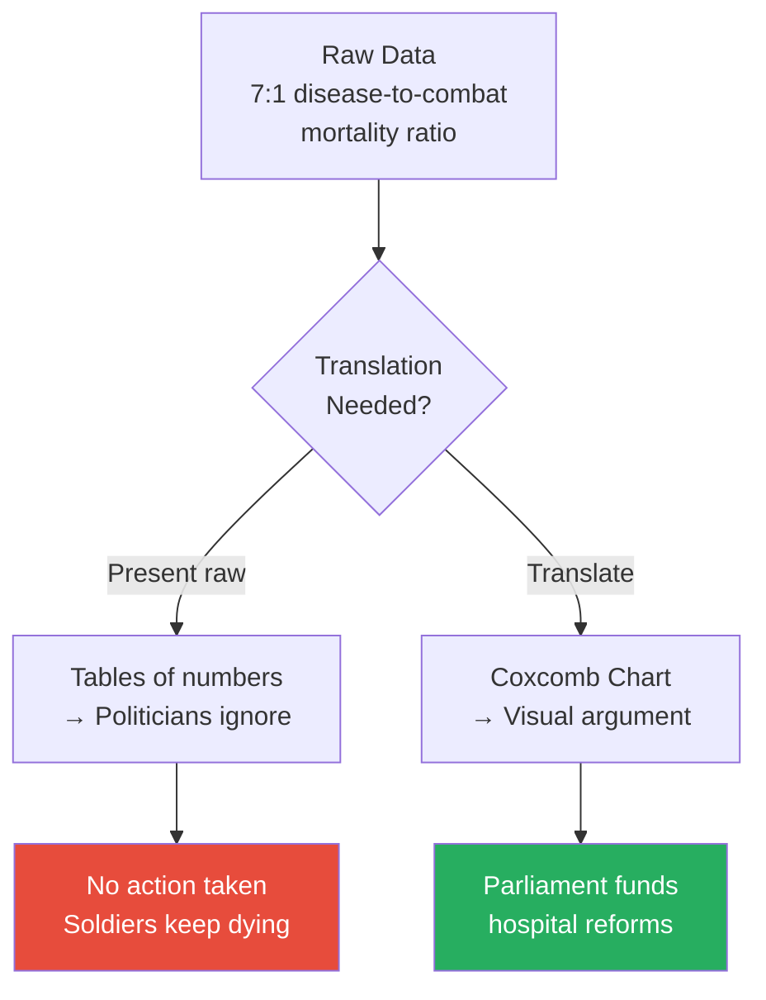
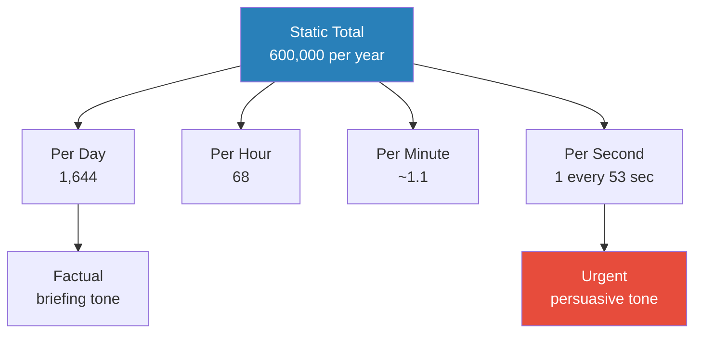
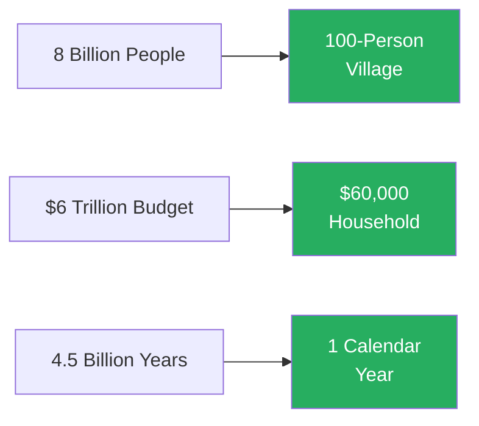
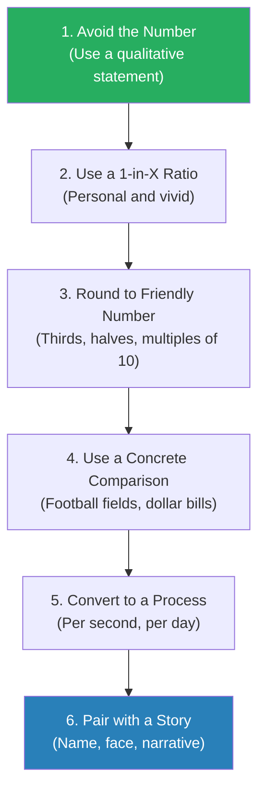
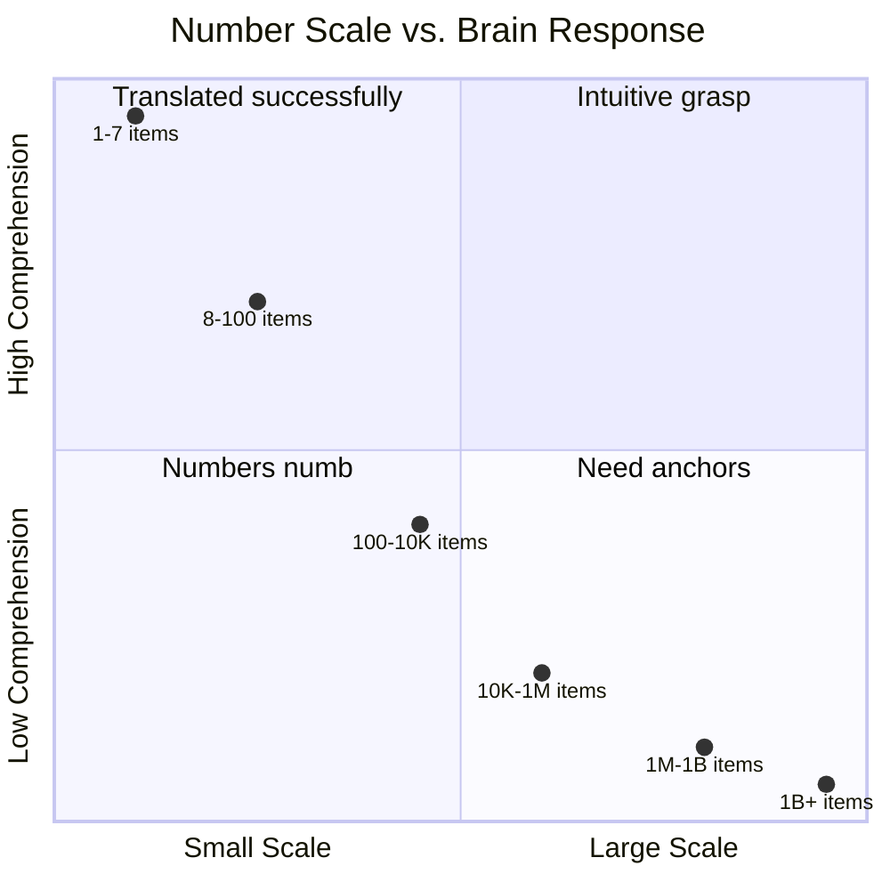
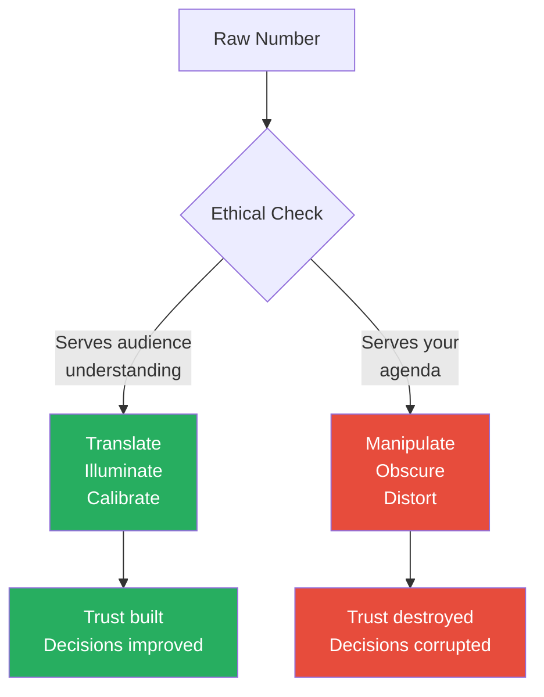

# Making Numbers Count — Chip Heath & Karla Starr

> Most numbers wash over us like static. We hear that a government programme costs $3.5 billion or that a disease kills 600,000 people a year, and we nod along without truly understanding what those figures mean. Chip Heath and Karla Starr argue this is not a failure of the audience — it is a failure of the communicator. The human brain evolved to process quantities up to about seven; beyond that, numbers become abstract noise. The solution is not to simplify or dumb down, but to translate — to convert every number into something the audience already understands through concrete comparisons, human-scale analogies, and vivid mental images. Drawing on cognitive science, historical examples from Florence Nightingale to Steve Jobs, and dozens of practical before-and-after transformations, the book provides a complete toolkit for making any number stick. If you have ever watched an audience glaze over during a data presentation, this book explains why — and shows exactly how to fix it.

---

## About the Author

Chip Heath is a professor at Stanford Graduate School of Business, best known for co-authoring *Made to Stick* and *Switch* with his brother Dan Heath — books that became foundational texts in communication and behavioural change. Karla Starr is a science writer whose work on human perception and decision-making has appeared in *The Atlantic*, *Slate*, and *O, The Oprah Magazine*. Together, they bring Heath's deep expertise in what makes ideas memorable and Starr's gift for translating research into accessible prose. *Making Numbers Count* extends the "stickiness" framework from *Made to Stick* into the specific domain of numerical communication — the place where most communicators fail hardest.

---

## The Big Idea

- <b style="color: #2980b9">The core problem is not that people are bad at maths — it is that numbers are an unnatural language for the human brain</b>
- Our ancestors needed to know whether there were three lions or five lions — they never needed to comprehend millions, billions, or percentages
- The brain's intuitive number sense tops out around five to seven items:
  - Below that threshold, we can grasp quantities instantly (a technique psychologists call **subitising**)
  - Above it, numbers become increasingly abstract — functionally, most people experience "a million" and "a billion" as roughly the same thing: "a lot"
- <b style="color: #27ae60">The communicator's job is not to present numbers but to translate them — to convert abstract figures into concrete, human-scale experiences the audience already understands</b>
- Heath and Starr organise this insight into a toolkit of translation strategies:
  - Avoid the number entirely when a qualitative statement is more powerful
  - Round aggressively — precision kills comprehension
  - Use concrete comparisons — football fields, dollar bills, time
  - Convert static totals into dynamic processes — deaths per second, money per household
  - Shrink vast scales down to human size — the world as a 100-person village
  - Pair every number with a story that makes it emotional, not just informational
- The book is short, punchy, and built on the same principle it teaches: every chapter translates a communication insight into something you will remember long after you put the book down
- It sits at the intersection of cognitive psychology, data communication, and persuasion — making it a natural companion to [[Storytelling with Data - Cole Nussbaumer Knaflic]], [[Influence - Robert Cialdini]], and [[Thinking in Bets - Annie Duke]]

Heath and Starr's core framework: every number must pass through a translation pipeline before it reaches the audience. The raw number is the starting point, never the endpoint.

The radar shows the fundamental trade-off: raw numbers preserve precision but fail on every dimension that actually drives communication — comprehension, memorability, and the ability to repeat the number to someone else.

Concrete comparisons take the largest share of the toolkit because they are the most versatile strategy — football fields, dollar bills, and time translations work across nearly every context — while "leading with precision" is the most common mistake that undermines all others.

---

## Key Concepts at a Glance

| Concept | One-line summary |
|---------|-----------------|
| **Numbers Numb** | The brain's intuitive number sense breaks down above ~7 items |
| **Translation, Not Presentation** | Convert every number into something the audience already knows |
| **Round with Abandon** | Friendly numbers beat precise numbers for comprehension |
| **Concrete Comparisons** | Football fields, dollar bills, and other familiar anchors make abstract numbers tangible |
| **1-in-X Ratios** | "1 in 5" is more vivid and emotionally engaging than "20%" |
| **Convert to a Process** | Turn a static total into a rate — deaths per minute, dollars per second |
| **Human-Scale It** | Shrink billions down to 100 for instant comprehension |
| **Florence Nightingale Principle** | Pair data with emotional resonance — numbers inform, stories persuade |
| **Flip the Frame** | Same data, different angle — 90% survival vs 10% mortality hit differently |
| **The Friendliness Hierarchy** | A ladder of strategies from "avoid the number" to "pair with a story" |
| **Familiar Anchors** | Use reference points the audience already carries (a deck of cards, a school bus) |
| **Know When to Stop** | Sometimes the most powerful move is dropping the number entirely |

---

## Part 1: The Problem — Why Numbers Fail

### Numbers Numb

*The human brain is a marvel of pattern recognition, storytelling, and emotional processing — but it was never designed to handle abstract quantities, and no amount of education changes that.*

- <b style="color: #2980b9">Subitising</b> is the psychological term for the brain's ability to instantly recognise small quantities without counting:
  - Hold up three fingers and anyone can tell you "three" without counting
  - Hold up nine fingers and people have to count — the instant recognition is gone
  - The threshold sits at about five to seven items for most people
- Beyond that threshold, numbers become progressively more abstract:
  - The difference between 100 and 1,000 feels intuitive
  - The difference between 1 million and 1 billion does not — both register as "very large"
  - The difference between 1 billion and 1 trillion is functionally invisible to most people's intuition
- <b style="color: #e74c3c">This is not ignorance or laziness — it is the architecture of the brain</b>
- Our evolutionary ancestors needed to assess quantities in the range of 1-7 reliably:
  - Are there more of them than of us?
  - Do we have enough food for tonight?
  - How many children need feeding?
- No survival scenario required distinguishing between a million and a billion of anything
- Yet modern communication demands exactly this — budgets, populations, risks, scientific measurements all operate in ranges the brain was never built for

> [!tip] Core Insight
> The audience's failure to grasp your number is not their problem — it is yours. You are speaking a language their brain does not natively understand. Your job is to translate.

---

### The Curse of Knowledge

*You have lived with your data for weeks or months. The audience is seeing it for the first time. That gap is where most communication fails.*

- Heath has explored the **curse of knowledge** extensively in *Made to Stick*:
  - Once you know something, you cannot un-know it
  - You assume others share your context, your reference points, your intuitions
  - With numbers, this curse is especially vicious — the analyst who has spent weeks with the data feels the numbers viscerally, but the audience just sees digits
- <b style="color: #e74c3c">The more expert you are, the worse you are at communicating your numbers</b> — because your expertise makes the numbers feel obvious to you
- The solution is not to "simplify" (which implies losing information) but to **translate** (which preserves meaning in a new form):
  - A translator between French and English does not "simplify" French — they convey the same meaning in a language the listener understands
  - A number translator does the same: conveys the same magnitude, the same proportion, the same significance — just in a form the brain can process

> [!example] The Tapping Study (Stanford, 1990)
> - Elizabeth Newton ran an experiment where "tappers" tapped out the rhythm of well-known songs on a table
> - "Listeners" tried to identify the songs from the tapping alone
> - Tappers predicted listeners would identify the song about 50% of the time
> - The actual success rate was 2.5% — a twenty-fold overestimate
> - The tappers could not help hearing the melody in their heads as they tapped — they had the curse of knowledge
> - The listeners heard only a series of disconnected taps
> **The lesson:** When you present raw numbers, you are the tapper — you hear the melody, but your audience hears only taps.

---

- This curse explains why so many data presentations fail:
  - The presenter shows a chart with twelve data series and says "As you can clearly see..."
  - The audience sees a wall of lines and numbers and sees nothing clearly
  - The presenter has forgotten what it is like to not already know the answer
- <b style="color: #27ae60">Every translation strategy in the book is designed to bridge this gap — to give the audience the intuition the communicator has already built</b>

---

### Florence Nightingale — The Pioneer of Number Translation

*Long before data visualisation software existed, one woman proved that the right translation of numbers could save thousands of lives.*

- Florence Nightingale is remembered as a nurse, but Heath and Starr argue she was one of history's greatest data communicators
- During the Crimean War (1853-1856), Nightingale collected meticulous data on soldier mortality:
  - She discovered that far more soldiers were dying from preventable diseases (typhus, cholera, dysentery) than from combat wounds
  - The ratio was roughly 7:1 — for every soldier killed by a bullet, seven died from infections they caught in the hospital

> [!example] Nightingale's Coxcomb Chart (1858)
> - Nightingale needed to convince Parliament and the War Office to reform military hospitals
> - She had the data — but she knew that tables of mortality figures would not move politicians
> - She invented a novel chart type: the **polar area diagram** (later called the "coxcomb" chart)
> - It displayed monthly mortality causes as coloured wedges radiating from a centre point
> - The blue wedges (preventable disease deaths) dwarfed the red wedges (combat deaths) so dramatically that the message was instantly visible
> - She did not just present numbers — she translated them into a visual argument
> - Parliament funded the reforms, and mortality rates in military hospitals dropped dramatically
> **The lesson:** The data existed for years before Nightingale acted on it. What changed was not the data — it was how she communicated it.

- <b style="color: #2980b9">The Florence Nightingale Principle</b> runs through the entire book:
  - Numbers alone do not persuade — translated numbers do
  - The translation must be visual, concrete, or emotional — preferably all three
  - The communicator must care enough about the audience to do the translation work, not just dump raw data
- Nightingale understood something most modern presenters forget:
  - Her audience (Victorian politicians) was not stupid — they were busy, distracted, and unfamiliar with mortality statistics
  - She met them where they were, not where she was
  - That is the essence of every strategy in the book

Nightingale's choice to translate rather than present raw data literally saved thousands of lives — the same data, communicated differently, produced entirely different outcomes.

---

## Part 2: The Translation Toolkit

### Strategy 1 — Avoid the Number

*Sometimes the most powerful thing you can do with a number is not use it at all.*

- <b style="color: #27ae60">If a qualitative statement conveys the point more effectively than a precise figure, drop the number</b>
- This is counterintuitive — most communicators believe that including a specific number adds credibility and precision
- But precision is only valuable when the audience can process it:
  - "The risk of side effect X is 0.00003%" — the audience's eyes glaze over
  - "The risk is essentially zero — you are more likely to be struck by lightning" — the audience understands
- When to avoid numbers entirely:
  - When the magnitude is the point, not the precision ("nearly all" vs "94.7%")
  - When the number is so small or so large that it has no intuitive meaning
  - When a vivid comparison does more work than the digit itself

> [!example] Steve Jobs and the iPod Launch (2001)
> - The first iPod had 5 gigabytes of storage
> - In 2001, most consumers had no intuitive sense of what a "gigabyte" meant
> - Jobs could have said "5GB of storage" — technically accurate, completely meaningless to the audience
> - Instead, he said: **"1,000 songs in your pocket"**
> - He avoided the number that did not communicate (5GB) and replaced it with a number that did (1,000 songs) — but even the 1,000 was secondary to the image ("in your pocket")
> - The translation converted a technical specification into a human desire
> **The lesson:** The best number is sometimes no number — or a different number entirely. Translate specs into experiences.

---

- <b style="color: #e74c3c">The most common mistake is leading with precision when the audience needs understanding</b>
- A budget proposal that says "We need $4,372,519" invites nitpicking on the precision
- The same proposal saying "We need roughly $4.4 million — about $12 per household in the district" invites understanding
- The principle is not anti-precision — it is anti-premature-precision:
  - Use the translated, rounded, human-scale number to build understanding first
  - Provide the precise figure in an appendix, footnote, or follow-up for those who want it
  - Lead with comprehension, follow with precision

---

### Strategy 2 — Round with Abandon

*Precision is the enemy of understanding. Friendly numbers beat precise numbers every time.*

- <b style="color: #2980b9">Friendly numbers</b> are numbers the brain processes effortlessly:
  - 1, 2, 3, 5, 10, 20, 50, 100
  - Halves, thirds, quarters — "about half," "roughly a third"
  - Multiples of 10 or powers of 10
- Unfriendly numbers are everything else — 31.78%, 4,372,519, 17.3 million
- The problem with unfriendly numbers:
  - They force the brain to do arithmetic instead of building understanding
  - "31.78%" requires mental effort — "about a third" is instant
  - The effort spent processing the number is effort not spent understanding the point
- <b style="color: #27ae60">Round to the nearest friendly number unless precision genuinely changes the meaning</b>

| Unfriendly Number | Friendly Translation | What You Lose | What You Gain |
|-------------------|---------------------|---------------|---------------|
| 31.78% | About a third | 1.78 percentage points | Instant comprehension |
| 4,372,519 | About 4.4 million | Exact figure | Graspable magnitude |
| 17.3 million | Nearly 20 million | 2.7 million | Round-number anchor |
| 8.7% | About 1 in 11 | Decimal precision | Vivid ratio |
| 2,347 | About 2,400 | 53 units | Clean mental image |

The pattern is consistent: what you lose in precision you gain many times over in comprehension. For persuasion and understanding, this is almost always the right trade.

---

- When does precision matter?
  - When the audience will make a specific decision based on the exact number (financial transactions, engineering tolerances, medical dosages)
  - When rounding would change the conclusion ("52% vs 48%" is a meaningful split; "about half and half" is not)
  - When the precision itself is the point ("We hit our target exactly — 100.0%")
- In all other cases — which is the vast majority of communication — round aggressively

> [!tip] Core Insight
> If your audience cannot repeat your number from memory five minutes later, the number was too precise. A rounded number they remember beats a precise number they forget.

---

### Strategy 3 — Use Concrete Comparisons

*The brain does not store numbers — it stores images. Give it an image, and the number comes along for free.*

- Abstract numbers float in the mind without anchoring to anything:
  - "The Great Wall of China is 13,171 miles long" — how long is that?
  - "The Great Wall is long enough to stretch from New York to Los Angeles and back, twice, with miles to spare" — now you feel it
- <b style="color: #2980b9">Concrete comparisons</b> work because they leverage existing mental models:
  - Everyone knows roughly how far New York is from Los Angeles
  - That existing knowledge becomes a scaffold for the new information
  - The brain does not need to build a new mental model from scratch — it just adapts one it already has

> [!example] A Million vs a Billion Seconds
> - Heath and Starr call this "perhaps the single best number translation ever created"
> - A million seconds is about 11.5 days — less than two weeks
> - A billion seconds is about 31.7 years — an entire generation
> - A trillion seconds is about 31,700 years — before the dawn of civilisation
> - The raw numbers (1,000,000 vs 1,000,000,000 vs 1,000,000,000,000) all blur together as "lots of zeroes"
> - Translated into time, the differences become viscerally obvious
> - This single comparison has been used in classrooms, newsrooms, and boardrooms worldwide
> **The lesson:** Time is one of the most powerful anchors because everyone experiences it identically. Translate large numbers into time whenever possible.

---

- <b style="color: #27ae60">The best comparisons use objects and experiences the audience already carries in their heads</b>
- Common anchors that work across cultures:
  - **Football fields** — for length and area (universally understood in the US)
  - **Olympic swimming pools** — for volume
  - **Dollar bills / pound notes** — for height (stacking) and length (laying end to end)
  - **School buses** — for length of large objects
  - **Bathtubs** — for volume of liquids
  - **Decks of cards** — for small weights and sizes

> [!example] The National Debt as Dollar Bills
> - The US national debt (roughly $31 trillion at the time of writing) is incomprehensible as a number
> - Stacked as dollar bills, $1 million would be about 360 feet high — roughly the height of a 30-storey building
> - $1 billion would be about 68 miles high — into the lower edge of space
> - $1 trillion would reach about 68,000 miles — more than a quarter of the way to the Moon
> - $31 trillion would stack dollar bills to the Moon and back, four times over
> - The image of a stack of bills reaching the Moon does what the number "31,000,000,000,000" cannot
> **The lesson:** Physical objects create physical intuitions. When you can see it, you can feel it.

---

- Rules for good comparisons:
  - The anchor must be **more familiar** than the number you are translating — otherwise you have just replaced one unknown with another
  - The comparison must be **proportionally honest** — do not cherry-pick an anchor that exaggerates or minimises
  - <b style="color: #e74c3c">Never use a comparison the audience cannot verify intuitively</b> — "the size of 47 blue whales" is useless if they have never seen a blue whale
  - One comparison per number — stacking multiple comparisons creates confusion, not clarity

---

### Strategy 4 — Use 1-in-X Ratios

*Percentages are abstract. Ratios are personal. "20%" is a statistic. "1 in 5" is someone you know.*

- <b style="color: #2980b9">The 1-in-X ratio</b> is one of the most powerful translation tools because it transforms a statistic into a person:
  - "20% of employees experience burnout" → "1 in 5 of your colleagues is burned out right now"
  - The percentage describes a population; the ratio describes an individual
  - The brain processes individuals far more readily than populations
- Why ratios outperform percentages:
  - Percentages require mental arithmetic to convert into meaning
  - Ratios trigger **identifiable victim effect** — we care more about one identified person than about a statistical group
  - "1 in 5" makes you look around the room and count — it becomes personal and spatial
- <b style="color: #27ae60">Always convert percentages to 1-in-X ratios when communicating risk, prevalence, or probability to non-technical audiences</b>

> [!example] Vaccine Side Effect Risk
> - A vaccine has a serious side effect rate of 0.0001% — this number is functionally meaningless to most people
> - Translated: "about 1 in a million" — still abstract, but better
> - Compared: "You are roughly twice as likely to be struck by lightning in your lifetime" — now they can feel the scale
> - The comparison does not just translate the number — it calibrates the emotional response
> - Without the comparison, some people hear "side effect" and imagine high risk regardless of the percentage
> **The lesson:** Risk numbers need both translation (1-in-X) and calibration (compared to something familiar) to be understood correctly.

| Format | Example | Comprehension | Emotional Impact |
|--------|---------|---------------|-----------------|
| Percentage | 0.0001% | Very low | Anxiety (any number > 0 feels risky) |
| Fraction | 1/1,000,000 | Low | Abstract |
| 1-in-X ratio | 1 in a million | Moderate | Starting to calibrate |
| Comparison | Twice as likely as lightning strike | High | Properly calibrated |

The progression shows that each translation step adds both comprehension and emotional calibration. The comparison at the end does the most work.

---

- When to use ratios vs when to use percentages:
  - Use **ratios** when communicating to non-experts, when the number is meant to trigger action or emotion, or when the base rate is very small or very large
  - Use **percentages** when communicating to analysts who will do further calculations, when precision matters, or when comparing across categories of different sizes
  - <b style="color: #e74c3c">Never use both simultaneously</b> — "20% (or 1 in 5)" forces the brain to process two representations and slows comprehension

---

### Strategy 5 — Convert to a Process

*A total is a snapshot. A rate is a movie. The brain prefers movies.*

- <b style="color: #2980b9">Process translation</b> means converting a static total into a dynamic rate:
  - "600,000 Americans die of heart disease annually" → "One American dies of heart disease every 53 seconds"
  - "The Amazon loses 3.5 million acres of forest per year" → "An area the size of a football field is cleared every six seconds"
- Why processes outperform totals:
  - A total is a single number — the brain files it and moves on
  - A rate unfolds in real time — the brain simulates it as an ongoing event
  - "Every 53 seconds" creates a rhythm — you can feel time passing, and with each beat, another person dies
  - The rate transforms the number from information into experience

> [!example] Heart Disease as a Plane Crash
> - About 600,000 Americans die of heart disease each year
> - That is roughly 1,644 per day
> - A Boeing 747 holds about 400 passengers
> - So heart disease kills the equivalent of four fully loaded 747s crashing every single day, all year long, with no survivors
> - If that were happening to planes, it would be the lead story on every news broadcast for the rest of human history
> - But because it happens one person at a time, in homes and hospitals, it fades into background noise
> **The lesson:** Converting totals to vivid rates exposes the true scale of problems that statistical numbing has hidden.

---

- <b style="color: #27ae60">The best process translations use time units the audience experiences daily</b>:
  - Per second — for dramatic emphasis on very large numbers
  - Per minute — for numbers that are large but not overwhelming
  - Per hour — for medium-scale numbers
  - Per day — for numbers the audience can personally track
  - Per year — only when the annual total itself is the comparison point
- Match the time unit to the impact you want:
  - "One every 53 seconds" is dramatic and urgent
  - "About 1,644 per day" is factual but less visceral
  - Both are accurate — the choice depends on purpose

The same number can be expressed at different time scales to match the communication context — from calm briefing to urgent call to action.

---

### Strategy 6 — Use Familiar Anchors

*Do not ask the audience to imagine something new. Attach your number to something they already know.*

- A <b style="color: #2980b9">familiar anchor</b> is a reference point that the audience carries in their heads without effort:
  - The height of a person (about 5'7" or 1.7m)
  - The length of a football field (100 yards / 91m)
  - The volume of a bathtub (about 80 gallons / 300 litres)
  - The weight of a bowling ball (about 14 pounds / 6.4 kg)
  - The area of a tennis court, a basketball court, a parking space
- The anchor works because the brain does not need to construct a new mental image — it retrieves one it already has
- <b style="color: #27ae60">The best anchor is the most familiar one that is proportionally closest to the number being translated</b>

> [!example] The Solar System on a Football Field
> - If you shrink the solar system so the Sun sits on one goal line and Pluto sits on the other (100 yards away):
>   - Mercury is at the 1-yard line
>   - Venus is at about the 2-yard line
>   - Earth is at about the 2.5-yard line
>   - Mars is at the 4-yard line
>   - Jupiter is at the 13-yard line
>   - Saturn is at the 24-yard line
>   - Uranus is at the 49-yard line
>   - Neptune is at the 75-yard line
> - This translation makes several cosmic facts instantly obvious:
>   - All the rocky planets are jammed near the Sun
>   - Jupiter dominates the inner half of the field
>   - There is an enormous amount of empty space
> - The raw distances in miles (Earth is 93 million miles from the Sun) communicate nothing; the football field communicates everything
> **The lesson:** Shrinking an incomprehensible scale onto a familiar one preserves all the proportional relationships while making them graspable.

---

> [!abstract] The Familiar Anchor Checklist
> 1. Identify the dimension you need to anchor (length, weight, volume, area, time, money)
> 2. Find the most widely known reference object in that dimension
> 3. Verify the audience actually knows the anchor (do not use cricket pitches for an American audience)
> 4. Calculate the comparison and round to a friendly number
> 5. State the comparison in a single sentence — if it takes two sentences, the anchor is too complex
> 6. Test: can someone repeat the comparison from memory after one hearing?

---

- Common anchor pitfalls:
  - <b style="color: #e74c3c">Using anchors the audience does not actually know</b> — "the size of Rhode Island" means nothing to non-Americans; "the length of 47 blue whales" means nothing to anyone
  - Using anchors that are themselves hard to imagine — "the weight of 200 elephants" — most people have never been near an elephant
  - Stacking anchors — "a football field stacked 40 stories high" forces two mental conversions, not one
  - Mixing dimensions — comparing a weight to a length creates confusion, not clarity

---

### Strategy 7 — Shrink the Scale (Human-Scale It)

*When the numbers are too big to grasp, shrink the entire system down to a size the brain can handle.*

- <b style="color: #2980b9">Human-scaling</b> means reducing a vast system to a base that fits within the brain's natural range — usually 100 or 10:
  - The world's population of 8 billion → a village of 100 people
  - A government budget of $6 trillion → a household budget of $60,000
  - A company with 50,000 employees → an office of 50
- This is different from using a single comparison — it rescales the entire system so that all the proportions remain visible:
  - In a 100-person village, roughly 60 live in Asia, 17 in Africa, 10 in Europe, 5 in North America
  - You can see the proportions, compare them, and remember them — impossible with the raw billions

> [!example] The World as a 100-Person Village
> - If the world's population were shrunk to a village of 100 people:
>   - 60 would be Asian, 17 African, 10 European, 8 Latin American, 5 North American
>   - About 25 would be under 15 years old, and about 9 would be over 65
>   - Roughly 86 would be able to read and write; 14 would be illiterate
>   - About 7 would have a college degree
>   - 1 person would control more wealth than the combined wealth of the poorest 50
> - Every one of these statistics exists as raw data — but raw data does not create a mental image
> - The 100-person village creates a scene you can visualise: you can see the crowd, count the groups, feel the disproportion
> **The lesson:** Shrinking to human scale preserves proportional accuracy while making the whole system graspable at a glance.

---

- <b style="color: #27ae60">Choose the base number that preserves the most important relationships</b>:
  - 100 works for populations and percentages
  - 10 works for smaller comparisons or simpler systems
  - $1 works for budgets (shrink to a single dollar and show where each cent goes)
  - 1 year works for historical timelines (compress all of history into a single year — humans appear on December 31st at 11:58 PM)

> [!tip] Core Insight
> Human-scaling does not distort — it reveals. When you shrink the system, the relationships that were invisible at full scale become impossible to miss.

---

- The calendar compression is one of the most powerful variants:
  - Compress the 4.5-billion-year history of Earth into a single calendar year
  - January 1st: Earth forms
  - First life appears around late February
  - Dinosaurs appear in mid-December
  - Humans appear at about 11:58 PM on December 31st
  - All of recorded human history fits in the last few seconds before midnight
  - This translation makes the recency and fragility of human civilisation viscerally obvious

Three variants of the same principle: shrink the system to a scale the brain already processes naturally.

---

## Part 3: Advanced Translation Strategies

### Flip the Frame

*The same number can feel completely different depending on which side of it you show the audience.*

- <b style="color: #2980b9">Frame flipping</b> means expressing the same data from the opposite perspective to change its emotional impact:
  - "This surgery has a 90% survival rate" vs "This surgery kills 1 in 10 patients"
  - The information is identical — the psychological effect is dramatically different
- Research by Amos Tversky and Daniel Kahneman demonstrated this effect conclusively:
  - Doctors were more likely to recommend a surgery described as having a "90% survival rate" than one with a "10% mortality rate"
  - These are trained professionals making life-and-death decisions — and framing still shifted their choices
  - If it affects doctors, it affects everyone

> [!example] The Surgeon's Frame
> - Researchers presented physicians with identical data about a surgical procedure
> - Group A was told: "This procedure has a 90% five-year survival rate"
> - Group B was told: "This procedure has a 10% five-year mortality rate"
> - Physicians in Group A were significantly more likely to recommend the surgery
> - The data was identical — only the frame changed
> - Group A imagined 9 out of 10 patients walking out alive; Group B imagined 1 in 10 patients dying
> **The lesson:** You choose the frame every time you present a number. Choose deliberately, because your audience's response depends on it.

---

- <b style="color: #27ae60">Choose the frame that matches your communication goal</b>:
  - To **motivate action**, frame the loss — "1 in 10 patients dies" creates urgency
  - To **build confidence**, frame the gain — "90% of patients survive" creates reassurance
  - To **maintain trust**, present both frames — "90% survival rate, which means 10% do not survive" creates transparency
- <b style="color: #e74c3c">Never flip the frame to deceive</b> — ethical communication means choosing the frame that best serves the audience's understanding, not the one that most benefits you
- Common ethical frame-flipping scenarios:
  - Public health: frame the loss to motivate behaviour change ("1 in 5 smokers will develop lung cancer")
  - Product marketing: frame the gain to build trust ("99.9% uptime")
  - Risk disclosure: present both frames for informed consent

---

### Emotional Anchoring — Pair Numbers with Stories

*Numbers inform. Stories persuade. The most effective communication uses both.*

- This is the <b style="color: #2980b9">Florence Nightingale Principle</b> elevated to a general strategy:
  - A number alone creates understanding (maybe)
  - A story alone creates emotion (definitely)
  - A number paired with a story creates both understanding and motivation to act
- <b style="color: #27ae60">The story does not replace the number — it carries the number into the audience's emotional memory</b>
- The psychological mechanism:
  - The brain has two processing channels — one for analytical information (numbers, logic, statistics) and one for narrative information (stories, characters, emotions)
  - These channels are not additive — they are competitive
  - When you lead with a dry statistic, you activate the analytical channel, which suppresses the emotional channel
  - When you lead with a story and embed the number within it, the emotional channel carries the number along

> [!example] The Identifiable Victim Effect (Deborah Small, 2007)
> - Researchers tested charitable donations using three approaches:
>   - **Statistics only:** "Food shortages in Malawi affect over 3 million children..."
>   - **Story only:** "Rokia is a 7-year-old girl from Mali who faces the threat of severe hunger..."
>   - **Statistics + Story combined:** Both the statistics and Rokia's story together
> - Results:
>   - Story alone generated the most donations (average ~$2.83)
>   - Statistics alone generated the least (average ~$1.14)
>   - Combined generated less than story alone (~$1.43) — the statistics actually suppressed the emotional response to Rokia
> - This is the **identifiable victim effect**: we respond more to one identified person than to millions of unnamed people
> **The lesson:** If you must pair a number with a story, lead with the story. Let the emotion build first, then introduce the number as context — not the other way around.

---

- Practical implications for communicators:
  - <b style="color: #e74c3c">Do not open with your biggest number</b> — it activates the analytical channel and suppresses emotional engagement
  - Instead, open with a person, a name, a moment — then let the number provide scale
  - "Maria was 34 when she was diagnosed. She is one of 600,000 Americans who will hear those words this year."
  - Not: "600,000 Americans are diagnosed each year. Consider Maria, age 34."
  - The sequence matters — story first, number second

---

### The Friendliness Hierarchy

*Not all translations are equal. Some strategies are more powerful than others. Use the strongest one available.*

- Heath and Starr present a hierarchy of translation strategies, from most to least impactful:

The hierarchy moves from strongest standalone strategies (top) to strategies that enhance other translations (bottom). In practice, the best translations combine multiple strategies.

- These strategies are not mutually exclusive — the best translations stack two or three:
  - Round the number AND convert to a ratio: "31.78%" → "about 1 in 3"
  - Use a concrete comparison AND convert to a process: "An area of rainforest the size of a football field is cleared every six seconds"
  - Pair with a story AND use a familiar anchor: "Rokia walks four miles each day — about 40 blocks in Manhattan — just to reach clean water"
- <b style="color: #27ae60">Start at the top of the hierarchy and work down: can you avoid the number? If not, can you use a ratio? If not, can you round it?</b>
- Each step down adds complexity — the higher you can stay, the cleaner the communication

> [!abstract] The Translation Checklist
> 1. What is the point? (Not "what is the number" — what should the audience understand?)
> 2. Can you make the point without a number at all?
> 3. If you need a number, can you express it as a 1-in-X ratio?
> 4. Have you rounded to the nearest friendly number?
> 5. Can you attach it to a familiar anchor?
> 6. Can you convert the total to a rate (per second/minute/day)?
> 7. Is there a story that can carry the number emotionally?
> 8. Test: can someone repeat your translation after one hearing?

---

## Part 4: Handling Scale — Big Numbers, Small Numbers, and Everything in Between

### The Problem of Big Numbers

*A million, a billion, a trillion — to the untrained brain, these are all just "a lot." The communicator's job is to make the differences real.*

- <b style="color: #e74c3c">The biggest failure in number communication is treating millions, billions, and trillions as though they are just different sizes of the same thing</b>
- They are not different sizes — they are different worlds:
  - A million seconds: about 11.5 days
  - A billion seconds: about 31.7 years
  - A trillion seconds: about 31,700 years
- The human brain has no natural register for these differences because our ancestors never encountered quantities above a few thousand
- Heath and Starr argue that every time you use a number above a million, you have a moral obligation to translate it — because untranslated, it conveys almost nothing

> [!tip] Core Insight
> If your audience cannot feel the difference between the numbers you are comparing, you have not communicated — you have only made sounds.

---

- Strategies specific to very large numbers:
  - **Time translation** — convert to seconds, minutes, hours, years (the million/billion/trillion seconds example)
  - **Per-person breakdown** — divide by the relevant population ("$31 trillion in national debt is about $93,000 per person or $240,000 per household")
  - **Physical stacking** — dollar bills, pages, grains of rice
  - **Calendar compression** — all of history into one year
- Strategies specific to very small numbers:
  - **Magnify the base** — instead of "0.0001%", say "1 in a million"
  - **Compare to familiar risks** — "about twice the risk of being struck by lightning"
  - **Eliminate the number** — "The risk is essentially zero" or "vanishingly rare"

| Number Scale | Brain's Default Response | Translation Strategy |
|-------------|------------------------|---------------------|
| 1-7 | Intuitive grasp | None needed |
| 8-100 | Can count, but less intuitive | Round to friendly number |
| 100-10,000 | Rough sense of magnitude | Concrete comparison |
| 10,000-1 million | "A lot" | Per-person, time, physical |
| 1 million-1 billion | "A really big lot" | Time (seconds to years) |
| 1 billion+ | "Incomprehensible" | Multi-strategy translation required |

The table maps the brain's natural processing limits to the translation strategies that compensate for each threshold.

The quadrant chart shows the exponential decay in comprehension as number scale increases — beyond about 10,000, the brain's natural number sense has effectively collapsed, requiring multi-strategy translation to restore any meaningful understanding.

---

### Using Time as a Yardstick

*Everyone knows what a day feels like, what a year feels like, what a lifetime feels like. Time is the universal anchor.*

- Time is the most powerful anchor for large numbers because:
  - Everyone experiences time identically (unlike money, which varies by context)
  - Time has strong emotional associations — a day, a year, a lifetime all carry intuitive weight
  - Time units nest cleanly: seconds → minutes → hours → days → years → centuries
- <b style="color: #27ae60">When in doubt about how to translate a large number, try converting it to a time unit first</b>

> [!example] Counting to a Trillion
> - If you counted one number per second, without stopping:
>   - Counting to a million would take about 11.5 days
>   - Counting to a billion would take about 31.7 years
>   - Counting to a trillion would take about 31,700 years — longer than all of recorded human history
> - This translation is so effective because counting is something everyone has done
> - The shift from "11 days" to "31 years" to "31,700 years" makes the exponential growth viscerally obvious
> - No chart, no graph, no table communicates this as effectively as the time translation
> **The lesson:** Time is the universal currency of human experience. Translate large numbers into time and the brain does the rest.

---

- Time translations also work for small, frequent events:
  - "Americans consume 100 acres of pizza per day" — interesting but abstract
  - "Every second, Americans eat 350 slices of pizza" — suddenly you can feel the pace
  - The per-second framing makes it cinematic — you can almost see the slices disappearing
- And for slow, cumulative processes:
  - "The Sahara Desert is expanding by about 10% per century" — easy to ignore
  - "The Sahara grows by about 3 football fields per hour, every hour, all year" — urgent

---

### Simple Proportions — The Power of Per

*Totals hide individual relevance. Per-person, per-household, per-student breakdowns make numbers personal.*

- <b style="color: #2980b9">Simple proportion translation</b> means dividing a large total by a meaningful denominator to produce a number the audience can relate to personally:
  - "$4.4 billion education budget" → "about $8,200 per student"
  - "$31 trillion national debt" → "about $240,000 per household"
  - "2 billion tonnes of waste per year globally" → "about 4.4 pounds per person per day"
- Why this works:
  - Totals describe a system — proportions describe the audience's share of that system
  - "Your household's share of the national debt is $240,000" is a number that triggers a response
  - "$31 trillion" does not trigger a response because no one can feel what a trillion means
- <b style="color: #27ae60">The right denominator is the one that makes the audience say "That's me"</b>:
  - Per person — for issues affecting everyone
  - Per household — for financial topics
  - Per student — for education issues
  - Per employee — for business contexts
  - Per taxpayer — for government spending

> [!example] NASA's Budget Translation
> - NASA's annual budget is roughly $25 billion — this sounds enormous
> - Divided by the US population (~330 million), that is about $75 per person per year
> - Divided again by 365, that is about 21 cents per person per day
> - "You pay about 21 cents a day for all of space exploration" completely reframes the debate
> - Advocates for NASA funding use this translation deliberately — it shifts the conversation from "billions of dollars" to "pocket change per person"
> **The lesson:** Per-person breakdowns transform budget debates by making the audience feel the personal scale of the cost.

---

### Strategy 8 — Crystallise with a Simulation

*When no single comparison is enough, walk the audience through a scenario that lets them experience the number.*

- A <b style="color: #2980b9">simulation</b> is a translation strategy that does not just tell the audience what a number means — it lets them live through it:
  - Instead of "There are 400 billion stars in the Milky Way," try: "Imagine you could count one star per second. You would need to count for over 12,000 years — roughly since the last Ice Age — to finish"
  - The audience does not just hear the number — they simulate the experience of counting, feel time passing, and hit the wall of impossibility
- Simulations work because they engage **procedural memory** — the brain's system for understanding sequences and processes:
  - Hearing "12,000 years" is a fact
  - Imagining yourself counting, second after second, day after day, year after year, for twelve millennia — that is an experience
  - The experience encodes far more deeply than the fact
- <b style="color: #27ae60">Use simulations when the number is so extreme that even standard translations feel abstract</b>:
  - Very large numbers (trillions, quadrillions)
  - Very small probabilities (1 in 10 million)
  - Very long time spans (millions of years)
  - Numbers where the emotional stakes are high and comprehension is critical

> [!example] Walking to the Moon
> - To convey how far 238,900 miles really is:
>   - "If you started walking to the Moon at a brisk 3 miles per hour, 24 hours a day, no stopping..."
>   - "...it would take you about 9 years to get there"
>   - "Your child born the day you started walking would be in fourth grade by the time you arrived"
> - The simulation does not just translate the distance — it places the audience inside the experience
> - They can feel the absurdity of the walk, the passage of time, the child growing up
> - A single comparison ("about 10 times around the Earth") gives magnitude; the simulation gives meaning
> **The lesson:** When magnitude alone is not enough, let the audience simulate the experience. Walk them through it step by step.

---

## Part 5: Special Situations

### Communicating Risk

*Risk is where number communication matters most — and where it fails most often.*

- Risk communication is the highest-stakes application of number translation:
  - Medical decisions (should I have this surgery? take this medication?)
  - Safety decisions (is this neighbourhood safe? is this product reliable?)
  - Policy decisions (is this threat real? is this regulation worth the cost?)
- <b style="color: #e74c3c">People are systematically terrible at processing risk expressed as percentages or decimals</b>:
  - A "2% risk" and a "0.002% risk" feel similarly worrying to most people — the decimal places blur
  - A "99% success rate" and a "99.99% success rate" feel similarly reassuring — both are "basically certain"
  - But the actual difference between 2% and 0.002% is a factor of 1,000 — one is common, the other is vanishingly rare
- The toolkit for risk communication combines several strategies:

> [!abstract] Risk Communication Protocol
> 1. Convert the percentage to a 1-in-X ratio ("2%" → "1 in 50")
> 2. Compare to a familiar risk ("about the same risk as..." or "ten times riskier than...")
> 3. Provide the base rate ("Out of every 1,000 people who have this surgery, 980 walk out fine")
> 4. If possible, use a physical demonstration (the marble jar technique — 999 white marbles, 1 red)
> 5. Give both frames: what happens to most people AND what happens to the few
> 6. Avoid combining numbers and stories — lead with the story if the goal is emotional engagement, lead with the number if the goal is rational calibration

---

> [!example] The Marble Jar Demonstration
> - To communicate a 1-in-1,000 risk to patients:
>   - Fill a large jar with 999 white marbles and 1 red marble
>   - Ask the patient to reach in and pull one out
>   - The overwhelming whiteness of the jar conveys "rare" more powerfully than any number
>   - If they pull a white marble (which they almost certainly will), they experience the probability physically
> - This technique has been used by medical professionals to help patients understand surgical risks
> - It works because it translates a number into a sensory experience — you see the ratio, you feel the odds
> **The lesson:** The most powerful translations engage the senses, not just the intellect. Let people see and touch the probability.

---

- <b style="color: #2980b9">Risk comparison tables</b> help calibrate unfamiliar risks against familiar ones:

| Risk | Approximate Odds | Familiar Comparison |
|------|------------------|-------------------|
| Being struck by lightning (lifetime) | 1 in 500,000 | About 0.6 seconds of a year |
| Dying in a car accident (annual) | 1 in 8,000 | About an hour of a year |
| Dying from heart disease (lifetime) | 1 in 6 | One face of a die |
| Winning the lottery jackpot | 1 in 300 million | Finding one specific grain of sand on a beach |
| Serious vaccine side effect | ~1 in 1 million | Half the lightning risk |

Calibration tables give the audience a mental "ruler" for measuring unfamiliar risks. Without them, every risk feels either enormous or negligible with no middle ground.

---

### Communicating Proportions

*When two or more numbers need to be compared, the translation must preserve the relationship, not just the individual magnitudes.*

- Single-number translations are powerful, but many real-world messages involve comparisons:
  - How much bigger is X than Y?
  - How has Z changed over time?
  - What share does A represent of the whole?
- <b style="color: #27ae60">For comparisons, translate both numbers using the same anchor</b> — do not translate one into time and the other into money
- The "penny on a dollar" technique:
  - Shrink a budget to $1 and show where each cent goes
  - "Defence spending is 16 cents on the dollar; education is 4 cents; foreign aid is less than a penny"
  - This makes proportional relationships instantly visible — and destroys common misconceptions (most Americans wildly overestimate the share spent on foreign aid)

> [!example] The Federal Budget as One Dollar
> - Shrink the entire US federal budget to a single dollar:
>   - Social Security: about 23 cents
>   - Healthcare (Medicare/Medicaid): about 25 cents
>   - Defence: about 16 cents
>   - Interest on debt: about 8 cents
>   - Everything else (education, infrastructure, science, foreign aid): about 28 cents
>   - Foreign aid specifically: about half a penny
> - This translation immediately corrects a persistent misconception — polls show many Americans believe foreign aid consumes 10-25% of the budget
> - In reality, it is less than 1%
> - The dollar-shrink makes this impossible to miss: half a penny out of a dollar
> **The lesson:** When proportional relationships matter more than absolute values, shrink the whole system to a familiar unit and let the ratios speak for themselves.

---

### Numbers in Presentations and Writing

*The moment of translation is not when you crunch the data — it is when you face the audience.*

- Heath and Starr dedicate significant attention to the practical context of number communication:
  - Slides and presentations
  - Written reports and articles
  - Verbal communication (meetings, pitches, conversations)
- Each medium has different constraints:

| Medium | Constraint | Best Strategy |
|--------|-----------|--------------|
| Slides | Limited attention, visual | One number per slide, large font, concrete comparison |
| Written reports | Sequential reading | Lead with translation, put raw data in appendix |
| Verbal (meetings) | No visual aids, memory-dependent | Use ratios and stories — nothing that requires seeing digits |
| Social media | Extreme brevity | One powerful comparison per post |

- <b style="color: #e74c3c">The most common presentation mistake: putting a table of 50 numbers on a slide and saying "As you can clearly see..."</b>
  - The audience cannot clearly see anything — they see a wall of digits
  - Each of those 50 numbers needed individual translation — or more likely, 48 of them needed to be removed entirely
  - One number, well-translated, on a clean slide, will be remembered
  - Fifty numbers on a cluttered slide will be forgotten before the next slide appears

> [!tip] Core Insight
> Every number you add to a slide dilutes every other number on that slide. The most powerful data presentations are the ones with the fewest numbers.

---

### When Numbers Mislead — Ethical Translation

*Every translation is a choice. Ethical communicators choose the frame that best serves the audience's understanding, not their own agenda.*

- <b style="color: #e74c3c">Number translation is inherently powerful — and power can be abused</b>
- Heath and Starr acknowledge that every strategy in the book can be used to mislead:
  - Frame-flipping can hide risk ("90% survival rate") or exaggerate it ("10% mortality rate")
  - Anchoring can trivialise costs ("only 21 cents a day") or inflate them ("$75 per person per year")
  - Rounding can smooth over meaningful differences
  - Cherry-picked comparisons can make anything look good or bad
- The ethical test:
  - Would you be comfortable if the audience later discovered your raw data?
  - Does your translation preserve the proportional truth, even if it simplifies the number?
  - Are you choosing the frame that helps the audience decide well, or the frame that pushes them toward your preferred conclusion?
- <b style="color: #27ae60">The goal of translation is to convey the truth more effectively — not to replace one kind of confusion with another</b>

> [!example] The Misleading Average
> - A company reports that the "average employee salary" is $85,000 — suggesting fair compensation
> - But the average is dragged up by five executives earning $500,000+
> - The median salary is $52,000 — a very different picture
> - Both numbers are "true" — but one serves the company's narrative and the other serves the employees' understanding
> - An ethical communicator would present the median (or both) rather than the mean alone
> **The lesson:** Choosing which number to translate is as important as choosing how to translate it. The selection itself is a frame.

---

- The book does not dwell on ethics at length, but the principle is woven throughout:
  - Translate to illuminate, not to obscure
  - Round to simplify, not to distort
  - Compare to calibrate, not to manipulate
  - Frame to inform, not to trick

Every translation is a choice between illumination and manipulation. The strategies are identical — the ethics are in the intent.

---

## Part 6: Putting It All Together

### The Complete Translation Process

*Great number translation is not a single technique — it is a process that starts with the audience and ends with a test.*

> [!abstract] The Complete Translation Workflow
> 1. **Start with the point, not the number** — what should the audience understand, feel, or do?
> 2. **Know your audience** — what do they already know? What anchors do they carry?
> 3. **Choose the right strategy** — work down the Friendliness Hierarchy
> 4. **Build the translation** — convert, round, compare, or narrativise
> 5. **Test the translation** — can someone repeat it after one hearing? Does it pass the "tell a friend" test?
> 6. **Refine** — if the test fails, try a different strategy or a different anchor
> 7. **Deliver** — lead with the translation, provide raw data as backup for those who want it

---

### Before and After — Translation in Action

*The most effective way to learn translation is to see the same number communicated poorly and then communicated well.*

Heath and Starr use before-and-after examples throughout the book. Here is a collection of the most illustrative transformations:

| Before (Raw) | After (Translated) | Strategy Used |
|-------------|-------------------|---------------|
| "5GB storage capacity" | "1,000 songs in your pocket" | Avoid the number; translate to experience |
| "The budget is $4,372,519" | "About $4.4 million — $12 per household" | Round + per-person breakdown |
| "31.78% of respondents agreed" | "About 1 in 3 people agreed" | Round + 1-in-X ratio |
| "600,000 Americans die of heart disease annually" | "One person dies every 53 seconds — four jumbo jets, daily" | Convert to process + concrete comparison |
| "The Amazon loses 3.5 million acres yearly" | "A football field of forest disappears every 6 seconds" | Familiar anchor + process |
| "The Sun is 93 million miles away" | "If the solar system fit on a football field, Earth would be at the 2.5-yard line" | Shrink the scale |
| "The vaccine risk is 0.0001%" | "You are twice as likely to be struck by lightning" | Risk comparison + avoid the number |
| "Foreign aid is 0.7% of the federal budget" | "Less than a penny out of every dollar" | Dollar-shrink proportion |
| "Light travels at 186,000 miles per second" | "Light could circle the Earth 7.5 times in one second" | Familiar anchor + process |

Each translation makes the same point as the raw number — but in a form the brain can process, remember, and repeat to someone else.

---

### Common Mistakes

*Even experienced communicators fall into predictable traps. Knowing the mistakes is as important as knowing the strategies.*

- <b style="color: #e74c3c">Mistake 1: Leading with precision</b>
  - Presenting "$4,372,519.23" when "$4.4 million" would communicate better
  - Precision signals expertise to the communicator but creates cognitive load for the audience

- <b style="color: #e74c3c">Mistake 2: Using unfamiliar anchors</b>
  - "The size of Luxembourg" — to an audience that has never been to Luxembourg
  - "As heavy as 40 hippopotamuses" — to an audience that has never weighed a hippopotamus
  - The anchor must be more familiar than the number being translated

- <b style="color: #e74c3c">Mistake 3: Stacking translations</b>
  - "That is the weight of 2,000 elephants, which is equivalent to 300 school buses, or roughly 15 blue whales"
  - Each additional comparison dilutes the previous one — the brain cannot hold three different mental images simultaneously
  - One clean comparison beats three competing ones

- <b style="color: #e74c3c">Mistake 4: Translating the wrong number</b>
  - Spending ten minutes translating a number that is not the point
  - The translation should serve the argument, not showcase the translator's cleverness

- <b style="color: #e74c3c">Mistake 5: Neglecting the emotional channel</b>
  - A perfectly translated number that still does not move the audience because it was not paired with a human story
  - Numbers inform — stories persuade — you need both

> [!example] The Three-Comparison Pileup
> - A presenter trying to convey the size of the Pacific Ocean:
>   - "It is 63.8 million square miles..."
>   - "That is larger than all the land on Earth combined..."
>   - "You could fit every continent in it with room to spare..."
>   - "It is about 46% of the Earth's water surface..."
> - Each comparison is individually decent, but stacked together they create confusion
> - The audience cannot decide which image to hold in their mind
> - A better approach: pick the single best comparison and commit to it
> - "The Pacific Ocean is so large that you could place every continent on Earth inside it and still have ocean left over"
> - One image, one sentence, done
> **The lesson:** Resist the urge to pile on comparisons. One powerful translation beats five mediocre ones.

---

### The Role of Practice

*Translation is a skill, not a talent. Like any skill, it improves with deliberate practice.*

- Heath and Starr emphasise that number translation is not something you either can or cannot do — it is a learnable skill:
  - The first few translations feel forced and awkward
  - With practice, you start seeing translation opportunities automatically
  - Eventually, you cannot see a raw number without instinctively reaching for an anchor or a comparison
- <b style="color: #27ae60">The authors recommend a simple daily exercise: pick one number from the news and translate it before moving on</b>
- Over time, this builds a personal library of anchors and comparisons:
  - You start to know that a football field is about 1.3 acres
  - You remember that a million seconds is 11.5 days
  - You carry the 100-person village model in your head
  - These reference points become tools you can deploy instantly in meetings, presentations, and conversations

---

- Building your anchor library:
  - Keep a running list of useful reference points — dimensions of common objects, familiar time spans, well-known distances
  - When you encounter a good translation in the wild (in an article, a presentation, a conversation), save it
  - Over time, patterns emerge — certain anchors work across many contexts:
    - Time anchors (seconds, days, years, lifetimes) are almost universally useful
    - Money anchors (per person, per household, per day) work for any financial communication
    - Physical anchors (football fields, swimming pools, school buses) work for spatial data
  - <b style="color: #2980b9">The "tell a friend" test</b> is the ultimate measure of a good translation:
    - If someone can hear your translated number, walk away, and accurately repeat it to a colleague an hour later, the translation worked
    - If they cannot, it was too complex, too unfamiliar, or too loaded with competing images
    - This test is deceptively hard — most raw numbers fail it instantly, and many translations fail it too

> [!example] The Newsroom Translation Exercise
> - Heath describes how journalists at one major newspaper began a weekly exercise:
>   - Each Monday, editors would select the week's most important statistics from upcoming stories
>   - The team would spend 15 minutes translating each one using the strategies in the book
>   - The translated versions would replace the raw numbers in the final published articles
> - Within months, reader engagement with data-heavy stories increased noticeably
> - Reporters began translating instinctively — they could not write "3.7 million" without immediately reaching for an anchor
> - The skill became automatic, like a language fluency that develops through daily practice
> **The lesson:** Translation fluency comes from repetition, not from understanding the theory. Read the book once for the strategies; practise daily for the skill.

---

## Verdict

The greatest contribution of *Making Numbers Count* is making explicit something most people sense but cannot articulate: that raw numbers are a foreign language for the human brain. Heath and Starr do not just argue this — they demonstrate it, over and over, with before-and-after examples that make the case viscerally. The book's central insight — that the communicator's job is to translate, not to present — is simple enough to fit on a napkin but profound enough to change how you communicate for the rest of your career. The toolkit of strategies (rounding, ratios, comparisons, processes, stories) is immediately applicable to any context where numbers need to reach a non-technical audience.

The book's weaknesses are the flip side of its strengths. It is deliberately short and accessible, which means it sacrifices depth for breadth. There is limited discussion of when aggressive rounding crosses the line into distortion, when a vivid comparison might mislead more than it illuminates, or how different cultural contexts change which anchors work. The research citations are light — the book references cognitive science without deep-diving into the studies, and readers who want the academic foundation will need to look elsewhere (Kahneman's *Thinking, Fast and Slow* or Gigerenzer's *Risk Savvy* are good starting points). Some strategies overlap, and a few chapters feel like minor variations on the same idea.

The readers who benefit most are anyone who regularly communicates numbers to non-technical audiences: managers presenting budgets, analysts briefing executives, journalists writing about policy, teachers explaining science, marketers crafting campaigns. If you already have strong data visualisation skills (from [[Storytelling with Data - Cole Nussbaumer Knaflic]], for example), this book adds the verbal and conceptual layer that visualisation alone cannot provide. If you have read *Made to Stick*, you will recognise Heath's voice and approach — *Making Numbers Count* is essentially the "numbers chapter" that *Made to Stick* never had.

In the broader landscape of communication books, this sits alongside [[Storytelling with Data - Cole Nussbaumer Knaflic]] (visual communication), [[Influence - Robert Cialdini]] (persuasion mechanics), and [[How to Measure Anything - Douglas Hubbard]] (the measurement side of the equation). Where Hubbard teaches you to measure well, Heath teaches you to communicate what you measured. Where Knaflic teaches you to show data visually, Heath teaches you to translate data verbally. Together, they cover the full pipeline from measurement to communication. For its specific niche — making numbers stick in human minds — *Making Numbers Count* is the best book available.

---

## Related Reading

| Book | Connection |
|------|-----------|
| [[Storytelling with Data - Cole Nussbaumer Knaflic]] | The visual complement — charts and slides where Heath covers verbal translation |
| [[Influence - Robert Cialdini]] | Framing, anchoring, and social proof — the persuasion mechanisms behind number translation |
| [[Pre-Suasion - Robert Cialdini]] | How what you present before the number shapes how it is received |
| [[How to Measure Anything - Douglas Hubbard]] | The flip side — measuring well before communicating |
| [[Thinking in Bets - Annie Duke]] | Probabilistic thinking and calibrating confidence in uncertain numbers |
| [[You Are Not So Smart - David McRaney]] | The cognitive biases that make numbers so hard to process intuitively |
| [[The Psychology of Money - Morgan Housel]] | How emotional relationships with numbers shape financial decisions |
| [[Seeking Wisdom - Peter Bevelin]] | Mental models for clear thinking — including numerical reasoning |
