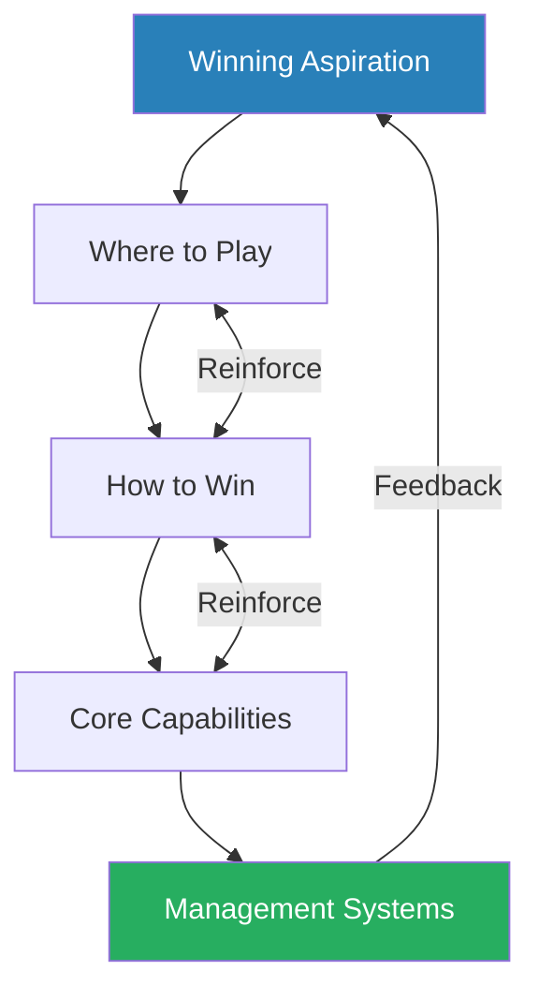
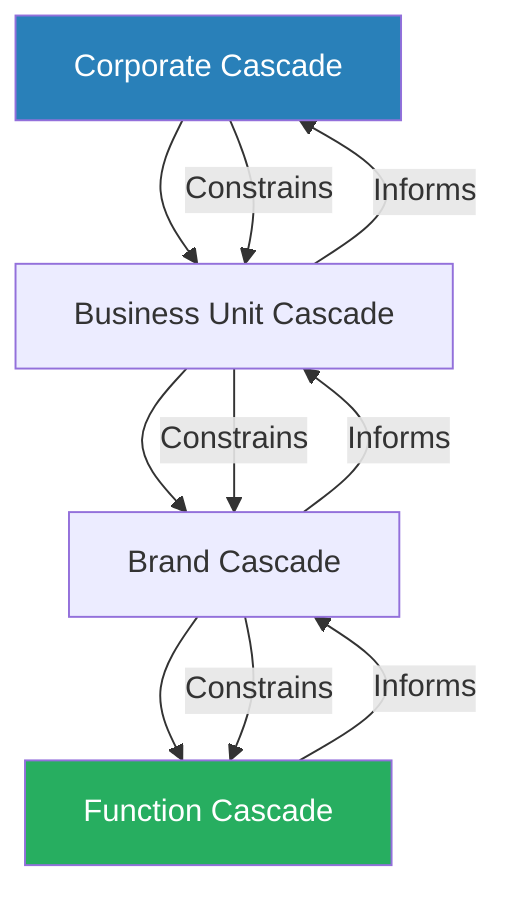
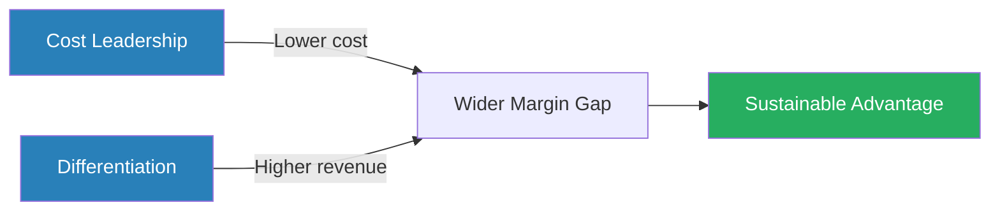
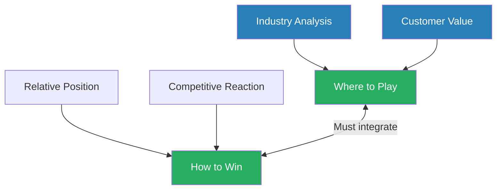
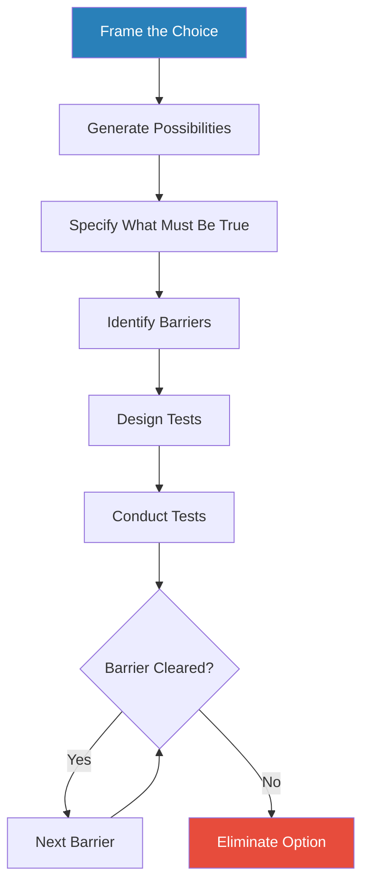
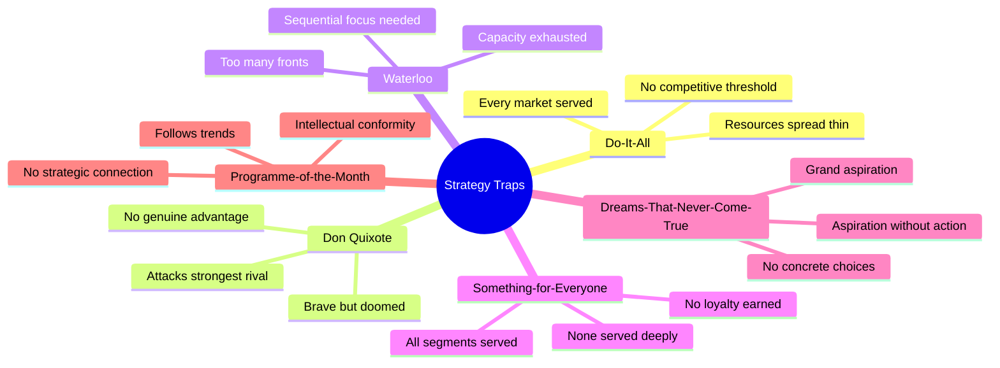
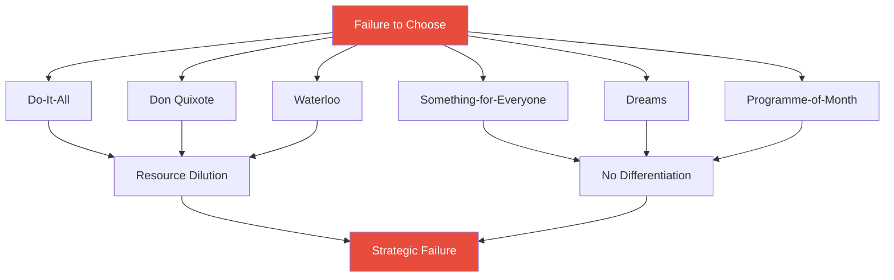
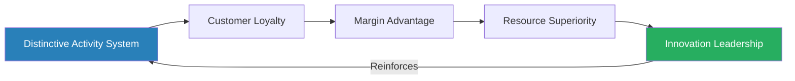

# Playing to Win: How Strategy Really Works — A.G. Lafley & Roger L. Martin

> Lafley and Martin reduce strategy to its skeleton: five interconnected choices that form an iterative cascade.
> Their thesis is that strategy is not a vision, not a plan, and not a set of goals — it is an integrated set of choices about where to compete and how to win.
> Built on a decade of Procter & Gamble transformation that doubled sales and quadrupled profits, the book demystifies strategic thinking from a rarefied executive activity into a repeatable process that works at every level of an organisation.
> The most powerful idea is the simplest: most organisations fail at strategy not because they lack intelligence but because they refuse to make choices, preferring to keep all options open until options are all they have left.
> The book's most immediately useful tool is the reverse-engineering question — "What would have to be true for this to be a great choice?" — which transforms advocacy battles into productive inquiry.
> It is one of the clearest strategy books written in the last two decades, though its evidence draws almost entirely from a single company and its framework assumes the reader holds decision-making authority.

---

## About the Authors

**A.G. Lafley** spent 33 years at Procter & Gamble, serving as Chairman and CEO from 2000 to 2009, and then returning for a second stint from 2013 to 2015. Under his first tenure, P&G's sales doubled from roughly $39 billion to $79 billion, profits quadrupled, and market capitalisation more than doubled — during a period when the S&P 500 declined. He was deeply influenced by Peter Drucker, particularly Drucker's emphasis on understanding the customer's reality, and by Michael Porter's competitive strategy work. Before becoming CEO, Lafley ran P&G's beauty business and its Asian operations, giving him both category-level and geographic strategic experience. He was known inside P&G for radically simplifying strategy conversations, stripping out corporate jargon, and insisting that strategy fit on a single page.

**Roger L. Martin** served as Dean of the Rotman School of Management at the University of Toronto for fifteen years. Before that, he worked as a strategy consultant at Monitor Company, the firm founded by Michael Porter. Martin developed the **strategy logic flow** and the **reverse-engineering methodology** that form the book's analytical backbone — tools he refined across hundreds of consulting engagements before bringing them into academia. Lafley hired Martin as his ongoing strategy partner for nearly a decade, a collaboration both men credit as transformative for P&G's strategic capability. Martin is also the author of *The Opposable Mind* and *Creating Great Choices*, which explore integrative thinking — the ability to hold two opposing ideas in tension and forge a creative resolution, a theme that runs beneath the surface of this book as well.

---

## The Big Idea

*Lafley and Martin strip strategy down to a single word — choice — and build an entire operating system around it.*

- Strategy is **choice** — not aspiration, not planning, not goal-setting
- The word "strategy" is among the most overused and least understood terms in business
- Most of what passes for strategy — mission statements, long-range plans, budget exercises, competitive analyses — <b style="color: #e74c3c">is not strategy at all</b>
- Strategy is an integrated set of choices that uniquely positions an organisation to create value and sustain competitive advantage
- The emphasis is on "integrated" and "choices" — each word carries load:
  - "Integrated" means the choices must fit together as a mutually reinforcing system — a brilliant where-to-play on the wrong how-to-win is worse than no strategy at all
  - "Choices" means deliberate exclusion — choosing what NOT to do is as important as choosing what to do

The authors call their framework the <b style="color: #2980b9">Strategic Choice Cascade</b>, and it consists of five questions that must be answered as a mutually reinforcing system:

- **First:** *What is our winning aspiration?* — the purpose and ambition, framed around what you do for customers, not around financial targets
- **Second:** *Where to play?* — the specific playing field across geography, product category, customer segment, distribution channel, and vertical stage of production
- **Third:** *How to win?* — the method of competitive advantage, which comes down to either cost leadership or differentiation (the authors insist there is no third way)
- **Fourth:** *What capabilities must be in place?* — the mutually reinforcing activity system that delivers the how-to-win choice
- **Fifth:** *What management systems are required?* — the structures, measures, processes, and review cadences that embed strategy into daily operations

The cascade is iterative, not linear — choices at each level constrain and reinforce choices at every other level, and the whole system must be revisited regularly as competitive conditions shift.

The expanded radar of the transformed Olay brand versus the pre-Lafley baseline shows that strategic transformation requires all five cascade choices to improve together — a strength in "how to win" without matching capabilities produces fantasy, not strategy.

The Sankey diagram traces how a winning aspiration flows through where-to-play choices (geography, category, segment, channel) into how-to-win decisions (differentiation vs. cost leadership) and finally into the specific capabilities that deliver competitive advantage.

---

- The cascade also nests: a company has a corporate-level cascade, each business unit has its own, each brand has its own, and even internal functions can have their own version
- Every layer must reinforce the layers above and below it
- This nesting principle means strategy is not just a CEO activity — <b style="color: #27ae60">every manager at every level is a strategist</b>, responsible for making choices within the context set by the level above

The book's most provocative claim is about what strategy is NOT:

- <b style="color: #e74c3c">It is not a vision statement tacked to a conference room wall</b>
- It is not a list of initiatives that happens to be called a "strategic plan"
- It is not a budget exercise dressed in strategic language
- It is emphatically not the comfortable decision to keep all options open
- The most common strategic failure is not making bad choices — <b style="color: #27ae60">it is refusing to make choices at all</b>
- An organisation that tries to serve every segment, compete in every geography, and be excellent at everything has no strategy — it has a wish list

Why the refusal to choose is so pervasive:

- Choosing means risk — every genuine choice has a meaningful chance of being wrong
- Keeping options open feels safer because no single decision can be blamed
- Organisations reward consensus, and consensus is the enemy of choice — a strategy that everyone agrees with usually means no one was forced to give anything up
- The result is a "strategy" that is really a list of everything the organisation already does, plus a few aspirational additions — comfortable, comprehensive, and strategically worthless

---

## Key Concepts at a Glance

| Concept | One-line summary |
|---------|-----------------|
| **The Strategic Choice Cascade** | Five interconnected questions forming an iterative system that applies at every organisational level |
| **Playing to win vs playing to play** | Modest aspirations are more dangerous than ambitious ones because they never trigger tough choices |
| **The two ways to win** | Cost leadership or differentiation — both produce a wider margin than competitors can sustain |
| **Activity systems** | Competitive advantage comes from a system of reinforcing capabilities, not isolated strengths |
| **Reverse engineering** | "What would have to be true?" transforms advocacy battles into collaborative inquiry |
| **Assertive inquiry** | Clearly stating your view AND genuinely exploring others' to enable honest strategic dialogue |
| **The Strategy Logic Flow** | Seven analytical questions across four dimensions that structure where-to-play and how-to-win analysis |
| **Six strategy traps** | Common failure patterns — Do-it-all, Don Quixote, Waterloo, Something-for-everyone, Dreams, Programme-of-the-month |
| **Six signs of winning** | Diagnostic indicators including distinctive activity systems, adoring customers, and thriving competitors |
| **Nesting cascades** | Every level of the organisation has its own cascade, constrained by and reinforcing the level above |

---

## Chapter 1: Strategy Is Choice

*The book opens with P&G in crisis and a CEO who responds not with a turnaround programme but with five questions — establishing the cascade that structures everything that follows.*

- Lafley describes arriving as CEO of P&G in June 2000 during what he calls a "crisis":
  - The company had just issued its third profit warning in a year
  - The stock had lost half its value — roughly $85 billion in market capitalisation wiped out
  - Morale was shattered, and many of P&G's best people were leaving
  - The board was restless, the media hostile, and Wall Street openly questioning whether P&G could recover
- His response was not to launch a cost-cutting exercise or a reorganisation — it was to ask five questions
- This was itself a strategic choice — Lafley bet that P&G's problems were not operational but strategic

The <b style="color: #2980b9">Strategic Choice Cascade</b> is introduced here as the book's central intellectual contribution:

- Every P&G business, from the $10 billion laundry division down to a single brand in a single country, was asked to answer the same five questions
- The genius of the cascade is not any individual question — none of them is original — but the insistence that the answers must fit together as an integrated, mutually reinforcing system:
  - A winning aspiration without a where-to-play choice is a dream
  - A where-to-play choice without a how-to-win is a gamble
  - A how-to-win without the right capabilities is a fantasy
  - Capabilities without management systems to sustain them are a temporary advantage waiting to erode

> [!tip] Core Insight
> Strategy is not any single choice — it is the integration of five choices into a mutually reinforcing system. The power lies in the connections, not the components.

---

> [!example] Oil of Olay's "Masstige" Transformation
> - Oil of Olay was a fading $6 mass-market brand when Lafley's team began rethinking its strategy
> - The traditional approach would have been to invest in advertising or acquire an existing prestige skin-care brand (costing billions)
> - Instead, the team asked the five cascade questions and arrived at a revolutionary answer:
>   - **Winning aspiration:** become the leader in facial skin care — not a participant, the leader
>   - **Where to play:** mass-market retail channels (not department stores), women aged 35+, at $18-25 (not the $6 current price, not the $50+ prestige price)
>   - **How to win:** "masstige" — prestige-quality product at a mass-market price, leveraging P&G's unmatched R&D and dominant retail relationships
>   - **Capabilities:** consumer research, R&D to match prestige efficacy, retail partnerships for prime shelf space
>   - **Management system:** review cadence tracking consumer satisfaction, retail sell-through, and competitive response in near real-time
> - A prestige-quality product in prestige channels at prestige prices would have failed — P&G had no department-store relationships
> - A mass-quality product at $18-25 would have failed — consumers would not pay a premium for a commodity
> - The integrated choice created a new market segment and turned Oil of Olay into a multi-billion dollar brand
> **The lesson:** Neither the where-to-play nor the how-to-win would have worked in isolation — the power was in their integration.

---

Lafley also introduces what he calls the <b style="color: #e74c3c">"comfortable trap"</b> of refusing to choose:

- Many P&G businesses, before the transformation, had strategies that were really just lists of goals — grow revenue, increase market share, expand internationally
- These had no prioritisation, no exclusion, and no integrated logic
- "Strategy is choice," Lafley writes. "Specifically, an integrated set of choices."
- The function of a strategic choice is to narrow the field — to say "we will do THIS and not THAT"
- Without this narrowing, resources spread thin, competitive positions blur, and the organisation drifts toward mediocrity

> [!example] P&G Before Lafley: The Comfort of No Choice
> - Before Lafley's arrival, P&G's corporate "strategy" was essentially a financial plan — targets for revenue growth, margin improvement, and market share in each category
> - Each business unit had its own growth targets, but few had made genuine choices about where to play or how to win
> - The laundry division, for instance, competed with fifteen detergent brands across every geography and price point
> - Nobody had asked: which of these brands can actually win? Which should we walk away from?
> - The result was internal competition, resource fragmentation, and strategic confusion
> - Each brand team was working hard, but their efforts were frequently cancelling each other out
> **The lesson:** Activity without choice is not strategy — it is motion disguised as progress.

---

The chapter also introduces the concept of <b style="color: #2980b9">nesting cascades</b>:

- P&G's corporate cascade defined the company-wide winning aspiration, where-to-play (which categories, which geographies), and how-to-win (differentiation through consumer understanding and innovation)
- Each business unit (beauty, home care, baby care) had its own cascade nested within the corporate one
- Each brand within a business unit had its own cascade nested within the business-unit cascade
- Even individual functions — R&D, marketing, supply chain — developed their own cascades

The nesting structure ensures strategic coherence across the entire organisation — no brand-level choice can contradict the business-unit strategy, and no business-unit strategy can contradict the corporate strategy.

---

## Chapter 2: What Is Winning

*Most organisations set their aspirations too low, not too high — and the modesty of their ambitions is precisely what dooms them to mediocrity.*

- This chapter tackles the first question in the cascade — the <b style="color: #2980b9">winning aspiration</b>
- The critical distinction Lafley and Martin draw is between <b style="color: #27ae60">playing to win</b> and <b style="color: #e74c3c">playing to play</b>:
  - **Playing to win** means aspiring to lead your chosen space — to be the best, not merely present
  - **Playing to play** means aspiring merely to participate — to be in the game without committing to dominate it
- Playing to play is the more dangerous posture because it never triggers the hard choices and significant investments that winning requires
- A playing-to-play mindset produces strategies designed to avoid failure rather than to achieve victory — and strategies designed to avoid failure almost always produce mediocrity

Why playing to play is so seductive:

- It feels prudent — "let's be realistic about what we can achieve"
- It avoids the discomfort of committing to a bold goal that might not be reached
- It protects egos — if you never aspire to win, you can never be accused of losing
- <b style="color: #e74c3c">But modest aspirations generate modest investments, which generate modest results, which confirm the original modest aspiration</b> — a self-fulfilling prophecy of mediocrity

> [!example]- Saturn: $20 Billion Spent Playing to Play (1985-2010)
> - General Motors invested over $20 billion across twenty years to create Saturn as its answer to Japanese small cars
> - But GM never truly aspired to win in small cars — it aspired to participate, to have an entry in the segment
> - The investment was spread across too many compromises: Saturn had its own factory and distribution network but was never given the freedom to truly differentiate
> - Saturn's early reviews were enthusiastic, and the brand developed a loyal cult following
> - But GM gradually pulled Saturn back into the corporate fold, sharing platforms and parts with other GM brands
> - The distinctiveness that had attracted customers eroded year by year
> - Meanwhile, Toyota, Honda, and Nissan were playing to win — investing in manufacturing excellence, product quality, and customer loyalty with the explicit intention of dominating the segment
> - Saturn died in 2010, and GM's two decades of investment yielded nothing
> - The lesson was not that GM lacked resources — it had more resources than any competitor
> **The lesson:** A participation aspiration never generates the focus and commitment that winning demands.

"A too-modest aspiration is far more dangerous than a too-lofty one."

---

> [!example] P&G's Global Business Services Under Filippo Passerini
> - GBS was P&G's internal shared-services function — IT, facilities, employee services
> - It would have been natural for GBS to aspire merely to competent service delivery
> - Instead, under Passerini, GBS adopted a playing-to-win aspiration: deliver world-class services at lower cost than any external provider, while simultaneously driving innovation
> - Passerini's team created an outsourcing model that partnered with best-of-breed providers
> - Services were so good that business units chose to buy from GBS rather than going to market
> - GBS promised "17 cents on the dollar" savings for every new service
> - GBS went from a cost centre to a strategic innovation engine
> **The lesson:** Even an internal function can define winning — and the audacity to do so transforms performance.

---

The chapter also insists that winning aspirations must be framed around the <b style="color: #27ae60">customer</b>, not around financial metrics:

- "Maximise shareholder value" is not a winning aspiration — it is a financial outcome that results from having one
- A financial aspiration tells you nothing about WHERE to compete or HOW to win — it only tells you what you hope the scoreboard says at the end
- P&G's home-care winning aspiration was not "grow revenue by 8%" but "reinvent cleaning experiences, taking the hard work out of household chores"
- That aspiration led to:
  - **Swiffer** — replacing the mop and bucket with a disposable cleaning pad
  - **Mr. Clean Magic Eraser** — a cleaning tool that required no chemical cleaner at all
  - **Febreze** — eliminating odours rather than masking them
- None of these products would have emerged from a financial aspiration — they emerged because someone asked: what does the consumer actually need?
- <b style="color: #27ae60">The consumer-centric aspiration opened entirely new competitive spaces</b> that a financial aspiration would never have revealed

> [!example] Beauty Care's Consumer-Centric Aspiration
> - Lafley's team defined winning not as "selling more shampoo" but as "helping women feel beautiful"
> - This consumer-centric aspiration opened the door to categories P&G had never competed in:
>   - Professional hair colour (through the Clairol acquisition)
>   - Luxury fragrances
>   - Prestige skin care
> - If the aspiration had been product-centred ("be the best shampoo company"), none of those expansions would have seemed logical
> - The aspiration did not dictate a specific where-to-play — it opened a wide space of possibilities and then required a disciplined choice among them
> **The lesson:** How you frame the aspiration determines which strategic moves become visible.

---

The chapter also addresses who defines winning:

- Winning must be defined against the best competitor in your space, not against traditional rivals
- P&G's home-care team initially benchmarked against Unilever and Colgate-Palmolive — the usual suspects
- When pushed to identify who was actually performing best, they discovered <b style="color: #2980b9">Reckitt Benckiser</b> — a smaller, more focused company outperforming even P&G's strong results
- Benchmarking against the best competitor, regardless of size or familiarity, revealed the true competitive frontier and forced a much more aggressive strategic response
- <b style="color: #e74c3c">Benchmarking against comfortable rivals produces comfortable strategies</b>

---

## Chapter 3: Where to Play

*Strategy without explicit exclusion is not strategy — choosing where NOT to play frees capital, talent, and attention for the fields where you can actually win.*

- The where-to-play question is about defining the playing field — and, crucially, about defining where you will NOT play
- Lafley and Martin identify <b style="color: #2980b9">five dimensions</b> of the where-to-play choice:

| Dimension | What it covers | Example |
|-----------|---------------|---------|
| **Geography** | Which countries, regions, or markets to compete in | P&G focused on ten priority countries that represented disproportionate growth potential |
| **Product/service** | Which offerings to include or exclude | Selling off food brands to concentrate on home and personal care |
| **Customer segment** | Which consumers to target and which to walk away from | Olay targeting women 35+ rather than "all women" |
| **Distribution channel** | Which routes to market (retail, online, direct, wholesale) | Olay choosing mass retail over department stores |
| **Vertical stage** | Which parts of the value chain to own versus outsource | Outsourcing manufacturing of non-core products |

- An organisation that tries to play everywhere plays nowhere well
- <b style="color: #27ae60">The most powerful where-to-play moves are acts of subtraction, not addition</b>

> [!tip] Core Insight
> The most powerful where-to-play moves in this book are acts of subtraction, not addition — cutting fields, brands, and geographies to concentrate resources on winnable positions.

---

The mechanism behind why subtraction works:

- Resources — capital, talent, management attention — are always finite
- When resources are spread across many playing fields, each field receives an investment below the threshold needed for competitive advantage
- Concentrating resources on fewer fields pushes investment above that threshold
- <b style="color: #e74c3c">The danger of addition is invisible</b> — each new playing field seems individually attractive, but the cumulative effect is resource dilution across the entire portfolio
- Lafley calls this the "tyranny of OR" turned on its head — most leaders see where-to-play as an additive question ("which fields should we add?") when it is fundamentally a subtractive one ("which fields should we leave?")

> [!example] Bounty Paper Towels: Subtraction as Strategy (Late 1990s)
> - Bounty was struggling — the brand had expanded internationally and diversified into adjacent products (food containers, paper cups, other paper goods)
> - Resources were spread across too many geographies and too many product lines
> - The turnaround came not from expanding but from contracting:
>   - P&G sold off Bounty's international assets
>   - Redirected R&D away from tangential products back to the core: paper towels in the United States
> - Deep consumer research revealed three distinct segments of paper-towel users with different needs
> - Bounty refocused its product development and marketing around those segments
> - The result was a revitalised brand with sharper positioning and stronger market share — achieved by doing less, not more
> **The lesson:** Subtraction concentrates resources; concentration creates competitive advantage.

> [!example] P&G Laundry: From Fifteen Brands to Five
> - P&G had accumulated fifteen detergent brands over the decades, each with its own team, budget, and strategy
> - The result was internal competition, resource fragmentation, and consumer confusion
> - The strategic choice was to go from fifteen brands to five — concentrating all resources on the brands that could win
> - The remaining brands received enough investment to dominate their segments
> - The eliminated brands freed up capital and talent for the winners
> - P&G also redefined each remaining brand's target consumer with unusual precision, reducing overlap and giving each brand a clear competitive space
> **The lesson:** More brands means less investment per brand — fewer brands means enough investment to win.

---

> [!example] P&G Fine Fragrances: Attacking Along the Line of Least Resistance
> - When P&G entered the fragrance business, the established players — LVMH, Estee Lauder, Chanel — were dominant in high-end women's fragrances
> - A head-on assault would have triggered massive competitive retaliation
> - Instead, P&G's fragrance team chose to enter through segments the luxury houses cared less about defending:
>   - Men's fragrances (Hugo Boss)
>   - Sporty, lifestyle fragrances (Lacoste)
> - This gave P&G time to build fragrance capabilities, distribution relationships, and consumer understanding without facing the full competitive response
> - Once the beachhead was established, P&G could expand into more competitive segments from a position of strength
> - The strategy echoed military doctrine: never attack the enemy where they are strongest; find the undefended flank
> **The lesson:** Enter markets where incumbents won't fight hardest — build strength before confronting them directly.

---

> [!example] Citrus Hill: Choosing the Wrong Field
> - P&G entered the orange juice market with Citrus Hill, believing its consumer-marketing capabilities would translate
> - But the market was dominated by Coca-Cola (Minute Maid) and PepsiCo (Tropicana), both with entrenched distribution and supply-chain advantages
> - P&G's marketing capabilities could not overcome these structural disadvantages
> - The where-to-play choice was fatally disconnected from P&G's how-to-win capability
> - Citrus Hill was eventually killed, having never returned its cost of capital
> - Lafley uses this example repeatedly throughout the book as the canonical illustration of what happens when where-to-play and how-to-win are considered in isolation
> **The lesson:** A brilliant playing field on which you cannot win is worthless — where-to-play and how-to-win must be considered together.

The broader lesson is that <b style="color: #27ae60">where-to-play and how-to-win must be considered together</b>:

- The playing field determines what capabilities are needed
- The available capabilities determine which fields are winnable
- A powerful competitive advantage on the wrong field is as useless as a brilliant field on which you cannot win
- The cascade is not a sequence where you first choose where to play and then choose how to win — the two choices must be made simultaneously, each informing and constraining the other

The chapter also addresses the temptation to play in "attractive" industries:

- Many strategists default to choosing attractive playing fields — high-growth markets, large profit pools, fashionable industries
- But an attractive industry filled with strong competitors may offer no path to winning
- <b style="color: #e74c3c">An unattractive industry where you have a genuine competitive advantage is strategically superior to an attractive industry where you have none</b>
- The right question is not "is this industry attractive?" but "can we WIN in this industry given our specific capabilities and competitive position?"

---

## Chapter 4: How to Win

*There are exactly two ways to achieve sustainable competitive advantage — and the authors insist there is no third way, though the best strategies find creative ways to blend elements of both.*

- This is where Lafley and Martin present their adaptation of Michael Porter's competitive strategy framework, reduced to its starkest form

<b style="color: #2980b9">Cost leadership</b>:

- Delivering a comparable offering at a structurally lower cost than all competitors
- The margin advantage comes from the cost side
- The key word is "structurally" — this is not about cutting costs through efficiency drives or layoffs
- It means building a cost position that competitors cannot match because of differences in scale, process, or business model
- Examples of structural cost advantages:
  - Walmart's distribution system — hub-and-spoke warehouse network built over decades, impossible to replicate quickly
  - Southwest Airlines' single-aircraft-type fleet — simpler maintenance, training, and parts inventory
  - Amazon's fulfilment infrastructure — scale advantages that grew more powerful over time

<b style="color: #2980b9">Differentiation</b>:

- Delivering an offering perceived as distinctively more valuable by customers, commanding a price premium they willingly pay
- The margin advantage comes from the revenue side
- The key word is "perceived" — the offering must be SEEN as more valuable, not just BE more valuable in some objective sense
- Differentiation requires understanding what customers value and delivering it better than anyone else
- Examples of differentiation advantages:
  - Apple — design, ecosystem integration, brand prestige
  - Starbucks — the "third place" experience beyond home and work
  - P&G's Tide — superior cleaning performance validated by decades of consumer testing

---

Both strategies produce the same fundamental outcome: a wider gap between revenue and cost than competitors can sustain.

- <b style="color: #e74c3c">There is no third way</b>, the authors insist — though the best strategies often incorporate elements of both
- Toyota, for instance, is primarily a differentiator (quality, reliability, resale value) but also achieves extraordinary cost discipline through its manufacturing system
- The distinction is about primary orientation, not absolute purity
- The danger is what Porter calls being <b style="color: #e74c3c">"stuck in the middle"</b> — neither the cheapest nor the most differentiated
- Stuck-in-the-middle companies have no compelling reason for any customer to choose them over alternatives

> [!tip] Core Insight
> Cost leadership and differentiation both produce the same result — a wider margin than competitors can match. The question is which side of the equation you attack.

---

> [!example]- Olay "Masstige" Strategy in Full Depth
> - The Olay team conducted extensive consumer research and identified a large segment:
>   - Women aged 35 and older
>   - Wanted prestige-quality skin care
>   - Found department-store brands too expensive and mass-market brands too ineffective
> - This was the "white space" — a gap no competitor was serving
> - The strategy required every element to reinforce every other:
>   - **Product:** prestige-level efficacy, requiring P&G's world-class R&D
>   - **Pricing:** $18-25 sweet spot — above mass market, below prestige
>   - **Distribution:** mass retail channels (drugstores, supermarkets, big-box retailers) where P&G had dominant relationships
>   - **Marketing:** designed as a reinforcing system with product, price, and channel
> - The masstige strategy turned Oil of Olay from a declining brand into a multi-billion-dollar franchise
> - It created an entirely new market segment that competitors struggled to follow
> - Department-store brands could not compete on price; mass-market brands could not compete on efficacy
> - P&G's integrated capability system made the masstige position structurally defensible
> **The lesson:** The most powerful how-to-win choices create new market segments rather than fighting over existing ones.

> [!example] Glad/Clorox Joint Venture: Creative Structural Solutions
> - P&G was struggling in the plastic-wrap and trash-bag category, competing against Hefty and store brands with no clear advantage
> - Rather than investing billions to build advantage in an inherently low-margin category, P&G chose to partner with Clorox
> - Clorox had complementary strengths: strong brand equity in household cleaning and an existing channel relationship
> - The joint venture combined:
>   - P&G's polymer technology and innovation capability
>   - Clorox's brand strength and distribution
> - The partnership produced Glad ForceFlex and Glad Press'n Seal, both category leaders
> - Neither company could have achieved the same result alone — the how-to-win choice was the partnership itself
> **The lesson:** A how-to-win choice can involve creative structural solutions — partnerships, joint ventures — not just internal capability building.

---

The chapter also discusses the microeconomic foundations in an appendix worth understanding:

- In a commodity market where all offerings are identical, the only way to earn above-average returns is to have a lower cost structure than competitors
- In a differentiated market where customers perceive meaningful differences, the player with the most valued differentiation commands a price premium
- A <b style="color: #e74c3c">"stuck in the middle" position</b> — neither the cheapest nor the most differentiated — is structurally unprofitable
- The microeconomics are simple but powerful:
  - If you are the cost leader, you can match any competitor's price and still earn a higher margin
  - If you are the differentiator, you earn a price premium that more than covers any additional cost
  - If you are neither, your margin is squeezed from both sides

| Position | Revenue | Cost | Margin | Sustainability |
|----------|---------|------|--------|----------------|
| **Cost leader** | Market price | Below competitors | Structurally wider | High — requires matching the entire cost system |
| **Differentiator** | Above market price | At or above market | Structurally wider | High — requires matching the entire value proposition |
| **Stuck in the middle** | Market price | At market cost | Average or below | Low — no structural protection |

This table is the economic engine beneath every strategic choice in the book.

---

## Chapter 5: Play to Your Strengths — Capabilities and Activity Systems

*Sustainable advantage comes not from individual capabilities but from a system of mutually reinforcing capabilities — copy one piece and you gain little; the power lies in how they interact.*

- The central argument is that sustainable advantage comes from a <b style="color: #2980b9">system of mutually reinforcing capabilities</b> — an idea adapted from Michael Porter's activity-system concept
- An individual capability can be copied:
  - If your advantage is great R&D, a competitor can hire scientists
  - If your advantage is efficient manufacturing, a competitor can buy machines
  - If your advantage is strong branding, a competitor can hire an agency
- But a bundle of capabilities that reinforce each other creates compounding returns that are <b style="color: #27ae60">exponentially harder to replicate</b>
- A competitor would need to copy not just one capability but the entire system simultaneously — and the connections between capabilities are often invisible from the outside

The mathematics of capability systems:

- An individual capability provides a linear advantage — you are somewhat better at one thing
- Two reinforcing capabilities provide a compounding advantage — each makes the other more effective
- Five reinforcing capabilities create an advantage that is practically impossible to replicate
- <b style="color: #27ae60">The connections between capabilities are more valuable than the capabilities themselves</b>
- This is why "best practices" benchmarking often fails — you can copy a practice but not the system that makes it work

---

P&G's **five core capabilities** formed such a system:

| Capability | What it delivered | How it reinforced the system |
|-----------|------------------|------------------------------|
| **Deep consumer understanding** | Living It and Working It programmes sent researchers to live with consumers | Fed innovation by revealing unmet needs |
| **Brand building** | Proprietary approaches to positioning, communication, and category management | Created consumer pull that gave retailers incentive to partner |
| **Innovation** | Product, business-model, and partnership innovation (Connect + Develop) | Provided genuinely differentiated products for brand building |
| **Go-to-market** | Deepest retail relationships in consumer goods (pioneered category management with Walmart) | Generated revenue that funded global scale |
| **Global scale** | Operations in 180+ countries | Scale advantages in procurement, manufacturing, and knowledge transfer |

The system was circular and self-reinforcing — each capability made the others stronger.

---

> [!example] P&G's "Living It" and "Working It" Programmes
> - P&G's consumer-understanding capability went far beyond focus groups and surveys
> - In the "Living It" programme, researchers spent days living with consumers in their homes — shopping with them, cleaning with them, cooking with them
> - In the "Working It" programme, researchers worked alongside retail employees in stores
> - These immersive experiences revealed insights that traditional research methods missed:
>   - Consumers did not want a better mop — they wanted to stop mopping entirely (insight that led to Swiffer)
>   - Consumers associated cleaning with effort, and anything that reduced effort felt "premium"
> - This deep understanding fed directly into innovation and brand building
> **The lesson:** Capability advantage is built through proprietary methods, not generic tools — no competitor could replicate P&G's consumer insights by simply running more focus groups.

> [!example]- Gillette Acquisition: Capability Systems in Action (2005)
> - When P&G acquired Gillette for $57 billion, the strategic logic was not just about adding a strong brand — it was about how Gillette's capabilities would reinforce P&G's existing system
> - Gillette brought three capabilities P&G needed:
>   - Superior blade and razor technology (innovation in a category P&G did not serve)
>   - Strong male-grooming brand equity (extending P&G's consumer base)
>   - A different geographic strength profile (stronger in India and Latin America where P&G was weaker)
> - Crucially, Gillette's capabilities did not compete with P&G's existing system — they reinforced it:
>   - P&G's consumer understanding could improve Gillette's innovation targeting
>   - P&G's retail relationships could expand Gillette's distribution
>   - P&G's global scale could reduce Gillette's manufacturing costs
>   - Gillette's geographic strength could open new markets for P&G's existing brands
> - The acquisition worked because the capability fit was genuine, not cosmetic
> - Within three years, the combined system was generating synergies far beyond the original acquisition projections
> **The lesson:** Acquisitions succeed when the acquired company's capabilities reinforce the acquirer's existing system — not when they merely add revenue.

---

> [!example] P&G's 1980s Acquisition Spree: Growth Without Strategy
> - P&G bought Orange Crush, Bain de Soleil, and a string of other brands with no connection to P&G's existing capabilities
> - The result was a "mishmash of acquisitions that never returned the cost of capital"
> - The company was buying growth rather than choosing growth — using acquisitions to avoid the hard strategic work of building advantage
> - These brands could not benefit from P&G's core capabilities because they operated in categories where those capabilities were irrelevant
> - Orange Crush, for example, competed in beverages where P&G had no consumer understanding, no brand-building expertise, and no go-to-market advantage
> **The lesson:** Acquisition is a poor substitute for strategic discipline. An organisation that cannot think strategically in one context will not suddenly develop that capability in a new one.

> [!tip] Core Insight
> The test for a genuine capability system: if removing one capability would weaken the others (not just itself), the system is real. If capabilities can be removed without affecting the rest, you have a list of strengths, not a system.

---

The chapter also introduces the concept of <b style="color: #2980b9">Connect + Develop</b> — P&G's open-innovation model:

- Traditionally, P&G developed everything internally — the "not invented here" culture
- Lafley recognised that in a world with millions of scientists and engineers outside P&G's walls, internal-only innovation was a losing proposition
- Connect + Develop aimed to source 50% of innovations from outside the company
- This was itself a capability choice — P&G's capability system expanded to include the ability to identify, evaluate, and integrate external innovations
- The model required new management systems: screening processes, partnership agreements, intellectual property frameworks
- <b style="color: #27ae60">Connect + Develop did not replace internal R&D — it amplified it</b>, giving P&G access to a global innovation network while maintaining internal capabilities for integration and development

---

## Chapter 6: Manage What Matters — Management Systems

*The fifth box in the cascade is the most neglected and, paradoxically, the most decisive — a brilliant strategy without management systems to embed it is a wish list.*

- This is the chapter most people skip and the one Lafley argues is most important
- A brilliant strategy without management systems to embed it is just a wish list
- Management systems are the mechanisms through which strategic choices become embedded in daily operations
- Without them, strategy lives in a PowerPoint deck that everyone forgets the moment they return to their desks

> [!example]- P&G's Strategy Review Transformation Under Lafley
> - When Lafley became CEO, strategy reviews were what he calls "corporate theatre":
>   - Twenty-five people would gather in a conference room
>   - A business president would present a PowerPoint deck rehearsed for weeks
>   - The CEO and senior staff would ask questions
>   - The business president would defend the deck
>   - Everyone would congratulate each other and move on
> - The problem: these reviews produced performances, not decisions
>   - The presenting team optimised for a smooth presentation, not honest disclosure
>   - Difficult issues were hidden or glossed over
>   - No one could challenge the strategy because the room was too large, the stakes too high, and the culture too adversarial
> - Lafley redesigned the process completely:
>   - Reviews reduced to four or five people — the CEO, the business leader, and two or three key advisers
>   - No PowerPoint decks
>   - Strategic questions agreed in advance, with three to four hours spent in genuine dialogue
>   - The business leader was not selling a strategy — they were working through a strategic problem with the CEO
> - The old system incentivised defence; the new system incentivised discovery
> - Quality of strategic choices improved markedly because leaders could be honest about uncertainties
> **The lesson:** The format of strategy conversations determines whether they produce performances or decisions.

---

The chapter introduces the <b style="color: #2980b9">OGSM framework</b> — Objectives, Goals, Strategies, Measures — as P&G's standard for translating strategy into operational plans:

> [!abstract] OGSM Framework
> 1. **Objectives** — what you will do (derived from the winning aspiration)
> 2. **Goals** — how you will measure success (specific metrics)
> 3. **Strategies** — how you will achieve the goals (derived from where-to-play and how-to-win)
> 4. **Measures** — how you will track progress

- OGSM forces alignment between the strategic cascade and the daily actions of every team and individual
- <b style="color: #27ae60">Every person in the organisation should be able to trace their daily work back to a strategic choice</b>
- When someone cannot make that connection, either the management system is broken or their work is not strategically relevant
- The power of OGSM is its simplicity — it fits on a single page, which prevents the sprawl that infects most planning documents

---

The chapter identifies four essential functions that management systems must perform:

| Function | What it does | Without it |
|----------|-------------|-----------|
| **Regular cadence** | Test strategy against reality on a predictable schedule | Strategies drift without anyone noticing until a crisis forces attention |
| **Aligned measures** | Ensure everyone optimises for the same strategic outcome | People optimise for the wrong things — local metrics that undermine the whole |
| **Communication norms** | Surface problems early through assertive inquiry | Problems go unaddressed until they become crises |
| **Talent development** | Build the strategists needed to sustain advantage over time | The organisation runs out of people capable of making the next generation of strategic choices |

---

Even Lafley acknowledges that transforming management systems is extremely difficult:

- An anonymous P&G division president admits that the old sell-and-defend culture "got in the way" even after Lafley tried to create openness
- People who were being evaluated by the person across the table were naturally reluctant to expose problems
- <b style="color: #e74c3c">The management system had to fight against deeply ingrained organisational behaviour — and the fight was never fully won</b>
- Lafley estimates it took five to seven years for the new strategy-review culture to take hold — and even then, it was unevenly adopted across the organisation
- The lesson: management systems are not installed like software — they are cultivated like culture, and culture changes slowly

> [!example] P&G's Talent Development as a Management System
> - Lafley treated talent development as a strategic management system, not an HR function
> - High-potential leaders were deliberately rotated through assignments that required strategic thinking — leading a brand, running a country operation, managing a category
> - The rotation was designed to build strategic capability, not just functional expertise
> - Each rotation presented a new strategic cascade to build, a new where-to-play and how-to-win to define
> - Over time, this produced a leadership bench with deep strategic muscle — people who had made real strategic choices, not just managed existing operations
> **The lesson:** Strategic capability is built through practice — the management system must create opportunities for leaders to practice making and living with strategic choices.

> [!tip] Core Insight
> Management systems are not administrative overhead — they are the mechanism through which strategy survives contact with daily operations. Without them, even brilliant strategies erode into wish lists.

---

## Chapter 7: Think Through Strategy — The Strategy Logic Flow

*While the cascade tells you what questions to ask, the Strategy Logic Flow tells you how to generate and evaluate the answers — and how to stop analysing before analysis becomes a substitute for choosing.*

- Martin presents the <b style="color: #2980b9">Strategy Logic Flow</b> — seven analytical questions organised across four dimensions:

| Dimension | Core question | What it reveals |
|-----------|--------------|-----------------|
| **Industry analysis** | What is the structure and attractiveness of the industry? Where are the profit pools? | Whether the playing field offers enough margin to sustain advantage |
| **Customer value analysis** | What do channel customers and end consumers value? What are unmet needs? | Where differentiation opportunities exist and what form they should take |
| **Relative position analysis** | How does the company fare against competitors on dimensions that matter? | Current competitive standing and gaps to close |
| **Competitive reaction analysis** | What will competitors do in response to your strategic choices? | Whether the chosen position is defensible against predictable competitor responses |

---

- The key insight is that <b style="color: #e74c3c">most organisations over-analyse</b>:
  - They conduct comprehensive SWOT analyses
  - They generate mountains of data
  - They commission expensive consulting studies
  - They still fail to make a clear strategic choice
- The Strategy Logic Flow prevents this by focusing analysis on the specific questions that drive the where-to-play and how-to-win decision
- <b style="color: #27ae60">Analysis that does not change the answer to one of the four questions is wasted effort</b>

The four analytical dimensions feed into the two central strategic choices — where to play and how to win.

---

Martin distinguishes between <b style="color: #2980b9">lazy analysis</b> (his term of approval) and exhaustive analysis:

- Lazy analysis starts with a strategic question and asks: what is the minimum information I need to answer this question with confidence?
- Exhaustive analysis starts with a data-collection plan and asks: what do we know? What else can we find out?
- Lazy analysis takes weeks; exhaustive analysis takes months
- <b style="color: #27ae60">Lazy analysis produces decisions; exhaustive analysis produces reports</b>
- The Strategy Logic Flow is designed to enable lazy analysis by specifying exactly which questions need answers

> [!example] P&G R&D Portfolio Reviews: Analysis as Strategic Weapon
> - Instead of reviewing every project against a generic scorecard, Martin pushed the teams to ask: which of these projects, if successful, would materially change our where-to-play or how-to-win position?
> - Projects that would not change the strategic position — even if they were technically interesting — were deprioritised
> - Projects that could shift the competitive landscape received disproportionate investment
> - This single question — "does this change our strategic position?" — eliminated hundreds of hours of analysis on projects that were interesting but strategically irrelevant
> - R&D was transformed from a capability looking for applications into a strategic weapon aimed at specific competitive outcomes
> **The lesson:** The purpose of analysis is to sharpen choices, not to postpone them.

> [!example] The Customer Value Map
> - Martin introduced a tool called the "customer value map" at P&G — a visual representation of what customers valued most and how each competitor delivered against those dimensions
> - The map revealed clusters of unserved or underserved value — white spaces where no competitor was strong
> - These white spaces became the primary targets for where-to-play choices
> - The Olay masstige positioning emerged directly from a customer value map that showed a gap between mass-market efficacy and prestige pricing
> - The map also revealed where competitors were overserving customers — delivering more value than customers cared about, at costs those customers would not pay for
> **The lesson:** Customer value analysis reveals both opportunities (underserved needs) and traps (overserved segments where additional investment produces no additional willingness to pay).

> [!tip] Core Insight
> The Strategy Logic Flow does not ask "what is true?" — it asks "what do we need to know to make this specific choice?" Analysis without a decision target is intellectual entertainment, not strategy work.

---

## Chapter 8: Shorten Your Odds — Reverse Engineering Strategic Choices

*This is the book's most immediately actionable chapter — a seven-step process that transforms contentious strategy debates into structured, testable inquiry.*

- The core idea is deceptively simple: instead of arguing about which strategic option is best, ask <b style="color: #27ae60">"What would have to be true for this option to be a great choice?"</b>
- This single question transforms strategy conversations from unproductive advocacy ("I'm right, you're wrong") into productive inquiry ("under what conditions would each option succeed?")
- The shift is psychological as much as analytical:
  - When you argue for your option, every counterargument feels like an attack on your judgment
  - When you explore what would have to be true, you are working on a shared puzzle — no ego is at stake
  - <b style="color: #27ae60">The question removes the person from the position</b>

> [!abstract] Martin's Seven-Step Reverse-Engineering Process
> 1. **Frame the choice** as mutually exclusive options — until alternatives are articulated, teams talk endlessly without making progress
> 2. **Generate diverse strategic possibilities** — not just two options but several; the more creative the range, the more likely the final choice captures real insight
> 3. **For each possibility, specify what would have to be true** for it to be a great choice — this shifts from "is this true?" to "what would NEED to be true?"
> 4. **Identify which conditions are least likely to hold** — these are the real barriers, both critical to success and uncertain in their truth
> 5. **Design tests for those barriers — and let the biggest sceptic design the test** — the person most resistant to an option controls the standard of proof
> 6. **Conduct tests, starting with the biggest barrier first** — if the biggest barrier fails, the option is eliminated (the "lazy person's approach")
> 7. **Choose** based on test results

---

The process works because it transforms who argues for what — sceptics design the tests, so when an option passes, even its opponents are committed to the outcome.

---

> [!example] The Mining Company Deadlock
> - A mining company's leadership team was deadlocked between two options for an underperforming mine: shut it down or invest heavily in modernisation
> - Both sides had been arguing for months, each presenting data supporting their position and dismissing contradictory data
> - Martin intervened by asking each side to specify what would have to be true for the OTHER side's option to be a great choice:
>   - The shutdown advocates had to articulate conditions under which investment would work
>   - The investment advocates had to articulate conditions under which shutdown would be best
> - This simple reframing unlocked the conversation within hours
> - Both sides could engage with the other option's conditions without feeling they were conceding their position
> - The team identified two critical barriers, designed tests for each, and reached a decision that both sides committed to
> - Crucially, the commitment was genuine — because the sceptics had designed the tests, they could not dismiss the results
> **The lesson:** Asking "what would have to be true?" removes ego from the equation — people engage with conditions rather than defending positions.

> [!example] Olay Masstige: Reverse Engineering in Practice
> - The team identified three critical barriers for the masstige strategy to succeed:
>   - P&G's R&D could actually produce a product matching prestige efficacy at a mass price point
>   - Mass-market retailers would give the product premium shelf positioning
>   - Consumers aged 35+ would actually pay $18-25 for skin care in a drugstore
> - Each condition was tested with increasing rigour:
>   - R&D test: blind product comparisons against prestige competitors — the product had to match or exceed Lancome and Clinique on independent testing
>   - Retail test: conversations with key retail partners about premium shelf space and merchandising
>   - Consumer test: concept testing and in-market pilots in three representative markets
> - All three barriers were cleared, and the team moved forward with confidence
> - The reverse-engineering process gave the Olay team something advocacy-based strategy conversations never provide: confidence backed by evidence
> **The lesson:** Reverse engineering converts strategic hunches into testable hypotheses — confidence comes from evidence, not assertion.

---

> [!example] Lafley's Use of Reverse Engineering for the Gillette Acquisition
> - Before committing $57 billion to acquire Gillette, Lafley applied the reverse-engineering methodology
> - The team specified what would have to be true for the acquisition to be a great choice:
>   - Gillette's capabilities must genuinely reinforce P&G's existing system (not merely add revenue)
>   - P&G must be able to integrate Gillette without destroying the cultural elements that made Gillette strong
>   - The combined company must achieve specific synergies within three years
>   - Regulatory approval must be obtainable without divesting critical brands
> - Each barrier was tested, and the Gillette deal proceeded only after the most critical barriers were cleared
> - The process gave the board confidence that the acquisition logic was sound, not merely hopeful
> **The lesson:** Reverse engineering works for any high-stakes decision — not just strategy choices but acquisitions, partnerships, and major investments.

---

The <b style="color: #2980b9">"mutually assured destruction" dynamic</b> that makes the sceptic-designs-the-test principle work:

- If you set an unfair standard for my option, I will do the same for yours
- In practice, this mutual accountability pushes all participants toward fair, rigorous testing
- <b style="color: #e74c3c">No one wants to be the person who killed their own option by setting a precedent of unfair tests</b>
- The result is a testing process that all parties trust — which is the precondition for genuine commitment to the outcome
- Martin observes that this dynamic works even in highly political environments, because the incentive structure is self-enforcing

Why the "lazy person's approach" matters:

- Testing the biggest barrier first means you can eliminate an option with the minimum possible analysis
- If the biggest barrier fails, you stop — no need to test the remaining conditions
- This prevents the common trap of spending months on comprehensive analysis before making a decision
- <b style="color: #27ae60">Start with the condition most likely to be false — if it holds, then test the next most uncertain condition</b>
- Most options are eliminated by the first or second barrier, making the process extremely efficient

---

## Assertive Inquiry

*Neither pure advocacy nor pure surrender, assertive inquiry is the communication discipline that ensures the best available information enters the conversation instead of being suppressed by hierarchy or politics.*

- Woven through several chapters but discussed most explicitly in Chapter 6, <b style="color: #2980b9">assertive inquiry</b> is the communication discipline Lafley and Martin argue is essential for productive strategic conversation
- The concept comes from Chris Argyris's organisational learning theory

Argyris observed two models of organisational behaviour:

| Model | Behaviour | Result |
|-------|-----------|--------|
| **Model I** | Advocate your position, defend it, control the conversation, suppress contradictory information | Entrenchment — the loudest voice wins, dissent is punished |
| **Model II** | Advocate your position AND inquire into others', test assumptions publicly, treat disagreement as learning | Clarity — more information surfaces, better decisions emerge |

- Lafley and Martin operationalise Model II as assertive inquiry — the stance of "I have a view worth hearing, but I may be missing something"

The discipline has two moves:

- **The assertive part:** state your position clearly, including the reasoning behind it
  - Do not soften your view into meaninglessness
  - Do not hide behind questions when you actually have a strong opinion
  - Put your thinking on the table so others can engage with it
  - Say "I believe X because of evidence A, B, and C" — not "some people think X might be worth considering"
- **The inquiry part:** ask genuine questions — not rhetorical ones designed to lead others to your conclusion
  - "What am I not seeing?" is a genuine question
  - "Don't you think we should focus on the consumer?" is not — it is advocacy disguised as inquiry
  - Genuine inquiry means you are willing to be wrong — you are not fishing for agreement

---

- Lafley describes embedding assertive inquiry across P&G's strategy processes, from board reviews to brand-team discussions
- The norms shifted from "sell your strategy and defend it" to "share your thinking and explore alternatives together"
- He credits this shift with improving the quality of strategic choices across the organisation, though it took years and <b style="color: #e74c3c">was never fully adopted</b>

Why assertive inquiry matters for strategy:

- Strategy requires the best available information, and the best available information is always distributed across many people
- <b style="color: #e74c3c">Pure advocacy</b> — where each person fights for their view — ensures only the most politically powerful information surfaces
- Pure inquiry — where no one commits to a position — ensures no one takes responsibility for pushing the conversation forward
- <b style="color: #27ae60">Assertive inquiry produces better decisions because more information enters the conversation and less gets suppressed by hierarchy or politics</b>

The connection to reverse engineering:

- Assertive inquiry and the reverse-engineering process are complementary tools
- Reverse engineering structures WHAT to discuss; assertive inquiry structures HOW to discuss it
- Together, they create a strategic conversation that is both rigorous and inclusive
- The combination is the book's answer to the political dynamics of strategy — not by eliminating politics, but by creating a process that makes it harder for politics to override evidence

> [!tip] Core Insight
> The goal is not consensus — it is the best possible decision made with the fullest possible information. Assertive inquiry is the discipline that makes this achievable.

---

## The Six Strategy Traps

*Every trap stems from the same root cause: the failure to make genuine choices — the comfortable refusal to exclude, prioritise, and commit.*

The mindmap organises Lafley and Martin's six traps as branches from a single root — every trap stems from the same psychological failure: the refusal to make genuine choices that exclude, prioritise, and commit.

- Lafley and Martin identify six common patterns of strategic failure, all stemming from the same root cause: the failure to make genuine choices

| Trap | Pattern | Root failure |
|------|---------|-------------|
| **Do-It-All** | Everything is a priority; every market served, every product invested in | Refusing to exclude |
| **Don Quixote** | Attacking the strongest competitor head-on without a genuine advantage | Refusing to choose a winnable field |
| **Waterloo** | Fighting on too many fronts simultaneously | Refusing to sequence and concentrate |
| **Something-for-Everyone** | Trying to serve all customer segments, satisfying none deeply | Refusing to choose which customers to walk away from |
| **Dreams-That-Never-Come-True** | Grand aspirations with no concrete where-to-play or how-to-win choices | Refusing to translate aspiration into action |
| **Programme-of-the-Month** | Adopting whatever management trend is fashionable without connecting it to strategy | Refusing to think independently |

---

- <b style="color: #e74c3c">The Do-It-All Strategy</b> is the most common and most seductive:
  - It feels responsible — surely it would be irresponsible NOT to pursue a promising opportunity?
  - But resources are finite, and spreading them evenly across all possibilities guarantees that no position reaches the threshold of competitive advantage
  - The Do-It-All strategy is the default condition of organisations that have not made strategic choices — it is what happens when strategy is absent, not when strategy is present
  - Lafley describes pre-transformation P&G as a classic Do-It-All organisation: competing in too many categories, with too many brands, in too many geographies, with too little focus on any of them

- **The Don Quixote Strategy** — P&G's Citrus Hill orange juice is the book's example:
  - Attacking Tropicana and Minute Maid in their core market without a differentiated how-to-win
  - The competitors had structural advantages in supply chain, distribution, and consumer relationships
  - P&G's marketing capability, which was a genuine advantage in most categories, was irrelevant in a market where the product was essentially a commodity and distribution was the key competitive dimension

- **The Waterloo Strategy** — Napoleon's defeat was preceded by years of overextension:
  - Too many campaigns, too many enemies, too few resources concentrated at any single point
  - The authors use this analogy to describe companies that launch simultaneous strategic initiatives across multiple fronts
  - Each initiative individually seems worthwhile, but collectively they exhaust the organisation's capacity

---

- **The Something-for-Everyone Strategy** — a where-to-play failure:
  - A generic offering that creates no differentiation and commands no loyalty
  - The product or service is acceptable to many but compelling to none
  - <b style="color: #e74c3c">Trying to serve everyone results in a proposition so diluted that no customer has a strong reason to choose you</b>

- **The Dreams-That-Never-Come-True Strategy**:
  - A beautiful vision statement and a stirring mission, but no one can explain what specific choices those aspirations require
  - The winning aspiration exists at the top of the cascade, but nothing below it has been filled in
  - The dream is real; the strategic choices needed to achieve it are absent

- <b style="color: #e74c3c">The Programme-of-the-Month Strategy</b>:
  - Adopting Six Sigma, digital transformation, agile, or AI without connecting it to a clear strategic choice produces a strategy identical to every competitor's
  - The danger is that programmes feel like strategy because they involve action, investment, and change
  - But action without strategic direction is motion, not progress
  - If your competitors are adopting the same programme, you are not building competitive advantage — you are maintaining competitive parity at best

All six traps flow from a single root cause — the failure to choose — and converge on the same outcome: strategic failure through either resource dilution or absence of differentiation.

---

## The Six Signs of Winning

*How do you know your strategy is working? Lafley and Martin offer six diagnostic indicators that separate genuine strategic advantage from the illusion of success.*

1. **Your activity system looks different from competitors'**
   - If your operations, capabilities, and investment patterns look like those of your major competitors, you do not have a strategy — you have a shared industry recipe
   - <b style="color: #27ae60">Genuine strategy produces a distinctive operating model that others cannot or will not replicate</b>
   - P&G's activity system — deep consumer understanding feeding innovation feeding brand building feeding retail relationships feeding global scale — was distinctive in the consumer goods industry
   - Competitors could replicate individual elements but not the system

2. **Customers adore you — and non-customers genuinely cannot understand why**
   - Strong differentiation creates polarisation
   - Loyal customers become advocates who would not dream of switching
   - Non-customers think the offering is overpriced, unnecessary, or confusing
   - This polarisation is a SIGN of strength, not weakness — universal appeal usually means weak differentiation

3. **Competitors make good profits doing what they do**
   - A winning strategy does not require competitors to fail
   - It creates a space where you win and competitors can still thrive — by doing something different
   - <b style="color: #e74c3c">If your gain requires your competitor's loss, you probably have not made a genuine strategic choice</b> — you are in a zero-sum fight over the same position
   - The healthiest competitive environments are those where each player has chosen a different where-to-play and how-to-win

---

4. **You have more resources to spend than competitors on an ongoing basis**
   - The margin advantage from a winning strategy compounds over time
   - Higher margins fund more R&D, which creates better products, which earn higher margins
   - Lower margins force competitors into a resource squeeze, limiting future investment
   - This flywheel is the mechanism through which strategic advantage becomes self-sustaining

5. **Competitors attack each other, not you**
   - When you have defined a distinctive space, competitors recognise they cannot contest it effectively
   - They compete among themselves for the remaining market positions
   - If all your competitors are attacking you, it means you are fighting on a field that others believe they can win — which raises questions about your positioning

6. **Customers look to you first for innovation**
   - When customers expect you to define the future of the category — when they come to you before anyone else with their toughest problems — you own the future of the space in their minds
   - <b style="color: #27ae60">This is the strongest possible market position, because it means your competitors are, at best, following your lead</b>
   - P&G experienced this in several categories: retailers approached P&G first when exploring category innovation because P&G had the deepest consumer understanding and the strongest track record of successful innovation

---

> [!abstract] Using the Six Signs as a Diagnostic
> 1. Map your activity system and compare it visually to your top two competitors — are the differences real or cosmetic?
> 2. Survey your best customers about switching — if they would easily consider alternatives, your differentiation is weaker than you think
> 3. Check competitor profitability — if they are unprofitable, your "win" may be unsustainable industry compression, not strategic advantage
> 4. Compare your R&D or investment budget as a percentage of revenue against your top competitors over three years — is the gap widening or narrowing?
> 5. Track competitive marketing and product launches — are they aimed at you or at each other?
> 6. Count the number of times customers or partners approach you first for innovation conversations versus how often you approach them

The six signs form a self-reinforcing cycle — each indicator feeds the others, creating a compounding strategic advantage that becomes harder for competitors to challenge over time.

---

## Key Quotes

- "Strategy is choice — specifically, an integrated set of choices." — Lafley & Martin

- "A too-modest aspiration is far more dangerous than a too-lofty one." — Lafley & Martin

- "What would have to be true for this to be a great choice?" — Roger Martin

- "Playing to play is a recipe for mediocrity." — Lafley & Martin

- "The essence of strategy is choosing what not to do." — Lafley & Martin (echoing Porter)

- "A strategy is a coordinated and integrated set of where-to-play, how-to-win, core capability, and management system choices that uniquely meet a consumer's needs." — Lafley & Martin

- "A long list of things to do, often mislabelled as 'strategies,' is not a strategy." — Lafley & Martin

- "Winning is what matters — and it is the ultimate criterion against which choices should be judged." — Lafley & Martin

---

## The Verdict

*Playing to Win* is the clearest, most actionable strategy framework published in the last two decades. Its greatest contribution is ruthless simplicity: five questions, two ways to win, and a reverse-engineering process that works in virtually any context. The cascade gives strategists a shared vocabulary that cuts through the fog of corporate jargon, and the "what would have to be true?" methodology provides a concrete tool for turning contentious debates into productive conversations. The P&G case studies are genuinely compelling — this is not theory divorced from practice but a framework tested across an $80B+ company over a decade of measurable results, during a period when most large companies were losing ground.

The book has real limitations that an honest reader should weigh. The case material is drawn almost entirely from P&G, creating significant survivorship bias — the framework is illustrated only by its successes, with failures relegated to brief mentions. The "two ways to win" binary (cost leadership or differentiation) oversimplifies reality; the authors themselves acknowledge that Toyota and others blend both, but they do not adequately address how a strategist should think when the answer is genuinely "both." The microeconomic appendix is rigorous but narrow — it treats competitive advantage as if it were purely a function of cost and willingness-to-pay, ignoring network effects, platform dynamics, and ecosystem lock-in that drive many of today's most important competitive battles. The book was written before the platform economy reached its current dominance, and its framework does not naturally accommodate the winner-take-all dynamics of network-effect businesses.

The most significant gap is the absence of political dynamics. The book describes strategic decision-making as if it happens in a rational, collegial vacuum where the best argument wins. Even Lafley's own anonymous contributor admits that the old sell-and-defend culture persisted because people were being evaluated by the person across the table. Strategy does not happen in a vacuum; it happens in a political environment where stakeholders have conflicting interests, hidden agendas, and varying degrees of power. The book offers no guidance for navigating these realities — it assumes the reader has the authority to simply choose, which is true for CEOs and division presidents but not for the vast majority of strategists who must influence choices they do not control.

Despite these gaps, anyone who internalises the five questions and the discipline of "what would have to be true?" will think more clearly about competition, positioning, and resource allocation than most of their peers. The book is most valuable for mid-career and senior leaders who need a practical framework for articulating and testing strategic choices — and it is most powerful when combined with an understanding of organisational politics and influence that the authors themselves do not provide. Read alongside Porter's *Competitive Advantage* for deeper economic foundations, and alongside something that addresses the human and political dimensions of organisational decision-making for a more complete picture.

---

## Related Reading

- [[Measure What Matters - John Doerr|Measure What Matters]] — Doerr's OKR framework operates at the management-systems level of the cascade, providing a concrete implementation of how to align measures with strategy
- [[The First 90 Days - Michael D. Watkins|The First 90 Days]] — Watkins addresses the personal version of "where to play and how to win" when entering a new role
- [[An Elegant Puzzle - Will Larson|An Elegant Puzzle]] — Larson's systems thinking for engineering management connects to the capability-systems and management-systems layers of the cascade
- [[Working Backwards - Colin Bryar & Bill Carr|Working Backwards]] — Amazon's strategy process is a different answer to the same question: how to make integrated strategic choices at scale
- [[So Good They Can't Ignore You - Cal Newport|So Good They Can't Ignore You]] — Newport's career-capital theory parallels the capability-building logic of the cascade applied to an individual
- [[The Effective Executive - Peter Drucker|The Effective Executive]] — Drucker's insistence on contribution and focus echoes throughout Lafley's approach to strategic discipline
- [[Seeking Wisdom - Peter Bevelin|Seeking Wisdom]] — Bevelin's mental-models approach provides complementary tools for the analytical dimensions of the Strategy Logic Flow
