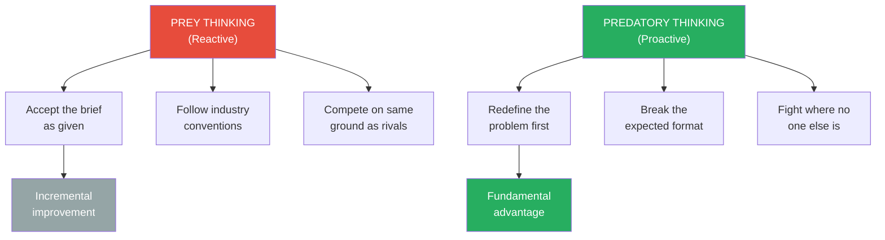
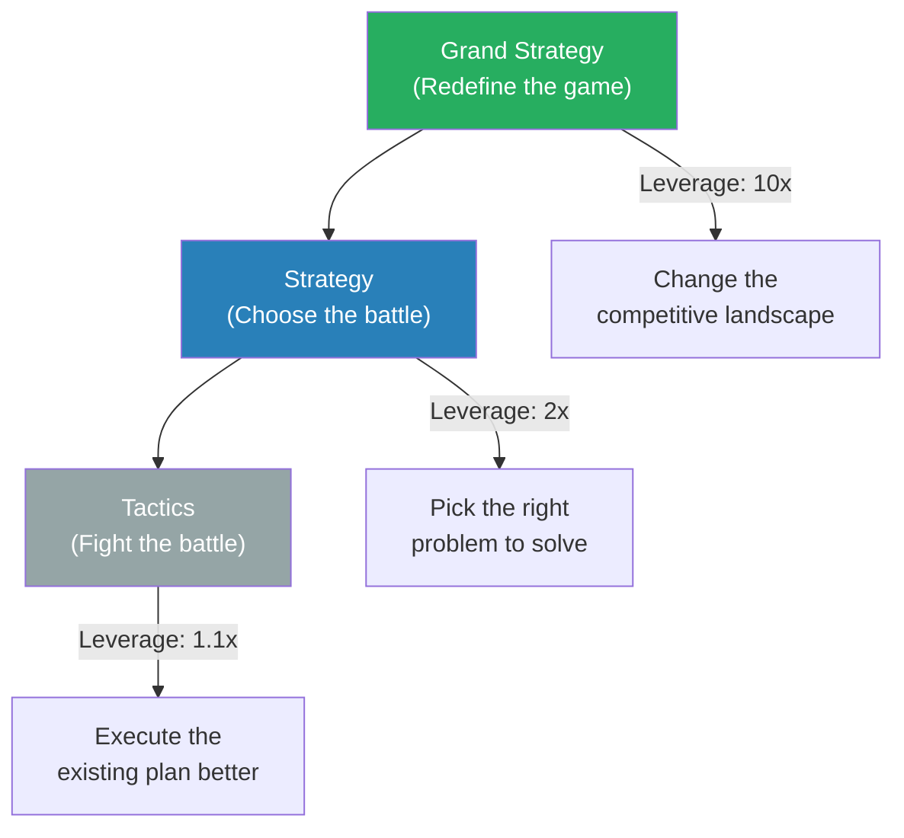
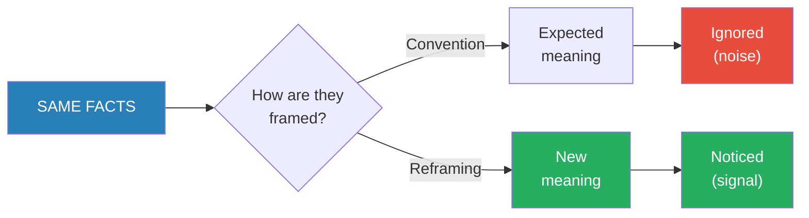
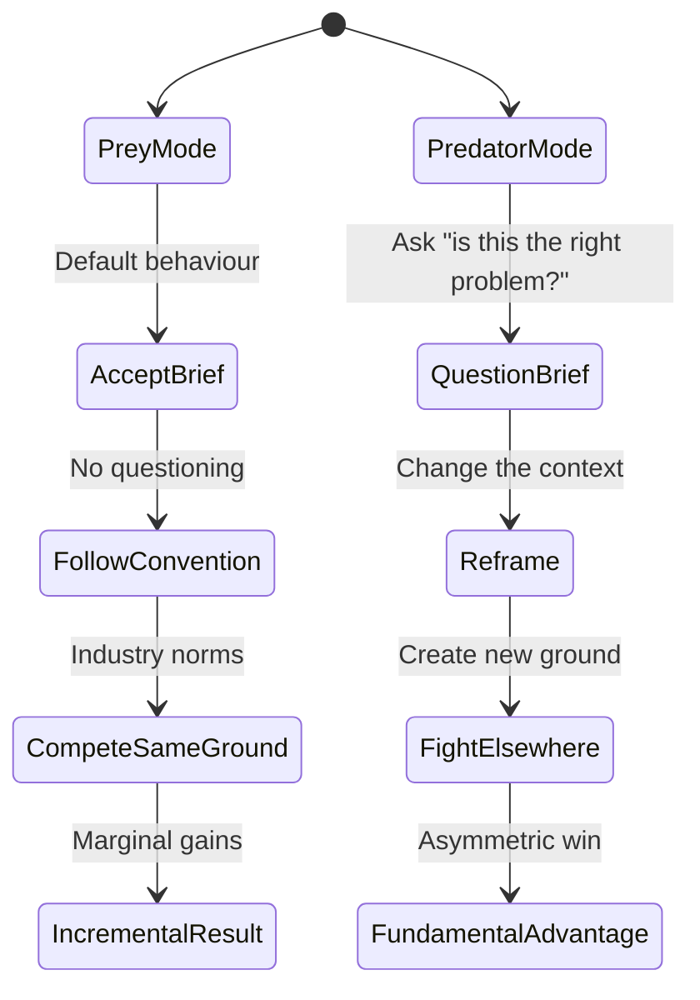
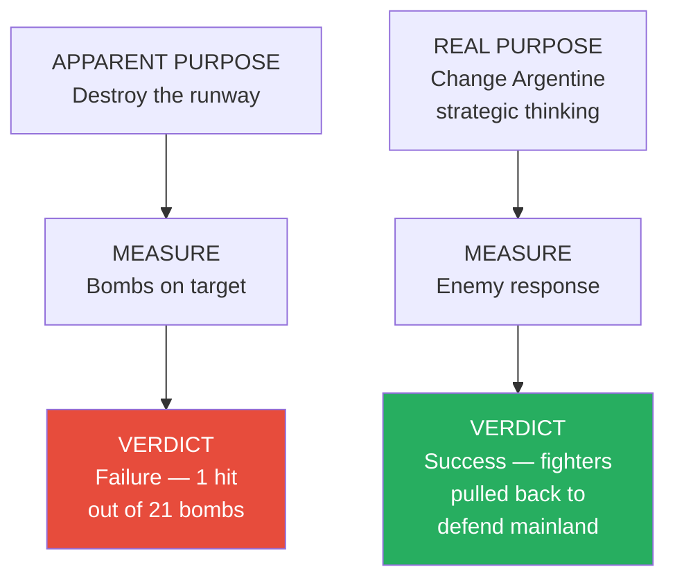
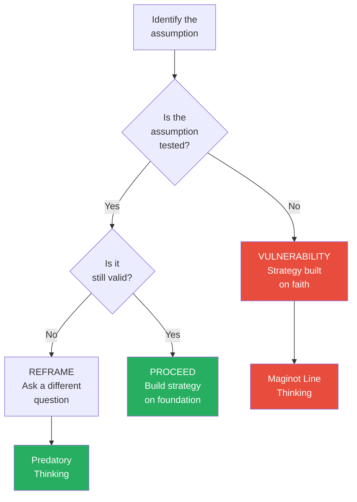
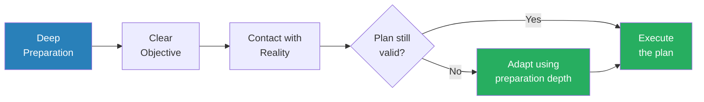
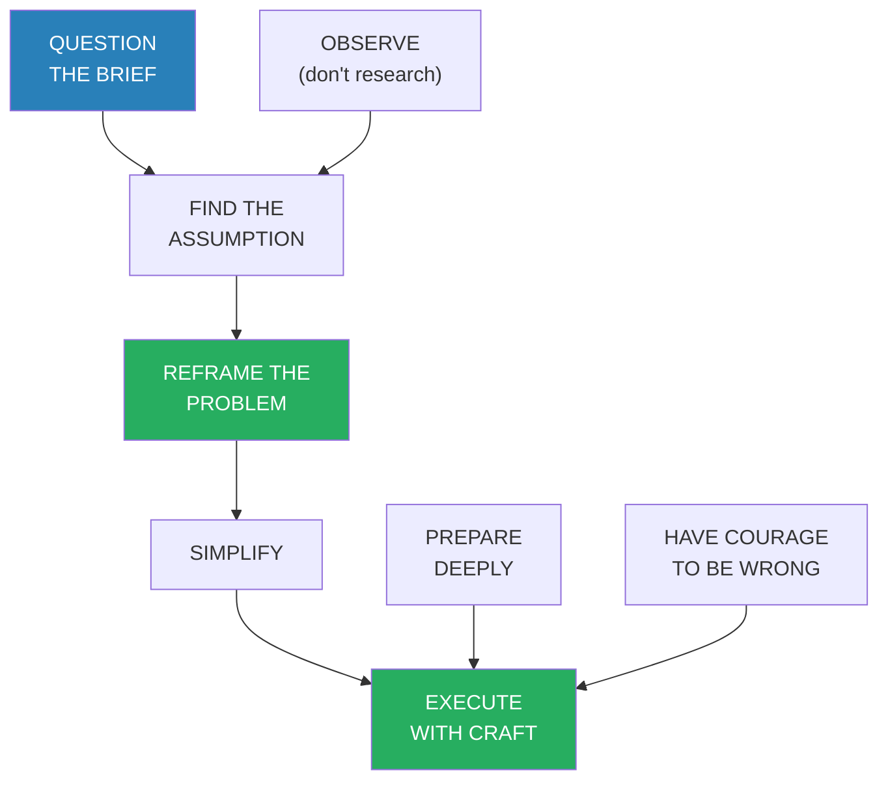

# Predatory Thinking — Dave Trott

> Dave Trott is one of the most awarded advertising creatives in British history, and he thinks most people are terrible at thinking. Not because they lack intelligence, but because they let convention, habit, and fear of looking foolish do their thinking for them. *Predatory Thinking* is his answer — a collection of roughly eighty short essays, each built around a story from military history, advertising, street life, sport, or science, each illustrating a principle of thinking that most people never learn. The core idea: in any competitive situation, you have a choice — be the predator or be the prey. Predators choose where to fight and redefine the problem before anyone else has even understood it. Prey react, follow convention, and compete where everyone else competes. **The book is not a theory of creativity. It is a manual for seeing what everyone else misses and acting on it before they catch up.**

---

## About the Author

Dave Trott grew up in working-class East London, where the lessons in street-smart thinking came long before the advertising career. He went on to become one of the UK's most celebrated advertising creatives, founding the agencies Gold Greenlees Trott (GGT) and later CST (Cossette Trott). His campaigns have won virtually every major industry award, but what distinguishes Trott from other advertising figures is his insistence that creativity is not an art-school abstraction — it is a survival skill rooted in clear thinking, courage, and a refusal to follow the herd. He writes a widely-read blog and has published several books including *Creative Mischief* and *One Plus One Equals Three*, all built on the same foundation: short, punchy stories that punch well above their word count.

---

## The Big Idea

- <b style="color: #2980b9">Predatory thinking</b> is Trott's term for the discipline of thinking upstream of the problem — seeing the real issue before anyone else does, then acting on it with ruthless simplicity
- Most people and most organisations operate as **prey**:
  - They react to what the competition does
  - They accept the brief as given
  - They follow the industry's expected format
  - They compete on the same ground as everyone else, trying to be slightly better at the same thing
- <b style="color: #27ae60">Predators don't compete — they redefine</b>:
  - They question the brief before answering it
  - They look for the fight no one else has spotted
  - They solve the problem before it becomes a problem
  - They win by changing the rules, not by playing the existing game more skilfully
- Trott draws his examples from an unusually wide range of sources — not just advertising, but military history (Sun Tzu, the Falklands, D-Day, Malaya), street life (growing up in East London), sport (Muhammad Ali, the All Blacks), science (Darwin, lateral thinking), and pop culture
- The common thread: **in every domain, the people who win big are the ones who refuse to think the way they're expected to think**
- The book's structure itself embodies its philosophy — it is not a long, sequential argument but a collection of short, punchy essays, each 1-3 pages, each built around a single story and a single principle
  - This format mirrors Trott's belief that brevity is a weapon
  - If you can't make your point in two pages, you probably don't have a point
  - The book reads fast, but the ideas accumulate into something more systematic than any individual essay suggests

This diagram captures the fundamental choice Trott presents: reactive thinking leads to incremental improvements within existing constraints, while predatory thinking redefines the constraints entirely.

Reframing dominates Trott's toolkit because it is the meta-skill that powers all others — if you change the context, the meaning changes automatically, making every other principle easier to deploy.

The force diagram maps how Trott's predatory thinking draws from three intellectual traditions (Sun Tzu, Darwin, lateral thinking) and flows into three core principles, each illustrated by case studies drawn from military history, sport, and advertising.

---

## Key Concepts at a Glance

| Concept | One-line summary |
|---------|-----------------|
| **Predatory thinking** | Choose where to fight — don't compete, redefine |
| **Upstream thinking** | Solve the problem before it becomes a problem |
| **Reframing** | Change the context and you change the meaning |
| **Form vs. content** | Following the expected format kills the impact |
| **Simplicity as weapon** | If it's complicated, you haven't understood the problem |
| **The ordinary as extraordinary** | The best ideas look obvious — after someone else has had them |
| **Garbage in, garbage out** | The quality of thinking depends on the quality of the question |
| **Street-smart vs. book-smart** | Observation beats theory when theory ignores reality |
| **Doing what others won't** | Convention is safe; originality requires the willingness to look foolish |
| **Execution over ideas** | The same idea, delivered differently, is a different idea entirely |
| **The preparation-execution ratio** | Spend 90% preparing and 10% executing, not the reverse |
| **Adaptive planning** | Plans are tools for thinking, not scripts for acting |

---

## Part 1 — Predatory Thinking: The Core Concept

*Trott opens by drawing a line between two ways of operating in any competitive environment — the way of the predator and the way of the prey — and argues that most people unknowingly choose to be prey.*

### The Predator-Prey Distinction

- In nature, the predator has one overwhelming advantage: it chooses when and where to engage
  - The lion doesn't chase every zebra — it picks the weakest, at the best moment, from the best angle
  - The prey, by contrast, is always reacting — running from danger it didn't choose and doesn't control
- <b style="color: #2980b9">Predatory thinking</b> applies this principle to any competitive situation — business, advertising, negotiation, career strategy, creative work:
  - The predator defines the terms of engagement
  - The prey accepts them
  - Most people are prey because it's safer — you can't be blamed for following convention
- Trott's argument is not about aggression or ruthlessness:
  - It's about **where you direct your thinking**
  - Prey thinkers ask: "How do I solve this problem?"
  - Predatory thinkers ask: "Is this the right problem?"
  - <b style="color: #27ae60">The most powerful move is to change the question before anyone else realises the question is wrong</b>

> [!example] The Lion and the Zebra
> - Trott opens the book with a wildlife analogy that frames everything that follows
> - A zebra's entire existence is reactive — it eats, it watches for danger, it runs when danger appears
> - A lion's existence is strategic — it picks the target, chooses the terrain, times the attack, and conserves energy for the moment that matters
> - The zebra is faster than the lion over a long distance, stronger in a herd, and more numerous
> - But the lion wins because it controls the engagement
> - Most of us, Trott argues, live like zebras — reacting to emails, responding to briefs, following the competition's lead
> **The lesson:** Speed, strength, and numbers mean nothing if someone else is choosing the battlefield.

- Why most people default to prey thinking:
  - **Social safety** — following convention means no one singles you out for blame
  - **Cognitive ease** — reacting is easier than initiating. It requires no original thought, no risk assessment, no courage
  - **Organisational incentives** — most companies reward compliance and punish deviation, even when deviation produces better results
  - **The illusion of activity** — reacting to things feels like working. Being busy feels productive. But busy and productive are different things
  - Trott is particularly harsh on busy-ness as a disguise for prey thinking:
    - People fill their days with email, meetings, and process because it feels like they're doing something
    - But they're not choosing what to do — they're responding to what other people put in front of them
    - <b style="color: #e74c3c">Reacting to the urgent crowds out thinking about the important</b>
- The prey mindset is self-reinforcing:
  - When you react all day, you have no time to think upstream
  - When you never think upstream, you never see opportunities that others miss
  - When you never see unique opportunities, you conclude that the only option is to compete harder on the same ground
  - This creates a cycle that feels like effort but produces nothing distinctive

---

### Sun Tzu and the Upstream Principle

- Trott is deeply influenced by <b style="color: #2980b9">Sun Tzu's *The Art of War*</b>, and references it throughout the book
- The core Sun Tzu principle Trott adopts: **the supreme art of war is to subdue the enemy without fighting**
  - Don't win the battle — win before the battle starts
  - Don't outperform the competition — make the competition irrelevant
- This translates into what Trott calls <b style="color: #2980b9">upstream thinking</b>:
  - Most people focus on execution — doing the job well
  - Predatory thinkers focus on the problem before execution — making sure they're doing the right job
  - The biggest waste of talent is brilliant execution of the wrong strategy
- Trott illustrates this with a military example that runs through the book:
  - In war, tactics are downstream (how you fight the battle)
  - Strategy is midstream (which battles you fight)
  - Grand strategy is upstream (how you arrange things so you don't need to fight at all)
  - <b style="color: #e74c3c">Most people spend their entire careers at the tactical level, executing brilliantly on problems that shouldn't exist</b>
- Sun Tzu's influence on Trott goes beyond this single principle:
  - "All warfare is deception" — which connects directly to Trott's emphasis on reframing
  - "Appear weak when you are strong, and strong when you are weak" — which Trott sees in the Avis campaign (appearing weak as a strength)
  - "The greatest victory is that which requires no battle" — which is the ultimate expression of upstream thinking

> [!tip] Core Insight
> The most powerful position is not being the best at solving a problem. It is being the person who decides which problem gets solved.

---

### The British in Malaya

*One of Trott's most powerful examples of upstream thinking comes from a guerrilla war most people have forgotten.*

> [!example] Winning Hearts and Stomachs — Malaya (1948-1960)
> - After World War II, communist guerrillas launched an insurgency in British Malaya
> - The conventional military approach was to hunt the guerrillas in the jungle — which is exactly what the guerrillas wanted, because jungle warfare was their strength
> - General Sir Gerald Templer took a completely different approach
> - He asked the upstream question: what do the guerrillas actually need to survive?
> - The answer wasn't ideology or weapons — it was food. The guerrillas relied on villagers to feed them
> - Templer's strategy: instead of fighting guerrillas in the jungle, relocate villagers into protected settlements where they could be fed and secured
> - Cut off from their food supply, the guerrillas couldn't sustain operations
> - The insurgency collapsed — not through military superiority in battle, but through upstream thinking about what made the fight possible in the first place
> **The lesson:** Don't fight the problem where it's strongest. Find the thing that feeds the problem and cut that off instead.

- Trott uses this example to make a broader point about business and creativity:
  - Most companies try to beat competitors at what competitors already do well
  - The predatory thinker asks: what does the competitor depend on? What assumption are they making? Where is their food supply?
  - <b style="color: #27ae60">Attack the assumption, not the position</b>
- The Malaya example also illustrates a key principle about effort:
  - The conventional approach (jungle warfare) required enormous resources and produced slow, uncertain results
  - Templer's approach required different resources but achieved decisive results
  - The upstream solution was not only more effective — it was more efficient
  - This is a recurring pattern in Trott's thinking: predatory solutions often require less effort, not more, because they attack the problem at its root

---

### The Three Levels of Strategy

- Trott formalises the upstream principle by borrowing from military thinking and identifying three levels at which you can operate:

| Level | Military equivalent | Business equivalent | Trott's assessment |
|-------|-------------------|--------------------|--------------------|
| Tactical | How you fight the battle | How you execute the campaign | Where 90% of people spend their time |
| Strategic | Which battles you fight | Which problems you solve | Where smart people operate |
| Grand strategic | How you arrange things so battles aren't needed | How you redefine the competitive landscape | Where predatory thinkers live |

- Most professionals never get above the tactical level:
  - They are brilliant at execution but never question what they're executing
  - They polish the presentation without asking whether the presentation should exist
  - They optimise the process without asking whether the process achieves the right outcome
- <b style="color: #27ae60">The higher you operate on this hierarchy, the more leverage each decision carries</b>:
  - A tactical improvement might gain you 5-10% efficiency
  - A strategic reframe might double your effectiveness
  - A grand strategic move might make the competition irrelevant entirely
- Trott's career in advertising taught him this hierarchy viscerally:
  - Junior creatives worry about the craft of the ad (tactical)
  - Good creatives worry about the strategy behind the ad (strategic)
  - Great creatives question whether the brief itself is right (grand strategic)
  - "The best work I ever did was work where I changed the brief before I answered it"

Each level up the hierarchy multiplies the impact of your thinking. Most people stay at tactics because it is concrete and comfortable — but the leverage lives at the top.

---

## Part 2 — It Ain't What You Do, It's the Way That You Do It

*Trott demolishes the idea that ideas are everything and execution is secondary — and shows that the same idea, delivered differently, is fundamentally a different idea.*

### Execution Is the Idea

- One of Trott's recurring arguments: people overvalue "the idea" and undervalue execution
  - In advertising, everyone talks about "the big idea" as if execution is just the wrapping
  - Trott argues the opposite: <b style="color: #27ae60">execution IS the idea — change the execution and you change what the audience receives</b>
- The same joke told by two different comedians gets different laughs — not because the joke changed, but because the delivery changed
- The same strategy implemented with different timing, different tone, different media produces completely different results
- This is why Trott is obsessed with craft:
  - Craft is not decoration — it is the mechanism through which an idea reaches someone's brain
  - Bad craft kills good ideas
  - Great craft makes average ideas memorable
- Trott makes a distinction that most creative professionals miss:
  - An "idea" in isolation is worthless — it is an abstraction that exists nowhere
  - An idea only becomes real when it is executed, and the execution determines what it becomes
  - Two agencies given the same brief, with the same "idea," will produce completely different work — because execution is where the real creative decisions happen

> [!example] Volkswagen "Think Small" — DDB (1959)
> - In 1959, American car advertising was dominated by huge, chrome-laden vehicles photographed in glamorous settings with aspirational copy
> - Doyle Dane Bernbach was hired by Volkswagen to sell the Beetle — a small, ugly, German car in a country still traumatised by World War II
> - Instead of trying to make the Beetle look big and glamorous (competing on the competition's terms), DDB did the opposite
> - They ran a nearly empty page with a tiny photograph of the car in the upper left corner and the headline "Think small"
> - The ad broke every convention of 1950s car advertising — minimal photography, self-deprecating copy, white space as the dominant visual element
> - It worked precisely because it refused to play by the existing rules
> - The campaign became one of the most celebrated in advertising history and helped establish the creative revolution
> **The lesson:** When everyone is shouting, whisper. The format that breaks the convention is the one that gets noticed.

---

### The Avis Revolution

> [!example] Avis "We Try Harder" — DDB (1962)
> - Avis was the number-two car rental company behind Hertz, and they were losing money
> - The conventional approach would have been to claim superiority — to pretend they were as good as or better than Hertz
> - Instead, DDB and Avis did something no one had ever seen in advertising: they admitted they were number two
> - "We're only No. 2 in rent-a-cars, so why go with us? We try harder"
> - The campaign turned a weakness into a strength — being number two meant they couldn't afford to be complacent
> - Customers responded because the honesty was startling in an industry built on exaggeration
> - Avis went from losing $3.2 million a year to making $1.2 million within one year of the campaign launch
> **The lesson:** Don't disguise your weakness. Reframe it as your advantage.

- Trott draws a principle from these advertising examples:
  - <b style="color: #2980b9">Reframing</b> — the most powerful creative tool — is not about inventing new facts. It is about presenting existing facts in a new context
  - Avis didn't become better than Hertz. They changed what "number two" meant
  - VW didn't make the Beetle bigger. They changed what "small" meant
  - The facts didn't change. The meaning changed. And <b style="color: #27ae60">meaning is everything</b>
- The mechanism behind reframing:
  - Humans don't process facts in isolation — they process facts within a frame of reference
  - The frame determines which aspects of the fact are salient (relevant) and which are invisible
  - "We're number two" in the frame of "bigger is better" means weakness
  - "We're number two" in the frame of "second place means we try harder" means motivation
  - Same fact, different salience, different emotional response, different behaviour
  - The reframer doesn't argue against the existing interpretation — they make the existing interpretation irrelevant by installing a new frame

Reframing does not change reality — it changes what reality means to the audience, and that distinction is the heart of Trott's creative method.

---

### Ed McCabe and the Power of Bluntness

> [!example] Ed McCabe's Anti-Pitch (1960s-70s)
> - Ed McCabe was one of the great American advertising creatives — co-founder of Scali McCabe Sloves
> - His approach to new business pitches was the opposite of the polished, theatrical presentations his competitors delivered
> - While other agencies brought elaborate slide decks, mood boards, and rehearsed teams, McCabe would walk in alone
> - He would sit down, look at the client, and say something blunt — often confrontational — about what was wrong with their current advertising
> - He didn't try to impress. He tried to be right
> - Clients were shocked — and then they listened, because no one else was willing to tell them the truth
> - McCabe won accounts that agencies ten times his size were competing for
> **The lesson:** When everyone is trying to impress, the person who simply tells the truth stands out — because truth is rare enough to be remarkable.

- Trott admires McCabe because McCabe understood something most people miss:
  - <b style="color: #e74c3c">Trying to impress is a form of prey behaviour</b> — you're performing for the audience's expectations
  - Being blunt is predatory — you're choosing the terms of the conversation
  - McCabe controlled every pitch because he refused to compete on presentation skills — he competed on insight
  - The form (blunt, solo, unpolished) served the content (this man knows what he's talking about)
- The broader principle: **format signals intent**
  - When you follow the expected format, the audience's brain categorises you with everyone else who followed the format
  - When you break the format, the audience's brain is forced to pay attention — because it can't categorise you automatically
  - This is why Trott argues that format is never neutral — it is always sending a message, whether you intend it or not

---

## Part 3 — Ordinary People, Extraordinary Results

*Trott argues that genius is overrated and observation is underrated — the best thinking comes not from brilliant minds but from people willing to see what's actually in front of them.*

### You Don't Need to Be Smart — You Need to See

- One of Trott's most counterintuitive arguments: creativity has almost nothing to do with intelligence
  - Highly intelligent people are often the worst creative thinkers because they're too invested in being right
  - They overthink, overcomplicate, and miss the obvious
  - The best creative thinkers are often the ones with the fewest assumptions — people who look at a situation with fresh eyes because they don't know what they're "supposed" to see
- Trott calls this <b style="color: #2980b9">street-smart thinking</b>:
  - Book-smart: knows the theory, follows the methodology, arrives at the expected conclusion
  - Street-smart: observes what's actually happening, ignores the methodology, arrives at the truth
  - <b style="color: #27ae60">The street-smart thinker wins because reality doesn't follow methodology</b>
- The relationship between education and creative blindness:
  - Education teaches you what is "known" — which creates a filter through which you see everything
  - That filter is useful for routine problems — you can apply established solutions quickly
  - But the filter becomes a blindfold for novel problems — you can only see what the filter allows through
  - The uneducated observer, lacking the filter, sometimes sees things the expert cannot
  - Trott is not anti-education — he reads voraciously — but he is deeply suspicious of education that replaces observation with assumption
  - "The problem with knowing the answer is that you stop looking at the question"

| Thinking style | Input source | Strength | Blind spot |
|---------------|-------------|----------|------------|
| Book-smart | Theory, frameworks, best practice | Fast, reliable for routine problems | Misses what the theory doesn't predict |
| Street-smart | Direct observation, pattern recognition | Sees reality without filters | May lack systematic frameworks |
| Predatory (both combined) | Theory checked against observation | Adaptive, grounded, creative | Requires the courage to override theory |

The predatory thinker uses both — reading widely to load mental models, then observing the specific situation to see where the models fail.

The state diagram shows the two parallel tracks available in any competitive situation — prey mode flows downward through convention to incremental results, while predator mode flows through questioning and reframing to fundamental advantage.

---

### Gordon the Tramp

> [!example] Gordon's Lessons in East London (1950s-60s)
> - Growing up in working-class East London, young Dave Trott encountered a local character named Gordon — a tramp who survived by his wits
> - Gordon had no education, no money, no social standing — but he understood human behaviour better than anyone Trott would later meet in advertising
> - Gordon knew which pubs would give him a free pint near closing time (the landlord wanted someone to drink with)
> - He knew which houses to knock on for food (the ones with net curtains — the residents cared about appearances and would be too embarrassed to say no)
> - He knew which park benches were warmest (the ones near heating vents from underground stations)
> - None of this was intelligence in the academic sense — it was pure observation combined with the willingness to act on what he observed
> - Trott credits Gordon with teaching him the fundamental principle of his career: watch what people actually do, not what they say they'll do
> **The lesson:** Observation beats theory. The people who understand behaviour best are often the ones who've had to survive by reading it accurately.

- Trott returns to Gordon throughout the book as a touchstone:
  - Gordon's thinking was predatory — he chose where to compete (empathy and observation) rather than where he would lose (education and credentials)
  - Most advertising research asks people what they think — Gordon watched what they did
  - <b style="color: #e74c3c">The gap between what people say and what they do is where most strategies fail</b>
- Gordon's net curtain insight is a microcosm of Trott's entire philosophy:
  - The net curtains were data hiding in plain sight — visible to anyone who walked down the street
  - But only Gordon asked: what do net curtains tell me about the person behind the door?
  - The answer (they care about what neighbours think) led to a prediction (they won't refuse a hungry person at their door) that turned out to be reliably true
  - This is the predatory thinking process in miniature: observe, interpret, act

---

### Muhammad Ali and Changing the Rules

> [!example] Ali vs. Foreman — The Rumble in the Jungle (1974)
> - George Foreman was the heavyweight champion — younger, stronger, and with a knockout record that made him the most feared puncher in boxing
> - Every expert predicted Foreman would destroy Muhammad Ali, who was 32 and past his prime
> - Ali's corner expected him to use his speed and footwork to stay away from Foreman's power — the conventional strategy
> - Instead, Ali invented the **rope-a-dope**: he leaned against the ropes and let Foreman punch himself out
> - It was the opposite of every boxing principle — you never let a bigger, stronger opponent pin you against the ropes
> - But Ali had seen something no one else had: Foreman punched with maximum force on every shot. He couldn't pace himself. If you could survive the early onslaught, he'd have nothing left
> - By round eight, Foreman was exhausted. Ali knocked him out
> **The lesson:** The conventional strategy would have been correct against any other fighter. Ali won because he studied his specific opponent and designed a strategy for that reality, not for the textbook.

- Trott uses Ali to illustrate several predatory principles:
  - <b style="color: #27ae60">Study the specific situation, not the general rule</b> — textbook boxing said "don't go to the ropes," but textbook boxing hadn't analysed Foreman's psychology
  - Ali was a predator — he chose the terms of the fight (endurance) rather than the terms Foreman wanted (power)
  - He was willing to look foolish — the entire boxing world thought he was being beaten in the early rounds
  - The willingness to appear stupid in the short term is a prerequisite for predatory thinking in the long term
- Ali's rope-a-dope also demonstrates what Trott calls <b style="color: #2980b9">turning the opponent's strength into their weakness</b>:
  - Foreman's greatest asset was his punching power — but power requires energy
  - Ali didn't try to neutralise Foreman's power (he couldn't) — he encouraged it, let Foreman use it up
  - The very thing that made Foreman dangerous was the thing that exhausted him
  - This principle appears throughout predatory thinking: don't fight strength — redirect it

---

### The All Blacks Haka — Psychology as Strategy

> [!example] The All Blacks Haka (Rugby)
> - New Zealand's All Blacks rugby team performs the Haka — a Maori war dance — before every international match
> - Opponents have to stand and watch as fifteen large men perform an aggressive, coordinated display of power, stamping, slapping, and chanting
> - The Haka has no physical effect on the game — it doesn't score points, doesn't tire the opposition, doesn't change the rules
> - But it has an enormous psychological effect — it establishes dominance before the match begins
> - It says: we are unified, we are fierce, we are not afraid of you
> - Opponents who are intimidated by it have already lost the mental battle before the whistle blows
> - The All Blacks are the most successful team in the history of international rugby, with an all-time win rate above 77%
> **The lesson:** The fight begins before the fight begins. The team that controls the psychological frame before the first engagement has an advantage no tactic can overcome.

- Trott connects the Haka to predatory thinking:
  - It is a grand strategic move — it operates at the level of the opponent's psychology, not at the level of technique
  - It costs nothing. It takes two minutes. But it changes the context within which the entire match is played
  - <b style="color: #2980b9">Psychological framing</b> is a form of upstream thinking — you're influencing the outcome before the contest begins

---

### The SAS and Tactical Precision

> [!example] The Iranian Embassy Siege (1980)
> - Six armed gunmen took over the Iranian Embassy in London, holding 26 hostages
> - After six days of failed negotiations, the SAS was sent in
> - The operation lasted exactly seventeen minutes
> - Every SAS soldier knew not just his own role but the role of every other soldier in the team — so if someone went down, anyone could take over
> - The assault came from multiple entry points simultaneously — the gunmen couldn't react because they were overwhelmed on every front at once
> - Five of the six gunmen were killed. One hostage died. The rest were rescued
> **The lesson:** Overwhelming force applied at precisely the right moment, from precisely the right angles, with total preparation — this is predatory execution.

- Trott draws several principles from this:
  - Preparation is upstream of execution — the SAS spent six days preparing for seventeen minutes
  - <b style="color: #2980b9">The ratio of preparation to execution</b> reveals how seriously you take the engagement
  - In advertising and business, most people spend 90% of their time on execution and 10% on preparation — predatory thinkers reverse this ratio
- The SAS example also illustrates redundancy as a form of preparation:
  - Every soldier could take over any other soldier's role — this wasn't just competence, it was a strategic design principle
  - The plan assumed things would go wrong (they always do) and built in the capacity to adapt
  - This connects to Moltke's principle later in the book: "no plan survives first contact with the enemy," so build plans that work when they fail

> [!tip] Core Insight
> The quality of seventeen minutes of execution is determined by six days of preparation. Most people get this ratio backwards.

---

## Part 4 — Form Is the Enemy of Creativity

*Trott attacks one of the most deeply held beliefs in any industry: that there is a "proper" way to do things — and shows that the proper way is usually the ineffective way.*

### The Tyranny of Format

- Every industry develops a standard format — the way things are "supposed" to be done:
  - In advertising: the standard TV commercial structure, the standard print layout, the standard media plan
  - In business: the standard PowerPoint, the standard meeting format, the standard strategy document
  - In academia: the standard paper structure, the standard citation format, the standard research methodology
- <b style="color: #e74c3c">The problem with format is that it makes everything look the same</b>:
  - When every TV commercial follows the same structure, none of them stand out
  - When every business presentation uses the same PowerPoint template, none of them are remembered
  - Format is the enemy of impact because impact requires difference
- Trott argues that form becomes a substitute for thinking:
  - People follow the format because it's safe — no one ever got fired for following the template
  - But following the template guarantees mediocrity — you can't break through by doing what everyone else does
  - <b style="color: #27ae60">The question is never "what is the proper format?" The question is "what will actually work?"</b>
- The psychology behind format addiction:
  - Format provides certainty — when you don't know what to do, at least you know the proper way to do it
  - But certainty of method is not the same as certainty of outcome
  - <b style="color: #e74c3c">Following the correct process to arrive at the wrong answer is how most organisations fail</b>

| Approach | Mindset | Result |
|----------|---------|--------|
| Follow the format | "This is how it's done" | Invisible — blends with everything else |
| Break the format | "What will actually get noticed?" | Risky — but the only route to impact |
| Ignore the format | "I'll do whatever I want" | Chaotic — breaking rules without purpose is just noise |

The distinction between "break the format" and "ignore the format" is crucial — Trott is not advocating randomness. He is advocating deliberate, strategic rule-breaking in service of a clear objective.

---

### Bill Bernbach and the Creative Revolution

> [!example] Bernbach Changes Advertising Forever (1960s)
> - Before Bill Bernbach, advertising was dominated by research — copy was tested, layouts were formulaic, creativity served the research department
> - Bernbach, the co-founder of DDB (Doyle Dane Bernbach), reversed this hierarchy
> - He paired art directors with copywriters for the first time — previously, they worked separately, with the writer sending copy to the art department for illustration
> - He insisted that the visual and the verbal had to work together as a single idea, not as separate elements
> - The results were the VW "Think Small" campaign, the Avis "We Try Harder" campaign, and dozens of other ads that broke every convention of the time
> - Bernbach's revolution was not just about better ads — it was about a different way of thinking about what advertising could be
> - He didn't improve the existing format. He destroyed it and built a new one
> **The lesson:** The most powerful creative act is not improving the existing system — it is replacing the system entirely.

- Bernbach is one of Trott's heroes because Bernbach was a predatory thinker:
  - He didn't try to do conventional advertising better — he refused to do conventional advertising at all
  - He changed the question from "how do we make better research-driven ads?" to "what if research isn't the point?"
  - <b style="color: #2980b9">This is upstream thinking applied to an entire industry</b> — redefining what the industry considers "good" rather than competing within the existing definition
- The pairing of art directors and copywriters is a structural innovation, not a creative one:
  - Bernbach didn't just create better ads — he created a new process that produced better ads systematically
  - This is the difference between a good idea and a good system: the idea produces one result, the system produces results repeatedly
  - Predatory thinkers look for systemic advantages, not one-off wins

---

### The Falklands Vulcan Raid

> [!example]- Operation Black Buck — The Vulcan Bomber Raid (1982)
> - During the Falklands War, the RAF launched one of the most logistically complex bombing missions in history
> - A single Vulcan bomber flew from Ascension Island to the Falkland Islands — a round trip of nearly 8,000 miles
> - The mission required eleven Victor tanker aircraft to refuel the Vulcan and each other in a daisy-chain pattern across the Atlantic
> - The Vulcan dropped twenty-one bombs across the runway at Port Stanley airfield
> - Only one bomb hit the runway itself
> - By any conventional measure, the raid was a colossal waste of resources — eleven tankers, thousands of miles, and one hole in a runway
> - But the purpose was never to destroy the runway. The purpose was psychological
> - The raid told the Argentine military command: if the RAF can bomb Port Stanley, they can bomb Buenos Aires
> - It changed the Argentines' strategic calculations entirely — they pulled fighter jets back to defend the mainland, weakening their air defence in the Falklands
> - One bomb, in the right context, changed the meaning of the entire war
> **The lesson:** The conventional measure of success (how many bombs hit the target) was irrelevant. The predatory measure of success (how did this change the enemy's thinking) was everything.

- This is one of Trott's most important examples because it illustrates several principles simultaneously:
  - <b style="color: #27ae60">The purpose of an action is not always the obvious one</b> — the Vulcan raid looked like a failure if you measured bombs on runway, but it was a triumph if you measured strategic impact
  - The form (a bombing raid) served a completely different function (psychological warfare) than its apparent function (physical destruction)
  - Upstream thinking: don't win the air war over the Falklands — change the enemy's calculations so you don't need to win as many air battles

Trott uses this diagram logic throughout: when the apparent purpose and the real purpose diverge, conventional measures will always call it a failure — but predatory thinkers measure what actually matters.

---

## Part 5 — The Ordinary as Extraordinary

*Trott argues that the best ideas are always simple — so simple they look obvious after someone else has had them — and that complexity is the clearest sign that someone hasn't understood the problem.*

### Simplicity Is Not Laziness

- Trott is relentless on the point that simplicity requires more thinking, not less:
  - A complex solution means you've stopped too early — you've found an answer but not the answer
  - A simple solution means you've pushed past the complexity to find the essential structure underneath
  - <b style="color: #27ae60">Simplicity is the result of hard thinking, not the absence of thinking</b>
- He makes an analogy to language:
  - When someone explains an idea in complicated language, it usually means they don't understand it well enough to explain it simply
  - When someone explains the same idea in plain language, it means they've understood it so deeply that they can strip away the jargon
  - The jargon is not a sign of expertise — it is often a sign of incomplete understanding
- There is a process to reaching simplicity:
  - First, you gather everything (complexity)
  - Then, you sort through it to identify patterns (analysis)
  - Then, you strip away everything that isn't essential (editing)
  - Then, you express the remaining essence as clearly as possible (simplicity)
  - <b style="color: #e74c3c">Most people stop at step one or two and call it a strategy</b>

> [!tip] Core Insight
> Complexity is where you start. Simplicity is where you finish. If your solution is complicated, you haven't finished thinking yet.

---

### Steve Jobs and Radical Simplicity

> [!example] Jobs and the Original Macintosh (1984)
> - When Steve Jobs was developing the original Macintosh, he insisted on a principle that his engineers found infuriating: no user manual
> - The computer had to be so intuitive that anyone could sit down and use it without instructions
> - This constraint forced the design team to rethink every element of the interface from the user's perspective
> - Other computer makers at the time shipped enormous technical manuals and assumed users would learn the system
> - Jobs refused to accept the premise that computers were inherently complicated
> - He didn't simplify the manual — he eliminated the need for one
> - The result was the graphical user interface that would eventually become the standard for all personal computing
> **The lesson:** The most powerful form of simplicity doesn't simplify the existing complexity — it eliminates the source of the complexity entirely.

- Trott connects Jobs to his predatory thinking framework:
  - Jobs was a predator because he refused the industry's framing of the problem
  - Everyone else asked: "How do we make a better manual?"
  - Jobs asked: "Why is there a manual?"
  - <b style="color: #2980b9">This is upstream reframing</b> — questioning the assumption that creates the problem, not the problem itself
- Jobs also demonstrated the courage component of predatory thinking:
  - His engineers told him it was impossible — the technology wouldn't support an intuitive interface
  - His competitors thought it was unnecessary — serious computer users would learn the system
  - He was willing to be wrong, and he was willing to fight his own team
  - <b style="color: #27ae60">The predatory thinker needs courage not just against competitors but against the people on their own side</b>

---

### Einstein and the Simplicity Hierarchy

- Trott frequently quotes Einstein: "Everything should be made as simple as possible, but no simpler"
- He identifies a hierarchy of simplicity that most people get wrong:

| Level | What it looks like | Quality |
|-------|-------------------|---------|
| **Simplistic** | Leaves out important things | Bad — oversimplification |
| **Simple** | Includes only what matters | Good — the goal |
| **Complicated** | Includes what matters plus a lot that doesn't | Mediocre — hasn't been refined |
| **Complex** | Includes everything, organised poorly | Bad — sign of unclear thinking |

- Most people confuse simple with simplistic:
  - Simplistic means you haven't done enough work — you've left things out that matter
  - Simple means you've done more work than anyone else — you've identified what matters and ruthlessly cut everything else
  - <b style="color: #27ae60">Getting to simple is harder than staying complicated</b>, which is why most people settle for complicated
- Trott uses advertising to illustrate:
  - A complicated ad tries to say five things at once and succeeds at none
  - A simple ad says one thing with perfect clarity and changes behaviour
  - The client who insists on including every product feature in the ad is not being thorough — they are being lazy, because they haven't done the work of choosing which feature matters most
  - "If you can't choose one thing, you haven't thought hard enough"

---

### The Power of Obvious

- Trott has a favourite provocation: **the best ideas are always obvious — after someone else has had them**
  - Before Avis said "We're No. 2, we try harder," no one had ever turned second place into an advantage. Afterwards, it seemed obvious
  - Before DDB put a tiny car in a nearly empty ad, no one had used white space as the dominant visual element. Afterwards, it seemed obvious
  - The gap between "no one thought of this" and "this is obvious" is closed by a single act of creative courage
- <b style="color: #e74c3c">The reason most people miss obvious ideas is not intelligence — it is fear</b>:
  - Obvious ideas look risky because they're different from what everyone else is doing
  - If you suggest an obvious idea and it fails, you look foolish — you should have "known better"
  - If you follow convention and it fails, no one blames you — you did what everyone does
  - The incentive structure in most organisations rewards convention and punishes originality
  - Predatory thinkers override this incentive structure by caring more about results than about reputation

| What stops obvious ideas | Why it works as a barrier |
|--------------------------|--------------------------|
| Fear of looking foolish | Social risk outweighs professional reward |
| Expertise bias | "I've been doing this for 20 years — I would have seen it" |
| Complexity bias | Simple solutions feel insufficiently serious |
| Convention | "This is how things are done in our industry" |
| Committee thinking | Groups default to the average, which is always conventional |

The pattern across all five barriers: they are social and psychological, not intellectual. Predatory thinking is not harder — it is scarier.

---

## Part 6 — Garbage In, Garbage Out

*Trott makes the case that most bad thinking starts not with bad answers but with bad questions — and that the quality of the input determines the quality of everything that follows.*

### The Brief Is the Problem

- In advertising, everything starts with the brief — the document that tells the creative team what the ad needs to accomplish
- <b style="color: #e74c3c">Most briefs, Trott argues, are garbage</b>:
  - They describe what the client wants to say, not what the audience needs to hear
  - They list product features instead of identifying the single thing that matters
  - They are written by people who haven't done the upstream thinking — so the creative team is asked to solve the wrong problem brilliantly
- This applies far beyond advertising:
  - In business, strategy documents often describe what the company wants to achieve without analysing what the market actually needs
  - In product development, specifications list features without identifying the core user problem
  - In any field, <b style="color: #27ae60">the quality of the answer can never exceed the quality of the question</b>
- Trott's rule for briefs: if the brief is longer than one page, it isn't a brief — it's a confusion
  - A brief should state one thing: the single most important message the audience needs to receive
  - Everything else is distraction
  - "When you try to say everything, you say nothing"

---

### The Wrong Question, Perfectly Answered

> [!example] The Maginot Line (1930s-1940)
> - After World War I, France built the Maginot Line — a massive fortification along its border with Germany
> - It was a masterpiece of military engineering: deep bunkers, retractable gun turrets, underground railways, air conditioning, hospitals
> - It was also the answer to a perfectly clear question: "How do we prevent a repeat of the trench warfare that devastated France in 1914-1918?"
> - The problem was that Germany didn't ask the same question
> - In May 1940, the Wehrmacht simply went around the Maginot Line — through Belgium and the Ardennes forest, terrain the French had assumed was impassable
> - France fell in six weeks
> - The Maginot Line was never breached. It was never tested. It was simply irrelevant
> **The lesson:** A brilliant answer to the wrong question is worse than useless — it consumes resources, creates false confidence, and leaves you blind to the real threat.

- Trott uses the Maginot Line as his signature example of <b style="color: #2980b9">garbage in, garbage out</b> thinking:
  - The French asked the wrong question (how do we stop a frontal assault?) instead of the right question (what will Germany actually do?)
  - The German command practised predatory thinking — they studied the French assumption and attacked where the French weren't looking
  - <b style="color: #e74c3c">When your entire strategy is built on an unexamined assumption, you lose the war the moment someone examines it</b>
- The Maginot Line is also an example of sunk cost amplifying bad thinking:
  - Once France had invested billions in the fortifications, questioning their value became politically impossible
  - The investment itself became proof of correctness — "we wouldn't have spent this much if it were wrong"
  - This is another prey behaviour: letting past decisions constrain current thinking

This flowchart captures Trott's process for avoiding Maginot Line thinking — test your assumptions before building your strategy on them.

---

### Observation vs. Research

- Trott draws a sharp distinction between **observation** (watching what people actually do) and **research** (asking people what they think they do):
  - Research tells you what people say — which is often what they think they should say, or what they think you want to hear
  - Observation tells you what people do — which is often completely different
  - The gap between stated preference and revealed preference is enormous, and most bad strategies fall into that gap
- Trott's advertising career gave him front-row seats to this phenomenon:
  - Focus groups would say they wanted informative, rational advertising
  - Then they'd respond to emotional, irrational, entertaining advertising
  - The people who trusted the focus groups over the observation produced forgettable work
  - The people who trusted their eyes produced memorable work

> [!example] The Gorilla and the Chocolate (2007)
> - Cadbury's "Gorilla" commercial featured a gorilla playing Phil Collins' "In the Air Tonight" on the drums
> - It had nothing to do with chocolate. No product shot until the final seconds. No rational selling argument
> - In any focus group, consumers would have said they wanted to know about the chocolate — the taste, the ingredients, the quality
> - No research could have predicted that a gorilla drumming to Phil Collins would increase Cadbury's sales
> - But it did — because it made people feel something, and feeling precedes buying
> - The ad won numerous awards and became one of the most talked-about commercials of the decade
> **The lesson:** Research tells you what people say they want. Observation tells you what actually moves them. They are rarely the same thing.

- <b style="color: #27ae60">Predatory thinkers trust observation over research</b> because observation captures real behaviour, while research captures stated intentions
- This connects to Trott's broader point: garbage in, garbage out. If your input is focus group data about what people say they want, your output will be work that serves stated preferences — which is not the same as work that actually moves people

---

### The Data Trap

- Trott extends his critique of research to the modern obsession with data:
  - Data tells you what happened — it does not tell you why
  - Data tells you what people did — it does not tell you what they will do
  - Data is always backward-looking — it measures the past and assumes the future will resemble it
- <b style="color: #e74c3c">The most dangerous use of data is to substitute it for thinking</b>:
  - "The data says" has become the modern equivalent of "God says" — an appeal to authority that shuts down questioning
  - But data is only as good as the question that generated it
  - If you ask the wrong question, you get precise answers to the wrong question — which is worse than no answer at all, because it creates false confidence
- Trott's alternative:
  - Use data as one input, not as the answer
  - Combine data with observation — watch what people actually do, in the real world, under real conditions
  - Trust your judgment when data and observation conflict — because the data is measuring a simplified model of reality, while observation is measuring reality itself
  - "Data is a map. Observation is the territory. When the map disagrees with the territory, trust the territory"

> [!example] The Pepsi Challenge Paradox (1970s-80s)
> - Pepsi ran blind taste tests showing that most people preferred Pepsi over Coca-Cola in a single sip
> - The data was clear: Pepsi tasted better. It should have been the market leader
> - But Coke outsold Pepsi year after year, decade after decade
> - The reason: people don't drink cola in single blind sips. They drink it over a full can, in social contexts, with brand associations and emotional connections
> - Pepsi's data was technically correct but strategically useless — it measured the wrong thing in the wrong context
> - Coca-Cola understood that brand meaning, not taste, drives purchase behaviour
> **The lesson:** Precise measurement of the wrong variable is worse than rough observation of the right one. The Pepsi Challenge measured taste. The market measured meaning.

- The Pepsi example connects directly to the Maginot Line:
  - Both are cases of answering the wrong question with perfect precision
  - The Maginot Line answered "how to stop a frontal attack?" with engineering brilliance
  - Pepsi answered "which cola tastes better in a sip?" with scientific rigour
  - Both were irrelevant because the real question was different
  - <b style="color: #27ae60">The predatory thinker's first move is always: am I answering the right question?</b>

---

## Part 7 — Change the Context, Change the Meaning

*Trott presents his most explicitly creative technique: the principle that the same information, placed in a different context, becomes different information entirely — and that mastering this principle is the foundation of all effective communication.*

### Reframing as the Core Skill

- <b style="color: #2980b9">Reframing</b> is the closest thing Trott has to a unified theory of creative thinking:
  - You cannot change the facts — the product is what it is, the situation is what it is
  - But you can change what the facts mean by changing the context in which they're presented
  - The Beetle was always small — DDB changed what "small" meant
  - Avis was always number two — the campaign changed what "number two" meant
  - The Vulcan raid hit one bomb — but in the right context, one bomb changed a war
- Trott argues that reframing is not a trick or a clever technique:
  - It is the fundamental mechanism of all persuasion, all creativity, all strategic advantage
  - <b style="color: #27ae60">The person who controls the frame controls the meaning — and the person who controls the meaning wins</b>
- Why reframing works at a cognitive level:
  - The human brain does not process raw information — it processes information through existing mental frameworks
  - These frameworks are shortcuts that allow fast processing but also create blind spots
  - A reframe installs a new framework that highlights different aspects of the same information
  - The reframer isn't lying or distorting — they are choosing which truth to make salient

---

### The Perceptual Map

> [!abstract] Trott's Reframing Process
> 1. Identify the current frame — how does the audience currently understand this situation?
> 2. Identify the assumption inside the frame — what does the audience take for granted?
> 3. Find the alternative frame — what other context could these same facts fit into?
> 4. Test whether the new frame serves your objective better than the old one
> 5. Execute in the new frame — present the facts as if the new context is the natural one

- This process is deceptively simple, but Trott shows how difficult step 2 is in practice:
  - Most people cannot see the assumption inside their own frame because it feels like reality, not an assumption
  - The Maginot Line builders couldn't see that "Germany will attack the same way they did in 1914" was an assumption — it felt like a fact
  - Focus group researchers can't see that "consumers know what they want" is an assumption — it feels like common sense
  - <b style="color: #e74c3c">The most dangerous assumptions are the ones that feel like facts</b>
- Trott's advice for finding hidden assumptions:
  - Ask outsiders — people from different industries, backgrounds, or experience levels
  - They lack the insider assumptions and will often ask the "stupid" question that reveals the unexamined frame
  - This is why Trott values diverse inputs — not for political reasons, but for cognitive ones
  - "The person who asks the dumb question is usually the smartest person in the room"

---

### D-Day and the Art of Deception

> [!example]- Operation Fortitude — The Greatest Deception (1944)
> - Before D-Day, the Allied command faced a problem: they knew the Germans expected an invasion across the English Channel, but they needed the invasion to succeed at Normandy specifically
> - The solution was Operation Fortitude — a massive deception operation designed to convince the Germans that the main invasion would come at Pas-de-Calais, 150 miles northeast of Normandy
> - The deception included:
>   - A fake army group (First US Army Group) under the command of General Patton — the general the Germans most feared
>   - Inflatable tanks, fake radio traffic, and dummy landing craft positioned across from Calais
>   - Double agents feeding false intelligence to German handlers
> - The deception was so successful that even after the Normandy landings on 6 June, Hitler held his reserve Panzer divisions near Calais for weeks — convinced that Normandy was a feint
> - Those Panzer reserves, had they been deployed to Normandy in the first 48 hours, might have pushed the Allies back into the sea
> - The invasion succeeded in large part because the Germans were fighting a phantom army that existed only in their imagination
> **The lesson:** The Allies didn't try to hide the invasion — that was impossible. They changed what the invasion meant. Normandy became a feint in the German frame, even though it was the real thing. Context defeated reality.

- Trott draws several principles from Operation Fortitude:
  - The Allies practised predatory thinking at the highest level — they defined what the enemy would believe before the enemy had a chance to form their own conclusions
  - The deception didn't change the facts (the invasion fleet at Normandy was real and visible). It changed the frame (Normandy was a diversion, Calais was the main event)
  - <b style="color: #27ae60">When you control the frame, you can hide the truth in plain sight</b>
- The choice of Patton to command the fake army group was itself a master stroke of framing:
  - The Germans considered Patton the best Allied general
  - Putting Patton in command of FUSAG made it feel real — because the Germans' own frame told them the Allies would use their best general for the main attack
  - The Allies used the enemy's own assumptions as the mechanism of deception

---

### Framing in Everyday Life

- Trott argues that reframing is not just for military commanders and advertising creatives:
  - Every conversation, every presentation, every negotiation involves framing
  - The person who frames the situation first usually wins, because everyone else is then arguing within that frame
  - <b style="color: #2980b9">Frame control</b> — the ability to set the context within which a discussion takes place — is one of the most underrated skills in business and life
- Examples of everyday reframing:
  - A price increase framed as "investment in quality" changes how customers respond
  - A job loss framed as "opportunity to pursue what I really want" changes how you respond
  - A product limitation framed as "focus" (like Apple's deliberate feature restrictions) changes how the market responds
  - The facts haven't changed in any of these cases. The meaning has
- Trott notes that framing is not manipulation — it is selection:
  - Every fact has multiple true interpretations
  - Framing chooses which interpretation to make prominent
  - The question is not "is this true?" but "is this the most useful truth for this context?"
  - <b style="color: #e74c3c">Failing to frame is still framing</b> — you're just letting someone else choose the interpretation

> [!tip] Core Insight
> You cannot change the facts. You can always change the frame. The person who controls the frame controls the outcome.

---

## Part 8 — Creativity, Courage, and the Willingness to Be Wrong

*Trott concludes by arguing that predatory thinking requires something most business books ignore: the courage to act on an unconventional idea when everyone around you thinks you're wrong.*

### The Courage Problem

- Trott is blunt about what stops most predatory thinking: <b style="color: #e74c3c">fear</b>
  - Fear of looking foolish
  - Fear of being wrong
  - Fear of breaking the rules
  - Fear of standing out
- These fears are rational in most organisational environments:
  - Organisations reward predictability and punish deviation
  - The person who follows convention and fails is never blamed — "they did everything right, it just didn't work"
  - The person who breaks convention and fails is destroyed — "they went off-script, no wonder it failed"
  - This asymmetry means that rational self-interest pushes everyone toward conventional thinking
- Trott's response: <b style="color: #27ae60">predatory thinking requires accepting that you will sometimes be wrong, and that the cost of being wrong is lower than the cost of being conventional forever</b>
- He draws a critical distinction between two types of risk:
  - **Visible risk** — the risk of doing something unconventional and failing publicly
  - **Invisible risk** — the risk of doing something conventional and slowly becoming irrelevant
  - Most people are obsessed with visible risk because it's socially punished
  - But invisible risk is far more destructive — it just takes longer

---

### The Paradox of Safety

- There is a deep paradox in conventional thinking that Trott identifies:
  - Following convention feels safe, but it actually guarantees failure in competitive environments
  - If you do what everyone else does, you are, by definition, average
  - Average is invisible. Invisible is ineffective. Ineffective is failure — just slow, comfortable failure that no one notices until it's too late
  - <b style="color: #e74c3c">The "safe" choice is the most dangerous choice</b> because it guarantees mediocrity while creating the illusion of competence

| Choice | Short-term risk | Long-term risk |
|--------|----------------|----------------|
| Follow convention | Low — no one blames you | High — guaranteed mediocrity |
| Break convention (with purpose) | High — you might fail visibly | Low — only route to breakthrough |
| Break convention (randomly) | High — you will fail visibly | High — no strategic purpose |

The middle row is where predatory thinking lives — deliberate rule-breaking in service of a clear objective. The bottom row is what Trott warns against — breaking rules without a reason is not creativity, it's chaos.

---

### The Creative Process Is Not What You Think

- Trott dismantles the romantic view of creativity:
  - Creativity is not inspiration, not divine spark, not artistic temperament
  - <b style="color: #27ae60">Creativity is problem-solving</b> — specifically, the ability to solve problems that other people can't solve because they won't look at the problem from an unusual angle
- The creative process, as Trott practises it, is disciplined and strategic:
  - Start with the problem, not the solution
  - Question the brief before answering it
  - Look for the assumption everyone shares — then test it
  - Find the simplest possible expression of the idea
  - Execute with craft and courage
- This is not an artistic process — it is a thinking process that applies to any domain
- Trott is insistent that creativity is not a personality trait — it is a discipline:
  - Some people are naturally more willing to question assumptions — but questioning can be learned
  - Some people are naturally more comfortable with risk — but risk tolerance can be developed
  - The romantic myth of creativity as innate talent serves the interests of people who don't want to do the hard work of thinking differently

> [!abstract] Trott's Predatory Thinking Process
> 1. **Question the question** — is this the right problem to solve?
> 2. **Find the assumption** — what does everyone take for granted?
> 3. **Test the assumption** — is it actually true, or just conventional?
> 4. **Reframe** — if the assumption is wrong, what's the real problem?
> 5. **Simplify** — strip the solution to its essential core
> 6. **Act** — execute with craft, and accept that you might be wrong

---

### Helmuth von Moltke and Adaptability

> [!example] Moltke's Planning Principle (19th Century Prussia)
> - Field Marshal Helmuth von Moltke the Elder was the chief of the Prussian General Staff and one of the most successful military strategists in history
> - He is famous for the observation that "no plan survives first contact with the enemy"
> - But Moltke didn't conclude from this that planning was useless — he concluded that the purpose of planning was to develop the thinking capacity to adapt when the plan failed
> - His doctrine trained officers to understand the objective deeply enough that they could improvise when circumstances changed
> - The plan was a tool for thinking, not a script for acting
> - Prussian officers were expected to deviate from the plan when the situation demanded it — and to be right when they did
> **The lesson:** The purpose of planning is not to predict the future. It is to develop the mental flexibility to respond when the future refuses to cooperate.

- Trott connects Moltke to his broader argument:
  - Predatory thinkers plan intensively but hold their plans loosely
  - The plan is a framework for adaptation, not a script for execution
  - <b style="color: #2980b9">Adaptive planning</b> — deep preparation combined with improvisational flexibility — is how predatory thinkers operate under uncertainty
  - This connects directly to the SAS example earlier: six days of preparation for seventeen minutes of improvisation
- Moltke's doctrine also introduced <b style="color: #2980b9">Auftragstaktik</b> — mission-type tactics:
  - Instead of detailed orders specifying exactly what to do, commanders gave subordinates the objective and left the method to their judgment
  - This required two things: clarity of objective (what must be achieved) and trust in subordinates' capacity to think
  - Most organisations do the opposite — they specify the method in excruciating detail and leave the objective vague
  - <b style="color: #e74c3c">When you specify the method, you constrain adaptation. When you specify the objective, you enable it</b>

Moltke's insight is that preparation and adaptability are not opposites — deep preparation enables rapid adaptation because you understand the objective deeply enough to find new routes to it.

---

## Part 9 — Trott's Laws: Principles That Run Through the Book

*While Trott never formalises a numbered list, several principles recur across dozens of essays — the operating system beneath the individual stories.*

### First Principles of Predatory Thinking

- <b style="color: #27ae60">The person who defines the problem controls the solution</b>
  - Whoever frames the question determines the range of acceptable answers
  - Most people accept the question as given and compete to produce the best answer within the given frame
  - Predatory thinkers compete at the level of the question, not the answer

- <b style="color: #27ae60">Simplicity is a sign of understanding; complexity is a sign of confusion</b>
  - If your strategy needs a 60-slide deck to explain, you don't have a strategy — you have a confusion
  - The best strategies can be stated in one sentence
  - The best ads can be understood in three seconds
  - Complexity impresses committees; simplicity changes behaviour

- <b style="color: #e74c3c">Convention is the enemy of effectiveness</b>
  - What is conventional is, by definition, what everyone else is already doing
  - Doing what everyone does guarantees that you blend in
  - Blending in guarantees invisibility
  - Invisibility guarantees failure

- <b style="color: #27ae60">Observation beats research</b>
  - Watch what people do, not what they say
  - Stated preferences and revealed preferences are different things
  - The gap between them is where most strategic errors occur

- <b style="color: #2980b9">The preparation-execution ratio</b>
  - Most people spend 90% of their energy on execution and 10% on preparation
  - Predatory thinkers spend 90% on preparation and 10% on execution
  - The quality of the execution is determined before the execution begins

- <b style="color: #27ae60">Courage is the multiplier</b>
  - All the thinking in the world is worthless without the nerve to act on it
  - The best idea you never present is worse than the average idea you fight for
  - Predatory thinking without courage is just daydreaming

---

### How Trott's Principles Connect

This diagram shows the relationships between Trott's recurring principles — they form a coherent system, even though the book presents them through individual stories rather than as a formal framework.

---

## Part 10 — The Street-Smart Philosopher

*Trott's final essays return to where he started — the streets of East London — and argue that the best thinking has always come from people who can't afford the luxury of abstraction.*

### Theory vs. Practice

- Trott ends the book where he began — with the conviction that practical, street-level thinking is more powerful than theoretical, academic thinking
- He draws a distinction between two types of thinkers:

| Type | Strength | Weakness | Trott's verdict |
|------|----------|----------|----------------|
| Theoretician | Deep knowledge, systematic frameworks | Disconnected from reality, slow to adapt | Useful but insufficient |
| Practitioner | Grounded in reality, fast, adaptive | May lack formal frameworks, hard to teach | Where the real advantage lives |
| Predatory thinker | Combines both — deep preparation, grounded execution | Requires courage that most people lack | The goal |

- The predatory thinker is not anti-intellectual — Trott reads widely (Sun Tzu, Clausewitz, Darwin, Einstein):
  - But the reading serves the practice, not the other way around
  - Theory without practice is academic. Practice without theory is limited. The combination is predatory
  - <b style="color: #27ae60">Read everything, believe nothing until you've tested it against reality</b>

---

### The Final Lesson

- Trott's conclusion is characteristically simple:
  - Most people are prey. They react. They follow convention. They accept the brief as given. They compete where everyone else competes
  - A small number of people are predators. They question. They reframe. They go upstream. They compete where no one else is looking
  - The difference between them is not intelligence, not education, not resources
  - <b style="color: #27ae60">The difference is the willingness to think for yourself — even when it's uncomfortable, unpopular, and risky</b>
  - That willingness is rare. And because it's rare, it's valuable. And because it's valuable, it wins
- Trott's final point is about legacy:
  - The conventional thinker leaves behind work that was competent, safe, and forgettable
  - The predatory thinker leaves behind work that changed something — that made people see a problem differently, or solved something everyone else thought was unsolvable
  - The risk of predatory thinking is that you sometimes fail publicly
  - The reward is that when you succeed, people remember

> [!tip] Core Insight
> Predatory thinking is not a talent. It is a choice — the choice to think before you react, to question before you answer, and to accept that being wrong is less costly than being conventional.

---

## The Verdict

*Predatory Thinking* is not a business book in the conventional sense. There are no frameworks with acronyms, no four-quadrant matrices, no twelve-step implementation guides. What Trott delivers instead is something rarer and arguably more valuable: a way of seeing. Each essay is short enough to read in two minutes and sharp enough to change how you think about a problem you've been stuck on for months. The book's greatest contribution is its central reframe — that the most important competitive move is not better execution of the conventional approach but a refusal to accept the conventional framing in the first place. The stories — from the Malaya insurgency to the Vulcan raid, from VW's "Think Small" to Ali's rope-a-dope — are so well-chosen and so vividly told that they install principles more effectively than any formal framework could. You don't learn predatory thinking by studying it. You learn it by absorbing enough examples that the pattern becomes instinctive.

The book's weakness is structural. Because it is a collection of short essays rather than a sequential argument, it can feel repetitive — the same handful of principles (simplify, reframe, go upstream, question the brief) appear in different guises across dozens of stories. Readers looking for a systematic framework will be frustrated by the lack of formal structure. The book also draws almost exclusively from advertising, military history, and sport — domains where the competitive dynamic is clear and the feedback loop is fast. Whether predatory thinking works as well in domains with slower feedback (long-term strategy, relationship building, organisational culture change) is a question Trott doesn't address. His evidence base, while vivid, is narrow.

The ideal reader is someone who feels trapped by convention — a creative professional being stifled by process, a strategist whose proposals keep getting watered down by committees, a leader who knows that "what we've always done" is no longer working but can't articulate why. Trott gives that reader the language and the stories to push back against the gravitational pull of mediocrity. The book is also valuable for anyone who reads [[The 48 Laws of Power - Robert Greene|The 48 Laws of Power]] and [[Thinking Strategically - Avinash K. Dixit & Barry J. Nalebuff|Thinking Strategically]] — Trott covers similar territory (reframing, upstream thinking, strategic courage) but from a practitioner's perspective rather than a theorist's. He has lived what Greene and Dixit describe.

In the landscape of creative thinking books, *Predatory Thinking* sits alongside Edward de Bono's lateral thinking work but is far more readable and grounded. It shares DNA with [[Essentialism - Greg McKeown|Essentialism]] (less but better), [[Antifragile - Nassim Nicholas Taleb|Antifragile]] (embrace unconventional approaches), and [[Influence - Robert Cialdini|Influence]] (framing effects are powerful). It is shorter and punchier than any of them — which is, of course, exactly the point. Trott practises what he preaches: strip the idea to its essence, deliver it with craft and courage, and get out before you outstay your welcome.

---

## Related Reading

- [[The 48 Laws of Power - Robert Greene|The 48 Laws of Power]] — Greene's historical storytelling and strategic principles overlap significantly with Trott's predatory thinking, particularly on reframing, upstream strategy, and the courage to break convention
- [[Thinking Strategically - Avinash K. Dixit & Barry J. Nalebuff|Thinking Strategically]] — game theory formalises many of Trott's intuitions about competitive dynamics, strategic positioning, and anticipating the opponent's moves
- [[Essentialism - Greg McKeown|Essentialism]] — McKeown's "less but better" philosophy mirrors Trott's obsession with simplicity as the end product of hard thinking
- [[Influence - Robert Cialdini|Influence]] — Cialdini's work on framing effects, context, and the psychology of persuasion provides the scientific foundation for Trott's reframing principle
- [[Antifragile - Nassim Nicholas Taleb|Antifragile]] — Taleb's love of asymmetric payoffs, unconventional thinking, and contempt for conventional wisdom resonates deeply with Trott's predatory stance
- [[The Checklist Manifesto - Atul Gawande|The Checklist Manifesto]] — Gawande shares Trott's conviction that the most powerful solutions are embarrassingly simple — and that the resistance to them is social, not intellectual
- [[Pre-Suasion - Robert Cialdini|Pre-Suasion]] — Cialdini's work on framing and context-setting before the message is delivered maps directly to Trott's reframing and upstream thinking principles
- [[Seeking Wisdom - Peter Bevelin|Seeking Wisdom]] — Bevelin's cross-disciplinary approach to clear thinking shares Trott's conviction that the best ideas come from combining insights across unrelated domains
- [[Deep Work - Cal Newport|Deep Work]] — Newport's argument that focused, undistracted work is the only route to producing things of value echoes Trott's contempt for busy-ness as a substitute for thinking
