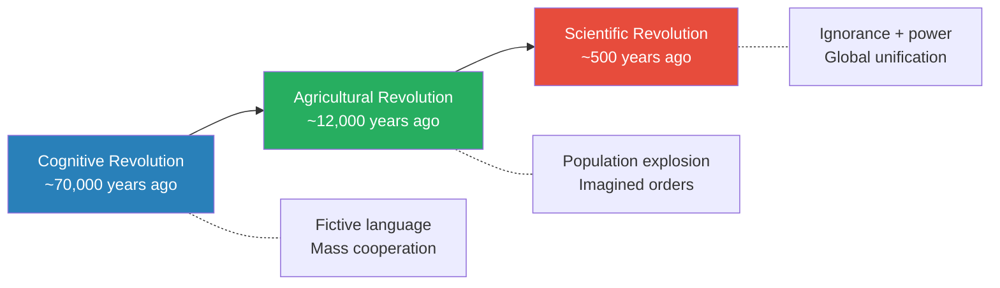
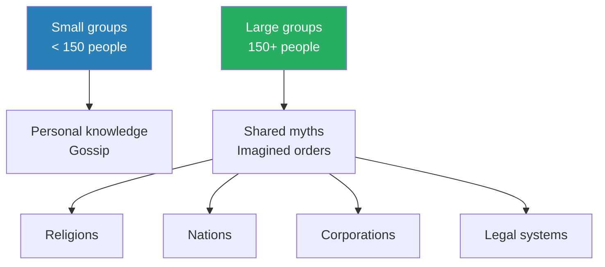
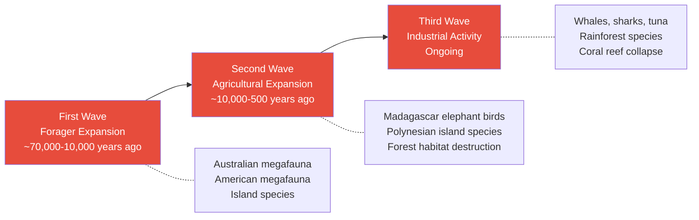
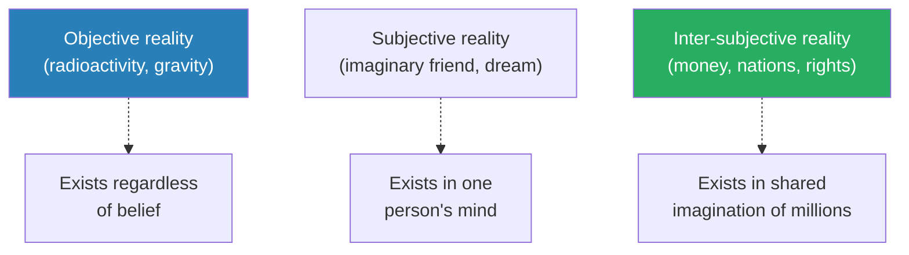
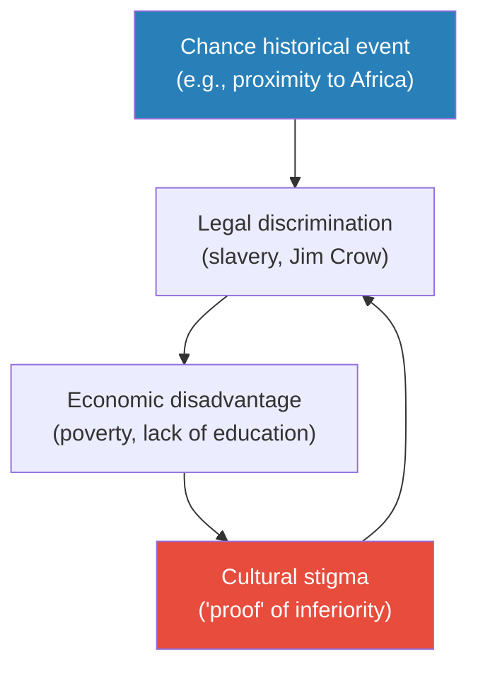
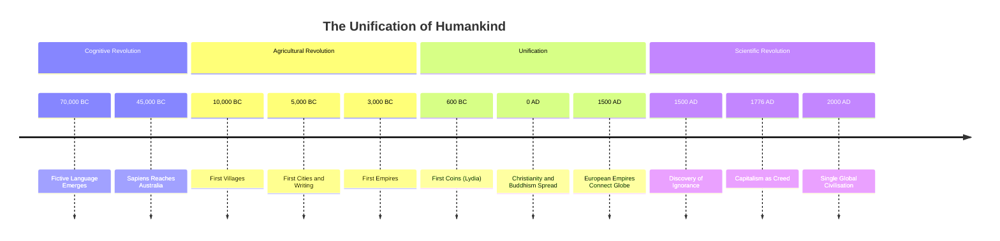
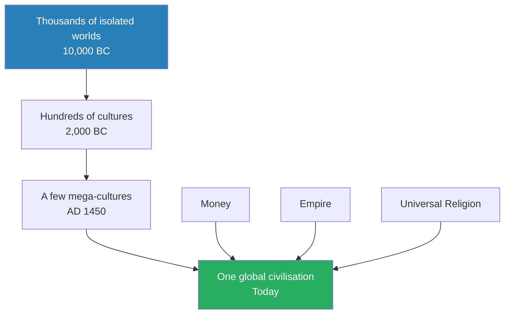
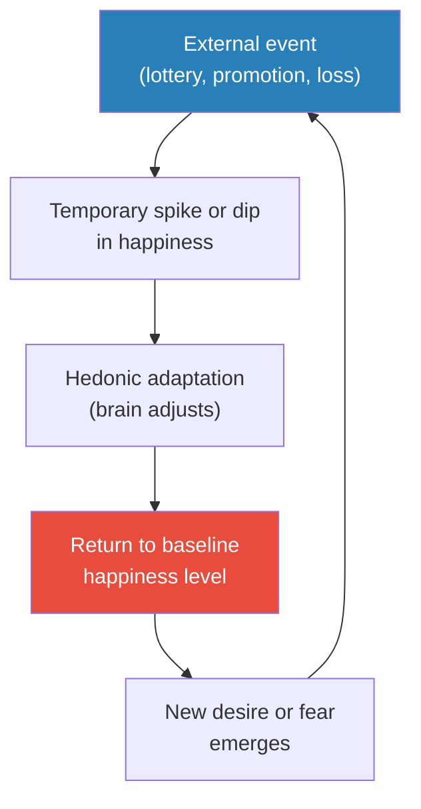
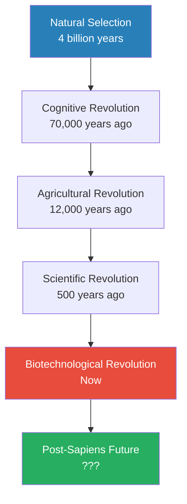

# Sapiens — Yuval Noah Harari

> Yuval Noah Harari tells the entire story of humankind in a single sweeping narrative — from the emergence of Homo sapiens as an insignificant ape in East Africa 70,000 years ago to our present status as the planet's dominant and most destructive species.
> His central argument is that Sapiens conquered the world not through physical strength or individual intelligence, but through a unique ability to create and believe in shared fictions — myths, religions, money, nations, and corporations — that enable millions of strangers to cooperate flexibly.
> Three great revolutions — the Cognitive, the Agricultural, and the Scientific — reshaped human life, each time in ways nobody planned or predicted, and each time creating new forms of both power and suffering.
> *Sapiens* is a book that makes you question everything you thought was natural about human society — because almost none of it is.
> It forces the uncomfortable realisation that the modern world runs on exactly the same kind of shared myths that "primitive" tribes danced around campfires to honour.

---

## About the Author

Yuval Noah Harari is an Israeli historian and professor at the Hebrew University of Jerusalem, specialising in world history, medieval history, and military history. He first published *Sapiens* in Hebrew in 2011; the English translation appeared in 2014 and became an international phenomenon, selling over 20 million copies worldwide. Harari has a gift for distilling vast historical processes into provocative, accessible narratives that challenge conventional wisdom. He followed *Sapiens* with *Homo Deus* (2016), which explores the future of humanity, and *21 Lessons for the 21st Century* (2018). His work draws on evolutionary biology, anthropology, economics, and philosophy to ask the biggest possible questions about what it means to be human.

> [!tip] Why This Book Endures
> Most history books zoom in on a period, a civilisation, or a theme. Harari zooms out to the widest possible lens — 70,000 years of human history in a single narrative — and uses that vantage point to show that the structures we take for granted (nations, money, human rights, corporations) are shared fictions. Once you see the world through this lens, you cannot unsee it.

---

## The Big Idea

- <b style="color: #2980b9">Homo sapiens conquered the world through fiction</b> — not through physical strength, sharper tools, or bigger brains, but through the unique ability to create and believe in things that exist only in our collective imagination
- Other animals communicate about the physical world — "Careful! A lion!" — but only Sapiens can say "The lion is the guardian spirit of our tribe" and have others believe it
  - This capacity for **fictive language** enabled mass cooperation among strangers on a scale no other species can match
  - Every large-scale human institution — every religion, every nation, every corporation, every legal system — is built on shared myths
- <b style="color: #27ae60">The secret of Sapiens' success is flexible cooperation in large numbers</b>
  - Ants cooperate in large numbers but rigidly — they cannot reinvent their social structure overnight
  - Chimpanzees cooperate flexibly but only in small groups of individuals who know each other intimately
  - Only Sapiens can do both: cooperate flexibly AND in vast numbers, because shared fictions bridge the gap between strangers
- Three revolutions shaped human history, each transforming life in ways nobody planned:
  - The **Cognitive Revolution** (~70,000 years ago) gave Sapiens fictive language and the power to imagine
  - The **Agricultural Revolution** (~12,000 years ago) multiplied human numbers but arguably made individual lives worse
  - The **Scientific Revolution** (~500 years ago) married ignorance with power and launched the modern world

Each revolution gave Sapiens new powers but also created new forms of suffering — for humans and for every other species on the planet.

The dual-line chart shows the uncomfortable correlation at the heart of Harari's narrative: every surge in human population corresponds to a wave of megafauna extinction — Sapiens' success has been other species' catastrophe.

The treemap reveals Harari's most provocative insight: the institutions that organise modern civilisation (money, nations, corporations, human rights) are all inter-subjective fictions — real only because millions believe in them, yet more powerful than the objective realities (gravity, DNA) that exist regardless of belief.

---

## Key Concepts at a Glance

| Concept | One-line summary |
|---------|-----------------|
| **Cognitive Revolution** | A genetic mutation ~70,000 years ago gave Sapiens the ability to imagine and communicate about things that don't exist |
| **Fictive language** | The capacity to create and share stories about entities with no physical reality — gods, nations, money |
| **Imagined orders** | The social structures (laws, hierarchies, institutions) that exist only because millions of people believe in them |
| **150-person threshold** | The natural limit of a group bonded by personal knowledge; beyond it, shared myths are required |
| **Agricultural Revolution** | The transition from foraging to farming — which multiplied human numbers but degraded individual quality of life |
| **The luxury trap** | The mechanism by which innovations meant to improve life become necessities that enslave us |
| **Imagined hierarchies** | The fictional categories (race, caste, class) that organise societies but have no biological basis |
| **Three unifiers** | Money, empires, and universal religions — the forces that gradually fused thousands of cultures into one global civilisation |
| **The discovery of ignorance** | The Scientific Revolution's key insight: admitting we don't know is the first step to gaining real power |
| **Science-empire-capital nexus** | The feedback loop between scientific research, imperial expansion, and capitalist investment that drives modernity |
| **The Gilgamesh Project** | Humanity's age-old quest to overcome death — now approaching plausibility through bioengineering, cyborg technology, and AI |
| **Inter-subjective reality** | Things that exist in the shared imagination of millions — not objective like radiation, not subjective like an imaginary friend |
| **Level Two Chaos** | Systems that react to predictions about themselves, making history inherently unpredictable |
| **Consumerism** | The modern ethical code commanding people to buy and experience more to fuel economic growth |

---

# Part One: The Cognitive Revolution

## Chapter 1 — An Animal of No Significance

*For 2 million years, humans were middle-of-the-food-chain scavengers who cracked open bones for marrow after the real predators had finished eating. Then, in an evolutionary blink, they shot to the top — and the ecosystem never recovered.*

### Skeletons in the Closet

- <b style="color: #2980b9">Homo sapiens is just one of several human species that once walked the earth</b> — and for most of our history, we were not the most impressive one
- The genus *Homo* produced multiple species simultaneously:
  - **Neanderthals** in Europe and western Asia — bulkier, more muscular, bigger-brained, well-adapted to cold climates
  - **Homo erectus** in East Asia — survived for nearly 2 million years, making it the most durable human species ever recorded
  - **Homo floresiensis** on Flores island — dwarfed by island isolation, standing only one metre tall
  - **Homo denisova** in Siberia — discovered only in 2010 from a single finger bone and a molar
  - **Homo rudolfensis**, **Homo ergaster**, and others across East and Southern Africa
- It is a common mistake to imagine human evolution as a straight line from primitive to modern
  - In reality, multiple human species coexisted for hundreds of thousands of years
  - Today there are many species of bears, foxes, and pigs — why not many species of humans?
  - <b style="color: #e74c3c">Our current exclusivity — being the only human species — is the aberration, not the norm</b>

> [!example] The Dwarves of Flores Island
> - When sea levels dropped, archaic humans reached the Indonesian island of Flores
> - When seas rose again, some were trapped on the resource-poor island
> - Big people who needed lots of food died first — smaller people survived better
> - Over thousands of generations, the people of Flores shrank to just one metre tall and twenty-five kilograms
> - They still made stone tools and occasionally hunted the island's elephants — which were also a dwarf species
> - When scientists announced the discovery in 2003, it upended assumptions about what "human" looked like
> **The lesson:** Evolution shapes organisms to fit their environment, not toward some ideal of "progress."

---

### The Cost of Thinking

- The human brain accounts for about 2-3% of body weight but consumes 25% of the body's energy at rest — compared to 8% for other apes
- This enormous energy drain forced two critical trade-offs:
  - Humans spent more time searching for food to fuel the hungry brain
  - Their muscles atrophied — "like a government diverting money from defence to education"
- Walking upright freed the hands for tool use but caused backaches, stiff necks, and dangerously narrow birth canals
  - Women who gave birth earlier (when infants' heads were smaller) survived better
  - Human babies are therefore born prematurely compared to other animals — helpless, dependent for years
  - <b style="color: #27ae60">This premature birth is what makes humans so malleable — we can be educated to become almost anything</b>
- The consequences of premature birth rippled through human society:
  - Mothers needed constant help to feed and raise children
  - This favoured the development of strong social bonds and communal child-rearing
  - Raising a human requires a tribe — the "nuclear family" is a modern invention
- Despite these advantages, for 2 million years humans remained weak, marginal creatures:
  - They lived in constant fear of predators
  - They subsisted mainly by gathering plants and eating carrion left by more powerful carnivores
  - One common use of early stone tools: cracking open bones to get at the marrow after lions, hyenas, and jackals had finished

> [!tip] Core Insight
> Sapiens jumped from the middle to the top of the food chain so quickly that neither the ecosystem nor humans themselves had time to adjust. Most top predators evolved into that role over millions of years; Sapiens did it in a hundred thousand. We are full of the fears and anxieties of a former underdog — and that makes us doubly dangerous.

---

### Fire and Cooking

- The domestication of fire was the first time any animal gained control of an obedient, potentially limitless force
  - Unlike eagles who depend on thermal columns proportional to their wingspan, a single woman with a firestick could burn down an entire forest
  - Fire gave even a small, weak human power disproportionate to their physical strength
- <b style="color: #2980b9">Cooking was fire's most important contribution</b>:
  - Made previously indigestible foods (wheat, rice, potatoes) into staples
  - Killed germs and parasites in meat and water
  - Reduced chewing time from five hours a day (chimpanzees) to one hour
  - Allowed humans to eat a much wider range of foods than any previous primate
- Some scholars believe cooking shortened the intestinal tract and freed energy for brain growth:
  - Long intestines and big brains both demand enormous energy
  - You can't easily have both — cooking resolved the dilemma
  - By pre-digesting food externally, fire allowed the gut to shrink and the brain to expand
- Fire also changed social dynamics:
  - Campfires became gathering points — places for storytelling, socialising, and planning
  - The hearth may have been the first "institution" — a shared resource that required cooperation to maintain
  - <b style="color: #27ae60">Fire domesticated humans as much as humans domesticated fire</b>

---

### What Happened to Our Siblings?

- When Sapiens spread out of Africa ~70,000 years ago, they encountered other human species — and those species vanished
- Two competing theories have dominated the debate:

| Theory | Claim | Prediction |
|--------|-------|------------|
| **Interbreeding** | Sapiens mated with locals, creating hybrid populations | Modern humans should carry significant DNA from other species |
| **Replacement** | Sapiens outcompeted or killed others | Other species' DNA should be absent from modern humans |

- The answer turned out to be "mostly replacement, with a little interbreeding":
  - Modern Europeans and Middle Easterners carry 1-4% Neanderthal DNA
  - Modern Melanesians and Aboriginal Australians carry up to 6% Denisovan DNA
  - But these are small percentages — not enough to call it a "merger"
  - The overwhelming majority of other human species' genes are gone forever

> [!example] The Neanderthal Encounter
> - When Sapiens arrived in Europe roughly 45,000 years ago, Neanderthals had thrived there for over 200,000 years
> - Neanderthals had bigger brains, larger muscles, and were superbly adapted to the European cold
> - They made tools, used fire, cared for their sick, and buried their dead
> - Yet within 10,000-20,000 years of contact with Sapiens, the Neanderthals were gone
> - The most likely explanation: Sapiens' superior social organisation and communication — enabled by fictive language — allowed them to outcompete Neanderthals for resources
> - Where a Neanderthal band of 20-30 hunted together, Sapiens could coordinate hundreds
> - Some interbreeding occurred, which is why Europeans carry 1-4% Neanderthal DNA today
> **The lesson:** Raw physical superiority is no match for the power of flexible social cooperation.

- <b style="color: #e74c3c">Tolerance is not a Sapiens trademark</b> — in modern times, trivial differences in skin colour, dialect, or religion have been enough to trigger genocide
  - If Sapiens could not coexist with Neanderthals — who were genuinely different — the history of human intolerance begins long before recorded history
  - Imagine how a Neanderthal would fare in a modern classroom, on public transport, or walking through a city — Harari suggests the social outcome would be grim

---

## Chapter 2 — The Tree of Knowledge

*Something happened to the Sapiens brain around 70,000 years ago that changed everything — not a new tool or a new weapon, but a new kind of language that could describe things that don't exist.*

### The Cognitive Revolution

- Between 70,000 and 30,000 years ago, Sapiens began doing extraordinary things:
  - Crossed open seas and colonised Australia
  - Invented boats, oil lamps, bows, needles for sewing warm clothing
  - Created the first art — cave paintings, carved figurines, body ornaments
  - Produced the first evidence of religion, commerce, and social stratification
  - Drove every other human species to extinction
- The most likely explanation: <b style="color: #2980b9">an accidental genetic mutation — the "Tree of Knowledge mutation" — rewired the Sapiens brain</b>, enabling a completely new type of language
- What made this language special was NOT that it was more complex than other animal communication:
  - Green monkeys have distinct calls for "eagle" and "lion"
  - Whales and elephants produce equally impressive vocal ranges
  - A parrot can say anything Einstein could say — it just doesn't understand it
- The truly unique feature is the ability to transmit information about things that do not exist:
  - Every animal can say "Careful! A lion!"
  - Only Sapiens can say "The lion is the guardian spirit of our tribe"
  - <b style="color: #27ae60">This ability to speak about fictions is the most unique feature of Sapiens language</b>

---

### The Gossip Theory

- One theory suggests language evolved primarily as a tool for gossip:
  - In a band of 50-150 individuals, knowing who is reliable, who is cheating, and who is sleeping with whom is critical survival information
  - Gossip allows individuals to track the reputations of far more people than they could observe directly
  - Even today, the vast majority of human communication — emails, phone calls, media — is essentially gossip
- Social information is not trivial — it is the glue of cooperation:
  - Knowing that "John is a liar" or "Sarah always shares" lets the group function without constantly monitoring everyone
  - This is why isolation and ostracism are among the most powerful punishments in human societies
- But gossip alone cannot explain Sapiens' unique achievements:
  - Gossip works for groups up to about 150 — beyond that, you can't keep track of everyone's reputation
  - <b style="color: #2980b9">The real breakthrough was not gossip about real people but fiction about imaginary entities</b>

---

### Why Fiction Matters — The Peugeot Example

- Fiction enabled not just individual imagination but *collective* imagination — the ability to weave common myths that coordinate the behaviour of millions of strangers

| Type of cooperation | Scale | Flexibility | Example |
|-------------------|-------|-------------|---------|
| Ants and bees | Huge numbers | Rigid, genetically programmed | Ant colonies |
| Wolves and chimps | Small groups (up to ~50) | Flexible, based on personal knowledge | Chimpanzee troops |
| Homo sapiens | Unlimited | Flexible, based on shared myths | Nations, corporations, religions |

Sapiens rule the world because they alone can combine large scale with flexible cooperation.

> [!example] The Legend of Peugeot
> - Peugeot employs about 200,000 people, most of whom are complete strangers to each other
> - If every Peugeot car were simultaneously scrapped, the company would still exist
> - If every employee died, the company could hire new ones and continue
> - If all managers were fired and all shares sold, the company would remain intact
> - But if a judge ordered the company dissolved, it would instantly vanish — even though factories, workers, and products remain
> - Peugeot is a **legal fiction** — it exists only because millions of people share the belief in its existence
> - Compare this to what happened when Armand Peugeot the man died in 1915 — the man was gone, but the company went on
> **The lesson:** Modern corporations are imagined realities, created through ritual (legal procedures) in exactly the same way that priests create the body of Christ through the Eucharist.

- Harari draws a provocative parallel between religious rituals and legal rituals:
  - A Catholic priest performs the correct rites and declares "This is the body of Christ" — and for a billion believers, it is
  - A lawyer performs the correct rites and declares "This is a legally incorporated company" — and for millions of business partners, it is
  - Both acts create something that exists only in collective imagination — but exerts enormous real-world power
  - <b style="color: #27ae60">The ability to create and believe in fictional entities is the single most important advantage Sapiens have</b>

---

### The 150-Person Threshold

- Gossip and personal acquaintance can bond groups of up to about 150 individuals — <b style="color: #2980b9">Dunbar's number</b>
  - Below this threshold, communities can function on intimate knowledge and rumour alone
  - A platoon of 30 soldiers or a family business of 50 can work without formal hierarchy
  - Most people can genuinely know — track favours, debts, relationships — only about 150 others
- Beyond 150, shared myths become essential:
  - You cannot run a division of thousands the same way you run a platoon
  - Successful family businesses face a crisis when they grow past this threshold
  - This is why bureaucracy, written rules, and formal roles were invented — to substitute for personal knowledge
- <b style="color: #27ae60">Large-scale cooperation — cities, kingdoms, empires, corporations — is rooted in common myths that exist only in collective imagination</b>
  - Churches: rooted in shared religious myths
  - States: rooted in shared national myths
  - Legal systems: rooted in shared legal myths
  - None of these things exist outside the stories people tell each other

The 150-person threshold explains why every large-scale human institution depends on stories, not just personal relationships.

---

### Bypassing the Genome

- The Cognitive Revolution opened a "fast lane of cultural evolution, bypassing the traffic jams of genetic evolution"
- Other animals can only change their social behaviour through genetic mutations over thousands of generations:
  - Female common chimpanzees cannot learn from bonobos and stage a feminist revolution
  - Male chimps cannot hold a constitutional assembly and abolish the alpha male
  - Archaic humans used the same stone tools for hundreds of thousands of years
- Sapiens can transform their social structures within a decade or two, without any genetic change:
  - After 1789, the French went from monarchy to republic to empire to monarchy to republic — all with the same DNA
  - After 1917, the Russians transformed from a feudal empire into a communist state — no genetic mutations required
  - The speed of cultural change dwarfs the glacial pace of biological evolution

> [!example] A Berlin Woman Born in 1900
> - She lived under five completely different political systems in a single lifetime:
>   - The Hohenzollern Empire of Kaiser Wilhelm II (childhood)
>   - The Weimar Republic (young adult)
>   - The Nazi Third Reich (middle age)
>   - Communist East Germany (later years)
>   - Reunified democratic Germany (old age)
> - Her DNA remained exactly the same throughout all five systems
> - Each system told her different stories about who she was, what she owed, and what mattered
> - She was the same biological creature living in five completely different imagined realities
> **The lesson:** Sapiens can change their social reality at breathtaking speed without any biological evolution — by simply telling different stories.

- This capacity for rapid cultural change is both Sapiens' greatest strength and greatest danger:
  - It allows extraordinary adaptability — we can colonise any environment, from arctic tundra to tropical rainforest
  - But it also means that toxic mythologies — racial supremacy, totalitarian ideologies — can spread and take hold within a single generation
  - <b style="color: #e74c3c">The same faculty that enables democracy also enables fascism</b>

---

## Chapter 3 — A Day in the Life of Adam and Eve

*Nearly everything about modern human psychology — our eating habits, our conflicts, our anxieties — was shaped during tens of thousands of years of foraging. We've been farmers for 10,000 years and office workers for 200, but our brains still think we're on the savannah.*

### Why the Foraging Era Matters

- The foraging era — from the Cognitive Revolution (~70,000 years ago) to the Agricultural Revolution (~12,000 years ago) — spans roughly 58,000 years
- That is about 90% of Sapiens' history as a behaviourally modern species
- Everything about our minds and bodies was shaped during this period:
  - Our craving for sugar and fat evolved when these were scarce and precious — now they are cheap and killing us
  - Our tendency to gossip evolved when tracking reputations in a band of 150 was a survival skill — now it fills tabloids and social media
  - Our fear of snakes and spiders evolved when they were common threats — now we fear them more than cars, which kill far more people
  - Our instinct to gorge on food whenever available evolved when famines were common — now it drives the obesity epidemic
- <b style="color: #27ae60">Understanding forager psychology is essential to understanding modern human behaviour</b> — we are foragers living in office buildings

---

### The Original Affluent Society

- For the vast majority of human history, Sapiens were foragers — and contrary to popular belief, they probably lived better than most of the farmers, herders, and office workers who came after them
- Working hours: hunter-gatherers in harsh environments like the Kalahari Desert work 35-45 hours per week, compared to 40-80 hours for modern workers in developing countries
- Diet: foragers ate dozens of different foods, ensuring nutritional variety and resilience
  - Ancient farmers relied on one or two crops — rice, wheat, potatoes — a diet poor in vitamins and minerals
  - A forager's breakfast might include berries, nuts, mushrooms, insects, and small game — nutritionally superior to a bowl of processed cereal
- Health: foragers were generally taller and healthier than their farming descendants
  - They suffered less from infectious diseases (most of which originated in domesticated animals)
  - Smallpox, measles, and tuberculosis all jumped from livestock to humans
  - They had stronger bodies from varied physical activity — climbing, walking, running, digging
- Knowledge: the average forager had wider, deeper knowledge of their surroundings than most modern people
  - They could identify hundreds of plant and animal species
  - They could read animal tracks, weather patterns, and seasonal cycles
  - They could turn a flint stone into a spear point in minutes
  - <b style="color: #2980b9">There is evidence that the average Sapiens brain has actually decreased since the age of foraging</b> — agriculture opened "niches for imbeciles" where specialised but narrow competence sufficed

| Comparison | Foragers | Farmers | Modern workers |
|-----------|----------|---------|----------------|
| Weekly hours | 35-45 | 50-80 | 40-60 |
| Diet variety | Dozens of species | 1-2 staples | Processed foods |
| Infectious disease | Rare | Common (from livestock) | Controlled by medicine |
| Knowledge breadth | Encyclopaedic | Narrow (crop-focused) | Hyper-specialised |
| Physical health | Robust, varied exercise | Repetitive strain injuries | Sedentary |
| Social circle | Intimate band of 25-150 | Village of hundreds | Thousands of strangers |

This table captures one of the book's most counterintuitive claims: that the "progress" from foraging to farming to modernity has, in many respects, made individual lives worse even as it made collective human power incomparably greater.

---

### The Ancient Commune

- Forager societies were profoundly different from our own in ways that challenge modern assumptions:
  - Most scholars believe that before the Agricultural Revolution, the average band consisted of several dozen people, most of them relatives
  - The band was the primary political, economic, and social unit
  - There were no separate kingdoms, cities, or institutions — life was lived entirely within the band
- Property was communal — few personal possessions, and what existed was shared:
  - Food was divided according to complex sharing norms
  - Tools belonged to whoever was using them
  - There was no concept of "my land" versus "your land"
- Some scholars argue that ancient foragers practised forms of communal sexuality and child-rearing:
  - Children may have been raised collectively, with uncertain paternity
  - The nuclear family may be a much more recent invention than we assume
  - <b style="color: #e74c3c">We cannot project modern family structures onto ancient societies without evidence</b>

---

### Animism — The Forager Religion

- Before the Agricultural Revolution, most Sapiens were probably animists:
  - <b style="color: #2980b9">Animism</b> is the belief that every place, every animal, every plant, and every natural phenomenon has awareness and feelings
  - There is no barrier between humans and other beings — a hunter might talk to a deer before killing it, asking forgiveness
  - There is no hierarchy — the river is not "below" the human; the eagle is not "above" the mouse
- Animism is not a single religion but a label for thousands of different belief systems:
  - A band in the Kalahari and a band in Siberia might have completely different spirits, rituals, and myths
  - What they shared was the underlying assumption that the world is alive with intention
- Harari argues that animism shaped human psychology in ways we still feel:
  - Our tendency to see faces in clouds, intention in random events, and personality in animals may be holdovers from animist thinking
  - The modern environmentalist who says "the earth is alive" is expressing an intuition rooted in 60,000 years of animist culture

---

### The Darker Side

- It would be a mistake to idealise forager life completely:
  - Child mortality was high — perhaps 30-50% of children died before reaching adulthood
  - Minor injuries could become death sentences without antibiotics or surgery
  - Some forager societies practised infanticide, abandoned the elderly, or engaged in ritual sacrifice
  - Violence between bands could be savage — some anthropologists estimate that 10-20% of forager deaths were caused by human violence
  - Women in many forager societies had limited autonomy despite the absence of formal patriarchy

> [!example] The Ache People of Paraguay
> - The Ache, hunter-gatherers who lived in Paraguay's jungles until the 1960s, reveal the complexity of forager societies
> - When a valued band member died, they customarily killed a little girl and buried the two together
> - One man told anthropologists: "I customarily killed old women. I used to kill my aunts"
> - Babies born without hair were killed immediately; one child was buried alive because "it was funny-looking"
> - Yet anthropologists who lived with the Ache for years also report: violence between adults was rare, people smiled and laughed constantly, they shunned domineering behaviour, and they valued good social interactions above all else
> - The same people who buried children alive also shared their food generously and cared tenderly for the sick
> **The lesson:** No human society is purely angelic or purely demonic. The Ache were neither — they were human.

---

### The Curtain of Silence

- <b style="color: #e74c3c">We know almost nothing about the inner lives, beliefs, or political dramas of ancient foragers</b>
  - The archaeological evidence — bones and stone tools — tells us about anatomy and technology, but nothing about alliances, spirits, art, or philosophy
  - These long millennia may have witnessed wars, revolutions, artistic masterpieces, and philosophical breakthroughs — but they are lost behind an impenetrable curtain of silence
- The foragers may have had "all-conquering Napoleons who ruled empires half the size of Luxembourg" and "gifted Beethovens who brought people to tears with bamboo flutes"
- We are tempted to dismiss 60,000 of 70,000 years of human history as unimportant — but the foragers shaped the world far more than we realise:
  - Our brains, our instincts, our social preferences were all calibrated during those tens of thousands of years
  - Our modern anxieties, cravings, and social needs are echoes of forager psychology operating in an alien environment

> [!example] The Stadel Lion-Man (~30,000 BC)
> - In 1939, archaeologists found an ivory figurine in a German cave — a human body with a lion's head, standing about 30 centimetres tall
> - Carved from mammoth ivory, it required about 400 hours of expert carving to produce
> - The figure has no practical use — it cannot cut, carry, or defend
> - It is the oldest known example of art that depicts something that does not exist in nature — a human-lion hybrid
> - This means the carver could imagine something they had never seen — and communicate that imaginary being to others
> - The Lion-Man is physical proof that the Cognitive Revolution had already occurred by 30,000 years ago
> **The lesson:** The ability to imagine things that do not exist — the foundation of all human civilisation — was already fully formed 32,000 years ago.

---

## Chapter 4 — The Flood

*Wherever Sapiens arrived for the first time — Australia, America, Madagascar, New Zealand — the large animals vanished. We are not just the planet's dominant species; we are its most prolific killer.*

### The Australian Extinction

- About 45,000 years ago, Sapiens somehow crossed the open sea and reached Australia — the first time any large terrestrial mammal had made that crossing
  - This required boats or rafts, planning, and the ability to cooperate on a complex project — evidence of the Cognitive Revolution in action
- Australia was home to extraordinary megafauna:
  - 200-kilogram kangaroos standing two metres tall
  - A marsupial lion as massive as a modern tiger
  - Giant koalas, flightless birds twice the size of ostriches
  - Dragon-like lizards and five-metre snakes
  - The diprotodon — a two-and-a-half-ton wombat, the largest marsupial that ever lived
- <b style="color: #e74c3c">Within a few thousand years of Sapiens' arrival, 23 of the 24 Australian animal species weighing over 50 kilograms were extinct</b>

Three pieces of evidence implicate humans rather than climate:
1. Australia's climate changed, but not drastically enough to explain such devastation — the diprotodon had survived ten previous ice ages over millions of years
2. Sea creatures were not affected — if climate were the cause, marine species should have suffered too
3. The same pattern repeated everywhere Sapiens arrived: New Zealand (800 years ago), Wrangel Island (4,000 years ago), Madagascar (1,500 years ago)

- Harari explains why Australian megafauna were particularly vulnerable:
  - They had evolved over millions of years without encountering humans
  - Unlike African animals that co-evolved with humans and learned to fear them, Australian megafauna had no instinctive wariness of bipedal hunters
  - They were "sitting targets" — like Galapagos tortoises encountering humans for the first time

---

### Why Large Animals Were Vulnerable

- Harari explains three reasons why megafauna were especially vulnerable to human hunters:
  - **Slow reproduction**: elephants, mammoths, and giant sloths produce one offspring every few years — even modest hunting pressure can exceed their replacement rate
  - **No evolved fear of humans**: African megafauna co-evolved with human ancestors and learned wariness — but Australian, American, and island megafauna encountered humans for the first time with no instinctive fear response
  - **Fire as a weapon**: foragers used fire to reshape entire landscapes — burning forests to create grasslands that attracted game, but also destroying habitat for species that depended on forest cover
- The combination was lethal:
  - A single band of hunters might kill only a few large animals per year
  - But if births could not keep pace with deaths, the population slowly collapsed
  - The process might take centuries or millennia — invisible to any single generation, catastrophic in the aggregate
  - <b style="color: #e74c3c">Extinction by a thousand cuts — no single hunter was a villain, but the collective effect was devastating</b>

---

### The American Extinction

- Sapiens reached America about 16,000 years ago via a land bridge from Siberia to Alaska
  - They arrived in ice-age Alaska and spread south through an ice-free corridor or along the Pacific coast
  - Within 2,000 years, they had spread to the southern tip of South America — a continent they had never seen before
- The toll was devastating:
  - North America lost 34 of 47 genera of large mammals
  - South America lost 50 of 60
  - Sabre-tooth cats, giant ground sloths, native horses, native camels, mammoths, mastodons — all gone
  - An entire continent's worth of megafauna was wiped out in what, geologically speaking, was an instant

> [!example] The Dung Ball Evidence
> - Palaeontologists search for fossilised faeces (coprolites) to track when species disappeared
> - Time and again, the freshest dung balls date to exactly when humans flooded an area
> - On Caribbean islands like Cuba and Hispaniola, ground-sloth dung lasted until ~5000 BC — the precise moment humans first crossed the Caribbean Sea
> - Some scholars try to blame climate, but as Harari writes: "In America, the dung ball cannot be dodged"
> - The fossils, the dung, and the dates all tell the same story: humans arrived, and the megafauna vanished
> **The lesson:** The evidence trail is literally made of ancient excrement — and it leads directly to us.

---

### Island Extinctions — The Pattern Repeats

- The extinction pattern is even more visible on islands, where timing can be pinpointed more precisely:
  - **Madagascar**: humans arrived around 1,500 years ago — within centuries, giant lemurs, elephant birds, giant tortoises, and the world's largest bird (the elephant bird, three metres tall) were gone
  - **New Zealand**: the Maori arrived around 1200 AD — within 200 years, the giant moa (a flightless bird up to 3.5 metres tall and 250 kilograms) was extinct, along with most of New Zealand's native mammals
  - **Hawaii**: Polynesian settlers arrived around 800 AD and wiped out half the island's native bird species before the first European ever set foot there
  - **Wrangel Island**: the last woolly mammoths survived on this Arctic island until about 2000 BC — they went extinct around the time the Egyptians were building the Great Pyramid

> [!example] The Moa and the Maori
> - New Zealand was isolated from other landmasses for 80 million years
> - Without mammals, birds evolved to fill every ecological niche — including the role of large grazer
> - The moa were flightless birds, some reaching 3.5 metres tall and weighing up to 250 kilograms
> - Having never encountered a predator, they had no fear response to the Maori hunters who arrived around 1200 AD
> - The Maori hunted the moa to extinction within approximately 200 years
> - With the moa gone, Haast's eagle — the largest eagle that ever lived, which preyed on moa — also went extinct
> **The lesson:** Each extinction triggers a cascade. When you remove a keystone species, the entire ecosystem unravels.

---

### Three Waves of Extinction

- At the time of the Cognitive Revolution, the planet had about 200 genera of large terrestrial mammals — by the Agricultural Revolution, only about 100 remained
- <b style="color: #e74c3c">Homo sapiens drove half the planet's big beasts to extinction before inventing the wheel, writing, or iron tools</b>
- Harari's verdict: "Don't believe tree-huggers who claim that our ancestors lived in harmony with nature"
- Each wave was more devastating than the last, and the third wave is still accelerating

> [!tip] Core Insight
> The "noble savage" who lived in harmony with nature is a myth. Long before the Industrial Revolution, Homo sapiens held the record among all organisms for driving the most plant and animal species to extinction. We have always been the deadliest species in the annals of biology.

---

# Part Two: The Agricultural Revolution

## Chapter 5 — History's Biggest Fraud

*The Agricultural Revolution is usually presented as humanity's greatest triumph — the moment we mastered nature and built civilisation. Harari turns this story upside down: far from making life better, agriculture was a trap that gave us more people living worse lives.*

### Wheat Domesticated Us

- About 10,000 years ago, Sapiens began devoting almost all their time to manipulating a few plant and animal species
- The conventional story says humans cleverly figured out how to farm and cheerfully abandoned the hard life of hunting and gathering
- Harari's counter-argument: the Agricultural Revolution was <b style="color: #e74c3c">history's biggest fraud</b>
  - It enlarged the total food supply but did NOT improve individual diets or create more leisure
  - Instead, it produced population explosions and pampered elites
  - The average farmer worked harder than the average forager and got a worse diet in return
- The culprits were not kings, priests, or merchants — they were a handful of plant species

> [!example] The World from Wheat's Perspective
> - Ten thousand years ago, wheat was just a wild grass confined to a small area of the Middle East
> - Within a few millennia, it was growing all over the world, covering 2.25 million square kilometres — an area about ten times the size of Britain
> - By the criteria of evolutionary success — survival and reproduction — wheat became one of the most successful plants ever
> - But wheat didn't achieve this by being useful to humans — it achieved it by **manipulating** Homo sapiens
> - Wheat demanded humans clear rocks, pull weeds, carry water, guard against pests, and collect animal faeces for fertiliser
> - Human spines, knees, and necks paid the price: studies of ancient skeletons show the transition to agriculture brought slipped discs, arthritis, and hernias
> - The word "domesticate" comes from the Latin *domus* — "house." Who lives in the house? Not the wheat. It's the Sapiens.
> **The lesson:** We did not domesticate wheat. It domesticated us.

---

### The Luxury Trap

- The transition to farming happened gradually, over centuries — no single generation chose to abandon foraging
- <b style="color: #2980b9">The luxury trap</b> explains how it happened:
  1. People discovered that hoeing fields produced better yields — "we'll work harder, but we'll never go hungry"
  2. The extra food allowed populations to grow
  3. More mouths consumed the surplus, requiring even more farming
  4. Populations grew too large to ever return to foraging — the trap snapped shut
  5. "There was no going back. If a village grew from 100 to 110, which ten people would volunteer to starve?"
- <b style="color: #27ae60">One of history's few iron laws: luxuries tend to become necessities and to spawn new obligations</b>
  - Once people get used to a luxury, they take it for granted, then depend on it, then can't live without it
  - The mechanism is the same whether the "luxury" is wheat farming, email, or smartphones
  - Each generation inherits the previous generation's luxuries as baseline expectations — and adds new luxuries of its own
  - The ratchet never turns backwards: nobody voluntarily gives up running water, electricity, or internet access

> [!abstract] How the Luxury Trap Works
> 1. An innovation promises to make life easier (planting wheat, inventing email)
> 2. Early adopters gain a real advantage — more food, faster communication
> 3. Others adopt to keep up — the innovation becomes widespread
> 4. Society reorganises around the innovation — new expectations, new demands
> 5. The population grows (or lifestyle inflates) to consume the new surplus
> 6. The innovation is no longer a luxury — it is a necessity
> 7. People work harder than before to maintain the new baseline — the trap snaps shut

> [!example] The Modern Email Trap
> - Over recent decades, we invented countless time-saving devices: washing machines, dishwashers, email, smartphones
> - Email was supposed to make communication faster and life more relaxed
> - Instead, people now receive dozens of emails daily, all expecting prompt replies
> - "We thought we were saving time; instead we revved up the treadmill of life to ten times its former speed"
> - The teenager who expected a handwritten letter once a month now expects instant replies to texts
> - The pattern is identical to the agricultural luxury trap: each innovation meant to improve life becomes a new obligation
> **The lesson:** The luxury trap is not ancient history — we are living in one right now.

---

### Gobekli Tepe — Temple Before Village

- In 1995, archaeologists began excavating a site in south-eastern Turkey called <b style="color: #2980b9">Gobekli Tepe</b>
- They found monumental stone pillars — each weighing up to seven tons, reaching five metres high — decorated with spectacular engravings of lions, foxes, scorpions, and vultures
- The astonishing discovery: these structures date to about 9500 BC and were built by *hunter-gatherers*, not farmers
  - Stonehenge was built 7,000 years later by an established agricultural society
  - Gobekli Tepe required hundreds of workers over years — far beyond what a small foraging band could sustain
- Even more remarkable: the earliest domesticated wheat originated in the Karacadag Hills, just 30 kilometres from Gobekli Tepe
  - The conventional model says people first built villages, then temples
  - Gobekli Tepe suggests the opposite: the temple came first, and the village grew up around it
  - <b style="color: #27ae60">Foragers may have switched to farming not for practical reasons, but to feed the builders and users of a sacred site</b>
- This reverses the assumed relationship between economics and culture:
  - We assume people first secured their food supply, then built monuments
  - Gobekli Tepe suggests that cultural and religious motivations may have driven the shift to agriculture — not hunger, but belief
  - If this interpretation is correct, it means the Agricultural Revolution was motivated not by practical necessity but by shared myths — one of Harari's central themes

---

### The Divergence of Farming Centres

- Agriculture was not invented once and spread outward — it was invented independently in at least six different regions:
  - The Middle East (~9500 BC): wheat and goats
  - China (~7500 BC): rice and millet
  - Central America (~5000-4000 BC): maize and squash
  - The Andes (~3500 BC): potatoes and llamas
  - West Africa (~3000 BC): millet and sorghum
  - Eastern North America (~2500 BC): squash and sunflower
- Each region domesticated completely different species, demonstrating that the Agricultural Revolution was not a single event but a pattern — a trap that multiple populations fell into independently
- <b style="color: #2980b9">The fact that agriculture was independently invented so many times suggests it was nearly inevitable</b> once conditions were right — which makes the luxury trap all the more insidious
  - It was not that one group made a bad choice — it was that the trap was so effective it caught populations on every continent

---

### Victims of the Revolution

- The Agricultural Revolution's impact on animals was catastrophic:
  - Today the world contains about a billion sheep, a billion pigs, more than a billion cattle, and more than 25 billion chickens
  - By the criteria of DNA copies, domesticated animals are an evolutionary success story
  - By the criteria of individual suffering, they are among the most miserable creatures that ever lived

| Measure | Wild ancestors | Domesticated descendants |
|---------|---------------|------------------------|
| Lifespan | Natural (7-25 years) | Weeks to months (slaughtered young) |
| Freedom | Roamed freely | Confined to pens and cages |
| Social life | Complex herds/flocks | Isolated or overcrowded |
| Physical integrity | Intact | Castrated, debeaked, mutilated |
| Evolutionary "success" | Few individuals | Billions of copies |
| Individual satisfaction | Natural behaviours fulfilled | Most natural urges frustrated |

- <b style="color: #e74c3c">A rare wild rhinoceros on the brink of extinction is probably more satisfied than a calf spending its short life inside a tiny box</b>
- The Agricultural Revolution's most important lesson: a dramatic increase in collective power and evolutionary "success" went hand in hand with massive individual suffering
- This pattern — collective gain at the cost of individual misery — would repeat itself throughout human history

> [!example] The Life of a Domesticated Calf
> - A calf is separated from its mother shortly after birth — both mother and calf show clear signs of distress
> - The calf is confined to a pen too small to turn around in, to keep its muscles tender
> - It is fed a liquid diet deliberately deficient in iron, to produce the anaemic white flesh consumers prefer
> - It is slaughtered at a few months of age, having lived a life devoid of every natural pleasure — running, playing, socialising
> - Yet from an evolutionary perspective, domesticated cattle are extraordinarily "successful": there are 1.5 billion of them
> - This is the bitter paradox: evolutionary success and individual happiness are completely different things
> **The lesson:** The Agricultural Revolution increased humanity's collective power at the cost of immense individual suffering — for both humans and animals.

---

## Chapter 6 — Building Pyramids

*The food surpluses of the Agricultural Revolution didn't just feed more people — they funded the creation of imagined orders: elaborate social systems held together by shared beliefs that have no existence outside the human mind.*

### Imagined Orders — Hammurabi vs. Jefferson

- Food surpluses enabled cities, kingdoms, and empires — but food alone wasn't enough
  - You can feed a million people in the same kingdom, but that doesn't mean they can agree on how to divide land, settle disputes, or organise defence
  - The French Revolution was led by affluent lawyers, not starving peasants
  - Yugoslavia in 1991 had plenty of food and still disintegrated into bloodshed
  - Unity requires shared beliefs, not just shared bread
- The solution: <b style="color: #2980b9">imagined orders</b> — social norms based on shared myths

> [!example] Hammurabi's Code vs. The Declaration of Independence
> - In 1776 BC, Hammurabi's Code established order in Babylon: people are divided into superiors, commoners, and slaves, each with different values
>   - Blinding a superior man's eye: your eye is blinded
>   - Blinding a commoner's eye: pay 60 silver shekels
>   - Blinding a slave's eye: pay half the slave's value
> - In 1776 AD, the Declaration of Independence proclaimed: "All men are created equal"
> - Both documents claim to outline *universal and eternal* principles of justice — both are wrong
> - Neither hierarchy nor equality is an objective fact — both are products of imagination
> - In biological terms, "all men are created equal" translates to "all men evolved differently" and "unalienable rights" translates to "mutable characteristics"
> - Hammurabi would have been appalled by Jefferson's claim of equality; Jefferson would have been horrified by Hammurabi's hierarchy — yet both are equally imagined
> **The lesson:** The imagined orders that govern our lives — whether Babylonian hierarchy or American equality — are neither natural nor inevitable. They are stories we tell ourselves.

- <b style="color: #27ae60">An imagined order is not a lie</b> — it is something everyone believes in, and as long as the communal belief persists, the imagined order exerts real force in the world
  - The sculptor who carved the Stadel lion-man 30,000 years ago may have sincerely believed in guardian spirits
  - Most millionaires sincerely believe in money and limited liability companies
  - Most human rights activists sincerely believe in human rights
  - Sincerity does not make these things objectively real — but it does make them inter-subjectively powerful

---

### The Prison Walls

- Three factors prevent people from realising that the orders governing their lives are imagined:

**a. The imagined order is embedded in the material world**
- Modern individualism is built into the architecture of our homes — private rooms, locked doors, personalised spaces
- Medieval collectivism was built into castles — no private rooms, always on display
- You think your desire for a private bedroom is "natural" — but it is a product of liberal individualism, encoded in brick and mortar

**b. The imagined order shapes our desires**
- "Follow your heart" — but the heart takes its instructions from the dominant myths of the day
- The desire to travel abroad for holidays is not natural — it was planted by romantic consumerism
  - A wealthy ancient Egyptian would never dream of solving a relationship crisis by taking his wife to Babylon — he'd build her a lavish tomb instead
  - The "romantic holiday" is a myth created by the tourism industry and romantic consumerism working in tandem
- Even our most "authentic" desires are culturally programmed:
  - The desire for a big house, a foreign holiday, or a new car is no more natural than the medieval desire for a pilgrimage to Jerusalem

**c. The imagined order is inter-subjective**
- <b style="color: #2980b9">Inter-subjective</b> reality: something that exists in the shared imagination of millions, not in a single mind
  - **Objective**: radioactivity — exists regardless of belief
  - **Subjective**: an imaginary friend — exists in one person's mind
  - **Inter-subjective**: money, human rights, the United States — exist because millions believe in them
- Even if you personally stop believing in the dollar, it doesn't matter — billions of others still do
- To change an inter-subjective reality, you must change the consciousness of billions simultaneously
- <b style="color: #e74c3c">"When we break down our prison walls and run towards freedom, we are in fact running into the more spacious exercise yard of a bigger prison"</b>

Harari's three-layer model of reality is one of the most powerful conceptual tools in the book — once you can classify any phenomenon as objective, subjective, or inter-subjective, the nature of human institutions becomes radically clearer.

---

## Chapter 7 — Memory Overload

*The human brain evolved to track relationships in a band of 150 people and identify edible mushrooms — not to store tax records for an empire of millions. Writing was invented not to record poetry, but to keep accounts.*

### The Invention of Writing

- Empires generate huge amounts of information — laws, taxes, inventories, calendars — that exceed any brain's capacity
- The brain is a poor storage device for three reasons:
  1. **Limited capacity** — even master mnemonists have limits, and no individual can memorise the tax obligations of an entire city
  2. **Mortal** — information dies with the brain; when a village elder dies, their knowledge disappears
  3. **Specialised** — evolved for botanical, zoological, and social data (fruit trees, predator tracks, gossip), not mathematical data
- The Sumerians solved this around 3500-3000 BC by inventing <b style="color: #2980b9">writing</b> — a system for storing information outside the brain
  - The first writing was not literature — it was bookkeeping
  - Clay tablets recorded quotas of barley, numbers of sheep, tax debts owed and paid

> [!example] Kushim — The First Named Person in History
> - The earliest known written name is not a prophet, poet, or conqueror — it is an accountant
> - A clay tablet from the city of Uruk (~3400-3000 BC) reads: "29,086 measures barley 37 months Kushim"
> - The most probable reading: "A total of 29,086 measures of barley were received over 37 months. Signed, Kushim."
> - The first texts of history contain no philosophical insights, poetry, or legends — they are humdrum economic documents recording taxes, debts, and property
> - The great works of literature — the *Epic of Gilgamesh*, Homer's *Iliad* — came centuries later
> **The lesson:** Writing was born as a servant of bureaucracy, not literature. History begins with a receipt.

---

### Partial Scripts and Full Scripts

- Not all writing systems are created equal:
  - <b style="color: #2980b9">Partial scripts</b> can express only limited types of information — numbers, names, commodities
    - The Inca quipu (knotted strings) was a partial script: it could record numerical data but could not capture spoken language
    - Early Sumerian script was partial — suitable for lists and accounts but not for capturing speeches or stories
  - <b style="color: #2980b9">Full scripts</b> can express anything that spoken language can express
    - Sumerian script evolved over centuries from partial to full
    - The Latin alphabet and Chinese characters are full scripts
- Harari notes that the invention of full script was one of the hardest cognitive challenges in history:
  - Only a handful of cultures ever independently invented a full script
  - Most cultures adopted and adapted scripts invented elsewhere
  - The difficulty was not technical but conceptual — the idea of converting sounds into visual marks required a profound mental leap

---

### The Language of Numbers

- Writing's most important impact: it gradually changed how humans think
  - Free association and holistic thought gave way to compartmentalisation and bureaucracy
  - "Clerks and accountants think in a non-human fashion. They think like filing cabinets."
- The Arabic numeral system (actually invented by the Hindus) became the world's dominant language:
  - Almost all states, companies, and organisations use mathematical script regardless of what spoken language they use
  - A Japanese scientist and a Norwegian scientist may not share a spoken word, but they share mathematical notation
  - Entire fields like physics have lost almost all touch with spoken language — maintained solely by mathematical notation
- <b style="color: #27ae60">Writing was born as the maidservant of human consciousness but is increasingly becoming its master</b>
  - Bureaucracies developed their own logic — filing systems, catalogues, databases
  - Schools teach children to think in compartments: history in one hour, mathematics in the next, biology in the third
  - This is not how the brain naturally works — it is how *filing systems* work
  - We have reshaped our thinking to serve the needs of our data-processing systems

### How Writing Changed Power

- Writing transformed the nature of political power:
  - Before writing, a king's authority reached only as far as his voice — or as far as a messenger could ride before forgetting the details
  - With writing, laws could be recorded, copied, and enforced identically across vast territories
  - Taxes could be calculated, debts tracked, and property claims adjudicated based on documents, not memory
- This created a new class: <b style="color: #2980b9">the scribes and bureaucrats</b>
  - In ancient Egypt, Mesopotamia, and China, scribes wielded enormous power — they controlled information
  - A pharaoh who could not read was dependent on the scribes who translated the world for him
  - The pen really was mightier than the sword — because the pen controlled the tax records that paid for the swords
- Writing also enabled the first truly large-scale imagined orders:
  - Without writing, you cannot have a code of laws (Hammurabi's Code required cuneiform tablets)
  - Without a code of laws, you cannot govern millions of strangers consistently
  - Without governing millions consistently, you cannot build an empire
  - <b style="color: #27ae60">Writing was the infrastructure that made imagined orders scalable</b>

> [!example] The Chinese Civil Service Examination
> - From 605 AD, the Chinese imperial government selected its officials through written examinations
> - Any male citizen, regardless of birth, could theoretically rise to the highest offices by passing these exams
> - The system created a meritocratic bureaucracy that governed hundreds of millions of people for over 1,300 years
> - It also standardised Chinese culture: to pass the exams, candidates had to master the same classical texts, the same calligraphy, and the same modes of reasoning
> - Writing did not just record Chinese civilisation — it actively shaped and unified it
> **The lesson:** Writing is not a neutral technology. It reshapes the societies that use it — standardising thought, centralising power, and making bureaucracy possible.

---

## Chapter 8 — There is No Justice in History

*Every large-scale society has been organised by imagined hierarchies — categories that divide people into superiors and inferiors with no biological basis. These hierarchies persist not because they are natural, but because believing they are natural makes them self-reinforcing.*

### The Vicious Circle

- All imagined hierarchies claim to be natural and inevitable:
  - Hammurabi said hierarchy was ordained by the gods
  - Aristotle argued slaves have a "slavish nature"
  - Hindu creation myth: Brahmins from the Purusa's mouth, Shudras from its legs
  - White supremacists cite pseudoscientific "biological differences"
- <b style="color: #e74c3c">Every imagined hierarchy disavows its fictional origins</b>
- The mechanism is a vicious circle: discrimination creates the conditions it then points to as justification

> [!example] The Vicious Circle of Race in America
> - European colonisers imported African slaves due to three circumstantial factors:
>   - Africa was geographically closer to America (cheaper to import)
>   - Africa already had a well-developed slave trade supplying workers
>   - Africans had partial genetic immunity to malaria and yellow fever — a paradoxical case where genetic superiority led to social inferiority
> - To justify slavery, religious and scientific myths were invented: Africans descend from Ham's curse, blacks are less intelligent, blacks spread disease
> - When slavery was abolished, the myths persisted — blacks were excluded from good jobs, good schools, good neighbourhoods
> - Their resulting poverty and lack of education was then cited as "proof" of inherent inferiority
> - "Look," said the average white citizen, "blacks have been free for generations, yet there are almost no black professors or lawyers. Isn't that proof they're less intelligent?"
> - The vicious circle: chance historical circumstances create myths of natural inferiority, which enable discrimination, which produces poor outcomes, which "confirm" the myths
> **The lesson:** Unjust discrimination often gets worse over time, not better. Those victimised by history are likely to be victimised again.

The vicious circle is self-reinforcing: discrimination creates the very conditions it then points to as justification.

---

### Purity in India

- India's caste system demonstrates the same vicious circle on an even grander scale:
  - Around 3,000 years ago, Indo-Aryan invaders established a hierarchy of four *varnas* (castes)
  - Over millennia, this system ramified into thousands of *jatis* (sub-castes), each with its own occupation, marriage rules, dietary restrictions, and ritual status
  - At the bottom: the Dalits ("untouchables"), considered so impure that even their shadow was polluting
- The system was maintained through the same self-reinforcing loop:
  - Dalits were confined to the dirtiest occupations (tanning, sweeping, latrine cleaning)
  - Their dirtiness was then cited as evidence of inherent impurity
  - Their impurity justified confining them to dirty occupations
- Despite modern India's constitutional prohibition of caste discrimination, the system's effects persist:
  - <b style="color: #e74c3c">Imagined hierarchies do not dissolve simply because a law is passed</b> — they are embedded in architecture, language, personal habits, and desires
  - Dalits still face discrimination in marriage, employment, housing, and social interactions
  - The hierarchy has persisted for 3,000 years — a law passed in 1950 cannot undo it in decades

> [!example] The Persistence of Caste
> - In 2006, a Dalit student named Surekha Bhotmange and three of her family members were tortured and murdered in Khairlanji, Maharashtra, after her family filed a land dispute against upper-caste neighbours
> - The family's "crime" was aspiring to own land and educate their children — activities considered above their station
> - The Indian constitution guarantees equality; the reality on the ground in many villages is that caste determines who eats where, who marries whom, and who lives or dies
> - The gap between legal equality and social reality demonstrates exactly what Harari means by imagined orders being embedded in daily life
> **The lesson:** Changing the law changes the official story. Changing the imagined order — the deep beliefs embedded in millions of minds — takes generations.

---

### Biology Enables, Culture Forbids

- <b style="color: #2980b9">Sex</b> is a biological category (male/female, determined by chromosomes); <b style="color: #2980b9">gender</b> is a cultural category (man/woman, determined by society's myths)
- Harari's rule of thumb for distinguishing biology from culture: **"Biology enables, Culture forbids"**
  - Biology enables women to have children — some cultures *oblige* them to
  - Biology enables men to enjoy sex with one another — some cultures *forbid* it
  - A truly unnatural behaviour would be one that violates the laws of physics — no culture bothers to forbid men from photosynthesising or women from running faster than the speed of light
- The concept of "unnatural" comes not from biology but from Christian theology — "in accordance with the intentions of God who created nature"
  - But evolution has no intentions and no purpose — organs evolve for one function and constantly get repurposed for others
  - Mouths evolved to take in nutrients — we also use them to kiss, speak, and pull pins out of grenades
  - Wings evolved for warmth in small dinosaurs — they were repurposed for flight
  - <b style="color: #27ae60">From a biological perspective, nothing is "unnatural" — if it is possible, it is by definition natural</b>

---

### The Puzzle of Patriarchy

- Almost every known human society has been patriarchal — valued men over women
- Three common explanations, all inadequate:

| Theory | Claim | Problem |
|--------|-------|---------|
| **Muscle power** | Men are stronger, so they dominate | Women have historically been excluded from jobs requiring *least* physical effort (priesthood, law, politics) — and social power rarely correlates with physical strength in Sapiens societies |
| **Male aggression** | Men are more violent, so they control the military and thus society | Common soldiers are men, but the *commanders* need not be — Wellington's soldiers were "the scum of the earth" while he was an aristocrat; Chinese mandarins ran wars without ever holding swords |
| **Patriarchal genes** | Evolution programmed men to compete and women to submit | Among bonobos and elephants, dependent females form cooperative networks that dominate aggressive, isolated males — if anything, dependent Sapiens women should have used their social skills to cooperate and outmanoeuvre men |

- <b style="color: #e74c3c">We still do not have a good explanation for why patriarchy is so universal</b>
  - This is one of the genuinely unsolved puzzles in human history
  - Most explanations turn out to be circular: "Men dominate because they're more powerful" — "Why are they more powerful?" — "Because they dominate"
- What we do know: over the last century, gender roles have undergone revolutionary change at breathtaking speed — proof that patriarchy is cultural, not biological destiny
  - In 1900, women could not vote in any democracy; by 2020, women led some of the world's most powerful nations
  - This transformation happened with zero genetic change — only cultural change

---

# Part Three: The Unification of Humankind

## Chapter 9 — The Arrow of History

*Every culture is riddled with internal contradictions — and those contradictions are not a bug but a feature. They are the engines that drive cultural change.*

### Culture as Contradiction

- Scholars once believed every culture was a complete, harmonious whole with an unchanging essence — that "Greek culture" or "Muslim culture" was a unified, internally consistent system
- The opposite is true: <b style="color: #2980b9">every man-made order is packed with internal contradictions</b>
  - Medieval European nobility tried to reconcile Christianity ("turn the other cheek") with chivalry ("blood must answer blood") — the tension produced the Crusades, the Templars, and Arthurian romance
  - Modern politics tries to reconcile equality with individual freedom — the entire political history since 1789 is a series of attempts to square this circle
  - Democrats want equality (even if it curtails freedom); Republicans want freedom (even if it widens inequality)
- <b style="color: #27ae60">Cognitive dissonance is not a failure of the human psyche — it is a vital asset</b>
  - If people couldn't hold contradictory beliefs, no human culture could exist
  - "Consistency is the playground of dull minds"
  - The tension between contradictory values is what creates dynamism, debate, and change
  - A culture that resolved all its contradictions would be static and dead

---

### The Direction of History

- Over the millennia, small cultures have gradually coalesced into bigger civilisations:
  - In 10,000 BC, the planet contained thousands of isolated human worlds — each band of foragers was a universe unto itself
  - By 2,000 BC, most people lived in kingdoms or empires with hundreds of thousands of subjects
  - By AD 1450, close to 90% of humans lived in a single mega-world: Afro-Asia
  - Today, virtually all humans share the same geopolitical, economic, legal, and scientific systems
- This is <b style="color: #2980b9">the arrow of history</b> — and it points relentlessly toward unification
- Three forces drove this process: money, empires, and universal religions
  - Each transcended local boundaries and connected strangers
  - Each created shared myths that millions could believe in

Money dominates as the most universal unifier because it requires no shared language, religion, or culture — only shared trust in worthless tokens, making it the most versatile inter-subjective fiction in human history.

The timeline compresses Harari's 70,000-year narrative into its key inflection points, showing how each revolution (cognitive, agricultural, scientific) accelerated the pace of unification by orders of magnitude.

> [!example] Tasmania — A World Unto Itself
> - When sea levels rose around 10,000 BC, Tasmania was cut off from the Australian mainland
> - A few thousand hunter-gatherers were stranded on the island with no contact with any other humans
> - For 12,000 years, nobody else knew the Tasmanians existed, and they didn't know anyone else existed
> - They had their own wars, political struggles, social changes, and cultural developments — an entire human world in isolation
> - As far as the emperors of China or the rulers of Mesopotamia were concerned, Tasmania might as well have been on Jupiter
> - The Tasmanians' autonomous world ended only when British colonisation began in earnest in the 19th century — with devastating consequences for the Tasmanians
> **The lesson:** For most of history, "the world" meant your local region. Global consciousness is a remarkably recent invention.

---

### The Myth of "Authentic" Culture

- We talk about "authentic" cultures — but if authentic means something that developed independently, free of external influences, no such thing exists anymore
- <b style="color: #e74c3c">Even what we think of as the most traditional customs are often surprisingly modern imports</b>

> [!example] The Global Origins of "Ethnic" Cuisine
> - In an Italian restaurant, we expect spaghetti in tomato sauce — but tomatoes are Mexican, brought to Europe after 1492
> - Polish and Irish restaurants serve lots of potatoes — potatoes are South American
> - Indian restaurants use hot chillies in everything — chillies are Mexican
> - Swiss cafes serve thick hot chocolate — cocoa is Mexican
> - Julius Caesar never twirled tomato-drenched spaghetti; William Tell never tasted chocolate; Buddha never spiced his food with chilli
> - The Argentine steak tradition didn't exist until the Spanish introduced cattle after 1492
> - Even the iconic Plains Indian horsemen — brave warriors charging European wagons — were a modern culture, since there were no horses in America before the Spanish brought them
> **The lesson:** Almost everything we think of as "traditional" is the product of global exchange. Authenticity is itself a myth.

- This has a profound implication for nationalism and cultural identity:
  - "Indian civilisation," "European values," and "the American way" are all composite creations, assembled from elements borrowed, stolen, or traded across cultures
  - The more passionately someone defends their "authentic" culture, the more likely its key elements were imported from elsewhere
  - <b style="color: #27ae60">Cultures are not static monuments — they are living processes that constantly absorb, transform, and reinvent</b>

---

## Chapter 10 — The Scent of Money

*Money is the most universal and most efficient system of mutual trust ever devised. Christians and Muslims who couldn't agree on anything else happily used each other's coins.*

### From Barter to Money

- Hunter-gatherers had no money — they shared through an economy of favours and obligations
- Barter works for simple exchanges but breaks down with complexity:
  - If 100 commodities are traded, buyers and sellers must track 4,950 exchange rates
  - If 1,000 commodities are traded: 499,500 exchange rates
  - And barter requires "double coincidence of wants" — the shoemaker must want your apples at the exact moment you want shoes
- <b style="color: #2980b9">Money</b> solved this by creating a universal medium of exchange:
  - It enables people to convert almost anything into almost anything else
  - Brawn into brain (soldier finances college), land into loyalty (baron funds retainers), health into justice (doctor hires lawyer)
  - It also solves the storage problem: cowry shells don't rot, are unappetising to rats, survive fires, and fit in a safe
  - And the transport problem: a farmer selling his estate can carry a sack of coins instead of tons of rice

### What Makes Good Money?

- Harari identifies the key properties that make something work as money:
  - **Portability** — easy to carry (coins over cattle)
  - **Durability** — doesn't rot or break (gold over grain)
  - **Divisibility** — can be split into small units (coins over diamonds)
  - **Universality** — accepted by everyone in the relevant market
- But the most important property is none of these — it is <b style="color: #27ae60">trust</b>
  - Money works only because everyone believes it works
  - A dollar bill has no intrinsic value — it is a piece of paper that everyone agrees to treat as valuable
  - If trust evaporates, money becomes worthless overnight (hyperinflation in Weimar Germany, Zimbabwe, Venezuela)

> [!example] Cortes and the Aztec Gold Obsession
> - In 1519, when Hernan Cortes and his conquistadors invaded Mexico, the Aztecs quickly noticed the Spaniards' extraordinary fixation on gold
> - The Aztecs used gold for jewellery and statues, occasionally as a medium of exchange — but for serious commerce they used cocoa beans and bolts of cloth
> - When natives asked why the Spaniards were so obsessed with this soft, useless metal, Cortes answered: "Because I and my companions suffer from a disease of the heart which can be cured only with gold"
> - The disease was not medical — it was cultural. In the Afro-Asian world, gold obsession was epidemic
> - In Mesoamerica, cocoa beans were the money that moved economies
> **The lesson:** Money's value is entirely cultural — a psychological construct, not a material reality. What cures the "disease of the heart" in one culture is a decorative curiosity in another.

---

### Money as Shared Fiction

- Money is not coins and banknotes — it is anything people use to represent value systematically
  - Cowry shells were money for 4,000 years across Africa, South Asia, and East Asia
  - Salt was money in parts of Africa and Asia — the word "salary" comes from the Latin *salarium* (salt payment)
  - Cigarettes served as money in POW camps and prisons
  - Today, over 90% of all money exists only as electronic data on computer servers — no coins, no paper, just numbers in a database
- <b style="color: #27ae60">Money works because of trust</b> — it is the most universal and efficient system of mutual trust ever devised
  - We accept dollars because our neighbours accept them, and they accept them because we do
  - The crucial role of trust explains why financial systems are so tightly bound to political and ideological systems
  - When a government collapses, its currency often collapses with it

### The Dark Side of Money

- Money has a darker dimension that Harari does not shy away from:
  - It reduces everything — sacred and profane alike — to a common denominator
  - It can convert beauty into numbers, loyalty into a price, and even human beings into property
  - The Atlantic slave trade treated human beings as commodities — priced, transported, and sold like cattle
  - <b style="color: #e74c3c">Money is the most open-minded thing humans have created — and that openness comes at a moral cost</b>
- The tension between money's power and its corrosive effect on values is one of the oldest debates in human civilisation
  - Societies that refuse to monetise certain things (love, civic duty, sacred objects) are trying to keep money in its place
  - Societies that monetise everything gain efficiency but lose something human

> [!example] Christians Minting Muslim Coins
> - After the Christian reconquest of Iberia, victorious Christians minted coins bearing the cross and thanking God
> - But alongside these, they also minted **millares** — coins inscribed in Arabic with "There is no god except Allah, and Muhammad is Allah's messenger"
> - Even Catholic bishops issued these Islamic-style coins — because Muslim merchants in North Africa would only accept them
> - On the other side, Muslim merchants happily used Florentine florins and Venetian ducats — coins invoking Christ and the Virgin Mary
> - Muslim rulers who called for jihad against Christians gladly accepted taxes in Christian currency
> - Theological enemies, economic partners
> **The lesson:** Money transcends all cultural, religious, and political boundaries. People who can't agree on God can always agree on gold.

> [!tip] Core Insight
> Money is the most universal and most tolerant thing humans have ever created. It doesn't discriminate on the basis of religion, gender, race, age, or sexual orientation. Thanks to money, even people who don't know or trust each other can cooperate effectively.

---

## Chapter 11 — Imperial Visions

*Empires are usually condemned as engines of exploitation. Harari doesn't deny their brutality — but he argues they have also been the most powerful vehicle for cultural integration in history, and that most of what we call "our" culture is their product.*

### What Is an Empire?

- An empire is a political order with two defining features:
  - It rules over a significant number of distinct peoples, each possessing a different cultural identity and territory
  - It has flexible borders and a potentially unlimited appetite — it can swallow more and more nations without altering its basic structure or identity
- <b style="color: #2980b9">Empires have been the world's most common form of political organisation for 2,500 years</b>
  - Most humans during the last two millennia have lived under imperial rule
  - Empires are not an aberration — they are the norm of political life
  - The nation-state — our current political unit — is the historical newcomer, only about 200 years old in its modern form

### The Imperial Cycle

- Despite their brutality, empires were uniquely effective at unifying diverse peoples:
  - They created shared legal systems, infrastructure, and cultural norms across vast areas
  - They spread languages, religions, technologies, and ideas far beyond their places of origin
  - Many of the things we celebrate as "our" cultural heritage — languages, art, religions, cuisine — were products of imperial conquest
- <b style="color: #2980b9">The imperial cycle</b>: conquer → absorb local elites → spread shared culture → former subjects become imperial citizens → empire expands further
  - In the early stages, the empire is clearly "foreign" — a conquering power imposing its will
  - Over generations, the subject peoples adopt the empire's language, customs, and identity
  - Eventually, the subjects become the empire's most passionate defenders
  - When the empire finally falls, the culture it created endures — long outlasting the political structure

> [!example] The Indian Paradox
> - Modern Indians often denounce the British Empire as an alien exploiter of Indian civilisation
> - Yet "Indian civilisation" as a unified concept is itself largely a product of empire — the Mughal Empire and then the British Raj forged a single political entity from hundreds of rival kingdoms, languages, and religions
> - The Indian national movement used English as its lingua franca, organised itself through British-style political parties, and built its state on British legal and administrative foundations
> - Indian democracy, Indian cricket, Indian railways, Indian English — all imperial legacies
> - Even the most passionate Indian nationalist is, culturally speaking, partly a product of the British Empire
> **The lesson:** Empires are not just destroyers of culture — they are creators of it. The culture that condemns the empire was often shaped by it.

- <b style="color: #27ae60">Most people today are the offspring of empires, not their victims</b> — condemning empires wholesale means condemning most of human civilisation
  - Almost every modern nation speaks a language spread by empire — English, Spanish, Arabic, Mandarin, Hindi
  - Almost every modern religion was propagated through imperial channels

> [!example] From Romans to Britons — The Imperial Metamorphosis
> - When the Romans conquered Britain in 43 AD, the Britons were Celtic-speaking tribes with their own gods, customs, and identity
> - Over four centuries of Roman rule, many Britons adopted Latin, Roman law, Roman religion, Roman roads, and Roman towns
> - When the empire withdrew around 410 AD, Britain was no longer "Celtic" — it was Romano-British
> - Then Germanic Anglo-Saxons invaded, imposing yet another layer of identity
> - Then the Viking Danes arrived, adding Norse elements
> - Then the Norman French conquered in 1066, adding French language and feudal law
> - Modern "English" culture is the product of at least five imperial layers — Celtic, Roman, Anglo-Saxon, Viking, and Norman
> - There is no "original" English culture underneath — it is empires all the way down
> **The lesson:** Imperial cultures are not foreign impositions on a pure local identity — they ARE the local identity. Strip away the imperial layers and there is nothing left.

---

### The Problem with Anti-Imperialism

- The anti-imperial critique faces a logical trap:
  - If we condemn empires and demand that subject peoples return to their "original" pre-imperial culture, where do we stop?
  - Should Egyptians go back to speaking hieratic? Should English people abandon Christianity (a Middle Eastern import)?
  - <b style="color: #e74c3c">There is no "original" culture to return to</b> — every culture is a composite of earlier cultures, many of them spread by empires
- Harari is not defending imperialism — he is pointing out that condemning it is more complicated than it appears
  - Empires caused immense suffering — genocide, slavery, cultural destruction
  - But they also created the multicultural, interconnected world we live in
  - The challenge is to acknowledge both realities simultaneously

---

## Chapter 12 — The Law of Religion

*Religion is the third great unifier of humankind, alongside money and empire. But to play this role, a religion must claim universal truth and actively seek converts — most ancient religions did neither.*

### From Animism to Universal Religion

- Religion evolved alongside human social organisation:
  - <b style="color: #2980b9">Animism</b> (forager era): all beings — animals, plants, rivers, rocks — have spirits and communicate directly with humans; no hierarchy among beings; each locality has its own spirits
  - **Polytheism** (agricultural era): gods as specialised intermediaries between humans and cosmic forces; each god handles a domain (rain, fertility, war); generally tolerant of other people's gods
  - **Monotheism** (imperial era): one supreme god rules everything; all other beings are subordinate; claims universal truth and actively seeks converts
  - **Humanism** (modern era): humans are sacred; individual experience is the supreme source of meaning

| Religious stage | Social context | Core belief | Scale | Tolerance |
|----------------|---------------|-------------|-------|-----------|
| Animism | Forager bands | All beings have spirits; no hierarchy | Local | High — spirits are local |
| Polytheism | Agricultural kingdoms | Gods mediate between humans and cosmic forces | Regional | High — your gods and mine coexist |
| Monotheism | Empires | One god rules everything | Universal | Low — other gods are false |
| Humanism | Modern nation-states | Humans are sacred; experience is supreme | Global | Variable |

Each stage enabled cooperation at a larger scale by providing myths that more and more people could share.

---

### The Agricultural Deal

- The Agricultural Revolution changed humanity's relationship with animals — and with the divine:
  - Forager-era animism treated animals as equals — you negotiated with the deer's spirit before hunting it
  - Agricultural-era religion demoted animals to property and elevated gods as rulers
  - Harari calls this <b style="color: #2980b9">the Agricultural Deal</b>: gods gave humans control over animals and plants in exchange for sacrifices, worship, and obedience
  - This was the theological framework that justified domestication and exploitation

---

### The Paradox of Monotheism

- Monotheism claims only one god exists — yet in practice, monotheists have repeatedly smuggled polytheistic elements back in:
  - Christian saints are functional equivalents of polytheistic gods — each patron saint handles a specific domain (St. Christopher for travellers, St. Anthony for lost objects)
  - The Christian Trinity (Father, Son, Holy Spirit) looks suspiciously like a committee of three gods
  - Islam's strict monotheism spawned Sufism, which venerates holy men and their tombs in ways that resemble saint worship
- <b style="color: #e74c3c">Monotheism's greatest contribution to history was not theological but political</b>: the claim to universal truth
  - Polytheists were generally tolerant — if your god exists, so do mine; let's trade
  - Monotheists were driven to convert or destroy — if my God is the only God, your gods are false and dangerous
  - This missionary zeal is what made monotheism a vehicle for global unification
- The tension between monotheism and tolerance has shaped world history:
  - The Roman Empire was generally tolerant of local religions — until Christianity made tolerance itself a sin
  - The spread of Islam was similarly fuelled by the conviction that there is only one true faith

---

### The Spread of Christianity and Islam

- Harari traces the explosive growth of the two largest monotheisms:
  - **Christianity**: began as a small Jewish sect in Palestine; became the Roman Empire's official religion by 380 AD; spread through European colonisation to the Americas, Africa, and Asia
  - **Islam**: began in Arabia in the 7th century; within a hundred years, Muslim armies had conquered from Spain to India; today claims 1.8 billion adherents
- Both religions succeeded because they combined:
  - A universal message ("this truth applies to ALL humans, not just our tribe")
  - An institutional structure (churches, mosques, schools, courts)
  - Imperial backing (Rome for Christianity, the Caliphate for Islam)
- <b style="color: #27ae60">Neither religion could have spread without empire, and neither empire could have held together without religion</b>
  - They reinforced each other: religion gave the empire legitimacy; the empire gave religion reach
  - This symbiosis between faith and force is one of history's most powerful patterns

---

### Dualism and the Problem of Evil

- Monotheism faces a logical problem that polytheism does not: the **problem of evil**
  - If God is all-powerful and all-good, why does evil exist?
  - <b style="color: #2980b9">Dualist religions</b> (Zoroastrianism, Manichaeism) solved this by positing two gods — one good, one evil — locked in cosmic struggle
  - This explains evil neatly but creates a new problem: if two independent gods exist, who created the laws of nature that govern their battle?
- Monotheism's answer — that God works in mysterious ways, or that evil is a test of faith — has never been fully satisfying
  - In practice, most monotheists have smuggled dualist elements into their faith: the Devil, demons, original sin
  - Christianity's Satan plays a role strikingly similar to Zoroastrianism's Ahriman

---

### Humanist Religions

- The modern era gave rise to religions that worship humanity rather than gods:
  - <b style="color: #2980b9">Liberal humanism</b>: the individual is sacred; human rights, democracy, and free markets follow from the sanctity of the individual
  - **Socialist humanism**: equality is sacred; collective welfare takes precedence over individual freedom
  - **Evolutionary humanism**: some humans are superior; Nazism as a biological religion that worshipped the "master race"
- Harari insists on calling these "religions" because they function identically to traditional faiths:
  - They have sacred texts, rituals, prophets, and heretics
  - They claim universal truth and seek to convert all of humanity
  - A liberal humanist who believes in human rights is performing the same cognitive act as a Christian who believes in God — believing in something with no objective existence
  - <b style="color: #27ae60">Liberalism, Marxism, and Nazism are not "ideologies" — they are religions in every functional sense</b>

---

## Chapter 13 — The Secret of Success

*Why did Christianity triumph over Manichaeism? Why did Rome fall when it did? We can explain these outcomes after the fact — but we could never have predicted them. History is not deterministic.*

### The Blindness of Hindsight

- <b style="color: #e74c3c">History is not deterministic</b> — it cannot be predicted, only explained after the fact
- We can explain *why* Christianity spread rather than Manichaeism, or why Rome fell when it did, but we could not have predicted these outcomes in advance
- History's path is shaped by tiny, contingent events that have cascading consequences:
  - In AD 306, the Roman Empire could easily have adopted Manichaeism, Mithraism, or Zoroastrianism instead of Christianity — the "winner" was not foreordained
  - Had Constantine backed a different religion, historians would now write convincingly about why *that* religion was inevitable
  - The Battle of Actium in 31 BC, which made Augustus emperor, could plausibly have gone the other way — and the entire subsequent history of the Roman Empire would have been different

---

### Level Two Chaos

- Harari introduces a powerful distinction between two types of chaos:
  - **Level One Chaos**: chaos that does not react to predictions about it
    - Weather is Level One — predicting rain tomorrow does not cause the rain to change its plans
  - **Level Two Chaos**: chaos that reacts to predictions about it
    - Markets are Level Two — predicting that oil prices will rise causes traders to buy oil now, which raises prices now, which makes the prediction self-fulfilling (or self-defeating)
- <b style="color: #27ae60">History is a Level Two chaotic system</b> — every prediction about it changes the behaviour of the actors within it
  - If a prophet predicts revolution in 1820, governments may take steps to prevent it — making the prediction false
  - If economists predict a crash, investors may sell early — causing the crash they predicted, but at a different time
  - <b style="color: #2980b9">This is why history can never be a predictive science</b>

---

### Memetics and the Parasites of Culture

- To explain why one culture, religion, or idea triumphs over another, Harari borrows from evolutionary biology:
  - Ideas, like genes, compete for survival and reproduction
  - The ideas that spread most successfully are not necessarily the ones that benefit their hosts
  - Christianity may have spread not because it made people happier or more prosperous, but because it was extraordinarily good at self-replication — through missionary zeal, intolerance of alternatives, and promise of salvation
- <b style="color: #e74c3c">Cultures and ideas are like parasites — they exploit their human hosts for their own propagation</b>
  - Nationalism has driven millions to die for their country — this benefits the nation (the idea) but not the dead soldiers (the hosts)
  - Communism promised paradise but delivered gulags — the idea thrived while its believers suffered
- The lesson for understanding history: always ask "What else could have happened?" — the fact that something happened doesn't mean it was inevitable or beneficial

> [!example] What If Islam Had Conquered Europe?
> - In 732 AD, a Muslim army crossed the Pyrenees and advanced deep into France
> - Charles Martel defeated them at the Battle of Tours — and European schoolchildren learn this as the moment "Christian Europe was saved"
> - But Harari asks: what if the Muslims had won? History textbooks would explain why Islamic Europe was inevitable
> - Scholars would point to Islam's superior organisation, its tolerance of local customs, its advanced science and medicine
> - The "inevitability" of Christian Europe is an illusion created by hindsight — it was one possible outcome among many
> - The same applies to every "inevitable" historical outcome — the fall of Rome, the rise of capitalism, the dominance of English
> **The lesson:** History is written by the survivors, who then declare their survival was inevitable. It never was.

---

### Why Study History?

- If history is unpredictable and driven by contingent events, why study it at all?
- Harari's answer: not to predict the future, but to <b style="color: #27ae60">free ourselves from the past</b>
  - When we understand that the present order is not inevitable — that things could have been arranged differently — we gain the intellectual freedom to imagine alternatives
  - The person who believes "this is how things have always been" is trapped; the person who knows "this is how things happened to turn out" is free to think about change
  - History does not tell us what will happen — it tells us what range of possibilities we should consider
- <b style="color: #2980b9">The purpose of studying history is not to know the future but to widen our horizons</b>
  - To understand that the present situation is neither natural nor inevitable
  - To imagine that things could be different — and to act on that imagination

There is no way to reverse this trend — today even bitter enemies like Iran and the United States "speak the language of nation states, capitalist economies, international rights and nuclear physics."

---

# Part Four: The Scientific Revolution

## Chapter 14 — The Discovery of Ignorance

*The Scientific Revolution's key innovation was not any particular discovery — it was the discovery that we don't know. Before ~1500, most cultures believed all important knowledge was already known.*

### The Admission of Ignorance

- <b style="color: #2980b9">The Scientific Revolution began not with a discovery but with the discovery of ignorance</b>
- Before ~1500 AD, the dominant knowledge traditions — Christian, Muslim, Buddhist, Confucian — assumed that everything worth knowing was already known:
  - If the Bible, the Quran, or the Vedas didn't mention something, it was either unimportant or could be deduced from existing scriptures
  - There was no concept of "progress" — the golden age was in the past, not the future
  - When a medieval peasant wondered how spiders spin their webs, the priest would say "It is written in the scriptures" — or "God moves in mysterious ways"
- The revolution: admitting "we don't know" and developing methods (observation, mathematics, experiment) to find out
- This represented a radical break with every previous knowledge tradition:
  - <b style="color: #27ae60">For the first time, a civilisation openly admitted its ignorance and made that admission the foundation of its power</b>

---

### The Marriage of Ignorance and Power

- This marriage of ignorance with ambition created an unprecedented feedback loop:

The loop is self-reinforcing: each cycle of discovery generates new powers, which fund more discovery.

- Before 1500, the relationship between science and power was weak:
  - Rulers occasionally patronised scholars, but they did not expect practical returns
  - Most great inventions — the wheel, the plough, the sail — were made by illiterate tinkerers, not learned men
- After 1500, the relationship became inseparable:
  - Governments began systematically funding scientific research because they understood it produced military and economic advantages
  - The first modern universities were not ivory towers — they were research institutions funded by states and merchants
  - <b style="color: #e74c3c">Knowledge became power — literally</b>

> [!example] The Atomic Bomb as Science-Power Nexus
> - On 16 July 1945, American scientists detonated the world's first atomic bomb in the New Mexico desert
> - From that moment, "politicians and generals could no longer ignore scientists"
> - The bomb was the purest expression of the science-power loop: physicists pursued knowledge about atomic structure → this knowledge gave governments the power to destroy cities → governments poured billions more into physics
> - Before the bomb, most people understood power as economic or military; after it, everyone understood that power began in a laboratory
> **The lesson:** The Scientific Revolution did not merely produce knowledge — it produced a new kind of power that made all previous forms of power obsolete.

---

### Why Europe?

- The question is not "Why did science develop?" but "Why did it develop in Europe, rather than in China, India, or the Islamic world?"
- China in 1500 was richer, more technologically advanced, and more centrally governed than any European state:
  - The Chinese invented gunpowder, the compass, printing, and paper — all before Europeans
  - Chinese agriculture was more productive, Chinese cities were larger, Chinese bureaucracy was more sophisticated
- Harari's answer: <b style="color: #27ae60">Europe's critical advantage was not technology but mentality</b>
  - European explorers and scientists were uniquely willing to admit that they didn't know things — and then to sail across oceans to find out
  - Chinese admirals under Zheng He sailed enormous fleets across the Indian Ocean in the early 1400s — but they went as emissaries of a civilisation that believed it already knew everything important
  - European explorers went as students of an unknown world

> [!example] The Empty Map
> - In 1459, the European world map by Fra Mauro was dense with detail across Europe, Africa, and Asia — but filled with monsters and fantasy at the edges
> - By 1525, European maps began leaving large areas blank — marking them as "unknown"
> - This willingness to draw empty spaces on a map was revolutionary — it announced: "We don't know what's there, but we're going to find out"
> - No Chinese, Muslim, or Hindu mapmaker of that era would have dared leave such conspicuous blanks — it would have been an admission of ignorance that their civilisations did not permit
> - Amerigo Vespucci was among the first to argue that the lands Columbus found were not Asia but a previously unknown continent — he admitted Europeans had been wrong
> **The lesson:** The blank spaces on European maps were not signs of weakness — they were invitations to explore. The admission of ignorance was the engine of discovery.

---

## Chapter 15 — The Marriage of Science and Empire

*Science and empire didn't just coexist — they were inseparable partners. Nearly every major scientific expedition was also an imperial project, and every successful empire invested in knowledge.*

### Explorers and Conquerors

- European imperialism was unique in combining military conquest with scientific exploration:
  - When Napoleon invaded Egypt in 1798, he brought along 165 scholars who founded modern Egyptology
  - The British Empire in India produced the most comprehensive linguistic, archaeological, and botanical surveys of the subcontinent
  - Cook's expedition to observe the transit of Venus in 1769 also claimed Australia for Britain
  - Darwin's voyage on the *Beagle* (1831-36) was funded by the Royal Navy as part of a surveying expedition
- <b style="color: #27ae60">The Europeans conquered the world not just with guns but with a particular way of thinking</b>: the willingness to admit ignorance and go looking for new knowledge

> [!example] Captain Cook and the Conquest of Knowledge
> - In 1768, the Royal Society and the Royal Navy jointly sent James Cook to the South Pacific
> - His official mission: observe the transit of Venus across the sun from Tahiti — pure astronomy
> - His secret mission: search for Terra Australis, the hypothetical southern continent — pure imperialism
> - Cook carried botanists, astronomers, and artists alongside his marines
> - The expedition returned with thousands of plant and animal specimens, detailed maps, and ethnographic observations — and with the Australian continent claimed for Britain
> - On subsequent voyages, Cook mapped New Zealand, charted the Pacific islands, and circumnavigated Antarctica
> - Science and empire were not just allies — they were indistinguishable
> **The lesson:** The telescope and the cannon arrived together. Scientific curiosity and imperial ambition were fused into a single enterprise.

---

### The Science-Empire-Capital Nexus

- <b style="color: #2980b9">Science, empire, and capital</b> formed a feedback loop that drives the modern world:
  - **Science** provides the knowledge (new technologies, new medicines, new weapons)
  - **Empire** provides the political and military infrastructure to apply that knowledge globally
  - **Capital** provides the funding — investors finance research that promises returns
- This nexus explains why Europe, a relatively small and peripheral peninsula of Asia, came to dominate the world after 1500:
  - It was not because Europeans were smarter or more moral
  - It was because they were the first to combine scientific curiosity with imperial ambition and capitalist funding

> [!abstract] The Science-Empire-Capital Feedback Loop
> 1. European governments and merchants fund scientific expeditions
> 2. Scientists discover new lands, peoples, organisms, and resources
> 3. Discoveries enable military conquests and commercial exploitation
> 4. Conquests and commerce generate wealth
> 5. Wealth funds more scientific research — cycle repeats

---

### The Racial Justification

- Science did not merely accompany empire — it also provided its justification:
  - 19th-century racial science "proved" that Europeans were biologically superior to the peoples they conquered
  - Phrenology, craniology, and early anthropology classified human beings into "superior" and "inferior" races
  - This gave imperialism a moral framework: the "white man's burden" to civilise inferior races
- <b style="color: #e74c3c">Science has never been a morally neutral enterprise</b> — it has always been embedded in political and economic interests
  - The same scientific method that cured diseases also classified human beings into "superior" and "inferior" races
  - The same curiosity that mapped the oceans also planned the slave routes
  - The scientists who accompanied conquering armies were not innocent bystanders — they were enablers
- Harari argues that this is not a reason to condemn science but a reason to be vigilant about who funds research and what questions are asked

### Why Did China Fall Behind?

- Harari returns to one of history's most debated questions: why did China, which was technologically ahead of Europe in 1500, fall behind so dramatically?
- The answer is not about intelligence, resources, or geography — it is about the willingness to admit ignorance:
  - Chinese civilisation was built on the assumption that the ancient sages had already discovered all essential truths
  - The Confucian examination system rewarded mastery of classical texts, not original discovery
  - Chinese admirals under Zheng He (1405-1433) sailed fleets of 300 ships to India and Africa — dwarfing anything Europe could muster — but they went as representatives of a civilisation that believed it had nothing to learn
  - When the Chinese emperor decided to disband the fleet, no one objected — exploration was a luxury, not a necessity
- European explorers, by contrast, went out knowing they were ignorant:
  - Columbus sailed west looking for a route to Asia — and admitted he didn't know what he would find
  - The Portuguese pushed down the African coast with no guarantee of finding anything useful
  - Their ignorance drove them forward; Chinese confidence kept the Middle Kingdom at home
- <b style="color: #e74c3c">The paradox: China's cultural confidence — its belief that it already knew what mattered — was the very thing that prevented it from discovering what it did not know</b>

> [!example] Zheng He vs. Columbus
> - In 1405, Chinese Admiral Zheng He led a fleet of over 300 ships and 28,000 sailors across the Indian Ocean
> - His flagship was 120 metres long — five times larger than Columbus's *Santa Maria*
> - In 1492, Columbus crossed the Atlantic with three tiny ships and 90 sailors
> - Zheng He went to demonstrate Chinese superiority and collect tribute; Columbus went to find a trade route and get rich
> - Zheng He's voyages were discontinued by imperial decree in the 1430s; Columbus's voyage launched five centuries of European expansion
> - The difference was not naval capability — it was mentality. Zheng He represented a civilisation that believed it knew everything; Columbus represented one that knew it didn't
> **The lesson:** The most powerful fleet in the world is useless without the ambition to discover. Confidence without curiosity leads to stagnation.

---

## Chapter 16 — The Capitalist Creed

*The modern economy is built on a revolutionary idea: credit — trust in the future. Before capitalism, people assumed the economic pie was fixed. Capitalism said: the pie can grow.*

### The Magic of Credit

- The modern economy is built on a revolutionary idea: **credit** — trust in the future
- Pre-modern economies were largely static: people assumed the total amount of wealth was fixed
  - If one person got richer, someone else must have gotten poorer — a zero-sum game
  - Lending money at interest was widely condemned as sinful (usury)
  - There was little incentive to invest — where would the returns come from in a fixed-size economy?
- <b style="color: #2980b9">Capitalism introduced the concept of growth</b>: the economic pie can get bigger
  - A baker borrows money to build a bigger bakery → produces more bread → pays back the loan with interest → everyone is better off
  - This works only if people trust that the future will be more productive than the present
  - The entire modern economy is built on this trust

> [!example] The Magic of Credit — How Banks Create Money
> - Imagine a building contractor, Mr. Stone, deposits $1 million in a bank
> - The bank keeps $100,000 in reserve and lends $900,000 to a bakery
> - The bakery deposits its contractor's payment of $900,000 back in the same bank
> - The bank now shows $1.9 million in deposits but actually has only $1 million in cash
> - This is not fraud — it is the engine of economic growth
> - Through the same mechanism, repeated across thousands of banks, the money supply can expand far beyond the physical cash in circulation
> - The entire system runs on trust: trust that the bakery will succeed, trust that loans will be repaid, trust that the future will be richer than the present
> **The lesson:** Modern economies grow because people believe they will grow. The belief itself creates the growth. The economy is the largest and most successful imagined order in history.

---

### The Pre-Modern Static Economy

- To understand why credit is revolutionary, you need to understand what came before:
  - In a medieval town, the total amount of wealth was roughly constant from year to year
  - If you opened a new shoemaking shop, you didn't expand the shoe market — you stole customers from the existing shoemaker
  - Lending at interest made no sense: why would you pay back more than you borrowed if the economy wasn't growing?
  - <b style="color: #e74c3c">Without the expectation of growth, credit is just exploitation</b>
- The mental shift from "fixed pie" to "growing pie" was one of the most consequential changes in human thinking:
  - It transformed lending from a sin into a virtue
  - It made investing rational instead of foolish
  - It created the expectation that the future would be better than the past — an idea that would have seemed absurd to most people before 1500

---

### Capitalism's Creed and Its Shadow

- <b style="color: #27ae60">The capitalist creed</b>: "The profits of production must be reinvested in increasing production"
  - This is what distinguishes capitalism from mere wealth — a pharaoh who hoards gold is rich, but a capitalist who reinvests profits is building the future
  - The reinvestment imperative is what makes capitalism a system, not just an attitude
- But capitalism has a shadow:
  - Growth requires faith in the future — when faith collapses, so does the economy (financial crises, bank runs, depressions)
  - The drive for growth can override every other value — including human welfare
  - History's worst atrocities were often driven by economic incentives dressed up as ideology

> [!example] The Mississippi Bubble (1719)
> - In 1717, the Mississippi Company was granted a monopoly on trade with the French territories in the lower Mississippi valley
> - Shares in the company skyrocketed — investors poured their life savings into what they believed was a goldmine
> - The Mississippi valley turned out to have far less wealth than promised — but the share price kept rising on pure speculation
> - The bubble burst in 1720, wiping out thousands of investors and nearly bankrupting the French government
> - The pattern — credit, speculation, boom, crash — has repeated itself through every century since, from the South Sea Bubble to the 2008 financial crisis
> **The lesson:** Credit is the most powerful economic engine ever invented — and also the most dangerous. Trust in the future is both capitalism's greatest strength and its fatal vulnerability.

---

### The Atlantic Slave Trade — Capitalism's Darkest Chapter

- <b style="color: #e74c3c">The Atlantic slave trade was not a departure from capitalism — it was a natural consequence of prioritising profit over human dignity</b>
- Between the 16th and 19th centuries, roughly 10 million Africans were shipped across the Atlantic as slaves:
  - The trade was organised as a business — shareholders, joint-stock companies, credit, profit margins
  - Slave ships were designed to maximise "cargo" — humans stacked in holds like merchandise
  - Plantation owners calculated the optimal level of cruelty: enough to extract maximum labour, not so much that slaves died too quickly
- The free market did not correct this injustice — it amplified it:
  - Slave-produced sugar, cotton, and tobacco were hugely profitable
  - Investors earned excellent returns
  - The market rewarded the most brutal plantation owners, not the most humane
- Harari's point is not that capitalism is inherently evil, but that <b style="color: #e74c3c">the free market has no built-in mechanism for preventing exploitation</b>
  - Left entirely to market forces, profit will override every other consideration — human rights, animal welfare, environmental sustainability
  - Every constraint on the market — labour laws, environmental regulations, human rights — was imposed by politics, not economics
  - This is why capitalism needs external regulation — not because it fails, but because it succeeds too well at maximising profit, regardless of human cost

### Growth vs. Greed — The Central Tension

- Harari identifies a fundamental tension at the heart of capitalism:
  - Growth requires reinvestment — but who decides where the profits go?
  - In theory, the invisible hand of the market allocates resources efficiently
  - In practice, those with capital shape the market to serve their interests
  - The same system that lifted billions out of poverty also created billionaires who own more than entire countries
- <b style="color: #2980b9">Capitalism is not a single system but a spectrum</b>:
  - At one end: laissez-faire capitalism, where the market decides everything
  - At the other end: state capitalism, where the government directs investment
  - Every modern economy sits somewhere between these extremes
  - The debate between left and right is essentially a debate about where on this spectrum a society should sit
- The 2008 financial crisis demonstrated the danger:
  - Banks took enormous risks because the profits were private but the losses were public — "socialised risk, privatised reward"
  - When the system crashed, governments bailed out the banks with taxpayer money
  - The crisis was not a failure of capitalism — it was capitalism working exactly as designed, for the benefit of those who controlled capital
  - <b style="color: #e74c3c">Capitalism without regulation is a machine for concentrating wealth and power</b>

---

## Chapter 17 — The Wheels of Industry

*The Industrial Revolution transformed not just the economy but the relationship between humans and energy. For the first time in history, we broke free from the solar cycle — and production began outpacing demand.*

### The Energy Revolution

- The fundamental insight of the Industrial Revolution: there is an almost limitless supply of energy in the world — we just need to learn how to harness it
- Before the Industrial Revolution, all energy came from plants (which captured solar energy) and animals (which ate the plants):
  - The economy was essentially a system for converting solar energy into wheat, which was converted into human muscle power
  - Total energy was limited by the current year's solar input — there was no way to "save" sunlight
- The revolution: learning to convert heat into movement (the steam engine), then discovering new energy sources:
  - Coal, then petroleum, then electricity, then nuclear power
  - Each new source was orders of magnitude more powerful than the last
  - <b style="color: #27ae60">For the first time in history, the supply of goods outpaced demand</b>

---

### The Raw Material Revolution

- The Industrial Revolution also transformed humanity's relationship with raw materials:
  - Before industrialisation, almost all materials came from the organic world — wood, leather, wool, cotton, bone
  - The Industrial Revolution unlocked the inorganic world — steel, aluminium, plastic, silicon, uranium
  - Each new material opened up previously impossible applications:
    - Steel made skyscrapers, railways, and battleships possible
    - Plastic created disposable consumer goods
    - Silicon created computers and the information age
- <b style="color: #2980b9">The raw material revolution was as important as the energy revolution</b>:
  - New materials allowed engineers to build things that were literally impossible before
  - A medieval architect could dream of a 100-story building, but without steel, the dream was physically impossible
  - A Roman general could dream of an aerial weapon, but without aluminium and petroleum, flight was impossible

---

### From Scarcity to Abundance

- The pre-industrial world was defined by scarcity — there was never enough food, clothing, shelter, or tools to go around
- The Industrial Revolution flipped this:
  - Factories could produce more goods than consumers could buy
  - The economic challenge shifted from "How do we produce enough?" to "How do we sell what we've produced?"
  - This created a new problem: <b style="color: #2980b9">the problem of overproduction</b>
- The solution was a revolution in consumption — consumerism:
  - People had to be taught to buy things they didn't need
  - Advertising was born as a systematic effort to create desire
  - Christmas, once a modest religious holiday, became a festival of consumption
  - Fashion cycles were accelerated — last year's perfectly good clothes became "outdated"

---

### The Rise of Consumerism

- The ethics of consumerism: buying things you don't need is not a vice but a virtue
  - In most previous societies, the rich were expected to be frugal and the poor to accept their lot
  - Now the rich are expected to invest and the poor to buy
- This creates a new social hierarchy based not on birth or rank but on consumption patterns:
  - <b style="color: #2980b9">The ethics of production (invest!) for the elite and the ethics of consumption (buy!) for the masses</b>
  - The rich prove their worth through strategic investment; the poor prove theirs through conspicuous consumption
  - Both are acting out their roles in capitalism's script
- Harari connects modern consumerism to the Agricultural Revolution's luxury trap:
  - Both involve innovations that promise to improve life but end up creating new obligations
  - The farmer who adopted wheat farming could never go back; the consumer who adopts a smartphone-dependent lifestyle can never go back
  - <b style="color: #e74c3c">We are all living in a luxury trap of our own creation</b>

> [!example] The Obesity Epidemic as Consumerism's Paradox
> - For most of history, the greatest nutritional challenge was famine — getting enough calories to survive
> - Today, in wealthy nations, the greatest nutritional challenge is obesity — consuming too many calories
> - The food industry spends billions encouraging people to eat more than they need
> - The diet industry spends billions encouraging people to eat less
> - Both industries profit from the same fundamental problem: overproduction of food in a species evolved for scarcity
> - An ancient forager would be baffled: all this food, and you're trying to eat *less*?
> **The lesson:** The consumer economy turns natural desires against us. We evolved to gorge when food was available — now that food is always available, the gorging never stops.

---

## Chapter 18 — A Permanent Revolution

*The Industrial Revolution destroyed the family and the local community as the basic units of human life — and replaced them with the state and the market. This is the most profound social transformation in human history.*

### The Collapse of Family and Community

- The Industrial Revolution's most profound impact was not economic but social:
  - For millions of years, humans lived in small intimate communities — extended families, local bands, village communes
  - These communities provided everything: education, health care, welfare, justice, social identity, emotional support
  - <b style="color: #2980b9">The state and the market</b> replaced them
- The deal was irresistible:
  - Where once the family provided education, now the state provides schools
  - Where once the community provided welfare, now the state provides pensions and unemployment insurance
  - Where once the clan provided identity, now the market provides it through consumer choices — "You are what you buy"

> [!example] The Collapse of the Family Unit
> - Until roughly 200 years ago, the family was the basic building block of almost every human activity
> - If you needed a job, your family found one. If you were sick, your family nursed you. If you wanted to build a house, your relatives helped. If you grew old, your children supported you
> - The state and the market offered an irresistible deal: "Become individuals! Marry whoever you want, work wherever you please, live wherever you wish. We will provide education, health care, welfare, employment, and pensions"
> - The bargain was accepted — and the family shrank from an extended clan to a nuclear unit, and now increasingly to atomised individuals
> - The result: unprecedented individual freedom, accompanied by unprecedented individual loneliness and anxiety
> **The lesson:** The state and the market liberated the individual from the family — but they also left the individual more isolated and dependent on impersonal institutions than at any point in history.

---

### Imagined Communities

- With family and village weakened, humans needed new communities to belong to
- The modern world provided two: <b style="color: #2980b9">the nation and the consumer tribe</b>
  - **The nation** is an imagined community of millions who share a language, a history, and a territory — most of whom will never meet each other
    - It is "imagined" in the same sense as Peugeot — it exists only because millions believe in it
    - A German in Hamburg and a German in Munich feel they belong to the same community, though they have never met and may have little in common
  - **Consumer tribes** are communities formed around shared consumption patterns
    - Manchester United fans, Apple users, vegetarians — these are genuine communities bonded by shared myths, rituals, and identity markers
    - They function much as tribal identities always have — providing belonging, meaning, and a sense of "us vs. them"
- <b style="color: #27ae60">The modern individual belongs to the nation and the market, not to the family and the village</b>
  - This is historically unprecedented — for 99% of human history, your identity was defined by your family and your local community
  - Today, your identity is defined by your nationality and your consumer choices

---

### The Triumph of Peace

- One of the most remarkable (and overlooked) features of the modern era:
  - <b style="color: #27ae60">We are living in the most peaceful era in human history</b>
  - In 2000, war killed 310,000 people; violent crime killed 520,000 — in a world of 6 billion, these are remarkably small numbers
  - A person is more likely to commit suicide than to be killed by a soldier, terrorist, or criminal combined
  - In medieval Europe, 20-40 deaths per 100,000 people annually were from violence; today it is about 1 per 100,000 in Western Europe
- The reason: the state and the market made peace more profitable than war
  - In an agricultural economy, wealth was land — and you could only get more land by conquest
  - In a modern economy, wealth is knowledge and capital — and you get more of both through trade, not war
  - For the first time, major powers find it cheaper to buy resources than to seize them
  - California produces more wealth from its technology industry than most armies could ever conquer

| Era | Main form of wealth | How to get more | Violence level |
|-----|-------------------|-----------------|----------------|
| Hunter-gatherer | Wild foods and territory | Expand territory, raid neighbours | High (10-20% violent death) |
| Agricultural | Farmland | Conquer neighbours | High (5-10% violent death) |
| Industrial | Factories, capital | Trade and invest | Declining |
| Information age | Knowledge, data | Innovate and educate | Lowest in history |

- <b style="color: #e74c3c">This is not guaranteed to last</b> — nuclear weapons, climate change, and AI could reverse the trend
  - But the trend itself is real, and understanding why peace became profitable is crucial for maintaining it

---

### The Decline of Violence — A Deeper Look

- Harari provides several mechanisms to explain why violence declined:
  - **Nuclear deterrence**: the atom bomb made total war suicidal, forcing great powers into an uneasy peace
  - **Economic interdependence**: in a globalised economy, conquering your trading partner is like burning down your own warehouse
  - **Changing norms**: the Enlightenment gradually made violence less socially acceptable — duelling, public execution, judicial torture all faded
  - **The empowered state**: governments claimed a monopoly on legitimate violence, reducing private feuds and vendettas
- The result is a world where wars of conquest have become extraordinarily rare:
  - Since 1945, no recognised country has been wiped off the map by conquest
  - Before 1945, this happened regularly — Poland was partitioned, kingdoms were absorbed, entire civilisations were erased
  - <b style="color: #27ae60">The post-1945 peace is historically unprecedented — and remarkably fragile</b>

> [!example] The Disappearance of International War
> - In 1913, most European leaders assumed that war between great powers was normal — inevitable, even desirable
> - After two world wars killed roughly 80 million people, the consensus shifted: major war became unthinkable
> - Between 1945 and 2020, the number of people killed in international wars per year was a fraction of previous centuries
> - More remarkably, in 2020 the idea that Germany might invade France — or Japan might bomb China — seemed absurd, even laughable
> - Yet just 80 years earlier, these events had occurred. The peace is real, but it is a product of specific conditions, not an inevitable state of affairs
> **The lesson:** Peace is not natural. It is an achievement — the product of nuclear deterrence, economic interdependence, and cultural change. It must be actively maintained.

---

### The Ticking Clock

- The Industrial Revolution also transformed humanity's relationship with time:
  - Pre-industrial life was governed by natural rhythms — sunrise, seasons, harvests
  - Industrial life is governed by the clock — shifts, schedules, timetables
  - The invention of the timetable (for factories, trains, schools) imposed a uniform temporal grid on human life
- <b style="color: #2980b9">The standardisation of time</b> was itself a product of industrialisation:
  - Before railways, every city kept its own time based on the local position of the sun
  - When trains began running between cities, different local times caused chaos — trains crashed, schedules were impossible
  - In 1880, the British government decreed that all timetables would follow Greenwich Mean Time
  - By 1916, international time zones covered the globe
- Today, every human activity is synchronised to a global clock:
  - Markets open and close on schedule across time zones
  - Television schedules structure family life
  - The alarm clock, not the rooster, governs when we wake
  - <b style="color: #e74c3c">We have become servants of the clock — a device that did not exist for 99.99% of human history</b>

---

## Chapter 19 — And They Lived Happily Ever After

*Sapiens have accumulated immense power over the last 70,000 years — but are we any happier? The evidence is troubling.*

### The Happiness Question

- <b style="color: #e74c3c">We seldom ask whether all the revolutions, wars, and innovations of the last millennia have made humans happier</b>
  - Historians, economists, and politicians measure "progress" by GDP, life expectancy, literacy, and military power
  - Almost nobody measures progress by happiness — because we don't know how
  - This is not a minor oversight — it is the most glaring blind spot in all of human thought about progress
- The evidence is far from encouraging:
  - A peasant in medieval Egypt may have been no less happy than a programmer in modern San Francisco
  - The French in 2020 were incomparably richer than the French in 1820 — but surveys do not show them to be incomparably happier
  - Happiness depends not on objective conditions but on the gap between expectations and reality
  - As conditions improve, expectations rise — so satisfaction stays the same or even decreases
  - <b style="color: #2980b9">This is the hedonic treadmill</b> — the psychological mechanism that keeps happiness roughly constant despite dramatic changes in circumstances

> [!example] The Expectation Gap
> - Consider a medieval serf who worked six days a week in backbreaking labour, lost three of five children to disease, and never travelled more than thirty miles from his birthplace
> - He expected nothing more — his parents had lived the same way, and their parents before them
> - His expectations matched his reality, so his subjective satisfaction may have been quite high
> - Now consider a modern office worker with central heating, antibiotics, and a smartphone
> - She expected a fulfilling career, a loving relationship, exotic holidays, and self-actualisation — because advertising, social media, and her education told her these were normal
> - When reality falls short of these expectations, she feels stressed, anxious, and dissatisfied — despite being materially richer than 99.9% of all humans who ever lived
> **The lesson:** Happiness is determined not by what you have but by what you expected to have. Progress raises expectations faster than it raises reality.

---

### The Biochemistry of Happiness

- From a biological perspective, happiness is determined by biochemistry, not by economic, social, or political conditions:
  - Our internal biochemical system keeps happiness oscillating within a set range, regardless of external events
  - Winning the lottery and losing the use of your legs have surprisingly similar long-term effects on happiness — both wear off
  - People generally return to their baseline level of happiness within months of major life events
- <b style="color: #2980b9">The biochemical happiness system</b> evolved for survival, not satisfaction:
  - A forager who was permanently content would not bother searching for more food or mates — and would leave fewer offspring
  - Evolution designed us to be perpetually restless, always wanting more
  - Momentary pleasure rewards behaviours that promote survival (eating, sex) — but the pleasure fades quickly, driving us to seek more
  - "Evolution has moulded us to be neither too miserable nor too happy"

---

### Three Approaches to Happiness

- Harari surveys three distinct frameworks for understanding happiness:

| Approach | Core claim | Implication |
|----------|-----------|-------------|
| **Subjective well-being** | Happiness is what you feel — measured by surveys and self-reports | Improve feelings through better conditions, therapy, or drugs |
| **Biological determinism** | Happiness is set by biochemistry — a fixed range determined by genetics | No amount of external change will permanently shift your happiness level |
| **Buddhist insight** | Happiness is the absence of craving — suffering comes from pursuing pleasant feelings | Stop chasing happiness; learn to observe feelings without attachment |

---

### The Buddhist Challenge

- <b style="color: #27ae60">The Buddhist perspective may be the most radical</b>: the problem is not that we fail to achieve happiness but that we constantly chase it
  - Every pleasant feeling is fleeting; the craving for more is permanent
  - We spend our lives running after pleasant sensations and running from unpleasant ones
  - Even when we get what we want, the satisfaction evaporates within minutes, hours, or days
  - True liberation comes not from achieving better feelings but from understanding their impermanence
- Harari finds this perspective more convincing than Western happiness research:
  - Western psychology tries to make people feel good — which means the treadmill never stops
  - Buddhism tries to make people understand feeling itself — which means stepping off the treadmill entirely
  - <b style="color: #2980b9">The question is not "How do I feel more happy?" but "Why do I identify with my feelings at all?"</b>
- This connects back to the book's central theme of imagined orders:
  - Just as nations, money, and corporations exist only in collective imagination, your sense of a continuous "self" that experiences happiness may itself be a fiction
  - If the self is an imagined order, then the happiness of that self is an imagined experience

> [!example] The Hedonic Treadmill in Practice
> - Studies of lottery winners show that their happiness spikes dramatically after winning — then returns to baseline within months
> - Studies of paraplegics show that their happiness plummets after the accident — then returns to near-baseline within about a year
> - The baseline is set by genetics and temperament, not by circumstances
> - This means that buying a bigger house, getting a promotion, or winning an award produces temporary pleasure, not lasting happiness
> - The lottery winner who expected permanent bliss is disappointed; the paraplegic who expected permanent misery is surprised by their own resilience
> - Both have run into the same biological reality: the brain adjusts to any new normal
> **The lesson:** The hedonic treadmill means that chasing happiness through external achievements is futile — you'll always return to baseline. The treadmill cannot be outrun; it can only be understood.

---

The hedonic treadmill means that no external change — no matter how dramatic — produces lasting changes in happiness. The cycle repeats endlessly until we understand it.

---

### The Meaning Question

- Harari suggests that meaning might matter more than happiness:
  - A parent raising children may experience less moment-to-moment pleasure than a carefree bachelor — but may find life far more meaningful
  - A soldier in combat may be miserable — but may also experience a depth of purpose that peacetime can never match
  - Medieval peasants may have been unhappy by modern standards — but they believed their suffering had cosmic meaning (it was God's test, a step toward salvation)
- <b style="color: #27ae60">If happiness depends on meaning, and meaning depends on imagined orders, then happiness itself is a product of shared fiction</b>
  - The medieval peasant who believed in heaven may have experienced genuine comfort
  - The modern atheist who has no cosmic narrative may be materially better off but existentially adrift
  - Whether the medieval peasant's comfort was "real" depends on whether you think meaning must be objectively true to be psychologically effective

> [!tip] Core Insight
> Perhaps the real problem is not understanding history but understanding happiness. All the wars, revolutions, and innovations of the past 70,000 years may have given us more power without making us any happier. If so, what was the point?

---

## Chapter 20 — The End of Homo Sapiens

*For 4 billion years, life on earth was governed by natural selection. Now, for the first time, intelligent design is replacing it — and Homo sapiens may be the last of its kind.*

### The Gilgamesh Project

- For most of history, humans have tried to overcome death — this is <b style="color: #2980b9">the Gilgamesh Project</b>, named after the ancient Mesopotamian king who sought immortality
  - Every religion has offered some version of an afterlife
  - Every culture has stories of heroes who defeated death
  - But until recently, death was accepted as inevitable — "All men must die"
- For the first time, the tools to actually achieve something like immortality may be within reach:
  - Modern medicine has already doubled the average lifespan in wealthy countries
  - Some scientists believe the first person to live to 150 has already been born
  - The Gilgamesh Project is no longer mythology — it is a research programme
- <b style="color: #27ae60">The next great revolution in human history may be the revolution against death itself</b>

---

### The Three Paths Beyond Sapiens

- Harari identifies three technologies that could transform Homo sapiens into something fundamentally different:

| Path | Method | Current status | Potential |
|------|--------|---------------|-----------|
| **Biological engineering** | Modify genes, hormones, neural networks | CRISPR gene editing, gene therapy | Designer babies, enhanced intelligence, disease elimination |
| **Cyborg engineering** | Merge organic with inorganic components | Bionic limbs, cochlear implants, brain-computer interfaces | Superhuman senses, digital memory, mind uploading |
| **Inorganic life** | Create non-organic beings that replicate and evolve | AI, machine learning, neural networks | Artificial general intelligence, self-replicating machines |

---

### Biological Engineering

- <b style="color: #2980b9">Biological engineering</b>: the deliberate modification of genes, hormones, and neural networks
  - We can already create genetically modified organisms — crops that resist pesticides, bacteria that produce insulin
  - Extending this to humans is a matter of will, not capability
  - Gene editing tools like CRISPR make it conceivable to design human offspring with enhanced intelligence, strength, or longevity
- The implications are staggering:
  - What if parents could choose their children's eye colour, height, personality traits, and IQ?
  - What if we could eliminate genetic diseases — but also eliminate genetic diversity?
  - What if enhanced humans and unenhanced humans became, in effect, different species?
- <b style="color: #e74c3c">Biological engineering could create a world of biological castes — the genetically enhanced and the genetically "natural"</b>

> [!example] The Neanderthal Genome Project
> - In 2010, scientists sequenced the entire Neanderthal genome from 40,000-year-old bones
> - We now know exactly which genes differ between Sapiens and Neanderthals
> - In theory, we could modify a human embryo to carry Neanderthal genes — creating a Neanderthal-Sapiens hybrid
> - Or we could insert Sapiens genes for enhanced cognition into other animals — creating chimeric intelligences
> - The tools exist; only ethical and legal barriers prevent their use
> - Those barriers may not hold forever
> **The lesson:** The same technology that could cure genetic diseases could also create designer species. The line between healing and enhancement is blurry — and getting blurrier.

---

### Cyborg Engineering

- <b style="color: #2980b9">Cyborg engineering</b>: merging organic and inorganic parts
  - Bionic arms, cochlear implants, and brain-computer interfaces already exist
  - Jesse Sullivan, a former electrician, lost both arms in an accident and received bionic arms controlled by thought alone — by thinking about moving his arms, he moves them
  - Future cyborgs may have memories stored in external databases, emotions modulated by electronic signals, and identities split between organic and digital components
- The most radical possibility: a brain-computer interface that allows direct communication between neurons and digital networks:
  - If your brain can access the internet directly, what happens to the boundary between "you" and "the network"?
  - If your memories are stored externally, can they be edited, shared, or hacked?
  - <b style="color: #e74c3c">The line between the human and the machine begins to dissolve</b>

---

### Inorganic Life

- <b style="color: #2980b9">Inorganic life</b>: artificial intelligence and self-replicating machines
  - If computer programs can replicate and evolve, they constitute a new form of life — one not bound by the limitations of organic chemistry
  - Such beings might be as different from us as we are from Neanderthals — or more so
  - They would not need oxygen, food, or sleep; they could survive in the vacuum of space or the depths of the ocean
- The Human Brain Project and similar initiatives aim to create a complete simulation of the human brain:
  - If successful, this would produce a digital mind — conscious or not
  - Such a mind could be copied, modified, and distributed across the globe in milliseconds
  - <b style="color: #27ae60">For the first time since the origin of life 4 billion years ago, a new kind of being could emerge — one designed by intelligence rather than natural selection</b>

---

### The Ethics of Godhood

- Harari argues that the ethical questions raised by these technologies are unprecedented:
  - Previous ethical debates assumed a stable human nature — "What should humans do?" presupposes that we know what humans are
  - But if we can change human nature itself — edit our genes, merge with machines, create artificial minds — the question becomes: "What should humans become?"
  - We have the power of gods but the ethics of apes
- <b style="color: #e74c3c">The gap between our power and our wisdom is the most dangerous feature of the 21st century</b>
  - We can split atoms but cannot decide if we should
  - We can edit genomes but cannot agree on what a good human genome looks like
  - We can create artificial intelligence but cannot define what intelligence is
- The problem is compounded by the speed of technological change:
  - Ethical reflection takes generations; technological innovation takes years
  - By the time we develop an ethical framework for one technology, three new technologies have emerged
  - We are building the future on the fly, with no blueprint and no brakes

---

### The Question Behind All Questions

- Harari ends the book with what he considers the most important question in history:
  - Not "What will Sapiens do next?" but <b style="color: #27ae60">"What do we want to want?"</b>
  - We have the power to redesign ourselves — but we have no idea what we want to become
  - A medieval king dreamed of being rich and powerful; a modern billionaire dreams of the same things
  - But if we could change our desires themselves — eliminate suffering, create permanent bliss, merge with machines — what would we choose?
- <b style="color: #e74c3c">The next revolution will not just transform human society — it may transform Homo sapiens itself into something entirely different</b>
  - We stand at the threshold of the greatest transformation in the history of life on Earth
  - And we are rushing toward it with virtually no ethical framework to guide us
  - The decisions made in the next few decades may determine the fate of not just our species, but all future intelligent life

For 4 billion years, natural selection was the sole designer of life on Earth. Now, for the first time, intelligent design — our design — is taking over. Whether this leads to paradise or catastrophe depends on choices we have barely begun to make.

> [!tip] Core Insight
> The question is no longer "What will humans do with their tools?" but "What will our tools do with us?" For the first time, the species designing the future may not be the species that inhabits it.

---

# The Verdict

Harari's greatest contribution is the concept of **imagined orders** — the insight that nearly everything we take for granted about human civilisation (money, nations, corporations, human rights, religions) is a shared fiction. This is not cynicism; it is a profound recognition that fiction is humanity's superpower. Ants cooperate through instinct, chimps through personal acquaintance, but Sapiens cooperate through stories — and the quality of our stories determines the quality of our civilisation. Once you grasp this, you see the world differently: every dollar bill, every national border, every legal contract is a monument to the human capacity for collective imagination. The inter-subjective reality framework alone is worth the price of admission — it gives you a permanent lens for understanding institutions, markets, and politics.

The book's weaknesses are real but do not undermine its core argument. Harari paints with an extraordinarily broad brush, and specialists in every field he touches — evolutionary biology, archaeology, economics, psychology — have found specific claims to dispute. His treatment of the Agricultural Revolution as an unambiguous disaster oversimplifies a genuinely complex transition. His discussion of happiness relies heavily on subjective well-being research that many psychologists consider methodologically fraught. And his sweeping narratives occasionally sacrifice nuance for narrative momentum — the kind of trade-off that makes a book readable but also makes experts wince. He is a brilliant synthesiser and provocateur, not an original researcher, and some of his provocations are designed more to startle than to withstand scrutiny. His claim that wheat "domesticated" humans is memorable but tendentious — humans gained enormous advantages from agriculture even as they paid real costs.

The reader who benefits most from *Sapiens* is anyone who has never stepped back to question the structures of the world they live in. If you've never asked why money has value, why nations exist, or why corporations are treated as legal persons, this book will permanently change how you see reality. It is essential reading for anyone interested in [[Thinking in Systems - Donella H. Meadows|systems thinking]], [[Antifragile - Nassim Nicholas Taleb|understanding fragility]], or [[The Psychology of Money - Morgan Housel|the psychology of economic belief]]. It pairs particularly well with books that zoom in where Harari zooms out — read it alongside a specialised history or ethnography and the interplay is electric. Scientists may bristle at some generalisations; philosophers may find the treatment of consciousness superficial; economists may dispute the characterisation of pre-modern economies. But the big picture is right, and the big picture is what this book delivers.

*Sapiens* sits alongside Jared Diamond's *Guns, Germs, and Steel* and Steven Pinker's *The Better Angels of Our Nature* as one of the defining big-history books of the early 21st century. Where Diamond asks "Why did some civilisations dominate others?" and Pinker asks "Is the world getting less violent?", Harari asks the most fundamental question of all: "What does it mean to be human?" His answer — that we are the animal that tells stories, and that our stories have become more powerful than our genes — is one of the most provocative and illuminating ideas in modern nonfiction. Whether you agree with every detail or not, you will never think about human civilisation the same way again.

---

## Related Reading

- [[Thinking in Systems - Donella H. Meadows]] — for understanding the feedback loops and systems dynamics that Harari describes but doesn't formalise
- [[Antifragile - Nassim Nicholas Taleb]] — for why monocultures (agricultural or cultural) are fragile and diversity is strength
- [[The Psychology of Money - Morgan Housel]] — for a deeper dive into money as shared fiction and the psychology of economic belief
- [[Seeking Wisdom - Peter Bevelin]] — for the evolutionary psychology and mental models that underpin Harari's arguments about cognitive biases
- [[Influence - Robert Cialdini]] — for the mechanisms of social proof that make shared myths self-reinforcing
- [[The Laws of Human Nature - Robert Greene]] — for a closer look at the tribal instincts and psychological patterns Harari traces to our forager past
- [[You Are Not So Smart - David McRaney]] — for more on the cognitive biases and self-deceptions that Harari argues are built into the Sapiens brain
