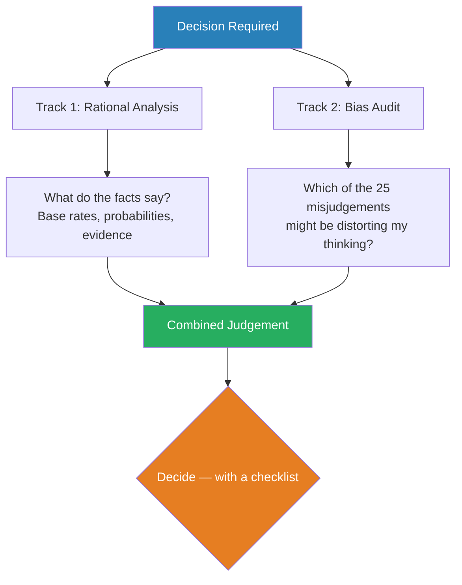
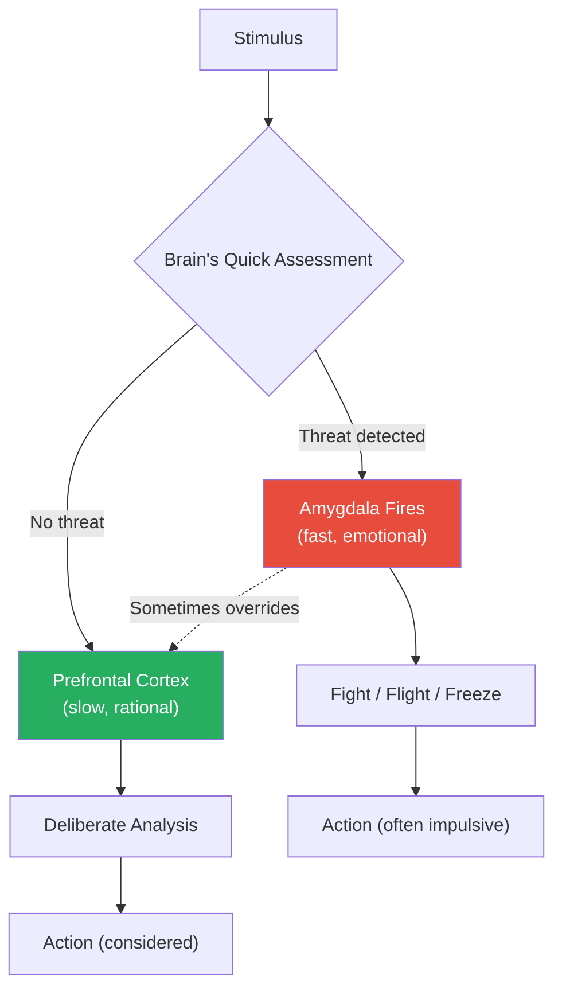
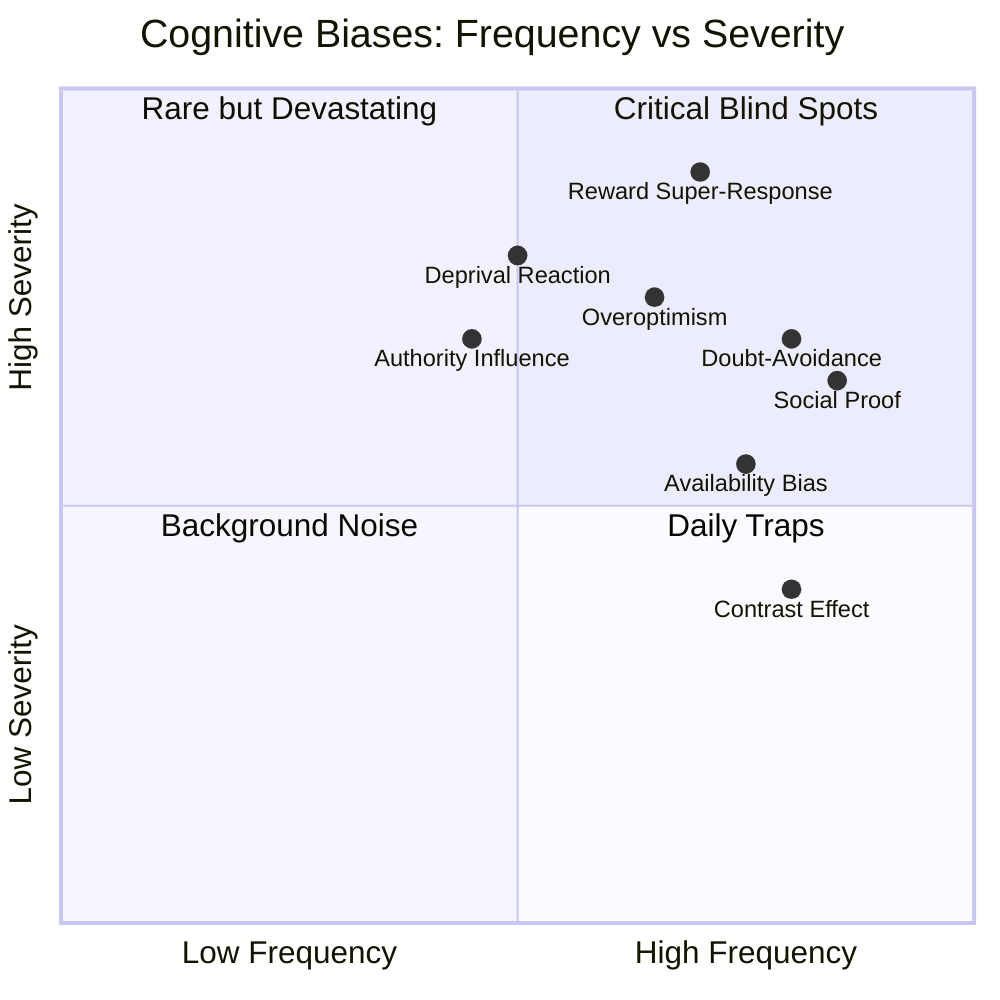
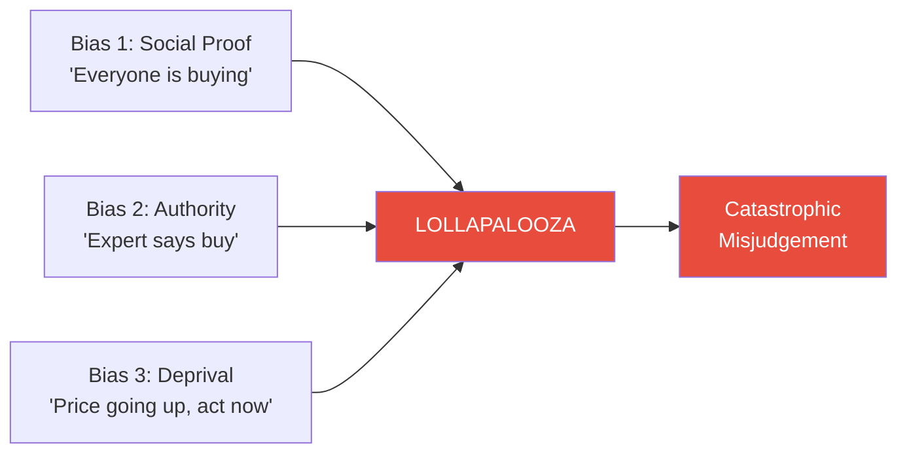
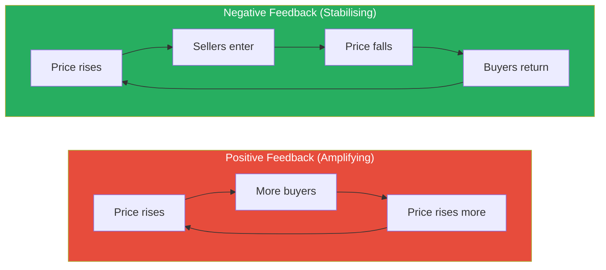
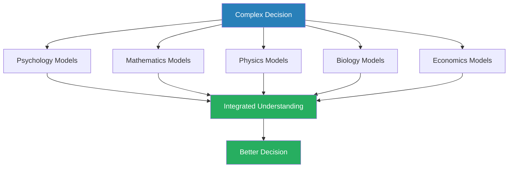
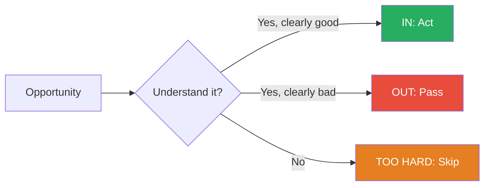
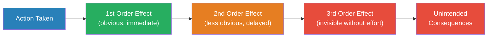
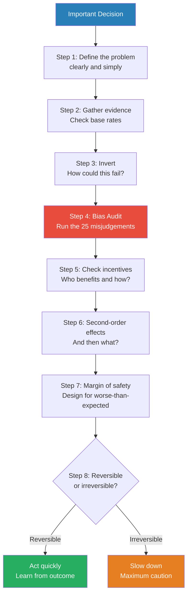

# Seeking Wisdom — Peter Bevelin

> Peter Bevelin set out to answer a single question: why do smart people make terrible decisions?
> His answer, assembled over years of studying Charles Darwin, Charlie Munger, and dozens of scientific disciplines, is that most errors come from a small, predictable set of psychological misjudgements — and that the antidote is building a latticework of mental models drawn from biology, psychology, mathematics, and physics.
> The book is structured in four parts: what influences our thinking (biology and psychology), the psychology of misjudgements (Munger's 25 biases), the physics and mathematics of the real world, and guidelines for better thinking.
> *Seeking Wisdom* is not a book you read cover to cover and shelve. It is a toolkit you return to before every important decision.
> It is the closest thing in print to having Charlie Munger's brain on your desk.

---

## About the Author

Peter Bevelin is a Swedish businessman and independent thinker who spent years studying Warren Buffett and Charlie Munger's decision-making philosophy. He has no academic title to trade on — his authority comes from the quality of his synthesis. Bevelin treats Munger the way a medieval scholar treated Aristotle: as the starting point for all inquiry. The book is essentially Munger's "Psychology of Human Misjudgement" speech expanded into a 300-page operating manual, enriched with contributions from Darwin, Benjamin Franklin, Nassim Taleb, and dozens of scientific researchers. Bevelin has also written *A Few Lessons from Sherlock Holmes* and *All I Want to Know Is Where I'm Going to Die So I'll Never Go There*, both extending the same multidisciplinary thinking approach.

> [!tip] Why This Book Endures
> Most books about thinking errors give you a list of biases and call it a day. Bevelin goes further: he explains WHY those biases exist (evolution), HOW they combine to create catastrophic errors (the lollapalooza effect), and WHAT to do about them (a latticework of mental models plus checklists). The result is a reference manual you keep on your desk, not a book you read once and shelve.

---

## The Big Idea

- <b style="color: #2980b9">Most bad decisions come from a small number of predictable psychological misjudgements</b> — not from stupidity, laziness, or bad luck, but from systematic errors hardwired into the human brain by millions of years of evolution
- Our brains were built for Stone Age survival, not modern complexity — evolution gave us mental shortcuts (heuristics) that worked brilliantly in small tribal groups facing immediate physical threats, but now misfire constantly in a world of abstract risks, complex systems, and information overload
- The fix is not willpower, education, or good intentions — it is building a **latticework of mental models** from multiple disciplines so that no single lens distorts your view of reality
  - Psychology alone is not enough — you also need biology, mathematics, physics, and engineering
  - Each discipline provides tools the others lack
  - The more models you have, the less likely any single bias will dominate your thinking
- <b style="color: #27ae60">Use Munger's Two-Track Analysis for every important decision</b>: (1) What are the rational factors — the evidence, probabilities, and base rates? (2) What subconscious psychological biases are likely distorting my thinking right now?
- The goal is not brilliance — it is the systematic avoidance of stupidity. As Munger says: "It is remarkable how much long-term advantage people like us have gotten by trying to be consistently not stupid, instead of trying to be very intelligent."

Bevelin's Two-Track Analysis forces you to interrogate both the world and your own mind before committing to any decision.

Psychology dominates the latticework because Bevelin (following Munger) treats cognitive biases as the single largest source of error, but the supporting disciplines — mathematics, biology, and physics — provide the cross-checks that prevent any one lens from distorting reality.

---

## Key Concepts at a Glance

| Concept | One-line summary |
|---------|-----------------|
| **25 Causes of Misjudgement** | Munger's taxonomy of how brains systematically go wrong |
| **Evolutionary Mismatch** | Our hardware is 100,000 years old running modern software |
| **Latticework of Mental Models** | No single discipline is enough — cross-pollinate |
| **Two-Track Analysis** | Always separate rational factors from psychological distortion |
| **Inversion** | Instead of asking "how do I succeed?" ask "how do I avoid failure?" |
| **Lollapalooza Effect** | When multiple biases combine, the result is catastrophic misjudgement |
| **Checklists** | Pilots use them, surgeons use them, investors should too |
| **Base Rates** | Before trusting your gut, check how often this actually happens |
| **Compounding** | The most powerful force in the universe — in finance, knowledge, and relationships |
| **Margin of Safety** | Design for worse-than-expected conditions |
| **Regression to the Mean** | Extreme results tend to normalise over time |
| **Feedback Loops** | Small inputs can create runaway or stabilising effects |
| **Reward Super-Response** | Incentives drive almost all behaviour — never ask a barber if you need a haircut |
| **Social Proof** | When uncertain, we copy others — even when they are all wrong |
| **Do-Something Tendency** | Action feels virtuous but inaction is often the better choice |
| **Second-Order Thinking** | Trace consequences two or three levels deep before acting |

---

## Part One: What Influences Our Thinking

### The Biological Foundation

*Before examining the specific biases, Bevelin lays the evolutionary groundwork — explaining why our brains produce systematic errors in the first place.*

- Our brains evolved over millions of years in environments radically different from the modern world
- The brain's primary job was never "truth-seeking" — it was <b style="color: #2980b9">survival and reproduction</b>
  - A brain that helped you avoid lions, find food, and attract mates was a successful brain
  - A brain that sought abstract truth at the cost of reaction speed was a dead brain
- Natural selection favoured speed over accuracy in most situations:
  - It is better to mistake a stick for a snake (false positive) than to mistake a snake for a stick (false negative)
  - This is why humans are prone to <b style="color: #e74c3c">seeing threats that do not exist and patterns that are not real</b>
- Pain avoidance is stronger than pleasure seeking — by roughly 2:1 according to Kahneman and Tversky's research
  - Losing $100 hurts about twice as much as finding $100 feels good
  - This asymmetry drives loss aversion, status quo bias, and the endowment effect
- The brain is not a blank slate — it arrives pre-loaded with tendencies shaped by ancestral pressures:
  - Fear of snakes and spiders (common ancestral threats) develops faster than fear of cars (a modern threat that kills far more people)
  - Preference for sweet and fatty foods (scarce in the savannah, abundant now) drives obesity
  - Sensitivity to social rejection (exile from the tribe meant death) drives conformity

> [!example] The Savannah Brain in the Modern World
> - Imagine an early human hearing rustling in the tall grass
> - The brain has two options: assume it is a predator and run, or assume it is the wind and stay
> - Those who assumed predator and were wrong lost a few calories
> - Those who assumed wind and were wrong lost their lives
> - Natural selection ruthlessly filtered for the "assume danger" wiring
> - Today, that same wiring makes you overreact to market crashes, vivid news stories, and angry emails from your boss — none of which are life-threatening
> **The lesson:** Our threat-detection system is calibrated for a world that no longer exists.

---

### How Evolution Shaped Our Biases

*Bevelin traces each major category of cognitive bias back to a specific evolutionary pressure — showing that biases are not bugs, but features that outlived their usefulness.*

- <b style="color: #2980b9">Status-seeking</b> was adaptive in small tribes — high-status individuals got more food, better mates, and more protection
  - In the modern world, this drives conspicuous consumption, keeping up with neighbours, and prioritising appearance over substance
- <b style="color: #2980b9">Tribal loyalty</b> kept you alive when resources were scarce and groups competed violently
  - Today it produces in-group/out-group thinking, political polarisation, and blind loyalty to organisations, sports teams, and ideologies
- <b style="color: #2980b9">Short-term thinking</b> made sense when the future was radically uncertain and death could come at any moment
  - Now it sabotages retirement planning, health decisions, and long-term investing
- The brain is an energy miser — it constitutes about 2% of body weight but consumes roughly 20% of caloric intake
  - Every shortcut that reduces cognitive effort was selected for
  - This is why we default to heuristics instead of careful analysis
- <b style="color: #2980b9">Pattern recognition</b> was essential for predicting predator behaviour, weather, and seasonal food availability
  - Today it produces superstition, conspiracy theories, and the illusion of patterns in random data
  - The stock market chart that "looks like" a head-and-shoulders formation is the modern version of seeing faces in clouds

| Evolutionary Pressure | Ancestral Benefit | Modern Cost |
|----------------------|-------------------|-------------|
| Threat detection | Avoided predators | Anxiety, overreaction to news |
| Status-seeking | Better mates, more food | Conspicuous consumption, envy |
| Tribal loyalty | Group protection | Polarisation, blind loyalty |
| Short-term focus | Survived immediate danger | Poor long-term planning |
| Pattern recognition | Predicted seasons, threats | Superstition, false patterns |
| Energy conservation | Survived caloric scarcity | Mental laziness, heuristic reliance |

Threat detection and short-term focus together account for nearly half of our evolutionary bias load, explaining why humans chronically overreact to immediate dangers while underweighting slow-moving, long-term risks.

> [!tip] Core Insight
> You are not thinking with a rational calculator. You are thinking with a survival machine that was optimised for a world of immediate physical danger, small social groups, and scarce resources. Every bias is a feature that once kept you alive.

---

### Genes, Environment, and the Limits of Free Will

*Bevelin devotes attention to the nature-nurture question — not to resolve it, but to show that both genetic predispositions and environmental conditioning shape decisions in ways we do not control.*

- Our behaviour is not determined by either genes or environment alone — it is determined by their interaction
- <b style="color: #2980b9">Genetic predispositions</b> set the range of possible behaviours:
  - Some people are genetically more prone to risk-taking, anxiety, novelty-seeking, or aggression
  - These predispositions do not determine behaviour, but they load the dice
  - A person with a genetic predisposition toward anxiety will be more vulnerable to doubt-avoidance and stress-influence tendencies
- <b style="color: #2980b9">Environmental conditioning</b> shapes which predispositions get expressed:
  - A child raised in a high-stress environment develops a more reactive stress response
  - A child raised in a nurturing environment develops better emotional regulation
  - By adulthood, these conditioned responses feel like "personality" — but they are partly the product of early environments the person did not choose
- The practical implication for decision-making:
  - You did not choose your genetic predispositions or your early conditioning
  - But you CAN choose to build systems (checklists, decision frameworks, cooling-off periods) that compensate for your particular vulnerabilities
  - <b style="color: #27ae60">Self-knowledge — knowing which biases you are most prone to — is the first step toward mitigation</b>

---

### The Chemical Brain

*Bevelin explores how neurotransmitters and hormones shape decision-making — often without our awareness.*

- <b style="color: #2980b9">Dopamine</b> drives reward-seeking and habit formation
  - It does not signal pleasure — it signals anticipation of pleasure
  - This is why the chase is more exciting than the catch, and why gambling is addictive even when you lose
  - Dopamine spikes are triggered by novelty, uncertainty, and variable rewards — the same mechanism that makes slot machines addictive
- <b style="color: #2980b9">Cortisol</b> floods the brain during stress, narrowing focus and suppressing creative thinking
  - Under stress, the brain reverts to its most primitive patterns — fight, flight, or freeze
  - This is why people make their worst decisions during crises
  - Chronic cortisol exposure shrinks the hippocampus (memory centre) and impairs the prefrontal cortex (executive function)
- <b style="color: #2980b9">Oxytocin</b> creates bonding and trust — but also in-group bias
  - The same chemical that makes you love your family makes you suspicious of strangers
  - Studies show that oxytocin increases cooperation within a group but increases hostility toward perceived outsiders
- <b style="color: #2980b9">Serotonin</b> regulates mood, social status perception, and confidence
  - Low serotonin is linked to impulsive decision-making and aggression
  - Status changes affect serotonin levels — which is why losing social standing feels physically painful
- Emotional states alter perception without our knowledge:
  - Hungry judges give harsher sentences before lunch than after
  - Tired doctors order more unnecessary tests
  - People rate strangers as more likeable when holding a warm drink versus a cold one
  - Sunny days produce more optimistic stock market predictions than cloudy days

> [!example] The Hungry Judge Study
> - Researchers Danziger, Levav, and Avnaim-Pesso studied over 1,100 parole decisions by Israeli judges
> - Judges granted parole about 65% of the time right after a meal break
> - Just before the next break, the approval rate dropped to nearly zero
> - The judges were not aware of this pattern — they believed they were making rational, case-by-case decisions
> - The prisoners' fates were determined more by the timing of a sandwich than by the merits of their case
> **The lesson:** Physical state shapes judgement more than logic does — and we rarely notice.

---

### The Pleasure-Pain System

*Bevelin explains how the brain's fundamental reward and punishment architecture creates predictable decision-making errors.*

- The brain operates on a simple calculus: <b style="color: #2980b9">seek pleasure, avoid pain</b>
  - This system evolved for immediate, physical rewards and threats
  - It misfires badly when applied to abstract, delayed, or probabilistic outcomes
- Pain is processed faster and more intensely than pleasure:
  - The amygdala (threat centre) activates before the prefrontal cortex (reasoning centre) can intervene
  - This is why fear-based decisions are made faster than opportunity-based decisions
  - It is also why negative news gets more attention than positive news — the brain treats it as higher priority
- The brain struggles with delayed gratification because in the ancestral environment, delay was dangerous:
  - Food might spoil, be stolen, or disappear
  - "A bird in the hand" was genuinely worth two in the bush when you might not survive until tomorrow
  - Today, this same wiring produces credit card debt, under-saving for retirement, and abandoning exercise programmes

> [!example] Walter Mischel's Marshmallow Test (1960s-70s)
> - Stanford psychologist Walter Mischel offered young children a choice: one marshmallow now, or two marshmallows if they could wait 15 minutes
> - About one-third of children managed to wait the full time
> - Follow-up studies decades later found that children who delayed gratification had higher SAT scores, lower rates of obesity, better social skills, and lower rates of substance abuse
> - The ability to override the brain's "take it now" wiring predicted life outcomes better than IQ
> - Crucially, the successful children used strategies — they covered the marshmallow, turned away, sang songs — they did not rely on willpower alone
> **The lesson:** The ability to delay gratification is not about raw willpower. It is about having systems and strategies that override the brain's default programming.

The amygdala pathway is faster but cruder; the prefrontal pathway is slower but smarter. Most biases exploit the speed advantage of the emotional pathway.

---

## Quick Lookup: Munger's 25 Misjudgements

| # | Misjudgement | Core Mechanism | Primary Driver |
|---|-------------|---------------|----------------|
| 1 | Reward/Punishment Super-Response | Incentives override everything else | Incentive |
| 2 | Liking/Loving Tendency | We distort facts to serve those we love | Social |
| 3 | Disliking/Hating Tendency | We distort facts to condemn those we hate | Social |
| 4 | Doubt-Avoidance | Brain rushes to any conclusion to escape uncertainty | Emotion |
| 5 | Inconsistency-Avoidance | Once committed, we resist changing course | Cognition |
| 6 | Curiosity Tendency | Innate drive to explore (mostly beneficial) | Cognition |
| 7 | Kantian Fairness | Instinctive fairness overrides self-interest | Social |
| 8 | Envy/Jealousy | Relative status drives more pain than absolute loss | Emotion |
| 9 | Reciprocation | Compulsive need to return favours, even unwanted ones | Social |
| 10 | Social Proof | Copy others when uncertain | Social |
| 11 | Contrast-Misreaction | Judge things relative to recent reference points | Perception |
| 12 | Authority-Misinfluence | Obey authority even when wrong | Social |
| 13 | Deprival Super-Reaction | Losses hurt 2x more than equivalent gains feel good | Emotion |
| 14 | Availability-Misweighing | Vivid events seem more likely than dull ones | Perception |
| 15 | Stress-Influence | Under pressure, brain reverts to primitive patterns | Emotion |
| 16 | Twaddle Tendency | Obsess over trivial to avoid confronting the hard | Cognition |
| 17 | Reason-Respecting | Any reason — even a bad one — increases compliance | Social |
| 18 | Association Tendency | Transfer qualities between co-occurring things | Perception |
| 19 | Overoptimism | Systematically overestimate good outcomes | Cognition |
| 20 | Excessive Self-Regard | Overvalue yourself, your ideas, your possessions | Emotion |
| 21 | Senescence-Misinfluence | Gradual cognitive decline, invisible to the person | Biology |
| 22 | Drug-Misinfluence | Substances bypass rational defences | Biology |
| 23 | Sense-Making | Brain invents narratives for random events | Perception |
| 24 | Pain-Avoiding Denial | Refuse to perceive unbearable truths | Emotion |
| 25 | Excessive Present Emotion | Current mood distorts thinking and memory | Emotion |

This table maps every misjudgement to its core mechanism and primary driver. Use it as a diagnostic reference when auditing your own decisions.

Incentive-driven biases are the fewest in number yet the most severe in impact — a pattern Munger summarises as "never underestimate the power of incentives" — while social and emotional categories dominate by sheer count, creating the broadest attack surface for everyday errors.

---

## Part Two: The Psychology of Misjudgements

### Munger's 25 Causes of Human Misjudgement

*This is the backbone of the book. Bevelin takes Munger's famous Harvard speech and expands each bias with examples, scientific research, and counter-tactics. The biases are not independent — they interact, reinforce each other, and sometimes combine into what Munger calls the lollapalooza effect.*

```mermaid
flowchart TD
    A["Munger's 25 Misjudgements"] --> B["Incentive-Driven"]
    A --> C["Social-Driven"]
    A --> D["Emotion-Driven"]
    A --> E["Perception-Driven"]
    A --> F["Memory & Cognition"]
    B --> B1["1. Reward Super-Response"]
    B --> B2["17. Self-Interest Bias"]
    C --> C1["10. Social Proof"]
    C --> C2["12. Authority"]
    C --> C3["9. Reciprocation"]
    C --> C4["2. Liking"]
    C --> C5["7. Fairness"]
    D --> D1["4. Doubt-Avoidance"]
    D --> D2["13. Deprival Reaction"]
    D --> D3["8. Envy/Jealousy"]
    D --> D4["15. Stress-Influence"]
    E --> E1["11. Contrast Effect"]
    E --> E2["14. Availability Bias"]
    E --> E3["23. Sense-Making"]
    F --> F1["5. Inconsistency-Avoidance"]
    F --> F2["16. Twaddle Tendency"]
    F --> F3["19. Overoptimism"]
    style A fill:#2980b9,color:#fff
```

This diagram groups Munger's misjudgements by their primary driver — but in practice, most real-world errors involve multiple categories simultaneously.

---

### 1. Reward and Punishment Super-Response Tendency

*Incentives are the most powerful force shaping human behaviour — more powerful than education, culture, or good intentions.*

- <b style="color: #27ae60">Never, ever, think about something else when you should be thinking about the power of incentives</b> — this is one of Munger's most repeated maxims
- People respond to incentives, not to speeches, mission statements, or moral appeals
  - If you reward quantity, you get quantity (at the expense of quality)
  - If you reward short-term results, you get short-term thinking
  - If you punish failure, you get risk avoidance and cover-ups
- <b style="color: #e74c3c">Never ask a barber whether you need a haircut</b> — the advisor's incentives contaminate their advice
  - Surgeons recommend surgery more than non-surgical alternatives
  - Real estate agents recommend higher prices than are optimal for sellers
  - Financial advisers recommend products with the highest commissions
- Incentives work even on people who believe they are immune:
  - Doctors prescribe more expensive drugs when pharmaceutical companies sponsor their conferences
  - Researchers produce findings that favour their funding sources at higher rates
  - Even judges' sentencing patterns correlate with political incentives near election time

> [!example] Munger's FedEx Story
> - FedEx had a persistent problem: the night shift at their Memphis hub was consistently failing to get packages sorted and loaded on time
> - Management tried speeches, motivation, threats — nothing worked
> - Then someone changed the pay structure: instead of paying hourly, they paid per shift
> - Overnight, the problem disappeared — workers who finished faster went home earlier
> - The work hadn't changed. The skills hadn't changed. The incentive changed, and behaviour followed instantly
> **The lesson:** If you want to change behaviour, change the incentives — everything else is decoration.

> [!example] The Xerox Repair Problem
> - Xerox once paid its repair technicians by the hour
> - Machines kept breaking down repeatedly — the same problems, over and over
> - Technicians had no incentive to fix machines permanently — recurring breakdowns meant recurring billable hours
> - When Xerox restructured the incentive to reward permanent fixes, the breakdown rate dropped dramatically
> **The lesson:** People are not dishonest — they are responsive. Incentives that reward the wrong outcome reliably produce the wrong outcome.

> [!abstract] Incentive Audit Checklist
> 1. What behaviour am I trying to encourage?
> 2. What does the current incentive structure actually reward?
> 3. Are there perverse incentives — situations where doing the wrong thing is more rewarding than doing the right thing?
> 4. Who is giving me advice, and how are they compensated?
> 5. Would I follow this advice if the adviser had no financial interest in my decision?

---

### 2. Liking and Loving Tendency

*We distort facts, ignore flaws, and abandon critical thinking to serve the people and things we love.*

- We comply more readily with requests from people we like
- We associate positively with people who are physically attractive, familiar, or similar to us
- <b style="color: #e74c3c">Liking biases judgement</b> — we overlook the flaws of people we admire and exaggerate the virtues of things associated with them
  - This is why celebrity endorsements work even for products the celebrity knows nothing about
  - This is why hiring managers favour candidates who remind them of themselves
- The mechanism operates through several channels:
  - **Physical attractiveness**: good-looking people are assumed to be more competent, honest, and intelligent (the halo effect)
  - **Similarity**: we like people who share our background, interests, or opinions
  - **Familiarity**: mere repeated exposure increases liking (the mere exposure effect)
  - **Association**: we like people associated with things we already like
- The reverse — disliking tendency — is equally powerful:
  - We ignore the virtues and valid arguments of people we dislike
  - We discount evidence that comes from sources we find unappealing

> [!example] The Halo Effect in Hiring
> - Studies consistently show that physically attractive candidates are rated as more competent, intelligent, and trustworthy — even when their qualifications are identical to less attractive candidates
> - The same effect applies to people who share our hobbies, background, or alma mater
> - Interviewers routinely make hiring decisions within the first 30 seconds based on likeability, then spend the remaining time confirming their initial impression
> **The lesson:** Liking is not a rational assessment — it is a feeling that hijacks the assessment process.

---

### 3. Disliking and Hating Tendency

*The mirror image of liking — when we dislike someone or something, our brain systematically distorts reality to justify the dislike.*

- The mirror image of liking tendency — we distort reality to condemn what we already dislike
- <b style="color: #e74c3c">We ignore the virtues of people we hate and amplify their faults</b>
- The distortion operates on multiple levels:
  - We dismiss valid arguments because they come from someone we dislike
  - We attribute malicious intent to neutral actions by people in our out-group
  - We selectively remember negative interactions and forget positive ones
- In extreme cases, this produces <b style="color: #e74c3c">dehumanisation</b> — the psychological process that makes atrocities possible
  - Every genocide in history was preceded by a propaganda campaign that made the target group seem less than human
  - The Rwandan genocide was preceded by radio broadcasts calling Tutsis "cockroaches"
  - Nazi propaganda depicted Jews as vermin and disease carriers
- At the everyday level, disliking tendency causes us to dismiss good ideas because they come from someone we find irritating
  - In corporate settings, this means the best idea in the room can be ignored simply because it was proposed by someone unpopular
- The antidote: evaluate ideas independently of their source — ask "is this argument valid?" not "do I like the person making it?"

The most dangerous biases cluster in the upper-right "Critical Blind Spots" quadrant — high frequency and high severity — with Social Proof and Doubt-Avoidance being the most treacherous because they fire constantly and distort decisions substantially.

---

### 4. Doubt-Avoidance Tendency

*The brain hates uncertainty. It will rush to a conclusion — any conclusion — rather than sit with ambiguity.*

- Uncertainty is metabolically expensive — the brain consumes more energy when processing ambiguous information
- <b style="color: #2980b9">Doubt-avoidance</b> is the tendency to reach a decision quickly to eliminate the discomfort of not knowing
- This is amplified by stress, time pressure, and confusion — exactly the conditions under which the most important decisions are made
- <b style="color: #e74c3c">The danger is not making the wrong decision — it is making ANY decision too quickly, before the evidence has been properly examined</b>
- Religious and political extremism often exploits doubt-avoidance:
  - Simple, certain answers are more psychologically satisfying than complex, probabilistic ones
  - "We are right and they are wrong" feels better than "the situation is complicated and uncertain"
- Doubt-avoidance interacts powerfully with inconsistency-avoidance:
  - Once a hasty decision is made (doubt-avoidance), the brain locks onto it and resists changing course (inconsistency-avoidance)
  - The combination produces decisions that are both premature and stubbornly defended

> [!tip] Core Insight
> The ability to sit with uncertainty — to say "I don't know yet" and mean it — is one of the most valuable cognitive skills you can develop. Most people cannot tolerate not knowing. That intolerance is the source of most premature decisions.

---

### 5. Inconsistency-Avoidance Tendency

*Once we commit to a belief, identity, or course of action, we resist changing it — even when the evidence demands it.*

- The brain treats consistency as a virtue and inconsistency as a threat
- <b style="color: #2980b9">Commitment and consistency</b> — once you have publicly stated a position, the psychological cost of changing it becomes enormous
  - This is why companies stick with failing strategies long after the data says to pivot
  - This is why people stay in bad relationships — they have "invested too much" to leave
- First conclusions are especially sticky — <b style="color: #e74c3c">what you believe first, you defend hardest</b>
  - Bevelin cites research showing that evidence presented early in a sequence has disproportionate influence on final judgement
  - Lawyers know this — which is why opening statements matter so much
- The mechanism has evolutionary roots:
  - In small tribal groups, being seen as inconsistent was socially dangerous — it signalled unreliability
  - A reputation for consistency was a survival advantage even when the consistent position was wrong
- The sunk cost fallacy is a direct consequence:
  - "We have already spent $10 million on this project" feels like a reason to continue, even when the project is clearly failing
  - The $10 million is gone regardless — only future costs and benefits should matter
  - But inconsistency-avoidance makes walking away feel like admitting the $10 million was wasted

> [!example] Darwin's Anti-Inconsistency Method
> - Charles Darwin knew that inconsistency-avoidance would destroy his scientific work
> - He developed a personal discipline: whenever he encountered a fact that contradicted his theory, he would write it down immediately
> - He observed that if he did not record contradictory evidence within 30 minutes, his brain would find a way to minimise or forget it
> - This deliberate practice of hunting for disconfirming evidence is the opposite of what the brain naturally does
> - It is also the foundation of the scientific method
> **The lesson:** Your brain is a confirmation machine. If you want the truth, you must build systems that force you to confront evidence your brain would rather ignore.

> [!example] The Concorde Fallacy — Sunk Costs in Action
> - The Concorde supersonic jet was a joint project between Britain and France, launched in the 1960s
> - By the early 1970s, it was clear the plane would never be commercially viable — demand was far lower than projected
> - Both governments continued funding the project for over a decade, spending billions more
> - The reasoning was pure inconsistency-avoidance: "We have already invested too much to stop now"
> - The project was frequently cited in economics textbooks as the definitive example of the sunk cost fallacy
> - The rational question was never "how much have we spent?" but "will future spending produce future value?"
> **The lesson:** Past investments are irrelevant to future decisions. The money is spent whether you continue or not. Only future costs and future benefits should influence future choices.

---

### 6. Curiosity Tendency

*Unlike most of the 25 tendencies, curiosity is largely beneficial — but only when directed and sustained.*

- Humans have an innate drive to explore, understand, and seek novelty
- This tendency is generally beneficial — it drives learning, science, and innovation
- <b style="color: #27ae60">Cultivate curiosity deliberately</b> — it is the antidote to the complacency that most biases produce
- Munger and Buffett are famous for reading voraciously across disciplines — this is curiosity tendency put to productive use
  - Munger reportedly reads 500+ pages per day
  - Buffett has said he spends 80% of his working day reading
  - Both credit their broad reading habits as essential to their investment success
- Curiosity has a dark side when it is shallow:
  - Novelty-seeking without depth produces trivia collectors, not thinkers
  - The internet rewards superficial curiosity (clicking, scrolling, skimming) and punishes deep curiosity (sustained focus on hard problems)
- The key is <b style="color: #27ae60">directed curiosity</b> — exploring a topic deeply enough to build real understanding, not just collecting interesting facts

---

### 7. Kantian Fairness Tendency

*Our deep sense of fairness is not rational — it is instinctive, automatic, and powerful enough to override self-interest.*

- Humans have a deep, instinctive sense of fairness — even when it is economically irrational
- In the <b style="color: #2980b9">Ultimatum Game</b>, people routinely reject offers they perceive as unfair, even when accepting would leave them better off
  - A proposer splits $100 between themselves and a responder
  - Rational economic theory predicts the responder should accept any positive amount — even $1 is better than nothing
  - In practice, most people reject offers below about 30% — they would rather get nothing than accept what feels unfair
  - This pattern holds across cultures, ages, and economic conditions
- <b style="color: #2980b9">Fairness instinct</b> can be exploited — frame any request as "fair" and compliance increases dramatically
- Conversely, perceived unfairness triggers disproportionate emotional responses — people will destroy value to punish what they see as unfair treatment
  - Employees who feel underpaid relative to peers reduce their effort — even if their absolute pay is generous
  - Customers who feel a price increase is unfair will switch to a competitor, even when the competitor's product is worse

> [!example] The Ultimatum Game Across Cultures
> - Researchers ran the Ultimatum Game in 15 small-scale societies across five continents — from Amazonian hunter-gatherers to Indonesian whale hunters
> - Results varied: some cultures accepted low offers, others rejected even moderate ones
> - But in every culture, pure self-interest was overridden by some notion of fairness
> - The Machiguenga of Peru accepted the lowest offers; the Au and Gnau of Papua New Guinea sometimes rejected offers that were too generous (hyper-fairness)
> - The conclusion: fairness is universal, but what counts as "fair" is culturally shaped
> **The lesson:** Fairness is hardwired, but its definition is software — and different groups run different versions.

---

### 8. Envy and Jealousy Tendency

*Envy is the one deadly sin that provides zero pleasure — and yet it drives more bad decisions than almost any other emotion.*

- Munger: "The world is not driven by greed. It's driven by envy."
- <b style="color: #e74c3c">Envy is the one deadly sin that provides no pleasure</b> — anger feels powerful, gluttony feels satisfying, but envy just hurts
- We compare ourselves to peers, not to absolute standards — a lawyer earning $200,000 is miserable if their colleague earns $300,000
- Social media has weaponised envy by making everyone's highlight reel visible simultaneously
- The evolutionary logic: in small tribes, relative status determined survival outcomes
  - The person with more food, more allies, or a better shelter had a genuine survival advantage
  - Monitoring your relative position was adaptive
  - In the modern world, where basic survival is secure, this monitoring system produces chronic dissatisfaction
- Envy often masquerades as other emotions:
  - "That person doesn't deserve their success" (envy disguised as fairness)
  - "Their methods are unethical" (envy disguised as moral judgement)
  - "I could do what they do if I had their advantages" (envy disguised as analysis)
- The antidote is <b style="color: #27ae60">comparison to your past self, not to other people</b>:
  - "Am I better off than I was a year ago?" is a productive question
  - "Am I better off than my neighbour?" is a destructive question
  - The first question drives improvement; the second drives misery

> [!example] Munger on Envy
> - At a Berkshire Hathaway annual meeting, a shareholder asked Munger which human tendency causes the most problems
> - Without hesitation, Munger replied: "Envy"
> - He noted that it was peculiar — envy is the only deadly sin that is no fun at all
> - Greed has some upside, lust has some upside, even anger feels powerful in the moment
> - Envy is pure pain, and yet it drives more bad decisions than any other emotion
> **The lesson:** If you catch yourself comparing your situation to someone else's, you are already in the grip of envy — and no good decision will follow.

---

### 9. Reciprocation Tendency

*We feel compelled to return favours — even unwanted ones — and this drive is so strong it can override rational self-interest.*

- <b style="color: #2980b9">Reciprocation</b> is one of the most powerful social forces in human psychology
- It evolved to enable cooperation in small groups — I help you today, you help me tomorrow
- Marketers exploit this relentlessly:
  - Free samples create a sense of obligation to buy
  - The Hare Krishna strategy of giving flowers to airport travellers before asking for donations
  - "Door in the face" technique — make a large request first, then retreat to a smaller one (which now seems reasonable by comparison)
- <b style="color: #e74c3c">Unwanted favours are the most dangerous</b> — they create obligations you never agreed to
- Reciprocation also applies to concessions:
  - If someone makes a concession (moves from a large demand to a smaller one), you feel pressure to reciprocate with a concession of your own
  - This is the basis of the negotiation tactic: start high, then "compromise" to what you actually wanted
- Reciprocation also works with hostility:
  - An insult triggers a retaliatory insult
  - A competitive move triggers a counter-move
  - This is how arms races, price wars, and feuds escalate — each side reciprocates the other's escalation
  - The only way to break a negative reciprocation spiral is for one side to unilaterally de-escalate — which feels like losing, which is why it rarely happens

> [!example] The Hare Krishna Airport Strategy (1970s)
> - In the 1970s, Hare Krishna devotees discovered a powerful fundraising technique
> - They would approach travellers in airports and press a flower into their hands — a gift, whether wanted or not
> - Having received a gift, travellers felt an overwhelming urge to reciprocate
> - Donation rates skyrocketed compared to simply asking for money
> - Many travellers threw the flowers in the bin immediately after donating — they did not want the flower, but they could not resist the pull of reciprocation
> **The lesson:** The obligation to reciprocate is so deep that even a gift you do not want creates a debt you feel compelled to repay.

---

### 10. Social Proof Tendency

*When we don't know what to do, we look at what everyone else is doing — and assume they must be right.*

- <b style="color: #2980b9">Social proof</b> is the tendency to assume that the actions of others reflect the correct behaviour
- It is most powerful when:
  - The situation is ambiguous or unfamiliar
  - The people we observe are similar to us
  - There are many people doing the same thing
- This is why market bubbles form — people see others buying and assume they must know something
- It is why bystander effect occurs — when nobody else is helping, each individual assumes the situation must not be serious
- Social proof becomes especially dangerous in homogeneous groups:
  - When everyone in a group thinks alike, social proof amplifies rather than corrects errors
  - Dissenting voices are silenced by the apparent consensus
  - This is the mechanism behind groupthink
- <b style="color: #e74c3c">Social proof is the engine of every bubble and every panic</b>:
  - In a bubble: buying because others are buying, each purchase validating the next
  - In a panic: selling because others are selling, each sale confirming the danger
  - In both cases, individual rationality produces collective insanity

> [!example] Solomon Asch's Conformity Experiments (1951)
> - Psychologist Solomon Asch placed participants in a room with 7-8 confederates (actors)
> - The group was shown a line and asked to match it to one of three comparison lines — the correct answer was obvious
> - The confederates deliberately gave the wrong answer unanimously
> - 75% of participants conformed to the wrong answer at least once
> - About one-third of all responses matched the clearly incorrect group answer
> - When even one confederate broke ranks and gave the correct answer, conformity dropped by nearly 80%
> - The power of social proof was not that participants could not see the right answer — it was that the social cost of disagreeing was greater than the cognitive cost of being wrong
> **The lesson:** Social proof does not work by changing what you see — it works by changing what you are willing to say. A single dissenting voice can break its power.

> [!example] The Jonestown Massacre (1978)
> - In November 1978, over 900 members of Jim Jones's Peoples Temple died in a mass suicide/murder in Jonestown, Guyana
> - When Jones ordered the group to drink cyanide-laced punch, most complied
> - Social proof was a primary mechanism: once the first people began drinking, others looked around, saw compliance, and followed
> - The cult environment had systematically destroyed members' ability to think independently
> - Combined with authority-misinfluence (Jones as charismatic leader) and doubt-avoidance (no time to deliberate), social proof produced catastrophic compliance
> **The lesson:** Social proof is most dangerous in precisely the situations where independent thinking matters most — high-stress, high-ambiguity environments where everyone is watching everyone else.

> [!example] Investment Bubbles — The South Sea Company (1720)
> - In 1720, shares in the South Sea Company rose from roughly £100 to over £1,000 in months
> - Even Isaac Newton invested — and lost £20,000 (roughly £4 million in today's money)
> - Newton reportedly said: "I can calculate the motion of heavenly bodies, but not the madness of people"
> - The mechanism was pure social proof: everyone was buying, prices were rising, and each new buyer validated every previous buyer's decision
> - When the bubble burst, thousands were ruined
> **The lesson:** Genius in one domain does not protect you from social proof in another. Newton could predict planetary orbits but could not resist following the crowd.

---

### 11. Contrast-Misreaction Tendency

*We don't evaluate things in isolation — we evaluate them relative to what came just before.*

- A $50 tie seems cheap after agreeing to a $3,000 suit
- A mediocre employee seems excellent when replacing a terrible one
- <b style="color: #2980b9">Contrast-misreaction</b> distorts perception by anchoring your judgement to an irrelevant reference point
- This is the foundation of anchoring in negotiation:
  - The first number mentioned in a negotiation disproportionately influences the final outcome
  - Even when the anchor is obviously arbitrary, it still pulls judgement toward it
- Real estate agents exploit this by showing overpriced properties first, then the one they actually want you to buy
- The "boiling frog" metaphor captures a related phenomenon:
  - Gradual changes go unnoticed because each increment is too small relative to the previous state
  - A 1% annual decline in standards is invisible year over year but devastating over a decade
  - This is how ethical standards erode in organisations — each compromise is small relative to the last

> [!example] The $400 Wine Trick
> - Wine merchants and restaurants routinely place an extremely expensive wine at the top of the list — say, $400 per bottle
> - Few customers buy the $400 bottle — that is not the point
> - The $400 bottle makes the $80 bottle seem reasonable, and the $150 bottle seem like a moderate splurge
> - Without the $400 anchor, the $150 bottle would feel extravagant
> - The same technique works in real estate (show the overpriced house first), retail (place the luxury item at the front of the store), and salary negotiations (start with an ambitious number)
> **The lesson:** You never evaluate a price in isolation — you evaluate it relative to whatever number you saw most recently. Control the reference point and you control the perception.

> [!abstract] Defending Against Contrast Effects
> 1. Evaluate each option on its own merits before comparing it to alternatives
> 2. Ask: "Would I be excited about this if it were the first and only option I'd seen?"
> 3. Be suspicious of any sales process that shows you options in a specific sequence
> 4. In negotiations, make the first offer — whoever sets the anchor controls the frame

---

### 12. Authority-Misinfluence Tendency

*We obey authority figures even when they are clearly wrong — and even when obedience causes harm.*

- <b style="color: #2980b9">Milgram's obedience experiments</b> (1961) demonstrated this with terrifying clarity:
  - Ordinary people administered what they believed were lethal electric shocks to a stranger simply because a man in a lab coat told them to continue
  - 65% of participants went all the way to the maximum 450-volt shock
  - Participants were visibly distressed — sweating, trembling, begging to stop — but they continued because the authority figure said "the experiment requires that you continue"
- Authority does not require formal power — it requires the appearance of expertise or legitimacy
  - Titles (Dr., Professor, CEO) increase compliance dramatically
  - Uniforms and expensive clothing trigger the same effect
  - Confident speech patterns are mistaken for competence
- The mechanism is deeply adaptive:
  - In ancestral environments, deferring to experienced elders was usually correct — they had survived longer and knew more
  - The problem arises when authority is mistaken for accuracy or when the authority's incentives conflict with yours
- Authority-misinfluence in professional settings:
  - Junior doctors routinely fail to question senior doctors even when they notice errors — a phenomenon known as the "authority gradient" in aviation and medicine
  - In cockpits, first officers historically failed to challenge captains even when the captain was clearly making a dangerous mistake
  - The solution in aviation was <b style="color: #27ae60">Crew Resource Management (CRM)</b> — a training programme that explicitly teaches junior crew to speak up and senior crew to listen
  - The same principle applies in any hierarchical organisation: create explicit permission to challenge authority

> [!example] The Wrong-Side Surgery Problem
> - Studies show that roughly 40 times per week in American hospitals, surgery is performed on the wrong body part, the wrong side, or the wrong patient
> - In many of these cases, a nurse or junior doctor noticed the error but did not speak up because the surgeon was a senior authority figure
> - The Joint Commission found that authority gradient — the reluctance to challenge someone higher in the hierarchy — was a primary contributing factor
> - Hospital checklists now include a "time out" step where any team member, regardless of rank, is expected to halt the procedure if something seems wrong
> **The lesson:** Authority-misinfluence does not just distort thinking — it silences the very people who could prevent catastrophic errors. The solution is not to eliminate hierarchy but to create structures where questioning authority is expected and rewarded.

> [!example] Milgram's Obedience Experiment (1961)
> - Yale psychologist Stanley Milgram recruited ordinary New Haven residents for what they were told was a "learning experiment"
> - Participants were instructed to administer electric shocks to a "learner" (actually an actor) each time he made a mistake
> - With each wrong answer, the voltage increased — from 15 volts to 450 volts
> - The "learner" screamed, begged to stop, mentioned a heart condition, and eventually went silent
> - The experimenter, wearing a lab coat, calmly instructed the participant to continue
> - 65% of participants delivered the maximum shock — despite their own extreme distress
> **The lesson:** Obedience to authority is not a character flaw — it is a deeply wired survival mechanism. In the ancestral environment, obeying the tribal leader was usually adaptive. In the modern world, it can make you complicit in harm.

---

### 13. Deprival Super-Reaction Tendency (Loss Aversion)

*Losing something hurts roughly twice as much as gaining the same thing feels good — and this asymmetry distorts every decision involving risk.*

- <b style="color: #2980b9">Loss aversion</b> is one of the most robust findings in behavioural psychology
- People will take irrational risks to avoid losses they would never take to achieve equivalent gains
  - Investors hold losing stocks too long (hoping to avoid realising the loss) and sell winning stocks too early (locking in the gain)
  - Negotiators make concessions to avoid losing a deal even when walking away would be better
- The <b style="color: #e74c3c">endowment effect</b> is a direct consequence: once you own something, you value it more than before you owned it
  - Mugs given to participants in experiments were valued at roughly twice what non-owners would pay for them
  - This has nothing to do with the mugs — it is about the pain of giving something up
- Near-misses trigger deprival reaction — "I almost won" feels worse than "I never had a chance"
  - This is why lottery tickets with numbers close to the winning combination feel more painful than tickets that are nowhere close
  - Casinos exploit this: slot machines show near-misses far more often than pure chance would produce
- Deprival super-reaction also drives irrational territorial behaviour:
  - People fight harder to keep a parking spot they are sitting in than they would to acquire the same spot if it were empty
  - Organisations resist giving up budgets, headcount, or office space even when they no longer need them
  - <b style="color: #e74c3c">The pain of losing territory exceeds the pleasure of gaining equivalent territory</b> — which is why every reorganisation and cost-cutting programme faces fiercer resistance than rational analysis would predict

> [!tip] Core Insight
> When you feel strongest about a decision — when you feel you absolutely MUST act — ask yourself: am I being driven by a genuine opportunity, or by the fear of losing something? Loss aversion disguises panic as conviction.

---

### 14. Availability-Misweighing Tendency

*We judge the likelihood of events by how easily examples come to mind — not by their actual frequency.*

- After a plane crash makes the news, people overestimate the risk of flying and underestimate the risk of driving — even though driving is statistically far more dangerous
- <b style="color: #2980b9">Availability bias</b> means that vivid, recent, or emotionally charged events loom larger in our minds than dull, distant, or statistical ones
- This is why:
  - Shark attacks terrify people more than heart disease (which kills thousands of times more)
  - A single dramatic crime story can shift public opinion on safety more than a decade of declining crime statistics
  - Recent successes make us overconfident and recent failures make us overly cautious
- The availability heuristic combines with media to produce systematic distortion:
  - Media reports unusual events (plane crashes, murders, terrorist attacks) and ignores common ones (heart disease, car accidents, falls)
  - Consumers of media therefore believe the unusual events are common and the common events are rare
  - This creates public policy that is wildly out of proportion to actual risk
- <b style="color: #27ae60">The antidote to availability bias is base rate data</b>:
  - Instead of asking "can I think of an example?" ask "how often does this actually happen per 100,000 people?"
  - Replace anecdotes with statistics — the plural of anecdote is not data
  - Track your own predictions over time to calibrate your probability estimates
  - When you catch yourself making a decision based on a vivid memory, stop and look up the numbers
- Availability bias explains why people overinsure against rare dramatic risks (terrorism, plane crashes) and underinsure against common boring risks (heart disease, car accidents, falls in the home)
  - Insurance companies exploit this by advertising based on vivid fear scenarios rather than statistical reality

> [!example] Shark Attacks vs. Heart Disease
> - In the United States, roughly 1 person per year dies from a shark attack
> - Roughly 700,000 people per year die from heart disease
> - Yet shark attacks generate vastly more fear, media coverage, and behavioural change (people avoiding the ocean)
> - The disparity is pure availability bias: shark attacks are vivid, dramatic, and easy to visualise
> - Heart disease is slow, invisible, and statistical — the brain treats it as background noise
> **The lesson:** Your brain does not calculate probabilities — it retrieves memories. If a memory is vivid, the brain treats the event as likely. If a memory is dull, the brain treats the event as rare — regardless of the actual numbers.

---

### 15. Stress-Influence Tendency

*Under pressure, the brain abandons its most sophisticated capabilities and reverts to ancient survival patterns — precisely when clear thinking matters most.*

- Under stress, the brain reverts to its most primitive decision-making patterns
- <b style="color: #e74c3c">Stress narrows attention, amplifies emotion, and suppresses analytical thinking</b>
- The mechanism is physiological:
  - Cortisol floods the prefrontal cortex, impairing working memory and executive function
  - The amygdala takes over, triggering fight-flight-freeze responses
  - Peripheral vision narrows (both literally and cognitively) — you focus on the threat and miss everything else
- This is why people make their worst financial decisions during market panics — the brain treats a falling portfolio like a charging predator
- Extreme stress can produce <b style="color: #2980b9">learned helplessness</b> — the complete shutdown of problem-solving when the brain concludes that no action will help
  - Seligman's experiments showed that dogs exposed to inescapable shocks eventually stopped trying to escape, even when escape became possible
  - Humans exhibit the same pattern: people who experience repeated failure in a domain stop trying, even when conditions change
- Moderate stress can improve performance (the <b style="color: #2980b9">Yerkes-Dodson curve</b>), but beyond a threshold, performance collapses rapidly
  - A small amount of pressure sharpens focus
  - Too much pressure destroys it
  - The optimal zone varies by task complexity — simple tasks tolerate more stress, complex tasks collapse sooner

> [!example] The Three Mile Island Incident (1979)
> - In March 1979, a cooling malfunction at the Three Mile Island nuclear plant in Pennsylvania triggered a partial meltdown
> - The control room operators were flooded with over 100 alarms simultaneously
> - Under extreme stress, the operators misread a critical indicator — they believed the reactor had too much coolant when it actually had too little
> - Rather than adding water (the correct response), they removed it — worsening the crisis
> - The operators were well-trained — the problem was not incompetence but stress-induced cognitive collapse
> - Their attention narrowed to a single indicator (which happened to be misleading), and they ignored contradictory information from other instruments
> **The lesson:** Under extreme stress, even well-trained experts fixate on a single piece of data and become unable to integrate the full picture. This is not a failure of training — it is a failure of the brain's architecture under pressure.

---

### 16. Twaddle Tendency

*People avoid hard decisions by obsessing over easy ones — displacement activity that feels productive but accomplishes nothing.*

- The tendency to spend time and energy on matters of trivial importance
- <b style="color: #e74c3c">People avoid hard decisions by obsessing over easy ones</b>
  - Bevelin cites <b style="color: #2980b9">Parkinson's Law of Triviality</b>: a committee will spend more time debating the colour of a bicycle shed than the design of a nuclear reactor
  - The bicycle shed is comprehensible to everyone; the reactor is not
  - The result: trivial matters get disproportionate attention because everyone can have an opinion
- This is why organisations spend hours debating office supplies and minutes approving million-dollar budgets
- At the individual level, twaddle tendency manifests as:
  - Reorganising your desk instead of writing the report
  - Debating font choices instead of clarifying the message
  - Attending meetings about meetings instead of making decisions

---

### 17. Reason-Respecting Tendency

*People comply more readily when given a reason — any reason, even a nonsensical one.*

- Humans have a deep need to understand "why" — and this need can be exploited
- <b style="color: #2980b9">Ellen Langer's copy machine experiment</b> demonstrated this memorably:
  - Requesting to cut in line at a copy machine with no reason: 60% compliance
  - Requesting with a real reason ("because I'm in a rush"): 94% compliance
  - Requesting with a meaningless reason ("because I need to make copies"): 93% compliance
  - The word "because" itself triggered compliance — the actual content of the reason barely mattered
- The tendency exists because in most cases, people who provide reasons ARE more justified in their request
  - Evolution selected for a shortcut: "if there is a reason, comply"
  - The shortcut works most of the time but is easily exploited
- <b style="color: #e74c3c">In persuasion and compliance contexts, always provide a reason</b> — even a weak one is dramatically more effective than no reason at all
- The flip side: when someone gives you a reason for doing something, check whether the reason actually supports the request, or whether the word "because" is doing all the heavy lifting

> [!example] Langer's Copy Machine Study (1978)
> - Psychologist Ellen Langer approached people waiting at a university copy machine and asked to cut ahead
> - With no reason given ("May I use the machine?"), only 60% agreed
> - With a genuine reason ("May I use the machine because I'm in a rush?"), 94% agreed
> - With a nonsensical reason ("May I use the machine because I need to make copies?"), 93% agreed
> - The word "because" functioned as a compliance trigger regardless of what followed it
> - Only when the request was large (20 pages instead of 5) did the quality of the reason start to matter
> **The lesson:** The human brain is wired to accept "because" as sufficient justification. For small requests, any reason works. For large requests, the reason must actually be persuasive.

> [!tip] Core Insight
> The reason-respecting tendency means that transparent communication — simply explaining why — is one of the most powerful and underused tools in leadership, persuasion, and everyday interaction. But it also means you must scrutinise the reasons others give you, because the word "because" bypasses your critical faculties.

---

### 18. Association Tendency

*We transfer the qualities of one thing to another simply because they appear together — and this creates both opportunity and vulnerability.*

- <b style="color: #2980b9">Association</b> is the tendency to connect unrelated things simply because they co-occur
- Bevelin traces this to Pavlov's classical conditioning:
  - Pavlov's dogs learned to salivate at the sound of a bell because the bell had been paired with food
  - Humans do the same: we associate messengers with their messages, brands with their endorsers, and people with the circumstances in which we met them
- This produces several systematic errors:
  - **Shooting the messenger**: we dislike people who deliver bad news, even when they are not responsible for it
  - **Brand transfer**: we assume a product endorsed by an expert is good, even when the expert has no relevant expertise
  - **Guilt by association**: we judge people negatively when they are associated with negative events, even coincidentally
- Advertisers exploit association relentlessly:
  - Beautiful people next to products → product is attractive
  - Sports heroes endorsing shoes → shoes are powerful
  - Luxury cars in scenic landscapes → car is aspirational
- <b style="color: #e74c3c">The danger is that association operates below conscious awareness</b> — you do not notice that your feelings about a product have been shaped by an unrelated image

> [!example] The Persian Messenger Syndrome
> - In ancient Persia, messengers who brought bad news to the king were sometimes executed
> - The practice was irrational — the messenger did not cause the bad news — but association is stronger than logic
> - In modern corporations, the same pattern persists: employees who raise problems are labelled "negative" or "not team players"
> - The result: bad news stops flowing upward, and leaders make decisions based on filtered, overly optimistic information
> - Eventually, the unaddressed problems become crises
> **The lesson:** If you punish people for delivering bad news, you do not eliminate bad news — you eliminate your awareness of it.

> [!example] Pavlov's Dogs and Modern Advertising
> - Russian physiologist Ivan Pavlov discovered classical conditioning in the 1890s while studying digestion in dogs
> - He noticed that dogs began salivating not just when food appeared, but when they heard the footsteps of the lab assistant who usually brought food
> - By pairing a neutral stimulus (a bell) with food, Pavlov taught dogs to salivate at the bell alone — the bell had become associated with food
> - Modern advertising works on exactly the same principle: pair a product with an attractive model, exciting music, or a beautiful landscape, and the positive feelings transfer to the product
> - The viewer does not consciously decide "this car is better because a beautiful person is standing next to it" — the association operates below awareness
> **The lesson:** Your brain creates associations automatically and without your permission. The only defence is awareness that it is happening.

---

### 19. Overoptimism Tendency

*Humans systematically overestimate the probability of good outcomes and underestimate the probability of bad ones — especially for their own plans.*

- <b style="color: #e74c3c">Most people believe they are above average</b> — at driving, at their jobs, at judging character, at predicting the future
  - 93% of American drivers rate themselves above average
  - 94% of college professors rate their teaching as above average
  - 80% of entrepreneurs believe their business will succeed (historical success rate: roughly 20%)
- This is not stupidity — it is a built-in feature:
  - Optimists are healthier, live longer, and attempt more ambitious projects than pessimists
  - But optimism unchecked by reality produces bad bets, inadequate planning, and denial of warning signs
- <b style="color: #2980b9">The planning fallacy</b> is a direct consequence of overoptimism:
  - Projects consistently take longer and cost more than estimated
  - The Sydney Opera House was estimated at $7 million and 4 years; it cost $102 million and took 14 years
  - Software projects exceed their estimates by an average of 30-70%
- The antidote is not pessimism but <b style="color: #27ae60">reference class forecasting</b>:
  - Instead of asking "how long will MY project take?" ask "how long did similar projects take historically?"
  - Replace inside-view optimism with outside-view base rates
  - Kahneman calls this the "outside view" — and considers it the single most reliable correction for overoptimism
  - The inside view asks "what are the unique features of MY situation?" The outside view asks "what happened when OTHER people were in similar situations?"
  - The outside view is almost always more accurate, but it is also more psychologically painful — because it tells you that you are not special

> [!example] The Sydney Opera House (1957-1973)
> - Danish architect Jorn Utzon won the design competition in 1957
> - Original estimate: $7 million and completion by 1963
> - Actual cost: $102 million — more than 14 times the estimate
> - Actual completion: 1973 — ten years late
> - The project suffered from every hallmark of overoptimism: revolutionary design with no precedent, political pressure to start before planning was complete, and systematic underestimation of engineering challenges
> **The lesson:** When you have never done something before, your time and cost estimates are almost certainly too optimistic. Check the base rate: how long did similar projects actually take?

---

### 20. Excessive Self-Regard Tendency

*We overvalue ourselves, our possessions, and our ideas — and this distorts every negotiation, evaluation, and self-assessment.*

- <b style="color: #2980b9">Excessive self-regard</b> is the tendency to overvalue anything connected to yourself
- It manifests in multiple ways:
  - The endowment effect (owning something makes it more valuable to you)
  - The "not invented here" syndrome (rejecting ideas that come from outside your group)
  - Overly generous self-assessment (rating yourself higher than objective evidence supports)
- Bevelin connects this to the evolutionary advantage of self-confidence:
  - In mating competitions and social hierarchies, the individual who displayed confidence attracted more allies and mates
  - The brain evolved to generate confidence even when it was not warranted
- <b style="color: #e74c3c">Excessive self-regard is the root of most interpersonal conflict</b>:
  - Both parties in a negotiation believe they deserve more than the other
  - Both partners in a failed project believe the failure was the other's fault
  - Both sides in a dispute believe they are being reasonable and the other is not

> [!example] The "Not Invented Here" Syndrome at Xerox PARC
> - In the 1970s, Xerox's Palo Alto Research Centre invented the graphical user interface, the mouse, and Ethernet
> - Xerox's own management largely ignored these inventions — they were "not from the copier business"
> - Steve Jobs visited PARC in 1979, immediately recognised the value, and incorporated the GUI into the Macintosh
> - Xerox's excessive self-regard for their core business (copiers) blinded them to the most valuable innovations of the century
> **The lesson:** The ideas you undervalue most are often the ones you did not create yourself. "Not invented here" is excessive self-regard disguised as quality control.

> [!example] The Lake Wobegon Effect in Investing
> - In Garrison Keillor's fictional Lake Wobegon, "all the children are above average"
> - The same delusion applies to investors: surveys consistently show that the vast majority of individual investors believe they will outperform the market
> - In reality, roughly 80-90% of actively managed funds underperform their benchmark index over any 15-year period
> - The mechanism is excessive self-regard: each investor believes they are the exception, not the rule
> - This confidence leads to excessive trading, concentrated positions, and refusal to diversify — all of which reduce returns
> **The lesson:** When nearly everyone believes they are above average, nearly everyone is wrong. The base rate, not your self-assessment, determines your likely outcome.

---

### 21. Senescence-Misinfluence Tendency

*Cognitive decline is gradual, uneven, and often invisible to the person experiencing it — which makes it uniquely dangerous.*

- As the brain ages, certain functions decline:
  - Processing speed slows
  - Working memory capacity decreases
  - Ability to learn new skills diminishes
  - Resistance to cognitive biases weakens
- <b style="color: #e74c3c">The danger is that the decline is gradual and often invisible to the person experiencing it</b>
  - The aging executive may not recognise that their judgement has declined
  - The aging investor may not notice that their risk assessment has become more conservative (or more reckless) than it should be
- Bevelin notes that some cognitive functions remain stable or even improve with age:
  - Crystallised intelligence (accumulated knowledge and vocabulary) holds up well
  - Pattern recognition based on decades of experience can be excellent
  - Wisdom — the integration of knowledge with emotional regulation — often improves
- The practical implication: <b style="color: #27ae60">use checklists and decision frameworks to compensate for declining fluid intelligence</b>
  - Pilots over 60 are required to have co-pilots — not because they are incompetent, but because redundancy compensates for decline
  - The same logic applies to any cognitively demanding role

---

### 22. Drug-Misinfluence Tendency

*Substances that alter brain chemistry bypass rational decision-making entirely — and the effects extend far beyond illegal drugs.*

- <b style="color: #2980b9">Drug-misinfluence</b> covers any substance that alters cognitive function
  - Alcohol impairs judgement, reduces inhibition, and increases risk-taking
  - Caffeine improves short-term alertness but can increase anxiety and impair sleep (which in turn impairs judgement the next day)
  - Prescription medications can have cognitive side effects that patients and doctors overlook
- The mechanism is straightforward: these substances change brain chemistry directly, bypassing all rational defences
- Bevelin extends this beyond literal drugs to <b style="color: #e74c3c">any substance or behaviour that creates chemical dependency</b>:
  - Sugar and processed food trigger dopamine responses similar to addictive drugs
  - Social media and smartphone notifications exploit the same dopamine pathways
  - Gambling produces physiological arousal that overrides rational risk assessment
- The practical point: recognise that your brain chemistry can be altered without your conscious awareness, and that decisions made under chemical influence — whether from alcohol, sleep deprivation, or a sugar crash — are systematically distorted

> [!example] Sleep Deprivation as a Drug
> - Studies by the AAA Foundation found that drivers who slept only 4-5 hours had a crash risk comparable to drivers at the legal alcohol limit
> - After 17-19 hours without sleep, cognitive performance declines to a level equivalent to a blood alcohol content of 0.05%
> - After 24 hours without sleep, it is equivalent to 0.10% — above the legal driving limit in most countries
> - Yet sleep-deprived decision-making is culturally normalised in ways that drunk decision-making is not
> - Executives routinely make critical decisions on 4-5 hours of sleep, unaware that their cognitive function is equivalent to being legally intoxicated
> **The lesson:** Sleep deprivation is the most socially acceptable form of cognitive impairment — and one of the most dangerous precisely because it is normalised.

---

### 23. Sense-Making Tendency

*The brain demands coherent narratives — and will invent them when reality does not provide one.*

- <b style="color: #2980b9">Sense-making</b> is the brain's compulsive need to create stories that explain what it observes
- Random events are intolerable — the brain will impose patterns, causation, and meaning on pure noise
- This is why:
  - Conspiracy theories thrive: a complex, random event (who killed JFK?) demands a narrative explanation
  - Stock market commentators always explain why the market moved, even when the actual cause is random noise
  - Medical patients ascribe their recovery to whatever treatment they happened to be taking at the time, regardless of whether it actually helped
- <b style="color: #e74c3c">The danger is that a compelling narrative feels true even when it is not</b>
  - A well-told story about why a company succeeded is more persuasive than statistical analysis showing that luck played the dominant role
  - We remember stories and forget data — which means narrative explanations crowd out statistical understanding
- Bevelin connects this to the problem of hindsight bias:
  - After an event occurs, sense-making tendency constructs a story that makes the event seem inevitable
  - "Of course the housing market crashed — the signs were obvious" (they were not obvious at the time)

> [!example] The Narrative Fallacy in Business Success
> - Business books routinely explain corporate success through compelling narratives: visionary leadership, bold strategy, innovative culture
> - Phil Rosenzweig's research showed that these explanations are largely post-hoc — when a company is doing well, observers attribute success to leadership; when the same company struggles, they attribute failure to the same leadership
> - The same CEO is "visionary" during a bull run and "out of touch" during a downturn
> - The actual drivers of corporate performance include enormous amounts of luck, timing, and market conditions that narrative explanations ignore
> **The lesson:** A compelling explanation is not the same as a correct one. The more satisfying the story, the more suspicious you should be.

---

### 24. Simple Pain-Avoiding Psychological Denial

*When reality is too painful to accept, the brain simply refuses to accept it — distorting perception to protect itself.*

- <b style="color: #2980b9">Psychological denial</b> is the brain's emergency defence against unbearable truth
- It is not lying — the person genuinely does not perceive the reality they are denying
- Common manifestations:
  - A parent refuses to believe their child is using drugs despite overwhelming evidence
  - An executive refuses to acknowledge that their company is failing despite declining metrics
  - A patient ignores symptoms of a serious illness because the diagnosis is too frightening
- <b style="color: #e74c3c">Denial is most dangerous when the stakes are highest</b> — precisely when clear-eyed assessment matters most, the brain shuts down its reality-testing function
- The evolutionary logic:
  - In extreme situations, denial can be temporarily adaptive — a soldier who fully processed the horror of combat might freeze
  - But in chronic situations, denial prevents the corrective action that could solve the problem
  - The parent in denial about their child's addiction delays intervention; the executive in denial about their company delays restructuring
- Bevelin notes that denial often combines with inconsistency-avoidance:
  - Having built a life around certain assumptions (my child is doing well, my company is sound), the cost of admitting the assumptions are wrong feels catastrophic
  - The brain protects the self-concept by refusing to process contradictory evidence

> [!example] The Titanic's Captain and Denial
> - Captain Edward Smith received multiple iceberg warnings during the Titanic's maiden voyage in April 1912
> - Rather than slowing down, he maintained speed — partly because the ship was "unsinkable" and partly because arriving on time was expected
> - The psychological mechanism was denial reinforced by overconfidence: the warning signs were clear, but accepting them would have required accepting that the most advanced ship ever built was in danger
> - The combination of denial, social pressure (maintaining schedule), and overconfidence in technology produced one of history's most preventable disasters
> **The lesson:** Denial does not change reality — it merely delays your response to it. And in crisis situations, delay is lethal.

> [!abstract] Recognising Denial in Yourself
> 1. Notice when you avoid looking at data — avoidance of information is the earliest sign of denial
> 2. Pay attention to what topics make you defensive — defensiveness often protects a denial
> 3. Ask trusted advisors: "What am I not seeing?" and listen without arguing
> 4. Set up automatic triggers for reality checks — scheduled reviews of key metrics that cannot be skipped
> 5. Remember: the fact that something is painful to acknowledge does not make it less true

---

### 25. Excessive Influence from One's Own Present Emotions

*What you feel right now distorts what you think, what you remember, and what you decide — and you rarely notice it happening.*

- <b style="color: #2980b9">State-dependent cognition</b> means your current emotional state colours everything:
  - When angry, you overestimate threats and underestimate conciliatory options
  - When excited, you overestimate opportunities and underestimate risks
  - When depressed, you overweight negative information and discount positive information
  - When aroused (in any sense), you make decisions you would never make in a calm state
- The key insight: <b style="color: #e74c3c">emotions are not just feelings — they are filters that alter what information reaches your conscious mind</b>
  - A calm person and an angry person looking at the same data will literally perceive different things
  - Memory is state-dependent: you recall information that matches your current mood more easily than information that contradicts it
- This is why the old advice "never make a decision when you're angry or excited" is neurologically sound:
  - Emotional intensity narrows the options your brain considers
  - The decision that seems obviously right when you are furious may seem obviously wrong once you have calmed down
- Bevelin's recommendation: build in a mandatory cooling-off period for any important decision made during emotional arousal

> [!example] Dan Ariely's "Hot-Cold Empathy Gap" Research
> - Behavioural economist Dan Ariely studied how sexual arousal affected decision-making in young men
> - In a calm state, participants predicted they would behave responsibly and ethically in sexual scenarios
> - In an aroused state, the same participants were dramatically more willing to take risks, behave unethically, and make choices they had previously condemned
> - The gap between predicted behaviour (cold state) and actual behaviour (hot state) was enormous — far larger than participants expected
> - This is the "hot-cold empathy gap": when calm, you cannot accurately predict what you will do when emotional; when emotional, you cannot accurately recall what you believed when calm
> **The lesson:** Never trust plans made during emotional arousal — and never trust calm-state predictions about what you will do under emotional pressure. The two states produce genuinely different people.

> [!abstract] Cooling-Off Protocol for Major Decisions
> 1. Identify the emotional state: am I angry, excited, fearful, euphoric, or otherwise aroused?
> 2. If yes: delay the decision by a minimum of 24 hours
> 3. During the delay: write down the decision and your reasoning
> 4. After the cooling-off period: re-read your reasoning and ask "does this still make sense?"
> 5. If the decision still seems right when calm, proceed — if not, the emotion was driving, not reason

---

### The Lollapalooza Effect

*When multiple biases combine and reinforce each other, the result is not additive — it is multiplicative. Munger calls this the lollapalooza effect, and it explains the most extreme cases of human misjudgement.*

- Individual biases distort thinking modestly — <b style="color: #e74c3c">combined biases distort thinking catastrophically</b>
- The lollapalooza occurs when:
  - Incentives align with social proof (everyone is doing it AND getting paid to do it)
  - Authority combines with reciprocation (an expert does you a favour, then asks for compliance)
  - Loss aversion combines with doubt-avoidance (I might lose everything, and I need to decide NOW)
- Munger considers the lollapalooza effect the most important concept in the entire framework:
  - Single biases can be managed
  - Combined biases overwhelm even well-trained thinkers
  - The worst disasters in history — financial crashes, wars, cults — all involve lollapalooza effects

The lollapalooza effect explains why individually rational people can collectively produce insane outcomes — bubbles, cults, and corporate scandals all follow this pattern.

> [!example] The Enron Collapse (2001)
> - Enron's collapse was not caused by a single bias — it was a lollapalooza of multiple biases reinforcing each other
> - Incentive super-response: executives were rewarded for short-term stock price, not long-term value — so they fabricated earnings
> - Social proof: analysts, auditors, and other executives all validated the fiction — dissent was punished
> - Authority-misinfluence: CEO Jeff Skilling and CFO Andrew Fastow were charismatic, confident authority figures who insisted the company was sound
> - Inconsistency-avoidance: once the deception began, admitting the truth would have required confronting years of fraud — so they doubled down
> - The result: $74 billion in shareholder value destroyed, 20,000 jobs lost, Arthur Andersen (one of the Big Five accounting firms) dissolved
> **The lesson:** When you see multiple biases pointing in the same direction, the risk of catastrophic error multiplies. A single bias is a distortion. Multiple biases in alignment are a landmine.

> [!example] The 2008 Financial Crisis — A Perfect Lollapalooza
> - Incentive super-response: mortgage brokers were paid per loan originated, regardless of quality — so they approved everyone
> - Social proof: house prices had risen for decades — "everyone" agreed they would keep rising
> - Overoptimism: risk models assumed housing prices could not fall nationally — because they never had in recorded history
> - Authority-misinfluence: rating agencies gave AAA ratings to mortgage-backed securities, and regulators expressed no concern
> - Sense-making tendency: the narrative — "we have entered a new era of low risk" — was more compelling than the mathematics
> - Denial: when early warning signs appeared (rising delinquencies in 2006-2007), executives dismissed them as temporary
> - The result: the worst financial crisis since 1929, trillions in wealth destroyed, millions of homes lost
> **The lesson:** The 2008 crisis was not caused by one bias — it was caused by a dozen biases all reinforcing the same conclusion. When this happens, even the smartest people in the room cannot see the danger.

---

## Part Three: The Physics and Mathematics of the Real World

### Mathematics: The Discipline of Certain Knowledge

*Bevelin argues that most decision-making failures stem from innumeracy — an inability to think in terms of probabilities, base rates, and compounding.*

---

#### Base Rates and Probability

*Most people reason from vivid examples rather than statistical frequencies — and this single error causes more bad decisions than any other mathematical mistake.*

- <b style="color: #27ae60">Before trusting your gut, check the base rate</b> — how often does this actually happen?
- People systematically ignore base rates in favour of vivid, specific information:
  - A detailed personality description of "Steve" who is shy, orderly, and detail-oriented leads people to guess he is a librarian rather than a farmer — even though there are 20x more farmers than librarians
  - The base rate (how many farmers vs. librarians exist) is overwhelmed by the vivid description
- This is <b style="color: #2980b9">the base rate fallacy</b> — one of the most consequential errors in human reasoning
- <b style="color: #2980b9">Bayes' theorem</b> provides the mathematical antidote:
  - It forces you to combine the base rate (prior probability) with the new evidence (likelihood) to produce an updated probability
  - Without Bayes, people treat new evidence as if the base rate does not exist

| Thinking Error | What Happens | Correct Approach |
|---------------|-------------|-----------------|
| Ignoring base rates | "This investment feels like a winner" | What % of similar investments succeed? |
| Conjunction fallacy | "She's a feminist bank teller" seems more likely than "she's a bank teller" | Adding details ALWAYS makes events less likely, not more |
| Gambler's fallacy | "Red has come up 5 times, black is due" | Each spin is independent — the wheel has no memory |
| Hot hand fallacy | "He's on a streak, bet on him" | Verify whether "streaks" actually predict future performance |
| Neglect of sample size | "This doctor has a 100% success rate (3 surgeries)" | Small samples produce extreme results by chance |

> [!example] The Mammography Problem
> - A woman takes a mammogram. The test is 90% accurate (90% sensitivity, 90% specificity)
> - The test comes back positive
> - Most doctors — and virtually all patients — estimate the probability of cancer at 80-90%
> - The actual probability, given a base rate of 1% for cancer in the screened population, is approximately 8%
> - The base rate (only 1 in 100 women actually has cancer) dramatically reduces the meaning of a positive test
> - Most people — including trained physicians — cannot do this calculation intuitively
> **The lesson:** A positive test means very little when the base rate is low. Always ask: how common is this condition in the first place?

> [!example] The Taxi Cab Problem (Kahneman and Tversky)
> - A city has 85 green taxis and 15 blue taxis
> - A witness to a hit-and-run says the taxi was blue
> - The witness correctly identifies taxi colour 80% of the time
> - Most people estimate the probability the taxi was actually blue at about 80%
> - The correct answer (using Bayes' theorem): approximately 41%
> - The base rate — 85% of taxis are green — dramatically reduces the reliability of the witness testimony
> - Even after explanation, most people find this result deeply counterintuitive
> **The lesson:** Witness testimony, test results, and expert opinions must always be weighed against the base rate. A reliable signal against a low base rate is much weaker evidence than it feels.

---

#### Compounding

*The most powerful force in decision-making is the one humans systematically underestimate — because our brains think linearly in a world that compounds exponentially.*

- <b style="color: #27ae60">Compounding is the most powerful force in the universe</b> — a phrase attributed to Einstein (possibly apocryphal, but the principle is real)
- It applies far beyond finance:
  - **Knowledge compounds**: reading 25 pages a day means 9,000+ pages a year — in a decade, you have read more than most people read in a lifetime
  - **Relationships compound**: small consistent acts of kindness build deep trust over years
  - **Errors compound**: small daily bad habits accumulate into major health problems, financial problems, or relationship breakdowns
  - **Skill compounds**: 1% improvement per day means you are 37x better after a year
- The key insight: <b style="color: #e74c3c">humans systematically underestimate compounding</b> because we think linearly
  - If you double a penny every day for 30 days, you get $5.37 million
  - Most people guess a few hundred dollars
  - This is why long-term investing beats short-term trading, and why patience is the most undervalued virtue in finance
- Compounding also works in reverse — negative compounding is equally powerful:
  - A fund that loses 50% needs a 100% gain just to break even
  - A relationship that loses trust through small betrayals may never recover
  - Bevelin emphasises Munger's point: the first rule of compounding is to never interrupt it unnecessarily

> [!abstract] The Rule of 72
> 1. Take the interest rate or growth rate
> 2. Divide 72 by that number
> 3. The result is approximately how many years it takes to double
> 4. Example: at 8% growth, your money doubles in roughly 9 years
> 5. At 12%, it doubles in 6 years — but at 4%, it takes 18 years
> 6. Small differences in growth rate produce enormous differences over time

> [!example] Buffett's Wealth Curve
> - Warren Buffett's net worth was approximately $1 million at age 30
> - By age 50, it was roughly $250 million
> - By age 83, it was over $100 billion
> - More than 99% of his wealth was accumulated after his 50th birthday
> - This is not because Buffett got smarter in his 50s — it is because compounding accelerates over time
> - The lesson Bevelin draws: the hardest part of compounding is the patience required during the early years when growth seems negligible
> **The lesson:** Compounding rewards patience and punishes interruption. The people who benefit most are those who start early and never stop.

---

#### Regression to the Mean

*Extreme results tend to normalise over time — but we consistently mistake this statistical inevitability for cause and effect.*

- <b style="color: #2980b9">Regression to the mean</b> is the statistical tendency for extreme results to move toward the average over time
- A student who scores 98% on one exam will likely score lower next time — not because they got worse, but because 98% was partly luck
- A fund manager who beats the market by 20% in one year will likely underperform next year — not because they lost their skill, but because the extreme result included a large luck component
- <b style="color: #e74c3c">We consistently mistake regression to the mean for cause and effect</b>:
  - A football team has their worst season, fires the coach, and improves the next year — was it the new coach, or regression to the mean?
  - A sick person takes a remedy at their worst point and improves — was it the remedy, or regression?
  - Pilot instructors noticed that praise after a good landing was followed by a worse landing, and criticism after a bad landing was followed by a better one — they concluded that criticism works and praise doesn't, when the explanation was simply regression to the mean

> [!example] Daniel Kahneman and the Israeli Air Force
> - Kahneman was lecturing Israeli flight instructors about the psychology of training
> - He explained that reward (praise) is more effective than punishment (criticism) for learning
> - An experienced instructor objected: "When I praise a cadet for a good landing, the next landing is always worse. When I criticise a bad landing, the next one is always better. Clearly, criticism works and praise doesn't."
> - Kahneman realised this was pure regression to the mean — after an unusually good performance, the next performance would likely be closer to average, regardless of feedback
> - The instructor was right about the pattern but completely wrong about the cause
> **The lesson:** Whenever you see an extreme result followed by a return to normal, check for regression to the mean before assuming you understand the cause.

---

#### Correlation vs. Causation

*Just because two things happen together does not mean one causes the other — yet the brain instinctively assumes causation from correlation.*

- <b style="color: #e74c3c">Confusing correlation with causation</b> is one of the most pervasive errors in human reasoning
- Bevelin provides a simple framework:
  - A and B happen together → does A cause B? Does B cause A? Does C cause both?
  - Ice cream sales and drowning rates are highly correlated — but ice cream does not cause drowning; hot weather causes both
- This error drives bad policy, bad medicine, and bad investing:
  - Countries with more police have more crime → do police cause crime? No — high crime causes more police to be hired
  - People who take vitamins are healthier → do vitamins cause health? Or do health-conscious people take vitamins AND exercise, eat well, and see doctors regularly?
- <b style="color: #27ae60">The gold standard for establishing causation is the randomised controlled trial</b>:
  - Randomly assign people to treatment and control groups
  - The only difference between groups is the treatment itself
  - Any difference in outcomes can be attributed to the treatment

| Relationship | Example | What You Think | What's Actually Happening |
|-------------|---------|---------------|--------------------------|
| A causes B | Rain causes wet streets | Correct | Direct causation |
| B causes A | More police cause crime | Backwards | Crime causes more police |
| C causes both | Ice cream causes drowning | Neither | Heat causes both |
| Coincidence | Skirt lengths predict market | Neither | Random correlation |

> [!example] The Stork-Baby Correlation
> - In several European countries, regions with more storks also have higher birth rates
> - The correlation is real — it was documented by statisticians multiple times
> - A naive analysis might conclude that storks deliver babies (or at least cause higher birth rates)
> - The actual explanation: both stork populations and birth rates are higher in rural areas with more open land, traditional lifestyles, and larger families
> - A third variable (rural vs. urban environment) causes both the stork presence and the higher birth rate
> **The lesson:** The human brain sees two things occurring together and instinctively assumes one causes the other. This instinct is wrong often enough to demand constant vigilance.

---

#### Combinations, Permutations, and the Power of Large Numbers

*Our brains cannot intuitively grasp how many ways things can combine — which is why "million-to-one" coincidences happen every day.*

- <b style="color: #2980b9">Combinatorial explosion</b> means that even small systems produce enormous numbers of possible combinations
  - A standard deck of 52 cards can be arranged in 52! (52 factorial) ways — roughly 8 × 10^67 combinations
  - This number is larger than the estimated number of atoms in the observable universe
- The practical implication: in any sufficiently large system, unlikely events are guaranteed to happen
  - In a country of 300 million people, a one-in-a-million event happens 300 times
  - "What are the odds?" is almost always the wrong question — the right question is "given how many opportunities there were, how surprising is this really?"
- This connects to Bevelin's broader point about probability:
  - We drastically underestimate the frequency of coincidence
  - We drastically overestimate the significance of individual unlikely events
  - The result: we see meaning in randomness and patterns in noise

---

### Physics and Engineering Models

*Bevelin draws analogies from physics and engineering that illuminate how complex systems actually behave — as opposed to how we intuitively expect them to behave.*

---

#### Feedback Loops

*The same mechanism that keeps your house at a comfortable temperature also drives stock market bubbles and arms races — the difference is whether the feedback amplifies or stabilises.*

- <b style="color: #2980b9">Positive feedback loops</b> amplify: a small initial change produces larger changes in the same direction
  - Bank runs: one person withdraws money, others notice and withdraw too, the bank runs out of cash, confirming everyone's fears
  - Market bubbles: rising prices attract buyers, which raises prices further
  - Arms races: one country builds weapons, neighbours feel threatened, they build weapons, the first country builds more
- <b style="color: #2980b9">Negative feedback loops</b> stabilise: a change triggers a response that counteracts the original change
  - Thermostats: temperature rises, heater turns off, temperature falls, heater turns back on
  - Healthy markets: price rises attract sellers and reduce buyers, pulling the price back down
  - Hunger: blood sugar drops, appetite increases, you eat, blood sugar rises, appetite decreases
- <b style="color: #e74c3c">Most catastrophic failures involve positive feedback loops that went unrecognised</b>
  - The 2008 financial crisis was a positive feedback loop: mortgages were bundled into securities, sold to investors, which freed up capital for more mortgages, which inflated housing prices, which made the securities look safe, which encouraged more buying

Positive feedback loops create bubbles and crashes; negative feedback loops create stability. Understanding which type is operating is essential to predicting system behaviour.

---

#### Critical Mass and Tipping Points

*Nothing happens for a long time, then everything happens at once — and the transition between "nothing" and "everything" is often instantaneous.*

- Nothing happens for a long time, then everything happens at once
- <b style="color: #2980b9">Critical mass</b> is the point at which a system suddenly transitions from one state to another
  - Nuclear fission: below critical mass, nothing happens; above it, chain reaction
  - Social movements: a few people protest with no effect; once a critical percentage joins, the movement becomes unstoppable
  - Business adoption: a new technology is ignored by the majority until enough early adopters create momentum, then adoption explodes
- The lesson for decision-makers: <b style="color: #27ae60">look for systems approaching critical mass</b> — the transition will be sudden and non-linear
- Bevelin emphasises that tipping points are extremely difficult to predict in advance:
  - The system looks stable right up until the moment it transitions
  - The trigger that pushes it over the edge is often small and seemingly insignificant
  - This is why catastrophic failures appear to "come out of nowhere" — the system was approaching critical mass for years, but the signs were invisible to linear thinkers

> [!example] The Berlin Wall (1989)
> - For decades, the Berlin Wall seemed permanent — a fixture of the Cold War landscape
> - Dissatisfaction in East Germany had been building for years, but no single event was large enough to trigger change
> - In November 1989, a confused East German spokesman accidentally announced that border crossings would be opened "immediately"
> - Within hours, thousands of East Berliners gathered at checkpoints, overwhelmed the guards, and began dismantling the wall
> - The system had been approaching critical mass for years — but the transition, when it came, took less than a day
> - Nobody predicted the timing — not intelligence agencies, not political scientists, not even the protesters themselves
> **The lesson:** Systems near their tipping point look stable right up until the moment they transform. The trigger is often trivially small compared to the forces it unleashes.

---

#### Redundancy and Margin of Safety

*Engineers design bridges to carry far more weight than they will ever bear — and the same principle applies to decisions, investments, and life plans.*

- <b style="color: #2980b9">Redundancy</b> means building backup systems so that the failure of one component does not destroy the whole
  - Aircraft have multiple engines, multiple navigation systems, and multiple communication systems
  - The reason is simple: any single system will eventually fail
- <b style="color: #2980b9">Margin of safety</b> means designing for worse-than-expected conditions
  - A bridge engineer who designs for exactly the maximum expected load is designing for failure
  - Buffett and Munger insist on a margin of safety in investing — buy only when the price is significantly below intrinsic value
- <b style="color: #e74c3c">Systems without redundancy are fragile</b> — they work perfectly until the one thing that cannot go wrong goes wrong
  - A business with one key customer, one key supplier, or one key employee has no margin of safety
  - A life with no savings, no insurance, and no backup plan has no margin of safety

> [!abstract] Building Redundancy Into Decisions
> 1. Identify every single point of failure in your plan
> 2. For each one, ask: what happens if this fails?
> 3. Build a backup for the most critical points
> 4. Assume conditions will be worse than expected — design accordingly
> 5. The cost of redundancy is always cheaper than the cost of catastrophic failure

---

#### Equilibrium and Breakpoints

*Systems tend toward stability — until they don't. Understanding where the breakpoints lie is more important than understanding the current equilibrium.*

- Systems tend toward equilibrium — a stable state where opposing forces balance
- But equilibrium is not permanence — push hard enough and the system breaks to a new state
- <b style="color: #2980b9">Breakpoints</b> are thresholds beyond which a system cannot return to its previous state
  - A relationship can absorb many small conflicts; one betrayal can push it past a breakpoint from which recovery is impossible
  - An ecosystem can absorb gradual temperature changes; beyond a certain point, irreversible collapse begins
  - A company can absorb gradual market share loss; below a certain threshold, the loss accelerates as suppliers, employees, and customers lose confidence simultaneously
- The practical implication: <b style="color: #27ae60">pay attention to how close systems are to their breakpoints</b>, not just how they are performing right now

---

#### Scale Effects

*What works at one scale often fails at another — and the transition is not gradual but sudden.*

- What works at one scale often fails at another
- <b style="color: #2980b9">The square-cube law</b> explains why:
  - When you double the dimensions of an object, its surface area increases by 4x but its volume increases by 8x
  - An ant can carry 50x its body weight; scale it up to human size and its legs would collapse
  - Similarly, a startup's speed and flexibility disappear as it scales — bureaucracy is not a choice, it is a physical consequence of size
- Scale effects in human systems:
  - A management style that works for a 10-person team may be catastrophic for a 10,000-person organisation
  - A strategy that works when you have 1% market share may backfire when you have 50%
  - A communication approach that works in a small group (everyone talks to everyone) becomes impossible in a large group (communication pathways grow as n²)
- The practical implication: always ask "at what scale does this work?" and "at what scale does this break?"

> [!example] Dunbar's Number and Organisational Scale
> - Anthropologist Robin Dunbar found that the maximum number of stable social relationships a human brain can maintain is roughly 150 — known as Dunbar's Number
> - Below 150 people, informal communication, personal trust, and social pressure maintain order
> - Above 150, formal rules, hierarchies, and bureaucracy become necessary
> - Companies like W.L. Gore (makers of Gore-Tex) deliberately cap facility size at about 150 people and split into new facilities when they grow beyond that
> - The lesson is not that 150 is a magic number — it is that human social cognition has a scale limit, and systems designed for one scale will fail at another
> **The lesson:** Social systems have built-in scale limits determined by the capacity of the human brain. Ignoring these limits produces dysfunction that no amount of management can fix.

---

#### Non-Linearity

*In linear systems, inputs produce proportional outputs. In non-linear systems — which include nearly all human systems — small inputs can produce enormous outputs, and large inputs can produce nothing.*

- <b style="color: #2980b9">Non-linearity</b> means that cause and effect are not proportional
- This is counterintuitive because the human brain defaults to linear thinking:
  - "If I study twice as long, I will learn twice as much" (not true — diminishing returns apply)
  - "If we double the marketing budget, we will double sales" (rarely true — saturation effects apply)
  - "If we add twice as many people to the project, it will finish in half the time" (Brooks's Law says adding people to a late project makes it later)
- Bevelin emphasises that nearly all important real-world systems are non-linear:
  - Epidemics: one infected person infects two, who infect four, who infect eight — exponential growth from a tiny initial condition
  - Network effects: a social network with 10 users is worthless; with 10 million users, it is indispensable — same product, radically different value
  - Trust: takes years to build (slow, linear accumulation) and seconds to destroy (sudden, catastrophic collapse)
- The practical implication: <b style="color: #e74c3c">do not assume that doubling the input will double the output</b> — in most real-world systems, it will not

---

## Part Four: Guidelines for Better Thinking

### The Power of Inversion

*Instead of asking "how do I succeed?" ask "how would I fail?" — then systematically avoid those things.*

- <b style="color: #27ae60">Inversion</b> is Munger's favourite thinking tool, borrowed from the mathematician Carl Jacobi, whose motto was: "Invert, always invert"
- The logic is simple: it is often easier to identify what will cause failure than what will cause success
  - Want a happy marriage? Don't list what makes marriages happy — list what makes them fail (contempt, dishonesty, neglect), then avoid those things
  - Want a successful investment? Don't look for the next Amazon — avoid the things that destroy wealth (leverage, overconfidence, following the crowd)
  - Want a good life? Munger's favourite question: "All I want to know is where I'm going to die, so I'll never go there"
- Inversion works because of an asymmetry in human cognition:
  - We are better at identifying failure modes than success factors
  - Failure modes are more predictable — the ways to fail are finite, the ways to succeed are varied
  - Removing obstacles often creates more value than adding advantages

> [!example] Darwin's Method of Deliberate Inversion
> - Darwin spent over 20 years developing his theory of natural selection
> - His working method was unusual: he actively sought out every argument against his own theory
> - When he encountered a fact that contradicted his hypothesis, he wrote it down immediately in a dedicated notebook
> - He observed that his brain would suppress or minimise contradictory evidence if he did not record it within about 30 minutes
> - This practice — deliberately looking for reasons you might be wrong — is the essence of inversion applied to thinking
> - Most people do the opposite: they look for evidence that confirms what they already believe
> **The lesson:** The quality of your thinking is determined not by how well you argue for your position, but by how honestly you seek out its weaknesses.

> [!example] Munger's Coca-Cola Thought Experiment
> - In a famous speech, Munger imagined he had been transported back to 1884 and given $2 million to turn into a trillion-dollar brand
> - Instead of asking "how do I make a great soft drink?" he inverted: "what would prevent a soft drink from becoming dominant?"
> - He identified the key obstacles: trademark protection (avoid generics), distribution (be available everywhere), psychological conditioning (associate the brand with happiness), and pricing stability
> - By systematically removing the obstacles to failure, the path to success became clear
> - This is inversion in action — success is what remains when you have eliminated all the ways to fail
> **The lesson:** Start with the obstacles. Remove them one by one. What remains is your strategy.

> [!abstract] The Inversion Protocol
> 1. Define your goal clearly
> 2. Invert: list every way this goal could fail
> 3. For each failure mode, ask: how likely is this? How catastrophic?
> 4. Design your plan around avoiding the most likely and most catastrophic failure modes
> 5. Only then think about what positive actions to take

---

### The Checklist Approach

*Checklists work because they externalise memory and reduce the overconfidence that causes experts to skip steps.*

- Pilots use pre-flight checklists not because they are incompetent but because the human brain reliably forgets steps under pressure
- Surgeons who use checklists have significantly lower complication and mortality rates — the WHO Surgical Safety Checklist reduced deaths by 47% in a study of eight hospitals worldwide
- <b style="color: #27ae60">Checklists are the antidote to overconfidence</b> — they force you to verify what you think you already know
- Munger uses a checklist of the 25 biases before every major investment decision:
  - Which biases are likely at play?
  - Am I anchored to an irrelevant number?
  - Am I following social proof?
  - Are incentives distorting the advice I am receiving?
  - Am I avoiding a painful truth because of inconsistency-avoidance?
- The resistance to checklists is itself a bias — <b style="color: #e74c3c">excessive self-regard makes experts believe they are too good to need them</b>
  - Surgeons initially resisted checklists as insulting to their expertise
  - Pilots resisted them for the same reason
  - In both cases, the data was overwhelming: checklists save lives

> [!example] Atul Gawande and the WHO Surgical Safety Checklist
> - Surgeon and writer Atul Gawande led the WHO initiative to implement surgical safety checklists worldwide
> - The checklist was remarkably simple: confirm the patient's identity, confirm the surgical site, confirm known allergies, ensure antibiotics have been given
> - Implementation in eight hospitals across eight countries reduced surgical complications by 36% and deaths by 47%
> - The improvements came not from new medical knowledge but from ensuring that known best practices were consistently followed
> - The most common errors in surgery are not errors of knowledge but errors of omission — forgetting to do what you already know to do
> **The lesson:** Checklists do not make you less expert — they make your expertise more reliable under pressure.

> [!abstract] Bevelin's Decision Checklist
> 1. **Base rates:** How often does this type of decision/investment/outcome actually work?
> 2. **Incentives:** Who benefits from this decision, and how are they compensated?
> 3. **Biases:** Which of the 25 misjudgements might be distorting my thinking?
> 4. **Inversion:** How could this decision fail spectacularly?
> 5. **Margin of safety:** Am I building in enough room for things to go worse than expected?
> 6. **Sample size:** Am I drawing conclusions from enough data?
> 7. **Correlation vs. causation:** Am I confusing "these things happen together" with "one causes the other"?
> 8. **Regression to the mean:** Is this extreme result likely to persist, or will it normalise?
> 9. **Reversibility:** If this decision is wrong, can I undo it? At what cost?
> 10. **Second-order effects:** What happens after the first-order effect? And after that?

---

### Thinking in Multidisciplinary Models

*No single discipline has all the answers. The person who only has a hammer treats everything as a nail. Bevelin — following Munger — argues for building a latticework of models from multiple fields.*

- <b style="color: #2980b9">The latticework of mental models</b> is Munger's central metaphor for good thinking
- The idea: if you have models from psychology, mathematics, physics, biology, economics, and engineering, you can look at any problem from multiple angles
  - Each angle reveals something the others miss
  - The intersection of multiple models is where the best insights live
- Specialisation is dangerous because it creates tunnel vision:
  - An economist sees every problem as a market failure
  - A psychologist sees every problem as a cognitive bias
  - An engineer sees every problem as a system design flaw
  - <b style="color: #27ae60">The generalist who understands all three sees the actual problem</b>
- Munger estimates that roughly 80-90 models from a dozen disciplines cover the vast majority of real-world situations
  - You do not need PhD-level mastery — you need the "big ideas" from each field
  - The 20% of each discipline that does 80% of the explanatory work

| Single-Model Thinker | Multi-Model Thinker |
|----------------------|-------------------|
| Sees the world through one lens | Rotates between multiple lenses |
| Confident in their analysis | Aware of what each model misses |
| Often right within their domain | Better at handling novel problems |
| Blind to cross-domain interactions | Spots connections others miss |
| Vulnerable to model failure | Resilient — if one model breaks, others compensate |

> [!tip] Core Insight
> You do not need to be an expert in every field. You need the big ideas from each — the 20% of each discipline that does 80% of the explanatory work. Munger estimates that roughly 80-90 models from a dozen disciplines cover the vast majority of real-world situations.

Each discipline adds a lens; the intersection of all lenses produces understanding that no single discipline could achieve alone.

---

### Learning from Darwin

*Bevelin holds Darwin up as the model of good thinking — not because of his intelligence, but because of his intellectual habits.*

- Darwin was not the smartest scientist of his era — by his own admission, he was of "moderate intelligence"
- What made him extraordinary was his process:
  - He read voraciously across disciplines — botany, geology, animal husbandry, economics (Malthus's work on population inspired the theory of natural selection)
  - He sought out disconfirming evidence obsessively
  - He took extensive notes and revisited them regularly
  - He was patient — he spent over 20 years refining his theory before publishing
  - He was humble about his own reasoning — he knew his brain would deceive him if he let it
- <b style="color: #27ae60">Darwin's method is the embodiment of Seeking Wisdom's entire philosophy</b>: understand your biases, build multiple models, invert, check your evidence, and never stop updating
- Bevelin contrasts Darwin with less disciplined thinkers:
  - Darwin updated his beliefs when evidence contradicted them; ideologues double down
  - Darwin sought out critics; most people surround themselves with agreement
  - Darwin admitted uncertainty; most people project false confidence

> [!example] Darwin and Malthus — Cross-Pollination of Ideas
> - In 1838, Darwin read Thomas Malthus's *An Essay on the Principle of Population* — a work about human demographics, not biology
> - Malthus argued that population grows faster than food supply, creating constant competition for resources
> - Darwin applied this insight to the natural world: if all species produce more offspring than can survive, there must be a struggle for existence
> - Those with favourable traits survive and reproduce; those without, do not — natural selection
> - The most important idea in biology came from an economics text
> **The lesson:** Breakthrough ideas rarely come from within a single discipline. They come from importing a concept from one field into another where nobody had thought to look.

---

### Avoiding Self-Deception

*The most dangerous lies are the ones we tell ourselves — and our brains are extraordinarily skilled at constructing them.*

- <b style="color: #e74c3c">Self-deception is the master bias</b> — it enables and protects all the other biases
- We rationalise (construct false reasons for decisions we made emotionally), we confabulate (invent explanations for behaviour we don't understand), and we selectively remember (recall successes and forget failures)
- Bevelin identifies several forms of self-deception:
  - **Hindsight bias**: "I knew it all along" — after an event occurs, we remember ourselves as having predicted it
  - **Self-serving bias**: success is due to my skill; failure is due to bad luck or other people
  - **Overconfidence**: we believe we are better drivers, better investors, and better judges of character than we actually are
  - **Confirmation bias**: we seek out information that supports what we already believe and ignore information that contradicts it

| Self-Deception Type | What It Sounds Like | What Is Actually Happening |
|--------------------|--------------------|-----------------------------|
| Hindsight bias | "I knew the market would crash" | You are rewriting your memory after the fact |
| Self-serving bias | "I succeeded because I'm talented" | You are ignoring the role of luck and others |
| Overconfidence | "I'm sure this will work" | You are underestimating uncertainty |
| Confirmation bias | "All the evidence supports my view" | You are selectively filtering what you read |

> [!abstract] Anti-Self-Deception Practices
> 1. Keep a decision journal: write down your reasoning BEFORE the outcome is known
> 2. Review old decisions regularly — compare your predictions to actual outcomes
> 3. Seek out the smartest person who disagrees with you and listen carefully
> 4. Ask: "What would have to be true for me to be wrong?"
> 5. Assign probabilities to outcomes — this forces precision and reduces overconfidence

---

### Simplicity and Filters

*Bevelin advocates for ruthless simplicity in decision-making — if an idea cannot survive simple scrutiny, no amount of complexity will save it.*

- Munger's approach: "We have three baskets: in, out, and too hard"
  - If an opportunity is clearly good, act
  - If it is clearly bad, pass
  - <b style="color: #27ae60">If it is too complex to understand, put it in the "too hard" basket and move on</b>
- Most people make the mistake of trying to have an opinion on everything
  - Buffett and Munger famously stay within their "circle of competence" — they only invest in businesses they understand
  - <b style="color: #e74c3c">The willingness to say "I don't understand this, so I will not act" is one of the rarest and most valuable qualities in decision-making</b>
- Occam's Razor applies: among competing explanations, the simplest one that accounts for the evidence is usually correct
  - Not because complexity is wrong, but because complexity provides more opportunities for error
- Bevelin notes that the desire to appear sophisticated is itself a bias:
  - Complex solutions signal intelligence; simple solutions signal ordinariness
  - In reality, finding the simple solution to a complex problem requires deeper understanding than constructing a complex solution

Munger's three-basket system eliminates the most common error in decision-making: spending enormous energy on things you do not understand.

---

### Understanding Consequences

*Every action produces multiple consequences — many of which are invisible at the time of the decision.*

- <b style="color: #2980b9">First-order effects</b> are obvious: take a painkiller, the pain goes away
- <b style="color: #2980b9">Second-order effects</b> are less obvious: the painkiller masks a symptom, the underlying condition worsens
- <b style="color: #2980b9">Third-order effects</b> are invisible without effort: chronic painkiller use leads to dependency, which creates new health problems
- Most people only think about first-order consequences
- <b style="color: #27ae60">Good thinkers force themselves to trace the chain at least two or three levels deep</b>
  - "And then what?" is the most powerful question in decision-making
  - Bevelin credits this to Munger, who always asks: "And then what happens? And what happens after that?"

Most regrettable decisions come from optimising for first-order effects while ignoring second- and third-order consequences.

> [!example] The Cobra Effect in Colonial India
> - The British government in colonial Delhi was concerned about the number of venomous cobras in the city
> - They offered a bounty for every dead cobra brought in
> - First-order effect: people killed cobras and collected bounties — the policy appeared to work
> - Second-order effect: enterprising locals began breeding cobras to collect more bounties
> - When the government discovered the breeding and cancelled the bounty, the breeders released their now-worthless cobras
> - Third-order effect: the cobra population was larger than before the policy began
> **The lesson:** First-order thinking says "this incentive will reduce cobras." Second-order thinking asks "how will people game this incentive?" The people who only think one step ahead create problems worse than the ones they set out to solve.

---

### The Role of Patience

*The most undervalued virtue in a world that rewards speed — and the one that compounds most powerfully over time.*

- <b style="color: #27ae60">Good thinking requires patience</b> — and patience is the scarcest resource in a world that rewards speed
- Munger and Buffett spend most of their time reading and waiting — they make very few decisions, but the ones they make are well-considered
- The urge to act is itself a bias (what Bevelin calls <b style="color: #2980b9">do-something tendency</b>):
  - Doctors prescribe unnecessary medication because doing nothing feels irresponsible
  - Fund managers trade excessively because sitting still feels like negligence
  - Politicians propose new laws because inaction looks like indifference
- Often, the best decision is no decision — waiting for more information, better conditions, or greater clarity
- Darwin waited over 20 years to publish. Buffett sometimes goes years without making a major investment. The common thread is discipline: <b style="color: #e74c3c">the refusal to act until the conditions are clearly favourable</b>

> [!example] Buffett's "Twenty Punch-Card" Rule
> - Buffett has said that if investors were given a punch card with only 20 slots — representing the total number of investment decisions they could make in their lifetime — they would be far richer
> - The constraint would force them to think deeply before each decision and to be enormously patient between decisions
> - In practice, most investors make hundreds of trades per year, each with marginal analysis
> - The 20-slot mental model reframes patience not as passivity but as the discipline to wait for truly exceptional opportunities
> - Buffett has made the vast majority of his wealth from fewer than a dozen major decisions over six decades
> **The lesson:** The investor who makes ten well-researched decisions will outperform the investor who makes a thousand casual ones. Patience is not the absence of action — it is the refusal to act until action is clearly warranted.

---

### Franklin's Moral Algebra

*Before Munger, Benjamin Franklin developed a systematic approach to difficult decisions — one that Bevelin holds up as a prototype for modern decision checklists.*

- Franklin described his method in a 1772 letter to Joseph Priestley:
  - Divide a sheet of paper in half — pros on one side, cons on the other
  - Over several days, add arguments as they occur to you (avoiding the rush of doubt-avoidance)
  - When a pro and a con seem roughly equal, cross both out
  - When two cons seem roughly equal to three pros, cross all five out
  - What remains shows the direction the evidence points
- <b style="color: #27ae60">The value is not in the final tally but in the forced enumeration</b>:
  - Writing forces precision — vague feelings become concrete arguments
  - The multi-day process prevents emotional snap decisions
  - Crossing out matched pairs prevents double-counting
- Bevelin presents Franklin's method as a precursor to Munger's more sophisticated bias-audit approach — both share the principle that good decisions require externalising your reasoning onto paper where it can be examined

---

### The Importance of Reversibility

*Not all decisions deserve the same level of analysis — and the single best way to classify them is by whether they can be undone.*

- Not all decisions are equal — some can be reversed easily, others cannot
- <b style="color: #27ae60">For reversible decisions, speed matters more than perfection</b> — make the call, learn from the outcome, adjust
- <b style="color: #e74c3c">For irreversible decisions, caution matters more than speed</b> — invest the time to get it right, because you cannot undo it
- Bevelin argues that most people treat all decisions with the same level of caution, which means:
  - They agonise over reversible decisions (wasting time)
  - They rush irreversible decisions (creating permanent damage)
- The framework: classify every decision as reversible or irreversible before deciding how much analysis it deserves

| Decision Type | Examples | Appropriate Approach |
|--------------|---------|---------------------|
| Easily reversible | Hiring a contractor, trying a new product, testing a strategy | Decide fast, iterate based on results |
| Difficult to reverse | Major investment, entering a market, merging companies | Slow down, gather evidence, consult widely |
| Irreversible | Signing a 30-year contract, burning a bridge, publishing something permanent | Maximum caution, margin of safety, inversion |

---

### Munger's Wisdom: Key Principles

*Throughout the book, Bevelin returns to Munger as the exemplar of these principles in action. Here are the essential Munger principles that tie the book together.*

- **Stay within your circle of competence**: know what you know, know what you don't know, and never confuse the two
- **Be a learning machine**: Munger reads 500+ pages per day across dozens of disciplines
- **Avoid ideological thinking**: ideology is the death of clear thought — it tells you what to conclude before you examine the evidence
- **Invert, always invert**: the path to success is paved with avoided failures
- **Use checklists**: the smartest people in the world still need systems to counteract their biases
- **Be patient**: "The big money is not in the buying and the selling, but in the waiting"
- **Keep it simple**: if you cannot explain your reasoning simply, you probably do not understand it
- **Embrace multi-disciplinary thinking**: "To a man with a hammer, everything looks like a nail"
- **Seek disconfirming evidence**: the most valuable information is what contradicts your current view
- **Understand incentives**: before evaluating anyone's advice, understand how they are paid

> [!tip] Core Insight
> Munger's life demonstrates that extraordinary results come not from extraordinary intelligence but from extraordinary discipline in avoiding errors. The latticework of mental models, combined with checklists, inversion, and patience, produces consistently superior decisions — not by being smarter, but by being less foolish.

---

### Putting It All Together: The Master Framework

*Bevelin's entire book reduces to a single workflow — a systematic process for making any important decision while accounting for both the world's complexity and your brain's limitations.*

This master workflow integrates every tool from the book into a single decision-making process. The key insight is that Steps 4-6 (bias audit, incentive check, second-order thinking) are where most people fail — not because they lack intelligence, but because they lack the discipline to slow down and interrogate their own thinking.

---

## The Verdict

*Seeking Wisdom* is not a page-turner. It is dense, reference-heavy, and reads like a very well-organised set of lecture notes rather than a flowing narrative. Bevelin does not tell stories the way a Robert Greene or a Malcolm Gladwell does — he lists principles, provides examples, and moves on. That is its weakness and its strength. You do not read it for entertainment — you read it because the alternative is making the same predictable mistakes that have been documented for centuries.

Bevelin's achievement is compression. He takes Munger's speeches, Darwin's methods, the entire field of behavioural psychology, and a half-dozen hard sciences and distils them into a single volume you can actually use. The book functions best as a reference manual — something you keep on your desk and consult before major decisions. The section on the 25 misjudgements alone is worth the price, and the mental models from mathematics and physics add a dimension that most cognitive bias books lack entirely. Where most bias books stop at "here is how you are wrong," Bevelin adds "here is the mathematical framework for being less wrong" — base rates, Bayes, regression, compounding, and feedback loops are not decoration, they are essential tools.

The book's weaknesses are real. It is sometimes repetitive. The examples can be thin — where Kahneman would give you three studies and two counterarguments, Bevelin sometimes gives you a one-paragraph illustration and moves on. The writing style is functional rather than compelling. And the heavy reliance on Munger means that if you have already read Munger's speeches and Buffett's letters, some of the material will feel familiar. The book also leans heavily toward investing and business contexts, which limits its appeal for readers in other domains. Some of the later misjudgements (senescence, drug-misinfluence) receive notably thinner treatment than the heavy hitters like incentive super-response and social proof, creating an uneven reading experience.

Who benefits most? Anyone who makes consequential decisions under uncertainty — investors, entrepreneurs, managers, doctors, lawyers, policymakers. If you have never encountered Munger's thinking, this book is the single best entry point. If you already know the 25 biases, the physics and mathematics sections add genuine value. It pairs well with [[Thinking in Systems - Donella H. Meadows|Thinking in Systems]] for the systems perspective, with [[The Psychology of Money - Morgan Housel|The Psychology of Money]] for applied behavioural finance, and with [[Range - David Epstein|Range]] for the case that generalist thinking outperforms specialism. For deeper treatment of individual biases with rigorous research backing, combine it with [[Thinking in Bets - Annie Duke|Thinking in Bets]] and [[You Are Not So Smart - David McRaney|You Are Not So Smart]].

The ultimate test: if you make one important decision per month and Bevelin's framework saves you from one catastrophic misjudgement per year, the book has paid for itself a thousandfold. That is not a high bar — and once you have internalised the 25 misjudgements, you will see them everywhere. The question is not whether these biases affect you. The question is whether you will build the systems to counteract them before the next big decision arrives.

---

## Related Reading

- [[Thinking in Systems - Donella H. Meadows|Thinking in Systems]] — The systems-thinking perspective that complements Bevelin's physics models
- [[Range - David Epstein|Range]] — The case for generalist, multidisciplinary thinking over narrow specialism
- [[The Psychology of Money - Morgan Housel|The Psychology of Money]] — Behavioural finance as applied Munger-style thinking
- [[Thinking in Bets - Annie Duke|Thinking in Bets]] — Calibrated decision-making under uncertainty
- [[You Are Not So Smart - David McRaney|You Are Not So Smart]] — Accessible, story-driven treatment of many of the same cognitive biases
- [[Antifragile - Nassim Nicholas Taleb|Antifragile]] — Survival thinking and optionality as a mental model
- [[The Checklist Manifesto - Atul Gawande|The Checklist Manifesto]] — The definitive case for checklists in high-stakes environments
- [[Noise - Cass R. Sunstein|Noise]] — Unwanted variability in judgement and how to reduce it
