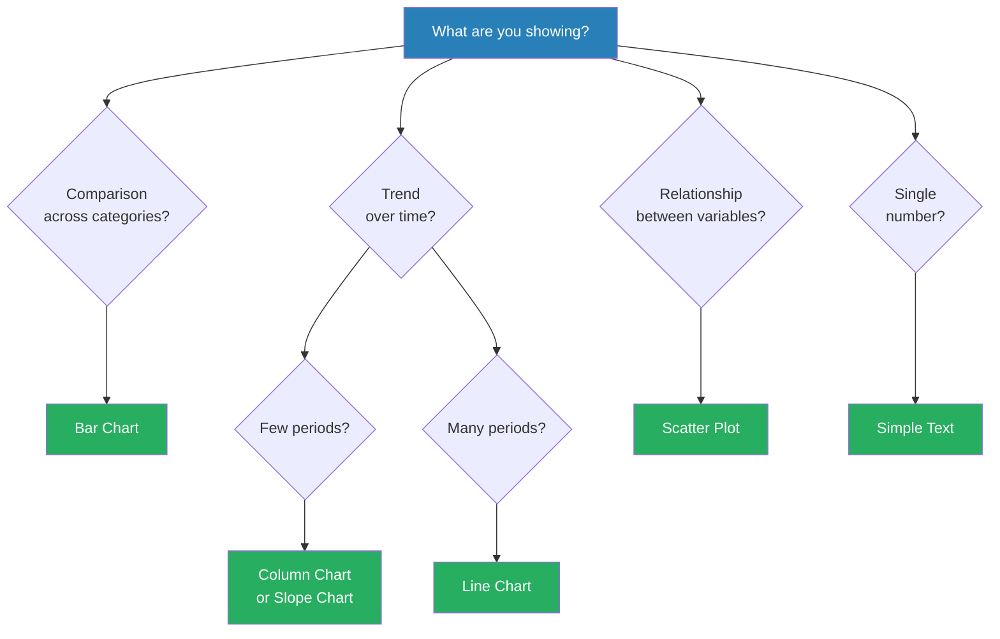
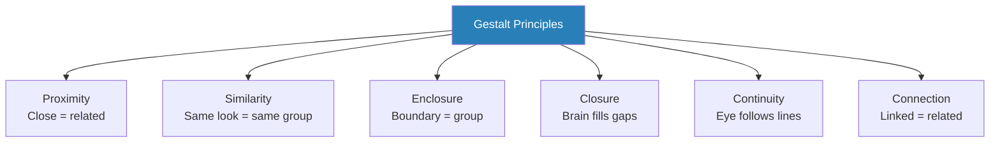
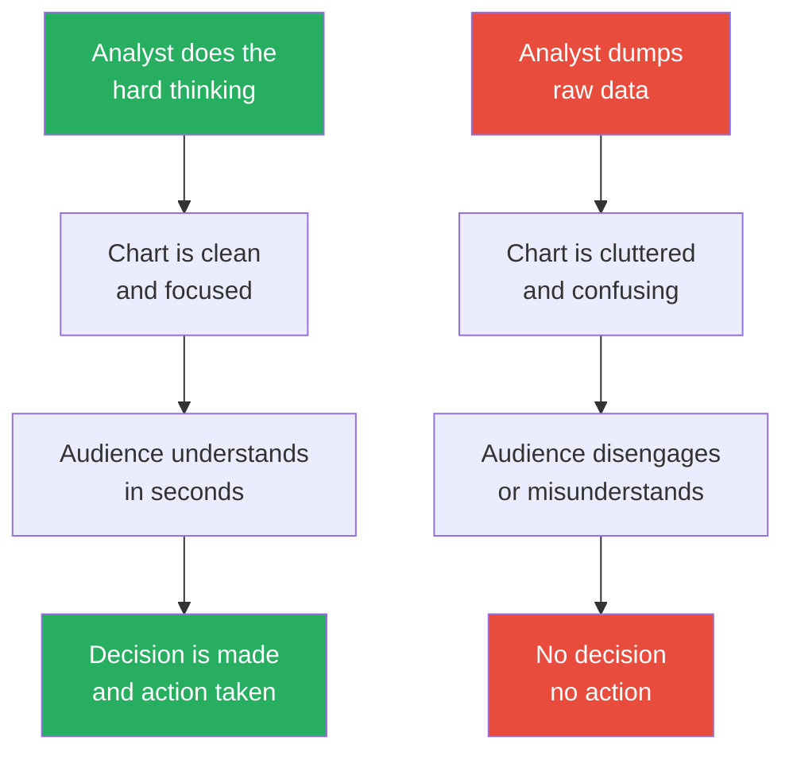

# Storytelling with Data — Cole Nussbaumer Knaflic

> You have done the analysis. You have the data. You have built a slide with six charts, a table, and a title that reads "Q3 Performance Dashboard." You present it to the executive team. They stare at the screen. Someone asks, "So... what's the takeaway?" This is the failure that Cole Nussbaumer Knaflic wrote the book to fix. The problem is almost never the data — it is the communication. Every effective data presentation has a clear point, a thoughtful visual, and a narrative arc that tells the audience what happened, why it matters, and what to do next. Knaflic, a former data analyst at Google's People Analytics team, distils this into six practical lessons that transform cluttered, confusing slides into clear visual arguments. The book is not about statistics or analytics — it is about the last mile: getting someone to understand and act on what the numbers mean.

---

## About the Author

Cole Nussbaumer Knaflic spent years at Google leading the People Analytics team's data communication efforts, where she learned first-hand that brilliant analysis is worthless if the audience cannot understand it. She founded storytellingwithdata.com, which became one of the most widely used data visualisation training resources in the world. Her approach draws heavily on Edward Tufte's data-ink ratio, cognitive psychology research on preattentive attributes, and the structure of classic narrative storytelling. She teaches workshops for organisations ranging from startups to the Gates Foundation, and the book grew directly out of the course she developed at Google to train analysts to communicate more effectively.

---

## The Big Idea

- <b style="color: #2980b9">Data visualisation is not about making charts look pretty — it is about making your point impossible to miss</b>
- Most data presentations fail because they ask the audience to do the analyst's job:
  - Find the pattern buried in twelve data series
  - Identify the one insight that matters among dozens of numbers
  - Figure out the implication and what action to take
- This is backwards — the analyst, who spent hours or weeks with the data, is the person best equipped to draw out the meaning and present it clearly
- <b style="color: #27ae60">Your job is not to show data — your job is to tell a story with data that compels your audience to act</b>
- Knaflic structures this transformation into six sequential lessons, each building on the last:
  - Understand your context before touching a chart
  - Choose the right visual for the data and message
  - Strip away every element that does not serve your point
  - Use preattentive attributes to direct the eye
  - Apply design thinking for clarity and accessibility
  - Wrap everything in a narrative arc — setup, conflict, resolution
- The lessons are deceptively simple — anyone can learn them — but almost no one practises them, because schools teach data analysis but not data communication
- The result is a gap between knowing what the data says and making anyone else care

Knaflic's six lessons form a sequential pipeline — each step depends on the previous one being done well.

---

## Key Concepts at a Glance

| Concept | One-line summary |
|---------|-----------------|
| **The Big Idea** | One sentence that captures your point so clearly your audience could repeat it |
| **Context (Who/What/How)** | Before touching data, answer: who is the audience, what do they need to do, how will they receive this |
| **Appropriate visuals** | Bar charts beat pie charts almost always; tables are for reading, not presenting |
| **Clutter** | Every non-data element is clutter until proven useful — gridlines, borders, 3D effects, legends |
| **Data-ink ratio** | Tufte's principle: maximise the share of ink devoted to actual data |
| **Preattentive attributes** | Colour, size, position, orientation — visual properties the brain processes before conscious thought |
| **Gestalt principles** | Proximity, similarity, enclosure, closure, continuity, connection — how we group visual elements |
| **Affordances** | Visual cues that tell the audience how to read the display — bold titles, indentation, alignment |
| **Narrative arc** | Setup (context), Conflict (what the data reveals), Resolution (what to do about it) |
| **Three-Minute Story** | If you only had three minutes in a hallway, could you tell the complete story? |
| **Before-and-after makeovers** | The book's primary teaching tool — showing the same data presented badly then well |
| **Colour as preattentive tool** | One bold colour for the data that matters, grey for everything else |

---

## Lesson 1: Understand the Context

*Most bad data presentations fail before the first chart is drawn — they fail because the analyst never stopped to think about who the audience is, what they need to do, and how they will receive the information.*

### The Three Questions

- <b style="color: #2980b9">Every data communication project must begin with three questions</b> — not with Excel, not with PowerPoint, not with a chart type:
  - **Who** is your audience?
  - **What** do you need them to do?
  - **How** will they receive this?
- These questions seem basic, but Knaflic argues that skipping them is the single most common cause of data communication failure
- Analysts jump straight to the data because that is the comfortable part — the part they were trained for
- But communication is about the audience, not about the analyst

---

### Who: Know Your Audience

- "The leadership team" is not a specific enough answer
- You need to know:
  - What decisions does this person face?
  - What do they already know about the topic?
  - What is their level of data literacy?
  - What do they care about — revenue? risk? customer satisfaction? competitive position?
  - What biases or preconceptions might they bring?
- <b style="color: #27ae60">The more specific your understanding of the audience, the more precisely you can tailor the message</b>
- A presentation to engineers looks different from a presentation to executives, even when the underlying data is identical:
  - Engineers want methodology, confidence intervals, and caveats
  - Executives want the bottom line, the business impact, and the recommended action

> [!example] Knaflic's Google Experience — Know Your Decision-Maker
> - At Google, Knaflic's People Analytics team analysed employee retention data
> - The same retention data needed to be presented to different audiences: HR directors, engineering VPs, and the C-suite
> - For HR directors, the focus was on which specific programmes correlated with retention — they needed tactical detail
> - For engineering VPs, the focus was on which teams were losing people and why — they needed team-level patterns
> - For the C-suite, the focus was on the bottom-line cost of attrition and a single recommended action — they needed the headline
> - The data was identical; the communication was completely different each time
> **The lesson:** The audience determines the message, not the data.

---

### What: Define the Action

- <b style="color: #e74c3c">Never present data without a clear desired action</b> — "understand the data" is not an action
- The question is not "what do I want to show?" but "what do I need them to DO?"
- Specific actions look like:
  - Approve the budget increase for customer support
  - Shift Q2 marketing spend from Channel A to Channel B
  - Fund the pilot programme for the new onboarding process
  - Delay the product launch by two weeks to fix the retention drop
- When you define the action clearly, it becomes obvious which data to include and which to leave out
- Data that does not serve the action is noise, no matter how interesting it is to the analyst

> [!tip] Core Insight
> If you cannot write one sentence describing what you want your audience to DO after seeing your data, you are not ready to build a single chart.

---

### How: Understand the Medium

- The delivery mechanism changes everything about how you design the communication:
  - **Live presentation** — you control the pacing, you can explain context verbally, you can read the room and adapt. Slides can be sparser because you are the narrator
  - **Emailed document** — the document must be entirely self-explanatory. Every chart needs a clear title, annotations, and enough context that someone reading it at 11 p.m. on their phone can understand it without you there
  - **Printed report** — similar to email but may be higher resolution and allow for more detailed visuals
  - **Interactive dashboard** — the audience explores on their own terms, so you need to design for multiple paths through the data
- <b style="color: #2980b9">The "slidedoc"</b> — Knaflic acknowledges the common hybrid: a document that is part slide, part report, designed to be both presented and emailed
  - These require more annotation and context than pure presentation slides
  - But less prose than a full written report

---

### The Big Idea Worksheet

- Knaflic introduces a specific tool: the <b style="color: #2980b9">Big Idea</b>
- This is a single sentence that captures your entire point so clearly that your audience could repeat it to someone else
- The Big Idea has three components:
  - It articulates your **unique point of view** — not a neutral statement of facts, but your interpretation
  - It conveys **what is at stake** — why should the audience care?
  - It is a **complete sentence** — not a topic, not a title, not a fragment

> [!abstract] How to Write the Big Idea
> 1. Start with the data insight — what did the analysis reveal?
> 2. Add the stakes — why does this matter to the audience?
> 3. Add the action — what should be done about it?
> 4. Compress into one sentence
> 5. Test: could a colleague who has never seen the data repeat this sentence and capture your point?

- **Weak Big Idea:** "This presentation covers Q3 attrition data."
- **Strong Big Idea:** "Engineering attrition increased 30% year-over-year driven by compensation gaps in senior roles, and we need to adjust salary bands before Q1 hiring."
- The weak version describes what the presentation contains — the strong version tells the audience what the data means and what to do about it

> [!example] The Difference Between Topic and Point
> - An analyst preparing a monthly sales report titles the slide "October Sales by Region"
> - This is a topic, not a point — the audience still has to figure out what matters
> - A better title: "West region sales declined 18% in October — our first year-over-year drop since 2019"
> - Now the audience knows what happened, why it is notable, and what to focus on
> - The chart below this title only needs to highlight the West region — everything else fades to context
> **The lesson:** Titles should tell the story, not describe the chart.

---

### The Three-Minute Story Test

- <b style="color: #2980b9">The Three-Minute Story</b> is Knaflic's stress test for clarity:
  - Imagine a colleague stops you in the hallway and asks what your analysis found
  - You have three minutes
  - Can you tell the complete story — what you looked at, what you found, and what should happen next?
- If you cannot, your thinking is not yet clear enough to present
- The Three-Minute Story forces you to separate the essential from the interesting-but-irrelevant
- Most analysts include far too much because they are proud of the work — the Three-Minute Story is a filter for audience-relevant content only

---

## Lesson 2: Choose an Appropriate Visual Display

*The choice of chart type is not a matter of aesthetics or personal preference — it is a communication decision with right and wrong answers.*

### The Chart Vocabulary

- Knaflic argues that most people use too many chart types because they think variety is engaging
- In practice, a small set of charts handles the vast majority of communication needs:
  - <b style="color: #2980b9">Simple text</b> — when you have one or two numbers that tell the whole story
  - <b style="color: #2980b9">Bar charts</b> — the workhorse of data visualisation
  - <b style="color: #2980b9">Line charts</b> — for trends over continuous time
  - <b style="color: #2980b9">Slope charts</b> — for comparing exactly two time points
  - <b style="color: #2980b9">Scatter plots</b> — for relationships between two variables
  - <b style="color: #2980b9">Tables</b> — for looking up specific values

| Chart Type | Best For | Avoid When |
|-----------|---------|------------|
| **Simple text** | One or two numbers that tell the whole story | You have many data points to compare |
| **Bar chart** (horizontal) | Comparing categories — the workhorse of data viz | You have too many categories to fit legibly |
| **Bar chart** (vertical/column) | Time series with few periods | Continuous time data with many periods (use line) |
| **Line chart** | Trends over continuous time | Comparing unrelated categories |
| **Slope chart** | Showing change between exactly two time points | More than two time points |
| **Scatter plot** | Relationship between two variables | Audience is unfamiliar with the format |
| **Table** | When the audience needs to look up specific values | Presentations where the audience cannot study at their own pace |

Bar charts dominate the chart vocabulary because categorical comparison is the most common data communication need in business settings.

Each chart type has a specific communication purpose — choosing the wrong one forces the audience to work harder to extract the meaning.

---

### Simple Text: The Overlooked Option

- When you have just one or two numbers that convey the entire message, you do not need a chart at all
- A large, bold number with a brief label communicates faster and more forcefully than any chart:
  - "**42%** of new hires leave within 12 months" — this is more powerful as bold text on a slide than as a single bar in a bar chart
- Analysts default to charts because that is what they think data presentations require
- <b style="color: #27ae60">Sometimes the most effective visual is no visual at all — just the number, presented with emphasis</b>

---

### Bar Charts: The Workhorse

- Horizontal bar charts are Knaflic's go-to recommendation for categorical comparisons:
  - They are universally understood — no explanation needed
  - They accommodate long category labels without tilting text
  - They make magnitude differences obvious because our eyes are excellent at comparing lengths
- Vertical bar charts (column charts) work well for time-series data with a small number of periods
- Stacked bar charts should be used with caution:
  - Only the bottom segment has a consistent baseline, so comparisons of upper segments are unreliable
  - Limit to 2-3 segments maximum
- <b style="color: #e74c3c">Avoid clustered bar charts when possible</b> — they quickly become visually overwhelming:
  - Four categories across twelve months means 48 bars on one chart
  - The audience cannot compare anything meaningfully

> [!example] Spaghetti Chart to Clean Bars
> - A marketing team presented campaign performance using a clustered bar chart: five campaigns across four quarters, each in a different colour
> - The chart had twenty bars crammed together — the audience squinted and gave up
> - Knaflic's redesign: separate the data into one horizontal bar chart per quarter, sorted by performance
> - Each chart was sparse, clean, and immediately readable
> - The audience could see at a glance which campaign led in each quarter and how the rankings shifted over time
> **The lesson:** When a single chart is doing too much work, split it into multiples.

---

### Line Charts: Trends Over Time

- Line charts are the natural choice when the x-axis represents continuous time and you want to show a trend
- The slope of the line communicates direction and rate of change intuitively
- Multiple lines on the same chart are acceptable — but only if:
  - The lines are clearly differentiated (colour, labels)
  - There are not more than 3-4 lines (beyond that, the chart becomes unreadable)
  - The audience needs to compare the lines to each other, not just see each line individually

---

### The Pie Chart Problem

- <b style="color: #e74c3c">Pie charts are almost never the right choice</b>
- Knaflic devotes significant attention to explaining why:
  - Humans are poor at comparing angles and areas — two slices that are 24% and 27% look nearly identical in a pie chart but are clearly different in a bar chart
  - 3D pie charts make this problem even worse by distorting the visual proportions
  - Pie charts work only when you have 2-3 segments and want to convey "roughly a quarter" or "roughly half" — and even then, simple text is usually better
- The one exception Knaflic allows: a pie chart showing parts of a whole when there are only two or three categories and the goal is to communicate a rough proportion, not an exact comparison
- Even in that case, a horizontal stacked bar chart is often superior

> [!tip] Core Insight
> If you must use a pie chart, ask yourself: would a bar chart communicate this more clearly? The answer is almost always yes.

---

### Tables: For Reading, Not Presenting

- Tables are powerful when the audience needs to look up specific values — budgets, schedules, detailed comparisons
- But they fail in live presentations because the audience reads the table instead of listening to the presenter
- <b style="color: #27ae60">Design principle: light borders or no borders, alternating row shading for readability, and bold the numbers that matter</b>
- If you must show a table in a presentation:
  - Highlight the specific cells you are discussing
  - Grey out the rows you are not discussing
  - Give the audience time to read before you start talking

---

### Slope Charts and Scatter Plots

- **Slope charts** are under-used and highly effective for showing change between two time periods:
  - A line connecting "before" to "after" for each category
  - The slope of each line immediately communicates direction and magnitude of change
  - Crossings between lines reveal rank changes
- **Scatter plots** show the relationship between two continuous variables:
  - Useful for correlation, clustering, and outlier detection
  - But they require a more data-literate audience — Knaflic warns that general audiences may find them confusing
  - Always label axes clearly and consider annotating key points directly

This decision tree captures Knaflic's chart selection logic — start with what you are trying to communicate, not with what chart you like.

---

## Lesson 3: Eliminate Clutter

*Every element in your visual that is not data is clutter — and clutter competes with your message for the audience's limited cognitive bandwidth.*

### The Cognitive Cost of Clutter

- Knaflic grounds the clutter argument in cognitive psychology:
  - Human working memory is limited — most people can hold 3-4 chunks of information at once
  - Every non-essential visual element occupies cognitive bandwidth that could be spent understanding the data
  - Clutter does not just fail to help — it actively hurts comprehension by competing for limited attention
- <b style="color: #2980b9">Cognitive load</b> is the total mental effort required to process a visual:
  - **Intrinsic load** — the inherent complexity of the data itself (you cannot reduce this)
  - **Extraneous load** — the unnecessary complexity added by poor design (you CAN reduce this)
  - Knaflic's entire approach to clutter is about eliminating extraneous cognitive load

---

### The Clutter Audit

- Knaflic provides a systematic process for identifying and removing clutter:

> [!abstract] The Clutter Audit Process
> 1. Start with the default chart your software produces
> 2. Remove chart borders — the data does not need a box
> 3. Remove or lighten gridlines — if you need them, make them pale grey
> 4. Remove 3D effects — never, under any circumstances
> 5. Remove data labels from every point — label only the points that matter
> 6. Remove the legend — label data series directly on the chart
> 7. Simplify axis labels — "$1.2M" beats "$1,237,482.51"
> 8. Remove bold formatting from axis text — it pulls attention to scaffolding
> 9. Ask: "Can I remove this element without losing meaning?" If yes, remove it

- The principle behind the audit comes from Edward Tufte's <b style="color: #2980b9">data-ink ratio</b>:
  - Data-ink ratio = ink used for data / total ink used in the chart
  - The ideal is to maximise this ratio — every drop of ink should represent data
  - If you can remove an element and the chart still communicates, remove it

3D effects score the worst combination of high cognitive cost and high clarity impact — confirming why Knaflic calls them her strongest prohibition.

---

### What Counts as Clutter

- **Chart borders and backgrounds** — the rectangular box around a chart adds nothing; remove it
- **Gridlines** — occasionally useful for precise value reading, but usually just visual noise
  - If you keep them, make them thin and light grey — they should be barely visible
- **3D effects** — <b style="color: #e74c3c">this is Knaflic's strongest prohibition</b>
  - 3D distorts the visual proportions of the data
  - A 3D bar chart makes bars in the back appear shorter than they actually are
  - 3D pie charts tilt the perspective, making front slices appear larger than they are
  - There is no legitimate reason to use 3D in data visualisation — it exists only because software makes it easy
- **Unnecessary data labels** — labelling every single data point creates a wall of numbers
  - Label only the points that matter to your argument
  - Let the visual shape communicate the rest
- **Legends** — every legend forces the audience to look away from the data, find the colour in the legend, match it, and look back
  - <b style="color: #27ae60">Label data directly on the chart instead</b> — place the series name next to the line or bar
  - This eliminates the back-and-forth cognitive overhead completely
- **Unnecessary decimal places** — "$1.2M" is better than "$1,237,482.51" in a presentation
  - Precision beyond what the audience needs is noise

> [!example] The Default Chart Disaster
> - Knaflic takes a standard chart produced by Excel's default settings and catalogues the clutter:
>   - Grey background fill in the plot area — removed
>   - Heavy black borders around the chart and legend — removed
>   - Gridlines at every major and minor tick mark — reduced to faint grey at major ticks only
>   - Data labels on all twelve data points — removed, except for the two that matter
>   - A legend in the upper right corner — removed, replaced with direct labels
>   - Bold axis titles — changed to regular weight
>   - Decimal places on the y-axis — rounded to whole numbers
> - The resulting chart uses perhaps 30% of the visual elements of the original but communicates more clearly
> **The lesson:** Software defaults are designed for flexibility, not communication — always start by removing.

---

### Gestalt Principles of Visual Perception

*The Gestalt principles explain how the human brain organises visual information into groups and patterns — understanding them helps you design charts that the brain processes effortlessly.*

- <b style="color: #2980b9">Gestalt psychology</b> describes the rules by which the brain groups visual elements:
  - **Proximity** — elements that are close together are perceived as a group
    - This is why spacing between bar chart groups matters — bars within a group should be closer together than the gaps between groups
  - **Similarity** — elements that look alike (same colour, shape, size) are perceived as related
    - This is why consistent colour coding matters — if "Sales" is blue in one chart, it should be blue in every chart
  - **Enclosure** — elements inside a boundary are perceived as a group
    - Shading a region of a chart to highlight a time period uses enclosure
  - **Closure** — the brain fills in gaps to perceive complete shapes
    - This is why you can remove chart borders and gridlines — the brain still perceives the chart structure
  - **Continuity** — the brain follows smooth paths and lines
    - This is why line charts work for time series — the eye follows the line naturally
  - **Connection** — elements connected by a line are perceived as related
    - This is why slope charts work — the connecting line creates a visual relationship between two data points

> [!example] Using Proximity to Group Data
> - A report showed quarterly performance data for four business units
> - In the original design, all sixteen bars were evenly spaced — the audience could not quickly see which bars belonged to which quarter
> - In the redesign, bars within each quarter were grouped tightly together with wider gaps between quarters
> - The audience immediately perceived four groups of four — no labels needed to explain the grouping
> - Proximity did the communication work that a complex legend had failed to do
> **The lesson:** Spatial arrangement communicates grouping more powerfully than labels or colour.

These six principles are the brain's built-in visual grammar — Knaflic argues that effective data design works with this grammar rather than against it.

---

## Lesson 4: Focus Your Audience's Attention

*Once you have removed clutter, the next step is to actively direct the audience's eye to exactly what matters — using the visual properties the brain processes before conscious thought.*

### Preattentive Attributes

- <b style="color: #2980b9">Preattentive attributes</b> are visual properties that the brain processes in milliseconds — before you consciously decide to look at anything
- They are the tools Knaflic uses to draw the audience's attention to the key data point without requiring instructions, arrows, or verbal guidance
- The main preattentive attributes:
  - **Colour intensity/hue** — the most powerful. A single bold colour surrounded by grey immediately captures the eye
  - **Size** — bigger elements draw attention before smaller ones
  - **Position on the page** — top-left draws first in left-to-right reading cultures
  - **Orientation** — a tilted element among horizontal elements stands out
  - **Shape** — a circle among squares, a star among circles
  - **Length** — longer bars draw attention before shorter ones
  - **Width** — thicker lines draw attention before thinner ones
  - **Added marks** — a circle around a data point, a box around a cell in a table, an underline under text

| Attribute | Mechanism | Best Use |
|-----------|-----------|----------|
| **Colour** | Strongest preattentive pull | Highlight the one data series that matters |
| **Size** | Larger = more important | Emphasise key numbers |
| **Position** | Top-left draws first | Place the most important chart in the upper left |
| **Bold text** | Weight difference catches eye | Highlight key words in titles and labels |
| **Enclosure** | Box or shading around data | Isolate a section of a chart for focus |

Colour dominates both dimensions, confirming Knaflic's recommendation to make it your primary tool for directing attention.

---

### The Colour Strategy

- <b style="color: #27ae60">Use colour sparingly and strategically — most of the chart should be grey, with one accent colour for the data that matters</b>
- The technique Knaflic demonstrates repeatedly:
  - Take a chart with twelve data series, each in a different colour (the "spaghetti chart")
  - Replace every series with grey except the one that matters to your argument
  - Make that one series bold and colourful
  - The audience's eye goes immediately to the coloured element — no instructions needed
- Why this works:
  - Colour is the strongest preattentive attribute
  - Grey is perceived as background — the brain processes it as context, not as information requiring attention
  - A single contrasting colour against grey creates an unmissable focal point
- <b style="color: #e74c3c">Never use colour decoratively</b> — every colour choice should serve a communication purpose:
  - Different colours for every data series is decorative (and confusing)
  - One colour for the focal data point and grey for everything else is strategic

> [!example] The Spaghetti Chart Transformation
> - An operations team tracked twelve metrics on a single line chart — each metric in a different colour
> - The chart looked like a plate of multicoloured spaghetti — lines crossing, overlapping, impossible to follow
> - The audience's reaction: glazed eyes and the inevitable "what am I looking at?"
> - Knaflic's redesign: grey all twelve lines, then highlight one line in bold blue with a direct label
> - The title changed from "Monthly Metrics Dashboard" to "Support ticket resolution time has doubled since March"
> - The audience immediately saw the problem, understood the trend, and focused on the right metric
> - The other eleven lines provided context (you could see the highlighted metric was an outlier) without demanding attention
> **The lesson:** Do not make the audience search for the story. Use colour to tell them where to look.

---

### Combining Attributes

- While colour is the most powerful single attribute, combining attributes creates even stronger focus:
  - **Colour + size** — a large, coloured number on a slide full of grey text is unmissable
  - **Colour + position** — place the key chart in the upper left AND use colour to highlight the key data point
  - **Colour + bold text** — a coloured, bold title immediately communicates the main message
- But Knaflic warns against overuse:
  - If you highlight everything, you highlight nothing
  - The power of preattentive attributes comes from contrast — they only work when most of the visual is neutral

> [!tip] Core Insight
> Preattentive attributes are the visual equivalent of Cialdini's "channelled attention" from *[[Pre-Suasion - Robert Cialdini|Pre-Suasion]]*. You do not persuade by showing more — you persuade by directing attention to the one thing that matters.

---

### Where Are Your Eyes Drawn?

- Knaflic uses a simple exercise throughout the book: present a visual and ask "where are your eyes drawn?"
- This exercise reveals whether the design is working:
  - If the audience's eyes go to the key data point — success
  - If the audience's eyes go to the legend, the axis labels, or a decorative element — failure
  - If the audience's eyes wander with no clear focal point — failure
- The exercise works because preattentive processing is automatic and universal — you cannot override it through willpower
- <b style="color: #27ae60">Design your charts so the answer to "where are your eyes drawn?" is always the most important data point</b>

---

## Lesson 5: Think Like a Designer

*Knaflic broadens the lens beyond individual chart choices to the overall design of the data communication — applying principles from design thinking to slide layouts, colour palettes, and visual hierarchy.*

### Affordances

- <b style="color: #2980b9">Affordances</b> are visual cues that tell the audience how to interact with or read the display:
  - A bold, large title signals "read me first"
  - Indentation signals "this is subordinate to the item above"
  - Consistent formatting signals "these items are related and at the same level"
  - Grey text signals "this is supporting context, not the main message"
- In data communication, affordances reduce cognitive effort:
  - The audience does not have to figure out what to read first — the design tells them
  - This is especially important for emailed documents where you are not there to guide the reading

---

### Accessibility

- <b style="color: #e74c3c">Roughly 8% of men and 0.5% of women have some form of colour blindness</b> — design for them:
  - Do not rely on colour alone to convey information
  - Add direct labels, patterns, or annotations as redundant channels
  - Use colour-blind-safe palettes (avoid red-green distinctions when possible)
  - Test your charts with a colour-blindness simulator
- Beyond colour blindness, accessibility means:
  - Using font sizes large enough to read on projected screens
  - Ensuring sufficient contrast between text and background
  - Avoiding text over complex backgrounds or chart areas

---

### Aesthetics and Credibility

- Clean, aligned, balanced visuals communicate competence and credibility
- <b style="color: #e74c3c">A sloppy chart undermines the data it presents</b>, regardless of how rigorous the analysis was:
  - Misaligned elements suggest carelessness
  - Inconsistent fonts suggest lack of attention to detail
  - Garish colours suggest lack of professionalism
- Alignment is the simplest and most powerful aesthetic tool:
  - Left-align text (not centre-align — centre-aligned text is harder to scan)
  - Align chart edges to a grid
  - Keep margins consistent
- Knaflic explicitly recommends removing decorative elements:
  - No clip art
  - No stock photos behind charts
  - No gradient fills
  - No shadow effects
  - These elements add visual noise and subtract credibility

---

### White Space

- <b style="color: #27ae60">White space is the most underused design tool in data communication</b>
- Analysts feel compelled to fill every pixel of a slide or page — this is the opposite of good design:
  - White space around a chart gives the eye room to focus
  - White space between sections creates visual grouping (using the Gestalt principle of proximity)
  - White space signals confidence — you do not need to cram the slide because you have a clear, focused message
- Knaflic points out that magazines, newspapers, and professional design firms all use generous white space — because they know it improves comprehension
- The urge to fill every corner is an anxiety response: "If I leave white space, they will think I did not do enough work"
- The reality is the opposite: <b style="color: #27ae60">a sparse, focused slide signals mastery of the subject</b> — you know what matters and you are not afraid to leave out what does not

> [!example] The Crowded Dashboard vs. the Focused Slide
> - A product team created a quarterly review deck where every slide had 3-4 charts, a table, and several text blocks
> - The slides were so dense that the audience spent the entire meeting reading slides instead of engaging with the presenter
> - Knaflic's redesign split each dense slide into 3-4 slides with one chart each and generous white space
> - The deck was longer (more slides) but the meeting was shorter — each point was understood immediately, discussion was focused, and decisions were made faster
> - Total ink decreased by roughly 60% while total comprehension increased dramatically
> **The lesson:** More white space means fewer slides are needed to understand each point, even if the total slide count increases.

---

### Consistency as a Design Principle

- Consistency reduces cognitive overhead:
  - If blue means "Sales" on slide 3, it should mean "Sales" on slide 7
  - If the y-axis is in millions on one chart, it should be in millions on the next chart showing related data
  - If bold titles are left-aligned, all bold titles should be left-aligned
- Inconsistency forces the audience to re-orient with every new slide — which uses cognitive resources that should be spent understanding the data
- <b style="color: #2980b9">Design templates</b> help maintain consistency across a multi-slide presentation:
  - Define your colour palette (one accent colour, one or two shades of grey)
  - Define your fonts (one for titles, one for body)
  - Define your layout grid (where charts go, where titles go, where annotations go)
  - Stick to the template throughout

---

## Lesson 6: Tell a Story

*Data without narrative is a spreadsheet. Narrative without data is an opinion. Together, they are the most persuasive form of business communication.*

### Why Narrative Matters

- Knaflic argues that the human brain is wired for stories, not for data:
  - Stories activate more regions of the brain than facts alone
  - Stories are remembered longer than statistics
  - Stories create emotional engagement that data alone cannot
- This is not about manipulating the audience — it is about communicating in the format the human brain is built to receive
- <b style="color: #27ae60">A data story is not fiction — it is the truthful narrative that the data supports, presented in a structure the audience can follow</b>

---

### The Three-Act Structure

- Knaflic adapts the classic three-act narrative structure for data presentations:

| Act | Function | Data Role | Example |
|-----|----------|-----------|---------|
| **Setup** | Establish context — what is the situation? | Baseline data, historical trends | "For the past three years, customer satisfaction has been stable at 82%" |
| **Conflict** | Reveal the tension — what changed? | The insight — the anomaly, the gap, the trend | "In Q3, satisfaction dropped to 71% — the lowest point in company history" |
| **Resolution** | Recommend action — what should we do? | Evidence supporting the recommendation | "Our analysis shows the drop correlates with the new checkout flow — we recommend reverting to the previous design and A/B testing improvements" |

- The narrative arc transforms a data presentation from "here are some charts" into "here is what is happening, here is why it matters, and here is what we should do about it"
- <b style="color: #e74c3c">The most common failure is skipping the Resolution</b>:
  - Many presentations deliver Setup and Conflict beautifully but then end with "Questions?"
  - The audience is left knowing there is a problem but having no idea what to do about it
  - Always end with a clear recommendation

The narrative arc gives the audience an emotional journey: comfort (setup), tension (conflict), and relief (resolution). This structure mirrors how the brain processes information most effectively.

---

### Horizontal and Vertical Logic

- Knaflic introduces two tests for narrative coherence in slide decks:
  - <b style="color: #2980b9">Horizontal logic</b> — read just the slide titles in order. Do they tell a complete, coherent story by themselves? If someone read only the titles and nothing else, would they understand your argument?
  - <b style="color: #2980b9">Vertical logic</b> — within each slide, does the title (the claim) match the visual (the evidence)? Does the chart on the slide actually support the title above it?
- Horizontal logic is the macro test — is the overall narrative coherent?
- Vertical logic is the micro test — does each slide internally make sense?

> [!abstract] Horizontal and Vertical Logic Check
> 1. Write out your slide titles in order — do they tell a story?
> 2. For each slide, read the title and look at the chart — does the chart prove the title?
> 3. If the title says "Sales declined in Q3" but the chart shows all four quarters equally, the vertical logic fails
> 4. If the titles jump from "Market overview" to "Recommendation" with no connection, the horizontal logic fails
> 5. Fix horizontal first (story flow), then vertical (evidence match)

---

### Building Narrative Tension

- Effective data stories build tension deliberately:
  - Start with what the audience expects — the baseline, the norm, the status quo
  - Then introduce the disruption — the data that contradicts expectations
  - The gap between expectation and reality creates tension
  - The resolution resolves that tension with a recommended action
- Knaflic emphasises that the conflict should be genuine:
  - If the data shows everything is fine, do not manufacture a problem
  - But if the data reveals something unexpected, lean into it — that surprise is the engine of your story

> [!example] Building Tension with Sales Data
> - A retail analyst discovered that overall revenue was up 8% year-over-year — good news
> - But the data also showed that revenue growth was entirely driven by two new product lines
> - The company's original core products had declined 12% — a trend hidden by the top-line number
> - The analyst structured the presentation as a narrative:
>   - Setup: "Revenue is up 8% year-over-year" (the audience relaxes)
>   - Conflict: "But our core products declined 12% — new products are masking a fundamental problem" (the audience tenses)
>   - Resolution: "We recommend investing in core product improvement before the new products mature and the mask disappears" (the audience has a clear action)
> - The same data, presented as a flat dashboard, would have produced a "looks good, next" reaction
> **The lesson:** Narrative tension forces the audience to pay attention — flat data dumps let them disengage.

---

### The Power of Repetition

- Knaflic recommends deliberate repetition in data storytelling:
  - State the main message in the title
  - Show it in the visual
  - Say it aloud during the presentation
  - Summarise it again at the end
- This is not redundancy — it is reinforcement
- Research on message retention shows that people need to encounter a message 3-5 times before it sticks
- <b style="color: #27ae60">The audience will not remember your second point. They might remember your first point — if you say it three times.</b>

---

### Spoken vs. Written Narrative

- The narrative approach differs depending on the medium:
  - **Live presentations** — the narrative unfolds through your spoken words. Slides are visual evidence that supports what you are saying. You can build suspense by revealing data gradually (progressive disclosure)
  - **Written reports** — the narrative must be embedded in the document itself. Titles, annotations, and callout text carry the story. The reader must be able to follow the argument without hearing you explain it
  - **Dashboards** — the narrative is less linear. Design the dashboard so the most important story is visually dominant (largest chart, strongest colour, top-left position) and supporting details are available on demand

---

## Before and After: The Complete Transformation

*The book's most powerful teaching device is the before-and-after makeover — showing the same data presented badly then well, with every design decision explained.*

### Anatomy of a Makeover

- Knaflic walks through numerous transformations throughout the book
- The pattern is consistent:
  1. Start with a default chart from Excel or similar software
  2. Identify the message — what is the Big Idea?
  3. Apply the six lessons sequentially
  4. Arrive at a clean, focused, narrative-driven visual

> [!example] The Customer Satisfaction Makeover
> - **Before:** A slide titled "Customer Satisfaction Scores by Region" with a clustered bar chart showing twelve regions across four quarters
>   - Every bar in a different colour
>   - A legend in the upper right corner
>   - 3D effects on the bars
>   - Gridlines at every major tick mark
>   - Every data point labelled
>   - The audience had to study it for thirty seconds to find anything meaningful
> - **After:** The same data, redesigned:
>   - Title changed to "Southeast region satisfaction dropped 15% — lowest in company history"
>   - One region highlighted in dark blue; all others in light grey
>   - The problematic quarter annotated directly on the chart with an arrow and text
>   - No legend, no gridlines, no 3D
>   - Only two data labels: the starting value and the ending value for the Southeast region
>   - The audience understood the message in three seconds
> - The data did not change — the communication did
> **The lesson:** The analyst decides what the audience needs to know and designs the visual to communicate it — the audience should never have to search.

---

### The Transformation Checklist

> [!abstract] The Six-Lesson Transformation
> 1. **Context:** Who is the audience? What action do I need? How will they receive it?
> 2. **Visual:** Is this the right chart type for the data and the message?
> 3. **Clutter:** Have I removed borders, gridlines, 3D, unnecessary labels, and legends?
> 4. **Attention:** Have I used colour and size to direct the eye to the key data point?
> 5. **Design:** Is the layout clean, aligned, accessible, and consistent?
> 6. **Story:** Does the title state the conclusion? Does the visual prove it? Is there a clear recommendation?

---

### Common Before-and-After Patterns

| Before Pattern | After Pattern | Why It Works |
|---------------|--------------|--------------|
| Topic title ("Q3 Revenue") | Action title ("Q3 revenue exceeded target by 12%") | Tells the story, not the topic |
| All bars in different colours | One colour + grey | Directs attention instantly |
| Legend in corner | Direct labels on data | Eliminates cognitive overhead |
| Gridlines at every tick | No gridlines or faint grey | Reduces visual noise |
| Every data point labelled | Only key points labelled | Focuses on what matters |
| 3D effects | Flat 2D | Accurate visual proportions |
| Cluttered slide | Generous white space | Gives the eye room to focus |
| "Questions?" ending | Clear recommendation | Completes the narrative arc |

The transformation reduces visual elements by 70% while nearly quadrupling message retention — proving that less is dramatically more in data communication.

---

## Practical Applications and Cross-Cutting Themes

*Several ideas run through all six lessons, reinforcing each other and creating a coherent communication philosophy.*

### The Analyst's Mindset Shift

- Knaflic identifies a fundamental mindset shift that separates effective data communicators from ineffective ones:
  - **Ineffective mindset:** "I need to show all my work so they can see how thorough I was"
  - **Effective mindset:** "I need to distil my work into the one thing they need to understand and act on"
- This shift is psychologically difficult because:
  - Analysts invest hours or weeks in the data — they are attached to the complexity
  - Showing less feels like it devalues the work
  - The urge to impress with thoroughness conflicts with the need to communicate simply
- <b style="color: #27ae60">The most impressive data communication looks effortless — which requires more work, not less</b>
- Mark Twain's apocryphal quote applies: "I didn't have time to write you a short letter, so I wrote you a long one"

> [!tip] Core Insight
> Simplicity is not dumbing down — it is the result of deep understanding. Only someone who truly understands the data can decide what to leave out.

---

### Progressive Disclosure

- Knaflic discusses the technique of revealing information gradually rather than all at once:
  - In a live presentation, show the chart axes and context first, then add the data, then highlight the key point
  - This controls the audience's attention and prevents them from jumping ahead
  - It also creates a natural narrative rhythm — setup, reveal, interpret
- In written documents, progressive disclosure means:
  - Start with the headline (the title tells the conclusion)
  - Then the visual (the chart shows the evidence)
  - Then the detail (annotations and body text provide nuance)
- This mirrors the three-depth structure:
  - A 30-second reader gets the title
  - A 2-minute reader gets the title plus the chart
  - A 10-minute reader gets everything

---

### Annotate Directly

- One of Knaflic's most practical and repeatedly emphasised principles:
  - <b style="color: #27ae60">Put the interpretation on the chart itself — do not make the audience figure it out</b>
  - Instead of a legend, label each data series directly
  - Instead of expecting the audience to calculate the difference, annotate it: "12% increase"
  - Instead of a generic title, write the insight as the title
- Direct annotation reduces the cognitive steps between seeing the data and understanding the message:
  - Without annotation: see bar → check legend → find colour → decode category → compare heights → calculate difference → interpret meaning → figure out implication
  - With annotation: see highlighted bar → read annotation "12% increase since Q1" → understand message
- The difference is not trivial — it is the difference between a presentation that takes 30 seconds to understand and one that takes 3 seconds

---

### Colour Palettes for Data Communication

- Knaflic provides specific guidance on colour use beyond the one-colour-plus-grey strategy:
  - Use a single accent colour for most presentations — blue is safe, universally read as "neutral," and accessible to colour-blind audiences
  - Avoid red and green together — the most common form of colour blindness confuses these two
  - If you must use multiple colours (e.g., comparing two specific categories), limit to 2-3 and ensure they are distinct in both hue and brightness
  - <b style="color: #e74c3c">Never use a rainbow palette</b> — the human eye cannot intuitively rank rainbow colours, so a rainbow gradient communicates no meaningful ordering
- When colour represents magnitude (e.g., a heat map):
  - Use a single-hue sequential palette (light to dark blue)
  - Or a diverging palette with a neutral midpoint (blue → white → red)
  - Ensure the colour scale is explained with a legend that shows the mapping

---

### Applying the Lessons to Different Contexts

| Context | Key Adaptation |
|---------|---------------|
| **Executive presentation** | One chart per slide, action title, clear recommendation, minimal text |
| **Team meeting** | More detail acceptable, but still one message per chart |
| **Email report** | Self-explanatory annotations, descriptive titles, generous context |
| **Dashboard** | Visual hierarchy (size, position, colour) guides the eye to the most important metric |
| **Academic poster** | More detail, but still decluttered and focused relative to raw output |
| **Client deliverable** | Professional aesthetics, consistent branding, accessible design |

---

## Key Examples and Case Studies Throughout the Book

*Knaflic's teaching method relies heavily on visual examples — the book is designed to be looked at, not just read.*

### The Google People Analytics Work

- Knaflic draws extensively from her experience at Google:
  - The People Analytics team used data to influence decisions about hiring, retention, compensation, and management practices
  - The audience was often sceptical executives who had limited time and strong opinions
  - Clean, narrative-driven visuals were the only way to cut through
  - This real-world pressure is what drove Knaflic to develop the six-lesson framework

> [!example] Persuading Google Executives with Clean Visuals
> - Knaflic's team identified that managers who held regular one-on-one meetings had significantly lower team attrition
> - The initial presentation included a dense scatter plot with regression lines, confidence intervals, and p-values
> - The VP audience politely ignored it — the chart was too complex to parse in a meeting
> - The redesign used a simple paired bar chart: teams with regular 1:1s vs. teams without, showing the attrition gap
> - The title read: "Teams with regular one-on-ones have 23% lower attrition"
> - One colour for the key comparison, grey for the baseline
> - The VP approved the recommendation in under two minutes
> **The lesson:** Statistical rigour belongs in the appendix. The presentation should tell the story.

---

### The "Where Are Your Eyes Drawn?" Demonstrations

- Throughout the book, Knaflic presents pairs of visuals and asks the reader to notice where their eyes go first
- These demonstrations make preattentive attributes visceral rather than theoretical:
  - A page of grey circles with one red circle — your eyes go to the red one instantly
  - A slide with all text in regular weight except one bold word — your eyes go to the bold word
  - A chart with twelve coloured lines versus the same chart with one coloured line and eleven grey ones
- The point is always the same: you cannot control whether preattentive attributes work — they are automatic. You can only control which attributes you deploy and where.

---

### Progressive Chart Transformations

- Several chapters include step-by-step transformations where Knaflic starts with a cluttered chart and removes one element at a time:
  - Step 1: Remove the chart border
  - Step 2: Remove the background fill
  - Step 3: Lighten the gridlines
  - Step 4: Remove the legend, add direct labels
  - Step 5: Grey all data except the focal series
  - Step 6: Change the title from topic to insight
- Each step is shown as a separate image, so the reader can see the incremental improvement
- By the final step, the chart is dramatically cleaner and more communicative — but no data has been removed

---

## Overarching Philosophy

### Data Is Not the Point

- <b style="color: #27ae60">The data is never the point — the point is what the data means for the audience</b>
- This is the central philosophical claim of the book:
  - Analysts think their job is to present data accurately
  - Knaflic argues their job is to present meaning clearly
  - Accuracy matters — you should never misrepresent data — but accuracy without clarity is useless
- The audience does not want to see your data — they want to know what to do
- Every design decision should be evaluated against this question: "Does this help the audience understand what to do?"

---

### The Curse of Knowledge

- Knaflic touches on the cognitive bias known as the <b style="color: #2980b9">curse of knowledge</b>:
  - Once you understand something, you cannot remember what it was like not to understand it
  - The analyst who has spent weeks with the data sees patterns instantly — the audience seeing the chart for the first time does not
  - This gap between the analyst's understanding and the audience's understanding is the fundamental communication challenge
- The cure:
  - Test your visuals with someone who has not seen the data
  - If they cannot explain the main message within 10 seconds, redesign
  - The Three-Minute Story test serves this purpose

---

### Making the Audience Lazy

- Knaflic's philosophy can be summarised provocatively: <b style="color: #27ae60">your goal is to make the audience as lazy as possible</b>
- The audience should not have to:
  - Search for the key data point
  - Decode a legend
  - Calculate a difference
  - Read fine print
  - Figure out what the chart means
  - Guess what action you are recommending
- Every one of these tasks is work that the analyst should have done for them
- The less work the audience has to do, the more likely they are to understand the message and act on it

The two paths of data communication: the analyst who does the thinking produces action; the analyst who dumps data produces confusion.

---

### Exploratory vs. Explanatory Analysis

- Knaflic draws a sharp distinction between two fundamentally different activities:
  - <b style="color: #2980b9">Exploratory analysis</b> is what you do to find the insight — poking at the data, trying different cuts, looking for patterns, testing hypotheses
    - This is the detective work — messy, iterative, and often fruitless
    - You might look at fifty charts before you find the one that reveals something interesting
    - Exploratory analysis is for YOU, the analyst
  - <b style="color: #2980b9">Explanatory analysis</b> is what you do once you have found the insight — crafting the communication that conveys it to someone else
    - This is the storytelling work — clean, deliberate, and focused
    - You present one or two charts that convey the single most important finding
    - Explanatory analysis is for your AUDIENCE
- <b style="color: #e74c3c">The most common mistake is presenting exploratory output as if it were explanatory communication</b>
  - The analyst dumps every chart they created during exploration onto slides
  - The audience sees the analyst's journey, not the analyst's conclusion
  - This is like a novelist publishing their first drafts alongside the final manuscript
- The entire book is about the explanatory stage — Knaflic assumes the exploration is done and teaches you how to communicate what you found

> [!tip] Core Insight
> Exploratory analysis is like panning for gold — you sift through a lot of dirt. Explanatory communication is like presenting the gold nugget. Never show the audience the dirt.

---

### The Role of Iteration

- Knaflic emphasises that good data communication is rarely achieved on the first attempt:
  - Create a draft visual
  - Step away and return with fresh eyes
  - Show it to a colleague who has not seen the data — watch where their eyes go and what questions they ask
  - Revise based on their confusion, not your assumptions
- The iteration cycle mirrors writing:
  - First draft: get the data on the page
  - Second draft: apply the clutter audit
  - Third draft: refine the narrative — title, annotations, colour
  - Final draft: test with a naive audience
- <b style="color: #27ae60">Budget as much time for the communication design as you did for the analysis itself</b> — most people allocate 90% of their time to finding the insight and 10% to communicating it. Knaflic argues the ratio should be closer to 50/50

---

## The Verdict

*Storytelling with Data* is the single most practical book on data communication available. Its strength is that it teaches a skill almost every knowledge worker needs and almost no one is formally taught: how to make data understandable to someone who did not do the analysis. The six lessons are simple, memorable, and immediately applicable — you can read this book on a weekend and improve every data presentation you give on Monday. The before-and-after makeovers are the book's greatest teaching device, because they make the transformation from cluttered to clear feel achievable rather than aspirational. Anyone who has ever built a confusing slide deck — which is everyone — will find actionable advice on every page.

The book's limitations are clear and deliberate. It focuses exclusively on the communication layer and does not address the analysis layer — it assumes you have already done the hard work of finding the insight in the data and teaches you how to present that insight effectively. It also focuses on static charts — slides and printed reports — more than interactive dashboards, real-time data tools, or programmatic visualisation libraries like D3.js or matplotlib. The advice is strongest for business presentations to non-technical audiences and less directly applicable to academic or scientific visualisation, where conventions differ and audiences expect more complexity. Some readers may find the examples repetitive — Knaflic makes the same core points (remove clutter, use one colour, write action titles) across many different examples, which is effective for learning but can feel redundant on a second read.

The audience that benefits most from this book is anyone who regularly presents data to decision-makers: analysts, consultants, product managers, researchers, marketers, finance professionals, and anyone who builds slides or reports containing charts and numbers. The principles also apply to written reports, email summaries, dashboards, and any medium where data must be communicated clearly. Even experienced data professionals will find that the systematic framework — context, visual, clutter, attention, design, story — provides a useful checklist they can apply to every presentation.

In the landscape of data visualisation books, *Storytelling with Data* occupies a specific and valuable niche. Edward Tufte's *The Visual Display of Quantitative Information* provides the intellectual foundations — data-ink ratio, chartjunk, small multiples — but is more art and philosophy than practical how-to. Alberto Cairo's *The Truthful Art* focuses on journalistic data visualisation and goes deeper into statistical thinking. Nancy Duarte's *Slide:ology* and *Resonate* cover presentation design broadly but are not data-specific. Knaflic's contribution is the most accessible, most practical, and most directly applicable to the everyday business professional who needs to turn an Excel chart into a persuasive argument. If you only read one book about data communication, this should be it.

---

## Related Reading

- [[Pre-Suasion - Robert Cialdini|Pre-Suasion]] — Cialdini's attention management principles underpin Knaflic's preattentive attributes approach: both argue that what you notice first determines how you interpret everything that follows
- [[Noise - Cass R. Sunstein|Noise]] — the case for structured decision-making, which clear data presentation directly supports by reducing ambiguity in how data is interpreted
- [[Thinking Strategically - Avinash K. Dixit & Barry J. Nalebuff|Thinking Strategically]] — strategic reasoning that benefits from the kind of clear data communication Knaflic teaches
- [[The Effective Executive - Peter Drucker|The Effective Executive]] — Drucker's emphasis on contribution aligns with Knaflic's "what do you need them to do?" framing
- [[Thinking in Systems - Donella H. Meadows|Thinking in Systems]] — systems thinking provides the analytical framework that Knaflic's communication framework then delivers to decision-makers
- [[Range - David Epstein|Range]] — Epstein's argument for broad thinking maps to Knaflic's cross-disciplinary approach, drawing on cognitive psychology, design, and narrative theory
