# Strategy: A History — Lawrence Freedman

> Lawrence Freedman, one of the world's foremost authorities on war and international politics, traces the concept of strategy from its origins in biblical warfare and ancient Greek myth through Clausewitz and Napoleon to nuclear deterrence, revolutionary politics, and modern business theory.
> The book's central argument is that strategy is not a science of guaranteed outcomes but the art of getting more out of a situation than the starting balance of power would suggest — and that the best strategists are those who adapt to unfolding events rather than cling to grand plans.
> Freedman organises his history into four domains — military origins, strategies of force, political revolution from below, and corporate management from above — showing how each borrowed from and misunderstood the others.
> At nearly 800 pages, *Strategy: A History* is the definitive intellectual history of strategic thinking, revealing that the core dilemmas faced by generals, activists, and CEOs are remarkably similar: how to act decisively under uncertainty, when to use force versus guile, and how to hold a coalition together when interests diverge.
> Every strategy framework ever created — from Sun Tzu's deception to Porter's Five Forces — is here examined, contextualised, and found to be partially right and partially blind. If you read one book on what strategy actually means and where our ideas about it come from, this is it.

---

## About the Author

Lawrence Freedman is Emeritus Professor of War Studies at King's College London, where he spent over three decades shaping the field. He served as the official historian of the Falklands War and was a member of the inquiry into Britain's role in the Iraq War (the Chilcot Inquiry). His work sits at the intersection of military history, political science, and international relations. Freedman writes with the authority of someone who has both studied strategy academically and observed it being made — and botched — at the highest levels of government. His other major works include *The Future of War*, *Deterrence*, and *The Revolution in Strategic Affairs*.

> [!tip] Why This Book Matters
> Most strategy books tell you what to do. Freedman tells you where every strategy idea came from, why it was believed, how it was tested, and what happened when reality pushed back. The result is an intellectual immune system against strategic fads and oversimplification.

---

## The Big Idea

- <b style="color: #2980b9">Strategy is the art of creating power</b> — specifically, the art of getting more out of a situation than the starting balance of power would suggest possible
- The word itself comes from the Greek *strategos* (general), but Freedman argues strategy has always extended far beyond the battlefield:
  - It is present whenever there is a conflict of interests, scarce resources, and uncertainty about the future
  - It applies equally to armies, social movements, and corporations
  - The core challenge is always the same: how to act effectively when you cannot predict or control what the other side will do
- <b style="color: #27ae60">The best strategies are not grand master plans but sequential, adaptive responses to unfolding events</b>
  - Plans break down because the opponent has plans too — and because the world is more complex than any model can capture
  - Good strategists think in terms of "what is my next move?" rather than "what is my final destination?"
  - Each move changes the situation, opening some possibilities and closing others
  - Strategy is therefore closer to an ongoing conversation than a blueprint
- The history of strategic thinking is a history of pendulum swings between two poles:
  - **Force** — the belief that overwhelming power, applied decisively, can resolve conflicts quickly
  - **Guile** — the belief that cleverness, deception, and indirect approaches can overcome stronger opponents
  - Neither pole is ever fully right; the best strategies usually combine both
- <b style="color: #e74c3c">The greatest strategic errors come from believing you have found a formula that eliminates uncertainty</b>
  - Rational choice theory, game theory, systems analysis, and business frameworks all promised scientific certainty — and all eventually ran into the same wall: human behaviour is too complex to reduce to equations
- The book has a distinctive four-part architecture that mirrors the strategic landscape:
  - **Part I: Origins** — where strategic ideas come from, traced through evolution, mythology, religion, and philosophy
  - **Part II: Strategies of Force** — the domain of generals and states, where violence is the instrument
  - **Part III: Strategy from Below** — the domain of revolutionaries, activists, and the powerless, who must change the rules of the game because they cannot win under the existing ones
  - **Part IV: Strategy from Above** — the domain of corporations and managers, where market position and organisational design are the instruments

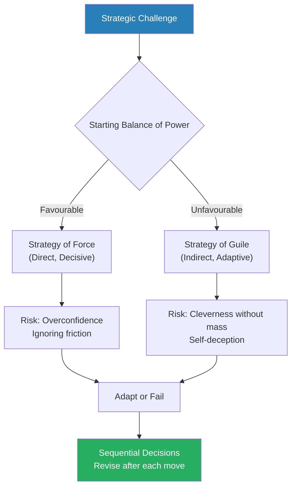

Freedman's central insight: strategy is not choosing between force and guile once, but constantly recalibrating between them as the situation unfolds.

Force excels in decisiveness but bleeds resources; guile excels in adaptability and psychological impact — Freedman's history shows the best strategists toggle between both.

Military strategy dominates the book's coverage, reflecting Freedman's argument that strategies of force are the historical root from which all other strategic traditions grew.

---

## Key Concepts at a Glance

| Concept | One-line summary |
|---------|-----------------|
| **Strategy as adaptive sequence** | Think in next moves, not master plans |
| **Force vs. guile** | The eternal tension between power and cunning — present from Homer to Harvard |
| **Clausewitzian friction** | Reality degrades every plan on contact with the enemy |
| **The fog of war** | Commanders never have complete information and must decide under uncertainty |
| **The remarkable trinity** | War shaped by passion, chance, and political purpose simultaneously |
| **The indirect approach** | Avoid the enemy's strength; attack their weakness (Liddell Hart) |
| **Strategy of annihilation vs. exhaustion** | Seek a decisive battle or grind the enemy down — Delbrück's critical distinction |
| **Existential strategy** | Nuclear weapons made total war irrational, inverting all prior logic |
| **Deterrence** | Threatening pain to prevent action — the logic of the nuclear age |
| **OODA loop** | Speed of decision-making matters more than quality of any single decision |
| **Strategy from below** | Revolutions and social movements have their own strategic logic |
| **Vanguard party** | Lenin's concept — revolution requires disciplined professional organisers |
| **Nonviolent strategy** | Moral authority can defeat physical force when the opponent is susceptible |
| **Rational choice and its limits** | Models assume perfect rationality; real humans satisfice |
| **Bounded rationality** | Herbert Simon's insight that humans optimise locally, not globally |
| **The Prisoner's Dilemma** | Individual rationality can produce collectively irrational outcomes |
| **Cultural hegemony** | Gramsci's insight that power is maintained through ideas, not just institutions |
| **Narrative strategy** | How you frame the conflict shapes what options are visible |
| **The script** | Strategists follow mental scripts that filter what they see |
| **Porter's Five Forces** | Analyse industry structure to find a defensible position |
| **Disruptive innovation** | Christensen's theory of how incumbents are overthrown from below |
| **Blue Ocean Strategy** | Create uncontested market space instead of fighting in crowded markets |
| **Creative destruction** | Schumpeter's concept — entrepreneurs break equilibrium to create value |
| **Fortuna** | Machiavelli's term for the half of life that is beyond strategic control |
| **Emergent strategy** | Mintzberg's insight that realised strategy is part plan, part adaptation |

The force diagram reveals how military thinkers (blue) formed the intellectual foundation that later branched into business strategy (green) and revolutionary strategy (orange), with Clausewitz as the central node connecting the most traditions.

---

## Part One: Origins

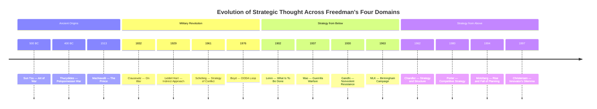

This timeline reveals how strategic thought migrated from military origins through revolutionary politics to corporate management — each era borrowing from and misunderstanding the previous one.

### Chapter 1: Origins — Evolution and the Chimpanzees

*Freedman begins not with generals or theorists but with biology — arguing that strategic thinking is older than civilisation, older than language, older even than humanity itself.*

- Strategy predates human civilisation — Freedman points to primatologist Frans de Waal's research on chimpanzee politics:
  - Chimpanzees form coalitions, deceive rivals, and plan ambushes
  - The capacity for strategic thinking is not a cultural achievement but an evolutionary inheritance
  - Even in primate groups, the physically strongest individual does not always dominate — coalitions of weaker members can topple a tyrant
  - De Waal observed that alpha male chimps who relied solely on physical dominance were routinely overthrown by pairs of smaller males who coordinated their challenges
- <b style="color: #2980b9">Coalition-building</b> is the first strategic skill — older than speech, older than writing, older than civilisation:
  - The ability to form alliances transforms the strategic landscape because it means power is not fixed — it can be created through relationships
  - A weaker individual who builds a coalition can defeat a stronger one who stands alone
  - This insight applies from primate groups to modern boardrooms: raw power matters less than relational power
  - Coalition management requires reading social dynamics — understanding who holds grudges, who fears whom, who owes favours
- Freedman introduces the concept of <b style="color: #2980b9">strategic intelligence</b> — the cognitive capacity to:
  - Model other minds (understand what another actor intends, believes, and wants)
  - Project into the future (anticipate consequences of actions)
  - Suppress immediate impulses in favour of longer-term gains (patience as strategic resource)
  - Deceive (present false information to manipulate others' decisions)
  - Communicate selectively — sharing some information while withholding other information
- <b style="color: #27ae60">The evolutionary roots of strategy establish its fundamentally social character</b>:
  - Strategy is not an individual activity — it only exists in the context of interaction with others who have their own goals
  - The need for strategy arises precisely because other actors are not passive obstacles but active agents with plans of their own
  - This is why purely mathematical or engineering approaches to strategy always fall short — they treat the opponent as a problem to be solved rather than a mind to be outwitted
- Freedman draws on evolutionary psychology to argue that human brains evolved specifically for social strategy:
  - The "Machiavellian intelligence hypothesis" — large primate brains evolved to navigate complex social relationships, not primarily to solve technical problems
  - The arms race of social cognition: as some individuals became better at deception, others evolved better lie-detection, which selected for even more sophisticated deception
  - <b style="color: #e74c3c">This evolutionary legacy means humans are natural strategists — but also natural self-deceivers</b>, because the best way to deceive others convincingly is to first deceive yourself
  - The implication for all subsequent strategic thought: the capacity for self-deception is as deeply rooted in human nature as the capacity for strategy itself

> [!example] De Waal's Chimpanzee Politics (1982)
> - In the Arnhem Zoo colony, the alpha male Yeroen was physically dominant but aging
> - A younger male, Luit, began challenging Yeroen's status through displays and confrontations
> - Rather than fight Luit directly (which he would lose), Yeroen formed an alliance with a third male, Nikkie
> - Together, Yeroen and Nikkie deposed Luit — neither could have done it alone
> - Yeroen accepted a subordinate position to Nikkie in exchange for the coalition's success
> - The arrangement worked until Nikkie began asserting too much independence, at which point Yeroen switched alliances again
> - The coalition politics continued for years, with shifting alliances, betrayals, and reconciliations
> **The lesson:** Strategic alliance precedes human civilisation. The first strategists were not generals but primates who discovered that relationships are power.

- The chapter also discusses the role of <b style="color: #2980b9">deception in evolutionary strategy</b>:
  - Deception is ubiquitous in nature — camouflage, mimicry, feigned injury, misdirection
  - In social species, deception becomes more sophisticated — tactical deception involves understanding what the other sees and deliberately manipulating their perception
  - Chimpanzees can suppress food calls to avoid sharing, lead rivals away from food sources, and hide signs of arousal or fear
  - <b style="color: #27ae60">Deception and counter-deception create an arms race of intelligence</b> that Freedman argues is the evolutionary engine behind human strategic capacity
  - This arms race never reaches equilibrium — each new deceptive tactic generates a new detection mechanism, which in turn generates a more sophisticated deceptive tactic

---

### Chapter 2: The Bible — Divine Strategy and Human Cunning

*The Hebrew Bible is one of the earliest repositories of strategic thinking — filled with stories where the weaker party outmanoeuvres the stronger through divine favour, cunning, and refusal to fight on the enemy's terms.*

- Freedman reads the Hebrew Bible as a strategic text, not a theological one:
  - The recurring pattern is the weak defeating the strong — which requires strategy because force alone will not work
  - God's role in these stories is as a strategic ally — the Israelites succeed when they have divine backing and fail when they lose it
  - But the human characters are not passive recipients of divine intervention — they must act strategically to realise the advantages God provides
  - The Bible thus presents strategy as a collaboration between divine will and human initiative — the two must be aligned for success
- <b style="color: #2980b9">The David and Goliath story</b> is the archetypal narrative of strategy — the weaker party wins by refusing to play the stronger party's game:
  - David does not try to beat Goliath at hand-to-hand combat; he changes the terms of engagement entirely
  - God's role in the story matters — the Israelites' strategic confidence comes from believing they have divine backing
  - Freedman reads this as an early example of <b style="color: #27ae60">morale as a strategic factor</b>
  - The lesson extends beyond the battlefield: the strategist's first task is to identify the terms of engagement that favour their own strengths
  - David's selection of five smooth stones was not random — it was preparation, forethought, equipment optimised for his chosen mode of combat

> [!example] David vs. Goliath — The Archetypal Strategy
> - The Philistines and Israelites face each other across a valley, neither willing to attack uphill
> - Goliath, a giant warrior in heavy armour, challenges the Israelites to settle the war by single combat
> - The terms favour Goliath — close-range fighting where his size and armour are decisive
> - David, a young shepherd, volunteers despite having no armour or sword
> - Instead of closing to melee range, David uses a sling — a ranged weapon that renders Goliath's advantages irrelevant
> - Goliath falls before the fight even begins on his terms
> - The psychological effect on both armies was immediate — Philistine morale collapsed, Israeli morale soared
> **The lesson:** Strategy is the art of refusing to fight on the enemy's terms — of changing the game itself.

- The Bible also contains stories of strategic deception and indirect approaches:
  - **Jacob** deceives his father Isaac to steal his brother Esau's blessing — the weaker twin uses guile to claim what force would deny him
    - Jacob's deception is elaborate: he wears animal skins to mimic Esau's hairiness, bringing food Isaac desires, timing his approach when Isaac is blind and vulnerable
    - The story presents deception without moral condemnation — God's plan works through Jacob's cunning
  - **Moses** leads the Israelites out of Egypt not through military victory but through a combination of divine intervention and strategic patience — the exodus is a protracted campaign, not a decisive battle
    - The ten plagues are a graduated escalation strategy — each plague increases the pressure on Pharaoh while demonstrating God's power
    - This is an early example of what Schelling would later call "coercive diplomacy" — raising the cost of resistance incrementally
  - **Joshua** at Jericho uses an unconventional approach (marching and trumpets) that defies military logic — but the underlying strategy is psychological: undermining the defenders' will through confusion and divine spectacle
    - Joshua also employed espionage (the spies sent to Rahab) and deception (the ambush at Ai)
  - **Gideon** deliberately reduces his army from 32,000 to 300 before attacking the Midianites — a counter-intuitive move that maximises the element of surprise and the attribution of victory to divine power
    - Gideon's night attack with trumpets, torches, and shouts of confusion created panic in the enemy camp — a prototype for psychological warfare

---

- <b style="color: #e74c3c">The Bible repeatedly warns against the arrogance of the powerful</b>:
  - Pharaoh is destroyed not because he lacks power but because he lacks wisdom — he refuses to adapt when circumstances change
  - King Saul is replaced by David because Saul becomes rigid and fearful — he clings to his position rather than adapting his approach
  - The pattern: the powerful become rigid, the weak become resourceful, and rigidity is the greater vulnerability
  - This is a theme Freedman traces through every chapter of strategic history — from Napoleon's rigidity in Russia to Kodak's inability to adapt to digital photography
- Freedman also examines the biblical concept of <b style="color: #2980b9">covenant</b> as a strategic alliance:
  - The covenant between God and Israel is a mutual commitment — Israel obeys God's laws, God provides protection and favour
  - This is an early model of alliance management — the alliance works only when both sides uphold their commitments
  - When Israel violates the covenant (through idol worship, injustice), God withdraws support — and Israel suffers military defeat
  - <b style="color: #27ae60">The strategic lesson: alliances are maintained through reciprocal commitment, not just shared interest</b>
  - An alliance partner who takes the alliance for granted and stops meeting their obligations will eventually be abandoned

---

### Chapter 3: The Greeks — Achilles, Odysseus, and the Duality of Strategy

*The Greek tradition introduces the fundamental duality that runs through the entire book: force (Achilles) versus guile (Odysseus) — and shows that civilisation cannot resolve which is superior.*

- The Greek tradition establishes two archetypes that frame all subsequent strategic thought:
  - **Achilles** represents <b style="color: #2980b9">bie</b> (force) — raw, overwhelming, direct power
    - Achilles is the greatest warrior, whose rage and combat prowess dominate the battlefield
    - His approach is direct: identify the enemy's champion, fight them, and win through superior martial ability
    - But Achilles is also petulant, emotionally volatile, and incapable of subordinating personal honour to collective strategy
    - His withdrawal from battle over a personal slight nearly costs the Greeks the war
  - **Odysseus** represents <b style="color: #2980b9">metis</b> (cunning intelligence) — deception, manipulation, indirect methods
    - Odysseus is not the strongest warrior but is consistently the most effective strategist
    - His defining quality is adaptability — he can lie, charm, disguise himself, and think several moves ahead
    - The Odyssey is essentially a ten-year case study in adaptive strategy — Odysseus encounters one unexpected challenge after another and survives through flexibility and cunning
  - The Greeks admired both, but the Trojan War was won by Odysseus's trick (the wooden horse), not Achilles's combat prowess
  - Homer presents this without moral judgement — cunning is as honourable as courage

> [!example] Odysseus and the Trojan Horse
> - After ten years of siege, the Greeks could not breach Troy's walls — force had failed
> - Odysseus proposed building a giant wooden horse, hiding soldiers inside, and pretending to sail away
> - The Trojans, believing the war was over, dragged the horse inside their walls as a trophy
> - That night, the Greek soldiers emerged and opened the gates for the returning army
> - Troy fell in a single night — not because the Greeks were stronger, but because Odysseus was cleverer
> - The stratagem exploited a psychological vulnerability: the Trojans wanted to believe the war was over
> - Homer presents this without moral judgement — cunning is as honourable as courage
> **The lesson:** When force cannot achieve your objective, guile can — but only if you understand what the opponent wants to believe.

- **Thucydides' account of the Peloponnesian War** introduces realpolitik to strategic thought:
  - Athens tells the small island of Melos: "the strong do what they can, and the weak suffer what they must"
  - This is the brutal realism that sits alongside Greek admiration for cunning — when the power gap is too large, neither force nor guile may help
  - <b style="color: #e74c3c">Thucydides warns that naked power without legitimacy generates resistance</b> — Athens's imperialism eventually provoked the alliance that destroyed it
  - The lesson for strategists: overwhelming force can win battles but lose wars if it undermines your moral position and unites your enemies
  - The Melian Dialogue is the ur-text of realist international relations theory — the argument that power, not justice, determines outcomes
- Thucydides introduces several concepts Freedman considers foundational:
  - **Pericles's strategy** — Athens's greatest statesman advocated a defensive strategy against Sparta, using naval superiority and avoiding land battles where Sparta was dominant
    - This was an early example of the indirect approach — refusing to fight the enemy where they are strongest
    - Pericles understood that Athens's advantage lay at sea, not on land, and he designed a strategy that played to this strength
    - He brought the rural population inside the Long Walls, accepting the loss of the countryside to preserve the fleet-based strategy
  - Pericles died of plague during the war, and his successors abandoned his restrained strategy for aggressive campaigns that eventually destroyed Athens
  - <b style="color: #27ae60">The succession problem</b> — a strategy that depends on one leader's judgement fails when that leader is replaced by someone less wise
    - The Sicilian Expedition (415 BC), championed by the brilliant but reckless Alcibiades, was exactly the kind of overreach Pericles had warned against
    - Athens sent a massive fleet to Sicily, where it was destroyed — a catastrophe from which Athens never recovered
  - **Cleon and the demagogues** — after Pericles, Athenian strategy was increasingly driven by popular emotion rather than calculated judgement
    - The democratic assembly was susceptible to persuasive speakers who promised quick, decisive victories
    - Thucydides saw this as a fundamental weakness of democratic strategy-making — the crowd favours boldness over prudence
- The tension between force (Achilles) and guile (Odysseus) appears in every era of strategic thought:
  - Military theorists oscillate between seeking the decisive battle and seeking the clever manoeuvre
  - Political leaders oscillate between coercion and persuasion
  - Business leaders oscillate between competing head-on and finding uncontested space
  - <b style="color: #27ae60">Freedman argues this oscillation is permanent because the correct answer is always situational</b> — there is no universal rule for when to use force and when to use guile

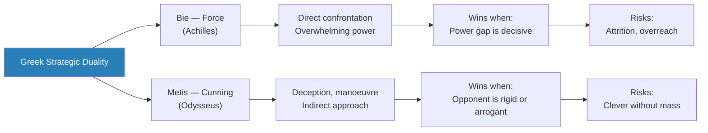

The Greeks gave us the vocabulary for a debate that has never been resolved — because it cannot be. The right answer depends on the situation, and situations change.

---

### Chapter 4: Sun Tzu and the Chinese Tradition

*The most influential strategic text ever written comes not from a Western tradition but from ancient China — and its emphasis on winning without fighting has made it irresistible to business executives twenty-five centuries later.*

- <b style="color: #2980b9">Sun Tzu's *The Art of War*</b> (c. 5th century BC) is the most widely read strategic text in history:
  - Its core insight is that **the highest form of strategy is winning without fighting** — through deception, intelligence, and manoeuvre rather than battle
  - "All warfare is based on deception" — this single line captures Sun Tzu's philosophy
  - Sun Tzu's approach represents the purest form of the guile tradition — he views battle as a failure of strategy, not its purpose
  - The text is organised around thirteen chapters, each addressing a different aspect of strategy: planning, waging war, attack by stratagem, dispositions, energy, weak points, manoeuvring, variation, the army on the march, terrain, nine situations, fire, and the use of spies
- Key principles of Sun Tzu's thought:
  - **Know the enemy and know yourself** — in a hundred battles, you will never be in peril
  - **Attack the enemy's strategy, not their army** — the best victory is one that defeats the opponent's plan before it can be executed
  - **Appear weak when you are strong, and strong when you are weak** — deception about your true position is fundamental
  - **Use spies extensively** — intelligence is the foundation of all strategy
  - **Avoid prolonged warfare** — speed and decisiveness are essential because long wars exhaust even the winner
  - **Water as metaphor** — strategy should flow like water, taking the shape of the terrain, finding the path of least resistance
  - **Exploit the terrain** — the ground on which you fight matters as much as the forces you command
  - **The moral law** — the people must be in accord with their ruler so that they will follow without fear
- <b style="color: #27ae60">Sun Tzu's emphasis on psychological warfare</b> distinguishes him from Western military thinkers:
  - The aim is not to destroy the enemy physically but to break their will to resist
  - A demoralised, confused, divided enemy can be defeated without major bloodshed
  - This requires understanding the enemy's psychology — their fears, ambitions, internal divisions, and pressure points
  - Espionage is therefore the most important strategic function, not logistics or firepower
  - Sun Tzu devotes his final chapter entirely to spies — an emphasis no Western military thinker of his era would have considered appropriate

> [!example] Sun Tzu in the Boardroom — The Japanese Business Reception (1980s)
> - In the 1980s, Japanese corporate strategy was widely interpreted through a Sun Tzu lens
> - Western business writers argued that Japanese companies practised "strategy without fighting" — winning through superior manufacturing, long-term thinking, and market intelligence rather than direct competition
> - This narrative was seductive but misleading — Japanese companies also competed ferociously with each other, engaged in price wars, and practised aggressive market share strategies
> - The Sun Tzu interpretation told Western executives what they wanted to hear — that there was a secret Eastern wisdom that avoided the messiness of actual competition
> - When the Japanese economic miracle stalled in the 1990s, the Sun Tzu narrative collapsed with it
> **The lesson:** Strategic thinkers are often used as props for narratives about contemporary situations — the "wisdom" attributed to them says more about the interpreter than the source.

- Freedman notes critical limitations of Sun Tzu's approach:
  - <b style="color: #e74c3c">Sun Tzu assumes a degree of information superiority that is rarely achievable</b> — "knowing the enemy" is far harder than the text implies
  - The emphasis on deception can become self-defeating if the enemy also practises deception — you end up in a hall of mirrors
  - Sun Tzu's advice is cryptic and context-free, which makes it infinitely interpretable — and therefore easy to misapply
  - The text says almost nothing about what to do when your strategy fails and you must actually fight
  - There is no theory of what happens when both sides read Sun Tzu — when both are trying to appear weak when strong and strong when weak

---

- Freedman also discusses the broader Chinese strategic tradition beyond Sun Tzu:
  - **The Seven Military Classics** — a canon of Chinese military texts that went far beyond *The Art of War*
  - Chinese strategic culture emphasised **shi** — the strategic advantage of position, momentum, and timing
  - The concept of shi is difficult to translate into Western strategic language because it combines elements that Western thinkers separate:
    - The terrain advantage (positional)
    - The momentum of events (temporal)
    - The psychological advantage (perceptual)
    - The alignment of multiple factors (systemic)
  - <b style="color: #27ae60">Shi is perhaps the closest Chinese concept to Freedman's own idea of "creating power"</b> — it describes the art of positioning yourself so that circumstances do your work for you
  - A strategist who has shi does not need to fight hard — the situation itself generates force, like water flowing downhill
  - The Chinese tradition also emphasised **stratagems** — codified deceptive tactics:
    - The Thirty-Six Stratagems is a collection of military tricks and political manoeuvres
    - Each stratagem is a template for a specific type of deceptive situation
    - Examples: "Kill with a borrowed sword" (use an intermediary to attack your enemy), "Lure the tiger from the mountain" (draw the enemy out of a strong position), "Create something from nothing" (turn a weakness into an apparent strength)
    - "Sacrifice the plum tree to preserve the peach tree" (accept a small loss to secure a larger gain)
  - <b style="color: #e74c3c">Freedman cautions that the Western fascination with Chinese strategic texts often romanticises them</b>:
    - They are presented as cryptic wisdom when they are often practical manuals for specific historical contexts
    - Their effectiveness depends on the opponent not knowing the stratagems — once codified, they become predictable
    - The real lesson of Chinese strategic tradition is not any specific stratagem but the underlying philosophy: war is a contest of minds, not just armies

> [!example] The Empty Fort Strategy — Zhuge Liang (228 AD)
> - The legendary strategist Zhuge Liang was defending a city with a tiny garrison when a massive enemy army approached
> - Rather than flee or prepare for a doomed defence, he opened the city gates, sat on the walls, and calmly played a zither
> - The enemy commander, Sima Yi, suspected an ambush — why would Zhuge Liang be so calm unless he had a trap prepared?
> - Sima Yi withdrew his army, and Zhuge Liang's city was saved
> - The strategy worked because it exploited the opponent's mental model — Sima Yi expected Zhuge Liang to be cunning, and the apparent lack of concern seemed like the most cunning move of all
> - The story may be apocryphal, but the principle is real: appearing strong when weak can deter attack, if your reputation supports the bluff
> **The lesson:** Reputation is a strategic resource — if your opponent believes you are always cunning, you can exploit that belief even when you have no actual strength.

---

### Chapter 5: Machiavelli — The Fox and the Lion

*The Florentine diplomat who gave strategy its modern edge — the cold-eyed assessment of power as it actually works, stripped of moral pretension.*

- <b style="color: #2980b9">Machiavelli's *The Prince*</b> (1513) operates in a different register from Sun Tzu:
  - Where Sun Tzu is cryptic and abstract, Machiavelli is concrete and historical
  - His innovation is treating politics as it is, not as it should be — separating strategy from morality
  - Machiavelli wrote from personal experience of Florentine politics — he had served as a diplomat and seen firsthand how power operates
  - His exile from political life gave him both the motivation and the perspective to write about power honestly
  - Unlike abstract philosophers, Machiavelli writes from the perspective of a man who has personally negotiated with Cesare Borgia, witnessed the fall of Florentine liberty, and observed the mechanisms of power at close range
- <b style="color: #27ae60">The fox and the lion</b> — Machiavelli's version of the guile-versus-force duality:
  - The lion is powerful but falls into traps
  - The fox is clever but cannot fight off wolves
  - The effective prince must be both — lion when force is needed, fox when cunning serves better
  - This is more sophisticated than simply choosing between force and guile — it requires judgement about which mode the situation demands
  - Machiavelli's innovation is making this judgement the central strategic skill — not technique, not courage, but the ability to read the situation and choose the right approach
- Machiavelli introduces the concept of <b style="color: #2980b9">fortuna</b> — luck, chance, the unpredictable elements that no strategy can fully control:
  - He estimates that fortune governs roughly half of human affairs
  - The strategist's job is to master the other half — and to build resilience against the uncontrollable half
  - Machiavelli uses the metaphor of a river in flood — you cannot stop the flood, but you can build levees and channels in advance that direct the floodwaters
  - <b style="color: #27ae60">Preparation for bad luck is itself a strategic act</b> — the prince who builds reserves, alliances, and alternative plans is less vulnerable to fortune's swings
  - This concept connects directly to modern risk management and the idea of building strategic optionality
  - Freedman reads fortuna not as fatalism but as realism — the strategist who acknowledges the role of chance is better prepared than the one who assumes everything is under control
  - The best strategic preparation for fortuna is what Machiavelli calls building "dykes and dams" in times of calm — creating reserves, alliances, and contingency plans that can absorb the shock when fortune turns
  - This concept resonates with modern portfolio theory and scenario planning: both serve the same purpose — preparing for the uncertainty that no strategy can eliminate
- <b style="color: #e74c3c">Machiavelli warns against cruelty without purpose</b> — violence must be swift, decisive, and strategic, never prolonged or gratuitous:
  - Unnecessary cruelty creates enemies without strategic benefit
  - "Cruelties well used" are those committed all at once, at the beginning, to establish authority — then diminished over time
  - "Cruelties badly used" are those that increase over time — they generate cumulative resentment and eventual revolt
  - The distinction is not moral but strategic — cruelty is evaluated by its effectiveness, not its ethics

> [!example] Cesare Borgia's Calculated Cruelty (1502)
> - Cesare Borgia conquered the Romagna, a lawless and divided region of Italy
> - To restore order, he appointed Remirro de Orco, a cruel and efficient administrator
> - De Orco imposed order through brutal methods, which made the population resent him
> - Once the region was pacified, Borgia had de Orco killed and his body displayed in the public square — cut in two with a bloody knife beside it
> - Borgia simultaneously demonstrated his authority, removed the target of public anger, and distanced himself from the cruelty he had authorised
> - The population was both horrified and impressed — the message was clear: Borgia was in control
> **The lesson:** Machiavelli saw this as strategic brilliance — delegating the dirty work, then eliminating the delegate to claim clean hands.

- Machiavelli also offers insight into the <b style="color: #2980b9">strategic challenge of new rulers</b>:
  - New princes face unique dangers because they lack the legitimacy of hereditary rulers
  - They must establish authority quickly, which often requires harsh measures
  - But they must also build genuine support — force alone cannot sustain a regime indefinitely
  - The new prince must navigate between being feared (which commands obedience) and being hated (which provokes revolt)
  - <b style="color: #e74c3c">"It is much safer to be feared than loved, if one must choose"</b> — but never be hated, because hatred invites conspiracy
- Machiavelli on <b style="color: #2980b9">virtù</b> — the quality of the effective leader:
  - Virtù is not virtue in the Christian sense — it is closer to effectiveness, energy, and adaptability
  - The leader with virtù responds to each situation with the appropriate action, whether that is mercy or severity, generosity or parsimony
  - Virtù is the capacity to act decisively when opportunity presents itself — to seize the moment that fortune offers
  - A leader without virtù will be overwhelmed by circumstances; a leader with virtù will shape circumstances
  - <b style="color: #27ae60">Freedman reads virtù as the predecessor of his own concept of adaptive strategy</b> — the capacity to respond effectively to whatever the situation presents
- Machiavelli's <b style="color: #2980b9">Discourses on Livy</b> is equally important to his strategic thought — and often overlooked:
  - While *The Prince* advises individual rulers, the *Discourses* analyses republican governance — how institutions, not just individuals, can maintain strategic effectiveness
  - Machiavelli argues that republics are ultimately more strategically capable than principalities because they can adapt to changing circumstances by drawing on different leaders for different situations
  - A republic can produce a cautious leader when caution is needed and a bold leader when boldness is needed — a single prince is stuck with his own temperament
  - <b style="color: #27ae60">This is the argument for institutional flexibility over individual genius</b> — and it anticipates Freedman's own emphasis on adaptive organisational capacity
  - The *Discourses* also emphasise the importance of conflict within republics — internal debate and competition produce better decisions than authoritarian unanimity
  - This connects to Freedman's discussion of how organisations learn: institutions that suppress dissent and debate (like the Johnson administration during Vietnam) produce worse strategic decisions than those that encourage honest disagreement

| Thinker | Core Metaphor | View of Force | View of Guile | View of Uncertainty |
|---------|--------------|---------------|---------------|-------------------|
| Sun Tzu | Water — flowing around obstacles | Last resort | Primary tool | Intelligence reduces it |
| Machiavelli | Fox and Lion — dual nature | Sometimes necessary | Always necessary | Fortuna — half of life is uncontrollable |
| Clausewitz | Fog and friction | The ultimate arbiter | Useful but secondary | Inherent and irreducible |
| Thucydides | Power politics — the strong do what they can | The foundation of order | Unreliable against overwhelming force | Events spiral beyond intention |

Each thinker's metaphor reveals what they consider the essence of strategy — and what they tend to overlook.

---

### Chapter 6: Satan, Milton, and the Strategy of the Weak

*Freedman reads Paradise Lost as a strategic text — Satan faces the ultimate unfavourable balance of power and responds with the classic tools of the weaker party.*

- <b style="color: #2980b9">Satan as strategist</b> — Freedman reads Milton's *Paradise Lost* (1667) as a case study in asymmetric strategy:
  - Satan faces the ultimate unfavourable balance of power — he is fighting God, an omnipotent opponent
  - Direct confrontation is impossible — Satan tried force (the war in heaven) and lost decisively
  - His response is to adopt an indirect approach: rather than fighting God directly, he corrupts God's creation (humanity)
  - Satan uses rhetoric, persuasion, and deception — the classic tools of the weaker party
  - <b style="color: #27ae60">Freedman's point: even in theology, the strategic logic of the weaker party is guile, not force</b>
- Satan's strategic method mirrors what later theorists would call <b style="color: #2980b9">subversion</b>:
  - He does not attack the enemy's army; he attacks the enemy's alliances
  - He targets Eve, the apparently weaker member of the human pair, using persuasion rather than force
  - His argument to Eve is itself strategic — he reframes disobedience as empowerment and knowledge
  - The serpent's approach is the prototype for propaganda and psychological warfare
  - Satan's rhetoric in the garden is carefully calibrated: flattery, appeals to curiosity, reframing prohibition as oppression, and offering the forbidden as liberation
  - He presents himself as a liberator, not a tempter — a narrative strategy that has been replicated by every revolutionary movement since
- Freedman draws several broader lessons from the Satan narrative:
  - <b style="color: #e74c3c">Even the most brilliant strategy by the weak can be ultimately self-defeating</b> — Satan's victory over humanity is Pyrrhic because it does not change the fundamental power balance with God
  - The weaker party's strategy often produces tactical successes that do not translate into strategic victory
  - This pattern recurs throughout history — guerrilla forces, revolutionary movements, and market challengers can all win battles without winning wars
  - Satan's experience illustrates a permanent problem of asymmetric strategy: the weak can disrupt but rarely overthrow the fundamental order
- The chapter also discusses the broader tradition of the **trickster** in mythology:
  - Prometheus, Loki, Coyote, Anansi — the trickster figure appears across cultures
  - The trickster uses wit, deception, and rule-breaking to overcome stronger opponents
  - Freedman sees the trickster as the mythological archetype for asymmetric strategy
  - These stories encode a fundamental strategic insight: the rules of the game are not neutral — they favour the powerful, and changing the rules is itself a strategic act
  - Prometheus steals fire from the gods to give to humanity — a transgressive act that shifts the balance of power permanently
  - <b style="color: #27ae60">The trickster tradition suggests that the most transformative strategies are those that change the rules of the game rather than playing the existing game better</b>

> [!example] Satan's Temptation of Eve
> - Satan does not approach Eve with threats or force — he approaches as a counsellor, a friend offering knowledge
> - He reframes God's prohibition as an arbitrary constraint designed to keep humanity weak and ignorant
> - "You shall be as gods, knowing good and evil" — he offers empowerment through disobedience
> - Eve accepts the reframing — she sees the forbidden fruit as desirable for gaining wisdom
> - The strategic brilliance: Satan attacks God not through God's army but through God's relationship with humanity
> - The template for every subsequent propaganda campaign: reframe the opponent's rules as oppression, your violation of those rules as liberation
> **The lesson:** The most effective strategic attacks target the opponent's alliances, not their army. Persuasion can accomplish what force cannot.

---

### Chapter 7: The Enlightenment and the Dream of Scientific Strategy

*The Enlightenment brought the hope that strategy could become a science — if Newton could predict the motion of planets, surely similar laws could predict the outcomes of battles and politics.*

- The Enlightenment fundamentally changed how people thought about strategy:
  - Before the Enlightenment, strategy was seen as an art — dependent on the character, judgement, and experience of the commander
  - The Enlightenment introduced the possibility that strategy could be a science — governed by discoverable laws and teachable principles
  - This was enormously appealing because it promised to democratise strategic excellence — no longer dependent on genius, it could be systematised and taught
  - The scientific revolution gave thinkers confidence that every domain of human activity could be understood through systematic observation and mathematical analysis
- <b style="color: #2980b9">Frederick the Great of Prussia</b> (1712-1786) represents the transition between art and science:
  - Frederick was both a practitioner and a theorist — he wrote extensively about military strategy
  - He emphasised the importance of oblique attack — striking the enemy's flank rather than their front
  - His victories at Rossbach (1757) and Leuthen (1757) demonstrated the power of manoeuvre and surprise
  - But Frederick also understood the limits of system — he adapted his methods to circumstances and never claimed to have found universal laws
  - <b style="color: #27ae60">Frederick's flexibility</b> was itself strategic: he used the strategy of exhaustion when outnumbered (as in the Seven Years' War) and the strategy of annihilation when he had local superiority
  - Frederick also wrote "Anti-Machiavel" — a youthful treatise criticising Machiavelli's amorality, which he then cheerfully violated in practice when he invaded Silesia without justification
- The mathematicians and geometers who followed Frederick were less flexible:
  - They extracted principles from his victories and codified them as laws
  - The attraction of geometric strategy: it reduced the chaos of war to diagrams, lines, and angles
  - <b style="color: #e74c3c">The danger: geometric strategy worked on maps but not on battlefields</b>, where terrain, weather, morale, and human error made the clean lines of theory irrelevant
  - Heinrich von Bulow and other Enlightenment strategists tried to create mathematical formulas for military success — base angles, supply line lengths, optimal force ratios
  - These formulas gave officers the comforting illusion of certainty while actually blinding them to the chaos of real combat

> [!example] Frederick the Great at Leuthen (1757)
> - Frederick faced an Austrian army nearly twice the size of his own
> - Rather than attack frontally, he used terrain and a forced march to approach the Austrian left flank undetected
> - The Austrians, expecting a frontal assault, were caught off-balance when Frederick's main force struck their exposed flank
> - The Austrian line collapsed like dominoes — each unit turning to face the attack exposed the next unit's flank
> - Frederick won one of the most decisive victories of the 18th century, destroying an army twice his size
> - The victory demonstrated the power of the oblique approach — but it depended on Frederick's specific genius, his army's training, and Austrian incompetence
> **The lesson:** Brilliant tactical innovation can overcome numerical inferiority — but the conditions for such victories rarely repeat, and imitators usually fail.

---

### Chapter 8: Jomini — The Seduction of Certainty

*The Enlightenment brought the hope that strategy could become a science — that war and politics could be reduced to calculable principles. This hope produced Jomini, whose geometric approach to war seduced a generation of officers — and whose failures foreshadowed every subsequent attempt to make strategy formulaic.*

- The Enlightenment's impact on strategic thinking was profound:
  - If Newtonian physics could explain the motions of the planets, surely similar laws could explain the conduct of war
  - The search for the "laws of strategy" became an intellectual project that consumed military thinkers for two centuries
  - <b style="color: #e74c3c">Freedman treats this as a cautionary tale — the desire to make strategy scientific is perennial and always disappointing</b>
- <b style="color: #2980b9">Antoine-Henri Jomini</b> (1779-1869) was the primary advocate of strategy-as-science:
  - A Swiss officer who served under Napoleon, Jomini tried to extract universal principles from Napoleon's campaigns
  - His geometric approach reduced war to principles of position, lines of operation, and interior lines
  - Key Jominian principles:
    - Concentrate the mass of your forces against the enemy's decisive point
    - Manoeuvre to bring superior forces to bear at the critical position
    - Strike at the enemy's communications and lines of supply
    - Operate on interior lines (shorter distances) to move forces faster than the enemy
  - His appeal was enormous: he promised that strategy could be taught, systematised, and applied like engineering
  - Jomini's work became the foundation of military education at staff colleges across Europe and America
- <b style="color: #e74c3c">Freedman argues Jomini's scientific pretensions were his greatest weakness</b>:
  - By reducing war to geometry, he stripped out the psychological, political, and chaotic elements that actually determine outcomes
  - His principles were not wrong — they were incomplete, and their incompleteness was dangerous because it bred false confidence
  - Officers trained in Jomini's system could plan meticulously but struggled when plans broke down
  - The gap between Jomini's orderly principles and the chaos of real warfare was precisely where catastrophic failures occurred
- <b style="color: #2980b9">The Jomini-Clausewitz divide</b> is the archetypal version of a pattern that recurs throughout the book:
  - Jomini (science of strategy) vs. Clausewitz (art of strategy)
  - Jomini promises certainty — follow these principles and you will win
  - Clausewitz promises only understanding — war is fog, friction, and chance, and the best you can do is prepare your mind to cope with chaos
  - This divide maps directly onto later debates:
    - Rational choice theory (Jomini's heir) vs. behavioural economics (Clausewitz's heir)
    - Corporate strategic planning (Jomini) vs. emergent strategy (Clausewitz)
    - Systems analysis at RAND (Jomini) vs. Boyd's OODA loop (Clausewitz)

> [!example] Jomini at West Point — The Seduction of Certainty
> - Jomini's principles became the backbone of military education at West Point and European staff colleges throughout the 19th century
> - Officers were taught that war could be mastered through geometric principles — interior lines, concentration of force at the decisive point, secure lines of communication
> - This education produced officers who could plan meticulously but struggled when plans broke down
> - The American Civil War exposed the gap — officers trained in Jomini's principles launched frontal assaults that were suicidal against rifled weapons and field fortifications
> - Grant and Sherman succeeded precisely because they abandoned Jomini's geometric formulas and adopted strategies of exhaustion and manoeuvre that defied the textbooks
> **The lesson:** The more orderly and scientific a strategic framework appears, the more dangerous it becomes when reality refuses to cooperate.

- The art of deception runs through all three domains:
  - Military deception (feints, camouflage, misinformation) — a constant in warfare from the Trojan Horse to D-Day
  - Political deception — managing public perception, controlling the narrative
  - Self-deception — the most dangerous form, when leaders believe their own propaganda
  - <b style="color: #e74c3c">Self-deception is the strategist's greatest enemy</b> — because it eliminates the feedback loop that strategy depends on

> [!tip] Core Insight
> The desire to make strategy "scientific" — predictable, formulaic, teachable — recurs in every era. It always fails, because strategy is fundamentally about navigating uncertainty, and uncertainty cannot be engineered away.

- Freedman draws a key parallel between Jomini and later thinkers:
  - Jomini's geometric approach to war is the ancestor of:
    - **Scientific management** (Taylor) — reducing work to measurable, optimisable processes
    - **Systems analysis** (RAND) — reducing strategy to quantifiable variables and mathematical models
    - **Strategic planning** (BCG, McKinsey) — reducing business strategy to frameworks and matrices
  - All share the same appeal — they promise to eliminate the need for judgement, intuition, and experience
  - All share the same flaw — they work until they encounter a situation the model did not anticipate
  - <b style="color: #e74c3c">The Jomini temptation is permanent</b>: every generation produces its own version of the promise that strategy can be reduced to rules

> [!example] The American Civil War — Jomini's Principles Meet Industrial Warfare
> - Both Union and Confederate officers were trained in Jomini's principles at West Point
> - They understood concentration of force, interior lines, and the decisive point
> - What they did not understand was how rifled muskets and field fortifications had transformed warfare
> - Frontal assaults that might have worked in Napoleon's era were suicidal against defenders armed with rifles behind earthworks
> - The Battle of Fredericksburg (1862) saw Union troops advance across open ground into massed Confederate fire — the result was a slaughter
> - Grant and Sherman eventually found a different approach: exhaustion strategy, combined arms, and targeting the South's economic capacity rather than seeking a single decisive battle
> **The lesson:** Strategic principles derived from one era can become lethal prescriptions in another. Technology changes the rules, and strategists who do not update their models fight the last war.

---

## Part Two: Strategies of Force

### Chapter 9: Napoleon and the Strategy of Annihilation

*Napoleon's battlefield genius created the template for "decisive battle" strategy — a template so seductive that it dominated military thinking for over a century and led directly to the catastrophe of 1914.*

- Napoleon's strategic revolution was simple in principle, devastating in practice:
  - Concentrate overwhelming force at the decisive point
  - Seek a single, annihilating battle that destroys the enemy's will and capacity to fight
  - Speed and shock — move faster than the enemy can react
  - <b style="color: #2980b9">The strategy of annihilation</b> — win the war in one climactic engagement
- Napoleon's innovations went beyond the battlefield:
  - He fused political and military leadership in one person — the emperor was also the commander
  - He pioneered the corps system, allowing independent units to converge on the battlefield
  - He exploited the revolutionary army's mass mobilisation — citizen-soldiers fought with ideological passion that mercenaries lacked
  - His strategic communications were masterful — bulletins from the front shaped public opinion and morale
  - He reorganised the logistics of war — his armies moved faster because they foraged from the land rather than relying on slow supply trains
  - His use of artillery concentration was revolutionary — massing cannons at the decisive point to blast a hole in the enemy line
- Napoleon's success was so total that it created what Freedman calls a <b style="color: #2980b9">"Napoleonic paradigm"</b>:
  - The belief that all wars should aim for quick, decisive victory through a single great battle
  - This paradigm dominated European military thinking for over a century
  - It led directly to the catastrophe of World War I, when generals tried to re-create Napoleonic decisive battle with industrial-age weapons
  - <b style="color: #e74c3c">The seduction of the paradigm: it offered a clean, elegant theory of war — find the enemy's main force, concentrate your own, and destroy it in one stroke</b>
  - The reality was that Napoleon's successes depended on specific conditions — incompetent opponents, revolutionary-era army organisation, and his own unique genius — that could not be replicated by formula

> [!example] Napoleon at Austerlitz (1805)
> - Napoleon faced a larger combined Russian and Austrian force near the village of Austerlitz
> - He deliberately weakened his right flank to tempt the allies into attacking there
> - When they committed forces to the perceived weak point, Napoleon struck their weakened centre with his reserves
> - The allied army was split in two and destroyed — it was the most perfect tactical victory of the Napoleonic Wars
> - The victory convinced a generation of military thinkers that genius, boldness, and concentration of force could always overcome numerical superiority
> - But Austerlitz's conditions were unique — the allies' poor coordination, the terrain, and Napoleon's precise intelligence about their plans
> **The lesson:** Austerlitz was real — but it was also misleading, because it suggested that all wars could be won by a single brilliant stroke.

- Napoleon's strategic communications were themselves innovative:
  - He understood that wars are fought in the public imagination as well as on the battlefield
  - His bulletins from the front were carefully crafted propaganda — exaggerating victories, minimising defeats, and constructing a narrative of invincibility
  - <b style="color: #27ae60">Napoleon was one of the first modern leaders to understand narrative as a strategic weapon</b>
  - His image — the man of destiny, the military genius, the embodiment of French glory — was as carefully managed as his military campaigns
  - When the narrative of invincibility cracked (Moscow, Leipzig, Waterloo), Napoleon's political support collapsed with astonishing speed
  - The lesson: narratives are powerful strategic instruments, but they are also fragile — one major failure can shatter an entire narrative structure

> [!example] The Battle of Leipzig (1813) — The Battle of Nations
> - After the Russian disaster, Napoleon rebuilt his army and fought a series of battles across Germany
> - At Leipzig, a coalition of Russian, Prussian, Austrian, and Swedish forces surrounded Napoleon's army
> - Napoleon fought brilliantly but was outnumbered and outmanoeuvred — for the first time, a coalition held together long enough to defeat him on the battlefield
> - The defeat shattered the Napoleonic paradigm in real time — if Napoleon could be defeated by coalition, then his genius was not sufficient to overcome adverse circumstances
> - The coalition's success demonstrated a key strategic principle: even the greatest individual strategist can be defeated by an alliance that holds together
> **The lesson:** Coalition management is as important as military genius. Napoleon's enemies kept losing because they could not coordinate; when they finally learned to cooperate, Napoleon's advantages evaporated.

- Napoleon's eventual defeat illustrates the limits of his own paradigm:
  - In **Russia (1812)**, the enemy refused to offer a decisive battle — and Napoleon's army was destroyed by distance, logistics, and winter
  - At **Waterloo (1815)**, even Napoleon could not always produce the decisive victory he sought
  - The same strategy that won Austerlitz failed when opponents adapted — which is itself a strategic lesson
  - <b style="color: #27ae60">The best counter to a dominant strategy is to refuse to play on its terms</b> — Russia survived by denying Napoleon the battle he needed

> [!example] Napoleon's Retreat from Moscow (1812)
> - Napoleon invaded Russia with over 600,000 troops — the largest army Europe had ever seen
> - The Russian generals, Barclay de Tolly and Kutuzov, refused to give battle — they retreated, burning crops and towns behind them
> - Napoleon marched deeper and deeper into Russia, seeking the decisive engagement that never came
> - By the time the French reached Moscow, the city was abandoned and burning
> - The retreat through the Russian winter destroyed the Grande Armee — fewer than 100,000 returned
> - Russia won by denying Napoleon the one thing his strategy required: a battle
> **The lesson:** The most powerful counter-strategy is often simply refusing to fight on the opponent's terms. Russia did not defeat Napoleon — distance, cold, and patience did.

---

### Chapter 10: Clausewitz — The Philosopher of War

*The most important strategic thinker in Freedman's entire account — and the one whose ideas are most frequently cited, most frequently misunderstood, and most stubbornly relevant.*

- <b style="color: #2980b9">Carl von Clausewitz</b> (1780-1831) is the central figure of the book:
  - His masterwork *On War* was unfinished at his death, which has led to endless debate about what he really meant
  - Clausewitz served in the Prussian army and fought against Napoleon — his theory emerged from direct experience of war at its most intense
  - Unlike Jomini, Clausewitz did not try to reduce war to principles — he tried to understand war as a phenomenon in all its complexity
  - His thinking evolved over decades, and the unfinished nature of *On War* means that earlier, more aggressive formulations coexist with later, more nuanced ones
- Clausewitz's key contributions:
  - **"War is the continuation of politics by other means"** — the most quoted line in all strategic literature
    - Military strategy cannot be separated from political purpose
    - The purpose of war is not military victory but the achievement of political objectives
    - A military victory that does not serve political ends is strategically meaningless
    - <b style="color: #27ae60">This insight means that strategy is always political — even business strategy serves goals beyond the purely economic</b>
    - Clausewitz does not mean that war is merely an instrument of policy — he means that war and politics are inseparable, that the political context shapes every military decision
  - <b style="color: #2980b9">Friction</b> — "Everything in war is simple, but the simplest thing is difficult"
    - Plans break down because of weather, fatigue, confusion, miscommunication, fear, and a thousand unpredictable factors
    - Friction is not a failure of planning — it is an inherent feature of all complex operations
    - The great commander is not the one who eliminates friction (impossible) but the one who copes with it best
    - Friction is cumulative — each small problem compounds with others to create enormous divergence between plan and reality
    - This concept applies directly to business: every product launch, every organisational change, every strategic initiative encounters friction that the plan did not anticipate
  - **The fog of war** — commanders never have complete information; they must decide and act in uncertainty
    - Intelligence is always incomplete, often wrong, and sometimes deliberately deceptive
    - The great commander must be able to act decisively despite imperfect information
    - Waiting for certainty is itself a strategic choice — and usually a bad one, because the enemy is not waiting
    - The fog thickens in proportion to the scale and complexity of the operation — the larger the army, the more uncertain the commander's picture
  - <b style="color: #2980b9">The remarkable trinity</b> — war is shaped by three forces:
    - Primordial violence and passion (the domain of the people)
    - The play of chance and probability (the domain of the military)
    - Political purpose and reason (the domain of the government)
    - These three forces exist in dynamic tension — a strategy that ignores any one of them will fail
    - The trinity is not a hierarchy — no one force dominates the others permanently; their relative importance shifts with circumstances
  - **The culminating point of victory** — even successful offensives eventually exhaust themselves:
    - As an army advances, its supply lines lengthen, its forces disperse, and the defender's advantages grow
    - Knowing when to stop is as important as knowing when to attack
    - Napoleon at Moscow is the classic example of a commander who passed his culminating point
    - The concept applies to business: companies that expand too aggressively stretch their resources, dilute their focus, and become vulnerable to counter-attack
  - **The centre of gravity** — the source of the enemy's power that, if destroyed, would cause the rest to collapse:
    - For Napoleon, it was his army — destroy it and France had no means of resistance
    - For a guerrilla movement, it is popular support — eliminate that and the movement dies
    - For a corporation, it might be its brand, its technology, or its key talent
    - <b style="color: #e74c3c">The centre of gravity is one of the most frequently misused concepts in strategic planning</b> — analysts identify everything as a "centre of gravity," diluting the concept's precision

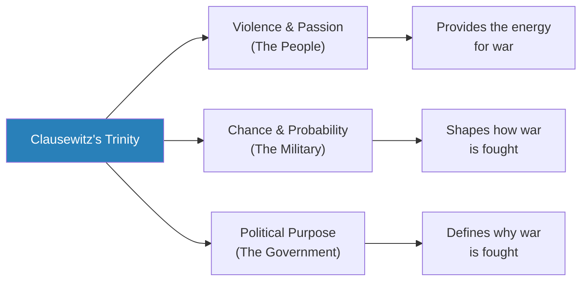

Clausewitz's trinity means that strategy cannot be purely military, purely political, or purely emotional — it must account for all three forces simultaneously.

- Freedman emphasises that Clausewitz is often misread:
  - He is frequently quoted as an advocate of total war and decisive battle
  - But his mature thinking was far more nuanced — he understood that wars of attrition, limited wars, and defensive strategies all had their place
  - The unfinished nature of *On War* means that earlier, more aggressive chapters coexist with later, more sophisticated revisions
  - <b style="color: #e74c3c">The most common misuse of Clausewitz is to cherry-pick quotations that support whatever strategy the reader already favours</b>
  - Clausewitz himself recognised the superiority of defence over offence — "defence is the stronger form of war with the negative object" — a nuance that enthusiasts of the offensive consistently ignored

> [!example] Clausewitz's Personal Experience — Strategy Forged in Defeat
> - Clausewitz was a Prussian officer who witnessed Napoleon's destruction of the Prussian army at Jena in 1806 — one of the most humiliating defeats in military history
> - The Prussian army, trained in Frederick the Great's methods, was annihilated in a single day by Napoleon's more flexible, aggressive forces
> - Clausewitz was captured and spent time as a prisoner of war — giving him the perspective of the defeated, not just the victor
> - He later served as an advisor to the Russian army during Napoleon's 1812 invasion, witnessing firsthand how the strategy of exhaustion (refusing to fight the decisive battle) could defeat even Napoleon
> - He then fought at Waterloo, seeing Napoleon's final defeat — a battle that could have gone either way and was decided partly by chance (Blucher's timely arrival, rain the night before)
> - This range of experience — defeat, captivity, guerrilla resistance, coalition warfare, climactic battle — gave Clausewitz a breadth of perspective that purely theoretical thinkers lacked
> **The lesson:** Clausewitz's theory is so enduring because it was forged in the full range of military experience — victory and defeat, offence and defence, genius and friction. He had seen it all.

- <b style="color: #2980b9">Absolute war vs. real war</b> — a crucial distinction in Clausewitz's thought:
  - **Absolute war** is a theoretical concept — war pushed to its logical extreme, where both sides use maximum force without limit
  - **Real war** never reaches this extreme — it is always constrained by political objectives, limited resources, friction, and chance
  - <b style="color: #27ae60">The gap between absolute war and real war is where strategy lives</b> — strategy is the art of navigating the space between theoretical possibility and practical reality
  - This distinction anticipates modern complexity theory — the difference between a model's predictions and real-world outcomes is not a bug in the model but a fundamental feature of complex systems
  - Clausewitz's critics who accuse him of advocating total war are confusing his description of war's theoretical tendency with a prescription for how wars should be fought
- Clausewitz on <b style="color: #2980b9">the genius of the commander</b>:
  - The great commander combines two qualities: intellect (the ability to understand complex situations) and temperament (the ability to act decisively under stress)
  - Clausewitz called this combination **coup d'oeil** — the ability to see the essential features of a situation at a glance
  - This is not a skill that can be taught systematically — it is developed through experience, reflection, and a particular cast of mind
  - <b style="color: #e74c3c">Clausewitz's concept of genius is fundamentally anti-Jominian</b> — you cannot reduce good strategy to rules that anyone can follow, because the essence of strategic excellence is the ability to handle situations that rules do not cover
  - This connects to Freedman's broader argument: strategy cannot be made scientific because its essential element — human judgement under uncertainty — is precisely what science cannot capture

- <b style="color: #2980b9">Hans Delbruck</b>, a later German historian, introduced a crucial distinction building on Clausewitz:
  - **Strategy of annihilation** (Niederwerfungsstrategie) — seeking a decisive, war-ending battle (Napoleon's approach)
  - **Strategy of exhaustion** (Ermattungsstrategie) — wearing the enemy down through attrition, manoeuvre, and time (Frederick the Great's approach)
  - Delbruck argued that the strategy of exhaustion was not inferior — it was simply appropriate for different circumstances
  - <b style="color: #e74c3c">The failure to understand this distinction contributed to the catastrophe of World War I</b> — generals pursued annihilation when exhaustion was the only realistic option
  - Delbruck showed that Frederick the Great, often cited as an advocate of decisive battle, actually won the Seven Years' War through attrition — avoiding catastrophic defeat rather than seeking total victory

---

### Chapter 11: Moltke and the Prussian System

*The Prussian chief of staff translated Clausewitz into institutional practice — creating a system that could execute complex strategies even when individual components encountered surprises.*

- <b style="color: #2980b9">Helmuth von Moltke the Elder</b> (1800-1891) translated Clausewitz into practice:
  - Moltke was the architect of Prussia's victories over Austria (1866) and France (1870-71)
  - His famous dictum: "No plan survives contact with the enemy"
  - But Moltke did not reject planning — he rejected the idea that plans should be rigid
  - His approach: plan thoroughly for the opening moves, then give subordinate commanders the freedom to adapt as the situation develops
  - <b style="color: #2980b9">Auftragstaktik</b> (mission-type tactics) — give subordinates a clear objective and the resources to achieve it, then trust them to figure out how
  - This is the military equivalent of empowerment in management — and it requires the same preconditions: shared understanding of purpose, trust in competence, and tolerance for imperfection
- Moltke's approach created a distinctive Prussian/German strategic culture:
  - Centralised planning, decentralised execution
  - The general staff system — professional officers trained in a common doctrine who could coordinate complex operations across large distances
  - Staff officers rotated between headquarters and field commands, ensuring that planning and execution were never fully separated
  - War games and exercises tested plans before they were needed — building institutional learning and a shared mental model
  - This system produced spectacular successes (Sedan 1870, France 1940) and catastrophic overreach (the Schlieffen Plan in 1914, Barbarossa in 1941)
  - <b style="color: #e74c3c">The lesson: a system designed for quick, decisive wars fails catastrophically when applied to prolonged, attritional conflicts</b>
- Moltke also understood the relationship between military strategy and political authority:
  - He clashed repeatedly with Bismarck over whether military or political considerations should govern war-making decisions
  - Clausewitz's principle — that war is subordinate to politics — was difficult to maintain in practice
  - <b style="color: #27ae60">The tension between military commanders who want freedom of action and political leaders who want to control war's direction is permanent</b>
  - When military strategy breaks free of political control (as in Germany in 1914), the results are often disastrous — wars are fought for military objectives that serve no political purpose

> [!example] Moltke at Sedan (1870)
> - Moltke's Prussian armies manoeuvred to encircle a French army under Napoleon III at Sedan
> - The key was not any single brilliant stroke but the coordination of multiple army corps converging from different directions
> - Moltke gave each corps commander general instructions but left tactical decisions to them
> - When one corps encountered unexpected resistance, it adapted without waiting for orders — exactly the Auftragstaktik philosophy
> - The French army was surrounded and forced to surrender — Napoleon III was captured
> - The Franco-Prussian War ended in a decisive Prussian victory that unified Germany
> **The lesson:** Moltke's genius was organisational, not personal — he built a system that could execute complex strategies even when individual components encountered surprises.

> [!example] The Austro-Prussian War — Speed as Strategy (1866)
> - Moltke used Prussia's railway network to concentrate three separate armies against Austria faster than the Austrians could respond
> - The Prussians also had the needle gun — a breech-loading rifle that could fire five times faster than the Austrian muzzle-loaders
> - At Koniggratz (Sadowa), Moltke's three armies converged on the Austrian position from different directions
> - The victory was not the result of any single brilliant manoeuvre but of systematic coordination enabled by technology (railways, telegraph) and organisational innovation (the general staff system)
> - The entire war lasted only seven weeks — a demonstration that speed of mobilisation and deployment could be decisive
> - This victory convinced military establishments across Europe to adopt the Prussian model — staff colleges, railway-based mobilisation plans, and centralised general staffs
> **The lesson:** Moltke demonstrated that organisational systems can be as strategically important as individual genius — but the system's effectiveness depended on flexibility, which his successors would abandon.

> [!example] The Schlieffen Plan — Moltke's Legacy Perverted
> - Moltke the Elder's successors attempted to apply his methods to increasingly complex problems
> - Alfred von Schlieffen pushed the system to its breaking point — his plan for a two-front war required clockwork precision across millions of men and thousands of kilometres
> - The irony: Schlieffen's plan violated Moltke's own principle that plans must be flexible
> - Moltke the Elder had warned against trying to script a campaign beyond the first few days — Schlieffen scripted an entire war
> - The Schlieffen Plan assumed the enemy would cooperate with the plan's timetable — an assumption Clausewitz would have demolished
> **The lesson:** Institutional systems can become prisons — the Prussian general staff system that produced genius in one generation produced rigid, over-planned catastrophe in the next.

---

### Chapter 12: Tolstoy's Critique — The Limits of Strategic Genius

*Tolstoy's War and Peace is not just a novel but a philosophical attack on the entire concept of strategic genius — arguing that great events are shaped by forces no individual can control.*

- Freedman treats Tolstoy's *War and Peace* (1869) as a serious contribution to strategic theory:
  - Tolstoy argued that the "great man" theory of strategy — the belief that generals like Napoleon shape history through their genius — is fundamentally wrong
  - History is shaped by millions of individual decisions, not by the plans of commanders
  - <b style="color: #2980b9">Kutuzov</b>, in Tolstoy's telling, is the real strategic hero of the war against Napoleon — not because he had a brilliant plan, but because he understood that the situation would resolve itself if he avoided doing anything foolish
  - Kutuzov's "strategy" was patience, endurance, and refusal to be provoked into the decisive battle Napoleon wanted
  - Tolstoy contrasts Kutuzov's passive wisdom with Napoleon's active delusion — Napoleon believes he controls events, while Kutuzov understands that events control leaders
- Tolstoy's critique anticipates several modern ideas:
  - **Complexity theory** — the idea that outcomes in complex systems emerge from countless local interactions, not from central planning
  - **Emergence** — strategic outcomes that nobody planned or intended but that arise from the interaction of many actors
  - **The limits of leadership** — even the most brilliant leader cannot control a system as complex as a war
  - **Narrative construction** — leaders create stories about their own agency that are largely fictional — they attribute to their genius what was actually the product of countless uncontrollable factors
- <b style="color: #e74c3c">Freedman takes Tolstoy seriously but does not fully endorse him</b>:
  - If strategy were truly impossible, the concept would be meaningless — and yet some leaders consistently outperform others
  - The truth lies between Napoleon's faith in genius and Tolstoy's denial of it
  - <b style="color: #27ae60">Leaders cannot control outcomes, but they can influence them — and the quality of that influence matters</b>
  - The best leaders are those who understand how much they cannot control and who build strategies resilient to surprise
  - Tolstoy's correction is valuable precisely because the strategic tradition tends to overemphasise the role of individual genius — the truth is that leaders operate within systems that constrain and shape their choices

> [!example] Kutuzov at Borodino (1812)
> - The Russian general Kutuzov fought Napoleon at Borodino — the bloodiest single day of the Napoleonic Wars
> - The battle was technically a French victory, but Kutuzov achieved his strategic objective: he had fought enough to satisfy Russian honour, then retreated to preserve his army
> - Kutuzov refused to fight again, allowing Moscow to fall — a decision that enraged the Russian court
> - But time, distance, and winter did what battle could not — they destroyed the French army
> - Tolstoy portrays Kutuzov as wise precisely because he understood the limits of generalship — he knew that not fighting was the best strategy
> **The lesson:** Sometimes the most powerful strategic move is restraint — the patience to let circumstances work in your favour.

---

### Chapter 13: The Indirect Approach — Liddell Hart

*A British military theorist, traumatised by the slaughter of the Western Front, builds a career arguing that the direct approach to strategy is almost always wrong.*

- <b style="color: #2980b9">B.H. Liddell Hart</b> (1895-1970) is one of the most influential — and controversial — military thinkers of the 20th century:
  - He fought in World War I and was gassed at the Somme — the experience shaped his entire intellectual career
  - His central argument: throughout history, successful strategies have almost always been **indirect**
  - Direct confrontation — attacking the enemy head-on at their point of strength — leads to bloody stalemates
  - The indirect approach means:
    - Attacking where the enemy is weak, not where they are strong
    - Using movement and manoeuvre to dislocate the enemy's position before fighting
    - Aiming to paralyse the enemy's command structure rather than destroying their forces
    - Achieving psychological dislocation — confusing and disorienting the enemy so they cannot respond coherently
- <b style="color: #27ae60">The "expanding torrent" metaphor</b> — Liddell Hart compared good strategy to water:
  - Water does not crash against a dam; it flows around obstacles, finding the path of least resistance
  - Similarly, a military force should probe for weakness, exploit gaps, and pour through openings rather than battering against strong defences
  - This connects directly to Sun Tzu's water metaphor — and Liddell Hart acknowledged the Chinese influence
  - Once a weakness is found, the attack should expand like a torrent — widening the breach and exploiting the confusion
- Liddell Hart also championed <b style="color: #2980b9">mechanised warfare</b>:
  - Tanks and motorised infantry could achieve the speed and dislocation that the indirect approach required
  - Static trench warfare was the result of direct approaches — the indirect approach, combined with new technology, could restore mobility to warfare
  - He and J.F.C. Fuller were among the earliest advocates of armoured warfare in Britain — though their ideas were adopted more enthusiastically by the Germans

> [!example] The Fall of France (1940)
> - The French built the Maginot Line, a massive chain of fortifications along the German border — the ultimate "direct" defensive strategy
> - The Germans did not attack the Maginot Line head-on
> - Instead, they drove their armoured divisions through the Ardennes forest, which the French considered impassable for tanks
> - The French army, positioned to fight the expected battle, was outflanked and collapsed in six weeks
> - Liddell Hart cited this as the perfect vindication of the indirect approach — though the German generals credited their own initiative more than any British theorist
> **The lesson:** The strongest fortification is worthless if the enemy goes around it. Strategy is about choosing where to fight, not just how to fight.

- Freedman's assessment of Liddell Hart is mixed:
  - His historical analysis was sometimes selective — he chose examples that supported his thesis and downplayed counterexamples
  - He claimed credit for influencing German blitzkrieg tactics, but the evidence for this is disputed
  - He downplayed the role of attrition — sometimes you cannot avoid a fight, and the ability to endure prolonged combat matters
  - Nevertheless, his core insight — that <b style="color: #27ae60">the path of least resistance is usually the path of greatest strategic promise</b> — remains powerful
  - His work influenced a generation of strategists, from Israeli military planners to business consultants seeking analogies for competitive positioning
- Liddell Hart also developed the concept of the <b style="color: #2980b9">"strategy of limited aims"</b>:
  - Not every strategic objective requires total victory — sometimes the best strategy is to achieve limited, specific objectives rather than pursuing absolute goals
  - This connects directly to Clausewitz's insight that the political objective should determine the scale and intensity of military effort
  - Limited aims reduce the risk of overextension, preserve resources for future contingencies, and make negotiated settlements possible
  - <b style="color: #27ae60">The strategy of limited aims is the indirect approach applied to objectives as well as methods</b>
  - This concept had direct implications for nuclear strategy — the idea of "limited war" in the nuclear age (fighting with conventional weapons for limited objectives, without escalating to nuclear weapons) was heavily influenced by Liddell Hart's thinking
- Liddell Hart's influence on <b style="color: #2980b9">business strategy</b> was substantial:
  - His concept of the indirect approach was adopted by business strategists as a metaphor for competitive positioning
  - Competing where the opponent is weakest, not where they are strongest — this is essentially the logic behind niche strategy, market segmentation, and blue ocean thinking
  - His warning against frontal assault translates directly to business: head-on price wars against a larger competitor usually destroy value for both sides
  - The "expanding torrent" — probing for weakness, then exploiting it with concentrated force — describes how many successful market entrants operate
- Freedman also discusses <b style="color: #2980b9">J.F.C. Fuller</b> (1878-1966), Liddell Hart's contemporary:
  - Fuller was among the first to theorise about armoured warfare and its strategic implications
  - His concept of "Plan 1919" — a deep armoured thrust to destroy the enemy's command structure — anticipated blitzkrieg by two decades
  - Fuller argued that the tank would restore decisiveness to warfare by breaking the trench stalemate
  - <b style="color: #e74c3c">Fuller's weakness</b>: he was drawn to authoritarian politics (he admired Mussolini and attended Hitler's birthday celebration) and his personality made him difficult to work with

> [!example] The Israeli Six-Day War (1967)
> - Israel, facing a coalition of Arab states, launched a pre-emptive strike that destroyed the Egyptian air force on the ground
> - Israeli armoured forces then swept through Sinai, the West Bank, and the Golan Heights in just six days
> - The campaign was a textbook demonstration of the indirect approach: speed, surprise, and striking where the enemy was weakest
> - Israel's victory was so complete that it became intoxicating — creating the dangerous assumption that quick, decisive victory was always achievable
> - This overconfidence contributed to Israel's near-disaster in the 1973 Yom Kippur War, when Egypt and Syria achieved strategic surprise
> **The lesson:** Spectacular success breeds overconfidence — and overconfidence is the enemy of strategy.

---

### The World Wars — When Strategy Met Industrial Slaughter

*Freedman devotes significant attention to both World Wars as the ultimate testing ground for strategic theory — and as demonstrations of how strategic assumptions can produce catastrophic consequences.*

- **World War I** represents the catastrophic failure of the Napoleonic paradigm:
  - European generals entered the war seeking a quick, decisive victory through offensive action
  - The Schlieffen Plan (Germany), Plan XVII (France), and the Russian mobilisation timetables all assumed the war would be short
  - <b style="color: #e74c3c">Instead, industrial technology — machine guns, barbed wire, artillery, railways — produced a stalemate that neither side could break for four years</b>
  - The Western Front was a monument to the failure of the strategy of annihilation:
    - Massive offensives gained yards at the cost of hundreds of thousands of lives
    - The Somme (1916): 57,000 British casualties on the first day alone
    - Verdun (1916): a ten-month battle of attrition that bled both sides white
    - Passchendaele (1917): another bloodbath that achieved virtually nothing
  - The generals were not stupid — they were trapped by strategic assumptions inherited from the Napoleonic era and Jomini's principles
  - <b style="color: #27ae60">Clausewitz's more nuanced understanding — that war is uncertain, friction-filled, and politically driven — was precisely what they ignored</b>
  - The war was eventually won through exhaustion, not annihilation — the Allied blockade of Germany, the entry of American forces, and the collapse of German morale and resources

> [!example] The Schlieffen Plan — When Geometric Strategy Met Reality (1914)
> - Alfred von Schlieffen, chief of the German General Staff, devised a plan to defeat France in six weeks by sweeping through Belgium and encircling Paris
> - The plan was a masterpiece of geometric strategy — precisely calculated march rates, railway timetables, and force concentrations
> - It assumed that France would collapse quickly, allowing Germany to turn east against Russia before the slow Russian mobilisation was complete
> - In practice, everything went wrong: Belgian resistance slowed the advance, the French retreated rather than being encircled, and the Russian mobilisation was faster than expected
> - The plan failed at the Battle of the Marne, and the war became the static trench warfare that Schlieffen's geometry was supposed to prevent
> - Moltke the Younger, who executed the plan, had weakened the critical right wing — but the plan's failure was more fundamental than any modification
> **The lesson:** The Schlieffen Plan is the Jominian project taken to its logical extreme — a plan so detailed and rigid that it could not adapt to the inevitable friction of reality.

- The strategic innovations that eventually broke the stalemate emerged not from grand theory but from practical adaptation:
  - **Combined arms tactics** — infantry, artillery, tanks, and aircraft coordinated in ways that restored mobility
  - **The tank** — first used at the Somme in 1916, it gradually evolved from a mechanical curiosity to a war-winning weapon
  - **Infiltration tactics** (Stosstruppen) — the Germans developed small-unit tactics that bypassed strong points and struck at weak ones — an indirect approach within the larger direct confrontation
  - **Strategic bombing** — the first tentative efforts to strike at the enemy's industrial capacity and civilian morale, foreshadowing the air wars of WWII
  - <b style="color: #27ae60">The lesson: when the dominant strategic paradigm fails, adaptation comes from the bottom up — from soldiers and junior officers improvising solutions, not from generals applying new theories</b>

---

- **World War II** showed both the power and the limits of operational innovation:
  - The German blitzkrieg demonstrated that the indirect approach, combined with tanks and aircraft, could restore decisiveness to warfare
  - The fall of France in 1940 vindicated Liddell Hart and Fuller — mobility, speed, and surprise could overcome static defences
  - But Germany's strategic failures were political, not military:
    - Hitler's decision to invade the Soviet Union while still fighting Britain repeated Napoleon's fundamental error
    - The Holocaust diverted resources and generated the moral revulsion that unified the Allied coalition
    - Strategic overextension — fighting on multiple fronts against a coalition that possessed far greater resources
  - The Allied strategy was ultimately one of exhaustion — using industrial superiority, alliance management, and strategic patience to grind down German capacity
  - <b style="color: #27ae60">The war validated Clausewitz's trinity</b>: it was won not by military genius alone but by the interaction of popular will (the home fronts), military competence (the armed forces), and political leadership (Roosevelt, Churchill, Stalin)
  - The Pacific War added another dimension — strategic bombing, island-hopping, and ultimately nuclear weapons introduced entirely new strategic considerations

> [!example] Blitzkrieg — The Indirect Approach in Action (1939-1941)
> - German blitzkrieg ("lightning war") combined tanks, motorised infantry, dive bombers, and radio communications into a devastating operational concept
> - The key was not any single weapon but their coordination — tanks broke through defensive lines, infantry followed to secure the breach, aircraft provided close support and disrupted enemy reserves
> - The philosophy was Clausewitzian: concentrate force at the Schwerpunkt (point of main effort) and exploit success ruthlessly
> - Poland fell in five weeks, France in six — campaigns that military planners expected to last months or years
> - But blitzkrieg was an operational concept, not a grand strategy — it could win campaigns but not necessarily wars
> - When applied to the vast spaces of Russia in 1941, blitzkrieg produced spectacular tactical victories but could not achieve the decisive strategic result Germany needed
> - The Soviet Union absorbed enormous losses, retreated, mobilised its industrial base beyond the Urals, and eventually turned the tide through a strategy of exhaustion combined with growing operational competence
> **The lesson:** Operational brilliance cannot compensate for strategic overextension. Germany won every battle in the first months of Barbarossa and still lost the war.

> [!example] The Allied Strategic Bombing Campaign (1942-1945)
> - The British and Americans pursued different strategic bombing philosophies:
>   - Britain (under Arthur "Bomber" Harris) favoured area bombing of German cities — targeting civilian morale through destruction
>   - America favoured precision bombing of industrial targets — targeting the enemy's war-making capacity
> - Neither approach worked as cleanly as theory predicted:
>   - Area bombing killed hundreds of thousands of civilians but did not break German morale — if anything, it hardened resistance
>   - Precision bombing was far less precise than claimed — weather, navigation errors, and anti-aircraft defences limited accuracy
> - The combined bomber offensive did eventually degrade German industrial capacity, particularly oil production and transportation
> - But the human cost was enormous — over 50,000 Allied bomber crew killed, and hundreds of thousands of German civilians
> - The moral dimension of strategic bombing remains deeply contested — was it a legitimate strategy or a war crime?
> **The lesson:** Strategic bombing illustrates the gap between theory and practice — and the moral questions that arise when strategy involves targeting civilians.

---

### Chapters 14-15: Nuclear Strategy and Deterrence

*The invention of nuclear weapons transforms strategy from the art of winning wars to the art of preventing them — and in doing so, overturns almost everything that came before.*

- The atomic bomb posed a problem that no previous strategic thinker had faced:
  - <b style="color: #e74c3c">War between nuclear powers could no longer be "won" in any meaningful sense</b>
  - A war fought with nuclear weapons would destroy both sides — and possibly civilisation itself
  - This meant that strategy could no longer be about fighting and winning; it had to be about deterrence — preventing war from happening at all
  - The entire accumulated wisdom of military strategy — from Sun Tzu through Clausewitz — was suddenly of questionable relevance
  - Bernard Brodie, one of the first nuclear strategists, wrote in 1946: "Thus far the chief purpose of our military establishment has been to win wars. From now on its chief purpose must be to avert them."
- <b style="color: #2980b9">Deterrence theory</b> became the dominant strategic framework of the Cold War:
  - The logic: if both sides know that attacking will result in their own destruction, neither side will attack
  - This was formalised as <b style="color: #2980b9">Mutual Assured Destruction (MAD)</b>
  - Both superpowers maintained enough nuclear weapons to destroy each other even after absorbing a first strike
  - The paradox: safety depended on both sides remaining vulnerable — any effective defence against nuclear weapons would undermine deterrence by making a first strike survivable
  - <b style="color: #e74c3c">The most dangerous moment in deterrence is when one side believes the other might develop a first-strike capability</b> — this creates pressure for a pre-emptive attack
- The concept of <b style="color: #2980b9">second-strike capability</b> was crucial:
  - Deterrence requires that even after the worst possible attack, the victim retains the ability to inflict unacceptable damage in return
  - This drove the development of submarine-launched ballistic missiles (SLBMs) — nuclear weapons hidden in the ocean that could not be destroyed in a first strike
  - The "triad" (land-based missiles, submarine missiles, and bombers) was designed to ensure that no single attack could eliminate the retaliatory capability
  - Redundancy was the key to stability — if any leg of the triad survived, the deterrent held
- Freedman examines how nuclear weapons created entirely new strategic concepts:
  - <b style="color: #2980b9">Extended deterrence</b> — using nuclear threats to protect allies (NATO's commitment to defend Western Europe with nuclear weapons if conventional defence failed)
    - This created the paradox: would America really sacrifice New York to save Paris?
    - The credibility of extended deterrence was always questionable — and both sides knew it
    - NATO spent decades debating how to make extended deterrence credible, through tactical nuclear weapons, flexible response, and forward deployment
  - <b style="color: #2980b9">Escalation dominance</b> — the ability to escalate to a level where you have an advantage, compelling the opponent to back down
    - Kahn's escalation ladder was designed to show that escalation could be controlled and managed
    - Critics argued that escalation dominance was an illusion — once nuclear weapons were used, no one could control the process
  - **Arms control** became a form of strategic competition by other means:
    - The SALT and START treaties attempted to stabilise the nuclear balance by limiting the number and type of weapons
    - Arms control negotiations were themselves strategic interactions — each side tried to constrain the other's capabilities while preserving its own advantages
    - <b style="color: #27ae60">Arms control demonstrated that even bitter adversaries could cooperate when mutual destruction was the alternative</b>
- The debate between <b style="color: #2980b9">assured destruction</b> and <b style="color: #2980b9">damage limitation</b> structured much of Cold War strategic thought:
  - **Assured destruction** advocates argued that both sides should accept mutual vulnerability — any attempt to limit damage (through missile defence, civil defence, or counterforce targeting) was destabilising
  - **Damage limitation** advocates argued that a rational state should prepare to limit the consequences of nuclear war — through active defences, hardened shelters, and the ability to destroy the enemy's weapons before they were launched
  - <b style="color: #27ae60">Freedman's point: the debate was never resolved because it involved genuinely irreconcilable values</b> — the desire to be safe versus the logical requirement to remain vulnerable

> [!tip] Core Insight
> Nuclear strategy turned the entire logic of warfare upside down — strength lay in vulnerability, and the most dangerous move was trying to make yourself safe. Defence was destabilising, offence was stabilising.

---

### Chapter 16: Schelling, Kahn, and the RAND Strategists

*An economist, a physicist, and a think tank tried to make nuclear strategy rational — and in doing so, revealed both the power and the limits of mathematical approaches to life-and-death decisions.*

- <b style="color: #2980b9">Thomas Schelling</b>, an economist, made some of the most important contributions to deterrence theory:
  - His key insight: deterrence is a form of communication — you are trying to convince the other side that certain actions will trigger certain consequences
  - <b style="color: #27ae60">The "threat that leaves something to chance"</b> — Schelling argued that the most effective deterrent is not a certain, automatic retaliation but a situation where escalation might spiral out of control
  - This is why nuclear crises were so dangerous — and so effective at preventing war: neither side could be sure that a confrontation would not escalate beyond anyone's control
  - Schelling's genius was showing that rational actors facing uncontrollable escalation behave differently than rational actors facing predictable consequences
  - Schelling distinguished between <b style="color: #2980b9">compellence</b> (forcing someone to do something) and <b style="color: #2980b9">deterrence</b> (preventing someone from doing something):
    - Compellence is much harder because it requires action, while deterrence requires only inaction
    - Compellence has a deadline; deterrence is ongoing
    - This distinction illuminates many strategic situations beyond nuclear policy
- Schelling's concept of the <b style="color: #2980b9">focal point</b> (or Schelling point):
  - When coordination is needed but communication is impossible, people tend to converge on solutions that seem "natural" or "obvious"
  - This insight applies far beyond nuclear strategy — it explains how conventions, norms, and expectations coordinate behaviour without explicit agreement
  - Markets, institutions, and social norms all function through focal points
  - The concept of the focal point is one of the most widely applied ideas in social science — it explains everything from why people meet under the clock at Grand Central Station to why certain prices (like $9.99) persist as conventions
- <b style="color: #2980b9">Herman Kahn</b> and the RAND Corporation tried to make nuclear strategy "thinkable":
  - Kahn's book *On Thermonuclear War* (1960) argued that nuclear war could be survived and even won
  - He developed the <b style="color: #2980b9">escalation ladder</b> — a 44-rung framework describing the stages of conflict from subcrisis manoeuvring to all-out nuclear war
  - The point was to show that escalation is not binary (peace or total war) but a spectrum with many steps
  - Each rung presented different strategic choices and off-ramps
  - Kahn became the inspiration for the character of Dr. Strangelove — the coldly rational strategist who discusses nuclear annihilation with academic detachment
  - <b style="color: #e74c3c">Freedman argues that the RAND approach revealed the limits of mathematical strategy</b> — the models required assumptions about rationality, information, and escalation control that bore little resemblance to how actual human leaders behave under extreme pressure

> [!example] The Cuban Missile Crisis (1962)
> - The Soviet Union placed nuclear missiles in Cuba, 90 miles from the American coast
> - President Kennedy faced a choice: military strike (direct approach) or naval blockade (indirect approach)
> - A military strike risked killing Soviet personnel and triggering nuclear war
> - Kennedy chose a naval blockade — technically an act of war, but one that gave the Soviets time and space to back down without humiliation
> - Khrushchev withdrew the missiles in exchange for a public American pledge not to invade Cuba and a secret removal of American missiles from Turkey
> - Both sides stepped back from the brink, but the crisis convinced both that nuclear brinksmanship was too dangerous to repeat
> - The crisis validated Schelling's insight about the importance of giving the opponent a face-saving exit
> **The lesson:** The crisis demonstrated Schelling's insight — deterrence works because both sides fear losing control of escalation, not because either side has a master plan.

> [!example] RAND and Nuclear War Games (1950s-1960s)
> - The RAND Corporation brought together mathematicians, economists, and physicists to apply game theory to nuclear strategy
> - They constructed elaborate models of nuclear exchange — calculating how many millions would die under different scenarios, and which side would "win"
> - Herman Kahn's briefings included charts showing "acceptable" casualty levels (tens of millions of dead)
> - The models assumed rational decision-makers with perfect information and stable preferences
> - When RAND ran war games with actual military officers and political officials, the results were nothing like the models predicted — participants panicked, made emotional decisions, and refused to follow the "rational" scripts
> - The gap between the elegant models and the messy reality of human decision-making under extreme stress was enormous
> **The lesson:** Strategy cannot be reduced to mathematics, because the key variable — human behaviour under pressure — is precisely what mathematics cannot capture.

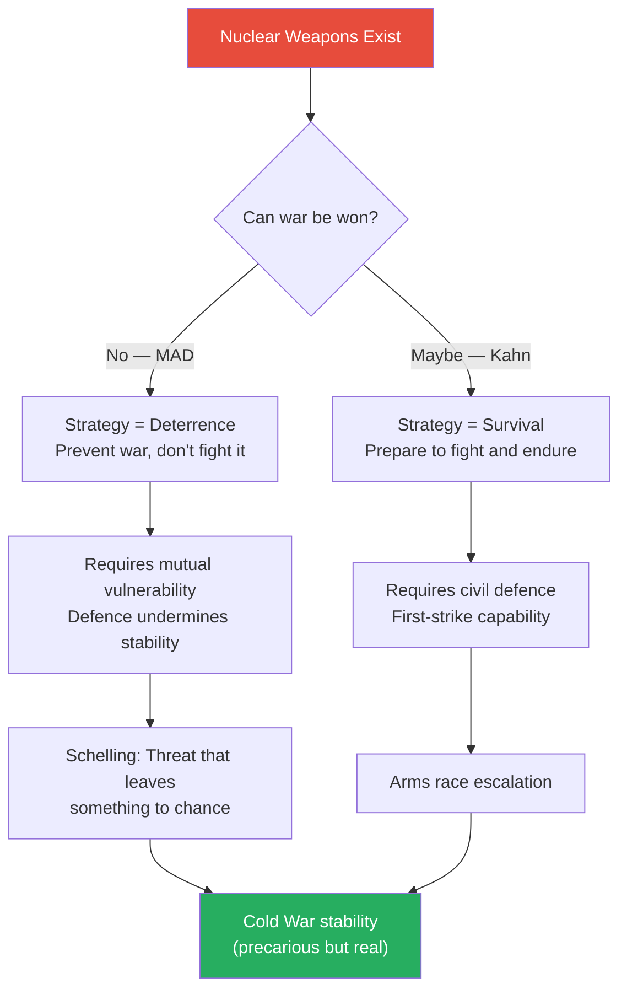

Nuclear strategy turned the entire logic of warfare upside down — strength lay in vulnerability, and the most dangerous move was trying to make yourself safe.

---

### Chapter 17: Guerrilla Warfare — Mao and the Protracted War

*While nuclear theorists worried about superpower confrontation, the actual wars of the Cold War era were fought as guerrilla conflicts — and the most successful guerrilla strategy came from a Chinese revolutionary who had never attended a staff college.*

- While nuclear theorists worried about superpower confrontation, the actual wars of the Cold War era were fought as **guerrilla conflicts** and insurgencies
- <b style="color: #2980b9">Mao Zedong's theory of protracted war</b> is the most influential guerrilla strategy ever developed:
  - The insurgent does not need to win battles; they need to survive, maintain political support, and exhaust the stronger power
  - Mao's strategic philosophy fused Clausewitz's insight (war is political) with Sun Tzu's emphasis (avoid battle when weak)
  - The people are the sea in which the guerrilla fish swim — without popular support, the insurgent is exposed and vulnerable
  - Mao understood that guerrilla warfare is fundamentally a contest for the allegiance of the population, not a contest of arms
- Mao's three phases of revolutionary war:
  1. **Strategic defensive** — survive, build support, avoid decisive battle
    - The guerrilla force is weak and must avoid confrontation with the enemy's main forces
    - Focus on political organisation, recruitment, and building underground networks
    - Small-scale ambushes and harassment to demonstrate the regime's vulnerability
    - The key at this stage is patience — the temptation to act boldly before you are ready is the most common cause of revolutionary failure
  2. **Strategic stalemate** — expand gradually, wear down the enemy
    - The guerrilla force grows stronger as the enemy's control weakens
    - Begin to hold territory and establish "liberated zones" with parallel governance
    - Larger operations become possible, but still avoid pitched battle with the enemy's concentrated forces
    - This phase can last decades — Mao's own struggle lasted over twenty years
  3. **Strategic offensive** — only when the balance of power has shifted decisively
    - The guerrilla force has grown into a conventional army
    - Now capable of taking and holding major positions
    - The enemy is demoralised, overextended, and politically weakened
    - The transition from guerrilla to conventional operations is the most dangerous moment — premature transition invites defeat
- <b style="color: #27ae60">The genius of Mao's approach</b>:
  - It turned the conventional army's greatest strength (firepower) into a liability
  - Massive firepower applied to a dispersed, hidden enemy destroys infrastructure and alienates the population
  - Every civilian killed by government forces becomes a recruitment tool for the insurgency
  - The government faces an impossible dilemma: restrain force (and be ineffective) or apply force broadly (and create more enemies)
  - Time is on the insurgent's side — the government must win; the insurgent need only survive

> [!example] Mao's Long March (1934-1935)
> - The Chinese Communist forces, facing annihilation by Chiang Kai-shek's Nationalist army, embarked on a 6,000-mile retreat through some of China's most inhospitable terrain
> - Of the 80,000-100,000 who began the march, fewer than 10,000 completed it
> - Militarily, it was a catastrophic defeat — the Communists lost most of their forces and abandoned their base areas
> - Strategically, it was transformative — the march established Mao's leadership, created a founding myth for the movement, and relocated the Communist base to an area (Yan'an) where they could rebuild
> - The Long March demonstrated Phase 1 thinking: survival is the primary objective, and any retreat that preserves the organisation's core is a strategic success
> - Along the march, the Communists recruited from minority populations and demonstrated the political dimension of their struggle
> **The lesson:** Strategic retreat can be a form of strategic advance — surviving to fight another day is not defeat but preparation.

- Freedman notes that Mao's theory has been widely imitated but rarely replicated with equal success:
  - Che Guevara tried to export the model to Bolivia and was killed — he lacked the popular base that Mao built over decades
  - <b style="color: #e74c3c">The foco theory</b> (Guevara and Debray) — the idea that a small guerrilla band could create revolutionary conditions through their own actions, without first building a mass political movement — repeatedly failed in practice
  - The lesson: revolutionary strategy without political organisation is adventurism, not strategy
  - Giap in Vietnam successfully adapted Mao's model to different conditions — demonstrating that the principles could transfer but required local adaptation
  - In Africa, Latin America, and Southeast Asia, guerrilla movements that skipped Mao's political groundwork were consistently defeated

---

### Chapter 18: Vietnam — The Failure of Conventional Strategy

*Vietnam became the defining case study for the failure of conventional military strategy against guerrilla warfare — and the lesson the American military spent decades trying to forget.*

- **Vietnam** is the case study Freedman uses to demonstrate the catastrophic consequences of applying the wrong strategic framework:
  - The United States had overwhelming military superiority — more troops, better weapons, air dominance, virtually unlimited resources
  - <b style="color: #e74c3c">None of this mattered</b> — because the war was not primarily military; it was political
  - The American military tried to apply the strategy of attrition — kill enough enemy soldiers and they will give up
  - But the Vietnamese were fighting for national liberation, which gave them virtually unlimited motivation to accept casualties
  - The American public, watching the war on television, lost the will to continue before the Vietnamese did
  - Clausewitz's trinity was entirely against the Americans: the political purpose was unclear, the military effort was misdirected, and popular passion turned against the war
- Freedman identifies several specific strategic failures:
  - **Body count as metric** — American strategy focused on killing enemy soldiers, measuring success by body counts
    - This incentivised commanders to inflate numbers and pursue engagements that generated casualties without strategic value
    - <b style="color: #e74c3c">When you measure the wrong thing, you optimise for the wrong outcome</b>
    - The body count metric created a perverse incentive structure — officers who reported high kill ratios were promoted, regardless of strategic progress
  - **Search and destroy** — sweeping through areas, killing enemies, then withdrawing
    - The enemy simply returned after American forces left
    - There was no lasting political or territorial gain
    - Each sweep destroyed village infrastructure and alienated the population
  - **Escalation without clear objectives** — each escalation was intended to signal resolve, but the North Vietnamese were equally resolved
    - Bombing campaigns (Rolling Thunder) were designed to break Hanoi's will but instead demonstrated American frustration
    - The graduated escalation gave the North Vietnamese time to adapt and build air defences
  - **The credibility trap** — America kept fighting partly because withdrawal would damage its credibility with allies
    - The war was sustained by concerns about reputation as much as by any realistic assessment of the stakes in Vietnam itself
    - Domestic politics trapped each successive president — Johnson could not withdraw without appearing weak, Nixon promised "peace with honour" but could not deliver it quickly

> [!example] The Tet Offensive (1968)
> - North Vietnamese and Viet Cong forces launched simultaneous attacks across South Vietnam during the Tet holiday ceasefire
> - Militarily, the offensive was a failure — the attackers suffered enormous casualties and held no new territory
> - Strategically, it was a masterstroke — American television audiences saw fighting in the US Embassy compound in Saigon and concluded the war was unwinnable
> - General Westmoreland's claims of progress were destroyed overnight
> - Within months, Lyndon Johnson announced he would not seek re-election, and American policy shifted toward withdrawal
> - Walter Cronkite's on-air assessment that the war was a stalemate was a strategic blow more devastating than any military defeat
> **The lesson:** Military victory and strategic victory are not the same thing — you can win every battle and still lose the war.

> [!example] The Pentagon Papers and Strategic Self-Deception
> - Daniel Ellsberg, a RAND analyst, leaked classified documents showing that American leaders had known for years that the war was going badly — while telling the public the opposite
> - The gap between private assessments and public statements revealed a pattern of strategic self-deception
> - Leaders who were supposed to be making rational strategic calculations were instead managing narratives to protect their own positions
> - McNamara's systems analysis — the ultimate in rational, quantified strategy — had produced precisely the kind of self-deception Clausewitz warned about
> - The internal contradiction was devastating: the same institution (RAND) that pioneered rational analysis also produced the analyst (Ellsberg) who exposed its failure
> **The lesson:** The most sophisticated analytical tools are useless if the organisation punishes honest assessment and rewards optimistic reporting.

- Freedman uses Vietnam to illustrate a broader pattern he calls <b style="color: #2980b9">the credibility trap</b>:
  - Once a great power commits to a conflict, the sunk costs create pressure to continue
  - Withdrawal would "prove" that the sacrifice was meaningless
  - Each escalation is designed to demonstrate resolve — but the opponent reads escalation as desperation
  - <b style="color: #e74c3c">The credibility trap turns a strategic choice into an existential commitment</b> — and existential commitments are almost impossible to abandon rationally
  - This pattern recurs in business: companies that have invested heavily in a failing strategy continue investing because abandoning it would mean admitting the initial investment was wasted
  - See also the "sunk cost fallacy" in [[Thinking in Bets - Annie Duke]]

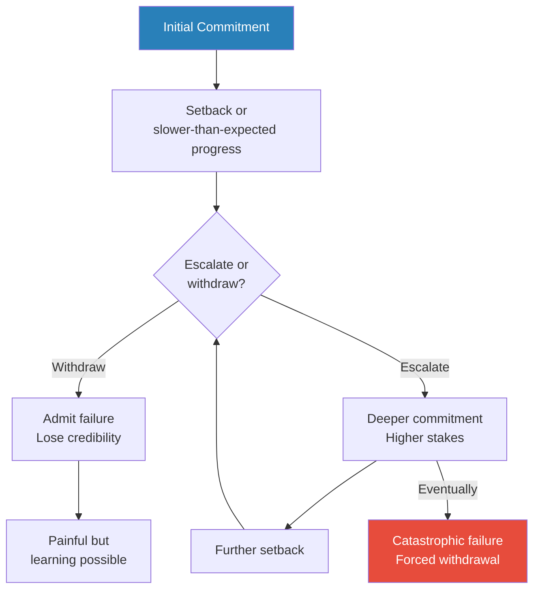

The credibility trap is one of the most dangerous patterns in strategic history — it turns small commitments into enormous ones, and the logic of escalation becomes self-reinforcing.

---

### Chapter 19: Counter-Insurgency and the New Wars

*Counter-insurgency theory evolved through painful experience in Malaya, Algeria, Vietnam, and Iraq — always intellectually sound, always politically unsustainable.*

- Counter-insurgency theory represents the conventional military's attempt to respond to guerrilla warfare:
  - The core insight: guerrilla wars are won politically, not militarily — you win by gaining the population's support, not by killing insurgents
  - <b style="color: #2980b9">David Galula's key formula</b>: counter-insurgency is 80% political and 20% military
  - The population is the prize — whoever the population supports will eventually win
  - Galula, a French officer who served in Algeria, developed the most systematic counter-insurgency theory:
    - His book *Counterinsurgency Warfare* (1964) laid out principles drawn from direct experience
    - His approach emphasised the primacy of politics over military operations — the government must address the grievances that fuel the insurgency
- Key principles of counter-insurgency doctrine:
  - **Clear, hold, build** — clear an area of insurgents, hold it with sufficient forces to prevent their return, then build governance and services that give the population a stake in the government's success
  - **Population-centric warfare** — protect the population rather than pursue the enemy
  - **Minimum necessary force** — excessive force alienates the population and creates new insurgents
  - **Intelligence from the population** — the best intelligence comes from people who trust you, not from interrogation or technology
  - **Political legitimacy** — the government must be seen as legitimate and competent; military force cannot substitute for good governance
  - **Unity of effort** — military, political, economic, and social efforts must be coordinated under a single strategic framework

> [!example] The Malayan Emergency (1948-1960)
> - Britain faced a communist insurgency in Malaya led primarily by ethnic Chinese guerrillas
> - General Sir Gerald Templer's approach combined military operations with political reform
> - The "New Villages" programme resettled rural populations to separate them from the insurgents — controversial but effective
> - Templer's slogan: "the answer lies not in pouring more soldiers into the jungle, but in the hearts and minds of the people"
> - The insurgency was defeated, but it took twelve years and specific conditions: the insurgents lacked broad ethnic support, Malaya was moving toward independence, and Britain committed sufficient resources for the long term
> **The lesson:** Counter-insurgency can work — but it requires patience, political reform, and conditions that rarely align perfectly.

> [!example] The French in Algeria (1954-1962)
> - France faced an insurgency by the National Liberation Front (FLN) in Algeria
> - The French military, led by officers who had studied both Mao and Galula, developed a sophisticated counter-insurgency approach
> - They used population control (the quadrillage system), psychological warfare, and targeted intelligence
> - The Battle of Algiers (1957) was a tactical triumph — the French destroyed the FLN's urban network through systematic intelligence work and harsh interrogation
> - But the methods used — including systematic torture — destroyed France's moral authority both at home and internationally
> - France won the battle of Algiers but lost the war for Algeria — public opinion in France turned against the war, and Algeria gained independence in 1962
> **The lesson:** Counter-insurgency can succeed tactically through ruthless methods — but those very methods can generate political defeat. The relationship between military and political objectives cannot be severed.

- <b style="color: #e74c3c">Freedman notes the persistent problem with counter-insurgency theory</b>:
  - It is intellectually sound but politically unsustainable — democracies struggle to maintain the long-term commitment it requires
  - The theory requires enormous patience, cultural understanding, and willingness to accept slow progress
  - Domestic publics want quick results; counter-insurgency offers only long, ambiguous campaigns
  - General Petraeus's 2006 counter-insurgency manual (FM 3-24) drew heavily on this tradition for the Iraq War
  - The "surge" in Iraq showed tactical success but the political conditions for lasting success remained elusive
  - <b style="color: #27ae60">The fundamental tension: counter-insurgency requires a commitment that democratic publics are unlikely to sustain</b> — which means its theoretical elegance may be practically irrelevant

> [!example] Iraq — Counter-insurgency's Last Test (2006-2008)
> - General David Petraeus brought counter-insurgency theory to Iraq with the 2007 "surge"
> - His approach followed the classical model: protect the population, clear and hold territory, build governance, reduce violence
> - The surge coincided with the "Sunni Awakening" — tribal leaders turning against al-Qaeda in Iraq — which provided the political foundation for military success
> - Violence declined significantly, and for a period, the strategy appeared to be working
> - But the political conditions for lasting success — a competent, inclusive Iraqi government; reconciliation between Sunni and Shia; institutional capacity — remained elusive
> - After the US withdrawal, the gains were largely reversed — the Iraqi government's sectarian policies alienated the Sunnis, and the Islamic State emerged from the same conditions that had fuelled the earlier insurgency
> - The Iraq experience confirmed counter-insurgency theory's central dilemma: military operations can create temporary security, but lasting success requires political conditions that external forces cannot impose
> **The lesson:** Counter-insurgency's intellectual elegance masks a fundamental problem — it requires sustained political commitment and good governance that the intervening power cannot provide and the host government often will not deliver.

---

### Chapter 20: Boyd and the OODA Loop

*A maverick Air Force colonel offered the most radical rethinking of strategy since Clausewitz — arguing that the speed of your decision-making cycle matters more than the quality of any individual decision.*

- <b style="color: #2980b9">John Boyd</b> (1927-1997) was a maverick US Air Force fighter pilot and military theorist:
  - He began his thinking with aerial combat — why do some pilots consistently win dogfights?
  - His answer: the winning pilot is not necessarily the one with the better aircraft or better aim, but the one who cycles through decisions faster
  - Boyd expanded this insight from dogfighting to grand strategy, arguing it applied to all forms of conflict
  - He was a legendary Pentagon outsider — he never held a senior command and made powerful enemies through his relentless criticism of military bureaucracy
- <b style="color: #2980b9">The OODA Loop</b> — Boyd's most famous contribution:
  - **Observe** — gather information about the environment and the opponent
  - **Orient** — make sense of the information through your mental models, cultural traditions, previous experience, and analytical capabilities
  - **Decide** — choose a course of action
  - **Act** — execute the decision
  - <b style="color: #27ae60">Speed of cycling through OODA matters more than the quality of any single decision</b>
  - If you can consistently act inside your opponent's decision cycle, they will become confused, disoriented, and unable to respond effectively
  - The opponent is perpetually reacting to a situation that has already changed
- The <b style="color: #2980b9">"Orient" phase</b> is the most important — and the most misunderstood:
  - Orientation is not just information processing — it is the lens through which all information is filtered
  - It includes cultural traditions, previous experiences, genetic heritage, and the ability to destroy and create mental models
  - <b style="color: #e74c3c">Bad orientation means fast wrong decisions</b> — which is worse than slow right ones
  - The strategist who can rapidly update their mental models — who can "destroy and create" their orientation — has the decisive advantage
  - This connects directly to Clausewitz's concept of the military genius who can see through the fog of war
  - Boyd often said the most important question is not "what should I do?" but "am I seeing the situation correctly?"

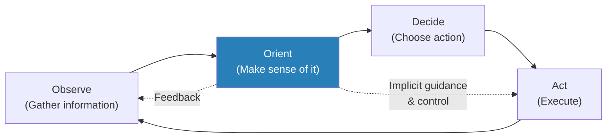

Boyd's insight was that the Orient phase — the mental models through which you interpret information — is the true source of strategic advantage or failure.

- Boyd's broader strategic theory went far beyond the OODA loop:
  - He studied the blitzkrieg campaigns, Mao's guerrilla warfare, and ancient strategists
  - His synthesis: all successful strategies share one quality — they create confusion and disorder in the enemy's ranks faster than the enemy can adapt
  - <b style="color: #27ae60">The goal is not to destroy the enemy but to make them unable to function as a coherent organisation</b>
  - This is achieved through speed, surprise, variety, and harmony of action
  - Boyd never published a book — his ideas were spread through marathon briefings (his famous "Patterns of Conflict" presentation lasted six hours) and influenced a devoted following in the US Marine Corps
  - His influence extended to business strategy — the concept of decision speed as competitive advantage became central to Silicon Valley thinking
  - Boyd also developed the concept of <b style="color: #2980b9">"people, ideas, and hardware — in that order"</b>:
    - The quality of people matters more than the quality of ideas, and the quality of ideas matters more than the quality of hardware
    - This reversed the conventional military priority (which tends to focus on technology and equipment)
    - In business terms: talent matters more than strategy, and strategy matters more than technology
  - Boyd's concept of <b style="color: #2980b9">moral, mental, and physical dimensions of conflict</b>:
    - The moral dimension (will, values, legitimacy) is most important
    - The mental dimension (understanding, adaptation, creativity) is second
    - The physical dimension (weapons, territory, resources) is least important
    - <b style="color: #27ae60">This hierarchy explains why guerrillas with moral authority and mental adaptability can defeat conventional armies with physical superiority</b>
    - It also explains why companies with strong cultures and adaptive leadership outperform companies with better technology but rigid management

| Strategic Approach | Core Logic | Historical Example | Fatal Weakness |
|-------------------|------------|-------------------|----------------|
| Annihilation | Decisive battle wins the war | Napoleon at Austerlitz | Rarely achievable; creates exhaustion |
| Exhaustion/Attrition | Grind the enemy down | WWI Western Front | Destroys your own forces too |
| Indirect approach | Avoid strength, exploit weakness | German invasion of France 1940 | Requires speed and surprise hard to sustain |
| Guerrilla/Protracted | Survive and exhaust the stronger power | Vietnam, Mao's revolution | Requires enormous patience and political will |
| Counter-insurgency | Win hearts and minds | Malaya, Iraq surge | Politically unsustainable in democracies |
| Deterrence | Threaten unacceptable consequences | Cold War MAD | Works only if the threat is credible |
| OODA dominance | Cycle decisions faster than opponent | Blitzkrieg, Israeli Six-Day War | Requires superior orientation, not just speed |
| Nonviolent resistance | Make repression costlier than concession | Gandhi's salt march, King's Birmingham | Requires opponent susceptible to moral pressure |
| Subversion | Attack alliances, not armies | Satan's temptation, propaganda campaigns | Can win battles without winning wars |

This table captures Freedman's core argument: there is no universally correct strategic approach — each works in specific circumstances and fails in others.

---

## Part Three: Strategy from Below

### Chapter 21: Marx — History as Strategy

*Freedman turns from military strategy to political strategy — specifically, the strategic thinking of those who want to overthrow the existing order rather than defend it. Marx provided the grand narrative; the strategic vacuum he left would generate a century of bitter debate.*

- <b style="color: #2980b9">Karl Marx</b> (1818-1883) did not write a strategy manual, but his analysis of history contained implicit strategic assumptions:
  - History moves through stages driven by class conflict — feudalism gives way to capitalism, capitalism will give way to socialism
  - The working class (proletariat) is the agent of historical change
  - Revolution is inevitable because capitalism contains the seeds of its own destruction — increasing inequality, recurring crises, and the concentration of wealth
  - <b style="color: #e74c3c">Marx's strategic weakness</b>: because he believed revolution was historically inevitable, he paid relatively little attention to how it should actually be organised
  - This left a vacuum that others — Lenin, Gramsci, Bernstein, Luxemburg — would fill with very different answers
  - Marx's historical determinism was simultaneously his greatest intellectual contribution and his greatest strategic liability — if revolution is inevitable, why plan for it?
- Marx's analysis of the **Paris Commune** (1871) revealed his ambivalence about revolutionary strategy:
  - The Commune was a brief, radical experiment in workers' self-government in Paris
  - Marx celebrated it as a model of proletarian power — workers running their own affairs without bourgeois institutions
  - But the Commune was crushed in weeks — revealing the gap between revolutionary aspiration and strategic capability
  - The Commune's failure raised the question that would dominate left-wing strategy for a century: how do you actually seize and hold power?
  - The brutal suppression of the Commune (20,000-30,000 killed) demonstrated that the ruling class would use extreme violence to maintain its position — something the revolutionaries had not adequately prepared for
- <b style="color: #2980b9">Friedrich Engels</b> contributed more practical strategic thinking:
  - Engels had genuine military knowledge — he studied military history and served briefly in the 1849 revolution
  - He understood the logistical and organisational requirements of revolution
  - His late writings acknowledged that the growth of standing armies and modern weaponry made urban insurrection increasingly difficult
  - This created a tension within Marxism between the romantic image of barricades and the practical reality of modern state power
  - Engels's analysis of military affairs was genuinely sophisticated — he understood the strategic implications of railways, telegraph communications, and industrial-age weaponry
  - <b style="color: #27ae60">His contribution was to inject military realism into a movement that tended toward utopian wishful thinking</b>

> [!tip] Core Insight
> Marx provided the "why" of revolution (historical materialism, class conflict, the contradictions of capitalism) but not the "how." His followers spent the next century arguing about strategy — and the argument produced some of history's most sophisticated political thinking, along with some of its worst catastrophes.

- The strategic lessons Freedman draws from Marx are primarily cautionary:
  - **Historical determinism as strategic liability** — if you believe history is moving inevitably in your direction, you will neglect the hard work of organisation, coalition-building, and tactical flexibility
  - <b style="color: #e74c3c">Believing your victory is inevitable is the worst possible starting point for strategy</b> — it breeds complacency, discourages adaptation, and makes setbacks appear as temporary deviations rather than genuine problems
  - **The structural analysis is powerful, the strategic prescription is weak** — Marx brilliantly analysed the dynamics of capitalism but provided almost no guidance about how to exploit those dynamics strategically
  - This gap between diagnosis and prescription is a recurring problem in strategic thought — you can understand a system perfectly and still not know how to change it
  - <b style="color: #27ae60">Marx's most enduring contribution to strategic thinking is the concept of structural analysis itself</b> — the idea that you must understand the deep structures of a situation (economic relations, class interests, material conditions) before you can develop a strategy for changing it
  - This structural analysis was later adopted (in modified form) by business strategists — Porter's Five Forces, Christensen's disruption theory, and resource-based strategy all share Marx's insight that surface phenomena are driven by deeper structures

> [!example] The Paris Commune — Revolution Without Strategy (1871)
> - After France's defeat in the Franco-Prussian War, the workers and radical republicans of Paris seized control of the city
> - For two months, the Commune attempted to create a model of direct democracy — elected officials earned workers' wages, the army was replaced by a citizen militia, church and state were separated
> - The Commune had no strategy for surviving beyond its own borders — it did not march on Versailles when the government was weak, did not coordinate with provincial cities, and did not build alliances with the rural population
> - When the Versailles government regrouped and attacked, the Commune fell in a week of brutal street fighting
> - The subsequent repression was savage — an estimated 20,000-30,000 Communards were killed in the "Bloody Week"
> - Marx celebrated the Commune's idealism but was privately critical of its strategic errors — particularly its failure to seize the Bank of France, which would have given it financial leverage
> **The lesson:** Revolutionary aspirations without strategic organisation lead to heroic failure. The Commune inspired generations of revolutionaries but also demonstrated the lethal consequences of inadequate strategic preparation.

---

### Chapter 22: Herzen, Bakunin, and the Anarchist Critique

*Before Lenin codified revolutionary strategy, a generation of Russian radicals debated whether revolution could be planned at all — and whether the attempt to plan it would betray the very ideals it served.*

- <b style="color: #2980b9">Alexander Herzen</b> (1812-1870) represents the humanist wing of Russian radicalism:
  - Herzen was disillusioned by both Western liberalism (which tolerated inequality) and revolutionary violence (which produced new tyrants)
  - His strategic insight: <b style="color: #27ae60">revolutions that sacrifice the present generation for a future utopia are morally bankrupt</b>
  - Herzen argued for gradual change rooted in existing Russian institutions (particularly the peasant commune)
  - He rejected the idea that history has a predetermined direction — the future is open, and strategic choices genuinely matter
  - Freedman treats Herzen sympathetically as someone who understood the dangers of strategic fanaticism
  - Herzen's position anticipated the liberal-democratic critique of revolution: the means shape the ends, and violent means produce violent societies
  - His famous warning: "Do not sacrifice the present for the future. Enjoy life, contribute to happiness."
- <b style="color: #2980b9">Mikhail Bakunin</b> (1814-1876) represented the opposite pole — revolutionary anarchism:
  - Bakunin believed that the revolutionary impulse would arise spontaneously from the oppressed masses
  - He rejected all forms of political organisation, including revolutionary parties — organisation leads to hierarchy, which reproduces the very power structures revolution aims to destroy
  - <b style="color: #e74c3c">Bakunin's strategic problem</b>: spontaneous revolution without organisation tends to be easily suppressed
  - His famous conflict with Marx at the First International was fundamentally a strategic argument: Marx wanted disciplined political organisation; Bakunin wanted spontaneous insurrection
  - History largely vindicated Marx's approach — organised movements (Bolsheviks, Chinese Communists) succeeded where spontaneous uprisings (Paris Commune, anarchist revolts in Spain) were crushed
  - But Bakunin's critique of organisation also proved prophetic — the disciplined parties that succeeded in seizing power tended to become the new dictatorships
- The <b style="color: #2980b9">Narodniki</b> (populists) tried a different approach in Russia:
  - They "went to the people" — educated radicals moved to rural villages to educate and agitate among the peasants
  - The peasants were largely uninterested in — and sometimes hostile to — revolutionary ideology
  - The failure of this approach drove some toward terrorism (the assassination of Tsar Alexander II in 1881) and others toward more disciplined organisation (ultimately leading to Lenin)
  - <b style="color: #e74c3c">The lesson: a strategy that assumes the people will spontaneously embrace your cause is wishful thinking, not strategy</b>
  - The Narodnik failure illustrates a fundamental strategic error: confusing what you think the people should want with what they actually want
- Freedman draws a key strategic lesson from the anarchist tradition:
  - The tension between organisation (which enables action) and freedom (which motivates action) is never fully resolved
  - Too much organisation produces bureaucracy and tyranny; too little produces impotence
  - <b style="color: #27ae60">This is the strategic equivalent of the control-empowerment dilemma in management</b> — centralise too much and you kill initiative; decentralise too much and you lose coherence
- The <b style="color: #2980b9">"propaganda of the deed"</b> — the anarchist belief that dramatic violent acts would inspire the masses to revolution:
  - This strategy produced a wave of assassinations and bombings in the late 19th century — heads of state, industrialists, and officials were targeted
  - The theory: a spectacular act of violence would expose the system's vulnerability and inspire others to revolt
  - The reality: propaganda of the deed alienated public opinion, provided justification for repression, and failed to spark revolutionary movements
  - <b style="color: #e74c3c">The strategic lesson is devastating: violence that is disconnected from mass political organisation is not strategy but terrorism</b> — it may generate attention but not the organised political action needed to achieve change
  - Freedman sees parallels between 19th-century propaganda of the deed and 21st-century terrorism — both assume that spectacular violence will catalyse political transformation, and both consistently fail to produce the intended strategic effect
  - The exception is when terrorism is combined with political organisation (as in the ANC in South Africa or the IRA in Northern Ireland) — but in those cases, it is the political organisation, not the violence, that is strategically decisive
- Freedman treats the anarchist tradition as a permanent critique of organised strategy:
  - Anarchists were right that organisation tends toward hierarchy and control
  - But they were wrong that spontaneous action can substitute for organisation
  - The strategic truth lies between: organisations must be disciplined enough to act effectively but flexible enough to avoid becoming the very power structures they oppose
  - <b style="color: #27ae60">This tension between discipline and freedom is never fully resolved in any strategic tradition</b> — it appears in military command structures (centralisation vs. Auftragstaktik), in corporate management (hierarchy vs. empowerment), and in social movements (vanguard party vs. grassroots democracy)

---

### Chapter 23: Lenin — The Vanguard Party and Revolutionary Strategy

*Lenin transformed Marx's historical analysis into a practical strategy for seizing power — and in doing so, created the template for every 20th-century revolution.*

- <b style="color: #2980b9">Lenin</b> (1870-1924) is the most consequential revolutionary strategist in history:
  - He solved the problem that Marx left open: how to actually organise and execute a revolution
  - His key theoretical contribution was the concept of the <b style="color: #2980b9">vanguard party</b>
  - The working class, left to itself, will develop only "trade union consciousness" — demands for better wages and conditions, not revolutionary ambitions
  - Revolution requires a small, disciplined organisation of professional revolutionaries who understand the historical situation and can lead the masses
  - The vanguard party combines two functions: intellectual clarity (understanding what must be done) and organisational discipline (the ability to act decisively at the crucial moment)
- Lenin's strategic principles:
  - <b style="color: #27ae60">Identify the weakest link in the chain and concentrate all force there</b>
  - Exploit moments of crisis — revolution is possible only when the ruling class can no longer govern in the old way and the masses refuse to be governed in the old way
  - Maintain iron discipline within the party — democratic centralism means free debate before a decision, total obedience after it
  - Use temporary alliances instrumentally — ally with anyone who weakens the main enemy, then discard them when they are no longer useful
  - <b style="color: #e74c3c">Never be sentimental about tactics</b> — retreat, compromise, and even apparent betrayal are all acceptable if they serve the strategic goal
  - Propaganda is a strategic weapon — the party must control the narrative about what is happening and why
  - Organisation is more important than ideology — a well-organised minority will always defeat a disorganised majority
- Lenin's genius was recognising and exploiting moments of crisis:
  - The Bolshevik Revolution of 1917 succeeded not because the Bolsheviks were popular (they were a minority), but because they were organised and decisive when the Tsarist state and its successors were paralysed
  - Lenin's slogan — "Peace, Land, Bread" — was strategically perfect: it addressed what the masses actually wanted, not what Marxist theory said they should want
  - The slogan demonstrated a key strategic insight: meet people where they are, not where your theory says they should be
  - Lenin was willing to abandon Marxist orthodoxy when it conflicted with strategic necessity — he promised land to the peasants even though Marxist theory assigned no revolutionary role to the peasantry
  - His pragmatism extended to every dimension of revolutionary strategy:
    - He accepted German money and transport, knowing the Germans intended to use him
    - He signed the Treaty of Brest-Litovsk (1918), surrendering vast territories to Germany, because he needed peace to consolidate the revolution — a decision that horrified ideological purists
    - He introduced the New Economic Policy (1921), allowing limited capitalism, because the economy was collapsing — strategic retreat in the economic sphere
  - <b style="color: #27ae60">Lenin's strategic genius was his willingness to subordinate ideological purity to practical effectiveness</b> — a quality that distinguished him from every other Marxist theorist of his generation
- Freedman draws several broader strategic lessons from Lenin:
  - **Organisation beats ideas** — the Bolsheviks were not the most popular revolutionary faction, but they were the best organised
  - **Timing is everything** — acting at the precise moment of maximum enemy weakness and minimum resistance
  - **The revolutionary must be a realist** — sentimental attachment to principles, tactics, or allies is a strategic liability
  - **Propaganda is strategy** — controlling the narrative about what is happening and why is as important as controlling territory or institutions
  - <b style="color: #e74c3c">But Lenin's success also contained the seeds of its own contradiction</b> — the iron discipline and ruthless pragmatism that won the revolution also produced the dictatorship that betrayed it
  - The vanguard party, designed as a tool for seizing power, became a tool for maintaining power — against the very class it claimed to represent

> [!example] Lenin and the Sealed Train (1917)
> - In early 1917, Lenin was in exile in Switzerland while revolution was breaking out in Russia
> - The German government offered to transport him across Germany in a sealed train — they calculated that Lenin's return would destabilise Russia and take it out of World War I
> - Lenin accepted, understanding that the Germans were using him as a weapon — but calculating that he could use their transport to reach the revolution
> - Both sides were being strategic, and both got what they wanted: Germany got Russia out of the war, Lenin got his revolution
> - It was a transaction of mutual exploitation — each side believed it was using the other
> **The lesson:** Strategic alliances between enemies are possible when interests temporarily align — but each side must understand that the alliance is instrumental, not genuine.

> [!example] The October Revolution (1917)
> - By October 1917, the Provisional Government under Kerensky was weak, indecisive, and unpopular
> - Lenin insisted on immediate action despite opposition within his own party — Zinoviev and Kamenev argued for delay
> - Trotsky organised the actual seizure of power in Petrograd — key installations were taken with minimal resistance
> - The Bolsheviks succeeded because they acted decisively at a moment of maximum institutional weakness
> - The revolution was not a mass uprising but a coup by a disciplined minority at a moment of systemic collapse
> - Lenin's willingness to act when others hesitated was the difference between the Bolsheviks and every other Russian political faction
> **The lesson:** Lenin's strategic genius was timing — recognising the precise moment when the existing order was too weak to resist and the revolutionary force was just strong enough to act.

---

### Chapter 24: Gramsci and Cultural Hegemony

*Writing from a fascist prison, Gramsci asked the question that has haunted left-wing politics ever since: why do the oppressed consent to their own oppression? His answer transformed strategic thinking about power.*

- <b style="color: #2980b9">Antonio Gramsci</b> (1891-1937) developed the most sophisticated strategic theory on the left after Lenin:
  - Writing from a fascist prison, Gramsci asked why revolution had succeeded in Russia but failed in Western Europe
  - His answer: in the West, the ruling class maintained power not primarily through force but through <b style="color: #2980b9">cultural hegemony</b>
  - Hegemony means that the ruling class's ideas, values, and worldview are accepted as "common sense" by the very people they exploit
  - Workers in Western democracies did not revolt because they had internalised the bourgeois worldview — they saw capitalism as natural and inevitable
  - <b style="color: #27ae60">Gramsci's strategic conclusion: before you can seize political power, you must win the cultural war</b>
    - You must challenge the dominant worldview at every level — education, media, religion, art, everyday assumptions
    - This is a "war of position" (long, gradual cultural transformation) rather than a "war of movement" (sudden revolutionary seizure)
- Gramsci distinguished between two kinds of revolution:
  - **War of movement** — the Leninist approach, appropriate in societies where the state is strong but civil society is weak (Russia 1917)
    - In Russia, the state could be toppled because it stood alone — there were no strong civil institutions to cushion the blow
    - Once the state fell, the revolutionaries could reshape society from the top down
  - **War of position** — appropriate in societies with strong civil institutions (churches, unions, media, universities) that must be transformed before political power can be seized
    - In Western Europe, even if revolutionaries seized the state, civil society would resist — the cultural infrastructure would regenerate the old order
    - The war of position requires building counter-hegemonic institutions: alternative media, sympathetic intellectuals, cultural organisations, educational reform
- Gramsci introduced the concept of the <b style="color: #2980b9">organic intellectual</b>:
  - Every social class produces its own intellectuals — thinkers who articulate that class's worldview and interests
  - The ruling class's organic intellectuals include professors, journalists, priests, lawyers — anyone who explains and justifies the existing order
  - The working class needs its own organic intellectuals — people who can articulate an alternative vision and challenge the dominant narrative
  - <b style="color: #27ae60">The battle for hegemony is fought through ideas, education, and culture, not just through institutions and armies</b>
- <b style="color: #e74c3c">Gramsci's insight has been adopted far beyond the left</b> — cultural conservatives, business leaders, and social movements of all kinds have recognised that controlling the cultural narrative is a prerequisite for political power
  - The concept of hegemony connects directly to Freedman's emphasis on narrative as a strategic element — whoever controls the story controls the game
  - Think tanks, media empires, and educational institutions are all instruments in the war of position — regardless of which side employs them

> [!example] Gramsci's Prison Notebooks (1929-1935)
> - Arrested by Mussolini's fascist government in 1926, Gramsci spent the remaining eleven years of his life in prison
> - Despite censorship, he produced over 3,000 pages of analysis — the Prison Notebooks
> - He could not write openly about revolution, so he developed a coded vocabulary: "hegemony," "war of position," "organic intellectuals"
> - His central question: why had Italian workers supported fascism rather than revolution?
> - His answer: Mussolini had won the cultural war — he had captured the narrative of national greatness, strength, and order
> - The left had focused on economics and missed the cultural dimension of power
> - Gramsci's health deteriorated steadily in prison; he died shortly after his release, at age 46
> **The lesson:** Political power without cultural authority is fragile. Strategic thinkers who focus only on institutions and armies while ignoring narratives and culture are fighting with one arm tied behind their back.

---

### Chapter 25: Bernstein, Luxemburg, and the Reform vs. Revolution Debate

*The most consequential strategic debate in left-wing politics: should socialism be achieved through gradual democratic reform or violent revolutionary seizure? The argument has never been resolved because both sides have historical evidence.*

- <b style="color: #2980b9">Eduard Bernstein's revisionism</b> posed the fundamental strategic dilemma for the left:
  - Marx predicted capitalism would collapse; instead, it adapted — living standards improved, the working class gained political rights
  - Bernstein argued that socialism should be pursued through gradual reform within the democratic system, not violent revolution
  - His evidence was compelling: in Germany, the Social Democrats were gaining seats, winning elections, and achieving real improvements for workers
  - <b style="color: #27ae60">Why risk everything on a revolution when you can achieve your goals step by step through existing institutions?</b>
  - Bernstein's famous formulation: "The movement is everything, the final goal is nothing" — the process of democratic participation was itself transformative
- This created a permanent split in left-wing strategy:
  - **Revolutionary approach** — seize power through crisis and force (Lenin, later Mao)
  - **Reformist approach** — win elections and legislate change (European social democrats)
  - Freedman treats this not as a question with a right answer but as a genuine strategic dilemma — each approach has succeeded and failed depending on circumstances
  - The revolutionary approach produced the Soviet Union, China, and Cuba — all achieved power but at enormous human cost and with authoritarian results
  - The reformist approach produced the Scandinavian welfare states — genuine improvements in workers' lives achieved through democratic means
- <b style="color: #2980b9">Rosa Luxemburg</b> offered a middle position — and a devastating critique of both sides:
  - She rejected Bernstein's gradualism as self-deception — the ruling class would never voluntarily surrender power
  - But she also rejected Lenin's vanguard party as dangerously authoritarian — a revolution led by a small elite would produce a dictatorship, not socialism
  - Her concept of the <b style="color: #2980b9">mass strike</b>: revolution would emerge organically from workers' struggles, not from party directives
  - The mass strike would be both economic and political — workers would learn revolution by doing it, not by being told to do it
  - <b style="color: #e74c3c">Luxemburg's prediction that Lenin's approach would produce dictatorship was tragically vindicated</b> — but her alternative strategy lacked the organisational power to compete with Lenin's disciplined party
  - Her assassination in 1919, during the failed Spartacist uprising in Berlin, demonstrated the vulnerability of her approach — moral clarity without organisational power leaves the revolutionary exposed to ruthless opponents

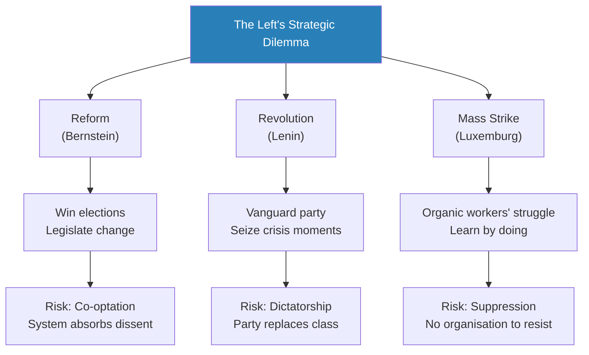

The reform-versus-revolution debate mirrors the broader strategic tension between patience and decisive action — and like most strategic dilemmas, it has no universal answer.

- Freedman draws out several key strategic lessons from this debate:
  - **The organisational dilemma** — disciplined organisation increases the chance of seizing power but also increases the risk of authoritarianism
  - **The timing dilemma** — act too early and you are crushed; wait too long and the moment passes
  - **The coalition dilemma** — broad coalitions are more powerful but harder to hold together; narrow, disciplined movements are more cohesive but lack mass support
  - **The means-and-ends dilemma** — violent means tend to produce violent regimes; peaceful means tend to produce democratic outcomes, but peaceful means are often insufficient against ruthless opponents
  - <b style="color: #27ae60">These dilemmas are not unique to left-wing politics — they appear in every strategic context where the weak challenge the strong</b>:
    - Startups face the same organisational dilemma: too much structure kills innovation, too little structure prevents execution
    - Social movements face the same coalition dilemma: broad tent versus disciplined core
    - Military insurgencies face the same timing dilemma: when to transition from guerrilla warfare to conventional operations
- Freedman places the reform-revolution debate in the context of his broader argument about strategy:
  - <b style="color: #2980b9">The debate is ultimately about risk tolerance and time horizon</b>:
    - Revolutionaries accept high risk for potentially transformative gains — but face the possibility of catastrophic failure (and authoritarian outcomes)
    - Reformists accept lower risk for incremental gains — but face the possibility of co-optation and never achieving transformative change
  - Both approaches can be strategically rational depending on the circumstances:
    - When the system is genuinely collapsing (Russia 1917, China 1949), revolution is feasible
    - When the system is stable and adaptable (Western Europe, the US), reform is more likely to succeed
    - <b style="color: #27ae60">The strategic error is to apply the wrong approach to the wrong circumstances</b> — revolutionary strategy in a stable democracy, or reformist strategy under a regime that will never voluntarily cede power
  - This debate has direct parallels in business strategy:
    - "Revolutionary" business strategy: disruptive innovation, creative destruction, radical reinvention
    - "Reformist" business strategy: continuous improvement, incremental innovation, organisational development
    - The right approach depends on the competitive environment — disruption works when the market is ripe for transformation; continuous improvement works when the market values stability and reliability

> [!example] The German Social Democrats — Reform That Worked (1890-1914)
> - The SPD grew from a marginal party to the largest party in the German Reichstag through democratic participation
> - They achieved real improvements for workers: social insurance, labour protections, political representation
> - Bernstein pointed to this as proof that revolution was unnecessary — the democratic path was working
> - But critics argued that the SPD's success came at a cost: the party had become part of the system it aimed to transform
> - In 1914, the SPD voted for war credits, supporting Germany's entry into World War I — abandoning internationalism for nationalism
> - The ultimate test of the reform strategy: had the SPD transformed the system, or had the system transformed the SPD?
> **The lesson:** The reform approach to strategy risks co-optation — success within the existing system can make you a defender of that system rather than its challenger.

---

### Chapter 26: Nonviolent Strategy — Gandhi

*The most radical strategic innovation of the 20th century came not from generals or revolutionaries but from a skinny Indian lawyer — the discovery that moral authority, strategically deployed, could defeat physical force.*

- <b style="color: #2980b9">Gandhi's strategy of nonviolent resistance</b> (satyagraha — "truth force") was not passive — it was highly calculated:
  - Gandhi understood that the British Empire's power in India rested on legitimacy, not just force — the British needed to believe (and need others to believe) that their rule was just and civilised
  - Nonviolent resistance attacked this legitimacy directly:
    - When protesters were beaten, imprisoned, or killed while offering no violence, the moral cost to the British was enormous
    - Every act of British repression became a strategic victory for the independence movement
  - <b style="color: #27ae60">Gandhi's strategic genius was forcing the opponent to choose between concession and self-destruction</b>:
    - If the British made concessions, Indian independence advanced
    - If the British cracked down violently, they undermined their own moral authority and international standing
    - There was no good move for the opponent — which is the hallmark of a brilliant strategy
- Gandhi's approach required several preconditions:
  - The opponent must be susceptible to moral pressure — they must care about their self-image as just and civilised
  - There must be an audience that witnesses and judges the conflict — media coverage was essential
  - The protesters must maintain absolute discipline — any violence by the protesters undermines the moral asymmetry
  - <b style="color: #e74c3c">Against a truly ruthless regime (Stalin, Hitler) nonviolence would likely end in extermination rather than independence</b>
  - The movement must be willing to accept suffering — and suffering must be visible to outside observers
- Gandhi understood the **strategic value of suffering**:
  - Willingness to suffer without retaliating creates a moral pressure that violence cannot
  - It shifts the narrative from "competing armies" to "oppressor and victim"
  - The oppressor's violence, when directed at nonviolent resisters, becomes self-defeating — it proves the resisters' point about the system's injustice
  - <b style="color: #27ae60">Suffering voluntarily accepted is a form of strategic communication</b> — it says to the world: "Look at what they do to us. Judge for yourselves who is right."
- Gandhi also understood the <b style="color: #2980b9">strategic importance of economic boycotts</b>:
  - The swadeshi (self-reliance) movement encouraged Indians to boycott British goods and produce their own — particularly cotton cloth
  - The spinning wheel became a political symbol — it represented Indian self-sufficiency and resistance to economic exploitation
  - Economic boycotts attacked the British Empire at its most vulnerable point: commercial interests
  - <b style="color: #27ae60">When the economic cost of maintaining control exceeds the economic benefit, imperial rule becomes unsustainable</b>
  - Gandhi's strategic genius was attacking on multiple fronts simultaneously — moral authority, economic pressure, political mobilisation, and international opinion
  - Each front reinforced the others: moral authority made boycotts more effective; boycotts demonstrated economic independence; economic independence strengthened political demands
- Freedman notes the <b style="color: #e74c3c">strategic limitations and controversies of Gandhi's approach</b>:
  - Gandhi's vision of India was distinctly Hindu — his relationship with India's Muslim population was complex and ultimately failed to prevent partition
  - The strategic unity he created was always fragile — it depended on his personal authority and charisma
  - After independence, Indian politics reverted to the factional competition that Gandhi's movement had temporarily transcended
  - His insistence on nonviolence was tested when applied to situations beyond anti-colonial resistance — he controversially suggested that Jews in Nazi Germany should practise nonviolent resistance, a suggestion widely criticised as naive
  - <b style="color: #e74c3c">The strategic lesson: nonviolent resistance is a powerful tool against opponents who are susceptible to moral pressure — but it is not universally applicable</b>

> [!example] The Salt March (1930)
> - The British government held a monopoly on salt production in India and taxed it — a burden that fell hardest on the poorest Indians
> - Gandhi announced he would march 240 miles to the sea to make salt from seawater, in deliberate violation of British law
> - Thousands joined the march, which received worldwide media coverage
> - When marchers arrived at the Dharasana Salt Works, they were beaten by police while offering no resistance — journalists reported the scene to the world
> - The British were embarrassed internationally, and the salt tax became a symbol of imperial injustice
> - The march did not end British rule immediately, but it shifted the moral narrative decisively
> **The lesson:** Nonviolent strategy works by making the oppressor's violence visible and morally intolerable — turning the opponent's strength into their weakness.

> [!example] Gandhi's Choice of Targets
> - Gandhi chose his campaigns with the precision of a military strategist selecting a battlefield
> - The salt tax was perfect because it affected every Indian, was obviously unjust, and could be violated through a simple, photogenic act (making salt from seawater)
> - He rejected campaigns that were ambiguous, divisible, or likely to provoke violence among his own followers
> - Each campaign was designed to be morally unambiguous — the British must be seen as clearly in the wrong
> - This selectivity was itself strategic — fighting on the right terrain matters as much in moral combat as in military combat
> **The lesson:** Nonviolent strategists must choose their battles as carefully as military commanders — the issue must be one where moral clarity is undeniable.

---

### Chapter 27: Martin Luther King Jr. and the Civil Rights Movement

*King adapted Gandhi's methods to the American context — and added a strategic sophistication that made the civil rights movement one of the most effective campaigns of political change in history.*

- <b style="color: #2980b9">Martin Luther King Jr.</b> (1929-1968) adapted Gandhi's methods to the American civil rights movement:
  - King understood that the movement's strategic challenge was not defeating white supremacy militarily — that was impossible — but making it politically unsustainable
  - His strategy had several key elements:
    - **Choose your battles carefully** — target cities and situations where the opponent's response would be most visibly unjust
    - **Control the narrative** — use television and media to broadcast the contrast between peaceful protesters and violent oppressors
    - **Build coalitions** — ally with Northern whites, moderate politicians, religious leaders, and international opinion
    - **Create moral pressure** — frame the struggle in terms that mainstream America could not ignore (justice, Christianity, the Constitution)
    - **Accept suffering** — the willingness to go to jail, to be beaten, to endure was both morally powerful and strategically necessary
- <b style="color: #27ae60">King's strategic targeting was as precise as any military commander's</b>:
  - He did not protest everywhere — he chose specific cities where conditions would produce the dramatic confrontations that television needed
  - The opponent's character was as important as the issue — he needed opponents who would react with visible, photogenic brutality
  - This was not cynical manipulation — King genuinely believed in nonviolence — but it was ruthlessly strategic in its execution
  - The success at Birmingham (1963) and Selma (1965) demonstrated the power of this targeting — both campaigns succeeded because the opponents (Bull Connor and Jim Clark) reacted exactly as King anticipated

> [!example] Birmingham, Alabama (1963)
> - King deliberately chose Birmingham because its police commissioner, Bull Connor, was known for violent racism
> - King calculated that Connor would respond to peaceful protests with visible, televised brutality
> - Connor did exactly as predicted — police dogs and fire hoses were turned on peaceful marchers, including children
> - The images were broadcast on national television and published in newspapers worldwide
> - The resulting moral outrage created the political conditions for the Civil Rights Act of 1964
> - King had essentially used Connor's own violence as a strategic weapon against segregation
> **The lesson:** King did not fight Connor — he provoked Connor into fighting himself. The strategic target was not Birmingham but the conscience of the nation.

> [!example] The Selma to Montgomery March (1965)
> - King organised a march from Selma to Montgomery, Alabama, to demand voting rights
> - On "Bloody Sunday" (March 7, 1965), state troopers attacked marchers on the Edmund Pettus Bridge with tear gas, clubs, and horses
> - The footage, broadcast during a network television movie, shocked the nation
> - President Johnson went to Congress and delivered his famous "We Shall Overcome" speech
> - The Voting Rights Act of 1965 was passed within months
> - Once again, the opponent's violence had been turned into the movement's most powerful weapon
> **The lesson:** Nonviolent strategy requires the opponent to make mistakes — and the strategist's job is to create conditions where those mistakes are inevitable and visible.

- Freedman notes the strategic tensions within the civil rights movement:
  - <b style="color: #2980b9">Malcolm X</b> and later the Black Power movement rejected King's nonviolent approach
  - Malcolm X argued that nonviolence only worked when white people controlled the violence — Black self-defence was a legitimate strategic option
  - The debate between King and Malcolm X mirrors the broader strategic debate between moral authority and physical force
  - Freedman argues that King's approach was more strategically effective in the American context — but acknowledges that its effectiveness depended on specific conditions (sympathetic federal government, national media, Cold War pressure on America's image)
  - <b style="color: #e74c3c">The conditions that made King's strategy work were historically specific</b> — they cannot be assumed to exist in all situations
  - Stokely Carmichael and the Black Power movement's frustration was itself strategic: they argued that nonviolence had achieved legal rights but not economic or social equality
- Freedman examines the broader strategic lessons of the civil rights movement:
  - **The role of institutions** — the movement succeeded partly because American institutions (the federal courts, eventually the presidency, the media) could be leveraged against segregation
  - **The role of the Cold War** — American racial inequality was a propaganda gift to the Soviet Union, creating external pressure for change that reinforced internal pressure
  - **The role of economics** — Birmingham's business community eventually supported desegregation because the disruption of protests was bad for business — economic self-interest reinforced moral pressure
  - **The generational question** — the movement's successes were possible because of a specific configuration of leaders, media technology (television), and political circumstances that may not recur
  - <b style="color: #27ae60">The civil rights movement is the best example in Freedman's book of how multiple strategic factors — moral authority, media coverage, coalition-building, economic pressure, and geopolitical context — can combine to produce change that none of them could achieve alone</b>
  - This convergence of factors is itself a strategic insight: successful strategies rarely depend on a single instrument; they succeed through the alignment of multiple forces

> [!example] The Strategic Evolution of the Civil Rights Movement
> - The movement's strategy evolved over time, adapting to changing circumstances:
>   - **Phase 1 (1950s):** Legal strategy — the NAACP's careful, incremental litigation campaign culminating in Brown v. Board of Education (1954)
>   - **Phase 2 (early 1960s):** Direct action — sit-ins, freedom rides, and marches that created dramatic confrontations for television
>   - **Phase 3 (mid-1960s):** Legislative pressure — using the moral capital from Birmingham and Selma to achieve federal legislation
>   - **Phase 4 (late 1960s):** Economic and social demands — King's later focus on poverty, housing, and economic justice proved far harder to advance because the issues were more complex and the opponents more diffuse
> - Each phase required different strategic approaches — the legal strategy of the 1950s would not have produced the Civil Rights Act, but the direct action of the 1960s would not have succeeded without the legal groundwork of the 1950s
> **The lesson:** Effective strategic campaigns evolve through phases, each building on the previous one — and each requiring different tactics, different coalitions, and different leadership styles.

> [!tip] Core Insight
> Nonviolent strategy is not the absence of strategy — it is one of the most sophisticated strategic innovations in human history. It works by making the cost of repression higher than the cost of concession, turning the oppressor's own violence into the primary weapon of the oppressed.

---

### Chapter 28: Saul Alinsky and Community Organising

*A different kind of strategy from below — not revolution or moral witness, but the systematic organisation of ordinary people's power to force change through institutional pressure.*

- <b style="color: #2980b9">Saul Alinsky</b> (1909-1972) developed a distinctly American approach to political strategy:
  - He was neither a revolutionary (he did not want to overthrow the system) nor a reformist (he did not trust political parties)
  - His approach was <b style="color: #2980b9">community organising</b> — building power from the bottom up by organising people around their immediate, concrete interests
  - Alinsky's target was not the state but local institutions — landlords, employers, city governments, corporations
  - His strategic philosophy: <b style="color: #27ae60">"The issue is never the issue. The issue is always power."</b>
  - The specific grievance (slum housing, job discrimination, pollution) is a vehicle for building organisational power — the real goal is creating an organisation that can fight on any issue
- Alinsky's strategic principles (from *Rules for Radicals*, 1971):
  - **Power is not only what you have but what the enemy thinks you have** — perception is as important as reality
  - **Never go outside the experience of your people** — tactics must be familiar to your supporters and strange to your opponents
  - **Wherever possible, go outside the experience of the enemy** — confusion and disorientation are strategic advantages
  - **Make the enemy live up to their own book of rules** — no organisation can live up to all its stated principles, and the gap between rhetoric and reality is always exploitable
  - **Ridicule is man's most potent weapon** — it is almost impossible to counterattack; it also infuriates the opposition, who then react to your advantage
  - **A good tactic is one your people enjoy** — if people enjoy the tactic, they will keep doing it; morale matters
  - **The threat is usually more terrifying than the thing itself** — the fear of what you might do is often more powerful than what you actually do
  - **Pick the target, freeze it, personalise it, and polarise it** — don't fight "the system" (too abstract); fight a specific person who can be pressured to change

> [!example] The Woodlawn Organization vs. the University of Chicago (1960s)
> - The University of Chicago was expanding into the predominantly Black neighbourhood of Woodlawn on Chicago's South Side
> - Rather than protest abstractly against "gentrification," Alinsky helped residents organise a campaign of specific, targeted pressure
> - Tactics included: flooding university events with organised crowds, threatening to disrupt homecoming, and publicising the university's broken promises to the community
> - The university was forced to negotiate with the community and make concrete concessions
> - The campaign worked because it personalised the target (university administrators), created concrete demands (housing, jobs), and used the university's own stated values (community engagement) as leverage
> **The lesson:** Alinsky's genius was making abstract power visible and concrete — forcing institutions to deal with organised people rather than ignoring unorganised individuals.

- Freedman connects Alinsky to the broader history of strategy from below:
  - Like Gandhi and King, Alinsky understood that the weak must change the terms of engagement
  - Unlike Gandhi and King, Alinsky was not interested in moral witness — he was interested in winning
  - His approach was pragmatic, sometimes cynical, and focused entirely on results
  - <b style="color: #e74c3c">Alinsky's limitation</b>: his tactics were brilliant for winning specific fights but did not easily scale to systemic change
  - Community organising could win a neighbourhood fight but could not transform national policy — for that, you needed electoral politics or mass movements
  - However, Alinsky's methods had enormous long-term influence:
    - Barack Obama worked as a community organiser in Chicago before entering politics — the skills of organising informed his political career
    - The Tea Party movement on the right adopted many of Alinsky's tactical principles — demonstrating that his methods are politically neutral tools
    - Contemporary activism, from Occupy Wall Street to the Trump campaign's grassroots organising, shows the continuing relevance of Alinsky's principles
    - <b style="color: #27ae60">Alinsky's most lasting contribution may be the professionalisation of grassroots organising</b> — turning what had been spontaneous protest into a learnable, teachable strategic discipline

> [!abstract] Alinsky's Rules for Radicals — Tactical Principles
> 1. Power is not only what you have but what the enemy thinks you have
> 2. Never go outside the experience of your people
> 3. Wherever possible, go outside the experience of the enemy
> 4. Make the enemy live up to their own book of rules
> 5. Ridicule is man's most potent weapon
> 6. A good tactic is one your people enjoy
> 7. A tactic that drags on too long becomes a drag
> 8. Keep the pressure on with different tactics and actions
> 9. The threat is usually more terrifying than the thing itself
> 10. The major premise for tactics is the development of operations that will maintain constant pressure
> 11. If you push a negative hard and deep enough it will break through into its counterside
> 12. The price of a successful attack is a constructive alternative
> 13. Pick the target, freeze it, personalise it, and polarise it

- Freedman draws connections between Alinsky's approach and other strategic traditions:
  - **Alinsky and Sun Tzu**: both emphasise appearing strong when weak, exploiting the opponent's psychology, and avoiding direct confrontation where the opponent is strongest
  - **Alinsky and Clausewitz**: both understand that strategy is political — the goal is not to destroy the opponent but to achieve specific political objectives
  - **Alinsky and Boyd**: both emphasise speed, surprise, and variety — keeping the opponent off-balance through unpredictable tactics
  - <b style="color: #27ae60">The convergence of these traditions suggests that the strategic logic of the weak is remarkably consistent regardless of whether the arena is military, political, or social</b>

---

### Chapter 29: Feminist Strategy and New Social Movements

*Freedman traces how feminism, environmentalism, and other "new social movements" developed their own strategic traditions — borrowing from civil rights and community organising but also creating distinctive approaches.*

- The feminist movement illustrates how strategy evolves when the oppression is diffuse rather than concentrated:
  - Racial segregation had visible, targetable institutions (Jim Crow laws, segregated lunch counters)
  - Gender oppression was embedded in family structures, cultural norms, and everyday interactions — harder to target strategically
  - <b style="color: #2980b9">"The personal is political"</b> — the feminist insight that private experiences (domestic violence, workplace harassment, unequal division of labour) are political issues requiring political strategies
  - This reframing was itself a strategic innovation — it expanded the battlefield from public institutions to private relationships
- Strategic debates within feminism mirror the broader force-vs-guile tension:
  - **Liberal feminism** — work within existing institutions to achieve equal rights (reform approach)
    - Focus on legal equality, representation, and institutional access
    - The most successful approach in terms of concrete legislative achievements (voting rights, equal pay laws, anti-discrimination statutes)
  - **Radical feminism** — the system itself is patriarchal and must be fundamentally transformed (revolutionary approach)
    - Argues that reforming institutions within a patriarchal system merely adjusts the terms of oppression
    - Aims for cultural transformation, not just legal equality
  - **Socialist feminism** — gender oppression is inseparable from class oppression (intersectional approach)
    - Combines Marxist analysis of economic exploitation with feminist analysis of gender domination
    - Argues that neither class revolution nor gender equality alone is sufficient — both must be addressed simultaneously
  - Each approach has achieved specific victories and faced specific limitations
- <b style="color: #27ae60">Consciousness-raising</b> as a strategic technique:
  - Small groups of women sharing personal experiences to identify common patterns of oppression
  - This is a form of intelligence-gathering — mapping the terrain of oppression through collective testimony
  - It also builds solidarity, motivation, and commitment — the emotional fuel for sustained action
  - Consciousness-raising transforms private suffering into political understanding — and political understanding enables strategic action
  - This technique was later adopted by other movements — it became a prototype for identity-based political organising
- Freedman also discusses the strategic challenges of the environmental movement:
  - The opponent is diffuse (industrial civilisation, consumer culture) — harder to target than a government or corporation
  - The costs of action are immediate and concrete (economic disruption); the benefits are long-term and abstract (preventing future environmental damage)
  - <b style="color: #e74c3c">The environmental movement has struggled with the strategic problem of motivating action against threats that seem distant and uncertain</b>
  - Different wings of the movement have adopted different strategies: lobbying, litigation, direct action, lifestyle change, corporate engagement
  - The tension between pragmatists (who work within the system) and radicals (who want to transform it) mirrors the reform-vs-revolution debate in left-wing politics
  - <b style="color: #27ae60">The environmental movement also demonstrates the power of narrative</b> — the framing of climate change as either "economic catastrophe" or "environmental catastrophe" shapes which constituencies support or oppose action
- Freedman discusses how new social movements developed <b style="color: #2980b9">identity-based strategy</b>:
  - The civil rights and feminist movements pioneered the use of identity as a basis for political mobilisation
  - This created both strengths and weaknesses:
    - **Strength:** identity-based movements generate intense commitment and solidarity — people fight harder for who they are than for what they believe
    - **Weakness:** identity-based movements can become exclusive, fragmenting potential coalitions into competing identity groups
  - <b style="color: #e74c3c">The strategic challenge of identity politics</b>: how to maintain the motivating power of identity while building the broad coalitions that political change requires
  - This tension is visible in every social movement from the 1960s onward — and has no easy resolution
  - The "intersectionality" concept attempts to bridge different identity-based movements by showing how oppressions overlap — but this adds analytical complexity that can make strategic coordination even harder
- The strategic lessons Freedman draws from new social movements:
  - **Framing is everything** — the same issue can be framed in ways that generate support or opposition
  - **Media is the battlefield** — social movements that cannot generate media attention cannot create the public pressure needed for change
  - **Spontaneity vs. organisation** — the perennial tension between the energy of spontaneous protest and the discipline of organised campaigning
  - **The insider-outsider strategy** — the most effective movements combine inside advocacy (lobbying, litigation, electoral politics) with outside pressure (protests, direct action, public campaigns)
  - <b style="color: #27ae60">These strategic lessons apply well beyond social movements — to any situation where a group without formal power tries to influence those who have it</b>

> [!example] The Anti-Apartheid Movement — Nonviolence, Sanctions, and Armed Struggle Combined
> - The struggle against apartheid in South Africa combined multiple strategic approaches:
>   - Nonviolent protest and civil disobedience (influenced by Gandhi, who developed his methods in South Africa)
>   - Armed struggle (the ANC's military wing, Umkhonto we Sizwe, led by Nelson Mandela)
>   - International economic sanctions (targeting South Africa's trade and investment)
>   - Cultural boycotts (isolating South Africa from international sport, entertainment, and academic life)
>   - Internal labour action (strikes and workplace organising by Black workers)
> - The movement succeeded because all these approaches reinforced each other — armed struggle alone would not have worked, but neither would nonviolence alone
> - The international sanctions campaign attacked the apartheid regime's economic viability, while internal resistance attacked its political legitimacy
> - Mandela's imprisonment made him a symbol that unified the movement — his suffering became the movement's narrative weapon (echoing Gandhi and King)
> - The eventual transition to democracy required negotiation — and negotiation required both sides to recognise that neither could achieve total victory
> **The lesson:** The most effective strategies from below combine multiple approaches — nonviolence, armed resistance, economic pressure, and international advocacy — rather than relying on any single method. The South African case demonstrates Freedman's argument that strategic success comes from the convergence of multiple forces, not from any single framework.

---

## Part Four: Strategy from Above — Business and Management

### Chapter 30: The Rise of Management Strategy

*Freedman traces how military metaphors invaded business thinking — and how this both illuminated and distorted corporate strategy.*

- The concept of "business strategy" barely existed before the 1960s:
  - Businesses had plans, budgets, and goals — but the language of "strategy" was reserved for war and politics
  - The transformation began with <b style="color: #2980b9">Alfred Sloan's management of General Motors</b> in the 1920s-1960s:
    - Sloan created the modern multidivisional corporation
    - Each division (Chevrolet, Pontiac, Buick, Cadillac) targeted a different market segment
    - Coordination happened through financial controls and professional management, not the founder's personal vision
    - This was strategy as structure — the organisation itself became the strategic instrument
  - <b style="color: #2980b9">Alfred Chandler's</b> famous thesis: "structure follows strategy"
    - The way a company organises itself should flow from its strategic objectives
    - When strategy changes, structure must change too — otherwise the organisation is fighting itself
    - This insight connected business strategy to military strategy: both involve aligning organisational design with strategic purpose
    - Chandler studied DuPont, General Motors, Standard Oil, and Sears to demonstrate how organisational structure evolved in response to strategic challenges

> [!example] Alfred Sloan and the Segmented Market (1920s)
> - When Sloan took over General Motors, it was a chaotic collection of car brands competing against each other as much as against Ford
> - Ford offered one model (the Model T) at one price — Henry Ford's strategy was pure force: lowest cost, highest volume
> - Sloan created a "car for every purse and purpose" — a brand ladder from Chevrolet (affordable) to Cadillac (luxury)
> - This was the indirect approach applied to business: instead of competing with Ford on price (where Ford was strongest), Sloan created market segments that Ford did not serve
> - By the 1930s, GM had overtaken Ford — not by beating Ford at Ford's game, but by changing the game entirely
> - Ford's rigidity (his refusal to offer variety or colour) was exploited by Sloan's flexibility
> **The lesson:** Strategic segmentation — refusing to compete on the opponent's chosen battlefield — is as effective in business as in war.

- <b style="color: #2980b9">Peter Drucker</b> was the first to articulate management as a discipline with strategic dimensions:
  - His key contribution: <b style="color: #27ae60">the purpose of a business is to create a customer</b> — not to maximise profit
  - Strategy follows from understanding what the customer values, not from analysing competitors
  - Drucker also introduced the concept of <b style="color: #2980b9">knowledge workers</b> — employees whose primary asset is their expertise
  - Managing knowledge workers requires different strategies than managing factory workers — you cannot simply give orders; you must create conditions for effective thinking
  - Drucker's management philosophy connects directly to Freedman's theme of adaptation: the manager who rigidly controls knowledge workers will destroy the creative capacity they depend on
  - His concept of "management by objectives" was an attempt to combine clear direction with operational freedom — similar to Moltke's Auftragstaktik
  - Drucker also anticipated the importance of <b style="color: #2980b9">innovation as strategy</b>:
    - He argued that the entrepreneur's job is not to optimise existing operations but to create something new
    - Innovation is the specific instrument of entrepreneurship — the act by which existing resources are endowed with new wealth-producing capacity
    - This connects to Schumpeter's creative destruction — the entrepreneur is the strategic agent who breaks the existing equilibrium
  - Drucker's later work emphasised the <b style="color: #2980b9">theory of the business</b>:
    - Every organisation operates on a set of assumptions about its environment, its purpose, and its core competencies
    - These assumptions constitute the organisation's "theory of the business"
    - When the theory becomes outdated — when the environment changes but the assumptions do not — the organisation declines
    - <b style="color: #27ae60">The strategic leader's most important task is to test and update the theory of the business</b> — to question assumptions before the market does it for you
    - This connects to Boyd's emphasis on "destroying and creating" mental models — the leader who clings to an outdated theory of the business is fighting the last war
- The military metaphor in business has real limits:
  - <b style="color: #e74c3c">Business is not war</b> — in war, the goal is to destroy the enemy; in business, the goal is to create value for customers
  - Competitors are not enemies — you can compete in one market and collaborate in another
  - The "decisive battle" mentality leads to destructive price wars and zero-sum thinking
  - Nevertheless, Freedman acknowledges that some military concepts transfer well:
    - The importance of intelligence (market research)
    - The danger of fighting on multiple fronts (diversification without focus)
    - The need for reserves (financial cushion, talent pipeline)
    - The value of speed and surprise in competitive moves
    - The danger of overconfidence after early success (the culminating point of victory)

---

### Chapter 31: The Strategic Planning Era

*The rise and fall of formal strategic planning in business — a Jominian project that promised scientific certainty and eventually collapsed under the weight of its own assumptions.*

- <b style="color: #2980b9">The strategic planning movement</b> peaked in the 1960s-1970s:
  - Large corporations created planning departments staffed with analysts who produced elaborate five-year plans
  - The Boston Consulting Group (BCG) introduced influential frameworks:
    - <b style="color: #2980b9">The experience curve</b> — costs decline predictably with cumulative production volume
      - The strategic implication: the company with the most experience (and therefore the lowest costs) will dominate the market
      - This encouraged aggressive market share strategies — grow as fast as possible to drive costs down faster than competitors
      - The experience curve was powerful in manufacturing industries but less relevant in service industries and innovation-driven markets
    - <b style="color: #2980b9">The BCG growth-share matrix</b> — classify business units as Stars, Cash Cows, Question Marks, or Dogs based on market growth and market share
      - Stars: high growth, high share — invest to maintain position
      - Cash Cows: low growth, high share — harvest profits for investment elsewhere
      - Question Marks: high growth, low share — decide whether to invest heavily or divest
      - Dogs: low growth, low share — consider divesting
    - These frameworks promised to make strategic decisions calculable — just measure the curves and matrices, and the right answer emerges
  - General Electric developed the most elaborate planning system, with a large central planning staff that coordinated strategy across dozens of business units
- <b style="color: #27ae60">Igor Ansoff</b> was the academic architect of strategic planning:
  - His 1965 book *Corporate Strategy* provided the intellectual foundation for formal planning
  - Ansoff's contribution was to distinguish between strategic decisions (which markets to enter, which products to develop) and operational decisions (how to run existing operations efficiently)
  - He developed the <b style="color: #2980b9">Ansoff Matrix</b>: a 2x2 grid plotting existing vs. new products against existing vs. new markets
  - This framework clarified four strategic options: market penetration, market development, product development, and diversification
  - Each option carried a different level of risk — diversification (new products in new markets) was the riskiest; market penetration (existing products in existing markets) was the safest

> [!example] The Rise and Fall of GE's Planning Department
> - General Electric in the 1970s had one of the most sophisticated strategic planning operations in corporate history
> - Teams of analysts produced detailed forecasts and strategic recommendations for every business unit
> - The system was impressive in its thoroughness — and increasingly disconnected from the realities of the businesses it was supposed to guide
> - Line managers resented the planners, who had analytical authority but no operational experience
> - When Jack Welch became CEO in 1981, he dismantled the planning bureaucracy and pushed strategic decision-making back to business unit leaders
> - Welch's instinct was Clausewitzian: strategy cannot be separated from execution, and the people closest to the action must make the strategic decisions
> **The lesson:** Strategic planning as a separate function creates the same problem as Jomini's geometric approach — elegant analysis disconnected from messy reality.

- <b style="color: #2980b9">Henry Mintzberg</b> delivered the most devastating critique of formal strategic planning:
  - His 1994 book *The Rise and Fall of Strategic Planning* argued that planning and strategy are fundamentally different:
    - Planning is analysis — breaking down goals into tasks, scheduling, and controlling
    - Strategy is synthesis — seeing the whole, recognising patterns, and responding to surprises
    - <b style="color: #e74c3c">You cannot plan your way to strategy</b> — strategy is an emergent property of interaction with the environment, not a product of analytical decomposition
  - Mintzberg distinguished between <b style="color: #2980b9">deliberate strategy</b> (what you intended to do) and <b style="color: #2980b9">emergent strategy</b> (what actually happened as a result of countless decisions and adaptations):
    - Most successful strategies are partly deliberate and partly emergent
    - The organisation that can only execute deliberate strategies is rigid and vulnerable to surprise
    - The organisation that relies only on emergence has no direction
    - <b style="color: #27ae60">The art is combining deliberate direction with emergent adaptation</b>
  - Mintzberg's concept of "crafting strategy" — strategy as a craft rather than a science:
    - Like a potter at a wheel, the strategist starts with a general intention but adapts continuously as the material (the market, the competition, the organisation) responds
    - This is the business equivalent of Clausewitz's adaptive commander — one who plans thoroughly but is not enslaved by the plan

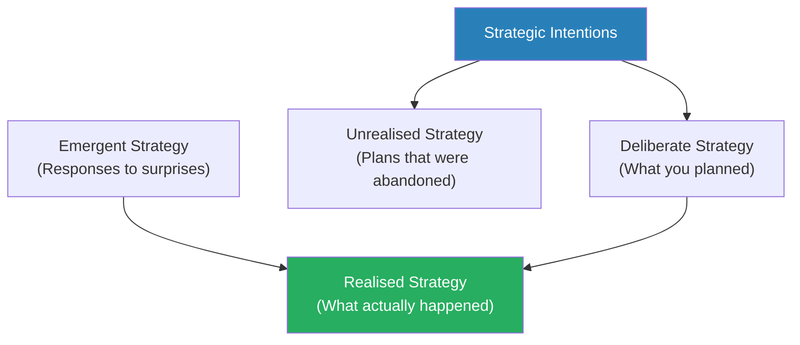

Mintzberg's model shows that realised strategy is never purely what you planned — it always includes elements that emerged from interaction with an unpredictable environment.

---

### Chapter 32: Game Theory and Rational Choice

*The most ambitious attempt to make strategy a science came from economists, mathematicians, and the RAND Corporation — and Freedman shows why it ultimately failed to deliver on its promises.*

- <b style="color: #2980b9">Rational choice theory</b> provided the intellectual foundation for modern strategic analysis:
  - The core assumption: actors have clear preferences, rank their options, and choose the option that maximises their expected utility
  - This framework made strategy calculable — if you knew the actors' preferences and the available options, you could predict their behaviour
  - It was seductively elegant — and Freedman shows how its elegance was also its weakness:
    - Real people do not have stable, consistent preferences
    - Real decisions are made under time pressure, emotional stress, and incomplete information
    - Real actors often do not know what they want until they see what they can get
- <b style="color: #2980b9">Game theory</b>, developed by John von Neumann and Oskar Morgenstern in *Theory of Games and Economic Behavior* (1944):
  - The key innovation: your optimal strategy depends on what the other player does, and their optimal strategy depends on what you do — creating a recursive problem
  - <b style="color: #2980b9">The Prisoner's Dilemma</b> became the canonical game-theory example:
    - Two prisoners, interrogated separately, each face a choice: cooperate with the other (stay silent) or defect (confess)
    - If both cooperate, both get light sentences
    - If both defect, both get heavy sentences
    - If one cooperates and one defects, the defector goes free and the cooperator gets the heaviest sentence
    - Rational self-interest says defect — but if both follow this logic, both end up worse off than if they had cooperated
  - The Prisoner's Dilemma captures a fundamental strategic problem: <b style="color: #27ae60">individual rationality can produce collectively irrational outcomes</b>
  - This has implications far beyond the criminal justice metaphor — it applies to arms races, price wars, environmental degradation, and any situation where short-term self-interest conflicts with long-term collective benefit
  - Freedman connects the Prisoner's Dilemma directly to nuclear strategy:
    - Both superpowers would benefit from disarmament (mutual cooperation)
    - But each fears the other will cheat (defection), so both maintain massive arsenals
    - The result — mutual armament — is worse for both than mutual disarmament, but neither can risk unilateral disarmament
    - This is the structural logic that drove the Cold War arms race
  - In business, the Prisoner's Dilemma appears in every competitive market:
    - Two airlines would both profit more if both maintained high prices (cooperation)
    - But each has an incentive to cut prices (defection) to steal market share
    - The result — a price war — destroys profits for both
    - <b style="color: #e74c3c">Competitive strategy is largely about escaping the Prisoner's Dilemma</b> — through differentiation, tacit coordination, or creating barriers to competitive entry
- <b style="color: #2980b9">Robert Axelrod's tournament</b> (1984) offered a partial resolution:
  - Axelrod ran a computer tournament where strategies competed in iterated Prisoner's Dilemmas
  - The winning strategy was <b style="color: #2980b9">Tit for Tat</b> — cooperate on the first move, then mirror whatever the opponent did last time
  - Tit for Tat succeeded because it was nice (never defected first), retaliatory (punished defection immediately), forgiving (returned to cooperation after the opponent did), and clear (its pattern was easy for opponents to understand)
  - <b style="color: #27ae60">The lesson: in repeated interactions, cooperation can be sustained by reciprocity</b> — but only if the relationship is expected to continue indefinitely
  - One-shot interactions (no future consequences) tend to produce defection
- <b style="color: #2980b9">Herbert Simon's concept of bounded rationality</b> provided the most devastating critique of rational choice:
  - Humans do not optimise — they <b style="color: #27ae60">satisfice</b> (a word Simon coined by combining "satisfy" and "suffice")
  - We search for options until we find one that is "good enough," then we stop
  - This is not irrational — it is rational given the constraints of limited time, limited information, and limited cognitive capacity
  - Implications for strategy:
    - Strategic plans based on the assumption of rational actors will be wrong, because actors are boundedly rational
    - Strategies that work with human cognitive limits (simplicity, rules of thumb, adaptive feedback) will outperform strategies that require superhuman computation
    - The best strategic frameworks are not the most analytically complete but the most usable under real conditions

| Framework | Assumes | Works When | Fails When |
|-----------|---------|-----------|------------|
| Rational choice | Perfect information, stable preferences | Few actors, clear payoffs, repeated interactions | Uncertainty, emotion, time pressure |
| Game theory | Rational opponents, known options | Simple, well-defined competitive situations | Complex, multi-player, evolving situations |
| Systems analysis | Quantifiable variables, known relationships | Technical problems, logistics | Human behaviour, political dynamics |
| Bounded rationality | Limited cognition, satisficing | Describes real behaviour accurately | Does not prescribe optimal solutions |
| Prospect theory | Loss aversion, reference dependence | Explaining decision-making under risk | Prescribing optimal decisions |

Freedman's verdict: rational models are useful as thought experiments but dangerous as guides to action.

- Freedman also discusses <b style="color: #2980b9">Daniel Kahneman and Amos Tversky's prospect theory</b>:
  - People evaluate outcomes relative to a reference point, not in absolute terms
  - **Loss aversion** — losses loom larger than equivalent gains (roughly 2:1)
  - This means that strategists defending a position fight harder than those attacking one — because the defender is trying to avoid a loss, and losses feel worse than gains feel good
  - Implication for strategy: the framing of a strategic choice as "preventing a loss" versus "seeking a gain" changes how decision-makers behave
  - <b style="color: #27ae60">The strategist who can frame the situation so that the opponent perceives retreat as a loss will encounter fierce resistance — but the strategist who offers the opponent a way to frame retreat as a gain can achieve objectives without a fight</b>
  - This connects directly to Schelling's work on nuclear strategy — the art of giving the opponent a way to back down without losing face

> [!example] Kahneman's Taxi Driver Study
> - Kahneman studied New York taxi drivers to understand how people set targets and respond to gains and losses
> - Drivers who had a daily income target would quit early on good days (when fares were plentiful) and work longer on bad days (when fares were scarce)
> - This is the opposite of rational behaviour — they should work more when the hourly rate is high and less when it is low
> - The drivers were satisficing relative to a reference point (their daily target), not optimising their total income
> - The strategic lesson: people anchor to reference points and stop searching when they reach "good enough" — exactly Simon's bounded rationality in action
> **The lesson:** Real strategic actors do not maximise — they satisfice relative to anchors and reference points that may be arbitrary.

---

### Chapter 33: Michael Porter and Competitive Strategy

*The Harvard professor who gave business strategy its most influential framework — and the limitations that subsequent thinkers would spend decades trying to address.*

- <b style="color: #2980b9">Michael Porter's Five Forces</b> (1980) was the first rigorous framework for analysing competitive strategy:
  - Five forces determine an industry's profitability:
    1. Threat of new entrants
    2. Bargaining power of suppliers
    3. Bargaining power of buyers
    4. Threat of substitute products
    5. Rivalry among existing competitors
  - Strategy, for Porter, is about positioning your firm where these forces are most favourable — or reshaping the forces themselves
  - Porter's framework brought the rigour of industrial economics into business strategy — he gave managers a systematic way to analyse their competitive environment
  - The framework's influence was enormous — it became the foundation of strategy courses at every major business school
- Porter's <b style="color: #2980b9">two generic strategies</b>:
  - **Cost leadership** — be the cheapest producer
  - **Differentiation** — offer something unique that commands a premium
  - <b style="color: #e74c3c">Being "stuck in the middle"</b> — neither cheapest nor most differentiated — is the strategic danger zone
  - Companies stuck in the middle face pressure from both low-cost competitors and differentiated ones
  - Porter later added **focus** as a third option — pursuing cost leadership or differentiation within a narrow market segment
- Porter later introduced the concept of the <b style="color: #2980b9">value chain</b>:
  - Every company performs a series of activities to design, produce, market, deliver, and support its products
  - Competitive advantage comes from performing these activities differently or better than competitors
  - The value chain concept connects strategy to operations — strategic positioning must be supported by a consistent set of activities
  - <b style="color: #27ae60">A sustainable competitive advantage comes not from any single activity but from the fit between multiple activities</b> — competitors can copy one activity but struggle to replicate an entire system of interlocking activities
  - This insight is one of Porter's most durable contributions — it explains why some competitive advantages are sustainable while others are quickly eroded
- Porter's concept of <b style="color: #2980b9">strategic trade-offs</b> is among his most important insights:
  - You cannot be everything to everyone — choosing what NOT to do is as important as choosing what to do
  - A company that tries to be both the cheapest and the most differentiated will fail at both
  - Trade-offs exist because different competitive positions require different organisational designs, skills, and cultures
  - A low-cost airline cannot also provide luxury service — the operational systems, staffing models, and cultural expectations conflict
  - <b style="color: #27ae60">Porter argues that the essence of strategy is choosing a set of activities that are different from rivals</b> — not doing the same things better (which he calls "operational effectiveness"), but doing fundamentally different things
  - This distinction between strategy (different position) and operational effectiveness (doing the same things better) is one of Porter's most important contributions
- Porter's later work on <b style="color: #2980b9">the competitive advantage of nations</b> (1990) extended his framework to countries:
  - He argued that national competitiveness is not about cheap labour or natural resources but about the "diamond" of factor conditions, demand conditions, related and supporting industries, and firm strategy and rivalry
  - Vigorous domestic competition makes companies stronger — nations that protect their industries from competition produce weak, uncompetitive firms
  - This insight connects to Schumpeter's creative destruction — competition is the engine of innovation, and shielding companies from competition weakens them
- Freedman's critique of Porter:
  - The framework is essentially static — it analyses the competitive landscape at a point in time but struggles with dynamic, rapidly changing markets
  - Porter assumes industries have clear boundaries — but in the digital age, industry boundaries are increasingly blurred
  - The framework says little about how to create new markets or transform existing ones — it is better at analysing the status quo than imagining alternatives
  - <b style="color: #e74c3c">Porter's greatest blind spot: he assumes rational competitive behaviour, but real competitors are often irrational, emotional, and unpredictable</b>
  - The framework is also better suited to large, established companies than to startups or rapidly evolving industries
  - Porter's emphasis on positioning within existing industries sits uncomfortably alongside the entrepreneurial tradition of creating entirely new industries

> [!example] Porter and the Airline Industry
> - Porter frequently used the airline industry to illustrate his frameworks — it is an industry where all five forces are brutal
> - High capital costs, powerful suppliers (aircraft manufacturers, fuel companies), price-sensitive buyers, easy substitution (trains, cars, video conferencing), and intense rivalry
> - Porter's analysis correctly predicted that most airlines would earn poor returns — but it offered little guidance on how a specific airline could escape those structural forces
> - Southwest Airlines partly escaped by pursuing a focused low-cost strategy — but its success depended on organisational culture, labour relations, and operational innovation that Porter's framework did not capture
> **The lesson:** Structural analysis tells you what forces you face but not how to overcome them — the "how" requires creativity, execution, and adaptation that frameworks cannot supply.

---

### Chapter 34: Disruptive Innovation, Blue Ocean, and Core Competence

*Freedman surveys the major business strategy frameworks that followed Porter — each illuminating a different aspect of competitive dynamics, each claiming more universality than it can deliver.*

- <b style="color: #2980b9">Clayton Christensen's disruptive innovation</b> (1997) explained why successful companies fail:
  - Good companies listen to their best customers, invest in improving their current products, and focus on their most profitable segments
  - This is rational — but it creates a blind spot at the bottom of the market, where cheaper, simpler alternatives emerge
  - <b style="color: #27ae60">Disruptive innovations start as inferior products serving unattractive customers — then improve until they overtake the incumbents</b>
  - Incumbents cannot respond effectively because their organisational structure, profit expectations, and customer relationships are all optimised for the existing business
  - This is the business equivalent of Mao's protracted war — the disruptor starts weak, avoids direct competition, and gradually builds strength in areas the incumbent ignores
  - Christensen distinguished between sustaining innovations (which improve existing products for existing customers) and disruptive innovations (which create new markets or serve overlooked customers)
  - <b style="color: #e74c3c">The dilemma: the very management practices that make companies successful (listening to customers, investing in profitable products) are the ones that make them vulnerable to disruption</b>
  - Freedman connects Christensen to the broader strategic tradition:
    - **Christensen and Mao**: both describe how a weaker force can defeat a stronger one by starting in areas the incumbent ignores and gradually expanding
    - **Christensen and Clausewitz**: both emphasise that the dominant approach to a problem creates its own blind spots — the very success of the current strategy prevents the organisation from seeing threats that do not fit the existing model
    - **Christensen and Darwin**: disruption is the business equivalent of natural selection — the environment changes, and organisations adapted to the old environment are displaced by those adapted to the new one
    - **Christensen and Tolstoy**: both challenge the "great leader" narrative — disruption is driven by structural forces (technology, market dynamics, organisational incentives) more than by individual decisions
  - Freedman also notes criticisms of Christensen's theory:
    - The concept of "disruption" has been stretched far beyond its original meaning — not every competitive challenge is disruption
    - Christensen's historical examples have been disputed — critics argue that some of his case studies do not actually demonstrate the patterns he claims
    - The theory is better at explaining failure retrospectively than at predicting it prospectively — it is easier to identify disruption after it has happened than before
    - <b style="color: #e74c3c">Nevertheless, Christensen's core insight — that good management can lead to strategic failure — remains one of the most important ideas in business strategy</b>

> [!example] Digital Photography vs. Kodak
> - Kodak was the dominant company in photographic film — hugely profitable, with a near-monopoly in consumer photography
> - Kodak actually invented the digital camera in 1975 — but shelved it because digital photographs were far inferior to film
> - Digital photography improved steadily, first in professional niches, then in consumer markets
> - By the time digital quality matched film quality, Kodak's core business was destroyed
> - Kodak went bankrupt in 2012 — not because its leaders were stupid, but because their entire organisation was structured around a technology that was being displaced
> - The tragedy was compounded because Kodak possessed the very technology that would displace it — but could not cannibalise its own highly profitable film business to pursue it
> **The lesson:** Christensen's insight explains why rational management can lead to strategic failure — doing the right thing for existing customers means ignoring the threat from below.

- <b style="color: #2980b9">Blue Ocean Strategy</b> (W. Chan Kim and Renee Mauborgne, 2005) offered a different metaphor:
  - **Red oceans** — existing markets where competitors fight over known demand (bloody, zero-sum competition)
  - **Blue oceans** — new market spaces where competition is irrelevant because you have created new demand
  - The strategy is to make the competition irrelevant by creating a leap in value for both the company and its customers
  - Examples: Cirque du Soleil (neither traditional circus nor traditional theatre), Southwest Airlines (neither full-service airline nor bus), Yellow Tail wine (neither premium nor cheap)
  - Kim and Mauborgne developed the <b style="color: #2980b9">strategy canvas</b> — a visual tool for comparing your offering to competitors across multiple dimensions and identifying opportunities for differentiation
  - Their <b style="color: #2980b9">four actions framework</b>: which factors can you eliminate, reduce, raise, or create to open a blue ocean?
  - Freedman's assessment: the concept is appealing but somewhat tautological — of course it is better to find uncontested market space; the question is how to do it reliably
  - Blue oceans do not stay blue forever — successful innovations attract imitators, and blue oceans eventually turn red
- <b style="color: #2980b9">Core competence</b> (C.K. Prahalad and Gary Hamel, 1990):
  - Rather than defining strategy by market position (Porter), define it by what the organisation does uniquely well
  - A core competence is a bundle of skills and technologies that enables the company to provide a particular benefit to customers
  - Honda's core competence in engines allowed it to compete successfully in cars, motorcycles, lawnmowers, and generators
  - <b style="color: #27ae60">Strategy should be driven by leveraging and extending core competences into new markets</b> — rather than being trapped in existing product categories
  - Freedman notes the danger: "core competence" can become a self-serving narrative that justifies whatever the company is already doing
  - The concept also risks strategic myopia — if you define yourself by your competences, you may miss opportunities that require developing new ones
- <b style="color: #2980b9">Dynamic capabilities</b> (David Teece) extended the resource-based view:
  - In rapidly changing environments, the key capability is the ability to reconfigure resources — not just possessing them
  - A company with great resources but no ability to recombine them for new purposes is strategically brittle
  - Dynamic capabilities include sensing opportunities, seizing them, and transforming the organisation to exploit them
  - This connects directly to Freedman's emphasis on adaptation — the strategically valuable capability is not any specific skill but the ability to learn and change
  - <b style="color: #27ae60">Dynamic capabilities theory is the business equivalent of Boyd's "destroy and create" orientation</b> — the ability to tear apart your existing mental models and build new ones is the decisive competitive advantage

> [!example] Netflix — Dynamic Capabilities in Action (2000-2020)
> - Netflix began as a DVD-by-mail service competing against Blockbuster Video
> - Rather than defending its DVD business, Netflix actively cannibalised it by developing streaming technology — destroying its existing business model to build a new one
> - When streaming competitors emerged (Amazon, Hulu, Disney+), Netflix pivoted again — investing heavily in original content production, transforming from a distribution company into a media company
> - Each pivot required different capabilities: logistics and supply chain for DVDs, technology infrastructure for streaming, and creative talent and content strategy for original production
> - Netflix's success was not in any single strategic position but in its ability to move between positions as the market evolved
> - Blockbuster, by contrast, had the resources and market position to make the same moves — but its organisational structure, franchise relationships, and revenue model prevented it from adapting
> **The lesson:** Dynamic capabilities — the ability to sense opportunities, seize them, and transform the organisation — are more strategically valuable than any specific competitive position. Netflix succeeded not because it was in the right position but because it could move to the right position as circumstances changed.
- <b style="color: #2980b9">Resource-based view</b> (Jay Barney, Birger Wernerfelt):
  - Competitive advantage comes from resources and capabilities that are valuable, rare, difficult to imitate, and non-substitutable (the VRIN framework)
  - This shifts focus from external positioning (Porter) to internal capabilities
  - The resource-based view connects to Clausewitz's emphasis on the quality of the army — what you can do matters as much as where you stand

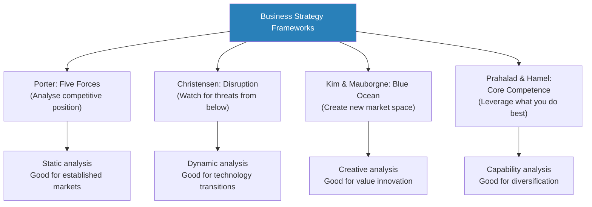

Each framework captures something real but none captures everything — which is Freedman's argument about strategic thinking in general.

---

### Chapter 35: The Rise of the Entrepreneur and Creative Destruction

*Freedman examines how entrepreneurial strategy differs from corporate strategy — and why Schumpeter's century-old insight about creative destruction remains the most powerful description of how capitalism actually works.*

- Corporate strategy assumes an established position that needs defending or extending:
  - Large organisations have resources, market position, and institutional knowledge
  - Their strategic challenge is adaptation — how to change without destroying what works
- Entrepreneurial strategy starts from a position of weakness:
  - Startups have no market position, limited resources, and no institutional track record
  - Their strategic challenge is survival — how to find a viable business model before running out of money
  - <b style="color: #27ae60">This is strategy from below applied to business</b> — the same logic that governs guerrilla warfare and social movements
  - The entrepreneur, like the guerrilla, must avoid direct confrontation with established powers and find niches where they can build strength
- <b style="color: #2980b9">Joseph Schumpeter's concept of creative destruction</b>:
  - The entrepreneur disrupts existing markets by introducing new combinations of products, processes, and business models
  - The entrepreneur is the strategic agent of capitalism — the one who breaks equilibrium and creates new value
  - Creative destruction is not an accident or a failure of the system — it is the system's essential mechanism
  - <b style="color: #e74c3c">Attempts to prevent creative destruction (through regulation, monopoly, or government protection) ultimately weaken the economy by preserving inefficient incumbents</b>
  - Schumpeter distinguished the entrepreneur from the inventor — the entrepreneur's contribution is not the idea itself but the willingness and ability to implement it commercially
- Silicon Valley culture elevated the entrepreneur from economic agent to cultural hero:
  - Combining Schumpeter's economics with a distinctly American mythology of individual genius
  - The startup became the preferred vehicle for strategic innovation — small, fast, willing to take risks that large corporations cannot
  - Venture capital created a financial ecosystem that supported high-risk, high-reward strategies
  - The "fail fast" ethos — rapid iteration and learning from failure — is the entrepreneurial equivalent of Boyd's OODA loop
  - <b style="color: #27ae60">The lean startup methodology</b> (Eric Ries) formalised this approach: build a minimum viable product, measure customer response, learn, and iterate
  - This is the business equivalent of Freedman's adaptive, sequential strategy — each iteration is a strategic move that generates information for the next decision
  - The pivot — changing strategic direction based on what the market tells you — is the entrepreneurial equivalent of Clausewitz's adaptive commander who revises the plan based on battlefield feedback
- Freedman sees important parallels between entrepreneurial strategy and guerrilla warfare:
  - Both start from a position of weakness against established powers
  - Both must avoid direct confrontation — the startup that competes head-on with an established company usually loses
  - Both rely on speed, flexibility, and the exploitation of the incumbent's blind spots
  - Both require a tolerance for ambiguity and failure that large organisations find difficult to sustain
  - <b style="color: #e74c3c">Both can win tactical victories (market share gains, successful products) without achieving lasting strategic success</b> — most startups fail, just as most guerrilla movements are eventually suppressed
  - The survivors succeed not because they had better initial strategies but because they adapted faster and learned from failure more effectively
- The relationship between entrepreneurial strategy and narrative is particularly tight:
  - Venture capitalists invest in stories as much as in products — the founder's ability to tell a compelling narrative about the future is often the decisive factor in funding decisions
  - The narrative must balance vision (where we are going) with credibility (why we can get there)
  - Successful entrepreneurs are expert at reframing: turning limitations into advantages, failures into learning opportunities, and market scepticism into evidence of disruption
  - <b style="color: #27ae60">This is narrative strategy in its purest form — creating the reality you want by telling a story that shapes how others perceive the situation</b>

> [!example] Steve Jobs and the "Reality Distortion Field"
> - Jobs's strategic approach at Apple combined technical vision with narrative mastery
> - He did not merely create products — he created stories about what those products meant
> - The Macintosh was not just a computer; it was a rebellion against IBM's grey conformity
> - The iPod was not just a music player; it was "1,000 songs in your pocket"
> - The iPhone was not just a phone; it was "the internet in your pocket"
> - Each narrative framed the competitive landscape in terms that made Apple's advantages central and competitors' advantages irrelevant
> **The lesson:** Entrepreneurial strategy is as much about narrative as about product — the story shapes the market's perception of what matters.

> [!example] Honda's Entry into the American Motorcycle Market (1960s)
> - Honda entered the American market with small, inexpensive motorcycles — products that Harley-Davidson and other incumbents dismissed as toys
> - Honda did not originally intend to sell to mainstream American consumers — its initial target was Japanese-American communities
> - But American consumers discovered Honda's small bikes and began buying them for recreation — a market that did not previously exist
> - Honda's famous "You meet the nicest people on a Honda" campaign reframed motorcycling from a rebellious, dangerous activity to a wholesome, accessible one
> - Harley-Davidson, focused on its core customers (serious riders), ignored the small-bike market until Honda had built the brand recognition, dealer network, and manufacturing capacity to move upmarket
> - The case demonstrates multiple strategic concepts simultaneously: disruption from below (Christensen), blue ocean creation (Kim & Mauborgne), core competence leverage (Prahalad & Hamel), and narrative strategy (Freedman)
> **The lesson:** Honda's success was not the result of any single strategic framework but the convergence of several — which is why no single framework can fully explain it.

---

### The Strategy Consulting Industry

*Freedman examines how strategy became a product — something that could be sold by consulting firms to corporate clients.*

- The rise of strategy consulting transformed how corporations thought about strategy:
  - <b style="color: #2980b9">McKinsey, BCG, and Bain</b> became the high priests of corporate strategy
  - They brought analytical rigour, competitive intelligence, and frameworks to companies that lacked internal strategic capability
  - The consulting model had a built-in bias toward complexity — simple strategies do not justify large consulting fees
  - <b style="color: #e74c3c">The consulting industry's influence on strategic thinking has been mixed</b>:
    - On the positive side, consulting firms raised the standard of strategic analysis and spread best practices across industries
    - On the negative side, they created a culture of strategic fashion — new frameworks replacing old ones on a regular cycle, not because the old ones were wrong but because clients wanted novelty
    - The "strategy as product" model encouraged the belief that strategy could be outsourced — that external analysts could develop strategies that internal managers would execute
    - Freedman connects this to the Jomini tradition: the consulting industry sells the promise that strategy can be systematised and applied by anyone, regardless of context and judgement

> [!example] BCG and the Experience Curve — Strategy as Science (1960s-1970s)
> - Bruce Henderson, founder of BCG, discovered the experience curve — the observation that unit costs decline by a predictable percentage with each doubling of cumulative production volume
> - Henderson turned this observation into a strategic prescription: gain market share as fast as possible, because market share drives cumulative volume, which drives cost reduction, which drives competitive advantage
> - The prescription was clear, quantifiable, and compelling — exactly the kind of "scientific" strategy that executives craved
> - BCG built its practice around this insight, advising clients to invest aggressively in high-growth markets and harvest or divest low-growth businesses
> - The experience curve worked well in mature manufacturing industries where cost was the primary competitive variable
> - But it was misleading in industries where innovation, quality, or customer relationships mattered more than cost
> - Japanese companies that competed on quality and reliability often beat American companies that competed on cost — the experience curve did not capture this dimension
> - The lesson from the Japanese challenge: a strategic framework built on one competitive variable (cost) will fail when the market values a different variable (quality)
> **The lesson:** The experience curve is a real phenomenon — but turning it into a universal strategic prescription was the Jomini temptation in business dress. Partial truths become dangerous when applied universally.

  - Bruce Henderson, founder of BCG, was one of the most important figures in making strategy a commercial proposition:
    - His experience curve and growth-share matrix gave clients concrete, actionable frameworks
    - But these frameworks worked best in stable, mature industries — and became misleading in dynamic, innovation-driven markets
- <b style="color: #27ae60">Freedman's conclusion about business strategy frameworks</b>:
  - No single framework captures the complexity of competitive dynamics
  - Each framework illuminates one aspect while obscuring others
  - The most effective business strategists draw on multiple frameworks and combine them with contextual judgement
  - The history of business strategy recapitulates the history of military strategy — the search for certainty, the overreach of frameworks, the correction by reality, and the cycle begins again
- <b style="color: #2980b9">The fashion cycle in business strategy</b> mirrors what Freedman sees in military and political strategy:
  - Each decade brings new strategic fashions:
    - 1960s: strategic planning and diversification
    - 1970s: experience curves and portfolio management
    - 1980s: competitive positioning (Porter) and Japanese management
    - 1990s: core competence, reengineering, and the learning organisation
    - 2000s: blue ocean strategy, disruptive innovation, and platform thinking
  - Each fashion captures something real about the strategic environment of its time
  - Each is eventually overextended, oversold, and replaced by the next fashion
  - <b style="color: #e74c3c">The fashion cycle itself is strategically dangerous</b> — managers adopt frameworks because they are fashionable rather than because they are appropriate to the specific situation
  - The consulting industry profits from the fashion cycle because each new fashion creates new demand for consulting services
  - Freedman's parallel to military strategy: just as each generation of military thinkers believed they had found the formula for victory (Jomini, Schlieffen, McNamara), each generation of business thinkers believes they have found the formula for competitive advantage
  - The formula always turns out to be partial — and the partiality is exposed when circumstances change

| Era | Dominant Framework | Core Promise | What It Missed | Replaced By |
|-----|-------------------|--------------|----------------|-------------|
| 1960s | Strategic planning (Ansoff) | Predict and control the future | Unpredictability of markets | Portfolio management |
| 1970s | Portfolio management (BCG) | Allocate resources scientifically | Internal capabilities, culture | Competitive positioning |
| 1980s | Competitive positioning (Porter) | Find a defensible position | Dynamic change, disruption | Core competence |
| 1990s | Core competence (Prahalad & Hamel) | Leverage what you do best | Market shifts, customer needs | Innovation strategy |
| 2000s | Blue ocean / disruption | Create new markets | Execution, sustainability | Adaptive strategy |
| 2010s | Lean / agile | Iterate and adapt rapidly | Institutional constraints, scale | (Still evolving) |

This table captures the fashion cycle in business strategy — each framework illuminates one aspect of competitive dynamics while creating a blind spot that the next framework addresses.

> [!example] Enron and the Illusion of Strategy (2001)
> - Enron was celebrated by management gurus and business magazines as one of the most innovative and strategically brilliant companies in America
> - Its strategy of "asset-light" energy trading was praised as a new model of business
> - McKinsey consultants were deeply embedded in Enron's operations and strategy
> - When Enron collapsed in 2001 (revealed as a massive fraud), the entire strategic narrative was exposed as hollow
> - The company's "strategy" had been a narrative construction — a story that justified increasingly reckless and fraudulent behaviour
> - The consultants, analysts, and journalists who had celebrated Enron's strategy were embarrassed — but the pattern would repeat with other companies
> **The lesson:** Strategic narratives can become substitutes for strategic substance. When the narrative is compelling enough, it can prevent critical examination of the underlying reality — until reality asserts itself catastrophically.

---

### Chapter 36: Systems Thinking and Organisational Strategy

*Freedman examines how systems thinking, cybernetics, and organisational theory tried to provide a unified framework for strategy — and how each added genuine insight while falling short of the comprehensive theory it promised.*

- <b style="color: #2980b9">Systems thinking</b> entered strategy through multiple channels:
  - Cybernetics (Norbert Wiener) — the study of feedback loops, control, and communication in machines and living organisms
  - Operations research — the mathematical optimisation of military logistics, later applied to business
  - Organisational theory — understanding how organisations behave as complex systems
  - The common thread: all these approaches treated their subjects as interconnected systems rather than isolated components
- Key systems concepts that influenced strategic thinking:
  - **Feedback loops** — actions produce consequences that modify the original conditions, creating cycles of reinforcement or correction
    - Positive feedback: success breeds success (virtuous or vicious cycles)
    - Negative feedback: deviations are corrected, maintaining stability
    - Strategic implication: interventions in complex systems often produce unexpected consequences because of feedback effects
    - The arms race is a classic positive feedback loop — each side's weapons build-up provokes further build-up by the other side
  - **Emergence** — complex patterns arise from simple interactions at lower levels
    - No one plans a traffic jam; it emerges from thousands of individual driving decisions
    - Similarly, market outcomes, organisational cultures, and strategic positions often emerge rather than being designed
    - <b style="color: #27ae60">The implication for strategy: you cannot fully control outcomes in complex systems; you can only influence the conditions from which outcomes emerge</b>
  - **Path dependence** — early decisions constrain later options, sometimes locking in inferior outcomes
    - The QWERTY keyboard, VHS over Betamax, Windows over MacOS — sometimes the first-mover or lucky early leader captures the market regardless of product quality
    - <b style="color: #27ae60">Strategic implication: the timing of strategic moves matters as much as their quality</b>
    - Once a path is established, switching costs make it increasingly difficult to change direction — even if a better alternative exists
  - Path dependence has direct strategic implications:
    - First-mover advantage is real but not absolute — the first mover creates the path, but later entrants sometimes find better paths
    - Strategic commitments (factory investments, technology choices, alliance partnerships) create path dependence that constrains future strategy
    - <b style="color: #e74c3c">The danger of path dependence: past successes lock in approaches that may become liabilities when the environment changes</b>
    - This connects to Christensen's innovator's dilemma — successful companies are path-dependent on their existing business models, making it difficult to adopt disruptive technologies
  - **Non-linearity** — small causes can produce large effects, and vice versa
    - This makes prediction extremely difficult — the system may be stable for long periods and then change rapidly and unpredictably
    - Strategic implication: the search for the "decisive variable" is often futile, because outcomes depend on the interaction of many variables rather than any single one
- <b style="color: #2980b9">Peter Senge's "learning organisation"</b> (1990) applied systems thinking to management:
  - The Fifth Discipline argued that organisations must become capable of continuous learning
  - The "fifth discipline" is systems thinking itself — the ability to see interconnections, feedback loops, and dynamic complexity
  - Senge's five disciplines: personal mastery, mental models, shared vision, team learning, and systems thinking
  - <b style="color: #e74c3c">Freedman's critique</b>: the learning organisation is more aspirational than operational — it tells you what you should be but not how to get there
  - The concept assumes that organisations can overcome the political, psychological, and structural barriers to learning — which is precisely the challenge that makes strategy difficult in the first place
  - Nevertheless, the idea that organisations must learn and adapt — rather than simply plan and execute — is consistent with Freedman's broader argument about adaptive strategy
- <b style="color: #2980b9">Karl Weick's</b> work on sensemaking added another dimension to organisational strategy:
  - Weick argued that organisations do not simply process information — they create meaning
  - Sensemaking is the process by which people in organisations interpret ambiguous events and decide what to do
  - In crisis situations, the quality of sensemaking — not the quality of planning — determines outcomes
  - <b style="color: #27ae60">Weick's famous insight: organisations often act first and make sense of their actions afterward</b> — the sequence is act-sense-respond, not plan-execute-evaluate
  - This reversal of the conventional strategic sequence connects to Freedman's argument that strategy is often emergent rather than deliberate — organisations discover their strategy through action, not through analysis
  - The practical implication: leaders should encourage experimentation and rapid feedback rather than exhaustive analysis before action
- <b style="color: #2980b9">Chris Argyris</b> and the concept of <b style="color: #2980b9">defensive routines</b>:
  - Organisations develop routines that protect them from embarrassment and threat — but these routines also prevent learning
  - Managers engage in "skilled incompetence" — they are skilled at avoiding the conversations and confrontations that would produce genuine learning
  - <b style="color: #e74c3c">Defensive routines are the organisational equivalent of strategic self-deception</b> — the organisation systematically prevents itself from seeing uncomfortable truths
  - Argyris distinguished between "single-loop learning" (adjusting actions to achieve existing goals) and "double-loop learning" (questioning and changing the goals themselves)
  - Most organisations manage single-loop learning well but resist double-loop learning — they can optimise within an existing strategy but cannot question whether the strategy itself is correct
  - This connects directly to Christensen's innovator's dilemma — incumbents can improve their current products (single-loop) but cannot adopt disruptive technologies that require fundamentally different approaches (double-loop)

> [!example] The Beer Game — Systems Thinking in Action
> - A simulation game developed at MIT's Sloan School of Management
> - Players take roles in a beer supply chain: retailer, wholesaler, distributor, and brewer
> - Each player makes independent ordering decisions based on local information
> - Despite each player acting rationally, the system consistently produces wild oscillations in orders and inventory — the "bullwhip effect"
> - Players blame each other for the chaos, but the problem is structural — it emerges from the system's design, not from individual decisions
> - The game demonstrates that rational individual decisions can produce irrational system outcomes — exactly Freedman's argument about strategy in general
> **The lesson:** Strategy in complex systems requires understanding the system's structure, not just optimising individual decisions.

---

### Chapter 37: Strategy as Narrative

*Freedman's most original contribution — the argument that strategy is fundamentally about telling compelling stories, not calculating optimal moves.*

- Freedman argues that <b style="color: #2980b9">narrative</b> is the most underappreciated element of strategy:
  - Strategies do not exist as abstract calculations in leaders' heads — they exist as stories that leaders tell themselves and others about what is happening, why it matters, and what should be done
  - <b style="color: #27ae60">The story you tell about the situation shapes what options you can see</b> — a different narrative reveals different possibilities
  - This is why reframing a situation is often more powerful than adding resources or changing tactics
  - Narrative is not a decoration applied to strategy — it is the medium in which strategy exists
- **Scripts** — Freedman borrows this concept from cognitive psychology:
  - A <b style="color: #2980b9">script</b> is a mental template for how a situation will unfold — based on past experience, cultural assumptions, and professional training
  - Strategists do not analyse situations from scratch; they pattern-match against scripts they already carry
  - Scripts are both essential (they allow rapid sense-making) and dangerous (they filter out information that does not fit the expected pattern)
  - <b style="color: #e74c3c">Strategic failure often occurs when leaders apply the wrong script to a situation</b> — interpreting a novel situation through the lens of a familiar but inappropriate historical analogy
  - The most dangerous scripts are the ones that the strategist does not know they are using — unconscious assumptions about how the world works that shape perception without being examined
- The power of narrative in different strategic domains:
  - **Military narrative** — "the Munich analogy" vs. "the quagmire analogy" shaped American strategy in every war from Korea to Iraq
    - "Munich" says: appeasement invites aggression; stand firm early or pay later
    - "Quagmire" says: intervention leads to entanglement; stay out or sink deeper
    - The choice of analogy is itself a strategic decision — it determines which options seem wise and which seem foolish
  - **Political narrative** — social movements succeed when they control the moral story (civil rights as "completing the American promise")
    - The narrative must connect to values the audience already holds — it does not create values from scratch but activates existing ones
    - The most effective political narratives frame the movement's goals as a fulfilment of existing commitments, not a departure from them
  - **Business narrative** — corporate strategy is not just a plan but a story about identity, competition, and direction
    - Companies that can tell a compelling story about where they are going attract better talent, more investment, and more customer loyalty
    - The narrative is not separate from the strategy — it IS the strategy as experienced by stakeholders

> [!example] Vietnam as "Munich" vs. Vietnam as "Quagmire"
> - American leaders in the 1960s interpreted Vietnam through the "Munich script" — the lesson of the 1938 Munich Agreement was that appeasing aggressors leads to greater aggression, so you must stand firm early
> - This script made withdrawal seem like appeasement and escalation seem like resolve
> - Critics applied a different script — the "quagmire script" — arguing that Vietnam was a civil war in which American intervention would only sink deeper into an unwinnable conflict
> - The two scripts led to diametrically opposite strategic conclusions from the same set of facts
> - The debate was not really about Vietnam — it was about which historical analogy should govern the interpretation
> **The lesson:** Strategic arguments are often arguments about narratives — which story you tell about the situation determines what actions seem logical.

- Freedman connects narrative strategy to business:
  - Corporate strategy is not just a plan — it is a story the company tells about itself:
    - Who are we? (identity)
    - What is the competitive landscape? (interpretation)
    - Where are we going? (direction)
    - Why should you follow me? (leadership legitimacy)
  - <b style="color: #27ae60">The most successful leaders are often the best storytellers</b> — not because they are manipulative, but because compelling narratives align effort, attract talent, and maintain commitment through difficulties
  - Steve Jobs was arguably more a narrative strategist than a technical strategist — his genius was framing Apple's products as instruments of individual creativity and rebellion against conformity

> [!example] The Iraq War Narrative (2003)
> - The Bush administration constructed a strategic narrative: Iraq possessed weapons of mass destruction, Saddam Hussein was connected to terrorism, and regime change would trigger democratic transformation across the Middle East
> - This narrative determined the strategy — a quick military victory followed by a grateful population embracing democracy
> - When the narrative proved wrong (no WMDs, no terrorism connection, no democratic domino effect), the strategy collapsed
> - The problem was not bad intelligence alone — it was that the narrative had become self-reinforcing, filtering out information that contradicted it
> - Dissenting voices existed within the intelligence community and State Department, but the dominant narrative suppressed them
> **The lesson:** When the strategic narrative is wrong, every decision made within that narrative will be wrong too — no matter how well it is executed.

> [!tip] Core Insight
> Strategy is not a calculation you perform once and execute mechanically. It is an evolving narrative that must be revised as circumstances change — and the strategist who controls the narrative controls the terms of the conflict.

---

## Part Five: Freedman's Synthesis — The Nature of Strategy

### Strategy as Sequential Decision-Making

*In his conclusion, Freedman pulls together the threads of military, political, and business strategy into a unified understanding of what strategy is and how it works.*

- Freedman's definition of strategy: <b style="color: #27ae60">strategy is the art of creating power — of getting more out of a situation than the starting balance of power would suggest</b>
- His key conclusions after surveying centuries of strategic thought:
  - **Strategy is not a plan** — it is a series of decisions, each informed by the results of the previous one
  - **The best strategists are adaptive** — they hold their goals firmly but their methods loosely
  - **Uncertainty is not a problem to be solved but a condition to be navigated** — strategies that try to eliminate uncertainty (through prediction, intelligence, or mathematical models) will always be disappointed
  - **Narrative matters as much as analysis** — the story you tell about the situation shapes what options you can see and what actions seem legitimate
  - **Strategy from below and strategy from above follow the same logic** — whether you are a general, a revolutionary, or a CEO, the fundamental challenge is the same: how to act effectively when you cannot control what the other side does
  - **Coalitions are the secret of power** — no actor has enough power alone; building and maintaining alliances is the most important strategic skill
  - **Moral considerations are strategically relevant** — strategies that violate widely held moral norms generate resistance that can overwhelm tactical superiority
  - **Every framework is partial** — no single theory, model, or approach captures the full complexity of strategic situations

> [!abstract] Freedman's Principles of Strategy
> 1. Strategy starts with a position of power that is less than ideal — if you already have everything you need, you do not need strategy
> 2. The opponent has strategies too — your plan will be met by their counter-plan
> 3. Plans rarely survive contact with reality — adaptability matters more than the quality of the initial plan
> 4. Each move changes the situation — strategy is sequential, not one-shot
> 5. Narrative shapes perception — how you frame the conflict determines what options are visible
> 6. Coalitions are fragile — maintaining alliances is as strategic as fighting opponents
> 7. The long game usually beats the short game — patience and endurance are underrated strategic virtues

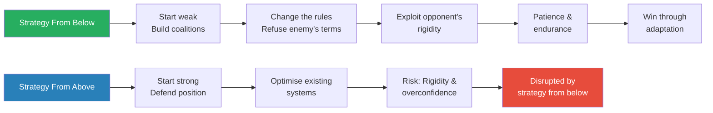

The irony of strategic history: strategy from above (the powerful defending their position) consistently underestimates strategy from below (the weak challenging the status quo) — because the powerful are optimised for the current game, not the game the challenger is trying to play.

---

### The Cycle of Strategic Thought

*Freedman identifies a recurring pattern across all three domains — military, political, and business — that constitutes the metanarrative of the entire book.*

- The recurring pattern across all three domains:
  - A new strategic challenge emerges (nuclear weapons, guerrilla warfare, digital disruption)
  - Thinkers develop frameworks that promise to solve the challenge (game theory, counter-insurgency doctrine, Five Forces)
  - The frameworks capture something real but overreach — claiming more certainty and applicability than they can deliver
  - Reality exposes the limitations, and the cycle begins again
  - <b style="color: #e74c3c">The fundamental error is always the same: mistaking a partial insight for a complete solution</b>
- This cycle operates at multiple levels:
  - Within military strategy: the oscillation between offence and defence, between decisive battle and attrition, between technology-driven and human-centred approaches
  - Within political strategy: the oscillation between revolution and reform, between organisation and spontaneity, between violence and nonviolence
  - Within business strategy: the oscillation between planning and emergence, between positioning and capability, between exploitation and exploration
  - <b style="color: #27ae60">The pattern is fractal — it repeats at every level of strategic thought</b>, from the grand sweep of centuries to the quarterly planning cycle of a corporation
- The reason the cycle never stops is that each new framework addresses a real problem that the previous framework created:
  - The strategy of annihilation (Napoleon) creates the problem of attrition → the indirect approach (Liddell Hart) addresses it
  - Strategic planning (Ansoff, BCG) creates the problem of rigidity → emergent strategy (Mintzberg) addresses it
  - Rational choice (von Neumann, Nash) creates the problem of unrealistic assumptions → bounded rationality (Simon, Kahneman) addresses it
  - But each new framework creates its own blind spots, which the next generation must address
  - <b style="color: #e74c3c">The cycle cannot be broken because every simplification of reality creates both insight and blindness</b>
  - Freedman's response to this cycle is not despair but intellectual humility — the strategist who understands the cycle can draw on multiple frameworks without being enslaved by any of them

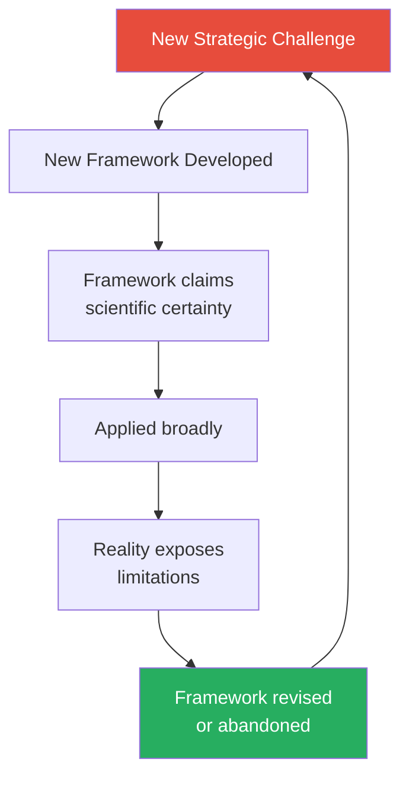

This cycle — challenge, framework, overreach, correction — is the metanarrative of Freedman's entire book.

---

### The Limits of Strategic Thinking

*Freedman does not end with a prescription — he ends with a warning about the limits of his own subject.*

- Strategy cannot guarantee success:
  - The world is too complex, opponents are too unpredictable, and chance is too powerful for any strategic framework to deliver reliable results
  - <b style="color: #e74c3c">The most dangerous strategists are those who believe their frameworks have eliminated uncertainty</b>
  - History is full of brilliant strategists who failed because circumstances changed in ways they could not anticipate
- But strategy is not useless — it is necessary:
  - Without strategic thinking, actors are at the mercy of events — reactive rather than proactive
  - <b style="color: #27ae60">The value of strategy is not prediction but preparation</b> — developing the capacity to respond effectively to whatever happens
  - Good strategists do not predict the future; they prepare for multiple futures
  - The process of strategic thinking — examining assumptions, considering alternatives, anticipating responses — is valuable even when (especially when) the specific plan proves wrong
- The intellectual humility that Freedman advocates:
  - No single framework captures the full complexity of strategic situations
  - Military, political, and business strategy each have insights the others lack — cross-pollination is more valuable than specialisation
  - The history of strategy teaches that every "revolution" in strategic thinking eventually reveals its limitations
  - The wisest approach is to draw on multiple traditions, remain sceptical of grand theories, and maintain the capacity to adapt
  - <b style="color: #27ae60">Freedman's ultimate lesson: the best strategy is the capacity to learn from what happens and adjust accordingly</b> — not any specific plan, framework, or theory
- Freedman's concept of <b style="color: #2980b9">strategy as a practical art</b>:
  - Strategy is not a science (it cannot produce reliable predictions) and not a pure art (it is not merely self-expression)
  - It is a practical art — like medicine, architecture, or navigation — that combines theoretical knowledge with contextual judgement
  - The strategic practitioner draws on theory, history, and frameworks, but ultimately must exercise judgement about the specific situation
  - No amount of theoretical knowledge can substitute for the ability to read a specific situation and adapt
  - <b style="color: #27ae60">This is why Freedman's history is practical, not merely academic</b> — understanding where strategic ideas came from and why they failed helps the practitioner avoid repeating the same errors
  - The strategic practitioner who knows the history of strategic thought has a wider repertoire of mental models to draw on — and a better sense of when each model applies and when it does not

> [!example] The Iraq War as Strategic Case Study (2003-2011)
> - The Iraq War illustrates virtually every theme in Freedman's book simultaneously:
> - **Narrative failure** — the WMD narrative proved false, destroying the strategic rationale for the war
> - **The credibility trap** — having invaded, America could not easily withdraw without appearing to admit defeat
> - **Counter-insurgency dilemma** — the surge (2007) produced tactical improvement but the political conditions for lasting success were absent
> - **Coalition management** — the "coalition of the willing" was largely cosmetic; the real coalition challenge was managing Iraqi factions
> - **Clausewitz's trinity** — popular support for the war eroded at home, military strategy was disconnected from political objectives, and the political purpose remained unclear
> - **Mao's strategic framework** — the Iraqi insurgency followed a classic pattern of guerrilla warfare, exploiting American conventional superiority's inability to achieve political objectives
> - Freedman, who served on the Chilcot Inquiry into Britain's role, had direct knowledge of how strategic decisions were made — and botched
> **The lesson:** Iraq demonstrates Freedman's central argument: strategy that ignores political context, relies on flawed narratives, and assumes decisive military victory will translate into political success is doomed to fail.

---

## The Intellectual Lineage of Strategic Thinking

*A map of how the major thinkers in Freedman's account relate to and build upon each other.*

| Era | Military | Political | Business |
|-----|----------|-----------|----------|
| Ancient | Sun Tzu, Thucydides | Biblical narratives | — |
| Renaissance | — | Machiavelli | — |
| 18th-19th Century | Clausewitz, Jomini, Moltke | Marx, Engels, Herzen | — |
| Early 20th Century | Liddell Hart, Fuller | Lenin, Luxemburg, Gramsci | Taylor, Sloan |
| Mid 20th Century | Boyd, Mao, Galula | Gandhi, King, Alinsky | Drucker, Chandler, Ansoff |
| Late 20th Century | Petraeus | Feminist movements | Porter, Christensen, Mintzberg |
| 21st Century | Network warfare | Social media movements | Kim & Mauborgne, Senge |

Freedman's project is to show that these three streams — which rarely acknowledge each other — are all working on the same fundamental problem.

- Freedman notes that each era's strategic thinkers tend to be unaware of — or dismissive of — thinkers in other domains:
  - Military strategists rarely read Marx or Gramsci — yet political insurgencies are among the most common forms of warfare
  - Business strategists rarely read Clausewitz — yet his concepts of friction, fog, and the remarkable trinity apply directly to competitive dynamics
  - Political strategists rarely study counter-insurgency doctrine — yet the techniques of population-centric warfare have direct analogues in grassroots political organising
  - <b style="color: #27ae60">Freedman's most provocative claim is that this mutual ignorance is itself a strategic liability</b> — the strategist who draws on all three traditions has a richer repertoire of mental models than the specialist who knows only one
- The table below shows how the same strategic challenge manifests across domains:

| Strategic Challenge | Military | Political | Business |
|-------------------|----------|-----------|----------|
| How to act when weaker | Guerrilla warfare, indirect approach | Nonviolent resistance, community organising | Disruption, niche strategy |
| How to maintain control when stronger | Counter-insurgency, alliance management | Cultural hegemony, institutional reform | Incumbent advantage, barriers to entry |
| How to deal with uncertainty | Clausewitz's friction, Boyd's OODA | Coalition flexibility, adaptable messaging | Emergent strategy, pivoting |
| How to build coalitions | Allied command structures | Political alliances, social movement coalitions | Joint ventures, strategic partnerships |
| How to control the narrative | Propaganda, psychological operations | Media strategy, framing | Branding, corporate storytelling |

The universality of these challenges is Freedman's central insight — strategy is strategy, regardless of the domain.

- This cross-domain perspective is the book's most practically valuable contribution:
  - A military officer who understands Christensen's disruption theory will be better prepared for asymmetric threats
  - A business executive who understands Clausewitz's friction will be less surprised when plans break down
  - A political activist who understands Boyd's OODA loop will be more effective at maintaining initiative
  - <b style="color: #27ae60">The strategist who can think across domains has a decisive advantage over the specialist trapped within one</b>

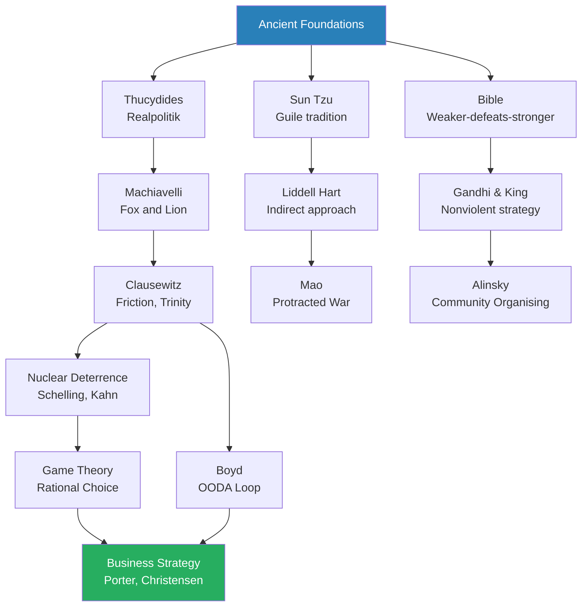

This diagram traces the intellectual genealogy that Freedman constructs — showing how military, political, and business strategy share common ancestors and parallel evolution.

---

### Cross-Domain Migration of Strategic Ideas

*One of Freedman's most valuable contributions is tracing how strategic ideas migrate between domains — often with unintended consequences.*

- Strategic concepts rarely stay in the domain where they originated:
  - **Military → Business**: the entire vocabulary of business strategy (campaigns, competitive intelligence, market conquest, strategic retreat, flanking manoeuvres) comes from military language
    - The indirect approach (Liddell Hart) became niche strategy and market segmentation
    - Auftragstaktik (Moltke) became empowerment and decentralised decision-making
    - The OODA loop (Boyd) became agile methodology and the startup pivot
  - **Business → Military**: systems analysis (RAND) moved from business operations research to nuclear strategy, with problematic results
    - McNamara brought management metrics from Ford Motor Company to the Pentagon — producing the body count strategy in Vietnam
    - <b style="color: #e74c3c">The failure of "management by numbers" in Vietnam is a cautionary tale about cross-domain borrowing</b>
  - **Political → Business**: Alinsky's community organising influenced customer engagement and grassroots marketing
    - Gramsci's cultural hegemony influenced branding and corporate culture — the idea that you must win hearts and minds, not just market share
  - **Business → Political**: corporate lobbying and political campaign strategy borrowed heavily from marketing, advertising, and data analytics
- <b style="color: #27ae60">Freedman's key insight about cross-domain migration: ideas that work in one domain often fail in another because the underlying conditions are different</b>
  - Military strategy assumes enemies who are trying to kill you — business strategy assumes competitors who are trying to outsell you
  - The level of uncertainty, the consequences of failure, and the role of violence are fundamentally different
  - Metaphors illuminate but also distort — calling a business challenge a "war" implies that the goal is to destroy the competitor, which is usually counterproductive
  - The most successful cross-domain borrowings are those that adapt the concept to the new context rather than importing it wholesale

---

## Key Themes Across the Book

### Force vs. Guile

- This is the oldest tension in strategic thought — present in the Bible (David vs. Goliath), Greek myth (Achilles vs. Odysseus), and every subsequent era
- The question is never fully resolved because the answer depends on circumstances:
  - When you have overwhelming strength, force can deliver quick results — but it often creates resentment and resistance
  - When you are weaker, guile is essential — but cleverness without real power can become self-deception
  - <b style="color: #27ae60">The most effective strategies usually combine both</b> — using guile to create the conditions for decisive force, or using force to create space for manoeuvre
- The guile tradition has a consistent set of characteristics across all three domains:
  - Emphasises intelligence and information over brute strength
  - Favours the indirect approach — attack where the opponent is weak, not where they are strong
  - Values patience, timing, and the exploitation of the opponent's mistakes
  - Risks: overestimating your own cleverness, underestimating the opponent's resilience, confusing complexity with sophistication
- The force tradition also has consistent characteristics:
  - Emphasises mass, resources, and overwhelming power
  - Favours the direct approach — concentrate forces at the decisive point and strike
  - Values speed, shock, and the destruction of the opponent's capacity
  - Risks: tunnel vision, attrition, generating resistance through excessive violence
- Freedman argues that the tension between force and guile is not a problem to be solved but a condition to be managed:
  - Different situations call for different mixes of force and guile
  - The strategist must be able to move between modes — sometimes within the same campaign
  - <b style="color: #27ae60">The key strategic skill is diagnosing which mode a situation requires</b> — and this cannot be reduced to rules
  - Machiavelli's fox-and-lion metaphor remains the best articulation: the effective strategist must be both, and must know when to be which
  - This diagnostic ability is what Clausewitz called military genius, what Machiavelli called virtù, and what modern leadership theory calls situational awareness

> [!example] The Force-Guile Spectrum in the Vietnam War
> - America's strategy in Vietnam illustrates how the force-guile tension can become paralysing:
>   - The military favoured force — overwhelming firepower, body counts, search and destroy operations
>   - The CIA favoured guile — the Phoenix Program, political action, intelligence operations targeting the Viet Cong infrastructure
>   - Counter-insurgency advocates favoured a combination — protecting the population while building governance
>   - The peace movement argued that the entire enterprise was misconceived and should be abandoned
> - Each approach had its advocates, each had some evidence in its favour, and none was decisive
> - The result was strategic incoherence — different agencies pursued different strategies simultaneously, often working at cross-purposes
> - The North Vietnamese, by contrast, maintained strategic coherence throughout — their goal (national unification) was clear, their method (protracted war) was consistent, and their leadership was unified
> - The contrast between American strategic fragmentation and Vietnamese strategic coherence is one of the most instructive case studies in Freedman's book
> **The lesson:** Strategic coherence — aligning force and guile under a unified purpose — is more important than the specific mix of force and guile employed. An incoherent strategy with superior resources will lose to a coherent strategy with inferior resources.

---

### The Strong vs. the Weak — Asymmetric Strategy

- One of Freedman's most important themes is the strategic logic of asymmetry — what happens when the weak face the strong:
  - The strong can afford to be direct — they have resources, position, and institutional support
  - The weak must be indirect — they cannot win on the existing terms, so they must change the terms
  - <b style="color: #2980b9">The strategic options of the weak</b> follow a consistent pattern across all three domains:
    - **Avoid the enemy's strength** — do not fight where they are powerful (Sun Tzu, Liddell Hart, guerrilla warfare)
    - **Change the rules** — redefine what constitutes victory (Gandhi, King, startups entering new markets)
    - **Exploit rigidity** — the strong are often committed to systems, procedures, and assumptions that prevent adaptation (Mao, Christensen)
    - **Use time as a weapon** — patience and endurance exhaust the strong, whose resources are finite and whose public support is conditional (Vietnam, protracted war)
    - **Attack alliances** — the strong often depend on coalitions; splitting those coalitions is more effective than direct confrontation (Satan's subversion, divide-and-conquer)
  - <b style="color: #27ae60">Freedman argues that the strategic logic of the weak has been more creative and innovative than the strategic logic of the strong</b>
  - This is because the weak must innovate or die — the strong can afford to continue with existing approaches
  - The history of strategy is disproportionately the history of the weak developing new approaches to overcome the strong
  - This is partly because the strong rarely need to be creative — existing approaches work for them
  - And partly because the weak face extinction if they do not innovate — necessity drives invention
  - <b style="color: #2980b9">Freedman identifies a pattern he calls "the innovator's advantage of weakness"</b>:
    - The Israelites developed guerrilla tactics because they could not match the Philistines' conventional army
    - The Communists developed protracted war because they could not match the Nationalists' military resources
    - The civil rights movement developed nonviolent resistance because African Americans could not match the white power structure's force
    - Startups develop disruptive innovations because they cannot match incumbents' resources
    - In each case, the strategic innovation was born of necessity — the weak had to find a new way or perish

> [!example] The Asymmetric Pattern Across Domains
> - Military: Vietnamese guerrillas against American conventional forces — they could not match American firepower, so they fought a political war, targeting American domestic opinion rather than American military capability
> - Political: Civil rights movement against segregation — they could not defeat the white power structure by force, so they attacked its moral legitimacy through nonviolent resistance
> - Business: Honda against Harley-Davidson — Honda could not compete against Harley in the heavyweight motorcycle market, so it created a new market for small, affordable bikes that Harley did not serve
> - In each case, the weak party succeeded by changing the game rather than playing the existing game better
> **The lesson:** The weak win not by becoming strong but by making the strong's strength irrelevant.

---

### Plans vs. Adaptation

- Every strategist faces the tension between planning and adapting:
  - Plans provide direction, coordination, and a framework for decision-making
  - But plans assume a degree of predictability that rarely exists
  - <b style="color: #2980b9">Helmuth von Moltke's famous dictum: "No plan survives contact with the enemy"</b>
  - The best approach, Freedman argues, is to plan for the initial move, observe the results, and then revise — strategy as a conversation with reality, not a monologue at reality
- This applies equally to business:
  - Corporate five-year plans are exercises in fiction — the world five years from now will not look like what anyone predicts today
  - <b style="color: #27ae60">The strategic value of planning is not the plan itself but the thinking that goes into making it</b> — the process forces you to consider threats, opportunities, and alternatives
  - As Eisenhower said: "Plans are useless, but planning is indispensable"
- Freedman's resolution of the tension:
  - The best strategies are **deliberately emergent** — they combine clear directional intent with flexibility in execution
  - The strategist sets a direction but remains willing to change course as new information arrives
  - This requires a particular kind of leader — one who can hold firm on goals while being flexible on methods
  - It also requires an organisation that can adapt — one with fast feedback loops, decentralised decision-making, and a culture that tolerates course changes

> [!example] Eisenhower's D-Day Decision — Planning Meets Uncertainty (1944)
> - The Allied invasion of Normandy was the most extensively planned military operation in history
> - Years of preparation covered every conceivable detail: beach gradients, tide tables, German defensive positions, deception operations, air support schedules
> - On the morning of June 5, 1944, the weather was terrible — storms threatened to wreck the invasion fleet
> - Eisenhower's meteorologist predicted a brief window of acceptable weather on June 6
> - Eisenhower had to decide: launch in uncertain weather, or delay — risking that the Germans would discover the invasion plans
> - He chose to go — a decision that no plan, no analysis, and no framework could have made for him
> - The weather held just long enough for the landings to succeed, but conditions were far from ideal — landing craft were swamped, paratroopers were scattered, and units landed at the wrong beaches
> - The invasion succeeded not because the plan was executed perfectly but because the plan was flexible enough to accommodate massive deviations
> **The lesson:** Eisenhower embodied the ideal strategic leader: he planned meticulously but understood that the plan was a starting point, not a script. His most important decision — the one that mattered most — was the one no plan could have anticipated.

- Freedman identifies several <b style="color: #2980b9">practical principles</b> for managing the tension between planning and adaptation:
  - **Plan for options, not outcomes** — develop multiple contingency plans rather than one perfect plan
  - **Build in reserves** — keep resources uncommitted so they can be deployed wherever the situation demands
  - **Decentralise execution** — give subordinates the authority to adapt when they encounter unexpected situations (Moltke's Auftragstaktik)
  - **Create fast feedback loops** — the faster you learn what is actually happening, the faster you can adapt
  - **Accept imperfection** — a good plan executed flexibly will outperform a perfect plan executed rigidly
  - **Distinguish between strategic direction and tactical method** — hold the direction firmly but change the method as needed
  - <b style="color: #27ae60">These principles apply equally to military campaigns, social movements, and corporate strategy</b> — they are the operational implications of Freedman's core argument about adaptive, sequential strategy

---

### Strategy and Morality

- Freedman resists the temptation to separate strategy from morality entirely:
  - Machiavelli's amoral realism is a recurring temptation — the belief that strategic effectiveness requires moral flexibility
  - But Freedman shows that moral considerations are often strategically relevant:
    - Gandhi and King demonstrated that moral authority can be a decisive strategic resource
    - Unjust strategies often fail in the long run because they generate resistance, undermine legitimacy, and make coalition-building impossible
  - <b style="color: #e74c3c">The purely "rational" strategist who ignores moral considerations is not being more realistic — they are ignoring a real force that shapes outcomes</b>
- The relationship between strategy and morality is not simple:
  - Moral strategies sometimes fail (the Melian Dialogue — the Melians were morally right but strategically crushed)
  - Immoral strategies sometimes succeed (at least in the short term)
  - But over the long term, strategies that align with widely held moral norms tend to be more sustainable because they attract allies, reduce resistance, and build legitimacy
  - <b style="color: #27ae60">Legitimacy is a strategic resource</b> — and strategies that destroy legitimacy are consuming their own fuel
  - Freedman's treatment of strategy and morality avoids both extremes:
    - He does not claim that moral strategies always win — the Melians, the Communards, and countless other just causes have been crushed by superior force
    - He does not claim that morality is irrelevant — Gandhi, King, and the entire tradition of nonviolent resistance demonstrate that moral authority can be strategically decisive
    - His position is that <b style="color: #27ae60">morality is a variable in the strategic equation, not separate from it</b> — a factor that sometimes matters enormously and sometimes matters little, depending on the circumstances
    - The strategist who ignores morality is as foolish as the strategist who ignores logistics or intelligence — morality is a real force that shapes outcomes, and ignoring real forces is bad strategy

> [!example] The French in Algeria — When Strategy Destroys Legitimacy (1954-1962)
> - The French military's use of torture in the Battle of Algiers was tactically effective — it broke the FLN's urban network and provided intelligence that saved French lives
> - But the strategic consequences were catastrophic:
>   - The revelation of systematic torture destroyed France's moral authority in Algeria and internationally
>   - French public opinion turned against the war, as citizens could not reconcile the Republic's values with the systematic abuse of prisoners
>   - International opinion condemned France, adding diplomatic pressure to military and political pressure
>   - The FLN used French torture as a recruitment tool — every victim became a martyr and every relative an enemy
> - France won the battle for Algiers and lost the war for Algeria — precisely because the methods that produced tactical success destroyed the strategic resource of legitimacy
> **The lesson:** Tactical effectiveness and strategic wisdom are not the same thing. A method that wins battles while destroying the moral foundation of your cause is self-defeating.

---

### The Role of Chance

- Clausewitz, Machiavelli, and Freedman all give chance a central role in strategic thinking:
  - No matter how good your strategy, unforeseeable events can derail it
  - The weather at Waterloo, the fog at Midway, the timing of the Tet Offensive — pivotal moments where chance shaped history
  - <b style="color: #27ae60">Good strategy does not eliminate chance; it builds in margins of error and reserves so that bad luck is survivable</b>
  - This connects to Taleb's concept of antifragility — the best strategic position is one that benefits from randomness rather than being destroyed by it (see [[Antifragile - Nassim Nicholas Taleb]])
- The role of chance also explains why post-hoc strategic analysis is often misleading:
  - When we study successful strategies, we tend to attribute success to the strategy itself — ignoring the role of luck
  - Survivorship bias: we study the strategies that worked but not the identical strategies that failed because of bad luck
  - <b style="color: #e74c3c">Freedman warns against confusing successful outcomes with good strategy</b> — sometimes good strategies fail and bad strategies succeed, and the difference is chance
- The strategic implications of chance extend to business:
  - Market timing often matters more than strategic quality — companies that launch at the right moment succeed; identical companies that launch too early or too late fail
  - The role of serendipity in major innovations — penicillin, the Post-it Note, the microwave oven were all discovered by accident
  - Venture capital explicitly accounts for chance by diversifying — most investments fail, but a few spectacular successes pay for the portfolio
  - <b style="color: #27ae60">The strategic response to chance is not to ignore it but to build portfolios of options</b> — multiple experiments, multiple approaches, multiple bets — so that some will catch the favourable winds of fortune
  - This connects to Machiavelli's levees metaphor — you cannot stop the flood, but you can prepare channels for the floodwaters
  - It also connects to Taleb's barbell strategy — combine safe positions with small, high-potential bets that can benefit enormously from unexpected events
- Freedman distinguishes between <b style="color: #2980b9">luck</b> and <b style="color: #2980b9">risk</b>:
  - Risk can be estimated and managed — insurance, diversification, contingency planning
  - Luck is genuinely unknowable — events that no model could have predicted
  - Most strategic frameworks deal with risk but not with luck — they assume that all uncertainty can be quantified and managed
  - <b style="color: #e74c3c">The most dangerous strategic moments are those where luck is mistaken for skill</b> — a leader who succeeds through luck but attributes it to strategy will continue using a "strategy" that was never the cause of success

---

### Coalitions and Alliance Management

- Freedman treats coalition-building as one of the most important and underrated strategic skills:
  - No actor — whether nation, movement, or corporation — has enough power to achieve its objectives alone
  - <b style="color: #27ae60">Building and maintaining coalitions is as strategic as fighting opponents</b>
  - Coalition management involves several distinct challenges:
    - **Alignment of interests** — coalition members rarely share identical goals; the skill is finding sufficient overlap to sustain cooperation
    - **Distribution of burdens** — who contributes what, and how to prevent free-riding
    - **Management of tensions** — internal disagreements must be contained without destroying the coalition
    - **Exit management** — coalitions break when members calculate they can do better alone
- Historical examples of coalition dynamics:
  - **The Allied coalition in WWII** — held together despite deep ideological differences (capitalist democracies allied with the Soviet Union) because the common threat was overwhelming
  - **The civil rights coalition** — King's ability to maintain an alliance between Black activists, white liberals, churches, and moderate politicians was as strategically important as any individual campaign
  - **Corporate alliances** — joint ventures, industry associations, and strategic partnerships all involve the same coalition logic
- <b style="color: #e74c3c">The most common cause of strategic failure is not enemy action but coalition collapse</b>:
  - Napoleon was defeated by a coalition he could not prevent from forming
  - The American failure in Vietnam was partly a failure to maintain domestic political support (the home-front coalition)
  - Business failures often stem from the collapse of internal coalitions — when key stakeholders (board, employees, customers) lose confidence in the strategy

> [!example] The Anti-Napoleon Coalition — Learning to Cooperate (1813-1815)
> - Napoleon defeated multiple coalitions between 1797 and 1809 — not because any individual opponent was weak, but because they could not coordinate
> - Each coalition fractured when one member made a separate peace with Napoleon, leaving the others exposed
> - The key to Napoleon's eventual defeat was the Sixth Coalition's ability to stay together — maintained through British subsidies, shared intelligence, and the personal diplomacy of leaders like Metternich and Castlereagh
> - The coalition agreed to a strategy of avoiding Napoleon's main army and attacking his subordinates — a level of strategic coordination unprecedented among allied armies
> - At Leipzig (1813), the coalition held together long enough to trap and defeat Napoleon in the largest battle of the Napoleonic era
> - The Congress of Vienna (1814-1815) then created a system of alliance management (the Concert of Europe) that maintained peace for nearly a century
> **The lesson:** Coalition management is not just about forming alliances — it is about maintaining them through mutual benefit, shared sacrifice, and the management of internal tensions. The history of strategy shows that coalition collapse is a greater threat than enemy action.

- Freedman also examines the <b style="color: #2980b9">internal coalition</b> — the alignment of different groups within a single organisation:
  - Military strategy requires alignment between the government, the military leadership, the officer corps, and the troops — Clausewitz's trinity
  - Corporate strategy requires alignment between the board, executive team, middle management, and front-line employees
  - Political strategy requires alignment between the leadership, the activist base, the broader coalition, and the public
  - <b style="color: #e74c3c">Internal coalition management is often harder than external alliance management</b> — because the members of an internal coalition see each other every day and have countless opportunities for disagreement
  - The best leaders maintain internal coalitions through a combination of shared purpose (everyone believes in the mission), fair distribution of benefits and burdens, and the management of inevitable tensions

---

### The Strategic Role of Intelligence and Information

- Running through Freedman's account is the question of information and intelligence:
  - Sun Tzu places intelligence at the foundation of all strategy — "know the enemy and know yourself"
  - Clausewitz warns that intelligence is always incomplete and often wrong — the fog of war is not a temporary condition but a permanent one
  - Modern business strategy assumes that data and analytics can provide strategic insight — but Freedman shows that data without interpretation is useless
- Key patterns in the strategic role of intelligence:
  - **Good intelligence poorly used** — Pearl Harbor (1941), where the US had intelligence indicators of the attack but failed to interpret and act on them
  - **Bad intelligence confidently applied** — the Iraq War (2003), where faulty intelligence about WMDs was used to justify a predetermined strategy
  - **Intelligence as a strategic weapon** — deception operations (Operation Fortitude in WWII, which convinced the Germans that the D-Day landings would target Calais) can be decisive
  - <b style="color: #27ae60">The lesson is not that intelligence is useless but that it must be combined with good judgement</b> — and good judgement requires intellectual humility about what you do not know
  - **Intelligence as confirmation bias** — the most dangerous use of intelligence is to confirm what leaders already believe
    - The CIA's failure to predict the fall of the Soviet Union, despite massive intelligence resources, demonstrated that institutional assumptions can blind analysts to evidence that contradicts the dominant narrative
    - Business intelligence faces the same problem — market research often confirms existing strategies rather than challenging them, because research is designed by people who have a stake in the current approach
  - <b style="color: #2980b9">The intelligence cycle</b> — the process of collection, analysis, and dissemination — is itself a strategic system:
    - What you choose to collect determines what you can analyse
    - How you analyse determines what you report
    - How you report determines what leaders decide
    - Each step introduces bias, simplification, and potential error
    - <b style="color: #e74c3c">The weakest link in the intelligence cycle is not collection (we usually have more data than we can use) but analysis and dissemination</b> — making sense of the data and presenting it honestly to leaders who may not want to hear bad news
  - Freedman connects the intelligence problem to business strategy:
    - Companies invest enormous resources in market research, competitive intelligence, and data analytics
    - But the quality of strategic decisions depends not on the volume of data but on the quality of interpretation
    - <b style="color: #27ae60">The best strategists are those who can see patterns in incomplete data and act on partial information</b> — the same quality Clausewitz attributed to the military genius's coup d'oeil
  - The digital age has not solved the intelligence problem — it has transformed it:
    - The challenge has shifted from too little information (Clausewitz's fog of war) to too much information (information overload)
    - The volume of available data exceeds anyone's capacity to process it — which means that filtering, interpretation, and judgement are more important than ever
    - <b style="color: #e74c3c">Big data does not eliminate the need for strategic judgement — it increases it</b>, because more data means more potential patterns, more false signals, and more opportunities for confirmation bias
    - Social media has made the intelligence landscape more dynamic and more manipulable — disinformation campaigns are the modern equivalent of strategic deception, operating at unprecedented speed and scale
    - Freedman would likely argue (he wrote before the current era of AI and social media) that the fundamental strategic challenge remains unchanged: making good decisions under uncertainty with imperfect information

> [!example] Operation Fortitude — Strategic Deception at D-Day (1944)
> - The Allies created an elaborate deception to convince the Germans that the main invasion would target the Pas de Calais, not Normandy
> - A fictional army group under General Patton was "stationed" in southeast England, complete with dummy tanks, fake radio traffic, and double agents feeding false intelligence to Germany
> - The deception was so successful that even after the Normandy landings, Hitler held back his armoured reserves for weeks, expecting the "real" invasion at Calais
> - The delay in the German response was a critical factor in the success of the D-Day landings
> - Operation Fortitude combined Sun Tzu's emphasis on deception with modern intelligence techniques — it was the most sophisticated strategic deception in military history
> **The lesson:** Strategic deception can be decisive — but it requires understanding what the opponent wants to believe and feeding that belief with credible evidence.

---

### Strategy and Narrative

- Strategies are not just analytical calculations — they are stories that shape perception, motivate action, and define the terms of conflict
- The narrative determines what counts as relevant information, what options are visible, and what outcomes are desirable
- Controlling the narrative is often more powerful than controlling the battlefield:
  - The civil rights movement won by controlling the moral narrative, not by military superiority
  - The Vietnam War was lost because the narrative of American invincibility was shattered by the Tet Offensive
  - Successful entrepreneurs like Steve Jobs win by framing the market narrative in terms that favour their products
- <b style="color: #27ae60">The strategist who controls the narrative controls the conflict</b> — because the narrative determines what constitutes victory, what options are acceptable, and whose side the audience takes
- Freedman's emphasis on narrative is his most distinctive intellectual contribution — it bridges the gap between the analytical tradition (game theory, rational choice, systems analysis) and the humanistic tradition (history, storytelling, psychology)
- The implications of narrative strategy for different domains:
  - **For military leaders:** the narrative that shapes public understanding of a war (why we are fighting, whether we are winning) is as strategically important as any battlefield action
  - **For political leaders:** controlling the narrative is often more powerful than controlling institutions — Gramsci's concept of cultural hegemony is narrative strategy applied to society
  - **For business leaders:** the corporate narrative (who we are, where we are going, why this matters) attracts talent, motivates employees, and shapes customer perception
  - **For social movements:** the narrative determines whether the movement is perceived as legitimate protest or dangerous radicalism — King's genius was framing civil rights as the fulfilment of American values, not their rejection
  - <b style="color: #e74c3c">The most common strategic failure across all domains is the failure to control — or update — the narrative</b>
  - When the narrative becomes disconnected from reality (as in Vietnam, Iraq, or Enron), the eventual collision between narrative and reality produces catastrophic strategic failure

---

### The Gap Between Theory and Practice

- One of the most consistent findings across Freedman's entire survey is the persistent gap between strategic theory and strategic practice:
  - Theorists build elegant models; practitioners face messy reality
  - The gap exists because theory necessarily simplifies — it must abstract away some complexity to be useful — but the elements abstracted away are often precisely the elements that matter most in practice
  - <b style="color: #2980b9">The theory-practice gap manifests differently in each domain</b>:
    - **Military:** Staff college solutions assume information and coordination that do not exist on the battlefield (Clausewitz's friction)
    - **Political:** Revolutionary theory assumes a working class ready for revolution; actual workers have diverse and often conservative interests (Bernstein's critique)
    - **Business:** Strategic frameworks assume rational markets and predictable competitors; real markets are driven by emotion, fashion, and accident (Kahneman's critique)
  - <b style="color: #27ae60">The best practitioners are those who understand the theory but do not worship it</b> — they use frameworks as starting points for thought, not as substitutes for thought
  - Freedman's own approach embodies this principle: he surveys every major framework in strategic history, finds genuine insight in each one, and shows why none of them is sufficient on its own
- The gap between theory and practice also explains why <b style="color: #2980b9">strategic education</b> is so difficult:
  - You can teach frameworks, cases, and history — but you cannot teach the judgement required to apply them in novel situations
  - War colleges, business schools, and political science departments all face the same challenge: how do you prepare people for situations that are, by definition, unprecedented?
  - Clausewitz argued that military genius is partly innate — it requires a particular temperament that education can develop but not create
  - Freedman is more optimistic: he believes that a deep understanding of strategic history — knowing what has been tried, what has worked, and why — provides the best possible preparation for strategic challenges
  - <b style="color: #e74c3c">But he also acknowledges that no amount of preparation guarantees success</b> — strategy operates in a world where chance, friction, and the opponent's counter-moves ensure that outcomes are never fully controllable

---

## Verdict

**The book's greatest contribution:**

- Freedman's *Strategy: A History* is the most comprehensive intellectual history of strategic thinking ever written
- Its greatest contribution is connecting three traditions — military, political, and business — that usually talk past each other
- The fundamental dilemmas of strategy are remarkably consistent across domains and centuries:
  - The David who refused to fight Goliath on Goliath's terms
  - The guerrilla who survives rather than conquers
  - The startup that disrupts the incumbent
  - All are playing the same game
- Freedman's insistence that strategy is sequential, adaptive, and narrative-driven — rather than a one-shot master plan — is a powerful corrective to the fantasy of strategic certainty that pervades business schools and military academies alike
- His treatment of narrative as a strategic element, not just a communications afterthought, is genuinely original and increasingly relevant in an age where perception often matters more than reality
- The intellectual genealogy he constructs — showing how Sun Tzu connects to Liddell Hart, how Clausewitz connects to game theory, how Mao connects to Christensen — is a tour de force of synthesis

**The book's weaknesses:**

- At nearly 800 pages, it is sometimes more comprehensive than it needs to be — the depth of coverage is uneven, with some chapters feeling more like literature reviews than strategic narratives
- The chapters on Marxist political strategy and the anarchist tradition, while intellectually interesting, will test the patience of readers primarily interested in military or business applications
- Freedman is a better analyst than a prescriber:
  - He is devastating in showing why every framework falls short
  - But he offers relatively little concrete guidance about what to do instead
  - His answer — "be adaptive, think sequentially, control the narrative" — is wise but somewhat unsatisfying for readers who want actionable frameworks
- The book also has a tendency toward the academic survey mode, where each thinker gets their summary but the connections between thinkers could be drawn more sharply
- The treatment of non-Western strategic traditions beyond Sun Tzu is relatively thin — Indian, Islamic, and African strategic thought receive minimal attention
- The book's chronological approach sometimes obscures thematic connections — the reader must work to see the parallels between widely separated chapters
- Freedman's own concept of "strategy as narrative" could be more fully developed — he introduces it in the final chapters but does not apply it systematically to the earlier historical material, where it would have been illuminating
- The business chapters, while competent, lack the depth and authority of the military and political chapters — Freedman is fundamentally a war studies scholar, and his treatment of Porter, Christensen, and Mintzberg is more survey than analysis

**Who benefits most:**

- Anyone who has absorbed one or two strategic frameworks — Porter's Five Forces, game theory, OODA loops, Blue Ocean Strategy — and wants to understand where those frameworks came from, what they get right, and where they break down
- It is an intellectual vaccination against the disease of strategic overconfidence
- If you have ever been seduced by a framework that seemed to explain everything, Freedman will show you why it does not — and why that is actually fine, because strategy was never about having the right answer in advance
- The book is also invaluable for anyone interested in the intellectual history of ideas — tracing how concepts migrate between military, political, and business domains, mutating as they go
- Military professionals, political strategists, and business leaders who want to understand their own assumptions and where those assumptions come from
- **Who should skip it:**
  - Readers who want a short, actionable guide to strategic decision-making — Freedman is a historian, not a consultant
  - Readers who are looking for a single framework to apply — Freedman's message is precisely that no single framework is sufficient
  - Readers with no patience for intellectual history — the book's value is in the journey through 2,500 years of strategic thought, not in any single destination
  - If you want to know what to do on Monday morning, read Porter or Christensen; if you want to understand why what you did on Monday morning will eventually stop working, read Freedman

**How it compares:**

- Freedman sits between Robert Greene's *The 33 Strategies of War* (which is more tactical and less historical) and Colin Gray's *The Strategy Bridge* (which is more focused on military-political linkages)
- For business strategy specifically, Freedman provides the intellectual depth that books like [[The Lean Startup - Eric Ries]] and [[The Effective Executive - Peter Drucker]] assume but do not explain
- For readers interested in the limits of rational decision-making, Freedman pairs exceptionally well with [[Thinking in Bets - Annie Duke]] and [[Antifragile - Nassim Nicholas Taleb]]
- For the military dimension, it complements [[The 33 Strategies of War - Robert Greene]] by providing the historical context behind Greene's tactical maxims
- For anyone interested in how strategy works in political movements, Freedman is essential reading alongside the works on influence and persuasion in this vault: [[Influence - Robert Cialdini]], [[Pre-Suasion - Robert Cialdini]], and [[How to Win Friends and Influence People - Dale Carnegie]]

**The lasting value of this book:**

- *Strategy: A History* is not a book you read once — it is a reference library disguised as a narrative
- Freedman gives you the intellectual depth to evaluate any strategic claim:
  - When someone invokes Sun Tzu, you will know the limitations of the Chinese tradition's assumptions about information superiority
  - When someone advocates "disruptive innovation," you will understand how Christensen's framework relates to Mao's protracted war and the broader logic of asymmetric strategy
  - When someone proposes a "decisive" strategic move, you will hear the echoes of Napoleon at Austerlitz — and remember Moscow
  - When someone presents a mathematical model of strategic interaction, you will recall how RAND's elegant models failed to predict human behaviour under stress
- <b style="color: #27ae60">The book's ultimate gift is strategic literacy</b> — the ability to see where strategic ideas come from, what they assume, what they ignore, and when they are likely to fail
- In a world saturated with strategic frameworks, business models, and management fads, this historical perspective is not just intellectually enriching — it is practically essential
- Freedman does not tell you what strategy to adopt — he gives you the knowledge to evaluate any strategy you encounter, recognise its assumptions, and anticipate its limitations
- That capacity — the ability to think strategically about strategy itself — is perhaps the most valuable strategic skill of all

---

### A Final Note on Method

*Freedman's own approach to writing this book is itself strategic — and the choices he makes about what to include and exclude reveal his deepest convictions about strategy.*

- Freedman organises by domain (military, political, business) rather than by chronology or by thinker:
  - This structure forces the reader to see connections across domains — how Clausewitz's friction appears in business as Mintzberg's emergent strategy, how Mao's protracted war appears as Christensen's disruption from below
  - The structure also reveals the insularity of each domain — military thinkers rarely read business strategy, business thinkers rarely read political theory, and political theorists rarely engage with military history
  - Freedman's implicit argument: <b style="color: #27ae60">the strategist who reads across domains has a wider repertoire of mental models — and therefore a better chance of recognising the strategic logic of a novel situation</b>
- Freedman's inclusion of literature (Milton, Tolstoy) alongside military theory and business frameworks is deliberate:
  - Literature captures the human dimensions of strategy — the emotions, ambitions, fears, and self-deceptions — that formal models strip away
  - Tolstoy's critique of strategic genius is as important to Freedman's argument as Clausewitz's trinity
  - Milton's Satan is as useful a case study in asymmetric strategy as any historical example
  - <b style="color: #27ae60">By treating literature as a source of strategic insight, Freedman expands the field of strategy beyond its usual technical boundaries</b>
- The book's ultimate message is paradoxical:
  - After surveying 2,500 years of strategic thought, Freedman does not arrive at a comprehensive theory of strategy — he arrives at the conclusion that no comprehensive theory is possible
  - But this is not a counsel of despair — it is a call for intellectual humility, adaptability, and continuous learning
  - <b style="color: #27ae60">The history of strategy teaches us to be better strategists precisely by showing us why every strategy eventually fails</b> — and why the capacity to respond to failure is more valuable than any plan for success
  - The strategic thinker who has read Freedman will not have a better strategy — but they will have a better understanding of why strategy is hard, where their own assumptions come from, and what to do when the plan inevitably breaks down
- Freedman's method also reveals something about the nature of strategic knowledge itself:
  - Strategic knowledge is not like scientific knowledge — it does not accumulate toward a comprehensive theory
  - Each era's strategic insights are genuine but partial — and the partiality is only revealed when circumstances change
  - <b style="color: #27ae60">The history of strategy is therefore not a story of progress but of recurring rediscovery</b> — each generation discovers for itself the truths that previous generations had already found and then forgotten
  - Sun Tzu's insights about deception are rediscovered by Machiavelli, who is rediscovered by Liddell Hart, who is rediscovered by Boyd
  - Clausewitz's insights about friction are rediscovered by Mintzberg, who is rediscovered by agile methodology
  - The recurring rediscovery is itself a strategic lesson: <b style="color: #e74c3c">the most important strategic truths are the ones most easily forgotten</b>, because they warn against overconfidence, certainty, and the seduction of elegant theories — precisely the qualities that strategic thinkers most desire

---

## Related Reading

| Book | Connection |
|------|-----------|
| [[The 33 Strategies of War - Robert Greene]] | Greene's tactical handbook draws on the same history; Freedman provides the intellectual context behind those strategies |
| [[Thinking Strategically - Avinash K. Dixit & Barry J. Nalebuff]] | Game theory applied to business — Freedman provides the history and critique of that approach |
| [[The Lean Startup - Eric Ries]] | Lean methodology embodies Freedman's adaptive, sequential approach to strategy |
| [[Antifragile - Nassim Nicholas Taleb]] | Taleb's argument that systems should benefit from disorder aligns with Freedman's scepticism about strategic prediction |
| [[Thinking in Bets - Annie Duke]] | Duke's framework for decision-making under uncertainty extends Freedman's arguments about chance and bounded rationality |
| [[The Effective Executive - Peter Drucker]] | Drucker's management philosophy — creating customers, managing knowledge workers — is examined in Freedman's business chapters |
| [[Influence - Robert Cialdini]] | Cialdini's persuasion principles operate through the narrative and psychological mechanisms that Freedman identifies as central to strategy |
| [[The Checklist Manifesto - Atul Gawande]] | Gawande's argument for checklists connects to Freedman's insight that simple tools often outperform complex strategic frameworks |
| [[Essentialism - Greg McKeown]] | McKeown's focus on the vital few connects to Clausewitz's concept of the decisive point and Porter's strategic focus |
| [[How to Measure Anything - Douglas Hubbard]] | Hubbard's measurement framework addresses the quantification challenge that Freedman identifies as both essential and dangerous for strategy |
| [[Seeking Wisdom - Peter Bevelin]] | Bevelin's synthesis of mental models from multiple disciplines mirrors Freedman's cross-domain approach to strategic thinking |
| [[Storytelling with Data - Cole Nussbaumer Knaflic]] | How you present strategic analysis shapes how it is received — connecting to Freedman's argument about narrative strategy |
| [[12 Rules for Life - Jordan Peterson]] | Peterson's emphasis on individual responsibility and order connects to Clausewitz's concept of the moral dimension of strategy |
| [[Noise - Cass R. Sunstein]] | Sunstein's analysis of variability in judgement connects to Freedman's argument about why strategic decisions are so unreliable |
| [[You Are Not So Smart - David McRaney]] | McRaney's catalogue of cognitive biases illuminates the psychological mechanisms behind strategic self-deception |
| [[The Psychology of Money - Morgan Housel]] | Housel's emphasis on behaviour over analysis echoes Freedman's argument that strategy is about human judgement, not mathematical optimisation |
