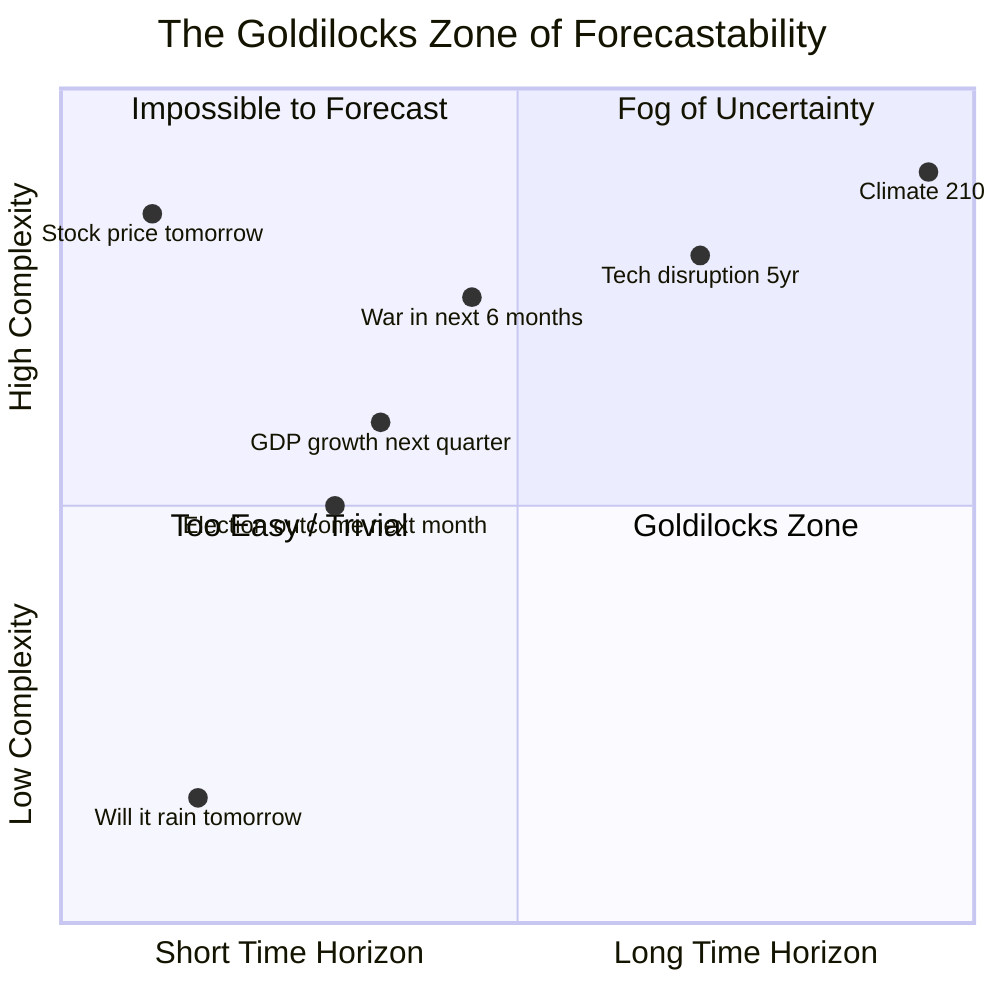
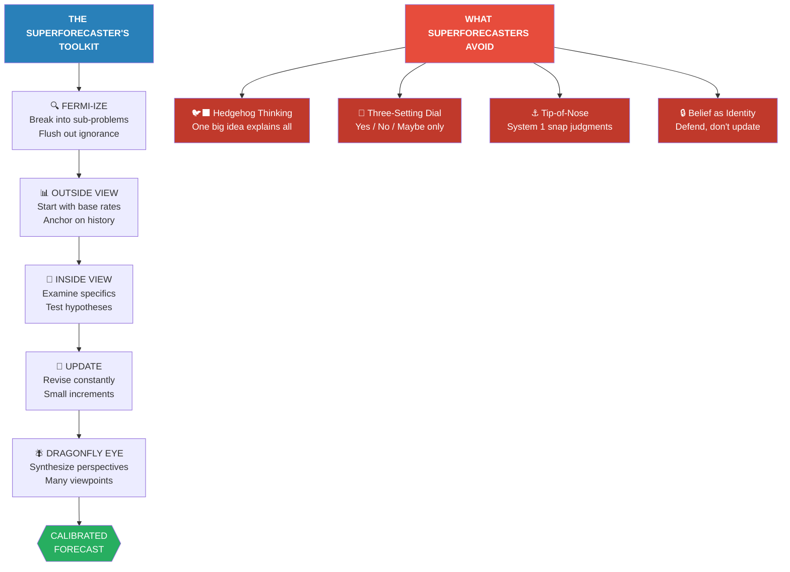
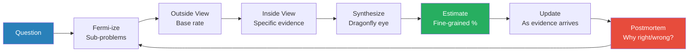

```mermaid
flowchart TD
    subgraph "THE SUPERFORECASTING REVOLUTION"
        A["🏥 COCHRANE<br/>Evidence beats authority<br/>in medicine"] -->|"Same principle"| B["🎯 TETLOCK<br/>Evidence beats authority<br/>in forecasting"]
        B --> C["📊 IARPA TOURNAMENT<br/>20,000+ questions<br/>4 years, controlled"]
        C --> D["⭐ SUPERFORECASTERS<br/>Top 2% of volunteers<br/>Beat classified analysts"]
        D --> E["🧠 COGNITIVE PROFILE<br/>Fox mindset + Fermi method<br/>+ Bayesian updating"]
        E --> F["🔄 PERPETUAL BETA<br/>Never finished<br/>Always improving"]
    end

    subgraph "THE OPPOSITION"
        G["🦔 HEDGEHOGS<br/>One big idea<br/>Supreme confidence"] --> H["📺 MEDIA REWARDS<br/>Dramatic predictions<br/>No accountability"]
        H --> I["💥 FAILURES<br/>WMD 'slam dunk'<br/>iPhone market share"]
    end

    style A fill:#27ae60,color:#fff
    style B fill:#27ae60,color:#fff
    style D fill:#2980b9,color:#fff
    style F fill:#2980b9,color:#fff
    style G fill:#e74c3c,color:#fff
    style I fill:#e74c3c,color:#fff
```

# Superforecasting — Philip E. Tetlock & Dan Gardner

> Philip Tetlock spent twenty years proving that experts are terrible at predicting the future — their forecasts barely beat a dart-throwing chimpanzee. Then the U.S. intelligence community challenged him to do better. What happened next overturned everything people believed about prediction. In a massive government-sponsored tournament, Tetlock's team of ordinary volunteers — retirees, programmers, filmmakers, people with no security clearances and no access to classified information — consistently outperformed professional intelligence analysts by roughly 30%. A tiny fraction of these volunteers were so accurate, so consistently, that Tetlock dubbed them "superforecasters." They weren't geniuses. They weren't subject-matter experts. They were people who thought about thinking in a disciplined way: <b style="color: #2980b9">breaking big problems into smaller ones, starting with base rates before diving into specifics, expressing uncertainty in fine-grained probabilities rather than vague feelings, updating their beliefs relentlessly in response to evidence, and treating every opinion as a hypothesis to be tested rather than a treasure to be guarded.</b> The result is both a vindication of human judgment — against the cynics who say prediction is impossible and the technologists who say algorithms will replace us — and the most practical guide ever written on how to think more clearly about what comes next.

---

## About the Author

Philip E. Tetlock is the Annenberg University Professor at the University of Pennsylvania, holding appointments in the Wharton School, the psychology department, and political science — an unusual triple appointment reflecting the interdisciplinary nature of his work. He is best known for his twenty-year study of expert political judgment, published in 2005, which tracked over 28,000 predictions from 284 experts and demonstrated that the average expert was roughly as accurate as random chance. That study made him the world's foremost authority on the science of forecasting failure. In 2011, he co-launched the Good Judgment Project with his research partner and life partner Barbara Mellers, entering a forecasting tournament funded by IARPA (the Intelligence Advanced Research Projects Activity — the intelligence community's equivalent of DARPA). The project — born in personal tragedy, the death of their daughter Jenny, to whom the book is dedicated — filled their lives "with a measure of meaning." The project won all four years of the competition, beating university-based competitors, prediction markets, and classified intelligence analysts. Tetlock has won awards from the American Association for the Advancement of Science, the National Academy of Sciences, the American Psychological Association, and the American Political Science Association. He has published over two hundred articles in peer-reviewed journals.

Dan Gardner is a Canadian journalist and author of *Risk: The Science and Politics of Fear* and *Future Babble: Why Pundits Are Hedgehogs and Foxes Know Best*, whose clear prose makes Tetlock's research accessible to general readers. Gardner's journalistic discipline — insisting on concrete examples, memorable characters, and narrative momentum — transformed what could have been an academic treatise into one of the most readable books in the decision-science genre.

---

## The Big Idea

*Tetlock's master argument is that forecasting is not a gift, a mystery, or a fool's errand — it is a measurable, improvable skill, and the people who do it best share a distinctive set of cognitive habits that anyone can learn.*

- His earlier research proved that <b style="color: #e74c3c">most experts are terrible at prediction</b> — famous pundits, credentialed specialists, and intelligence analysts with access to classified data all performed at or near the level of random chance on real-world geopolitical questions
- But the IARPA tournament proved the opposite extreme is also wrong: <b style="color: #27ae60">some people are dramatically, consistently, measurably better at forecasting</b> — and their advantage is driven by learnable cognitive habits, not raw intelligence or insider knowledge
- The key habits form a coherent cognitive profile:
  - **Fermi-ize** — break seemingly impossible questions into tractable sub-problems
  - **Start outside** — anchor on base rates (how often does this type of thing happen?) before examining specifics
  - **Think in probabilities** — replace yes/no/maybe with fine-grained percentages (73%, not "probably")
  - **Update constantly** — revise beliefs incrementally in response to new evidence, like a Bayesian reasoner
  - **Synthesize perspectives** — "dragonfly eye" thinking, aggregating multiple viewpoints into a single judgment
  - **Stay humble** — treat beliefs as hypotheses to be tested, not positions to defend
- The superforecasters' most important trait: <b style="color: #2980b9">active open-mindedness</b> — the genuine willingness to change your mind when the evidence demands it
- Superforecasting is not about predicting Black Swans or seeing decades into the future — it operates in what Tetlock calls the <b style="color: #27ae60">"Goldilocks zone"</b> of difficulty: questions that are neither so easy that a simple rule of thumb works nor so hard that even the best methods fail

The Goldilocks zone — where superforecasters excel — sits in the middle range of both axes, where questions are hard enough to reward effort but not so hard that prediction becomes impossible.

- The book operates on **three levels simultaneously**: as a scientific report (what the IARPA tournament discovered), as a cognitive profile (what makes superforecasters tick), and as a practical manual (how to improve your own forecasting)
- Tetlock draws case studies from the IARPA tournament, intelligence history, medicine, military strategy, sports betting, and poker
- The unifying thread: <b style="color: #2980b9">the people who see the future most clearly are not those with the most information or the highest IQ — they are those with the most disciplined relationship to uncertainty</b>

> [!tip] The Core Test
> The single best predictor of forecasting accuracy is not intelligence, not knowledge, not credentials — it is **active open-mindedness**: the willingness to treat your beliefs as hypotheses, to seek evidence that might prove you wrong, and to actually change your mind when it does. If you can do that, you can learn to forecast.

---

## Key Concepts at a Glance

| Concept | One-line summary |
|---------|-----------------|
| **Foxes vs. Hedgehogs** | Eclectic, self-critical thinkers (foxes) dramatically outperform big-idea ideologues (hedgehogs) |
| **Brier Score** | The gold standard for measuring forecast accuracy — combines calibration with resolution |
| **Fermi Estimation** | Break impossible questions into tractable sub-problems, dare to be wrong at each step |
| **Outside View (Base Rates)** | Start with how often this type of thing happens before examining the specific case |
| **Inside View** | The details of the specific case — examine only after anchoring on the outside view |
| **Dragonfly Eye** | Synthesize multiple, often conflicting perspectives into a single nuanced judgment |
| **Active Open-Mindedness** | Treat beliefs as hypotheses; seek disconfirmation; welcome mind-changes |
| **Bayesian Updating** | Revise probabilities incrementally in response to new evidence |
| **Perpetual Beta** | Growth mindset applied to forecasting — never stop learning, postmortem everything |
| **Three-Setting Dial** | Most people's mental model: yes/no/maybe — fatally crude for real forecasting |
| **Granularity** | Finer-grained probability estimates (1% increments) produce measurably better accuracy |
| **Auftragstaktik** | Mission command — give the intent, let people figure out the how |
| **Epistemic vs. Aleatory Uncertainty** | Knowable unknowns vs. fundamentally unknowable randomness |
| **Tip-of-Your-Nose Perspective** | System 1's snap judgment — fast, automatic, and often wrong on complex questions |
| **The Goldilocks Zone** | Questions where effort pays off — neither too easy nor impossibly hard |

Active open-mindedness and base rate anchoring emerge as the two highest-weighted skills, reflecting Tetlock's finding that willingness to change one's mind matters more than raw analytical power.

---

## The Optimistic Skeptic — Why Prediction Is Not Hopeless

*Tetlock opens with a paradox: his own earlier research proved experts are terrible forecasters, yet his new research proves some ordinary people are extraordinary ones. Reconciling these two findings is the engine of the book.*

### The Dart-Throwing Chimpanzee

- In 2005, Tetlock published *Expert Political Judgment*, the most comprehensive study of expert forecasting ever conducted — 28,000+ predictions from 284 experts tracked over twenty years
- The headline result was brutal: the average expert's predictions were <b style="color: #e74c3c">roughly as accurate as a dart-throwing chimpanzee</b> — random chance would have done about as well
- The study made Tetlock famous, but for a dispiriting reason — he had become the man who proved that experts can't predict the future
- The finding was not that prediction is impossible — it was that the experts we trust most (the confident ones on television, the ones who "know one big thing") are the worst
- Tetlock distinguished two cognitive styles, borrowing Isaiah Berlin's metaphor: <b style="color: #e74c3c">hedgehogs</b> (who know one big thing and squeeze every problem through that lens) and <b style="color: #27ae60">foxes</b> (who know many small things and aggregate messy, often contradictory information)
- Foxes dramatically outperformed hedgehogs — but the media rewards hedgehogs because their confident, dramatic predictions make better television
- The irony: the very traits that make someone a terrible forecaster — supreme confidence, ideological consistency, dramatic certainty — make them a compelling public figure

The radar reveals a striking inversion: the traits that produce forecasting accuracy (self-criticism, belief updating) are precisely opposed to the traits that produce media fame (confidence, dramatic certainty).

- Harry Truman once joked he wanted a "one-armed economist" because he was sick of hearing "on the one hand...on the other." This joke captures a deep truth: we crave certainty and punish nuance
- The bias extends to consumers of prediction: people rate confident financial advisers as more trustworthy than cautious ones — even when their track records are identical
- And people equate confidence with competence: a study found that forecasters who gave middling probabilities were seen as "incompetent, ignorant, or lazy" compared to those who expressed certainty

> [!example] Tom Friedman and the Accountability Vacuum
> Tetlock opens with Thomas Friedman, the celebrated *New York Times* columnist, as a case study in accountability-free prediction. Friedman makes sweeping claims about the future — "the next six months will be decisive in Iraq" (he said this repeatedly over several years) — but couches them in language too vague to score. Words like "could," "might," and "may" give infinite wiggle room. If the prediction seems to come true, the pundit takes credit. If it doesn't, he never said it *would* happen — only that it *could*. Nobody keeps score. Tetlock chose Friedman not because he dislikes Friedman's views — he actually admires some aspects of his work — but because Friedman scores highest on a formula Tetlock devised: (status of pundit) × (difficulty of pinning down forecasts) × (relevance to world politics). Friedman is, in effect, the most untestable pundit in the world — which is exactly what makes him a useful illustration of the problem.
>
> Tetlock's deeper point: this is not unique to Friedman. "Virtually every political pundit on the planet operates under the same tacit ground rules." The key terms — *may*, *could*, *might* — "are not accompanied by guidance on how to interpret them." A 0.0000001 chance and a 0.7 chance are both "could happen." The ambiguity is a feature, not a bug — it gives pundits infinite flexibility to claim credit and dodge blame.

### The IARPA Tournament

- Then the Intelligence Advanced Research Projects Activity (IARPA) — the intelligence community's blue-sky research arm — decided to find out if forecasting could be improved
- IARPA was created after the Iraq WMD debacle, with a mandate to prevent future intelligence failures through rigorous research
- The agency funded a massive tournament: five competing research teams, thousands of volunteer forecasters, hundreds of real-world questions with clear resolution criteria and definite deadlines
  - "Will North Korea test a nuclear weapon before the end of 2013?"
  - "Will Greece leave the eurozone in the next twelve months?"
  - "Will the president of Tunisia flee the country?"
  - "Will Serbia be granted EU candidate status by year-end?"
- Each question had a specific deadline and an unambiguous resolution criterion — no wiggle room
- The tournament ran for four years (2011-2015), generating the largest dataset on real-world forecasting accuracy ever assembled
- Tetlock's Good Judgment Project (GJP) won decisively — beating all four competing university-based research programs in every year of the four-year tournament
- More remarkably, GJP's best forecasters <b style="color: #27ae60">outperformed intelligence analysts who had access to classified information</b> by roughly 30%
- The intelligence community's own analysts — with security clearances, satellite imagery, intercepted communications, and human intelligence sources — were beaten by volunteers with nothing but Google and good thinking habits
- Within the GJP, the top 2% of forecasters — about 60 people in year 1 — were so far ahead of everyone else that Tetlock coined the term **superforecasters**
- These were not experts. They were ordinary people: a retired IBM programmer in Oregon, an atmospheric scientist with multiple sclerosis, a filmmaker in Brooklyn, a pharmacist in Canada
- Their shared trait was not brilliance or expertise — it was <b style="color: #2980b9">a distinctive way of thinking about uncertainty</b>
- IARPA deserves credit for something remarkable: it allowed a completely unclassified competition with zero constraints on researchers' ability to publish results. Tetlock knows of "no other intelligence agency on the planet" that would have done this.

Superforecasters achieved Brier scores roughly 65% better than chance and 30% better than intelligence analysts with classified access — proving that cognitive habits matter more than information advantages.

---

## Illusions of Knowledge — Why We Think We Know More Than We Do

*Before explaining what makes superforecasters good, Tetlock explains what makes most people bad — the cognitive machinery that produces overconfidence and the illusion of understanding.*

### Archie Cochrane's Revolution

- Archie Cochrane was a British physician and prisoner of war who discovered that standard medical practice was often no better than doing nothing — and sometimes actively harmful
- For centuries, doctors bled patients, purged them, and administered treatments based on tradition and authority rather than evidence
- As a prisoner of war in a German camp, Cochrane performed a primitive randomized trial: he gave extra yeast rations to some prisoners and not others, and discovered that it cured the mysterious epidemic of swollen legs that was killing them — a finding that contradicted every expert's theory about the cause
- Cochrane's radical proposal: test medical treatments with randomized controlled trials before declaring them effective
- The medical establishment resisted ferociously — doctors were insulted by the suggestion that their judgment needed testing
- But Cochrane eventually won, giving rise to the evidence-based medicine movement that has saved millions of lives
- Tetlock uses Cochrane as his master analogy: <b style="color: #e74c3c">most forecasting today is where medicine was before Cochrane — authority-based, untested, and often wrong</b>
- The cure is the same: rigorous testing, keeping score, and accepting that what "feels right" may not be right
- Richard Feynman's principle applies: "The first principle is that you must not fool yourself — and you are the easiest person to fool"
- Cochrane embodied this principle. He was skeptical of everything, including his own beliefs. When he didn't know, he said so. When the evidence contradicted his assumptions, he changed his mind. He was, in Tetlock's terms, a superforecaster before the concept existed.
- The Cochrane Collaboration, founded after his death, now maintains a library of systematic reviews that guides medical practice worldwide — a permanent monument to the principle that evidence beats authority

### The Bloodletting Parallel

- For over two thousand years, doctors practiced bloodletting — deliberately draining blood from sick patients
- The logic seemed sound: disease was caused by an imbalance of "humours," and bloodletting restored balance
- Benjamin Rush, the most prominent American physician of his era, treated George Washington's fatal throat infection with multiple sessions of bloodletting — draining roughly 80 ounces of blood in 24 hours. The treatment almost certainly accelerated his death.
- The point is not that the doctors were stupid — they were applying the best theory available with absolute confidence
- The point is that <b style="color: #e74c3c">confidence without testing is dangerous</b> — and the more confident you are, the more dangerous you become, because you're less likely to question your methods
- This maps exactly onto forecasting: the most confident pundits, the "slam dunk" assessors, the hedgehogs who know one big thing — they are the bloodletters of the prediction world, applying untested theories with absolute certainty and refusing to keep score on the results

### System 1 and System 2

- Daniel Kahneman's framework is the cognitive backbone of the book
- **System 1** (fast, automatic, intuitive) excels in structured environments where patterns are regular and feedback is rapid — a chess grandmaster recognizing a board position, a firefighter sensing a collapsing floor
- **System 2** (slow, deliberate, effortful) is required for novel, complex problems where cues are unreliable — exactly the kind of problems geopolitical forecasting presents
- The danger: System 1 handles most of our thinking, and it is prone to systematic errors that System 2 can catch — but only if we engage it
- Kahneman and Gary Klein had an "adversarial collaboration" to determine when intuition works and when it fails. Their conclusion: intuition is reliable only in environments with **valid cues** (regular patterns that repeat) and **rapid feedback** (you learn quickly whether you were right or wrong). Chess qualifies. Geopolitics does not.
- The left hemisphere of the brain acts as what Michael Gazzaniga calls "the interpreter" — it cannot tolerate not knowing and will fabricate explanations to fill gaps. This is why System 1 produces confident answers even to questions it cannot possibly answer well.
- WYSIATI — "What You See Is All There Is" — is Kahneman's term for System 1's tendency to construct a coherent story from whatever information is available, without checking whether crucial information is missing. This is the cognitive engine behind most forecasting failures.
- The **Cognitive Reflection Test** (the bat-and-ball problem: "A bat and a ball cost $1.10 total. The bat costs $1.00 more than the ball. What does the ball cost?") identifies people who habitually engage System 2 to override System 1's intuitive but incorrect answer (10 cents — the correct answer is 5 cents)
- Superforecasters score very highly on the CRT — they are the people who reflexively double-check their intuitions
- The CRT is important because it doesn't measure intelligence — it measures the willingness to override a confident-feeling intuition. Many very intelligent people blurt out "10 cents!" because they trust System 1. Superforecasters don't.

> [!info] The Bat-and-Ball Problem
> "A bat and a ball cost $1.10 in total. The bat costs $1.00 more than the ball. What does the ball cost?" System 1 instantly offers: 10 cents. It feels right. But if the ball costs 10 cents and the bat costs $1.00 more, the bat costs $1.10, and the total is $1.20 — not $1.10. The correct answer is 5 cents. The point is not the math — it's the willingness to check your intuition against logic. This is the essence of what superforecasters do, applied to far more complex questions.

---

## Keeping Score — The Brier Score and Why Nobody Tracks Pundits

*The central scandal of public prediction: nobody keeps score. Pundits make thousands of predictions with zero accountability.*

### The Accountability Vacuum

- Steve Ballmer predicted the iPhone would get "no significant market share" — his prediction proved spectacularly wrong, but his career was unaffected
- Twenty-three prominent economists signed an open letter warning that quantitative easing would produce "currency debasement and inflation" — none of which materialized, and none retracted
- The reason nobody keeps score: predictions are almost always too vague to test
  - "X could happen" — technically true of anything
  - "Things may get worse before they get better" — unfalsifiable
  - "The situation is fluid" — says nothing

### Sherman Kent and the Language of Uncertainty

- In the 1960s, Sherman Kent, the father of intelligence analysis at the CIA, tried to standardize probability language
- He discovered that when analysts wrote "there is a serious possibility," different readers interpreted this as anywhere from 20% to 80% likely
- Kent proposed a formal scale mapping words to probabilities — "almost certain" = 93%, "probable" = 75%, "even chance" = 50%
- The proposal was killed by bureaucratic resistance — analysts didn't want to be pinned down, and decision-makers didn't want to deal with nuance
- <b style="color: #e74c3c">The consequences of this failure: the Iraq WMD "slam dunk" — a phrase that implied 99%+ certainty but was never subjected to rigorous testing</b>
- The intelligence community later adopted a modified version of Kent's scale — but only after the most expensive intelligence failure in American history had already occurred
- Tetlock draws the parallel to medicine: for centuries, doctors treated patients based on authority rather than evidence. The intelligence community is at a similar historical moment — the question is whether it will learn from the IARPA tournament as medicine learned from Cochrane

### The Accountability Problem

- The fundamental problem is not that forecasting is impossible — it's that nobody keeps score
- This creates a world where failed forecasters face no consequences, while accurate but cautious forecasters receive no credit
- The vague language of punditry — "could," "might," "may" — is not an accident. It is a defense mechanism. If everything you say is "could happen," you are never wrong.
- Tetlock compared this to baseball without statistics: imagine a world where batters could claim any average they wanted, where no one tracked strikeouts, and where the most entertaining players got the most playing time regardless of performance. That is the world of punditry.
- <b style="color: #2980b9">The Brier score is the batting average of forecasting</b> — once you have it, you can separate the good from the bad, the skillful from the lucky, the improving from the declining

### The Brier Score

- Glenn Brier invented a scoring method in 1950 for weather forecasts that works for any probabilistic prediction
- The Brier score ranges from 0 (perfect accuracy) to 2 (perfect inaccuracy), with 0.5 being the score of random guessing
- It measures two things simultaneously:
  - **Calibration** — when you say something has a 70% chance of happening, does it actually happen 70% of the time?
  - **Resolution** — can you distinguish likely events from unlikely ones? (saying everything is 50% gives perfect calibration but zero resolution)
- The Brier score is "proper" — it incentivizes honest reporting of beliefs. If you think there's a 4% chance but report 20% to play it safe, your Brier score suffers
- A forecaster who cares only about her Brier score will report her true beliefs — but a forecaster worried about blame will inflate or deflate to minimize embarrassment
- This is why Brier scoring is so powerful: it aligns incentives with truth-telling

> [!info] Understanding the Brier Score
> Imagine you forecast a 90% chance of rain and it rains. Your Brier score for that forecast is (1.0 − 0.9)² = 0.01 — excellent. If you forecast 90% and it doesn't rain: (0.0 − 0.9)² = 0.81 — terrible. The lesson: extreme confidence is rewarded when right but punished severely when wrong. This naturally pushes forecasters toward calibration — saying 90% only when you really mean it.

### Hedgehogs vs. Foxes

- Isaiah Berlin's 1953 essay distinguished thinkers who know "one big thing" (hedgehogs) from those who know "many little things" (foxes)
- Tetlock's earlier research showed this wasn't just a personality quirk — it was <b style="color: #2980b9">the single strongest predictor of forecasting accuracy</b>
- Hedgehogs:
  - Filter everything through one powerful explanatory framework (Marxism, libertarianism, realism in international relations)
  - Are supremely confident because their model explains everything
  - Are reluctant to update because new evidence is always interpreted through the existing lens
  - Make dramatic, attention-grabbing predictions
  - Are terrible forecasters — but beloved by the media
- Foxes:
  - Draw from many frameworks, none of which they fully trust
  - Are less confident because they see complexity and contradiction
  - Update readily because no single model is sacred
  - Make cautious, nuanced predictions that are terrible television
  - Are substantially better forecasters

> [!warning] The Hedgehog Trap
> The traits that make hedgehogs bad forecasters — supreme confidence, dramatic certainty, ideological consistency — are exactly the traits that make someone a compelling public figure. The media rewards hedgehogs and punishes foxes. This creates a perverse selection mechanism: the pundits we hear most are systematically the ones we should trust least.

> [!example] Hedgehog vs. Fox — Larry Kudlow
> Larry Kudlow, the CNBC host and economic commentator, is Tetlock's textbook hedgehog. In December 2007, with the economy entering what would become the worst recession since the Great Depression, Kudlow wrote that "the Bush boom is alive and well." In May 2008, he declared the recession "might have already ended." In July 2008, he asked "what recession?" Each pronouncement was delivered with absolute confidence. Each was spectacularly wrong. Yet Kudlow's career was unaffected — because nobody kept score.

---

## The Discovery of Superforecasters

*How the IARPA tournament revealed that a small fraction of ordinary people are consistently, dramatically better at forecasting than almost everyone else — including intelligence professionals.*

### The Tournament Design

- IARPA created a genuine competition: five university-based research teams, each using different methods, competing head-to-head on the same questions over four years
- Questions were designed to be difficult but resolvable — the "Goldilocks zone" where effort could make a difference
- Every forecaster's accuracy was tracked using the Brier score, creating the most comprehensive dataset on real-world forecasting accuracy ever assembled
- Tetlock's GJP tested multiple interventions: training in probabilistic reasoning, team-based collaboration, prediction markets, and algorithmic aggregation
- <b style="color: #27ae60">The single most powerful intervention was identifying and grouping the best forecasters — the superforecasters</b>
- The questions spanned geopolitics, economics, and security — real-world questions that intelligence agencies actually care about:
  - "Will Serbia be granted official candidate status for EU membership by 31 December 2011?"
  - "Will the United Nations General Assembly recognize a Palestinian state by 30 September 2011?"
  - "Will the price of gold exceed $1,850 per ounce on 30 September 2012?"
- Each question had a specific deadline and a clear resolution criterion — no wiggle room, no "I was close"

### Regression to the Mean — or Real Skill?

- Any time you select the top performers in a group, you expect some regression to the mean — the next time around, some will do worse simply because they got lucky the first time
- Michael Mauboussin's framework: in activities where luck plays a large role, the best performers will regress sharply; in activities where skill dominates, they will mostly persist
- <b style="color: #2980b9">Superforecasters overwhelmingly persisted</b> — roughly 70% of year-1 superforecasters qualified again in year 2, and approximately 90% of "active" superforecasters (those answering at least 50 questions per year) landed in the top 20%
- The skill/luck ratio for superforecasters was estimated at 60/40 to 90/10 — firmly in the "skill dominates" range
- This was not dart-throwing chimps getting lucky. This was a replicable, systematic cognitive advantage.

### The Superforecaster Profile

- In year 1, the top 2% of GJP forecasters — roughly 60 people out of 2,800 — produced Brier scores roughly 30% better than the GJP average
- Crucially, this wasn't luck: when superforecasters from year 1 were tracked into year 2, most maintained their elite performance
- These were ordinary people: Doug Lorch, a retired IBM programmer in Oregon who reads voraciously and built a personal database to ensure he encounters diverse perspectives; Bill Flack, a man from Kearney, Nebraska who describes himself as a mere reader of the news
- They outperformed <b style="color: #2980b9">intelligence analysts with access to classified information</b> — a finding so startling that IARPA extended the tournament and the intelligence community took notice
- David Ignatius of the *Washington Post* confirmed the story: superforecasters beat analysts with classified data by about 30%
- The explanation is not that superforecasters are smarter — it is that they treat forecasting as a cultivatable skill, while intelligence analysts work in an organization that treats prediction as a sideshow

> [!example] Doug Lorch — The Perpetual Learner
> Doug Lorch, a retired IBM systems programmer living in Cornelius, Oregon, exemplifies the superforecaster type. When presented with a question about Ghanaian presidential elections — a topic he knew nothing about — his reaction was not "Why would I care about Ghana?" but "Well, here's an opportunity to learn something about Ghana." He built a personal database of hundreds of information sources tagged by ideology, subject matter, and geography, then wrote a program that selects what he reads next using criteria that emphasize diversity. He doesn't merely accept whatever perspectives he naturally encounters — he engineers his information diet to ensure he constantly confronts views that challenge his own.

---

## Supersmart? — Intelligence Helps, but How You Think Matters More

*The most important chapter in the book: what actually makes superforecasters better, and why it's not raw brainpower.*

### Intelligence Is Necessary but Not Sufficient

- Regular tournament forecasters scored above the 70th percentile in general intelligence; superforecasters scored above the 80th percentile
- The gap matters — but it's much smaller than the gap between forecasters and the general public
- Sandy Sillman — Harvard PhD in applied physics, five languages, atmospheric scientist — became the tournament's overall champion after being diagnosed with MS and joining as a "transition project"
- But many brilliant people in the tournament fell far short of superforecaster accuracy
- Robert McNamara, one of "the best and the brightest," escalated the Vietnam War based on forecasts that were never subjected to serious analysis
- <b style="color: #2980b9">It's not the crunching power that counts — it's how you use it</b>

### Fermi Estimation — The Superforecaster's Core Tool

- Enrico Fermi, the physicist, was famous for estimating seemingly impossible quantities — "How many piano tuners are there in Chicago?" — by breaking the question into tractable sub-problems
- Each sub-problem can be estimated roughly, and the combined estimate is often surprisingly accurate
- Superforecasters apply Fermi estimation instinctively to geopolitical questions

> [!example] Fermi's Piano Tuners — The Full Worked Example
> **Question:** How many piano tuners are there in Chicago?
>
> **Step 1 — What would I need to know?**
> - Number of pianos in Chicago
> - How often pianos are tuned per year
> - How long it takes to tune one piano
> - How many hours per year a piano tuner works
>
> **Step 2 — Estimate each:**
> - Chicago's population: ~2.5 million (confidence interval: 1.5M to 3.5M)
> - Piano ownership: roughly 1 in 100 people own a piano; institutions roughly double this to 2 in 100 → ~50,000 pianos
> - Tuning frequency: about once per year
> - Time per tuning: about 2 hours
> - Piano tuner's working hours: 40 hrs/week × 50 weeks = 2,000 hrs, minus 20% for travel → 1,600 hrs/year
>
> **Step 3 — Calculate:**
> - 50,000 pianos × 1 tuning × 2 hours = 100,000 piano-tuning hours
> - 100,000 ÷ 1,600 hours per tuner = **~63 piano tuners**
>
> **Result:** The Chicago yellow pages listed roughly 83 piano tuners (with some duplicates). The estimate, built entirely from crude guesswork, was remarkably close. Sandy Sillman told Tetlock that Fermi estimation "became a part of my natural way of thinking." The point is not accuracy on any single step — it's that breaking the problem into parts makes the overall estimate far better than any number pulled from a "black box."

> [!example] Bill Flack and the Arafat-Polonium Question
> IARPA asked: "Will the French or Swiss inquiries find elevated levels of polonium in Yasser Arafat's remains?" Most forecasters immediately jumped to the emotionally charged question: "Did Israel poison Arafat?" — a classic System 1 bait-and-switch, replacing a hard question with an easier, more dramatic one. Bill Flack, from Kearney, Nebraska, with no Middle East expertise, avoided this trap entirely. He Fermi-ized the actual question: Could scientists detect polonium after this many years? (He read the Swiss technical report — yes.) How many pathways could produce a positive result? (Israel could have poisoned him, Palestinian enemies could have, remains could have been contaminated post-mortem to frame Israel.) Only one of two teams needed a positive finding. Each additional pathway increased the probability. Flack's methodical decomposition produced a far more accurate forecast than the passionate Middle East experts who were really answering a different question.

### Outside View First, Inside View Second

- Daniel Kahneman's distinction: the **outside view** asks "How often does this type of thing happen?" (the base rate); the **inside view** examines the specific details of the case
- Most people leap straight to the inside view — the vivid, specific, story-rich details
- Superforecasters always start outside: before examining the specifics of a China-Vietnam border dispute, they ask "How often have there been armed clashes between China and Vietnam in the past five years?"
- The outside view provides a meaningful anchor; the inside view then adjusts it up or down
- Starting with the inside view risks anchoring on a meaningless number — and research by Kahneman and Tversky shows that even obviously irrelevant numbers (from spinning a wheel) can powerfully influence estimates

> [!example] The Renzetti Family — Why the Outside View Comes First
> The Renzettis live at 84 Chestnut Avenue. Frank is 44, a bookkeeper. Mary is 35, part-time at a daycare. They have one child, Tommy, age 5. Frank's widowed mother also lives with them. **Question: Do the Renzettis have a pet?**
>
> Most people immediately dive into the inside view: "Frank probably wants a big family but can't afford it, so maybe he got a pet to compensate." Or: "Tommy is only five — too young to take care of a pet." Both are compelling stories. Both are useless.
>
> A superforecaster would start with the outside view: **62% of American households own pets.** That's the starting point. Then refine: single-family detached homes are more pet-friendly than apartments — maybe **73%** for their type of housing. Only *then* would the Renzetti-specific details matter, as adjustments to the base rate.
>
> The power of the outside view: it replaces a story with a number. Stories feel informative but can point in any direction. Numbers provide a meaningful anchor.

- Peggy Noonan, the *Wall Street Journal* columnist, once marveled that George W. Bush's approval rating had rebounded to 47% after leaving office. She saw deep political meaning. If she had checked the outside view, she would have discovered that *every* president's approval rises after leaving office — even Richard Nixon's. The meaning she drew was entirely illusory.
- Bill Flack applies this to every question: "Say we get hostile conduct between China and Vietnam every five years. I'll use a five-year recurrence model to predict the future." A 20% annual probability is the starting point. Then he adjusts based on current conditions.

> [!example] David Rogg and Islamist Terrorism in Europe
> After the Charlie Hebdo attack in January 2015, IARPA asked whether there would be another Islamist attack in specified European countries within two months. David Rogg, a semiretired software engineer, resisted the temptation to dive into the panic-driven news cycle. Instead, he counted Islamist attacks in those countries over the previous five years: six. Base rate: 1.2 per year. He then adjusted upward for ISIS recruitment and downward for heightened security, landing at 1.8 per year. He converted this to the 69-day window: 34%. A textbook synthesis of outside and inside views — and more accurate than most expert commentary.

### Dragonfly Eye — Aggregating Perspectives

- Dragonflies have compound eyes that integrate thousands of tiny lenses into a single panoramic image
- Superforecasters do the cognitive equivalent: they gather outside views, inside views, alternative hypotheses, devil's advocate arguments, and teammates' critiques — then synthesize them all
- Bill Flack deliberately posts his reasoning in team forums, inviting critique — not because he hopes to be affirmed, but because he hopes to be corrected
- George Soros has described a similar practice: stepping outside himself to judge his own thinking from an external perspective
- Research shows that merely asking people to imagine their initial judgment is wrong, and explain why, then re-estimate — produces accuracy improvements almost as large as getting a second opinion from another person — what researchers call "the crowd within"
- An even simpler technique: flip the question's wording. Instead of "Will South Africa grant the Dalai Lama a visa?", ask "Will South Africa deny the Dalai Lama a visa for six months?" This tiny change encourages you to seek evidence in the opposite direction, counteracting confirmation bias.

> [!example] The Saudi Oil Decision — Dragonfly Eye in Action
> A superforecaster trying to predict whether Saudi Arabia would support OPEC production cuts in late 2014 displayed classic dragonfly reasoning:
> - **Hand 1:** Saudi Arabia has large financial reserves and can tolerate low oil prices
> - **Hand 2:** Saudi Arabia needs higher prices to fund social spending that buys obedience to the monarchy
> - **Hand 3:** The Saudis may believe they can't control the price drivers (U.S. drilling boom, falling global demand), making production cuts futile
> - **Synthesis:** "Feels no-ish, 80%"
>
> The Saudis did not support production cuts — much to the shock of many experts. The superforecaster's multi-perspective synthesis outperformed the conventional wisdom because it considered the possibility that cut-and-dried economic logic might be overridden by strategic calculation.

- Need for cognition — the psychological tendency to enjoy hard mental work — is high among superforecasters. They are the people who solve crosswords and Sudoku for fun, who find intellectual complexity energizing rather than exhausting.
- Jonathan Baron's Active Open-Mindedness scale asks people whether they agree with statements like "It is more useful to pay attention to those who disagree with you than to pay attention to those who agree." Superforecasters score highly — and they walk the talk.

> [!tip] The Superforecaster's Mantra
> "For superforecasters, beliefs are hypotheses to be tested, not treasures to be guarded." If you remember one sentence from this book, make it this one.

---

## Superquants? — The Power of Probabilistic Thinking

*Superforecasters are numerate, but their advantage isn't advanced mathematics — it's the willingness to live in shades of maybe while the rest of us cling to yes and no.*

### The Three-Setting Mental Dial

- Amos Tversky once quipped that most people have only three settings for probability: "gonna happen," "not gonna happen," and "maybe"
- This made evolutionary sense — when facing a lion, you need binary decisions, not a 73% probability estimate
- But for complex modern problems, the three-setting dial is <b style="color: #e74c3c">fatally crude</b>
- People consistently mishandle probability: Robert Rubin found that when he told White House officials there was an 80% chance of something, they treated it as a certainty — only near 50/50 did they grasp that it might not happen
- The question "What's a 70% chance of rain?" generates wildly different interpretations: it will rain 70% of the day, it will rain on 70% of the city, 70% of forecasters think it will rain — all wrong

> [!example] The Zero Dark Thirty Scene — Two Panettas
> In the film *Zero Dark Thirty*, the fictional CIA Director Leon Panetta asks his team whether bin Laden is in the Abbottabad compound. When analysts give estimates ranging from 60% to 80%, he explodes: "This is a clusterfuck, isn't it?" Then Maya declares "100% — he's there!" and Panetta is impressed. The real Leon Panetta reacted completely differently. He *welcomed* the range of estimates, telling Tetlock: "I encourage the people around me not to tell me what they thought I wanted to hear but what they believed." The fictional Panetta wanted the three-setting dial. The real Panetta thought like a superforecaster — embracing diverse probabilistic estimates and synthesizing them.

### Granularity Is Real Precision

- Superforecasters use remarkably fine-grained probabilities — Brian Labatte, a superforecaster from Montreal, casually estimated his reading split as "70% — no, 65/35 nonfiction to fiction" in conversation
- Barbara Mellers proved empirically that granularity predicts accuracy: forecasters who used single percentage points outperformed those using five-point increments, who outperformed those using ten-point increments
- When she rounded superforecasters' estimates to make them less granular, their accuracy declined — even with rounding as small as to the nearest 5%
- This isn't false precision — <b style="color: #27ae60">it is real precision that captures genuine distinctions between probabilities</b>
- Charlie Munger put it bluntly: "If you don't get this elementary, but mildly unnatural, mathematics of elementary probability into your repertoire, then you go through a long life like a one-legged man in an ass-kicking contest"

### Robert Rubin's Probabilistic Worldview

- Robert Rubin, the former Treasury secretary, heard a philosophy lecture at Harvard arguing there is no provable certainty — "and it just clicked with everything I'd sort of thought"
- This became the axiom guiding his career through twenty-six years at Goldman Sachs and his tenure in the Clinton administration
- He insisted on precise probabilities: one aide recalled, "One of the first times I met with him, he asked me if a bill would make it through Congress, and I said 'absolutely.' He didn't like that one bit. Now I say the probability is 60% — and we can argue over whether it's 59 or 60%."
- When Rubin described his probabilistic approach in a 1998 *New York Times* profile, the reaction astonished him — people found it revolutionary, pinning his quotes on cubicle walls alongside inspirational messages
- "I still have people come to me when I speak at panels and say 'I have a copy of the book, can you sign it?'" Rubin recalled more than a decade later. "I can't say why what seems obvious to me seems to a lot of people to be insightful."
- The answer: <b style="color: #2980b9">probabilistic thinking is genuinely counterintuitive for most people</b>. It conflicts with our evolutionary wiring, our cultural narratives, and our emotional preference for certainty.
- Rubin found that White House officials consistently treated an 80% probability as a certainty — "You almost had to pound the table, to say 'yes there's a high probability but this also might not happen.'" Only near 50/50 did people grasp that both outcomes were possible.

### The Zero-Hundred Bias

- Research shows that 0% and 100% have disproportionate psychological weight — far more than the mathematical models of economists predict
- A parent willing to pay $100 to reduce her child's disease risk from 10% to 5% may pay $300 to reduce it from 5% to 0% — because zero delivers *certainty*, which the brain craves
- This makes evolutionary sense: in a world of constant low-level threats (predators, rivals, weather), our ancestors needed worry-free zones. The cognitive cost of maintaining constant alert was too high.
- The solution: ignore small probabilities and use the two-setting dial as much as possible. Either it's a lion or it isn't.
- But in a complex modern world, this shortcut is disastrous: it means treating a 5% chance of catastrophe as "not going to happen" and a 90% chance as "definitely going to happen"
- Superforecasters have trained themselves to resist this bias — to live comfortably in the vast space between 0% and 100% where almost all real probabilities reside

### Fate vs. Chance

- Probabilistic thinking sits in deep tension with the human need for meaning
- Oprah Winfrey: "There are no coincidences. Only divine order here." A majority of atheists believe "events happen for a reason"
- Tetlock tested superforecasters: they strongly reject fate-oriented statements ("Everything happens for a reason") and strongly endorse probability-oriented statements ("Randomness is often a factor in our personal lives")
- This is not nihilism — it is the willingness to accept that <b style="color: #2980b9">"why me?" is often answered by "why not me?"</b>
- The probabilistic thinker doesn't see cosmic destiny in meeting their spouse — they see a lucky convergence of two people who had to be somewhere
- Robert Shiller, the economist, tells the story of how Henry Ford's $5-a-day wage convinced both his grandfathers to move to Detroit. If someone had offered a better job, if one grandfather had been kicked by a horse, Shiller would never have been born. But rather than seeing fate, Shiller sees radical indeterminacy: "You tend to believe that history played out in a logical sort of sense, but it's not like that"
- Laura Kray's experiments showed that merely imagining how things might have turned out differently causes people to see what actually happened as "meant to be" — a powerful cognitive illusion that undermines probabilistic reasoning
- Kurt Vonnegut captured the probabilistic worldview in *Slaughterhouse-Five*: when an American soldier asks "Why me?" after being beaten by a guard, the guard responds: "Vy you? Vy anybody?" When Billy Pilgrim asks the same question of aliens, they respond: "Why you? Why us for that matter? Why anything?" This is the superforecaster's philosophical position — not nihilism, but acceptance that much of what happens is not predetermined and not meaningful in the grand-plan sense. Things happen because the causal chain led to them, not because they were "meant to be."
- The practical implication: if you believe everything happens for a reason, you are less likely to carefully estimate probabilities — because the "real" answer is already determined by fate. Probabilistic thinking requires accepting that multiple futures are genuinely possible, which feels deeply uncomfortable to the human mind.

### Epistemic vs. Aleatory Uncertainty

- Philosophers distinguish two types of uncertainty that superforecasters intuitively grasp:
  - **Epistemic uncertainty** — you don't know, but it is knowable in principle. With enough research, you could find out.
  - **Aleatory uncertainty** — you don't know and you *cannot* know, no matter how much research you do. It is fundamentally random.
- Currency markets in one year are heavily aleatory. The identity of the next Supreme Court justice (given a specific vacancy) is more epistemic.
- Superforecasters sense the difference: on "cloudier" questions loaded with aleatory uncertainty, they keep estimates near 35-65% and move tentatively. On questions with more epistemic character, they are willing to push to extremes.
- This calibrated confidence is a key source of their advantage — they don't waste bold conviction on inherently unpredictable questions

---

## Supernewsjunkies? — The Art of Belief Updating

*The key skill is not consuming more information — it is updating beliefs more skillfully in response to new evidence.*

### Bayesian Reasoning in Practice

- Thomas Bayes, the eighteenth-century Presbyterian minister, developed the mathematical framework for updating beliefs in light of evidence
- The formal version is complex, but the intuition is simple: start with a prior probability, then adjust it up or down as new evidence arrives
- Superforecasters approximate Bayesian reasoning intuitively — they don't use the formula, but they embody the principle
- The critical balance: <b style="color: #e74c3c">underreacting to evidence</b> (confirmation bias, anchoring too firmly on your initial estimate) vs. <b style="color: #e74c3c">overreacting to evidence</b> (chasing noise, treating every headline as a game-changer)
- Superforecasters tend toward incremental updating — moving from 0.4 to 0.35 — but they can also jump decisively when the evidence is diagnostic
- Tim Minto, a superforecaster, uses Bayesian logic explicitly — breaking down evidence into diagnostic value and adjusting his priors accordingly
- Barbara Mellers tested superforecasters on formal Bayesian problems (drawing colored balls from urns with known distributions) and found they are markedly better Bayesian updaters than regular forecasters — even though they never use the formula in practice
- The ideal is not mathematical perfection — it is <b style="color: #27ae60">the disciplined habit of asking "How much should this evidence change what I believe?" rather than either ignoring it or overweighting it</b>

> [!example] The Fifty-Fifty Trap
> Novice forecasters often default to 50% when they feel ignorant about a topic — but this creates logical incoherence. If you say "50% chance the Nikkei closes above 20,000" and also "50% chance it closes above 22,000" and also "50% chance it closes between 20,000 and 22,000," your probabilities exceed 100%. The solution: even when you feel you "know nothing," you usually know *something*. The astrophysicist J. Richard Gott showed that if all you know is how long something has lasted so far, you can construct a crude confidence interval using "Copernican humility" — assuming there's nothing special about the moment you happen to be observing. This is better than nothing — and it's the outside view applied to the problem of ignorance itself.

> [!example] Doug Lorch and the Arctic Sea Ice Question
> When asked to forecast Arctic sea ice extent, Doug Lorch noticed that the question pushed many forecasters' ideological hot buttons. Climate change believers assumed a record melt; skeptics assumed recovery. Both replaced the narrow scientific question with an emotionally loaded one ("Is global warming real?") — a classic System 1 bait-and-switch. Lorch stuck to the data: historical trends, satellite measurements, seasonal patterns. He avoided the political framing entirely and produced a far more accurate forecast. Those who let ideology drive their estimates "paid a steep Brier score price."

### The Commitment Trap

- Once we make a public prediction, we become invested in defending it — psychologists call this commitment escalation
- Earl Warren, later Chief Justice, championed the internment of Japanese Americans during World War II based on the absence of evidence of sabotage — which he interpreted as proof that an attack was being planned. He refused to update even years after the war ended
- Superforecasters protect themselves by treating every forecast as provisional — a hypothesis, not a position
- Jean-Pierre Beugoms, a Dutch superforecaster, tracked every forecast he ever made and dissected his mistakes with forensic precision — not to punish himself, but to extract lessons

### Under-reaction vs. Over-reaction

- The two great enemies of belief updating are:
  - **Under-reaction** — anchoring too firmly on your initial estimate, treating every new piece of evidence as "not enough to change my mind," confirmation bias
  - **Over-reaction** — treating every headline as a game-changer, whipsawing between extremes, confusing noise for signal
- Jay Ulfelder demonstrated this with the Chuck Hagel nomination for Secretary of Defense. After Hagel's confirmation hearing went poorly, the journalist Tom Ricks dramatically lowered his estimate of confirmation. Ulfelder pointed out that 96% of secretary of defense nominations pass the Senate — the base rate hadn't changed, and one bad hearing was noise, not signal. Hagel was confirmed.
- John Maynard Keynes described the stock market as a beauty contest where you don't vote for the prettiest face but for the face you think others will vote prettiest — a world where over-reaction to others' over-reactions creates cascading noise
- Burton Malkiel's research showed that the most active stock traders (those who update their positions most frequently) earn the lowest returns — evidence that over-reaction to news is more common and more costly than under-reaction
- Superforecasters walk the tightrope: they are <b style="color: #27ae60">incremental updaters on ambiguous evidence but decisive movers on diagnostic evidence</b>

---

## Perpetual Beta — Growth Mindset Applied to Forecasting

*The superforecaster's relationship to failure is the key to their improvement.*

### The Try-Fail-Analyze-Adjust Cycle

- Carol Dweck's research on growth mindset: people who believe abilities are improvable actually improve more than those who believe abilities are fixed
- Superforecasters exemplify the growth mindset — they see every wrong forecast as data, not as a verdict on their competence
- The term "perpetual beta" comes from software development: a product that is always being updated, never declared finished
- <b style="color: #27ae60">Superforecasters are perpetual beta — always updating, never declaring their understanding complete</b>
- The correlation between intelligence and forecasting accuracy actually *declined* over time in the tournament — meaning that as practice continued, raw intelligence mattered less and accumulated skill mattered more
- This is the strongest evidence that superforecasting is a learnable skill: if it were purely a function of intelligence, the correlation would stay constant or increase. The fact that it declined means practice is making people better in ways that go beyond raw cognitive ability.
- The implication for readers: even if you're not in the top 20% of intelligence (and most people reading a book like this probably are), you can become a dramatically better forecaster through deliberate practice
- The key is structured feedback: you need to know, clearly and quickly, whether your forecasts were accurate. The Brier score provides this. Without feedback, practice is just repetition — with feedback, it becomes improvement.

> [!example] Keynes the Investor
> John Maynard Keynes lost nearly everything speculating on currencies in the 1920s, using top-down macroeconomic theories to predict exchange rates. A lesser thinker would have doubled down or quit. Keynes did neither — he fundamentally changed his approach, switching to bottom-up analysis of individual companies. His King's College portfolio subsequently beat the market by a wide margin for over two decades. When a colleague asked about the seeming inconsistency, Keynes is reputed to have replied: "When the facts change, I change my mind. What do you do, sir?" The Keynesian conversion is a perfect illustration of perpetual beta: he didn't just try harder with the same methods — he changed his methods entirely in response to evidence of failure. His biographer wrote that he recognized the importance of acting on "a little knowledge" rather than being paralyzed by the impossibility of complete knowledge — a principle that applies equally to superforecasting.

### Postmortem Everything — Especially Successes

- Most people analyze failures and celebrate successes — superforecasters analyze both
- A right answer from wrong reasoning is more dangerous than a wrong answer from right reasoning — because it reinforces a flawed process
- Vaclav Smil, the energy expert, perfectly predicted China's energy consumption in 1985 and 1990, and global energy demand in 2000 — then showed that his individual assumptions were all wrong but happened to cancel out. A less honest forecaster would have declared victory and used the same methods again
- Devyn Duffy, a superforecaster, distinguishes between "I was right and here's why" and "I was right and I got lucky" — and treats the second category with more caution

### Grit and Deliberate Practice

- Angela Duckworth's research on grit — sustained effort and passion over time — maps directly onto superforecaster behavior
- Anders Ericsson's concept of deliberate practice applies: superforecasters don't just make forecasts casually — they structure their practice to generate clear feedback and they actively work on their weaknesses
- The IARPA tournament itself was a feedback machine: Brier scores provided unambiguous evidence of performance, leaderboards created healthy competition, and the multi-year structure rewarded sustained improvement over one-off lucky streaks
- The skill/luck balance in forecasting shifts unpredictably — sometimes the world cooperates and skill dominates, sometimes history goes haywire and luck takes over. Superforecasters need "Marcus Aurelius-like levels of grittiness" to keep practicing through periods when the world refuses to be predictable
- Jean-Pierre Beugoms exemplifies grit: he maintained a personal spreadsheet tracking every forecast, identified patterns in his errors, and deliberately worked on his weakest areas — overconfidence on certain question types, underweighting certain types of evidence

### The Barnum Effect and Self-Knowledge

- The Barnum effect: people readily accept vague personality descriptions as uniquely accurate for them. A horoscope that says "You sometimes have trouble asserting yourself" feels eerily specific — because it's true of nearly everyone
- Superforecasters are resistant to the Barnum effect — they demand specificity and reject flattering vagueness
- This connects to their broader cognitive profile: they insist on precision, they distrust their intuitions, and they demand evidence before accepting claims — even claims about themselves

---

## Superteams — Why Groups of Superforecasters Beat Individuals

*The surprising finding: putting superforecasters into teams improved accuracy by another 25% — even beyond their already-stellar individual performance.*

### The Wisdom of Crowds, Amplified

- In 1906, Francis Galton attended a county fair where visitors were asked to guess the weight of an ox. The average guess of the crowd — 787 people with wildly varying expertise — was astonishingly close to the actual weight. The "wisdom of crowds" was born.
- A century later, in 2004, James Surowiecki popularized the concept: under the right conditions (diversity, independence, decentralization, aggregation), group judgments beat individual experts
- The IARPA tournament confirmed this — the average forecaster beat many individual experts. But the tournament also showed something more: when superforecasters were placed into small teams (about 12 people each) and encouraged to deliberate, their accuracy jumped further
- Superforecaster teams beat prediction markets — a finding that surprised many economists who view markets as the gold standard for aggregating information
- The key was not mere averaging — it was genuine deliberation: sharing reasoning, challenging each other's assumptions, and synthesizing perspectives
- The improvement was not small: teams of superforecasters outperformed the already-excellent individual superforecasters by about 25% — a massive gain on top of an already-elite baseline
- When the GJP further applied its "extremizing" algorithm to the team's aggregated estimates, the resulting forecasts were the most accurate in the entire tournament
- The layered improvement — individual training, team deliberation, algorithmic aggregation, extremizing — produced a system that was, in Tetlock's words, "the best forecasting system we know of for the questions asked in the tournament"

### What Makes Superteams Work

- **Perspective-taking** — understanding the opposing argument so well you could reproduce it to the other's satisfaction
- **Precision questioning** — helping teammates clarify what they actually mean, catching vague language and hidden assumptions
- **Constructive confrontation** — disagreeing without being disagreeable, challenging ideas rather than attacking people
- The teams had a "give" culture — members shared information, helped others refine their thinking, and invested in the team's success rather than guarding their own standing
- Diversity of perspective mattered more than diversity of credentials — what counted was having people who approached problems differently
- The research of Christopher Chabris and colleagues on collective intelligence supports this: a group's collective intelligence is not simply the average of its members' individual intelligence. Social sensitivity, conversational turn-taking, and gender diversity all independently predict group performance.
- Superforecaster Karen Adams, a political scientist, shared lessons from the tournament with her Model United Nations students in Montana — extending the give culture beyond the tournament itself

> [!example] The Bay of Pigs — Groupthink's Poster Child
> In 1961, Arthur Schlesinger Jr., JFK's historian-adviser, had serious doubts about the CIA's plan to invade Cuba using exiled fighters. But the group dynamic suppressed dissent. Schlesinger later wrote that he was "baffled" by his own silence — surrounded by confident voices, he shrank from expressing his misgivings. The invasion was a catastrophic failure. Irving Janis later coined the term "groupthink" to describe the phenomenon: a cohesive group's desire for unanimity overrides realistic appraisal of alternatives. Superteams are designed to prevent groupthink by institutionalizing constructive confrontation.

### Extremizing — The Aggregation Algorithm

- One of the GJP's most powerful discoveries was "extremizing" — a mathematical technique for improving the accuracy of aggregated forecasts
- If the average forecast of a crowd is 70%, extremizing pushes it toward the nearest extreme — say, to 85%
- The logic: each forecaster has private information that didn't make it into their estimate. When you average, you wash out some of that private information. Extremizing restores it.
- The effect is strongest when forecasters are diverse and informed — exactly the conditions superforecaster teams create
- Combining superforecasters into teams, then extremizing their aggregated estimates, produced the tournament's most accurate forecasts — beating prediction markets, individual superforecasters, and every other method tested

---

## The Leader's Dilemma — Balancing Guidance with Autonomy

*How do leaders create environments where superforecasting can thrive — without micromanaging or losing coherence?*

### Helmuth von Moltke and Mission Command

- Helmuth von Moltke the Elder, chief of the Prussian General Staff, developed **Auftragstaktik** — mission command — in the nineteenth century
- The principle: tell subordinates *what* to achieve and *why*, but leave *how* to achieve it to their judgment
- "No plan survives contact with the enemy" — so officers must be trained to adapt, not just follow instructions
- Prussian military education emphasized independent thinking and initiative — cadets were given problems with no "school solution" and graded on the quality of their reasoning, not on reaching a predetermined answer
- The official German military manual stated: "The mission and the situation must be the guides for action where orders do not cover the situation"
- Moltke explicitly warned against detailed plans: "The task of the military science is not to create rigid systems and processes. It is to educate the judgment of the commander."
- The result: the most adaptable, effective military force in Europe for nearly a century
- Moltke's deeper insight applies directly to forecasting: <b style="color: #2980b9">you cannot predict exactly what will happen, so you must prepare people to respond intelligently to whatever does happen</b>
- This is the organizational equivalent of perpetual beta — building systems that adapt rather than systems that predict

### The Prussian Education Model

- Prussian military education was structured around exercises called *Kriegsspiel* (war games) that had no predetermined solutions
- Officers were evaluated on the quality of their reasoning under uncertainty, not on reaching the "correct" answer — because there was no correct answer
- This produced officers who were comfortable with ambiguity, confident in their own judgment, and willing to deviate from plans when circumstances demanded it
- The approach was revolutionary because most military training at the time — and most organizational training today — teaches people to follow procedures rather than exercise judgment
- The parallel to superforecasting is direct: the IARPA tournament was a Kriegsspiel for the mind, with no predetermined answers, where performance was evaluated on the quality of probabilistic reasoning under uncertainty
- The key Prussian insight: you cannot create good judgment by imposing rules from above. You can only create it by giving people hard problems, letting them struggle, providing honest feedback, and repeating the process — exactly the cycle the IARPA tournament institutionalized
- Modern organizations that want better forecasting would do well to study the Prussian model: create environments where people practice judgment under uncertainty, with real feedback, and where initiative is rewarded rather than punished

### The American Contrast

- The U.S. Army historically favored detailed, top-down orders — a "detailed command" approach that worked in simple situations but produced rigid, unimaginative officers
- General George Patton, for all his bluster, issued micro-detailed orders that left his subordinates little room for judgment
- When Vietnam and then Iraq demanded adaptive, decentralized decision-making, the American military struggled
- David Petraeus represented a shift toward mission command principles, but cultural change in large organizations is slow and difficult
- The problem is systemic: American military culture historically rewarded obedience and punished initiative — the opposite of what superforecasting requires
- Ralph Peters, a retired Army officer, diagnosed it bluntly: the Army had created "a culture of generals who manage, rather than generals who lead"

### Corporate Parallels

- Jeff Bezos tells Amazon employees he wants them to be "stubborn on vision, flexible on details" — mission command in corporate language
- 3M gives engineers 15% of their time to pursue their own projects — a policy that produced Post-it Notes when a scientist's "failed" adhesive turned out to be the perfect bookmark
- Annie Duke, the professional poker player, describes managing a poker table the same way: you set the strategic framework but can't dictate every hand
- The tension is real: <b style="color: #2980b9">too much control kills initiative; too little control produces chaos</b>
- The best leaders, like the best forecasters, live with this tension rather than resolving it — they treat the balance as a perpetual adjustment, not a one-time decision
- Eisenhower captured the essence: "Plans are worthless, but planning is everything" — the process of thinking through scenarios matters more than the specific plan, because the plan will inevitably need to change

> [!quote] Tommy Lasorda on Management
> "Managing is like holding a dove in your hand. If you hold it too tightly you kill it, but if you hold it too loosely, you lose it." — Tommy Lasorda, former manager of the Los Angeles Dodgers. This captures the leader's dilemma perfectly: the balance between guidance and autonomy is never static.

---

## Are They Really So Super? — The Black Swan Challenge

*Tetlock engages his most formidable critic — Nassim Taleb — and honestly addresses the limits of superforecasting.*

### Taleb's Objection

- Nassim Taleb, author of [[The Black Swan - Nassim Nicholas Taleb]], argues that the events that matter most — financial crashes, terrorist attacks, technological revolutions — are precisely the events that cannot be predicted
- The IARPA tournament, Taleb would say, tests forecasting in "Mediocristan" — the zone of ordinary, thin-tailed uncertainty — while the real action is in "Extremistan" — the zone of Black Swans
- By design, tournament questions have one-to-five-year time horizons and definite resolution criteria — exactly the kind of questions where incremental skill matters
- <b style="color: #e74c3c">The tournament cannot test whether superforecasters would have seen 9/11 coming, or predicted the 2008 financial crisis, or anticipated the Arab Spring</b>

### Tetlock's Response

- Tetlock takes the critique seriously but argues it is overstated:
  1. **Routine forecasting has enormous practical value** — governments and businesses make thousands of decisions based on one-to-five-year forecasts. Improving these by even 20-30% has massive real-world impact. The question "Will Greece leave the eurozone this year?" is not a Black Swan — but getting it wrong costs billions.
  2. **The cognitive habits of superforecasters are exactly what you need in Extremistan** — humility, calibration, base-rate thinking, and constant updating are the best protection against the overconfidence that makes Black Swans so devastating. The superforecaster who says "I don't know" is far better positioned than the hedgehog who says "slam dunk."
  3. **The boundary between predictable and unpredictable is wider than Taleb suggests** — there is a large zone between the trivially easy and the impossible where skilled forecasting makes a difference
  4. **Scope sensitivity matters** — when Kahneman asks people to estimate the probability of a major war killing more than a million people in the next decade, and then asks about a major war in the next century, many give similar answers. This failure of basic logic — a longer time frame must increase probability — is exactly the kind of error superforecasters avoid
- The honest conclusion: superforecasting has real limits. It cannot predict Black Swans. But <b style="color: #27ae60">the zone where it works is far larger than the cynics believe, and the cognitive habits it cultivates are valuable even in the face of radical uncertainty</b>

### The Kahneman Thought Experiment

- Imagine it is 1900 and a group of the world's smartest people is asked to predict the greatest inventions and events of the twentieth century
- Even the most brilliant futurists could not have predicted nuclear weapons, the Internet, antibiotics, the Holocaust, the moon landing, the collapse of the Soviet Union, or the rise of China
- The twentieth century was shaped by events that were, by definition, unimaginable in advance
- Tetlock uses this to concede Taleb's strongest point: for very long time horizons, prediction becomes genuinely impossible
- But he then asks: does this mean we should abandon all forecasting? No — because most consequential decisions have time horizons of one to five years, where superforecasting demonstrably works
- The analogy is weather forecasting: we cannot predict the weather a year from now, but we can predict it three days from now with remarkable accuracy. The fact that long-range weather forecasting is impossible does not make short-range forecasting useless.

### The War Question

- How likely was a war killing more than a million people in any given decade of the twentieth century?
- The raw data: three world-scale wars (WWI, WWII, Chinese Civil War) in ten decades — roughly a 30% base rate per decade
- But a prudent forecaster in 1900, seeing the improving technology of mass killing, might have pushed this to 40% or even higher
- The question is: would the world's greatest experts have predicted even one of those specific wars? Almost certainly not. The wars that actually occurred were shaped by contingencies — assassination of an archduke, an alliance system, one madman's psychopathology — that were unpredictable in their specifics
- <b style="color: #2980b9">The lesson: you cannot predict specific Black Swans, but you can estimate the probability of the class of events they belong to — and that is enormously valuable for preparedness</b>

### The Limits of Long-Range Forecasting

- Tetlock quotes Donald Rumsfeld's famous memo: "There are known knowns, known unknowns, and unknown unknowns"
- For very long time horizons, even the best forecasters converge toward the base rate — the historical frequency of the type of event in question
- The chessboard-rice parable: each doubling of the time horizon potentially doubles the uncertainty, until the space of possibilities becomes unmanageably vast
- In 1993, the dean of MIT's Sloan School published a bestseller featuring Japan and Germany as the key challengers to the United States — barely mentioning China. Two years later, the Arab Spring overturned another bestseller's confident predictions about the Middle East
- <b style="color: #2980b9">The solution is not to abandon long-range thinking but to hold it with appropriate humility</b> — and to focus forecasting effort on the time horizons where evidence suggests effort pays off

---

## What's Next? — From Forecasting to Wisdom

*The final chapter is Tetlock's vision for how the superforecasting revolution could transform public discourse.*

### The Adversarial Collaboration

- After the 2008 financial crisis, Keynesians and Austerians fought ferociously over economic policy
- What should have happened: both sides agree on testable predictions, track accuracy, and the losing side acknowledges the evidence
- What actually happened: nobody changed their mind. When the president of the Federal Reserve Bank of Minneapolis publicly stated that events had shown the Keynesians were closer to the truth, it made headlines — that might as well have read "Man Changes His Mind in Response to Evidence"
- Paul Krugman and Niall Ferguson traded volleys for years — each cataloging the other's failures while ignoring their own
- Tetlock proposes the "Holy Grail" project: structured adversarial collaboration, modeled on the Kahneman-Klein partnership, where opposing experts agree on specific, testable forecasting questions in advance
- The Kahneman-Klein partnership is the model: two psychologists with apparently contradictory theories (Kahneman emphasized cognitive biases; Klein emphasized expert intuition) sat down together, mapped their disagreements, and produced a joint paper identifying exactly when intuition works and when it fails. Neither "won" — both learned.
- The goal is not to declare a winner but to <b style="color: #27ae60">learn — even a split decision teaches us the reality is more mixed than either side believed</b>
- The key requirement: good faith. Each side must want the truth more than they want to be right. Sadly, in public debates, the loudest voices are precisely those least interested in adversarial collaboration.
- But Tetlock is optimistic that quieter, more reasonable voices exist in every debate — and that structured tournaments would give them a platform
- Once people start forecasting in tournaments with public postings and leaderboards, they become more open-minded — the evidence from the IARPA tournament shows markedly better calibration in public tournaments than in anonymity-guaranteed studies
- The effect Samuel Johnson ascribed to the gallows: tournaments "concentrate the mind" on avoiding reputational death

### The Cochrane Parallel

- Tetlock draws the analogy between forecasting and medicine repeatedly because he believes they face exactly the same transformation
- Before Cochrane: medicine was authority-based. The most distinguished doctor's opinion trumped evidence.
- After Cochrane: medicine is evidence-based. Randomized controlled trials trump authority. Lives are saved.
- Before the IARPA tournament: forecasting was authority-based. The most credentialed analyst's opinion trumped evidence.
- After the tournament: the possibility of evidence-based forecasting has been demonstrated. The question is whether institutions will adopt it.
- The parallel extends to the resistance: doctors resisted evidence-based medicine for decades, arguing that medical judgment is an art that cannot be reduced to numbers. Intelligence analysts and pundits make the same argument today.
- But the numbers don't lie: <b style="color: #2980b9">systematic processes, rigorously scored, outperform unaided human judgment — in medicine, in forecasting, and in virtually every domain where the comparison has been tested</b>
- The good news: Cochrane eventually won. Evidence-based medicine is now the standard of care. The bad news: it took thirty years. Tetlock hopes evidence-based forecasting will move faster.

### Keeping Score on Public Predictions

- The Scottish independence referendum in 2014 demonstrated superforecasters' power: while betting markets gave 3:1 odds against independence, superforecasters were at 9:1 — and they were right
- Superforecasters knew from patterns in other nations that the no-change option tends to outperform polls because some voters are embarrassed to tell pollsters they support the "boring" side — this had surfaced in the 1995 Quebec referendum
- Nate Silver's FiveThirtyEight brought probabilistic forecasting to election coverage — and was vilified when his predictions of an 80% chance felt insufficiently certain
- Daniel Drezner, a political scientist and pundit, publicly admitted after the Scottish vote that his own forecast was wrong and the superforecasters were right — a rare act of intellectual honesty
- The Brazilian government actually threatened banks for publishing honest economic forecasts that embarrassed the ruling party — demonstrating just how politically dangerous truthful prediction can be
- <b style="color: #2980b9">The deepest change Tetlock advocates is cultural: we need to stop rewarding confident predictions and start rewarding accurate ones</b>

### Evidence-Based Forecasting and Evidence-Based Policy

- Just as Cochrane transformed medicine from authority-based to evidence-based, forecasting tournaments can transform policy analysis
- The basic insight: if we tracked the accuracy of intelligence assessments, policy projections, and economic forecasts with the same rigor we track weather forecasts, we would quickly learn who to listen to and how to improve
- The obstacle is not technical — it's political. Nobody wants to be scored. The Federal Reserve won't use precise probabilities in public statements because the political cost of being wrong on a specific number is higher than the cost of being vague
- The former Federal Reserve chairman Ben Bernanke, as a professor, had called for an end to turgid "Fedspeak" — but as chairman, he continued to use it, because the political costs of precision were too high
- But "harder" does not mean impossible. The IARPA tournament proved it can be done at scale.
- As the intelligence community discovered: "Shouldn't we ask for the same rigor in Homeland Security's estimates of terrorism threats as in Goldman Sachs's estimates of market trends?"
- The stakes are not abstract — George Tenet's "slam dunk" assessment of Iraqi WMDs, which implied 99%+ certainty without ever being rigorously tested, led to a $2 trillion war. Expected-value analysis suggests the Good Judgment Project is "the bargain of the century"

---

## The Epilogue — Bill Flack's Intellectual Humility

Bill Flack, the superforecaster from Nebraska, corrected Tetlock on a detail in the manuscript — he was born in Kansas City, not Nebraska. "Some might dismiss that as hair-splitting," Tetlock writes. "But I see precision." Flack embodies every trait the book celebrates. He doesn't think he deserves a seat at Davos: "I'd have to go to Google just to find out who the prime minister of Fanatistan is." He uses pundits as raw material, not as oracles — "like lawyers in an adversarial judicial system: they put forth the best argument they can, and I consider everybody's arguments." He knows luck played a role in his success and that slumps are inevitable. He monitors his Brier score and adjusts his confidence accordingly.

Flack distinguishes between good pundits and bad pundits: the bad ones "issue their predictions with no supporting arguments, expecting their readers to treat their pronouncements like the word from Mt. Sinai." The good ones "argue the case for their forecasts." He sees himself as a judge in an adversarial system, weighing competing arguments — not as a prophet receiving divine revelation.

He also knows his limits: "An overconfident forecast that goes bad can hit one hard in the Brier score, and a few such could make the difference between a terrific season and a terrible one." When that happens, he won't abandon his methods — he'll become "more cautious and less prone to extreme forecasts," using the Brier score as feedback to recalibrate.

The last line of the epilogue captures the entire philosophy: Bill Flack is **perpetual beta**. And that is why he is a superforecaster.

---

## The Intelligence Community Context — Why This Matters

*Understanding why IARPA funded this tournament requires understanding the intelligence failure that motivated it.*

### The Slam Dunk and Its Aftermath

- In 2002, CIA Director George Tenet reportedly told President Bush that the case for Iraqi weapons of mass destruction was a "slam dunk" — language implying near-certainty
- No formal probabilistic assessment was ever conducted. The phrase was rhetorical, not analytical.
- The 2003 invasion of Iraq, launched largely on this assessment, found no weapons of mass destruction — the most consequential intelligence failure since Pearl Harbor
- The post-mortem was devastating: the Commission on Intelligence Capabilities found that the intelligence community's analysis was "gravely flawed" — not because the analysts were stupid, but because the process was broken
- <b style="color: #e74c3c">Nobody had forced analysts to express their uncertainty in testable terms, nobody had tracked the accuracy of past assessments, and nobody had incentivized truth-telling over consensus</b>
- IARPA was created in the aftermath, with a mandate to improve intelligence analysis through rigorous research — including finding out whether forecasting could be improved at all

### What the Tournament Proved

- The GJP's superforecasters outperformed intelligence analysts with classified access by about 30%
- The explanation Tetlock suspects: it's not that superforecasters are smarter or have better data — it's that they treat forecasting as a cultivatable skill, while the intelligence community treats it as a sideshow
- Thomas Fingar, a former chairman of the National Intelligence Council, explicitly stated: "Prediction is not — and should not be — the goal of strategic analysis"
- But as Tetlock points out: "How can you identify where streams of developments seem to be headed without making implicit predictions?"
- The journalist Joe Klein similarly claimed he doesn't make predictions — then immediately wrote that a North Korean attack was "unlikely, but not impossible." That is a prediction.
- <b style="color: #2980b9">The deepest lesson: everyone makes forecasts constantly. The question is whether they do it well or badly — and whether they're honest enough to keep score.</b>

### The National Intelligence Council's Granularity Problem

- The NIC asks analysts to express uncertainty on a five- or seven-point scale: "remote," "unlikely," "even chance," "probable/likely," "almost certain"
- This is vastly better than nothing — but it still falls short of what superforecasters achieve
- When superforecasters debate whether a probability is 3% or 5%, they are making a distinction the NIC's scale cannot capture
- Tetlock argues the NIC is "selling itself short" — its analysts could achieve finer granularity if the culture valued and encouraged it
- The reward for greater precision: "a clearer perception of the future. And that's invaluable in the ass-kicking contest of life."

---

## The Cognitive Profile — A Complete Picture

*Pulling together every trait that distinguishes superforecasters into a single integrated view.*

### What Superforecasters Are

| Trait | Description | How Measured |
|-------|-------------|-------------|
| **Philosophically cautious** | Reject certainty; embrace probabilistic thinking | Fate vs. chance questionnaire |
| **Actively open-minded** | Seek disconfirming evidence; welcome mind-changes | Jonathan Baron's AOM scale |
| **Intellectually curious** | High "need for cognition"; enjoy hard mental problems | Need for cognition tests |
| **Growth-minded** | Believe abilities improve with effort | Dweck's mindset assessment |
| **Numerate** | Comfortable with numbers and basic probability | Numeracy tests |
| **Reflective** | Override System 1 intuitions with System 2 analysis | Cognitive Reflection Test |
| **Precise** | Use fine-grained probabilities; resist vague language | Granularity of estimates |
| **Balanced updaters** | Avoid both under- and over-reaction to evidence | Brier score over time |
| **Collaborative** | Share reasoning; invite critique; take diverse perspectives | Team behavior data |
| **Gritty** | Sustained effort over time; tolerate ambiguity and setbacks | Persistence in tournament |

### What Superforecasters Are Not

- They are **not geniuses** — their intelligence is above average (80th percentile) but not off the charts
- They are **not subject-matter experts** — they outperform experts who know far more about specific topics
- They are **not math wizards** — most rarely use explicit mathematical models
- They are **not news junkies** — they don't consume more information, they process it more skillfully
- They are **not emotionless robots** — they have strong opinions, but they hold those opinions lightly
- They are **not hedgehogs with better theories** — they are foxes with better cognitive habits
- They are **not loners** — they actively seek out perspectives different from their own and collaborate in teams
- They are **not pessimists or cynics** — they are optimistic about the possibility of improvement, which is why they keep practicing

### The Single Most Important Trait

If forced to choose one trait that best predicts superforecaster status, Tetlock would choose **active open-mindedness** — the genuine, practiced willingness to seek out evidence against your own beliefs and to actually change your mind when that evidence is compelling. This is not mere tolerance of disagreement. It is an active, effortful search for reasons you might be wrong. Most people say they value open-mindedness. Superforecasters actually practice it — every day, on every question, even when it hurts.

The distinction between *valuing* open-mindedness and *practicing* it is enormous. In surveys, almost everyone endorses open-mindedness. In behavior, almost everyone falls short. The superforecaster's advantage is not attitudinal — it is behavioral. They have built systems, habits, and routines that force them to confront perspectives they would naturally avoid.

This is why Tetlock calls superforecasters "perpetual beta" rather than "open-minded people" — the emphasis is on the ongoing *practice*, not the static *trait*.

> [!warning] The Gap Between Intention and Practice
> Almost everyone claims to be open-minded. Superforecasters are unusual not because they value open-mindedness more — surveys suggest most people do — but because they have built habits and systems that force them to practice it. Doug Lorch's diversity database, Bill Flack's team forum posts, Jean-Pierre Beugoms's forensic postmortems — these are not personality traits. They are deliberate practices, engineered into daily routines. The lesson: open-mindedness is a behavior, not a belief.

---

## The Ten Commandments for Aspiring Superforecasters

Tetlock distills the book into a practical checklist — then immediately undermines it with an eleventh commandment.

| # | Commandment | Core Principle |
|---|------------|----------------|
| 1 | **Triage** | Focus on questions in the Goldilocks zone — where effort pays off. Don't waste time on easy clocklike questions or impossible cloudlike ones. |
| 2 | **Fermi-ize** | Break impossible questions into tractable sub-problems. Flush ignorance into the open. Dare to be wrong at each step. |
| 3 | **Balance inside and outside views** | Start with the base rate — how often do things of this sort happen? Then adjust for the specifics of the case. |
| 4 | **Balance under- and overreaction** | Update beliefs in response to evidence — but distinguish signal from noise. Move incrementally on ambiguous evidence; jump on diagnostic evidence. |
| 5 | **Look for clashing causal forces** | For every good argument, find the counterargument. Thesis, antithesis, synthesis. Become a dove-hawk hybrid. |
| 6 | **Distinguish degrees of uncertainty** | Your mental dial needs more than three settings. The finer your granularity, the better your forecasts. |
| 7 | **Balance confidence and humility** | Avoid both the waffler ("I don't know") and the blowhard ("100%!"). Calibration and resolution both matter. |
| 8 | **Do postmortems — on successes too** | Where exactly did I go wrong? And was my success the result of good reasoning or offsetting errors? |
| 9 | **Bring out the best in others** | Master perspective-taking, precision questioning, and constructive confrontation. Manage teams like holding a dove — too tight kills it, too loose loses it. |
| 10 | **Master the error-balancing bicycle** | You can't learn by reading manuals — you learn by doing, with clear feedback. Practice is not going through the motions. |
| 11 | **Don't treat commandments as commandments** | "It is impossible to lay down binding rules, because two cases will never be exactly the same." — Helmuth von Moltke |

---

## Best Stories

### Sandy Sillman's Transition Project
In 2008, Sandy Sillman — a Harvard PhD in applied physics who speaks five languages and was an atmospheric research scientist at the University of Michigan — was diagnosed with multiple sclerosis. As his career ended, he joined the Good Judgment Project as a "transition project" to keep his mind active. "When people stop working, they feel a bit lost and a bit worthless," he explained via voice-to-text software. "I thought GJP might be good as a 'transition project' for me — not so much pressure or importance as work, but still something that counted, and also keeping my mind alive." In year 1, assigned to a control condition where he forecasted alone, Sillman finished tied for overall champion out of roughly 2,800 competitors. "It is a bit nonprofessional to say so, but of course it is very exciting," he wrote. "You 'tingle' a bit. The only thing like it was when I was in high school and placed first in a math competition. I suppose I am still a high schooler at heart." His intelligence is extraordinary — but it was his cognitive humility and Fermi-style decomposition that set him apart. Intelligence got him to the starting line; his way of thinking won the race.

### The Piano Tuners of Chicago
Enrico Fermi, the physicist, loved to pose seemingly impossible estimation questions to his students — "How many piano tuners are there in Chicago?" — and then show that breaking the question into sub-problems (How many pianos? How often tuned? How long per tuning? How many hours per tuner?) produced surprisingly accurate answers. Tetlock's superforecasters recognized this immediately: Sandy Sillman said Fermi estimation "became a part of my natural way of thinking." The superforecasters' genius is not that they know things other people don't — it is that they know how to not know, and how to work with that uncertainty systematically. As Tetlock puts it: "It is amazing how many arbitrary assumptions underlie pretty darn good forecasts. Our choice is not whether to engage in crude guesswork; it is whether to do it overtly or covertly."

### Obama's "Fifty-Fifty"
When CIA officers presented President Obama with estimates ranging from 30% to 95% that bin Laden was in the Abbottabad compound, Obama declared the situation "fifty-fifty — a flip of the coin." Mark Bowden reported this admiringly, as evidence of clear-eyed realism. Tetlock sees it differently: the collective judgment of the room was around 70%, based on real analysis, and Obama's retreat to 50% wasted the wisdom of the crowd. He may have been using "fifty-fifty" colloquially to mean "uncertain" — but by doing so, he failed to extract maximum value from the information his advisers provided. The episode illustrates how even brilliant leaders default to the three-setting dial under pressure. Bowden's editorializing makes it worse: he describes the CIA's use of probabilities as "an almost comically elaborate process" and Obama's "fifty-fifty" as cut-through clarity. In reality, the "comically elaborate process" was the analysts doing their job correctly, and the presidential gut-check was the failure.

### The Renzetti Family Problem
Tetlock returns to this thought experiment repeatedly because it crystallizes the outside-view principle. Presented with details about a specific family — Frank's age, Mary's job, Tommy's daycare, Grandma Camila's presence — most people construct elaborate stories to guess whether the Renzettis have a pet. But a superforecaster would ignore the colorful details entirely and ask: "What percentage of American households own a pet?" The answer — 62% — is a better starting point than any story. The Renzetti details can then adjust the estimate up or down, but the adjustment should be modest unless you have strongly diagnostic information. The lesson generalizes: when facing any uncertain question, find the outside view before constructing narratives from the inside view.

### Doug Lorch's Diversity Engine
Doug Lorch didn't just passively consume diverse viewpoints — he built a system to force himself to encounter them. His database of hundreds of information sources, tagged by ideology and geography and fed through a selection algorithm that prioritizes diversity, is active open-mindedness turned into infrastructure. It is the cognitive equivalent of designing a gym into your commute so you can't avoid exercising.

### The Keynesian-Austerian Food Fight
After 2008, Keynesians and Austerians fought for years, each cataloging the other's forecasting failures while refusing to examine their own. Paul Krugman used his Nobel Prize and *New York Times* column to hammer Austerians; Niall Ferguson fired back with a three-part catalog of Krugman's alleged errors. "For those who hope that we can become collectively wiser, it was a bewildering fracas that looked less like a debate between great minds and more like a food fight between rival fraternities."

### Anne Kilkenny's Prescient Email
In 2008, when Sarah Palin was announced as John McCain's vice-presidential pick, a woman named Anne Kilkenny from Wasilla, Alaska, wrote an email to forty friends describing Palin's record. She had attended every city council meeting, tracked Palin's career meticulously, and gave a specific, nuanced portrait — neither vilifying nor praising. The email went viral, reaching millions, and proved remarkably accurate. Kilkenny exemplified the superforecaster traits without knowing it: she was specific where others were vague, evidence-based where others were ideological, and humble about what she didn't know. She was a local fox in a world of national hedgehogs.

### The Cobbler's Nigeria Forecast
A superforecaster going by "Cobbler," a software engineer in Virginia, knew almost nothing about Nigeria when asked whether the government would negotiate with Boko Haram. He began with the outside view — 0% historical success rate for negotiating with Boko Haram specifically, 40% for insurgency negotiations in general. He averaged: 20%. Then the inside view: moderate Islamists had incentives to broker talks, Boko Haram might benefit from appearing to negotiate, rumors of talks were circulating. He adjusted upward to 30%, then averaged inside and outside views: 25%. He scheduled that estimate to decline as the deadline approached. Net result: top 10% Brier score on a question that tripped up most forecasters who overreacted to rumors. The lesson is striking: a software engineer in Virginia, armed with nothing but Google and good thinking habits, produced a better forecast about Nigerian politics than most people who follow Nigeria professionally. The method — outside view, inside view, synthesis, scheduled decay — is more powerful than any amount of subject-matter expertise deployed without method.

### Regina Joseph and Bird Flu
Regina Joseph, a political risk analyst whose eclectic career included digital media and training the U.S. Olympic women's fencing team, tackled a question about lethal bird flu outbreaks in China — a topic she knew nothing about. She started with the outside view: how often had the casualty toll exceeded the threshold? About 80% of the time. But the flu season was already one-quarter over, so she cut to 60%. Then the inside view: improved public health policies and better warning indicators. Down to 40%, declining with time. Not a spectacular score, but better than 85% of forecasters. Joseph exemplifies the superforecaster paradox: a non-expert who outperforms experts by having better methods, not better knowledge.

---

## Practical Application

### How to Forecast Better Tomorrow

1. **Before making any prediction, ask: what's the base rate?**
   - How often has this type of thing happened before, in situations like this?
   - This single habit eliminates a huge proportion of forecasting errors

2. **Fermi-ize every complex question**
   - What would have to be true for X to happen?
   - What information would I need to answer this question?
   - Break it down until you reach questions you can estimate, however roughly

3. **Express uncertainty in numbers, not words**
   - Replace "I think it's likely" with "I'd put it at about 70%"
   - The act of choosing a number forces you to think more precisely about what you believe

4. **Write your reasoning down and share it**
   - Bill Flack posts his reasoning for teammates to critique
   - Writing forces clarity; sharing invites correction
   - Ask yourself: "Would I be convinced by this if I were somebody else?"

5. **Update deliberately, not reactively**
   - When new information arrives, ask: Does this actually change the probability?
   - Resist both ignoring it (anchoring) and overreacting (chasing noise)
   - Make small, frequent adjustments rather than rare, dramatic ones

6. **Do postmortems on everything — especially when you were right**
   - Was I right for the right reasons, or did my errors cancel out?
   - A right answer from wrong reasoning is more dangerous than a wrong answer from right reasoning

7. **Seek out people who disagree with you**
   - Not to argue with them, but to understand their reasoning
   - The strongest forecasters can reproduce opposing arguments to the other side's satisfaction

8. **Beware the bait-and-switch**
   - When you feel a strong emotional reaction to a question, check whether you're actually answering the question that was asked
   - System 1 loves to substitute easy, emotionally satisfying questions for hard, analytically demanding ones

### The Superforecaster's Daily Practice

| Habit | What It Looks Like |
|-------|-------------------|
| **Morning scan** | Read news from sources that span the ideological spectrum |
| **Question decomposition** | Before forecasting, break the question into 3-5 sub-questions |
| **Base-rate check** | Google the outside view before diving into specifics |
| **Probability journal** | Record your estimate with brief reasoning — revisit weekly |
| **Devil's advocate** | After forming an opinion, spend 5 minutes arguing the opposite |
| **Incremental update** | When new evidence appears, adjust by 2-5% rather than flipping |
| **Monthly postmortem** | Review past forecasts — what did you get right? Wrong? Lucky? |

### How to Think About Your Own Predictions

Most of us make forecasts constantly without realizing it. When you decide whether to bring an umbrella, whether to accept a job offer, whether a project will finish on time, whether a relationship will work — you are forecasting. Tetlock's research suggests several immediately applicable shifts:

1. **Notice when you're forecasting** — the journalist Joe Klein claimed he "stopped making predictions" after getting one wrong, but his subsequent columns were full of implicit forecasts ("It's unlikely, but not impossible"). You can't improve at something you don't realize you're doing.

2. **Translate feelings into numbers** — even rough numbers are better than vague feelings. "I think this project will probably be late" becomes "There's about a 70% chance this project will miss its deadline." The number forces clarity.

3. **Apply the Summers Correction** — Larry Summers, the former Treasury secretary, noticed his research assistants always underestimated how long tasks would take. His correction: double the estimate and move to the next time unit. If they say "an hour," budget two days. If they say "two days," budget four weeks. It's a joke — but it captures the planning fallacy perfectly.

4. **Think about base rates in everyday life** — before assuming your startup will succeed, check what percentage of startups in your industry succeed. Before assuming your marriage will last, check the divorce rate for people in your demographic. The outside view is rarely comforting — but it is almost always informative.

5. **Track your predictions** — even informally. Keep a simple log of predictions you make, with the date and your estimated probability. Review quarterly. The act of tracking alone improves calibration, because you start to notice your patterns of overconfidence and underconfidence.

---

## Connections

This book connects to several themes in the vault:

**The Thinking Toolkit**
- [[Thinking Fast and Slow - Daniel Kahneman]] provides the cognitive science foundation — System 1/System 2, anchoring, base rates, overconfidence — that Tetlock operationalizes into a practical forecasting method. Superforecasting is, in many ways, a manual for applying Kahneman's insights to real-world prediction. Every major concept in Superforecasting — the bait-and-switch of System 1, the power of the outside view, the calibration failures that produce overconfidence — has its theoretical roots in Kahneman's work. But where Kahneman documents the problem, Tetlock documents the solution: people who have learned to override these biases systematically.
- [[Thinking in Bets - Annie Duke]] comes at the same problem from a poker player's perspective. Duke appears in Superforecasting as an interviewee and her emphasis on process over outcomes, probabilistic thinking, and separating decision quality from outcome quality echoes Tetlock precisely. Duke's key insight — that "I don't know" is not a weakness but a starting position — maps directly onto the superforecaster's cognitive humility. Both authors argue that the fundamental attribution error (judging people by outcomes rather than process) is the enemy of good decision-making.
- [[Noise - Cass R. Sunstein]] addresses variability in human judgment — the "noise" that causes different judges, doctors, and analysts to reach wildly different conclusions from the same evidence. Superforecasters reduce both noise and bias simultaneously through their disciplined cognitive habits. The IARPA tournament is, in effect, a massive noise-reduction experiment: by identifying the least noisy forecasters and aggregating their judgments, Tetlock achieved accuracy levels that individual analysts — however brilliant — cannot match.

**The Black Swan Debate**
- [[The Black Swan - Nassim Nicholas Taleb]] is the direct intellectual counterweight. Taleb argues the most consequential events are unpredictable; Tetlock argues that a large zone of the future is forecastable by the right people. The tension is more complementary than contradictory: Taleb addresses the limits of prediction; Tetlock maps the territory where prediction works. Taleb's concept of Mediocristan vs. Extremistan provides the framework for understanding where superforecasting succeeds (Mediocristan and the borderlands) and where it fails (deep Extremistan). Reading both books together gives a complete map of what can and cannot be known about the future.
- [[Antifragile - Nassim Nicholas Taleb]] extends the debate — Taleb's concept of antifragility through optionality and Tetlock's concept of perpetual beta are philosophically aligned. Both advocate remaining adaptable rather than committing to rigid predictions. The superforecaster's willingness to revise estimates constantly is a form of cognitive antifragility — their beliefs get stronger under the stress of contradictory evidence, because they treat contradiction as information rather than threat.

**Decision-Making and Strategy**
- [[Good Strategy Bad Strategy - Richard Rumelt]] shares Tetlock's insistence on honest diagnosis before action. Rumelt's "kernel" (diagnosis → guiding policy → coherent action) parallels Tetlock's forecasting process (outside view → inside view → synthesis). Both authors argue that most failures stem from refusing to face reality. Rumelt's concept of "bad strategy" — goals masquerading as plans — maps onto Tetlock's concept of hedgehog thinking: both are forms of self-deception that feel productive but aren't.
- [[The Checklist Manifesto - Atul Gawande]] parallels Tetlock's Cochrane story — both argue that systematic processes beat intuition, and both draw on the evidence-based medicine revolution as their central analogy. The Ten Commandments for Aspiring Superforecasters is, in effect, a cognitive checklist — a structured process for overriding the biases that make prediction difficult.
- [[How to Measure Anything - Douglas Hubbard]] teaches calibration training and Fermi estimation — shared techniques that form the practical core of superforecasting. Hubbard's central argument — that anything can be measured if you define what you mean by "measurement" — aligns with Tetlock's demonstration that even seemingly impossible geopolitical questions can be answered probabilistically if you break them down correctly.
- [[Made to Stick - Chip Heath & Dan Heath]] — the Heath brothers' framework for making ideas stick (simple, unexpected, concrete, credible, emotional, stories) explains why hedgehog predictions dominate media despite being less accurate: they are stickier. The fox's nuanced, probabilistic, qualified forecast is harder to remember and less emotionally satisfying. This is why the superforecaster revolution requires a cultural change, not just a cognitive one.

**Mental Models and Wisdom**
- [[Seeking Wisdom - Peter Bevelin]] compiles the mental models (base rates, regression to the mean, confirmation bias) that superforecasters deploy intuitively. Bevelin's compilation of Munger-style thinking provides the conceptual vocabulary; Tetlock provides the empirical evidence that these models actually work when applied to real-world prediction.
- [[Poor Charlie's Almanack - Charles T. Munger]] champions exactly the probabilistic thinking and multi-model reasoning that superforecasters embody. Munger's "one-legged man in an ass-kicking contest" line about probability illiteracy is quoted in the book. Munger's concept of a "latticework of mental models" is the theoretical basis for what Tetlock calls "dragonfly eye" — the ability to see a problem through multiple frameworks simultaneously.
- [[You Are Not So Smart - David McRaney]] catalogs the same cognitive biases — confirmation, hindsight, overconfidence — that superforecasters have learned to mitigate. McRaney documents the problems; Tetlock documents the people who have overcome them.

**Psychology and Human Nature**
- [[The Psychology of Money - Morgan Housel]] emphasizes that the most important financial outcomes are driven by tail events — aligning with both Taleb's warning about Black Swans and Tetlock's argument that better calibration helps even when the extremes are unpredictable. Housel's observation that "planning is important; plans are useless" echoes Eisenhower — and is the financial equivalent of the perpetual-beta mindset.
- [[The Expectation Effect - David Robson]] explores how expectations shape perception and outcomes — related to the confirmation bias that superforecasters work so hard to counteract. When you expect to see evidence for your theory, you find it everywhere — even in random noise.
- [[The Laws of Human Nature - Robert Greene]] maps the emotional and social forces that distort judgment — the very forces that superforecasters learn to override through deliberate cognitive discipline. Greene's emphasis on understanding human irrationality before trying to be rational aligns with Tetlock's approach: you cannot overcome biases you don't understand.

**Systems and Strategy**
- [[Sapiens - Yuval Noah Harari]] — Harari's argument that human cooperation depends on shared fictions connects to Tetlock's observation that our narratives about the future are often fictions we mistake for forecasts. The narrative fallacy that Taleb warns about and the "illusions of knowledge" that Tetlock documents are both consequences of what Harari calls the human capacity for imagined orders.
- [[The Art of War - Sun Tzu]] — Sun Tzu's emphasis on knowing yourself and knowing your enemy parallels superforecasters' relentless self-examination and perspective-taking. "Know your enemy" in forecasting means understanding the arguments for the opposing view. Sun Tzu's concept of strategic positioning — winning before the battle begins — is the military equivalent of starting with the outside view: you understand the terrain before committing forces.
- [[Predatory Thinking - Dave Trott]] — Trott's emphasis on seeing what others miss and reframing problems creatively aligns with the Fermi-ization approach: the power of asking different questions to reach better answers. Trott's advertising case studies demonstrate the same principle as superforecasting: the person who defines the problem differently from everyone else often finds the solution everyone else misses.
- [[The Pyramid Principle - Barbara Minto]] — Minto's structured approach to communication (answer first, then supporting arguments) parallels the superforecaster's approach to analysis: start with the outside view (the answer's approximate location), then build toward precision through structured decomposition. Both Minto and Tetlock argue that structure beats free-form thinking — not because creativity doesn't matter, but because structure prevents the most common errors.
- [[Strategy A History - Lawrence Freedman]] — Freedman's sweeping history of strategic thought provides context for Tetlock's work: the tension between those who believe the future can be shaped through rational planning and those who believe it is fundamentally unpredictable has been the central debate of strategic thinking for centuries. Superforecasting represents a new position in this ancient argument: the future is neither fully knowable nor fully unknowable — and the boundary between the two is itself a subject of investigation. Clausewitz's "fog of war" is the military equivalent of Tetlock's "cloudlike" uncertainty — and the superforecaster's toolkit is, in effect, a systematic method for piercing that fog.

---

## Critical Assessment

### What Makes This Book Exceptional

- **Empirical rigor** — Unlike most books about prediction, this one is based on the largest, most rigorous forecasting study ever conducted. The data are real, the comparisons are controlled, and the findings are replicable. Tetlock doesn't just tell you what works — he proves it.
- **Practical applicability** — The Ten Commandments appendix, the worked examples (Arafat, piano tuners, bin Laden), and the concrete cognitive habits make this genuinely useful. You can improve your forecasting tomorrow by applying what you read today.
- **Intellectual honesty** — Tetlock engages his critics (especially Taleb) fairly and acknowledges the limits of his findings. He doesn't overclaim. The chapter on "Are They Really So Super?" is a model of honest self-assessment.
- **Narrative quality** — Gardner's journalistic hand turns cognitive science into compelling human stories. Sandy Sillman, Bill Flack, and Doug Lorch are memorable characters who happen to illustrate scientific findings.

### What's Missing or Understated

- **The transferability question** — Superforecasting is proven for one-to-five-year geopolitical questions in a tournament setting. Its applicability to personal decisions, business strategy, or organizational forecasting outside a tournament structure is assumed but not demonstrated.
- **Selection effects** — The people who volunteered for the IARPA tournament are unusual: they were willing to spend significant free time analyzing obscure geopolitical questions for minimal compensation. This self-selected sample may limit generalizability.
- **The motivation problem** — The tournament created powerful incentive structures (public leaderboards, Brier scores, team competition) that don't exist in most real-world forecasting contexts. Without these structures, would the same cognitive habits produce the same results?
- **Team dynamics** — The chapter on superteams is the book's thinnest. Given that teams outperformed individuals by 25%, understanding the team dynamics in more detail would have been valuable.
- **The hardest version of Taleb's critique** — Taleb's strongest argument is not just that Black Swans exist, but that tournament structures systematically *exclude* the questions that matter most. By design, IARPA questions have definite deadlines and clear resolutions — conditions that rule out precisely the open-ended, long-horizon, potentially catastrophic scenarios where overconfidence is most dangerous. Tetlock acknowledges this but doesn't fully resolve it.

### Who Should Read This Book

- Anyone who makes decisions under uncertainty — which is everyone, but especially leaders, analysts, investors, and policy makers
- Anyone who has read [[Thinking Fast and Slow - Daniel Kahneman]] and wants to know what to *do* about the biases Kahneman describes
- Anyone frustrated by the confident-but-wrong predictions that dominate public discourse
- Anyone interested in the science of human judgment and how it can be improved
- Anyone who wants a framework for thinking more clearly — not just about the future, but about any complex, uncertain problem
- Reading order recommendation: read [[Thinking Fast and Slow - Daniel Kahneman]] first (to understand the biases), then Superforecasting (to learn how to overcome them), then [[The Black Swan - Nassim Nicholas Taleb]] (to understand the limits)

> [!note] Final Thought
> Tetlock's most radical claim is also his simplest: **we can do better.** Better than pundits. Better than experts. Better than our own unexamined intuitions. Not perfectly — the future will always surprise us. But measurably, consistently, significantly better. All it takes is the willingness to keep score, the humility to face the results, and the discipline to keep improving. As Bill Flack would say: stay in perpetual beta.

---

## Deep Dives — Stories and Experiments the Summary Above Only Touches

*The following sections expand on episodes from the book that deserve fuller treatment — either because they contain worked examples of superforecasting in action, or because they illuminate principles the summary introduces but doesn't fully develop.*

### The WMD Origin Story — Why IARPA Exists

The IARPA tournament did not appear out of nowhere. It was born from the worst intelligence failure in modern American history, and understanding that failure is essential to understanding why the tournament mattered so much.

In October 2002, the U.S. intelligence community — sixteen agencies, one hundred thousand employees, a budget exceeding $50 billion — released National Intelligence Estimate 2002-16HC. It stated flatly: <b style="color: #e74c3c">"We judge that Iraq has continued its weapons of mass destruction programs."</b> The language admitted no uncertainty. "Iraq has..." and "Baghdad has..." — statements as categorical as "the sun rises in the east."

CIA Director George Tenet used the phrase "slam dunk" at a White House briefing. Whether taken in or out of context, the phrase captured the IC's attitude perfectly: certainty where none was warranted.

After the 2003 invasion found no weapons of mass destruction, the post-mortems were devastating:

- The Commission on Intelligence Capabilities found the IC's analysis "gravely flawed"
- Robert Jervis, a four-decade scholar of intelligence, concluded the IC's judgment was both <b style="color: #2980b9">reasonable and wrong</b> — reasonable given what they saw, wrong because they never seriously considered being wrong
- "There were no 'red teams' to attack the prevailing views, no analyses from devil's advocates, no papers that provided competing possibilities," Jervis wrote. "Most strikingly, no one proposed a view close to the one we now believe to be true."
- The presidential investigation noted acidly: "Failing to conclude that Saddam had ended his banned weapons program is one thing — not even considering it as a possibility is another"

The devastating nuance: Jervis concluded that even better analysis would not have changed the IC's conclusion — Saddam probably *was* hiding something, and virtually every intelligence agency on the planet believed the same. But better analysis would have made the IC <b style="color: #27ae60">much less confident</b> in that conclusion — perhaps 60-70% rather than "slam dunk." And that difference in confidence might have changed everything. If Congress had required "beyond a reasonable doubt" before authorizing force, a 70% estimate might not have been enough. The invasion might not have happened. Stakes rarely get higher than thousands of lives and trillions of dollars.

The IC took the shock seriously. IARPA was created in 2006, modeled on DARPA, with a mandate to fund research that could make intelligence analysis smarter. By 2011, the forecasting tournament was live — and the discovery of superforecasters was, in a very real sense, the IC's attempt to ensure that "slam dunk" could never happen again.

### Devyn Duffy — The Art of the Update

Devyn Duffy is a superforecaster with an unusual origin story: he volunteered for the Good Judgment Project because he was unemployed at age thirty-six, after the factory where he worked closed. The Pittsburgh native is now an income maintenance caseworker with the state government. "My most useful talent is the ability to do well on tests, especially multiple-choice," Devyn told Tetlock. "This has made me appear more intelligent than I actually am, often even to myself."

What makes Devyn exceptional is his updating. In the third season alone, he made <b style="color: #2980b9">2,271 forecasts on 140 questions — more than sixteen updates per question on average</b>. His method:

- For every active forecast, he sets Google alerts using key terms (e.g., "Syrian refugees" AND "UNHCR")
- Alerts arrive daily for fast-moving situations (risk of a military coup in Thailand) and weekly for slower ones
- He reads alerts immediately, thinks through their implications, and updates his forecasts to reflect the new information
- He distinguishes between truly diagnostic evidence (a presidential announcement of military action — clear signal, large update) and ambiguous evidence (a leaked memo whose provenance is uncertain — possible signal, small update)

"I would attribute my GJP success so far, such as it has been," Devyn wrote, "to good luck and frequent updating."

The data confirmed his intuition: <b style="color: #27ae60">superforecasters update much more frequently than regular forecasters, and their initial forecasts — even before any updating — were at least 50% more accurate</b>. Even if the tournament had asked for only one forecast and permitted no updating, superforecasters would have won decisively. But the updating amplified their advantage enormously.

A famous political scientist who runs a lucrative consultancy was invited to try the tournament. He was interested until he learned about the updating requirement. He had no interest in "competing with unemployed newsjunkies." Tetlock didn't like his attitude — but the remark reveals the establishment's contempt for the habits that actually produce accuracy.

> [!example] Bill Flack's Subtle Update — The Swiss Lab Delay
> Long after Bill Flack's initial forecast on the Arafat-polonium question, the Swiss research team announced it would be late releasing its results because it needed "more testing." What did that mean? It could be irrelevant — maybe a technician missed a day. But Flack knew that to identify whether polonium was introduced deliberately or produced naturally from lead decay, analysts must remove all polonium, wait for more lead to decay, then test again. The delay suggested the Swiss team had detected polonium and was now testing its source. But that was only one possible explanation. Flack cautiously raised his forecast from 60% to 65%. That single five-point move — spotted before anyone else — exemplifies the <b style="color: #2980b9">art of the subtle update: moving decisively enough to capture real information, but cautiously enough to avoid chasing noise</b>.

### The Scope Insensitivity Experiment — Kahneman Tests the Superforecasters

Daniel Kahneman, Tetlock's long-time intellectual interlocutor, devised an ingenious test to probe whether superforecasters were truly thinking differently or merely getting lucky.

Kahneman had documented "scope insensitivity" decades earlier: people will pay roughly the same amount to clean up 2,000 polluted lakes or 250,000 polluted lakes, because they respond to the prototype image (a single polluted lake) rather than the actual scope of the problem. The emotional reaction is the same regardless of scale.

Kahneman proposed applying this to forecasting. The IARPA team asked one randomly selected group of superforecasters: "How likely is it that the Assad regime will fall in the next three months?" Another group was asked the same question with a six-month time horizon. Regular forecasters got the same treatment.

The results:

| Group | 3-month estimate | 6-month estimate | Scope sensitivity? |
|-------|-----------------|-----------------|-------------------|
| **Regular forecasters** | 40% | 41% | <b style="color: #e74c3c">Virtually none</b> |
| **Superforecasters** | 15% | 24% | <b style="color: #27ae60">Meaningful</b> |

Regular forecasters showed almost zero sensitivity to the time frame — they answered the easy question ("How likely is Assad's fall?") rather than the hard question ("How likely in *this specific* time frame?"). A classic System 1 bait-and-switch.

Superforecasters showed <b style="color: #2980b9">genuine scope sensitivity</b> — recognizing that a longer time frame must increase probability. Their estimates weren't perfectly calibrated (no one's are), but they were good enough to surprise Kahneman himself. Bear in mind that no one was asked *both* the three-month and six-month versions — each person answered only one. The superforecasters' sensitivity emerged from their individual reasoning, not from comparison.

This experiment matters because it addresses a deep objection: maybe superforecasters are just well-calibrated on easy questions. The scope insensitivity test shows they are doing something cognitively different — <b style="color: #27ae60">actually engaging System 2 to calibrate their estimates to the specific parameters of the question</b>, rather than answering the emotionally available prototype.

### General Flynn's Tip-of-the-Nose Error

In 2014, General Michael Flynn, then head of the Defense Intelligence Agency (the Pentagon's equivalent of the CIA, with seventeen thousand employees), gave an interview summarizing his worldview:

> "I come into this office every morning, and other than a short jog to clear my head, I spend two to three hours reading intelligence reports. I will frankly tell you that what I see each day is the most uncertain, chaotic, and confused international environment that I've witnessed in my entire career... I think we're in a period of prolonged societal conflict that is pretty unprecedented."

The claim that societal conflict is "pretty unprecedented" is an empirical statement that can be checked. And the data — available to anyone who Googles "global conflict trends" — show the opposite:

- Interstate wars have been declining since the 1950s
- Civil wars have been declining since the end of the Cold War
- Battle deaths per year have, with a few blips, declined throughout the period

Flynn fell for <b style="color: #e74c3c">WYSIATI — "What You See Is All There Is"</b>. He saw mountains of bad news on his desk every day, and his conclusion *felt* right — so That Was All There Was. He never checked the outside view because the inside view felt so obviously true that checking seemed unnecessary.

Tetlock's point is not to belittle Flynn — "quite the opposite: the fact that a man so accomplished made so obvious an error is precisely what makes the error notable." The Müller-Lyer optical illusion proves the point: even after you measure the lines and *know* they're the same length, you can't *see* them as equal. Cognitive illusions are the same. You cannot switch them off. You can only <b style="color: #27ae60">build the habit of reaching for the ruler</b> — and that is exactly what superforecasters do.

### The Kennedy Transformation — From Bay of Pigs to Cuban Missile Crisis

The Bay of Pigs and the Cuban Missile Crisis are usually taught as separate case studies. Tetlock's genius is connecting them: <b style="color: #2980b9">the same team that produced one of the worst decisions in presidential history also produced one of the best — because they changed their process.</b>

**Bay of Pigs (April 1961):**
- The CIA was training Cuban exiles to invade Cuba and overthrow Castro
- Secrecy was supposedly critical — yet the *New York Times* had published the plan on its front page months earlier
- "Somehow the idea took hold around the cabinet table that this would not much matter so long as United States soldiers did not take part in the actual fighting," Schlesinger recalled
- The contingency plan — retreat to the Escambray Mountains — was borrowed from an earlier plan with a different landing site. Nobody noticed the new landing site was eighty miles of swamp and jungle from the mountains.
- Arthur Schlesinger had serious doubts but suppressed them. The group dynamic rewarded consensus and punished dissent.
- The invasion was a catastrophic failure: 1,400 guerrillas surrounded by 20,000 Cuban soldiers within three days

**Cuban Missile Crisis (October 1962):**
- The same advisers faced a far more dangerous situation: Soviet nuclear missiles ninety miles from Florida
- But Kennedy had ordered a complete overhaul of the decision-making process after the Bay of Pigs
- Skepticism became the watchword. Participants were told to speak as generalists, with license to question anything
- Theodore Sorensen and Bobby Kennedy became designated "intellectual watchdogs" whose job was to "pursue relentlessly every bone of contention"
- Bobby Kennedy "deliberately became the devil's advocate," asking sharp, sometimes rude questions at the cost of his own popularity
- Protocol and hierarchy were set aside to enable freewheeling discussion
- New advisers were brought in for fresh perspectives
- Kennedy sometimes left the room so the group could talk without the president's implicit approval shaping the conversation
- Kennedy started the crisis thinking air strikes were the minimum response — but kept that to himself so it wouldn't anchor the discussion. "By the end of the first day of meetings the committee had seriously discussed ten alternatives"
- The result: a negotiated peace rather than nuclear war

The lesson is not that the Bay of Pigs team was stupid and the missile crisis team was brilliant. <b style="color: #27ae60">It was the same team. What changed was the process</b> — and specifically, the institutionalization of constructive confrontation, devil's advocacy, and precision questioning.

### Precision Questioning — A Worked Example

Tetlock's training materials for team forecasters included a specific technique called **precision questioning**, drawn from the work of Dennis Matthies and Monica Worline. The principle: when you disagree with a claim, don't attack the person or express vague disagreement — zero in on the specific terms that need examination.

Suppose someone says: "Unfortunately, the popularity of soccer, the world's favorite pastime, is starting to decline."

| Response | Effect |
|----------|--------|
| "You're silly." | Adds heat, not light |
| "I don't think so." | Expresses disagreement without explaining it |
| "What do you mean?" | Lowers temperature but too vague |
| **"What do you mean by 'pastime'?"** | <b style="color: #27ae60">Zeroes in on the ambiguous term</b> |
| **"What evidence is there that soccer's popularity is declining? Over what time frame?"** | <b style="color: #27ae60">Forces the claimant to produce evidence</b> |

Now apply this to the Bay of Pigs:

> "So what happens if they're attacked and the plan falls apart?"
> "They retreat into the Escambray Mountains."
> **"How far is it from the Bay of Pigs to the Escambray Mountains?"**
> "Eighty miles."
> **"And what's the terrain?"**
> "Mostly swamp and jungle."
> **"So the guerrillas have been attacked, the plan has fallen apart, they don't have helicopters or tanks — but they have to cross eighty miles of swamp and jungle before they can begin to look for shelter in the mountains? Is that correct?"**

Tetlock suspects that conversation would not have concluded "sounds good!" — but precision questioning never happened, because the group dynamic suppressed it.

### Peter Backus and the Fermi Estimation of Love

The appendix contains a charming example of Fermi estimation applied to the most "unquantifiable" of all questions: finding a romantic partner.

Peter Backus, a lonely economist in London, estimated the number of potential female partners in his vicinity:

| Step | Filter | Remaining |
|------|--------|-----------|
| Population of London | ~6,000,000 | 6,000,000 |
| Proportion who are women | ~50% | 3,000,000 |
| Proportion who are single | ~50% | 1,500,000 |
| Proportion in the right age range | ~20% | 300,000 |
| Proportion who are university graduates | ~26% | 78,000 |
| Proportion he'd find attractive | ~5% | 3,900 |
| Proportion likely to find *him* attractive | ~5% | 195 |
| Proportion likely to be compatible | ~10% | **~20** |

Conclusion: roughly twenty women in the pool. Daunting but not impossible.

There are no "objectively correct answers" to true-love questions — but the exercise demonstrates the core Fermi principle: <b style="color: #2980b9">breaking an impossibly vague question into specific, estimable components transforms anxiety into a tractable search problem</b>. Every assumption is crude. The combined estimate is far better than any number pulled from a "black box" of intuition.

### The Müller-Lyer Lesson — Why You Can Never Stop Practicing

Tetlock uses the Müller-Lyer optical illusion — two horizontal lines of identical length that look different because of the arrows at their ends — to make a profound point about the limits of self-correction.

Even after you measure the lines and *know* they are the same, you *cannot see them as equal*. The illusion persists. Knowing it's an illusion doesn't switch it off.

Cognitive illusions work the same way. Knowing about confirmation bias doesn't make you immune to it. Knowing about scope insensitivity doesn't automatically calibrate your estimates. Knowing about WYSIATI doesn't expand your field of vision.

The implication: <b style="color: #e74c3c">you can never stop checking</b>. Superforecasters are not people who have somehow transcended cognitive bias — they are people who have built habits and systems that force them to check their biases constantly. Doug Lorch's diversity database, Bill Flack's team forum posts, Devyn Duffy's Google alerts, Jean-Pierre Beugoms's forensic postmortems — these are not one-time corrections. They are permanent infrastructure for catching the errors that the human mind will never stop generating.

This is the deepest meaning of "perpetual beta": not optimism about improvement, but <b style="color: #27ae60">realism about the permanence of cognitive bias</b>. You will never be free of it. But you can build systems that catch it — and those systems, maintained with grit and discipline over time, are what separate superforecasters from everyone else.

### The Kahneman-Tetlock Exchange — "Different People or Different Things?"

In the summer of 2014, when it was clear superforecasters were not merely lucky, Kahneman posed the defining question: "Do you see them as different kinds of people, or as people who do different kinds of things?"

Tetlock's answer: "A bit of both."

They score higher on intelligence and open-mindedness — but not off the charts. What makes them so good is <b style="color: #2980b9">less what they *are* than what they *do*</b> — the hard work of research, the careful self-criticism, the gathering of perspectives, the granular judgments, the relentless updating.

But Kahneman pushed further: how long can they sustain it? System 2 vigilance is exhausting. The feeling of knowing is seductive. Surely even the best will slip back into easier, intuitive modes.

Tetlock and Kahneman agree that superforecasters are "always just a System 2 slipup away from a blown forecast." But Tetlock is more optimistic that smart, dedicated people can inoculate themselves to some degree — not perfectly, not permanently, but enough to matter. The scope insensitivity experiment was their test case, and the results supported Tetlock's cautious optimism.

The exchange captures the book's deepest tension: between the power of deliberate reasoning and the relentless pull of cognitive shortcuts. Superforecasting is possible — but it is *effortful*, and the effort never ends. There is no graduation ceremony. There is only the next forecast, the next update, the next postmortem, the next opportunity to catch yourself being wrong.

---

## The Forecasting Manifesto — A Summary of Summaries

For readers who want the book's message in its most compressed form:

1. <b style="color: #e74c3c">Most experts are terrible forecasters</b> — their confidence is inversely correlated with their accuracy
2. <b style="color: #27ae60">Some ordinary people are extraordinary forecasters</b> — and their advantage is driven by learnable habits, not innate gifts
3. <b style="color: #2980b9">The habits are specific and teachable</b>: Fermi-ize, start outside, think probabilistically, update constantly, synthesize perspectives, postmortem everything
4. <b style="color: #27ae60">Teams amplify individual accuracy</b> — but only with constructive confrontation and precision questioning, not groupthink
5. <b style="color: #e74c3c">Superforecasting has real limits</b> — it cannot predict Black Swans or see decades ahead
6. <b style="color: #27ae60">The zone where it works is far larger than cynics believe</b> — and the habits it cultivates are valuable even where prediction fails
7. <b style="color: #2980b9">The single most important trait is active open-mindedness</b> — not as a value you hold, but as a practice you maintain every day
8. <b style="color: #e74c3c">Nobody keeps score on predictions</b> — and until we do, we will continue to reward confident wrongness over humble accuracy
9. <b style="color: #27ae60">Forecasting can be transformed</b> — just as Cochrane transformed medicine from authority-based to evidence-based
10. <b style="color: #2980b9">The effort never ends</b> — superforecasters are perpetual beta, and that is both their burden and their advantage

