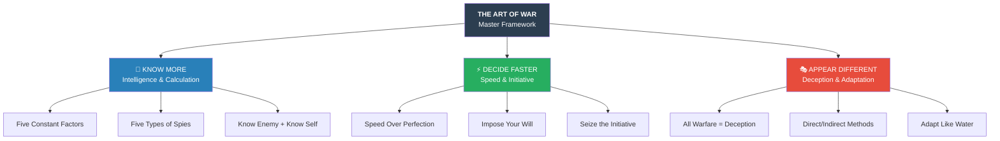
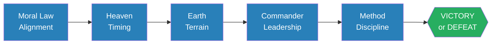
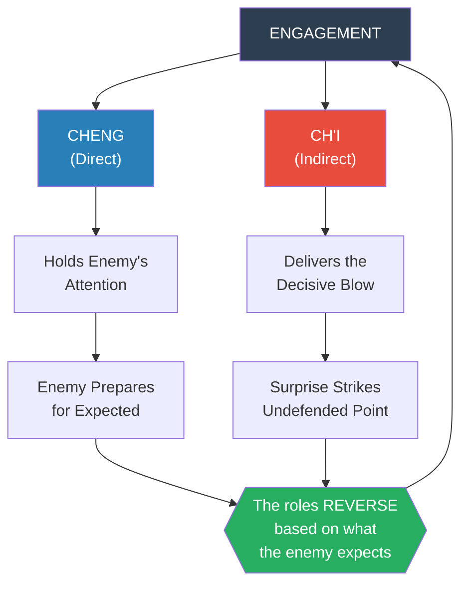
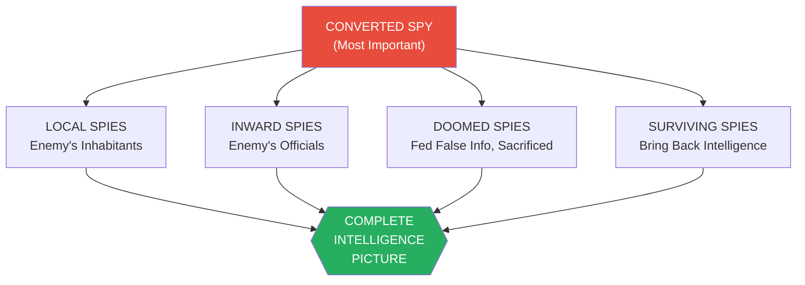
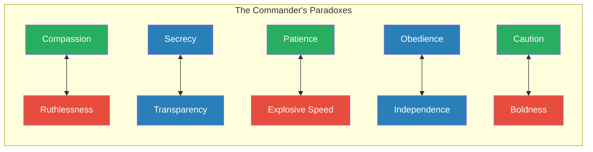
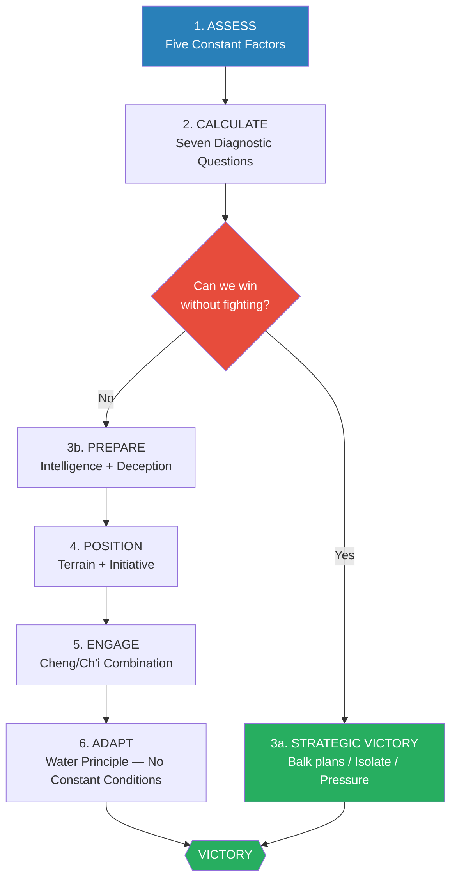

# The Art of War — Sun Tzu

> The oldest military treatise in the world, written around 500 BC by a Chinese general serving the state of Wu, remains the most influential book on strategy ever composed. In just thirteen short chapters, Sun Tzu distills the principles that govern any competitive conflict — from battlefield to boardroom. His central insight is devastatingly simple: the supreme art of war is to subdue the enemy without fighting. Victory belongs to whoever plans most thoroughly, deceives most convincingly, and adapts most fluidly. Every major military commander in Chinese history studied these pages. Twenty-five centuries later, CEOs, coaches, negotiators, and politicians still reach for the same lessons.

---

## About the Author

Sun Tzu (also Sun Wu) was a military strategist from the Ch'i state who entered the service of King Ho Lu of Wu around 512 BC. His biography in Ssu-ma Ch'ien's historical records tells of a man who proved his philosophy through an unforgettable demonstration: asked to drill the king's concubines, he gave clear orders, and when they laughed instead of obeying, he beheaded the two company leaders — the king's own favorites — over the monarch's objections. The remaining women then performed with flawless precision. Sun Tzu went on to help Wu defeat the vastly larger Ch'u state and capture its capital Ying, spreading Wu's influence across ancient China. The translation used here is by Lionel Giles (1910), the most scholarly English edition, which preserves commentaries from eleven Chinese analysts spanning nearly two thousand years — from the warlord Ts'ao Ts'ao in the 2nd century to the Sung dynasty scholars of the 11th century.

---

## The Big Idea

*Sun Tzu's master principle is that war is won before it is fought — through calculation, deception, and strategic positioning, not through brute force.*

- The book's opening line sets the stakes: war is <b style="color: #e74c3c">a matter of life and death, a road either to safety or to ruin</b> — it demands the most rigorous study
- Unlike Western military thinkers who often glorify combat, Sun Tzu treats fighting as a last resort — <b style="color: #27ae60">the supreme form of strategy is breaking the enemy's resistance without fighting at all</b>
- Every principle in the book serves one of three goals: **know more** than your enemy (intelligence), **decide faster** than your enemy (speed), or **appear different** from what you are (deception)
- The general who wins makes many calculations before battle; the one who loses makes few — "how much more, no calculation at all!"

*Sun Tzu's thirteen chapters all feed three fundamental imperatives: know more, decide faster, and never be what you appear.*

- The book operates on **three reading levels simultaneously**: as a military manual (specific tactics for terrain, fire, spies), as a strategic framework (universal principles of competitive advantage), and as a philosophy of conflict (when to fight, when to forbear, and why restraint often beats aggression)
- What makes the text extraordinary is its **compression** — each sentence encodes a principle that unfolds across dozens of situations. The commentators who annotated Sun Tzu over eighteen centuries found endless applications in a few hundred lines

---

## Key Concepts at a Glance

| Concept | One-line summary |
|---------|-----------------|
| **Five Constant Factors** | Moral Law, Heaven, Earth, Commander, Method & Discipline — assess these before any engagement |
| **Win Without Fighting** | The hierarchy: balk plans → isolate → engage → besiege (last resort) |
| **All Warfare Is Deception** | Appear weak when strong, far when near, unready when prepared |
| **Know Enemy, Know Self** | Complete knowledge eliminates uncertainty; partial knowledge is worse than ignorance |
| **Speed Over Perfection** | "Stupid haste" beats "clever dilatoriness" — prolonged warfare never benefits anyone |
| **Cheng/Ch'i** | Direct methods (cheng) hold the enemy; indirect methods (ch'i) deliver victory |
| **Water Analogy** | Avoid strength, strike weakness, shape strategy to terrain — no constant conditions |
| **Five Dangerous Faults** | Recklessness, cowardice, hasty temper, sensitivity to shame, over-solicitude |
| **Nine Situations** | Nine types of ground, each demanding a different psychological and tactical response |
| **Concentrate vs. Disperse** | Force the enemy to spread thin while keeping your forces concentrated |
| **Desperate Ground** | Troops fight hardest when there is no retreat — use this for and against your enemy |
| **Five Types of Spies** | Local, inward, converted, doomed, surviving — intelligence as the foundation of all strategy |
| **Discipline Before Compassion** | Establish authority first, then earn loyalty through care |
| **The Sovereign Must Not Interfere** | The general in the field needs autonomous authority; distant commands are fatal |
| **Restraint in War** | "A kingdom destroyed can never come again" — anger is temporary, consequences are permanent |

---

## The Five Constant Factors

*Before any conflict begins, five fundamental conditions determine who will win — and Sun Tzu insists that the general who assesses them honestly will always prevail.*

- <b style="color: #2980b9">The Moral Law</b> is what causes people to be in complete accord with their ruler — "so that they will follow him regardless of their lives, undismayed by any danger"
  - This is not mere obedience but genuine alignment of purpose between leader and led
  - Without it, no amount of tactical brilliance compensates for an army that doesn't believe in the cause
- <b style="color: #2980b9">Heaven</b> signifies timing — night and day, cold and heat, the seasons
  - The strategist who understands rhythms and cycles gains an invisible advantage
  - Attack when the enemy is complacent; rest when he expects you to attack
- <b style="color: #2980b9">Earth</b> comprises distances, danger and security, open ground and narrow passes
  - Terrain multiplies or divides force — a thousand men in a narrow pass can stop a hundred thousand
  - The side that reads terrain accurately fights with nature as an ally
- <b style="color: #2980b9">The Commander</b> must possess five virtues: wisdom, sincerity, benevolence, courage, and strictness
  - These are listed in order of priority — wisdom first, because a brave but foolish general is a catastrophe
  - The ideal commander blends "culture with a warlike temper; hardness and tenderness"
- <b style="color: #2980b9">Method and Discipline</b> means organization, clear chains of command, logistics, and financial control
  - An army without supply lines is an army already defeated
  - "Without constant practice, the general will be wavering and irresolute when the crisis is at hand"

> [!tip] Core Insight
> The Five Factors are a **diagnostic checklist**, not a wishlist. Sun Tzu uses them comparatively: which side has stronger moral alignment? Which general is more capable? Which army is better disciplined? The side that wins more comparisons wins the war.

*The Five Factors form a chain — weakness in any link compromises the whole.*

| Factor | Seven Diagnostic Questions |
|--------|---------------------------|
| Moral Law | Which sovereign commands deeper loyalty? |
| Commander | Which general has greater ability? |
| Heaven & Earth | Which side holds advantages of timing and terrain? |
| Discipline | On which side is discipline more rigorously enforced? |
| Strength | Which army is stronger — in spirit and numbers? |
| Training | On which side are officers and men more highly trained? |
| Reward & Punishment | In which army is there greater consistency in both? |

Moral Law and Commander quality are the most important factors yet hardest to assess — explaining why Sun Tzu insists generals must be both wise and honest in self-evaluation.

---

## The Supreme Art: Winning Without Fighting

*Sun Tzu's most revolutionary idea — and the one that separates him from virtually every other military thinker in history — is that the highest form of victory avoids battle entirely.*

- <b style="color: #27ae60">"In the practical art of war, the best thing of all is to take the enemy's country whole and intact; to shatter and destroy it is not so good"</b>
- He establishes a clear **hierarchy of strategic options**, ranked from most to least desirable:

| Rank | Strategy | Why It's Better |
|:----:|----------|----------------|
| 1st | **Balk the enemy's plans** | Costs nothing; enemy never gains momentum |
| 2nd | **Prevent junction of enemy's forces** | Isolate before they consolidate; divide and conquer |
| 3rd | **Attack the enemy in the field** | Expensive and risky, but sometimes necessary |
| 4th | **Besiege walled cities** | Worst option: months of preparation, massive casualties, uncertain outcome |

The sankey flow reveals Sun Tzu's core calculus: the higher you intervene in the hierarchy, the more likely you achieve victory with the enemy's resources intact — the supreme strategic outcome.

- The siege is the supreme failure of strategy — Sun Tzu notes it takes three months just to build siege equipment, three more months to build earthworks, and then the impatient general "will launch his men to the assault like swarming ants, with the result that one-third of his men are slain, while the town still remains untaken"

> [!example] The Boer War Parallel (1899)
> The Giles commentary draws a sharp parallel to the Boer War: had the Boers avoided besieging Kimberley, Mafeking, and Ladysmith — "dissipating their strength" on sieges — they likely would have dominated the entire theatre before British reinforcements arrived. Sun Tzu's hierarchy, written 2,400 years earlier, predicted exactly this failure.

- The practical application is profound: before fighting, exhaust every option that achieves your objective without combat
  - Diplomatic isolation (prevent allies from joining)
  - Economic pressure (cut supply lines and trade)
  - Information warfare (undermine the enemy's plans before they mature)
  - Psychological operations (convince the enemy that resistance is futile)
- <b style="color: #e74c3c">Only when all non-violent options fail should you resort to direct military engagement</b>

> [!tip] Core Insight
> "Supreme excellence consists in breaking the enemy's resistance without fighting." This isn't pacifism — it's ruthless efficiency. Fighting is wasteful. The supreme strategist makes fighting unnecessary.

---

## The Art of Deception

*"All warfare is based on deception" — this single sentence is perhaps the most quoted line in all strategic literature, and Sun Tzu builds an entire theory of competitive advantage around it.*

- The core logic: <b style="color: #2980b9">information asymmetry</b> is the root of all strategic advantage
  - The side that knows more while revealing less will always make better decisions
  - Deception is not about lying — it's about controlling what the enemy believes
- Sun Tzu's deception principles form a systematic framework:
  - When **able** to attack, appear **unable**
  - When **using** forces, appear **inactive**
  - When **near**, make the enemy believe you are **far**
  - When **far**, make him believe you are **near**
  - **Hold out baits** to entice; **feign disorder** and crush
  - If the enemy is **choleric**, seek to **irritate** him
  - **Pretend weakness** so he grows arrogant
  - If his forces are **united**, work to **separate** them

> [!example] Sun Pin's Decreasing Campfires (341 BC)
> Sun Pin, a descendant of Sun Tzu himself, was fighting the general P'ang Chuan, who despised the Ch'i army as cowards. Sun Pin exploited this prejudice brilliantly: on the first night after crossing into enemy territory, he ordered 100,000 campfires lit. The second night, only 50,000. The third night, just 20,000. P'ang Chuan, delighted, exclaimed: "I knew these men of Ch'i were cowards — their numbers have already fallen away by more than half!" He pursued recklessly into a narrow defile where Sun Pin had stripped a tree bare and inscribed upon it: "Under this tree shall P'ang Chuan die." When P'ang Chuan struck a light to read the inscription, archers in ambush riddled him with arrows, and his entire army was routed.

- The deeper principle: <b style="color: #27ae60">deception works because people see what they expect to see</b>
  - P'ang Chuan already believed the Ch'i were cowards — the decreasing fires merely confirmed his bias
  - The best deception doesn't create a new belief; it reinforces an existing one
- Simulated disorder requires **perfect discipline**; simulated weakness requires **great strength**
  - You cannot fake chaos unless your troops are so well-trained they can switch instantly between the appearance of confusion and the reality of coordinated action
  - "Hiding order beneath the cloak of disorder is simply a question of subdivision"

> [!example] The Empty City Stratagem
> The legendary strategist Chu-ko Liang was occupying a city when the vastly superior army of Ssu-ma I approached. Rather than flee, Chu-ko Liang threw open the city gates, had men sweep and sprinkle the streets, and sat calmly on the walls playing a lute. Ssu-ma I, suspecting an elaborate ambush, withdrew his entire army. The appearance of utter vulnerability was itself the deception — because no rational commander would leave himself so exposed unless he had overwhelming hidden strength.

---

## Know Your Enemy, Know Yourself

*The single most famous principle in the book — and the one Sun Tzu builds into a complete epistemology of strategic decision-making.*

- The full passage establishes three tiers of knowledge:

| Knowledge State | Outcome |
|----------------|---------|
| Know enemy **and** know self | Victory in every battle |
| Know self but **not** enemy | Win one, lose one |
| Know **neither** | Defeat in every battle |

- <b style="color: #27ae60">"If you know the enemy and know yourself, you need not fear the result of a hundred battles"</b>
- But Sun Tzu goes further in Chapter X, adding two more dimensions: "If you know Heaven and know Earth, you may make your victory complete"
  - **Self-knowledge** prevents overreach — you know your limits, your troops' morale, your supply situation
  - **Enemy knowledge** reveals vulnerabilities — his plans, his fears, his internal divisions
  - **Heaven knowledge** is timing — when to strike, when to wait, when the rhythm shifts
  - **Earth knowledge** is terrain — which positions are strong, which are traps, where advantage lies

> [!example] Fu Chien's Catastrophic Overconfidence (383 AD)
> Prince Fu Chien of Ch'in marched with a million men against the Chin Emperor. When warned not to despise an enemy commanded by capable generals, he boasted: "I have the population of eight provinces at my back, infantry and horsemen to the number of one million — why, they could dam up the Yangtsze River itself by merely throwing their whips into the stream!" He knew his own strength but was blind to the enemy's quality. His forces were routed at the Fei River, and he fled in disgrace. Knowing yourself without knowing your enemy produces exactly this: one victory for every defeat.

- The principle extends to Chapter XIII's emphasis on **espionage** as the foundation of all strategy
  - You cannot know the enemy through guesswork, divination, or analogy
  - "Knowledge of the enemy's dispositions can only be obtained from other men" — meaning spies
  - The general who grudges the cost of intelligence while spending thousands daily on armies is guilty of <b style="color: #e74c3c">"the height of inhumanity"</b>

---

## Speed Over Perfection

*"There is no instance of a country having benefited from prolonged warfare" — Sun Tzu's most practical and frequently ignored principle.*

- Prolonged warfare creates a devastating cascade:
  - Weapons grow dull → ardor dampens → strength exhausts → treasury empties → <b style="color: #e74c3c">opportunistic enemies spring up to exploit your weakness</b>
  - "Then no man, however wise, will be able to avert the consequences"
- The key insight is not that haste is always good, but that <b style="color: #27ae60">delay is always costly</b>
  - "Though we have heard of stupid haste in war, cleverness has never been seen associated with long delays"
  - Speed denies the enemy time to prepare, recover, seek allies, or adapt
- Practical logistics reinforce this: the army that finishes quickly forages on the enemy; the army that lingers must be supplied from home at ruinous cost
  - "One cartload of the enemy's provisions is equivalent to twenty of one's own" — because of the transportation costs eliminated

> [!example] Ssu-ma I's Eight-Day March (227 AD)
> When the governor Meng Ta began plotting rebellion, he calculated that it would take Ssu-ma I a month to learn of the revolt, inform the emperor, and mobilize a response. "By that time my city will be well fortified," he wrote confidently. Ssu-ma I ignored protocol entirely and force-marched his army to the rebel's walls in just eight days. Meng Ta's next letter was filled with shock: "Though only eight days have passed since I threw off my allegiance, an army is already at the city-gates. What miraculous rapidity is this!" Within a fortnight, the city had fallen and Meng Ta had lost his head.

> [!tip] Core Insight
> <b style="color: #2980b9">"Rapidity is the essence of war"</b> — not because rushing is wise, but because the side that moves faster controls the tempo. The enemy who cannot predict your timing cannot prepare for your arrival.

---

## The Direct and Indirect: Cheng and Ch'i

*Sun Tzu's most sophisticated tactical concept — the interplay between the expected and the unexpected — is the engine that powers all maneuver warfare.*

- <b style="color: #2980b9">Cheng</b> (direct methods) engage the enemy's attention — the frontal attack, the obvious approach, the expected move
- <b style="color: #2980b9">Ch'i</b> (indirect methods) deliver the decisive blow — the flanking maneuver, the surprise, the action from an unexpected quarter
- The genius of the framework is that **the two are infinitely interchangeable**: "The direct and the indirect lead on to each other in turn. It is like moving in a circle — you never come to an end"
- What the enemy *sees coming* is cheng; what *takes him by surprise* is ch'i — regardless of the actual maneuver
  - If you make the enemy think your indirect attack is your main effort, then your real main effort becomes the surprise
  - The labels shift based on the enemy's perception, not your intention

> [!abstract] The Infinite Combination Principle
> "There are not more than five musical notes, yet the combinations of these five give rise to more melodies than can ever be heard. There are not more than five primary colors, yet in combination they produce more hues than can ever been seen." From just two elements — direct and indirect — arise infinite tactical possibilities. The strategist's art is in the combination.

- **Energy** (shih) is the potential that builds through proper arrangement — "like the bending of a crossbow"
- **Decision** (chieh) is the release at the critical moment — "like the releasing of a trigger"
- The falcon analogy: the bird waits with perfect patience until the prey is at the right distance, then strikes with irresistible speed
  - <b style="color: #27ae60">The quality of decision is the instinct of self-restraint combined with the power of judging exactly when the right moment has arrived</b>
  - At Trafalgar, Nelson drifted at walking pace under enemy fire for several minutes without returning a shot — then at close range, unleashed broadsides that devastated the French line

> [!example] Han Hsin's River Crossing (204 BC)
> Facing the army of Lung Chu across the Wei River, Han Hsin secretly had his men fill ten thousand sacks with sand and dam the river upstream. He then led half his force across and attacked, but after a brief engagement, pretended to flee back across the river. Lung Chu, elated by this apparent cowardice, pursued eagerly into the shallows. Han Hsin's men then cut the sandbag dam, releasing a torrent that swept away most of Lung Chu's army. The crossing was cheng (direct); the dam was ch'i (indirect). Lung Chu saw one and died of the other.

*The cheng/ch'i cycle never ends — each surprise, once expected, becomes the new normal, requiring a new surprise.*

---

## Impose Your Will: The Art of Initiative

*"The clever combatant imposes his will on the enemy, but does not allow the enemy's will to be imposed on him" — the single most important tactical principle in the book.*

- The one who arrives first at the battlefield is **fresh** and chooses position; the one who arrives second is **exhausted** and forced to react
- Initiative is not just about being first — it's about **controlling the tempo** of the entire engagement:
  - Hold out advantages to make the enemy come to you
  - Inflict damage to make it impossible for the enemy to approach
  - If the enemy is resting, harass him; if well-fed, starve him; if encamped, force him to move
- <b style="color: #27ae60">"Appear at points which the enemy must hasten to defend; march swiftly to places where you are not expected"</b>
- The concentration-dispersion dynamic is the practical application:
  - By concealing your intentions, you force the enemy to guard everywhere
  - If he strengthens his van, he weakens his rear; his left, his right
  - <b style="color: #e74c3c">"If he sends reinforcements everywhere, he will everywhere be weak"</b>
  - Meanwhile, you concentrate your full force against one point of his thinly-spread defense

> [!tip] Core Insight
> "Numerical weakness comes from having to prepare against possible attacks; numerical strength, from compelling our adversary to make these preparations against us." You don't need to outnumber the enemy overall — you need to outnumber him at the point of contact. Disperse *his* forces while concentrating yours.

- The water metaphor captures the essence: "Military tactics are like unto water; for water in its natural course runs away from high places and hastens downwards. So in war, the way is to avoid what is strong and to strike at what is weak"
  - Water doesn't fight the rock — it flows around it
  - "Just as water retains no constant shape, so in warfare there are no constant conditions"
  - The general who can "modify his tactics in relation to his opponent and thereby succeed in winning, may be called a heaven-born captain"

---

## The Wind, Forest, Fire, and Mountain

*Chapter VII on maneuvering contains Sun Tzu's most vivid imagery — four elemental qualities that every army must embody.*

- <b style="color: #2980b9">"Let your rapidity be that of the wind"</b> — the wind is swift and invisible, leaving no tracks
- <b style="color: #2980b9">"Your compactness that of the forest"</b> — dense, ordered, impenetrable, guarding against surprise
- <b style="color: #2980b9">"In raiding and plundering be like fire"</b> — fierce, consuming, unstoppable
- <b style="color: #2980b9">"In immovability like a mountain"</b> — when the enemy tries to dislodge you, be immovable
- And two more: <b style="color: #2980b9">"Let your plans be dark and impenetrable as night, and when you move, fall like a thunderbolt"</b>

> [!abstract] The Art of Maneuvering
> "The difficulty of tactical maneuvering consists in turning the devious into the direct, and misfortune into gain." The master strategist takes a longer road but arrives first; starts from a worse position but ends in a better one. The appearance of disadvantage masks the reality of advantage.

- Practical constraints on speed:
  - March 100 li to seize an advantage → only 1/10 of your army arrives; leaders captured
  - March 50 li → lose your first division leader; only half arrive
  - March 30 li → 2/3 arrive
  - The lesson: <b style="color: #e74c3c">maneuvers of extreme speed must be confined to short distances</b>; for longer operations, you need both speed and sustainability
- "An army without its baggage-train is lost; without provisions it is lost; without bases of supply it is lost"
  - Speed is essential, but reckless speed without logistics is suicide

---

## The Psychology of War: Spirit, Morale, and Timing

*Sun Tzu is not merely a tactician — he is a psychologist of conflict, understanding that armies are made of human beings whose morale can be attacked as surely as their bodies.*

- **Robbing an army of its spirit** is as devastating as defeating it in battle
- The temporal rhythm of morale: "A soldier's spirit is keenest in the morning; by noonday it has begun to flag; and in the evening, his mind is bent only on returning to camp"
  - The clever general avoids attacking keen morning spirit and strikes when it is "sluggish and inclined to return"

> [!example] Ts'ao Kuei and the Three Drums (684 BC)
> When the state of Ch'i attacked Lu, Duke Chuang was about to engage after Ch'i beat its war drums the first time. His advisor Ts'ao Kuei stopped him: "Not just yet." The Ch'i drums sounded a second time — still Ts'ao waited. Only after the third drumming did he give the order to attack. Lu won decisively. When the duke asked why he waited, Ts'ao Kuei explained: "In battle, a courageous spirit is everything. The first roll of the drum creates this spirit, but with the second it is already on the wane, and after the third it is gone altogether. I attacked when their spirit was gone and ours was at its height."

- <b style="color: #27ae60">The five dangerous faults of a general</b> reveal Sun Tzu's understanding that leadership psychology determines battlefield outcomes:

| Fault | Consequence | Exploitation |
|-------|------------|-------------|
| **Recklessness** | Destruction | Lure into ambush |
| **Cowardice** | Capture | He who won't risk can't win |
| **Hasty temper** | Provocation | Insult him into rash action |
| **Delicacy of honor** | Manipulation through shame | Use slander and disgrace to unbalance |
| **Over-solicitude for men** | Worry and paralysis | Force decisions that sacrifice part for whole |

Recklessness and hasty temper are the most exploitable faults because they produce predictable, manipulable behavior — confirming why Sun Tzu ranks wisdom above courage in a commander.

- Each fault is not a character flaw in isolation — it's a **handle the enemy can grip**
  - The reckless general can be lured; the cowardly one can be cornered; the angry one can be baited
  - "When the enemy is of choleric temper, seek to irritate him. Pretend to be weak, that he may grow arrogant"

> [!example] Huang Mei Provoking Yao Hsiang (357 AD)
> When Yao Hsiang refused to leave his fortifications, the general Teng Ch'iang advised: "Our adversary is of a choleric temper and easily provoked. Let us make constant sallies and break down his walls, then he will grow angry and come out." The strategy worked perfectly — Yao Hsiang stormed out in fury, was lured as far as San-yuan, and was killed. His temper was the weapon used against him.

- The **desperate ground** psychology is one of Sun Tzu's most powerful insights:
  - "Throw your soldiers into positions whence there is no escape, and they will prefer death to flight"
  - When soldiers know they cannot retreat, fear transforms into ferocity
  - The general deliberately creates desperation in his own troops to unlock their maximum fighting capacity

> [!example] Han Hsin's Backs-to-the-River Battle (204 BC)
> Han Hsin placed his troops with their backs to a river — violating every accepted principle of warfare. His opponent laughed. But after a complex maneuver involving a decoy attack and a separate cavalry force that captured the enemy's undefended camp, Han Hsin's "trapped" soldiers fought with the desperation of men who had no retreat. When asked how he dared violate doctrine, he quoted Sun Tzu: "Plunge your army into desperate straits, and it will come off in safety." His officers admitted: "These are higher tactics than we should have been capable of."

---

## Nine Grounds: Matching Psychology to Terrain

*Chapter XI is the longest in the book, and for good reason — it merges physical terrain with psychological warfare into a unified theory of situational strategy.*

- Sun Tzu identifies **nine types of strategic ground**, each requiring a different approach:

| Ground | Definition | Prescribed Action |
|--------|-----------|-------------------|
| **Dispersive** | Fighting in your own territory | Unify purpose; don't fight |
| **Facile** | Shallow penetration into enemy territory | Maintain close connection between units |
| **Contentious** | Position advantageous to either side | Hurry to occupy it first |
| **Open** | Both sides have freedom of movement | Guard your defenses vigilantly |
| **Intersecting highways** | Key to multiple states | Consolidate alliances |
| **Serious** | Deep in enemy territory | Gather supplies; forage on the enemy |
| **Difficult** | Mountains, forests, marshes | Keep pushing steadily |
| **Hemmed-in** | Narrow gorges; small force can block large | Resort to stratagem |
| **Desperate** | Survival only through fighting | Fight with everything you have |

The heatmap reveals Sun Tzu's key insight: as ground becomes more desperate, cohesion and fighting intensity rise while desertion risk falls — the psychology of no retreat transforms fear into ferocity.

- The psychological principle behind this taxonomy: <b style="color: #2980b9">troops behave differently depending on how trapped they feel</b>
  - On dispersive ground (near home), soldiers are tempted to desert — so don't fight, unify their purpose
  - On serious ground (deep in enemy territory), they cohere naturally because there is nowhere to go — so push deeper
  - On desperate ground (no escape), they fight with suicidal intensity — so proclaim the hopelessness openly

> [!tip] Core Insight
> The nine grounds are not just about geography — they are about **the psychological state that geography creates**. The master general doesn't just read terrain; he reads what terrain does to the human mind. Then he uses terrain to engineer the psychological state he wants — desperation, cohesion, caution, or aggression.

- The <b style="color: #2980b9">shuai-jan snake</b> is Sun Tzu's ideal for army coordination:
  - "Strike at its head, and you will be attacked by its tail; strike at its tail, and you will be attacked by its head; strike at its middle, and you will be attacked by head and tail both"
  - The army should respond to any attack with automatic, unified counteraction — every part supporting every other part
  - Even enemies cooperate when survival demands it: "the men of Wu and the men of Yueh are enemies; yet if they are crossing a river in the same boat and are caught by a storm, they will come to each other's assistance just as the left hand helps the right"

---

## Reading Signs: The General as Observer

*Chapter IX transforms the general from a commander of troops into a reader of invisible signals — a field intelligence officer who decodes the enemy's condition from the smallest signs.*

- Sun Tzu offers a remarkable taxonomy of **environmental intelligence** — signs that reveal the enemy's state without any spy or scout reporting:

| Observable Sign | What It Means |
|----------------|--------------|
| Dust rising in a high column | Chariots advancing |
| Dust low but spread wide | Infantry approaching |
| Dust branching in directions | Parties collecting firewood |
| Small dust clouds moving | Army encamping |
| Birds suddenly rising | Ambush below |
| Startled animals running | Sudden attack coming |
| Trees in forest moving | Enemy cutting a path through |
| Screens set up in thick grass | Enemy has fled and wants you to suspect ambush |

- Enemy **behavior** is equally diagnostic:
  - <b style="color: #e74c3c">Humble words + increased preparations = about to advance</b> (the enemy feigns deference while preparing to strike)
  - Violent language + aggressive posturing = about to retreat (bluster masks weakness)
  - Peace proposals without sworn covenant = a plot
  - Soldiers leaning on their spears = starving
  - Men sent to draw water who drink first = army suffering from thirst
  - Too frequent rewards = at the end of his resources (buying loyalty because discipline has failed)
  - Too many punishments = in dire distress

> [!tip] Core Insight
> "One may know the condition of a whole army from the behavior of a single man." Sun Tzu teaches that the enemy is constantly broadcasting his state through a thousand tiny signals. The general who reads these signals makes decisions based on reality; the one who ignores them acts on fantasy.

- The chapter ends with Sun Tzu's most nuanced statement on **leadership and discipline**:
  - "Soldiers must be treated in the first instance with humanity, but kept under control by means of iron discipline"
  - <b style="color: #27ae60">The sequence matters enormously</b>: punish soldiers before they are attached to you, and they will be disobedient; show kindness without ever enforcing discipline, and they become "spoilt children — useless for any practical purpose"
  - The ideal: confidence in the general's fairness + certainty that orders will be enforced = "the gain will be mutual"

> [!example] Wu Ch'i and the Soldier's Abscess
> The great general Wu Ch'i personally sucked the poison from a soldier's wound. The soldier's mother wept, not from gratitude but from grief. When asked why, she explained: "Years ago, Lord Wu did the same for my husband, who was so devoted he fought to the death and never came back. Now he has done the same for my son, and I know he too will fall fighting somewhere." This is the terrible power of combining compassion with discipline — men who love their general fight not just willingly but recklessly.

---

## Terrain and the Six Calamities

*Sun Tzu's chapters on terrain (IX, X, XI) form the most extensive treatment of any subject in the book — because terrain is the one factor a good general can turn to his advantage regardless of numbers or resources.*

- The **six types of terrain** in Chapter X each demand different tactical logic:
  - <b style="color: #2980b9">Accessible ground</b>: be first to occupy high, sunny ground and guard supply lines
  - <b style="color: #2980b9">Entangling ground</b>: easy to leave but hard to return to — only sally forth if the enemy is unprepared
  - <b style="color: #2980b9">Temporizing ground</b>: neither side gains by moving first — lure the enemy out instead
  - <b style="color: #2980b9">Narrow passes</b>: if you get there first, garrison them strongly; if the enemy is there, only attack if weakly held
  - <b style="color: #2980b9">Precipitous heights</b>: occupy the sunny side; if the enemy is there first, retreat and entice him away
  - <b style="color: #2980b9">Distant positions</b>: equal forces at great distance cannot profitably fight

- But the **six calamities** are more dangerous than bad terrain, because they arise from the general's own failures:

| Calamity | Cause |
|----------|-------|
| **Flight** | Hurling 1 against 10 — gross mismatch of forces |
| **Insubordination** | Common soldiers too strong, officers too weak |
| **Collapse** | Officers too aggressive, soldiers too feeble |
| **Ruin** | Officers attack from resentment without orders |
| **Disorganization** | Weak general, unclear orders, no fixed duties |
| **Rout** | General cannot estimate enemy strength; sends weak against strong |

- The supreme test of the general: <b style="color: #27ae60">"If fighting is sure to result in victory, then you must fight, even though the ruler forbid it; if fighting will not result in victory, then you must not fight even at the ruler's bidding"</b>
  - This is the most radical statement in the book — the general's judgment overrides the sovereign's commands
  - The ideal general "advances without coveting fame and retreats without fearing disgrace, whose only thought is to protect his country"

---

## The Role of the Sovereign: When NOT to Interfere

*Scattered across multiple chapters, Sun Tzu builds a devastating case against the greatest danger any army faces — not the enemy, but the meddling of its own leadership.*

- Three ways a ruler brings misfortune upon his army (Chapter III):
  - <b style="color: #e74c3c">Hobbling the army</b>: ordering advance or retreat "being ignorant of the fact that it cannot obey" — like tying together the legs of a thoroughbred
  - <b style="color: #e74c3c">Governing an army like a kingdom</b>: "Humanity and justice are the principles on which to govern a state, but not an army" — military reality demands different virtues
  - <b style="color: #e74c3c">Employing officers without discrimination</b>: not using the right person for the right role, shaking the soldiers' confidence

- In Chapter VIII, the principle becomes even bolder: there are "commands of the sovereign which must not be obeyed"
  - The field commander has real-time information the ruler lacks
  - Decisions made from the palace based on political concerns rather than military reality lead to catastrophe
  - Napoleon's extraordinary success was attributed in part to "not being hampered by central authority"

> [!tip] Core Insight
> The sovereign sets the strategic direction; the general executes it with full autonomy. When the sovereign micromanages operations, the army loses both its flexibility and its confidence. "It is the sovereign's function to give broad instructions, but to decide on battle it is the function of the general."

---

## Intelligence: The Foundation of Everything

*The final chapter of The Art of War is about spies — and Sun Tzu places it last deliberately, because intelligence is the capstone that makes everything else possible.*

- The economics of espionage are irresistible: armies cost a thousand ounces of silver per day, yet generals grudge a few hundred for intelligence
  - "To remain in ignorance of the enemy's condition simply because one grudges the outlay... is the height of inhumanity"
  - Every day the war continues because of poor intelligence costs more than a lifetime of spy salaries

- The <b style="color: #2980b9">five types of spies</b> form a complete intelligence ecosystem:

*The converted spy — an enemy spy turned to your service — is the keystone: he enables the deployment of all other types.*

- **Local spies**: inhabitants of enemy territory, won over through kind treatment
- **Inward spies**: enemy officials — "worthy men who have been degraded from office, criminals who have undergone punishment, favorite concubines who are greedy for gold, men aggrieved at being passed over"
- **Converted spies**: enemy spies captured and turned through bribery and generosity — "the most important element" because they know the enemy's intelligence network from the inside
- **Doomed spies**: your own agents deliberately fed false information, sent into enemy territory, expected to be captured and interrogated — then killed when the deception is revealed
- **Surviving spies**: the classic agent who penetrates the enemy and returns with intelligence — must be "a man of keen intellect, though in outward appearance a fool; of shabby exterior, but with a will of iron"

> [!example] Fan Chu and the Fall of Chao (260 BC)
> The Ch'in strategist Fan Chu employed converted spies to spread a specific piece of disinformation in the state of Chao: "The only thing which causes Ch'in anxiety is lest Chao Kua should be made general. Lien P'o they consider an easy opponent." Lien P'o was in fact a brilliant defensive commander making life difficult for Ch'in. His replacement, the bookish Chao Kua, had studied every military treatise but never fought a real battle. His own father had warned: "If ever Kua is appointed general, he will bring ruin on the armies of Chao." Despite his mother's protests, Kua was given command. He promptly fell into a trap, was surrounded for 46 days while his starving soldiers cannibalized each other, and was killed by an arrow. All 400,000 survivors were executed. A single piece of intelligence manipulation annihilated an entire army.

- <b style="color: #27ae60">"What enables the wise sovereign and the good general to strike and conquer, and achieve things beyond the reach of ordinary men, is FOREKNOWLEDGE"</b>
  - This foreknowledge cannot come from spirits, from reasoning by analogy, or from mathematical calculation
  - "Knowledge of the enemy's dispositions can only be obtained from other men"
  - When all five types of spy are working simultaneously, "none can discover the secret system — this is called 'divine manipulation of the threads'"

---

## Fire, Restraint, and the Philosophy of War

*Chapter XII begins as a tactical manual on incendiary warfare but transforms midway into Sun Tzu's most philosophical meditation on the purpose and limits of war itself.*

- The five targets for fire attack (soldiers in camp, stores, baggage trains, arsenals, using fire projectiles) are thoroughly practical
- But the chapter pivots sharply at verse 17:
  - "Move not unless you see an advantage; use not your troops unless there is something to be gained; fight not unless the position is critical"
  - <b style="color: #e74c3c">"No ruler should put troops into the field merely to gratify his own spleen; no general should fight a battle simply out of pique"</b>
- The emotional argument is devastating:
  - "Anger may in time change to gladness; vexation may be succeeded by content"
  - <b style="color: #e74c3c">"But a kingdom that has once been destroyed can never come again into being; nor can the dead ever be brought back to life"</b>
  - Emotions are temporary; consequences are permanent
  - The enlightened ruler is "heedful" and the good general "full of caution" — "this is the way to keep a country at peace and an army intact"

> [!tip] Core Insight
> Sun Tzu ends his discussion of the most destructive weapon available (fire) with a meditation on restraint. The point is unmistakable: the greatest danger in war is not the enemy's strength but your own uncontrolled emotion. Rage starts wars; calculation wins them.

---

## Discipline, Compassion, and the Soldier's Heart

*Threaded through the entire book is a nuanced philosophy of leadership that balances seemingly contradictory demands: iron discipline and genuine care for the soldier.*

- <b style="color: #27ae60">"Regard your soldiers as your children, and they will follow you into the deepest valleys; look upon them as your own beloved sons, and they will stand by you even unto death"</b>
- But immediately Sun Tzu adds the qualification: "If, however, you are indulgent, but unable to make your authority felt; kind-hearted, but unable to enforce your commands... then your soldiers must be likened to spoilt children; they are useless for any practical purpose"
- The model general unites what most leaders separate:
  - **Mystification** of his own troops: "He must be able to mystify his officers and men by false reports and appearances, and thus keep them in total ignorance" of his plans
  - **Compassion** in their care: feeding them well, not overtaxing them, protecting them from unnecessary danger
  - **Ruthlessness** in enforcement: orders violated = immediate punishment; merit displayed = immediate reward
  - **Boldness** in commitment: "burns his boats and breaks his cooking-pots; like a shepherd driving a flock of sheep"

> [!example] Lu Meng and the Bamboo Hat (219 AD)
> When Lu Meng occupied Chiang-ling, he gave strict orders against looting. A fellow townsman — an officer under his command — took a bamboo hat from a civilian to keep the rain off his helmet. Lu Meng considered that being his fellow townsman made the offense worse, not better: it would appear as favoritism to let it pass. He ordered the man's immediate execution, weeping as he did so. From that moment, "even articles dropped in the highway were not picked up." Discipline that costs the general personally is the most powerful discipline of all.

---

## The Economics of War: Why Speed Is Not Optional

*Chapter II is often overlooked in favor of the more dramatic strategic chapters, but it contains Sun Tzu's most practical and grounding argument: war is a financial catastrophe, and the only remedy is speed.*

- The numbers Sun Tzu provides are staggering even for his era: fielding 100,000 men with their chariots, armor, and supplies costs **a thousand ounces of silver per day**
- The costs cascade in ways that amplify each other:
  - Direct military expenditure (equipment, supplies, maintenance)
  - Loss of agricultural labor — "seven hundred thousand families will be impeded in their labor"
  - Price inflation near military camps — proximity of an army drives up local prices, draining civilian wealth
  - Heavy taxation to sustain distant campaigns — "the peasantry will be afflicted by heavy exactions"
- The financial argument drives the strategic imperative:
  - <b style="color: #27ae60">"The skillful soldier does not raise a second levy, neither are his supply-wagons loaded more than twice"</b>
  - Bring war material from home but **forage on the enemy** — one enemy cartload equals twenty of your own because you eliminate transportation costs
  - Captured soldiers should be "kindly treated and kept" — <b style="color: #2980b9">augment your strength from the conquered foe</b>
- This economic logic directly contradicts the Western tradition of total war and scorched-earth policy
  - Sun Tzu wants to **capture** the enemy's resources, not destroy them
  - "The best thing of all is to take the enemy's country whole and intact"
  - Destruction is waste; acquisition is strategy

> [!warning] The Trap of Prolonged Conflict
> "When your weapons are dulled, your ardor damped, your strength exhausted and your treasure spent, other chieftains will spring up to take advantage of your extremity. Then no man, however wise, will be able to avert the consequences that must ensue." The longer a conflict runs, the more third parties gather to pick over what's left.

- The modern parallel is unmistakable: companies that wage prolonged price wars, litigation battles, or market-share fights bleed resources while competitors watch and wait
- Sun Tzu's remedy is not pacifism but **ruthless efficiency**: wage war as briefly and decisively as possible, acquire as much as possible from the enemy, and return to peace before the costs become unsustainable

---

## Tactical Dispositions: The Invincibility Doctrine

*Chapter IV introduces one of Sun Tzu's most counterintuitive ideas: the good fighter first makes himself impossible to defeat, then waits for the enemy to become vulnerable.*

- <b style="color: #27ae60">"To secure ourselves against defeat lies in our own hands, but the opportunity of defeating the enemy is provided by the enemy himself"</b>
- This asymmetry is critical: you can **control** your own security (through positioning, preparation, discipline) but you cannot force the enemy to make mistakes
  - You can only create conditions where mistakes become more likely
  - Then you must be ready to exploit them instantly when they occur

- The paradox of true excellence:
  - "To see victory only when it is within the ken of the common herd is not the acme of excellence"
  - "Neither is it the acme of excellence if you fight and conquer and the whole Empire says 'Well done!'"
  - The truly great victory is invisible — the enemy submits before blood is shed, and "the world at large knows nothing" of the strategist's genius
  - "To lift an autumn hair is no sign of great strength; to see the sun and moon is no sign of sharp sight"

- Sun Tzu's **chain of measurement** provides a structured approach to assessment:
  - **Measurement** (of ground) → **Estimation** (of quantities) → **Calculation** (of numbers) → **Balancing of chances** → **Victory**
  - Each step builds on the last; skip one and the chain breaks

- The onrush analogy: "A victorious army opposed to a routed one is as a pound's weight placed in the scale against a single grain"
  - The objective is not a close fight but an **overwhelmingly asymmetric** engagement
  - "The onrush of a conquering force is like the bursting of pent-up waters into a chasm a thousand fathoms deep"
  - By the time you engage, the outcome should already be a foregone conclusion

> [!tip] Core Insight
> "The victorious strategist only seeks battle after the victory has been won, whereas he who is destined to defeat first fights and afterwards looks for victory." This is the deepest expression of Sun Tzu's philosophy: victory is a precondition of battle, not its consequence.

---

## The Art of Maneuver: Deviation and Indirection

*Chapter VII's concept of "deviation" is the operational bridge between strategy and tactics — the art of arriving at the right place at the right time through the wrong route.*

- <b style="color: #2980b9">"The difficulty of tactical maneuvering consists in turning the devious into the direct, and misfortune into gain"</b>
- The principle: take a longer, unexpected route while making the enemy take the direct one — then arrive first
  - Entice the enemy away from the critical point
  - Start after him but arrive before him through superior speed on the circuitous path
  - "This shows knowledge of the artifice of DEVIATION"

> [!example] Chao She's Relief of O-yu (270 BC)
> When the Ch'in army besieged O-yu, generals were asked whether relief was possible. Most said the distance was too great and the terrain too rugged. Chao She agreed it was dangerous but said: "We shall be like two rats fighting in a hole — and the pluckier one will win!" He left the capital, marched only 30 li, then stopped and spent 28 days building fortifications — making sure enemy spies carried this news back. The Ch'in general, delighted by his apparent timidity, relaxed. Then Chao She broke camp and made a two-day forced march, seizing the commanding high ground before the enemy realized he had moved. The siege was broken in a crushing defeat. Twenty-eight days of apparent inaction were the setup for two days of devastating action.

- But Sun Tzu is realistic about the limits of speed:
  - An army without baggage is lost; without provisions is lost; without supply bases is lost
  - "Maneuvering with an army is advantageous; with an undisciplined multitude, most dangerous"
  - Speed without discipline is self-destruction

- The **signals and coordination** section (drawn from an older lost text) addresses how large forces maintain unity:
  - Gongs and drums for ears; banners and flags for eyes — "the ears and eyes of the host may be focused on one particular point"
  - When the host forms a single united body, "it is impossible either for the brave to advance alone, or for the cowardly to retreat alone"
  - Night-fighting uses signal-fires and drums; day-fighting uses flags and banners

> [!example] Wu Ch'i and the Unauthorized Hero
> Before battle, one of Wu Ch'i's soldiers — a man of matchless daring — sallied forth alone, captured two enemy heads, and returned to camp. Wu Ch'i had him instantly executed. An officer protested: "This man was a good soldier!" Wu Ch'i replied: "I fully believe he was a good soldier, but I had him beheaded because he acted without orders." Individual heroism that violates collective discipline is not bravery — it is indulgence. The army that acts as one unit is invincible; the army of individual heroes is ungovernable.

---

## Defensive Wisdom: When NOT to Act

*Scattered throughout the book are Sun Tzu's warnings about when to hold back — a set of principles just as important as his offensive doctrines.*

- <b style="color: #e74c3c">"Do not pursue an enemy who simulates flight"</b> — the apparent retreat may be a trap
- <b style="color: #e74c3c">"Do not swallow bait offered by the enemy"</b> — easy victories that the enemy hands you are suspicious
- <b style="color: #e74c3c">"Do not interfere with an army that is returning home"</b> — men whose hearts are set on returning home fight to the death; they are too dangerous to engage
- <b style="color: #e74c3c">"When you surround an army, leave an outlet free"</b> — make the enemy believe there is a path to safety, draining the will to fight desperately
- <b style="color: #e74c3c">"Do not press a desperate foe too hard"</b> — "Birds and beasts when brought to bay will use their claws and teeth"
- <b style="color: #e74c3c">"To refrain from intercepting an enemy whose banners are in perfect order, to refrain from attacking an army drawn up in calm and confident array"</b> — attack disorder, not order

> [!example] The Lesson of Ladysmith (1899-1900)
> The Giles commentary draws a painful parallel: during the Boer War, repeated British attempts to relieve Ladysmith were "so many strategical blunders which defeated their own purpose." The relief finally came through a commander "who started out with the distinct resolve no longer to subordinate the interests of the whole to sentiment in favor of a part." Sun Tzu's warning against over-solicitude — sacrificing strategic advantage for the immediate comfort of a besieged detachment — predicted this failure nearly 2,400 years in advance.

- The **art of timing** runs throughout:
  - "A clever general avoids an army when its spirit is keen, but attacks it when it is sluggish and inclined to return"
  - "Disciplined and calm, to await the appearance of disorder and hubbub amongst the enemy — this is the art of retaining self-possession"
  - "To be near the goal while the enemy is still far from it, to wait at ease while the enemy is toiling and struggling, to be well-fed while the enemy is famished — this is the art of husbanding one's strength"

- Sun Tzu's most practical test of readiness spans three chapters (X, ss. 27-29):
  - Know your men are ready to attack **and** know the enemy is vulnerable **and** know the ground favors you = **fight**
  - Missing any one of these three conditions = "you have gone only halfway towards victory"
  - All three present = "once in motion, the experienced soldier is never bewildered"

---

## The General as Leader: Portrait of the Ideal Commander

*From the Five Virtues in Chapter I to the philosophical reflections in Chapter XII, Sun Tzu paints a detailed portrait of what kind of person the ideal commander must be.*

- The **five virtues of the Commander** (Chapter I): wisdom, sincerity, benevolence, courage, strictness
  - Wisdom comes first because a brave fool is more dangerous than a cautious coward
  - Strictness comes last because it must be tempered by all the virtues before it
  - Sincerity and benevolence are not weakness — they are what binds soldiers to their leader with unbreakable loyalty

- The **five faults** (Chapter VIII) are the shadow virtues — each a strength twisted into a vulnerability:
  - The reckless man has courage but no wisdom
  - The coward has caution but no courage
  - The hot-tempered man has energy but no self-control
  - The honor-sensitive man has integrity but no pragmatism
  - The over-caring man has benevolence but no strategic vision

- The commander must be simultaneously:
  - **Secretive** — even his own officers must not know his plans: "Confront your soldiers with the deed itself; never let them know your design"
  - **Transparent** — about what matters: "When the outlook is bright, bring it before their eyes"
  - **Compassionate** — "He wore the same clothes and ate the same food as the meanest of his soldiers" (of Wu Ch'i)
  - **Pitiless** — executing officers who violate discipline, even those he loves
  - **Autonomous** — disobeying the sovereign when the sovereign is wrong: "Having once received His Majesty's commission to be the general of his forces, there are certain commands of His Majesty which I am unable to accept"
  - **Humble** — "advances without coveting fame and retreats without fearing disgrace"

> [!tip] Core Insight
> The supreme general combines qualities that seem contradictory: compassion and ruthlessness, secrecy and transparency, obedience and independence, patience and explosive speed. Sun Tzu does not resolve these tensions — he insists that the truly great commander **holds all of them simultaneously**, deploying each as the situation demands. This is what separates the master from the merely competent.

*The master general does not choose between these opposites — he holds all of them in tension, deploying each as circumstances demand.*

---

## The Complete Strategic Framework

*Pulling together all thirteen chapters, we can see Sun Tzu's integrated system — a decision framework that moves from assessment through planning to execution.*

*The framework is a loop, not a line — "adapt" feeds back into "assess" as conditions change with every move.*

### Sun Tzu's Principles Ranked by Universality

| Principle | Military | Business | Personal | Universality |
|-----------|:--------:|:--------:|:--------:|:------------:|
| Know enemy + know self | ✓ | ✓ | ✓ | ★★★★★ |
| Win without fighting | ✓ | ✓ | ✓ | ★★★★★ |
| All warfare = deception | ✓ | ✓ | ★ | ★★★★ |
| Speed over perfection | ✓ | ✓ | ✓ | ★★★★★ |
| Adapt like water | ✓ | ✓ | ✓ | ★★★★★ |
| Concentrate against dispersion | ✓ | ✓ | ✓ | ★★★★ |
| Impose your will / seize initiative | ✓ | ✓ | ✓ | ★★★★★ |
| Exploit psychological momentum | ✓ | ✓ | ✓ | ★★★★ |
| Terrain shapes strategy | ✓ | ✓ | ★ | ★★★ |
| Intelligence is the foundation | ✓ | ✓ | ✓ | ★★★★★ |
| Discipline before compassion | ✓ | ✓ | ✓ | ★★★★ |
| Leave an outlet for the desperate | ✓ | ✓ | ✓ | ★★★★ |
| Sovereign must not interfere | ✓ | ✓ | ★ | ★★★ |

---

## Modern Applications: Sun Tzu Beyond the Battlefield

*Though written for ancient Chinese warfare, Sun Tzu's principles have been adopted by every field that involves competition, negotiation, or strategy.*

### Business Strategy

- **"Win without fighting"** → Market dominance through positioning rather than head-to-head competition
  - Companies that outflank competitors (creating new categories, disrupting value chains) rather than outspending them embody Sun Tzu's hierarchy
  - Apple didn't win the smartphone war by building a better Nokia — they changed what "phone" meant
- **"Know enemy, know self"** → Competitive intelligence and honest self-assessment
  - Companies that ignore their own weaknesses or their competitors' strengths repeat Fu Chien's catastrophe
  - The most dangerous competitor is the one you dismiss as irrelevant
- **"All warfare is deception"** → Information asymmetry as competitive advantage
  - Product launch timelines, pricing strategies, and partnership negotiations all rely on controlling what competitors know
  - The company that telegraphs its moves loses the element of surprise
- **"Speed over perfection"** → First-mover advantage and iterative development
  - "Good enough now" beats "perfect later" when the market window is closing
  - The startup that ships first and iterates wins against the incumbent that perfects in isolation
- **Cheng/ch'i** → Core business (direct) combined with unexpected moves (indirect)
  - Amazon's AWS was pure ch'i — nobody expected a bookstore to become the world's cloud infrastructure provider
  - The direct business holds the enemy's attention; the indirect move delivers the killing blow

### Negotiation

- **"Impose your will"** → Set the agenda, choose the venue, define the terms
  - The negotiator who frames the discussion controls its outcome
  - Arrive with prepared positions while the other side is still figuring out what they want
- **"Leave an outlet"** → Never back your counterpart into a corner
  - A negotiator who feels trapped will fight desperately and irrationally
  - Always provide a face-saving way to agree
- **"The five faults"** → Exploit the other side's emotional vulnerabilities
  - The reckless negotiator can be provoked into overcommitting
  - The honor-sensitive one can be shamed into concessions
  - The over-caring one can be manipulated through their team's welfare

### Personal Strategy

- **"First make yourself invincible"** → Build financial security, skills, and reputation before taking aggressive risks
  - You cannot afford to lose if you have no safety net
  - The person with options negotiates from strength
- **"Adapt like water"** → Career flexibility over rigid career plans
  - The professional who reads market shifts and pivots early thrives
  - The one who clings to an obsolete skill set is swept away
- **"Do not repeat tactics"** → The strategy that got you promoted once won't get you promoted again
  - Each level of success requires different skills and approaches
  - "What got you here won't get you there" is pure Sun Tzu

---

## The Commentators: Eighteen Centuries of Wisdom

*One of the unique features of the Giles translation is the eleven Chinese commentators whose insights are woven throughout the text — each bringing different eras, perspectives, and military experiences.*

| Commentator | Period | Notable Contribution |
|-------------|--------|---------------------|
| **Ts'ao Ts'ao** (155-220 AD) | Three Kingdoms | The Napoleonic warlord; his notes are "models of austere brevity" |
| **Meng Shih** | Liang Dynasty (502-557) | The most concise interpreter |
| **Li Ch'uan** | 8th century (T'ang) | Frequently illustrates with historical anecdotes |
| **Tu Yu** (died 812) | T'ang | Drew from the T'ung Tien encyclopedia; encyclopedic approach |
| **Tu Mu** (803-852) | T'ang | Poet and military theorist; "the most copious" commentator |
| **Ch'en Hao** | T'ang | Sought middle ground between Ts'ao Ts'ao's brevity and Tu Mu's verbosity |
| **Chia Lin** | T'ang | The "least valuable" but with occasional sharp insights |
| **Mei Yao-ch'en** (1002-1060) | Sung | Poet; praised by Ou-yang Hsiu for "brushing aside prejudices" |
| **Wang Hsi** | Sung | "Decidedly original" but "not a very trustworthy guide" |
| **Ho Yen-hsi** | Sung | Remarkable for "copious extracts from the dynastic histories" |
| **Chang Yu** | Sung | "Gifted with admirable powers of lucid exposition" — the best expositor |

- The commentators don't always agree, and their disagreements often illuminate the text's true meaning
  - When Ts'ao Ts'ao says one thing and Chang Yu another, the reader sees the same principle from two different angles
  - The Giles translation preserves these debates, making the book feel like a multi-century seminar rather than a static text
- Ts'ao Ts'ao's commentary carries special weight because he was himself one of the greatest military commanders in Chinese history
  - His notes have the authority of a practitioner, not a theorist
  - When he says "when you lay down a law, see that it is not disobeyed; if it is disobeyed the offender must be put to death," this is a man who lived by those words

---

## Stories That Illuminate: A Storyteller's Index

*The Giles translation is extraordinary for the historical anecdotes embedded in the commentary. These stories, spanning over a thousand years of Chinese warfare, bring Sun Tzu's abstract principles to life.*

> [!example] T'ien Tan and the Flaming Oxen (circa 279 BC)
> Besieged in Chi-mo, T'ien Tan used a sequence of brilliant deceptions. First, he spread false reports that his greatest fear was having prisoners' noses cut off — so the enemy did exactly that, enraging the defenders. Then he claimed to fear having his ancestors' graves desecrated — so the enemy dug up and burned the tombs, doubling the defenders' fury. He fed the enemy false intelligence that Chi-mo was about to surrender, making them slack and careless. Then he gathered a thousand oxen, strapped blades to their horns, tied oil-soaked reeds to their tails, lit them on fire, and drove them through holes in the walls at night. Five thousand picked warriors followed behind. The enemy camp dissolved in chaos, the general was killed, and T'ien Tan recovered seventy cities. Every element of Sun Tzu is present: deception, psychological manipulation, converting desperate ground into advantage, and the devastating indirect attack.

> [!example] Pan Ch'ao and Thirty-Six Men (73 AD)
> Sent as a diplomat to Shan-shan with just thirty-six men, Pan Ch'ao learned that rival Hsiung-nu envoys had arrived and were winning the king's allegiance. That night, he told his men: "We are in the heart of an isolated region. Should this envoy prevail upon the king to seize our party, our bones will become food for the wolves of the desert. What are we to do?" His men replied: "We will follow our commander through life and death." Pan Ch'ao had them set fire to the Hsiung-nu camp from the windward side while ten men with drums created the illusion of a large force. Pan Ch'ao personally killed three men. The entire envoy — over a hundred — perished in the flames. The king, shown the enemy envoy's head, submitted immediately. Thirty-six men changed the allegiance of a kingdom.

> [!example] Ts'ao Ts'ao's Tunnel Escape (198 AD)
> Besieging Chang Hsiu, Ts'ao Ts'ao found himself cut off when Liu Piao sent reinforcements. Hemmed between two enemy armies in a narrow pass, he waited until nightfall, bored a tunnel into the mountainside, and planted an ambush. When his army passed through, the hidden troops fell on the pursuers from behind while Ts'ao himself turned and attacked from the front. The enemy, caught between two fires, was annihilated. Ts'ao Ts'ao later said: "The brigands tried to check my army in its retreat and brought me to battle in a desperate position — hence I knew how to overcome them." He turned desperate ground into an advantage exactly as Sun Tzu prescribed.

---

## Twenty-Five Key Quotations

*The aphorisms that have echoed for 2,500 years — each a complete strategic lesson compressed into a single sentence.*

| # | Quotation | Chapter |
|---|-----------|---------|
| 1 | "All warfare is based on deception" | I |
| 2 | "Supreme excellence consists in breaking the enemy's resistance without fighting" | III |
| 3 | "If you know the enemy and know yourself, you need not fear the result of a hundred battles" | III |
| 4 | "There is no instance of a country having benefited from prolonged warfare" | II |
| 5 | "The victorious strategist only seeks battle after the victory has been won" | IV |
| 6 | "He wins his battles by making no mistakes" | IV |
| 7 | "In war, the way is to avoid what is strong and to strike at what is weak" | VI |
| 8 | "Just as water retains no constant shape, so in warfare there are no constant conditions" | VI |
| 9 | "Let your rapidity be that of the wind, your compactness that of the forest" | VII |
| 10 | "Rapidity is the essence of war" | XI |
| 11 | "A kingdom that has once been destroyed can never come again into being" | XII |
| 12 | "The clever combatant imposes his will on the enemy" | VI |
| 13 | "Regard your soldiers as your children, and they will follow you into the deepest valleys" | X |
| 14 | "The general who advances without coveting fame and retreats without fearing disgrace... is the jewel of the kingdom" | X |
| 15 | "Throw your soldiers into positions whence there is no escape, and they will prefer death to flight" | XI |

---

## Enduring Paradoxes: What Makes Sun Tzu Timeless

*The Art of War endures not because its advice is simple, but because it captures genuine paradoxes of competition that no amount of progress can resolve.*

### The Paradox of Preparation
- "The victorious strategist only seeks battle after the victory has been won" — but how do you win a victory before fighting?
- Sun Tzu's answer: victory is not an event but a **condition**. Through superior intelligence, positioning, and psychological advantage, you create a situation where the outcome is predetermined
- The battle itself is merely the formal ratification of an advantage already secured
- Modern equivalent: the negotiator who walks in with better information, a stronger BATNA, and a clear read on the other side's constraints has "won" before the first word is spoken

### The Paradox of Deception
- "All warfare is based on deception" — but how do you build the trust needed for alliances, supply chains, and troop loyalty?
- Sun Tzu resolves this by distinguishing between **outward deception** (toward enemies) and **inward integrity** (toward allies and subordinates)
- The commander must treat his spies with "utmost liberality," his soldiers with genuine care, and his allies with "good faith" — while simultaneously deceiving the enemy at every turn
- The man who deceives everyone trusts nobody; the man who deceives only his enemies is trusted by everyone else

### The Paradox of Aggression
- The most aggressive chapter in the book (XI, on desperate ground) is immediately followed by the most philosophical (XII, on restraint)
- Sun Tzu teaches both "throw your soldiers into positions with no escape" **and** "no ruler should put troops into the field merely to gratify his own spleen"
- The resolution: <b style="color: #27ae60">aggression is a tool, not a temperament</b>. Deploy it when calculated advantage demands it; withhold it when emotion suggests it
- The commander who is aggressive by nature is reckless (dangerous fault #1). The commander who is aggressive by choice is formidable

### The Paradox of Knowledge
- "If you know the enemy and know yourself" guarantees victory — but Sun Tzu also says the supreme general keeps his own troops in "total ignorance" of his plans
- How can you demand knowledge from your intelligence network while denying it to your own officers?
- The answer is **asymmetric transparency**: knowledge flows upward to the commander but not downward to the ranks, and outward through spies but never inward from the enemy
- The commander is the sole integration point — the only person who sees the complete picture — which is why his judgment, wisdom, and character matter more than anything else

### The Paradox of Form
- "In making tactical dispositions, the highest pitch you can attain is to conceal them" — the best form is no form
- Yet Sun Tzu also demands rigid organization, clear chains of command, and precise signals
- The resolution: **internal structure enables external formlessness**. An army that is perfectly organized internally can appear chaotic externally because it can shift seamlessly between configurations
- "Simulated disorder postulates perfect discipline" — only the supremely ordered can convincingly feign chaos

> [!tip] Core Insight
> These paradoxes are not contradictions — they are the texture of reality that simple rules cannot capture. Sun Tzu's genius is refusing to simplify. He holds the tensions, trusting that the reader who grasps both poles simultaneously will see further than one who chooses a side.

---

## The Art of War in One Page

*For the reader who wants the entire book compressed into a single reference — Sun Tzu's thirteen chapters in thirteen principles.*

| Ch. | Title | Core Principle |
|:---:|-------|---------------|
| I | Laying Plans | Assess the five factors; make many calculations; all warfare is deception |
| II | Waging War | War is ruinously expensive; finish fast; forage on the enemy |
| III | Attack by Stratagem | Win without fighting; know enemy and self; sovereign must not hobble the general |
| IV | Tactical Dispositions | Make yourself invincible first; then wait for the enemy's mistake |
| V | Energy | Combine direct and indirect methods; energy is a crossbow, decision is the trigger |
| VI | Weak Points and Strong | Impose your will; concentrate against dispersion; adapt like water |
| VII | Maneuvering | Turn the devious into the direct; speed with sustainability; manage morale |
| VIII | Variation in Tactics | Blend advantage and disadvantage; avoid the five faults; rely on readiness, not hope |
| IX | The Army on the March | Read terrain; read the enemy's signs; balance humanity and discipline |
| X | Terrain | Six grounds, six calamities; disobey the ruler when necessary; be the jewel of the kingdom |
| XI | The Nine Situations | Nine psychological terrains; desperate ground creates courage; the shuai-jan snake |
| XII | The Attack by Fire | Use every weapon; but never fight from anger; kingdoms cannot be restored |
| XIII | The Use of Spies | Intelligence is the foundation; five types of spies; the converted spy is supreme |

---

## The Verdict

*The Art of War has survived for 2,500 years for one reason: it works. Not as a collection of military maxims — though it is that — but as a universal framework for thinking about any adversarial situation.*

- What makes the book extraordinary is not any single insight but the **completeness of the system**. Sun Tzu covers assessment (Five Factors), economics (speed vs. duration), grand strategy (win without fighting), tactics (cheng/ch'i), psychology (morale, desperate ground, the five faults), terrain (nine grounds), intelligence (five spies), and the philosophy of restraint (Chapter XII) — all in thirteen short chapters. Nothing essential is missing. Nothing extraneous is present.

- The greatest strength of the text is its <b style="color: #27ae60">compression</b>. Every sentence works at multiple levels simultaneously. "All warfare is based on deception" is a military axiom, a business principle, a negotiation tactic, and a life philosophy — all at once. This is why the eleven Chinese commentators across 1,800 years could each find new applications: the text is dense enough to reward infinite re-reading.

- The greatest limitation is **context-dependence**. Sun Tzu wrote for feudal Chinese warfare involving chariots, infantry, and siege engines among small rival principalities. Some principles (fire attacks, reading dust clouds, specific march distances) are purely historical. The reader must extract the underlying logic from the period-specific application — which is itself an exercise in the kind of adaptive thinking Sun Tzu demands.

- For the modern reader, the book's most transformative contributions are:
  - **The hierarchy of strategic options** — exhaust non-violent alternatives before fighting
  - **The information imperative** — victory goes to the side that knows more and reveals less
  - **The adaptation mandate** — no fixed doctrine, no repeated tactics, constant evolution
  - **The psychology of conflict** — morale, perception, and timing matter more than raw strength
  - **The restraint principle** — emotions are temporary; consequences are permanent

- Sun Tzu's influence radiates through [[The 33 Strategies of War - Robert Greene]], [[Strategy A History - Lawrence Freedman]], and virtually every serious work on competitive strategy since. His fingerprints are on Napoleon's campaigns, Mao's guerrilla doctrine, and modern business strategy. The Lionel Giles translation used here, with its extraordinary commentaries from Chinese scholars and its parallels to European military history, remains the richest available — a text within a text, where the margin notes are often as valuable as the original.

- <b style="color: #2980b9">The Art of War is not a book you read once. It is a book you internalize — and then, like water, it shapes itself to every terrain you encounter.</b>

- To a twenty-something professional, the book teaches the primacy of preparation and intelligence — do your homework before you walk into any room. To a mid-career leader, it teaches the balance of discipline and compassion — and the vital importance of autonomous judgment. To a strategist of any age, it teaches the supreme lesson: the best victories are the ones nobody sees, where the opponent yields before a blow is struck.

- After 2,500 years and through every culture that has discovered it, Sun Tzu's Art of War remains what Ts'ao Ts'ao called it in the 2nd century: "the profoundest" work on strategy "beyond the reach of carping criticism." That assessment has not been improved upon.

---

## Related Reading

- [[The 33 Strategies of War - Robert Greene]] — Greene's comprehensive modern treatment of strategic warfare, heavily influenced by Sun Tzu throughout all 33 strategies
- [[The 48 Laws of Power - Robert Greene]] — Many laws directly echo Sun Tzu: conceal your intentions, use selective honesty and generosity, know who you're dealing with
- [[Strategy A History - Lawrence Freedman]] — The definitive history of strategic thought from Sun Tzu to the modern era; places the Art of War in its full intellectual context
- [[Thinking Strategically - Avinash K. Dixit & Barry J. Nalebuff]] — Modern game theory formalizes many of Sun Tzu's intuitions about adversarial decision-making
- [[The Prince - Niccolo Machiavelli]] — The Western counterpart: amoral strategic advice for rulers, written two millennia after Sun Tzu with striking parallels
- [[Predatory Thinking - Dave Trott]] — Modern application of indirect strategy and creative surprise in business and advertising
- [[Mastery - Robert Greene]] — Sun Tzu exemplifies the mastery archetype: deep domain knowledge synthesized into timeless principles
- [[Seeking Wisdom - Peter Bevelin]] — Munger and Buffett's mental models approach echoes Sun Tzu's emphasis on multiple frameworks for understanding reality
- [[The Dictator's Handbook - Bruce Bueno de Mesquita]] — The logic of political survival illuminates Sun Tzu's ruler-general dynamic
- [[Meditations - Marcus Aurelius]] — The stoic complement to Sun Tzu: emotional discipline, acceptance of what cannot be controlled, strategic patience
- [[Thinking in Systems - Donella H. Meadows]] — Systems thinking as the modern framework for understanding the interconnected feedback loops Sun Tzu intuited in his discussions of morale, logistics, and cascading consequences
