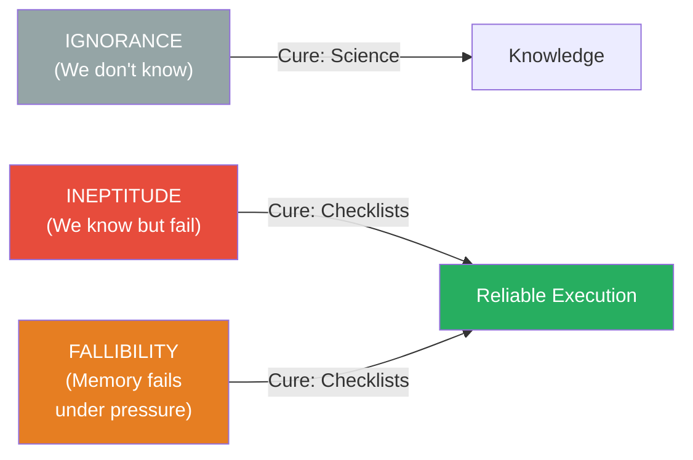
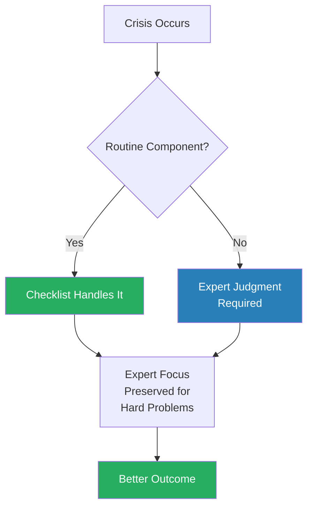
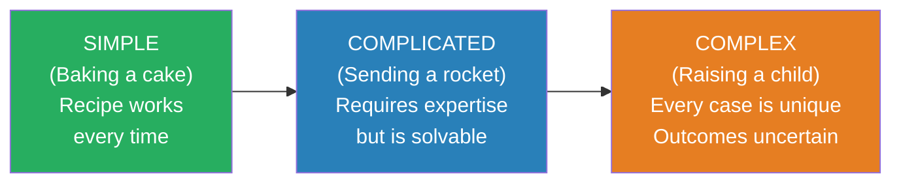
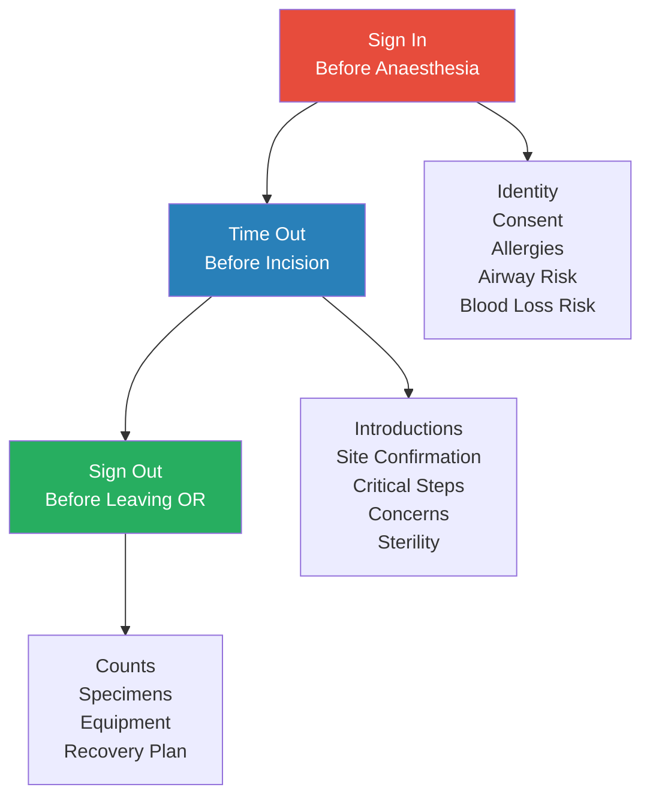
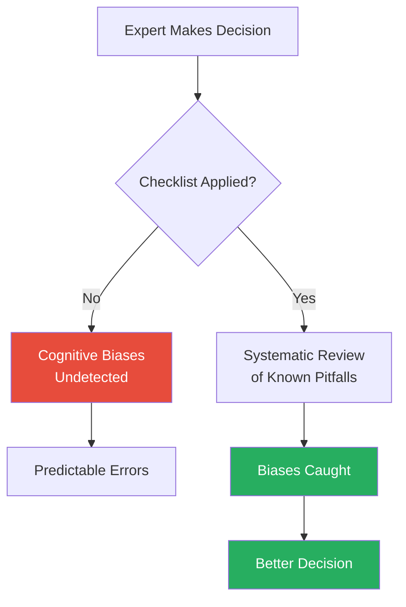
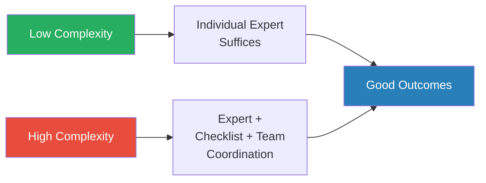
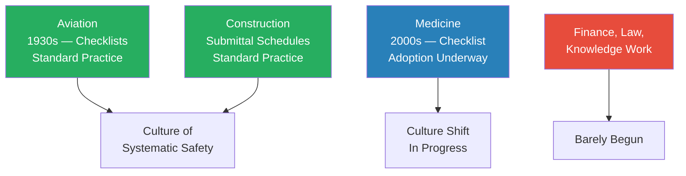

# The Checklist Manifesto — Atul Gawande

> Atul Gawande is a surgeon, and surgeons do not like being told what to do. They train for over a decade, operate on the frontier of human knowledge, and pride themselves on expertise and judgment. So when Gawande proposes that a simple checklist — a piece of paper with a few boxes to tick — can prevent more deaths than the most sophisticated medical technology, the resistance is immediate and visceral. But the evidence is overwhelming. A checklist reduced central-line infections from 11% to zero in Michigan ICUs. The WHO Safe Surgery Checklist reduced surgical deaths by 47% across eight hospitals in eight countries. And these are not isolated results — aviation, construction, and investment management all demonstrate the same pattern. **The failures that kill people are not failures of knowledge. They are failures of application.** We know what to do; we just do not reliably do it. The checklist is the cheapest, simplest, most effective tool ever devised for closing that gap.

---

## About the Author

Atul Gawande is a surgeon at Brigham and Women's Hospital in Boston, a professor at Harvard Medical School and the Harvard T.H. Chan School of Public Health, and a staff writer for *The New Yorker*. He led the World Health Organization's Safe Surgery initiative, which developed and tested the surgical checklist that forms the centrepiece of this book. His previous books, *Complications* and *Better*, explored the human fallibility of medical practice — the gap between what doctors know and what they actually deliver. He is one of the rare authors who combines deep domain expertise (he operates several days a week) with the ability to write clearly for a general audience, and that combination gives the book an authenticity that pure management literature often lacks.

---

## The Big Idea

- <b style="color: #2980b9">There are three reasons we fail: ignorance, ineptitude, and the necessary fallibility of human memory under pressure</b>
- **Ignorance** — we lack the knowledge. Science is the cure. We cannot treat a disease we do not understand, and no amount of process discipline helps when the knowledge simply does not exist yet
- **Ineptitude** — we have the knowledge but fail to apply it correctly. This is the domain where checklists shine
- The necessary **fallibility of memory** — under pressure, complexity, and time constraints, even experts skip steps they know by heart. The human brain is superb at pattern recognition and creative problem-solving, but it is unreliable at rote recall under stress
- <b style="color: #27ae60">In the modern world, ineptitude is a far larger source of failure than ignorance</b> — we know more than we can reliably execute
- The volume of medical knowledge has exploded:
  - Over 13,000 recognised diseases and syndromes
  - Over 6,000 drugs and 4,000 medical and surgical procedures available to treat them
  - A typical ICU patient requires 178 individual actions per day from the care team
  - Even a 1% failure rate per action means nearly two errors per patient per day
- Gawande's core argument: the problem is not that doctors are incompetent. The problem is that the task has outgrown any individual's capacity for flawless execution
- The checklist does not replace expertise — it catches the errors that expertise alone cannot prevent
- Gawande frames this as a shift in how we think about failure:
  - The old model: failure means someone was incompetent — find the bad apple and punish them
  - The new model: failure is a systems problem — the task exceeded the system's capacity, and the system must be redesigned
  - "We are not omniscient or infallible" — accepting this is the first step toward building systems that compensate for it

Gawande's three categories of failure form the spine of the book — the entire argument rests on convincing the reader that ineptitude, not ignorance, is the dominant threat in modern professional life.

Ineptitude — knowing what to do but failing to do it reliably — accounts for the majority of professional failures, making it the precise target that checklists are designed to eliminate.

---

## Key Concepts at a Glance

| Concept | One-line summary |
|---------|-----------------|
| **Three types of failure** | Ignorance, ineptitude, and necessary fallibility — checklists fight the last two |
| **DO-CONFIRM checklist** | Do the work from memory, then pause and confirm all steps completed |
| **READ-DO checklist** | Read each step aloud, then execute it — like following a recipe |
| **Simple / Complicated / Complex** | Baking a cake / Sending a rocket / Raising a child — different problems need different tools |
| **The pause point** | A deliberate stop in the workflow where the team checks their work |
| **Communication forcing function** | Checklist items that require team members to introduce themselves and voice concerns |
| **Killer items only** | Good checklists are 5-9 items — only the steps experts are most likely to skip |
| **Discipline of higher performance** | Checklists do not replace expertise — they free experts to focus on the hard parts |
| **The master builder problem** | Modern complexity has outgrown the single-expert model — distributed knowledge requires coordination |
| **Teamwork check** | Introductions by name and role flatten hierarchy and unlock communication |

---

## Chapter 1 — The Problem of Extreme Complexity

*Gawande opens with a simple, disturbing premise: the world has become too complex for any individual to manage reliably, and the consequences of that complexity are measured in human lives.*

- The modern physician has access to an extraordinary volume of knowledge:
  - The International Classification of Diseases lists more than 13,000 diseases and syndromes
  - For any given condition, there may be dozens of treatments, each with its own indications, contraindications, drug interactions, and side effects
  - A typical hospital offers over 4,000 medical and surgical procedures
- <b style="color: #2980b9">The sheer volume of what we know has outstripped any individual's ability to deliver on it reliably</b>
- Gawande describes his own experience treating a patient who arrived at the emergency room with a stab wound:
  - The wound appeared minor — a small puncture in the abdomen
  - But the knife had nicked the vena cava, the body's largest vein
  - What followed was a cascade of complications — massive blood loss, emergency surgery, organ failure, secondary infections
  - The patient survived, but only barely, and only because a large team managed to catch every complication as it emerged
- The point is not that the doctors were brilliant (though they were). The point is that no single doctor could have managed all the cascading problems alone

> [!example] The Stab Wound That Wouldn't Stop (Gawande's ER)
> - A young man arrived at the ER with what appeared to be a simple stab wound to the abdomen
> - Initial assessment suggested the injury was minor — the entry wound was small
> - But the knife had nicked the vena cava, and when Gawande opened the abdomen, blood poured out
> - The patient required massive transfusions, emergency vascular repair, and intensive care management
> - Over the following days, complications cascaded: organ failure, infections, clotting problems
> - Each complication required a different specialist, a different set of knowledge, a different protocol
> - The patient survived — but the case required dozens of people executing hundreds of steps correctly over weeks
> **The lesson:** Even a "simple" case can explode into a complexity that no individual can manage alone. The system saves the patient, not the hero.

- Gawande uses this case to set up the book's central question: <b style="color: #27ae60">if the complexity exceeds any individual's capacity, what systems can we build to catch the inevitable errors?</b>
- The answer, he will argue, is embarrassingly simple — and that is precisely why it is so hard to accept

---

## Chapter 2 — The Checklist

*A crashed bomber, a room full of test pilots, and a piece of paper that changed aviation forever — Gawande traces the origin of the checklist to a moment of spectacular failure.*

### The B-17 Crash That Invented the Checklist

- On 30 October 1935, a prototype Boeing Model 299 — the plane that would become the legendary B-17 Flying Fortress — crashed during its evaluation flight at Wright Field, Ohio
- The pilots were among the most experienced in the Army Air Corps, led by Major Ployer Peter Hill
- The investigation found no mechanical failure whatsoever
- The plane had four engines (previous bombers had two), retractable landing gear, wing flaps, electric trim tabs, and a host of new instruments
- <b style="color: #e74c3c">The plane was simply "too much airplane for one man to fly"</b> — there were too many systems to monitor, too many steps to remember during takeoff
- Major Hill had forgotten to release the elevator lock — a step that would have been second nature in a simpler aircraft but was lost in the cognitive overload of managing a revolutionary machine

> [!example] The B-17 Crash at Wright Field (1935)
> - Boeing's Model 299 was the most advanced bomber in the world — four engines, revolutionary capabilities
> - On its maiden evaluation flight for the Army Air Corps, it crashed on takeoff at Wright Field, Ohio
> - Two of the five crew members died, including the pilot, Major Ployer Peter Hill
> - Investigators found nothing wrong with the aircraft — every system was functioning perfectly
> - The cause: pilot error. Major Hill had forgotten to release the elevator and rudder gust locks before takeoff
> - The press called the plane "too much airplane for one man to fly"
> - Boeing nearly went bankrupt — the Army initially rejected the design
> **The lesson:** When a system exceeds the capacity of human memory, even the best-trained experts will make catastrophic errors. The answer is not more training — it is a better system.

- Rather than demand longer training or simpler aircraft, a group of test pilots devised an elegant solution: a **pilot's checklist**
- A short card listing the critical steps for takeoff, flight, landing, and taxiing — steps that every pilot already knew but might forget under the cognitive load of managing four engines
- The results were extraordinary:
  - The B-17 went on to fly 1.8 million miles without a serious accident
  - It became the backbone of Allied strategic bombing in World War II
  - The checklist became standard practice across all of aviation

> [!tip] Core Insight
> The checklist did not teach the pilots anything new. It caught the errors that their existing knowledge could not prevent under conditions of complexity and cognitive load.

---

### Aviation's Checklist Culture

- After the B-17 success, checklists spread throughout aviation
- Modern commercial aviation has checklists for every phase of flight:
  - Pre-flight inspection
  - Before-start
  - After-start
  - Taxi
  - Before-takeoff
  - After-takeoff
  - Cruise
  - Descent
  - Approach
  - Landing
  - After-landing
  - Shutdown
- Plus dozens of emergency checklists — engine failure, fire, depressurisation, hydraulic loss
- <b style="color: #27ae60">Aviation is now the safest mode of transportation in human history</b> — and checklists are a central reason why
- The checklist culture works because aviation resolved early on that human fallibility is not a character flaw to be shamed but an engineering problem to be solved
- The result: a system where the routine is handled by process, freeing pilots to focus their expertise on the non-routine — the judgment calls, the unexpected situations, the creative problem-solving that no checklist can replace

---

### Captain Sullenberger on the Hudson (2009)

> [!example] Sully's Miracle on the Hudson (January 2009)
> - US Airways Flight 1549, piloted by Captain Chesley "Sully" Sullenberger, struck a flock of Canada geese shortly after takeoff from LaGuardia Airport
> - Both engines lost thrust simultaneously — a scenario so rare that no one had trained for it at that altitude
> - Sullenberger had approximately 208 seconds between the bird strike and the water landing
> - In that time, he and First Officer Jeffrey Skiles divided duties: Sullenberger flew the plane while Skiles ran the engine-restart checklist — a READ-DO checklist executed step by step
> - Skiles got through the checklist's three pages. The engines did not restart, but the checklist ensured no restart option was missed
> - Meanwhile, Sullenberger's expertise told him they could not make it to any airport — a judgment call no checklist could make
> - He landed the plane on the Hudson River. All 155 passengers and crew survived
> **The lesson:** The checklist handled the routine (engine restart procedure), freeing the expert to handle the extraordinary (the decision to ditch in the river). That division of labour — routine to the checklist, judgment to the human — is exactly how the system is supposed to work.

- Gawande uses the Sullenberger story to make a crucial distinction:
  - <b style="color: #e74c3c">Checklists are not a replacement for expertise — they are what allows expertise to focus on the problems that actually require it</b>
  - Without the engine-restart checklist, Skiles would have been trying to remember steps from memory under extreme stress, potentially missing one, potentially wasting precious seconds
  - The checklist freed both pilots to operate at the top of their abilities

This diagram captures Gawande's core insight about the division of labour between checklists and expertise — the routine is handled by process, the non-routine by human judgment.

---

## Chapter 3 — The End of the Master Builder

*Gawande argues that the age of the lone expert who holds all the knowledge is over — in medicine, construction, and every other complex field. The question is what replaces that model.*

- For most of human history, complex projects were managed by a **master builder** — a single individual who understood every aspect of the work
  - Medieval cathedrals were designed and overseen by a master builder who understood stonework, carpentry, glass, geometry, and aesthetics
  - Early physicians were generalists who could diagnose, prescribe, and operate
  - Early aircraft had a single pilot who managed every system
- <b style="color: #2980b9">The master builder model worked when the total volume of relevant knowledge could fit inside a single expert's head</b>
- It does not work when:
  - A building project involves sixteen or more specialised trades
  - A surgical procedure requires an anaesthesiologist, a surgeon, nurses, a perfusionist, and a pharmacist each holding different critical knowledge
  - An aircraft has more systems than any single person can monitor simultaneously
- Gawande traces the shift historically:
  - In 1900, a competent general practitioner could hold most of medical knowledge in his head — there were few effective treatments, few diagnostic tools, and a limited pharmacopoeia
  - By 1950, the volume had expanded significantly — but a specialist could still master a discipline
  - By 2000, even narrow subspecialties had become too vast for any individual — a cardiac surgeon today must track hundreds of device types, drug interactions, patient co-morbidities, and evolving evidence
- The replacement is not a smarter master builder. It is a system that ensures the people who hold different pieces of knowledge actually communicate with each other at the right moments

---

### The Construction Industry's Solution

*How does an industry that builds skyscrapers — projects involving thousands of workers, millions of components, and zero tolerance for structural failure — avoid catastrophe? Not through genius. Through structured communication.*

- The modern construction industry abandoned the master builder model long ago
- No single person — not the architect, not the general contractor, not any trade specialist — holds all the knowledge needed to build a skyscraper
- Instead, the industry developed a system of <b style="color: #2980b9">submittal schedules</b> and structured communication:
  - A submittal schedule identifies every point in the project where different trades interact and potential conflicts must be resolved
  - At each interaction point, the relevant specialists are required to communicate, flag problems, and agree on solutions before work proceeds
  - The general contractor does not solve problems — the contractor ensures that the right people talk to each other at the right time

> [!example] Building a Skyscraper — The Submittal Schedule
> - A modern skyscraper involves sixteen or more specialised trades: structural steel, concrete, electrical, plumbing, HVAC, fire suppression, elevators, glass, and more
> - Each trade has its own expertise, its own drawings, its own materials, and its own timeline
> - The structural engineer designs a beam that must carry specific loads — but the HVAC contractor needs to run ductwork through the same space
> - Without structured communication, each trade would proceed independently, and conflicts would surface only during installation — causing costly rework and potentially dangerous compromises
> - The submittal schedule flags every such intersection in advance and requires the relevant specialists to meet, review plans, and resolve conflicts before any steel is cut
> - The result: building failure rates are astonishingly low despite the staggering complexity involved
> **The lesson:** When no single expert can hold all the knowledge, the system's job is to ensure that the people who hold different pieces of knowledge actually talk to each other.

- Gawande draws a direct parallel to medicine:
  - In a hospital, the surgeon, anaesthesiologist, nurse, and pharmacist each hold different critical knowledge about the patient
  - Without a structured moment to communicate (a pause point), each operates from incomplete information
  - The surgical checklist creates that structured moment — just like the submittal schedule creates it in construction
- <b style="color: #27ae60">The insight is counterintuitive: in complex systems, forcing communication is more valuable than adding expertise</b>
- The construction industry's track record proves the model works:
  - Building failure rates in the developed world are remarkably low — structural collapses of modern buildings are headline news precisely because they are so rare
  - This is not because construction workers are geniuses — it is because the system forces the right conversations to happen at the right time
  - Gawande notes that construction's fatality rate from structural failures has dropped steadily even as buildings have become more complex
  - The lesson for medicine: the answer to rising complexity is not smarter individuals but better systems for coordinating the individuals you already have

> [!example] The Citicorp Tower Crisis (1978)
> - After the Citicorp Center in New York was completed, structural engineer William LeMessurier discovered a critical design flaw — the building's joints used bolted connections instead of welded ones, making it vulnerable to high winds
> - LeMessurier calculated that a storm strong enough to topple the building could be expected every 55 years — a terrifying probability for a populated skyscraper
> - Rather than covering up the error, he disclosed it to Citicorp and the city
> - Emergency welding crews worked through the night for months to reinforce every joint, while the city quietly prepared evacuation plans
> - The building was saved — but only because the system allowed a critical error to surface and be corrected
> - In a culture where admitting mistakes is punished, LeMessurier might have stayed silent, and the building might have fallen in the next major storm
> **The lesson:** The system must not only coordinate expertise — it must create conditions where errors can be admitted and corrected. Checklists do this by making the verification step routine, not accusatory.

---

### Decentralisation vs. Centralisation

- Gawande explores a deeper question raised by the construction model: who should make decisions in a complex system?
- Two competing instincts:
  - **Centralise** — put one person in charge who dictates all decisions (the master builder model)
  - **Decentralise** — push decisions to the specialists who hold the relevant knowledge
- Construction chose decentralisation with coordination:
  - Each trade makes its own technical decisions within its domain
  - But at defined interaction points, those decisions are reviewed against the decisions of other trades
  - The builder acts as a coordinator, not a commander

| Approach | Strength | Weakness | Works when... |
|----------|----------|----------|---------------|
| **Centralised (Master Builder)** | Unified vision, fast decisions | Single point of failure, overwhelmed by volume | Knowledge fits in one head |
| **Decentralised (No coordination)** | Fast within each domain | Conflicts go undetected, integration fails | Tasks are truly independent |
| **Decentralised + Coordination** | Expertise applied locally, conflicts caught early | Requires structured process | Tasks are interdependent and no one expert holds all knowledge |

- Gawande argues that medicine — and most modern complex work — falls squarely into the third category: interdependent tasks where no single expert holds all the knowledge. The checklist is the coordination mechanism.

---

## Chapter 4 — The Idea

*Gawande crystallises the distinction between simple, complicated, and complex problems — and shows that checklists serve a different function for each.*

### Simple, Complicated, and Complex

- Gawande borrows a framework from complexity science to categorise problems:

This progression captures the key insight: different types of problems require fundamentally different approaches to reliability.

- <b style="color: #2980b9">Simple problems</b> have reliable recipes:
  - Follow the steps and the outcome is predictable
  - Baking a cake — if you follow the recipe, you get a cake
  - Success at one attempt increases confidence that the next attempt will also succeed
  - Expertise is helpful but not essential — a competent amateur with a good recipe can succeed

- <b style="color: #2980b9">Complicated problems</b> require expertise and coordination but are ultimately solvable:
  - Sending a rocket to the moon — the physics is known, the engineering is understood, success is repeatable
  - But you need many different kinds of expertise working in concert
  - Timing and coordination matter as much as individual skill
  - Success at one attempt gives reasonable confidence for the next — each launch teaches you something transferable

- <b style="color: #2980b9">Complex problems</b> are fundamentally different:
  - Raising a child — every child is unique, what worked for one may fail for another
  - Expertise helps but does not guarantee outcomes
  - There is no recipe, no formula, no procedure that reliably produces the desired result
  - Outcomes are inherently uncertain, and the problem evolves as you work on it

### How Checklists Serve Each Type

- For **simple problems**, checklists are recipes — follow the steps, get the result
- For **complicated problems**, checklists coordinate the many specialists involved — ensuring the right people communicate at the right moments
- For **complex problems**, checklists cannot dictate outcomes, but they can:
  - Ensure that the basic, known steps are not skipped (freeing attention for the unknown)
  - Force communication among team members who may hold different pieces of critical information
  - Create a moment of collective situational awareness before the unpredictable begins

| Problem Type | Role of the Checklist | Example |
|-------------|----------------------|---------|
| **Simple** | Recipe — follow the steps | Baking a cake, preparing a standard medication |
| **Complicated** | Coordination tool — ensure specialists communicate | Building a skyscraper, launching a rocket |
| **Complex** | Communication forcing function — surface hidden information | Surgery, raising a child, managing a crisis |

- The key insight is that most real-world problems contain all three layers:
  - A surgical operation has simple components (sterility procedures), complicated components (equipment coordination), and complex components (the patient's unique anatomy and responses)
  - The checklist handles the simple and complicated layers, freeing the team's cognitive capacity for the complex layer
  - <b style="color: #27ae60">When you standardise the predictable, you liberate attention for the unpredictable</b>

> [!tip] Core Insight
> Surgery is a complex problem dressed in complicated clothing. Each operation is unique (complex), but the preparation — sterility, equipment, team communication — is known and can be standardised (complicated). The checklist handles the complicated layer so the team can focus on the complex one.

---

## Chapter 5 — The First Try

*Gawande describes his early attempts to build a surgical checklist — and the humbling discovery that his first efforts were too long, too vague, and too easy to ignore.*

- Inspired by Peter Pronovost's work in ICU infections (covered in detail below), Gawande set out to create a checklist for surgery
- His first instinct was to be comprehensive — to list every possible thing that could go wrong
- The result was a multi-page document that covered everything from allergies to blood type to antibiotic timing to equipment checks
- <b style="color: #e74c3c">It was too long, too complex, and no one wanted to use it</b>
- The problem: Gawande had created a manual, not a checklist
- A manual tries to teach you everything. A checklist assumes you already know the work and catches only the errors you are most likely to make

> [!example] Gawande's First Checklist Failure
> - Gawande drafted an initial surgical safety checklist that ran to several pages
> - It covered allergies, blood type, antibiotic timing, equipment counts, patient identity, consent verification, and dozens of other items
> - When he tried to use it in his own operating room, the team resisted — it felt bureaucratic, condescending, and time-consuming
> - Nurses reported that it took too long to read through
> - Surgeons felt insulted — they already knew these things
> - The checklist was technically correct but practically useless
> - Gawande realised he had made the same mistake that killed many corporate quality programmes: confusing thoroughness with effectiveness
> **The lesson:** A checklist that tries to cover everything will be used by no one. The discipline is in deciding what to leave out.

- This failure sent Gawande to Boeing, where he met the man who would teach him how checklists actually work

---

### The Keystone ICU Study: Peter Pronovost's Breakthrough

*Before Gawande could build a surgical checklist, he needed to understand the proof of concept — and that proof came from a critical care specialist in Michigan who achieved results that seemed impossible.*

- In 2001, <b style="color: #2980b9">Peter Pronovost</b> at Johns Hopkins Hospital created a five-item checklist for inserting central venous catheters — a routine ICU procedure with a terrifying infection rate of 4-11%
- Central-line infections kill tens of thousands of patients annually in the United States
- The five items on the checklist:

> [!abstract] Pronovost's Central Line Checklist
> 1. Wash hands with soap
> 2. Clean the patient's skin with chlorhexidine antiseptic
> 3. Put sterile drapes over the entire patient
> 4. Wear sterile mask, hat, gown, and gloves
> 5. Put a sterile dressing over the insertion site after the line is in

- Every ICU doctor in the world already knew these steps
- None of them were controversial or novel
- But when Pronovost tracked compliance, he found that <b style="color: #e74c3c">doctors skipped at least one step in more than a third of patients</b>
- The reasons were mundane: time pressure, interruptions, the assumption that "just this once" would be fine, sterile drapes not available at the bedside
- Pronovost did two critical things beyond creating the checklist:
  - He convinced the hospital administration to give nurses the authority to stop any doctor who skipped a step
  - He tracked results rigorously and shared them with the teams

> [!example] The Michigan Keystone ICU Project (2003-2006)
> - Pronovost partnered with the Michigan Health & Hospital Association to implement his checklist across 103 ICUs statewide
> - Before implementation, central-line infection rates across Michigan ICUs averaged 11%
> - After one year with the checklist:
>   - Infection rates dropped from 11% to **zero** in the pilot hospitals
>   - The programme prevented an estimated 43 infections and 8 deaths in the first three months alone
>   - Across 103 ICUs over 18 months, it saved an estimated $175 million in costs
>   - Infection rates fell by 66% statewide and stayed low
> - The checklist took less than two minutes to complete per line insertion
> - The nurses' authority to stop non-compliant doctors was essential — it transformed the checklist from a suggestion into a system
> **The lesson:** The knowledge did not change. The technology did not change. The people did not change. Only the system changed — a piece of paper with five items on it.

- <b style="color: #27ae60">The Keystone results are among the most dramatic in the history of patient safety — and they came from the simplest possible intervention</b>
- Pronovost's study proved two things:
  - Checklists work even when they contain nothing new — the value is in ensuring consistent execution, not in providing new knowledge
  - Empowering the team to enforce the checklist is as important as the checklist itself — a checklist without enforcement authority is just a piece of paper

---

## Chapter 6 — The Checklist Factory

*Gawande travels to Boeing's headquarters in Seattle to learn from Daniel Boorman, the man responsible for every checklist used by Boeing pilots worldwide — and discovers that building a good checklist is itself a discipline.*

### Lessons from Boeing

- <b style="color: #2980b9">Daniel Boorman</b> has spent decades designing, testing, and refining checklists for Boeing aircraft
- He showed Gawande that most people who try to create checklists make the same mistakes:
  - They make them too long
  - They make them too vague
  - They include items the team never forgets (wasting attention on non-problems)
  - They fail to define when in the workflow the checklist should be used

> [!abstract] Boorman's Checklist Design Principles
> 1. **5-9 items maximum** — include only the "killer items" that even experts are most likely to skip
> 2. **Fits one page** — if it doesn't fit on a single page, it is too long
> 3. **Define the pause point** — specify exactly when in the workflow the team stops and runs the checklist
> 4. **Use the team's own language** — no jargon from another department, no formal medical Latin when the team says "blood pressure"
> 5. **Test in simulation** — run the checklist in realistic conditions before using it live
> 6. **Revise after use** — no checklist is perfect on the first draft; iterate based on real-world feedback
> 7. **Not a manual** — a checklist does not teach you how to do the work; it ensures you don't skip the steps you already know

- Gawande emphasises Boorman's distinction between a <b style="color: #2980b9">DO-CONFIRM</b> and a <b style="color: #2980b9">READ-DO</b> checklist:

| | DO-CONFIRM | READ-DO |
|--|-----------|---------|
| **How it works** | Do the work from memory and experience, then pause and confirm all steps were completed | Read each step from the list, then do it before moving on |
| **Analogy** | Like a pilot reviewing instruments after completing setup — verify, don't guide | Like following a recipe — the list directs each action in sequence |
| **Best for** | Experienced professionals who know the work but might skip steps under pressure | Unfamiliar or infrequent procedures, or emergencies where stress degrades memory |
| **Strength** | Preserves expert flow and judgment — the professional works naturally, then verifies | Ensures nothing is missed in complex sequences where order matters |
| **Risk** | Skipping the confirmation pause — turning DO-CONFIRM into just DO | Becoming mechanical — following steps without thinking about whether they apply |

- Aviation uses both types:
  - The pre-takeoff checklist is DO-CONFIRM — pilots complete their setup, then run through the list to verify everything is done
  - An emergency checklist (engine failure, fire, depressurisation) is READ-DO — read the step, execute it, read the next step, because under extreme stress, memory cannot be trusted at all
- <b style="color: #27ae60">The choice between DO-CONFIRM and READ-DO depends on the situation — routine work benefits from DO-CONFIRM; emergencies require READ-DO</b>

---

### What Makes Bad Checklists

- Gawande catalogues the failure modes he observed in poorly designed checklists:

| Bad Checklist Trait | Why It Fails |
|---------------------|-------------|
| Too long (20+ items) | Team stops reading partway through — attention fatigue |
| Includes obvious items | Wastes credibility — team stops trusting the list |
| Vague language | "Ensure adequate preparation" means nothing actionable |
| No defined pause point | No one knows when to stop and run the checklist |
| Treats the checklist as a manual | Tries to teach the work instead of catching errors |
| Never revised | Becomes outdated, includes items no longer relevant |
| No enforcement mechanism | Compliance is optional, so it becomes zero |

- <b style="color: #e74c3c">The most common failure: making the checklist too long because the author cannot bear to leave anything out</b>
- Boorman's advice: "If you have a twenty-item checklist, you don't have a checklist. You have a recipe for noncompliance."
- The discipline of checklist design is the discipline of deciding what to leave out — which requires deep knowledge of where the actual failure points are

---

## Chapter 7 — The Test

*The WHO Safe Surgery Checklist goes live in eight hospitals across eight countries — from wealthy Toronto to rural Tanzania — and the results shock even Gawande.*

### Building the WHO Checklist

- In 2007, the World Health Organization asked Gawande to lead a new initiative: reduce surgical deaths and complications worldwide
- The challenge was enormous:
  - 234 million major surgical operations per year worldwide
  - Complication rates ranging from 3% to 17% depending on the hospital
  - Death rates of 0.4% to 0.8% — meaning roughly 1 million people die each year from surgical complications
- Gawande assembled a team of surgeons, anaesthesiologists, nurses, and safety engineers from around the world
- They drew on the lessons from aviation (Boorman), construction (the submittal schedule), and Pronovost's ICU work
- The result: a 19-item checklist organised around three <b style="color: #2980b9">pause points</b>:

> [!abstract] The WHO Safe Surgery Checklist — Three Pause Points
> **Before Anaesthesia (Sign In):**
> 1. Patient confirms identity, site, procedure, and consent
> 2. Site is marked
> 3. Anaesthesia safety check completed
> 4. Pulse oximeter on patient and functioning
> 5. Known allergies reviewed
> 6. Difficult airway or aspiration risk assessed
> 7. Risk of blood loss assessed
>
> **Before Incision (Time Out):**
> 1. All team members introduce themselves by name and role
> 2. Surgeon, anaesthesiologist, and nurse verbally confirm patient, site, and procedure
> 3. Surgeon reviews critical steps and expected duration
> 4. Anaesthesiologist reviews patient-specific concerns
> 5. Nursing confirms sterility and equipment availability
> 6. Essential imaging displayed
>
> **Before Patient Leaves OR (Sign Out):**
> 1. Nurse confirms procedure name recorded
> 2. Instrument, sponge, and needle counts confirmed complete
> 3. Specimens labelled correctly
> 4. Equipment problems identified for follow-up
> 5. Surgeon, anaesthesiologist, and nurse review recovery plan

---

### The Team Introduction That Saves Lives

- One of the most surprising items on the checklist: <b style="color: #2980b9">"All team members introduce themselves by name and role"</b>
- This seems trivial — even absurd — in a surgical setting where people presumably know each other
- But Gawande explains why it is one of the most powerful items on the entire checklist:
  - In many operating rooms, team members do not know each other's names — especially in large hospitals with rotating staff
  - A nurse who does not know the surgeon's name is far less likely to speak up when she notices a problem
  - <b style="color: #27ae60">When people know each other's names, communication barriers drop dramatically</b>
  - Studies in aviation and psychology confirm this: people are more willing to challenge authority and raise concerns when they have been personally introduced

> [!example] The Power of Introductions in Surgery
> - Gawande describes a case where a nurse noticed that the wrong blood type was listed on a patient's chart
> - In a traditional operating room — no introductions, steep hierarchy — the nurse might have hesitated to speak up, especially to a senior surgeon she didn't know by name
> - But the team had just completed the WHO checklist, including introductions by name and role
> - The nurse addressed the surgeon by name and flagged the discrepancy
> - The error was caught and corrected before it could harm the patient
> - Gawande notes that this scenario plays out repeatedly — the introduction step creates what psychologists call "psychological safety," a condition where team members feel permitted to voice concerns
> **The lesson:** The team introduction is not a courtesy. It is a communication forcing function that flattens hierarchy and saves lives.

---

### The Trial Results

- The WHO checklist was tested in eight hospitals across eight countries:
  - Four high-income sites: Toronto, Seattle, Auckland, London
  - Four low-and-middle-income sites: Amman (Jordan), Manila (Philippines), Ifakara (Tanzania), New Delhi (India)
- Each hospital collected data before implementing the checklist and after
- Results were published in the *New England Journal of Medicine* in January 2009:

| Metric | Before Checklist | After Checklist | Change |
|--------|-----------------|-----------------|--------|
| Major complications | 11.0% | 7.0% | **-36%** |
| Deaths | 1.5% | 0.8% | **-47%** |
| Surgical site infections | 6.2% | 3.4% | **-45%** |
| Unplanned return to OR | 2.4% | 1.8% | **-25%** |

A two-minute, zero-cost checklist reduced surgical deaths by 47% — no drug, technology, or training programme has ever achieved comparable results at comparable cost.

- <b style="color: #27ae60">The checklist took less than two minutes to complete. It cost essentially nothing to implement. And it reduced deaths by nearly half.</b>
- The results held across all eight sites — including the rural hospital in Tanzania, where resources were minimal
- No drug, no technology, no training programme had ever achieved results this dramatic at this cost
- To put the numbers in perspective:
  - If every hospital in the world adopted the checklist and achieved similar results, it would prevent roughly 500,000 surgical deaths per year
  - The cost per life saved is essentially zero — the checklist is printed on paper and takes two minutes to complete
  - By comparison, a new cancer drug that extends life by three months can cost $100,000 per patient
  - <b style="color: #27ae60">The checklist is arguably the most cost-effective medical intervention ever studied</b>

> [!tip] Core Insight
> The WHO Safe Surgery Checklist did not introduce new medical knowledge. It ensured that existing knowledge — already known to every member of the team — was consistently applied. The gap it closed was not between ignorance and understanding, but between knowing and doing.

The three pause points structure the checklist around natural breaks in the surgical workflow — moments where the team can stop, verify, communicate, and catch errors before they become irreversible.

---

## Chapter 8 — The Hero in the Age of Checklists

*Gawande confronts the deepest source of resistance to checklists — the cultural belief that true expertise means you don't need one.*

### The Psychology of Resistance

- The most surprising finding in the WHO trial was not the clinical results — it was the resistance from surgeons:
  - Many surgeons initially refused to use the checklist
  - Some viewed it as an insult to their training and experience
  - Others saw it as bureaucratic overhead imposed by administrators who didn't understand the operating room
  - <b style="color: #e74c3c">The checklist challenged the deeply held belief that expertise and autonomy are the same thing</b>
- Gawande is honest about his own discomfort:
  - He describes the first time he used the WHO checklist in his own operating room
  - He felt awkward asking his team to introduce themselves — he'd worked with most of them for years
  - The checklist caught two issues in his first week: a missing antibiotic dose and an incorrectly marked surgical site
  - He was simultaneously embarrassed (he should have caught those himself) and grateful (the checklist caught what he missed)

> [!example] Gawande's Own Resistance
> - Gawande admits that even as the architect of the WHO checklist project, he was uncomfortable using it
> - The first time he asked his team to stop and introduce themselves by name and role, he felt "foolish"
> - His team had worked together for years — they knew each other
> - But the checklist revealed something: two members of the team that day were new — a visiting resident and a substitute anaesthesia technician — and Gawande didn't know their names
> - In the first week of use, the checklist caught a missing prophylactic antibiotic dose and a discrepancy in the surgical site marking
> - Both were errors Gawande should have caught himself — and both would have been caught by no amount of additional training or expertise
> **The lesson:** Even the person who designed the checklist benefits from using it. Expertise does not protect against the routine errors that occur under cognitive load.

- The resistance pattern Gawande describes mirrors what aviation experienced decades earlier:
  - Early pilots resisted checklists for the same reasons — they were the best in the world, they didn't need a piece of paper
  - The culture shifted only after undeniable evidence that checklists saved lives
  - Medicine is on the same trajectory, but decades behind

---

### The Discipline of Higher Performance

- Gawande reframes the debate: the question is not "do you trust your expertise?" but "do you want to perform at the highest level your expertise allows?"
- <b style="color: #27ae60">A checklist does not lower the ceiling — it raises the floor</b>
  - Without a checklist, even the best surgeon has occasional lapses — a missed antibiotic, a forgotten allergy check, a communication gap with the anaesthesiologist
  - With a checklist, those routine lapses are caught, and the surgeon's expertise is freed to focus on the genuinely difficult decisions — the unexpected anatomy, the bleeding that won't stop, the judgment call that no protocol can make
- The analogy to music is instructive:
  - A concert pianist practices scales — not because scales are difficult, but because automating the basics frees cognitive capacity for interpretation and expression
  - A surgical checklist is the equivalent of scales — it ensures the basics are handled so the expert can operate at the highest level

> [!tip] Core Insight
> Checklists do not dumb down expertise. They are a discipline of higher performance — handling the routine so that human judgment is preserved for the problems that actually require it.

---

## Chapter 9 — The Save

*Gawande presents a series of cases where the checklist made the difference between life and death — and cases where its absence proved fatal.*

### When the Checklist Saves

> [!example] The Caught Allergy in Austria
> - A patient in one of the WHO trial hospitals was scheduled for a routine knee procedure
> - During the Sign In phase, the checklist prompted the team to review known allergies
> - The patient mentioned a latex allergy that had not been recorded in her chart
> - The surgical team was using latex gloves — standard equipment in that hospital
> - The checklist caught the omission. The team switched to non-latex gloves before the procedure began
> - Without the checklist, the allergy would likely have gone unmentioned until the patient had a reaction on the table
> **The lesson:** The checklist does not just catch errors in execution — it surfaces information that would otherwise remain hidden because no one thought to ask.

> [!example] The Missing Equipment in Tanzania
> - At a rural hospital in Ifakara, Tanzania, the checklist's "Before Incision" phase asks the nursing team to confirm that all necessary equipment is available and functioning
> - During one procedure, the nurse reported that the pulse oximeter was not working — a piece of equipment that monitors blood oxygen levels during surgery
> - In many hospitals, the surgery would have proceeded anyway — the surgeon might not have known the oximeter was down until the patient's lips turned blue
> - The checklist forced the team to address the problem before the first cut — they borrowed a working oximeter from another room
> - The patient's oxygen levels dropped significantly during the procedure, and the oximeter alerted the team in time to intervene
> **The lesson:** In resource-poor settings, the checklist is even more valuable — it creates a systematic check on equipment and readiness that is otherwise left to chance.

---

### When the Checklist Is Absent

> [!example] The Wrong-Site Surgery Epidemic
> - Wrong-site surgery — operating on the wrong limb, the wrong organ, or the wrong patient — happens approximately 40 times per week in the United States
> - In nearly every case, the surgeon, anaesthesiologist, and nurses all knew which site was correct — the information existed in the room
> - But no one stopped to verify it out loud, as a team, before the incision
> - The Joint Commission on Accreditation of Healthcare Organizations introduced a "Universal Protocol" requiring a time-out before every procedure — essentially a checklist pause point
> - Hospitals that implemented the protocol rigorously saw wrong-site surgeries drop to near zero
> - Hospitals that treated it as a formality — rushing through the time-out, skipping it when running behind schedule — saw no improvement
> **The lesson:** A checklist only works if the team treats the pause point as a genuine stop — not a box to tick while continuing to work.

- <b style="color: #e74c3c">The most dangerous moment is when the team is rushed and "already knows" the correct answer — that is precisely when the verification step is most likely to be skipped and most likely to be needed</b>

### The Drowning Girl and the Power of Preparation

> [!example] The Three-Year-Old Who Drowned and Was Saved
> - Gawande recounts the case of a three-year-old girl who fell into an icy fishpond and was submerged for over thirty minutes before being found
> - By the time paramedics arrived, she had no pulse, was not breathing, and her core body temperature had dropped to 66 degrees Fahrenheit
> - At the hospital, the team faced an extraordinarily complex resuscitation — one that required cardiac bypass, warming protocols, medications, and coordinated action from more than a dozen specialists
> - The team had practised this exact scenario — a hypothermic drowning — using checklists and simulation drills
> - Each team member knew their role, the sequence of actions, and the decision points
> - The girl was placed on bypass, warmed gradually, and after hours of careful management, her heart restarted
> - She recovered fully with no brain damage
> - Gawande notes that this outcome was not a miracle — it was the product of a system that had rehearsed complexity in advance
> **The lesson:** Checklists and simulation together prepare teams for the cases that are too complex to manage on the fly. The girl survived not because of one brilliant doctor but because a system worked exactly as designed.

- This story illustrates a deeper principle: <b style="color: #27ae60">checklists are most powerful when they are developed and rehearsed before the crisis, not invented during it</b>
- The team that saved the drowning girl did not create their protocol in real time — they had practised it, refined it, and committed it to a checklist that every member could execute under pressure

---

## The Investment Checklist: Beyond Medicine

*Gawande extends his argument beyond medicine and aviation to show that checklists work wherever expertise is undermined by cognitive bias and complexity.*

### Mohnish Pabrai and the Value Investing Checklist

- <b style="color: #2980b9">Mohnish Pabrai</b>, a value investor inspired by Warren Buffett, developed an investment checklist after studying his own errors
- He reviewed every investment decision he had made, categorised the errors, and built a checklist designed to catch the cognitive biases that led to losses
- The checklist asks questions like:
  - Is this company in a declining industry?
  - Is this a turnaround situation? (Turnarounds rarely turn)
  - Am I buying because the stock is cheap, or because I have an emotional attachment to the idea?
  - Have I consulted someone who disagrees with my thesis?

> [!example] Pabrai's Investment Checklist
> - Mohnish Pabrai, a fund manager based in California, built a checklist of roughly 70 questions to ask before any investment
> - Each question was derived from an actual error — either his own or one he found in the track records of other investors
> - Example: "Is this a situation where the weights of history are on my side?" — a question designed to catch situations where he was betting against long-term industry trends
> - Example: "Is the management team focused on shareholder value, or are they empire-building?" — a question that surfaces governance red flags
> - He found that the checklist reliably caught 2-3 errors per investment decision that his intuitive analysis had missed
> - His fund's performance improved measurably after implementing the checklist
> - Importantly, the checklist did not replace his investment judgment — it supplemented it, catching the predictable biases that even experienced investors fall prey to
> **The lesson:** Checklists are not just for life-or-death situations. Anywhere that expertise is undermined by cognitive bias, complexity, or time pressure, a checklist can catch the errors that judgment alone misses.

- The investment checklist demonstrates Gawande's broader point: <b style="color: #27ae60">checklists work not because they are sophisticated, but because they are systematic — they force you to confront questions you would otherwise skip</b>

### The Cook County Hospital Emergency Department

- Gawande also describes how checklists entered emergency medicine through an unexpected route: diagnosing heart attacks
- At Cook County Hospital in Chicago, doctors were admitting far too many patients with chest pain to the coronary care unit — many of whom did not actually have heart conditions
- The problem was not ignorance — doctors knew the diagnostic criteria — but under the pressure and volume of an urban ER, they over-relied on intuition and erred on the side of caution
- <b style="color: #2980b9">Brendan Reilly</b>, the hospital's chairman of medicine, introduced a simple diagnostic algorithm — essentially a checklist-style decision tree based on a handful of objective criteria

> [!example] The Heart Attack Algorithm at Cook County (2001)
> - Cook County ER doctors were sending the vast majority of chest pain patients to the expensive coronary care unit — many unnecessarily
> - When Brendan Reilly introduced a simple algorithm based on ECG readings, blood pressure, fluid in the lungs, and unstable angina, doctors resisted
> - They felt the algorithm oversimplified their clinical judgment
> - But the data was clear: the algorithm was 70% better at identifying which patients actually needed intensive care than the doctors' unaided judgment
> - Patients who didn't need the coronary unit were treated faster and more appropriately in lower-acuity settings
> - The algorithm did not replace clinical judgment — it provided a structured starting point that prevented the most common diagnostic errors
> **The lesson:** Even in diagnosis — traditionally the purest domain of expert judgment — a structured checklist-style tool outperforms unaided intuition.

This diagram shows the checklist's role in any expert decision context — it intercepts the predictable errors that expertise alone cannot prevent.

---

## Designing Your Own Checklist

*Gawande distils the lessons from aviation, construction, medicine, and investing into a practical guide for building checklists that actually get used.*

### The Seven Principles

| Principle | What It Means | Common Mistake |
|-----------|--------------|----------------|
| **Killer items only** | Include only the 5-9 steps that even experts forget | Trying to list everything — creating a manual, not a checklist |
| **Define the pause point** | Specify exactly when the team stops and runs the checklist | Leaving it vague — "sometime before the procedure" |
| **Choose DO-CONFIRM or READ-DO** | Match the format to the situation | Using READ-DO for experienced teams (feels patronising) or DO-CONFIRM for emergencies (memory fails under extreme stress) |
| **Use the team's language** | Write in the words people actually use on the job | Using formal or corporate language that nobody speaks |
| **Fit it on one page** | If it takes more than 60-90 seconds, it is too long | Multi-page checklists that nobody reads past page one |
| **Test and iterate** | Run the checklist in simulation, then revise based on real use | Publishing a checklist and never updating it |
| **Empower the team** | Give every team member authority to enforce the checklist | Making the checklist the responsibility of the most senior person (who is least likely to be questioned) |

Defining clear pause points and establishing enforcement mechanisms emerge as the highest-weighted design principles — without them, even well-crafted checklists become ignored suggestions.

---

### The Pause Point Is Everything

- The most underappreciated element of checklist design is the <b style="color: #2980b9">pause point</b>
- A pause point is a defined moment in the workflow where the team stops what they are doing and runs the checklist
- Without a clear pause point:
  - No one knows when to initiate the checklist
  - The checklist gets pushed to "later" and eventually skipped
  - Team members assume someone else will run it
- <b style="color: #27ae60">The pause point transforms the checklist from a document into a ritual</b> — a shared moment where the entire team collectively verifies their readiness
- In aviation: before starting engines, before takeoff, before landing
- In surgery: before anaesthesia, before incision, before the patient leaves the operating room
- In construction: at every intersection between trades identified in the submittal schedule

---

### The Enforcement Problem

- Even the best-designed checklist fails without enforcement:
  - Pronovost's central-line checklist worked in Michigan because nurses were empowered to stop doctors who skipped steps
  - The WHO checklist worked because it required verbal confirmation from the entire team — creating social accountability
  - Aviation checklists work because copilots are trained and expected to challenge captains — and captains are trained to accept the challenge
- <b style="color: #e74c3c">A checklist without enforcement is a suggestion — and suggestions are ignored under pressure</b>
- The enforcement mechanism must be structural, not personal:
  - It should not depend on the courage of a junior team member to confront a senior one
  - It should be built into the workflow — the surgery does not proceed until the checklist is complete, the plane does not start until the checklist is run
  - Pronovost's genius was not the checklist itself (anyone could have written those five items) — it was giving nurses institutional authority to stop the procedure

---

## The Broader Argument: Discipline and Humility

*Gawande steps back from the specific evidence to make a philosophical argument about the nature of expertise in a complex world.*

### Why We Resist Discipline

- The resistance to checklists is not irrational — it reflects a deep cultural value:
  - We celebrate individual brilliance — the lone surgeon, the star pilot, the visionary investor
  - We associate discipline and standardisation with bureaucracy, with the suppression of creativity, with distrust
  - <b style="color: #e74c3c">We conflate autonomy with competence — as if needing a system means you are not good enough</b>
- Gawande argues that this conflation is not just wrong but dangerous:
  - The most competent professionals in the most demanding fields — aviation, nuclear power, high-rise construction — all use checklists
  - They use them not because they are less skilled but because they recognise that skill alone is insufficient in the face of complexity
  - The checklist is an act of humility — an acknowledgment that the task is bigger than any individual
- The cultural roots of resistance run deep:
  - Medical training emphasises individual mastery — the surgical resident is evaluated on their ability to perform alone under pressure
  - The hospital hierarchy places the attending surgeon at the top — someone who is "above" being told to wash their hands by a nurse
  - <b style="color: #e74c3c">This hierarchy is precisely what makes errors persist</b> — when junior staff fear correcting senior staff, preventable mistakes go unchallenged
  - Aviation solved this decades ago with <b style="color: #2980b9">Crew Resource Management (CRM)</b> training — a programme that teaches copilots to speak up and captains to listen
  - Medicine has been slower to adopt this culture shift, but the checklist forces it by making the verification step everyone's responsibility

> [!example] The Korean Air Turnaround — When Hierarchy Kills
> - Gawande references the case of Korean Air, which had a catastrophic safety record in the 1990s
> - Multiple crashes were traced to the same root cause: copilots and flight engineers who noticed problems but were culturally unable to challenge the captain
> - In Korean culture, deference to authority was deeply ingrained — junior crew members used indirect, deferential language even when the plane was in danger
> - After a series of fatal accidents, Korean Air overhauled its cockpit culture — adopting English as the official language of the cockpit (stripping out the hierarchical honorifics of Korean) and implementing rigorous CRM training
> - The airline's safety record improved dramatically
> - Gawande draws the parallel to surgery: the operating room has the same hierarchy problem, and the checklist — particularly the team introduction step — is a structural intervention that flattens it
> **The lesson:** Checklists do not just catch technical errors — they restructure the social dynamics of the team, making it safe for anyone to speak up.

---

### The Analogy to the Volume Knob

- Gawande offers an analogy: the evolution of expertise is like turning up the volume on a stereo
  - At low volume (low complexity), you can hear every instrument clearly — one expert can manage everything
  - As the volume rises (as complexity increases), the sound starts to distort — individual instruments become harder to distinguish
  - <b style="color: #27ae60">The checklist is not the music — it is the equaliser that prevents distortion and lets each instrument be heard clearly</b>

As complexity rises, the reliable pathway to good outcomes shifts from individual expertise to expertise supported by systematic coordination.

---

### What Checklists Cannot Do

- Gawande is careful to note the limits:
  - Checklists do not help with ignorance — if you do not know the right treatment, a checklist cannot supply it
  - Checklists do not make creative decisions — they free up cognitive capacity for creativity, but they do not replace it
  - Checklists do not prevent every error — they catch the predictable ones, the ones that result from memory failure and communication breakdown
  - Checklists do not work if the culture resists them — a checklist imposed by fiat on a hostile team will be gamed, ignored, or sabotaged
  - <b style="color: #e74c3c">Checklists are not a magic bullet — they are one tool in a system of safety</b>
- He also acknowledges that bad checklists can cause harm:
  - A checklist that is too long creates "checklist fatigue" — the team rushes through it or ignores it
  - A checklist that includes the wrong items gives false confidence — the team believes they are safe when they are not
  - A checklist that is never updated becomes obsolete and irrelevant
  - A checklist that becomes a mindless ritual — boxes ticked without genuine verification — is actively dangerous because it provides the appearance of safety without the substance

| What Checklists CAN Do | What Checklists CANNOT Do |
|------------------------|--------------------------|
| Catch predictable errors of omission | Generate new knowledge or creative solutions |
| Force communication between team members | Replace expertise or training |
| Create a moment of shared situational awareness | Prevent every error — novel failures still occur |
| Flatten hierarchy so junior staff can speak up | Work in a culture that actively sabotages them |
| Free expert attention for genuinely hard problems | Compensate for fundamental incompetence |
| Standardise the predictable layer of complex work | Handle the unpredictable — that still requires judgment |

---

## The Adoption Challenge

*Gawande explores why checklists spread slowly despite overwhelming evidence — and what it takes to change a professional culture.*

### The Diffusion Problem

- Despite the WHO trial results (47% reduction in deaths), adoption of the surgical checklist has been slow and uneven:
  - Some hospitals adopted it enthusiastically and saw dramatic results
  - Others adopted it on paper but not in practice — running through the checklist perfunctorily without genuine engagement
  - Others resisted entirely, arguing that their own practices were already sufficient

> [!example] The Hospital That Gamed the Checklist
> - At one hospital that adopted the WHO checklist, compliance was reported at 100%
> - But an observational audit revealed that in most cases, the checklist was being "completed" by a single person checking boxes after the surgery was already underway
> - The team introductions were skipped — the surgeon was already operating
> - The equipment check was marked complete without actually verifying anything
> - Complication rates at this hospital did not improve
> - At a neighbouring hospital that enforced genuine compliance — including stopping the surgery if the checklist wasn't completed — complication rates dropped by 40%
> **The lesson:** A checklist that is completed on paper but not in practice is worse than no checklist at all — it creates the illusion of safety without the reality.

- <b style="color: #27ae60">The difference between hospitals that benefit from checklists and those that don't is not the checklist itself — it is the culture of genuine compliance</b>

---

### What Drives Adoption

- Gawande identifies three factors that predict successful checklist adoption:
  - **Visible results** — when teams see immediate, concrete improvements (like Pronovost's infection rate dropping to zero), resistance melts
  - **Leadership buy-in** — when senior surgeons and administrators actively champion the checklist, the culture follows
  - **Enforcement mechanisms** — when compliance is structural (the surgery cannot begin without the checklist) rather than voluntary (please remember to do the checklist)

| Factor | Present | Absent |
|--------|---------|--------|
| **Visible results** | Team becomes an advocate — "this caught a real error" | Team views it as bureaucratic overhead |
| **Leadership buy-in** | Senior staff model compliance | Junior staff see it as optional |
| **Enforcement mechanism** | Compliance is near-universal | Compliance decays rapidly under time pressure |

- All three factors must be present for sustained adoption — any one alone is insufficient

---

### The Survey After the Trial

- After the WHO trial, Gawande's team surveyed the staff at all eight hospitals about their experience with the checklist
- The results revealed a fascinating paradox:
  - 80% of the staff said the checklist was easy to use and improved safety
  - 78% said they had personally seen the checklist catch an error before it could harm a patient
  - But when asked "if you were having an operation, would you want the checklist to be used?" — **93% said yes**
  - The gap between the 80% who endorsed it in theory and the friction of daily use reveals the core challenge: people intellectually accept the value of checklists but viscerally resist the discipline they require
- <b style="color: #27ae60">The most persuasive argument for a checklist is not data — it is asking someone "would you want this used on you?"</b>
- Gawande notes that even surgeons who initially resisted the checklist answered yes to that question — the asymmetry between what we want for ourselves and what we are willing to do is revealing

> [!tip] Core Insight
> People resist checklists when they are the ones who must use them. They demand checklists when they are the ones on the table. The gap between those two reactions is the gap the culture must close.

---

## Synthesis: The Checklist as a Philosophy

*Gawande's deepest argument is not about checklists per se — it is about what checklists represent: the recognition that we live in a world too complex for unaided expertise.*

- The checklist represents a particular philosophy of human performance:
  - Humans are fallible — not as a moral failing, but as an engineering fact
  - Complexity will only increase — more knowledge, more specialisation, more interdependence
  - Systems must be designed for fallible humans operating under pressure — not for idealised versions of ourselves
  - <b style="color: #27ae60">The goal is not to eliminate human judgment but to create the conditions under which human judgment operates at its best</b>

- Gawande draws the thread across all his examples:
  - Aviation recognised this in the 1930s and built a culture of checklists, crew resource management, and systematic learning from failure
  - Construction recognised this and built a system of submittal schedules and structured communication
  - Medicine is still fighting the battle — the culture of the heroic individual surgeon dies hard
  - Finance, law, and other knowledge work fields have barely begun

Gawande's map of checklist adoption across industries shows that the disciplines closest to life-and-death consequences adopted earliest — but the underlying logic applies everywhere.

The gap between medicine's strong evidence base and its weak cultural acceptance captures Gawande's central frustration — knowing checklists work and getting professionals to use them are entirely different challenges.

---

### The Paradox of Expertise

- Gawande identifies what he considers the central paradox of modern professional life:
  - The more expertise you accumulate, the more you need systems to support that expertise
  - A first-year medical student follows protocols because they don't know enough to deviate — compliance is natural
  - A seasoned surgeon deviates because they know more than any protocol can capture — but in deviating from the routine, they risk missing the routine steps
  - <b style="color: #2980b9">The paradox of expertise</b>: the very confidence that makes an expert effective also makes them vulnerable to the mundane errors that checklists prevent
- This is why the most effective professionals — not the mediocre ones — benefit most from checklists:
  - They are already operating at the edge of complexity, where cognitive load is highest
  - They are most likely to be handling multiple demands simultaneously
  - They are the ones whose attention is most divided between the routine and the extraordinary
  - The checklist gives them back the cognitive bandwidth they would otherwise spend on recall and verification

> [!tip] Core Insight
> Checklists are not training wheels for beginners. They are performance tools for experts — the higher you operate, the more you need them, because the cognitive demands on your attention are greatest at the top.

---

### From Checklists to Culture

- Gawande's final argument is that the checklist is not an end point — it is a beginning:
  - The checklist introduces the discipline of verification into a team's workflow
  - Over time, that discipline reshapes the team's culture — people begin to expect structured communication, to welcome checks, to view verification as a mark of professionalism rather than distrust
  - The best teams eventually internalise the checklist's principles so deeply that the physical checklist becomes a reminder rather than a crutch — but it remains necessary because memory remains fallible
- He draws a parallel to hand hygiene in hospitals:
  - Semmelweis demonstrated in 1847 that hand washing prevented childbed fever — the evidence was overwhelming
  - It took over a century for hand hygiene to become standard practice in hospitals
  - <b style="color: #e74c3c">The gap between evidence and adoption is not a knowledge gap — it is a culture gap</b>
  - Gawande hopes the checklist will not take a century to be universally adopted — but he is realistic about the pace of cultural change

---

## The Verdict

*The Checklist Manifesto* is a deceptively powerful book. Its central argument — that a simple piece of paper with a few boxes on it can prevent deaths, reduce errors, and improve performance across wildly different domains — sounds too good to be true. But the evidence is almost embarrassingly strong. The WHO trial data alone (47% reduction in surgical deaths, 36% reduction in complications, at essentially zero cost) would be enough to justify the book's existence. The Pronovost central-line data takes it further. And the construction and aviation examples demonstrate that the principle generalises far beyond medicine. The book succeeds in large part because Gawande writes from direct personal experience — he implemented the checklist in his own operating room, describes his own discomfort with it, and admits to the errors it caught in his own practice. That honesty gives the argument a credibility that a purely theoretical treatment would lack.

The book's primary limitation is that it focuses on what checklists can do and largely avoids the harder question of why they are so difficult to implement. The resistance Gawande describes — surgeons who refuse to use checklists, administrators who see them as bureaucratic overhead, cultures that equate checklists with distrust of expertise — is real, widespread, and deeply rooted. The book acknowledges this resistance but does not provide a detailed playbook for overcoming it. For readers who already find the argument convincing, this is a minor gap. For readers who need to convince hostile colleagues or organisations, it leaves them without the tools for the hardest part of the job. The psychology of professional identity — why experts resist tools that demonstrably make them better — deserved a full chapter.

The audience that benefits most is anyone working in a high-stakes environment where expertise is necessary but insufficient — medicine, aviation, engineering, finance, and increasingly, any knowledge work where the complexity of the task exceeds the reliability of individual memory. The book is also valuable for leaders and managers who need to implement process discipline in organisations that resist it — not as a how-to guide for the implementation itself, but as an evidence base for why the effort is worth the cultural cost.

In the landscape of systems thinking and process discipline, *The Checklist Manifesto* sits alongside [[Thinking in Systems - Donella H. Meadows|Thinking in Systems]] (which explains why structural solutions matter more than individual effort) and [[How to Measure Anything - Douglas Hubbard|How to Measure Anything]] (which shares Gawande's conviction that simple, cheap interventions can radically improve outcomes when properly designed). It is more accessible than either and makes a narrower but more actionable argument. For readers interested in the human psychology behind resistance to good process, [[Mindset - Carol S. Dweck|Mindset]] and the work of Kahneman on cognitive bias provide the complementary depth that Gawande gestures at but does not fully explore.

---

## Related Reading

- [[Thinking in Systems - Donella H. Meadows|Thinking in Systems]] — the structural view of why individual effort fails in complex systems and why system-level interventions (like checklists) outperform heroic individual performance
- [[How to Measure Anything - Douglas Hubbard|How to Measure Anything]] — Hubbard shares Gawande's belief that simple, cheap interventions can radically reduce uncertainty and improve outcomes
- [[Noise - Cass R. Sunstein|Noise]] — Kahneman, Sibony & Sunstein's argument for "decision hygiene" protocols that reduce variability — checklists are one of the most effective forms of decision hygiene
- [[The Phoenix Project - Gene Kim|The Phoenix Project]] — process discipline, change management, and reducing unplanned work in IT operations through systematic protocols
- [[The Effective Executive - Peter Drucker|The Effective Executive]] — Drucker's systematic approach to knowledge work anticipates Gawande's argument that discipline beats talent
- [[Mindset - Carol S. Dweck|Mindset]] — the psychology behind why experts resist tools that would make them better — the fixed mindset sees checklists as an insult; the growth mindset sees them as a lever
- [[Working Backwards - Colin Bryar & Bill Carr|Working Backwards]] — Amazon's operational rigour and process-driven culture share the same underlying philosophy: discipline and structure liberate performance rather than constraining it
