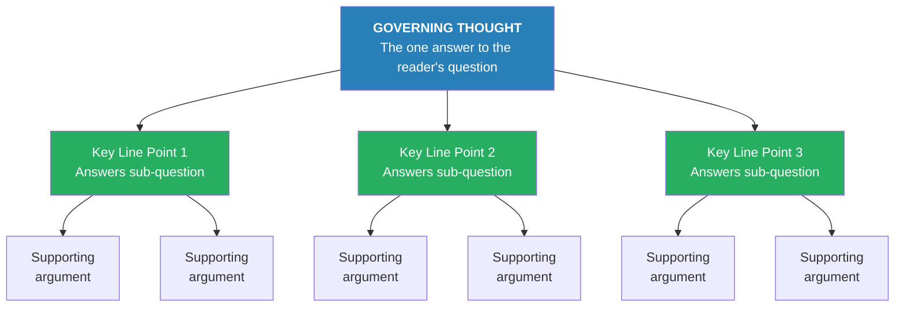
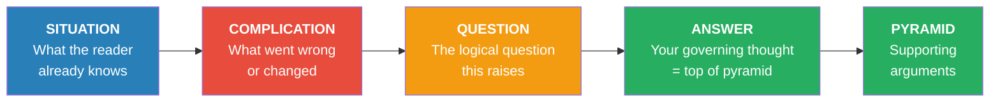
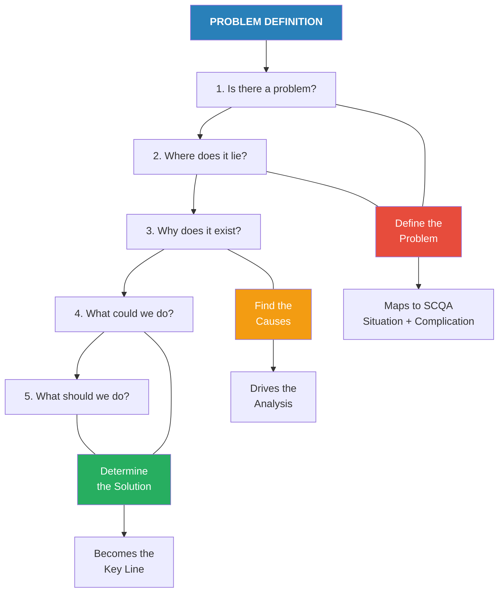
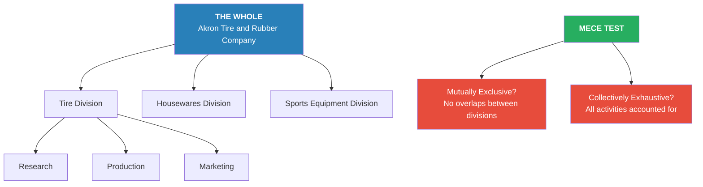
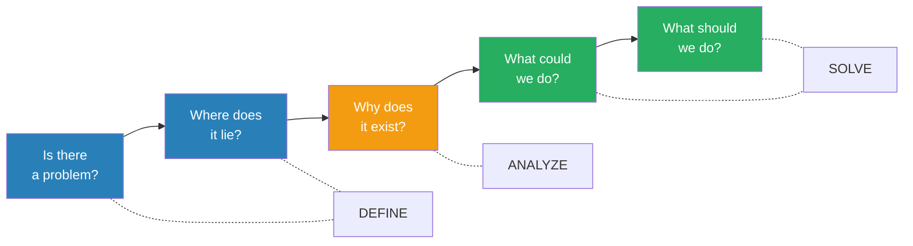

# The Pyramid Principle — Barbara Minto

> Barbara Minto was the first female MBA hired by McKinsey & Company in the 1960s, and she noticed something that drove her mad: brilliant consultants who could solve any problem were producing reports that no one could follow. The data was right, the analysis was sound, but the communication was a disaster. McKinsey itself estimated that sixty percent of its fact-finding effort was wasted — consultants gathering "interesting" facts only marginally connected to the client's real problem, then struggling to organize the mess into a coherent report. Minto spent years studying why some documents worked and others didn't, and she discovered a principle so fundamental it seems obvious in retrospect: **the human mind automatically organizes information into pyramid-shaped groupings, so every written document should be deliberately structured as a pyramid — answer first, then grouped supporting arguments, each group summarized by a single governing thought.** The framework she built — the Pyramid Principle — became the standard for communication at McKinsey and eventually across the entire consulting industry, reshaping how millions of professionals write, think, and present.

---

## About the Author

*Barbara Minto is a communication strategist who turned a pattern she noticed in struggling McKinsey reports into the most influential business writing methodology of the twentieth century.*

- She joined McKinsey & Company in the 1960s as its first female MBA hire, at a time when consulting firms were still figuring out how to communicate their analyses effectively
- Her early work focused on helping consultants structure their reports and presentations, where she observed that even the smartest analysts routinely buried their conclusions under mountains of unsorted data
- She developed the Pyramid Principle during her years at McKinsey, initially as an internal training tool, before founding Minto International Inc. to teach it globally
- The method became mandatory training at McKinsey, Bain, BCG, and dozens of other firms — a rare case of one person's framework becoming an industry-wide standard
- Her book has been continuously in print since 1987, translated into multiple languages, and updated through several editions (the most recent in 2009)
- Minto references her distant kinsman William Minto, a professor who wrote eloquently about the writer's obligation of "order and arrangement" — a family tradition she has carried forward with uncommon rigor

---

## The Big Idea

*Minto's master argument is that clear communication is not a matter of talent or style — it is a structural problem with a structural solution, and that solution is the pyramid.*

- Every document you write should be organized as <b style="color: #2980b9">a pyramid of ideas</b> — a single governing thought at the top, supported by grouped arguments beneath, each group summarized by its own governing thought, descending through as many levels as needed
- This is not arbitrary — it mirrors <b style="color: #27ae60">how the human mind actually processes information</b>
  - The mind can hold roughly seven items in short-term memory at once (George Miller's "magic number")
  - When confronted with more than seven items, the mind automatically sorts them into logical groups
  - Each group gets summarized by a higher-level thought, creating a natural pyramid
  - Therefore, writing that arrives pre-sorted into a pyramid is dramatically easier to comprehend and retain
- The pyramid has <b style="color: #2980b9">three substructures</b> that govern how ideas relate to each other:
  - **Vertical:** A question/answer dialogue between levels — every point raises a question that the level below answers
  - **Horizontal:** Deductive or inductive logic within each grouping — the only two possible logical relationships
  - **Narrative:** A story-form introduction (Situation → Complication → Question → Answer) that hooks the reader
- The most common failure in business writing is <b style="color: #e74c3c">presenting ideas in the order you discovered them</b> rather than the order that makes them easiest to understand
  - Consultants who gather data for weeks instinctively want to present findings chronologically
  - Academics want to show their work before stating conclusions
  - Both approaches force the reader to hold dozens of unresolved ideas in memory while waiting for the payoff
- The radical alternative: <b style="color: #27ae60">state the answer first, then prove it</b>
  - The reader knows immediately what you're arguing
  - Every supporting point has a clear purpose — answering a question the reader now has
  - Nothing is included that doesn't directly support the governing thought
  - The reader can stop at any level and still have a complete (if less detailed) understanding

- The book operates on <b style="color: #2980b9">four levels simultaneously</b>:
  - **Logic in Writing** (Parts 1-2): How to structure any document as a pyramid
  - **Logic in Thinking** (Part 2): How to ensure your grouped ideas are logically sound
  - **Logic in Problem Solving** (Part 3): How to define problems and structure analysis before you write
  - **Logic in Presentation** (Part 4): How to reflect pyramid structure on page, screen, and in prose
- Minto draws examples from McKinsey consulting engagements, city government reorganizations, corporate memos, airline industry analysis, and European technology reports
- The unifying thread: <b style="color: #27ae60">clear writing is clear thinking made visible</b> — and the pyramid is the architecture that makes both possible

> [!tip] The Acid Test
> Before you write anything, ask yourself: "What is the one question the reader needs answered?" Then ask: "What is my answer?" If you can't state both in one sentence each, you're not ready to write. The answer becomes the top of your pyramid; everything else exists only to support it.

---

## Key Concepts at a Glance

| Concept | One-line summary |
|---------|-----------------|
| **The Pyramid Structure** | Every document should be a hierarchy: one governing thought at top, grouped supporting arguments below |
| **SCQA Framework** | Introductions tell a story: Situation → Complication → Question → Answer |
| **Vertical Relationship** | Each point raises a question; the level below answers it — creating a reader dialogue |
| **Horizontal Relationship** | Ideas in any group must be either deductive (sequential steps) or inductive (similar items) |
| **MECE** | Mutually Exclusive, Collectively Exhaustive — no overlaps, nothing missing |
| **Deduction vs. Induction** | Deduction chains premises to a "therefore"; induction groups similar observations into an inference |
| **Three Logical Orders** | Time order, structural order, or degree order — the only ways to sequence ideas |
| **Action as End Product** | State what the world looks like after the action, not the vague activity itself |
| **The Summary Leap** | Listing is not summarizing — you must identify the common link and state its significance |
| **Problem Definition Framework** | Five questions: Is there a problem? Where? Why? What could we do? What should we do? |
| **Diagnostic Frameworks** | Three structures for analysis: physical/structural, financial/causal, classification |
| **The Governing Thought** | One single point that every element in the document exists to support |

---

## Why the Mind Needs Pyramids

*The problem isn't that people write badly — it's that they write in a way the human brain wasn't designed to process.*

- When you read a document, you take in sentences one at a time — a <b style="color: #e74c3c">serial bottleneck</b> through which all information must pass
  - The reader must absorb each sentence, relate it to the previous ones, and hold the relationships in working memory
  - If the sentences arrive in no particular logical order, the reader's mind must do enormous work to impose its own structure
  - If they arrive pre-organized into a pyramid, the mind can process them with minimal effort
- The mind has a natural tendency to <b style="color: #2980b9">group and summarize</b> — it does this automatically with any incoming information
  - When you see a list of nine grocery items, your mind instinctively sorts them: dairy products, fruit, vegetables
  - Instead of remembering nine items, you now remember three categories — thinking at a higher level of abstraction
  - This is not a technique — it's how cognition works

> [!example] The Grocery List That Explains Everything
> - Minto asks readers to memorize nine items: grapes, oranges, milk, butter, potatoes, apples, eggs, sour cream, carrots
> - Most people struggle to hold all nine in memory simultaneously
> - But when you group them — Dairy (milk, butter, eggs, sour cream), Fruit (grapes, oranges, apples), Vegetables (potatoes, carrots) — you remember them effortlessly
> - The trick: you moved from nine items to three groups, thinking one level higher
> - This is the entire Pyramid Principle in miniature — group, summarize, ascend

- The magic number: the mind can hold approximately <b style="color: #2980b9">seven items (plus or minus two)</b> in short-term memory at once
  - This means any grouping of more than five ideas at a single level starts to strain comprehension
  - Ideal groupings contain three to four items
  - If you have more, you need another level of grouping
- The implication for writing is profound: <b style="color: #27ae60">if you want your reader to understand and remember your message, you must do the grouping work for them</b>
  - Don't present twenty findings and expect the reader to sort them
  - Group the findings into three to five categories
  - Summarize each category with a single insight
  - Summarize the insights into one governing thought
  - Present the governing thought first, then unpack it level by level

---

## The Three Substructures

*Every pyramid is governed by three interlocking relationships — vertical, horizontal, and narrative — and understanding all three is the key to building one that works.*

### The Vertical Relationship: Question/Answer Dialogue

- Every statement you make raises a <b style="color: #2980b9">logical question</b> in the reader's mind
  - If you say "We should reorganize the sales department," the reader immediately asks "Why?" or "How?"
  - The level below must answer that question — and only that question
  - Each answer in turn raises its own question, which is answered by the next level down
- This creates a **dialogue** between writer and reader that holds attention naturally
  - The reader is never confused about why a particular point exists — it answers the question they just formed
  - If a point doesn't answer the question raised by the level above, it doesn't belong in that group
- The vertical relationship also means you can <b style="color: #27ae60">control the reader's depth of engagement</b>
  - A reader who wants the 30-second version reads only the top — the governing thought
  - A reader who wants the 5-minute version reads the governing thought plus the Key Line points
  - A reader who wants the full picture descends through every level

### The Horizontal Relationship: Deductive or Inductive Logic

- Within any grouping, the ideas must present <b style="color: #2980b9">either a deductive or inductive argument</b> — one or the other, never both at once
- These are the only two logical relationships possible in a grouping

**Deductive grouping** presents an argument in successive steps:
- The first idea makes a statement about the world
- The second idea comments on the subject or predicate of that statement
- The third idea draws a "therefore" from the first two
- Classic form: "Men are mortal → Socrates is a man → Therefore Socrates is mortal"
- To summarize: you rest on the final "therefore" point

**Inductive grouping** takes a set of ideas related by the same plural noun:
- Ideas are all "reasons for," "steps to," "problems with," etc.
- Classic form: "French tanks at the border, German tanks at the border, Russian tanks at the border → Poland is about to be invaded"
- To summarize: you draw an inference about what the points have in common

> [!example] Why Minto Prefers Induction for Writing
> - A deductive argument forces the reader to hold premise after premise in memory, waiting for the "therefore" at the end
> - This creates what Minto calls a "mystery story" — the reader doesn't know where you're going until you get there
> - An inductive argument states the conclusion first, then provides the evidence — the reader immediately knows the point
> - In business writing, Minto argues, induction is almost always preferable because it respects the reader's time and patience

### The Narrative Introduction: SCQA

- Every pyramid needs an introduction that tells the reader a <b style="color: #2980b9">story they already know</b>
  - **Situation:** Undeniable facts the reader accepts as true (sets the scene)
  - **Complication:** Something that disturbed the situation, creating tension
  - **Question:** The logical question the complication raises
  - **Answer:** Your governing thought — the top of the pyramid
- The story form works because it mimics how the mind naturally processes new information — through narrative

The Standard Direct pattern dominates business communication because most documents answer an explicit question — the abbreviated pattern is reserved only for audiences already deeply familiar with the problem.

---

## Building the Pyramid: Top Down vs. Bottom Up

*You can construct a pyramid either from the top down or from the bottom up — but top-down is almost always easier, so try it first.*

### Top-Down Construction

- Start by determining what you already know about your message:
  1. **Subject:** What is the document about?
  2. **Question:** What question does the reader have about this subject?
  3. **Answer:** What is your answer to that question? (This becomes the governing thought)
  4. **Situation-Complication:** What story leads the reader to ask that question?
  5. **Key Line:** Is the answer supported deductively or inductively?
- Then fill in supporting arguments level by level, always checking: does this answer the question raised by the point above?

### Bottom-Up Construction

- When you don't know your main point yet:
  1. List every point you think you want to make
  2. Look for logical relationships between them
  3. Group related points together
  4. Find a summary statement for each group
  5. Keep grouping and summarizing upward until you reach one governing thought
- This is harder and slower, but sometimes necessary when you're still discovering your argument

> [!example] The Board Memorandum Transformation
> - A writer produced an introduction listing vague topics: "composition of the Board," "conception of broad roles," "making the outside Board member effective," "principles for selection and tenure," "alternate ways to get from where we are to where we want to be"
> - Minto shows how forcing this into SCQA reveals the real story: The new organization frees the Board from day-to-day operations. But the Board has oriented itself to short-term problems for so long that it can't focus on long-range strategy. It must make changes to refocus.
> - The recommendation pyramid becomes clear: (1) Relinquish day-to-day matters to the Executive Committee, (2) Broaden composition to include outside members, (3) Establish policies and procedures to formalize operations

---

## Deduction vs. Induction in Practice

*Both are valid forms of reasoning, but they serve very different purposes in writing — and choosing the wrong one can make a clear argument unreadable.*

### How Deduction Works

- A deductive argument chains three elements:
  - **Statement about the world:** "Birds fly"
  - **Comment on that statement:** "I am a bird"
  - **Therefore:** "Therefore I fly"
- The second point must always <b style="color: #2980b9">comment on the subject or predicate of the first</b>
  - If it doesn't, you don't have a deduction — you have something else
- Deductive arguments can be **chained** — linking multiple syllogisms together
  - But this quickly becomes tedious to read
  - Each chain adds another layer the reader must hold in memory

### How Induction Works

- An inductive argument groups ideas that share a <b style="color: #2980b9">common characteristic</b>
  - All items must be describable by the same plural noun (reasons, steps, problems, changes)
  - The summary draws an inference about what the group means collectively
- To verify an inductive grouping, check that every item is:
  - The same "kind of thing" as every other item
  - Describable by a single plural noun
  - Logically ordered (by time, structure, or degree)

### The Test for Which You Have

- If the second point <b style="color: #27ae60">comments on the first point's subject or predicate</b> → deduction
- If the second point can be <b style="color: #27ae60">classified by the same plural noun as the first</b> → induction

> [!example] Spotting the Fallacy
> - "All Communists are proponents of socialized medicine. Some members of the administration are proponents of socialized medicine. Therefore, some members of the administration are Communists."
> - This looks deductive but fails — the second point doesn't comment on the first; it adds another member to the same class
> - It's actually a botched inductive grouping: two groups both favor socialized medicine, but that doesn't make them the same group
> - Minto's test catches this instantly: does point two comment on point one? No. Can they share a plural noun? Yes — "groups favoring socialized medicine." Therefore this is induction, and the "therefore" is invalid

---

## The Three Logical Orders

*Every grouping of ideas at any level in the pyramid must follow one of exactly three ordering principles — there are no others.*

### 1. Time Order

- Used when ideas represent <b style="color: #2980b9">steps in a process or causes leading to effects</b>
  - First you do X, then Y, then Z
  - Each step produces a result that enables the next step
- The summary of a time-ordered group states the <b style="color: #27ae60">end product</b> of the process
- Critical rule: every step must be stated as an end product, not a vague activity
  - <b style="color: #e74c3c">"Strengthen regional effectiveness"</b> → vague, no image
  - <b style="color: #27ae60">"Assign planning responsibility to the regions"</b> → concrete, testable
- End-product wording stimulates further thinking — once you see the end state, you can check whether additional steps are needed

### 2. Structural Order

- Used when ideas represent <b style="color: #2980b9">parts of a whole</b> — what you see when you visualize something
  - Divisions of an organization, components of a system, sections of a geography
- The structure must be **MECE**: Mutually Exclusive (no overlaps) and Collectively Exhaustive (nothing missing)
- Present in the order you would <b style="color: #27ae60">draw the elements on a blank page</b> — from the most important or visible component to the least

### 3. Degree Order (Ranking)

- Used when ideas are <b style="color: #2980b9">similar items ranked by importance</b>
  - Most important first, least important last (or vice versa)
  - The biggest problem, the strongest argument, the most urgent recommendation
- Often the fallback when neither time nor structure applies
- The summary states what all the items have in common and why the ranking matters

| Order | When to Use | Summary States |
|-------|------------|----------------|
| **Time** | Steps, processes, cause-effect | The end product of the process |
| **Structure** | Parts of a whole, MECE divisions | What the whole looks like |
| **Degree** | Ranked similar items | What they share and why ranking matters |

Structural order scores highest on rigour and gap-detection — explaining why MECE analysis is the consulting industry's most valued analytical discipline despite being harder to apply than simple ranking.

---

## The Art of Summarizing: From Lists to Insights

*The single most common failure in business writing is stopping at a list when you should be making an argument — most writers never complete the three steps required to turn grouped ideas into genuine insight.*

### The Three-Step Summary Process

- **Step One — Listing:** Simply put related points together under a heading
  - This is where <b style="color: #e74c3c">most business writers stop</b>
  - They gather their findings, group them loosely, and label each group with a category heading ("Operations," "Marketing," "Issues")
  - This creates a document that organizes information but communicates nothing
- **Step Two — Finding the Common Link:** Identify the structural similarity that justifies the grouping
  - Why do these points belong together?
  - What is the common property they share?
  - The link may be in the subjects (all about the same thing), the predicates (all describe the same action), or the implied judgments (all suggest the same concern)
- **Step Three — The Inductive Leap:** State the wider significance of the common link
  - This is where <b style="color: #27ae60">the actual thinking happens</b>
  - You create a new idea that didn't exist in any single point
  - This new idea is the summary — the governing thought for that group

> [!example] The Planning and Control System
> - A writer lists "four characteristics of the new Planning and Control system" — planning cycle, control mechanism, annual basis, attendant processes
> - At Step One, this is just a list labeled "characteristics"
> - At Step Two, Minto asks: what do these have in common? They're all aspects of timing and process
> - At Step Three, the real insight emerges: "The new system runs on an annual cycle that integrates planning with control" — a single statement that captures what four separate points were trying to say

### Why Category Headings Fail

- Headings like "Background," "Findings," "Analysis," and "Recommendations" are <b style="color: #e74c3c">the lowest form of intellectual effort</b>
  - They tell the reader what kind of information is coming, not what the information means
  - They represent organizing by file folder rather than by argument
  - A reader scanning only headings learns nothing about your message
- Message headings — <b style="color: #27ae60">"Consolidate committees to improve governance"</b> instead of "Organizational Recommendations" — tell the story even when the reader reads nothing else
- Every heading should be a complete thought that could stand alone as a summary of its section

### Action Ideas Must Be End Products

- When summarizing recommendations or action steps, <b style="color: #2980b9">state the end product, not the activity</b>
  - "Review management processes" → what does the reader see happening? Nothing specific
  - "Determine whether management processes need to be revised" → now there's a concrete deliverable
- This discipline serves two purposes:
  - The reader can actually visualize what success looks like
  - The writer can check whether the steps are sufficient — if you can see the end product, you can see what's missing

| Vague Activity | End-Product Statement |
|---------------|----------------------|
| Strengthen regional effectiveness | Assign planning responsibility to the regions |
| Reduce accounts receivable | Establish a system for following up overdue accounts |
| Improve financial reporting | Install a system that gives early notice of change |
| Tackle strategic issues | Define clear long-term strategy |
| Redeploy manpower resources | Place people in positions of comparable responsibility |

---

## Defining the Problem: The Five-Question Framework

*Before you can write a clear document, you must define the problem clearly — and most people skip this step entirely, jumping straight to data collection.*

- The framework asks <b style="color: #2980b9">five sequential questions</b>:
  1. **Is there a problem (or opportunity)?** — Establish that something has changed or is about to
  2. **Where does the problem lie?** — Locate it in the organization, process, or system
  3. **Why does the problem exist?** — Identify root causes
  4. **What could we do about it?** — Generate possible solutions
  5. **What should we do about it?** — Evaluate and recommend

- Questions 1-2 <b style="color: #27ae60">define the problem</b>, Question 3 <b style="color: #2980b9">finds its causes</b>, Questions 4-5 <b style="color: #27ae60">determine the solution</b>
- The framework also maps directly to the SCQA introduction:
  - Questions 1-2 generate the Situation and Complication
  - They reveal which of three standard questions the document answers:
    - "What should we do?" (solution unknown)
    - "Should we do it?" (solution proposed but not accepted)
    - "How should we do it?" (solution accepted, implementation needed)

### The Secret to Efficient Consulting Reports

- Minto argues that the four stages of consulting work should flow seamlessly:
  1. **Define the problem** — using the five-question framework
  2. **Structure the analysis** — using diagnostic frameworks
  3. **Conduct the analysis / find the solution** — gathering data guided by the structure
  4. **Form the pyramid** — organizing ideas for communication
- The secret: <b style="color: #27ae60">if you define the problem and structure the analysis correctly, the pyramid practically builds itself</b>
- The old approach — gather everything, then organize — produced McKinsey's 60% waste rate

The sankey reveals McKinsey's original 60% waste problem — when data gathering precedes problem definition, most effort flows into irrelevance rather than clear communication.

- The new approach — pre-structure your analysis to match the pyramid you'll eventually need — eliminates the waste

---

## Diagnostic Frameworks: Three Ways to See a Problem

*You can't solve a problem you can't visualize — and diagnostic frameworks give you three distinct ways to see what's actually going on.*

### 1. Physical/Structural Diagnosis

- Draw the system as it is or should be functioning — <b style="color: #2980b9">a picture of the process or organization</b>
  - An organization chart, a supply chain diagram, a workflow map
  - The picture guides you to the questions you need to answer
  - You identify where in the system the problem occurs

> [!example] The Period Graph Books
> - A company had a complex process for producing graph presentation books — data flowed through divisional computers, was manually re-entered into a corporate system, then re-entered again into a color graphics system
> - By drawing the before-and-after systems, it became immediately obvious that data was being entered three separate times, creating opportunities for error at each handoff
> - The solution was equally obvious: create a direct data link, computerize graph point generation, and require validation of manual changes

### 2. Financial/Causal Diagnosis

- Trace the <b style="color: #2980b9">cause-and-effect elements</b> that produce a financial or operational result
  - Decompose Return on Investment into Sales and Costs and Assets
  - Break Sales into Product Volume and Pricing
  - Break Product Volume into Quality, Design, and Range
- Put numbers on the chart and you can quickly identify where the problem lies
- Then drill into the component causing the shortfall

### 3. Classification Diagnosis

- Create a <b style="color: #2980b9">MECE classification</b> of possible causes and eliminate them systematically

> [!example] The Headache Diagnostic
> - Your head hurts and you don't know why — how do you diagnose it?
> - MECE classification: the cause is either Physical or Mental
> - If Physical: either External (bumped head, allergies, weather) or Internal (flu, sinus, brain tumor, water on the brain)
> - If Mental: either Stress/tension or Hypochondria
> - You assess causes in order of easiest to eliminate — you don't schedule a brain scan if it turns out you have a sinus headache
> - This is precisely how consulting firms diagnose business problems

### Choosing the Right Framework

| Framework | Best For | Example |
|-----------|----------|---------|
| **Physical/Structural** | Process problems, organizational issues | Drawing a supply chain to find bottlenecks |
| **Financial/Causal** | Performance shortfalls, cost problems | Decomposing ROI to find what's dragging it down |
| **Classification** | Unknown causes, diagnostic situations | MECE tree of possible reasons for customer churn |

---

## SCQA in Depth: Crafting Introductions That Work

*The introduction is the most important part of any document — get it wrong and the reader never properly understands your message, no matter how good your pyramid is.*

### The Four Principles

- **Tell the reader what he already knows** — the introduction should contain no information the reader would dispute or find surprising
  - If the reader encounters something new or debatable in the introduction, he'll start arguing before he ever reaches your argument
- **Use story form** — Situation leads to Complication leads to Question
  - Narrative is the oldest and most reliable way to hold attention
  - Even the most technical document benefits from a story setup
- **The length must match the document** — a one-page memo needs a one-paragraph introduction; a hundred-page report may need several pages
- **The Question must match the pyramid** — whatever question the introduction raises, the Key Line must answer it directly

### Four Standard Introduction Patterns

1. **Standard Direct (S-C-Q-A):** The market is growing. But we're losing share. What should we do? Here are three recommendations.
2. **Concern-Based (S-C-A):** Useful when the question is obvious — skip stating it explicitly
3. **Directive:** When you're telling someone to do something — you plant the question rather than remind them of one they already have
4. **Abbreviated:** When the reader already knows the problem and just wants the answer

> [!example] The European Document System Introduction
> - A writer produced a confusing introduction about "technological, economic and managerial issues of converting documents to digital form"
> - Minto restructured it using SCQA:
> - **Situation:** Currently, someone scans a TV listing, telephones a library, the library locates and copies the document, mails it — total elapsed time: 7-10 days
> - **Complication:** The Commission wants documents converted to digital form, stored centrally, and delivered to user screens within an hour
> - **Question:** Is this technically feasible at reasonable cost on a European scale?
> - **Answer:** Yes — we conceived a system called DDT that builds on DIANE
> - The clarity difference is dramatic — the reader immediately understands the problem and the proposed solution

### Key Line Introductions

- Each Key Line point also needs its own mini-introduction — a <b style="color: #2980b9">smaller SCQA that transitions from the governing thought to the specific argument</b>

> [!example] The TQM Management Tools Paper
> - Main SCQA: TQM was the hot tool of the 1980s (S). Most companies adopted TQM but haven't seen expected benefits — yet leaders are still gaining market share (C). Why? What are leaders doing better? (Q). Leaders are adding Benchmarking and Activity-Based Management to their TQM toolkit (A).
> - Each Key Line point then gets its own setup: "Use Benchmarking to judge comparative efficiency" leads to "How does benchmarking work?" which is answered by the supporting arguments beneath

### Complex Problem Introductions

- Some problems have <b style="color: #e74c3c">multiple layers of complication</b> — situations where the initial problem led to a response, which created a new problem, which led to another response
- Minto demonstrates how to handle triple-layer problems by reading the problem structure from left to right and top to bottom

> [!example] The Supermarket Testing Fee Escalation
> - **Layer 1:** Supermarkets were reluctant to permit testing of new products on their shelves → Industry began paying a fee
> - **Layer 2:** The fee increased every year to $20,000 — unreasonable for a week of shelf space → Industry refused to pay
> - **Layer 3:** Supermarkets refused to allow testing at all → How should the industry respond?
> - The introduction reads the layers as a story: "As you know, to overcome supermarkets' reluctance to permit testing, we have been paying them a fee. This fee has now reached $20,000. In an effort to make them see reason, we refused to pay. Unfortunately, they have also refused to let us test. The question: how should we respond?"

### The Directive Introduction

- When your document is a <b style="color: #2980b9">request for action</b> rather than an answer to a question, you plant the question instead of reminding the reader of one they already have

> [!example] The Field Sales Meeting Memo
> - You're holding a meeting to teach salesmen a new technique, and you need information from each person beforehand
> - The directive introduction: "At the field sales meeting we want to teach you how to present the new Space Management Program. To do so, we need information on a problem chain in your area."
> - The implied question: "How do I give you the information?"
> - The pyramid then provides the steps: Select a suitable chain by July 11, Collect necessary data by August 10, Organize and return data by August 15

---

## The Energy Issue Analysis: Structural Order in Practice

*One of Minto's most instructive examples shows how structural order reveals faulty logic in a set of ten issues presented for analysis.*

- A major company listed ten "energy issues" for its energy management task force:
  1. How can we reduce energy consumption?
  2. What modifications should be made to existing equipment?
  3. Should new energy-efficient equipment be designed?
  4. Should we convert to lower-cost fuels?
  5. What is the effect of fuel availability and cost on product/mill assignments?
  6. How can we fix existing equipment to use less?
  7. What programs are needed to influence government funding?
  8. What human resources are needed for energy tasks?
  9. Are product/mill assignments creating competitive penalties?
  10. What is our corporate energy strategy?

- By drawing a <b style="color: #2980b9">structural diagram</b> of ways to cut energy costs, Minto reveals:
  - Issues 7, 8, and 9 simply don't relate to the core subject
  - Issues 1, 2, and 6 are all about fixing existing equipment to use less energy
  - Issues 3 and 4 are about creating new equipment or switching fuels
  - Issue 10 refers to the whole problem — it's the governing question, not one of the sub-issues
- The structural order exposes that the original list was <b style="color: #e74c3c">neither MECE nor logically ordered</b> — it mixed levels of abstraction, included irrelevant items, and duplicated others
- Once restructured, the analysis focuses on two clear branches: reduce BTUs used (fix existing equipment, create new equipment) and cut cost per BTU (use lower-cost fuels, add equipment using less costly fuel)

---

## The Brand Problem Decision Tree

*Minto shows how a complete diagnostic framework can map every possible cause of a brand's underperformance, providing a systematic path from symptom to root cause.*

- The framework starts with one question: <b style="color: #2980b9">"Does the brand have a problem?"</b>
- If yes, it traces through three levels:
  - **Level 1 — Where does the problem lie?** Total contribution, broken down by region, contribution rate, brand volume, channel, selling price
  - **Level 2 — What's driving the volume problem?** Total market volume vs. brand market share, by pack size, consumer type
  - **Level 3 — Why is market share declining?** Five diagnostic categories:
    - **Positioning:** Is the brand properly positioned for the market?
    - **Distribution:** Is the brand made available?
    - **Awareness:** Is the target market aware?
    - **Trial:** Has the target market been induced to try?
    - **Repurchase:** Has the target market been persuaded to repurchase?
- Each category branches into specific diagnostic elements (advertising recall, sales force coverage, pricing, promotion timing, etc.)
- A built-in feedback loop: <b style="color: #27ae60">if any line of inquiry fails to reveal a problem source, go back to check whether the target market and consumer benefit have been accurately defined</b>
- This example demonstrates how MECE thinking, applied systematically, creates a diagnostic tool that leaves no cause unexamined

---

## Business Definition Through Process Analysis

*Minto demonstrates how recognizing that a set of conclusions derives from an underlying process can clarify a muddled message.*

> [!example] The Business Definition Example
> - A writer presents four ideas about business definition: "Relies heavily on creative processes," "Changes over time," "Is not necessarily unique in a given industry," "Influenced by marketer's own strength vs competition"
> - There is no stated point at the top, but the language is understandable and each idea makes individual sense
> - By testing whether the ideas follow a process order (first you segment, then you respond to change, then you assess your position), Minto reveals the real message:
> - "Defining what business you are in requires careful analysis: (1) To identify market segments, (2) To assess your competitive position in each segment, (3) To track changes in position over time"
> - The underlying process — segment, assess, track — gives the ideas their logical order and reveals whether any steps are missing

- This technique of <b style="color: #2980b9">looking for the underlying process</b> behind a set of conclusions is one of Minto's most practical tools
  - People frequently make lists of conclusions that allude to rather than state the points they're actually making
  - Forcing the conclusions back onto a process diagram reveals gaps, redundancies, and the true message

---

## Reflecting the Pyramid: Page, Screen, and Prose

*A pyramid that exists only in your head is worthless — you must make it visible through formatting, visual design, and transitional prose.*

### On the Page

- <b style="color: #2980b9">Headings must reflect the pyramid's levels of abstraction</b>
  - Title or chapter heading → Major thought
  - Section headings → Key Line points
  - Subsection headings → Supporting arguments
  - Numbered paragraphs and dash points → Detail level
- For short documents, simply **underline** the Key Line points — they "jump out" at the eye
- For long documents, use a full heading hierarchy with message headings, not category headings
- Transitions between sections must <b style="color: #27ae60">grab the reader's mind and redirect it</b>
  - Referencing backward: "Given these three factors..."
  - Referencing forward: "The solution requires changes in three areas..."
  - The reader should never feel lost between one group of ideas and the next

### On the Screen (Presentations)

- Most presentation slides are <b style="color: #e74c3c">lists in disguise</b> — seven bullet points with no governing thought
  - Presenters read every word on every slide, boring the audience
  - Or they change the words from what's on screen, creating confusion
- **Text slides** should state <b style="color: #27ae60">the message, not the category</b>
  - Not "Guiding Principles" → Instead "Design the supply chain to maximize customer satisfaction at acceptable cost"
- **Exhibit slides** (charts, graphs, tables, diagrams) answer one of five questions:
  1. What are the elements? (diagrams, organization charts)
  2. How has it changed? (line charts, waterfall charts)
  3. How do amounts compare? (bar charts, column charts)
  4. How are items distributed? (pie charts)
  5. How do items correlate? (scatter plots)
- The title of every exhibit should state <b style="color: #2980b9">the answer, not the question</b>
  - Not "Regional Sales Comparison" → Instead "Southern region leads all others by 40%"

### In Prose

- Visualize the relationships inherent in your ideas before writing them as sentences
  - If you can see the image clearly, you can translate it into clear English
  - The reader will interpret the English and reconstruct the same image
- For conclusions: <b style="color: #27ae60">remind the reader of the significance of what you've said</b>
  - Don't merely restate your main point — put it into perspective
  - Aim to leave the reader with a need and desire to act
  - Minto quotes Lincoln's Second Inaugural as the model: a conclusion that both summarizes and produces appropriate emotion

---

## The MECE Principle: The Foundation of All Structure

*Every time you divide a whole into parts — whether a physical whole or a conceptual one — you must ensure the pieces are mutually exclusive and collectively exhaustive.*

- **Mutually Exclusive** means <b style="color: #e74c3c">no overlaps</b>
  - What goes on in the Tire Division is not duplicated in Housewares
  - What goes on in Sports Equipment is distinct from both
  - If two categories share items, your division is faulty
- **Collectively Exhaustive** means <b style="color: #e74c3c">nothing left out</b>
  - All three divisions together account for everything in the company
  - If you've left something out, your analysis has a blind spot
- Minto abbreviates this as <b style="color: #2980b9">MECE</b> (pronounced "me-see") — a concept now ubiquitous in consulting

- MECE applies at every level of the pyramid and to every analytical framework
  - Your Key Line points must be MECE relative to the governing thought
  - Your diagnostic categories must be MECE relative to the problem space
  - Your recommendations must be MECE relative to the solution

> [!tip] The MECE Quick Test
> For any grouping, ask two questions: "Is there any overlap between these items?" (if yes, you've violated ME) and "Is there anything missing that should be here?" (if yes, you've violated CE). If both pass, your grouping is MECE.

---

## Abduction: The Missing Third Form of Reasoning

*Beyond deduction and induction, there is a third form of reasoning that drives most real-world problem solving — abduction, the art of making a hypothesis and then looking for evidence to support or refute it.*

- <b style="color: #2980b9">Deduction</b> starts with a rule and applies it to a case to get a result
  - Rule: All birds fly. Case: I am a bird. Result: I fly.
- <b style="color: #2980b9">Induction</b> starts with multiple cases and results to infer a rule
  - Cases: French, German, Russian tanks at the border. Result: Mobilization. Rule: Poland is being invaded.
- <b style="color: #2980b9">Abduction</b> starts with a result and guesses a rule, then looks for confirming cases
  - Result: Sales are declining. Hypothesis (guess): Our pricing is too high. Then: gather data to test the hypothesis.
- In practice, complex problem solving uses <b style="color: #27ae60">all three forms in rotation</b>
  - You observe a result (something's wrong), abduce a hypothesis (maybe it's X), gather data inductively (here are three pieces of evidence), and draw deductive conclusions (if X is true and we do Y, then Z will follow)
- Once you have the evidence, the abduction becomes indistinguishable from induction
- The form of reasoning you use depends on <b style="color: #2980b9">where you start</b> in the process

---

## Practical Toolkit: The Recommendation Worksheet

*When you've finished your analysis, the Recommendation Worksheet gives you a simple structure for organizing everything you've found before you build the pyramid.*

- Three columns:
  - **Findings:** Here is what is going wrong (the facts)
  - **Conclusions:** Here is what is causing it (the analysis)
  - **Recommendations:** Here is what you should do about it (the solution)
- The worksheet makes explicit that <b style="color: #2980b9">every recommendation must trace back through a conclusion to a finding</b>
  - If a recommendation doesn't connect to a finding, it's unsupported
  - If a finding doesn't lead to a recommendation, it's irrelevant — it was part of the 60% waste
- Two ways to present the worksheet as a pyramid:
  - **Deductively:** Present one column at a time (all findings, then all conclusions, then all recommendations)
  - **Inductively:** Turn it 90 degrees — recommendations on the Key Line, with each recommendation's finding/conclusion underneath
- Minto's rule of thumb: <b style="color: #27ae60">always present the action before the argument</b>
  - Lead with what the reader should do, then explain why
  - This is more direct, more respectful of the reader's time, and more persuasive

### The Three Types of Reasoning in Practice

- Reaching the recommendation worksheet requires <b style="color: #2980b9">three distinct types of reasoning</b>:
  - **Induction** — observing multiple similar facts to draw a general conclusion
  - **Deduction** — applying a general rule to a specific case to reach a logical conclusion
  - **Abduction** — hypothesizing a cause and then gathering evidence to test it
- In any complex problem-solving situation, you are likely using all three in rotation
- But once you have the information, the presentation is always structured as either induction or deduction — abduction vanishes into the evidence it gathered

---

## The City Reorganization: A Complete Example

*One of Minto's most detailed examples shows how every principle works together in a real consulting engagement.*

> [!example] Restructuring a City's Committee System
> - The challenge: a city government with too many committees, unclear responsibilities, and departments that don't align with committee structures
> - **Problem definition:** The city's current structure prevents effective governance (Situation). Committees overlap, departments don't map to them, and no single executive manages the staff (Complication). What changes are needed? (Question).
> - **Structural order of recommendations:** Present changes in the order you would draw the new structure on a blank page:
>   1. Assign responsibility for direct services to six committees under a Policy and Finance Committee
>   2. Group departments into six program administrations to match the committee structure
>   3. Structure administrative and internal services (General Purposes Committee, Personnel Committee)
>   4. Appoint a Chief Executive to head the permanent staff
> - **Why this order?** Each step builds on the previous one — you can't group departments to match committees until you've defined the committees; you can't create support structures until you know what they're supporting; you can't appoint a chief executive until you've defined what they'll manage

- This example demonstrates the full toolkit in action:
  - **SCQA** frames the introduction
  - **Structural order** sequences the recommendations
  - **MECE** ensures nothing is missing from the reorganization
  - **End-product wording** makes each recommendation concrete and testable
  - **The pyramid structure** makes the whole argument comprehensible in a single reading

---

## Common Writing Failures the Pyramid Prevents

*Minto catalogs the specific pathologies that plague business writing — and shows how each one violates a pyramid principle.*

Category headings are the most common pathology but premature data gathering causes the most comprehension damage — the Pyramid Principle attacks both by requiring a clear governing thought before any data collection begins.

### The Mystery Story Problem

- Writers who present findings chronologically — in the order they discovered them — force the reader to <b style="color: #e74c3c">reconstruct the entire investigation</b> before learning the conclusion
  - This is satisfying for mystery novels but excruciating for business documents
  - The pyramid prevents this by requiring the answer first

### The Category Heading Problem

- Using generic headings ("Background," "Analysis," "Recommendations") instead of message headings
  - The reader scanning headings learns nothing about the argument
  - <b style="color: #27ae60">Message headings tell the story</b> even if the reader reads nothing else

### The Laundry List Problem

- Presenting a long list of unsorted observations rather than grouped, summarized arguments
  - Seven or more ungrouped items overwhelm working memory
  - The pyramid requires grouping into 3-5 items per level, with each group summarized by its governing thought

### The Vague Activity Problem

- Recommending actions stated as activities ("Review processes," "Strengthen effectiveness") rather than end products
  - The reader cannot visualize the outcome and cannot judge whether the steps are sufficient
  - End-product wording ("Establish a system for tracking overdue accounts") stimulates further thinking and reveals gaps

### The Premature Data Gathering Problem

- Collecting data before defining the problem or structuring the analysis
  - This produced McKinsey's 60% waste rate
  - The pyramid requires you to know what question you're answering before you gather information to answer it

### The Mixed Logic Problem

- Combining deductive and inductive reasoning within a single grouping
  - A group of ideas must be one or the other — never both
  - The test: does the second point comment on the first (deduction) or can it be classified by the same plural noun (induction)?

---

## The Consulting Industry's Origin Problem

*The Pyramid Principle exists because the early consulting industry had a structural communication flaw — and Minto was the one who diagnosed it.*

> [!example] McKinsey's 60% Waste Problem
> - In the 1950s and 1960s, consulting firms approached every engagement the same way: conduct a full company/industry analysis regardless of the client's actual problem
> - The standard process: identify industry success factors, assess client strengths and weaknesses, compare performance, develop recommendations
> - The result: an overwhelming number of facts, loosely connected to the real problem, from which it was nearly impossible to draw clear conclusions
> - McKinsey estimated fully 60% of its fact-finding was wasted — consultants gathered "interesting" facts that turned out to be irrelevant
> - Even with complete data, organizing the thinking into a clear presentation required "massive effort"
> - The standard fallback: organize around "Findings, Conclusions, and Recommendations" — headings that impose no real structure on thinking
> - Minto's Pyramid Principle was developed specifically to solve this: define the problem first, structure the analysis to match, and the communication practically writes itself

- This history explains why the Pyramid Principle emphasizes <b style="color: #2980b9">pre-structuring analysis before gathering data</b>
  - If you know what question you're answering, you know what data you need
  - If you know the logical structure of your argument, you know how to organize the data
  - The pyramid isn't just a writing tool — it's a thinking discipline that prevents wasted effort

---

## Cross-References

*The Pyramid Principle connects to a network of ideas about clear thinking, strategic communication, and structured problem solving.*

### Strategy and Problem Solving

- [[Good Strategy Bad Strategy - Richard Rumelt]] — Rumelt's "kernel" (diagnosis → guiding policy → coherent actions) is structurally parallel to Minto's problem definition framework; both insist on diagnosing reality before prescribing action
- [[The Art of War - Sun Tzu]] — Sun Tzu's emphasis on knowing the terrain before acting parallels Minto's insistence on defining the problem before analyzing it
- [[Seeking Wisdom - Peter Bevelin]] — Bevelin's mental models collection provides the broader intellectual context for Minto's specific frameworks; the Pyramid Principle is itself a mental model for communication
- [[Predatory Thinking - Dave Trott]] — Trott's emphasis on clarity and simplicity in communication echoes Minto's war against fuzzy thinking, though Trott approaches it from advertising rather than consulting

### Communication and Presentation

- [[Made to Stick - Chip Heath & Dan Heath]] — The Heaths' SUCCESs framework complements Minto's structural approach; Minto provides the logical skeleton, the Heaths provide the flesh of memorability
- [[Storytelling with Data - Cole Nussbaumer Knaflic]] — Knaflic's approach to data visualization directly extends Minto's chapter on exhibit slides; both insist that every chart should answer a question, not pose one
- [[Making Numbers Count - Chip Heath]] — Heath's principles for making statistics comprehensible complement Minto's frameworks for structuring the arguments that contain those statistics

### Decision Making and Thinking

- [[Thinking in Bets - Annie Duke]] — Duke's framework for decision quality under uncertainty complements Minto's logical ordering; both combat the human tendency to confuse feeling confident with being right
- [[The Checklist Manifesto - Atul Gawande]] — Gawande's checklists serve the same function as Minto's MECE frameworks: ensuring nothing is missed while imposing logical order
- [[How to Measure Anything - Douglas Hubbard]] — Hubbard's measurement frameworks complement Minto's diagnostic frameworks; together they cover both what to measure and how to communicate the results
- [[Essentialism - Greg McKeown]] — McKeown's discipline of "less but better" echoes Minto's governing thought principle: one message, ruthlessly supported, with everything irrelevant eliminated

---

## Actionable Takeaways

*The principles distilled into practices you can use immediately.*

### Before You Write

- **Identify your governing thought** — state the one question your reader needs answered and your one-sentence answer; these become the top of your pyramid
- **Write the SCQA introduction first** — even before the body; it forces you to clarify what story you're telling
- **Define the problem** using the five questions before gathering a single data point
- **Choose your logic** — will the Key Line be deductive (sequential argument) or inductive (grouped evidence)? Almost always prefer induction

### While You Write

- **Group Key Line points** into no more than five items, each describable by a single plural noun, ordered by time, structure, or degree
- **State recommendations as end products** — what the world looks like after the action, not the vague activity
- **Use message headings** that tell the story even if the reader reads nothing else — never "Background" or "Analysis"
- **Apply the MECE test** at every level — no overlaps, nothing missing
- **Complete the three-step summary** — don't stop at listing (Step 1); find the common link (Step 2); state its significance (Step 3)

### For Presentations

- Make every text slide title state <b style="color: #27ae60">a message, not a category</b>
- Make every chart title state <b style="color: #27ae60">an answer, not a question</b>
- Storyboard the presentation using your pyramid before making any slides
- Limit exhibit complexity — if the viewer can't grasp it in seconds, simplify

### For Checking Your Work

- **Vertical test:** Does every point answer the question raised by the point above it?
- **Horizontal test:** Are items in each group either all deductive steps or all inductively related?
- **MECE test:** No overlaps between items? Nothing left out?
- **Governing thought test:** Can you state the entire document's message in one sentence?
- **End-product test:** Can you visualize the concrete result of every recommendation?

---

## The Pyramid Principle Cheat Sheet

*A complete quick-reference for building any document.*

### Step-by-Step Document Construction

| Step | Action | Check |
|------|--------|-------|
| 1 | Identify the subject of your document | Is this what the reader cares about? |
| 2 | Determine the reader's question | Would the reader recognize this as their question? |
| 3 | Write your answer (governing thought) | Is it one sentence? Does it directly answer the question? |
| 4 | Write the SCQA introduction | Does it use only information the reader already knows? |
| 5 | Determine Key Line points (3-5) | Are they MECE? Do they answer the question? |
| 6 | Choose logic for each group (deductive or inductive) | Is it consistent within each group? |
| 7 | Order each group (time, structure, or degree) | Can you justify the sequence? |
| 8 | State each point as a complete thought | Would a scanning reader understand the argument from headings alone? |
| 9 | Check end-product wording for all actions | Can you visualize the outcome of each step? |
| 10 | Verify the pyramid with the vertical Q&A test | Does every level answer the question raised above? |

### The Five Questions for Problem Definition

### Quick Logic Test

| If the second point... | Then the grouping is... | Summary should... |
|----------------------|----------------------|-------------------|
| Comments on subject/predicate of the first | **Deductive** | Rest on the final "therefore" |
| Can be classified by the same plural noun | **Inductive** | State what the points collectively mean |
| Does neither | **Faulty grouping** | Restructure the points |

---

## Closing Reflection

*Barbara Minto ends the book with a quote from her kinsman, Professor William Minto, that captures the entire philosophy in a single paragraph:*

- "In writing you are as a commander filing out his battalion through a narrow gap that allows only one man at a time to pass; and your reader, as he receives the troops, has to re-form and reconstruct them."
- The Pyramid Principle is <b style="color: #2980b9">that obligation made systematic</b> — a framework that turns the duty of clear communication from an aspiration into a repeatable discipline
- What makes it enduring is its simplicity: <b style="color: #27ae60">answer first, then support the answer, grouped logically, with nothing included that doesn't serve the governing thought</b>
- After nearly four decades, it remains the standard not because it's the only way to write, but because no one has found a better structural discipline for ensuring that complex ideas reach the reader's mind intact
- The book's four parts mirror its own argument: first understand the writing structure, then the thinking structure, then the problem-solving structure, then the presentation structure — each layer building on the last
- Minto's deepest insight may be this: <b style="color: #2980b9">the reason most business writing is bad is not that writers lack skill — it's that they haven't finished thinking</b>
  - A document that rambles is a document whose author hasn't identified the governing thought
  - A recommendation that's vague is one whose author hasn't visualized the end product
  - A grouping that's confused is one whose author stopped at Step One (listing) without completing Steps Two (finding the link) and Three (the inductive leap)
- The Pyramid Principle doesn't make writing easy — it makes clear thinking unavoidable
- And once the thinking is clear, the writing practically takes care of itself

---

## The Composing Department Case: Analysis in Action

*Minto includes a detailed worked example showing how a real consulting memo gets restructured from muddled to clear — demonstrating every principle in action.*

> [!example] The TTW Composing Department Memo
> - The original memo to the Board of Directors presented findings about the composing department at TTW, a printing company
> - **The muddled original:** Low productivity in typesetting. High overtime (50% over budget). Short-staffed. Losing compositors because wages are below area average. New union demand. Two compositors just left. Possible to reduce costs by simplifying the process. Comparison with competitors might help. Attitudes toward costs are mixed.
> - **The problem:** This reads like a stream of consciousness — the writer lists every fact they found without grouping, summarizing, or identifying a governing thought
> - **Minto's diagnosis:** The writer has actually gathered the pieces of a deductive argument disguised as an inductive list:
>   - Low productivity → led to high overtime → led to uncompetitive prices
>   - This is actually a causal chain, not a group of parallel observations
> - **The restructured message:** "Our prices are high because our productivity is low"
>   - Now the reader knows the problem in one sentence
>   - Supporting evidence is grouped under "Why is productivity low?" and "How can we improve it?"
>   - The vague "attitudes are mixed" and "comparison might help" are either dropped as irrelevant or repositioned as supporting points
> - This transformation — from a page of scattered observations to a clear pyramid with a governing thought — typically takes ten minutes once you know the method

- The example illustrates several principles simultaneously:
  - **The mystery story failure:** The original presents discoveries in order of discovery
  - **The listing failure:** Facts are grouped by proximity, not by logic
  - **The missing summary:** No governing thought ties the observations together
  - **Deduction masquerading as induction:** A causal chain was presented as if it were a set of parallel points
  - **The end-product failure:** "Reduce composing costs" is an activity; "Simplify the process for cheap jobs" is closer to an end product

---

## Visualizing Ideas Before Writing Them

*Minto's final chapter on prose makes a deceptively simple argument: if you can see the image behind your ideas, you can write a clear sentence — and if you can't see the image, you shouldn't write the sentence yet.*

- Most unclear writing comes from <b style="color: #e74c3c">writers who have not visualized the relationships between their ideas</b>
  - They know the words but not the picture
  - They produce sentences that are grammatically correct but conceptually empty
- The remedy: before writing any sentence that connects two or more ideas, <b style="color: #27ae60">draw or imagine the relationship</b>
  - Is one thing inside another? (containment)
  - Is one thing causing another? (causation)
  - Is one thing replacing another? (transformation)
  - Are things side by side? (comparison)
- Once you see the image, the sentence writes itself
- The reader then reverses the process: they read the sentence, reconstruct the image, and store it in memory
  - Images are vastly more efficient than words for memory storage
  - A reader who grasps the image can recall the entire argument from a single mental picture

> [!example] The Cash Flow Analysis Sentence
> - Original: "Current needs for accurate cash flow analyses are particularly demanding upon the existing system; it is not prepared to meet the stringent accuracy requirements. Improvements are available through incorporating information not adequately considered in making projections."
> - This is three ideas tangled together — the writer hasn't visualized the relationship
> - The image: Old System → receives incomplete information → produces inaccurate analyses. New Information → fed into Old System → produces accurate analyses.
> - The clear sentence: "The system can produce accurate cash flow analyses if we feed X kind of information into it."
> - One image, one sentence, one clear point

- Minto argues that this visualization discipline is the final skill — once you can build the pyramid (structure), check the logic (horizontal), ensure completeness (MECE), define the problem (framework), and visualize the relationships (image), you have every tool you need to communicate any idea with maximum clarity
- The Pyramid Principle is complete: <b style="color: #2980b9">think in pyramids, write in pyramids, present in pyramids</b> — and always start from the top

---

> [!quote] The Writer's Obligation
> "No matter how large or how involved the subject, it can be communicated only in that way. You see, then, what an obligation we owe to him of order and arrangement — and why, apart from felicities and curiosities of diction, the old rhetorician laid such stress upon order and arrangement as duties we owe to those who honor us with their attention."
> — William Minto, quoted by Barbara Minto

---

## The Verdict

*The Pyramid Principle is the most influential business communication framework ever created — and it earns that status by being simultaneously simple and profound.*

- **What it does supremely well:** It gives you a complete, repeatable method for organizing any set of ideas into a structure that the human mind can process with minimum effort — from a two-paragraph email to a two-hundred-page report
- **What makes it timeless:** The underlying principles — the mind groups and summarizes, ideas must be MECE, answers come before evidence — are rooted in cognitive science, not fashion; they were true in 1987 and will be true in 2087
- **What it demands of you:** Intellectual honesty — you cannot build a pyramid without completing your thinking, and the method ruthlessly exposes when you haven't
- **Where it falls short:** The book itself is dense and repetitive in places, with examples drawn heavily from consulting that may feel distant to non-consultants; the writing, ironically, could benefit from its own medicine in a few chapters
- **Who needs it most:** Anyone who writes for a living — consultants, analysts, managers, strategists, lawyers, academics — and especially anyone whose documents are routinely misunderstood, ignored, or met with "What's the point?"
- **The bottom line:** If you absorb one framework from the entire business communication canon, make it this one — <b style="color: #27ae60">the Pyramid Principle is the operating system for clear professional writing, and everything else is an app that runs on top of it</b>

---

## Related Reading

- **[[Good Strategy Bad Strategy - Richard Rumelt]]** — The strategic thinking equivalent of Minto's communication framework; Rumelt's kernel maps perfectly to Minto's SCQA
- **[[Made to Stick - Chip Heath & Dan Heath]]** — Where Minto teaches structure, the Heaths teach stickiness — read both and your ideas will be both clear and memorable
- **[[Storytelling with Data - Cole Nussbaumer Knaflic]]** — The visual presentation companion to Minto's text-focused approach; extends Part Four into data visualization
- **[[Essentialism - Greg McKeown]]** — The discipline of "less but better" applied to work and life; philosophically aligned with Minto's one-governing-thought principle
- **[[The Checklist Manifesto - Atul Gawande]]** — Another framework for ensuring completeness and logical order in high-stakes environments
- **[[How to Measure Anything - Douglas Hubbard]]** — Complements Minto's diagnostic frameworks with rigorous measurement methodology

---

*Go thou and do likewise.*

