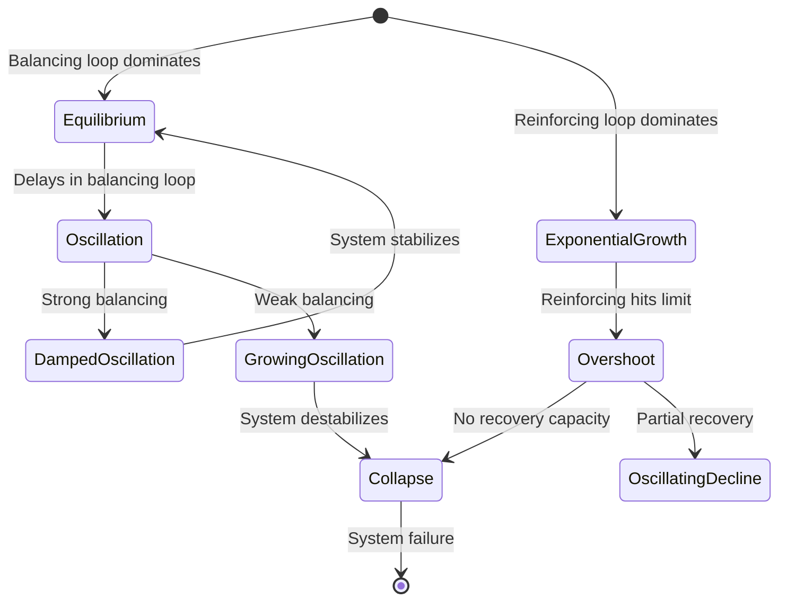
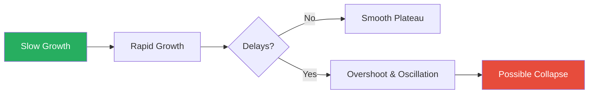
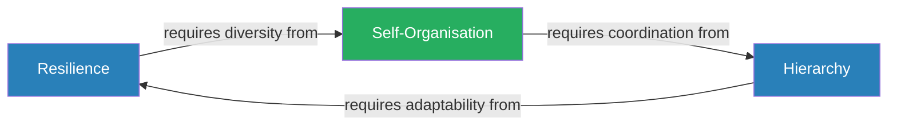
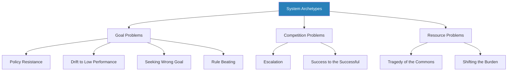
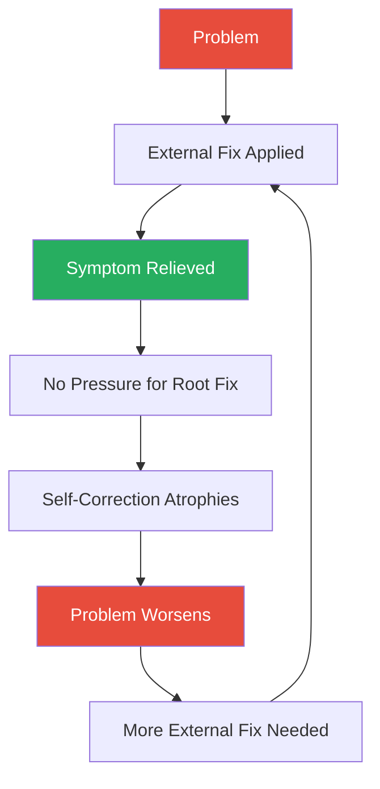
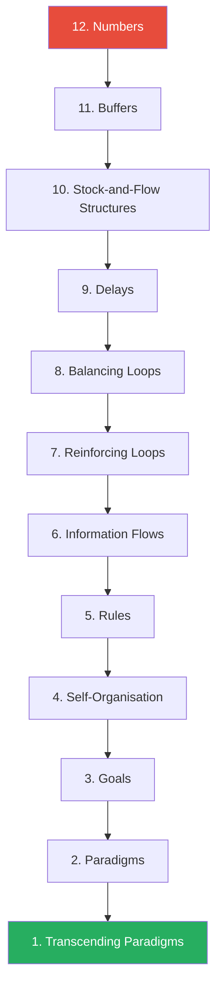
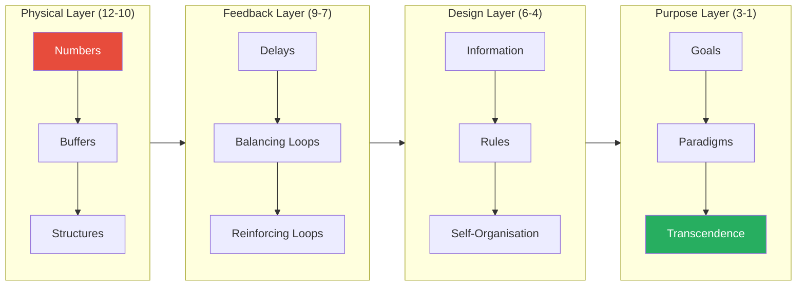

# Thinking in Systems: A Primer — Donella H. Meadows

> Donella Meadows spent decades modelling the behaviour of complex systems — economies, ecosystems, supply chains, governments — and arrived at an uncomfortable conclusion: the problems we struggle with most are not caused by villains, bad luck, or insufficient effort, but by the internal structure of the systems themselves. *Thinking in Systems* is her posthumously published primer on how to see those structures. It gives you a vocabulary for the invisible architecture behind persistent problems: **stocks** and **flows**, **feedback loops** and **delays**, **archetypes** and **leverage points**. The payoff is a hierarchy of intervention — twelve levels, from the nearly useless (tweaking numbers) to the nearly miraculous (shifting paradigms) — that explains why most reforms fail and where the rare, powerful changes actually live. It is the single best introduction to a way of thinking that, once internalised, changes how you see everything from traffic jams to organisational dysfunction.

---

## About the Author

Donella H. Meadows was an environmental scientist, systems analyst, and professor at Dartmouth College. She is best known as the lead author of *The Limits to Growth* (1972), the landmark MIT study commissioned by the Club of Rome that used computer simulation to model global resource depletion — and sparked worldwide debate about sustainability, population growth, and the physical limits of industrial civilisation. Before *Limits*, she studied chemistry at Carleton College and earned her PhD in biophysics from Harvard. She spent her career at the intersection of systems dynamics and policy, consulting for governments, the United Nations, and international organisations on issues ranging from food production to energy policy. She was a student and colleague of Jay Forrester, the MIT engineer who invented systems dynamics as a discipline. At Dartmouth she founded the Sustainability Institute and wrote a syndicated newspaper column, "The Global Citizen," that translated systems thinking for a popular audience. She completed the manuscript for *Thinking in Systems* in 1993, but the book was published posthumously in 2008, seven years after her death in 2001. Her editor, Diana Wright, prepared the final text from Meadows' drafts and teaching materials. Her perspective is shaped by ecology, computational modelling, and decades of watching well-intentioned policies produce the opposite of their intended effects — a frustration that gives the book its urgency and its recurring theme: the world is not broken by bad people but by good people misunderstanding the systems they inhabit.

---

## The Big Idea

- The world is made of <b style="color: #2980b9">systems</b> — interconnected sets of elements organised to achieve a purpose
- A bathtub with its taps and drain is a system; a thermostat is a system; so is a national economy, a fishery, a forest, a corporation, a family, or a city's traffic grid

Meadows' central argument:

- <b style="color: #27ae60">Systems cause their own behaviour</b>
- The crises, oscillations, collapses, and runaway growth we see are not caused by external shocks or individual mistakes
- They are produced by the system's internal structure: its stocks, flows, feedback loops, delays, and goals
- When the same problem recurs year after year despite everyone's best efforts, the explanation is almost always structural
- The problem is not the people in the system — the problem is the system itself

---

- Our default mode of thinking is linear: event A causes event B
  - Someone makes a mistake, so we blame them
  - Sales drop, so we fire the sales manager
  - Crime rises, so we hire more police
- But the real world runs on <b style="color: #2980b9">feedback loops</b>, where effects circle back to become causes
- A thermostat does not just heat a room — it measures the room's temperature (a stock), compares it to a goal, and adjusts the flow of heat accordingly
- That closed loop is what produces stable temperature, and without it, the system cannot self-correct

The practical consequence:

- <b style="color: #e74c3c">Most interventions fail because they target the wrong level of the system</b>
- People fight endlessly over numbers — budgets, quotas, headcounts, deadlines — which are almost always the least powerful places to intervene
- Meadows offers a hierarchy of twelve <b style="color: #2980b9">leverage points</b> — places to intervene — ranked from weakest to most powerful
- Most effort goes to the bottom of the hierarchy (changing numbers like budgets and headcounts)
- The real transformations happen near the top (changing goals, rules, information flows, and paradigms)

---

The book is structured in three parts:

- **Part One** builds the vocabulary: stocks, flows, and feedback loops
- **Part Two** shows how that vocabulary explains the behaviour of real systems, from one-stock models to complex multi-loop interactions
- **Part Three** addresses where to intervene — the famous twelve leverage points — and closes with a set of guidelines for living and thinking within a world of systems

---

## Key Concepts at a Glance

| Concept | One-line summary |
|---------|-----------------|
| **Stocks and flows** | A stock is any accumulation; flows are what increase or decrease it |
| **Balancing feedback loops** | Loops that seek equilibrium by detecting and closing gaps between actual and desired state |
| **Reinforcing feedback loops** | Loops that amplify change in whatever direction is already occurring — growth or collapse |
| **Delays** | Time lags between action and consequence — the primary cause of oscillation and overshoot |
| **System archetypes** | Eight recurring structural patterns that produce characteristic dysfunction |
| **Twelve leverage points** | A hierarchy of intervention, from tweaking parameters (weakest) to shifting paradigms (strongest) |
| **Bounded rationality** | Individually rational decisions producing collectively irrational outcomes |
| **Resilience vs. stability** | Dynamic resilience beats static stability; optimising for efficiency destroys resilience |
| **Self-organisation** | The ability of a system to create new structure, learn, and evolve |
| **Hierarchy** | Systems nest within systems; functional hierarchies serve the lower levels |
| **Nonlinearity** | Relationships in systems are rarely proportional — doubling input does not double output |
| **Layers of limits** | Every growing system encounters successive constraints; the binding one shifts over time |

The dramatic size difference between the inner rings (parameters, buffers) and the outer rings (paradigms, goals) reveals why most reform efforts fail — they target the weakest leverage points while ignoring the strongest.

---

## Part One: System Structure and Behaviour

### Chapter 1: The Basics — Stocks, Flows, and Feedback

*This chapter builds the foundational vocabulary that everything else in the book depends on — the grammar of systems thinking.*

A <b style="color: #2980b9">stock</b> is anything that accumulates:

- Water in a reservoir, carbon in the atmosphere, money in a savings account
- The population of a city, the number of books in a library, the level of trust between two people
- You can see stocks, measure them, and usually feel their effects
- Critically, stocks change slowly — they have inertia
- Even if you turn off every tap, the bathtub does not empty instantly
- This is why stocks create delays and act as buffers
- They give systems memory and stability, but they also make systems resistant to change

> "Stocks change slowly, even when the flows into or out of them change suddenly."

<b style="color: #2980b9">Flows</b> are the rates of change — what fills or drains the stock:

- **Inflows** increase the stock (deposits, hiring, births, rainfall)
- **Outflows** decrease it (spending, attrition, deaths, evaporation)
- The level of the stock at any given moment is the result of all past inflows minus all past outflows — its entire history compressed into a single number
- The distinction matters because people routinely confuse stocks and flows:
  - They hear "the deficit has been cut" and assume the national debt is shrinking — but a smaller deficit is still a positive inflow; the debt stock continues rising
  - They hear "new jobs were created" and expect unemployment to vanish — forgetting the stock of unemployed has its own inertia and is fed by other inflows (immigration, automation, new entrants to workforce)
- <b style="color: #27ae60">You can only change a stock by changing its flows</b> — there are no shortcuts, no instant resets

Why this matters:

- Stocks act as **shock absorbers** — they smooth out variation in flows
- A company with large cash reserves (stock) can ride out temporary revenue declines (reduced inflow) without cutting staff (outflow)
- A company with no reserves must react instantly to every fluctuation — cutting costs the moment revenue dips, then scrambling to hire when revenue rebounds
- The stock's size relative to its flows determines whether the system is stable or jittery
- Meadows calls this the **residence time** of a stock — how long an average unit stays in the stock
  - If a lake holds 10 million gallons and its river flows at 1 million gallons per day, the residence time is 10 days
  - A pollutant dumped in the lake will persist for roughly 10 days before flushing out
  - If the lake is larger (longer residence time), the pollutant persists longer — the stock's size determines how quickly the system can cleanse itself

> [!example] Carbon Dioxide in the Atmosphere — The Residence Time Problem
> - Atmospheric CO2 has a residence time of roughly 100 years
> - Even if humanity stopped all emissions today, the existing stock would persist for a century
> - This means the effects of emissions from the 1970s are still warming the planet today
> - The stock's enormous residence time is why climate change cannot be reversed quickly — the bathtub drains very slowly
> **The lesson:** The larger the stock and the slower the outflow, the longer the consequences of past inflows persist — some stocks have memories measured in centuries.

---

> [!example] The Bathtub — Meadows' Primary Teaching Example
> - Imagine a bathtub with a tap (inflow) and a drain (outflow)
> - The water level (stock) rises when the tap runs faster than the drain empties
> - It falls when the drain empties faster than the tap runs
> - It stays constant when the two are equal
> - This seems trivially obvious with a bathtub, but people routinely fail to apply the same logic to more complex stocks
> - They are shocked when a national debt continues to grow even after the annual deficit is reduced — because a smaller deficit is still a positive inflow; the bathtub is still filling, just more slowly
> - They expect unemployment to drop immediately after new jobs are created, forgetting that the stock of unemployed people has its own inertia
> **The lesson:** The bathtub logic applies everywhere — if inflows exceed outflows, the stock rises, regardless of good intentions.

Stocks score highest on inertia and counterintuitiveness — which explains the persistent confusion where people expect national debt to shrink when deficits are merely reduced, or expect unemployment to vanish when new jobs are created.

---

A <b style="color: #2980b9">feedback loop</b> is a closed chain of causation where the level of a stock influences the flows into or out of itself:

- There are only two types, and all complex system behaviour arises from their interaction

**Balancing feedback loops** (also called negative feedback loops) push toward equilibrium:

- They detect a gap between the stock's current level and some goal, then adjust flows to close that gap
- The thermostat is the classic example: when the room temperature (stock) drops below the set point (goal), the furnace (inflow) turns on; when it reaches the set point, the furnace turns off
- The body's temperature regulation works the same way — sweating cools you down, shivering warms you up, both driven by the gap between actual and desired body temperature
- A coffee cup cooling on a desk is a balancing loop: the larger the temperature difference between the coffee and the room, the faster the coffee cools; as the gap shrinks, cooling slows
- <b style="color: #27ae60">Balancing loops are the source of stability and resistance to change in every system</b>
- They are why organisations snap back to old patterns after reorganisations
- They are why drug enforcement fails to reduce drug use — the higher the enforcement, the higher the street price, the higher the profit, the more dealers enter the market; the system balances itself around the level of demand

Balancing feedback: the system detects a gap between its current state and a goal, takes corrective action, and keeps adjusting until the gap closes — or the goal changes.

---

**Reinforcing feedback loops** (also called positive feedback loops) amplify change in whatever direction is already occurring:

- More rabbits produce more baby rabbits, which produce more rabbits
- More money earns more interest, which earns more money
- More erosion exposes more soil, which causes more erosion
- More panic selling drives down prices, which causes more panic selling
- <b style="color: #e74c3c">Reinforcing loops drive exponential growth and exponential collapse</b> — the "virtuous cycle" and the "death spiral" are structurally identical, running in opposite directions
- The critical feature of reinforcing loops: they have no built-in stopping point
  - Left unchecked, they run to infinity or zero
  - In reality, they always encounter a balancing loop eventually — but sometimes not until catastrophic damage has been done

The basic feedback loop: a stock's level influences its own flows, which in turn change the stock — creating either balancing (goal-seeking) or reinforcing (amplifying) behaviour.

This state diagram maps the six fundamental behavior modes that emerge from different combinations of balancing loops, reinforcing loops, and delays — every complex system pattern Meadows describes is a variation of these transitions.

---

> [!example] The Lily Pond — Exponential Growth Revealed
> - A lily doubles in area every day
> - It takes thirty days to cover the entire pond
> - On what day is the pond half covered? Day twenty-nine
> - The pond went from nearly empty to half full to completely full in the final two days
> - For most of those thirty days, the growth seemed slow and manageable — on day fifteen, only 0.003% of the pond was covered
> **The lesson:** Reinforcing loops seem slow and manageable until suddenly they are not.

System traps — particularly the tragedy of the commons — occupy the largest area because they represent the most consequential patterns where individually rational behavior produces collectively disastrous outcomes.

> [!example] World Population — When Loop Dominance Shifts
> - For most of human history, population grew slowly because high birth rates were roughly matched by high death rates — two balancing loops keeping the stock roughly stable
> - Then sanitation, medicine, and agriculture weakened the death-rate loop while the birth-rate loop continued unchanged
> - The reinforcing loop of births exceeding deaths took over, and population exploded
> - It took tens of thousands of years to reach the first billion humans, 130 years for the second billion, and just 12 years to add the most recent billion
> - The loop structure did not change; the relative dominance of the loops changed
> **The lesson:** Systems transform when the dominant feedback loop shifts — same structure, radically different behaviour.

All complex behaviour arises from combinations of these two loop types shifting in dominance over time:

- When a reinforcing loop is dominant → growth or collapse
- When a balancing loop is dominant → stability or stagnation
- When they interact with delays → oscillation
- When they shift in dominance at different speeds → S-curves, overshoots, and collapses

> [!tip] Core Insight
> Every complex system behaviour — growth, stagnation, oscillation, overshoot, collapse — can be traced to the interaction of just two building blocks: balancing loops (goal-seeking) and reinforcing loops (amplifying). The complexity comes from their combination, not their individual operation.

---

### Chapter 2: A Brief Visit to the Systems Zoo

*Meadows walks through a series of increasingly complex system models, building intuition for how stocks and feedback loops interact.*

**One-stock systems with one balancing loop** behave like thermostats:

- They seek a goal and resist perturbation
- If the room cools, the heater activates; if a population exceeds carrying capacity, death rates rise
- The system oscillates around its target, especially if there are delays
- Even this simplest possible system can surprise: if the delay between action and feedback is too long, the system oscillates wildly instead of settling smoothly

**One-stock systems with one reinforcing loop** produce exponential growth or decay:

- A bank account earning compound interest grows exponentially
- A population with births exceeding deaths grows exponentially
- A rumour spreading through a network grows exponentially — each person who hears it tells two more
- These systems are inherently unstable — left unchecked, they either explode to infinity or collapse to zero
- In practice, they always encounter limits
- The <b style="color: #2980b9">doubling time</b> is the key metric: at 7% growth, a quantity doubles every 10 years; at 3%, every 23 years
- Meadows emphasises that human intuition is poor at grasping the implications of doubling — we think linearly, but reinforcing loops produce exponential curves

> [!abstract] The Rule of 70 — Estimating Doubling Time
> 1. Take the growth rate as a percentage (e.g. 7%)
> 2. Divide 70 by that number: 70 / 7 = 10 years
> 3. That is roughly how long it takes the stock to double
> 4. At 2% growth: 70 / 2 = 35 years to double
> 5. At 10% growth: 70 / 10 = 7 years to double
> 6. Use this to make exponential growth visceral — "at this rate, the stock doubles every X years"

---

**One-stock systems with both reinforcing and balancing loops** produce the <b style="color: #2980b9">S-curve</b> — the most common growth pattern in the real world:

- Meadows demonstrates this with a population model that has both a birth rate (reinforcing) and a death rate that increases as population approaches carrying capacity (balancing)
- The result: slow initial growth (reinforcing loop dominant), then rapid growth, then a plateau as the balancing loop takes over
- If the balancing loop acts quickly relative to the reinforcing loop, the system settles smoothly at carrying capacity
- <b style="color: #e74c3c">If there are delays, the system overshoots</b> — the population grows past carrying capacity before the balancing loop catches up — and then oscillates, sometimes collapsing below a sustainable level

The S-curve with and without delays: the same structural ingredients produce radically different outcomes depending on how quickly balancing feedback kicks in.

---

> [!example]- The Grand Banks Cod Collapse (1992)
> - Fish reproduce (reinforcing loop); fishermen catch fish (outflow, driven by a balancing loop around profit)
> - When the fish population is large, the reinforcing loop dominates and the fishery is robust
> - As fishing technology improved, the outflow rate exceeded the reproduction rate
> - The fish population dropped below the level needed for efficient reproduction
> - The reinforcing loop weakened; if fishing continued at the same rate, the fishery collapsed — not gradually, but suddenly
> - For centuries, cod were so abundant that explorers described the sea as "more fish than water"
> - By 1992, the population had collapsed so completely that the Canadian government imposed a total moratorium on cod fishing — the largest industrial closure in Canadian history
> - Thirty years later, the cod have still not fully recovered
> **The lesson:** Once a reinforcing loop that sustained a population is broken, simply stopping the outflow is not enough to repair it.

> [!example] The Oil Economy — Overshoot with a Non-Renewable Resource
> - Oil is a non-renewable stock — it has no inflow, only outflow
> - As capital investment in extraction grows (reinforcing loop), extraction accelerates
> - The balancing loop is the physical limit — harder-to-reach deposits cost more, eventually making extraction uneconomical
> - If investment grows faster than extraction technology improves, the system overshoots — building infrastructure for extraction levels that cannot be sustained
> - The result: boom towns that become ghost towns, pipelines to empty wells, refineries without feedstock
> **The lesson:** Non-renewable resources lack the regeneration loop that allows recovery — overshoot with them is permanent.

---

**Two-stock systems** introduce interaction effects that produce even richer behaviour:

- Meadows models an economy with two stocks: industrial capital and a renewable resource (such as a fishery or a forest)
- Capital produces goods (and more capital, via reinvestment — a reinforcing loop)
- Capital also harvests the resource; the resource regenerates naturally (reinforcing loop, up to a limit)
- When capital accumulates slowly and the resource regenerates quickly → sustainable
- When capital grows faster than the resource regenerates → resource depletion
- If the resource is renewable, it can recover once capital declines
- <b style="color: #e74c3c">But if the resource passes a critical threshold — a tipping point below which it cannot regenerate — the collapse is permanent</b>
- The economy and the resource both spiral to zero

There are four possible outcomes depending on the relative speeds of capital growth and resource regeneration:

| Scenario | Capital Growth | Resource Response | Outcome |
|----------|---------------|-------------------|---------|
| Sustainable | Slow | Fast regeneration | Equilibrium |
| Mild overshoot | Moderate | Moderate regeneration | Oscillation then recovery |
| Severe overshoot | Fast | Slow regeneration | Collapse then partial recovery |
| Irreversible collapse | Fast | Below critical threshold | Both stocks go to zero |

The crucial variable is not the initial size of either stock but the speed at which capital growth approaches the resource's regeneration limits — and whether anyone recognises the threshold before crossing it.

> [!tip] Core Insight
> The same structural elements (stocks, flows, two types of loops, delays) can produce wildly different behaviour depending on their relative strengths and timescales. Growth, stagnation, oscillation, overshoot, and collapse are all products of the same building blocks in different configurations.

> "The least obvious part of the system, its function or purpose, is often the most crucial determinant of the system's behaviour."

---

## Part Two: Systems and Us

### Chapter 3: Why Systems Work So Well — Resilience, Self-Organisation, and Hierarchy

*Before diagnosing what goes wrong with systems, Meadows pauses to explain what makes systems work well — three properties that distinguish robust, long-lasting systems from fragile ones.*

#### Resilience

<b style="color: #2980b9">Resilience</b> is the ability to recover from perturbation — to absorb shocks and keep functioning:

- It is not the same as stability
- A system can be dynamic (oscillating, changing, adapting) and highly resilient
- A system can be perfectly stable and deeply brittle
- Resilience is not visible during normal operations — it only reveals itself during stress
- This is precisely why it gets sacrificed: it looks like waste until the moment it saves you

> [!example] Monoculture vs. Mixed Forest
> - A monoculture pine plantation is stable — it produces a predictable yield of timber year after year
> - But it is brittle: a single disease, a single pest, a single drought can wipe out the entire stand because every tree is genetically identical
> - There are no backup species, no alternative food webs, no redundant ecological roles
> - A natural mixed forest, by contrast, looks messy and produces less consistent yields
> - But it can absorb fire, disease, drought, and insect outbreaks because its diversity provides redundancy
> - If one species fails, others fill the gap
> **The lesson:** The mixed forest is less stable but far more resilient — messiness is a feature, not a flaw.

> "Systems need to be managed not only for productivity or stability; they also need to be managed for resilience."

- <b style="color: #27ae60">Resilience comes from redundant feedback loops operating at different timescales</b>
- A healthy human body has dozens of mechanisms for maintaining temperature, blood sugar, and blood pressure — chemical, neural, hormonal, behavioural
- Most of these are "unnecessary" under normal conditions
- But when conditions turn abnormal — fever, injury, extreme heat — the backup loops activate and keep the system alive
- Strip away the backup loops (because they seem costly and rarely used) and the system works fine under normal conditions but catastrophically fails under stress

---

- <b style="color: #e74c3c">Resilience is routinely sacrificed for short-term productivity and efficiency</b>
  - Just-in-time manufacturing eliminates the "waste" of inventory buffers — and creates a supply chain that collapses when a single supplier fails
  - Bovine growth hormone increases milk output per cow — but weakens the cows' immune systems, requiring more antibiotics, creating more antibiotic-resistant bacteria
  - Financial deregulation increases market efficiency — until a crisis reveals that the regulatory "friction" was actually a stabilising feedback loop
- The gains are visible and immediate; the loss of resilience is invisible until the crisis arrives
- When evaluating any system, ask not just "how productive is it?" but "what happens when something unexpected goes wrong?"
- If the answer is "everything breaks," the system has been optimised for efficiency at the cost of resilience, and a reckoning is coming

> [!example] Toyota's Supply Chain — When Just-in-Time Met Reality
> - Toyota pioneered just-in-time manufacturing, eliminating buffer stocks of parts to reduce waste
> - The system worked brilliantly under normal conditions — lower costs, faster response, less waste
> - When the 2011 Tohoku earthquake and tsunami struck, single-source suppliers were destroyed
> - Without buffer stocks, entire production lines stopped immediately
> - The system was perfectly efficient and perfectly brittle
> - Toyota subsequently redesigned its supply chain to include more buffer inventory and multiple sourcing — reintroducing the "waste" that provided resilience
> **The lesson:** Efficiency and resilience are in tension — optimising for one often sacrifices the other.

---

#### Self-Organisation

<b style="color: #2980b9">Self-organisation</b> is the ability of a system to create new structure, learn, diversify, and evolve:

- It is the most powerful form of resilience because a self-organising system can adapt to perturbations that its designers never anticipated
- Self-organisation emerges from simple rules applied recursively to variable raw material
  - DNA's four-letter alphabet — just four chemical bases combined according to a few rules — produces the entire diversity of life on Earth
  - Snowflakes form from a few simple rules of ice crystal growth, yet no two are alike
  - A handful of fractal rules can produce the branching complexity of a tree, a river delta, or a lung
- The key ingredients are: a stock of diverse information or capability, a mechanism for experimentation (random variation, trial and error), and a selection process that preserves what works

---

> [!example] The Internet — Self-Organisation in Action
> - The internet was not designed by a central planner
> - It self-organised from a few simple protocols (TCP/IP) that allowed any computer to connect to any other
> - Nobody planned the World Wide Web, email, social media, or e-commerce
> - They emerged from millions of independent actors experimenting within the protocols
> - The result was a system of extraordinary complexity and resilience — one that routes around damage, adapts to new uses, and evolves continuously
> **The lesson:** Simple rules plus diversity of actors produces emergent complexity that no planner could have designed.

> [!example] The Soviet Planned Economy — Self-Organisation Suppressed
> - Self-organisation produces unpredictability and disorder, which conflicts with the desire for control
> - Bureaucracies standardise; hierarchies centralise; regulations constrain
> - All of these can be necessary, but when they go too far, they choke off the experimentation and diversity that allow the system to adapt
> - By eliminating the self-organising mechanisms of market competition (messy, wasteful, unpredictable), the Soviet system achieved central control
> - But it lost the ability to innovate, adapt, or respond to changing conditions
> - It was stable for decades and then, when conditions changed, it collapsed entirely
> **The lesson:** Control without self-organisation produces brittleness — a system that works until it doesn't.

#### Hierarchy

- Systems nest within systems — cells form organs, organs form organisms, organisms form ecosystems
- Departments form divisions, divisions form companies, companies form industries
- This nesting — <b style="color: #2980b9">hierarchy</b> — is not accidental; it is a structural feature that allows complex systems to function

<b style="color: #27ae60">Functional hierarchies exist to serve the lower levels, not the upper ones:</b>

- The purpose of the hierarchy is to coordinate subsystems so the whole functions better than the parts would independently
- The heart does not exist to serve the brain; both exist to serve the organism
- A well-functioning corporate hierarchy coordinates departments so the company serves its customers better than any department could alone

The pathology of hierarchy is <b style="color: #e74c3c">suboptimisation</b> — when subsystem goals override whole-system goals:

- When a department pursues its own budget, headcount, or status at the expense of the organisation's purpose, the hierarchy has become dysfunctional
- The subsystem is extracting from the whole rather than serving it
- Meadows notes that this is extremely common: in most large organisations, departmental politics consume enormous energy that could otherwise serve customers, citizens, or mission
- The test of a healthy hierarchy: does information flow in both directions? Do the upper levels serve the lower levels' needs, or just extract from them?

---

The three properties are related:

- Resilience requires the redundancy and diversity that self-organisation produces
- Self-organisation requires the coordination that hierarchy provides
- Hierarchy requires the adaptability that self-organisation enables
- Weaken any one and the other two suffer

The three properties form their own reinforcing loop — weaken any one and the other two degrade.

---

### Chapter 4: Why Systems Surprise Us

*Systems produce behaviour that surprises us because our mental models are systematically wrong — this chapter catalogues the specific ways our intuitions fail.*

#### Everything Is Connected to Everything Else

- We instinctively draw boundaries around problems — "this is a housing problem," "this is an education problem," "this is a crime problem"
- But systems do not respect those boundaries
- Housing affects education affects crime affects housing
- <b style="color: #2980b9">Every boundary we draw is a model choice</b>, and every model choice excludes something important
- Meadows does not say we should abolish boundaries — that is impossible; we must simplify to think at all
- But we should draw them consciously, knowing what we are excluding, and be ready to redraw when our exclusions bite us

> [!example] The Blighted Housing Project Demolition
> - A city demolished a blighted housing project to reduce crime
> - Crime did not decrease — it dispersed into surrounding neighbourhoods
> - The demolition solved the housing problem in one location and created crime problems in six others
> - The system boundary the planners drew excluded the dynamics of where displaced residents would go
> **The lesson:** There are no separate problems — only interconnected system behaviours.

> "There are no separate systems. The world is a continuum."

---

#### Nonlinearity

- <b style="color: #2980b9">Relationships in systems are rarely proportional</b>
  - Doubling the fertiliser does not double the crop — beyond a certain point, it poisons the soil
  - Doubling police presence does not halve crime — it may just push it to the next neighbourhood
  - Adding a second lane to a highway does not halve congestion — it attracts new drivers until congestion returns to its original level (induced demand)
- <b style="color: #e74c3c">Nonlinearity is why extrapolation fails</b>
- A trend that has been steady for years can suddenly reverse, not because something external changed, but because the system crossed a threshold where different feedback loops became dominant
- The fishery example from Chapter 2 is a case in point: fishing effort increased linearly for decades, fish populations declined gradually, and then suddenly the fishery collapsed because the population crossed below its reproductive threshold

> [!example] Induced Demand — The Highway That Created Its Own Traffic
> - A city widens a congested highway from four lanes to eight
> - Commuters who previously used back roads or public transit see the new capacity and switch to driving
> - Developers build more suburbs along the highway, generating entirely new traffic
> - Within a few years, the eight-lane highway is as congested as the four-lane one was
> - The relationship between road capacity and congestion is not linear — it operates through a feedback loop where capacity generates demand
> **The lesson:** Nonlinear systems mock our linear intuitions — more capacity can produce the same congestion with more cars.

---

#### Bounded Rationality

- Each actor in a system makes decisions that are perfectly rational given their local information, incentives, and constraints
- Yet these individually rational decisions can produce collectively irrational outcomes

> [!example] The Tourist Paradox
> - Tourists flock to beautiful, unspoiled places — and by flocking, they destroy the beauty that attracted them
> - Each tourist is individually rational: the place is beautiful, so they visit
> - But collectively, their visits degrade the destination
> **The lesson:** Local rationality produces global irrationality when the system lacks corrective feedback.

> [!example] The Farmer's Paradox
> - Farmers each plant more crops to earn more income
> - Collectively, they flood the market, crash the price, and earn less than they would have if they had planted less
> **The lesson:** Rational individual behaviour can produce the exact opposite of what each individual intended.

---

> [!example]- The Fish Banks Simulation
> - Meadows used a computer simulation called "Fish Banks" for years in teaching
> - Groups of players manage fishing fleets
> - Each group knows that overfishing will destroy the fishery
> - Each group is told that the fish regenerate naturally and that sustainable harvesting is possible
> - Yet in nearly every game, the fish are driven to extinction
> - Each group sees the declining fish stocks and responds by investing in more boats — reasoning that they need to catch their share before other groups take it all
> - Each group's decision is locally rational; collectively, they destroy the resource
> **The lesson:** System structure — the incentives, information flows, and feedback loops — determines collective outcomes more than individual intentions.

> [!tip] Core Insight
> The lesson of bounded rationality is not that people are stupid or greedy. It is that when local rationality and global rationality point in different directions, local rationality wins every time unless the system is redesigned.

> "We can't impose our will on a system. We can listen to what the system tells us, and discover how its properties and our values can work together."

---

#### Layers of Limits

- Every growing system will encounter successive limiting factors
- As one limit is overcome, growth continues until the next limit is reached
- The most important limit at any given time is the one currently binding
- <b style="color: #27ae60">The binding constraint shifts over time</b> — what limited growth yesterday is not what limits it today

> [!example] Jay Forrester's Corporate Growth Model
> - A new company's growth is first limited by sales capacity — it cannot find enough customers
> - It invests in sales and marketing, overcomes that limit, and grows
> - Then it is limited by production capacity — it cannot make products fast enough
> - It invests in factories, overcomes that limit, and grows again
> - Then it is limited by skilled labour — it cannot hire enough qualified workers
> - Then by management capacity — the organisation becomes too complex for its existing leadership structure
> - Each time one limit is removed, the next one emerges
> **The lesson:** You can never solve a system's growth problems once and for all — only the current binding constraint, while preparing for the next one.

> [!example] Agricultural Productivity — Shifting Limits
> - A farmer's yield is limited by water — irrigation solves it
> - Then by nitrogen — fertiliser solves it
> - Then by phosphorus — different fertiliser solves it
> - Then by soil structure — degraded by years of chemical farming
> - Then by labour — mechanisation solves it
> - Then by market price — overproduction crashes the price
> - Each "solution" reveals the next constraint; the system never stops encountering limits, it just encounters different ones
> **The lesson:** The limit you just solved is never the last limit — systems have layers of constraints, and removing one exposes the next.

---

### Chapter 5: System Traps and Opportunities — The Eight Archetypes

*Meadows identifies eight recurring structural patterns that produce characteristic dysfunction across wildly different domains — and each trap has a known structural remedy.*

| Archetype | Core Dynamic | Typical Example |
|-----------|-------------|-----------------|
| **Policy Resistance** | Multiple actors pull toward conflicting goals, producing stasis | Drug policy |
| **Tragedy of the Commons** | Shared resource degraded because no individual bears full cost | Fisheries, atmosphere |
| **Drift to Low Performance** | Standards decline to match declining performance | Infrastructure decay |
| **Escalation** | Competing actors ratchet up effort in response to each other | Arms races |
| **Success to the Successful** | Winners receive means to compete more effectively | Monopoly formation |
| **Shifting the Burden** | External fix weakens self-correcting capacity | Pesticide dependency |
| **Rule Beating** | Actors optimise for the letter of the rule, not its purpose | Teaching to the test |
| **Seeking the Wrong Goal** | System optimises the wrong metric | GNP as welfare measure |

The eight archetypes grouped by their root mechanism — goal-related traps, competition-related traps, and resource-related traps.

---

#### 1. Policy Resistance

- <b style="color: #2980b9">Multiple actors pull toward conflicting goals, producing stasis</b>
- Each actor's corrective action is cancelled by counter-actions from others
- The result: enormous energy spent maintaining a state that nobody wants

How it works:

- Each actor monitors the system state relative to their own goal and pushes to close the gap
- If one actor succeeds in moving the system, all other actors push back harder
- The system locks in place, vibrating with tension but going nowhere

> [!example] The Drug Policy Trap
> - Addicts want drugs; dealers want profits; police want to reduce supply; citizens want safe neighbourhoods
> - Each actor pulls the system in a different direction
> - When police succeed in reducing supply, prices rise, profits increase, more dealers enter, and supply rebounds
> - When drug education reduces demand, dealers lower prices to attract new users
> - The system absorbs every intervention and returns to approximately the same state
> - Decades of effort and billions of dollars produce marginal change because the structure resists any single actor's intervention
> **The lesson:** Policy resistance is not caused by bad actors — it is caused by opposing goals embedded in the system's structure.

> [!example] Romania Under Ceausescu — Population Policy
> - The government wanted to increase population, so it banned abortion and contraception
> - Families did not want more children they could not afford
> - The result: a surge in dangerous illegal abortions, a wave of abandoned children in institutions, and a public health catastrophe
> - The birth rate only temporarily increased before families found other ways to limit births
> - The system absorbed the policy and produced consequences far worse than the original "problem"
> **The lesson:** When actors have fundamentally opposing goals, forcing one actor's goal onto the system does not change the others' resistance — it just redirects it.

<b style="color: #27ae60">The way out:</b> Find or create an overarching goal that aligns all actors, so everyone is pulling in the same direction. Alternatively, release all actors from their pulling simultaneously — a kind of system-wide ceasefire. The key structural change: move from multiple competing goals to a shared goal that encompasses all actors' legitimate interests.

---

#### 2. Tragedy of the Commons

- <b style="color: #2980b9">A shared resource is degraded because no individual bears the full cost of overuse</b>
- Each user gains the full benefit of exploitation while sharing the cost with everyone else

How it works:

- For each user, the incentive structure is clear: use more, gain more
- The cost (resource degradation) is spread across all users
- As each user rationally increases their use, the resource declines
- By the time the decline is obvious, it may be too late to reverse

> [!example] Garrett Hardin's Shared Pasture
> - Each herder benefits fully from adding one more cow to the pasture
> - The cost — slightly less grass for everyone — is divided among all herders
> - So each herder adds another cow, and another
> - Until the pasture is overgrazed and collapses, and every herder loses everything
> **The lesson:** When gains are private but costs are shared, individuals will rationally destroy the commons.

> [!example] The Aral Sea — Collective Destruction
> - Soviet planners diverted the rivers feeding the Aral Sea to irrigate cotton fields
> - Each irrigation project was individually beneficial
> - Collectively, they drained one of the world's largest lakes
> - The result: destroyed fishing communities, toxic dust storms from the exposed seabed, and a devastated regional ecosystem
> **The lesson:** Each rational, beneficial project added up to an environmental catastrophe because no single actor bore the aggregate cost.

> [!example] Carbon Emissions — The Global Commons
> - Each country benefits from industrial activity that produces carbon emissions
> - The cost — climate change — is spread across every country and every future generation
> - No single country's reduction makes a significant difference to the global stock of atmospheric carbon
> - Each country's rational calculus says: keep emitting, let others cut
> - The result is a collective action failure on a planetary scale
> **The lesson:** The larger the commons and the more diffuse the cost, the harder the tragedy is to solve.

Meadows extends the archetype to fisheries (Grand Banks cod), the atmosphere (carbon emissions), and groundwater (aquifer depletion).

<b style="color: #27ae60">The way out:</b>

- **Weak version:** Educate users about collective consequences and appeal to shared values — sometimes works in small communities with strong social bonds (Elinor Ostrom's research on commons governance demonstrates this)
- **Strong version:** Regulate access with enforceable rules (quotas, permits, seasonal closures) or privatise the commons so that each user bears the full cost of their exploitation
- The structural fix: reconnect the feedback loop between individual use and individual cost — make each user feel the consequences of their own consumption

---

#### 3. Drift to Low Performance

- <b style="color: #2980b9">Performance standards are influenced by past performance with a negative bias</b>, creating a reinforcing loop of declining standards
- "That's about all you can expect" becomes the dominant narrative
- The decline is so gradual that no alarm is triggered

How it works:

- Actual performance drops slightly → perceived performance drops
- The standard (the goal) drops to match recent reality
- With the goal now lower, there is less corrective effort
- Performance drops again → the goal adjusts downward again
- The boiled frog metaphor is apt: if the decline is slow enough, no one notices until it is catastrophic

> [!example] US Infrastructure Decay
> - Roads, bridges, and water systems were world-class in the 1960s
> - Maintenance was deferred — a small decline, barely noticeable
> - Standards adjusted to the new reality; more maintenance was deferred
> - By the 2000s, the American Society of Civil Engineers was giving US infrastructure grades of D and D+
> - Each year's decline was too small to trigger alarm, but the cumulative effect was enormous
> **The lesson:** Gradual erosion of standards is invisible in the moment but devastating over decades.

Meadows notes this pattern also appears in personal fitness — a gradual decline in exercise frequency, tolerated because "I'm still doing more than most people," until a health crisis reveals how far standards have eroded. It appears in corporate culture, in software quality, in regulatory enforcement — anywhere the goal is anchored to recent history rather than an absolute standard.

<b style="color: #27ae60">The way out:</b> Anchor standards to external benchmarks rather than internal history. An athlete anchored to a personal best, not "what I did last week," resists the drift. An organisation benchmarked against world-class competitors, not its own declining performance, maintains pressure. The reverse is also true: setting goals that ratchet upward based on best performance produces a drift toward high performance — the same structure, running in the opposite direction.

---

#### 4. Escalation

- <b style="color: #2980b9">Competing actors ratchet up effort, spending, or hostility in response to each other</b>
- Each side responds to the other's escalation with further escalation
- The result: an arms race that depletes both sides while achieving no relative advantage for either

How it works:

- Actor A acts → Actor B perceives A's action as threatening and responds with a larger action
- Actor A perceives B's response as threatening and escalates further
- Each escalation is locally rational — each side must match or exceed the other's effort to maintain their position
- But collectively, both sides are worse off than if neither had escalated

The escalation loop: each actor's response becomes the other's trigger, producing a spiral where both sides spend more for no additional advantage.

> [!example] The Cold War Arms Race
> - The United States built nuclear weapons; the Soviet Union built more; the US built more still
> - At the peak, both sides had enough nuclear warheads to destroy the world several times over — a condition that provided no more security than having enough to destroy it once
> - Trillions of dollars were spent on weapons that could never be used
> - Both sides would have been more secure with far fewer weapons — if only neither had escalated
> **The lesson:** Escalation locks both sides into spending more for no additional benefit — the structure, not the actors, drives the waste.

> [!example] Advertising Spending Spirals
> - Two companies in the same market each spend more on advertising to capture market share from the other
> - Since both are spending more, neither gains a lasting advantage — the only winners are the advertising agencies
> - Each company individually cannot stop spending — if they do, the other captures share
> - Both companies collectively would be better off if neither spent at all
> **The lesson:** Price wars follow the same structure — airlines match each other's fare cuts until both are losing money on every ticket.

<b style="color: #27ae60">The way out:</b> Unilateral disarmament — one side deliberately refuses to escalate, breaking the cycle. Alternatively, negotiated agreements that cap the competition (arms control treaties, industry standards, price floors). The key is to shift from a reinforcing loop (each escalation triggers more) to a balancing loop (agreements that detect and correct escalation).

---

#### 5. Success to the Successful

- <b style="color: #2980b9">The winners of a competition receive, as part of their reward, the means to compete more effectively in the future</b>
- This creates a reinforcing loop that drives the system toward monopoly

How it works:

- In any competition where the prize includes resources that improve competitiveness, each cycle concentrates more resources with the winner
- The winner gets better; the losers fall further behind
- Without external intervention, the loop runs to completion: one winner, everyone else eliminated

> [!example] Monopoly — The Board Game as Systems Model
> - The game starts with equal players
> - Through luck and strategy, one player acquires a slight advantage — a few more properties
> - Rent income from those properties provides capital to buy more properties; more properties generate more rent
> - The advantage compounds until one player owns everything and everyone else is bankrupt
> - Monopoly is designed to illustrate this dynamic, and it does so with merciless clarity
> **The lesson:** Even a slight initial advantage compounds relentlessly when winners receive resources that improve future competitiveness.

> [!example] School Funding Based on Test Scores
> - A policy that directs more funding to high-performing schools and less to low-performing ones
> - High-performing schools use extra funding to hire better teachers, buy better materials, attract stronger students
> - Low-performing schools lose resources and decline further
> - The gap between the two grows with each funding cycle
> - The policy was designed to reward success, but it structurally guarantees that failure deepens
> **The lesson:** Reward systems that give winners the means to win more produce concentration, not competition.

- Meadows applies the same structure to the American economy — Standard Oil, US Steel, the railroad barons accumulated enough market power that their dominance was self-reinforcing
- Antitrust legislation (the Sherman Act, the Clayton Act) was the structural intervention designed to break the reinforcing loop
- In ecology, the principle of <b style="color: #2980b9">competitive exclusion</b> operates the same way — if two species compete for exactly the same niche, the one with even a slight advantage will eventually exclude the other entirely; the only escape is diversification

<b style="color: #27ae60">The way out:</b> Diversification (create new arenas of competition), antitrust mechanisms (prevent winners from leveraging wins into structural advantages), or deliberate redistribution (progressive taxation, wealth redistribution) that prevents compounding advantage from running to its logical conclusion.

---

#### 6. Shifting the Burden to the Intervenor

- <b style="color: #2980b9">An external fix addresses symptoms rather than root causes, and the system's own capacity to self-correct atrophies</b>
- The fix must be applied in ever-increasing doses as the underlying problem worsens
- This is the archetype of addiction — whether chemical, organisational, or political

How it works:

- The system has a problem; an intervenor provides a fix that relieves the symptom
- Because the symptom is relieved, there is no pressure to address the root cause
- Meanwhile, the fix itself weakens the system's own ability to cope
- When the fix is withdrawn, the problem is worse than before
- More intervention is needed; the cycle deepens

> [!example] Pesticide Dependency
> - Farmers spray pesticides to kill crop-eating insects
> - The pesticides also kill the insects' natural predators (birds, spiders, beneficial insects)
> - With predators eliminated, the pest population rebounds faster when the pesticide wears off
> - More pesticide is needed; each application further destroys the natural predator population
> - The system has shifted from natural pest control (a self-correcting mechanism) to chemical dependency (an external fix that weakens the self-correcting mechanism)
> **The lesson:** Fixes that suppress symptoms while weakening self-correction create a dependency spiral.

> [!example] Economic Subsidies — The Dependency Trap
> - A government subsidises a struggling industry
> - The subsidy relieves the financial pressure that would have forced the industry to innovate, cut costs, or restructure
> - The industry continues operating inefficiently; the subsidy becomes permanent
> - Removing it would cause immediate collapse because the industry never developed the capacity to survive without support
> - European agricultural subsidies, US airline bailouts, and state-owned enterprises all follow this pattern
> **The lesson:** Subsidies that shield an industry from market pressure remove the incentive to adapt.

The shifting-the-burden spiral: each round of external intervention weakens the system's own capacity to self-correct, requiring ever-larger doses of the fix.

Drug addiction is the individual-level version — the drug relieves psychological pain (symptom), does not address the source (root cause), and weakens natural coping mechanisms (self-correction). When the drug wears off, the pain is worse. More drug is needed. The structure is identical whether the "drug" is heroin, a government bailout, or a quick technical fix that avoids the real architectural problem.

<b style="color: #27ae60">The way out:</b> Combine short-term symptom relief with long-term capacity building. The intervention should focus on strengthening the system's own corrective mechanisms, not replacing them. The guiding question: "Is this intervention making the system more capable of functioning on its own, or more dependent on continued intervention?"

---

#### 7. Rule Beating

- <b style="color: #2980b9">Actors optimise for the letter of the rule, not its purpose</b>
- The system achieves compliance without achieving the outcome the rule was designed to produce

How it works:

- Rules create incentives; actors respond to incentives
- But unless the rule perfectly captures the intended outcome, actors will find ways to satisfy the rule while circumventing its purpose
- The more specific the rule, the more creative the circumvention
- This is sometimes called **Goodhart's Law**: when a measure becomes a target, it ceases to be a good measure

> [!example] Standardised Testing in Education
> - The purpose of testing is to measure learning
> - But when test scores determine school funding, teacher evaluations, and student advancement, the incentive shifts from learning to test performance
> - Teachers teach to the test; students learn test-taking strategies rather than subject matter
> - Schools invest in test preparation rather than education
> - Test scores rise while actual learning stagnates or declines
> - The rule (test scores measure learning) has been beaten — compliance without achievement
> **The lesson:** When a proxy metric becomes the target, people optimise the proxy and neglect the thing it was supposed to measure.

> [!example] Environmental Regulation — Dilution as Compliance
> - Companies measured on pollutant output at the end of a pipe comply by diluting their waste (reducing concentration per unit of water) rather than reducing total pollution
> - The regulation is satisfied; the river is still contaminated
> **The lesson:** Process-based rules invite creative circumvention.

Tax codes produce the same dynamic — the purpose is to fund government services from business profits, but the complexity creates opportunities for creative accounting that satisfies the code while avoiding the intended revenue.

<b style="color: #27ae60">The way out:</b> Design rules that align the letter with the spirit. Outcome-based rules are generally harder to game than process-based ones — measuring actual emissions rather than pipe-end concentrations, measuring actual learning rather than test scores. The challenge is that outcomes are often harder to measure — which is exactly why process-based rules exist in the first place.

---

#### 8. Seeking the Wrong Goal

- <b style="color: #2980b9">The system measures and optimises the wrong thing</b>
- Effort is high, but results are poor because the metric does not capture what actually matters
- <b style="color: #e74c3c">What gets measured gets managed — if the metric is wrong, the management is wrong</b>

> [!example] Gross National Product (GNP) as National Success Metric
> - GNP measures the total market value of goods and services produced
> - It became the primary measure of national success — countries compared GNP growth rates, politicians campaigned on GNP performance
> - But GNP counts everything transacted, regardless of whether it contributes to wellbeing
> - A car accident increases GNP (hospital bills, car repairs, legal fees)
> - Pollution increases GNP (cleanup costs are economic activity)
> - A healthy family that cooks at home, educates their children, and maintains their own property contributes less to GNP than a sick family that eats fast food, hires tutors, and pays contractors
> - Countries optimising for GNP were optimising for activity, not welfare
> **The lesson:** Optimising a metric that does not capture what matters produces impressive-looking numbers and real-world deterioration.

> "If the desired system state is national security, and that is defined as the amount of money spent on the military, the system will produce military spending. It may or may not produce national security."

> [!example] The Soviet Nail Factory
> - A factory measured on total output by weight produced a small number of enormous, useless nails — because that maximised weight with minimum effort
> - When the metric was changed to number of nails produced, the factory produced millions of tiny, equally useless nails
> - The factory achieved its measured goal flawlessly; it failed completely at its actual purpose: producing nails that people could use
> **The lesson:** The system will optimise whatever you measure — so measure what actually matters.

This archetype is distinct from rule beating, though they are related:

- Rule beating preserves the right goal but circumvents the rules designed to achieve it
- Seeking the wrong goal builds the entire system around the wrong objective
- Rule beating is a subversion of implementation; seeking the wrong goal is a failure of design

<b style="color: #27ae60">The way out:</b> Invest serious thought in defining what the system should actually be optimising for. Measure what matters, not what is easy to measure. Welfare is harder to measure than GNP; learning is harder to measure than test scores; health is harder to measure than number of procedures performed. But the difficulty of measuring the right thing does not justify measuring the wrong thing.

> "Pay attention to what is important, not just what is quantifiable."

---

## Part Three: Creating Change

### Chapter 6: Leverage Points — Places to Intervene in a System

*This is the book's most famous chapter and its most enduring contribution — a hierarchy of twelve places to intervene in a system, ranked from least to most effective.*

- The hierarchy emerged from Meadows' decades of systems modelling and policy consulting
- It provides a framework for understanding why most reforms fail and where the rare, powerful changes actually live
- Meadows originally published this as a standalone paper in 1999, and it became one of the most widely cited articles in the systems thinking literature

She begins with a warning:

- <b style="color: #e74c3c">People tend to find the right leverage points intuitively — but they often push them in the wrong direction</b>
- Faster reaction to inventory problems increases oscillation
- More efficient fishing technology accelerates fishery collapse
- Subsidised low-income housing concentrates poverty
- The intuition about *where* to push is often right; the intuition about *which direction* to push is often wrong

The twelve leverage points arranged from weakest (12) to most powerful (1) — most effort concentrates at the top of the diagram, where impact is lowest.

---

| Leverage Point | Category | Power | Ease |
|---------------|----------|-------|------|
| **12. Numbers** | Parameters | Lowest | Easiest |
| **11. Buffers** | Physical | Low | Moderate |
| **10. Structures** | Physical | Low | Hardest |
| **9. Delays** | Temporal | Moderate | Moderate |
| **8. Balancing loops** | Feedback | Moderate | Moderate |
| **7. Reinforcing loops** | Feedback | Moderate | Moderate |
| **6. Information flows** | Information | High | Moderate |
| **5. Rules** | Governance | High | Hard |
| **4. Self-organisation** | Structural | Very high | Hard |
| **3. Goals** | Purpose | Very high | Very hard |
| **2. Paradigms** | Worldview | Highest | Hardest |
| **1. Transcending paradigms** | Meta | Transformative | Near-impossible |

The general pattern: the more powerful the leverage point, the harder it is to change — which is why most effort concentrates at the weak end.

---

#### 12. Numbers — Constants and Parameters

*The level where everyone fights and almost nothing changes.*

- The numerical settings within a system: budgets, headcounts, tax rates, interest rates, quotas, deadlines
- These are the dials that everyone fights over in political and organisational life
- <b style="color: #e74c3c">This is the weakest lever</b> — adjusting a parameter keeps the system doing exactly what it was already doing, just at a slightly different rate
- Changing the thermostat setting changes the temperature in the room; it does not change the nature of the heating system
- Raising or lowering interest rates by a quarter point rarely transforms economic behaviour

When parameters actually matter:

- Parameters can become powerful when they enter extreme ranges that trigger structural changes
- An interest rate so low it creates an asset bubble changes system behaviour qualitatively, not just quantitatively
- A tax rate so high it triggers capital flight crosses a threshold
- But within normal ranges, parameter fights are political theatre — enormous energy, minimal impact

> [!example] Budget Battles — Maximum Effort, Minimum Impact
> - Politicians pour enormous energy into budget negotiations — fighting over whether to spend 2% or 3% of GDP on defence, or whether to set the minimum wage at $7.25 or $7.50
> - These fights absorb all the political oxygen in the system
> - Meanwhile, the system's goals, rules, and information flows — which determine far more about how the system actually functions — remain unchanged and unexamined
> **The lesson:** Parameter fights are the loudest, most visible part of politics — and the least consequential.

> [!example] Hospital Staffing — Numbers vs. Structure
> - A hospital increases nursing staff by 10% to address patient complaints about slow response
> - Response times improve marginally, but complaints persist
> - The real problem is the information flow: nurses do not know which patients need attention most urgently because the call system does not prioritise
> - Adding more nurses (parameter change) is less effective than redesigning the call system (information flow change at leverage point 6)
> **The lesson:** More of the same is rarely the answer — the question is whether the structure delivers the right results, not whether the numbers are high enough.

---

#### 11. Buffers — The Sizes of Stabilising Stocks

*The cushion between action and consequence.*

- The size of a stabilising stock relative to its flows
- A large buffer absorbs variation without triggering corrective action; a small buffer transmits every fluctuation immediately
- Larger buffers (bigger inventories, more cash reserves, more slack in schedules, more reservoir capacity) stabilise systems
  - They absorb shocks and give decision-makers time to respond thoughtfully rather than reactively
- But they also reduce agility — a massive inventory is expensive to maintain and slow to adapt

> [!example] The Great Lakes vs. the Farm Pond
> - The Great Lakes hold such an enormous volume of water (buffer) relative to the rivers that flow in and out that their levels barely fluctuate even during severe droughts
> - A small farm pond can dry up in a single hot week
> - Both are stocks with inflows and outflows, but the Great Lakes' massive buffer makes them stable in conditions that would empty the pond
> **The lesson:** Buffer size determines whether a system absorbs shocks gracefully or oscillates wildly.

- **Trade-off:** Too little buffer and the system oscillates wildly; too much and the system becomes sluggish and expensive
- Most systems settle on an uneasy compromise, but the compromise is rarely optimal because the cost of buffers is visible (inventory costs money) while the benefit is invisible until a crisis reveals it
- <b style="color: #e74c3c">Just-in-time systems that eliminate all buffers trade stability for efficiency</b> — a trade that looks brilliant until the first disruption

Buffers are a low-leverage point not because they are unimportant but because they are physically constrained — you cannot easily double the size of a reservoir or a bank's capital base. Where buffers can be changed, the effect can be meaningful — but the opportunity is limited.

---

#### 10. Stock-and-Flow Structures — Physical Architecture

*The hardware of the system — built slowly, changed rarely, but constraining everything.*

- The physical or organisational architecture of the system — pipes, buildings, highways, factory layouts, organisational charts
- Structure determines what flows are possible, how fast they can move, and where they can go
- A city built around highways is fundamentally different from one built around rail — the structure constrains all future decisions
- Low on the hierarchy because structures are powerful but usually fixed — you cannot easily rebuild a city or restructure a national highway system
- Structural changes take decades and enormous capital, but when they happen, the effects are enormous

> [!example] Hungary's Radial Road Network
> - Hungary's road network was built during the Soviet era with all roads converging on Budapest
> - Even after the fall of communism, cross-country travel required routing through the capital
> - Decades later, despite massive investment, the basic radial structure still shapes Hungarian transportation — because physical infrastructure has immense inertia
> **The lesson:** Physical structure outlasts the political regime that created it — and constrains all future decisions.

> [!example] The QWERTY Keyboard
> - Designed in the 1870s to prevent typewriter jams by separating commonly used letter pairs
> - The mechanical constraint has been irrelevant for decades — there are no more typewriter jams
> - Yet the QWERTY layout persists because the cost of retraining billions of typists exceeds the benefit of a marginally more efficient layout
> - The physical structure (key arrangement) outlived the problem it was designed to solve by more than a century
> **The lesson:** Structural decisions persist long after the conditions that motivated them have changed — choose initial structures carefully.

The practical implication: when you have the chance to influence a structure at the design stage, the leverage is enormous — you are setting the constraints within which all future parameter adjustments will operate. Once the structure is built, you are stuck with parameter-level adjustments within its constraints.

---

#### 9. Delays — The Lengths of Time Between Action and Feedback

*The hidden variable that determines whether systems stabilise or oscillate into chaos.*

- The time lag between an action and its consequences becoming visible
- <b style="color: #27ae60">Delays determine whether a system oscillates, overshoots, or converges smoothly</b>
- A system with short delays can self-correct efficiently
- A system with long delays will overshoot and oscillate, because actors are always correcting for conditions that have already changed

> [!example] The Shower Metaphor
> - You step in; the water is cold; you turn the hot tap
> - Nothing happens; you turn it further; still nothing; you crank it to maximum
> - Suddenly scalding water hits you; you lurch the tap to cold
> - Nothing happens; you push it further; ice water
> - The oscillation continues because the delay between action and feedback is longer than your patience
> - If the plumbing responded instantly, you would find the right temperature immediately
> **The lesson:** Delays cause oscillation — the longer the delay, the wilder the swings.

> [!example]- The Car Dealership Inventory Model
> - A dealer receives orders from customers and orders cars from the factory
> - There is a perception delay (the dealer does not immediately notice changes in demand), a response delay (it takes time to decide to change orders), and a delivery delay (cars take weeks to arrive)
> - Even when customer demand changes by a single, simple step (say, from 8 cars per week to 10), the dealer's inventory oscillates wildly
> - The dealer sees low inventory, panics, orders extra cars
> - The extra cars arrive weeks later — by which point demand has stabilised and the lot is overflowing
> - The dealer cuts orders to zero; weeks later, inventory drops again
> - The factory sees the dealer's oscillating orders, which are even more extreme than actual demand; the factory's response introduces further delays and amplifications
> - By the time the signal reaches the raw materials supplier, the oscillations are enormous compared to the original small change in customer demand
> **The lesson:** This is the **bullwhip effect** — delays at each stage amplify small demand changes into wild supply-chain oscillations.

- <b style="color: #e74c3c">Reacting faster to a system with long delays makes oscillations worse, not better</b>
- The dealer who panics and doubles orders at the first sign of a shortage creates an even larger surplus when those orders arrive
- The correct response is to slow down — use foresight and anticipation rather than reaction, and build buffers that absorb variation without triggering overcorrection

> [!example] The Housing Boom and Bust Cycle
> - Demand for housing increases; prices begin to rise (signal)
> - Developers perceive the rising prices and begin new projects (perception delay: months)
> - Permits, financing, and construction take years (delivery delay: 2-5 years)
> - By the time the new housing is completed, the demand surge may have passed
> - The market floods with new supply just as demand softens, crashing prices
> - Developers see crashing prices and halt all new projects
> - Years later, when demand recovers, there is a shortage because nothing was built during the bust
> - The cycle repeats: boom, bust, boom — not because of irrational actors, but because of structural delays in construction
> **The lesson:** The housing cycle is not caused by speculation or greed — it is caused by the multi-year delay between the decision to build and the delivery of completed homes.

> [!abstract] How to Handle Delays
> 1. Identify the major delays in the system — perception, decision, and delivery delays
> 2. Shorten the delays you can (faster reporting, faster decision processes)
> 3. For delays you cannot shorten, slow down your response — match your reaction speed to the delay
> 4. Build buffers to absorb variation during the delay period
> 5. Use forecasting and leading indicators instead of lagging ones
> 6. Never panic — overreaction to delayed feedback is worse than the original problem

---

#### 8. Balancing Feedback Loops — The Strength of Corrective Mechanisms

*The system's self-correction engine — when it works, problems fix themselves; when it fails, problems compound.*

- The strength of the loops that push the system back toward its goal
- A stronger balancing loop (better quality control, tighter governance, faster error detection, more effective regulation) keeps the system closer to its goal
- A weaker one allows greater deviation before correcting

> [!example] Market Competition as Corrective Feedback
> - When a company charges too much, customers switch to competitors (corrective mechanism)
> - The company is forced to lower prices or improve quality
> - A monopoly breaks this loop — without competitors, there is no corrective mechanism, and the company can charge whatever it wants
> - Antitrust regulation is an attempt to maintain the strength of the competitive balancing loop
> **The lesson:** When you see a system drifting from its goal, look for the balancing loop that should be correcting it — has it been weakened, removed, or delayed?

> [!example] Democratic Elections as Balancing Feedback
> - Voters dissatisfied with government performance vote for the opposition
> - The threat of removal creates a balancing loop: politicians must respond to voter concerns or lose power
> - When this loop is weakened — through gerrymandering, voter suppression, media manipulation, or incumbency advantages — politicians become less responsive
> - The system drifts further from its stated goal (representing the public) because the corrective mechanism has been weakened
> **The lesson:** Every democracy's health depends on the strength of its electoral balancing loop — weaken it and the system drifts from its purpose.

<b style="color: #27ae60">The principle:</b> Strengthening the relevant balancing loop is often more effective than any direct intervention. When a system is not correcting itself, the question is rarely "what should the system do differently?" and almost always "what happened to the feedback loop that should be correcting this?"

---

#### 7. Reinforcing Feedback Loops — The Strength of Amplifying Mechanisms

*The engines of both growth and collapse — same structure, opposite directions.*

- The rate at which self-amplifying processes accelerate
- Reinforcing loops are the engines of both growth and collapse
- Slowing a destructive reinforcing loop or accelerating a beneficial one can transform system behaviour

> [!example] Benjamin Franklin's Trust Fund — Compound Interest Over Centuries
> - Compound interest is the clearest example of a reinforcing loop — at 7% annual return, money doubles roughly every ten years
> - The rich get richer not because they work harder but because the structure of compound interest amplifies existing wealth
> - Franklin left $1,000 each to Boston and Philadelphia in 1790, with instructions that the money be invested for 200 years
> - When the trusts were opened in 1990, they contained over $6.5 million — from the relentless operation of a reinforcing loop over two centuries
> **The lesson:** Time plus a reinforcing loop produces results that seem impossible from the starting point.

> [!example] The Dust Bowl (1930s) — Reinforcing Loop of Destruction
> - Erosion is a reinforcing loop running in the destructive direction
> - A patch of exposed soil is washed by rain; the erosion exposes more soil; more soil is washed
> - Overploughing removed native grasses, wind and rain stripped topsoil, less vegetation could grow, more soil was stripped
> - Millions of acres became uninhabitable
> **The lesson:** Reinforcing loops run in both directions — the same structure that compounds wealth can compound destruction.

> [!example] Network Effects — Digital Reinforcing Loops
> - A social network with more users attracts more users, because the value of the network increases with each new member
> - Each new user adds value for every existing user — a reinforcing loop of accelerating returns
> - This is why digital markets tend toward monopoly: the leader's reinforcing loop runs faster than any competitor's
> - Facebook, Google, Amazon all benefited from reinforcing loops that made early advantages nearly insurmountable
> **The lesson:** In network markets, reinforcing loops create winner-take-all dynamics that no amount of parameter adjustment can reverse.

<b style="color: #27ae60">The lever:</b> Reducing the gain of a destructive reinforcing loop (slowing erosion, capping predatory loan interest, limiting compounding market power) or increasing the gain of a beneficial one (investing in education that produces more economic activity that funds more education) — the same structure in reverse.

---

#### 6. Information Flows — Who Knows What, and When

*Often the cheapest, most powerful intervention available — just connect the consequences to the decision-maker.*

- The routes by which information about the state of the system reaches decision-makers
- <b style="color: #27ae60">Adding a new information flow — delivering feedback to a place where it was not going before — is one of the most powerful and cost-effective interventions</b>
- Missing information flows are among the most common causes of system malfunction
- When the people making decisions do not know the consequences of those decisions, they cannot self-correct
- The information does not need to be new to the system — it just needs to reach a new person

> "There is a systematic tendency on the part of human beings to avoid accountability for their own decisions."

> [!example] The Dutch Electricity Study
> - Identical houses in the Netherlands — same insulation, same appliances, same heating systems
> - The only difference: in some houses, the electricity meter was installed in the front hallway where residents saw it every day; in others, the meter was hidden in the basement
> - The houses with visible meters used 30% less electricity
> - No physical change to the system; no incentive, no penalty, no education campaign
> - Just information — making the consequences of consumption visible to the person doing the consuming
> **The lesson:** Simply making consequences visible to decision-makers changes behaviour dramatically — no enforcement needed.

> [!example] The Downstream Pollution Law
> - Require factories to draw their intake water from downstream of their own waste discharge point
> - Overnight, every factory becomes intensely interested in the quality of its own emissions
> - The information flow — the connection between "I pollute" and "I drink pollution" — is created by the rule
> - No inspectors needed; no complex monitoring systems
> **The lesson:** Design rules that create information flows, and self-correction follows automatically.

> [!example] Calorie Labels on Restaurant Menus
> - Before labelling, diners had no feedback loop between ordering and caloric consequence
> - After labelling, the information was present at the point of decision
> - Studies found modest but consistent reductions in caloric intake — not because anyone was prohibited from ordering high-calorie food, but because the information changed the decision context
> **The lesson:** Information flows do not require prohibition or enforcement — they work by enabling self-correction at the point of decision.

<b style="color: #27ae60">The principle:</b> When a system is misbehaving, ask: who is making the decisions that cause this, and do they have timely feedback about the consequences? If not, creating that information flow is one of the cheapest, most powerful interventions available.

---

#### 5. Rules — Incentives, Constraints, and Governance

*The invisible architecture that determines what behaviour is possible, rewarded, and forbidden.*

- The formal and informal rules that define the game — who can do what, what is rewarded, what is punished, what is permitted, what is forbidden
- Rules include laws, regulations, incentive structures, contracts, norms, and governance frameworks
- <b style="color: #27ae60">Changing the rules changes the game itself</b> — not just how it is played, but what it means to win

> [!example] Football vs. Basketball — Same Players, Different Rules
> - The difference between football and basketball is entirely a matter of rules
> - The same players, the same field, the same ball
> - Change the rules — what counts as scoring, what contact is permitted, how the ball is moved — and the system transforms completely
> - The difference between a company that innovates and one that stagnates is rarely the talent of the people — it is the rules (incentive structures, risk tolerance, decision rights) that determine what behaviour is rewarded
> **The lesson:** Rules are the invisible architecture that shapes all behaviour within the system.

> [!example] Gorbachev's Glasnost and Perestroika
> - Glasnost changed information rules — allowing open discussion of problems previously concealed
> - Perestroika changed economic rules — allowing limited private enterprise and market mechanisms
> - The same people, the same geography, the same resources
> - Different rules, different system behaviour — so different, in fact, that it ultimately dissolved the Soviet Union
> **The lesson:** Changing who can do what, who knows what, and what is rewarded transforms the entire system.

The power of rules explains why revolutions focus on constitutions:

- A constitution is a set of meta-rules — rules about how rules can be made and changed
- The authors of a constitution are designing the system at a very high leverage point
- The US Constitution's system of checks and balances is a set of balancing feedback loops built into the rules — each branch of government can check the others, preventing any one from accumulating unchecked power
- When those checks are weakened or bypassed, the system's behaviour changes dramatically

<b style="color: #27ae60">The principle:</b> When you want to change system behaviour, ask: what are the rules, and who makes them? Changing rules is more powerful than changing parameters, because rules determine the structure within which parameters operate. But changing rules is politically difficult — the current rules serve the current power holders, and they will resist.

---

#### 4. Self-Organisation — The Ability to Evolve and Create New Structure

*The system's capacity to reinvent itself — the most powerful form of adaptability.*

- The capacity of a system to restructure itself — to create new feedback loops, new rules, new information flows, new subsystems — in response to changing conditions
- A system that can self-organise can survive almost any perturbation because it can change its own structure to adapt
- A system that cannot self-organise can only survive perturbations its current structure can handle

> [!example] Bacteria vs. Hospital — Self-Organisation vs. Static Design
> - Random mutation produces variation in bacteria; natural selection preserves what works; the population adapts to whatever antibiotics are thrown at it
> - The hospital responds with linear, designed interventions: new antibiotics, new protocols, new policies
> - The bacteria's capacity for self-organisation means they will always eventually defeat any static intervention
> - The only counter is a system that also self-organises — an adaptive medical system that continuously develops new approaches
> **The lesson:** Self-organising systems will always eventually outpace static ones — the only viable counter is to self-organise in return.

> [!example] Silicon Valley — Self-Organisation by Design
> - Silicon Valley's innovation ecosystem was not planned by a central authority
> - It emerged from a combination of research universities, venture capital, permissive failure norms, and high labour mobility
> - Engineers move freely between companies, carrying knowledge and recombining ideas
> - Failed startups are not stigmatised — they are treated as learning opportunities
> - The system generates continuous novelty because its structure encourages experimentation, variation, and selection
> **The lesson:** Design the conditions for self-organisation (diversity, experimentation, low cost of failure) rather than designing the outcomes directly.

- <b style="color: #e74c3c">Self-organisation is the property that institutions most often suppress</b> because it produces unpredictability, heterogeneity, and disorder
  - Bureaucracies prefer standardisation
  - Hierarchies prefer centralised control
  - Markets prefer regulation
- All of these instincts can be appropriate, but when they go too far, they choke off the variation and experimentation that allow the system to evolve

---

#### 3. Goals — The Purpose of the System

*Change the purpose and the entire system pivots — every other lever is subordinate to this one.*

- The purpose or function that the system is designed to achieve
- Change the purpose and the entire system pivots
- All the lower leverage points — rules, information flows, feedback loops, parameters — are subordinate to the goal

How goals shape systems:

- If the goal is profit maximisation, the system produces profit — possibly at the expense of quality, workers, environment, and long-term viability
- If the goal is customer satisfaction, the system organises around understanding and serving customers
- If the goal is power preservation, the system organises around maintaining the power of those at the top

The crucial insight:

- <b style="color: #27ae60">Purpose must be deduced from behaviour, not rhetoric</b>
- What a system consistently *does* reveals its actual goal, regardless of what its mission statement *claims*
- A government that proclaims environmental protection but allocates no resources to enforcement has a different actual purpose from the one it advertises
- A company whose mission statement says "people first" but whose budget says "quarterly earnings first" has a different actual purpose

> "The least obvious part of the system, its function or purpose, is often the most crucial determinant of the system's behaviour."

> [!example] Gorbachev's Goal Shift
> - Changing the leader of a nation (a parameter, leverage point #12) rarely changes the nation's behaviour — the Cold War continued regardless of who was President or General Secretary
> - But when Gorbachev changed the goal of the Soviet system — from "maintain Communist party control at all costs" to "reform and open the economy" — the entire system transformed
> - It was not a parameter change; it was a goal change — and it changed everything downstream
> **The lesson:** New leadership is a parameter change; new purpose is a goal change — and the difference in impact is enormous.

> [!example] From Shareholder Value to Stakeholder Value
> - A corporation whose goal is "maximise shareholder value" organises around quarterly earnings, cost-cutting, and stock price
> - A corporation whose goal is "create value for all stakeholders" organises around customer satisfaction, employee wellbeing, community impact, and long-term sustainability
> - Same people, same industry, same market — different goal, different system behaviour
> - The shift from shareholder primacy to stakeholder capitalism is a leverage point 3 intervention — and the resistance to it reflects how powerful goal changes are
> **The lesson:** The goal does not just guide the system — it defines what the system measures, rewards, and optimises for.

---

#### 2. Paradigms — The Mindset from Which Goals, Rules, and Structures Arise

*The deepest assumptions about how the world works — invisible until challenged, transformative when shifted.*

- The shared ideas, assumptions, and deep beliefs from which a system's goals, rules, and structures emerge
- A <b style="color: #2980b9">paradigm</b> is not a policy or a rule — it is the worldview that makes certain policies and rules seem natural and others unthinkable
- <b style="color: #27ae60">Shifting a paradigm transforms everything downstream</b> — goals change, rules change, information flows change, structures change

> [!example] Copernicus — Paradigm Shift as System Transformation
> - Changed the paradigm from "Earth is the centre of the universe" to "Earth orbits the Sun"
> - This was not a policy change or a rule change — it was a change in what people believed to be true about reality
> - From that change flowed an entirely new understanding of physics, new methods of navigation, new technologies, and ultimately the Scientific Revolution
> **The lesson:** A single paradigm shift can reorganise an entire civilisation's knowledge and institutions.

> [!example] Germ Theory of Disease
> - Shifted the medical paradigm from "disease is caused by bad air and sin" to "disease is caused by microorganisms"
> - From that single paradigm shift came antiseptic surgery, vaccination, public sanitation, antibiotics, and the doubling of human lifespan
> **The lesson:** When the underlying belief changes, every practice and policy built on the old belief must be rebuilt.

> [!example] The Abolition of Slavery — Paradigm Shift in Moral Assumptions
> - For millennia, slavery was not just legal but morally accepted — it was embedded in the paradigm of human civilisation
> - The paradigm shift — "all humans have equal moral worth and cannot be owned" — did not change a parameter or a rule; it changed the foundational assumption from which all rules about human relationships derived
> - The shift took centuries and immense struggle, but once the paradigm changed, the entire system of laws, economics, and social relations had to be rebuilt
> **The lesson:** Paradigm shifts are the slowest and most contested form of change, but they are the most complete — nothing downstream survives unchanged.

In economics, the shift from mercantilism ("wealth is gold and silver, trade is zero-sum") to free trade ("wealth is production, trade is positive-sum") transformed global economic structures, institutions, and policies.

Why paradigm shifts are so powerful and so rare:

- Paradigms are invisible to those who hold them — they are "just the way things are"
- <b style="color: #e74c3c">Challenging a paradigm feels like challenging reality itself</b>
- The resistance is not rational — it is existential
- People who benefit from the current paradigm fight any shift with every tool at their disposal, because a paradigm shift changes who holds power, what counts as evidence, and what is considered legitimate

How paradigms shift:

- Meadows does not offer a formula — and she is honest about this limitation
- She suggests that paradigm shifts come from persistent, repeated pointing out of the anomalies — the places where the current paradigm fails to explain reality
- Thomas Kuhn's *Structure of Scientific Revolutions* describes the process: anomalies accumulate until the old paradigm can no longer account for them, and a new paradigm offers a better explanation
- The process is messy, slow, and unpredictable
- But Meadows identifies some conditions that make paradigm shifts more likely:
  - Widespread awareness that the current paradigm is failing (anomalies become undeniable)
  - A compelling alternative paradigm exists and can explain what the old one cannot
  - A generation grows up with the anomalies and is less invested in the old paradigm
  - Crisis accelerates the process — people cling to old paradigms during stability and abandon them during crisis

---

#### 1. Transcending Paradigms — The Ability to Operate Across Worldviews

*The ultimate leverage point — and the most elusive.*

- The recognition that no single paradigm captures reality
- The ability to shift fluidly between worldviews, using each as a tool for understanding rather than a fixed truth
- <b style="color: #27ae60">If paradigms are the deepest assumptions from which all system structures arise, then the ability to *choose* your paradigm gives you a freedom that nothing else provides</b>
- You are no longer trapped in one way of seeing the world

> "Remember, always, that everything you know, and everything everyone knows, is only a model."

The limitation:

- Meadows acknowledges this is more philosophical than practical — an aspiration, not a technique
- You cannot operationalise "transcend all paradigms" the way you can operationalise "add an information flow"
- But as a guiding principle for humility and adaptability, she considers it the highest form of systems wisdom

Why it matters despite being impractical:

- <b style="color: #e74c3c">The people who are most dangerous in any system are those who are absolutely certain that their worldview is correct</b>
- They cannot adapt, they cannot learn, they cannot be surprised
- And systems will always eventually surprise you
- The capacity to say "my model might be wrong" is the ultimate buffer against the brittleness of certainty

What transcendence looks like in practice:

- An economist who can think in Keynesian terms AND in monetarist terms, choosing whichever lens fits the current situation
- A doctor who can use both Western medicine and an understanding of the patient's cultural beliefs about illness
- A strategist who can shift between competitive frameworks and cooperative ones depending on the context
- Not relativism (all views are equally valid) but pragmatism (different views illuminate different aspects of reality)

> [!tip] Core Insight
> The twelve leverage points form a progression from the tangible to the intangible — from numbers you can touch to paradigms you can barely articulate. The irony: the most powerful levers are the least visible, the hardest to change, and the most likely to be ignored while everyone fights over the least powerful ones.

The four layers of leverage: physical constraints at the bottom (easiest to change, least impact), feedback mechanisms in the middle, system design above that, and purpose at the top (hardest to change, greatest impact).

The practical implication of this hierarchy for anyone trying to change a system:

- <b style="color: #27ae60">Start your diagnosis at the top, not the bottom</b>
- Ask first: is the system pursuing the right goal? If not, no amount of parameter adjustment will fix it
- Then ask: are the rules creating the right incentives? Is information reaching the right people?
- Then ask: are the feedback loops functioning? Are delays causing oscillation?
- Only after all of that: are the numbers right?
- Most people start — and end — at the numbers, which is why most interventions fail

---

### Chapter 7: Living in a World of Systems

*Meadows closes the book with practical guidelines for thinking and acting within systems — less rigorous than the leverage points hierarchy, more wisdom than science, but capturing what decades of systems modelling taught her.*

> [!tip] Core Insight
> We can't control systems or figure them out. But we can dance with them.

These guidelines are Meadows' distillation of how a systems thinker approaches the world — not as a controller but as a participant in something larger, more complex, and more alive than any model can capture.

| Guideline | Core Question |
|-----------|--------------|
| **Get the beat** | What does this system normally do over long timescales? |
| **Expose mental models** | What assumptions am I making that I have not examined? |
| **Honour information** | Is accurate data reaching the people who need it? |
| **Use language carefully** | Am I hiding consequences with words like "side effect" or "externality"? |
| **Measure what matters** | Am I optimising for what I can count, or what actually counts? |
| **Go for the whole** | Am I optimising my subsystem at the expense of the larger system? |
| **Listen to wisdom** | What is this system already doing right that I should preserve? |
| **Locate responsibility** | Do decision-makers experience the consequences of their decisions? |
| **Stay humble** | Where might my model be wrong? |
| **Expand caring** | Whose interests am I excluding by drawing my boundary here? |
| **Celebrate complexity** | Am I trying to simplify away the diversity that gives this system resilience? |

---

**Get the beat of the system:**

- Before intervening, watch — observe the system's behaviour over time, not a snapshot but a movie
- Learn its rhythms, its cycles, its characteristic patterns
- Most failed interventions fail because the intervener did not understand the system's baseline behaviour
- They mistook normal oscillation for a crisis, or missed a slow decline because they were watching the wrong timescale
- Meadows was a birdwatcher and a farmer — she knew that you learn more about a forest by sitting quietly in it for an hour than by reading a textbook about it
- The practical application: study the system's history before proposing changes; look at data over decades, not quarters; talk to the people who have been in the system longest

---

**Expose your mental models to the light of day:**

- Your assumptions about how the system works are just that — assumptions
- They are simplified models of reality, always incomplete and usually wrong in important ways
- Make them explicit — write them down, share them with others, test them against data
- The most dangerous mental models are the ones you do not know you hold — the ones that feel like "just the way things are"
- Meadows practised what she preached: her systems models were always explicit, always documented, always open to challenge
- She found that the act of building a formal model often revealed assumptions that had been invisible when they lived only in people's heads

**Honour, respect, and distribute information:**

- Distorted information produces distorted behaviour
- When decision-makers receive late, inaccurate, or incomplete information, their decisions will be late, inaccurate, and incomplete
- Fight for transparency, accuracy, and timeliness of data
- <b style="color: #e74c3c">Resist the temptation to manipulate information flows for political advantage</b> — the short-term gain is real, but the long-term cost to system function is enormous

---

**Use language with care:**

- The words you use to describe a system shape how you think about it
- "Side effects" reveals a narrow mental model — there are no side effects, only effects
- Calling a consequence a "side effect" means you have drawn a boundary around your model that excludes it
- "Externality" in economics is the same dodge — it means "a consequence I have decided not to count"
- Precise language enforces precise thinking
- Meadows would not say "the lake is polluted" — she would say "the concentration of nitrogen in the lake stock has exceeded the level at which algae growth feedback becomes dominant"

**Pay attention to what is important, not just what is quantifiable:**

- Not everything that matters can be measured, and not everything that can be measured matters
- Trust, morale, creativity, resilience, integrity — these are among the most important features of any system, and they are among the hardest to quantify
- If your metrics exclude them, your system will optimise around what it does measure and destroy what it does not
- This is the "seeking the wrong goal" trap in its most pervasive form

---

**Go for the good of the whole:**

- <b style="color: #e74c3c">Optimising a subsystem at the expense of the whole is a universal trap</b>
  - A department that maximises its own budget at the expense of the organisation's mission
  - A country that maximises its own growth at the expense of global climate
  - A generation that maximises its own consumption at the expense of future generations
- The temptation to suboptimise is constant because subsystem boundaries are visible and whole-system boundaries are not

**Listen to the wisdom of the system:**

- Before trying to redesign, notice what the system is already doing well and preserve it
- Many reforms destroy existing functional structures in their enthusiasm for new ones
- The principle of "first, do no harm" applies to system intervention as much as to medicine
- A system that has been functioning for a long time has usually developed feedback loops that solve problems its designers never anticipated
- Before eliminating something that looks wasteful, ask: what function does this serve that I might not be seeing?

---

**Locate responsibility in the system:**

- <b style="color: #27ae60">Design systems so that decision-makers experience the consequences of their decisions</b>
- When the people making choices are insulated from the effects of those choices, there is no feedback loop and no self-correction
- The factory should drink its own downstream water
- The general should fight in the war they declare
- The politician should live under the laws they pass
- This is leverage point 6 (information flows) applied as a design principle: ensure that consequences are visible to the people causing them

**Stay humble. Stay a learner:**

- Complex systems will surprise you
- The moment you think you fully understand a system is the moment you are most vulnerable to being blindsided
- Meadows never claimed to have all the answers — she claimed to have a better set of questions

> "We can't control systems or figure them out. But we can dance with them."

---

**Expand the boundary of caring:**

- Systems thinking reveals that the boundaries we draw around "our" problem are always somewhat arbitrary
- Expanding those boundaries — caring about effects beyond your immediate domain — leads to better interventions
- The farmer who cares about the river downstream will farm differently from one who does not
- The company that cares about its supply chain workers will source differently from one that does not
- Every system boundary is a choice about what to include and what to exclude — and every exclusion has consequences
- Meadows notes that many of the world's most persistent problems exist precisely at the boundaries between systems that different groups of people claim as "theirs"
  - Climate change sits at the boundary between national economies and the global atmosphere
  - Homelessness sits at the boundary between mental health systems, housing markets, and employment systems
  - Each group manages their piece; nobody manages the connections

> [!example] The Pesticide-to-Plate Pipeline
> - A farmer's boundary is the farm; they optimise for crop yield
> - A pesticide company's boundary is the market; they optimise for sales
> - A consumer's boundary is the dinner table; they optimise for price and taste
> - Nobody's boundary includes the full chain: pesticide production → soil contamination → groundwater pollution → health effects on farmworkers → pesticide residues on food → long-term health consequences for consumers
> - Each actor optimises rationally within their boundary; the whole system produces outcomes nobody wanted
> **The lesson:** The most important effects often live outside everyone's boundary — expanding caring means expanding the boundaries of what you are willing to see and account for.

**Celebrate complexity:**

- The world is messy, nonlinear, and full of surprises — that is not a bug, it is a feature
- Systems that embrace complexity — that tolerate variation, diversity, and disorder — are more resilient than those that suppress it
- The garden is more robust than the monoculture
- The democracy is more adaptive than the dictatorship
- The diverse team is more innovative than the homogeneous one
- Meadows spent her career working with computer models — she understood their power and their limits
- Her final message is not pessimism about the difficulty of system change but optimism about the richness of systems thinking as a way of engaging with the world
- <b style="color: #27ae60">The goal is not to control systems but to participate wisely in them</b> — to dance, not to command
- This requires a kind of intellectual humility that is rare in policy-makers, executives, and engineers — the willingness to admit that the system is smarter than you, that your model is incomplete, and that surprise is inevitable
- The best systems thinkers, in Meadows' view, combine analytical rigour with emotional humility — they build the best models they can, and then they remain ready to be wrong

---

## Systems Thinking Diagnostic — Quick Reference

*When a system is misbehaving, use this table to diagnose the structural cause and identify the intervention level.*

| If you see... | The likely archetype is... | Intervene at... |
|---------------|--------------------------|-----------------|
| Every reform gets absorbed and nothing changes | Policy Resistance | Goals (#3) — align actors around a shared purpose |
| A shared resource declining despite everyone's concern | Tragedy of the Commons | Rules (#5) — regulate access; Information (#6) — make individual costs visible |
| Standards slowly eroding without alarm | Drift to Low Performance | Goals (#3) — anchor to external benchmarks, not internal history |
| Two sides spending more for no advantage | Escalation | Rules (#5) — negotiate caps; Paradigms (#2) — reframe from competition to cooperation |
| Winners pulling further ahead while losers fall behind | Success to the Successful | Rules (#5) — antitrust, redistribution; Structure (#10) — diversify arenas |
| Increasing dependency on external support | Shifting the Burden | Balancing loops (#8) — strengthen the system's own self-correction |
| Perfect compliance with poor outcomes | Rule Beating | Rules (#5) — redesign toward outcome-based metrics |
| High effort, wrong results | Seeking the Wrong Goal | Goals (#3) — redefine what the system is optimising for |

---

## Key Quotes

> "You can't navigate well in an interconnecting, feedback-dominated world unless you take your eyes off short-term events and look for long-term behaviour and structure."

> "The least obvious part of the system, its function or purpose, is often the most crucial determinant of the system's behaviour."

> "There are no separate systems. The world is a continuum."

> "Remember, always, that everything you know, and everything everyone knows, is only a model."

> "We can't control systems or figure them out. But we can dance with them."

> "Pay attention to what is important, not just what is quantifiable."

> "Systems need to be managed not only for productivity or stability; they also need to be managed for resilience."

> "Stocks change slowly, even when the flows into or out of them change suddenly."

All quotes attributed to Donella H. Meadows, *Thinking in Systems: A Primer* (2008).

---

## The Verdict

*Thinking in Systems* is the rare book that changes not just what you think about but *how you think*. Its greatest contribution is the conceptual vocabulary: once you can see stocks, flows, feedback loops, and delays, you cannot unsee them. Problems that seemed intractable — oscillating performance, resistance to change, the slow erosion of standards — suddenly have structural explanations and, more importantly, structural solutions. The twelve leverage points framework alone would justify the book's existence. It explains why most reforms and reorganisations fail (they are tweaking parameters at level 12 when the real problem lives at level 3 or 6) and where the rare, powerful interventions actually sit. And the eight system archetypes — once learned — become a diagnostic lens you carry permanently. You start recognising policy resistance, escalation, and success to the successful in situations where you previously saw only chaos or malice.

The book's weakness is its political naivety. Meadows treats systems as if they can be rationally redesigned when they malfunction, but she underestimates the degree to which existing structures serve the interests of those who hold power. Telling someone to "change the system's goals" is good advice in the abstract, but it ignores the reality that the people who benefit from the current goals will resist any change. The system archetypes she describes — success to the successful, shifting the burden, policy resistance — are often not accidental malfunctions but deliberately constructed arrangements that benefit specific actors. Her prescription (redesign the system) needs to be paired with an understanding of *why* the system is designed the way it is and *who* benefits from the status quo, because those beneficiaries will fight any redesign. The evidence base is also narrow — drawn almost entirely from ecology and macroeconomics — meaning the reader must extrapolate to apply these ideas to organisations, technology, or personal life.

The audience that benefits most from this book is anyone who has ever wondered why the same problems keep recurring despite everyone's best efforts — why reorganisations produce the same outcomes with different names, why well-intentioned policies produce the opposite of their intended effects, why efficiency drives create fragility. It is essential reading for anyone who manages complex systems, designs policies, or simply wants to understand why the world behaves the way it does. For specialists — ecologists, economists, engineers — much of this will be familiar territory. For generalists, it provides a structured vocabulary for intuitions they already have. The writing is clear, warm, and remarkably free of jargon for a book about complex systems — Meadows had a gift for making the abstract concrete.

It is also worth noting where this book sits in the landscape of systems thinking. Peter Senge's *[[The Fifth Discipline - Peter Senge|The Fifth Discipline]]* applies these concepts to organisational learning, building heavily on Meadows' work but focusing on corporate applications. Nassim Taleb's *[[Antifragile - Nassim Nicholas Taleb|Antifragile]]* extends the resilience concept to argue that the best systems do not merely survive shocks but benefit from them — a dimension Meadows gestures toward but does not fully develop. Will Larson's *[[An Elegant Puzzle - Will Larson|An Elegant Puzzle]]* applies systems thinking specifically to engineering management. Meadows provides the foundation; these books build the applications. If you read only one book on systems thinking, this is the one. It will not give you answers, but it will give you a way of seeing that makes better answers possible.

---

## Related Reading

- [[The Limits to Growth - Donella Meadows|The Limits to Growth]] — Meadows' landmark 1972 study that first applied systems dynamics to global resource modelling
- [[The Fifth Discipline - Peter Senge|The Fifth Discipline]] — Peter Senge's application of systems thinking to organisational learning, heavily influenced by Meadows' work
- [[Antifragile - Nassim Nicholas Taleb|Antifragile]] — Nassim Taleb's argument that the best systems do not merely resist shocks but benefit from them, extending Meadows' resilience concept
- [[Measure What Matters - John Doerr|Measure What Matters]] — a practical framework for goal-setting that operationalises Meadows' insight about the power of goals and metrics
- [[An Elegant Puzzle - Will Larson|An Elegant Puzzle]] — Will Larson's systems-informed approach to engineering management, applying many of Meadows' concepts to technology organisations
- [[The Checklist Manifesto - Atul Gawande|The Checklist Manifesto]] — Gawande's exploration of how simple tools can manage complexity in systems too large for any individual to fully comprehend
