# Humankind — Rutger Bregman

> Rutger Bregman takes the most famous evidence for human selfishness and savagery — the Stanford Prison Experiment, the Milgram shock studies, the Kitty Genovese murder, Lord of the Flies, the collapse of Easter Island — and dismantles every single one of them. What emerges is a radically different picture: humans are not civilised savages held in check by institutions, but fundamentally cooperative creatures whose decency is routinely underestimated. Bregman calls this the "veneer theory" — the belief that civilisation is a thin crust over a brutal core — and argues it is not just wrong but dangerous, because assuming the worst about people creates institutions that bring out the worst. Drawing on evolutionary biology, archaeology, psychology, and real-world experiments in self-management, participatory democracy, and restorative justice, Bregman builds a case that most people are pretty decent, and that the societies we build should finally start reflecting that truth.

---

## About the Author

Rutger Bregman is a Dutch historian and author who became internationally known after his 2017 book *Utopia for Realists* argued for universal basic income, open borders, and a fifteen-hour workweek. He gained viral fame at the 2019 World Economic Forum in Davos when he told a room full of billionaires that the real issue was tax avoidance, not philanthropy. *Humankind* (published in Dutch as *De meeste mensen deugen* in 2019, translated to English in 2020) became a bestseller across Europe and the Anglophone world, praised by Yuval Noah Harari and cited by politicians and educators alike. Bregman writes with the energy of a journalist and the ambition of a philosopher — fast, accessible, and unafraid to pick fights with sacred cows.

---

## The Big Idea

- <b style="color: #27ae60">Most people, most of the time, are fundamentally decent</b>
  - This is not wishful thinking or naive optimism — Bregman builds the case through evolutionary biology, archaeology, debunked experiments, and real-world institutional design
  - The dominant Western view of human nature — selfish, violent, requiring strong authority to keep in line — is what Bregman calls <b style="color: #2980b9">veneer theory</b>
  - Veneer theory holds that civilisation is a thin coating over savage impulses, and that without police, laws, and hierarchies, society would collapse into chaos
  - Bregman argues this view is not just wrong but self-fulfilling: when you design schools, prisons, companies, and governments on the assumption that people are lazy and selfish, you create environments that make people lazy and selfish
- The evidence usually cited for human wickedness — the Stanford Prison Experiment, Milgram's shock machine, the bystander effect, Lord of the Flies — turns out to be some of the most poorly conducted, selectively reported, and misleadingly framed research in the history of social science
  - Bregman goes one by one through these iconic studies and shows how each was manipulated, exaggerated, or flatly wrong
  - The pattern is striking: researchers who assumed the worst about humans designed experiments that confirmed their assumptions, and the media amplified the most sensational interpretations
- Humans did not evolve through "survival of the fittest" in the sense of the most aggressive — we evolved through <b style="color: #2980b9">survival of the friendliest</b>
  - Our species succeeded not because we could fight better than Neanderthals, but because we could cooperate better
  - We are, in Bregman's memorable phrase, <b style="color: #2980b9">Homo puppy</b> — a self-domesticated species selected over millennia for sociability, trust, and collaboration
- <b style="color: #e74c3c">The real danger is not human nature but what happens when bad institutions exploit our cooperative instincts</b>
  - People do terrible things — but usually because they are following orders, trusting authority, or acting out of loyalty to their in-group
  - The Milgram experiments don't show blind obedience; they show people willing to suffer moral distress because they believe they are serving a good cause
  - Evil is not banal — evil is the exploitation of human goodness by toxic systems

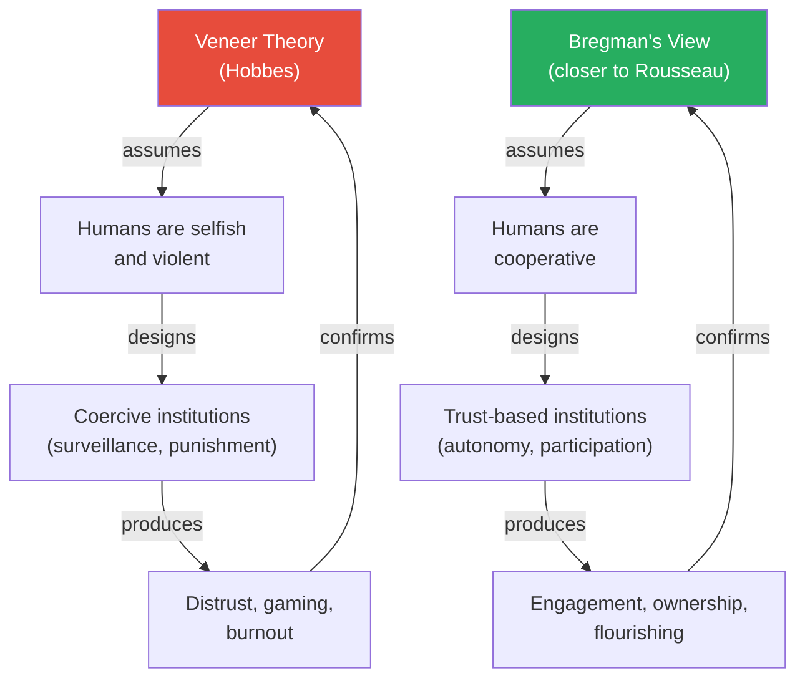

Bregman's core argument visualised as two self-reinforcing cycles: cynical assumptions create coercive systems that confirm the cynicism, while trust-based assumptions create cooperative systems that confirm the trust.

---

## Key Concepts at a Glance

| Concept | One-line summary |
|---------|-----------------|
| **Veneer theory** | The false belief that civilisation is a thin crust over savage human nature |
| **Homo puppy** | Humans as self-domesticated apes, evolved for friendliness not ferocity |
| **Survival of the friendliest** | Natural selection favoured sociability over aggression in human evolution |
| **Nocebo effect (societal)** | Negative beliefs about human nature become self-fulfilling prophecies |
| **The power paradox** | Prosocial traits earn power; power erodes those same traits |
| **Contact hypothesis** | Prejudice dissolves when groups interact as equals |
| **Non-complementary behaviour** | Responding to hostility with kindness to break destructive cycles |
| **Intrinsic motivation** | External rewards and surveillance crowd out internal drive |
| **Pygmalion effect** | People rise or fall to the expectations set for them |
| **News as nocebo** | Media systematically distorts perception of human nature toward the negative |
| **Reverse dominance hierarchy** | Hunter-gatherer groups collectively suppress would-be alphas |
| **Domestication syndrome** | Physical changes that accompany selection for friendliness |
| **Compassion vs. empathy** | Caring about others' wellbeing without absorbing their pain |
| **Restorative justice** | Repairing harm rather than punishing offenders |
| **Sortition** | Selecting representatives by lottery rather than election |

The gap between the red and green profiles reveals how dramatically veneer theory overestimates human selfishness and violence while underestimating cooperation, trust, and altruism — the central thesis of the book.

---

## Prologue and Chapter 1: The State of Nature

*Bregman frames the oldest debate in Western philosophy — are humans naturally good or naturally wicked? — and shows how the answer we choose shapes every institution we build.*

### Hobbes vs. Rousseau: The Debate That Shapes Everything

- Thomas Hobbes, writing in 1651 during the English Civil War, argued that without a strong sovereign, human life would be "solitary, poor, nasty, brutish, and short"
  - In Hobbes's <b style="color: #2980b9">state of nature</b>, every person is at war with every other person
  - Only a powerful authority — the Leviathan — can impose order and prevent chaos
  - This view became the philosophical foundation for authoritarian governance, top-down management, and punitive justice systems
  - Hobbes was writing during genuine social collapse — his position was understandable given his context, but Bregman argues it was generalised far beyond what the evidence supports
- Jean-Jacques Rousseau, writing a century later, took the opposite view
  - Humans in their natural state were peaceful, free, and compassionate
  - It was civilisation — property, hierarchy, inequality — that corrupted this natural goodness
  - "Man is born free, and everywhere he is in chains"
  - Rousseau's critics have always charged him with naive idealism — but Bregman argues the archaeological and anthropological evidence supports Rousseau far more than Hobbes
- <b style="color: #27ae60">Bregman's position: Rousseau was closer to right than Hobbes, and the evidence from evolutionary biology, anthropology, and archaeology overwhelmingly supports this</b>
- But this is not a simple Rousseau revival — Bregman acknowledges the dangers of naive idealism and argues for a "new realism" that takes human decency seriously without ignoring the structures that can corrupt it
- The stakes of this debate are not abstract:
  - If Hobbes is right, then surveillance, punishment, and top-down control are necessary evils
  - If Rousseau is closer to right, then those same systems are not just unnecessary but actively harmful — they create the very problems they claim to solve
  - Every school, every prison, every workplace, every government is implicitly built on one of these assumptions
  - The choice is not philosophical — it is architectural, structural, institutional

| Dimension | Hobbes | Rousseau | Bregman |
|-----------|--------|----------|---------|
| Human default | Selfish, violent | Peaceful, compassionate | Cooperative, with vulnerabilities |
| Role of civilisation | Restrains the beast | Corrupts the angel | Can empower or corrupt |
| Ideal institution | Strong sovereign, top-down | Return to nature | Trust-based, distributed power |
| View of authority | Necessary protection | Source of chains | Useful if distributed; toxic if concentrated |

This table captures the lineage of Bregman's thinking — he draws on Rousseau but adds institutional design as the crucial variable.

The size of each block reflects how widely cited the study or story became in shaping the narrative that humans are fundamentally selfish — the Stanford Prison Experiment and Milgram dominate because they are required reading in virtually every introductory psychology course worldwide, despite both being deeply flawed.

---

### The Nocebo Effect on Society

- In medicine, a <b style="color: #2980b9">nocebo</b> is the opposite of a placebo — a negative belief that causes real harm
  - Tell patients a drug has terrible side effects, and they experience those side effects even when given a sugar pill
  - The mechanism is well-documented: expectation shapes physiology
- Bregman argues the same mechanism operates at the societal level:
  - Tell people that humans are selfish, and they start acting selfishly
  - Design workplaces around distrust, and employees become untrustworthy
  - Build prisons focused on punishment, and prisoners become more criminal
  - This is not metaphor — it is measurable through the <b style="color: #2980b9">Pygmalion effect</b>
- The Pygmalion effect, demonstrated by Robert Rosenthal in the 1960s:
  - Teachers were told certain students were "late bloomers" about to make dramatic intellectual gains
  - The students had been selected at random — there was nothing special about them
  - Yet by the end of the year, the "late bloomers" had made significantly greater gains than their classmates
  - The teachers' expectations changed their behaviour — more attention, more patience, more encouragement — which changed the students' performance
  - <b style="color: #e74c3c">If this works for individual students, imagine what it does when an entire civilisation assumes the worst about its own species</b>
- The reverse also holds — the <b style="color: #2980b9">Golem effect</b>:
  - When teachers expected less of students, those students performed worse
  - Not because the students lacked ability, but because the teachers unconsciously withdrew support, asked easier questions, and tolerated lower effort
  - The belief became the reality through changed behaviour, not changed capacity
  - Rosenthal's experiments have been replicated in military settings, corporate environments, and athletic training — the effect is universal
- The mechanism connects to Bregman's larger thesis:
  - Veneer theory is a civilisation-wide nocebo
  - We collectively believe people are selfish, so we design systems assuming selfishness, and those systems produce the selfishness they predicted
  - The prophecy fulfils itself, and each confirmation strengthens the belief

> [!tip] Core Insight
> What you believe about human nature is not just philosophy — it is a prophecy. Assume people are selfish and you build systems that make them selfish. Assume they are decent and you build systems that let decency flourish.

---

### What Happens When Disaster Strikes

- Veneer theory predicts that in the absence of authority — during natural disasters, blackouts, war — the veneer cracks and savagery emerges
- <b style="color: #27ae60">The evidence points overwhelmingly in the opposite direction</b>
  - Sociologist Charles Fritz studied disaster after disaster and found the same pattern: communities become more cooperative, more generous, more unified
  - The word "community" comes alive during catastrophe — people who were strangers become allies
  - Crime typically drops during disasters, mental health often temporarily improves, and social divisions shrink

> [!example] The Blitz Myth (1940-1941)
> - Before the German bombing of London, British government planners predicted mass panic, psychiatric breakdown, and social collapse
> - They stockpiled coffins, printed emergency psychiatric committal forms, and planned for martial law
> - When the bombs fell, the opposite happened: communities organised spontaneously, strangers shared shelters, crime actually dropped, and morale rose
> - Psychiatrists expecting floods of traumatised civilians found virtually no increase in mental health referrals
> - The government's own Mass Observation project documented a surge in neighbourly behaviour, mutual aid, and social solidarity
> - The same pattern repeated after every major disaster studied since — from the Halifax explosion of 1917 to the earthquake in Mexico City in 1985
> **The lesson:** In genuine crises, the default human response is cooperation, not chaos. The elites who predicted panic were projecting their own fears onto ordinary people.

> [!example] Hurricane Katrina and the Superdome (2005)
> - When Hurricane Katrina struck New Orleans, media reports claimed the Superdome had descended into anarchy — murders, rapes, gangs roaming the corridors
> - The National Guard commander who arrived expected a war zone
> - What he found was thousands of people who had self-organised into a functioning community: sharing food, caring for the elderly and sick, maintaining order without any authority telling them to
> - The "murder" and "rape" stories were later debunked — they were rumours amplified by media outlets that assumed the worst
> - Of the six deaths at the Superdome, four were natural causes, one was a drug overdose, and one was a suicide — none were murders
> - The media's assumptions had real consequences: armed police and military were deployed to "control" citizens who were already controlling themselves, creating confrontation where there had been cooperation
> **The lesson:** The media narrative about Katrina — that civilisation collapsed — was a projection of veneer theory. The actual story was one of spontaneous cooperation under extreme stress.

> [!example]- The Halifax Explosion (1917)
> - On December 6, 1917, a munitions ship collided with another vessel in Halifax harbour, Nova Scotia, triggering the largest man-made explosion before Hiroshima
> - Nearly 2,000 people were killed and 9,000 injured; the blast flattened an entire district of the city
> - Within minutes — before any official response — surviving citizens began pulling neighbours from rubble, carrying the injured to makeshift hospitals, and sharing their homes with the suddenly homeless
> - Soldiers from a nearby garrison joined the rescue spontaneously, without orders
> - The temperature dropped below freezing that night, and a blizzard struck the following day — yet people opened their doors to strangers without hesitation
> - Fritz's analysis of the Halifax disaster became one of the founding documents of modern disaster sociology
> **The lesson:** The further back in history you go with disaster research, the more the same pattern holds — people help, share, and organise without being told to.

- <b style="color: #e74c3c">The real danger during disasters is not the public but the authorities who assume the public will behave like animals</b>
  - The "elite panic" phenomenon, documented by disaster researcher Lee Clarke:
  - Government officials panic about public panic — and their responses (martial law, shoot-to-kill orders, withholding information) cause more harm than the disaster itself
  - After Katrina, police were told to prioritise "maintaining order" over rescue — a direct result of assuming the public was dangerous
  - Bregman's point: the veneer theory doesn't just misread human nature — it kills people, because authorities make decisions based on the assumption that chaos is imminent

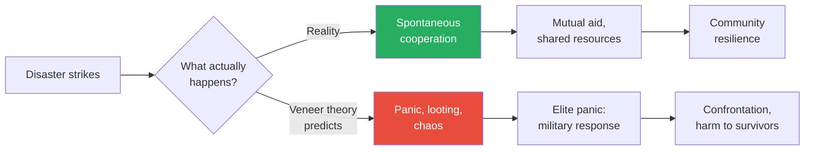

This diagram shows the divergence between what actually happens in disasters and what veneer theory predicts — and how the prediction itself causes harm.

---

## Chapter 2: The Real Lord of the Flies

*William Golding imagined what would happen if boys were stranded on a desert island. It actually happened — and the real story is the opposite of his novel.*

### Golding's Fiction vs. Reality

- <b style="color: #2980b9">Lord of the Flies</b> (1954) is one of the most influential novels of the twentieth century
  - A group of British schoolboys, stranded on an island after a plane crash, descend rapidly into tribalism, cruelty, and murder
  - The book is taught in schools worldwide as a parable about human nature — strip away civilisation and the beast emerges
  - It has shaped how generations think about what people "really are" underneath social conventions
  - The novel's power lies in its apparent realism — it feels like it could happen, and that feeling has been accepted as fact
- Bregman asks a simple question: has this ever actually happened? Has a group of children ever been stranded, and if so, what did they do?
- He tracks down a real case that almost nobody knows about — and the answer demolishes Golding's premise entirely

> [!example] The Tongan Castaways of 'Ata (1965-1966)
> - Six boys from a Catholic boarding school in Tonga — Sione, Stephen, Kolo, David, Luke, and Mano — stole a fishing boat and set out to sea, hoping to sail to Fiji or New Zealand
> - A storm destroyed their sail and they drifted for eight days without food or water before washing up on 'Ata, an uninhabited volcanic island
> - They were stranded for fifteen months before being rescued by an Australian sea captain named Peter Warner
> - Far from descending into savagery, the boys organised themselves with remarkable maturity:
>   - They established a roster for gardening, cooking, and guard duty
>   - They built a badminton court, a gymnasium with improvised weights, and a small chicken coop from wild fowl they captured
>   - They kept a signal fire burning at all times — for over a year, it never went out
>   - When two boys quarrelled, the group rule was enforced: the fighters had to go to opposite ends of the island to cool down, then come back and apologise
>   - When one boy fell off a cliff and broke his leg, the others set the bone using sticks and leaves — it healed perfectly
>   - They divided labour based on skill, not dominance — the best fisherman fished, the best gardener gardened
> - When Captain Warner found them, all six were healthy, fit, and in good spirits
> - Warner was so impressed that he hired all six as crew members on his fishing boat
> **The lesson:** The real Lord of the Flies is a story of cooperation, ingenuity, and friendship — not savagery.

### What Golding's Fiction Reveals About Golding

- William Golding was not a neutral observer of human nature:
  - He was a self-described alcoholic who admitted to cruelty toward his students as a schoolteacher
  - His daughter Judy's biography revealed that he was a deeply troubled man who struggled with rage and self-loathing
  - His unpublished memoir reveals he attempted to rape a fifteen-year-old girl
  - He wrote that he had "always understood the Nazis" because he had felt the same impulses
  - His worldview was shaped by his own darkness — and he projected that darkness onto the species
- <b style="color: #e74c3c">Lord of the Flies tells us more about William Golding than about human nature</b>
- Yet his pessimistic fantasy, not the real story of the Tongan boys, became the culturally dominant narrative
- Bregman sees this as a pattern: the dark, sensational version of events always gets more attention than the hopeful, accurate one
  - Negativity bias in media amplifies stories of human failure
  - Stories of human cooperation are coded as "boring" or "naive"
  - The result is a systematic distortion of the cultural record
- The Tongan boys' story was briefly reported in Australian newspapers in 1966 and then forgotten:
  - No book deals, no Hollywood films, no school curricula
  - The story of cooperation simply wasn't dramatic enough to stick in the cultural imagination
  - Golding's fictional savagery, however, became assigned reading for millions
  - Bregman tracked down the surviving castaways and Peter Warner to piece together the full story — decades after it had vanished from public awareness

> [!tip] Core Insight
> We treat Lord of the Flies as a realistic prediction of human behaviour. The actual evidence — from the Tongan castaways to disaster research — shows the opposite. Fiction masquerading as truth has warped our understanding of our own species.

---

## Chapter 3: The Rise of Homo Puppy

*Bregman introduces the most provocative idea in the book: humans did not survive by being the strongest or the smartest, but by being the friendliest.*

### The Self-Domestication Hypothesis

- <b style="color: #2980b9">Self-domestication</b> is the theory that humans underwent the same process as domesticated animals — but we did it to ourselves
  - Over tens of thousands of years, the most aggressive, antisocial individuals were ostracised, exiled, or killed by the group
  - The friendliest, most cooperative individuals had more social bonds, more mating opportunities, and more offspring
  - Natural selection gradually favoured sociability over aggression
  - This wasn't a conscious process — it was the cumulative result of thousands of generations making social choices about who to include and who to exclude
- The physical evidence is striking — modern humans show the classic <b style="color: #2980b9">domestication syndrome</b>:
  - Smaller teeth and jaws compared to earlier hominids
  - Flatter, more juvenile-looking faces (neoteny)
  - Reduced sexual dimorphism (men and women became more similar in size)
  - Smaller brains than Neanderthals (but wired differently — more social processing)
  - Extended juvenile period (human children depend on caregivers far longer than any other primate)
  - These are the exact same changes seen in domesticated dogs compared to wolves, domesticated horses compared to wild horses, and domesticated pigs compared to wild boar
- <b style="color: #27ae60">We are not the smartest ape — we are the friendliest ape. And friendliness is what made us smart.</b>
- The mechanism linking friendliness to intelligence:
  - Cooperation enables teaching — passing knowledge between individuals
  - Teaching enables cumulative culture — each generation builds on the last
  - Cumulative culture produces technology, language, art, and science
  - None of this requires individual genius — it requires the social infrastructure to share and accumulate ideas
  - A single brilliant Neanderthal who couldn't share their innovations was less powerful than a mediocre Homo sapiens who could teach fifty others

---

> [!example] Belyaev's Silver Fox Experiment (1959-present)
> - Soviet geneticist Dmitri Belyaev began a breeding experiment at a fur farm in Novosibirsk, Siberia
> - He selected silver foxes for a single trait: friendliness toward humans
> - Each generation, he bred only the 10% most docile foxes — those that approached handlers without fear or aggression
> - Within just six generations, something remarkable happened: the foxes began developing floppy ears, curly tails, spotted coats, and shorter snouts
> - By generation twenty, they were wagging their tails, licking handlers' faces, and whimpering for attention — behaviours no wild fox exhibits
> - Belyaev had not selected for any of these physical traits — he had only selected for friendliness, and the entire package came along for the ride
> - The genetic explanation: the genes controlling friendliness are linked to genes controlling developmental timing, hormones, and pigmentation — selecting for one selects for all
> - The experiment, now in its sixtieth generation, is one of the most important in evolutionary biology
> **The lesson:** Selecting for friendliness doesn't just change behaviour — it rewires the entire organism. The same process shaped Homo sapiens.

### Homo Puppy: What It Means

- Bregman coins the term <b style="color: #2980b9">Homo puppy</b> to capture the domestication metaphor:
  - Just as dogs evolved from wolves by becoming friendlier and more attuned to human social cues, humans evolved from earlier hominids by becoming friendlier and more attuned to each other's social cues
  - Our superpower is not individual intelligence but collective intelligence — the ability to collaborate, teach, learn, and build on each other's ideas across generations
  - The metaphor is deliberately playful — Bregman wants to puncture the grandiose self-image of Homo sapiens ("wise man") with something more accurate and more endearing
- Why did Homo sapiens survive while Neanderthals did not?
  - Neanderthals had bigger brains and bigger muscles
  - But Homo sapiens had larger social networks, more complex language, and greater capacity for cooperation
  - A group of cooperating Homo sapiens could outcompete a group of individually stronger Neanderthals every time
  - The archaeological record supports this: Neanderthal tools changed little over hundreds of thousands of years, while Homo sapiens tools showed rapid innovation and regional variation — signs of cultural exchange and cumulative improvement
- The evolutionary trade-off:
  - We became less individually formidable but more collectively powerful
  - We lost the physical strength of our ancestors but gained the ability to coordinate in groups of hundreds and eventually thousands
  - <b style="color: #27ae60">Our greatest evolutionary adaptation is the ability to trust strangers</b>
  - No other primate cooperates with unrelated strangers at this scale — it is uniquely human

> [!example] The Cooperative Advantage Over Neanderthals
> - Archaeological evidence shows Neanderthals lived in small, isolated groups of about 10-15 individuals
> - Homo sapiens, by contrast, maintained trade networks spanning hundreds of kilometres
> - Obsidian tools found at Homo sapiens sites often originated hundreds of kilometres away — evidence of long-distance exchange
> - Neanderthal tools show no such trade patterns — each small group was self-contained
> - When climate shifted or resources became scarce, Neanderthals had no network to fall back on
> - Homo sapiens could draw on allies, share information about food sources, and relocate through established social connections
> - The genetic evidence also supports greater social mixing: Homo sapiens populations show far more genetic diversity across sites, indicating regular movement and interbreeding between groups
> **The lesson:** The species that cooperated across distances survived. The species that relied on individual strength and small-group isolation went extinct.

> [!example] The Chimp-Bonobo Comparison
> - Chimpanzees and bonobos shared a common ancestor roughly two million years ago but evolved in different environments
> - Chimpanzees, north of the Congo River, competed with gorillas for food — a competitive environment that selected for aggression, hierarchy, and intergroup violence
> - Bonobos, south of the Congo River, had no gorilla competition — abundant food selected for sociability, play, and sexual bonding as conflict resolution
> - Bonobos display the domestication syndrome: flatter faces, smaller teeth, more playful temperament, reduced aggression
> - Bregman argues that Homo sapiens are closer to bonobos than chimps — we self-domesticated in a social environment that rewarded cooperation
> - The popular image of our ancestors as "killer apes" is based on chimpanzee behaviour, but bonobos are equally related to us — and their behaviour tells a very different story
> **The lesson:** We chose which primate cousin to model our self-image on, and we chose the violent one. Bregman argues we chose wrong.

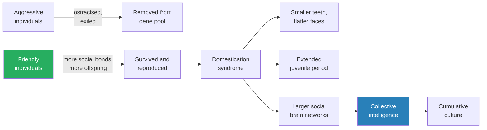

This diagram shows how self-domestication worked: aggression was selected out, friendliness was selected in, and the downstream effects reshaped our bodies, our brains, and our capacity for civilisation.

The overwhelming green slice makes Bregman's point visually inescapable: for roughly 97% of our existence as a species, humans lived in small, egalitarian, cooperative bands — the hierarchical civilisations we treat as "normal" occupy a sliver of evolutionary time.

---

## Chapter 4: Colonel Marshall and the Soldiers Who Wouldn't Shoot

*Even in humanity's darkest activity — war — Bregman finds evidence that killing does not come naturally to our species.*

### The Secret of Non-Firing

- After World War II, U.S. Army historian S.L.A. Marshall conducted extensive interviews with soldiers who had seen combat
- His finding was explosive: <b style="color: #2980b9">only 15 to 25 percent of soldiers actually fired their weapons at the enemy</b>
  - The rest — the majority — found ways to avoid killing: firing over heads, pretending to reload, busying themselves with other tasks
  - These were not cowards — many performed other dangerous duties under fire and received commendations for bravery
  - They simply could not bring themselves to aim at another human being and pull the trigger
  - Marshall's methodology has been questioned by some historians, but his core finding has been supported by studies in other conflicts and other armies
- Dave Grossman, a former Army Ranger and psychology professor, expanded on this in his book *On Killing*:
  - Humans have a deep, instinctive resistance to killing members of their own species
  - This resistance is present across cultures and across history
  - It takes intensive conditioning — what Grossman calls "killology" — to override it
  - Most species have similar inhibitions — wolves rarely kill other wolves in dominance fights; they submit instead
- The resistance is not just psychological — it appears to be biological:
  - Soldiers who killed in close combat reported overwhelming nausea, trembling, and involuntary urination
  - These are autonomic nervous system responses — the body literally rebels against the act
  - The closer the range, the stronger the resistance — killing with a knife is psychologically harder than killing with a rifle, which is harder than killing with an artillery shell
  - This gradient of resistance maps perfectly onto the self-domestication thesis: our biology resists harming creatures we can recognise as human

---

> [!example] The Christmas Truce (1914)
> - On Christmas Eve 1914, just five months into World War I, something spontaneous happened along the Western Front
> - German soldiers began placing candles on their trench parapets and singing "Stille Nacht" (Silent Night)
> - British soldiers responded with their own carols
> - By Christmas morning, soldiers from both sides climbed out of their trenches, met in no-man's land, and exchanged cigarettes, chocolate, and photographs of their families
> - In some sectors, they organised football matches — British versus German, using tin cans or sandbags as balls
> - The truce lasted in some areas for several days, with soldiers refusing to resume hostilities
> - Officers on both sides had to issue direct threats of court-martial to force soldiers back to fighting
> - In subsequent years, military commanders deliberately rotated units and scheduled attacks on Christmas to prevent any recurrence
> - The truce was not a single isolated incident — it happened spontaneously along hundreds of kilometres of the front, independently and simultaneously
> **The lesson:** Soldiers had to be ordered to kill — and even then, many found ways to avoid it. The Christmas Truce reveals what happens when the machinery of dehumanisation briefly breaks down.

> [!example] Fraternisation in the American Civil War
> - Along the Rappahannock River in 1862, Union and Confederate soldiers stationed on opposite banks began trading with each other
> - They floated small boats across the river carrying coffee (which the Union had in abundance) in exchange for tobacco (which the Confederates had)
> - Soldiers would call out warnings before firing artillery — "Get down, Yank, we're about to fire!"
> - Officers repeatedly tried to stop the fraternisation but found it almost impossible to prevent
> - The pattern appears in nearly every prolonged conflict where soldiers face each other at close range for extended periods
> **The lesson:** When enemies see each other as individuals rather than abstractions, the will to kill collapses. Distance — physical and psychological — is the prerequisite for violence.

### How Militaries Overcome the Resistance

- <b style="color: #e74c3c">The modern military has learned to systematically override the natural resistance to killing</b>
  - **Dehumanisation of the enemy:** Language matters — "gooks," "Krauts," "ragheads" — turning the enemy into something less than human
  - **Distance:** Killing becomes easier with physical and emotional distance — bombing from 30,000 feet is psychologically easier than bayonetting someone face to face
  - **Reflex conditioning:** Modern training replaced bull's-eye targets with human-shaped silhouettes that pop up and must be shot instantly, building an automatic response
  - **Group pressure:** Soldiers fight for their unit, not for ideology — the fear of letting down their comrades overrides the resistance to killing
  - **Authority:** A direct command from a trusted officer shifts moral responsibility from the individual to the institution
  - **Desensitisation:** Repeated exposure to simulated violence (increasingly through video-game-style training) reduces the emotional impact of actual violence
- The result: firing rates rose from 15-25% in WWII to over 90% in Vietnam
  - But so did PTSD — the trauma of overriding a deep instinct has a psychological cost
  - Vietnam veterans suffered rates of post-traumatic stress far exceeding WWII veterans, despite fighting a shorter and (for the U.S.) less existentially threatening war
  - The correlation is not accidental — when you train people to override a biological resistance, the override has consequences
- Bregman's broader point about the resistance to killing:
  - If humans were natural killers, the military would not need to spend billions on conditioning
  - The entire history of military training is a history of solving the problem of human decency
  - Every innovation in military technology — from the longbow to the drone — has been partly motivated by the need to increase psychological distance from the act of killing
  - The fact that soldiers need to be trained to kill is as important a piece of evidence as any evolutionary argument — it tells us what the biological default is
  - <b style="color: #27ae60">The human default is not violence. Violence is what happens when institutions systematically override the default.</b>

| War | Firing Rate | Training Method | PTSD Rate |
|-----|------------|-----------------|-----------|
| World War II | 15-25% | Bull's-eye targets, basic drill | Lower |
| Korea | ~55% | Improved conditioning | Moderate |
| Vietnam | 90-95% | Human silhouettes, reflex drills | Very high |
| Modern conflicts | 95%+ | Simulation, video-game-style | Very high |

The correlation between firing rate and PTSD suggests that forcing humans to act against their nature comes at a severe psychological cost.

> [!tip] Core Insight
> The military had to completely redesign its training to get soldiers to shoot. The fact that killing required this level of engineering is itself powerful evidence that violence is not the human default.

---

## Chapter 5: The Curse of Civilisation

*Bregman makes his most controversial claim: the transition from hunter-gatherer life to agriculture was not progress but a catastrophe for human wellbeing.*

### The "Original Affluent Society"

- Anthropologist Marshall Sahlins coined the term <b style="color: #2980b9">original affluent society</b> in 1966 to describe hunter-gatherer life
  - Hunter-gatherers typically worked 3-5 hours per day to meet their needs
  - The rest of their time was spent in leisure, socialising, storytelling, and play
  - Their diets were more varied and nutritious than early agricultural diets
  - Skeletal evidence shows they were taller, healthier, and lived longer than early farmers
  - The "affluence" is not about possessions but about the ratio of desires to means — hunter-gatherers wanted little and had enough
- James Suzman's research with the San Bushmen of the Kalahari supports this:
  - The San had no concept of wealth accumulation — sharing was the core social obligation
  - Anyone who hoarded resources was mocked and shamed until they distributed their surplus
  - There were no chiefs, no standing armies, no organised violence
  - Gender relations were far more egalitarian than in agricultural societies
  - The San's relationship to work was fundamentally different — there was no division between "work" and "life," no concept of employment or unemployment
- Christopher Boehm's research across dozens of hunter-gatherer societies found a consistent pattern:
  - <b style="color: #2980b9">Reverse dominance hierarchies</b> — the group collectively suppresses anyone who tries to dominate
  - Would-be alphas are mocked, ignored, and if necessary exiled or killed
  - The tools of suppression are social: ridicule, gossip, withdrawal of cooperation, refusal to follow
  - Leadership is situational and temporary — the best hunter leads the hunt, the best healer handles illness, but no one commands in all domains
  - This system is remarkably effective — it maintained egalitarian social structures for tens of thousands of years
- <b style="color: #27ae60">For 95% of human history, we lived in small, egalitarian bands where cooperation was the norm and hierarchy was actively suppressed</b>
  - This is not romanticisation — Bregman acknowledges that hunter-gatherer life involved genuine hardship, infant mortality, and occasional violence
  - But the violence was interpersonal, not institutional — there were no wars, no slavery, no systematic oppression
  - The point is not that the past was perfect but that hierarchy and domination are not hardwired human defaults

---

### What Agriculture Changed

- The <b style="color: #2980b9">Agricultural Revolution</b> (roughly 10,000 years ago) transformed human societies in ways that were almost entirely negative for individual wellbeing:
  - **Surplus:** Stored grain created something worth fighting over — and something to control
  - **Property:** Land ownership replaced communal access, creating haves and have-nots for the first time
  - **Hierarchy:** Surpluses needed to be managed, counted, and defended — creating rulers, priests, and soldiers
  - **War:** Organised violence became possible and profitable once there were granaries to raid and land to conquer
  - **Patriarchy:** Women's status declined as physical strength became more valued for ploughing and warfare, and as men's control of property gave them control over family structures
  - **Disease:** Living in close proximity to domesticated animals created new infectious diseases — measles, smallpox, influenza all jumped from animals to humans in agricultural settings
  - **Inequality:** For the first time, some people had far more than they needed while others starved
  - **Longer working hours:** Farmers worked significantly more than hunter-gatherers — often dawn to dusk — for a less nutritious diet

> [!example] The Transition in the Archaeological Record
> - Skeletal remains from the transition period tell a stark story
> - Pre-agricultural humans: taller, fewer dental cavities, no signs of repetitive stress injuries, minimal evidence of interpersonal violence
> - Post-agricultural humans: shorter (by as much as five inches), rampant tooth decay from grain-heavy diets, arthritis from repetitive farming motions, and dramatically increased evidence of traumatic injuries from warfare
> - The average height of humans did not recover to pre-agricultural levels until the twentieth century — roughly ten thousand years after the transition
> - Jared Diamond called agriculture "the worst mistake in the history of the human race"
> - Life expectancy actually decreased for thousands of years after agriculture was adopted
> - The evidence is not ambiguous: by every measurable indicator of individual wellbeing, early farmers were worse off than the hunter-gatherers they replaced
> **The lesson:** What we call "civilisation" came at an enormous cost — and the peaceful, egalitarian existence it supposedly rescued us from was far better than Hobbes imagined.

- <b style="color: #e74c3c">The Hobbesian narrative has it exactly backwards</b>
  - Hobbes assumed that without civilisation, humans would be at war with each other
  - The evidence suggests that war, slavery, and extreme inequality are products of civilisation, not problems that civilisation solved
  - This does not mean we should return to hunter-gatherer life — but it means we should stop treating hierarchical, coercive institutions as necessary protections against our "true nature"
- Bregman is careful to note the nuance:
  - Agriculture also enabled writing, science, medicine, and the accumulation of knowledge
  - The question is not whether civilisation has benefits but whether its particular form — concentrated power, coercive hierarchy — is the only way to organise complex societies
  - The evidence from Buurtzorg, Agora, and participatory budgeting (discussed later) suggests it is not
  - We can have complexity without domination — but it requires designing institutions on trust rather than suspicion

> [!example] The Trap of the First Grain Store
> - Bregman describes the agricultural transition not as a single decision but as a slow trap
> - A band starts planting a few crops alongside their foraging — a small supplement, nothing drastic
> - The crops require them to stay in one place during the growing season, reducing their mobility
> - A surplus accumulates — stored grain that can feed the group through winter
> - Someone must guard the grain store; someone must count the grain; someone must decide who gets how much
> - These roles solidify into permanent positions — the first rulers, the first bureaucrats
> - The population grows because stored calories can support more mouths — but now the group is too large to return to foraging
> - The trap is sprung: each step was small and rational, but the cumulative effect was a revolution that could not be reversed
> - Within a few generations, the egalitarian norms of forager life are replaced by hierarchy, property, and hereditary inequality
> **The lesson:** Nobody chose civilisation's downsides — they accumulated through a series of small, individually rational decisions that collectively produced a society no one would have designed on purpose.

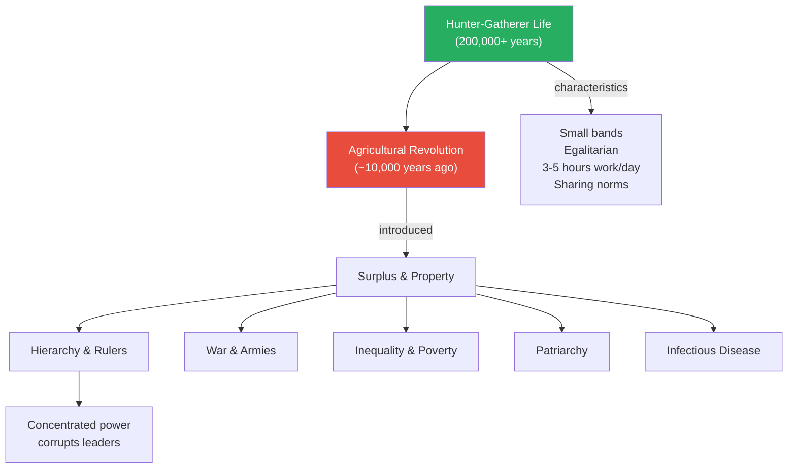

Bregman's timeline of human social organisation — the vast majority of our species' history was spent in cooperative, egalitarian bands, with hierarchy and war being relatively recent inventions.

---

## Chapter 6: The Mystery of Easter Island

*Bregman takes on one of the most popular cautionary tales in environmental writing and shows how assumptions about human nature distort the reading of history.*

### Diamond's Story vs. the Evidence

- Jared Diamond's <b style="color: #2980b9">Collapse</b> (2005) used Easter Island as the poster child for ecological self-destruction:
  - The islanders cut down every tree, destroyed their environment, then turned on each other in wars of desperation
  - The moai (giant stone statues) were evidence of a civilisation so obsessed with status competition that it consumed itself
  - Diamond presented this as a warning for modern civilisation — if even a small island society can destroy itself, imagine what we're doing to the planet
  - The story became hugely popular because it confirmed what we already believed: humans are fundamentally short-sighted and self-destructive
- Bregman presents the counter-narrative from archaeologists Jan Boersema and Carl Lipo:
  - The deforestation was largely caused by Polynesian rats that arrived with the first settlers and ate the palm seeds, preventing forest regeneration — not by human logging
  - There is minimal archaeological evidence of warfare — few weapons, no fortifications, no mass graves dating to the pre-contact period
  - The moai were likely moved using cooperative "walking" techniques (rocking them forward on log tracks), not the massive slave-labour operations Diamond assumed
  - The island's population decline was caused primarily by European contact: slave raids by Peruvian ships in the 1860s captured or killed roughly half the population, and introduced diseases killed most of the remainder
  - The islanders had actually adapted resourcefully to deforestation — they developed lithic mulching (using rocks to retain soil moisture) and built stone-walled gardens
- The detailed archaeological rebuttal:
  - Diamond relied heavily on the assumption that a treeless landscape meant human-caused deforestation, but the rat hypothesis provides a more parsimonious explanation
  - Rat populations can explode on islands with no natural predators — a single breeding pair can produce millions of descendants within a few decades
  - Excavated palm nut shells on Easter Island show extensive gnaw marks from Polynesian rats, consistent with rats eating seeds before they could germinate
  - The obsidian tools Diamond interpreted as weapons (mata'a) were re-examined by Carl Lipo and colleagues using morphometric analysis — their shapes are far more consistent with agricultural and ritual tools than weapons of war
  - The lack of skeletal trauma on pre-contact remains further undermines the warfare narrative — if the islanders had been fighting wars of survival, the bones would show it
  - Additionally, the supposed evidence of cannibalism on Easter Island — which Diamond cited as proof of societal collapse — has been challenged by researchers who argue the bone marks are more consistent with funerary practices (ritual handling of ancestors' remains) than with desperate consumption of human flesh
  - The population estimates Diamond used to argue for catastrophic overshoot have also been revised downward — more recent archaeological surveys suggest a smaller, more sustainable population than the dramatic rise-and-crash narrative requires
- The significance of the moai themselves is reframed:
  - Rather than evidence of destructive competition, the statues may represent a cooperative achievement — different clans working together on shared cultural projects
  - The "walking" theory, tested by researchers who successfully moved replica moai using ropes and coordinated rocking, requires coordination and teamwork, not slave labour
  - The statues face inward, toward the communities, not outward toward rivals — suggesting protection and solidarity, not competitive display

> [!example] The Slave Raids on Rapa Nui (1862-1863)
> - Peruvian slave traders landed on Easter Island and captured around 1,500 people — roughly half the population
> - The captives were shipped to Peru to work in guano mines under horrific conditions
> - International pressure from France and Britain eventually forced Peru to repatriate survivors, but only about 15 made it back alive
> - Those 15 carried smallpox, which devastated the remaining population
> - By 1877, only 111 Easter Islanders remained — down from an estimated 3,000-4,000 before European contact
> - The missionaries who arrived in the aftermath found a shattered society and interpreted the destruction as evidence of indigenous failure — conveniently ignoring that it was European violence and disease that had caused it
> **The lesson:** The real collapse of Easter Island was caused by European colonialism, not by indigenous stupidity. But the colonial narrative — "they destroyed themselves" — is more flattering to the West and more useful as a morality tale.

> [!example] The "Walking" Moai Experiment
> - Archaeologists Carl Lipo and Terry Hunt tested the theory that the moai were "walked" to their platforms by coordinated teams
> - Using a replica moai and ropes, they demonstrated that as few as 18 people could rock the statue forward in a controlled "walking" motion
> - The technique explains why abandoned moai found along roads are always upright or fallen forward — consistent with walking, not dragging
> - Diamond's assumption that moving the statues required deforesting the island for log rollers was not only unproven but physically unnecessary
> - The walking method requires trust, coordination, and rhythmic teamwork — it is a cooperative achievement, not evidence of slave labour or environmental recklessness
> **The lesson:** The story we told about Easter Island reveals our assumptions, not their history. We assumed exploitation because we expected exploitation.

- <b style="color: #e74c3c">The pattern Bregman identifies: we project our darkest assumptions onto other peoples, then treat those projections as evidence for human wickedness</b>
  - Easter Island becomes "proof" that humans can't manage their own resources
  - But the actual evidence points to a resourceful, cooperative society destroyed from outside
  - This pattern repeats throughout colonial history — the destruction caused by colonisers is repackaged as evidence of the colonised people's inferiority
  - The narrative serves a dual function: it confirms veneer theory (humans are self-destructive) and exonerates colonialism (they would have collapsed anyway)

> [!tip] Core Insight
> The Easter Island narrative is not just bad history — it is a case study in how veneer theory distorts evidence. We assumed the islanders destroyed themselves because that is what we expected humans to do. The real story of colonial destruction is less useful as a morality tale but far closer to the truth.

---

## Chapter 7: In the Basement of Stanford University

*Bregman takes on the most famous psychology experiment in history — and reveals it was closer to a theatrical production than a scientific study.*

### The Stanford Prison Experiment: What Really Happened

- In August 1971, <b style="color: #2980b9">Philip Zimbardo</b> set up a simulated prison in the basement of Stanford's psychology department
  - Twenty-four male students were randomly assigned to be "guards" or "prisoners"
  - The standard narrative: within days, the guards became sadistic tyrants and the prisoners broke down emotionally, proving that "the situation" overrides individual character
  - The experiment was stopped after six days because conditions had become too extreme
  - It became one of the most cited studies in psychology, taught in virtually every introductory textbook
  - Zimbardo leveraged it into a career as one of the world's most famous psychologists
- <b style="color: #e74c3c">But the experiment was deeply flawed — closer to a rigged demonstration than genuine science</b>
  - Zimbardo was not a neutral observer — he played the role of "prison superintendent" and actively managed the experiment
  - He set the tone from the beginning: guards were given uniforms, mirrored sunglasses, and batons — visual symbols of authority designed to encourage domination
  - The guards were given specific instructions to create an atmosphere of fear and helplessness
  - David Jaffe, an undergraduate research assistant, explicitly coached the most reluctant guards to be tougher — telling them they weren't being realistic enough
  - Participants were selected from a pool of respondents to a newspaper ad asking for volunteers for "a study of prison life" — attracting people interested in aggression and authority
  - Research by Thomas Carnahan and Sam McFarland later showed that volunteers who responded to ads mentioning "prison life" scored higher on aggression, authoritarianism, and Machiavellianism than control volunteers
  - The most dramatic "breakdown" — a prisoner screaming to be released — was later revealed to be faked; the participant admitted he was acting to get out of the experiment
  - Most guards were actually uncomfortable with cruelty and had to be pushed repeatedly to maintain the harsh regime
  - Only about one-third of the guards behaved in ways that could be called sadistic — and they were the ones who received the most coaching
- The deeper archival evidence — what Bregman found by digging into the records:
  - Zimbardo's own instructions to guards included the line: "You can create in the prisoners feelings of boredom, a sense of fear to some degree, you can create a notion of arbitrariness" — this is not a neutral experimental instruction but a script for intimidation
  - When guards were insufficiently harsh, Zimbardo's team intervened directly — not through scheduled experimental protocols but through ad hoc pressure
  - The experiment had no control group, no standardised conditions, and no blind assessment — basic requirements for any valid psychological study
  - Zimbardo later testified as an expert witness in the Abu Ghraib abuse case, using his own flawed experiment to argue that "the situation" caused the abuse — effectively absolving individual abusers by citing a study where he himself had created the abusive situation
  - Science journalist Ben Blum's 2018 investigation uncovered additional tape recordings showing Zimbardo actively directing the experiment in real time, making moment-by-moment decisions about how to escalate the drama
  - Blum also found that Zimbardo's decision to end the experiment on day six — widely presented as a moral awakening prompted by his girlfriend Christina Maslach — was more complicated than the heroic narrative suggests, with practical and reputational considerations playing a role alongside genuine ethical concern
  - The experiment was never published in a top-tier peer-reviewed journal — it appeared primarily in a Navy-funded research report and in popular media, bypassing the scrutiny that standard peer review would have provided
  - Despite these fundamental problems, the Stanford Prison Experiment appears in virtually every introductory psychology textbook published in the last fifty years, usually presented uncritically as established science
  - The contrast between the experiment's scientific weakness and its cultural influence is itself a data point in Bregman's argument — we are so eager to believe the worst about ourselves that a rigged demonstration can pass as proof for half a century

> [!example] The Guard Who Refused (1971)
> - Not all guards became sadistic — in fact, most were reluctant
> - One guard, known in the records as "John Mark," consistently refused to punish prisoners
> - He gave prisoners extra food, let them sleep when they were supposed to be woken for counts, and ignored minor rule violations
> - When confronted by Zimbardo's team, he was told he was not playing his role properly
> - Another guard later described feeling like an actor in a play, not a participant in an experiment — the researchers had a script, and his job was to follow it
> - After the experiment, the guards who had been most "cruel" reported feeling pressured by the experimenters to behave that way — they were performing, not revealing their true nature
> - Zimbardo never acknowledged the significance of this — that his results were produced by coaching, not by "the situation"
> **The lesson:** The Stanford Prison Experiment doesn't show that situations override character. It shows that if a researcher coaches people to be cruel and tells them it's for science, some will comply. That's a very different finding.

> [!example] Douglas Korpi — The "Breakdown" That Was Acting
> - The most memorable moment from the Stanford Prison Experiment is a recording of prisoner #8612, Douglas Korpi, screaming hysterically to be released
> - This footage has been shown to millions of psychology students as evidence of genuine psychological breakdown
> - Decades later, Korpi admitted in interviews that he had faked the entire episode
> - He wanted out of the experiment to study for his graduate school exams
> - When simply asking to leave didn't work, he escalated to screaming — correctly guessing that a dramatic breakdown would force the experimenters to let him go
> - Far from losing his mind, Korpi was making a calculated, rational decision
> - He later said he was surprised anyone believed it was real — to him, it was obvious he was performing
> - Zimbardo used the recording for decades without disclosing that it was staged
> **The lesson:** The Stanford Prison Experiment's most iconic moment was a performance, not a breakdown — and it took decades for this to come to light.

### The BBC Prison Study: The Actual Replication

- In 2002, psychologists Alex Haslam and Steve Reicher conducted a proper replication for the BBC:
  - No coaching of guards, no instructions to be harsh, no experimenter playing a role in the simulation
  - Proper ethical oversight, with genuine freedom for participants to leave
  - Result: <b style="color: #27ae60">the guards were uncomfortable with their authority and struggled to maintain order, while the prisoners organised democratic resistance</b>
  - The "tyranny" that Zimbardo found simply did not emerge when the experiment was conducted honestly
  - The study was published in peer-reviewed journals and directly contradicts Zimbardo's conclusions
- Haslam and Reicher's key insight: it's not "the situation" that produces tyranny — it's **leadership**
  - When an authority figure actively encourages cruelty (as Zimbardo did), some people comply
  - When there is no such encouragement, people default to fairness and negotiation
  - This finding is actually more useful than Zimbardo's — it tells us where to look for the source of institutional cruelty (the leadership, not the followers)
- Zimbardo has never acknowledged these criticisms substantively, and the Stanford Prison Experiment continues to be taught uncritically in most psychology courses
- The broader pattern:
  - Zimbardo's career and public profile were built on this single experiment
  - He became one of the most famous psychologists alive, gave TED talks, wrote bestselling books, and served as an expert witness
  - Admitting the experiment was fatally flawed would undermine his entire professional legacy
  - <b style="color: #e74c3c">The incentive structure of academic fame rewards sensational findings and punishes corrections</b>

> [!tip] Core Insight
> The most famous experiment "proving" human cruelty was essentially staged. When it was replicated without the coaching and manipulation, people defaulted to fairness, not tyranny.

---

## Chapter 8: Stanley Milgram and the Shock Machine

*The experiment that "proved" humans will blindly follow orders turns out to prove something far more interesting — and far more human.*

### Milgram's Obedience Experiments: The Standard Story

- In 1961, Yale psychologist <b style="color: #2980b9">Stanley Milgram</b> conducted a series of experiments on obedience:
  - Participants were told they were administering electric shocks to a "learner" (actually an actor) as part of a learning study
  - The shocks increased in severity with each wrong answer, from 15 volts to a supposedly lethal 450 volts
  - The "learner" screamed, begged to stop, and eventually went silent
  - An experimenter in a lab coat instructed participants to continue
  - Standard narrative: 65% of participants administered the maximum 450-volt shock — proving that ordinary people will follow authority to the point of killing
- This study became the go-to explanation for the Holocaust, for Abu Ghraib, for every atrocity committed by "ordinary people"
- The simple takeaway — "people just follow orders" — entered the cultural vocabulary and became one of the most widely known findings in all of psychology

### What the Published Papers Left Out

- Journalist and researcher <b style="color: #2980b9">Gina Perry</b> gained access to Milgram's original archives at Yale and discovered significant problems:
  - Milgram ran over twenty variations of the experiment, but selectively published only the results that supported his thesis
  - In many variations, resistance was far higher — when the "learner" was in the same room, most participants refused to continue
  - When the experiment was moved from Yale's prestigious campus to a run-down office in Bridgeport, Connecticut, compliance dropped dramatically — the authority of the institution mattered more than the authority of the individual
  - When two experimenters gave contradictory instructions, virtually everyone stopped
  - Many participants reported afterward that they suspected the shocks were not real — the screams seemed theatrical and the setup implausible
  - Perry found that experimenters often went far beyond the scripted prods — they improvised, cajoled, pleaded, and sometimes physically prevented participants from leaving
  - The "experimenter" did not merely ask people to continue — he used increasingly coercive prods:
    - Prod 1: "Please continue"
    - Prod 2: "The experiment requires that you continue"
    - Prod 3: "It is absolutely essential that you continue"
    - Prod 4: "You have no other choice; you must go on"
  - When the fourth prod was used (a direct order), most people refused — <b style="color: #27ae60">direct orders were the LEAST effective way to get compliance</b>
  - This finding, buried in Milgram's own data, overturns the entire "blind obedience" narrative
- Perry's archival work revealed additional layers of methodological trouble:
  - The debriefing process was inconsistent — some participants were told the shocks were fake, while others were left believing for weeks or months that they had actually hurt someone
  - Post-experiment questionnaires showed that a substantial minority of participants did not believe the shocks were real at the time of the experiment — they suspected it was a setup, reducing the study's validity
  - Milgram's lab notes reveal he was aware of these problems but chose not to foreground them in his published papers
  - The famous 65% compliance figure came from a single variation — one of over twenty — and was not the most common result across all conditions
  - Across all variations, the average obedience rate was substantially lower, and in some conditions it dropped to nearly zero
  - Perry also discovered that the experimenters did not always follow the scripted prods in sequence — they sometimes skipped to more coercive language, repeated prods out of order, or invented entirely new prods on the spot
  - This means the experiment was not standardised — different participants received substantially different levels of pressure, making the results incomparable across sessions
  - One experimenter was recorded telling a participant "the shocks may be painful, but they are not dangerous" — a reassurance that fundamentally changed the ethical calculation for the participant
  - Perry interviewed several participants decades later and found that many still carried guilt and confusion — they had never fully resolved what the experience meant about them
  - The gap between what was published and what actually happened in the lab is wide enough to qualify as a serious breach of scientific reporting standards

| Prod | Nature | Effectiveness |
|------|--------|--------------|
| "Please continue" | Polite request | Moderate compliance |
| "The experiment requires it" | Appeal to purpose | Higher compliance |
| "It is absolutely essential" | Urgency and importance | High compliance |
| "You have no choice, you must go on" | Direct order | Most people refused |

The pattern reveals something crucial: people didn't comply because they were blindly obedient — they complied because they believed they were serving a good cause (science). When it sounded like a direct order, the spell broke.

---

### The Real Lesson of Milgram

- <b style="color: #27ae60">Participants were not blindly obedient — they were trying to be helpful</b>
  - They believed the experiment was scientifically important
  - They trusted the experimenter — a scientist at Yale — to know what was safe
  - They were torn between obedience and compassion, and many showed visible distress: sweating, trembling, pleading to stop
  - The experiment is really about trust and the desire to contribute, not about mindless obedience
  - Participants who complied did so while suffering — this is not the behaviour of people who don't care, but of people who care deeply and are caught between competing moral demands
- <b style="color: #e74c3c">The most dangerous obedience is not blind — it is motivated by genuine belief that you are doing the right thing</b>
  - Nazi functionaries did not think they were evil — they believed they were building a better society
  - This is a more frightening finding than "people just follow orders," because it is harder to guard against
  - You cannot simply teach people to "resist authority" — because the compliance comes from a good place: trust, duty, the desire to contribute
  - The solution requires something more sophisticated: creating institutions where authority cannot frame cruelty as contribution
- The aftermath was also revealing:
  - Many participants suffered lasting psychological distress from the experiment
  - Some contacted Milgram years later, still disturbed by what they had done
  - Milgram never provided adequate debriefing or follow-up care
  - Several participants were told afterward that the shocks were not real — but some were never debriefed at all
  - The experiment itself, by deceiving and distressing participants, was arguably a more troubling example of authority exploiting trust than anything the participants did
  - <b style="color: #e74c3c">Milgram used the same mechanism he claimed to be studying — a scientist at a prestigious institution exploiting trust to get people to do things they wouldn't otherwise do</b>
- The broader pattern Bregman sees in Milgram:
  - Like Zimbardo, Milgram's fame depended on a particular reading of his results
  - The dramatic version ("people blindly obey authority") became one of the most famous findings in psychology
  - The nuanced version ("people comply when they believe they're serving a good cause, and resist when they receive direct orders") is far more important but far less quotable
  - The selective publication of results — choosing the variations that supported the thesis, burying those that didn't — would be considered scientific misconduct by today's standards
  - Yet the experiment continues to be taught in its dramatic, simplified form in most psychology courses
  - Gina Perry's archival work, published in *Behind the Shock Machine* (2012), has done more than any single document to correct the record — but textbooks update slowly, and sensational findings have more staying power than corrections

> [!tip] Core Insight
> Milgram's experiments don't show that humans are natural followers. They show that humans are natural helpers — and that this desire to help can be exploited by authority figures who frame cruelty as a necessary contribution to a worthy cause.

---

## Chapter 9: The Death of Catherine Susan Genovese

*The murder that launched a thousand psychology textbooks turns out to have been dramatically misreported — and the "bystander effect" is far weaker in real life than in laboratories.*

### The Kitty Genovese Story: Myth vs. Reality

- On March 13, 1964, <b style="color: #2980b9">Catherine "Kitty" Genovese</b> was attacked and murdered outside her apartment building in Queens, New York
- Two weeks later, the New York Times ran a front-page story claiming that 38 witnesses had watched the attack from their windows and done nothing — not even called the police
- The story became the foundation of the <b style="color: #2980b9">bystander effect</b> — the idea that the more people witness an emergency, the less likely anyone is to help
  - Psychologists John Darley and Bibb Latane formalised this with lab experiments showing that individuals helped more reliably than groups
  - The concept entered every introductory psychology textbook and became conventional wisdom
  - It spawned decades of research, thousands of citations, and a pervasive cultural belief that people won't help when others are present
- <b style="color: #e74c3c">But the New York Times story was grossly inaccurate</b>:
  - The "38 witnesses" number was invented or inflated — most residents heard something but could not see what was happening from their apartments
  - It was 3:20 a.m. in winter — windows were closed, people were asleep, the sounds were ambiguous
  - Several people DID call the police — at least two calls were made
  - One neighbour, Sophia Farrar, ran downstairs and held the dying Genovese in her arms until the ambulance arrived
  - The attack happened in two stages, in different locations, separated by time — the idea that dozens of people watched a single continuous attack from beginning to end is false
  - The reporter, Martin Gansberg, later admitted he had shaped the story for dramatic impact
  - The editor, A.M. Rosenthal, turned the story into a bestselling book, *Thirty-Eight Witnesses* — cementing the myth into American cultural memory
- The deeper investigative record:
  - Journalist Kevin Cook's 2014 book *Kitty Genovese: The Murder, the Bystanders, the Crime That Changed America* systematically reconstructed the actual events, interviewing surviving witnesses and reviewing police records
  - Cook found that many of the "38 witnesses" claimed by the New York Times either didn't exist, couldn't see anything from their windows, or had in fact attempted to intervene
  - The original police canvass was conducted hurriedly, and the detectives' notes were far more ambiguous than Rosenthal's article suggested
  - The physical layout of the apartment complex — with interior courtyards, angled windows, and ground-level obstructions — made it virtually impossible for most residents to see the attack from their apartments
  - Several witnesses reported hearing sounds but interpreting them as a lovers' quarrel, a bar fight, or neighbourhood noise — not an unreasonable interpretation at 3:20 a.m. in 1960s Queens
  - The New York Times never published a correction — despite the errors being documented by multiple investigators over the following decades
  - Rosenthal, the editor, had a personal motivation: the story made his career, and his book *Thirty-Eight Witnesses* remained in print for years, reinforcing the myth with every new reader

> [!example] Sophia Farrar — The Neighbour Who Helped
> - When the second attack happened, neighbour Sophia Farrar heard screams and ran downstairs despite not knowing if the attacker was still present
> - She found Kitty Genovese bleeding on the hallway floor and held her, trying to comfort her
> - Genovese died in Farrar's arms before the ambulance arrived
> - Farrar's act of courage was omitted from the original New York Times story — it didn't fit the narrative of universal indifference
> - For decades, the world was told that 38 people watched a woman die and did nothing; the truth is that a neighbour risked her own safety to be with the victim in her final moments
> - Farrar never sought recognition for what she did — she was simply doing what humans do when someone nearby is suffering
> **The lesson:** The bystander effect narrative required erasing the people who actually helped. The real story is one of human compassion under danger.

> [!example] Karl Ross — The Witness Who Called for Help
> - Another neighbour, Karl Ross, has been portrayed in the standard narrative as a coward who simply watched
> - In reality, Ross was terrified — he heard the attack but could not see clearly what was happening
> - He called a friend for advice, then called the police
> - He was also gay in 1964 New York, terrified that calling attention to himself would expose him to police harassment — a real and well-founded fear in that era
> - His hesitation was not indifference but a rational calculation about personal safety in a hostile social environment
> - The "bystander effect" framework erases all of this context, reducing complex human decision-making to a simple failure of character
> **The lesson:** What looks like apathy from the outside is often fear, confusion, or rational caution. The bystander effect narrative strips context from human behaviour and replaces it with a damning label.

### What Real-World Evidence Shows

- A 2019 study by Richard Philpot and colleagues analysed CCTV footage of 219 real violent incidents in Lancaster (UK), Amsterdam (Netherlands), and Cape Town (South Africa):
  - <b style="color: #27ae60">In 91% of incidents, at least one bystander intervened</b>
  - The more bystanders present, the MORE likely someone was to help — the exact opposite of the bystander effect
  - This held true across all three cities, despite vast differences in culture, crime rates, and levels of social trust
  - The researchers noted that the lab version of the bystander effect relies on ambiguity — in real emergencies, the threat is clear and people act
- The bystander effect exists in laboratory settings, where people can observe each other's inaction and the situation is ambiguous
  - In real emergencies — where the threat is clear and the need is urgent — people almost always act
  - The lab findings are valid but wildly overgeneralised — they describe a narrow psychological phenomenon, not a fundamental truth about human nature
- Bregman's point: the lab version of the bystander effect became the cultural narrative, while the real-world evidence showing human helpfulness was ignored
- The broader lesson about how scientific narratives form:
  - A dramatic, pessimistic finding gets published and amplified
  - It confirms existing assumptions about human nature
  - Contrary evidence accumulates slowly and never achieves the same cultural penetration
  - Generations of students learn the myth as fact
  - The myth becomes self-reinforcing: people who believe no one will help are less likely to help, because they assume their help isn't needed
  - Bregman notes the irony: the bystander effect research was itself a product of the same narrative bias it claims to describe — researchers assumed the worst about human helpfulness, designed experiments to confirm that assumption, and then generalised laboratory findings to all of human behaviour
  - The Philpot CCTV study, which contradicted the effect using real-world data, received a fraction of the media attention that the original Genovese story generated — confirming once again that pessimistic narratives about human nature travel faster and stick harder than optimistic ones

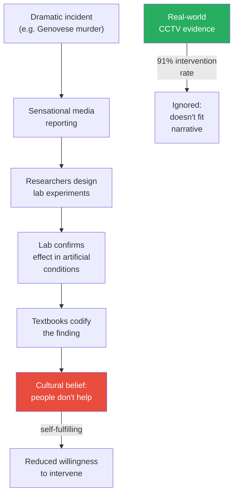

This diagram traces how the bystander effect myth formed and persists — a distorted incident becomes a lab finding becomes a textbook truth becomes a cultural belief, while contradictory real-world evidence is ignored.

---

## Chapter 10: How Empathy Blinds

*Bregman makes a counterintuitive argument: empathy, the emotion we celebrate as the height of human connection, can actually make things worse.*

### The Problem with Empathy

- <b style="color: #2980b9">Paul Bloom</b>, psychologist at Yale, published *Against Empathy* in 2016, arguing that empathy is a poor moral guide:
  - **Empathy is biased:** We empathise more easily with people who look like us, speak our language, or share our culture
  - **Empathy is innumerate:** We feel intense compassion for one identifiable victim but are unmoved by statistics showing millions suffering — this is Stalin's (apocryphal) observation that "one death is a tragedy, a million is a statistic"
  - **Empathy is manipulable:** Politicians use empathetic stories to justify wars — "think of the children" is a reliable trigger for aggression against designated enemies
  - **Empathy is exhausting:** Healthcare workers and social workers burn out precisely because they absorb others' pain — this is not sustainable
  - **Empathy is zero-sum:** Feeling the pain of one person often comes at the expense of rational consideration of others
- <b style="color: #27ae60">Bregman distinguishes between empathy and compassion</b>
  - **Empathy** means feeling what others feel — absorbing their pain as your own
  - **Compassion** means caring about others' wellbeing without necessarily feeling their emotions
  - Compassion is sustainable, actionable, and less prone to bias
  - Buddhist meditation traditions have long made this distinction — compassion meditation activates different brain networks than empathy
  - Neuroscientist Tania Singer's research found that empathy meditation increased personal distress, while compassion meditation increased positive feelings and motivation to help

| Dimension | Empathy | Compassion |
|-----------|---------|------------|
| Mechanism | Feel what others feel | Care about others' wellbeing |
| Bias | High (favours in-group) | Lower (can extend to strangers) |
| Sustainability | Burns out quickly | Sustainable long-term |
| Action | Often paralysing | Often motivating |
| Brain networks | Pain-mirroring circuits | Reward and affiliation circuits |
| Vulnerability to manipulation | High (one vivid story overrides statistics) | Lower (can weigh competing needs) |

This distinction matters practically: training compassion rather than empathy produces better outcomes for both the helper and the helped.

---

### The Robbers Cave Experiment: The Study That Had to Be Rigged

> [!example] Muzafer Sherif's First Attempt (1953)
> - Turkish-American psychologist Muzafer Sherif wanted to prove that intergroup conflict was natural — that simply dividing people into groups would produce hostility
> - His first attempt, at a camp called Middle Grove in upstate New York, failed completely
> - The boys from the two groups kept making friends across group lines
> - When the researchers tried to manufacture conflict through rigged competitions and provocations, the boys saw through the manipulation and refused to become hostile
> - One boy reportedly told the researchers that he thought they were trying to start a fight, and he wasn't interested
> - Sherif became so frustrated that he began drinking heavily during the experiment
> - He scrapped the study and started over the following year at a different location — Robbers Cave, Oklahoma
> - The failed first study was never published — it only came to light decades later through archival research
> **The lesson:** When Sherif's first experiment didn't produce the intergroup hostility he predicted, he didn't revise his theory — he redesigned the experiment until it did.

- At Robbers Cave in 1954, Sherif succeeded — but only by taking more extreme measures:
  - He carefully selected boys who didn't know each other
  - He separated the groups more completely during the initial bonding phase
  - He used more aggressive provocations — stealing the other group's flag, raiding their cabins, rigging competitions so losses felt personal and unfair
  - <b style="color: #e74c3c">Even then, the conflict was not spontaneous — it had to be manufactured by adults who were deliberately stoking hostility</b>
  - And even then, some boys resisted the hostility and tried to make peace across group lines
- The suppressed evidence from Middle Grove deepens the debunking:
  - Sherif's research assistant at Middle Grove later described the lengths to which the researchers went to provoke conflict — including secretly vandalising one group's possessions and blaming the other group
  - Despite these provocations, the boys repeatedly forgave each other and resumed friendly relations
  - The boys' resilience against manufactured conflict is itself a powerful data point — it suggests that intergroup hostility is not a natural default but requires sustained institutional effort to maintain
  - The fact that Sherif buried the Middle Grove results and only published Robbers Cave is a textbook example of publication bias — the study that confirmed the hypothesis was published; the study that refuted it was hidden
  - Sherif's wife and research partner, Carolyn Sherif, later wrote about the Middle Grove failure in her own work — providing an independent confirmation that the first study did fail and that the failure was suppressed rather than reported
  - The boys at Middle Grove even turned their suspicion of the researchers into a shared joke across group lines — bonding over their mutual awareness that adults were trying to manipulate them, which itself is evidence that intergroup friendship is the path of least resistance
- The contact hypothesis, formulated by <b style="color: #2980b9">Gordon Allport</b> in 1954, offers the antidote:
  - When groups interact as equals, working toward shared goals, prejudice dissolves
  - Sherif himself demonstrated this at Robbers Cave: when he gave both groups a common problem to solve (a broken water supply, a stuck truck), hostility evaporated within days
  - Allport's conditions for effective contact: equal status, common goals, cooperative interaction, and institutional support
  - The contact hypothesis has been tested in hundreds of studies since and consistently confirmed — it is one of the most robust findings in social psychology

> [!abstract] Allport's Contact Conditions
> 1. Equal status between groups — no one group can be positioned as superior
> 2. Common goals — both groups must be working toward something they both want
> 3. Cooperative interaction — the structure must require collaboration, not competition
> 4. Institutional support — the authority structure must visibly endorse the contact

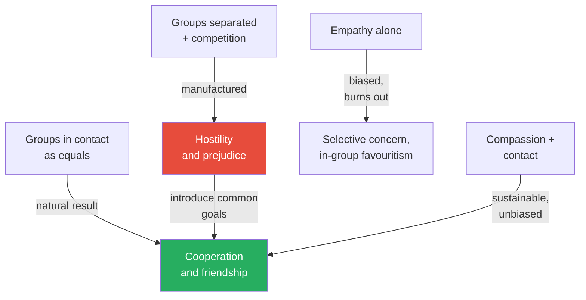

This diagram shows Bregman's argument: conflict requires artificial separation and manufactured competition, while cooperation is the natural result of contact between equals.

---

## Chapter 11: How Power Corrupts

*The one area where Bregman agrees with the cynics — power really does corrupt, but the mechanism is more specific and more tragic than we think.*

### The Power Paradox

- <b style="color: #2980b9">Dacher Keltner</b>, psychologist at UC Berkeley, spent two decades studying how power changes people:
  - People rise to power through prosocial traits — empathy, generosity, fairness, the ability to listen and collaborate
  - But once in power, those exact traits begin to erode
  - Keltner calls this the <b style="color: #2980b9">power paradox</b>: the skills that get you power are destroyed by having power
  - The paradox is structural, not moral — it affects everyone, regardless of character or intentions
- The neurological mechanism:
  - Power reduces the brain's capacity for <b style="color: #2980b9">mirroring</b> — the neural process that allows us to simulate others' emotions and perspectives
  - Brain imaging studies show that powerful people literally have reduced activity in the regions associated with empathy
  - They become worse at reading facial expressions, worse at taking others' perspectives, and worse at predicting how others will feel
  - Power, in a very real sense, causes brain damage to the empathy circuits
  - Sukhvinder Obhi's research using transcranial magnetic stimulation confirmed this: people primed to feel powerful showed measurably reduced mirror neuron activity
- The behavioural symptoms are consistent across studies:
  - Powerful people interrupt more, listen less, and speak in more absolute terms
  - They are more likely to take risks, cheat on partners, and violate social norms
  - They become less generous — not because they have less to give but because they become less able to perceive others' needs
  - They develop an inflated sense of their own importance and a diminished sense of others'
  - They are more likely to attribute their success to personal merit rather than circumstance or support

> [!example] The Cookie Monster Study (Keltner Lab)
> - Keltner's research team set up a simple experiment with groups of three people
> - One person was randomly assigned the role of "leader" for a group task
> - Halfway through the task, a plate of five cookies was brought in — one more than could be evenly divided
> - Consistently, the person assigned the "leader" role took the extra cookie
> - They also ate more noisily — chewing with their mouths open, leaving crumbs on their faces
> - The effect appeared within minutes of being given arbitrary power
> - They hadn't earned the role, hadn't done anything to deserve it, and the "power" was trivial — yet it immediately changed their behaviour
> - The study has been replicated with consistent results, suggesting the effect is automatic and unconscious
> **The lesson:** Power doesn't reveal character — it corrodes it. And it happens almost instantly, even with power that is random and meaningless.

> [!example] The Monopoly Experiment (Paul Piff, UC Berkeley)
> - Psychologist Paul Piff had pairs of strangers play Monopoly with rigged rules: one player received double the starting money, double salary for passing Go, and rolled two dice while the other rolled one
> - Both players knew the rules were unfair — the advantage was transparent
> - Yet within fifteen minutes, the advantaged players began behaving as if they had earned their position:
>   - They moved their pieces more aggressively around the board
>   - They made more noise, took more space, and ate more from a shared bowl of pretzels
>   - When asked afterward what made them win, they talked about their strategy — not the rigged rules
> - The experiment demonstrated how quickly power creates self-serving narratives, even when the source of power is visibly arbitrary
> **The lesson:** Power doesn't just change behaviour — it changes the story people tell about why they deserve their position. This self-serving narrative is unconscious and automatic.

### What This Means for Institutions

- <b style="color: #27ae60">The problem is not human nature but the concentration of power</b>
  - Hunter-gatherer societies solved this through aggressive egalitarianism — anyone who tried to dominate was mocked, ignored, or exiled
  - Christopher Boehm calls this <b style="color: #2980b9">reverse dominance hierarchy</b> — the group collectively suppresses would-be alphas
  - The tools were social: gossip, ridicule, coalition-building against the would-be leader, and in extreme cases, assassination
  - Modern civilisation, by concentrating power in rulers, CEOs, and bureaucracies, has removed these natural corrective mechanisms
  - The result is what Bregman calls "domesticated" power structures that allow the power paradox to operate unchecked
- Bregman's implication: we need institutions designed to distribute power, not concentrate it
  - Rotating leadership, participatory decision-making, radical transparency
  - The solution is not to find "good leaders" — it is to design systems where no one accumulates too much power
  - Term limits, sortition, self-managing teams — all are structural answers to a structural problem
  - The hunter-gatherer model worked for 200,000 years — we have just 10,000 years of experience with concentrated hierarchy, and the results are mixed at best

> [!tip] Core Insight
> Power doesn't corrupt because people are bad. Power corrupts because it physically changes the brain, eroding the capacity for empathy that got the person into a leadership position in the first place. The answer is institutional design, not moral character.

---

## Chapter 12: What the Enlightenment Got Wrong

*Bregman argues that the Enlightenment's faith in human reason was noble but mistaken — and that this error has shaped institutions that fail to account for how people actually work.*

### Reason as Rationalisation

- The Enlightenment assumed humans were fundamentally rational beings who could be guided by logic and evidence
  - Build rational institutions, provide rational arguments, and people will behave rationally
  - This assumption underlies modern education, law, economics, and political theory
  - The entire architecture of liberal democracy assumes that citizens make informed, rational choices
  - Homo economicus — the rational, self-interested actor of classical economics — is the Enlightenment's lasting contribution to institutional design
- <b style="color: #2980b9">Jonathan Haidt's</b> metaphor of the <b style="color: #2980b9">elephant and the rider</b> captures what actually happens:
  - The elephant is our emotional, intuitive self — it makes the decisions
  - The rider is our rational, conscious self — it generates justifications after the fact
  - We don't reason our way to conclusions; we feel our way to conclusions and then construct rational-sounding arguments to support them
  - The rider is not the pilot — it is the press secretary, spinning whatever the elephant decides into a coherent narrative
  - This does not mean humans are irrational — it means our rationality serves social purposes, not truth-seeking ones
- Hugo Mercier and Dan Sperber's <b style="color: #2980b9">argumentative theory of reason</b> extends this:
  - Reason did not evolve to find truth — it evolved to win arguments
  - This explains why humans are brilliant at finding flaws in other people's reasoning but terrible at finding flaws in their own
  - Reason is a social tool, not a truth-detecting tool
  - In group deliberation (where multiple perspectives are forced to confront each other), reason works beautifully — this is why citizens' assemblies produce good outcomes
  - In individual reflection, reason mostly produces rationalisation — which is why solitary decision-makers so often go wrong
- This has profound implications for understanding atrocities:
  - Propaganda works not by presenting rational arguments but by exploiting emotional bonds — loyalty, belonging, fear of exclusion
  - Nazi Germany did not persuade its citizens through logic; it created an atmosphere where dissent meant social death
  - <b style="color: #e74c3c">The most effective propaganda targets our desire to belong, not our capacity to think</b>
  - People didn't become Nazis because they were convinced by arguments — they became Nazis because everyone around them was becoming a Nazi, and the social cost of resistance was annihilation
  - The Enlightenment's error was assuming that education and rational argument would prevent this — it didn't, because the mechanism of radicalisation bypasses reason entirely

> [!example] The Ordinary Men of Reserve Police Battalion 101 (1942)
> - Historian Christopher Browning studied a unit of middle-aged German policemen — not ideological Nazis, not SS fanatics, but ordinary men from working-class Hamburg
> - In July 1942, they were ordered to round up and shoot Jewish men, women, and children in the Polish village of Jozefow
> - Their commanding officer, Major Wilhelm Trapp, wept as he gave the order and explicitly offered anyone who could not participate the chance to step out
> - Only about 12 of 500 men accepted the offer to opt out
> - The rest participated — not because they were forced, and not because they were ideologically committed, but because they didn't want to abandon their comrades or appear weak
> - The social pressure to conform — to not let down the group — overrode their moral revulsion
> - Many drank heavily afterward and reported lasting trauma
> **The lesson:** The most chilling atrocities are committed not by monsters but by men who would rather kill than face social disapproval from their peers. Our prosocial instincts — loyalty, conformity, the desire to belong — are the very mechanisms that can be weaponised.

---

### How Good People Do Terrible Things

- Bregman reframes the question from "how can people be so evil?" to "how can good impulses produce evil outcomes?"
  - Soldiers kill because of loyalty to their comrades — a prosocial emotion
  - Citizens support oppressive regimes because of trust in authority — another prosocial trait
  - Bystanders fail to act because of conformity — a deeply social instinct
  - In each case, the impulse itself is good; it is the context that makes it destructive
- <b style="color: #27ae60">Evil is not the absence of empathy — it is empathy misdirected, loyalty weaponised, trust exploited</b>
- This reframing matters because it changes the prescription:
  - If people are inherently evil, the only answer is more surveillance and punishment
  - If good instincts are being exploited, the answer is redesigning institutions to channel those instincts constructively
  - The focus shifts from changing human nature (impossible) to changing human environments (achievable)
- Bregman draws on historian Rutger van der Berg's research into Nazi-era letters:
  - German soldiers wrote home describing their actions in terms of duty, sacrifice, and love for the Fatherland
  - They were not gleeful about killing — most were troubled, rationalising their actions as necessary for a greater good
  - The propaganda machine had successfully framed genocide as a noble sacrifice
  - This is darker than "people just follow orders" — it means good people can be made to do terrible things by framing those things as acts of love and duty
- Hannah Arendt's concept of the <b style="color: #2980b9">banality of evil</b> is reframed:
  - Arendt described Adolf Eichmann as a thoughtless bureaucrat — a cog in the machine who followed orders without reflection
  - Bregman, drawing on more recent historical research, argues the truth is worse: Eichmann was not thoughtless but motivated — he believed he was serving a grand cause
  - "Banality" is misleading because it suggests evil comes from an absence of thought; Bregman argues it comes from thought in the service of misdirected loyalty
  - Bettina Stangneth's research in *Eichmann Before Jerusalem* revealed that Eichmann, far from being a passive functionary, was an ideologically committed antisemite who took initiative and pride in his work
  - The "banality" framing is itself a form of veneer theory — it suggests that evil lurks in all of us as a kind of passive default, when the evidence points to active ideological mobilisation

| Traditional View | Bregman's Reframe |
|-----------------|-------------------|
| People are selfish; institutions restrain them | People are cooperative; bad institutions corrupt them |
| Evil comes from human nature | Evil comes from systems exploiting human nature |
| Solution: more surveillance and control | Solution: trust-based design and distributed power |
| Education should discipline | Education should unleash |
| Crime requires punishment | Crime requires restoration and reintegration |
| Propaganda exploits cruelty | Propaganda exploits loyalty and belonging |

---

## Chapter 13: The Power of Intrinsic Motivation

*Bregman shows that the carrot-and-stick approach to motivation — rewards for good behaviour, punishments for bad — often produces the exact opposite of what it intends.*

### When Incentives Backfire

- The fundamental insight from <b style="color: #2980b9">self-determination theory</b> (developed by Edward Deci and Richard Ryan):
  - Humans have three basic psychological needs: **autonomy** (control over your own actions), **competence** (the feeling of mastery), and **relatedness** (connection to others)
  - When these needs are met intrinsically — through the work itself — motivation is high and sustainable
  - When external incentives are introduced — bonuses, punishments, surveillance — they can crowd out intrinsic motivation
  - This is the <b style="color: #2980b9">overjustification effect</b>: adding an external reason for doing something undermines the internal reason
- The mechanism Bregman describes:
  - External rewards reframe the activity from "something I choose to do" to "something I do for a reward"
  - This subtle shift changes the entire relationship between person and activity
  - Once the reward is removed, motivation drops below where it started — the internal drive has been damaged
  - The damage is often permanent — it is very difficult to re-establish intrinsic motivation once it has been crowded out by external incentives

> [!example] The Israeli Daycare Study (2000)
> - Economists Uri Gneezy and Aldo Rustichini studied a group of Israeli daycare centres where parents frequently arrived late to pick up their children
> - The centres introduced a fine for late pickups — a small monetary penalty designed to discourage tardiness
> - The result was the opposite of what anyone expected: late pickups INCREASED
> - Before the fine, parents felt a moral obligation to be on time — they were embarrassed to inconvenience the teachers
> - After the fine, the moral obligation was replaced by a market transaction — parents felt they were paying for the extra time, so there was no guilt
> - When the fine was later removed, late pickups stayed high — the moral norm had been permanently damaged by the introduction of money
> - The experiment demonstrated a one-way door: you can convert a moral obligation into a transaction, but you cannot convert it back
> **The lesson:** Putting a price on something that was previously a moral obligation destroys the moral obligation. You can't buy it back.

> [!example] The Blood Donation Paradox
> - Richard Titmuss studied blood donation in Britain versus the United States in the 1970s
> - Britain relied on voluntary, unpaid donation; the U.S. allowed commercial blood selling
> - The British system produced higher quality blood (fewer hepatitis infections) and higher donation rates
> - When Sweden experimented with paying blood donors, the number of women willing to donate dropped by almost half
> - The payment transformed the act from a gift (which feels meaningful) into a transaction (which feels trivial)
> - Men were less affected, suggesting the crowding-out effect is stronger when the moral motivation is stronger
> **The lesson:** Money can crowd out meaning. When people donate blood for free, they are heroes. When they sell it, they are vendors. The activity is identical; the motivation is destroyed.

- <b style="color: #e74c3c">External rewards and punishments work for simple, mechanical tasks — but they undermine performance on complex, creative work</b>
  - Dan Pink's synthesis in *Drive*: for tasks requiring cognitive effort, autonomy and purpose outperform bonuses
  - The more you surveil, incentivise, and control, the less people invest their genuine effort and creativity
  - This applies to schools (grades destroy love of learning), workplaces (bonuses distort priorities), and justice systems (punishment increases recidivism)
  - The implication is radical: many of the systems we use to improve behaviour actually make behaviour worse

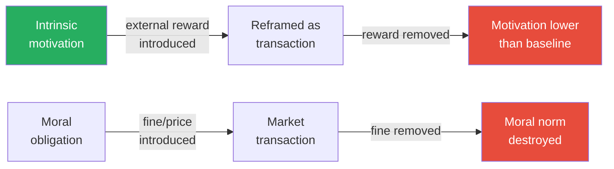

This diagram shows the one-way door of extrinsic motivation: once you introduce external incentives, removing them doesn't restore the original internal drive — it leaves you worse off than before.

---

## Chapter 14: Homo Ludens — When Trust Replaces Control

*Bregman profiles two radical experiments in trust — a Dutch healthcare organisation with no managers and a school with no curriculum — and shows that both outperform their conventional counterparts.*

### Buurtzorg: Healthcare Without Managers

- <b style="color: #2980b9">Jos de Blok</b> founded <b style="color: #2980b9">Buurtzorg</b> ("neighbourhood care") in 2006 in the Netherlands
  - The traditional Dutch home-care system had been "professionalised" into a bureaucratic nightmare:
    - Care was divided into discrete tasks, each timed and measured
    - A nurse might have four minutes to apply a bandage and two minutes for a blood pressure check
    - Managers, call centres, and administrative systems consumed enormous resources
    - Patient satisfaction was declining; nurse burnout was epidemic
    - The system optimised for measurable outputs (tasks completed) rather than actual outcomes (patients getting better)
  - De Blok's radical alternative: self-managing teams of 10-12 nurses with no manager, no call centre, and minimal bureaucracy
    - Each team is responsible for a neighbourhood — they know their patients personally
    - They decide their own schedules, hire their own colleagues, and manage their own workload
    - The central office has fewer than 50 people supporting 15,000 nurses
    - There are no middle managers, no performance reviews, no KPIs imposed from above
- The results:
  - <b style="color: #27ae60">40% less care hours needed per patient</b> (because nurses address root causes instead of checking boxes)
  - Higher patient satisfaction scores than any traditional provider
  - Lowest employee absenteeism in the Dutch healthcare sector
  - Costs reduced by an estimated 2 billion euros annually compared to the conventional system
  - Named "best employer in the Netherlands" multiple times
  - The model has been studied by healthcare systems worldwide and replicated in several countries
- Why Buurtzorg works, according to Bregman:
  - It restores intrinsic motivation — nurses became nurses to help people, not to fill out forms
  - It removes the principal-agent problem — when nurses decide their own work, there is no gap between what the organisation rewards and what patients need
  - It eliminates the overhead of distrust — no managers, no call centres, no performance tracking
  - It proves that "self-managing" does not mean "unmanaged" — the teams have clear protocols for handling disagreements, hiring, and quality issues
  - The model refutes the common objection to trust-based systems: "but who makes sure people do their work?" Answer: the people themselves, because they care about the work

> [!example] How Buurtzorg Actually Works
> - A typical Buurtzorg nurse might visit an elderly patient recovering from a hip replacement
> - Instead of rushing through a checklist of timed tasks, the nurse sits down, has a cup of tea, and talks about how the patient is actually doing
> - She notices the patient is lonely and arranges for a neighbour to visit regularly
> - She contacts the physiotherapist directly (no call centre, no referral form) and sets up a coordinated plan
> - She teaches the patient's daughter how to change the bandage, gradually reducing the need for professional visits
> - Within weeks, the patient needs far less care — not because care was cut, but because it was done properly
> - In a traditional system, the nurse would have no time for tea, no authority to contact other professionals, and no incentive to reduce the number of visits (since visits are how the organisation gets paid)
> **The lesson:** When you trust nurses to do what they were trained to do, they provide better care at lower cost. The bureaucracy wasn't helping — it was the problem.

---

### Agora: School Without Curriculum

- <b style="color: #2980b9">Agora</b> is a secondary school in Roermond, Netherlands, that operates without:
  - Fixed classrooms
  - A set curriculum
  - Grades or exams
  - Traditional subject divisions
  - Homework in the conventional sense
- Instead:
  - Students design their own learning projects, called "challenges"
  - Teachers act as coaches, not lecturers — they guide, question, and support but do not dictate
  - Students of different ages work together in mixed groups
  - The school building looks more like a co-working space than a traditional school — open spaces, whiteboards, comfortable furniture
  - Assessment is through portfolio and self-reflection, not standardised testing
- Results:
  - Student engagement is dramatically higher than in conventional schools
  - Students develop stronger self-direction, collaboration, and problem-solving skills
  - Academic outcomes meet or exceed national standards — despite no traditional teaching
  - Waiting lists are long — parents are desperate to get their children in
  - Students report feeling trusted and respected — two emotions conspicuously absent from most school experiences
- <b style="color: #27ae60">The principle: if you trust young people to be curious and motivated, they rise to the occasion. If you treat them as passive vessels to be filled, they disengage.</b>
- The connection to the broader argument:
  - Agora and Buurtzorg are both examples of removing bureaucratic control and trusting people to do what they naturally want to do — learn and help
  - In both cases, the conventional wisdom says this should produce chaos — but the reality is better outcomes on every dimension
  - The control was never producing the results — it was preventing them

| Feature | Traditional School | Agora |
|---------|-------------------|-------|
| Structure | Fixed classrooms, timetable | Open space, flexible schedule |
| Curriculum | Set by government | Designed by students |
| Teacher role | Lecturer, examiner | Coach, facilitator |
| Assessment | Grades and exams | Portfolio and self-assessment |
| Student grouping | Same age | Mixed ages |
| Engagement | Often low | Consistently high |
| Trust level | Low (surveillance, rules) | High (autonomy, respect) |

> [!tip] Core Insight
> Both Buurtzorg and Agora demonstrate the same principle: removing bureaucratic control and trusting people to do their work doesn't create chaos — it creates better outcomes. The control was never helping; it was the obstacle.

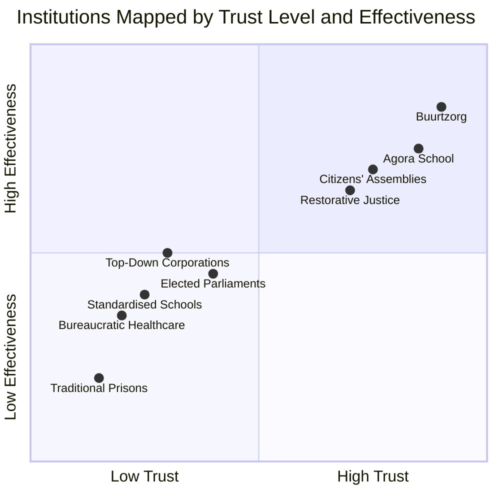

Bregman's case studies cluster in the upper-right quadrant: institutions that grant the most trust to participants consistently deliver the best outcomes — while the low-trust institutions in the lower-left confirm the veneer theory trap of assuming the worst and getting it.

---

## Chapter 15: Democracy in Its Fullest Form

*Bregman argues that representative democracy, while an improvement over monarchy, still concentrates too much power in too few hands — and that there are better alternatives already working in practice.*

### The Case for Participatory Democracy

- <b style="color: #2980b9">Participatory budgeting</b> gives citizens direct control over how public money is spent:
  - Pioneered in Porto Alegre, Brazil, in 1989 by the Workers' Party
  - Citizens attend neighbourhood assemblies where they propose, debate, and vote on spending priorities
  - Over the first decade: paved roads increased from 75% to 98%, water connections from 75% to 98%, schools increased from 29 to 86
  - Corruption dropped dramatically — it is hard to steal money when thousands of citizens are watching every line item
  - The model has been adopted by over 1,500 cities worldwide
  - The process works because it harnesses the very human instincts Bregman has been describing: the desire to contribute, to belong, to be trusted with responsibility

> [!example] Porto Alegre, Brazil — Where Participatory Budgeting Began (1989)
> - When the Workers' Party took power in Porto Alegre in 1989, they faced a city where most spending was controlled by political elites and much of it disappeared to corruption
> - They implemented a system where neighbourhood assemblies — open to all citizens — would debate and vote on spending priorities
> - In the first years, attendance was modest, but as people saw that their votes actually determined outcomes, participation surged
> - By the early 2000s, tens of thousands of citizens were participating annually
> - Infrastructure investment flowed to the poorest neighbourhoods for the first time — because the poor actually showed up and voted for their priorities
> - Independent audits found corruption dropped to near zero — it is extraordinarily difficult to steal money when the people it was earmarked for are watching
> - The model's success inspired replication in over 1,500 cities worldwide
> **The lesson:** People accused of being too ignorant or selfish for self-governance turned out to be neither — they just needed the chance.

> [!example] Torres, Venezuela — Citizens in Charge
> - In Torres, a small city in Venezuela, Mayor Julio Chavez (no relation to Hugo Chavez) implemented radical participatory democracy in the 2000s
> - Citizens were given direct control over local budgets — not advisory input, but actual spending authority
> - Community councils formed in every neighbourhood to decide priorities
> - The results included new housing, improved water systems, and community centres built to specifications chosen by residents
> - Crime dropped as communities took ownership of their own safety
> - Chavez was re-elected by overwhelming margins — not through patronage but through genuine results
> - The model survived his eventual departure from office because communities had built the capacity to govern themselves
> **The lesson:** When citizens are trusted with real power over their own communities, they make better decisions than distant bureaucrats — and corruption becomes nearly impossible.

### Sortition: Democracy by Lottery

- <b style="color: #2980b9">Sortition</b> — selecting representatives by lottery rather than election — was standard practice in ancient Athens
  - The Athenians considered elections to be aristocratic (rule by the best-connected) and lotteries to be democratic (rule by the people)
  - Aristotle himself wrote that "the appointment of magistrates by lot is democratic, and the election of them is oligarchic"
  - Modern experiments with citizens' assemblies (Ireland's constitutional conventions, British Columbia's electoral reform process) show that randomly selected citizens, given good information and time to deliberate, produce thoughtful, nuanced recommendations
  - They are less susceptible to lobbyist influence, less polarised, and more representative of the actual population than elected politicians
- <b style="color: #27ae60">Bregman does not argue for abolishing elections — he argues for complementing them with citizens' assemblies selected by lot</b>
  - Professional politicians would handle day-to-day governance
  - Citizens' assemblies would tackle major structural questions (constitutional reform, climate policy, healthcare)
  - This model would break the influence of money and lobbying on the decisions that matter most
  - The key insight: ordinary citizens are not less capable than politicians — they are less corrupted by the incentive structures of electoral politics
- Why elections produce worse outcomes than Bregman thinks we assume:
  - Elections select for charisma, name recognition, and fundraising ability — none of which correlate with good governance
  - The campaign process rewards simplification, polarisation, and attack — exactly the behaviours we need less of in governance
  - Elected officials are permanently distorted by re-election incentives — they make decisions based on what will win the next campaign, not what is best for the population
  - Lobbying and campaign finance give disproportionate influence to the wealthy — making elected bodies systematically unrepresentative
  - Citizens' assemblies bypass all of these distortions: random selection produces representative groups, the lack of re-election pressure allows genuine deliberation, and the absence of campaign finance removes corporate influence

> [!example] Ireland's Citizens' Assembly (2016-2018)
> - Ireland convened a citizens' assembly of 99 randomly selected citizens to consider constitutional questions including same-sex marriage and abortion
> - These were deeply divisive issues in a traditionally Catholic country where elected politicians had avoided them for decades
> - The assembly heard from experts on all sides, deliberated for months, and produced recommendations that were more progressive than many elected politicians had been willing to propose
> - The recommendations were put to public referendum and passed overwhelmingly
> - The process was widely praised for producing thoughtful consensus on issues that had paralysed elected representatives for decades
> - It demonstrated that the bottleneck in democracy is not public ignorance but political cowardice — citizens were willing to engage with difficult questions that politicians dodged
> **The lesson:** Ordinary citizens, given time and good information, can resolve political questions that professional politicians avoid. Sortition works.

---

## Chapter 16: The Best Remedy for Hate, Injustice, and Prejudice

*Bregman presents the evidence that punishment-based justice creates more crime, while trust-based approaches create less — and profiles the prison system that proves it.*

### Halden Prison: Justice Without Punishment

- <b style="color: #2980b9">Halden Prison</b> in Norway looks nothing like a conventional prison:
  - It was designed by architects (not security consultants) to resemble a village
  - Inmates have private rooms with en-suite bathrooms, flatscreen TVs, and minifridges
  - They cook their own meals, attend music studios, and work in professional workshops
  - Guards are unarmed, eat with inmates, and are trained in relationship-building, not domination
  - The maximum sentence in Norway is 21 years (with the possibility of preventive detention for genuinely dangerous offenders)
  - The architecture itself is therapeutic: floor-to-ceiling windows, nature views, walking paths through birch forests
- The philosophy behind it — the <b style="color: #2980b9">normality principle</b>:
  - Life in prison should resemble life outside prison as closely as possible
  - If inmates are going to re-enter society, they need to practise living in society — not survive a warehouse designed to dehumanise them
  - This is not idealism — it is practical realism about what produces lower reoffending
- The results speak for themselves:
  - <b style="color: #27ae60">Norway's recidivism rate is approximately 20% — compared to 76% in the United States</b>
  - Inmates leave Halden with job skills, social connections, and a realistic path to reintegration
  - Violence within the prison is rare — because the environment does not create desperation and humiliation
  - Norway spends more per prisoner per day than the U.S. — but the total cost is lower because far fewer people return to prison

| Metric | Norway (Halden) | United States |
|--------|----------------|---------------|
| Recidivism rate | ~20% | ~76% |
| Guards armed? | No | Yes |
| Inmates per cell | 1 | 2-4 (often overcrowded) |
| Maximum sentence | 21 years | Life / death penalty |
| Philosophy | Rehabilitation and reintegration | Punishment and deterrence |
| Cost per prisoner/year | ~$129,000 | ~$35,000-$60,000 |
| Total system cost (per capita) | Lower (fewer prisoners) | Higher (mass incarceration) |

The apparent paradox: spending more per prisoner costs less overall, because treating people with dignity means they don't come back.

> [!example] A Day at Halden Prison
> - An inmate at Halden wakes up in a private room with a window overlooking birch trees — the architects deliberately included nature views, based on research showing that nature reduces stress and aggression
> - He walks to the shared kitchen, where he cooks breakfast alongside other inmates — the act of cooking together builds community and routine
> - He spends the morning in a professional recording studio, working on a music project — creative expression is treated as rehabilitative, not recreational
> - After lunch (cooked by inmates from fresh ingredients), he meets with his case worker to discuss his reintegration plan: housing, employment, family reconnection
> - A guard — who shares meals with inmates and calls them by first name — checks in informally, not to surveil but to maintain a relationship
> - The guard carries no weapon; the prison has no bars on windows; the perimeter is secured by a simple wall
> - The entire design communicates a message: you are a person with a future, not a number serving time
> **The lesson:** Treat prisoners as humans with a future, and most of them will live up to that expectation. Treat them as animals, and they will behave accordingly.

### Restorative Justice

- <b style="color: #2980b9">Restorative justice</b> brings together the offender, the victim, and the community to repair harm rather than simply punish the offender
  - The offender must face the human consequences of their actions — not in the abstract, but by sitting across from the person they hurt
  - The victim gets a voice, an explanation, and often a genuine apology — things the conventional system rarely provides
  - The community participates in deciding what repair looks like
  - The process is emotionally demanding for everyone involved — but it produces far better outcomes than conventional sentencing
- <b style="color: #e74c3c">Punitive justice assumes people are bad and need to be hurt. Restorative justice assumes people can be better and need to be helped.</b>
- Evidence from New Zealand (where restorative justice is widely used for youth offenders) and South Africa (the Truth and Reconciliation Commission) supports dramatically better outcomes:
  - Lower reoffending rates
  - Higher victim satisfaction (victims in the conventional system rarely feel heard)
  - Lower costs
  - Stronger community reintegration
- The mechanism is straightforward:
  - Punishment without reintegration creates angry, isolated people with criminal records and no prospects — a recipe for reoffending
  - Restoration with reintegration creates people who have faced what they did, repaired what they could, and have a path forward — a recipe for change
  - The choice between punitive and restorative justice is not a moral one (though it has moral dimensions) — it is a practical one about what actually reduces harm

> [!example] New Zealand's Family Group Conferencing
> - New Zealand pioneered the use of restorative justice for youth offenders in 1989 with the Children, Young Persons, and Their Families Act
> - Instead of sending young offenders to court, they are brought together with their victims, their families, and community representatives in a "family group conference"
> - The offender must listen to the victim describe the impact of the crime — not in the abstract, but face to face, with no lawyer to hide behind
> - Together, the group designs a plan for repair: apology, restitution, community service, mentoring
> - The young person's family takes responsibility for ensuring the plan is followed
> - Studies show significantly lower reoffending rates compared to conventional youth courts
> - Victims report higher satisfaction — they feel heard, which the conventional system almost never provides
> **The lesson:** When offenders face the human consequences of their actions and are given a path to repair, most choose repair. The punitive system never offers that choice.

> [!tip] Core Insight
> The evidence on justice systems presents the same pattern as every other institution Bregman examines: systems built on trust and human dignity produce better outcomes than systems built on punishment and suspicion. Halden is not soft — it is effective. That distinction matters.

---

## Chapter 17: The Best-Kept Secret in the History of War

*Bregman returns to the theme of human resistance to violence and explores what happens when the machinery of dehumanisation breaks down.*

### Propaganda and Dehumanisation

- <b style="color: #27ae60">The central lesson of military history: getting humans to kill other humans requires enormous institutional effort</b>
  - Left to their own devices, soldiers fraternise with the enemy, refuse to fire, and seek peace
  - The 1914 Christmas Truce was not an anomaly — it was the natural human default, suppressed by military authority
  - Every military in history has had to solve the problem of soldiers who won't fight
- The propaganda machine exists precisely because human decency is the obstacle to war:
  - The enemy must be dehumanised — transformed from fellow humans into a category of threat
  - Language, imagery, and ideology create psychological distance
  - Once the enemy is no longer "one of us," the natural inhibition against killing weakens
  - The process requires constant reinforcement — dehumanisation fades without sustained propaganda
- <b style="color: #e74c3c">Propaganda does not work by making people cruel — it works by narrowing the circle of who counts as "people"</b>
  - Inside the in-group, cooperation and compassion intensify
  - The danger is not that empathy disappears but that it becomes selective — fierce loyalty to "us" combined with complete indifference to "them"
  - This is why genocide often coexists with genuine community spirit — the perpetrators are kind to their families, generous to their neighbours, and lethal to the designated out-group
- Modern drone warfare represents the logical endpoint of this distance:
  - Operators sit in air-conditioned rooms thousands of miles from the battlefield
  - Targets appear as pixelated shapes on screens — maximising psychological distance
  - Yet even drone operators report high rates of PTSD — the human resistance to killing persists even at extreme technological remove
  - The resistance is biological, not merely cultural — it cannot be fully overridden by technology

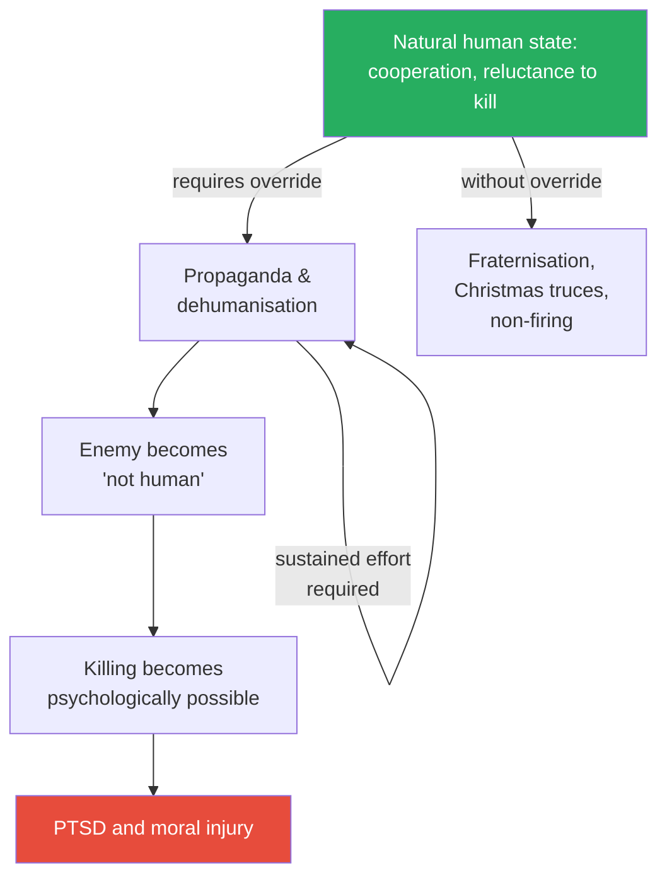

This diagram shows Bregman's model of wartime violence — it is not the natural human state but the product of systematic institutional effort to override natural cooperation, and the effort must be continuously sustained.

---

## Chapter 18: When the Soldiers Came Out of Their Trenches

*Bregman closes with stories of people who broke cycles of hostility through non-complementary behaviour — responding to hate with something unexpected.*

### Non-Complementary Behaviour

- In psychology, <b style="color: #2980b9">complementary behaviour</b> means matching the other person's energy:
  - Hostility meets hostility, aggression meets aggression
  - This creates escalation spirals that are extremely difficult to break
  - Most conflict follows this pattern — each side responds to the other's hostility with equal or greater hostility, and the cycle feeds itself
- <b style="color: #2980b9">Non-complementary behaviour</b> means responding to hostility with something unexpected — usually kindness, curiosity, or calm
  - This breaks the cycle because the hostile person's script requires a hostile response
  - When the expected response doesn't come, the entire dynamic shifts
  - The hostile person is momentarily disoriented — their mental model of the interaction breaks down, creating a window for something new
- The mechanism is both psychological and neurological:
  - Hostile interactions activate threat circuits in both parties, locking them into fight-or-flight
  - A non-complementary response short-circuits the threat loop — the brain cannot maintain combat readiness toward someone who is being genuinely kind
  - This creates a window for the higher cognitive functions (perspective-taking, empathy) to come back online
  - The window is brief — it must be used before the defensive scripts reassert themselves
- Bregman connects this to the broader argument about institutional design:
  - Non-complementary behaviour is what individuals can do
  - But institutions can be designed to make non-complementary responses the default
  - Halden Prison is institutional non-complementary behaviour — meeting crime with dignity instead of cruelty
  - Buurtzorg is institutional non-complementary behaviour — meeting distrust with autonomy
  - Contact-based programmes (integrated housing, mixed schools) are institutional non-complementary behaviour at scale
  - The personal practice and the institutional design reinforce each other

> [!example] Nelson Mandela and the Rugby World Cup (1995)
> - When Nelson Mandela became president of South Africa in 1994, many in the black majority expected him to dismantle every symbol of white apartheid
> - The Springboks — South Africa's rugby team — were one of the most potent symbols of white supremacy, beloved by Afrikaners and hated by most black South Africans
> - The ANC (Mandela's party) voted to change the team's name and colours
> - Mandela overruled them — he insisted on keeping the Springbok name and wearing the team jersey himself
> - When South Africa hosted the 1995 Rugby World Cup, Mandela appeared on the field in a Springbok jersey, shaking hands with the (all-white) team captain Francois Pienaar
> - The stadium, filled overwhelmingly with white Afrikaners, erupted in chants of "Nelson! Nelson!"
> - Mandela had taken a symbol of oppression and transformed it into a symbol of unity — not by destroying it but by embracing it
> - The gesture communicated something words could not: I see you as my people, even though you did not see me as yours
> **The lesson:** Non-complementary behaviour doesn't just de-escalate — it can transform the meaning of symbols and the trajectory of nations.

> [!example]- Mandela Learns Afrikaans in Prison
> - During his 27 years on Robben Island, Mandela made a deliberate choice to learn Afrikaans — the language of his captors
> - His fellow prisoners were baffled and sometimes angry — why learn the oppressor's language?
> - Mandela's reasoning was strategic and deeply human: if he could speak to his jailers in their own language, he could reach them as people
> - Over years, he built genuine relationships with several guards
> - One guard, Christo Brand, became so close to Mandela that Brand later named his son after him
> - When Mandela walked out of prison in 1990, he addressed the Afrikaner population in their own language — a gesture of respect that shocked and moved millions
> - His ability to see his captors as human beings, even while they dehumanised him, was perhaps the single most important factor in South Africa's (relatively) peaceful transition
> **The lesson:** Learning the language of your enemy is not surrender — it is the most radical form of non-complementary behaviour. It says: I refuse to see you as less than human, even when you see me that way.

> [!example] The De-radicalisation of Former White Supremacists
> - Bregman profiles several former white supremacists who left hate movements — not because they were defeated or punished, but because someone from the targeted group showed them unexpected kindness
> - Derek Black, godson of a prominent white supremacist leader and a rising star in the movement, was befriended at college by Matthew Stevenson, an Orthodox Jewish student
> - Stevenson began inviting Black to Shabbat dinners — not to argue or debate, but simply to share a meal
> - Over months, the relationship softened Black's ideology from the inside out
> - Black eventually repudiated white nationalism publicly, at enormous personal cost — his father disowned him, his community shunned him
> - The mechanism was not rational argument but personal connection — once Black could not dehumanise the people he was supposed to hate, the ideology collapsed
> **The lesson:** Hate is sustained by distance. Close that distance — through shared meals, genuine conversation, and non-complementary kindness — and the hate often cannot survive the encounter.

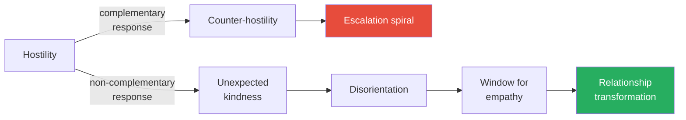

This diagram shows the two possible paths when hostility is received — complementary response leads to escalation, while non-complementary response creates a window for genuine human connection.

---

## Epilogue: Ten Rules to Live By

*Bregman distils his argument into ten practical principles — not as a self-help programme, but as a philosophical orientation toward the world.*

> [!abstract] Bregman's Ten Rules
> 1. **When in doubt, assume the best** — most people, most of the time, have decent intentions
> 2. **Think in win-win scenarios** — the pie is usually bigger than zero-sum thinking assumes
> 3. **Ask more questions** — curiosity dissolves prejudice faster than arguments
> 4. **Temper your empathy, train your compassion** — feel WITH people less, care ABOUT people more
> 5. **Try to understand the other, even if you don't get where they're coming from** — understanding is not agreement
> 6. **Love your own as others love their own** — recognise that the other side's loyalty is as genuine as yours
> 7. **Avoid the news** — the media profits from negativity bias and systematically distorts your view of humanity
> 8. **Don't punch Nazis** — shame and exclusion radicalise; inclusion and dialogue de-radicalise
> 9. **Come out of the closet: don't be ashamed of doing good** — cynicism is fashionable; sincerity is powerful
> 10. **Be realistic** — and by realistic, Bregman means: accept that most people are decent

### Rule 7: Avoid the News

- <b style="color: #27ae60">This is Bregman's most actionable and most controversial recommendation</b>
- The news systematically over-represents violence, conflict, and disaster:
  - Not because journalists are malicious but because negativity is what drives clicks, views, and subscriptions
  - The business model of news is attention, and fear is the cheapest way to capture attention
  - A plane crash that kills 200 people is front-page news for weeks; the fact that 100,000 planes landed safely that day is not news at all
  - Rolf Dobelli's analysis in *The Art of Thinking Clearly* supports this: news consumption correlates with increased anxiety and decreased understanding of the world
- Consuming news daily creates a distorted mental model of reality — one where the world is far more dangerous and people far more selfish than they actually are:
  - This is the societal nocebo effect in action: the media feeds us a diet of worst-case scenarios, and we conclude that the worst case is the normal case
  - Bregman cites research showing that people who consume less news have a more accurate understanding of global trends (poverty declining, violence declining, literacy rising) than heavy news consumers
  - Hans Rosling's *Factfulness* demonstrated the same point: when surveyed, the public systematically overestimates global poverty, violence, and population growth — and the more news they consume, the more wrong they are
  - The paradox: the people who think they are the most informed are often the most misinformed, because their information diet is systematically biased toward catastrophe
- The mechanism connecting news to veneer theory:
  - Every crime reported confirms that people are dangerous
  - Every scandal confirms that leaders are corrupt
  - Every war confirms that civilisation is fragile
  - The slow, steady progress — declining poverty, increasing literacy, improving health — is invisible because it is not dramatic enough to be newsworthy
  - The result is a population that believes the world is getting worse when it is, by most measurable indicators, getting better
- Bregman does not argue for ignorance — he argues for better sources:
  - Long-form journalism, books, and curated analysis provide context that breaking news cannot
  - The goal is to understand the world accurately, not to be the first to know about the latest crisis
  - Weekly or monthly summaries of global trends provide more useful information than daily breaking news

---

### Rule 8: Don't Punch Nazis

- <b style="color: #e74c3c">This is the hardest rule to swallow — and Bregman knows it</b>
- Bregman argues that public shaming and violent confrontation of extremists is emotionally satisfying but counterproductive:
  - Research on de-radicalisation consistently shows that social inclusion is more effective than social exclusion
  - Former white supremacists report that what pulled them out was not being beaten or shamed but being treated with unexpected dignity by someone from the group they had been taught to hate
  - Violence against extremists often confirms their narrative — "the other side is dangerous" — and drives further radicalisation
- This does not mean tolerating hate speech or ignoring injustice — it means that the strategy for defeating extremism is not to mirror its aggression:
  - Institutions must still enforce boundaries (laws against violence, protections for vulnerable groups)
  - But the interpersonal strategy for changing minds is contact, not confrontation
  - The Derek Black story (profiled earlier) is Bregman's paradigmatic example: a Shabbat dinner accomplished what no protest march could

---

## Bregman's Debunking Scorecard

| Study/Story | Standard Narrative | Bregman's Rebuttal | Key Evidence | Strength of Debunk |
|-------------|-------------------|--------------------|--------------|--------------------|
| **Lord of the Flies** | Boys descend into savagery | Real Tongan boys cooperated beautifully | Documented historical case; Bregman interviewed survivors | Very strong |
| **Stanford Prison Experiment** | Normal people become sadistic | Guards were coached; experiment rigged | Blum's recordings, Korpi admission, Carnahan & McFarland selection bias study | Very strong |
| **Milgram Shock Experiment** | People blindly obey authority | Many resisted; direct orders least effective | Perry's archival access to 20+ variations; inconsistent debriefing records | Strong |
| **Kitty Genovese** | 38 witnesses did nothing | Most couldn't see; several called police; one held her | Cook's investigative journalism; physical layout analysis; police records | Very strong |
| **Easter Island collapse** | Islanders destroyed themselves | European slave raids and disease caused collapse | Rat-gnawed palm nuts; Lipo's mata'a morphometric analysis; absence of skeletal trauma | Strong |
| **Robbers Cave** | Groups naturally become hostile | First attempt failed; conflict had to be manufactured | Suppressed Middle Grove study; researcher-initiated provocations at Robbers Cave | Strong |
| **Bystander effect** | More witnesses means less help | CCTV data shows 91% bystander intervention | Philpot 2019 multi-city study with 219 incidents | Strong |

---

## Why Veneer Theory Persists: The Feedback Loop

*If the evidence for human decency is so strong, why does almost everyone believe the opposite?*

- Bregman identifies several reinforcing mechanisms that keep veneer theory dominant:
  - **Negativity bias in cognition:** Our brains are wired to notice threats more than opportunities — a survival adaptation that distorts modern perception
  - **Negativity bias in media:** News organisations amplify the negative because it drives attention, creating a systematically distorted information diet
  - **Confirmation bias in academia:** Researchers who find sensational results (people are cruel, obedient, apathetic) get famous; researchers who find boring results (people are decent) get ignored
  - **Self-fulfilling institutional design:** Institutions built on distrust produce untrustworthy behaviour, which confirms the distrust, which justifies more control
  - **Cultural narratives:** Stories like Lord of the Flies, the Stanford Prison Experiment, and the Kitty Genovese myth become cultural touchstones that shape assumptions for generations
  - **Selection bias in history:** History records wars, conquests, and atrocities — the vast stretches of peaceful cooperation are invisible because nothing "happened"
- The result is a civilisation-wide illusion:
  - Every individual believes they are personally decent but assumes most other people are not
  - Surveys consistently show this asymmetry: people rate their own morality highly but rate "people in general" poorly
  - <b style="color: #27ae60">Bregman's conclusion: we are a species of decent individuals who collectively believe in human indecency — and that false belief is the primary obstacle to building better institutions</b>

### The Replication Crisis as Vindication

- Bregman's argument gains strength from the broader <b style="color: #2980b9">replication crisis</b> in psychology:
  - Since 2011, systematic attempts to replicate famous psychology findings have produced alarming failure rates
  - The Open Science Collaboration's 2015 project found that only 36-39% of published psychology results could be successfully replicated
  - Many of the most famous findings — ego depletion, power posing, social priming — have failed replication
  - The Zimbardo and Milgram studies were never properly replicated (the BBC study contradicted Zimbardo; Milgram's own variations contradicted his headline finding)
  - The crisis suggests that the field's incentive structure — which rewards novel, dramatic findings over careful replication — has produced a body of knowledge that is far less reliable than assumed
  - Bregman's debunking is part of a broader reckoning, and the pattern he identifies (sensational findings about human wickedness receiving disproportionate attention) maps perfectly onto the structural biases that caused the crisis
- The implication for Bregman's argument:
  - If the studies "proving" human selfishness and cruelty are unreliable, then the entire edifice of veneer theory loses its evidential foundation
  - The evolutionary and anthropological evidence (domestication syndrome, hunter-gatherer egalitarianism, disaster cooperation) is not subject to the same replication concerns, because it is based on observation and archaeology, not lab experiments
  - This asymmetry strengthens Bregman's case: the evidence for human decency is more robust than the evidence for human wickedness

---

## The Full Argument: Bregman's Logic Chain

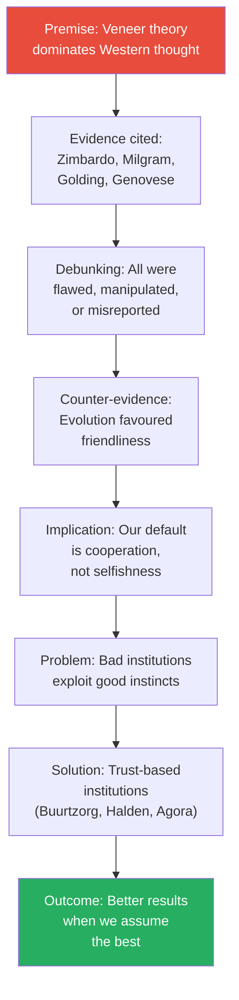

This diagram traces the complete arc of Bregman's argument, from debunking the evidence for human wickedness through the evolutionary case for cooperation to the practical institutions that embody trust.

---

## Verdict

Bregman's greatest contribution is not any single debunking — though the takedowns of the Stanford Prison Experiment and the Kitty Genovese myth are devastating — but the cumulative weight of the argument. By the end of the book, the reader has absorbed so many counter-examples that the default assumption of human selfishness feels genuinely wobbly. The book fundamentally reframes the question: instead of asking "why are people so terrible?", it asks "why do we keep telling ourselves we're terrible, and what damage does that story do?" This reframing is genuinely useful, because it shifts attention from an unfixable problem (human nature) to a fixable one (institutional design).

The book's weakness is the same as its strength: the argument is relentless, and sometimes Bregman cherry-picks his counter-evidence as selectively as the studies he criticises. The Hobbes-Rousseau framing is a simplification — neither philosopher is as one-dimensional as presented, and the intellectual history between them (Locke, Hume, Smith) is compressed beyond recognition. The claim that agriculture was humanity's "original sin" is contested by many archaeologists who point to evidence of pre-agricultural warfare and violence. The chapter on Easter Island, while compelling, does not fully reckon with the complexity of the archaeological debate — the rat theory is persuasive but not universally accepted. And Bregman occasionally underplays genuine cases of human cruelty that don't fit his thesis — the Rwandan genocide, the Khmer Rouge, industrial-scale slavery — that resist easy explanation by "bad institutions exploiting good instincts."

The reader who will benefit most from this book is anyone who has absorbed the cynical consensus without examining it — anyone who "knows" that the Stanford Prison Experiment proves people are monsters, that Kitty Genovese proves nobody helps, or that Lord of the Flies is basically a documentary. For that reader, this book is a genuine paradigm shift. For the reader already familiar with the critiques of these studies (through Brian Resnick's journalism, Gina Perry's archival work, or the replication crisis literature), the value is in Bregman's synthesis and the practical examples (Buurtzorg, Halden, participatory budgeting) that show what a trust-based society might look like. The "Ten Rules to Live By" at the end feel somewhat tacked on — the book's argument deserves a more substantive close than a listicle, and some rules ("don't punch Nazis") invite obvious objections that Bregman doesn't fully address.

The reader who already knows about the replication crisis in psychology will find some of the debunking chapters less revelatory — the problems with Zimbardo and Milgram have been discussed in academic circles for years. But Bregman's contribution is synthesis: he connects the debunking to the evolutionary evidence to the institutional examples in a way that no other single book does. The argument gains power from its breadth — each individual chapter could be challenged on details, but the cumulative weight of evidence across evolution, archaeology, psychology, sociology, and institutional design is formidable.

Placed alongside related works, *Humankind* occupies a distinctive niche. Steven Pinker's *The Better Angels of Our Nature* argues that violence has declined but credits civilisation and Enlightenment values — Bregman disagrees about the cause while accepting the trend, creating an interesting tension between two optimists with different explanations. [[Man's Search for Meaning - Viktor Frankl]] demonstrates human goodness under extreme conditions but from an individual rather than institutional perspective. [[The Culture Code - Daniel Coyle]] explores how trust-based groups outperform, providing concrete mechanisms for what Bregman describes philosophically. [[Antifragile - Nassim Nicholas Taleb]] shares Bregman's scepticism of top-down control but arrives there from a very different intellectual tradition — Taleb is interested in robustness, not decency. And [[The Sociopath Next Door - Martha Stout]] provides the necessary counterweight — a reminder that while MOST people are decent, a small percentage are genuinely dangerous, and no amount of trust-based institutional design changes that. Bregman would benefit from engaging more seriously with this objection, because the existence of genuine predators is the strongest argument for some of the structures he wants to dismantle.

---

## Related Reading

- [[Man's Search for Meaning - Viktor Frankl]] — Human goodness under extreme conditions; Frankl's logotherapy as evidence for intrinsic human meaning-seeking
- [[The Culture Code - Daniel Coyle]] — How high-performing groups build trust and safety; practical mechanisms for Bregman's philosophical claims
- [[Antifragile - Nassim Nicholas Taleb]] — Bottom-up systems versus top-down control; shared scepticism of centralised authority
- [[Influence - Robert Cialdini]] — The mechanisms of social proof and authority that explain Milgram's real findings
- [[The Sociopath Next Door - Martha Stout]] — The important caveat: roughly 4% of the population does not share the cooperative instinct
- [[Thinking in Bets - Annie Duke]] — How confirmation bias shapes our interpretation of evidence — relevant to how veneer theory persists
- [[The Psychology of Money - Morgan Housel]] — Narrative bias in how we interpret history and construct meaning from cherry-picked examples
- [[Games People Play - Eric Berne]] — How social scripts and transactional patterns shape behaviour in ways that appear "natural" but are actually learned
- [[You Are Not So Smart - David McRaney]] — The cognitive biases that make us overweight dramatic negative events and underweight quiet cooperation
- [[12 Rules for Life - Jordan Peterson]] — An alternative framework for human nature that emphasises individual responsibility over institutional design
