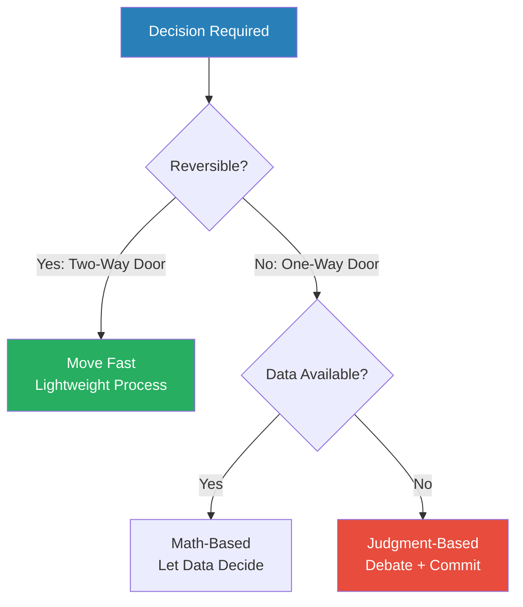
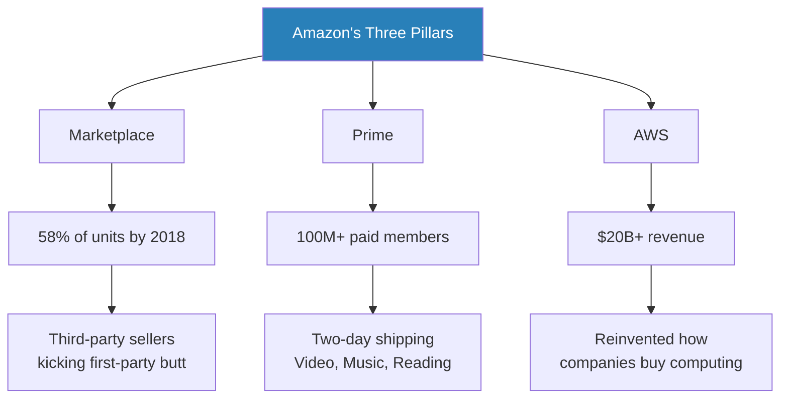
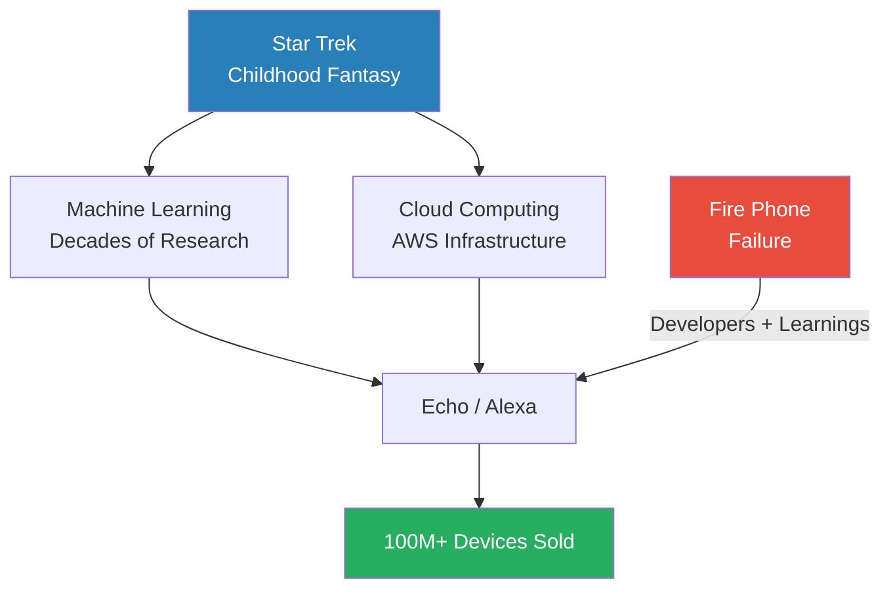
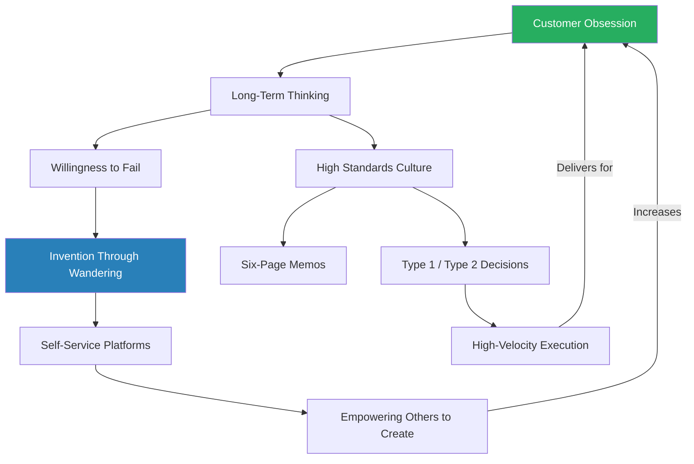

# Invent and Wander — Jeff Bezos

> **In 30 seconds:** Jeff Bezos built Amazon from a garage with door-desks into the world's most customer-obsessed company by following a handful of principles he never wavered on: think long-term, obsess over customers not competitors, make high-velocity decisions, and embrace wandering as the engine of invention. This collection of his shareholder letters (1997-2019) and interviews reveals the operating system behind Amazon, AWS, Prime, Alexa, Blue Origin, and the Washington Post. The letters read like a masterclass in building durable institutions — each year reinforcing the same core ideas while showing how they compound over decades. Whether you run a company or just want to think more clearly about decisions, risk, and innovation, Bezos's collected writings offer one of the most coherent business philosophies ever published.

---

## About the Author

Jeff Bezos founded Amazon in 1994 after leaving a hedge fund job at D.E. Shaw, driving from New York to Seattle while typing a business plan in the passenger seat. He built the company from an online bookstore into the world's largest retailer, cloud computing provider (AWS), and smart-home platform (Alexa). Walter Isaacson — biographer of da Vinci, Einstein, Franklin, and Steve Jobs — wrote the book's introduction, placing Bezos in that same league of creative innovators. Bezos is also the founder of Blue Origin (space exploration) and the owner of the Washington Post.

---

## The Big Idea

- Bezos's philosophy can be distilled to a single phrase he has repeated in every shareholder letter since 1997: <b style="color: #27ae60">"It's still Day 1."</b>
- **Day 1** means operating with the urgency, curiosity, and customer focus of a startup — regardless of how large you grow
- **Day 2** is what happens when you lose that edge: "Day 2 is stasis. Followed by irrelevance. Followed by excruciating, painful decline. Followed by death."
- The entire book — twenty-three years of letters plus a lifetime of interviews — is an elaboration of what it takes to stay in Day 1

---

- The book is structured in two parts:
  - **Part 1** contains all twenty-three shareholder letters Bezos personally wrote from 1997 to 2019 — a real-time record of how his thinking evolved as Amazon grew from $148 million to $280 billion in revenue
  - **Part 2** compiles his most revealing interviews and speeches, covering his childhood, personal philosophy, decision-making process, and ventures outside Amazon
- What makes the collection unusual is its consistency — Bezos attached the original 1997 letter to every subsequent year's letter, a reminder that the core principles never changed
- The recurring themes — long-term thinking, customer obsession, high-velocity decisions, invention through wandering, and high standards — weave through every chapter like load-bearing pillars

---

## Key Concepts at a Glance

| Concept | One-line summary |
|---------|-----------------|
| **Day 1 / Day 2** | Stay startup-hungry forever; complacency is institutional death |
| **Customer obsession** | Focus on customers, not competitors — customers are always dissatisfied, which pulls you forward |
| **Long-term thinking** | Sacrifice short-term profits for durable advantages that compound over decades |
| **Type 1 / Type 2 decisions** | Irreversible decisions need caution; reversible ones need speed |
| **Disagree and commit** | Debate fully, then commit wholeheartedly — even if you lost the argument |
| **Regret Minimisation Framework** | When facing a big life choice, imagine yourself at 80 looking back |
| **Missionaries vs mercenaries** | Hire people who love the mission, not just the perks |
| **Wandering** | Structured exploration guided by intuition — the engine of breakthrough innovation |
| **High standards** | Teachable, domain-specific, and require understanding of scope |
| **Free cash flow** | The true measure of business health — not earnings, not EBITDA |
| **Six-page memos** | Narrative documents replace PowerPoint to force clarity of thinking |
| **Work-life harmony** | A flywheel, not a balance — energy in one domain fuels the other |

The exponential curve illustrates why Bezos attached the 1997 letter to every subsequent year — the same principles that guided a $148M company compounded into a $280B empire, vindicating his relentless focus on long-term thinking over quarterly earnings.

---

## Walter Isaacson's Introduction

*Isaacson places Bezos alongside da Vinci, Einstein, Franklin, and Jobs — not because he's the smartest, but because he shares the traits that actually matter for innovation.*

- Isaacson identifies five traits of truly creative innovators, and argues Bezos embodies all of them:

| Trait | Description | Bezos example |
|-------|-------------|---------------|
| **Passionate curiosity** | Insatiable, childlike drive to understand | Reads science fiction voraciously; hosts annual retreats for writers and machine-learning experts |
| **Arts + science** | Connecting humanities with technology | Amazon's roots in bookselling married to cutting-edge robotics and AI |
| **Reality distortion** | Ability to make people achieve the "impossible" | Pushed AWS team through bouts of fury to ship faster and bigger |
| **Think different** | Willingness to challenge orthodoxy | Built an online bookstore when the internet had barely been heard of |
| **Childlike wonder** | Never stop asking "why?" | Still plays the Star Trek computer in his head; Echo/Alexa born from that childhood fantasy |

This combination of traits is interpreted through Bezos's five key lessons, which Isaacson distills from the whole collection.

---

> [!tip] Core Insight
> Smart people are common. What separates innovators is curiosity, the ability to connect disparate fields, and the courage to pursue ideas others think are foolish.

---

Isaacson's framework shows how these traits form a reinforcing loop — wonder fuels curiosity, which drives unconventional thinking, which creates breakthroughs that renew the sense of wonder.

---

## Part 1: The Shareholder Letters

### It's All About the Long Term (1997)

*The letter that established the operating philosophy Amazon would follow for the next quarter-century — and that Bezos would attach to every subsequent letter as a permanent reminder.*

- Amazon had served 1.5 million customers and reached $147.8 million in revenue by year-end 1997
- But Bezos opened not with metrics but with a declaration: <b style="color: #27ae60">"This is Day 1 for the Internet"</b>
- He laid out a manifesto of principles that would prove remarkably durable:
  - "We will continue to focus relentlessly on our customers"
  - Investment decisions driven by long-term market leadership, not short-term profitability or Wall Street reactions
  - Bold bets over timid ones — "some will pay off, others will not"
  - Cash flows over GAAP accounting: "When forced to choose, we'll take the cash flows"
  - Lean culture: cost-consciousness even while incurring losses
  - Hiring bar: versatile, talented employees who "must think like, and therefore must actually be, an owner"

> [!example] The Three Hiring Questions (1997-1998)
> - Bezos established three questions every interviewer must consider before hiring:
>   - **Will you admire this person?** Life is too short to work with people you don't admire
>   - **Will this person raise the average level of effectiveness** of the group they're entering?
>   - **Along what dimension might this person be a superstar?** — even if it's unrelated to the job (one employee was a National Spelling Bee champion)
> - He also issued a blunt warning to candidates: "You can work long, hard, or smart, but at Amazon you can't choose two out of three"
> **The lesson:** Hiring standards are the single most important element of long-term success.

---

### Customer Obsession (1998-2002)

*Bezos transforms "customer focus" from a corporate platitude into a genuine operating principle — one built on terror, not comfort.*

- By 1998, Amazon had 6.2 million cumulative customer accounts and $610 million in revenue
- The company's motto emerged: <b style="color: #27ae60">"Work Hard, Have Fun, Make History"</b>
- Bezos introduced his most memorable customer-obsession quote: "I constantly remind our employees to be afraid, to wake up every morning terrified. Not of our competition, but of our customers."
- The logic behind the fear: "Our customers have made our business what it is. We consider them to be loyal to us — right up until the second that someone else offers them a better service."
- <b style="color: #2980b9">Customer obsession vs competitor obsession</b> became a foundational distinction:
  - Competitor-focused companies look around, see everyone behind them, and slow down
  - Customer-focused companies get pulled forward, because customers are "always beautifully, wonderfully dissatisfied"
  - "Even when they don't yet know it, customers want something better"
- The expansion from books to "the everything store" was driven by simply emailing 1,000 customers to ask what else they wanted to buy
  - Answers were wildly varied — "windshield wiper blades" — revealing the power of <b style="color: #2980b9">the long tail</b>
  - "We can sell anything that way" — the vision for a universal store crystallised

- By 1999, Amazon had expanded to music, video, gifts, auctions, electronics, toys, and home improvement
  - Revenue grew from $610 million to $1.64 billion (169% increase)
  - Distribution capacity exploded from 300,000 to over 5 million square feet in under twelve months
  - Shipped "well over 99 percent of holiday orders in time" — growing 90% in three months on a $1 billion base

---

> [!example] Negative Reviews: Helping Customers Decide (Early 2000s)
> - Bezos allowed negative product reviews on Amazon — a policy that baffled investors
> - One investor wrote to complain: Amazon only makes money when it sells things, so negative reviews hurt the business
> - Bezos's response reframed the entire business: "We don't make money when we sell things. We make money when we help customers make purchase decisions"
> - This distinction — selling vs enabling decisions — became fundamental to Amazon's identity
> **The lesson:** Serving the customer's interest, even when it seems to hurt short-term sales, builds trust that compounds over time.

---

- The dot-com bust hit Amazon hard — stock fell from $113 to $6 between 1999 and 2001
- Bezos's 2000 letter opened with a single word: "Ouch."
- But internally, every metric was improving: customer growth, profit per unit, defect rates
- <b style="color: #e74c3c">The stock is not the company, and the company is not the stock</b> — Bezos watched the stock cratering while knowing Amazon was a fixed-cost business that would become profitable at sufficient volume
- On NBC Nightly News, Tom Brokaw asked: "Mr. Bezos, can you even spell 'profit'?" Bezos replied: "Sure — P-R-O-P-H-E-T"

> [!example] Time Person of the Year — Right Call, Wrong Moment (1999)
> - Walter Isaacson, then editor of Time, chose Bezos as Person of the Year for 1999
> - The choice was unconventional — a tech entrepreneur, not a statesman
> - Photographer Greg Heisler shot Bezos with his head poking out of an Amazon box filled with packing material
> - But the dot-com bubble was already deflating — Isaacson worried the choice would look foolish
> - He consulted Time Inc. CEO Don Logan, who said: "Stick with your choice. Jeff Bezos is not in the internet business. He's in the customer business"
> - Logan was right — Amazon survived the bust while hundreds of dot-coms vanished
> **The lesson:** When markets crash, the companies that survive are those built on genuine customer value, not hype.

> [!tip] Core Insight
> Customer trust compounds like interest. Short-term revenue optimisation is the enemy of long-term franchise value.

---

### Thinking About Finance (2004)

*Bezos delivers a masterclass in why earnings can be a misleading measure of business health — and why free cash flow is the only metric that truly matters.*

- <b style="color: #2980b9">Free cash flow per share</b> — not earnings, not EBITDA — is declared Amazon's "ultimate financial measure"
- The core argument: earnings don't directly translate to cash flows, and shares are worth only the present value of future cash flows
- Bezos illustrates with a vivid thought experiment:

> [!example] The Transportation Machine Paradox (2004 Letter)
> - Imagine a $160 million machine that transports people, with 4-year useful life
> - The income statement looks spectacular: 100% compound earnings growth, $150 million cumulative earnings
> - But the cash flow statement tells a different story: cumulative negative free cash flow of $530 million
> - The business destroys value even as it grows earnings — because capital expenditures exceed the cash generated
> - "There is no growth rate at which it makes sense to invest"
> **The lesson:** A company can impair shareholder value by growing earnings — when capital investments exceed the present value of the cash flows they generate.

- <b style="color: #e74c3c">EBITDA is not cash flow</b> — it ignores the capital expenditures necessary to generate that "cash flow"
- Amazon's own model was the opposite of the transportation paradox: cash-generative operating cycle, high inventory turnover ($480M inventory on $7B sales), and modest fixed assets (4% of sales)

---

### Making Decisions (2005)

*Bezos draws a crucial distinction between math-based decisions and judgment-based decisions — and argues that companies afraid of controversy will never innovate.*

- <b style="color: #2980b9">Math-based decisions</b> have a right answer — inventory levels, fulfillment center locations, demand forecasting
  - "Judgment and opinion come into play only as junior partners. The heavy lifting is done by the math."
- <b style="color: #2980b9">Judgment-based decisions</b> lack historical data and can't be tested in advance
  - Example: lowering prices even when elasticity data says raising prices would maximise short-term profit
  - Example: inviting third-party sellers to compete on Amazon's own product pages — internal buyers protested it would cannibalise retail

- <b style="color: #27ae60">"Math-based decisions command wide agreement, whereas judgment-based decisions are rightly debated and often controversial"</b>
- Any institution unwilling to endure controversy must limit itself to math-based decisions — and thereby significantly limit innovation

---

This decision framework is the most actionable model in the book — it applies to any organisation or individual making choices under uncertainty.

---

### Setting Goals (2009)

*Bezos reveals what's conspicuously absent from Amazon's internal goals — and proves that what you measure shapes what you become.*

- Amazon set 452 detailed goals for 2010, each with owners, deliverables, and target dates
- The statistics are striking:
  - **360 of 452 goals** directly impact customer experience
  - The word "revenue" appears only **8 times**
  - "Free cash flow" appears only **4 times**
  - "Net income," "gross profit," "margin," and "operating profit" are used **zero times**
- <b style="color: #27ae60">"Start with customers and work backward. Listen to customers, but don't just listen — also invent on their behalf."</b>
- Senior leaders spend little time discussing actual financial results — instead focusing on "controllable inputs" to the business
- The belief: if the inputs are right (customer experience, selection, price, speed), the financial outputs follow inevitably

---

### Growing New Businesses (2006)

*Bezos explains why Amazon can plant small seeds that grow into billion-dollar trees — and why most large companies can't.*

- New businesses at Amazon must pass four tests:
  1. Can generate the returns on capital investors expect
  2. Can grow to a scale that's meaningful to the overall company
  3. The opportunity is currently underserved
  4. Amazon has the capabilities to bring differentiated customer experience
- <b style="color: #27ae60">Small seeds take 3-7 years to become meaningful</b> — Amazon's culture is "unusually supportive" of this timeline
- The cultural ingredient: senior leaders of billion-dollar businesses don't scoff at a $10 million seed — they send congratulatory emails
- This culture exists because many Amazonians have personally watched "$10 million seeds turn into billion-dollar businesses"

> [!example] The Rise of AWS from a Tiny Seed (2006)
> - AWS launched with just ten web services and 240,000 registered developers
> - Bezos described it as targeting "broad needs universally faced by developers, such as storage and compute capacity"
> - It was tiny relative to Amazon's retail business — easily dismissed
> - By 2018, it was a $20 billion revenue run rate business, the most profitable division of the company
> - "The greatest piece of business luck in the history of business" — no like-minded competition for seven years
> **The lesson:** The biggest businesses start as small, easily overlooked experiments. Organisational patience is the bottleneck, not ideas.

---

### A Team of Missionaries (2007) — The Kindle Launch

*Amazon's first major hardware product challenged the 500-year-old physical book — and sold out in five and a half hours.*

- Bezos set "an admittedly audacious goal": improve upon the physical book
- The key insight about books: <b style="color: #27ae60">"The book disappears. When you read, you don't notice the paper and ink. All of that dissolves, and what remains is the author's world."</b>
- Kindle had to "get out of the way" like a physical book — but also add capabilities impossible with paper:
  - Built-in dictionary lookup
  - Full-text search
  - Cloud-synced annotations
  - Adjustable font size
  - Seamless wireless delivery — buy a book and start reading in 60 seconds
- "We humans coevolve with our tools. We change our tools, and then our tools change us."

---

### Working Backward (2008)

*Bezos articulates the three customer experience pillars that would drive Amazon's strategy for the next decade — and reveals the "working backward" methodology.*

- <b style="color: #2980b9">Three pillars of customer experience</b>, chosen because they are durable:
  1. **Low prices** — "ten years from now, customers won't want higher prices"
  2. **Vast selection** — added 28 new categories since 2007
  3. **Fast, convenient delivery** — Amazon Prime launched 2005 at $79/year

> [!abstract] The Working Backward Method
> 1. Start with the customer experience you want to create
> 2. Write a press release describing the finished product as if it already exists
> 3. Write an FAQ addressing every hard question
> 4. Work backward from that vision to figure out what needs to be built
> 5. If you can't write a compelling press release, the idea isn't ready

- Amazon applied this to Kindle: "every book, ever printed, in any language, all available in less than sixty seconds"
- When their existing skills couldn't match the vision, they acquired new ones (hardware engineering) rather than compromising the vision

---

### The Power of Invention (2011) — Self-Service Platforms

*Bezos makes the case that the most transformative inventions are those that empower others to create — and that gatekeepers, even well-meaning ones, slow innovation.*

- Three self-service platforms became Amazon's "flywheel of empowerment":
  1. **AWS** — 30 services, S3 handling >500K transactions per second
  2. **Fulfillment by Amazon (FBA)** — third-party sellers use Amazon's logistics network
  3. **Kindle Direct Publishing (KDP)** — authors bypass traditional publishers

- <b style="color: #27ae60">"Even well-meaning gatekeepers slow innovation. When a platform is self-service, even the improbable ideas can get tried."</b>
- The letter is built around testimonials from real people whose lives changed:
  - Authors earning more monthly from KDP than they ever did annually from traditional publishing
  - Small sellers going from zero to 500 orders per day
  - Past-60 couples launching new careers during the recession

> [!tip] Core Insight
> The greatest innovations don't just solve problems — they remove gatekeepers so millions of others can solve problems you never imagined.

---

### "Wow" (2013) — Employee Empowerment and Fulfilment Innovation

*The 2013 letter is a tour de force of everything Amazon was building simultaneously — and includes two of Bezos's most unconventional employee programs.*

- <b style="color: #2980b9">Career Choice</b>: Amazon prepays 95% of tuition for employees to study in-demand fields like aircraft mechanics, nursing, or computer-aided design
  - Crucially: "regardless of whether the skills are relevant to a career at Amazon"
  - The goal is to "enable choice" — for some, Amazon is a career; for others, a stepping stone
  - "If the right training can make the difference, we want to help"

- <b style="color: #2980b9">Pay to Quit</b> (borrowed from Zappos): once a year, Amazon offers fulfillment center associates cash to leave
  - First year: $2,000; increases by $1,000 annually up to $5,000
  - The offer headline: "Please Don't Take This Offer"
  - Purpose: force employees to think about whether they really want to be there
  - "We want people who want to stay. In the long run, an employee staying somewhere they don't want to be isn't healthy"

> [!example] Amazon's Fulfillment Innovation — From Blazer to Robotics (1995-2013)
> - In 1995, Bezos drove packages to the post office in his Chevy Blazer; "My vision extended so far that I dreamed we might one day get a forklift"
> - By 2013: 96 fulfilment centres, 7th generation of facility design
> - Kiva Systems (acquired 2012) brought robotics: 1,382 robots working alongside fulfillment associates
> - **Kaizen program**: small teams of frontline workers identify and solve problems daily, named after the Japanese term for "change for the better"
> - A Kaizen expert once asked Bezos at a fulfillment centre: "I'm in favour of a clean fulfillment centre, but why are you cleaning? Why don't you eliminate the source of dirt?"
> - Bezos felt like "the Karate Kid" — the lesson was to fix root causes, not symptoms
> **The lesson:** Operational excellence isn't glamorous, but the gap between good and great is built by thousands of small improvements.

- Amazon also launched **Mayday**, a revolutionary tech-support feature for Kindle Fire:
  - Tap a button, an Amazon expert appears on your screen within 15 seconds
  - They can draw on your screen, walk you through features, or do tasks for you
  - Available 24/7, 365 days a year
  - Some amusing uses: 35 marriage proposals, 109 requests for help ordering pizza, 44 birthday serenades

---

### Internally Driven (2012)

*Bezos explains why Amazon adds benefits and lowers prices before it has to — and why proactive generosity earns more trust than reactive improvement.*

- <b style="color: #2980b9">Internally driven improvement</b>: "We lower prices and increase value for customers before we have to. We invent before we have to."
- Automated systems find poor customer experiences and issue proactive refunds:
  - "We noticed that you experienced poor video playback while watching Casablanca. We've issued you a refund for $2.99."
  - Pre-order price protection: if the price drops between order and release, the refund is automatic
- Amazon Publishing began paying authors monthly (60 days in arrears) vs the industry standard of twice a year
- Benjamin Graham quote Bezos uses at all-hands meetings: <b style="color: #27ae60">"In the short run, the market is a voting machine but in the long run, it is a weighing machine"</b>

---

### Three Big Ideas (2014)

*After two decades, Bezos identifies the three life partners Amazon has married — Marketplace, Prime, and AWS — and explains why each meets his four criteria for a "dreamy business."*

- <b style="color: #2980b9">A dreamy business</b> has four characteristics:
  1. Customers love it
  2. It can grow to very large size
  3. It has strong returns on capital
  4. It's durable in time — potential to endure for decades

Each of Amazon's three pillars started as a small, controversial experiment. By 2018, third-party Marketplace sales were growing at 52% compound annually vs Amazon's own 25%.

The treemap reveals how each pillar is itself a platform of sub-businesses — Marketplace alone contains both first-party retail and the third-party ecosystem that overtook it, while AWS's 1,400+ services dwarf what most people imagine "cloud computing" to mean.

---

> [!example] Marketplace's Rocky Origin (1999-2001)
> - First attempt: **Amazon Auctions** — "I think seven people came, if you count my parents and siblings"
> - Second attempt: **zShops** — fixed-price auctions — again, no customers
> - Third attempt: **Marketplace** (internally called "SDP" — Single Detail Page) — third-party sellers compete directly on Amazon's own product pages
> - Internal buyers protested: "You're going to cannibalise our retail business!"
> - Each failure took a year to eighteen months before they tried the next approach
> - By 2018, third-party sellers represented 58% of physical units sold on Amazon
> **The lesson:** Persistence through serial failure, not a single brilliant insight, is how breakthrough products emerge.

---

### Fending Off Day 2 (2016)

*Bezos's most philosophically rich letter — a systematic guide to preventing institutional decay, built around the Day 1/Day 2 framework.*

- An employee asked at an all-hands meeting: "What does Day 2 look like?"
- Bezos's answer became the letter's thesis: <b style="color: #e74c3c">"Day 2 is stasis. Followed by irrelevance. Followed by excruciating, painful decline. Followed by death."</b>

Four defenses against Day 2:

**1. True Customer Obsession**
- Customer-centric is the most protective approach because customers are always dissatisfied
- "No customer ever asked Amazon to create Prime, but it sure turns out they wanted it"
- Requires patience to experiment, accept failures, plant seeds, protect saplings

**2. Resist Proxies**
- <b style="color: #e74c3c">Process as proxy</b>: "The process becomes the thing. You stop looking at outcomes and just make sure you're doing the process right."
- A junior leader defending a bad outcome: "Well, we followed the process" — a Day 2 symptom
- Market research and surveys can become proxies for actually understanding customers
- "A remarkable customer experience starts with heart, intuition, curiosity, play, guts, taste. You won't find any of it in a survey."

**3. Embrace External Trends**
- "If you fight them, you're probably fighting the future"
- Machine learning and AI are the obvious current trend — Amazon applies ML to demand forecasting, search ranking, fraud detection, recommendations, translations
- Much of ML's impact is invisible: "quietly but meaningfully improving core operations"

**4. High-Velocity Decision Making**
- Day 2 companies make high-quality decisions slowly; Day 1 companies make them fast
- Use the right process for the right decision (Type 1 vs Type 2)
- Make most decisions with 70% of the information you wish you had
- "Disagree and commit" saves enormous time
- Escalate true misalignment immediately — "'You've worn me down' is an awful decision-making process"

The force-directed layout shows that Bezos's four Day 2 defenses are not independent strategies but a densely connected network — Customer Obsession feeds into Wandering and Long-Term Thinking, while High-Velocity Decisions depend on proper Type 1/Type 2 sorting and the courage to disagree and commit.

---

> [!abstract] High-Velocity Decision Making — Four Rules
> 1. **Never use a one-size-fits-all process** — reversible decisions get a lightweight process
> 2. **Decide with ~70% information** — waiting for 90% means you're being slow; course-correct if wrong
> 3. **"Disagree and commit"** — debate fully, then commit wholeheartedly, even if you disagree
> 4. **Escalate misalignment fast** — don't let exhaustion be the dispute resolution mechanism

---

### Building a Culture of High Standards (2017)

*Bezos reveals a surprisingly practical framework for building high standards — one that hinges not on hiring better people, but on coaching a realistic understanding of how hard excellence actually is.*

- <b style="color: #2980b9">High standards</b> are:
  - **Teachable** — not innate; people learn through exposure ("high standards are contagious")
  - **Domain-specific** — excellence in one area doesn't automatically transfer to another
  - Built on two components: **recognition** (knowing what good looks like) and **scope** (knowing how hard it will be)

> [!example] The Perfect Handstand (2017 Letter)
> - A friend hired a handstand coach (yes, this exists) to learn perfect free-standing handstands
> - The coach's crucial insight: "Most people think they should be able to master a handstand in about two weeks. The reality is that it takes about six months of daily practice"
> - The friend didn't lack recognition of what a good handstand looked like
> - She lacked a realistic expectation of scope — how much work it would actually take
> - The same dynamic plays out with Amazon's six-page memos: people think a great memo takes a day; it actually takes a week or more
> **The lesson:** When standards seem low, the problem is usually unrealistic expectations about scope, not inability to recognise quality.

- <b style="color: #27ae60">The four elements of high standards:</b>
  1. They are teachable
  2. They are domain-specific
  3. You must be able to recognise what good looks like
  4. You must explicitly coach realistic scope

- Benefits: better products, easier recruiting ("people are drawn to high standards"), protection of "invisible" work that no one sees, and — perhaps most importantly — "high standards are fun"

> [!abstract] The Six-Page Memo Method
> 1. **No PowerPoint or slides** — Amazon banned them entirely
> 2. Write a narratively structured six-page memo instead
> 3. At the start of every meeting, everyone reads the memo silently — "a kind of study hall"
> 4. Quality varies widely: "Some have the clarity of angels singing. Sometimes they come in at the other end of the spectrum."
> 5. A great memo takes **a week or more** of writing, rewriting, and sharing with colleagues
> 6. The writer doesn't need to be a skilled writer — but the team needs to recognise the standard and understand the scope

- Bezos draws a parallel between memos and the handstand: in both cases, people underestimate the required effort
- The skill of writing a great memo can be distributed across a team — "The football coach doesn't need to be able to throw, and a film director doesn't need to be able to act"
- What matters is that someone on the team can recognise the standard and coach realistic scope for everyone else

The biggest gap between Bezos's framework (blue) and common misconceptions (red) is on Scope Understanding — most people believe high standards are about innate talent or recognition, but Bezos insists the bottleneck is almost always an unrealistic expectation of how hard excellence actually is.

---

- The 2017 letter also celebrated major milestones — each "the fruition of many years of collective effort":
  - **Prime**: exceeded 100 million paid members globally, shipped over 5 billion items
  - **AWS**: $20 billion revenue run rate, announced 1,400+ services and features in a single year
  - **Marketplace**: for the first time, more than half of units sold worldwide came from third-party sellers
  - **Alexa**: 30,000+ skills from outside developers, 4,000+ smart home devices from 1,200 brands
  - **Amazon Go**: "Just Walk Out" shopping — no checkout required, powered by computer vision, sensor fusion, and deep learning

---

### Intuition, Curiosity, and the Power of Wandering (2018)

*Bezos makes his most direct case for wandering as a business strategy — arguing that efficiency and exploration must exist in creative tension.*

- "Wandering in business is not efficient — but it's also not random. It's guided by hunch, gut, intuition, curiosity"
- <b style="color: #2980b9">Wandering vs efficiency</b>:
  - Sometimes you know where you're going → be efficient, plan, execute
  - Sometimes you don't → wander, and "the prize for customers is big enough that it's worth being a little messy"
  - Both are essential: "You need to employ both"

- The 2018 letter opened with a striking statistic: third-party sellers had grown from 3% of Amazon's physical merchandise sales in 1999 to 58% in 2018
  - "Third-party sellers are kicking our first-party butt. Badly."
  - Amazon's first-party grew at 25% CAGR; third-party grew at 52% CAGR
  - The reason: Amazon invested in tools (FBA, Prime eligibility, seller analytics) to help third-party sellers compete against Amazon's own retail team

- <b style="color: #27ae60">"Failure and invention are inseparable twins"</b>
- Failure must scale with the company: "If the size of your failures isn't growing, you're not inventing at a size that can actually move the needle"
- Amazon should occasionally have "multibillion-dollar failures"

> [!example] Fire Phone Failure → Echo/Alexa Success (2014-2018)
> - The Fire Phone was developed around the same time as the Echo
> - The Fire Phone was a spectacular failure — Bezos doesn't shy away from admitting it
> - But the developers, the learnings, and the technology were transferred directly to accelerate Echo and Alexa
> - "No customer was asking for Echo. This was definitely us wandering."
> - If you'd asked a customer in 2013: "Would you like a black, always-on cylinder in your kitchen about the size of a Pringles can that you can talk to?" — they would have said no
> - By 2018: 100 million Alexa-enabled devices sold, 80,000+ skills, tens of billions of customer interactions
> **The lesson:** Failure and success are often intertwined — the willingness to fail at the Fire Phone was inseparable from the ability to succeed with Echo.

---

### Scale for Good (2019)

*Bezos's final shareholder letter before stepping down as CEO — dominated by Amazon's response to COVID-19 and the Climate Pledge.*

- The letter opened with COVID-19: Amazon delivering essential supplies, Whole Foods reserving the first hour for seniors, 150+ process changes for worker safety
- Amazon invested $4 billion in one quarter on COVID-related costs — testing, PPE, higher wages, new safety processes
- Built lab-testing capacity from scratch when commercial labs couldn't meet demand

- <b style="color: #2980b9">The Climate Pledge</b>:
  - Amazon was the first signatory — committing to meet Paris agreement goals 10 years early
  - Three commitments: measure and report emissions, implement decarbonization strategies, offset remaining emissions with nature-based solutions
  - Ordered 100,000 electric delivery vehicles from Rivian
  - Created the $2 billion Climate Pledge Fund for decarbonization technology
  - Built "one of the most sophisticated carbon-accounting systems in the world" — granular enough to measure individual products

- $15/hour minimum wage for all employees — Bezos publicly challenged competitors: "Do it! Better yet, go to $16 and throw the gauntlet back at us"

---

## Part 2: Life & Work

### My Gift in Life — Origins and Family

*Bezos traces his character to a childhood split between a South Texas ranch and a garage full of booby traps — revealing the roots of the self-reliance that would define Amazon.*

- <b style="color: #2980b9">Grandfather Lawrence Gise</b>: retired naval commander, former assistant director of the Atomic Energy Commission
  - Jeff spent every summer ages 4-16 on the ranch
  - They castrated cattle, built windmills, laid pipe, fixed everything themselves
  - "He would make his own needles to suture up the cattle. He would take a piece of wire, use a blowtorch, pound it flat, sharpen it, drill a hole through it. Some of the cattle even survived."

> [!example] The D6 Caterpillar and the Homemade Crane (1970s)
> - Grandfather bought a broken D6 Caterpillar bulldozer for $5,000 — should have cost far more but was completely non-functional
> - Transmission stripped, hydraulics dead
> - They spent an entire summer repairing it — giant gears arriving by mail order from Caterpillar
> - First problem: the gears were too heavy to move
> - Solution: grandfather built a crane from scratch just to move the gears
> - "That's self-reliance and resourcefulness"
> **The lesson:** When you can't call someone to fix it, you learn to build what you need. This mindset became the DNA of Amazon.

- <b style="color: #2980b9">Mother Jackie Bezos</b>: pregnant at 17, high school tried to expel her, grandfather negotiated to let her stay
  - "You grow up with a mother like that and you have unbelievable grit"
- **Mike Bezos** (stepfather): Cuban refugee who arrived in the US at 16 wearing a jacket sewn from household rags
  - He and Jackie invested much of their life savings — $100,000 initially — in Amazon
  - Jeff told them there was a 70% chance they'd lose everything

---

- Jeff watched Apollo 11 on television at age five — it became a lifelong passion
- At his Montessori preschool, he was so task-focused the teacher had to physically pick up his chair to move him between activities — "if you ask the people who work with me, that's still probably true today"
- Childhood heroes: Thomas Edison and Walt Disney — Edison for prolific invention, Disney for "incredible capability to create a vision that he could get a large number of people to share"

---

### A Crucial Moment at Princeton

*The moment Bezos realised he wasn't going to be a great theoretical physicist — and pivoted to computer science with the clarity that only humility can provide.*

- Arrived at Princeton planning to study physics
- Hit a wall with a quantum mechanics course — spent hours on a partial differential equation with his roommate
- They took the problem to a classmate who solved it in his head — a calculation that required three pages of detailed algebra to explain
- Bezos realised: "There are people whose brains are wired differently"
- He wasn't going to be one of the top theoretical physicists — and in physics, top fifty wasn't good enough
- Pivoted to computer science and electrical engineering — a decision that would prove enormously consequential

---

### "We Are What We Choose" — Princeton Commencement Address (2010)

*Bezos's most personal public speech, built around a childhood story about his grandmother and the difference between gifts and choices.*

- As a ten-year-old, Bezos calculated that his grandmother's smoking habit was shortening her life by nine years
- Proud of his cleverness, he announced the calculation from the back seat of the car
- His grandmother burst into tears
- His grandfather pulled over, took Jeff aside, and said quietly: "Jeff, one day you'll understand that it's harder to be kind than clever"

- Bezos built the entire speech around this distinction:
  - <b style="color: #2980b9">Gifts vs choices</b>: intelligence is a gift; kindness is a choice
  - Cleverness is something you're born with; character is something you build
  - "Your gifts are given to you. Your choices are what you make of them."
- He posed a series of questions to the graduates: Will you follow dogma or be original? Will you choose a life of comfort or service and adventure? Will you be clever at the expense of others, or will you be kind?

> [!tip] Core Insight
> "It's harder to be kind than clever." The most important things in life are not the talents you're given but the choices you make with them.

---

---

### Why I Went from a Hedge Fund to Selling Books

*The origin story of Amazon, told through the Regret Minimisation Framework — the most personal decision-making tool in the book.*

- Working at D.E. Shaw's hedge fund in 1994, Bezos discovered the web was growing at 2,300% per year
- He chose books as the first product: not perishable, commodity items, available from two major wholesalers
- Boss David Shaw took him on a two-hour walk through Central Park: "This is a really good idea, but it would be a better idea for somebody who didn't already have a good job"

- <b style="color: #2980b9">The Regret Minimisation Framework</b>:
  - Project yourself to age 80
  - Look back on your life
  - Minimise the number of regrets
  - "I knew that when I was eighty, I was not going to regret having tried this"
  - "I was not going to regret trying to participate in this thing called the internet"
  - "I knew that I would always regret not having tried"

> [!example] The Drive to Seattle and the Birth of Amazon (1994)
> - Jeff and MacKenzie flew to Texas, borrowed a Chevy from Jeff's father
> - MacKenzie drove while Jeff typed up a business plan and revenue projections
> - "The business plan won't survive its first encounters with reality, but the discipline of writing it forces you to think through some of the issues"
> - Chose Seattle: tech talent pool (Microsoft was nearby) and proximity to a book distributor
> - Needed to incorporate immediately — called a friend for a lawyer recommendation; got a divorce attorney, who handled the paperwork anyway
> - Original company name: **Cadabra** — the lawyer heard "cadaver" on the phone; Bezos later chose **Amazon** (Earth's biggest river → Earth's biggest selection)
> - Jeff called his father to explain: "What's the Internet?" Mike Bezos asked
> **The lesson:** Great ventures start with imperfect action — a borrowed car, a divorce lawyer, and a name that sounded like a dead body.

---

### Resourcefulness

*Bezos argues that self-reliance — the willingness to fix what's broken and invent your way out of problems — is the deepest root of Amazon's culture.*

- "The whole point of moving things forward is that you run into problems, failures, things that don't work. You need to back up and try again."
- Each setback requires resourcefulness: "You're trying to invent your way out of a box"
- Amazon is "a great place to fail. We're good at it. We've had so much practice."

> [!example] The Grandfather's Thumb (1970s Texas Ranch)
> - Bezos's grandfather was alone at the ranch gate and forgot to put his car in park
> - Seeing the car slowly rolling toward the gate, he thought: "I have just enough time to unlatch the gate, throw it open, and the car will drive right through"
> - He almost got the gate unlatched when the car pinned his thumb against the post
> - So angry at himself, he ripped the piece of flesh off and drove sixteen miles to the emergency room in Dilley, Texas
> - The doctors said they could reattach it — "Where is it?" He'd thrown it in the brush. Something had probably eaten it
> - They fashioned a replacement from skin elsewhere on his body
> **The lesson:** Self-reliance sometimes means accepting the consequences of your mistakes and improvising a solution with whatever you have left.

- Bezos's wife MacKenzie embodied the same philosophy: "I would much rather have a kid with nine fingers than a resourceless kid"
- Their children used sharp knives at age four and certain power tools at seven or eight

---

### The Idea for Prime

*How a junior engineer's suggestion became the most transformative loyalty programme in retail history.*

- Amazon had been wondering what a loyalty programme could look like
- A board member suggested something like airline frequent-flyer programmes
- Separately, a junior software engineer proposed "all-you-can-eat fast, free shipping"
- Bezos combined both ideas and commissioned a team to develop the concept
- <b style="color: #e74c3c">The finance team's models were "horrifying"</b> — shipping is expensive
- But Bezos recognised this as a judgment-based decision requiring "heart and intuition"
- He knew Prime was a <b style="color: #2980b9">one-way door</b> — difficult to reverse once launched
- The fear: "What happens when you offer a free all-you-can-eat buffet? Who shows up first? The heavy eaters."
- "It's like, oh my god, did I really say as many prawns as you can eat?"
- The trend lines showed it was working — all kinds of customers were coming, not just heavy users
- Prime transformed from a shipping programme into a bundled ecosystem: video, music, reading, grocery delivery
- By 2018: over 100 million paid Prime members worldwide; more than half of US households

---

### Where the Idea of Amazon Web Services Came From

*AWS began as an internal frustration with waste — and became the most important cloud computing platform in the world through a miracle of competitive timing.*

- Amazon's internal applications engineers and networking engineers were spending enormous time on "non-value-added tasks" — meetings about infrastructure that didn't serve customers
- Solution: develop hardened APIs that would let the two groups coordinate without constant meetings
- "As soon as we hatched that plan for ourselves, it became immediately obvious that every company in the world was going to want this"
- Thousands of developers flocked to the APIs with almost no marketing
- <b style="color: #27ae60">"Then a business miracle that never happens happened — the greatest piece of business luck in the history of business. We faced no like-minded competition for seven years."</b>
- When Bezos launched Amazon.com as a bookstore, Barnes & Noble copied the idea within a year — a seven-year head start on AWS was "unbelievable"

---

### Alexa, AI, and Machine Learning

*The Echo started as a Star Trek fantasy and evolved into one of the most complex AI engineering challenges Amazon had ever attempted.*

- Bezos always played the role of the computer when playing Star Trek as a kid
- Vision: an always-on device plugged into wall power, sitting in your kitchen or bedroom
- Key engineering decisions:
  - Far-field voice recognition (multiple microphones)
  - Always-on but NOT always transmitting — only sends to cloud after hearing "Alexa"
  - Hardware mute button connected with analog electronics — "physically impossible" for software to override when the red light is on
- Machine learning is entering "a golden age" but human-like intelligence is still mysterious:
  - Alexa needs millions of data points to learn natural language
  - Humans learn "incredibly efficiently" — probably via "transfer learning"
  - AlphaGo uses thousands of servers; the human champion uses about fifty watts

---

Echo/Alexa emerged from the convergence of three streams: a childhood fantasy, two decades of machine learning investment, and the learnings from a failed product (Fire Phone).

---

### Missionaries vs Mercenaries

*Bezos explains why Amazon avoids country-club perks — and why the most profitable companies are run by people who love the mission, not the money.*

- Amazon pays competitively but deliberately avoids "country club culture" — no free massages, no trendy perks
- Reason: "I always worry that people will stay for the wrong reasons"
- <b style="color: #27ae60">"The great paradox: it's almost always the missionaries who end up making more money"</b>
- What retains great people:
  1. A mission with real purpose and meaning
  2. Fast decision-making speed — "Why would great people stay where they can't get things done?"

> [!example] Whole Foods: Missionary or Mercenary? (2017)
> - When Amazon acquires companies, Bezos's first question to the founder is always: "Is this person a missionary or a mercenary?"
> - Mercenaries try to flip their stock; missionaries love their product and customers
> - John Mackey, founder of Whole Foods, was clearly a missionary — genuinely passionate about natural and organic food
> - That missionary quality was a key factor in Bezos's decision to acquire the company
> **The lesson:** When evaluating founders, partners, or potential hires, the missionary/mercenary distinction predicts long-term performance better than any other signal.

---

### Decisions — Type 1 and Type 2

*Bezos delivers his most complete articulation of the decision framework — including the warning that large companies fatally misclassify almost every decision.*

- <b style="color: #2980b9">Type 1 decisions (one-way doors)</b>: irreversible and highly consequential
  - Bezos acts as "chief slowdown officer" — "I want to see that decision analysed seventeen more ways"
  - Require consensus or deep debate
- <b style="color: #2980b9">Type 2 decisions (two-way doors)</b>: reversible
  - Should be made quickly by individuals or small teams
  - "If it turns out to be wrong, you can back up"

- <b style="color: #e74c3c">The fatal mistake of large organisations:</b> all decisions end up using the heavyweight process designed for Type 1 decisions
  - Junior executives model senior executives' decision processes — but don't realise those heavy processes exist because senior leaders deal primarily with irreversible decisions
  - The result: two-way-door decisions get treated like one-way doors, paralysing the organisation

- **Disagree and commit** works in both directions:
  - Sometimes the boss should overrule subordinates (judgment and experience matter)
  - Sometimes the boss should disagree and commit to the subordinate's view: "They have better ground truth"
  - It's "actually very calming" because it acknowledges reality honestly

---

| Decision Type | Characteristics | Process | Speed |
|--------------|----------------|---------|-------|
| **Type 1** (One-way door) | Irreversible, consequential | Heavy: analysis, debate, consensus | Slow — take your time |
| **Type 2** (Two-way door) | Reversible, lower stakes | Light: individual or small team | Fast — course-correct later |

Most decisions are Type 2. The organisational failure is treating them all as Type 1.

---

### Competition

*Bezos argues that business competition is almost never zero-sum — and that the keys to winning are speed, experimentation, and innovation.*

- "Zero-sum games are unbelievably rare. Sporting events are zero-sum. Elections are zero-sum. In business, several competitors can do well."
- The most important factors for competitive advantage:
  1. **Decision-making speed** — the single most important factor for nimbleness
  2. **Willingness to experiment** — "There are two kinds of failure: experimental failure (good) and operational failure (bad)"
  3. **Retaining innovative people** — "Innovative people will flee an organisation if they can't make decisions and take risks"

- <b style="color: #e74c3c">"A level playing field is great for Monday night football. You do not want to play on a level playing field in business."</b>
- The only way to maintain an advantage: innovate continuously

---

### Work-Life Harmony

*Bezos rejects the concept of "work-life balance" and replaces it with a more honest model: a flywheel where energy flows in both directions.*

- "I don't even like the phrase 'work-life balance.' I think it's misleading. I like the phrase <b style="color: #2980b9">work-life harmony</b>."
- The balance metaphor implies a strict trade-off — as if time at work subtracts from life
- In reality, it's a circle, not a seesaw:
  - If you're energised at work → you're a better spouse and parent at home
  - If you're happy at home → you're more creative and productive at work
  - "You could be out of work, have all the time in the world for your family, but be really depressed — and your family wouldn't want to be anywhere near you"
- The real question isn't hours but energy: "It's not about the number of hours, not primarily"

---

Work-life harmony is a virtuous cycle, not a zero-sum trade-off. Drain in either domain poisons both.

---

### Thinking Three Years Out — Daily Routines

*A rare glimpse into how Bezos structures his days — built around protecting high-IQ thinking time.*

- Bezos putters in the morning: newspaper, coffee, breakfast with kids before school
- First meeting at 10am — "I like to do my high-IQ meetings before lunch"
- By 5pm: "I can't think more about this issue today. Let's try this again tomorrow at ten."
- He thinks three years ahead — "If I make three good decisions a day, that's enough"
  - Those decisions compound: today's customer experience reflects decisions made three years ago
- <b style="color: #27ae60">"As a senior executive, what do you really get paid to do? You get paid to make a small number of high-quality decisions."</b>

---

### Buying the Washington Post

*An intuitive decision driven by soul-searching rather than spreadsheets — and a lesson in how trust-based institutions must adapt.*

- Bezos was not looking for a newspaper: "It had never occurred to me. It wasn't like a childhood dream."
- Don Graham approached through an intermediary; Bezos initially declined
- Graham's argument: the Post already had journalistic talent — what it needed was someone who understood the internet
- Two gates Bezos passed through before saying yes:
  1. **Institutional importance** — "Is this an important institution? If it were a financially upside-down salty snack food company, I'd pass"
  2. **Optimism it could work** — the Post needed to transition from local to national/global digital publication
- The internet gave the Post a gift: a newspaper with geographic reach is tiny; a website has no geographic boundary
- <b style="color: #e74c3c">"It's dangerous to demonize the media. It's dangerous to call the media lowlifes. It's dangerous to say they're the enemy of the people."</b>

---

### Finding the Root Cause

*Bezos uses his own email inbox as a customer-experience sensor — forwarding complaints with a single character that sends teams scrambling.*

- Bezos keeps the email address jeff@amazon.com public and reads customer complaints personally
- He uses his curiosity to pick out emails about defects, then forwards them to the relevant team with a single added character: **"?"**
- That question mark triggers an investigation — not just to fix the individual problem, but to find the root cause
- "We do a real root cause analysis. We use a technique called the 'five whys'"
  - Ask "why" five times in succession until you get to the systemic problem
  - Example: A customer got a damaged product → why? → packaging was inadequate → why? → the packaging spec didn't account for this product shape → why? → the process for testing packaging was insufficient → fix the process, not just the individual package
- <b style="color: #27ae60">The goal is to fix processes, not individual problems</b> — eliminate the source of dirt, not just clean the floor

---

### Trust

*Bezos reduces trust to a simple, repeatable formula — and makes a controversial argument about technology companies and national defence.*

- <b style="color: #27ae60">"The way you earn trust is by doing hard things well over and over and over."</b>
- The US military illustrates this: "decade after decade, it has done hard things well" — that's why it ranks highest in public trust surveys
- Trust is an "overloaded word" — it means both integrity AND competence
  - Integrity: doing what you said you'd do
  - Competence: actually delivering on the promise
  - "We deliver billions of packages every year; we say we're going to do that, and then we actually do it"
- It also means taking controversial stances — clarity lets people opt in or opt out
  - "If we are clear that we are going to do this and we aren't going to do that, then people can opt in or opt out. And that's okay."
- On technology and national defence: "If big tech is going to turn its back on the Department of Defense, this country is in trouble"
  - Senior leadership must be willing to say: "We don't have to agree on everything, but we are going to support the Department of Defense"
  - "We are the good guys. I really believe that."

---

### Creating Wealth

*A surprisingly self-effacing view of wealth from the world's richest person — reframing personal fortune as a collective output, not an individual achievement.*

- "I was fine being the second-wealthiest person in the world. I would much rather be known as inventor Jeff Bezos or entrepreneur Jeff Bezos or father Jeff Bezos."
- Bezos's wealth framework:
  - He owns 16% of Amazon (later 11% after divorce and sales)
  - Amazon is worth roughly $1 trillion — meaning 84% of the value was created by others
  - "Every single Amazon share of stock — all $1 trillion of it — was created out of thin air, not by taking it from somebody else"
- <b style="color: #27ae60">Wealth creation is not a zero-sum game</b>
  - "If you make something good happen that would not have happened without you, that's real value creation"
  - Amazon created value for customers, employees, shareholders, third-party sellers, and independent authors simultaneously

---

### The Purpose of Going into Space

*Bezos reveals why Blue Origin is "the most important work I'm doing" — and presents a vision of humanity's future that spans centuries.*

- Bezos has been passionate about space since watching Apollo 11 at age five
- His high school valedictorian speech was about space: colonising planets, building space hotels, saving Earth by moving manufacturing elsewhere
  - It concluded: "Space, the final frontier, meet me there!"
- In 2000, he secretly founded **Blue Origin**, named after the pale blue planet where humans originated
  - Invited science fiction writer Neal Stephenson as an advisor
  - Kicked around wild ideas, including using a bullwhip-like device to propel objects into space
  - Eventually focused on reusable rockets

- Earth is finite; energy usage grows relentlessly
- Two choices: accept static growth for humanity, or expand beyond Earth
- Bezos's preference: "I want my grandchildren's grandchildren to be using way more energy per capita than I do"
- <b style="color: #2980b9">The vision</b>: move heavy industry to space; Earth becomes residential and light industrial — "zoned residential"
- The solar system can support a trillion humans
  - "Think about what that means: a thousand Mozarts and a thousand Einsteins"

> [!example] The Helicopter Crash in Texas (2003)
> - Bezos began assembling a huge tract of ranchland in Texas for building and testing reusable rockets
> - Christian Davenport's book The Space Barons describes the helicopter trip Bezos took to scout the land
> - The trip ended with a terrifying crash — Bezos survived with minor injuries
> - He continued buying the land and building the facility in secret
> - When journalist Brad Stone discovered Blue Origin's existence and emailed for comment, Bezos pushed back: "NASA is a national treasure. The only reason I'm interested in space is I love it"
> **The lesson:** The biggest personal missions aren't deterred by physical danger or public skepticism — they're driven by conviction that runs deeper than rational calculation.

- Blue Origin focuses on lowering access costs through reusable launch vehicles
  - **New Shepard**: first rocket to take off vertically, go to space, land vertically, and be reused
  - Named after Alan Shepard, first American in space
- Bezos's motto for Blue Origin: <b style="color: #27ae60">"Be the tortoise, not the hare"</b>
  - While Elon Musk pushed SpaceX forward with very public fits and starts, Bezos counselled patience
  - The mission statement: "Blue Origin will pursue this long-term objective patiently, step by step"

> [!tip] Core Insight
> Space exploration isn't an escape from Earth's problems — it's the only way to solve the energy and resource constraints that will otherwise force humanity into permanent stasis.

---

### Government Scrutiny and Big Companies

*Bezos accepts scrutiny as healthy and inevitable — but makes a forceful case that big companies and garage entrepreneurs serve different, irreplaceable roles.*

- "All big institutions of any kind will and should be examined, scrutinised, and inspected. Governments, big educational institutions, big nonprofits, big companies — they're going to get scrutiny."
- Bezos reminds employees: "Don't take scrutiny personally. That will lead to a lot of wasted energy. It's just normal. It's actually healthy and good."
- He is confident Amazon can thrive under any regulatory framework:
  - "Customers are still going to want low prices. They're still going to want fast delivery. They're still going to want big selection."
- But he pushes back forcefully on demonising big companies:
  - "Nobody in their garage is going to build an all-carbon-fiber, fuel-efficient Boeing 787. It's not going to happen."
  - "If you like your smartphone, you need Apple to do that; you need Samsung to do that"
  - Big companies and garage entrepreneurs serve different but complementary roles in a well-functioning economy
  - <b style="color: #e74c3c">"There are market failures that no one takes care of except government"</b> — Bezos acknowledges the need for both private enterprise and public institutions

---

### It's Still Day One for America

*Bezos's testimony before Congress — framing Amazon's story within the broader American narrative of immigrant grit and entrepreneurial risk.*

- Bezos opened his congressional testimony with his family story: Mike Bezos arriving from Cuba at sixteen, Jackie having Jeff at seventeen
- He connected Amazon's success to uniquely American conditions:
  - Infrastructure (postal service, road system, internet)
  - Education system (Princeton)
  - Rule of law and property rights
  - A culture that tolerates risk-taking and doesn't punish failure
- Amazon's contribution: 1.7 million direct and indirect jobs, $150 billion invested since 2011
- But the core message was about Day 1: "It's still Day One for America, and it should remain Day One for America"

---

## The Bezos Operating System — A Synthesis

The entire Bezos philosophy is a system where customer obsession drives long-term thinking, which enables the patience needed for invention through wandering, which creates self-service platforms that empower others, which in turn serves more customers. High standards and fast decision-making are the operational machinery that keeps the whole system running.

---

## Verdict

Invent and Wander is one of the most coherent business philosophy books ever published — not because Bezos is a polished writer (he isn't always), but because the same ideas show up year after year, tested against real results, refined under real pressure, and proven across two decades. The shareholder letters are the book's greatest strength. Unlike a standard business book that presents ideas in the abstract, these letters let you watch the principles being applied, questioned, and validated in real time. You see the Day 1 philosophy articulated in 1997 and still operative in 2019. You see small experiments fail (Auctions, zShops, Fire Phone) and enormous ones succeed (AWS, Prime, Alexa). The consistency is itself the argument.

The book's weakness is structural. Part 2 — compiled from interviews and speeches — overlaps significantly with Part 1. Stories like the Regret Minimisation Framework, the "kneepads vs packing tables" anecdote, and the AWS origin appear in both sections, sometimes word-for-word. Walter Isaacson's introduction is excellent but brief; it whets the appetite for a full Bezos biography that Isaacson hasn't (yet) written. The letters from the early 2010s can also feel repetitive — a lot of "look how many categories we launched" without the philosophical depth of the 1997, 2005, 2016, or 2017 letters.

The reader who benefits most is anyone building or running an organisation — from a startup founder to a senior executive in a large company. The Day 1/Day 2 framework, the Type 1/Type 2 decision model, the distinction between customer obsession and competitor obsession, and the emphasis on missionaries over mercenaries are immediately applicable. But the book also rewards anyone interested in decision-making under uncertainty: the Regret Minimisation Framework, the 70% information rule, and "disagree and commit" are useful far beyond business.

Compared to other CEO-philosophy books, Invent and Wander sits alongside [[The Effective Executive - Peter Drucker]] for clarity of management thinking, [[Zero to One - Peter Thiel]] for contrarian ambition, and [[Working Backwards - Colin Bryar & Bill Carr]] for the Amazon-specific playbook. It lacks the narrative drive of a Isaacson biography or the structural elegance of [[Antifragile - Nassim Nicholas Taleb]], but it makes up for it with something rarer: twenty-three years of receipts proving the philosophy actually works.

---

## Related Reading

- [[Zero to One - Peter Thiel]] — Contrarian thinking about monopoly, competition, and building the future
- [[The Lean Startup - Eric Ries]] — Iteration, MVPs, and validated learning — the startup methodology Amazon embodies
- [[The Effective Executive - Peter Drucker]] — Decision quality, time management, and contribution — the intellectual ancestor of Bezos's management philosophy
- [[Antifragile - Nassim Nicholas Taleb]] — Benefiting from disorder, failure, and uncertainty — the theoretical framework behind "failure must scale"
- [[The Psychology of Money - Morgan Housel]] — Long-term compounding, patience, and the gap between intelligence and behaviour
- [[Deep Work - Cal Newport]] — Focused, high-IQ work sessions — Bezos's "10am meetings" in systematic form
- [[Thinking in Bets - Annie Duke]] — Decision-making under uncertainty, separating decision quality from outcome quality
- [[Essentialism - Greg McKeown]] — Disciplined pursuit of less — the counterweight to Amazon's "yes, and" invention culture
