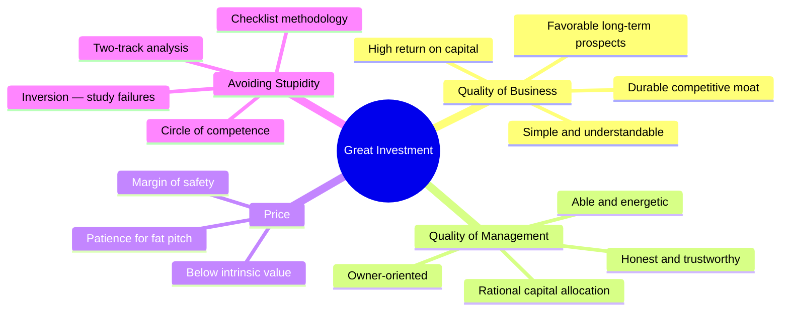
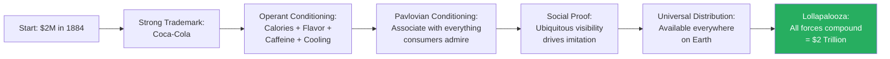
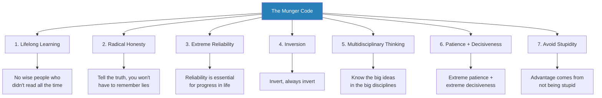
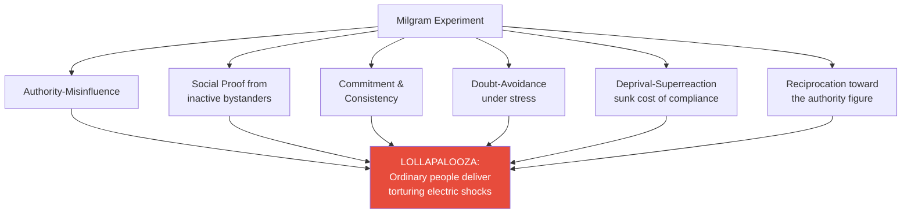
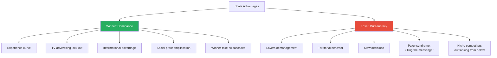
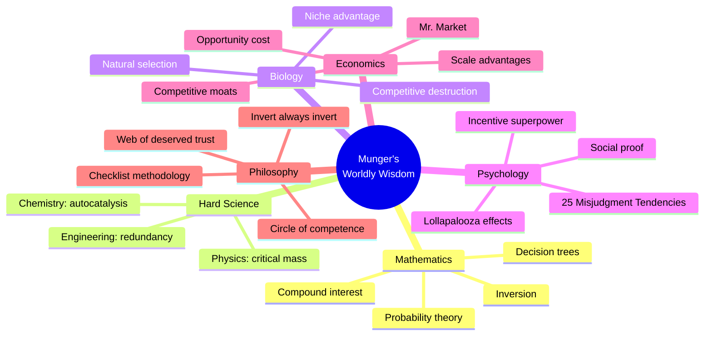

# Poor Charlie's Almanack — Charles T. Munger

> **In 30 seconds:** Charlie Munger — Warren Buffett's partner, vice chairman of Berkshire Hathaway, and one of the most successful investors in history — reveals his operating system for thinking clearly in a complex world. The core idea: build a "latticework of mental models" from every major discipline — psychology, mathematics, physics, biology, economics, engineering — and use them together to make decisions. His most original contribution is a catalogue of twenty-five psychological tendencies that cause human misjudgment, which, when acting in combination, produce "lollapalooza effects" of extraordinary power. This compilation of eleven talks, biographical material, and annual meeting remarks is less a book about investing and more a book about thinking — how to avoid stupidity, see reality clearly, and live a life worth living.

---

## About the Author

- *Charlie Munger was born January 1, 1924, in Omaha, Nebraska* — the same city that produced his future partner, Warren Buffett
- He worked as a boy at Buffett & Son grocery store under Warren's grandfather Ernest, enduring twelve-hour shifts for $2 a day
- Attended the University of Michigan (mathematics), Caltech (meteorology, thermodynamics), and Harvard Law School (magna cum laude, top 12 of 335) — all without completing an undergraduate degree
- Founded the law firm Munger, Tolles & Olson, still one of America's premier firms
- Ran Wheeler, Munger & Co. investment partnership from 1962-1975: **28.3% gross annual returns** vs. 6.7% for the Dow
- Became vice chairman of Berkshire Hathaway, which under Buffett and Munger grew from $10 million to $135 billion in market value
- A voracious reader across every discipline, known for saying he has "nothing to add" — until he does, at which point his observations are devastating in their precision
- Passed away November 28, 2023, at age 99 — one month short of his hundredth birthday

---

## The Big Idea

- Munger's philosophy rests on one conviction: <b style="color: #2980b9">you cannot make good decisions using only one mental model — you need a latticework of models from every major discipline</b>
- He estimates roughly **80-90 important models** carry about 90% of the freight in making you worldly-wise
- The most neglected and most powerful models come from <b style="color: #e74c3c">psychology — specifically the ways the human brain systematically misfunctions</b>
- When multiple models or psychological tendencies act in the same direction, you get <b style="color: #27ae60">"lollapalooza effects" — extreme outcomes that simple, single-variable thinking can never predict</b>
- The practical application: use checklists, think forward AND backward (inversion), stay within your circle of competence, and never stop learning

---

## Book Structure at a Glance

| Section | Content | Core Message |
|---------|---------|-------------|
| **Ch 1: Biography** | Omaha childhood through Berkshire Hathaway | Character + reliability = foundation of success |
| **Ch 2: The Munger Approach** | Mental models, investment philosophy | Multidisciplinary thinking as superpower |
| **Ch 3: Mungerisms** | Annual meeting remarks (Berkshire/Wesco) | Concentrated wisdom in pithy observations |
| **Talks 1-4** | Harvard, USC, Stanford, Coca-Cola case | Inversion, worldly wisdom, scale advantages |
| **Talks 5-7** | Multidisciplinary education, foundations | Soft science reform, investment costs critique |
| **Talk 8** | Quant Tech financial scandal (fiction) | Stock option accounting as moral hazard |
| **Talks 9-10** | Academic economics, USC Law commencement | Critique of academia, life advice |
| **Talk 11** | Psychology of Human Misjudgment | 25 causes of misjudgment — the magnum opus |

---

## Key Concepts at a Glance

| Concept | One-line summary |
|---------|-----------------|
| **Latticework of Mental Models** | Build a framework of ~80-90 big ideas from all major disciplines to make decisions |
| **The 25 Tendencies** | Systematic psychological biases that cause misjudgment in predictable ways |
| **Lollapalooza Effect** | When multiple tendencies or forces act together, you get extreme, nonlinear outcomes |
| **Inversion** | Solve hard problems by thinking backward — study failure to find success |
| **Circle of Competence** | Know the boundary between real knowledge and performed knowledge |
| **Incentive Superpower** | Incentives are the most powerful force shaping human behavior — never underestimate them |
| **Competitive Moats** | Durable advantages that protect a business from competitive destruction |
| **Sit-on-Your-Ass Investing** | Extreme patience + extreme decisiveness; very few, very large, very long-held positions |
| **Man-with-a-Hammer** | If you only have one tool, you'll misapply it to every problem |
| **Two-Track Analysis** | Evaluate both (1) rational factors and (2) subconscious psychological influences |
| **Febezzlement** | The functional equivalent of embezzlement — hidden costs that strip wealth through layers of fees |
| **Checklist Methodology** | No wise pilot omits his checklist — and neither should any investor or decision-maker |
| **Web of Deserved Trust** | The highest form of human organization — reliable people correctly trusting one another |

Psychology dominates Munger's mental model hierarchy because, as he repeatedly argues, the ways the human brain systematically misfunctions are the most neglected and most powerful models — understanding incentive-caused bias alone is worth more than most MBAs.

---

## The Making of Charlie Munger

- *The Omaha crucible shaped everything that followed* — Charlie grew up during the Great Depression watching his grandfather rescue a failing bank by exchanging $35,000 in sound mortgages for weak loans
- His father, Al Munger, was a prosperous lawyer whose tax case went to the Supreme Court — Colgate-Palmolive paid him handsomely to step aside, and the fancy New York lawyer they hired lost the case anyway
- Charlie learned to read voraciously as a child, devouring biographies and Dr. Ed Davis's medical journals — spawning a lifelong love of science and pattern recognition
- At Central High School, too small for sports, he joined the rifle team and became captain — earning a varsity letter that confused coeds who "wondered how such a scrawny kid could earn a varsity letter"

> [!example] The Hamster Negotiator
> - Even as a boy, Charlie showed shrewd trading instincts
> - He raised hamsters and traded them with other children, always gaining a bigger specimen or one with unusual coloring
> - When his brood grew to thirty-five, his mother shut down the basement hamster farm because of the smell
> - His sister recalled the family enduring "incessant squeaking of hungry hamsters" until Charlie came home from school

- *The partnership that changed financial history began at a dinner party* — in 1959, when Charlie returned to Omaha to settle his father's estate, the Davis family arranged dinner with a young investor named Warren Buffett
- Dr. Ed Davis had earlier invested $100,000 with Buffett because "Warren reminded him of Charlie Munger"
- Susie Buffett recalled the evening: "I'd never seen anybody take that role away from Warren, and he relinquished it to Charlie that night"
- The bond was sealed by a handshake — <b style="color: #2980b9">no formal partnership, no contract, just two Midwesterners who respected the value of one's word</b>
- Charlie endured devastating personal tragedy — his first marriage ended in divorce, then his beloved son Teddy died of leukemia at age nine; "a friend remembers that Charlie would visit his dying son in the hospital and then walk the streets of Pasadena crying"

---

## The Munger Approach: Mental Models and Worldly Wisdom

- *Charlie's approach to investing is really an approach to thinking itself* — successful investing is merely a byproduct of a carefully organized mind
- Warren Buffett: "Charlie can analyze and evaluate any kind of deal faster and more accurately than any man alive"

### The Latticework of Mental Models

- <b style="color: #2980b9">You can't really know anything if you just remember isolated facts</b> — if facts don't hang together on a latticework of theory, you don't have them in usable form
- You need **multiple models from multiple disciplines** because relying on just one or two will cause you to torture reality to fit your model

```mermaid
flowchart TD
    A[Mental Models Latticework] --> B[Mathematics]
    A --> C[Physics & Engineering]
    A --> D[Biology & Evolution]
    A --> E[Psychology]
    A --> F[Microeconomics]
    A --> G[Accounting]
    B --> B1[Compound interest]
    B --> B2[Permutations & combinations]
    B --> B3[Decision trees]
    C --> C1[Backup systems / redundancy]
    C --> C2[Breakpoints / critical mass]
    C --> C3[Feedback loops]
    D --> D1[Darwinian natural selection]
    D --> D2[Competitive destruction]
    D --> D3[Niche specialization]
    E --> E1[25 cognitive biases]
    E --> E2[Incentive superpower]
    E --> E3[Social proof]
    F --> F1[Advantages of scale]
    F --> F2[Competitive moats]
    F --> F3[Opportunity cost]
    G --> G1[Double-entry bookkeeping]
    G --> G2[Limitations of accounting]
    style E fill:#e74c3c,color:white
```

- The man-with-a-hammer tendency: <b style="color: #e74c3c">"To a man with only a hammer, every problem looks pretty much like a nail"</b> — this is a perfectly disastrous way to operate in the world

The force-directed graph reveals what Munger means by a "latticework" — mental models are not isolated tools but a densely connected network where Incentives, Social Proof, and Reciprocation cluster together to feed the Lollapalooza Effect, while Inversion and Circle of Competence form a defensive cluster around Margin of Safety.

### The Most Important Models

| Discipline | Key Model | Why It Matters |
|-----------|-----------|---------------|
| **Mathematics** | Compound interest | The eighth wonder of the world — never interrupt it |
| **Mathematics** | Permutations & combinations | Without this, you're "a one-legged man in an ass-kicking contest" |
| **Engineering** | Backup systems | Redundancy prevents catastrophic failure |
| **Physics** | Critical mass / breakpoints | Some effects only appear after a threshold is crossed |
| **Biology** | Darwinian evolution | Competitive destruction is constant; only the adapted survive |
| **Psychology** | Incentive superpower | "Never think about something else when you should be thinking about incentives" |
| **Psychology** | Social proof | Humans automatically think and do what they see others thinking and doing |
| **Economics** | Advantages of scale | Volume creates compounding advantages that crush smaller competitors |
| **Accounting** | Its limitations | Accounting is a starting place, not an ending — "just a crude approximation" |

### The Lollapalooza Effect

- *The most important concept in Charlie's entire system* — when two, three, or four forces all operate in the same direction, you don't get simple addition
- <b style="color: #27ae60">Like critical mass in physics — you get a nuclear explosion if you reach a certain point, and nothing much worth seeing if you don't</b>
- Coca-Cola's success: Pavlovian conditioning + operant conditioning + social proof + scale advantages + universal availability = $2 trillion company
- Cult conversions: isolation + stress + authority + social proof + commitment/consistency + reciprocation = brainwashing over a single weekend
- Most real-world problems involve **conflicting forces** producing trade-offs — you must recognize these trade-offs or "you're a horse's patoot"

---

## Investment Philosophy: The Munger-Buffett Method

- *The approach can be summarized in one sentence:* find a wonderful business with a durable competitive advantage, run by able and trustworthy people, at a sensible price — then sit on your ass

### The Circle of Competence

> [!example] Max Planck's Chauffeur
> - Max Planck toured Germany giving the same physics lecture repeatedly
> - His chauffeur, having heard it so many times, offered to deliver the lecture himself — Planck could sit in the audience wearing the chauffeur's cap
> - The chauffeur delivered a flawless recitation, but when a physicist asked a difficult question, the chauffeur replied: "I'm surprised that a citizen of an advanced city like Munich is asking so elementary a question, so I'm going to ask my chauffeur to respond"
> - **The lesson:** There is a critical difference between real knowledge (Planck) and performed knowledge (the chauffeur) — you must know which you have

### The Ted Williams Approach

- Ted Williams divided the strike zone into seventy-seven cells and only swung at balls in his "best" cells — even at the risk of striking out
- <b style="color: #2980b9">In investing, you can watch thousands of pitches go by with no penalty — unlike baseball, there are no called strikes</b>
- When a "fat pitch" finally arrives — slow, straight, right in the middle of your sweet spot — swing hard
- Buffett's "20-slot punch card": imagine you get only twenty investments in your lifetime — you'd think much more carefully about each one

### Competitive Moats

- A company's competitive advantage is its "moat" — the virtual barrier protecting it against incursion
- <b style="color: #27ae60">Superior companies have deep moats that are continuously widened to provide enduring protection</b>
- Munger and Buffett are "laser-focused" on competitive destruction — few businesses survive over multiple generations
- The question is always: will this moat be wider or narrower in ten years?

### The Investing Principles Checklist

- **Risk** — Begin every evaluation by measuring risk; insist on margin of safety
- **Independence** — Just because others agree or disagree doesn't make you right or wrong
- **Preparation** — "The only way to win is to work, work, work, and hope to have a few insights"
- **Intellectual Humility** — Acknowledging what you don't know is the dawning of wisdom
- **Analytic Rigor** — Determine value apart from price; progress apart from activity
- **Allocation** — Highest and best use is always measured by opportunity cost
- **Patience** — Never interrupt compound interest unnecessarily
- **Decisiveness** — When proper circumstances present themselves, act with conviction
- **Change** — Continually challenge your best-loved ideas
- **Focus** — Remember that reputation and integrity can be lost in a heartbeat

> [!tip] The Core Formula
> "How do some people get wiser than other people? Partly it is inborn temperament. But if you've got a good temperament — basically being very patient, yet combining that with vast aggression when you know enough to do something — then you just gradually learn the game. The game is to keep learning."

Munger's investment checklist branches from four root criteria — but notice that "Avoiding Stupidity" gets its own branch equal in weight to the others, reflecting his conviction that eliminating errors matters more than finding brilliance.

---

## The Eleven Talks: Talks 1-4

### Talk 1: Prescriptions for Guaranteed Misery (Harvard School, 1986)

- *Charlie's most elegant use of inversion* — inspired by Johnny Carson's commencement speech, he tells graduates exactly how to guarantee a miserable life
- **Carson's three prescriptions for sure misery:**
  1. Ingest chemicals to alter mood or perception
  2. Envy
  3. Resentment
- Charlie adds his own four prescriptions:
  1. <b style="color: #e74c3c">Be unreliable</b> — "Master this one habit, and you will more than counterbalance the combined effect of all your virtues"
  2. <b style="color: #e74c3c">Learn only from your own experience</b> — refuse to learn vicariously from the good and bad experiences of others
  3. <b style="color: #e74c3c">Go down and stay down</b> — when you get your first severe reverse in life, quit permanently
  4. <b style="color: #e74c3c">Ignore inversion</b> — never think backward about problems, never study what causes non-X when seeking X
- The talk's hero is <b style="color: #2980b9">Darwin, who "gave priority attention to evidence tending to disconfirm whatever cherished and hard-won theory he already had"</b>
- Darwin's grave lies in Westminster Abbey next to Newton's — proof that "a turtle may outrun the hares, aided by extreme objectivity"

> [!example] The Power of Reliability
> - Charlie's roommate in college was severely dyslexic but "perhaps the most reliable man I have ever known"
> - He went on to have a wonderful life — outstanding wife and children, chief executive of a multibillion-dollar corporation
> - The lesson: "If you persist in being reliable, you simply can't count on your other handicaps to hold you back"

### Talk 2: Elementary Worldly Wisdom (USC, 1994)

- *The definitive presentation of the mental models approach* — Charlie walks business students through his entire thinking framework
- **The latticework metaphor:** "You can't really know anything if you just remember isolated facts and try to bang 'em back"
- Key models presented in sequence:
  - **Mathematics:** Compound interest, permutations and combinations, Fermat/Pascal probability
  - **Accounting:** Essential language of business, but know its limitations — "just because you express the depreciation rate in neat numbers doesn't make it anything you really know"
  - **Engineering:** Backup systems, quality control, breakpoints
  - **Biology/Evolution:** Niche specialization in business ecosystems
  - **Psychology:** Misjudgment tendencies, social proof, Pavlovian association

#### Advantages of Scale — and Their Limits

- *One of the most practically useful sections in the entire book* — a systematic analysis of why big companies win (and sometimes lose)
- **Experience curve:** More volume = more efficiency at processing that volume
- **TV advertising:** When network TV arrived, only large companies could afford it — small competitors were locked out
- **Informational advantage:** You know Wrigley's chewing gum is satisfactory; "am I going to take something I don't know and put it in my mouth — which is a pretty personal place — for a lousy dime?"
- **Social proof:** Everyone buying something makes others think it's better
- **Winner-take-all cascades:** Daily newspapers, where more circulation gets more advertising, which gets more circulation

> [!example] How Sam Walton Crushed Sears
> - Walton "invented practically nothing" but copied everything smart and did it with more fanaticism
> - His early strategy was like a prizefighter building a record: he "went out and fought forty-two palookas" — destroying small-town merchants with his more efficient system
> - Then, as he got bigger, he started destroying the big boys
> - Meanwhile, Sears had "layers and layers of people it didn't need" — the constant curse of scale is bureaucracy

- <b style="color: #27ae60">The great defect of scale: bureaucracy, territoriality, and perverse incentives</b> — "If you won't bother me, I won't bother you, and we're both happy"
- The Paley/CBS example: Paley didn't like hearing what he didn't like, so people stopped telling him — he ended up "living in a little cocoon of unreality"

#### The Two-Track Analysis

- Charlie's personal decision-making framework:
  1. **Track 1:** What are the factors that really govern the interests involved, rationally considered?
  2. **Track 2:** What subconscious psychological influences are causing the brain to automatically form conclusions — many of which are wrong?

### Talk 3: Worldly Wisdom Revisited (Stanford, 1996)

- *A deeper dive into competitive dynamics and the Coca-Cola case* — Charlie demonstrates how to apply mental models to evaluate a real business
- Revisits the importance of flavor, universal distribution, and Pavlovian conditioning in Coke's dominance
- Emphasizes that <b style="color: #2980b9">political animosity should be avoided because it causes "much mental malfunction, even in brilliant men"</b>
- Introduces the story of Grant McFadyen — his father's friend — as a model for life handling: steady, reliable, unflappable

### Talk 4: Practical Thought About Practical Thought (1996)

- *The Coca-Cola thought experiment* — perhaps the most brilliant demonstration of multidisciplinary thinking in the entire book
- Charlie presents **five helpful notions** for solving any problem:
  1. Decide the big "no-brainer" questions first
  2. Use numerical fluency — math is "the language of God"
  3. Think in reverse (invert, always invert)
  4. Apply elementary multidisciplinary wisdom — never rely entirely on others
  5. Watch for combinations of factors — the Lollapalooza Effect

#### Building a $2 Trillion Company from Scratch

- *The setup:* It is 1884 in Atlanta. A rich eccentric named Glotz offers $2 million to start a non-alcoholic beverage company. Your job: demonstrate a plan to make it worth $2 trillion by 2034
- Charlie's solution uses only freshman-level academic knowledge:

- **The operant conditioning:** Sugar, caffeine, flavor, and cold temperature provide real rewards that create habitual consumption
- **The Pavlovian conditioning:** Associate the brand with everything people like — pretty women, sports, happiness — using massive advertising spending
- **The defensive moves** (thinking in reverse):
  1. Avoid aftertaste that stops consumption
  2. Never lose even half the trademark — if there's ever a "Peppy Cola," WE will own it
  3. Avoid envy by deserving success — fanatic about quality and reasonable pricing
  4. <b style="color: #e74c3c">Never make a huge, sudden change in flavor</b> — this would trigger Deprival-Superreaction and allow competitors to copy the original
- Charlie notes the real Coca-Cola Company followed most of this plan but made two critical errors: they lost half their trademark AND granted perpetual bottling franchises at fixed syrup prices
- The deeper lesson: <b style="color: #27ae60">most PhD educators "could not satisfactorily explain Coca-Cola, even in retrospect, and even after watching it closely all their lives"</b> — a damning indictment of balkanized education

---

## The Eleven Talks: Talks 5-8

### Talk 5: The Need for More Multidisciplinary Skills (Harvard Law, 1998)

- *Delivered at the fiftieth reunion of his Harvard Law School class* — Charlie argues that professional education is dangerously narrow
- The core argument: professionals who possess only their own discipline's tools suffer from <b style="color: #e74c3c">man-with-a-hammer tendency AND incentive-caused bias</b> — and these two tendencies intertwine to produce terrible outcomes
- Shaw's diagnosis: "In the last analysis, every profession is a conspiracy against the laity" — but Shaw understates the problem; it's not conscious malice, it's subconscious cognitive drift

#### The Pilot Training Analogy

- *Charlie's most powerful metaphor for education reform* — he argues Harvard should study how pilots are trained
- The six-element pilot training system that soft science should adopt:
  1. **Wide coverage** — practically everything useful in the field
  2. **Practice-based fluency** — not just passing one test, but handling multiple hazards simultaneously
  3. **Forward AND reverse thinking** — both pursuing good outcomes and avoiding bad ones
  4. **Proportional training time** — most training on what matters most
  5. **Mandatory checklists** — always, without exception
  6. **Maintenance routines** — regular simulator use to prevent skill atrophy
- <b style="color: #2980b9">"Yes, I am suggesting today that mighty Harvard would do better if it thought more about pilot training"</b>
- The "A plus B" argument: if "A" is narrow professional doctrine and "B" is the big concepts from other disciplines, the professional possessing A+B will always outperform the possessor of A alone — the only excuse for not acquiring B is that it's not practical, and Charlie argues that excuse is "usually unsound"

### Talk 6: Investment Practices of Leading Charitable Foundations (1998)

- *Charlie at his most provocative* — he tells a room full of foundation managers that their sophisticated investment practices are destroying their wealth
- The problem: modern foundations have adopted a "fund of funds" approach with layers of consultants, each charging fees, creating total annual costs easily reaching **3% of net worth**
- <b style="color: #e74c3c">If gross real returns drop to 5%, minus 3% croupier costs, minus 5% in donations = annual shrinkage of 3%</b>
- Ninety percent of Swedish drivers consider themselves above average — "and people who are successfully selling something, as investment counselors do, make Swedish drivers sound like depressives"

> [!example] Long-Term Capital Management
> - Run by people with IQs averaging 160, including two Nobel Prize winners
> - Collapsed through overconfidence in highly leveraged methods
> - "Smart, hardworking people aren't exempted from professional disasters from overconfidence — they just go aground in the more difficult voyages they choose"

- Charlie's three alternatives for foundations:
  1. **Index** — eliminate consultants and investment turnover (wiser than current practice for most)
  2. **Concentrate like Berkshire** — very few admired domestic corporations, virtually zero turnover, total costs below 0.1% of principal
  3. **Limited partnerships** (LBOs, hedge funds) — largely beyond scope, but Charlie warns of buried covariance with equities toward disaster
- The radical suggestion: <b style="color: #27ae60">a foundation with almost all wealth in just three fine domestic corporations "is securely rich" — and it's rational to remain 90% concentrated in one equity if it's the right one</b>
- "Early Charlie Munger is a horrible career model for the young because not enough was delivered to civilization in return for what was wrested from capitalism"

### Talk 7: Philanthropy Roundtable — The "Febezzle" Speech (2000)

- *Charlie coins a new word* — "febezzle" (functional equivalent of embezzle) — to describe how layers of unnecessary investment costs strip wealth from foundations
- Galbraith's insight: undisclosed embezzlement stimulates spending powerfully because the embezzler spends more while the employer doesn't know his assets are gone
- Charlie extends this: <b style="color: #2980b9">when a foundation wastes 3% per year in unnecessary costs from a rising portfolio, it still feels richer — while the people collecting the wasted 3% think they're virtuously earning income</b>
- This is "febezzlement" — functioning like undisclosed embezzlement without being self-limited
- The Japan warning: after extreme asset price rises, Japan's economy stalled for years despite massive deficit spending and zero interest rates — "Let us hope that the sad situation in Japan is caused by social psychological effects peculiar to Japan"
- "Crowd folly — the tendency of humans to resemble lemmings — explains much foolish thinking of brilliant men"

### Talk 8: The Great Financial Scandal of 2003 (Fiction, Written 2000)

- *A prophetic morality play written before Enron* — Charlie invents "Quant Tech," a brilliant engineering firm destroyed by stock option accounting
- The founder, Albert Berzog Quant, ran the company with cash-only compensation and considered stock option accounting "weak, corrupt, and contemptible"
- After the founder's death in 1982, new executives discovered a breathtaking opportunity: <b style="color: #e74c3c">by substituting stock option profits for cash bonuses, they could quadruple reported earnings overnight — while shares outstanding remained exactly the same</b>
- The "dollop by dollop system": add phony earnings in moderate amounts each year so nobody notices
- The CFO's private summary: "If we mix only a moderate minority share of turds with the raisins each year, probably no one will recognize what will ultimately become a very large collection of turds"
- The accounting profession blessed it because: "Whose bread I eat, his song I sing"
- By 2003, the scheme unravels — Quant Tech is destroyed, just as Enron, WorldCom, and others were in reality
- Charlie's point: <b style="color: #27ae60">the accounting profession's failure to expense stock options was not a minor technical matter but a systematic corruption of financial truth that inevitably produced catastrophic consequences</b>

---

## Talk 11: The Psychology of Human Misjudgment — Munger's Magnum Opus

- *The intellectual crown jewel of the entire book* — revised exclusively for Poor Charlie's Almanack in 2005 when Charlie was eighty-one
- Charlie's self-taught system of psychology, built "in the self-help style of Ben Franklin" with the determination of the Little Red Hen: "Then I'll do it myself"
- The foundational insight: <b style="color: #2980b9">just as ants have simple behavioral algorithms that usually work but sometimes catastrophically misfire, humans have psychological tendencies that are generally useful but systematically mislead</b>

> [!example] E.O. Wilson's Painted Ant
> - Harvard's E.O. Wilson painted dead-ant pheromone on a live ant
> - The other ants immediately dragged the live ant out of the hive — even though it kicked and protested the entire time
> - It smelled dead, therefore the algorithm said: remove it
> - **Humans are no different:** our brains run similar shortcuts that can be manipulated by others or by circumstances

### The 25 Standard Causes of Human Misjudgment

Munger places Incentive-Caused Bias at the absolute top because even he — "in the top 5% of my age cohort in understanding incentives" — admits to constantly underestimating its power; Deprival Superreaction and Social Proof follow closely because they operate almost entirely below conscious awareness.

#### 1. Reward and Punishment Superresponse Tendency

- <b style="color: #e74c3c">"Never, ever, think about something else when you should be thinking about the power of incentives"</b>
- The most important and most underestimated of all tendencies — even Charlie, in the top 5% of his cohort in understanding incentives, is "always underestimating that power"

> [!example] The FedEx Night Shift
> - FedEx couldn't get the night shift to move packages fast enough — they tried moral suasion, everything
> - Someone realized it was foolish to pay by the hour when what they wanted was fast completion
> - Solution: pay per shift, let everyone go home when all planes were loaded
> - "Lo and behold, that solution worked"

- **Incentive-caused bias:** People unconsciously drift toward conclusions that serve their financial interest — the surgeon who removed healthy gallbladders genuinely believed he was helping patients
- Ben Franklin's maxim: "If you would persuade, appeal to interest and not to reason"
- **The cash register as moral instrument:** Patterson's store employees were stealing him blind until he installed cash registers — then the store became profitable immediately
- Antidotes: (1) fear professional advice especially when it's good for the advisor; (2) learn the basics of your advisor's trade; (3) double-check or replace much of what you're told
- Soviet communism's epitaph: "They pretend to pay us and we pretend to work"

#### 2. Liking/Loving Tendency

- Humans tend to ignore faults of and comply with wishes of the loved object, favor people and products merely associated with the loved object, and distort facts to facilitate love
- Mothers loving their worst children the most — not always, but common enough to generate a folk saying

#### 3. Disliking/Hating Tendency

- The mirror of liking — we ignore virtues in the hated object, dislike people associated with it, and distort facts to facilitate hatred
- Political hatred especially dangerous: "The accurate response to political hatred is the Disraeli Compromise — give up vengeance as a motivation but keep a drawer with names"

#### 4. Doubt-Avoidance Tendency

- The brain is designed to remove doubt quickly by reaching some decision — any decision
- Triggered by puzzlement and stress — which is why <b style="color: #e74c3c">religious and cult conversions happen under conditions of maximum uncertainty and pressure</b>
- Judges and juries are urged to delay decision-making precisely to counteract this tendency

#### 5. Inconsistency-Avoidance Tendency

- The brain conserves programming space by being reluctant to change existing conclusions, habits, and loyalties
- <b style="color: #2980b9">This is why first conclusions and first impressions are so hard to dislodge — and why "an ounce of prevention is worth a pound of cure"</b>
- Benjamin Franklin's method: carefully examine the reasons for a belief, especially when the belief serves your interest
- The most extreme form: religious and ideological commitment that resists all disconfirming evidence

#### 6. Curiosity Tendency

- Mostly beneficial — it leads humans to learn from others' experience and to develop culture
- The reason Athens produced so much knowledge in so short a period — intense, cultivated curiosity

#### 7. Kantian Fairness Tendency

- Humans expect fairness from the systems they participate in and react badly when it's violated
- The "golden rule" has its roots in evolution — cooperation requires reciprocal fairness
- Violation triggers resentment that can be wildly disproportionate to the offense

#### 8. Envy/Jealousy Tendency

- Given a prominent place in the Ten Commandments because envy is so deeply part of human nature
- Dangerous in business: if one oil company foolishly buys a mine, other oil companies often quickly join in
- One of the few tendencies left almost entirely out of psychology textbooks — "it is not a pretty potion"

#### 9. Reciprocation Tendency

- Humans automatically tend to reciprocate both favors and disfavors — with extraordinary power
- <b style="color: #27ae60">Cialdini's studies showed that a small unsolicited gift dramatically increases compliance with a subsequent request</b>
- Used by the Hare Krishna strategy of giving a flower before asking for a donation
- The "log-rolling" of legislatures is pure reciprocation tendency at work
- Dangerous in combination: reciprocation + inconsistency-avoidance = once you've done a small favor for someone, you're more likely to do a larger one

#### 10. Influence-from-Mere-Association Tendency

- The brain's tendency to associate unrelated things that happen together
- Persian messengers were killed for bringing bad news — <b style="color: #e74c3c">the association between the messenger and the message was enough to trigger hatred</b>
- In business: products associated with beautiful people, sports heroes, or success become more desirable
- Paley at CBS stopped hearing bad news because people learned he punished the bearers
- Antidote: carefully examine the facts regardless of who is delivering them or what feelings they trigger

#### 11. Simple, Pain-Avoiding Psychological Denial

- When reality is too painful to bear, the brain simply refuses to accept it
- The mother who can't accept her child is dead; the addict who insists he can quit anytime
- Can be useful as a temporary coping mechanism but devastating when it becomes permanent

#### 12. Excessive Self-Regard Tendency

- Humans consistently overvalue themselves, their possessions, and their ideas
- The "endowment effect": once you own something, you value it more than before you owned it
- <b style="color: #2980b9">Ninety percent of Swedish drivers rate themselves above average</b> — and this overconfidence pervades every human domain
- Produces "tolerate-your-own-group" favoritism in hiring, promoting, and evaluating
- Antidote: force yourself to be more objective about yourself, your family, and your organization — the Darwinian method of self-criticism

#### 13. Overoptimism Tendency

- Demosthenes said it first: "What a man wishes, he will believe"
- Related to excessive self-regard but distinct — the tendency to see rosy outcomes as more likely than they are
- One antidote is the use of probability calculations — the habits of Fermat and Pascal

#### 14. Deprival-Superreaction Tendency

- *One of the most powerful and destructive tendencies* — loss hurts far more than equivalent gain pleases
- <b style="color: #e74c3c">People will fight much harder to prevent a loss than to obtain a gain of equal size</b>
- "Takeaways" are incredibly hard to negotiate — which is why New Coke was such a disaster: it triggered massive consumer hostility
- Slot machines exploit this ruthlessly: "near misses" (bar-bar-lemon) trigger the feeling of almost having won, which is psychologically experienced as a loss
- In labor relations: most deaths in pre-WWI labor strife came when employers tried to reduce wages
- In investing: <b style="color: #2980b9">gamblers develop a passion to "get even" once they've suffered a loss, and the passion grows with the loss</b>
- Antidotes: the Buffett rule for open-outcry auctions — "Don't go"; good poker skill learned young

> [!example] Charlie's $5.4 Million Mistake
> - A broker offered Charlie 300 shares of ridiculously underpriced Belridge Oil at $115; he bought them with cash on hand
> - The next day, the broker offered 1,500 more shares at the same price — Charlie declined because buying would require selling something or borrowing $173,000
> - He was a wealthy man with no debt and virtually no risk of loss
> - Within two years, Belridge sold to Shell at $3,700 per share — making Charlie $5.4 million poorer than he should have been
> - "Psychological ignorance can be very expensive"

#### 15. Social-Proof Tendency

- Humans automatically think and do what they see others around them thinking and doing — "monkey-see, monkey-do"
- Psychology experiments: ten "compliance practitioners" face the rear of an elevator, and the stranger who enters will often turn around and do the same
- <b style="color: #27ae60">Triggered most easily in the presence of puzzlement or stress — especially when both exist</b>
- Disreputable sales organizations manipulate targets into situations combining isolation and stress — cults use the same techniques
- In corporate governance: outside directors display "the near-ultimate form of inaction" — as Joe Rosenfield said, "They asked me if I wanted to become a director of Northwest Bell, and it was the last thing they ever asked me"
- Judith Rich Harris showed that young people's peer respect is partly genetic — making it wise for parents "to rely more on manipulating the quality of the peers than on exhortations to their own offspring"
- The Serpico Syndrome: social proof + incentives drove near-total corruption in a New York police division; Frank Serpico was nearly murdered for resisting

#### 16. Contrast-Misreaction Tendency

- The brain judges by contrast, not by absolute values — a magician can remove your wristwatch by applying pressure elsewhere
- <b style="color: #e74c3c">Real estate agents show terrible houses first so the merely mediocre house looks wonderful by comparison</b>
- Boiling-frog metaphor: changes that happen gradually, below the contrast threshold, go unnoticed until it's too late
- A $1,000 optional upgrade seems trivial when you've just committed to a $65,000 car

#### 17. Stress-Influence Tendency

- Light stress can improve performance, but heavy stress can cause both depression and dysfunction
- Pavlov found that heavy stress in dogs could cause a sudden "breakdown" in which conditioned associations disappeared — suggesting that extreme stress can be used for brainwashing
- This is exactly the technique used by cults and some military interrogation programs

#### 18. Availability-Misweighing Tendency

- The brain overweighs what is easily available in memory — vivid, recent, or emotionally charged information gets disproportionate weight
- The great example: "an idea or a fact is not worth more merely because it is easily available to you"
- This produces systematic errors: people overweight risks of plane crashes (vivid, memorable) relative to car accidents (common, forgettable)
- Antidote: emphasize checklists and quantitative measures; deliberately seek disconfirming evidence
- <b style="color: #2980b9">Charlie uses the phrase "special knowledge problem" — an expert's extra-vivid knowledge of his own field makes him overweight its importance</b>

#### 19. Use-It-or-Lose-It Tendency

- Skills that aren't regularly practiced deteriorate — which is why pilots must undergo simulator training regularly
- The greatest pianist cannot play well without constant practice
- Implication: the multidisciplinary thinker must maintain fluency through regular use, not just initial learning
- Charlie's antidote: lifelong reading across all disciplines, practicing mental-model application on real-world problems

#### 20. Drug-Misinfluence Tendency

- Chemical substances that alter brain function can cause destructive behavior and addiction
- Charlie's personal testimony: "The four closest friends of my youth were highly intelligent, ethical, humorous types. Two are long dead, with alcohol a contributing factor, and a third is a living alcoholic — if you call that living"

#### 21. Senescence-Misinfluence Tendency

- Aging causes cognitive decline — but the rate varies enormously and continuous learning can delay it
- <b style="color: #27ae60">Buffett "is actually improving" in his seventies — "most men in their seventies are not improving, but Warren is"</b>
- Cicero's prescription: lifelong learning, useful activity, and cheerful acceptance of old age

#### 22. Authority-Misinfluence Tendency

- Humans are born to follow leaders — which creates systematic vulnerability to misguided authority

> [!example] Give Him the Rod
> - A fishing guide in Costa Rica, speaking in broken English, told an angler fighting a big tarpon: "Give him the rod!"
> - The authority-dazzled angler threw his expensive rod at the fish — it was last seen heading down the river toward the ocean
> - The guide had meant "bend the rod more" — but the tendency to comply with authority overrode common sense

- The Milgram experiment: an authority figure got ordinary people to administer what they believed were massive, torturing electric shocks to innocent people
- Copilots in simulator exercises will too often allow the simulated plane to crash rather than override the chief pilot's obvious error
- Antidote: be careful who you appoint to power — "a dominant authority figure will often be hard to remove"

#### 23. Twaddle Tendency

- Humans, as social animals with the gift of language, are "born to prattle and pour out twaddle"
- A Caltech professor's version: "The principal job of academic administration is to keep the people who don't matter from interfering with the work of the people that do"
- The honeybee forced to communicate nectar location that was straight up (which never happens in nature) came back and did an "incoherent dance" — she didn't slink into a corner; she prattled

#### 24. Reason-Respecting Tendency

- Humans have a deep love of accurate cognition and a joy in its exercise — which is why crossword puzzles and chess are popular
- People comply more readily when given reasons, even bad ones — an experiment showed that saying "I have to make some copies" was enough to jump to the head of a copying-machine line
- Carl Braun's rule at his engineering firm: every communication must include Who, What, Where, When, and **Why** — <b style="color: #2980b9">if you wrote an order without explaining why, you could be fired</b>
- The question "Why?" is "a sort of Rosetta stone opening up the major potentiality of mental life"

---

## Psychology in Action: Extended Examples and Antidotes

### How Cults Convert People Over a Weekend

- *One of the questions that first drove Charlie to study psychology* — how do destructive cults turn normal people into brainwashed zombies so quickly?
- The answer involves a lollapalooza of at least six tendencies working simultaneously:
  1. **Doubt-Avoidance:** The target is placed in a situation of maximum uncertainty — often in an unfamiliar location
  2. **Social Proof:** Surrounded by enthusiastic believers who model the desired behavior
  3. **Reciprocation:** Showered with food, warmth, and attention — creating a felt obligation
  4. **Liking/Loving:** Targets are "love-bombed" into feeling accepted and valued
  5. **Commitment/Consistency (Inconsistency-Avoidance):** Small initial commitments escalate to larger ones — once you've publicly said "yes" to anything, your brain resists saying "no"
  6. **Stress-Influence:** Sleep deprivation, fasting, emotional exhaustion — heavy stress can cause Pavlovian "breakdown" where existing associations dissolve
- The combination is so powerful that "some of the minds that are targeted simply snap into zombiedom" — one cult's name for the phenomenon is literally "snapping"
- <b style="color: #e74c3c">One cult even used rattlesnakes to heighten the stress felt by conversion targets</b>

### Why the Milgram Experiment Worked

- *Stanley Milgram showed that ordinary people would deliver what they believed were massive, torturing electric shocks to innocent strangers* — simply because an authority figure told them to
- Charlie argues this was NOT primarily about authority, as most psychologists believed
- At least **six tendencies** were acting in confluence:
  1. **Authority-Misinfluence:** The "professor" running the "experiment" commanded compliance
  2. **Social Proof:** Other "compliance practitioners" (Milgram's confederates) sat silently, communicating that the behavior was acceptable
  3. **Commitment/Consistency:** Once the subject started administering shocks, each step was only slightly worse than the last — very hard to stop mid-sequence
  4. **Doubt-Avoidance:** Under stress, the brain rushes to resolve doubt by accepting the authority's framework
  5. **Contrast-Misreaction:** Each shock was only slightly more than the previous one — gradual escalation below the "contrast threshold"
  6. **Reciprocation:** The subject felt a subtle obligation to the "professor" who had accepted them into the experiment
- <b style="color: #27ae60">Charlie's point: it took over a thousand psychology papers to get the experiment "only about ninety percent as well understood" as any intelligent person with a checklist could have achieved immediately</b>

### The New Coke Disaster — A Case Study in Deprival-Superreaction

- In 1985, Coca-Cola replaced its century-old formula with "New Coke" after blind taste tests showed consumers preferred the new flavor
- The result was a consumer revolt of historic proportions — people hoarded old Coke, formed protest groups, and flooded the company with angry calls
- **What the executives missed:** the taste tests measured only one variable (flavor preference) while ignoring the massive psychological forces working against them:
  - **Deprival-Superreaction:** Taking away the beloved original formula triggered extreme hostility — people experience loss of a familiar product far more intensely than they enjoy a slightly better taste
  - **Inconsistency-Avoidance:** A century of brand loyalty and positive associations could not be overwritten by a single taste test
  - **Social Proof in reverse:** Once the outrage began, it spread virally — each person's anger reinforced others'
  - **Mere-Association effects:** The original Coke was associated with a lifetime of positive memories — those associations were "hardwired" and couldn't transfer to a new formula
- Charlie predicted in Talk 4 that this exact mistake would happen — and it did, "dangerously threatening the most valuable trademark in the world"
- The even deeper lesson: <b style="color: #2980b9">"the brilliant and effective executives who ran the Coca-Cola Company, surrounded by professional advisers from the best universities, should thus demonstrate a huge gap in their education"</b>

### The Cash Register as Moral Instrument

- John H. Patterson ran a small store where employees were stealing him blind
- He installed cash registers and immediately became profitable
- He then closed the store, founded the National Cash Register Company, and built it into "one of the glories of its time"
- <b style="color: #27ae60">The moral: people who create systems that make dishonest behavior hard to accomplish are "some of the effective saints of our civilization"</b>
- As Skinner demonstrated, bad behavior is intensely habit-forming when rewarded — so preventing the first dishonest act is far more effective than punishing the hundredth

### The Westinghouse Lending Debacle

- Westinghouse had a subsidiary that made loans — previously safe loans with a good track record
- Executives, envying GE's profits, expanded into 95%-of-value construction loans to hotel developers — the riskiest category in all of lending
- They used accounting based on the subsidiary's past (low-risk) credit experience — showing high starting income from loans that were actually extremely dangerous
- The accounting was blessed by "both international and outside accountants" because "Whose bread I eat, his song I sing"
- Result: billions of dollars in losses
- Charlie's metaphor: <b style="color: #e74c3c">this was "like an armored car cash-carrying service that suddenly decided to dispense with vehicles and have unarmed midgets hand-carry its customers' cash through slums in open bushel baskets"</b>

---

## The Pilot Training Model for Education: In Detail

- *Charlie's most specific prescription for reforming professional education*

### The Six Elements Applied to Broadscale Education

| Element | In Pilot Training | In Worldly Wisdom |
|---------|------------------|-------------------|
| **Wide coverage** | Everything useful in piloting | Big ideas from all major disciplines |
| **Practice-based fluency** | Handle multiple hazards simultaneously | Deploy models automatically in complex situations |
| **Forward AND reverse thinking** | What to do AND what to avoid | Seek success AND study failure (inversion) |
| **Proportional training time** | Most time on highest-risk scenarios | Most fluency in most commonly needed models |
| **Mandatory checklists** | Always, without exception | Always, for every important decision |
| **Maintenance routines** | Regular simulator sessions | Lifelong reading of business periodicals, biographies |

### Why Soft Science Fails Where Pilot Training Succeeds

- Pilot training has **life-or-death stakes** — the incentives for effective education are overwhelming
- In contrast, soft science education is driven by the very tendencies it should be teaching people to avoid:
  - **Incentive-caused bias:** Professors' careers benefit from narrow specialization, not broad integration
  - **Man-with-a-hammer tendency:** Each department thinks its own tools are sufficient
  - **Inconsistency-Avoidance:** Once a curriculum is established, it resists change
  - **Social Proof:** Other departments are equally narrow, so narrowness seems normal
  - **Doubt-Avoidance:** The difficulty of interdisciplinary synthesis is resolved by simply not attempting it
- The Harvard Business School professor's "shoe factory" exam: only one student got the top grade — by saying the old ladies should sell the factory rather than trying to fix it, because "this business field presents problems that unworldly old ladies cannot wisely try to solve through hired help"
- <b style="color: #2980b9">The winning answer used fundamental concepts from undergraduate psychology (agency costs) and economics (marginal utility) — not anything from business school</b>

---

## Charlie on Berkshire Hathaway: The Complete Picture

### The Business Model

- "We're like the hedgehog that only knows one big thing: if you can generate float at 3% and invest it in businesses that generate 13%, that's a pretty good business"
- Berkshire's insurance operations produce "float" — premium income that can be invested before claims must be paid
- This float grew from modest beginnings to tens of billions of dollars at costs below Treasury note rates — "a wonderful thing"
- The acquired businesses return 13%+ pretax on cost — compounding value year after year with minimal friction

### The Acquisition Philosophy

- "Two-thirds of acquisitions don't work. Ours work because we don't try to do acquisitions — we wait for no-brainers"
- Charlie and Warren require: (1) a business they understand, (2) with favorable long-term prospects, (3) operated by able and honest people, (4) available at a sensible price
- They never hire investment bankers to find acquisitions — "anytime you sit there waiting for a deal to come by, you're in a very dangerous seat"
- Once acquired, subsidiaries are left alone: "We have decentralized power to a point just short of total abdication"
- <b style="color: #27ae60">The result: "We've never had to remove a CEO. We're old-fashioned. We just pick the right people"</b>

### What Happens After Buffett

- "I'd be horrified if Berkshire isn't bigger and better over time, even after Warren dies"
- "The acquisition side won't do as well, but the rest will do well. And the acquisition side will do just fine"
- The culture is self-sustaining: "There's a lot of momentum here"
- Charlie's characteristic humor: "It's silly to complain: 'What kind of world is this that gives me Warren Buffett for forty years, and then some bastard comes along who's worse?'"

---

## Recommended Reading: Charlie's Intellectual Sources

- *Charlie never stops recommending books* — his reading list reveals the breadth of his intellectual appetite

| Book | Author | Why Charlie Recommends It |
|------|--------|--------------------------|
| **Influence** | Robert Cialdini | The best practical psychology book — Charlie gave Cialdini a share of Berkshire stock |
| **The Selfish Gene** | Richard Dawkins | How competition drives evolution — applicable to business competitive destruction |
| **Guns, Germs, and Steel** | Jared Diamond | Why some civilizations dominate — the ultimate multidisciplinary synthesis |
| **Darwin's Blind Spot** | Frank Ryan | How cooperation, not just competition, drives evolution |
| **Ice Age** | John & Mary Gribbin | The forces that shaped human evolution — long-term thinking applied to biology |
| **The Autobiography of Benjamin Franklin** | Benjamin Franklin | Charlie's ultimate hero — the self-taught polymath who made himself useful |
| **Cicero's De Senectute** | Cicero | How to age well — lifelong learning, useful activity, cheerful acceptance |
| **Getting to Yes** | Roger Fisher | Win-win negotiation — Fisher was Charlie's classmate at Harvard Law |
| **The Wealth of Nations** | Adam Smith | Foundation of economic thinking — but must be supplemented with psychology |
| **Poor Richard's Almanack** | Benjamin Franklin | The original source of Charlie's title — practical wisdom in pithy form |

---

## The Munger Method Applied: Case Studies

### Case Study 1: How to Evaluate a Business (The Coca-Cola Framework)

- *Charlie's Coca-Cola thought experiment provides a template for evaluating ANY business*
- The method: apply multiple mental models systematically, then check for lollapalooza effects

**Step 1: Identify the No-Brainer Questions**
- Can this business create something that isn't a mere commodity? (If not, stop here)
- Is there a path to worldwide scale? (If the market is inherently local, scale advantages are limited)
- Can the product harness "powerful elemental forces" — basic human psychology, physiology, or social behavior?

**Step 2: Run the Numbers**
- How many potential consumers exist? What's the total addressable market in physical units?
- What's a reasonable per-unit profit target? Work backward from the desired end state
- Does the math even pencil out at achievable market shares?

**Step 3: Identify All Conditioning Mechanisms**
- **Operant conditioning:** What real rewards does the product deliver? (Flavor, energy, temperature regulation, status)
- **Pavlovian conditioning:** What associations can be created through advertising and placement?
- **Social proof:** Will visible consumption by others drive trial and adoption?
- **Availability:** Can the product be made physically available everywhere?

**Step 4: Think in Reverse — What Must Be Avoided?**
- What would cause consumers to stop buying? (Aftertaste, negative associations, price gouging)
- What would allow competitors to copy the advantage? (Flavor duplication, loss of trademark)
- What would trigger hostile psychological reactions? (Taking away something beloved, triggering envy through arrogance)

**Step 5: Check for Lollapalooza Potential**
- <b style="color: #27ae60">Are multiple forces all working in the same direction? If so, expect extreme outcomes — an autocatalytic reaction where success breeds more success</b>

### Case Study 2: Why Airlines Destroy Value While Cereals Create It

- Both industries have multiple large competitors selling to mass markets
- Yet airlines have collectively earned negative total returns since Kitty Hawk, while cereal companies earn 15-50% on capital

| Factor | Airlines | Cereals |
|--------|----------|---------|
| **Brand loyalty** | Minimal — passengers choose on price and schedule | Strong — habits form early and persist |
| **Switching costs** | Zero — any carrier will do | Moderate — taste preferences are entrenched |
| **Pavlovian conditioning** | Weak — the experience is often unpleasant | Strong — childhood associations, breakfast rituals |
| **Social proof** | Irrelevant — nobody sees which airline you flew | Moderate — what's in your pantry signals something |
| **Price competition** | Ruthless — commodity economics with excess capacity | Restrained — brand differentiation allows premium pricing |
| **Deprival-superreaction** | Low — consumers don't feel attached to a specific carrier | High — try taking away someone's Cheerios |

- <b style="color: #2980b9">The lesson: identical-seeming competitive structures produce wildly different economic outcomes depending on which psychological forces are at play</b>

### Case Study 3: The Serpico Syndrome

- *How social proof plus incentives can corrupt an entire organization*
- Frank Serpico joined a nearly totally corrupt New York police division where officers routinely took bribes
- **Social proof** was overwhelming: every other officer was participating, making corruption seem normal
- **Incentive-caused bias** reinforced it: the financial rewards of corruption were immediate and tangible
- **Reciprocation tendency** locked people in: accepting favors from one corrupt officer created obligations
- **Inconsistency-avoidance** made it hard to stop: once you'd participated even once, your brain rationalized continuing
- Serpico was nearly murdered by gunfire for resisting
- <b style="color: #e74c3c">Charlie's prescription: "Stop any bad behavior before it spreads and foster and display all good behavior"</b>

---

## Charlie's Friends on Charlie

### The Absent-Minded Genius

- Roy Tolles (friend since 1945): "He wants to get to the bottom of everything"
- Glen Mitchel (friend since 1957): "He focuses exactly on a single problem, to the exclusion of anything else"
- Bob Bird (Wesco Financial): At a meeting, Charlie walked into the elevator without saying goodbye — "Tad and I were left standing there, smiling and speechless"
- Warren Buffett: "I was talking to myself for some time. I looked around for Charlie, only to see him climbing into the back of a taxicab. No goodbye, no nothing"
- Dick Esbenshade: <b style="color: #2980b9">"I once sat through three sets of traffic lights as Charlie discussed some complex problem at an intersection"</b>

### Bill Gates on Charlie

- "He is truly the broadest thinker I have ever encountered"
- "Our most memorable correspondence was about stock options. Our longest was about the mating habits of naked mole rats"
- "Charlie has the ability to capture knowledge with simple descriptions" — venture capitalists defending stock options are "no better than the piano player in a whorehouse"

### Warren on Charlie

- When asked for one word explaining Charlie's success: "rational"
- "We've been associated forty years, and he's never second-guessed anything I've done"
- <b style="color: #27ae60">"Charlie marches to his own music, and it's music like virtually no one else is listening to"</b>
- The Abominable No-Man: "If he says 'no,' we put all our money in it. If he says 'that's the stupidest thing I've ever heard,' we make a more moderate investment"

---

## Life Principles: The Munger Code

### The Seven Pillars of Worldly Wisdom

### On Deserving What You Want

- "The safest way to get what you want is to try to deserve what you want"
- This is not mere morality — it's a calculated strategy grounded in reciprocation tendency and reputation effects
- <b style="color: #27ae60">People who consistently deliver more value than they extract build a compounding reputation</b>
- Charlie directed his law firm capital to the widow of his deceased partner Fred Warder instead of keeping it

### On Avoiding Ideology

- "Heavy ideology is one of the most extreme distorters of human cognition"
- Once you adopt a strong ideology, inconsistency-avoidance tendency locks it in place
- <b style="color: #e74c3c">You stop evaluating evidence on its merits and start filtering through the ideological lens</b>
- "You can have political views without making them your identity"

### On Self-Pity

- "Every time you find you're drifting into self-pity, it's absolutely one of the things you must not do"
- Charlie's own life: lost a son to leukemia, lost an eye, endured painful divorce — yet never wallowed
- Epictetus's epitaph: "Here lies Epictetus, a slave, maimed in body, the ultimate in poverty, and favored by the gods"

### On Making Friends Among the Eminent Dead

- "If you go through life making friends with the eminent dead who had the right ideas, it will work better for you"
- Charlie's personal pantheon: Benjamin Franklin, Cicero, Darwin, Einstein, Adam Smith, Jacobi, Newton
- <b style="color: #2980b9">The practice: read biographies voraciously, learn not just what these people thought but HOW they thought</b>

---

## The Wealth Effect and Macroeconomic Risks

### Japan as a Warning

- *Charlie delivered his "wealth effects" talk in November 2000* — just as the dot-com bubble was peaking
- The Japanese precedent: extreme rises in stock and real estate prices, followed by a crash, followed by a decade of stagnation despite every Keynesian and monetary trick in the book
- "Japan, a modern economy that had learned all the would-be-corrective tricks, pushed these tricks hard and long" — zero interest rates, massive government deficits — and still the economy stayed stalled
- <b style="color: #e74c3c">The disturbing possibility: when stock market wealth effects are stronger on the upside, they may also be stronger on the downside</b>
- "When stock market advances and declines are regarded as long-lasting, there is more downside force on optional consumption per dollar of decline than there is upside force per dollar of rise"

### The Virtue Effects Hypothesis

- Charlie suggests that "widespread corrupt accounting will eventually create bad long-term consequences" — a sort of inverse of the boost that double-entry bookkeeping gave Venice
- "When the financial scene starts reminding you of Sodom and Gomorrah, you should fear practical consequences even if you like to participate in what is going on"
- <b style="color: #27ae60">Integrity in financial reporting is not just a moral virtue — it's a structural requirement for a functioning economy</b>

---

## The Complete Inversion Framework

- *Inversion is Charlie's most frequently used problem-solving technique* — drawn from the great algebraist Carl Jacobi

### How to Apply Inversion

| Instead of Asking... | Ask Instead... |
|---------------------|---------------|
| How do I succeed in life? | What would guarantee failure? Then avoid those things |
| How do I make money investing? | What would guarantee I lose money? Then avoid those things |
| How do I build a great company? | What would destroy a great company? Then prevent those things |
| How do I have a happy marriage? | What would guarantee a miserable marriage? Then avoid those things |
| How do I stay healthy? | What would guarantee sickness? Then avoid those things |

### Charlie's Inversions in Practice

- **Carson's speech (Talk 1):** Instead of telling graduates how to be happy, he listed prescriptions for guaranteed misery
- **Darwin's method:** Instead of trying to prove his theories right, he spent his life trying to prove them wrong
- **The Coca-Cola exercise (Talk 4):** After designing the perfect beverage, Charlie asked "What must we avoid?" — aftertaste, trademark loss, consumer backlash, flavor changes
- **Investment screening:** "We have three baskets: yes, no, and too tough to understand" — the "no" and "too tough" baskets eliminate most candidates immediately
- **"All I want to know is where I'm going to die, so I'll never go there"** — the quintessential Munger inversion

### Einstein's Validation

- Einstein discovered special relativity by inverting the problem everyone else was solving
- While others tried to revise Maxwell's electromagnetic laws to fit Newton's motion laws, Einstein revised Newton's laws to fit Maxwell's
- <b style="color: #2980b9">"It is in the nature of things that many hard problems are best solved only when they are addressed backward"</b>

### The Seven Prescriptions for Misery (Complete List)

- *From Talk 1 — Charlie's most practical application of inversion*

**Carson's three:**
1. Ingest chemicals to alter mood or perception — "addiction can happen through a subtle process where the bonds of degradation are too light to be felt until they are too strong to be broken"
2. Envy — wreaking havoc "long before it got a bad press in the laws of Moses"
3. Resentment — "life is hard enough to swallow without squeezing in the bitter rind of resentment"

**Charlie's four:**
4. Be unreliable — "master this one habit, and you will more than counterbalance the combined effect of all your virtues, howsoever great"
5. Learn only from your own experience — refuse to learn vicariously: "If at first you don't succeed, well, so much for hang gliding"
6. Go down and stay down when adversity strikes — ignore the lesson of Epictetus
7. Ignore inversion — never think backward about problems

- <b style="color: #e74c3c">The irony: to find a life of wisdom and happiness, you need only avoid these seven behaviors — but most people cannot resist at least one of them</b>

### Inversion Applied to Organizations

- The questions every organization should ask:
  - What would make our best people leave? (Then prevent those things)
  - What would make our customers hate us? (Then avoid those things)
  - What would destroy our reputation overnight? (Then guard against those things)
  - What would cause a catastrophic loss? (Then eliminate those exposures)
  - What perverse incentives exist in our compensation structure? (Then fix them)
- <b style="color: #27ae60">Charlie's approach to corporate governance: "The right way to behave is to never let improper accounting start" — prevention through inversion is infinitely cheaper than correction after the fact</b>

---

## Charlie on the Good Life: Beyond Money

### What Money Is Actually For

- "I wanted to get rich so I could be independent, like Lord John Maynard Keynes"
- <b style="color: #27ae60">Independence is the end that wealth serves — not the other way around</b>
- Once you have enough to be independent, the measure of a life is not more wealth but more contribution
- Ben Franklin used self-made wealth to achieve financial independence so he could concentrate on societal improvement — Charlie strives to emulate this

### The Web of Deserved Trust

- *Charlie's highest aspiration for human relationships* — both personal and professional
- "The best armour of old age is a well-spent life preceding it"
- "Complex bureaucratic procedure does not represent the highest reach. One higher form is a seamless, non-bureaucratic web of deserved trust"
- <b style="color: #2980b9">"Not much fancy procedure, just totally reliable people correctly trusting one another. That's the way an operating room works at the Mayo Clinic"</b>
- "If lawyers would there introduce a lot of lawyer-like process, more patients would die"
- The marriage contract test: "If your proposed marriage contract has forty-seven pages, my suggestion is that you not enter"

### The Compound Interest of Character

- Charlie treats character the same way he treats financial capital — as something that compounds over time
- Small acts of reliability compound into a reputation for trustworthiness
- Small acts of dishonesty compound into a reputation for unreliability
- "I think track records are very important. If you start early trying to have a perfect one in some simple thing like honesty, you're well on your way"
- <b style="color: #e74c3c">The asymmetry: reputation takes decades to build and can be lost in a heartbeat</b>

### Why Learning Never Stops

- "I constantly see people rise in life who are not the smartest, sometimes not even the most diligent, but they are learning machines. They go to bed every night a little wiser than when they got up"
- "In my whole life, I have known no wise people over a broad subject-matter area who didn't read all the time — none, zero"
- Solon's wisdom, quoted by Cicero: "Daily learning something, he grew old"
- <b style="color: #27ae60">Warren Buffett spends five to six hours per day reading — and at seventy-plus was "actually improving"</b>
- The alternative is grim: "If you don't keep learning, other people will pass you by"

---

## Antidotes to Psychological Misjudgment: A Practical Toolkit

| Problem | Antidote | Charlie's Phrase |
|---------|----------|-----------------|
| Incentive-caused bias | Distrust advice that benefits the advisor | "Especially fear professional advice when it is especially good for the advisor" |
| Mere-association effects | Judge facts independently of who presents them | Don't kill the messenger |
| Social proof | Cultivate independent judgment | "Mimicking the herd invites regression to the mean" |
| Deprival-superreaction | Avoid open-outcry auctions; learn poker young | "The Buffett rule: don't go" |
| Overoptimism | Use probability calculations and base rates | "What a man wishes, he will believe" — so check the math |
| Excessive self-regard | Force objective self-evaluation; study Darwin | "The first principle is you must not fool yourself" |
| Inconsistency-avoidance | Deliberately seek disconfirming evidence | "Test your beliefs the way Darwin did" |
| Availability-misweighing | Use checklists; seek comprehensive data | "An idea is not worth more merely because it's easily available" |
| Authority-misinfluence | Maintain independent judgment; question all leaders | "Be careful who you appoint to power" |
| Man-with-a-hammer | Learn multiple disciplines to fluency | "You must have multiple models from multiple disciplines" |
| Lollapalooza combinations | Use the full checklist; watch for confluences | "Especially big forces often come out of these 100 models" |

---

## The Munger Legacy: What Endures

- *Charlie Munger died on November 28, 2023, at age ninety-nine* — one month short of his hundredth birthday
- He left behind not just enormous wealth but a complete intellectual framework for thinking clearly in a complex world
- His partnership with Warren Buffett — sixty-four years of handshake-backed collaboration — stands as perhaps the greatest business partnership in history
- The "latticework of mental models" approach has influenced thousands of investors, entrepreneurs, and thinkers
- His emphasis on psychology has been validated by the rise of behavioral economics and behavioral finance — fields that scarcely existed when he first began collecting instances of misjudgment

### What He Would Want You to Remember

- The game is to keep learning — every single day
- Invert the problem — study failure to find success
- Deserve what you want — the rest follows
- Build a seamless web of deserved trust
- Never underestimate the power of incentives
- Watch for lollapalooza effects — in both directions
- Use checklists — no wise pilot omits them
- <b style="color: #27ae60">"My sword I leave to him who can wield it"</b> — from Bunyan's Pilgrim's Progress, the bequest Charlie chose for himself

---

## Psychology of Misjudgment: Additional Case Studies

### The Surgeon and the Gallbladders

- *One of Charlie's most disturbing examples of incentive-caused bias*
- A surgeon in Lincoln, Nebraska sent "bushel baskets full of normal gallbladders" to the pathology lab over many years
- Hospital quality control was permissive enough that "many years after this surgeon should've been removed, he was"
- Charlie asked the doctor who helped remove him: "Did this surgeon think, 'Here's a way to make a high living by doing a few maimings and murders every year?'"
- The answer: <b style="color: #e74c3c">"Hell no, Charlie. He thought that the gallbladder was the source of all medical evil, and, if you really loved your patients, you couldn't get that organ out rapidly enough"</b>
- The cognitive drift of that surgeon — genuinely believing he's helping while actually harming — is present "in every profession and in every human being"

### The Soviet Paradox

- Soviet communism's epitaph came from one employee: "They pretend to pay us and we pretend to work"
- An entire economic system — supposedly designed to maximize collective welfare — destroyed itself because it ignored the superpower of incentives
- <b style="color: #27ae60">The lesson couldn't be clearer: "Perhaps the most important rule in management is 'Get the incentives right'"</b>
- The military discovered the same lesson: cost-plus-a-percentage-of-cost contracts produced such terrible results that Congress made it a felony for a Defense Department officer to sign one
- Yet most of the rest of the world — including law firms, consulting firms, and investment banks — still operates under similar perverse incentive structures

### The Management Consultant's Report

- "In my long life, I have never seen a management consultant's report that didn't end with the same advice: 'This problem needs more management consulting services'"
- <b style="color: #e74c3c">This is not necessarily conscious fraud — it is the natural cognitive drift of incentive-caused bias</b>
- Similarly: real estate broker presentations are never "within hailing distance of objective truth" — the incentive to close the deal overwhelms the capacity for objectivity
- Charlie's antidote: "Learn and use the basic elements of your advisor's trade as you deal with your advisor" — becoming an informed consumer of professional advice

### The Defense Department's Lesson

- After disastrous experiences with cost-plus contracts, Congress made it a felony to sign one
- <b style="color: #2980b9">The brilliance of this solution: instead of trying to change human nature, they changed the structure of incentives</b>
- Charlie's broader point: designing systems that make bad behavior difficult is far more effective than preaching good behavior
- The cash register, the separation of powers in government, double-entry bookkeeping — all are structural solutions to predictable human failures

### Charlie's Cousin and the Shingle Fight

- At ages three and four, Charlie and his cousin Russ "fought and howled over a single surplus shingle while surrounded by a virtual sea of surplus shingles"
- This childhood incident perfectly illustrates social proof combined with envy/jealousy and deprival-superreaction
- "The adult versions of this occasion, boosted by psychological tendencies preserving ideologies, are not funny and can bring down whole civilizations"
- Charlie draws a direct line from shingle fights to the Middle East conflict: <b style="color: #e74c3c">"The resources spent by Jews, Arabs and all others over a small amount of disputed land, if divided arbitrarily, would have made everyone better off"</b>

---

## Psychology of Misjudgment: Additional Case Studies (continued)

## Psychology of Misjudgment: Additional Case Studies (continued)

### My Father Almost Committed a Crime

### The Magician and the Wristwatch

- *Charlie uses stage magic as a metaphor for how the brain is manipulated*
- A magician removes your wristwatch without your feeling it by applying intense pressure of touch elsewhere on your body
- The wrist pressure is "swamped" by the contrasting high-pressure touch — taken below the threshold of perception
- <b style="color: #2980b9">This is exactly how the brain is misled in everyday life: high-contrast stimuli drown out the important signals</b>
- The temperature experiment: put one hand in hot water and one in cold, then both in room-temperature water — one hand feels cold and the other feels hot
- "When one thus sees perception so easily fooled by mere contrast, and realizes that cognition mimics perception in being misled by mere contrast, he is well on the way toward understanding how life will fool one"

### The Ants Walking in a Circle

- A type of ant has a simple behavioral program: when walking, follow the ant ahead
- When these ants stumble into walking in a big circle, they sometimes walk round and round until they perish
- <b style="color: #e74c3c">The human equivalent: following the crowd into disaster because nobody stops to ask "why are we going this way?"</b>
- This is social proof at its most lethal — and it operates in financial markets, political movements, and corporate strategy with equal force

### The Statue of Liberty Disappearing Act

- A magician made the Statue of Liberty "disappear" by rotating the audience's platform so slowly that nobody felt the movement
- The rotation was below the human sensory threshold — "below a certain level, stimulus does not get through"
- When a curtain was opened where the Statue had previously appeared, it seemed to have vanished
- <b style="color: #27ae60">The business lesson: changes that happen gradually, below the contrast threshold, can be devastating precisely because they go unnoticed — the boiling frog principle</b>

### Mark Twain's Cat

- Mark Twain's cat, after sitting on a hot stove, never again sat on a hot stove — or a cold stove either
- <b style="color: #2980b9">This is a perfect illustration of both the power and the danger of learning from experience</b>
- The cat learned the right lesson (avoid hot stoves) but also the wrong lesson (avoid all stoves)
- In investing and business, this happens constantly: a single bad experience with a category of investment causes permanent avoidance — even when the next opportunity in that category is excellent
- Charlie's antidote: distinguish between the specific cause of failure and the general category — don't let one bad experience create a blanket prohibition
- The deeper lesson from all these case studies: <b style="color: #e74c3c">psychological tendencies are not random errors — they are systematic, predictable, and exploitable by anyone who understands them</b>
- The person who masters this checklist of tendencies has, in Charlie's view, equipped themselves with one of the most powerful intellectual tools available to any human being
- "If your professors won't give you an appropriate multidisciplinary approach, you can correct that folly yourself" — the Little Red Hen principle applied to psychology

- Charlie's father went with a large group from Nebraska to South Dakota to hunt pheasants
- South Dakota hunting licenses cost $2 for residents and $5 for non-residents
- All the Nebraska residents, one by one, signed up with phony South Dakota addresses
- Charlie's father "barely prevented himself from doing what the others were doing, which was some sort of criminal offense"
- <b style="color: #27ae60">The lesson: social proof is so powerful that even a fundamentally honest person can be pulled toward criminal behavior by watching others do it</b>

### The Two Neighbors and the Tree

- Charlie once bought a house from one of two neighbors who were locked in mutual hatred
- The cause: a tiny tree newly planted by one of them that slightly blocked the other's view
- "Even a one-degree loss from a 180-degree view will sometimes create enough Deprival-Superreaction Tendency to turn a neighbor into an enemy"
- Charlie bought golf clubs from an artisan who was formerly a lawyer — when asked what kind of law he practiced, Charlie expected "divorce law" but got "zoning law"

### The Honey Bee Who Couldn't Explain

- A scientist put nectar straight up — way up — where no nectar exists in nature
- The honeybee's communication algorithm couldn't handle an unprecedented situation
- Instead of slinking into a corner, she came back and did an "incoherent dance"
- <b style="color: #2980b9">"All my life I've been dealing with the human equivalent of that honeybee. It's a very important part of wise administration to keep prattling people far away from the serious work"</b>

### The Xerox Salesman Problem

- Joe Wilson had to return to Xerox because a new, superior machine was selling poorly relative to an older, inferior one
- He discovered that the commission arrangement gave salesmen a large perverse incentive to push the inferior machine
- <b style="color: #e74c3c">The structure of incentives, not the character of the salesmen, determined the outcome</b>
- Once the commission structure was fixed, the problem disappeared instantly

---

## The Wheeler, Munger Partnership: Lessons from the Record

### The Track Record

| Period | Wheeler Munger (Gross) | Wheeler Munger (Net) | Dow Jones |
|--------|----------------------|---------------------|-----------|
| 1962-1972 | 28.3% annually | 20.0% annually | 6.7% annually |
| 1973 | -31.9% | — | — |
| 1974 | -31.5% | — | — |
| 1975 | +73.2% | — | — |
| **1962-1975 Overall** | **19.8% annually** | **13.7% annually** | **5.0% annually** |

### Key Lessons

- The 1973-74 drawdown was devastating — yet the partnership's largest holdings were "virtually sure of eventually being saleable at prices higher than the quoted market prices"
- <b style="color: #27ae60">The lesson: being right about value and being right about timing are two entirely different things</b>
- After this painful experience, Charlie followed Warren in concluding that managing other people's money directly was too stressful
- They resolved instead to build equity through stock ownership in holding companies — Berkshire Hathaway
- When Wheeler, Munger was liquidated, stakeholders received shares in Blue Chip Stamps and Diversified Retailing — later converted to Berkshire stock at $38 per share
- That Berkshire stock eventually exceeded $500,000 per share

---

## The Five Ws: Carl Braun's Communication Rule

- *A deceptively simple principle that Charlie considers among the most important in management*
- Carl Braun, founder of C.F. Braun Engineering, required every communication to include:
  1. **Who** is going to do it
  2. **What** they are going to do
  3. **Where** they will do it
  4. **When** they will do it
  5. **Why** they are doing it
- <b style="color: #2980b9">If you wrote a directive without explaining WHY, you could be fired — and if you did it twice, you WOULD be fired</b>
- The psychological basis: when people understand the reason for a task, they consider it more important, comply more readily, and execute better
- Even when the reason seems obvious, it's wise to include it — experiments show that giving ANY reason (even "because I have to make some copies") dramatically increases compliance
- This rule embodies both Reason-Respecting Tendency (people need reasons) and the general principle that good communication prevents the compound errors that arise when assumptions go unchecked

---

## The McDonald's Test

- *Charlie's provocative way of challenging elite academic audiences*
- "I always make myself unpopular on elite college campuses by saying that McDonald's is one of our most admirable institutions"
- The audience is predictably shocked
- Then Charlie explains: McDonald's provides first jobs to millions of teenagers — many troubled — and "has successfully taught most of them the one lesson they most need: to show up reliably for responsible work"
- <b style="color: #27ae60">"If the elite campuses were as successful as McDonald's in teaching sensibly, we would have a better world"</b>
- The deeper point: reliability is the most practically valuable character trait, and the institution that teaches it most effectively — regardless of prestige — deserves the most admiration

---

## Key Contrasts: Charlie vs. Conventional Wisdom

| Topic | Conventional Wisdom | Charlie's View |
|-------|-------------------|---------------|
| **Diversification** | Own hundreds of stocks to reduce risk | "Three companies is plenty" — concentrate in what you know |
| **Activity** | Active trading shows skill and effort | "Sit on your ass investing" — inaction is usually optimal |
| **Efficient markets** | Prices reflect all available information | "The hard form is demonstrably wrong" — mispricings exist |
| **Stock options** | An efficient way to align management incentives | "Weak, corrupt, and contemptible" accounting |
| **Education** | Specialize deeply in one discipline | Master the big ideas from ALL disciplines |
| **Professional advice** | Trust the experts | "Especially fear advice that's good for the advisor" |
| **Volatility** | Measures risk (beta) | Measures opportunity — "if you can't handle a 50% decline, you deserve mediocre results" |
| **Selling** | Sell when targets are met | Almost never sell — "if you buy a few great companies, you can sit on your ass" |
| **Intelligence** | High IQ guarantees success | "Temperament is more important than IQ" |
| **Complexity** | More sophisticated models are better | "Take a simple idea and take it seriously" |

---

## The Final Examination

- *At the end of his Psychology of Human Misjudgment talk,* Charlie asks and answers several self-examination questions
- **Is the list tautological?** Yes, there are overlaps — but this is unfixable in a soft science and matters only moderately
- **Why wasn't this system created by a psychology professor?** Because the professionals studied one tendency at a time in isolation — "like physics ignoring astrophysics"
- **Is it really useful?** Charlie's answer: it has given him "a huge advantage" in life and business, and he believes it would do the same for anyone who masters it
- **What's the most dangerous combination?** Multiple tendencies acting in confluence — the lollapalooza — because it produces outcomes that seem impossible to anyone analyzing one factor at a time
- <b style="color: #e74c3c">The single most important insight: "The psychology of misjudgment, as I call it, is a terribly important thing to learn. There are about twenty little principles. And they interact, so it gets slightly complicated. But the guts of it is unbelievably important"</b>

---

> **Final word:** Charlie Munger didn't just collect mental models — he lived them. The man who walked the streets of Pasadena crying for his dying son, who lost half his vision to a botched surgery, who was "too small for sports" and started with no college degree, built one of the greatest fortunes and sharpest minds in American history. He did it not through genius alone but through relentless curiosity, extreme reliability, and what he called "the constant search for better methods of thought." His sword, left to those who can wield it, is this: <b style="color: #2980b9">the game is to keep learning, and the learner who combines patience with aggression when the moment is right will compound not just wealth but wisdom itself</b>.

#### 25. Lollapalooza Tendency — Extreme Consequences from Confluences

- *The keystone of Charlie's entire psychological system* — when multiple tendencies act simultaneously in the same direction, you get extreme outcomes
- <b style="color: #e74c3c">This tendency was not in any psychology text Charlie examined — yet it dominates life</b>

- Cult conversions: multiple tendencies combine to "snap" certain minds into zombiedom over a single weekend
- The Coca-Cola success: multiple forms of conditioning + social proof + scale advantages = autocatalytic reaction
- Why academia missed this: professors studied one tendency at a time in repeatable lab experiments — ignoring compound effects was "like physics ignoring astrophysics because it couldn't happen in a physics lab"

> [!tip] The Checklist Approach to Psychology
> Charlie argues that anyone with a checklist of psychological tendencies could have immediately understood Milgram's experiment better than a thousand published psychology papers managed to — by simply going down the list and identifying which tendencies were acting in confluence.

---

## Praising Old Age: Munger on Cicero and Aging Well

- *In 2006, at age eighty-two, Charlie wrote a remarkable essay* inspired by receiving Cicero's discourse on old age — a work published in America by his hero Ben Franklin in 1744
- <b style="color: #2980b9">"I practically went into orbit upon seeing a work by Cicero that I could not recall ever having heard of, full of praise for old age"</b>
- Cicero's core argument: if you live right, the inferior part of life is the early part — old age is the reward for a well-spent youth
- The passage Charlie found most reassuring: Cicero described the tendency to become entranced by one's own words as a "helpful virtue, easing the process of instructing the world" — validating Charlie's own habit of gaining enthusiasm while telling others what they should know
- **Cicero's prescriptions that Charlie endorses:**
  - Self-improvement should continue so long as breath lasts
  - Early retirement is virtually unthinkable — Pythagoras said "no man should quit his post but at the command of his General; that is, of God himself"
  - The old should stand up for their rights: "Old age is ever honorable when it takes care to support its proper rights"
  - It is unworthy to work only to improve what you will live to enjoy — the only life worth living is dedicated in substantial part to good outcomes you cannot possibly survive to see
  - The best armour of old age: "a Life employed in the Pursuit of useful Knowledge, in honorable Actions and the Practice of Virtue"
- Charlie on Warren Buffett as a modern Ciceronian: <b style="color: #27ae60">"Buffett, as a sort of modern baton carrier for a Ciceronian point of view, is now doing a good job of imitating Cicero and Franklin in old age"</b>
- The essay's concluding wisdom: "many people live into gross impairment" — cheerful adjustment to a reduced worldly role is sensible, and "the world rewards gadflies, but only a few"

---

## Advantages of Scale: A Deep Dive

- *One of Charlie's most practically useful frameworks* — understanding why some businesses dominate and others wither

### The Forces That Create Dominance

- **Experience curve economics:** Each doubling of cumulative volume brings predictable cost reductions — "the very nature of things is that if you get a whole lot of volume through your operation, you get better at processing that volume"
- **Geometry of scale:** A circular storage tank's volume increases with the cube of its dimensions while surface area increases only with the square — more capacity per unit of material
- **Television advertising lock-out:** When TV arrived, only companies like Procter & Gamble could afford network advertising — "some little guy couldn't, and there was no way of buying it in part"
- **Informational advantage:** Brand familiarity itself is a competitive moat — Wrigley's gum vs. unknown "Glotz's" gum: "Am I going to take something I don't know and put it in my mouth — which is a pretty personal place, after all — for a lousy dime?"
- **Social proof amplification:** <b style="color: #2980b9">The more people buying a product, the more others think it's better</b> — a self-reinforcing cycle
- **Winner-take-all cascades:** Daily newspapers, where more circulation gets more advertising, which gets more circulation — "It tends to cascade to a winner-take-all situation"
- **Specialization gains:** Large organizations can afford to have specialists who know everything about refrigerators or about TV advertising — the small competitor must do everything himself, "like the little store with salt all over its walls"

### The Forces That Destroy Dominance

- **Bureaucracy:** The "constant curse of scale" — layers of management, territorial behavior, slow decision-making
- **Perverse incentives:** "If you won't bother me, I won't bother you, and we're both happy" — the implicit deal in large organizations
- **Pavlovian association errors:** <b style="color: #e74c3c">When leaders don't want to hear bad news, people stop delivering it</b> — the William Paley/CBS example
- **Narrowcast competition:** The Saturday Evening Post was destroyed by niche magazines like Motocross — "read by a bunch of nuts who like to participate in tournaments where they turn somersaults on their motorcycles, but they care about it"
- **Anti-bureaucracy solutions:** GE under Jack Welch — decentralized units, fanatic motivation, "#1 or #2 or out" in every field

> [!example] How Wal-Mart Crushed Sears
> - Sam Walton "invented practically nothing" but copied everything that was smart and did it with more fanaticism and better employee manipulation
> - His early strategy: like a prizefighter building a record by fighting forty-two palookas — he systematically destroyed small-town merchants first
> - Then, as he got bigger, he started destroying the big boys
> - Meanwhile, Sears had "layers and layers of people it didn't need" — bureaucratic, slow to think, hostile to new ideas
> - "If you poked your head up with a new thought, the system kind of turned against you"
> - Result: all of Sears' enormous advantages of scale weren't enough

### The Paradox of Competitive Advantage

- Some industries with seemingly similar structures produce very different profit outcomes
- **Airlines:** The net amount of money made by shareholders since Kitty Hawk is a negative figure — pure commodity economics destroy value
- **Cereals:** Nearly all big cereal companies make handsome profits — brand identity creates durable advantage
- **The puzzle:** <b style="color: #2980b9">"If it's a pure commodity like airline seats, you can understand why no one makes any money. But why are cereals so profitable despite competing like crazy?"</b>
- Charlie's answer: brand identity, Pavlovian association, and habit formation create a "moat" that commodity products never develop

---

## The Febezzle Concept: Investment Costs as Hidden Embezzlement

- *One of Charlie's most original and provocative ideas* — extending Galbraith's "bezzle" concept

### Galbraith's Original Insight

- "Bezzle" = the total amount of undisclosed embezzlement at any given time
- <b style="color: #e74c3c">Undisclosed embezzlement powerfully stimulates spending: the embezzler spends more (he has more income), and the employer spends as before (he doesn't know his assets are gone)</b>
- Per dollar, embezzlement has a stronger stimulating effect than honest exchange of goods
- But traditional "bezzle" is self-limiting — discovery is nearly inevitable

### Charlie's Extension: Febezzlement

- "Febezzle" = the functional equivalent of bezzle — large and NOT promptly self-destructive
- **The mechanism:** When a foundation wastes 3% of assets per year in unnecessary investment costs from a rising portfolio, it still feels richer while the people collecting the 3% think they're virtuously earning income
- This functions exactly like undisclosed embezzlement — but can expand for a long while by feeding on itself
- <b style="color: #27ae60">The mutual fund study showed typical investors gained only 7.25% per year in a period when the average stock fund gained 12.8% — a performance lag of over 5% per year</b>
- Add $750 billion in floating, ever-growing employee stock option wealth, and the aggregate macroeconomic "wealth effects" become much larger than conventionally supposed

### The Thought Experiment

- Assume stock prices rise 200% while corporate earnings don't rise — at which point all sensibly distributable corporate earnings go to frictional cost imposers
- No money at all goes to corporate owners combined — they can only get money by selling stock to "new money" providers
- This resembles: (1) a gambling casino with an unreasonably greedy house take, (2) a Ponzi-like scheme, and (3) a speculative bubble
- "Such a state of affairs would reduce the reputation of our country, and deservedly so"

---

## The Quant Tech Parable: A Deeper Look

- *Written in summer 2000 while vacationing* — predicted the Enron-type scandals that erupted in 2001-2003

### The Founder's System

- Albert Berzog Quant ran his engineering firm with zero stock options — all compensation in cash
- He considered stock option accounting "weak, corrupt, and contemptible"
- His compensation was elaborately tailored to precise performance standards for individuals and small groups
- The company earned 10% on revenues of $1 billion, debt-free, with $500 million in cash
- The man lived by Ben Franklin's principle: "It is hard for an empty sack to stand upright"

### The Corruption Begins

- After the founder's death in 1982, new executives discovered the "breathtaking" arbitrage: substitute stock option profits for cash bonuses
- By replacing $400 million in bonuses with option exercises and buying back shares, reported earnings could jump from $100 million to $500 million — a **400% increase** with no real economic change
- The "dollop by dollop system": add a moderate proportion of phony earnings each year
- The CFO's private formulation: <b style="color: #e74c3c">"If we mix only a moderate minority share of turds with the raisins each year, probably no one will recognize what will ultimately become a very large collection of turds"</b>
- The accounting profession blessed it because: "Whose bread I eat, his song I sing"
- Reported earnings grew at 28% per year instead of the real 20% — for twenty years

### The Unraveling

- By 2003, Quant Tech's real earnings growth slowed to 4% per year
- The phony 28% growth rate became impossible to maintain
- The company had been paying out stock options worth more than its total real earnings
- The great scandal erupted, destroying the company and its reputation
- Charlie's verdict: <b style="color: #27ae60">"The history of the Great Financial Scandal, as it actually happened, could have been written by Sophocles"</b> — a single flaw (the accounting treatment for stock options) inevitably punished by remorseless Fate

---

## Academic Economics: Extended Critique

### What Economics Gets Right

- Mathematics is used better than in other soft sciences
- The supply-and-demand model genuinely works in many situations
- Advantages of scale are correctly identified as hugely important
- The discipline has produced useful concepts like agency costs, transaction costs, and opportunity costs

### What Economics Gets Catastrophically Wrong

1. **Hard-form efficient market theory:** "Berkshire's whole record has been achieved without paying one ounce of attention to the efficient market theory in its hard form"
2. **Ignoring psychology:** Economics should have mimicked physics' fundamental ethos — but instead it ignored the most powerful forces in human decision-making
3. **"Physics envy":** Economists crave Newton-like precision in a domain that doesn't permit it — "not everything that counts can be counted"
4. **Failure to consider compound effects:** Just as chemistry cannot ignore physics, economics cannot ignore psychology
5. **The "man-with-a-hammer" problem among economists:** Each subspecialist overuses his own models and underuses models from other disciplines
6. **Cargo cult science:** Going through the motions of science without achieving genuine insight — Feynman's devastating critique applied to economics

> [!example] The Punch Line About Efficient Markets
> - A finance professor and a student walk together and see a $100 bill on the ground
> - The student reaches for it, but the professor stops him: "Don't bother. If it were really a $100 bill, someone would have already picked it up"
> - Charlie's comment: "People are always saying how hard it is to find good stock investments — well, they're right. It IS hard. But occasionally you find a hundred-dollar bill lying on the ground"

### The Path Forward

- Charlie advocates that economics absorb the best ideas from psychology
- He praises Richard Thaler's appointment at the University of Chicago — "Thaler pokes fun at much that is holy at the University of Chicago"
- The university's willingness to hire its own critic is "imitating Darwin, who spent much of his long life thinking in reverse as he tried to disprove his own ideas"
- <b style="color: #2980b9">"So long as there are parts of academia that keep alive its best values by thinking in reverse like Darwin, we can confidently expect that silly educational practices will eventually be replaced by better ones"</b>

---

## The Munger Approach: Deeper Principles

### Honesty as the Best Policy

- *Not a moral platitude for Charlie — a calculated strategy* that happens to also be morally correct
- Ben Franklin: "He didn't say honesty was the best morals, he said it was the best policy"
- Rick Guerin's testimony: on two occasions he saw Charlie pay more than he needed to in business transactions
  - Two elderly women held notes in a business they were buying — Charlie paid them face value even though they could have redeemed for far less
  - When Rick offered to sell his half of a venture for $130,000, Charlie said no — "$230,000 was correct" — and paid it
- <b style="color: #2980b9">"Taking advantage of a cheap stock price on the stock exchange is one thing, but taking advantage of partners or old ladies is something else — something Charlie just doesn't do"</b>
- Louis Vincenti's rule that Charlie repeats constantly: "Tell the truth, and you won't have to remember your lies"

### The Dinner Table Education

- *Charlie used family dinners as a teaching laboratory* — his educational tools were the Morality Tale and the Downward Spiral Tale
- **The Morality Tale:** someone faced an ethical problem and chose the correct path
- **The Downward Spiral Tale:** someone made the wrong choice and suffered an inevitable series of catastrophic losses — Charlie's specialty

> [!example] The Financial Officer's Confession
> - A financial officer at one of Charlie's companies made a mistake that lost hundreds of thousands of dollars
> - As soon as he realized it, he went immediately to the president and confessed
> - The president replied: "This was a terrible mistake, and we don't want you to ever make another one like it. But people make mistakes, and we can forgive that. You did the right thing — to admit your mistake. If you had tried to hide it or cover it up for even a short time, you would be out of this company"
> - Charlie told this story to all his children — ages five to twenty-five — as a lesson in moral courage

### What the Children Learned

- **Charlie Jr.:** His father topped off the gas tank in a borrowed car even though the owner would never have noticed — "I was taught that day not only how to get a good friend, but also how to keep one"
- **Molly:** During the radical 1960s, she went to economics classes while others occupied the dean's office — Charlie's contrarian training made her immune to crowd folly, and he sent her extra allowance "keeping me in professionally ironed shirts"
- **Hal Borthwick (stepson):** When he forgot the morning newspaper, Charlie sent him back through a lake storm to get it — "Go back and get the paper and never forget it again"
- **Emilie:** Her most powerful memory is of her father's hands — holding books, picking up graph paper, gesturing alongside every colorful joke, lifting children by his thumbs — "My father's hands, gesturing alongside every colorful joke and guiding story, have molded me as surely as a sculptor"
- **Barry:** Compared Charlie to Abe Trillin from Calvin Trillin's memoir — both men communicated expectations through coded, indirect messages rather than heart-to-heart talks

---

## Mungerisms: Extended Collection

### On Mistakes and Learning

- "In my whole life, I have known no wise people who didn't read all the time — none, zero"
- "I constantly see people rise in life who are not the smartest, sometimes not even the most diligent, but they are learning machines"
- "Acknowledging what you don't know is the dawning of wisdom"
- "I like people admitting they were complete stupid horses' asses. I know I'll perform better if I rub my nose in my mistakes. This is a wonderful trick to learn"

### On the World and Its Follies

- "A great business at a fair price is superior to a fair business at a great price"
- "People calculate too much and think too little"
- <b style="color: #e74c3c">"The iron rule of nature is: you get what you reward for. If you want ants to come, you put sugar on the floor"</b>
- "I think part of the popularity of Berkshire is that we look like people who have found a trick. It's not a trick — it's a system"
- "There are two types of businesses: the first earns 12% and you can take it out at the end of the year. The second earns 12% but all the excess cash must be reinvested. The first is better"
- "Mimicking the herd invites regression to the mean"

### On Berkshire's Culture

- "We're like the hedgehog that only knows one big thing: if you generate float at 3% and invest it in businesses that generate 13%, that's a pretty good business"
- "We have bought business after business because we admire the founders and what they've done with their lives"
- "We think there should be a huge area between what you're willing to do and what you can do without significant risk of criminal penalty"
- "The one thing we've always guaranteed is that the future will be a lot worse than the past" — said with typical Munger humor about Berkshire's inevitable slowing growth rate

### On Modern Finance

- "If you took the top fifteen decisions out, we'd have a pretty average record. It wasn't hyperactivity, but a hell of a lot of patience"
- "If all you needed was money to have a great investment record, then the people at pension funds and endowments would all be great investors"
- "We try to avoid the worst errors. That plus positive convictions about a few things accounts for our record"
- <b style="color: #27ae60">"Opportunity comes to the prepared mind"</b>

---

## The Complete 25 Tendencies: Quick Reference

| # | Tendency | One-Line Summary |
|---|---------|-----------------|
| 1 | Reward/Punishment Superresponse | Incentives are a superpower — never underestimate them |
| 2 | Liking/Loving | We distort reality to favor those we love |
| 3 | Disliking/Hating | We distort reality against those we hate |
| 4 | Doubt-Avoidance | The brain rushes to eliminate doubt, especially under stress |
| 5 | Inconsistency-Avoidance | We resist changing existing beliefs and habits |
| 6 | Curiosity | The drive that enables all learning and culture |
| 7 | Kantian Fairness | We demand fair treatment and react badly to its absence |
| 8 | Envy/Jealousy | We suffer when others have what we want |
| 9 | Reciprocation | We automatically repay both favors and injuries |
| 10 | Mere Association | We wrongly link unrelated things that occur together |
| 11 | Pain-Avoiding Denial | We refuse to accept unbearable reality |
| 12 | Excessive Self-Regard | We overvalue ourselves, our ideas, and our possessions |
| 13 | Overoptimism | We see rosy outcomes as more likely than they are |
| 14 | Deprival-Superreaction | Loss hurts far more than equivalent gain pleases |
| 15 | Social Proof | We think and do what we see others thinking and doing |
| 16 | Contrast-Misreaction | We judge by relative comparison, not absolute value |
| 17 | Stress-Influence | Heavy stress can break down conditioned responses |
| 18 | Availability-Misweighing | We overweight vivid, recent, or emotionally charged information |
| 19 | Use-It-or-Lose-It | Unpracticed skills deteriorate and eventually disappear |
| 20 | Drug-Misinfluence | Chemical substances can override rational behavior |
| 21 | Senescence-Misinfluence | Aging causes cognitive decline at varying rates |
| 22 | Authority-Misinfluence | We follow leaders even when they're obviously wrong |
| 23 | Twaddle | Humans prattle endlessly, often drowning out useful work |
| 24 | Reason-Respecting | We comply more when given reasons, even bad ones |
| 25 | Lollapalooza | Multiple tendencies in confluence produce extreme outcomes |

---

## Talk 9: Academic Economics — Strengths and Faults (2003)

- *Charlie delivers a waggish but serious critique of economics as a discipline* — while admitting he never took a single course in economics
- **Strengths he acknowledges:** economics uses math better than other soft sciences, the supply-and-demand model is genuinely useful, and the concept of advantages of scale is powerful
- **Faults he identifies:**
  - <b style="color: #e74c3c">Hard-form efficient market theory is demonstrably wrong</b> — "Berkshire's whole record has been achieved without paying one ounce of attention to it"
  - Fatal failure to integrate psychology — "The nature of this failure is that economics should have mimicked physics' fundamental ethos, which Einstein described"
  - "Physics envy" — economists crave Newton-like precision in a domain that doesn't permit it
  - Failure to consider second-order and third-order effects
  - Not enough synthesis between disciplines
- The "cargo cult science" problem (from Feynman): going through the motions of science without the substance — "they followed all the apparent rules but got no results"
- <b style="color: #2980b9">Charlie advocates for economics to absorb the best ideas from psychology, just as biology absorbed chemistry and chemistry absorbed physics</b>

---

## Talk 10: USC Gould School of Law Commencement Address (2007)

- *Charlie's most personal and direct life advice* — delivered to graduating law students at age eighty-three
- The prescriptions for a good life:

### The Munger Rules for Living

1. **Deserve what you want** — "The safest way to get what you want is to try to deserve what you want" — trust, success, and admiration are reliably earned, not taken
2. **Learn from others' mistakes** — acquiring wisdom is a moral duty, not just a practical advantage; you must keep learning your whole life
3. **Stay reliable** — <b style="color: #27ae60">"Reliability is essential for progress in life" — if someone can't count on you, nothing else about you matters</b>
4. **Avoid ideology** — "heavy ideology is one of the most extreme distorters of human cognition"
5. **Avoid self-pity** — a "ridiculous way to behave" that guarantees misery and drives away allies
6. **Avoid perverse incentives** — understand how incentives distort your own judgment and others'
7. **Work with people you admire** — "The best thing a human being can do is to help another human being know more"
8. **Build a seamless web of deserved trust** — <b style="color: #2980b9">"Not much fancy procedure, just totally reliable people correctly trusting one another — that's the way an operating room works at the Mayo Clinic"</b>

---

## Mungerisms: Charlie Unscripted

- *Compiled by Whitney Tilson from Berkshire Hathaway and Wesco Financial annual meetings* — the most concentrated collection of Munger wisdom

### On Success and Temperament

- "It is remarkable how much long-term advantage people like us have gotten by trying to be consistently not stupid, instead of trying to be very intelligent"
- "It takes character to sit there with all that cash and do nothing. I didn't get to where I am by going after mediocre opportunities"
- "You need to have a passionate interest in why things are happening. That cast of mind, kept over long periods, gradually improves your ability to focus on reality"

### On Investing

- "Our investment style has been given a name — focus investing — which implies ten holdings, not one hundred or four hundred"
- "Two-thirds of acquisitions don't work. Ours work because we don't try to do acquisitions — we wait for no-brainers"
- "Beta and modern portfolio theory and the like — none of it makes any sense to me"
- "If you took our top fifteen decisions out, we'd have a pretty average record"

### On Business and Management

- "There are certain virtues common in all of Berkshire's subsidiaries. We don't create them — we select companies that have them already. We just don't screw it up"
- "We have decentralized power to a point just short of total abdication"
- "The reason we avoid the word 'synergy': people generally claim more synergistic benefits than will come"
- "Most people would look back and say their worst mistake was not firing someone soon enough. We don't say that. Our record is fabulous"
- "I would argue passion is more important than brain power"

### On Character and Ethics

- "We have three baskets for investing: yes, no, and too tough to understand"
- "We don't claim to have perfect morals, but at least we have a huge area of things that, while legal, are beneath us"
- "Tell the truth, and you won't have to remember your lies"
- <b style="color: #27ae60">"I think track records are very important. If you start early trying to have a perfect one in some simple thing like honesty, you're well on your way to success in this world"</b>

### On the World

- "I think the notion that liquidity of tradeable common stock is a great contributor to capitalism is mostly twaddle"
- "If you're not willing to react with equanimity to a market price decline of fifty percent two or three times a century, you deserve the mediocre result you're going to get"
- "Show me the incentive and I will show you the outcome"

---

## The Complete Mental Models Map

---

## How to Apply Munger's System

| Step | Practice | Charlie's Phrase |
|------|----------|-----------------|
| 1 | Build the latticework | "You must know the big ideas in the big disciplines" |
| 2 | Invert the problem | "All I want to know is where I'm going to die" |
| 3 | Check your psychology | "What subconscious influences are at work?" |
| 4 | Use checklists | "No wise pilot fails to use his checklist" |
| 5 | Wait for fat pitches | "Extreme patience combined with extreme decisiveness" |
| 6 | Avoid stupidity | "It's remarkable how much advantage comes from not being stupid" |
| 7 | Keep learning | "Spend each day trying to be a little wiser than when you woke up" |

---

## The Verdict

- *Poor Charlie's Almanack is not really a book about investing* — it is a book about thinking, disguised as a book about investing
- <b style="color: #2980b9">Its central achievement is making the case — through biography, speeches, anecdotes, and systematic analysis — that multidisciplinary thinking is not optional but essential for anyone who wants to navigate a complex world</b>
- The Psychology of Human Misjudgment talk alone is worth the price of admission — a practical, checklist-based framework for understanding why smart people do stupid things
- The book's greatest strength: it doesn't just tell you WHAT to think, but HOW to think — and demonstrates the method through dozens of real-world applications
- Its greatest weakness: the compilation format means ideas are repeated across talks (Charlie admits this is intentional — "repetition is the heart of instruction")
- <b style="color: #27ae60">Who should read this: anyone who makes decisions under uncertainty — which is everyone</b>
- Who will benefit most: investors, managers, educators, lawyers, and anyone curious about why human systems so often produce irrational outcomes
- The book pairs exceptionally well with [[Influence - Robert Cialdini]] (the academic foundation for Charlie's psychology) and [[Thinking Fast and Slow - Daniel Kahneman]] (the parallel academic framework)
- After reading Poor Charlie's Almanack, you will never look at incentive structures, advertising, professional advice, or your own decision-making the same way again

---

## Related Reading

- [[Influence - Robert Cialdini]] — the book that crystallized Charlie's interest in psychology; he gave Cialdini a share of Berkshire stock
- [[Thinking Fast and Slow - Daniel Kahneman]] — the academic equivalent of Charlie's 25 tendencies, organized around System 1 and System 2 thinking
- [[The Psychology of Money - Morgan Housel]] — deeply influenced by Munger/Buffett; makes behavioral finance accessible
- [[Antifragile - Nassim Nicholas Taleb]] — related concept: building systems that benefit from disorder rather than merely surviving it
- [[Seeking Wisdom - Peter Bevelin]] — directly inspired by Munger's mental models approach; a companion volume
- [[The Checklist Manifesto - Atul Gawande]] — validates Charlie's insistence that checklists prevent errors in complex systems
- [[The Almanack of Naval Ravikant - Eric Jorgenson]] — a modern equivalent of Munger's approach to worldly wisdom
- [[Sapiens - Yuval Noah Harari]] — the kind of broad, multidisciplinary synthesis Munger advocates
- [[How to Win Friends and Influence People - Dale Carnegie]] — reciprocation and liking principles in practice
- [[The 48 Laws of Power - Robert Greene]] — a different lens on influence and human nature
- [[The Daily Stoic - Ryan Holiday]] — shares Munger's Stoic emphasis on rationality and self-mastery
- [[Emotional Intelligence - Daniel Goleman]] — complementary framework for understanding non-rational behavior
- [[Deep Work - Cal Newport]] — Charlie's legendary powers of concentration exemplify deep work

---

> **Final word:** Charlie Munger didn't just collect mental models — he lived them. The man who walked the streets of Pasadena crying for his dying son, who lost half his vision to a botched surgery, who was "too small for sports" and started with no college degree, built one of the greatest fortunes and sharpest minds in American history. He did it not through genius alone but through relentless curiosity, extreme reliability, and what he called "the constant search for better methods of thought." His sword, left to those who can wield it, is this: <b style="color: #2980b9">the game is to keep learning, and the learner who combines patience with aggression when the moment is right will compound not just wealth but wisdom itself</b>.

