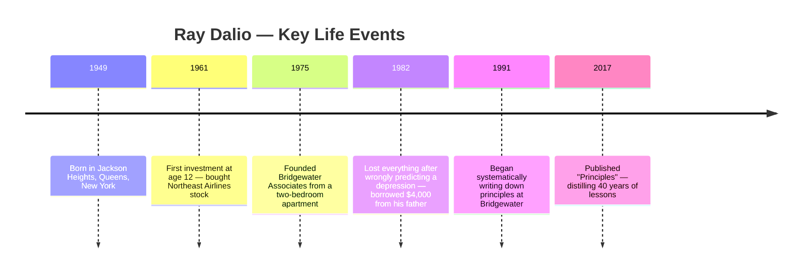
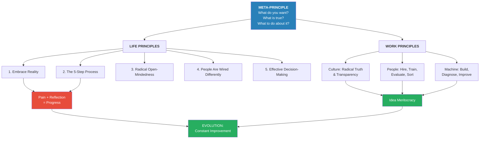
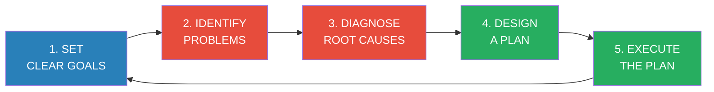
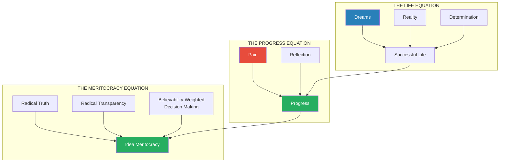
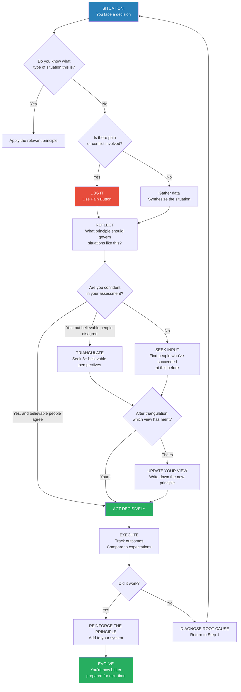
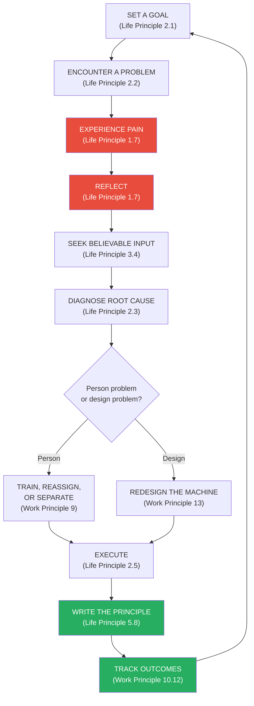

# Principles — Ray Dalio

> **In 30 seconds:** Ray Dalio — founder of Bridgewater Associates, the world's largest hedge fund — distills forty years of painful mistakes, spectacular successes, and relentless systematization into a unified operating system for life and work. The core insight: every situation you face is "another one of those" — a recurring pattern that, once identified, can be handled with a pre-established principle. His meta-formula is deceptively simple: (1) know what you want, (2) know what is true, (3) decide what to do about it — with radical open-mindedness. From this foundation he builds hundreds of specific principles covering personal evolution, organizational design, and decision-making, unified by the conviction that **Pain + Reflection = Progress** and that the best decisions emerge from a "believability-weighted idea meritocracy" where the most credible voices carry the most weight. This is not a book of platitudes — it is the operating manual of a man who lost everything, rebuilt from scratch, and built a machine that managed $160 billion.

---

## About the Author

- *Ray Dalio was born in 1949 in Jackson Heights, Queens, New York* and grew up in a middle-class Long Island neighborhood
- His father was a professional jazz musician; his mother was a homemaker
- A self-described "worse-than-ordinary student" who preferred playing with friends to studying
- Started investing at age 12 after caddying at a golf club — bought Northeast Airlines at $5/share, which tripled on a merger (pure luck, but it hooked him forever)
- Attended Long Island University, then Harvard Business School (one of only two married students in his class)
- Founded **Bridgewater Associates in 1975** from his two-bedroom apartment — it grew to become the world's largest hedge fund, managing over $160 billion
- Bridgewater's flagship Pure Alpha fund made money in 23 of 26 years and generated more total profit for clients than any hedge fund in history
- Was publicly humiliated in 1982 after wrongly predicting a depression — lost everything, had to borrow $4,000 from his father to pay family bills; this failure became the foundation of his entire philosophy
- Credits **Transcendental Meditation** (practiced since 1969) as the single most important habit contributing to his success
- Named to *Time* magazine's list of the 100 most influential people in the world
- Married to Barbara for over forty years; four sons, including Matt Dalio who founded China Care after living with a Chinese family at age 11

This timeline traces the arc from Dalio's humble beginnings through the devastating 1982 failure that became the foundation of his entire philosophy — without that loss, the principles would never have been written.

---

## The Big Idea

Ray Dalio's central conviction is that <b style="color: #2980b9">life is a series of recurring patterns, and the people who write down explicit principles for handling each type of pattern dramatically outperform those who rely on ad hoc judgment</b>.

His meta-principle — the principle behind all principles — is a three-part question:

1. **What do you want?**
2. **What is true?**
3. **What should you do about it?**

The answer to #3 must be pursued with <b style="color: #e74c3c">radical open-mindedness and humility</b>, because the biggest obstacle to getting what you want is your own ego and blind spots.

From this foundation, Dalio builds a comprehensive system:

- **Life Principles** teach you how to evolve as an individual — embracing reality, using a 5-step process for achievement, overcoming your ego and blind spots, understanding how people differ, and making decisions effectively
- **Work Principles** teach you how to build and run organizations — creating a culture of radical truth and transparency, getting the right people, and building a self-improving "machine"
- The unifying metaphor: <b style="color: #27ae60">your life and your organization are both machines — and you are simultaneously the designer, the manager, and a worker within the machine</b>

> [!quote] The Core Formula
> "Dreams + Reality + Determination = A Successful Life. People who achieve success and drive progress deeply understand the cause-effect relationships that govern reality and have principles for using them to get what they want."

---

## Key Concepts at a Glance

| Concept | One-Line Summary |
|---------|-----------------|
| **Radical Truth** | Say what you really think — especially the things that are hardest to say |
| **Radical Transparency** | Show everything to everyone (with very rare exceptions) — record all meetings |
| **Believability-Weighted Decision Making** | Weight opinions by demonstrated track record, not by seniority or charisma |
| **Idea Meritocracy** | Radical Truth + Radical Transparency + Believability-Weighting = best decisions |
| **Pain + Reflection = Progress** | Your greatest growth comes from your most painful experiences — if you reflect |
| **The 5-Step Process** | Goals → Problems → Root Cause Diagnosis → Design → Execution (loop) |
| **The Two Barriers** | Ego barrier (need to be right) and blind spot barrier (limited perspective) |
| **The Two Yous** | Emotional lower brain vs. rational higher brain — in constant conflict |
| **The Machine Metaphor** | You are the designer, manager, AND worker within the machine of your life |
| **"Another One of Those"** | Every situation is a recurring pattern — identify it and apply the right principle |
| **Shapers** | Independent thinkers with extreme determination who bend reality to their vision |
| **The Holy Grail of Investing** | 15+ uncorrelated return streams reduce risk by ~80% without reducing return |
| **Triangulation** | Get at least three believable perspectives before making important decisions |
| **Dot Collector** | Real-time feedback tool where anyone can rate anyone on any quality |
| **Baseball Cards** | Data-driven profiles showing each person's strengths, weaknesses, and track record |
| **Tough Love** | Honest feedback is a gift — the hardest and most important type of love |
| **Hyperrealist** | Accepting truth as it is, not as you wish it were — the starting point of everything |

Most people are decent at setting goals and executing plans but weak at diagnosing root causes — the principled person closes the gap by systematically reflecting on failures and building reusable principles for each step.

---

## Part I — Where I'm Coming From

*Dalio structures his autobiography as a hero's journey — the call to adventure, the threshold crossing, the abyss, the road of trials, and the boon. This isn't vanity; every principle in the book was forged in the fires of specific experiences.*

### The Call to Adventure (1949–1967)

Ray Dalio grew up in a middle-class Long Island household — his father, a jazz musician, his mother, a homemaker. He was a mediocre student who loved playing touch football in the streets far more than doing homework. His father told him to cut the grass; he did only the front yard and postponed the back until rain made it unmowable — a story that captures the young Dalio's creative laziness.

Everything changed at age 12. While caddying at a local golf club, Dalio overheard wealthy men talking about stocks. He pooled his caddy earnings and bought shares of Northeast Airlines at $5 — the only company he could find trading under $5 per share. When the airline merged with another company, the stock tripled. <b style="color: #2980b9">It was pure luck, but the thrill of making money from ideas rather than labor was intoxicating</b>. He was hooked.

The 1960s shaped his worldview: America was dominant, the dollar was backed by gold, being liberal meant progress, and the future seemed bright. He started tracking the markets in a notebook, teaching himself to spot patterns.

### Crossing the Threshold (1967–1979)

At Harvard Business School, Dalio was one of only two married students. While classmates aimed for Wall Street firms, he was drawn to commodities — "real things" like cattle, soybeans, and oil that he could understand through supply-and-demand fundamentals.

In August 1971, he watched President Nixon announce on live television that the United States would abandon the gold standard. Dalio expected markets to crash. Instead, <b style="color: #e74c3c">the stock market surged — because devaluation is stimulative, not contractionary</b>. This was his first major lesson in how reality defies expectations, and how government assurances before devaluations are systematically unreliable.

He founded Bridgewater Associates in 1975 from his two-bedroom apartment, initially providing corporate clients with risk-management advice on currencies and interest rates. He married Barbara, traveled to the USSR on a combined honeymoon-business trip, and began building systematic models for predicting commodity prices by combining weather forecasts, planting data, and yield projections.

> [!example] The Cattle Rancher Education
> Dalio's early clients were Texas cattle ranchers and Iowa grain processors. He showed cattle feeders how to lock in profit margins by hedging the price relationships between their costs (feeder cattle, corn, soymeal) and their product (fed cattle) six months forward. These clients brought him "into their worlds — honky-tonks, dove hunts, and barbecues." The relationships lasted years, long after his job at Shearson ended because, as he puts it, "I was too wild."

By the late 1970s, Dalio was sending daily market observations to clients via telex — the predecessor of Bridgewater's famous "Daily Observations." He was beginning to see that "most everything is 'another one of those'" — recurring patterns driven by logical cause-effect relationships.

### My Abyss (1979–1982)

This is the pivotal chapter of Dalio's life and the emotional core of the entire book.

By 1979, debt, inflation, and growth had been moving up together in ever-larger waves. When Paul Volcker was appointed Fed chairman and announced he would limit money supply growth to 5.5%, Dalio calculated this would break the inflation spiral — but also strangle the economy and trigger a debt crisis.

In August 1982, Mexico defaulted on its debt. Dalio was convinced this was the beginning of a depression. He appeared on *Wall Street Week with Louis Rukeyser* — the must-watch show for anyone in finance — and confidently declared that America was headed for economic catastrophe. He testified before Congress with the same message.

<b style="color: #e74c3c">He was spectacularly, publicly, devastatingly wrong.</b>

The Federal Reserve responded to Mexico's default by flooding the system with money. Instead of depression, the markets rallied massively, beginning the great bull market of the 1980s. Dalio lost so much money that he had to borrow $4,000 from his father to pay household bills. Bridgewater shrank from a small team to a single employee — himself.

> [!danger] The Pivotal Shift
> "This was the most painful experience of my life. I had been so arrogant and so wrong. I went from being the guy who was on TV predicting a depression to being a guy who couldn't pay his family's bills."
>
> The humiliation forced the most important mental shift of his career: **from "I know I'm right" to "How do I know I'm right?"** This single question became the seed of everything Bridgewater would become — the radical open-mindedness, the believability-weighting, the insistence on stress-testing every idea.

### The Road of Trials (1983–1994)

Dalio rebuilt methodically, one client and one principle at a time. The abyss taught him that <b style="color: #27ae60">no matter how confident you are, you could always be wrong — so you need to find the smartest people who disagree with you and understand their reasoning</b>.

He hired Bob Prince and Dan Bernstein, who would become his core partners. Together they developed Bridgewater's systematic approach to investing and management.

The breakthrough came when Dalio asked Brian Gold, a recently hired math graduate from Dartmouth, to chart how portfolio risk decreases as you add uncorrelated return streams. The result was stunning:

> [!success] The Holy Grail of Investing
> With **15 or more good, uncorrelated return streams**, you can reduce risk by approximately 80% without reducing expected return. This insight — which Dalio calls the Holy Grail of Investing — became the mathematical foundation for Bridgewater's Pure Alpha and All Weather strategies.

During this period, Dalio also began writing down his principles. Every time something went wrong, he would log it, diagnose the root cause, and create a principle for handling similar situations in the future. He required everyone at Bridgewater to do the same through the **issue log** — a mandatory system where every problem must be recorded and root-caused.

### The Ultimate Boon (1995–2010)

By 1995, Bridgewater had 42 employees and $4.1 billion under management. Over the next fifteen years, it would become the most successful hedge fund in history.

Key milestones:
- **Pure Alpha launched** — made money in 23 of 26 years, generating more total profit for clients than any other hedge fund ever
- **Inflation-indexed bonds** — Dalio advised the U.S. Treasury on creating TIPS (Treasury Inflation-Protected Securities), which became a major new asset class
- **All Weather portfolio** — designed to perform well in any economic environment (rising/falling growth × rising/falling inflation)
- **The 2008 financial crisis** — Bridgewater's "depression gauge" flagged the debt bubble in 2007; while the S&P 500 fell 37%, Bridgewater's flagship fund gained approximately 14%

But this period also brought internal struggles. As the company grew, maintaining the culture of radical truth became harder. Employees wrote Dalio a memo saying his behavior under stress "creates animosity" and "demotivates rather than motivates." Rather than dismissing it, Dalio used this feedback as a catalyst:

He brought in psychologists, started using personality assessments (Myers-Briggs, DISC, and custom tools), and developed technology like the **Dot Collector** (real-time meeting feedback) and **Baseball Cards** (data-driven profiles of every employee's strengths and weaknesses).

### Returning the Boon (2011–2017)

Dalio began transitioning from CEO, which proved agonizingly difficult. He studied "shapers" — people like Steve Jobs, Elon Musk, Bill Gates, Muhammad Yunus, Reed Hastings, Jack Dorsey, and Geoffrey Canada — by giving them standardized personality tests.

> [!tip] What Shapers Have in Common
> - Independent thinking that borders on contrariness
> - Extreme determination — "nothing is ever good enough"
> - Resilience — they see setbacks as fuel, not barriers
> - A compulsive need to see reality accurately, even when it's painful
> - Often appear abrasive or inconsiderate to others
>
> When Dalio asked Elon Musk about his background in rocketry, Musk replied: **"I just started reading books."**

Dalio's final insight was about the three phases of life: in the first, you depend on others and learn; in the second, others depend on you and you work; in the third, you are free to savor life. He wrote *Principles* to ensure that everything he'd learned would survive him.

---

## Part II — Life Principles

*The Life Principles section is the intellectual heart of the book. Dalio organizes personal effectiveness into five major principles, each with dozens of sub-principles. Together they form a complete operating system for navigating reality, achieving goals, and evolving as a person.*

### Life Principle 1: Embrace Reality and Deal with It

This is the foundation on which everything else rests. Dalio's first and most emphatic instruction: <b style="color: #2980b9">be a hyperrealist — accept truth as it is, not as you wish it were</b>.

**1.1 — Be a hyperrealist.** Dreams are essential — they give you direction. But dreams without grounding in reality produce only frustration. Reality without dreams produces only passivity. The formula:

> **Dreams + Reality + Determination = A Successful Life**

People who achieve great things deeply understand the cause-effect relationships that govern reality and have principles for using them to get what they want. They are simultaneously idealistic and practical.

**1.2 — Truth is the essential foundation for producing good outcomes.** Most people fight truth when it's unpleasant. They avoid facing "harsh realities" because the pain of acknowledgment feels worse than the pain of avoidance. But <b style="color: #e74c3c">avoiding truth doesn't make it go away — it just delays and amplifies the consequences</b>.

Dalio draws from his 1982 devastation: the market didn't care that he was convinced he was right. Reality operated on its own terms. The faster you accept what's actually happening, the faster you can deal with it.

**1.3 — Be radically open-minded and radically transparent.** These are the practical applications of truth-seeking:
- *Radical open-mindedness* means genuinely considering that you might be wrong, especially when smart people disagree with you
- *Radical transparency* means not hiding things — sharing your thoughts, your reasoning, and even your mistakes openly
- Both require overcoming the instinct to protect your ego

**1.4 — Look to nature to learn how reality works.** All laws of reality were given by nature, not invented by humans. By understanding them — especially evolution — we can foster our own growth. Dalio sees the entire universe as a machine operating according to cause-effect relationships, and individuals as tiny parts of that machine.

**1.5 — Evolving is life's greatest accomplishment and its greatest reward.** This is one of Dalio's deepest convictions. Evolution — the process of adapting and improving — is the single greatest force in the universe. It applies to individuals, organizations, species, and ideas. The instinct to evolve is built into us: we pursue goals, encounter obstacles, adapt, and grow stronger.

> [!info] The Evolution Loop
> Dalio visualizes personal evolution as an ascending loop:
> 1. You set audacious goals
> 2. You encounter painful failures
> 3. You learn principles from those failures
> 4. You improve and set even more audacious goals
> 5. Repeat — each cycle at a higher level
>
> The people who do this well live extraordinary lives. The people who don't — who avoid pain, who refuse to reflect — flatline or decline.

**1.6 — Understand nature's practical lessons.** Key sub-principles:
- <b style="color: #27ae60">Maximize your evolution</b> — the greatest satisfaction comes from the process of getting better, not from the achievement itself
- "No pain, no gain" is literally true — pushing beyond your limits is how strength is built, in muscles and in character
- It is a fundamental law of nature that gaining strength requires pushing limits, which is painful

**1.7 — Pain + Reflection = Progress.** This is arguably the single most important principle in the entire book.

| Component | What It Means |
|-----------|--------------|
| **Pain** | The emotional signal that something went wrong — a failed trade, a damaged relationship, a public humiliation |
| **Reflection** | The disciplined practice of examining what happened, why it happened, and what principle should govern similar situations |
| **Progress** | The improved understanding and behavior that results from doing the first two well |

Most people react to pain by either avoiding it (denial) or pushing through it without reflection (brute force). <b style="color: #e74c3c">Both paths waste the pain</b>. The people who get the most out of life are those who can reflect while in pain — or, failing that, reflect carefully after the pain subsides.

> [!example] The Pain Button
> At Bridgewater, Dalio created a practice called the "Pain Button" — a tool in their app where, at the moment of emotional pain (a bad review, a conflict, a failure), employees are prompted to log what happened and reflect on it. This converts raw emotion into structured learning. Over time, the accumulated reflections reveal patterns that individuals can use to improve.

**1.8 — Weigh second- and third-order consequences.** First-order consequences are often the opposite of what you actually want:
- *Exercise*: first-order = pain and time cost; second-order = health and energy
- *Confronting a problem*: first-order = discomfort; second-order = resolution and growth
- *Eating junk food*: first-order = pleasure; second-order = poor health

<b style="color: #2980b9">People who overweight first-order consequences rarely achieve their goals. People who think in second and third orders build extraordinary lives.</b>

**1.9 — Own your outcomes.** Whatever happens to you, you are responsible for how you deal with it. Life will throw things at you — some fair, some brutally unfair. Blaming circumstances, bad luck, or other people is natural but counterproductive. The question is never "Why did this happen to me?" but rather "What am I going to do about it?"

**1.10 — Look at the machine from the higher level.** This is one of Dalio's most distinctive ideas. You are simultaneously:
- **The designer** of your life/machine (setting goals, creating systems)
- **The manager** of your machine (monitoring performance, making adjustments)
- **A worker** within the machine (executing tasks)

Most people get stuck in the worker role — they're so busy doing tasks that they never step back to evaluate the machine's design. <b style="color: #27ae60">The key skill is the ability to look down on yourself and your situation objectively — to see yourself as a piece in the machine rather than identifying completely with the worker perspective</b>.

> [!tip] The Military Analogy
> Dalio compares life to taking a hill from an enemy. Your machine design might include two scouts, two snipers, and four infantrymen. The design matters — but so does putting the right people in each position. Scouts need to be fast runners; snipers need to be accurate marksmen. If you find you're a bad marksman but a good runner, don't insist on being a sniper — be a scout, or hire a sniper and design the machine around the right people.

---

### Life Principle 2: Use the 5-Step Process to Get What You Want

The 5-Step Process is Dalio's most practical framework — a repeating loop for achieving any goal:

**The critical rule: never blend the steps.** When you're identifying problems, don't jump to solutions. When you're diagnosing root causes, don't start designing. Blurring the steps leads to inferior outcomes because it prevents you from uncovering the true nature of the problem.

**Step 1 — Have Clear Goals (2.1)**

| Sub-Principle | Key Insight |
|---------------|-------------|
| Prioritize | You can have virtually anything but not everything — choose |
| Don't confuse goals with desires | A desire is something you want that interferes with goals; goals are things you really need to achieve |
| Never rule out a goal as unattainable | What you think is achievable is a function of what you currently know — it will expand |
| Avoid setting goals based on what you think you can achieve | Instead, ask what you really want, then figure out how |
| Great expectations create great capabilities | When you limit your goals, you limit your growth |

**Step 2 — Identify and Don't Tolerate Problems (2.2)**

Most problems are <b style="color: #e74c3c">potential improvements screaming to be found</b>. But most people either don't perceive their problems (because they're not looking) or tolerate them (because fixing them is painful). Dalio insists you develop "a fierce intolerance of badness of any kind, regardless of its severity."

Key mistakes:
- Treating problems as personal failures rather than puzzles to solve
- Avoiding problems rooted in harsh realities
- Not perceiving problems because you're not probing deeply enough

**Step 3 — Diagnose Problems to Get at Root Causes (2.3)**

The most common mistake: rushing to solutions before understanding what caused the problem. Dalio distinguishes between:
- **Proximate causes**: the immediate, surface-level reason something happened ("the project was late because the code had bugs")
- **Root causes**: the deeper reason ("the project was late because the manager doesn't verify work before deadlines")

Root causes almost always connect to **what people are like** — their abilities, their habits, their temperament. A good diagnosis gets to this level.

**Step 4 — Design a Plan (2.4)**

Go back before you go forward — replay the story of how you got here before designing the path forward. Think about your problem as a set of outcomes produced by a machine, then think about how to change the machine to produce better outcomes.

A good plan should look like a movie script: specific people taking specific actions in a specific sequence to achieve a specific outcome.

**Step 5 — Push Through to Completion (2.5)**

Great planners who don't execute go nowhere. Execution requires self-discipline, habit formation, and the ability to maintain the connection between daily tasks and long-term goals. When you lose sight of why you're doing something, stop and reconnect to the goal.

**2.6 — Weaknesses don't matter if you find solutions.** You almost certainly can't do all five steps well yourself — each requires different types of thinking. Goal-setting requires big-picture vision. Problem identification requires perception and rigor. Diagnosis requires logical analysis. Design requires creative thinking. Execution requires discipline. <b style="color: #27ae60">The solution is to find people who are strong where you are weak and partner with them</b> — this is not a sign of failure; it is the most important skill you can develop.

> [!example] Einstein on Your Basketball Team
> Would you put Einstein on your basketball team? When he fails to dribble and shoot well, would you think badly of him? Of course not. Now imagine all the areas in which Einstein was incompetent — and imagine how hard he struggled to excel at them, yet still couldn't. Nobody can do everything well. The person who accepts this and designs their "machine" around it will dramatically outperform the person who insists on doing everything themselves.

---

### Life Principle 3: Be Radically Open-Minded

This is, in Dalio's words, "probably the most important chapter" — because it addresses the two things that stand in most people's way of getting what they want.

**3.1 — Recognize your two barriers.**

| Barrier | What It Is | How It Manifests |
|---------|-----------|-----------------|
| **Ego barrier** | Your deep-seated need to be right and to be seen as competent | You get defensive when challenged; you argue to win rather than to learn; you dismiss evidence that contradicts your views |
| **Blind spot barrier** | Your inability to see things from perspectives other than your own | You assume your way of thinking is the only way; you miss obvious solutions that people with different cognitive styles would see immediately |

The ego barrier is rooted in the amygdala — the lower, emotional brain that interprets challenges to your ideas as threats to your survival. When someone disagrees with you, the amygdala triggers a fight-or-flight response. <b style="color: #e74c3c">The emotional brain hijacks the rational brain, making you defend your position rather than evaluate it</b>.

The blind spot barrier is structural — it comes from the fact that each brain processes reality differently. Some people see big pictures; others see details. Some think linearly; others think laterally. You can't see what you can't see.

This Sankey diagram reveals Dalio's core warning: of all the information available to you, only about 40% survives both barriers to reach your conscious decision-making — the ego barrier alone filters out over a third by triggering defensive reactions before the rational brain can evaluate.

**3.2 — Practice radical open-mindedness.** The antidote to both barriers. Radical open-mindedness means:
- Replacing your attachment to being right with the joy of learning what's true
- Sincerely believing you might be wrong
- Appreciating the art of thoughtful disagreement
- Understanding that you are looking for the best answer, not your answer

**3.3 — Appreciate the art of thoughtful disagreement.** When two people disagree, at least one is wrong. Shouldn't you want to make sure it isn't you? Most people find disagreement threatening. Dalio finds it exhilarating — because every disagreement is an opportunity to learn.

The key distinction: thoughtful disagreement is not about proving the other person wrong. It's about understanding their perspective so thoroughly that you can evaluate whether it's better than yours.

**3.4 — Triangulate your view with believable people.** <b style="color: #2980b9">Believable people are those who have (1) repeatedly and successfully accomplished the thing in question — at least three successes — and (2) have great explanations of their approach when probed</b>.

When you disagree with a believable person:
- If you're less believable, your primary job is to ask questions and try to understand their reasoning
- If you're equally believable, have a thoughtful exchange
- If you're more believable, explain your reasoning patiently and explore where the disagreement lies

**3.5 — Recognize the signs of closed-mindedness vs. open-mindedness.**

| Closed-Minded | Open-Minded |
|---------------|-------------|
| Gets angry when challenged | Gets curious when challenged |
| Makes statements more than asks questions | Asks questions more than makes statements |
| Focuses on being understood | Focuses on understanding |
| Says "I could be wrong, but..." (then proceeds as if they couldn't) | Genuinely means "I could be wrong" |
| Blocks others from speaking | Encourages others to speak |
| Lacks humility | Knows that finding truth is more important than being right |
| Has trouble holding two conflicting ideas simultaneously | Can explore conflicting ideas comfortably |

**3.6 — Understand how to become radically open-minded.**
- <b style="color: #27ae60">Use pain as a guide</b> — when you feel defensive or emotional during a disagreement, that's a signal to slow down and reflect, not speed up and argue
- Make being open-minded a habit — it takes about 18 months to rewire
- Get to know your blind spots — understand where your thinking tends to go wrong
- If multiple believable people say you're doing something wrong and you disagree, assume you're probably biased
- **Meditate** — Dalio credits Transcendental Meditation, practiced since 1969, as the single most important habit for developing the equanimity to see reality clearly

> [!quote] Dalio's Medical Wake-Up
> In his 60s, Dalio was diagnosed with Barrett's esophagus — a precancerous condition. His doctor recommended monitoring rather than surgery. Dalio, true to his principles, sought multiple opinions, triangulated the medical evidence, and chose the least invasive path. He used the experience to practice "planning for the worst-case scenario to make it as good as possible" — writing advance plans for his death while simultaneously fighting to live. The condition was successfully managed.

---

### Life Principle 4: Understand That People Are Wired Very Differently

This principle addresses a blind spot that most people — including most managers — never confront: <b style="color: #2980b9">the way you think and perceive the world is not the way everyone thinks and perceives the world</b>.

**4.1 — Understand the power that comes from knowing how you and others are wired.** Dalio's journey into personality science began when employees told him his behavior under stress was destructive. He sought out psychologists, particularly Bob Eichinger, who introduced him to the landscape of psychometric testing.

**4.2 — The "two yous" — your higher-level and lower-level selves.** The brain contains two fundamentally different decision-making systems:
- The **amygdala** (lower brain): fast, emotional, instinctive — evolved to keep you alive on the savanna
- The **prefrontal cortex** (higher brain): slow, rational, deliberate — evolved to enable complex planning

These two systems are in constant conflict. When you're calm, the prefrontal cortex runs the show and you make good decisions. When you're stressed, afraid, or angry, the amygdala hijacks control and you react rather than respond.

> [!warning] The Hijack
> The "amygdala hijack" is why people say things they regret in arguments, why traders make impulsive decisions in volatile markets, and why leaders lash out under pressure. Dalio's entire system of radical transparency and structured decision-making is designed to create conditions where the prefrontal cortex stays in control — or where systems catch the amygdala's mistakes.

**4.3 — Understand the great brain battles.** Different people have fundamentally different cognitive profiles:

| Dimension | One End | Other End |
|-----------|---------|-----------|
| Thinking vs. Feeling | Prioritizes logic and analysis | Prioritizes relationships and harmony |
| Intuiting vs. Sensing | Focuses on big pictures and patterns | Focuses on concrete facts and details |
| Planning vs. Perceiving | Prefers structure and completion | Prefers flexibility and options |
| Creating vs. Refining | Generates new ideas and approaches | Improves and perfects existing ones |
| Task-focus vs. People-focus | Drives toward results | Maintains relationships |

Neither end is better — both are needed. The problem is that <b style="color: #e74c3c">people who are strong at one end often can't comprehend how someone at the other end thinks, and they assume their own way is the right way</b>. This is the blind men and the elephant problem: each person touches one part and assumes they understand the whole.

**4.4 — Use personality assessments.** Dalio recommends (and uses extensively at Bridgewater):
- Myers-Briggs Type Indicator (MBTI)
- Workplace Personality Inventory
- Team Dimensions Profile
- Stratified Systems Theory
- Custom tools developed with psychologists

The goal is not to put people in boxes but to develop a shared vocabulary for discussing differences and to match people to roles where their natural wiring is an asset rather than a liability.

**4.5 — Getting the right people in the right roles is the key to succeeding at whatever you choose to do.** This connects directly to the machine metaphor: if you're designing a machine to achieve a goal, you need each component to function optimally. People are the components. Understanding what they're like — not just what they say or even what they've done, but their fundamental cognitive and temperamental profile — is essential.

---

### Life Principle 5: Learn How to Make Decisions Effectively

The final Life Principle synthesizes everything into a practical decision-making system.

**5.1 — Recognize that the biggest threat to good decision making is harmful emotions.** Decision quality drops dramatically when emotions are running the show. The remedy: slow down, bring in other perspectives, and use structured processes that prevent snap judgments.

**5.2 — Synthesize the situation at hand.** Every day, you're flooded with information. The skill is not gathering more data but synthesizing what you have:
- Distinguish symptoms from root causes
- Keep outcomes in proportion — don't treat everything as equally important
- Use the "by-and-large" approach — get the big picture right before worrying about details

**5.3 — Synthesize the situation through time.** Everything you're experiencing has happened before, in some form. Look for patterns across time:
- Connect today's situation to historical parallels
- Identify what type of situation this is ("another one of those")
- Apply the appropriate principle

**5.4 — Navigate levels effectively.** Use "above the line" and "below the line" to distinguish between:
- **Above the line**: big-picture, strategic discussions about goals and designs
- **Below the line**: detailed, tactical discussions about specific tasks

Many decision-making failures come from mixing levels — getting lost in details when you should be discussing strategy, or staying abstract when you need to be concrete.

**5.5 — Logic, reason, and common sense are your best tools.** Despite the sophistication of Dalio's approach, he insists that the foundation is simple: think logically, use evidence, and apply common sense. The elaborate tools (algorithms, personality tests, Dot Collector) are supports for clear thinking, not replacements for it.

**5.6 — Make your decisions as expected value calculations.** Every decision has:
- A probability of being right
- An upside if right
- A downside if wrong

<b style="color: #2980b9">Raise the probability by seeking out believable people. Limit the downside through risk management. Then act decisively</b>.

**5.7 — Prioritize by weighing the value of additional information against the cost of not deciding.** Some decisions benefit from more research. Others need to be made quickly with imperfect information. Knowing which is which is a meta-skill.

**5.8 — Convert your principles into algorithms.** This is Dalio's most distinctive and controversial suggestion. He argues that principles, once articulated clearly enough, can be expressed as algorithms:

> If [situation type] + [these conditions], then [this action].

At Bridgewater, investment decisions are increasingly made by such algorithms. Management decisions are supported by them. Dalio envisions a future where "computer coding will be as essential as writing" and where AI assistants help individuals make better decisions by knowing their values, strengths, and blind spots.

**5.9 — Be cautious about trusting AI without understanding it.** Despite his enthusiasm for algorithmic decision-making, Dalio distinguishes between:
- **Principle-based AI**: where humans understand the logic and can argue against it — this he trusts
- **Data-mining AI**: where the machine finds correlations humans can't explain — this he distrusts for important decisions

> [!warning] The AI Caveat
> "I worry about the dangers of AI in cases where users accept — or, worse, act upon — the cause-effect relationships presumed in algorithms produced by machine learning without understanding them deeply." Dalio insists on being able to argue the logic behind every decision. Blind faith in any system — human or algorithmic — violates his core principles.

---

## Part III — Work Principles

*The Work Principles section is the longest in the book — over 250 pages. It translates the Life Principles into organizational design, building the blueprint for what Dalio calls a "believability-weighted idea meritocracy." The principles are organized into three sections: getting the culture right, getting the people right, and building and evolving the machine.*

### The Foundation: What Is an Idea Meritocracy?

Before diving into the individual principles, Dalio establishes his organizational philosophy:

<b style="color: #2980b9">An organization is a machine consisting of two major parts: culture and people.</b> Each influences the other — the people determine the culture, and the culture determines which people thrive.

The ideal organizational system is an **idea meritocracy**, defined by a simple equation:

> **Idea Meritocracy = Radical Truth + Radical Transparency + Believability-Weighted Decision Making**

In an idea meritocracy:
- The best ideas win, regardless of who proposes them
- Problems, mistakes, and weaknesses are surfaced openly
- Everyone has the right to understand everything
- Decisions are weighted by the demonstrated credibility of the people making them — not by their rank, seniority, or charisma

> [!tip] Which Is Crazy?
> Dalio challenges readers to consider which approach is actually sensible:
> - One where people are truthful and transparent, or one where people hide their real thoughts?
> - One where problems and mistakes are discussed openly, or one where they're swept under the rug?
> - One where the best ideas win regardless of source, or one where the boss's ideas win by default?
>
> "I believe the evidence shows that operating this way leads to better decisions, faster learning, stronger relationships, and higher morale — even though it feels uncomfortable at first."

Dalio insists all three components must be present in roughly equal measure — radical truth without transparency breeds distrust, transparency without believability-weighting produces chaos, and weighting without truth is just hierarchy by another name.

---

### Work Principle 1: Trust in Radical Truth and Radical Transparency

This is the cultural bedrock. Everything else depends on it.

**1.1 — Realize that you have nothing to fear from knowing the truth.** Most people instinctively protect themselves from uncomfortable truths — about their performance, their relationships, their organizations. But <b style="color: #e74c3c">the things you don't know are far more dangerous than the things you do know, even when the things you do know are painful</b>.

**1.2 — Have integrity and demand it from others.** Integrity means aligning what you say with what you think and what you do. Most organizations create environments where people say what they think others want to hear rather than what they actually believe. This is a recipe for bad decisions and broken trust.

**1.3 — Create an environment of radical truth and radical transparency.** At Bridgewater, this means:
- Almost all meetings are recorded and available to everyone in the company
- People are expected to say what they really think, even when it's critical
- Feedback is given directly, not through back-channels
- The things that are hardest to share are often the most important to share

**1.4 — Share the things that are hardest to share.** The conversations people most want to avoid — about poor performance, about strategic disagreements, about personal blind spots — are precisely the conversations that matter most. At Bridgewater, avoiding these conversations is considered a worse offense than having them clumsily.

**1.5 — Keep exceptions to radical transparency very rare.** There are legitimate exceptions: certain personal health information, proprietary trade secrets, and a few other categories. But these should be genuinely rare. The default must be transparency, with secrecy requiring justification — not the reverse.

> [!example] The Harvard Psychologist's Verdict
> Harvard developmental psychologist Bob Kegan studied Bridgewater and described it as a "deliberately developmental organization" — a workplace designed to accelerate personal growth. Kegan found that while the initial adjustment was difficult, people who adapted reported feeling "more liberated than constrained" by the transparency, because they could finally "be themselves at work" rather than maintaining a professional facade.

---

### Work Principle 2: Cultivate Meaningful Work and Meaningful Relationships

**2.1 — Be loyal to the common mission, not to anyone who is not operating consistently with it.** Loyalty to people who undermine the mission is a form of corruption. The organization's purpose must take precedence over personal relationships.

**2.2 — Be crystal clear on what the deal is.** There should be a mutual understanding between the organization and its people about what is expected and what is given in return. <b style="color: #27ae60">Meaningful relationships are those where people genuinely care about each other AND hold each other accountable</b> — not one at the expense of the other.

**2.3 — Recognize that the size of the organization can pose a threat to meaningful relationships.** Meaningful relationships require knowing people personally, understanding what they're like, and caring about their development. When organizations grow beyond the point where this is possible, they must be restructured into smaller units that preserve intimacy.

**2.4 — Remember that most people will pretend to operate in your interest while really operating in their own.** This isn't cynicism — it's realism. Well-designed systems don't depend on people being altruistic; they create incentive structures that align individual interest with organizational interest.

**2.5 — Treasure honorable people who are capable and will treat you well even when you're not looking.** These people are rare and extraordinarily valuable. When you find them, do everything you can to keep them.

---

### Work Principle 3: Create a Culture in Which It Is Okay to Make Mistakes and Unacceptable Not to Learn from Them

This principle operationalizes Pain + Reflection = Progress at the organizational level.

**3.1 — Recognize that mistakes are a natural part of the evolutionary process.** If you're not making mistakes, you're probably not pushing hard enough. <b style="color: #2980b9">The question is never whether mistakes happen — it's whether the organization learns from them</b>.

**3.2 — Don't feel bad about your mistakes or those of others. Love them!** This is counterintuitive for most people. Dalio trains himself and his team to view every mistake as a gift — a piece of data about how reality actually works, which can be converted into a principle for future use.

**3.3 — Observe the patterns of mistakes to see if they are products of weaknesses.** Everyone makes occasional errors. But when the same type of mistake recurs, it reveals a systematic weakness — in a person, a process, or a design. Pattern recognition is the key to converting individual failures into systematic improvements.

**3.4 — Remember to reflect when you experience pain.** The institutional equivalent of the Pain Button: when something goes wrong, there must be a structured process for reflection and diagnosis — not just fixing the immediate problem, but understanding why it happened and how to prevent recurrence.

**3.5 — Know what types of mistakes are acceptable and unacceptable.** Mistakes made while pushing boundaries in pursuit of the mission are acceptable. Mistakes caused by carelessness, laziness, or dishonesty are not. The key distinction: <b style="color: #e74c3c">was the person operating with good intent and appropriate effort, even if the outcome was bad?</b>

> [!example] The Issue Log
> At Bridgewater, every problem, mistake, or failure must be entered into the "issue log" — a company-wide database. The log requires a description of the problem, an assessment of its severity, and a root-cause diagnosis. Over time, the accumulated data reveals patterns that no individual could see. Dalio considers the issue log one of Bridgewater's most important management tools.

---

### Work Principle 4: Get and Stay in Sync

Getting in sync means developing a shared understanding of what is true and what to do about it. This is the organizational equivalent of Life Principle 3 (Radical Open-Mindedness).

**4.1 — Recognize that conflicts are essential for great relationships.** People who avoid conflict because they want to maintain superficial harmony build relationships that are fragile and shallow. People who engage in thoughtful conflict build relationships that are deep and resilient.

At Bridgewater, <b style="color: #2980b9">the main test of a great partnership is not whether the partners ever disagree, but whether they can bring their disagreements to the surface and work through them well</b>.

**4.2 — Know how to get in sync and disagree well.** There is an art to productive disagreement:
- Start by understanding, not by arguing
- Distinguish between your "lower-level you" (emotional reaction) and your "higher-level you" (rational assessment)
- Be willing to say "I might be wrong" and mean it
- Focus on the question "What is true?" rather than "Who is right?"

**4.3 — Be open-minded and assertive at the same time.** This is the balance Dalio considers hardest and most important:
- Open-minded: genuinely willing to change your view if the evidence warrants it
- Assertive: willing to state your view clearly and push back when you have good reasons

Most people are either open-minded but passive (they defer to others) or assertive but closed-minded (they push their view without listening). <b style="color: #27ae60">The goal is to hold both simultaneously — to fight for your view while remaining genuinely open to being proven wrong</b>.

**4.4 — If it is your meeting to run, manage the conversation.** Don't let conversations get derailed by tangents, emotional outbursts, or people who talk too much. Make sure everyone relevant gets heard. Keep the discussion at the right level (above or below the line as appropriate).

**4.5 — Great collaboration feels like playing jazz.** When people are truly in sync, the dynamic is improvisational and creative — each person contributing their unique strengths while staying attuned to the whole. Dalio, son of a jazz musician, uses this metaphor deliberately.

**4.6 — Remember: getting in sync is a two-way responsibility.** It requires both parties to be open-minded, to make their reasoning transparent, and to genuinely try to understand the other's perspective. If one side is closed, the process fails.

**4.7 — Worry more about substance than style.** Some people express themselves bluntly; others diplomatically. Some use data; others use stories. Don't let stylistic differences obscure substantive agreement or create false disagreements.

---

### Work Principle 5: Believability-Weight Your Decision Making

This is one of the most distinctive and powerful ideas in the entire book — and the one that makes Bridgewater's culture genuinely unique rather than just unusual.

**5.1 — Recognize that having an effective idea meritocracy requires that you understand the merit of each person's ideas.** Not all opinions are equal. <b style="color: #e74c3c">A new analyst's opinion about market dynamics should not carry the same weight as a 30-year veteran's opinion</b>. But in most organizations, either the boss's opinion always wins (hierarchy) or everyone's opinion counts equally (democracy). Both produce bad decisions.

**5.2 — Find the most believable people who disagree with you and try to understand their reasoning.** This is the practical application of radical open-mindedness at scale. When making important decisions:
1. Identify the people with the strongest track records in this domain
2. Actively seek out those who disagree with you
3. Focus on understanding their reasoning, not just their conclusion
4. Weight their input by their demonstrated believability

**5.3 — Think about whether you are playing the role of teacher, student, or peer.** In any exchange:
- If you're more believable (teacher), your job is to explain your reasoning clearly
- If you're less believable (student), your job is to ask questions and learn
- If you're equally believable (peer), your job is to have a genuine exchange

> [!tip] The Babe Ruth Analogy
> Imagine a group getting a lesson from Babe Ruth on how to hit, and someone who'd never played kept interrupting to debate technique. Would ignoring their different track records help the group? Of course not. Believability weighting isn't about silencing junior people — it's about ensuring that demonstrated expertise carries appropriate weight.

**5.4 — Understand how people came by their opinions.** When someone says "I believe X," the relevant questions are:
- What data are you looking at?
- What reasoning are you using to draw your conclusion?
- Where does your expertise in this area come from?

Opinions based on solid data and sound reasoning from experienced practitioners should carry far more weight than opinions based on intuition from novices.

**5.5 — Disagreeing must be done efficiently.** In an idea meritocracy, disagreement is essential but cannot be infinite. There must be a process for resolving disagreements when they can't be resolved through discussion:
- Escalate to more believable people
- Use agreed-upon decision-making protocols
- Accept the outcome even if you disagree

**5.6 — Recognize that everyone has the right and responsibility to try to make sense of important things.** Being a student in one area doesn't mean you can't ask questions or express concerns. But it does mean you should acknowledge your relative believability and be willing to defer when the evidence is against you.

---

### Work Principle 6: Recognize How to Get Beyond Disagreements

The final culture principle addresses what happens when disagreements can't be resolved through discussion alone.

**6.1 — Remember: principles can't be ignored by mutual agreement.** An idea meritocracy works only if everyone follows the agreed-upon rules — even when those rules produce outcomes they don't like. You can advocate for changing the principles, but you can't unilaterally ignore them.

**6.2 — Make sure people don't confuse the right to complain, give advice, and openly debate with the right to make decisions.** In an idea meritocracy, everyone has voice but not everyone has vote. Decisions are made by the people given responsibility for those decisions, informed by the broadest possible input.

**6.3 — Don't leave important conflicts unresolved.** Unresolved conflicts fester and corrode relationships. Better to have a difficult conversation now than to accumulate resentment that will eventually explode.

**6.4 — Once a decision is made, everyone should get behind it.** Even if you disagreed, once the process has produced a decision, you support it. If you can't, and you've exhausted the legitimate channels for appeal, you may need to leave the organization. <b style="color: #2980b9">What you cannot do is undermine the decision while remaining part of the team</b>.

**6.5 — Remember that if the idea meritocracy comes into conflict with the well-being of the organization, it will inevitably suffer.** The idea meritocracy is a means to an end (great outcomes), not an end in itself. If the process of open debate is causing more harm than good in a particular situation — for example, during a genuine crisis — pragmatism must prevail.

**6.6 — If those who have the power don't want to operate by principles, the principled way of operating will fail.** Ultimately, power rules. An idea meritocracy works only because the powerful people in the organization — starting with the founder — genuinely want it to work. If they abandon the principles when it's convenient, the whole system collapses.

> [!danger] The Turkey Problem
> Dalio draws an analogy to the Thanksgiving dinner: a close family has an irrevocable blow-out over who gets to carve the turkey. The "narcissism of small differences" — trivial disagreements that become existential — is the enemy of organizational health. When people lose perspective, the idea meritocracy breaks down. The antidote is stepping back, looking at the disagreement from a higher level, and asking: "Is this really worth fighting about?"

---

### TO GET THE PEOPLE RIGHT

*The second section of Work Principles shifts from culture to people — the most important component of any organizational machine. Dalio's core conviction: it doesn't matter how good your systems are if you don't have the right people operating them.*

### Work Principle 7: Remember That the WHO Is More Important Than the WHAT

People often make the mistake of focusing on **what** should be done while neglecting the more important question of **who** should do it.

**7.1 — Recognize that the most important decision for you to make is who you choose as your Responsible Parties.** Give Dalio someone who can be responsible for an entire area — someone who can design, hire, and sort to achieve the goal — and he can be comfortable he'll get a good outcome. Give him someone who can only do a specific task and he'll have to constantly manage them.

**7.2 — Know that the ultimate Responsible Party will be the person who bears the consequences.** This is why ownership matters. <b style="color: #e74c3c">If you don't experience the consequences of your actions, you'll take less ownership of them</b>. Systems must be designed so that the people making decisions feel the impact of those decisions.

**7.3 — Remember the force behind the thing.** Behind every outcome is a person (or team) who produced it. When diagnosing results — good or bad — always trace back to the people responsible. Understanding the "force behind the thing" is essential for both accountability and improvement.

---

### Work Principle 8: Hire Right, Because the Penalties for Hiring Wrong Are Huge

**8.1 — Match the person to the design.** When building your machine, first design the roles you need, then find the people to fill them — not the reverse. <b style="color: #27ae60">Don't design jobs to fit people you already have; over time, this almost always turns out to be a mistake</b>.

Think of your teams like sports teams: no one person possesses everything required, yet everyone must excel at their specific position.

**8.2 — Remember that people tend to pick people like themselves.** This creates homogeneous teams that share the same blind spots. Deliberately seek diversity of thought, not just demographic diversity.

**8.3 — Look for people who sparkle, not just anyone who'll do.** When reviewing any candidate, identify whether they have demonstrated themselves to be extraordinary in some way. An outstanding performer in a mediocre organization is more impressive than an average performer at a prestigious one.

**8.4 — Hire for values, then abilities, then skills.**

| Priority | What to Look For | Why |
|----------|-----------------|-----|
| **1. Values** | Alignment with the mission and culture — honesty, radical transparency, commitment to excellence | Values are the hardest to change and the most important for cultural fit |
| **2. Abilities** | Ways of thinking and behaving — creativity, determination, big-picture thinking | Abilities are relatively stable; they reflect how someone's brain works |
| **3. Skills** | Specific knowledge and techniques — coding, accounting, market analysis | Skills are the easiest to acquire through training |

<b style="color: #e74c3c">Most organizations hire primarily for skills and neglect values and abilities. This is backward.</b> A highly skilled person with misaligned values will be far more destructive than a values-aligned person who needs skill development.

**8.5 — Don't assume that a person who has been successful elsewhere will be successful in the job you're giving them.** Success is context-dependent. The qualities that made someone successful in one environment may not transfer to another — especially if the cultures are very different.

**8.6 — Pay attention to people's track records.** Past behavior is the best predictor of future behavior. When evaluating candidates:
- Look for patterns of performance, not isolated achievements
- Check references rigorously — not the references the candidate provides, but the people who actually worked closely with them
- Performance in school doesn't tell you much — it primarily measures memory and processing speed, not the values and abilities that matter most at work

**8.7 — Pay for the person, not the job.** Compensation should reflect the value of the individual, not just the job description. Pay "north of fair" — being generous builds loyalty and attracts better people. Focus more on making the pie bigger than on slicing it precisely.

> [!tip] The Plumber Test
> "Imagine you're at a party and you meet an impressive-looking person who tells you he's a plumber. Would you hire him based on that interview, without ascertaining whether he has the qualities of an outstanding plumber?" Yet this is how most hiring works — a brief conversation, some credential-checking, and a gut feeling. Bridgewater instead uses systematic assessment over months.

---

### Work Principle 9: Constantly Train, Test, Evaluate, and Sort People

This is where Dalio's principles become most operationally specific — and most controversial.

**9.1 — Understand that you and the people you manage will go through a process of personal evolution.** Both parties — manager and report — are developing. The goal is not static assessment but dynamic growth. Each person should be getting better over time, and the organization should be tracking that development.

**9.2 — Provide constant feedback.** At Bridgewater, feedback is not an annual event but a continuous process. The Dot Collector provides real-time data; managers are expected to provide ongoing observations. Training happens through an **apprentice relationship** — working alongside people in real situations, like a ski instructor skiing with a student.

**9.3 — Evaluate accurately, not kindly.** Compliments are easy but unhelpful. <b style="color: #2980b9">Pointing out someone's mistakes and weaknesses — so they learn what they need to deal with — is harder and less appreciated but much more valuable in the long run</b>.

Key principles for evaluation:
- Make accurate assessments, not generous ones
- Use "dots" (specific observations paired with your inference about what they mean) and accumulate them over time
- Distinguish between a bad outcome caused by circumstances and a bad outcome caused by a person's limitations
- Pay more attention to "the swing" than "the shot" — evaluate the quality of the process, not just the result

**9.4 — Recognize that tough love is the most important type of love.** This is one of Dalio's most-repeated themes. Honest, direct feedback — even when it's painful — is an act of caring, not cruelty. The manager who avoids hard conversations is not being kind; they are being negligent.

**9.5 — Don't hide your observations about people.** In most organizations, managers share their assessments of employees only with HR or with senior leaders. At Bridgewater, assessments are shared openly, including with the person being assessed. This radical transparency creates discomfort but also accountability.

**9.6 — Assess people's strengths and weaknesses accurately, including your own.** This requires:
- Multiple sources of data (not just one manager's opinion)
- Personality assessments and psychometric tools
- A willingness to have the difficult conversation about what someone is — and isn't — suited for

**9.7 — Train, test, and sort people through the flow of work.** Evaluation isn't a separate process; it's embedded in daily work:
- It should take no more than **18 months** to determine whether someone is right for their role
- If someone isn't clicking after a year, either their role needs to change or they need to leave
- Don't keep people in roles where they consistently underperform out of sympathy — this hurts them, their colleagues, and the organization

**9.8 — Move people when they're not a click for their role.** "Losing your box" (being removed from a role) is not the end of the world — sometimes it's the beginning of finding the right fit. But <b style="color: #e74c3c">don't let poor performers occupy seats that someone more capable could fill</b>.

**9.9 — Know that it is much worse to keep someone in a job unsuited for them than it is to fire them.** Keeping an underperformer is a three-way act of harm: it hurts their development (they're not growing), it hurts their teammates (who compensate for their weaknesses), and it hurts the organization (the machine underperforms).

---

### TO BUILD AND EVOLVE YOUR MACHINE

*The final section of Work Principles addresses the ongoing process of operating, diagnosing, and improving the organizational machine. This is where the 5-Step Process from Life Principles gets applied at the organizational level.*

### Work Principle 10: Manage as Someone Operating a Machine to Achieve a Goal

**10.1 — Look down on your machine and yourself within it from the higher level.** Great managers are simultaneously operating within their machine and looking down on it from above. They see their organizations as machines and work assiduously to maintain and improve them. They create process-flow diagrams, build metrics to track performance, and tinker constantly with the design.

**10.2 — Remember that for every case you deal with, your approach should accomplish two things:** (1) move you closer to your goal, and (2) train and test your machine. The first is immediate; the second is investment.

**10.3 — Understand the differences between managing, micromanaging, and not managing.**

| Approach | Description | Problem |
|----------|------------|---------|
| **Micromanaging** | Doing the work your reports should be doing | You become the bottleneck; your people don't grow |
| **Not managing** | Trusting people without verification | Problems fester; quality declines without you noticing |
| **Managing well** | Setting expectations, probing regularly, adjusting | Your people grow AND the machine produces good outcomes |

The sign of a master manager: <b style="color: #27ae60">they don't have to do practically anything themselves</b>. Their machine runs well because they designed it well, staffed it well, and probe it regularly.

**10.4 — Know what your people are like and what makes them tick.** This connects to Life Principle 4: people are wired differently. A good manager knows each person's strengths, weaknesses, cognitive style, and motivations — and manages them accordingly.

**10.5 — Clearly assign responsibilities.** Every outcome must have a clearly identified "Responsible Party" (RP). When things go wrong and no one owns the result, the diagnosis is usually: unclear responsibilities.

**10.6 — Probe deep and hard to learn what you can expect from your machine.** Constantly probe the people who report to you — not to catch them doing something wrong, but to understand how the machine is actually functioning. <b style="color: #2980b9">"Taste the soup" — before it goes to the customers, make sure it's good</b>.

**10.7 — Think like an owner, and expect the people you work with to do the same.** Ownership mindset means caring about outcomes as if they were your own — because, in an idea meritocracy, they are.

**10.8 — Recognize and deal with key-person risk.** Every key person should have at least one person who can replace them. Designate likely successors and have them apprentice.

**10.9 — Don't treat everyone the same — treat them appropriately.** Some people need close oversight; others need freedom. Some respond to direct criticism; others need diplomacy. Managing everyone identically is not fairness — it's laziness.

**10.10 — Know that great leadership is generally not what it's made out to be.** Most people think a good leader is a strong, confident person who tells others what to do. Dalio disagrees. <b style="color: #e74c3c">The best leaders ask questions, seek advice, admit uncertainty, and create systems where the best ideas win</b> — regardless of who proposes them. "Be weak and strong at the same time."

**10.11 — Hold yourself and your people accountable, and appreciate them for holding you accountable.** Accountability flows in both directions. If your reports can't tell you when you're wrong, the system is broken.

**10.12 — Communicate the plan clearly and have clear metrics.** Every plan should have measurable deliverables, clear timelines, and transparent progress tracking. Without metrics, you're flying blind.

---

### Work Principle 11: Perceive and Don't Tolerate Problems

Problems are like coal thrown into a locomotive engine — burning them up propels you forward.

**11.1 — If you're not worried, you need to worry.** Complacency is the enemy. A healthy organization is one that is constantly identifying and addressing problems, not one that appears problem-free.

**11.2 — Design your machine to ensure that problems are brought to the surface.** Assign people the job of perceiving problems. Give them independent reporting lines so they can raise issues without fear of retaliation.

**11.3 — Watch out for the "Frog in the Boiling Water Syndrome."** If problems develop gradually, people adapt to them and stop perceiving them as problems. Only when compared to an objective standard do the accumulated degradations become visible.

**11.4 — "Taste the soup."** Don't rely on others to tell you the food is good — taste it yourself. Managers who are too removed from the actual work lose the ability to assess quality.

**11.5 — Develop a fierce intolerance of badness.** In some cases, people accept unacceptable problems because they perceive them as too difficult to fix. But <b style="color: #e74c3c">fixing an unacceptable problem is always easier than living with it, because not fixing it leads to more stress, more work, and eventual failure</b>.

---

### Work Principle 12: Diagnose Problems to Get at Their Root Causes

**12.1 — To diagnose well, ask: what went wrong, who is responsible, and what about them caused it?** A good diagnosis always gets to the level of the people involved. Bad outcomes don't just happen; they occur because specific people made, or failed to make, specific decisions.

**12.2 — Use the "five whys" technique.** Keep asking "why?" until you reach the root cause:

> [!example] The Five Whys in Action
> **Problem:** The report had errors.
> **Why?** Because Harry programmed it badly.
> **Why?** Because he wasn't trained properly.
> **Why?** Because his manager didn't verify his training.
> **Why?** Because the manager doesn't prioritize training verification.
> **Why?** Because the manager is bad at anticipating problems and creating plans. ← **Root cause**

**12.3 — Distinguish between proximate causes and root causes.** Proximate causes are the immediate, surface-level reasons. Root causes are the deeper, systematic reasons — usually connected to the abilities or values of the people involved.

**12.4 — Use the "drill-down" technique for departments with problems.** This is a structured process for broad diagnosis:
- Step 1: List the problems
- Step 2: Identify the root causes (usually people or design)
- Step 3: Create a plan to address the root causes
- Step 4: Execute and transparently track progress

**12.5 — Avoid "Monday morning quarterbacking."** Evaluate past decisions based on what could reasonably have been known at the time — not what you know now.

---

### Work Principles 13-16: Design, Execute, Tools, and Governance

**Principle 13: Design Improvements to Your Machine to Get Around Your Problems.**
- Build the organization from the top down — start with the goals, then design the machine to achieve them
- Everyone must be overseen by a believable person who has high standards
- Don't try to eliminate all problems; design around them through guardrails
- Consider the "clover-leaf design" — where three complementary people cover each other's blind spots
- <b style="color: #27ae60">Keep your strategic vision the same while making appropriate tactical changes as circumstances dictate</b>

**Principle 14: Do What You Set Out to Do.**
- Execution requires discipline, follow-through, and accountability
- Great planners who don't execute go nowhere
- Push through to completion with clear metrics and regular progress reviews
- Establish clear milestones and hold people accountable for delivering them on time

**Principle 15: Use Tools and Protocols to Shape How Work Is Done.**
- Systemize your decision-making wherever possible
- Use tools like the Dot Collector, Baseball Cards, issue logs, and case studies
- Record meetings so that people can be held accountable and so that patterns can be identified
- Develop algorithms to support (not replace) human judgment

| Bridgewater Tool | Purpose |
|-----------------|---------|
| **Dot Collector** | Real-time meeting feedback — anyone can rate anyone on any quality |
| **Baseball Cards** | Data-driven profiles showing each person's strengths, weaknesses, and track record |
| **Issue Log** | Mandatory logging of every problem with root-cause diagnosis |
| **Pain Button** | Emotional-moment logging tool that converts pain into structured reflection |
| **Daily Observations** | Written market/economy analysis distributed to all clients and employees |
| **Case Studies** | Post-mortem analyses of significant decisions — both successes and failures |

**Principle 16: And for Heaven's Sake, Don't Overlook Governance!**
- No one should be more powerful than the system — not even the founder
- Checks and balances are essential at every level
- Make clear that the organization's structure and rules are designed to ensure that its checks-and-balances system functions well
- Even in an idea meritocracy, merit cannot be the only determining factor in assigning responsibility
- <b style="color: #2980b9">Beware of fiefdoms — departments that operate as independent kingdoms rather than as parts of a unified machine</b>
- The ultimate safeguard: make sure the people who have power genuinely want to operate by principles

---

## The Principle Taxonomy

*This comprehensive reference table catalogs all major principles from the book. Use it as a quick-reference guide — each principle links back to the detailed treatment above.*

### Life Principles — Complete Reference

| # | Principle | Core Insight |
|---|-----------|-------------|
| **1** | **Embrace Reality and Deal with It** | **Accept truth as it is, not as you wish it were** |
| 1.1 | Be a hyperrealist | Dreams + Reality + Determination = Success |
| 1.2 | Truth is the essential foundation | Avoiding painful truths delays and amplifies consequences |
| 1.3 | Be radically open-minded and transparent | Overcome ego by sharing thoughts and mistakes openly |
| 1.4 | Look to nature to learn how reality works | The universe is a machine operating on cause-effect relationships |
| 1.5 | Evolving is life's greatest accomplishment | The process of adaptation is the single greatest force |
| 1.6 | Understand nature's practical lessons | No pain, no gain — pushing limits builds strength |
| 1.7 | Pain + Reflection = Progress | Your greatest growth comes from reflected-upon failures |
| 1.8 | Weigh second- and third-order consequences | First-order consequences are often opposite to your real goals |
| 1.9 | Own your outcomes | You are responsible for how you deal with whatever happens |
| 1.10 | Look at the machine from the higher level | Be the designer, not just a worker in the machine |
| **2** | **Use the 5-Step Process** | **Goals → Problems → Diagnoses → Designs → Execution** |
| 2.1 | Have clear goals | Prioritize — you can have virtually anything but not everything |
| 2.2 | Identify and don't tolerate problems | Develop fierce intolerance of badness of any kind |
| 2.3 | Diagnose problems to get at root causes | Distinguish proximate causes from root causes |
| 2.4 | Design a plan | Go back before going forward; make it like a movie script |
| 2.5 | Push through to completion | Great planners who don't execute go nowhere |
| 2.6 | Weaknesses don't matter if you find solutions | Partner with people strong where you're weak |
| 2.7 | Understand your own and others' mental maps | Know who has good judgment and where your gaps are |
| **3** | **Be Radically Open-Minded** | **Replace the joy of being right with the joy of learning** |
| 3.1 | Recognize your two barriers | Ego barrier (need to be right) + Blind spot barrier |
| 3.2 | Practice radical open-mindedness | Sincerely believe you might be wrong |
| 3.3 | Appreciate the art of thoughtful disagreement | Every disagreement is an opportunity to learn |
| 3.4 | Triangulate with believable people | Get 3+ credible perspectives before deciding |
| 3.5 | Recognize closed vs. open-mindedness | Angry when challenged = closed; curious when challenged = open |
| 3.6 | Understand how to become radically open-minded | Use pain as a guide; meditate; know your blind spots |
| **4** | **Understand That People Are Wired Differently** | **Your way of seeing the world is not the only way** |
| 4.1 | Know how you and others are wired | Personality assessments reveal fundamental differences |
| 4.2 | The "two yous" | Emotional lower brain vs. rational higher brain — constant conflict |
| 4.3 | Understand the great brain battles | Thinking/Feeling, Intuiting/Sensing, Planning/Perceiving |
| 4.4 | Use personality assessments | MBTI, DISC, and custom tools to understand cognitive profiles |
| 4.5 | Get the right people in the right roles | Match cognitive and temperamental profiles to job requirements |
| **5** | **Learn How to Make Decisions Effectively** | **Synthesize, prioritize, and convert to algorithms** |
| 5.1 | Harmful emotions are the biggest threat | Slow down when emotions are running the show |
| 5.2 | Synthesize the situation at hand | Get the big picture right before worrying about details |
| 5.3 | Synthesize the situation through time | Connect today's situation to historical patterns |
| 5.4 | Navigate levels effectively | Above the line (strategic) vs. below the line (tactical) |
| 5.5 | Logic, reason, and common sense are your best tools | Elaborate systems support clear thinking, not replace it |
| 5.6 | Make decisions as expected value calculations | Probability × payoff — raise probability through believable input |
| 5.7 | Prioritize by weighing information value vs. decision cost | Some decisions need research; others need speed |
| 5.8 | Convert principles into algorithms | If [situation] + [conditions], then [action] |
| 5.9 | Be cautious about trusting AI without understanding it | Blind faith in any system violates core principles |
| 5.10 | Systemize your decision making | Write down principles, build tools, create checklists |
| 5.11 | Use principles to decide what to do | Every case is "another one of those" — match pattern to principle |

### Work Principles — Complete Reference

#### To Get the Culture Right

| # | Principle | Core Insight |
|---|-----------|-------------|
| **1** | **Trust in Radical Truth and Radical Transparency** | **Say what you think; show everything** |
| 1.1 | You have nothing to fear from knowing the truth | What you don't know is more dangerous than what you do know |
| 1.2 | Have integrity and demand it from others | Align what you say, think, and do |
| 1.3 | Create an environment of radical truth/transparency | Record meetings; share feedback directly |
| 1.4 | Share the things that are hardest to share | The most avoided conversations are the most important |
| 1.5 | Keep exceptions to radical transparency very rare | Default to openness; secrecy requires justification |
| **2** | **Cultivate Meaningful Work and Meaningful Relationships** | **Both are essential; pursuing one alone fails** |
| 2.1 | Be loyal to the common mission | Loyalty to people who undermine the mission is corruption |
| 2.2 | Be crystal clear on what the deal is | Mutual understanding of expectations and rewards |
| 2.3 | Size threatens meaningful relationships | Restructure into smaller units that preserve intimacy |
| 2.4 | People will pretend to operate in your interest | Design systems that align individual and organizational incentives |
| 2.5 | Treasure honorable, capable people | They are rare and extraordinarily valuable |
| **3** | **Create a Culture Where Mistakes Are OK but Not Learning Isn't** | **Every mistake is a gift — if reflected upon** |
| 3.1 | Mistakes are natural parts of evolution | If you're not making mistakes, you're not pushing hard enough |
| 3.2 | Don't feel bad about mistakes — love them! | View every failure as data about how reality works |
| 3.3 | Observe patterns of mistakes to identify weaknesses | Recurring mistakes reveal systematic problems |
| 3.4 | Reflect when you experience pain | Use the Pain Button approach |
| 3.5 | Know acceptable vs. unacceptable mistakes | Good intent + appropriate effort = acceptable, even if outcome is bad |
| **4** | **Get and Stay in Sync** | **Develop shared understanding through productive conflict** |
| 4.1 | Conflicts are essential for great relationships | Superficial harmony produces fragile, shallow bonds |
| 4.2 | Know how to disagree well | Understand before arguing; be both open-minded and assertive |
| 4.3 | Be open-minded and assertive simultaneously | Fight for your view while remaining genuinely open |
| 4.4 | Manage conversations well | Don't let tangents, outbursts, or dominators derail discussions |
| 4.5 | Great collaboration feels like playing jazz | Each person contributes uniquely while staying attuned to the whole |
| **5** | **Believability-Weight Your Decision Making** | **Not all opinions are equal — weight by track record** |
| 5.1 | Understand the merit of each person's ideas | A new analyst's opinion ≠ a 30-year veteran's opinion |
| 5.2 | Find believable people who disagree with you | Actively seek disconfirming views from credible sources |
| 5.3 | Know your role: teacher, student, or peer | Adapt your approach based on relative believability |
| 5.4 | Understand how people came by their opinions | Ask: what data? what reasoning? what experience? |
| 5.5 | Disagreeing must be done efficiently | There must be a process for resolving disagreements |
| 5.6 | Everyone has the right to try to make sense of things | Being a student doesn't mean you can't ask questions |
| **6** | **Recognize How to Get Beyond Disagreements** | **Follow the process even when you don't like the outcome** |
| 6.1 | Principles can't be ignored by mutual agreement | Advocate for changing them, but don't unilaterally ignore them |
| 6.2 | Don't confuse voice with vote | Everyone can speak; not everyone decides |
| 6.3 | Don't leave important conflicts unresolved | Unresolved conflicts fester and corrode relationships |
| 6.4 | Once a decision is made, get behind it | Support decisions even if you disagreed |
| 6.5 | The idea meritocracy serves the organization | Pragmatism prevails over process in genuine crises |
| 6.6 | Power rules ultimately | The system works only if the powerful genuinely want it to |

#### To Get the People Right

| # | Principle | Core Insight |
|---|-----------|-------------|
| **7** | **The WHO Is More Important Than the WHAT** | **Get the right people and the right things happen** |
| 7.1 | Choose Responsible Parties carefully | The most important management decision you'll make |
| 7.2 | The person bearing consequences must own decisions | No ownership without consequences |
| 7.3 | Remember the force behind the thing | Trace every outcome to the people who produced it |
| **8** | **Hire Right — Penalties for Hiring Wrong Are Huge** | **Systematic, evidence-based hiring over gut feelings** |
| 8.1 | Match the person to the design | Don't design jobs to fit people you already have |
| 8.2 | People tend to pick people like themselves | Deliberately seek diversity of thought |
| 8.3 | Look for people who sparkle | Seek extraordinary performers, not adequate ones |
| 8.4 | Hire for values, then abilities, then skills | Values hardest to change, skills easiest to acquire |
| 8.5 | Past success doesn't guarantee future success | Success is context-dependent |
| 8.6 | Pay attention to track records | Past behavior best predicts future behavior |
| 8.7 | Pay for the person, not the job | Be generous — pay north of fair |
| **9** | **Constantly Train, Test, Evaluate, and Sort People** | **Accurate assessment over comfortable assessment** |
| 9.1 | Both manager and report evolve | The goal is dynamic growth, not static assessment |
| 9.2 | Provide constant feedback | Real-time data via Dot Collector and ongoing observations |
| 9.3 | Evaluate accurately, not kindly | Pointing out weaknesses is more valuable than compliments |
| 9.4 | Tough love is the most important type | Honest feedback is caring, not cruelty |
| 9.5 | Don't hide observations about people | Share assessments openly, including with the person assessed |
| 9.6 | Assess strengths and weaknesses accurately | Use multiple data sources and psychometric tools |
| 9.7 | Train and sort through the flow of work | 18 months max to determine if someone clicks |
| 9.8 | Move people who aren't a click | Don't let underperformers occupy seats for capable people |
| 9.9 | It's worse to keep someone unsuited than to fire them | Three-way harm: to them, to teammates, to organization |

#### To Build and Evolve Your Machine

| # | Principle | Core Insight |
|---|-----------|-------------|
| **10** | **Manage as Someone Operating a Machine** | **Look down on the machine from above while operating within it** |
| 10.1 | Look down from the higher level | See the organization as a machine to diagnose and improve |
| 10.2 | Accomplish two things per case | Move toward goal AND train/test your machine |
| 10.3 | Managing ≠ micromanaging ≠ not managing | Master managers don't have to do practically anything |
| 10.4 | Know what your people are like | Manage according to individual wiring |
| 10.5 | Clearly assign responsibilities | Every outcome needs a Responsible Party |
| 10.6 | Probe deep and hard | "Taste the soup" before it goes to customers |
| 10.7 | Think like an owner | Care about outcomes as if they were your own |
| 10.8 | Deal with key-person risk | Every key person needs a designated successor |
| 10.9 | Don't treat everyone the same | Treat them appropriately for their needs and style |
| 10.10 | Great leadership is not what it's made out to be | Best leaders ask questions and admit uncertainty |
| 10.11 | Hold yourself and others accountable | Accountability flows in both directions |
| 10.12 | Communicate the plan with clear metrics | Without metrics, you're flying blind |
| **11** | **Perceive and Don't Tolerate Problems** | **Problems are coal for the locomotive of progress** |
| 11.1 | If you're not worried, worry | Complacency is the enemy of excellence |
| 11.2 | Design machines that surface problems | Independent reporting lines; no fear of retaliation |
| 11.3 | Watch for Frog in Boiling Water | Gradual decline is invisible without objective standards |
| 11.4 | "Taste the soup" | Don't rely on others to tell you quality is good |
| 11.5 | Develop fierce intolerance of badness | Fixing problems is always easier than living with them |
| **12** | **Diagnose Problems to Get at Root Causes** | **Keep asking "why?" until you reach the person or design** |
| 12.1 | What went wrong? Who? What about them caused it? | Get to the level of the people involved |
| 12.2 | Use the "five whys" | Why? Why? Why? Why? Why? → Root cause |
| 12.3 | Proximate vs. root causes | Surface reasons vs. deep, systematic reasons |
| 12.4 | Use drill-down technique | Structured process for departmental diagnosis |
| 12.5 | Avoid Monday morning quarterbacking | Evaluate decisions based on information available at the time |
| **13** | **Design Improvements** | **Think like a machine designer — engineer solutions** |
| 13.1 | Build from top down | Start with goals, then design the machine |
| 13.2 | Everyone must be overseen by a believable person | Accountability at every level |
| 13.3 | Don't expect people to recognize their blind spots | Build guardrails around known weaknesses |
| 13.4 | Consider the clover-leaf design | Three people covering each other's blind spots |
| 13.5 | Keep strategic vision while changing tactics | Adapt methods without abandoning goals |
| **14** | **Do What You Set Out to Do** | **Execution is everything — push through to completion** |
| **15** | **Use Tools and Protocols** | **Systemize decision-making with technology and checklists** |
| **16** | **Don't Overlook Governance** | **No one more powerful than the system — not even the founder** |

---

## Best Stories and Examples

*Dalio's principles are not abstractions — they were forged in specific, often painful, real-world experiences. These are the stories that bring the principles to life.*

### 1. The $4,000 Loan — The Abyss That Created Everything

In 1982, Ray Dalio was riding high. He'd been featured on *Wall Street Week*, testified before Congress, and was publicly declaring that America was headed for a depression after Mexico's debt default. He was supremely confident. He was also spectacularly wrong.

When the Federal Reserve flooded the system with money, markets rallied instead of crashing. Dalio lost everything. He couldn't pay his household bills. He had to borrow $4,000 from his father — a jazz musician on a modest income — just to keep the lights on. Bridgewater, which had been a growing firm, shrank to one employee: himself.

The humiliation was total and public. But it produced the most important shift in his thinking: <b style="color: #2980b9">from "I know I'm right" to "How do I know I'm right?"</b> This single question became the seed of radical open-mindedness, believability-weighting, and every other principle in the book.

> [!quote] Dalio's Reflection
> "This failure was one of the best things that ever happened to me. It gave me the humility I needed to balance my audacity."

**Principle illustrated:** Pain + Reflection = Progress (Life Principle 1.7)

---

### 2. The Northeast Airlines Lucky Break — How a 12-Year-Old Got Hooked

Young Ray Dalio, age 12, was caddying at a Long Island golf club and overheard wealthy men talking about stocks. He pooled his caddy earnings — his entire savings — and bought shares of Northeast Airlines at $5 per share. It was the only company he could find under $5. When Northeast merged with another airline, the stock tripled.

It was pure luck. A 12-year-old buying the cheapest stock he could find is not a strategy — it's a lottery ticket. But the experience was intoxicating: the thrill of making money from ideas rather than physical labor. It hooked him on investing for life.

**Principle illustrated:** The importance of early experiences in shaping trajectory; also, the danger of confusing luck with skill

---

### 3. Watching Nixon Break the Gold Standard — When the Obvious Is Wrong

On August 15, 1971, Dalio watched President Nixon announce on live television that the United States would no longer convert dollars to gold at a fixed rate. Dalio, along with most observers, expected chaos — the dollar collapsing, markets crashing, economic turmoil.

Instead, the stock market soared. The devaluation was stimulative, not contractionary. This taught Dalio two critical lessons: <b style="color: #e74c3c">(1) government assurances before currency devaluations are systematically unreliable, and (2) the obvious reaction to events is often wrong</b>.

Over the following decades, Dalio saw this pattern repeat again and again — policymakers assuring the public that devaluations won't happen, then devaluing anyway, with market reactions that confounded consensus expectations.

**Principle illustrated:** Embrace reality (Life Principle 1); study historical patterns to understand recurring dynamics

---

### 4. The 2008 Crisis — Being Right (After Learning to Be Wrong)

Bridgewater's "depression gauge" — a systematic model tracking debt service costs relative to projected cash flows — began flashing warnings in 2007. The bubble of debt was nearing its bursting point, and interest rates were already so close to zero that central banks couldn't ease enough to reverse the decline.

While most of Wall Street was blindsided by the crisis, Bridgewater had prepared client portfolios with significant upside if they were right and limited downside if they were wrong. Their flagship Pure Alpha fund gained approximately 14% in 2008 while the S&P 500 fell 37%.

But the most telling detail: <b style="color: #27ae60">Dalio said he was "as worried about being right as being wrong."</b> The 1982 experience had permanently instilled humility. He prepared for the possibility that his model was wrong, even when it proved to be right.

**Principle illustrated:** All Life Principles operating together — embracing reality, using the 5-Step Process, being radically open-minded, making decisions as expected value calculations

---

### 5. The Employee Memo — When Your Team Tells You the Truth

In the mid-2000s, a group of Bridgewater employees wrote Dalio a memo. It read, in part:

> "Ray sometimes says or does things to employees which make them feel incompetent, unnecessary, humiliated, overwhelmed, belittled, oppressed, or otherwise bad. When this happens, it creates animosity and demotivates rather than motivates. The impact reaches far beyond the single employee."

For most CEOs, this kind of feedback would be filed away and forgotten — or the senders would be quietly punished. Dalio did the opposite. He used the memo as a catalyst for deep self-reflection and organizational change. He brought in psychologists, started exploring personality assessments, and began developing the tools — Dot Collector, Baseball Cards, Pain Button — that would define Bridgewater's management approach.

**Principle illustrated:** Radical truth (Work Principle 1); tough love (Work Principle 9.4); Pain + Reflection = Progress

---

### 6. Studying the Shapers — What Jobs, Musk, and Gates Have in Common

In the process of planning his leadership transition, Dalio sought to understand what makes certain people extraordinarily effective at "shaping" — conceiving an original vision and building it into reality. He gave standardized personality tests to Steve Jobs, Elon Musk, Bill Gates, Muhammad Yunus, Reed Hastings, Jack Dorsey, Geoffrey Canada, and others.

The results revealed striking commonalities:
- **Independent thinking** that borders on contrariness — they don't accept conventional wisdom
- **Extreme determination** — nothing is ever good enough; they experience the gap between what is and what could be as painful
- **Resilience** — they view setbacks as fuel, not barriers
- **A compulsive need to see reality accurately** — even when it's uncomfortable

When Dalio asked Elon Musk about his background in rocketry, Musk replied simply: "I just started reading books."

At times, shapers' extreme determination can make them appear abrasive or inconsiderate. Their test results confirmed this — they scored high on determination and originality but often low on agreeableness and social conformity.

**Principle illustrated:** Understand that people are wired very differently (Life Principle 4); the machine metaphor — shapers are the designers

---

### 7. The Holy Grail Discovery — The Math Behind Everything

In the early 1990s, Dalio was wrestling with a fundamental investing problem: how to reduce risk without reducing return. He asked Brian Gold, a recently hired math graduate from Dartmouth, to chart the relationship between the number of uncorrelated return streams in a portfolio and the portfolio's risk.

The result was a curve that Dalio calls "the most important chart in investing." With just 5 uncorrelated streams, risk drops by about 50%. With 15+ streams, <b style="color: #2980b9">risk drops by approximately 80% — without reducing expected return</b>.

This discovery became the mathematical foundation for:
- **Pure Alpha** — Bridgewater's flagship fund, which uses dozens of uncorrelated return streams
- **All Weather** — a portfolio designed to perform in any economic environment
- **Risk Parity** — a now-mainstream investment approach pioneered by Bridgewater

**Principle illustrated:** Look to nature to learn how reality works (Life Principle 1.4); convert principles into algorithms (Life Principle 5.8)

---

### 8. The Dot Collector in Action — Radical Transparency as Technology

Bridgewater developed the Dot Collector as a real-time feedback tool. During any meeting, any participant can rate any other participant on any quality — analytical thinking, reliability, open-mindedness, communication, etc. These ratings ("dots") accumulate over time to create a data-driven picture of each person.

Initially, the tool terrified people. Being rated by your colleagues in real time — and having those ratings visible to everyone — felt like standing naked in a spotlight. But over time, something remarkable happened: <b style="color: #27ae60">people found the transparency more liberating than constraining</b>. They could be themselves instead of performing. They knew where they stood. And the accumulated data provided a far more accurate picture of people's strengths and weaknesses than any annual review ever could.

Harvard psychologist Bob Kegan studied the system and described Bridgewater as a "deliberately developmental organization" — a workplace designed to accelerate personal growth through radical transparency.

**Principle illustrated:** Trust in radical truth and radical transparency (Work Principle 1); use tools and protocols (Work Principle 15)

---

### 9. Matt Dalio in China — Transformative Education Through Immersion

When Dalio's son Matt was 11, Dalio arranged for him to live with a Chinese family for a year. It was 1995, and China was still largely closed to foreigners. Matt's mother was understandably anxious about sending her young son to the other side of the world.

The experience profoundly transformed Matt. He "became part Chinese," as he later put it, and developed a deep empathy that changed his values and goals permanently. Upon returning, he started **China Care** — a charity dedicated to helping orphans with special needs in China.

Dalio uses this story to illustrate the power of putting yourself in unfamiliar, uncomfortable situations — the growth that comes from genuine immersion in reality as it actually is, rather than as you imagine it to be.

**Principle illustrated:** Embrace reality and deal with it (Life Principle 1); Pain + Reflection = Progress; evolution through pushing limits

---

### 10. The Ski Instructor — How to Manage Well

Dalio's favorite analogy for management is skiing alongside someone. A great ski instructor doesn't lecture from the lodge — they ski alongside the student, observing in real time, making corrections in context, and demonstrating rather than describing.

Similarly, the best managers work alongside their reports in real situations. They don't evaluate from a distance based on reports and metrics alone — they observe directly, provide feedback in the moment, and use real work as the training ground.

The "apprentice relationship" — trainer and trainee sharing real experiences — is how Bridgewater trains its people. At least two believable trainers work with each trainee to triangulate their assessments.

**Principle illustrated:** Constantly train, test, evaluate, and sort people (Work Principle 9); managing as someone operating a machine (Work Principle 10)

---

## Practical Application

### For Individuals: Building Your Own Principles System

| Step | Action | How To |
|------|--------|--------|
| 1 | **Start a principle journal** | Every time something goes wrong (or right), write down what happened, what caused it, and what principle should govern similar situations |
| 2 | **Identify your two barriers** | Which is stronger — your ego barrier or your blind spot barrier? Take a personality assessment to get objective data |
| 3 | **Find your believable advisors** | Identify 3-5 people who have demonstrated success in areas where you need guidance, and who will be honest with you |
| 4 | **Practice the 5-Step Process** | Write down your top 3 goals. For each, identify the biggest problem standing in the way. Diagnose the root cause. Design a plan. Execute |
| 5 | **Use the Pain Button** | When you experience emotional pain (conflict, failure, criticism), pause and log it. Within 48 hours, reflect on what caused it and what principle applies |
| 6 | **Map your decisions** | For one week, track every significant decision you make. Note the data you used, the reasoning you followed, and the outcome. Look for patterns |

### For Leaders: Implementing Idea Meritocracy Principles

> [!tip] Start Small
> Don't try to transform your entire organization overnight. Pick one team and one practice — perhaps open feedback in meetings or an issue log for problems — and let results speak for themselves. Radical transparency requires trust, and trust is built incrementally.

| Practice | What It Looks Like | Expected Resistance |
|----------|-------------------|---------------------|
| **Radical truth** | People say what they really think in meetings | High — people fear consequences of honesty |
| **Issue logging** | Every problem is documented and root-caused | Medium — feels like extra work initially |
| **Believability-weighting** | Opinions weighted by track record | High — people with seniority but low track records will resist |
| **Personality profiling** | Open discussion of cognitive and temperamental differences | Medium — people fear being labeled or boxed |
| **Real-time feedback** | Dot Collector-style rating during meetings | Very high — feels exposing and threatening |
| **Recorded meetings** | All meetings recorded and available to all | High — people self-censor initially |

### For Investors: The Holy Grail Framework

The investment insights, while not the book's primary focus, are profound:

1. **Diversification is the Holy Grail** — but only if your return streams are truly uncorrelated
2. **15+ uncorrelated streams** reduce risk by ~80% without reducing expected return
3. **All Weather thinking** — design portfolios for any economic environment by balancing exposure to four quadrants: rising growth, falling growth, rising inflation, falling inflation
4. **Bet against consensus** — but only when you have data and reasoning that the consensus hasn't considered
5. **Know that you don't know** — the 1982 experience taught Dalio that even his best convictions can be wrong; always have a plan for being wrong

---

## Dalio's Key Formulas and Mental Models

*Throughout the book, Dalio returns to a handful of formulas that serve as compressed wisdom. These are worth memorizing.*

### The Master Formulas

### Formula 1: Dreams + Reality + Determination = A Successful Life

This is Dalio's life equation. Each component is necessary; none is sufficient alone:
- **Dreams without reality** = frustration, fantasy, wasted energy
- **Reality without dreams** = passivity, acceptance of mediocrity
- **Dreams + reality without determination** = good intentions that go nowhere
- **All three together** = the engine of achievement

### Formula 2: Pain + Reflection = Progress

The growth equation. Most people experience plenty of pain but waste it by either avoiding reflection (denial) or reflecting without the pain that makes lessons stick (theoretical learning).

| Response to Pain | Result |
|-----------------|--------|
| Pain + Avoidance | Repeated mistakes; stagnation |
| Pain + Brute Force (no reflection) | Occasional progress but same underlying problems |
| Pain + Reflection | Genuine learning; new principles; evolution |
| No Pain (comfort zone) | No growth; gradual decline |

### Formula 3: Idea Meritocracy = RT + RT + BWDM

The organizational equation:
- **Radical Truth (RT)** = people say what they actually think
- **Radical Transparency (RT)** = information is shared openly
- **Believability-Weighted Decision Making (BWDM)** = opinions weighted by track record

Remove any component and the system degrades:
- RT + RT without BWDM = chaos (everyone argues equally, loudest voice wins)
- RT + BWDM without RT = distortion (weighted decisions based on hidden information)
- RT + RT without either = conventional organization with open arguing but no resolution mechanism

### Formula 4: The 5-Step Process (The Loop)

The execution equation, applied at both individual and organizational levels:

| Step | Individual Application | Organizational Application |
|------|----------------------|---------------------------|
| 1. Goals | What do I want from life? | What is the organization's mission? |
| 2. Problems | What obstacles am I facing? | Where is the machine underperforming? |
| 3. Diagnosis | What are my root-cause weaknesses? | Which people or designs are failing? |
| 4. Design | How do I restructure my approach? | How do we change the machine? |
| 5. Execution | What specific actions will I take? | Who does what by when? |

### Formula 5: The Machine Metaphor

Three simultaneous perspectives:

| Perspective | Question | Skill Required |
|-------------|----------|---------------|
| **Designer** | "Is the machine well-designed to achieve its goals?" | Strategic thinking, systems design |
| **Manager** | "Is the machine being well-operated?" | Monitoring, probing, adjusting |
| **Worker** | "Am I doing my tasks well?" | Execution, discipline, attention to detail |

<b style="color: #e74c3c">Most people spend 95% of their time in the worker perspective and almost none in the designer perspective.</b> This is why most people work hard but don't get ahead — they optimize within a poorly designed system instead of redesigning the system.

---

## Dalio's Recurring Themes — The Ideas That Appear Again and Again

*Certain ideas recur throughout the book with the insistence of drumbeats. Understanding these themes provides the deepest comprehension of Dalio's worldview.*

### Theme 1: "Another One of Those"

Dalio's most distinctive phrase. He sees the entire world — markets, relationships, organizational challenges, personal struggles — as consisting of recurring patterns. Once you identify the pattern ("this is another one of those debt crises / hiring mistakes / ego-driven arguments"), you can apply the appropriate principle.

This is why he insists on writing principles down. If you don't codify them, you can't systematically apply them when the next instance of the pattern appears. And the next instance always appears.

### Theme 2: The Tension Between the Two Yous

The emotional brain and the rational brain are in constant conflict. Every principle in the book can be understood as a technology for giving the rational brain more control:
- Radical transparency makes it harder for the emotional brain to hide
- Believability-weighting gives structure that overrides emotional reactions
- The Dot Collector provides data that counters gut feelings
- Meditation trains the ability to observe emotions without being controlled by them

### Theme 3: Evolution as the Universal Process

Dalio sees evolution — adaptation through trial, error, and selection — as the fundamental process governing everything from biology to organizations to personal growth. His 5-Step Process is an evolution algorithm applied to human life. His organizational principles are designed to create the conditions for rapid organizational evolution.

The key insight: <b style="color: #27ae60">evolution requires stress, failure, and selection. Organizations (and individuals) that protect themselves from these forces stop evolving and eventually fail</b>. This is why Dalio deliberately creates uncomfortable conditions at Bridgewater — not because he's cruel, but because he believes comfort is the enemy of growth.

### Theme 4: The Importance of Systemization

Dalio is perhaps the strongest advocate in the business world for converting tacit knowledge into explicit systems. His progression:

1. **Experience** something (often painfully)
2. **Reflect** on what happened and why
3. **Articulate** the lesson as a principle
4. **Write down** the principle
5. **Convert** to an algorithm where possible
6. **Build technology** to implement the algorithm
7. **Iterate** based on new data

This progression explains the trajectory from personal journal entries to Bridgewater's sophisticated technology platform. It also explains why he wrote this book — to systemize and share principles that were previously locked in one person's head.

### Theme 5: Humility as Strength

The paradox at the heart of the book: Dalio is simultaneously one of the most confident and one of the most humble people in finance. The confidence comes from his track record and his systematic approach. The humility comes from the 1982 catastrophe — the permanent reminder that no matter how confident you are, you might be wrong.

This is not false humility. It's functional humility — the kind that makes you seek out disagreement, triangulate with believable people, and design systems that catch your mistakes. <b style="color: #2980b9">Dalio's version of humility doesn't mean being meek; it means being obsessed with the question "How do I know I'm right?"</b>

---

## Bridgewater's Tools and Technologies

*Bridgewater Associates developed an ecosystem of management tools that operationalize Dalio's principles. Understanding these tools illuminates how abstract principles become concrete practice.*

| Tool | Function | How It Works |
|------|----------|-------------|
| **Dot Collector** | Real-time meeting feedback | Anyone rates anyone on any quality during meetings; ratings accumulate into data-driven profiles |
| **Baseball Cards** | Individual profiles | One-page summaries of each person's strengths, weaknesses, and track record — visible to everyone |
| **Issue Log** | Problem tracking | Every problem must be logged with a description, severity assessment, and root-cause diagnosis |
| **Pain Button** | Emotional moment capture | At moments of emotional pain, employees log what happened for later structured reflection |
| **Daily Observations** | Market analysis | Written analysis of markets and economy distributed to all clients and employees |
| **Case Studies** | Decision post-mortems | Detailed analyses of significant decisions — both successes and failures — used for training |
| **Principles Library** | Decision support | Searchable database of all written principles, indexed by situation type |
| **Meeting Recordings** | Transparency mechanism | Nearly all meetings recorded and available to all employees; used for training and accountability |
| **Personality Profiles** | Cognitive mapping | Comprehensive psychometric assessments combining MBTI, DISC, and custom instruments |
| **Believability Scores** | Decision weighting | Algorithmically computed scores based on track record, updated continuously |

> [!info] The Deliberately Developmental Organization
> Harvard researcher Bob Kegan studied Bridgewater and coined the term "Deliberately Developmental Organization" (DDO) to describe it. In a DDO, the organization is designed so that people's personal growth is inextricable from their daily work. Every meeting, every decision, every conflict is an opportunity for development — because radical transparency makes it impossible to hide weaknesses, and the culture insists that weaknesses be addressed rather than worked around.

---

## What's Not in the Book — Economic and Investment Principles

A significant note: <b style="color: #e74c3c">the published *Principles* does not include the promised Economic and Investment Principles</b>. In the introduction, Dalio mentions that he originally intended to write a third section covering economics and investing, but decided to begin with Life and Work Principles because they are "more overarching."

The investment insights scattered throughout the autobiography — the Holy Grail of Investing, the All Weather approach, the depression gauge, the debt cycle framework — are tantalizing but incomplete. For Dalio's economic thinking, readers should look to:
- [[The Changing World Order - Ray Dalio]] — his analysis of the rise and decline of empires through debt, currency, and power cycles
- His freely available "How the Economic Machine Works" video — a 30-minute explanation of economic cycles
- Bridgewater's published research, particularly on debt cycles and the "Big Debt Crises" template

---

## Connections

*Dalio's principles intersect extensively with other books in this vault. These connections reveal recurring patterns of wisdom across authors and disciplines.*

### Direct Philosophical Connections

| This Vault Book | Connection to Dalio |
|----------------|-------------------|
| [[Poor Charlie's Almanack - Charles T. Munger]] | Munger's "latticework of mental models" is the intellectual cousin of Dalio's principles-based decision making. Both advocate systematic frameworks over ad hoc judgment. Munger's "lollapalooza effects" parallel Dalio's emphasis on understanding how multiple forces interact. Both men prize intellectual humility and both built extraordinary investment track records through disciplined thinking |
| [[The Changing World Order - Ray Dalio]] | Dalio's other major work applies the same systematic, principles-based analysis to macroeconomic history. The "Big Debt Cycle" framework is the economic equivalent of "another one of those" — recurring patterns that can be studied and prepared for |
| [[Antifragile - Nassim Nicholas Taleb]] | Taleb's core concept — that some things gain from disorder — directly parallels Dalio's Pain + Reflection = Progress. Both argue that stress and setbacks are the raw material of growth, not obstacles to it. Taleb's "barbell strategy" echoes Dalio's balanced portfolio approach |
| [[The Black Swan - Nassim Nicholas Taleb]] | Dalio's depression gauge and systematic risk management respond to exactly the kind of tail risks Taleb warns about. Dalio's emphasis on "knowing that you don't know" echoes Taleb's warnings against epistemic arrogance |

### Decision-Making and Thinking

| This Vault Book | Connection to Dalio |
|----------------|-------------------|
| [[Thinking Fast and Slow - Daniel Kahneman]] | Kahneman's System 1 / System 2 framework is the scientific foundation for Dalio's "two yous." Dalio's entire system of radical transparency and structured decision-making is designed to keep System 2 (slow, rational thinking) in control over System 1 (fast, emotional thinking) |
| [[Thinking in Bets - Annie Duke]] | Duke's probabilistic thinking directly parallels Dalio's expected value calculations and believability-weighting. Both advocate replacing certainty with probability and using calibration to improve judgment |
| [[Noise - Cass R. Sunstein]] | The variability in human judgment that Dalio's believability-weighting is designed to counteract. Kahneman, Sibony, and Sunstein's analysis of "decision hygiene" maps directly onto Dalio's structured decision processes |
| [[Seeking Wisdom - Peter Bevelin]] | Bevelin's compilation of mental models from Munger, physics, psychology, and other disciplines overlaps significantly with Dalio's cross-disciplinary approach to understanding reality |
| [[You Are Not So Smart - David McRaney]] | McRaney catalogs the cognitive biases — confirmation, narrative, hindsight — that Dalio's system is designed to overcome. Reading the two together shows the problem (McRaney) and the solution (Dalio) |

### Leadership and Management

| This Vault Book | Connection to Dalio |
|----------------|-------------------|
| [[High Output Management - Andrew S. Grove]] | Grove's concept of the manager as someone who multiplies the output of their organization is the direct precursor to Dalio's machine metaphor. Grove's emphasis on "task-relevant maturity" — varying management style based on the person's experience — mirrors Dalio's "don't treat everyone the same" |
| [[The Checklist Manifesto - Atul Gawande]] | Gawande's systematic approach to reducing errors through checklists maps directly onto Dalio's issue logs and principles-as-checklists. Both argue that even the best professionals need structured systems to prevent avoidable errors |
| [[Good Strategy Bad Strategy - Richard Rumelt]] | Rumelt's three-part framework — diagnosis, guiding policy, coherent action — mirrors Dalio's 5-Step Process. Rumelt's emphasis on the "kernel of good strategy" parallels Dalio's insistence on getting the diagnosis right before designing solutions |
| [[Invent and Wander - Jeff Bezos]] | Bezos's principle-driven management ("Day 1" thinking, two-pizza teams, writing over presenting) parallels Dalio's approach. Both men built extraordinarily successful organizations by codifying principles and insisting on high standards |

### Psychology and Self-Understanding

| This Vault Book | Connection to Dalio |
|----------------|-------------------|
| [[Emotional Intelligence - Daniel Goleman]] | Goleman's framework for understanding emotional self-awareness, self-regulation, empathy, and social skills directly informs Dalio's understanding of the "two yous" and the ego/blind spot barriers |
| [[The Psychology of Money - Morgan Housel]] | Housel's emphasis on behavior over intelligence in financial success mirrors Dalio's emphasis on temperament and process over raw analytical ability. Both argue that how you handle being wrong matters more than how often you're right |
| [[The Almanack of Naval Ravikant - Eric Jorgenson]] | Naval's mental models and principles-based approach to life decisions echo Dalio at the individual level. Both advocate systematic thinking, embrace of reality, and continuous learning |
| [[Atlas of the Heart - Brene Brown]] | Brown's work on vulnerability and emotional literacy connects to Dalio's radical transparency. Both argue that hiding emotions and weaknesses is ultimately more costly than revealing them |

### Strategy and Systems

| This Vault Book | Connection to Dalio |
|----------------|-------------------|
| [[The Road Less Stupid - Keith J. Cunningham]] | Cunningham's "Thinking Time" methodology — structured reflection sessions focused on specific questions — parallels Dalio's principle journaling and the Pain Button reflection practice |
| [[How to Measure Anything - Douglas Hubbard]] | Hubbard's calibration training provides practical tools for reducing the epistemic arrogance that Dalio warns against. Both advocate measuring things that seem unmeasurable and using data to improve judgment |
| [[Sapiens - Yuval Noah Harari]] | Harari's analysis of how "imagined orders" (myths, religions, economic systems) shape human behavior connects to Dalio's emphasis on understanding nature's reality vs. human-constructed narratives |

### Stoic Philosophy Connections

| This Vault Book | Connection to Dalio |
|----------------|-------------------|
| [[The Daily Stoic - Ryan Holiday]] | Dalio's "embrace reality" echoes Marcus Aurelius's amor fati. His "own your outcomes" mirrors Epictetus's dichotomy of control. His "Pain + Reflection = Progress" is practical Stoicism |
| [[Man's Search for Meaning - Viktor Frankl]] | Frankl's central insight — that meaning can be found in any circumstance — parallels Dalio's insistence that even the worst circumstances can be made better with the right approach |
| [[Letters From a Stoic - Seneca]] | Seneca's practice of rehearsing misfortune (premeditatio malorum) connects to Dalio's habit of "planning for the worst-case scenario to make it as good as possible" |

---

## The Dalio Decision Tree — A Synthesis

*When facing any decision, Dalio's system can be compressed into a single decision tree:*

---

## Deep Dive: The Most Counterintuitive Principles

*Some of Dalio's principles are immediately intuitive. Others challenge deeply held assumptions. These are the principles that most surprise — and most reward — careful consideration.*

### 1. "Be Radically Transparent" — Even About Your Weaknesses

Most leadership advice says to project confidence and competence. Dalio says the opposite: <b style="color: #e74c3c">sharing your weaknesses is not a sign of vulnerability but a prerequisite for getting help</b>.

At Bridgewater, everyone's personality assessments, performance data, and known weaknesses are visible to all. This creates a culture where nobody pretends to be something they're not — because the pretense would be immediately contradicted by data.

The counterintuitive result: people become more confident, not less, when their weaknesses are out in the open. The energy spent on hiding is redirected toward growing. And colleagues, knowing each other's actual strengths and weaknesses, can collaborate more effectively — assigning the right person to the right task based on reality rather than reputation.

### 2. "Know That You Don't Know" — Humility as a Competitive Advantage

In a world where leaders are rewarded for projecting certainty, Dalio's insistence on intellectual humility seems risky. But consider the alternative: leaders who believe they're right without testing that belief make catastrophic mistakes (as Dalio himself did in 1982).

The competitive advantage of humility is mathematical: if you genuinely believe you might be wrong, you seek out disconfirming evidence, triangulate with believable people, and design systems that catch errors. <b style="color: #27ae60">Over thousands of decisions, the error rate of a humble system is dramatically lower than the error rate of a confident individual</b>.

### 3. "Tough Love Is the Most Important Type of Love" — Kindness vs. Niceness

Most people conflate kindness with niceness. Dalio insists they're different:
- **Niceness** = telling people what they want to hear, avoiding difficult conversations, protecting feelings
- **Kindness** = telling people what they need to hear, having difficult conversations, helping them face reality

A manager who gives uniformly positive feedback is not being kind — they're being negligent. The employee doesn't grow, the team doesn't improve, and the manager eventually has to fire someone who never got the feedback they needed.

> [!quote] Dalio on Tough Love
> "I believe in the importance of tough love. In my own life, what I want to give to people, most importantly to people I love, is the power to deal with reality to get what they want."

### 4. "Don't Treat Everyone the Same" — Appropriate Inequality

The conventional wisdom says treat everyone equally. Dalio says this is a form of laziness masquerading as fairness.

Different people have different strengths, different weaknesses, different cognitive styles, and different needs. Treating a detail-oriented introvert the same way you treat a big-picture extrovert is not fair — it's ineffective. The ski instructor who teaches every student identically, regardless of their level, is a bad instructor.

<b style="color: #2980b9">True fairness means treating each person in the way that helps them be most effective and grow most quickly</b> — which requires knowing them deeply enough to understand what that way is.

### 5. "Weaknesses Don't Matter If You Find Solutions" — The Anti-Self-Help Message

Most self-improvement advice says: identify your weaknesses and work to overcome them. Dalio disagrees. He says: identify your weaknesses, accept that they probably won't change, and find people whose strengths complement your weaknesses.

This is radically practical. Instead of spending years trying to become marginally better at something you're naturally poor at, spend that time finding or hiring someone who's naturally excellent at it. Design your machine around the reality of what people are, not the fantasy of what you wish they were.

This principle explains why Dalio is so emphatic about personality assessments: if you don't know what people are actually like, you can't design around their real strengths and weaknesses.

---

## Dalio's Principles vs. Conventional Wisdom

| Conventional Wisdom | Dalio's Principle | Why Dalio Disagrees |
|--------------------|------------------|-------------------|
| Project confidence | Admit uncertainty | Pretending to know creates worse decisions than admitting ignorance |
| Be diplomatic | Be radically truthful | Diplomacy often sacrifices truth for comfort, leading to unresolved problems |
| Treat everyone equally | Treat everyone appropriately | Equal treatment ignores real differences in abilities and needs |
| Fix your weaknesses | Design around your weaknesses | Most weaknesses are hard-wired; better to compensate than to fix |
| Trust your gut | Trust believable people's data | Gut feelings are emotional; data-driven believability is more reliable |
| Consensus is best | Believability-weighted decisions are best | Not all opinions are equal; weighting by track record produces better outcomes |
| Avoid conflict | Embrace thoughtful disagreement | Conflict surfaces truth; avoidance buries it |
| Mistakes are bad | Mistakes are gifts | Every mistake is data about how reality works, if reflected upon |
| Privacy protects dignity | Transparency enables growth | Hiding weaknesses prevents others from helping; transparency accelerates development |
| Experience = wisdom | Reflected experience = wisdom | Experience without reflection just produces older people with the same mistakes |
| Success requires talent | Success requires accurate self-knowledge | Knowing what you're NOT good at matters more than raw ability |
| Strong leaders give answers | Strong leaders ask questions | The best answer comes from the person with the best data and reasoning, regardless of rank |

---

## The Three Phases of Life — Dalio's Framework for a Complete Life

Near the end of the book, Dalio reflects on the arc of a complete life:

**Phase 1 — Dependent and Learning (Youth)**
- Others guide you through encounters with reality
- You absorb knowledge, values, and skills
- The foundation of everything that follows is laid here
- *Dalio's version:* growing up on Long Island, caddying, watching the markets on the back pages of the newspaper

**Phase 2 — Working and Contributing (Career)**
- Others depend on you
- You build, create, manage, and produce
- This is where most of life's achievement happens
- *Dalio's version:* building Bridgewater from a two-bedroom apartment to the world's largest hedge fund

**Phase 3 — Free and Savoring (Retirement/Legacy)**
- Others no longer depend on you and you no longer have to work
- You are free to savor life and pass along what you've learned
- This is where wisdom is transmitted to the next generation
- *Dalio's version:* writing this book, studying shapers, transitioning Bridgewater to the next generation of leaders

> [!info] Dalio's Reflection
> "I believe that life consists of three phases. In the first, we are dependent on others and we learn. In the second, others depend on us and we work. And in the third and last, when others no longer depend on us and we no longer have to work, we are free to savor life."
>
> The writing of *Principles* was itself a Phase 3 act — an attempt to ensure that hard-won wisdom survives the person who earned it.

---

## The Bridgewater Paradox — Criticism and Context

*No summary of Principles would be complete without acknowledging the criticism that surrounds both the book and the organization.*

### The Case For Bridgewater's Approach

- **Performance speaks**: Pure Alpha's 23-of-26 profitable years and the 2008 crisis anticipation are extraordinary achievements
- **Intellectual rigor**: The systematic approach to decision-making is genuinely innovative
- **Personal growth**: Many former employees describe the experience as the most developmental of their careers
- **Scalability**: Bridgewater grew to 1,500+ employees while maintaining a distinctive culture — rare for any organization

### The Case Against

- **High turnover**: Reports suggest approximately 30% of new hires leave within 18 months — the culture is not for everyone
- **Psychological stress**: Former employees have described the radical transparency as overwhelming and sometimes bullying
- **Cult-like qualities**: The combination of personality testing, constant monitoring, and recorded meetings can feel more like surveillance than development
- **The founder problem**: Despite Principle 16's emphasis on governance, Dalio remained uniquely powerful at Bridgewater for decades
- **Selection bias**: The principles may work at Bridgewater precisely because the people who stay are self-selected to thrive in that environment
- **Replicability**: Most organizations lack Bridgewater's resources, culture, and compensation levels to implement these principles fully

### The Balanced View

<b style="color: #2980b9">The most useful approach is not to accept or reject Dalio's system wholesale, but to extract the principles that are universally applicable and adapt them to your context.</b> The core insights — Pain + Reflection = Progress, the 5-Step Process, believability-weighting, the machine metaphor — are powerful regardless of whether you adopt Bridgewater's specific cultural practices.

---

## Detailed Sub-Principle Deep Dives

*Many of Dalio's most valuable insights are buried in sub-principles. Here we expand on the most important ones that deserve full treatment.*

### On Goals: "Don't Confuse Goals with Desires" (2.1b)

A **goal** is something you really need to achieve — something aligned with your deeper values and long-term trajectory. A **desire** is something you want that can prevent you from reaching your goals — a temptation, a distraction, a first-order pleasure that undermines second-order outcomes.

Examples:
- *Goal:* physical health. *Desire:* eating junk food.
- *Goal:* financial independence. *Desire:* buying a luxury car you can't afford.
- *Goal:* building a great team. *Desire:* avoiding the difficult conversation with an underperformer.

<b style="color: #e74c3c">The inability to distinguish goals from desires is one of the most common reasons people fail</b>. They mistake what feels good in the moment for what will produce good outcomes over time.

### On Problems: "Watch Out for the 'Frog in the Boiling Water'" (11.3)

If you drop a frog in boiling water, it jumps out immediately. But if you put a frog in comfortable water and slowly raise the temperature, it won't perceive the gradual change and will boil to death.

Organizations face the same risk. Problems that develop gradually — declining quality, eroding standards, growing complacency — are invisible to people who are immersed in them every day. Only when compared to an objective standard (metrics, benchmarks, outside perspectives) do the accumulated degradations become visible.

Dalio's solution: build systems that maintain objective standards and regularly probe for gradual decline. The issue log, the Dot Collector, and regular probing sessions all serve this purpose.

### On Diagnosis: "Distinguish Proximate Causes from Root Causes" (2.3b / 12.3)

This is one of the most practical principles in the book and one of the most frequently violated.

**Proximate cause:** "The project was late because the software had bugs."
**Root cause:** "The project manager doesn't verify work quality before deadlines."

The proximate cause describes what happened; the root cause describes **what about the people or design caused it to happen**. Fixing the proximate cause (debugging the software) doesn't prevent recurrence. Fixing the root cause (training the manager, or replacing them) does.

Dalio insists that root causes almost always trace back to people's fundamental natures — their abilities, values, or temperament. This is uncomfortable because it means diagnosis often ends with an assessment of a person's fitness for their role, which leads to difficult conversations.

### On Design: "Consider the Clover-Leaf Design" (13.7b)

When designing teams, Dalio recommends the **clover-leaf** — three people with complementary strengths covering each other's blind spots. Instead of seeking one perfect person for a critical role, design the role as a triad where:
- Person A excels at strategic thinking but struggles with detail
- Person B excels at execution and detail but lacks big-picture vision
- Person C excels at people management but needs help with analysis

The three together cover every dimension. <b style="color: #27ae60">This design is more resilient than relying on a single person, regardless of how talented they are</b>, because it eliminates single points of failure.

### On People: "Pay More Attention to the Swing Than the Shot" (9.7)

In baseball, a hitter can swing perfectly and still get out (a screaming line drive caught by the shortstop), or swing badly and still get a hit (a blooper that drops in). Evaluating the outcome alone gives a misleading picture of the hitter's quality.

Similarly, a manager can make an excellent decision (good process, good reasoning, well-calibrated) and still get a bad outcome (due to factors outside their control). Or they can make a terrible decision (bad process, emotional reasoning) and luck into a good outcome.

Dalio insists on evaluating the quality of the process — the "swing" — rather than the outcome — the "shot." Over thousands of decisions, good process produces better outcomes than good luck.

### On Execution: "Great Planners Who Don't Execute Go Nowhere" (2.5a)

Dalio observes that the world is full of brilliant strategists whose plans sit in desk drawers. The 5-Step Process is useless if Step 5 (Execute) doesn't happen. The failure mode is usually one of three:
1. **Lack of discipline**: the person knows what to do but doesn't do it
2. **Lack of connection**: the person loses sight of how daily tasks connect to goals
3. **Lack of accountability**: no one is checking whether the plan is being followed

The antidote: clear metrics, regular check-ins (at least monthly), public accountability for deliverables, and the willingness to re-diagnose when execution stalls.

### On Transparency: "Share the Things That Are Hardest to Share" (1.4)

The conversations that feel most dangerous are usually the most important. The feedback that feels most cruel is usually the most necessary. The information that seems most proprietary is usually the most valuable to share.

At Bridgewater, this principle manifests in specific practices:
- **360-degree feedback**: everyone receives direct feedback from everyone they work with
- **Recorded meetings**: what's said in the room is available to anyone not in the room
- **Public assessments**: personality profiles and performance evaluations are visible company-wide
- **Conflict resolution**: disagreements are worked through in the open, not in private conversations

The initial discomfort is real. But Dalio's argument is that the alternative — a culture of hidden thoughts, suppressed disagreements, and private assessments — is far more costly in the long run.

---

## Dalio's Journey — A Timeline

*The autobiography section of Principles provides a rich chronological narrative. This timeline captures the key events and the principles they generated.*

| Year | Event | Principle Born |
|------|-------|---------------|
| **1949** | Born in Jackson Heights, Queens | — |
| **1961** | Age 12: Buys Northeast Airlines at $5/share; it triples | The thrill of making money from ideas; also, don't confuse luck with skill |
| **1966** | Enters Long Island University | — |
| **1969** | Begins practicing Transcendental Meditation | Meditation as the foundation of equanimity and clear thinking |
| **1971** | Nixon breaks gold standard; markets rally instead of crash | Government assurances are unreliable; the obvious reaction is often wrong |
| **1973** | Enters Harvard Business School | — |
| **1975** | Founds Bridgewater Associates from his apartment | Start small; learn by doing; build systematically |
| **1977** | Marries Barbara | Meaningful relationships are the foundation of a good life |
| **1979** | Paul Volcker appointed Fed chairman | Systematic models for predicting economic outcomes |
| **1981** | Appears on Wall Street Week predicting depression | The danger of public confidence without adequate humility |
| **1982** | Mexico defaults; Dalio spectacularly wrong; borrows $4K from dad | **"How do I know I'm right?"** — the pivotal principle |
| **1983** | Rebuilds Bridgewater as solo employee | Resilience; start from scratch if necessary |
| **1985** | Travels to China for first time | Immersion in unfamiliar reality expands perspective |
| **1988** | Giselle Wagner joins to run non-investment operations | The WHO is more important than the WHAT |
| **1990** | Brian Gold charts the Holy Grail of Investing | 15+ uncorrelated streams reduce risk by ~80% |
| **1991** | Creates the issue log at Bridgewater | Every problem must be logged and root-caused |
| **1996** | Creates All Weather portfolio | Design for any economic environment |
| **1996** | Pure Alpha fund launched externally | Systematic investing at scale |
| **2005** | Receives employee memo about his behavior under stress | Radical truth goes both ways; accept feedback |
| **2007** | Depression gauge flags debt bubble | Systematic models validated in real-time |
| **2008** | Bridgewater gains ~14% while S&P falls 37% | Principles-based investing works in crisis |
| **2008** | Begins personality testing program company-wide | Understand that people are wired differently |
| **2011** | Begins CEO transition | Succession requires systematic planning |
| **2012** | Studies shapers (Jobs, Musk, Gates, etc.) | Independent thinking + determination + resilience = shaper |
| **2013** | Develops Dot Collector and Baseball Cards | Technology operationalizes radical transparency |
| **2017** | Publishes *Principles* | Systemize wisdom; transmit to next generation |

---

## The Idea Meritocracy in Practice — How Decisions Actually Get Made at Bridgewater

*Understanding how Bridgewater actually uses these principles in practice illuminates both their power and their limitations.*

### The Meeting Flow

1. **Before the meeting**: Participants review relevant data, principles, and the Baseball Cards of other attendees (to understand their cognitive strengths and weaknesses)
2. **During the meeting**: The Dot Collector runs on tablets; anyone can rate anyone on any dimension at any time
3. **Discussion proceeds** with radical transparency — participants say what they actually think, not what's diplomatic
4. **When disagreements arise**: The group checks believability scores. Who has the strongest track record in this domain? Their view gets more weight.
5. **If resolution isn't reached**: The issue is escalated — either to a higher-level decision-maker or to a formal believability-weighted vote
6. **After the decision**: The meeting recording is available to all; the decision and its rationale are logged; outcomes are tracked against expectations
7. **When outcomes arrive**: A post-mortem compares the actual outcome to the prediction. If the prediction was wrong, the diagnosis process begins — what went wrong, who was responsible, what principle should be created or revised

### The Hiring Flow

1. **Define the role**: What does the machine need? What qualities are essential vs. desirable?
2. **Assess values first**: Does the candidate align with radical truth, radical transparency, and the pursuit of excellence?
3. **Assess abilities second**: How does the candidate think? What are their cognitive strengths and blind spots? (Use psychometric tests)
4. **Assess skills third**: Do they have the technical knowledge needed? (This is the easiest to train)
5. **Use structured interviews**: Standardized questions scored against rubrics, not gut impressions
6. **Trial period**: New hires get 18 months to demonstrate whether they "click" in their role
7. **Continuous evaluation**: Dot Collector data, manager observations, and peer feedback accumulate from day one
8. **Decision point**: At ~18 months, a data-driven assessment determines fit — keep, reassign, or separate

### The Problem-Solving Flow

1. **Problem surfaces** (through the issue log, probing sessions, Dot Collector data, or direct observation)
2. **Log the problem** with severity assessment
3. **Diagnose**: Use the five whys to get to root cause
4. **Determine if it's a person problem or a design problem**
5. **Design a fix**: If person problem, train, reassign, or separate. If design problem, redesign the process
6. **Execute the fix** with clear accountability and timelines
7. **Track outcomes** to verify the fix worked
8. **Write or revise the principle** that governs this type of situation

---

## The Good, Bad, and Ugly Principles — Honest Assessment

*Not every principle in the book is equally valuable. Here's an honest assessment of the strongest, weakest, and most controversial.*

### The Strongest Principles

| Principle | Why It's Strong |
|-----------|----------------|
| Pain + Reflection = Progress | Universally applicable; converts the worst experiences into the greatest growth |
| The 5-Step Process | Clear, actionable, and scalable from personal to organizational |
| Believability-weighting | Genuinely novel contribution to decision science; superior to both hierarchy and democracy |
| The machine metaphor | Transforms how you think about personal and organizational effectiveness |
| "How do I know I'm right?" | The single most powerful question for overcoming ego and blind spots |
| Triangulate with believable people | Simple, practical, and dramatically improves decision quality |

### The Weakest Principles

| Principle | Why It's Weak |
|-----------|--------------|
| "Convert principles to algorithms" | Most people lack the technical capability; algorithms encode past patterns and may miss novel situations |
| Many Work Principles sub-points | Too specific to Bridgewater; read like an employee handbook rather than universal wisdom |
| "Record all meetings" | Impractical for most organizations; can create chilling effects on honest discussion |
| Some personality assessment guidance | Over-reliance on psychometric testing; human beings are more complex than any test captures |

### The Most Controversial Principles

| Principle | The Controversy |
|-----------|----------------|
| Radical transparency | Liberating for some; psychologically damaging for others; high turnover suggests it's not for everyone |
| "Everyone's weaknesses are visible" | Promotes growth for strong egos; can be humiliating for normal people |
| Believability hierarchy | Meritocratic in theory; can become a rigid status system in practice |
| "Tough love is the most important love" | True when delivered skillfully; destructive when used to justify cruelty |
| "Fire people who don't click" | Necessary for organizational health; cruel when done without genuine effort to find the right fit |

---

## Dalio's Principles Applied to Specific Life Domains

### For Career Decisions

> [!tip] Applying the 5-Step Process to Your Career
> 1. **Goal**: What do you really want from your career? (Not what you think is achievable — what you actually want)
> 2. **Problem**: What's the biggest obstacle between you and that goal?
> 3. **Diagnosis**: Is it a skill gap? A personality mismatch? A wrong environment? Be brutally honest
> 4. **Design**: What specific change — in your role, your approach, or your environment — would address the root cause?
> 5. **Execute**: What do you need to do this week to begin implementing that change?

### For Relationships

Dalio's principles for meaningful relationships translate directly to personal life:
- **Radical truth**: say what you really think to the people you love, especially when it's hard
- **Meaningful conflict**: the couples who fight well last longer than the couples who avoid fighting
- **Tough love**: helping someone face a hard truth about themselves is an act of love, not cruelty
- **Understand wiring differences**: your partner's brain works differently from yours; neither way is wrong

### For Parenting

Dalio's autobiography reveals principles directly applicable to raising children:
- **Let them experience failure**: Matt Dalio's year in China, Devon's entrepreneurial ventures — Dalio exposed his children to challenge and risk
- **Model reflection**: Dalio's willingness to discuss his own failures (the $4,000 loan story) teaches children that mistakes are learning opportunities
- **Embrace reality**: teach children to see the world as it is, not as they wish it were
- **The three phases**: prepare children for Phase 2 (contributing) by building strong Phase 1 (learning) foundations

### For Financial Decisions

- **Diversify across truly uncorrelated assets**: the Holy Grail — 15+ uncorrelated streams
- **Think in economic environments**: rising growth, falling growth, rising inflation, falling inflation — balance exposure to all four
- **Have a plan for being wrong**: always define what would happen if your thesis is wrong, and ensure you can survive that scenario
- **"Another one of those"**: study debt cycles, market bubbles, and recoveries to recognize the pattern when it recurs
- **Don't trust anyone's certainty**: including your own — the most confident predictions are often the most wrong

---

## Memorable Quotes and Aphorisms

> [!quote] On Reality
> "Truth — or, more precisely, an accurate understanding of reality — is the essential foundation for any good outcome."

> [!quote] On Failure
> "I learned that failure is by and large due to not accepting and successfully dealing with the realities of life."

> [!quote] On the Key Question
> "I shifted from having a perspective of 'I know I'm right' to having one of 'How do I know I'm right?'"

> [!quote] On Open-Mindedness
> "If you can't effectively agree to disagree, you're heading for trouble."

> [!quote] On Evolution
> "Evolving is life's greatest accomplishment and its greatest reward."

> [!quote] On Organizations
> "An organization is a machine consisting of two major parts: culture and people."

> [!quote] On Transparency
> "Don't let loyalty to people stand in the way of truth and the well-being of the organization."

> [!quote] On Pain
> "Pain + Reflection = Progress. If you can reflect well while you're in pain, great. If not, reflect afterward."

> [!quote] On Hiring
> "Hire for values first, then abilities, then skills."

> [!quote] On Decisions
> "Knowing that I could be painfully wrong and being curious about why other smart people saw things differently prompted me to look through the eyes of others as well as my own."

---

## The Final Synthesis — What Makes Principles Endure

Dalio's *Principles* has sold over 4 million copies and been translated into dozens of languages. But its endurance doesn't come from celebrity or marketing — it comes from the fact that the book solves a problem that nearly everyone faces: **how to consistently make good decisions in a complex, uncertain world**.

The answer, according to Dalio, is not to be smarter, luckier, or more talented than others. It is to:

1. <b style="color: #2980b9">Accept reality as it is</b> — not as you wish it were, not as others tell you it is, but as you discover it to be through evidence and reason
2. <b style="color: #e74c3c">Reflect on your pain</b> — because pain is the signal that something needs to change, and reflection is the process that converts that signal into wisdom
3. <b style="color: #27ae60">Build systems that correct for your weaknesses</b> — because no individual, no matter how brilliant, can overcome their own ego and blind spots through willpower alone

The book's greatest strength is that it practices what it preaches. Dalio doesn't just tell you to be radically transparent — he opens up about his worst moments (the $4,000 loan, the employee memo). He doesn't just tell you to embrace failure — he shows you how his biggest failure became his greatest teacher. He doesn't just tell you to systematize — he provides the specific tools, frameworks, and processes that Bridgewater uses every day.

Whether or not you adopt Dalio's full system, the core message is undeniable: <b style="color: #2980b9">the quality of your life is determined by the quality of your decisions, and the quality of your decisions is determined by the quality of your principles</b>.

Think for yourself. What do you want? What is true? What are you going to do about it?

---

## Expanded Work Principles — The Ideas That Make Bridgewater Unique

*While many of Dalio's Life Principles have close parallels in Stoic philosophy and cognitive science, several Work Principles represent genuinely novel contributions to management thinking. These deserve expanded treatment.*

### The Idea Meritocracy vs. Traditional Structures

Dalio explicitly contrasts his approach with two conventional alternatives:

**Democracy (one person, one vote)**
- Everyone's opinion counts equally
- Problem: a new hire's opinion carries the same weight as a 30-year veteran's
- Result: mediocre decisions driven by the average, not the best

**Autocracy (the boss decides)**
- The leader's opinion is final
- Problem: even the best leader has blind spots and bad days
- Result: decisions limited by one person's perspective; no systematic error correction

**Idea Meritocracy (believability-weighted)**
- The best ideas win, weighted by demonstrated competence
- Problem: requires radical transparency, tolerance for discomfort, and sophisticated tools
- Result: decisions that are better than any individual could make, with built-in error correction

| Feature | Democracy | Autocracy | Idea Meritocracy |
|---------|-----------|-----------|-----------------|
| Who decides | Everyone equally | The boss | Those with strongest track records |
| How disagreements resolve | Majority vote | Boss decides | Believability-weighted assessment |
| Error correction | Slow — majority can be wrong | None — leader must self-correct | Built in — diverse believable views triangulate |
| Innovation source | Average of all ideas | Leader's vision | Best ideas from anywhere |
| Accountability | Diffuse | Concentrated | Specific, tracked |
| Speed | Slow (consensus-seeking) | Fast | Moderate (structured disagreement) |

### Radical Truth in Practice — What It Actually Looks Like

The phrase "radical truth" is easily dismissed as corporate jargon. What does it actually mean in practice?

**Scenario 1: A meeting where the CEO is wrong**

In most companies: people notice the CEO is wrong but stay silent, or hint diplomatically. The bad decision proceeds.

At Bridgewater: a junior analyst who has strong data challenging the CEO's position is expected — required — to speak up. The CEO is expected to take the challenge seriously. If the analyst has stronger believability in this specific domain, their view may prevail. The exchange is recorded and available to all.

**Scenario 2: An employee who is struggling**

In most companies: the manager provides vague encouragement and defers the hard conversation until the annual review, by which time the problems have compounded.

At Bridgewater: the manager provides direct, specific feedback about what's not working and why. The employee's personality assessment data is reviewed to understand whether the issue is a training gap (fixable) or a fundamental mismatch (requiring reassignment or separation). The conversation is documented and visible to relevant parties.

**Scenario 3: A conflict between two senior leaders**

In most companies: the conflict is handled through back-channel conversations, political maneuvering, and eventual accommodation by the less powerful party.

At Bridgewater: the conflict is surfaced openly. Both parties present their reasoning. Their respective believability scores in the relevant domain are consulted. If resolution isn't possible through discussion, the disagreement is escalated through an agreed-upon process. The resolution is documented as a principle for handling similar conflicts in the future.

### The Dot Collector — Deep Dive

The Dot Collector deserves special attention because it is the single most distinctive management tool in Dalio's arsenal.

**How it works:**
- During any meeting, every participant has access to a tablet or laptop running the Dot Collector app
- At any point, any participant can rate any other participant on any of dozens of attributes: analytical thinking, communication, open-mindedness, reliability, assertiveness, big-picture thinking, attention to detail, etc.
- Ratings are on a scale, creating "dots" — individual data points
- Over time, each person accumulates hundreds or thousands of dots, creating a statistical picture of how they're perceived
- These dots are visible to everyone in the company
- The aggregated data feeds into Baseball Cards — one-page profiles summarizing each person

**Why it matters:**
- It replaces **subjective impression** with **statistical pattern**: one person's bad day doesn't define them, but a consistent pattern of "low open-mindedness" dots is meaningful
- It creates **real-time feedback** rather than annual reviews: you know immediately when your behavior is landing poorly
- It forces **accountability**: you can't claim you didn't know about a problem if the Dot Collector data shows it clearly
- It reduces **recency bias**: performance evaluation based on thousands of data points over years is more accurate than a manager's impression from the last few weeks

**Why it terrifies people:**
- Being rated by your colleagues in real time feels exposing and judgmental
- The transparency means there's nowhere to hide weak areas
- For people accustomed to managing their image, it's a loss of control

**Why Dalio says it works:**
- After the initial discomfort (typically 6-18 months), people report feeling more liberated than constrained
- They can stop performing and start being themselves
- The data is more fair than a single manager's subjective assessment
- It accelerates personal growth by making blind spots visible

---

### The Baseball Card System — How to Know Who People Really Are

Each Bridgewater employee has a "Baseball Card" — a one-page profile that summarizes:

| Card Element | What It Shows |
|-------------|---------------|
| **Strengths** | The areas where this person consistently excels (supported by Dot Collector data) |
| **Weaknesses** | The areas where this person consistently struggles (supported by data) |
| **Cognitive Style** | Derived from personality assessments — big-picture vs. detail, creator vs. refiner, etc. |
| **Believability Ratings** | In which domains this person has demonstrated high credibility |
| **Role Fit** | How well this person's profile matches their current responsibilities |
| **Development Areas** | Where this person should focus their growth efforts |

<b style="color: #2980b9">The genius of the Baseball Card is that it makes people's qualities legible — visible and discussable — rather than implicit and assumed.</b> In most organizations, people form informal impressions of each other that are never tested or challenged. The Baseball Card makes those impressions explicit and data-driven.

When assembling a team for a project, a manager can look at Baseball Cards to identify the right combination of strengths. When a meeting produces a disagreement, participants can consult each other's believability ratings in the relevant domain.

---

## How Dalio's System Compares to Other Management Philosophies

| Philosophy | Proponent | Key Similarity | Key Difference |
|-----------|-----------|---------------|----------------|
| **Scientific Management** | Frederick Taylor | Systematic approach to efficiency | Taylor focused on physical labor optimization; Dalio focuses on decision-making quality |
| **Management by Objectives** | Peter Drucker | Clear goals with measurable outcomes | Drucker focused on what to achieve; Dalio focuses equally on how decisions are made |
| **High Output Management** | Andy Grove | Manager as machine operator; output-focused | Grove managed through meetings and reports; Dalio manages through radical transparency and tools |
| **Lean/Toyota Production System** | Taiichi Ohno | Continuous improvement; root-cause analysis; stop-the-line culture | Toyota focuses on manufacturing processes; Dalio applies similar thinking to human decisions and relationships |
| **Holacracy** | Brian Robertson | Distributed authority; transparent processes | Holacracy eliminates management hierarchy; Dalio maintains hierarchy but weights by believability |
| **Netflix Culture** | Reed Hastings | Radical transparency; talent density | Netflix focuses on freedom and responsibility; Dalio focuses on systematic feedback and principles |
| **Amazon Leadership Principles** | Jeff Bezos | Principles-driven; writing-based culture | Amazon uses 16 leadership principles; Dalio uses hundreds of specific sub-principles with algorithmic support |

---

## Expanded Practical Applications

### The Weekly Reflection Practice

Based on Dalio's Pain + Reflection = Progress, here is a weekly practice anyone can implement:

**Every Sunday (30 minutes):**
1. **Review the week's pain points**: What went wrong? What frustrated you? Where did you fail?
2. **Diagnose root causes**: For each pain point, ask "why?" five times. Was it a knowledge gap? A personality conflict? A design flaw in your systems?
3. **Extract a principle**: What general rule should govern similar situations in the future?
4. **Write it down**: Add to your personal principle journal
5. **Review last month's principles**: Are they being followed? Are they working?

### The Believability Assessment for Personal Decisions

When facing an important personal decision, apply Dalio's believability framework:

| Step | Action |
|------|--------|
| 1 | Identify 3 people who have successfully navigated a similar decision |
| 2 | Ask each of them: What data do you consider most important? What reasoning do you use? What mistakes did you make? |
| 3 | Weight their input by their track record — the person with 3+ relevant successes gets more weight than the person with theoretical knowledge |
| 4 | Compare their views to your own — where do they agree? Where do they disagree? Why? |
| 5 | Make the decision based on the weighted synthesis — not the loudest voice, not your ego, but the best evidence |

### The Machine Audit for Your Life

Once per quarter, step into the "designer" perspective and audit the machine of your life:

| Area | Key Question | What to Check |
|------|-------------|---------------|
| **Career** | Is my career machine designed to produce the outcomes I want? | Role fit, growth trajectory, skill development, relationships |
| **Finances** | Is my financial machine producing wealth or consuming it? | Savings rate, investment allocation, debt levels, insurance |
| **Health** | Is my health machine sustainable for the next 20 years? | Exercise, nutrition, sleep, stress management, preventive care |
| **Relationships** | Am I investing in meaningful relationships? | Quality time with important people, unresolved conflicts, new connections |
| **Learning** | Am I evolving or plateauing? | Books read, skills developed, perspectives challenged, uncomfortable experiences sought |

For each area, apply the 5-Step Process: What's the goal? What's the biggest problem? What's the root cause? What's the design fix? What's the first action?

---

## Checklists Derived from Principles

### Before Making an Important Decision

- [ ] Have I identified what type of situation this is? ("Another one of those")
- [ ] Have I consulted at least 3 believable people who disagree with me?
- [ ] Am I in a calm, rational state, or is my emotional brain running the show?
- [ ] Have I thought through second and third-order consequences?
- [ ] Do I have a plan for if I'm wrong?
- [ ] Have I weighted opinions by believability, not by seniority or friendship?
- [ ] Can I articulate the principle that governs this type of decision?

### When Experiencing Pain or Failure

- [ ] Have I logged what happened?
- [ ] Have I resisted the urge to blame others or deny the problem?
- [ ] Have I asked "why?" at least five times to get to the root cause?
- [ ] Is the root cause about me (my abilities, values, or approach), or about the design of my system?
- [ ] What principle should govern similar situations in the future?
- [ ] Have I written that principle down?
- [ ] Am I willing to share this failure openly to help others learn?

### When Hiring or Building a Team

- [ ] Have I defined the role before looking for people? (Design first, then staff)
- [ ] Am I hiring for values first, abilities second, skills third?
- [ ] Have I looked for evidence of extraordinary achievement, not just credentials?
- [ ] Have I used structured assessments, not just gut feelings?
- [ ] Does this person complement the team's existing strengths and cover its weaknesses?
- [ ] Have I checked references rigorously — not just the ones provided?
- [ ] Do I have a plan for the first 18 months of evaluation?

### When Diagnosing an Organizational Problem

- [ ] Am I diagnosing before designing a solution? (Don't blend the steps)
- [ ] Have I identified the specific people or designs that caused the problem?
- [ ] Am I distinguishing proximate causes from root causes?
- [ ] Is this a one-time error or a pattern?
- [ ] If it's a pattern, is the root cause a person problem or a design problem?
- [ ] Have I avoided Monday morning quarterbacking? (Evaluate based on what was known at the time)
- [ ] Have I logged this in the issue log with a clear root-cause diagnosis?

---

## Final Reflections — Who Should Read This Book

*Principles* is not for everyone. It is a long, often repetitive, occasionally self-congratulatory book. But for the right reader, it can be genuinely transformative.

**Read this book if you:**
- Want a systematic, principles-based approach to making life and career decisions
- Lead a team and want to build a culture of honest feedback and continuous improvement
- Have experienced a major failure and want to convert it into lasting wisdom
- Are interested in organizational design and how to build self-improving systems
- Want to understand how one of the most successful investors in history actually thinks

**Skip or skim this book if you:**
- Prefer narrative wisdom to systematic frameworks
- Find corporate management philosophy uninteresting
- Are looking for specific investment advice (the promised Economic Principles aren't included)
- Are put off by the self-referential nature of a billionaire's memoir

**The essential chapters for a time-constrained reader:**
1. Chapter 3 (My Abyss) — the autobiography's emotional core
2. Life Principles 1-3 (Embrace Reality, 5-Step Process, Radical Open-Mindedness) — the intellectual core
3. Work Principles 1 and 5 (Radical Truth/Transparency, Believability-Weighting) — the organizational core

Everything else is elaboration, application, and reinforcement of these foundational ideas.

---

## The Vince Lombardi Comparison — Dalio's Model for Excellence

Dalio frequently references Vince Lombardi, the legendary Green Bay Packers coach, as an exemplar of how to pursue excellence through principled discipline. Lombardi's philosophy maps remarkably onto Dalio's:

| Lombardi | Dalio | The Parallel |
|----------|-------|-------------|
| "Perfection is not attainable, but if we chase perfection we can catch excellence" | "Our overriding objective is excellence — or more precisely, constant improvement" | Both pursue an asymptotic ideal knowing it will never be fully reached |
| "Winning is not a sometime thing; it's an all the time thing" | "In order to be great, one can't compromise the uncompromisable" | Both refuse situational standards — excellence is a constant, not an option |
| He pushed players harder than they believed they could go | Radical transparency pushes people harder than they'd push themselves | Both create environments where discomfort drives growth |
| Players loved him despite — and because of — his toughness | "Tough love is both the hardest and most important type of love" | Both understand that the deepest respect comes from honest challenge, not comfort |

But Dalio makes one crucial distinction from Lombardi: while Lombardi's success depended on having his players follow **his** instructions, Dalio needs his players to be **independent thinkers** who can challenge his views and reach better conclusions than he could alone. <b style="color: #2980b9">Lombardi needed followers; Dalio needs thoughtful dissenters</b>.

This is the essence of the idea meritocracy: it's not about one brilliant leader directing everyone — it's about creating conditions where the collective intelligence of the group exceeds the intelligence of any individual, including the founder.

---

## Principle Interactions — How the System Works as a Whole

Individual principles are powerful. But the real strength of Dalio's system is how principles interact and reinforce each other:

### The Feedback Loop That Drives Everything

This loop — the **evolution loop** — is the fundamental engine of Dalio's system. Every cycle produces:
1. Better principles (from reflection on pain)
2. Better people (from training and sorting)
3. Better machines (from redesign based on diagnosis)
4. Better outcomes (from all of the above)

### The Reinforcement Web

Certain principles reinforce each other in specific combinations:

**Radical Truth + Believability-Weighting + Dot Collector** = decisions that are both honest and merit-based, supported by real-time data

**Pain + Reflection + Issue Log** = every failure becomes a permanent institutional lesson, not just a personal one

**5-Step Process + Machine Metaphor + Governance** = organizational improvement that is systematic rather than ad hoc, with safeguards against any individual corrupting the process

**Personality Assessment + Baseball Cards + Clover-Leaf Design** = teams assembled based on data about actual cognitive profiles, not assumptions or politics

---

## The Economics of Dalio's Thinking — Key Investment Insights

*While the promised Economic and Investment Principles were not published in this book, Dalio's autobiography and Life Principles contain several investment insights of extraordinary value.*

### Insight 1: The Economic Machine

Dalio sees the economy as a machine driven by three major forces:
1. **Productivity growth** — the long-term upward trend as humans get better at making things
2. **The short-term debt cycle** — approximately 8-10 years of credit expansion followed by contraction
3. **The long-term debt cycle** — approximately 75-100 years of debt accumulation followed by deleveraging

Understanding which of these forces is dominant at any given time is the key to making good economic predictions.

### Insight 2: The Depression Template

Dalio studied every major debt crisis since 1800 and identified a recurring template:
1. Debt builds up to unsustainable levels
2. A trigger event (often a default or policy mistake) reveals the fragility
3. **Policymakers' response** determines whether the deleveraging is "beautiful" (managed) or "ugly" (deflationary collapse)
4. "Beautiful deleveragings" balance four levers: austerity, debt restructuring, money printing, and wealth transfers

### Insight 3: The Holy Grail — Formalized

The mathematical insight behind Bridgewater's success:

| Uncorrelated Streams | Risk Reduction | Quality Improvement |
|---------------------|----------------|-------------------|
| 1 | 0% (baseline) | 0% (baseline) |
| 2 | ~15% | ~15% |
| 5 | ~40% | ~50% |
| 10 | ~65% | ~75% |
| 15 | ~80% | ~85% |
| 20+ | ~85% | ~90% |

<b style="color: #2980b9">The key word is "uncorrelated" — adding more stocks to a stock portfolio doesn't help much because stocks are correlated. You need genuinely independent return streams: stocks, bonds, commodities, currencies, real estate, across different countries and time horizons.</b>

### Insight 4: The All Weather Approach

Rather than trying to predict which economic environment is coming, design a portfolio that performs reasonably well in any environment:

| Environment | Asset Class That Thrives |
|------------|------------------------|
| Rising growth + Rising inflation | Commodities, inflation-linked bonds, emerging market equities |
| Rising growth + Falling inflation | Equities, corporate bonds |
| Falling growth + Rising inflation | Inflation-linked bonds, gold, commodities |
| Falling growth + Falling inflation | Long-term government bonds, quality equities |

By balancing risk equally across these four environments, you create a portfolio that doesn't require you to predict the future — only to participate in whatever future arrives.

---

## Extended Cross-Reference Map

```mermaid
flowchart TD
    P["Principles<br/>Ray Dalio"] --> A["Poor Charlie's Almanack<br/>Mental models latticework"]
    P --> B["Antifragile<br/>Gain from disorder"]
    P --> C["Thinking Fast & Slow<br/>System 1 / System 2"]
    P --> D["High Output Management<br/>Manager as machine operator"]
    P --> E["The Checklist Manifesto<br/>Systematic error prevention"]
    P --> F["The Changing World Order<br/>Economic cycles"]
    P --> G["Thinking in Bets<br/>Probabilistic thinking"]
    P --> H["The Black Swan<br/>Tail risk awareness"]
    P --> I["Good Strategy Bad Strategy<br/>Diagnosis-first approach"]
    P --> J["Emotional Intelligence<br/>The two yous"]
    P --> K["The Road Less Stupid<br/>Structured reflection"]
    P --> L["Seeking Wisdom<br/>Cross-disciplinary models"]
    P --> M["The Psychology of Money<br/>Behavior over intelligence"]
    P --> N["Invent and Wander<br/>Principle-driven management"]
    style P fill:#2980b9,color:white
```

---

## Quick Reference — The 20 Most Important Principles

*If you remember nothing else from this 502-page book, remember these twenty principles.*

| # | Principle | Why It Matters |
|---|-----------|---------------|
| 1 | **Pain + Reflection = Progress** | Converts suffering into wisdom — the foundation of personal evolution |
| 2 | **"How do I know I'm right?"** | The single most powerful question for overcoming ego |
| 3 | **Dreams + Reality + Determination = Success** | All three required; none sufficient alone |
| 4 | **The 5-Step Process** | Clear, repeatable, applicable to any goal — personal or organizational |
| 5 | **Radical open-mindedness** | Replace the joy of being right with the joy of learning what's true |
| 6 | **Triangulate with believable people** | 3+ credible, disagreeing perspectives produce better decisions |
| 7 | **The ego barrier and blind spot barrier** | Your two biggest enemies — name them to overcome them |
| 8 | **Idea Meritocracy = RT + RT + BWDM** | The organizational formula for consistently great decisions |
| 9 | **The machine metaphor** | Be the designer of your life, not just a worker in it |
| 10 | **"Another one of those"** | Every situation is a recurring pattern — identify it and apply the principle |
| 11 | **The WHO is more important than the WHAT** | Right people produce right outcomes; wrong people fail regardless |
| 12 | **Hire for values, then abilities, then skills** | Values are hardest to change and most important for fit |
| 13 | **Weigh second- and third-order consequences** | First-order consequences often oppose long-term goals |
| 14 | **Own your outcomes** | You're responsible for how you deal with whatever happens |
| 15 | **Tough love is the most important love** | Honest feedback is caring; diplomatic silence is negligent |
| 16 | **Meaningful work AND meaningful relationships** | Both essential; pursuing one alone fails |
| 17 | **It's OK to make mistakes; not OK to not learn** | Create a culture of learning, not blame |
| 18 | **The Holy Grail: 15+ uncorrelated streams** | Reduces risk by ~80% without reducing expected return |
| 19 | **Don't tolerate problems** | Every problem is a potential improvement screaming to be found |
| 20 | **Governance matters** | No one should be more powerful than the system — not even the founder |

> [!success] The Ultimate Takeaway
> The quality of your life is determined by the quality of your decisions. The quality of your decisions is determined by the quality of your principles. Build them, write them down, test them against reality, refine them when they fail, and share them with the people you care about. This is how you evolve — and evolution, Dalio reminds us, is life's greatest accomplishment and its greatest reward.

---

## Additional Principle Expansions — The Hidden Gems

*Some of Dalio's most valuable sub-principles are easily overlooked in a book this dense. These deserve dedicated attention.*

### "Go to the Pain Rather Than Avoid It" (1.7a)

Most personal growth literature advises people to "move toward their goals." Dalio's version is more radical: <b style="color: #e74c3c">move toward your pain</b>. The things that cause you the most emotional distress — confronting a failing relationship, admitting a professional weakness, facing a financial mistake — are precisely the things that will produce the most growth if addressed directly.

The metaphor is physical: a weightlifter who avoids the pain of heavy lifts will never get stronger. The muscle grows at the point of maximum discomfort. The same is true of character, judgment, and wisdom.

Practical application:
- Make a list of the 3 things you're most avoiding right now
- For each, ask: what would happen if I confronted this directly?
- Start with the easiest one — build the "pain tolerance" muscle gradually

### "Never Rule Out a Goal Because You Think It's Unattainable" (2.1e)

What you think is attainable is just a function of what you currently know. Once you start pursuing a goal, new information and new capabilities emerge that you couldn't have predicted. Dalio's career is proof: the 12-year-old caddy buying his first stock could not have imagined managing $160 billion.

The danger of "realistic" goal-setting is that it locks you into your current perspective, which is always limited. <b style="color: #27ae60">Audacious goals create pressure that expands capability. "Realistic" goals create comfort that maintains mediocrity.</b>

### "Recognize That Knowing What Someone Is Like Will Tell You What You Can Expect from Them" (2.3c)

This is Dalio's version of "the best predictor of future behavior is past behavior" — but stated more precisely. If you know that someone is:
- Detail-oriented and conscientious → you can trust them with quality control
- Big-picture and creative → you can trust them with strategy but not with follow-through on specifics
- Conflict-avoidant → you cannot trust them to deliver honest feedback
- Chronically disorganized → you cannot trust them to manage complex projects

This isn't pessimism — it's realism. People's fundamental natures are remarkably stable. Knowing this allows you to design around it rather than hoping for change.

### "Make Being Open-Minded a Habit" (3.6b)

Dalio notes that becoming radically open-minded takes approximately **18 months** of deliberate practice — the same timeframe typically required to change any deeply ingrained habit.

The practice involves:
1. **Catching yourself** when you feel defensive (the emotional signal that the ego barrier is active)
2. **Pausing** instead of reacting — creating space between stimulus and response
3. **Asking**: "Is it possible that I'm wrong? What would I need to see to change my mind?"
4. **Seeking out** the strongest version of the opposing view (steelmanning, not strawmanning)
5. **Rewarding yourself** when you genuinely change your mind based on evidence

After 18 months of this practice, open-mindedness becomes automatic rather than effortful. The brain has literally rewired itself to default to curiosity rather than defensiveness.

### "Understand That Making Sure People Are Doing a Good Job Doesn't Require Watching Everything" (9.6h)

This principle addresses a common misunderstanding of Dalio's system. Radical transparency does NOT mean micromanaging or surveillance. It means:
- Having clear metrics that light up when something is going wrong
- Taking statistically reliable samples of performance, not monitoring every action
- Using systems (Dot Collector, issue logs) that capture important data automatically
- Trusting people within a framework of accountability

The goal is to be like a doctor who monitors vital signs — you don't need to observe every cell in the body, but you do need reliable indicators that flash red when something is seriously wrong.

### "Be Imprecise" (5.4b)

Counterintuitively, Dalio advises being **imprecise** when making decisions. <b style="color: #2980b9">Most people waste enormous energy trying to get exactly right decisions that only need to be roughly right.</b>

The 80/20 rule applies: understanding the key 20% of factors will get you 80% of the way to a good decision. Spending additional effort to nail the remaining 20% of factors produces diminishing returns.

In practice:
- Focus on the big picture before the details
- Use rough estimates rather than precise calculations when the decision doesn't require precision
- Accept that "approximately correct" is better than "precisely wrong"
- Reserve deep analysis for decisions where precision actually matters (hiring, large investments, strategic pivots)

### "Have People 'Complete Their Swings' Before Moving On" (9.10a)

In sports, a batter who interrupts their swing mid-motion produces terrible results. Similarly, someone who is pulled off a project before completing it:
- Leaves loose ends that someone else must clean up
- Doesn't experience the consequences of their work (so they can't learn from them)
- Disrupts team continuity and planning
- Signals that follow-through doesn't matter

Dalio insists that before anyone transitions to a new role, they must complete their current commitments. The timing of moves should be decided by the existing manager in consultation with relevant parties — not by the person who wants to leave.

---

## The Evolution of Bridgewater Through Dalio's Principles

*Understanding how Bridgewater itself evolved illuminates how the principles work in practice over decades.*

| Era | Challenge | Principle Applied | Outcome |
|-----|-----------|------------------|---------|
| **1975–1982** | Start-up survival; devastating failure | Embrace reality; own your outcomes; learn from pain | The humility that became the foundation of everything |
| **1983–1990** | Rebuilding from scratch; developing systematic approach | The 5-Step Process; write down principles; issue log | Systematic decision-making replaces ad hoc judgment |
| **1990–1995** | Holy Grail discovery; diversification insight | Look to nature to learn; convert principles to algorithms | Mathematical foundation for Pure Alpha and All Weather |
| **1995–2005** | Rapid growth; culture strain; employee memo | Radical transparency; personality assessments; tough love | Technology tools (Dot Collector, Baseball Cards) developed |
| **2005–2010** | 2008 crisis; global recognition; above the radar | Depression gauge; plan for worst case; triangulate | Vindication of systematic approach; $160B under management |
| **2010–2017** | CEO transition; studying shapers; writing Principles | Governance; the machine must survive any individual | Book published; leadership transitioned; legacy secured |

Each era produced new principles that refined and extended the system. The system itself is a product of evolutionary pressure — exactly as Dalio's theory predicts.

---

## Dalio's Influence on Modern Management

Dalio's ideas have spread far beyond Bridgewater, influencing:

- **Ray Dalio's free resources**: His "How the Economic Machine Works" video has been viewed over 300 million times, making macroeconomics accessible to millions
- **Netflix culture**: Reed Hastings's radical candor approach shares DNA with Dalio's radical truth, though implemented differently
- **Kim Scott's Radical Candor**: Scott's framework — "Care personally, challenge directly" — is a more accessible version of Dalio's tough love principle
- **Bridgewater alumni**: Hundreds of former employees have carried Dalio's principles into other organizations, spreading the culture of radical transparency
- **Decision science**: Dalio's believability-weighting concept has influenced academic research on group decision-making and collective intelligence
- **Personal development**: The Pain + Reflection = Progress formula has become a widely cited framework for turning failure into growth

---

## Final Word — The Operating System

Ray Dalio's *Principles* is, at its core, an operating system for human decision-making. Like any operating system, it has:
- A **kernel** (the meta-principle: what do you want, what is true, what to do about it)
- **Core processes** (the 5-Step Process, Pain + Reflection = Progress, the machine metaphor)
- **Applications** (the hundreds of specific sub-principles for life and work situations)
- **Drivers** (the tools — Dot Collector, Baseball Cards, issue log — that interface between principles and practice)
- **Error handling** (radical open-mindedness, believability-weighting, governance as safeguards against ego and blind spots)
- **Update mechanism** (the evolution loop — every failure produces a new or refined principle)

The system is not perfect. It is demanding, sometimes dehumanizing in its mechanistic metaphors, and difficult to implement outside the unique conditions of Bridgewater. But its core insights — that principles should be explicit, that pain should be reflected upon, that decisions should be weighted by credibility, and that the quality of your life depends on the quality of your decisions — are among the most powerful ideas in modern management and personal development literature.

The question Dalio leaves with every reader is the same one he asks himself every day:

**What do you want? What is true? What are you going to do about it?**

---

## Reading Guide — How to Navigate This 502-Page Book

| Reading Goal | Pages to Read | Time |
|-------------|--------------|------|
| **30-second scan** | This summary's Key Concepts table and Quick Reference (20 Most Important Principles) | 2 minutes |
| **5-minute review** | The Big Idea + Key Concepts + Best Stories | 5 minutes |
| **30-minute deep read** | Part I (Where I'm Coming From) Chapters 3-5 + Life Principles 1-3 | 30 minutes |
| **Essential chapters** | Chapter 3 (My Abyss) + Life Principles 1-3 + Work Principles 1 & 5 | 2 hours |
| **Full experience** | The entire book, front to back | 12-15 hours |

> [!tip] The Most Efficient Path
> If you read only one chapter, read **Chapter 3: My Abyss**. It's the emotional and intellectual foundation of everything. If you read only one section, read **Life Principles 1-3**. If you read only one Work Principle, read **Principle 5: Believability-Weight Your Decision Making** — it's Dalio's most original contribution to organizational thinking.

### Companion Resources

- **"How the Economic Machine Works"** — Dalio's 30-minute animated video explaining economic cycles (300M+ views on YouTube)
- **[[The Changing World Order - Ray Dalio]]** — his analysis of the rise and fall of empires through debt and power cycles
- **"Big Debt Crises"** — Bridgewater's published research on the template for debt crises (available free online)
- **Dalio's LinkedIn and social media** — ongoing "Daily Observations" style posts applying principles to current events
- **Bridgewater's culture documentation** — publicly available materials describing their radical transparency practices

### Related Summaries in This Vault

- [[Poor Charlie's Almanack - Charles T. Munger]] — the mental models approach
- [[The Changing World Order - Ray Dalio]] — Dalio's macroeconomic analysis
- [[Antifragile - Nassim Nicholas Taleb]] — gaining from disorder
- [[High Output Management - Andrew S. Grove]] — the manager-as-machine-operator philosophy
- [[Good Strategy Bad Strategy - Richard Rumelt]] — diagnosis-first strategic thinking
- [[Thinking in Bets - Annie Duke]] — probabilistic decision-making
- [[The Road Less Stupid - Keith J. Cunningham]] — structured reflection practices

---
