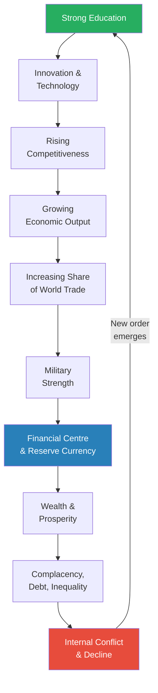
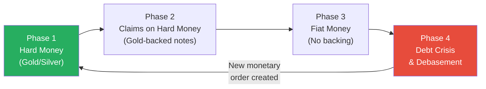
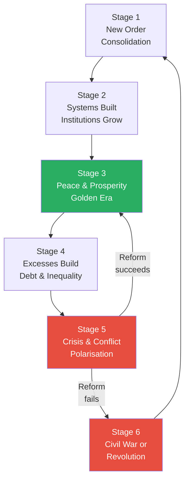
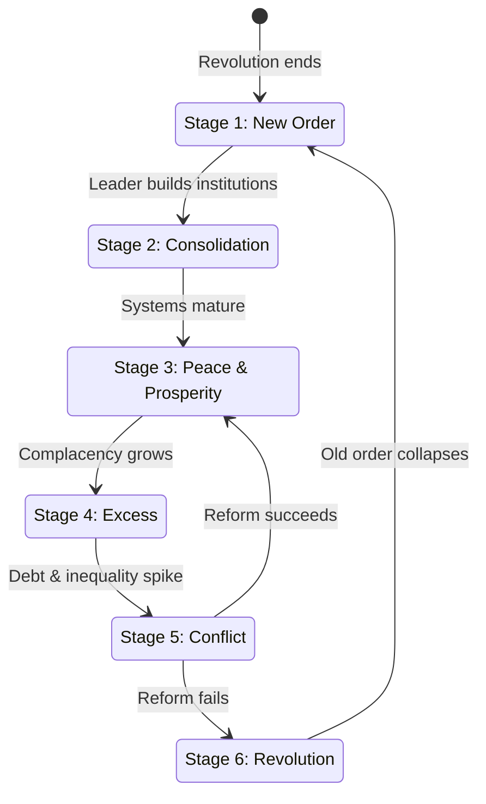
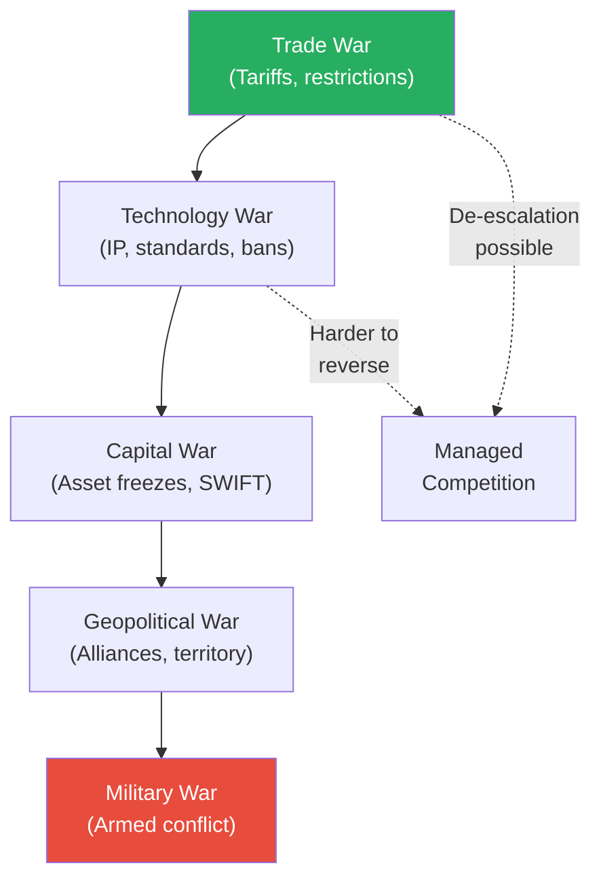
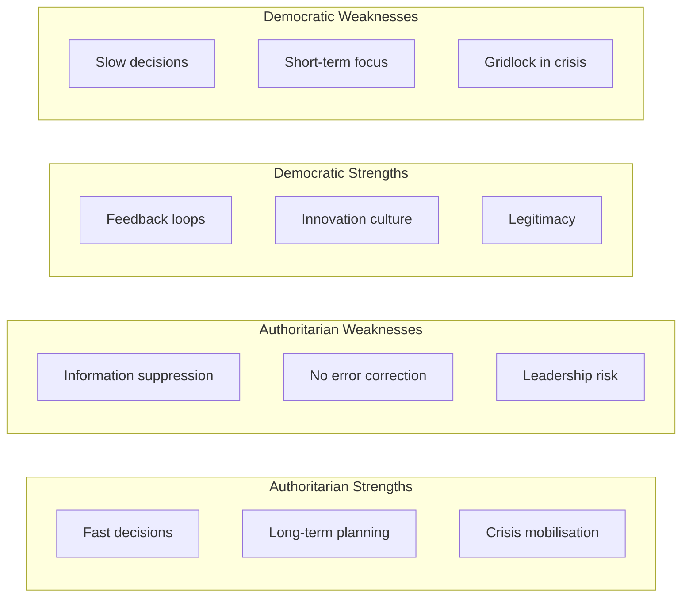
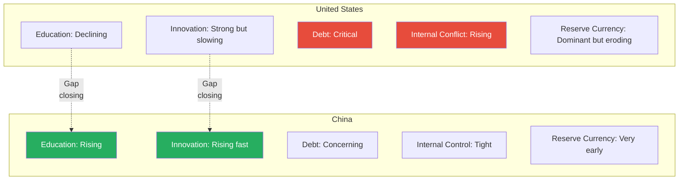
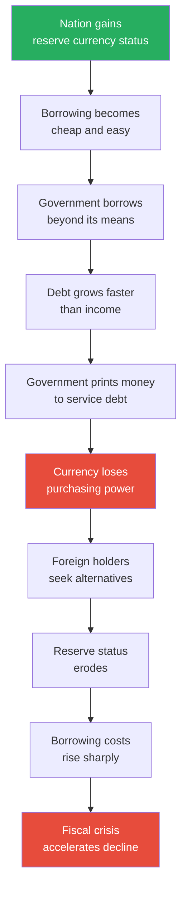
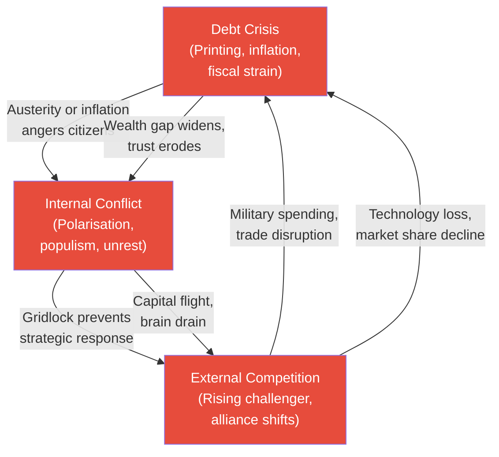

# The Changing World Order — Ray Dalio

> Ray Dalio spent fifty years as the founder of Bridgewater Associates, the world's largest hedge fund, studying how economies and markets work across centuries. In this book, he steps back from individual trades and asks the biggest question of all: why do empires rise and fall, and what does the pattern tell us about where we are right now?
> His answer is built on five hundred years of data across the Dutch, British, American, and Chinese empires, and his conclusion is unsettling: the United States is following the same arc of decline that every leading empire before it has followed — massive debt, internal conflict, a rising challenger, and the debasement of its currency.
> Dalio does not claim certainty about what comes next, but he argues that the patterns are so consistent across history that ignoring them is a form of wilful blindness.
> This is not a prediction book — it is a pattern-recognition book, and the patterns it reveals are the most consequential forces shaping the world today.

---

## About the Author

Ray Dalio grew up in a middle-class family on Long Island, started investing at age twelve by buying shares of Northeast Airlines for $300, and went on to found Bridgewater Associates in 1975 from his two-bedroom apartment. Over the next five decades, Bridgewater became the largest hedge fund in the world, managing over $150 billion in assets, and Dalio became one of the most influential macro investors alive. His approach has always been systematic and principle-driven — he studies how economic machines work, builds models, tests them against history, and then bets on the patterns repeating. His earlier book, *Principles*, laid out his philosophy on decision-making and management. *The Changing World Order* represents his attempt to apply the same systematic thinking to the biggest question he could find: how and why the entire global order shifts from one dominant power to another.

---

## The Big Idea

- <b style="color: #27ae60">All empires follow the same lifecycle — rise, top, decline — and this cycle is driven by measurable forces, not random chance</b>
  - Dalio studied the last five hundred years of global history and found that the same pattern repeats with striking consistency
  - A nation rises through education and innovation, which create competitiveness, which drives economic output, which funds military power, which enables global trade dominance, which makes its currency the world's reserve
  - At the top, success breeds complacency — wealth gaps widen, debt accumulates, the work ethic softens, internal conflict grows
  - In decline, the nation prints money to cover debts, loses its competitive edge, faces a rising challenger, and eventually cedes its place through some combination of internal collapse and external pressure

- <b style="color: #2980b9">Three big forces</b> drive the cycle:
  - The **long-term debt and capital markets cycle** — roughly 75-100 years from the creation of a new monetary order to its collapse under the weight of accumulated debt
  - The **internal order and disorder cycle** — the swing between unity and civil conflict, driven by wealth inequality and political polarisation
  - The **external order and disorder cycle** — the competition between nations, especially the dangerous period when a rising power challenges a declining one

- <b style="color: #27ae60">Understanding where you are in the cycle is the single most important thing for navigating what comes next</b>
  - Dalio's core argument is not that decline is inevitable in any mystical sense — it is that the forces producing decline are the same forces that produced the rise, just playing out in reverse
  - Education leads to innovation leads to prosperity, but prosperity leads to complacency leads to debt leads to conflict leads to decline
  - The same pattern played out in the Dutch Republic, the British Empire, and it is playing out now in the United States, while China follows the rising arc on the other side

- These three forces do not operate in isolation — they reinforce each other in ways that make the cycle self-perpetuating:
  - Debt crises trigger internal conflict, which weakens the nation's ability to respond to external challengers
  - External competition drains resources, which worsens the debt problem
  - Internal conflict prevents the political consensus needed to address either the debt or the external threat
  - This interconnection is why empires rarely address just one problem — the problems arrive as a package

This diagram shows Dalio's complete Big Cycle — the full arc from education-driven rise to conflict-driven decline, with the critical feedback loop where a new order eventually restarts the cycle.

---

## Key Concepts at a Glance

| Concept | One-line summary |
|---------|-----------------|
| **The Big Cycle** | The 250-year arc of empire from rise through dominance to decline |
| **Three Big Forces** | Debt cycles, internal conflict cycles, and external power competition drive history |
| **Eight Determinants of Power** | Measurable indices that track where an empire sits in its lifecycle |
| **The Long-Term Debt Cycle** | The 75-100 year journey from sound money to debt crisis and currency debasement |
| **The Internal Order Cycle** | Six stages from post-war consolidation to revolution and back again |
| **Reserve Currency Privilege** | The "exorbitant privilege" that lets the dominant nation borrow beyond its means |
| **The Thucydides Trap** | The dangerous period when a rising power threatens an established one |
| **Five Types of War** | Trade, technology, capital, geopolitical, and military — escalating in sequence |
| **Hard Money to Fiat** | Every monetary system moves from backed currency to unbacked currency to collapse |
| **Education as Leading Indicator** | The first thing to rise in an ascending empire, and the first to deteriorate in a declining one |
| **The 1930-45 Analogy** | Current conditions mirror the last great transition period — populism, debt, rising challenger |
| **Beautiful Deleveraging** | A rare, well-managed debt crisis where all four policy levers are used in balance |
| **The Mandate of Heaven** | Chinese dynastic concept — rulers govern legitimately only while they govern well |
| **Capital Flight Spiral** | Wealthy citizens move assets offshore during decline, accelerating the decline |

Each empire follows the same S-curve: a slow rise, a peak lasting roughly a century, and then a decline that overlaps with the next empire's ascent — the Dutch peaked around 1700, the British around 1850, and the American peak may already be behind us as China's curve accelerates upward.

---

## Part I: How the Big Cycle Works

### Chapter 1: The Big Picture — Why I Wrote This Book

*Dalio explains the three surprises that made him realise conventional economics couldn't explain what was happening in the world, and why he went back five hundred years to find answers.*

- Dalio's career has been built on studying economic patterns and betting on them repeating
- Three developments in 2020 forced him to look deeper than his existing models:
  - **Unprecedented money printing and debt monetisation** — central banks creating money at a pace never seen outside of wartime
  - **Internal conflict levels not seen since the 1930s** — wealth gaps, political polarisation, populism rising in every developed nation
  - **A rising China challenging the United States** — in trade, technology, and geopolitical influence in ways that mirror historical power transitions
- None of these three events had occurred in his lifetime — so his personal experience was useless as a guide
  - To understand them, he had to study periods when they *had* occurred: the 1930s, the 1910s, the 1780s, the 1640s
  - This is the core methodological principle of the book: <b style="color: #27ae60">if something hasn't happened in your lifetime but has happened many times before, study those prior cases</b>

> [!example] Dalio's 2008 Revelation
> - During the 2008 global financial crisis, Bridgewater was one of the few firms that profited rather than collapsed
> - Dalio's advantage was that he had studied the mechanics of debt crises across dozens of historical cases — the Great Depression, the Latin American debt crisis, the Japanese bubble
> - Most investors were shocked by 2008 because nothing like it had happened in their careers (the last comparable US event was 1929)
> - Dalio realised that his edge came not from superior intelligence but from studying a longer stretch of history than his competitors bothered to examine
> **The lesson:** The things that surprise you most are usually things that haven't happened in your lifetime but have happened many times before.

- <b style="color: #e74c3c">The biggest risk is believing that what hasn't happened in your lifetime can't happen</b>
  - Most investors, politicians, and citizens have a recency bias that spans about 40-50 years
  - The really consequential events — reserve currency collapses, civil wars, empire transitions — operate on 75-250 year cycles
  - If you only study what you've personally lived through, you are guaranteed to be blindsided by the most important developments

---

- **Dalio's methodology — studying the "machine" behind events:**
  - He treats history the way an engineer treats a machine — the same inputs produce the same outputs, regardless of the era or culture
  - He built indices tracking eighteen countries across five hundred years, measuring each of the eight determinants of power (education, innovation, competitiveness, output, trade, military, financial centre, reserve currency)
  - The resulting charts show the same S-curve pattern repeating: slow rise, acceleration, plateau, decline
  - <b style="color: #2980b9">The "economic machine"</b> is Dalio's core metaphor — economies and empires are not random, they are machines with cause-and-effect relationships that can be studied and (to some extent) predicted
  - This is the same approach that made Bridgewater successful: study how the machine has worked across many cases, then position for what it will do next

- **Why he chose these specific empires to study:**
  - He focused on the three most recent "reserve currency empires" — the Dutch, British, and American — because they provide the clearest data
  - He added China because it is the rising challenger and because its dynastic history provides the longest continuous dataset of the Big Cycle
  - He examined secondary empires (Spain, France, Germany, Japan, Russia) to validate the pattern but focused his deepest analysis on the four primary cases
  - The selection is deliberate: he wants empires with enough quantifiable data to test the framework, not just narrative history

> [!example] Dalio's China Education (1984-Present)
> - Dalio first visited China in 1984, when it was still one of the poorest countries on earth
> - He watched the transformation unfold over nearly four decades — from rural poverty to the world's second-largest economy
> - His personal relationships with Chinese leaders and business figures gave him access to how they think about their own rise
> - He observed that Chinese leaders explicitly study the Big Cycle — they know the patterns and actively try to manage their position within them
> - This is a stark contrast with most Western leaders, who Dalio believes are largely unaware of the cycle they're in
> **The lesson:** The nation that consciously studies and manages its position in the Big Cycle has an advantage over the nation that doesn't know the cycle exists.

- **The three lenses Dalio uses throughout the book:**
  - The **top-down lens** — looking at empires as complete systems, tracking the aggregate determinants over centuries
  - The **bottom-up lens** — examining individual events, decisions, and personalities that accelerated or slowed the cycle
  - The **comparative lens** — placing different empires side by side at equivalent points in their cycles to test whether the pattern holds
  - These three lenses overlap throughout the book, but Dalio is explicit about which he's using at any given moment — a discipline that gives the analysis more rigour than most popular history

- **What Dalio means by "timeless and universal":**
  - He argues that the Big Cycle operates across cultures, political systems, and technological eras — the Dutch Republic, the Qing Dynasty, and the American Republic followed the same arc despite having almost nothing else in common
  - The forces are not cultural but structural — they arise from the mathematics of debt, the psychology of wealth, and the geopolitics of relative power
  - This is a bold claim, and Dalio acknowledges the objections:
    - Each empire had unique features that shaped its trajectory
    - The timing and intensity of each cycle varied significantly
    - Technology has changed the speed and mechanisms of many of these forces
  - His response: the underlying dynamics are the same even if the surface details differ — just as gravity operates on all objects regardless of their shape
  - <b style="color: #2980b9">This universality claim is both the book's greatest strength and its most legitimate vulnerability</b> — it provides a powerful framework, but it can oversimplify genuine differences between historical cases

- **The limitations Dalio himself acknowledges:**
  - His data for earlier centuries (1500-1700) is less reliable than for recent centuries
  - His indices involve subjective weighting decisions that different analysts might make differently
  - The sample size — even five hundred years of data across four primary cases — is small by scientific standards
  - He is studying systems where the actors themselves can read his analysis and potentially change their behaviour — the observer effect in social science
  - Despite these limitations, Dalio argues that the patterns are robust enough to be useful — not as precise predictions but as probability estimates and risk frameworks

---

### Chapter 2: The Determinants of Power

*Dalio builds a measurement framework — eight indices that let you objectively score where any empire sits in its lifecycle, just as a doctor would measure vital signs.*

- <b style="color: #2980b9">The Eight Key Determinants of Power</b> form Dalio's measurement system:

| Determinant | What It Measures | Leading or Lagging |
|-------------|-----------------|-------------------|
| **Education** | Quality of human capital, literacy, STEM capability | Leading (rises first) |
| **Innovation & Technology** | Patents, inventions, technological breakthroughs | Leading |
| **Competitiveness** | Cost efficiency, infrastructure, regulatory environment | Leading |
| **Economic Output** | GDP, per capita income, productivity growth | Coincident |
| **Share of World Trade** | Percentage of global imports and exports | Coincident |
| **Military Strength** | Defence spending, force projection, deterrence capacity | Lagging |
| **Financial Centre** | Capital market depth, banking system, foreign investment | Lagging |
| **Reserve Currency Status** | Percentage of global reserves held in your currency | Lagging (declines last) |

Each determinant is tracked over a 500-year period using Dalio's index methodology.

- The critical insight is the **sequence**: these determinants rise and fall in a predictable order
  - Education rises first — it takes a generation to build a well-educated workforce
  - Innovation follows — educated people invent things
  - Competitiveness follows innovation — new technology creates cost advantages
  - Economic output follows competitiveness — more competitive economies grow faster
  - Trade share follows output — growing economies export more
  - Military follows trade — wealthy nations build powerful militaries
  - Financial centre status follows military — the safest, most powerful nation attracts global capital
  - <b style="color: #2980b9">Reserve currency status comes last</b> — and it is the last to decline, because the inertia of global financial systems is enormous

> [!tip] Core Insight
> The order in which these determinants rise is the reverse of the order in which they decline. Education rises first and falls first. Reserve currency status rises last and falls last. This lag is why people in declining empires often don't realise they're declining — the most visible measure (currency) is the last to go.

This flowchart shows the sequential order of determinants — education leads, reserve currency lags — explaining why decline is often invisible until it's far advanced.

The heatmap reveals America's dominance in military and reserve currency (lagging indicators) alongside China's strength in competitiveness and trade (leading indicators) — precisely the pattern Dalio warns about, where the most visible measures of power mask the underlying shift already underway.

---

- <b style="color: #e74c3c">Decline is not sudden — it is a slow erosion masked by lagging indicators</b>
  - When education quality drops, nothing dramatic happens immediately
  - The effects take 20-30 years to show up in reduced innovation, then another decade to show up in reduced competitiveness
  - By the time reserve currency status is questioned, the underlying foundations have been deteriorating for half a century
  - This is why empires rarely course-correct in time — the symptoms arrive too late for the medicine to work

- **Additional determinants Dalio tracks beyond the core eight:**
  - **Resource allocation efficiency** — how well the system directs capital and talent toward productive uses versus speculation and rent-seeking
  - **Acts of nature** — pandemics, droughts, floods, and other natural events that can accelerate or interrupt cycles
  - **Geography** — natural resources, defensible borders, access to trade routes
  - **Rule of law and corruption** — whether contracts are enforced fairly, whether the system rewards merit or connections
  - These secondary factors don't drive the Big Cycle on their own, but they amplify or dampen its effects
  - A nation with strong rule of law can sustain its peak longer; a nation with rampant corruption accelerates its decline

> [!example] Spain's Golden Age and Collapse (1500-1650)
> - Spain received enormous quantities of gold and silver from the New World — more wealth than any European nation had ever possessed
> - But instead of investing in education, innovation, and productive industries, Spain used the gold to fund wars and aristocratic consumption
> - The flood of gold actually caused inflation — prices doubled and tripled, destroying competitiveness
> - Spanish manufacturing declined as it became cheaper to import goods from the Dutch and English than to produce them domestically
> - By 1650, Spain had squandered the greatest windfall in history and was a second-rate power
> - Meanwhile, the Dutch — who had no gold mines but invested heavily in education, trade, and financial systems — became the world's dominant power
> **The lesson:** Natural resources without productive investment are a curse, not a blessing — the wealth trap is one of Dalio's recurring themes.

- **Why the eight determinants form a system, not a checklist:**
  - No single determinant can save a nation if the others are declining — military strength without economic output is unsustainable, financial centre status without innovation is hollow
  - The interconnection means that decline in one area creates cascading weakness — lower education produces fewer innovations, which reduces competitiveness, which slows growth, which shrinks the tax base available for education
  - <b style="color: #e74c3c">This feedback loop is why decline accelerates — each deteriorating indicator drags the others down with it</b>

- **How Dalio built his indices:**
  - He compiled data from hundreds of historical sources — government records, academic studies, economic databases, military histories
  - Each determinant is scored on a standardised scale (0-1) so that different eras and nations can be compared directly
  - The indices are imperfect — data from the 1500s is less reliable than data from the 2000s — but the trends are consistent enough to be meaningful
  - The key finding: when you overlay the indices for different empires at equivalent points in their cycles, the curves are strikingly similar
  - This is what gives Dalio confidence that the pattern is real, not a coincidence or an artefact of cherry-picked data

---

### Chapter 3: The Long-Term Debt Cycle

*Dalio reveals the most powerful and least understood force in the Big Cycle — how money and credit evolve from hard currency to paper promises to outright printing, and why every reserve currency in history has eventually been destroyed by its own government.*

- <b style="color: #2980b9">The Long-Term Debt Cycle</b> spans roughly 75-100 years and follows a predictable arc:
  - **Phase 1: Hard money** — gold, silver, or another commodity-backed currency
    - People trust the money because it has intrinsic value
    - Governments can't create more of it without finding more gold
    - Credit is limited by the physical supply of the backing asset
    - This phase typically follows a previous currency collapse — people have learned the hard way to distrust paper promises
  - **Phase 2: Claims on hard money** — paper notes backed by gold
    - Banks issue more notes than they hold gold, because not everyone redeems at once
    - This fractional reserve banking creates credit expansion — more money circulating than metal in the vaults
    - Credit expands, economy booms
    - This works beautifully — until it doesn't
    - The critical vulnerability: if too many people try to redeem their notes for gold at once, the system collapses (a bank run at the national level)
  - **Phase 3: Fiat money** — paper no longer backed by anything
    - Government removes the gold backing (as Nixon did in 1971)
    - Now there is no constraint on money creation except the government's own discipline
    - Credit expands dramatically — fuelling growth but also fuelling debt
    - This is the phase where debt-to-income ratios start climbing beyond what is historically sustainable
    - Citizens gradually lose awareness of the connection between money and real value — they treat paper currency as inherently valuable rather than as a promise that can be broken
  - **Phase 4: Debt crisis and debasement** — too much debt, not enough income to service it
    - Governments print money to pay debts
    - Currency loses value relative to real assets
    - Wealth transfers from savers to debtors
    - Eventually the currency loses enough credibility that a new system must replace it

This diagram maps the four phases of the long-term debt cycle — showing how each monetary system inevitably evolves from disciplined hard money to undisciplined fiat and eventual collapse.

The debt-to-GDP ratio climbs steadily through the first four stages, peaks during money printing at roughly 200%, and only falls after painful restructuring — the U.S. currently sits between the Crisis and Money Printing stages with federal debt-to-GDP approaching 130%.

- **The psychology behind each phase transition:**
  - **Phase 1 → Phase 2:** People discover that paper claims are more convenient than carrying gold — and that lending creates economic growth
    - The innovation is genuinely useful: credit expands the economy, funds investment, and enables projects that barter could never support
    - The danger is invisible: each individual loan seems prudent, but the aggregate effect is a system where total claims exceed total assets
  - **Phase 2 → Phase 3:** A crisis reveals that the hard-money backing is insufficient — more claims exist than gold to redeem them
    - The government faces a choice: allow a deflationary collapse (honour the gold backing, let banks fail) or break the gold link (maintain the financial system, accept debasement)
    - Every government in history has chosen to break the link — the short-term costs of deflation are politically unbearable
    - <b style="color: #2980b9">The critical moment is always the same: the government discovers it has made promises it cannot keep in hard money, and so it redefines "money"</b>
  - **Phase 3 → Phase 4:** Once there is no constraint on money creation, the temptation to create more becomes irresistible
    - Each crisis is met with more printing — and each round of printing solves the immediate crisis while building the conditions for the next one
    - The metaphor is apt: money printing is like painkillers — effective in the short term, addictive over time, and eventually requiring larger and larger doses to achieve the same effect

- **How the debt cycle looks from the perspective of ordinary citizens:**
  - During the boom phase (Phases 1-3), citizens experience rising living standards, easy credit, and growing wealth
  - They attribute this to their own hard work, good governance, or national superiority — they don't see the underlying debt dynamics
  - During the bust phase (Phase 4), citizens experience inflation, stagnant wages, and declining purchasing power
  - They blame corporations, immigrants, or the opposing political party — they don't see that the root cause is the monetary system itself
  - <b style="color: #e74c3c">This misdirection of blame is one of the most dangerous consequences of the debt cycle</b> — it channels political anger toward the wrong targets and away from the structural reforms that would actually help

---

> [!example] Nixon Closes the Gold Window (1971)
> - By the late 1960s, the United States was spending heavily on the Vietnam War and Lyndon Johnson's Great Society programs
> - Foreign governments, especially France under de Gaulle, noticed the US was printing more dollars than it held gold to back them
> - France began demanding gold in exchange for its dollar holdings — effectively calling America's bluff
> - On August 15, 1971, President Nixon announced that the US would no longer convert dollars to gold at the fixed rate of $35 per ounce
> - This ended the Bretton Woods system and made the dollar a pure fiat currency — backed by nothing but the "full faith and credit" of the US government
> - The dollar lost roughly 95% of its purchasing power over the next fifty years, even as it remained the world's dominant reserve currency
> **The lesson:** Reserve currency status survives long after the currency's underlying backing is removed — but the debasement is relentless.

- **Why governments always choose printing over austerity:**
  - Cutting spending is politically painful — it means reducing benefits, services, and military power
  - Raising taxes is politically painful — it angers the wealthy, who have the most political influence
  - Printing money is politically painless in the short term — no one votes against it, and the effects are delayed
  - <b style="color: #e74c3c">The inflation tax is the most politically convenient tax because people blame the price increases on companies, not on the government that created the money</b>
  - Every government in history that has faced a debt crisis with the ability to print its own currency has chosen to print
  - The rare exceptions — governments that chose austerity — faced immediate political backlash and often lost power before the medicine could work

> [!tip] Core Insight
> Printing money doesn't create wealth — it redistributes it from those who hold the currency (savers, workers paid in wages) to those who hold assets priced in the currency (stockholders, real estate owners, debtors). This is why money printing always widens the wealth gap.

- **The debt cycle and internal conflict are directly linked:**
  - Easy credit during the boom phase creates wealth inequality — those with assets benefit from rising prices, those without assets fall behind
  - When the bust arrives, governments must choose: bail out the wealthy (stoking populist anger) or let the system collapse (economic devastation)
  - Either choice intensifies internal conflict
  - This is why debt crises almost always coincide with political radicalisation and social unrest
  - The causal chain runs in both directions: debt crises produce political instability, and political instability prevents the consensus needed to resolve debt crises

---

- **The four levers governments use to manage debt crises:**
  - <b style="color: #2980b9">Austerity</b> — spending less, which is deflationary and politically painful
    - Reduces demand, increases unemployment, creates immediate suffering
    - Historically unpopular because the costs are visible and concentrated while the benefits are diffuse and delayed
  - <b style="color: #2980b9">Debt restructuring/defaults</b> — reducing debts by writing them down, which punishes creditors
    - Can be orderly (negotiated haircuts) or disorderly (outright default)
    - Creditors — often banks, pension funds, and foreign governments — absorb the losses
    - Can trigger financial contagion if creditors themselves become insolvent
  - <b style="color: #2980b9">Printing money</b> — creating new currency to pay debts, which is inflationary
    - Central bank buys government bonds with newly created money
    - Lowers interest rates, makes debt easier to service
    - Creates inflation that erodes the real value of the debt
    - Most politically attractive because the costs are hidden and delayed
  - <b style="color: #2980b9">Wealth transfers</b> — taxing the wealthy to pay the less wealthy, which is politically divisive
    - Progressive taxation, inheritance taxes, one-time levies on wealth
    - Politically popular with the majority but fiercely resisted by those who hold the wealth — and the power
    - Can trigger capital flight if the wealthy move assets to other jurisdictions

- Dalio argues that governments always end up using all four in some combination — but they inevitably lean most heavily on printing, because it is the least immediately painful
- The <b style="color: #2980b9">"beautiful deleveraging"</b> — Dalio's term for a well-managed crisis where all four levers are used in balance — is rare but possible
  - It requires political consensus, competent leadership, and institutional credibility — all of which are typically in short supply during a crisis
- The ugly deleveraging — dominated by printing — is far more common and leads to inflation, currency decline, and social unrest

> [!example] The Weimar Hyperinflation (1921-1923)
> - After World War I, Germany owed massive reparations to the victorious Allies under the Treaty of Versailles
> - Unable to pay from tax revenue, the German government simply printed marks — creating money from nothing
> - Inflation spiralled: in January 1921, a loaf of bread cost 1.5 marks; by November 1923, it cost 200 billion marks
> - The middle class was destroyed — life savings became worthless overnight, while those who held real assets (factories, land) preserved their wealth
> - Workers were paid twice daily so they could spend their wages before prices rose further; people carried wheelbarrows of cash to buy groceries
> - The political consequences were devastating: the humiliation and economic destruction of the middle class created the conditions for Hitler's rise a decade later
> **The lesson:** Hyperinflation doesn't just destroy currency — it destroys the social contract between citizens and their government, opening the door to authoritarianism.

> [!example] The Japanese Lost Decades (1990-Present)
> - Japan's asset bubble peaked in 1989 — the Imperial Palace grounds in Tokyo were famously valued higher than all the real estate in California
> - When the bubble burst, the Japanese government and central bank refused to allow widespread defaults, instead propping up "zombie" banks and companies
> - Japan chose a combination of low interest rates, money printing, and gradual deleveraging — avoiding a dramatic crash but producing thirty years of stagnation
> - The Bank of Japan eventually owned more than half of Japanese government bonds and became a major holder of equities
> - The result was neither a beautiful deleveraging nor a catastrophic collapse — it was a slow, grinding erosion of dynamism
> - Japan's experience shows a third path: managed decline that avoids revolution but also avoids renewal
> **The lesson:** Avoiding the worst outcome doesn't mean achieving a good one — Japan's managed decline prevented crisis but also prevented the creative destruction needed for recovery.

> [!example] The United States in the 1930s — Dalio's Beautiful Deleveraging
> - After the 1929 crash and the bank failures of 1930-33, the US economy contracted by roughly 25%
> - FDR's administration used all four levers in a deliberate sequence:
>   - Bank holiday and restructuring (defaults/restructuring)
>   - Government spending on infrastructure and employment (fiscal policy)
>   - Taking the dollar off gold domestically and devaluing it by 40% (money printing via devaluation)
>   - Progressive taxation and social programs (wealth transfers via the New Deal)
> - The combination pulled the US out of the Depression — though full recovery required World War II's massive fiscal stimulus
> - Dalio considers this the closest example to a "beautiful deleveraging" because it balanced the four levers rather than relying exclusively on printing
> **The lesson:** A well-managed deleveraging requires using all four levers in balance — printing alone creates inflation, austerity alone creates depression, and either extreme triggers political revolt.

---

### Chapter 4: The Internal Order and Disorder Cycle

*Dalio maps six stages of internal political life, from the consolidation that follows a revolution to the revolution that follows a collapse — and argues the United States is currently in Stage 5.*

- <b style="color: #2980b9">The Internal Order Cycle</b> has six stages:

| Stage | Description | Mood | Duration |
|-------|------------|------|----------|
| **Stage 1** | New order — revolutionary leader consolidates power | Exhausted unity | 5-15 years |
| **Stage 2** | Systems built — government bureaucracy, resource allocation, rule of law established | Optimistic building | 20-40 years |
| **Stage 3** | Peace and prosperity — the golden era of growth and opportunity | Confident, ambitious | 30-60 years |
| **Stage 4** | Excesses — over-spending, over-borrowing, widening gaps | Complacent, entitled | 20-40 years |
| **Stage 5** | Financial crisis — printing money, internal conflict, polarisation | Angry, fearful | 10-25 years |
| **Stage 6** | Civil war or revolution — old order collapses | Desperate, violent | 1-10 years |

- **Stage 1: The New Order**
  - Arrives after a period of destructive conflict — a civil war, revolution, or decisive external war
  - A strong leader (or group) consolidates power and establishes the new system
  - People are exhausted from conflict and willing to accept strong authority in exchange for stability
  - The leader designs the basic architecture — constitution, institutions, economic rules — that will govern for the next century or more
  - This period is characterised by a willingness to sacrifice individual freedoms for collective stability — a bargain that feels reasonable after the chaos of Stage 6

> [!example] The American New Order (1776-1800)
> - After the Revolutionary War, the Founders established the Constitution, the federal system, and the basic institutions that would govern the United States for the next 250 years
> - Washington's voluntary departure after two terms set the precedent for peaceful transfer of power
> - Hamilton's financial system — a national bank, assumption of state debts, a single currency — created the economic architecture for the rising empire
> - The Constitutional Convention itself was a Stage 1 negotiation: competing interests (large states vs. small, slave states vs. free, agrarian vs. commercial) hammered out compromises that would define American governance
> - This founding period was Stage 1: consolidation after revolution, establishing the rules that would govern the next cycle
> **The lesson:** The quality of a Stage 1 settlement determines how long the cycle will last — America's was exceptionally well designed.

> [!example] Post-War Europe's New Order (1945-1950)
> - After the devastation of World War II, Western European nations accepted a new order defined by American leadership, NATO, and economic rebuilding
> - The Marshall Plan pumped $13 billion (roughly $150 billion in today's dollars) into European reconstruction
> - West Germany's Basic Law (1949) established a democratic system with institutional safeguards against the extremism that had destroyed the Weimar Republic
> - The European Coal and Steel Community (1951) — the precursor to the EU — bound former enemies together economically to make future war impractical
> - People who had lived through the war were willing to accept constraints on national sovereignty in exchange for peace and stability
> **The lesson:** Stage 1 works because the memory of Stage 6 is fresh — the worse the preceding chaos, the greater the willingness to accept a new order.

---

- **Stages 2 and 3: Building and Prosperity**
  - Institutions gain strength, rule of law is broadly respected, opportunity expands
  - The middle class grows, education improves, innovation accelerates
  - This is the period most people think of as "normal" — but it is actually the exception in the longer arc
  - <b style="color: #27ae60">The golden era creates the conditions for its own destruction — success breeds complacency</b>
  - The paradox of prosperity: the very stability that enables growth makes people forget how hard stability is to achieve
  - Citizens begin to take the system for granted, treating its benefits as natural rights rather than hard-won achievements
  - Intergenerational memory fades — the grandchildren of those who built the system have no direct experience of what it replaced

- **How prosperity sows the seeds of decline — the specific mechanisms:**
  - Financial innovation accelerates during Stage 3 — new credit instruments, leverage, and risk products emerge
  - These innovations increase growth but also increase systemic fragility — more interconnections mean more potential failure points
  - Social mobility slows as wealth concentrates — the early beneficiaries of the system use their position to lock in advantages
  - Education shifts from practical and technical skills to credential-seeking and status signalling
  - Military success leads to overconfidence and overextension — the empire takes on commitments it cannot sustain long-term

---

- **Stage 4: Excesses Build**
  - Those who benefited most from the prosperity use their wealth to capture political influence
  - Wealth inequality grows — the top 1% pulls away from everyone else
  - Debt accumulates at every level — government, corporate, household
  - The work ethic softens as the third and fourth generations inherit wealth they didn't earn
  - <b style="color: #e74c3c">Decadence is not a moral judgment — it is a measurable phenomenon of reduced productivity and increased consumption</b>
  - Financial engineering replaces real engineering — more talent goes into moving money than into creating things
  - Speculation replaces investment — asset bubbles become more frequent and more severe
  - Infrastructure deteriorates because maintenance is unglamorous and politicians prefer to fund new projects or cut taxes

- **The metrics of Stage 4 excess:**
  - Debt-to-GDP ratios rise above 100% and keep climbing
  - The financial sector's share of GDP grows disproportionately — in the US, finance went from 10% of corporate profits in 1950 to over 30% by 2007
  - Real wages stagnate while asset prices rise — creating a divergence between people who own things and people who work for a living
  - Lobbying expenditure and political donations from corporations increase exponentially
  - Public infrastructure spending declines as a percentage of GDP — bridges, roads, water systems deteriorate
  - The ratio of speculation to productive investment shifts — Dalio tracks this through measures like financial sector employment relative to engineering employment, or the volume of derivative trading relative to underlying economic activity
  - Cultural indicators also shift: public discourse focuses on individual rights and consumption rather than collective responsibility and production; celebrity and financial success are celebrated over scientific achievement and civic service

> [!example] The South Sea Bubble — Britain's Stage 4 Warning (1720)
> - The South Sea Company was granted a monopoly on trade with South America and offered to take on the national debt in exchange for government-backed stock
> - Shares rose from 128 pounds in January 1720 to over 1,000 pounds by August — driven entirely by speculation and insider dealing
> - When the bubble burst, thousands of investors were ruined, including many members of Parliament who had been bribed with shares
> - Isaac Newton, who had profited early and then reinvested near the peak, reportedly lost 20,000 pounds and said he "could calculate the motion of heavenly bodies, but not the madness of people"
> - The aftermath produced the Bubble Act (banning joint-stock companies without royal charter) and a lasting suspicion of financial innovation
> - Dalio sees the South Sea Bubble as Britain's version of the same pattern that produced tulip mania in the Netherlands and the 2008 financial crisis in the US — speculative mania fuelled by easy credit and institutional corruption
> **The lesson:** Every empire produces a signature financial bubble at the transition from Stage 3 to Stage 4 — it is both a symptom and an accelerant of the shift from productive investment to speculation.

---

- **Stage 5: Crisis and Conflict**
  - The debt burden becomes unsustainable — revenues can't service obligations
  - Government prints money, which inflates asset prices and widens the wealth gap further
  - Political polarisation intensifies — left vs. right, populist vs. establishment
  - Both sides increasingly view the other as an existential threat rather than a legitimate opposition
  - Democratic norms erode — breaking rules feels justified when the stakes seem existential
  - Moderates disappear — the centre becomes the most dangerous place to stand

> [!example] The 1930s United States — Stage 5 in Action
> - The 1929 crash wiped out millions of Americans' savings while the wealthy still held assets
> - Unemployment hit 25%, breadlines stretched for blocks, and Hoovervilles appeared in every major city
> - Political extremism surged — Father Coughlin's radio show reached 30 million listeners with anti-establishment rage, Huey Long's "Share Our Wealth" movement demanded radical redistribution
> - The American Communist Party grew to 75,000 members; pro-fascist groups like the German American Bund held rallies in Madison Square Garden
> - FDR's election in 1932 represented a massive shift in the role of government — the New Deal fundamentally altered the relationship between the state and the economy
> - The US avoided Stage 6 (revolution) only because FDR managed to channel populist energy into reform rather than destruction
> **The lesson:** Stage 5 does not automatically lead to Stage 6 — a skilled leader can redirect the energy into systemic reform rather than collapse.

> [!example] The French Revolution — Stage 5 to Stage 6 (1789)
> - France in the 1780s had all the markers of late Stage 5: crushing government debt, extreme wealth inequality between the aristocracy and the peasantry, a tax system that exempted the wealthy, and a series of bad harvests that pushed food prices beyond the reach of ordinary people
> - Louis XVI's attempts at reform were blocked by the nobility who refused to give up their privileges
> - When the Estates-General was called in 1789 — the first time in 175 years — it quickly spiralled beyond anyone's control
> - The storming of the Bastille, the abolition of feudalism, the Reign of Terror, and eventually Napoleon's rise all followed from the inability to reform within the existing system
> - Dalio uses France as the clearest case of a Stage 5 that failed to reform and tipped into Stage 6
> **The lesson:** When the ruling class blocks reform that would require sharing their privilege, revolution becomes inevitable — the pressure builds until the container breaks.

This diagram shows the six-stage Internal Order Cycle with the critical branching point at Stage 5 — successful reform can loop back to prosperity, while failure leads to revolution and a restart.

The state diagram emphasizes Dalio's critical observation: Stage 5 is the fork in the road — empires that reform successfully (as Britain did after 1832 and again after 1945) can cycle back to prosperity, while those that fail to reform (as France did by 1789) descend into revolution and must restart the entire cycle.

---

- **The warning signs Dalio watches for at Stage 5:**
  - Increasing ad hominem attacks in political discourse — opponents are treated as enemies, not rivals
  - Both sides willing to break established norms and rules to win
  - Declining trust in institutions — media, courts, elections, government agencies
  - Rising popularity of extremist candidates who promise to "burn it down"
  - Physical political violence increasing in frequency
  - Migration of the wealthy (capital flight) as a hedge against instability
  - Mainstream media fragmenting into ideological echo chambers
  - Willingness to question the legitimacy of election results

- **The mechanics of how Stage 5 escalates:**
  - Each provocation by one side justifies a greater provocation by the other
  - Media fragmentation means each side consumes entirely different information — they literally see different realities
  - <b style="color: #e74c3c">When both sides believe the other is destroying the country, compromise becomes treason</b>
  - The institutional guardrails — courts, norms, electoral rules — come under attack because they are seen as tools of the enemy
  - This is a self-reinforcing spiral: the more norms are broken, the more each side feels justified in breaking norms
  - Historical precedent is grim: once this spiral reaches a certain intensity, only a galvanising external threat (a war, a catastrophe) or a leader of unusual skill can reverse it

- **Stage 6: Civil War or Revolution — what it actually looks like:**
  - Stage 6 is not always a single dramatic event — it can unfold as a prolonged period of disorder lasting years
  - It typically involves one or more of:
    - Armed conflict between factions within the nation
    - Overthrow of the existing government (by force or by a quasi-legal process that strips it of real power)
    - Collapse of the currency and economic system
    - Secession or territorial breakup
  - The key distinguishing feature of Stage 6 is that the existing rules are no longer accepted by a critical mass of the population — the social contract has broken down entirely
  - <b style="color: #e74c3c">Stage 6 is almost always preceded by a period when people believe "it can't happen here" — the failure of imagination is the final warning sign</b>
  - Not all Stage 6 transitions are equally violent:
    - The American Civil War (1861-1865) killed 620,000 — the most violent internal conflict in American history
    - The Russian Revolution (1917) led to civil war and eventually the deaths of millions
    - The fall of the Soviet Union (1991) was remarkably peaceful — though the subsequent decade brought economic devastation and demographic collapse
  - Dalio's point is not that every Stage 5 leads to Stage 6 — it is that the risk is real and should be taken seriously

> [!tip] Core Insight
> The transition from Stage 5 to Stage 6 is not about whether people are angry — it's about whether institutions are still strong enough to channel that anger into legitimate reform. When institutions lose credibility, anger has nowhere to go but into the streets.

---

### Chapter 5: The External Order and Disorder Cycle

*Dalio explains how international power transitions work — not as single dramatic events but as escalating sequences of five types of war that can take decades to play out.*

- <b style="color: #2980b9">The Five Types of War</b> between competing powers escalate in a predictable sequence:

| Type | Mechanism | Current Example |
|------|-----------|----------------|
| **Trade War** | Tariffs, trade restrictions, economic sanctions | US-China tariffs since 2018 |
| **Technology War** | Blocking access to technology, IP theft, tech standards competition | Huawei ban, chip export controls |
| **Capital War** | Restricting investment, freezing assets, weaponising financial systems | SWIFT sanctions, investment restrictions |
| **Geopolitical War** | Alliance building, territorial claims, diplomatic confrontation | South China Sea, Taiwan, Belt and Road |
| **Military War** | Actual armed conflict between great powers | Not yet (but risk rising) |

- These five types of war rarely begin at the same time — they escalate through the sequence
  - Trade friction comes first, because it's the least costly and most reversible
  - Technology war follows, because controlling technology is controlling the future
  - Capital war is more serious — freezing assets or cutting off financial access damages wealth
  - Geopolitical confrontation draws in allies and creates military positioning
  - <b style="color: #e74c3c">Military war is the last resort, but it is always the implicit threat behind all the others</b>

- **The escalation dynamic has its own momentum:**
  - Each step on the escalation ladder makes the next step more likely
  - Trade restrictions create resentment, which makes technology restrictions easier to justify
  - Technology restrictions are seen as an existential threat by the rising power, which justifies capital restrictions in response
  - Each side's defensive moves look aggressive to the other — the classic security dilemma
  - De-escalation requires both sides to step back simultaneously, which is politically difficult for both

---

- **The Thucydides Trap:**
  - Named after the ancient Greek historian who wrote that the Peloponnesian War became inevitable because Sparta could not tolerate the rise of Athens
  - Harvard's Graham Allison studied sixteen cases of a rising power challenging a ruling power over the past 500 years — twelve of the sixteen resulted in war
  - <b style="color: #e74c3c">The trap is not that war is inevitable, but that the dynamics make war much more likely than peace</b>
  - Both sides interpret the other's defensive moves as aggressive — a classic security dilemma
  - Domestic politics in both nations push toward confrontation, because leaders who seem "soft" on the rival lose support
  - The four cases that avoided war share common features: clear communication channels, economic interdependence deep enough to make conflict costly, and leaders willing to accept limitations on their ambitions

- **The role of alliances in power transitions:**
  - Rising powers build alternative alliance networks to challenge the existing order
    - China's partnerships with Russia, Iran, and developing nations through BRICS and the Shanghai Cooperation Organisation represent exactly this pattern
    - These alliances may be less ideologically coherent than NATO, but they serve the strategic purpose of creating alternatives to the US-led system
  - Declining powers tighten their alliances to maintain their position
    - The US has strengthened AUKUS, the Quad, and bilateral relationships with Japan, the Philippines, and South Korea — all aimed at containing China's expansion
    - NATO expansion (Finland, Sweden) serves a similar function in the European theatre
  - Smaller nations are forced to choose sides — the luxury of neutrality disappears
    - ASEAN nations face the most acute version of this dilemma — they depend on China economically and on the US for security
    - Many are pursuing "hedging" strategies, maintaining relationships with both powers, but the space for hedging shrinks as competition intensifies
  - Alliance commitments can drag nations into conflicts they would otherwise avoid — exactly as happened in 1914
  - <b style="color: #2980b9">The alliance structure itself becomes a source of instability</b> — any conflict between two nations risks activating the entire alliance system
  - The risk of miscalculation rises as alliances proliferate — a minor incident in the South China Sea or Taiwan Strait could activate commitments that neither side intended to trigger

> [!example] The Anglo-German Transition (1890-1945)
> - By the late 1800s, Germany's industrial output had surpassed Britain's in steel, chemicals, and electrical equipment
> - Kaiser Wilhelm II built a massive navy (the Tirpitz Plan), directly threatening Britain's core strategic advantage — naval supremacy
> - Britain responded with the Dreadnought program, triggering an arms race
> - Trade competition, colonial rivalry, and alliance systems created a web of commitments that turned a regional assassination in Sarajevo into a global war
> - The interwar period saw a brief attempt at a new order (League of Nations) that failed because neither the structural competition nor the economic grievances had been resolved
> - The full transition from British to American dominance took two world wars and thirty years
> **The lesson:** Power transitions are not neat handoffs — they are messy, violent, multi-decade processes where the declining power fights desperately to hold on.

> [!example] The Dutch-British Transition (1650-1780)
> - The Dutch Republic was the world's leading commercial power through the 1600s — the Dutch East India Company was the first multinational corporation, the Amsterdam Exchange was the world's financial centre, and the guilder was the reserve currency
> - Britain challenged Dutch dominance through a series of Navigation Acts that restricted trade and three Anglo-Dutch Wars (1652-1674) that systematically destroyed Dutch naval and commercial power
> - The Dutch fought back tenaciously — they even sailed up the Thames and burned English warships at anchor in the Raid on the Medway (1667)
> - But the underlying fundamentals had shifted — Britain had a larger population, more natural resources, and was beginning the Industrial Revolution
> - By 1780, the Dutch Republic was financially exhausted, internally divided, and no longer competitive
> - The guilder's decline as a reserve currency lagged the actual loss of economic competitiveness by decades — Dutch elites still denominated their wealth in guilders long after the real power had shifted
> **The lesson:** Even the most innovative and wealthy small nation cannot hold off a larger rising power indefinitely — fundamentals eventually prevail.

This flowchart shows the five-type escalation ladder — each step harder to reverse than the last — with de-escalation becoming progressively more difficult as the conflict deepens.

---

## Part II: The Historical Case Studies

### Chapter 6: The Rise and Decline of the Dutch Empire

*The Dutch case proves that a small nation can dominate the world through innovation, finance, and trade — but that the same prosperity that makes it great eventually makes it vulnerable.*

- **The Rise (1550-1650):**
  - The Dutch revolt against Spain (the Eighty Years' War, 1568-1648) created a new republic built on religious tolerance, commercial freedom, and education
  - <b style="color: #2980b9">The Dutch invented modern capitalism</b> — they created the first stock exchange (Amsterdam, 1602), the first publicly traded company (VOC), the first central bank (the Bank of Amsterdam, 1609), and modern accounting practices
  - Dutch shipbuilding technology was so advanced that they could build ships faster and cheaper than any competitor — the *fluyt*, a purpose-built cargo vessel, gave them a decisive trade advantage
  - The guilder became the world's most trusted currency because the Dutch financial system was the most sophisticated and transparent
  - Education was widespread — literacy rates in the Dutch Republic were the highest in Europe, roughly 70% compared to 30-40% in England and France
  - Religious tolerance attracted talent from across the continent — persecuted Protestants, Sephardic Jews, and free-thinkers all flocked to Amsterdam
  - The combination of tolerance, education, and financial innovation created a virtuous cycle — talent attracted capital, capital funded innovation, innovation attracted more talent

> [!example] The VOC — History's First Corporate Giant
> - The Dutch East India Company (Vereenigde Oost-Indische Compagnie, or VOC), founded in 1602, was granted a government monopoly on Asian trade
> - It was the first company to issue publicly traded stock — ordinary Dutch citizens could buy shares and participate in the profits of global trade
> - At its peak, the VOC employed 50,000 people, operated 200 ships, and had its own army of 30,000 soldiers
> - It paid an average dividend of 18% per year for nearly two centuries
> - The VOC essentially functioned as a state within a state — with the power to wage war, negotiate treaties, and establish colonies
> - The Amsterdam stock exchange was built specifically to trade VOC shares — creating the template for every stock exchange that followed
> **The lesson:** Financial innovation is one of the most powerful drivers of imperial rise — the Dutch didn't conquer the world with armies, they conquered it with shares and bonds.

> [!example] The Bank of Amsterdam (1609)
> - The Bank of Amsterdam was founded to solve a practical problem: dozens of different coins circulated in the trading hub, all of varying quality, many debased
> - The Bank accepted deposits in any coinage, assayed them, and issued standardised credits that were universally trusted
> - These credits became the de facto international money — merchants from London to Constantinople settled accounts through the Bank of Amsterdam
> - For over 150 years, the Bank maintained its integrity — its credits were always backed by metal in the vaults
> - This trust was the foundation of the guilder's reserve currency status: foreign governments held guilder-denominated assets because they knew Amsterdam would honour them
> - The Bank's eventual failure — lending secretly to the VOC and the city government in the 1780s, when the vaults were no longer fully backed — mirrors the pattern Dalio sees in every reserve currency system
> **The lesson:** Trust in a currency is built over generations through discipline and transparency — but it can be destroyed in a few years when that discipline breaks.

---

- **The Peak and Decline (1650-1780):**
  - Success bred complacency — the wealthy merchant class became more interested in preserving status than in innovation
  - <b style="color: #e74c3c">The tulip mania of 1637 was an early warning</b> — speculative excess fuelled by easy credit, a pattern that would repeat in every subsequent empire
  - Wealth inequality grew as the merchant elite captured an increasing share of the economy
  - The regent class — wealthy families who controlled the provincial governments — used their position to protect their interests at the expense of broader economic dynamism
  - Military over-extension — the small republic tried to maintain a global empire with a population of just 2 million
  - Three Anglo-Dutch Wars (1652-1674) drained resources and destroyed trade routes
  - The Fourth Anglo-Dutch War (1780-1784) was the final blow — the Dutch were forced to open their empire to British trade
  - The guilder lost its reserve currency status as the British pound rose to replace it

- **Key mechanisms of Dutch decline:**
  - The shift from productive investment to financial speculation — Dutch capital increasingly flowed into foreign government bonds rather than domestic innovation
    - By the mid-1700s, Dutch investors were the largest foreign holders of British government debt — they were literally financing their own replacement
    - The Amsterdam stock exchange became increasingly focused on speculation and derivative products rather than financing new enterprises
  - The "rentier" mentality — third- and fourth-generation merchants lived off inherited wealth rather than creating new enterprises
    - The early Dutch merchants had been risk-takers who sailed to the East Indies personally; their grandchildren collected dividend cheques from Amsterdam townhouses
    - This generational shift from entrepreneurship to rent-seeking is one of Dalio's most consistent findings across all empires
  - Provincial infighting paralysed national decision-making — the Republic's decentralised structure, which had been an advantage during the rise, became a liability when unified action was needed
    - Each of the seven provinces had a veto on major decisions
    - Holland (the wealthiest province) resented paying the majority of taxes while other provinces blocked its preferences
    - This political gridlock prevented the unified strategic response that the Anglo-Dutch Wars demanded
  - <b style="color: #e74c3c">The Dutch failed to industrialise</b> — they had the capital and the knowledge but not the ambition, and Britain seized the opportunity
  - The final irony: Dutch capital was one of the primary sources of investment that financed Britain's Industrial Revolution — the declining power literally funded the innovations of the rising power

> [!example] The Tulip Mania — History's First Speculative Bubble (1636-1637)
> - In the mid-1630s, tulip bulb prices in the Netherlands began rising rapidly as speculation took hold
> - At the peak, a single Semper Augustus bulb sold for 10,000 guilders — roughly the price of a grand canal house in Amsterdam
> - Futures contracts on tulip bulbs traded among merchants, artisans, and even servants — people who had never speculated before
> - In February 1637, the market collapsed overnight — bulbs that had been worth a fortune became worthless within days
> - The economic damage was limited (tulips were a small market), but the episode revealed something important about Dutch society: easy prosperity had created a willingness to speculate rather than invest
> - Dalio sees tulip mania as the first warning sign of Dutch decline — speculative excess appears in every empire once the productive phase ends
> **The lesson:** The first signs of imperial decline are often visible in financial markets long before they appear in economic or military indicators — speculation replaces investment when a society runs out of productive uses for its capital.

> [!example] The Raid on the Medway (1667) — A Nation's Last Great Victory
> - In June 1667, a Dutch fleet under Admiral de Ruyter sailed up the River Medway in Kent, broke through the chain protecting the English fleet, and burned or captured thirteen warships
> - The English flagship, the Royal Charles, was towed back to the Netherlands as a trophy — its stern piece is still on display in the Rijksmuseum
> - It was one of the most humiliating naval defeats in English history and forced England to agree to a favourable peace
> - But even this spectacular victory couldn't reverse the underlying trajectory — Britain's larger population, growing industrial base, and improving navy meant the fundamentals were shifting
> - The Raid on the Medway is Dalio's illustration of a key principle: tactical brilliance cannot overcome structural decline
> **The lesson:** Winning a battle — even a stunning one — does not reverse a cycle. The Dutch won at the Medway but lost the century, because the determinants of power had already shifted.

---

- **What the Dutch case teaches about the mechanics of transition:**
  - The transition was not a single event but a process that took roughly 130 years (1650-1780)
  - During much of that period, the Dutch were still wealthy, still globally connected, still influential — decline was invisible to those living through it
  - The reserve currency (guilder) held its status decades after the underlying economy had lost its competitive edge — exactly as Dalio's model predicts
  - The speed of decline accelerated when external shocks (wars) combined with internal weakness (debt, division, complacency)
  - <b style="color: #27ae60">The Dutch case is Dalio's clearest example of a "gradual then sudden" transition</b> — decades of slow erosion followed by rapid collapse when a crisis exposed the underlying fragility

---

### Chapter 7: The Rise and Decline of the British Empire

*Britain's rise shows how industrial innovation and naval power create an empire, and its decline shows how two world wars can accelerate a process that might otherwise take another century.*

- **The Rise (1700-1900):**
  - The Glorious Revolution of 1688 established parliamentary supremacy and property rights — creating the political stability that investors needed
  - The Bill of Rights and independent judiciary gave creditors confidence that the government would honour its debts — this institutional advantage allowed Britain to borrow at lower interest rates than any rival
  - <b style="color: #27ae60">The Industrial Revolution was the most powerful economic accelerator in human history</b>
    - Steam power, mechanised textiles, and iron production gave Britain a productivity advantage that no competitor could match
    - Industrial output grew by a factor of ten between 1750 and 1850
    - Britain went from a largely agricultural economy to the world's first industrial superpower in roughly three generations
  - The Royal Navy became the instrument of global power — Britannia ruled the waves
    - Nelson's victory at Trafalgar (1805) established British naval supremacy for the next century
    - The navy protected trade routes, enforced commercial agreements, and projected power globally
    - The Pax Britannica — a century of relative peace enforced by British naval dominance — allowed trade to flourish
  - <b style="color: #2980b9">The British pound became the world's reserve currency</b> — by 1900, over 60% of global trade was denominated in sterling
  - The City of London became the world's financial centre, and British banks financed projects on every continent
  - The gold standard gave the pound credibility — anyone could convert pounds to gold at a fixed rate, which disciplined government spending
  - The British colonial system created captive markets and guaranteed sources of raw materials:
    - India provided cotton, tea, and a market of 300 million consumers for British manufactured goods
    - The colonies in Africa, Asia, and the Caribbean supplied raw materials at favourable terms
    - The dominions (Canada, Australia, New Zealand, South Africa) provided emigration outlets and additional markets
  - <b style="color: #2980b9">Britain's rise combined all eight of Dalio's determinants simultaneously</b> — education, innovation, competitiveness, output, trade, military, financial centre, and reserve currency all peaked within a relatively narrow window (1815-1870)

> [!example] The Napoleonic Wars — How War Created an Empire
> - The wars against Napoleon (1803-1815) devastated continental Europe — France, Germany, Spain, Italy, and Russia all suffered massive economic damage
> - Britain, protected by the English Channel and the Royal Navy, emerged relatively unscathed
> - More importantly, Britain financed the coalition against Napoleon — making it the creditor to every major European power
> - After Waterloo, Britain was the world's dominant military, financial, and commercial power
> - The Congress of Vienna (1815) established a European order that served British interests — free trade, balance of power, British naval supremacy
> - This mirrors the American experience after both World Wars — the nation that wins while suffering the least damage becomes the new hegemon
> **The lesson:** Great power status is often won not by the nation that fights most bravely, but by the one that emerges from war with its economy intact.

> [!example] The Crystal Palace Exhibition (1851)
> - The Great Exhibition at the Crystal Palace in London was a showcase of British industrial and technological supremacy
> - Over six million visitors — a third of Britain's population at the time — came to see 100,000 exhibits from around the world
> - British exhibits dominated: the latest steam engines, precision instruments, textiles, iron, and steel
> - Prince Albert organised the event explicitly to demonstrate that Britain led the world in innovation and manufacturing
> - The Crystal Palace itself was an engineering marvel — a massive structure of iron and glass, prefabricated and assembled in just nine months
> - In hindsight, the Exhibition marked the peak of British industrial supremacy — within a generation, Germany and the United States were catching up
> **The lesson:** The moment of peak confidence is often the moment when the seeds of decline are already planted — other nations study the leader's innovations and begin to replicate them.

---

- **The Decline (1900-1950):**
  - World War I consumed Britain's financial reserves — the country went from the world's largest creditor to a major debtor
    - Britain spent roughly $47 billion (in contemporary dollars) on the war
    - To finance the effort, it sold overseas assets and borrowed heavily from the United States
    - The inter-allied debts created a tangled web of obligations that destabilised the global financial system for two decades
  - The interwar period saw rising challenges from the United States (economic) and Germany (military)
    - Britain attempted to return to the gold standard in 1925 at the pre-war parity — Churchill's decision as Chancellor — which overvalued the pound and devastated British exports
    - This economic self-harm accelerated the transfer of financial leadership to New York
  - World War II completed the transfer — Britain was financially exhausted, dependent on American aid, and could no longer maintain its empire
    - Lend-Lease from the United States kept Britain fighting but at the cost of financial independence
    - By 1945, Britain's external debt was larger than its entire GDP
  - <b style="color: #e74c3c">The Suez Crisis of 1956 was the moment Britain's decline became undeniable</b>
    - Britain, France, and Israel invaded Egypt to seize the Suez Canal
    - The United States (under Eisenhower) threatened financial consequences if Britain didn't withdraw
    - Britain was forced to withdraw — humiliated by the very power that had replaced it
    - The message was clear: the pound was no longer strong enough to project power independently

> [!example] Bretton Woods — The Formal Handoff (1944)
> - In July 1944, representatives from 44 nations met at the Mount Washington Hotel in Bretton Woods, New Hampshire
> - The purpose was to design the post-war monetary system — and the result was the formal establishment of the US dollar as the world's reserve currency
> - The dollar was pegged to gold at $35 per ounce, and all other currencies were pegged to the dollar
> - John Maynard Keynes, representing Britain, proposed an alternative — a neutral international currency called the "bancor"
> - The US delegation, led by Harry Dexter White, rejected Keynes's proposal — America had the gold, the military, and the economic output, so America set the rules
> - Keynes was exhausted and ill (he died two years later), and his bancor idea — which would have prevented the excesses of dollar hegemony — was buried
> **The lesson:** Reserve currency status is ultimately decided by economic and military power, not by agreement or fairness — the strongest nation writes the rules.

- **What Britain's decline teaches about the tempo of decline:**
  - The underlying fundamentals (education, innovation, competitiveness) had been declining relative to competitors since the 1870s
    - Germany surpassed Britain in steel production by 1893 and in chemical manufacturing by the 1880s
    - The United States surpassed Britain in total industrial output by the 1890s
    - British investment in technical education lagged behind German and American systems — Britain had no equivalent of the German technical universities or American land-grant colleges
  - But two world wars compressed what might have been a century-long transition into fifty years
  - Without the wars, Britain might have declined more gradually — as the Dutch did — maintaining significant influence even after losing dominance
  - <b style="color: #27ae60">External shocks don't cause decline — they accelerate a process already underway</b>
  - The lesson for the current era: a major external shock (pandemic, war, financial crisis) could accelerate America's transition far beyond what the gradual indicators suggest

> [!example] Churchill's Gold Standard Decision (1925)
> - As Chancellor of the Exchequer, Winston Churchill returned Britain to the gold standard at the pre-war parity of $4.86 to the pound
> - This made the pound roughly 10% overvalued — making British exports uncompetitive and forcing painful deflation
> - John Maynard Keynes wrote a furious pamphlet, "The Economic Consequences of Mr. Churchill," arguing the decision would devastate British industry
> - Keynes was right — coal miners, textile workers, and manufacturers all suffered, and the General Strike of 1926 was partly a consequence
> - Churchill later called it the biggest mistake of his life — but the deeper lesson is about the psychology of decline
> - Britain's leaders were trying to restore pre-war greatness by pretending the war hadn't changed Britain's position — they confused the symbol (the exchange rate) with the substance (economic competitiveness)
> **The lesson:** Declining powers often try to restore past glory through symbolic gestures — restoring a currency peg, building a prestige project, flexing military muscle — when the underlying fundamentals have already shifted irreversibly.

- **Britain's interwar decline — the mechanisms in detail:**
  - The war debts created a three-way trap: Britain owed the United States, France owed Britain, and Germany owed France
    - Each nation's ability to pay depended on the others paying first — a chain of obligations that amplified every crisis
    - When Germany defaulted on reparations, the entire chain collapsed
  - The British financial system was weakened by the war but tried to maintain its global role — like an athlete competing on a broken leg
    - The City of London continued to function as a global financial centre, but British banks increasingly lacked the capital reserves to back their commitments
    - Barings, the bank that had financed the Napoleonic Wars, was now a shadow of its former self
  - The social contract was under strain:
    - Returning soldiers expected a "land fit for heroes" and instead found unemployment and austerity
    - Labour unrest culminated in the General Strike of 1926 — the most significant industrial action in British history
    - The rise of the Labour Party reflected the same populist energy that Dalio sees in every Stage 5 transition
  - <b style="color: #e74c3c">Britain's interwar experience is Dalio's cautionary tale about the gap between perceived and actual power</b> — Britain still had the empire, the navy, and the pound, but the substance behind those symbols was hollowing out

---

| Dimension | Dutch Empire | British Empire | American Empire |
|-----------|-------------|---------------|----------------|
| **Peak period** | 1625-1675 | 1850-1914 | 1945-2000 |
| **Primary driver of rise** | Financial innovation, trade | Industrial Revolution, navy | Innovation, WWII emergence |
| **Reserve currency** | Guilder | Pound sterling | Dollar |
| **Key advantage** | First stock exchange, VOC | Manufacturing, naval supremacy | Technology, capital markets |
| **Catalyst of decline** | Anglo-Dutch Wars, overextension | Two World Wars, debt | Debt, inequality, China's rise |
| **Duration at top** | ~100 years | ~100 years | ~55 years (and counting) |
| **Population at peak** | 2 million | 45 million (domestic) | 330 million |
| **Stage 1 settlement** | Republic with provincial autonomy | Parliamentary monarchy | Constitutional democracy |
| **Innovation edge** | Shipbuilding, finance, optics | Steam, textiles, steel, rail | Electricity, computing, internet |

This comparison reveals the striking parallels — each empire rose through a distinctive competitive advantage, dominated for roughly a century, and declined when debt, overextension, and a rising challenger converged.

---

### Chapter 8: The Rise and Decline of the American Empire

*Dalio's most consequential chapter — a systematic assessment of where the United States sits in its lifecycle, measured against every indicator that predicted decline in previous empires.*

- **The Rise (1900-1945):**
  - The United States entered the 20th century with enormous natural resources, a large and growing population, and a culture of innovation
  - World War I transformed America from a debtor nation to the world's largest creditor — exactly as the Napoleonic Wars had done for Britain
    - US banks lent heavily to the Allies during the war
    - After the war, Europe owed the United States enormous sums — the flow of gold reversed from West to East
    - New York began replacing London as the world's financial capital
  - The interwar period saw America become the world's industrial powerhouse — mass production, electrification, the automobile, aviation
    - Henry Ford's assembly line reduced the cost of a Model T from $850 in 1908 to $290 in 1927 — democratising a transformative technology
    - American corporations — GM, GE, Standard Oil, US Steel — became the largest in the world
  - <b style="color: #27ae60">World War II was America's defining moment</b>:
    - The US manufactured more military equipment than all other nations combined
    - American factories produced 300,000 aircraft, 86,000 tanks, and 2.7 million machine guns during the war
    - It emerged from the war with half of the world's GDP and most of the world's gold reserves
    - Bretton Woods formalised what was already true: the dollar was the world's money

- **The Peak (1945-1970):**
  - The post-war boom created the largest middle class in history
    - The GI Bill educated 8 million veterans, creating a knowledge workforce that drove innovation for decades
    - Suburban expansion, highway construction, and consumer credit created a self-reinforcing growth engine
    - Real wages doubled between 1945 and 1970 — ordinary Americans shared in the prosperity
  - American universities became the world's best — attracting talent from every continent
    - US institutions won the majority of Nobel Prizes across every scientific discipline
    - The basic research that produced the transistor, the laser, the internet, and biotechnology all originated in American labs
  - NASA put men on the moon — a symbol of technological supremacy
  - The dollar-gold standard provided stability and trust
  - American military bases spanned the globe — no nation could challenge US military dominance
  - <b style="color: #2980b9">This was America's Stage 3 — the golden era</b> — and it lasted roughly from 1945 to the early 1970s

> [!example] The Marshall Plan — Building an Empire Through Generosity (1948-1952)
> - Secretary of State George Marshall proposed a massive program of economic aid to rebuild war-torn Europe
> - Over four years, the US provided roughly $13 billion ($150 billion in today's dollars) to sixteen European nations
> - The motives were strategic as much as humanitarian — a prosperous Europe would resist Soviet influence and buy American exports
> - The Marshall Plan created markets for American goods, bound European economies to the dollar system, and established the template for American global leadership through institutional cooperation rather than colonial control
> - It was the most successful foreign policy initiative in American history — and it exemplifies Dalio's observation that rising empires gain influence by creating systems that benefit others while also serving their own interests
> - Dalio contrasts this with how declining empires use their influence: extractively, to maintain control rather than to create shared prosperity
> **The lesson:** The smartest empires gain loyalty by making others prosperous — the dollar became the world's currency not through coercion but because the American system delivered growth to everyone who participated in it.

- **The transition from Stage 3 to Stage 4 (1970s-2000s):**
  - The 1970s marked the inflection point — the shift from productive peak to the beginning of excess
  - Nixon's closure of the gold window (1971) removed the last constraint on money creation
  - The oil shocks of 1973 and 1979 exposed the vulnerability of an energy-dependent economy
  - Financialisation accelerated through the 1980s and 1990s:
    - Deregulation of banking (repeal of Glass-Steagall in 1999) allowed greater risk-taking
    - The financial sector's share of GDP and corporate profits grew steadily
    - Wall Street attracted the best talent from engineering and science — a classic sign of Stage 4
  - Globalisation created enormous aggregate wealth but distributed it unevenly:
    - Corporate profits rose as companies moved manufacturing offshore
    - Real wages for non-college workers stagnated for three decades
    - The wealth gap widened steadily, planting the seeds of the populism that would emerge in the 2010s
  - <b style="color: #e74c3c">The pattern is unmistakable: the same indicators that preceded decline in the Dutch and British empires were appearing in the American data by the 1990s</b>

---

- **The Current Decline (1971-present):**
  - Dalio identifies several indicators that the US is in the declining phase of its cycle:

| Indicator | Evidence of Decline | Severity |
|-----------|-------------------|----------|
| **Debt** | National debt exceeding 120% of GDP, annual deficits of $1-2 trillion | Critical |
| **Money printing** | Federal Reserve balance sheet expanded from $800B (2008) to $9T (2022) | Critical |
| **Wealth inequality** | Top 1% owns more wealth than the bottom 90% combined | Severe |
| **Political polarisation** | Congressional bipartisan voting at historic lows | Severe |
| **Education rankings** | US ranks 25th-35th globally in math, science, reading | Moderate |
| **Infrastructure** | American Society of Civil Engineers gives US infrastructure a C- grade | Moderate |
| **Social conflict** | Trust in institutions at record lows across all demographics | Severe |
| **Reserve currency risk** | Dollar share of global reserves declining from 72% (2000) to ~58% (2023) | Early warning |

- <b style="color: #e74c3c">Dalio places the United States in Stage 5 of the Internal Order Cycle — fiscal crisis, money printing, rising internal conflict</b>
  - The critical question is whether the US can manage a Stage 5 reform (like FDR in the 1930s) or whether it tips into Stage 6
  - The answer depends on leadership quality and institutional resilience — both of which are under strain
  - The US has navigated Stage 5 before — the 1930s, the late 1960s/early 1970s — but each time, the resolution involved painful restructuring and a redefinition of the social contract

> [!example] The 2008 Financial Crisis — A Stage 5 Rehearsal
> - The 2008 crisis followed a classic debt-cycle pattern: easy credit, asset bubble, bust, bailout, money printing
> - Subprime mortgages were packaged into securities that were rated AAA by agencies paid by the issuers — a corruption of the information system that Dalio sees as classic late-cycle behaviour
> - The Federal Reserve and Treasury chose to bail out the financial system — saving the banks but stoking populist rage on both left and right
> - The bailouts worked mechanically (they prevented a depression) but failed politically (they convinced millions of Americans that the system was rigged)
> - The Tea Party (right) and Occupy Wall Street (left) were both responses to the same underlying cause: the perception that elites had privatised gains and socialised losses
> - This pattern — crisis, bailout, populist anger — is precisely what Dalio sees in every Stage 5 transition
> **The lesson:** Successful economic policy that is perceived as unfair creates political instability that can be more destructive than the crisis it solved.

> [!example] The Pandemic Response (2020) — Money Printing Accelerates
> - In response to COVID-19, the US government issued roughly $5 trillion in fiscal stimulus while the Federal Reserve bought trillions more in bonds
> - This was the largest peacetime money creation in American history
> - Asset prices soared — stocks, real estate, and crypto all hit record highs — benefiting those who already owned assets
> - Consumer prices subsequently rose at rates not seen since the 1980s
> - The political debate immediately divided along predictable lines: too much stimulus vs. not enough, inflation vs. recession
> - Dalio's framework predicts exactly this outcome: money printing inflates assets, raises prices, widens inequality, and intensifies political conflict
> **The lesson:** Pandemic-era stimulus was not an anomaly — it was a dramatic acceleration of a long-term debt cycle that had been building for fifty years.

---

- **America's remaining advantages — what the US still has going for it:**
  - The deepest and most liquid capital markets in the world — no competitor comes close
    - US stock and bond markets represent roughly 40% of global market capitalisation
    - The depth and transparency of these markets are a structural advantage that takes decades to replicate
  - The world's best research universities — still attracting top global talent
    - American universities dominate global rankings despite declining K-12 education
    - The ability to attract and retain foreign-born talent is a critical strength — roughly 40% of Fortune 500 companies were founded by immigrants or their children
  - A culture of entrepreneurship and risk-taking that authoritarian systems struggle to replicate
    - Silicon Valley, Route 128, and other innovation clusters have no real equivalents elsewhere
    - The willingness to fail and try again is embedded in American business culture
  - The rule of law, despite erosion, remains stronger than in most competitor nations
  - Geographic advantages — two ocean barriers, abundant natural resources, friendly neighbours
  - <b style="color: #27ae60">These advantages don't prevent decline, but they can slow it significantly if managed well</b>
  - The question Dalio poses is whether these advantages can buy enough time for the US to reform — or whether they merely delay an inevitable transition

---

### Chapter 9: The Rise of China

*Dalio examines China's current ascent through the lens of its own dynastic cycles and argues that the same forces that drove Dutch, British, and American rises are now driving China's — with some uniquely Chinese characteristics.*

- **China's Long History of Cycles:**
  - China has been through the Big Cycle more times than any other civilisation — Dalio identifies at least eight major dynastic cycles over two thousand years
  - The pattern is the same each time: strong founder consolidates power (Stage 1), institutions built (Stage 2), prosperity (Stage 3), corruption and excess (Stage 4), crisis (Stage 5), collapse and replacement (Stage 6)
  - <b style="color: #2980b9">The Mandate of Heaven</b> — the Chinese concept that a dynasty rules legitimately only so long as it governs well
    - When natural disasters, famine, or chaos struck, it was interpreted as Heaven withdrawing its mandate
    - This is functionally identical to Dalio's Internal Order Cycle — legitimacy depends on performance
    - Chinese leaders today still operate within this framework — they know their legitimacy rests on delivering economic growth and stability

- **The key dynastic cycles Dalio examines:**

| Dynasty | Period | Stage at Peak | Cause of Decline |
|---------|--------|--------------|-----------------|
| **Tang** | 618-907 | Stage 3 — cultural and economic golden age | Rebellion, provincial warlords, corruption |
| **Song** | 960-1279 | Stage 3 — technological innovation (gunpowder, printing, compass) | Mongol invasion, military weakness |
| **Ming** | 1368-1644 | Stage 3-4 — maritime exploration, then isolation | Fiscal crisis, peasant rebellion, Manchu invasion |
| **Qing** | 1644-1912 | Stage 3-4 — Qianlong peak, then stagnation | Western industrial challenge, Opium Wars, internal rebellion |

- Each dynasty followed the same arc — and each time, the Chinese people understood the transition through the lens of the Mandate of Heaven

> [!example] The Qing Dynasty's Decline (1800-1912)
> - The Qing Dynasty reached its peak under the Qianlong Emperor (1735-1796) — China had the world's largest GDP, a sophisticated bureaucracy, and advanced manufacturing
> - But by 1800, the classic decline indicators had appeared: corruption, military weakness, population pressures, and a technological gap with the industrialising West
> - The Opium Wars (1839-1842 and 1856-1860) exposed China's military weakness — Britain forced China to accept opium imports and cede Hong Kong
> - The Treaty of Nanjing (1842) and subsequent "unequal treaties" imposed by Western powers became symbols of national humiliation that still shape Chinese politics today
> - Internal rebellions (Taiping Rebellion alone killed an estimated 20-30 million people) further weakened the dynasty
> - The Qing fell in 1912, beginning China's "Century of Humiliation" — foreign domination, civil war, and the Japanese invasion
> **The lesson:** Even the world's largest economy can collapse when it fails to innovate, allows corruption to spread, and lets its military fall behind rising competitors.

> [!example] The Century of Humiliation (1839-1949)
> - The period from the first Opium War to the Communist revolution is seared into Chinese collective memory
> - Foreign powers carved China into spheres of influence — Britain in Shanghai, France in Indochina, Japan in Manchuria, Russia in the north
> - The Japanese invasion and occupation (1937-1945) was the most traumatic chapter — involving mass atrocities including the Nanjing Massacre
> - An estimated 14-20 million Chinese civilians died during the Japanese occupation
> - This historical trauma explains why Chinese leaders today are so focused on national strength and sovereignty — "never again" is not just a slogan but a governing principle
> - Dalio argues that you cannot understand China's current assertiveness without understanding this century of vulnerability
> **The lesson:** National trauma creates a determination for strength that can persist for generations — China's current military buildup and economic assertiveness are directly connected to the wounds of the 19th and early 20th centuries.

---

- **The Modern Chinese Rise (1949-present):**
  - **Stage 1 — Mao's Revolution (1949):** Consolidation after decades of civil war and foreign invasion
    - Mao unified the country and expelled foreign influence, restoring Chinese sovereignty
    - But his economic experiments were catastrophic:
      - The Great Leap Forward (1958-1962) attempted to industrialise through collectivisation — the resulting famine killed an estimated 15-45 million people
      - The Cultural Revolution (1966-1976) destroyed education and killed or exiled millions of intellectuals
    - Mao's era was a classic Stage 1 — consolidation with enormous costs
  - **Stage 2 — Deng Xiaoping's Reforms (1978):** Building the systems
    - Deng famously declared "It doesn't matter if a cat is black or white, as long as it catches mice"
    - <b style="color: #27ae60">Deng opened China to foreign investment, created special economic zones, and unleashed the entrepreneurial energy of 1 billion people</b>
    - The reforms were pragmatic, not ideological — Deng studied what worked in Singapore, Japan, and South Korea and adapted those models
    - The results were staggering: China's GDP grew by a factor of 30 in four decades
    - Deng also established norms of collective leadership and term limits — which held until Xi Jinping abolished them in 2018
  - **Stage 3 — The Rise (1990s-present):** Prosperity accelerates
    - China became the world's largest manufacturer, largest exporter, and second-largest economy
    - Investment in education produced results — Chinese students now outperform most Western nations in STEM
    - Technology sector grew from imitation to innovation — Huawei, Alibaba, Tencent, BYD became global players
    - Belt and Road Initiative extended Chinese economic influence across Asia, Africa, and Latin America
    - Hundreds of millions of people lifted out of poverty — the largest poverty reduction in human history

> [!example] Shenzhen — From Fishing Village to Tech Capital (1980-2020)
> - In 1980, Shenzhen was a fishing village of 30,000 people across the border from Hong Kong
> - Deng Xiaoping designated it as China's first Special Economic Zone — a laboratory for capitalist-style market reforms within a communist system
> - Foreign companies flooded in, attracted by cheap labour, tax incentives, and proximity to Hong Kong's financial infrastructure
> - By 2020, Shenzhen had a population of 12.5 million and a GDP larger than many European countries
> - It became the headquarters of Huawei, Tencent, BYD, and DJI — companies that compete at the global technology frontier
> - The transformation from fishing village to tech capital in forty years is the most compressed example of Dalio's rise-phase dynamics in recorded history
> **The lesson:** When a nation at Stage 2 combines educated people, market incentives, and strategic government support, the results can be staggering — but they also demonstrate how quickly the competitive gap can close.

- **The Xi Jinping question — what centralisation means for the cycle:**
  - Xi's consolidation of power since 2012 represents a significant departure from the collective leadership model that governed China since Deng
  - He abolished presidential term limits in 2018, centralised decision-making in the Party (and in himself personally), and launched anti-corruption campaigns that also served to eliminate political rivals
  - Dalio sees this through the lens of the Big Cycle with genuine uncertainty:
    - On one hand, strong leadership can navigate a nation through the late Stage 2 / early Stage 3 transition — making tough decisions that collective bodies cannot
    - On the other hand, concentrated power eliminates the error-correction mechanisms that complex societies need
  - The historical record offers cautionary parallels:
    - Mao's centralised power produced the Great Leap Forward and the Cultural Revolution
    - Louis XIV's absolute authority produced the Versailles excess that led to French bankruptcy
    - But Deng's strong (if less absolute) leadership produced the reforms that launched modern China
  - <b style="color: #e74c3c">The risk is asymmetric: centralised leadership can produce very good or very bad outcomes, but the bad outcomes tend to be catastrophic because there is no mechanism to stop them</b>

---

- **Dalio's assessment of where China stands now:**

| Determinant | China's Position | Trend |
|-------------|-----------------|-------|
| **Education** | Rising rapidly — top PISA scores, massive STEM investment | Strongly up |
| **Innovation** | Rising — leading in AI, 5G, EVs, quantum computing | Up |
| **Competitiveness** | High — manufacturing efficiency, infrastructure quality | Stable/up |
| **Economic Output** | Second largest GDP (first by PPP) | Up |
| **Trade Share** | Largest trading partner for most nations | Up |
| **Military** | Rapidly modernising — second largest defence budget | Up |
| **Financial Centre** | Growing — Shanghai, Hong Kong, digital yuan | Up |
| **Reserve Currency** | Very early stage — yuan is ~3% of global reserves | Slowly up |

- <b style="color: #e74c3c">But China faces its own risks — and Dalio does not ignore them</b>
  - The debt cycle is already advanced — Chinese corporate and local government debt is enormous
    - Local government financing vehicles (LGFVs) have accumulated trillions in off-balance-sheet debt
    - This debt funded infrastructure that often generates little economic return
  - The real estate bubble (Evergrande, Country Garden) mirrors classic late-cycle excess
    - Real estate and related activities account for roughly 30% of Chinese GDP — an extraordinary concentration of economic activity in a single sector
    - Empty apartment blocks in third-tier cities are the Chinese equivalent of the 2007 American housing bubble
  - Xi Jinping's centralisation of power resembles Stage 4 consolidation — which historically leads to less adaptability
    - The abolition of term limits, the anti-corruption campaign, and the tightening of party control over the private sector all concentrate power
  - Demographic challenges — the one-child policy created an ageing population that will constrain growth
    - China's working-age population has already peaked and is declining
    - The dependency ratio (retirees per worker) will rise dramatically over the next two decades
  - The authoritarian model risks the same information-suppression problems that plagued every centralised system in history
    - When bad news is punished, leaders receive inaccurate information — and make worse decisions

---

- **The authoritarian advantage and disadvantage:**
  - Advantage: centralised systems can make faster decisions, implement long-term plans without electoral cycles, and suppress short-term populist pressures
    - China built the world's largest high-speed rail network in fifteen years — a project that would take decades in a democracy
    - Strategic industries receive state support regardless of short-term market conditions
    - The government can redirect resources rapidly during crises (as demonstrated during COVID-19)
  - Disadvantage: centralised systems suppress the feedback mechanisms that catch errors early — bad policies persist longer, information flows upward less honestly, and the cost of leadership mistakes is amplified
    - Mao's Great Leap Forward is the extreme example — local officials reported fake production figures because they feared punishment for delivering bad news
    - Xi's zero-COVID policy persisted long past the point where the costs exceeded the benefits — a classic authoritarian information failure
  - <b style="color: #2980b9">Dalio's key point</b>: the question is not whether democracy or autocracy is "better" in the abstract — it is which system produces better outcomes at each stage of the cycle
  - Authoritarian systems often excel in Stage 1 and Stage 2 (consolidation and building) but struggle in Stage 3 and beyond, when the complexity of a mature economy requires distributed decision-making
  - Democratic systems often handle Stage 3 prosperity well but struggle in Stage 5 crisis — when the need for decisive action clashes with political gridlock

This diagram maps the structural trade-offs between governance systems — neither is universally superior, and effectiveness depends on where the nation sits in the Big Cycle.

---

### Chapter 10: US-China Relations — The Conflict Ahead

*Dalio applies his framework to the most consequential geopolitical relationship of the 21st century and maps where the US and China sit on the escalation ladder.*

- <b style="color: #2980b9">The US-China relationship maps directly onto the Thucydides Trap</b>
  - China is the rising power — its eight determinants are all moving upward
  - The United States is the established power — its determinants are mixed, with several declining
  - The gap is closing on every dimension, and the rate of closure is accelerating

This diagram shows the converging trajectories — US indicators declining while Chinese indicators rise — with the most critical areas highlighted.

- **Where the conflict currently stands (Dalio's assessment):**
  - **Trade war:** Active since 2018 — tariffs, trade restrictions, decoupling of supply chains
    - The US imposed tariffs on roughly $370 billion of Chinese goods; China retaliated with tariffs on roughly $110 billion of American goods
    - Supply chain "friendshoring" accelerated — companies moved production from China to Vietnam, India, and Mexico
  - **Technology war:** Intensifying — Huawei ban, chip export controls, restrictions on Chinese tech companies, competition over AI and quantum computing
    - The US restricted ASML (a Dutch company) from selling advanced lithography machines to China — a chokepoint in the semiconductor supply chain
    - China responded with massive domestic investment in chip manufacturing — aiming for self-sufficiency
  - **Capital war:** Emerging — restrictions on US investment in Chinese companies, delisting threats for Chinese stocks on US exchanges, potential weaponisation of SWIFT
    - The freezing of Russian central bank reserves after the Ukraine invasion in 2022 demonstrated to China (and every other nation) that dollar-denominated assets could be weaponised
    - This accelerated efforts to build alternative payment systems and reduce dollar dependence
  - **Geopolitical war:** Active — Taiwan, South China Sea, alliance building (AUKUS vs. China-Russia partnership)
    - China has built and militarised artificial islands in the South China Sea
    - The US has strengthened alliances with Japan, Australia, India (the Quad), and the Philippines
  - **Military war:** Not yet — but military posturing around Taiwan has increased dramatically
    - Chinese military exercises around Taiwan have become larger and more frequent
    - The US has increased arms sales to Taiwan and naval transits through the Taiwan Strait

> [!tip] Core Insight
> Dalio's key point about the US-China conflict is that it is not a single issue to be "resolved" — it is a structural dynamic driven by the Big Cycle itself. As long as one power is rising and the other is declining, the tension will persist regardless of which leaders are in charge.

- <b style="color: #e74c3c">The Taiwan question is the single most dangerous flashpoint</b>
  - Taiwan produces over 90% of the world's advanced semiconductors (through TSMC)
  - China considers Taiwan a breakaway province — reunification is a stated national objective
  - The US has maintained "strategic ambiguity" about whether it would defend Taiwan militarily
  - A military conflict over Taiwan would be the most consequential geopolitical event since World War II — disrupting global technology supply chains, drawing in regional powers, and potentially escalating to nuclear confrontation

---

- **What makes this transition different from previous ones:**
  - Nuclear weapons create a deterrent that didn't exist in previous transitions — direct military conflict between nuclear powers is suicidal
  - Economic interdependence is deeper than any previous case — US-China trade exceeds $700 billion annually
    - American companies depend on Chinese manufacturing; Chinese companies depend on American technology and consumer markets
    - This interdependence is being deliberately reduced ("decoupling"), but it remains enormous
  - Information travels at light speed — propaganda, financial contagion, and political movements spread instantly
  - <b style="color: #27ae60">These factors don't eliminate the risk of conflict, but they do change its form</b> — the competition is more likely to play out through economic, technological, and financial warfare than through direct military confrontation
  - The risk is that economic warfare intensifies to a point where the costs of peace become greater than the perceived costs of war — especially around Taiwan, where both sides view the stakes as existential

- **How domestic politics in both nations push toward confrontation:**
  - In the US, being "tough on China" is one of the few bipartisan positions — no politician gains votes by advocating accommodation
  - In China, nationalist sentiment has been deliberately cultivated by the Party — backing down on Taiwan or the South China Sea would be seen as weakness
  - <b style="color: #e74c3c">When domestic politics in both nations reward confrontation and punish compromise, de-escalation becomes structurally difficult</b>
  - This is the same dynamic that preceded World War I — domestic politics in Germany, Britain, France, and Russia all pushed toward harder positions, even as diplomats sought compromise

> [!example] The Belt and Road Initiative — China's Global Infrastructure Play
> - Launched in 2013, the Belt and Road Initiative (BRI) represents China's most ambitious effort to reshape the global economic order
> - The initiative has funded infrastructure projects — ports, railways, highways, power plants — in over 140 countries across Asia, Africa, Europe, and Latin America
> - Total investment has been estimated at over $1 trillion, making it the largest infrastructure program in history
> - For recipient countries, BRI offers desperately needed development financing that Western institutions (World Bank, IMF) have been unwilling or unable to provide
> - Critics call it "debt-trap diplomacy" — pointing to cases like Sri Lanka's Hambantota Port, where the country's inability to repay Chinese loans led to a 99-year lease of the port to a Chinese company
> - Dalio sees BRI as the modern equivalent of Britain's colonial infrastructure investment — the rising power builds the physical connections that make its currency and trade systems indispensable
> **The lesson:** Economic empires are built on infrastructure — whoever finances the roads, ports, and cables that carry global trade creates dependency that outlasts any diplomatic agreement.

> [!example] The SWIFT Weapon — Financial War Goes Nuclear (2022)
> - When Russia invaded Ukraine in 2022, Western nations froze roughly $300 billion in Russian central bank reserves held in Western financial institutions
> - They also cut major Russian banks from SWIFT — the messaging system that underpins global financial transactions
> - This was the most aggressive use of financial weapons in modern history — and it sent shockwaves through every nation that holds dollar-denominated reserves
> - China, which holds over $3 trillion in foreign reserves (much of it in dollars), took careful note: dollar reserves could be weaponised against any nation that crossed the US
> - The immediate result was an acceleration of efforts by China, Russia, India, and others to build alternative payment systems and reduce dollar dependence
> - Dalio's framework predicts exactly this response: weaponising the reserve currency accelerates the search for alternatives, which erodes the very privilege being used as a weapon
> **The lesson:** Using reserve currency status as a weapon is effective in the short term but accelerates the long-term decline of that status — each use of the financial weapon motivates more nations to find alternatives.

- **The semiconductor chokepoint — why Taiwan matters more than geography alone:**
  - TSMC (Taiwan Semiconductor Manufacturing Company) produces over 90% of the world's most advanced chips — the processors that power AI, smartphones, military systems, and data centres
  - Neither the US nor China can currently produce these chips domestically at scale
  - This gives Taiwan an outsized strategic importance — far beyond what its geography, population, or military would normally warrant
  - <b style="color: #2980b9">Dalio calls this the "silicon shield"</b> — Taiwan's indispensability to the global technology supply chain is its best protection against invasion
  - Both the US and China are racing to build domestic chip manufacturing (the US CHIPS Act allocated $52 billion; China has invested over $100 billion) — but catching TSMC's technological lead will take years
  - If China ever develops the ability to produce advanced chips domestically, the strategic calculation around Taiwan changes dramatically — the "silicon shield" loses its power

---

## Part III: The Future

### Chapter 11: What's Coming — Dalio's Probabilistic Outlook

*Dalio refuses to make definitive predictions but lays out the range of scenarios and their relative probabilities, arguing that the most likely path is a gradual and painful transition rather than a sudden catastrophe.*

- **Dalio's approach to the future is explicitly probabilistic:**
  - He assigns rough probabilities to scenarios rather than predicting a single outcome
  - This mirrors his investment approach at Bridgewater — where every position is sized by its expected value across a range of scenarios
  - <b style="color: #27ae60">The goal is not to predict the future but to prepare for the range of possible futures</b>
  - He explicitly warns against overconfidence in any single scenario — the people who are most certain are usually the most wrong

- **For the United States, Dalio sees three broad scenarios:**

| Scenario | Description | Probability (Dalio's estimate) |
|----------|-------------|-------------------------------|
| **Managed decline** | Gradual loss of dominance, reform prevents collapse, living standards slowly converge with rest of world | Most likely |
| **Successful reform** | New leadership addresses debt, inequality, and polarisation — America reinvents itself (like FDR era) | Possible but requires exceptional leadership |
| **Disorderly collapse** | Stage 6 internal conflict, dollar crisis, loss of reserve currency status, potential military conflict | Low probability but catastrophic if it occurs |

- **What determines which scenario unfolds:**
  - Leadership quality — a transformative leader (the next FDR) could redirect the trajectory, but the political system currently selects against such leaders
  - Institutional resilience — courts, the military, the Federal Reserve, and other institutions must maintain enough independence and credibility to manage crises
  - The debt trajectory — whether the US can grow its way out of its debt burden or whether debt service consumes an ever-larger share of the budget
  - The speed of China's rise — a slower Chinese ascent gives the US more time to reform; a faster ascent compresses the timeline

---

- **For China, the scenarios are:**

| Scenario | Description | Probability |
|----------|-------------|-------------|
| **Continued rise** | China overtakes US on most indicators, yuan gains reserve currency share, "Chinese century" begins | Likely on current trajectory |
| **Internal crisis** | Debt bubble, demographic decline, or political instability derails the rise | Significant risk |
| **Conflict derails both** | US-China conflict (military or severe economic) damages both powers, creating a multipolar vacuum | Possible |

- **For the global order, Dalio envisions several possible configurations:**
  - A bipolar world — the US and China each leading a bloc of aligned nations, with most countries forced to choose sides
    - This resembles the Cold War structure but with deeper economic interdependence
  - A multipolar world — no single dominant power, with regional powers (India, EU, Russia) playing balancing roles
    - This is historically the more common arrangement — the period of single-power dominance is the exception
  - A new rules-based order — unlikely but possible if institutions reform and great powers find a way to cooperate
    - Would require a crisis severe enough to motivate cooperation (as WWII motivated Bretton Woods)
  - <b style="color: #e74c3c">The least likely scenario is the continuation of the current order</b> — the forces of change are too powerful for the status quo to hold

- **The timing question — when does the transition become undeniable?**
  - Dalio avoids specific dates but suggests that the next 5-10 years (from the book's 2021 publication) represent the highest-risk window
  - The debt cycle is approaching a critical point — interest payments on US debt now exceed military spending
  - China's demographic window (the last years with a large working-age population) creates urgency on the Chinese side
  - Taiwan's semiconductor monopoly creates urgency on both sides — whoever controls that capability has enormous leverage

- **The role of secondary powers in the transition:**
  - India is the most significant wild card — a massive population, democratic governance, and improving education, but enormous internal challenges
    - Dalio sees India as a potential long-term beneficiary of the US-China transition, regardless of which side prevails
    - India's demographic advantage (young population when China's is ageing) gives it a tailwind that will strengthen over the next two decades
  - The European Union remains a significant economic bloc but lacks military unity and strategic cohesion
    - Europe's ageing population and slow growth make it unlikely to play a leading role in the next cycle
    - But European capital, technology, and institutional expertise make it a valuable ally for whichever power secures its alignment
  - Russia's role is primarily as a spoiler — its nuclear arsenal and resource base give it outsized influence, but its declining demographics and narrow economy limit its long-term trajectory
  - <b style="color: #2980b9">The most important secondary dynamic may be the alignment choices</b> — as nations are forced to choose between the US and Chinese systems, the resulting blocs will shape the next world order

- **What Dalio explicitly does NOT predict:**
  - He does not predict that the dollar will collapse — only that its dominance will erode
  - He does not predict war between the US and China — only that the structural risk is high
  - He does not predict that China will become the next sole superpower — only that it is on the rising trajectory
  - He does not predict timing — only that the forces are accelerating
  - <b style="color: #27ae60">This deliberate humility about specifics is one of the book's strengths</b> — it prevents the reader from focusing on a single scenario and instead encourages preparation for a range of outcomes

---

- **What Dalio recommends individuals do:**
  - <b style="color: #27ae60">Diversify across currencies, countries, and asset classes</b> — don't bet everything on any single empire's continued dominance
  - Own assets that hold value during currency debasement — gold, inflation-linked bonds, productive assets
  - Understand your own country's position in the cycle and plan accordingly
  - Study history — the patterns repeat with enough consistency that they are genuinely useful for decision-making
  - Be prepared for a range of outcomes, not a single prediction

> [!abstract] Dalio's Diversification Principles for Changing World Orders
> 1. Don't hold all your wealth in a single currency — especially if that currency is at risk of debasement
> 2. Own some gold — it has been a store of value for 5,000 years and performs well during currency crises
> 3. Diversify across geographies — own assets in both rising and declining economies
> 4. Own inflation-protected assets — real estate, commodities, inflation-linked bonds
> 5. Keep some liquidity — transitions create opportunities for those who have cash when others don't
> 6. Invest in yourself — education and skills retain value regardless of which empire is dominant

---

### Chapter 12: Lessons Across the Cycles

*Dalio distils the patterns he's found across five hundred years into principles that apply regardless of which specific empire is rising or falling.*

- **The eighteen key principles Dalio draws from the Big Cycle:**

**On empires and power:**
- All empires rise and all empires fall — there has never been a permanent dominant power
- The cycle takes roughly 250 years for a single empire — about 75 years rising, 75 at the top, and 100 declining
- <b style="color: #27ae60">The single best predictor of future national power is the quality and quantity of education</b>
- Reserve currency status is the most valuable and most dangerous privilege — it allows borrowing that eventually destroys
- Military power follows economic power — you cannot sustain a military you can't afford
- The nation that innovates in the critical technologies of its era dominates that era — but technology leadership shifts with the cycle

**On debt and money:**
- <b style="color: #e74c3c">Every fiat currency in history has eventually been debased to worthlessness</b> — the only question is the timeline
- Governments always choose printing over austerity — it is the politically rational choice even when it is the economically destructive one
- Inflation is a tax on the poor and middle class — those who hold assets benefit, those who hold cash suffer
- The debt cycle and the political cycle are inseparable — fiscal crisis creates political crisis, and political crisis prevents fiscal solutions
- The "beautiful deleveraging" is possible but rare — it requires balanced use of all four policy levers and leaders willing to impose short-term pain for long-term stability

**On internal conflict:**
- Wealth inequality above a threshold produces populism, which produces polarisation, which produces instability
- The most dangerous period is when both sides view the other as an existential threat — compromise becomes impossible
- <b style="color: #27ae60">Democracy survives only when both sides respect the rules even when they lose</b>
- Revolution is not inevitable — skilled leaders can channel anger into reform (FDR, Deng Xiaoping)
- Capital flight accelerates decline — when the wealthy move assets offshore, they drain the nation of the capital needed for recovery

**On external conflict:**
- Rising powers always challenge declining powers — it is structural, not personal
- The Thucydides Trap is real — the majority of these transitions involve armed conflict
- <b style="color: #e74c3c">The most dangerous moment is when the rising power approaches parity with the declining one</b> — the declining power is tempted to strike while it still has an advantage
- Economic interdependence reduces but does not eliminate the risk of war — Germany and Britain were major trading partners before 1914
- Alliance commitments are force multipliers for conflict — a dispute between two nations can drag in dozens
- The nation that controls the critical technology of the era has the ultimate strategic advantage — and will use every tool to maintain that control

**On leadership and institutions:**
- The quality of leadership at critical junctures can determine whether a transition lasts decades or a generation
- Institutions matter more than individuals — but institutions are only as strong as the collective willingness to respect them
- The nations that navigated transitions best had leaders who combined pragmatism with vision — FDR, Deng Xiaoping, and the American Founders all shared the ability to sacrifice short-term comfort for long-term stability
- <b style="color: #27ae60">The ultimate test of a political system is not how it governs during prosperity but how it responds to compound crises</b> — and most systems fail that test

---

> [!example] The Interwar Period (1918-1939) — Dalio's Key Analogy
> - After World War I, the Treaty of Versailles imposed crushing reparations on Germany
> - Germany printed money to pay the reparations, producing hyperinflation (1923) that destroyed the middle class
> - The 1929 crash and Great Depression created economic devastation across the developed world
> - Populist leaders rose on both left (communism) and right (fascism) — promising simple solutions to complex problems
> - The wealth gap, political polarisation, and international rivalry of the 1930s are the closest historical parallel to today
> - The decade ended in the most destructive war in human history
> - Dalio's point is not that war is inevitable — it is that the conditions that produced war then are present again now
> **The lesson:** The 1930s were not a random catastrophe — they were the predictable result of debt, inequality, and rising challengers. The same forces are at work today.

---

## Additional Key Themes

### The Role of Reserve Currency Status

*Dalio dedicates significant attention to the mechanics of how a currency becomes — and ceases to be — the world's reserve, because he considers this the single most important variable in the Big Cycle.*

- <b style="color: #2980b9">Reserve currency status</b> means that other nations hold your currency as their primary savings and use it for international trade
  - This creates the "exorbitant privilege" — you can borrow in your own currency at low rates because the whole world needs to hold it
  - It also means your central bank becomes the world's central bank — your monetary policy affects every nation on earth
  - The privilege is self-reinforcing for decades: the more people hold your currency, the more liquid it is, the more useful it becomes, the more people hold it

- **But the privilege contains the seeds of its own destruction:**
  - Because borrowing is so easy, governments borrow too much
  - Because printing is so painless (in the short term), governments print too much
  - Because the currency is so dominant, its debasement is invisible at first — people have no alternative
  - <b style="color: #e74c3c">By the time alternatives emerge, the debt burden is already unsustainable</b>

This diagram maps the reserve currency trap — the journey from privilege to crisis — showing how the very advantage of reserve status enables the borrowing that eventually destroys it.

---

- **Historical reserve currency transitions:**

| Currency | Approximate Period | Replaced By | Key Catalyst |
|----------|-------------------|-------------|-------------|
| **Portuguese real** | 1450-1530 | Spanish dollar | Spain's New World gold |
| **Spanish dollar** | 1530-1640 | Dutch guilder | Inflation from gold imports, military overstretch |
| **Dutch guilder** | 1640-1780 | British pound | Anglo-Dutch Wars, financial exhaustion |
| **British pound** | 1780-1944 | US dollar | Two World Wars, Bretton Woods |
| **US dollar** | 1944-present | ??? | Debt, printing, China's rise? |

Every transition took decades, not years — and in every case, the holders of the old reserve currency suffered significant losses in purchasing power.

- **What makes a reserve currency transition dangerous for ordinary people:**
  - If you hold your savings in a currency that is losing reserve status, your purchasing power declines slowly and then suddenly
  - The transition is invisible at first — the currency still functions, prices still seem manageable
  - Then inflation accelerates, the government imposes capital controls to prevent outflows, and by the time the crisis is undeniable, it is too late to protect yourself
  - <b style="color: #e74c3c">This is why Dalio recommends diversification across currencies and assets — not as a prediction of collapse but as insurance against a risk that has materialised in every previous case</b>

---

### Education as the Leading Indicator

*Dalio argues with data that education is not just one of eight determinants — it is the prime mover that drives all the others.*

- **The causal chain is clear:**
  - Better education → more capable workforce → more innovation → more competitive industries → higher economic output → larger tax base → stronger military → more attractive financial markets → eventual reserve currency status
  - <b style="color: #27ae60">Education doesn't just correlate with imperial rise — it causes it, with a lag of about 20-30 years</b>

- **The decline chain is equally clear:**
  - Declining education → fewer innovations → reduced competitiveness → slower growth → smaller tax base → weaker military → less attractive markets → eventual loss of reserve currency status

- **Evidence from the case studies:**
  - The Dutch Republic had the highest literacy rates in 17th-century Europe — roughly 70% compared to 30-40% in England and France — and dominated the world economically
  - Britain invested heavily in technical education during the Industrial Revolution — the Mechanics' Institutes, the Great Exhibition, and later the redbrick universities created the engineers and scientists who drove growth
  - The United States built the world's best university system after World War II — the GI Bill alone educated 8 million veterans, many of whom drove post-war innovation
  - China has invested massively in STEM education since the 1990s — graduating roughly 8 times as many STEM students per year as the United States — and the results are now visible in technology leadership

- <b style="color: #e74c3c">The United States now ranks 25th-35th globally in math, science, and reading — the leading indicator is flashing red</b>
  - Meanwhile, Chinese and East Asian students consistently outperform in international assessments
  - American K-12 spending per pupil is among the highest in the world, but outcomes have not improved commensurately — suggesting a structural problem, not a funding problem
  - This gap will not produce immediate economic effects — but in 20-30 years, the innovation pipeline will reflect today's educational reality
  - Dalio considers this the single most concerning long-term indicator for American competitiveness

- **Why education is so hard to fix once it starts declining:**
  - Education is a multi-generational project — the students in school today won't be in the workforce for 15-25 years
  - Good teachers are produced by good educational systems — a declining system produces fewer qualified teachers, which produces worse outcomes, in a vicious cycle
  - Cultural attitudes toward education shift during the prosperity phase — when wealth is easily available through finance, real estate, or inheritance, the perceived value of education declines
  - Political polarisation makes education reform nearly impossible — any proposal becomes a battleground for culture wars rather than a practical discussion of outcomes
  - <b style="color: #27ae60">The nations that have reversed educational decline have typically done so only after a crisis made the decline undeniable</b> — Finland in the 1970s, South Korea after the Korean War, Singapore after independence

> [!example] The GI Bill — How America Built the World's Best Workforce (1944)
> - The Servicemen's Readjustment Act of 1944 provided tuition and living expenses for returning veterans to attend college
> - Nearly 8 million veterans used the benefit — roughly half of all returning servicemen
> - Before the GI Bill, college was primarily for the wealthy; after it, a college education became a realistic aspiration for the American middle class
> - The GI Bill produced a generation of engineers, scientists, teachers, and business leaders who powered the post-war boom
> - University enrollment doubled between 1944 and 1950, and the new graduates drove innovation across every industry
> - Dalio uses the GI Bill as the clearest example of how a single educational investment can transform a nation's trajectory for decades
> **The lesson:** Strategic investment in education produces returns that compound for generations — but the returns are invisible for 20 years, which makes them politically difficult to sustain.

> [!tip] Core Insight
> By the time a nation's economy and military are visibly weakening, the educational decline that caused it happened a generation ago. The fix therefore also takes a generation — which means that nations rarely catch the problem in time.

---

### The Role of Technology and Innovation

*Innovation is the mechanism that converts educational advantage into economic and military dominance — and the technology battleground is where empires are truly won and lost.*

- Innovation is the engine that converts education into economic power
  - <b style="color: #2980b9">Whoever leads in the critical technologies of their era dominates that era</b>
  - For the Dutch: shipbuilding, finance, optics (Leeuwenhoek's microscopes, Huygens' pendulum clock)
  - For the British: steam power, textiles, steel, railways, telegraph
  - For the Americans: electricity, aviation, nuclear energy, computing, the internet
  - For China today: AI, 5G, electric vehicles, quantum computing, advanced manufacturing

- **The innovation cycle mirrors the Big Cycle:**
  - Rising empires produce breakthrough innovations because they have:
    - A large pool of educated talent
    - Capital willing to fund risky ventures
    - A culture that rewards experimentation and tolerates failure
    - Government support for basic research
  - Declining empires produce fewer breakthroughs because:
    - Education quality drops, shrinking the talent pool
    - Capital flows toward financial speculation rather than productive investment
    - Risk appetite declines — established interests prefer to protect existing advantages rather than fund disruptive innovations
    - Government spending on basic research is cut as fiscal pressures mount

- **The current technology war between the US and China is not a peripheral issue — it is the central arena:**
  - Semiconductors are the oil of the 21st century — whoever controls chip production controls the technology stack
  - AI capability is viewed by both nations as a decisive military and economic advantage
  - The US strategy of restricting China's access to advanced chips (export controls on ASML, Nvidia, etc.) is a direct attempt to slow China's technological rise
  - China's response — massive domestic investment in semiconductor capability — mirrors every rising power's determination to achieve self-sufficiency in the critical technology of the era
  - <b style="color: #e74c3c">History suggests that technology restrictions delay but do not prevent the rising power from catching up</b>

- **The innovation timeline across empires:**

| Empire | Key Innovations | Time from Innovation to Dominance |
|--------|----------------|----------------------------------|
| **Dutch** | Stock exchange, central banking, fluyt cargo ship, lens grinding | ~50 years (1580-1630) |
| **British** | Steam engine, spinning jenny, railways, telegraph | ~80 years (1760-1840) |
| **American** | Assembly line, aviation, nuclear power, computing, internet | ~50 years (1900-1950) |
| **Chinese** | High-speed rail, 5G, EVs, AI applications, digital payments | ~30 years (1995-present, ongoing) |

The acceleration is notable — each successive rising power has adopted and adapted existing technologies faster than its predecessor, suggesting that the current transition may move faster than historical precedent.

> [!example] The British Textile Machine Export Ban
> - In the late 1700s, Britain banned the export of textile machinery and even prohibited skilled textile workers from emigrating
> - The goal was to maintain Britain's monopoly on mechanised manufacturing — the key technology of the Industrial Revolution
> - Samuel Slater memorised the designs of Arkwright's spinning frame and emigrated to America in 1789, founding the first American textile mill in Rhode Island
> - Alexander Hamilton celebrated Slater as the "father of American manufacturing" — the British called him "Slater the Traitor"
> - The technology spread despite the ban — as it always does eventually
> - Today's US restrictions on semiconductor exports to China echo this same strategy — and face the same long-term challenge: determined nations eventually develop the technology themselves
> **The lesson:** Technology restrictions can slow a rising power but rarely stop it — they buy time, not permanent advantage.

---

### Wealth Inequality and Political Polarisation

*The connection between economic inequality and political instability is not a moral argument — it is a mechanical one that Dalio traces through every empire in his study.*

- Dalio presents data showing that wealth inequality in the United States has returned to levels not seen since the late 1920s
  - The top 0.1% owns roughly as much wealth as the bottom 90% combined
  - This is not an accident — it is the predictable result of the debt cycle
    - Low interest rates inflate asset prices
    - Those who own assets get richer
    - Those who don't own assets fall further behind
    - The gap widens with each cycle of money printing
  - The Gini coefficient (a standard measure of income inequality) has risen steadily in the US since the 1970s — tracking almost perfectly with the expansion of credit and asset prices

- **The political consequences are equally predictable:**
  - When the majority feels the system is rigged, they vote for candidates who promise to break the system
  - <b style="color: #2980b9">Populism</b> — whether left-wing (redistribute the wealth) or right-wing (restore the nation's greatness) — is the political expression of economic frustration
  - Both forms of populism share a common feature: contempt for the existing elite and the institutions they control
  - The centre — moderate, pragmatic, compromising — becomes the hardest position to defend
  - Compromise is reframed as collaboration with the enemy — making moderate politicians unelectable

- **The self-reinforcing nature of inequality in late-cycle empires:**
  - Wealthy elites use their resources to shape tax policy, regulations, and political outcomes in their favour
  - This further widens the gap, which further radicalises the population, which makes reform harder
  - <b style="color: #e74c3c">The wealthy respond to instability by moving assets offshore — capital flight that further weakens the nation</b>
  - This spiral has played out in every declining empire Dalio studied
  - The wealthy Dutch invested in British government bonds rather than Dutch innovation; wealthy British invested in American stocks rather than British industry; wealthy Americans are diversifying into foreign assets, cryptocurrencies, and gold
  - <b style="color: #27ae60">Capital flight is both a symptom and a cause of decline</b> — it signals that the wealthy have lost confidence in their nation's trajectory, and by moving capital abroad, they accelerate the decline they are trying to escape

- **The Gini coefficient across empires at their peaks:**

| Empire | Gini at Peak | Gini at Late Stage 4/5 | Outcome |
|--------|-------------|----------------------|---------|
| **Dutch Republic** | ~0.50 (moderate) | ~0.65 (high) | Regent oligarchy, political paralysis |
| **British Empire** | ~0.45 (moderate) | ~0.60 (high) | Class conflict, Labour movement, general strikes |
| **United States** | ~0.38 (1970) | ~0.49 (2020) | Populism, polarisation, institutional erosion |

The pattern is consistent: inequality rises during Stage 3 (prosperity), accelerates during Stage 4 (excess), and reaches crisis levels during Stage 5 (conflict).

> [!example] The Roman Republic's Wealth Crisis (133-27 BC)
> - Although outside Dalio's primary study period, he references Rome to illustrate the universality of the inequality-instability link
> - By the 2nd century BC, Roman military conquests had concentrated enormous wealth in the hands of the senatorial class
> - Wealthy Romans bought up farmland, creating vast estates worked by slaves, while small farmers were pushed off their land and into urban poverty
> - The Gracchi brothers (Tiberius in 133 BC and Gaius in 123 BC) proposed land reforms to redistribute public land to the poor — both were murdered by the senatorial elite
> - The failure to reform led to a century of civil wars (Marius vs. Sulla, Caesar vs. Pompey, Octavian vs. Antony) that ultimately destroyed the Republic
> - Rome transitioned from republic to empire — a Stage 5 to Stage 6 transition that replaced participatory government with autocracy
> **The lesson:** When the wealthy class blocks reform violently, the political system itself becomes the casualty — the Roman Republic died because its elites preferred civil war to sharing power.

> [!example] The Gilded Age and Progressive Response (1870-1920)
> - The period after the American Civil War produced enormous industrial growth — but also extreme wealth concentration
> - Rockefeller, Carnegie, Vanderbilt, and Morgan amassed fortunes that dwarfed anything previously seen in American history
> - Meanwhile, workers faced brutal conditions — 12-hour days, child labour, dangerous factories, no safety net
> - The wealth gap produced political movements: the Populist Party (1890s), the Progressive Era (1900s-1920s), and labour unions that fought for basic worker protections
> - Teddy Roosevelt's trust-busting and Woodrow Wilson's reforms partially reset the system
> - This was a Stage 4 to Stage 5 transition — excesses triggered reform before the system broke entirely
> - The reforms worked for a time, creating the conditions for the Roaring Twenties — which produced its own excesses and led to the 1929 crash
> **The lesson:** Reform can reset the clock, but it doesn't break the cycle — the same dynamics that created the first set of excesses will eventually create the next.

---

### Acts of Nature — The Wild Card in the Big Cycle

*Dalio treats natural events — pandemics, droughts, floods, famines — as accelerants that can compress decades of change into years, but he is clear that they do not cause the cycle. They reveal it.*

- <b style="color: #2980b9">Acts of nature</b> are the fifth major force in Dalio's framework, distinct from the three big cycles but capable of dramatically accelerating them
  - Pandemics, natural disasters, and climate events don't follow predictable cycles the way debt and politics do
  - But they interact powerfully with the Big Cycle — a pandemic that hits a nation in Stage 3 is a manageable disruption, while the same pandemic hitting a nation in Stage 5 can trigger a collapse
  - The key variable is **resilience** — how much capacity the system has to absorb a shock without breaking

- **How pandemics interact with the Big Cycle:**
  - Pandemics increase government spending (healthcare, stimulus) while reducing tax revenue (economic contraction) — accelerating the debt cycle
  - They widen inequality — those with assets and remote-capable jobs recover quickly, while those without fall further behind
  - They reduce trust in government if the response is perceived as incompetent or unfair
  - They can shift geopolitical balances if different nations recover at different speeds
  - <b style="color: #e74c3c">COVID-19 accelerated every trend Dalio was already tracking — debt, money printing, inequality, US-China tensions, populism — by roughly a decade</b>

- **How Dalio measures a nation's resilience to shocks:**
  - Fiscal capacity — how much room does the government have to borrow and spend in response to a crisis?
    - A nation at the beginning of the debt cycle (low debt-to-GDP) can absorb shocks easily; a nation near the end (high debt-to-GDP) is vulnerable
  - Social cohesion — does the population trust the government enough to cooperate during a crisis?
    - High-trust societies (Stage 2 and 3) respond to pandemics and disasters effectively; low-trust societies (Stage 5) fragment even further
  - Institutional quality — can the government implement effective responses quickly?
    - Strong institutions execute well regardless of the crisis; weak institutions amplify the damage through incompetence or corruption
  - Reserve currency status — can the nation print money to fund its response without triggering a currency crisis?
    - The US could spend $5 trillion on COVID stimulus because the dollar is the reserve currency; most nations cannot do this without destroying their currencies
  - These four factors — fiscal capacity, social cohesion, institutional quality, and monetary privilege — determine whether a shock strengthens or weakens a nation relative to its competitors

> [!example] The Black Death and the End of Feudalism (1347-1351)
> - The Black Death killed roughly one-third of Europe's population — perhaps 25 million people
> - The massive reduction in labour supply gave surviving workers unprecedented bargaining power
> - Serfs demanded higher wages and freedom of movement; lords who refused found their estates untended
> - In England, the Peasants' Revolt of 1381 — though suppressed — marked the beginning of the end of feudal obligations
> - The Black Death didn't create the tensions between serfs and lords — those had been building for generations — but it compressed the transition into a few decades
> - Dalio cites this as a historical case of how a natural event can accelerate a social cycle that was already underway
> **The lesson:** Pandemics don't change the direction of history — they change the speed. Forces that might have taken a century to play out can be compressed into a generation.

- **The role of geography in the Big Cycle:**
  - Dalio treats geography as a mostly static factor — it doesn't change over the 250-year cycle, but it powerfully shapes how the cycle plays out
  - **Natural resources** determine the ceiling on economic growth in pre-industrial eras and provide strategic advantages in all eras
    - Spain's New World gold was a geographic windfall; Britain's coal deposits enabled the Industrial Revolution; America's oil and farmland powered the 20th century
    - But resources without institutional quality are a curse (Spain) rather than a blessing (Britain)
  - **Defensible borders** affect the cost of maintaining security
    - Britain's island geography gave it a natural defence that reduced military costs and allowed it to invest in the navy and trade instead
    - The United States has two ocean barriers and friendly neighbours — an enormous strategic advantage that no Asian or European power enjoys
    - China's geography is less favourable — it borders fourteen countries, several of them hostile or unstable, and its maritime access is constrained by island chains
  - **Access to trade routes** affects how easily a nation can participate in global commerce
    - The Dutch Republic's position at the mouth of the Rhine gave it access to Europe's most important waterway
    - Britain's position on the Atlantic allowed it to trade with both Europe and the Americas
    - China's Belt and Road Initiative is partly an attempt to overcome geographic constraints by building trade infrastructure across Central Asia
  - **Climate and resources as cycle amplifiers:**
    - Natural resources can accelerate the rise (British coal, American oil) or mask underlying weakness (Spanish gold)
    - Climate change represents a new variable not present in Dalio's historical cases — its effects on agriculture, migration, and geopolitics could accelerate or disrupt the cycle in unpredictable ways
    - Water scarcity, food security, and energy transition are emerging as potential triggers for the kind of resource competition that has historically contributed to imperial conflict
    - Dalio acknowledges climate as a factor but does not model it extensively — this is arguably a gap in his framework, given the timescales he is studying

---

### The Three Big Forces Combined — How They Reinforce Each Other

*Dalio's most important analytical contribution is not describing each force individually but showing how they interact to create compound crises that overwhelm any single-issue solution.*

- The three big forces — debt, internal conflict, and external competition — almost never arrive one at a time
  - When debt reaches crisis levels, it triggers internal conflict (who bears the costs?)
  - Internal conflict weakens the nation's ability to respond to external challengers (political gridlock prevents strategic action)
  - External competition drains resources (military spending, trade disruption), which worsens the debt problem
  - <b style="color: #e74c3c">This triangular reinforcement is why empires fail to reform — fixing any one problem is insufficient when all three are present simultaneously</b>

This diagram illustrates the triangular reinforcement — each crisis feeds the other two, creating a compound problem that no single-issue solution can address.

- **Why compound crises are harder to manage than individual crises:**
  - Any policy that addresses one leg of the triangle often worsens another
    - Cutting military spending to reduce debt weakens the nation's external position
    - Increasing taxes to address inequality drives capital abroad, worsening external competitiveness
    - Printing money to service debt widens inequality, intensifying internal conflict
  - The political system is designed to handle one crisis at a time — the Constitution, parliamentary procedure, and bureaucratic structures work well for normal governance but struggle with multi-front emergencies
  - Leaders are forced to choose which crisis to prioritise, knowing that the others will worsen — this is why Dalio emphasises the importance of the "beautiful deleveraging" that addresses all dimensions simultaneously

- **Where the United States sits in the compound crisis today:**
  - Debt: critical and worsening — interest payments now exceed military spending
  - Internal conflict: severe and intensifying — polarisation at levels not seen since the 1850s or 1930s
  - External competition: active on four of five escalation levels (trade, tech, capital, geopolitical)
  - <b style="color: #27ae60">Dalio's central thesis is that these three forces are not independent problems to be addressed separately — they are aspects of a single systemic crisis that requires a systemic response</b>
  - The nations that have navigated this compound crisis successfully (the US in the 1930s-40s, Britain in the 1680s) did so with transformative leadership and institutional innovation — not with incremental policy adjustments

---

### What History Teaches About Transitions

*The final and perhaps most important section — what determines whether a transition is managed peacefully or descends into catastrophe.*

- <b style="color: #27ae60">The most important lesson from studying five centuries of power transitions is that they are inevitable but manageable</b>
  - No empire has ever maintained its dominant position permanently
  - But some transitions have been relatively peaceful (Dutch to British) while others have been catastrophic (British to American, which required two world wars)
  - The difference lies in the quality of leadership, the strength of institutions, and whether economic interdependence creates enough incentive to avoid the worst outcomes

- **Dalio's conditions for a peaceful transition:**
  - Both sides have leadership that prioritises long-term stability over short-term political gain
  - Economic interdependence is deep enough that conflict is mutually destructive
  - Nuclear weapons make direct military conflict suicidal — which may be the single most important factor preventing a US-China war
  - International institutions (UN, WTO, IMF) remain functional enough to mediate disputes
  - Domestic politics in both nations don't force leaders into confrontational positions

- <b style="color: #e74c3c">But Dalio is not optimistic about all these conditions being met</b>
  - Domestic politics in both the US and China push toward confrontation
  - Economic decoupling is reducing the costs of conflict — which is the opposite of what peaceful transitions require
  - International institutions are weakening as the nations that created them lose the power to sustain them
  - The question is whether the remaining deterrents — especially nuclear weapons — are sufficient

- **Historical precedents for managed transitions:**
  - The British-American transition could have been more peaceful if not for the two world wars — the underlying economic shift was well advanced by 1914
    - By 1900, American GDP exceeded British GDP
    - American naval power was approaching British levels
    - A peaceful handoff was plausible — but the structural dynamics of European competition (Germany's rise) prevented it
  - The Dutch-British transition was partly managed through the dynastic connection (William of Orange became King of England in 1688), which created a period of alliance before competition
    - The Glorious Revolution temporarily aligned Dutch and British interests against France
    - But once the French threat receded, the underlying economic competition reasserted itself
  - The Cold War ended peacefully — but only because the Soviet system collapsed from within, which is not a model that either the US or China can count on
    - The Soviet collapse resulted from internal economic failure, not from external pressure alone
    - China's economy, unlike the Soviet Union's, is genuinely productive and integrated into global markets — an internal Soviet-style collapse is far less likely
  - <b style="color: #27ae60">The most hopeful precedent may be the post-1945 order itself — built from the ruins of catastrophe, it shows that a well-designed Stage 1 settlement can produce decades of stability</b>

> [!example] The Athens-Sparta Transition — The Original Thucydides Trap (431-404 BC)
> - Athens, the rising commercial and naval power, threatened Sparta, the established land military power
> - Thucydides, the Athenian historian who fought in the war, wrote that "it was the rise of Athens and the fear that this inspired in Sparta that made war inevitable"
> - The Peloponnesian War lasted 27 years and devastated both sides — Athens lost its empire, Sparta was permanently weakened
> - Neither side won in any meaningful sense — the real beneficiaries were peripheral powers (Persia, Macedon) that exploited the exhaustion of both
> - Dalio draws a direct parallel: a US-China war would likely weaken both powers and benefit third parties — India, the EU, or a future power not yet on the radar
> - The original case teaches that the Thucydides Trap is not just about whether war occurs, but about whether war achieves anything for either party
> **The lesson:** In the original Thucydides Trap, both the rising and the declining power were permanently weakened by their conflict — the real winners were the nations that stayed out of the fight.

- **What determines the speed of transition:**
  - Gradual transitions (Dutch to British: ~130 years) tend to occur when:
    - The declining power is small relative to the rising one
    - No major external shock compresses the timeline
    - Financial connections between the two powers create mutual interests in a managed handoff
  - Rapid transitions (British to American: ~30 years) tend to occur when:
    - External shocks (world wars) accelerate the transfer
    - The declining power exhausts itself in conflict unrelated to the rising challenger
    - The rising power seizes the opportunity to build new institutions during the chaos
  - <b style="color: #e74c3c">The speed of the current US-China transition will depend primarily on whether an external shock (Taiwan conflict, financial crisis, pandemic) compresses the timeline</b>
  - Without such a shock, Dalio expects a gradual transition over several decades — painful and contested, but manageable

---

- **What individuals can learn from the Big Cycle regardless of what happens geopolitically:**
  - The forces Dalio describes operate over decades — they are not reasons to panic, but reasons to prepare
  - Understanding the cycle gives you a framework for interpreting daily news — trade wars, money printing, populism, and great-power rivalry are not separate phenomena but connected expressions of the same underlying forces
  - <b style="color: #27ae60">The single most useful thing you can do is understand where you sit in the cycle and position yourself accordingly</b> — in your investments, your career, your skills, and your geography
  - Build resilience rather than optimising for a single scenario — the people who suffer most in transitions are those who assumed the current order would last forever

> [!abstract] How to Read the Cycle — Dalio's Framework Applied
> 1. Identify your country's stage in the Internal Order Cycle (1-6)
> 2. Assess the long-term debt position — debt-to-GDP, deficit trend, interest payments as percentage of revenue
> 3. Track the education indicators — PISA scores, STEM graduation rates, university rankings
> 4. Watch the reserve currency metrics — foreign holdings, share of global reserves, alternative systems emerging
> 5. Monitor the external competition — which type of war (trade, tech, capital, geopolitical, military) is active
> 6. Position yourself for a range of outcomes, not a single prediction

---

## The Verdict

*Dalio's framework is a rare attempt to make the largest forces in history visible and measurable — and while imperfect, it succeeds well enough to permanently change how you see the world.*

Dalio's greatest contribution is making the invisible visible. Most people experience their nation's economic and political reality as "the way things are" — they cannot see the slow-motion forces that created that reality or the trajectory those forces imply. The Big Cycle framework gives you a lens for seeing where you sit in a 250-year arc, using measurable indicators rather than gut feelings. Whether or not you agree with every data point or historical parallel, the framework itself is profoundly useful — it transforms vague anxieties about national decline into specific, testable propositions about education, debt, inequality, and institutional strength. Few books attempt something this ambitious, and fewer still deliver a framework that is both intellectually rigorous and practically applicable.

The book's weaknesses are real but predictable for a work of this ambition:

- Dalio's historical analysis sometimes smooths over important differences between empires to make the pattern fit — the Dutch Republic was a tiny maritime trading state, the British Empire was a global colonial power, and the United States is a continental democracy, and the differences between them are at least as important as the similarities
- His treatment of China is notably sympathetic — shaped by his decades of personal engagement with Chinese leaders and his fund's investments in China — and he sometimes underweights the structural disadvantages of authoritarian governance (information suppression, innovation constraints, political brittleness)
- The deterministic tone can also be overstated: cycles repeat, but they don't repeat identically, and the factors that might break the pattern (nuclear deterrence, information technology, global economic integration) get less attention than they deserve
- The book is repetitive in places — the core framework is established in the first third, and some readers will find the case studies overly detailed in their confirmation of a pattern already clearly established
- The investment advice, while practical, is general enough to be unhelpful for anyone seeking specific portfolio guidance — Dalio correctly notes that his Bridgewater strategies are more nuanced than "buy gold and diversify"

The readers who will benefit most are those who make decisions on long time horizons — investors managing portfolios, business leaders choosing where to expand, policymakers thinking about national competitiveness, and anyone who wants to understand why the world feels increasingly unstable. If you read the daily news and feel confused by the combination of trade wars, populism, money printing, and great-power competition, this book explains why all of those things are happening at the same time and why they are connected to each other. It is also essential reading for anyone who has unconsciously assumed that the current world order is permanent — Dalio's most powerful argument is simply that no order ever has been. Those who will benefit least are readers seeking actionable short-term guidance — the book operates on a timeline measured in decades and centuries, which makes it strategically invaluable but tactically limited.

In the landscape of macro-economic and geopolitical books, this sits alongside [[The Psychology of Money - Morgan Housel]] for its treatment of how money really works over long periods, [[Antifragile - Nassim Nicholas Taleb]] for its emphasis on systems that break under stress, and [[Seeking Wisdom - Peter Bevelin]] for its use of historical pattern recognition. It is broader in scope than any of them — arguably too broad — but the core framework is one of the most useful mental models available for understanding the 21st century. Where Taleb gives you the theory of fragility, Dalio gives you the five-hundred-year dataset. Where Housel explains personal financial psychology, Dalio explains the macro forces that determine whether your currency will hold its value. The combination of historical sweep, systematic measurement, and practical investment advice makes this a rare book — one that changes how you see the world, not just how you think about a single topic.

Whether you agree with Dalio's conclusions or not, the framework itself is permanently useful: once you learn to see the Big Cycle, you cannot unsee it — every headline about debt, inequality, trade wars, or great-power rivalry snaps into a larger pattern that makes the noise comprehensible.

---

## Related Reading

- [[The Psychology of Money - Morgan Housel]] — how individual financial decisions compound over time, and why the emotional drivers of money matter more than the technical ones
- [[Antifragile - Nassim Nicholas Taleb]] — systems that gain from disorder versus those that break under stress — the conceptual framework for understanding why some empires adapt and others collapse
- [[Thinking in Bets - Annie Duke]] — probabilistic thinking about uncertain futures, directly applicable to Dalio's scenario analysis
- [[Seeking Wisdom - Peter Bevelin]] — mental models and historical patterns for better decision-making
- [[The Richest Man in Babylon - George C. Clason]] — timeless financial principles that apply regardless of which empire is dominant
- [[The Checklist Manifesto - Atul Gawande]] — systematic approaches to complex problems, mirroring Dalio's principle-based methodology
- [[Noise - Cass R. Sunstein]] — how variability in judgment distorts decision-making, relevant to Dalio's critique of how nations fail to recognise their own decline
