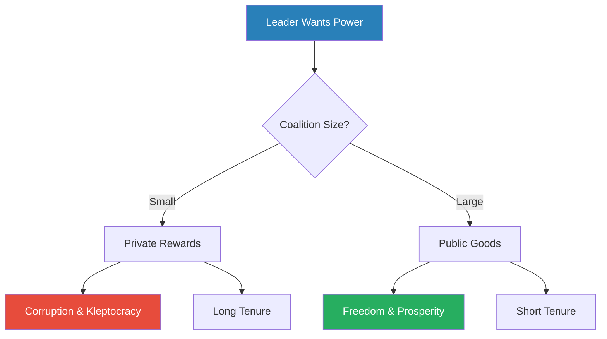
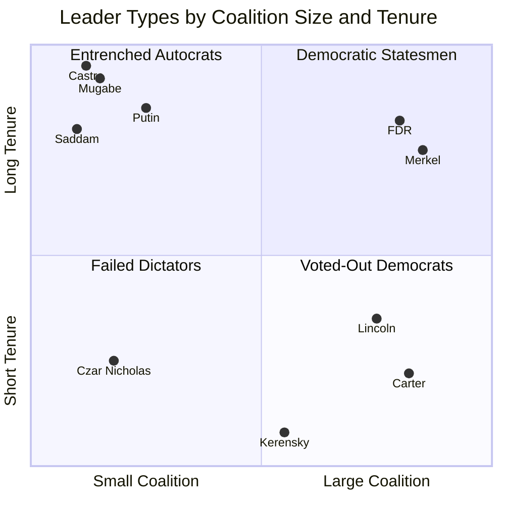
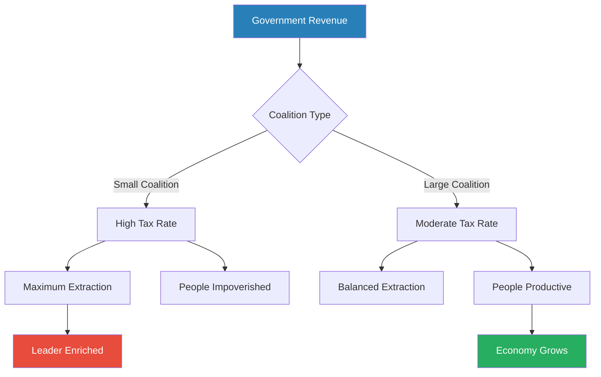
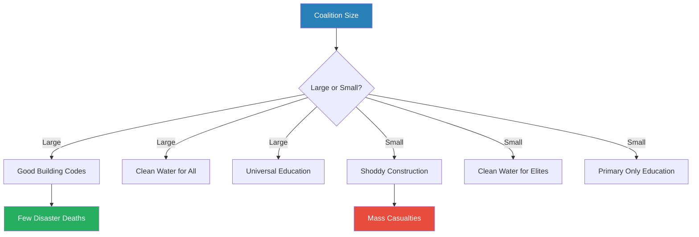
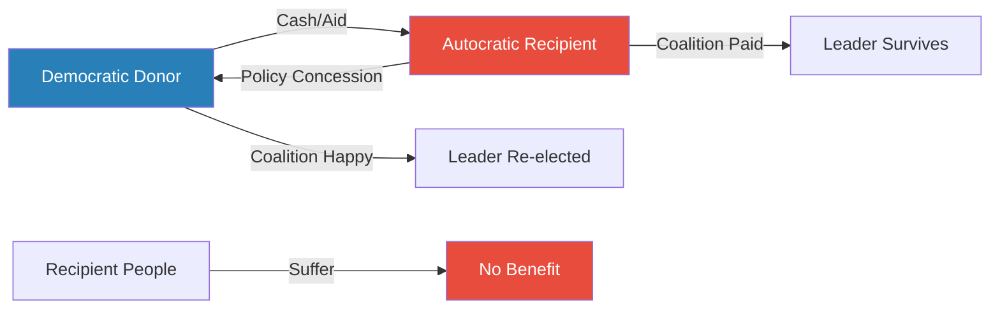
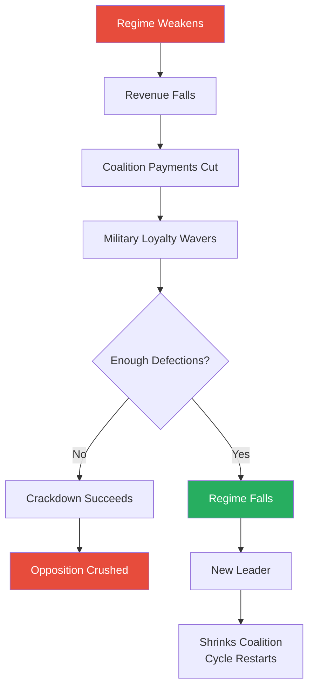
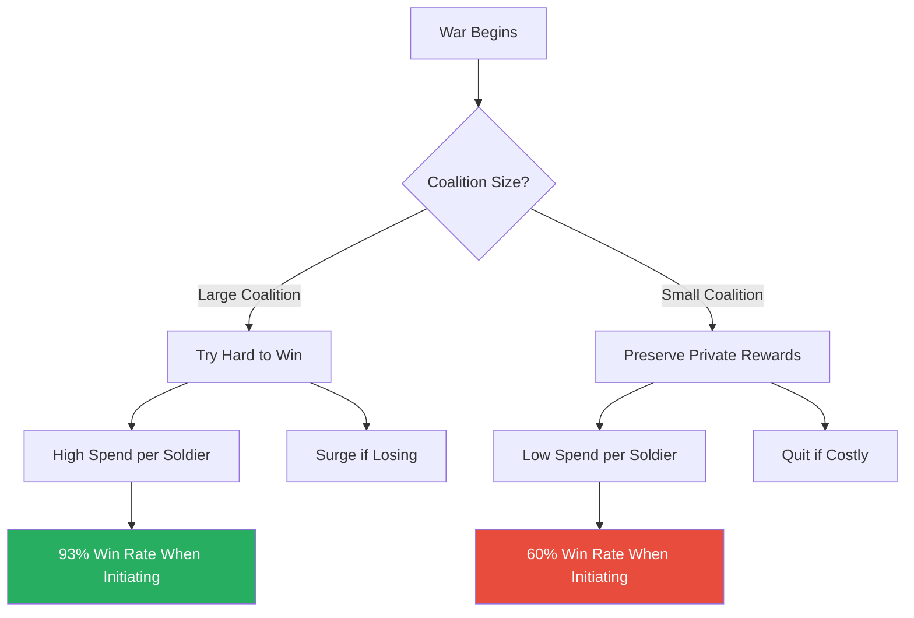
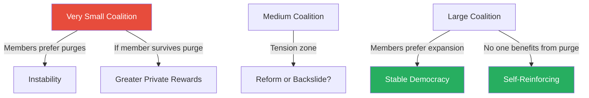

# The Dictator's Handbook — Bruce Bueno de Mesquita & Alastair Smith

> **In 30 seconds:** Bruce Bueno de Mesquita and Alastair Smith strip away ideology, culture, and personality to reveal the cold mechanics underneath all political behaviour. Every leader — dictator or democrat, CEO or pope — survives by managing three groups: interchangeables (the nominal electorate), influentials (those who really matter), and essentials (the winning coalition whose loyalty keeps the leader in power). The smaller the coalition a leader needs, the more corrupt, oppressive, and kleptocratic the regime becomes — not because leaders are evil, but because the math of survival demands it. This book is a unified field theory of power that explains why tyrants last decades, why democrats get tossed after one term, why foreign aid enriches dictators, and why the path to a better world runs through expanding coalitions, not electing better people.

---

## About the Author

Bruce Bueno de Mesquita is the Julius Silver Professor of Politics at New York University and a senior fellow at the Hoover Institution at Stanford. He is one of the founders of selectorate theory, a formal mathematical model of political survival that underpins this book. Through his New York-based consulting firm, he has advised the US government on national security and corporations on forecasting and engineering outcomes in negotiations. Alastair Smith is a professor of politics at NYU, previously at Yale and Washington University in St. Louis, whose research focuses on political economy, foreign aid, and leader survival. Together, they translate decades of game-theoretic political science into accessible, story-driven prose aimed at anyone who has ever wondered why governments behave the way they do.

---

## The Big Idea

- Politics is not about ideology, culture, or good intentions — it is about **getting and keeping power**
- Every organisation, from a nation-state to a corporation to the Vatican, runs on the same logic: leaders survive by rewarding the right people
- The key variable is <b style="color: #2980b9">coalition size</b> — the number of essential supporters a leader must keep happy
  - Small coalitions produce corruption, oppression, kleptocracy, and surprisingly durable regimes
  - Large coalitions produce public goods, freedoms, prosperity, and leaders who get voted out regularly
- The book demolishes the comforting fiction that bad governance is caused by bad people — it is caused by **bad incentives baked into institutional structures**
- Change the structure (expand the coalition), and even self-interested leaders will govern well — not out of virtue, but out of survival
- The framework applies with equal force to governments, corporations, religious institutions, sports organisations, and any other entity where someone leads and others follow
- The authors challenge us to stop saying "the United States should..." or "China's government ought to..." and instead think about the interests of **specific, named leaders** and the coalitions they depend on
- The game-theoretic insight at the core: every political actor is rational, pursuing survival and enrichment within the constraints imposed by their institutional environment
  - "Bad" behaviour is not a moral failure — it is the equilibrium outcome of a system with misaligned incentives
  - Changing behaviour requires changing the payoff structure, not the people
- This approach represents a sharp break from traditional political philosophy:

| Approach | Core question | Explains bad governance by... |
|----------|--------------|-------------------------------|
| Plato | Who should rule? | Wrong type of person in charge |
| Machiavelli | How does a prince keep power? | Prince's insufficient cunning |
| Hobbes | Why do we need a state? | Absence of sovereign authority |
| Marx | Who controls production? | Capitalist exploitation of workers |
| **Selectorate theory** | What coalition sustains the leader? | Institutional structure rewards bad behaviour |

The selectorate approach is distinctive because it doesn't require bad people, wrong ideologies, or cultural failings to explain bad outcomes — only bad institutional structures.

---

## Key Concepts at a Glance

| Concept | One-line summary |
|---------|-----------------|
| **Three dimensions** | Interchangeables, influentials, and essentials define every political system |
| **Five rules** | Keep coalition small, selectorate large, control revenue, pay supporters, ignore the people |
| **Coalition size** | The single variable that predicts freedom, prosperity, corruption, and leader tenure |
| **Selectorate theory** | Formal game-theoretic model of political survival based on group ratios |
| **Incumbency advantage** | Current leaders can promise rewards with certainty; challengers cannot |
| **Resource curse** | Natural wealth lets leaders ignore the people entirely |
| **Rigged elections** | Not about legitimacy — they warn coalition members they're replaceable |
| **Loyalty over competence** | Incompetent loyalists are safer than competent rivals |
| **Democratic peace** | Democracies rarely fight each other because both sides try too hard to win |
| **Aid-for-policy** | Foreign aid buys policy concessions, not poverty relief |
| **Debt forgiveness trap** | Forgiving autocratic debt just lets them borrow and steal again |
| **Bloc voting** | Turns democratic institutions into small-coalition systems |
| **Freedom as public good** | Costs nothing to provide, yet autocrats suppress it because it enables coordination |
| **The autocrat's dilemma** | Need enough freedom for economic productivity, not enough for revolution |
| **Fungibility of aid** | NGO spending displaces government spending, freeing funds for corruption |

The near-perfect correlation between coalition size and public goods provision is the book's core empirical claim — as the winning coalition expands from 1% (autocracy) to 50% (strong democracy), leaders shift from private rewards to public goods because it becomes the only affordable survival strategy.

---

## Chapter-by-Chapter Summary

### Introduction: Rules to Rule By

*A small California town reveals the universal mechanics of how power really works — and it has nothing to do with ideology or national character.*

- The authors open with the story of <b style="color: #2980b9">Bell, California</b> — a poor, mostly Hispanic suburb of Los Angeles where city manager Robert Rizzo earned $787,000 per year while a quarter of residents lived below the poverty line
- Rizzo's salary was perfectly legal — made possible by a 2005 special election that converted Bell from a "general city" to a "charter city," giving local officials discretion over their own compensation
  - The special election attracted fewer than 400 voters out of 36,000 residents
  - Property taxes were set 50% higher than neighbouring communities
  - Four of five council members earned nearly $100,000 through board fees for meetings that never took place
  - Only one councillor, Lorenzo Velez, was excluded from the riches — he wasn't part of the inner circle

> [!example] Robert Rizzo and Bell, California (2005-2010)
> - Rizzo was hired in 1993 at $72,000; by 2010 he earned $787,000 — a 15% compounded annual raise
> - A special election on an obscure technical question drew only 336 favourable votes
> - This gave a handful of people control over taxation and spending behind closed doors
> - Council members disguised their pay as "board fees" for meetings that never took place
> - The scheme survived for years until outside journalists investigated
> - Rizzo's behaviour was entirely predictable from coalition logic: tiny coalition, large selectorate, total discretion over revenue
> **The lesson:** When a leader's survival depends on very few people drawn from a large pool, kleptocracy is not a bug — it is the optimal strategy.

- The Bell story embodies four universal lessons:
  - Politics is about getting and keeping power, not serving the people
  - Survival is best assured by depending on **few** people
  - A large pool of potential replacements gives leaders maximum discretion
  - Small coalitions + high taxes = enrichment at the top
- These four lessons are not specific to American municipal governance — they describe the logic of power from the Ottoman Empire to the Vatican to Hewlett-Packard's boardroom
- The key intellectual move the authors make is to insist that we stop treating different political contexts as fundamentally different
  - A corporation is not "like" a dictatorship — it IS one, structurally, when the board is small and shareholder influence is diffuse
  - A church is not "like" a kingdom — it operates on identical coalition mechanics
  - The difference between a liberal democracy and a kleptocracy is not morality or culture — it is the ratio of essentials to interchangeables

> [!tip] Core Insight
> There is nothing unique about political behaviour. The same rules that govern Bell, California govern the Ottoman Empire, the Vatican, Hewlett-Packard, and the United States Congress. The framework is universal because survival incentives are universal.

---

### Chapter 1: The Rules of Politics

*Every political system — from a dictatorship to a democracy to a publicly traded corporation — can be mapped onto three dimensions and governed by five rules.*

The authors introduce their core framework: <b style="color: #2980b9">selectorate theory</b>, built on three groups that exist in every organisation.

**The Three Dimensions:**

| Group | Definition | Corporate equivalent | Example |
|-------|-----------|---------------------|---------|
| **Interchangeables** | Everyone with a nominal say in choosing the leader | All shareholders | Registered voters |
| **Influentials** | Those whose support actually matters | Large institutional shareholders | Swing-state voters |
| **Essentials** | The minimum group the leader must keep happy | Board of directors + senior management | Key party donors, military brass |

- The ratio between these groups determines everything about how an organisation is governed
- <b style="color: #27ae60">When essentials are few and interchangeables are many, leaders have maximum power and the people suffer most</b>
- When essentials are many, leaders must provide public goods to survive
- The distinction between "autocrat" and "democrat" is not binary — some elected leaders rule like despots (Bell, California) while some "kings" were historically elected
- The real breakthrough is recognising that political behaviour is **continuous** across systems — every organisation sits somewhere on the spectrum from tiny to huge coalition

---

**The Game-Theoretic Foundation:**

- Selectorate theory is not a metaphor — it is a formal mathematical model developed in the authors' earlier academic work, *The Logic of Political Survival* (2003)
- The model assumes:
  - Every political actor is **self-interested** — leaders want to stay in power, coalition members want rewards, the masses want public goods
  - Information is **imperfect** — leaders don't know exactly how loyal each supporter is, and supporters don't know exactly how secure the leader is
  - Promises about the future are only credible if the **institutional structure** makes them enforceable
- The critical insight from the model: <b style="color: #2980b9">incumbency advantage</b>
  - A sitting leader can promise rewards to coalition members with near-certainty — they control the treasury right now
  - A challenger can only promise future rewards — which coalition members have no guarantee of receiving
  - This asymmetry means that coalition members will tolerate a lot of bad governance before defecting to a challenger
  - The larger the selectorate relative to the coalition, the stronger this effect — because each member knows how easily they could be replaced
- The game-theoretic equilibrium predicts that autocracies will be stable, corrupt, and long-lasting — not because leaders are uniquely evil, but because the payoff structure rewards exactly those behaviours

The nested structure of the three groups determines the balance of power in every organisation — the leader survives by paying the innermost ring and keeping the outermost ring too large and diffuse to coordinate.

The treemap makes visible what selectorate theory quantifies: in autocracies the essentials block is tiny relative to the massive interchangeable pool (giving leaders maximum leverage), while in strong democracies the three groups converge in size, forcing leaders to serve broad interests.

---

**The Virtues of 3-D Politics:**

- Conventional political thinkers — Machiavelli, Hobbes, Montesquieu, even Plato — thought about government too narrowly, within the context of their own times
- The three-dimensional model makes political behaviour predictable across vastly different contexts
- Once we accustom ourselves to thinking this way, we can explain:
  - Why Bell, California behaved identically to a petty dictatorship
  - Why the International Olympic Committee is rife with bribery
  - Why corporate boards reward failing CEOs
  - Why democracies provide clean water and autocracies don't
- The authors urge us to stop using national personification — "France believes..." or "China wants..." — and instead identify the specific leader, their coalition, and their incentives
- The framework also explains why some institutions resist reform:
  - Reform that benefits the public may harm the coalition
  - <b style="color: #e74c3c">A leader who reforms at the coalition's expense will be deposed — replaced by someone who won't reform</b>
  - This is why "just elect better people" never works without structural change

---

**How the Framework Applies to Corporations:**

- Most publicly traded companies are structured as small-coalition systems with a large selectorate
  - Millions of shareholders (interchangeables)
  - A few large institutional shareholders (influentials)
  - A tiny board of directors (essentials)
- This explains why poorly performing CEOs rarely get fired, why executive compensation keeps rising even when stock prices fall, and why corporate annual reports are deliberately opaque
  - Secrecy ensures every supporter's price is kept as low as possible — no one knows what others are getting
  - Woe to any supporter discovered trying to coordinate with fellow coalition members to raise their price
- <b style="color: #e74c3c">The corporation is the modern world's most common dictatorship</b> — wrapped in the language of shareholder democracy but operating on small-coalition logic
- The parallel is not just an analogy — the authors demonstrate that corporate boards exhibit statistically identical behaviour to autocratic governments:
  - Executive compensation rises independently of performance
  - Boards that are smaller tend to pay CEOs more
  - "Independent" directors are often friends of the CEO — selected precisely for their willingness to go along

---

**The Five Rules of Political Survival:**

> [!abstract] The Five Rules
> 1. **Keep the winning coalition as small as possible** — fewer mouths to feed means more for each
> 2. **Keep the nominal selectorate as large as possible** — a huge pool of replacements keeps coalition members obedient
> 3. **Control the flow of revenue** — better to determine who eats than to grow a bigger pie
> 4. **Pay key supporters just enough to keep them loyal** — not a penny more
> 5. **Don't take money from supporters to help the people** — hungry people can't overthrow you; disappointed coalition members can

- <b style="color: #e74c3c">These rules apply to democracies too</b> — gerrymandering (Rule 1), immigration policy (Rule 2), tax code battles (Rule 3), earmarks and welfare (Rule 4), and resistance to universal healthcare by some parties (Rule 5) all follow the same logic
- The genius of Lenin was Rule 2: he introduced universal adult suffrage in a one-party state, creating a vast supply of interchangeables who could never actually influence outcomes but who kept every party member terrified of being replaced
- Pakistan's president Asif Ali Zardari exemplified Rule 3 — worth an estimated $4 billion while governing a country near the world's bottom in per capita income
- Zimbabwe's Robert Mugabe demonstrated Rule 4 — whenever facing a threat of military coup, he managed to pay his army just in time, keeping their loyalty against all odds

The size of the winning coalition is the master variable — it predicts corruption levels, public goods provision, leader tenure, and quality of life more reliably than wealth, culture, or ideology.

The radar chart illustrates why the same five rules produce radically different outcomes — dictators max out every rule (small coalition, total revenue control, ignoring the people), while democrats are structurally constrained on each dimension because their large coalitions make those strategies unaffordable.

---

**Taxing and Shuffling:**

- Taxation is the lifeblood of governance — but how taxes are collected and distributed depends entirely on coalition structure
  - In small coalitions, the tax rate is whatever maximises revenue extraction — typically very high
  - In large coalitions, the tax rate must balance revenue needs against the happiness of coalition members who also pay taxes
- <b style="color: #27ae60">Shuffling the essential deck is the most powerful move a leader can make</b>
  - Replacing coalition members with cheaper, more grateful substitutes strengthens the leader's position
  - The threat of replacement keeps current members obedient
  - This is why leaders of all kinds periodically reshuffle cabinets, boards, and inner circles — not for policy reasons, but for survival
- The shuffling principle connects to game theory's concept of **credible threats**:
  - A coalition member knows their loyalty is worth exactly what the next-cheapest replacement would charge
  - If the selectorate is huge relative to the coalition, the replacement cost is trivially low
  - This forces coalition members into a race to the bottom — each accepting less to avoid being replaced
  - The leader extracts maximum obedience at minimum cost

---

### Chapter 2: Coming to Power

*Seizing power requires speed, money, and the ruthless willingness to betray those who helped you get there.*

- To come to power, a challenger must do three things:
  - Remove the incumbent (death, defection, revolution)
  - Seize the apparatus of the state (especially the treasury)
  - Form a coalition sufficient to sustain the new regime
- <b style="color: #e74c3c">Speed is everything</b> — there is no prize for coming in second
- The first act of any new leader must be finding the money — without it, the coalition dissolves before it solidifies
- The game theory of transitions involves a coordination problem:
  - Each potential supporter must decide simultaneously whether to back the challenger or the incumbent
  - If enough supporters switch, the challenger wins and those who switched early get the best rewards
  - If not enough switch, the challenger fails and those who switched are punished or killed
  - This makes transitions inherently unstable — small signals can tip the balance either way

> [!example] Sergeant Samuel Doe Seizes Liberia (1980)
> - Doe, virtually illiterate, scaled the fence of the Executive Mansion with sixteen fellow soldiers
> - They originally wanted to confront the president about unpaid wages
> - Finding President Tolbert asleep, Doe bayoneted him and threw his entrails to the dogs
> - He immediately replaced government and army officials with members of his own small Krahn tribe (4% of population)
> - He increased army privates' pay from $85 to $250 per month — then executed fifty of his original collaborators
> - Funded by Firestone rubber leases, iron mining, ship registration, and $500 million in US aid over a decade
> - His fate was sealed when Charles Taylor's rebellion cut off his revenue: Doe was tortured and killed on camera in 1990
> **The lesson:** Coming to power requires knowing where the money is and paying the right people first. Losing the money means losing everything.

---

**Mortality as the Best Opportunity:**

- A dying leader cannot deliver future rewards — this is when coalitions defect
- <b style="color: #27ae60">The key to revolution is not popular discontent but coalition disloyalty</b>
- Medical records are among the most politically valuable documents in existence
- When coalition members learn their patron is dying, they begin shopping for a new leader who can guarantee their future
- The game-theoretic logic is precise:
  - A coalition member's loyalty depends on the expected present value of future rewards
  - If the leader will die in six months, the stream of future rewards is truncated
  - A challenger who can promise thirty years of rewards suddenly offers a better deal
  - The tipping point comes not when the leader actually dies, but when enough coalition members **believe** death is imminent

> [!example] Khomeini Waits for the Shah's Cancer (1979)
> - Khomeini spent fifteen years in exile, refusing to return until the shah was gone
> - When the New York Times published accounts of the shah's terminal cancer, the army knew their patron was dying
> - Unable to guarantee future rewards, the military sat on its hands as millions took to the streets
> - An estimated 6 million people cheered Khomeini's return — but he quickly rewrote the constitution to concentrate power among clerics
> - The secular and moderate groups who brought him to power found themselves excluded
> - Khomeini's first act was to shrink the coalition dramatically — replacing the shah's broad-based military with a narrow circle of loyal clerics
> **The lesson:** Impending death often induces political death. Steal medical records, not policy platforms.

> [!example] Corazon Aquino Defeats Marcos (1986)
> - Benigno Aquino Jr. was the brilliant opposition leader — assassinated on the Manila airport tarmac in 1983
> - His wife Corazon had no political experience but one critical advantage: she was alive
> - Ferdinand Marcos was dying of lupus and his key backers knew it
> - When Marcos called snap elections and committed widespread fraud, his supporters deserted him
> - Cardinal Sin rallied millions to the streets, but the real defection was military — key generals switched sides
> - Corazon Aquino was inaugurated president and named Time's Woman of the Year
> **The lesson:** A leader who can't deliver from beyond the grave loses the incumbency advantage entirely. Being alive and willing beats being experienced and dying.

---

**Inheritance and the Problem of Relatives:**

- In monarchies, inheritance solves the succession problem — but creates new ones
- A king's heir is a permanent threat: the one person who benefits most from the king's death
  - Ottoman sultans solved this by murdering their brothers upon accession
  - Mehmet III had nineteen brothers strangled on the day he became sultan
- <b style="color: #e74c3c">Family members are the most dangerous coalition members of all</b> — they have the strongest claim to replace you
- Richard the Lionheart's brother John immediately tried to seize power while Richard was on crusade
  - When Richard returned, he forgave John — "Don't be afraid, you are a child" — a calculated move to keep a known rival close rather than create an unknown enemy
- The problem of inheritance illustrates a broader game-theoretic principle:
  - A designated successor has a **time-inconsistency problem** — they are promised future power, but the current leader has every incentive to delay or revoke that promise
  - The successor knows this, so they have an incentive to act preemptively
  - Both parties know the other's incentives, creating a spiral of suspicion that often ends in violence

> [!example] The Ottoman Fratricide Law
> - Mehmet the Conqueror codified the practice in the fifteenth century: upon accession, the new sultan had the legal right to execute all his brothers
> - The rationale was explicitly stated — preventing civil war by eliminating rival claimants
> - Mehmet III had nineteen brothers strangled with silk bowstrings on his first day as sultan
> - Later sultans modified the practice, locking brothers in the "kafes" (cage) — a luxurious but sealed suite within the palace
> - Princes who emerged from the kafes after decades of confinement were often mentally damaged, ensuring they posed no threat
> - The system worked — the Ottoman Empire lasted over 600 years, longer than virtually any other dynasty
> **The lesson:** The most stable autocratic systems are those that solve the succession problem most ruthlessly. Compassion toward rivals is a survival risk.

---

**Papal Bull-ying for Power:**

> [!example] Pope Liberius vs the Arian Heresy (352-366 CE)
> - The Roman Emperor Constantius demanded that Pope Liberius support Arianism
> - When Liberius refused, Constantius banished him and installed Felix as antipope
> - Liberius eventually capitulated — signing a document endorsing Arianism — and was allowed to return
> - Felix was expelled; Liberius re-established orthodoxy
> - The lesson is not about theology but coalition management: even popes must manage their selectorate
> - Later papal elections became notoriously corrupt, with candidates buying votes and murdering rivals
> **The lesson:** The Vatican operates on exactly the same coalition logic as any other political system. The cardinals who elect popes are the winning coalition, and they expect rewards.

---

**The Russian Revolution as a Bankruptcy Problem:**

> [!example] Czar Nicholas and the Vodka Tax (1914-1917)
> - Czar Nicholas had the "silly idea" that a sober army would fight better in World War I
> - He banned vodka — which was so popular that its sale provided about a third of government revenue
> - With revenue slashed and war costs rising, he could no longer pay his soldiers enough to keep them loyal
> - When protesters stormed the Winter Palace, the army refused to stop them — not because they supported democracy, but because they hadn't been paid
> - Alexander Kerensky formed a short-lived democratic government, then made his own fatal error: continuing an unpopular war while needing a large coalition
> - Lenin and the Bolsheviks, making no such mistakes about coalition management, swiftly replaced him
> **The lesson:** Successful leaders put raising revenue and paying supporters above all else. Good governance is a distant secondary concern.

- Robert Mugabe's Zimbabwe demonstrates the opposite: despite collapsing the economy, he stayed in power because he always found a way to pay the army
- Where policy matters most — paying off cronies — Mugabe delivered, and no one deposed him
- The contrast between Czar Nicholas and Mugabe illustrates a precise game-theoretic prediction:
  - Leaders who lose revenue lose power — regardless of how popular or competent they are
  - Leaders who maintain revenue maintain power — regardless of how destructive or incompetent they are
  - The correlation between governance quality and leader survival is **zero** in small-coalition systems and **strongly positive** only in large-coalition systems

Coming to power is a race to control the money and pay the right people — in dictatorships through force, in democracies through policy competition.

---

**Silence Is Golden:**

> [!example] Ahmed Ben Bella's Fatal Announcement — Algeria (1965)
> - Ben Bella, Algeria's president, announced a politburo meeting to discuss: (1) cabinet changes, (2) army command changes, (3) "liquidation of the military opposition"
> - He did not say who would be replaced — so everyone in the coalition felt threatened
> - He then left the capital for a week, giving rival Houari Boumediene time to organise a coup
> - Ben Bella returned and was awakened at gunpoint by his own friend, Colonel Tahar Zbiri
> - His essential supporters defected en masse — they had no reason to stay loyal when they might be next
> **The lesson:** Never show your hand before you have to. Announcing a reshuffle without specifics unites the entire coalition against you.

---

**Coming to Power in Democracy:**

- Democratic transitions are less violent but follow the same logic
- Challengers must offer the coalition better rewards — in democracies, this means better public policies
- <b style="color: #2980b9">Divide and conquer</b> is the great democratic strategy: find an issue where the incumbent's supporters disagree, and the coalition fractures

> [!example] Abraham Lincoln Splits the Democrats (1858-1860)
> - During the 1858 Illinois senate race, Lincoln forced Stephen Douglas to declare his position on slavery
> - The Dred Scott decision had just ruled that Congress couldn't ban slavery in territories — putting Douglas in an impossible bind
> - If Douglas said slavery could be excluded, he'd win Illinois but shatter his national party base
> - If he said it couldn't, he'd lose Illinois and his presidential ambitions
> - Douglas chose to win locally — declaring that people could exclude slavery — and won the senate seat
> - But his answer split the Democratic Party in the 1860 presidential election, clearing the way for Lincoln
> - Lincoln won the presidency with less than 40% of the popular vote
> - He later introduced absentee ballots for Union soldiers in 1864, expanding the interchangeables to his advantage
> **The lesson:** In democracy, you don't need to be loved by all — you need to fracture the opposition's coalition.

---

**The Defection Cascade — How Regimes Actually Fall:**

- The authors present a model of regime collapse that differs sharply from the conventional "popular uprising" narrative:
  - Regimes do not fall because the people rise up — they fall because the **coalition** fragments
  - The people serve as a catalyst at most — their protests create uncertainty that coalition members exploit
  - The actual mechanism is a **defection cascade**: one key supporter defects, which raises the probability that others will follow, which raises it further, until the cascade becomes unstoppable
- The defection cascade has a mathematical structure:
  - Each coalition member has a **defection threshold** — the number of others who must defect before they will
  - If thresholds are evenly distributed, a single defection can trigger a chain reaction
  - If thresholds are clustered high (everyone needs most others to defect first), the regime is stable
  - <b style="color: #2980b9">The leader's job is to keep defection thresholds high</b> — through fear, rewards, and uncertainty about who else might defect
- This explains why seemingly stable regimes collapse overnight:
  - The coalition structure looked solid from the outside, but internally, many members were close to their defection threshold
  - A single shock — a health crisis, a lost battle, a viral video — pushes one or two past their threshold
  - Their defection lowers others' thresholds, and the cascade begins

> [!tip] Core Insight
> Revolutions are not caused by mass anger but by elite defection. The people may storm the streets, but the regime falls only when the army stops shooting — and the army stops shooting when its commanders calculate that the leader can no longer pay them.

---

**Winston Churchill and the Limits of Democratic Gratitude:**

- Churchill is often seen as Britain's greatest wartime leader — he convinced Roosevelt to implement Lend-Lease, converted the economy to a wartime footing, and was adored by the British people
- Yet Clement Attlee's Labour Party defeated Churchill just months after the war ended
- Churchill offered continued austerity to rebuild British greatness; Attlee offered the National Health Service and a welfare state
- <b style="color: #27ae60">In democracy, past deeds don't buy loyalty — the coalition always asks "what have you done for me lately?"</b>
- This is why democracies produce better policies: leaders are locked in a permanent arms race for good ideas
- Democracy is not a system that selects virtuous leaders — it is a system that forces even selfish leaders to compete on good policy
- The Churchill example also illustrates the **time horizon** difference between coalition types:
  - In autocracies, coalition members think long-term — their rewards accumulate over decades of loyal service
  - In democracies, coalition members (voters) think short-term — they evaluate the last few years and vote accordingly
  - This short-termism is actually democracy's greatest strength: it keeps leaders permanently accountable

---

### Chapter 3: Staying in Power

*The skills needed to seize power are entirely different from those needed to keep it — and both have nothing to do with governing well.*

The quadrant reveals selectorate theory's core prediction: small coalitions enable long tenure (upper-left cluster of autocrats), large coalitions enable good governance but shorten tenure (lower-right cluster of democrats), and the rare leaders who combine large coalitions with long tenure (upper-right) are the ones history remembers as great.

- A wise new leader immediately reshuffles the coalition that brought him to power
  - Those who helped you seize power can help someone else seize it from you
  - Sack some early backers, replace them with cheaper, more loyal supporters
  - The new replacements owe everything to you and have no independent power base

**The Three Most Important Characteristics of a Coalition:**

1. Loyalty
2. Loyalty
3. Loyalty

- <b style="color: #e74c3c">Competence is dangerous</b> — competent people are potential rivals
- A competent subordinate has the skills to replace you, the ambition to consider it, and the credibility to attract a new coalition
- The formal logic: in a game where the leader can be replaced, a competent coalition member has a higher outside option (they could become leader themselves)
  - This gives them bargaining power — they can demand more, knowing the leader needs them but fears them
  - An incompetent loyalist has no outside option — they can never become leader, so they accept whatever the leader gives them
  - <b style="color: #27ae60">The optimal coalition member is maximally loyal and minimally competent</b> — enough to carry out orders, not enough to conceive independent plans

---

**The Perils of Meritocracy:**

- Saddam Hussein surrounded himself with loyal incompetents from his own clan, installing them in the most important positions — those involving force and money
- His cousin "Chemical Ali" al-Majid — a former motorcycle courier with no formal education — held posts as defence minister, interior minister, and head of intelligence
  - His main area of competence was murder
  - On the infamous videotape, al-Majid told Saddam: "What you have done in the past was good. What you will do in the future is good. But there's one small point. You have been too gentle, too merciful"
- Saddam's successor, Prime Minister Nouri al-Maliki, followed the identical pattern — purging all Sunnis from security services and replacing them with less experienced Shia supporters
- The principle extends beyond governments: anyone who thinks about it will notice that successful autocrats rarely appoint genuinely threatening individuals to positions of real power

> [!example] Saddam Hussein's Videotaped Purge (1979)
> - Six days after compelling his predecessor to resign, Saddam convened a national assembly of Ba'ath Party leaders
> - He insisted the session be videotaped — ensuring every person present would be on record
> - A "confession" was read out naming sixty-eight "enemies of the state"
> - Each was removed from the assembly one by one, their colleagues watching in terror
> - Twenty-two were sentenced to death by firing squad — executed by delegates from each party branch, who were required to send a rifleman
> - By forcing delegates to participate in the killings, Saddam made them complicit — they could never claim innocence
> - Hundreds more were executed in subsequent days
> - Those who survived — like Chemical Ali — were thrilled, knowing they would collect even greater rewards
> **The lesson:** Those who can bring a leader to power can bring him down. Shrink the ranks, bind the survivors with blood, and keep the loyal.

---

**Robert Mugabe — From "Good Old Bob" to Genocidal Tyrant:**

> [!example] Mugabe's Transformation — Zimbabwe (1980-2008)
> - After winning power following a long civil war, Mugabe preached reconciliation: "If yesterday I fought you as an enemy, today you have become a friend"
> - He reached out to the white community, particularly former administrators who knew how to run the country — many called him "Good Old Bob"
> - The international community pledged $900 million in his first year
> - Once entrenched, everything changed: in 1981 he called for a one-party state and began arresting whites
> - He sent North Korean-trained paramilitaries (the Fifth Brigade) to terrorize Matabeleland, his former ally Nkomo's stronghold
> - The operation was called Gukurahundi — "Wind that blows away the chaff before the spring rains"
> - 400,000 people faced starvation; a brigade officer declared: "First you will eat your chickens, then your goats, then your cattle, then your donkeys. Then you will eat your children and finally you will eat the dissidents"
> **The lesson:** Leaders need early allies to find the money and consolidate power. Once they're entrenched, "Good Old Bob" shows his true colours — because the logic of small-coalition survival demands it.

---

**Keeping Essentials Off-Balance:**

- Rigged elections are not about legitimacy — they are a **warning system**
  - They remind coalition members they are expendable
  - Any deviance from the leader's wishes can be met with replacement from the large selectorate
- Lenin perfected this: universal adult suffrage in a one-party state gave every citizen a theoretical (but vanishingly small) chance of advancement
  - This kept inner-circle members obedient out of fear of being replaced
- Virtually every publicly traded company in the world has adopted the same Leninist rigged-election system — millions of shareholders have a nominal vote, but real power lies with a tiny board
- <b style="color: #2980b9">The annual shareholder meeting</b> is structurally identical to a Soviet election: the outcome is predetermined, but the ritual reminds everyone who has power and who doesn't
- The deeper principle: uncertainty about one's standing in the coalition is the leader's most powerful tool
  - If every coalition member knew they were safe, they would demand more
  - If every coalition member knew they were about to be purged, they would rebel
  - The sweet spot is controlled uncertainty — enough to keep people obedient, not enough to make them desperate

---

**Eunuchs and the Competence Trap:**

- The problem with competent advisers is that they might become competent rivals
- Byzantine, Mughal, Chinese, and Caliphate emperors solved this by using **eunuchs** in top positions — they could never seize the throne
- Emperor Michael III made an exception, giving the top post to his non-eunuch favourite, Basil — who murdered him and seized the throne
- Even in modern times: Saddam Hussein as president of Islamic Iraq had a **Christian**, Tariq Aziz, as his number two — someone who could never lead a Muslim nation
- The pattern appears everywhere:
  - Women in patriarchal societies were trusted advisers because they could not hold formal power
  - Foreigners in royal courts were valued precisely because they had no domestic power base
  - <b style="color: #27ae60">The ideal coalition member is someone who is utterly dependent on the leader and utterly unable to replace them</b>

| Historical method | Why it worked | Modern parallel |
|-------------------|---------------|-----------------|
| Eunuchs in Byzantium/China | Physically unable to found a dynasty | Appointing minorities who cannot lead the majority |
| Foreign advisers | No domestic power base | Hiring consultants with no internal allies |
| Religious minorities in key roles | Could never rally the majority | Tariq Aziz (Christian in Muslim Iraq) |
| Loyal incompetents | Lack skills to organise a coup | Promoting yes-men over talented rivals |

The table illustrates a universal principle: leaders prefer supporters whose ambitions are structurally capped.

---

**Leader Survival Statistics:**

| Period | Democrats removed | Autocrats removed |
|--------|:-:|:-:|
| First 6 months | ~20% | ~35% |
| By end of year 2 | ~43% | ~29% |
| Surviving 10+ years | 4% | 11% |

- Autocrats face higher early risk (haven't found the money or sorted the coalition yet) but once they survive the initial turbulence, they outlast democrats dramatically
- Democrats are constantly vulnerable because they need winning ideas, not just loyal cronies
- The data is stark: if an autocrat survives two years, they are likely to rule for decades
- The game-theoretic explanation:
  - Once an autocrat has sorted their coalition, the incumbency advantage becomes overwhelming
  - Each coalition member's defection risk decreases over time as they accumulate rewards that would be lost by switching sides
  - The longer the autocrat survives, the more each member has invested — creating a **sunk cost lock-in** that stabilises the regime

---

**Carly Fiorina's Corporate Coalition at HP:**

> [!example] Hewlett-Packard's Boardroom Power Struggle (1999-2005)
> - Fiorina inherited a fourteen-member board with significant insider influence — Hewlett and Packard family members owned large stakes
> - She systematically reduced the board from fourteen to ten members, removing critics
> - The Compaq merger was partly a political move — adding five new Compaq board members while removing old ones shifted the balance of power
> - Board compensation doubled from ~$105,000 to ~$220,000 during her tenure — even as stock price declined
> - Despite these manoeuvres, she was eventually deposed — her large-shareholder insiders cared about stock performance (a public good), not board fees
> - Her successor, Mark Hurd, delivered stellar performance but was also ousted — over a personal scandal
> **The lesson:** Corporate governance follows identical coalition logic to national politics. "Ruling is the objective, not ruling well."

---

**Democrats Aren't Angels — Bloc Voting:**

- In many fledgling democracies, <b style="color: #2980b9">bloc voting</b> makes nominally large-coalition systems function like autocracies
- A village elder delivers all his community's votes in exchange for rewards — making him the real influential
  - What looks like democracy on paper operates as a small-coalition system in practice
- In India's Bihar state, the Raja of Ramgarh switched parties every few months, bringing coalition governments down and up at will, extracting greater private goods each time
- Singapore's Lee Kuan Yew used public housing as a stick: neighbourhoods that failed to deliver PAP votes found housing provision and maintenance cut off
- Zimbabwe's Mugabe used bulldozers to demolish homes and markets in districts that voted against him
- <b style="color: #e74c3c">Bloc voting takes democratic institutions and makes them function like publicly traded companies</b> — every voter has a nominal right, but all power lies with a few who control large blocs
- The practical implication: counting voters is less important than counting how many **independent** voting decisions are made
  - A country with 50 million voters but 200 bloc leaders has an effective coalition size of 200, not 50 million
  - This explains why "democratic" countries like Pakistan, Bangladesh, and parts of India often behave like autocracies despite holding regular elections

---

### Chapter 4: Steal from the Poor, Give to the Rich

*Revenue is the oxygen of political survival — and the methods of extraction reveal everything about the nature of a regime.*

- <b style="color: #2980b9">Taxation</b> serves a dual purpose: it generates revenue for the leader AND it impoverishes those outside the coalition
  - Being poor outside the coalition vs. rich inside it makes coalition loyalty ferocious
  - As Phillip Chiyangwa of Zimbabwe stated bluntly: "I am rich because I belong to Zanu-PF"
- Autocrats tax at the revenue-maximising rate — they want every penny
- Democrats are constrained by the need to keep coalition members (who also pay taxes) happy
- As Mexico democratised from 1994 to 2000, its top marginal tax rate dropped from 55% to 40%
  - This wasn't generosity — the expanding coalition included taxpayers who demanded lower rates
  - The pattern repeats across every democratic transition

The relationship between coalition size and taxation reveals the fundamental bargain of governance — leaders take as much as they can get away with, constrained only by the need to keep their supporters content.

---

**The Resource Curse:**

> [!tip] Core Insight
> Oil flows out of the ground whether it is taxed at 0% or 100%. Natural resources are a leader's dream and the people's nightmare — because they eliminate the need for a productive workforce entirely.

- Nigeria accumulated $350 billion in oil revenue from 1970 to 2000
  - Per capita income actually **fell** from $1,113 to $1,084
  - Poverty rose from 36% to nearly 70%
  - The oil money went to the coalition; the people got poorer
- Resource-rich nations systematically grow more slowly, suffer more civil wars, and become more autocratic
- The cost of living for expatriates reveals the paradox starkly:
  - Luanda, Angola is one of the world's most expensive cities ($10,000+ monthly rent)
  - Yet 68% of Angolans live below the poverty line
  - More than a quarter of children die before age five
  - Male life expectancy is below forty-five
  - Prices are fuelled by oil — the coalition lives like kings while the people starve
- <b style="color: #27ae60">The easiest way to incentivise a dictator to liberalise is to force him to rely on tax revenue</b> — once this happens, he cannot suppress the people because they won't work if he does
- The resource curse can be lifted — if external actors raise the cost of petroleum extraction, reducing oil revenue and forcing leaders to rely on taxable worker productivity
- The game-theoretic mechanism behind the resource curse:
  - Revenue from natural resources is **exogenous** — it arrives regardless of what citizens do
  - Revenue from taxation is **endogenous** — it depends on citizen productivity, which depends on public goods
  - When exogenous revenue is high, leaders have no incentive to invest in their people
  - When exogenous revenue is low, the only way to generate revenue is to make people productive — which requires education, infrastructure, healthcare, and freedom

> [!example] Khodorkovsky — Russia's Richest Man Goes to Prison (2003)
> - In 2004 Mikhail Khodorkovsky was the sixteenth wealthiest person in the world
> - He built Yukos, accounting for 20% of Russian oil production
> - He spoke out against Putin's autocratic rule and funded opposition parties
> - He was arrested on fraud charges; Yukos's tax burden was set higher than gross revenue — designed to bankrupt the company
> - Meanwhile, loyal oligarchs who kept quiet kept their fortunes
> - The message to every wealthy Russian was unmistakable: your wealth exists at the leader's pleasure
> **The lesson:** In autocracies, it is unwise to be rich unless the government made you rich — and if they did, loyalty comes before all else.

> [!example] Equatorial Guinea's Oil Bonanza
> - Before oil was discovered in 1995, Equatorial Guinea was a poor agricultural country with roughly democratic governance
> - Oil transformed the country into one of Africa's wealthiest per capita — but only on paper
> - President Obiang Nguema concentrated oil revenues in the hands of a tiny coalition — his extended family
> - The country's Senate essentially his personal rubber stamp; his son Teodoro (known as "Teodorín") maintained a $35 million Malibu mansion and a fleet of supercars
> - Meanwhile, more than 60% of the population lived on less than $1 a day
> - International oil companies paid the government directly — the people were cut out entirely
> - A US Senate investigation found $700 million from oil in accounts controlled by Obiang and his family at a single US bank
> **The lesson:** The resource curse is not about resources — it is about what resource revenue does to coalition incentives. When money arrives independent of the people, the people become irrelevant.

---

**Borrowing and Debt:**

- Leaders of all types prefer to spend today and let successors worry about repayment
- As coalition size shrinks, the incentive to borrow explodes — each coalition member gets vastly more per dollar borrowed
- <b style="color: #e74c3c">Debt forgiveness for autocrats is counterproductive</b> — it simply allows them to start borrowing again, entrenching bad governance
- The largest pre-2000 debt reliefs went to Ethiopia (42%), Yemen (34%), Belarus (33%), Angola (33%) — and most promptly started reaccumulating debt
- Ethiopia had $4.4 billion forgiven in 1999, reducing debt to $5.7 billion — by 2003 it had risen to $6.9 billion
- Only when accompanied by genuine democratisation (as in Mozambique and Nicaragua) does debt reduction stick
- The Heavily Indebted Poor Country (HIPC) initiative sounds noble — but it effectively rewards the worst-governed nations with fresh borrowing capacity
- The game-theoretic logic of sovereign debt in autocracies:
  - An autocrat borrows $1 billion at 5% interest
  - They distribute $900 million to the coalition immediately, keeping $100 million
  - Repayment falls on the next leader — or on the people through austerity
  - If the autocrat is eventually deposed, they have already extracted their share; if they survive, they refinance
  - <b style="color: #2980b9">Sovereign debt in autocracies is functionally equivalent to stealing from future citizens</b> — citizens who have no voice in the borrowing decision and no power to refuse repayment
  - Lenders are complicit: they charge higher interest rates to compensate for default risk, making the loans even more extractive
  - The cycle continues because creditors can seize assets abroad, and because debt restructuring creates new borrowing capacity

> [!example] Congo's Mobutu and the Sovereign Debt Spiral
> - Mobutu borrowed over $12 billion during his 32-year reign — making Zaire one of the most indebted nations per capita
> - Much of the borrowed money was deposited directly into Swiss bank accounts
> - When the World Bank and IMF demanded austerity measures as conditions for restructuring, Mobutu implemented them — cutting services to the poor, not payments to the coalition
> - Each round of debt relief was followed by more borrowing: the "reforms" were just enough to restart the lending cycle
> - By the time Mobutu was deposed in 1997, the Democratic Republic of Congo inherited crushing debt it had never benefited from
> - The Congolese people were being asked to repay money that had been stolen from them
> **The lesson:** Debt relief without institutional reform is a gift to kleptocrats. The money was stolen on the way in; forgiving the debt just lets the cycle restart.

---

**Privatised Tax Collection — The Caliphate's Tax Farmers:**

> [!example] The Caliphate's Tax Farmers (632-1258)
> - The Caliphs avoided the technical difficulties of tax collection by outsourcing the task entirely
> - A tax farmer would pay the treasury for the right to collect taxes from a territory — then extract everything they could
> - They were notoriously brutal: those who couldn't pay were punished or killed
> - Non-Muslims were tattooed or forced to wear "dog tags" with their name and address to prevent them from fleeing
> - Non-Muslim-only taxes proved an effective (if unintended) tool for encouraging religious conversion
> - When too many converted, tax farmers simply extended the taxes to Muslims as well
> **The lesson:** For autocrats, corruption is not something to eliminate — it is an essential political tool. Leaders implicitly license the right to extract bribes, avoiding the administrative headache of formal taxation.

- Modern parallels abound: Russian police must extract bribes to survive on their salaries, making them doubly beholden to the regime
- Louis XIV of France created the *noblesse de robe* — selling titles and tax-collecting rights to raise revenue, creating a new class of supporters entirely dependent on the crown

---

### Chapter 5: Getting and Spending

*Public goods in autocracies serve the leader's survival, not the people's welfare. In democracies, providing public goods IS the survival strategy.*

- Even autocrats provide basic education and healthcare — but only enough to keep workers productive
- Cuba and North Korea have impressive primary education and literacy rates — but this is about workforce productivity, not enlightenment
- <b style="color: #e74c3c">Higher education is actively suppressed</b> in autocracies: it creates potential rivals who can think independently and organise opposition
- The key distinction: autocrats provide public goods **instrumentally** (to generate revenue); democrats provide them **constitutively** (because the coalition demands them)
- The selectorate theory prediction is precise:
  - As coalition size increases, spending on public goods increases — because the cost of buying loyalty with private goods exceeds the cost of providing public goods
  - There is a **crossover point** where the coalition becomes too large to bribe individually, and leaders shift to public goods provision
  - This crossover is the transition from autocracy to democracy — not as a moral evolution, but as an economic inevitability

| Public good | Autocratic provision | Democratic provision |
|------------|---------------------|---------------------|
| Primary education | Yes — keeps workers literate enough to be productive | Yes — coalition demands it |
| Higher education | Suppressed — creates potential rivals | Expanded — coalition members want it for their children |
| Healthcare | Basic — keeps workers alive | Comprehensive — voters punish leaders who let them suffer |
| Infrastructure | Selective — serves the coalition's needs | Broad — voters in all districts demand roads and bridges |
| Press freedom | Suppressed — enables opposition coordination | Protected — voters need information to evaluate leaders |

The table reveals that autocrats and democrats provide similar goods but for entirely different reasons, and the scope of provision differs dramatically.

---

**The Education Paradox — Why Autocrats Both Need and Fear Literacy:**

- Education illustrates the autocrat's dilemma with particular sharpness:
  - An illiterate population cannot generate the tax revenue needed to fund coalition payments
  - But an educated population can read opposition literature, organise online, and imagine alternatives
- The solution most autocrats arrive at: **primary education yes, higher education no**
  - Cuba has a 99.8% literacy rate but only 10% university enrolment — and university curricula are tightly controlled
  - China invests heavily in technical education (engineers, scientists) but suppresses humanities and social sciences
  - Saudi Arabia sends students abroad for technical degrees but monitors their political activities closely
- <b style="color: #e74c3c">The precise level of education an autocrat permits is calibrated to maximise economic productivity while minimising political awareness</b>
- The data confirms the theory:
  - Autocracies with larger coalitions permit more higher education (Malaysia, Singapore)
  - Autocracies with tiny coalitions actively destroy universities (Cambodia under Pol Pot, China under Mao)
  - The relationship between coalition size and educational attainment follows a clear, monotonically increasing curve

> [!example] Pol Pot's War on Education — Cambodia (1975-1979)
> - The Khmer Rouge emptied Cambodia's cities within days of taking power
> - Teachers, professors, doctors, and anyone wearing glasses (a sign of literacy) were targeted for execution
> - The regime killed an estimated 25% of the population — roughly 2 million people
> - The explicit goal was to create "Year Zero" — a society without educated citizens who might question the regime
> - After the Vietnamese invasion ended the genocide, Cambodia had fewer than 50 doctors in the entire country
> - Pol Pot's coalition was extraordinarily small — perhaps a few hundred cadres — and any educated person was a potential rival
> **The lesson:** The extreme case reveals the logic in its purest form. When the coalition is tiny enough, even basic literacy is a threat.

---

**Bailouts and Coalition Size:**

- When financial crises hit, the response reveals coalition structure perfectly
  - In large-coalition systems (democracies), bailouts go to ordinary citizens — stimulus checks, mortgage relief, unemployment insurance
  - In small-coalition systems, bailouts go straight to the coalition — Wall Street gets TARP funds, ordinary homeowners get nothing
- The 2008-2009 financial crisis demonstrated this:
  - TARP funds went overwhelmingly to the financial sector (a tiny, powerful coalition)
  - Homeowners facing foreclosure received far less assistance
  - <b style="color: #2980b9">Wall Street operates as a small-coalition system</b> nested within a larger democratic one — and when the two conflict, the small coalition usually wins
- The bailout logic also explains why autocratic regimes respond to economic crises so differently:
  - In 2008, Russia's reserves went to propping up politically connected banks and oligarchs — not to small businesses or consumers
  - China's stimulus package was funnelled through state-owned enterprises controlled by the party — not to private entrepreneurs
  - In both cases, the crisis was an opportunity to strengthen coalition bonds, not to reform the system

---

**Earthquakes and Governance:**

> [!example] Chile vs Iran — Same Earthquake, Different Death Toll
> - Iran's Bam earthquake (2003): magnitude 6.5, killed 26,271 out of 97,000 residents
> - Chile's Iquique earthquake (2005): magnitude 7.9 (25 times bigger), killed only 11 people
> - Chile had rigorous seismic building codes developed after its democratic government responded to a devastating 1960 earthquake
> - Iran's codes were poorly funded and unenforced — the ayatollahs siphoned funds for private benefit
> - Democratic Honduras had a 7.1 earthquake in 2009 with 6 deaths; autocratic China had a 7.9 in 2008 with 70,000 deaths
> - The pattern holds globally: democratic countries suffer dramatically fewer earthquake deaths at every magnitude level
> **The lesson:** Big coalitions save lives because leaders know they'll be turned out if they don't protect ordinary citizens.

---

**Infrastructure as Political Tool:**

- Mobutu of Zaire once told Rwanda's president: "I've been in power for thirty years, and I never built one road"
  - When he took power in 1965, Zaire had 90,000 miles of roads; when deposed 32 years later, only 6,000 remained
  - Roads help people reach markets — but also help them reach the capital to protest
  - <b style="color: #e74c3c">Destroying infrastructure is a feature, not a bug, of autocratic governance</b>
- The authors calculated airport road straightness for 158 countries
  - The ten straightest roads are in places like Guinea, Cuba, Afghanistan, Pakistan — autocrats just bulldoze through homes
  - Only two of the thirty straightest are in democracies (Portugal and Canada)
  - Democracies negotiate, compensate, and route around — making roads curvier but governance better
- Mobutu replaced local electricity generation near copper mines with a hydroelectric station 1,000 miles away — so he could cut power at the touch of a button
  - The remote power station served no economic purpose — its purpose was political control
- The broader infrastructure pattern:
  - Autocrats invest in infrastructure that serves the coalition (airports for international travel, military bases) and neglect infrastructure that serves the people (rural roads, public transit, water systems)
  - Democrats invest in infrastructure broadly because the coalition IS the people
  - <b style="color: #27ae60">The quality of a country's roads, bridges, and water supply is a direct readout of its coalition size</b>

The provision of public goods is not a matter of wealth or ideology — it is a direct function of how many essential supporters a leader must keep happy.

---

**Clean Drinking Water — Democracy vs Wealth:**

- Honduras (per capita income $4,100, democratic) provides clean water to 90% of its people
- Equatorial Guinea (per capita income $37,000, autocratic) provides clean water to only 44%
  - Both are tropical, both were Spanish colonies, both are predominantly Christian
  - The difference: Honduras has a larger group of essentials
- Within equal income levels worldwide, democratic regimes make clean water accessible to almost their entire population; autocracies lag by 20% or more
- <b style="color: #27ae60">Democracy is not a luxury that follows wealth — it is the mechanism that creates it</b>

---

**Who Doesn't Love a Cute Baby?**

- Infant mortality rates show the same pattern: coalition size predicts child survival better than income
- Autocrats know that investing in children's health doesn't pay — children can't be part of a coalition for decades
- Democrats invest because mothers and fathers vote now
- Medical drug trials illustrate the same logic:
  - Pharmaceutical companies focus research on diseases of the wealthy (who pay high prices) rather than diseases of the poor
  - This is not evil — it is rational response to the incentive structure
  - Changing the incentive structure (e.g., guaranteed purchase agreements for malaria vaccines) changes the outcome
- The authors present statistical evidence that is hard to ignore:
  - Moving from the smallest to the largest winning coalition predicts a reduction in infant mortality of roughly 50%
  - This effect holds even when controlling for national income, geography, and culture
  - Coalition size is a better predictor of infant survival than per capita GDP

---

**Freedom — The Cheapest and Most Valuable Public Good:**

- Free speech, free assembly, and a free press cost almost nothing to provide
- <b style="color: #e74c3c">Autocrats avoid them like the plague</b> — because these freedoms make it easy for opponents to organise
- But democrats cannot escape them — assembling a winning coalition of millions requires guaranteeing the right to speak, write, read, and assemble
- All but one (Singapore) of the twenty-five countries with the highest per capita incomes are liberal democracies
- These societies are not prosperous because they are democratic — they are prosperous because dependence on a large coalition **forces** leaders to provide the public goods that generate prosperity
- Whether these places are in Europe, Asia, North America, or Oceania, whether they are large or small, formerly imperial or formerly colonised — the common factor is democratic governance, not culture, geography, or history
- The game-theoretic explanation for why freedom is suppressed:
  - Freedom of assembly reduces the **coordination cost** of opposition — making it easier for challengers to organise
  - Freedom of the press reduces **information asymmetry** — making it harder for leaders to hide their failures
  - Both of these increase the probability of being replaced, which is fatal for leaders in small-coalition systems
  - In large-coalition systems, the leader is replaced frequently anyway — so the marginal cost of freedom is low

---

### Chapter 6: If Corruption Empowers, Then Absolute Corruption Empowers Absolutely

*Corruption is not a disease to be cured — it is the operating system of small-coalition governance.*

- <b style="color: #27ae60">The causal ties between power and corruption run both ways</b>: power leads to corruption, and corruption leads to power
- Leaders who won't do terrible things will be replaced by those who will
- The conventional story says: "Power corrupts, and absolute power corrupts absolutely"
- The selectorate theory version says: "Power leads to corruption, and corruption leads to power — and absolute corruption empowers absolutely"
- Low police salaries in Russia are by design — officers must be corrupt to survive, making them doubly beholden to the regime:
  - Grateful for the privilege of extracting bribes
  - Vulnerable to prosecution if they become disloyal
  - This creates a self-reinforcing system of compliant enforcers
- The formal model shows that corruption is a **Nash equilibrium** in small-coalition systems:
  - If everyone else is corrupt, being honest makes you a target (you're not contributing to the system)
  - If everyone else is honest, being corrupt gives you an advantage (you accumulate resources faster)
  - The stable outcome: universal corruption, enforced by mutual complicity

> [!example] Alexei Dymovsky — Russia's Whistleblowing Policeman
> - Dymovsky, a police major in Novorossiysk, earned $413/month — impossible to live on without corruption
> - Officers had to turn over $25-$100 in daily bribes to a "cashier" — a senior department member
> - He made a YouTube video addressed to Putin asking how officers could avoid corruption
> - He became a folk hero — then was fired, persecuted, prosecuted, and imprisoned
> - His police chief, earning $25,000/year, owned a beachfront home worth $800,000 — and faced no consequences
> - Russia's response: a new law imposing penalties on officers who criticise superiors (the "Dymovsky Law")
> **The lesson:** Corruption provides the means to ensure loyalty without paying good salaries, and guarantees prosecutorial tools against anyone who wavers.

---

**Private Goods in Democracies:**

- Even democracies have private rewards — but they come as distorted public policy rather than outright bribery
  - Democrats: progressive taxes, welfare programs, mortgage interest deductions
  - Republicans: lower capital gains taxes, medical research for elderly diseases, estate tax reduction
  - Both: earmarks that shower specific districts with benefits
- The difference is scale: in Iran, each coalition member might receive $50,000; in Turkey, $250
  - For $50,000, you can get people to beat and kill their fellow citizens
  - For $250, you cannot
- <b style="color: #2980b9">The size of the per-person reward</b> determines the moral boundaries a coalition member will cross
  - This is why democratic corruption is annoying but bearable, while autocratic corruption is murderous
  - The mathematical relationship is clear: per-person reward = total revenue / coalition size
  - As coalition size grows, per-person reward shrinks — and with it, the leader's ability to buy complicity in atrocities

---

**Wall Street — Small Coalitions at Work:**

- The International Olympic Committee provides a perfect case study of small-coalition corruption in an ostensibly noble institution
  - Only 115 members select host cities, with a few dozen wielding real influence
  - The Salt Lake City bidding scandal revealed bribery on the order of $100,000-$200,000 per vote
  - Subsequent "reforms" predictably failed — the institutional structure guarantees corruption
- Wall Street functions similarly:
  - A small number of executives make decisions affecting millions
  - Bonuses are paid from revenue that shareholders nominally control but practically cannot access
  - The 2008 crisis showed that even catastrophic failure doesn't change the coalition structure
- FIFA follows the same pattern:
  - A small executive committee selects World Cup hosts
  - The corruption scandals that finally erupted in 2015 had been open secrets for decades
  - <b style="color: #e74c3c">Reform attempts consistently fail because they address symptoms (specific corrupt officials) rather than causes (small coalition structure)</b>

---

**Cautionary Tales — Never Shortchange the Coalition:**

> [!example] Julius Caesar — Killed for Helping the People (44 BCE)
> - Caesar undertook public works, relieved traffic congestion, stabilised food supply
> - He provided land grants to veterans and replaced corrupt tax farming with orderly taxation
> - He relieved the people's debt burden by about 25%
> - These reforms were popular with the masses but hit Rome's powerful citizens directly — tax farming was lucrative, high debt was profitable for creditors
> - The powerful influentials and essentials cut him down on the Ides of March
> - His successor Augustus learned the lesson perfectly — he always ensured the Senate (his coalition) profited alongside the people
> **The lesson:** It is fine to enrich the people's lives — but it must come from the leader's pocket, not the coalition's.

> [!example] "Big" Paul Castellano — Shot for Neglecting the Coalition (1985)
> - Castellano shifted the Gambino crime family toward construction racketeering
> - He neglected the traditional businesses — extortion, loan sharking, prostitution — that kept his capos rich
> - When a key supporter died and federal pressure mounted, John Gotti and other captains had him gunned down outside Sparks Steak House in Manhattan
> - The mob's "five rules" of political survival mirror those of nations — the Mafia is simply a small-coalition governance system operating outside the law
> **The lesson:** Too much greed and too many good deeds are equally punished if the coalition loses out.

---

**The Corruption Lifecycle — From Reformer to Kleptocrat:**

- The authors trace a recurring pattern across centuries of political history:
  - A new leader comes to power promising reform and integrity
  - They initially govern reasonably well — building infrastructure, attracting foreign investment, earning international praise
  - As they consolidate power and learn the true costs of coalition maintenance, they begin diverting funds
  - Within 5-10 years, the "reformer" is indistinguishable from their predecessor
- This is not hypocrisy — it is the natural equilibrium of the system:
  - Early in a reign, the leader needs broad support and international legitimacy — reform is cheap signalling
  - Once entrenched, the leader faces the real costs: keeping generals loyal, buying off potential rivals, funding security services
  - These costs can only be met through the discretionary fund — which requires diverting public resources
- <b style="color: #27ae60">The pattern predicts that anti-corruption campaigns are most common in the first year of a new regime — and most insincere</b>
  - They serve to purge rivals (who are accused of corruption) while consolidating the new leader's control
  - Xi Jinping's anti-corruption drive in China follows this logic precisely: hundreds of thousands of officials punished, almost all of them factional rivals rather than loyal allies

---

**The Kleptocracy Hall of Fame:**

| Leader | Country | Alleged theft | Years in power |
|--------|---------|:------------:|:-:|
| Suharto | Indonesia | $35 billion | 30 |
| Mobutu | Zaire | Billions | 32 |
| Marcos | Philippines | Billions | 21 |
| al-Bashir | Sudan | $9 billion | 17+ |
| Fujimori | Peru | Hundreds of millions | 10 |

- Mobutu rented the Concorde from Air France for personal use and built an airport in his hometown of 114,000 to accommodate it
- His wife Imelda Marcos was notorious for her shoe collection — the family has since made a political comeback
- The scale of theft is not a measure of greed but of coalition size — small coalitions leave enormous surplus for the leader to steal
- The relationship between theft and coalition size is nearly mechanical:
  - Total revenue minus coalition payments equals leader's discretionary fund
  - In a small coalition, coalition payments are modest — leaving an enormous surplus
  - In a large coalition, paying everyone leaves almost nothing for the leader
  - This is why democratic leaders are middle-class and autocratic leaders are billionaires

---

**The Hall of Fame — Autocrats Who Used Discretion Well:**

- Not all autocrats are pure kleptocrats — some use their discretionary funds for genuine civic improvement
- <b style="color: #2980b9">Deng Xiaoping</b> and <b style="color: #2980b9">Lee Kuan Yew</b> are the contemporary world's two greatest icons of the authoritarian hall of fame
  - They did not sock fortunes away in secret accounts
  - They used discretionary power to institute market-oriented reforms
  - Lee made Singaporeans among the world's wealthiest; Deng lifted millions of Chinese out of poverty
  - But both were brutal when survival demanded it — Deng with Tiananmen Square, Lee through courts that bankrupted opponents
  - Nothing about their actions contradicts the rules of successful governance — they were exceptions within the logic, not violations of it
- <b style="color: #e74c3c">Their success was contingent on unique personal choices, not on institutional structures</b> — their successors may not be so benevolent, and the system provides no guarantee they will be
- The game theory is clear: benevolent autocracy is an unstable equilibrium
  - It depends on one person's preferences, not on structural incentives
  - When that person is replaced, the system reverts to its natural equilibrium — kleptocracy

---

**The Hall of Shame — Good Intentions, Bad Ideas:**

> [!example] Khrushchev's Agricultural Disaster (1959-1964)
> - Khrushchev visited the US in 1959 and announced the USSR would overtake America in meat, milk, and butter production
> - He knew nothing about agriculture and was not accountable to anyone who did
> - Local officials, terrified of the consequences of failure, committed to impossible quotas
> - Farmers had to slaughter breeding cattle to meet meat quotas — even buying meat from state stores and pretending they produced it
> - Food prices skyrocketed; 22 people were killed and 7 executed when citizens protested
> - Two years later, with the economy in shambles, Khrushchev was overthrown in a peaceful coup
> **The lesson:** Even well-intentioned autocrats can destroy their economy because they lack the accountability that comes from a free press, free assembly, and competitive elections.

---

### Chapter 7: Foreign Aid

*Democrats act like angels at home and devils abroad — using foreign aid to buy policy concessions from cheap, compliant autocrats.*

- <b style="color: #e74c3c">Foreign aid is not about alleviating poverty</b> — it is about buying policy concessions
- The logic is straightforward:
  - Democrats need policies their people want (security, trade, anti-terrorism)
  - Autocrats need cash to pay their coalition
  - Each side has something the other values — they trade
- The donor's electorate gets the warm feeling of "helping the poor"
- The autocrat's coalition gets the cash
- The autocrat's people get nothing — and often get worse off
- The game-theoretic model of aid is an exchange between two rational actors:
  - The democratic donor values policy concessions (military bases, UN votes, trade access, anti-terrorism cooperation)
  - The autocratic recipient values cash
  - The "price" of a policy concession depends on the recipient's coalition size
  - <b style="color: #27ae60">Autocrats are cheap to buy because small coalitions require less cash to sustain</b>
  - This is why democratic donors systematically prefer autocratic recipients — they offer better value for money

> [!example] Haile Selassie's Shakedown of Famine Relief (1972)
> - When aid agencies tried to help millions of starving Ethiopians, Finance Minister Yelma Deresa ordered them to pay customs fees
> - "You want to help? Please do, but you must pay"
> - Selassie's court considered death from hunger "ordinary, in accordance with the laws of nature"
> - His successor, Mengistu, weaponised famine — forced collectivisation killed 300,000 to 1 million people
> - Much of the Live Aid relief Bob Geldof raised was diverted; trucks meant for aid were used for forced relocations
> - Mengistu explicitly used food as a weapon — withholding it from disloyal regions and directing it to supporters
> **The lesson:** Aid flows through governments, and governments serve their coalition, not their people.

---

**The Aid-for-Policy Model:**

Democracies prefer buying from autocrats because they're cheap — the smaller the coalition, the less aid needed to secure compliance.

- US aid to Egypt jumped from almost nothing to billions after the 1979 Camp David peace treaty
  - Sadat was assassinated for this unpopular policy — but his successors kept the deal because the money kept flowing
  - 78% of Egyptians view Israel negatively thirty years later — but changing that attitude would reduce Egypt's leverage for more aid
  - <b style="color: #27ae60">Egyptian leaders have a perverse incentive to keep anti-Israeli sentiment alive — it increases their bargaining power with Washington</b>
- US aid to Pakistan: $6.6 billion in military aid from 2001-2008 — only $500 million estimated to have reached the army
  - Pakistan had no incentive to capture bin Laden — doing so would end the aid
  - Kerry-Lugar bill tripled aid to $1.5 billion, but only after Senator Kerry assured Pakistan there would be no accountability

---

**Why Aid Fails:**

- People in nations receiving the most US aid tend to **hate** the United States
  - Pakistan: 69% extremely unfavourable view; Egypt: 79%
  - Other forty nations surveyed: average 11%
  - The people know the aid isn't for them — it's for their oppressors
- Nations elected to the UN Security Council get more aid — and **grow more slowly, become less democratic, and lose press freedom**
  - UNSC membership gives leaders valuable favours to sell, and the aid they receive makes their people worse off
  - A rotating UNSC seat is essentially a windfall of diplomatic currency that autocrats can convert to cash
- The Marshall Plan worked because recipients were **democracies** who needed policy success to survive — they had the right incentives
- Aid to autocrats creates the opposite incentives: money lets leaders avoid reform

> [!abstract] Fixing Aid: The Escrow Approach
> 1. Stop giving money in advance — escrow funds in a third-party account
> 2. Pay only when objectives are achieved (e.g., capture of a specific target)
> 3. Structure payments over multiple years so the recipient has ongoing incentive
> 4. Dispense with the fiction that money is for "the people" — pay leaders directly for specific deliverables
> 5. If leaders can't or won't deliver, the donor loses nothing
> 6. Accountability through results, not through promises

---

**Nation Building — The Hypocrisy of Democratic Interventionism:**

- FDR's 1939 remark about Nicaragua's brutal dictator Somoza: "He's a son of a bitch, but at least he's our son of a bitch"
- <b style="color: #e74c3c">Democracies almost never actually want to create democracies abroad</b>
  - Dictators are cheap to buy — small coalitions mean low prices for policy concessions
  - Democracies are expensive — large coalitions demand fair prices
  - A democratic Iraq or Afghanistan would negotiate harder, demand more, and serve its own people first
- The US has repeatedly undermined democratic governments when they produced unwelcome policies:
  - Congo's Patrice Lumumba (1961) — elected, sought Soviet help, murdered with US/Belgian complicity
  - Hawaii's Queen Liliuokalani (1893) — overthrown by US marines who wanted business interests protected
  - Chile's Salvador Allende (1973) — overthrown with CIA involvement
  - Iran's Mohammad Mosaddeq (1953) — overthrown for nationalising oil
- The "success stories" of democratisation (Germany, Japan, South Korea, Taiwan) all involved populations whose values aligned with American interests against communism — a rare confluence
- The uncomfortable truth: "We, the people" prefer cheap oil to genuine democracy in West Africa or the Middle East

| Intervention | Stated reason | Actual selectorate logic |
|-------------|---------------|------------------------|
| Iran 1953 (Mosaddeq) | "Communist threat" | Nationalised oil threatened Western oil companies |
| Congo 1961 (Lumumba) | "Soviet influence" | Independent Congo might not honour mining contracts |
| Chile 1973 (Allende) | "Marxist threat" | Nationalisation of copper threatened US corporate interests |
| Iraq 2003 (Hussein) | "WMDs / democracy" | Regime change to install a more compliant leader |

The table reveals a pattern: democratic nations intervene to protect their coalition's economic interests, using ideological language as a cover.

---

**Aid Fungibility and the Charity Trap:**

- Even well-intentioned NGO work can be counterproductive
  - If an NGO provides education to 100 children at $100 each, but the government would have educated 50 of them anyway, the real impact is only 50 children — at double the cost
  - The government pockets the $5,000 it would have spent, using it to enrich cronies
  - The NGO has unwittingly helped entrench a bad government
- One of the authors' colleagues objected when tourists on a Kenya trip were invited to paint school classrooms
  - Painting displaces local manual labourers from much-needed jobs
  - Kenya's comparative advantage is in labour-intensive work; tourists' comparative advantage is not
  - "Feel-good charitable acts can benefit the donor vastly more than they actually benefit the needy"
- <b style="color: #e74c3c">The most dangerous form of aid is the kind that makes donors feel virtuous while changing nothing</b> — or making things worse
- The formal model of aid fungibility:
  - Every dollar of external aid is a dollar the government can redirect to coalition payments
  - The more aid flows in, the more the government can divert from public goods to private rewards
  - In equilibrium, foreign aid may actually reduce public goods provision — the opposite of its intended effect

---

### Chapter 8: The People in Revolt

*Revolution happens not when suffering is worst, but when the cost of rebellion drops below the cost of enduring the status quo.*

- The people revolt when three conditions align:
  - Life under the current regime is expected to get **sufficiently worse**
  - They believe they have a **realistic chance of success**
  - The **costs of failure** seem bearable

- <b style="color: #e74c3c">The worst dictators rarely face revolution</b> — truly oppressed populations are too weak, cowered, and isolated to organise
- <b style="color: #27ae60">Middle-of-the-road dictators are most vulnerable</b> — their people have enough freedom to coordinate but enough grievance to be motivated
- This explains why Batista fell but Kim Jong Il didn't, why Mubarak fell but Than Shwe didn't
- Every revolution and mass movement begins with a promise of democratic reform:
  - Mao Zedong declared his Chinese Soviet Republic would "struggle for the interests of thousands of deprived workers, farmers, and soldiers"
  - Jomo Kenyatta proclaimed in 1952: "True democracy has no colour distinction"
  - Neither fulfilled their promises — once in power, their inclination was to be petty dictators
  - The democratic institutions that would serve the people also make it hard for leaders to survive
- The game theory of revolution involves a **collective action problem**:
  - Each individual citizen faces a decision: rebel or stay home
  - If enough people rebel, the regime falls and everyone benefits
  - But rebelling is personally risky — if not enough others join, you face punishment
  - The optimal individual strategy is to stay home and let others take the risk — the classic **free rider problem**
  - This is why revolutions are rare even under terrible governments — the collective action problem is usually insurmountable

Revolution is a coordination game — the regime falls only when enough coalition members simultaneously defect, which requires either a dramatic revenue shock or a visible signal that the leader is finished.

---

**Protest in Democracy vs Autocracy:**

| Feature | Democratic protest | Autocratic protest |
|---------|:-:|:-:|
| **Goal** | Change specific policies | Overthrow the system |
| **Cost** | Low (freedom of assembly) | Extremely high (imprisonment, death) |
| **Frequency** | Common, routine | Rare, explosive |
| **Leader response** | Policy adjustment | Violent suppression |
| **Coordination cost** | Low (free press, social media) | High (censorship, surveillance) |
| **Example** | Vietnam War protests leads to Johnson not running | Tiananmen Square leads to massacre |

- In democracies, protest is cheap and easy — people have freedom of assembly, a free press, and the right to dissent
  - But protest rarely aims to overthrow the entire system — it alerts leaders that changes are needed
  - Lyndon Johnson chose not to seek re-election after sustained anti-Vietnam War protests
- In autocracies, protest has a far deeper purpose: to bring down the institutions of government entirely
  - Autocrats suppress freedoms precisely because they facilitate coordination
  - But this creates a paradox: without enough freedom, people can't work effectively, reducing tax revenue
  - <b style="color: #2980b9">The autocrat's dilemma</b>: enough freedom for productivity, not enough for revolution

---

**Nipping Movements in the Bud:**

> [!example] Than Shwe and Cyclone Nargis — Burma (2008)
> - Cyclone Nargis killed at least 138,000 people (possibly 500,000) in the Irrawaddy Delta
> - The government provided no warning and no help — then actively prevented aid delivery
> - Ships full of relief supplies sat offshore; visas were refused; the government said "send cash, but you can't come in"
> - The army dispersed survivors who had congregated in schools and temples — even though their villages were destroyed
> - A senior general told starving survivors to go home and "work hard" — they were told to eat frogs
> - Aid that was allowed in was seized and sold on the black market
> **The lesson:** Dead people cannot protest. Dispersing survivors prevents the formation of opposition groups. Every humanitarian disaster is also a political opportunity.

- Compare this with Hurricane Katrina (2005) in the democratic US:
  - 1,836 deaths led to massive political fallout
  - Katrina contributed significantly to Republican losses in 2006 and 2008
  - In autocratic Burma, 138,000+ deaths **strengthened** Than Shwe's position
- Statistical analysis confirms: a democratic leader whose country suffers 200+ earthquake deaths faces a 91% chance of removal within two years (vs. a normal 40% risk)
- For autocrats, earthquake deaths actually **reduce** the risk of removal — dead people cannot organise protests

---

**Pakistan's Flood Management — Sacrificing the Many for the Few:**

> [!example] Pakistan's Floods — Designed Devastation (2010)
> - Over 20 million people were affected, 4 million made homeless, nearly 2,000 died
> - Pakistan had a Federal Flood Commission that supposedly completed $900 million in dike construction — but the reality was graft, not flood control
> - President Zardari (nicknamed "Mister 10 percent") left for a European tour while his government reinforced dikes to protect essential supporters
> - Areas with ethnic minorities and opposition supporters were deliberately allowed to flood
> - A local official acknowledged that the government "conspired with prominent landowners to bolster the riverbank running through their property... at the expense of other regions"
> - The international community gave Pakistan $1.7 billion in three months — much of it siphoned off
> - Many Pakistanis "don't donate to the government because we know it's mainly a way for government officials to make money"
> **The lesson:** Autocrats are financially incentivised to let disasters worsen — the more people suffer, the more aid flows in, and the dead cannot protest.

---

**Shocks That Spark Revolt:**

- Natural disasters can accidentally create the conditions for revolution by concentrating desperate people
  - Mexico City's 1985 earthquake made 250,000 homeless — refugee camps became organising grounds for the democratic movement
  - Nicaragua's 1972 earthquake created similar conditions, eventually ending Somoza's reign
- Rigged elections provide another spark — when the fraud is too blatant, it becomes a rallying cry
  - Ukraine's Orange Revolution (2004) erupted after egregious election fraud by Yanukovych
  - The fraud was so obvious it created a focal point for opposition that hadn't existed before
- Economic collapse is the most reliable trigger — when the leader can't pay the coalition, the military stops suppressing protests

> [!example] Tunisia's Mohamed Bouazizi and the Arab Spring (2010-2011)
> - Mohamed Bouazizi, a 26-year-old fruit vendor, set himself on fire after a municipal inspector confiscated his cart and publicly humiliated him
> - His self-immolation became the focal point for accumulated grievances across Tunisia — unemployment, corruption, police brutality
> - Within weeks, President Ben Ali — in power for 23 years — fled to Saudi Arabia
> - The critical moment was not the street protests but the military's refusal to fire on civilians
> - Tunisia's army chief, General Rachid Ammar, calculated that Ben Ali could not survive — and that siding with a losing leader would be fatal for his own career
> - The cascade spread to Egypt (Mubarak fell), Libya (Gaddafi fell), Yemen (Saleh fell), and Syria (Assad fought back)
> - In each case, the outcome depended not on the size of the protests but on whether the military coalition defected
> - Where the military stayed loyal (Syria, Bahrain), the regime survived; where it defected (Tunisia, Egypt), it fell
> **The lesson:** The Arab Spring was not a triumph of popular will — it was a series of coalition defections, each triggered by the visibility of the previous one.

- The game theory of "focal points" explains why specific events spark revolutions:
  - Citizens need a coordination mechanism — a shared signal that "now is the time"
  - A stolen election, a natural disaster, or a viral video can serve as this signal
  - Once enough people believe others will rebel too, the free rider problem is overcome
  - <b style="color: #2980b9">This is why autocrats fear social media</b> — it reduces coordination costs and creates focal points instantly

---

**The Reluctant Democrat — Ghana's J.J. Rawlings:**

> [!example] J.J. Rawlings — "Junior Jesus" Becomes a Democrat (1982-2000)
> - Rawlings seized power in a military coup, killing 180 people and torturing 1,000 in his first six months
> - He stifled the press by restricting paper supply and infiltrated trade unions to prevent strikes
> - Ghana's economy collapsed — food production was second-lowest in Africa, ahead only of Chad
> - Smuggling crops became so common the government made it a capital crime
> - Bankrupt and unable to get Soviet support, Rawlings had no choice but to liberalise the economy
> - Economic liberalisation required giving people freedoms — which enabled them to organise
> - Rawlings stayed one step ahead, granting concessions before protests could build
> - In 1991 he won a basically fair election; in 2000 he stepped down after two terms
> - His successor, John Kufuor, inherited a functioning democracy — and Ghana has remained democratic since
> - "Had he had the resources he would have perpetuated his socialist revolution"
> **The lesson:** Leaders democratise not out of virtue but out of necessity — when they need the people to work and have no other revenue source.

---

### Chapter 9: War, Peace, and World Order

*War is domestic politics by other means — and the size of the winning coalition determines how hard a nation fights, whether it wins, and what it does with victory.*

- The authors contrast <b style="color: #2980b9">Sun Tzu's advice</b> (right for autocrats) with the <b style="color: #2980b9">Weinberger Doctrine</b> (right for democrats):

| Principle | Sun Tzu (Autocrats) | Weinberger (Democrats) |
|-----------|:------------------:|:---------------------:|
| Initial commitment | Sufficient for short campaign | Overwhelming force |
| If things go badly | Quit — don't exhaust the treasury | Try harder — surge resources |
| Motivation for troops | Private spoils and plunder | National interest and public good |
| Risk tolerance | Fight even without good odds | Only fight when nearly certain of victory |
| After victory | Grab spoils and go home | Occupy and enforce policy settlement |

- Both strategies are rational — they just optimise for different coalition sizes
- Sun Tzu is right when a leader's survival depends on a small group who want private rewards from war
- Weinberger is right when a leader's survival depends on millions who want security and good policy
- The game-theoretic model predicts these differences precisely:
  - An autocratic leader's war utility = private spoils - coalition costs
  - A democratic leader's war utility = policy gains - political costs of casualties
  - Autocrats fight cheaply because their coalition values money over territory
  - Democrats fight expensively because their coalition values security over money

---

**The Six Day War as Case Study (1967):**

> [!example] Israel vs Egypt — Why the Weak Beat the Strong (1967)
> - Arab combatants had 360,000 soldiers to Israel's 75,000 — and more total military spending
> - But Israel spent far more **per soldier** on armour, training, and equipment
> - Israeli coalition members were asked to sacrifice about $58 each toward the war effort — easily worth it for national survival
> - Egyptian coalition members would have had to sacrifice about $150,000 each — far more than victory was worth to them personally
> - Nasser would have increased his risk of a military coup by diverting coalition money to the battlefield
> - Syria lost the Golan Heights while cafes in Damascus remained full — Kapuscinski noted that twice as many Syrians died in a palace coup the year before as died in the war
> - Israel mobilised its entire society; in Arab countries, only the army fought
> **The lesson:** Autocrats preserve coalition payments over military victory. Democrats mobilise everything because their survival depends on winning.

---

**WWI Spending Patterns — The Data Confirms the Theory:**

- Britain and France (democracies) continually increased military expenditure until victory in 1918
- Russia and Austria (autocracies) plateaued their spending after 1915, unwilling to divert coalition payments to the battlefield
- Germany only ramped up spending in 1917 when it became clear that defeat would mean the replacement of the German government — making it a survival issue
- Lenin, taking power in Russia, immediately withdrew from the war — it was better to lose territory than to exhaust the treasury paying for a fight his coalition didn't value
- The pattern is consistent: <b style="color: #27ae60">democracies try harder because their leaders' survival depends on winning, not on preserving private rewards</b>
- The WWI data provides a natural experiment:
  - The same war, the same time period, with both democratic and autocratic participants
  - Democratic spending curves slope upward; autocratic spending curves flatten or decline
  - The divergence is most pronounced when the war becomes costly — exactly when the theory predicts different coalition logics will produce different behaviours
  - Austria-Hungary is the most revealing case: its spending peaked in 1916 and then declined as the government diverted resources to maintaining internal coalition stability
  - The empire's multiethnic coalition was fragmenting — Hungarian elites demanded resources for domestic control rather than battlefield use
  - The Dual Monarchy's collapse was driven not by military defeat per se but by the impossibility of maintaining coalition payments while fighting a total war
  - <b style="color: #2980b9">The Great War destroyed empires precisely because total war is incompatible with small-coalition governance</b> — only large-coalition systems can mobilise an entire economy for an extended conflict
- The Ottoman Empire, the Russian Empire, the Austro-Hungarian Empire, and the German Empire all collapsed — while Britain, France, and the United States emerged strengthened

---

**War Initiation and Victory Rates:**

- Democracies win 93% of wars they start — because they only start wars they expect to win
- Autocrats win only 60% — because they fight more casually and don't invest in victory
- When a democracy fights an autocracy, the democracy almost always wins — it simply tries harder
- When two democracies potentially clash, they negotiate — because neither can afford to lose, and both know the other will fight hard
- The selection effect is important:
  - Democracies don't win because their soldiers are braver or their technology is better (though both may be true)
  - They win because they only initiate wars when the expected probability of victory is very high
  - An autocrat might start a war with a 60% chance of winning — acceptable when the downside is losing territory rather than losing power
  - A democrat will only start a war with a 90%+ chance — because losing means losing power

---

**Who Survives War:**

- Democrats face near-certain removal after defeat — but even victory doesn't guarantee survival (Churchill lost the 1945 election; Bush Sr. lost in 1992 despite Gulf War victory)
- Autocrats can survive defeat as long as they preserve their coalition's rewards — Saddam outlasted four US presidents despite losing the Gulf War
- The value of a soldier's life differs drastically between regime types:
  - The US military: "Leave no soldier behind" (Mogadishu, 1993)
  - Ethiopia's military at Afabet (1988): "Leave no working tank behind" — bombed their own trapped troops for two hours to prevent equipment capture

> [!example] Mogadishu vs Afabet — The Value of a Soldier's Life
> - **Mogadishu (1993):** When two Black Hawk helicopters went down in Somalia, thousands of Somali fighters surrounded US forces. Despite being a debacle, the US sent reinforcements to retrieve every downed crew member. Total US deaths: 13. Estimated Somali deaths: ~1,000. The entire world heard about it.
> - **Afabet (1988):** When an Ethiopian convoy was trapped in a narrow pass by Eritrean rebels, the Ethiopian air force launched a two-hour bombing run that destroyed **their own** trapped soldiers alongside their equipment. An Ethiopian general explained: "When you lose an area you better destroy your equipment — it's a principle of war. If you cannot separate your men from their equipment then you bomb them both together." Ethiopian casualties: possibly 18,000. Almost no one outside the region has ever heard of this battle.
> **The lesson:** Democratic soldiers are expensive to lose because their mothers vote. Autocratic soldiers are cheap because their mothers don't matter politically.

---

**The Democratic Peace — Why Democracies Don't Fight Each Other:**

- <b style="color: #27ae60">Democracies only fight when they are nearly certain of victory</b> — but how can two adversaries both believe they'll win?
- The answer: they can't — so they negotiate instead
- When two democracies have a dispute, the logic of large-coalition politics drives them toward settlement rather than escalation
- One democracy will attack another only if the target is so weak it's expected to capitulate rather than fight back
  - This explains democratic imperial expansion: Britain, France, and the United States colonised weak nations that couldn't resist
  - It also explains why Lyndon Johnson overthrew the democratic government of the Dominican Republic in 1965 — Juan Bosch's regime was too small to fight back
- "Democracies don't fight each other, true. Rather, big democracies pick on little opponents whether they are democratic or not"
- The democratic peace is real — but it is a product of rational calculation, not of shared values or democratic culture

---

**Casualty Aversion and War Termination:**

- The authors present data showing that democratic and autocratic leaders respond to casualties in opposite ways:
  - Democratic leaders facing mounting casualties try **harder** — they surge resources, change strategy, escalate
  - Autocratic leaders facing mounting casualties **quit** — they cut losses and preserve coalition payments
- This produces a counterintuitive result: democracies are both more cautious about starting wars AND more determined once fighting
  - The US in Vietnam: escalation from advisers (1955) to half a million troops (1968) — withdrawal only when the domestic coalition fractured
  - The USSR in Afghanistan: entered with limited objectives (1979) and withdrew when the cost exceeded the coalition's tolerance (1989)
- <b style="color: #2980b9">War termination</b> follows coalition logic precisely:
  - A democrat ends a war when the domestic political cost of continuing exceeds the political benefit of winning
  - An autocrat ends a war when the financial cost of continuing exceeds the financial benefit of the spoils
  - These are fundamentally different calculations, which is why democracies and autocracies fight different lengths of war

- The formal model makes a testable prediction:
  - Two democracies will negotiate their way out of disputes because neither can credibly threaten to fight harder than the other
  - A democracy and an autocracy will often go to war because the autocrat underestimates the democrat's resolve (the autocrat expects the democrat to quit when costs rise, but the democrat surges instead)
  - Two autocracies will fight whenever the expected private spoils exceed the expected costs

---

### Chapter 10: What Is To Be Done?

*The path to a better world runs through expanding coalitions — and the best moments for reform come when leaders are most vulnerable.*

- Change is hard because improving life for the many means making at least one powerful person — usually the leader — worse off
- <b style="color: #27ae60">The key insight is that coalition members themselves can be the agents of reform</b>
  - In very small coalitions, essentials benefit from purges that shrink the group further
  - But as the coalition grows past a threshold, members prefer expansion — because the declining private rewards are offset by increased public goods and reduced risk of being purged
- The formal model identifies a <b style="color: #2980b9">tipping point</b>:
  - Below the tipping point, each coalition member's expected reward from a purge exceeds their expected reward from expansion
  - Above the tipping point, the risk of being purged outweighs the benefit of higher per-person rewards
  - Once past the tipping point, the coalition self-reinforces toward democracy

> [!tip] Core Insight
> Once the winning coalition is large enough, it becomes nearly impossible to organise a purge or coup. Mature democracies are stable precisely because no coalition member can be made better off by shrinking the group.

As the coalition passes a critical threshold, members shift from preferring purges to preferring expansion — creating a self-reinforcing cycle of democratic stability.

---

**When Reform Happens:**

- Coalition members are most receptive to expansion at three moments:
  - When a **new leader** has just taken power (purge risk highest)
  - When an **old leader is dying** (successor may not keep them)
  - When **economic crisis** leaves the leader unable to pay coalition rewards
- Outsiders should seize these windows — tie aid and debt relief to actual political reform, not promises
- <b style="color: #e74c3c">Never rescue a dictator from financial crisis</b> — that crisis is the best catalyst for democratic change
- The international community's instinct to "stabilise" is often the worst thing for the people — stability in an autocracy means continued oppression
- The game theory of reform windows:
  - During normal times, coalition members face a coordination problem — no one wants to be the first to demand reform
  - During crises, the coordination problem is relaxed — everyone knows the current arrangement is failing
  - This is the moment when external pressure (conditional aid, debt terms) has maximum leverage
  - Missing these windows means waiting years or decades for the next one

---

**The Green Bay Packers Model:**

> [!example] The Green Bay Packers — Democracy in Football
> - The Packers are the only nonprofit, community-owned franchise in US professional sports
> - 112,120 shareholders; no one can own more than 200,000 of 4.75 million shares
> - 43-member board of directors, each representing about 110,000 shares
> - Compare this to Hewlett-Packard, where each board member represents 185 million shares
> - Every home game has been sold out since 1960 — because the organisation serves its owners, not its managers
> - The Packers have won more championships than any other NFL team
> **The lesson:** Expanding the coalition produces better outcomes — even in professional sports. When owners have real power, management delivers.

- The fix for corporate governance: expand the effective coalition through shareholder networking
  - Social media could enable millions of small shareholders to coordinate, just as it has enabled revolutions
  - Corporations don't have armies to bash dissidents — once shareholders are connected, management must serve them
  - <b style="color: #27ae60">The corporation of the future should look more like the Green Bay Packers and less like Hewlett-Packard</b>

---

**Fixing Democracies — Even Small Differences Matter:**

- Jeff Jensen's research on the original thirteen US states revealed that subtle differences in coalition size produced dramatically different development outcomes
  - The minimal winning coalition varied from 0.9% of total population (South Carolina) to 4.9% (Pennsylvania)
  - States with bigger coalitions built more extensive canal, rail, and road networks
  - They achieved higher educational attainment and attracted more migrants
  - Per capita incomes were much higher and varied almost directly with coalition size — even after correcting for slavery and climate

| State | Coalition as % of population | Development outcome |
|-------|:-:|:-:|
| South Carolina | 0.9% | Lowest infrastructure, lowest education |
| Virginia | ~2% | Moderate development, plantation economy |
| Pennsylvania | 4.9% | Highest infrastructure, highest education |
| Massachusetts | ~4% | Strong public goods, commercial economy |

- <b style="color: #27ae60">The lesson for improving democracy: redistricting and enfranchisement decisions matter enormously</b>
  - Gerrymandering makes the odds of losing a US congressional seat comparable to the odds of defeat in a Soviet-era Supreme Soviet election
  - Properly drawn districts and expanded enfranchisement could make mature democracies even better
- The data from the original thirteen states provides perhaps the book's most compelling evidence:
  - Same nation, same era, same legal framework — but different coalition sizes
  - The variation in outcomes tracks coalition size almost perfectly
  - This is as close to a natural experiment as political science gets

---

**Technology and Coalition Expansion:**

- The authors see technology — particularly the internet and social media — as potentially the most powerful force for coalition expansion in human history:
  - Before the printing press, information was controlled by a tiny literate elite — the coalition of the medieval church
  - The printing press expanded the information coalition, contributing to the Reformation and eventually to democratic revolutions
  - The internet is doing the same thing at vastly greater speed and scale
- <b style="color: #2980b9">Social media reduces coordination costs</b> — the primary barrier to collective action:
  - In pre-internet autocracies, organising opposition required physical meetings, printed pamphlets, and face-to-face networks — all easily monitored and disrupted
  - With social media, opposition can coordinate instantly, across distances, with plausible deniability
  - The Arab Spring demonstrated this: Facebook groups and Twitter hashtags created focal points for protest that would have taken years to build through traditional means
- But the authors add a crucial caveat:
  - Technology also gives autocrats new tools — surveillance, censorship, disinformation
  - China's Great Firewall and social credit system represent the autocratic response to the internet
  - <b style="color: #e74c3c">Technology is not inherently democratising</b> — it is a tool that amplifies whatever coalition logic already exists
  - In democracies, it empowers citizens; in autocracies, it empowers both dissidents and secret police
- The net effect depends on which side adopts faster:
  - If dissidents adopt technology before autocrats can counter it, windows for revolution open (Tunisia 2011)
  - If autocrats adopt technology first, surveillance states become more stable than ever (China, Russia)

---

**How Not to Fix Things — Sarbanes-Oxley:**

- The Sarbanes-Oxley Bill (2002) was supposed to tamp down management greed after Enron — but studies show it did not improve corporate governance
  - Even a seemingly obvious reform (independent audit committees) produced no measurable benefit
  - Government regulators serve their own political coalition, not shareholders
  - The wishes of millions of shareholders with genuine stakes would produce better results than a coalition of government officials optimising for re-election
- The lesson generalises: <b style="color: #e74c3c">top-down regulation by one small coalition rarely fixes another small coalition's problems</b>
  - The only reliable fix is expanding the coalition itself — giving those affected genuine power over those making decisions

---

**Practical Reforms — What Would Actually Work:**

> [!abstract] The Authors' Reform Agenda
> 1. **Tie all aid to measurable democratic reform** — elections, press freedom, coalition expansion
> 2. **Never forgive autocratic debt** without genuine institutional change
> 3. **Escrow all foreign aid payments** — release only upon verified results
> 4. **Reduce resource revenues** through carbon taxes or alternative energy — forcing autocrats to rely on taxable labour
> 5. **Enable shareholder coordination** through technology — breaking the corporate small-coalition model
> 6. **End gerrymandering** — expand the effective coalition in mature democracies
> 7. **Stop "stabilising" autocratic regimes** during crises — let the crisis force reform

- These reforms are not idealistic — they follow directly from the logic of selectorate theory
- If leaders survive by paying coalitions, then changing who pays, how much, and for what is the only lever that works
- Moral appeals, cultural change, and "better leaders" are all irrelevant without structural reform
- The authors' fundamental challenge to conventional wisdom:
  - Stop asking "who should lead?" and start asking "what institutional structure produces good outcomes regardless of who leads?"
  - Stop moralising about corruption and start understanding it as the rational equilibrium of bad institutional design
  - Stop giving aid to buy warm feelings and start designing incentive structures that make good governance profitable

---

## Verdict

**The book's greatest contribution** is providing a single, elegant framework that explains political behaviour across wildly different contexts — from medieval papacies to modern corporations, from Liberian coups to California city councils. By stripping out ideology, culture, and personality, Bueno de Mesquita and Smith reveal the cold structural incentives that drive leaders everywhere to behave the way they do. Once you see politics through the lens of coalition size, you cannot unsee it — every news headline becomes predictable. The insight that "bad behaviour is almost always good politics" is not a cynical throwaway — it is a rigorous conclusion drawn from decades of game-theoretic research, and it fundamentally changes how you understand everything from corporate bonuses to foreign aid to earthquake relief. The unification of disparate phenomena under one theory — coups, corruption, earthquakes, wars, corporate governance — is genuinely impressive, and the clarity of the writing makes ideas accessible that would be impenetrable in their original academic form.

**The book's weaknesses** lie in its reductionism. By explaining everything through one variable (coalition size), the authors sometimes flatten important distinctions — between, say, a Singapore that provides genuine prosperity and a Saudi Arabia that provides only oil-funded comfort. The treatment of democracy is also somewhat one-dimensional: the book implies that all democratic pathologies stem from insufficiently large coalitions, but real-world democratic dysfunction (polarisation, media manipulation, voter apathy) involves dynamics the framework doesn't capture well. The historical examples, while vivid, are sometimes cherry-picked to fit the theory, and the quantitative evidence is presented with more confidence than the underlying data may warrant. The authors also give relatively short shrift to the role of ideas, culture, and ideology as independent forces — the framework treats these as epiphenomena, but many political scientists would argue they have causal power of their own. The game-theoretic model, while elegant, makes strong assumptions about rationality and information that real political actors may not satisfy.

**Who benefits most:** Anyone who wants to understand why governments and organisations behave the way they do — political science students, policy analysts, business leaders, and thoughtful citizens who are tired of explanations that blame individual bad actors rather than systemic incentives. This book is especially valuable for people working in international development, foreign policy, or corporate governance who need to understand why well-intentioned reforms so often fail. It is also an excellent antidote for anyone who believes that electing "better people" is the solution to political problems — the authors demonstrate convincingly that the system, not the individual, is what matters. Readers with a background in economics or game theory will appreciate the formal logic underlying the accessible prose.

**How it compares:** This book sits alongside [[The 48 Laws of Power - Robert Greene]] as an unflinching look at how power actually works — but where Greene describes individual tactics, Bueno de Mesquita provides systemic theory that explains why those tactics work. It complements [[Thinking Strategically - Avinash K. Dixit & Barry J. Nalebuff]] by applying game theory to politics in an accessible way. It shares DNA with [[Antifragile - Nassim Nicholas Taleb]] in its scepticism of top-down intervention and its appreciation for how systems produce their own outcomes regardless of individual intentions. For readers interested in corporate power specifically, [[7 Rules of Power - Jeffrey Pfeffer]] covers similar ground at the organisational level. And for those interested in the psychology behind why we accept bad governance, [[You Are Not So Smart - David McRaney]] explores the cognitive biases that keep populations passive and leaders unchallenged. Among political science trade books, this is probably the most useful single volume — Acemoglu and Robinson's *Why Nations Fail* covers similar territory but with less game-theoretic rigour, while Olson's *The Logic of Collective Action* provides the formal foundation but is less readable.

---

## Key Quotes

- "Politics, like all of life, is about individuals, each motivated to do what is good for them, not what is good for others"
- "Ruling is the objective, not ruling well"
- "Hungry people are not likely to have the energy to overthrow you"
- "I am rich because I belong to Zanu-PF" — Phillip Chiyangwa, Mugabe supporter
- "A politician who stays poor is poor at politics" — Hank Gonzalez
- "A man always has two reasons for doing anything: a good reason and the real reason" — J. P. Morgan
- "The ideology to which I am committed is the ideology of political survival" — Siad Barre, Somalia
- "He's a son of a bitch, but at least he's our son of a bitch" — FDR on Somoza

---

## Related Reading

- [[The 48 Laws of Power - Robert Greene]] — individual power tactics that operate within the coalition dynamics described here
- [[Thinking Strategically - Avinash K. Dixit & Barry J. Nalebuff]] — the game-theoretic foundations underlying selectorate theory
- [[Antifragile - Nassim Nicholas Taleb]] — systems thinking about why interventions (like foreign aid) often backfire
- [[The Psychology of Money - Morgan Housel]] — how incentives, not intentions, drive behaviour
- [[7 Rules of Power - Jeffrey Pfeffer]] — organisational power dynamics in corporate settings
- [[Influence - Robert Cialdini]] — psychological mechanisms that leaders exploit to maintain coalition loyalty
- [[You Are Not So Smart - David McRaney]] — cognitive biases that keep populations passive under bad governance
- [[Snakes in Suits - Babiak & Hare]] — how small-coalition dynamics enable corporate psychopaths
