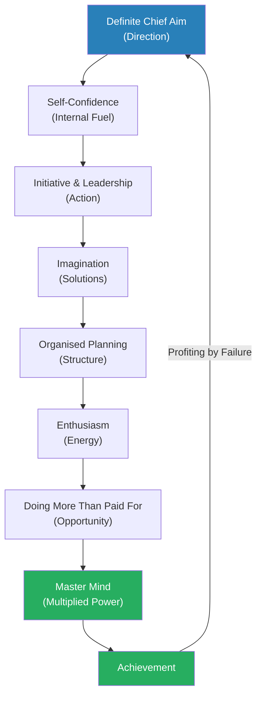
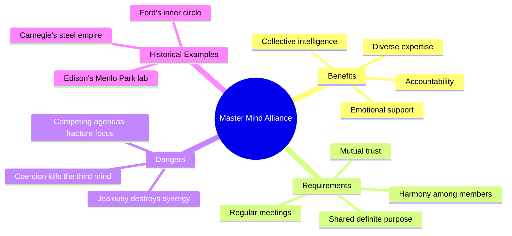
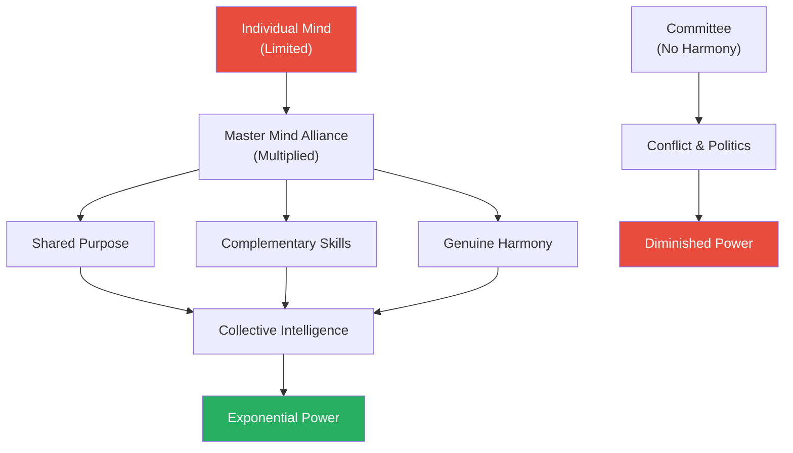
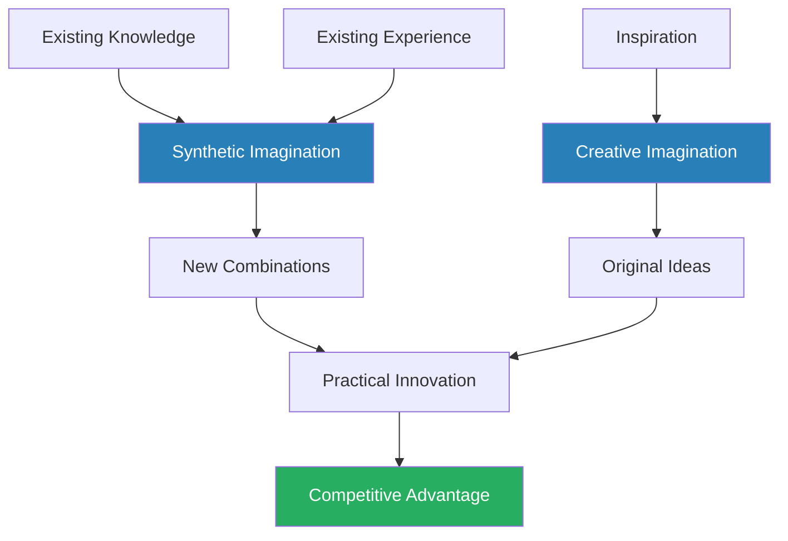
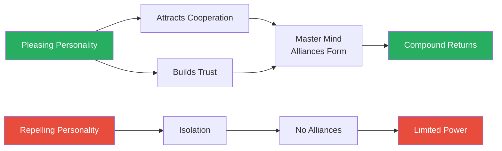
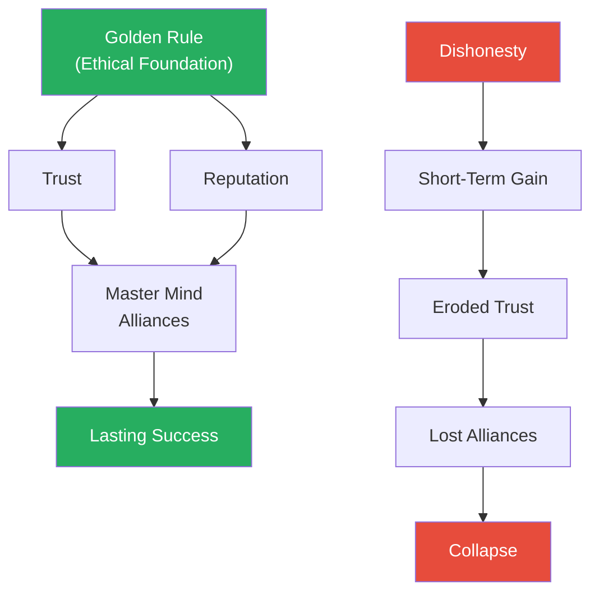
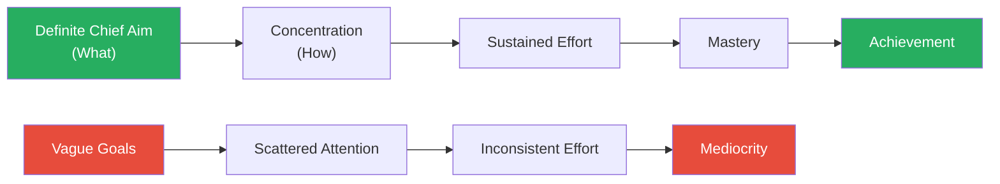
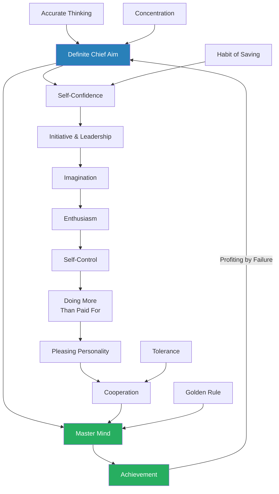
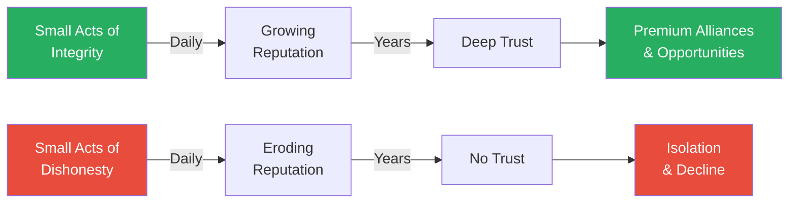

# The Law of Success — Napoleon Hill

> In 1908, a young journalist named Napoleon Hill sat across from Andrew Carnegie — the richest man in the world — and received a challenge that would consume the next twenty years of his life: interview the most successful people in America and distil their collective wisdom into a single, teachable philosophy of achievement.
> The result, published in 1928 as an eight-volume set, is The Law of Success — sixteen interlocking lessons covering everything from the power of alliance to the discipline of saving, from the psychology of self-confidence to the ethics of the Golden Rule.
> Hill's central claim is radical in its simplicity: success is not random, inherited, or reserved for the gifted — it follows a set of definite, learnable principles that anyone can apply.
> Where Think and Grow Rich (1937) condensed these ideas into a slim bestseller, The Law of Success is the full, unabridged system — deeper, wider, and far more detailed than the book most people know.
> This is the original blueprint, drawn from conversations with Henry Ford, Thomas Edison, John D. Rockefeller, Alexander Graham Bell, Theodore Roosevelt, and over five hundred others who built empires from nothing.

---

## About the Author

Napoleon Hill was born in 1883 in a one-room cabin in Pound, Virginia, in the Appalachian Mountains. His mother died when he was nine, and his stepmother — who gave him his first typewriter — redirected his energy from the path of a small-town troublemaker toward writing. Hill began his career as a reporter for a small-town newspaper, which led to a freelance assignment interviewing Andrew Carnegie in 1908. Carnegie, who believed that a practical philosophy of success could be codified and taught to ordinary people, challenged Hill to spend twenty years interviewing America's most accomplished individuals and synthesising their methods into a unified system. Carnegie provided letters of introduction but no salary — Hill had to fund the research himself. The Law of Success, published in 1928, was the primary product of that two-decade project; Think and Grow Rich, published in 1937, was the distilled, mass-market version that made Hill famous.

---

## The Big Idea

- <b style="color: #27ae60">Success is not an accident — it is the result of applying a definite set of principles in a coordinated, systematic way</b>
  - Hill spent twenty years interviewing over five hundred of America's most successful people
  - He found that despite vast differences in industry, background, and personality, the same core principles appeared again and again
  - These principles are not mysterious or reserved for the gifted — they are learnable skills that anyone can develop through study and practice
- The sixteen lessons are not a menu to pick from — they are an interlocking system
  - A Definite Chief Aim without Self-Confidence produces nothing but daydreams
  - Enthusiasm without Self-Control produces reckless action
  - Initiative without Accurate Thinking produces misguided effort
  - Each principle strengthens and is strengthened by the others
- <b style="color: #2980b9">The Master Mind principle</b> sits at the centre of the entire philosophy
  - No individual mind is complete — every person has knowledge gaps, blind spots, and limitations
  - By forming an alliance of minds working in harmony toward a shared goal, you create a collective intelligence that exceeds what any member could achieve alone
  - Carnegie attributed his entire fortune not to personal genius but to his ability to surround himself with people who knew what he did not
- <b style="color: #e74c3c">The primary enemy of success is not external opposition — it is internal fear</b>
  - Hill identified six basic fears that paralyse human action: fear of poverty, fear of old age, fear of criticism, fear of loss of love, fear of ill health, and fear of death
  - These fears operate mostly below conscious awareness, disguised as "caution," "practicality," or "realism"
  - Overcoming them requires deliberate reprogramming of the subconscious mind through auto-suggestion, habit formation, and the conscious choice of thoughts

Hill's sixteen lessons form a cycle, not a ladder — failure feeds back into a refined Definite Chief Aim, and the Master Mind alliance multiplies every other principle's effectiveness.

---

## Key Concepts at a Glance

| Concept | One-line summary |
|---------|-----------------|
| **The Master Mind** | An alliance of harmonious minds creates intelligence no single person can match |
| **Definite Chief Aim** | One clear, burning purpose that organises all thought and action |
| **Self-Confidence** | Conquering the six basic fears through deliberate mental conditioning |
| **Habit of Saving** | Financial discipline that builds both capital and psychological resilience |
| **Initiative & Leadership** | Acting without being told and inspiring others to follow |
| **Imagination** | The mental workshop where new ideas, plans, and solutions are created |
| **Enthusiasm** | The vital force that converts knowledge into persuasion and action |
| **Self-Control** | Mastery of emotions, appetites, and impulses that derail progress |
| **Doing More Than Paid For** | Going beyond expectations as the single fastest path to advancement |
| **Pleasing Personality** | The qualities that attract cooperation, trust, and goodwill |
| **Accurate Thinking** | Separating facts from opinions and relevant from irrelevant |
| **Concentration** | Sustained, focused attention on one objective at a time |
| **Cooperation** | Working with others through coordination rather than coercion |
| **Profiting by Failure** | Treating every defeat as a teacher and every setback as temporary |
| **Tolerance** | Eliminating prejudice as a barrier to alliances and clear thinking |
| **The Golden Rule** | Ethical conduct as both moral duty and strategic advantage |

The Master Mind principle towers above all others because it multiplies the effectiveness of every other principle — no individual skill compensates for the absence of a harmonious alliance.

---

## Quick Lookup Table

| Lesson | Name | Thematic Cluster |
|--------|------|-----------------|
| 1 | The Master Mind | Foundation & Direction |
| 2 | A Definite Chief Aim | Foundation & Direction |
| 3 | Self-Confidence | Inner Game |
| 4 | The Habit of Saving | Inner Game |
| 5 | Initiative and Leadership | Action & Energy |
| 6 | Imagination | Action & Energy |
| 7 | Enthusiasm | Action & Energy |
| 8 | Self-Control | Inner Game |
| 9 | Doing More Than Paid For | Action & Energy |
| 10 | Pleasing Personality | Social Intelligence |
| 11 | Accurate Thinking | Mental Discipline |
| 12 | Concentration | Mental Discipline |
| 13 | Cooperation | Social Intelligence |
| 14 | Profiting by Failure | Mental Discipline |
| 15 | Tolerance | Social Intelligence |
| 16 | The Golden Rule | Social Intelligence |

Hill's sixteen lessons cluster into five natural groups: the directional foundation (knowing what you want and who will help), the inner game (building the psychological architecture), the action engines (creating momentum), social intelligence (working effectively with others), and mental discipline (thinking clearly and learning from setbacks).

The Action & Energy cluster contains the most lessons, reflecting Hill's emphasis that inner development must be channelled into outward momentum — ideas without action are merely daydreams.

---

## Cluster 1: Foundation & Direction

### Lesson 1 — The Master Mind

*Hill opens the entire course with what he considers the most important principle of all — the idea that no mind is complete on its own, and that real power comes from the harmonious alliance of multiple minds working toward a shared purpose.*

- <b style="color: #2980b9">The Master Mind</b> is defined as "a mind that is developed through the harmonious cooperation of two or more people who ally themselves for the purpose of accomplishing any given task"
  - This is not simply teamwork or collaboration in the ordinary sense
  - Hill argues that when two or more minds coordinate in a spirit of harmony, a third, invisible force emerges — a collective intelligence that is qualitatively different from and greater than any individual mind involved
  - He compared it to a battery: a single cell produces limited power, but multiple cells connected together produce exponentially more
  - The key word is **harmony** — Hill capitalises it repeatedly throughout the lesson to underscore that without genuine harmony, the collective intelligence does not emerge
- <b style="color: #27ae60">Andrew Carnegie built his entire empire on this single principle</b>
  - Carnegie admitted to Hill that he personally knew very little about the technical aspects of steel manufacturing
  - What he knew was how to select, organise, and harmonise the people who did know
  - His Master Mind group included Charles Schwab, who understood operations; Henry Phipps, who managed finances; and dozens of specialists in metallurgy, sales, and transportation
  - Carnegie's genius was not in what he knew but in who he assembled
  - Carnegie told Hill that if you stripped away every piece of his physical property — every mill, every railroad car, every bank account — but left him his Master Mind alliance intact, he would rebuild his fortune within five years

> [!example] Carnegie's Thirty-Second Challenge (1908)
> - Andrew Carnegie had been pondering a personal mission: could the philosophy of success be organised into a practical system and taught to anyone?
> - When the young journalist Napoleon Hill arrived to interview him, Carnegie spent three days outlining his theory
> - At the end, Carnegie made his proposition: he would introduce Hill to the most successful people in America, but Hill would have to fund the entire twenty-year project himself
> - Carnegie secretly held a stopwatch — he had decided he would only give the commission to someone who said yes within sixty seconds
> - Hill said yes in twenty-nine seconds
> - Carnegie later told Hill that more than two hundred and fifty other people had been offered the same opportunity and turned it down
> **The lesson:** Decisiveness in the face of opportunity is itself a success principle — most people hesitate themselves out of their greatest chances.

- Why the Master Mind works — the mechanism:
  - No single person possesses all the knowledge, skills, and perspectives needed for any significant achievement
  - Harmony is the critical ingredient — without it, the group is just a committee, not a Master Mind
  - Conflict, jealousy, or competing agendas destroy the synergistic effect entirely
  - <b style="color: #e74c3c">A Master Mind alliance built on fear or coercion will eventually collapse</b> — only genuine mutual benefit sustains it
  - Hill draws a distinction between economic power and social power:
    - Economic power is the organised effort of people who share a financial incentive
    - Social power is the deeper bond of shared purpose and mutual respect
    - The most durable Master Mind alliances combine both — people who benefit financially and who genuinely enjoy working together
  - Hill also observes that a Master Mind alliance produces what he calls "a third mind" — a shared intelligence that none of the members possess individually
    - This is not mystical — it is the practical result of different perspectives, knowledge bases, and thinking styles combining to produce insights no single mind could generate

---

- The distinction between a Master Mind and an ordinary group:
  - An ordinary group divides work — the Master Mind multiplies intelligence
  - Members must share a definite purpose and work in a spirit of genuine harmony
  - Each member contributes knowledge, perspective, or capability the others lack
  - The relationship is not hierarchical — it is cooperative and complementary
  - Hill warns against confusing a Master Mind alliance with a social club, an advisory board, or a group of employees — the Master Mind requires active, engaged, harmonious contribution from every member

> [!example] Henry Ford's Inner Circle
> - Ford had little formal education — he attended a rural schoolhouse and could barely read when he started
> - Yet he built one of the world's largest industrial enterprises
> - His Master Mind alliance included Thomas Edison (technology and invention), Harvey Firestone (materials and supply chain), and a rotating cast of specialists
> - When a Chicago newspaper called Ford "an ignorant pacifist" during World War I, Ford sued for libel
> - On the witness stand, opposing lawyers tried to prove his ignorance by asking him obscure history and science questions
> - Ford's response was devastating: "If I wanted the answer to any of those questions, I could press a button on my desk and summon someone who could give me the answer in five minutes"
> - He did not need to know everything — he needed to know who knew what he needed
> **The lesson:** The Master Mind principle means you never have to be the smartest person in the room — you have to be the one who assembles the smartest room.

> [!tip] Core Insight
> Power is not individual brilliance — it is organised, harmonious intelligence. The person who can assemble and maintain a Master Mind alliance will always outperform the lone genius.

The Master Mind is not a committee or advisory board — it is an organic intelligence that emerges only when harmony, shared purpose, trust, and complementary expertise are all present simultaneously.

- Conditions that sustain a Master Mind alliance:
  - Every member must gain something tangible from the alliance — shared benefit prevents resentment
  - Regular meetings are essential — the chemistry requires proximity and repetition
  - A clearly defined purpose keeps the group focused and prevents drift into social club territory
  - One member should serve as coordinator, not controller — the organiser ensures meetings happen and objectives stay clear
  - Hill warns that introducing a new member who disrupts the harmony can destroy the entire alliance — vetting for temperament matters as much as vetting for talent
  - The frequency of meetings matters — Hill recommends at minimum weekly, because the synergistic effect weakens when members go too long without direct contact

> [!example] Woodrow Wilson's War Cabinet
> - Hill describes how President Woodrow Wilson assembled a Master Mind alliance to manage America's entry into World War I
> - Wilson selected cabinet members not for political loyalty but for specific expertise — finance, military logistics, diplomacy, industrial production
> - He held regular meetings where every voice had equal weight, regardless of rank or political affiliation
> - The group's collective intelligence allowed the United States to mobilise an army of over four million men, restructure the national economy for wartime production, and coordinate with European allies — all within eighteen months
> - Wilson's genius, like Carnegie's, was not in what he personally knew but in how he organised the people who knew what he did not
> **The lesson:** The Master Mind principle scales — from two partners in a small business to a wartime cabinet running a nation.

- The difference between power and force in the Master Mind:
  - Hill makes a careful distinction between two ways of organising people:
    - **Power through consent:** The Master Mind alliance, where every member participates willingly and benefits genuinely — this produces sustainable, expanding power
    - **Force through coercion:** The command structure, where participation is compelled through threat — this produces short-term compliance but long-term resistance
  - Hill argues that the Master Mind can only operate on the basis of consent — any attempt to force harmony is a contradiction in terms
  - The person who tries to dominate a Master Mind alliance has already destroyed it, because domination eliminates the very harmony that makes the alliance worth forming
  - This distinction anticipates modern research on intrinsic versus extrinsic motivation: people who participate freely in a shared mission produce better work than people who participate under compulsion

- The enemies of the Master Mind:
  - **Ego** — the member who insists on dominating every discussion destroys the harmony that makes the alliance work
  - **Secrecy** — when members withhold information or pursue hidden agendas, trust collapses
  - **Unequal benefit** — if one member gains far more than the others, resentment builds and the alliance fractures
  - **Infrequency** — Master Mind groups that meet rarely lose their synergistic power; the chemistry requires regular contact
  - **Wrong membership** — a single member who does not share the group's purpose or who brings a combative temperament can poison the entire alliance

> [!example] The Two Merchants Who Built a Town
> - Hill tells of two merchants in a small Western town who recognised that neither could thrive unless the town itself grew
> - Instead of competing for the same limited customer base, they formed a Master Mind alliance with a common aim: attract new residents and businesses to the town
> - They pooled resources to build roads, advertise the town's advantages in distant newspapers, and lobby for a rail connection
> - Within a decade, the town's population had tripled, and both merchants' businesses had grown far beyond what either could have achieved through competition
> - Their alliance succeeded because it met every condition Hill describes: shared purpose, mutual benefit, regular coordination, and genuine harmony
> **The lesson:** The Master Mind is not limited to personal advancement — it can be used to build communities, industries, and institutions.

The Master Mind is qualitatively different from a committee — the addition of genuine harmony transforms a group of individuals into something more powerful than any of them could be alone.

- How to build a Master Mind alliance in practice:
  - **Step 1:** Clarify your Definite Chief Aim — you need to know exactly what you are building the alliance to accomplish
  - **Step 2:** Identify the specific knowledge, skills, and perspectives your aim requires that you personally lack
  - **Step 3:** Seek out individuals who possess those qualities and who share values compatible with genuine harmony
  - **Step 4:** Present the alliance as a mutual benefit proposition — explain clearly what each member will give and receive
  - **Step 5:** Establish a regular meeting schedule — at minimum weekly — and hold every meeting with a definite agenda and purpose
  - **Step 6:** Monitor the harmony constantly — if a member introduces friction, address it immediately before it poisons the group
  - Hill warns that the first attempt at a Master Mind alliance often fails — the chemistry is difficult to get right, and the wrong members can destroy the group
  - The solution is not to abandon the principle but to rebuild with different members, informed by the lessons of the failure
  - Hill notes that even Carnegie went through several iterations of his inner circle before assembling the group that built his steel empire

> [!example] The Three Young Entrepreneurs
> - Hill tells of three young men in a Midwestern city who formed a Master Mind alliance in their early twenties
> - One had sales ability but no capital; the second had technical skills but no business sense; the third had modest capital but no particular skill beyond organisation
> - Individually, none of them could have started a business — the salesman had nothing to sell, the technician could build but not sell, and the organiser could plan but not create
> - Together, they formed a complete unit: the technician designed products, the salesman sold them, and the organiser managed the finances and operations
> - Within ten years, their partnership had grown into one of the largest manufacturing companies in their region
> - Hill uses this story to illustrate that the Master Mind is not about finding people like yourself — it is about finding people who complement your weaknesses with their strengths
> **The lesson:** The best Master Mind alliances are built on complementary strengths, not similar ones — you need people who know what you do not, not people who know what you already know.

---

### Lesson 2 — A Definite Chief Aim

*Most people fail not because they lack ability but because they never decide exactly what they want — Hill argues that clarity of purpose is the starting point of all achievement.*

- <b style="color: #2980b9">A Definite Chief Aim</b> is a single, clearly written statement of the one primary goal around which all your energy, thought, and planning will be organised
  - It is not a vague aspiration ("I want to be successful") but a precise target with specifics: what, when, and at what cost
  - Hill insists it must be written down — a goal that exists only in your head is a wish, not an aim
  - It must be read aloud daily, ideally twice — once upon waking and once before sleep — to impress it upon the subconscious mind
  - The aim should include not just what you want to achieve but what you are willing to give in return — Hill is insistent that success requires sacrifice, and the Definite Chief Aim forces you to acknowledge the cost upfront
- Why a single aim matters:
  - The human mind can hold passionate focus on only one dominant objective at a time
  - Attempting to pursue multiple major goals simultaneously scatters mental energy the way a flashlight scatters light compared to a laser
  - <b style="color: #27ae60">The person who knows exactly what they want and is determined to get it will always outperform the person with scattered ambitions</b>
  - Hill observed that among the five hundred successful people he interviewed, every single one could articulate their primary aim in a single clear sentence
  - The secondary benefits of a Definite Chief Aim include: it attracts like-minded allies (people are drawn to those with clear purpose), it simplifies daily decisions (everything is filtered through one question), and it gives meaning to temporary setbacks (every obstacle is just a problem to solve on the way to a known destination)

---

- The mechanism behind the Definite Chief Aim:
  - Once the mind accepts a definite purpose, it begins to notice opportunities, information, and people relevant to that purpose — things that were always present but invisible
  - Hill calls this the "law of attraction" in its original sense: not magical thinking, but selective attention
  - A clear aim also simplifies decision-making — every choice is evaluated against a single question: does this move me toward or away from my chief aim?
  - The written aim acts as a contract with yourself — reading it daily reinforces commitment and keeps the goal emotionally alive rather than abstractly theoretical
  - Hill argues that the subconscious mind works continuously on whatever problem the conscious mind presents most frequently — and a daily reading of the Definite Chief Aim ensures that problem is always "how do I achieve this?"

> [!example] Edwin C. Barnes and Edison (1905)
> - Edwin C. Barnes arrived at Thomas Edison's laboratory in Orange, New Jersey, looking like a tramp — he had ridden freight trains to get there because he could not afford a passenger ticket
> - Barnes had a Definite Chief Aim that seemed absurd for a man in his position: he wanted to become Thomas Edison's business partner, not his employee
> - Edison later said something in the young man's expression conveyed that he would not leave until he got what he came for
> - Edison hired him for menial work at minimal pay — Barnes accepted, knowing proximity to his goal mattered more than immediate status
> - For five years Barnes worked and waited, never losing sight of his aim
> - When Edison invented the Ediphone (a dictation machine), no one on his sales team was excited about it — but Barnes saw his opportunity
> - He threw himself into selling the Ediphone with such energy and skill that Edison made him his exclusive distribution partner
> - Barnes became wealthy and remained Edison's associate for decades
> **The lesson:** A Definite Chief Aim backed by persistence is more powerful than education, connections, or starting capital — Barnes had none of these and succeeded anyway.

- The role of the written statement:
  - Hill is insistent that the Definite Chief Aim must be written down — he returns to this point repeatedly and with increasing urgency
  - A goal that exists only in the mind is subject to constant revision, dilution, and forgetting
  - A written goal is fixed — it can be revisited, reaffirmed, and measured against
  - The act of writing forces precision: you cannot write a vague aspiration in specific terms without confronting its vagueness
  - Hill recommends carrying the written statement with you at all times — a physical reminder that keeps the aim present in consciousness
  - He also recommends reading it aloud rather than silently, because the spoken word engages more of the mind: the visual cortex (reading), the motor cortex (speaking), and the auditory cortex (hearing your own voice) all participate in impressing the aim upon the subconscious
  - This multi-sensory engagement is why Hill's auto-suggestion technique works — the more pathways through which the aim enters the mind, the deeper its imprint

- <b style="color: #e74c3c">The danger of drifting</b>:
  - Hill uses the term "drifting" to describe people who go through life without a fixed purpose
  - Drifters take whatever job is available, follow whatever path of least resistance, and accept whatever circumstances deliver
  - They are not lazy — many drifters work extremely hard — but their effort has no cumulative direction
  - Without a Definite Chief Aim, even hard work is like rowing vigorously in circles
  - Hill estimates that ninety-five out of every hundred people are drifters — they have never sat down and decided what they truly want from life
  - The tragedy is not lack of ability but lack of direction — the same energy that produces nothing in a drifter could produce extraordinary results if focused through a definite aim
  - Hill argues that drifting is not a neutral state — it is actively destructive, because the drifter's mind, having no positive aim to work on, defaults to worry, fear, and complaint

> [!example] The Typewriter Salesman Without an Aim
> - Hill tells of a salesman he met who had spent twelve years selling typewriters, moving from city to city, never staying more than a year
> - The man was intelligent, hardworking, and likeable — he had every attribute Hill associated with success except one
> - When Hill asked him what his chief aim was, the man could not answer — he wanted "a better life" but had never defined what that meant in concrete terms
> - His twelve years of effort had accumulated no momentum because each year's work was disconnected from the last
> - Hill contrasted him with a far less talented man who had decided at twenty-five that he would own a chain of laundry shops by forty — and achieved it in thirteen years through relentless, focused action
> **The lesson:** Hard work without direction is motion without progress — the focused person with modest talent will outpace the gifted person who drifts.

> [!example] The Steel Magnate Who Started With a Sentence
> - Hill describes a conversation with a self-made steel executive who kept a framed card on his desk
> - The card contained a single sentence: "I will be the leading manufacturer of structural steel in the state of Pennsylvania by my fiftieth birthday"
> - He had written it at age twenty-seven, when he was a mid-level foreman with no capital and no connections
> - Every decision he made for twenty-three years — what jobs to take, which relationships to cultivate, how to invest his savings, when to start his own company — was filtered through that sentence
> - He achieved his aim two years ahead of schedule
> - When Hill asked whether the written statement truly mattered, the man said: "Without that card, I would have accepted a dozen comfortable positions along the way and never built anything of my own"
> **The lesson:** The written Definite Chief Aim is not merely a motivational exercise — it is a decision-making filter that prevents the comfortable detours that derail most ambitions.

> [!example] The Teacher Who Became a Lawyer
> - Hill tells of a schoolteacher earning a modest income who set a Definite Chief Aim to become a practising attorney within five years
> - She had no law degree, no connections in the legal profession, and a salary that barely covered her expenses
> - She wrote her aim on a card and read it twice daily, exactly as Hill prescribed
> - Within months, she noticed something she called "strange coincidences" — she met a lawyer at a church social who mentioned his firm offered evening clerking positions; a newspaper article appeared about a new law school with evening classes designed for working adults; a relative offered to lend her tuition money at no interest
> - Hill argues these were not coincidences at all — the opportunities had always existed, but her newly focused mind was now tuned to notice them
> - She completed her law degree in four years, passed the bar on her first attempt, and opened her own practice
> **The lesson:** The Definite Chief Aim does not create opportunities — it makes you capable of seeing the ones that were always there.

> [!abstract] Hill's Formula for a Definite Chief Aim
> 1. Decide exactly what you want — one primary objective, stated with precision
> 2. Determine what you are willing to sacrifice to achieve it — every aim has a cost
> 3. Set a definite date by which you intend to achieve it
> 4. Write it in a single, clear sentence and carry it with you
> 5. Read it aloud twice daily — once upon waking, once before sleeping
> 6. Visualise yourself already in possession of the goal while reading
> 7. Evaluate every decision against it: does this move you closer or further away?

The Definite Chief Aim transforms a vague desire into a specific target, which the subconscious mind then works on continuously — surfacing opportunities that were always there but previously invisible.

- How the Definite Chief Aim connects to the other lessons:
  - It provides the target for **Concentration** (Lesson 12) — you cannot concentrate without knowing what to concentrate on
  - It guides the selection of **Master Mind** (Lesson 1) allies — you choose members based on what your aim requires
  - It fuels **Enthusiasm** (Lesson 7) — genuine enthusiasm comes from working toward something you deeply want
  - It gives meaning to **Profiting by Failure** (Lesson 14) — setbacks are just problems on the road to a known destination
  - It disciplines **Imagination** (Lesson 6) — the creative faculty works best when directed toward a specific challenge

- Common mistakes people make with the Definite Chief Aim:
  - **Setting someone else's aim:** Hill warns that many people adopt aims imposed by parents, spouses, or social expectations — and then wonder why they lack enthusiasm and initiative
  - **Setting an aim too small:** An aim that does not excite you will not sustain the effort required to achieve it — Hill argues the aim should be large enough to demand growth
  - **Confusing the aim with the method:** "I want to be wealthy" is a vague desire; "I will build a chain of twenty retail shops by age fifty" is a Definite Chief Aim — the specificity is what makes it powerful
  - **Failing to include the cost:** Every aim requires sacrifice — the person who states what they want without acknowledging what they must give up is daydreaming, not planning
  - **Abandoning the aim too soon:** Hill observes that most people give up on their Definite Chief Aim within a few months, long before the subconscious has had time to produce results — the process requires patience and sustained daily repetition
  - **Never revising the aim:** While persistence is essential, Hill also acknowledges that a Definite Chief Aim should be refined by experience — failure may reveal that the aim needs adjustment, and the person who rigidly holds an outdated aim is not persistent but stubborn

> [!example] The Man Who Set Five Aims
> - Hill describes a young executive who came to him for advice, deeply frustrated by his lack of progress
> - When Hill asked about his Definite Chief Aim, the man produced five written goals — all ambitious, all unrelated, all demanding full-time commitment
> - Hill explained the problem: with five aims competing for his mental energy, none received the concentrated focus required to produce results
> - The man protested that all five were important — but Hill asked him which one, if he could only achieve one, would matter most
> - After three days of deliberation, the man chose a single aim and subordinated the other four
> - Within eighteen months, he had achieved his primary aim — and found that two of the other four had been accomplished incidentally along the way
> - The remaining two turned out to be unimportant once the primary aim was achieved
> **The lesson:** The Definite Chief Aim is singular by design — a mind divided among five targets hits none of them with the force that a single focus provides.

---

## Cluster 2: Inner Game

### Lesson 3 — Self-Confidence

*Hill identifies six specific fears that cripple human potential and shows how each can be systematically dismantled through deliberate mental conditioning.*

- <b style="color: #2980b9">The Six Basic Fears</b> are the enemies of self-confidence:
  - **Fear of Poverty** — the most destructive of all, because it paralyses initiative and makes people accept conditions far below their potential
  - **Fear of Old Age** — the anxiety of declining powers and becoming dependent
  - **Fear of Criticism** — the fear of what others think, which kills originality and boldness
  - **Fear of Loss of Love** — jealousy, possessiveness, and the terror of abandonment
  - **Fear of Ill Health** — hypochondria and the habit of expecting illness
  - **Fear of Death** — the ultimate paralysing anxiety

Hill considered the fear of poverty the most devastating because it attacks initiative directly — a person ruled by financial terror will never take the risks required for significant achievement.
- How fear operates:
  - Fear is not primarily a response to real danger — it is a habitual pattern of thought
  - Most fear is inherited or socially conditioned, not based on personal experience
  - <b style="color: #e74c3c">Fear operates below conscious awareness, disguising itself as prudence, caution, or realism</b>
  - A person terrified of poverty may call themselves "practical" when they refuse to take any risk; a person terrified of criticism may call themselves "humble" when they refuse to promote their ideas
  - Fear is contagious — Hill warns that spending time around fearful people infects your own thinking, just as spending time around confident people strengthens yours
  - Hill argues that fear is the single greatest obstacle to achievement — more than lack of money, education, connections, or talent — because fear prevents the person from ever using whatever resources they possess

| Fear | How It Disguises Itself | What It Costs |
|------|------------------------|---------------|
| Poverty | "Being practical" | Refusal to take calculated risks |
| Criticism | "Being humble" | Never sharing ideas or seeking visibility |
| Old Age | "Being realistic" | Giving up on new ventures |
| Loss of Love | "Being devoted" | Jealousy and possessiveness |
| Ill Health | "Being careful" | Hypochondria, limited activity |
| Death | "Being philosophical" | Existential paralysis |

Hill's insight is that every fear wears a mask of virtue — recognising the disguise is the first step to removing it.

---

- The antidote — Hill's Self-Confidence Formula:
  - Deliberately choose the thoughts you dwell upon — refuse to entertain fearful thoughts
  - Write and recite a personal affirmation of self-confidence daily
  - Spend time each day visualising yourself as the person you intend to become
  - Associate with people who reinforce confidence, not those who feed fear
  - <b style="color: #27ae60">Self-confidence is not an innate trait — it is a habit that can be built through deliberate practice</b>
  - Hill argues that the subconscious mind cannot distinguish between a vivid imagined experience and a real one — so repeated visualisation of confident behaviour gradually rewires the mind's default response from fear to action
  - The formula requires daily repetition — not because the words themselves are magical, but because consistent repetition builds neural pathways that become automatic responses

> [!abstract] Hill's Self-Confidence Formula
> 1. I know I have the ability to achieve my Definite Chief Aim, and I demand of myself persistent, continuous action toward its attainment
> 2. I realise that the dominating thoughts of my mind will reproduce themselves in outward, physical action — so I will concentrate my thoughts on the person I intend to become
> 3. I know that through auto-suggestion, any desire I persistently hold in my mind will eventually seek expression through practical means of attainment
> 4. I have clearly written down my Definite Chief Aim, and I will never stop trying until I have developed sufficient self-confidence for its attainment
> 5. I will engage in no transaction that does not benefit all whom it affects — success built on dishonesty is not lasting success

> [!example] Abraham Lincoln's Journey Through Fear
> - Lincoln's life before the presidency was a catalogue of apparent failure:
>   - Failed in business in 1831
>   - Defeated for the state legislature in 1832
>   - Second business failure in 1833
>   - Suffered a nervous breakdown in 1836
>   - Defeated for Speaker of the House in 1838
>   - Defeated for Congress in 1843
>   - Defeated for the Senate in 1855
>   - Defeated for Vice President in 1856
>   - Defeated for the Senate again in 1858
> - Any one of these defeats could have justified permanent surrender — and most people would have quit after the first three
> - Lincoln persisted because his Definite Chief Aim (public service and the preservation of the Union) was stronger than his fear of failure and criticism
> - He was elected President in 1860 and is now considered one of the greatest leaders in history
> **The lesson:** Self-confidence does not mean never experiencing fear or failure — it means continuing despite both.

> [!example] The Young Lawyer Who Conquered Stage Fright
> - Hill tells of a young lawyer whose fear of public speaking was so severe he physically trembled when he stood before a judge
> - Rather than avoiding courtroom appearances (which would have ended his career), he applied the Self-Confidence Formula systematically
> - Every night for six months, he recited an affirmation: "I am a compelling, confident speaker who commands the attention of any courtroom"
> - He visualised himself standing calmly before judges and juries, delivering arguments with clarity and force
> - He volunteered for every speaking opportunity he could find — church groups, civic meetings, debate clubs — deliberately exposing himself to the very situation he feared
> - Within a year, his courtroom presence had transformed — not because his fear disappeared overnight, but because the new habit of confidence gradually overpowered the old habit of fear
> - He went on to become one of the most successful trial lawyers in his state
> **The lesson:** Fear is a habit — and like any habit, it can be replaced by a stronger one through deliberate, sustained repetition.

> [!example] The Inventor's Wife Who Believed
> - Hill tells of an inventor who had spent years developing a new type of electrical device, burning through the family's savings with nothing to show for it
> - His neighbours pitied his wife and told her she was married to a dreamer who would never amount to anything
> - The wife, rather than absorbing their fear and doubt, maintained absolute confidence in her husband's ability — she told him every evening that she believed in him and that the breakthrough was coming
> - Her confidence was not blind — she had watched him learn from every failure, refine his approach, and get measurably closer with each attempt
> - When the breakthrough finally came, the inventor credited his wife as the reason he never quit — her self-confidence in him sustained his self-confidence in himself during the darkest periods
> - Hill uses this to illustrate that self-confidence is not only personal — it can be transmitted between people, and a single confident ally can sustain a person through years of doubt
> **The lesson:** Self-confidence is contagious — the confident person strengthens everyone around them, just as the fearful person weakens everyone around them.

- The connection between fear and the other lessons:
  - Fear of poverty prevents the Habit of Saving (Lesson 4) — because saving requires confidence that the future can be shaped
  - Fear of criticism kills Initiative (Lesson 5) — because acting without being told invites judgment
  - Fear of loss of love poisons Cooperation (Lesson 13) — because jealousy makes genuine partnership impossible
  - Hill argues that conquering these fears is not a preliminary step but an ongoing practice that must be maintained throughout life
  - The Six Basic Fears are the invisible saboteurs — they explain why people with every external advantage still fail, and why people with no external advantage sometimes succeed spectacularly

> [!tip] Core Insight
> The person who conquers the six basic fears has removed the invisible ceiling that limits most human achievement. External obstacles are temporary; internal fears are permanent — until deliberately replaced.

- The inheritance of fear:
  - Hill devotes considerable attention to how fear is transmitted across generations and through social conditioning
  - Parents who are terrified of poverty unconsciously teach their children to be terrified of poverty — through anxious conversations about money, through expressions of helplessness, through the constant message that the world is dangerous and resources are scarce
  - Religious instruction that emphasises eternal punishment instils the fear of death from childhood
  - Social environments that reward conformity and punish originality breed the fear of criticism
  - Hill argues that most of the fears people carry were not formed through personal experience but absorbed from their environment — which means they can be dissolved by changing the environment and the dominant thoughts
  - The Self-Confidence Formula is Hill's primary tool for this dissolution — by deliberately replacing fearful thoughts with confident ones, repeated daily until the subconscious accepts the new programming

- The difference between fear and caution:
  - Hill is careful to distinguish destructive fear from intelligent caution
  - Caution is based on rational assessment of actual risks — looking before you leap
  - Fear is based on imagined catastrophes that may never occur — not leaping at all because you might fall
  - <b style="color: #e74c3c">The fearful person avoids all risk; the cautious person evaluates risk and acts when the odds are favourable</b>
  - Hill observes that fear disguises itself as caution to avoid detection — the person who says "I'm being careful" is often "I'm being terrified" in more comfortable language
  - The accurate thinker (Lesson 11) can distinguish between the two: caution produces a specific, testable concern ("the bridge might not hold this weight"); fear produces a vague, untestable anxiety ("something bad might happen")

> [!example] The Farmer Who Overcame the Fear of Poverty
> - Hill tells of a farmer who had grown up in extreme poverty and carried an intense, paralysing fear of financial ruin throughout his adult life
> - This fear prevented him from investing in better equipment, hiring help, or expanding his land — all of which would have increased his income but required spending money he was terrified of losing
> - His wife, recognising the pattern, began reading Hill's Self-Confidence Formula with him every evening
> - The farmer also began tracking his actual financial position in a notebook — recording every dollar earned, saved, and spent — so that his fear was confronted daily with facts rather than left to fester in vague anxiety
> - Over two years, the combination of affirmation and factual accounting gradually reduced his fear to a level where he could make rational investment decisions
> - He purchased better equipment, his output increased, and within five years he was more financially secure than he had ever been — precisely because he had overcome the fear that had kept him poor
> **The lesson:** Fear of poverty does not prevent poverty — it creates poverty, by paralysing the initiative and risk-taking that wealth requires.

---

### Lesson 4 — The Habit of Saving

*Hill reveals that saving money is not primarily a financial strategy — it is a psychological foundation that eliminates desperation and enables clear-headed decision-making.*

- <b style="color: #2980b9">The Habit of Saving</b> is lesson four because it builds the discipline that every subsequent lesson requires
  - Saving is the tangible, daily proof that you can control your impulses and delay gratification
  - A person who cannot save money cannot save themselves from any other destructive habit
  - The discipline transfers: someone who saves 10% of their income reliably will also show discipline in their thinking, planning, and relationships
  - Hill places this lesson early in the course because it is the most immediately actionable — you can begin saving today, regardless of your income, and the psychological effects begin immediately
- The psychology of saving matters more than the mathematics:
  - <b style="color: #27ae60">A person with savings negotiates from strength; a person without savings negotiates from desperation</b>
  - The worker with six months of living expenses saved can walk away from a bad job, a bad deal, or a bad relationship — the worker living paycheck to paycheck cannot
  - Fear of poverty — the most destructive of the six fears — loses its power when you have a financial cushion
  - Saving creates what Hill calls "backbone" — the psychological resilience to take intelligent risks
  - Hill observes that confidence built on borrowed money or expected future earnings is fragile — confidence built on actual savings is solid
  - The person without savings is always in a reactive position — forced to accept whatever terms are offered, unable to wait for better opportunities, and vulnerable to any disruption

---

- Hill's saving formula:
  - Save a fixed percentage (at least 10%) of every dollar earned, before paying any other expense
  - This is identical to the "pay yourself first" principle in [[The Richest Man in Babylon - George C. Clason]]
  - The amount matters less than the consistency — the habit is the point, not the balance
  - As income grows, the percentage should grow, not just the amount
  - Treat the savings as inviolable — this money is not for emergencies, desires, or opportunities until it has reached a level that provides genuine security
  - Hill recommends a systematic approach: establish a specific savings account, automate the deposit if possible, and treat the savings deduction exactly like a tax — non-negotiable

> [!example] The Two Salesmen
> - Hill tells of two life insurance salesmen at the same company, earning similar commissions
> - One saved 20% of everything he earned; the other spent every dollar and then some
> - When a major opportunity arose — a chance to buy a struggling agency at a deep discount — the saver had the capital to act immediately
> - The spender had to borrow at unfavourable terms, and by the time his loan was approved, the opportunity had passed to someone else
> - Within five years, the saver owned three agencies; the spender was still a salaried employee, now working for the man who had once been his equal
> **The lesson:** Saving does not just accumulate money — it accumulates options.

- <b style="color: #e74c3c">The spending trap</b>:
  - Hill observes that most people spend to match the perceived standard of their social circle
  - As income rises, spending rises to match, leaving the person in the same relative position — or worse
  - This pattern is what [[The Psychology of Money - Morgan Housel]] would later call "the treadmill of lifestyle inflation"
  - Hill argues that the cure is not willpower alone but a changed environment — associating with people who value saving rather than spending
  - The social pressure to spend is one of the most powerful forces in economic life — it requires conscious resistance and a clear understanding of why saving matters more than appearing prosperous
  - Hill notes that the desire to "keep up appearances" has destroyed more fortunes than bad investments ever have

> [!example] The Young Clerk Who Became a Bank President
> - Hill tells of a young bank clerk earning a modest salary who began saving 15% of his income from his very first paycheck
> - His colleagues mocked him for his frugality — they spent freely on entertainment, clothes, and appearances
> - After three years, the clerk had accumulated enough savings to invest in a small piece of real estate, which he rented for income
> - More importantly, his bank's directors had noticed his discipline — they reasoned that a man who could manage his own money wisely could be trusted to manage other people's money
> - He was promoted ahead of more experienced colleagues, eventually becoming a branch manager, then a vice president
> - His former colleagues, who had mocked his saving habit, were still clerks — some of them now working under his supervision
> **The lesson:** Saving is not just a financial strategy — it is a character signal that people in positions of power notice and reward.

> [!example] The Farmer Who Outbuilt the City Man
> - Hill contrasts a farmer in rural Virginia with a city businessman earning three times the farmer's income
> - The farmer saved steadily for twenty years, investing his savings in additional land whenever prices dropped
> - The city businessman spent lavishly — automobiles, club memberships, fashionable clothes, expensive dinners
> - After two decades, the farmer owned a substantial estate, debt-free, producing steady income from multiple crops and rental properties
> - The city businessman, despite earning far more in total, had no assets, significant debts, and a lifestyle that depended entirely on next month's paycheck
> - When a recession hit, the farmer weathered it comfortably; the businessman was ruined
> **The lesson:** Wealth is not determined by what you earn but by what you keep — the gap between income and spending, compounded over time, creates more distance than any salary differential.

- The hidden benefits of saving that Hill identifies:
  - **Decisiveness:** The person with savings can make decisions based on what is right rather than what is expedient — they are not trapped by short-term financial pressure
  - **Patience:** Savings buy time — the ability to wait for the right opportunity instead of grabbing the first one out of desperation
  - **Reputation:** Hill observes that in the business world, a person known to be financially disciplined receives better terms, more trust, and more opportunities than someone known to live beyond their means
  - **Independence of thought:** The person who depends on no one financially can afford to think independently — they do not need to agree with their boss, their investor, or their partner out of financial fear
  - Hill argues that many of the other lessons in the course — especially Initiative, Self-Confidence, and the Golden Rule — become far easier to practise once the Habit of Saving has removed the financial desperation that forces people into compromises they would otherwise refuse

> [!example] The Doctor Who Saved His Way to Independence
> - Hill tells of a young physician who entered practice deeply in debt from medical school
> - Rather than expanding his lifestyle as his income grew, he maintained the same modest standard of living he had as a student
> - He directed every surplus dollar toward paying off his debts, then toward building savings
> - Within seven years, he was debt-free with substantial reserves
> - When a hospital board tried to pressure him into endorsing a treatment he considered ineffective, he refused — knowing that his savings meant he could survive losing his hospital privileges
> - A colleague in the same situation, who lived paycheck to paycheck despite earning more, capitulated to the same pressure because he could not afford to lose the income
> - The saving doctor's reputation for independence and integrity attracted patients who valued honesty over convenience
> **The lesson:** Savings do not just buy things — they buy the freedom to act on principle rather than pressure.

> [!tip] Core Insight
> Saving is not deprivation — it is the purchase of freedom. The person with savings owns their choices; the person without savings rents them.

- Hill's view on debt:
  - <b style="color: #e74c3c">Debt is the opposite of savings — it is anti-savings, and it produces all the opposite psychological effects</b>
  - The person in debt lives in a state of chronic anxiety, because they owe more than they own
  - Debt destroys initiative — the debtor cannot take risks because they are already at risk
  - Debt weakens self-confidence — the person who owes money feels a constant, low-level shame that undermines their boldness in every interaction
  - Hill argues that the first application of the Habit of Saving for someone in debt is to stop the bleeding: stop incurring new debt, then systematically eliminate existing debt before beginning to accumulate savings
  - He observes that debt is often the result of the spending trap — living beyond one's means to match social expectations — and that eliminating debt requires the same discipline and environmental change as building savings

- The connection between saving and the other lessons:
  - Saving builds the **Self-Confidence** (Lesson 3) that comes from knowing you are not one paycheck away from crisis
  - It demonstrates **Self-Control** (Lesson 8) in its most visible, measurable form
  - It provides the capital for **Initiative** (Lesson 5) — you cannot seize opportunities if you have no reserves
  - It earns respect that contributes to a **Pleasing Personality** (Lesson 10) — people trust the person who handles money well
  - Hill argues that the Habit of Saving is the one principle you can begin practising immediately, today, regardless of your income level — and that starting immediately is itself an act of Initiative

| Stage of Saving | What It Provides | What It Enables |
|----------------|-----------------|-----------------|
| First month | Proof of self-discipline | Confidence that you can control impulses |
| Six months | Emergency cushion | Freedom from desperation in negotiations |
| One year | Investment capital | Ability to seize opportunities |
| Five years | Financial independence | Freedom to make decisions based on principle, not pressure |
| Twenty years | Generational security | The ability to focus entirely on purpose rather than survival |

Hill's progression shows that saving is not a single event but a compounding process — each stage unlocks capabilities unavailable at the previous stage.

---

### Lesson 8 — Self-Control

*Hill places Self-Control as the guardian of all other principles — without it, Enthusiasm becomes recklessness, Imagination becomes fantasy, and Initiative becomes impulsiveness.*

- <b style="color: #2980b9">Self-Control</b> is the ability to direct your thoughts, words, and actions toward your Definite Chief Aim rather than being hijacked by temporary emotions, appetites, or provocations
  - It is not suppression — it is direction
  - Hill distinguishes between controlling your impulses (choosing not to act on anger) and suppressing them (pretending the anger doesn't exist)
  - True self-control means feeling the emotion fully but choosing your response deliberately
  - Hill argues that self-control is the most practical of all the virtues — it has immediate, measurable effects on every area of life
- The two domains of self-control:
  - **Control of thought:** Refusing to dwell on fear, worry, resentment, or self-pity — choosing constructive thoughts instead
  - **Control of action:** Resisting the urge to respond to provocation, spend impulsively, speak carelessly, or quit when things get difficult
- Why self-control is hard:
  - <b style="color: #e74c3c">The person who loses their temper advertises their weakness to every observer</b>
  - Every time you react emotionally to provocation, you hand control of the situation to the person who provoked you
  - Hill argues that many people use "authenticity" or "honesty" as excuses for emotional incontinence — saying whatever they feel in the moment and calling it truth
  - The successful person feels the same emotions as everyone else — they simply choose differently what to do about them
  - Hill notes that self-control under favourable conditions means nothing — the test is self-control under pressure, disappointment, insult, and temptation

> [!example] Napoleon's Temper at Waterloo
> - Hill recounts how Napoleon, normally a master strategist, allowed his emotions to override his judgment at critical moments during the Waterloo campaign
> - His personal animosity toward certain generals led him to assign command decisions based on loyalty rather than competence
> - His impatience caused him to attack before his forces were properly assembled
> - His rage at delays led to strategic errors that a calmer mind would have avoided
> - The result was the destruction of his army and the end of his empire
> - Hill contrasts this with the Duke of Wellington, whose cold self-control under identical pressure allowed him to wait, adapt, and ultimately prevail
> **The lesson:** Talent, brilliance, and past success count for nothing in the moment you lose control of yourself.

> [!tip] Core Insight
> Self-control is the bridge between ambition and achievement. Every other principle in this course — from Enthusiasm to Initiative to the Master Mind — requires self-control to be used effectively rather than destructively.

- <b style="color: #27ae60">The practical test of self-control is how you behave when provoked, disappointed, or tempted</b>
  - Not when things are going well — anyone can be composed in comfort
  - The person who maintains their composure when insulted, who continues working when discouraged, who saves when everyone else is spending — that person has self-control
  - Hill connects this directly to the [[How to Win Friends and Influence People - Dale Carnegie|Dale Carnegie]] principle that the person who controls their emotional reactions controls the interaction

> [!example] The Business Partner Who Kept His Silence
> - Hill tells of two business partners who received devastating news: a major client had cancelled a contract worth half their annual revenue
> - One partner erupted — cursing the client, threatening lawsuits, and blaming everyone in the office for the loss
> - The other partner sat quietly, asked his secretary to bring the client's file, and spent an hour reading through their correspondence
> - He then called the client, acknowledged the cancellation without defensiveness, and asked one question: "What would we need to change to earn your business back?"
> - The client, surprised by the calm response, explained the real issue — a minor quality problem that had never been brought to their attention
> - The quiet partner fixed the problem within a week, the client returned, and the contract was renewed at a higher value
> - The explosive partner's outburst, meanwhile, had demoralised three employees — two of whom resigned within the month
> **The lesson:** The first partner had passion; the second had self-control. Passion lost the employees; self-control recovered the client.

> [!example] The Boxer Who Lost by Winning
> - Hill tells of a championship boxer who was clearly winning his fight on points — his opponent was exhausted and outmatched
> - Between rounds, the opponent's manager whispered instructions for a deliberate strategy: taunt the champion, insult his family, question his courage
> - The taunts worked — the champion abandoned his winning strategy and lunged forward in rage, throwing wild punches
> - He dropped his guard, and the exhausted opponent landed a single precise counterpunch that ended the fight
> - The champion had surrendered his self-control, and with it his title, his purse, and his reputation
> - Hill uses this as a universal metaphor: the person who can make you angry has already defeated you
> **The lesson:** Self-control is not passive — it is the most active form of power, because the person who controls themselves controls the situation.

> [!example] The Schoolteacher Who Refused to React
> - Hill tells of a schoolteacher in a rough neighbourhood whose students tested her constantly with disrespect, pranks, and defiance
> - Other teachers in the school responded with shouting, punishments, and threats — and were universally disliked and ineffective
> - This teacher never raised her voice — when a student was disrespectful, she paused, looked the student in the eye calmly, and asked a quiet question: "Is that really how you want to be remembered today?"
> - The calm response disarmed students who expected anger — they had no script for dealing with composure
> - Within a semester, her class was the most disciplined and highest-performing in the school
> - Hill argues that her self-control was more powerful than any punishment, because it changed the dynamic: the students stopped testing her because testing her produced nothing — no reaction, no drama, no satisfaction
> **The lesson:** Self-control in the face of provocation is more powerful than any response to provocation — because it removes the reward the provocateur was seeking.

- The habits that erode self-control:
  - **Overindulgence in food and drink** — Hill is blunt that excess in physical appetites weakens mental discipline across the board
  - **Gossip and complaint** — speaking carelessly trains the mind to think carelessly
  - **Reacting to every provocation** — each emotional reaction strengthens the habit of reactivity
  - **Irregular sleep and neglected health** — a fatigued body cannot sustain a disciplined mind
  - Hill argues that self-control is like a muscle: it can be strengthened through regular, deliberate use, but it weakens through neglect and abuse

> [!example] The Merchant Who Counted to Thirty
> - Hill tells of a successful merchant who had built a reputation for never losing his temper with customers, employees, or suppliers — no matter how unreasonable they were
> - When Hill asked his secret, the merchant explained that as a young man he had nearly destroyed his first business by losing his temper with a major supplier over a billing dispute
> - The supplier had refused to do business with him again, and the loss nearly bankrupted him
> - From that day forward, whenever he felt anger rising, he would count silently to thirty before responding — not as a trick to avoid speaking, but to give his rational mind time to reclaim control from his emotions
> - Over the years, the counting became unnecessary — his self-control had become automatic, a trained reflex rather than a conscious effort
> - Hill notes that this merchant's reputation for composure attracted the best suppliers, the most loyal employees, and the most trusting customers — all because he had learned to govern his first reaction
> **The lesson:** Self-control is a skill that can be trained through simple, repeated practice — and the returns compound over a lifetime of relationships preserved rather than relationships destroyed.

- The connection between self-control and negotiation:
  - Hill observes that in any negotiation, the person who loses their composure first loses the negotiation
  - The calm party can think clearly, evaluate offers accurately, and detect bluffs
  - The emotional party makes concessions they later regret, reveals information they intended to keep private, and abandons positions they should have held
  - This insight aligns directly with the principles in [[Crucial Conversations - Kerry Patterson]] — the ability to maintain dialogue under emotional pressure is the single most important negotiation skill
  - Hill argues that self-control in negotiation is not coldness — it is the ability to feel strongly while thinking clearly, and to let the thinking guide the response rather than the feeling

---

- How self-control connects to the system:
  - Self-control governs **Enthusiasm** (Lesson 7) — ensuring energy is channelled productively
  - It protects **the Habit of Saving** (Lesson 4) — resisting the impulse to spend
  - It enables **Accurate Thinking** (Lesson 11) — you cannot think clearly when emotions are driving
  - It sustains **Cooperation** (Lesson 13) — relationships require the ability to absorb frustration without reacting destructively
  - It is the enforcement mechanism for the **Golden Rule** (Lesson 16) — treating others fairly even when you are angry or disappointed requires conscious self-mastery

---

## Cluster 3: Action & Energy

### Lesson 5 — Initiative and Leadership

*Hill argues that the world is divided into two groups: those who lead and those who follow — and the choice between them is not determined by birth but by the decision to act without being told.*

- <b style="color: #2980b9">Initiative</b> is the habit of doing what needs to be done without being told to do it
  - Most people wait for instructions, permission, or certainty before acting
  - The person with initiative sees what needs doing and does it — then asks for forgiveness rather than permission if necessary
  - Hill argues this single quality distinguishes leaders from followers more reliably than intelligence, education, or experience
  - Initiative is closely related to Self-Confidence (Lesson 3) — the person paralysed by fear of criticism will never act without permission
  - Hill notes that initiative is the rarest quality in the workforce — the person who has it stands out immediately, regardless of their other qualifications
- <b style="color: #2980b9">Leadership</b> is the ability to induce others to follow you willingly
  - Hill lists eleven traits of leadership:
    - Unwavering courage
    - Self-control
    - A keen sense of justice
    - Definiteness of decision
    - Definiteness of plans
    - The habit of doing more than paid for
    - A pleasing personality
    - Sympathy and understanding
    - Mastery of detail
    - Willingness to assume full responsibility
    - Cooperation
  - <b style="color: #27ae60">The leader who earns authority through service and example will always outlast the leader who demands it through position</b>

> [!example] Charles M. Schwab — From Labourer to President
> - Charles M. Schwab started as a common labourer in Andrew Carnegie's steel mill, earning one dollar a day
> - From the very first day, he did more than his job required — he arrived early, stayed late, volunteered for tasks no one wanted, and studied every aspect of the business he could observe
> - His initiative caught the attention of his supervisors, not because he asked for recognition but because his work made them look good
> - Carnegie noticed Schwab and began giving him progressively larger responsibilities
> - By age thirty-five, Schwab was president of Carnegie Steel — the largest steel company in the world — earning a salary of one million dollars a year (equivalent to roughly thirty million today)
> - When J.P. Morgan formed U.S. Steel, he chose Schwab to run it
> **The lesson:** Initiative creates its own opportunities — Schwab did not have connections, education, or family wealth. He had the habit of doing more than anyone expected.

- The ten major causes of failure in leadership:
  - Inability to organise details
  - Unwillingness to render humble service
  - Expectation of pay for what they "know" rather than what they "do"
  - Fear of competition from followers
  - Lack of imagination
  - Selfishness — claiming all the credit
  - <b style="color: #e74c3c">Intemperance — excess in any form destroys endurance and vitality</b>
  - Disloyalty to associates
  - Emphasis on authority rather than service
  - Emphasis on title rather than contribution

| Leadership Style | Core Method | Short-Term Result | Long-Term Result |
|-----------------|------------|-------------------|-----------------|
| By consent | Earns authority through service | Slower initial progress | Lasting loyalty and results |
| By force | Demands authority through position | Quick compliance | Resentment, turnover, rebellion |

Hill is clear that leadership by consent is always superior in the long run — people who follow willingly work harder, stay longer, and contribute more than people who follow out of fear.

> [!example] The Manager Who Took the Blame
> - Hill describes a factory manager whose department produced a shipment of defective parts that cost the company a major contract
> - The defect was clearly traceable to a single foreman's error
> - Rather than blaming the foreman publicly, the manager went to the company's owner and said: "This happened in my department, under my supervision — the responsibility is mine"
> - He then worked with the foreman privately to identify the cause and prevent recurrence
> - The foreman, expecting to be fired, was so moved by the manager's willingness to absorb the blame that he became the most meticulous worker in the plant
> - The company owner, meanwhile, saw in the manager exactly the quality he wanted in a leader — the willingness to take responsibility for everything within his domain
> - The manager was promoted to vice president within the year
> **The lesson:** Leaders take responsibility downward and give credit upward — this is counterintuitive but extraordinarily effective.

> [!example] The Printing Press Operator Who Redesigned the Process
> - Hill tells of a printing press operator who noticed that the company wasted significant time changing ink colours between print runs
> - Without being asked, he spent his lunch breaks sketching a modified ink system that would allow faster changeovers
> - He built a rough prototype from spare parts and tested it after hours
> - When he showed his supervisor the working prototype, the supervisor was initially annoyed — "That's not your job"
> - But the improvement was undeniable: changeover time dropped by forty percent
> - The company adopted his modification across all its presses, and the operator was promoted to production manager
> - His initiative had not only solved a problem — it had identified him as someone who thought like an owner rather than an employee
> **The lesson:** Initiative does not ask permission — it presents results. The reaction may be surprise, but the outcome is almost always advancement.

> [!example] The Young Woman Who Reorganised the Filing System
> - Hill tells of a secretary in a law firm who was hired to type correspondence and answer phones
> - Within her first week she noticed that the firm's filing system was chaotic — documents took an average of fifteen minutes to locate, and important papers were sometimes lost entirely
> - Without being asked, she spent her evenings for two weeks designing and implementing a new filing system
> - When the senior partner asked her about it — initially suspicious of the unauthorized change — she demonstrated that documents could now be found in under two minutes
> - The partner was so impressed that he gave her responsibility for the firm's entire administrative operations
> - Within three years she was the firm's office manager, earning more than some of the junior lawyers
> **The lesson:** Initiative is not about your job title — it is about seeing what needs to be done and doing it, regardless of whether it falls within your assigned responsibilities.

- The relationship between initiative and fear:
  - Hill observes that the primary reason most people lack initiative is fear — specifically fear of criticism
  - The person who acts without being told exposes themselves to judgment: "Who told you to do that?" "That's not your job" "What makes you think you know better?"
  - These potential criticisms paralyse most people into waiting for instructions that may never come
  - Hill argues that initiative requires the self-confidence to risk being wrong in public — and that the rewards of action almost always exceed the costs of criticism
  - The person who never acts without permission is safe from criticism but also safe from advancement

> [!example] The Bookkeeper Who Saved a Failing Company
> - Hill tells of a bookkeeper in a small manufacturing firm who noticed that the company was losing money on a particular product line — not because the product was bad, but because the shipping method was unnecessarily expensive
> - The bookkeeper was not responsible for shipping, logistics, or product strategy — his job was to record transactions
> - But he analysed the shipping costs, identified an alternative carrier, and calculated the annual savings
> - He presented his findings to the owner in a one-page memo, including specific carrier names, pricing, and projected savings
> - The owner adopted the recommendation immediately, saving the company enough money to avoid the layoffs he had been planning
> - The bookkeeper was promoted to office manager, then to general manager — not because of his bookkeeping skills, which were average, but because he had demonstrated the rarest quality in any organisation: initiative
> **The lesson:** Initiative is noticed precisely because it is rare — in most organisations, the person who takes initiative has almost no competition for advancement, because the vast majority of people wait to be told what to do.

> [!tip] Core Insight
> The follower waits for instructions. The leader sees what needs doing and does it. The difference is not talent, education, or experience — it is the willingness to act without permission.

- How to develop initiative:
  - Start with small acts — look for problems in your immediate environment and solve them without being asked
  - Study the organisation you are in: what inefficiencies exist that no one has addressed? What would you change if you were the owner?
  - Practise decision-making: the person who cannot decide for themselves will never take initiative for others
  - Accept that initiative sometimes leads to mistakes — and that the cost of an occasional mistake is always less than the cost of perpetual passivity
  - Hill connects initiative directly to the Definite Chief Aim: the person with a clear purpose does not need to be told what to do, because they can evaluate every situation against their aim and act accordingly

---

### Lesson 6 — Imagination

*Hill calls imagination "the workshop of the mind" — the place where ideas are assembled into plans, problems are solved before they occur, and new combinations are created from existing materials.*

- <b style="color: #2980b9">Imagination</b> is the faculty that creates something new from existing knowledge and experience
  - Hill distinguishes between two types:
    - **Synthetic imagination:** Rearranging existing ideas, concepts, and observations into new combinations — this is what most inventors and entrepreneurs use
    - **Creative imagination:** The rarer faculty that produces genuinely original ideas — Hill associates this with moments of inspiration and hunches
  - Most practical success comes from synthetic imagination — you do not need to invent something from nothing; you need to combine existing elements in a way no one else has
- Why imagination is a separate lesson from planning:
  - Planning is logical and sequential; imagination is associative and lateral
  - The Definite Chief Aim tells you where you want to go; imagination shows you how to get there
  - <b style="color: #27ae60">Every fortune begins with an idea, and every idea begins in the imagination</b>
  - Hill argues that the person who can imagine solutions others cannot see holds a permanent advantage
  - Imagination is the bridge between the world as it is and the world as it could be — without it, you can only replicate what already exists

Most practical success comes from synthetic imagination (combining existing elements), while creative imagination (genuine originality) is rarer but produces breakthrough innovations.

> [!example] F.W. Woolworth's Five-and-Dime Revolution
> - Frank Winfield Woolworth worked as a clerk in a dry goods store in Watertown, New York
> - His employer told him he "wasn't smart enough to wait on customers" — a devastating judgment for a young man trying to build a career
> - But Woolworth had noticed something his employer had not: a bargain table of miscellaneous items priced at five cents attracted more customer traffic and enthusiasm than any other display in the store
> - His imagination connected two ideas: what if an entire store sold nothing but low-priced items? What if volume replaced margin as the business model?
> - His first store failed. His second store, opened in Lancaster, Pennsylvania in 1879, succeeded spectacularly
> - By the time of his death in 1919, Woolworth had over a thousand stores and a personal fortune in the hundreds of millions
> - The employer who said he wasn't smart enough to wait on customers spent his entire life in the same small shop
> **The lesson:** Imagination does not require intelligence in the traditional sense — it requires the ability to see connections others miss and the courage to act on them.

- How to develop imagination:
  - Read widely outside your field — cross-pollination of ideas from unrelated domains is the primary fuel
  - Keep a written record of every idea, however impractical it seems — ideas improve when captured and revisited
  - Spend regular time in deliberate thought — not consuming information but generating connections
  - Associate with imaginative people — imagination, like enthusiasm, is contagious
  - Study the solutions of people who have solved problems similar to yours
  - Hill stresses that imagination atrophies with disuse — the person who never exercises their creative faculty will find it weakened when they need it most
  - Conversely, the person who regularly asks "what if?" and "how might I?" keeps the imaginative faculty sharp and ready

> [!example] Dr. Gunsaulus and the Million-Dollar Sermon
> - Frank W. Gunsaulus, a young Chicago minister, had dreamed for years of founding a new kind of technical school — one that taught students through practical, hands-on methods rather than traditional lecturing
> - He had the vision but not the money — he needed a million dollars, an astronomical sum
> - For two years the idea stayed locked in his imagination, going nowhere, because he could not figure out how to fund it
> - Then one Saturday night he made a decision: he would preach a sermon titled "What I Would Do With a Million Dollars" and he would use his imagination to describe the school so vividly that someone in the audience would fund it
> - The next morning, he delivered the sermon with such passionate detail that the congregation could see the school as clearly as he could
> - After the service, Philip D. Armour, the meat-packing magnate, approached him and said: "I believe you could do everything you said. Come to my office tomorrow and I will give you the million dollars."
> - The Armour Institute of Technology (later part of the Illinois Institute of Technology) was the result
> **The lesson:** Imagination without action is daydreaming — but imagination combined with decisive action and enthusiastic presentation can move the world.

> [!example] The Farmer Who Imagined a Catalogue Store
> - Hill tells of a farmer in a southern state who noticed that rural families had no access to the goods city dwellers could buy easily
> - The local general store carried limited stock at high prices, and travelling to the city was impractical for most farming families
> - His imagination connected two existing ideas: the postal service (which reached every rural address) and the catalogue (which merchants used to list their goods)
> - He imagined a store with no physical location — a catalogue-based business that could deliver any product to any address in the country
> - He lacked the capital to build it himself, but he wrote a detailed plan and presented it to investors
> - While Hill does not name this farmer explicitly, the anecdote mirrors the origin of catalogue-based retailing that companies like Sears and Montgomery Ward would build into empires
> **The lesson:** The most profitable ideas are often combinations of things that already exist — the imagination's power lies in seeing connections that others have overlooked.

> [!example] The Inventor Who Solved a Problem in His Sleep
> - Hill tells of an inventor who had been struggling for months with a technical problem in a machine he was designing
> - He had exhausted every logical approach and was close to abandoning the project
> - One night, before sleeping, he concentrated intensely on the problem, turning it over in his mind from every angle, then deliberately released it and fell asleep
> - He woke at three in the morning with a complete solution — not a vague idea, but a specific, detailed mechanical design
> - He sketched it immediately, built a prototype the next day, and it worked perfectly
> - Hill uses this to illustrate his theory of creative imagination: when the conscious mind has done all it can, the subconscious takes over, processing the problem through pathways the rational mind cannot access
> **The lesson:** The subconscious mind is the imagination's most powerful partner — feed it a specific problem, and it will often deliver a solution that the conscious mind alone could never produce.

> [!tip] Core Insight
> Most people's imaginations are unused or misdirected — they imagine what they fear, not what they want. Redirecting that faculty toward constructive purposes is one of the most powerful changes a person can make.

- The relationship between imagination and the other lessons:
  - **Definite Chief Aim** provides the problem that imagination works on — without a clear objective, imagination wanders aimlessly
  - **Accurate Thinking** (Lesson 11) tests the ideas imagination produces against reality — preventing creative fantasy from becoming self-deception
  - **Enthusiasm** (Lesson 7) is what gives imaginative ideas their persuasive force — a great idea presented without energy dies in the room
  - **The Master Mind** (Lesson 1) multiplies imaginative power — when several imaginative minds collaborate, the combinations possible expand geometrically

- The enemies of imagination:
  - **Routine** — the person who does the same things in the same order every day without variation eventually loses the ability to think beyond the routine
  - **Criticism during the creative phase** — Hill warns against evaluating ideas too early in the process; imagination needs space to generate before accuracy evaluates
  - **Fear of ridicule** — many people suppress their most creative ideas because they fear being laughed at, which is another form of the fear of criticism (Lesson 3)
  - **Narrow experience** — the person whose life consists of a single occupation, a single social group, and a single set of interests has a smaller library of raw material for the imagination to combine
  - **Excessive consumption** — the person who spends all their time absorbing others' ideas (reading, watching, listening) and no time generating their own is training their mind to receive rather than create
  - Hill argues that the best fuel for imagination is a combination of wide reading, diverse experience, regular solitude for thinking, and a specific problem to solve

> [!example] Wrigley's Chewing Gum — Imagination Finds the Product
> - William Wrigley Jr. started as a soap salesman in Chicago, offering baking powder as a premium to incentivise soap purchases
> - When the baking powder proved more popular than the soap, Wrigley's imagination made the connection: stop selling soap and sell baking powder instead
> - He then offered chewing gum as a premium with baking powder purchases — and again, the premium proved more popular than the product
> - Wrigley made the leap a second time: stop selling baking powder and sell chewing gum
> - His competitors were locked into their original products; Wrigley followed his imagination wherever the customers led
> - The Wm. Wrigley Jr. Company became one of the most profitable businesses in America, built not on a single brilliant invention but on the imaginative flexibility to recognise what people actually wanted
> **The lesson:** Imagination is not just about creating something new — it is about seeing what is already happening and connecting the dots before anyone else does.

---

### Lesson 7 — Enthusiasm

*Hill treats enthusiasm not as a personality trait but as a transferable force — a vibration of energy that makes ideas contagious and makes people want to follow you, buy from you, and cooperate with you.*

- <b style="color: #2980b9">Enthusiasm</b> is the vital force that transforms knowledge into action and makes ideas infectious
  - A person who knows everything about a subject but presents it without enthusiasm will lose to the person who knows half as much but radiates conviction
  - Enthusiasm is not the same as excitement — excitement is temporary and reactive; enthusiasm is sustained and chosen
  - Hill argues enthusiasm can be deliberately cultivated through the conscious selection of work you believe in and the daily practice of energetic engagement
  - The word "enthusiasm" comes from the Greek "entheos" — meaning "God within" — and Hill treats it as something close to a spiritual force, though he presents it in practical terms
- The mechanism of enthusiasm:
  - <b style="color: #27ae60">Enthusiasm works through the principle of suggestion — it bypasses logical resistance and speaks directly to the emotions</b>
  - When you are genuinely enthusiastic, your voice, posture, gestures, and energy all convey conviction — this is far more persuasive than any logical argument
  - People do not buy products, ideas, or leadership with their rational minds first — they buy with their emotions and justify with logic afterward
  - This anticipates by decades the research in [[Influence - Robert Cialdini]] on emotional persuasion and [[Pre-Suasion - Robert Cialdini]] on priming
  - Hill notes that enthusiasm is bidirectional — it does not just persuade others, it also deepens your own commitment to whatever you are enthusiastic about
  - When you act enthusiastically, you feel more enthusiastic — the behaviour creates the emotion as much as the emotion creates the behaviour

> [!example] Hill's Insurance Selling Experiment
> - Early in his career, Hill sold life insurance to test his own principles
> - He discovered that when he approached prospects with genuine enthusiasm about how insurance could protect their families, his close rate was dramatically higher than when he presented the same facts in a neutral, informational manner
> - The product was identical; the facts were identical; the prospect was identical
> - The only variable was the energy and conviction with which Hill presented the case
> - He tracked his results meticulously and found that enthusiasm accounted for more variance in outcomes than product knowledge, prospect quality, or any other factor
> **The lesson:** Enthusiasm is not decoration on top of competence — it is a multiplier that determines whether competence converts into results.

- How to generate and sustain enthusiasm:
  - Work on things you genuinely care about — forced enthusiasm is transparent and repellent
  - If you cannot care about the thing itself, connect it to something you do care about (the income it provides, the skills it builds, the people it helps)
  - Physical energy fuels mental energy — exercise, sleep, and health directly affect your capacity for enthusiasm
  - <b style="color: #e74c3c">Cynicism is the enemy of enthusiasm</b> — avoid spending time with people whose default response to new ideas is scepticism or mockery
  - Study your subject deeply enough to find what is genuinely fascinating about it — shallow knowledge produces shallow enthusiasm

| Source of Enthusiasm | How It Works | Sustainability |
|---------------------|-------------|---------------|
| Genuine interest in the work | Intrinsic motivation, curiosity | Very high — self-renewing |
| Connection to Definite Chief Aim | The work serves a larger purpose | High — as long as the aim is clear |
| Appreciation from others | External validation feeds energy | Moderate — depends on others |
| Competitive drive | Wanting to outperform rivals | Low-moderate — exhausting over time |
| Financial reward | Money as motivator | Low — habituates quickly |

Hill argues that the most sustainable enthusiasm comes from the top of this table — genuine interest and purpose — while the bottom sources (money, competition) produce enthusiasm that burns bright but burns out fast.

> [!example] The Two Lecturers
> - Hill attended a lecture by a renowned professor who presented flawless research with impeccable logic but spoke in a monotone, never made eye contact, and showed no personal investment in his subject
> - The audience was polite but disengaged — several people left early
> - The following week, Hill attended a lecture by a far less credentialed speaker on the same topic
> - This speaker leaned forward, varied his voice, told stories, asked questions, and radiated a visible conviction that his subject mattered
> - The audience was riveted — people stayed after to ask questions, bought his materials, and invited him to speak again
> - The first speaker had knowledge; the second had knowledge plus enthusiasm — and enthusiasm won
> **The lesson:** Knowledge without enthusiasm is like a match without a striker — it has potential energy that never converts to flame.

> [!example] The Factory Foreman Who Transformed Morale
> - Hill describes a factory foreman who took over a department with the worst productivity and morale in the plant
> - The previous foreman had been competent but grim — he delivered instructions flatly, criticised errors sharply, and showed no personal investment in his team's success
> - The new foreman changed nothing about the work process, the equipment, or the pay structure
> - What he changed was his energy: he arrived each morning visibly enthusiastic about the day's work, celebrated small wins, told the team why their work mattered to the company's larger mission, and treated setbacks as interesting problems rather than failures
> - Within three months, the department's productivity had risen by thirty percent — with no change in personnel, processes, or compensation
> - Hill uses this story to illustrate that enthusiasm is not about charisma or personality type — it is about the deliberate choice to bring energy and meaning to whatever you do
> **The lesson:** Enthusiasm is contagious — a single enthusiastic person can transform the energy of an entire group.

- The relationship between enthusiasm and self-control:
  - Without self-control, enthusiasm becomes mania — uncontrolled energy that exhausts everyone and accomplishes nothing
  - Without enthusiasm, self-control becomes rigidity — controlled behaviour with no energy or inspiration
  - The ideal is disciplined enthusiasm — powerful energy channelled toward a definite aim
  - Hill calls this combination "controlled intensity" and argues it is the signature quality of every great achiever he studied

- The physical dimension of enthusiasm:
  - Hill is emphatic that physical vitality directly feeds mental enthusiasm — a body drained by poor diet, lack of sleep, or excessive indulgence cannot sustain the energy that enthusiasm requires
  - He recommends treating the body as an instrument of achievement: exercise, adequate rest, moderate diet, and avoidance of excess
  - Hill observes that the most enthusiastic people he studied were also the most physically disciplined — not ascetics, but people who respected their bodies as tools for their Definite Chief Aim

> [!example] The Travelling Salesman Who Lost His Enthusiasm
> - Hill describes a travelling salesman who had been one of his company's top performers for a decade
> - Gradually, without any change in his product or territory, his numbers began to decline
> - His manager assumed competition had increased — but when he travelled with the salesman, he noticed the real problem
> - The salesman had gained significant weight, slept poorly, drank heavily in the evenings, and arrived at each prospect's door visibly drained
> - His product knowledge was as strong as ever, but his physical vitality — the energy that had once made his presentations magnetic — had evaporated
> - Hill uses this to argue that enthusiasm is not purely mental — it is psychophysical, dependent on the body's ability to generate and sustain energy
> - When the salesman improved his physical habits, his sales numbers recovered within three months — same product, same territory, same knowledge, different energy
> **The lesson:** Enthusiasm is not a mood you summon — it is an energy your body must be capable of producing. Neglect the body and enthusiasm dies regardless of mental willpower.

- How to revive enthusiasm when it fades:
  - Return to your Definite Chief Aim and reconnect with why it matters to you — enthusiasm fades when purpose becomes abstract
  - Change your physical state: exercise, improve sleep, reduce excess — the body's energy directly drives the mind's enthusiasm
  - Seek out enthusiastic people — enthusiasm is as contagious as fatigue, and spending time with energised people reignites your own fire
  - Study something new about your subject — curiosity and novelty are natural enthusiasm generators
  - Hill warns that forcing enthusiasm when it has genuinely died is counterproductive — the solution is to address the root cause (physical depletion, lost purpose, or toxic associations), not to paste on a false smile

> [!example] The Minister Who Preached Without Enthusiasm
> - Hill tells of a minister whose church had a declining congregation despite his sermons being theologically sound and intellectually rigorous
> - A visiting colleague attended a service and diagnosed the problem immediately: the minister preached as though he were reading a textbook rather than delivering a message he passionately believed
> - His words were correct; his energy was absent
> - The colleague challenged him: "You speak as though you are reciting facts. Speak as though you are saving lives."
> - The minister spent a week reconnecting with the personal experiences that had drawn him to ministry — the suffering he had witnessed, the transformations he had seen, the moments when faith had sustained him through despair
> - His next sermon was delivered with visible, genuine passion — and for the first time in years, congregants approached him afterward, moved and grateful
> - Within a year, his congregation had grown by forty percent — same theology, same church, same community, different enthusiasm
> **The lesson:** Enthusiasm cannot be performed — it must be felt. And feeling it requires regular reconnection with the personal purpose that drives you.

- The dark side of enthusiasm:
  - Hill acknowledges that enthusiasm, misapplied, can be destructive
  - <b style="color: #e74c3c">Enthusiasm without Accurate Thinking produces fanaticism</b> — the person who is passionately committed to a false idea is more dangerous than the person who is passionately committed to no idea at all
  - Enthusiasm without Self-Control produces instability — the person who burns hot one day and cold the next is unreliable, however impressive their peaks may be
  - Enthusiasm without the Golden Rule produces manipulation — the person who can generate enthusiasm at will may use that power to persuade others of things that are not in their interest
  - Hill argues that enthusiasm must always be governed by the other principles — particularly Accurate Thinking, Self-Control, and the Golden Rule — to ensure it serves constructive rather than destructive ends

---

### Lesson 9 — The Habit of Doing More Than Paid For

*Hill presents what he considers the single most reliable strategy for advancement — consistently delivering more value than you are compensated for, creating a debt of obligation that the world inevitably repays.*

- <b style="color: #2980b9">The Habit of Doing More Than Paid For</b> (also called "going the extra mile") means rendering more and better service than what is expected or required
  - This is not about working longer hours for the sake of it — it is about delivering greater value in whatever form serves the situation
  - Hill argues this habit triggers two forces:
    - **The law of increasing returns:** The additional effort compounds over time, creating a reputation and set of skills that open doors unavailable to those who do only what is required
    - **The law of compensation:** The world has a tendency to eventually compensate people in proportion to the value they deliver — not immediately, but inevitably
  - Hill stresses that the "extra mile" does not mean exhausting yourself — it means being strategically generous with your effort, directing it where it creates the most visible and valuable impact
- Why most people resist this principle:
  - <b style="color: #e74c3c">The average person's philosophy is "I won't do more until I'm paid more"</b> — but this is precisely backwards
  - Promotions, raises, and opportunities go to those who have already demonstrated value beyond their current role
  - No employer or customer promotes someone to greater responsibility based on the promise of future effort — they promote based on demonstrated past effort
  - The person who does exactly what they're paid for and nothing more is advertising that their current role is the ceiling of their ambition
  - Hill notes that this resistance is rooted in fear — the fear that extra effort will go unrecognised and unrewarded — but his research shows the opposite: extra effort is almost always noticed, often by people you did not know were watching

> [!example] The Young Lawyer and the Extra Brief
> - Hill tells of a young lawyer in a small firm who was assigned routine case research at a junior salary
> - Instead of delivering the minimum research his senior partners requested, he prepared comprehensive briefs that anticipated opposing arguments, included precedents the partners hadn't considered, and suggested strategic approaches
> - The additional work took him an extra ten to fifteen hours per week, for which he received no additional pay
> - Within two years, clients began requesting him by name, senior partners brought him into their most important cases, and he was made a full partner years ahead of his peers
> - The colleagues who had done exactly what was asked of them and nothing more remained junior associates
> **The lesson:** The extra mile is sparsely populated — most people stop at the minimum, which means those who go further face almost no competition.

> [!tip] Core Insight
> Doing more than paid for is not charity — it is strategy. You are not giving away your labour; you are investing it in a reputation and skill set that will pay compound returns.

- The connection to other principles:
  - This habit requires Initiative (Lesson 5) — no one tells you to do more
  - It requires Self-Control (Lesson 8) — resisting the resentment that comes from temporarily uncompensated effort
  - It builds a Pleasing Personality (Lesson 10) — people enjoy working with someone who overdelivers
  - It creates the goodwill necessary for the Master Mind (Lesson 1) — people want to ally with those who give more than they take
  - It demonstrates the Golden Rule (Lesson 16) in action — giving more than you take is the essence of ethical business conduct
  - It builds Self-Confidence (Lesson 3) — the person who habitually overdelivers knows their value is real, not inflated

- The three stages of extra-mile compensation:
  - **Invisible stage (months 1-12):** Your extra effort is noticed by your immediate circle but has not yet changed your position — this is the stage where most people give up, concluding that extra effort "doesn't pay"
  - **Reputation stage (years 1-3):** Your consistency has built a reputation — people seek you out, recommend you, and trust you with larger responsibilities
  - **Harvest stage (years 3+):** The compound returns arrive — opportunities, partnerships, and positions that are available only to those who have already demonstrated consistent value beyond the norm
  - Hill argues that the gap between effort and reward is what separates those who sustain this habit from those who abandon it — the reward always comes, but rarely on the schedule you would choose

> [!example] Carol Downes and the Extra Mile at Carnegie's Mill
> - Hill tells of Carol Downes, an employee at one of Carnegie's steel mills who started in the lowest-paid position available
> - Downes noticed that a particular piece of equipment frequently broke down, costing the company hours of lost production
> - Without being asked, he spent his evenings studying the machine's mechanics and eventually designed a simple modification that prevented the recurring failure
> - He presented his solution to his supervisor, who forwarded it to the plant manager
> - The modification saved the company thousands of dollars per year
> - Within eighteen months, Downes had been promoted three times — not because he asked for promotions but because his habit of doing more than required made him impossible to overlook
> **The lesson:** Going the extra mile does not mean working harder at your assigned tasks — it often means noticing problems no one asked you to solve and solving them anyway.

> [!example] The Hotel Clerk in the Rainstorm
> - Hill tells a version of the famous story of a hotel night clerk in Philadelphia who assisted an elderly couple on a stormy night when every hotel in the city was fully booked
> - Rather than simply turning them away, the clerk offered them his own room — the only space available in the entire hotel
> - The elderly man was so impressed that he later offered the clerk a position managing a grand new hotel he was building in New York
> - The clerk's willingness to go beyond what was expected or required — offering his personal room rather than simply saying "sorry, we're full" — transformed a random encounter into a career-changing opportunity
> - Hill emphasises that the clerk had no expectation of reward — he simply applied the habit of doing more than was required
> **The lesson:** The extra mile creates opportunities that cannot be planned or predicted — you never know which act of additional service will change the trajectory of your life.

- The economics of the extra mile:
  - Short-term, it looks like uncompensated labour — you give more than you get
  - Medium-term, it builds reputation — people begin to seek you out
  - Long-term, it creates compound returns — the reputation and skills developed through extra effort attract opportunities that are unavailable to the person who does only the minimum
  - Hill argues this is the closest thing to a guaranteed success strategy — he never found a single person among his five hundred interviewees who regretted the habit of doing more than paid for

- Why the extra mile works psychologically:
  - It triggers the **reciprocity instinct** — when someone gives you more than they owe, you feel an unconscious urge to repay the debt
  - It signals **competence and ambition** — the person who goes beyond the minimum is demonstrating that they are capable of, and interested in, a larger role
  - It builds **self-respect** — knowing that you gave your best effort produces confidence that contracted minimum effort does not
  - It creates **strategic visibility** — the extra effort is noticed precisely because it is rare, making the person who provides it memorable in a sea of adequacy

> [!example] The Railroad Section Hand Who Became a Superintendent
> - Hill tells of a railroad section hand — one of the lowest-paid positions on the railway — who consistently did more than his job required
> - His assigned work was to maintain a specific section of track, but he also inspected adjacent sections, reported potential hazards before they became problems, and suggested improvements to drainage that would prevent washouts during heavy rain
> - His supervisors noticed that his section of track had the fewest incidents of any in the region
> - When a foreman position opened, he was the obvious choice — and he applied the same habit to his new role
> - Over fifteen years, he rose from section hand to division superintendent, overseeing the same stretch of railway he had once maintained with a shovel
> - Hill notes that the man's education was minimal and his starting advantages nonexistent — the habit of doing more than paid for was the sole engine of his advancement
> **The lesson:** The extra mile compounds — each act of additional service builds on the last, creating a trajectory that the person doing the minimum can never match.

- The nuance Hill adds to this principle:
  - Doing more than paid for does not mean being exploited — Hill distinguishes between strategic generosity and indiscriminate overwork
  - The key is directing the extra effort where it is most visible and most valuable — not simply working longer hours at routine tasks
  - The extra mile is most effective when it solves a problem no one asked you to solve, improves a process beyond your assigned responsibility, or anticipates a need before it becomes urgent
  - Hill also warns that the person who goes the extra mile must have enough Self-Control (Lesson 8) to manage the resentment that can arise when the extra effort is not immediately recognised — because the recognition almost always comes, but rarely on the timetable you would prefer
  - <b style="color: #e74c3c">The worst corruption of this principle is the person who does extra work and then keeps a mental ledger of grievances when it is not immediately rewarded</b> — this transforms generosity into resentment and poisons every relationship it touches

---

## Cluster 4: Social Intelligence

### Lesson 10 — Pleasing Personality

*Hill catalogues the qualities that make people want to work with you, trust you, and help you — arguing that personality is not fixed but is a collection of habits that can be deliberately developed.*

- <b style="color: #2980b9">Pleasing Personality</b> is the combination of qualities that enables a person to attract the cooperation and goodwill of others
  - Hill is emphatic that this is not about being "nice" or agreeable — it is about being genuinely attractive to work with
  - He identifies over twenty-five specific factors that contribute to a pleasing personality
  - The most important ones:
    - A positive mental attitude
    - Flexibility — the ability to adapt to changing circumstances
    - Sincerity of purpose
    - Appropriate use of voice — tone, pace, volume, and warmth
    - Tolerance and open-mindedness
    - A keen sense of humour
    - Good sportsmanship — the ability to handle both winning and losing with grace
    - Personal hygiene and appropriate dress
    - Facial expression — a genuine smile
    - The habit of smiling
  - Hill stresses that every one of these can be developed through practice — personality is not destiny, it is a set of habits
- Why personality matters strategically:
  - <b style="color: #27ae60">People cooperate with those they like, and they like those who make them feel valued and respected</b>
  - This is the same insight Dale Carnegie would build an entire book around in [[How to Win Friends and Influence People - Dale Carnegie]]
  - Technical competence opens the door; personality determines whether people invite you through it
  - Two people of equal skill applying for the same opportunity — the one with the more pleasing personality will be chosen virtually every time
  - Hill stresses that a pleasing personality is not a superficial charm — it is the external expression of genuine internal qualities like sincerity, warmth, and respect for others

| Personality Asset | What It Looks Like | What It Produces |
|------------------|-------------------|-----------------|
| Genuine smile | Warmth in eyes, not just mouth | Instant rapport |
| Good listening | Attentive, no interrupting | Trust and openness |
| Positive attitude | Focus on solutions, not complaints | Desire to collaborate |
| Flexibility | Adapts without resentment | Smooth teamwork |
| Sincerity | Means what they say | Long-term trust |
| Sense of humour | Laughs with, never at | Ease and comfort |
| Decisiveness | Clear opinions, held lightly | Respected leadership |

This table maps the key personality assets Hill identifies — note how each one produces a social outcome that feeds directly into the Master Mind principle.

> [!example] The Salesman Who Smiled
> - Hill describes two insurance salesmen with identical products, identical territories, and similar experience
> - One outsold the other by a ratio of three to one, year after year
> - The difference was not product knowledge — both knew their policies inside out
> - The successful salesman had a warm, genuine smile, remembered personal details about every client, sent birthday cards, and followed up after claims to ensure satisfaction
> - The other salesman was technically competent but cold, transactional, and focused only on closing
> - Clients of the first salesman referred their friends and family; clients of the second bought once and never returned
> **The lesson:** In every transaction between human beings, personality is the invisible product being sold alongside the visible one.

- The relationship between personality and the other lessons:
  - Hill argues that a Pleasing Personality is not independent of the other principles — it is their outward expression
  - The person who has genuine Self-Confidence radiates a calm assurance that others find reassuring
  - The person who practises Self-Control handles social friction without drama, which people find attractive
  - The person with a Definite Chief Aim has a sense of purpose that gives their personality direction and energy
  - The person who follows the Golden Rule treats others with a fairness that builds deep, lasting trust
  - Hill's insight is that personality is not a mask you put on — it is the visible surface of your internal character; improve the character and the personality improves automatically
  - Conversely, attempts to improve personality without improving character produce insincerity — a charm that is detected and rejected

- <b style="color: #e74c3c">Personality killers</b> Hill warns against:
  - Complaining — nothing repels cooperation faster
  - Sarcasm disguised as humour — it wounds and the wound festers
  - Talking about yourself excessively — boredom is not the foundation of alliance
  - Inflexibility — insistence on having things your way signals that cooperation will be one-directional
  - Insincerity — people detect it faster than you think, and once detected, trust is destroyed permanently
  - **Negativity** — the person who habitually focuses on what is wrong repels the optimistic, energetic allies who are most valuable
  - **Unreliability** — failing to keep promises, arriving late, delivering less than committed — these habits destroy personality capital faster than any amount of charm can rebuild it

> [!example] The Executive Who Could Not Stop Talking About Himself
> - Hill describes a business executive he met at a dinner party who spent the entire evening talking about his own achievements, his company's growth, and his plans for expansion
> - He asked no questions of anyone else at the table, showed no interest in their work or ideas, and interrupted every time someone tried to redirect the conversation
> - The man was genuinely successful — his accomplishments were real — but by the end of the evening, every person at the table disliked him
> - Several of them were potential business partners or investors who would have been valuable allies
> - Hill checked back a year later: not one person at that dinner table had pursued any relationship with the man
> - His inability to listen, to show genuine interest in others, and to make people feel important had cost him a room full of potential Master Mind allies
> **The lesson:** A pleasing personality is not about what you project — it is about what you evoke in others. The person who makes everyone else feel important will always attract more cooperation than the person who tries to impress.

> [!example] The Doctor Whose Bedside Manner Built a Practice
> - Hill tells of a young doctor in a small town who was technically no better than his three competitors
> - But he had a quality the others lacked: he listened — really listened — to his patients
> - When a patient described their symptoms, the other doctors would interrupt with a diagnosis within thirty seconds; this doctor would sit quietly, ask follow-up questions, and let the patient finish before speaking
> - Patients felt heard, respected, and cared for — and they told their friends
> - Within three years, this doctor had the largest practice in the county, while one of his competitors (a technically superior physician) was struggling to keep his office open
> - Hill uses this to illustrate that in any profession where cooperation from others is required — which is to say, every profession — a pleasing personality is not a luxury but a competitive advantage
> **The lesson:** People choose professionals not just for competence but for how the professional makes them feel — and the feeling is determined entirely by personality.

A pleasing personality is not a luxury — it is the social infrastructure that makes Master Mind alliances possible.

- The voice as a personality instrument:
  - Hill devotes special attention to the human voice as a tool of personality
  - Tone, pace, volume, and inflection convey more about your character than the words you speak
  - A harsh, nasal, or monotonous voice repels people regardless of what is being said
  - A warm, varied, well-paced voice draws people in and creates the feeling of being respected and valued
  - Hill recommends studying and practising voice modulation as deliberately as one would practise any other professional skill
  - He notes that many people with strong ideas and good intentions fail to persuade because their voice undermines their message

> [!example] The Two Candidates for the Same Position
> - Hill describes a company that was choosing between two candidates for a senior management role
> - Both had similar experience, education, and technical competence — on paper, they were virtually interchangeable
> - The hiring committee invited each to dinner with the company's leadership team
> - One candidate arrived with a firm handshake, a genuine smile, and a habit of asking thoughtful questions about each person's role — he made everyone feel valued and listened to
> - The other candidate spent the evening discussing his own accomplishments, correcting others when he disagreed, and showing impatience when the conversation moved away from topics he found interesting
> - The committee chose the first candidate unanimously — not because he was more qualified, but because every person at the table wanted to work with him
> - Hill uses this as his definitive illustration: when competence is equal, personality determines the outcome — and personality is almost always the tiebreaker
> **The lesson:** Competence gets you considered; personality gets you chosen. The person who makes others feel good in their presence will always be preferred over the person who merely impresses.

> [!tip] Core Insight
> A pleasing personality is not a superficial asset — it is the gateway to every other principle. Without it, the Master Mind cannot form, Cooperation cannot happen, and even the most brilliant Initiative will be resisted rather than embraced.

- How to develop a more pleasing personality:
  - **Practise genuine interest in others** — ask questions and listen to the answers
  - **Smile naturally** — Hill argues that a genuine smile is the single most powerful personality tool, because it signals warmth, openness, and goodwill before a word is spoken
  - **Monitor your voice** — record yourself in conversation and listen for harshness, monotony, or speed that makes others uncomfortable
  - **Eliminate complaint from your vocabulary** — the chronic complainer repels everyone
  - **Study humour** — not joke-telling, but the ability to find genuine amusement in life and share it without mockery
  - Hill stresses that personality development is not about becoming someone you are not — it is about removing the habits that prevent your genuine qualities from reaching others

---

### Lesson 13 — Cooperation

*Hill distinguishes cooperation from obedience — true cooperation means working with others toward a shared objective in a way that benefits all parties, not merely following orders.*

- <b style="color: #2980b9">Cooperation</b> is the ability to work with others in a spirit of mutual benefit and shared purpose
  - It is not compliance — cooperation implies active contribution, not passive following
  - Hill identifies two forms:
    - **Cooperation with others:** Building alliances, partnerships, and teams where everyone gains
    - **Cooperation between your own faculties:** Aligning your thoughts, emotions, and actions toward a single purpose (internal harmony)
- Why cooperation is a separate lesson from the Master Mind:
  - The Master Mind is a specific alliance for a specific purpose
  - Cooperation is the broader attitude and skill set that makes all relationships productive
  - <b style="color: #27ae60">A person who cannot cooperate cannot sustain a Master Mind alliance, a marriage, or a friendship</b>
  - Cooperation is the daily practice; the Master Mind is the strategic structure
  - Hill argues that cooperation is a skill most people never consciously develop — they either cooperate naturally or they do not, never realising it can be practised and improved

> [!example] Andrew Carnegie's Labour Philosophy
> - Carnegie understood that his steel empire depended on the cooperation of thousands of workers
> - While many industrialists of his era treated labour as an adversary, Carnegie — at least in principle — argued that employer and employee had identical interests
> - When cooperation broke down (as it tragically did during the Homestead Strike of 1892), the cost was catastrophic for everyone involved — workers, managers, and the company itself
> - Hill uses this as both a positive and cautionary example: cooperation produces compound returns when maintained, and compound destruction when lost
> **The lesson:** Cooperation is not a soft value — it is a structural necessity for any enterprise that depends on more than one person.

- The economics of cooperation:
  - Competition produces winners and losers; cooperation can produce situations where all parties gain
  - This does not mean avoiding competition entirely — it means choosing cooperation as the default and competing only when cooperation is impossible
  - <b style="color: #e74c3c">The person who treats every interaction as a zero-sum competition eventually runs out of allies</b>
  - Hill notes that the American economy itself was built on cooperation between individuals, companies, and institutions — not on isolated individual effort
  - Hill identifies three economic advantages of cooperation over competition:
    - **Reduced cost:** When two parties cooperate instead of competing, they eliminate the waste of fighting each other — legal fees, duplicated effort, defensive measures
    - **Increased output:** Two cooperating parties can produce more together than they could separately, because they can specialise in what each does best
    - **Shared risk:** When risk is distributed across cooperating parties, each party can afford to attempt ventures that would be too risky for any single party alone

> [!example] The Railroad Builders
> - Hill tells the story of two competing railroad companies in the late nineteenth century that were building lines through the same mountain territory
> - Each company tried to block the other — sabotaging supply lines, bidding up land prices, and poaching workers
> - The competition doubled their costs and halved their speed
> - Eventually, a financier proposed a merger: combine resources, build one line together, and share the revenue
> - The merged company completed the route in half the time and at a third of the projected cost
> - The shareholders of both original companies earned more from cooperation than either would have earned from winning the competition
> **The lesson:** Competition feels righteous, but cooperation often produces better results for everyone — including the "winner."

> [!example] The Two Bakeries
> - Hill tells of two small bakeries operating on the same street, engaged in a price war that was destroying both businesses
> - Each reduced prices below profitability, hoping to drive the other out of business
> - Both owners were exhausted, angry, and close to bankruptcy
> - A mutual friend suggested an alternative: one bakery would specialise in bread and rolls, the other in cakes and pastries, and each would refer customers to the other for products they did not make
> - Within a year, both bakeries were thriving — their combined revenue exceeded what either had earned during the competitive phase, and both owners were happier and healthier
> - The customer base actually grew, because the two complementary shops attracted more foot traffic than either had generated alone
> **The lesson:** Cooperation does not require liking each other — it requires recognising that mutual benefit is possible and acting on it.

- The principles of effective cooperation:
  - **Mutual benefit** — every party must gain, or the arrangement will collapse
  - **Clear communication** — assumptions destroy cooperation faster than disagreements do
  - **Defined roles** — each party must know what they contribute and what they receive
  - **Flexibility** — the ability to adjust terms when circumstances change
  - **Patience** — cooperation often produces returns more slowly than competition but more durably
  - Hill stresses that cooperation requires the active suppression of ego — the desire to "win" must be replaced by the desire to "gain," and gaining often means allowing others to gain as well

- The internal dimension of cooperation:
  - Hill makes a point that most writers on cooperation miss — cooperation must begin within yourself
  - Your thoughts, emotions, and actions must be aligned toward a single purpose before you can cooperate effectively with others
  - A person whose mind is at war with itself — whose desires conflict with their values, whose emotions undermine their plans — cannot cooperate with anyone else because they cannot cooperate with themselves
  - This internal cooperation is the practical application of the Definite Chief Aim: when your conscious goals, subconscious drives, and daily habits all point in the same direction, you become a reliable, predictable, effective partner
  - Hill argues that internal discord is the hidden cause of most failed partnerships — the person who cannot get their own mind in order will eventually create disorder in every relationship they enter

> [!example] The Three Store Owners Who Shared Customers
> - Hill tells of three shop owners — a tailor, a shoe maker, and a hat maker — who operated on the same commercial block
> - Each viewed the others as competitors for the same customer traffic
> - A new arrival to the block, a men's furnishings dealer, proposed a cooperative arrangement: each shop would display the others' business cards, refer customers who needed the other services, and jointly advertise "complete outfitting on one block"
> - The three original owners were sceptical but agreed to a trial period
> - Within six months, all four businesses reported increased trade — customers who came for one service often purchased from the others, and the joint advertising drew customers who had previously gone to larger department stores
> - The cooperation cost nothing but ego — each owner had to accept that promoting the others benefited himself
> **The lesson:** Cooperation multiplies what competition divides — and the cost is usually nothing more than the willingness to let others succeed alongside you.

> [!tip] Core Insight
> Cooperation is not weakness — it is the recognition that most of life's greatest achievements require more than one person, and the person who can work harmoniously with others will always accomplish more than the person who insists on working alone.

- The failure modes of cooperation:
  - **Assumed agreement** — when parties think they agree but have not verified specific terms, the cooperation breaks down at the first misunderstanding
  - **Unequal sacrifice** — when one party bears more of the burden but receives equal or less of the reward, resentment corrodes the arrangement
  - **Credit hoarding** — when one party claims public credit for shared achievements, the others withdraw their commitment
  - **Scope creep** — when the original terms of cooperation gradually expand without explicit renegotiation, one party eventually feels exploited
  - Hill argues that every cooperation failure he studied could be traced to a violation of one of these principles — and that the violation was almost always preventable through clear communication at the outset

---

### Lesson 15 — Tolerance

*Hill names intolerance as one of the chief causes of failure in human history — not just a moral failing but a strategic one that destroys alliances, narrows the mind, and creates unnecessary enemies.*

- <b style="color: #2980b9">Tolerance</b> is the willingness to engage with people, ideas, and perspectives that differ from your own without automatic hostility or dismissal
  - Hill wrote this lesson in the context of 1920s America, where racial, religious, and political intolerance was pervasive and largely unchallenged
  - His argument is both moral and strategic: intolerance is wrong, and it is also stupid
  - The intolerant person:
    - Eliminates potential Master Mind allies based on irrelevant characteristics
    - Closes their mind to ideas that might be valuable simply because of their source
    - Creates enemies who might otherwise have been allies or at least neutral
    - Wastes mental energy on hatred that could be directed toward their Definite Chief Aim
- <b style="color: #27ae60">Tolerance is a prerequisite for accurate thinking</b>
  - The person who pre-judges ideas based on their source cannot think accurately
  - Accurate Thinking (Lesson 11) requires examining evidence regardless of where it comes from
  - Prejudice is literally pre-judgment — deciding before examining — and it is the opposite of the clear thinking that success requires
- The three forms of intolerance Hill focuses on:
  - **Racial intolerance** — Hill explicitly condemns it as both morally wrong and economically destructive
  - **Religious intolerance** — the insistence that one's own beliefs are the only valid ones, leading to persecution and closed-mindedness
  - **Political intolerance** — the inability to consider that the opposing party might have valid points

> [!example] The Southern Manufacturer Who Lost His Best Engineer
> - Hill tells of a manufacturing plant owner in the American South who refused to promote a brilliant engineer because of the man's ethnic background
> - The engineer had repeatedly solved technical problems that no one else in the plant could address
> - When a Northern competitor offered the engineer a position with fair pay and the title he deserved, he left immediately
> - Within two years, the engineer had designed improvements for his new employer that gave them a decisive competitive advantage
> - The Southern manufacturer's plant fell behind, lost contracts, and eventually closed
> - His intolerance had not just cost him an employee — it had given his competitor the very advantage that destroyed him
> **The lesson:** Intolerance does not just harm its victims — it harms the intolerant person by eliminating their best options.

- The cost of intolerance to the intolerant person:
  - Every person excluded based on prejudice is a potential ally, customer, or source of ideas permanently lost
  - Intolerance narrows the pool from which a Master Mind alliance can be drawn
  - It creates blind spots — if you refuse to engage with certain perspectives, you will miss dangers and opportunities that only those perspectives reveal
  - History is littered with leaders who failed because their intolerance prevented them from hearing warnings and counsel they desperately needed

> [!example] The War That Began With Intolerance
> - Hill uses the First World War as his grandest example of the cost of intolerance
> - He argues that the war was fundamentally the result of accumulated religious, ethnic, and national intolerance across Europe
> - Nations that could have traded and cooperated for mutual prosperity instead divided themselves along lines of identity and prejudice
> - The result: millions dead, economies destroyed, empires collapsed — a catastrophic demonstration that intolerance is not just a personal failing but a civilisational one
> - Hill uses this to scale the argument: if intolerance can destroy nations, what is it doing to your business, your partnerships, your career?
> **The lesson:** The costs of intolerance are always larger than they appear — they compound across relationships, organisations, and generations.

> [!tip] Core Insight
> Intolerance is a luxury that ambitious people cannot afford — every person you dismiss based on prejudice is a potential ally, customer, or source of ideas you will never access.

- The connection between tolerance and open-mindedness:
  - Hill argues that tolerance is not merely about accepting people — it is about accepting the possibility that you might be wrong
  - The person who is certain they already know everything they need to know has closed the door on learning
  - Tolerance toward people who think differently is also tolerance toward ideas that might improve your own
  - Hill observes that the most successful people he interviewed were uniformly curious about perspectives unlike their own — they actively sought out disagreement because they knew it was the only way to discover their own blind spots
  - Intolerance is fundamentally a form of intellectual laziness — it is easier to dismiss than to engage, easier to reject than to evaluate, easier to hate than to understand

> [!example] The Businessman Who Hired Unconventionally
> - Hill describes a factory owner who deliberately hired workers from backgrounds that other employers in his industry refused to consider — immigrants, people from different religious traditions, and those with unconventional educations
> - His competitors mocked him and predicted his workforce would be unreliable and divided
> - The opposite occurred: the workers he hired were among the most loyal and hardworking in the industry, precisely because no one else would give them a chance
> - Their gratitude for fair treatment translated into exceptional effort and minimal turnover
> - Meanwhile, his competitors — drawing from a narrower, "acceptable" pool — complained constantly about labour shortages and high turnover
> - Hill uses this as a practical demonstration that tolerance is not just morally admirable — it is a competitive advantage in the labour market
> **The lesson:** The employer who is tolerant enough to hire from the widest possible pool gets the first pick of talent that everyone else has excluded.

- The mechanism by which intolerance damages the intolerant person:
  - **Narrowed vision** — the intolerant person sees only a fraction of reality because they have pre-filtered out everything that does not conform to their existing beliefs
  - **Wasted energy** — hatred, resentment, and contempt consume enormous mental resources that could be directed toward the Definite Chief Aim
  - **Impaired judgment** — once a person decides that an entire category of people is inferior, they lose the ability to evaluate individuals within that category on their actual merits
  - **Self-isolation** — intolerant people repel tolerant people, which means their social circle progressively narrows to include only other intolerant people — a shrinking pool of allies with shrinking perspectives
  - Hill observes that intolerance is ultimately a form of fear — fear of the unfamiliar, fear of being proven wrong, fear of losing status — and that like all fears, it can be overcome through deliberate exposure, education, and the choice to evaluate people as individuals rather than representatives of groups

- Hill's connection between tolerance and the other lessons:
  - Tolerance enables **Cooperation** (Lesson 13) — you cannot cooperate with people you have pre-judged and dismissed
  - It supports **Accurate Thinking** (Lesson 11) — prejudice literally prevents you from evaluating ideas on their merits
  - It strengthens the **Master Mind** (Lesson 1) — the best alliances draw from the widest possible pool of talent
  - It expresses the **Golden Rule** (Lesson 16) — treating others as you would wish to be treated means judging them by their character and contribution, not by their background

---

### Lesson 16 — The Golden Rule

*Hill closes the course with what he considers the ultimate principle — that ethical behaviour is not just morally right but strategically superior, because it is the only foundation on which lasting success can be built.*

- <b style="color: #2980b9">The Golden Rule</b> — "Do unto others as you would have them do unto you" — is the final lesson because it governs how all the other principles should be applied
  - Without the Golden Rule, the Master Mind becomes manipulation, Enthusiasm becomes hype, and a Pleasing Personality becomes a con
  - Hill argues that every principle in the course can be used for good or ill — the Golden Rule is the ethical compass that keeps them pointed in the right direction
  - Hill is not making a purely moral argument — he is making a pragmatic one: ethical behaviour produces better long-term results than unethical behaviour, consistently and measurably
- The strategic case for ethics:
  - <b style="color: #27ae60">Dishonesty works in the short term but fails in the long term — every lie creates a debt that must eventually be paid</b>
  - The person who builds their success on deception must constantly maintain their deceptions, which consumes energy that could be directed toward creation
  - Trust, once destroyed, is nearly impossible to rebuild — and trust is the foundation of every Master Mind alliance, every customer relationship, and every leadership position
  - Hill identifies the compounding mathematics of honesty and dishonesty:
    - Each honest act builds a small increment of trust — barely noticeable in the moment
    - Each dishonest act destroys a larger amount of trust than any single honest act can build
    - This asymmetry means that a reputation built by a hundred honest acts can be destroyed by a single dishonest one
    - The implication is that the Golden Rule must be applied consistently, not selectively — the person who is honest in big matters but dishonest in small ones will eventually be exposed, because small dishonesties tend to escalate
  - Hill observed that among the five hundred successful people he interviewed, those whose success lasted were uniformly ethical — those who cut corners eventually lost everything
  - Hill argues that dishonesty has a hidden cost beyond reputation — it corrupts the mind of the dishonest person, making them unable to think clearly or trust their own judgments

> [!example] The Merchant and the Flawed Goods
> - Hill tells of a merchant who discovered a defect in a shipment of goods after they had already been sold to retailers
> - He had two choices: say nothing and pocket the profit, or recall the goods, absorb the loss, and send replacements
> - He chose to recall — at a significant short-term cost
> - The retailers, stunned by his honesty, not only continued doing business with him but actively promoted his products to their customers
> - Within three years, his market share had doubled — not despite the recall but because of the trust it created
> - A competitor who had faced a similar situation and chosen to stay quiet was eventually exposed, lost his retail relationships, and went bankrupt
> **The lesson:** Honesty is not just ethical — it is the most durable competitive advantage.

This diagram contrasts the two paths Hill identifies — the Golden Rule path builds trust and lasting alliances, while the dishonesty path produces short-term gains that inevitably collapse.

- <b style="color: #e74c3c">The Golden Rule is not naive</b>:
  - Hill does not argue that you should trust everyone blindly or allow yourself to be exploited
  - The Golden Rule means treating others with the fairness, honesty, and respect you would want to receive
  - It does not mean being a doormat — it means being fair even when you have the power not to be
  - The person who is ethical because they choose to be, not because they are forced to be, earns a respect that no amount of cleverness can substitute for

> [!example] The Banker Who Returned the Overpayment
> - Hill tells of a small-town banker who received a wire transfer from a larger bank that contained a clerical error — the amount was ten thousand dollars more than it should have been
> - The larger bank had no way of knowing the error had occurred, and the small-town banker could have kept the money with virtually no risk of discovery
> - He returned the overpayment immediately, with a note explaining the error
> - The larger bank's president, grateful and impressed, began routing business to the small-town banker — loans, deposits, and referrals that dwarfed the ten thousand dollars
> - The relationship lasted decades and was the foundation of the small-town banker's eventual prosperity
> **The lesson:** The short-term gain from dishonesty is always smaller than the long-term gain from trust — always.

> [!example] The Partner Who Dissolved a Profitable Fraud
> - Hill tells of a businessman who discovered that his partner had been systematically overcharging customers through hidden fees buried in contracts
> - The fraud was profitable — the partner argued that "everyone does it" and that customers never noticed
> - The honest partner forced a dissolution of the partnership, losing significant income in the short term
> - He restarted the business alone, with transparent pricing and a policy of explaining every charge to every customer
> - Word spread that his company was the only one in the industry that could be trusted to charge fairly
> - Within five years, his honest business was earning three times what the fraudulent partnership had earned at its peak
> - His former partner's business, meanwhile, collapsed when a single disgruntled customer investigated the fees and publicised the deception
> **The lesson:** The Golden Rule is not just about morality — it is about sustainability. Dishonest systems contain the seeds of their own destruction.

> [!example] The Employer Who Shared Profits
> - Hill describes a factory owner who, against the advice of his accountants, decided to share a percentage of the company's profits with all employees
> - His reasoning was simple Golden Rule logic: if he were an employee, he would want to share in the success he helped create
> - The immediate effect was a surge of goodwill — employees felt valued and respected
> - The medium-term effect was a dramatic increase in productivity and decrease in turnover — workers who benefited from the company's success worked harder to ensure that success continued
> - The long-term effect was a company culture so strong that competitors could not poach his best workers regardless of the salary they offered — the loyalty generated by fair treatment was worth more than money
> - Hill contrasts this with a competing factory that paid higher base wages but treated workers as interchangeable parts — that factory had constant turnover and chronic quality problems
> **The lesson:** The Golden Rule applied to business creates a competitive advantage that no amount of money can replicate — because you cannot buy genuine loyalty, you can only earn it.

- The Golden Rule as the keystone of the system:
  - Every other lesson in the course can be used ethically or unethically — the Golden Rule determines which
  - A Master Mind alliance built on the Golden Rule attracts loyal, talented allies; one built without it attracts opportunists who will abandon you at the first sign of trouble
  - Enthusiasm applied with the Golden Rule is genuine conviction; without it, it is manipulation
  - A Pleasing Personality governed by the Golden Rule is sincere warmth; without it, it is a con artist's mask
  - Hill places this lesson last not because it is the least important but because it is the most important — the capstone that holds the entire structure together

- The psychological dimension of the Golden Rule:
  - Hill argues that the Golden Rule operates not just socially but internally
  - When you treat others dishonestly, your own mind registers the dishonesty, and your self-respect degrades — even if no one else ever discovers the deception
  - Conversely, when you treat others fairly at a cost to yourself, your self-confidence strengthens because you know you acted from strength, not from fear
  - Hill connects this to the Self-Confidence lesson: genuine self-confidence is impossible for the person who knows they have built their success on deception
  - The honest person sleeps better, thinks clearer, and operates from a foundation of self-respect that the dishonest person can never match — regardless of their external wealth

> [!example] The Real Estate Developer Who Kept His Word
> - Hill tells of a real estate developer who had verbally agreed to sell a parcel of land at a certain price
> - Before the paperwork could be completed, the developer received an offer from another buyer for significantly more money
> - There was no legal obligation to honour the verbal agreement — no contract had been signed
> - The developer honoured his original word, selling the land at the lower price
> - The buyer, stunned by this integrity, became the developer's most active business partner, channelling dozens of subsequent deals his way
> - The total value of the business that flowed from this single act of integrity far exceeded the money the developer had "lost" by keeping his word
> - Hill uses this to argue that the Golden Rule is not just a moral principle — it is the highest form of investment, where the returns are measured in trust, reputation, and lasting relationships
> **The lesson:** The short-term cost of keeping your word is always recouped by the long-term value of being known as someone who keeps their word.

- The Golden Rule and the law of retaliation:
  - Hill presents a counterpoint to the Golden Rule that he calls the **law of retaliation** — the natural human tendency to respond in kind
  - If you treat others with hostility, they respond with hostility — creating a cycle of escalating conflict
  - If you treat others with generosity and fairness, they respond with generosity and fairness — creating a cycle of increasing trust
  - Hill argues that most people are unconsciously controlled by the law of retaliation — they react to others rather than choosing their own behaviour
  - <b style="color: #27ae60">The Golden Rule is the deliberate choice to break the cycle of reaction and initiate a cycle of trust</b>
  - The person who applies the Golden Rule consistently is not naive — they are strategically activating the most powerful social force available: the human need to reciprocate kindness
  - Hill observes that it takes extraordinary self-control to apply the Golden Rule when you have been wronged — but the person who can do so gains an advantage that the reactive person can never match

---

## Cluster 5: Mental Discipline

### Lesson 11 — Accurate Thinking

*Hill draws a sharp line between thinkers and believers — the accurate thinker examines evidence, questions assumptions, and separates verifiable facts from opinions, hearsay, and wishful thinking.*

- <b style="color: #2980b9">Accurate Thinking</b> is the discipline of basing decisions on verified facts rather than assumptions, opinions, or gossip
  - Hill divides all information into three categories:
    - **Facts:** Verified, testable, and reliable
    - **Opinions:** Unverified claims, often disguised as facts
    - **Hearsay:** Second-hand or third-hand information of unknown reliability
  - Most people make major decisions based on opinions and hearsay, not facts
  - <b style="color: #27ae60">The accurate thinker's first question is always: "How do I know this is true?"</b>
  - Hill observes that the world is full of people who will confidently state opinions as though they were proven facts — and most listeners accept these statements without question
- The two steps of accurate thinking:
  - **Step 1: Separate facts from opinions** — before you can think clearly, you must have reliable raw material
  - **Step 2: Separate relevant facts from irrelevant facts** — not all true things are useful for your current decision
  - A fact may be true but irrelevant to your Definite Chief Aim — accurate thinking means focusing only on the facts that bear on your current objective

> [!abstract] Hill's Accurate Thinking Process
> 1. Gather all available information on the subject
> 2. Classify every piece as fact, opinion, or hearsay
> 3. Discard all hearsay immediately
> 4. Examine every opinion for the bias and motive of its source
> 5. Test remaining claims against observable evidence where possible
> 6. From verified facts, separate those relevant to your current decision
> 7. Base your conclusion only on relevant, verified facts

- Common enemies of accurate thinking:
  - **Wishful thinking** — believing something because you want it to be true
  - **Authority bias** — accepting a claim because of who said it rather than the evidence behind it
  - **Emotional reasoning** — confusing how you feel about something with what is true about it
  - **Herd mentality** — believing something because "everyone knows" it is true, without independent verification
  - <b style="color: #e74c3c">The most dangerous form of inaccurate thinking is the opinion you mistake for a fact</b>
  - Hill connects this to [[Thinking in Bets - Annie Duke]] and [[You Are Not So Smart - David McRaney]] decades before either was written — the recognition that human cognition is riddled with systematic biases

> [!example] The Investor Who Confused Opinion With Fact
> - Hill describes an investor who lost his entire savings in a mining venture because he accepted a friend's enthusiastic recommendation as fact
> - The friend had never visited the mine, had no expertise in geology, and was repeating what he had heard from the promoter — pure hearsay disguised as informed opinion
> - The investor, because he trusted and liked his friend, skipped every step of the accurate thinking process
> - He did not verify the mine's output, check the promoter's track record, or consult a geologist
> - The mine produced nothing, the promoter vanished, and the investor's savings were gone
> - An accurate thinker would have asked: "What is the factual basis for this recommendation?" — and would have discovered there was none
> **The lesson:** Friendship does not convert opinion into fact — the source of information does not change its quality.

> [!example] The Newspaper Editor and the Rumour
> - Hill tells of a newspaper editor who received a tip about a prominent local businessman being involved in a scandal
> - The tip came from a competitor of the businessman — a source with obvious motive to harm
> - A careless editor would have published immediately, knowing the story would sell papers
> - This editor applied the accurate thinking process: he classified the tip as opinion from a biased source, investigated independently, and discovered the allegation was entirely fabricated
> - He not only killed the story but informed the businessman of the attempted smear
> - The businessman, grateful, became a lifelong supporter and advertiser — a relationship worth far more than the temporary spike in sales a scandalous story would have produced
> **The lesson:** Accurate thinking requires courage — the courage to verify before acting, even when acting quickly would be easier and more exciting.

> [!example] The Businessman Who Tested Every Claim
> - Hill describes a successful wholesaler who had a simple rule: before acting on any piece of information, he required at least two independent confirmations from sources with no motivation to deceive
> - His competitors mocked him as slow and overcautious — they acted on tips, rumours, and gut feelings
> - Over a twenty-year period, the cautious wholesaler made fewer deals but almost never lost money on one
> - His competitors made more deals but suffered catastrophic losses from ventures based on unverified claims
> - At the end of twenty years, the "slow" businessman was wealthy; several of his "fast" competitors had gone bankrupt
> **The lesson:** The accurate thinker may miss some opportunities by waiting to verify — but they never lose their shirt on a venture built on false information.

- How accurate thinking connects to the system:
  - It protects the **Definite Chief Aim** (Lesson 2) from being based on false assumptions
  - It ensures the **Master Mind** (Lesson 1) is staffed with people of genuine competence, not impressive pretenders
  - It guards against the kind of **Enthusiasm** (Lesson 7) that becomes blind belief
  - It is essential for **Profiting by Failure** (Lesson 14) — you cannot extract lessons from failure if you cannot accurately assess what went wrong

| Information Type | Definition | How to Handle | Risk If Ignored |
|-----------------|-----------|---------------|----------------|
| Fact | Verified, testable, reliable | Accept as raw material for decisions | None — facts are the goal |
| Opinion | Unverified claim from any source | Examine for bias and motive, verify if possible | May lead to wrong conclusions |
| Hearsay | Second-hand or third-hand information | Discard immediately unless independently verified | Highest risk — no accountability |

Hill's framework for classifying information is simple but powerful — the discipline of asking "is this a fact, an opinion, or hearsay?" before acting on any piece of information prevents most major decision-making errors.

- The discipline of withholding judgment:
  - Hill argues that one of the hardest aspects of accurate thinking is the willingness to say "I don't have enough information to decide yet"
  - Most people feel compelled to have an opinion about everything — and the faster they form opinions, the less accurate those opinions tend to be
  - The accurate thinker is comfortable with uncertainty and resists the social pressure to take a position before the evidence justifies one
  - This connects to Self-Control (Lesson 8): the impulse to decide quickly must be controlled when the stakes are high
  - Hill observes that snap judgments are the enemy of good decisions — but most people confuse decisiveness with speed, when genuine decisiveness means deciding quickly once the facts are clear, not deciding quickly before the facts are in

> [!example] The Manufacturer Who Verified His Own Assumptions
> - Hill tells of a manufacturing executive who was about to close a factory in a small town based on reports from his regional manager that the local labour supply was unreliable
> - Before signing the closure order, he decided to apply the accurate thinking process: he classified the regional manager's reports as opinion, not fact, and investigated personally
> - He visited the town, interviewed workers, checked attendance records, and compared the factory's turnover rate with industry averages
> - He discovered that the factory's turnover was actually below the industry average — the regional manager's reports had been coloured by a personal conflict with the factory's foreman
> - Had he acted on the unverified opinion, he would have closed a profitable operation and destroyed a community's primary employer
> - Instead, he replaced the regional manager and promoted the foreman, and the factory went on to become one of the company's most productive facilities
> **The lesson:** Even opinions from trusted sources must be verified — accuracy requires evidence, not assumptions about the reliability of the source.

> [!tip] Core Insight
> Most costly mistakes are not caused by lack of information — they are caused by acting on information that was never verified. The three-word question "Is this fact?" would prevent more catastrophic decisions than any amount of intelligence or experience.

- How accurate thinking relates to the media environment:
  - Hill wrote this lesson in the 1920s, when newspapers, magazines, and radio were the primary sources of information — and even then, he warned that most of what people consumed was opinion disguised as news
  - He urged his readers to apply the accurate thinking framework to everything they read and heard — classifying each claim as fact, opinion, or hearsay before allowing it to influence their decisions
  - Hill's concern was prophetic: the proliferation of information sources since his era has made the accurate thinking discipline not less important but exponentially more so
  - The person who cannot distinguish fact from opinion in a world saturated with opinion is defenceless against manipulation

---

### Lesson 12 — Concentration

*Hill argues that the ability to focus all mental energy on a single subject until it is mastered is more important than intelligence, education, or even the quality of the idea itself.*

- <b style="color: #2980b9">Concentration</b> is the sustained, deliberate focusing of attention on a single subject, task, or problem
  - Hill treats concentration not as an innate talent but as a trainable skill — a muscle that strengthens with use and atrophies with neglect
  - The concentrated mind can solve problems and generate insights that the scattered mind never will, regardless of raw intelligence
  - This is essentially the same argument Cal Newport would make almost a century later in [[Deep Work - Cal Newport]]
- Why concentration is so rare and so valuable:
  - Most people's attention is fractured among dozens of tasks, worries, and distractions
  - <b style="color: #27ae60">Concentrated effort for one hour produces more than scattered effort for ten hours</b>
  - The ability to think deeply about one thing for an extended period is becoming rarer, which makes it more valuable — not less
  - Hill argues that concentration is the bridge between knowledge and power: many people know what to do but cannot focus long enough to do it

> [!example] Edison's Legendary Focus
> - Thomas Edison was famous for his ability to concentrate on a single problem for days without interruption
> - When working on the electric light bulb, he conducted over ten thousand experiments — each one requiring sustained, meticulous attention
> - His laboratory assistants reported that Edison would sometimes work for seventy-two hours straight, sleeping in brief naps on a bench, fully absorbed in the problem
> - When asked how he maintained such focus, Edison reportedly said he simply forgot to stop — the problem consumed his entire attention
> - Hill contrasts this with the typical person who can barely sustain focus for thirty minutes before checking on something else
> **The lesson:** Genius-level results come from genius-level concentration, not genius-level intelligence — Edison's IQ was not extraordinary, but his ability to focus was unmatched.

- The enemies of concentration:
  - **Worry** — the mind cannot focus forward while looking backward at problems
  - **Indecision** — the person who has not made a Definite Chief Aim has nothing to concentrate on
  - **Distraction** — environmental interruptions and the habit of responding to them
  - **Divided interests** — trying to pursue too many goals simultaneously
  - **Fatigue** — a tired mind cannot concentrate; physical health directly supports mental focus

> [!example] The Watchmaker's Discipline
> - Hill describes a master watchmaker whose repair shop was legendary for the precision of his work
> - The watchmaker had a strict rule: when working on a delicate mechanism, he would not answer the door, respond to conversation, or allow any interruption until the task was complete
> - His competitors mocked this habit as eccentricity — but his work was flawless, and customers travelled from across the state to use his services
> - When Hill asked the watchmaker about his concentration practice, the man said: "A watch has two hundred tiny parts. If my attention wanders for five seconds at the wrong moment, I can ruin a week's work. Concentration is not a luxury in my profession — it is the job."
> - Hill uses this as a metaphor for all work: the quality of the output is directly proportional to the quality of the concentration that produced it
> **The lesson:** Concentration is not merely helpful — for any work that requires precision, depth, or creativity, it is the essential ingredient.

> [!example] The Writer Who Locked the Door
> - Hill tells of a successful author who produced a book every year — a remarkable pace for works of serious quality
> - His secret was not speed of writing but discipline of concentration: every morning from six to noon, he locked his study door, disconnected the telephone, and told his family that only a genuine emergency warranted interruption
> - During those six hours he produced more usable material than most writers produce in a week of interrupted, scattered work
> - He explained to Hill that the first thirty minutes of each session were usually wasted — his mind needed time to settle into deep focus
> - If he were interrupted during those initial minutes, the entire session was effectively lost, because the warm-up period had to start over
> - Hill uses this to explain why brief bursts of concentration produce almost nothing — the mind needs sustained, uninterrupted time to reach its full productive power
> **The lesson:** The deepest and most valuable work happens only after the mind has been allowed to settle into unbroken focus — and that settling takes time that interruptions destroy.

- How concentration connects to the Definite Chief Aim:
  - The Definite Chief Aim (Lesson 2) provides the what; concentration provides the how
  - Without a clear aim, concentration has no target
  - Without concentration, even the clearest aim remains theoretical
  - Hill calls them "twin principles" — neither works without the other

- The paradox of concentration:
  - Hill observes that concentration requires both effort and relaxation — the concentrated mind is fully engaged but not tense
  - The person who tries too hard to concentrate often defeats themselves — tension creates mental rigidity, which is the opposite of the fluid, absorbed state that produces the best work
  - The ideal state is what Hill calls "effortless attention" — where the mind is so absorbed in the task that effort disappears and the work flows naturally
  - This state can only be reached after the initial warm-up period — which is why interruptions are so destructive
  - Hill's description of this state anticipates by decades what psychologist Mihaly Csikszentmihalyi would later call "flow" — the optimal state of consciousness where focus is complete, time distortion occurs, and performance is at its peak
  - Reaching flow requires a clear goal (Definite Chief Aim), immediate feedback (Accurate Thinking), and a balance between challenge and skill — all of which are provided by the other lessons in Hill's system

> [!abstract] Hill's Rules for Developing Concentration
> 1. Choose one task at a time — multitasking is the enemy of concentration
> 2. Remove all distractions before beginning — do not rely on willpower to ignore them
> 3. Set a specific time period for concentrated work and honour it
> 4. When your mind wanders (and it will), gently return it to the task without self-criticism
> 5. Practise daily — concentration improves with use, like any other skill
> 6. Begin with short periods (fifteen minutes) and gradually extend them
> 7. End each session before exhaustion sets in — stop while you still have focus left

This diagram contrasts the two paths — clarity plus concentration produces mastery, while vague goals plus scattered attention produces mediocrity regardless of talent.

- The relationship between concentration and environment:
  - Hill emphasises that concentration depends heavily on environment — you cannot concentrate in chaos
  - The person who takes concentration seriously designs their workspace and schedule to support it
  - This means: a dedicated space for focused work, a defined time block that others know not to interrupt, and the removal of unnecessary stimuli (newspapers, idle conversation, unrelated tasks)
  - Hill was writing in the 1920s, but his observations about distraction would be even more relevant in the age of smartphones and continuous notifications
  - The principle is timeless: the person who controls their environment controls their attention, and the person who controls their attention controls their output

> [!example] The Lawyer Who Won Cases by Outpreparing Everyone
> - Hill tells of a trial lawyer who was not considered the most brilliant legal mind in his city — several competitors had sharper instincts and more impressive credentials
> - But he won a disproportionate share of his cases, and his clients were fiercely loyal
> - His secret was concentration: before every trial, he would spend three days in absolute seclusion — locked in his study, reviewing every document, every precedent, every possible objection
> - By the time he entered the courtroom, he knew the case more deeply than any other person in the room — including the opposing counsel, the witnesses, and often the judge
> - His opponents, who prepared in scattered bursts between social engagements and other cases, were consistently outmatched by the sheer depth of his preparation
> - Hill uses him to illustrate that concentration applied to preparation produces a kind of expertise that raw talent cannot match
> **The lesson:** The person who concentrates deeply on preparation before the moment of performance will consistently outperform the person who relies on talent and improvisation.

- The relationship between concentration and the subconscious:
  - Hill argues that concentration is the delivery mechanism for auto-suggestion — the subconscious mind absorbs whatever the conscious mind focuses on most intensely
  - When you concentrate deeply on your Definite Chief Aim, you are simultaneously impressing it upon the subconscious, which begins working on solutions even when you are not consciously thinking about the problem
  - This is why Hill recommends concentrated reading of the Definite Chief Aim statement twice daily — the concentration amplifies the auto-suggestion effect
  - Scattered, half-hearted reading of the aim produces scattered, half-hearted results from the subconscious
  - Hill observes that the most productive thinkers he studied all had periods of intense concentration followed by periods of deliberate rest — the subconscious does its best work during the rest periods, but only if the preceding concentration was genuine and sustained

---

### Lesson 14 — Profiting by Failure

*Hill reframes failure not as the opposite of success but as its essential prerequisite — every defeat contains a seed of equivalent advantage, but only for the person who looks for it.*

- <b style="color: #2980b9">Profiting by Failure</b> is the habit of extracting lessons, insights, and motivation from every defeat rather than being destroyed by it
  - Hill is emphatic: failure is not optional — it is an inevitable part of any significant undertaking
  - The question is not whether you will fail but whether you will learn from failure or be defeated by it
  - <b style="color: #27ae60">Every adversity carries with it the seed of an equivalent or greater benefit</b> — Hill's most quoted line from the entire course
- The mechanism of profiting by failure:
  - Failure reveals what doesn't work, narrowing the field of possibilities
  - Failure builds resilience — the person who has survived failure fears it less, which enables bolder action
  - Failure often redirects energy toward better opportunities — the job you lost may have been the wrong job; the business that failed may have taught you everything you needed for the business that succeeded
  - <b style="color: #e74c3c">The only real failure is the decision to stop trying</b>
  - Hill distinguishes between temporary defeat and permanent failure — temporary defeat is an event; permanent failure is a decision to accept that event as final

> [!example] Edison's Ten Thousand Experiments
> - When a reporter asked Edison how it felt to fail ten thousand times while trying to invent the light bulb, Edison corrected him: "I have not failed. I've just found ten thousand ways that won't work."
> - This was not false bravery or spin — Edison genuinely viewed each failed experiment as progress
> - Each failure eliminated one possibility and brought him closer to the solution
> - The reporter saw ten thousand failures; Edison saw ten thousand lessons
> - The light bulb eventually worked — and it changed the world
> **The lesson:** Failure and learning are the same process viewed from different angles — the only difference is the meaning you assign.

> [!example]- Lincoln's Catalogue of Defeats
> - Hill returns to Lincoln's story (first introduced in the Self-Confidence lesson) to show profiting by failure in its fullest expression:
>   - 1831: Business failure
>   - 1832: Defeated for legislature
>   - 1833: Second business failure
>   - 1835: Sweetheart died
>   - 1836: Nervous breakdown
>   - 1838: Defeated for Speaker
>   - 1843: Defeated for Congress
>   - 1848: Lost renomination for Congress
>   - 1855: Defeated for Senate
>   - 1856: Defeated for Vice President
>   - 1858: Defeated for Senate again
>   - 1860: Elected President of the United States
> - Any rational assessment of Lincoln's career before 1860 would have concluded he was a chronic failure
> - But every defeat taught him something — about politics, about people, about himself, about the country
> - By the time he reached the presidency, he was the most experienced, most resilient, and most deeply educated politician in America — educated not by schools but by failure
> **The lesson:** The person who has failed the most and learned from every failure is often the most qualified person in the room.

- The psychology of failure:
  - Most people interpret failure as evidence of personal inadequacy — "I failed, therefore I am a failure"
  - Hill insists on a different interpretation: "I failed, therefore I now know one more thing that doesn't work"
  - This reframe is not denial — it is the deliberate choice to extract value from an experience rather than just pain
  - Hill connects this to Self-Confidence (Lesson 3): the person whose self-confidence is based on never failing is fragile; the person whose self-confidence is based on surviving failure is antifragile — a concept [[Antifragile - Nassim Nicholas Taleb]] would formalise decades later
  - Hill also connects it to Accurate Thinking (Lesson 11): profiting from failure requires an honest, unbiased assessment of what went wrong — not blame-shifting, not excuse-making, but accurate diagnosis

> [!example] Hill's Own Failures
> - Hill himself experienced catastrophic failure multiple times during the twenty years he spent researching the course
> - He went bankrupt at least twice, lost his marriage, was cheated by business partners, and at one point was so poor he could not afford food
> - Each time he was tempted to abandon the project, he returned to the principle that failure contains the seed of equivalent benefit
> - The bankruptcy taught him the Habit of Saving; the betrayals taught him Accurate Thinking; the poverty strengthened his Self-Confidence by proving he could survive anything
> - Without those failures, he later acknowledged, the course itself would have been theoretical rather than tested
> **The lesson:** Hill's most credible teaching comes from the fact that he tested every principle against his own worst moments — and found them sufficient.

> [!example] The Inventor Who Failed for Twenty Years
> - Hill tells of an inventor who spent two decades trying to develop a particular manufacturing process
> - He exhausted his savings, alienated his family, and was universally regarded as a fool by his community
> - After more than five hundred failed attempts, he finally achieved a working process
> - The patent he secured generated more wealth in five years than he could have earned in twenty lifetimes of conventional employment
> - Hill notes that the inventor's neighbours, who had spent those same twenty years working steadily at "safe" jobs, earned a fraction of what the "failed" inventor ultimately produced
> - The difference: the inventor treated each failure as education, not as evidence that he should quit
> **The lesson:** What looks like foolish persistence from the outside often looks like systematic learning from the inside — the distinction is whether you are learning from each failure or simply repeating it.

- The three responses to failure:
  - **Quit** — the most common response; the person accepts the failure as final and abandons the effort
  - **Repeat** — the second most common; the person tries again without analysing what went wrong, producing the same failure
  - **Learn** — the rarest response; the person examines the failure with accurate thinking, extracts the lesson, adjusts the approach, and tries again from a stronger position
  - Hill argues that the difference between people who succeed and people who fail permanently is almost entirely a matter of which of these three responses they habitually choose
  - The person who quits at the first failure never discovers what they might have achieved; the person who repeats without learning wastes their effort; only the person who learns from failure actually progresses

> [!abstract] Hill's Process for Extracting Profit from Failure
> 1. Allow the initial emotional reaction (anger, disappointment, shame) to pass — do not analyse while emotional
> 2. Once calm, write down exactly what happened — the facts, not your interpretation
> 3. Identify what was under your control and what was not — only your actions are relevant lessons
> 4. For each factor under your control, ask: what would I do differently?
> 5. Determine whether the failure reveals a flaw in your aim, your plan, or your execution
> 6. Adjust accordingly — refine the aim if it was unrealistic, improve the plan if it was flawed, or develop the skill if execution was the problem
> 7. Act again — immediately, while the lesson is fresh and the determination to improve is strongest

- The distinction between persistence and stubbornness:
  - Hill is careful to distinguish profitable persistence from destructive stubbornness
  - Persistence means continuing to pursue a worthy aim while adapting your methods based on what failure teaches
  - Stubbornness means continuing to pursue an aim using the same methods that have already failed, expecting different results
  - The person who persists intelligently adjusts their approach after each failure; the person who is merely stubborn repeats the same approach and blames the world when it fails again
  - Hill connects this to Accurate Thinking (Lesson 11): the ability to distinguish between "my aim is wrong" and "my method is wrong" requires ruthless honesty with yourself
  - Sometimes failure teaches you that the aim itself needs to change — and accepting this is not weakness but wisdom

> [!example] The Store Owner Who Failed His Way to Success
> - Hill tells of a man who opened a dry goods store in a small town — and watched it fail within a year
> - Rather than quitting, he analysed what went wrong: the location was poor, the inventory was wrong for the local market, and his prices were too high for the community he served
> - He reopened in a better location with cheaper inventory and lower prices — and failed again, this time because his service was poor
> - He analysed again, improved his customer service, trained his staff, and reopened for a third time
> - The third store succeeded — and the owner attributed his success entirely to the lessons he extracted from the first two failures
> - Each failure narrowed the range of possible mistakes and strengthened his understanding of what his particular market required
> - Hill observes that this man's competitors, who had succeeded on their first try, were actually in a weaker position — they did not know why their stores worked, and when conditions changed, they could not adapt
> **The lesson:** The person who has failed and learned is better prepared than the person who has never been tested — because they know what doesn't work, and that knowledge is as valuable as knowing what does.

- How profiting by failure connects to the system:
  - It refines the **Definite Chief Aim** (Lesson 2) — failure often reveals that the aim needs adjustment
  - It builds **Self-Confidence** (Lesson 3) through resilience — surviving failure proves you can survive anything
  - It provides raw material for **Imagination** (Lesson 6) — solutions often emerge from the wreckage of failed approaches
  - It requires **Accurate Thinking** (Lesson 11) — you cannot profit from failure if you cannot accurately diagnose what went wrong
  - It demands **Self-Control** (Lesson 8) — the emotional reaction to failure must be managed so the intellectual lesson can be extracted

> [!tip] Core Insight
> Temporary defeat is not permanent failure — the only permanent failure is the decision to stop learning. Every setback contains a lesson; the person who finds it gains an advantage that the person who never failed cannot match.

---

## The Interlocking System

*Hill insists throughout the course that no single lesson works in isolation — the sixteen principles form an interlocking system where each one supports, enables, and amplifies the others.*

This diagram maps the relationships between all sixteen lessons — note how the Definite Chief Aim and the Master Mind serve as the two structural pillars, with every other principle feeding into or being supported by them.

### How the Principles Interconnect

- **Definite Chief Aim + Concentration:** Aim provides the target; concentration provides the sustained focus to hit it
- **Self-Confidence + Initiative:** Confidence without action is fantasy; action without confidence is timidity — together they produce bold, decisive leadership
- **Enthusiasm + Self-Control:** Enthusiasm provides the energy; self-control ensures it is directed productively rather than scattered or destructive
- **Imagination + Accurate Thinking:** Imagination generates ideas; accurate thinking tests them against reality — creative without being delusional
- **Doing More Than Paid For + Pleasing Personality:** The habit of overdelivering combined with a personality people enjoy creates a person everyone wants to promote and partner with
- **Cooperation + Tolerance + Golden Rule:** These three social principles create the environment in which a Master Mind alliance can form and sustain itself
- **Habit of Saving + Self-Control:** Saving is self-control made tangible — the daily discipline of keeping money mirrors the broader discipline of keeping emotions, impulses, and attention under control
- **Profiting by Failure:** This principle connects the end of one cycle to the beginning of the next — failure refines the Definite Chief Aim, builds Self-Confidence through resilience, and provides raw material for Imagination

| Principle Pair | What They Produce Together | What Happens When One Is Missing |
|---------------|--------------------------|--------------------------------|
| Aim + Concentration | Focused, directed achievement | Scattered effort or purposeless focus |
| Confidence + Initiative | Bold, decisive leadership | Either paralysis or reckless action |
| Enthusiasm + Self-Control | Disciplined, contagious energy | Either flat competence or wild chaos |
| Imagination + Accurate Thinking | Creative but realistic innovation | Either fantasy or stale repetition |
| Cooperation + Tolerance | Diverse, productive alliances | Either narrow partnerships or shallow ones |
| Saving + Self-Control | Financial and psychological resilience | Either rigid discipline or undisciplined saving |

Every principle in Hill's system has a natural complement — the pairs above represent the most critical combinations, where the absence of either partner cripples the effectiveness of the other.

### The Sequence Matters

- Hill structured the sixteen lessons in a deliberate order, though he notes they can be studied in any sequence:
  - **Lessons 1-2** (Master Mind + Definite Chief Aim) come first because they establish the foundation — who will help you and what are you building toward
  - **Lessons 3-4** (Self-Confidence + Saving) come next because they build the psychological and financial base — without conquering fear and establishing discipline, no subsequent lesson can be applied effectively
  - **Lessons 5-9** (Initiative through Doing More) are the action lessons — they turn internal preparation into external momentum
  - **Lessons 10-13** (Pleasing Personality through Cooperation) are the social lessons — they enable the alliances and relationships that multiply individual effort
  - **Lessons 14-16** (Profiting by Failure, Tolerance, Golden Rule) are the wisdom lessons — they govern how the entire system is maintained, corrected, and ethically guided
- Hill argues that this sequence mirrors the natural development of a successful career:
  - First you decide what you want and who will help you get it
  - Then you build your inner resources: confidence, discipline, savings
  - Then you begin to act: taking initiative, using imagination, generating enthusiasm
  - Then you develop social mastery: personality, cooperation, tolerance
  - Finally you learn to sustain success through ethical conduct, learning from failure, and mental discipline

---

### The Common Failure Pattern

- Hill identifies a recurring pattern in the lives of people who fail to achieve their potential:
  - They start with enthusiasm but no plan (missing Lesson 2)
  - They make bold moves but cannot sustain them (missing Lesson 8)
  - They achieve initial success but alienate allies (missing Lessons 10, 13, and 16)
  - They experience failure and give up rather than learning (missing Lesson 14)
  - They blame external circumstances rather than examining their own behaviour (missing Lesson 11)
- Hill argues that this pattern is so common it is nearly universal — and that the sixteen lessons, applied systematically, are specifically designed to break it at every stage
- The person who masters even half of the sixteen principles will outperform the person who masters none — and the person who masters all sixteen will achieve more than they currently believe possible

---

## Comparison: The Law of Success vs. Think and Grow Rich

| Dimension | The Law of Success (1928) | Think and Grow Rich (1937) |
|-----------|--------------------------|---------------------------|
| **Length** | Eight volumes, 1,000+ pages | Single volume, ~230 pages |
| **Structure** | 16 explicit lessons | 13 principles, less formally structured |
| **Depth** | Full explanations, extensive stories, detailed mechanisms | Condensed, punchier, more motivational |
| **Named examples** | Hundreds of specific individuals and cases | Fewer, more tightly curated examples |
| **Tone** | Instructional, like a university course | Inspirational, like a sermon |
| **Coverage** | Includes tolerance, cooperation, Golden Rule | Focuses more on individual psychology |
| **Best for** | Deep understanding of the complete system | Quick absorption of core principles |

Think and Grow Rich is the highlight reel; The Law of Success is the full game tape — more complete, more nuanced, and more demanding of the reader's attention.

- What The Law of Success includes that Think and Grow Rich drops:
  - **Tolerance** (Lesson 15) — entirely absent from Think and Grow Rich, despite Hill considering it essential to the complete system
  - **Cooperation** (Lesson 13) — addressed only tangentially in Think and Grow Rich, but given a full lesson in the original course
  - **The Habit of Saving** (Lesson 4) — reduced to a passing mention in the later book, but given detailed treatment with multiple stories in the original
  - **Self-Control** (Lesson 8) — heavily compressed in Think and Grow Rich, but explored in depth with multiple examples in The Law of Success
  - **The Golden Rule** (Lesson 16) — present in Think and Grow Rich but not given the structural weight it receives as the capstone of the original course
- Hill likely dropped these lessons to make Think and Grow Rich more commercially viable — shorter, faster, more focused on the individual psychology of wealth rather than the broader social and ethical framework
- The trade-off is significant: Think and Grow Rich produces faster motivation but shallower understanding; The Law of Success produces slower absorption but deeper and more durable wisdom
- For the serious student of Hill's philosophy, The Law of Success is the essential text — Think and Grow Rich is the summary, and like all summaries, it loses something in the compression

---

## Additional Themes Woven Throughout

### Auto-Suggestion and the Subconscious Mind

- Hill returns repeatedly to the idea that the subconscious mind accepts and acts upon whatever thoughts the conscious mind habitually feeds it
  - If you habitually think about what you fear, your subconscious works to bring those fears to life
  - If you habitually think about your Definite Chief Aim, your subconscious works to find ways to achieve it
  - This is the mechanism behind the Self-Confidence formula, the power of Enthusiasm, and the programming of habits
  - <b style="color: #2980b9">Auto-suggestion</b> is the deliberate, systematic feeding of constructive thoughts to the subconscious through daily repetition and visualisation
- The practical application:
  - Write your Definite Chief Aim and read it aloud twice daily — morning and evening
  - Visualise yourself already in possession of your goal — make the mental image vivid and emotional
  - Refuse to dwell on thoughts of failure, poverty, or limitation — replace them immediately with thoughts aligned with your aim
  - Associate with people whose dominant thoughts are constructive, ambitious, and positive
  - Hill argues that the subconscious does not distinguish between instructions you give it deliberately and instructions it absorbs from your environment — which is why your associations matter so much
  - The daily repetition of the Definite Chief Aim is the primary auto-suggestion technique — but Hill also recommends affirmations, visualisation, and the deliberate avoidance of negative mental input (pessimistic people, sensational news, complaint-oriented conversations)

- The science behind auto-suggestion:
  - Hill wrote before the era of cognitive neuroscience, but his observations align remarkably well with what modern psychology has discovered about mental rehearsal and priming:
    - **Mental rehearsal:** Athletes and performers who vividly imagine successful outcomes perform measurably better than those who do not — the subconscious mind does not fully distinguish between a vividly imagined experience and a real one
    - **Priming effects:** Repeated exposure to certain words, images, or ideas influences subsequent behaviour — reading your Definite Chief Aim daily primes your mind to notice and pursue relevant opportunities
    - **Habit formation:** Repeated thought patterns create neural pathways that become automatic — what begins as conscious effort eventually becomes unconscious default
    - **Selective attention:** The brain filters enormous amounts of information and presents to consciousness only what seems relevant — a clearly defined aim calibrates this filter to notice opportunities that would otherwise be invisible
  - Hill's auto-suggestion techniques were intuitive rather than scientific, but the mechanisms he described have been largely validated by modern research on neuroplasticity and cognitive bias
  - The practical implication is powerful: you can literally rewire your mind's default settings through deliberate, sustained repetition of constructive thoughts — but the repetition must be genuine, emotional, and sustained, not mechanical or half-hearted

---

### The Psychology of Influence

- Hill anticipates many principles that would later be formalised by social psychologists:
  - **Social proof:** People follow what others are doing — Enthusiasm is contagious because humans are wired to mirror the energy of those around them
  - **Reciprocity:** Doing More Than Paid For creates an unconscious obligation in the recipient to reciprocate — the same principle [[Influence - Robert Cialdini]] would identify decades later
  - **Liking:** The Pleasing Personality lesson is essentially a manual for making people like you, which [[How to Win Friends and Influence People - Dale Carnegie]] would popularise eight years later
  - **Authority:** Initiative and Leadership create perceived authority, which makes people more willing to follow your direction
  - **Consistency:** The Definite Chief Aim creates internal consistency that others perceive as reliability and trustworthiness
  - **Scarcity:** The person who goes the extra mile is rare — and rarity creates value in the minds of employers, customers, and allies
- The sophistication of Hill's influence model:
  - What makes Hill's treatment of influence unusual is that he embeds it within an ethical framework — the Golden Rule governs how these influence principles should be used
  - Modern influence literature often presents persuasion techniques as value-neutral tools — Hill insists they are powerful weapons that must be governed by ethics
  - Enthusiasm used to persuade someone to buy a product they do not need is manipulation; enthusiasm used to inspire someone to pursue their own best life is leadership
  - A Pleasing Personality used to gain trust for the purpose of exploitation is sociopathy; a Pleasing Personality used to create genuine cooperation is wisdom
  - Hill's sixteen lessons, taken together, produce a person who is both highly influential and deeply ethical — and Hill argues that this combination is the only one that produces lasting success, because influence without ethics eventually creates enemies who destroy everything the influence built

---

### The Economics of Character

- Hill argues throughout that character is not separate from strategy — it is strategy:
  - Honesty reduces transaction costs (people don't need to verify everything you say)
  - Reliability creates repeat business (people return to those they can count on)
  - Generosity creates networks (people want to help those who have helped them)
  - <b style="color: #27ae60">Character is compound interest applied to reputation</b> — small, consistent deposits of integrity produce enormous long-term returns
  - Conversely, every act of dishonesty is a withdrawal that eventually bankrupts the account
  - Hill observed that the most enduringly successful people he studied all had one thing in common: their word was considered absolutely reliable by everyone who knew them
  - The economics of character extend beyond individual transactions:
    - A person of known integrity receives better terms on every deal — because the other party does not need to build in a "dishonesty discount"
    - A person of known integrity attracts better Master Mind allies — because talented people choose to associate with those they trust
    - A person of known integrity gets the benefit of the doubt during disputes — because their track record of honesty creates a presumption of good faith
    - A person of known integrity recovers faster from failure — because people who trust you are willing to give you a second chance
  - Hill argues that character is not a cost of doing business — it is the single most profitable investment a person can make, because it reduces friction in every interaction and attracts the highest-quality opportunities

Character compounds like money — small, consistent deposits of integrity produce enormous returns over time, while small, consistent acts of dishonesty eventually bankrupt even the most successful career.

> [!example] The Two Brothers and the Power of Character
> - Hill tells of two brothers who inherited equal shares of their father's business
> - One brother ran his division with scrupulous honesty — clear pricing, transparent terms, and a policy of admitting mistakes immediately
> - The other brother ran his division with aggressive tactics — inflated claims, hidden conditions, and a habit of blaming others when problems arose
> - For the first five years, the aggressive brother's division earned more — his tactics generated higher short-term margins
> - By year ten, the pattern had reversed: the honest brother's division had loyal customers who returned year after year and referred others; the aggressive brother's division had constant customer turnover and a growing reputation for untrustworthiness
> - By year fifteen, the aggressive brother's division had collapsed, destroyed not by a single scandal but by the accumulated erosion of trust across hundreds of small interactions
> - The honest brother eventually bought his brother's failed division and rebuilt it using the same principles that had made his own division successful
> **The lesson:** Character produces results that are invisible in the short term but overwhelming in the long term — and the person who sacrifices character for expedience is borrowing from a future they may not be able to repay.

---

### The Role of Environment and Association

- Hill devotes significant attention across multiple lessons to the power of environment — the people, places, and inputs that surround you daily
  - Your dominant mental attitude is shaped more by who you spend time with than by any book you read or lecture you attend
  - Fearful people make you fearful; confident people make you confident; ambitious people make you ambitious
  - Hill argues that choosing your associations is one of the most consequential decisions you make — and most people make it passively, defaulting to whoever happens to be nearby
  - The Master Mind alliance is the deliberate, strategic version of this principle — but the broader point applies to all relationships
  - Hill recommends a periodic audit of your associations: who do you spend the most time with, and what effect do they have on your thinking, your ambition, and your habits?
  - If the audit reveals that your closest associates are pessimistic, directionless, or fearful, Hill argues you must change those associations — not because those people are bad, but because their influence on your subconscious is incompatible with your Definite Chief Aim

> [!example] The Five Crabs in a Bucket
> - Hill uses a metaphor that has since become famous: if you put a single crab in a bucket, it will climb out; if you put five crabs in a bucket, none will escape, because every time one starts to climb, the others pull it back down
> - He applies this to human social dynamics: when you begin to rise — to save money, to take initiative, to set ambitious goals — the people around you may unconsciously try to pull you back to their level
> - They do this not out of malice but out of discomfort — your ambition highlights their complacency, your discipline shames their indulgence, your progress threatens their self-image
> - Hill's solution is not to confront these people or try to change them — it is to add new associations who share your ambitions, so the pull upward is stronger than the pull downward
> - The Master Mind alliance is the ultimate antidote to the crab-bucket effect: a deliberate group of people who pull each other up rather than down
> **The lesson:** You cannot control the influence others exert on you by willpower alone — you must change the environment by changing the composition of your closest relationships.

- The physical environment matters too:
  - Hill observes that the physical spaces you inhabit affect your thinking in ways most people never notice
  - A cluttered desk promotes cluttered thinking; an organised workspace promotes organised thinking
  - A quiet, dedicated space for concentrated work produces better results than trying to concentrate in a chaotic, shared environment
  - Hill recommends treating the design of your workspace with the same seriousness you would treat the design of your business plan — because the workspace shapes the thinking that produces the plan
  - He also notes that surrounding yourself with visual reminders of your Definite Chief Aim — written statements, images, symbols — keeps the aim present in your consciousness even during routine tasks

---

### The Compound Effect of Small Actions

- Hill repeatedly emphasises that success is not the result of a single dramatic act but of thousands of small, consistent actions compounded over time
  - Saving 10% of every paycheck seems trivial in any given month — but compounded over decades, it produces financial independence
  - Doing slightly more than required on any given day seems insignificant — but compounded over years, it produces a reputation that opens doors unavailable to the person who did the minimum
  - Reading your Definite Chief Aim aloud every morning seems ritualistic — but compounded over months, it rewires the subconscious mind's priorities
  - Maintaining self-control in a single frustrating moment seems like a small victory — but compounded over a career, it produces a reputation for reliability and composure that attracts the best alliances
  - Hill argues that most people overestimate what they can accomplish in a single day and underestimate what they can accomplish in a decade — the compound effect is the bridge between daily discipline and extraordinary results

> [!example] The Compound Effect Illustrated: Two Careers Over Twenty Years
> - Hill contrasts two men who started in identical positions at the same company in the same year
> - Man A did exactly what was required, saved nothing, formed no alliances, and reacted emotionally to every setback
> - Man B saved 10% of his income, did slightly more than required each day, formed a Master Mind alliance with two colleagues, and practised self-control under pressure
> - After five years, the difference was barely visible — Man B earned slightly more and had modest savings, while Man A lived more comfortably in the moment
> - After ten years, the gap was significant — Man B had been promoted twice, had savings large enough to invest, and had a network of allies who brought him opportunities
> - After twenty years, the gap was unbridgeable — Man B owned his own business, had financial independence, and was known throughout his industry as a person of exceptional integrity and competence
> - Man A had changed jobs several times, had no savings, no alliances, and no reputation beyond his immediate circle
> - Hill uses this comparison to show that the compound effect is invisible in the short term but overwhelming in the long term
> **The lesson:** Small daily disciplines — saving, going the extra mile, maintaining self-control — seem insignificant in isolation. Their power is revealed only over decades, when the compounding has had time to work.

---

### The Danger of Negative Influence

- Hill dedicates significant attention throughout the course to the destructive power of negative influence — the people, environments, and habits that undermine the sixteen principles:
  - **Negative associates** — people who habitually criticise, complain, gossip, or doubt will gradually infect your own thinking patterns
  - **Negative media** — sensational newspapers, rumour mills, and gossip circles feed fear and pessimism directly into the subconscious mind
  - **Negative self-talk** — the internal critic that says "I can't," "it won't work," or "who am I to try" is the most dangerous negative influence because it speaks with your own voice
  - **Negative environments** — physical spaces that are chaotic, depressing, or associated with failure trigger subconscious patterns of helplessness
- Hill's remedy is not mere avoidance but active replacement:
  - Replace negative associations with positive ones — join a Master Mind group, seek out ambitious and principled people
  - Replace negative media with constructive reading — study the biographies of achievers rather than the scandals of failures
  - Replace negative self-talk with the Self-Confidence Formula — recited daily until the subconscious accepts the new programming
  - Replace negative environments with spaces designed for focused, productive work

> [!example] The Salesman Who Changed His Circle
> - Hill tells of a life insurance salesman whose production had been declining for two years
> - Hill asked him who he spent his lunch breaks with — the answer was a group of fellow salesmen who spent every lunch complaining about the company, the economy, and the impossibility of selling insurance in the current climate
> - Hill told him to stop eating with this group immediately and instead spend his lunch breaks with the top producers in his office — even if they did not invite him
> - The salesman was sceptical but desperate enough to try
> - Within three months, his production had reversed its decline — not because he had learned new techniques, but because his new lunch companions talked about success, strategy, and opportunity instead of failure, blame, and complaint
> - The same mind that had absorbed pessimism for two years now absorbed optimism — and the subconscious, receiving different instructions, produced different results
> - Hill uses this as one of his most vivid demonstrations that environment shapes performance more than talent, training, or willpower
> **The lesson:** You become the average of the people you spend the most time with — choose those people as carefully as you choose your Definite Chief Aim.

- The layered nature of negative influence:
  - Hill observes that negative influence rarely arrives as a single, recognisable force — it accumulates in layers, each one barely noticeable, until the cumulative weight becomes crushing
  - A single pessimistic comment is harmless; a hundred pessimistic comments per week gradually reshapes your subconscious expectations
  - A single day of complaint is trivial; a year of daily complaint rewires your mind to see problems instead of opportunities
  - A single exposure to fear-based news is forgettable; a decade of daily fear-based news produces a permanently anxious mind that cannot sustain the confidence needed for any of Hill's principles
  - Hill argues that the most important defence against this accumulation is awareness — once you recognise the pattern, you can interrupt it before it becomes permanent
  - The Self-Confidence Formula, read daily, serves as a counter-accumulation: a daily deposit of confidence, purpose, and constructive thought that gradually outweighs the negative deposits from the environment

---

### The Seven Turning Points

- Hill identifies what he calls "the seven turning points" that recur in the lives of successful people — moments where a decisive application of one or more lessons changed the trajectory of their lives:
  - **The moment of decision** — when a vague desire crystallises into a Definite Chief Aim
  - **The moment of commitment** — when the person burns their bridges and commits fully, removing the option of retreat
  - **The first alliance** — when the person forms their first genuine Master Mind partnership and experiences the power of harmonious cooperation
  - **The first failure survived** — when a major setback is converted into a lesson rather than a defeat
  - **The first sacrifice** — when the person gives up something comfortable or pleasurable in service of their larger aim
  - **The first recognition** — when the habit of doing more than paid for produces its first tangible reward
  - **The first act of principle** — when the person applies the Golden Rule at a personal cost and discovers that integrity creates trust faster than any other strategy
- Hill argues that these turning points are not random — they are predictable stages in the application of the sixteen principles, and the person who recognises them in advance is better prepared to navigate them

---

### Hill's View of Luck vs. Preparation

- Hill addresses the question of luck directly and dismisses it as a meaningful factor in sustained success:
  - **Luck exists** — Hill does not deny that fortunate accidents occur
  - **Luck is not a strategy** — the person who waits for luck will wait forever; the person who prepares systematically will create their own "luck" through positioned readiness
  - What most people call luck is actually the intersection of preparation and opportunity:
    - The person with a clear Definite Chief Aim recognises opportunities others miss
    - The person with savings has the capital to act when an opportunity appears
    - The person with a Master Mind alliance hears about opportunities through channels unavailable to the lone individual
    - The person who goes the extra mile is in the right place at the right time more often — because they are always doing more than required
  - <b style="color: #27ae60">Hill's definition of luck: when preparation meets opportunity</b> — both elements are necessary, but only preparation is under your control
  - He observes that the "luckiest" people he interviewed were invariably the most prepared — their luck was the visible tip of an invisible iceberg of systematic effort
  - Hill contrasts two types of people:
    - The person who buys lottery tickets and waits for fortune to arrive — this is the gambler's approach to life, and Hill dismisses it with contempt
    - The person who develops a Definite Chief Aim, builds a Master Mind alliance, saves systematically, goes the extra mile, thinks accurately, and maintains self-control — this person does not need luck, because they have created a system that generates its own opportunities
  - The cruel irony is that the second type of person appears "lucky" to observers — who see only the outcome, never the decades of systematic preparation that made the outcome probable
  - Hill argues that believing in luck as a primary factor in success is itself a form of the fear of poverty — it is the belief that your fate is determined by forces outside your control, which is precisely the paralysing mindset the sixteen lessons are designed to replace
  - The antidote to luck-dependency is the Definite Chief Aim: the moment you decide exactly what you want and begin working systematically toward it, you have shifted from a passive recipient of circumstance to an active creator of outcome
  - Every principle in the course reinforces this shift — from Self-Confidence (which replaces fear with faith in your own capacity) to Doing More Than Paid For (which creates opportunities through positioned readiness) to the Master Mind (which multiplies your reach beyond what any individual could achieve alone)

> [!example] The "Lucky" Oil Prospector
> - Hill tells of an oil prospector in Texas who struck oil on what appeared to be an unlikely parcel of land
> - His neighbours called it luck — he had purchased the land cheaply and drilled in a spot no one else considered promising
> - What they did not know was that the prospector had spent three years studying geological surveys, analysing soil composition, and consulting with geologists before purchasing the land
> - He had examined over forty parcels before selecting this one — not on a hunch, but on evidence
> - His "lucky" strike was the result of systematic preparation that made the outcome probable rather than miraculous
> - The neighbours who called it luck were the same people who had refused to do the preparatory work that would have given them the same "luck"
> **The lesson:** Luck is what preparation looks like from the outside — the person who has done the work sees it as the expected result of sustained effort.

---

### The Relationship Between Personal and Professional Success

- Hill argues throughout the course that the sixteen principles apply to personal life as much as to professional achievement:
  - A marriage is a Master Mind alliance — it requires shared purpose, genuine harmony, mutual benefit, and regular communication
  - Parenting requires all the leadership qualities of Lesson 5 — initiative, self-control, the willingness to take responsibility
  - Friendships are sustained by the same principles that sustain business alliances — the Golden Rule, cooperation, tolerance, and a pleasing personality
  - Personal happiness requires a Definite Chief Aim as much as professional success — the person who drifts in their personal life will be as unfulfilled as the person who drifts in their career
- Hill is critical of people who master these principles at work but abandon them at home:
  - The executive who practises self-control with clients but loses his temper with his family is not truly self-controlled — he is performing self-control selectively, which is not self-control at all
  - The salesman who has a pleasing personality with prospects but is cold and dismissive with his wife has not mastered the principle — he has learned a trick
  - Hill argues that the authentic test of every principle is whether you apply it when there is no external incentive to do so — at home, with family, in private
- The consequences of splitting personal and professional application:
  - The person who is ethical at work but dishonest at home is training their subconscious in dishonesty — and the subconscious does not compartmentalise
  - The person who cooperates with colleagues but competes with their spouse is building a pattern of adversarial relationships that will eventually infect their professional life
  - The person who saves money for business investments but spends recklessly on personal pleasures has not truly built the Habit of Saving — they have learned a financial technique without internalising the discipline
  - Hill argues that the sixteen principles must be applied universally — at work, at home, in private, in public — or they have not been truly learned
  - The person whose application is universal has achieved what Hill calls **integrated character** — a consistency between public and private behaviour that produces deep trust, lasting relationships, and genuine self-respect
  - This integration is the highest achievement of the sixteen lessons: not professional success or financial wealth, but the development of a character so consistent and principled that every area of life benefits simultaneously

> [!example] The Executive Whose Marriage Was His Master Mind
> - Hill tells of an executive who credited much of his professional success to his marriage
> - He and his wife met weekly — just the two of them — to review their shared goals, discuss challenges, and plan their next steps
> - They operated as a Master Mind alliance: he contributed business acumen and strategic thinking; she contributed interpersonal insight and emotional intelligence
> - When he faced difficult decisions at work, he would present the situation to his wife, and her perspective — different from his, but complementary — consistently produced better solutions than he could generate alone
> - Hill notes that many of the most successful people he interviewed had similar arrangements — not all with spouses, but all with a single intimate partner who served as their closest Master Mind ally
> - The executives who treated their marriages as irrelevant to their professional lives — who applied the principles at work but ignored them at home — invariably suffered personal crises that eventually damaged their professional effectiveness
> **The lesson:** The most powerful Master Mind alliance is often the one closest to you — and neglecting it has consequences that extend far beyond the personal.

---

### The Habit of Study

- Hill weaves throughout the course a consistent emphasis on continuous learning:
  - The person who stops studying the moment they leave school has committed intellectual suicide
  - The sixteen principles themselves require ongoing study — each reading reveals connections and applications that previous readings missed
  - Hill recommends reading at least one book per month on subjects related to your Definite Chief Aim, and at least one book per quarter on a subject entirely outside your field (to fuel Imagination through cross-pollination)
  - He also recommends studying the lives of successful people — not for motivation, but for method: what specific principles did they apply, and how?
  - Hill argues that the most dangerous form of ignorance is not the absence of knowledge but the belief that you already know enough
  - The person who maintains a student's mindset throughout life — curious, open, always looking for new information — will consistently outperform the person who relies solely on knowledge acquired decades ago

---

### Why the System Requires All Sixteen Lessons

- Hill returns throughout the course to the insistence that partial application produces partial results:
  - The person who has a Definite Chief Aim but lacks Self-Confidence will set goals but never pursue them
  - The person who has Enthusiasm but lacks Self-Control will generate energy but waste it on impulsive actions
  - The person who has Initiative but lacks Accurate Thinking will act boldly but on bad information
  - The person who masters all the individual principles but ignores the Golden Rule will build an empire on sand — impressive from the outside, hollow within
- The sixteen lessons are not a checklist to complete — they are an ecosystem where each element supports and is supported by the others
  - Weakening any single principle weakens the entire system
  - Strengthening any single principle strengthens the entire system
  - This is why Hill structured the course as a curriculum to be studied sequentially and revisited repeatedly — the lessons deepen with each reading because the connections between them become clearer

| What You Have | What You Lack | The Result |
|--------------|--------------|-----------|
| Aim + Confidence | Self-Control | Bold starts that collapse in chaos |
| Knowledge + Accuracy | Enthusiasm | Correct conclusions no one cares about |
| Initiative + Energy | Cooperation | Individual effort that cannot scale |
| Ethics + Personality | Definite Aim | Everyone likes you, nothing gets built |
| All 16 principles | Nothing | Systematic, sustainable achievement |

Hill's point is simple: excellence in a few principles cannot compensate for neglect of the others — the system works as a whole or it underperforms as parts.

> [!example] The Man Who Mastered Twelve Principles and Failed at Four
> - Hill describes a business owner who had mastered the majority of the sixteen principles — he was confident, enthusiastic, disciplined, imaginative, and hardworking
> - But he had never developed Tolerance, Cooperation, a Pleasing Personality, or the Golden Rule
> - His technical mastery was impressive: he built products that were genuinely excellent, managed his finances wisely, and showed initiative in every aspect of his business
> - But his intolerance of anyone who disagreed with him, his inability to cooperate with partners, his abrasive personality, and his habit of treating customers as adversaries gradually eroded every relationship he needed to sustain his business
> - He lost his best employees (who left for competitors where they were treated with respect), his most valuable customers (who found suppliers who cooperated rather than dictated), and his potential Master Mind allies (who could not tolerate his personality)
> - Within ten years, his technically superior business had been overtaken by competitors who were less skilled but more pleasant to deal with
> - Hill uses this as his strongest illustration that the system requires all sixteen principles: mastering twelve out of sixteen still produces failure if the missing four are the social principles that enable every other principle to operate
> **The lesson:** The missing principle is always the one that matters most — because the system is only as strong as its weakest link.

---

### Hill's Recommended Study Method

- Hill does not present The Law of Success as a book to be read once — he presents it as a course to be studied, applied, and revisited throughout life:
  - **First reading:** Read the entire course straight through, without trying to apply any principle — simply absorb the system as a whole
  - **Second reading:** Focus on one lesson per week, studying it deeply and beginning to apply its principles in daily life
  - **Third reading:** Read with attention to the connections between lessons — how Self-Confidence enables Initiative, how Enthusiasm requires Self-Control, how the Master Mind depends on the Golden Rule
  - **Ongoing:** Return to individual lessons when circumstances demand them — when facing failure, re-read Lesson 14; when forming an alliance, re-read Lesson 1; when losing enthusiasm, re-read Lesson 7
- Hill argues that the course deepens with each reading because the reader deepens:
  - The person who reads the Self-Confidence lesson at age twenty-five understands it intellectually
  - The person who re-reads it at thirty-five, after experiencing real failure and real fear, understands it experientially
  - The person who re-reads it at forty-five, having applied it through decades of challenge, understands it as wisdom rather than theory
  - Each reading brings new connections, new applications, and new depth — because the reader brings new experience to the text
  - Hill likens this to a musician playing the same piece at different stages of life — the notes are the same, but the interpretation deepens with every year of lived experience
  - This is why Hill considered The Law of Success a lifetime companion rather than a one-time read — its value is not in the information it contains (which can be absorbed in a single reading) but in the understanding it produces (which requires application, failure, reflection, and repeated study)

---

### Hill's Warning About Definiteness

- Hill reserves some of his strongest language for the concept of **definiteness** — or rather, the lack of it:
  - The person who cannot state clearly what they want, when they want it, and what they are willing to give for it is, in Hill's view, drifting — and drifting is the default condition of human life
  - Hill estimates that ninety-five percent of people are drifters — they have never made a clear decision about what they want from their lives
  - Drifting is not laziness — many drifters work extremely hard — it is the absence of direction, which means that no amount of effort accumulates toward a meaningful destination
  - Hill's entire course can be read as a systematic attack on drifting:
    - The Definite Chief Aim eliminates drifting in purpose
    - Self-Confidence eliminates drifting in conviction
    - The Habit of Saving eliminates drifting in financial discipline
    - Initiative eliminates drifting in action
    - Accurate Thinking eliminates drifting in judgment
    - Concentration eliminates drifting in attention
  - Hill argues that the single most transformative act most people could take is to sit down, today, and write a clear, specific, time-bound statement of what they want to achieve — and then commit to pursuing it with every principle in the course
  - The person who does this has already separated themselves from the ninety-five percent — not by talent, not by luck, not by privilege, but by the simple act of deciding

> [!example] The Man Who Drifted for Thirty Years
> - Hill tells of a man who came to him at age fifty, successful by most external measures — he had a decent job, a family, a house — but profoundly dissatisfied
> - When Hill asked about his Definite Chief Aim, the man admitted he had never had one
> - He had taken the first job offered after school, married the first woman who said yes, moved to the city where his employer transferred him, and accepted every condition that life presented without ever choosing his own direction
> - He was not unhappy because he lacked ability — he was unhappy because he had never decided what to do with his ability
> - Hill helped him formulate a Definite Chief Aim at age fifty — and the man reported that the next ten years of his life were more productive, more satisfying, and more purposeful than the previous fifty combined
> - He had not gained new abilities or resources — he had gained direction, and direction transformed everything he already possessed
> **The lesson:** It is never too late to stop drifting — but it is always too late to get back the years you spent without a direction. The best time to formulate a Definite Chief Aim was twenty years ago. The second best time is today.

---

### The Architecture of Habit

- Hill's entire system is fundamentally a theory of habit — the sixteen lessons are not abstract principles but daily practices that, through repetition, become habitual:
  - The Habit of Saving is explicitly named as a habit
  - Self-Confidence is built through the habitual repetition of the Self-Confidence Formula
  - Doing More Than Paid For is described as a habit — not an occasional act but a consistent pattern
  - Self-Control is a habit of response — choosing deliberately rather than reacting automatically
  - Concentration is a trained ability that improves with habitual practice
  - Accurate Thinking is a discipline — the habitual questioning of information before accepting it
- Hill argues that the difference between a person who applies these principles and one who merely knows them is habit:
  - Knowing that you should save is worthless without the habit of saving
  - Knowing that enthusiasm matters is worthless without the habit of generating enthusiasm daily
  - Knowing that self-control is important is worthless without the habitual practice of choosing your response under pressure
  - <b style="color: #27ae60">Knowledge is potential power; habitual application is actual power</b>
- Hill's recommended approach to building these habits:
  - Work on one principle at a time — attempting to transform all sixteen habits simultaneously is a recipe for failure
  - Practise the chosen principle daily for at least thirty days before adding the next
  - Keep a written record of your practice — the act of recording forces conscious attention
  - Revisit the entire course regularly — each reading deepens understanding and refreshes commitment
  - Connect each habit to your Definite Chief Aim — habits are easier to maintain when they serve a clear purpose
  - Find an accountability partner — ideally a Master Mind ally who is also building these habits
  - Be patient with yourself — Hill notes that most habits take between thirty and ninety days of consistent practice before they become automatic
  - Celebrate small wins — each day of consistent practice is evidence that you can sustain discipline, which strengthens Self-Confidence for the next habit
  - When a habit lapses (and it will), resume immediately without self-criticism — the lapse is a lesson in Profiting by Failure, not evidence of character deficiency

> [!abstract] Hill's Habit-Building Protocol
> 1. Select one principle to work on for the next thirty days
> 2. Write a specific daily practice for that principle (e.g., "Save 10% of every dollar I receive")
> 3. Track your compliance in a written record — daily, without exception
> 4. At the end of thirty days, evaluate: has the practice become easier? More automatic?
> 5. If yes, add the next principle while maintaining the first
> 6. If no, continue for another thirty days — some habits require more repetition than others
> 7. Never add a new principle until the current one is genuinely habitual — attempting too many changes at once is the primary reason people fail to implement the course

- The order Hill recommends for habit-building:
  - Start with **the Habit of Saving** (Lesson 4) — it is the most immediately actionable and produces visible results fastest
  - Then add **Self-Control** (Lesson 8) — it supports every other habit by preventing impulsive reversals
  - Then **Doing More Than Paid For** (Lesson 9) — it creates external momentum and visibility
  - Then **the Self-Confidence Formula** (Lesson 3) — it addresses the internal fears that limit all the other habits
  - Then **the Definite Chief Aim** (Lesson 2) — by this point, you have enough discipline to sustain a genuine aim
  - The remaining lessons can be added in any order, because the foundational habits are already in place
  - Hill notes that most people try to start with the Definite Chief Aim, which is intellectually satisfying but practically premature — you need the discipline of saving, the resilience of self-control, and the confidence of proven action before a Definite Chief Aim can be sustained

---

### The Role of Decision-Making

- Hill treats decision-making as a meta-skill that underlies every lesson:
  - The Definite Chief Aim is a decision — the most important one you will ever make
  - Self-Confidence requires the decision to replace fear with faith
  - The Habit of Saving requires the decision to defer gratification
  - Initiative requires the decision to act without permission
  - The Golden Rule requires the decision to be ethical even when dishonesty would be easier
  - Hill observes that the most successful people he studied were characterised by rapid, definite decision-making — they gathered facts, evaluated options, and decided quickly
  - <b style="color: #e74c3c">Indecision is the seedbed of failure</b> — the person who cannot decide cannot act, and the person who cannot act cannot succeed
  - Hill distinguishes between **decisiveness** (deciding quickly once the facts are clear) and **impulsiveness** (deciding quickly before the facts are in):
    - Decisiveness is a strength — it requires Accurate Thinking plus the courage to commit
    - Impulsiveness is a weakness — it skips Accurate Thinking and acts on emotion or habit
  - The best decision-makers combine rapid commitment with willingness to revise — they decide quickly, act immediately, and adjust course as new information arrives
  - Hill argues that the habit of indecision is more destructive than the habit of making occasional wrong decisions — because indecision produces no results at all, while wrong decisions at least produce information

---

## The Verdict

The Law of Success is the most comprehensive personal development framework of the twentieth century, and nearly everything published in the self-help genre since 1928 can trace its lineage back to these sixteen lessons. Hill identified principles — the power of definite purpose, the compound effect of going the extra mile, the psychology of fear, the strategic value of alliances — that would be independently rediscovered and validated by psychologists, behavioural economists, and management researchers for the next hundred years. The sheer scope of the work is its greatest strength: where most success books cover two or three ideas in depth, Hill covers sixteen in a system that shows how they interact. Reading it is like being given the complete operating manual for achievement rather than a single chapter. The interlocking nature of the system is what makes it endure — Hill did not just list principles, he mapped the dependencies between them, showing readers why Enthusiasm without Self-Control is destructive, why Initiative without Accurate Thinking is reckless, and why a Master Mind alliance without the Golden Rule is fragile. This systemic thinking is rare in the self-help genre, and it is the primary reason The Law of Success rewards repeated reading in a way that most personal development books do not.

The book's weaknesses are real and should be acknowledged. Hill's evidence is almost entirely anecdotal — he interviews successful people and concludes that their habits caused their success, without controlling for survivorship bias, privilege, timing, or luck. The most glaring methodological flaw is that Hill never studied people who applied the same principles and failed — which means his evidence tells us what successful people have in common, but not whether those commonalities actually caused the success. His writing can be repetitive and preachy, especially in the later lessons, where he sometimes restates the same point in slightly different language across multiple pages. Some of his claims about the "vibrations" of thought and the quasi-mystical properties of the Master Mind have no scientific basis and read as wishful thinking rather than rigorous observation. The auto-suggestion techniques, while psychologically sound in their core mechanism (mental rehearsal does affect behaviour), are presented with a certainty that modern psychology would not support. Hill sometimes slides from "visualisation can improve performance" (true) to "visualisation creates physical reality" (not demonstrated), and the reader must be discerning about where to draw this line. And Hill's own life — marked by financial instability, failed marriages, and accusations of fraud — raises legitimate questions about whether he fully mastered the principles he taught. This tension between the messenger and the message is the most uncomfortable aspect of studying Hill: the ideas are often profound, but the man who articulated them did not consistently embody them.

The reader who benefits most from The Law of Success is the person who wants a comprehensive, systematic framework for thinking about achievement — not a quick motivational hit but a deep study of what it takes to build something significant over time. Entrepreneurs, leaders, salespeople, and anyone who needs to mobilise others toward a shared vision will find the Master Mind, Enthusiasm, and Pleasing Personality lessons particularly valuable. The Habit of Saving and Doing More Than Paid For lessons are immediately practical — they can be applied today, regardless of circumstances, and they produce measurable results within months. The Self-Confidence and Profiting by Failure lessons are most valuable during difficult periods — they provide a framework for converting setbacks into fuel rather than ash. Readers who prefer evidence-based approaches may find Hill's anecdotal method frustrating, but the principles themselves have been validated by enough subsequent research to be taken seriously — from Cialdini's influence research to Dweck's growth mindset to Csikszentmihalyi's flow theory, the core mechanisms Hill described intuitively have been confirmed empirically. The person who will get the least from this book is the one looking for a quick formula — Hill demands sustained engagement and repeated reading, which is both the course's greatest strength and its highest barrier to entry.

In the landscape of success literature, The Law of Success sits as the original — the headwaters from which Think and Grow Rich, How to Win Friends and Influence People, The 7 Habits of Highly Effective People, and dozens of other bestsellers ultimately flow. It is longer and more demanding than any of its descendants, but it is also more complete. Where [[The 48 Laws of Power - Robert Greene]] covers strategy without ethics, and [[How to Win Friends and Influence People - Dale Carnegie]] covers social skills without strategy, Hill's sixteen lessons attempt to cover everything — from inner psychology to outer strategy, from individual discipline to collective power, from ambition to ethics. Not every lesson lands with equal force — Tolerance and Cooperation feel thinner than Self-Confidence and the Master Mind, and the Golden Rule lesson occasionally veers into sermonising — but as a complete system, nothing published before or since has matched its ambition or its scope. The Law of Success is not a book to be read once and shelved. It is a course to be studied, applied, revisited, and deepened over a lifetime — and the person who treats it that way will find that it repays the investment many times over.

---

## Related Reading

- [[The Richest Man in Babylon - George C. Clason]] — The Habit of Saving lesson in parable form, with the same "pay yourself first" principle
- [[How to Win Friends and Influence People - Dale Carnegie]] — Carnegie's 1936 classic is essentially Lessons 10 and 13 (Pleasing Personality and Cooperation) expanded into a full book
- [[Influence - Robert Cialdini]] — Scientific validation of the persuasion mechanisms Hill observed anecdotally in the Enthusiasm and Pleasing Personality lessons
- [[Deep Work - Cal Newport]] — Newport's concept of deep work is Hill's Concentration lesson updated for the attention economy
- [[Mindset - Carol S. Dweck]] — Dweck's growth mindset research validates Hill's Profiting by Failure and Self-Confidence lessons with controlled experiments
- [[Antifragile - Nassim Nicholas Taleb]] — Taleb's framework for systems that gain from disorder maps directly onto Hill's Profiting by Failure principle
- [[The 48 Laws of Power - Robert Greene]] — Greene's strategic framework overlaps with Hill's lessons on Initiative, the Master Mind, and the dangers of emotional reactivity
- [[The Psychology of Money - Morgan Housel]] — Modern behavioural finance perspective on the same saving and compounding principles Hill taught in 1928
- [[Thinking in Bets - Annie Duke]] — Annie Duke's decision-making framework provides a scientific upgrade to Hill's Accurate Thinking lesson
- [[Essentialism - Greg McKeown]] — McKeown's "less but better" philosophy is a contemporary version of Hill's Concentration and Definite Chief Aim principles
