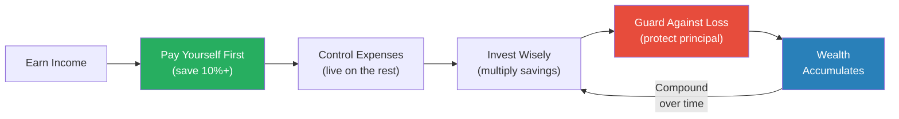
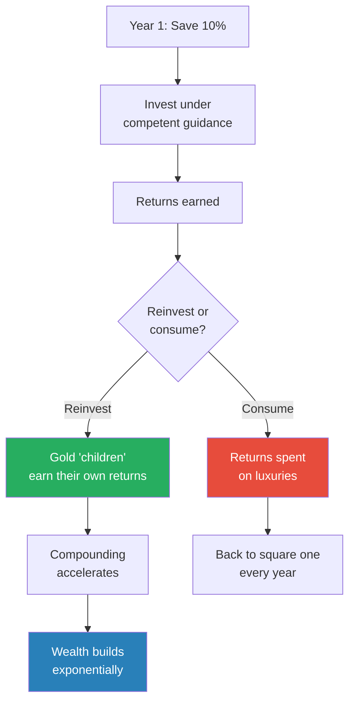
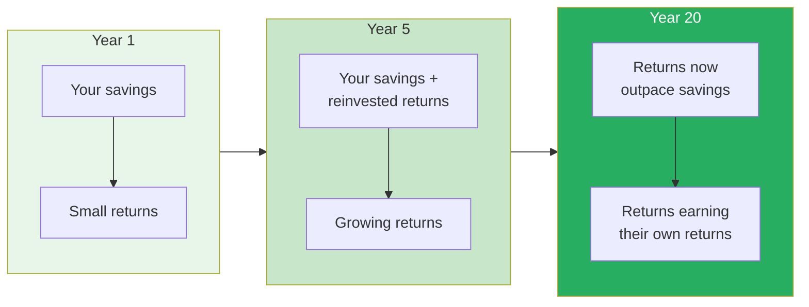
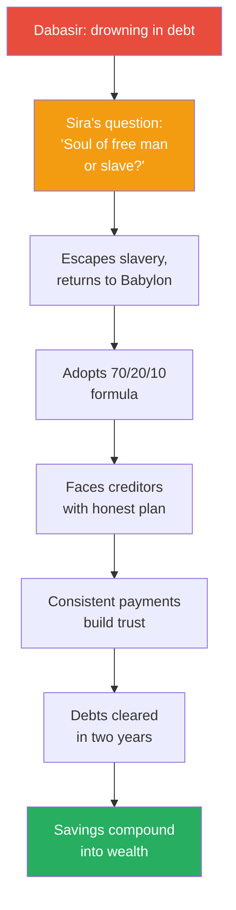
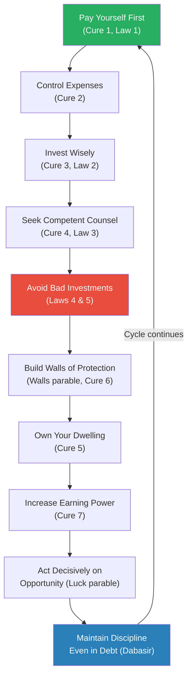
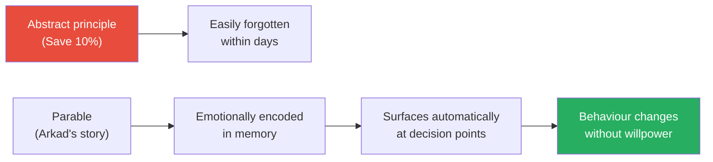

# The Richest Man in Babylon — George S. Clason

> George Clason published these parables in the 1920s as pamphlets distributed by banks and insurance companies across the United States. Nearly a century later, the advice hasn't aged a day.
> Set in ancient Babylon, the stories follow ordinary people — chariot builders, clay tablet scribes, camel traders, spear makers — who learn the same financial truths that apply to anyone with a salary in 2026.
> The core message is aggressively simple: save at least a tenth of everything you earn, invest it wisely, protect it from loss, and let time do the rest.
> Clason understood something most financial writers miss — people don't lack knowledge about money, they lack the emotional conviction to act on what they already know. Stories provide that conviction in a way spreadsheets never will.
> It is the oldest personal finance book still in print, and it remains one of the best precisely because it never tries to be clever.

---

## About the Author

George Samuel Clason was an American businessman who founded the Clason Map Company of Denver, Colorado, which published the first road atlas of the United States and Canada. He was not a financial advisor, economist, or Wall Street figure — he was a storyteller and entrepreneur who believed the principles of wealth-building were so simple and so universal they could be taught through tales set four thousand years ago in ancient Mesopotamia. Clason began writing the Babylonian parables in 1926, distributing them as individual pamphlets through banks and insurance companies who gave them away to clients. The pamphlets became so popular that they were compiled into the book we know today, which has sold millions of copies worldwide and is still recommended by financial advisors, from Suze Orman to Dave Ramsey, as the single best starting point for anyone who wants to understand money.

---

## The Big Idea

- <b style="color: #2980b9">Wealth is not about how much you earn — it is about how much you keep</b>
  - Arkad, the richest man in Babylon, earned no more than his childhood friends at the start
  - The difference was one decision: he kept a portion of everything he earned, and they spent everything they made
  - This distinction — earner versus keeper — is the foundation of every lesson in the book
- <b style="color: #27ae60">A part of all you earn is yours to keep</b> — at least one-tenth, paid to yourself before anything else
  - "Yours to keep" means it never leaves your control for consumption
  - It is not an emergency fund you dip into — it is capital that works for you
  - The psychological shift matters as much as the mathematical one: you begin to see yourself as someone who accumulates rather than someone who spends
- Money that you save must be put to work — savings alone won't build wealth; investment will
  - Gold sitting in a jar does not multiply — it must be lent, invested, or put into productive ventures
  - Clason draws a sharp line between hoarding (fearful) and investing (purposeful)
  - The key is that your money earns money, and that money earns more money — <b style="color: #2980b9">compound returns</b> are the engine of wealth
- <b style="color: #27ae60">Seek advice only from those who are competent through their own experience</b>
  - A brickmaker's opinion on jewels is worthless, no matter how sincere
  - A friend who has never invested has no business advising you on investments
  - Clason returns to this principle again and again — more money is lost through bad advice from well-meaning amateurs than through any other cause
- Protect what you have before chasing what you don't
  - The first sound principle of investing is: do not lose your principal
  - Glamorous returns mean nothing if the capital vanishes
  - Clason treats protection as a prerequisite, not an afterthought

This diagram shows Clason's core wealth-building cycle — save, invest, protect, compound — with the critical feedback loop where accumulated wealth feeds back into further investment.

---

## Key Concepts at a Glance

| Concept | One-line summary |
|---------|-----------------|
| **Pay yourself first** | Save at least 10% of every coin before paying anyone else |
| **Seven Cures for a Lean Purse** | Arkad's step-by-step formula taught to all citizens of Babylon |
| **Five Laws of Gold** | The rules governing how gold comes, stays, and flees |
| **Control thy expenditures** | Desires expand to match income — budget deliberately or lose everything |
| **Guard thy treasures from loss** | The first rule of investing is don't lose what you have |
| **The 70/20/10 formula** | Even in debt: 70% living, 20% creditors, 10% savings |
| **Competent counsel** | Only take advice from those who handle money successfully themselves |
| **Own thy dwelling** | Home ownership reduces costs and builds equity over time |
| **Increase thy ability to earn** | Skills, knowledge, and reputation compound just like gold |
| **Work ethic as luck** | Opportunity favours those already in motion and willing to work |
| **The walls of Babylon** | Protection of existing wealth is as vital as its accumulation |

Home ownership remains the most widely adopted cure, yet the foundational habit — paying yourself first — is practised by fewer than a third of modern earners, confirming Clason's observation that the simplest principle is the hardest to follow.

---

## Parable 1: The Man Who Desired Gold

*Two childhood friends confront the uncomfortable question of why one man became rich while they — equally talented, equally hardworking — remained poor.*

### The Setup

- <b style="color: #2980b9">Bansir</b>, a chariot builder, and <b style="color: #2980b9">Kobbi</b>, a musician, sit on the low wall outside Bansir's shop in ancient Babylon
- Both are skilled tradesmen who have worked hard their entire lives
- Both have empty purses — despite decades of labour, they have nothing saved
- They discuss a painful realisation: their childhood friend <b style="color: #2980b9">Arkad</b> started in the same place they did, with no advantages, yet he is now the richest man in all of Babylon
- The question burns: what does Arkad know that they do not?

> [!example] Bansir's Lament
> - Bansir had just finished a magnificent chariot — his finest work — and delivered it to a wealthy patron
> - As he watched the patron ride away, he realised he could not afford to ride in the very chariot he had built with his own hands
> - He had spent his entire career building things for other people's wealth while accumulating none of his own
> - Kobbi's situation was identical — he played beautiful music at feasts of the rich, then walked home to an empty house
> **The lesson:** Hard work alone does not create wealth. Without a system for keeping what you earn, skill simply enriches others.

### Arkad's Response

- Bansir and Kobbi go to Arkad and ask him directly: "How did you become wealthy?"
- Arkad does not claim special talent or divine favour
- He tells them he learned one simple truth from a moneylender named <b style="color: #2980b9">Algamish</b>
- That truth: <b style="color: #27ae60">"A part of all you earn is yours to keep"</b>
- This sounds obvious — but Arkad explains that most people pay everyone else first (the landlord, the food merchant, the tailor, the wine seller) and keep nothing for themselves
- The person who saves even one-tenth lives on the same amount as before, because desires naturally compress to fit the available budget

> [!tip] Core Insight
> You think you earn to spend. Arkad says you earn to keep. The shift from consumer to accumulator is not a financial strategy — it is an identity change. Once you see yourself as someone who keeps wealth, your behaviour follows.

---

### The Lesson from Algamish

- Young Arkad was a scribe — he copied clay tablets for a modest wage
- He struck a deal with Algamish: he would copy an important document overnight in exchange for the secret of wealth
- Algamish's secret was devastatingly simple: "I found the road to wealth when I decided that a part of all I earned was mine to keep"
- <b style="color: #e74c3c">Arkad initially confused this with "I save what's left over" — but there is never anything left over</b>
- The principle is pay yourself first, not pay yourself last
- Algamish told Arkad to save one-tenth of his earnings and return in a year

> [!example] Arkad's First Mistake
> - Arkad saved his tenth faithfully for a year
> - When the year was up, he had accumulated a modest sum and felt proud
> - He then gave his entire savings to a brickmaker named Azmur who claimed to know a jewel merchant offering rare stones at a discount
> - Azmur knew nothing about jewels — he was a brickmaker
> - The "jewels" turned out to be coloured glass
> - Arkad lost everything he had saved in one foolish investment
> **The lesson:** Never invest based on advice from someone who has no experience in the field. A brickmaker knows bricks, not jewels.

> [!example] Arkad's Second Mistake
> - Undeterred, Arkad saved another tenth for the next year
> - This time, he invested his gold in a shield-maker's business — a man who actually knew his trade
> - The shield-maker paid him a rental fee for the use of his gold and eventually returned the principal with interest
> - But instead of reinvesting, Arkad spent the returns on luxuries — fine robes, good food, feasting
> - Algamish returned and scolded him: "You eat the children of your gold"
> - Every coin of interest was a "child" that could itself earn more — spending it killed the compounding chain
> **The lesson:** Returns must be reinvested, not consumed. Spending your investment income is eating your seed corn.

---

### The Compound Effect in Babylon

- After two painful lessons, Arkad finally understood the full system:
  - Save at least one-tenth
  - Invest only under competent guidance
  - Reinvest the returns — let the "children" of your gold have "children" of their own
- <b style="color: #27ae60">Over time, the gold multiplied faster and faster, because each generation of returns became capital that earned its own returns</b>
- Algamish was so impressed that he eventually made Arkad the manager of his estate
- When Algamish died, Arkad inherited a share of the estate — not as charity, but as earned reward for faithful stewardship

This diagram illustrates the fork in the road Arkad faced — reinvesting returns leads to exponential growth, while consuming them traps you in a linear cycle of saving and spending.

The curve's dramatic acceleration after Year 20 illustrates Arkad's teaching that the "children of your gold" eventually produce more wealth than your own labour — patience is the engine of compounding.

---

## Parable 2: The Seven Cures for a Lean Purse

*The King of Babylon commands Arkad to teach the citizens the secrets of wealth — and Arkad delivers seven principles that form the backbone of every personal finance system that has followed.*

### Why the King Intervened

- <b style="color: #2980b9">King Sargon</b> noticed a troubling pattern in Babylon: the gold of the city was flowing into fewer and fewer hands
- Most citizens were poor despite living in the richest city on earth
- The problem was not a lack of gold — Babylon was wealthy — but a lack of knowledge about how to keep it
- Sargon reasoned that if one man could learn wealth, all men could learn it
- He commanded Arkad to teach the citizens in a series of public lectures

> [!tip] Core Insight
> Sargon's insight is the thesis of the entire book: wealth is a learnable skill, not an inherited trait. The problem is never the economy — it is the individual's relationship with money. Fix the relationship, fix the outcome.

---

### Cure 1: Start Thy Purse to Fattening

*The most famous principle in the book — and the foundation for everything else.*

- <b style="color: #27ae60">For every ten coins you earn, spend only nine</b>
- The tenth coin stays — it is not an emergency fund, not a rainy-day reserve, not something to dip into when a nice robe catches your eye
- It is capital — money whose sole purpose is to earn more money
- Arkad makes the citizens try this and report back — most discover that they live just as comfortably on nine-tenths as they did on ten-tenths
  - This happens because expenses are elastic — they expand to fill whatever income is available
  - When the tenth is removed first, the remaining nine-tenths adjust naturally
- <b style="color: #e74c3c">The critical word is "first" — if you save what's left after spending, there will never be anything left</b>

> [!abstract] The Pay-Yourself-First Method
> 1. When you receive any income, immediately set aside at least 10%
> 2. Place it where you cannot easily access it for spending
> 3. Do not touch it for any consumption purpose — no exceptions
> 4. Once a meaningful sum has accumulated, move to Cure 3 (investing)
> 5. Continue saving 10% regardless of income changes — the percentage stays constant

---

### Cure 2: Control Thy Expenditures

*Arkad dismantles the myth that higher income solves money problems — and reveals why most people stay poor no matter how much they earn.*

- <b style="color: #2980b9">Desires are infinite; income is finite</b>
- Arkad observes that as a man's income grows, his desires grow faster
  - The man who earned ten coins wished for twenty; the man who earned twenty wished for forty
  - Wealth is not a destination reached by earning more — it is a state achieved by wanting less than you have
- The cure is not deprivation but deliberation:
  - Write down every expenditure
  - Examine each one: does this serve a genuine need, or is it a confused want?
  - <b style="color: #e74c3c">Confuse not your necessary expenses with your desires</b>
  - Many things we call "needs" are really desires wearing practical clothing
- Budget the nine-tenths carefully — allocate to genuine needs first, then allow for a few pleasures, but never allow total spending to cross the nine-tenths line

> [!example] The Infinite Appetite of Desire
> - Arkad asked his students: "Which of you has a lean purse?"
> - Every hand went up
> - He then asked: "Which of you earns more today than you did five years ago?"
> - Most hands went up again
> - The point was devastating — they earned more, yet saved nothing more, because their desires had grown to consume every increase
> - A man who cannot live on ten coins will not be saved by earning twenty — he will simply find twenty coins' worth of desires
> **The lesson:** Income is not the problem. The gap between income and spending is the only number that matters.

---

### Cure 3: Make Thy Gold Multiply

*Savings sitting idle are half the equation — the other half is putting them to work.*

- Money saved but not invested is like a field ploughed but never planted
- <b style="color: #27ae60">Every gold piece you save should be a worker labouring for you</b>
- The returns from invested gold should themselves be invested — "the children of your gold" must also work
- Arkad describes this as a standing army: each coin is a soldier, each return is a new recruit, and the army grows larger with every passing year without any additional effort from you
- The mechanism is simple but its effect over time is profound:
  - Year one: your savings earn a return
  - Year two: your savings PLUS last year's returns earn a return
  - Year ten: the returns are earning more than your original savings contributed
  - Year twenty: the army is self-sustaining — it grows faster than you could ever feed it through labour alone

> [!example] Arkad's Golden Army
> - Arkad described each saved coin as a golden slave that works day and night
> - "Each coin," he told the citizens, "is a worker who can earn you more. The earnings of that coin are also workers. In a generation, you command an army — and you never lift a finger."
> - He showed them calculations: a man saving one gold piece per month, invested at modest returns, would have hundreds of gold pieces within a decade — most of it earned not by his labour but by his gold's labour
> - The citizens were astonished — not by the principle, but by the scale of the outcome
> **The lesson:** Compound growth is invisible in the early years and overwhelming in the later years. Patience is the price of admission.

Over time, the proportion of wealth generated by returns dwarfs the proportion generated by personal savings — this is the compounding effect Arkad called "the children of your gold."

---

### Cure 4: Guard Thy Treasures from Loss

*Arkad pivots from offence to defence — because earning and saving mean nothing if a single bad decision wipes out years of progress.*

- <b style="color: #e74c3c">The first principle of investing is: do not lose your principal</b>
- This is not timidity — it is strategic
  - A man who loses his savings must start over from zero
  - A man who earns modest but steady returns keeps his capital intact and growing
  - The mathematical asymmetry is brutal: losing 50% of your capital requires a 100% gain just to break even
- Clason identifies two main sources of loss:
  - **Incompetent advice** — taking investment guidance from people who have no experience with money
  - **Get-rich-quick schemes** — any investment promising extraordinary returns is almost certainly a trap
- The antidote: <b style="color: #27ae60">consult only with those who are experienced in the profitable handling of gold</b>
  - Before investing, ask: has this person done it successfully themselves?
  - If the answer is no, their advice is worthless regardless of their good intentions

> [!example] The Brickmaker and the Jewels
> - Young Arkad gave his first year of savings to Azmur, a brickmaker, who promised to buy rare jewels at a discount from a travelling merchant
> - Azmur was sincere but ignorant — he knew nothing about jewels
> - The merchant sold them worthless coloured glass
> - Arkad lost every coin he had saved
> - Algamish's reaction was not sympathy but scorn: "Why would you trust a brickmaker to buy jewels? Would you go to a baker to learn about the stars?"
> **The lesson:** Sincerity is not competence. Your friend may genuinely believe in a bad investment. That doesn't make the investment good.

> [!example] The Farmer's Crops
> - Arkad later told a parable within his lecture: a farmer does not plant seeds on rock and hope
> - He studies the soil, watches the seasons, consults experienced farmers
> - Only then does he plant — and even then, he does not put all his seed in one field
> - The wise investor is the same: study the ground, seek experienced counsel, diversify, and above all protect the seed
> **The lesson:** Preservation of capital is not a passive act — it requires active judgement and vigilance.

---

### Cure 5: Make of Thy Dwelling a Profitable Investment

*Arkad argues that owning your home is not just emotionally satisfying — it is a financial engine.*

- The man who pays rent enriches his landlord
- The man who owns his dwelling builds equity with every payment
- <b style="color: #2980b9">Home ownership reduces the ongoing cost of living</b>, which frees up more money for saving and investment
- Arkad notes that a man who owns his home has more confidence, more stability, and more pride in his community
- The argument is not about property speculation — it is about replacing a recurring cost (rent) with a finite cost (mortgage) that eventually reaches zero

> [!tip] Core Insight
> Rent is a pure expense — the money leaves and never returns. A mortgage payment is part expense (interest) and part investment (equity). Over time, the expense portion shrinks and the investment portion grows. This is why Clason treats home ownership as a cure, not a luxury.

---

### Cure 6: Ensure a Future Income

*Arkad addresses the reality that every person will one day be too old, too sick, or too tired to work.*

- <b style="color: #27ae60">The man who does not prepare for his future needs is like a man who walks into the desert without water</b>
- Saving and investing are not just about building wealth — they are about building a fortress against the inevitable decline of earning power
- Arkad makes a distinction that modern retirement planners would recognise:
  - There is a difference between "wealth" (assets you can sell) and "income" (money that flows to you regularly)
  - A person may have savings that look impressive as a lump sum but that run out if drawn down over decades
  - The goal is to build assets that generate ongoing income — what we would now call passive income or retirement income
- Arkad recommends:
  - Regular investment into assets that will provide income when labour ceases
  - Purchasing property that generates rental income
  - Making provisions for your family in case of your death — what we would now call life insurance
  - Starting early — the younger you begin, the more time your gold has to multiply before you need it
- This cure is forward-looking: it asks you to imagine your future self and act on behalf of that person today
  - The young man feels immortal and invulnerable — retirement seems impossibly distant
  - But Arkad insists: the young man's greatest advantage is time, and wasting it is the most costly mistake of all
- <b style="color: #e74c3c">The person who ignores this cure may be wealthy in middle age and destitute in old age</b>

> [!example] The Old Merchant's Warning
> - Arkad told of an old merchant who had earned vast sums during his working years
> - He lived lavishly, confident that his earning power would never fade
> - When illness struck in his sixties, he could no longer trade — and he had saved nothing
> - His fine home was sold to pay debts, his servants dismissed, his reputation diminished
> - He spent his final years dependent on the charity of former colleagues
> **The lesson:** Earning power is temporary. Only saved and invested wealth survives the end of your working years.

---

### Cure 7: Increase Thy Ability to Earn

*The final cure shifts from managing gold to managing yourself — because the most powerful investment you can make is in your own capacity.*

- <b style="color: #2980b9">A man's wealth is not in his purse alone — it is in his skills, his knowledge, and his reputation</b>
- Arkad tells the citizens that the more they learn, the more they can earn
- This is not merely about formal education — it includes:
  - Mastering your craft more deeply than anyone else
  - Learning new skills adjacent to your primary trade
  - Building a reputation for reliability, quality, and integrity
  - Seeking out mentors who have already achieved what you aspire to
- The compounding metaphor applies here too — skills build on skills, knowledge builds on knowledge, and reputation compounds over a lifetime
- "The more wisdom we know, the more we may earn"
- Arkad draws a direct connection between Cure 7 and Cure 1:
  - Increasing your ability to earn makes the 10% larger in absolute terms
  - A man who earns ten coins and saves one is wise — but a man who earns fifty coins and saves five is wealthier
  - <b style="color: #27ae60">The combination of discipline (saving 10%) and capability (earning more) is multiplicative, not additive</b>
  - This is why Clason placed this cure last — it amplifies all the others

> [!example] The Scribe Who Became a Merchant
> - Arkad told of a young scribe who earned modest wages copying clay tablets
> - Rather than accepting his station, the scribe spent his evenings learning mathematics and accounting
> - He studied the patterns of trade — which goods moved between which cities, at what seasons, and at what prices
> - Within a few years, he was hired not as a scribe but as a trade advisor to wealthy merchants
> - His income increased fivefold — and because he had been saving his tenth all along, his wealth exploded
> - He eventually became a merchant himself, using the knowledge he had accumulated through deliberate study
> **The lesson:** The fastest way to build wealth is not to save harder but to earn more — and the fastest way to earn more is to become more valuable through deliberate skill development.

> [!abstract] The Seven Cures — Complete Framework
> 1. **Start thy purse to fattening** — Save at least 10% before anything else
> 2. **Control thy expenditures** — Budget deliberately; desires are infinite
> 3. **Make thy gold multiply** — Invest savings so they earn returns
> 4. **Guard thy treasures from loss** — Protect principal; seek competent advice
> 5. **Make of thy dwelling a profitable investment** — Own your home
> 6. **Ensure a future income** — Plan for the day you can no longer work
> 7. **Increase thy ability to earn** — Invest in skills, knowledge, and reputation

---

## Parable 3: The Five Laws of Gold

*Arkad's son Nomasir tests his father's wisdom through bitter experience — losing his entire inheritance before learning the laws that govern how gold behaves.*

### The Test

- Arkad gave his son Nomasir two gifts: a bag of gold and a clay tablet inscribed with the Five Laws of Gold
- The challenge: go out into the world, prove yourself, and return in ten years
- <b style="color: #e74c3c">Nomasir valued the bag of gold and dismissed the clay tablet as worthless sentimentality</b>
- This was his first and most costly mistake — the wisdom was worth infinitely more than the gold

> [!example] Nomasir's Downfall
> - Armed with his bag of gold, Nomasir set out from Babylon full of confidence
> - He quickly fell in with schemers and smooth-talking men who promised enormous returns
> - One man persuaded him to fund a horse-racing scheme; another convinced him to invest in a non-existent trade route
> - Within two years, every coin was gone — not through bad luck, but through bad judgement
> - Nomasir found himself penniless, hungry, and humiliated in a foreign city
> - Only then did he remember the clay tablet — and finally read it
> **The lesson:** Gold in the hands of the inexperienced will not remain gold for long. Wisdom must come before wealth, or wealth will leave.

---

### The Five Laws

> [!abstract] The Five Laws of Gold
> 1. **Gold comes gladly** to the one who saves at least one-tenth of earnings
> 2. **Gold works diligently** for the one who finds it profitable employment
> 3. **Gold clings** to the one who invests under advice from those wise in its handling
> 4. **Gold slips away** from the one who invests in unfamiliar purposes or follows tricksters
> 5. **Gold flees** the one who forces it into impossible earnings or follows gamblers' counsel

- Laws 1-3 describe how gold comes and stays: save, invest wisely, seek competent counsel
- Laws 4-5 describe how gold leaves: unfamiliar ventures and get-rich-quick promises
- <b style="color: #27ae60">The laws are symmetrical — the same principles that attract gold repel it when violated</b>

| Law | Positive Form | Negative Form |
|-----|--------------|---------------|
| 1 | Save 10% and gold comes | Spend everything and gold never arrives |
| 2 | Invest wisely and gold multiplies | Hoard gold idle and it stagnates |
| 3 | Follow competent counsel and gold clings | Follow amateurs and gold slips away |
| 4 | Stick to what you understand | Chase unfamiliar schemes and lose |
| 5 | Accept realistic returns | Demand impossible returns and gold flees |

The diagonal dominance reveals that each law has a primary modern behaviour it governs, but the off-diagonal connections show how saving discipline reinforces investing success, and seeking competent advice directly prevents scam vulnerability.

---

### Nomasir's Redemption

- After reading the clay tablet, Nomasir applied the Five Laws systematically
- He found honest work as a labourer — humbling for a rich man's son, but he no longer had the luxury of pride
- He saved his tenth from the very first payment, even though his wages were small
- He invested only under guidance from experienced merchants who had proven their competence with their own gold
- He refused every get-rich-quick offer, no matter how tempting — and in a foreign city full of schemers, temptation was constant
- <b style="color: #27ae60">Within the remaining years, he not only rebuilt his wealth but exceeded his original inheritance</b>
- The critical difference between Nomasir's first approach and his second:

| First Attempt (Failed) | Second Attempt (Succeeded) |
|------------------------|---------------------------|
| Started with gold, no wisdom | Started with wisdom, no gold |
| Trusted strangers with exciting promises | Trusted only proven, experienced investors |
| Invested in things he didn't understand | Invested only in familiar, stable ventures |
| Spent impulsively, saved nothing | Saved his tenth before anything else |
| Sought quick returns | Accepted modest, steady growth |
| Lost everything within two years | Built a fortune within eight years |

- When he returned to Arkad after ten years, he brought back three times the gold he had originally been given
- More importantly, he brought back the clay tablet — and told his father it was the greater gift

> [!example] Nomasir's Return
> - Arkad hosted a feast for his son's return
> - Nomasir laid out two bags: one containing the gold he had earned, and the clay tablet
> - He told the assembled guests: "The gold my father gave me, I lost through foolishness. The wisdom he inscribed on clay, I nearly threw away. But the wisdom rebuilt everything the foolishness had destroyed — and more."
> - Arkad wept — not for the gold, but because his son had learned what gold cannot buy: judgement
> **The lesson:** Wisdom without gold can rebuild wealth. Gold without wisdom is temporary.

---

## Parable 4: Meet the Goddess of Good Luck

*Arkad and his friends debate the nature of luck — and discover that fortune favours not the lucky, but the prepared and the decisive.*

### The Debate at the Temple of Learning

- The men of Babylon gathered to discuss luck at the <b style="color: #2980b9">Temple of Learning</b> — a regular meeting where citizens debated topics of common interest
- Arkad posed the question: "Is there a way to attract good luck?"
- Each man shared a story of "good luck" or "bad luck" from his own experience
- The pattern emerged gradually but unmistakably:
  - Most stories of "good luck" were really stories of preparation meeting opportunity
  - Most stories of "bad luck" were really stories of hesitation, laziness, or poor judgement
  - Nobody could identify a single instance of pure, random fortune that wasn't preceded by some form of effort or readiness

> [!example] The Cattle Buyer Who Hesitated
> - A merchant heard that a farmer needed to sell his entire herd quickly due to a family emergency
> - The price was far below market value — a genuine opportunity
> - The merchant hesitated, wanting to think it over, inspect each animal, consult with others
> - By the time he decided to act, another buyer had already purchased the herd
> - The merchant called himself "unlucky" — but his own hesitation was the only obstacle
> **The lesson:** Good luck flees the procrastinator. Opportunity does not wait for you to feel ready.

> [!example] The Gambler's "Bad Luck"
> - Another man at the temple told of a gambler who wagered on races and games of chance
> - The gambler won occasionally but lost consistently over time
> - He attributed every loss to bad luck and every win to his own skill
> - The assembled men quickly saw the pattern: the gambler's "bad luck" was simply the inevitable result of unfavourable odds applied over many repetitions
> - No goddess was punishing him — mathematics was
> **The lesson:** Gambling is not a strategy for attracting luck. The person who bets repeatedly against the odds is not unlucky — they are predictable.

### The Nature of Opportunity

- <b style="color: #27ae60">The Goddess of Good Luck favours those who act</b>
- "Men of action are favoured by the goddess of good luck"
- Procrastination is the most common way people repel fortune:
  - They see the opportunity but want "more time"
  - They recognise the moment but fear making a mistake
  - They wait for certainty — and certainty never comes
- Luck is not random — it is the residue of decisiveness combined with preparation
- Clason identifies three prerequisites for "good luck":
  - **Readiness** — you must have capital (savings) available when opportunity appears
  - **Recognition** — you must have enough knowledge to identify a genuine opportunity versus a trap
  - **Decisiveness** — you must be willing to act before the moment passes
- <b style="color: #e74c3c">The person who fails on any of these three dimensions will call themselves unlucky</b> — when in reality they were unprepared, ignorant, or indecisive

> [!tip] Core Insight
> Clason's definition of luck is not mystical. Luck is what happens when you have prepared yourself through saving and learning, and then you act without hesitation when opportunity presents itself. The person who has no savings cannot seize a bargain. The person who hesitates loses the bargain to someone bolder. The person who cannot distinguish opportunity from a scam falls for the trap. All three feel "unlucky." None of them are.

---

## Parable 5: The Gold Lender of Babylon

*Mathon, a gold lender, teaches his nephew the art of evaluating borrowers — and in doing so reveals the principles of safe investment that protect wealth across generations.*

### Mathon's Wisdom

- <b style="color: #2980b9">Mathon</b> was a wealthy gold lender — he had spent decades loaning gold and studying which borrowers repaid and which defaulted
- His experience gave him a framework for evaluating any investment, not just loans
- He kept a chest of tokens — each one representing a loan he had made — and he walked his nephew through them, explaining what made each one succeed or fail

> [!example] The Five Tokens of Mathon
> - **Token 1 (the ox farmer):** A farmer with a proven track record who needed gold for more cattle. Solid collateral, steady income, excellent history. The loan was repaid with interest. "Safe as the walls of Babylon."
> - **Token 2 (the widowed woman):** A merchant's widow who needed gold to continue her late husband's business. She had no experience but was determined. A risky loan that required careful monitoring — but she succeeded.
> - **Token 3 (the young spendthrift):** A man who wanted gold to buy jewels and fine clothes. No collateral, no plan for repayment, no income. Mathon refused the loan. "To lend gold to one without means to repay is to lose both the gold and the friend."
> - **Token 4 (the ambitious builder):** A man who wanted to build grand structures but had no land and no experience. Mathon refused — the dream exceeded the capability.
> - **Token 5 (the friend in need):** A close friend asked for gold to fund a trade venture. Mathon lent it, against his better judgement, because of friendship. The friend lost everything and could not repay. Friendship was strained.
> **The lesson:** Sentiment is no substitute for judgement. Every loan — every investment — must be evaluated on merit, not emotion.

### The Framework for Safe Lending

- Mathon distilled his decades of experience into clear principles:
  - <b style="color: #27ae60">Does the borrower have the ability to repay?</b> (income or collateral)
  - Has the borrower demonstrated reliability? (track record)
  - Is the purpose of the loan productive? (will it generate returns, or merely fund consumption?)
  - <b style="color: #e74c3c">Does the borrower's plan match their skill?</b> (ambitious plans from inexperienced people are a red flag)
  - Is there collateral that can be recovered if the loan fails?

| Borrower Type | Collateral | Track Record | Risk Level | Mathon's Decision |
|--------------|-----------|-------------|------------|-------------------|
| Experienced farmer | Cattle, land | Excellent | Low | Lend |
| Determined widow | Business assets | None (but learning) | Medium | Lend cautiously |
| Spendthrift | None | Poor | Very high | Refuse |
| Inexperienced dreamer | None | None | Very high | Refuse |
| Close friend | Emotional | Mixed | High | Should have refused |

This evaluation framework translates directly to modern investing: Does the investment have collateral? Has it performed before? Is it productive? Does the operator have relevant experience?

### The Emotional Trap of Lending

- Mathon saved his most painful lesson for last — the loan to a close friend
- <b style="color: #e74c3c">Emotion is the enemy of sound financial judgement</b>
  - When a friend asks for money, you want to help — and wanting to help blinds you to risk
  - The friend may be sincere, but sincerity is not a repayment plan
  - Mathon lost gold and nearly lost a friendship — because mixing emotional bonds with financial bonds creates obligations that neither party can comfortably fulfil
- The principle extends beyond lending:
  - Investing in a relative's business "to be supportive" is the same trap
  - Cosigning a loan for a friend is the same trap
  - Any financial decision driven by guilt, obligation, or affection rather than merit is likely to end in loss and resentment
- Mathon's advice: help friends with your time, your counsel, your connections — but <b style="color: #27ae60">protect your gold with your judgement, not your heart</b>

---

## Parable 6: The Walls of Babylon

*This short parable is entirely about defence — and makes the case that protecting what you have is as important as building more.*

### The Siege

- The army of Assyria besieged Babylon with massive forces
- The citizens cowered behind the city walls, terrified
- The walls held — not through any offensive action, but through their sheer defensive strength
- <b style="color: #2980b9">The old soldier who guarded the walls</b> explained that Babylon had survived for centuries not because it was the strongest attacker, but because it was the strongest defender
- The walls were thick, well-maintained, and manned by disciplined guards who never slept on duty

> [!example] The Siege of Babylon
> - The Assyrian army camped outside the gates for weeks, launching assault after assault
> - Battering rams struck the walls day and night; flaming arrows rained down; tunnellers tried to dig beneath the foundations
> - Each attack was repelled — not by brilliant strategy, but by the simple, relentless strength of the walls
> - The citizens inside continued their daily lives, relatively safe, while the besieging army exhausted itself
> - Eventually, the Assyrians withdrew — not defeated in battle, but defeated by the walls
> **The lesson:** You don't need to outfight every threat. You need walls strong enough that threats cannot reach your wealth.

### The Financial Application

- Clason draws the parallel explicitly:
  - The walls of Babylon are <b style="color: #27ae60">insurance, emergency funds, and conservative investments</b>
  - The Assyrian army represents financial catastrophe: job loss, illness, market crashes, lawsuits, theft
  - The person who builds walls first can invest more aggressively with the remainder, because the foundation is protected
  - <b style="color: #e74c3c">The person who invests aggressively without walls is one siege away from ruin</b>
- Modern equivalents:
  - Emergency fund covering 3-6 months of expenses
  - Health insurance, life insurance, disability insurance
  - Diversified investments rather than concentrated bets
  - Legal protections (wills, trusts, proper contracts)

### Why Defence Precedes Offence

- This parable is deliberately placed after the wealth-building parables — Clason wants the reader to understand accumulation first, then protection
- The logic is sequential but the priority is not:
  - You should build walls while you are building wealth, not after
  - A person with savings but no insurance is one medical bill away from zero
  - A person with investments but no emergency fund will be forced to sell at the worst possible time
- <b style="color: #2980b9">The paradox of protection</b>: walls enable aggression
  - The investor who knows their base is secure can afford to take calculated risks with the surplus
  - The investor with no safety net invests fearfully, sells at the wrong time, and misses opportunities
  - Protection does not reduce returns — it increases them, because it removes the fear that causes bad decisions

> [!tip] Core Insight
> The walls of Babylon did not win the war — they prevented defeat. Financial protection works the same way. Emergency funds, insurance, and diversification do not make you rich. They prevent the catastrophes that make you poor. And a person who cannot become poor can afford to be patient — patience is the ultimate wealth-builder.

---

## Parable 7: The Camel Trader of Babylon

*Dabasir's story is the debt chapter — the most emotionally powerful parable in the book, about a free man who became a slave through foolishness and clawed his way back through discipline.*

### Dabasir's Fall

- <b style="color: #2980b9">Dabasir</b> was a saddlemaker in Babylon — a decent trade, a modest income
- He developed a taste for expensive living that exceeded his earnings
  - Fine food, lavish entertainment, gifts for women he wanted to impress
  - When his income ran out, he borrowed — first from friends, then from moneylenders
- The debts accumulated until he could not repay them
- <b style="color: #e74c3c">To escape his creditors, Dabasir fled Babylon — only to be captured by bandits and sold into slavery in Syria</b>
- His foolishness had cost him not only his money but his freedom

> [!example] Dabasir's Slavery
> - Dabasir was purchased by a wealthy Syrian who put him to work as a camel tender
> - He spent months in the desert, sunburned, hungry, and humiliated
> - His master's wife, Sira, noticed his misery and asked him a question that changed his life: "Have you the soul of a free man, or the soul of a slave?"
> - Dabasir was offended — of course he had the soul of a free man!
> - Sira replied: "Then why do you accept this life? A free man does not submit. He acts."
> - That night, Dabasir stole a camel and escaped across the desert back toward Babylon
> - He nearly died of thirst but was saved by arriving at an oasis within reach of the city
> **The lesson:** External circumstances do not determine your fate — your internal decision to act does. Sira's question is the turning point of the entire parable.

---

### Dabasir's Redemption — The 70/20/10 Formula

- Dabasir returned to Babylon penniless, deeply in debt, and deeply ashamed
- He went to Mathon, the gold lender, and asked for advice — not for more gold, but for a plan
- Mathon gave him the formula that would change his life:

> [!abstract] The 70/20/10 Debt Repayment Formula
> 1. **70%** of all income goes to living expenses — food, clothing, shelter, reasonable needs
> 2. **20%** goes to creditors — divided fairly among all debts, proportional to their size
> 3. **10%** goes to savings — even while in debt, you pay yourself first
> This is non-negotiable. The savings come first, before even the creditors.

- <b style="color: #27ae60">The critical insight: even in debt, you must pay yourself first</b>
  - If you give everything to creditors, you work only for others and never escape the cycle
  - The 10% savings creates a psychological shift — you are not just repaying, you are building
  - It also creates a practical safety net so that new emergencies don't create new debts
- Dabasir approached each creditor individually with his plan
  - Some were angry — they wanted full repayment immediately
  - Most accepted — because getting paid slowly is better than not getting paid at all
  - <b style="color: #e74c3c">The creditors who refused were eventually won over when they saw Dabasir's consistency</b>

> [!example] Dabasir Faces His Creditors
> - Dabasir visited each creditor in person — the food merchant, the fabric dealer, the moneylender
> - He did not hide or make excuses. He laid out his plan: "I will pay you 20% of my income, divided proportionally among all my creditors, until every debt is cleared."
> - The food merchant scoffed: "Twenty percent? You owe me enough to buy a house!"
> - Dabasir stood firm: "This is what I can do. Would you prefer twenty percent of my income, or nothing at all?"
> - One by one, they accepted — not happily, but practically
> - Within two years, every debt was repaid, and Dabasir's savings had begun to compound
> **The lesson:** Creditors respect consistency more than grand promises. A small, reliable payment builds trust faster than a large promise that never materialises.

---

### Dabasir's Transformation

- The 70/20/10 formula did more than clear Dabasir's debts — it rebuilt his identity
- He went from being a man who hid from creditors to a man who faced them openly
- He went from a man who spent recklessly to a man who budgeted deliberately
- <b style="color: #27ae60">"Where the determination is, the way can be found"</b>
- By the end of his story, Dabasir was not only debt-free but prosperous — the same principles that cleared his debts became the principles that built his wealth

Dabasir's arc — from spender to debtor to slave to disciplined free man — is the emotional centrepiece of the book and the most frequently cited parable by modern financial advisors.

The genius of Dabasir's formula is that the 10% savings stream flows even during debt repayment — it rebuilds the debtor's identity as an accumulator, preventing the psychological trap of working solely for creditors.

---

## Parable 8: The Luckiest Man in Babylon

*Sharru Nada tells the story of how a slave's attitude toward work determined whether he lived in chains or walked free — and argues that work itself is the greatest blessing, not a curse.*

### Sharru Nada's Journey

- <b style="color: #2980b9">Sharru Nada</b> was a wealthy merchant travelling with Hadan Gula, the grandson of his old partner
- Hadan Gula was a young man who saw work as demeaning and wanted to live a life of leisure
- Sharru Nada decided to tell him the truth about his own past — he had once been a slave

> [!example] Sharru Nada's Slave Days
> - Sharru Nada was captured as a young man and sold at the slave market in Babylon
> - He was purchased by a baker named Nana-naid, who put him to work making honey cakes
> - Most slaves did the minimum — they resented their bondage and worked only under the whip
> - Sharru Nada made a different choice: he worked as hard as he possibly could, not for his master, but for himself
> - He reasoned that if he became the most valuable worker, opportunities would follow
> - He learned the baking trade thoroughly, suggested improvements, and took on extra responsibilities
> - Nana-naid noticed and began trusting him with more complex tasks
> **The lesson:** The attitude you bring to work determines the trajectory of your life, regardless of your starting conditions.

---

### The Two Slaves — A Study in Contrast

- Clason draws a deliberate contrast between two types of workers:

| Quality | Megiddo (the resentful slave) | Sharru Nada (the willing worker) |
|---------|-------------------------------|----------------------------------|
| Attitude to work | Resented it, did minimum | Embraced it, sought excellence |
| View of situation | "I am cursed" | "I can change this" |
| Behaviour | Complained, shirked, hid | Volunteered, learned, improved |
| Relationship with master | Adversarial | Collaborative |
| Outcome | Remained enslaved | Earned freedom and wealth |

- <b style="color: #27ae60">Work is the best friend you'll ever have</b> — the person who works hard and works smart creates their own "luck"
- <b style="color: #e74c3c">The person who resents work and does the minimum condemns themselves to remain exactly where they are</b>
- Sharru Nada's point is not that slavery was acceptable — it is that even in the worst circumstances, attitude determines trajectory

> [!example] Megiddo's Fate
> - Megiddo was a fellow slave who resented every task
> - He did only what was demanded, complained constantly, and dreamed of escape
> - He never improved his skills, never made himself valuable, never earned trust
> - Years later, when Sharru Nada had earned his freedom and become a merchant, Megiddo was still a slave — not because his chains were stronger, but because his attitude kept him chained
> **The lesson:** Freedom — financial and otherwise — comes to those who make themselves indispensable, not to those who merely endure.

---

### How Sharru Nada Earned His Freedom

- Through excellent work, Sharru Nada earned Nana-naid's trust
- The baker began sending him on independent errands — buying supplies, negotiating with merchants, selling goods
- Sharru Nada saved a portion of every bonus and gift he received
- Eventually, he had enough to buy his own freedom
- Once free, he applied the same work ethic to his own business:
  - He started small, worked relentlessly, saved consistently
  - He invested wisely, sought competent advice, and avoided get-rich-quick schemes
  - Within years, he was one of the wealthiest merchants in Babylon
- <b style="color: #27ae60">"Where the determination is, the way can be found"</b>

### The Purpose of the Story

- Sharru Nada tells this story specifically to change Hadan Gula's attitude
- Hadan Gula is young, privileged, and believes work is beneath him
  - He inherited his position — he did not earn it
  - He views labour as something for the lower classes, not for men of status
  - <b style="color: #e74c3c">This attitude is exactly what Clason identifies as the greatest threat to inherited wealth</b>
- Sharru Nada's point is not that work is ennobling for its own sake — it is that work is the mechanism through which all other principles operate:
  - You cannot save if you do not earn
  - You cannot earn if you do not work
  - You cannot work effectively if you resent the work itself
  - The person who loves their work does it better, earns more, and compounds faster
- By the end of the story, Hadan Gula understands that his comfort was built on the labour of men like Sharru Nada — and that if he does not develop the same discipline, he will lose everything his grandfather built

> [!tip] Core Insight
> Sharru Nada's story is Clason's answer to the objection "I can't save because I don't earn enough." If a slave with no income and no freedom could save, invest, and build wealth through sheer attitude and discipline, then no free person has a valid excuse. But the story also works in the other direction — it warns the privileged that wealth without work ethic is temporary.

---

## Parable 9: The Clay Tablets from Babylon

*Clason breaks the fourth wall — framing the ancient wisdom as archaeological discovery to demonstrate that the principles haven't changed in 5,000 years.*

### The Professor's Discovery

- A university professor of archaeology discovers a set of clay tablets inscribed with Babylonian writing
- The tablets turn out to be Dabasir's personal record of his debt repayment plan
- The professor, deeply in debt himself, decides to apply Dabasir's 70/20/10 formula to his own finances
- <b style="color: #2980b9">The results are identical — within two years, the professor has cleared his debts and begun building savings</b>

> [!example] The Professor and the Clay Tablets
> - Professor Franklin Caldwell of Nottingham University was excavating in Mesopotamia when he found five clay tablets
> - Once translated, they revealed Dabasir's detailed plan: lists of creditors, amounts owed, and a systematic repayment schedule following the 70/20/10 formula
> - Caldwell recognised his own situation — he was a modern academic drowning in debt, just like an ancient Babylonian saddlemaker
> - He and his wife adopted Dabasir's exact plan: 10% savings first, 20% to creditors, 70% to live on
> - They wrote to the colleague who had sent them the tablets: "It works. The ancient Babylonians solved our problem five thousand years ago."
> **The lesson:** The principles of wealth are not modern inventions waiting to be discovered. They are ancient truths waiting to be applied.

- Clason uses this framing device to hammer his central point:
  - These are not theories — they are laws, as fixed as gravity
  - They worked in ancient Babylon, they worked in 1926, and they work today
  - <b style="color: #e74c3c">The only variable is whether the individual has the discipline to follow them</b>

---

## Connecting the Parables — Clason's Unified System

*The parables are not independent stories — they form a coherent system where each principle supports and reinforces the others.*

This diagram shows how all of Clason's parables connect into a single reinforcing cycle — each principle enables the next, and the system loops back to its starting point.

### The Recurring Patterns

- Several themes appear in every parable, reinforcing each other:

| Theme | Appears In | Core Message |
|-------|-----------|--------------|
| **Discipline over cleverness** | All parables | Consistent small actions beat sporadic grand ones |
| **Competent advice** | Arkad, Nomasir, Mathon | Only take guidance from those with relevant experience |
| **Compounding** | Arkad, Seven Cures, Five Laws | Time is the multiplier — start early and be patient |
| **Protection before growth** | Walls, Mathon, Cure 4 | Preserve capital first, then seek returns |
| **Identity precedes behaviour** | Dabasir, Sharru Nada | Change who you are, and actions follow naturally |
| **Action over hesitation** | Luck parable, Sharru Nada | Fortune favours the decisive, not the cautious |

---

## Timeless Principles, Modern Application

*Clason wrote in 1926 about events set in 2000 BCE — yet every principle translates directly to the financial landscape of the 21st century.*

| Babylonian Wisdom | Modern Equivalent |
|-------------------|-------------------|
| Pay yourself first (10%) | Automatic payroll deduction to savings or investment account |
| Seek competent advice | Low-cost index funds, fee-only fiduciary financial advisors |
| Guard against loss | Emergency fund (3-6 months expenses), insurance, diversification |
| Own your dwelling | Mortgage as forced savings that builds equity over time |
| Increase ability to earn | Continuous learning, professional development, certifications |
| Avoid get-rich-quick | Don't day-trade, don't chase meme stocks, don't speculate with rent money |
| The 70/20/10 formula | Debt snowball/avalanche methods combined with automatic savings |
| Let gold's children work | Dividend reinvestment, compound interest, index fund growth |
| Consult the experienced | Ignore financial advice from friends who aren't wealthy themselves |
| Act on opportunity | Maintain cash reserves so you can invest when markets crash |

- The genius of Clason's book is not that the principles are original — they are not
- The genius is that by placing them in ancient Babylon, Clason strips away every modern excuse:
  - "The economy is bad" — Babylon had famines and sieges
  - "My taxes are too high" — Babylonians paid heavy tribute to kings
  - "I don't earn enough" — slaves built wealth with no income at all
  - "I need to learn more first" — the principles fit on a clay tablet

---

## The Psychology Behind the Parables

*Clason was not a psychologist, but his intuitions about human financial behaviour anticipated what behavioural economists would confirm decades later.*

- <b style="color: #2980b9">Hedonic adaptation</b> — the tendency for desires to expand to match income
  - Arkad teaches this as Cure 2: "That which each of us calls our necessary expenses will always grow to equal our incomes unless we protest to the contrary"
  - Modern research by economists like Daniel Kahneman confirms this — people on higher incomes are not proportionally happier, because their expectations rise in tandem
- <b style="color: #2980b9">Present bias</b> — the tendency to overvalue immediate gratification over future rewards
  - Nomasir's eagerness to spend his gold immediately rather than follow the Five Laws is textbook present bias
  - The solution Clason offers is structural: remove the tenth before you can be tempted
- <b style="color: #2980b9">Social proof</b> — the tendency to follow the crowd rather than expert counsel
  - Arkad's first mistake (trusting a brickmaker about jewels) illustrates the danger of taking advice from peers who are equally ignorant
  - Modern parallel: following financial advice on social media from people who have never managed money successfully
- <b style="color: #2980b9">Loss aversion</b> — the pain of losing money is psychologically more intense than the pleasure of gaining it
  - Clason understood this intuitively — his repeated emphasis on protecting principal (Cure 4, Laws 4-5, the Walls parable) reflects the asymmetry between gain and loss
  - A 50% loss requires a 100% gain to recover — the mathematics of loss are brutal
- <b style="color: #2980b9">The Dunning-Kruger effect</b> — the less you know, the more confident you feel
  - Nomasir was supremely confident with his bag of gold and no experience — and lost everything
  - Arkad's brickmaker friend was certain about the jewel deal — and was completely wrong
  - Clason repeatedly shows that the most dangerous investor is the one who doesn't know what they don't know
  - The antidote is always the same: consult people who have done it successfully, not people who merely have opinions
- <b style="color: #2980b9">Identity-based behaviour change</b> — modern psychology confirms that changing your self-image is more effective than willpower
  - Dabasir's transformation began not with a budget but with Sira's question: "Have you the soul of a free man?"
  - Once he identified as a free man, his behaviour followed — the 70/20/10 plan was the mechanism, but the identity shift was the engine
  - Arkad's citizens, once they began saving their tenth, started seeing themselves as "men of means" rather than "men who spend"
  - This identity shift made the discipline self-reinforcing rather than effortful

> [!tip] Core Insight
> Clason's parables work because they bypass the analytical mind and speak directly to emotion through story. This is why the book has outlasted every technical financial guide published in the same era — stories lodge in memory where spreadsheets do not.

---

## Why Parables Work — The Genius of Clason's Format

*The most underrated aspect of this book is not what it teaches but how it teaches — and why that format has kept it in print for nearly a century while thousands of technically superior financial guides have been forgotten.*

- Clason could have written a straightforward manual: "Step 1: Save 10%. Step 2: Invest wisely."
  - That book would have been accurate, forgotten within a year, and never reprinted
  - Instead, he wrapped the same principles in characters, conflict, and narrative arc
- Stories exploit how human memory actually works:
  - We remember people and events, not rules and principles
  - "Save ten percent" is forgettable — "Arkad the scribe who became the richest man in Babylon by paying himself first" is not
  - The emotional arc of Dabasir — shame, slavery, determination, redemption — creates a felt sense of urgency that no bullet list can replicate
- The ancient Babylon setting is a deliberate choice:
  - It creates distance from the reader's specific circumstances, which paradoxically makes the advice feel more universal
  - A book set in 1920s America would feel dated; a book set in ancient Babylon feels timeless
  - The archaic language ("thy purse," "thy gold") creates a sense of gravitas that makes simple advice feel weighty
- <b style="color: #27ae60">The parables serve as mental anchors</b>
  - When you are tempted to invest in something you don't understand, you remember Arkad and the brickmaker's worthless jewels
  - When you are drowning in debt and feel hopeless, you remember Dabasir's 70/20/10 plan
  - When you want to procrastinate on a financial opportunity, you remember the cattle buyer who waited too long
  - These characters live in your mind rent-free — and they speak up at exactly the moments you need them

This is why *The Richest Man in Babylon* has outlasted every technical financial guide of its era — the principles enter through story and stay through emotion.

---

## What the Book Gets Right

- <b style="color: #27ae60">The 10% rule is genuinely transformative</b> — not because 10% is a magic number, but because the act of paying yourself first rewires your identity from consumer to accumulator
- The emphasis on competent advice has saved countless readers from scams, bad investments, and well-meaning but ignorant friends
- The debt repayment formula (70/20/10) is psychologically sophisticated — it gives the debtor hope (savings) while making steady progress (creditor payments)
- The storytelling format is not a gimmick — it is the delivery mechanism that makes the principles stick
- The separation of offence (earning, investing) and defence (protecting, insuring) is a framework that holds up under modern portfolio theory
- The book correctly identifies that <b style="color: #27ae60">the gap between knowing and doing is the central problem of personal finance</b>
  - Everyone "knows" they should save — almost nobody does it consistently
  - Clason understood that the obstacle is not ignorance but emotional conviction
  - His parables supply the conviction that knowledge alone cannot

---

## What the Book Gets Wrong — Or At Least Leaves Out

- <b style="color: #e74c3c">The book is silent on systemic inequality</b>
  - Clason writes as if everyone starts from a roughly equal position and only discipline separates the rich from the poor
  - This ignores structural barriers: discrimination, inherited wealth advantages, access to education, geographic luck
  - The principles are sound, but claiming they are sufficient for everyone oversimplifies reality
- <b style="color: #e74c3c">The investment advice is dangerously vague</b>
  - "Put your money to work" and "seek competent advice" are good principles but offer no specifics
  - In 1926, investment options were limited — today, the sheer number of choices (stocks, bonds, index funds, real estate, crypto) can paralyse a beginner
  - The book gives you the philosophy of investing but none of the mechanics
- The home-ownership advice (Cure 5) is more nuanced in the modern world:
  - In many cities, home prices are so inflated that renting and investing the difference can be mathematically superior
  - Clason did not anticipate the housing market distortions of the 21st century
- The parables assume a stable economic system:
  - Hyperinflation, currency collapse, and systemic banking failures can destroy savings regardless of discipline
  - Clason's Babylon is a remarkably stable fictional economy — real economies are messier
- The work-ethic argument (Sharru Nada) can shade into victim-blaming:
  - The implication that slaves who remained enslaved simply had the wrong attitude is uncomfortable and historically inaccurate
  - Clason uses slavery as a metaphor for financial bondage, but the metaphor breaks down under scrutiny

---

## The Verdict

The book's greatest contribution is not any single principle — it is the reframing of wealth from a matter of income to a matter of behaviour. Before Clason, most people assumed wealth was something that happened to lucky or talented people. After Clason, the framework is clear: wealth is a series of decisions, repeated consistently over time, that anyone can learn. The pay-yourself-first principle alone has probably generated more real-world wealth than any other single piece of financial advice in publishing history, because it is simple enough to remember and concrete enough to act on immediately.

The book's weakness is its simplicity — which is simultaneously its strength. Clason offers philosophy without mechanics, principles without implementation details, and a worldview that treats discipline as both necessary and sufficient for financial success. For a reader in desperate debt or starting from zero, this is exactly the right message. For a reader navigating complex modern financial instruments, tax optimisation, or systemic economic challenges, the book is a starting point, not a complete guide. It tells you what to do but not how to do it in a world of 401(k)s, Roth IRAs, index funds, and tax-advantaged accounts.

The reader who benefits most is the one who has never thought systematically about money — the person who earns a decent income but has nothing to show for it, who knows they should save but never does, who has tried budgets that collapsed within weeks. For this reader, Clason's parables provide the emotional conviction that spreadsheets cannot. The stories of Arkad, Dabasir, and Nomasir lodge in the mind and create a sense of urgency that abstract financial advice never achieves.

Compared to modern personal finance literature, *The Richest Man in Babylon* sits as the philosophical foundation. [[The Psychology of Money - Morgan Housel|The Psychology of Money]] by Morgan Housel is its natural successor — it takes Clason's intuitions about behaviour and money and backs them with modern behavioural science. [[Thinking in Bets - Annie Duke|Thinking in Bets]] addresses the decision-making under uncertainty that Clason touches on but never develops. And for readers who want the mechanical "how" that Clason deliberately omits, any modern guide to index fund investing will fill the gap. But start here. Start with the story. Start with the tenth.

---

## Related Reading

- [[The Psychology of Money - Morgan Housel|The Psychology of Money]] — Modern behavioural take on the same timeless principles, especially "getting wealthy vs staying wealthy"
- [[Thinking in Bets - Annie Duke|Thinking in Bets]] — Decision-making under uncertainty, relevant to Clason's investment principles
- [[The Almanack of Naval Ravikant - Eric Jorgenson|The Almanack of Naval Ravikant]] — Modern wisdom on wealth and happiness, echoing Clason's emphasis on judgement over labour
- [[Antifragile - Nassim Nicholas Taleb|Antifragile]] — Builds on the "walls of Babylon" concept by exploring how to benefit from volatility, not just survive it
- [[Essentialism - Greg McKeown|Essentialism]] — The discipline of less applied to life choices, mirroring Clason's Cure 2 (control thy expenditures)
- [[How Will You Measure Your Life - Clayton M. Christensen|How Will You Measure Your Life]] — Long-term thinking applied to life decisions, resonating with Clason's emphasis on ensuring future income
- [[Deep Work - Cal Newport|Deep Work]] — The modern case for Cure 7 (increase thy ability to earn) through focused skill development
