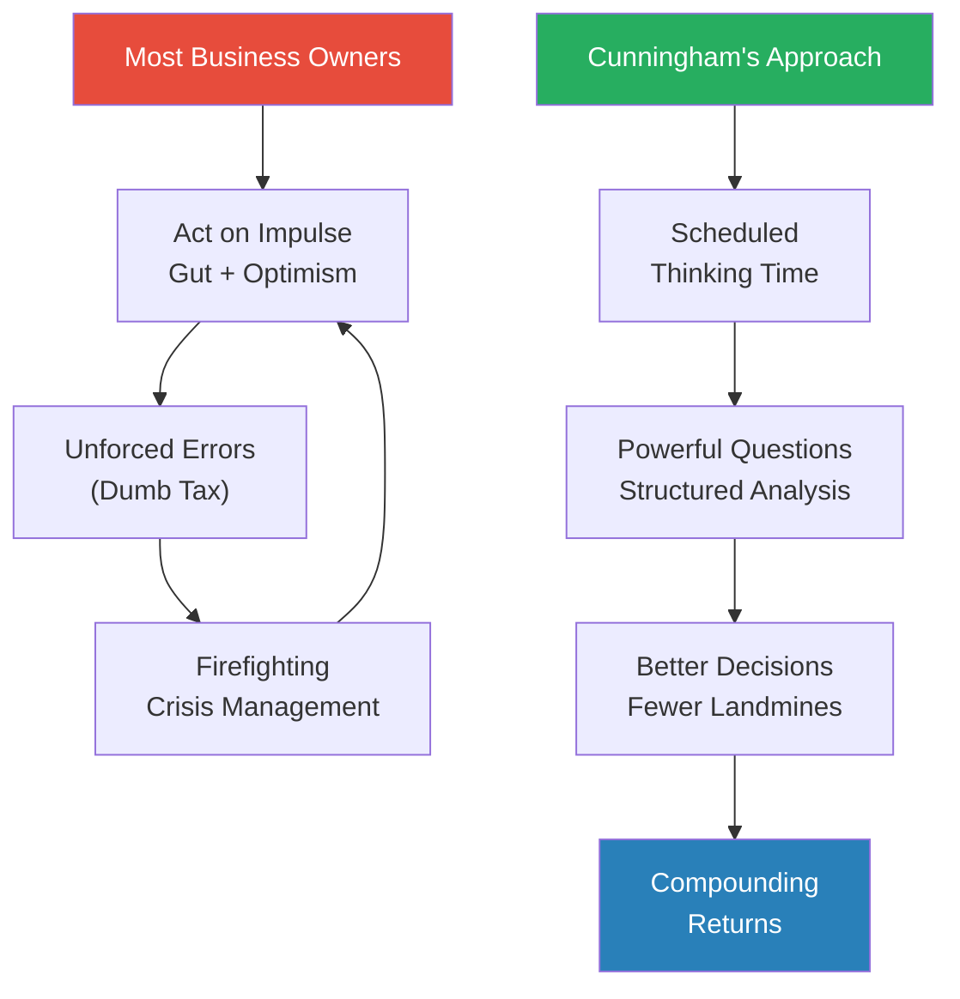
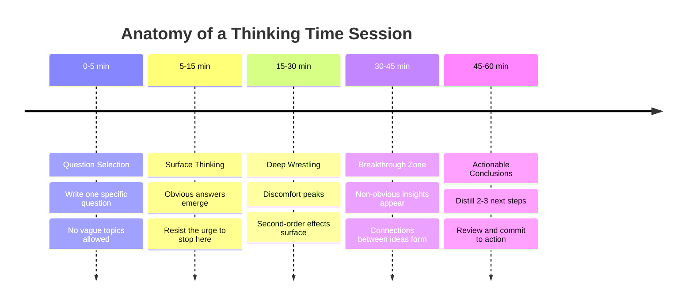
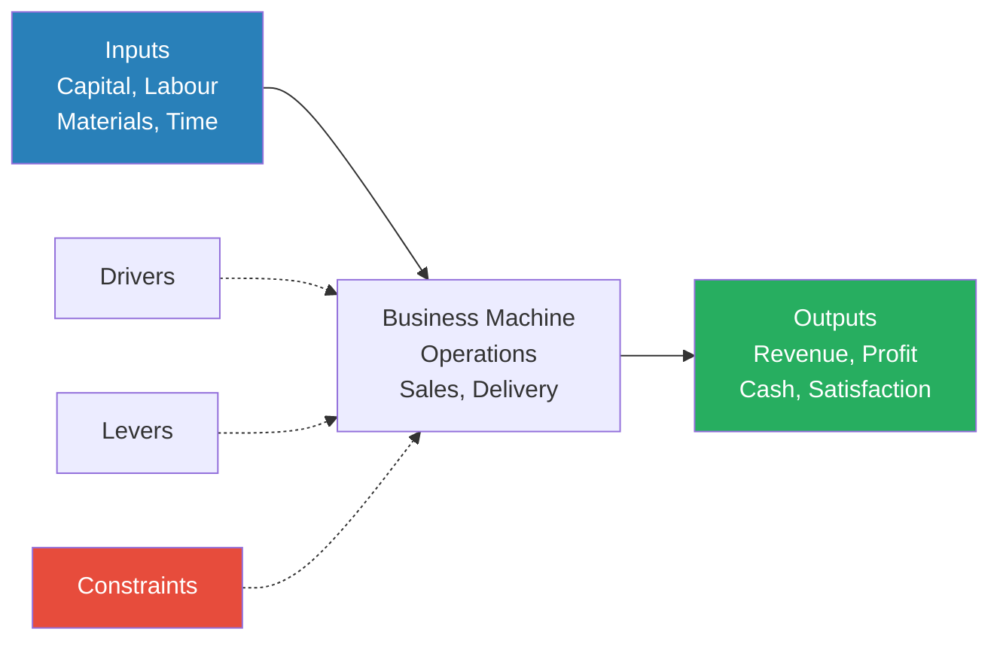
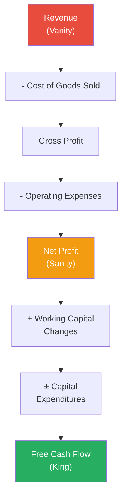
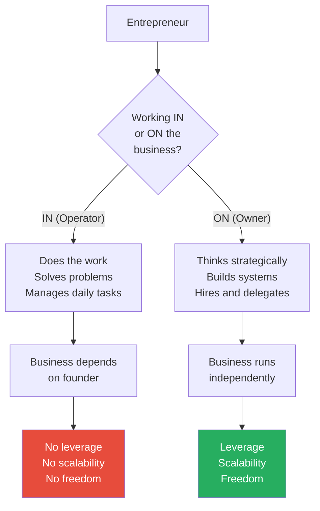
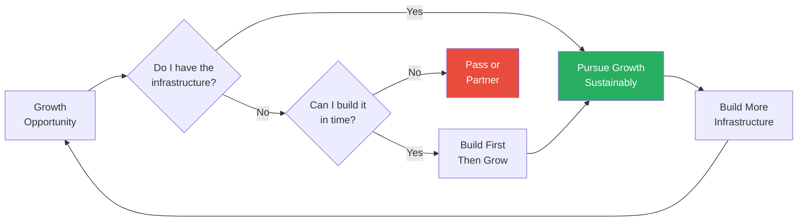
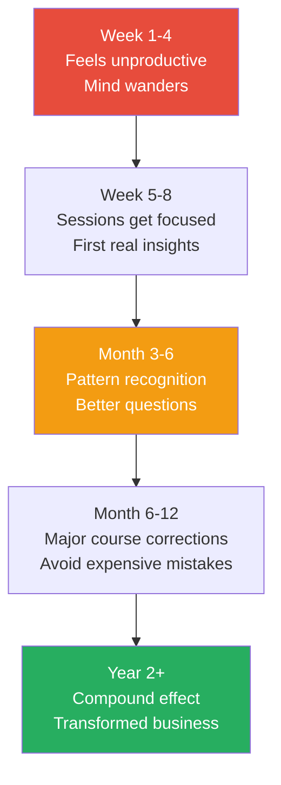

# The Road Less Stupid — Keith J. Cunningham

> Keith Cunningham made millions in Texas real estate, then lost everything when the savings and loan crisis wiped him out in the late 1980s. That spectacular failure taught him something most business books never admit: the road to success is not paved with brilliant ideas — it is littered with landmines, and the winners are those who avoid stepping on them.
> This is not a motivation book. Cunningham is blunt, profane, and allergic to inspirational platitudes. His argument is devastatingly simple: business owners do not fail because they are stupid — they fail because they do not think. They substitute activity for strategy, optimism for analysis, and speed for wisdom.
> The core practice he teaches — Thinking Time — is a disciplined habit of sitting in silence with a carefully crafted question and refusing to move until you have wrestled it to the ground. He claims it is the highest-leverage activity in business, and after reading his examples, it is hard to disagree.
> The book reads like sitting across from a wealthy, battle-scarred uncle who has made every mistake in the book and is determined to help you avoid repeating them. If you run a business, lead a team, or make decisions with real financial consequences, this is one of the most practical books you will ever read.

---

## About the Author

Keith J. Cunningham is a serial entrepreneur, investor, and business educator based in Austin, Texas, who has taught critical thinking and business strategy to over 100,000 entrepreneurs through his workshops and seminars worldwide. He made his first fortune in Texas real estate during the early 1980s boom, then lost it all — house, cars, reputation — when the savings and loan crisis devastated the market. That experience of catastrophic personal failure is the foundation of every lesson in this book. Cunningham is widely regarded as one of the inspirations for the "Rich Dad" character in Robert Kiyosaki's famous book, though he distances himself from the franchise. His teaching style is blunt, humorous, and profanity-laced — he calls himself "the Chairman of the Board" and treats every chapter like a masterclass delivered by someone who has paid the tuition of failure in full.

---

## The Big Idea

- <b style="color: #27ae60">The goal is not to get smarter — it is to stop doing stupid things</b>
  - Cunningham's central insight inverts the usual business book formula
  - Most authors tell you what to do more of — Cunningham tells you what to stop doing
  - The "dumb tax" — the cumulative cost of avoidable mistakes — is the single biggest drag on business success
  - Reducing the dumb tax by even 20% would transform most businesses overnight
- <b style="color: #2980b9">Thinking Time</b> is the book's signature practice and its most important contribution
  - Scheduled, uninterrupted, disciplined sessions where you sit with a single powerful question
  - Not brainstorming, not daydreaming, not scrolling through ideas — wrestling with a specific problem until clarity emerges
  - Cunningham argues this is the highest-return activity any business owner can perform
  - Most executives never do it because they confuse being busy with being productive
- The book is built on a painful admission: Cunningham was not a victim of bad luck — he was a victim of his own failure to think
  - His real estate collapse came from leverage he never stress-tested, risks he never questioned, and optimism he never challenged
  - Every chapter circles back to this origin story: what would have happened if he had asked better questions before acting?
  - The answer, every time, is that the catastrophe was avoidable
- <b style="color: #27ae60">The quality of your decisions determines the quality of your life</b>
  - Not your talent, not your work ethic, not your network — your decisions
  - And decisions are only as good as the thinking that precedes them
  - Most people spend more time planning a vacation than planning their business strategy

The left cycle shows how most entrepreneurs operate — react, fail, firefight, repeat. The right path shows Cunningham's alternative — think first, decide well, compound the gains.

---

## Key Concepts at a Glance

| Concept | One-line summary |
|---------|-----------------|
| **Thinking Time** | Scheduled, silent sessions with one powerful question — the highest-leverage business activity |
| **The Dumb Tax** | The cumulative cost of avoidable mistakes that drain wealth and time |
| **Powerful Questions** | The quality of your answers depends entirely on the quality of your questions |
| **The Business Machine** | Every business is a machine with four drivers: revenue, margin, velocity, and leverage |
| **Revenue is Vanity, Profit is Sanity, Cash is King** | Three financial layers that tell completely different stories about business health |
| **Pre-Mortem Analysis** | Imagine the project has failed — then ask what went wrong before you start |
| **Operator vs. Owner** | Working IN the business versus working ON the business — the hardest transition |
| **Good Decision vs. Good Outcome** | Judge decisions by process quality, not result quality |
| **The Problem Isn't the Problem** | What you see as the problem is almost always a symptom of the real problem |
| **Financial Literacy** | Most business owners cannot read their own financial statements beyond revenue |
| **Guardrails and Tollbooths** | Risk management structures that prevent catastrophic mistakes |
| **The Knowing-Doing Gap** | Knowing what to do and actually doing it are separated by a canyon |

Most businesses over-index on revenue while neglecting the three drivers that actually determine value — margin, velocity, and leverage — which is precisely what Cunningham means by "revenue is vanity."

---

## Part 1: The Case for Thinking

### Chapter 1: The Dumb Tax

*Cunningham opens with the most expensive lesson of his career and the admission that shapes the entire book: he was not unlucky — he was stupid.*

- <b style="color: #2980b9">The Dumb Tax</b> is Cunningham's term for the price you pay for avoidable mistakes
  - It is not a one-time cost — it compounds over years and decades
  - Every unforced error costs you money, time, reputation, and opportunity
  - The dumb tax is regressive: it hits hardest when you can least afford it, because mistakes early in a business eat into the capital you need to survive
- Cunningham distinguishes between two types of mistakes:
  - **Mistakes of commission** — doing something you should not have done
  - **Mistakes of omission** — failing to do something you should have done
  - Both extract the dumb tax, but mistakes of commission tend to be more spectacular and painful
- <b style="color: #e74c3c">The dumb tax is not about intelligence — many brilliant people pay it constantly</b>
  - Smart people are especially vulnerable because they trust their own brilliance
  - They skip the analysis, rely on gut instinct, and assume their intelligence will compensate for lack of preparation
  - Cunningham calls this "being smart enough to get into trouble but not wise enough to stay out of it"

> [!example] Cunningham's Real Estate Collapse (1980s)
> - In the early 1980s, Cunningham was riding the Texas real estate boom and making millions
> - He leveraged heavily — borrowing against properties to buy more properties
> - He never stress-tested his portfolio against a downturn scenario
> - When the savings and loan crisis hit Texas, property values collapsed almost overnight
> - Cunningham lost everything — his properties, his home, his cars, his reputation
> - He found himself millions of dollars in debt with no clear path out
> - Looking back, he realised every warning sign had been there — he just never stopped to think about them
> **The lesson:** "I wasn't unlucky. I was stupid. And the tuition for that stupidity was everything I owned."

- The solution is not to become smarter — it is to become less stupid
  - This is the book's foundational reframe
  - <b style="color: #27ae60">Eliminating avoidable errors produces better returns than chasing brilliant moves</b>
  - In chess, grandmasters win not by making brilliant moves but by making fewer bad ones
  - In business, the same principle applies: most companies fail from self-inflicted wounds

> [!tip] Core Insight
> You do not need better ideas. You need fewer bad decisions. The dumb tax is the most expensive line item on your invisible income statement.

---

### Chapter 2: Thinking Time — The Core Practice

*Cunningham introduces the single habit he credits with saving his financial life after the crash: structured, scheduled time to think about the business instead of just working in it.*

- <b style="color: #2980b9">Thinking Time</b> is not meditation, brainstorming, or daydreaming — it is disciplined interrogation
  - You sit in silence with a single, carefully crafted question
  - You write — longhand, on paper — until you have exhausted your thinking on that question
  - There is no phone, no email, no music, no interruptions
  - The recommended duration is 30-60 minutes, 2-3 times per week minimum
- Why most people never do it:
  - They confuse busyness with productivity — "I don't have time to think, I'm too busy working"
  - Thinking feels unproductive because there is no visible output in the moment
  - It requires admitting you do not have all the answers, which threatens the ego
  - The urgent always crowds out the important — and thinking is never urgent until it is too late
- The mechanics of a Thinking Time session:
  - **Choose one question** — not a vague topic, a specific question
  - **Set a timer** — minimum 30 minutes
  - **Write by hand** — forces slower, deeper processing than typing
  - **Stay with the discomfort** — the first 10-15 minutes feel unproductive; the breakthroughs come after
  - **Capture actionable conclusions** — end each session with 2-3 specific next steps

> [!abstract] Thinking Time Protocol
> 1. Schedule recurring blocks — minimum twice per week, ideally morning
> 2. Eliminate all distractions — phone off, door closed, no screens
> 3. Write one specific question at the top of a blank page
> 4. Set a timer for 30-60 minutes
> 5. Write longhand — explore every angle, follow every thread
> 6. Do not censor — let the thinking go where it goes
> 7. In the final 5 minutes, distill 2-3 actionable conclusions
> 8. Review your Thinking Time notes weekly for patterns

- <b style="color: #27ae60">The return on Thinking Time is asymmetric</b>
  - A single session can surface an insight worth thousands or millions of dollars
  - The cost is 30-60 minutes of time you were going to waste on email anyway
  - Cunningham treats this like compound interest: small investments in thinking produce outsized returns over time

The breakthroughs consistently arrive in the 30-45 minute window — which is precisely when most people would have quit, confirming Cunningham's point that the discipline to stay in the chair past discomfort is what separates productive thinking from casual daydreaming.

> [!example] The $50,000 Thinking Session
> - During one Thinking Time session, Cunningham was wrestling with the question: "Where am I leaving money on the table?"
> - After 40 minutes of writing, he identified a pricing error in one of his businesses
> - A product was priced 15% below what the market would bear — not because of competitive pressure, but because nobody had reviewed the pricing in two years
> - He raised the price the next day — a change that took 10 minutes to implement
> - The annual impact was over $50,000 in additional profit
> **The lesson:** "Best hourly rate I've ever earned. And I almost didn't sit down that morning."

---

### Chapter 3: The Art of Powerful Questions

*The quality of your thinking is determined by the quality of your questions — and most people ask terrible questions.*

- <b style="color: #2980b9">Powerful Questions</b> are the fuel for Thinking Time
  - A vague question produces vague answers: "How do I grow my business?" generates nothing actionable
  - A powerful question forces specificity and reveals the real issue: "What is the single biggest bottleneck in my business that, if removed, would create the most value in the next 90 days?"
  - The question frames the problem — and <b style="color: #e74c3c">a bad frame guarantees a bad answer</b>
- Characteristics of powerful questions:
  - **Specific** — they target a particular area, not the entire business
  - **Diagnostic** — they probe for root causes, not symptoms
  - **Uncomfortable** — they force you to confront things you have been avoiding
  - **Bounded** — they include a timeframe or constraint that makes the answer actionable
  - **Singular** — they address one thing at a time, not five
- Weak questions vs. powerful questions:

| Weak Question | Why It Fails | Powerful Alternative |
|---------------|-------------|---------------------|
| How do I make more money? | Too vague, no diagnostic value | What is the most profitable 20% of my business, and how do I do more of it? |
| Why can't I find good people? | Blames externals, no self-examination | What about my hiring process consistently produces the wrong candidates? |
| How do I get more customers? | Assumes more customers is the answer | Which existing customers are underserved, and what would it take to double their value? |
| Why is my team underperforming? | Victim framing | What specific expectations have I failed to clearly communicate? |
| How do I reduce costs? | Misses the leverage point | Which costs are investments that generate returns, and which are just expenses? |

- <b style="color: #27ae60">The question you ask determines the problem you solve — make sure you are solving the right problem</b>
  - Most business owners spend months solving the wrong problem because they asked the wrong question
  - The discipline of Thinking Time begins with the discipline of question construction
  - Cunningham recommends keeping a running list of questions and selecting the most pressing one for each session

> [!tip] Core Insight
> If you want better answers, ask better questions. A powerful question is specific, diagnostic, uncomfortable, and bounded. It forces you to confront the thing you have been avoiding.

---

### Chapter 4: The Knowing-Doing Gap

*Knowing what to do and actually doing it are separated by a canyon that swallows most good intentions.*

- Cunningham argues that most business owners already know 80% of what they need to do
  - They have read the books, attended the seminars, hired the consultants
  - The problem is not a knowledge gap — it is an execution gap
  - <b style="color: #2980b9">The Knowing-Doing Gap</b> is the distance between understanding a principle and consistently applying it
- Why the gap exists:
  - **Emotional resistance** — doing the right thing is often uncomfortable (firing an underperformer, raising prices, saying no to a client)
  - **Lack of structure** — without systems, even the best intentions decay into old habits
  - **Optimism bias** — "I know I should do this, but things will probably work out anyway"
  - **Busyness as anaesthesia** — staying busy provides the feeling of progress without the discomfort of real change
- <b style="color: #e74c3c">Information without implementation is just entertainment</b>
  - Reading another business book will not help if you have not applied the last three
  - Attending another seminar will not help if you have not implemented the insights from the previous one
  - Cunningham is blunt: "Stop consuming and start executing"

> [!example] The Seminar Junkie
> - Cunningham describes a business owner who had attended over 50 seminars in five years
> - The owner had bookshelves full of binders, notebooks, and workbooks
> - His business was in exactly the same condition as when he started attending
> - When Cunningham asked what he had implemented, the answer was "I need to go through my notes"
> - The owner had substituted the feeling of learning for the work of doing
> **The lesson:** Learning feels productive, but it is not productive until it changes your behaviour.

- Closing the gap requires three things:
  - **Clarity** — knowing exactly what needs to be done (not vague aspirations)
  - **Structure** — systems and accountability that make the right behaviour the default
  - **Discomfort tolerance** — willingness to do the hard thing now instead of the easy thing forever

---

## Part 2: The Business Machine

### Chapter 5: Understanding Your Business Machine

*Every business is a machine that converts inputs into outputs — but most owners have no idea how their machine actually works.*

- <b style="color: #2980b9">The Business Machine</b> is Cunningham's metaphor for understanding how a business actually creates value
  - Inputs go in (money, time, labour, materials)
  - The machine processes them (operations, sales, delivery)
  - Outputs come out (revenue, profit, cash, customer satisfaction)
  - Most owners can describe what their business does but not how the machine works
- Understanding the machine means understanding its drivers, levers, and constraints:
  - **Drivers** — what forces move the machine forward? (demand, pricing, capacity)
  - **Levers** — what can you adjust to change the output? (price, volume, efficiency, mix)
  - **Constraints** — what limits the machine's output? (bottlenecks, capacity, capital, talent)
- <b style="color: #27ae60">You cannot optimise what you do not understand</b>
  - Most business owners optimise by instinct — they push harder on whatever seems to be working
  - Without understanding the machine, you often push on the wrong lever
  - Pushing harder on a broken machine just breaks it faster

The business machine converts inputs to outputs. Drivers, levers, and constraints determine how efficiently the conversion happens — and most owners only pay attention to the inputs and outputs, ignoring the machine itself.

---

### Chapter 6: The Four Drivers of Business Value

*Cunningham reveals that business value comes from exactly four places — and most entrepreneurs obsess over only one of them.*

- <b style="color: #2980b9">The Four Drivers</b> are: revenue, margin, velocity, and leverage
  - Together, they determine the value and health of any business
  - Most owners fixate on revenue and ignore the other three — which is why they work hard and stay poor
- **Revenue** — how much money comes in the door
  - The most visible metric and the one entrepreneurs brag about
  - But revenue alone tells you almost nothing about business health
  - A business doing $10 million in revenue with 2% margins is in worse shape than one doing $2 million with 40% margins
- **Margin** — how much you keep from every dollar of revenue
  - <b style="color: #27ae60">Margin is where wealth is created — revenue is just activity</b>
  - Gross margin, operating margin, and net margin each tell a different story
  - Small improvements in margin often produce larger gains than large increases in revenue
  - A 5% margin improvement on $5 million in revenue is $250,000 — often achievable with no additional sales effort
- **Velocity** — how fast your money moves through the business cycle
  - How quickly do you convert inventory into sales? Receivables into cash? Leads into customers?
  - A business that turns its inventory 12 times per year generates far more value than one that turns it 4 times, even at the same margin
  - Speed of capital deployment is one of the most overlooked drivers of business value
- **Leverage** — how much output you generate per unit of input
  - Not just financial leverage (debt) — operational leverage (systems, technology, processes)
  - A business that requires the founder to be present for every transaction has zero leverage
  - Building leverage means creating systems that produce results without your direct involvement

| Driver | What It Measures | Common Mistake | Thinking Time Question |
|--------|-----------------|----------------|----------------------|
| **Revenue** | Money in the door | Chasing top-line growth at any cost | Which revenue is actually profitable? |
| **Margin** | Money you keep | Ignoring cost structure | Where am I leaving margin on the table? |
| **Velocity** | Speed of capital cycle | Slow collections, excess inventory | What is slowing down my cash conversion cycle? |
| **Leverage** | Output per unit of input | Founder dependency | What would break if I disappeared for 30 days? |

> [!example] The Restaurant Revenue Trap
> - A business owner approached Cunningham at a seminar, proudly announcing $2 million in annual revenue
> - Cunningham asked a simple question: "What are your margins?"
> - After some fumbling, the owner admitted he was not sure — "maybe 5-6%"
> - Cunningham dug deeper and discovered the actual net margin was negative — the owner was losing money on every transaction but making it up in volume (his joke, not the owner's)
> - The owner was working 80-hour weeks to slowly go bankrupt
> - His revenue was vanity — it looked impressive but masked a fundamentally broken machine
> **The lesson:** "You're not running a business — you're running a hobby that's slowly bankrupting you."

> [!tip] Core Insight
> Revenue is vanity, profit is sanity, cash is king. A business that generates revenue without margin is just a busy way to go broke.

---

### Chapter 7: Revenue Is Vanity, Profit Is Sanity, Cash Is King

*Cunningham dissects the three financial layers of a business and shows why most owners are dangerously fixated on the wrong one.*

- This phrase — <b style="color: #2980b9">Revenue is Vanity, Profit is Sanity, Cash is King</b> — captures the financial hierarchy every business owner must understand
  - **Revenue** is what the world sees — it is bragging rights, conference stage talk, the number on the LinkedIn post
  - **Profit** is what the business keeps after expenses — it measures whether you actually have a viable model
  - **Cash** is what actually moves through your bank account — it determines whether you can pay your people, fund growth, and survive a downturn
- The three numbers often tell wildly different stories:
  - A company can be "profitable" on paper while running out of cash (because of receivables, inventory, or timing)
  - A company can have enormous revenue and zero profit (because of cost structure)
  - A company can have slim profits but strong cash flow (because of favourable payment terms)
- <b style="color: #e74c3c">Revenue without profit is just exercise</b>
  - Cunningham compares it to running on a treadmill — lots of activity, no forward progress
  - Many businesses add revenue by adding complexity, customers, products, and people — without checking whether the additional revenue is actually profitable
  - Growth for its own sake is a cancer that kills businesses slowly
- <b style="color: #27ae60">Cash is the oxygen of business — you can survive without profit for a while, but you cannot survive without cash for a week</b>
  - Cash flow problems kill more businesses than lack of profitability
  - The gap between when you pay your suppliers and when your customers pay you is where companies die
  - Understanding your cash conversion cycle is essential

This diagram shows how revenue transforms into cash through a series of deductions and adjustments — each layer tells a different truth about business health, and most owners never look past the top line.

The combined 10% devoted to strategic thinking and margin analysis explains why most businesses grow revenue while profits stagnate — owners spend 90% of their time on activity and only 10% on the thinking that determines whether that activity creates value.

---

### Chapter 8: Financial Literacy for Owners

*Most business owners are functionally illiterate about their own finances — they can read a bank statement but not a balance sheet, and that ignorance is costing them everything.*

- Cunningham identifies financial illiteracy as one of the most dangerous forms of the dumb tax
  - Business owners who cannot read their own financial statements are flying blind
  - They make decisions based on gut feel, bank balance, and revenue — none of which tell the full story
  - <b style="color: #e74c3c">You cannot manage what you cannot measure, and you cannot measure what you do not understand</b>
- The three financial statements every owner must understand:
  - **Income statement** (P&L) — how the game was played over a period of time
    - Revenue, expenses, and the profit or loss that results
    - This tells you whether your business model is working
    - But it uses accrual accounting, which means revenue is recorded when earned, not when cash is received
  - **Balance sheet** — the score at a single point in time
    - Assets, liabilities, and equity — what you own, what you owe, and what is left over
    - This tells you how healthy the business is structurally
    - Most dangerous number: the ratio of debt to equity
  - **Cash flow statement** — where the money actually went
    - Operating cash flow, investing cash flow, financing cash flow
    - This tells you whether the business is generating real cash or just paper profits
    - Many profitable businesses go bankrupt because they run out of cash

> [!example] The CEO Who Couldn't Read a Balance Sheet
> - A successful technology company founder came to Cunningham for advice about expansion
> - The founder was making decisions based entirely on revenue growth — his top line was growing 30% year over year
> - Cunningham asked to see his balance sheet and was met with a blank stare
> - When they sat down together and reviewed the financials, Cunningham discovered the company was 90 days from insolvency
> - Receivables were stretched to 120 days, inventory was bloated, and a major line of credit was about to come due
> - The founder's reaction: "Nobody ever taught me this"
> - Cunningham helped him restructure, but the near-miss was entirely avoidable
> **The lesson:** Revenue growth can mask a terminally ill business. The balance sheet tells you what the P&L hides.

- <b style="color: #2980b9">Key financial ratios</b> every owner should track:
  - **Gross margin percentage** — are you making enough on each sale?
  - **Operating margin percentage** — are your operating costs under control?
  - **Days sales outstanding (DSO)** — how long does it take to collect?
  - **Current ratio** — can you pay your short-term obligations?
  - **Debt-to-equity ratio** — how leveraged are you?
  - **Return on equity (ROE)** — what return is the business generating on the owner's investment?

| Statement | What It Tells You | Time Frame | Key Question |
|-----------|-------------------|------------|--------------|
| **Income Statement** | How the game was played | Period (month, quarter, year) | Am I making money? |
| **Balance Sheet** | The score right now | Point in time (snapshot) | Am I solvent? |
| **Cash Flow Statement** | Where the money went | Period (month, quarter, year) | Am I generating real cash? |

Each statement answers a different question. Business owners who only read the income statement are seeing one-third of the picture.

---

## Part 3: Strategy and Decision-Making

### Chapter 9: The Problem Isn't the Problem

*What you identify as the problem is almost always a symptom — and solving symptoms is a guaranteed way to stay stuck.*

- <b style="color: #2980b9">The Problem Isn't the Problem</b> is Cunningham's diagnostic principle
  - When a business owner says "my problem is I need more sales," the actual problem is almost never a lack of sales
  - It might be a pricing problem, a targeting problem, a retention problem, or a product-market fit problem
  - "More sales" is a symptom of something deeper — and until you find the root cause, every solution is a bandage
- Why people solve symptoms instead of problems:
  - Symptoms are visible and obvious — root causes are hidden and uncomfortable
  - Solving symptoms feels productive and gives a quick sense of accomplishment
  - Finding root causes requires the kind of deep thinking most people avoid
  - <b style="color: #e74c3c">Solving the wrong problem efficiently is still a waste of time</b>
- Cunningham's diagnostic approach:
  - Start with the presenting problem (what the owner says is wrong)
  - Ask "why?" at least five times — each answer peels back a layer
  - Look for patterns — if the same problem keeps recurring, you are solving symptoms
  - Separate the problem from the person — is this a people problem or a system problem?

> [!example] The Recurring Hiring Failure
> - A company kept hiring "A players" who failed within their first six months
> - The presenting problem: "We can't find good people"
> - Cunningham's first question: "What does success look like in this role?"
> - The leadership team had no clear answer — there were no defined success criteria, no measurable outcomes, no accountability structure
> - The candidates were not failing because they were bad — they were failing because nobody had defined what success looked like
> - When Cunningham helped redesign the hiring process around specific outcomes and 90-day milestones, retention doubled
> **The lesson:** The hiring problem was never about talent — it was about clarity. You cannot hold people accountable to standards you never set.

> [!abstract] The Five-Why Diagnostic
> 1. State the presenting problem: "Revenue is flat"
> 2. Ask why: "Because we're not getting enough new customers"
> 3. Ask why: "Because our close rate has dropped from 40% to 25%"
> 4. Ask why: "Because we changed our sales process six months ago"
> 5. Ask why: "Because a new sales manager implemented a system that doesn't fit our market"
> 6. Root cause: Leadership change without proper validation of the new approach

- <b style="color: #27ae60">The discipline of finding root causes prevents the dumb tax of solving the wrong problem over and over</b>
  - Most business owners cycle through the same problems year after year
  - Each time they apply a surface-level fix that treats the symptom
  - The problem returns — sometimes worse — and they conclude that business is hard
  - Business is hard, but it is much harder when you keep solving the wrong problems

> [!tip] Core Insight
> Stop treating symptoms. The problem you see is almost never the problem you have. Find the root cause or you will pay the dumb tax on the same mistake forever.

---

### Chapter 10: Good Decision vs. Good Outcome

*Cunningham separates two things most people conflate — the quality of a decision and the quality of its outcome — and shows why confusing them leads to systematically bad judgement.*

- <b style="color: #2980b9">A good decision and a good outcome are not the same thing</b>
  - A good decision is one made with the best available information, sound reasoning, and appropriate risk assessment
  - A good outcome is one where things work out well
  - You can make a good decision and get a bad outcome (bad luck)
  - You can make a terrible decision and get a good outcome (good luck)
  - <b style="color: #e74c3c">If you judge decisions by outcomes, you will learn all the wrong lessons</b>
- The poker analogy:
  - A poker player can play a hand perfectly according to the odds and still lose — that does not mean the play was wrong
  - If you go all-in with pocket aces and lose to a lucky river card, the decision was still correct
  - If you go all-in with a 7-2 off-suit and win, the decision was still terrible — you just got lucky
  - Over time, good decision-making wins because probabilities work in your favour
- Why this matters for business:
  - Entrepreneurs who succeed through lucky bad decisions learn to trust their instincts — which will eventually betray them
  - Entrepreneurs who fail despite good decisions may abandon sound strategies prematurely
  - <b style="color: #27ae60">Focus on improving your decision process, not on guaranteeing outcomes</b>
  - You control the process; you do not control the outcome

| | Good Outcome | Bad Outcome |
|---|---|---|
| **Good Decision** | Deserved success — reinforce the process | Bad luck — don't abandon the process |
| **Bad Decision** | Dumb luck — don't mistake this for skill | Deserved failure — examine and fix the process |

This 2x2 matrix is the most important diagnostic tool for evaluating past decisions. Most people only notice the diagonal (good decision + good outcome, bad decision + bad outcome) and ignore the off-diagonal cases that teach the real lessons.

> [!example] Cunningham's Lucky Early Wins
> - Before his real estate collapse, Cunningham made several highly leveraged bets that paid off spectacularly
> - He concluded he was brilliant — his gut was right, his instincts were sharp, his timing was perfect
> - In reality, he was making bad decisions (excessive leverage, no risk analysis, no stress testing) that happened to produce good outcomes in a rising market
> - When the market turned, those same bad decisions produced catastrophic outcomes
> - The lesson took everything he owned to learn: he had been confusing good outcomes with good decisions for years
> **The lesson:** Good luck is the most dangerous teacher in business. It makes you confident in a process that will eventually destroy you.

---

### Chapter 11: Pre-Mortem Analysis

*Instead of waiting for something to fail and doing a post-mortem, Cunningham asks: what if you imagined the failure in advance?*

- <b style="color: #2980b9">Pre-Mortem Analysis</b> is the practice of imagining a project or decision has failed before you begin
  - Traditional approach: launch, fail, conduct post-mortem, learn lessons
  - Cunningham's approach: conduct the post-mortem before you launch
  - Imagine it is 12 months from now and your initiative has been a spectacular disaster — now ask: what went wrong?
- Why pre-mortems work:
  - <b style="color: #27ae60">Optimism is the enemy of risk management</b>
  - When you are excited about a new idea, your brain suppresses threats and amplifies opportunities
  - The pre-mortem forces you to temporarily adopt a pessimistic lens
  - It gives team members permission to voice concerns they might otherwise keep to themselves
  - It surfaces "known unknowns" — risks everyone vaguely senses but nobody wants to say out loud
- How to conduct a pre-mortem:
  - Gather your team and say: "Imagine it's one year from now. This project has failed completely. Why?"
  - Give everyone 5 minutes to write down independently — no discussion, no groupthink
  - Go around the room and collect every failure scenario
  - Categorise the risks: which are preventable, which are mitigable, which are acceptable
  - Build specific countermeasures for the preventable and mitigable risks

> [!abstract] Pre-Mortem Protocol
> 1. Assemble key stakeholders
> 2. Present the initiative or decision clearly
> 3. Instruct: "Imagine this has failed spectacularly 12 months from now"
> 4. Each person writes failure scenarios independently (5 minutes)
> 5. Collect and share all scenarios (no judgement)
> 6. Categorise: Preventable / Mitigable / Acceptable
> 7. Assign specific countermeasures for each preventable risk
> 8. Document and review monthly

- <b style="color: #e74c3c">Every risk you identify before launch is a risk you can manage — every risk you discover after launch is a crisis</b>
  - The pre-mortem does not eliminate risk — it makes risk visible
  - Visible risks can be managed, mitigated, or consciously accepted
  - Invisible risks ambush you

> [!example] The Product Launch Pre-Mortem
> - One of Cunningham's clients was preparing to launch a new product line that required significant capital investment
> - The team was enthusiastic — market research looked positive, prototypes were strong
> - Cunningham insisted on a pre-mortem before committing the capital
> - Within 20 minutes, the team identified three critical risks nobody had discussed:
>   - Their primary supplier had a single point of failure — if that supplier went down, they had no backup
>   - The pricing model assumed a customer acquisition cost that was based on optimistic projections, not historical data
>   - The internal team needed to support the new line did not yet exist, and hiring would take 4-6 months
> - Two of these three risks were addressed before launch — the supplier risk led to a dual-sourcing strategy, the pricing model was revised
> - The launch succeeded, but the team agreed it would have failed without the pre-mortem adjustments
> **The lesson:** Twenty minutes of structured pessimism saved months of crisis management.

---

### Chapter 12: Guardrails and Tollbooths

*Cunningham introduces his risk management framework — not to eliminate risk, but to ensure you only take risks you can survive.*

- <b style="color: #2980b9">Guardrails</b> are boundaries that prevent catastrophic mistakes
  - They are not about eliminating risk — they are about eliminating ruinous risk
  - Cunningham distinguishes between risks that can hurt you and risks that can kill you
  - Guardrails are for the kill-you risks: maximum leverage limits, concentration limits, cash reserve minimums
- <b style="color: #2980b9">Tollbooths</b> are checkpoints that force you to stop and evaluate before proceeding
  - Before committing major capital, hiring a key executive, or entering a new market — stop at the tollbooth
  - The tollbooth asks: have we done the thinking? Have we tested the assumptions? Have we done the pre-mortem?
  - Most businesses have no tollbooths — decisions flow straight from idea to action without pause
- <b style="color: #27ae60">The goal is not to avoid risk — it is to avoid ruin</b>
  - You can recover from a bad quarter — you cannot recover from bankruptcy
  - You can recover from losing a client — you cannot recover from losing your entire reputation
  - Guardrails ensure that even your worst mistakes leave you with enough resources to try again

| Risk Type | Description | Appropriate Response |
|-----------|-------------|---------------------|
| **Ruinous** | Could destroy the business or your personal finances | Guardrail — hard limit, never cross |
| **Significant** | Could cause major damage but is survivable | Tollbooth — stop, evaluate, get independent review |
| **Moderate** | Could cause losses but within normal business variance | Monitor — track with KPIs, review monthly |
| **Minimal** | Part of normal operations | Accept — the cost of doing business |

> [!example] The Leverage Guardrail
> - After his real estate collapse, Cunningham established a personal guardrail: never leverage more than 50% of any asset
> - In the years that followed, several deals tempted him to exceed that limit — the returns looked extraordinary
> - Each time, the guardrail held — he passed on the deal
> - In at least two cases, the deals he passed on later collapsed, and the investors who were more heavily leveraged lost everything
> - The guardrail cost him some upside — but it prevented any repeat of the catastrophe that nearly ended his career
> **The lesson:** Guardrails feel constraining when the market is going up. They feel like salvation when the market goes down.

---

## Part 4: The Owner's Mindset

### Chapter 13: Operator vs. Owner

*Cunningham draws a sharp line between two modes of working — and shows why most entrepreneurs are trapped in the wrong one.*

- <b style="color: #2980b9">The Operator</b> works IN the business
  - Handles tasks, solves problems, manages day-to-day operations
  - Feels productive because there is always something to do
  - Creates a business that cannot function without them
  - Trades time for money, just like an employee — but with more risk and worse hours
- <b style="color: #2980b9">The Owner</b> works ON the business
  - Thinks strategically about where the business should go
  - Builds systems and hires people to handle operations
  - Creates a business that generates value independent of their daily presence
  - <b style="color: #27ae60">Invests time in thinking, not doing — and creates leverage</b>
- Why the transition is so hard:
  - Operators built the business with their own hands — letting go feels like abandonment
  - Doing feels productive; thinking feels like procrastination
  - The business was designed around the operator's direct involvement — restructuring requires work that produces no immediate revenue
  - <b style="color: #e74c3c">The skills that built the business are not the skills that will grow it</b>
  - What got you from $0 to $1 million (hustle, personal relationships, hands-on control) will not get you from $1 million to $10 million (systems, delegation, strategic thinking)

This diagram shows the two paths available to every entrepreneur — and why most stay stuck on the left. The transition from operator to owner is the hardest shift in entrepreneurship.

> [!tip] Core Insight
> If your business cannot function without you for 30 days, you do not own a business — you own a job. The highest-leverage move is building the machine that runs without you.

---

### Chapter 14: Busyness vs. Productivity

*Cunningham attacks the cult of busyness — the dangerous belief that working harder and longer is the same as making progress.*

- <b style="color: #e74c3c">Being busy is not the same as being productive</b> — and confusing the two is one of the most expensive habits in business
  - Busyness means filling your time with activity
  - Productivity means creating measurable output that moves the business forward
  - Most business owners are incredibly busy and shockingly unproductive
- The busyness trap:
  - Email, meetings, phone calls, administrative tasks — they fill every minute of every day
  - They create the feeling of progress without producing actual progress
  - They are easy, familiar, and comfortable — unlike strategic thinking, which is hard, unfamiliar, and uncomfortable
  - Cunningham calls busyness "productive procrastination" — you feel like you are working, but you are avoiding the real work
- <b style="color: #27ae60">The real work of a business owner is thinking, deciding, and building systems — everything else is overhead</b>
  - If you spend 90% of your time on overhead and 10% on thinking, your results will reflect that ratio
  - Cunningham recommends tracking how you actually spend your time for two weeks — the results are always humbling
  - Most owners discover they spend less than 5% of their time on strategic thinking

> [!example] The 80-Hour Week Illusion
> - A business owner told Cunningham he was working 80 hours a week and could not understand why the business was not growing
> - Cunningham asked him to track every 30-minute block for two weeks
> - The result: 60+ hours per week were spent on tasks that could be done by a $15/hour employee — answering routine emails, attending unnecessary meetings, solving problems that should have been delegated
> - Less than 3 hours per week were spent on activities that only the owner could do — strategy, key relationships, thinking about the future
> - The owner was the most expensive clerk in his own company
> **The lesson:** Working hard on the wrong things is just a more exhausting way to stay stuck.

---

### Chapter 15: The Accountability Structure

*Cunningham argues that accountability is not about motivation — it is about structure, and most businesses have almost none.*

- Accountability without structure is just nagging
  - Telling someone to "do better" is not accountability
  - Asking "did you do the thing?" every week is not accountability
  - True accountability requires clear expectations, measurable standards, and consequences
- <b style="color: #2980b9">The Accountability Structure</b> has four components:
  - **Clear expectations** — what does success look like? (Not vague — specific, measurable, time-bound)
  - **Resources and authority** — does the person have what they need to succeed?
  - **Measurement** — how will you know if the standard is being met?
  - **Consequences** — what happens when the standard is met or missed?
- <b style="color: #e74c3c">Most accountability failures are leadership failures, not employee failures</b>
  - The leader failed to define clear expectations
  - The leader failed to provide adequate resources
  - The leader failed to establish measurement systems
  - The leader failed to enforce consequences consistently
  - Blaming the employee for failing to meet standards you never clearly set is unfair and unproductive

> [!example] The Missing Scorecard
> - A company had a sales team that was "underperforming" — the VP of Sales was frustrated
> - Cunningham asked: "What are the specific metrics each salesperson is expected to hit?"
> - The VP could describe general targets but had no individual scorecards, no activity metrics, and no leading indicators
> - Salespeople were held accountable for revenue (a lagging indicator they could not directly control) but not for calls, meetings, proposals, or follow-ups (leading indicators they could control)
> - When individual scorecards were built with daily activity targets, performance improved by 35% within 90 days
> **The lesson:** You cannot hold people accountable to vague expectations. Clear metrics are the foundation of accountability.

> [!abstract] Building an Accountability Structure
> 1. Define the specific outcome you want (not "more sales" — "$500K in Q3 from existing accounts")
> 2. Identify the 3-5 leading activities that drive that outcome (calls, proposals, demos)
> 3. Set measurable daily/weekly targets for each activity
> 4. Create a scorecard that tracks both leading activities and lagging results
> 5. Review weekly — celebrate hits, diagnose misses, adjust targets
> 6. Enforce consequences — both positive (recognition, rewards) and negative (coaching, reassignment)

---

## Part 5: Common Traps and How to Avoid Them

### Chapter 16: The Shiny Object Syndrome

*Cunningham explains why entrepreneurs are magnetically attracted to new ideas — and why that attraction is often their greatest weakness.*

- <b style="color: #2980b9">Shiny Object Syndrome</b> is the compulsive pursuit of new opportunities at the expense of current commitments
  - Entrepreneurs are hardwired for novelty — it is what made them start a business in the first place
  - But the same instinct that drives creation also drives distraction
  - Every new idea looks better than the messy, complicated reality of the current business
- Why shiny objects are dangerous:
  - They fragment focus — instead of going deep on one thing, you go shallow on five
  - They consume capital that should be invested in the core business
  - They distract leadership attention from problems that need solving
  - <b style="color: #e74c3c">The opportunity cost of a shiny object is the progress you did not make on your main business</b>
- Cunningham's filter for new opportunities:
  - Does this serve my core strategy or distract from it?
  - Do I have the resources (time, capital, talent) to pursue this without weakening my current business?
  - What is the cost of NOT pursuing this — is it truly urgent, or just exciting?
  - <b style="color: #27ae60">If you cannot say no to a good opportunity, you will never have the resources for a great one</b>

> [!example] The Serial Starter
> - Cunningham describes an entrepreneur who had started seven businesses in four years
> - None of them had reached profitability — each one was abandoned when the next shiny idea appeared
> - The entrepreneur was convinced he just hadn't found the "right" idea yet
> - Cunningham's diagnosis: the problem was not the ideas — it was the inability to stay with any idea long enough to make it work
> - "You don't have a business problem. You have a commitment problem."
> **The lesson:** Starting is easy. Finishing is where the value lives. Most ideas would work if you stuck with them long enough.

---

### Chapter 17: The Hiring Trap

*Cunningham reveals why most hiring fails — and it has nothing to do with the candidates.*

- Most hiring decisions are made backwards:
  - Typical approach: feel overwhelmed → write a vague job description → interview people who seem impressive → hire the one who interviews best
  - Cunningham's approach: define the specific outcomes you need → identify the skills and behaviours that produce those outcomes → design the interview process to test for those specific traits
- <b style="color: #2980b9">Hiring for outcomes, not resumes</b>
  - A great resume does not guarantee great performance in your specific context
  - What matters is whether the person can produce the specific results you need
  - This requires you to define those results before you start looking — which most companies fail to do
- Common hiring mistakes:
  - **Hiring in your own image** — choosing people who are like you instead of people who complement your weaknesses
  - **Hiring for culture fit alone** — culture fit without competence is just a friendly underperformer
  - **Selling the job instead of evaluating the candidate** — in desperate mode, you spend the interview convincing them to join instead of testing whether they should
  - <b style="color: #e74c3c">The most expensive mistake in business is keeping the wrong person in the right seat</b>

| Hiring Approach | Process | Result |
|----------------|---------|--------|
| **Typical** | Vague job description → impressive resume → good interview → hope | 50/50 success rate |
| **Cunningham's** | Define specific outcomes → identify required behaviours → structured interview → verify | Much higher success rate |

> [!tip] Core Insight
> The hiring problem is almost never about finding better candidates. It is about defining what success looks like before you start looking.

---

### Chapter 18: The Growth Trap

*More is not always better — Cunningham shows why unmanaged growth kills more businesses than stagnation.*

- <b style="color: #e74c3c">Growth without infrastructure is a recipe for collapse</b>
  - When you grow faster than your systems can handle, quality drops, customers leave, and employees burn out
  - Rapid growth consumes cash — you need to fund inventory, receivables, hiring, and infrastructure before the revenue arrives
  - Many businesses that "grew to death" would have survived if they had grown slower
- The growth trap operates in stages:
  - **Stage 1:** Exciting growth — sales are booming, everyone is busy, morale is high
  - **Stage 2:** Strain — systems start breaking, quality slips, customer complaints increase
  - **Stage 3:** Crisis — cash runs out, key people quit, the owner is working 100-hour weeks
  - **Stage 4:** Collapse or painful retrenchment
- <b style="color: #27ae60">Sustainable growth means growing as fast as your systems, capital, and people can support — not as fast as the market will allow</b>
  - This requires the financial literacy to understand your cash conversion cycle
  - It requires the discipline to say no to revenue you cannot profitably serve
  - It requires the foresight to build infrastructure before you need it, not after

> [!example] The Growth That Nearly Killed the Company
> - A services company grew from $3 million to $12 million in revenue in just two years
> - The founder was celebrated in the local business press, won entrepreneur of the year awards
> - Behind the scenes, the company was haemorrhaging cash — they were hiring faster than they could train, delivering before they had the capacity to support, and borrowing to fund the growth
> - At $12 million in revenue, the company was less profitable in absolute dollars than it had been at $3 million
> - The founder had to lay off 40% of the staff, renegotiate contracts, and essentially restart the company at a smaller scale
> **The lesson:** Growth without infrastructure is just a faster way to reach a crisis. Build the engine before you step on the gas.

This decision tree captures Cunningham's approach to growth — always check the infrastructure before committing. Growth without the machine to support it is a trap, not an opportunity.

---

### Chapter 19: The Delegation Trap

*Cunningham distinguishes between dumping and delegating — and shows why most "delegation" is really just abdication.*

- <b style="color: #2980b9">Delegation</b> is not handing something off and hoping for the best
  - Delegation is transferring both the responsibility AND the structure needed to succeed
  - Dumping is transferring the responsibility without the clarity, resources, or authority
  - Most business owners dump, call it delegation, then blame the person when it fails
- The delegation spectrum:
  - **Level 1: Do exactly what I say** — micromanagement, no thinking required
  - **Level 2: Research and recommend** — the person does the analysis, you make the decision
  - **Level 3: Recommend and act unless I say no** — the person acts with a safety net
  - **Level 4: Act and inform** — full authority with reporting requirements
  - **Level 5: Full ownership** — the person handles it entirely, you only review results
- <b style="color: #27ae60">Effective delegation means being clear about which level you are operating at</b>
  - Most delegation failures happen because the owner and the employee are at different levels
  - The owner thinks they delegated at Level 4; the employee heard Level 2
  - Explicitly stating the delegation level eliminates 80% of delegation problems
- <b style="color: #e74c3c">Delegation without clear success criteria is abdication</b>
  - "Handle the marketing" is abdication — it is too vague to succeed or fail against
  - "Increase qualified leads from 50 to 75 per month within the existing budget by September 30" is delegation — it has a clear outcome, constraint, and deadline

---

## Part 6: Thinking About Thinking

### Chapter 20: Mental Models for Business Owners

*Cunningham introduces a collection of mental models that improve the quality of Thinking Time sessions and prevent the most common reasoning errors.*

- <b style="color: #2980b9">Mental models</b> are thinking frameworks that help you see problems more clearly
  - They are not formulas or templates — they are lenses that reveal different aspects of a situation
  - The more models you have, the more angles you can examine a problem from
  - Cunningham focuses on the models most relevant to business decision-making
- Key models Cunningham uses:
  - **Second-order thinking** — what happens after the first effect?
    - Cutting prices increases volume (first-order) but may destroy brand positioning and attract price-sensitive customers who leave when someone undercuts you (second-order)
    - Most business owners think only about the immediate consequence of their decisions
  - **Inversion** — instead of asking "how do I succeed?" ask "how would I guarantee failure?"
    - This surfaces risks and blind spots that positive thinking hides
    - <b style="color: #27ae60">Avoiding stupidity is easier than achieving brilliance — and often more valuable</b>
  - **Opportunity cost** — what are you giving up by choosing this path?
    - Every yes is a no to something else
    - The true cost of a decision includes what you cannot do because of it
  - **Base rates** — what is the typical outcome for businesses in this situation?
    - Most restaurant startups fail. Knowing this does not doom yours, but it should inform your risk management
    - Ignoring base rates is a form of arrogance — "I'm different" is rarely true
  - **Asymmetric risk** — can I structure this so the upside is large and the downside is small?
    - The best business decisions have limited downside and unlimited upside
    - <b style="color: #e74c3c">The worst business decisions have unlimited downside and limited upside</b> — and most people take them because they focus on the upside

| Mental Model | Core Question | Business Application |
|-------------|---------------|---------------------|
| **Second-order thinking** | Then what? | Pricing changes, hiring decisions, market entry |
| **Inversion** | How would I guarantee failure? | Risk assessment, strategy review |
| **Opportunity cost** | What am I giving up? | Resource allocation, new initiatives |
| **Base rates** | What usually happens? | Market entry, hiring expectations |
| **Asymmetric risk** | What is the downside vs. upside? | Investment decisions, partnerships |

Second-order thinking and asymmetric risk analysis produce the largest impact because they prevent the two costliest categories of dumb tax — unintended consequences and catastrophic downside exposure.

> [!example] The Price Cut That Backfired
> - A retail business was losing market share and decided to cut prices by 20%
> - First-order effect: sales volume increased 30% — the team celebrated
> - Second-order effect: margins collapsed, the price-sensitive customers they attracted had zero loyalty and left when a competitor undercut them three months later
> - Third-order effect: the original premium customers saw the brand as "discount" and migrated to competitors
> - The company spent two years and significant capital trying to rebuild the brand position they destroyed in one quarter
> **The lesson:** First-order thinking sees the immediate gain. Second-order thinking sees the chain reaction. Most business catastrophes are second-order effects that nobody thought through.

---

### Chapter 21: The Map Is Not the Territory

*Cunningham warns against confusing your model of reality with reality itself — a mistake that costs business owners millions.*

- Every business plan, financial projection, and strategy document is a map — a simplified representation of a complex reality
  - Maps are useful — they help you navigate and make decisions
  - But <b style="color: #e74c3c">maps are always wrong in some way</b> — they simplify, they assume, they leave things out
  - The danger comes when you treat the map as if it were reality itself
- Common map-territory confusions in business:
  - **Projections treated as predictions** — your five-year financial model is a guess, not a prophecy
  - **Spreadsheets treated as reality** — the numbers in the model are assumptions, not facts
  - **Past performance treated as future guarantee** — what worked last year may not work next year
  - **Industry averages treated as destiny** — your business is not average, for better or worse
- <b style="color: #27ae60">The wisest business owners hold their maps lightly — they use them as guides but constantly update them with real-world feedback</b>
  - They test assumptions quickly and cheaply
  - They look for disconfirming evidence, not just confirming evidence
  - They know the difference between confidence and certainty

> [!tip] Core Insight
> Your business plan is not your business. Your financial model is not your finances. Hold your models lightly, test them constantly, and update them ruthlessly when reality disagrees.

---

### Chapter 22: Thinking in Probabilities

*Cunningham argues that business decisions are bets — and the sooner you start thinking in probabilities instead of certainties, the better your bets will be.*

- Most people think in binary: this will work or it won't, this is a good idea or a bad one
  - Reality operates in probabilities — this has a 70% chance of working with a 3x upside and a 30% chance of failing with a 1x downside
  - <b style="color: #2980b9">Probabilistic thinking</b> replaces "is this a good idea?" with "what are the odds, and what are the payoffs?"
- This connects directly to the good-decision-vs-good-outcome framework:
  - A good decision is one where the expected value (probability x payoff) is positive
  - Even good decisions fail sometimes — that does not make them bad decisions
  - Over time, consistently positive expected value decisions compound into extraordinary results
- How to apply probabilistic thinking:
  - For any major decision, estimate the probability of each outcome (success, partial success, failure)
  - Estimate the financial impact of each outcome
  - Multiply probability x impact for each scenario
  - If the sum is positive and the worst case is survivable, the bet is worth taking
  - <b style="color: #27ae60">Never bet more than you can afford to lose, no matter how good the odds look</b>

> [!example] The Calculated Bet
> - Cunningham considered investing in a new business venture that required $200,000
> - He estimated a 40% chance of 5x return ($1,000,000), a 30% chance of 2x return ($400,000), and a 30% chance of total loss ($0)
> - Expected value: (0.4 x $1,000,000) + (0.3 x $400,000) + (0.3 x $0) = $400,000 + $120,000 + $0 = $520,000
> - Against a $200,000 investment, the expected return was strongly positive
> - Critically: the $200,000 loss scenario was survivable — it would hurt but not threaten his overall position
> - He made the investment — it landed in the 2x return category
> **The lesson:** Thinking in probabilities does not guarantee good outcomes, but it does guarantee good decisions over time.

---

## Part 7: Building the Machine

### Chapter 23: KPIs and Dashboards

*Cunningham explains how to build a measurement system that tells you the truth about your business — not just the story you want to hear.*

- <b style="color: #2980b9">Key Performance Indicators (KPIs)</b> are the vital signs of your business
  - Just as a doctor monitors heart rate, blood pressure, and temperature, a business owner needs a small number of metrics that reveal business health
  - The key word is "key" — not every metric matters; the art is choosing the 5-8 that do
  - <b style="color: #e74c3c">Measuring everything is the same as measuring nothing</b> — when there are 100 metrics on a dashboard, nothing stands out
- Leading vs. lagging indicators:
  - **Lagging indicators** tell you what already happened (revenue, profit, customer churn)
  - **Leading indicators** tell you what is about to happen (pipeline, activity levels, customer satisfaction scores)
  - Most businesses track only lagging indicators — by the time you see the problem, it is too late to prevent it
  - <b style="color: #27ae60">The power of KPIs is in leading indicators — they give you time to act</b>
- Building a useful dashboard:
  - Choose 5-8 metrics maximum
  - Include both leading and lagging indicators
  - Set red/yellow/green thresholds for each metric
  - Review weekly — not monthly, not quarterly
  - Act on the data — a dashboard nobody responds to is just decoration

| Indicator Type | Examples | When It Helps | Limitation |
|---------------|---------|---------------|------------|
| **Leading** | Pipeline value, demo count, employee engagement | Before the problem hits | Can be misleading if measured poorly |
| **Lagging** | Revenue, profit, churn rate | After the fact | Too late to prevent — only to diagnose |

---

### Chapter 24: Building Systems That Scale

*Cunningham connects the Operator vs. Owner distinction to a practical question: how do you build a business that works without you?*

- A business that depends on the owner is not a business — it is a job with extra stress
  - The owner cannot take a vacation, cannot get sick, and cannot sell the company
  - The value of such a business is essentially the owner's salary — because without the owner, there is no business
  - <b style="color: #27ae60">Systems are what transform a job into a business</b>
- What systems must cover:
  - **How work gets done** — documented processes that anyone can follow
  - **How quality is maintained** — standards, checklists, and review procedures
  - **How decisions get made** — clear authority levels and escalation paths
  - **How performance is measured** — KPIs and dashboards (see previous chapter)
  - **How people are developed** — training, feedback, and growth paths
- The resistance to systemisation:
  - "My business is too unique for systems" — it is not
  - "Systems kill creativity" — they actually free creativity by handling the routine
  - "It's faster to just do it myself" — faster today, slower forever
  - <b style="color: #e74c3c">The belief that "only I can do this" is the biggest obstacle to building a real business</b>

> [!example] The Business That Sold for Nothing
> - A service company owner spent 25 years building a $5 million revenue business
> - When he decided to retire and sell, buyers offered pennies on the dollar
> - The reason: every key client relationship was with the owner personally, every major decision went through the owner, and no processes were documented
> - Without the owner, there was no business — so buyers were essentially paying for a client list and hoping the clients would stay
> - A competitor of similar size with documented systems, a management team, and owner-independent operations sold for 4x revenue
> **The lesson:** The value of your business is proportional to its ability to run without you. No systems = no exit value.

---

## Part 8: The Wisdom of Experience

### Chapter 25: Lessons from Expensive Mistakes

*Cunningham catalogues the most common expensive mistakes he has made and observed — each one a landmine that can be avoided with better thinking.*

- <b style="color: #2980b9">The Taxonomy of Expensive Mistakes</b>:
  - **Over-leveraging** — borrowing more than you can safely service in a downturn
  - **Partner problems** — going into business with someone without clear agreements about roles, equity, exit, and decision-making
  - **Ignoring the numbers** — making decisions based on gut feel when the data tells a different story
  - **Hiring too fast** — filling seats instead of filling roles with the right people
  - **Growing without infrastructure** — adding revenue without adding the systems to support it
  - **Solving symptoms** — applying surface fixes to deep problems
  - **Confusing revenue with profit** — celebrating top-line growth while the bottom line bleeds
- <b style="color: #27ae60">The cheapest way to learn is from other people's mistakes — the most expensive way is from your own</b>
  - Every story in this book represents tuition Cunningham already paid
  - The reader's job is to extract the lesson without paying the same price
  - This is what Thinking Time is for — asking "where have I seen this pattern before?" and "what am I not seeing?"

> [!example] The Partnership That Exploded
> - Cunningham entered a business partnership early in his career with a handshake and a shared vision
> - No written agreement on roles, equity splits, decision authority, or exit terms
> - For two years, things went well — the shared vision was enough
> - When they disagreed about direction, there was no mechanism to resolve the dispute
> - The partnership dissolved acrimoniously, lawyers were involved, and both parties lost money and time
> - The entire mess was preventable with a $5,000 partnership agreement drawn up before day one
> **The lesson:** Partnerships that start on trust alone end on lawyers. Get the agreement in writing when everyone is happy — not when they are fighting.

> [!example] Cunningham's Over-Leverage Mistake
> - Even after learning the leverage lesson in real estate, Cunningham made a similar error in a later business
> - He borrowed heavily to fund rapid expansion, convinced the growth rate would continue
> - Growth slowed, debt payments did not, and he found himself in a cash squeeze
> - This time the damage was manageable — his guardrails prevented catastrophe — but it reinforced the lesson
> - "The dumb tax comes back for a second billing if you don't learn from the first one"
> **The lesson:** Leverage feels like genius on the way up and like concrete shoes on the way down. The second time you make the same mistake, you cannot call it a lesson — it is just stupidity.

---

### Chapter 26: The Thinking Time Question Bank

*Cunningham provides his master list of questions for Thinking Time sessions — organised by business area — that surface the issues most owners avoid.*

- These questions are not rhetorical — they are designed to be wrestled with for 30-60 minutes each
  - Do not try to answer multiple questions in one session
  - Pick the one that makes you most uncomfortable — that is the one you need to answer
  - <b style="color: #27ae60">The questions you avoid are the questions that matter most</b>

**Strategy questions:**
- What is the core problem my business solves, and has that problem changed?
- If I were starting this business today with what I know now, what would I do differently?
- What is the single biggest risk to my business that I am not actively managing?
- Where am I competing and losing? Should I stop competing there entirely?

**Financial questions:**
- Where is money leaking out of my business that I am not tracking?
- What would happen to my cash position if revenue dropped 30% for six months?
- Which products or services generate the most profit per hour of effort — and am I investing enough in them?
- Am I confusing revenue with value?

**People questions:**
- Who on my team would I enthusiastically rehire today — and who would I not?
- What are the three most important results I need from each key role, and does the person in that role know what they are?
- Where am I tolerating mediocrity because addressing it would be uncomfortable?
- Is my team telling me what I need to hear or what I want to hear?

**Growth questions:**
- If I could only work on one initiative for the next 90 days, which would create the most value?
- What am I saying yes to that I should be saying no to?
- Where am I adding complexity without adding value?
- What would this business look like if it were simple?

> [!tip] Core Insight
> You do not need more answers. You need better questions. The question bank is not a checklist — it is a toolkit. Pick the question that makes your stomach tighten, and spend 45 minutes with it.

---

### Chapter 27: The Discipline of Thinking

*Cunningham closes by arguing that thinking is not a talent — it is a discipline, and like all disciplines, it requires practice, structure, and commitment.*

- <b style="color: #27ae60">Thinking is a skill that improves with deliberate practice</b>
  - Your first Thinking Time sessions will feel unproductive and frustrating
  - Your mind will wander, you will want to check your phone, you will feel like you are wasting time
  - This is normal — and it is exactly the resistance you must push through
  - After 6-8 weeks of consistent practice, the sessions become more focused and more productive
- The compound effect of Thinking Time:
  - Each session produces a small insight or course correction
  - Over months and years, these small adjustments compound into radically different outcomes
  - A business owner who thinks for 2 hours per week makes 100+ hours of strategic thinking per year
  - Over five years, that is 500 hours of structured thinking that their competitors did not do
  - <b style="color: #2980b9">Thinking Time is compound interest for your brain</b>
- What the discipline requires:
  - **Scheduling** — it goes on the calendar as a non-negotiable appointment
  - **Protection** — nothing is allowed to interrupt it, just as nothing interrupts a meeting with your biggest client
  - **Accountability** — track whether you actually do it, review your notes, measure the results
  - **Patience** — the returns are not immediate, but they are inevitable

This timeline shows the compound effect of Thinking Time — the early sessions feel frustrating and unproductive, but the returns accelerate as the practice matures.

---

## The Verdict

Cunningham's greatest contribution is his relentless, profanity-laced insistence on a truth most business books dance around: the problem is not that you need more information, better tools, or a smarter strategy. The problem is that you are not thinking. You are running, reacting, firefighting, and calling it work. The Thinking Time practice alone — scheduled, structured, disciplined wrestling with one powerful question at a time — is worth the price of the book ten times over. Combined with his frameworks on financial literacy, risk management, and the operator-to-owner transition, this book provides a practical operating manual for anyone who makes decisions with real consequences.

The weaknesses are real but not disqualifying. The book is repetitive — Cunningham circles back to the same core message (think more, do less stupid) chapter after chapter, and some readers will feel the point has been made by page 100. The evidence base is almost entirely experiential — he draws from his own career and his students' businesses rather than academic research or controlled studies. Some chapters feel like seminar transcripts that were lightly edited for print rather than carefully crafted prose. And the book is unapologetically aimed at entrepreneurs and business owners — employees, academics, and people without P&L responsibility will find portions less relevant.

The ideal reader is a business owner or executive who suspects they are working too hard on the wrong things. If you are someone who feels busy but stuck, who has read a dozen business books but not implemented any of them, who makes decisions by gut feel and then wonders why the results are inconsistent — this book will feel like being grabbed by the shoulders and shaken. It is especially valuable for entrepreneurs in the $1-20 million revenue range who are trapped in the operator role and cannot figure out how to escape. The financial literacy chapters fill a gap that most business books ignore entirely.

Compared to [[Thinking in Bets - Annie Duke]], Cunningham offers less rigour but more practical application — Duke teaches you the theory of good decision-making, Cunningham teaches you how to sit down and do it. Compared to [[The Effective Executive - Peter Drucker]], the scope is narrower but the tone is more accessible — Drucker is a management philosopher, Cunningham is a battle-scarred practitioner. Compared to [[Seeking Wisdom - Peter Bevelin]], the mental models coverage is thinner but the business-specific advice is much richer. And compared to [[Essentialism - Greg McKeown]], the focus message is similar but Cunningham adds the financial and operational depth that McKeown's book lacks. This is the book for people who know they should think more but have never been shown exactly how.

---

## Related Reading

- [[Thinking in Bets - Annie Duke]] — the academic framework for process-over-outcomes thinking
- [[The Effective Executive - Peter Drucker]] — the original case for working on the right things
- [[Essentialism - Greg McKeown]] — the discipline of doing less, better
- [[Seeking Wisdom - Peter Bevelin]] — a deeper dive into mental models and cognitive biases
- [[The Checklist Manifesto - Atul Gawande]] — structured approaches to preventing avoidable errors
- [[Antifragile - Nassim Nicholas Taleb]] — asymmetric risk and building systems that benefit from disorder
- [[The Psychology of Money - Morgan Housel]] — the emotional and psychological side of financial decisions
- [[The Richest Man in Babylon - George C. Clason]] — the simplest case for financial discipline, told through parables
- [[Deep Work - Cal Newport]] — the discipline of focused, uninterrupted thinking applied to knowledge work
