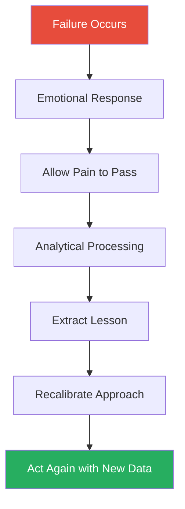
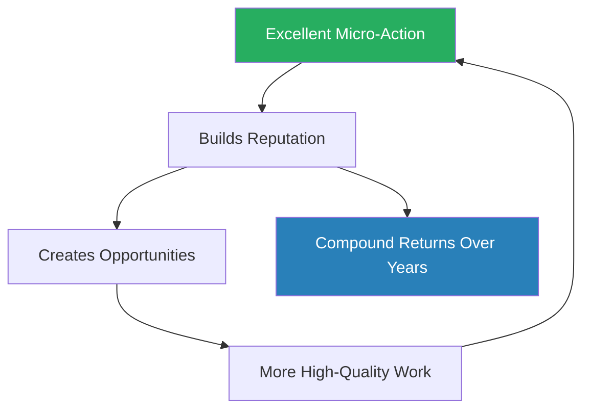
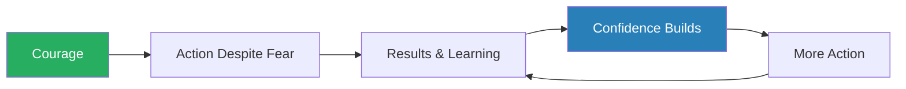
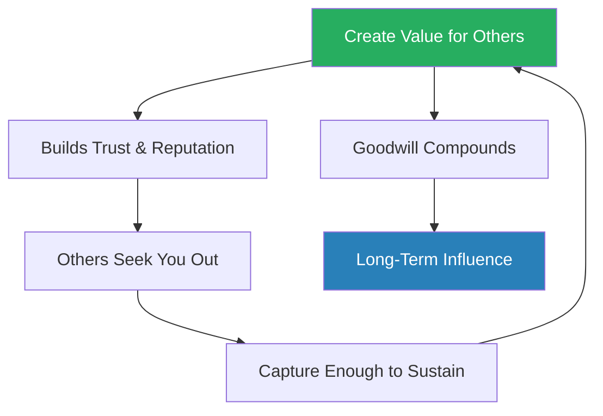
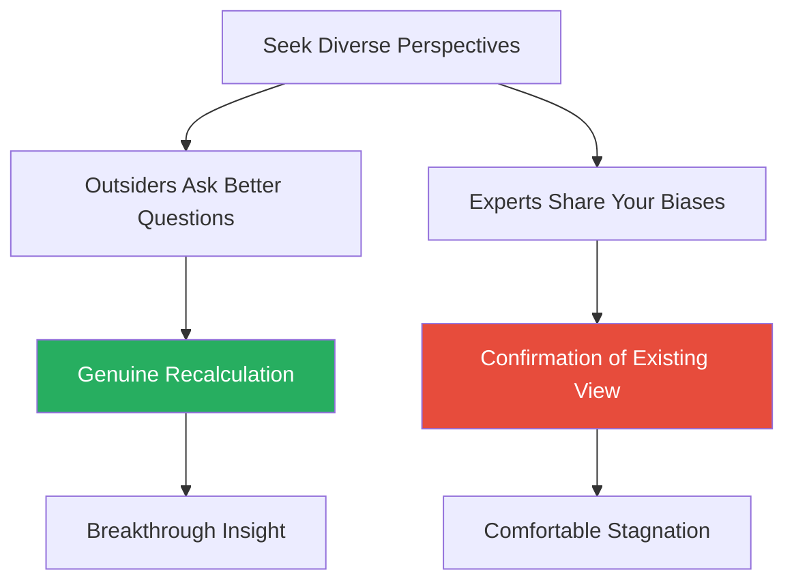

# Tribe of Mentors — Timothy Ferriss

> Ferriss turned 40, realised he had no plan, and did the most characteristically Ferriss thing possible: he emailed 130 of the most accomplished people on earth the same eleven questions and published their answers.
> The result is an anthology of crowdsourced wisdom from investors, athletes, artists, military leaders, scientists, and therapists — unified not by a single thesis but by recurring patterns that emerge when you ask the right questions to enough extraordinary people.
> The book's deepest contribution is not any individual answer but the meta-insight that structures it: the quality of your life is determined by the quality of your questions.
> What makes the cross-cutting patterns trustworthy is that they were independently discovered by people who have never met each other — saying no, reframing failure, the discipline-freedom paradox, courage before confidence.
> This is not a strategy manual.
> It is a mindset library, and the reader who benefits most is the one who reads for patterns rather than prescriptions.

---

## About the Author

Timothy Ferriss is a serial entrepreneur, angel investor, and host of *The Tim Ferriss Show*, one of the most downloaded podcasts in history with over 200 million downloads. He is best known for *The 4-Hour Workweek* (2007), which popularised the concept of **lifestyle design** — the idea that you can engineer your career around the life you want rather than the reverse. Ferriss's career has been a series of experiments in optimisation: speed-reading, tango competitions, language acquisition, and investing in companies like Uber, Shopify, and Facebook. *Tribe of Mentors* was born from a personal inflection point — having achieved extraordinary external success, Ferriss found himself directionless and turned outward for guidance, asking the meta-question that structures the entire book: *"What would this look like if it were easy?"*

---

## The Big Idea

*Ferriss does not write a book with a single argument — he builds a structured anthology and trusts the reader to find the signal in 130 voices.*

- This is a <b style="color: #2980b9">structured anthology</b> — 130+ world-class performers answering a subset of eleven identical questions, from the concrete ("What is your morning routine?") to the existential ("What advice would you give your younger self?")
- The organising premise is that <b style="color: #27ae60">better questions produce better lives</b>, and that crowdsourcing wisdom from diverse mentors is more useful than following any single guru
- Ferriss does not try to synthesise these voices into a unified theory
  - He trusts the reader to notice when a chess prodigy, a Navy SEAL, and a startup founder all independently arrive at the same conclusion
  - Those convergences are where the real signal lives

---

- The 11-question format creates a consistent structure, but the answers range widely:
  - **Practical:** morning routines, gift recommendations, favourite books
  - **Deeply personal:** worst investments of money and time, advice to a younger self, defining experiences of failure
- The questions were chosen not for comprehensiveness but for their capacity to surface wisdom that people normally keep private
  - They are sequenced from easy to hard, concrete to abstract — mirroring how good interviews build trust with accessible questions before asking the difficult ones

---

- The book itself emerged from a crisis of meaning:
  - At 40, Ferriss had money, influence, and reach — but no clear sense of what to do next
  - Rather than retreat inward, he reached outward — asking people he admired to help him think through the inflection point
  - The book is, in a very real sense, Ferriss's own therapy session — published for the rest of us to eavesdrop on
  - That origin gives the project a sincerity that pure curation would lack

> [!tip] Core Insight
> Careers are non-linear. Failures are informational. The people at the top are as flawed and uncertain as everyone else. World-class performance does not require a world-class plan — it requires world-class questions, the courage to act before the answers arrive, and the discipline to say no to everything that does not serve the mission.

---

## Key Concepts at a Glance

| Concept | One-line summary |
|---------|-----------------|
| **Better questions over better answers** | Life quality correlates with question quality; Ferriss's reframe "What would this look like if it were easy?" cuts through complexity |
| **The career river model** | Careers flow between the banks of rigidity and chaos; the skill is recognising which bank you are stuck on |
| **The "source" of an initiative** | The person who took the first risk maintains structural authority that later joiners cannot replicate |
| **Desire as a contract with unhappiness** | Every active desire is a source of dissatisfaction; pick desires carefully and drop the rest |
| **Macro patience, micro speed** | Be patient about years, be urgent about days — most people have the ratio exactly backwards |
| **Discipline equals freedom** | Rigid discipline in routine domains creates cognitive capacity for high-quality choices where they matter |
| **Courage over confidence** | Confidence is a lagging indicator; courage breaks the chicken-and-egg cycle by acting before readiness arrives |
| **Create more value than you capture** | Sustainable influence comes from being known as a net contributor, not a net extractor |
| **Information vs. decision quality** | Beyond a minimum threshold, additional information increases confidence without improving accuracy |
| **Extreme ownership** | The leader takes all blame and distributes all credit — not because they personally failed but because they own the system |
| **Depth over surface** | Real work comes from going deep into one thing and staying long enough to find the non-obvious insights |
| **Endings are choices, not failures** | Choosing when and how to end a commitment preserves your agency in ways that forced endings never do |
| **Light-grip epistemology** | Hold beliefs firmly enough to act but loosely enough to update when new evidence arrives |
| **Vulnerability as leadership** | Admitting uncertainty in real time is leadership; downloading instructions is just delegation |

Viktor Frankl's *Man's Search for Meaning* dominates the list — suggesting that the world-class performers in this book converge on the insight that purpose, not talent or luck, is the ultimate driver of extraordinary achievement.

---

## The Eleven Questions

*The questions themselves are as instructive as the answers — not the questions a journalist would ask, but the questions a friend would ask late at night, after enough trust has been built to get past the public-facing version of a person.*

1. What is the book you have most gifted to others?
2. What purchase of $100 or less has most positively impacted your life?
3. How has a failure, or apparent failure, set you up for later success?
4. If you could have a gigantic billboard anywhere, what would it say?
5. What is one of the best or most worthwhile investments you have ever made?
6. What is an unusual habit or absurd thing that you love?
7. In the last five years, what new belief, behaviour, or habit has most improved your life?
8. What advice would you give to a smart, driven college student about to enter the real world?
9. What are bad recommendations you hear in your profession or area of expertise?
10. In the last five years, what have you become better at saying no to?
11. When you feel overwhelmed or unfocused, what do you do?

---

- The sequencing matters:
  - **Questions 1-2** are warm-ups — concrete, easy, non-threatening
  - **Question 3** introduces vulnerability
  - **Questions 4-6** reveal values and personality
  - **Questions 7-8** push toward reflection
  - **Questions 9-11** demand real honesty
- The <b style="color: #27ae60">meta-lesson</b> is that the questions you ask determine the quality of the wisdom you receive
  - Ferriss did not ask "What is the secret to success?" — a question that produces platitudes
  - He asked specific, unusual questions that caught people off guard and forced them to think rather than recite prepared answers

---

### Why These Questions Work

- The <b style="color: #2980b9">billboard question</b> (Question 4) is particularly effective:
  - It forces compression — distilling everything you believe into a single sentence for strangers to read
  - It surfaces what mentors consider essential rather than merely interesting
  - It produces answers that are unexpectedly personal — not corporate slogans but raw convictions
- The <b style="color: #2980b9">bad recommendations question</b> (Question 9) inverts the usual format:
  - Instead of asking what to do, Ferriss asks what not to do
  - This surfaces contrarian views that mentors rarely volunteer unprompted
  - The answers reveal the gap between public conventional wisdom and private expert knowledge
- The <b style="color: #2980b9">failure question</b> (Question 3) produces the book's most emotionally honest material:
  - Asking about failure after the warm-up questions creates safety
  - The framing — "set you up for later success" — gives permission to be vulnerable without performing weakness
  - It is a question designed to produce stories, not platitudes

The question sequence mirrors how skilled interviewers build trust — moving from safe ground to territory where genuine wisdom lives.

---

## Failure Is Informational, Not Terminal

*The single most consistent pattern across every mentor in this book: failure is treated as data, not as verdict.*

- <b style="color: #27ae60">Rejection, setback, and loss create the conditions for the breakthrough that follows</b> — not because failure is magical, but because it forces recalibration
- It strips away paths that were never right and reveals the path that was always there
- The mentors do not romanticise failure — they process it:
  - What went wrong?
  - What did I learn?
  - What would I do differently?
  - And critically: was I playing the wrong game entirely?

### Susan Cain and the Law Firm

> [!example] Susan Cain's Accidental Career Pivot
> - Cain spent years as a Wall Street lawyer, miserable but unable to articulate why
> - She was good at the work and rewarded for it
> - But the extrovert-heavy culture of corporate law drained her in ways she could not name until she was rejected from it
> - That rejection became the seedbed for *Quiet*, her landmark book on introversion, which sold millions of copies and launched a movement
> **The lesson:** Rejection forced Cain out of a frame that was never right for her — the reframe produced something far more significant than partnership at a law firm ever would have.

### Samin Nosrat's Restaurant Collapse

> [!example] Nosrat and the Dying Restaurant
> - Nosrat, the chef and author who would go on to write *Salt, Fat, Acid, Heat*, poured herself into a restaurant venture that failed spectacularly
> - The owner could not let go of the project despite mounting evidence that it was dying
> - Nosrat watched the slow-motion collapse and extracted a defining lesson: **always envision the ending before you begin**
> - When her subsequent venture — a food market — succeeded wildly but stopped being what she wanted, she closed it on her own terms
> - The contrast was defining: the restaurant ended her, but she ended the market
> **The lesson:** The difference in agency — choosing your ending versus having it forced on you — shaped everything that followed.

---

### Mike Maples Jr. and the Fraternity

> [!example] Mike Maples Jr.'s Fraternity Rejection
> - Maples, the venture capitalist behind firms like Floodgate, was rejected from every fraternity he rushed in college
> - Humiliated, he channelled the energy into building his own social world from scratch
> - He later reflected that the rejection forced him to develop the skill of creating communities rather than joining them
> - That exact skill made him a great venture investor — someone who builds from the ground up rather than following established paths
> **The lesson:** The skill forged by rejection was precisely the skill his career would require.

### Ferriss Himself

> [!example] Ferriss and 27 Publisher Rejections
> - Ferriss was rejected by 27 publishers before *The 4-Hour Workweek* found a home
> - Twenty-seven times he was told his book was not viable
> - The book went on to sell millions of copies and launch an entire genre of lifestyle-design literature
> **The lesson:** The evaluation mechanisms of gatekeepers are often wrong — a single yes can override twenty-seven nos.

---

### The Failure-Learning Mechanism

- Why does failure teach better than success?
  - <b style="color: #2980b9">Success reinforces your current model</b> — it tells you that what you did worked, but it does not tell you why
  - Failure breaks the model — it forces you to re-examine assumptions you would never have questioned if things had gone well
- The mentors demonstrate a specific pattern in how they process failure:
  - They separate the emotional experience (shame, humiliation, grief) from the analytical process (what happened, what caused it, what to do differently)
  - They allow the emotional experience to pass without acting on it
  - Then they mine the failure for data with clinical detachment
- This is not emotional suppression — it is emotional sequencing:
  - Feel the failure fully
  - Then, once the initial pain subsides, analyse it ruthlessly

The failure-to-learning pipeline only works if you let the emotional stage complete before entering the analytical stage — rushing the analysis produces rationalisation, not insight.

---

### The Important Caveat

- Jason Fried, the Basecamp founder, provides the essential counterpoint:
  - <b style="color: #e74c3c">"Fail early, fail often" is not good advice</b> — nobody should aim to fail
  - Failure is a byproduct of ambitious action that should be processed for learning, not celebrated for its own sake
- The distinction matters: the mentors in this book did not succeed *because* they failed — they succeeded *despite* failure, because they had the capacity to process it reflectively rather than repeating the same approach
- The book carries <b style="color: #e74c3c">extreme survivorship bias</b> here:
  - We only hear from those whose failures led to breakthroughs
  - Not from the millions whose failures led to more failures
- The honest frame is not "embrace failure" but rather "if you are going to fail — which is likely — here is how to extract maximum learning from it"

---

## The Power of Saying No

*If there is a single meta-skill that unites the mentors in this book, it is the disciplined capacity to decline — not polite deflection, but genuine, principled refusal.*

### Naval Ravikant: Radical Selectivity

- <b style="color: #2980b9">Radical selectivity</b> — Ravikant, the AngelList co-founder and philosophical investor, says no to nearly everything
- His logic is elegant and ruthless:
  - Every yes is a time commitment, and time is the only resource you cannot get back
  - He will not commit to anything he would not want to do today — on the theory that if he would not rearrange his schedule to do it right now, he will not want to do it when the date arrives either
- His selectivity extends to relationships:
  - He works only with people he could see himself working with forever
  - This is not antisocial — it is an investment thesis applied to human connection
- The test he applies:
  - "If this were happening today, would I cancel other plans to do it?"
  - If the answer is no, the commitment is a false yes — an obligation disguised as an opportunity

### Josh Waitzkin: The 99% Filter

- Waitzkin, the chess prodigy whose life inspired the film *Searching for Bobby Fischer* and who later became a world champion in Tai Chi push hands, says no to <b style="color: #2980b9">99% of professional opportunities</b>
- His reasoning:
  - The final 1% of commitment — going from 99% engaged to 100% — is where exponential returns live
  - Spreading commitment across many projects means never reaching the depth where non-obvious insights emerge
- Waitzkin describes himself as being <b style="color: #27ae60">qualitatively, not just quantitatively, better</b> when fully committed versus almost-fully committed
  - The difference is not 1% more output — it is a different kind of output entirely
  - At 99% commitment, you produce competent work
  - At 100%, you produce work that only total immersion can generate

---

### Kyle Maynard: Eliminating the 7s

- Kyle Maynard, the quadruple amputee who became a competitive wrestler and climbed Mount Kilimanjaro, uses a numerical system:
  - If an opportunity is not clearly a 9 or 10 out of 10, it is a no
  - He eliminated all "7 out of 10" options from his life entirely
- The logic:
  - 7s feel productive but produce scattered results
  - They consume the same time as 9s and 10s but generate a fraction of the return
  - <b style="color: #e74c3c">The hardest part is that 7s feel responsible</b> — they look like good opportunities to anyone watching
  - But they are the enemy of focus

### Jason Fried: No Commitments Beyond a Week

- Fried refuses to commit to anything more than a week out
- His company, Basecamp, runs on six-week cycles with no roadmap beyond the current cycle
- The rationale:
  - Commitments made far in advance are made with worse information than commitments made close to the event
  - Long-range commitments create a sense of obligation that displaces spontaneous availability — the capacity to say yes to something unexpectedly valuable that appears tomorrow
  - Keeping the future open preserves optionality in a world where the best opportunities are the ones you cannot predict

---

### Dustin Moskovitz: The First No Is the Cleanest

- Moskovitz, Facebook co-founder and Asana CEO, argues that <b style="color: #27ae60">the first no is always the easiest and cleanest</b>
- Delaying a no — saying "let me think about it" or "maybe later" — creates ambiguity that harms both parties:
  - The person asking remains in limbo
  - The person delaying carries the cognitive weight of an unresolved commitment
- A fast, clear no is a kindness to everyone involved
- Moskovitz treats the delayed no as a form of dishonesty:
  - If you know you will not do something, saying "maybe" is not politeness — it is cowardice dressed up as consideration

> [!tip] Core Insight
> The mentors who accomplish the most are not saying yes to everything — they are saying no to almost everything, creating space for the few yeses that actually matter.

| Mentor | Saying-No Method | Key Principle |
|--------|-----------------|---------------|
| Naval Ravikant | Would not do it today? Decline. | Time is irreplaceable |
| Josh Waitzkin | 99% filter | Depth requires full commitment |
| Kyle Maynard | Eliminate all 7s | Only 9s and 10s deserve attention |
| Jason Fried | No commitments beyond a week | Better information, better decisions |
| Dustin Moskovitz | Say no immediately | The first no is the cleanest |

The convergence across five unrelated mentors — investor, athlete, wrestler, founder, CEO — reveals that radical selectivity is not a personality quirk but a structural requirement of high performance.

Five mentors from completely unrelated domains independently converge on radical selectivity — each arriving at their own method, but all sharing the structural insight that protecting attention is the prerequisite for depth.

---

### The Necessary Counterbalance

- Gary Vaynerchuk provides the essential counterpoint:
  - He maintains a deliberate 20% yes rate to seemingly pointless things because <b style="color: #2980b9">serendipity matters</b>
  - Not every connection needs to be optimised
  - Some of the best things that happen in a life come from saying yes to something that looked like a waste of time
- Esther Perel reinforces this from a different angle:
  - She warns that inconsequential-seeming connections can become doorways to transformative opportunities
  - <b style="color: #e74c3c">The no-strategy applies to activities, not to people</b>
  - Saying no to a commitment is often wise
  - Saying no to a person is often short-sighted
- The resolution between the two camps:
  - Say no to almost all activities, projects, and scheduled obligations
  - But remain open to people — conversations, introductions, and encounters that have no obvious immediate payoff
  - The former protects your time; the latter protects your serendipity

---

## Excellence Is the Next Five Minutes

*The book surfaces a counterintuitive truth: the people who accomplish extraordinary things over decades are not the ones with the best long-term plans — they are the ones who execute with the highest quality in the immediate moment.*

### Tom Peters: The Five-Minute Standard

- Tom Peters, the management thinker behind *In Search of Excellence*, argues that <b style="color: #27ae60">excellence is not a grand aspiration — it is the quality of your next conversation, your next email, your next five minutes</b>
- Peters spent a career studying companies that sustained high performance:
  - His conclusion was that organisational excellence was not a strategy — it was a habit
  - It was built from thousands of excellent micro-interactions, not from a single brilliant plan
- His concept of <b style="color: #2980b9">MBWA (Management by Walking Around)</b> is built on this premise:
  - The leader who is present, engaged, and excellent in every small interaction builds a culture of excellence without ever writing a mission statement
  - Culture is not what you declare — it is what you do in the moments nobody is watching
- Peters has a blind spot worth naming:
  - Some situations require macro planning that micro-execution cannot replace
  - Structural decisions, timing, and sequencing demand a longer lens
  - <b style="color: #e74c3c">Pure micro-focus without strategic context is just being busy with higher production values</b>

---

### Gary Vaynerchuk: Macro Patience, Micro Speed

- Vaynerchuk frames the same insight through a different lens with <b style="color: #2980b9">macro patience, micro speed</b>:
  - Be patient about the trajectory of years
  - Be urgent about the actions of days
- Most people have the ratio exactly backwards:
  - They are impatient about where they will be in five years
  - Patient about what they do today
  - They check their trajectory constantly while executing slowly
- The Vaynerchuk model inverts this:
  - Stop checking the trajectory, start executing faster
  - The trajectory will take care of itself if the daily execution is excellent
- Vaynerchuk applies this to his own media empire:
  - He produces an enormous volume of content daily — not because each piece is perfect, but because consistent high-volume output compounds in ways that occasional perfectionism never does
  - His patience is about the five-year brand arc; his urgency is about what he publishes in the next hour

### Jocko Willink: Prioritise and Execute

- Willink, the decorated Navy SEAL commander, brings military precision to the same idea
- His principle of <b style="color: #2980b9">prioritise and execute</b> achieves results through sequential micro-excellence rather than parallel mediocrity:
  - When everything is on fire — and in combat, everything is always on fire — the temptation is to address everything simultaneously
  - Willink's discipline is to rank the problems, focus entirely on the most important one, solve it, then move to the next
- The result looks like calm decisiveness from the outside, but it is actually a ruthless process of triage:
  - Most problems get temporarily ignored so that the most important problem gets full attention
  - This requires the emotional discipline to tolerate unsolved problems in your peripheral vision while you focus on the one that matters most

> [!abstract] The Excellence Formula
> 1. Rank all current problems by impact
> 2. Focus entirely on the highest-priority problem
> 3. Solve it completely before moving to the next
> 4. Execute each micro-action at the highest possible quality
> 5. Trust that compounding micro-excellence builds macro-results over time

---

### The Compounding Effect

- The paradox is that <b style="color: #27ae60">compounding applies to work quality just as it does to money</b>
- Each high-quality interaction builds reputation, trust, and capability:
  - Five years of excellent days produces an excellent career without requiring a perfect plan
  - The person who sends consistently excellent emails, runs consistently excellent meetings, and produces consistently excellent work accumulates compound interest on their reputation
- Reputation, once established, creates opportunities that no amount of planning could have engineered
- The compound mechanism works through three channels:
  - **Trust:** people assign you harder, more visible problems because they trust your quality
  - **Referrals:** your name gets mentioned in rooms you are not in
  - **Pattern recognition:** repeated excellence gives you pattern libraries that make future work faster and better

The excellence-reputation-opportunity cycle is self-reinforcing: quality begets trust, trust begets access, and access begets more chances to demonstrate quality.

---

## The Career River Model

*Graham Duncan draws on neuroscientist Dan Siegel's metaphor to give you a vocabulary for diagnosing where you are in your career — and a prescription for what to do about it.*

- Duncan, the co-founder of East Rock Capital and one of the book's most intellectually substantial contributors, presents a river flowing between two banks

**<b style="color: #2980b9">The Rigidity Bank</b>** — the apprenticeship phase (typically the twenties):
- This is where you learn the jargon, develop judgment, and discover your zone of genius
- Duncan calls the skill here **refining reality**: understanding how things actually work before trying to change them
- Characterised by:
  - Following instructions
  - Absorbing institutional knowledge
  - Resisting the temptation to innovate before you understand what you are innovating on
- <b style="color: #e74c3c">The danger is staying here too long</b> — becoming so comfortable with structure that you never develop your own perspective
- Signs you are stuck on the rigidity bank:
  - You defer to authority on questions where you have your own informed view
  - You follow processes you know are broken because "that is how we do it"
  - You feel safe but unfulfilled

---

**<b style="color: #2980b9">The Strong Poet Phase</b>** — the middle of the river (the thirties and forties):
- This is where you make your craft your own
- Self-expression replaces role-playing
- You stop asking "What does the manual say?" and start asking "What do I think?"
- Duncan borrows the term from the literary critic Harold Bloom, who used it to describe writers who transcended their influences and created something genuinely original
- The career parallel is precise:
  - The mentors and frameworks that shaped your apprenticeship become raw material for a perspective that is distinctly yours
  - You begin to produce work that could only come from you — not from anyone else with similar training
- This is the most productive phase, but it requires:
  - The confidence to disagree with people more experienced than you
  - The skill to frame disagreement constructively
  - The judgment to know when the manual is right and when it is wrong

**<b style="color: #2980b9">The Chaos Bank</b>** — the visionary phase (Steve Jobs, Elon Musk territory):
- People on this bank are consistently **asserting reality** — telling powerful stories about how the world should work and bending reality to match
- <b style="color: #e74c3c">The risk here is creative narcissism</b>: losing the feedback loop with how the world actually works
- The visionary who stops listening becomes a cult leader, not a leader
- Signs you are stuck on the chaos bank:
  - You generate ideas faster than you can execute them
  - You are frustrated that others cannot see what you see
  - You dismiss practical objections as lack of vision rather than engaging with them

---

- The critical insight is that <b style="color: #27ae60">you can always choose which direction to swim</b>:
  - If stuck on the rigidity bank — following rules, deferring to authority, afraid to assert your own view — swim toward the middle
  - If drowning in chaos — overcommitted, undisciplined, generating ideas without executing them — swim toward structure
  - The dangerous move is getting stuck on either bank and not realising you have a choice

| Phase | Core Skill | Danger | Remedy |
|-------|-----------|--------|--------|
| Rigidity Bank | Refining reality | Permanent deference | Assert your own perspective |
| Strong Poet | Self-expression | Isolation from feedback | Seek challenge, not just validation |
| Chaos Bank | Asserting reality | Creative narcissism | Reconnect with constraints |

The career river model is one of the few frameworks in the book that is genuinely structural rather than motivational — it gives you a diagnostic and a prescription, rare in a book that often defaults to inspiration.

The Strong Poet occupies the centre of the river — scoring moderately high across all dimensions rather than maximizing any single one — which is why Duncan describes mastery as integration rather than specialisation.

> [!tip] Core Insight
> The skill is not staying in the middle of the river — it is recognising which bank you are stuck on and choosing which direction to swim at each phase of life.

---

## The Source of an Initiative

*Duncan introduces one of the book's most powerful and original concepts: the person who took the first risk on something new maintains structural authority that later joiners cannot replicate.*

- Even in ventures with multiple co-founders, there is always a single person who took the <b style="color: #2980b9">first risk</b> — the one who conceived the idea under conditions of genuine uncertainty
- That person maintains an intuitive connection to the original vision that later joiners cannot replicate, no matter how talented or dedicated they are
- The "source" is not always the CEO or the most senior person:
  - It is the person who first identified the problem when nobody else saw it
  - Who first proposed a solution when nobody else was willing to bet on it
  - Who bore the initial risk before there was any evidence it would work

> [!example] Microsoft's Source Succession Problem
> - When Microsoft replaced Bill Gates with Steve Ballmer, performance stagnated
> - The cause was not Ballmer's incompetence — it was that the source had not fully departed
> - Gates remained on the board, casting a shadow that prevented Ballmer from establishing his own vision
> - When Gates finally stepped away entirely, Satya Nadella was able to establish himself as a new source
> - The company's trajectory transformed
> **The lesson:** The original source often must actually leave — physically, emotionally, and institutionally — before a new leader can fully assert their own direction.

- The pattern repeats across organisations:
  - Many power struggles and tensions trace back to a failure to acknowledge who the source is
- The implication is profound:
  - <b style="color: #27ae60">Being the founder of an initiative creates structural authority that managing someone else's initiative never will</b>
  - The person who first identified the problem, took the risk of proposing a solution, and built the initial version maintains a form of legitimacy that cannot be transferred through titles or org charts
  - Joining someone else's vision versus creating your own is not just a preference — it is a structural choice with lasting power implications

---

- Duncan's source theory also explains why succession planning is so difficult:
  - The departing source has institutional knowledge that is largely tacit — it cannot be documented or transferred through briefings
  - The new leader must establish their own source authority, which requires creating something new — not just maintaining what was built before
  - <b style="color: #e74c3c">The successor who tries to be the previous source will always fail</b> — they must become a new source to succeed
- This connects directly to the career river model:
  - Sources operate from the strong poet phase — they have internalised the domain's rules deeply enough to create something original
  - Late-joining managers often operate from the rigidity bank — following the source's playbook without understanding the intuition behind it

---

## Naval Ravikant: Desire, Happiness, and Radical Selectivity

*Ravikant's section is one of the book's most philosophically dense, and his ideas recur throughout the text like a bass line beneath the melody.*

- His central insight is that <b style="color: #2980b9">desire is a contract with unhappiness</b>:
  - Every active desire — for a promotion, a relationship, a possession, an outcome — is a source of dissatisfaction until it is resolved
  - The more desires you carry, the more sources of unhappiness you maintain
  - This is not a moral judgment — it is a psychological observation
- The solution is not to stop wanting things entirely — that is monastic, and Ravikant is not a monk:
  - <b style="color: #27ae60">Pick your desires carefully and drop the rest</b>
  - Choose a small number of things that genuinely matter
  - Pursue them with full commitment
  - Release the rest — not grudgingly, but with genuine detachment
- The happiness that results is not the happiness of getting what you want, but the happiness of **not wanting things you do not need**

---

- Ravikant extends this to decision-making:
  - He advises following intellectual curiosity over whatever is "hot" right now
  - Curiosity sustains effort in ways that trend-chasing never can
  - When you are genuinely curious about something, the work does not feel like work
  - <b style="color: #e74c3c">When you are chasing a trend, the work feels like obligation</b> — and obligation is the enemy of excellence
- His selectivity principle — working only with people he could work with forever — is not just a professional filter:
  - It is a philosophical statement about how to allocate the most precious resource you have: time
  - Every professional relationship is an implicit time commitment
  - Choosing those commitments with the same rigour you would apply to choosing a life partner is not excessive — it is proportional to the stakes

---

- Ravikant's framework connects to several other mentors:
  - **Waitzkin** on depth — both argue that narrowing your focus produces exponentially better results than broadening it
  - **Fried** on short time horizons — both argue against long-term commitments made with insufficient information
  - **Pressfield** on resistance — both recognise that the internal forces pulling you toward distraction are more dangerous than external obstacles
- The synthesis: happiness is not found by acquiring more, but by wanting less — and wanting less is itself a discipline that requires practice

> [!tip] Core Insight
> The wise move is not to stop wanting things entirely — it is to pick desires with surgical precision, pursue them with full commitment, and release everything else with genuine detachment.

---

## Adam Robinson: Information, Confidence, and the Slovic Study

*Robinson recounts a study that contains one of the book's sharpest and most counter-intuitive insights: more information makes you more confident, not more accurate.*

- Adam Robinson, the chess master turned educator and fund adviser, recounts the <b style="color: #2980b9">Paul Slovic horse-handicapping study</b>:

| Information Given | Prediction Accuracy | Self-Reported Confidence |
|-------------------|-------------------|--------------------------|
| 5 pieces per horse | 17% | 19% |
| 40 pieces per horse | 17% | 34% |

The results are striking — eight times more data produced zero improvement in accuracy but nearly doubled confidence.

- <b style="color: #27ae60">Beyond a minimum threshold, additional information makes you more confident but not more accurate</b>
- The extra data feeds confirmation bias rather than improving judgment:
  - People do not use additional information to challenge their existing view
  - They use it to reinforce it
  - They find evidence for what they already believe and dismiss evidence against it
  - All while feeling increasingly certain

---

- Robinson draws a sweeping conclusion:
  - In complex, human-driven systems — organisations, markets, relationships — more analysis of the same information produces comfort, not clarity
  - <b style="color: #e74c3c">The next valuable input is not further analysis of what you already know</b>
  - It is **new information from the real world**: a conversation, a result, a reaction, a piece of data you did not previously have
- The practical implication is specific:
  - When you feel uncertain about a decision, the instinct is to gather more data
  - Robinson says that instinct is usually wrong — you already have enough data to decide
  - What you need is a different type of data, not more of the same type
  - <b style="color: #2980b9">Seek disconfirming evidence</b> — actively look for reasons your current view might be wrong

> [!example] Robinson's Personal Transformation
> - For much of his career, Robinson was an introvert focused on solo intellectual achievement
> - His biggest life discovery was that enrolling others in your plans produces better outcomes than solo brilliance
> - When he shifted from trying to be the smartest person in the room to trying to create delight for the people around him, his career and his life transformed
> - Pure intellectual effort never achieved what genuine focus on others' experience produced
> **The lesson:** The shift from self-focused brilliance to other-focused generosity was not just personally fulfilling — it was strategically superior.

---

## Courage Over Confidence

*Debbie Millman, channelling the writer Dani Shapiro, makes a distinction that reframes how most people think about bold action — and breaks the chicken-and-egg cycle that keeps people stuck.*

- <b style="color: #2980b9">Confidence</b> is overrated:
  - It is a lagging indicator — a byproduct of repeated success
  - Waiting for confidence before acting creates a chicken-and-egg problem that never resolves
  - You need success to feel confident, but you need confidence to take the actions that produce success
  - The cycle never starts
- <b style="color: #27ae60">Courage</b> is what breaks it:
  - Courage means acting despite uncertainty, before the feeling of readiness arrives
  - It is not the absence of fear — it is action in the presence of fear
  - It is available to anyone at any time, regardless of their track record
- **"Busy is a decision,"** Millman says — one of the book's most quoted lines:
  - The things people say they do not have time for are the things they have chosen not to prioritise
  - Busyness is not a circumstance that happens to you — it is a choice you make, often unconsciously, about what matters

Courage starts the cycle; confidence is the reward that arrives after, not the prerequisite that must come before.

---

### Ann Miura-Ko: Preparation Without Confidence

> [!example] Miura-Ko and the Debate Championship
> - Miura-Ko, the venture capitalist at Floodgate, joined a college debate team with a losing record and no confidence whatsoever
> - She had no reason to believe she would be good at debate
> - Instead of waiting for confidence to arrive, she spent an entire summer out-preparing every opponent
> - She studied obsessively and practised relentlessly
> - She won nationals — not because confidence arrived, but because preparation made confidence unnecessary
> **The lesson:** Preparation coupled with courage can bypass the need for confidence entirely.

### Terry Crews: Taking the Shot

> [!example] Terry Crews and the Missed Basketball Shot
> - Crews, the actor and former NFL player, recalls missing a basketball shot in a game
> - The realisation that changed his perspective permanently: the important thing was not whether the shot went in
> - **The important thing was that he took it**
> - The shot that misses teaches you more than the shot you never take, because the shot you never take teaches you nothing at all
> **The lesson:** The people who accomplish things are not the people who always succeed — they are the people who always act.

---

### Steven Pressfield: Resistance

- Pressfield, the author of *The War of Art* and *The Legend of Bagger Vance*, names the force that stops people from acting: <b style="color: #2980b9">Resistance</b> (capitalised, because he treats it as an entity)
- Resistance is not lack of ability or lack of opportunity:
  - It is the internal force that generates fear, procrastination, self-doubt, and rationalisation
  - All in service of preventing you from doing the work you are called to do
- Pressfield's argument is that <b style="color: #e74c3c">Resistance is strongest precisely when the work matters most</b>:
  - The more important the project, the fiercer Resistance becomes
  - The very intensity of your avoidance is a signal that the work matters
- The professional, in Pressfield's framework, is simply the person who shows up and does the work regardless of what Resistance is doing
  - Amateurs wait for inspiration
  - Professionals sit down and begin
  - The distinction is not talent — it is practice

### The Nuance

- Courage without preparation is recklessness
- Miura-Ko won because she coupled courage with extraordinary preparation
- The pattern the book reveals is not "leap blindly" — it is <b style="color: #27ae60">prepare thoroughly, then act before you feel ready</b>:
  - The preparation is non-negotiable
  - But the readiness — the feeling that you are ready — is a luxury you may never receive
  - Act anyway

---

## Discipline Creates Freedom

*Jocko Willink's mantra captures a genuine paradox that most people get backwards — the most free and effective people in this book are also the most disciplined.*

Each mentor's signature strength illuminates a different facet of the discipline-freedom paradox — Willink through military rigour, Huffington through recovery as discipline, Brown through the courage to be vulnerable, Peters through depth of presence, and Ferriss through generous experimentation.

- <b style="color: #2980b9">Discipline equals freedom</b> — one of the book's most quoted lines
- The pattern across mentors is consistent:
  - Financial freedom requires financial discipline
  - Physical freedom requires consistent training
  - Creative freedom requires showing up and doing the work whether or not inspiration arrives
  - The freedom to spend time on what matters requires the discipline to eliminate time spent on what does not

### The Decision Fatigue Mechanism

- The underlying mechanism is <b style="color: #2980b9">decision fatigue</b>:
  - Every routine choice — what to eat, when to exercise, how to structure the morning, what to wear — drains the same cognitive resource as important decisions
  - The research on willpower depletion, while debated, points to a robust practical finding: people who automate their routine choices make better decisions in the moments that matter
- Willink does not experience his rigid morning routine (wake at 4:30 AM, exercise immediately, no negotiations) as a constraint:
  - He experiences it as liberation
  - By removing the decision about whether to exercise, when to exercise, and how to start the day, he preserves his decision-making capacity for the genuinely consequential choices in his work
- The discipline-freedom connection operates through a specific channel:
  - Routine decisions are low-value but high-frequency
  - Strategic decisions are high-value but low-frequency
  - Automating the former preserves cognitive resources for the latter

---

### Jocko Willink: Extreme Ownership

- Willink's discipline extends beyond personal routine to leadership
- His concept of <b style="color: #2980b9">extreme ownership</b> — born from a friendly-fire incident in Ramadi, Iraq — holds that the leader is responsible for every failure in their domain:
  - Not because the leader personally caused the failure
  - But because the leader is responsible for the system that allowed it

> [!example]- The Ramadi Friendly-Fire Incident
> - In the fog of urban combat, American forces fired on each other
> - A soldier died
> - There was blame to distribute everywhere — poor communication, confusing rules of engagement, fog of war
> - Willink's conclusion: "There was only one person to blame: me."
> - He was the commander
> - The system was his responsibility
> - If the system produced a catastrophic outcome, the system's architect owned that outcome
> **The lesson:** If you don't own the problem, you can't solve it.

- This is not self-flagellation — it is strategic:
  - <b style="color: #e74c3c">The leader who distributes blame cannot fix anything</b>, because the fix is always someone else's responsibility
  - <b style="color: #27ae60">The leader who takes ownership can fix everything</b>, because the fix is always within their authority
- Extreme ownership solves a specific leadership problem:
  - When blame is distributed, everyone waits for someone else to act
  - When one person owns the outcome, the path to fixing it is clear
  - Ownership creates agency; blame distribution creates paralysis

---

### Arianna Huffington: The Self-Care Counterbalance

> [!example] Huffington's Collapse
> - Huffington collapsed from exhaustion — literally, physically collapsed at her desk
> - She was forced to confront the reality that her discipline had curdled into self-destruction
> - She had confused activity with achievement and intensity with effectiveness
> **The lesson:** Self-care is not weakness — it is infrastructure.

- Her insight after the collapse:
  - Sleep, rest, and recovery are not rewards for work done — they are prerequisites for work done well
  - She cites research showing that three-quarters of startups fail, and argues that nothing impairs decision quality faster than running on empty
  - <b style="color: #27ae60">The person making the best decisions at the right time outperforms the person working the most hours — every time</b>

---

- Brene Brown reinforces Huffington from a different angle:
  - After years of studying vulnerability, shame, and courage, Brown concluded that **sleep is the single most impactful variable in her life** — more important than diet, exercise, or work ethic
- Samin Nosrat echoes this:
  - She guards her 8-9 hours of sleep "mercilessly," and credits that single habit with transforming her quality of life and work

| Mentor | Discipline Style | Key Risk |
|--------|-----------------|----------|
| Jocko Willink | Total routine control, 4:30 AM starts | Rigidity that breaks under disruption |
| Arianna Huffington | Disciplined recovery and sleep | Mistaking rest for laziness |
| Brene Brown | Sleep as non-negotiable foundation | Under-investing in sleep feels productive |
| Tom Peters | Micro-excellence in every interaction | Losing the macro view |

> [!tip] Core Insight
> The synthesis between Willink and Huffington is not a contradiction — it is a paradox that resolves clearly: discipline your effort AND discipline your recovery. Intense work followed by genuine rest produces better outcomes than either relentless intensity or comfortable ease.

---

## Depth Over Surface

*Steven Pressfield's core critique runs through the book like a current beneath the surface: the disease of our times is living on the surface, and real work comes from going deep.*

- <b style="color: #e74c3c">Internet culture, social media, and the constant stream of notifications encourage breadth over depth</b>
- But real work — the kind that produces lasting impact, the kind that cannot be replicated by someone who just arrived — comes from going deep into one thing and staying there
- Pressfield argues that surface living is not just unproductive — it is actively corrosive:
  - It trains you to seek novelty rather than mastery
  - It rewards first impressions over deep understanding
  - It creates the illusion of knowledge without the substance

### Josh Waitzkin: The Transfer of Deep Mastery

> [!example]- Waitzkin's Journey from Chess to Tai Chi
> - Waitzkin became a chess prodigy as a child, the subject of a book and a film
> - Then — shockingly — he walked away from chess entirely to pursue Tai Chi push hands
> - He became a world champion in the new discipline
> - The transfer was possible precisely because Waitzkin went deep enough in chess to extract **transferable principles**
> - He did not learn chess moves — he learned how learning works:
>   - How to deconstruct a complex domain
>   - How to practise deliberately
>   - How to manage competitive psychology
>   - How to perform under pressure
> - Those principles applied to martial arts just as well as they applied to chess
> - But they only became visible at a depth of engagement that surface-level participation could never reach
> **The lesson:** Depth produces transferable mastery; breadth produces familiarity that stays in a single domain.

- Waitzkin describes himself as exponentially better when fully committed versus 99% committed:
  - That final 1% of engagement is not a marginal improvement — it is a qualitative shift
  - It is where the non-obvious insights live, the patterns that only become visible after hundreds of hours of focused attention
  - This connects to his 99% filter for saying no — the mechanism is the same:
    - Focus all resources on one domain
    - Reach a depth where you see what others cannot see
    - Extract the transferable principles
    - Apply them to the next domain with a massive head start

---

### Brian Koppelman: Total Engagement Over Market Calculation

> [!example] Koppelman and *Rounders*
> - Koppelman, the screenwriter behind *Rounders* and the showrunner of *Billions*, wrote his breakthrough scripts not by calculating what the market wanted but by going all in on what fascinated him
> - *Rounders* was a poker movie at a time when nobody wanted poker movies
> - It became a cult classic that helped launch the poker boom precisely because it was written with the authenticity that only total engagement can produce
> - *Billions* followed the same pattern: he wrote about hedge funds not because it was commercially obvious but because the dynamics of power, money, and ego genuinely interested him
> **The lesson:** Total engagement produces a quality of work that market calculation cannot replicate.

- <b style="color: #27ae60">The person who writes about what fascinates them produces something with a depth and authenticity that the person writing to a brief never achieves</b> — even if the brief is commercially smarter
- Koppelman's advice to aspiring creators is to follow obsession rather than trend analysis:
  - The market cannot tell you what it wants before it exists
  - But your obsession can sustain you through the years of work required to create something that did not previously exist

### The Counterbalance: When Depth Becomes a Trap

- In a world of rapid change, pure depth in a single domain can become dangerous if that domain becomes obsolete
- Breadth creates <b style="color: #2980b9">optionality</b> — the capacity to move when the landscape shifts
- The resolution:
  - Breadth to discover your domain
  - Depth to master it
  - And the willingness to go broad again when the domain signals that it has peaked
- The book does not resolve this tension neatly — and that is honest:
  - Waitzkin and Pressfield emphasise depth almost exclusively
  - Stewart Brand's career is a testament to strategic breadth
  - The answer depends on your phase of life, your domain, and your tolerance for risk

---

## Reframe What Game You Are Playing

*Graham Duncan's billboard quote separates striving from strategy: "It's not how well you play the game, it's deciding what game you want to play."*

- This is not a motivational platitude — it is a structural insight about optimisation:
  - Most frustration comes not from playing a game poorly but from playing the wrong game entirely
  - Optimising within the wrong frame produces <b style="color: #e74c3c">local maxima</b> — you become the best at something that does not matter
  - The meta-skill of questioning which game you are playing produces <b style="color: #27ae60">global maxima</b> — you find the game where your particular combination of skills, interests, and circumstances creates disproportionate advantage

### Susan Cain: Switching Games

> [!example] Cain's Game Switch — Law to Writing
> - Cain was playing the law game — and she was decent at it
> - But the game itself was wrong for her temperament, her values, and her deepest interests
> - Switching to writing unlocked everything: the introversion that was a liability in corporate law became the core insight of a movement
> - The same person, with the same traits, went from mediocre-fit to world-changing-fit by changing the game
> **The lesson:** The problem is often not your performance — it is your playing field.

---

### Kwame Appiah: The Maze

- Appiah, the philosopher, extends the metaphor with a vivid image:
  - Most people spend their lives running around in one corner of a maze, trying different paths within that corner
  - They never question whether they are in the right part of the maze at all
  - <b style="color: #27ae60">Stepping back and seeing the full maze</b> — asking whether the corner itself is right, not just which path within the corner — is the move that produces the biggest shifts
- This connects to the career river model:
  - Duncan's rigidity bank is full of people optimising within one corner of the maze
  - The strong poet phase begins when you step back and see the full maze
  - The chaos bank is where you try to redesign the maze itself

### Naval Ravikant: Follow Curiosity, Not Trends

- Ravikant's advice is to follow intellectual curiosity over whatever is "hot" right now
- The logic is both practical and philosophical:
  - **Practically:** trends fade, but curiosity sustains effort indefinitely — the person chasing a trend will run out of motivation when the trend shifts; the person following genuine curiosity will still be working when everyone else has moved on
  - **Philosophically:** curiosity is a signal from your unconscious about where your particular combination of skills and interests can produce the most value — ignoring it in favour of trends is ignoring the best data you have about yourself

---

### The Danger of Perpetual Reframing

- The counterbalance is real:
  - Some people use "choosing the right game" as an excuse to avoid the difficult work of mastering any game
  - Pressfield's depth principle is the check
- At some point, you must commit and play hard:
  - The question "Am I playing the right game?" is powerful when asked periodically — annually, perhaps, or at major inflection points
  - <b style="color: #e74c3c">It is destructive when asked daily</b>, because daily questioning prevents the sustained effort that mastery requires

> [!tip] Core Insight
> The meta-skill is not endlessly reframing — it is choosing your game with care, then playing it with the full commitment that depth demands.

---

## Create More Value Than You Capture

*Tim O'Reilly proposes a principle he considers more useful than Google's original "Don't be evil" — and three mentors independently converge on the same idea.*

- O'Reilly, the founder of O'Reilly Media and one of the early architects of the open-source movement, proposes: <b style="color: #27ae60">"Create more value than you capture"</b>
- The distinction is subtle but important:
  - "Don't be evil" tells you what to avoid
  - "Create more value than you capture" tells you what to do
  - It is a positive instruction, not a negative constraint
- The economic logic is straightforward:
  - If you consistently create more value than you take, people will seek you out
  - Your reputation becomes your most valuable asset
  - The value you do not capture creates goodwill that compounds over time

> [!example] O'Reilly Media's Value-First Model
> - O'Reilly built his company on this principle
> - He published technical books that taught people skills, hosted conferences that built communities, and championed open-source software
> - The value created for the technology industry far exceeded what O'Reilly Media captured in revenue
> - The result was not altruistic poverty — O'Reilly Media became one of the most trusted and influential brands in technology
> - The value creation created the brand, and the brand created the business
> **The lesson:** Giving more than you take is not charity — it is a compounding business strategy.

---

- Jason Fried reinforces this from a different angle:
  - He describes giving a friend money with no expectation of return — not as a strategy, but as a genuine act of generosity
  - Every time he gave without strings, it was both fulfilling and productive in ways he could not have predicted
  - The relationships built on unconditional generosity were deeper, more resilient, and more professionally valuable than relationships built on transactional exchange
- Adam Robinson completes the triad:
  - His career transformation came when he shifted from trying to be the smartest person in the room to trying to create delight for the people around him
  - The shift was not strategic — it was a genuine change in orientation
  - But the results were strategic: focusing on others' experience produced more career opportunities, more meaningful relationships, and more creative output than solo intellectual achievement ever had

---

- The nuance:
  - You must still capture enough value to sustain yourself
  - Pure altruism without self-interest is unsustainable
  - The principle is about <b style="color: #2980b9">ratio</b>, not about elimination — create more than you take, but do take enough to continue creating
- The three mentors arrive at this principle from completely different starting points:
  - O'Reilly from open-source software philosophy
  - Fried from personal generosity
  - Robinson from a change in interpersonal orientation
- The convergence across such different paths suggests the principle is structural, not situational

The value-creation flywheel is self-sustaining: giving more than you take builds the trust that ensures you always have enough to continue giving.

---

## Endings Are Choices, Not Failures

*Samin Nosrat's most enduring contribution to the book is not a cooking technique — it is a philosophy of endings that distinguishes those who preserve their agency from those who lose it.*

- Her restaurant experience taught her that staying too long in a dying venture is more destructive than the failure itself:
  - The owner could not let go
  - The restaurant bled out slowly while everyone involved watched
  - The psychological toll of a slow, uncontrolled ending was worse than a quick, decisive one would have been

> [!example] Nosrat's Two Endings
> - When the restaurant failed, the ending happened to her — she had no control over the timing or the terms
> - When her subsequent venture — a food market — succeeded, she faced a different challenge
> - The market was thriving, but it was no longer what she wanted
> - She could have stayed — the external signals were all positive
> - But she closed it, on her own terms, at the moment of her choosing
> **The lesson:** The ending you choose preserves your agency; the ending that happens to you destroys it.

---

- Stewart Brand, the creator of the *Whole Earth Catalog*, embodies a lifetime version of this principle:
  - His career is a series of diverse skills and ventures, none of which he stayed with permanently, but all of which served him
  - Brand's exits were never failures — they were transitions, each one chosen, each one timed, each one freeing him for the next thing
  - His willingness to leave thriving projects is what gave him the breadth that made him one of the most influential thinkers of his generation
- Bear Grylls and Jocko Willink represent the counterpoint:
  - Some things are worth fighting for past the point of comfort
  - Grylls' entire philosophy is built on pushing through when every instinct says to quit
- The skill the book implies is <b style="color: #27ae60">distinguishing between productive persistence and sunk-cost persistence</b>:
  - Staying because the fight is worth winning versus staying because you cannot bear to admit it is over
  - The first is discipline; the second is ego

> [!abstract] How to Know When to End
> 1. Separate the external signals (revenue, recognition, momentum) from the internal ones (energy, excitement, growth)
> 2. Ask: "If I were not already committed, would I start this today?"
> 3. If the answer is no, plan your exit deliberately — timing, terms, and transition
> 4. Choose your ending before the ending chooses you
> 5. Treat every ending as a beginning of the next phase

---

## Graham Duncan: The Light-Grip Epistemology

*Duncan addresses something the rest of the book largely ignores: how to hold your beliefs about the future when the future is genuinely uncertain.*

- Duncan advocates what might be called a <b style="color: #2980b9">light grip on perspectives</b>:
  - Hold your views firmly enough to act on them
  - But loosely enough to update them when new evidence arrives
- This is harder than it sounds — most people fall to one extreme:
  - **Too tight:** rigidity, confirmation bias, inability to update
  - **Too loose:** indecision, constant second-guessing, inability to commit
- The light grip is not a compromise between the two — it is a different skill entirely:
  - It requires the ability to act with conviction while simultaneously monitoring for evidence that you are wrong
  - Most people can do one or the other; Duncan argues that peak performers do both simultaneously

> [!abstract] The Light-Grip Method
> 1. Commit to your current best reading of the situation
> 2. Act on it with full intensity
> 3. Maintain a background process that monitors for disconfirming evidence
> 4. When that evidence arrives — update without ego
> 5. Treat the update as a success of epistemology, not a failure of judgment

- This connects to Robinson's Slovic study:
  - <b style="color: #e74c3c">The danger of information accumulation is that it tightens your grip rather than improving your judgment</b>
  - Duncan's light grip is the antidote
  - Seek new information, not more of the same information
  - And when the new information contradicts your current view, let the view change
- Duncan's light grip also connects to the career river model:
  - People on the rigidity bank hold too tight — they cannot update their model of how the world works
  - People on the chaos bank hold too loose — they update so frequently they never commit to anything
  - The strong poet holds the light grip — acting with conviction while remaining open to revision

---

## Brene Brown: Vulnerability and Leadership

*Brown's contribution goes beyond the popular association of her work with vulnerability — her sharpest insight here is about the gap between delegation and genuine leadership.*

- Her core distinction: <b style="color: #27ae60">"Downloading ideas is not leading"</b>
- Many people in leadership positions believe they are leading when they share their vision, assign tasks, and monitor execution:
  - Brown argues that this is delegation, not leadership
- Real leadership requires vulnerability:
  - The willingness to say "I don't know"
  - To ask for help
  - To acknowledge when a plan is not working
  - To change course publicly
- This connects to Willink's extreme ownership but adds a dimension Willink does not emphasise:
  - The emotional courage required to be honest about uncertainty
  - Willink's framework is about owning failures
  - <b style="color: #2980b9">Brown's framework is about admitting — in real time, not retrospectively — that you do not have the answer</b>

---

- Brown also makes a practical claim about sleep:
  - After years of studying high-performing leaders, she concluded that sleep is the most undervalued variable in professional performance
  - Not exercise, not diet, not meditation — sleep
  - The leaders who consistently made the best decisions under pressure were the ones who were consistently well-rested
- Her research on shame resilience adds another layer:
  - Leaders who cannot tolerate shame — who collapse or lash out when they feel exposed — make worse decisions under pressure
  - <b style="color: #e74c3c">Shame resilience is not about avoiding shame but about recovering from it quickly</b>
  - The leaders who recover fastest are the ones who have a vocabulary for their emotions and a support network to process them

---

## Esther Perel: Relationships as Doorways

*Perel brings a lens that most other mentors lack: the understanding that professional success is mediated through relationships, and relationships operate on emotional logic, not rational logic.*

- Her advice when overwhelmed is deceptively simple — seek out people who can help you "recalculate":
  - People who see the situation from a different angle
  - People who can offer a perspective you cannot generate on your own
- Perel's deeper insight is about the *type* of person to seek:
  - <b style="color: #e74c3c">Not the person with the most expertise — experts in your domain will share your biases</b>
  - The person with the most emotional distance from the situation — outsiders will ask the questions you have stopped asking
- Perel also warns against treating every connection instrumentally:
  - The most transformative opportunities in her career came from relationships she initially considered inconsequential
  - Casual introductions, coffee meetings she almost declined, conversations at events she almost did not attend
  - <b style="color: #27ae60">Over-optimising your social calendar for strategic value destroys the conditions under which serendipity operates</b>

---

- Perel's framework creates an interesting tension with Ravikant's radical selectivity:
  - Ravikant says: be extremely selective about who you spend time with
  - Perel says: some of the best things come from connections you would have filtered out
- The resolution may be domain-specific:
  - For deep professional work — projects, partnerships, long-term commitments — Ravikant's filter is essential
  - For social encounters — conversations, events, casual connections — Perel's openness preserves the serendipity that tight filtering kills

Perel's model suggests that the most valuable advisors are often the ones furthest from your domain — they see what familiarity has made invisible.

---

## The Most-Gifted Books

*Question 1 — "What is the book you have most gifted to others?" — produces a revealing pattern: the books these mentors give away are not the books that made them successful. They are the books that changed how they think.*

- The most frequently recommended books across all 130+ mentors reveal their intellectual DNA:
  - **Man's Search for Meaning** by Viktor Frankl — the most-cited book across the entire collection
  - **The Tao Te Ching** by Lao Tzu — the philosophical counterweight to the achievement-focused advice
  - **Sapiens** by Yuval Noah Harari — the big-picture context for individual ambition
  - **Poor Charlie's Almanack** by Charlie Munger — mental models and multi-disciplinary thinking

---

- The pattern is instructive:
  - <b style="color: #27ae60">The mentors recommend books about meaning, not books about tactics</b>
  - The tactical books made them competent; the meaning books made them wise
  - Frankl's book in particular surfaces a theme that runs throughout *Tribe of Mentors*: purpose survives suffering, and suffering without purpose destroys
- Several mentors note that the book they gift is not the book they would recommend for professional advancement:
  - It is the book they wish they had read earlier — the one that would have saved them from mistakes that no amount of tactical skill could have prevented
  - This distinction — between the book that makes you better at your job and the book that makes you better at your life — is one the mentors draw repeatedly

---

## The Billboard Question

*Question 4 surfaces what mentors consider essential — not what they know, but what they believe most urgently needs to be said.*

- The billboard answers cluster into distinct categories:
  - **Anti-busyness:** "Busy is a decision" (Millman), variations on slowing down and thinking
  - **Anti-perfectionism:** "Done is better than perfect," "Ship it"
  - **Relationship-first:** Messages about kindness, presence, and attention
  - **Philosophical:** Quotes from Seneca, Marcus Aurelius, the Stoics
- The most striking billboard answers are the ones that reveal private struggles:
  - Mentors who built empires on productivity recommending rest
  - Mentors famous for ruthless execution recommending kindness
  - The gap between public persona and private conviction is where the real wisdom lives

---

## Key Quotes

- **"What would this look like if it were easy?"** — Tim Ferriss
- **"Discipline equals freedom."** — Jocko Willink
- **"Busy is a decision."** — Debbie Millman
- **"Desire is a contract to be unhappy."** — Naval Ravikant
- **"Create more value than you capture."** — Tim O'Reilly
- **"It's not how well you play the game, it's deciding what game you want to play."** — Graham Duncan
- **"If you don't own the problem, you can't solve it."** — Jocko Willink (paraphrased)
- **"The professional shows up regardless of inspiration."** — Steven Pressfield (paraphrased)

---

## The Verdict

*Tribe of Mentors* is not a strategy manual and it does not pretend to be one. It is a <b style="color: #2980b9">mindset library</b> — a curated collection of hard-won perspectives from people who have navigated inflection points, failure, and uncertainty at the highest levels of achievement. Its format is its greatest innovation: by asking the same questions to 130+ people across wildly different domains, Ferriss created a natural experiment in human wisdom. The cross-cutting patterns that emerge — the power of saying no, the informational value of failure, the courage-confidence distinction, the discipline-freedom paradox — earn credibility precisely because they were not coordinated. When a chess prodigy, a Navy SEAL, a startup founder, and a psychotherapist independently arrive at the same conclusion, that convergence carries a weight that no single guru's pronouncement can match.

The book's greatest intellectual contributions come from a handful of standout mentors. Graham Duncan's section alone — the career river model, the source theory of organisational power, the light-grip epistemology — contains more structured, original thinking than most entire business books. Naval Ravikant's philosophical framework on desire and happiness provides a genuine counterweight to the achievement-oriented advice that dominates the rest of the book. Adam Robinson's Slovic study reframes how readers should think about information and confidence in decision-making. These sections are worth the price of the book on their own; the other 120+ mentors provide valuable reinforcement but rarely reach the same depth.

The book's weaknesses are structural and cannot be separated from its format. **Survivorship bias** is the elephant in the room: every mentor is wildly successful, which means every failure story has a happy ending — because the failures that do not have happy endings do not produce people who end up in books like this. The book almost entirely ignores structural barriers — race, gender, class, disability, systemic disadvantage — creating an implicit message that mindset and tactics are sufficient, which is incomplete at best and misleading at worst. Many responses carry a faint sheen of public performance rather than raw honesty; when you ask someone to give advice for a published book, you get their polished wisdom, not necessarily their real wisdom. And the anthology format means Ferriss presents 130 perspectives without adjudicating between them — Jason Fried says "fail early, fail often" is terrible advice while 90% of other mentors celebrate their failures, and Ferriss never resolves the contradiction. The synthesis work is left entirely to the reader.

The reader who benefits most from this book is someone at an inflection point — facing a decision, navigating uncertainty, questioning whether they are on the right path. It is less useful as a tactical manual (it contains almost no concrete how-to) and more useful as a mirror: reading 130 perspectives on failure, discipline, courage, and purpose tends to surface whatever the reader is most avoiding thinking about. For those willing to do their own synthesis — to read for patterns rather than prescriptions, to notice the convergences and weigh the contradictions — the book is an unusually rich source of second-hand wisdom. For those looking for a step-by-step playbook, it will feel scattered and incomplete. The closest comparison is [[The Almanack of Naval Ravikant - Eric Jorgenson|The Almanack of Naval Ravikant]], which takes one mentor's philosophy and develops it with far greater depth — if Ravikant's section was what resonated most, that is the natural next read.

---

## Related Reading

- [[So Good They Can't Ignore You - Cal Newport|So Good They Can't Ignore You]] — Cal Newport's argument that career capital and rare skills, not passion, produce fulfilling work; a rigorous complement to the passion-first advice of several mentors here
- [[Deep Work - Cal Newport|Deep Work]] — Newport's framework for sustained concentration; the operational manual for the depth-over-surface principle that Pressfield and Waitzkin articulate here
- [[The Almanack of Naval Ravikant - Eric Jorgenson|The Almanack of Naval Ravikant]] — the single best deep dive into Ravikant's philosophy of wealth, happiness, and decision-making; everything hinted at in his Tribe of Mentors section, fully developed
- [[The First 90 Days - Michael D. Watkins|The First 90 Days]] — Michael Watkins on navigating career transitions with structure; the operational playbook that Tribe of Mentors' mindset advice lacks
- [[Essentialism - Greg McKeown|Essentialism]] — McKeown's systematic case for doing less but better; the intellectual framework behind the radical selectivity that Ravikant, Waitzkin, and Maynard practice intuitively
- [[Power - Jeffrey Pfeffer|Power: Why Some People Have It and Others Don't]] — Jeffrey Pfeffer on the structural and political realities of organisational advancement; fills the power-dynamics gap that Tribe of Mentors largely ignores
- [[The 48 Laws of Power - Robert Greene|The 48 Laws of Power]] — Greene's tactical manual for reading power dynamics; the political lens that most of Ferriss's mentors are missing
- [[Man's Search for Meaning - Viktor Frankl|Man's Search for Meaning]] — the most-gifted book across the entire collection of mentors; the philosophical foundation that underlies much of the wisdom in Tribe of Mentors
