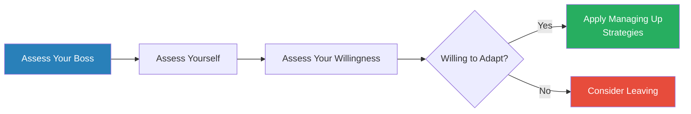
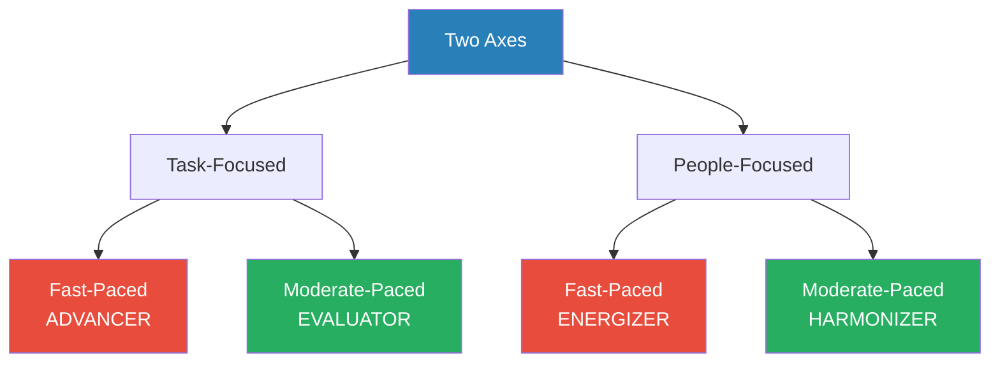
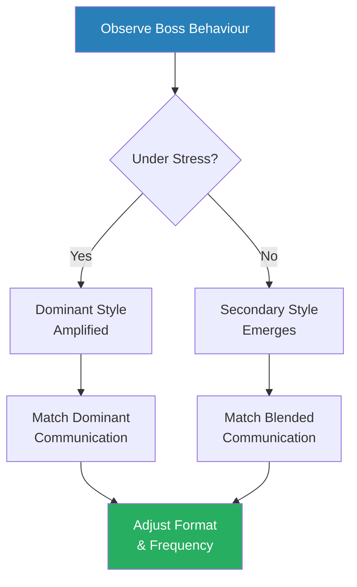
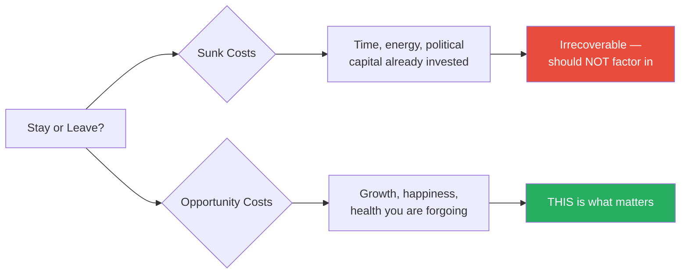
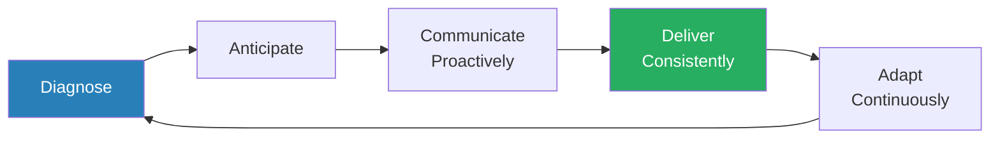

# Managing Up — Mary Abbajay

> Your boss is the single greatest determinant of your professional success, and waiting for them to become the manager you wish they were is a losing strategy. Mary Abbajay's *Managing Up* is a practitioner's field guide to diagnosing your boss's personality type, adapting your behaviour to build a productive relationship, and — when all else fails — knowing when to walk away. The book is built on a simple, uncomfortable truth: the quality of the relationship with the person above you matters more than the quality of your work. That is not cynicism. It is the operating reality of every hierarchical organisation. Abbajay provides a taxonomy of boss types (introvert versus extrovert, four workstyle personalities, ten difficult boss archetypes), prescriptive strategies for each, and an unusually honest treatment of quitting as a strategic act rather than a failure.

---

## About the Author

Mary Abbajay is the president of Careerstone Group, a professional development and leadership consultancy based in Washington, DC. She has spent over twenty years in corporate training, coaching, and organisational development, working with Fortune 500 companies, government agencies, and non-profits. She is a practitioner, not an academic — the book draws on real-world coaching engagements, workshop anecdotes, and consulting conversations rather than controlled research studies. Her perspective is shaped by the thousands of people who have attended her workshops and shared their war stories about managing the person above them, and she writes with the brisk, no-nonsense voice of someone who has heard every variety of boss complaint and is no longer interested in sympathy — only in solutions. She is a regular contributor to Forbes and the Huffington Post on workplace dynamics, and a frequently invited speaker on leadership and professional development.

---

## The Big Idea

- <b style="color: #27ae60">Your boss will not change</b> — seventy per cent of managers use only one style of managing, and the organisation rewards whatever got them promoted
- Their personality, habits, communication quirks, and decision-making style are baked in, reinforced by the institutional machinery that elevated them
- The adaptation burden falls on you — not because that is fair, but because that is how hierarchies work

Abbajay frames this not as resignation but as agency. You have exactly three choices in any boss relationship:

- **Change the situation** — nearly impossible, because you cannot change another person's personality
- **Leave the situation** — sometimes the correct choice
- **Accept and adapt** — managing up

<b style="color: #e74c3c">What is NOT on the menu is victimhood</b> — sitting at your desk, seething at your boss's latest infuriating behaviour, waiting passively for them to become someone they are never going to become.

- The people who thrive in organisations are not necessarily the most talented or the hardest working
- They are the ones who figure out what their boss needs and deliver it in the format the boss prefers, on the timeline the boss expects, while making the boss feel confident that everything is under control

The book provides a systematic approach to this:

- A <b style="color: #2980b9">diagnostic system</b> for identifying your boss's type
- A set of strategies tailored to each type
- An honest assessment of when the right answer is not to adapt but to quit
- It is a practitioner's manual — heavy on examples from real workplaces, light on academic research, and entirely uninterested in pretending that all bosses are manageable
- Some wells, Abbajay says, are poisoned — no change of cup or route will make the water drinkable
- The book's willingness to say this — to admit the limits of its own framework — is one of its most valuable qualities

---

## Key Concepts at a Glance

| Concept | One-line summary |
|---------|-----------------|
| **The Three-Step Assessment** | Diagnose your boss, diagnose yourself, then honestly assess your willingness to adapt |
| **The Platinum Rule** | Treat your boss how *they* want to be treated, not how you want to be treated |
| **The Introvert-Extrovert Axis** | Every boss sits on a spectrum that determines their energy source and communication preferences |
| **Four Workstyle Personalities** | Two axes (task vs people, fast vs moderate) producing Advancer, Energizer, Harmonizer, Evaluator |
| **The Continuum of Difficulty** | Boss relationships range from Dream Boss to Nightmare Boss — the book is designed for the middle |
| **The Choice Model** | Change, leave, or adapt — victimhood is not on the menu |
| **The Trust-Building Cycle** | Trust is built through diagnosis, anticipation, proactive communication, consistent delivery, and continuous adaptation |
| **The Poisoned Well** | Some boss relationships are beyond repair — sunk cost should not keep you drinking water that makes you sick |
| **Sunk Cost vs Opportunity Cost** | The question is not what you have invested but what you are forgoing by staying |
| **Ten Difficult Boss Archetypes** | Micromanager, Ghost Boss, Narcissist, Impulsive Boss, Pushover, BFF Boss, Workaholic, Incompetent Boss, Nitpicker/Seagull, and Truly Terrible Boss |

---

## Part One: The Foundation

### Chapter 1: Why Managing Up Matters

*The book opens with its most important — and most uncomfortable — claim: your boss, not your talent, determines your professional success.*

- The book opens with: "Your boss is the greatest single factor in your work success"
- Not your talent, not your work ethic, not your education — your boss

Abbajay backs this up with a simple observation:

- Bosses control access to projects, promotions, visibility, and advocacy
- They shape how senior leadership perceives you
- A boss who trusts you opens doors; a boss who does not shuts them regardless of your performance
- Year after year, the number one reason people leave jobs is not the work, not the pay, not the commute — it is their boss
- And yet most professionals spend zero time thinking strategically about this relationship
- They show up, do their best work, and hope that excellence alone will carry them
- <b style="color: #e74c3c">It will not</b>

---

The chapter introduces what Abbajay calls the foundational equation of managing up: <b style="color: #27ae60">the relationship is the work</b>.

- Building a productive relationship with your boss is not a nice-to-have layered on top of doing your job — it IS part of doing your job
- The engineer who writes brilliant code but cannot communicate with their manager will lose out to the engineer who writes good code and makes the manager feel informed, supported, and confident
- This is not a judgement about how the world should work — it is an observation about how the world does work
- The people who understand this observation early gain an enormous compounding advantage over those who learn it late — or never

> [!example] Brad the Brilliant but Invisible Developer
> - Brad, a high-performing software developer, could not understand why his less talented colleague kept getting promoted
> - Brad was brilliant, but he hoarded information and communicated in dense technical language his non-technical manager could not follow
> - He bristled whenever asked for status updates, treating them as insults to his competence
> - His colleague, meanwhile, sent weekly updates in plain English, asked their manager for input on decisions (even when the colleague knew the answer), and made the manager feel involved
> - The colleague was managing up; Brad was not
> **The lesson:** Merit alone does not create advancement — the gap between merit and recognition is what managing up is designed to close.

---

The chapter also introduces the <b style="color: #2980b9">Three-Step Assessment Model</b>, which serves as the prerequisite for everything that follows:

- **Step one — assess your boss:** What is their workstyle? How do they prefer to communicate? What are their priorities, pressures, and pet peeves? What keeps them up at night?
- **Step two — assess yourself:** What is YOUR workstyle? Where do you and your boss clash? And — the hard part — what is YOUR contribution to the problem?
  - Most people skip this step because it is painful
  - Abbajay insists on it because the clash is almost never one-sided
  - Even the worst boss-subordinate relationships involve two people with mismatched expectations, and understanding your own role in the mismatch is essential to adapting effectively
- **Step three — assess your willingness:** Are you prepared to adapt? Is the relationship worth the effort? Or are you coming from a place of resentment that will sabotage any strategy you try?

The three-step assessment is not a one-time exercise but a recurring diagnostic — as your boss changes roles, faces new pressures, or acquires new responsibilities, the inputs change and the assessment must be refreshed.

> [!tip] Core Insight
> If you are not genuinely willing to adapt — if you believe on some deep level that your boss SHOULD change and you resent the idea that you are the one who has to flex — then no technique in the book will help you. The first act of managing up is choosing to manage up, from a place of agency rather than victimhood.

---

### Chapter 2: The Introvert-Extrovert Axis

*Before introducing the four workstyle personalities, Abbajay devotes a full chapter to the single most fundamental dimension of communication style — and shows how misreading it causes most workplace friction.*

- Every boss sits somewhere on the introversion-extroversion spectrum
- This single dimension determines two critical workplace elements: where they get their energy and how they prefer to communicate
- Abbajay argues that more boss-subordinate conflicts stem from misreading this axis than from any other source — people attribute to malice or incompetence what is actually just an energy mismatch

**Introverted bosses** recharge through solitude:

- Prefer email over pop-ins, advance agendas over spontaneous brainstorming, and bundled questions over a stream of interruptions
- Think before they speak, which can read as disengagement or coldness — but it is neither; it is processing
- An introverted boss who goes quiet in a meeting is not checked out; they are synthesising
- An introverted boss who responds slowly to your enthusiastic pitch is not disinterested; they are evaluating
- They are drained by constant human interaction, especially unstructured interaction
- Open-plan offices, back-to-back meetings, and hallway conversations leave them depleted, not energised
- <b style="color: #e74c3c">The worst thing you can do with an introverted boss is ambush them</b>

**Extroverted bosses** recharge through interaction:

- Prefer face-to-face conversation, think out loud, and process ideas by talking them through
- Their verbal brainstorming can be mistaken for directives — they say "What if we tried X?" and half the team runs off to implement X, when what they meant was "I'm thinking out loud; push back"
- Their energy can feel overwhelming to introverts, and their need for interaction can feel like neediness
- They interpret silence as a signal — usually a negative one — and fill every pause with more words
- A closed office door reads to them as a problem; to an introvert, it is simply how work gets done
- <b style="color: #e74c3c">The worst thing you can do with an extroverted boss is go dark</b> — silence, to an extrovert, reads as disengagement or passive aggression

---

The four possible combinations each carry distinct risks:

| Pairing | Core Risk | Fix |
|---------|-----------|-----|
| Introvert reporting to Extrovert | Introvert feels bulldozed; extrovert reads silence as disengagement | Prepare thoughts in writing beforehand; send ideas in advance |
| Extrovert reporting to Introvert | Extrovert reads quietness as coldness; introvert feels ambushed | Switch to email updates; give advance notice before meetings |
| Two Introverts | Under-communication leads to silent divergence | Schedule regular check-ins even though neither naturally wants them |
| Two Extroverts | Constant talking, no follow-through | One person plays the structured role — agendas, notes, recaps |

> [!example] Roger and Carol — The Extrovert Who Misread Silence
> - Roger, a chatty, people-focused extrovert, worked for Carol, a quiet, task-focused introvert
> - Roger interpreted Carol's reserved style as coldness and poor management — he decided she did not like him
> - He started overcompensating: popping into her office more often, talking louder, trying to draw her out
> - Carol withdrew further — Roger's energy was draining her
> - In Abbajay's workshop, Roger had an epiphany: Carol was not cold — she was introverted
> - Her silence was not hostility; it was her natural operating mode
> - Roger adjusted: he started sending Carol email updates instead of popping into her office, gave her advance notice before meetings, and stopped reading rejection into every quiet moment
> - The relationship improved dramatically — not because Carol changed, but because Roger stopped misinterpreting her personality as a personal affront
> **The lesson:** Most boss friction that looks like incompetence or dislike is really an energy mismatch.

> [!example] Tim and Carl — The Introvert Crushed by an Extrovert
> - Carl, an exuberant extrovert boss, ran brainstorming sessions where he talked 80% of the time, generating ideas at high speed
> - Tim, an introvert, could not get a word in and felt bulldozed
> - Tim tried speaking up in meetings and was repeatedly talked over — not out of malice, but because Carl's processing speed was verbal and continuous
> - Tim's strategy: ask for the meeting agenda in advance, prepare his thoughts in writing, and send Carl his ideas before the session
> - This gave Tim a voice without requiring him to compete in Carl's verbal arena
> - Carl began to value Tim's written contributions because they were thoughtful and well-structured — exactly the qualities Tim's introversion produced
> **The lesson:** Introverts can thrive under extrovert bosses by shifting the battlefield from verbal sparring to written preparation.

> [!example] Willa and Abe — Two Introverts Drifting Apart
> - Both Willa and Abe were quiet, task-focused, and preferred written communication
> - The result: they under-communicated to the point of drift — neither reached out, neither checked in, and they gradually became misaligned on priorities without realising it
> - By the time they discovered the misalignment, Willa had spent three weeks on a project Abe no longer considered a priority
> - Willa's fix was simple but required deliberate effort: she scheduled regular check-ins even though neither of them naturally wanted them
> - The check-ins felt awkward at first — two introverts forcing conversation — but they prevented the silent drift that had been damaging the relationship
> **The lesson:** The introvert-introvert pairing requires forced communication to prevent silent divergence.

> [!example] Josie and Melanie — Two Extroverts, No Finish Line
> - Two extroverts who enjoyed each other's company and riffed on ideas constantly — wonderful rapport, but nothing got finished
> - Every conversation spawned three new conversations; every meeting produced enthusiasm but no action items
> - Projects stalled not from conflict but from an excess of energy without direction
> - Josie eventually realised that one of them needed to play the structured role: she started bringing written agendas, taking notes, and sending recaps with deadlines
> - The energy was preserved, but it was now channelled
> **The lesson:** When two extroverts work together, someone must impose structure or the energy becomes entropy.

> [!tip] Core Insight
> Introversion and extroversion are not personality flaws — they are energy systems. When two systems are mismatched, the friction is not about competence or character. It is about energy. Understanding this single dimension can resolve an enormous number of workplace conflicts that people attribute to dislike, laziness, coldness, or aggression.

---

## Part Two: The Four Workstyle Personalities

Abbajay's workstyle model uses two axes — task versus people focus, and fast versus moderate pace — to produce four distinct boss personalities, each with a different currency, communication style, and blind spot.

| Type | Focus | Pace | Currency | Blind Spot |
|------|-------|------|----------|------------|
| **Advancer** | Task | Fast | Competence and results | People and feelings |
| **Energizer** | People | Fast | Enthusiasm and ideas | Follow-through and detail |
| **Harmonizer** | People | Moderate | Loyalty and warmth | Decisiveness and conflict |
| **Evaluator** | Task | Moderate | Accuracy and data | Speed and risk-taking |

Each type has a communication channel it responds to and a channel that repels it. Understanding which channel your boss listens on is the core skill of managing up.

The radar reveals why Advancers and Evaluators clash with Energizers and Harmonizers — their profiles are near-mirror images across nearly every dimension.

The treemap maps Abbajay's full boss taxonomy: four foundational workstyle types plus the most common difficult archetypes that emerge when those styles go to extremes.

---

### Chapter 3: The Advancer

*The Advancer is the "just get it done" boss — and if you waste their time with preamble, you will lose their trust before you finish your first sentence.*

- The <b style="color: #2980b9">Advancer</b> is task-focused and fast-paced
- They value results, speed, competency, and control
- Little patience for preamble, context-setting, or emotional processing during business conversations
- They want <b style="color: #27ae60">bottom-line-up-front communication</b>: the answer first, then the supporting evidence if they ask for it
- Give them options, not open-ended questions
- They hate being surprised, hate being slowed down, and hate feeling that their time is being wasted
- Their respect is earned through delivery, not through loyalty or likeability

The Advancer's currency is **competence**:

- If you deliver results on time and with minimal drama, an Advancer will give you enormous autonomy
- If you miss deadlines, require hand-holding, or bring problems without solutions, an Advancer will write you off — sometimes permanently, and often unfairly fast
- They form judgements quickly and revise them slowly
- A first impression of incompetence can take months to undo with an Advancer, whereas a first impression of competence earns immediate latitude

> [!example] Grace and Ron — Learning to Lead with the Answer
> - Grace, a Harmonizer, worked for Ron, an Advancer boss
> - When she brought a proposal to Ron, she started with background, context, stakeholder perspectives, and the reasoning behind her recommendation
> - Ron checked his phone within thirty seconds — he wanted the answer
> - Grace learned to lead with her recommendation, follow with one sentence of reasoning, and stop
> - If Ron wanted more, he asked
> - This felt unnatural to Grace — she felt she was being superficial and skipping important nuance
> - But Ron's response was immediate: he started trusting her judgement, stopped cutting her off in meetings, and gave her more responsibility
> **The lesson:** She adapted her communication to his currency, and the relationship transformed.

The Advancer's blind spot is **people**:

- They can run over team members without noticing, make decisions without consulting stakeholders, and treat relationship-building as a waste of time
- Managing up to an Advancer means never confusing their directness with hostility
- <b style="color: #e74c3c">Never expect them to provide the emotional validation that Harmonizers and Energizers need</b>
- What you will get instead is autonomy, opportunity, and the trust that comes with consistent delivery
- An Advancer boss who says nothing about your work is not unhappy with it — they only speak up when something is wrong

When an Advancer goes wrong — when they become extreme:

- They become controlling and dismissive
- The line between a healthy Advancer and a Micromanager is often just a function of stress
- Under pressure, an Advancer's need for control intensifies
- The best response is not to push back (which they will interpret as insubordination) but to proactively demonstrate that everything is on track
- Provide short, frequent, results-focused updates that answer the question they have not yet asked: "Is this under control?"

> [!abstract] How to Communicate with an Advancer Boss
> 1. Lead with the answer or recommendation — never bury it
> 2. Provide options with your analysis of trade-offs
> 3. Keep updates short — bullet points, not narratives
> 4. Flag problems early and always bring a proposed solution
> 5. Never surprise them — especially with bad news in public

---

### Chapter 4: The Energizer

*The Energizer lights up the room and generates genuine excitement — but starts more than they finish, and may change direction mid-project when a shinier idea comes along.*

- The <b style="color: #2980b9">Energizer</b> is people-focused and fast-paced
- They run on ideas, enthusiasm, and relationships
- They are the big-picture visionaries who make everyone feel included — but they start more than they finish and are drawn to novelty
- Their natural habitat is the brainstorming session; their natural enemy is the spreadsheet

The Energizer's currency is **enthusiasm**:

- They want you to share their excitement about a new direction
- <b style="color: #e74c3c">If you respond to their latest idea with a list of risks and obstacles, they will perceive you as negative</b>, even if your analysis is correct
- Communication with an Energizer should lead with energy and vision, then ground in data
- Mirror their excitement first, then steer toward structure
- The sequence matters: enthusiasm → validation → practical grounding works; practical grounding → enthusiasm does not

> [!example] Bob's Brainstorm Blizzard
> - Bob, a classic Energizer boss, generated ideas at the speed of conversation
> - In a single brainstorming session, he would propose three new initiatives, redesign a process, and suggest reorganising the team
> - His reports did not know which of these were actual directives and which were just Bob thinking out loud
> - Half the team ran off to implement whatever Bob said most recently; the other half ignored everything and waited for a written directive that never came
> - The result was chaos — people working on contradictory priorities, nobody sure what the real plan was
> **The lesson:** Energizer bosses often do not distinguish between thinking out loud and issuing directives — you must create that distinction for them.

The solution is the <b style="color: #2980b9">recap and confirm</b> strategy:

- After every meeting with Bob, a team member named Sara started sending a brief email: "Here is what I understood we agreed on. Please confirm"
- This forced Bob to distinguish between his musings and his decisions
- It created a paper trail
- And it protected Sara from wasting time on ideas Bob would have forgotten by Friday
- Over time, the recap emails trained Bob to be more deliberate about what he proposed — he knew that every verbal idea would be documented and reflected back to him

> [!example] Lisa — The Risk of Being the Wet Blanket
> - Lisa, an Evaluator personality, reported to Jake, a pure Energizer
> - Every time Jake proposed a new initiative, Lisa responded with risk analysis, budget constraints, and timeline concerns
> - Lisa was right every time — the risks were real, the constraints were genuine
> - But Jake stopped including Lisa in brainstorming sessions because her energy felt oppositional
> - Lisa's analysis was correct but her packaging was wrong — she was delivering Evaluator content to an Energizer audience
> - When Lisa learned to say "That is exciting — let me figure out how we make it work" before raising concerns, Jake started pulling her into more conversations, not fewer
> **The lesson:** Being right is not enough — the message must match the listener's operating frequency.

> [!tip] Core Insight
> Managing an Energizer's tendency to over-commit requires framing trade-offs explicitly: "If we take on this new initiative, we will need to deprioritise the Henderson project. Which would you prefer?" This gives the Energizer a structured decision without making them feel constrained.

---

### Chapter 5: The Harmonizer

*The Harmonizer genuinely cares about your wellbeing and remembers your birthday — but cannot make a tough decision, avoids difficult conversations, and takes forever to act because they need everyone to agree first.*

- The <b style="color: #2980b9">Harmonizer</b> is people-focused and moderate-paced
- They value consensus, stability, interpersonal harmony, and team cohesion
- They are conflict-averse and process decisions through the lens of how people will feel about them
- Their office is decorated with team photos, and they remember every employee's anniversary
- They are genuinely kind people — and their kindness can become a liability when tough calls are needed

The Harmonizer's currency is **loyalty and warmth**:

- They want to feel that the relationship is genuine, not transactional
- Communication should acknowledge the human impact before the business case
- <b style="color: #e74c3c">Never ambush them with confrontation</b>
- If you need to push back on a Harmonizer, do it gently, in private, and with explicit reassurance that the relationship is intact
- The worst approach with a Harmonizer is to present a problem as urgent and demand an immediate decision — the pressure triggers their avoidance instinct

> [!example] Linda and Jake — Logic Fails, Emotion Succeeds
> - Linda, a Harmonizer boss, could not say no to senior leadership — she agreed to every demand, every timeline, every scope expansion because disagreeing would create conflict
> - Her team was perpetually overloaded, working weekends, and burning out
> - Jake tried confronting Linda directly: "We cannot keep taking on more work without more resources"
> - Linda nodded, agreed, and then took on two more projects the next day
> - Jake's mistake was treating Linda like an Advancer — presenting the logical case and expecting action
> - Harmonizers do not respond to logic first; they respond to emotional and relational framing
> - Jake shifted his approach: "Linda, I'm worried about the team. Marcus is thinking about leaving. If we take on the Patel project, I'm concerned we'll lose people"
> - Now the threat was relational, not logical — and Linda acted
> **The lesson:** Frame the cost in terms a Harmonizer values — people and relationships, not logic and data.

> [!example] Rachel and Denise — Death by Consensus
> - Denise, a Harmonizer VP, needed unanimous agreement before making any decision
> - A project that should have launched in Q1 was still in committee in Q3 because one stakeholder had reservations
> - Rachel, Denise's direct report, started pre-socialising decisions before bringing them to Denise
> - By the time Rachel said "I've spoken with all the leads, and everyone is comfortable with Option B," Denise's need for consensus was already satisfied
> - The decision was made in minutes instead of months
> **The lesson:** Remove the conflict before presenting the decision, and the Harmonizer can move.

The Harmonizer's blind spot is **decisiveness**:

- Their need for consensus means that controversial decisions get delayed, ducked, or diluted
- <b style="color: #27ae60">Managing up to a Harmonizer often means helping them make decisions by reducing the perceived interpersonal cost</b>: "I've already spoken to the other team leads, and they are aligned with Option B"
- Remove the conflict, and the Harmonizer can move
- When you must deliver bad news to a Harmonizer, lead with reassurance: "The team is solid and the relationship is good — but we have a timing issue I want to flag early"

---

### Chapter 6: The Evaluator

*The Evaluator reads every appendix, asks for the data behind your data, and treats a missing footnote as evidence of sloppy thinking.*

- The <b style="color: #2980b9">Evaluator</b> is task-focused and moderate-paced
- They value data, precision, process, and risk minimisation
- They are thorough, detail-oriented, perfectionist, and suspicious of ungrounded enthusiasm
- They want to understand the methodology, not just the conclusion
- They distrust anything that arrives without evidence attached

The Evaluator's currency is **accuracy**:

- They want to be confident that a decision is correct before committing to it
- Communication should be structured, evidence-based, and detail-oriented
- Come prepared
- <b style="color: #e74c3c">If an Evaluator asks you a question and you do not know the answer, do not guess</b> — say "I will find out and get back to you by end of day"
- Guessing and being wrong will damage your credibility far more than admitting ignorance
- An Evaluator who catches you guessing once will question everything you say for months afterward

> [!example] Derek and Priya — Same Idea, Different Packaging
> - Derek, an Evaluator boss at a financial services firm, worked with Priya, an Energizer
> - Priya brought proposals full of excitement and vision: "This could transform how we do client onboarding!"
> - Derek's first question: "What is the data?" — Priya had none
> - Derek's second question: "What are the risks?" — Priya had not thought about them
> - Derek's conclusion: Priya was not ready
> - Priya felt crushed and misunderstood — she had a genuinely good idea, but she presented it in Energizer language to an Evaluator audience
> - When Priya learned to lead with data — a one-page analysis showing the current onboarding timeline, the proposed improvement, the cost, and the risks — Derek leaned forward
> - Same idea. Same merit. Entirely different reception
> **The lesson:** The packaging determines whether a good idea gets heard or gets dismissed.

> [!example] Nathan and the Missing Source
> - Nathan submitted a market analysis to his Evaluator boss with three unsourced statistics
> - The analysis was thorough, the recommendations were sound, and the conclusions were correct
> - The Evaluator boss returned the document with a single comment: "Where did these numbers come from?"
> - Nathan could not find the original sources — he had pulled them from memory
> - The boss shelved the entire analysis until Nathan could verify every number
> - Nathan learned: with an Evaluator, every claim needs a citation, every number needs a source, and every recommendation needs a risk assessment
> **The lesson:** One unverified claim can invalidate an otherwise excellent piece of work in an Evaluator's eyes.

The Evaluator's blind spot is **speed**:

- Their need for thoroughness can become analysis paralysis — decisions that should take days take weeks
- <b style="color: #27ae60">Managing up to an Evaluator sometimes means gently introducing urgency</b>: "The window for this opportunity closes on the 15th. Here is the data I have; here is what I still need. Can we make a provisional decision now and confirm when the remaining data comes in?"
- This respects the Evaluator's need for completeness while introducing a time constraint
- The concept of a "provisional decision" is key — it gives the Evaluator psychological permission to move without abandoning their standard of thoroughness

---

### The Platinum Rule: Tying the Types Together

*Abbajay's Platinum Rule is a simple reframe with profound implications — and it explains why the Golden Rule fails in every boss relationship where the two people have different needs.*

- Running through all four workstyle chapters is what Abbajay calls the <b style="color: #2980b9">Platinum Rule</b>: treat your boss how THEY want to be treated, not how YOU want to be treated
- The Golden Rule — do unto others as you would have them do unto you — assumes everyone has the same needs. They do not

| Type | Does NOT want | DOES want |
|------|--------------|-----------|
| Advancer | Your warmth | Your results and brevity |
| Harmonizer | Your brevity | Your loyalty and warmth |
| Evaluator | Your enthusiasm | Your data and precision |
| Energizer | Your caution | Your energy and vision |

- <b style="color: #27ae60">Every interaction with your boss should be filtered through the question: "What does this person need from me right now?"</b>
- Not "What do I want to say?" but "What do they need to hear, in what format, at what level of detail?"
- This is not manipulation — it is communication competence
- The same message can land as insight or irritation depending entirely on how it is delivered

Most bosses are a combination of one dominant and one secondary style:

The heatmap reveals the critical mismatch zones: an Energizer communicating with data (10%) or an Evaluator receiving enthusiasm (10%) — these near-zero receptivity pairings explain why technically correct messages delivered in the wrong style produce zero influence.

- The framework is a heuristic, not a horoscope — Abbajay is clear about this
- Use it to guide your adaptation, not to slot people into rigid boxes
- Pay attention to which style emerges under stress (usually the dominant one, amplified) and which emerges in relaxed settings (usually the secondary one)
- A boss who is an Advancer-Evaluator blend will want results AND data — lead with the recommendation, but have the spreadsheet ready
- A boss who is an Energizer-Harmonizer blend will want enthusiasm AND consensus — share the vision, but show who is on board

The key insight is that boss behaviour is not random — it follows predictable patterns, and those patterns can be diagnosed and adapted to.

> [!tip] Core Insight
> The Platinum Rule means that every interaction with your boss should be filtered through their needs, not yours. Communication competence is delivering the right message in the right format to the right personality.

---

## Part Three: The Difficult Boss Archetypes

*The second half of the book shifts from diagnosis to survival — ten specific archetypes, each with a root cause analysis and tailored strategies for the boss who is not just different, but genuinely difficult.*

The <b style="color: #2980b9">Continuum of Difficulty</b> shows that boss relationships range from Dream Boss to Nightmare Boss, with most sitting in the middle where adaptation is both possible and worthwhile. The book is designed for the middle — not the extremes.

The inverse relationship is stark: as difficulty increases, the probability that adaptation will work drops sharply — the Narcissist and Truly Terrible boss sit in a zone where exit, not adaptation, becomes the rational strategy.

---

### Chapter 7-10: The Continuum and The Choice Model

*Before diving into specific archetypes, Abbajay establishes two crucial frames that determine whether any strategy is worth attempting.*

The first is the <b style="color: #2980b9">Choice Model</b>:

> [!abstract] The Choice Model
> 1. **Change the situation** — nearly impossible, because you cannot change another person's personality
> 2. **Leave the situation** — sometimes the right move, and one that should not be stigmatised
> 3. **Accept and adapt** — managing up

- "You can either choose to manage up or choose to be a victim"
- Abbajay is uncompromising about this — there is no fourth option
- <b style="color: #e74c3c">Complaining to friends, venting to your partner, seething in meetings — these are not strategies</b>
- They are symptoms of someone who has not yet made the choice
- Making the choice requires honesty about what you can control and what you cannot
- Most people spend enormous energy on what they cannot control (the boss's personality) and almost none on what they can (their own response)

The second frame is the **Continuum of Difficulty**:

- Not every difficult boss is the same kind of difficult
- A Micromanager is annoying but manageable
- A Narcissist is damaging but survivable in the short term
- A Truly Terrible boss — someone who is abusive, unethical, or pathologically destructive — is a different category entirely
- The strategies that work for a Micromanager will not work for a Truly Terrible, and Abbajay is careful to distinguish between the archetypes that reward adaptation and the ones that demand escape

---

### Chapter 11: The Micromanager

*The Micromanager's controlling behaviour is not a power play — it is a coping mechanism for anxiety, and the antidote is counterintuitive.*

- **Root cause:** fear, not malice
- Most micromanagers are driven by anxiety about whether things are under control
- They have often been burned by a previous subordinate's failure, or they are new to the role and insecure, or they were promoted for their individual performance and have not yet learned to trust others
- The controlling behaviour is a coping mechanism for anxiety, not a power play
- Understanding this root cause transforms the strategy — you do not fight fear with resistance; you address it with reassurance

<b style="color: #27ae60">The antidote is counterintuitive: give them MORE information, not less.</b> If the root cause is anxiety about control, proactive communication directly addresses the root cause.

> [!example] Mia and Dave — Drowning the Micromanager in Information
> - Dave wanted to know everything — every email, every meeting, every decision — and responded to Mia's reports with "See me!" scrawled across them in red ink
> - Mia was furious — she felt untrusted and disrespected
> - Her instinct was to push back, to demand space, to insist on her competence
> - Rather than escalating or shutting down, Mia tried an experiment: she started sending Dave a daily memo listing every task she was working on, every decision she had made, and every question she needed his input on
> - Crucially, she reordered the list to put Dave's priorities at the top — the things he cared about most were the first things he saw
> - The "See me!" notes stopped
> - Over weeks, the daily memo became a weekly memo
> - Over months, Dave started giving Mia projects with minimal oversight
> **The lesson:** Trust was built not by demanding it, but by systematically removing the anxiety that prevented it.

> [!example] Joyce — Self-Direction as Antidote to Scrutiny
> - Joyce, a government employee, had a Micromanager boss who monitored her hours to the minute
> - Joyce was offended but curious: were other supervisors micromanaging their people?
> - She discovered that her colleagues who proactively set stretch goals and reported progress independently received far less scrutiny
> - The difference was not talent — it was visibility
> - Joyce started doing the same — setting her own targets, reporting progress before being asked — and her boss gradually relaxed
> **The lesson:** Proactivity reduces the boss's need to verify, because the information arrives without effort.

> [!tip] Core Insight
> Resisting micromanagement makes it worse. Pushing back, hoarding information, or going around the micromanager triggers exactly the anxiety that drives the behaviour. The way to get MORE autonomy from a micromanager is to give them MORE visibility — and to do it consistently over time, until trust is earned.

When a Micromanager does NOT respond to these strategies:

- The root cause may not be fear — it may be personality (OCD-like need for control) or a pathological trust deficit that no amount of managing up can overcome
- In those cases, the strategies help but will not cure
- Abbajay is honest: some micromanagers will never let go, and the question becomes whether the autonomy you can carve out is sufficient to sustain your satisfaction — or whether the well is poisoned

---

### Chapter 12: The Ghost Boss

*The Ghost Boss provides no direction, no feedback, and no advocacy — but a leadership vacuum is also an invitation to fill.*

- **Root cause:** disengagement, overload, or personality
- Ghost Bosses are absent — physically, emotionally, or both
- They are the opposite of the Micromanager: instead of too much attention, they give none at all
- Some Ghost Bosses are overwhelmed — too many reports, too many meetings, too many demands on their time
- Others are checked out — they have mentally quit but are physically present
- A few are passive by nature — they became managers because it was the only path to a raise, not because they wanted to lead

Abbajay frames the Ghost Boss as both a problem and an opportunity:

- **The problem:** without guidance, you can drift off-course; without feedback, you do not know if your work is valued; without advocacy, you are invisible to the people who make promotion decisions
- **The opportunity:** <b style="color: #27ae60">a leadership vacuum is an invitation to lead</b>

> [!example] Marcus — Filling the Vacuum
> - Marcus's Ghost Boss, Helen, was perpetually in back-to-back meetings and travelled four days a week
> - Marcus received no direction, no one-to-ones, and no performance reviews — he initially felt abandoned and neglected
> - But Marcus decided to treat Helen's absence as permission
> - He started making decisions on his own, reaching out to other departments for information, and volunteering for cross-functional projects
> - He built relationships with Helen's peers and with senior leaders who noticed his initiative
> - Within six months, Marcus was the de facto leader of his team — not because Helen promoted him, but because he filled the vacuum she left behind
> - Senior leadership noticed — when a management position opened, Marcus was the obvious candidate
> **The lesson:** The absence of a boss can become the presence of an opportunity — if you are self-directed enough to fill the space.

The opportunity carries risk:

- Decisions made without formal authority can backfire
- If Marcus had made a wrong call on a major project, he would have had no cover — Helen was not paying enough attention to approve or disapprove his decisions
- <b style="color: #2980b9">Abbajay's advice: fill the vacuum, but document everything</b>
- Send the Ghost Boss email updates they may never read — not for their benefit, but for yours
- If a decision is later questioned, you have a paper trail showing that you informed your boss and received no objection

> [!example] Karen — Finding Mentorship Elsewhere
> - Karen tried to force her Ghost Boss into engagement by scheduling weekly one-to-ones, creating agendas, and requesting feedback
> - The Ghost Boss cancelled every meeting and ignored every email
> - Karen tried escalating — she went to HR, she spoke to the boss's boss — nothing changed because the Ghost Boss was not doing anything actively wrong, just nothing actively right
> - Karen eventually stopped trying to pull the Ghost Boss toward her and instead built relationships with her boss's boss and with peers
> - She found mentorship, guidance, and advocacy elsewhere
> - The Ghost Boss remained a ghost, but Karen's career did not suffer because she found other sources of support
> **The lesson:** When you cannot change the boss, change the sources of support.

When a Ghost Boss does not respond to any strategy:

- A **benign** Ghost Boss gives you autonomy and does not interfere — you can build a perfectly good career in that space if you are self-directed
- A **harmful** Ghost Boss actively blocks your visibility or takes credit for your work when it suits them — that is a different archetype (closer to the Narcissist) wearing a Ghost costume

---

### Chapter 13: The Narcissist

*Abbajay's treatment of the Narcissist is the most unflinching chapter in the book — and the advice is as uncomfortable as it is honest.*

- **Root cause:** pathological need for admiration and control
- The Narcissist Boss takes credit for your work, cannot tolerate being wrong, and experiences your success as a threat unless it reflects directly on them
- They are charming when they want something, cold when they do not, and genuinely incapable of seeing other people as anything other than instruments of their ego
- Their charisma can be intoxicating — many Narcissist bosses are initially perceived as brilliant leaders
- The toxicity reveals itself gradually, as the pattern of credit-stealing, blame-shifting, and emotional volatility becomes undeniable

Abbajay is blunt: <b style="color: #e74c3c">"sycophants survive."</b>

- Frame every win as their win
- Never publicly contradict them
- Feed the ego just enough to stay in their good graces
- Abbajay acknowledges the ethical tension — but she is honest about the reality
- Narcissists do not respond to logic, fairness, or boundary-setting
- They respond to flattery and deference, and they punish anyone who threatens their self-image

> [!example] Sara — When Managing Up Hits a Wall
> - Sara worked for a boss who checked every box on the narcissism checklist: took credit for her ideas in meetings, publicly humiliated team members for minor errors, and responded to constructive feedback with rage
> - Sara tried managing up — proactive communication, adapting her style, leading with the boss's priorities
> - Nothing worked — the boss was not anxious (like a Micromanager) or disengaged (like a Ghost); he was pathological
> - Every strategy Sara deployed was absorbed without effect — the boss did not want to be managed; he wanted to be worshipped
> - Sara eventually left
> **The lesson:** Some situations cannot be managed, only exited — this is the poisoned well principle in action.

> [!example] Tony — Surviving by Becoming Indispensable
> - Tony figured out what the Narcissist valued most: looking brilliant in front of senior leadership
> - Tony made it his job to supply the data, the slides, and the talking points that made the boss shine
> - Tony's work was never credited to him — but senior leaders noticed who was actually producing the material, because Tony made sure to "accidentally" be visible in the right moments
> - He would deliver a document to the boss ten minutes before a senior leadership meeting, ensuring he was seen walking out of the conference room with the boss
> - He built his reputation laterally while feeding the Narcissist's ego directly
> **The lesson:** You can build your reputation sideways even while feeding the Narcissist above you — as long as the right people see who is actually doing the work.

An important caveat:

- Abbajay distinguishes between <b style="color: #2980b9">clinical narcissism</b> (a personality disorder) and <b style="color: #2980b9">narcissistic behaviour</b> (which many people exhibit under stress or in certain contexts)
- Someone who occasionally takes credit for your work is not necessarily a Narcissist — they may be an Advancer under pressure
- The strategies for the two are different
- True narcissism is a fixed characteristic that does not respond to managing up
- Narcissistic behaviour in an otherwise functional person may respond to gentle, private feedback

---

### Chapter 14: The Impulsive Boss

*The Impulsive Boss generates ideas at high speed, changes direction mid-stream, and treats every brainstorm as a mandate — your job is to create the distinction between thinking and deciding for them.*

- **Root cause:** external processing without a filter
- The Impulsive Boss generates ideas at high speed, changes direction mid-stream, and treats every brainstorm as a mandate
- They are a cousin of the Energizer personality taken to an extreme — all energy, no follow-through
- They confuse activity with progress and novelty with improvement
- The team lives in a state of perpetual whiplash, never sure whether the latest announcement is a firm decision or a passing thought

> [!example] Hal and Erik — Imposing Structure on Chaos
> - Hal, an Impulsive Boss, started every Monday with a new strategic direction
> - By Wednesday, the direction had changed; by Friday, the team did not know which of the three directions to follow
> - Projects were abandoned half-finished, resources were wasted, and morale suffered from the constant pivoting
> - Erik developed a survival strategy: after every meeting with Hal, he sent a recap email listing what was agreed
> - Half the time, Hal responded with corrections ("That's not what I meant")
> - The other half, Hal did not respond at all — which Erik took as confirmation
> - Over time, the recap emails imposed a rhythm that Hal's natural style lacked
> **The lesson:** The recap strategy imposes structure on chaos without requiring the Impulsive Boss to provide it.

Another critical tactic is <b style="color: #2980b9">buying time</b>:

- When the Impulsive Boss announces a new priority, do not immediately drop everything
- Say: "That sounds interesting. Let me look into what it would take and get back to you by Thursday"
- Half the time, by Thursday, the boss will have moved on to a different idea
- The other half, the boss will still be interested — and now you have actual information to bring to the conversation
- <b style="color: #27ae60">This filters signal from noise without ever saying "no" to the boss's face</b>

The mechanism at work:

- Impulsive Bosses experience ideas as action — the thought of doing something feels, to them, like they have already decided to do it
- They do not distinguish between "I am considering X" and "We are doing X"
- Your job is to create that distinction for them — through recaps, through time delays, and through gentle reality-testing
- The goal is not to suppress their creativity but to channel it — to help them separate their best ideas from their impulse-of-the-moment ideas

---

### Chapter 15: The Pushover

*The Pushover is the most frustrating archetype because they are NICE — they care about you, want you to succeed, and then fail to protect you from every unreasonable demand that rolls downhill.*

- **Root cause:** conflict avoidance
- The Pushover Boss agrees to everything, cannot set boundaries, takes on too much from every direction, and passes the stress downstream
- They will never say no on your behalf, never fight for your resources, and never protect your time from unreasonable demands by senior leadership
- Their niceness is genuine, which makes the frustration even more acute — you cannot be angry at someone who clearly cares about you, even as their inability to protect you slowly burns you out

> [!example] Anita and Grant — Sympathy Without Action
> - Grant, a Pushover Boss, accepted every project that senior leadership threw at the team
> - The team was drowning — working sixty-hour weeks, missing deadlines, burning out
> - Grant sympathised: "I know it's a lot. I really appreciate everything you're doing"
> - But he never said no, never went to the VP and said "My team is at capacity," never pushed back on a deadline
> - Sympathy without action is not management — it is a warm blanket on a sinking ship
> **The lesson:** A Pushover's kindness can be more damaging than a Micromanager's control.

Anita's strategy was twofold:

- **Self-advocacy:** she built relationships with senior leaders directly so that her visibility did not depend on Grant's willingness to champion her
- **Structured decisions:** she started framing decisions for Grant in terms of trade-offs: "If we take on the Henderson project, we will need to push the Martinez deadline by two weeks. Which would you prefer?"
- <b style="color: #27ae60">A Pushover can choose between options; they just cannot generate a refusal from scratch</b>
- The trade-off framing works because it removes the confrontation — the Pushover is not saying no to anyone; they are simply choosing between two yeses

> [!tip] Core Insight
> The Pushover's damage is invisible. Unlike the Narcissist or the Micromanager, the Pushover does not create visible conflict. But teams under Pushover managers burn out, high performers leave because they feel unprotected, and the Pushover's inability to advocate means that promotions, raises, and opportunities pass their team by.

---

### Chapter 16: The BFF Boss

*The BFF Boss feels wonderful at first — who does not want a boss who treats you like a peer? — but the blurred boundary creates problems that only emerge when tough decisions arrive.*

- **Root cause:** the need to be liked
- The BFF Boss wants to be your friend, not your manager
- They blur the boundary between professional and personal, share too much information about their own lives, expect you to reciprocate, and struggle to give critical feedback because it would threaten the friendship

The problems emerge over time:

- When the boss is your friend, they cannot evaluate your performance objectively
- When they give you critical feedback, it feels like a betrayal
- When they need to make a tough decision that affects you negatively (denying a promotion, reassigning you, cutting your budget), the friendship makes it agonising for both of you
- Other team members perceive favouritism, whether it exists or not
- The BFF dynamic creates an expectation of reciprocity that professional relationships should not carry

<b style="color: #27ae60">The strategy is to establish clear boundaries early and reinforce them consistently:</b>

- Be warm but professional
- Redirect personal conversations back to work gently
- When the BFF Boss invites you to overshare, politely decline
- The goal is a strong professional relationship with some warmth — not a personal friendship that occasionally addresses work matters
- <b style="color: #e74c3c">Never share information with a BFF Boss that you would not want discussed in a performance review</b> — the line between friend and evaluator can shift without warning

---

### Chapter 17: The Workaholic

*The Workaholic Boss lives at the office, sends emails at 11pm and 5am, and does not understand why you want to leave at 6pm — their identity is their job, and they measure commitment in hours.*

- **Root cause:** identity fusion with work
- They measure commitment in hours and assume that if you are not working as much as they are, you are not serious
- Their self-worth is tied entirely to productivity — they do not have hobbies, they have projects
- They do not take holidays, and they notice when you do

Abbajay distinguishes between two types:

- The **true Workaholic** — works compulsively and expects everyone else to do the same
- The **high-performer** — works intensely but does not impose their schedule on others
- The strategies differ

For the true Workaholic, the key is <b style="color: #2980b9">visibility management</b>:

- Make sure they see your output, even if they do not see you at your desk at 9pm
- Deliver results that speak for themselves
- <b style="color: #e74c3c">Do not apologise for having boundaries</b>
- If the Workaholic sends you an email at midnight, you do not have to respond at midnight — but you should respond first thing in the morning, visibly and promptly
- The goal is to demonstrate commitment through output rather than hours — but understand that some Workaholics cannot make this distinction

> [!example] Steve and Patricia — The Perception of Effort
> - Steve, a project manager, worked for Patricia, a Workaholic boss who judged commitment by physical presence
> - Steve started arriving ten minutes before Patricia every morning and staying ten minutes after she left — creating the impression of a shared work ethic without actually matching her unsustainable hours
> - He also started sending emails early in the morning (drafted the night before, scheduled to send at 6am) so that Patricia saw his name in her inbox when she arrived
> - The perception of effort satisfied the Workaholic's need for proof of commitment, even though Steve was working the same hours as before
> **The lesson:** Strategic communication with a boss whose currency is visible effort is not dishonest — it is adaptation.

---

### Chapter 18: The Incompetent Boss

*Working for an Incompetent Boss is infuriating — but Abbajay makes a surprising argument: helping them succeed can be one of the highest-leverage career moves available.*

- **Root cause:** promotion beyond capability, institutional failure, or the Peter Principle in action
- The Incompetent Boss does not know how to do their job
- They make bad decisions, give contradictory instructions, fail to understand the work their team does, and rely on their team to cover for them
- They were promoted for the wrong reasons — technical skill that does not translate to management, tenure, political connections, or simply being in the right place at the right time

> [!example] Casey and Susan — Incompetence as Opportunity
> - Casey, a lawyer at a prestigious firm, was assigned to work under Susan, a recently promoted partner who was visibly out of her depth
> - Casey was furious — she had more experience, more expertise, and more client relationships than Susan
> - Being subordinate to someone less capable felt like an insult, and Casey's resentment was visible — senior partners saw her as difficult, not brilliant
> - Abbajay coached Casey to flip her perspective: instead of resenting Susan's incompetence, make it her competitive advantage
> - Casey started providing Susan with the analysis, the talking points, and the client management that Susan could not do herself
> - Susan began succeeding — and senior partners noticed that every time Susan excelled, Casey was in the room
> - Within eighteen months, Casey was on the partnership track
> **The lesson:** She advanced BECAUSE of Susan's incompetence, not despite it.

The mechanism:

- <b style="color: #27ae60">Senior leadership evaluates teams, not just individuals</b>
- When an Incompetent Boss starts delivering results, the people above ask: "What changed?"
- If the answer is "Casey joined the team," Casey's value becomes visible at the highest levels
- The key is ensuring that the right people can see your contribution — not by undermining the boss, but by being the person who makes things work
- This strategy works because it aligns your interests with the boss's — you both succeed together, and the success creates visibility for both of you

When incompetence crosses the line from frustrating to dangerous:

- When the boss's decisions put the team, the company, or clients at risk, Abbajay advises documentation and, if necessary, escalation
- <b style="color: #e74c3c">But escalation is a nuclear option</b> — going over an Incompetent Boss's head can solve the immediate problem but destroy the relationship and your reputation if it is not handled carefully
- Escalation should be reserved for situations where the risk of NOT escalating outweighs the risk of the political fallout

---

### Chapter 19: The Nitpicker and the Seagull

*Abbajay combines two related archetypes — one obsesses over trivial errors while ignoring substance, the other swoops in to create chaos and then disappears.*

The <b style="color: #2980b9">Nitpicker</b>:

- The Evaluator personality taken to a pathological extreme
- They focus on trivial errors (font size, spacing, a misplaced comma) while ignoring the substance of the work
- They return documents marked up in red ink for cosmetic issues while a strategic decision sits unmade
- The Nitpicker is not interested in your analysis; they are interested in your formatting
- Their need for perfection is not about quality — it is about control, expressed through the medium of detail

The strategy with the Nitpicker:

- <b style="color: #27ae60">Remove the ammunition</b> — if you know they care about formatting, deliver flawless formatting
- If you know they will check your numbers, triple-check them before sending
- The Nitpicker's need for control is satisfied by perfection in the areas they care about — and once those areas are covered, they often relax about everything else
- Think of it as a toll booth — pay the formatting toll, and the road to substantive conversation opens

---

The <b style="color: #2980b9">Seagull</b>:

- A boss who is absent most of the time but swoops in periodically to create chaos, criticise everything, and then flies away again — leaving the team to clean up the mess
- Combines the worst elements of the Ghost Boss (absence, no guidance) with the worst elements of the Micromanager (sudden, intense criticism)
- The unpredictability is what makes the Seagull particularly stressful — you never know when the swoop is coming

The strategy with the Seagull:

- <b style="color: #27ae60">Control the narrative before the swoop</b>
- Send regular updates so that when the Seagull arrives, they are already informed
- If the Seagull is going to criticise, give them something specific to criticise that you have already prepared a defence for
- The goal is to convert the swoop from a surprise attack into a managed engagement
- Create a regular cadence of written updates that pre-empt the Seagull's concerns before they have a chance to manufacture a crisis

---

### Chapters 20-21: The Truly Terrible Boss and When to Quit

*This is the book's most honest chapter — and the one that may matter most, because it gives you permission to leave.*

- The <b style="color: #2980b9">Truly Terrible Boss</b> is Abbajay's catch-all for the boss who is beyond managing up
- Some combination of pathology, incompetence, ethical failure, and institutional protection makes this person untouchable and unreformable
- <b style="color: #e74c3c">The Truly Terrible Boss is not merely annoying — they actively damage the health, career, and self-respect of the people beneath them</b>

Abbajay introduces the **poisoned well** analogy: "No change of cup or route will make poisoned water drinkable."

- If you have tried every strategy in this book — proactive communication, style adaptation, trust-building, boundary-setting — and the situation remains toxic, then the water is poisoned
- The problem is not your cup — the problem is the well
- And the only solution is to stop drinking from it

> [!example] Abbajay's Own Story
> - Early in her career, Abbajay worked for a boss who was personally abusive — publicly humiliating her, taking credit for her work, and retaliating when she pushed back
> - She tried everything: adapting her communication, building trust, even flattery
> - Nothing worked — the boss was pathological
> - The experience was formative — it shaped her entire consulting practice and ultimately led to this book
> - Abbajay left — and it was the best decision she ever made
> - She eventually started Careerstone Group, the consultancy that led to this book
> **The lesson:** The exit was not a failure — it was a liberation.

> [!example] Ellen — Getting Fired as a Gift
> - Ellen was fired by a Truly Terrible Boss and initially devastated
> - She spent weeks in a fog of self-doubt and shame
> - Her confidence was shattered, her identity was shaken, and she questioned whether she was competent at all
> - But looking back years later, Ellen described the firing as the best thing that ever happened to her: it forced her out of a toxic situation she would never have left voluntarily
> - The sunk cost fallacy had kept her in place — years of investment, relationships, institutional knowledge — and only the external shock of being fired broke the cycle
> **The lesson:** "The attachment to past efforts blocks you from stepping into the future."

The chapter's most striking statistic:

- Research suggests it takes approximately **twenty-two months** to psychologically recover from a Truly Terrible boss
- Twenty-two months of impaired confidence, disrupted sleep, damaged relationships, and reduced performance — even after you have left
- The opportunity cost of staying is not just the time you lose in the bad situation — it is the months and years of recovery that follow
- This reframes the stay-or-leave decision: you are not just choosing between staying and leaving — you are choosing between leaving now (with a shorter recovery) and leaving later (with a longer one, and more damage to undo)

---

Abbajay applies an economic lens to the stay-or-leave decision:

The question is not "What have I put into this?" but "What am I giving up by staying?"

> [!example] Eric — The Sunk Cost Trap
> - Eric stayed in a toxic situation for three years because he had invested so much — social capital, project knowledge, relationships — that leaving felt like throwing it all away
> - Every month he stayed, the sunk cost grew, making it psychologically harder to leave even as the situation deteriorated
> - By the time he finally left, he had lost far more than the sunk costs he was trying to protect: his health was damaged, his confidence was shattered, and his career had stalled
> - The three years of "protecting his investment" had cost him far more than the investment itself was ever worth
> **The lesson:** The sunk cost fallacy traps people in situations that are destroying them.

> [!tip] Core Insight
> Quitting is not a sign of weakness. It is a strategic reallocation of your most valuable resource: your time and energy. When the well is poisoned, the courageous move is to leave — not to keep trying to purify the water.

---

### Chapter 22: Fifty Tips for Managing Up

*The book closes with a rapid-fire chapter of fifty practical tips — here are the most useful ones that crystallise the book's principles into daily habits.*

> [!abstract] Five Essential Managing Up Habits
> 1. **Anticipate, do not react** — the person who addresses a problem before the boss knows about it earns far more trust than the person who responds quickly after being asked
> 2. **Make your boss look good** — their success reflects on you, and their failure drags you down; this is not sycophancy, it is gravity
> 3. **Never surprise your boss** — bad news does not improve with age; if something has gone wrong, tell them immediately and bring a proposed solution
> 4. **Learn their decision-making rhythm** — some bosses decide fast, others need to sleep on it; matching your request to their rhythm dramatically increases your odds
> 5. **Build lateral relationships** — your boss is not the only important relationship; peers, other senior leaders, and cross-functional contacts provide intelligence, advocacy, and backup

Additional tips worth highlighting:

- **Speak their language:** Use the vocabulary and communication style your boss responds to — data for Evaluators, vision for Energizers, results for Advancers, empathy for Harmonizers
- **Pick your battles:** Not every disagreement is worth fighting — save your political capital for the decisions that genuinely matter
- **Document everything:** Paper trails protect you, establish expectations, and create accountability without confrontation
- **Be solutions-oriented:** Never bring a problem without at least one proposed solution — even if the solution is imperfect, the act of proposing one demonstrates ownership
- **Manage the relationship, not the person:** You cannot change who your boss is; you can change how you interact with who they are

---

## The Trust-Building Cycle

*Running through every chapter is a single mechanism that Abbajay returns to repeatedly — trust is the currency of managing up, and it is built through a predictable, self-reinforcing cycle.*

The trust-building cycle is a self-reinforcing loop — each revolution produces slightly more trust and slightly more autonomy.

> [!abstract] The Trust-Building Cycle — Five Steps
> 1. **Diagnose** your boss's priorities, pressures, pet peeves, and preferred communication style
> 2. **Anticipate** their needs and address them before being asked
> 3. **Communicate proactively** — provide updates, surface risks, and confirm decisions in the format and frequency they prefer
> 4. **Deliver consistently** — reliability compounds over time; one brilliant deliverable followed by a missed deadline destroys more trust than two adequate deliverables on time
> 5. **Adapt continuously** — as the relationship evolves and the boss's situation changes, recalibrate your approach; what worked in month one may not work in month six

The cycle is self-reinforcing:

- Proactive communication reduces the boss's anxiety
- Reduced anxiety reduces controlling behaviour (in Micromanagers) or increases engagement (in Ghost Bosses)
- This gives you more autonomy, which allows you to deliver better work, which builds more trust
- Over months and years, the compounding effect is enormous
- The people who build the strongest boss relationships are not the most talented — they are the most consistent

Communication gets the largest share because it is the mechanism through which all other trust-building activities become visible to the boss — without proactive communication, even excellent diagnosis and consistent delivery remain invisible.

The cycle also works in reverse:

- <b style="color: #e74c3c">A single breach of trust — a missed deadline, a surprise problem, an unforced error — can reset months of accumulated goodwill</b>
- Managing up is not a one-time activity; it is a continuous practice that requires sustained attention
- Trust is asymmetric: it takes months to build and moments to destroy
- This asymmetry means that consistency matters more than brilliance — the person who delivers reliably at 85% quality builds more trust than the person who delivers brilliantly at 95% quality but occasionally misses a deadline entirely

---

## Key Quotes

- "Your boss is the greatest single factor in your work success."
- "The Platinum Rule: treat others how they want to be treated."
- "You can either choose to manage up or choose to be a victim."
- "No change of cup or route will make poisoned water drinkable."
- "The attachment to past efforts blocks you from stepping into the future."
- "Sycophants survive." (on managing Narcissist bosses)
- "Seventy per cent of managers use only one style."
- "Bad news does not improve with age."

---

## The Verdict

*Managing Up* earns its place as the definitive practical field guide for the single most important — and most neglected — relationship in any professional's working life.

- Its greatest contribution is the <b style="color: #2980b9">diagnostic system</b>
- The combination of the introvert-extrovert axis, the four workstyle personalities, and the ten difficult boss archetypes gives the reader a genuinely useful mental model for making sense of their boss's behaviour and crafting a deliberate response
- Most people react to their boss emotionally — frustration, resentment, confusion
- Abbajay provides a framework for responding strategically
- The book transforms what is usually an emotional experience (dealing with a difficult boss) into a diagnostic one (identifying the boss type and selecting the appropriate strategy)
- The quitting chapter is unusually honest for a book in this genre: Abbajay does not pretend that all bosses are manageable, and the sunk cost versus opportunity cost framework is clear-eyed and empowering
- The poisoned well analogy alone is worth the price of the book

The book's limitations are real, and they cluster around evidence and scope:

- The evidence base is entirely anecdotal — workshop stories and coaching vignettes rather than research studies
- When Abbajay says a strategy "works," she means it worked in the stories she tells
- There is no quantitative research, no longitudinal data, no control groups
- The workstyle model is a simplified heuristic that risks becoming reductive if applied too rigidly
- Four personality types is useful for quick diagnosis, but real people are messy combinations that shift under stress, and the book acknowledges this without deeply addressing the challenges of managing mixed or shifting types
- The stories, while illustrative, tend to follow a neat arc: problem → strategy → success — real workplace dynamics are rarely this clean

The scope is also narrower than the title implies:

- No cross-cultural consideration — the advice is US-centric and may not translate cleanly to organisations with different cultural norms around hierarchy, directness, and communication
- No treatment of managing up to multiple bosses simultaneously, which is the reality for anyone in a matrix structure
- No discussion of managing up when you hold superior technical knowledge — a common situation for specialists reporting to generalist managers
- No theory of institutional change — every strategy is individual; Abbajay tells you how to survive the system, not how to change it

For anyone frustrated with their boss and unsure what to do about it, *Managing Up* is a strong and accessible starting point. It will not teach you organisational politics or structural strategy, but it will teach you the behavioural foundations — how to diagnose, adapt, communicate, and build trust with the person above you. For readers who have never thought systematically about this relationship, the book will be revelatory. For readers who already understand the dynamics but need specific tactics for a specific boss type, the archetype chapters deliver practical, immediately applicable advice. And for readers trapped under a Truly Terrible boss, the quitting chapter may be the most important thing they read all year.

---

## Related Reading

- [[The First 90 Days - Michael D. Watkins|The First 90 Days]] — Michael Watkins provides the systematic framework for new-role transitions that complements Abbajay's boss-adaptation strategies
- [[The 48 Laws of Power - Robert Greene|The 48 Laws of Power]] — Robert Greene provides the structural power analysis that Abbajay's individually-focused approach lacks
- [[Power - Jeffrey Pfeffer|Power]] — Jeffrey Pfeffer offers the academic research base and organisational-level lens that Abbajay's practitioner perspective does not cover
- [[Secrets to Winning at Office Politics - Marie G. McIntyre|Secrets to Winning at Office Politics]] — Marie McIntyre covers the broader political landscape that the managing-up relationship sits within
- [[Corporate Confidential - Cynthia Shapiro|Corporate Confidential]] — Cynthia Shapiro reveals the unwritten rules of corporate environments that shape how bosses behave and what they truly value
- [[Snakes in Suits - Babiak & Hare|Snakes in Suits]] — for deeper understanding of the pathological boss types that Abbajay's Narcissist and Truly Terrible chapters introduce
