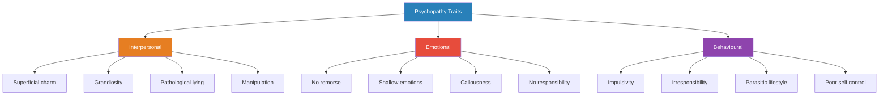
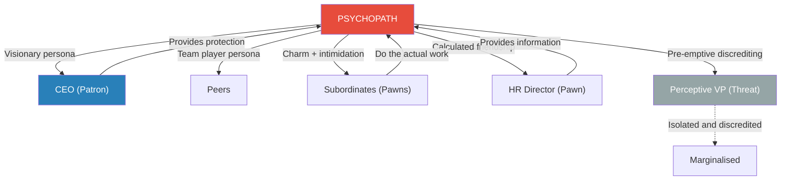
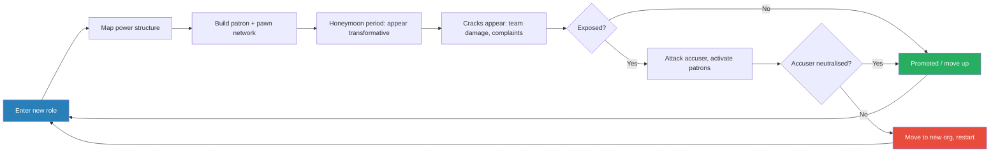
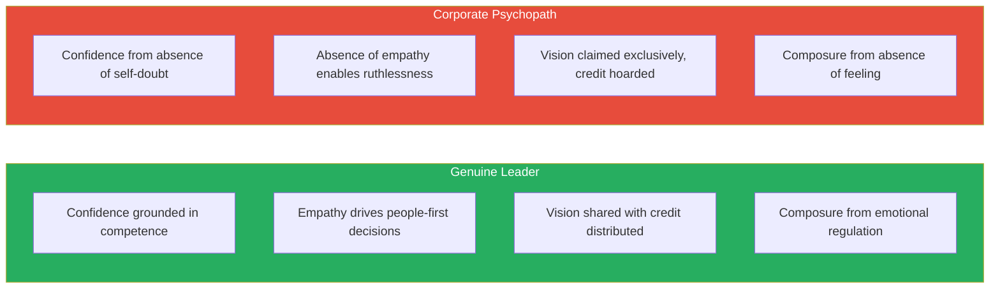

# Snakes in Suits — Paul Babiak & Robert D. Hare

> Paul Babiak and Robert Hare ask an unsettling question: what happens when a psychopath walks into a job interview?
> The answer: they get hired. Often enthusiastically.
> Because the traits of psychopathy — superficial charm, fearless dominance, grandiosity, cool under pressure, willingness to take bold action without hesitation — look remarkably like the traits companies say they want in leaders.
> This book maps the psychopath's corporate playbook from first handshake to corner office, explains why organisations are structurally vulnerable, and teaches you to recognise the pattern before you become a pawn in someone else's game.
> Babiak brings the organisational psychology; Hare brings decades of clinical research on criminal psychopathy. Together they reveal that the boardroom and the prison yard share more residents than anyone would like to admit.

---

## About the Authors

Paul Babiak is an industrial and organisational psychologist who advises companies on executive assessment and leadership development. He first noticed the psychopathy-leadership overlap while consulting for a company where the most "dynamic" executive was also the most destructive — charming in the boardroom, devastating behind closed doors. Robert Hare is the world's leading researcher on psychopathy and the creator of the Psychopathy Checklist-Revised (PCL-R), the gold standard for clinical assessment of psychopathic traits. He spent decades studying psychopaths in prison populations before realising that many of them had traded jumpsuits for business suits. Their collaboration began in the late 1990s when Babiak contacted Hare after recognising textbook psychopathic behaviour in a corporate client, and the partnership produced this book — the definitive treatment of psychopathy in the workplace.

---

## The Big Idea

- <b style="color: #2980b9">Psychopathy and corporate leadership share surface traits</b> — charm, confidence, decisiveness, risk tolerance, and emotional detachment
- Companies routinely mistake psychopathic traits for leadership potential — especially during times of change, uncertainty, or crisis when "bold" leadership is most prized
- The confusion is not accidental:
  - The interview process rewards exactly what psychopaths are best at — first impressions, storytelling, and reading what the audience wants to hear
  - Performance reviews often capture impressions rather than outcomes, and psychopaths are masters of impression management
  - Reference checks are cursory or nonexistent, allowing psychopaths to move between organisations and reinvent themselves each time
- <b style="color: #e74c3c">Corporate psychopaths don't just survive in organisations — they thrive</b>, because the structure rewards exactly what they are good at: impression management, self-promotion, and ruthless political manoeuvring
- They climb by building networks of **pawns** (useful people) and **patrons** (powerful protectors), then discard anyone who sees through them
- The damage is not limited to individual victims — psychopaths corrode team cohesion, destroy institutional trust, and hollow out organisations from within
- <b style="color: #27ae60">Understanding the pattern is the first and most important defence</b> — once you can see the playbook, the moves become predictable

The heatmap reveals which vulnerabilities matter most at each phase: poor reference checking enables entry, weak HR enables manipulation, and hero culture enables ascension — a defence strategy must address different vulnerabilities at different stages.

> [!tip] Core Insight
> The traits that make someone a successful psychopath and the traits that organisations say they want in leaders overlap so much that the hiring process itself becomes a selection mechanism for psychopathy.

---

## Key Concepts at a Glance

| Concept | One-line summary |
|---------|-----------------|
| **Psychopathy Checklist (PCL-R)** | Hare's 20-item diagnostic tool — the gold standard for identifying psychopathic traits |
| **The Psychopathic Fiction** | The persona a psychopath constructs for each target audience |
| **Assessment Phase** | The psychopath maps the organisation's power structure and identifies useful people |
| **Manipulation Phase** | Building a network of pawns and patrons through tailored personas |
| **Confrontation Phase** | When exposed, the psychopath attacks the accuser rather than defending the behaviour |
| **Ascension Phase** | Moving up by discarding the used and leveraging patron protection |
| **Pawns** | People used for access, information, or cover — then discarded |
| **Patrons** | Senior figures who sponsor the psychopath and protect them from scrutiny |
| **Organisational Vulnerabilities** | Structural features that make companies easy hunting grounds |
| **The Mask of Sanity** | The psychopath's ability to mimic normal emotional responses convincingly |
| **Emotional Poverty** | The shallow inner life that enables manipulation without guilt or remorse |
| **Corporate Camouflage** | How organisational chaos, restructuring, and change provide cover for psychopathic behaviour |

---

## Part I: Psychopaths Among Us

### Chapter 1 — Why Study Psychopaths at Work?

*Babiak opens with a disarming confession: he met his first corporate psychopath while working as a consultant and didn't recognise what he was seeing until the damage was already done.*

- Babiak was consulting for a mid-sized company when he was asked to assess a newly hired executive who was generating wildly contradictory reviews
  - Senior leadership described him as "a breath of fresh air" — dynamic, visionary, exactly what the company needed
  - His direct reports described a very different person — someone who took credit for their work, made promises he never kept, and turned people against each other
- <b style="color: #2980b9">The paradox of contradictory reputations</b> became the starting point for the entire book:
  - How can one person be simultaneously the best hire the CEO ever made and the worst boss anyone has ever had?
  - The answer is that both descriptions are accurate — they are just seeing different masks
- This led Babiak to contact Robert Hare, whose decades of research on criminal psychopaths provided the framework to understand what Babiak was observing in the corporate world
- The collaboration revealed something the academic world had largely ignored:
  - Psychopathy research focused almost entirely on prison populations
  - The assumption was that psychopaths were criminals — violent, impulsive, easily caught
  - <b style="color: #e74c3c">Nobody was asking what happened when a psychopath was intelligent enough, disciplined enough, and socially skilled enough to avoid prison altogether</b>

> [!example] Babiak's Wake-Up Call
> - While consulting for a company undergoing restructuring, Babiak was asked to evaluate a newly promoted VP
> - The VP had been hired with glowing recommendations and quickly became a favourite of the CEO
> - But within months, three talented managers in his division had resigned, morale had cratered, and two projects were behind schedule
> - When Babiak interviewed staff, he heard a consistent pattern: the VP charmed upward, bullied downward, and took credit for everyone else's work
> - When Babiak raised concerns with the CEO, the CEO dismissed them — "He's just a strong leader, not everyone can handle that"
> - It was only after connecting with Hare that Babiak understood the pattern: this was not a management style problem. This was psychopathy.
> **The lesson:** The most dangerous psychopaths are the ones no one believes are dangerous.

---

### Chapter 2 — Who Are These People?

*Hare's decades of clinical research provide the scientific foundation — psychopathy is not anger, not narcissism, not antisocial behaviour. It is a distinct personality structure with measurable, predictable characteristics.*

- <b style="color: #2980b9">Psychopathy</b> is a personality disorder characterised by a specific cluster of interpersonal, emotional, and behavioural traits:
  - **Interpersonal:** superficial charm, grandiosity, pathological lying, manipulation
  - **Emotional:** lack of remorse, shallow affect, callousness, failure to accept responsibility
  - **Behavioural:** impulsivity, irresponsibility, parasitic lifestyle, poor behavioural controls
- Critical distinctions the authors make:
  - Psychopathy is not the same as being "antisocial" — many psychopaths are highly social, even magnetic
  - Psychopathy is not the same as psychosis — psychopaths are fully rational, they know right from wrong, they simply do not care
  - Not all psychopaths are violent — violence is one possible expression, but manipulation and exploitation are far more common
  - <b style="color: #27ae60">Psychopathy exists on a spectrum</b> — someone can score moderately on the PCL-R and still cause enormous damage in an organisation

This diagram maps the three dimensions of psychopathy — the interpersonal mask that gets them hired, the emotional vacuum that lets them exploit without guilt, and the behavioural patterns that eventually give them away.

---

#### The Psychopathy Checklist-Revised (PCL-R)

- Hare developed the <b style="color: #2980b9">PCL-R</b> as a 20-item diagnostic instrument scored by trained clinicians
- Each item is scored 0, 1, or 2 — maximum score of 40
- A score of 30+ is the clinical threshold for psychopathy in North American populations
- The checklist is divided into two factors:
  - **Factor 1** (Interpersonal/Affective): the "personality" of psychopathy — charm, manipulation, lack of empathy, grandiosity
  - **Factor 2** (Social Deviance): the "lifestyle" of psychopathy — impulsivity, irresponsibility, parasitic behaviour, criminal versatility
- <b style="color: #e74c3c">Corporate psychopaths tend to score high on Factor 1 but lower on Factor 2</b> — they have the personality traits but enough impulse control to avoid the criminal justice system

The split is clear: corporate psychopaths load heavily on the interpersonal/personality traits (left side) while maintaining enough impulse control on the lifestyle traits (right side) to channel their predation through organisational systems rather than criminal ones.

| Factor 1 (Personality) | Factor 2 (Lifestyle) |
|------------------------|---------------------|
| Glibness / superficial charm | Need for stimulation |
| Grandiose self-worth | Parasitic lifestyle |
| Pathological lying | Poor behavioural controls |
| Conning / manipulative | Early behavioural problems |
| Lack of remorse | Lack of realistic goals |
| Shallow affect | Impulsivity |
| Callous / lack of empathy | Irresponsibility |
| Failure to accept responsibility | Juvenile delinquency |

Corporate psychopaths are disproportionately loaded on the left column — the traits that look like leadership qualities in a job interview.

> [!tip] Core Insight
> The corporate psychopath is not a watered-down version of the criminal psychopath. They share the same core personality structure (Factor 1) — the difference is that they have enough behavioural control (lower Factor 2) to channel their predation through organisational systems rather than criminal ones.

---

#### Prevalence — How Common Are They?

- Roughly 1% of the general population scores high enough on the PCL-R to qualify as psychopathic
- Babiak and Hare's own research found rates of 3-4% among corporate professionals they studied
- Some researchers estimate rates as high as 4-12% among senior executives and C-suite leaders
- <b style="color: #e74c3c">Even the conservative estimate means you will work with at least one psychopath during your career</b>

The concentration effect is striking: psychopathy rates roughly triple from the general population to corporate professionals and may quadruple again at the senior executive level — exactly the positions where they can cause the most organisational damage.

- The authors emphasise that sub-clinical levels — people who score in the moderate range — may be even more common and still cause significant harm:
  - They are harder to detect because they do not match the Hollywood stereotype
  - They are often described as "difficult" or "political" rather than pathological
  - Their behaviour is rationalised as "that's just how business works"

---

#### The Mask of Sanity

- The term comes from Hervey Cleckley's pioneering 1941 book of the same name
- It describes the psychopath's ability to present a convincing facade of normal emotional functioning
- <b style="color: #2980b9">The mask is not a disguise they put on — it is the only interface they have with the world</b>
  - Normal people express genuine emotions and sometimes conceal them
  - Psychopaths have no genuine emotional depth to express — the mask is all there is
- What makes the mask so effective:
  - Psychopaths study normal people the way a zoologist studies animals — from the outside, with clinical detachment
  - They learn which emotional displays produce which responses
  - They become fluent in the language of emotion without ever feeling it
  - This gives them an advantage: they can deploy emotion strategically while everyone else is actually experiencing it

> [!example] The Interview Chameleon
> - Babiak describes a job candidate who was interviewed by four different executives in a single day
> - To the CEO, he was a strategic visionary who spoke in terms of market disruption and bold innovation
> - To the CFO, he was data-driven and fiscally conservative, emphasising ROI and cost discipline
> - To the HR director, he was a people-first leader who cared deeply about culture and development
> - To a fellow VP, he was a competitive hard-charger who loved to win
> - Each interviewer gave him a top rating. None of them compared notes closely enough to notice they had met four different people.
> **The lesson:** Psychopaths do not have a personality. They have a repertoire of personalities, deployed on demand.

---

### Chapter 3 — What You See May Not Be What You Get

*The authors dismantle the assumption that you can read character from behaviour — because psychopaths are so skilled at performing "character" that the performance is indistinguishable from the real thing.*

- <b style="color: #2980b9">The Psychopathic Fiction</b> is the authors' term for the persona a psychopath constructs for each relationship
  - It is not a single mask — it is a collection of masks, each tailored to a specific audience
  - The fiction is built from careful observation of what each target values, fears, and responds to
  - It includes backstory, emotional displays, personal anecdotes, and apparent vulnerability — all fabricated
- Why the fiction is so convincing:
  - Most people project their own emotional experience onto others — "he seems genuine because I would only say that if I genuinely felt it"
  - <b style="color: #e74c3c">This projection is the psychopath's greatest ally</b> — your own empathy becomes the tool they use against you
  - People who have never encountered a psychopath have no mental model for someone who can simulate emotion perfectly without feeling any of it
- The fiction is maintained through several techniques:
  - **Mirroring** — reflecting back the target's own values, opinions, and communication style
  - **Love-bombing** — overwhelming attention, praise, and apparent interest in the early stages of a relationship
  - **Selective disclosure** — sharing calculated personal details to create a sense of intimacy and reciprocity
  - **Strategic vulnerability** — displaying manufactured weakness to lower the target's defences

> [!example] The Manufactured Backstory
> - A senior manager described a new colleague who shared a moving story about growing up poor, working his way through college, and overcoming family tragedy
> - The story built immediate sympathy and trust — colleagues felt they knew him on a deep level within weeks
> - Months later, when the colleague's behaviour turned destructive, the manager investigated his background
> - Multiple details of the story turned out to be fabricated — he had grown up comfortably middle-class, and the "family tragedy" never happened
> - By the time the truth surfaced, the emotional bond the story had created made it difficult for people to accept the new information
> **The lesson:** Psychopaths invest heavily in backstory because they understand that people who feel emotionally connected to you will resist evidence against you.

---

> [!abstract] How the Psychopathic Fiction Is Built
> 1. **Observe** — watch the target closely; note what they value, what they fear, what makes them light up
> 2. **Mirror** — reflect their values and communication style back to them
> 3. **Disclose** — share calculated personal information to create a false sense of intimacy
> 4. **Love-bomb** — pour on attention, praise, and manufactured interest
> 5. **Lock in** — once trust is established, begin making small requests; the target is now invested
> 6. **Exploit** — use the relationship for access, information, cover, or advancement
> 7. **Discard or maintain** — depending on ongoing usefulness, either keep the target in the network or cut them loose

---

## Part II: The Corporate Psychopath's Playbook

### Chapter 4 — Assessment Phase: Entering the Organisation

*The psychopath enters a new organisation the way a predator enters new territory — mapping power, identifying prey, and establishing position before anyone knows they are being studied.*

- The first thing a corporate psychopath does upon entering an organisation is <b style="color: #2980b9">map the informal power structure</b>:
  - Who actually makes decisions? (Not always who the org chart says)
  - Who has the CEO's ear?
  - Who controls information flow?
  - Who is vulnerable — lonely, insecure, desperate for approval?
  - Who is dangerous — perceptive, independent, likely to see through the mask?
- This mapping happens rapidly — often within the first few days
- The psychopath sorts people into three categories:
  - **Potential Patrons** — senior people who can be cultivated as sponsors and protectors
  - **Potential Pawns** — useful people who can provide information, access, cover, or scapegoating material
  - **Irrelevant** — people with no power and no useful function; these are simply ignored
- <b style="color: #e74c3c">The assessment phase looks like "getting to know people" and "hitting the ground running" — it is actually reconnaissance</b>

> [!example] Dave's First Week (from the running narrative)
> - Dave, the book's composite psychopath character, starts his new job by wandering the hallways making conversation
> - He asks everyone about their role, their frustrations, and their relationship with their boss
> - To the IT manager, he is sympathetic about budget constraints; to the marketing director, he is enthusiastic about upcoming campaigns; to the CEO's assistant, he is warm and attentive
> - By the end of week one, Dave knows more about the company's informal politics than most people learn in a year
> - He has identified his patron target (the CEO), his primary pawns (a lonely HR director and an insecure department head), and his primary threat (a perceptive finance VP who asked pointed questions during his interview)
> **The lesson:** The psychopath's most dangerous work happens before anyone knows they are working.

---

#### The Interview as Audition

- Babiak and Hare devote significant attention to how psychopaths exploit the hiring process:
  - Job interviews are one of the few situations where superficial charm, confident storytelling, and emotional reading skills are directly rewarded
  - The standard behavioural interview ("Tell me about a time when...") is trivially easy to game for someone who lies fluently
  - Interviewers are biased toward likability — study after study shows that "culture fit" and "gut feeling" dominate over objective criteria
- <b style="color: #27ae60">The authors argue that the interview process itself is a selection mechanism for psychopathic traits</b>:
  - It favours presentation over substance
  - It rewards confidence (even unfounded confidence) over competence
  - It punishes honest self-assessment ("I'm still developing that skill") while rewarding grandiosity ("I turned around a $50 million division")
  - Reference checks are often perfunctory, and psychopaths are skilled at managing which references get called

> [!example] The Perfect Candidate
> - Hare describes an experiment where MBA students were shown two job interview videos
> - Candidate A was competent but nervous — gave solid answers but fumbled eye contact and hesitated before responding
> - Candidate B was charismatic and smooth — gave less substantive answers but delivered them with complete confidence and warmth
> - An overwhelming majority of students chose Candidate B
> - When debriefed, students acknowledged that Candidate A had better qualifications — but they "felt better" about Candidate B
> - Hare's point: "feeling good" about a candidate is exactly the response psychopaths are designed to produce
> **The lesson:** If your hiring process selects primarily for charm and confidence, you are selecting for the traits that psychopaths have in abundance.

---

### Chapter 5 — Manipulation Phase: Building the Network

*Once the terrain is mapped, the psychopath begins constructing a web of relationships — each one tailored to extract maximum value from the person on the other end.*

- The manipulation phase is where <b style="color: #2980b9">the pawn-and-patron network</b> takes shape
- The psychopath maintains multiple personas simultaneously:
  - **To patrons (senior leaders):** visionary, loyal, bold, "one of us"
  - **To peers:** team player, collaborator, idea generator
  - **To subordinates:** alternating charm and intimidation — keeping people off balance
  - **To potential threats:** either seduction (co-opt them) or pre-emptive discrediting (neutralise them)
- <b style="color: #e74c3c">The key insight is that the psychopath is not building genuine relationships — they are building an information and influence network</b>
  - Every conversation is data collection
  - Every shared confidence is ammunition
  - Every favour creates an obligation
  - Every vulnerability revealed is a lever for future use

This diagram shows the psychopath at the centre of a carefully constructed web — each relationship serves a different function, and each persona is calibrated for that function.

---

#### Pawns — The Expendable Network

- **Pawns** are people the psychopath cultivates for specific, time-limited purposes:
  - **Information pawns** — people who share office gossip, internal politics, or confidential data without realising it is being used strategically
  - **Access pawns** — people whose position grants the psychopath entry to meetings, projects, or senior leaders they would not otherwise reach
  - **Cover pawns** — people who can be used to create alibis or provide cover stories ("I was with Sarah all afternoon")
  - **Scapegoat pawns** — people set up to take the blame when something goes wrong
- The psychopath identifies pawns through a combination of:
  - **Vulnerability scanning** — who is insecure, lonely, new to the company, or desperate for validation?
  - **Flattery testing** — who responds most strongly to attention and praise?
  - **Loyalty testing** — who will share confidential information after relatively little social investment?
- <b style="color: #e74c3c">Pawns rarely realise they are being used until they are discarded</b>
  - The relationship feels genuine — the psychopath invested real time and attention
  - The discard is often abrupt and confusing — the pawn is simply cut off, ignored, or publicly blamed for something

> [!example] The Information Pawn
> - Babiak describes a case where a psychopathic manager befriended a junior analyst who had access to confidential financial data
> - The manager took the analyst to lunch regularly, asked about her weekend, remembered her children's names
> - During these lunches, the manager would casually ask about "how things were going" in the finance department — framing gossip as friendly conversation
> - The analyst, flattered by the attention of a senior manager, shared increasingly sensitive information
> - The manager used this information to position himself strategically in budget discussions, appearing to have "remarkable insight" into the company's financial position
> - When the information leak was eventually traced back, the analyst was disciplined; the manager expressed shock and sympathy
> **The lesson:** The pawn provides the raw material; the psychopath gets the credit and the pawn gets the blame.

---

#### Patrons — The Protective Shield

- **Patrons** are senior figures who become invested in the psychopath's success
- The psychopath selects patrons based on:
  - Positional power — can this person protect me from scrutiny?
  - Ego investment — will this person see my success as validation of their own judgement?
  - Accessibility — can I gain regular, informal access to this person?
- The patron relationship is the psychopath's most important investment:
  - The psychopath presents a carefully curated version of themselves that aligns with the patron's values and vision
  - They position themselves as the patron's protege, ally, or "right hand"
  - They make the patron feel wise, visionary, and validated for hiring/promoting them
- <b style="color: #27ae60">The patron becomes a shield against accountability</b>:
  - When complaints arise, the patron dismisses them — "He's just a strong personality"
  - When evidence of manipulation surfaces, the patron reinterprets it — "She's just politically savvy"
  - When someone tries to blow the whistle, the patron questions the whistleblower's motives — "You just can't handle a real leader"
- <b style="color: #e74c3c">The patron's ego is now invested</b> — admitting the psychopath is destructive means admitting their own judgement was wrong, so they resist evidence longer than anyone else

> [!example] The CEO's Golden Boy
> - In the Dave narrative, Dave quickly identifies the CEO as his ideal patron
> - Dave mirrors the CEO's communication style, echoes his strategic priorities, and positions himself as the one person who truly "gets" the CEO's vision
> - When two department heads complain about Dave's behaviour, the CEO dismisses their concerns: "Dave is disrupting the old guard. That's exactly why I hired him."
> - The CEO has now staked his reputation on Dave's success — making it psychologically impossible for him to hear negative feedback objectively
> - By the time the damage becomes undeniable, Dave has already leveraged the CEO's patronage into a promotion
> **The lesson:** The patron does not just protect the psychopath — the patron actively silences anyone who threatens the psychopath.

---

### Chapter 6 — Confrontation Phase: When the Mask Slips

*No mask is perfect forever. When someone sees through the persona, the psychopath does not retreat or apologise — they attack.*

- The confrontation phase begins when someone in the organisation recognises the pattern and tries to raise the alarm
- <b style="color: #2980b9">The psychopath's response to being exposed follows a predictable sequence</b>:
  1. **Deny** — "That never happened" / "You're misremembering"
  2. **Deflect** — "The real problem is the culture here" / "Everyone's under stress"
  3. **Discredit the accuser** — "She has a grudge" / "He's threatened by strong leadership"
  4. **Play victim** — "I can't believe someone would say that about me after everything I've done for this team"
  5. **Attack** — "If you pursue this, I'll make sure people know about your performance issues"
- <b style="color: #e74c3c">The psychopath never engages with the substance of the accusation</b>
  - They do not try to prove their innocence
  - They do not offer explanations for their behaviour
  - They focus entirely on destroying the credibility of the accuser
  - If the accuser has any vulnerabilities — personal problems, past mistakes, political enemies — those become the psychopath's weapons

> [!abstract] The Psychopath's Confrontation Playbook
> 1. **Deny the behaviour** — act confused or hurt that anyone would make such a claim
> 2. **Reframe the narrative** — the accuser is the problem, not the behaviour
> 3. **Activate patrons** — mobilise senior sponsors to question the accuser's motives
> 4. **Isolate the accuser** — cut off their access to allies and information
> 5. **Create a counter-narrative** — spread an alternative version of events through the pawn network
> 6. **Escalate selectively** — if the accuser persists, escalate to threats (veiled or direct)
> 7. **Force a resolution** — either the accuser backs down, is transferred, or is fired

---

#### The Gaslighting Component

- A critical element of the confrontation phase is <b style="color: #2980b9">gaslighting</b> — making the accuser doubt their own perception of reality:
  - "That's not what happened" — flatly denying documented events
  - "You're being too sensitive" — reframing legitimate concerns as emotional overreaction
  - "Everyone else thinks you're the problem" — manufactured consensus to isolate the accuser
  - "I'm worried about you" — reframing the confrontation as evidence of the accuser's instability
- Gaslighting is devastatingly effective because:
  - The psychopath delivers denials with complete calm and confidence — no tells, no hesitation
  - The accuser is usually emotionally activated (angry, scared, frustrated) — which makes them look "unstable" by comparison
  - <b style="color: #e74c3c">The calmer person is assumed to be the truthful one — a heuristic that psychopaths exploit deliberately</b>
  - Over time, repeated gaslighting erodes the accuser's confidence in their own memory and judgement
  - Victims of sustained gaslighting often describe a fog-like state where they can no longer trust their own perceptions
  - This is not weakness — it is a predictable neurological response to having your reality systematically contradicted by a confident, authoritative source

---

- Why confrontations usually fail to expose the psychopath:
  - The accuser typically has only their own experience as evidence — "he said, she said"
  - The psychopath has spent months or years building a positive reputation with senior leadership
  - The patron relationship means the accuser is essentially going up against the CEO's judgement
  - <b style="color: #e74c3c">Organisations have a strong bias toward stability</b> — it is easier to remove one complainer than to admit a systemic problem
  - HR departments often lack the training to recognise psychopathic patterns and default to mediation — which is useless against someone who does not argue in good faith

> [!example] The Whistleblower Who Lost
> - A mid-level manager noticed that a charismatic colleague was claiming credit for projects he had nothing to do with
> - She documented specific instances, gathered corroborating evidence from peers, and presented a careful case to HR
> - Before her meeting with HR, the colleague had already visited the HR director informally, expressing concern about the manager's "recent stress" and "declining performance"
> - In the HR meeting, the focus shifted from the colleague's behaviour to the manager's "attitude problem"
> - Within two months, the manager was placed on a performance improvement plan; the colleague was promoted
> - Three of the manager's corroborating witnesses declined to support her publicly — they had seen what happened and decided self-preservation was more important
> **The lesson:** The psychopath does not wait to be attacked. They pre-emptively discredit potential accusers before the accusation is even made.

---

### Chapter 7 — Ascension Phase: The Climb

*The psychopath has mapped the terrain, built the network, neutralised threats, and secured patron protection. Now they move up — leaving a trail of discarded pawns and bewildered former colleagues behind them.*

- The ascension phase is characterised by:
  - Rapid promotion that surprises colleagues who know the psychopath's actual contributions
  - A pattern of "fresh starts" — moving to new divisions, new projects, or new companies before the damage in the previous role becomes undeniable
  - The systematic abandonment of people who are no longer useful
  - The rewriting of history — past failures are attributed to others, past successes are claimed exclusively
- <b style="color: #27ae60">The psychopath's career trajectory creates a distinctive pattern</b>:
  - Stellar first impressions at each new level
  - A honeymoon period of high performance (or the appearance of high performance)
  - Growing complaints from subordinates and peers that are dismissed by senior leadership
  - Eventually the damage becomes visible, but by then the psychopath has already moved on or up
  - The cycle repeats at the next level

This diagram captures the repeating cycle of the corporate psychopath's career — enter, manipulate, ascend, repeat. The cycle can continue for decades because each new environment provides fresh targets who have never seen the pattern.

---

- The human cost of the ascension:
  - Pawns who were discarded often experience confusion, self-doubt, and a sense of betrayal
  - They may blame themselves — "Maybe I wasn't good enough" — because the psychopath's charm was so convincing that the discard feels personal
  - Teams left behind after the psychopath moves up are often dysfunctional:
    - Trust has been destroyed
    - The best performers have already left
    - Institutional knowledge has been hoarded, distorted, or lost
    - <b style="color: #e74c3c">The damage is attributed to "team problems" rather than to the person who caused them — because that person is now two levels up and untouchable</b>

> [!example] Dave's Promotion
> - In the book's running narrative, Dave is promoted to VP after just eighteen months
> - His former direct reports are stunned — they know his "strategic initiatives" were actually their ideas, repackaged and presented upward
> - But the CEO has championed Dave personally, and questioning the promotion would mean questioning the CEO's judgement
> - Three months after Dave's promotion, his old department's metrics begin to decline — the people doing the actual work have left or disengaged
> - The decline is attributed to "change management challenges," not to the person who created the chaos
> **The lesson:** By the time the damage is visible, the psychopath is no longer in the blast radius.

---

## Part III: Why Organisations Are Vulnerable

### Chapter 8 — Corporate Camouflage: The Organisation as Hunting Ground

*Babiak and Hare argue that psychopaths don't just exploit individual weaknesses — they exploit structural features of modern organisations that create ideal conditions for manipulation.*

- <b style="color: #2980b9">Organisational vulnerabilities</b> that create fertile ground for corporate psychopaths:

| Vulnerability | Why It Helps the Psychopath |
|--------------|---------------------------|
| Rapid change / restructuring | Creates confusion, power vacuums, and information gaps that mask manipulation |
| Flat or matrix structures | Ambiguous reporting lines make it easier to play different audiences |
| Weak HR / vague promotion criteria | Impression management fills the vacuum left by absent objective metrics |
| Hero culture | Organisations that worship "bold leaders" create perfect camouflage |
| Poor reference checking | Psychopaths move between organisations, reinventing themselves each time |
| Results over process | Short-term wins hide long-term destruction of teams and trust |
| Growth and acquisition | New people, new structures, new confusion — ideal for the psychopath to exploit |
| Remote / distributed work | Less face-to-face interaction means fewer opportunities for people to compare notes |

---

- <b style="color: #27ae60">The critical structural problem is that organisations evaluate leaders based on outcomes that psychopaths can fake</b>:
  - Revenue numbers can be inflated in the short term by burning out teams, cutting corners, or claiming credit for others' work
  - "Strategic vision" is evaluated by how compellingly it is presented, not by whether it is actually achievable
  - "People skills" are assessed by how the leader makes senior leadership feel, not by how subordinates experience them
  - 360-degree reviews, when they exist, are often dismissed if the negative feedback comes from below — "disgruntled employees"

> [!example] The Restructuring Smokescreen
> - Babiak describes a company undergoing a major restructuring where a psychopathic executive used the chaos as cover
> - During the restructuring, normal accountability mechanisms were suspended — "we're all just figuring things out"
> - The executive used this window to build his patron network, discredit two rivals, and take credit for a successful product launch that was entirely the work of a team he had nothing to do with
> - When the restructuring settled and the damage in his actual area of responsibility became visible, he had already secured a promotion
> - The company attributed the problems to "restructuring growing pains" rather than to the executive
> **The lesson:** Chaos is the psychopath's friend. Any time an organisation is in flux, the conditions for manipulation are optimal.

---

#### Why Change and Transition Are Dangerous

- The authors identify periods of organisational change as particularly dangerous:
  - **Mergers and acquisitions** — new people, unclear hierarchies, everyone performing for new bosses
  - **Leadership transitions** — new CEO wants "fresh blood," creating opportunities for charismatic newcomers
  - **Rapid growth** — hiring speed takes priority over hiring rigour
  - **Crisis** — organisations in crisis want "bold, decisive leaders" — exactly the persona psychopaths are best at projecting
- <b style="color: #e74c3c">During change, the normal immune system of the organisation is suppressed</b>:
  - Tenured employees who would normally notice something wrong are themselves disoriented
  - Information flows are disrupted — people who would compare notes are separated
  - New relationships are forming — everyone is performing, so the psychopath's performance does not stand out
  - The urgency of the situation makes people more willing to overlook red flags — "We need action, not caution"

> [!tip] Core Insight
> Organisations are most vulnerable to corporate psychopaths precisely when they most need good leadership — during times of change, crisis, and uncertainty. The traits they urgently seek are the traits psychopaths can most convincingly fake.

---

### Chapter 9 — Enemy at the Gates: The Hiring Problem

*The hiring process is supposed to be a filter. For psychopaths, it is an audition — and they are born performers.*

- Babiak and Hare dissect why standard hiring practices fail to screen out psychopaths:
  - **Interviews reward performance, not competence** — the candidate who tells the best story wins, regardless of whether the story is true
  - **Behavioural interviews are easy to game** — psychopaths can fabricate compelling STAR stories (Situation, Task, Action, Result) on the spot
  - **Reference checks are cursory** — most companies call the references the candidate provides (who have been pre-selected and often coached) rather than conducting independent verification
  - **Background checks focus on criminal history and education** — psychopaths who avoid criminal conviction sail through
  - **Cultural fit is subjective** — "I felt a connection" is exactly the response psychopathic charm is designed to produce
- <b style="color: #2980b9">The "ideal candidate" problem</b>:
  - Companies write job descriptions that read like psychopath wish lists: "dynamic," "visionary," "comfortable with ambiguity," "strong communicator," "change agent"
  - These are not wrong qualities to want — but they are also the qualities psychopaths can most convincingly simulate
  - <b style="color: #e74c3c">The more a company emphasises personality over track record, the more vulnerable it is</b>

> [!abstract] Red Flags in the Hiring Process
> - Candidate's story is too perfect — every past role was a triumph, every departure was voluntary
> - References are limited to people the candidate chose; independent references are discouraged
> - Resume has unexplained gaps or frequent lateral moves between organisations
> - Candidate dominates the interview — charming, but never quite answers the specific question asked
> - Candidate demonstrates unusual knowledge of the interviewer's personal interests or background (indicating pre-interview research and preparation for manipulation)
> - Gut feeling is overwhelmingly positive after a surprisingly short interaction

---

## Part IV: Psychopathy Up Close — The Inner World

### Chapter 10 — The Emotional Vacuum

*What does it feel like to be a psychopath? The answer, as far as science can determine, is: not much.*

- The core of psychopathy is not evil intent — it is <b style="color: #2980b9">emotional poverty</b>:
  - Psychopaths do not experience emotions the way neurotypical people do
  - They can recognise emotions in others (cognitive empathy) but do not feel them (affective empathy)
  - Fear, guilt, shame, remorse, and deep attachment are absent or profoundly attenuated
  - What remains are shallow, short-lived emotional states — irritation, boredom, excitement, anger — but nothing sustained or deep
- This emotional poverty is both the psychopath's core deficit and their core advantage:
  - **Deficit:** they cannot form genuine bonds, cannot experience loyalty or love, and live in a world that is fundamentally empty
  - **Advantage:** they are never inhibited by guilt, never paralysed by fear, and never distracted by emotional attachment — they can act with pure strategic calculation
- <b style="color: #27ae60">Understanding emotional poverty is essential for understanding why psychopaths do what they do</b>:
  - They manipulate not because they enjoy causing pain (though some do) but because other people are means to an end — resources to be managed
  - They lie without hesitation because truth and falsehood carry the same emotional weight — which is none
  - They discard relationships without remorse because attachment never formed in the first place

---

#### The Neuroscience

- Hare's research using brain imaging has revealed measurable differences in how psychopaths process emotional information:
  - When shown emotionally charged images, psychopaths show reduced activity in the amygdala (the brain's fear and emotion centre)
  - They process emotional words (love, death, betrayal) the same way they process neutral words (table, chair, window) — there is no emotional "pop"
  - Their stress response is attenuated — situations that would produce anxiety in normal people produce mild interest or nothing at all
  - <b style="color: #2980b9">This is not a learned behaviour — it appears to be a neurological difference that is present from early in life</b>
- The implications for the workplace:
  - The psychopath who stays calm in a crisis is not brave — they genuinely do not feel the fear that would slow down a normal person
  - The psychopath who fires a loyal employee without flinching is not "tough-minded" — they genuinely do not feel the guilt that would trouble a normal manager
  - The psychopath who lies smoothly under pressure is not skilled at deception — they genuinely do not experience the physiological arousal that makes lying uncomfortable for most people

> [!example] The Polygraph Problem
> - Hare describes how traditional lie detectors (polygraphs) are unreliable with psychopaths
> - Polygraphs measure physiological arousal — sweating, heart rate, blood pressure changes — that accompany lying in normal people
> - For psychopaths, lying produces no more arousal than telling the truth
> - In studies, psychopathic subjects passed polygraph tests at significantly higher rates than non-psychopathic liars
> - This has direct implications for corporate investigations: a psychopath confronted with evidence of wrongdoing will deny it with the same physiological calm as telling the truth
> **The lesson:** The tools we use to detect deception were designed for people who feel something when they lie. Psychopaths do not.

---

### Chapter 11 — The Language of Psychopathy

*Psychopaths speak fluently, persuasively, and often movingly — but a careful listener can detect something fundamentally off in how they use language.*

- Hare's research on psychopathic language reveals distinctive patterns:
  - **Instrumental language** — every statement serves a purpose; nothing is said for the sake of connection or sharing
  - **Logical inconsistency** — psychopaths often contradict themselves within a single conversation, and if challenged, simply deny the contradiction or change the subject
  - **Past-tense distancing** — when describing harmful actions, psychopaths use language that distances them from the event ("mistakes were made" rather than "I made a mistake")
  - **Cause-and-effect reversal** — "She made me do it" / "If you hadn't provoked me" — the victim is reframed as the cause
  - **Emotional vocabulary without emotional depth** — they use emotional words correctly but without the prosody and context that indicate genuine feeling
- <b style="color: #2980b9">Word salad and topic jumping</b>:
  - In longer conversations, psychopaths sometimes lose track of their own narrative threads
  - They jump between topics, use words in slightly wrong contexts, and create an overall impression of depth that dissolves under analysis
  - <b style="color: #e74c3c">This is not evidence of low intelligence — it is evidence that language is a tool for manipulation, not communication</b>

> [!tip] Core Insight
> Normal people use language to share their inner world with others. Psychopaths use language to manage other people's impressions. The words sound the same but the function is entirely different.

---

## Part V: The Corporate Psychopath vs. Leadership

### Chapter 12 — Psychopathy vs. Leadership: The Dangerous Overlap

*The authors confront the uncomfortable reality that the traits companies select for in leaders overlap significantly with the traits that define psychopathy.*

- <b style="color: #2980b9">The Psychopathy-Leadership Confusion Table</b>:

| Psychopathy Trait | Mistaken for... | How to Tell the Difference |
|-------------------|-----------------|---------------------------|
| Superficial charm | Charisma, executive presence | Charm is selective — different for different audiences |
| Grandiosity | Vision, confidence, ambition | Claims do not match verifiable track record |
| Fearless dominance | Decisiveness under pressure | Decisions serve the individual, not the team or organisation |
| Lack of empathy | Tough-mindedness, ability to make hard calls | Empathy is absent even in situations with no strategic benefit |
| Manipulation | Political skill, stakeholder management | Manipulation is covert and self-serving rather than transparent and mutual |
| Pathological lying | Storytelling, strategic communication | Stories change depending on the audience; details cannot be verified |
| Shallow emotions | Composure, emotional resilience | Emotional responses are performed rather than felt |
| Impulsivity | Bias for action, entrepreneurial instinct | Actions serve short-term personal gain at the expense of long-term institutional health |

---

- The overlap is not coincidental — it is structural:
  - Modern leadership theory emphasises **transformational leadership**: charisma, vision, inspiration, individualised attention
  - Every one of these qualities can be faked by a psychopath — and psychopaths are better at faking them than genuine leaders are at demonstrating them
  - This is because genuine leaders are constrained by reality — they hedge, they acknowledge uncertainty, they share credit
  - <b style="color: #e74c3c">Psychopaths are unconstrained by reality — they project absolute confidence because they genuinely do not feel doubt</b>
- The authors cite research suggesting:
  - 3-4% of senior executives may score in the clinical range for psychopathy (compared to 1% of the general population)
  - Some studies suggest rates as high as 12% in certain industries and leadership levels
  - The higher the level, the more the traits are rewarded and the more the damage is attributed to other factors

The surface behaviours look identical — the mechanisms underneath are completely different. One is driven by genuine capability and care; the other by strategic calculation and emotional emptiness.

---

> [!example] The "Turnaround Artist"
> - Babiak describes a case study of a CEO hired to "turn around" a struggling division
> - He arrived with enormous energy — reorganised teams, launched new initiatives, gave charismatic town halls
> - In the first year, revenue ticked up and the board was thrilled
> - By the second year, the truth emerged: the revenue increase came from aggressive short-term tactics that cannibalised future growth
> - Team turnover was 40% — the best people had left, replaced by less experienced hires who did not challenge the CEO
> - The division's culture was described by one departing VP as "a personality cult built on fear"
> - When the board finally acted, the CEO negotiated a generous severance package and moved on to another "turnaround" opportunity
> **The lesson:** Short-term results can mask long-term destruction. By the time the damage is visible, the psychopath has moved on.

---

## Part VI: Protection and Detection

### Chapter 13 — Recognising the Pattern

*The authors provide a detailed framework for recognising corporate psychopaths before they reach positions of irrecoverable power.*

- <b style="color: #27ae60">The most reliable indicator is not any single behaviour — it is the pattern of contradictory reputations</b>:
  - Someone who is adored by senior leadership and feared or despised by everyone else
  - Someone whose reputation varies dramatically depending on who you ask
  - Someone who generates strong emotional responses — nobody is neutral about them
- Specific red flags to watch for:
  - **Credit claiming** — consistently takes credit for successes that involved others or that they had little to do with
  - **Blame deflecting** — failures are always someone else's fault; they are never responsible for negative outcomes
  - **Selective charm** — warmth and attention are deployed strategically, not generously
  - **High turnover below them** — people who work directly for them leave at unusual rates
  - **Promises forgotten** — verbal commitments are routinely denied or rewritten ("I never said that")
  - **History revision** — past events are described differently depending on what narrative currently serves them
  - **Information hoarding** — they control information flow, keeping people dependent on them for context
  - <b style="color: #e74c3c">When caught in a lie, they do not apologise — they attack the person who noticed</b>

> [!abstract] The Psychopath Detection Checklist (Informal)
> - Reputation split: adored above, feared below
> - Credit for successes is consistently claimed; blame for failures is consistently deflected
> - Colleagues who challenge them are marginalised, discredited, or forced out
> - Charm is selective and situational, not consistent
> - High turnover among their direct reports
> - Stories change depending on the audience
> - They respond to confrontation with counter-attack, not reflection
> - People who were initially close to them describe a sudden, confusing discard
> - They display intense emotional reactions that seem performative rather than genuine
> - There is a gap between the public persona and the private behaviour that multiple independent witnesses can corroborate

---

### Chapter 14 — What You Can Do

*For those who find themselves working with or under a corporate psychopath, the authors offer pragmatic advice — not about reforming the psychopath, but about protecting yourself.*

- <b style="color: #27ae60">The first and most important principle: do not try to reform them</b>
  - This is not a coaching problem, a communication problem, or a management style problem
  - Psychopathy is a personality structure — it does not respond to feedback, mentorship, or consequences
  - The psychopath will interpret your attempt to help as either an opportunity to manipulate you further or a threat to be neutralised
- Practical protective strategies:
  - **Document everything** — verbal promises mean nothing; get commitments in writing, keep email trails, save meeting notes
  - **Build your own information network** — do not rely on the psychopath's version of events; independently verify everything
  - **Watch actions, not words** — the most reliable data is what they do when they think no one is watching
  - **Protect your reputation proactively** — if you are identified as a potential threat, they will begin discrediting you before you even realise it; build broad relationships so no single person controls your narrative
  - **Avoid being a pawn** — be wary of someone who shows intense, rapid interest in you; genuine relationships develop at human speed, not at the pace of manipulation
  - **Do not engage in private confrontations** — if you must challenge them, do it in writing or with witnesses; they will deny anything said without corroboration
  - **Know when to leave** — if the psychopath has patron protection from senior leadership and the organisation's culture enables them, the most rational response may be to leave the blast radius entirely

> [!tip] Core Insight
> You cannot beat a corporate psychopath at their own game because you are constrained by conscience, empathy, and the truth — and they are not. The best strategy is not to win the game but to stop playing it.

---

- <b style="color: #e74c3c">Common mistakes people make when dealing with corporate psychopaths</b>:
  - **Assuming good faith** — believing the psychopath's expressions of concern, apology, or commitment are genuine
  - **Expecting consistency** — assuming that someone who was kind yesterday will be kind today
  - **Trying to reason with them** — presenting evidence and expecting them to change their behaviour
  - **Going to HR without preparation** — HR is often either untrained in recognising psychopathic patterns or already captured by the psychopath's charm
  - **Confiding in the wrong people** — your frustrations may be relayed back to the psychopath through the pawn network
  - **Waiting too long** — hoping the situation will resolve itself, or that others will eventually see the truth

> [!example] The Cost of Waiting
> - Babiak describes a team of four managers who all recognised that their divisional VP was manipulative, dishonest, and destructive
> - Each assumed someone else would raise the issue, or that the VP's behaviour would eventually be noticed by senior leadership
> - Over eighteen months, three of the four were pushed out — one by performance management engineered by the VP, one by "restructuring," and one who left voluntarily after burnout
> - The fourth, who had documented everything and built independent relationships with board members, eventually triggered an investigation — but only after enormous personal cost
> - By that time, the VP had been promoted once and was being considered for the C-suite
> **The lesson:** The psychopath benefits from every day of inaction. Waiting for the organisation to self-correct is rarely a viable strategy.

---

## Part VII: Organisational Defence

### Chapter 15 — Building Psychopath-Resistant Organisations

*The final section shifts from individual protection to structural reform — what can organisations do to become less hospitable to corporate psychopaths?*

- <b style="color: #2980b9">Hiring reforms</b>:
  - Structured interviews with standardised questions reduce the psychopath's ability to customise their performance for each interviewer
  - Independent reference checking — calling people the candidate did not provide as references, including former subordinates
  - Verifying specific claims in the resume and interview — not just checking that someone held a title, but whether they actually did what they claim they did
  - Multiple interviewers who compare notes systematically before making a decision
  - Longer evaluation periods before committing to permanent hire or promotion

- <b style="color: #2980b9">Performance evaluation reforms</b>:
  - 360-degree feedback that is weighted equally across all levels, not dismissed when it comes from below
  - Evaluating process and behaviour, not just outcomes — how were results achieved, not just what results were achieved
  - Tracking patterns over time rather than snapshots — the psychopath's pattern of stellar starts and eventual team destruction only becomes visible longitudinally
  - Separating "executive presence" from "executive performance" in evaluation criteria

- <b style="color: #2980b9">Cultural reforms</b>:
  - Creating channels for anonymous feedback that are genuinely safe and actually investigated
  - Training managers and HR in the patterns of manipulative behaviour (not just "difficult" behaviour)
  - <b style="color: #27ae60">Rewarding collaborative achievement rather than individual heroism</b> — organisations that celebrate lone wolves create perfect cover for psychopaths
  - Establishing a culture where questioning a popular leader is treated as courage rather than disloyalty

> [!abstract] Structural Defences Against Corporate Psychopaths
> 1. **Structured interviews** — standardised questions, scored rubrics, multiple interviewers
> 2. **Independent reference checking** — call people the candidate didn't list, especially former direct reports
> 3. **Weighted 360-degree reviews** — feedback from below counts as much as feedback from above
> 4. **Process evaluation** — how were results achieved, not just what results were achieved
> 5. **Longitudinal tracking** — pattern recognition over time, not snapshot assessments
> 6. **Anonymous reporting** — genuinely safe channels for raising concerns about leadership behaviour
> 7. **Collaborative culture** — reward team achievement, not individual heroism
> 8. **HR training** — equip HR professionals to recognise manipulation patterns, not just "conflict"

---

## The Psychopath's Toolkit — A Summary

*The tools psychopaths deploy are not exotic — they are the same influence techniques everyone uses, but deployed without the constraints of conscience, empathy, or truth.*

| Tool | How It Works | What It Looks Like |
|------|-------------|-------------------|
| **Mirroring** | Reflecting back the target's own values and style | "I feel exactly the same way about innovation" |
| **Love-bombing** | Overwhelming early attention and praise | Being the most attentive, interested person you've ever met |
| **Gaslighting** | Making targets doubt their own perceptions | "That's not what happened" / "You're being too sensitive" |
| **Triangulation** | Playing people against each other to maintain control | Telling A one thing and B another, then watching the conflict |
| **Selective vulnerability** | Sharing manufactured personal details to build false intimacy | "I've never told anyone this before, but..." |
| **Blame shifting** | Redirecting responsibility away from themselves | "If you had done your part, this wouldn't have happened" |
| **Information control** | Hoarding, distorting, or selectively sharing information | Being the only person with the "full picture" |
| **Intermittent reinforcement** | Alternating warmth and coldness to keep targets off balance | Unpredictable approval keeps people working harder for it |

- <b style="color: #e74c3c">The danger is not that these techniques are unfamiliar — the danger is that they are deployed with such consistency, such calculation, and such absence of guilt that the cumulative effect is devastating</b>
- Normal people use some of these techniques occasionally and feel bad about it
- Psychopaths use all of them, all the time, and feel nothing

---

## Psychopaths in Different Organisational Roles

*The psychopath adapts their strategy depending on their position in the hierarchy — the approach as a new hire differs dramatically from the approach as a senior leader.*

| Role | Primary Strategy | Characteristic Damage |
|------|-----------------|----------------------|
| **New hire** | Charm offensive, rapid patron cultivation | Co-opting mentors, displacing existing team dynamics |
| **Middle manager** | Information control, pawn management | Team turnover, suppressed dissent, stolen credit |
| **Senior leader** | Patron protection, narrative control | Cultural toxicity, purging of capable dissenters |
| **C-suite** | Board manipulation, crisis creation | Organisational decline masked by short-term optics |

- At each level, the psychopath's impact grows:
  - As a new hire, they damage a few relationships
  - As a middle manager, they damage a team
  - As a senior leader, they damage a department
  - As a C-suite executive, they can damage an entire organisation
- <b style="color: #e74c3c">The higher they climb, the harder they are to remove</b> — because their patron network becomes the board itself, and by the time the damage is obvious, the people who could have stopped them have already been pushed out

---

## The "Dave" Narrative — A Complete Arc

*Running through the book is the story of "Dave" — a composite character based on multiple real cases Babiak encountered in his consulting work. Dave's journey from interview to executive suite illustrates every concept in the book.*

> [!example]- Dave's Full Arc (Composite Case Study)
> - Dave interviews brilliantly — he researches each interviewer beforehand and tailors his persona to each one's values
> - In his first weeks, he maps the entire power structure through casual "get to know you" conversations
> - He identifies the CEO as his primary patron target and the finance VP as his primary threat
> - He befriends the HR director (a lonely, insecure woman grateful for the attention of a charming colleague) and uses her as an information pawn
> - Within months, he has the CEO's ear — mirroring the CEO's strategic priorities and positioning himself as "the only one who gets it"
> - When the finance VP raises concerns about Dave's expense reports, Dave has already told the CEO the VP is "resistant to change" and "threatened by new talent"
> - The VP's legitimate concerns are dismissed as personal conflict
> - Dave is promoted to VP after eighteen months — ahead of more qualified candidates
> - His old team's performance declines, attributed to "change management" rather than to Dave
> - At the VP level, Dave repeats the cycle: new patron (board member), new pawns, new threats neutralised
> - By year three, Dave is being considered for the C-suite
> **The lesson:** The Dave narrative shows that the playbook is not a single clever move — it is a systematic, repeating process that escalates with each organisational level.

---

## Psychopathy vs. Other Dark Personalities

*The authors are careful to distinguish psychopathy from related but distinct personality patterns — a distinction that matters because the strategy for dealing with each is different.*

- <b style="color: #2980b9">Psychopathy vs. Narcissism</b>:
  - Narcissists crave admiration and need a constant supply of validation — their ego is fragile underneath the grandiosity
  - Psychopaths do not need admiration — they are indifferent to what others think of them except insofar as it serves a strategic purpose
  - Narcissists are wounded by criticism and may rage or collapse; psychopaths are unmoved by criticism and simply adjust their strategy
  - Narcissists can sometimes change if their pain becomes great enough; psychopaths see no reason to change because they experience no pain
  - <b style="color: #e74c3c">The overlap is real — many psychopaths are also narcissistic — but the core mechanism is different: narcissism is driven by need, psychopathy by indifference</b>

- <b style="color: #2980b9">Psychopathy vs. Machiavellianism</b>:
  - Machiavellians are strategic and manipulative but they feel guilt — they choose to override it
  - Psychopaths do not override guilt because they do not experience it
  - Machiavellians can be taught ethical restraint; psychopaths cannot
  - In practice, the behaviour may look identical in the short term — the difference only becomes visible under sustained pressure or genuine consequence

- <b style="color: #2980b9">Psychopathy vs. Antisocial Personality Disorder (ASPD)</b>:
  - ASPD is the DSM diagnosis that overlaps most with psychopathy but is not identical
  - ASPD focuses on observable behaviour — rule-breaking, impulsivity, deceitfulness
  - Psychopathy (as measured by the PCL-R) includes the personality traits — the emotional and interpersonal core that drives the behaviour
  - Most psychopaths meet criteria for ASPD, but most people with ASPD are not psychopaths
  - <b style="color: #27ae60">The distinction matters practically: a person with ASPD may respond to consequences and incentives; a psychopath typically will not</b>

| Trait | Psychopath | Narcissist | Machiavellian |
|-------|-----------|-----------|---------------|
| Empathy | Absent | Impaired | Present but overridden |
| Guilt | Absent | Situational | Present but overridden |
| Motivation | Power, stimulation | Admiration, validation | Strategic advantage |
| Response to criticism | Strategic adjustment | Rage or collapse | Calculated response |
| Can change? | No evidence | Sometimes, with effort | Yes, with motivation |
| Core deficit | Emotional poverty | Fragile self-worth | Moral flexibility |

The three dark personality types often cluster together — what researchers call the <b style="color: #2980b9">Dark Triad</b> — but the psychopath is the most dangerous in an organisational setting because they are the least constrained by internal discomfort or fear of consequences.

The psychopath's profile is the most extreme on every dimension except changeability — where their near-zero score reveals the fundamental problem: unlike narcissists and Machiavellians, psychopaths have no internal discomfort to motivate change.

---

## The Emotional Aftermath — For Those Left Behind

*Babiak and Hare devote attention to the human cost — the psychological impact on people who were manipulated, used, and discarded by a corporate psychopath.*

- Victims of corporate psychopaths commonly experience:
  - **Confusion and self-doubt** — "Was it really that bad? Am I overreacting?"
  - **Betrayal trauma** — the relationship felt genuine, and the revelation that it was manufactured is devastating
  - **Professional damage** — their reputation may have been quietly destroyed before they realised they were a target
  - **Isolation** — other colleagues may distance themselves out of fear of being associated with the victim
  - **Identity questioning** — "How could I have been so stupid?" — leading to a fundamental loss of trust in their own judgement
- <b style="color: #27ae60">The authors emphasise that being manipulated by a psychopath is not a sign of weakness or stupidity</b>:
  - Psychopaths target people precisely because they have qualities worth exploiting — competence, empathy, loyalty, trust
  - The most generous, trusting, and empathetic people are the most vulnerable — because their strengths become the psychopath's entry points
  - Being fooled by a psychopath says more about the psychopath's skill than about the victim's intelligence

> [!example] The Aftermath of Discard
> - A senior project manager described working closely with a new director for eight months
> - The director was warm, supportive, and appeared to be a genuine mentor
> - He praised her work in meetings, included her in strategy discussions, and asked for her input on key decisions
> - Then one day, without warning, her name was removed from a major project, she was excluded from meetings, and the director stopped responding to her emails
> - When she asked what had happened, the director acted confused: "I don't know what you're talking about. Everything's fine."
> - She later learned that the director had taken credit for her work in a presentation to the board and no longer needed her
> - She spent months questioning her own perception of reality before a colleague confirmed the pattern
> **The lesson:** The discard is often the most psychologically damaging phase — because the victim cannot reconcile the warmth of the relationship with the cruelty of the ending.

---

## The Broader Implication — What Does This Say About Capitalism?

*Babiak and Hare tread carefully here, but the implication is unmistakable: the problem is not just that psychopaths infiltrate organisations — it is that organisations, as currently structured, reward psychopathic behaviour.*

- The authors do not argue that capitalism is inherently psychopathic — but they do argue that certain features of modern corporate life create a natural habitat for psychopaths:
  - **Short-term incentive structures** — quarterly earnings, annual bonuses, and stock options all reward exactly the kind of short-term, extractive behaviour psychopaths excel at
  - **Mobility without accountability** — executives who destroy value in one company can easily move to another without their track record following them
  - **The cult of personality** — business culture worships charismatic founders, "disruptive" leaders, and "bold" strategists — all of which are costumes a psychopath can wear
  - **Weak internal governance** — boards that meet quarterly, HR departments that lack clinical training, and performance reviews that measure impression rather than impact
- <b style="color: #e74c3c">The uncomfortable conclusion</b>: until organisations fundamentally change how they define, identify, and reward leadership, they will continue selecting for the traits that make psychopaths successful
- This is not a problem that can be solved by better screening alone — it requires a cultural shift in what organisations value:
  - From individual heroism to collaborative achievement
  - From charisma to character
  - From short-term results to sustainable performance
  - From "executive presence" to demonstrable impact on the people they lead

> [!tip] Core Insight
> The psychopath problem is not an HR problem. It is a structural problem. Organisations that define leadership as confidence, charisma, and decisiveness — without equally weighting empathy, integrity, and the development of others — will continue to promote psychopaths into positions of power.

---

## Key Quotes

Throughout the book, several lines crystallise the authors' arguments:

- "Not all psychopaths are in prison. Some are in the boardroom." — Robert Hare
- "They see people as pawns, not as people."
- "Conscience is what makes the rest of us human. Its absence is what makes them dangerous."
- "The mask is so convincing because it is all there is."
- "They don't feel your pain. They see it."
- "The best defence is knowing the game exists."
- "Psychopaths succeed not despite the system, but because of it."

---

## The Verdict

*Snakes in Suits* is the definitive book on psychopathy in the workplace. Babiak brings the organisational psychology and decades of firsthand consulting experience; Hare brings the clinical research that established the entire field of psychopathy science. Together they build a case that is both rigorous and deeply unsettling — because the implications go far beyond individual bad actors to the structural incentives that organisations create.

The book's most powerful contribution is the idea that psychopathy and leadership are not opposites — they share a dangerous surface resemblance that the modern hiring and promotion process is poorly equipped to distinguish. The composite narrative of "Dave" — tracked from interview to executive suite — makes the theory visceral and personal, and many readers will recognise someone they have worked with in these pages.

The weaknesses are minor but worth noting. The book was published in 2006 and some of the organisational structures it describes have evolved — remote work, flatter hierarchies, and increased awareness of toxic leadership have changed the landscape, though arguably in ways that make psychopathic manipulation both easier (less face-to-face scrutiny) and harder (more documented communication). The "Dave" narrative, while effective, is fictional — the authors acknowledge this is a composite, which gives sceptics room to question whether the pattern is as systematic as presented. And the book could go deeper on what to do once you recognise the pattern — the protection advice, while sound, is relatively brief compared to the diagnostic content.

Who benefits most: anyone who has ever worked with someone who was simultaneously charming to leadership and destructive to everyone below them — and wondered whether they were losing their mind. Also invaluable for HR professionals, executive coaches, and board members who make hiring and promotion decisions. If you are in a position to evaluate leaders, this book should change how you evaluate them.

How it compares: this is the scientific, organisational complement to Martha Stout's *The Sociopath Next Door* (which focuses on the general population) and George Simon's *In Sheep's Clothing* (which focuses on manipulation tactics). Jeffrey Pfeffer's *Power* and *7 Rules of Power* describe many of the same behaviours from an amoral, "this is how the world works" perspective — reading those alongside *Snakes in Suits* produces an uncomfortable question about where strategic behaviour ends and pathology begins.

---

## Related Reading

- [[The Sociopath Next Door - Martha Stout|The Sociopath Next Door]] — The broader population view of antisocial personality
- [[In Sheep's Clothing - George K. Simon|In Sheep's Clothing]] — The covert-aggression tactics that corporate psychopaths deploy daily
- [[7 Rules of Power - Jeffrey Pfeffer|7 Rules of Power]] — Pfeffer's amoral power framework overlaps uncomfortably with the psychopath's playbook
- [[Power - Jeffrey Pfeffer|Power]] — Why unsavoury behaviour gets rewarded in organisations
- [[The Gaslight Effect - Robin Stern|The Gaslight Effect]] — Understanding the specific manipulation tactic of gaslighting
- [[Emotional Blackmail - Susan Forward|Emotional Blackmail]] — How emotional manipulation works in close relationships
- [[The 48 Laws of Power - Robert Greene|The 48 Laws of Power]] — Many of the laws describe exactly what corporate psychopaths do naturally
- [[The Laws of Human Nature - Robert Greene|The Laws of Human Nature]] — Deep exploration of the dark side of human character
- [[Secrets to Winning at Office Politics - Marie G. McIntyre|Secrets to Winning at Office Politics]] — Navigating organisational dynamics when they are not pathological
