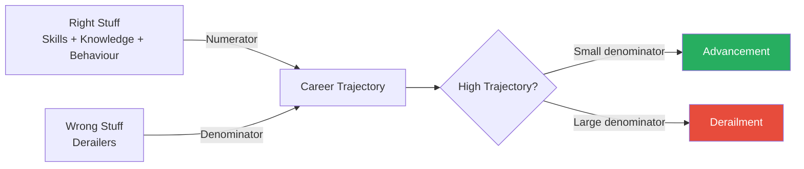
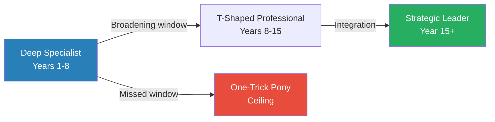
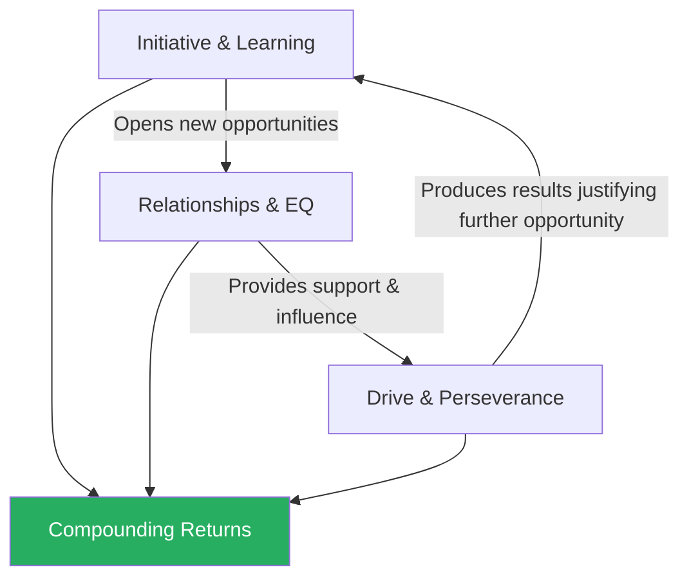
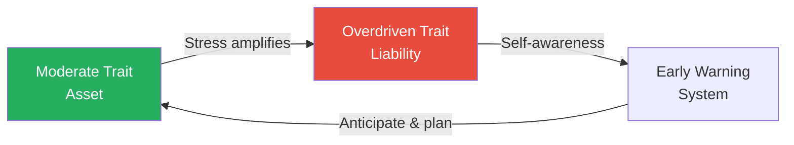
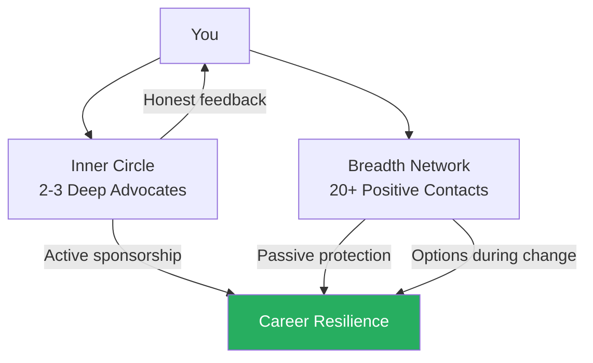
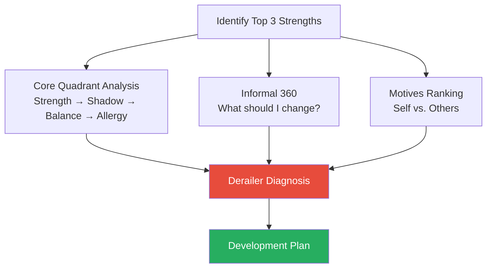

# The Right and Wrong Stuff — Carter Cast

> Carter Cast spent thirty years climbing the corporate ladder at PepsiCo, Walmart.com, and Electronic Arts — and nearly fell off it. A brutal performance review at Frito-Lay forced him to confront a question most professionals never honestly face: what if my biggest professional risk is not what I lack, but what I refuse to see? Drawing on derailment research from the Center for Creative Leadership, Hogan Assessments, Korn Ferry, and his own survey of over 100 managers who experienced career stalls, Cast identifies five archetypal failure modes that explain why intelligent, capable people plateau or self-destruct. The book's uncomfortable central finding: people with inflated self-assessments are six times more likely to derail than those who see themselves clearly. Intelligence and results get you in the door, but what gets you fired is the blind spot you refused to examine. This is the manual for that examination.

---

## About the Author

Carter Cast is a clinical professor of innovation and entrepreneurship at Northwestern University's Kellogg School of Management, where he teaches courses on new venture strategy and leadership. Before academia he held senior operating roles at PepsiCo (VP of Marketing at Frito-Lay), Walmart.com (CEO), and Electronic Arts (EVP of Online Entertainment). His own career nearly derailed at Frito-Lay when his boss handed him a performance review that was — by Cast's own description — devastating. He had spent years believing he was an exceptional performer while ignoring the interpersonal damage he was causing around him. That review became the seed of this book: Cast subsequently studied derailment systematically, surveying over one hundred managers and executives who had experienced career stalls, and synthesising decades of research from the Center for Creative Leadership, Hogan, Lominger, and Spencer Stuart. The result is a book that combines institutional research with deeply personal confession.

---

## The Big Idea

- Cast's central argument is that the professional world obsesses over strengths — what you are good at, what you should double down on, what your "signature" capability is — while ignoring the far more consequential question: <b style="color: #27ae60">what will take you down?</b>
- Over half of all managers and executives will experience career derailment at some point
- The cause is almost never a lack of talent
- It is a **behavioural pattern** — arrogance, rigidity, micromanagement, overspecialisation, or chronic overcommitment — that goes unaddressed because nobody tells you about it, or because you refuse to listen when they do
- Cast calls these patterns "the wrong stuff," and he argues they sit in the denominator of a formula that governs every career:
  - Your trajectory equals your right stuff divided by your wrong stuff
  - No matter how large the numerator grows, a sufficiently large denominator will destroy the result

---

- The book's second uncomfortable insight is that <b style="color: #e74c3c">organisations are almost useless at helping you identify these patterns</b>
- "Developing Others" ranks dead last — 67th of 67 — in manager competency research
- Only 3% of companies rate themselves as effective at developing their people
- Managers hate giving hard feedback
- Colleagues learn to avoid confrontation with defensive people
- The result is a **feedback vacuum** that allows derailers to compound silently, year after year, until the day someone decides you are more trouble than you are worth

The implication is clear and somewhat lonely: fixing a derailer often produces more career return than building another strength, but you will have to do the fixing yourself. Nobody is coming to save you. Cast wrote this book so you would have the diagnostic tools to save yourself.

---

## Key Concepts at a Glance

| Concept | One-line summary |
|---------|-----------------|
| **The Five Derailment Archetypes** | Five failure patterns — Captain Fantastic, Solo Flier, Version 1.0, One-Trick Pony, Whirling Dervish — explaining nearly all career stalls |
| **The Right Stuff Formula** | Career success as a ratio: strengths divided by derailers; even enormous numerators are destroyed by large denominators |
| **The Four Career Transitions** | The four management level-changes where derailment risk peaks because the rules of success change completely |
| **The Five Motives** | Fundamental work motivators (achievement, affiliation, power, autonomy, purpose) that determine whether a role energises or drains you |
| **The Core Quadrant Analysis** | Daniel Ofman's tool for seeing how overused strengths become weaknesses, with shadow, balancing quality, and allergic reaction |
| **The Horney-Hogan Framework** | Dark-side personality tendencies under stress, categorised into three coping strategies: moving against, away from, or toward people |
| **The Constituency Principle** | Broad advocacy across levels and functions is the only durable protection against organisational change |
| **Learning Agility** | The willingness to be a beginner and learn from novel experiences — the single factor most associated with career promotion |
| **The Three Distinctive Strengths** | Initiative, relationships, and drive — the behavioural differentiators that separate those who advance from those who stall |
| **The Feedback Death Spiral** | Defensive people receive less feedback, grow larger blind spots, and are eventually blindsided by consequences nobody warned them about |

---

## Cast's Own Story: The Seed of the Book

*Before Cast became a professor studying why careers fail, he was a career that was failing.*

> [!example] Cast's Devastating Review at Frito-Lay
> - At Frito-Lay, Cast was a rising star in marketing — aggressive, results-driven, confident to the point of abrasiveness
> - He believed his numbers spoke for themselves — they did, but they were not saying what he thought
> - His boss sat him down for a performance review that catalogued — with excruciating specificity — a pattern of interpersonal destruction:
>   - Bulldozing colleagues in meetings
>   - Dismissing ideas that were not his own
>   - Creating an atmosphere where people stopped volunteering candid opinions
> - Cast's first instinct was to argue; his second was to rationalise; his third — the one that eventually saved his career — was to sit with the review long enough to wonder if it might be true
> - He spent several painful weeks revisiting conversations and meetings, recognising a pattern he had been blind to
> - The review was not a surprise to anyone except Cast himself — colleagues had been experiencing the damage for years
> **The lesson:** Self-awareness is not optional — it is the master skill of career survival.

This experience gave Cast two foundational insights that structure the entire book:

- <b style="color: #27ae60">Self-awareness is the master skill of career survival</b>, and most people drastically overestimate how much of it they possess
  - The research bears this out: 90% of managers believe they are in the top 10% of performers — a statistical impossibility that reveals the depth of the self-deception problem
  - This is not modesty-fishing — the data consistently shows that the gap between perceived performance and actual performance is enormous, and it widens at higher levels of seniority
- Organisations are terrible at delivering the kind of feedback Cast received
  - His boss at Frito-Lay was exceptional precisely because he was willing to have a conversation most managers would rather avoid
  - Cast later learned that "delivering hard messages" ranks as the number one thing managers hate doing
  - His painful review was not the norm — it was the exception that proved how broken the norm is

---

> [!example] Cast's Motivational Mismatch at Walmart.com
> - Cast went on to become CEO of Walmart.com, the role most professionals aspire to
> - The role demanded a high **power motive** — constant constituency management, political navigation, and stakeholder influence
> - Cast's motives were achievement and autonomy — he loved building things and working independently
> - He found himself drained by the very activities the role demanded most, and energised by activities the role rarely offered
> - The mismatch was not one of capability but of motivation — a subtler and more insidious form of career risk
> - Over time, the slow drain of competent-but-joyless work eroded both his energy and his effectiveness
> **The lesson:** You can fail in a role not because you lack the ability, but because the role's daily demands drain rather than energise you.

These two experiences — the interpersonal derailment at Frito-Lay and the motivational mismatch at Walmart.com — became the twin pillars of Cast's research. The book is, in a sense, a systematic investigation of his own failures, broadened through research into a general theory of how brilliant careers come undone.

---

## Chapter 1: The Wrong Stuff — Why Careers Derail

*Cast opens with a provocation: the professional development industry has it backwards, obsessing over strengths while ignoring the behaviours that actually destroy careers.*

- The strengths movement — popularised by Gallup's StrengthsFinder and Marcus Buckingham's books — tells people to double down on what they are already good at
- Cast does not dispute that strengths matter — he disputes that they matter most
- When the Center for Creative Leadership studied why executives failed, the causes were overwhelmingly behavioural, not technical:
  - People did not derail because they lacked skills
  - They derailed because they could not manage their temper, could not adapt to new situations, could not let go of doing the work themselves, or could not stop saying yes to everything
- "The strengths movement, taken too far, masks critical blind spots," Cast writes
- The CCL research spans decades and thousands of executives, making the behavioural finding one of the most robust in the management literature
- Cast also draws on Hogan's database of over one million personality assessments, which reveals that personality-driven derailers are shockingly common and shockingly consistent across industries and cultures

> [!tip] Core Insight
> A derailer does not reduce your strengths by some fixed amount — it divides them, potentially to nothing. Working on your worst weakness can produce more career return than building another strength.

### The Right Stuff Formula

- Cast introduces his formula: <b style="color: #2980b9">Career Trajectory = Right Stuff / Wrong Stuff</b>
- The right stuff — skills, knowledge, operational ability, and three key behavioural strengths — sits in the numerator
- The wrong stuff — derailers — sits in the denominator
- This is not addition and subtraction — it is multiplication and division

Cast illustrates this with a simple mathematical example:

- A person with a "right stuff" score of 80 and a derailer score of 4 has a career trajectory of 20
- Reducing the derailer from 4 to 2 **doubles** the trajectory to 40
- Adding 20 more points to the right stuff (a massive investment) only moves the trajectory from 20 to 25
- <b style="color: #27ae60">Self-improvement on your weaknesses may matter more than self-improvement on your strengths</b>
- The mathematical logic is unforgiving: no amount of numerator growth can compensate for a large enough denominator

The comparison is stark: a massive 25% increase in strengths produces only a 25% improvement in trajectory, while cutting the derailer in half doubles it — the denominator has exponentially more leverage than the numerator.

The formula reveals why reducing a derailer (shrinking the denominator) produces disproportionate returns compared to adding yet another strength to an already large numerator.

---

### The Five Archetypes at a Glance

| Archetype | Core Derailer | Behaviour Under Stress | Most Dangerous At |
|-----------|--------------|----------------------|-------------------|
| **Captain Fantastic** | Interpersonal toxicity | Arrogance, defensiveness, dismissiveness | Every level — the #1 derailer overall |
| **Solo Flier** | Inability to delegate | Micromanagement, doing others' work | First management transition |
| **Version 1.0** | Resistance to change | Rigidity, fear, clinging to old models | Market or strategy shifts |
| **One-Trick Pony** | Overspecialisation | Functional narrowness, strategic blindness | Mid-career broadening window |
| **Whirling Dervish** | Overcommitment | Saying yes to everything, unreliability | Roles requiring prioritisation |

Cast's research shows that most people carry elements of two or three archetypes, though one typically dominates. Understanding your primary archetype is the first step toward containing it.

Each archetype spikes on its primary axis while maintaining moderate levels on secondary axes — most professionals carry elements of two or three, which is why self-diagnosis requires examining the full profile rather than looking for a single match.

Captain Fantastic dominates because interpersonal toxicity is the number one derailer across all demographics, industries, and levels — it is also the hardest to self-diagnose because the feedback death spiral ensures the person causing the damage is always the last to know.

---

## Chapter 2: Captain Fantastic — The Interpersonal Derailer

*Cast's research reveals that interpersonal toxicity — not strategic failure, not ethical lapses — is the single most common reason careers derail across all demographics, industries, and levels.*

- <b style="color: #2980b9">Captain Fantastic</b> is the number one derailer across all demographics, industries, and organisational levels
- This is the person whose interpersonal issues — arrogance, defensiveness, poor emotional composure, inability to listen, contempt for dissenting views — poison every relationship around them
- They are typically high performers, which makes the problem harder to address: organisations tolerate the behaviour because the results justify it — until they do not

### The Mechanism

- The engine of Captain Fantastic is <b style="color: #e74c3c">ego management failure</b>
- Captain Fantastics have inflated self-assessments — they believe they are smarter, more competent, and more essential than they actually are
- When feedback threatens this self-image, they react with defensiveness:
  - Arguing
  - Rationalising
  - Dismissing
  - Attacking the messenger
- This creates what Cast calls a <b style="color: #2980b9">feedback death spiral</b>:
  - Defensive people receive less honest feedback over time, because colleagues learn it is not worth the conflict
  - The people around a Captain Fantastic develop an adaptation — they tell the Captain what the Captain wants to hear
  - The blind spot grows wider precisely when it needs to shrink
  - By the time the organisation decides the Captain is too costly to keep, the Captain is genuinely surprised — because nobody told them
  - Nobody told them because the last person who tried got their head bitten off

---

- Cast connects this to research showing that <b style="color: #e74c3c">people with inflated self-assessments are six times more likely to derail</b>
- The finding is not that confidence is bad — it is that **uncalibrated** confidence is catastrophic
- There is a difference between believing in your abilities and being unable to hear evidence that your abilities have limits
- The Dunning-Kruger effect compounds this: the people most likely to overestimate their competence are the least equipped to recognise that they are doing so
- Cast notes that this blind spot is self-reinforcing — success breeds confidence, confidence discourages feedback-seeking, and the absence of feedback inflates confidence further

### Stories and Examples

> [!example] Cast Steamrolls a Colleague at Frito-Lay
> - Cast was running a cross-functional meeting and steamrolled a colleague's idea — not because it was bad, but because it was not his
> - A subordinate later told him, privately and carefully, that the room had gone silent after the incident
> - "Everyone just shut down," the subordinate said
> - Cast had not noticed — he had been too busy being right to notice that he had destroyed the room's willingness to be honest with him
> - The subordinate who told him took a personal risk in doing so — most people would have stayed quiet
> - Cast later realised this was a pattern, not an isolated incident — the same dynamic had played out in dozens of previous meetings
> **The lesson:** Being right means nothing if everyone around you stops being honest.

> [!example] The Tech Executive Who Couldn't Be Told Bad News
> - A tech executive (unnamed, drawn from Cast's research) was legendary for his product instincts — his launches were consistently successful
> - But his team turnover was three times the company average
> - He yelled in meetings, sent emails at 2 AM with subject lines in all caps
> - His direct reports described working for him as "walking on eggshells"
> - The company tolerated this because his results were exceptional — until they were not
> - A single product miss, which might have been recoverable under a different leader, became a catastrophe because the team was too afraid to deliver bad news early enough to course-correct
> - He was fired not for the miss but for the culture that made the miss unrecoverable
> **The lesson:** Results-driven toxicity is tolerated until results falter — then the culture you built becomes the thing that destroys you.

> [!example] The Marketing Director Who Mistook Aggression for Passion
> - A marketing director at a consumer goods company was known for fierce advocacy of her ideas — she called it passion
> - Her colleagues called it something else: intimidation
> - In meetings, she would interrupt, roll her eyes at counterarguments, and visibly check out when others were presenting
> - She interpreted the silence that followed as agreement — it was actually resignation
> - Two successive 360 reviews flagged interpersonal issues; she dismissed both as "people being too sensitive"
> - When a new CEO reorganised the marketing function, she was the only director not offered a role in the new structure
> - The CEO told HR: "I need people who can collaborate. She cannot."
> **The lesson:** Dismissing feedback as sensitivity is the hallmark of Captain Fantastic — and the path to irrelevance.

- Cast also references Spencer Stuart research on CEO derailment:
  - Interpersonal issues are the leading predictor of executive failure, ahead of strategic mistakes, ethical lapses, or external market shocks
  - "Even Rory McIlroy has a coach giving constant feedback," Cast quotes Spencer Stuart's Greg Welch
  - The irony is that the higher you climb, the less feedback you receive — because the people around you have less incentive to give it and more reason to fear it

---

### The Antidote

- Cast's prescription for Captain Fantastic is <b style="color: #2980b9">equanimity</b> — a term he borrows from contemplative traditions
- Equanimity is the ability to be both a participant in a situation and an observer of your own behaviour within it
- It is the capacity to feel the surge of defensiveness when someone challenges you, recognise it as defensiveness rather than righteous indignation, and choose not to act on it
- Cast describes equanimity not as suppressing emotions but as creating a gap between stimulus and response — a gap wide enough to make a conscious choice

> [!abstract] Three Practices for Building Equanimity
> 1. **The rubber band technique:** Wear a rubber band on your wrist and snap it — gently — every time you notice yourself becoming defensive in a conversation. The physical interruption breaks the automatic response cycle.
> 2. **The screensaver technique:** Make your password or screensaver a phrase that reminds you of the behaviour you are trying to change. Every login becomes a micro-reinforcement.
> 3. **Craig Wortmann's reciprocal feedback framework:**
>    - What did I do well?
>    - Here is what I think you did well.
>    - What would you do differently?
>    - Here is what I would suggest differently.

The reciprocal structure makes the conversation feel collaborative rather than interrogative — it signals that you are not fishing for compliments but genuinely inviting critique.

---

## Chapter 3: The Solo Flier — The Delegation Derailer

*The very skills that earn a promotion — personal execution, attention to detail, hands-on expertise — become the management weaknesses that trigger failure when the role shifts from doing to enabling.*

- <b style="color: #2980b9">The Solo Flier</b> is the brilliant individual contributor who cannot let go
- Promoted into management, they continue to do the work themselves — micromanaging, failing to delegate, and inadvertently telling their team: "I do not trust you"
- The Solo Flier pattern is particularly common in technical fields, where the promoted person's identity is deeply intertwined with their craft

### The Mechanism

- The irony of the Solo Flier is that the very skills that earned the promotion become the derailers in the new role
- A McKinsey study of 1,195 executives found that 72% wished they had moved faster to build the right team after a transition
- The problem is identity:
  - The Solo Flier's sense of professional self-worth is built on being the person who does the work
  - Delegating feels like surrendering the thing that makes them valuable
  - There is a genuine loss involved — they are being asked to give up the activity that provides their deepest professional satisfaction

---

- Cast uses <b style="color: #2980b9">Daniel Ofman's Core Quadrant Analysis</b> to explain this structurally
- Every strength has four dimensions:

| Dimension | Solo Flier Example |
|-----------|-------------------|
| **Core Strength** | Self-reliance, personal competence, attention to detail |
| **Overdrive (Shadow)** | Micromanagement, inability to delegate, doing everyone's job |
| **Balancing Quality** | Trust, empowerment, letting go |
| **Allergic Reaction** | "Letting go" feels like "losing control" — experienced as physical anxiety |

- This allergic reaction is why simply telling a Solo Flier to "delegate more" does not work
- The instruction requires them to embrace the very quality they find most threatening
- <b style="color: #e74c3c">The intervention has to be deeper — it has to change how the Solo Flier defines their own value</b>
- Cast notes that many Solo Fliers experienced a formative professional failure — a time when someone else's work fell short and they had to rescue the situation
  - That experience taught them an unconscious lesson: the only reliable work is your own
  - That lesson, perfectly rational in the original context, becomes a prison in the new one

> [!tip] Core Insight
> Delegation is not a time-management technique. It is an identity shift — from "I am valuable because I do the work" to "I am valuable because I enable others to do the work."

### Stories and Examples

> [!example] The VP Who Drove Away His Best People
> - A product development director at a consumer goods company was promoted to VP
> - In his previous role, he had been the best product developer in the division
> - In his new role, he continued to attend every product review meeting, mark up every prototype, and rewrite his team's presentations
> - Within eighteen months, three of his five direct reports had transferred to other divisions
> - One told HR: "He hired me for my expertise and then refused to let me use it"
> - He was not malicious — he was terrified that without his personal oversight, something would go wrong and his reputation would suffer
> - His quality control was actually destroying quality by driving away the people who could have provided it
> **The lesson:** Micromanagement does not protect quality — it destroys the talent that produces quality.

> [!example] The PepsiCo GM Who Led by Enabling
> - A general manager at PepsiCo was promoted to lead a much larger division
> - On his first day, he gathered his team and said: "I was chosen for this role because of what I did in my last role. But what I did in my last role is not what I need to do here. Here, my job is to make sure you have what you need to succeed."
> - He spent his first month in one-on-one meetings, learning what each team member did, what they needed, and what was blocking them
> - He resisted the urge to solve their problems — he asked questions instead of giving answers
> - Within a year, his division's performance metrics exceeded targets by 15%
> - The difference was not superior strategy — it was the shift from doing to enabling
> **The lesson:** The highest-leverage management activity is removing obstacles, not demonstrating personal expertise.

> [!example] The Engineering Lead Who Rewrote Everyone's Code
> - An engineering lead at a software company would review pull requests and routinely rewrite entire sections
> - Her team's code quality improved marginally, but her team's morale collapsed
> - Junior engineers stopped investing effort in their code — "Why bother? She is going to rewrite it anyway"
> - Senior engineers left for companies where their work would be trusted
> - The engineering lead was working seventy-hour weeks and could not understand why output was declining
> - Her manager finally intervened: "You are doing the work of six engineers and getting the output of two"
> **The lesson:** When a leader does everyone's work, the team learns that effort is futile — and stops trying.

- Cast also cites David Allen's <b style="color: #2980b9">"mind like water" concept</b>: the best managers respond to events with proportional force, like water responding to a stone — neither over-reacting nor under-reacting
- The Solo Flier's response is always disproportionate, because every task triggers the same instinct: "I should do this myself"

### The Antidote

> [!abstract] Three Steps from Player to Coach
> 1. **Audit your calendar.** If you are spending more than 20% of your time on tasks your direct reports could do, you are Solo Flying.
> 2. **Delegate outcomes, not tasks.** Instead of telling someone how to do something, tell them what success looks like and let them figure out the path.
> 3. **Build the team first.** The McKinsey finding — 72% of executives wished they had built their team faster — suggests that the highest-leverage management activity in any transition is getting the right people in place.

---

## Chapter 4: Version 1.0 — The Adaptability Derailer

*Cast reveals that the second most common reason careers stall is not a lack of skill but an inability to adapt — to a new boss, a new strategy, a new market, or a new set of expectations.*

- <b style="color: #2980b9">Version 1.0</b> is the second most common derailer
- This is the person who cannot adapt — they are running the same software they installed a decade ago, and the operating environment has moved on without them
- Unlike Captain Fantastic, whose derailer is visible and interpersonal, Version 1.0's derailer is quiet and gradual — they simply become less and less relevant

### The Mechanism

- Cast identifies three variants of Version 1.0:
  - <b style="color: #e74c3c">Fear of change</b> — paralysis in the face of the unfamiliar; the manager who responds to a reorganisation by retreating into the familiar, doing more of what they already know rather than learning what they now need to know
  - **Rigid belief systems** — the person who keeps insisting "this is how we've always done it" or "that will never work here"; they treat existing mental models as permanent truths rather than provisional maps
  - **Inability to manage career transitions** — the person who keeps playing the old role in the new job, doing the work of their previous position instead of the work their new position requires

---

- The research supporting adaptability as a critical career skill is among the strongest in the book
- A Korn Ferry ten-year longitudinal study found that <b style="color: #2980b9">learning agility</b> — the willingness and ability to learn from experience and apply those lessons in novel situations — is the single factor most associated with career promotions at every level
  - People who score high on learning agility are promoted at roughly twice the rate of those who score low
- Learning agility is not intelligence
  - It is the willingness to be a beginner, to tolerate discomfort, and to seek out experiences that challenge existing competence
  - <b style="color: #27ae60">Many intelligent people are terrible learners because they are unwilling to be beginners</b>
- Cast breaks learning agility into four components:
  - **Mental agility** — comfort with complexity and ambiguity; the ability to hold multiple mental models simultaneously
  - **People agility** — skill at reading and adapting to different people and interpersonal situations
  - **Change agility** — curiosity about new ideas and willingness to experiment
  - **Results agility** — the ability to deliver results in first-time, unfamiliar situations

> [!tip] Core Insight
> Learning agility is not how smart you are — it is how willing you are to be bad at something long enough to become good at it.

### Stories and Examples

> [!example] The Marketing VP Who Could Not Pivot to Digital
> - A marketing VP at a large consumer packaged goods company had built her career on traditional retail distribution
> - When the company began shifting to direct-to-consumer e-commerce, she did not resist openly — she simply continued to prioritise the channels she understood
> - She staffed her team with people who shared her retail background
> - She allocated budget disproportionately to trade promotions over digital acquisition
> - Her quarterly results were acceptable because the legacy business was large enough to coast on
> - Two years later, when the CEO realigned the organisation around e-commerce, she was the only VP who had no digital capability, no digital team, and no digital results
> - She was not fired for poor performance — she was made redundant because her function had evolved beyond her
> **The lesson:** Coasting on legacy expertise feels safe until the organisation pivots and leaves you behind.

> [!example] Brock Leach's Deliberate Breadth-Building at PepsiCo
> - Brock Leach became CEO of both Frito-Lay and Tropicana at PepsiCo
> - His secret was not brilliance in any single domain — it was systematic breadth-building
> - He deliberately rotated through headquarters marketing, field sales, trade marketing, and general management
> - Each rotation forced him to learn a new function from scratch, building integrative thinking
> - When he stepped into the CEO role, he could speak the language of every function in the business — not because he had studied them abstractly, but because he had done them
> - His willingness to be a beginner in each new function, accepting temporary incompetence for long-term breadth, was the key differentiator
> **The lesson:** Deliberate functional rotation builds the integrative thinking that senior leadership demands.

> [!example]- The Research Scientist Stuck in "Be Right" Mode
> - A research scientist at a pharmaceutical company was promoted to lead a cross-functional drug development team
> - In his previous role, his job was to be right — to form hypotheses and defend them against critique
> - In his new role, his job was to integrate perspectives from regulatory, commercial, and manufacturing teams and reach consensus
> - He continued to operate in "be right" mode, treating every disagreement as a scientific debate to be won rather than a perspective to be integrated
> - His team's submissions were consistently late because every decision became a battle
> - He was eventually reassigned — not because he lacked intelligence, but because his version of intelligence was incompatible with the role
> - The irony was that his scientific rigour — the quality that made him exceptional in research — became the precise quality that made him ineffective as a leader
> **The lesson:** The mindset that makes you excellent as a specialist can make you impossible as a leader of diverse teams.

### The Antidote

- Cast's prescription for Version 1.0 is to develop <b style="color: #27ae60">learning agility as a deliberate practice</b>
- He recommends maintaining a personal **learn/leverage ratio**: how much time you spend acquiring new skills versus exploiting existing ones
  - If the ratio tips too far toward leverage, you are becoming a Version 1.0
  - Cast suggests tracking this quarterly — a simple audit of how much time went to learning versus leveraging existing competence
- He also recommends **comfort-zone expansion**: deliberately seeking one experience per month that forces you to operate outside your area of expertise
  - Leading a project in an unfamiliar function
  - Volunteering for a task force on a topic you know little about
  - Having lunch with someone in a completely different part of the business and asking them to teach you what they do

The point is not to become a generalist. It is to keep the learning muscles active so that when a genuine transition comes, you have the psychological flexibility to adapt rather than freeze.

---

## Chapter 5: The One-Trick Pony — The Specialisation Derailer

*Cast shows how the expertise that once made you indispensable can gradually become a cage — too valuable in your current role to be moved, too narrow to be promoted.*

- <b style="color: #2980b9">The One-Trick Pony</b> is the deep specialist who lacks strategic breadth
- They are extraordinary within their domain and invisible outside it
- Their expertise, which once made them indispensable, gradually becomes a ceiling
- Cast notes that this archetype is especially common in technical and finance functions, where deep expertise is heavily rewarded early in a career

### The Mechanism

- The One-Trick Pony problem is fundamentally about <b style="color: #2980b9">value chain mastery</b> — or rather, the lack of it
- Senior roles require integrative thinking: the ability to understand how the entire business creates customer value, not just your piece of it
- You cannot coordinate what you do not understand:
  - A CFO who does not understand supply chain will make financial decisions that are technically optimal and operationally catastrophic
  - A CTO who does not understand sales will build products that are technically elegant and commercially irrelevant
  - A CMO who does not understand engineering will promise timelines that are commercially attractive and technically impossible

---

- Cast distinguishes between **functional depth** and **strategic breadth**:
  - In the first six to eight years of a career, functional depth is the correct priority — you need to become genuinely excellent at something before you can credibly broaden
  - At mid-career, the imperative shifts
  - Those who miss the broadening window find their depth has become a ceiling
  - <b style="color: #e74c3c">The specialisation that once made them indispensable now makes them immovable</b>
- Cast identifies the <b style="color: #2980b9">critical path</b> — the sequence of functional roles that a particular company considers essential for senior leadership
  - In a consumer goods company, the critical path often runs through marketing and general management
  - In a technology company, it might run through engineering and product
  - Understanding your company's critical path and ensuring you have exposure to at least two of its stations is one of the most important early career decisions you can make

The broadening window is not infinite — those who miss it find that their depth becomes a cage rather than a foundation.

> [!tip] Core Insight
> Deep expertise earns respect; strategic breadth earns promotion. You need both — depth to be credible, breadth to be promotable.

### Stories and Examples

> [!example] Gail: The Controller Who Couldn't Become CFO
> - Gail was a controller at a mid-sized manufacturing company — brilliant at accounting, meticulous with the numbers, trusted completely for financial reporting accuracy
> - When the CFO position opened, she was the obvious internal candidate
> - But the CEO chose an external hire instead
> - The reason: the CFO role required strategic finance — capital allocation, M&A evaluation, investor relations — and Gail had never operated in any of those areas
> - She could tell you to the penny what the company had spent; she could not tell you what the company should spend next
> - Her depth was real and respected, but it was the wrong kind of depth for the role she wanted
> **The lesson:** Depth in execution does not equal readiness for strategic leadership — the skills are fundamentally different.

> [!example] Aaron: The CTO Who Disengaged From Half the Business
> - Aaron was a CTO at a software company — technically gifted, respected by engineers, a brilliant architect
> - In executive meetings, he checked out whenever the conversation moved beyond technology — marketing strategy, customer segmentation, pricing models
> - His CEO eventually told him: "You are the best CTO I have ever worked with, but I will never promote you to COO because you do not care about half the business"
> - Aaron's response was revealing: "That is not my job"
> - It was exactly the mindset that made promotion impossible
> - By defining his identity as "the technology person," Aaron had drawn a boundary around his relevance that no amount of technical brilliance could overcome
> **The lesson:** Declaring something "not my job" is declaring yourself ineligible for every job above your current one.

> [!example] The Lateral Move That Built a Division President
> - A technology executive was offered a lateral move into business development — same pay, no direct reports, looked like a step sideways
> - He initially declined
> - A mentor intervened: "You can already build products. What you cannot do is sell them. If you ever want to run a business, you need to learn what happens after the product ships."
> - He took the move, spent two years in business development, and went on to become a division president
> - He later described those two years as the most important of his career — not because of what he accomplished, but because of what he learned to see
> - The lateral move gave him language, relationships, and perspective that his vertical promotions never had
> **The lesson:** A lateral move that broadens your understanding of the value chain can be more valuable than a vertical move that deepens the same narrow track.

Cast also reprises **Brock Leach** from the Version 1.0 chapter, whose deliberate rotation through multiple functions at PepsiCo built the integrative thinking that neither Gail nor Aaron possessed. Leach did not become mediocre at everything — he became competent across functions and excellent in two. That combination is what senior leadership requires.

### The Antidote

> [!abstract] T-Shaped Development: Three Practices
> 1. **Map the value chain.** Draw a diagram of how your company creates value from end to end. Identify which stages you understand well and which are black boxes. Prioritise learning about the black boxes.
> 2. **Seek broadening assignments.** Volunteer for cross-functional projects, task forces, or rotational programmes. A lateral move that broadens scope can be more valuable long-term than a vertical move that deepens the same narrow track.
> 3. **Build cross-functional relationships.** Understand what your peers in other functions actually do — not at the org chart level, but at the operational level. What are their KPIs? What keeps them up at night?

---

## Chapter 6: The Whirling Dervish — The Commitment Derailer

*Cast reveals the deceptive archetype that looks like energy and enthusiasm from the outside but destroys credibility through a trail of half-finished work and broken promises.*

- <b style="color: #2980b9">The Whirling Dervish</b> is the talented person who overcommits, underdelivers, and gradually destroys their credibility
- These are not lazy people — they are ambitious, eager, and genuinely enthusiastic about new initiatives
- The problem is that their enthusiasm outruns their capacity
- Cast notes that the Whirling Dervish is often the most likeable person in the organisation — energetic, optimistic, always willing to help — which makes the pattern harder to confront

### The Mechanism

- Cast identifies five root causes:
  - **Poor planning** — a failure to estimate accurately how long things take or how many commitments are already in the queue
  - **Inability to prioritise** — treating all tasks as equally important rather than distinguishing between the critical and the trivial
  - **Not understanding workflow** — failing to grasp the dependencies, handoffs, and bottlenecks that turn a simple commitment into a complex chain of obligations
  - **Being a pleaser** — someone whose need for social approval makes saying no feel psychologically impossible
  - **Grandiosity** — taking on more than is realistic because the ego demands a larger stage
- Cast notes that these root causes often overlap — a Whirling Dervish who is both a pleaser and a poor planner will overcommit faster and more dangerously than one who has only one of these tendencies

---

- The consequence is always the same: <b style="color: #e74c3c">promises are made and not kept</b>
- In professional life, Cast argues, your promises are your currency
- Once you are labelled unreliable, recovery is extraordinarily difficult:
  - People stop giving you important assignments — not because they doubt your talent, but because they doubt your follow-through
  - You get fewer opportunities, which means fewer chances to rebuild trust
  - The label hardens into a permanent reputation
- Cast draws an important distinction between the Whirling Dervish and the merely busy:
  - A busy person has a lot to do and manages it through prioritisation
  - A Whirling Dervish has too much to do and manages it through heroic effort that eventually collapses

> [!tip] Core Insight
> Saying yes to everything is not a sign of ambition — it is a sign of poor judgement. Your credibility is built on what you finish, not what you start.

### Stories and Examples

> [!example] The Product Manager Who Could Start Anything but Finish Nothing
> - A product manager at an electronics company was brilliant at generating ideas and pitching them to senior leadership — she could get any initiative approved
> - The problem was that she could get *every* initiative approved — and she did
> - At one point she was leading seven concurrent product development efforts
> - None received adequate attention; three were cancelled for missing milestones; two were reassigned to other managers
> - The remaining two shipped, but late and over budget
> - Her bosses did not question her ability — they questioned her judgement
> - "She is fantastic at starting things and terrible at finishing them," one told Cast
> - The label stuck — and once attached, it filtered how every subsequent action was interpreted
> **The lesson:** The ability to get things approved means nothing without the discipline to see them through.

> [!example] The VP of Sales Who Triaged Ruthlessly
> - A VP of sales inherited a territory in chaos — dozens of open customer issues, three concurrent product launches, a team running in every direction
> - His first act was to cancel meetings, not schedule new ones
> - He sorted every open commitment into three categories: must-deliver (A), capability-building (B), everything else (C)
> - He went to his boss and said: "I can deliver the As. I can make progress on the Bs. I am going to stop doing the Cs, and here is what I think we will not miss."
> - His boss was initially alarmed — the Cs included projects with executive sponsors
> - Within six months, his territory had the highest close rate in the company
> - Nobody missed the Cs
> **The lesson:** Ruthless prioritisation feels risky but produces better results than spreading effort across everything.

> [!example]- The Consulting Partner Who Could Not Trust Others
> - A consulting firm partner had a reputation for never turning down a project — she staffed every engagement personally, attended every client meeting, reviewed every deliverable
> - When promoted to managing partner, she continued this pattern across a portfolio of twelve engagements
> - Her first annual review was scathing: half her projects behind schedule, client satisfaction scores dropped, three associates requested transfers
> - Her Whirling Dervish pattern was intertwined with Solo Flier tendencies — a combination Cast notes is common and particularly destructive
> - The overcommitment made delegation necessary; the micromanagement instinct made delegation impossible
> **The lesson:** Overcommitment and micromanagement feed each other — the more you take on, the less you can delegate, and the more everything suffers.

### The Antidote

- Cast prescribes the <b style="color: #2980b9">A-B-C method</b> as the primary remedy:

| Category | Definition | Example |
|----------|-----------|---------|
| **A-tasks** | Critical must-dos with hard deadlines | Deliverables to senior stakeholders, commitments that will materially harm you or others if not completed |
| **B-tasks** | Capability-building activities: important but not urgent | Learning, relationship-building, strategic thinking |
| **C-tasks** | Daily administrative noise | Meetings that could be emails, reports nobody reads, routine approvals that could be delegated |

- The discipline is to aggressively prune Cs, protect time for As, and create intentional space for Bs
- Most Whirling Dervishes spend 70% of their time on Cs because Cs are easy and immediate
  - The As suffer because the Cs crowd them out
  - The Bs never happen at all
- <b style="color: #27ae60">When asked to take on a new commitment, never say yes immediately</b>
  - Say: "Let me check my current priorities and get back to you"
  - This single sentence buys time to honestly assess whether the commitment is an A, B, or C — and if it is a C, to decline it gracefully rather than accepting it reflexively

---

## Chapter 7: The Right Stuff — What Actually Matters

*Having spent five chapters cataloguing failure, Cast turns to success — identifying the three behavioural differentiators that separate people who advance from people who stall.*

The three distinctive strengths create a reinforcing cycle — each feeds the others, and weakness in any one breaks the loop.

### The Three Distinctive Strengths

- Cast synthesises research from Korn Ferry, Spencer Stuart, Lominger, and his own career to identify three behavioural strengths that matter more than any set of technical competencies:

**1. <b style="color: #2980b9">Taking Initiative / Learning Orientation</b>**

- The bias toward action combined with genuine curiosity
- People high in this strength do not wait to be told what to learn — they seek out new skills, volunteer for unfamiliar assignments, and treat every experience (especially failures) as data
- Cast notes that learning agility is the quality Korn Ferry's research most strongly associates with promotion at every level
- It is not intelligence — many intelligent people are terrible learners because they are unwilling to be beginners
- Learning orientation is the willingness to be bad at something long enough to become good at it
- Cast identifies four sub-dimensions of learning agility:
  - Mental agility — comfort with complexity
  - People agility — skill with interpersonal dynamics
  - Change agility — openness to experimentation
  - Results agility — ability to deliver in novel contexts

---

**2. <b style="color: #2980b9">Building Positive Relationships / Emotional Intelligence</b>**

- The ability to read people, build trust, navigate social complexity, and maintain productive relationships even in conflict
- This is the strength most people avoid developing because it feels like "soft skills" — a term Cast considers dangerously dismissive
- IQ accounts for only about 25% of variance in job success
- Much of the remaining variance is explained by the ability to work effectively with others
- <b style="color: #27ae60">Interpersonal skill is not a nice-to-have supplement to technical ability — it is the differentiator that separates the technically competent from the organisationally effective</b>
- Cast notes that relationship-building is often the weakest of the three strengths because it is the least measurable and the most uncomfortable to develop

**3. <b style="color: #2980b9">Drive for Results / Perseverance</b>**

- The discipline to push through obstacles and deliver consistently
- Cast distinguishes this from mere busyness (the Whirling Dervish pattern)
- Drive for results is focused persistence — the ability to identify the most important goal, commit to it, and sustain effort through setbacks, distractions, and the inevitable moments when the work stops being interesting and starts being hard
- The key word is **focused** — perseverance without prioritisation is just the Whirling Dervish in different clothes

---

### The Compounding Effect

- These three strengths create compounding returns when they operate together:
  - Initiative opens new opportunities
  - Relationships provide the support, influence, and information needed to capitalise on those opportunities
  - Drive produces results that justify further opportunity
  - Each feeds the others in a reinforcing cycle
- The critical insight is that most people are strong in one or two but weak in at least one
  - The weakness is almost always relationship-building
  - Because most people are more comfortable building technical skills than interpersonal ones, the gap tends to widen over time
- <b style="color: #27ae60">Honestly identifying which of the three is your weakest and deliberately investing in it produces more career return than further developing the ones you are already strong in</b>

### The IQ Illusion

- Cast spends time dismantling the myth that intelligence is the primary determinant of professional success
- He cites research showing that IQ explains roughly a quarter of the variance in job performance
- Beyond a threshold — approximately the 120 IQ range — additional intelligence produces diminishing returns
- "Above a certain level of cognitive ability, what differentiates the successful from the unsuccessful is how well they work with others and how well they manage themselves," Cast writes
- <b style="color: #e74c3c">The person who is brilliant and relationally mediocre will, on average, be outperformed by the person who is smart enough and relationally excellent</b>
- The research is consistent across industries, levels, and cultures
- Cast connects this to the Captain Fantastic archetype: many Captain Fantastics are genuinely brilliant, and their brilliance reinforces their conviction that intelligence alone should be sufficient — which is precisely the delusion that derails them

---

## Chapter 8: The Four Career Transitions

*Derailment risk peaks at transition points — the moments when the rules of success change and the behaviours that earned the promotion are not the behaviours that produce success in the new role.*

Each transition demands fundamentally different skills — and the behaviours that earned the promotion often become the specific behaviours you need to stop.

The sankey reveals the brutal attrition: of every 100 professionals who start at the managing-self level, the vast majority are filtered out by derailment at each successive transition, with the Solo Flier trap at the first transition accounting for the single largest cohort of career stalls.

### Transition 1: Managing Self to Managing Others

- This is the <b style="color: #2980b9">Solo Flier transition</b> and the one where most first-time derailments occur
- The individual contributor's value comes from personal execution; the manager's value comes from enabling the execution of others
- These require fundamentally different skills, and the shift is more disorienting than most people expect
- Only 10-20% of managers Cast surveyed understood the success criteria for their new position at the time of their promotion
- The rest were playing the old game — trying to be the best individual contributor in the room rather than the person who made the room better

> [!example] The Sales Rep Promoted Into Failure
> - A sales representative was promoted to sales manager because she had the highest close rate in the region
> - In her first quarter as manager, she continued to close deals personally rather than coaching her team
> - Her team's numbers were mediocre because they received no development, but her personal numbers masked the problem
> - In her second quarter, two of her best reps left — they felt managed by a competitor, not a coach
> - By her third quarter, the region's numbers were the worst in the company
> - She was demoted back to an individual contributor role, which she accepted with relief
> **The lesson:** Being the best player does not make you the best coach — the skills are fundamentally different.

### Transition 2: Managing Others to Managing Functions

- This transition requires broader scope, cross-functional dependencies, and comfort with ambiguity
- The manager of a team needs to be good at the team's function
- The manager of a function needs to understand how that function connects to every other function in the business
- Cast describes this as the point where <b style="color: #2980b9">strategic thinking</b> becomes a requirement rather than a luxury
  - In the first transition, you can succeed by being a good coach
  - In the second, you must also be a good architect — designing how work flows across teams, setting priorities that balance competing demands, and making trade-offs that affect people you may never meet

### Transition 3: Managing Functions to Managing Business Units

- This is where integrative thinking and P&L responsibility replace functional expertise
- The business unit leader must synthesise marketing, operations, finance, HR, and technology into a coherent strategy
- Cast notes that this transition is where the <b style="color: #e74c3c">One-Trick Pony archetype becomes most dangerous</b>
- A leader who understands only one function will overweight it in every decision, creating blind spots the organisation may not detect until the consequences are severe

### Transition 4: Managing Business Units to Managing Enterprises

- The final transition requires vision, inspiration, and constituency management at scale
- The enterprise leader does not manage operations — they manage meaning
- They set direction, build culture, manage external stakeholders, and represent the organisation to the world
- Cast notes that the **power motive** becomes critical at this level
  - If you do not have a genuine appetite for influence, for managing complex stakeholder relationships, and for relentless political navigation, you will find the role draining regardless of how well you perform it
  - This is where Cast's own Walmart.com experience is most instructive: he had the ability to do the CEO job, but not the motive configuration that made it sustainable

---

### The Universal Lesson

- At each transition, the behaviours that earned the promotion become insufficient or actively harmful in the new role
- "What got you here won't get you there" is the cliche, but Cast adds nuance:
  - It is not just that old behaviours are no longer helpful — they are often the specific behaviours you need to stop
  - The detail orientation that made you a great analyst makes you a micromanaging manager
  - The functional expertise that made you a great VP makes you a narrow-minded GM
  - The decisive action-taking that made you a great GM makes you an authoritarian CEO
- <b style="color: #27ae60">The prescription is to approach every transition with explicit attention to the "stop doing list"</b> — the behaviours that served you in the old role and will harm you in the new one

| Transition | Key Shift | Stop Doing | Start Doing |
|-----------|----------|-----------|-------------|
| Self → Others | Doing → Enabling | Personal execution | Coaching, delegating |
| Others → Functions | Team → System | Solving team problems | Designing cross-team workflows |
| Functions → Business Units | Functional → Integrative | Leading one discipline | Synthesising across all disciplines |
| Business Units → Enterprise | Operational → Visionary | Managing operations | Managing meaning and culture |

Each row represents a fundamental identity shift — not just new tasks, but a new definition of what makes you valuable.

---

## Chapter 9: The Five Motives — Role Fit Beyond Ability

*One of Cast's most underappreciated arguments: you can fail in a role not because you lack the ability to perform it, but because the role's daily demands drain rather than energise you.*

### The Five Motives

- Cast draws on David McClelland's research and the Hay Group to identify five fundamental work motivators:

| Motive | Core Need | Thrives In | Struggles With |
|--------|-----------|-----------|----------------|
| **Achievement** | Measurable progress and challenging goals | Roles with clear targets and visible results | Ambiguous, unmeasurable, or status-quo roles |
| **Affiliation** | Close relationships and belonging | Collaborative environments | Tough, isolating decisions; loneliness of senior leadership |
| **Power** | Influence over people and outcomes | Aligning constituencies, building coalitions | N/A (personal vs. institutional power matters) |
| **Autonomy** | Control over direction and method | Freedom to solve problems their own way | Highly structured, process-heavy environments |
| **Purpose** | Meaningful contribution beyond profit | Mission-driven organisations | Purely transactional environments |

Cast distinguishes between **personal power** (the desire to control others) and **institutional power** (the desire to direct the organisation toward a vision). People high in institutional power are natural leaders — they find energy in shaping outcomes. People low in power find these activities exhausting.

- The crucial insight is that motives are not skills — they cannot be developed through training
- They are deeply ingrained preferences that determine which activities feel effortless and which feel draining
- A mismatch between your motives and your role's demands is not a performance problem — it is an energy problem
- You can compensate for a motive mismatch with effort, but the effort is unsustainable

> [!tip] Core Insight
> The question that matters most — and that most people never ask — is not "Can I do this?" but "Does this role demand, day to day, the kind of work that energises me?"

### Cast's Own Mismatch

> [!example] Cast's Motive Mismatch as Walmart.com CEO
> - At Walmart.com, Cast held the role most professionals aspire to — CEO
> - His motives were high achievement and high autonomy: he loved building things and working independently, tackling measurable challenges
> - The CEO role demanded something different entirely: constant constituency management, board relations, investor communications, political navigation across competing internal factions
> - Cast could do these things — he was not incompetent at them — but they drained him in a way that his previous roles had not
> - He found himself energised by the rare moments of product strategy and exhausted by the far more frequent moments of stakeholder management
> - The role was not wrong for his abilities — it was wrong for his motives
> - The slow drain of doing a job competently while finding it joyless eventually caught up with him
> **The lesson:** Motive misalignment is a slow drain, not an acute crisis — people often spend years in the wrong role before recognising the source of their dissatisfaction.

---

### Margaret's Story

> [!example] Margaret: From Start-up Energy to Corporate Drain
> - Margaret, a marketing executive, thrived at a fast-growing start-up — high autonomy, high achievement
> - She loved the speed, the lack of bureaucracy, the ability to launch a campaign in a week and measure its impact by Friday
> - When the start-up was acquired by a large corporation, she stayed — attracted by the title, the compensation, and the scale
> - Within six months she was miserable: every decision required three layers of approval; campaigns took months instead of a week
> - Her ideas were filtered through committees that optimised for risk avoidance rather than impact
> - She had not lost any ability — she had lost the operating environment that matched her motives
> - Her performance declined not because she could not do the work, but because she could not find the energy to care about it
> - She eventually left for another start-up, took a 30% pay cut, and described it as the best career decision she ever made
> **The lesson:** A title that excites you on paper can exhaust you in practice if the motive fit is wrong.

Because motive misalignment produces a slow drain rather than an acute crisis, people often spend years in roles that are wrong for them before recognising the source of their dissatisfaction. Cast argues that understanding your motive profile is one of the most important — and most neglected — forms of self-knowledge.

---

## Chapter 10: The Horney-Hogan Framework — Dark Side Under Stress

*Cast reveals that 98% of people have at least one dark-side personality tendency — traits that are assets in moderate doses but become destructive liabilities under stress.*

- Cast devotes significant attention to the Hogan Development Survey, which measures eleven "dark side" personality tendencies that emerge under stress
- These are not clinical pathologies — they are normal personality traits that, amplified by pressure, become destructive behavioural patterns
- The Hogan framework is built on decades of data from over one million assessments worldwide

### The Three Coping Strategies

- Cast connects Hogan's eleven dimensions to <b style="color: #2980b9">Karen Horney's three interpersonal coping strategies</b>:

| Coping Strategy | Behaviour Under Stress | Related Archetype | Hogan Dimensions |
|----------------|----------------------|-------------------|-----------------|
| **Moving against people** | Seeking control through power, aggression, or intimidation | Captain Fantastic | Bold (grandiosity), Mischievous (risk-taking), Colourful (attention-seeking) |
| **Moving away from people** | Avoidance, withdrawal, or perfectionism-paralysis | Version 1.0 | Cautious (risk-aversion), Reserved (emotional withdrawal), Leisurely (passive aggression) |
| **Moving toward people** | Compliance, ingratiation, people-pleasing | Whirling Dervish | Dutiful (excessive deference), Diligent (fear-driven perfectionism) |

- Cast notes that most people default to one of these three strategies under pressure, and knowing your default strategy is the first step toward managing it
- The strategy itself is not the problem — it is the automatic, unconscious application of it that causes damage
- Someone who moves against people under stress is not inherently destructive — but someone who does so without awareness can be

---

### The 98% Finding

- Cast reports that <b style="color: #e74c3c">98% of people have at least one dark-side tendency</b>, and most have two or three
- The tendencies are not problems in themselves — in moderate doses, many are assets:
  - Boldness becomes confidence
  - Diligence becomes reliability
  - Colourfulness becomes charisma
- The danger is when stress amplifies them beyond the productive range, turning assets into liabilities
- Cast provides a useful metaphor: dark-side tendencies are like the volume dial on a speaker — at moderate levels, the music is clear and enjoyable; at maximum, it distorts into noise

The value of the Horney-Hogan framework is that it allows you to predict your own behaviour under stress before the stress arrives — self-knowledge becomes an early warning system.

### The Eleven Dark-Side Dimensions

| Dimension | Moderate Form (Asset) | Overdriven Form (Liability) |
|-----------|----------------------|---------------------------|
| **Excitable** | Passionate, enthusiastic | Volatile, emotionally unpredictable |
| **Sceptical** | Perceptive, politically aware | Cynical, mistrustful, prone to grievance |
| **Cautious** | Careful, thoughtful | Paralysed by fear of failure |
| **Reserved** | Independent, self-sufficient | Emotionally unavailable, cold |
| **Leisurely** | Agreeable on surface | Passive-aggressive, quietly resistant |
| **Bold** | Confident, ambitious | Grandiose, entitled, unable to learn |
| **Mischievous** | Charming, risk-taking | Manipulative, boundary-violating |
| **Colourful** | Engaging, expressive | Attention-seeking, dramatic |
| **Imaginative** | Creative, visionary | Eccentric, impractical |
| **Diligent** | Meticulous, reliable | Perfectionist, micromanaging |
| **Dutiful** | Loyal, cooperative | Submissive, unable to stand alone |

Cast emphasises that these are not either/or categories — everyone has a profile across all eleven, and the profile shifts depending on stress levels, context, and fatigue.

---

## Chapter 11: The Organisational Face of Derailment

*Cast is honest enough to admit that derailment is not purely an individual failure — organisations are complicit, and this chapter examines how.*

### The Feedback Vacuum

- The most significant organisational contribution to derailment is the <b style="color: #e74c3c">failure to deliver timely, honest feedback</b>
- Managers rank "delivering hard messages" as the number one thing they hate doing
- Only 30% of companies rate themselves as excellent at providing performance feedback
- A McKinsey study found that only 3% of companies believed they were effective at developing their people
- The result is that employees rarely receive the warnings that could prevent derailment until the situation is already critical
  - By the time someone is told their behaviour is a problem, the problem has usually been visible to everyone else for years
  - The employee is the last to know — not because the signals were absent, but because nobody was willing to transmit them

> [!example] The Division President Blindsided by His Own Termination
> - A division president was blindsided by his termination after receiving positive performance reviews for five consecutive years
> - His 360-degree feedback was uniformly strong
> - When fired, the official reason was "leadership style" — a phrase so vague it could mean anything
> - In his exit interview, he learned for the first time that his peers had been complaining about him for years
> - His direct reports had been requesting transfers; his boss had been fielding complaints quarterly
> - But none of this had ever reached him, because everyone preferred the comfort of avoidance to the discomfort of honesty
> - Five years of positive reviews had created a false sense of security that made the firing devastating rather than correctable
> **The lesson:** Positive reviews do not mean the absence of problems — they often mean the absence of courage.

---

### Systemic Favouritism

- Cast also notes that some derailment is not about individual failure at all — it is about organisational politics
- Some people are derailed not because they have the wrong stuff, but because they lack the right patron, the right network, or the right demographic profile
- Cast does not dwell on this point — his book is fundamentally about individual agency — but he acknowledges it honestly:
  - Organisations are not neutral playing fields
  - They have favourites, factions, and blind spots of their own
  - A person can do everything right and still be passed over because the system was not designed to see them
- This acknowledgement is important because it sets a boundary on the book's central thesis: self-improvement is necessary but not always sufficient

### The DIY Imperative

- Cast's conclusion from the organisational evidence is bracing: <b style="color: #27ae60">do not count on your organisation for career development</b>
- "Developing Others" ranks 67th of 67 in manager competency research — dead last
- The data does not suggest that organisations are mediocre at development — it suggests that development is the thing organisations care about least
- Cast identifies a paradox: organisations invest heavily in talent acquisition and almost nothing in talent development
  - They will spend six months and hundreds of thousands of dollars finding the right person, then provide almost no support for that person's growth once hired

> [!tip] Core Insight
> The organisation will provide structure and resources. It will not provide honest answers about what is going wrong. That, you have to find for yourself.

- The prescription is not to disengage from organisational processes but to supplement them heavily:
  - Seek feedback rather than wait for it
  - Build your own development plan
  - Find your own coaches and mentors
  - Create your own learning loops

---

## Chapter 12: Expanding Your Constituency Base

*Cast bridges the gap between individual development and organisational reality with one of his most practical insights: a single advocate is a single point of failure.*

### The Single-Advocate Trap

- One-third of Cast's surveyed derailed managers cited the loss of their primary advocate as a contributing factor to their derailment
- Cast's own experience illustrates the dynamic:
  - At Frito-Lay, he had a supportive boss who understood his strengths and managed around his weaknesses
  - When that boss left and was replaced by someone fundamentally incompatible with Cast's style, everything changed
  - The new boss had different expectations, different communication preferences, and different definitions of success
  - Cast's performance did not change — the context did
  - Because Cast had only one senior advocate, he had no buffer against the change

### The Redundancy Principle

- The remedy is to build a <b style="color: #2980b9">broad constituency base</b> — advocates at multiple levels and in multiple functions who would independently vouch for your work if asked
- Cast distinguishes between depth and breadth in relationships:
  - **Inner circle** (2-3 people): know you deeply, give honest feedback, actively advocate for you
  - **Breadth network**: wider network across the organisation with positive impressions of your work and character
- The inner circle provides insight and sponsorship
- The breadth provides resilience
- <b style="color: #27ae60">When a restructuring happens, when a boss leaves, when a political wind shifts, the person with five advocates at different levels survives what the person with one does not</b>

The inner circle provides depth of insight; the breadth network provides breadth of protection. Both are necessary — depth without breadth creates the single-advocate trap.

---

### Stories and Examples

> [!example] The Senior Director With Only One Patron
> - A senior director at a technology company had an extraordinary relationship with her VP — weekly lunches, candid conversations, genuine mutual respect
> - When the VP left the company, she expected a smooth transition — she had strong results, a good team, and a clear track record
> - What she did not have was a relationship with anyone else at the VP level
> - The new VP brought his own team, his own favourites, and his own definitions of success
> - Within a year, her role had been restructured, her team reduced, and her responsibilities narrowed
> - She was not fired — she was marginalised, a slower and in some ways crueller form of career death
> **The lesson:** A single advocate is a single point of failure — when they leave, your protection leaves with them.

> [!example] The Manager Who Practised "Relationship Maintenance"
> - A mid-level manager at a consumer goods company made a deliberate practice of monthly relationship-building
> - Once a month, he had coffee or lunch with someone outside his immediate reporting chain — a peer in another division, a director in a different function, a senior leader from a company event
> - He did not approach these conversations with an agenda — he asked questions, listened, and offered help
> - Over three years, he built a network of twenty-plus people across the organisation who knew him, respected him, and would take his call
> - When his division was restructured, three different leaders approached him with opportunities before his role was even officially eliminated
> - His constituency base had created options that his performance alone would not have
> **The lesson:** Systematic relationship-building across the organisation creates resilience that no amount of individual performance can match.

> [!abstract] Constituency Mapping Exercise
> 1. Map the key stakeholders who influence your career — your boss, your boss's boss, your peers, your direct reports, and key people in adjacent functions
> 2. For each one, ask: "If this person were asked about me today, what would they say?"
> 3. If the answer is uncertain or negative for more than a few, you have a constituency gap that needs attention
> 4. Build one new relationship per month outside your immediate reporting chain

---

## The Self-Assessment Toolkit

*Cast provides several practical tools for identifying your own derailers — because the organisation will not do it for you.*

### The Informal 360

> [!abstract] Building Your Own 360-Degree Assessment
> 1. Select five to eight people — a mix of superiors, peers, and subordinates
> 2. Ask each one three questions:
>    - What do I do well that I should keep doing?
>    - What do I do that gets in my way?
>    - If you were coaching me, what is the one thing you would tell me to change?
> 3. The third question is the critical one — framed as coaching advice, it gives people permission to be candid
> 4. Look for patterns across respondents — a single data point is an opinion; a pattern is a signal

Most people will be polite with the first two questions. The third, framed as coaching advice, gives them permission to be candid. Cast emphasises that the value of the informal 360 is not in any single response but in the patterns that emerge across respondents — if three out of five people mention the same issue, that issue is real regardless of how you feel about it.

### The Core Quadrant Self-Assessment

- For each of your top two or three strengths, work through <b style="color: #2980b9">Ofman's four dimensions</b>:
  - **Core Quality:** What is the strength? (e.g., determination)
  - **Pitfall:** What does it look like in overdrive? (e.g., pushiness)
  - **Challenge:** What is the balancing quality you need? (e.g., patience)
  - **Allergy:** Why do you resist the balancing quality? (e.g., patience feels like passivity)
- <b style="color: #27ae60">The allergy is the key diagnostic</b>
  - If you have a strong negative reaction to the balancing quality — if patience makes your skin crawl, if delegation feels like surrender, if saying no feels like selfishness — that reaction is pointing directly at your derailer
  - The intensity of your allergic reaction is proportional to the severity of your derailer — the more strongly you resist the balancing quality, the more you need it

---

### The Motives Self-Assessment

- Rank the five motives (achievement, affiliation, power, autonomy, purpose) in order of how strongly they drive you
- Then ask someone who knows you well to rank them for you
- The gap between the two rankings reveals where your self-knowledge is calibrated and where it is not
- Cast notes that most people are reasonably accurate about their top motive but poor at identifying their second and third — which are precisely the ones that create the most trouble when unexamined

The three self-assessment tools converge on the same question: where is the gap between how you see yourself and how others experience you?

---

## Key Quotes

- "Over half of all leaders experience career derailment at some point."
- "People with inflated self-assessments are six times likelier to derail."
- "Ninety per cent of managers think they are in the top ten per cent."
- "Developing Others ranks dead last of sixty-seven competencies."
- "The strengths movement, taken too far, masks critical blind spots."
- "What got you promoted will not keep you promoted."
- "Your organisation is not going to develop you. You must do it yourself."
- "Even Rory McIlroy has a coach giving constant feedback."

---

## The Verdict

*The Right and Wrong Stuff* is a diagnostic manual for understanding why talented people fail, and it is one of the few books in the career literature that focuses squarely on the question most professionals would rather not ask. The five derailment archetypes — Captain Fantastic, the Solo Flier, Version 1.0, the One-Trick Pony, and the Whirling Dervish — provide a practical vocabulary for naming the specific ways careers go wrong, and Cast supports each with research from the Center for Creative Leadership, Hogan, Korn Ferry, and Spencer Stuart. The "wrong stuff over right stuff" thesis is well-supported and genuinely counterintuitive: most development programmes focus on building strengths while the real threats lurk in unexamined behavioural patterns. As a mirror for honest self-examination, the book is hard to beat.

The book is weaker on structural and political dimensions. Cast treats derailment primarily as an individual responsibility, devoting only a single chapter to the organisational forces that amplify or create failure. His remedies — seek feedback, get a 360, find a coach — assume a relatively benign workplace where these actions are possible and safe. In environments where feedback is political, where coaching is unavailable, and where favouritism shapes outcomes more than performance does, the self-diagnostic tools remain useful but the prescribed remedies require significant adaptation. The book does not adequately address what happens when the system is rigged — when derailment is not a consequence of personal blind spots but of organisational dysfunction. Cast acknowledges this briefly but moves on, and the reader is left to fill the gap.

The motives chapter is the book's most underdeveloped idea. Cast identifies five motivators and provides a compelling personal example (his Walmart.com mismatch), but the interaction effects between motives — what happens when high autonomy meets low power in a senior role, or when high achievement meets high affiliation in a role that demands both — deserve much deeper treatment than they receive. The framework is suggestive rather than fully developed, which is frustrating because the insight is genuinely important. The examples are also heavily American and Fortune 500 (PepsiCo, Walmart, EA, Google), which limits direct applicability in other organisational contexts.

That said, for anyone who suspects they may be getting in their own way — and the research suggests that should be most of us — Cast's book is an essential diagnostic. It is the rare career book that tells you not what to do, but what to stop doing. It asks you to look at your worst habits rather than your best skills, and it provides a structured, research-backed framework for doing so without flinching. Read it as a mirror, not a manual. The specific remedies may need adaptation, but the diagnosis is sound.

---

## Related Reading

- [[Power - Jeffrey Pfeffer|Power: Why Some People Have It — and Others Don't]] — Jeffrey Pfeffer's argument that organisational success depends on political skill, not just performance; the structural counterweight to Cast's individual-focused lens
- [[The 48 Laws of Power - Robert Greene|The 48 Laws of Power]] — Robert Greene's tactical manual for navigating power dynamics; fills Cast's blind spot on organisational politics
- [[So Good They Can't Ignore You - Cal Newport|So Good They Can't Ignore You]] — Cal Newport's case for building career capital through deliberate practice; complements Cast's "right stuff" formula with a deeper model of skill development
- [[The First 90 Days - Michael D. Watkins|The First 90 Days]] — Michael Watkins' framework for navigating role transitions; provides the tactical detail Cast's career transitions chapter gestures at but does not fully deliver
- [[Mindset - Carol S. Dweck|Mindset]] — Carol Dweck's research on growth versus fixed mindset; the psychological foundation that explains why some people can hear Cast's feedback and change while others cannot
- [[What Got You Here Won't Get You There - Marshall Goldsmith|What Got You Here Won't Get You There]] — Marshall Goldsmith's catalogue of the behavioural habits that hold successful people back; the most natural companion volume to Cast's derailment archetypes
- [[Snakes in Suits - Babiak & Hare|Snakes in Suits]] — Babiak and Hare's analysis of psychopathy in the workplace; addresses the organisational dysfunction dimension that Cast acknowledges but does not explore
