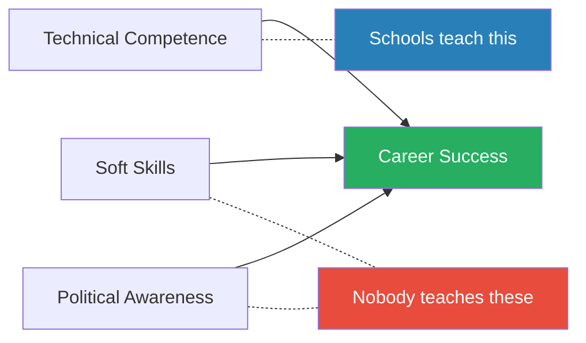
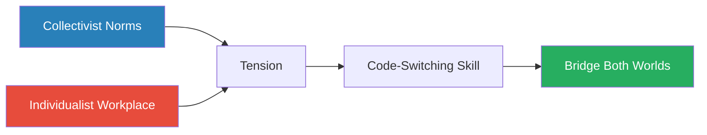
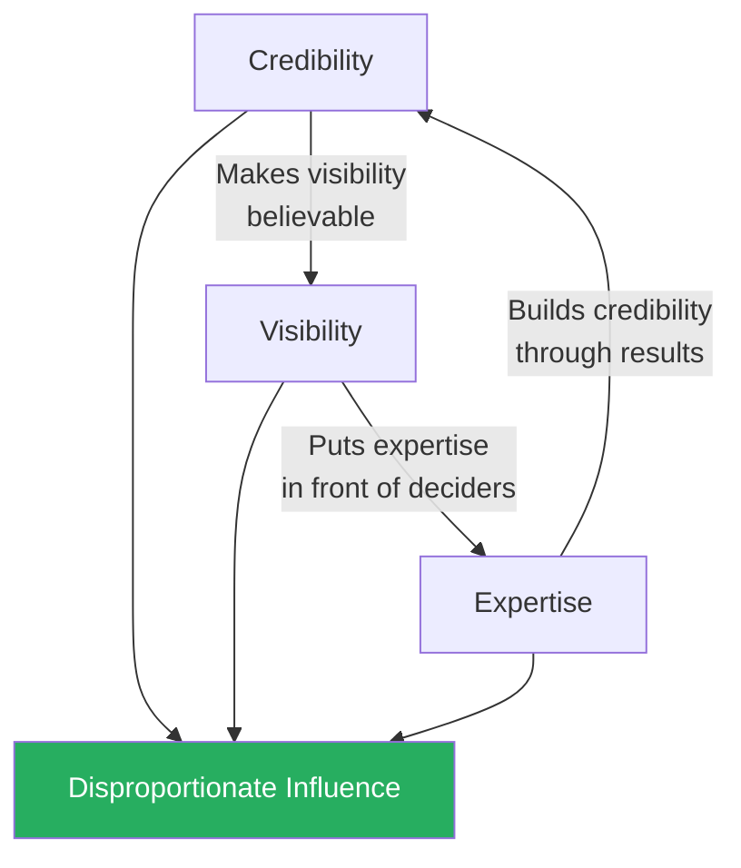
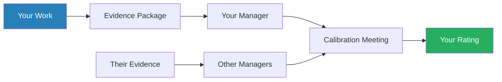
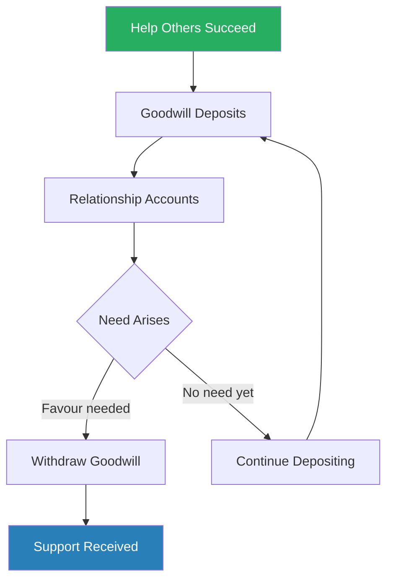
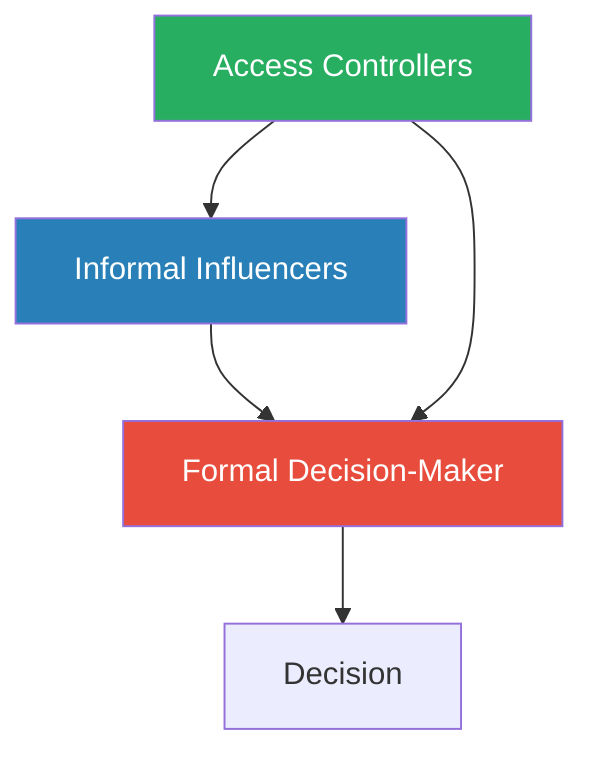

# Thriving at Work: What School Doesn't Teach You — Dennis Mark & Michael Dam

> A practitioner's handbook for the unwritten rules of corporate life, written by two Asian-American tech executives with a combined 50+ years at HP, NetApp, and Seagate.
> Their thesis is blunt: technical excellence is table stakes, and the people who get ahead are the ones who master visibility, managing up, negotiation, and political navigation.
> The book is structured as a reference manual — 32 standalone chapters across six parts, covering everything from onboarding to office politics — and is at its best when the authors draw on their own painful lessons about what happens when you assume results will speak for themselves.
> They never do.
> Unusually for a workplace manual, it addresses the specific challenges faced by professionals from collectivist cultures working in individualist business environments, where self-promotion feels uncomfortable and deference to authority is instinctive.
> The result is a comprehensive checklist of corporate hygiene — not glamorous, but the kind of knowledge that prevents invisible damage to a career.

---

## About the Authors

Dennis Mark spent over 30 years in IT, rising to VP/GM at HP Asia Pacific before moving into executive coaching. He serves on the board of the Singapore Red Cross and brings a distinctly Southeast Asian lens to Western corporate dynamics. His career spanned multiple countries and cultures, and much of the book's cross-cultural advice draws on his experience navigating the gap between Asian communication norms and Western boardroom expectations.

Michael Dam spent 25+ years in engineering, product management, and pricing strategy, including a stint as Chief of Staff to a Senior VP at NetApp, a Fortune 500 company. That Chief of Staff role gives him an unusual vantage point — he saw the machinery of executive decision-making from the inside, observing how information was filtered, agendas were shaped, and promotions were decided before anyone walked into the room. He is now an Adjunct Lecturer at Santa Clara University's Leavey School of Business, where he teaches the workplace skills that the business curriculum typically ignores.

Both authors observed the same pattern repeatedly throughout their careers: technically brilliant colleagues being outpaced by less skilled but more politically astute peers. This book is their attempt to close that gap — to codify the unwritten curriculum that separates people who advance from people who stagnate despite doing excellent work.

---

## The Big Idea

*Mark and Dam argue that career success follows a formula most schools never teach — and the missing variables matter more than the one they drill into you.*

- The central argument of *Thriving at Work* is a formula: <b style="color: #2980b9">career success = technical competence + soft skills + political awareness</b>
- Schools and universities teach the first element thoroughly
- Nobody teaches the second or third
- The authors call these the "unwritten rules" — the invisible curriculum that determines who advances and who stagnates, regardless of talent
- They argue that most professional education is built on an implicit assumption that the best work will be recognised and rewarded on its merits
- This assumption is not just incomplete but actively dangerous — it teaches people to focus exclusively on the dimension that matters least in promotion decisions

---

- The book is not a single grand theory — it is a **comprehensive checklist** organised by workplace situation:
  - How to network
  - How to present
  - How to handle a bully
  - How to negotiate a raise
  - How to manage your manager
  - How to navigate office politics
- Each of the 32 chapters stands alone as a tactical reference, designed to be consulted when a specific problem arises rather than read cover to cover
- The structure reflects the authors' belief that workplace navigation is not a philosophy but a skill set — a collection of learnable techniques, each applicable to a specific situation

---

- What makes the book distinctive is its **cross-cultural perspective**
- The authors explicitly address the challenges faced by professionals from collectivist cultures working in individualist business environments:
  - In many Asian cultures, self-promotion is considered distasteful
  - Deference to authority is instinctive
  - Speaking up in meetings — especially to contradict a senior person — runs against deeply held norms
- The Western expectation that employees will advocate for themselves, push back on unreasonable demands, and actively campaign for their own advancement clashes with these cultural instincts
- <b style="color: #27ae60">Understanding this clash — and learning to bridge it without losing your authenticity — is critical for professionals navigating between these worlds</b>

The formula's implication is stark: technical excellence without soft skills and political awareness leaves you invisible to the people who control advancement, while even moderate technical competence combined with strong interpersonal skills and political navigation produces disproportionate career returns.

The Technical Star's paradox is visible: the highest technical score produces the lowest career advancement because the other two pillars are near-zero — confirming the authors' thesis that schools teach the variable that matters least for promotion decisions.

---

## Key Concepts at a Glance

| Concept | One-line summary |
|---------|-----------------|
| **Invisibility is career death** | If decision-makers do not know your work, you do not exist in their mental model of who deserves advancement |
| **Manager as advocate** | Your manager represents you in rooms you are not in — arm them with evidence or they cannot fight for you |
| **Soft skills are hard skills** | Communication, negotiation, and political navigation are learnable technical skills, not personality traits |
| **HR protects the company** | Use HR for policy and legal escalations, not career advancement — rely on managers, mentors, and allies |
| **Promotions over raises** | A 3-5% raise barely moves the needle; a promotion resets your entire compensation band and compounds for life |
| **Trust asymmetry** | Each kept promise is a deposit; each broken one is a withdrawal worth multiples — years to build, moments to destroy |
| **Goodwill banking** | Political skill is accumulating and withdrawing goodwill through helping others succeed without seeking immediate return |
| **Influence mapping** | The org chart shows reporting lines, not influence lines — map who decides, who influences, and who controls access |
| **Managing up** | Your relationship with your manager determines access, ratings, visibility, and promotion more than any other factor |
| **Saying no as prioritisation** | Frame overload as a zero-sum resource allocation exercise, forcing the requester to decide what gets dropped |
| **Visibility-Credibility-Expertise** | The three elements form a virtuous cycle — each reinforces the others to produce disproportionate influence |
| **Cultural code-switching** | Professionals from collectivist backgrounds must learn to self-promote without violating their own values |

---

## Part 1: Starting Out (Chapters 1-7)

### Networking Before You Need It

*The authors open with a counterintuitive truth: the worst time to build a network is when you need one.*

- Most people treat networking as a job-search activity — something you do when you are desperate
- The authors argue this is backwards
- <b style="color: #27ae60">The time to build relationships is when you have nothing to ask for</b>, because that is when the relationships feel genuine rather than transactional
- A network is not a list of contacts — it is a web of relationships where each party has demonstrated value to the other over time
- The psychology is simple: people help people they know, like, and feel indebted to
  - If your first interaction with someone is asking for a favour, you have no deposits in the relationship account
  - If you have spent years quietly helping them, sharing information, or making introductions, the ask feels like a natural exchange

> [!example] The HP Colleague Who Never Asked for a Favour
> - A colleague at HP spent years quietly helping people across different departments — reviewing proposals, making introductions, sharing market intelligence
> - He treated every interaction as an opportunity to contribute rather than extract
> - When a VP role opened that was not publicly advertised, three different people in the network told him about it on the same day
> - He got the interview before the posting went live
> - The colleague had never asked any of these people for a favour — the referrals came as a natural return on years of goodwill
> **The lesson:** A network built on genuine helpfulness pays dividends without being called upon.

> [!example] The Author's Post-Layoff Scramble
> - After being laid off from a tech company, one of the authors scrambled to activate a network that did not exist
> - Cold emails went unanswered
> - Former colleagues he had never maintained contact with politely declined to help
> - LinkedIn connections who barely remembered him offered sympathetic but empty encouragement
> - The lesson was stark: a network is an investment that must be made continuously, not a resource that can be created on demand
> **The lesson:** You cannot withdraw from an account you never deposited into.

> [!tip] Core Insight
> A network is an investment that compounds over years of consistent deposits — not a resource that can be manufactured on demand when crisis strikes.

The authors provide tactical advice on networking:

- Attend industry events with the goal of making two genuine connections, not fifty business card exchanges
- Follow up within 48 hours with a personalised reference to the conversation
- Offer value before asking for anything — share an article, make an introduction, offer expertise
- Maintain relationships through periodic check-ins even when there is nothing specific to discuss
- <b style="color: #2980b9">The 2-2-2 rule</b>: every two weeks, reconnect with two people you have not spoken to recently — a five-minute coffee or a short message is sufficient
- The key metric is not the size of your network but the number of people who would take your call unprompted

---

### The Hiring Process

*Behind the hiring curtain, the difference between getting the job and being rejected is almost never technical skill — it is the ability to demonstrate you have done the thing, not just understood it.*

- Dennis Mark, who hired hundreds of people at HP, shares a revealing detail:
  - Most hiring managers spend less than 30 seconds on the first scan of a resume
  - If the key qualifications are not immediately visible — in the top third of the first page — the resume goes to the reject pile regardless of what is on page two
  - Resumes are not read — they are scanned, and the scan follows a predictable pattern: name, current role, top three bullet points
- <b style="color: #e74c3c">Burying your key qualifications below the fold is a silent rejection trigger</b>

> [!example] The Abstract vs. Concrete Candidate at NetApp
> - Michael Dam interviewed a candidate with perfect technical credentials who answered every behavioural question with abstract principles rather than specific examples
> - When asked "Tell me about a time you handled a conflict with a colleague," the candidate gave a treatise on conflict resolution theory
> - A less technically qualified candidate told a concrete story about a disagreement over a product feature, how she sought to understand her colleague's perspective, and how they reached a compromise both could support
> - The second candidate got the job — not because she was smarter, but because she demonstrated she had actually done the thing, not just understood it conceptually
> **The lesson:** Interviewers hire proof of experience, not proof of knowledge.

- The authors' advice on interviewing centres on the <b style="color: #2980b9">STAR format</b> (Situation, Task, Action, Result):
  - Widely known but rarely executed well
  - The common failure is spending too long on Situation and Task and rushing through Action and Result
  - The interviewer cares most about what you actually did and what happened because of it
  - A rough ratio: 15% Situation, 10% Task, 50% Action, 25% Result
- The authors also stress the importance of **asking questions** during interviews:
  - Candidates who ask no questions signal disinterest or passivity
  - Candidates who ask only about compensation and benefits signal a transactional mindset
  - The best questions demonstrate that you have researched the company and are thinking about how you would contribute
  - "What does success look like in the first six months?" is a question that simultaneously signals ambition, humility, and practical focus

---

### Onboarding: The First 90 Days

*Your first weeks in a new role are an asymmetric opportunity — small actions create lasting impressions that take months of counter-evidence to revise.*

- The onboarding chapters emphasise a principle the authors return to throughout the book: <b style="color: #27ae60">first impressions are disproportionately sticky</b>
- People form judgements quickly and update them slowly — a phenomenon psychologists call the **primacy effect**
- The early weeks in any new role are asymmetric — you can establish a positive reputation with relatively small actions, but recovering from a negative first impression requires months of counter-evidence
- The authors recommend a structured approach to the first 90 days:
  - **Days 1-30:** Listen, observe, learn the landscape — who holds power, who controls information, who are the informal leaders
  - **Days 31-60:** Begin contributing, but frame contributions as building on what exists rather than replacing it
  - **Days 61-90:** Start shaping, proposing changes, and demonstrating your unique value

> [!example] The Listener at Seagate
> - A new hire at Seagate spent his first month primarily listening
> - He attended meetings, took notes, asked thoughtful questions, and resisted the temptation to announce how things were done at his previous company
> - His questions revealed that he was paying close attention: "You mentioned the Q3 pipeline gap — how has the team addressed that before?"
> - Within six weeks, senior colleagues were actively seeking his input
> - He had not proven technical superiority — his questions had been perceptive enough to signal competence without threatening anyone
> **The lesson:** Listening first earns you the right to be heard later.

> [!example] The Oracle Comparison That Backfired at HP
> - A manager joined HP from a competitor and immediately began criticising existing processes in her first team meeting
> - Her suggestions were technically sound, but the delivery — "At Oracle we did it this way" — alienated her team within the first week
> - Team members began avoiding her, withholding information, and pushing back on reasonable requests
> - Three months later, she had the right ideas and no one willing to execute them
> - She left within a year, blaming the team for being "resistant to change"
> **The lesson:** Being right is worthless if no one is willing to follow you.

> [!tip] Core Insight
> The first 90 days are not about proving your brilliance — they are about building the relationships and credibility that will allow your brilliance to be heard when it matters.

---

The authors identify a specific trap for high-achievers joining new organisations:

- <b style="color: #e74c3c">The "I was hired to change things" fallacy</b> — the belief that because you were brought in from outside, the organisation expects immediate disruption
- Even when this is technically true (the job description may literally say "drive transformation"), the people you need to implement the change were not consulted about your hiring
- They see a stranger criticising their work — not a saviour arriving with better ideas
- The authors recommend earning the right to change things by first demonstrating that you understand and respect what exists

---

## Part 2: Communicating (Chapters 8-12)

### Verbal and Written Communication

*In corporate environments, the person who can distil a complex situation into three clear sentences commands more attention than the person who writes elegant five-page memos.*

- The communication section begins with a deceptively simple observation: <b style="color: #27ae60">clarity beats eloquence</b>
- The person who is understood immediately wields more influence than the person who is admired for their prose
- This is especially counterintuitive for people trained in academic or technical writing, where thoroughness and precision are valued
- In corporate environments, thoroughness without brevity is noise

The authors provide a framework they call <b style="color: #2980b9">bottom-line-up-front (BLUF)</b>, borrowed from military communication:

- State your conclusion or recommendation first
- Then provide the supporting evidence
- Then handle objections
- Most people do this backwards — building up to their conclusion — which means the busy executive has stopped reading before reaching the point
- The psychology is straightforward: executives make dozens of decisions per day and have learned to allocate attention ruthlessly
  - If you do not signal your point in the first sentence, you have already lost the competition for their attention

> [!example] The 40-Slide Deck at HP
> - A junior product manager at HP presented a 40-slide deck building methodically to a recommendation on slide 37
> - The VP interrupted on slide 8: "What are you recommending?"
> - The product manager, flustered, tried to explain that the recommendation required context
> - The VP said: "Give me the answer. I'll ask for context if I need it."
> - From that point on, Dennis Mark adopted a rule: the first slide of any executive presentation contains the recommendation — everything after it is backup
> **The lesson:** Lead with the answer. Executives will ask for context if they need it.

> [!tip] Core Insight
> Bottom-line-up-front is the difference between being heard and being skipped. State your recommendation first — then justify it.

- For written communication, the authors emphasise that emails are not essays:
  - The most effective format: a subject line that states the action required, the first sentence containing the request or key information, and bullet points for supporting details
  - <b style="color: #e74c3c">Emails longer than one screen are rarely read in full</b> — and the most important information tends to be buried at the bottom, precisely where it is least likely to be seen
  - The authors recommend the "newspaper test": if the reader only sees the subject line and the first sentence, do they know what you need from them?

> [!abstract] The Effective Email Format
> 1. **Subject line** states the action required: "Decision needed: Q3 budget allocation by Friday"
> 2. **First sentence** contains the request or key information
> 3. **Bullet points** for supporting details — no dense paragraphs
> 4. **Bold** the deadline or critical action item
> 5. **Keep to one screen** — if it requires scrolling, it needs to be a meeting, not an email

---

### Presentations

*Most people prepare informational and persuasive presentations identically — marshalling facts — but the two formats require entirely different structures.*

- The presentations chapter distinguishes between two types:
  - <b style="color: #2980b9">Informational presentations</b> — conveying data, results, or status
  - <b style="color: #2980b9">Persuasive presentations</b> — advocating for a decision, resource, or course of action

| Presentation Type | Goal | Structure | Common Mistake |
|------------------|------|-----------|----------------|
| **Informational** | Share data, results, status | Data → analysis → implications | Burying the key finding |
| **Persuasive** | Advocate for a decision | Problem → solution → objection → ask | No specific ask |

Each type demands a different structure, and conflating them is the most common presentation failure the authors observe.

> [!abstract] Persuasive Presentation Framework
> 1. Start with the problem the audience cares about
> 2. Present your proposed solution
> 3. Address the strongest objection head-on
> 4. Close with a specific ask

- The common mistake is opening with background that the audience already knows, which signals that you have prepared your presentation for yourself rather than for them
- Another failure: ending with a summary slide rather than an ask
  - A summary tells the audience what they just heard — an ask tells them what you need
  - <b style="color: #e74c3c">If you do not ask, you do not get</b>

> [!example] Dam's Missing Ask at NetApp
> - Michael Dam presented a pricing strategy change to a Senior VP at NetApp
> - He had prepared an exhaustive market analysis — competitor pricing, margin scenarios, customer sensitivity data
> - The VP listened for three minutes and said: "I trust your analysis. What do you need from me?"
> - Dam realised he had prepared to convince but had not prepared to ask
> - He had no specific request ready — no dollar figure, no timeline, no resource allocation
> **The lesson:** Every presentation to a decision-maker should end with a clear, specific request — "I need your approval," "I need $200K in budget," "I need you to raise this with the board."

The authors also address presentation anxiety, noting that:

- Nervousness decreases with repetition — the first presentation is always the hardest
- Rehearsing out loud (not just reviewing slides) reduces anxiety and improves timing
- <b style="color: #27ae60">The audience wants you to succeed</b> — most presentation anxiety is based on the false assumption that the audience is hoping you will fail

---

### Meeting Effectiveness

*Most meetings fail not because of poor discussion but because attendees do not know whether they are there to decide, to learn, or to brainstorm.*

- The authors distinguish between three meeting types:

| Meeting Type | Purpose | Failure Mode |
|-------------|---------|-------------|
| **Decision meeting** | A choice must be made | No clear decision reached |
| **Information meeting** | Knowledge is shared | Devolves into debate |
| **Brainstorming meeting** | Ideas are generated | Premature evaluation kills ideas |

Conflating these types is the primary cause of meeting dysfunction.

> [!abstract] Meeting Effectiveness Checklist
> 1. Send pre-reads at least 24 hours in advance
> 2. Start every meeting by stating its purpose and the decision or outcome expected
> 3. Assign a note-taker before the meeting begins
> 4. Close with explicit action items, owners, and deadlines
> 5. Send a summary email within 2 hours

> [!example] The VP Who Ended Every Meeting on Time at HP
> - A VP at HP ended every meeting exactly on time, regardless of where the discussion stood
> - He would announce "We have two minutes left — let's capture actions" with mechanical precision
> - Within a month, his entire organisation had learned to structure their contributions efficiently because they knew the clock was immovable
> - His meetings ran 30% shorter than average and produced clearer outcomes, because participants came prepared knowing they would not be given extra time
> - Other teams began requesting transfers to his group partly because his meeting discipline freed up hours per week
> **The lesson:** An immovable clock teaches an entire organisation to be concise.

The authors also note a subtler meeting skill:

- **Strategic silence** — knowing when not to speak in a meeting is as important as knowing when to contribute
- People who speak on every topic dilute their impact
- People who speak rarely but substantively are listened to more carefully when they do
- <b style="color: #2980b9">The credibility-per-word ratio</b> increases with selectivity — the less you speak, the more weight each contribution carries

---

### Cross-Cultural Communication

*The authors devote specific attention to professionals from collectivist cultures operating in individualist corporate environments, where the rules of engagement are fundamentally different.*

- In many Asian and Latin American cultures, self-promotion is considered distasteful, and deference to seniority is the default
- In Western (particularly American) corporate environments, the expectation is reversed:
  - Employees are expected to advocate for themselves
  - Silence is interpreted as having nothing to contribute
  - Deference is interpreted as lacking confidence or competence
- The gap is not about ability — it is about <b style="color: #2980b9">cultural code-switching</b>

The tension between collectivist instincts and individualist expectations creates a gap that must be bridged through deliberate practice — not by abandoning your values but by expanding your repertoire.

- The authors recommend treating self-promotion as a learnable skill rather than a personality trait:
  - Practise talking about your accomplishments in low-stakes settings first
  - Frame self-promotion as informing rather than boasting — "I want to make sure you're aware that..." rather than "I did this amazing thing"
  - Use third-party validation: "The client mentioned that..." or "The VP noted that..."
- <b style="color: #27ae60">Reframe self-promotion as a service to your manager</b> — they need to know what you have done in order to advocate for you
  - You are not bragging — you are providing them with the ammunition they need for calibration meetings

---

## Part 3: Collaborating (Chapters 13-18)

### Building Trust

*Trust in the workplace follows an asymmetric accounting system — deposits accumulate slowly, but a single withdrawal can drain the entire account.*

- The core mechanism is simple: <b style="color: #27ae60">trust is built through consistent fulfilment of commitments and destroyed through hidden agendas or broken confidence</b>
- Each kept commitment is a trust deposit
- Each broken commitment or betrayed confidence is a withdrawal worth multiples of the deposit
- The asymmetry is critical — trust takes years to build and moments to destroy
- This makes trust preservation as important as trust building
- The authors estimate the asymmetry ratio at roughly 5:1 — it takes five kept commitments to build the trust that one broken commitment destroys

> [!example] The Most Reliable Person at Seagate
> - A VP at Seagate, whenever he needed something done urgently, always called the same person
> - When asked why, he said: "Because she always does what she says she will do"
> - Not the most talented person on the team — not the most senior — simply the most reliable
> - Her career advanced steadily while more talented but less consistent colleagues were passed over
> - She had accumulated a reserve of trust that made her the default choice for high-visibility assignments
> - Those high-visibility assignments, in turn, gave her the exposure she needed for promotion — a virtuous cycle initiated by simple reliability
> **The lesson:** Reliability beats talent when the stakes are high.

> [!example] The Public Reversal
> - A colleague had privately agreed to support a proposal in an upcoming meeting
> - When the boss expressed scepticism during the meeting, the colleague immediately disowned his earlier support and joined the opposition
> - The person he had promised to support never trusted him again
> - More importantly, everyone in the room who witnessed the reversal quietly downgraded their assessment of his reliability
> - The boss may have been satisfied in the moment, but the colleague's reputation for dependability was permanently damaged across the entire group
> - In subsequent meetings, people stopped sharing their plans with him in advance — he had become an unreliable ally
> **The lesson:** One public betrayal destroys trust not just with the victim but with every witness.

> [!tip] Core Insight
> Trust is binary in practice — people either believe you will deliver or they do not. The asymmetry means one missed commitment can erase a dozen kept ones.

The authors identify key trust behaviours:

- **Trust-building:**
  - Deliver on every commitment, even small ones — especially small ones, because they signal whether your word is reliable
  - Be honest when you cannot meet a deadline rather than going silent
  - Share credit generously — people notice who amplifies others
  - Never reveal confidential information, even when doing so would benefit you
  - Maintain consistent behaviour regardless of who is in the room
- **Trust-destroying:**
  - <b style="color: #e74c3c">Saying one thing in private and another in public</b>
  - Taking credit for others' work
  - Maintaining hidden agendas
  - Gossiping about colleagues — even when the gossip is accurate
  - Making commitments you do not intend to keep

---

### Getting Noticed: The Visibility-Credibility-Expertise Triangle

*The authors' most useful original framework reveals why brilliant people get overlooked — and why mediocre people with the right combination of skills get promoted.*

- The book's most useful original framework describes three mutually reinforcing elements required for workplace influence: the <b style="color: #2980b9">Visibility-Credibility-Expertise Triangle</b>

The three elements reinforce each other in a virtuous cycle — credibility makes visibility believable, visibility puts expertise in front of decision-makers, and expertise builds credibility through demonstrated results.

---

**Credibility** is earned through consistent delivery on commitments:

- It is the foundation — without it, visibility becomes empty noise and expertise becomes theoretical
- Credibility is effectively binary in practice: people either trust you to deliver or they do not — there is no partial credit
- The mechanism is pattern recognition:
  - After three or four delivered commitments, people start assuming you will deliver the fifth
  - After one missed commitment, they start hedging
- <b style="color: #e74c3c">Visibility without credibility is toxic, and expertise without credibility is academic</b>
- The authors stress that credibility is not about perfection — it is about honesty
  - If you are going to miss a deadline, communicating that early preserves credibility
  - Going silent and missing the deadline destroys it

---

**Visibility** means being known beyond your immediate team:

- Presentations to executives, cross-functional project involvement, customer engagement — anything that puts your name and work in front of people who make decisions about your career
- The authors are emphatic: "If they are not aware of what you do, **you don't exist**"
- This is not metaphorical:
  - In forced-ranking evaluation systems, managers from other teams who have never seen your work will default to rating you as average
  - They will actively resist giving you high marks that they could allocate to their own people
  - <b style="color: #e74c3c">You do not get credit for work that decision-makers do not know about</b>

> [!example] Dam's Invisible Excellence at NetApp
> - As a product manager responsible for a several-hundred-million-dollar business line, Michael Dam delivered exceptional results — revenue growth, margin improvement, customer satisfaction metrics all exceeding targets
> - When the performance review came, he expected a top rating
> - Instead, he received a mediocre ranking
> - The reason: in the forced-ranking meeting, other managers said they were not aware of his contributions
> - His own manager tried to advocate for him but was outnumbered by managers who had prepared better cases for their own people
> - Results he knew were excellent were invisible to the people who controlled his rating
> - From that point on, he never assumed that good work would speak for itself
> **The lesson:** Excellence that nobody sees is indistinguishable from mediocrity in a calibration meeting.

> [!example] The Best-Known Performer at HP
> - A colleague at HP who was objectively less skilled technically but consistently volunteered for cross-functional projects, presented at quarterly reviews, and made a point of sharing his work with executives from other departments
> - His name came up in evaluation meetings because multiple managers knew him
> - When a promotion opportunity arose, he was the obvious candidate — not because he was the best performer, but because he was the best-known performer
> - His visibility created a self-reinforcing cycle: high visibility led to better assignments, which led to more visibility
> **The lesson:** In forced-ranking systems, being known is a prerequisite for being rated highly.

---

**Expertise** means becoming the recognised go-to person in a specific area that the organisation values:

- When executives need help with something and your name is the one that comes up, the normal power dynamic inverts — they come to you, rather than you seeking access to them
- The authors distinguish between having expertise and being known for it:
  - Many people possess deep expertise but have never positioned themselves as the go-to person
  - The positioning requires deliberate effort — volunteering for relevant projects, presenting on the topic, writing internal whitepapers, mentoring others in the area

> [!example] Dennis Mark's Business Dashboard at HP
> - Dennis Mark developed a business dashboard at HP that became the standard reporting tool for management
> - After creating this tool, he became known as the Business Metrics expert
> - Executives across the organisation began seeking his help with their own reporting challenges
> - One Senior VP publicly endorsed him in a critical meeting, saying "Dennis is the person you need to talk to about this"
> - That single moment of public endorsement from a senior leader — earned through expertise, not politics — advanced his career more than a year of quiet high-quality work had
> **The lesson:** Expertise that solves a widely felt problem converts into influence faster than any other asset.

The triangle's key insight:

- <b style="color: #27ae60">You cannot succeed with only one or two elements</b>
- Credibility alone makes you reliable but forgettable
- Visibility alone makes you known but unimpressive
- Expertise alone makes you useful but siloed
- All three together create **disproportionate influence** relative to formal authority

| Element | Alone | Combined with Others |
|---------|-------|---------------------|
| **Credibility** | Reliable but forgettable | Foundation for trust-based influence |
| **Visibility** | Known but unimpressive | Platform for amplifying expertise |
| **Expertise** | Useful but siloed | Engine for organic authority |

The strongest careers are built by deliberately developing all three elements simultaneously rather than hoping that expertise alone will be enough.

Dam's pre-loss profile (red) reveals the Martyr pattern: exceptional credibility and expertise collapsed by near-zero visibility — invisible excellence is indistinguishable from mediocrity in a calibration meeting.

---

### Handling Difficult Co-workers

*Real people rarely fit neatly into archetypes — but pattern recognition is useful for quickly diagnosing a difficult relationship and selecting a response before the damage compounds.*

- The book identifies ten archetypes of difficult co-workers, each with a distinct dynamic and counter-strategy

| Archetype | Behaviour | Counter-Strategy |
|-----------|-----------|-----------------|
| **The Party Pooper** | Shoots down every idea without alternatives | "That's a good challenge — what would you suggest instead?" |
| **The Bully** | Uses aggression and intimidation to dominate | Document incidents; never respond emotionally; build alliances |
| **The Hidden Dragon** | Appears collaborative but operates with concealed agendas | Track whether private behaviour matches public commitments |
| **The Bragger** | Claims credit for everything and inflates contributions | Force specifics — vague claims dissolve under questioning |
| **The Exploiter** | Leverages relationships without reciprocating | Set boundaries; track the exchange balance |
| **The One-Upper** | Turns every conversation into a contest | Refuse to compete; redirect to the work |
| **The Gossiper** | Trades in rumour and innuendo | Never feed them information; maintain paper trails |
| **The Downer** | Chronic pessimist who drains team energy | Limit exposure; redirect to solutions |
| **The Avoider** | Dodges responsibility and decision-making | Pin down commitments in writing |
| **The "Yes Boss" Only** | Agrees with authority reflexively | Seek independent input through private channels |

---

- <b style="color: #2980b9">The Hidden Dragon</b> is the most dangerous type — someone who appears harmless, collaborative, and friendly but operates with concealed agendas:
  - The authors describe a colleague who would agree enthusiastically to proposals in meetings and then work behind the scenes to undermine them
  - Because his public face was so agreeable, it took months for people to connect the pattern of sabotage to its source
  - The counter-strategy is vigilance: pay attention to what happens after meetings, not just what is said during them
  - Track commitments versus delivery — a pattern of public agreement followed by private obstruction is the signature of a Hidden Dragon

The common counter-strategy across all types:

- Stay professional
- Force specifics — vague complaints and claims dissolve under questioning
- Maintain paper trails — email confirmations of verbal agreements
- Escalate through proper channels when necessary
- <b style="color: #e74c3c">Engaging emotionally with any of these types is almost always counterproductive</b> — the person causing the problem is rarely the person who changes, so the goal is containment and self-protection, not reform

The Hidden Dragon dominates because covert sabotage is the hardest to detect and the most damaging — by the time you connect the pattern of public agreement to private obstruction, months of damage may already be done.

- The authors note that in some cases, the best strategy is simply distance — not every difficult colleague requires a tactical response; sometimes the optimal move is to minimise exposure and redirect your energy

---

### Giving and Receiving Feedback

*Most feedback conversations fail because they conflate two fundamentally different purposes — helping someone improve and judging their performance.*

- The feedback chapter distinguishes between:
  - <b style="color: #2980b9">Developmental feedback</b> — designed to help someone improve
  - <b style="color: #2980b9">Evaluative feedback</b> — designed to assess performance
- Conflating the two is why most feedback conversations fail
- When someone hears evaluative language ("Your communication skills are weak"), they shift into defensive mode
- When they hear developmental language ("Here's something I noticed that might help"), they are more likely to engage

> [!abstract] The SBI Feedback Model
> 1. **Situation** — When and where the behaviour occurred
> 2. **Behaviour** — What the person did, specifically
> 3. **Impact** — The effect of that behaviour on others or on outcomes

- The key is specificity:
  - <b style="color: #e74c3c">"You need to communicate better" is useless feedback</b> because it gives no actionable information
  - "In yesterday's client meeting, you interrupted the client twice while she was explaining her concerns, and she visibly disengaged after the second interruption" is feedback someone can act on
  - The difference is not diplomatic language — it is concrete observation versus abstract judgement

When receiving feedback, the authors offer a more counterintuitive recommendation:

- <b style="color: #27ae60">Ask for feedback proactively and often, especially the negative kind</b>
- Most people wait for feedback to be delivered to them, which means they only hear it during formal reviews when the stakes are high and the environment is tense
- Asking "What's one thing I could do differently?" in a routine one-to-one normalises the conversation and surfaces problems while they are still small enough to fix
- The authors also recommend a cooling-off period: when you receive critical feedback, your first instinct will be to defend or explain
  - Resist that instinct
  - Say "Thank you, let me think about that" and process it later when the emotional reaction has subsided
  - The person who receives feedback gracefully earns more feedback — and more feedback means faster growth

---

## Part 4: Negotiating (Chapters 19-23)

### The Negotiation Framework

*The authors draw on Bazerman and Neale's Negotiating Rationally (1993) and present a four-step model that transforms negotiation from single-issue haggling into a multi-dimensional search for mutual value.*

The four steps move from understanding to action — each builds on the intelligence gathered in the previous step, ensuring you enter the negotiation with a complete picture rather than a single number.

---

**Step 1: Understand the true issues and parameters**

- Before negotiating, identify what is actually at stake — not just the headline number but the underlying interests of both sides
- A salary negotiation is rarely just about money; it may involve title, scope, flexibility, development opportunities, or reporting line
- <b style="color: #e74c3c">The person who treats a multi-dimensional negotiation as a single-issue haggling exercise leaves value on the table</b>

> [!example] The BTP Component Negotiation at NetApp
> - On the surface, it was a price negotiation — BTP wanted higher prices, NetApp wanted lower ones
> - When Dam dug into BTP's situation, he discovered that their real concern was revenue predictability, not price per unit
> - They were a small company dependent on a few large customers, and what they feared most was demand volatility
> - This insight unlocked a deal structure that neither side would have reached through pure price haggling
> - The breakthrough came not from pushing harder on price but from asking better questions about what BTP actually needed
> **The lesson:** The stated issue is rarely the real issue — dig deeper before making your first offer.

---

**Step 2: Assess possible trade-offs**

- Not all issues have equal weight
- Identify where you have flexibility and where the other side might
- This creates room for creative deals that leave both parties better off than a simple split-the-difference approach
- In the BTP negotiation, Dam offered three packages:
  - Guaranteed volume at a low per-unit price
  - A small initial order at a higher price with volume ramps built in
  - A higher fixed price with no guarantees
- BTP chose the guaranteed volume option without hesitation, confirming that revenue certainty mattered far more to them than unit price
- <b style="color: #27ae60">NetApp got a lower price; BTP got the predictability they needed — both sides won because the negotiation had been expanded beyond its initial framing</b>

---

**Step 3: Set your walkaway value before you walk in**

- Determine in advance the minimum acceptable outcome
- Without this anchor, the excitement and pressure of negotiation causes people to accept deals below their true floor
- The walkaway value is not a wish — it is a hard line, determined in a calm moment before the negotiation begins, that prevents emotional decision-making under pressure
- The test is simple: "Would I genuinely be better off with no deal than with this?"
  - If yes, walk away
  - If no, the deal is above your floor, even if below your aspiration
- The authors emphasise that walkaway values can be updated if genuinely new information emerges — but the update should happen during a break, not in the heat of the moment

---

**Step 4: Estimate the other side's walkaway**

- Understanding the other party's constraints and minimum terms helps you calibrate your ask
- If you can identify their floor, you can pitch just above it — maximising your gain while staying within the zone where a deal is possible
- The more you know about their constraints, alternatives, and pressures, the more precisely you can target your proposal
- Sources of intelligence: public filings, industry benchmarks, mutual contacts, and the negotiation conversation itself — what they react to reveals what matters to them

> [!tip] Core Insight
> The best negotiators do not push harder — they understand deeper. Knowing the other side's true priorities unlocks deals that pure price haggling never reaches.

---

### Multiple Simultaneous Offers

*A single offer creates a binary accept-or-reject dynamic — but two or three options shift the other side from bargaining mode into choosing mode, revealing their priorities in the process.*

- The book adds one powerful tactical recommendation: <b style="color: #2980b9">present multiple simultaneous offers</b>
- A single offer gives the other side all the power to set terms
- Two or three options put them in **choosing mode** rather than **bargaining mode**:
  - Their preference among the options reveals their priorities
  - This gives you intelligence for the next round of discussion
- The BTP example illustrates this perfectly — the three-package structure not only led to a deal but revealed that volume certainty was BTP's primary concern, information Dam could use in future negotiations with the same supplier

Cautions:

- All options must be genuinely acceptable to you — offering a package you would regret is worse than offering no choice at all
- <b style="color: #e74c3c">Too many options create decision paralysis</b> — two to three is the optimal range
- Each option should differ on a meaningful dimension, not just price — otherwise you are simply offering three price points, which is haggling with extra steps

---

### Job Offer Negotiation

*The moment of maximum leverage is the narrow window between receiving an offer and accepting it — once you say yes, your negotiating power drops to near zero.*

- The authors' central point: <b style="color: #27ae60">the moment of maximum leverage is before you accept</b>
- Once you have said yes, your negotiating power drops to near zero for everything except the most minor adjustments
- The time to negotiate title, reporting line, scope, compensation, and development commitments is during the offer conversation, not after you have started

> [!example] The Vague Promise of a Director Title
> - A colleague accepted a lateral move with a vague promise that "the director title will come in six months"
> - Six months later, nothing happened
> - A year later, she raised it again and was told the timeline had changed
> - She had no written commitment, no defined milestones, and no leverage — because she had already moved
> - Three years later, she still held the same title
> **The lesson:** Verbal promises without documentation are not commitments — the negotiation is not complete until the terms are in writing.

The authors provide a checklist of elements to negotiate before accepting:

- Base salary and bonus structure
- Title and reporting line
- Scope and team size
- Equity or stock options (if applicable)
- Review timeline and promotion criteria
- Relocation support
- Flexibility arrangements
- Development budget
- <b style="color: #2980b9">Written confirmation of all agreed terms</b> — if it is not in writing, it does not exist

---

### Salary vs. Promotion: The Compound Effect

*Most employees focus on annual raises because they feel safer to ask for — but the maths overwhelmingly favours a different strategy.*

- Chapter 21 presents perhaps the book's most counterintuitive insight: <b style="color: #27ae60">salary raises are marginal; promotions are multiplicative</b>
- A typical annual raise of 3-5% translates to modest real-terms improvement:
  - On an $80,000 salary, a 5% raise is $4,000 per year, or roughly $333 per month before tax
  - It feels significant in the moment but barely moves the long-term trajectory
- A promotion, by contrast, resets your entire compensation band:
  - The jump is typically 10-15% or more
  - Plus access to a higher salary range for future increases
  - Plus eligibility for the next level's bonus structure
  - Over a multi-year career, the compounding effect of a higher base from an early promotion dwarfs decades of incremental raises at a lower level

"A 5% raise is $333 a month before tax. **Aim for the promotion.**"

- The strategic implication: energy spent negotiating within-band raises — while not wasted — has dramatically lower return than energy spent positioning for a promotion
- Many employees focus on the wrong lever because raises feel more immediate and less risky to ask for
- The authors recommend thinking about compensation strategy over a 10-year horizon:
  - One promotion every 2-3 years produces dramatically better outcomes than annual 3-5% raises at the same level
  - The compounding effect means that a promotion received two years earlier can be worth six figures over a career

---

### Saying No Without Saying No

*The difference between being seen as uncooperative and being seen as a responsible resource manager comes down to a single reframing.*

- When asked to take on work beyond capacity, the authors recommend framing the conversation as a <b style="color: #2980b9">zero-sum prioritisation exercise</b>

> [!abstract] The Prioritisation Reframe
> 1. Present your current portfolio of commitments
> 2. Ask the requester to rank the new work against existing commitments
> 3. Make explicit that adding something means dropping something else
> 4. If the manager insists on everything, shift to quality trade-offs: "I can do all of this, but the quality will suffer"

- This shifts the decision burden:
  - You are not the person refusing work — you are the person asking management to make a resource allocation decision
  - <b style="color: #e74c3c">"I can't do this" positions you as uncooperative</b>
  - "I'm currently committed to A, B, and C — which of these should I deprioritise to take on D?" positions you as a team player constrained by physics
- The power of the reframe is that it makes the cost of the new request visible:
  - Most managers do not realise how much their team is already carrying
  - When they see the full list of commitments, many will withdraw the request or reassign it
  - When they insist, at least you have a documented agreement about what gets dropped

The authors also caution against over-use:

- The zero-sum framing is a tool for material scope additions, not routine requests
- Someone who pushes back on everything develops a reputation for inflexibility that is harder to overcome than the occasional overloaded week
- <b style="color: #27ae60">Reserve the reframe for genuine overload situations — not for work you simply do not want to do</b>

---

## Part 5: Managing Your Manager (Chapters 24-27)

*This is the strongest section of the book — the most specific, the most grounded in painful personal experience, and the most immediately useful.*

- The authors argue that <b style="color: #27ae60">managing your manager is the single highest-leverage skill in corporate life</b>, more important than any technical ability
- They provide a depth of tactical detail that most workplace books lack
- The reasoning is structural: your manager controls your access to information, your visibility to senior leaders, your performance rating, and your promotion timeline
  - No other single relationship has this much impact on your career trajectory

### Adapt First, Then Shape

*Before you try to influence your manager, understand how they operate — the cost of asking is zero while the cost of guessing is months of accumulated irritation.*

- The first principle of managing up is to understand your manager before trying to influence them
- In the first interactions with any new manager, learn their communication preferences, hot buttons, priorities, and working style
- Ask directly: "How do you prefer to be updated?" and "What are your hot buttons?"

> [!example] Four Questions in the First One-to-One at HP
> - A new hire at HP asked her manager four questions in their first one-to-one:
>   - How do you prefer to receive updates?
>   - What are your top three priorities right now?
>   - What has frustrated you about previous direct reports?
>   - How have your best employees worked with you?
> - Within two weeks, she had a clear map of her manager's expectations and was operating within them
> - A peer who joined at the same time assumed he would figure it out as he went along and spent three months generating friction — sending long emails to a manager who preferred five-minute calls, providing weekly updates to a manager who wanted daily touchpoints
> **The lesson:** Understanding before acting eliminates needless friction — ask explicitly rather than guessing.

---

### Complement Your Manager's Weaknesses

*Every manager has gaps they do not publicly acknowledge — quietly filling those gaps makes you indispensable far beyond your formal role.*

- If you can identify what your manager struggles with and quietly fill that gap, you become uniquely valuable — not just for your assigned work but as a force-multiplier for their effectiveness
- <b style="color: #27ae60">Managers reward people who make their lives easier and reduce their stress</b>
- The person who compensates for the boss's weakness gains trust, access, and influence disproportionate to their formal role
- This is not about doing the manager's job — it is about supplementing their capabilities in areas where they are weakest

> [!example] Taking Over Budget Management
> - One of the authors took over budget management for a VP who was visibly uncomfortable with financial details
> - The VP was an excellent strategist and communicator but would defer, delay, or delegate anything involving spreadsheets and forecasts
> - By quietly taking on the budget process — preparing the numbers, presenting them in the VP's preferred format, handling the detail questions in management meetings — the author became indispensable
> - The VP extended trust, access, and influence that went far beyond what the author's formal role would have justified
> - The VP began including him in strategic discussions that had nothing to do with budgets — simply because he had earned a seat at the table
> **The lesson:** Fill your manager's gaps discreetly — the reward is outsized trust and access.

> [!example] The Meeting Summary Email
> - A colleague's manager was chaotic, disorganised, and constantly losing track of action items from meetings
> - The colleague began sending a brief summary email after every meeting — decisions made, actions assigned, deadlines agreed — without being asked
> - Within weeks, the manager was forwarding these summaries to his own boss
> - The colleague had become the organisational backbone of the entire team
> - His influence expanded not because of his technical work but because he solved a problem the manager could not solve himself
> **The lesson:** Solving your manager's unseen problems creates influence that transcends your job description.

- But the authors add an important caveat: this must be done discreetly
  - <b style="color: #e74c3c">Publicly highlighting a manager's weakness while "helping" them is not management — it is humiliation</b>
  - The person whose help makes the manager look competent earns loyalty
  - The person whose help makes the manager look dependent earns resentment
  - The distinction is subtle but career-defining

---

### The No-Surprises Rule

*"Prepare your manager as if your career depends on it — because it does."*

- Surprising your manager with bad news — especially when their boss heard it first — is one of the fastest ways to permanently damage trust
- The mechanism is clear:
  - When a manager is blindsided by information their superior already has, they appear incompetent and out of touch
  - This damages not just their reputation but their relationship with you — permanently
- The authors describe this as one of the most consistent pet peeves across every manager they interviewed or worked with:
  - <b style="color: #27ae60">Managers would rather hear bad news early — even before you have a solution — than be blindsided in a meeting</b>
  - The early warning gives them time to prepare, to manage their own boss's reaction, and to frame the problem before it frames them
  - "I don't have a solution yet, but I want you to know that X has happened" is always better than silence followed by a surprise

The qualifier:

- Not every micro-update needs escalation
- The no-surprises rule applies to material problems and escalations — issues likely to be discussed above your manager's level
- For routine problems you can resolve within your authority, handle them yourself
- The skill is judgement: knowing which problems are routine and which will travel upward whether you manage the flow or not

---

### Make Your Manager Look Good

*Actively creating opportunities for your manager to receive credit earns their loyalty and advocacy when it matters most — promotions, reviews, and political coverage.*

> [!example] Dennis Mark's Strategic Credit-Sharing at HP
> - Dennis Mark invited his manager to customer meetings where she would hear praise for a project he had led
> - He attributed key strategic decisions to her guidance when speaking with a Senior VP, even though the decisions had been primarily his own
> - His manager's reputation rose because of his work, and she knew exactly who was responsible for that rise
> - When promotion time came, she fought for him in ways that went beyond professional obligation — she felt personally invested in his advancement because his success and hers were intertwined
> **The lesson:** Making your manager look good is not sycophancy — it is an investment in your own advocacy.

> [!example] The Colleague Who Hoarded All Credit
> - A colleague took every opportunity to receive credit himself, ensuring that his name was always prominently associated with every success
> - His manager, feeling overshadowed, became an obstacle rather than an advocate
> - In the next reorganisation, the colleague was moved to a less visible role — not because he lacked talent, but because his manager wanted someone who made him look better, not worse
> **The lesson:** Overshadowing your manager converts an advocate into an obstacle.

- The authors stress that this must be warranted:
  - Obviously fabricated praise is sycophancy, not strategy
  - A manager who receives credit for work they clearly did not do will eventually be exposed
  - The tactic works when you highlight genuine contributions: the direction they set, the resources they secured, the obstacles they removed
  - These contributions are real but often invisible — <b style="color: #27ae60">making them visible is not flattery but accurate attribution</b>

---

### The Manager Taxonomy

*Not all difficult managers are dangerous — the critical distinction is whether their incompetence creates collateral damage or merely leaves a vacuum you can fill.*

| Manager Type | Core Problem | Counter-Strategy |
|-------------|-------------|-----------------|
| **The Micromanager** | Cannot let go of details | Overwhelm with proactive updates until they ease off |
| **The Clueless but Harmless** | Lacks competence but does not damage | Lean on strong colleagues; manage around them |
| **The Clueless and Dangerous** | Makes bad decisions that affect your reputation | Persuade behind the scenes; use external voices to redirect |
| **The Absent Manager** | Physically or mentally checked out | Take control of your own visibility; seek advocates elsewhere |
| **The Wind-Blower** | Changes direction with every new trend | Document agreed priorities; create friction against impulsive changes |

The Clueless and Dangerous type lights up across all three dimensions because they are the only manager type where bad decisions actively damage your reputation — the others are frustrating but manageable, while this one requires either indirect steering or structural exit.

---

**The Micromanager:**

- They check your work constantly, want to be CC'd on every email, and cannot delegate without monitoring every step
- The counter-strategy is counterintuitive: <b style="color: #2980b9">overwhelm them with proactive updates</b>
  - Send status reports before they ask
  - CC them on communications before they request it
  - The constant flow of information satisfies their need for control
  - Over time — when they realise that monitoring you produces no surprises — they ease off naturally
- <b style="color: #e74c3c">The mistake most people make is resisting the micromanagement, which confirms the micromanager's fear that they need to watch you more closely</b>
- Resistance creates a vicious cycle: more resistance leads to more monitoring leads to more frustration leads to more resistance

**The Clueless and Dangerous:**

- This is qualitatively different from harmless cluelessness because the manager's incompetence creates real damage — wrong priorities, poor resource allocation, decisions that the team must execute and be judged on
- The counter-strategy is indirect:
  - Never contradict them publicly — this triggers defensiveness and retaliation
  - Persuade behind the scenes
  - Build coalitions with peers who see the same problems
  - Use external voices (customers, data, precedent from other teams) to redirect the manager's decisions
  - The goal is to appear supportive while quietly steering

**The Wind-Blower:**

- Monday's priority is abandoned by Wednesday in favour of whatever the CEO mentioned at lunch
- The counter-strategy combines peer pressure, data, and external validation to anchor decisions:
  - Document agreed priorities in writing so you have a reference point when the winds change
  - When the manager proposes a new direction, ask: "How does this relate to what we agreed last week?"
  - The documentation creates friction against impulsive changes without directly challenging the manager's authority

**The Absent Manager:**

- The absent manager is not hostile — they are simply not present, either physically or mentally
- The danger is invisibility: without a manager actively advocating for you, your work disappears in calibration meetings
- Counter-strategy:
  - Build relationships with your manager's peers and superiors directly
  - Volunteer for cross-functional projects that create visibility outside your immediate team
  - Seek a mentor or sponsor who can serve as an advocate in the rooms your manager never enters

---

### Performance Reviews: The Manager's Role

*Your performance review is not your manager's assessment of your work — it is a political battle fought in a room full of competing advocates, and your manager walks in armed only with what you gave them.*

In most large organisations, your rating is determined not by your manager alone but by a calibration process where multiple managers compete to allocate a fixed pool of top ratings to their own people.

- In most large organisations, performance reviews are conducted through a <b style="color: #2980b9">calibration process</b>:
  - Multiple managers sit in a room and collectively rank their employees against each other
  - Your manager walks in as your advocate, competing with other managers who are advocating equally hard for their own people
- The implication is devastating for anyone who assumes their results will speak for themselves:
  - If your manager walks into that room without a prepared, evidence-based case, they will lose
  - Other managers will question claims they cannot verify
  - They will push back on ratings for people they have never heard of
  - <b style="color: #e74c3c">They will allocate top marks to their own people unless someone fights harder</b>

> [!abstract] Performance Review Preparation
> 1. Maintain an ongoing accomplishment log throughout the year
> 2. Provide your manager a structured evidence package one month before the review cycle
> 3. Suggest specific people who can give positive feedback if approached
> 4. Frame accomplishments in terms of business impact, not activity
> 5. Connect each accomplishment to a stated organisational priority

- "I completed 47 tasks" is not evidence
- "I delivered the product launch two weeks early, which contributed to $2M in first-quarter revenue" is evidence that a manager can use in a calibration meeting
- The difference is not semantic — it is the difference between a claim and a case

The distinction between the **"what's"** and the **"how's"**:

- The **"what's"** are results against expectations
- The **"how's"** are effectiveness of working with people
- Many technically excellent performers are downgraded on the "how's" because they are difficult to work with, dismissive of colleagues, or poor communicators
- <b style="color: #e74c3c">Both dimensions matter equally in evaluation — many employees are blindsided by low "how's" scores because they assumed results were all that counted</b>

---

### HR: What It Is and What It Is Not

*"HR serves the company, not you" — and misunderstanding this single fact has derailed more careers than any lack of technical skill.*

> [!tip] Core Insight
> HR's primary mandate is to protect the company from legal exposure, manage employment costs, and support the management team. In a dispute between you and your manager, HR's role is to prevent legal risk — not to ensure you win.

- Most employees treat Human Resources as a neutral arbiter or even an employee advocate
- The authors argue this is a fundamental misunderstanding of the institutional role:
  - HR will investigate harassment claims because failing to do so creates liability
  - HR will process your complaint through the proper channels
  - But they are evaluated on management satisfaction and legal compliance, not employee happiness
- This does not mean HR is the enemy — it means HR is a tool, and like any tool, it has specific uses:

> [!example] The Credit-Stealing Manager Report
> - A colleague reported that her manager was taking credit for her work
> - HR listened, documented the complaint, spoke to the manager, and concluded that the situation was a "communication issue" requiring no action
> - The colleague felt betrayed, but from HR's perspective, the situation involved no legal exposure and no policy violation — so there was nothing to act on
> - Worse, the manager learned that the colleague had gone to HR, which damaged their working relationship further
> **The lesson:** HR solves compliance problems, not career problems.

Practical advice on using HR:

- **Use HR for:** information (policies, salary bands, benefits, process questions) and for escalating clear legal or ethical violations (harassment, discrimination, fraud)
- **Do not use HR for:** career advancement, negotiation, and political navigation — the things that actually determine your trajectory
- Instead rely on your manager, your mentor, and your allies — people who have a personal stake in your success
- The authors note one important exception:
  - Individual HR professionals may genuinely care about employee wellbeing
  - Some HR organisations have real talent development mandates
  - But the institutional constraints mean that even well-intentioned HR professionals are limited
  - <b style="color: #27ae60">Test with low-stakes queries before trusting HR with strategic career information</b>

---

## Part 6: Optimising Success (Chapters 28-32)

### Time Management and Prioritisation

*The authors skip grand productivity philosophies in favour of two tactical habits that compound over time — and most professionals neglect both.*

- Their central principle is the <b style="color: #2980b9">Eisenhower Matrix</b> (urgent/important classification), adapted for corporate contexts:
  - Most employees spend the majority of their time on tasks that are urgent but not important — emails, routine requests, administrative overhead
  - The important-but-not-urgent work (relationship building, strategic thinking, skill development) is perpetually deferred

| | **Urgent** | **Not Urgent** |
|---|-----------|---------------|
| **Important** | Crisis management, deadlines | Relationship building, strategic thinking, skill development |
| **Not Important** | Most emails, routine requests, admin overhead | Time-wasters, busy-work |

The bottom-right quadrant is where most careers stall — urgent trivia crowds out the work that actually changes your trajectory.

The green wedge (Important + Not Urgent) is the smallest yet contains all the trajectory-changing work — networking, strategic thinking, skill development — while the yellow wedge (urgent trivia) dominates most professionals' days, crowding out the work that compounds over years.

> [!abstract] Two Daily Practices
> 1. **Block 90 minutes daily** for important-but-not-urgent work before the day's reactive demands begin — this is the only time most professionals have for trajectory-changing work
> 2. **Conduct a weekly review** where you assess what you spent your time on and whether it aligned with your priorities — most people cannot accurately recall how they spent the previous week, meaning they manage by feel rather than by data

- The authors note that the 90-minute block is not about productivity tricks — it is about protecting the work that matters from the work that merely feels urgent
- <b style="color: #27ae60">The highest-value work in any career is almost never urgent</b> — networking, strategic thinking, skill development, and relationship building all feel optional in the moment but determine your trajectory over years

---

### Navigating Organisational Change

*During reorganisations, the people who survive are not the best performers — they are the most visible performers who have already integrated themselves into the new power structure.*

- The change chapter addresses what the authors consider one of the most underrated workplace skills: surviving and thriving during reorganisations, mergers, and leadership transitions
- Their advice is grounded in a simple observation: during change, <b style="color: #2980b9">information asymmetry increases dramatically</b>
  - Senior leaders know what is happening; frontline employees do not
  - The gap creates anxiety, which produces rumours, which produce bad decisions

The authors recommend three responses to organisational change:

- **Stay visible** — during reorganisations, quiet people are forgotten, and <b style="color: #e74c3c">forgotten people are made redundant</b>
- **Build relationships across the new structure early**, even before the change is finalised — the people you know in the new organisation determine your place in it
- **Control the narrative about your role** by proactively communicating your contributions and value to whoever is making decisions about the new structure

> [!example] The Colleague Who Survived Three Reorganisations at HP
> - A colleague at HP survived three reorganisations in four years
> - Each time, he immediately identified who would be making staffing decisions in the new structure and arranged informal conversations to understand their priorities
> - He positioned his work in terms of the new organisation's objectives, not the old one's
> - While colleagues waited anxiously for announcements, he was already integrating himself into the new power structure
> - By the third reorganisation, he was being consulted about the new structure rather than waiting to hear about it
> **The lesson:** During change, the proactive survive and the passive are reorganised out.

The authors also address the emotional dimension of change:

- Reorganisations trigger a grief response — people mourn the loss of familiar structures, relationships, and routines
- Acknowledging this emotional reality while still acting strategically is the hallmark of someone who navigates change well
- <b style="color: #e74c3c">The worst response to change is paralysis</b> — waiting for clarity before acting, when the clarity comes too late to matter

---

### Business Idioms and Cultural Literacy

*When someone uses a phrase like "boil the ocean" and you do not understand it, you are excluded from the conversation in a way that is subtle but real — and the exclusion is rarely intentional.*

- The authors argue that <b style="color: #2980b9">cultural literacy</b> is an underappreciated dimension of professional credibility:
  - Native speakers use business idioms unconsciously
  - Non-native speakers or people from different corporate cultures feel like outsiders even when they are technically more competent than everyone in the room
- The chapter provides a glossary of common business idioms with explanations and usage examples
- More usefully, it advises non-native speakers to build their own glossary over time:
  - Write down unfamiliar phrases when you hear them
  - Look them up after the meeting
  - Practise using them until they feel natural
- The broader point extends beyond language to cultural norms:
  - How meetings are run, how disagreement is expressed, how decisions are communicated — all of these vary by company culture, national culture, and industry
  - The person who reads these unwritten rules quickly gains an advantage that has nothing to do with competence

---

### Office Politics: Goodwill as Currency

*Political skill is not manipulation — it is the practice of accumulating and withdrawing goodwill, and the person with the largest balance across the widest network has the most sustainable influence.*

- The politics chapter reframes <b style="color: #2980b9">political skill</b> not as manipulation but as a practice of accumulating and withdrawing **goodwill**
- The mechanism is straightforward:
  - Every time you help someone succeed, lend expertise, or make a colleague look good without seeking immediate return, you deposit into a relationship account
  - When you need a favour, an endorsement, or support in a critical meeting, those deposits become withdrawable
  - <b style="color: #27ae60">Reciprocity is deeply wired human behaviour</b> — people feel obligated to return favours, especially in professional contexts where reputation matters and relationships are long-term

Goodwill operates like compound interest — the longer it accumulates without withdrawal, the more powerful it becomes when finally called upon.

---

> [!example] Dennis Mark's Dashboard as Political Asset at HP
> - Dennis Mark's business dashboard at HP was not just a technical achievement — it was a political asset
> - By creating a tool that executives across the organisation relied on, he accumulated goodwill with dozens of people who benefited from his work
> - When he needed support for a budget request months later, he did not have to lobby — people he had helped volunteered their support because they felt they owed him
> - The goodwill had been deposited without any explicit expectation of return, which made it more valuable, not less
> - The dashboard became a gateway to relationships that would have taken years to build through conventional networking
> **The lesson:** The most powerful political assets are created by solving real problems — not by playing politics.

The model has limits the authors are honest about:

- Goodwill has a shelf life — deposits made years ago lose value if the relationship is not maintained
- Some people simply do not reciprocate — they take without returning, and continued investment in these relationships produces diminishing returns
- In toxic environments, goodwill can be exploited without return — you give and give and receive nothing, because the institutional culture does not reward reciprocity
- But in functional organisations, <b style="color: #27ae60">the person with the largest balance of goodwill across the widest network has the most political capital</b>
- This is the foundation of sustainable influence — not fear, not authority, not manipulation, but a pattern of helpfulness that creates an army of people who feel positively inclined toward you when your name comes up

---

### Mapping the Real Decision-Makers

*Org charts show reporting lines — they do not show influence lines, and confusing the two is one of the most common political mistakes in corporate life.*

- Effective political navigation requires mapping three layers for any important decision:

The three layers operate simultaneously — the formal decider signs off, but the informal influencers shape the options and the access controllers determine what information reaches the top.

- **Layer 1 — Who formally decides?** The person with sign-off authority
- **Layer 2 — Who influences the decision-maker?** Trusted advisors, informal confidantes, people whose opinions carry weight even though they have no formal role in the decision
- **Layer 3 — Who controls access and information flow?** Chiefs of staff, executive assistants, gatekeepers who shape what information reaches the decision-maker and when

> [!example] Michael Dam as Gatekeeper at NetApp
> - As Chief of Staff to a Senior VP at NetApp, Dam controlled the VP's meeting agenda, determined which issues were presented as urgent versus routine, filtered incoming requests, and shaped the briefing materials the VP read before making decisions
> - He had no formal decision-making authority — every decision was technically the VP's
> - But he wielded significant influence over which decisions were made, when they were made, and what information they were based on
> - People who understood this sought Dam's input before presenting to the VP
> - People who bypassed him often found their proposals mysteriously delayed or deprioritised
> **The lesson:** The person who controls what the decision-maker sees often shapes the decision more than the person who makes it.

- In most organisations, these gatekeepers are invisible on the org chart:
  - Executive assistants who determine who gets a meeting
  - Chiefs of staff who set the agenda
  - Trusted advisors who are consulted privately before any public discussion
- <b style="color: #e74c3c">Ignoring these people because they lack formal authority is a common and costly mistake</b>

The authors recommend that before attempting to influence any important decision:

- Map all three layers: the formal decider, the informal influencers, and the access controllers
- Then build your approach around the map, not around the org chart
- The difference between a proposal that succeeds and one that fails is often not the quality of the proposal but the quality of the political mapping that preceded it

---

## Key Quotes

- "If they are not aware of what you do, **you don't exist**." — on the invisibility problem (Ch23)
- "Prepare your manager as if your career depends on it — **because it does**." — on performance reviews (Ch26)
- "HR serves the company, **not you**." — on the role of Human Resources (Ch27)
- "A 5% raise is $333 a month before tax. **Aim for the promotion.**" — on compensation strategy (Ch21)
- "The single biggest pet peeve a manager has is being surprised by bad news." — on the no-surprises rule (Ch25)
- "Trust is earned by doing what you say you will do. Consistently." — on building credibility (Ch14)
- "Your manager represents you in rooms you are not in." — on why managing up matters (Ch24)

---

## The Verdict

*Thriving at Work* fills a genuine gap in the professional development literature. Most workplace advice is either too abstract — leadership philosophy pitched at CEOs — or too narrow — interview tips and resume formatting. This book covers the entire surface area of corporate life in actionable, chapter-by-chapter reference format. It is not trying to be profound. It is trying to be comprehensive, and it succeeds. The formula of technical competence + soft skills + political awareness is not original, but the systematic treatment — 32 chapters covering every common workplace situation — is genuinely useful. For someone entering corporate life for the first time, or for an experienced professional who suspects they are being outmanoeuvred by less talented peers, this book provides a concrete checklist of everything they should be doing.

The book's greatest strength is specificity. The managing-up section is the best in the book — practical, grounded in real experience, and immediately applicable. The performance review preparation model alone justifies reading it. The author's painful story of receiving a mediocre ranking despite excellent results — because other managers in the calibration meeting had never heard of his work — is the kind of cautionary tale that changes behaviour. The manager taxonomy and co-worker taxonomy provide useful pattern recognition even if the categories are simplified. And the cross-cultural lens is genuinely valuable for professionals navigating between collectivist instincts and individualist business expectations, a dimension that most English-language career books ignore entirely.

The weaknesses are predictable for a book built entirely on two people's experience. There are no research citations beyond PayScale and a Mindtools article. The evidence base is anecdotal — rich in personal stories but entirely lacking in systematic data on which tactics actually produce measurable outcomes. The workplace politics chapter is underdeveloped relative to its importance. It treats political skill as straightforwardly learnable without addressing structural power asymmetries, systemic barriers, or the reality that some environments are genuinely toxic rather than merely navigable. The negotiation framework is sound but basic, and would benefit from the richer models found in Fisher and Ury's *Getting to Yes* or Chris Voss's [[Never Split the Difference - Chris Voss|Never Split the Difference]]. The cultural advice, while valuable in its acknowledgment of the collectivist-individualist gap, treats Asian work cultures as a single uniform modifier on Western norms rather than engaging with the specific dynamics of different corporate environments (British vs. American, for example).

The book is best understood as a **checklist of hygiene factors** — things that will hurt you if you get them wrong, rather than things that will differentiate you if you get them right. It ensures the fundamentals are covered: visibility, managing up, communication, negotiation basics, political awareness. For readers who are early in their careers or who have relied purely on technical excellence, these fundamentals are genuinely transformative. For more experienced professionals — particularly those navigating senior-level transitions, structural manoeuvring, coalition building, or high-stakes negotiation — the book is a useful refresher on basics but insufficient as a strategic guide. The deeper moves require deeper sources.

---

## Related Reading

- [[Stealing the Corner Office - Brendan Reid|Stealing the Corner Office]] — a more aggressive take on the same terrain, focused explicitly on the political moves that produce promotions
- [[Strategize to Win - Carla A. Harris|Strategize to Win]] — Carla Harris's framework for navigating corporate hierarchies, with stronger advice on sponsorship and senior-level transitions
- [[The First 90 Days - Michael D. Watkins|The First 90 Days]] — essential companion for the onboarding and new-manager chapters, with a more structured transition framework
- [[Never Split the Difference - Chris Voss|Never Split the Difference]] — Chris Voss's negotiation framework addresses the power-asymmetry gap that this book leaves open
- [[Secrets to Winning at Office Politics - Marie G. McIntyre|Office Politics]] — Oliver James's deeper and more cynical examination of workplace political dynamics
- [[How to Win Friends and Influence People - Dale Carnegie|How to Win Friends and Influence People]] — the foundational text on interpersonal influence that underpins much of this book's advice on trust and visibility
- [[Influence - Robert Cialdini|Influence]] — Cialdini's research on reciprocity directly supports the goodwill-as-currency model that Mark and Dam describe
